# Parent Section Magnitude-Probability Distributions

Only fault sections with at least one triggered aftershock are plotted. Sections are sorted by total supraseismogenic trigger rate (decreasing)

## Table Of Contents

* [Tank Canyon](#tank-canyon)
* [Garlock (Central)](#garlock-central)
* [Panamint Valley](#panamint-valley)
* [Owl Lake](#owl-lake)
* [Little Lake](#little-lake)
* [Ash Hill](#ash-hill)
* [Garlock (East)](#garlock-east)
* [Blackwater](#blackwater)
* [Hunter Mountain-Saline Valley](#hunter-mountain-saline-valley)
* [Gravel Hills-Harper Lk](#gravel-hills-harper-lk)
* [Airport Lake](#airport-lake)
* [Goldstone Lake](#goldstone-lake)
* [McLean Lake](#mclean-lake)
* [So Sierra Nevada](#so-sierra-nevada)
* [Coyote Canyon](#coyote-canyon)
* [Garlock (West)](#garlock-west)
* [Lenwood-Lockhart-Old Woman Springs](#lenwood-lockhart-old-woman-springs)
* [Nelson Lake](#nelson-lake)
* [San Andreas (Mojave S)](#san-andreas-mojave-s)
* [Death Valley (So)](#death-valley-so)
* [Towne Pass](#towne-pass)
* [Bicycle Lake](#bicycle-lake)
* [Paradise](#paradise)
* [San Andreas (Mojave N)](#san-andreas-mojave-n)
* [Garlic Springs](#garlic-springs)
* [San Andreas (San Bernardino N)](#san-andreas-san-bernardino-n)
* [Helendale-So Lockhart](#helendale-so-lockhart)
* [Death Valley (Black Mtns Frontal)](#death-valley-black-mtns-frontal)
* [Coyote Lake](#coyote-lake)
* [San Andreas (Big Bend)](#san-andreas-big-bend)
* [Death Valley (No)](#death-valley-no)
* [White Wolf (Extension)](#white-wolf-extension)
* [San Andreas (San Bernardino S)](#san-andreas-san-bernardino-s)
* [Elsinore (Glen Ivy) rev](#elsinore-glen-ivy-rev)
* [San Andreas (Parkfield)](#san-andreas-parkfield)
* [Scodie Lineament](#scodie-lineament)
* [Death Valley (Fish Lake Valley)](#death-valley-fish-lake-valley)
* [Lake Isabella (Seismicity)](#lake-isabella-seismicity)
* [San Andreas (Cholame) rev](#san-andreas-cholame-rev)
* [Cady](#cady)
* [San Andreas (Carrizo) rev](#san-andreas-carrizo-rev)
* [Sierra Nevada  (No Extension)](#sierra-nevada--no-extension)
* [Manix-Afton Hills](#manix-afton-hills)
* [Red Pass](#red-pass)
* [Santa Ynez (West)](#santa-ynez-west)
* [Ludlow](#ludlow)
* [Calico-Hidalgo](#calico-hidalgo)
* [San Andreas (Creeping Section) 2011 CFM](#san-andreas-creeping-section-2011-cfm)
* [San Andreas (San Gorgonio Pass-Garnet HIll)](#san-andreas-san-gorgonio-pass-garnet-hill)
* [Santa Ynez (East)](#santa-ynez-east)
* [Cleghorn Lake](#cleghorn-lake)
* [Baker](#baker)
* [San Andreas (Coachella) rev](#san-andreas-coachella-rev)
* [Mission Ridge-Arroyo Parida-Santa Ana](#mission-ridge-arroyo-parida-santa-ana)
* [Cleghorn Pass](#cleghorn-pass)
* [Brawley (Seismic Zone) alt 1](#brawley-seismic-zone-alt-1)
* [Dry Mountain](#dry-mountain)
* [Santa Rosa Island](#santa-rosa-island)
* [Kern Canyon (North Kern) 2011](#kern-canyon-north-kern-2011)
* [Red Mountain](#red-mountain)
* [Lost Hills](#lost-hills)
* [Imperial](#imperial)
* [Channel Islands Thrust](#channel-islands-thrust)
* [Santa Cruz Island](#santa-cruz-island)
* [White Mountains](#white-mountains)
* [Kern Canyon (South Kern) 2011](#kern-canyon-south-kern-2011)
* [San Clemente](#san-clemente)
* [Owens Valley](#owens-valley)
* [Chino alt 1](#chino-alt-1)
* [Ortigalita (North)](#ortigalita-north)
* [Coronado Bank alt1](#coronado-bank-alt1)
* [Deep Springs](#deep-springs)
* [San Jacinto (San Bernardino)](#san-jacinto-san-bernardino)
* [Ventura-Pitas Point](#ventura-pitas-point)
* [Big Pine (East)](#big-pine-east)
* [San Diego Trough north alt1](#san-diego-trough-north-alt1)
* [Pinto Mtn](#pinto-mtn)
* [San Andreas (North Branch Mill Creek)](#san-andreas-north-branch-mill-creek)
* [Independence rev 2011](#independence-rev-2011)
* [Pisgah-Bullion Mtn-Mesquite Lk](#pisgah-bullion-mtn-mesquite-lk)
* [Pleito](#pleito)
* [Blue Cut](#blue-cut)
* [Elysian Park (Upper)](#elysian-park-upper)
* [Raymond](#raymond)
* [San Pedro Basin](#san-pedro-basin)
* [Rose Canyon](#rose-canyon)
* [Newport-Inglewood alt 1](#newport-inglewood-alt-1)
* [La Panza 2011](#la-panza-2011)
* [Kern Canyon (Lake Isabella) 2011](#kern-canyon-lake-isabella-2011)
* [San Cayetano](#san-cayetano)
* [Whittier alt 1](#whittier-alt-1)
* [Sheephole](#sheephole)
* [San Jacinto (San Jacinto Valley) rev](#san-jacinto-san-jacinto-valley-rev)
* [San Jacinto (Anza) rev](#san-jacinto-anza-rev)
* [San Diego Trough south](#san-diego-trough-south)
* [Oceanic - West Huasna](#oceanic---west-huasna)
* [Big Pine (Central)](#big-pine-central)
* [San Jacinto (Stepovers Combined)](#san-jacinto-stepovers-combined)
* [Malibu Coast (Extension) alt 1](#malibu-coast-extension-alt-1)
* [San Andreas (North Coast) 2011 CFM](#san-andreas-north-coast-2011-cfm)
* [Oak Ridge (Onshore)](#oak-ridge-onshore)
* [Hayward (So) 2011 CFM](#hayward-so-2011-cfm)
* [Pine Mtn](#pine-mtn)
* [Likely 2011 CFM](#likely-2011-cfm)
* [Channel Islands Western Deep Ramp](#channel-islands-western-deep-ramp)
* [Elsinore (Stepovers Combined)](#elsinore-stepovers-combined)
* [Keddie Ridge 2011 CFM](#keddie-ridge-2011-cfm)
* [Santa Cruz Catalina Ridge alt1](#santa-cruz-catalina-ridge-alt1)
* [San Andreas (Peninsula) 2011 CFM](#san-andreas-peninsula-2011-cfm)
* [Great Valley 09 (Laguna Seca)](#great-valley-09-laguna-seca)
* [San Andreas (Santa Cruz Mts) 2011 CFM](#san-andreas-santa-cruz-mts-2011-cfm)
* [Hosgri](#hosgri)
* [Rinconada 2011 CFM](#rinconada-2011-cfm)
* [Tin Mountain](#tin-mountain)
* [White Wolf](#white-wolf)
* [Mission Creek](#mission-creek)
* [Honey Lake 2011 CFM](#honey-lake-2011-cfm)
* [Anaheim](#anaheim)
* [Gillem - Big Crack 2011 CFM](#gillem---big-crack-2011-cfm)
* [Hayward (So) extension 2011 CFM](#hayward-so-extension-2011-cfm)
* [San Gabriel](#san-gabriel)
* [Robinson Creek](#robinson-creek)
* [Camp Rock 2011](#camp-rock-2011)
* [Maacama 2011 CFM](#maacama-2011-cfm)
* [San Jacinto (Superstition Mtn)](#san-jacinto-superstition-mtn)
* [Simi-Santa Rosa](#simi-santa-rosa)
* [Santa Ynez River](#santa-ynez-river)
* [South Klamath Lake West](#south-klamath-lake-west)
* [Cedar Mtn-Mahogany Mtn](#cedar-mtn-mahogany-mtn)
* [San Andreas (Offshore) 2011 CFM](#san-andreas-offshore-2011-cfm)
* [Great Valley 08 (Quinto)](#great-valley-08-quinto)
* [Pitas Point (Lower West)](#pitas-point-lower-west)
* [Sierra Madre](#sierra-madre)
* [San Gregorio (South) 2011 CFM](#san-gregorio-south-2011-cfm)
* [San Jacinto (Coyote Creek)](#san-jacinto-coyote-creek)
* [Mono Lake 2011 CFM](#mono-lake-2011-cfm)
* [San Gabriel (Extension)](#san-gabriel-extension)
* [Los Alamos 2011 CFM](#los-alamos-2011-cfm)
* [Calaveras (Central) 2011 CFM](#calaveras-central-2011-cfm)
* [Hunting Creek - Berryessa 2011 CFM](#hunting-creek---berryessa-2011-cfm)
* [Los Alamos extension](#los-alamos-extension)
* [Elsinore (Temecula) rev](#elsinore-temecula-rev)
* [Newport-Inglewood (Offshore)](#newport-inglewood-offshore)
* [Owens Valley Keough Hot Springs](#owens-valley-keough-hot-springs)
* [Hat Creek-McArthur-Mayfield](#hat-creek-mcarthur-mayfield)
* [San Jacinto (Clark) rev](#san-jacinto-clark-rev)
* [Rodgers Creek - Healdsburg 2011 CFM](#rodgers-creek---healdsburg-2011-cfm)
* [San Gregorio (North) 2011 CFM](#san-gregorio-north-2011-cfm)
* [Cleghorn](#cleghorn)
* [Reliz 2011 CFM](#reliz-2011-cfm)
* [Great Valley 07 (Orestimba)](#great-valley-07-orestimba)
* [Clamshell-Sawpit](#clamshell-sawpit)
* [Ortigalita (South)](#ortigalita-south)
* [Almanor 2011 CFM](#almanor-2011-cfm)
* [San Juan](#san-juan)
* [Malibu Coast alt 1](#malibu-coast-alt-1)
* [Hayward (No) 2011 CFM](#hayward-no-2011-cfm)
* [Greenville (So) 2011 CFM](#greenville-so-2011-cfm)
* [San Jacinto (Lytle Creek connector)](#san-jacinto-lytle-creek-connector)
* [Round Valley](#round-valley)
* [San Luis Range 2011 CFM](#san-luis-range-2011-cfm)
* [Thirty Mile Bank](#thirty-mile-bank)
* [Hosgri (Extension)](#hosgri-extension)
* [Johnson Valley (No) 2011 rev](#johnson-valley-no-2011-rev)
* [Point Reyes 2011 CFM](#point-reyes-2011-cfm)
* [Great Valley 03 Mysterious Ridge](#great-valley-03-mysterious-ridge)
* [San Jose](#san-jose)
* [San Pedro Escarpment](#san-pedro-escarpment)
* [Elysian Park (Lower CFM)](#elysian-park-lower-cfm)
* [Puente Hills](#puente-hills)
* [Fontana (Seismicity)](#fontana-seismicity)
* [San Jacinto (Borrego)](#san-jacinto-borrego)
* [Elmore Ranch](#elmore-ranch)
* [Palos Verdes](#palos-verdes)
* [Great Valley 01](#great-valley-01)
* [Pitas Point (Lower)-Montalvo](#pitas-point-lower-montalvo)
* [Elsinore (Coyote Mountains)](#elsinore-coyote-mountains)
* [Hartley Springs 2011 CFM](#hartley-springs-2011-cfm)
* [Big Lagoon - Bald Mtn 2011 CFM](#big-lagoon---bald-mtn-2011-cfm)
* [East Huasna 2011 CFM](#east-huasna-2011-cfm)
* [Redondo Canyon alt 1](#redondo-canyon-alt-1)
* [Santa Susana East (connector)](#santa-susana-east-connector)
* [Walker Spring 2011 CFM](#walker-spring-2011-cfm)
* [Greenville (No) 2011 CFM](#greenville-no-2011-cfm)
* [South Klamath Lake East](#south-klamath-lake-east)
* [Del Valle](#del-valle)
* [Mission (connected) 2011 CFM](#mission-connected-2011-cfm)
* [Emerson-Copper Mtn 2011](#emerson-copper-mtn-2011)
* [Cerro Prieto](#cerro-prieto)
* [Calaveras (So) - Paicines extension 2011 CFM](#calaveras-so---paicines-extension-2011-cfm)
* [Bullion Mountains](#bullion-mountains)
* [Goose Lake 2011 CFM](#goose-lake-2011-cfm)
* [Russ 2011 CFM](#russ-2011-cfm)
* [Calaveras (No) 2011 CFM](#calaveras-no-2011-cfm)
* [Santa Susana alt 1](#santa-susana-alt-1)
* [Morales (West)](#morales-west)
* [Little Salmon (Offshore)](#little-salmon-offshore)
* [Bartlett Springs 2011 CFM](#bartlett-springs-2011-cfm)
* [Green Valley 2011 CFM](#green-valley-2011-cfm)
* [Hollywood](#hollywood)
* [Monterey Bay-Tularcitos](#monterey-bay-tularcitos)
* [Great Valley 05 Pittsburg - Kirby Hills alt1](#great-valley-05-pittsburg---kirby-hills-alt1)

## Tank Canyon
*[(top)](#table-of-contents)*

| 1 Week | 1 Month | 1 Year | 10 Year |
|-----|-----|-----|-----|
|  |  |  | 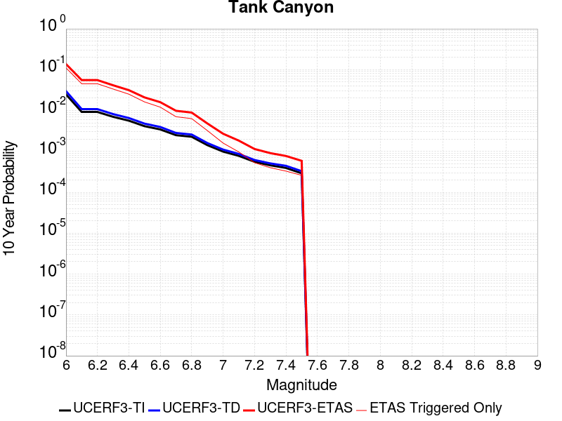 |

| Magnitude | 1 wk TI Prob | 1 wk TD Prob | 1 wk ETAS Prob | 1 wk ETAS/TD Gain | 1 wk ETAS Triggered Only | 1 mo TI Prob | 1 mo TD Prob | 1 mo ETAS Prob | 1 mo ETAS/TD Gain | 1 mo ETAS Triggered Only | 1 yr TI Prob | 1 yr TD Prob | 1 yr ETAS Prob | 1 yr ETAS/TD Gain | 1 yr ETAS Triggered Only | 10 yr TI Prob | 10 yr TD Prob | 10 yr ETAS Prob | 10 yr ETAS/TD Gain | 10 yr ETAS Triggered Only |
|-----|-----|-----|-----|-----|-----|-----|-----|-----|-----|-----|-----|-----|-----|-----|-----|-----|-----|-----|-----|-----|
| 6.0 | 4.8284557E-5 | 5.796445E-5 | 0.038365744 | 661.88403 | 0.03831 | 2.0691741E-4 | 2.4839927E-4 | 0.052515414 | 211.41534 | 0.05228 | 0.0025163088 | 0.0030207336 | 0.08419479 | 27.872297 | 0.08142 | 0.02488006 | 0.029863616 | 0.13727711 | 4.5968018 | 0.11072 |
| 6.1 | 1.7796336E-5 | 2.0873378E-5 | 0.014500571 | 694.69214 | 0.01448 | 7.626778E-5 | 8.945448E-5 | 0.020017672 | 223.77495 | 0.01993 | 9.281647E-4 | 0.0010886024 | 0.033263538 | 30.55619 | 0.03221 | 0.009242975 | 0.010836642 | 0.055616066 | 5.132223 | 0.04527 |
| 6.2 | 1.7796336E-5 | 2.0873378E-5 | 0.014500571 | 694.69214 | 0.01448 | 7.626778E-5 | 8.945448E-5 | 0.020017672 | 223.77495 | 0.01993 | 9.281647E-4 | 0.0010886024 | 0.033263538 | 30.55619 | 0.03221 | 0.009242975 | 0.010836642 | 0.055616066 | 5.132223 | 0.04527 |
| 6.3 | 1.3515912E-5 | 1.5759651E-5 | 0.010625592 | 674.2276 | 0.01061 | 5.792405E-5 | 6.7539746E-5 | 0.014676553 | 217.30246 | 0.01461 | 7.049971E-4 | 8.2200987E-4 | 0.024812274 | 30.184885 | 0.02401 | 0.007027647 | 0.008192157 | 0.041546654 | 5.071516 | 0.03363 |
| 6.4 | 1.0870146E-5 | 1.2618114E-5 | 0.007882519 | 624.69867 | 0.00787 | 4.658551E-5 | 5.4076605E-5 | 0.010923489 | 202.00026 | 0.01087 | 5.67031E-4 | 6.582015E-4 | 0.01860638 | 28.268517 | 0.01796 | 0.005655863 | 0.006564382 | 0.031569157 | 4.809159 | 0.02517 |
| 6.5 | 7.964826E-6 | 9.196184E-6 | 0.00504915 | 549.0484 | 0.00504 | 3.4134522E-5 | 3.941168E-5 | 0.007109133 | 180.38138 | 0.00707 | 4.1550855E-4 | 4.797421E-4 | 0.01221411 | 25.459742 | 0.01174 | 0.0041473247 | 0.004788209 | 0.020970354 | 4.3795815 | 0.01626 |
| 6.6 | 6.6317E-6 | 7.612378E-6 | 0.0038475832 | 505.43774 | 0.00384 | 2.8421264E-5 | 3.262412E-5 | 0.0054424475 | 166.82281 | 0.00541 | 3.4597394E-4 | 3.9713533E-4 | 0.009213633 | 23.200233 | 0.00882 | 0.0034543579 | 0.0039652516 | 0.016037192 | 4.0444326 | 0.01212 |
| 6.7 | 4.793663E-6 | 5.4308593E-6 | 0.0021054195 | 387.67706 | 0.0021 | 2.0544108E-5 | 2.3274928E-5 | 0.003113203 | 133.7578 | 0.00309 | 2.500958E-4 | 2.833398E-4 | 0.0054318807 | 19.170908 | 0.00515 | 0.0024981452 | 0.0028303189 | 0.009880309 | 3.4908817 | 0.00707 |
| 6.8 | 4.382823E-6 | 4.969325E-6 | 0.00187496 | 377.3068 | 0.00187 | 1.8783392E-5 | 2.1296957E-5 | 0.0028012379 | 131.5323 | 0.00278 | 2.286638E-4 | 2.5926388E-4 | 0.004928053 | 19.007866 | 0.00467 | 0.0022842865 | 0.0025901233 | 0.008923676 | 3.4452708 | 0.00635 |
| 6.9 | 2.729601E-6 | 3.0735862E-6 | 9.0307085E-4 | 293.81665 | 9.0E-4 | 1.1698237E-5 | 1.3172453E-5 | 0.0013731546 | 104.24441 | 0.00136 | 1.4241673E-4 | 1.6036403E-4 | 0.0025199857 | 15.714157 | 0.00236 | 0.001423255 | 0.0016024808 | 0.0048273047 | 3.0123947 | 0.00323 |
| 7.0 | 1.8987357E-6 | 2.126971E-6 | 5.2212586E-4 | 245.4786 | 5.2E-4 | 8.137413E-6 | 9.115562E-6 | 7.29109E-4 | 79.985085 | 7.2E-4 | 9.90685E-5 | 1.1097702E-4 | 0.001300845 | 11.721751 | 0.00119 | 9.902435E-4 | 0.0011092846 | 0.0027075098 | 2.440771 | 0.0016 |
| 7.1 | 1.4928986E-6 | 1.6641525E-6 | 3.316636E-4 | 199.2988 | 3.3E-4 | 6.398121E-6 | 7.132066E-6 | 4.4712893E-4 | 62.692764 | 4.4E-4 | 7.789434E-5 | 8.6830034E-5 | 8.267658E-4 | 9.521657 | 7.4E-4 | 7.786704E-4 | 8.6801895E-4 | 0.001837177 | 2.116517 | 9.7E-4 |
| 7.2 | 1.069082E-6 | 1.1828765E-6 | 2.3118261E-4 | 195.44102 | 2.3E-4 | 4.581772E-6 | 5.0694644E-6 | 2.95068E-4 | 58.204967 | 2.9E-4 | 5.5781646E-5 | 6.171951E-5 | 5.1169173E-4 | 8.290599 | 4.5E-4 | 5.576765E-4 | 6.1707594E-4 | 0.0011467489 | 1.8583593 | 5.3E-4 |
| 7.3 | 8.776551E-7 | 9.770151E-7 | 1.9097683E-4 | 195.46968 | 1.9E-4 | 3.7613736E-6 | 4.187204E-6 | 2.3418624E-4 | 55.929028 | 2.3E-4 | 4.579376E-5 | 5.0978535E-5 | 3.909612E-4 | 7.6691337 | 3.4E-4 | 4.5784327E-4 | 5.097194E-4 | 9.0951554E-4 | 1.7843454 | 4.0E-4 |
| 7.4 | 7.55721E-7 | 8.5103835E-7 | 1.708509E-4 | 200.7558 | 1.7E-4 | 3.2388E-6 | 3.6473052E-6 | 2.0364657E-4 | 55.834805 | 2.0E-4 | 3.9431678E-5 | 4.4405555E-5 | 3.3439268E-4 | 7.5304246 | 2.9E-4 | 3.942468E-4 | 4.4401767E-4 | 7.7387114E-4 | 1.7428837 | 3.3E-4 |
| 7.5 | 5.587665E-7 | 6.305732E-7 | 1.3063049E-4 | 207.16151 | 1.3E-4 | 2.3947114E-6 | 2.7024564E-6 | 1.5270205E-4 | 56.504906 | 1.5E-4 | 2.915522E-5 | 3.2902408E-5 | 2.5289517E-4 | 7.6862206 | 2.2E-4 | 2.9151395E-4 | 3.2902407E-4 | 5.8893854E-4 | 1.7899557 | 2.6E-4 |

## Garlock (Central)
*[(top)](#table-of-contents)*

| 1 Week | 1 Month | 1 Year | 10 Year |
|-----|-----|-----|-----|
|  |  |  |  |

| Magnitude | 1 wk TI Prob | 1 wk TD Prob | 1 wk ETAS Prob | 1 wk ETAS/TD Gain | 1 wk ETAS Triggered Only | 1 mo TI Prob | 1 mo TD Prob | 1 mo ETAS Prob | 1 mo ETAS/TD Gain | 1 mo ETAS Triggered Only | 1 yr TI Prob | 1 yr TD Prob | 1 yr ETAS Prob | 1 yr ETAS/TD Gain | 1 yr ETAS Triggered Only | 10 yr TI Prob | 10 yr TD Prob | 10 yr ETAS Prob | 10 yr ETAS/TD Gain | 10 yr ETAS Triggered Only |
|-----|-----|-----|-----|-----|-----|-----|-----|-----|-----|-----|-----|-----|-----|-----|-----|-----|-----|-----|-----|-----|
| 6.0 | 5.5131142E-5 | 7.02476E-5 | 0.010619506 | 151.17252 | 0.01055 | 2.3625491E-4 | 3.0102677E-4 | 0.014726683 | 48.92151 | 0.01443 | 0.0028726095 | 0.003658906 | 0.02619614 | 7.159556 | 0.02262 | 0.028357591 | 0.036136657 | 0.06701884 | 1.8545943 | 0.03204 |
| 6.1 | 5.5131142E-5 | 7.02476E-5 | 0.010619506 | 151.17252 | 0.01055 | 2.3625491E-4 | 3.0102677E-4 | 0.014726683 | 48.92151 | 0.01443 | 0.0028726095 | 0.003658906 | 0.02619614 | 7.159556 | 0.02262 | 0.028357591 | 0.036136657 | 0.06701884 | 1.8545943 | 0.03204 |
| 6.2 | 4.216245E-5 | 5.1661802E-5 | 0.007031301 | 136.10252 | 0.00698 | 1.806837E-4 | 2.213891E-4 | 0.009759277 | 44.082012 | 0.00954 | 0.0021976046 | 0.002692112 | 0.017711569 | 6.579061 | 0.01506 | 0.021759989 | 0.026701318 | 0.047675904 | 1.7855263 | 0.02155 |
| 6.3 | 4.216245E-5 | 5.1661802E-5 | 0.007031301 | 136.10252 | 0.00698 | 1.806837E-4 | 2.213891E-4 | 0.009759277 | 44.082012 | 0.00954 | 0.0021976046 | 0.002692112 | 0.017711569 | 6.579061 | 0.01506 | 0.021759989 | 0.026701318 | 0.047675904 | 1.7855263 | 0.02155 |
| 6.4 | 3.6858168E-5 | 4.411026E-5 | 0.005803856 | 131.5761 | 0.00576 | 1.5795401E-4 | 1.8903041E-4 | 0.008077539 | 42.731422 | 0.00789 | 0.0019213937 | 0.0022990413 | 0.01448097 | 6.2986994 | 0.01221 | 0.019048655 | 0.022866098 | 0.0400832 | 1.752953 | 0.01762 |
| 6.5 | 3.39199E-5 | 4.0018425E-5 | 0.0050798166 | 126.93694 | 0.00504 | 1.453629E-4 | 1.7149639E-4 | 0.007210289 | 42.04339 | 0.00704 | 0.0017683565 | 0.0020859907 | 0.012983211 | 6.2240024 | 0.01092 | 0.017543508 | 0.020758783 | 0.036328718 | 1.7500409 | 0.0159 |
| 6.6 | 3.3571985E-5 | 3.947258E-5 | 0.0050292755 | 127.41188 | 0.00499 | 1.4387199E-4 | 1.6915736E-4 | 0.007167973 | 42.374588 | 0.007 | 0.0017502342 | 0.0020575672 | 0.0128652835 | 6.252668 | 0.01083 | 0.017365133 | 0.020480042 | 0.035946663 | 1.7552046 | 0.01579 |
| 6.7 | 3.2580007E-5 | 3.808902E-5 | 0.0048479056 | 127.278305 | 0.00481 | 1.3962112E-4 | 1.6322857E-4 | 0.0068921302 | 42.223797 | 0.00673 | 0.0016985617 | 0.0019855178 | 0.012404789 | 6.247634 | 0.01044 | 0.016856372 | 0.019770874 | 0.03459194 | 1.7496414 | 0.01512 |
| 6.8 | 3.2185937E-5 | 3.7516216E-5 | 0.004817337 | 128.4068 | 0.00478 | 1.3793244E-4 | 1.60774E-4 | 0.006809705 | 42.355762 | 0.00665 | 0.0016780337 | 0.0019556875 | 0.012245525 | 6.2614937 | 0.01031 | 0.016654192 | 0.019477878 | 0.034107268 | 1.7510772 | 0.01492 |
| 6.9 | 3.165394E-5 | 3.672075E-5 | 0.0046665506 | 127.082115 | 0.00463 | 1.3565269E-4 | 1.5736527E-4 | 0.0066363458 | 42.1716 | 0.00648 | 0.0016503202 | 0.00191426 | 0.011905098 | 6.219165 | 0.01001 | 0.01638118 | 0.019071518 | 0.033304792 | 1.7463104 | 0.01451 |
| 7.0 | 3.0903822E-5 | 3.562591E-5 | 0.0045354655 | 127.30806 | 0.0045 | 1.3243823E-4 | 1.5267366E-4 | 0.006481707 | 42.454655 | 0.00633 | 0.0016112428 | 0.0018572382 | 0.01158913 | 6.23998 | 0.00975 | 0.015996104 | 0.018513493 | 0.032391712 | 1.7496274 | 0.01414 |
| 7.1 | 3.0069863E-5 | 3.4392175E-5 | 0.0044042417 | 128.05942 | 0.00437 | 1.2886449E-4 | 1.4738683E-4 | 0.006266485 | 42.517265 | 0.00612 | 0.0015677959 | 0.0017929787 | 0.011176125 | 6.2332726 | 0.0094 | 0.01556781 | 0.01788099 | 0.03125745 | 1.7480829 | 0.01362 |
| 7.2 | 2.7957109E-5 | 3.128141E-5 | 0.00391116 | 125.03143 | 0.00388 | 1.1981068E-4 | 1.3405642E-4 | 0.0054233475 | 40.455708 | 0.00529 | 0.0014577188 | 0.0016309345 | 0.009847512 | 6.0379567 | 0.00823 | 0.014481937 | 0.016284352 | 0.028049592 | 1.7224874 | 0.01196 |
| 7.3 | 2.4519275E-5 | 2.6714602E-5 | 0.00282664 | 105.80879 | 0.0028 | 1.0507837E-4 | 1.1448621E-4 | 0.0040040407 | 34.974003 | 0.00389 | 0.0012785783 | 0.001392993 | 0.0074245795 | 5.329947 | 0.00604 | 0.012712469 | 0.01392861 | 0.022684924 | 1.6286567 | 0.00888 |
| 7.4 | 2.3225532E-5 | 2.5199166E-5 | 0.0024851372 | 98.61981 | 0.00246 | 9.95342E-5 | 1.0799204E-4 | 0.0035576194 | 32.943348 | 0.00345 | 0.0012111551 | 0.0013140244 | 0.006706929 | 5.1041126 | 0.0054 | 0.012045753 | 0.013146196 | 0.021001551 | 1.5975384 | 0.00796 |
| 7.5 | 2.097765E-5 | 2.2483406E-5 | 0.0019424403 | 86.394394 | 0.00192 | 8.9901114E-5 | 9.6353964E-5 | 0.0027660967 | 28.707659 | 0.00267 | 0.0010939965 | 0.00117249 | 0.0053675654 | 4.57792 | 0.0042 | 0.010886264 | 0.0117406575 | 0.018025987 | 1.5353473 | 0.00636 |
| 7.6 | 1.511254E-5 | 1.5990969E-5 | 0.0011659726 | 72.914444 | 0.00115 | 6.476642E-5 | 6.8530964E-5 | 0.001658422 | 24.1996 | 0.00159 | 7.882459E-4 | 8.34053E-4 | 0.0032320512 | 3.8751152 | 0.0024 | 0.007854558 | 0.008383867 | 0.011983434 | 1.4293444 | 0.00363 |
| 7.7 | 9.934069E-6 | 1.0678523E-5 | 2.6067585E-4 | 24.411228 | 2.5E-4 | 4.2573887E-5 | 4.5764296E-5 | 3.757492E-4 | 8.210531 | 3.3E-4 | 5.182138E-4 | 5.570383E-4 | 0.0011766929 | 2.1124094 | 6.2E-4 | 0.00517007 | 0.005627419 | 0.0065919603 | 1.1714003 | 9.7E-4 |
| 7.8 | 6.7562896E-6 | 8.42837E-6 | 1.6842702E-4 | 19.983345 | 1.6E-4 | 2.8955206E-5 | 3.6121084E-5 | 2.461135E-4 | 6.8135686 | 2.1E-4 | 3.5247262E-4 | 4.3968562E-4 | 8.3950977E-4 | 1.9093409 | 4.0E-4 | 0.0035191406 | 0.004446416 | 0.0050835707 | 1.1432961 | 6.4E-4 |
| 7.9 | 3.975453E-6 | 5.3710532E-6 | 9.537057E-5 | 17.756401 | 9.0E-5 | 1.7037546E-5 | 2.3018596E-5 | 1.530156E-4 | 6.6474776 | 1.3E-4 | 2.0741238E-4 | 2.8021546E-4 | 5.301454E-4 | 1.8919206 | 2.5E-4 | 0.002072189 | 0.0028335669 | 0.0032224618 | 1.1372458 | 3.9E-4 |
| 8.0 | 1.6729537E-6 | 2.0775192E-6 | 2.0775192E-6 | 1.0 | 0.0 | 7.169782E-6 | 8.903624E-6 | 2.8903445E-5 | 3.2462564 | 2.0E-5 | 8.7288594E-5 | 1.0839626E-4 | 1.5839085E-4 | 1.4612205 | 5.0E-5 | 8.7254314E-4 | 0.001096854 | 0.0011867553 | 1.0819628 | 9.0E-5 |
| 8.1 | 3.6733252E-7 | 3.1489736E-7 | 3.1489736E-7 | 1.0 | 0.0 | 1.5742813E-6 | 1.3495595E-6 | 1.3495595E-6 | 1.0 | 0.0 | 1.9166706E-5 | 1.643078E-5 | 1.643078E-5 | 1.0 | 0.0 | 1.9165053E-4 | 1.662928E-4 | 1.662928E-4 | 1.0 | 0.0 |

## Panamint Valley
*[(top)](#table-of-contents)*

| 1 Week | 1 Month | 1 Year | 10 Year |
|-----|-----|-----|-----|
|  |  |  |  |

| Magnitude | 1 wk TI Prob | 1 wk TD Prob | 1 wk ETAS Prob | 1 wk ETAS/TD Gain | 1 wk ETAS Triggered Only | 1 mo TI Prob | 1 mo TD Prob | 1 mo ETAS Prob | 1 mo ETAS/TD Gain | 1 mo ETAS Triggered Only | 1 yr TI Prob | 1 yr TD Prob | 1 yr ETAS Prob | 1 yr ETAS/TD Gain | 1 yr ETAS Triggered Only | 10 yr TI Prob | 10 yr TD Prob | 10 yr ETAS Prob | 10 yr ETAS/TD Gain | 10 yr ETAS Triggered Only |
|-----|-----|-----|-----|-----|-----|-----|-----|-----|-----|-----|-----|-----|-----|-----|-----|-----|-----|-----|-----|-----|
| 6.0 | 3.0211835E-5 | 3.3984263E-5 | 0.0057437904 | 169.01324 | 0.00571 | 1.2947287E-4 | 1.4563887E-4 | 0.008264456 | 56.746227 | 0.00812 | 0.0015751923 | 0.0017717406 | 0.015247822 | 8.606126 | 0.0135 | 0.015640736 | 0.017583003 | 0.036573123 | 2.080027 | 0.01933 |
| 6.1 | 3.0211835E-5 | 3.3984263E-5 | 0.0057437904 | 169.01324 | 0.00571 | 1.2947287E-4 | 1.4563887E-4 | 0.008264456 | 56.746227 | 0.00812 | 0.0015751923 | 0.0017717406 | 0.015247822 | 8.606126 | 0.0135 | 0.015640736 | 0.017583003 | 0.036573123 | 2.080027 | 0.01933 |
| 6.2 | 3.0211835E-5 | 3.3984263E-5 | 0.0057437904 | 169.01324 | 0.00571 | 1.2947287E-4 | 1.4563887E-4 | 0.008264456 | 56.746227 | 0.00812 | 0.0015751923 | 0.0017717406 | 0.015247822 | 8.606126 | 0.0135 | 0.015640736 | 0.017583003 | 0.036573123 | 2.080027 | 0.01933 |
| 6.3 | 2.8573924E-5 | 3.2102445E-5 | 0.0055719246 | 173.56699 | 0.00554 | 1.2245393E-4 | 1.375748E-4 | 0.007976497 | 57.97934 | 0.00784 | 0.001489857 | 0.0016737141 | 0.014612023 | 8.730298 | 0.01296 | 0.01479908 | 0.016618038 | 0.034840103 | 2.0965235 | 0.01853 |
| 6.4 | 2.8573924E-5 | 3.2102445E-5 | 0.0055719246 | 173.56699 | 0.00554 | 1.2245393E-4 | 1.375748E-4 | 0.007976497 | 57.97934 | 0.00784 | 0.001489857 | 0.0016737141 | 0.014612023 | 8.730298 | 0.01296 | 0.01479908 | 0.016618038 | 0.034840103 | 2.0965235 | 0.01853 |
| 6.5 | 2.7468774E-5 | 3.0828138E-5 | 0.0053706635 | 174.21303 | 0.00534 | 1.1771801E-4 | 1.3211406E-4 | 0.0077111125 | 58.367085 | 0.00758 | 0.0014322745 | 0.0016073292 | 0.014147141 | 8.801644 | 0.01256 | 0.014230782 | 0.015963882 | 0.033578128 | 2.1033812 | 0.0179 |
| 6.6 | 2.6135967E-5 | 2.9252153E-5 | 0.0050791046 | 173.63182 | 0.00505 | 1.1200648E-4 | 1.2536049E-4 | 0.007314459 | 58.347404 | 0.00719 | 0.0013628257 | 0.0015252219 | 0.013447011 | 8.816429 | 0.01194 | 0.013544982 | 0.015154343 | 0.031985357 | 2.1106396 | 0.01709 |
| 6.7 | 2.4498746E-5 | 2.7341044E-5 | 0.0048072105 | 175.82394 | 0.00478 | 1.04990395E-4 | 1.17170785E-4 | 0.0069063753 | 58.94281 | 0.00679 | 0.0012775084 | 0.0014256459 | 0.012609678 | 8.844889 | 0.0112 | 0.012701893 | 0.014171593 | 0.029944846 | 2.1130192 | 0.016 |
| 6.8 | 2.2244329E-5 | 2.4935374E-5 | 0.0043048286 | 172.63942 | 0.00428 | 9.532935E-5 | 1.0686163E-4 | 0.00620621 | 58.07706 | 0.0061 | 0.0011600169 | 0.0013002857 | 0.01129727 | 8.688298 | 0.01001 | 0.011539802 | 0.012932955 | 0.02696905 | 2.0852966 | 0.01422 |
| 6.9 | 1.9902658E-5 | 2.2290182E-5 | 0.003212219 | 144.10915 | 0.00319 | 8.529431E-5 | 9.552596E-5 | 0.0046050954 | 48.207787 | 0.00451 | 0.0010379635 | 0.0011624265 | 0.008613755 | 7.41015 | 0.00746 | 0.010331288 | 0.011569021 | 0.02218477 | 1.9176012 | 0.01074 |
| 7.0 | 1.8353881E-5 | 2.056605E-5 | 0.002690511 | 130.82294 | 0.00267 | 7.865712E-5 | 8.813734E-5 | 0.003757814 | 42.635887 | 0.00367 | 9.5722964E-4 | 0.0010725616 | 0.007026169 | 6.5508304 | 0.00596 | 0.009531168 | 0.01067939 | 0.019237014 | 1.8013214 | 0.00865 |
| 7.1 | 1.7667631E-5 | 1.9772435E-5 | 0.002469724 | 124.907425 | 0.00245 | 7.571623E-5 | 8.4736355E-5 | 0.0034444516 | 40.649044 | 0.00336 | 9.2145515E-4 | 0.0010311945 | 0.0064755743 | 6.2796836 | 0.00545 | 0.009176437 | 0.0102695925 | 0.018088464 | 1.7613612 | 0.0079 |
| 7.2 | 1.6381597E-5 | 1.8158042E-5 | 0.0021981185 | 121.05482 | 0.00218 | 7.020495E-5 | 7.781795E-5 | 0.0030375875 | 39.034534 | 0.00296 | 8.544101E-4 | 9.470391E-4 | 0.0056925407 | 6.0108824 | 0.00475 | 0.008511325 | 0.009435269 | 0.016289977 | 1.7264984 | 0.00692 |
| 7.3 | 1.4520491E-5 | 1.596657E-5 | 0.0018459373 | 115.61264 | 0.00183 | 6.222919E-5 | 6.842646E-5 | 0.002588254 | 37.82534 | 0.00252 | 7.57377E-4 | 8.327899E-4 | 0.0048994003 | 5.883117 | 0.00407 | 0.0075480095 | 0.008300399 | 0.014270431 | 1.7192463 | 0.00602 |
| 7.4 | 1.2852287E-5 | 1.41454875E-5 | 0.0016441224 | 116.22946 | 0.00163 | 5.5080065E-5 | 6.06222E-5 | 0.002340484 | 38.607704 | 0.00228 | 6.7039346E-4 | 7.378411E-4 | 0.004415126 | 5.9838433 | 0.00368 | 0.0066837464 | 0.007357429 | 0.012767331 | 1.7352979 | 0.00545 |
| 7.5 | 1.1637851E-5 | 1.2836868E-5 | 0.001562817 | 121.744415 | 0.00155 | 4.987555E-5 | 5.5014076E-5 | 0.0022148953 | 40.260517 | 0.00216 | 6.070656E-4 | 6.696062E-4 | 0.004117296 | 6.148832 | 0.00345 | 0.006054099 | 0.0066793845 | 0.011775119 | 1.7629049 | 0.00513 |
| 7.6 | 3.0068115E-6 | 3.3330623E-6 | 6.833308E-4 | 205.01591 | 6.8E-4 | 1.2886271E-5 | 1.4284516E-5 | 9.842707E-4 | 68.904724 | 9.7E-4 | 1.5687906E-4 | 1.7390738E-4 | 0.0015336708 | 8.818894 | 0.00136 | 0.0015676835 | 0.0017397973 | 0.003776248 | 2.1705103 | 0.00204 |

## Owl Lake
*[(top)](#table-of-contents)*

| 1 Week | 1 Month | 1 Year | 10 Year |
|-----|-----|-----|-----|
|  |  |  |  |

| Magnitude | 1 wk TI Prob | 1 wk TD Prob | 1 wk ETAS Prob | 1 wk ETAS/TD Gain | 1 wk ETAS Triggered Only | 1 mo TI Prob | 1 mo TD Prob | 1 mo ETAS Prob | 1 mo ETAS/TD Gain | 1 mo ETAS Triggered Only | 1 yr TI Prob | 1 yr TD Prob | 1 yr ETAS Prob | 1 yr ETAS/TD Gain | 1 yr ETAS Triggered Only | 10 yr TI Prob | 10 yr TD Prob | 10 yr ETAS Prob | 10 yr ETAS/TD Gain | 10 yr ETAS Triggered Only |
|-----|-----|-----|-----|-----|-----|-----|-----|-----|-----|-----|-----|-----|-----|-----|-----|-----|-----|-----|-----|-----|
| 6.0 | 5.0320643E-5 | 6.6358676E-5 | 0.0041960846 | 63.2334 | 0.00413 | 2.1564208E-4 | 2.843643E-4 | 0.006402624 | 22.515568 | 0.00612 | 0.0026222812 | 0.003457547 | 0.013751831 | 3.9773371 | 0.01033 | 0.02591553 | 0.034141295 | 0.048764396 | 1.4283112 | 0.01514 |
| 6.1 | 5.0320643E-5 | 6.6358676E-5 | 0.0041960846 | 63.2334 | 0.00413 | 2.1564208E-4 | 2.843643E-4 | 0.006402624 | 22.515568 | 0.00612 | 0.0026222812 | 0.003457547 | 0.013751831 | 3.9773371 | 0.01033 | 0.02591553 | 0.034141295 | 0.048764396 | 1.4283112 | 0.01514 |
| 6.2 | 2.4125871E-5 | 3.0980515E-5 | 0.002530903 | 81.69338 | 0.0025 | 1.0339249E-4 | 1.3276804E-4 | 0.0039022674 | 29.391619 | 0.00377 | 0.0012580766 | 0.0016154252 | 0.008124893 | 5.029569 | 0.00652 | 0.012509781 | 0.016070755 | 0.025703423 | 1.5993911 | 0.00979 |
| 6.3 | 1.7433485E-5 | 2.2355545E-5 | 0.0021023091 | 94.03971 | 0.00208 | 7.471279E-5 | 9.580685E-5 | 0.0032555042 | 33.97987 | 0.00316 | 9.0924866E-4 | 0.001165962 | 0.006489747 | 5.566003 | 0.00533 | 0.009055373 | 0.0116291465 | 0.019496579 | 1.676527 | 0.00796 |
| 6.4 | 1.7433485E-5 | 2.2355545E-5 | 0.0021023091 | 94.03971 | 0.00208 | 7.471279E-5 | 9.580685E-5 | 0.0032555042 | 33.97987 | 0.00316 | 9.0924866E-4 | 0.001165962 | 0.006489747 | 5.566003 | 0.00533 | 0.009055373 | 0.0116291465 | 0.019496579 | 1.676527 | 0.00796 |
| 6.5 | 1.5182742E-5 | 1.9429277E-5 | 0.0019593916 | 100.847374 | 0.00194 | 6.506727E-5 | 8.3266525E-5 | 0.0030630184 | 36.785713 | 0.00298 | 7.919061E-4 | 0.0010134344 | 0.0059684077 | 5.889289 | 0.00496 | 0.0078909 | 0.010118678 | 0.017394306 | 1.7190295 | 0.00735 |
| 6.6 | 6.7271576E-6 | 8.547518E-6 | 0.0014285353 | 167.12868 | 0.00142 | 2.8830356E-5 | 3.6631736E-5 | 0.0020165592 | 55.04951 | 0.00198 | 3.5095305E-4 | 4.4590578E-4 | 0.0035245323 | 7.9042087 | 0.00308 | 0.0035039932 | 0.0044680187 | 0.008987734 | 2.0115702 | 0.00454 |
| 6.7 | 6.682835E-6 | 8.479961E-6 | 0.001418468 | 167.27293 | 0.00141 | 2.8640408E-5 | 3.6342215E-5 | 0.0020062707 | 55.204964 | 0.00197 | 3.4864116E-4 | 4.423823E-4 | 0.0035110242 | 7.936629 | 0.00307 | 0.003480947 | 0.0044329325 | 0.00892294 | 2.0128753 | 0.00451 |
| 6.8 | 6.5774975E-6 | 8.326427E-6 | 0.0014083148 | 169.13794 | 0.0014 | 2.8188972E-5 | 3.5684232E-5 | 0.0019956143 | 55.924263 | 0.00196 | 3.4314668E-4 | 4.3437455E-4 | 0.0034830498 | 8.01854 | 0.00305 | 0.0034261728 | 0.0043531056 | 0.008813604 | 2.0246704 | 0.00448 |
| 6.9 | 6.363419E-6 | 7.999591E-6 | 0.0013779886 | 172.2574 | 0.00137 | 2.727151E-5 | 3.428354E-5 | 0.0019542177 | 57.001633 | 0.00192 | 3.3198006E-4 | 4.1732774E-4 | 0.0033860882 | 8.113739 | 0.00297 | 0.0033148455 | 0.0041830647 | 0.008564659 | 2.0474603 | 0.0044 |
| 7.0 | 6.1342453E-6 | 7.631779E-6 | 0.0013676214 | 179.20085 | 0.00136 | 2.6289357E-5 | 3.2707245E-5 | 0.0019326451 | 59.089203 | 0.0019 | 3.2002592E-4 | 3.9814346E-4 | 0.0033169808 | 8.33112 | 0.00292 | 0.0031956544 | 0.003991739 | 0.008284534 | 2.07542 | 0.00431 |
| 7.1 | 5.842926E-6 | 7.142312E-6 | 0.001297133 | 181.61249 | 0.00129 | 2.504087E-5 | 3.060958E-5 | 0.0018205548 | 59.47663 | 0.00179 | 3.0482994E-4 | 3.7261334E-4 | 0.0031215886 | 8.377555 | 0.00275 | 0.0030441214 | 0.0037371595 | 0.0077720243 | 2.0796607 | 0.00405 |
| 7.2 | 4.77173E-6 | 5.358478E-6 | 9.6535333E-4 | 180.15437 | 9.6E-4 | 2.045011E-5 | 2.2964727E-5 | 0.0012529364 | 54.55917 | 0.00123 | 2.4895166E-4 | 2.7956374E-4 | 0.0022190213 | 7.9374433 | 0.00194 | 0.0024867293 | 0.0028086212 | 0.0056605884 | 2.0154333 | 0.00286 |
| 7.3 | 3.0494948E-6 | 2.710356E-6 | 2.3270973E-4 | 85.85947 | 2.3E-4 | 1.3069198E-5 | 1.1615762E-5 | 3.1161227E-4 | 26.826677 | 3.0E-4 | 1.5910587E-4 | 1.4141288E-4 | 6.013478E-4 | 4.252426 | 4.6E-4 | 0.0015899199 | 0.0014231089 | 0.0020921554 | 1.4701302 | 6.7E-4 |
| 7.4 | 2.7263884E-6 | 2.3055634E-6 | 1.623052E-4 | 70.397194 | 1.6E-4 | 1.1684469E-5 | 9.880949E-6 | 2.0987897E-4 | 21.240772 | 2.0E-4 | 1.4224913E-4 | 1.2029401E-4 | 4.2025791E-4 | 3.4935896 | 3.0E-4 | 0.0014215811 | 0.0012110578 | 0.0016305491 | 1.3463843 | 4.2E-4 |
| 7.5 | 2.6090431E-6 | 2.1655019E-6 | 1.2216525E-4 | 56.414288 | 1.2E-4 | 1.1181565E-5 | 9.2806895E-6 | 1.692792E-4 | 18.239939 | 1.6E-4 | 1.3612706E-4 | 1.1298663E-4 | 3.3296176E-4 | 2.946913 | 2.2E-4 | 0.001360437 | 0.0011378126 | 0.0014674371 | 1.2897002 | 3.3E-4 |
| 7.6 | 2.3008756E-6 | 1.8726826E-6 | 5.187259E-5 | 27.699617 | 5.0E-5 | 9.860858E-6 | 8.025758E-6 | 7.8025194E-5 | 9.721848 | 7.0E-5 | 1.20049335E-4 | 9.770931E-5 | 2.0769855E-4 | 2.1256783 | 1.1E-4 | 0.001199845 | 9.848307E-4 | 0.0011746435 | 1.1927366 | 1.9E-4 |
| 7.7 | 1.7184348E-6 | 1.341808E-6 | 4.1341755E-5 | 30.810484 | 4.0E-5 | 7.3646997E-6 | 5.750593E-6 | 5.5750304E-5 | 9.694705 | 5.0E-5 | 8.966153E-5 | 7.0011265E-5 | 1.3000706E-4 | 1.8569449 | 6.0E-5 | 8.962536E-4 | 7.0769014E-4 | 8.0761936E-4 | 1.1412048 | 1.0E-4 |
| 7.8 | 8.4612907E-7 | 8.4054994E-7 | 2.0840533E-5 | 24.793926 | 2.0E-5 | 3.6262625E-6 | 3.602352E-6 | 3.3602246E-5 | 9.327862 | 3.0E-5 | 4.4148852E-5 | 4.3857777E-5 | 8.385602E-5 | 1.911999 | 4.0E-5 | 4.414008E-4 | 4.4386165E-4 | 5.0383504E-4 | 1.1351173 | 6.0E-5 |
| 7.9 | 2.716738E-7 | 3.7681625E-7 | 1.03768125E-5 | 27.538124 | 1.0E-5 | 1.1643157E-6 | 1.6149258E-6 | 2.1614893E-5 | 13.38445 | 2.0E-5 | 1.4175452E-5 | 1.9661555E-5 | 3.966116E-5 | 2.0171936 | 2.0E-5 | 1.4174548E-4 | 1.9829652E-4 | 2.1829255E-4 | 1.100839 | 2.0E-5 |
| 8.0 | 2.1995428E-8 | 3.3853325E-8 | 3.3853325E-8 | 1.0 | 0.0 | 9.426611E-8 | 1.4508568E-7 | 1.4508568E-7 | 1.0 | 0.0 | 1.1476893E-6 | 1.7664173E-6 | 1.7664173E-6 | 1.0 | 0.0 | 1.14768345E-5 | 1.7869768E-5 | 1.7869768E-5 | 1.0 | 0.0 |

## Little Lake
*[(top)](#table-of-contents)*

| 1 Week | 1 Month | 1 Year | 10 Year |
|-----|-----|-----|-----|
|  |  |  |  |

| Magnitude | 1 wk TI Prob | 1 wk TD Prob | 1 wk ETAS Prob | 1 wk ETAS/TD Gain | 1 wk ETAS Triggered Only | 1 mo TI Prob | 1 mo TD Prob | 1 mo ETAS Prob | 1 mo ETAS/TD Gain | 1 mo ETAS Triggered Only | 1 yr TI Prob | 1 yr TD Prob | 1 yr ETAS Prob | 1 yr ETAS/TD Gain | 1 yr ETAS Triggered Only | 10 yr TI Prob | 10 yr TD Prob | 10 yr ETAS Prob | 10 yr ETAS/TD Gain | 10 yr ETAS Triggered Only |
|-----|-----|-----|-----|-----|-----|-----|-----|-----|-----|-----|-----|-----|-----|-----|-----|-----|-----|-----|-----|-----|
| 6.0 | 2.8424427E-5 | 3.1205716E-5 | 0.006820994 | 218.58156 | 0.00679 | 1.2181328E-4 | 1.3373268E-4 | 0.0090725375 | 67.84084 | 0.00894 | 0.0014820677 | 0.0016271125 | 0.0144861555 | 8.902984 | 0.01288 | 0.014722223 | 0.016165398 | 0.03267414 | 2.0212395 | 0.01678 |
| 6.1 | 2.8424427E-5 | 3.1205716E-5 | 0.006820994 | 218.58156 | 0.00679 | 1.2181328E-4 | 1.3373268E-4 | 0.0090725375 | 67.84084 | 0.00894 | 0.0014820677 | 0.0016271125 | 0.0144861555 | 8.902984 | 0.01288 | 0.014722223 | 0.016165398 | 0.03267414 | 2.0212395 | 0.01678 |
| 6.2 | 2.8424427E-5 | 3.1205716E-5 | 0.006820994 | 218.58156 | 0.00679 | 1.2181328E-4 | 1.3373268E-4 | 0.0090725375 | 67.84084 | 0.00894 | 0.0014820677 | 0.0016271125 | 0.0144861555 | 8.902984 | 0.01288 | 0.014722223 | 0.016165398 | 0.03267414 | 2.0212395 | 0.01678 |
| 6.3 | 1.48860645E-5 | 1.6081383E-5 | 0.0030660324 | 190.65724 | 0.00305 | 6.379586E-5 | 6.8918554E-5 | 0.0041586366 | 60.34132 | 0.00409 | 7.7643775E-4 | 8.387886E-4 | 0.0068637305 | 8.182909 | 0.00603 | 0.007737305 | 0.008359045 | 0.016232675 | 1.9419292 | 0.00794 |
| 6.4 | 1.48860645E-5 | 1.6081383E-5 | 0.0030660324 | 190.65724 | 0.00305 | 6.379586E-5 | 6.8918554E-5 | 0.0041586366 | 60.34132 | 0.00409 | 7.7643775E-4 | 8.387886E-4 | 0.0068637305 | 8.182909 | 0.00603 | 0.007737305 | 0.008359045 | 0.016232675 | 1.9419292 | 0.00794 |
| 6.5 | 1.2797581E-5 | 1.376556E-5 | 0.002663729 | 193.50677 | 0.00265 | 5.4845623E-5 | 5.8994065E-5 | 0.003618784 | 61.34149 | 0.00356 | 6.675408E-4 | 7.1804173E-4 | 0.005954279 | 8.292386 | 0.00524 | 0.006655392 | 0.007159767 | 0.0140600065 | 1.9637519 | 0.00695 |
| 6.6 | 9.661896E-6 | 1.0289033E-5 | 0.0020802678 | 202.18303 | 0.00207 | 4.1407468E-5 | 4.40952E-5 | 0.0028939694 | 65.630035 | 0.00285 | 5.040193E-4 | 5.36743E-4 | 0.0047944565 | 8.932499 | 0.00426 | 0.005028777 | 0.0053560715 | 0.0108962385 | 2.0343714 | 0.00557 |
| 6.7 | 7.767871E-6 | 8.199681E-6 | 0.0015881867 | 193.68884 | 0.00158 | 3.329045E-5 | 3.5141096E-5 | 0.0022150646 | 63.03345 | 0.00218 | 4.0523586E-4 | 4.2777258E-4 | 0.0037163652 | 8.687713 | 0.00329 | 0.004044977 | 0.004270843 | 0.008642094 | 2.02351 | 0.00439 |
| 6.8 | 6.4235196E-6 | 6.735739E-6 | 0.0012667272 | 188.06061 | 0.00126 | 2.752908E-5 | 2.8867207E-5 | 0.0017288182 | 59.888653 | 0.0017 | 3.35115E-4 | 3.5141438E-4 | 0.002940504 | 8.367626 | 0.00259 | 0.003346101 | 0.0035098472 | 0.0069078784 | 1.9681423 | 0.00341 |
| 6.9 | 3.1283696E-6 | 3.1121751E-6 | 5.5311044E-4 | 177.72473 | 5.5E-4 | 1.3407229E-5 | 1.33378335E-5 | 7.633278E-4 | 57.23027 | 7.5E-4 | 1.6322079E-4 | 1.6237753E-4 | 0.0012422021 | 7.6500864 | 0.00108 | 0.0016310095 | 0.0016227372 | 0.003040433 | 1.8736447 | 0.00142 |
| 7.0 | 2.290603E-6 | 2.2286763E-6 | 3.2222798E-4 | 144.58267 | 3.2E-4 | 9.816834E-6 | 9.551441E-6 | 4.6954706E-4 | 49.159817 | 4.6E-4 | 1.19513395E-4 | 1.1628362E-4 | 7.562092E-4 | 6.5031447 | 6.4E-4 | 0.0011944914 | 0.0011623299 | 0.0019514117 | 1.6788794 | 7.9E-4 |
| 7.1 | 1.293693E-6 | 1.1776774E-6 | 1.2117754E-4 | 102.895355 | 1.2E-4 | 5.5443866E-6 | 5.047183E-6 | 1.6504638E-4 | 32.70069 | 1.6E-4 | 6.750081E-5 | 6.1448416E-5 | 3.1143305E-4 | 5.068203 | 2.5E-4 | 6.7480316E-4 | 6.1438273E-4 | 9.3418616E-4 | 1.520528 | 3.2E-4 |
| 7.2 | 4.715842E-7 | 3.091732E-7 | 1.030917E-5 | 33.34432 | 1.0E-5 | 2.0210737E-6 | 1.3250274E-6 | 2.1325E-5 | 16.094007 | 2.0E-5 | 2.4606294E-5 | 1.6132095E-5 | 7.6131124E-5 | 4.719234 | 6.0E-5 | 2.460357E-4 | 1.6130977E-4 | 2.3129849E-4 | 1.4338777 | 7.0E-5 |
| 7.3 | 3.9430947E-7 | 2.3096938E-7 | 1.0230967E-5 | 44.295773 | 1.0E-5 | 1.6898966E-6 | 9.898685E-7 | 2.0989848E-5 | 21.204685 | 2.0E-5 | 2.0574296E-5 | 1.2051582E-5 | 6.205098E-5 | 5.1487827 | 5.0E-5 | 2.0572392E-4 | 1.2050936E-4 | 1.8050213E-4 | 1.4978267 | 6.0E-5 |
| 7.4 | 3.547123E-7 | 1.9678579E-7 | 1.01967835E-5 | 51.816666 | 1.0E-5 | 1.5201948E-6 | 8.433674E-7 | 2.084335E-5 | 24.714437 | 2.0E-5 | 1.8508214E-5 | 1.02679505E-5 | 6.0267437E-5 | 5.869471 | 5.0E-5 | 1.8506673E-4 | 1.0267482E-4 | 1.6266866E-4 | 1.5843091 | 6.0E-5 |
| 7.5 | 2.6354266E-7 | 1.4422719E-7 | 1.4422719E-7 | 1.0 | 0.0 | 1.129468E-6 | 6.1811636E-7 | 1.06181105E-5 | 17.178173 | 1.0E-5 | 1.3751187E-5 | 7.525541E-6 | 3.7525315E-5 | 4.9863944 | 3.0E-5 | 1.3750336E-4 | 7.5252916E-5 | 1.1524991E-4 | 1.5315008 | 4.0E-5 |
| 7.6 | 1.269913E-7 | 7.572344E-8 | 7.572344E-8 | 1.0 | 0.0 | 5.4424834E-7 | 3.24529E-7 | 3.24529E-7 | 1.0 | 0.0 | 6.6262032E-6 | 3.9511337E-6 | 2.3951055E-5 | 6.061818 | 2.0E-5 | 6.626006E-5 | 3.9510673E-5 | 5.950988E-5 | 1.5061724 | 2.0E-5 |

## Ash Hill
*[(top)](#table-of-contents)*

| 1 Week | 1 Month | 1 Year | 10 Year |
|-----|-----|-----|-----|
|  |  |  |  |

| Magnitude | 1 wk TI Prob | 1 wk TD Prob | 1 wk ETAS Prob | 1 wk ETAS/TD Gain | 1 wk ETAS Triggered Only | 1 mo TI Prob | 1 mo TD Prob | 1 mo ETAS Prob | 1 mo ETAS/TD Gain | 1 mo ETAS Triggered Only | 1 yr TI Prob | 1 yr TD Prob | 1 yr ETAS Prob | 1 yr ETAS/TD Gain | 1 yr ETAS Triggered Only | 10 yr TI Prob | 10 yr TD Prob | 10 yr ETAS Prob | 10 yr ETAS/TD Gain | 10 yr ETAS Triggered Only |
|-----|-----|-----|-----|-----|-----|-----|-----|-----|-----|-----|-----|-----|-----|-----|-----|-----|-----|-----|-----|-----|
| 6.0 | 2.1545662E-5 | 2.3194447E-5 | 0.0034731145 | 149.73904 | 0.00345 | 9.2335285E-5 | 9.940143E-5 | 0.0050089136 | 50.390755 | 0.00491 | 0.0011236023 | 0.0012096206 | 0.009249883 | 7.6469293 | 0.00805 | 0.011179381 | 0.012038348 | 0.023953166 | 1.9897386 | 0.01206 |
| 6.1 | 2.1545662E-5 | 2.3194447E-5 | 0.0034731145 | 149.73904 | 0.00345 | 9.2335285E-5 | 9.940143E-5 | 0.0050089136 | 50.390755 | 0.00491 | 0.0011236023 | 0.0012096206 | 0.009249883 | 7.6469293 | 0.00805 | 0.011179381 | 0.012038348 | 0.023953166 | 1.9897386 | 0.01206 |
| 6.2 | 2.1545662E-5 | 2.3194447E-5 | 0.0034731145 | 149.73904 | 0.00345 | 9.2335285E-5 | 9.940143E-5 | 0.0050089136 | 50.390755 | 0.00491 | 0.0011236023 | 0.0012096206 | 0.009249883 | 7.6469293 | 0.00805 | 0.011179381 | 0.012038348 | 0.023953166 | 1.9897386 | 0.01206 |
| 6.3 | 1.0025529E-5 | 1.0746934E-5 | 0.0016607292 | 154.5305 | 0.00165 | 4.2965847E-5 | 4.605755E-5 | 0.0024659461 | 53.54054 | 0.00242 | 5.229836E-4 | 5.6061964E-4 | 0.0041685957 | 7.4356933 | 0.00361 | 0.005217545 | 0.0055933665 | 0.0107245045 | 1.9173614 | 0.00516 |
| 6.4 | 1.0025529E-5 | 1.0746934E-5 | 0.0016607292 | 154.5305 | 0.00165 | 4.2965847E-5 | 4.605755E-5 | 0.0024659461 | 53.54054 | 0.00242 | 5.229836E-4 | 5.6061964E-4 | 0.0041685957 | 7.4356933 | 0.00361 | 0.005217545 | 0.0055933665 | 0.0107245045 | 1.9173614 | 0.00516 |
| 6.5 | 6.9617327E-6 | 7.456634E-6 | 0.001027449 | 137.78992 | 0.00102 | 2.9835655E-5 | 3.195666E-5 | 0.0015519081 | 48.5629 | 0.00152 | 3.6318856E-4 | 3.8901155E-4 | 0.0026881169 | 6.910121 | 0.0023 | 0.0036259557 | 0.0038841602 | 0.0071414593 | 1.8386108 | 0.00327 |
| 6.6 | 4.9919777E-6 | 5.3466883E-6 | 7.753426E-4 | 145.01361 | 7.7E-4 | 2.1394015E-5 | 2.2914215E-5 | 0.0011528883 | 50.313236 | 0.00113 | 2.60441E-4 | 2.7895154E-4 | 0.0020384607 | 7.3075795 | 0.00176 | 0.0026013597 | 0.0027866727 | 0.0051899566 | 1.8624207 | 0.00241 |
| 6.7 | 3.6630722E-6 | 3.924624E-6 | 5.5392244E-4 | 141.14027 | 5.5E-4 | 1.5698786E-5 | 1.681974E-5 | 8.468058E-4 | 50.34595 | 8.3E-4 | 1.9111596E-4 | 2.0476682E-4 | 0.0015244966 | 7.445037 | 0.00132 | 0.0019095168 | 0.0020463446 | 0.0038725997 | 1.8924476 | 0.00183 |
| 6.8 | 2.5599613E-6 | 2.744925E-6 | 3.727439E-4 | 135.79384 | 3.7E-4 | 1.0971216E-5 | 1.1763939E-5 | 5.617575E-4 | 47.752495 | 5.5E-4 | 1.3356637E-4 | 1.4322149E-4 | 0.0010430926 | 7.283073 | 9.0E-4 | 0.0013348613 | 0.0014317769 | 0.002679987 | 1.871791 | 0.00125 |
| 6.9 | 1.7684905E-6 | 1.8968707E-6 | 2.3189644E-4 | 122.252106 | 2.3E-4 | 7.579223E-6 | 8.129446E-6 | 3.481267E-4 | 42.82293 | 3.4E-4 | 9.2273134E-5 | 9.8976E-5 | 6.989166E-4 | 7.0614753 | 6.0E-4 | 9.223483E-4 | 9.8976E-4 | 0.0018888692 | 1.9084113 | 9.0E-4 |

## Garlock (East)
*[(top)](#table-of-contents)*

| 1 Week | 1 Month | 1 Year | 10 Year |
|-----|-----|-----|-----|
|  |  |  |  |

| Magnitude | 1 wk TI Prob | 1 wk TD Prob | 1 wk ETAS Prob | 1 wk ETAS/TD Gain | 1 wk ETAS Triggered Only | 1 mo TI Prob | 1 mo TD Prob | 1 mo ETAS Prob | 1 mo ETAS/TD Gain | 1 mo ETAS Triggered Only | 1 yr TI Prob | 1 yr TD Prob | 1 yr ETAS Prob | 1 yr ETAS/TD Gain | 1 yr ETAS Triggered Only | 10 yr TI Prob | 10 yr TD Prob | 10 yr ETAS Prob | 10 yr ETAS/TD Gain | 10 yr ETAS Triggered Only |
|-----|-----|-----|-----|-----|-----|-----|-----|-----|-----|-----|-----|-----|-----|-----|-----|-----|-----|-----|-----|-----|
| 6.0 | 4.5092507E-5 | 6.2904815E-5 | 0.00268274 | 42.64761 | 0.00262 | 1.9323928E-4 | 2.6956675E-4 | 0.004218502 | 15.649193 | 0.00395 | 0.0023501497 | 0.003277482 | 0.009756179 | 2.9767299 | 0.0065 | 0.023254504 | 0.03235377 | 0.041885085 | 1.2945968 | 0.00985 |
| 6.1 | 4.5092507E-5 | 6.2904815E-5 | 0.00268274 | 42.64761 | 0.00262 | 1.9323928E-4 | 2.6956675E-4 | 0.004218502 | 15.649193 | 0.00395 | 0.0023501497 | 0.003277482 | 0.009756179 | 2.9767299 | 0.0065 | 0.023254504 | 0.03235377 | 0.041885085 | 1.2945968 | 0.00985 |
| 6.2 | 2.6674514E-5 | 3.4511588E-5 | 0.0019544454 | 56.63157 | 0.00192 | 1.1431433E-4 | 1.4789861E-4 | 0.002957483 | 19.996693 | 0.00281 | 0.0013908884 | 0.0017992114 | 0.006261169 | 3.4799519 | 0.00447 | 0.01382215 | 0.017872788 | 0.024384292 | 1.364325 | 0.00663 |
| 6.3 | 2.6674514E-5 | 3.4511588E-5 | 0.0019544454 | 56.63157 | 0.00192 | 1.1431433E-4 | 1.4789861E-4 | 0.002957483 | 19.996693 | 0.00281 | 0.0013908884 | 0.0017992114 | 0.006261169 | 3.4799519 | 0.00447 | 0.01382215 | 0.017872788 | 0.024384292 | 1.364325 | 0.00663 |
| 6.4 | 2.5312667E-5 | 3.2340467E-5 | 0.0019222794 | 59.43882 | 0.00189 | 1.0847834E-4 | 1.3859481E-4 | 0.002908211 | 20.98355 | 0.00277 | 0.0013199237 | 0.0016861152 | 0.0060786963 | 3.6051488 | 0.0044 | 0.013121112 | 0.016772287 | 0.02313377 | 1.3792855 | 0.00647 |
| 6.5 | 2.5312667E-5 | 3.2340467E-5 | 0.0019222794 | 59.43882 | 0.00189 | 1.0847834E-4 | 1.3859481E-4 | 0.002908211 | 20.98355 | 0.00277 | 0.0013199237 | 0.0016861152 | 0.0060786963 | 3.6051488 | 0.0044 | 0.013121112 | 0.016772287 | 0.02313377 | 1.3792855 | 0.00647 |
| 6.6 | 2.246556E-5 | 2.8134691E-5 | 0.001828084 | 64.97616 | 0.0018 | 9.627742E-5 | 1.2057181E-4 | 0.0027202584 | 22.561314 | 0.0026 | 0.0011715472 | 0.0014669969 | 0.005580953 | 3.8043387 | 0.00412 | 0.011653901 | 0.014613169 | 0.020564906 | 1.4072858 | 0.00604 |
| 6.7 | 2.2241198E-5 | 2.7804432E-5 | 0.0018277544 | 65.736084 | 0.0018 | 9.531594E-5 | 1.1915654E-4 | 0.0027188468 | 22.817436 | 0.0026 | 0.0011598538 | 0.0014497889 | 0.0055538304 | 3.8307855 | 0.00411 | 0.011538187 | 0.014442829 | 0.020366028 | 1.4101135 | 0.00601 |
| 6.8 | 1.9528685E-5 | 2.3898969E-5 | 0.0016938591 | 70.875824 | 0.00167 | 8.369167E-5 | 1.0242024E-4 | 0.0025121735 | 24.528095 | 0.00241 | 0.0010184698 | 0.0012462728 | 0.0049915994 | 4.0052223 | 0.00375 | 0.010138147 | 0.012436723 | 0.017769566 | 1.428798 | 0.0054 |
| 6.9 | 1.3318621E-5 | 1.5198818E-5 | 0.0014351773 | 94.426895 | 0.00142 | 5.7078556E-5 | 6.51362E-5 | 0.0020750053 | 31.856407 | 0.00201 | 6.9470983E-4 | 7.927504E-4 | 0.003920269 | 4.9451494 | 0.00313 | 0.0069254204 | 0.007940721 | 0.012315702 | 1.5509552 | 0.00441 |
| 7.0 | 1.1760853E-5 | 1.3107653E-5 | 0.0013430902 | 102.46611 | 0.00133 | 5.0402683E-5 | 5.6174475E-5 | 0.0019460683 | 34.643284 | 0.00189 | 6.134799E-4 | 6.8371464E-4 | 0.0036117113 | 5.2824836 | 0.00293 | 0.0061178906 | 0.006857401 | 0.010929286 | 1.5937941 | 0.0041 |
| 7.1 | 1.0064758E-5 | 1.0902761E-5 | 0.0012608891 | 115.64861 | 0.00125 | 4.3133965E-5 | 4.67253E-5 | 0.0018366417 | 39.30722 | 0.00179 | 5.2502943E-4 | 5.6873553E-4 | 0.003297183 | 5.797392 | 0.00273 | 0.005237907 | 0.0057133473 | 0.009491636 | 1.6613092 | 0.0038 |
| 7.2 | 9.768808E-6 | 1.0498628E-5 | 0.0012404857 | 118.15693 | 0.00123 | 4.186565E-5 | 4.499337E-5 | 0.0017849151 | 39.670628 | 0.00174 | 5.095951E-4 | 5.4766005E-4 | 0.0032261924 | 5.8908668 | 0.00268 | 0.0050842804 | 0.005503584 | 0.0092130555 | 1.6740102 | 0.00373 |
| 7.3 | 9.344516E-6 | 9.9442705E-6 | 0.0011299332 | 113.62655 | 0.00112 | 4.004731E-5 | 4.2617627E-5 | 0.0015925516 | 37.368378 | 0.00155 | 4.8746695E-4 | 5.187495E-4 | 0.002897515 | 5.585576 | 0.00238 | 0.0048639905 | 0.005215269 | 0.008547798 | 1.6389946 | 0.00335 |
| 7.4 | 9.023491E-6 | 9.490441E-6 | 9.994811E-4 | 105.3145 | 9.9E-4 | 3.867153E-5 | 4.0672705E-5 | 0.0014206165 | 34.92801 | 0.00138 | 4.7072413E-4 | 4.95081E-4 | 0.0026640068 | 5.380951 | 0.00217 | 0.004697283 | 0.0049787266 | 0.008013542 | 1.6095564 | 0.00305 |
| 7.5 | 7.081253E-6 | 7.0873994E-6 | 5.170838E-4 | 72.95818 | 5.1E-4 | 3.0347876E-5 | 3.0374218E-5 | 7.003539E-4 | 23.05751 | 6.7E-4 | 3.6942272E-4 | 3.697441E-4 | 0.0014493448 | 3.9198592 | 0.00108 | 0.003688092 | 0.0037244745 | 0.005288627 | 1.419966 | 0.00157 |
| 7.6 | 6.116396E-6 | 5.9589424E-6 | 3.459569E-4 | 58.056763 | 3.4E-4 | 2.6212863E-5 | 2.5538076E-5 | 4.555271E-4 | 17.837173 | 4.3E-4 | 3.1909486E-4 | 3.1088197E-4 | 0.0010006675 | 3.2188017 | 6.9E-4 | 0.0031863707 | 0.0031359126 | 0.004152714 | 1.3242441 | 0.00102 |
| 7.7 | 4.797145E-6 | 4.7571157E-6 | 1.547564E-4 | 32.531563 | 1.5E-4 | 2.055903E-5 | 2.0387479E-5 | 2.103836E-4 | 10.319255 | 1.9E-4 | 2.5027743E-4 | 2.481894E-4 | 5.981026E-4 | 2.4098632 | 3.5E-4 | 0.0024999576 | 0.0025094065 | 0.0030380767 | 1.2106754 | 5.3E-4 |
| 7.8 | 3.4028885E-6 | 3.978375E-6 | 9.3978015E-5 | 23.622213 | 9.0E-5 | 1.4583726E-5 | 1.7050066E-5 | 1.2704819E-4 | 7.4514775 | 1.1E-4 | 1.775424E-4 | 2.0756487E-4 | 3.7752956E-4 | 1.8188511 | 1.7E-4 | 0.0017740062 | 0.0021012141 | 0.0023706467 | 1.1282271 | 2.7E-4 |
| 7.9 | 2.5928412E-6 | 3.372436E-6 | 5.3372267E-5 | 15.826029 | 5.0E-5 | 1.1112129E-5 | 1.4453217E-5 | 8.445221E-5 | 5.8431425 | 7.0E-5 | 1.3528178E-4 | 1.7595377E-4 | 2.9593267E-4 | 1.6818774 | 1.2E-4 | 0.0013519945 | 0.0017812426 | 0.0019808863 | 1.1120812 | 2.0E-4 |
| 8.0 | 1.3743648E-6 | 1.6734741E-6 | 1.6734741E-6 | 1.0 | 0.0 | 5.8901214E-6 | 7.1720124E-6 | 1.717194E-5 | 2.3942988 | 1.0E-5 | 7.1709874E-5 | 8.731578E-5 | 1.0731403E-4 | 1.2290337 | 2.0E-5 | 7.1686733E-4 | 8.837377E-4 | 9.3369355E-4 | 1.0565279 | 5.0E-5 |
| 8.1 | 3.6733252E-7 | 3.1489736E-7 | 3.1489736E-7 | 1.0 | 0.0 | 1.5742813E-6 | 1.3495595E-6 | 1.3495595E-6 | 1.0 | 0.0 | 1.9166706E-5 | 1.643078E-5 | 1.643078E-5 | 1.0 | 0.0 | 1.9165053E-4 | 1.662928E-4 | 1.662928E-4 | 1.0 | 0.0 |

## Blackwater
*[(top)](#table-of-contents)*

| 1 Week | 1 Month | 1 Year | 10 Year |
|-----|-----|-----|-----|
|  |  |  |  |

| Magnitude | 1 wk TI Prob | 1 wk TD Prob | 1 wk ETAS Prob | 1 wk ETAS/TD Gain | 1 wk ETAS Triggered Only | 1 mo TI Prob | 1 mo TD Prob | 1 mo ETAS Prob | 1 mo ETAS/TD Gain | 1 mo ETAS Triggered Only | 1 yr TI Prob | 1 yr TD Prob | 1 yr ETAS Prob | 1 yr ETAS/TD Gain | 1 yr ETAS Triggered Only | 10 yr TI Prob | 10 yr TD Prob | 10 yr ETAS Prob | 10 yr ETAS/TD Gain | 10 yr ETAS Triggered Only |
|-----|-----|-----|-----|-----|-----|-----|-----|-----|-----|-----|-----|-----|-----|-----|-----|-----|-----|-----|-----|-----|
| 6.0 | 3.0708583E-5 | 3.3095846E-5 | 0.0021230266 | 64.14783 | 0.00209 | 1.3160157E-4 | 1.4183241E-4 | 0.0030814153 | 21.72575 | 0.00294 | 0.0016010714 | 0.0017255784 | 0.0065572266 | 3.8000164 | 0.00484 | 0.015895851 | 0.017135633 | 0.023769967 | 1.387166 | 0.00675 |
| 6.1 | 3.0708583E-5 | 3.3095846E-5 | 0.0021230266 | 64.14783 | 0.00209 | 1.3160157E-4 | 1.4183241E-4 | 0.0030814153 | 21.72575 | 0.00294 | 0.0016010714 | 0.0017255784 | 0.0065572266 | 3.8000164 | 0.00484 | 0.015895851 | 0.017135633 | 0.023769967 | 1.387166 | 0.00675 |
| 6.2 | 1.1707779E-5 | 1.2545122E-5 | 8.1253506E-4 | 64.769005 | 8.0E-4 | 5.017523E-5 | 5.3763757E-5 | 0.0011437051 | 21.27279 | 0.00109 | 6.107122E-4 | 6.5438676E-4 | 0.0025631369 | 3.9168532 | 0.00191 | 0.006090366 | 0.0065255696 | 0.009287428 | 1.4232365 | 0.00278 |
| 6.3 | 1.1707779E-5 | 1.2545122E-5 | 8.1253506E-4 | 64.769005 | 8.0E-4 | 5.017523E-5 | 5.3763757E-5 | 0.0011437051 | 21.27279 | 0.00109 | 6.107122E-4 | 6.5438676E-4 | 0.0025631369 | 3.9168532 | 0.00191 | 0.006090366 | 0.0065255696 | 0.009287428 | 1.4232365 | 0.00278 |
| 6.4 | 7.929244E-6 | 8.480098E-6 | 5.4847554E-4 | 64.67797 | 5.4E-4 | 3.3982033E-5 | 3.6342793E-5 | 7.5631664E-4 | 20.810635 | 7.2E-4 | 4.136527E-4 | 4.423877E-4 | 0.0017418126 | 3.9372988 | 0.0013 | 0.0041288356 | 0.0044154758 | 0.0062971306 | 1.42615 | 0.00189 |
| 6.5 | 5.8832115E-6 | 6.285991E-6 | 3.8628362E-4 | 61.451504 | 3.8E-4 | 2.521352E-5 | 2.6939697E-5 | 5.569254E-4 | 20.673038 | 5.3E-4 | 3.0693135E-4 | 3.27944E-4 | 0.001297626 | 3.9568522 | 9.7E-4 | 0.0030650778 | 0.0032748538 | 0.0046902034 | 1.4321872 | 0.00142 |
| 6.6 | 5.8832115E-6 | 6.285991E-6 | 3.8628362E-4 | 61.451504 | 3.8E-4 | 2.521352E-5 | 2.6939697E-5 | 5.569254E-4 | 20.673038 | 5.3E-4 | 3.0693135E-4 | 3.27944E-4 | 0.001297626 | 3.9568522 | 9.7E-4 | 0.0030650778 | 0.0032748538 | 0.0046902034 | 1.4321872 | 0.00142 |
| 6.7 | 3.0715053E-6 | 3.2814662E-6 | 1.6328094E-4 | 49.758533 | 1.6E-4 | 1.3163528E-5 | 1.4063357E-5 | 2.2406041E-4 | 15.932213 | 2.1E-4 | 1.6025416E-4 | 1.7120909E-4 | 6.21132E-4 | 3.6279151 | 4.5E-4 | 0.0016013865 | 0.0017108864 | 0.0023597744 | 1.3792701 | 6.5E-4 |
| 6.8 | 2.2722281E-6 | 2.4287538E-6 | 1.2242846E-4 | 50.407936 | 1.2E-4 | 9.738084E-6 | 1.0408908E-5 | 1.6040735E-4 | 15.4105835 | 1.5E-4 | 1.1855473E-4 | 1.26722E-4 | 4.4668146E-4 | 3.5248926 | 3.2E-4 | 0.001184915 | 0.0012665876 | 0.0017060303 | 1.34695 | 4.4E-4 |
| 6.9 | 9.952399E-7 | 1.0653489E-6 | 4.1065305E-5 | 38.546345 | 4.0E-5 | 4.265307E-6 | 4.5657757E-6 | 6.45655E-5 | 14.14119 | 6.0E-5 | 5.1928873E-5 | 5.5587418E-5 | 1.5558186E-4 | 2.7988682 | 1.0E-4 | 5.191674E-4 | 5.557858E-4 | 6.657246E-4 | 1.197808 | 1.1E-4 |
| 7.0 | 4.7385504E-7 | 5.0755597E-7 | 1.05075505E-5 | 20.702251 | 1.0E-5 | 2.0308057E-6 | 2.1752398E-6 | 2.2175196E-5 | 10.194368 | 2.0E-5 | 2.4724779E-5 | 2.6483543E-5 | 4.6483015E-5 | 1.7551659 | 2.0E-5 | 2.4722028E-4 | 2.6483546E-4 | 2.8483014E-4 | 1.0754986 | 2.0E-5 |

## Hunter Mountain-Saline Valley
*[(top)](#table-of-contents)*

| 1 Week | 1 Month | 1 Year | 10 Year |
|-----|-----|-----|-----|
|  |  |  |  |

| Magnitude | 1 wk TI Prob | 1 wk TD Prob | 1 wk ETAS Prob | 1 wk ETAS/TD Gain | 1 wk ETAS Triggered Only | 1 mo TI Prob | 1 mo TD Prob | 1 mo ETAS Prob | 1 mo ETAS/TD Gain | 1 mo ETAS Triggered Only | 1 yr TI Prob | 1 yr TD Prob | 1 yr ETAS Prob | 1 yr ETAS/TD Gain | 1 yr ETAS Triggered Only | 10 yr TI Prob | 10 yr TD Prob | 10 yr ETAS Prob | 10 yr ETAS/TD Gain | 10 yr ETAS Triggered Only |
|-----|-----|-----|-----|-----|-----|-----|-----|-----|-----|-----|-----|-----|-----|-----|-----|-----|-----|-----|-----|-----|
| 6.0 | 4.5103672E-5 | 5.456906E-5 | 0.0019144675 | 35.08339 | 0.00186 | 1.9328714E-4 | 2.3384714E-4 | 0.002833239 | 12.115774 | 0.0026 | 0.002350731 | 0.0028435462 | 0.007051546 | 2.4798424 | 0.00422 | 0.023260195 | 0.028092625 | 0.034069855 | 1.2127687 | 0.00615 |
| 6.1 | 4.5103672E-5 | 5.456906E-5 | 0.0019144675 | 35.08339 | 0.00186 | 1.9328714E-4 | 2.3384714E-4 | 0.002833239 | 12.115774 | 0.0026 | 0.002350731 | 0.0028435462 | 0.007051546 | 2.4798424 | 0.00422 | 0.023260195 | 0.028092625 | 0.034069855 | 1.2127687 | 0.00615 |
| 6.2 | 3.9363465E-5 | 4.706271E-5 | 0.0018769766 | 39.882458 | 0.00183 | 1.6868966E-4 | 2.016826E-4 | 0.0027411703 | 13.591506 | 0.00254 | 0.002051862 | 0.0024528534 | 0.0065328213 | 2.6633558 | 0.00409 | 0.020330196 | 0.024274187 | 0.030128542 | 1.2411761 | 0.006 |
| 6.3 | 3.9363465E-5 | 4.706271E-5 | 0.0018769766 | 39.882458 | 0.00183 | 1.6868966E-4 | 2.016826E-4 | 0.0027411703 | 13.591506 | 0.00254 | 0.002051862 | 0.0024528534 | 0.0065328213 | 2.6633558 | 0.00409 | 0.020330196 | 0.024274187 | 0.030128542 | 1.2411761 | 0.006 |
| 6.4 | 3.2311684E-5 | 3.795112E-5 | 0.0018478824 | 48.69112 | 0.00181 | 1.384713E-4 | 1.6263791E-4 | 0.002652233 | 16.307592 | 0.00249 | 0.0016845843 | 0.001978387 | 0.0059804535 | 3.0228937 | 0.00401 | 0.016718714 | 0.019617118 | 0.025391573 | 1.294358 | 0.00589 |
| 6.5 | 3.2311684E-5 | 3.795112E-5 | 0.0018478824 | 48.69112 | 0.00181 | 1.384713E-4 | 1.6263791E-4 | 0.002652233 | 16.307592 | 0.00249 | 0.0016845843 | 0.001978387 | 0.0059804535 | 3.0228937 | 0.00401 | 0.016718714 | 0.019617118 | 0.025391573 | 1.294358 | 0.00589 |
| 6.6 | 2.9305844E-5 | 3.418196E-5 | 0.0018241208 | 53.36501 | 0.00179 | 1.2559042E-4 | 1.4648624E-4 | 0.0026161245 | 17.85918 | 0.00247 | 0.0015279909 | 0.0017820727 | 0.005744998 | 3.223773 | 0.00397 | 0.015175272 | 0.017686324 | 0.023413213 | 1.3238032 | 0.00583 |
| 6.7 | 2.7826512E-5 | 3.2344353E-5 | 0.0018222864 | 56.34017 | 0.00179 | 1.19251024E-4 | 1.3861163E-4 | 0.0026082692 | 18.817102 | 0.00247 | 0.0014509142 | 0.0016863506 | 0.0056496556 | 3.3502262 | 0.00397 | 0.014414776 | 0.016743818 | 0.022476202 | 1.3423582 | 0.00583 |
| 6.8 | 2.3389874E-5 | 2.6866792E-5 | 0.0017968193 | 66.878815 | 0.00177 | 1.0023846E-4 | 1.1513857E-4 | 0.0025548576 | 22.189415 | 0.00244 | 0.00121972 | 0.001400958 | 0.00530548 | 3.7870374 | 0.00391 | 0.01213047 | 0.013928067 | 0.019597981 | 1.4070854 | 0.00575 |
| 6.9 | 2.069209E-5 | 2.357011E-5 | 0.0017435296 | 73.97206 | 0.00172 | 8.867737E-5 | 1.0101105E-4 | 0.0024907696 | 24.658388 | 0.00239 | 0.0010791123 | 0.0012291519 | 0.0050744195 | 4.1283913 | 0.00385 | 0.010738871 | 0.012229158 | 0.017829819 | 1.457976 | 0.00567 |
| 7.0 | 1.7462342E-5 | 1.9633622E-5 | 0.0017196003 | 87.58446 | 0.0017 | 7.483646E-5 | 8.414151E-5 | 0.002453942 | 29.164463 | 0.00237 | 9.1075303E-4 | 0.0010239641 | 0.0048400527 | 4.7267795 | 0.00382 | 0.009070295 | 0.010196688 | 0.015779179 | 1.5474808 | 0.00564 |
| 7.1 | 1.4807709E-5 | 1.6441827E-5 | 0.001706414 | 103.78494 | 0.00169 | 6.3460066E-5 | 7.046316E-5 | 0.0024202976 | 34.34841 | 0.00235 | 7.723524E-4 | 8.575678E-4 | 0.0046543092 | 5.4273367 | 0.0038 | 0.007696735 | 0.008546168 | 0.014108224 | 1.6508245 | 0.00561 |
| 7.2 | 1.4180048E-5 | 1.5698413E-5 | 0.0017056719 | 108.652504 | 0.00169 | 6.077022E-5 | 6.727727E-5 | 0.0024171192 | 35.927723 | 0.00235 | 7.396263E-4 | 8.1880915E-4 | 0.004595714 | 5.6126804 | 0.00378 | 0.0073716943 | 0.008161469 | 0.013695928 | 1.6781204 | 0.00558 |
| 7.3 | 1.3730402E-5 | 1.5172151E-5 | 0.0016851468 | 111.06842 | 0.00167 | 5.8843252E-5 | 6.502197E-5 | 0.0023948704 | 36.83171 | 0.00233 | 7.161811E-4 | 7.9137104E-4 | 0.0045384034 | 5.7348614 | 0.00375 | 0.007138774 | 0.007889058 | 0.013395274 | 1.6979561 | 0.00555 |
| 7.4 | 1.2810095E-5 | 1.4109353E-5 | 0.0016440863 | 116.524574 | 0.00163 | 5.489925E-5 | 6.0467344E-5 | 0.0023403296 | 38.70402 | 0.00228 | 6.681934E-4 | 7.3595706E-4 | 0.004403256 | 5.983034 | 0.00367 | 0.006661878 | 0.0073386896 | 0.012738767 | 1.7358367 | 0.00544 |
| 7.5 | 1.1595659E-5 | 1.2800734E-5 | 0.0015627809 | 122.08526 | 0.00155 | 4.9694736E-5 | 5.485922E-5 | 0.0022147407 | 40.37135 | 0.00216 | 6.0486543E-4 | 6.67722E-4 | 0.004105425 | 6.1484046 | 0.00344 | 0.006032217 | 0.006660632 | 0.0117465295 | 1.7635758 | 0.00512 |
| 7.6 | 2.997694E-6 | 3.3251877E-6 | 6.833229E-4 | 205.49905 | 6.8E-4 | 1.28471975E-5 | 1.4250767E-5 | 9.84237E-4 | 69.065544 | 9.7E-4 | 1.564034E-4 | 1.7349655E-4 | 0.0015332606 | 8.837412 | 0.00136 | 0.0015629337 | 0.0017356955 | 0.0037721547 | 2.1732814 | 0.00204 |

## Gravel Hills-Harper Lk
*[(top)](#table-of-contents)*

| 1 Week | 1 Month | 1 Year | 10 Year |
|-----|-----|-----|-----|
|  |  |  |  |

| Magnitude | 1 wk TI Prob | 1 wk TD Prob | 1 wk ETAS Prob | 1 wk ETAS/TD Gain | 1 wk ETAS Triggered Only | 1 mo TI Prob | 1 mo TD Prob | 1 mo ETAS Prob | 1 mo ETAS/TD Gain | 1 mo ETAS Triggered Only | 1 yr TI Prob | 1 yr TD Prob | 1 yr ETAS Prob | 1 yr ETAS/TD Gain | 1 yr ETAS Triggered Only | 10 yr TI Prob | 10 yr TD Prob | 10 yr ETAS Prob | 10 yr ETAS/TD Gain | 10 yr ETAS Triggered Only |
|-----|-----|-----|-----|-----|-----|-----|-----|-----|-----|-----|-----|-----|-----|-----|-----|-----|-----|-----|-----|-----|
| 6.0 | 3.0679566E-5 | 3.1464628E-5 | 0.001511418 | 48.03547 | 0.00148 | 1.3147724E-4 | 1.3484266E-4 | 0.0022445582 | 16.645758 | 0.00211 | 0.0015995599 | 0.00164069 | 0.0050650625 | 3.087154 | 0.00343 | 0.015880952 | 0.016307337 | 0.021088084 | 1.2931653 | 0.00486 |
| 6.1 | 3.0679566E-5 | 3.1464628E-5 | 0.001511418 | 48.03547 | 0.00148 | 1.3147724E-4 | 1.3484266E-4 | 0.0022445582 | 16.645758 | 0.00211 | 0.0015995599 | 0.00164069 | 0.0050650625 | 3.087154 | 0.00343 | 0.015880952 | 0.016307337 | 0.021088084 | 1.2931653 | 0.00486 |
| 6.2 | 1.514536E-5 | 1.36352E-5 | 4.6362905E-4 | 34.002365 | 4.5E-4 | 6.490707E-5 | 5.843533E-5 | 6.883985E-4 | 11.780519 | 6.3E-4 | 7.8995706E-4 | 7.112298E-4 | 0.0017704759 | 2.4893162 | 0.00106 | 0.007871548 | 0.007090737 | 0.008639676 | 1.2184453 | 0.00156 |
| 6.3 | 1.514536E-5 | 1.36352E-5 | 4.6362905E-4 | 34.002365 | 4.5E-4 | 6.490707E-5 | 5.843533E-5 | 6.883985E-4 | 11.780519 | 6.3E-4 | 7.8995706E-4 | 7.112298E-4 | 0.0017704759 | 2.4893162 | 0.00106 | 0.007871548 | 0.007090737 | 0.008639676 | 1.2184453 | 0.00156 |
| 6.4 | 1.2532521E-5 | 1.0689684E-5 | 3.2068638E-4 | 29.999613 | 3.1E-4 | 5.37097E-5 | 4.581216E-5 | 4.5579337E-4 | 9.949179 | 4.1E-4 | 6.537194E-4 | 5.5762613E-4 | 0.0012772246 | 2.2904677 | 7.2E-4 | 0.0065179965 | 0.005562859 | 0.0065771854 | 1.182339 | 0.00102 |
| 6.5 | 1.1094058E-5 | 9.083657E-6 | 1.7908211E-4 | 19.71476 | 1.7E-4 | 4.7545094E-5 | 3.89294E-5 | 2.6892044E-4 | 6.9079013 | 2.3E-4 | 5.787078E-4 | 4.7386638E-4 | 8.7367685E-4 | 1.8437198 | 4.0E-4 | 0.0057720304 | 0.004728967 | 0.005316177 | 1.1241729 | 5.9E-4 |
| 6.6 | 9.688328E-6 | 7.531688E-6 | 1.07530934E-4 | 14.277136 | 1.0E-4 | 4.1520743E-5 | 3.227828E-5 | 1.7227377E-4 | 5.337142 | 1.4E-4 | 5.053978E-4 | 3.9291973E-4 | 6.328254E-4 | 1.6105717 | 2.4E-4 | 0.0050424994 | 0.0039225067 | 0.004310977 | 1.0990362 | 3.9E-4 |
| 6.7 | 8.974824E-6 | 6.749406E-6 | 9.67488E-5 | 14.334416 | 9.0E-5 | 3.8462964E-5 | 2.8925719E-5 | 1.5892196E-4 | 5.4941406 | 1.3E-4 | 4.6818596E-4 | 3.5211592E-4 | 5.42049E-4 | 1.539405 | 1.9E-4 | 0.004672008 | 0.003515801 | 0.0037748867 | 1.0736918 | 2.6E-4 |
| 6.8 | 7.4780046E-6 | 5.1161865E-6 | 3.5116034E-5 | 6.863713 | 3.0E-5 | 3.20482E-5 | 2.1926337E-5 | 7.192524E-5 | 3.2803128 | 5.0E-5 | 3.9011694E-4 | 2.6692182E-4 | 3.469005E-4 | 1.2996333 | 8.0E-5 | 0.0038943281 | 0.0026661505 | 0.002795804 | 1.0486294 | 1.3E-4 |
| 6.9 | 6.3409307E-6 | 3.907489E-6 | 2.390741E-5 | 6.1183567 | 2.0E-5 | 2.7175134E-5 | 1.674628E-5 | 4.6745776E-5 | 2.7914126 | 3.0E-5 | 3.3080703E-4 | 2.0386786E-4 | 2.5385767E-4 | 1.2452068 | 5.0E-5 | 0.0033031502 | 0.0020369065 | 0.0021067641 | 1.0342958 | 7.0E-5 |
| 7.0 | 5.1239335E-6 | 2.6058492E-6 | 1.2605823E-5 | 4.8375106 | 1.0E-5 | 2.195953E-5 | 1.1167879E-5 | 2.1167767E-5 | 1.8954152 | 1.0E-5 | 2.6732447E-4 | 1.359607E-4 | 1.4595933E-4 | 1.0735407 | 1.0E-5 | 0.0026700313 | 0.0013588005 | 0.0013787732 | 1.0146989 | 2.0E-5 |
| 7.1 | 4.438899E-6 | 2.0984692E-6 | 1.2098449E-5 | 5.7653685 | 1.0E-5 | 1.9023713E-5 | 8.99341E-6 | 1.899332E-5 | 2.1119153 | 1.0E-5 | 2.315891E-4 | 1.0948948E-4 | 1.1948839E-4 | 1.091323 | 1.0E-5 | 0.002313479 | 0.0010943774 | 0.0011043664 | 1.0091276 | 1.0E-5 |
| 7.2 | 3.50367E-6 | 1.2615715E-6 | 1.1261559E-5 | 8.926612 | 1.0E-5 | 1.5015643E-5 | 5.406724E-6 | 1.540667E-5 | 2.8495388 | 1.0E-5 | 1.8280011E-4 | 6.5824956E-5 | 7.5824304E-5 | 1.151908 | 1.0E-5 | 0.0018264982 | 6.580628E-4 | 6.6805625E-4 | 1.0151861 | 1.0E-5 |
| 7.3 | 2.561638E-6 | 7.118686E-7 | 1.0711861E-5 | 15.047526 | 1.0E-5 | 1.0978401E-5 | 3.050862E-6 | 1.30508315E-5 | 4.2777524 | 1.0E-5 | 1.3365384E-4 | 3.7143633E-5 | 4.714326E-5 | 1.2692151 | 1.0E-5 | 0.0013357349 | 3.7137623E-4 | 3.8137252E-4 | 1.0269169 | 1.0E-5 |
| 7.4 | 2.0368864E-6 | 5.304471E-7 | 1.0530442E-5 | 19.85201 | 1.0E-5 | 8.729483E-6 | 2.2733427E-6 | 1.227332E-5 | 5.398799 | 1.0E-5 | 1.06276275E-4 | 2.76776E-5 | 3.7677324E-5 | 1.361293 | 1.0E-5 | 0.0010622547 | 2.767421E-4 | 2.8673932E-4 | 1.0361247 | 1.0E-5 |
| 7.5 | 1.1681728E-6 | 3.6028484E-7 | 1.03602815E-5 | 28.755806 | 1.0E-5 | 5.0064455E-6 | 1.544077E-6 | 1.1544062E-5 | 7.476351 | 1.0E-5 | 6.0951766E-5 | 1.879898E-5 | 2.8798791E-5 | 1.5319338 | 1.0E-5 | 6.093505E-4 | 1.8797436E-4 | 1.9797249E-4 | 1.0531888 | 1.0E-5 |
| 7.6 | 1.3154387E-7 | 7.1196716E-8 | 7.1196716E-8 | 1.0 | 0.0 | 5.6375933E-7 | 3.0512876E-7 | 3.0512876E-7 | 1.0 | 0.0 | 6.863748E-6 | 3.714938E-6 | 3.714938E-6 | 1.0 | 0.0 | 6.863536E-5 | 3.7148915E-5 | 3.7148915E-5 | 1.0 | 0.0 |

## Airport Lake
*[(top)](#table-of-contents)*

| 1 Week | 1 Month | 1 Year | 10 Year |
|-----|-----|-----|-----|
|  |  |  |  |

| Magnitude | 1 wk TI Prob | 1 wk TD Prob | 1 wk ETAS Prob | 1 wk ETAS/TD Gain | 1 wk ETAS Triggered Only | 1 mo TI Prob | 1 mo TD Prob | 1 mo ETAS Prob | 1 mo ETAS/TD Gain | 1 mo ETAS Triggered Only | 1 yr TI Prob | 1 yr TD Prob | 1 yr ETAS Prob | 1 yr ETAS/TD Gain | 1 yr ETAS Triggered Only | 10 yr TI Prob | 10 yr TD Prob | 10 yr ETAS Prob | 10 yr ETAS/TD Gain | 10 yr ETAS Triggered Only |
|-----|-----|-----|-----|-----|-----|-----|-----|-----|-----|-----|-----|-----|-----|-----|-----|-----|-----|-----|-----|-----|
| 6.0 | 1.2387061E-5 | 1.3103157E-5 | 0.0018730788 | 142.94867 | 0.00186 | 5.3086325E-5 | 5.615534E-5 | 0.002556015 | 45.516865 | 0.0025 | 6.461343E-4 | 6.8350515E-4 | 0.004311024 | 6.3072295 | 0.00363 | 0.0064425888 | 0.0068168393 | 0.011663573 | 1.7109942 | 0.00488 |
| 6.1 | 1.2387061E-5 | 1.3103157E-5 | 0.0018730788 | 142.94867 | 0.00186 | 5.3086325E-5 | 5.615534E-5 | 0.002556015 | 45.516865 | 0.0025 | 6.461343E-4 | 6.8350515E-4 | 0.004311024 | 6.3072295 | 0.00363 | 0.0064425888 | 0.0068168393 | 0.011663573 | 1.7109942 | 0.00488 |
| 6.2 | 1.2387061E-5 | 1.3103157E-5 | 0.0018730788 | 142.94867 | 0.00186 | 5.3086325E-5 | 5.615534E-5 | 0.002556015 | 45.516865 | 0.0025 | 6.461343E-4 | 6.8350515E-4 | 0.004311024 | 6.3072295 | 0.00363 | 0.0064425888 | 0.0068168393 | 0.011663573 | 1.7109942 | 0.00488 |
| 6.3 | 1.2387061E-5 | 1.3103157E-5 | 0.0018730788 | 142.94867 | 0.00186 | 5.3086325E-5 | 5.615534E-5 | 0.002556015 | 45.516865 | 0.0025 | 6.461343E-4 | 6.8350515E-4 | 0.004311024 | 6.3072295 | 0.00363 | 0.0064425888 | 0.0068168393 | 0.011663573 | 1.7109942 | 0.00488 |
| 6.4 | 1.2387061E-5 | 1.3103157E-5 | 0.0018730788 | 142.94867 | 0.00186 | 5.3086325E-5 | 5.615534E-5 | 0.002556015 | 45.516865 | 0.0025 | 6.461343E-4 | 6.8350515E-4 | 0.004311024 | 6.3072295 | 0.00363 | 0.0064425888 | 0.0068168393 | 0.011663573 | 1.7109942 | 0.00488 |
| 6.5 | 6.9922594E-6 | 7.384925E-6 | 0.001357375 | 183.80348 | 0.00135 | 2.996648E-5 | 3.1649324E-5 | 0.0018615914 | 58.819305 | 0.00183 | 3.6478083E-4 | 3.8526783E-4 | 0.003054239 | 7.9275737 | 0.00267 | 0.003641826 | 0.0038465366 | 0.0074426504 | 1.9348966 | 0.00361 |
| 6.6 | 6.9922594E-6 | 7.384925E-6 | 0.001357375 | 183.80348 | 0.00135 | 2.996648E-5 | 3.1649324E-5 | 0.0018615914 | 58.819305 | 0.00183 | 3.6478083E-4 | 3.8526783E-4 | 0.003054239 | 7.9275737 | 0.00267 | 0.003641826 | 0.0038465366 | 0.0074426504 | 1.9348966 | 0.00361 |
| 6.7 | 5.477277E-6 | 5.7860684E-6 | 0.0011757793 | 203.20868 | 0.00117 | 2.3473833E-5 | 2.4797222E-5 | 0.0016347573 | 65.92502 | 0.00161 | 2.8575645E-4 | 3.0186825E-4 | 0.00258118 | 8.550684 | 0.00228 | 0.0028538927 | 0.003014966 | 0.00608568 | 2.0184903 | 0.00308 |
| 6.8 | 3.9950432E-6 | 4.2190873E-6 | 9.5421507E-4 | 226.16624 | 9.5E-4 | 1.7121502E-5 | 1.8081691E-5 | 0.0012680591 | 70.12945 | 0.00125 | 2.0843433E-4 | 2.2012512E-4 | 0.0019097531 | 8.675762 | 0.00169 | 0.0020823893 | 0.0021993418 | 0.0044244374 | 2.0117097 | 0.00223 |
| 6.9 | 2.95695E-6 | 3.1230243E-6 | 6.831209E-4 | 218.73698 | 6.8E-4 | 1.2672582E-5 | 1.3384334E-5 | 9.2337216E-4 | 68.98902 | 9.1E-4 | 1.5427776E-4 | 1.6294434E-4 | 0.0013927439 | 8.547359 | 0.00123 | 0.001541707 | 0.0016284712 | 0.0032757842 | 2.0115702 | 0.00165 |
| 7.0 | 1.456072E-6 | 1.540812E-6 | 2.715404E-4 | 176.23201 | 2.7E-4 | 6.2402937E-6 | 6.603469E-6 | 3.8660096E-4 | 58.54513 | 3.8E-4 | 7.597293E-5 | 8.039528E-5 | 5.8035506E-4 | 7.218771 | 5.0E-4 | 7.594696E-4 | 8.0376083E-4 | 0.0014232625 | 1.7707537 | 6.2E-4 |
| 7.1 | 6.995192E-7 | 7.4089746E-7 | 1.0074082E-4 | 135.97134 | 1.0E-4 | 2.997936E-6 | 3.1752747E-6 | 1.2317489E-4 | 38.791885 | 1.2E-4 | 3.649926E-5 | 3.865897E-5 | 1.9865278E-4 | 5.1385946 | 1.6E-4 | 3.6493264E-4 | 3.865897E-4 | 5.965085E-4 | 1.5430015 | 2.1E-4 |

## Goldstone Lake
*[(top)](#table-of-contents)*

| 1 Week | 1 Month | 1 Year | 10 Year |
|-----|-----|-----|-----|
|  |  |  |  |

| Magnitude | 1 wk TI Prob | 1 wk TD Prob | 1 wk ETAS Prob | 1 wk ETAS/TD Gain | 1 wk ETAS Triggered Only | 1 mo TI Prob | 1 mo TD Prob | 1 mo ETAS Prob | 1 mo ETAS/TD Gain | 1 mo ETAS Triggered Only | 1 yr TI Prob | 1 yr TD Prob | 1 yr ETAS Prob | 1 yr ETAS/TD Gain | 1 yr ETAS Triggered Only | 10 yr TI Prob | 10 yr TD Prob | 10 yr ETAS Prob | 10 yr ETAS/TD Gain | 10 yr ETAS Triggered Only |
|-----|-----|-----|-----|-----|-----|-----|-----|-----|-----|-----|-----|-----|-----|-----|-----|-----|-----|-----|-----|-----|
| 6.0 | 2.671352E-5 | 3.0376103E-5 | 0.0010303457 | 33.919617 | 0.001 | 1.1448149E-4 | 1.3017791E-4 | 0.0016499801 | 12.6748085 | 0.00152 | 0.001392921 | 0.0015839601 | 0.0041099526 | 2.5947325 | 0.00253 | 0.013842222 | 0.015746202 | 0.019525737 | 1.2400284 | 0.00384 |
| 6.1 | 2.671352E-5 | 3.0376103E-5 | 0.0010303457 | 33.919617 | 0.001 | 1.1448149E-4 | 1.3017791E-4 | 0.0016499801 | 12.6748085 | 0.00152 | 0.001392921 | 0.0015839601 | 0.0041099526 | 2.5947325 | 0.00253 | 0.013842222 | 0.015746202 | 0.019525737 | 1.2400284 | 0.00384 |
| 6.2 | 1.4197047E-5 | 1.6096254E-5 | 4.960885E-4 | 30.820122 | 4.8E-4 | 6.0843064E-5 | 6.898268E-5 | 8.589282E-4 | 12.45136 | 7.9E-4 | 7.4051257E-4 | 8.3963916E-4 | 0.0021984973 | 2.6183834 | 0.00136 | 0.007380498 | 0.008374364 | 0.010506359 | 1.2545859 | 0.00215 |
| 6.3 | 1.4197047E-5 | 1.6096254E-5 | 4.960885E-4 | 30.820122 | 4.8E-4 | 6.0843064E-5 | 6.898268E-5 | 8.589282E-4 | 12.45136 | 7.9E-4 | 7.4051257E-4 | 8.3963916E-4 | 0.0021984973 | 2.6183834 | 0.00136 | 0.007380498 | 0.008374364 | 0.010506359 | 1.2545859 | 0.00215 |
| 6.4 | 1.3238931E-5 | 1.500847E-5 | 4.650017E-4 | 30.98262 | 4.5E-4 | 5.6737044E-5 | 6.432098E-5 | 8.1427273E-4 | 12.65952 | 7.5E-4 | 6.9055456E-4 | 7.8292453E-4 | 0.0020819067 | 2.659141 | 0.0013 | 0.006884126 | 0.007811289 | 0.009825432 | 1.2578503 | 0.00203 |
| 6.5 | 1.3238931E-5 | 1.500847E-5 | 4.650017E-4 | 30.98262 | 4.5E-4 | 5.6737044E-5 | 6.432098E-5 | 8.1427273E-4 | 12.65952 | 7.5E-4 | 6.9055456E-4 | 7.8292453E-4 | 0.0020819067 | 2.659141 | 0.0013 | 0.006884126 | 0.007811289 | 0.009825432 | 1.2578503 | 0.00203 |
| 6.6 | 1.1328278E-5 | 1.2855176E-5 | 4.228499E-4 | 32.89336 | 4.1E-4 | 4.8548856E-5 | 5.5092984E-5 | 7.050572E-4 | 12.7975855 | 6.5E-4 | 5.90922E-4 | 6.706464E-4 | 0.0018098818 | 2.6987126 | 0.00114 | 0.0058935313 | 0.0066956137 | 0.008463696 | 1.2640657 | 0.00178 |
| 6.7 | 8.651175E-6 | 9.824575E-6 | 3.2982143E-4 | 33.571064 | 3.2E-4 | 3.707594E-5 | 4.2105148E-5 | 5.2208494E-4 | 12.39955 | 4.8E-4 | 4.5130608E-4 | 5.126002E-4 | 0.0013421747 | 2.6183658 | 8.3E-4 | 0.0045039062 | 0.0051230565 | 0.006426345 | 1.2543968 | 0.00131 |
| 6.8 | 1.0215377E-6 | 1.1754802E-6 | 1.1175468E-5 | 9.507152 | 1.0E-5 | 4.378012E-6 | 5.037763E-6 | 2.5037662E-5 | 4.969996 | 2.0E-5 | 5.3300988E-5 | 6.133315E-5 | 1.013307E-4 | 1.6521358 | 4.0E-5 | 5.3288206E-4 | 6.131735E-4 | 6.7313673E-4 | 1.0977916 | 6.0E-5 |
| 6.9 | 7.9360774E-7 | 9.283496E-7 | 1.092834E-5 | 11.771794 | 1.0E-5 | 3.4011714E-6 | 3.9786355E-6 | 1.3978595E-5 | 3.5134146 | 1.0E-5 | 4.1408475E-5 | 4.843888E-5 | 6.843791E-5 | 1.4128715 | 2.0E-5 | 4.140076E-4 | 4.842902E-4 | 5.0428056E-4 | 1.0412775 | 2.0E-5 |
| 7.0 | 7.4382757E-7 | 8.747428E-7 | 8.747428E-7 | 1.0 | 0.0 | 3.1878285E-6 | 3.7488926E-6 | 3.7488926E-6 | 1.0 | 0.0 | 3.8811122E-5 | 4.564188E-5 | 4.564188E-5 | 1.0 | 0.0 | 3.8804344E-4 | 4.563317E-4 | 4.563317E-4 | 1.0 | 0.0 |
| 7.1 | 6.4709513E-7 | 7.711399E-7 | 7.711399E-7 | 1.0 | 0.0 | 2.773262E-6 | 3.3048816E-6 | 3.3048816E-6 | 1.0 | 0.0 | 3.376394E-5 | 4.023625E-5 | 4.023625E-5 | 1.0 | 0.0 | 3.375881E-4 | 4.022956E-4 | 4.022956E-4 | 1.0 | 0.0 |
| 7.2 | 6.356704E-7 | 7.588459E-7 | 7.588459E-7 | 1.0 | 0.0 | 2.7242988E-6 | 3.252193E-6 | 3.252193E-6 | 1.0 | 0.0 | 3.3167835E-5 | 3.959479E-5 | 3.959479E-5 | 1.0 | 0.0 | 3.3162883E-4 | 3.9588328E-4 | 3.9588328E-4 | 1.0 | 0.0 |
| 7.3 | 5.7695723E-7 | 6.896648E-7 | 6.896648E-7 | 1.0 | 0.0 | 2.4726714E-6 | 2.9557032E-6 | 2.9557032E-6 | 1.0 | 0.0 | 3.0104358E-5 | 3.598515E-5 | 3.598515E-5 | 1.0 | 0.0 | 3.0100282E-4 | 3.5979896E-4 | 3.5979896E-4 | 1.0 | 0.0 |
| 7.4 | 5.209647E-7 | 6.193583E-7 | 6.193583E-7 | 1.0 | 0.0 | 2.232704E-6 | 2.6543903E-6 | 2.6543903E-6 | 1.0 | 0.0 | 2.718283E-5 | 3.2316777E-5 | 3.2316777E-5 | 1.0 | 0.0 | 2.7179506E-4 | 3.2312635E-4 | 3.2312635E-4 | 1.0 | 0.0 |
| 7.5 | 4.512955E-7 | 5.3489487E-7 | 5.3489487E-7 | 1.0 | 0.0 | 1.934122E-6 | 2.2924048E-6 | 2.2924048E-6 | 1.0 | 0.0 | 2.3547682E-5 | 2.7909726E-5 | 2.7909726E-5 | 1.0 | 0.0 | 2.3545188E-4 | 2.7906752E-4 | 2.7906752E-4 | 1.0 | 0.0 |
| 7.6 | 2.21172E-7 | 2.6040198E-7 | 2.6040198E-7 | 1.0 | 0.0 | 9.478797E-7 | 1.1160082E-6 | 1.1160082E-6 | 1.0 | 0.0 | 1.1540374E-5 | 1.3587343E-5 | 1.3587343E-5 | 1.0 | 0.0 | 1.1539775E-4 | 1.3586794E-4 | 1.3586794E-4 | 1.0 | 0.0 |

## McLean Lake
*[(top)](#table-of-contents)*

| 1 Week | 1 Month | 1 Year | 10 Year |
|-----|-----|-----|-----|
|  |  |  |  |

| Magnitude | 1 wk TI Prob | 1 wk TD Prob | 1 wk ETAS Prob | 1 wk ETAS/TD Gain | 1 wk ETAS Triggered Only | 1 mo TI Prob | 1 mo TD Prob | 1 mo ETAS Prob | 1 mo ETAS/TD Gain | 1 mo ETAS Triggered Only | 1 yr TI Prob | 1 yr TD Prob | 1 yr ETAS Prob | 1 yr ETAS/TD Gain | 1 yr ETAS Triggered Only | 10 yr TI Prob | 10 yr TD Prob | 10 yr ETAS Prob | 10 yr ETAS/TD Gain | 10 yr ETAS Triggered Only |
|-----|-----|-----|-----|-----|-----|-----|-----|-----|-----|-----|-----|-----|-----|-----|-----|-----|-----|-----|-----|-----|
| 6.0 | 1.7360222E-5 | 1.8501627E-5 | 8.384865E-4 | 45.319607 | 8.2E-4 | 7.439883E-5 | 7.9290556E-5 | 0.0014491819 | 18.276855 | 0.00137 | 9.0542925E-4 | 9.6498354E-4 | 0.003232793 | 3.3501017 | 0.00227 | 0.009017491 | 0.0096127745 | 0.0133663425 | 1.3904771 | 0.00379 |
| 6.1 | 9.062689E-6 | 9.592193E-6 | 4.995875E-4 | 52.082718 | 4.9E-4 | 3.8839516E-5 | 4.1108804E-5 | 8.010776E-4 | 19.486765 | 7.6E-4 | 4.727685E-4 | 5.003936E-4 | 0.0016897982 | 3.3769379 | 0.00119 | 0.0047176396 | 0.004993552 | 0.006943764 | 1.3905462 | 0.00196 |
| 6.2 | 9.062689E-6 | 9.592193E-6 | 4.995875E-4 | 52.082718 | 4.9E-4 | 3.8839516E-5 | 4.1108804E-5 | 8.010776E-4 | 19.486765 | 7.6E-4 | 4.727685E-4 | 5.003936E-4 | 0.0016897982 | 3.3769379 | 0.00119 | 0.0047176396 | 0.004993552 | 0.006943764 | 1.3905462 | 0.00196 |
| 6.3 | 7.2575485E-6 | 7.66771E-6 | 4.276645E-4 | 55.77474 | 4.2E-4 | 3.110341E-5 | 3.2861237E-5 | 6.528409E-4 | 19.866594 | 6.2E-4 | 3.786182E-4 | 4.0001926E-4 | 0.0013396433 | 3.3489468 | 9.4E-4 | 0.0037797375 | 0.0039936965 | 0.0055474667 | 1.3890555 | 0.00156 |
| 6.4 | 7.2575485E-6 | 7.66771E-6 | 4.276645E-4 | 55.77474 | 4.2E-4 | 3.110341E-5 | 3.2861237E-5 | 6.528409E-4 | 19.866594 | 6.2E-4 | 3.786182E-4 | 4.0001926E-4 | 0.0013396433 | 3.3489468 | 9.4E-4 | 0.0037797375 | 0.0039936965 | 0.0055474667 | 1.3890555 | 0.00156 |
| 6.5 | 6.06582E-6 | 6.4038773E-6 | 3.6640157E-4 | 57.215584 | 3.6E-4 | 2.5996113E-5 | 2.7444936E-5 | 5.7742983E-4 | 21.039577 | 5.5E-4 | 3.164567E-4 | 3.3409733E-4 | 0.00116382 | 3.483476 | 8.3E-4 | 0.0031600643 | 0.0033365893 | 0.0047119847 | 1.4122161 | 0.00138 |
| 6.6 | 5.598744E-6 | 5.910262E-6 | 3.5590818E-4 | 60.21868 | 3.5E-4 | 2.3994397E-5 | 2.5329486E-5 | 5.6531583E-4 | 22.318487 | 5.4E-4 | 2.9209262E-4 | 3.0834923E-4 | 0.0011280964 | 3.6585023 | 8.2E-4 | 0.0029170897 | 0.003079843 | 0.0044057467 | 1.4305102 | 0.00133 |
| 6.7 | 5.246996E-6 | 5.539162E-6 | 3.1553744E-4 | 56.964832 | 3.1E-4 | 2.2486933E-5 | 2.3739085E-5 | 5.137274E-4 | 21.640575 | 4.9E-4 | 2.73744E-4 | 2.8899137E-4 | 0.0010587688 | 3.6636693 | 7.7E-4 | 0.0027340704 | 0.0028867796 | 0.004143142 | 1.4352125 | 0.00126 |
| 6.8 | 4.02324E-6 | 4.2469046E-6 | 2.1424601E-4 | 50.44757 | 2.1E-4 | 1.7242342E-5 | 1.8200926E-5 | 3.6819457E-4 | 20.22944 | 3.5E-4 | 2.099053E-4 | 2.2157968E-4 | 8.0145115E-4 | 3.6169884 | 5.8E-4 | 0.0020970714 | 0.002214172 | 0.0031820242 | 1.437117 | 9.7E-4 |
| 6.9 | 6.835972E-7 | 7.1399285E-7 | 4.0713963E-5 | 57.02293 | 4.0E-5 | 2.9296991E-6 | 3.0599674E-6 | 6.3059786E-5 | 20.607992 | 6.0E-5 | 3.56685E-5 | 3.7254784E-5 | 1.172518E-4 | 3.1472952 | 8.0E-5 | 3.5662777E-4 | 3.7251666E-4 | 5.324571E-4 | 1.429351 | 1.6E-4 |

## So Sierra Nevada
*[(top)](#table-of-contents)*

| 1 Week | 1 Month | 1 Year | 10 Year |
|-----|-----|-----|-----|
|  |  |  |  |

| Magnitude | 1 wk TI Prob | 1 wk TD Prob | 1 wk ETAS Prob | 1 wk ETAS/TD Gain | 1 wk ETAS Triggered Only | 1 mo TI Prob | 1 mo TD Prob | 1 mo ETAS Prob | 1 mo ETAS/TD Gain | 1 mo ETAS Triggered Only | 1 yr TI Prob | 1 yr TD Prob | 1 yr ETAS Prob | 1 yr ETAS/TD Gain | 1 yr ETAS Triggered Only | 10 yr TI Prob | 10 yr TD Prob | 10 yr ETAS Prob | 10 yr ETAS/TD Gain | 10 yr ETAS Triggered Only |
|-----|-----|-----|-----|-----|-----|-----|-----|-----|-----|-----|-----|-----|-----|-----|-----|-----|-----|-----|-----|-----|
| 6.0 | 1.15488665E-5 | 1.1079612E-5 | 0.0012710657 | 114.72114 | 0.00126 | 4.9494203E-5 | 4.7483256E-5 | 0.0017074044 | 35.95803 | 0.00166 | 6.024253E-4 | 5.779681E-4 | 0.0030365463 | 5.2538304 | 0.00246 | 0.006007948 | 0.005765918 | 0.009315333 | 1.6155856 | 0.00357 |
| 6.1 | 1.15488665E-5 | 1.1079612E-5 | 0.0012710657 | 114.72114 | 0.00126 | 4.9494203E-5 | 4.7483256E-5 | 0.0017074044 | 35.95803 | 0.00166 | 6.024253E-4 | 5.779681E-4 | 0.0030365463 | 5.2538304 | 0.00246 | 0.006007948 | 0.005765918 | 0.009315333 | 1.6155856 | 0.00357 |
| 6.2 | 1.15488665E-5 | 1.1079612E-5 | 0.0012710657 | 114.72114 | 0.00126 | 4.9494203E-5 | 4.7483256E-5 | 0.0017074044 | 35.95803 | 0.00166 | 6.024253E-4 | 5.779681E-4 | 0.0030365463 | 5.2538304 | 0.00246 | 0.006007948 | 0.005765918 | 0.009315333 | 1.6155856 | 0.00357 |
| 6.3 | 1.15488665E-5 | 1.1079612E-5 | 0.0012710657 | 114.72114 | 0.00126 | 4.9494203E-5 | 4.7483256E-5 | 0.0017074044 | 35.95803 | 0.00166 | 6.024253E-4 | 5.779681E-4 | 0.0030365463 | 5.2538304 | 0.00246 | 0.006007948 | 0.005765918 | 0.009315333 | 1.6155856 | 0.00357 |
| 6.4 | 1.15488665E-5 | 1.1079612E-5 | 0.0012710657 | 114.72114 | 0.00126 | 4.9494203E-5 | 4.7483256E-5 | 0.0017074044 | 35.95803 | 0.00166 | 6.024253E-4 | 5.779681E-4 | 0.0030365463 | 5.2538304 | 0.00246 | 0.006007948 | 0.005765918 | 0.009315333 | 1.6155856 | 0.00357 |
| 6.5 | 1.15488665E-5 | 1.1079612E-5 | 0.0012710657 | 114.72114 | 0.00126 | 4.9494203E-5 | 4.7483256E-5 | 0.0017074044 | 35.95803 | 0.00166 | 6.024253E-4 | 5.779681E-4 | 0.0030365463 | 5.2538304 | 0.00246 | 0.006007948 | 0.005765918 | 0.009315333 | 1.6155856 | 0.00357 |
| 6.6 | 7.587044E-6 | 6.9356042E-6 | 8.3692983E-4 | 120.67151 | 8.3E-4 | 3.2515498E-5 | 2.9723697E-5 | 0.0011096916 | 37.33357 | 0.00108 | 3.9580427E-4 | 3.6182883E-4 | 0.0019612499 | 5.4203806 | 0.0016 | 0.003951 | 0.0036126887 | 0.0058147046 | 1.6095227 | 0.00221 |
| 6.7 | 7.587044E-6 | 6.9356042E-6 | 8.3692983E-4 | 120.67151 | 8.3E-4 | 3.2515498E-5 | 2.9723697E-5 | 0.0011096916 | 37.33357 | 0.00108 | 3.9580427E-4 | 3.6182883E-4 | 0.0019612499 | 5.4203806 | 0.0016 | 0.003951 | 0.0036126887 | 0.0058147046 | 1.6095227 | 0.00221 |
| 6.8 | 5.9026956E-6 | 5.179362E-6 | 5.951763E-4 | 114.913055 | 5.9E-4 | 2.5297022E-5 | 2.2197082E-5 | 8.221793E-4 | 37.03997 | 8.0E-4 | 3.0794772E-4 | 2.7021713E-4 | 0.0013899145 | 5.143695 | 0.00112 | 0.0030752132 | 0.002699002 | 0.004224872 | 1.5653462 | 0.00153 |
| 6.9 | 5.0118915E-6 | 4.2523943E-6 | 5.1425025E-4 | 120.931915 | 5.1E-4 | 2.1479358E-5 | 1.8224424E-5 | 7.1821164E-4 | 39.40929 | 7.0E-4 | 2.614798E-4 | 2.2186051E-4 | 0.001201643 | 5.41621 | 9.8E-4 | 0.0026117235 | 0.0022164627 | 0.0035036034 | 1.5807184 | 0.00129 |
| 7.0 | 4.4924795E-6 | 3.7138868E-6 | 4.4371226E-4 | 119.47382 | 4.4E-4 | 1.925334E-5 | 1.5916565E-5 | 6.4590655E-4 | 40.580776 | 6.3E-4 | 2.3438422E-4 | 1.9376757E-4 | 0.0010036107 | 5.179456 | 8.1E-4 | 0.0023413717 | 0.0019360491 | 0.0030139582 | 1.5567571 | 0.00108 |
| 7.1 | 3.9118436E-6 | 3.1119469E-6 | 3.2311096E-4 | 103.82919 | 3.2E-4 | 1.6764936E-5 | 1.333685E-5 | 4.8333057E-4 | 36.240234 | 4.7E-4 | 2.0409399E-4 | 1.6236462E-4 | 7.8226393E-4 | 4.817946 | 6.2E-4 | 0.0020390663 | 0.0016225161 | 0.0024811206 | 1.529181 | 8.6E-4 |
| 7.2 | 3.4200818E-6 | 2.6054236E-6 | 2.5260478E-4 | 96.95344 | 2.5E-4 | 1.4657411E-5 | 1.11660565E-5 | 3.6116215E-4 | 32.344646 | 3.5E-4 | 1.7843937E-4 | 1.3593875E-4 | 5.8587757E-4 | 4.309864 | 4.5E-4 | 0.0017829615 | 0.0013586058 | 0.0019777634 | 1.4557302 | 6.2E-4 |
| 7.3 | 2.6593618E-6 | 1.8283897E-6 | 1.4182813E-4 | 77.56997 | 1.4E-4 | 1.13972155E-5 | 7.8359335E-6 | 2.0783437E-4 | 26.523241 | 2.0E-4 | 1.3875226E-4 | 9.539862E-5 | 3.4537478E-4 | 3.6203332 | 2.5E-4 | 0.0013866565 | 9.536055E-4 | 0.0012832908 | 1.345725 | 3.3E-4 |
| 7.4 | 2.2577992E-6 | 1.4364078E-6 | 9.1436275E-5 | 63.65621 | 9.0E-5 | 9.676246E-6 | 6.1560204E-6 | 1.4615516E-4 | 23.741825 | 1.4E-4 | 1.1780193E-4 | 7.4947224E-5 | 2.6493298E-4 | 3.5349271 | 1.9E-4 | 0.001177395 | 7.4924453E-4 | 9.990572E-4 | 1.3334194 | 2.5E-4 |
| 7.5 | 1.489319E-6 | 7.353661E-7 | 2.0735351E-5 | 28.197319 | 2.0E-5 | 6.3827797E-6 | 3.1515651E-6 | 5.315141E-5 | 16.865084 | 5.0E-5 | 7.770758E-5 | 3.8369635E-5 | 1.0836695E-4 | 2.8242893 | 7.0E-5 | 7.7680405E-4 | 3.8363054E-4 | 4.73596E-4 | 1.2345108 | 9.0E-5 |
| 7.6 | 1.0680322E-6 | 4.65941E-7 | 1.0465937E-5 | 22.461935 | 1.0E-5 | 4.577273E-6 | 1.9968884E-6 | 2.1996848E-5 | 11.015562 | 2.0E-5 | 5.5726876E-5 | 2.4311848E-5 | 6.431088E-5 | 2.6452482 | 4.0E-5 | 5.5712904E-4 | 2.4309216E-4 | 2.9308E-4 | 1.2056333 | 5.0E-5 |
| 7.7 | 5.509146E-7 | 1.5578539E-7 | 1.5578539E-7 | 1.0 | 0.0 | 2.3610605E-6 | 6.676515E-7 | 6.676515E-7 | 1.0 | 0.0 | 2.8745531E-5 | 8.128628E-6 | 8.128628E-6 | 1.0 | 0.0 | 2.8741814E-4 | 8.128342E-5 | 8.128342E-5 | 1.0 | 0.0 |

## Coyote Canyon
*[(top)](#table-of-contents)*

| 1 Week | 1 Month | 1 Year | 10 Year |
|-----|-----|-----|-----|
|  |  |  | 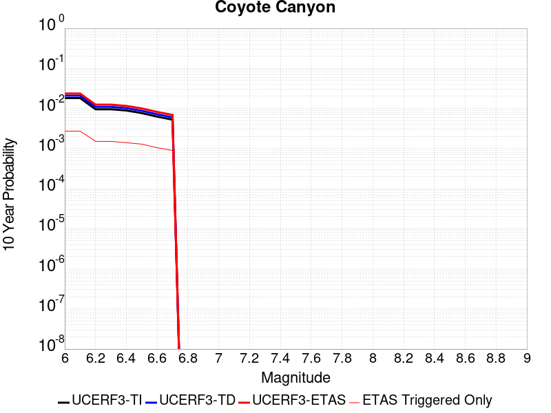 |

| Magnitude | 1 wk TI Prob | 1 wk TD Prob | 1 wk ETAS Prob | 1 wk ETAS/TD Gain | 1 wk ETAS Triggered Only | 1 mo TI Prob | 1 mo TD Prob | 1 mo ETAS Prob | 1 mo ETAS/TD Gain | 1 mo ETAS Triggered Only | 1 yr TI Prob | 1 yr TD Prob | 1 yr ETAS Prob | 1 yr ETAS/TD Gain | 1 yr ETAS Triggered Only | 10 yr TI Prob | 10 yr TD Prob | 10 yr ETAS Prob | 10 yr ETAS/TD Gain | 10 yr ETAS Triggered Only |
|-----|-----|-----|-----|-----|-----|-----|-----|-----|-----|-----|-----|-----|-----|-----|-----|-----|-----|-----|-----|-----|
| 6.0 | 3.5090034E-5 | 4.0364317E-5 | 6.803385E-4 | 16.854948 | 6.4E-4 | 1.503772E-4 | 1.7297991E-4 | 0.0011828052 | 6.837818 | 0.00101 | 0.0018293047 | 0.0021042533 | 0.003920424 | 1.8630948 | 0.00182 | 0.018143194 | 0.020869205 | 0.02353244 | 1.1276156 | 0.00272 |
| 6.1 | 3.5090034E-5 | 4.0364317E-5 | 6.803385E-4 | 16.854948 | 6.4E-4 | 1.503772E-4 | 1.7297991E-4 | 0.0011828052 | 6.837818 | 0.00101 | 0.0018293047 | 0.0021042533 | 0.003920424 | 1.8630948 | 0.00182 | 0.018143194 | 0.020869205 | 0.02353244 | 1.1276156 | 0.00272 |
| 6.2 | 1.841879E-5 | 2.1059794E-5 | 4.110516E-4 | 19.51831 | 3.9E-4 | 7.8935285E-5 | 9.025371E-5 | 6.30205E-4 | 6.9825935 | 5.4E-4 | 9.606133E-4 | 0.0010983871 | 0.0020972886 | 1.9094259 | 0.001 | 0.0095647145 | 0.010939668 | 0.012433149 | 1.1365198 | 0.00151 |
| 6.3 | 1.841879E-5 | 2.1059794E-5 | 4.110516E-4 | 19.51831 | 3.9E-4 | 7.8935285E-5 | 9.025371E-5 | 6.30205E-4 | 6.9825935 | 5.4E-4 | 9.606133E-4 | 0.0010983871 | 0.0020972886 | 1.9094259 | 0.001 | 0.0095647145 | 0.010939668 | 0.012433149 | 1.1365198 | 0.00151 |
| 6.4 | 1.712201E-5 | 1.9565212E-5 | 3.5955856E-4 | 18.377443 | 3.4E-4 | 7.337798E-5 | 8.3848776E-5 | 5.738077E-4 | 6.843364 | 4.9E-4 | 8.930107E-4 | 0.0010204813 | 0.0019295526 | 1.8908261 | 9.1E-4 | 0.008894307 | 0.010167871 | 0.011553636 | 1.1362886 | 0.0014 |
| 6.5 | 1.4744935E-5 | 1.6836972E-5 | 3.4683142E-4 | 20.599394 | 3.3E-4 | 6.3191044E-5 | 7.215698E-5 | 5.4212305E-4 | 7.5131063 | 4.7E-4 | 7.6907943E-4 | 8.782507E-4 | 0.0017474865 | 1.9897356 | 8.7E-4 | 0.007664232 | 0.008756994 | 0.010035698 | 1.1460208 | 0.00129 |
| 6.6 | 1.2017839E-5 | 1.3724089E-5 | 2.537208E-4 | 18.487259 | 2.4E-4 | 5.150401E-5 | 5.88167E-5 | 4.2879494E-4 | 7.2903605 | 3.7E-4 | 6.268809E-4 | 7.159466E-4 | 0.0014154455 | 1.9770266 | 7.0E-4 | 0.0062511545 | 0.0071450938 | 0.008187591 | 1.145904 | 0.00105 |
| 6.7 | 1.00956095E-5 | 1.1533517E-5 | 2.0153132E-4 | 17.473537 | 1.9E-4 | 4.326618E-5 | 4.942891E-5 | 3.794126E-4 | 7.675925 | 3.3E-4 | 5.266384E-4 | 6.017178E-4 | 0.0012213447 | 2.0297635 | 6.2E-4 | 0.005253921 | 0.0060094125 | 0.006904004 | 1.1488651 | 9.0E-4 |

## Garlock (West)
*[(top)](#table-of-contents)*

| 1 Week | 1 Month | 1 Year | 10 Year |
|-----|-----|-----|-----|
|  |  |  |  |

| Magnitude | 1 wk TI Prob | 1 wk TD Prob | 1 wk ETAS Prob | 1 wk ETAS/TD Gain | 1 wk ETAS Triggered Only | 1 mo TI Prob | 1 mo TD Prob | 1 mo ETAS Prob | 1 mo ETAS/TD Gain | 1 mo ETAS Triggered Only | 1 yr TI Prob | 1 yr TD Prob | 1 yr ETAS Prob | 1 yr ETAS/TD Gain | 1 yr ETAS Triggered Only | 10 yr TI Prob | 10 yr TD Prob | 10 yr ETAS Prob | 10 yr ETAS/TD Gain | 10 yr ETAS Triggered Only |
|-----|-----|-----|-----|-----|-----|-----|-----|-----|-----|-----|-----|-----|-----|-----|-----|-----|-----|-----|-----|-----|
| 6.0 | 2.5181727E-5 | 2.5197181E-5 | 8.7517576E-4 | 34.73308 | 8.5E-4 | 1.0791722E-4 | 1.0798347E-4 | 0.0012678582 | 11.741225 | 0.00116 | 0.0013131002 | 0.0013139093 | 0.003201426 | 2.4365654 | 0.00189 | 0.013053683 | 0.013141794 | 0.015875392 | 1.2080079 | 0.00277 |
| 6.1 | 2.5077732E-5 | 2.5098223E-5 | 8.750769E-4 | 34.86609 | 8.5E-4 | 1.0747157E-4 | 1.075594E-4 | 0.0012674347 | 11.783579 | 0.00116 | 0.001307681 | 0.0013087525 | 0.0031962788 | 2.4422333 | 0.00189 | 0.013000126 | 0.013090835 | 0.015824573 | 1.2088284 | 0.00277 |
| 6.2 | 2.494612E-5 | 2.4979914E-5 | 8.749587E-4 | 35.02649 | 8.5E-4 | 1.0690756E-4 | 1.070524E-4 | 0.0012669283 | 11.834655 | 0.00116 | 0.0013008224 | 0.0013025872 | 0.0031901253 | 2.4490685 | 0.00189 | 0.012932341 | 0.013029906 | 0.015763814 | 1.2098179 | 0.00277 |
| 6.3 | 2.4733758E-5 | 2.4799276E-5 | 8.747782E-4 | 35.274345 | 8.5E-4 | 1.0599751E-4 | 1.06278305E-4 | 0.001266155 | 11.91358 | 0.00116 | 0.0012897556 | 0.0012931736 | 0.0031807297 | 2.4596305 | 0.00189 | 0.012822957 | 0.0129368715 | 0.015671037 | 1.2113466 | 0.00277 |
| 6.4 | 2.3237335E-5 | 2.3178607E-5 | 8.6315913E-4 | 37.23947 | 8.4E-4 | 9.958477E-5 | 9.933313E-5 | 0.0012492189 | 12.576056 | 0.00115 | 0.0012117702 | 0.0012087126 | 0.0030664643 | 2.5369673 | 0.00186 | 0.012051838 | 0.012101731 | 0.014788815 | 1.2220412 | 0.00272 |
| 6.5 | 2.2732203E-5 | 2.2992977E-5 | 8.629737E-4 | 37.532055 | 8.4E-4 | 9.742009E-5 | 9.8537625E-5 | 0.0012484243 | 12.669519 | 0.00115 | 0.0011854442 | 0.0011990381 | 0.003056808 | 2.5493834 | 0.00186 | 0.011791403 | 0.012006035 | 0.014693379 | 1.2238327 | 0.00272 |
| 6.6 | 2.1319436E-5 | 2.1773201E-5 | 8.6175493E-4 | 39.578693 | 8.4E-4 | 9.136581E-5 | 9.3310395E-5 | 0.0012432031 | 13.323307 | 0.00115 | 0.001111811 | 0.0011354643 | 0.0029933525 | 2.6362364 | 0.00186 | 0.011062649 | 0.011376952 | 0.014066006 | 1.2363598 | 0.00272 |
| 6.7 | 1.970802E-5 | 2.0393094E-5 | 8.60376E-4 | 42.18957 | 8.4E-4 | 8.446021E-5 | 8.739606E-5 | 0.0012372956 | 14.157338 | 0.00115 | 0.001027818 | 0.0010635294 | 0.0029215512 | 2.7470338 | 0.00186 | 0.010230771 | 0.0106646875 | 0.013335893 | 1.250472 | 0.0027 |
| 6.8 | 1.8744462E-5 | 1.9900775E-5 | 8.598841E-4 | 43.208572 | 8.4E-4 | 8.033094E-5 | 8.528626E-5 | 0.0012351882 | 14.482851 | 0.00115 | 9.775903E-4 | 0.0010378672 | 0.0028959368 | 2.7902768 | 0.00186 | 0.009733009 | 0.010410495 | 0.013072491 | 1.2557031 | 0.00269 |
| 6.9 | 1.7559682E-5 | 1.8953151E-5 | 8.4893743E-4 | 44.79136 | 8.3E-4 | 7.5253614E-5 | 8.122527E-5 | 0.0012211327 | 15.033901 | 0.00114 | 9.158276E-4 | 9.884704E-4 | 0.0028366419 | 2.8697286 | 0.00185 | 0.0091206245 | 0.009921073 | 0.012574485 | 1.2674521 | 0.00268 |
| 7.0 | 1.6794445E-5 | 1.8215967E-5 | 8.4820087E-4 | 46.56359 | 8.3E-4 | 7.197421E-5 | 7.806611E-5 | 0.0012079779 | 15.473782 | 0.00113 | 8.759337E-4 | 9.5004175E-4 | 0.0027882936 | 2.934917 | 0.00184 | 0.008724891 | 0.009539958 | 0.012174582 | 1.2761673 | 0.00266 |
| 7.1 | 1.6337795E-5 | 1.771677E-5 | 8.477021E-4 | 47.847443 | 8.3E-4 | 7.0017246E-5 | 7.592681E-5 | 0.001205841 | 15.881624 | 0.00113 | 8.521265E-4 | 9.2401815E-4 | 0.002762318 | 2.9894629 | 0.00184 | 0.008488664 | 0.009281721 | 0.011917031 | 1.2839248 | 0.00266 |
| 7.2 | 1.5780008E-5 | 1.71654E-5 | 8.4715115E-4 | 49.352257 | 8.3E-4 | 6.762685E-5 | 7.3563926E-5 | 0.0011934815 | 16.223734 | 0.00112 | 8.2304585E-4 | 8.952741E-4 | 0.0027236356 | 3.0422368 | 0.00183 | 0.008200042 | 0.008996559 | 0.011602898 | 1.289704 | 0.00263 |
| 7.3 | 1.5058865E-5 | 1.6618484E-5 | 8.3660486E-4 | 50.34183 | 8.2E-4 | 6.45364E-5 | 7.122013E-5 | 0.0011711417 | 16.443972 | 0.0011 | 7.854473E-4 | 8.667614E-4 | 0.0026751924 | 3.0864234 | 0.00181 | 0.00782677 | 0.008713263 | 0.011290609 | 1.2957957 | 0.0026 |
| 7.4 | 1.4887923E-5 | 1.6454453E-5 | 8.264411E-4 | 50.225986 | 8.1E-4 | 6.380382E-5 | 7.0517184E-5 | 0.0011604403 | 16.456135 | 0.00109 | 7.7653467E-4 | 8.5820974E-4 | 0.002636682 | 3.0723052 | 0.00178 | 0.0077382675 | 0.008628101 | 0.011175928 | 1.2952939 | 0.00257 |
| 7.5 | 1.4509299E-5 | 1.6046468E-5 | 7.5603457E-4 | 47.115326 | 7.4E-4 | 6.218123E-5 | 6.876877E-5 | 0.0010786994 | 15.685888 | 0.00101 | 7.567935E-4 | 8.369394E-4 | 0.0024755667 | 2.9578807 | 0.00164 | 0.0075422134 | 0.008416411 | 0.0108061265 | 1.2839353 | 0.00241 |
| 7.6 | 1.2756717E-5 | 1.4050529E-5 | 4.8404394E-4 | 34.45023 | 4.7E-4 | 5.4670498E-5 | 6.0215163E-5 | 6.801778E-4 | 11.29579 | 6.2E-4 | 6.6541E-4 | 7.328737E-4 | 0.0017821041 | 2.4316661 | 0.00105 | 0.006634211 | 0.007381374 | 0.008969564 | 1.2151618 | 0.0016 |
| 7.7 | 1.0328985E-5 | 1.146033E-5 | 2.6145746E-4 | 22.81413 | 2.5E-4 | 4.4266326E-5 | 4.9114777E-5 | 3.7909858E-4 | 7.7186255 | 3.3E-4 | 5.388092E-4 | 5.9780874E-4 | 0.0012174381 | 2.036501 | 6.2E-4 | 0.0053750467 | 0.006038286 | 0.0070024286 | 1.1596717 | 9.7E-4 |
| 7.8 | 7.0306583E-6 | 8.899537E-6 | 1.6889811E-4 | 18.978304 | 1.6E-4 | 3.0131043E-5 | 3.8140315E-5 | 2.481323E-4 | 6.505775 | 2.1E-4 | 3.667837E-4 | 4.6425956E-4 | 8.6407387E-4 | 1.861187 | 4.0E-4 | 0.003661789 | 0.0046950667 | 0.0053320616 | 1.1356733 | 6.4E-4 |
| 7.9 | 4.060633E-6 | 5.465412E-6 | 9.546492E-5 | 17.467104 | 9.0E-5 | 1.7402595E-5 | 2.3422985E-5 | 1.5341994E-4 | 6.549974 | 1.3E-4 | 2.11856E-4 | 2.8513762E-4 | 5.3506636E-4 | 1.8765196 | 2.5E-4 | 0.0021165414 | 0.002884143 | 0.0032730182 | 1.1348321 | 3.9E-4 |
| 8.0 | 1.6729537E-6 | 2.0775192E-6 | 2.0775192E-6 | 1.0 | 0.0 | 7.169782E-6 | 8.903624E-6 | 2.8903445E-5 | 3.2462564 | 2.0E-5 | 8.7288594E-5 | 1.0839626E-4 | 1.5839085E-4 | 1.4612205 | 5.0E-5 | 8.7254314E-4 | 0.001096854 | 0.0011867553 | 1.0819628 | 9.0E-5 |
| 8.1 | 3.6733252E-7 | 3.1489736E-7 | 3.1489736E-7 | 1.0 | 0.0 | 1.5742813E-6 | 1.3495595E-6 | 1.3495595E-6 | 1.0 | 0.0 | 1.9166706E-5 | 1.643078E-5 | 1.643078E-5 | 1.0 | 0.0 | 1.9165053E-4 | 1.662928E-4 | 1.662928E-4 | 1.0 | 0.0 |

## Lenwood-Lockhart-Old Woman Springs
*[(top)](#table-of-contents)*

| 1 Week | 1 Month | 1 Year | 10 Year |
|-----|-----|-----|-----|
|  |  |  |  |

| Magnitude | 1 wk TI Prob | 1 wk TD Prob | 1 wk ETAS Prob | 1 wk ETAS/TD Gain | 1 wk ETAS Triggered Only | 1 mo TI Prob | 1 mo TD Prob | 1 mo ETAS Prob | 1 mo ETAS/TD Gain | 1 mo ETAS Triggered Only | 1 yr TI Prob | 1 yr TD Prob | 1 yr ETAS Prob | 1 yr ETAS/TD Gain | 1 yr ETAS Triggered Only | 10 yr TI Prob | 10 yr TD Prob | 10 yr ETAS Prob | 10 yr ETAS/TD Gain | 10 yr ETAS Triggered Only |
|-----|-----|-----|-----|-----|-----|-----|-----|-----|-----|-----|-----|-----|-----|-----|-----|-----|-----|-----|-----|-----|
| 6.0 | 3.744542E-5 | 4.396349E-5 | 8.039301E-4 | 18.286312 | 7.6E-4 | 1.604705E-4 | 1.8840231E-4 | 0.0013181894 | 6.996673 | 0.00113 | 0.0019519776 | 0.0022915571 | 0.0041073863 | 1.7923998 | 0.00182 | 0.019349206 | 0.022697281 | 0.025218723 | 1.11109 | 0.00258 |
| 6.1 | 3.744542E-5 | 4.396349E-5 | 8.039301E-4 | 18.286312 | 7.6E-4 | 1.604705E-4 | 1.8840231E-4 | 0.0013181894 | 6.996673 | 0.00113 | 0.0019519776 | 0.0022915571 | 0.0041073863 | 1.7923998 | 0.00182 | 0.019349206 | 0.022697281 | 0.025218723 | 1.11109 | 0.00258 |
| 6.2 | 3.744542E-5 | 4.396349E-5 | 8.039301E-4 | 18.286312 | 7.6E-4 | 1.604705E-4 | 1.8840231E-4 | 0.0013181894 | 6.996673 | 0.00113 | 0.0019519776 | 0.0022915571 | 0.0041073863 | 1.7923998 | 0.00182 | 0.019349206 | 0.022697281 | 0.025218723 | 1.11109 | 0.00258 |
| 6.3 | 2.1079984E-5 | 2.5354384E-5 | 3.2534677E-4 | 12.831973 | 3.0E-4 | 9.0339665E-5 | 1.0865723E-4 | 5.6860724E-4 | 5.2330365 | 4.6E-4 | 0.0010993304 | 0.0013221189 | 0.002081114 | 1.5740747 | 7.6E-4 | 0.010939079 | 0.013144747 | 0.014200683 | 1.0803313 | 0.00107 |
| 6.4 | 2.1079984E-5 | 2.5354384E-5 | 3.2534677E-4 | 12.831973 | 3.0E-4 | 9.0339665E-5 | 1.0865723E-4 | 5.6860724E-4 | 5.2330365 | 4.6E-4 | 0.0010993304 | 0.0013221189 | 0.002081114 | 1.5740747 | 7.6E-4 | 0.010939079 | 0.013144747 | 0.014200683 | 1.0803313 | 0.00107 |
| 6.5 | 1.7397282E-5 | 2.0663285E-5 | 2.806579E-4 | 13.582444 | 2.6E-4 | 7.455765E-5 | 8.8554E-5 | 4.5852124E-4 | 5.1778717 | 3.7E-4 | 9.073613E-4 | 0.0010776235 | 0.0016669877 | 1.5469111 | 5.9E-4 | 0.009036654 | 0.010725273 | 0.011487015 | 1.071023 | 7.7E-4 |
| 6.6 | 1.52050325E-5 | 1.7680086E-5 | 2.6767567E-4 | 15.139954 | 2.5E-4 | 6.51628E-5 | 7.576964E-5 | 4.257431E-4 | 5.6189146 | 3.5E-4 | 7.9306826E-4 | 9.221128E-4 | 0.0014616149 | 1.5850717 | 5.4E-4 | 0.007902439 | 0.009183729 | 0.009867392 | 1.0744429 | 6.9E-4 |
| 6.7 | 1.332523E-5 | 1.5264379E-5 | 2.0526147E-4 | 13.447089 | 1.9E-4 | 5.7106878E-5 | 6.541716E-5 | 3.353995E-4 | 5.127087 | 2.7E-4 | 6.950544E-4 | 7.9616875E-4 | 0.0012558026 | 1.577307 | 4.6E-4 | 0.006928845 | 0.0079337945 | 0.0085290335 | 1.0750259 | 6.0E-4 |
| 6.8 | 1.1525329E-5 | 1.3031365E-5 | 1.4302967E-4 | 10.975801 | 1.3E-4 | 4.9393333E-5 | 5.5847537E-5 | 2.5583638E-4 | 4.580979 | 2.0E-4 | 6.011979E-4 | 6.7973585E-4 | 0.0010494844 | 1.5439591 | 3.7E-4 | 0.00599574 | 0.0067770192 | 0.007253766 | 1.0703475 | 4.8E-4 |
| 6.9 | 1.0253909E-5 | 1.1514835E-5 | 1.11513684E-4 | 9.68435 | 1.0E-4 | 4.3944583E-5 | 4.934838E-5 | 2.0934048E-4 | 4.2420945 | 1.6E-4 | 5.3489394E-4 | 6.006545E-4 | 9.104683E-4 | 1.5157937 | 3.1E-4 | 0.0053360825 | 0.0059906896 | 0.0064081736 | 1.0696888 | 4.2E-4 |
| 7.0 | 8.104563E-6 | 8.99143E-6 | 7.89908E-5 | 8.785121 | 7.0E-5 | 3.4733377E-5 | 3.853415E-5 | 1.4852991E-4 | 3.854501 | 1.1E-4 | 4.2279682E-4 | 4.6905465E-4 | 6.5896555E-4 | 1.40488 | 1.9E-4 | 0.0042199334 | 0.0046808943 | 0.0049496307 | 1.0574113 | 2.7E-4 |
| 7.1 | 6.7986157E-6 | 7.5159796E-6 | 5.7515605E-5 | 7.6524425 | 5.0E-5 | 2.91366E-5 | 3.2210955E-5 | 1.022087E-4 | 3.1731036 | 7.0E-5 | 3.5468035E-4 | 3.9209996E-4 | 5.320451E-4 | 1.3569118 | 1.4E-4 | 0.003541148 | 0.003914298 | 0.0040935935 | 1.0458052 | 1.8E-4 |
| 7.2 | 5.6893327E-6 | 6.280132E-6 | 3.6279944E-5 | 5.77694 | 3.0E-5 | 2.4382627E-5 | 2.6914584E-5 | 7.691324E-5 | 2.857679 | 5.0E-5 | 2.9681803E-4 | 3.276378E-4 | 4.2760503E-4 | 1.3051151 | 1.0E-4 | 0.002964219 | 0.003271746 | 0.0034013207 | 1.0396042 | 1.3E-4 |
| 7.3 | 4.253348E-6 | 4.707075E-6 | 3.4706933E-5 | 7.3733554 | 3.0E-5 | 1.8228506E-5 | 2.017303E-5 | 7.017202E-5 | 3.4785066 | 5.0E-5 | 2.2190946E-4 | 2.455808E-4 | 3.355587E-4 | 1.3663882 | 9.0E-5 | 0.00221688 | 0.0024532753 | 0.0025729807 | 1.0487942 | 1.2E-4 |
| 7.4 | 2.5448119E-6 | 2.8520594E-6 | 2.2852002E-5 | 8.012457 | 2.0E-5 | 1.0906291E-5 | 1.2223064E-5 | 3.222282E-5 | 2.636231 | 2.0E-5 | 1.3277601E-4 | 1.4880729E-4 | 1.9879985E-4 | 1.335955 | 5.0E-5 | 0.001326967 | 0.0014872387 | 0.0015571346 | 1.0469971 | 7.0E-5 |
| 7.5 | 4.3706837E-8 | 4.562909E-8 | 4.562909E-8 | 1.0 | 0.0 | 1.8731501E-7 | 1.9555324E-7 | 1.9555324E-7 | 1.0 | 0.0 | 2.2805577E-6 | 2.3808586E-6 | 2.3808586E-6 | 1.0 | 0.0 | 2.2805343E-5 | 2.3808387E-5 | 2.3808387E-5 | 1.0 | 0.0 |

## Nelson Lake
*[(top)](#table-of-contents)*

| 1 Week | 1 Month | 1 Year | 10 Year |
|-----|-----|-----|-----|
|  |  |  |  |

| Magnitude | 1 wk TI Prob | 1 wk TD Prob | 1 wk ETAS Prob | 1 wk ETAS/TD Gain | 1 wk ETAS Triggered Only | 1 mo TI Prob | 1 mo TD Prob | 1 mo ETAS Prob | 1 mo ETAS/TD Gain | 1 mo ETAS Triggered Only | 1 yr TI Prob | 1 yr TD Prob | 1 yr ETAS Prob | 1 yr ETAS/TD Gain | 1 yr ETAS Triggered Only | 10 yr TI Prob | 10 yr TD Prob | 10 yr ETAS Prob | 10 yr ETAS/TD Gain | 10 yr ETAS Triggered Only |
|-----|-----|-----|-----|-----|-----|-----|-----|-----|-----|-----|-----|-----|-----|-----|-----|-----|-----|-----|-----|-----|
| 6.0 | 9.913453E-6 | 1.0192255E-5 | 3.201891E-4 | 31.41494 | 3.1E-4 | 4.2485535E-5 | 4.3680422E-5 | 6.236551E-4 | 14.27768 | 5.8E-4 | 5.1713863E-4 | 5.316897E-4 | 0.0017310517 | 3.2557554 | 0.0012 | 0.0051593683 | 0.005305204 | 0.00740401 | 1.3956127 | 0.00211 |
| 6.1 | 9.913453E-6 | 1.0192255E-5 | 3.201891E-4 | 31.41494 | 3.1E-4 | 4.2485535E-5 | 4.3680422E-5 | 6.236551E-4 | 14.27768 | 5.8E-4 | 5.1713863E-4 | 5.316897E-4 | 0.0017310517 | 3.2557554 | 0.0012 | 0.0051593683 | 0.005305204 | 0.00740401 | 1.3956127 | 0.00211 |
| 6.2 | 4.5596407E-6 | 4.696313E-6 | 1.9469541E-4 | 41.457077 | 1.9E-4 | 1.954117E-5 | 2.0126909E-5 | 3.1012108E-4 | 15.408282 | 2.9E-4 | 2.3788778E-4 | 2.4501883E-4 | 8.248767E-4 | 3.366585 | 5.8E-4 | 0.0023763329 | 0.0024476128 | 0.0033952876 | 1.3871833 | 9.5E-4 |
| 6.3 | 4.5596407E-6 | 4.696313E-6 | 1.9469541E-4 | 41.457077 | 1.9E-4 | 1.954117E-5 | 2.0126909E-5 | 3.1012108E-4 | 15.408282 | 2.9E-4 | 2.3788778E-4 | 2.4501883E-4 | 8.248767E-4 | 3.366585 | 5.8E-4 | 0.0023763329 | 0.0024476128 | 0.0033952876 | 1.3871833 | 9.5E-4 |
| 6.4 | 3.4025713E-6 | 3.5098972E-6 | 1.435094E-4 | 40.887066 | 1.4E-4 | 1.4582367E-5 | 1.5042335E-5 | 2.450389E-4 | 16.28995 | 2.3E-4 | 1.7752586E-4 | 1.8312587E-4 | 6.230453E-4 | 3.402279 | 4.4E-4 | 0.001773841 | 0.0018298327 | 0.0025385334 | 1.3873036 | 7.1E-4 |
| 6.5 | 2.8352947E-6 | 2.927856E-6 | 1.2292751E-4 | 41.9855 | 1.2E-4 | 1.2151207E-5 | 1.2547898E-5 | 2.1254539E-4 | 16.938725 | 2.0E-4 | 1.479309E-4 | 1.5276071E-4 | 5.3270266E-4 | 3.4871707 | 3.8E-4 | 0.0014783246 | 0.0015266308 | 0.002155669 | 1.4120435 | 6.3E-4 |
| 6.6 | 2.251518E-6 | 2.3290677E-6 | 8.232888E-5 | 35.34843 | 8.0E-5 | 9.649328E-6 | 9.981683E-6 | 1.3998039E-4 | 14.0237255 | 1.3E-4 | 1.1747423E-4 | 1.2152085E-4 | 3.7149046E-4 | 3.0570102 | 2.5E-4 | 0.0011741214 | 0.0012146058 | 0.0016640591 | 1.3700407 | 4.5E-4 |
| 6.7 | 1.8911853E-6 | 1.9591396E-6 | 7.1959E-5 | 36.7299 | 7.0E-5 | 8.105055E-6 | 8.39629E-6 | 1.18395365E-4 | 14.100916 | 1.1E-4 | 9.867457E-5 | 1.0222061E-4 | 3.2219812E-4 | 3.1519878 | 2.2E-4 | 9.863076E-4 | 0.0010217935 | 0.0014014052 | 1.3715152 | 3.8E-4 |
| 6.8 | 1.4874814E-6 | 1.5438305E-6 | 5.1543753E-5 | 33.386925 | 5.0E-5 | 6.374905E-6 | 6.6164025E-6 | 8.661587E-5 | 13.091083 | 8.0E-5 | 7.76117E-5 | 8.055224E-5 | 2.4053936E-4 | 2.9861286 | 1.6E-4 | 7.75846E-4 | 8.0528157E-4 | 0.0011150319 | 1.3846486 | 3.1E-4 |
| 6.9 | 6.835972E-7 | 7.1399285E-7 | 4.0713963E-5 | 57.02293 | 4.0E-5 | 2.9296991E-6 | 3.0599674E-6 | 6.3059786E-5 | 20.607992 | 6.0E-5 | 3.56685E-5 | 3.7254784E-5 | 1.172518E-4 | 3.1472952 | 8.0E-5 | 3.5662777E-4 | 3.7251666E-4 | 5.324571E-4 | 1.429351 | 1.6E-4 |

## San Andreas (Mojave S)
*[(top)](#table-of-contents)*

| 1 Week | 1 Month | 1 Year | 10 Year |
|-----|-----|-----|-----|
|  | 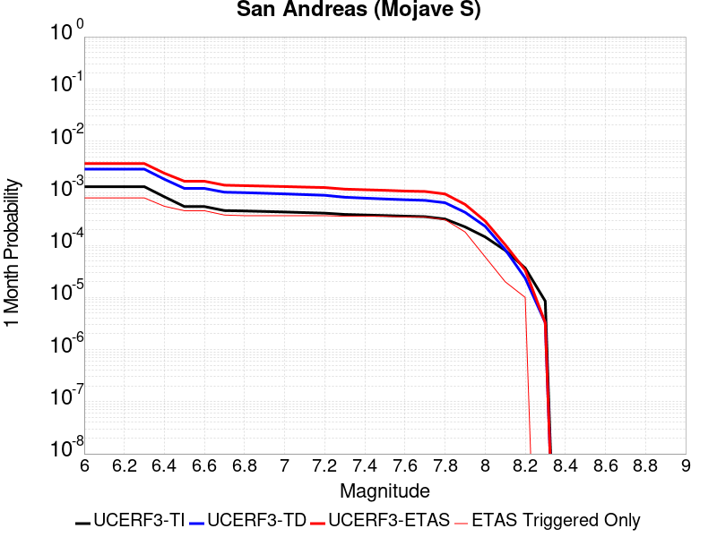 | 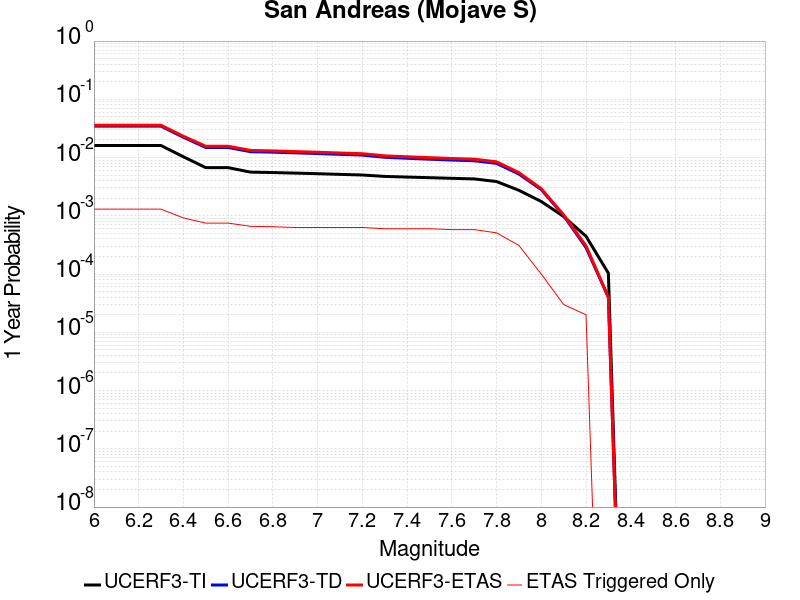 |  |

| Magnitude | 1 wk TI Prob | 1 wk TD Prob | 1 wk ETAS Prob | 1 wk ETAS/TD Gain | 1 wk ETAS Triggered Only | 1 mo TI Prob | 1 mo TD Prob | 1 mo ETAS Prob | 1 mo ETAS/TD Gain | 1 mo ETAS Triggered Only | 1 yr TI Prob | 1 yr TD Prob | 1 yr ETAS Prob | 1 yr ETAS/TD Gain | 1 yr ETAS Triggered Only | 10 yr TI Prob | 10 yr TD Prob | 10 yr ETAS Prob | 10 yr ETAS/TD Gain | 10 yr ETAS Triggered Only |
|-----|-----|-----|-----|-----|-----|-----|-----|-----|-----|-----|-----|-----|-----|-----|-----|-----|-----|-----|-----|-----|
| 6.0 | 3.1064058E-4 | 6.7462435E-4 | 0.0012842128 | 1.9035969 | 6.1E-4 | 0.0013306376 | 0.002888172 | 0.0036958326 | 1.2796443 | 8.1E-4 | 0.016080605 | 0.034565594 | 0.03582066 | 1.0363096 | 0.0013 | 0.1496549 | 0.28654557 | 0.2879368 | 1.0048552 | 0.00195 |
| 6.1 | 3.1064058E-4 | 6.7462435E-4 | 0.0012842128 | 1.9035969 | 6.1E-4 | 0.0013306376 | 0.002888172 | 0.0036958326 | 1.2796443 | 8.1E-4 | 0.016080605 | 0.034565594 | 0.03582066 | 1.0363096 | 0.0013 | 0.1496549 | 0.28654557 | 0.2879368 | 1.0048552 | 0.00195 |
| 6.2 | 3.1064058E-4 | 6.7462435E-4 | 0.0012842128 | 1.9035969 | 6.1E-4 | 0.0013306376 | 0.002888172 | 0.0036958326 | 1.2796443 | 8.1E-4 | 0.016080605 | 0.034565594 | 0.03582066 | 1.0363096 | 0.0013 | 0.1496549 | 0.28654557 | 0.2879368 | 1.0048552 | 0.00195 |
| 6.3 | 3.1064058E-4 | 6.7462435E-4 | 0.0012842128 | 1.9035969 | 6.1E-4 | 0.0013306376 | 0.002888172 | 0.0036958326 | 1.2796443 | 8.1E-4 | 0.016080605 | 0.034565594 | 0.03582066 | 1.0363096 | 0.0013 | 0.1496549 | 0.28654557 | 0.2879368 | 1.0048552 | 0.00195 |
| 6.4 | 1.9872203E-4 | 4.3181062E-4 | 8.316379E-4 | 1.925932 | 4.0E-4 | 8.5138786E-4 | 0.0018493326 | 0.002408297 | 1.3022519 | 5.6E-4 | 0.010316478 | 0.02228931 | 0.023188803 | 1.0403554 | 9.2E-4 | 0.098504856 | 0.19686839 | 0.19801687 | 1.0058337 | 0.00143 |
| 6.5 | 1.291105E-4 | 2.8754136E-4 | 6.274436E-4 | 2.1820986 | 3.4E-4 | 5.5321335E-4 | 0.0012317409 | 0.0016911743 | 1.3729951 | 4.6E-4 | 0.006714592 | 0.014894155 | 0.015632983 | 1.0496054 | 7.5E-4 | 0.065152965 | 0.13800792 | 0.13900784 | 1.0072453 | 0.00116 |
| 6.6 | 1.291105E-4 | 2.8754136E-4 | 6.274436E-4 | 2.1820986 | 3.4E-4 | 5.5321335E-4 | 0.0012317409 | 0.0016911743 | 1.3729951 | 4.6E-4 | 0.006714592 | 0.014894155 | 0.015632983 | 1.0496054 | 7.5E-4 | 0.065152965 | 0.13800792 | 0.13900784 | 1.0072453 | 0.00116 |
| 6.7 | 1.08001186E-4 | 2.4335351E-4 | 5.3328293E-4 | 2.191392 | 2.9E-4 | 4.6278012E-4 | 0.0010425274 | 0.0014221312 | 1.3641188 | 3.8E-4 | 0.0056198016 | 0.0126192 | 0.013270871 | 1.0516412 | 6.6E-4 | 0.054797906 | 0.11918431 | 0.12010916 | 1.0077599 | 0.00105 |
| 6.8 | 1.0624356E-4 | 2.3853009E-4 | 5.184633E-4 | 2.173576 | 2.8E-4 | 4.5525006E-4 | 0.0010218718 | 0.0013914937 | 1.3617107 | 3.7E-4 | 0.0055285925 | 0.012370593 | 0.013012552 | 1.051894 | 6.5E-4 | 0.053930566 | 0.11713308 | 0.11805126 | 1.0078388 | 0.00104 |
| 6.9 | 1.0393785E-4 | 2.3223337E-4 | 5.1216834E-4 | 2.2054038 | 2.8E-4 | 4.4537184E-4 | 9.949068E-4 | 0.0013645386 | 1.3715242 | 3.7E-4 | 0.0054089287 | 0.012045963 | 0.012668374 | 1.0516697 | 6.3E-4 | 0.05279156 | 0.114433445 | 0.11532787 | 1.0078161 | 0.00101 |
| 7.0 | 1.0155622E-4 | 2.2592908E-4 | 5.058658E-4 | 2.239047 | 2.8E-4 | 4.3516833E-4 | 9.6790853E-4 | 0.0013375505 | 1.3818976 | 3.7E-4 | 0.005285311 | 0.011720838 | 0.012343454 | 1.0531204 | 6.3E-4 | 0.05161361 | 0.11169745 | 0.11258575 | 1.0079528 | 0.001 |
| 7.1 | 9.885595E-5 | 2.188132E-4 | 4.9875194E-4 | 2.2793503 | 2.8E-4 | 4.2359953E-4 | 9.374342E-4 | 0.0013070874 | 1.3943244 | 3.7E-4 | 0.0051451353 | 0.011353733 | 0.01197658 | 1.0548583 | 6.3E-4 | 0.05027629 | 0.10857607 | 0.10945857 | 1.008128 | 9.9E-4 |
| 7.2 | 9.6411415E-5 | 2.1244297E-4 | 4.923835E-4 | 2.3177207 | 2.8E-4 | 4.1312634E-4 | 9.101525E-4 | 0.0012798158 | 1.4061552 | 3.7E-4 | 0.005018219 | 0.011024987 | 0.011648041 | 1.056513 | 6.3E-4 | 0.049064007 | 0.1057697 | 0.106654994 | 1.0083699 | 9.9E-4 |
| 7.3 | 9.1180635E-5 | 1.9472656E-4 | 4.64674E-4 | 2.3862896 | 2.7E-4 | 3.907156E-4 | 8.342756E-4 | 0.0011939752 | 1.4311521 | 3.6E-4 | 0.004746591 | 0.010110112 | 0.010704046 | 1.0587466 | 6.0E-4 | 0.046464786 | 0.09796176 | 0.09882772 | 1.0088397 | 9.6E-4 |
| 7.4 | 8.887388E-5 | 1.872126E-4 | 4.5716207E-4 | 2.4419405 | 2.7E-4 | 3.8083247E-4 | 8.020931E-4 | 0.0011618043 | 1.4484657 | 3.6E-4 | 0.0046267817 | 0.009721855 | 0.010316022 | 1.0611166 | 6.0E-4 | 0.045316286 | 0.094593845 | 0.095453985 | 1.0090929 | 9.5E-4 |
| 7.5 | 8.6750515E-5 | 1.80528E-4 | 4.5047925E-4 | 2.495343 | 2.7E-4 | 3.7173493E-4 | 7.734621E-4 | 0.0011331836 | 1.4650798 | 3.6E-4 | 0.004516484 | 0.009376327 | 0.0099707 | 1.063391 | 6.0E-4 | 0.04425787 | 0.09155606 | 0.09241908 | 1.0094261 | 9.5E-4 |
| 7.6 | 8.453092E-5 | 1.7440386E-4 | 4.3435852E-4 | 2.4905326 | 2.6E-4 | 3.6222505E-4 | 7.4723107E-4 | 0.0010969696 | 1.468046 | 3.5E-4 | 0.0044011753 | 0.009059664 | 0.009634409 | 1.0634401 | 5.8E-4 | 0.04315024 | 0.08871447 | 0.08956197 | 1.0095531 | 9.3E-4 |
| 7.7 | 8.259102E-5 | 1.6962511E-4 | 4.29581E-4 | 2.532532 | 2.6E-4 | 3.539135E-4 | 7.267622E-4 | 0.0010765078 | 1.481238 | 3.5E-4 | 0.004300386 | 0.0088125 | 0.009387389 | 1.0652356 | 5.8E-4 | 0.042181134 | 0.086465426 | 0.087315015 | 1.0098257 | 9.3E-4 |
| 7.8 | 7.444844E-5 | 1.528469E-4 | 3.8281176E-4 | 2.5045438 | 2.3E-4 | 3.1902574E-4 | 6.5489375E-4 | 9.6469076E-4 | 1.4730493 | 3.1E-4 | 0.0038772223 | 0.007944231 | 0.008450179 | 1.0636876 | 5.1E-4 | 0.03810269 | 0.078293875 | 0.07903124 | 1.0094179 | 8.0E-4 |
| 7.9 | 5.2586525E-5 | 1.0007023E-4 | 2.3005722E-4 | 2.2989576 | 1.3E-4 | 2.2535135E-4 | 4.2880196E-4 | 6.087248E-4 | 1.4195942 | 1.8E-4 | 0.0027402006 | 0.005208178 | 0.005516563 | 1.0592117 | 3.1E-4 | 0.027066574 | 0.052201588 | 0.052647054 | 1.0085336 | 4.7E-4 |
| 8.0 | 3.379877E-5 | 5.4075565E-5 | 8.407394E-5 | 1.5547493 | 3.0E-5 | 1.4484383E-4 | 2.3173184E-4 | 2.9171794E-4 | 1.25886 | 6.0E-5 | 0.0017620471 | 0.0028176866 | 0.002917405 | 1.0353901 | 1.0E-4 | 0.017481409 | 0.028835917 | 0.02898159 | 1.0050519 | 1.5E-4 |
| 8.1 | 1.8668277E-5 | 1.9308145E-5 | 2.9307952E-5 | 1.5179062 | 1.0E-5 | 8.000444E-5 | 8.274657E-5 | 1.0274491E-4 | 1.2416818 | 2.0E-5 | 9.736188E-4 | 0.0010069745 | 0.0010369443 | 1.0297623 | 3.0E-5 | 0.009693642 | 0.010798624 | 0.010838192 | 1.0036641 | 4.0E-5 |
| 8.2 | 8.541571E-6 | 5.4596358E-6 | 5.4596358E-6 | 1.0 | 0.0 | 3.660622E-5 | 2.339823E-5 | 3.3397995E-5 | 1.4273728 | 1.0E-5 | 4.455896E-4 | 2.848363E-4 | 3.048306E-4 | 1.0701958 | 2.0E-5 | 0.0044469717 | 0.003240283 | 0.0032602183 | 1.0061523 | 2.0E-5 |
| 8.3 | 1.983087E-6 | 7.6564595E-7 | 7.6564595E-7 | 1.0 | 0.0 | 8.498917E-6 | 3.281336E-6 | 3.281336E-6 | 1.0 | 0.0 | 1.034694E-4 | 3.9949547E-5 | 3.9949547E-5 | 1.0 | 0.0 | 0.0010342124 | 4.717979E-4 | 4.717979E-4 | 1.0 | 0.0 |

## Death Valley (So)
*[(top)](#table-of-contents)*

| 1 Week | 1 Month | 1 Year | 10 Year |
|-----|-----|-----|-----|
|  |  |  |  |

| Magnitude | 1 wk TI Prob | 1 wk TD Prob | 1 wk ETAS Prob | 1 wk ETAS/TD Gain | 1 wk ETAS Triggered Only | 1 mo TI Prob | 1 mo TD Prob | 1 mo ETAS Prob | 1 mo ETAS/TD Gain | 1 mo ETAS Triggered Only | 1 yr TI Prob | 1 yr TD Prob | 1 yr ETAS Prob | 1 yr ETAS/TD Gain | 1 yr ETAS Triggered Only | 10 yr TI Prob | 10 yr TD Prob | 10 yr ETAS Prob | 10 yr ETAS/TD Gain | 10 yr ETAS Triggered Only |
|-----|-----|-----|-----|-----|-----|-----|-----|-----|-----|-----|-----|-----|-----|-----|-----|-----|-----|-----|-----|-----|
| 6.0 | 2.0684236E-5 | 2.5618314E-5 | 4.956063E-4 | 19.34578 | 4.7E-4 | 8.864371E-5 | 1.0978825E-4 | 8.697048E-4 | 7.9216566 | 7.6E-4 | 0.0010787029 | 0.0013358692 | 0.0025742128 | 1.9269946 | 0.00124 | 0.010734817 | 0.013279985 | 0.015263291 | 1.1493456 | 0.00201 |
| 6.1 | 2.0684236E-5 | 2.5618314E-5 | 4.956063E-4 | 19.34578 | 4.7E-4 | 8.864371E-5 | 1.0978825E-4 | 8.697048E-4 | 7.9216566 | 7.6E-4 | 0.0010787029 | 0.0013358692 | 0.0025742128 | 1.9269946 | 0.00124 | 0.010734817 | 0.013279985 | 0.015263291 | 1.1493456 | 0.00201 |
| 6.2 | 2.0684236E-5 | 2.5618314E-5 | 4.956063E-4 | 19.34578 | 4.7E-4 | 8.864371E-5 | 1.0978825E-4 | 8.697048E-4 | 7.9216566 | 7.6E-4 | 0.0010787029 | 0.0013358692 | 0.0025742128 | 1.9269946 | 0.00124 | 0.010734817 | 0.013279985 | 0.015263291 | 1.1493456 | 0.00201 |
| 6.3 | 2.0240292E-5 | 2.51184E-5 | 4.8510684E-4 | 19.312809 | 4.6E-4 | 8.6741224E-5 | 1.0764593E-4 | 8.475663E-4 | 7.873649 | 7.4E-4 | 0.0010555626 | 0.001309818 | 0.0025182331 | 1.9225825 | 0.00121 | 0.010505628 | 0.013022543 | 0.01490767 | 1.1447587 | 0.00191 |
| 6.4 | 2.0240292E-5 | 2.51184E-5 | 4.8510684E-4 | 19.312809 | 4.6E-4 | 8.6741224E-5 | 1.0764593E-4 | 8.475663E-4 | 7.873649 | 7.4E-4 | 0.0010555626 | 0.001309818 | 0.0025182331 | 1.9225825 | 0.00121 | 0.010505628 | 0.013022543 | 0.01490767 | 1.1447587 | 0.00191 |
| 6.5 | 1.9962767E-5 | 2.4807652E-5 | 4.8479624E-4 | 19.542206 | 4.6E-4 | 8.55519E-5 | 1.0631427E-4 | 8.262377E-4 | 7.771654 | 7.2E-4 | 0.0010410968 | 0.0012936244 | 0.0024421366 | 1.8878253 | 0.00115 | 0.010362327 | 0.01286249 | 0.014668951 | 1.1404442 | 0.00183 |
| 6.6 | 1.8937297E-5 | 2.3311462E-5 | 4.4330166E-4 | 19.016468 | 4.2E-4 | 8.115732E-5 | 9.990252E-5 | 7.598366E-4 | 7.6057796 | 6.6E-4 | 9.876423E-4 | 0.0012156491 | 0.0022743605 | 1.8709022 | 0.00106 | 0.009832645 | 0.0120915035 | 0.013770948 | 1.1388946 | 0.0017 |
| 6.7 | 1.8621096E-5 | 2.2912098E-5 | 4.4290247E-4 | 19.330507 | 4.2E-4 | 7.980225E-5 | 9.8191085E-5 | 7.5812626E-4 | 7.7209277 | 6.6E-4 | 9.711593E-4 | 0.0011948354 | 0.002253569 | 1.8860915 | 0.00106 | 0.009669261 | 0.011885625 | 0.013535776 | 1.1388359 | 0.00167 |
| 6.8 | 1.7830353E-5 | 2.1806083E-5 | 4.2179736E-4 | 19.343105 | 4.0E-4 | 7.641356E-5 | 9.3451374E-5 | 7.233925E-4 | 7.740844 | 6.3E-4 | 9.29938E-4 | 0.0011371907 | 0.0021460422 | 1.8871436 | 0.00101 | 0.009260561 | 0.01131609 | 0.012858436 | 1.1362969 | 0.00156 |
| 6.9 | 1.3135183E-5 | 1.5304031E-5 | 2.6530022E-4 | 17.335316 | 2.5E-4 | 5.6292425E-5 | 6.558709E-5 | 4.555615E-4 | 6.9459023 | 3.9E-4 | 6.8514474E-4 | 7.982367E-4 | 0.001497678 | 1.8762329 | 7.0E-4 | 0.006830362 | 0.007955158 | 0.008996805 | 1.1309398 | 0.00105 |
| 7.0 | 1.1507512E-5 | 1.3154237E-5 | 1.6315226E-4 | 12.403019 | 1.5E-4 | 4.9316975E-5 | 5.637412E-5 | 3.1635945E-4 | 5.6117854 | 2.6E-4 | 6.002687E-4 | 6.861445E-4 | 0.0011758084 | 1.7136452 | 4.9E-4 | 0.0059864987 | 0.0068414924 | 0.0075764298 | 1.1074235 | 7.4E-4 |
| 7.1 | 9.715903E-6 | 1.0865287E-5 | 8.086453E-5 | 7.442466 | 7.0E-5 | 4.1638916E-5 | 4.6564706E-5 | 1.9655772E-4 | 4.221174 | 1.5E-4 | 5.068359E-4 | 5.667821E-4 | 8.166404E-4 | 1.4408367 | 2.5E-4 | 0.0050568148 | 0.005653834 | 0.006081403 | 1.0756246 | 4.3E-4 |
| 7.2 | 9.233269E-6 | 1.0286314E-5 | 8.0285594E-5 | 7.805089 | 7.0E-5 | 3.9570554E-5 | 4.408348E-5 | 1.840773E-4 | 4.175653 | 1.4E-4 | 4.81665E-4 | 5.365884E-4 | 7.7645964E-4 | 1.4470302 | 2.4E-4 | 0.0048062233 | 0.0053533595 | 0.005771111 | 1.0780354 | 4.2E-4 |
| 7.3 | 8.8041315E-6 | 9.808164E-6 | 6.9807575E-5 | 7.117293 | 6.0E-5 | 3.7731446E-5 | 4.2034335E-5 | 1.4203013E-4 | 3.3789077 | 1.0E-4 | 4.592835E-4 | 5.1165203E-4 | 6.9156E-4 | 1.3516216 | 1.8E-4 | 0.0045833546 | 0.005105167 | 0.0054235337 | 1.0623616 | 3.2E-4 |
| 7.4 | 8.708749E-6 | 9.707175E-6 | 5.970669E-5 | 6.1507792 | 5.0E-5 | 3.7322676E-5 | 4.160154E-5 | 1.315978E-4 | 3.1632915 | 9.0E-5 | 4.5430884E-4 | 5.0638523E-4 | 6.7629915E-4 | 1.3355428 | 1.7E-4 | 0.004533812 | 0.0050527398 | 0.0053611733 | 1.0610429 | 3.1E-4 |
| 7.5 | 8.612678E-6 | 9.604817E-6 | 5.9604336E-5 | 6.2056713 | 5.0E-5 | 3.6910955E-5 | 4.1162875E-5 | 1.3115918E-4 | 3.186346 | 9.0E-5 | 4.492982E-4 | 5.01047E-4 | 6.709618E-4 | 1.3391196 | 1.7E-4 | 0.004483909 | 0.0049995985 | 0.005308049 | 1.061695 | 3.1E-4 |
| 7.6 | 8.319024E-6 | 9.283916E-6 | 5.928345E-5 | 6.385608 | 5.0E-5 | 3.5652476E-5 | 3.978763E-5 | 1.2978405E-4 | 3.2619195 | 9.0E-5 | 4.3398244E-4 | 4.8431093E-4 | 6.442334E-4 | 1.3302063 | 1.6E-4 | 0.0043313587 | 0.0048329784 | 0.0051215766 | 1.0597144 | 2.9E-4 |
| 7.7 | 7.4718328E-6 | 8.34517E-6 | 5.834475E-5 | 6.99144 | 5.0E-5 | 3.2021748E-5 | 3.5764548E-5 | 1.2576133E-4 | 3.5163686 | 9.0E-5 | 3.8979502E-4 | 4.353504E-4 | 5.752894E-4 | 1.3214401 | 1.4E-4 | 0.00389112 | 0.0043453807 | 0.0046142074 | 1.061865 | 2.7E-4 |
| 7.8 | 3.4586725E-7 | 3.6482615E-7 | 1.0364823E-5 | 28.410307 | 1.0E-5 | 1.4822873E-6 | 1.5635396E-6 | 2.1563508E-5 | 13.791469 | 2.0E-5 | 1.80467E-5 | 1.9035933E-5 | 3.9035553E-5 | 2.0506246 | 2.0E-5 | 1.8045233E-4 | 1.9034347E-4 | 2.1033967E-4 | 1.1050532 | 2.0E-5 |
| 7.9 | 2.5591178E-9 | 2.6696718E-9 | 2.6696718E-9 | 1.0 | 0.0 | 1.0967647E-8 | 1.14414505E-8 | 1.14414505E-8 | 1.0 | 0.0 | 1.335311E-7 | 1.3929966E-7 | 1.3929966E-7 | 1.0 | 0.0 | 1.3353102E-6 | 1.3929966E-6 | 1.3929966E-6 | 1.0 | 0.0 |

## Towne Pass
*[(top)](#table-of-contents)*

| 1 Week | 1 Month | 1 Year | 10 Year |
|-----|-----|-----|-----|
|  |  |  |  |

| Magnitude | 1 wk TI Prob | 1 wk TD Prob | 1 wk ETAS Prob | 1 wk ETAS/TD Gain | 1 wk ETAS Triggered Only | 1 mo TI Prob | 1 mo TD Prob | 1 mo ETAS Prob | 1 mo ETAS/TD Gain | 1 mo ETAS Triggered Only | 1 yr TI Prob | 1 yr TD Prob | 1 yr ETAS Prob | 1 yr ETAS/TD Gain | 1 yr ETAS Triggered Only | 10 yr TI Prob | 10 yr TD Prob | 10 yr ETAS Prob | 10 yr ETAS/TD Gain | 10 yr ETAS Triggered Only |
|-----|-----|-----|-----|-----|-----|-----|-----|-----|-----|-----|-----|-----|-----|-----|-----|-----|-----|-----|-----|-----|
| 6.0 | 3.849728E-6 | 3.894542E-6 | 3.5389318E-4 | 90.86901 | 3.5E-4 | 1.649873E-5 | 1.6690812E-5 | 6.166808E-4 | 36.947323 | 6.0E-4 | 2.0085352E-4 | 2.0319606E-4 | 0.0012529826 | 6.1663733 | 0.00105 | 0.0020067208 | 0.0020305319 | 0.0037669986 | 1.8551784 | 0.00174 |
| 6.1 | 3.849728E-6 | 3.894542E-6 | 3.5389318E-4 | 90.86901 | 3.5E-4 | 1.649873E-5 | 1.6690812E-5 | 6.166808E-4 | 36.947323 | 6.0E-4 | 2.0085352E-4 | 2.0319606E-4 | 0.0012529826 | 6.1663733 | 0.00105 | 0.0020067208 | 0.0020305319 | 0.0037669986 | 1.8551784 | 0.00174 |
| 6.2 | 3.849728E-6 | 3.894542E-6 | 3.5389318E-4 | 90.86901 | 3.5E-4 | 1.649873E-5 | 1.6690812E-5 | 6.166808E-4 | 36.947323 | 6.0E-4 | 2.0085352E-4 | 2.0319606E-4 | 0.0012529826 | 6.1663733 | 0.00105 | 0.0020067208 | 0.0020305319 | 0.0037669986 | 1.8551784 | 0.00174 |
| 6.3 | 3.849728E-6 | 3.894542E-6 | 3.5389318E-4 | 90.86901 | 3.5E-4 | 1.649873E-5 | 1.6690812E-5 | 6.166808E-4 | 36.947323 | 6.0E-4 | 2.0085352E-4 | 2.0319606E-4 | 0.0012529826 | 6.1663733 | 0.00105 | 0.0020067208 | 0.0020305319 | 0.0037669986 | 1.8551784 | 0.00174 |
| 6.4 | 3.849728E-6 | 3.894542E-6 | 3.5389318E-4 | 90.86901 | 3.5E-4 | 1.649873E-5 | 1.6690812E-5 | 6.166808E-4 | 36.947323 | 6.0E-4 | 2.0085352E-4 | 2.0319606E-4 | 0.0012529826 | 6.1663733 | 0.00105 | 0.0020067208 | 0.0020305319 | 0.0037669986 | 1.8551784 | 0.00174 |
| 6.5 | 1.1953545E-6 | 1.2030526E-6 | 1.0120293E-4 | 84.12179 | 1.0E-4 | 5.1229376E-6 | 5.15593E-6 | 1.4515521E-4 | 28.153059 | 1.4E-4 | 6.236998E-5 | 6.277176E-5 | 3.1275608E-4 | 4.9824324 | 2.5E-4 | 6.235248E-4 | 6.2755204E-4 | 9.873261E-4 | 1.5732976 | 3.6E-4 |
| 6.6 | 1.1953545E-6 | 1.2030526E-6 | 1.0120293E-4 | 84.12179 | 1.0E-4 | 5.1229376E-6 | 5.15593E-6 | 1.4515521E-4 | 28.153059 | 1.4E-4 | 6.236998E-5 | 6.277176E-5 | 3.1275608E-4 | 4.9824324 | 2.5E-4 | 6.235248E-4 | 6.2755204E-4 | 9.873261E-4 | 1.5732976 | 3.6E-4 |
| 6.7 | 8.375951E-7 | 8.410676E-7 | 5.0841027E-5 | 60.4482 | 5.0E-5 | 3.5896885E-6 | 3.6045708E-6 | 8.360428E-5 | 23.193962 | 8.0E-5 | 4.370358E-5 | 4.3884826E-5 | 2.2387692E-4 | 5.1014657 | 1.8E-4 | 4.3694986E-4 | 4.3876728E-4 | 6.586708E-4 | 1.5011847 | 2.2E-4 |
| 6.8 | 6.38041E-7 | 6.3921624E-7 | 4.0639192E-5 | 63.576595 | 4.0E-5 | 2.7344586E-6 | 2.7394954E-6 | 5.2739357E-5 | 19.251486 | 5.0E-5 | 3.3291526E-5 | 3.3352884E-5 | 1.3334955E-4 | 3.9981413 | 1.0E-4 | 3.3286537E-4 | 3.334826E-4 | 4.734359E-4 | 1.419672 | 1.4E-4 |
| 6.9 | 5.3460053E-7 | 5.345339E-7 | 4.0534513E-5 | 75.83151 | 4.0E-5 | 2.2911431E-6 | 2.2908578E-6 | 4.2290765E-5 | 18.460669 | 4.0E-5 | 2.789431E-5 | 2.7890868E-5 | 1.1788836E-4 | 4.2267723 | 9.0E-5 | 2.789081E-4 | 2.78877E-4 | 4.0884074E-4 | 1.4660254 | 1.3E-4 |
| 7.0 | 3.557783E-7 | 3.5324283E-7 | 4.035323E-5 | 114.23651 | 4.0E-5 | 1.5247632E-6 | 1.513897E-6 | 4.1513835E-5 | 27.421835 | 4.0E-5 | 1.8563835E-5 | 1.8431549E-5 | 8.843026E-5 | 4.7977657 | 7.0E-5 | 1.8562283E-4 | 1.8430105E-4 | 2.842826E-4 | 1.5424905 | 1.0E-4 |
| 7.1 | 3.037942E-7 | 3.0002275E-7 | 2.0300016E-5 | 67.66159 | 2.0E-5 | 1.3019744E-6 | 1.2858112E-6 | 2.1285785E-5 | 16.554363 | 2.0E-5 | 1.5851423E-5 | 1.5654647E-5 | 6.565386E-5 | 4.1938896 | 5.0E-5 | 1.5850292E-4 | 1.5653619E-4 | 2.3652367E-4 | 1.510984 | 8.0E-5 |
| 7.2 | 2.0808248E-7 | 2.0217735E-7 | 2.0202173E-5 | 99.923035 | 2.0E-5 | 8.917818E-7 | 8.6647407E-7 | 2.0866457E-5 | 24.082033 | 2.0E-5 | 1.0857389E-5 | 1.0549275E-5 | 5.0548853E-5 | 4.79169 | 4.0E-5 | 1.0856859E-4 | 1.0548821E-4 | 1.5548294E-4 | 1.4739367 | 5.0E-5 |
| 7.3 | 1.1162073E-7 | 1.0636902E-7 | 1.0106368E-5 | 95.01232 | 1.0E-5 | 4.7837443E-7 | 4.5586717E-7 | 1.0455863E-5 | 22.936205 | 1.0E-5 | 5.8241935E-6 | 5.5501705E-6 | 3.5550005E-5 | 6.405209 | 3.0E-5 | 5.8240406E-5 | 5.550052E-5 | 9.5498304E-5 | 1.7206739 | 4.0E-5 |

## Bicycle Lake
*[(top)](#table-of-contents)*

| 1 Week | 1 Month | 1 Year | 10 Year |
|-----|-----|-----|-----|
|  |  |  |  |

| Magnitude | 1 wk TI Prob | 1 wk TD Prob | 1 wk ETAS Prob | 1 wk ETAS/TD Gain | 1 wk ETAS Triggered Only | 1 mo TI Prob | 1 mo TD Prob | 1 mo ETAS Prob | 1 mo ETAS/TD Gain | 1 mo ETAS Triggered Only | 1 yr TI Prob | 1 yr TD Prob | 1 yr ETAS Prob | 1 yr ETAS/TD Gain | 1 yr ETAS Triggered Only | 10 yr TI Prob | 10 yr TD Prob | 10 yr ETAS Prob | 10 yr ETAS/TD Gain | 10 yr ETAS Triggered Only |
|-----|-----|-----|-----|-----|-----|-----|-----|-----|-----|-----|-----|-----|-----|-----|-----|-----|-----|-----|-----|-----|
| 6.0 | 1.9621975E-5 | 2.2097078E-5 | 2.920911E-4 | 13.21854 | 2.7E-4 | 8.4091465E-5 | 9.4699084E-5 | 4.746631E-4 | 5.0123305 | 3.8E-4 | 0.0010233327 | 0.0011524865 | 0.0019515646 | 1.6933513 | 8.0E-4 | 0.01018633 | 0.011478408 | 0.012832683 | 1.1179845 | 0.00137 |
| 6.1 | 1.9621975E-5 | 2.2097078E-5 | 2.920911E-4 | 13.21854 | 2.7E-4 | 8.4091465E-5 | 9.4699084E-5 | 4.746631E-4 | 5.0123305 | 3.8E-4 | 0.0010233327 | 0.0011524865 | 0.0019515646 | 1.6933513 | 8.0E-4 | 0.01018633 | 0.011478408 | 0.012832683 | 1.1179845 | 0.00137 |
| 6.2 | 9.9971285E-6 | 1.125564E-5 | 1.5125406E-4 | 13.438069 | 1.4E-4 | 4.2844134E-5 | 4.8237856E-5 | 2.5822772E-4 | 5.353217 | 2.1E-4 | 5.2150246E-4 | 5.871897E-4 | 0.0010569136 | 1.7999529 | 4.7E-4 | 0.0052028033 | 0.005861487 | 0.006646856 | 1.1339881 | 7.9E-4 |
| 6.3 | 9.589428E-6 | 1.0798346E-5 | 1.4079694E-4 | 13.038751 | 1.3E-4 | 4.10969E-5 | 4.62781E-5 | 2.4626884E-4 | 5.321499 | 2.0E-4 | 5.002399E-4 | 5.6334207E-4 | 0.0010130885 | 1.7983543 | 4.5E-4 | 0.0049911533 | 0.0056242296 | 0.006389899 | 1.1361376 | 7.7E-4 |
| 6.4 | 9.589428E-6 | 1.0798346E-5 | 1.4079694E-4 | 13.038751 | 1.3E-4 | 4.10969E-5 | 4.62781E-5 | 2.4626884E-4 | 5.321499 | 2.0E-4 | 5.002399E-4 | 5.6334207E-4 | 0.0010130885 | 1.7983543 | 4.5E-4 | 0.0049911533 | 0.0056242296 | 0.006389899 | 1.1361376 | 7.7E-4 |
| 6.5 | 5.557707E-6 | 6.2856016E-6 | 9.628504E-5 | 15.318349 | 9.0E-5 | 2.3818526E-5 | 2.6938165E-5 | 1.6693439E-4 | 6.1969476 | 1.4E-4 | 2.8995197E-4 | 3.279497E-4 | 6.178546E-4 | 1.883992 | 2.9E-4 | 0.0028957394 | 0.0032772934 | 0.0037258186 | 1.1368585 | 4.5E-4 |
| 6.6 | 4.8742945E-6 | 5.5132896E-6 | 7.55129E-5 | 13.696524 | 7.0E-5 | 2.0889667E-5 | 2.3628318E-5 | 1.3362573E-4 | 5.6553206 | 1.1E-4 | 2.54302E-4 | 2.87663E-4 | 5.3759106E-4 | 1.8688225 | 2.5E-4 | 0.002540112 | 0.0028754752 | 0.0032543826 | 1.131772 | 3.8E-4 |
| 6.7 | 3.991108E-6 | 4.5159104E-6 | 4.451573E-5 | 9.857532 | 4.0E-5 | 1.7104636E-5 | 1.9353902E-5 | 9.935235E-5 | 5.1334534 | 8.0E-5 | 2.0822904E-4 | 2.3563375E-4 | 4.1559135E-4 | 1.7637174 | 1.8E-4 | 0.0020803404 | 0.0023563374 | 0.002615725 | 1.1100807 | 2.6E-4 |

## Paradise
*[(top)](#table-of-contents)*

| 1 Week | 1 Month | 1 Year | 10 Year |
|-----|-----|-----|-----|
|  |  | 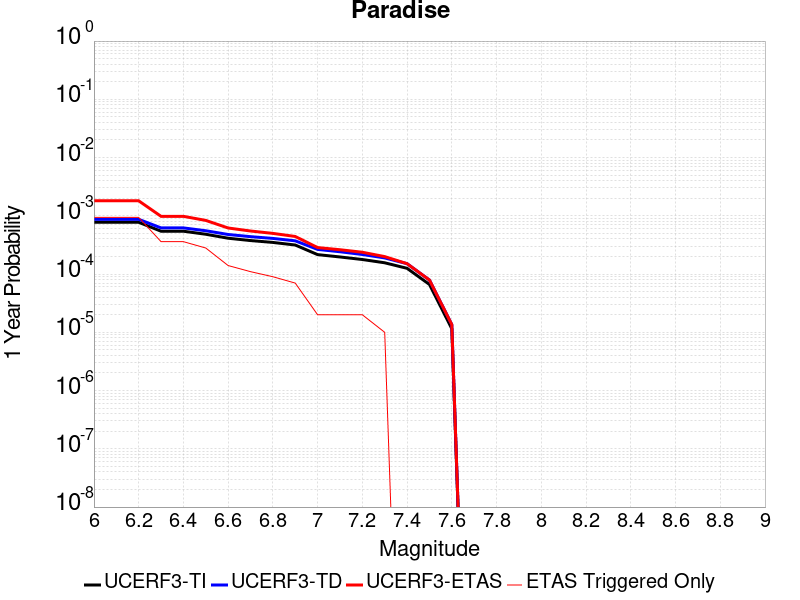 |  |

| Magnitude | 1 wk TI Prob | 1 wk TD Prob | 1 wk ETAS Prob | 1 wk ETAS/TD Gain | 1 wk ETAS Triggered Only | 1 mo TI Prob | 1 mo TD Prob | 1 mo ETAS Prob | 1 mo ETAS/TD Gain | 1 mo ETAS Triggered Only | 1 yr TI Prob | 1 yr TD Prob | 1 yr ETAS Prob | 1 yr ETAS/TD Gain | 1 yr ETAS Triggered Only | 10 yr TI Prob | 10 yr TD Prob | 10 yr ETAS Prob | 10 yr ETAS/TD Gain | 10 yr ETAS Triggered Only |
|-----|-----|-----|-----|-----|-----|-----|-----|-----|-----|-----|-----|-----|-----|-----|-----|-----|-----|-----|-----|-----|
| 6.0 | 1.4851273E-5 | 1.6694768E-5 | 4.166881E-4 | 24.959202 | 4.0E-4 | 6.364676E-5 | 7.154718E-5 | 6.1150856E-4 | 8.546927 | 5.4E-4 | 7.7462377E-4 | 8.707624E-4 | 0.0018099439 | 2.0785737 | 9.4E-4 | 0.0077192914 | 0.008675884 | 0.010063739 | 1.1599668 | 0.0014 |
| 6.1 | 1.4851273E-5 | 1.6694768E-5 | 4.166881E-4 | 24.959202 | 4.0E-4 | 6.364676E-5 | 7.154718E-5 | 6.1150856E-4 | 8.546927 | 5.4E-4 | 7.7462377E-4 | 8.707624E-4 | 0.0018099439 | 2.0785737 | 9.4E-4 | 0.0077192914 | 0.008675884 | 0.010063739 | 1.1599668 | 0.0014 |
| 6.2 | 1.4851273E-5 | 1.6694768E-5 | 4.166881E-4 | 24.959202 | 4.0E-4 | 6.364676E-5 | 7.154718E-5 | 6.1150856E-4 | 8.546927 | 5.4E-4 | 7.7462377E-4 | 8.707624E-4 | 0.0018099439 | 2.0785737 | 9.4E-4 | 0.0077192914 | 0.008675884 | 0.010063739 | 1.1599668 | 0.0014 |
| 6.3 | 1.0426831E-5 | 1.1888697E-5 | 1.0188763E-4 | 8.570126 | 9.0E-5 | 4.4685654E-5 | 5.09506E-5 | 2.0094296E-4 | 3.9438782 | 1.5E-4 | 5.43912E-4 | 6.201529E-4 | 9.799297E-4 | 1.580142 | 3.6E-4 | 0.0054258266 | 0.0061848317 | 0.006721492 | 1.0867704 | 5.4E-4 |
| 6.4 | 1.0426831E-5 | 1.1888697E-5 | 1.0188763E-4 | 8.570126 | 9.0E-5 | 4.4685654E-5 | 5.09506E-5 | 2.0094296E-4 | 3.9438782 | 1.5E-4 | 5.43912E-4 | 6.201529E-4 | 9.799297E-4 | 1.580142 | 3.6E-4 | 0.0054258266 | 0.0061848317 | 0.006721492 | 1.0867704 | 5.4E-4 |
| 6.5 | 9.25027E-6 | 1.0620037E-5 | 7.06194E-5 | 6.6496377 | 6.0E-5 | 3.964341E-5 | 4.551368E-5 | 1.4550913E-4 | 3.1970417 | 1.0E-4 | 4.8255164E-4 | 5.5399304E-4 | 8.3383796E-4 | 1.5051415 | 2.8E-4 | 0.0048150513 | 0.0055266195 | 0.0059542432 | 1.0773753 | 4.3E-4 |
| 6.6 | 7.904275E-6 | 9.159602E-6 | 2.9159419E-5 | 3.183481 | 2.0E-5 | 3.3875025E-5 | 3.925487E-5 | 8.9252906E-5 | 2.2736773 | 5.0E-5 | 4.1235037E-4 | 4.7782718E-4 | 6.177603E-4 | 1.292853 | 1.4E-4 | 0.0041158604 | 0.004768395 | 0.0049873455 | 1.0459172 | 2.2E-4 |
| 6.7 | 7.2061953E-6 | 8.407326E-6 | 1.8407241E-5 | 2.1894288 | 1.0E-5 | 3.088333E-5 | 3.603092E-5 | 6.602984E-5 | 1.8325882 | 3.0E-5 | 3.7593965E-4 | 4.3859181E-4 | 5.485436E-4 | 1.2506927 | 1.1E-4 | 0.003753043 | 0.004377631 | 0.004536931 | 1.0363895 | 1.6E-4 |
| 6.8 | 6.6948724E-6 | 7.842242E-6 | 1.7842163E-5 | 2.2751355 | 1.0E-5 | 2.8691995E-5 | 3.3609194E-5 | 6.360819E-5 | 1.8925829 | 3.0E-5 | 3.4926904E-4 | 4.091187E-4 | 4.9908186E-4 | 1.219895 | 9.0E-5 | 0.003487206 | 0.0040840125 | 0.0042134817 | 1.0317014 | 1.3E-4 |
| 6.9 | 6.0421025E-6 | 7.1306963E-6 | 1.7130626E-5 | 2.4023776 | 1.0E-5 | 2.5894467E-5 | 3.0559786E-5 | 5.0559178E-5 | 1.6544348 | 2.0E-5 | 3.1521954E-4 | 3.7200528E-4 | 4.4197924E-4 | 1.1880994 | 7.0E-5 | 0.0031477278 | 0.0037141638 | 0.0038038297 | 1.0241416 | 9.0E-5 |
| 7.0 | 4.134091E-6 | 5.0803824E-6 | 5.0803824E-6 | 1.0 | 0.0 | 1.7717413E-5 | 2.1772896E-5 | 3.1772677E-5 | 1.4592767 | 1.0E-5 | 2.1568815E-4 | 2.650543E-4 | 2.85049E-4 | 1.0754362 | 2.0E-5 | 0.0021547892 | 0.0026475347 | 0.0026674818 | 1.0075341 | 2.0E-5 |
| 7.1 | 3.7674888E-6 | 4.631936E-6 | 4.631936E-6 | 1.0 | 0.0 | 1.6146281E-5 | 1.9851012E-5 | 2.9850813E-5 | 1.5037427 | 1.0E-5 | 1.9656324E-4 | 2.4166079E-4 | 2.6165595E-4 | 1.0827407 | 2.0E-5 | 0.0019638946 | 0.0024141306 | 0.0024340823 | 1.0082645 | 2.0E-5 |
| 7.2 | 3.4065345E-6 | 4.156782E-6 | 4.156782E-6 | 1.0 | 0.0 | 1.4599351E-5 | 1.7814667E-5 | 2.7814489E-5 | 1.5613252 | 1.0E-5 | 1.777326E-4 | 2.168735E-4 | 2.3686915E-4 | 1.0921997 | 2.0E-5 | 0.0017759053 | 0.0021667667 | 0.0021867233 | 1.0092103 | 2.0E-5 |
| 7.3 | 2.9934936E-6 | 3.6293673E-6 | 3.6293673E-6 | 1.0 | 0.0 | 1.2829195E-5 | 1.5554348E-5 | 2.555419E-5 | 1.6428971 | 1.0E-5 | 1.5618425E-4 | 1.8935918E-4 | 1.993573E-4 | 1.0527997 | 1.0E-5 | 0.0015607453 | 0.0018921237 | 0.0019021048 | 1.005275 | 1.0E-5 |
| 7.4 | 2.4049796E-6 | 2.8890186E-6 | 2.8890186E-6 | 1.0 | 0.0 | 1.0307015E-5 | 1.2381457E-5 | 1.2381457E-5 | 1.0 | 0.0 | 1.2548068E-4 | 1.5073526E-4 | 1.5073526E-4 | 1.0 | 0.0 | 0.0012540985 | 0.0015064715 | 0.0015064715 | 1.0 | 0.0 |
| 7.5 | 1.2710091E-6 | 1.5134859E-6 | 1.5134859E-6 | 1.0 | 0.0 | 5.44717E-6 | 6.4863593E-6 | 6.4863593E-6 | 1.0 | 0.0 | 6.631728E-5 | 7.896981E-5 | 7.896981E-5 | 1.0 | 0.0 | 6.6297496E-4 | 7.895401E-4 | 7.895401E-4 | 1.0 | 0.0 |
| 7.6 | 2.21172E-7 | 2.6040198E-7 | 2.6040198E-7 | 1.0 | 0.0 | 9.478797E-7 | 1.1160082E-6 | 1.1160082E-6 | 1.0 | 0.0 | 1.1540374E-5 | 1.3587343E-5 | 1.3587343E-5 | 1.0 | 0.0 | 1.1539775E-4 | 1.3586794E-4 | 1.3586794E-4 | 1.0 | 0.0 |

## San Andreas (Mojave N)
*[(top)](#table-of-contents)*

| 1 Week | 1 Month | 1 Year | 10 Year |
|-----|-----|-----|-----|
|  |  |  | 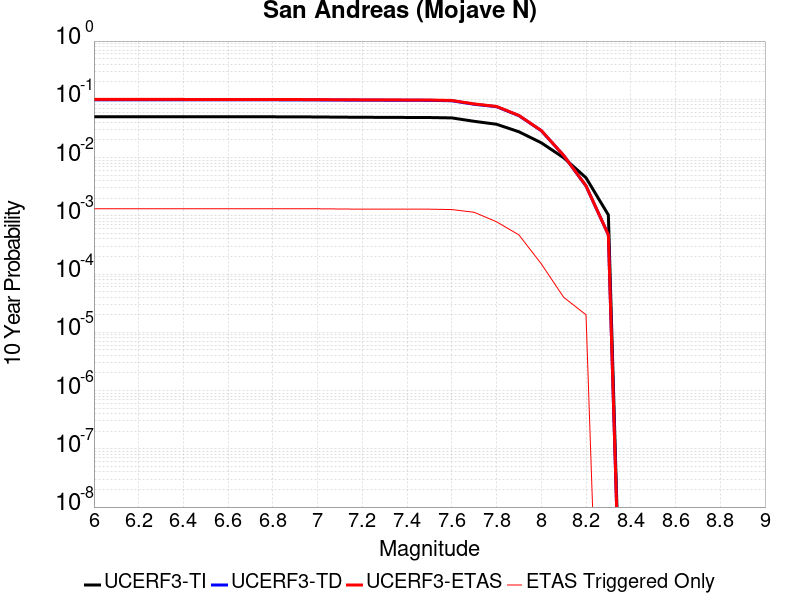 |

| Magnitude | 1 wk TI Prob | 1 wk TD Prob | 1 wk ETAS Prob | 1 wk ETAS/TD Gain | 1 wk ETAS Triggered Only | 1 mo TI Prob | 1 mo TD Prob | 1 mo ETAS Prob | 1 mo ETAS/TD Gain | 1 mo ETAS Triggered Only | 1 yr TI Prob | 1 yr TD Prob | 1 yr ETAS Prob | 1 yr ETAS/TD Gain | 1 yr ETAS Triggered Only | 10 yr TI Prob | 10 yr TD Prob | 10 yr ETAS Prob | 10 yr ETAS/TD Gain | 10 yr ETAS Triggered Only |
|-----|-----|-----|-----|-----|-----|-----|-----|-----|-----|-----|-----|-----|-----|-----|-----|-----|-----|-----|-----|-----|
| 6.0 | 9.877682E-5 | 1.9402112E-4 | 5.739474E-4 | 2.9581697 | 3.8E-4 | 4.2326056E-4 | 8.312543E-4 | 0.0013308387 | 1.6010007 | 5.0E-4 | 0.0051410277 | 0.010073684 | 0.01093492 | 1.0854937 | 8.7E-4 | 0.05023708 | 0.09832245 | 0.09951267 | 1.0121052 | 0.00132 |
| 6.1 | 9.877682E-5 | 1.9402112E-4 | 5.739474E-4 | 2.9581697 | 3.8E-4 | 4.2326056E-4 | 8.312543E-4 | 0.0013308387 | 1.6010007 | 5.0E-4 | 0.0051410277 | 0.010073684 | 0.01093492 | 1.0854937 | 8.7E-4 | 0.05023708 | 0.09832245 | 0.09951267 | 1.0121052 | 0.00132 |
| 6.2 | 9.877682E-5 | 1.9402112E-4 | 5.739474E-4 | 2.9581697 | 3.8E-4 | 4.2326056E-4 | 8.312543E-4 | 0.0013308387 | 1.6010007 | 5.0E-4 | 0.0051410277 | 0.010073684 | 0.01093492 | 1.0854937 | 8.7E-4 | 0.05023708 | 0.09832245 | 0.09951267 | 1.0121052 | 0.00132 |
| 6.3 | 9.877682E-5 | 1.9402112E-4 | 5.739474E-4 | 2.9581697 | 3.8E-4 | 4.2326056E-4 | 8.312543E-4 | 0.0013308387 | 1.6010007 | 5.0E-4 | 0.0051410277 | 0.010073684 | 0.01093492 | 1.0854937 | 8.7E-4 | 0.05023708 | 0.09832245 | 0.09951267 | 1.0121052 | 0.00132 |
| 6.4 | 9.877682E-5 | 1.9402112E-4 | 5.739474E-4 | 2.9581697 | 3.8E-4 | 4.2326056E-4 | 8.312543E-4 | 0.0013308387 | 1.6010007 | 5.0E-4 | 0.0051410277 | 0.010073684 | 0.01093492 | 1.0854937 | 8.7E-4 | 0.05023708 | 0.09832245 | 0.09951267 | 1.0121052 | 0.00132 |
| 6.5 | 9.861474E-5 | 1.937588E-4 | 5.7368516E-4 | 2.9608212 | 3.8E-4 | 4.2256617E-4 | 8.3013077E-4 | 0.0013297157 | 1.6018147 | 5.0E-4 | 0.0051326132 | 0.0100601325 | 0.01092138 | 1.08561 | 8.7E-4 | 0.050156746 | 0.09820035 | 0.09939072 | 1.0121219 | 0.00132 |
| 6.6 | 9.861474E-5 | 1.937588E-4 | 5.7368516E-4 | 2.9608212 | 3.8E-4 | 4.2256617E-4 | 8.3013077E-4 | 0.0013297157 | 1.6018147 | 5.0E-4 | 0.0051326132 | 0.0100601325 | 0.01092138 | 1.08561 | 8.7E-4 | 0.050156746 | 0.09820035 | 0.09939072 | 1.0121219 | 0.00132 |
| 6.7 | 9.8552715E-5 | 1.9365833E-4 | 5.7358475E-4 | 2.9618387 | 3.8E-4 | 4.223004E-4 | 8.2970044E-4 | 0.0013292856 | 1.6021271 | 5.0E-4 | 0.0051293927 | 0.010054941 | 0.010916194 | 1.0856546 | 8.7E-4 | 0.050125998 | 0.09815356 | 0.099344 | 1.0121284 | 0.00132 |
| 6.8 | 9.8464974E-5 | 1.9350994E-4 | 5.734364E-4 | 2.9633434 | 3.8E-4 | 4.219245E-4 | 8.290649E-4 | 0.0013286504 | 1.6025891 | 5.0E-4 | 0.0051248376 | 0.010047276 | 0.010908534 | 1.0857207 | 8.7E-4 | 0.05008251 | 0.09808378 | 0.09927431 | 1.0121379 | 0.00132 |
| 6.9 | 9.825824E-5 | 1.9319002E-4 | 5.731166E-4 | 2.9665954 | 3.8E-4 | 4.2103877E-4 | 8.276947E-4 | 0.0013272809 | 1.6035875 | 5.0E-4 | 0.0051141046 | 0.010030746 | 0.01089202 | 1.0858634 | 8.7E-4 | 0.049980022 | 0.097932965 | 0.099123694 | 1.0121586 | 0.00132 |
| 7.0 | 9.781462E-5 | 1.9250368E-4 | 5.7243055E-4 | 2.9736083 | 3.8E-4 | 4.1913814E-4 | 8.247551E-4 | 0.0013243427 | 1.6057405 | 5.0E-4 | 0.005091073 | 0.009995285 | 0.010856589 | 1.086171 | 8.7E-4 | 0.04976007 | 0.09760912 | 0.09880028 | 1.0122033 | 0.00132 |
| 7.1 | 9.7121134E-5 | 1.9152075E-4 | 5.7144795E-4 | 2.9837391 | 3.8E-4 | 4.1616702E-4 | 8.205452E-4 | 0.001320135 | 1.608851 | 5.0E-4 | 0.005055068 | 0.0099444995 | 0.010795947 | 1.0856199 | 8.6E-4 | 0.04941613 | 0.09714571 | 0.09832845 | 1.0121748 | 0.00131 |
| 7.2 | 9.663819E-5 | 1.9082859E-4 | 5.707561E-4 | 2.9909358 | 3.8E-4 | 4.1409794E-4 | 8.175807E-4 | 0.0013171718 | 1.6110605 | 5.0E-4 | 0.0050299936 | 0.009908735 | 0.010760213 | 1.0859321 | 8.6E-4 | 0.049176537 | 0.09681883 | 0.097992964 | 1.0121272 | 0.0013 |
| 7.3 | 9.6277574E-5 | 1.9035369E-4 | 5.7028135E-4 | 2.995904 | 3.8E-4 | 4.125529E-4 | 8.1554666E-4 | 0.0013151389 | 1.6125857 | 5.0E-4 | 0.0050112694 | 0.009884195 | 0.010735695 | 1.0861475 | 8.6E-4 | 0.04899759 | 0.09659228 | 0.097766705 | 1.0121586 | 0.0013 |
| 7.4 | 9.593308E-5 | 1.8975153E-4 | 5.696794E-4 | 3.0022388 | 3.8E-4 | 4.1107697E-4 | 8.129676E-4 | 0.0013125611 | 1.6145307 | 5.0E-4 | 0.0049933824 | 0.009853081 | 0.010704607 | 1.0864223 | 8.6E-4 | 0.04882661 | 0.09630986 | 0.097484656 | 1.0121981 | 0.0013 |
| 7.5 | 9.561707E-5 | 1.8921228E-4 | 5.6914036E-4 | 3.0079463 | 3.8E-4 | 4.0972308E-4 | 8.106579E-4 | 0.0013102526 | 1.6162829 | 5.0E-4 | 0.0049769743 | 0.009825215 | 0.010676765 | 1.0866699 | 8.6E-4 | 0.048669744 | 0.096056245 | 0.09723137 | 1.0122337 | 0.0013 |
| 7.6 | 9.418194E-5 | 1.8573487E-4 | 5.5566616E-4 | 2.9917169 | 3.7E-4 | 4.0357444E-4 | 7.95764E-4 | 0.001285374 | 1.6152705 | 4.9E-4 | 0.004902454 | 0.009645499 | 0.010477397 | 1.0862472 | 8.4E-4 | 0.047957025 | 0.094437465 | 0.09559658 | 1.0122739 | 0.00128 |
| 7.7 | 8.202141E-5 | 1.6022482E-4 | 4.7017515E-4 | 2.9344714 | 3.1E-4 | 3.51473E-4 | 6.8649714E-4 | 0.0011062088 | 1.6113815 | 4.2E-4 | 0.00427079 | 0.008326128 | 0.009050051 | 1.0869458 | 7.3E-4 | 0.04189639 | 0.082237914 | 0.08329334 | 1.0128338 | 0.00115 |
| 7.8 | 7.2859846E-5 | 1.4517571E-4 | 3.6514376E-4 | 2.515185 | 2.2E-4 | 3.1221908E-4 | 6.2203326E-4 | 9.2184666E-4 | 1.4819893 | 3.0E-4 | 0.003794643 | 0.0075469986 | 0.008043225 | 1.0657516 | 5.0E-4 | 0.037304975 | 0.07472766 | 0.07545863 | 1.0097817 | 7.9E-4 |
| 7.9 | 5.3874453E-5 | 1.00462625E-4 | 2.3044957E-4 | 2.2938836 | 1.3E-4 | 2.3087008E-4 | 4.3048308E-4 | 6.104056E-4 | 1.4179549 | 1.8E-4 | 0.0028072202 | 0.0052285474 | 0.005536927 | 1.0589799 | 3.1E-4 | 0.02772022 | 0.052425884 | 0.052871242 | 1.0084951 | 4.7E-4 |
| 8.0 | 3.468538E-5 | 5.4261534E-5 | 8.425991E-5 | 1.5528479 | 3.0E-5 | 1.4864317E-4 | 2.3252872E-4 | 2.9251477E-4 | 1.2579726 | 6.0E-5 | 0.0018082283 | 0.0028273636 | 0.002927081 | 1.0352687 | 1.0E-4 | 0.017935853 | 0.028948462 | 0.029094119 | 1.0050316 | 1.5E-4 |
| 8.1 | 1.9152367E-5 | 1.9401303E-5 | 2.9401108E-5 | 1.5154194 | 1.0E-5 | 8.207899E-5 | 8.3145795E-5 | 1.0314413E-4 | 1.2405213 | 2.0E-5 | 9.988535E-4 | 0.0010118305 | 0.0010418001 | 1.0296192 | 3.0E-5 | 0.009943757 | 0.01085595 | 0.010895517 | 1.0036446 | 4.0E-5 |
| 8.2 | 8.643924E-6 | 5.473668E-6 | 5.473668E-6 | 1.0 | 0.0 | 3.704486E-5 | 2.3458366E-5 | 3.345813E-5 | 1.4262772 | 1.0E-5 | 4.5092785E-4 | 2.8556827E-4 | 3.0556254E-4 | 1.0700158 | 2.0E-5 | 0.0045001395 | 0.0032481793 | 0.0032681145 | 1.0061373 | 2.0E-5 |
| 8.3 | 1.983087E-6 | 7.6564595E-7 | 7.6564595E-7 | 1.0 | 0.0 | 8.498917E-6 | 3.281336E-6 | 3.281336E-6 | 1.0 | 0.0 | 1.034694E-4 | 3.9949547E-5 | 3.9949547E-5 | 1.0 | 0.0 | 0.0010342124 | 4.717979E-4 | 4.717979E-4 | 1.0 | 0.0 |

## Garlic Springs
*[(top)](#table-of-contents)*

| 1 Week | 1 Month | 1 Year | 10 Year |
|-----|-----|-----|-----|
|  |  |  |  |

| Magnitude | 1 wk TI Prob | 1 wk TD Prob | 1 wk ETAS Prob | 1 wk ETAS/TD Gain | 1 wk ETAS Triggered Only | 1 mo TI Prob | 1 mo TD Prob | 1 mo ETAS Prob | 1 mo ETAS/TD Gain | 1 mo ETAS Triggered Only | 1 yr TI Prob | 1 yr TD Prob | 1 yr ETAS Prob | 1 yr ETAS/TD Gain | 1 yr ETAS Triggered Only | 10 yr TI Prob | 10 yr TD Prob | 10 yr ETAS Prob | 10 yr ETAS/TD Gain | 10 yr ETAS Triggered Only |
|-----|-----|-----|-----|-----|-----|-----|-----|-----|-----|-----|-----|-----|-----|-----|-----|-----|-----|-----|-----|-----|
| 6.0 | 1.6760017E-5 | 1.8776833E-5 | 2.2877289E-4 | 12.183785 | 2.1E-4 | 7.182667E-5 | 8.0470316E-5 | 4.3044216E-4 | 5.3490796 | 3.5E-4 | 8.7413884E-4 | 9.794032E-4 | 0.001698698 | 1.7344216 | 7.2E-4 | 0.008707083 | 0.009762413 | 0.010871479 | 1.1136057 | 0.00112 |
| 6.1 | 9.852767E-6 | 1.0973587E-5 | 1.2097238E-4 | 11.023959 | 1.1E-4 | 4.222546E-5 | 4.702921E-5 | 2.1702121E-4 | 4.6146045 | 1.7E-4 | 5.139737E-4 | 5.7250116E-4 | 0.001002255 | 1.7506602 | 4.3E-4 | 0.005127866 | 0.005717221 | 0.006373448 | 1.1147807 | 6.6E-4 |
| 6.2 | 9.852767E-6 | 1.0973587E-5 | 1.2097238E-4 | 11.023959 | 1.1E-4 | 4.222546E-5 | 4.702921E-5 | 2.1702121E-4 | 4.6146045 | 1.7E-4 | 5.139737E-4 | 5.7250116E-4 | 0.001002255 | 1.7506602 | 4.3E-4 | 0.005127866 | 0.005717221 | 0.006373448 | 1.1147807 | 6.6E-4 |
| 6.3 | 4.3167724E-6 | 4.7780286E-6 | 1.0477755E-4 | 21.929033 | 1.0E-4 | 1.8500323E-5 | 2.0477235E-5 | 1.2047519E-4 | 5.883372 | 1.0E-4 | 2.2521814E-4 | 2.4930484E-4 | 4.1926245E-4 | 1.6817261 | 1.7E-4 | 0.0022499003 | 0.00249251 | 0.002751862 | 1.1040525 | 2.6E-4 |
| 6.4 | 4.3167724E-6 | 4.7780286E-6 | 1.0477755E-4 | 21.929033 | 1.0E-4 | 1.8500323E-5 | 2.0477235E-5 | 1.2047519E-4 | 5.883372 | 1.0E-4 | 2.2521814E-4 | 2.4930484E-4 | 4.1926245E-4 | 1.6817261 | 1.7E-4 | 0.0022499003 | 0.00249251 | 0.002751862 | 1.1040525 | 2.6E-4 |
| 6.5 | 4.3167724E-6 | 4.7780286E-6 | 1.0477755E-4 | 21.929033 | 1.0E-4 | 1.8500323E-5 | 2.0477235E-5 | 1.2047519E-4 | 5.883372 | 1.0E-4 | 2.2521814E-4 | 2.4930484E-4 | 4.1926245E-4 | 1.6817261 | 1.7E-4 | 0.0022499003 | 0.00249251 | 0.002751862 | 1.1040525 | 2.6E-4 |
| 6.6 | 4.301311E-6 | 4.760897E-6 | 1.04760424E-4 | 22.004345 | 1.0E-4 | 1.8434059E-5 | 2.0403815E-5 | 1.20401775E-4 | 5.900944 | 1.0E-4 | 2.2441156E-4 | 2.4841115E-4 | 4.1836893E-4 | 1.6841793 | 1.7E-4 | 0.0022418506 | 0.002483593 | 0.0027429473 | 1.104427 | 2.6E-4 |
| 6.7 | 3.8599724E-6 | 4.27106E-6 | 1.04270635E-4 | 24.413292 | 1.0E-4 | 1.6542634E-5 | 1.8304541E-5 | 1.1830271E-4 | 6.463025 | 1.0E-4 | 2.0138794E-4 | 2.228578E-4 | 3.9281993E-4 | 1.7626482 | 1.7E-4 | 0.0020120554 | 0.002228578 | 0.002478021 | 1.1119292 | 2.5E-4 |

## San Andreas (San Bernardino N)
*[(top)](#table-of-contents)*

| 1 Week | 1 Month | 1 Year | 10 Year |
|-----|-----|-----|-----|
|  |  |  |  |

| Magnitude | 1 wk TI Prob | 1 wk TD Prob | 1 wk ETAS Prob | 1 wk ETAS/TD Gain | 1 wk ETAS Triggered Only | 1 mo TI Prob | 1 mo TD Prob | 1 mo ETAS Prob | 1 mo ETAS/TD Gain | 1 mo ETAS Triggered Only | 1 yr TI Prob | 1 yr TD Prob | 1 yr ETAS Prob | 1 yr ETAS/TD Gain | 1 yr ETAS Triggered Only | 10 yr TI Prob | 10 yr TD Prob | 10 yr ETAS Prob | 10 yr ETAS/TD Gain | 10 yr ETAS Triggered Only |
|-----|-----|-----|-----|-----|-----|-----|-----|-----|-----|-----|-----|-----|-----|-----|-----|-----|-----|-----|-----|-----|
| 6.0 | 1.4273766E-4 | 3.160784E-4 | 5.160152E-4 | 1.6325544 | 2.0E-4 | 6.115894E-4 | 0.0013539245 | 0.0016335454 | 1.2065263 | 2.8E-4 | 0.0074207084 | 0.016360939 | 0.016862595 | 1.0306618 | 5.1E-4 | 0.07177748 | 0.15021163 | 0.15088296 | 1.0044693 | 7.9E-4 |
| 6.1 | 1.4273766E-4 | 3.160784E-4 | 5.160152E-4 | 1.6325544 | 2.0E-4 | 6.115894E-4 | 0.0013539245 | 0.0016335454 | 1.2065263 | 2.8E-4 | 0.0074207084 | 0.016360939 | 0.016862595 | 1.0306618 | 5.1E-4 | 0.07177748 | 0.15021163 | 0.15088296 | 1.0044693 | 7.9E-4 |
| 6.2 | 1.4273766E-4 | 3.160784E-4 | 5.160152E-4 | 1.6325544 | 2.0E-4 | 6.115894E-4 | 0.0013539245 | 0.0016335454 | 1.2065263 | 2.8E-4 | 0.0074207084 | 0.016360939 | 0.016862595 | 1.0306618 | 5.1E-4 | 0.07177748 | 0.15021163 | 0.15088296 | 1.0044693 | 7.9E-4 |
| 6.3 | 1.3730655E-4 | 3.0512668E-4 | 5.0506566E-4 | 1.6552655 | 2.0E-4 | 5.883239E-4 | 0.001307036 | 0.00158667 | 1.2139452 | 2.8E-4 | 0.0071393442 | 0.015798455 | 0.016300399 | 1.0317717 | 5.1E-4 | 0.06914291 | 0.1455135 | 0.14618856 | 1.004639 | 7.9E-4 |
| 6.4 | 1.3730655E-4 | 3.0512668E-4 | 5.0506566E-4 | 1.6552655 | 2.0E-4 | 5.883239E-4 | 0.001307036 | 0.00158667 | 1.2139452 | 2.8E-4 | 0.0071393442 | 0.015798455 | 0.016300399 | 1.0317717 | 5.1E-4 | 0.06914291 | 0.1455135 | 0.14618856 | 1.004639 | 7.9E-4 |
| 6.5 | 1.2942807E-4 | 2.8927144E-4 | 4.7921648E-4 | 1.6566325 | 1.9E-4 | 5.545738E-4 | 0.0012391509 | 0.0015088164 | 1.2176211 | 2.7E-4 | 0.0067310524 | 0.014983548 | 0.015466206 | 1.0322125 | 4.9E-4 | 0.06530788 | 0.13865088 | 0.13931412 | 1.0047835 | 7.7E-4 |
| 6.6 | 1.1125901E-4 | 2.5365927E-4 | 4.4361106E-4 | 1.7488463 | 1.9E-4 | 4.767372E-4 | 0.0010866605 | 0.0013363889 | 1.2298126 | 2.5E-4 | 0.005788839 | 0.0131504685 | 0.013584682 | 1.0330188 | 4.4E-4 | 0.056403454 | 0.12300496 | 0.123627625 | 1.0050621 | 7.1E-4 |
| 6.7 | 1.02209575E-4 | 2.3500937E-4 | 4.1496707E-4 | 1.7657468 | 1.8E-4 | 4.3796748E-4 | 0.0010067957 | 0.0012465541 | 1.23814 | 2.4E-4 | 0.0053192247 | 0.012189267 | 0.012614026 | 1.0348469 | 4.3E-4 | 0.051936906 | 0.114792764 | 0.11540356 | 1.0053208 | 6.9E-4 |
| 6.8 | 9.610582E-5 | 2.2026796E-4 | 4.002283E-4 | 1.8170065 | 1.8E-4 | 4.1181705E-4 | 9.436647E-4 | 0.0011834382 | 1.2540876 | 2.4E-4 | 0.0050023515 | 0.011428859 | 0.0118539445 | 1.037194 | 4.3E-4 | 0.048912346 | 0.10820469 | 0.10882003 | 1.0056868 | 6.9E-4 |
| 6.9 | 9.3877505E-5 | 2.1482339E-4 | 3.9478473E-4 | 1.8377175 | 1.8E-4 | 4.0227012E-4 | 9.203475E-4 | 0.0011601266 | 1.2605311 | 2.4E-4 | 0.0048866454 | 0.011147907 | 0.011553336 | 1.0363683 | 4.1E-4 | 0.04780577 | 0.105798274 | 0.10638844 | 1.0055783 | 6.6E-4 |
| 7.0 | 9.1019785E-5 | 2.0809306E-4 | 3.880556E-4 | 1.8648176 | 1.8E-4 | 3.900265E-4 | 8.915232E-4 | 0.0011313092 | 1.2689621 | 2.4E-4 | 0.0047382377 | 0.0108004995 | 0.011206072 | 1.0375512 | 4.1E-4 | 0.046384744 | 0.10276815 | 0.103351355 | 1.005675 | 6.5E-4 |
| 7.1 | 8.771155E-5 | 1.9983841E-4 | 3.7980243E-4 | 1.9005477 | 1.8E-4 | 3.758525E-4 | 8.5616973E-4 | 0.0010959642 | 1.2800783 | 2.4E-4 | 0.0045664064 | 0.010374243 | 0.01077999 | 1.0391109 | 4.1E-4 | 0.044737056 | 0.09907644 | 0.09965303 | 1.0058197 | 6.4E-4 |
| 7.2 | 8.0830236E-5 | 1.8389444E-4 | 3.6386133E-4 | 1.9786425 | 1.8E-4 | 3.4636928E-4 | 7.8788114E-4 | 0.001027692 | 1.3043745 | 2.4E-4 | 0.0042088944 | 0.009550368 | 0.009956453 | 1.0425203 | 4.1E-4 | 0.041300658 | 0.09180518 | 0.09238643 | 1.0063313 | 6.4E-4 |
| 7.3 | 7.7668235E-5 | 1.7333007E-4 | 3.433006E-4 | 1.9806176 | 1.7E-4 | 3.328214E-4 | 7.426318E-4 | 9.72461E-4 | 1.3094794 | 2.3E-4 | 0.0040445733 | 0.009004138 | 0.009390627 | 1.0429235 | 3.9E-4 | 0.03971748 | 0.08706761 | 0.08763363 | 1.006501 | 6.2E-4 |
| 7.4 | 7.520177E-5 | 1.655312E-4 | 3.3550305E-4 | 2.0268269 | 1.7E-4 | 3.2225347E-4 | 7.092266E-4 | 9.3906344E-4 | 1.3240669 | 2.3E-4 | 0.0039163795 | 0.008600714 | 0.008987359 | 1.0449551 | 3.9E-4 | 0.038480744 | 0.08352157 | 0.084080614 | 1.0066935 | 6.1E-4 |
| 7.5 | 7.274697E-5 | 1.584075E-4 | 3.2838059E-4 | 2.0730114 | 1.7E-4 | 3.1173544E-4 | 6.7871273E-4 | 9.085566E-4 | 1.3386468 | 2.3E-4 | 0.003788775 | 0.008232076 | 0.008618865 | 1.0469856 | 3.9E-4 | 0.03724827 | 0.08023654 | 0.0807976 | 1.0069926 | 6.1E-4 |
| 7.6 | 7.1185845E-5 | 1.5410586E-4 | 3.2407965E-4 | 2.1029677 | 1.7E-4 | 3.0504653E-4 | 6.602866E-4 | 8.901347E-4 | 1.3481036 | 2.3E-4 | 0.0037076178 | 0.0080094095 | 0.008396286 | 1.0483028 | 3.9E-4 | 0.036463667 | 0.07822661 | 0.07878889 | 1.0071878 | 6.1E-4 |
| 7.7 | 6.709961E-5 | 1.4319421E-4 | 3.1316988E-4 | 2.187029 | 1.7E-4 | 2.8753807E-4 | 6.135452E-4 | 8.434041E-4 | 1.3746405 | 2.3E-4 | 0.003495157 | 0.0074443663 | 0.007821538 | 1.0506653 | 3.8E-4 | 0.034406938 | 0.07305558 | 0.073611744 | 1.007613 | 6.0E-4 |
| 7.8 | 6.300812E-5 | 1.320343E-4 | 3.0201185E-4 | 2.2873743 | 1.7E-4 | 2.7000686E-4 | 5.657386E-4 | 7.956085E-4 | 1.4063182 | 2.3E-4 | 0.0032823787 | 0.006866143 | 0.007243534 | 1.0549641 | 3.8E-4 | 0.032343175 | 0.06771385 | 0.06827322 | 1.0082608 | 6.0E-4 |
| 7.9 | 4.983037E-5 | 9.7241085E-5 | 2.2722845E-4 | 2.3367536 | 1.3E-4 | 2.1354125E-4 | 4.1668097E-4 | 5.9660594E-4 | 1.4318051 | 1.8E-4 | 0.0025967648 | 0.0050613005 | 0.005369731 | 1.0609391 | 3.1E-4 | 0.025666296 | 0.050650507 | 0.051096704 | 1.0088093 | 4.7E-4 |
| 8.0 | 3.2211527E-5 | 5.3306234E-5 | 8.3304636E-5 | 1.562756 | 3.0E-5 | 1.380421E-4 | 2.2843528E-4 | 2.8842158E-4 | 1.2625965 | 6.0E-5 | 0.0016793669 | 0.0027776542 | 0.0028773765 | 1.0359015 | 1.0E-4 | 0.016667323 | 0.028362568 | 0.028508315 | 1.0051386 | 1.5E-4 |
| 8.1 | 1.743376E-5 | 1.8823403E-5 | 2.8823213E-5 | 1.5312436 | 1.0E-5 | 7.471398E-5 | 8.066923E-5 | 1.0066762E-4 | 1.247906 | 2.0E-5 | 9.0926304E-4 | 9.81706E-4 | 0.0010116765 | 1.030529 | 3.0E-5 | 0.009055517 | 0.010483979 | 0.01052356 | 1.0037754 | 4.0E-5 |
| 8.2 | 7.831616E-6 | 5.1540533E-6 | 5.1540533E-6 | 1.0 | 0.0 | 3.3563636E-5 | 2.2088612E-5 | 3.2088392E-5 | 1.4527119 | 1.0E-5 | 4.0856065E-4 | 2.6889573E-4 | 2.8889035E-4 | 1.0743582 | 2.0E-5 | 0.004078103 | 0.0030413668 | 0.003061306 | 1.006556 | 2.0E-5 |
| 8.3 | 1.983087E-6 | 7.6564595E-7 | 7.6564595E-7 | 1.0 | 0.0 | 8.498917E-6 | 3.281336E-6 | 3.281336E-6 | 1.0 | 0.0 | 1.034694E-4 | 3.9949547E-5 | 3.9949547E-5 | 1.0 | 0.0 | 0.0010342124 | 4.717979E-4 | 4.717979E-4 | 1.0 | 0.0 |

## Helendale-So Lockhart
*[(top)](#table-of-contents)*

| 1 Week | 1 Month | 1 Year | 10 Year |
|-----|-----|-----|-----|
|  |  |  |  |

| Magnitude | 1 wk TI Prob | 1 wk TD Prob | 1 wk ETAS Prob | 1 wk ETAS/TD Gain | 1 wk ETAS Triggered Only | 1 mo TI Prob | 1 mo TD Prob | 1 mo ETAS Prob | 1 mo ETAS/TD Gain | 1 mo ETAS Triggered Only | 1 yr TI Prob | 1 yr TD Prob | 1 yr ETAS Prob | 1 yr ETAS/TD Gain | 1 yr ETAS Triggered Only | 10 yr TI Prob | 10 yr TD Prob | 10 yr ETAS Prob | 10 yr ETAS/TD Gain | 10 yr ETAS Triggered Only |
|-----|-----|-----|-----|-----|-----|-----|-----|-----|-----|-----|-----|-----|-----|-----|-----|-----|-----|-----|-----|-----|
| 6.0 | 1.7296055E-5 | 1.8103729E-5 | 2.3809975E-4 | 13.151972 | 2.2E-4 | 7.412385E-5 | 7.7585224E-5 | 4.0755962E-4 | 5.2530575 | 3.3E-4 | 9.0208417E-4 | 9.4421144E-4 | 0.0015136732 | 1.6031083 | 5.7E-4 | 0.008984311 | 0.009404116 | 0.010216405 | 1.0863758 | 8.2E-4 |
| 6.1 | 1.7296055E-5 | 1.8103729E-5 | 2.3809975E-4 | 13.151972 | 2.2E-4 | 7.412385E-5 | 7.7585224E-5 | 4.0755962E-4 | 5.2530575 | 3.3E-4 | 9.0208417E-4 | 9.4421144E-4 | 0.0015136732 | 1.6031083 | 5.7E-4 | 0.008984311 | 0.009404116 | 0.010216405 | 1.0863758 | 8.2E-4 |
| 6.2 | 1.7296055E-5 | 1.8103729E-5 | 2.3809975E-4 | 13.151972 | 2.2E-4 | 7.412385E-5 | 7.7585224E-5 | 4.0755962E-4 | 5.2530575 | 3.3E-4 | 9.0208417E-4 | 9.4421144E-4 | 0.0015136732 | 1.6031083 | 5.7E-4 | 0.008984311 | 0.009404116 | 0.010216405 | 1.0863758 | 8.2E-4 |
| 6.3 | 1.0669118E-5 | 1.1135425E-5 | 1.6113375E-4 | 14.470374 | 1.5E-4 | 4.5723988E-5 | 4.772239E-5 | 2.677119E-4 | 5.6097755 | 2.2E-4 | 5.5654737E-4 | 5.80868E-4 | 9.406589E-4 | 1.6194022 | 3.6E-4 | 0.0055515557 | 0.0057937936 | 0.0062809545 | 1.0840832 | 4.9E-4 |
| 6.4 | 1.0669118E-5 | 1.1135425E-5 | 1.6113375E-4 | 14.470374 | 1.5E-4 | 4.5723988E-5 | 4.772239E-5 | 2.677119E-4 | 5.6097755 | 2.2E-4 | 5.5654737E-4 | 5.80868E-4 | 9.406589E-4 | 1.6194022 | 3.6E-4 | 0.0055515557 | 0.0057937936 | 0.0062809545 | 1.0840832 | 4.9E-4 |
| 6.5 | 8.790038E-6 | 9.170197E-6 | 1.291691E-4 | 14.08575 | 1.2E-4 | 3.767105E-5 | 3.930026E-5 | 2.0929358E-4 | 5.325501 | 1.7E-4 | 4.585485E-4 | 4.7837716E-4 | 7.582432E-4 | 1.5850322 | 2.8E-4 | 0.0045760344 | 0.004773638 | 0.0051518246 | 1.0792239 | 3.8E-4 |
| 6.6 | 7.396949E-6 | 7.715537E-6 | 1.2771461E-4 | 16.552914 | 1.2E-4 | 3.1700827E-5 | 3.3066175E-5 | 2.0306055E-4 | 6.1410356 | 1.7E-4 | 3.858892E-4 | 4.025073E-4 | 6.5240666E-4 | 1.6208568 | 2.5E-4 | 0.003852198 | 0.00401789 | 0.0043664835 | 1.0867604 | 3.5E-4 |
| 6.7 | 6.4600285E-6 | 6.738031E-6 | 8.673749E-5 | 12.872825 | 8.0E-5 | 2.7685543E-5 | 2.887696E-5 | 1.488735E-4 | 5.155442 | 1.2E-4 | 3.3701936E-4 | 3.5152107E-4 | 5.5145076E-4 | 1.568756 | 2.0E-4 | 0.0033650869 | 0.003509732 | 0.0037987141 | 1.0823374 | 2.9E-4 |
| 6.8 | 5.600104E-6 | 5.836009E-6 | 8.583554E-5 | 14.707917 | 8.0E-5 | 2.4000226E-5 | 2.5011232E-5 | 1.4500823E-4 | 5.7977242 | 1.2E-4 | 2.9216358E-4 | 3.044698E-4 | 4.8441498E-4 | 1.5910116 | 1.8E-4 | 0.0029177975 | 0.003040588 | 0.0032798583 | 1.0786921 | 2.4E-4 |
| 6.9 | 4.839122E-6 | 5.0395092E-6 | 6.503921E-5 | 12.905861 | 6.0E-5 | 2.0738931E-5 | 2.159772E-5 | 1.2159556E-4 | 5.630018 | 1.0E-4 | 2.5246723E-4 | 2.6292098E-4 | 4.2287892E-4 | 1.6083878 | 1.6E-4 | 0.002521806 | 0.002626147 | 0.002845569 | 1.083553 | 2.2E-4 |
| 7.0 | 3.6937633E-6 | 3.845208E-6 | 3.3845092E-5 | 8.801888 | 3.0E-5 | 1.5830317E-5 | 1.647936E-5 | 7.647837E-5 | 4.640858 | 6.0E-5 | 1.9271708E-4 | 2.0061806E-4 | 2.906E-4 | 1.4485236 | 9.0E-5 | 0.0019255003 | 0.002004401 | 0.0021241605 | 1.0597483 | 1.2E-4 |
| 7.1 | 2.7858857E-6 | 2.8978538E-6 | 3.2897766E-5 | 11.352459 | 3.0E-5 | 1.1939455E-5 | 1.2419316E-5 | 6.2418694E-5 | 5.0259366 | 5.0E-5 | 1.4535317E-4 | 1.511949E-4 | 2.311828E-4 | 1.5290384 | 8.0E-5 | 0.0014525814 | 0.0015109418 | 0.0016008058 | 1.0594755 | 9.0E-5 |
| 7.2 | 2.1672065E-6 | 2.2540128E-6 | 1.22539905E-5 | 5.436522 | 1.0E-5 | 9.2879945E-6 | 9.66002E-6 | 3.965973E-5 | 4.1055536 | 3.0E-5 | 1.1307546E-4 | 1.1760458E-4 | 1.675987E-4 | 1.4251035 | 5.0E-5 | 0.0011301794 | 0.0011754417 | 0.0012353711 | 1.0509846 | 6.0E-5 |
| 7.3 | 1.4823496E-6 | 1.5422102E-6 | 1.5422102E-6 | 1.0 | 0.0 | 6.3529114E-6 | 6.6094562E-6 | 2.6609325E-5 | 4.0259476 | 2.0E-5 | 7.734395E-5 | 8.046731E-5 | 1.104649E-4 | 1.3727922 | 3.0E-5 | 7.731704E-4 | 8.0439687E-4 | 8.443647E-4 | 1.0496867 | 4.0E-5 |
| 7.4 | 4.2321457E-7 | 4.4108765E-7 | 4.4108765E-7 | 1.0 | 0.0 | 1.8137755E-6 | 1.8903745E-6 | 1.8903745E-6 | 1.0 | 0.0 | 2.2082493E-5 | 2.3015113E-5 | 2.3015113E-5 | 1.0 | 0.0 | 2.2080299E-4 | 2.3013182E-4 | 2.3013182E-4 | 1.0 | 0.0 |
| 7.5 | 5.6942316E-8 | 5.9415648E-8 | 5.9415648E-8 | 1.0 | 0.0 | 2.440385E-7 | 2.5463845E-7 | 2.5463845E-7 | 1.0 | 0.0 | 2.9711643E-6 | 3.1002196E-6 | 3.1002196E-6 | 1.0 | 0.0 | 2.9711247E-5 | 3.1001844E-5 | 3.1001844E-5 | 1.0 | 0.0 |

## Death Valley (Black Mtns Frontal)
*[(top)](#table-of-contents)*

| 1 Week | 1 Month | 1 Year | 10 Year |
|-----|-----|-----|-----|
|  |  | 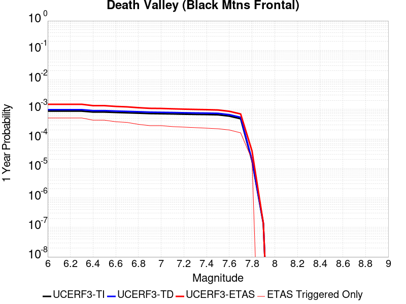 |  |

| Magnitude | 1 wk TI Prob | 1 wk TD Prob | 1 wk ETAS Prob | 1 wk ETAS/TD Gain | 1 wk ETAS Triggered Only | 1 mo TI Prob | 1 mo TD Prob | 1 mo ETAS Prob | 1 mo ETAS/TD Gain | 1 mo ETAS Triggered Only | 1 yr TI Prob | 1 yr TD Prob | 1 yr ETAS Prob | 1 yr ETAS/TD Gain | 1 yr ETAS Triggered Only | 10 yr TI Prob | 10 yr TD Prob | 10 yr ETAS Prob | 10 yr ETAS/TD Gain | 10 yr ETAS Triggered Only |
|-----|-----|-----|-----|-----|-----|-----|-----|-----|-----|-----|-----|-----|-----|-----|-----|-----|-----|-----|-----|-----|
| 6.0 | 1.6707214E-5 | 1.867027E-5 | 1.886671E-4 | 10.105216 | 1.7E-4 | 7.160038E-5 | 8.001303E-5 | 3.899882E-4 | 4.874059 | 3.1E-4 | 8.71386E-4 | 9.737309E-4 | 0.0014832342 | 1.5232487 | 5.1E-4 | 0.00867977 | 0.009695496 | 0.0104283225 | 1.075584 | 7.4E-4 |
| 6.1 | 1.6707214E-5 | 1.867027E-5 | 1.886671E-4 | 10.105216 | 1.7E-4 | 7.160038E-5 | 8.001303E-5 | 3.899882E-4 | 4.874059 | 3.1E-4 | 8.71386E-4 | 9.737309E-4 | 0.0014832342 | 1.5232487 | 5.1E-4 | 0.00867977 | 0.009695496 | 0.0104283225 | 1.075584 | 7.4E-4 |
| 6.2 | 1.6707214E-5 | 1.867027E-5 | 1.886671E-4 | 10.105216 | 1.7E-4 | 7.160038E-5 | 8.001303E-5 | 3.899882E-4 | 4.874059 | 3.1E-4 | 8.71386E-4 | 9.737309E-4 | 0.0014832342 | 1.5232487 | 5.1E-4 | 0.00867977 | 0.009695496 | 0.0104283225 | 1.075584 | 7.4E-4 |
| 6.3 | 1.6707214E-5 | 1.867027E-5 | 1.886671E-4 | 10.105216 | 1.7E-4 | 7.160038E-5 | 8.001303E-5 | 3.899882E-4 | 4.874059 | 3.1E-4 | 8.71386E-4 | 9.737309E-4 | 0.0014832342 | 1.5232487 | 5.1E-4 | 0.00867977 | 0.009695496 | 0.0104283225 | 1.075584 | 7.4E-4 |
| 6.4 | 1.5515609E-5 | 1.7338214E-5 | 1.4733596E-4 | 8.497759 | 1.3E-4 | 6.649377E-5 | 7.4304546E-5 | 3.2428597E-4 | 4.3642817 | 2.5E-4 | 8.0926094E-4 | 9.042885E-4 | 0.0013338997 | 1.4750819 | 4.3E-4 | 0.008063202 | 0.009006773 | 0.009631098 | 1.0693173 | 6.3E-4 |
| 6.5 | 1.5515609E-5 | 1.7338214E-5 | 1.4733596E-4 | 8.497759 | 1.3E-4 | 6.649377E-5 | 7.4304546E-5 | 3.2428597E-4 | 4.3642817 | 2.5E-4 | 8.0926094E-4 | 9.042885E-4 | 0.0013338997 | 1.4750819 | 4.3E-4 | 0.008063202 | 0.009006773 | 0.009631098 | 1.0693173 | 6.3E-4 |
| 6.6 | 1.5041828E-5 | 1.6809145E-5 | 1.3680712E-4 | 8.138851 | 1.2E-4 | 6.4463384E-5 | 7.203723E-5 | 3.0202066E-4 | 4.192563 | 2.3E-4 | 7.8455906E-4 | 8.767063E-4 | 0.0012563731 | 1.4330605 | 3.8E-4 | 0.00781795 | 0.008733132 | 0.009308067 | 1.0658337 | 5.8E-4 |
| 6.7 | 1.4634985E-5 | 1.6356016E-5 | 1.2635422E-4 | 7.725244 | 1.1E-4 | 6.271985E-5 | 7.009536E-5 | 2.9007994E-4 | 4.1383615 | 2.2E-4 | 7.6334673E-4 | 8.5308263E-4 | 0.0012127756 | 1.421639 | 3.6E-4 | 0.007607299 | 0.008498715 | 0.009034126 | 1.062999 | 5.4E-4 |
| 6.8 | 1.4209158E-5 | 1.5882048E-5 | 1.05880616E-4 | 6.6666856 | 9.0E-5 | 6.089497E-5 | 6.8064175E-5 | 2.4805192E-4 | 3.644383 | 1.8E-4 | 7.4114406E-4 | 8.2837185E-4 | 0.0011381151 | 1.373918 | 3.1E-4 | 0.007386771 | 0.008253456 | 0.008729494 | 1.0576775 | 4.8E-4 |
| 6.9 | 1.3780098E-5 | 1.5404594E-5 | 9.540336E-5 | 6.1931763 | 8.0E-5 | 5.9056227E-5 | 6.6018045E-5 | 2.3600682E-4 | 3.5748835 | 1.7E-4 | 7.1877235E-4 | 8.0347876E-4 | 0.0010832538 | 1.3482046 | 2.8E-4 | 0.0071645193 | 0.008006332 | 0.00844281 | 1.0545166 | 4.4E-4 |
| 7.0 | 1.3585064E-5 | 1.5188155E-5 | 9.518694E-5 | 6.2671824 | 8.0E-5 | 5.8220405E-5 | 6.50905E-5 | 2.3507944E-4 | 3.6115782 | 1.7E-4 | 7.086029E-4 | 7.9219416E-4 | 0.0010719723 | 1.3531687 | 2.8E-4 | 0.007063476 | 0.007894293 | 0.00833082 | 1.0552964 | 4.4E-4 |
| 7.1 | 1.3398601E-5 | 1.49813395E-5 | 9.498014E-5 | 6.3398967 | 8.0E-5 | 5.742131E-5 | 6.420419E-5 | 2.2419392E-4 | 3.4918892 | 1.6E-4 | 6.9888023E-4 | 7.8141113E-4 | 0.0010412079 | 1.3324714 | 2.6E-4 | 0.0069668638 | 0.007787224 | 0.0082039535 | 1.0535145 | 4.2E-4 |
| 7.2 | 1.3126312E-5 | 1.4679561E-5 | 9.4678384E-5 | 6.449674 | 8.0E-5 | 5.6254412E-5 | 6.291092E-5 | 2.1290148E-4 | 3.3841739 | 1.5E-4 | 6.846822E-4 | 7.6567667E-4 | 0.0010154853 | 1.3262585 | 2.5E-4 | 0.006825765 | 0.00763097 | 0.008037841 | 1.0533184 | 4.1E-4 |
| 7.3 | 1.2922429E-5 | 1.4453788E-5 | 9.445263E-5 | 6.534801 | 8.0E-5 | 5.5380664E-5 | 6.194336E-5 | 2.0193469E-4 | 3.259989 | 1.4E-4 | 6.74051E-4 | 7.53905E-4 | 9.93724E-4 | 1.3181025 | 2.4E-4 | 0.006720101 | 0.007514055 | 0.007911049 | 1.0528336 | 4.0E-4 |
| 7.4 | 1.2768878E-5 | 1.4283772E-5 | 8.428277E-5 | 5.9005966 | 7.0E-5 | 5.4722615E-5 | 6.1214756E-5 | 1.912068E-4 | 3.1235409 | 1.3E-4 | 6.660441E-4 | 7.4504025E-4 | 9.748689E-4 | 1.3084781 | 2.3E-4 | 0.0066405144 | 0.0074260035 | 0.007813107 | 1.0521282 | 3.9E-4 |
| 7.5 | 1.2521929E-5 | 1.40120155E-5 | 8.401104E-5 | 5.9956427 | 7.0E-5 | 5.366431E-5 | 6.005014E-5 | 1.8004293E-4 | 2.99821 | 1.2E-4 | 6.531671E-4 | 7.3087064E-4 | 9.5070986E-4 | 1.3007909 | 2.2E-4 | 0.006512506 | 0.0072852457 | 0.0076624774 | 1.0517802 | 3.8E-4 |
| 7.6 | 1.1301089E-5 | 1.2648149E-5 | 8.264726E-5 | 6.5343366 | 7.0E-5 | 4.8432343E-5 | 5.4205255E-5 | 1.7419875E-4 | 3.2136874 | 1.2E-4 | 5.895042E-4 | 6.5975444E-4 | 8.596225E-4 | 1.3029431 | 2.0E-4 | 0.0058794282 | 0.00657851 | 0.0069162734 | 1.0513434 | 3.4E-4 |
| 7.7 | 9.189108E-6 | 1.0283358E-5 | 7.028274E-5 | 6.83461 | 6.0E-5 | 3.93813E-5 | 4.407082E-5 | 1.440664E-4 | 3.268975 | 1.0E-4 | 4.7936183E-4 | 5.3643517E-4 | 6.9634937E-4 | 1.2981054 | 1.6E-4 | 0.004783291 | 0.005351914 | 0.0056503084 | 1.0557547 | 3.0E-4 |
| 7.8 | 3.4586725E-7 | 3.6482615E-7 | 1.0364823E-5 | 28.410307 | 1.0E-5 | 1.4822873E-6 | 1.5635396E-6 | 2.1563508E-5 | 13.791469 | 2.0E-5 | 1.80467E-5 | 1.9035933E-5 | 3.9035553E-5 | 2.0506246 | 2.0E-5 | 1.8045233E-4 | 1.9034347E-4 | 2.1033967E-4 | 1.1050532 | 2.0E-5 |
| 7.9 | 2.5591178E-9 | 2.6696718E-9 | 2.6696718E-9 | 1.0 | 0.0 | 1.0967647E-8 | 1.14414505E-8 | 1.14414505E-8 | 1.0 | 0.0 | 1.335311E-7 | 1.3929966E-7 | 1.3929966E-7 | 1.0 | 0.0 | 1.3353102E-6 | 1.3929966E-6 | 1.3929966E-6 | 1.0 | 0.0 |

## Coyote Lake
*[(top)](#table-of-contents)*

| 1 Week | 1 Month | 1 Year | 10 Year |
|-----|-----|-----|-----|
|  | 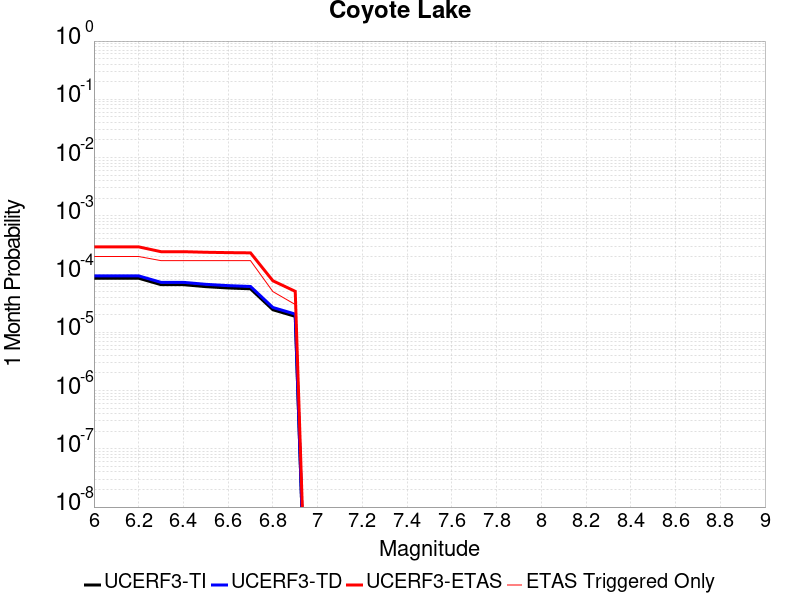 |  |  |

| Magnitude | 1 wk TI Prob | 1 wk TD Prob | 1 wk ETAS Prob | 1 wk ETAS/TD Gain | 1 wk ETAS Triggered Only | 1 mo TI Prob | 1 mo TD Prob | 1 mo ETAS Prob | 1 mo ETAS/TD Gain | 1 mo ETAS Triggered Only | 1 yr TI Prob | 1 yr TD Prob | 1 yr ETAS Prob | 1 yr ETAS/TD Gain | 1 yr ETAS Triggered Only | 10 yr TI Prob | 10 yr TD Prob | 10 yr ETAS Prob | 10 yr ETAS/TD Gain | 10 yr ETAS Triggered Only |
|-----|-----|-----|-----|-----|-----|-----|-----|-----|-----|-----|-----|-----|-----|-----|-----|-----|-----|-----|-----|-----|
| 6.0 | 1.980352E-5 | 2.1706745E-5 | 2.0170283E-4 | 9.292173 | 1.8E-4 | 8.486947E-5 | 9.302599E-5 | 2.9300738E-4 | 3.1497366 | 2.0E-4 | 0.0010327959 | 0.0011320751 | 0.0015216336 | 1.3441101 | 3.9E-4 | 0.010280091 | 0.011270258 | 0.011893158 | 1.0552694 | 6.3E-4 |
| 6.1 | 1.980352E-5 | 2.1706745E-5 | 2.0170283E-4 | 9.292173 | 1.8E-4 | 8.486947E-5 | 9.302599E-5 | 2.9300738E-4 | 3.1497366 | 2.0E-4 | 0.0010327959 | 0.0011320751 | 0.0015216336 | 1.3441101 | 3.9E-4 | 0.010280091 | 0.011270258 | 0.011893158 | 1.0552694 | 6.3E-4 |
| 6.2 | 1.980352E-5 | 2.1706745E-5 | 2.0170283E-4 | 9.292173 | 1.8E-4 | 8.486947E-5 | 9.302599E-5 | 2.9300738E-4 | 3.1497366 | 2.0E-4 | 0.0010327959 | 0.0011320751 | 0.0015216336 | 1.3441101 | 3.9E-4 | 0.010280091 | 0.011270258 | 0.011893158 | 1.0552694 | 6.3E-4 |
| 6.3 | 1.5344787E-5 | 1.682067E-5 | 1.7681798E-4 | 10.511947 | 1.6E-4 | 6.576172E-5 | 7.2086936E-5 | 2.4207468E-4 | 3.3580937 | 1.7E-4 | 8.003548E-4 | 8.773662E-4 | 0.0011970855 | 1.364408 | 3.2E-4 | 0.007974784 | 0.00874507 | 0.009230784 | 1.0555415 | 4.9E-4 |
| 6.4 | 1.5344787E-5 | 1.682067E-5 | 1.7681798E-4 | 10.511947 | 1.6E-4 | 6.576172E-5 | 7.2086936E-5 | 2.4207468E-4 | 3.3580937 | 1.7E-4 | 8.003548E-4 | 8.773662E-4 | 0.0011970855 | 1.364408 | 3.2E-4 | 0.007974784 | 0.00874507 | 0.009230784 | 1.0555415 | 4.9E-4 |
| 6.5 | 1.4189697E-5 | 1.5557987E-5 | 1.755555E-4 | 11.283947 | 1.6E-4 | 6.081157E-5 | 6.6675726E-5 | 2.3666439E-4 | 3.5494838 | 1.7E-4 | 7.401293E-4 | 8.115349E-4 | 0.0011212833 | 1.3816822 | 3.1E-4 | 0.0073766913 | 0.008091656 | 0.008547934 | 1.0563887 | 4.6E-4 |
| 6.6 | 1.3469301E-5 | 1.4771577E-5 | 1.7476921E-4 | 11.831452 | 1.6E-4 | 5.7724297E-5 | 6.330556E-5 | 2.332948E-4 | 3.685218 | 1.7E-4 | 7.025667E-4 | 7.7053264E-4 | 0.0010703015 | 1.3890411 | 3.0E-4 | 0.0070034964 | 0.0076845144 | 0.008131056 | 1.0581093 | 4.5E-4 |
| 6.7 | 1.3027966E-5 | 1.4281745E-5 | 1.7427946E-4 | 12.202952 | 1.6E-4 | 5.5832945E-5 | 6.120638E-5 | 2.3119597E-4 | 3.7773182 | 1.7E-4 | 6.7955407E-4 | 7.4499263E-4 | 0.0010447692 | 1.4023886 | 3.0E-4 | 0.006774798 | 0.0074308286 | 0.007867559 | 1.0587728 | 4.4E-4 |
| 6.8 | 5.695434E-6 | 6.2244176E-6 | 4.622417E-5 | 7.426264 | 4.0E-5 | 2.4408775E-5 | 2.6675973E-5 | 7.667464E-5 | 2.874296 | 5.0E-5 | 2.971363E-4 | 3.2476155E-4 | 4.1473232E-4 | 1.2770364 | 9.0E-5 | 0.0029673933 | 0.0032458105 | 0.0033753884 | 1.0399216 | 1.3E-4 |
| 6.9 | 4.385688E-6 | 4.7930553E-6 | 2.479296E-5 | 5.1726837 | 2.0E-5 | 1.879567E-5 | 2.0541665E-5 | 5.054105E-5 | 2.4604163 | 3.0E-5 | 2.2881327E-4 | 2.5009477E-4 | 2.9008478E-4 | 1.1598994 | 4.0E-5 | 0.002285778 | 0.0025009478 | 0.0025807477 | 1.0319079 | 8.0E-5 |

## San Andreas (Big Bend)
*[(top)](#table-of-contents)*

| 1 Week | 1 Month | 1 Year | 10 Year |
|-----|-----|-----|-----|
|  |  |  |  |

| Magnitude | 1 wk TI Prob | 1 wk TD Prob | 1 wk ETAS Prob | 1 wk ETAS/TD Gain | 1 wk ETAS Triggered Only | 1 mo TI Prob | 1 mo TD Prob | 1 mo ETAS Prob | 1 mo ETAS/TD Gain | 1 mo ETAS Triggered Only | 1 yr TI Prob | 1 yr TD Prob | 1 yr ETAS Prob | 1 yr ETAS/TD Gain | 1 yr ETAS Triggered Only | 10 yr TI Prob | 10 yr TD Prob | 10 yr ETAS Prob | 10 yr ETAS/TD Gain | 10 yr ETAS Triggered Only |
|-----|-----|-----|-----|-----|-----|-----|-----|-----|-----|-----|-----|-----|-----|-----|-----|-----|-----|-----|-----|-----|
| 6.0 | 1.0179969E-4 | 2.0073925E-4 | 3.5070913E-4 | 1.747088 | 1.5E-4 | 4.362114E-4 | 8.6002843E-4 | 0.0010598565 | 1.2323505 | 2.0E-4 | 0.0052979486 | 0.010420859 | 0.010767212 | 1.0332365 | 3.5E-4 | 0.051734097 | 0.101455905 | 0.101878226 | 1.0041625 | 4.7E-4 |
| 6.1 | 1.0179969E-4 | 2.0073925E-4 | 3.5070913E-4 | 1.747088 | 1.5E-4 | 4.362114E-4 | 8.6002843E-4 | 0.0010598565 | 1.2323505 | 2.0E-4 | 0.0052979486 | 0.010420859 | 0.010767212 | 1.0332365 | 3.5E-4 | 0.051734097 | 0.101455905 | 0.101878226 | 1.0041625 | 4.7E-4 |
| 6.2 | 1.0179969E-4 | 2.0073925E-4 | 3.5070913E-4 | 1.747088 | 1.5E-4 | 4.362114E-4 | 8.6002843E-4 | 0.0010598565 | 1.2323505 | 2.0E-4 | 0.0052979486 | 0.010420859 | 0.010767212 | 1.0332365 | 3.5E-4 | 0.051734097 | 0.101455905 | 0.101878226 | 1.0041625 | 4.7E-4 |
| 6.3 | 1.0179969E-4 | 2.0073925E-4 | 3.5070913E-4 | 1.747088 | 1.5E-4 | 4.362114E-4 | 8.6002843E-4 | 0.0010598565 | 1.2323505 | 2.0E-4 | 0.0052979486 | 0.010420859 | 0.010767212 | 1.0332365 | 3.5E-4 | 0.051734097 | 0.101455905 | 0.101878226 | 1.0041625 | 4.7E-4 |
| 6.4 | 9.1639464E-5 | 1.8430917E-4 | 2.8429073E-4 | 1.5424666 | 1.0E-4 | 3.9268145E-4 | 7.896575E-4 | 9.195549E-4 | 1.1644983 | 1.3E-4 | 0.0047704205 | 0.009571818 | 0.009799616 | 1.0237988 | 2.3E-4 | 0.046693064 | 0.09378695 | 0.09406787 | 1.0029954 | 3.1E-4 |
| 6.5 | 9.1639464E-5 | 1.8430917E-4 | 2.8429073E-4 | 1.5424666 | 1.0E-4 | 3.9268145E-4 | 7.896575E-4 | 9.195549E-4 | 1.1644983 | 1.3E-4 | 0.0047704205 | 0.009571818 | 0.009799616 | 1.0237988 | 2.3E-4 | 0.046693064 | 0.09378695 | 0.09406787 | 1.0029954 | 3.1E-4 |
| 6.6 | 9.042622E-5 | 1.8238011E-4 | 2.8236187E-4 | 1.5482054 | 1.0E-4 | 3.8748336E-4 | 7.813951E-4 | 9.1129355E-4 | 1.1662391 | 1.3E-4 | 0.0047074095 | 0.0094721 | 0.0096900165 | 1.0230061 | 2.2E-4 | 0.046089325 | 0.09287721 | 0.09314935 | 1.00293 | 3.0E-4 |
| 6.7 | 8.9836685E-5 | 1.8152347E-4 | 2.8150532E-4 | 1.5507929 | 1.0E-4 | 3.8495753E-4 | 7.7772595E-4 | 9.0762484E-4 | 1.167024 | 1.3E-4 | 0.00467679 | 0.009427815 | 0.0096259285 | 1.0210139 | 2.0E-4 | 0.045795817 | 0.09247148 | 0.09272559 | 1.002748 | 2.8E-4 |
| 6.8 | 8.9471854E-5 | 1.8099119E-4 | 2.809731E-4 | 1.5524131 | 1.0E-4 | 3.8339442E-4 | 7.754462E-4 | 9.0534537E-4 | 1.1675154 | 1.3E-4 | 0.004657841 | 0.009400298 | 0.009588512 | 1.0200222 | 1.9E-4 | 0.04561414 | 0.0922192 | 0.092464305 | 1.0026578 | 2.7E-4 |
| 6.9 | 8.858234E-5 | 1.7981093E-4 | 2.6979475E-4 | 1.5004357 | 9.0E-5 | 3.7958333E-4 | 7.7039085E-4 | 8.902984E-4 | 1.1556451 | 1.2E-4 | 0.004611638 | 0.009339278 | 0.009517597 | 1.0190934 | 1.8E-4 | 0.04517103 | 0.09165911 | 0.091895275 | 1.0025766 | 2.6E-4 |
| 7.0 | 8.7433385E-5 | 1.7819891E-4 | 2.6818286E-4 | 1.5049636 | 9.0E-5 | 3.746607E-4 | 7.6348626E-4 | 8.833946E-4 | 1.1570537 | 1.2E-4 | 0.004551957 | 0.009255932 | 0.009434266 | 1.019267 | 1.8E-4 | 0.044598386 | 0.09089323 | 0.09112959 | 1.0026006 | 2.6E-4 |
| 7.1 | 8.684964E-5 | 1.7731842E-4 | 2.6730247E-4 | 1.5074714 | 9.0E-5 | 3.7215967E-4 | 7.597149E-4 | 8.7962375E-4 | 1.1578339 | 1.2E-4 | 0.0045216335 | 0.009210405 | 0.009378839 | 1.0182874 | 1.7E-4 | 0.04430731 | 0.09047475 | 0.09070213 | 1.0025132 | 2.5E-4 |
| 7.2 | 8.606521E-5 | 1.7622454E-4 | 2.6620866E-4 | 1.5106221 | 9.0E-5 | 3.6879873E-4 | 7.550296E-4 | 8.7493897E-4 | 1.1588142 | 1.2E-4 | 0.0044808835 | 0.009153842 | 0.009322286 | 1.0184014 | 1.7E-4 | 0.043916024 | 0.08995518 | 0.09018269 | 1.0025291 | 2.5E-4 |
| 7.3 | 8.568266E-5 | 1.7564454E-4 | 2.6562874E-4 | 1.5123085 | 9.0E-5 | 3.6715972E-4 | 7.5254537E-4 | 8.724551E-4 | 1.1593388 | 1.2E-4 | 0.0044610105 | 0.00912385 | 0.009292299 | 1.0184625 | 1.7E-4 | 0.043725148 | 0.08967623 | 0.08990382 | 1.0025378 | 2.5E-4 |
| 7.4 | 8.5432206E-5 | 1.752704E-4 | 2.652546E-4 | 1.5134023 | 9.0E-5 | 3.6608664E-4 | 7.509428E-4 | 8.708527E-4 | 1.1596792 | 1.2E-4 | 0.004447999 | 0.009104501 | 0.009272954 | 1.0185021 | 1.7E-4 | 0.043600157 | 0.08949642 | 0.08972405 | 1.0025434 | 2.5E-4 |
| 7.5 | 8.4791965E-5 | 1.7396381E-4 | 2.6394817E-4 | 1.517259 | 9.0E-5 | 3.633435E-4 | 7.4534636E-4 | 8.6525694E-4 | 1.160879 | 1.2E-4 | 0.0044147377 | 0.009036932 | 0.009205396 | 1.0186417 | 1.7E-4 | 0.043280575 | 0.08887209 | 0.08909987 | 1.002563 | 2.5E-4 |
| 7.6 | 8.241105E-5 | 1.6841735E-4 | 2.4840387E-4 | 1.4749305 | 8.0E-5 | 3.531424E-4 | 7.2158914E-4 | 8.3150977E-4 | 1.1523314 | 1.1E-4 | 0.0042910352 | 0.008750047 | 0.008898734 | 1.0169928 | 1.5E-4 | 0.042091176 | 0.08625032 | 0.086460486 | 1.0024366 | 2.3E-4 |
| 7.7 | 7.00432E-5 | 1.4205615E-4 | 2.0204762E-4 | 1.4223082 | 6.0E-5 | 3.001506E-4 | 6.0867006E-4 | 6.986153E-4 | 1.1477734 | 9.0E-5 | 0.0036482112 | 0.0073854174 | 0.007494605 | 1.0147842 | 1.1E-4 | 0.035888977 | 0.07352299 | 0.07368976 | 1.0022682 | 1.8E-4 |
| 7.8 | 6.415362E-5 | 1.2969968E-4 | 1.896919E-4 | 1.4625472 | 6.0E-5 | 2.749151E-4 | 5.557374E-4 | 6.456874E-4 | 1.161857 | 9.0E-5 | 0.0033419547 | 0.0067451415 | 0.006844467 | 1.0147254 | 1.0E-4 | 0.03292141 | 0.06725514 | 0.067395054 | 1.0020803 | 1.5E-4 |
| 7.9 | 4.939911E-5 | 9.341721E-5 | 1.3341347E-4 | 1.4281466 | 4.0E-5 | 2.116933E-4 | 4.0029807E-4 | 4.5027805E-4 | 1.124857 | 5.0E-5 | 0.0025743195 | 0.004862747 | 0.0049224556 | 1.0122787 | 6.0E-5 | 0.025447013 | 0.048915803 | 0.04899189 | 1.0015554 | 8.0E-5 |
| 8.0 | 3.344983E-5 | 5.2228E-5 | 8.2226434E-5 | 1.5743746 | 3.0E-5 | 1.4334853E-4 | 2.2381509E-4 | 2.6380614E-4 | 1.178679 | 4.0E-5 | 0.0017438711 | 0.0027215453 | 0.0027714092 | 1.0183219 | 5.0E-5 | 0.017302496 | 0.027923161 | 0.027981486 | 1.0020888 | 6.0E-5 |
| 8.1 | 1.9104898E-5 | 1.9171663E-5 | 2.917147E-5 | 1.5215932 | 1.0E-5 | 8.1875565E-5 | 8.2161685E-5 | 1.0216004E-4 | 1.2434025 | 2.0E-5 | 9.963791E-4 | 9.9986E-4 | 0.0010298301 | 1.0299742 | 3.0E-5 | 0.009919235 | 0.010749552 | 0.010789122 | 1.0036811 | 4.0E-5 |
| 8.2 | 8.643924E-6 | 5.473668E-6 | 5.473668E-6 | 1.0 | 0.0 | 3.704486E-5 | 2.3458366E-5 | 3.345813E-5 | 1.4262772 | 1.0E-5 | 4.5092785E-4 | 2.8556827E-4 | 3.0556254E-4 | 1.0700158 | 2.0E-5 | 0.0045001395 | 0.0032481793 | 0.0032681145 | 1.0061373 | 2.0E-5 |
| 8.3 | 1.983087E-6 | 7.6564595E-7 | 7.6564595E-7 | 1.0 | 0.0 | 8.498917E-6 | 3.281336E-6 | 3.281336E-6 | 1.0 | 0.0 | 1.034694E-4 | 3.9949547E-5 | 3.9949547E-5 | 1.0 | 0.0 | 0.0010342124 | 4.717979E-4 | 4.717979E-4 | 1.0 | 0.0 |

## Death Valley (No)
*[(top)](#table-of-contents)*

| 1 Week | 1 Month | 1 Year | 10 Year |
|-----|-----|-----|-----|
|  | 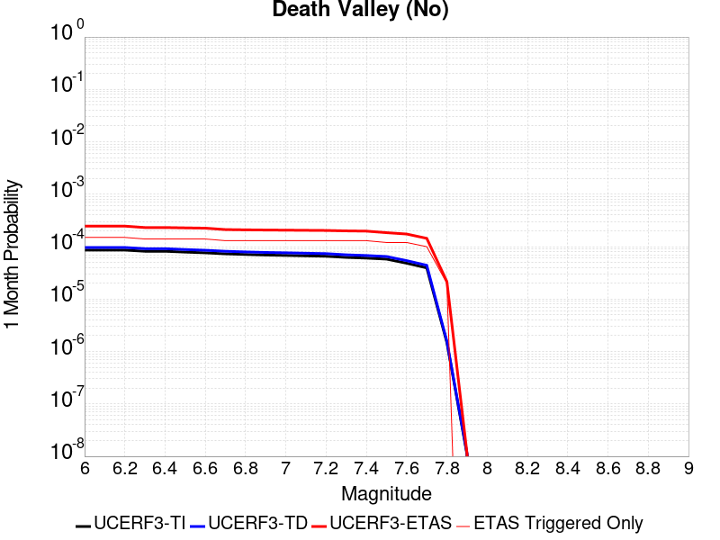 |  |  |

| Magnitude | 1 wk TI Prob | 1 wk TD Prob | 1 wk ETAS Prob | 1 wk ETAS/TD Gain | 1 wk ETAS Triggered Only | 1 mo TI Prob | 1 mo TD Prob | 1 mo ETAS Prob | 1 mo ETAS/TD Gain | 1 mo ETAS Triggered Only | 1 yr TI Prob | 1 yr TD Prob | 1 yr ETAS Prob | 1 yr ETAS/TD Gain | 1 yr ETAS Triggered Only | 10 yr TI Prob | 10 yr TD Prob | 10 yr ETAS Prob | 10 yr ETAS/TD Gain | 10 yr ETAS Triggered Only |
|-----|-----|-----|-----|-----|-----|-----|-----|-----|-----|-----|-----|-----|-----|-----|-----|-----|-----|-----|-----|-----|
| 6.0 | 2.0074807E-5 | 2.2500084E-5 | 1.02498285E-4 | 4.5554624 | 8.0E-5 | 8.603206E-5 | 9.642541E-5 | 2.4641096E-4 | 2.5554566 | 1.5E-4 | 0.001046937 | 0.0011733545 | 0.0014430376 | 1.2298394 | 2.7E-4 | 0.010420183 | 0.011672506 | 0.01213702 | 1.0397955 | 4.7E-4 |
| 6.1 | 2.0074807E-5 | 2.2500084E-5 | 1.02498285E-4 | 4.5554624 | 8.0E-5 | 8.603206E-5 | 9.642541E-5 | 2.4641096E-4 | 2.5554566 | 1.5E-4 | 0.001046937 | 0.0011733545 | 0.0014430376 | 1.2298394 | 2.7E-4 | 0.010420183 | 0.011672506 | 0.01213702 | 1.0397955 | 4.7E-4 |
| 6.2 | 2.0074807E-5 | 2.2500084E-5 | 1.02498285E-4 | 4.5554624 | 8.0E-5 | 8.603206E-5 | 9.642541E-5 | 2.4641096E-4 | 2.5554566 | 1.5E-4 | 0.001046937 | 0.0011733545 | 0.0014430376 | 1.2298394 | 2.7E-4 | 0.010420183 | 0.011672506 | 0.01213702 | 1.0397955 | 4.7E-4 |
| 6.3 | 1.9050609E-5 | 2.1336948E-5 | 1.0133524E-4 | 4.7492847 | 8.0E-5 | 8.164292E-5 | 9.1440896E-5 | 2.3142809E-4 | 2.5309036 | 1.4E-4 | 9.935491E-4 | 0.001112731 | 0.0013724418 | 1.2333994 | 2.6E-4 | 0.009891188 | 0.011072419 | 0.011527325 | 1.0410846 | 4.6E-4 |
| 6.4 | 1.9050609E-5 | 2.1336948E-5 | 1.0133524E-4 | 4.7492847 | 8.0E-5 | 8.164292E-5 | 9.1440896E-5 | 2.3142809E-4 | 2.5309036 | 1.4E-4 | 9.935491E-4 | 0.001112731 | 0.0013724418 | 1.2333994 | 2.6E-4 | 0.009891188 | 0.011072419 | 0.011527325 | 1.0410846 | 4.6E-4 |
| 6.5 | 1.8367004E-5 | 2.0561009E-5 | 1.00559366E-4 | 4.89078 | 8.0E-5 | 7.8713354E-5 | 8.811567E-5 | 2.2810334E-4 | 2.5886807 | 1.4E-4 | 9.5791375E-4 | 0.0010722869 | 0.001332008 | 1.2422124 | 2.6E-4 | 0.009537951 | 0.0106719155 | 0.011127006 | 1.0426438 | 4.6E-4 |
| 6.6 | 1.779439E-5 | 1.9910927E-5 | 9.990933E-5 | 5.017814 | 8.0E-5 | 7.625944E-5 | 8.53298E-5 | 2.2531785E-4 | 2.640553 | 1.4E-4 | 9.280632E-4 | 0.0010384015 | 0.0012881419 | 1.2405046 | 2.5E-4 | 0.009241969 | 0.010336253 | 0.010781601 | 1.043086 | 4.5E-4 |
| 6.7 | 1.7025437E-5 | 1.9043426E-5 | 8.904209E-5 | 4.6757393 | 7.0E-5 | 7.296412E-5 | 8.161216E-5 | 2.1160155E-4 | 2.5927699 | 1.3E-4 | 8.87976E-4 | 9.931813E-4 | 0.0012329429 | 1.2414078 | 2.4E-4 | 0.008844362 | 0.009888145 | 0.010313894 | 1.0430564 | 4.3E-4 |
| 6.8 | 1.6545107E-5 | 1.8512545E-5 | 8.851125E-5 | 4.7811494 | 7.0E-5 | 7.090568E-5 | 7.93371E-5 | 2.0932678E-4 | 2.6384475 | 1.3E-4 | 8.629347E-4 | 9.655073E-4 | 0.0012052755 | 1.248334 | 2.4E-4 | 0.008595915 | 0.009613829 | 0.010029791 | 1.043267 | 4.2E-4 |
| 6.9 | 1.615478E-5 | 1.8087594E-5 | 8.808633E-5 | 4.869986 | 7.0E-5 | 6.9232934E-5 | 7.751599E-5 | 2.0750592E-4 | 2.6769433 | 1.3E-4 | 8.4258494E-4 | 9.433546E-4 | 0.0011731377 | 1.2435807 | 2.3E-4 | 0.008393973 | 0.009394196 | 0.009800344 | 1.043234 | 4.1E-4 |
| 7.0 | 1.5894311E-5 | 1.780555E-5 | 8.780431E-5 | 4.9312887 | 7.0E-5 | 6.81167E-5 | 7.6307304E-5 | 2.0629738E-4 | 2.7035077 | 1.3E-4 | 8.2900526E-4 | 9.286515E-4 | 0.0011584379 | 1.2474409 | 2.3E-4 | 0.008259195 | 0.009248397 | 0.009654606 | 1.043922 | 4.1E-4 |
| 7.1 | 1.5602263E-5 | 1.7483504E-5 | 8.748228E-5 | 5.003704 | 7.0E-5 | 6.6865134E-5 | 7.492718E-5 | 2.0491744E-4 | 2.7348878 | 1.3E-4 | 8.137789E-4 | 9.118627E-4 | 0.001141653 | 1.2520009 | 2.3E-4 | 0.008108052 | 0.009081894 | 0.00948817 | 1.0447347 | 4.1E-4 |
| 7.2 | 1.5323829E-5 | 1.717063E-5 | 8.716943E-5 | 5.0766587 | 7.0E-5 | 6.56719E-5 | 7.358637E-5 | 2.0357681E-4 | 2.7665014 | 1.3E-4 | 7.99262E-4 | 8.9555193E-4 | 0.0011253459 | 1.2565949 | 2.3E-4 | 0.007963934 | 0.008920107 | 0.00932645 | 1.0455536 | 4.1E-4 |
| 7.3 | 1.4556212E-5 | 1.6302456E-5 | 8.630131E-5 | 5.2937617 | 7.0E-5 | 6.238227E-5 | 6.9865826E-5 | 1.9985675E-4 | 2.8605795 | 1.3E-4 | 7.592395E-4 | 8.5029035E-4 | 0.0010701033 | 1.2585151 | 2.2E-4 | 0.0075665074 | 0.008471014 | 0.00885771 | 1.0456494 | 3.9E-4 |
| 7.4 | 1.411725E-5 | 1.580796E-5 | 8.580685E-5 | 5.4280787 | 7.0E-5 | 6.0501097E-5 | 6.7746674E-5 | 1.9773787E-4 | 2.9187834 | 1.3E-4 | 7.363519E-4 | 8.245094E-4 | 0.0010443281 | 1.2666054 | 2.2E-4 | 0.0073391674 | 0.008215138 | 0.008601935 | 1.0470834 | 3.9E-4 |
| 7.5 | 1.3503312E-5 | 1.5126289E-5 | 8.512523E-5 | 5.6276345 | 7.0E-5 | 5.7870053E-5 | 6.482538E-5 | 1.8481759E-4 | 2.851007 | 1.2E-4 | 7.043401E-4 | 7.8896893E-4 | 9.988033E-4 | 1.2659602 | 2.1E-4 | 0.007021119 | 0.007862304 | 0.008239317 | 1.0479519 | 3.8E-4 |
| 7.6 | 1.1279839E-5 | 1.2626327E-5 | 8.262544E-5 | 6.543902 | 7.0E-5 | 4.834127E-5 | 5.4111737E-5 | 1.7410524E-4 | 3.2175136 | 1.2E-4 | 5.88396E-4 | 6.5861654E-4 | 8.584848E-4 | 1.3034668 | 2.0E-4 | 0.005868405 | 0.006567199 | 0.0069049657 | 1.0514325 | 3.4E-4 |
| 7.7 | 9.189108E-6 | 1.0283358E-5 | 7.028274E-5 | 6.83461 | 6.0E-5 | 3.93813E-5 | 4.407082E-5 | 1.440664E-4 | 3.268975 | 1.0E-4 | 4.7936183E-4 | 5.3643517E-4 | 6.9634937E-4 | 1.2981054 | 1.6E-4 | 0.004783291 | 0.005351914 | 0.0056503084 | 1.0557547 | 3.0E-4 |
| 7.8 | 3.4586725E-7 | 3.6482615E-7 | 1.0364823E-5 | 28.410307 | 1.0E-5 | 1.4822873E-6 | 1.5635396E-6 | 2.1563508E-5 | 13.791469 | 2.0E-5 | 1.80467E-5 | 1.9035933E-5 | 3.9035553E-5 | 2.0506246 | 2.0E-5 | 1.8045233E-4 | 1.9034347E-4 | 2.1033967E-4 | 1.1050532 | 2.0E-5 |
| 7.9 | 2.5591178E-9 | 2.6696718E-9 | 2.6696718E-9 | 1.0 | 0.0 | 1.0967647E-8 | 1.14414505E-8 | 1.14414505E-8 | 1.0 | 0.0 | 1.335311E-7 | 1.3929966E-7 | 1.3929966E-7 | 1.0 | 0.0 | 1.3353102E-6 | 1.3929966E-6 | 1.3929966E-6 | 1.0 | 0.0 |

## White Wolf (Extension)
*[(top)](#table-of-contents)*

| 1 Week | 1 Month | 1 Year | 10 Year |
|-----|-----|-----|-----|
|  | 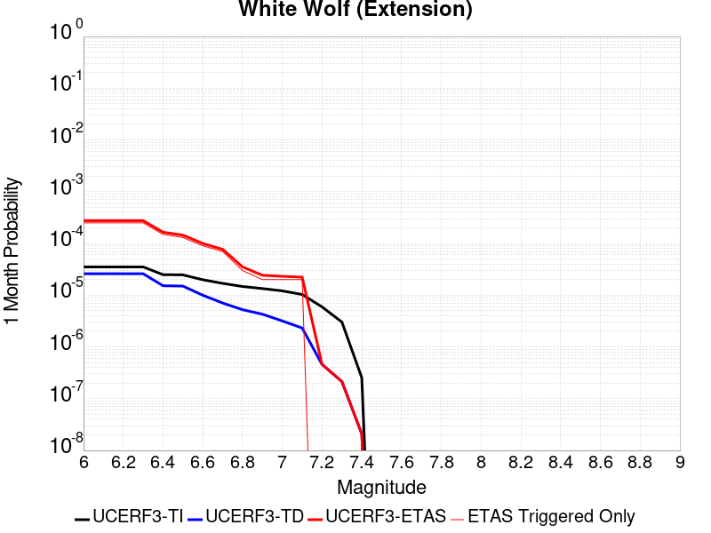 |  |  |

| Magnitude | 1 wk TI Prob | 1 wk TD Prob | 1 wk ETAS Prob | 1 wk ETAS/TD Gain | 1 wk ETAS Triggered Only | 1 mo TI Prob | 1 mo TD Prob | 1 mo ETAS Prob | 1 mo ETAS/TD Gain | 1 mo ETAS Triggered Only | 1 yr TI Prob | 1 yr TD Prob | 1 yr ETAS Prob | 1 yr ETAS/TD Gain | 1 yr ETAS Triggered Only | 10 yr TI Prob | 10 yr TD Prob | 10 yr ETAS Prob | 10 yr ETAS/TD Gain | 10 yr ETAS Triggered Only |
|-----|-----|-----|-----|-----|-----|-----|-----|-----|-----|-----|-----|-----|-----|-----|-----|-----|-----|-----|-----|-----|
| 6.0 | 8.222555E-6 | 6.066615E-6 | 1.8606552E-4 | 30.670403 | 1.8E-4 | 3.5239045E-5 | 2.5999556E-5 | 2.7599305E-4 | 10.615299 | 2.5E-4 | 4.289509E-4 | 3.1650523E-4 | 6.96385E-4 | 2.200232 | 3.8E-4 | 0.0042812387 | 0.0031611966 | 0.0036197423 | 1.1450545 | 4.6E-4 |
| 6.1 | 8.222555E-6 | 6.066615E-6 | 1.8606552E-4 | 30.670403 | 1.8E-4 | 3.5239045E-5 | 2.5999556E-5 | 2.7599305E-4 | 10.615299 | 2.5E-4 | 4.289509E-4 | 3.1650523E-4 | 6.96385E-4 | 2.200232 | 3.8E-4 | 0.0042812387 | 0.0031611966 | 0.0036197423 | 1.1450545 | 4.6E-4 |
| 6.2 | 8.222555E-6 | 6.066615E-6 | 1.8606552E-4 | 30.670403 | 1.8E-4 | 3.5239045E-5 | 2.5999556E-5 | 2.7599305E-4 | 10.615299 | 2.5E-4 | 4.289509E-4 | 3.1650523E-4 | 6.96385E-4 | 2.200232 | 3.8E-4 | 0.0042812387 | 0.0031611966 | 0.0036197423 | 1.1450545 | 4.6E-4 |
| 6.3 | 8.222555E-6 | 6.066615E-6 | 1.8606552E-4 | 30.670403 | 1.8E-4 | 3.5239045E-5 | 2.5999556E-5 | 2.7599305E-4 | 10.615299 | 2.5E-4 | 4.289509E-4 | 3.1650523E-4 | 6.96385E-4 | 2.200232 | 3.8E-4 | 0.0042812387 | 0.0031611966 | 0.0036197423 | 1.1450545 | 4.6E-4 |
| 6.4 | 5.821773E-6 | 3.5571256E-6 | 1.235567E-4 | 34.73498 | 1.2E-4 | 2.4950215E-5 | 1.5244741E-5 | 1.6524245E-4 | 10.839309 | 1.5E-4 | 3.0372653E-4 | 1.8559002E-4 | 4.1554734E-4 | 2.2390609 | 2.3E-4 | 0.0030331176 | 0.0018544586 | 0.0021139765 | 1.1399426 | 2.6E-4 |
| 6.5 | 5.766023E-6 | 3.4990599E-6 | 1.0349871E-4 | 29.579006 | 1.0E-4 | 2.4711293E-5 | 1.49958905E-5 | 1.4499394E-4 | 9.668912 | 1.3E-4 | 3.0081844E-4 | 1.8256076E-4 | 3.9252243E-4 | 2.150092 | 2.1E-4 | 0.0030041158 | 0.0018242161 | 0.0020637782 | 1.1313233 | 2.4E-4 |
| 6.6 | 4.643576E-6 | 2.3325733E-6 | 7.233241E-5 | 31.009706 | 7.0E-5 | 1.9900888E-5 | 9.9967065E-6 | 9.999581E-5 | 10.002875 | 9.0E-5 | 2.4226638E-4 | 1.2170354E-4 | 2.516877E-4 | 2.0680394 | 1.3E-4 | 0.0024200242 | 0.0012164112 | 0.0013662288 | 1.1231636 | 1.5E-4 |
| 6.7 | 3.9529173E-6 | 1.6482975E-6 | 6.16482E-5 | 37.401134 | 6.0E-5 | 1.6940963E-5 | 7.064114E-6 | 7.706362E-5 | 10.90917 | 7.0E-5 | 2.0623671E-4 | 8.600239E-5 | 1.7599465E-4 | 2.0463927 | 9.0E-5 | 0.002060454 | 8.597095E-4 | 9.5962355E-4 | 1.1162183 | 1.0E-4 |
| 6.8 | 3.4377522E-6 | 1.2244764E-6 | 3.122444E-5 | 25.500238 | 3.0E-5 | 1.473314E-5 | 5.247746E-6 | 3.5247587E-5 | 6.7167106 | 3.0E-5 | 1.7936122E-4 | 6.388952E-5 | 1.1388633E-4 | 1.7825509 | 5.0E-5 | 0.0017921652 | 6.3872064E-4 | 6.986823E-4 | 1.0938778 | 6.0E-5 |
| 6.9 | 3.1367306E-6 | 1.0033316E-6 | 2.1003312E-5 | 20.93357 | 2.0E-5 | 1.3443062E-5 | 4.299986E-6 | 2.42999E-5 | 5.6511583 | 2.0E-5 | 1.63657E-4 | 5.2351144E-5 | 8.234957E-5 | 1.5730233 | 3.0E-5 | 0.0016353652 | 5.233958E-4 | 5.6337484E-4 | 1.076384 | 4.0E-5 |
| 7.0 | 2.8298145E-6 | 7.4282326E-7 | 2.074281E-5 | 27.924284 | 2.0E-5 | 1.2127721E-5 | 3.1835248E-6 | 2.318346E-5 | 7.282325 | 2.0E-5 | 1.47645E-4 | 3.8758775E-5 | 6.875761E-5 | 1.7739882 | 3.0E-5 | 0.0014754693 | 3.8752513E-4 | 4.2750963E-4 | 1.1031791 | 4.0E-5 |
| 7.1 | 2.4091064E-6 | 5.4223835E-7 | 2.0542228E-5 | 37.88413 | 2.0E-5 | 1.03247E-5 | 2.3238767E-6 | 2.2323831E-5 | 9.606288 | 2.0E-5 | 1.2569598E-4 | 2.8292874E-5 | 5.8292026E-5 | 2.0603077 | 3.0E-5 | 0.001256249 | 2.8289677E-4 | 3.2288543E-4 | 1.1413543 | 4.0E-5 |
| 7.2 | 1.3875518E-6 | 1.0740268E-7 | 1.0740268E-7 | 1.0 | 0.0 | 5.9466374E-6 | 4.6029712E-7 | 4.6029712E-7 | 1.0 | 0.0 | 7.23979E-5 | 5.604104E-6 | 5.604104E-6 | 1.0 | 0.0 | 7.2374323E-4 | 5.6039742E-5 | 5.6039742E-5 | 1.0 | 0.0 |
| 7.3 | 7.056077E-7 | 5.0002956E-8 | 5.0002956E-8 | 1.0 | 0.0 | 3.0240296E-6 | 2.1429837E-7 | 2.1429837E-7 | 1.0 | 0.0 | 3.681694E-5 | 2.60908E-6 | 2.60908E-6 | 1.0 | 0.0 | 3.681084E-4 | 2.609054E-5 | 2.609054E-5 | 1.0 | 0.0 |
| 7.4 | 5.9334678E-8 | 4.8638475E-9 | 4.8638475E-9 | 1.0 | 0.0 | 2.5429145E-7 | 2.084506E-8 | 2.084506E-8 | 1.0 | 0.0 | 3.095994E-6 | 2.5378858E-7 | 2.5378858E-7 | 1.0 | 0.0 | 3.095951E-5 | 2.5378843E-6 | 2.5378843E-6 | 1.0 | 0.0 |

## San Andreas (San Bernardino S)
*[(top)](#table-of-contents)*

| 1 Week | 1 Month | 1 Year | 10 Year |
|-----|-----|-----|-----|
|  |  |  |  |

| Magnitude | 1 wk TI Prob | 1 wk TD Prob | 1 wk ETAS Prob | 1 wk ETAS/TD Gain | 1 wk ETAS Triggered Only | 1 mo TI Prob | 1 mo TD Prob | 1 mo ETAS Prob | 1 mo ETAS/TD Gain | 1 mo ETAS Triggered Only | 1 yr TI Prob | 1 yr TD Prob | 1 yr ETAS Prob | 1 yr ETAS/TD Gain | 1 yr ETAS Triggered Only | 10 yr TI Prob | 10 yr TD Prob | 10 yr ETAS Prob | 10 yr ETAS/TD Gain | 10 yr ETAS Triggered Only |
|-----|-----|-----|-----|-----|-----|-----|-----|-----|-----|-----|-----|-----|-----|-----|-----|-----|-----|-----|-----|-----|
| 6.0 | 1.2336002E-4 | 3.0005194E-4 | 4.4000993E-4 | 1.4664459 | 1.4E-4 | 5.2857865E-4 | 0.0012853292 | 0.0014451236 | 1.1243217 | 1.6E-4 | 0.006416472 | 0.015541554 | 0.015827047 | 1.0183697 | 2.9E-4 | 0.06234337 | 0.14294699 | 0.14331552 | 1.0025781 | 4.3E-4 |
| 6.1 | 1.2336002E-4 | 3.0005194E-4 | 4.4000993E-4 | 1.4664459 | 1.4E-4 | 5.2857865E-4 | 0.0012853292 | 0.0014451236 | 1.1243217 | 1.6E-4 | 0.006416472 | 0.015541554 | 0.015827047 | 1.0183697 | 2.9E-4 | 0.06234337 | 0.14294699 | 0.14331552 | 1.0025781 | 4.3E-4 |
| 6.2 | 1.2336002E-4 | 3.0005194E-4 | 4.4000993E-4 | 1.4664459 | 1.4E-4 | 5.2857865E-4 | 0.0012853292 | 0.0014451236 | 1.1243217 | 1.6E-4 | 0.006416472 | 0.015541554 | 0.015827047 | 1.0183697 | 2.9E-4 | 0.06234337 | 0.14294699 | 0.14331552 | 1.0025781 | 4.3E-4 |
| 6.3 | 1.1712257E-4 | 2.8793467E-4 | 4.2789435E-4 | 1.4860815 | 1.4E-4 | 5.018573E-4 | 0.0012334478 | 0.0013932504 | 1.1295577 | 1.6E-4 | 0.006093008 | 0.014918666 | 0.015204339 | 1.0191487 | 2.9E-4 | 0.059286322 | 0.13765779 | 0.13802859 | 1.0026937 | 4.3E-4 |
| 6.4 | 1.1712257E-4 | 2.8793467E-4 | 4.2789435E-4 | 1.4860815 | 1.4E-4 | 5.018573E-4 | 0.0012334478 | 0.0013932504 | 1.1295577 | 1.6E-4 | 0.006093008 | 0.014918666 | 0.015204339 | 1.0191487 | 2.9E-4 | 0.059286322 | 0.13765779 | 0.13802859 | 1.0026937 | 4.3E-4 |
| 6.5 | 1.0689076E-4 | 2.6806415E-4 | 3.980293E-4 | 1.4848285 | 1.3E-4 | 4.5802278E-4 | 0.0011483653 | 0.0012882046 | 1.1217724 | 1.4E-4 | 0.0055621783 | 0.013896335 | 0.014162583 | 1.0191596 | 2.7E-4 | 0.05425003 | 0.1288989 | 0.12925605 | 1.0027708 | 4.1E-4 |
| 6.6 | 9.7648895E-5 | 2.505129E-4 | 3.7048286E-4 | 1.4788972 | 1.2E-4 | 4.1842813E-4 | 0.0010732086 | 0.0012030691 | 1.1210021 | 1.3E-4 | 0.005082469 | 0.012992399 | 0.013249021 | 1.0197517 | 2.6E-4 | 0.049677886 | 0.121077746 | 0.121420525 | 1.0028311 | 3.9E-4 |
| 6.7 | 8.757013E-5 | 2.3122175E-4 | 3.51194E-4 | 1.5188622 | 1.2E-4 | 3.7524657E-4 | 9.905964E-4 | 0.0011204676 | 1.1311041 | 1.3E-4 | 0.00455906 | 0.011997902 | 0.012254782 | 1.0214105 | 2.6E-4 | 0.04466656 | 0.112373024 | 0.1127192 | 1.0030806 | 3.9E-4 |
| 6.8 | 8.562978E-5 | 2.2682057E-4 | 3.4679336E-4 | 1.5289326 | 1.2E-4 | 3.6693315E-4 | 9.7174826E-4 | 0.0011016219 | 1.1336495 | 1.3E-4 | 0.004458263 | 0.011770921 | 0.012027861 | 1.0218283 | 2.6E-4 | 0.043698758 | 0.11037863 | 0.11072558 | 1.0031433 | 3.9E-4 |
| 6.9 | 6.124075E-5 | 1.7066885E-4 | 2.7065177E-4 | 1.58583 | 1.0E-4 | 2.6243398E-4 | 7.312337E-4 | 8.4115326E-4 | 1.1503206 | 1.1E-4 | 0.0031904527 | 0.008866636 | 0.009104508 | 1.0268278 | 2.4E-4 | 0.031450346 | 0.08420262 | 0.08451399 | 1.0036979 | 3.4E-4 |
| 7.0 | 5.8598747E-5 | 1.6495936E-4 | 2.6494285E-4 | 1.60611 | 1.0E-4 | 2.5111332E-4 | 7.067779E-4 | 8.1670017E-4 | 1.1555259 | 1.1E-4 | 0.0030530186 | 0.008571265 | 0.008809208 | 1.0277605 | 2.4E-4 | 0.03011414 | 0.08151562 | 0.0818279 | 1.003831 | 3.4E-4 |
| 7.1 | 5.613814E-5 | 1.5914452E-4 | 2.591286E-4 | 1.6282597 | 1.0E-4 | 2.4056983E-4 | 6.818704E-4 | 7.917954E-4 | 1.161211 | 1.1E-4 | 0.0029250039 | 0.008270353 | 0.008508368 | 1.0287793 | 2.4E-4 | 0.028868021 | 0.07881268 | 0.07911667 | 1.0038571 | 3.3E-4 |
| 7.2 | 4.991222E-5 | 1.4520933E-4 | 2.451948E-4 | 1.688561 | 1.0E-4 | 2.1389198E-4 | 6.221777E-4 | 7.321092E-4 | 1.1766884 | 1.1E-4 | 0.002601025 | 0.0075488063 | 0.0077869943 | 1.0315531 | 2.4E-4 | 0.025707912 | 0.07226191 | 0.07256806 | 1.0042367 | 3.3E-4 |
| 7.3 | 4.7410045E-5 | 1.371513E-4 | 2.2713897E-4 | 1.6561196 | 9.0E-5 | 2.0317009E-4 | 5.8765925E-4 | 6.8760046E-4 | 1.1700666 | 1.0E-4 | 0.0024707897 | 0.0071313656 | 0.0073497966 | 1.0306296 | 2.2E-4 | 0.024434982 | 0.068541944 | 0.06883069 | 1.0042127 | 3.1E-4 |
| 7.4 | 4.5556746E-5 | 1.3123035E-4 | 2.2121854E-4 | 1.685727 | 9.0E-5 | 1.952286E-4 | 5.6229485E-4 | 6.622386E-4 | 1.1777426 | 1.0E-4 | 0.002374317 | 0.0068245293 | 0.0070430283 | 1.0320166 | 2.2E-4 | 0.023491086 | 0.06579143 | 0.06608103 | 1.0044018 | 3.1E-4 |
| 7.5 | 4.3084514E-5 | 1.2358342E-4 | 2.135723E-4 | 1.728163 | 9.0E-5 | 1.8463485E-4 | 5.2953605E-4 | 6.294831E-4 | 1.1887445 | 1.0E-4 | 0.0022456115 | 0.0064281146 | 0.0066467 | 1.0340047 | 2.2E-4 | 0.022230545 | 0.062190283 | 0.062481005 | 1.0046747 | 3.1E-4 |
| 7.6 | 3.408608E-5 | 9.836477E-5 | 1.783569E-4 | 1.8132193 | 8.0E-5 | 1.4607502E-4 | 4.214953E-4 | 5.114573E-4 | 1.2134355 | 9.0E-5 | 0.0017770125 | 0.005119656 | 0.0053285807 | 1.0408084 | 2.1E-4 | 0.017628696 | 0.05002244 | 0.05030743 | 1.0056973 | 3.0E-4 |
| 7.7 | 2.8315713E-5 | 8.2495724E-5 | 1.6248913E-4 | 1.9696672 | 8.0E-5 | 1.2134742E-4 | 3.5350522E-4 | 4.4347343E-4 | 1.2545031 | 9.0E-5 | 0.0014764034 | 0.004295442 | 0.0044945823 | 1.046361 | 2.0E-4 | 0.01466633 | 0.042272415 | 0.042550158 | 1.0065702 | 2.9E-4 |
| 7.8 | 2.6222975E-5 | 7.463898E-5 | 1.54633E-4 | 2.071746 | 8.0E-5 | 1.1237934E-4 | 3.1984213E-4 | 4.0981336E-4 | 1.2812988 | 9.0E-5 | 0.0013673597 | 0.003887131 | 0.004086354 | 1.0512518 | 2.0E-4 | 0.013589768 | 0.038437475 | 0.038716327 | 1.0072547 | 2.9E-4 |
| 7.9 | 2.1469694E-5 | 5.7884805E-5 | 1.2788075E-4 | 2.2092283 | 7.0E-5 | 9.200973E-5 | 2.4805416E-4 | 3.280343E-4 | 1.3224303 | 8.0E-5 | 0.0011196428 | 0.00301588 | 0.0031953373 | 1.059504 | 1.8E-4 | 0.011140184 | 0.030153265 | 0.030395728 | 1.008041 | 2.5E-4 |
| 8.0 | 1.2420249E-5 | 3.1321662E-5 | 4.132135E-5 | 1.3192579 | 1.0E-5 | 5.322855E-5 | 1.342288E-4 | 1.4422745E-4 | 1.0744897 | 1.0E-5 | 6.478649E-4 | 0.0016330116 | 0.0016629626 | 1.018341 | 3.0E-5 | 0.0064597935 | 0.01652369 | 0.016572865 | 1.002976 | 5.0E-5 |
| 8.1 | 4.9197724E-6 | 7.822525E-6 | 7.822525E-6 | 1.0 | 0.0 | 2.1084568E-5 | 3.3524673E-5 | 3.3524673E-5 | 1.0 | 0.0 | 2.566744E-4 | 4.080866E-4 | 4.1808252E-4 | 1.0244946 | 1.0E-5 | 0.002563781 | 0.004384557 | 0.004404469 | 1.0045415 | 2.0E-5 |
| 8.2 | 2.5634774E-6 | 2.9065757E-6 | 2.9065757E-6 | 1.0 | 0.0 | 1.0986286E-5 | 1.2456694E-5 | 1.2456694E-5 | 1.0 | 0.0 | 1.3374983E-4 | 1.5164974E-4 | 1.6164822E-4 | 1.0659314 | 1.0E-5 | 0.0013366934 | 0.001704941 | 0.001714924 | 1.0058553 | 1.0E-5 |
| 8.3 | 5.2850464E-7 | 3.2080476E-7 | 3.2080476E-7 | 1.0 | 0.0 | 2.2650179E-6 | 1.3748769E-6 | 1.3748769E-6 | 1.0 | 0.0 | 2.7576245E-5 | 1.673901E-5 | 1.673901E-5 | 1.0 | 0.0 | 2.7572823E-4 | 1.986671E-4 | 1.986671E-4 | 1.0 | 0.0 |

## Elsinore (Glen Ivy) rev
*[(top)](#table-of-contents)*

| 1 Week | 1 Month | 1 Year | 10 Year |
|-----|-----|-----|-----|
|  |  |  |  |

| Magnitude | 1 wk TI Prob | 1 wk TD Prob | 1 wk ETAS Prob | 1 wk ETAS/TD Gain | 1 wk ETAS Triggered Only | 1 mo TI Prob | 1 mo TD Prob | 1 mo ETAS Prob | 1 mo ETAS/TD Gain | 1 mo ETAS Triggered Only | 1 yr TI Prob | 1 yr TD Prob | 1 yr ETAS Prob | 1 yr ETAS/TD Gain | 1 yr ETAS Triggered Only | 10 yr TI Prob | 10 yr TD Prob | 10 yr ETAS Prob | 10 yr ETAS/TD Gain | 10 yr ETAS Triggered Only |
|-----|-----|-----|-----|-----|-----|-----|-----|-----|-----|-----|-----|-----|-----|-----|-----|-----|-----|-----|-----|-----|
| 6.0 | 1.6204086E-4 | 2.937271E-4 | 4.0369478E-4 | 1.3743873 | 1.1E-4 | 6.94276E-4 | 0.0012583778 | 0.0013882143 | 1.1031775 | 1.3E-4 | 0.008420097 | 0.0152346175 | 0.015411875 | 1.0116352 | 1.8E-4 | 0.081081145 | 0.13962454 | 0.13992567 | 1.0021567 | 3.5E-4 |
| 6.1 | 1.6204086E-4 | 2.937271E-4 | 4.0369478E-4 | 1.3743873 | 1.1E-4 | 6.94276E-4 | 0.0012583778 | 0.0013882143 | 1.1031775 | 1.3E-4 | 0.008420097 | 0.0152346175 | 0.015411875 | 1.0116352 | 1.8E-4 | 0.081081145 | 0.13962454 | 0.13992567 | 1.0021567 | 3.5E-4 |
| 6.2 | 1.6204086E-4 | 2.937271E-4 | 4.0369478E-4 | 1.3743873 | 1.1E-4 | 6.94276E-4 | 0.0012583778 | 0.0013882143 | 1.1031775 | 1.3E-4 | 0.008420097 | 0.0152346175 | 0.015411875 | 1.0116352 | 1.8E-4 | 0.081081145 | 0.13962454 | 0.13992567 | 1.0021567 | 3.5E-4 |
| 6.3 | 1.0111737E-4 | 1.7703463E-4 | 2.2702577E-4 | 1.2823806 | 5.0E-5 | 4.332882E-4 | 7.5861585E-4 | 8.185704E-4 | 1.0790315 | 6.0E-5 | 0.005262531 | 0.0092177205 | 0.009316799 | 1.0107486 | 1.0E-4 | 0.0513964 | 0.08707393 | 0.087274775 | 1.0023066 | 2.2E-4 |
| 6.4 | 1.0111737E-4 | 1.7703463E-4 | 2.2702577E-4 | 1.2823806 | 5.0E-5 | 4.332882E-4 | 7.5861585E-4 | 8.185704E-4 | 1.0790315 | 6.0E-5 | 0.005262531 | 0.0092177205 | 0.009316799 | 1.0107486 | 1.0E-4 | 0.0513964 | 0.08707393 | 0.087274775 | 1.0023066 | 2.2E-4 |
| 6.5 | 3.6624708E-5 | 4.6391986E-5 | 5.639152E-5 | 1.2155445 | 1.0E-5 | 1.569536E-4 | 1.9880968E-4 | 2.0880769E-4 | 1.0502894 | 1.0E-5 | 0.001909235 | 0.0024181814 | 0.002438133 | 1.0082507 | 2.0E-5 | 0.01892915 | 0.023697061 | 0.023745878 | 1.0020599 | 5.0E-5 |
| 6.6 | 2.5051324E-5 | 2.6147465E-5 | 2.6147465E-5 | 1.0 | 0.0 | 1.073584E-4 | 1.12056E-4 | 1.12056E-4 | 1.0 | 0.0 | 0.0013063047 | 0.0013634725 | 0.0013634725 | 1.0 | 0.0 | 0.012986525 | 0.013565759 | 0.013585488 | 1.0014544 | 2.0E-5 |
| 6.7 | 2.2189772E-5 | 2.2072489E-5 | 2.2072489E-5 | 1.0 | 0.0 | 9.509556E-5 | 9.459316E-5 | 9.459316E-5 | 1.0 | 0.0 | 0.0011571734 | 0.0011510996 | 0.0011510996 | 1.0 | 0.0 | 0.011511663 | 0.0114663225 | 0.011476208 | 1.0008621 | 1.0E-5 |
| 6.8 | 1.6654378E-5 | 1.44376E-5 | 1.44376E-5 | 1.0 | 0.0 | 7.137396E-5 | 6.187399E-5 | 6.187399E-5 | 1.0 | 0.0 | 8.686314E-4 | 7.5306057E-4 | 7.5306057E-4 | 1.0 | 0.0 | 0.008652439 | 0.0075100763 | 0.0075200014 | 1.0013216 | 1.0E-5 |
| 6.9 | 1.5042909E-5 | 1.2331886E-5 | 1.2331886E-5 | 1.0 | 0.0 | 6.446802E-5 | 5.2849886E-5 | 5.2849886E-5 | 1.0 | 0.0 | 7.8461546E-4 | 6.4326054E-4 | 6.4326054E-4 | 1.0 | 0.0 | 0.007818509 | 0.006417925 | 0.006427861 | 1.0015482 | 1.0E-5 |
| 7.0 | 1.4361385E-5 | 1.1451172E-5 | 1.1451172E-5 | 1.0 | 0.0 | 6.154734E-5 | 4.9075545E-5 | 4.9075545E-5 | 1.0 | 0.0 | 7.490812E-4 | 5.973339E-4 | 5.973339E-4 | 1.0 | 0.0 | 0.007465612 | 0.005960982 | 0.0059709223 | 1.0016676 | 1.0E-5 |
| 7.1 | 1.3265571E-5 | 1.0244736E-5 | 1.0244736E-5 | 1.0 | 0.0 | 5.6851208E-5 | 4.3905282E-5 | 4.3905282E-5 | 1.0 | 0.0 | 6.919436E-4 | 5.344183E-4 | 5.344183E-4 | 1.0 | 0.0 | 0.006897931 | 0.0053346003 | 0.0053346003 | 1.0 | 0.0 |
| 7.2 | 1.1596403E-5 | 8.504847E-6 | 8.504847E-6 | 1.0 | 0.0 | 4.9697923E-5 | 3.6448844E-5 | 3.6448844E-5 | 1.0 | 0.0 | 6.049042E-4 | 4.4367602E-4 | 4.4367602E-4 | 1.0 | 0.0 | 0.006032603 | 0.004429357 | 0.004429357 | 1.0 | 0.0 |
| 7.3 | 1.0150827E-5 | 7.238537E-6 | 7.238537E-6 | 1.0 | 0.0 | 4.3502816E-5 | 3.102194E-5 | 3.102194E-5 | 1.0 | 0.0 | 5.2951806E-4 | 3.776281E-4 | 3.776281E-4 | 1.0 | 0.0 | 0.005282581 | 0.003770271 | 0.003770271 | 1.0 | 0.0 |
| 7.4 | 9.080705E-6 | 6.352307E-6 | 6.352307E-6 | 1.0 | 0.0 | 3.8916725E-5 | 2.7223898E-5 | 2.7223898E-5 | 1.0 | 0.0 | 4.7370812E-4 | 3.314019E-4 | 3.314019E-4 | 1.0 | 0.0 | 0.004726996 | 0.0033092257 | 0.0033092257 | 1.0 | 0.0 |
| 7.5 | 7.671649E-6 | 5.225419E-6 | 5.225419E-6 | 1.0 | 0.0 | 3.287808E-5 | 2.2394468E-5 | 2.2394468E-5 | 1.0 | 0.0 | 4.0021708E-4 | 2.7261977E-4 | 2.7261977E-4 | 1.0 | 0.0 | 0.0039949706 | 0.0027229784 | 0.0027229784 | 1.0 | 0.0 |
| 7.6 | 6.990086E-6 | 4.687336E-6 | 4.687336E-6 | 1.0 | 0.0 | 2.9957167E-5 | 2.0088435E-5 | 2.0088435E-5 | 1.0 | 0.0 | 3.6466747E-4 | 2.445504E-4 | 2.445504E-4 | 1.0 | 0.0 | 0.0036406964 | 0.0024429292 | 0.0024429292 | 1.0 | 0.0 |
| 7.7 | 4.163505E-6 | 2.329331E-6 | 2.329331E-6 | 1.0 | 0.0 | 1.7843471E-5 | 9.982813E-6 | 9.982813E-6 | 1.0 | 0.0 | 2.172226E-4 | 1.2153471E-4 | 1.2153471E-4 | 1.0 | 0.0 | 0.0021701038 | 0.0012147555 | 0.0012147555 | 1.0 | 0.0 |
| 7.8 | 2.2692414E-7 | 9.384417E-8 | 9.384417E-8 | 1.0 | 0.0 | 9.725317E-7 | 4.0218927E-7 | 4.0218927E-7 | 1.0 | 0.0 | 1.1840509E-5 | 4.8966467E-6 | 4.8966467E-6 | 1.0 | 0.0 | 1.1839878E-4 | 4.8965718E-5 | 4.8965718E-5 | 1.0 | 0.0 |
| 7.9 | 6.676829E-9 | 3.4397174E-9 | 3.4397174E-9 | 1.0 | 0.0 | 2.861498E-8 | 1.4741646E-8 | 1.4741646E-8 | 1.0 | 0.0 | 3.4838732E-7 | 1.7947953E-7 | 1.7947953E-7 | 1.0 | 0.0 | 3.4838679E-6 | 1.794794E-6 | 1.794794E-6 | 1.0 | 0.0 |

## San Andreas (Parkfield)
*[(top)](#table-of-contents)*

| 1 Week | 1 Month | 1 Year | 10 Year |
|-----|-----|-----|-----|
|  |  |  |  |

| Magnitude | 1 wk TI Prob | 1 wk TD Prob | 1 wk ETAS Prob | 1 wk ETAS/TD Gain | 1 wk ETAS Triggered Only | 1 mo TI Prob | 1 mo TD Prob | 1 mo ETAS Prob | 1 mo ETAS/TD Gain | 1 mo ETAS Triggered Only | 1 yr TI Prob | 1 yr TD Prob | 1 yr ETAS Prob | 1 yr ETAS/TD Gain | 1 yr ETAS Triggered Only | 10 yr TI Prob | 10 yr TD Prob | 10 yr ETAS Prob | 10 yr ETAS/TD Gain | 10 yr ETAS Triggered Only |
|-----|-----|-----|-----|-----|-----|-----|-----|-----|-----|-----|-----|-----|-----|-----|-----|-----|-----|-----|-----|-----|
| 6.0 | 5.556969E-4 | 7.778562E-4 | 9.077551E-4 | 1.166996 | 1.3E-4 | 0.0023793848 | 0.0033299583 | 0.0035093587 | 1.0538747 | 1.8E-4 | 0.028586963 | 0.040235043 | 0.04048458 | 1.006202 | 2.6E-4 | 0.25176284 | 0.3371973 | 0.33745578 | 1.0007666 | 3.9E-4 |
| 6.1 | 1.925858E-4 | 3.0278185E-4 | 3.6276368E-4 | 1.1981025 | 6.0E-5 | 8.2510663E-4 | 0.001297085 | 0.0013769811 | 1.0615968 | 8.0E-5 | 0.0099994885 | 0.01577393 | 0.015901878 | 1.0081115 | 1.3E-4 | 0.095613256 | 0.14975825 | 0.14992829 | 1.0011355 | 2.0E-4 |
| 6.2 | 9.4306815E-5 | 1.8243887E-4 | 2.4242792E-4 | 1.3288172 | 6.0E-5 | 4.0410945E-4 | 7.8164786E-4 | 8.615853E-4 | 1.1022679 | 8.0E-5 | 0.0049089384 | 0.009475246 | 0.00959411 | 1.0125446 | 1.2E-4 | 0.048019063 | 0.0918565 | 0.09201997 | 1.0017796 | 1.8E-4 |
| 6.3 | 9.283051E-5 | 1.794041E-4 | 2.3939334E-4 | 1.3343805 | 6.0E-5 | 3.9778434E-4 | 7.686494E-4 | 8.485879E-4 | 1.1039987 | 8.0E-5 | 0.0048322747 | 0.009318355 | 0.009437236 | 1.0127578 | 1.2E-4 | 0.047285385 | 0.090509474 | 0.09067318 | 1.0018088 | 1.8E-4 |
| 6.4 | 9.138826E-5 | 1.7702584E-4 | 2.370152E-4 | 1.3388736 | 6.0E-5 | 3.916052E-4 | 7.5846276E-4 | 8.384021E-4 | 1.1053965 | 8.0E-5 | 0.0047573745 | 0.009195387 | 0.009314284 | 1.01293 | 1.2E-4 | 0.046568092 | 0.0894136 | 0.0895775 | 1.0018331 | 1.8E-4 |
| 6.5 | 9.000255E-5 | 1.746064E-4 | 2.3459591E-4 | 1.34357 | 6.0E-5 | 3.8566816E-4 | 7.4809964E-4 | 8.2803983E-4 | 1.1068577 | 8.0E-5 | 0.0046854047 | 0.009070284 | 0.009189196 | 1.01311 | 1.2E-4 | 0.045878403 | 0.08829608 | 0.088460185 | 1.0018586 | 1.8E-4 |
| 6.6 | 8.8109264E-5 | 1.7141816E-4 | 2.3140787E-4 | 1.3499613 | 6.0E-5 | 3.7755648E-4 | 7.3444354E-4 | 8.143848E-4 | 1.108846 | 8.0E-5 | 0.0045870654 | 0.008905404 | 0.009024336 | 1.013355 | 1.2E-4 | 0.04493529 | 0.08682707 | 0.086991444 | 1.001893 | 1.8E-4 |
| 6.7 | 8.738073E-5 | 1.7008898E-4 | 2.3007879E-4 | 1.3526965 | 6.0E-5 | 3.7443507E-4 | 7.287503E-4 | 8.08692E-4 | 1.109697 | 8.0E-5 | 0.0045492216 | 0.008836695 | 0.008955634 | 1.0134597 | 1.2E-4 | 0.04457213 | 0.0862268 | 0.08639128 | 1.0019075 | 1.8E-4 |
| 6.8 | 8.710195E-5 | 1.6954402E-4 | 2.2953385E-4 | 1.3538305 | 6.0E-5 | 3.7324068E-4 | 7.26416E-4 | 8.063579E-4 | 1.1100497 | 8.0E-5 | 0.0045347405 | 0.008808513 | 0.008927456 | 1.0135032 | 1.2E-4 | 0.04443313 | 0.08597436 | 0.08613888 | 1.0019137 | 1.8E-4 |
| 6.9 | 8.6801556E-5 | 1.6895356E-4 | 2.2894342E-4 | 1.3550671 | 6.0E-5 | 3.7195362E-4 | 7.238869E-4 | 8.03829E-4 | 1.1104345 | 8.0E-5 | 0.0045191357 | 0.0087779695 | 0.008896916 | 1.0135506 | 1.2E-4 | 0.044283327 | 0.08570042 | 0.08586499 | 1.0019203 | 1.8E-4 |
| 7.0 | 8.5571606E-5 | 1.664819E-4 | 2.2647191E-4 | 1.3603395 | 6.0E-5 | 3.6668387E-4 | 7.132999E-4 | 7.932428E-4 | 1.1120747 | 8.0E-5 | 0.004455241 | 0.008650103 | 0.008769065 | 1.0137527 | 1.2E-4 | 0.043669727 | 0.08454836 | 0.084713146 | 1.001949 | 1.8E-4 |
| 7.1 | 7.82589E-5 | 1.5128969E-4 | 2.112806E-4 | 1.3965302 | 6.0E-5 | 3.3535215E-4 | 6.4822397E-4 | 7.281721E-4 | 1.1233342 | 8.0E-5 | 0.0040752706 | 0.007863738 | 0.007982794 | 1.0151399 | 1.2E-4 | 0.040013418 | 0.077460445 | 0.077626504 | 1.0021437 | 1.8E-4 |
| 7.2 | 7.690929E-5 | 1.4866212E-4 | 2.0865319E-4 | 1.4035398 | 6.0E-5 | 3.2956956E-4 | 6.369685E-4 | 7.1691757E-4 | 1.1255149 | 8.0E-5 | 0.004005129 | 0.0077276826 | 0.007846755 | 1.0154086 | 1.2E-4 | 0.0393371 | 0.07623341 | 0.07639969 | 1.0021812 | 1.8E-4 |
| 7.3 | 7.5543794E-5 | 1.4562748E-4 | 2.0561874E-4 | 1.4119501 | 6.0E-5 | 3.2371894E-4 | 6.239692E-4 | 7.039193E-4 | 1.1281315 | 8.0E-5 | 0.003934157 | 0.0075705256 | 0.0076896176 | 1.015731 | 1.2E-4 | 0.038652334 | 0.07479777 | 0.07496431 | 1.0022265 | 1.8E-4 |
| 7.4 | 7.4214564E-5 | 1.4263717E-4 | 2.0262861E-4 | 1.4205877 | 6.0E-5 | 3.1802364E-4 | 6.1115966E-4 | 6.911108E-4 | 1.1308187 | 8.0E-5 | 0.003865065 | 0.0074156416 | 0.0075347517 | 1.016062 | 1.2E-4 | 0.03798529 | 0.07337152 | 0.07353832 | 1.0022733 | 1.8E-4 |
| 7.5 | 6.149578E-5 | 1.1191443E-4 | 1.7190771E-4 | 1.5360639 | 6.0E-5 | 2.6352672E-4 | 4.795452E-4 | 5.595068E-4 | 1.1667447 | 8.0E-5 | 0.0032037178 | 0.005822865 | 0.0059421663 | 1.0204884 | 1.2E-4 | 0.03157923 | 0.058559462 | 0.05871951 | 1.002733 | 1.7E-4 |
| 7.6 | 6.0643448E-5 | 1.102009E-4 | 1.7019428E-4 | 1.5444002 | 6.0E-5 | 2.598746E-4 | 4.7220418E-4 | 5.521664E-4 | 1.1693382 | 8.0E-5 | 0.0031593828 | 0.005733962 | 0.005853274 | 1.020808 | 1.2E-4 | 0.031148417 | 0.05772042 | 0.057880607 | 1.0027752 | 1.7E-4 |
| 7.7 | 5.1652263E-5 | 9.175265E-5 | 1.4174805E-4 | 1.5448934 | 5.0E-5 | 2.2134806E-4 | 3.9316638E-4 | 4.6313886E-4 | 1.1779717 | 7.0E-5 | 0.002691582 | 0.0047763046 | 0.0048658745 | 1.018753 | 9.0E-5 | 0.026592141 | 0.04853641 | 0.048669614 | 1.0027444 | 1.4E-4 |
| 7.8 | 4.8090482E-5 | 8.560165E-5 | 1.3559737E-4 | 1.5840509 | 5.0E-5 | 2.060858E-4 | 3.6681266E-4 | 4.3678697E-4 | 1.1907631 | 7.0E-5 | 0.0025062072 | 0.004456807 | 0.0045364504 | 1.0178701 | 8.0E-5 | 0.024781305 | 0.045302264 | 0.04541683 | 1.0025289 | 1.2E-4 |
| 7.9 | 3.970278E-5 | 6.7507375E-5 | 1.07504675E-4 | 1.5924878 | 4.0E-5 | 1.7014367E-4 | 2.8928524E-4 | 3.3927077E-4 | 1.1727898 | 5.0E-5 | 0.002069531 | 0.0035163634 | 0.0035761525 | 1.017003 | 6.0E-5 | 0.020503636 | 0.03588176 | 0.03595889 | 1.0021496 | 8.0E-5 |
| 8.0 | 2.8982335E-5 | 4.0698153E-5 | 7.069693E-5 | 1.7371042 | 3.0E-5 | 1.2420409E-4 | 1.7440901E-4 | 2.1440203E-4 | 1.229306 | 4.0E-5 | 0.0015111357 | 0.0021213628 | 0.0021712568 | 1.0235198 | 5.0E-5 | 0.015009012 | 0.02201118 | 0.02206986 | 1.0026659 | 6.0E-5 |
| 8.1 | 1.8836186E-5 | 1.867974E-5 | 2.8679553E-5 | 1.5353293 | 1.0E-5 | 8.0724014E-5 | 8.005358E-5 | 1.0005198E-4 | 1.2498127 | 2.0E-5 | 9.823717E-4 | 9.742171E-4 | 0.0010041879 | 1.030764 | 3.0E-5 | 0.009780403 | 0.010487711 | 0.010527291 | 1.003774 | 4.0E-5 |
| 8.2 | 8.643924E-6 | 5.473668E-6 | 5.473668E-6 | 1.0 | 0.0 | 3.704486E-5 | 2.3458366E-5 | 3.345813E-5 | 1.4262772 | 1.0E-5 | 4.5092785E-4 | 2.8556827E-4 | 3.0556254E-4 | 1.0700158 | 2.0E-5 | 0.0045001395 | 0.0032481793 | 0.0032681145 | 1.0061373 | 2.0E-5 |
| 8.3 | 1.983087E-6 | 7.6564595E-7 | 7.6564595E-7 | 1.0 | 0.0 | 8.498917E-6 | 3.281336E-6 | 3.281336E-6 | 1.0 | 0.0 | 1.034694E-4 | 3.9949547E-5 | 3.9949547E-5 | 1.0 | 0.0 | 0.0010342124 | 4.717979E-4 | 4.717979E-4 | 1.0 | 0.0 |

## Scodie Lineament
*[(top)](#table-of-contents)*

| 1 Week | 1 Month | 1 Year | 10 Year |
|-----|-----|-----|-----|
| 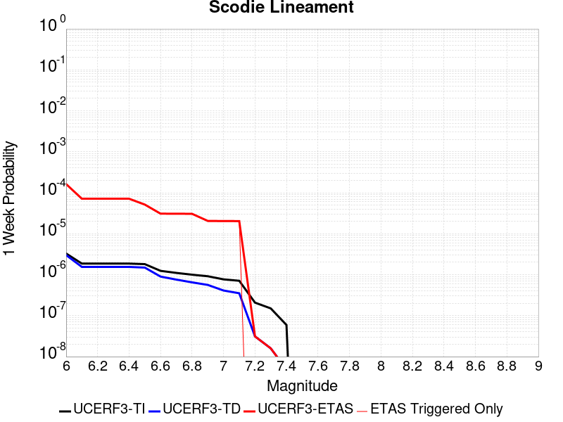 | 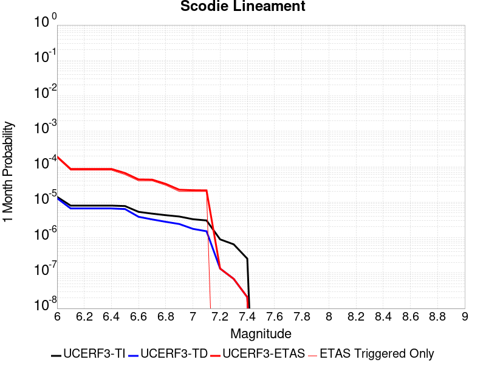 |  |  |

| Magnitude | 1 wk TI Prob | 1 wk TD Prob | 1 wk ETAS Prob | 1 wk ETAS/TD Gain | 1 wk ETAS Triggered Only | 1 mo TI Prob | 1 mo TD Prob | 1 mo ETAS Prob | 1 mo ETAS/TD Gain | 1 mo ETAS Triggered Only | 1 yr TI Prob | 1 yr TD Prob | 1 yr ETAS Prob | 1 yr ETAS/TD Gain | 1 yr ETAS Triggered Only | 10 yr TI Prob | 10 yr TD Prob | 10 yr ETAS Prob | 10 yr ETAS/TD Gain | 10 yr ETAS Triggered Only |
|-----|-----|-----|-----|-----|-----|-----|-----|-----|-----|-----|-----|-----|-----|-----|-----|-----|-----|-----|-----|-----|
| 6.0 | 3.2919327E-6 | 3.0133303E-6 | 1.6301285E-4 | 54.097237 | 1.6E-4 | 1.4108206E-5 | 1.2914227E-5 | 1.929119E-4 | 14.937936 | 1.8E-4 | 1.7175387E-4 | 1.5722254E-4 | 3.971848E-4 | 2.5262587 | 2.4E-4 | 0.0017162118 | 0.0015714248 | 0.001930859 | 1.2287315 | 3.6E-4 |
| 6.1 | 1.8663811E-6 | 1.5490382E-6 | 7.154893E-5 | 46.189262 | 7.0E-5 | 7.998751E-6 | 6.6387206E-6 | 8.663819E-5 | 13.050434 | 8.0E-5 | 9.738045E-5 | 8.082393E-5 | 1.9081503E-4 | 2.3608732 | 1.1E-4 | 9.7337784E-4 | 8.079941E-4 | 9.378891E-4 | 1.1607623 | 1.3E-4 |
| 6.2 | 1.8663811E-6 | 1.5490382E-6 | 7.154893E-5 | 46.189262 | 7.0E-5 | 7.998751E-6 | 6.6387206E-6 | 8.663819E-5 | 13.050434 | 8.0E-5 | 9.738045E-5 | 8.082393E-5 | 1.9081503E-4 | 2.3608732 | 1.1E-4 | 9.7337784E-4 | 8.079941E-4 | 9.378891E-4 | 1.1607623 | 1.3E-4 |
| 6.3 | 1.8663811E-6 | 1.5490382E-6 | 7.154893E-5 | 46.189262 | 7.0E-5 | 7.998751E-6 | 6.6387206E-6 | 8.663819E-5 | 13.050434 | 8.0E-5 | 9.738045E-5 | 8.082393E-5 | 1.9081503E-4 | 2.3608732 | 1.1E-4 | 9.7337784E-4 | 8.079941E-4 | 9.378891E-4 | 1.1607623 | 1.3E-4 |
| 6.4 | 1.8663811E-6 | 1.5490382E-6 | 7.154893E-5 | 46.189262 | 7.0E-5 | 7.998751E-6 | 6.6387206E-6 | 8.663819E-5 | 13.050434 | 8.0E-5 | 9.738045E-5 | 8.082393E-5 | 1.9081503E-4 | 2.3608732 | 1.1E-4 | 9.7337784E-4 | 8.079941E-4 | 9.378891E-4 | 1.1607623 | 1.3E-4 |
| 6.5 | 1.8106311E-6 | 1.4909722E-6 | 5.1490897E-5 | 34.53512 | 5.0E-5 | 7.759824E-6 | 6.389868E-6 | 6.638948E-5 | 10.389806 | 6.0E-5 | 9.447177E-5 | 7.779436E-5 | 1.6778735E-4 | 2.1568062 | 9.0E-5 | 9.4431615E-4 | 7.7771995E-4 | 8.8763435E-4 | 1.141329 | 1.1E-4 |
| 6.6 | 1.2414679E-6 | 8.9974395E-7 | 3.089972E-5 | 34.34279 | 3.0E-5 | 5.320566E-6 | 3.85604E-6 | 4.3855885E-5 | 11.373296 | 4.0E-5 | 6.477596E-5 | 4.6946367E-5 | 8.694449E-5 | 1.8519961 | 4.0E-5 | 6.475708E-4 | 4.6937316E-4 | 5.193497E-4 | 1.106475 | 5.0E-5 |
| 6.7 | 1.1062215E-6 | 7.594193E-7 | 3.07594E-5 | 40.503838 | 3.0E-5 | 4.7409408E-6 | 3.2546504E-6 | 4.325452E-5 | 13.290066 | 4.0E-5 | 5.7719422E-5 | 3.962472E-5 | 7.962313E-5 | 2.009431 | 4.0E-5 | 5.770443E-4 | 3.9618355E-4 | 4.4616373E-4 | 1.1261542 | 5.0E-5 |
| 6.8 | 1.0006736E-6 | 6.5002786E-7 | 3.0650008E-5 | 47.151836 | 3.0E-5 | 4.288594E-6 | 2.7858312E-6 | 3.278575E-5 | 11.768749 | 3.0E-5 | 5.221238E-5 | 3.391703E-5 | 6.391601E-5 | 1.8844814 | 3.0E-5 | 5.220012E-4 | 3.3912458E-4 | 3.7911104E-4 | 1.1179107 | 4.0E-5 |
| 6.9 | 9.167364E-7 | 5.6315065E-7 | 2.0563139E-5 | 36.514454 | 2.0E-5 | 3.9288643E-6 | 2.413501E-6 | 2.2413453E-5 | 9.286697 | 2.0E-5 | 4.7832873E-5 | 2.9384037E-5 | 4.938345E-5 | 1.6806217 | 2.0E-5 | 4.782258E-4 | 2.9380718E-4 | 3.2379836E-4 | 1.1020778 | 3.0E-5 |
| 7.0 | 7.6987664E-7 | 4.113265E-7 | 2.0411318E-5 | 49.623154 | 2.0E-5 | 3.2994672E-6 | 1.7628269E-6 | 2.1762791E-5 | 12.345393 | 2.0E-5 | 4.0170275E-5 | 2.1462245E-5 | 4.1461815E-5 | 1.931849 | 2.0E-5 | 4.0163012E-4 | 2.1460558E-4 | 2.4459916E-4 | 1.1397613 | 3.0E-5 |
| 7.1 | 7.1038727E-7 | 3.5210306E-7 | 2.0352096E-5 | 57.801533 | 2.0E-5 | 3.0445133E-6 | 1.5090123E-6 | 2.1508982E-5 | 14.253682 | 2.0E-5 | 3.706632E-5 | 1.8372106E-5 | 3.8371738E-5 | 2.0885868 | 2.0E-5 | 3.7060137E-4 | 1.8370937E-4 | 2.1370385E-4 | 1.1632714 | 3.0E-5 |
| 7.2 | 2.0799602E-7 | 3.1178534E-8 | 3.1178534E-8 | 1.0 | 0.0 | 8.914113E-7 | 1.3362228E-7 | 1.3362228E-7 | 1.0 | 0.0 | 1.0852878E-5 | 1.6268501E-6 | 1.6268501E-6 | 1.0 | 0.0 | 1.08523476E-4 | 1.626839E-5 | 1.626839E-5 | 1.0 | 0.0 |
| 7.3 | 1.5048182E-7 | 1.5939106E-8 | 1.5939106E-8 | 1.0 | 0.0 | 6.449219E-7 | 6.8310456E-8 | 6.8310456E-8 | 1.0 | 0.0 | 7.851896E-6 | 8.316795E-7 | 8.316795E-7 | 1.0 | 0.0 | 7.851618E-5 | 8.316767E-6 | 8.316767E-6 | 1.0 | 0.0 |
| 7.4 | 5.9334678E-8 | 4.8638475E-9 | 4.8638475E-9 | 1.0 | 0.0 | 2.5429145E-7 | 2.084506E-8 | 2.084506E-8 | 1.0 | 0.0 | 3.095994E-6 | 2.5378858E-7 | 2.5378858E-7 | 1.0 | 0.0 | 3.095951E-5 | 2.5378843E-6 | 2.5378843E-6 | 1.0 | 0.0 |

## Death Valley (Fish Lake Valley)
*[(top)](#table-of-contents)*

| 1 Week | 1 Month | 1 Year | 10 Year |
|-----|-----|-----|-----|
|  |  |  |  |

| Magnitude | 1 wk TI Prob | 1 wk TD Prob | 1 wk ETAS Prob | 1 wk ETAS/TD Gain | 1 wk ETAS Triggered Only | 1 mo TI Prob | 1 mo TD Prob | 1 mo ETAS Prob | 1 mo ETAS/TD Gain | 1 mo ETAS Triggered Only | 1 yr TI Prob | 1 yr TD Prob | 1 yr ETAS Prob | 1 yr ETAS/TD Gain | 1 yr ETAS Triggered Only | 10 yr TI Prob | 10 yr TD Prob | 10 yr ETAS Prob | 10 yr ETAS/TD Gain | 10 yr ETAS Triggered Only |
|-----|-----|-----|-----|-----|-----|-----|-----|-----|-----|-----|-----|-----|-----|-----|-----|-----|-----|-----|-----|-----|
| 6.0 | 3.872328E-5 | 4.7265705E-5 | 1.07262866E-4 | 2.2693594 | 6.0E-5 | 1.6594635E-4 | 2.0255324E-4 | 3.2252894E-4 | 1.5923169 | 1.2E-4 | 0.0020185246 | 0.0024635606 | 0.0026530926 | 1.0769341 | 1.9E-4 | 0.02000288 | 0.024388338 | 0.024720045 | 1.0136011 | 3.4E-4 |
| 6.1 | 3.872328E-5 | 4.7265705E-5 | 1.07262866E-4 | 2.2693594 | 6.0E-5 | 1.6594635E-4 | 2.0255324E-4 | 3.2252894E-4 | 1.5923169 | 1.2E-4 | 0.0020185246 | 0.0024635606 | 0.0026530926 | 1.0769341 | 1.9E-4 | 0.02000288 | 0.024388338 | 0.024720045 | 1.0136011 | 3.4E-4 |
| 6.2 | 3.872328E-5 | 4.7265705E-5 | 1.07262866E-4 | 2.2693594 | 6.0E-5 | 1.6594635E-4 | 2.0255324E-4 | 3.2252894E-4 | 1.5923169 | 1.2E-4 | 0.0020185246 | 0.0024635606 | 0.0026530926 | 1.0769341 | 1.9E-4 | 0.02000288 | 0.024388338 | 0.024720045 | 1.0136011 | 3.4E-4 |
| 6.3 | 2.8356371E-5 | 3.360979E-5 | 8.360811E-5 | 2.4876118 | 5.0E-5 | 1.2152165E-4 | 1.4403443E-4 | 2.5401858E-4 | 1.7635963 | 1.1E-4 | 0.0014785219 | 0.0017522788 | 0.0019119984 | 1.0911497 | 1.6E-4 | 0.014687235 | 0.017391816 | 0.017696425 | 1.0175145 | 3.1E-4 |
| 6.4 | 2.8356371E-5 | 3.360979E-5 | 8.360811E-5 | 2.4876118 | 5.0E-5 | 1.2152165E-4 | 1.4403443E-4 | 2.5401858E-4 | 1.7635963 | 1.1E-4 | 0.0014785219 | 0.0017522788 | 0.0019119984 | 1.0911497 | 1.6E-4 | 0.014687235 | 0.017391816 | 0.017696425 | 1.0175145 | 3.1E-4 |
| 6.5 | 2.4448687E-5 | 2.8607585E-5 | 7.860616E-5 | 2.7477381 | 5.0E-5 | 1.0477588E-4 | 1.2259845E-4 | 2.3258496E-4 | 1.8971281 | 1.1E-4 | 0.0012748998 | 0.0014916616 | 0.001651423 | 1.1071029 | 1.6E-4 | 0.012676105 | 0.014821392 | 0.015126796 | 1.0206057 | 3.1E-4 |
| 6.6 | 2.1298161E-5 | 2.4660083E-5 | 7.465885E-5 | 3.027518 | 5.0E-5 | 9.127464E-5 | 1.0568197E-4 | 2.1567034E-4 | 2.0407488 | 1.1E-4 | 0.0011107022 | 0.0012859512 | 0.0014457455 | 1.1242615 | 1.6E-4 | 0.011051672 | 0.01278853 | 0.013094566 | 1.0239304 | 3.1E-4 |
| 6.7 | 1.8959729E-5 | 2.1781027E-5 | 7.1779934E-5 | 3.295526 | 5.0E-5 | 8.125345E-5 | 9.334406E-5 | 1.9333472E-4 | 2.0712054 | 1.0E-4 | 9.888117E-4 | 0.001135897 | 0.0012857266 | 1.1319042 | 1.5E-4 | 0.009844234 | 0.01130357 | 0.011600179 | 1.0262402 | 3.0E-4 |
| 6.8 | 1.6691629E-5 | 1.9018351E-5 | 6.90174E-5 | 3.6289897 | 5.0E-5 | 7.153359E-5 | 8.150477E-5 | 1.8149662E-4 | 2.2268221 | 1.0E-4 | 8.7057345E-4 | 9.918857E-4 | 0.0011417369 | 1.1510772 | 1.5E-4 | 0.008671708 | 0.009876343 | 0.01017338 | 1.0300757 | 3.0E-4 |
| 6.9 | 1.450505E-5 | 1.638954E-5 | 6.638872E-5 | 4.0506763 | 5.0E-5 | 6.216302E-5 | 7.0239046E-5 | 1.7023202E-4 | 2.4236095 | 1.0E-4 | 7.5657194E-4 | 8.5483363E-4 | 0.0010047054 | 1.1753228 | 1.5E-4 | 0.007540013 | 0.008516386 | 0.008813831 | 1.0349262 | 3.0E-4 |
| 7.0 | 1.2940855E-5 | 1.4537972E-5 | 6.453724E-5 | 4.4392195 | 5.0E-5 | 5.545963E-5 | 6.230414E-5 | 1.622979E-4 | 2.60493 | 1.0E-4 | 6.750118E-4 | 7.5829466E-4 | 9.0818095E-4 | 1.1976622 | 1.5E-4 | 0.006729651 | 0.0075576897 | 0.007855423 | 1.0393946 | 3.0E-4 |
| 7.1 | 1.2544658E-5 | 1.4078208E-5 | 6.40775E-5 | 4.5515385 | 5.0E-5 | 5.3761712E-5 | 6.0333812E-5 | 1.6032778E-4 | 2.6573455 | 1.0E-4 | 6.5435225E-4 | 7.343222E-4 | 8.8421203E-4 | 1.20412 | 1.5E-4 | 0.006524288 | 0.007319551 | 0.007617355 | 1.0406861 | 3.0E-4 |
| 7.2 | 1.2489416E-5 | 1.4015674E-5 | 6.4014974E-5 | 4.5673847 | 5.0E-5 | 5.3524967E-5 | 6.0065824E-5 | 1.6005982E-4 | 2.6647403 | 1.0E-4 | 6.514716E-4 | 7.310616E-4 | 8.80952E-4 | 1.205031 | 1.5E-4 | 0.006495651 | 0.0072871596 | 0.0075849737 | 1.0408683 | 3.0E-4 |
| 7.3 | 1.2368307E-5 | 1.3879812E-5 | 6.387912E-5 | 4.602304 | 5.0E-5 | 5.3005948E-5 | 5.9483587E-5 | 1.5947764E-4 | 2.681036 | 1.0E-4 | 6.451563E-4 | 7.2397763E-4 | 8.73869E-4 | 1.2070388 | 1.5E-4 | 0.0064328653 | 0.007216782 | 0.007514617 | 1.0412698 | 3.0E-4 |
| 7.4 | 1.2161707E-5 | 1.36478675E-5 | 6.364719E-5 | 4.663526 | 5.0E-5 | 5.212056E-5 | 5.8489582E-5 | 1.5848373E-4 | 2.7096062 | 1.0E-4 | 6.3438306E-4 | 7.118836E-4 | 8.617768E-4 | 1.2105587 | 1.5E-4 | 0.006325751 | 0.0070966207 | 0.0073944917 | 1.0419736 | 3.0E-4 |
| 7.5 | 1.1707948E-5 | 1.3145515E-5 | 6.314486E-5 | 4.803529 | 5.0E-5 | 5.0175953E-5 | 5.6336736E-5 | 1.5633111E-4 | 2.7749407 | 1.0E-4 | 6.10721E-4 | 6.856895E-4 | 8.3558663E-4 | 1.2186079 | 1.5E-4 | 0.0060904534 | 0.006836321 | 0.0071342704 | 1.0435833 | 3.0E-4 |
| 7.6 | 1.0319538E-5 | 1.1579622E-5 | 6.157904E-5 | 5.31788 | 5.0E-5 | 4.4225842E-5 | 4.9626036E-5 | 1.4962108E-4 | 3.0149713 | 1.0E-4 | 5.383166E-4 | 6.040347E-4 | 7.539441E-4 | 1.2481802 | 1.5E-4 | 0.0053701443 | 0.0060244603 | 0.0063127135 | 1.047847 | 2.9E-4 |
| 7.7 | 8.937764E-6 | 1.0022779E-5 | 5.002238E-5 | 4.990869 | 4.0E-5 | 3.830414E-5 | 4.295409E-5 | 1.2295066E-4 | 2.8623736 | 8.0E-5 | 4.6625308E-4 | 5.228456E-4 | 6.527776E-4 | 1.2485094 | 1.3E-4 | 0.0046527605 | 0.005216664 | 0.0054852557 | 1.0514872 | 2.7E-4 |
| 7.8 | 3.108007E-7 | 3.284654E-7 | 3.284654E-7 | 1.0 | 0.0 | 1.3320023E-6 | 1.407708E-6 | 1.1407694E-5 | 8.103736 | 1.0E-5 | 1.6217007E-5 | 1.7138715E-5 | 2.7138543E-5 | 1.5834643 | 1.0E-5 | 1.6215823E-4 | 1.7137431E-4 | 1.813726E-4 | 1.0583419 | 1.0E-5 |
| 7.9 | 2.5591178E-9 | 2.6696718E-9 | 2.6696718E-9 | 1.0 | 0.0 | 1.0967647E-8 | 1.14414505E-8 | 1.14414505E-8 | 1.0 | 0.0 | 1.335311E-7 | 1.3929966E-7 | 1.3929966E-7 | 1.0 | 0.0 | 1.3353102E-6 | 1.3929966E-6 | 1.3929966E-6 | 1.0 | 0.0 |

## Lake Isabella (Seismicity)
*[(top)](#table-of-contents)*

| 1 Week | 1 Month | 1 Year | 10 Year |
|-----|-----|-----|-----|
|  |  |  |  |

| Magnitude | 1 wk TI Prob | 1 wk TD Prob | 1 wk ETAS Prob | 1 wk ETAS/TD Gain | 1 wk ETAS Triggered Only | 1 mo TI Prob | 1 mo TD Prob | 1 mo ETAS Prob | 1 mo ETAS/TD Gain | 1 mo ETAS Triggered Only | 1 yr TI Prob | 1 yr TD Prob | 1 yr ETAS Prob | 1 yr ETAS/TD Gain | 1 yr ETAS Triggered Only | 10 yr TI Prob | 10 yr TD Prob | 10 yr ETAS Prob | 10 yr ETAS/TD Gain | 10 yr ETAS Triggered Only |
|-----|-----|-----|-----|-----|-----|-----|-----|-----|-----|-----|-----|-----|-----|-----|-----|-----|-----|-----|-----|-----|
| 6.0 | 9.431637E-6 | 9.741651E-6 | 9.974078E-5 | 10.238589 | 9.0E-5 | 4.0420677E-5 | 4.1749343E-5 | 1.817435E-4 | 4.353206 | 1.4E-4 | 4.920106E-4 | 5.0819275E-4 | 7.480708E-4 | 1.4720217 | 2.4E-4 | 0.004909227 | 0.005071599 | 0.005399925 | 1.0647383 | 3.3E-4 |
| 6.1 | 9.431637E-6 | 9.741651E-6 | 9.974078E-5 | 10.238589 | 9.0E-5 | 4.0420677E-5 | 4.1749343E-5 | 1.817435E-4 | 4.353206 | 1.4E-4 | 4.920106E-4 | 5.0819275E-4 | 7.480708E-4 | 1.4720217 | 2.4E-4 | 0.004909227 | 0.005071599 | 0.005399925 | 1.0647383 | 3.3E-4 |
| 6.2 | 9.431637E-6 | 9.741651E-6 | 9.974078E-5 | 10.238589 | 9.0E-5 | 4.0420677E-5 | 4.1749343E-5 | 1.817435E-4 | 4.353206 | 1.4E-4 | 4.920106E-4 | 5.0819275E-4 | 7.480708E-4 | 1.4720217 | 2.4E-4 | 0.004909227 | 0.005071599 | 0.005399925 | 1.0647383 | 3.3E-4 |
| 6.3 | 9.431637E-6 | 9.741651E-6 | 9.974078E-5 | 10.238589 | 9.0E-5 | 4.0420677E-5 | 4.1749343E-5 | 1.817435E-4 | 4.353206 | 1.4E-4 | 4.920106E-4 | 5.0819275E-4 | 7.480708E-4 | 1.4720217 | 2.4E-4 | 0.004909227 | 0.005071599 | 0.005399925 | 1.0647383 | 3.3E-4 |
| 6.4 | 5.144063E-6 | 5.3000763E-6 | 4.5299865E-5 | 8.547022 | 4.0E-5 | 2.2045799E-5 | 2.2714434E-5 | 1.0271262E-4 | 4.5219097 | 8.0E-5 | 2.6837454E-4 | 2.765166E-4 | 3.964834E-4 | 1.4338503 | 1.2E-4 | 0.0026805066 | 0.0027620657 | 0.0029415686 | 1.0649886 | 1.8E-4 |
| 6.5 | 5.144063E-6 | 5.3000763E-6 | 4.5299865E-5 | 8.547022 | 4.0E-5 | 2.2045799E-5 | 2.2714434E-5 | 1.0271262E-4 | 4.5219097 | 8.0E-5 | 2.6837454E-4 | 2.765166E-4 | 3.964834E-4 | 1.4338503 | 1.2E-4 | 0.0026805066 | 0.0027620657 | 0.0029415686 | 1.0649886 | 1.8E-4 |
| 6.6 | 3.4009804E-6 | 3.498786E-6 | 4.3498647E-5 | 12.432496 | 4.0E-5 | 1.4575549E-5 | 1.4994721E-5 | 9.499352E-5 | 6.335131 | 8.0E-5 | 1.7744285E-4 | 1.8254704E-4 | 2.8252878E-4 | 1.547704 | 1.0E-4 | 0.0017730123 | 0.0018241286 | 0.0019638732 | 1.076609 | 1.4E-4 |
| 6.7 | 3.3880428E-6 | 3.4856528E-6 | 4.3485514E-5 | 12.475573 | 4.0E-5 | 1.4520103E-5 | 1.4938435E-5 | 9.493724E-5 | 6.355233 | 8.0E-5 | 1.767679E-4 | 1.8186188E-4 | 2.8184368E-4 | 1.5497679 | 1.0E-4 | 0.0017662736 | 0.0018172882 | 0.0019570338 | 1.0768979 | 1.4E-4 |
| 6.8 | 2.6582E-6 | 2.7337003E-6 | 3.2733617E-5 | 11.974107 | 3.0E-5 | 1.1392236E-5 | 1.1715813E-5 | 8.171499E-5 | 6.974761 | 7.0E-5 | 1.3869164E-4 | 1.4263204E-4 | 2.2262063E-4 | 1.5608039 | 8.0E-5 | 0.0013860512 | 0.0014255369 | 0.0015353801 | 1.0770539 | 1.1E-4 |
| 6.9 | 2.406011E-6 | 2.4743288E-6 | 2.247428E-5 | 9.08298 | 2.0E-5 | 1.0311434E-5 | 1.0604231E-5 | 5.0603805E-5 | 4.7720394 | 4.0E-5 | 1.2553448E-4 | 1.2910018E-4 | 1.7909372E-4 | 1.3872461 | 5.0E-5 | 0.0012546359 | 0.0012903814 | 0.0013702782 | 1.0619172 | 8.0E-5 |
| 7.0 | 1.6953097E-6 | 1.7429371E-6 | 2.1742902E-5 | 12.474863 | 2.0E-5 | 7.265593E-6 | 7.469715E-6 | 2.7469567E-5 | 3.6774583 | 2.0E-5 | 8.8455E-5 | 9.094104E-5 | 1.20938304E-4 | 1.3298541 | 3.0E-5 | 8.84198E-4 | 9.09141E-4 | 9.590955E-4 | 1.054947 | 5.0E-5 |
| 7.1 | 3.5013824E-7 | 3.5714822E-7 | 3.5714822E-7 | 1.0 | 0.0 | 1.5005916E-6 | 1.5306344E-6 | 1.5306344E-6 | 1.0 | 0.0 | 1.826955E-5 | 1.8635317E-5 | 1.8635317E-5 | 1.0 | 0.0 | 1.8268047E-4 | 1.863378E-4 | 1.863378E-4 | 1.0 | 0.0 |
| 7.2 | 2.2321095E-7 | 2.2750574E-7 | 2.2750574E-7 | 1.0 | 0.0 | 9.56618E-7 | 9.750242E-7 | 9.750242E-7 | 1.0 | 0.0 | 1.1646762E-5 | 1.1870856E-5 | 1.1870856E-5 | 1.0 | 0.0 | 1.1646151E-4 | 1.1870232E-4 | 1.1870232E-4 | 1.0 | 0.0 |
| 7.3 | 1.5760406E-7 | 1.6060922E-7 | 1.6060922E-7 | 1.0 | 0.0 | 6.7544585E-7 | 6.8832503E-7 | 6.8832503E-7 | 1.0 | 0.0 | 8.223522E-6 | 8.380326E-6 | 8.380326E-6 | 1.0 | 0.0 | 8.2232174E-5 | 8.3800165E-5 | 8.3800165E-5 | 1.0 | 0.0 |
| 7.4 | 1.1216497E-7 | 1.1431706E-7 | 1.1431706E-7 | 1.0 | 0.0 | 4.8070694E-7 | 4.899302E-7 | 4.899302E-7 | 1.0 | 0.0 | 5.852591E-6 | 5.964884E-6 | 5.964884E-6 | 1.0 | 0.0 | 5.8524372E-5 | 5.9647282E-5 | 5.9647282E-5 | 1.0 | 0.0 |
| 7.5 | 4.885185E-8 | 4.9787737E-8 | 4.9787737E-8 | 1.0 | 0.0 | 2.0936506E-7 | 2.13376E-7 | 2.13376E-7 | 1.0 | 0.0 | 2.5490165E-6 | 2.59785E-6 | 2.59785E-6 | 1.0 | 0.0 | 2.5489873E-5 | 2.5978214E-5 | 2.5978214E-5 | 1.0 | 0.0 |
| 7.6 | 1.504641E-9 | 1.5317903E-9 | 1.5317903E-9 | 1.0 | 0.0 | 6.4484613E-9 | 6.5648154E-9 | 6.5648154E-9 | 1.0 | 0.0 | 7.851001E-8 | 7.992663E-8 | 7.992663E-8 | 1.0 | 0.0 | 7.8509987E-7 | 7.992663E-7 | 7.992663E-7 | 1.0 | 0.0 |

## San Andreas (Cholame) rev
*[(top)](#table-of-contents)*

| 1 Week | 1 Month | 1 Year | 10 Year |
|-----|-----|-----|-----|
|  |  |  |  |

| Magnitude | 1 wk TI Prob | 1 wk TD Prob | 1 wk ETAS Prob | 1 wk ETAS/TD Gain | 1 wk ETAS Triggered Only | 1 mo TI Prob | 1 mo TD Prob | 1 mo ETAS Prob | 1 mo ETAS/TD Gain | 1 mo ETAS Triggered Only | 1 yr TI Prob | 1 yr TD Prob | 1 yr ETAS Prob | 1 yr ETAS/TD Gain | 1 yr ETAS Triggered Only | 10 yr TI Prob | 10 yr TD Prob | 10 yr ETAS Prob | 10 yr ETAS/TD Gain | 10 yr ETAS Triggered Only |
|-----|-----|-----|-----|-----|-----|-----|-----|-----|-----|-----|-----|-----|-----|-----|-----|-----|-----|-----|-----|-----|
| 6.0 | 1.2302514E-4 | 2.5205986E-4 | 3.5203467E-4 | 1.3966311 | 1.0E-4 | 5.27144E-4 | 0.0010798109 | 0.0012096706 | 1.1202614 | 1.3E-4 | 0.0063991086 | 0.013067958 | 0.013245606 | 1.0135942 | 1.8E-4 | 0.06217949 | 0.12438412 | 0.12463805 | 1.0020415 | 2.9E-4 |
| 6.1 | 1.2302514E-4 | 2.5205986E-4 | 3.5203467E-4 | 1.3966311 | 1.0E-4 | 5.27144E-4 | 0.0010798109 | 0.0012096706 | 1.1202614 | 1.3E-4 | 0.0063991086 | 0.013067958 | 0.013245606 | 1.0135942 | 1.8E-4 | 0.06217949 | 0.12438412 | 0.12463805 | 1.0020415 | 2.9E-4 |
| 6.2 | 1.2203569E-4 | 2.502277E-4 | 3.5020267E-4 | 1.399536 | 1.0E-4 | 5.2290526E-4 | 0.0010719653 | 0.0012018259 | 1.1211426 | 1.3E-4 | 0.006347804 | 0.012973578 | 0.013151243 | 1.0136944 | 1.8E-4 | 0.061695136 | 0.123571314 | 0.123825476 | 1.0020568 | 2.9E-4 |
| 6.3 | 1.2142645E-4 | 2.4908737E-4 | 3.4906247E-4 | 1.4013655 | 1.0E-4 | 5.202953E-4 | 0.0010670823 | 0.0011969436 | 1.1216975 | 1.3E-4 | 0.006316212 | 0.012914834 | 0.013092509 | 1.0137575 | 1.8E-4 | 0.06139677 | 0.12306532 | 0.12331963 | 1.0020665 | 2.9E-4 |
| 6.4 | 1.1865206E-4 | 2.4414246E-4 | 3.4411805E-4 | 1.4094969 | 1.0E-4 | 5.0840975E-4 | 0.0010459068 | 0.0011757709 | 1.1241641 | 1.3E-4 | 0.006172335 | 0.012660044 | 0.012837765 | 1.014038 | 1.8E-4 | 0.060036868 | 0.12085904 | 0.1211052 | 1.0020367 | 2.8E-4 |
| 6.5 | 1.17443946E-4 | 2.4207575E-4 | 3.4205156E-4 | 1.4129938 | 1.0E-4 | 5.032341E-4 | 0.0010370566 | 0.0011669218 | 1.1252248 | 1.3E-4 | 0.006109677 | 0.012553536 | 0.012731276 | 1.0141586 | 1.8E-4 | 0.059444077 | 0.11993008 | 0.1201765 | 1.0020547 | 2.8E-4 |
| 6.6 | 1.13579066E-4 | 2.3516564E-4 | 3.2514447E-4 | 1.382619 | 9.0E-5 | 4.866766E-4 | 0.001007465 | 0.0011273441 | 1.1189909 | 1.2E-4 | 0.0059092017 | 0.012197345 | 0.012365271 | 1.0137675 | 1.7E-4 | 0.057545185 | 0.1168492 | 0.11708765 | 1.0020406 | 2.7E-4 |
| 6.7 | 1.1271412E-4 | 2.336088E-4 | 3.135901E-4 | 1.3423729 | 8.0E-5 | 4.829711E-4 | 0.001000798 | 0.0011106879 | 1.1098022 | 1.1E-4 | 0.005864331 | 0.012117079 | 0.012275141 | 1.0130445 | 1.6E-4 | 0.057119697 | 0.11615275 | 0.116382554 | 1.0019784 | 2.6E-4 |
| 6.8 | 1.1217975E-4 | 2.3249313E-4 | 3.1247453E-4 | 1.3440162 | 8.0E-5 | 4.8068175E-4 | 9.960202E-4 | 0.0011059105 | 1.1103295 | 1.1E-4 | 0.005836608 | 0.012059555 | 0.012217626 | 1.0131075 | 1.6E-4 | 0.056856725 | 0.11565061 | 0.11588054 | 1.0019882 | 2.6E-4 |
| 6.9 | 1.1146753E-4 | 2.3098059E-4 | 3.1096212E-4 | 1.3462695 | 8.0E-5 | 4.7763053E-4 | 9.895428E-4 | 0.0010994339 | 1.1110524 | 1.1E-4 | 0.0057996577 | 0.011981564 | 0.012139646 | 1.0131938 | 1.6E-4 | 0.056506127 | 0.11497027 | 0.11520037 | 1.0020014 | 2.6E-4 |
| 7.0 | 1.0965793E-4 | 2.2721413E-4 | 3.0719594E-4 | 1.3520108 | 8.0E-5 | 4.698779E-4 | 9.734129E-4 | 0.0010833058 | 1.1128944 | 1.1E-4 | 0.005705768 | 0.011787324 | 0.011945439 | 1.0134139 | 1.6E-4 | 0.055614736 | 0.11327011 | 0.11350066 | 1.0020354 | 2.6E-4 |
| 7.1 | 9.927982E-5 | 2.0540332E-4 | 2.853869E-4 | 1.3893976 | 8.0E-5 | 4.2541555E-4 | 8.8000396E-4 | 9.899072E-4 | 1.1248895 | 1.1E-4 | 0.0051671406 | 0.010661708 | 0.010820002 | 1.0148469 | 1.6E-4 | 0.05048634 | 0.10336573 | 0.103598855 | 1.0022553 | 2.6E-4 |
| 7.2 | 9.696786E-5 | 2.0044584E-4 | 2.804298E-4 | 1.3990303 | 8.0E-5 | 4.1551032E-4 | 8.587718E-4 | 9.686773E-4 | 1.1279799 | 1.1E-4 | 0.00504711 | 0.010405703 | 0.010554142 | 1.0142652 | 1.5E-4 | 0.04934009 | 0.10110233 | 0.101327054 | 1.0022228 | 2.5E-4 |
| 7.3 | 9.4727984E-5 | 1.9473763E-4 | 2.7472206E-4 | 1.4107292 | 8.0E-5 | 4.0591392E-4 | 8.343239E-4 | 9.442321E-4 | 1.1317333 | 1.1E-4 | 0.0049308087 | 0.010110851 | 0.010259334 | 1.0146855 | 1.5E-4 | 0.048228268 | 0.09847412 | 0.0986995 | 1.0022887 | 2.5E-4 |
| 7.4 | 9.220358E-5 | 1.8844259E-4 | 2.684275E-4 | 1.4244525 | 8.0E-5 | 3.9509835E-4 | 8.07362E-4 | 9.172732E-4 | 1.1361362 | 1.1E-4 | 0.004799717 | 0.009785578 | 0.00993411 | 1.0151787 | 1.5E-4 | 0.046973653 | 0.09555831 | 0.09578442 | 1.0023662 | 2.5E-4 |
| 7.5 | 7.71631E-5 | 1.5179155E-4 | 2.3177941E-4 | 1.5269586 | 8.0E-5 | 3.306571E-4 | 6.5037323E-4 | 7.6030166E-4 | 1.1690236 | 1.1E-4 | 0.0040183207 | 0.007889617 | 0.008038433 | 1.0188624 | 1.5E-4 | 0.03946433 | 0.078289196 | 0.078501195 | 1.0027078 | 2.3E-4 |
| 7.6 | 7.5634416E-5 | 1.4838556E-4 | 2.2837368E-4 | 1.5390561 | 8.0E-5 | 3.241072E-4 | 6.357833E-4 | 7.4571336E-4 | 1.172905 | 1.1E-4 | 0.0039388672 | 0.007713256 | 0.0078620985 | 1.019297 | 1.5E-4 | 0.038697794 | 0.076654874 | 0.076867245 | 1.0027704 | 2.3E-4 |
| 7.7 | 6.3783E-5 | 1.2359623E-4 | 1.8358881E-4 | 1.4853917 | 6.0E-5 | 2.7332708E-4 | 5.2959064E-4 | 6.1954296E-4 | 1.1698526 | 9.0E-5 | 0.0033226798 | 0.0064287307 | 0.0065380232 | 1.0170007 | 1.1E-4 | 0.032734364 | 0.06454488 | 0.06471326 | 1.0026088 | 1.8E-4 |
| 7.8 | 5.863422E-5 | 1.14169685E-4 | 1.7416284E-4 | 1.5254736 | 6.0E-5 | 2.512653E-4 | 4.892069E-4 | 5.791629E-4 | 1.1838813 | 9.0E-5 | 0.003054864 | 0.0059398497 | 0.0060392558 | 1.0167354 | 1.0E-4 | 0.030132094 | 0.05966162 | 0.05980267 | 1.0023642 | 1.5E-4 |
| 7.9 | 4.595283E-5 | 8.426815E-5 | 1.2426478E-4 | 1.4746352 | 4.0E-5 | 1.9692584E-4 | 3.6109926E-4 | 4.110812E-4 | 1.138416 | 5.0E-5 | 0.0023949358 | 0.0043875277 | 0.004447264 | 1.0136151 | 6.0E-5 | 0.023692891 | 0.044363137 | 0.04443959 | 1.0017233 | 8.0E-5 |
| 8.0 | 3.2950178E-5 | 5.077396E-5 | 8.0772435E-5 | 1.590824 | 3.0E-5 | 1.412074E-4 | 2.1758456E-4 | 2.5757586E-4 | 1.1837965 | 4.0E-5 | 0.0017178444 | 0.0026458753 | 0.002695743 | 1.0188473 | 5.0E-5 | 0.017046256 | 0.027181072 | 0.027239442 | 1.0021474 | 6.0E-5 |
| 8.1 | 1.9177472E-5 | 1.9183733E-5 | 2.9183542E-5 | 1.5212649 | 1.0E-5 | 8.218658E-5 | 8.221342E-5 | 1.0221177E-4 | 1.2432493 | 2.0E-5 | 0.0010001622 | 0.0010004893 | 0.0010304593 | 1.0299553 | 3.0E-5 | 0.009956728 | 0.010757887 | 0.010797456 | 1.0036782 | 4.0E-5 |
| 8.2 | 8.643924E-6 | 5.473668E-6 | 5.473668E-6 | 1.0 | 0.0 | 3.704486E-5 | 2.3458366E-5 | 3.345813E-5 | 1.4262772 | 1.0E-5 | 4.5092785E-4 | 2.8556827E-4 | 3.0556254E-4 | 1.0700158 | 2.0E-5 | 0.0045001395 | 0.0032481793 | 0.0032681145 | 1.0061373 | 2.0E-5 |
| 8.3 | 1.983087E-6 | 7.6564595E-7 | 7.6564595E-7 | 1.0 | 0.0 | 8.498917E-6 | 3.281336E-6 | 3.281336E-6 | 1.0 | 0.0 | 1.034694E-4 | 3.9949547E-5 | 3.9949547E-5 | 1.0 | 0.0 | 0.0010342124 | 4.717979E-4 | 4.717979E-4 | 1.0 | 0.0 |

## Cady
*[(top)](#table-of-contents)*

| 1 Week | 1 Month | 1 Year | 10 Year |
|-----|-----|-----|-----|
|  |  |  |  |

| Magnitude | 1 wk TI Prob | 1 wk TD Prob | 1 wk ETAS Prob | 1 wk ETAS/TD Gain | 1 wk ETAS Triggered Only | 1 mo TI Prob | 1 mo TD Prob | 1 mo ETAS Prob | 1 mo ETAS/TD Gain | 1 mo ETAS Triggered Only | 1 yr TI Prob | 1 yr TD Prob | 1 yr ETAS Prob | 1 yr ETAS/TD Gain | 1 yr ETAS Triggered Only | 10 yr TI Prob | 10 yr TD Prob | 10 yr ETAS Prob | 10 yr ETAS/TD Gain | 10 yr ETAS Triggered Only |
|-----|-----|-----|-----|-----|-----|-----|-----|-----|-----|-----|-----|-----|-----|-----|-----|-----|-----|-----|-----|-----|
| 6.0 | 1.9892565E-5 | 2.1858728E-5 | 1.418561E-4 | 6.4896774 | 1.2E-4 | 8.525106E-5 | 9.3677416E-5 | 2.3366431E-4 | 2.4943504 | 1.4E-4 | 0.0010374374 | 0.0011400167 | 0.0013298001 | 1.1664742 | 1.9E-4 | 0.010326075 | 0.011350701 | 0.011627522 | 1.0243881 | 2.8E-4 |
| 6.1 | 1.9892565E-5 | 2.1858728E-5 | 1.418561E-4 | 6.4896774 | 1.2E-4 | 8.525106E-5 | 9.3677416E-5 | 2.3366431E-4 | 2.4943504 | 1.4E-4 | 0.0010374374 | 0.0011400167 | 0.0013298001 | 1.1664742 | 1.9E-4 | 0.010326075 | 0.011350701 | 0.011627522 | 1.0243881 | 2.8E-4 |
| 6.2 | 1.9892565E-5 | 2.1858728E-5 | 1.418561E-4 | 6.4896774 | 1.2E-4 | 8.525106E-5 | 9.3677416E-5 | 2.3366431E-4 | 2.4943504 | 1.4E-4 | 0.0010374374 | 0.0011400167 | 0.0013298001 | 1.1664742 | 1.9E-4 | 0.010326075 | 0.011350701 | 0.011627522 | 1.0243881 | 2.8E-4 |
| 6.3 | 1.1117327E-5 | 1.2176583E-5 | 6.2175975E-5 | 5.106192 | 5.0E-5 | 4.764482E-5 | 5.2184492E-5 | 1.0218188E-4 | 1.9580891 | 5.0E-5 | 5.7992124E-4 | 6.351925E-4 | 7.251353E-4 | 1.1415993 | 9.0E-5 | 0.0057841022 | 0.0063368753 | 0.006485925 | 1.023521 | 1.5E-4 |
| 6.4 | 1.1117327E-5 | 1.2176583E-5 | 6.2175975E-5 | 5.106192 | 5.0E-5 | 4.764482E-5 | 5.2184492E-5 | 1.0218188E-4 | 1.9580891 | 5.0E-5 | 5.7992124E-4 | 6.351925E-4 | 7.251353E-4 | 1.1415993 | 9.0E-5 | 0.0057841022 | 0.0063368753 | 0.006485925 | 1.023521 | 1.5E-4 |
| 6.5 | 6.103093E-6 | 6.672021E-6 | 2.6671887E-5 | 3.9975727 | 2.0E-5 | 2.615585E-5 | 2.8594131E-5 | 4.859356E-5 | 1.6994243 | 2.0E-5 | 3.1840094E-4 | 3.480905E-4 | 4.080696E-4 | 1.1723089 | 6.0E-5 | 0.0031794512 | 0.0034766865 | 0.0035464433 | 1.0200641 | 7.0E-5 |
| 6.6 | 5.817237E-6 | 6.3656585E-6 | 2.6365531E-5 | 4.1418386 | 2.0E-5 | 2.4930776E-5 | 2.728118E-5 | 4.728063E-5 | 1.7330861 | 2.0E-5 | 3.034899E-4 | 3.3211018E-4 | 3.9209024E-4 | 1.1806029 | 6.0E-5 | 0.0030307577 | 0.0033173605 | 0.0033871282 | 1.0210311 | 7.0E-5 |
| 6.7 | 4.8846314E-6 | 5.3405684E-6 | 2.5340461E-5 | 4.7448997 | 2.0E-5 | 2.0933967E-5 | 2.2888014E-5 | 4.2887557E-5 | 1.8737998 | 2.0E-5 | 2.5484123E-4 | 2.7863772E-4 | 3.38621E-4 | 1.2152734 | 6.0E-5 | 0.0025454918 | 0.0027840391 | 0.0028438722 | 1.0214914 | 6.0E-5 |
| 6.8 | 1.7788773E-6 | 1.9399079E-6 | 1.9399079E-6 | 1.0 | 0.0 | 7.6237375E-6 | 8.313874E-6 | 8.313874E-6 | 1.0 | 0.0 | 9.281505E-5 | 1.01218284E-4 | 1.11217276E-4 | 1.0987864 | 1.0E-5 | 9.2776294E-4 | 0.0010118765 | 0.0010218663 | 1.0098727 | 1.0E-5 |
| 6.9 | 7.5455404E-7 | 8.297092E-7 | 8.297092E-7 | 1.0 | 0.0 | 3.233799E-6 | 3.5558937E-6 | 3.5558937E-6 | 1.0 | 0.0 | 3.937079E-5 | 4.3292483E-5 | 5.329205E-5 | 1.2309769 | 1.0E-5 | 3.9363815E-4 | 4.3287344E-4 | 4.428691E-4 | 1.0230914 | 1.0E-5 |
| 7.0 | 6.8578805E-7 | 7.541816E-7 | 7.541816E-7 | 1.0 | 0.0 | 2.9390883E-6 | 3.2322048E-6 | 3.2322048E-6 | 1.0 | 0.0 | 3.578281E-5 | 3.9351715E-5 | 4.9351318E-5 | 1.2541085 | 1.0E-5 | 3.577705E-4 | 3.9347992E-4 | 4.0347598E-4 | 1.0254042 | 1.0E-5 |

## San Andreas (Carrizo) rev
*[(top)](#table-of-contents)*

| 1 Week | 1 Month | 1 Year | 10 Year |
|-----|-----|-----|-----|
|  |  |  |  |

| Magnitude | 1 wk TI Prob | 1 wk TD Prob | 1 wk ETAS Prob | 1 wk ETAS/TD Gain | 1 wk ETAS Triggered Only | 1 mo TI Prob | 1 mo TD Prob | 1 mo ETAS Prob | 1 mo ETAS/TD Gain | 1 mo ETAS Triggered Only | 1 yr TI Prob | 1 yr TD Prob | 1 yr ETAS Prob | 1 yr ETAS/TD Gain | 1 yr ETAS Triggered Only | 10 yr TI Prob | 10 yr TD Prob | 10 yr ETAS Prob | 10 yr ETAS/TD Gain | 10 yr ETAS Triggered Only |
|-----|-----|-----|-----|-----|-----|-----|-----|-----|-----|-----|-----|-----|-----|-----|-----|-----|-----|-----|-----|-----|
| 6.0 | 1.1674632E-4 | 2.4324407E-4 | 3.3322218E-4 | 1.3699088 | 9.0E-5 | 5.002454E-4 | 0.0010420597 | 0.0011619347 | 1.1150366 | 1.2E-4 | 0.006073493 | 0.012613757 | 0.012781613 | 1.0133073 | 1.7E-4 | 0.0591016 | 0.120640226 | 0.120886445 | 1.002041 | 2.8E-4 |
| 6.1 | 1.1674632E-4 | 2.4324407E-4 | 3.3322218E-4 | 1.3699088 | 9.0E-5 | 5.002454E-4 | 0.0010420597 | 0.0011619347 | 1.1150366 | 1.2E-4 | 0.006073493 | 0.012613757 | 0.012781613 | 1.0133073 | 1.7E-4 | 0.0591016 | 0.120640226 | 0.120886445 | 1.002041 | 2.8E-4 |
| 6.2 | 1.1674632E-4 | 2.4324407E-4 | 3.3322218E-4 | 1.3699088 | 9.0E-5 | 5.002454E-4 | 0.0010420597 | 0.0011619347 | 1.1150366 | 1.2E-4 | 0.006073493 | 0.012613757 | 0.012781613 | 1.0133073 | 1.7E-4 | 0.0591016 | 0.120640226 | 0.120886445 | 1.002041 | 2.8E-4 |
| 6.3 | 1.1674632E-4 | 2.4324407E-4 | 3.3322218E-4 | 1.3699088 | 9.0E-5 | 5.002454E-4 | 0.0010420597 | 0.0011619347 | 1.1150366 | 1.2E-4 | 0.006073493 | 0.012613757 | 0.012781613 | 1.0133073 | 1.7E-4 | 0.0591016 | 0.120640226 | 0.120886445 | 1.002041 | 2.8E-4 |
| 6.4 | 1.1674632E-4 | 2.4324407E-4 | 3.3322218E-4 | 1.3699088 | 9.0E-5 | 5.002454E-4 | 0.0010420597 | 0.0011619347 | 1.1150366 | 1.2E-4 | 0.006073493 | 0.012613757 | 0.012781613 | 1.0133073 | 1.7E-4 | 0.0591016 | 0.120640226 | 0.120886445 | 1.002041 | 2.8E-4 |
| 6.5 | 1.13136164E-4 | 2.3644442E-4 | 3.2642315E-4 | 1.3805492 | 9.0E-5 | 4.847792E-4 | 0.0010129412 | 0.0011328197 | 1.1183469 | 1.2E-4 | 0.0058862255 | 0.012263271 | 0.012431186 | 1.0136925 | 1.7E-4 | 0.057327334 | 0.11761008 | 0.11785715 | 1.0021007 | 2.8E-4 |
| 6.6 | 1.13136164E-4 | 2.3644442E-4 | 3.2642315E-4 | 1.3805492 | 9.0E-5 | 4.847792E-4 | 0.0010129412 | 0.0011328197 | 1.1183469 | 1.2E-4 | 0.0058862255 | 0.012263271 | 0.012431186 | 1.0136925 | 1.7E-4 | 0.057327334 | 0.11761008 | 0.11785715 | 1.0021007 | 2.8E-4 |
| 6.7 | 1.1149675E-4 | 2.3335687E-4 | 3.133382E-4 | 1.3427426 | 8.0E-5 | 4.777557E-4 | 9.997191E-4 | 0.0011096091 | 1.1099209 | 1.1E-4 | 0.0058011734 | 0.012104088 | 0.012262152 | 1.0130587 | 1.6E-4 | 0.05652051 | 0.1162291 | 0.11646772 | 1.002053 | 2.7E-4 |
| 6.8 | 1.1103589E-4 | 2.3237852E-4 | 3.1235992E-4 | 1.344186 | 8.0E-5 | 4.7578133E-4 | 9.955293E-4 | 0.0011054198 | 1.110384 | 1.1E-4 | 0.005777263 | 0.012053643 | 0.012211715 | 1.013114 | 1.6E-4 | 0.056293584 | 0.11578894 | 0.116027676 | 1.0020618 | 2.7E-4 |
| 6.9 | 1.1053259E-4 | 2.3130233E-4 | 3.1128383E-4 | 1.3457876 | 8.0E-5 | 4.7362508E-4 | 9.909206E-4 | 0.0011008116 | 1.1108979 | 1.1E-4 | 0.0057511497 | 0.011998152 | 0.012156232 | 1.0131754 | 1.6E-4 | 0.05604569 | 0.11530445 | 0.11554331 | 1.0020716 | 2.7E-4 |
| 7.0 | 1.1005377E-4 | 2.3031076E-4 | 3.1029235E-4 | 1.3472768 | 8.0E-5 | 4.7157376E-4 | 9.866742E-4 | 0.0010965657 | 1.1113756 | 1.1E-4 | 0.0057263062 | 0.011947021 | 0.012105109 | 1.0132325 | 1.6E-4 | 0.055809796 | 0.11485658 | 0.11509557 | 1.0020808 | 2.7E-4 |
| 7.1 | 1.0308142E-4 | 2.1540876E-4 | 2.9539154E-4 | 1.3713069 | 8.0E-5 | 4.417027E-4 | 9.228548E-4 | 0.0010327533 | 1.1190853 | 1.1E-4 | 0.0053644776 | 0.011178188 | 0.0113364 | 1.0141536 | 1.6E-4 | 0.052368138 | 0.10809042 | 0.10832232 | 1.0021454 | 2.6E-4 |
| 7.2 | 1.0027479E-4 | 2.094876E-4 | 2.8947083E-4 | 1.3818042 | 8.0E-5 | 4.296783E-4 | 8.9749607E-4 | 0.0010073973 | 1.1224532 | 1.1E-4 | 0.0052187922 | 0.010872566 | 0.011020935 | 1.0136462 | 1.5E-4 | 0.050979212 | 0.10539086 | 0.10561451 | 1.0021222 | 2.5E-4 |
| 7.3 | 9.816942E-5 | 2.0423878E-4 | 2.8422245E-4 | 1.3916184 | 8.0E-5 | 4.2065824E-4 | 8.7501644E-4 | 9.849202E-4 | 1.1256019 | 1.1E-4 | 0.005109493 | 0.010601572 | 0.010749982 | 1.0139989 | 1.5E-4 | 0.049935985 | 0.10297546 | 0.10319971 | 1.0021777 | 2.5E-4 |
| 7.4 | 9.5634205E-5 | 1.9793298E-4 | 2.7791716E-4 | 1.4040972 | 8.0E-5 | 4.0979648E-4 | 8.4800937E-4 | 9.579161E-4 | 1.1296055 | 1.1E-4 | 0.0049778637 | 0.010275901 | 0.01042436 | 1.0144472 | 1.5E-4 | 0.048678253 | 0.100067884 | 0.10029287 | 1.0022483 | 2.5E-4 |
| 7.5 | 8.052417E-5 | 1.6113915E-4 | 2.4112627E-4 | 1.4963853 | 8.0E-5 | 3.4505792E-4 | 6.9041376E-4 | 8.003378E-4 | 1.1592147 | 1.1E-4 | 0.0041929903 | 0.008373471 | 0.008522215 | 1.0177637 | 1.5E-4 | 0.04114753 | 0.082815245 | 0.0830262 | 1.0025473 | 2.3E-4 |
| 7.6 | 7.897024E-5 | 1.5767086E-4 | 2.3765824E-4 | 1.5073061 | 8.0E-5 | 3.384E-4 | 6.755574E-4 | 7.854831E-4 | 1.1627185 | 1.1E-4 | 0.0041122385 | 0.00819397 | 0.008342741 | 1.0181562 | 1.5E-4 | 0.040369697 | 0.08115866 | 0.081369996 | 1.002604 | 2.3E-4 |
| 7.7 | 6.707427E-5 | 1.3277122E-4 | 1.9276325E-4 | 1.4518452 | 6.0E-5 | 2.8742946E-4 | 5.688955E-4 | 6.588443E-4 | 1.1581113 | 9.0E-5 | 0.003493839 | 0.0069043385 | 0.007013579 | 1.015822 | 1.1E-4 | 0.034394164 | 0.06905339 | 0.06922096 | 1.0024266 | 1.8E-4 |
| 7.8 | 6.147705E-5 | 1.2198445E-4 | 1.8197713E-4 | 1.4918059 | 6.0E-5 | 2.6344648E-4 | 5.226858E-4 | 6.126388E-4 | 1.1720976 | 9.0E-5 | 0.0032027436 | 0.006345156 | 0.0064445217 | 1.01566 | 1.0E-4 | 0.031569764 | 0.0635172 | 0.06365767 | 1.0022116 | 1.5E-4 |
| 7.9 | 4.7636717E-5 | 8.8802946E-5 | 1.287994E-4 | 1.4503955 | 4.0E-5 | 2.0414138E-4 | 3.8052857E-4 | 4.3050954E-4 | 1.1313462 | 5.0E-5 | 0.0024825884 | 0.004623101 | 0.004682824 | 1.0129184 | 6.0E-5 | 0.024550365 | 0.046629366 | 0.046705633 | 1.0016357 | 8.0E-5 |
| 8.0 | 3.3554235E-5 | 5.2138024E-5 | 8.213646E-5 | 1.5753658 | 3.0E-5 | 1.4379594E-4 | 2.2342955E-4 | 2.634206E-4 | 1.1789874 | 4.0E-5 | 0.0017493097 | 0.002716863 | 0.0027667272 | 1.0183536 | 5.0E-5 | 0.017356034 | 0.027881905 | 0.027940232 | 1.0020919 | 6.0E-5 |
| 8.1 | 1.9175432E-5 | 1.9183564E-5 | 2.9183373E-5 | 1.5212696 | 1.0E-5 | 8.217783E-5 | 8.221269E-5 | 1.02211045E-4 | 1.2432514 | 2.0E-5 | 0.0010000558 | 0.0010004805 | 0.0010304505 | 1.0299556 | 3.0E-5 | 0.009955673 | 0.010757771 | 0.01079734 | 1.0036782 | 4.0E-5 |
| 8.2 | 8.643924E-6 | 5.473668E-6 | 5.473668E-6 | 1.0 | 0.0 | 3.704486E-5 | 2.3458366E-5 | 3.345813E-5 | 1.4262772 | 1.0E-5 | 4.5092785E-4 | 2.8556827E-4 | 3.0556254E-4 | 1.0700158 | 2.0E-5 | 0.0045001395 | 0.0032481793 | 0.0032681145 | 1.0061373 | 2.0E-5 |
| 8.3 | 1.983087E-6 | 7.6564595E-7 | 7.6564595E-7 | 1.0 | 0.0 | 8.498917E-6 | 3.281336E-6 | 3.281336E-6 | 1.0 | 0.0 | 1.034694E-4 | 3.9949547E-5 | 3.9949547E-5 | 1.0 | 0.0 | 0.0010342124 | 4.717979E-4 | 4.717979E-4 | 1.0 | 0.0 |

## Sierra Nevada  (No Extension)
*[(top)](#table-of-contents)*

| 1 Week | 1 Month | 1 Year | 10 Year |
|-----|-----|-----|-----|
|  |  |  |  |

| Magnitude | 1 wk TI Prob | 1 wk TD Prob | 1 wk ETAS Prob | 1 wk ETAS/TD Gain | 1 wk ETAS Triggered Only | 1 mo TI Prob | 1 mo TD Prob | 1 mo ETAS Prob | 1 mo ETAS/TD Gain | 1 mo ETAS Triggered Only | 1 yr TI Prob | 1 yr TD Prob | 1 yr ETAS Prob | 1 yr ETAS/TD Gain | 1 yr ETAS Triggered Only | 10 yr TI Prob | 10 yr TD Prob | 10 yr ETAS Prob | 10 yr ETAS/TD Gain | 10 yr ETAS Triggered Only |
|-----|-----|-----|-----|-----|-----|-----|-----|-----|-----|-----|-----|-----|-----|-----|-----|-----|-----|-----|-----|-----|
| 6.0 | 7.7690465E-6 | 6.9762887E-6 | 1.1697552E-4 | 16.767586 | 1.1E-4 | 3.329549E-5 | 2.989824E-5 | 1.7989376E-4 | 6.0168676 | 1.5E-4 | 4.0529718E-4 | 3.6398612E-4 | 5.639133E-4 | 1.5492715 | 2.0E-4 | 0.004045588 | 0.0036374154 | 0.0038964697 | 1.0712193 | 2.6E-4 |
| 6.1 | 7.7690465E-6 | 6.9762887E-6 | 1.1697552E-4 | 16.767586 | 1.1E-4 | 3.329549E-5 | 2.989824E-5 | 1.7989376E-4 | 6.0168676 | 1.5E-4 | 4.0529718E-4 | 3.6398612E-4 | 5.639133E-4 | 1.5492715 | 2.0E-4 | 0.004045588 | 0.0036374154 | 0.0038964697 | 1.0712193 | 2.6E-4 |
| 6.2 | 7.7690465E-6 | 6.9762887E-6 | 1.1697552E-4 | 16.767586 | 1.1E-4 | 3.329549E-5 | 2.989824E-5 | 1.7989376E-4 | 6.0168676 | 1.5E-4 | 4.0529718E-4 | 3.6398612E-4 | 5.639133E-4 | 1.5492715 | 2.0E-4 | 0.004045588 | 0.0036374154 | 0.0038964697 | 1.0712193 | 2.6E-4 |
| 6.3 | 7.7690465E-6 | 6.9762887E-6 | 1.1697552E-4 | 16.767586 | 1.1E-4 | 3.329549E-5 | 2.989824E-5 | 1.7989376E-4 | 6.0168676 | 1.5E-4 | 4.0529718E-4 | 3.6398612E-4 | 5.639133E-4 | 1.5492715 | 2.0E-4 | 0.004045588 | 0.0036374154 | 0.0038964697 | 1.0712193 | 2.6E-4 |
| 6.4 | 7.7690465E-6 | 6.9762887E-6 | 1.1697552E-4 | 16.767586 | 1.1E-4 | 3.329549E-5 | 2.989824E-5 | 1.7989376E-4 | 6.0168676 | 1.5E-4 | 4.0529718E-4 | 3.6398612E-4 | 5.639133E-4 | 1.5492715 | 2.0E-4 | 0.004045588 | 0.0036374154 | 0.0038964697 | 1.0712193 | 2.6E-4 |
| 6.5 | 7.7690465E-6 | 6.9762887E-6 | 1.1697552E-4 | 16.767586 | 1.1E-4 | 3.329549E-5 | 2.989824E-5 | 1.7989376E-4 | 6.0168676 | 1.5E-4 | 4.0529718E-4 | 3.6398612E-4 | 5.639133E-4 | 1.5492715 | 2.0E-4 | 0.004045588 | 0.0036374154 | 0.0038964697 | 1.0712193 | 2.6E-4 |
| 6.6 | 2.653E-6 | 1.6148208E-6 | 6.161472E-5 | 38.155766 | 6.0E-5 | 1.136995E-5 | 6.9206426E-6 | 9.692002E-5 | 14.004482 | 9.0E-5 | 1.3842035E-4 | 8.42556E-5 | 2.1424465E-4 | 2.5427942 | 1.3E-4 | 0.0013833415 | 8.4224E-4 | 0.0010021052 | 1.1898096 | 1.6E-4 |
| 6.7 | 2.5902466E-6 | 1.5501544E-6 | 6.155006E-5 | 39.70576 | 6.0E-5 | 1.11010095E-5 | 6.643502E-6 | 9.664291E-5 | 14.546982 | 9.0E-5 | 1.351464E-4 | 8.088166E-5 | 2.1087115E-4 | 2.6071565 | 1.3E-4 | 0.0013506424 | 8.0852525E-4 | 9.683959E-4 | 1.1977311 | 1.6E-4 |
| 6.8 | 2.5853892E-6 | 1.5469546E-6 | 6.154686E-5 | 39.78582 | 6.0E-5 | 1.1080193E-5 | 6.629789E-6 | 9.662919E-5 | 14.575003 | 9.0E-5 | 1.34893E-4 | 8.071472E-5 | 2.1070422E-4 | 2.6104808 | 1.3E-4 | 0.0013481114 | 8.06857E-4 | 9.667279E-4 | 1.1981403 | 1.6E-4 |
| 6.9 | 2.458257E-6 | 1.422029E-6 | 6.1421946E-5 | 43.193176 | 6.0E-5 | 1.0535345E-5 | 6.0943958E-6 | 9.609385E-5 | 15.767576 | 9.0E-5 | 1.2826028E-4 | 7.419676E-5 | 1.9418786E-4 | 2.6172013 | 1.2E-4 | 0.0012818627 | 7.4172183E-4 | 8.916106E-4 | 1.2020822 | 1.5E-4 |
| 7.0 | 2.4341468E-6 | 1.3989927E-6 | 6.139891E-5 | 43.88794 | 6.0E-5 | 1.0432016E-5 | 5.9956697E-6 | 9.599513E-5 | 16.010744 | 9.0E-5 | 1.270024E-4 | 7.299485E-5 | 1.9298609E-4 | 2.6438315 | 1.2E-4 | 0.0012692984 | 7.297107E-4 | 8.696085E-4 | 1.1917169 | 1.4E-4 |
| 7.1 | 2.3652476E-6 | 1.3339427E-6 | 5.1333875E-5 | 38.48282 | 5.0E-5 | 1.0136736E-5 | 5.716885E-6 | 8.571643E-5 | 14.993555 | 8.0E-5 | 1.2340778E-4 | 6.9600865E-5 | 1.795932E-4 | 2.5803301 | 1.1E-4 | 0.0012333926 | 6.957924E-4 | 8.257019E-4 | 1.1867074 | 1.3E-4 |
| 7.2 | 2.272158E-6 | 1.2502497E-6 | 5.1250187E-5 | 40.991962 | 5.0E-5 | 9.737784E-6 | 5.358202E-6 | 8.535777E-5 | 15.930302 | 8.0E-5 | 1.1855107E-4 | 6.523417E-5 | 1.7522699E-4 | 2.686123 | 1.1E-4 | 0.0011848784 | 6.5215176E-4 | 7.8206696E-4 | 1.1992102 | 1.3E-4 |
| 7.3 | 2.1382127E-6 | 1.1419382E-6 | 5.114188E-5 | 44.785156 | 5.0E-5 | 9.163737E-6 | 4.894012E-6 | 8.489362E-5 | 17.346428 | 8.0E-5 | 1.1156279E-4 | 5.9582977E-5 | 1.6957642E-4 | 2.8460548 | 1.1E-4 | 0.001115068 | 5.956712E-4 | 7.2559377E-4 | 1.2181112 | 1.3E-4 |
| 7.4 | 1.9048055E-6 | 9.574928E-7 | 5.0957446E-5 | 53.21966 | 5.0E-5 | 8.163426E-6 | 4.103534E-6 | 8.410321E-5 | 20.49531 | 8.0E-5 | 9.9385186E-5 | 4.995939E-5 | 1.599539E-4 | 3.2016783 | 1.1E-4 | 9.934074E-4 | 4.9948227E-4 | 6.2941737E-4 | 1.2601395 | 1.3E-4 |
| 7.5 | 1.5373403E-6 | 7.559763E-7 | 2.075596E-5 | 27.455835 | 2.0E-5 | 6.5885843E-6 | 3.2398946E-6 | 5.323973E-5 | 16.43255 | 5.0E-5 | 8.021306E-5 | 3.9445007E-5 | 1.0944225E-4 | 2.7745526 | 7.0E-5 | 8.0184115E-4 | 3.9438053E-4 | 4.8434502E-4 | 1.228116 | 9.0E-5 |
| 7.6 | 1.0680322E-6 | 4.65941E-7 | 1.0465937E-5 | 22.461935 | 1.0E-5 | 4.577273E-6 | 1.9968884E-6 | 2.1996848E-5 | 11.015562 | 2.0E-5 | 5.5726876E-5 | 2.4311848E-5 | 6.431088E-5 | 2.6452482 | 4.0E-5 | 5.5712904E-4 | 2.4309216E-4 | 2.9308E-4 | 1.2056333 | 5.0E-5 |
| 7.7 | 5.509146E-7 | 1.5578539E-7 | 1.5578539E-7 | 1.0 | 0.0 | 2.3610605E-6 | 6.676515E-7 | 6.676515E-7 | 1.0 | 0.0 | 2.8745531E-5 | 8.128628E-6 | 8.128628E-6 | 1.0 | 0.0 | 2.8741814E-4 | 8.128342E-5 | 8.128342E-5 | 1.0 | 0.0 |

## Manix-Afton Hills
*[(top)](#table-of-contents)*

| 1 Week | 1 Month | 1 Year | 10 Year |
|-----|-----|-----|-----|
|  |  |  |  |

| Magnitude | 1 wk TI Prob | 1 wk TD Prob | 1 wk ETAS Prob | 1 wk ETAS/TD Gain | 1 wk ETAS Triggered Only | 1 mo TI Prob | 1 mo TD Prob | 1 mo ETAS Prob | 1 mo ETAS/TD Gain | 1 mo ETAS Triggered Only | 1 yr TI Prob | 1 yr TD Prob | 1 yr ETAS Prob | 1 yr ETAS/TD Gain | 1 yr ETAS Triggered Only | 10 yr TI Prob | 10 yr TD Prob | 10 yr ETAS Prob | 10 yr ETAS/TD Gain | 10 yr ETAS Triggered Only |
|-----|-----|-----|-----|-----|-----|-----|-----|-----|-----|-----|-----|-----|-----|-----|-----|-----|-----|-----|-----|-----|
| 6.0 | 1.3783202E-5 | 1.47110895E-5 | 1.0470977E-4 | 7.1177435 | 9.0E-5 | 5.906953E-5 | 6.30461E-5 | 1.8303854E-4 | 2.903249 | 1.2E-4 | 7.189342E-4 | 7.6733343E-4 | 9.571877E-4 | 1.2474208 | 1.9E-4 | 0.0071661277 | 0.007648596 | 0.00788676 | 1.0311383 | 2.4E-4 |
| 6.1 | 1.3783202E-5 | 1.47110895E-5 | 1.0470977E-4 | 7.1177435 | 9.0E-5 | 5.906953E-5 | 6.30461E-5 | 1.8303854E-4 | 2.903249 | 1.2E-4 | 7.189342E-4 | 7.6733343E-4 | 9.571877E-4 | 1.2474208 | 1.9E-4 | 0.0071661277 | 0.007648596 | 0.00788676 | 1.0311383 | 2.4E-4 |
| 6.2 | 1.3783202E-5 | 1.47110895E-5 | 1.0470977E-4 | 7.1177435 | 9.0E-5 | 5.906953E-5 | 6.30461E-5 | 1.8303854E-4 | 2.903249 | 1.2E-4 | 7.189342E-4 | 7.6733343E-4 | 9.571877E-4 | 1.2474208 | 1.9E-4 | 0.0071661277 | 0.007648596 | 0.00788676 | 1.0311383 | 2.4E-4 |
| 6.3 | 1.10494875E-5 | 1.1793136E-5 | 6.179255E-5 | 5.2397046 | 5.0E-5 | 4.7354086E-5 | 5.054109E-5 | 1.1053806E-4 | 2.1870928 | 6.0E-5 | 5.763835E-4 | 6.151744E-4 | 7.2510674E-4 | 1.178701 | 1.1E-4 | 0.005748908 | 0.0061357557 | 0.0062848353 | 1.0242969 | 1.5E-4 |
| 6.4 | 1.10494875E-5 | 1.1793136E-5 | 6.179255E-5 | 5.2397046 | 5.0E-5 | 4.7354086E-5 | 5.054109E-5 | 1.1053806E-4 | 2.1870928 | 6.0E-5 | 5.763835E-4 | 6.151744E-4 | 7.2510674E-4 | 1.178701 | 1.1E-4 | 0.005748908 | 0.0061357557 | 0.0062848353 | 1.0242969 | 1.5E-4 |
| 6.5 | 9.788949E-6 | 1.045432E-5 | 5.0453902E-5 | 4.8261294 | 4.0E-5 | 4.1951964E-5 | 4.480351E-5 | 9.480127E-5 | 2.115934 | 5.0E-5 | 5.1064545E-4 | 5.453555E-4 | 6.4530096E-4 | 1.1832666 | 1.0E-4 | 0.0050947363 | 0.0054410985 | 0.005570391 | 1.0237622 | 1.3E-4 |
| 6.6 | 8.810006E-6 | 9.4136285E-6 | 3.9413346E-5 | 4.186839 | 3.0E-5 | 3.775662E-5 | 4.0343548E-5 | 8.034193E-5 | 1.9914445 | 4.0E-5 | 4.5958988E-4 | 4.9108086E-4 | 5.810367E-4 | 1.1831793 | 9.0E-5 | 0.0045864056 | 0.004900839 | 0.004990398 | 1.0182742 | 9.0E-5 |
| 6.7 | 8.80128E-6 | 9.404108E-6 | 3.9403825E-5 | 4.1900654 | 3.0E-5 | 3.7719226E-5 | 4.0302748E-5 | 8.0301135E-5 | 1.9924482 | 4.0E-5 | 4.591348E-4 | 4.9058435E-4 | 5.805402E-4 | 1.1833646 | 9.0E-5 | 0.004581874 | 0.0048958957 | 0.0049854554 | 1.0182928 | 9.0E-5 |
| 6.8 | 6.8994877E-6 | 7.380076E-6 | 1.7380002E-5 | 2.3549895 | 1.0E-5 | 2.9568899E-5 | 3.162856E-5 | 5.162793E-5 | 1.6323199 | 2.0E-5 | 3.5994186E-4 | 3.8501783E-4 | 4.4499474E-4 | 1.155777 | 6.0E-5 | 0.003593594 | 0.0038443129 | 0.003904082 | 1.0155475 | 6.0E-5 |
| 6.9 | 4.9328037E-6 | 5.2709615E-6 | 5.2709615E-6 | 1.0 | 0.0 | 2.1140417E-5 | 2.2589675E-5 | 3.2589447E-5 | 1.4426701 | 1.0E-5 | 2.5735417E-4 | 2.7500073E-4 | 3.24987E-4 | 1.1817677 | 5.0E-5 | 0.0025705635 | 0.0027472095 | 0.002797072 | 1.0181503 | 5.0E-5 |
| 7.0 | 3.347973E-6 | 3.59003E-6 | 3.59003E-6 | 1.0 | 0.0 | 1.4348378E-5 | 1.5385775E-5 | 1.5385775E-5 | 1.0 | 0.0 | 1.746775E-4 | 1.8730981E-4 | 2.173042E-4 | 1.1601324 | 3.0E-5 | 0.0017454025 | 0.0018719219 | 0.0019018658 | 1.0159963 | 3.0E-5 |
| 7.1 | 1.2073567E-6 | 1.293482E-6 | 1.293482E-6 | 1.0 | 0.0 | 5.1743755E-6 | 5.543492E-6 | 5.543492E-6 | 1.0 | 0.0 | 6.29962E-5 | 6.749156E-5 | 6.749156E-5 | 1.0 | 0.0 | 6.297835E-4 | 6.7487074E-4 | 6.7487074E-4 | 1.0 | 0.0 |

## Red Pass
*[(top)](#table-of-contents)*

| 1 Week | 1 Month | 1 Year | 10 Year |
|-----|-----|-----|-----|
|  |  |  | 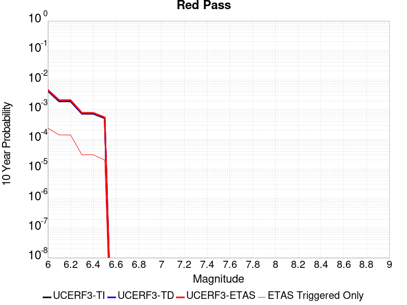 |

| Magnitude | 1 wk TI Prob | 1 wk TD Prob | 1 wk ETAS Prob | 1 wk ETAS/TD Gain | 1 wk ETAS Triggered Only | 1 mo TI Prob | 1 mo TD Prob | 1 mo ETAS Prob | 1 mo ETAS/TD Gain | 1 mo ETAS Triggered Only | 1 yr TI Prob | 1 yr TD Prob | 1 yr ETAS Prob | 1 yr ETAS/TD Gain | 1 yr ETAS Triggered Only | 10 yr TI Prob | 10 yr TD Prob | 10 yr ETAS Prob | 10 yr ETAS/TD Gain | 10 yr ETAS Triggered Only |
|-----|-----|-----|-----|-----|-----|-----|-----|-----|-----|-----|-----|-----|-----|-----|-----|-----|-----|-----|-----|-----|
| 6.0 | 8.258278E-6 | 8.551265E-6 | 7.855066E-5 | 9.185853 | 7.0E-5 | 3.539214E-5 | 3.6647863E-5 | 1.2664456E-4 | 3.4557147 | 9.0E-5 | 4.308141E-4 | 4.4611428E-4 | 5.960474E-4 | 1.3360868 | 1.5E-4 | 0.0042997985 | 0.004453945 | 0.004692876 | 1.0536448 | 2.4E-4 |
| 6.1 | 3.649988E-6 | 3.7753161E-6 | 4.3775166E-5 | 11.595099 | 4.0E-5 | 1.5642712E-5 | 1.6179853E-5 | 6.617904E-5 | 4.090213 | 5.0E-5 | 1.9043336E-4 | 1.9697666E-4 | 2.8695894E-4 | 1.4568169 | 9.0E-5 | 0.0019027026 | 0.001968488 | 0.0021082123 | 1.0709805 | 1.4E-4 |
| 6.2 | 3.649988E-6 | 3.7753161E-6 | 4.3775166E-5 | 11.595099 | 4.0E-5 | 1.5642712E-5 | 1.6179853E-5 | 6.617904E-5 | 4.090213 | 5.0E-5 | 1.9043336E-4 | 1.9697666E-4 | 2.8695894E-4 | 1.4568169 | 9.0E-5 | 0.0019027026 | 0.001968488 | 0.0021082123 | 1.0709805 | 1.4E-4 |
| 6.3 | 1.3924937E-6 | 1.4411166E-6 | 1.1441102E-5 | 7.9390535 | 1.0E-5 | 5.9678164E-6 | 6.1762075E-6 | 1.6176145E-5 | 2.6191065 | 1.0E-5 | 7.265574E-5 | 7.519415E-5 | 9.519264E-5 | 1.2659582 | 2.0E-5 | 7.263199E-4 | 7.518258E-4 | 7.818032E-4 | 1.0398729 | 3.0E-5 |
| 6.4 | 1.3924937E-6 | 1.4411166E-6 | 1.1441102E-5 | 7.9390535 | 1.0E-5 | 5.9678164E-6 | 6.1762075E-6 | 1.6176145E-5 | 2.6191065 | 1.0E-5 | 7.265574E-5 | 7.519415E-5 | 9.519264E-5 | 1.2659582 | 2.0E-5 | 7.263199E-4 | 7.518258E-4 | 7.818032E-4 | 1.0398729 | 3.0E-5 |
| 6.5 | 9.876812E-7 | 1.0221912E-6 | 1.1022181E-5 | 10.782895 | 1.0E-5 | 4.2329125E-6 | 4.3808195E-6 | 1.4380776E-5 | 3.2826679 | 1.0E-5 | 5.153449E-5 | 5.3336476E-5 | 6.3335945E-5 | 1.1874789 | 1.0E-5 | 5.1522546E-4 | 5.333648E-4 | 5.533541E-4 | 1.0374777 | 2.0E-5 |

## Santa Ynez (West)
*[(top)](#table-of-contents)*

| 1 Week | 1 Month | 1 Year | 10 Year |
|-----|-----|-----|-----|
|  |  | 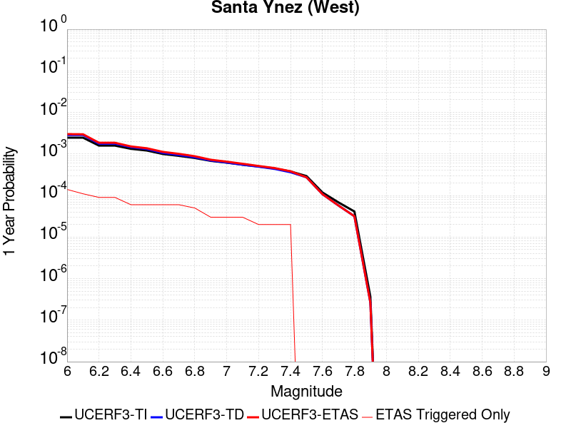 |  |

| Magnitude | 1 wk TI Prob | 1 wk TD Prob | 1 wk ETAS Prob | 1 wk ETAS/TD Gain | 1 wk ETAS Triggered Only | 1 mo TI Prob | 1 mo TD Prob | 1 mo ETAS Prob | 1 mo ETAS/TD Gain | 1 mo ETAS Triggered Only | 1 yr TI Prob | 1 yr TD Prob | 1 yr ETAS Prob | 1 yr ETAS/TD Gain | 1 yr ETAS Triggered Only | 10 yr TI Prob | 10 yr TD Prob | 10 yr ETAS Prob | 10 yr ETAS/TD Gain | 10 yr ETAS Triggered Only |
|-----|-----|-----|-----|-----|-----|-----|-----|-----|-----|-----|-----|-----|-----|-----|-----|-----|-----|-----|-----|-----|
| 6.0 | 4.7352758E-5 | 5.497084E-5 | 1.14967545E-4 | 2.0914278 | 6.0E-5 | 2.0292461E-4 | 2.3556968E-4 | 3.1555083E-4 | 1.3395222 | 8.0E-5 | 0.0024678076 | 0.002864558 | 0.003004157 | 1.0487331 | 1.4E-4 | 0.024405818 | 0.028304456 | 0.028489077 | 1.0065228 | 1.9E-4 |
| 6.1 | 4.7352758E-5 | 5.497084E-5 | 1.04968094E-4 | 1.9095231 | 5.0E-5 | 2.0292461E-4 | 2.3556968E-4 | 2.9555554E-4 | 1.2546418 | 6.0E-5 | 0.0024678076 | 0.002864558 | 0.002974243 | 1.0382904 | 1.1E-4 | 0.024405818 | 0.028304456 | 0.02845021 | 1.0051495 | 1.5E-4 |
| 6.2 | 3.0415853E-5 | 3.3925004E-5 | 7.392364E-5 | 2.1790314 | 4.0E-5 | 1.3034715E-4 | 1.4538495E-4 | 1.953777E-4 | 1.3438646 | 5.0E-5 | 0.0015858212 | 0.0017686592 | 0.0018585 | 1.050796 | 9.0E-5 | 0.015745522 | 0.01754978 | 0.017677497 | 1.0072775 | 1.3E-4 |
| 6.3 | 3.0415853E-5 | 3.3925004E-5 | 7.392364E-5 | 2.1790314 | 4.0E-5 | 1.3034715E-4 | 1.4538495E-4 | 1.953777E-4 | 1.3438646 | 5.0E-5 | 0.0015858212 | 0.0017686592 | 0.0018585 | 1.050796 | 9.0E-5 | 0.015745522 | 0.01754978 | 0.017677497 | 1.0072775 | 1.3E-4 |
| 6.4 | 2.5452082E-5 | 2.7912318E-5 | 5.7911482E-5 | 2.0747643 | 3.0E-5 | 1.09075794E-4 | 1.1961885E-4 | 1.5961406E-4 | 1.3343555 | 4.0E-5 | 0.0013271887 | 0.0014554056 | 0.0015153183 | 1.0411656 | 6.0E-5 | 0.013192902 | 0.01446091 | 0.014549608 | 1.0061337 | 9.0E-5 |
| 6.5 | 2.3143784E-5 | 2.5128133E-5 | 5.5127377E-5 | 2.193851 | 3.0E-5 | 9.9183875E-5 | 1.07687636E-4 | 1.4768333E-4 | 1.3714046 | 4.0E-5 | 0.0012068948 | 0.001310323 | 0.0013702443 | 1.0457302 | 6.0E-5 | 0.012003611 | 0.013027638 | 0.013116466 | 1.0068184 | 9.0E-5 |
| 6.6 | 1.9118515E-5 | 2.0354244E-5 | 5.0353636E-5 | 2.473864 | 3.0E-5 | 8.193392E-5 | 8.722961E-5 | 1.2722611E-4 | 1.4585199 | 4.0E-5 | 9.97089E-4 | 0.001061511 | 0.0011214473 | 1.0564632 | 6.0E-5 | 0.00992627 | 0.010565317 | 0.010654366 | 1.0084285 | 9.0E-5 |
| 6.7 | 1.722807E-5 | 1.8146253E-5 | 4.814571E-5 | 2.653204 | 3.0E-5 | 7.3832496E-5 | 7.776737E-5 | 1.17764255E-4 | 1.5143145 | 4.0E-5 | 8.985399E-4 | 9.4641204E-4 | 0.0010063553 | 1.0633373 | 6.0E-5 | 0.008949154 | 0.009424461 | 0.009513613 | 1.0094596 | 9.0E-5 |
| 6.8 | 1.5317364E-5 | 1.5926391E-5 | 4.5925914E-5 | 2.883636 | 3.0E-5 | 6.56442E-5 | 6.82542E-5 | 1.0825147E-4 | 1.5860045 | 4.0E-5 | 7.98925E-4 | 8.3068234E-4 | 8.806408E-4 | 1.0601414 | 5.0E-5 | 0.007960589 | 0.008276261 | 0.008355599 | 1.0095862 | 8.0E-5 |
| 6.9 | 1.3071226E-5 | 1.332953E-5 | 3.3329263E-5 | 2.500408 | 2.0E-5 | 5.6018336E-5 | 5.712532E-5 | 7.7124176E-5 | 1.3500874 | 2.0E-5 | 6.8180985E-4 | 6.952811E-4 | 7.2526024E-4 | 1.043118 | 3.0E-5 | 0.0067972173 | 0.0069313184 | 0.0069909026 | 1.0085964 | 6.0E-5 |
| 7.0 | 1.1836986E-5 | 1.1932688E-5 | 3.193245E-5 | 2.6760483 | 2.0E-5 | 5.0728955E-5 | 5.1139097E-5 | 7.113807E-5 | 1.3910702 | 2.0E-5 | 6.1745E-4 | 6.2244234E-4 | 6.5242365E-4 | 1.0481672 | 3.0E-5 | 0.006157372 | 0.0062071825 | 0.006246934 | 1.0064042 | 4.0E-5 |
| 7.1 | 1.0597169E-5 | 1.0542107E-5 | 3.0541898E-5 | 2.8971338 | 2.0E-5 | 4.541565E-5 | 4.5179684E-5 | 6.517878E-5 | 1.4426569 | 2.0E-5 | 5.5279525E-4 | 5.4992497E-4 | 5.7990843E-4 | 1.0545229 | 3.0E-5 | 0.0055142213 | 0.005485772 | 0.0055255527 | 1.0072516 | 4.0E-5 |
| 7.2 | 9.59113E-6 | 9.45905E-6 | 1.9458956E-5 | 2.0571787 | 1.0E-5 | 4.11042E-5 | 4.053816E-5 | 5.0537757E-5 | 1.2466712 | 1.0E-5 | 5.0032866E-4 | 4.934414E-4 | 5.1343156E-4 | 1.0405116 | 2.0E-5 | 0.004992037 | 0.0049235765 | 0.0049534286 | 1.0060631 | 3.0E-5 |
| 7.3 | 8.586084E-6 | 8.379489E-6 | 1.8379405E-5 | 2.19338 | 1.0E-5 | 3.679698E-5 | 3.591161E-5 | 4.591125E-5 | 1.2784514 | 1.0E-5 | 4.4791115E-4 | 4.3713715E-4 | 4.5712842E-4 | 1.0457323 | 2.0E-5 | 0.004470094 | 0.004362884 | 0.0043927534 | 1.0068462 | 3.0E-5 |
| 7.4 | 7.2622997E-6 | 6.9514485E-6 | 1.6951379E-5 | 2.438539 | 1.0E-5 | 3.112377E-5 | 2.9791589E-5 | 3.9791288E-5 | 1.3356552 | 1.0E-5 | 3.78866E-4 | 3.6265317E-4 | 3.8264593E-4 | 1.055129 | 2.0E-5 | 0.0037822074 | 0.003620714 | 0.0036506054 | 1.0082556 | 3.0E-5 |
| 7.5 | 5.627296E-6 | 5.2514984E-6 | 5.2514984E-6 | 1.0 | 0.0 | 2.411676E-5 | 2.2506232E-5 | 2.2506232E-5 | 1.0 | 0.0 | 2.9358198E-4 | 2.7397962E-4 | 2.7397962E-4 | 1.0 | 0.0 | 0.0029319443 | 0.0027364905 | 0.002746463 | 1.0036443 | 1.0E-5 |
| 7.6 | 2.265244E-6 | 2.0608632E-6 | 2.0608632E-6 | 1.0 | 0.0 | 9.708152E-6 | 8.832241E-6 | 8.832241E-6 | 1.0 | 0.0 | 1.18190335E-4 | 1.0752732E-4 | 1.0752732E-4 | 1.0 | 0.0 | 0.001181275 | 0.0010747615 | 0.0010747615 | 1.0 | 0.0 |
| 7.7 | 1.3099874E-6 | 1.1016228E-6 | 1.1016228E-6 | 1.0 | 0.0 | 5.61422E-6 | 4.7212325E-6 | 4.7212325E-6 | 1.0 | 0.0 | 6.8350986E-5 | 5.7479516E-5 | 5.7479516E-5 | 1.0 | 0.0 | 6.832996E-4 | 5.7464885E-4 | 5.7464885E-4 | 1.0 | 0.0 |
| 7.8 | 7.903951E-7 | 6.0710704E-7 | 6.0710704E-7 | 1.0 | 0.0 | 3.3874032E-6 | 2.601885E-6 | 2.601885E-6 | 1.0 | 0.0 | 4.1240855E-5 | 3.16775E-5 | 3.16775E-5 | 1.0 | 0.0 | 4.12332E-4 | 3.167312E-4 | 3.167312E-4 | 1.0 | 0.0 |
| 7.9 | 7.0753297E-9 | 5.090092E-9 | 5.090092E-9 | 1.0 | 0.0 | 3.032284E-8 | 2.181468E-8 | 2.181468E-8 | 1.0 | 0.0 | 3.6918053E-7 | 2.655937E-7 | 2.655937E-7 | 1.0 | 0.0 | 3.691799E-6 | 2.6559348E-6 | 2.6559348E-6 | 1.0 | 0.0 |

## Ludlow
*[(top)](#table-of-contents)*

| 1 Week | 1 Month | 1 Year | 10 Year |
|-----|-----|-----|-----|
|  |  | 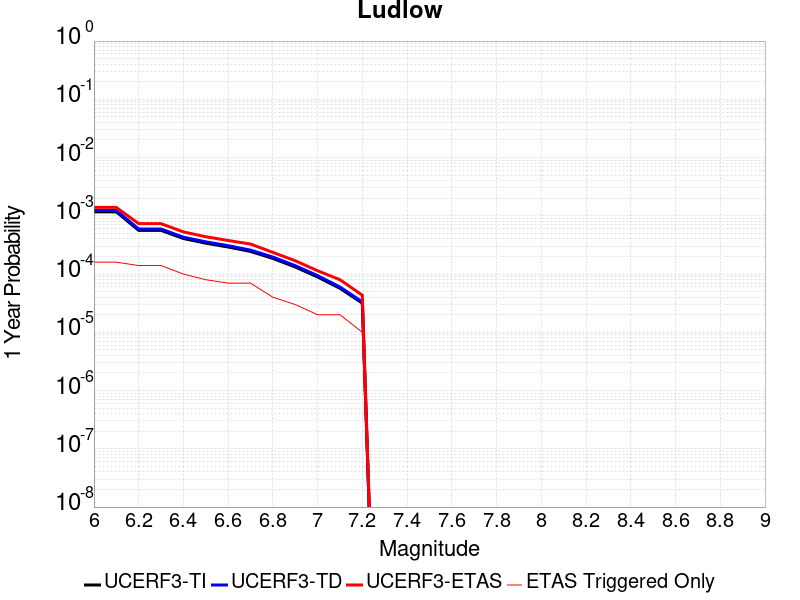 |  |

| Magnitude | 1 wk TI Prob | 1 wk TD Prob | 1 wk ETAS Prob | 1 wk ETAS/TD Gain | 1 wk ETAS Triggered Only | 1 mo TI Prob | 1 mo TD Prob | 1 mo ETAS Prob | 1 mo ETAS/TD Gain | 1 mo ETAS Triggered Only | 1 yr TI Prob | 1 yr TD Prob | 1 yr ETAS Prob | 1 yr ETAS/TD Gain | 1 yr ETAS Triggered Only | 10 yr TI Prob | 10 yr TD Prob | 10 yr ETAS Prob | 10 yr ETAS/TD Gain | 10 yr ETAS Triggered Only |
|-----|-----|-----|-----|-----|-----|-----|-----|-----|-----|-----|-----|-----|-----|-----|-----|-----|-----|-----|-----|-----|
| 6.0 | 2.2407607E-5 | 2.3657254E-5 | 1.1365512E-4 | 4.80424 | 9.0E-5 | 9.602906E-5 | 1.0138454E-4 | 2.013744E-4 | 1.9862437 | 1.0E-4 | 0.0011685267 | 0.001233702 | 0.0013935046 | 1.129531 | 1.6E-4 | 0.011624013 | 0.012273042 | 0.012480465 | 1.0169007 | 2.1E-4 |
| 6.1 | 2.2407607E-5 | 2.3657254E-5 | 1.1365512E-4 | 4.80424 | 9.0E-5 | 9.602906E-5 | 1.0138454E-4 | 2.013744E-4 | 1.9862437 | 1.0E-4 | 0.0011685267 | 0.001233702 | 0.0013935046 | 1.129531 | 1.6E-4 | 0.011624013 | 0.012273042 | 0.012480465 | 1.0169007 | 2.1E-4 |
| 6.2 | 1.0781252E-5 | 1.1365663E-5 | 9.136475E-5 | 8.038664 | 8.0E-5 | 4.620455E-5 | 4.8709102E-5 | 1.3870472E-4 | 2.847614 | 9.0E-5 | 5.623952E-4 | 5.9287593E-4 | 7.3279295E-4 | 1.2359971 | 1.4E-4 | 0.00560974 | 0.0059133614 | 0.006082356 | 1.0285784 | 1.7E-4 |
| 6.3 | 1.0781252E-5 | 1.1365663E-5 | 9.136475E-5 | 8.038664 | 8.0E-5 | 4.620455E-5 | 4.8709102E-5 | 1.3870472E-4 | 2.847614 | 9.0E-5 | 5.623952E-4 | 5.9287593E-4 | 7.3279295E-4 | 1.2359971 | 1.4E-4 | 0.00560974 | 0.0059133614 | 0.006082356 | 1.0285784 | 1.7E-4 |
| 6.4 | 7.814439E-6 | 8.237729E-6 | 6.8237234E-5 | 8.283501 | 6.0E-5 | 3.3490025E-5 | 3.530408E-5 | 1.0530161E-4 | 2.9827034 | 7.0E-5 | 4.0766477E-4 | 4.2974384E-4 | 5.2970083E-4 | 1.2325968 | 1.0E-4 | 0.0040691774 | 0.0042892746 | 0.00440876 | 1.0278567 | 1.2E-4 |
| 6.5 | 6.4986366E-6 | 6.85092E-6 | 5.685058E-5 | 8.298241 | 5.0E-5 | 2.7851002E-5 | 2.9360759E-5 | 7.935929E-5 | 2.7029033 | 5.0E-5 | 3.390332E-4 | 3.5740953E-4 | 4.3738095E-4 | 1.2237529 | 8.0E-5 | 0.003385164 | 0.0035684432 | 0.0036581222 | 1.0251311 | 9.0E-5 |
| 6.6 | 5.582177E-6 | 5.8860055E-6 | 5.588571E-5 | 9.494676 | 5.0E-5 | 2.3923398E-5 | 2.5225498E-5 | 7.5224234E-5 | 2.9820714 | 5.0E-5 | 2.9122844E-4 | 3.0707786E-4 | 3.7705636E-4 | 1.2278852 | 7.0E-5 | 0.0029084706 | 0.003066609 | 0.0031463634 | 1.0260074 | 8.0E-5 |
| 6.7 | 4.6858763E-6 | 4.940427E-6 | 5.494018E-5 | 11.120532 | 5.0E-5 | 2.0082172E-5 | 2.1173091E-5 | 7.1172035E-5 | 3.361438 | 5.0E-5 | 2.4447302E-4 | 2.5775246E-4 | 3.277344E-4 | 1.2715085 | 7.0E-5 | 0.0024420423 | 0.0025745912 | 0.0026543853 | 1.0309929 | 8.0E-5 |
| 6.8 | 3.5584908E-6 | 3.7520183E-6 | 4.375187E-5 | 11.660889 | 4.0E-5 | 1.5250586E-5 | 1.6079981E-5 | 5.6079338E-5 | 3.487525 | 4.0E-5 | 1.8566006E-4 | 1.957566E-4 | 2.3574877E-4 | 1.2042954 | 4.0E-5 | 0.0018550502 | 0.0019558826 | 0.002005785 | 1.0255139 | 5.0E-5 |
| 6.9 | 2.532834E-6 | 2.6710034E-6 | 3.2670923E-5 | 12.231704 | 3.0E-5 | 1.0854958E-5 | 1.1447109E-5 | 4.1446765E-5 | 3.620719 | 3.0E-5 | 1.3215111E-4 | 1.3935992E-4 | 1.6935574E-4 | 1.2152399 | 3.0E-5 | 0.0013207254 | 0.0013927529 | 0.0014326972 | 1.0286801 | 4.0E-5 |
| 7.0 | 1.7083285E-6 | 1.8019439E-6 | 2.1801909E-5 | 12.099105 | 2.0E-5 | 7.3213873E-6 | 7.722595E-6 | 2.772244E-5 | 3.5897832 | 2.0E-5 | 8.913424E-5 | 9.40187E-5 | 1.1401682E-4 | 1.2127036 | 2.0E-5 | 8.9098496E-4 | 9.3980576E-4 | 9.697775E-4 | 1.0318915 | 3.0E-5 |
| 7.1 | 1.0905424E-6 | 1.1497619E-6 | 2.1149739E-5 | 18.394884 | 2.0E-5 | 4.6737446E-6 | 4.9275427E-6 | 2.4927444E-5 | 5.0587983 | 2.0E-5 | 5.6901354E-5 | 5.999128E-5 | 7.999008E-5 | 1.3333617 | 2.0E-5 | 5.6886784E-4 | 5.997606E-4 | 6.197486E-4 | 1.0333266 | 2.0E-5 |
| 7.2 | 6.06668E-7 | 6.387277E-7 | 1.06387215E-5 | 16.656113 | 1.0E-5 | 2.600003E-6 | 2.7374022E-6 | 1.2737375E-5 | 4.6530886 | 1.0E-5 | 3.1654577E-5 | 3.3327433E-5 | 4.3327098E-5 | 1.3000431 | 1.0E-5 | 3.1650066E-4 | 3.3323118E-4 | 3.4322785E-4 | 1.0299993 | 1.0E-5 |

## Calico-Hidalgo
*[(top)](#table-of-contents)*

| 1 Week | 1 Month | 1 Year | 10 Year |
|-----|-----|-----|-----|
| 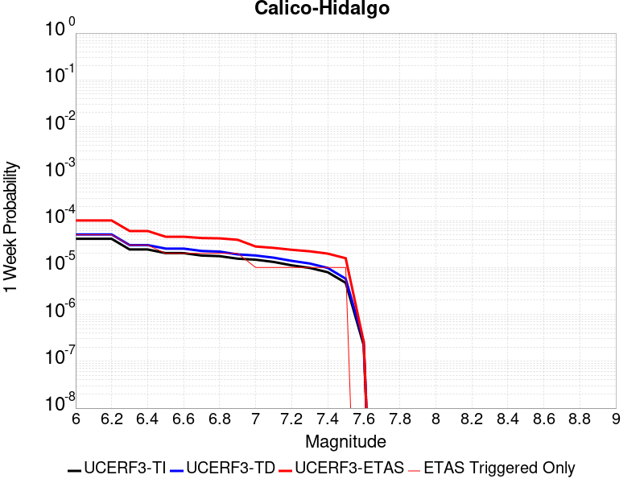 |  |  |  |

| Magnitude | 1 wk TI Prob | 1 wk TD Prob | 1 wk ETAS Prob | 1 wk ETAS/TD Gain | 1 wk ETAS Triggered Only | 1 mo TI Prob | 1 mo TD Prob | 1 mo ETAS Prob | 1 mo ETAS/TD Gain | 1 mo ETAS Triggered Only | 1 yr TI Prob | 1 yr TD Prob | 1 yr ETAS Prob | 1 yr ETAS/TD Gain | 1 yr ETAS Triggered Only | 10 yr TI Prob | 10 yr TD Prob | 10 yr ETAS Prob | 10 yr ETAS/TD Gain | 10 yr ETAS Triggered Only |
|-----|-----|-----|-----|-----|-----|-----|-----|-----|-----|-----|-----|-----|-----|-----|-----|-----|-----|-----|-----|-----|
| 6.0 | 4.0906612E-5 | 5.0704355E-5 | 1.0070182E-4 | 1.9860586 | 5.0E-5 | 1.7530227E-4 | 2.1728857E-4 | 2.9727118E-4 | 1.368094 | 8.0E-5 | 0.0021322158 | 0.002642678 | 0.0028022553 | 1.0603846 | 1.6E-4 | 0.02111873 | 0.026152814 | 0.026357323 | 1.0078198 | 2.1E-4 |
| 6.1 | 4.0906612E-5 | 5.0704355E-5 | 1.0070182E-4 | 1.9860586 | 5.0E-5 | 1.7530227E-4 | 2.1728857E-4 | 2.9727118E-4 | 1.368094 | 8.0E-5 | 0.0021322158 | 0.002642678 | 0.0028022553 | 1.0603846 | 1.6E-4 | 0.02111873 | 0.026152814 | 0.026357323 | 1.0078198 | 2.1E-4 |
| 6.2 | 4.0906612E-5 | 5.0704355E-5 | 1.0070182E-4 | 1.9860586 | 5.0E-5 | 1.7530227E-4 | 2.1728857E-4 | 2.9727118E-4 | 1.368094 | 8.0E-5 | 0.0021322158 | 0.002642678 | 0.0028022553 | 1.0603846 | 1.6E-4 | 0.02111873 | 0.026152814 | 0.026357323 | 1.0078198 | 2.1E-4 |
| 6.3 | 2.4242801E-5 | 3.0090967E-5 | 6.0090064E-5 | 1.9969469 | 3.0E-5 | 1.0389358E-4 | 1.289551E-4 | 1.7894866E-4 | 1.3876818 | 5.0E-5 | 0.0012641704 | 0.0015689312 | 0.0016787585 | 1.0700015 | 1.1E-4 | 0.01257003 | 0.015582229 | 0.015720047 | 1.0088446 | 1.4E-4 |
| 6.4 | 2.4242801E-5 | 3.0090967E-5 | 6.0090064E-5 | 1.9969469 | 3.0E-5 | 1.0389358E-4 | 1.289551E-4 | 1.7894866E-4 | 1.3876818 | 5.0E-5 | 0.0012641704 | 0.0015689312 | 0.0016787585 | 1.0700015 | 1.1E-4 | 0.01257003 | 0.015582229 | 0.015720047 | 1.0088446 | 1.4E-4 |
| 6.5 | 2.0286952E-5 | 2.5316054E-5 | 4.5315548E-5 | 1.7899925 | 2.0E-5 | 8.694118E-5 | 1.0849296E-4 | 1.4848862E-4 | 1.3686475 | 4.0E-5 | 0.0010579949 | 0.0013201186 | 0.0014099997 | 1.0680857 | 9.0E-5 | 0.010529719 | 0.013124701 | 0.0132332565 | 1.0082711 | 1.1E-4 |
| 6.6 | 2.0269223E-5 | 2.5297004E-5 | 4.52965E-5 | 1.7905874 | 2.0E-5 | 8.6865206E-5 | 1.08411325E-4 | 1.4840698E-4 | 1.3689251 | 4.0E-5 | 0.0010570707 | 0.0013191258 | 0.001409007 | 1.068137 | 9.0E-5 | 0.010520565 | 0.01311489 | 0.013223448 | 1.0082774 | 1.1E-4 |
| 6.7 | 1.799852E-5 | 2.2540933E-5 | 4.2540483E-5 | 1.8872547 | 2.0E-5 | 7.713423E-5 | 9.660051E-5 | 1.3659665E-4 | 1.4140365 | 4.0E-5 | 9.3870464E-4 | 0.0011754911 | 0.0012653854 | 1.0764737 | 9.0E-5 | 0.009347493 | 0.011694346 | 0.011803059 | 1.0092963 | 1.1E-4 |
| 6.8 | 1.7458793E-5 | 2.184258E-5 | 4.1842144E-5 | 1.9156227 | 2.0E-5 | 7.4821255E-5 | 9.360778E-5 | 1.3360403E-4 | 1.427275 | 4.0E-5 | 9.10568E-4 | 0.0011390933 | 0.0012190022 | 1.0701513 | 8.0E-5 | 0.009068459 | 0.011334131 | 0.01142311 | 1.0078506 | 9.0E-5 |
| 6.9 | 1.542884E-5 | 1.9026285E-5 | 3.9025905E-5 | 2.0511572 | 2.0E-5 | 6.612192E-5 | 8.153875E-5 | 1.21535486E-4 | 1.4905243 | 4.0E-5 | 8.04737E-4 | 9.922953E-4 | 0.0010722158 | 1.0805411 | 8.0E-5 | 0.008018291 | 0.009880043 | 0.009969153 | 1.0090193 | 9.0E-5 |
| 7.0 | 1.468253E-5 | 1.803109E-5 | 2.803091E-5 | 1.5545876 | 1.0E-5 | 6.292361E-5 | 7.727389E-5 | 1.07271575E-4 | 1.3881994 | 3.0E-5 | 7.658257E-4 | 9.4041653E-4 | 0.0010103508 | 1.0743651 | 7.0E-5 | 0.0076319184 | 0.009365736 | 0.0094449865 | 1.0084618 | 8.0E-5 |
| 7.1 | 1.3139281E-5 | 1.620139E-5 | 2.6201227E-5 | 1.617221 | 1.0E-5 | 5.6309986E-5 | 6.943275E-5 | 8.9431356E-5 | 1.2880285 | 2.0E-5 | 6.853584E-4 | 8.4502844E-4 | 8.8499463E-4 | 1.0472957 | 4.0E-5 | 0.0068324856 | 0.008419449 | 0.008469028 | 1.0058886 | 5.0E-5 |
| 7.2 | 1.1127404E-5 | 1.3867038E-5 | 2.38669E-5 | 1.7211245 | 1.0E-5 | 4.7688E-5 | 5.9428872E-5 | 7.9427686E-5 | 1.3365167 | 2.0E-5 | 5.8044674E-4 | 7.233172E-4 | 7.5329555E-4 | 1.0414456 | 3.0E-5 | 0.0057893298 | 0.007210737 | 0.0072504487 | 1.0055072 | 4.0E-5 |
| 7.3 | 9.808154E-6 | 1.2176586E-5 | 2.2176464E-5 | 1.8212383 | 1.0E-5 | 4.2034266E-5 | 5.2184383E-5 | 7.218334E-5 | 1.3832364 | 2.0E-5 | 5.11647E-4 | 6.351704E-4 | 6.5515767E-4 | 1.0314676 | 2.0E-5 | 0.0051047057 | 0.006334625 | 0.0063544987 | 1.0031372 | 2.0E-5 |
| 7.4 | 7.942452E-6 | 9.792348E-6 | 1.979225E-5 | 2.0211957 | 1.0E-5 | 3.4038632E-5 | 4.1966585E-5 | 5.1966163E-5 | 1.2382748 | 1.0E-5 | 4.1434157E-4 | 5.108328E-4 | 5.208277E-4 | 1.0195658 | 1.0E-5 | 0.0041356985 | 0.005097527 | 0.0051074764 | 1.0019517 | 1.0E-5 |
| 7.5 | 4.7121216E-6 | 5.7729717E-6 | 1.5772914E-5 | 2.7322001 | 1.0E-5 | 2.019465E-5 | 2.4741115E-5 | 3.4740868E-5 | 1.4041755 | 1.0E-5 | 2.4584212E-4 | 3.011891E-4 | 3.111861E-4 | 1.0331917 | 1.0E-5 | 0.0024557032 | 0.0030085614 | 0.0030185315 | 1.0033139 | 1.0E-5 |
| 7.6 | 2.21172E-7 | 2.6040198E-7 | 2.6040198E-7 | 1.0 | 0.0 | 9.478797E-7 | 1.1160082E-6 | 1.1160082E-6 | 1.0 | 0.0 | 1.1540374E-5 | 1.3587343E-5 | 1.3587343E-5 | 1.0 | 0.0 | 1.1539775E-4 | 1.3586794E-4 | 1.3586794E-4 | 1.0 | 0.0 |

## San Andreas (Creeping Section) 2011 CFM
*[(top)](#table-of-contents)*

| 1 Week | 1 Month | 1 Year | 10 Year |
|-----|-----|-----|-----|
|  |  |  |  |

| Magnitude | 1 wk TI Prob | 1 wk TD Prob | 1 wk ETAS Prob | 1 wk ETAS/TD Gain | 1 wk ETAS Triggered Only | 1 mo TI Prob | 1 mo TD Prob | 1 mo ETAS Prob | 1 mo ETAS/TD Gain | 1 mo ETAS Triggered Only | 1 yr TI Prob | 1 yr TD Prob | 1 yr ETAS Prob | 1 yr ETAS/TD Gain | 1 yr ETAS Triggered Only | 10 yr TI Prob | 10 yr TD Prob | 10 yr ETAS Prob | 10 yr ETAS/TD Gain | 10 yr ETAS Triggered Only |
|-----|-----|-----|-----|-----|-----|-----|-----|-----|-----|-----|-----|-----|-----|-----|-----|-----|-----|-----|-----|-----|
| 6.0 | 5.986481E-4 | 0.0012275929 | 0.001297507 | 1.0569521 | 7.0E-5 | 0.0025631124 | 0.005245547 | 0.005335075 | 1.0170674 | 9.0E-5 | 0.030762846 | 0.06120491 | 0.061336342 | 1.0021474 | 1.4E-4 | 0.26835477 | 0.42593494 | 0.4260555 | 1.000283 | 2.1E-4 |
| 6.1 | 5.015945E-4 | 0.0010217986 | 0.0010617577 | 1.0391066 | 4.0E-5 | 0.00214792 | 0.0043678596 | 0.0044275974 | 1.0136768 | 6.0E-5 | 0.025839351 | 0.05124837 | 0.051352732 | 1.0020365 | 1.1E-4 | 0.23032776 | 0.37285668 | 0.37296957 | 1.0003028 | 1.8E-4 |
| 6.2 | 4.073338E-4 | 8.1073755E-4 | 8.507051E-4 | 1.0492978 | 4.0E-5 | 0.0017445484 | 0.0034671477 | 0.0035269395 | 1.0172453 | 6.0E-5 | 0.021034058 | 0.04093317 | 0.041038666 | 1.0025773 | 1.1E-4 | 0.19150782 | 0.31303346 | 0.3131571 | 1.000395 | 1.8E-4 |
| 6.3 | 3.464099E-4 | 6.7391695E-4 | 7.0389675E-4 | 1.0444859 | 3.0E-5 | 0.0014837692 | 0.0028829593 | 0.002932815 | 1.0172933 | 5.0E-5 | 0.017915873 | 0.034189582 | 0.034276504 | 1.0025424 | 9.0E-5 | 0.16538359 | 0.2713166 | 0.27143317 | 1.0004297 | 1.6E-4 |
| 6.4 | 2.935057E-4 | 5.5442745E-4 | 5.844108E-4 | 1.0540799 | 3.0E-5 | 0.0012572751 | 0.0023725363 | 0.0024224177 | 1.0210245 | 5.0E-5 | 0.015200248 | 0.02826451 | 0.028351966 | 1.0030942 | 9.0E-5 | 0.14201577 | 0.23298529 | 0.23310034 | 1.0004938 | 1.5E-4 |
| 6.5 | 2.3409708E-4 | 4.2093755E-4 | 4.5092494E-4 | 1.0712395 | 3.0E-5 | 0.0010028875 | 0.0018019684 | 0.0018518784 | 1.0276974 | 5.0E-5 | 0.012141965 | 0.021587461 | 0.02167552 | 1.0040791 | 9.0E-5 | 0.11499573 | 0.18682368 | 0.18693753 | 1.0006094 | 1.4E-4 |
| 6.6 | 1.5842178E-4 | 2.506933E-4 | 2.706883E-4 | 1.0797588 | 2.0E-5 | 6.7877385E-4 | 0.0010739497 | 0.0011139067 | 1.0372057 | 4.0E-5 | 0.0082328 | 0.012995575 | 0.013074535 | 1.006076 | 8.0E-5 | 0.07934396 | 0.12314638 | 0.12326037 | 1.0009257 | 1.3E-4 |
| 6.7 | 1.5616413E-4 | 2.4605883E-4 | 2.660539E-4 | 1.0812614 | 2.0E-5 | 6.691031E-4 | 0.0010541069 | 0.0010940647 | 1.0379068 | 4.0E-5 | 0.0081159435 | 0.01275744 | 0.01283642 | 1.0061909 | 8.0E-5 | 0.0782586 | 0.12117351 | 0.121287756 | 1.0009428 | 1.3E-4 |
| 6.8 | 1.5538467E-4 | 2.4429744E-4 | 2.6429255E-4 | 1.0818474 | 2.0E-5 | 6.6576427E-4 | 0.0010465645 | 0.0010865227 | 1.0381802 | 4.0E-5 | 0.008075596 | 0.012666838 | 0.012745826 | 1.0062357 | 8.0E-5 | 0.07788358 | 0.120404355 | 0.1205187 | 1.0009497 | 1.3E-4 |
| 6.9 | 1.5153569E-4 | 2.3539034E-4 | 2.5538562E-4 | 1.0849452 | 2.0E-5 | 6.49277E-4 | 0.0010084276 | 0.0010483873 | 1.0396258 | 4.0E-5 | 0.007876333 | 0.01220901 | 0.012288034 | 1.0064726 | 8.0E-5 | 0.07602952 | 0.11647445 | 0.11658931 | 1.0009861 | 1.3E-4 |
| 7.0 | 1.4588932E-4 | 2.2396253E-4 | 2.4395806E-4 | 1.0892806 | 2.0E-5 | 6.250901E-4 | 9.5948833E-4 | 9.9945E-4 | 1.0416489 | 4.0E-5 | 0.0075839474 | 0.011619697 | 0.011698768 | 1.0068048 | 8.0E-5 | 0.073302895 | 0.11132046 | 0.11143599 | 1.0010378 | 1.3E-4 |
| 7.1 | 1.1565079E-4 | 1.6281738E-4 | 1.8281412E-4 | 1.122817 | 2.0E-5 | 4.955521E-4 | 6.9760304E-4 | 7.375751E-4 | 1.0572993 | 4.0E-5 | 0.006016669 | 0.0084604435 | 0.008539766 | 1.0093758 | 8.0E-5 | 0.058563538 | 0.08367046 | 0.08378959 | 1.0014237 | 1.3E-4 |
| 7.2 | 1.0393792E-4 | 1.4615769E-4 | 1.6615476E-4 | 1.1368185 | 2.0E-5 | 4.4537216E-4 | 6.2624045E-4 | 6.6621543E-4 | 1.0638332 | 4.0E-5 | 0.005408933 | 0.0075979927 | 0.0076773847 | 1.010449 | 8.0E-5 | 0.052791595 | 0.07561969 | 0.07573986 | 1.0015892 | 1.3E-4 |
| 7.3 | 9.332884E-5 | 1.2780898E-4 | 1.4780642E-4 | 1.1564635 | 2.0E-5 | 3.999194E-4 | 5.4763845E-4 | 5.876165E-4 | 1.0730009 | 4.0E-5 | 0.0048581534 | 0.006647249 | 0.006726717 | 1.011955 | 8.0E-5 | 0.047533102 | 0.06648326 | 0.066604614 | 1.0018253 | 1.3E-4 |
| 7.4 | 8.670252E-5 | 1.17032345E-4 | 1.3703E-4 | 1.1708729 | 2.0E-5 | 3.715293E-4 | 5.0147134E-4 | 5.414513E-4 | 1.0797253 | 4.0E-5 | 0.004513991 | 0.006088443 | 0.0061679557 | 1.0130596 | 8.0E-5 | 0.044233937 | 0.061151642 | 0.061273694 | 1.0019959 | 1.3E-4 |
| 7.5 | 7.3036405E-5 | 9.005856E-5 | 1.1005676E-4 | 1.2220577 | 2.0E-5 | 3.129756E-4 | 3.8590826E-4 | 4.2589282E-4 | 1.1036116 | 4.0E-5 | 0.0038038217 | 0.0046883323 | 0.004767957 | 1.0169836 | 8.0E-5 | 0.03739367 | 0.047877792 | 0.047992047 | 1.0023863 | 1.2E-4 |
| 7.6 | 6.3935775E-5 | 8.280385E-5 | 1.0280219E-4 | 1.2415147 | 2.0E-5 | 2.7398168E-4 | 3.5482543E-4 | 3.9481124E-4 | 1.1126915 | 4.0E-5 | 0.0033306254 | 0.004311461 | 0.004391116 | 1.0184752 | 8.0E-5 | 0.032811474 | 0.04399201 | 0.04410673 | 1.0026078 | 1.2E-4 |
| 7.7 | 5.5050095E-5 | 6.6618326E-5 | 8.6616994E-5 | 1.3001977 | 2.0E-5 | 2.3590765E-4 | 2.854759E-4 | 3.2546447E-4 | 1.1400769 | 4.0E-5 | 0.0028683927 | 0.003470134 | 0.0035299256 | 1.0172304 | 6.0E-5 | 0.0283165 | 0.035796214 | 0.03589263 | 1.0026935 | 1.0E-4 |
| 7.8 | 5.027131E-5 | 6.162871E-5 | 8.162747E-5 | 1.3245041 | 2.0E-5 | 2.1543067E-4 | 2.640963E-4 | 3.0408573E-4 | 1.1514199 | 4.0E-5 | 0.0026197135 | 0.003210635 | 0.0032604744 | 1.0155232 | 5.0E-5 | 0.025890453 | 0.03312666 | 0.033204008 | 1.002335 | 8.0E-5 |
| 7.9 | 3.7271806E-5 | 5.022507E-5 | 7.0224065E-5 | 1.3981875 | 2.0E-5 | 1.5972654E-4 | 2.1523255E-4 | 2.4522608E-4 | 1.1393541 | 3.0E-5 | 0.0019429359 | 0.002617309 | 0.0026572044 | 1.0152428 | 4.0E-5 | 0.019260362 | 0.027067466 | 0.027116112 | 1.0017972 | 5.0E-5 |
| 8.0 | 2.7310243E-5 | 3.1427757E-5 | 5.142713E-5 | 1.6363602 | 2.0E-5 | 1.17038646E-4 | 1.3468343E-4 | 1.646794E-4 | 1.2227145 | 3.0E-5 | 0.0014240141 | 0.0016385383 | 0.0016784729 | 1.024372 | 4.0E-5 | 0.014149235 | 0.01721386 | 0.017262999 | 1.0028546 | 5.0E-5 |
| 8.1 | 1.7940547E-5 | 1.7399378E-5 | 2.7399203E-5 | 1.5747232 | 1.0E-5 | 7.688579E-5 | 7.456663E-5 | 9.456514E-5 | 1.2681965 | 2.0E-5 | 9.3568244E-4 | 9.074711E-4 | 9.374439E-4 | 1.033029 | 3.0E-5 | 0.009317525 | 0.009798636 | 0.009838243 | 1.0040421 | 4.0E-5 |
| 8.2 | 8.643924E-6 | 5.473668E-6 | 5.473668E-6 | 1.0 | 0.0 | 3.704486E-5 | 2.3458366E-5 | 3.345813E-5 | 1.4262772 | 1.0E-5 | 4.5092785E-4 | 2.8556827E-4 | 3.0556254E-4 | 1.0700158 | 2.0E-5 | 0.0045001395 | 0.0032481793 | 0.0032681145 | 1.0061373 | 2.0E-5 |
| 8.3 | 1.983087E-6 | 7.6564595E-7 | 7.6564595E-7 | 1.0 | 0.0 | 8.498917E-6 | 3.281336E-6 | 3.281336E-6 | 1.0 | 0.0 | 1.034694E-4 | 3.9949547E-5 | 3.9949547E-5 | 1.0 | 0.0 | 0.0010342124 | 4.717979E-4 | 4.717979E-4 | 1.0 | 0.0 |

## San Andreas (San Gorgonio Pass-Garnet HIll)
*[(top)](#table-of-contents)*

| 1 Week | 1 Month | 1 Year | 10 Year |
|-----|-----|-----|-----|
|  |  |  |  |

| Magnitude | 1 wk TI Prob | 1 wk TD Prob | 1 wk ETAS Prob | 1 wk ETAS/TD Gain | 1 wk ETAS Triggered Only | 1 mo TI Prob | 1 mo TD Prob | 1 mo ETAS Prob | 1 mo ETAS/TD Gain | 1 mo ETAS Triggered Only | 1 yr TI Prob | 1 yr TD Prob | 1 yr ETAS Prob | 1 yr ETAS/TD Gain | 1 yr ETAS Triggered Only | 10 yr TI Prob | 10 yr TD Prob | 10 yr ETAS Prob | 10 yr ETAS/TD Gain | 10 yr ETAS Triggered Only |
|-----|-----|-----|-----|-----|-----|-----|-----|-----|-----|-----|-----|-----|-----|-----|-----|-----|-----|-----|-----|-----|
| 6.0 | 8.31567E-5 | 2.3384395E-4 | 3.0382758E-4 | 1.2992749 | 7.0E-5 | 3.5633717E-4 | 0.0010018025 | 0.0010717324 | 1.0698041 | 7.0E-5 | 0.004329778 | 0.012128622 | 0.012266924 | 1.011403 | 1.4E-4 | 0.042463828 | 0.11258187 | 0.112750486 | 1.0014976 | 1.9E-4 |
| 6.1 | 8.31567E-5 | 2.3384395E-4 | 3.0382758E-4 | 1.2992749 | 7.0E-5 | 3.5633717E-4 | 0.0010018025 | 0.0010717324 | 1.0698041 | 7.0E-5 | 0.004329778 | 0.012128622 | 0.012266924 | 1.011403 | 1.4E-4 | 0.042463828 | 0.11258187 | 0.112750486 | 1.0014976 | 1.9E-4 |
| 6.2 | 8.31567E-5 | 2.3384395E-4 | 3.0382758E-4 | 1.2992749 | 7.0E-5 | 3.5633717E-4 | 0.0010018025 | 0.0010717324 | 1.0698041 | 7.0E-5 | 0.004329778 | 0.012128622 | 0.012266924 | 1.011403 | 1.4E-4 | 0.042463828 | 0.11258187 | 0.112750486 | 1.0014976 | 1.9E-4 |
| 6.3 | 8.31567E-5 | 2.3384395E-4 | 3.0382758E-4 | 1.2992749 | 7.0E-5 | 3.5633717E-4 | 0.0010018025 | 0.0010717324 | 1.0698041 | 7.0E-5 | 0.004329778 | 0.012128622 | 0.012266924 | 1.011403 | 1.4E-4 | 0.042463828 | 0.11258187 | 0.112750486 | 1.0014976 | 1.9E-4 |
| 6.4 | 8.059055E-5 | 2.2941893E-4 | 2.9940286E-4 | 1.3050487 | 7.0E-5 | 3.4534236E-4 | 9.828559E-4 | 0.0010527872 | 1.071151 | 7.0E-5 | 0.0041964394 | 0.011900819 | 0.012039153 | 1.0116239 | 1.4E-4 | 0.041180745 | 0.110562965 | 0.11073196 | 1.0015285 | 1.9E-4 |
| 6.5 | 8.059055E-5 | 2.2941893E-4 | 2.9940286E-4 | 1.3050487 | 7.0E-5 | 3.4534236E-4 | 9.828559E-4 | 0.0010527872 | 1.071151 | 7.0E-5 | 0.0041964394 | 0.011900819 | 0.012039153 | 1.0116239 | 1.4E-4 | 0.041180745 | 0.110562965 | 0.11073196 | 1.0015285 | 1.9E-4 |
| 6.6 | 7.619237E-5 | 2.2186468E-4 | 2.8185136E-4 | 1.2703751 | 6.0E-5 | 3.2649786E-4 | 9.5050444E-4 | 0.0010104474 | 1.0630643 | 6.0E-5 | 0.0039678677 | 0.0115115335 | 0.011640037 | 1.011163 | 1.3E-4 | 0.03897764 | 0.10709954 | 0.107260264 | 1.0015007 | 1.8E-4 |
| 6.7 | 7.440636E-5 | 2.1862281E-4 | 2.786097E-4 | 1.2743853 | 6.0E-5 | 3.188454E-4 | 9.3662075E-4 | 9.965645E-4 | 1.0640001 | 6.0E-5 | 0.0038750346 | 0.011344268 | 0.011472793 | 1.0113295 | 1.3E-4 | 0.038081564 | 0.1056081 | 0.10576909 | 1.0015244 | 1.8E-4 |
| 6.8 | 7.3735864E-5 | 2.1709445E-4 | 2.7708142E-4 | 1.2763174 | 6.0E-5 | 3.1597257E-4 | 9.300753E-4 | 9.900195E-4 | 1.0644509 | 6.0E-5 | 0.0038401815 | 0.011265406 | 0.011393942 | 1.0114098 | 1.3E-4 | 0.03774495 | 0.104909696 | 0.10507081 | 1.0015358 | 1.8E-4 |
| 6.9 | 7.27575E-5 | 2.1478413E-4 | 2.7477124E-4 | 1.2792902 | 6.0E-5 | 3.117806E-4 | 9.20181E-4 | 9.801257E-4 | 1.0651445 | 6.0E-5 | 0.003789323 | 0.011146182 | 0.011274733 | 1.0115331 | 1.3E-4 | 0.037253562 | 0.10385753 | 0.10401884 | 1.0015532 | 1.8E-4 |
| 7.0 | 7.102591E-5 | 2.1062451E-4 | 2.7061187E-4 | 1.2848071 | 6.0E-5 | 3.0436125E-4 | 9.023664E-4 | 9.623123E-4 | 1.0664319 | 6.0E-5 | 0.003699303 | 0.010931484 | 0.011060063 | 1.0117623 | 1.3E-4 | 0.03638325 | 0.101959534 | 0.10212118 | 1.0015854 | 1.8E-4 |
| 7.1 | 7.028513E-5 | 2.0898094E-4 | 2.689684E-4 | 1.2870475 | 6.0E-5 | 3.0118722E-4 | 8.953274E-4 | 9.552737E-4 | 1.0669546 | 6.0E-5 | 0.0036607897 | 0.010846641 | 0.0109752305 | 1.0118552 | 1.3E-4 | 0.036010686 | 0.10120243 | 0.10136422 | 1.0015986 | 1.8E-4 |
| 7.2 | 6.8498244E-5 | 2.050596E-4 | 2.650473E-4 | 1.2925378 | 6.0E-5 | 2.9353087E-4 | 8.7853306E-4 | 9.3848037E-4 | 1.0682356 | 6.0E-5 | 0.003567883 | 0.0106441835 | 0.010772799 | 1.0120833 | 1.3E-4 | 0.035111405 | 0.09939449 | 0.0995566 | 1.001631 | 1.8E-4 |
| 7.3 | 6.622592E-5 | 1.9733235E-4 | 2.5732053E-4 | 1.3039956 | 6.0E-5 | 2.8379448E-4 | 8.4543816E-4 | 9.0538745E-4 | 1.0709091 | 6.0E-5 | 0.0034497243 | 0.010245111 | 0.010373779 | 1.0125589 | 1.3E-4 | 0.033966612 | 0.095891245 | 0.09605399 | 1.0016972 | 1.8E-4 |
| 7.4 | 5.1050705E-5 | 1.4690042E-4 | 2.0689161E-4 | 1.4083799 | 6.0E-5 | 2.1877038E-4 | 6.294222E-4 | 6.8938447E-4 | 1.0952655 | 6.0E-5 | 0.002660276 | 0.007636482 | 0.007755566 | 1.015594 | 1.2E-4 | 0.02628654 | 0.07286554 | 0.07302315 | 1.002163 | 1.7E-4 |
| 7.5 | 3.9302922E-5 | 1.11307076E-4 | 1.613015E-4 | 1.4491577 | 5.0E-5 | 1.6843023E-4 | 4.7694342E-4 | 5.2691955E-4 | 1.1047843 | 5.0E-5 | 0.0020487092 | 0.0057913954 | 0.005880874 | 1.0154502 | 9.0E-5 | 0.020299247 | 0.05601151 | 0.056134228 | 1.002191 | 1.3E-4 |
| 7.6 | 2.9851626E-5 | 8.4956984E-5 | 1.2495359E-4 | 1.4707865 | 4.0E-5 | 1.2792926E-4 | 3.6405068E-4 | 4.040361E-4 | 1.1098348 | 4.0E-5 | 0.0015564259 | 0.0044233347 | 0.004502981 | 1.0180058 | 8.0E-5 | 0.0154556995 | 0.043196145 | 0.043310963 | 1.002658 | 1.2E-4 |
| 7.7 | 2.1135214E-5 | 6.353527E-5 | 1.0353273E-4 | 1.6295316 | 4.0E-5 | 9.0576345E-5 | 2.722656E-4 | 3.1225474E-4 | 1.1468754 | 4.0E-5 | 0.0011022091 | 0.0033098008 | 0.0033795692 | 1.0210793 | 7.0E-5 | 0.010967582 | 0.03258456 | 0.032690976 | 1.0032659 | 1.1E-4 |
| 7.8 | 1.883379E-5 | 5.564576E-5 | 9.564353E-5 | 1.7187928 | 4.0E-5 | 8.0713755E-5 | 2.3846005E-4 | 2.7845052E-4 | 1.167703 | 4.0E-5 | 9.822468E-4 | 0.002899389 | 0.002969186 | 1.024073 | 7.0E-5 | 0.0097791655 | 0.028696978 | 0.028803822 | 1.0037231 | 1.1E-4 |
| 7.9 | 1.5156185E-5 | 4.1662403E-5 | 7.1661154E-5 | 1.7200437 | 3.0E-5 | 6.495346E-5 | 1.7854095E-4 | 2.085356E-4 | 1.1679987 | 3.0E-5 | 7.9052144E-4 | 0.0021715704 | 0.00223144 | 1.0275698 | 6.0E-5 | 0.007877152 | 0.021760946 | 0.021848986 | 1.0040458 | 9.0E-5 |
| 8.0 | 1.1405907E-5 | 2.9976925E-5 | 3.9976625E-5 | 1.3335799 | 1.0E-5 | 4.8881542E-5 | 1.2846621E-4 | 1.3846494E-4 | 1.0778315 | 1.0E-5 | 5.9497025E-4 | 0.0015629551 | 0.0015929082 | 1.0191644 | 3.0E-5 | 0.005933798 | 0.015774013 | 0.015823225 | 1.0031198 | 5.0E-5 |
| 8.1 | 4.3511436E-6 | 7.369465E-6 | 7.369465E-6 | 1.0 | 0.0 | 1.8647626E-5 | 3.158304E-5 | 3.158304E-5 | 1.0 | 0.0 | 2.2701119E-4 | 3.844558E-4 | 3.9445196E-4 | 1.0260007 | 1.0E-5 | 0.0022677942 | 0.0041165445 | 0.0041364618 | 1.0048385 | 2.0E-5 |
| 8.2 | 2.3042528E-6 | 2.7328301E-6 | 2.7328301E-6 | 1.0 | 0.0 | 9.875332E-6 | 1.1712076E-5 | 1.1712076E-5 | 1.0 | 0.0 | 1.2022553E-4 | 1.4258524E-4 | 1.5258382E-4 | 1.0701234 | 1.0E-5 | 0.0012016051 | 0.0015979637 | 0.0016079478 | 1.006248 | 1.0E-5 |
| 8.3 | 5.202968E-7 | 3.1590292E-7 | 3.1590292E-7 | 1.0 | 0.0 | 2.2298414E-6 | 1.353869E-6 | 1.353869E-6 | 1.0 | 0.0 | 2.714798E-5 | 1.6483244E-5 | 1.6483244E-5 | 1.0 | 0.0 | 2.7144665E-4 | 1.955901E-4 | 1.955901E-4 | 1.0 | 0.0 |

## Santa Ynez (East)
*[(top)](#table-of-contents)*

| 1 Week | 1 Month | 1 Year | 10 Year |
|-----|-----|-----|-----|
|  | 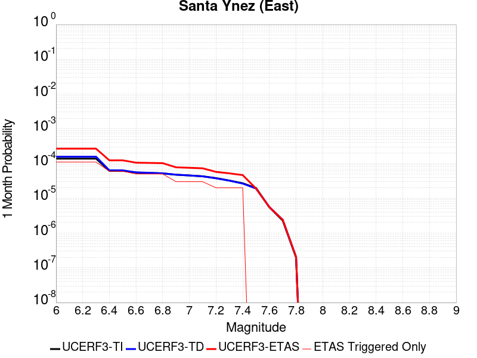 |  |  |

| Magnitude | 1 wk TI Prob | 1 wk TD Prob | 1 wk ETAS Prob | 1 wk ETAS/TD Gain | 1 wk ETAS Triggered Only | 1 mo TI Prob | 1 mo TD Prob | 1 mo ETAS Prob | 1 mo ETAS/TD Gain | 1 mo ETAS Triggered Only | 1 yr TI Prob | 1 yr TD Prob | 1 yr ETAS Prob | 1 yr ETAS/TD Gain | 1 yr ETAS Triggered Only | 10 yr TI Prob | 10 yr TD Prob | 10 yr ETAS Prob | 10 yr ETAS/TD Gain | 10 yr ETAS Triggered Only |
|-----|-----|-----|-----|-----|-----|-----|-----|-----|-----|-----|-----|-----|-----|-----|-----|-----|-----|-----|-----|-----|
| 6.0 | 3.2269712E-5 | 3.6750775E-5 | 1.067482E-4 | 2.9046519 | 7.0E-5 | 1.3829143E-4 | 1.5749714E-4 | 2.674798E-4 | 1.6983154 | 1.1E-4 | 0.0016823979 | 0.0019164253 | 0.0020461762 | 1.0677047 | 1.3E-4 | 0.016697178 | 0.019056438 | 0.01921339 | 1.0082362 | 1.6E-4 |
| 6.1 | 3.2269712E-5 | 3.6750775E-5 | 1.067482E-4 | 2.9046519 | 7.0E-5 | 1.3829143E-4 | 1.5749714E-4 | 2.674798E-4 | 1.6983154 | 1.1E-4 | 0.0016823979 | 0.0019164253 | 0.0020461762 | 1.0677047 | 1.3E-4 | 0.016697178 | 0.019056438 | 0.01921339 | 1.0082362 | 1.6E-4 |
| 6.2 | 3.2269712E-5 | 3.6750775E-5 | 1.067482E-4 | 2.9046519 | 7.0E-5 | 1.3829143E-4 | 1.5749714E-4 | 2.674798E-4 | 1.6983154 | 1.1E-4 | 0.0016823979 | 0.0019164253 | 0.0020461762 | 1.0677047 | 1.3E-4 | 0.016697178 | 0.019056438 | 0.01921339 | 1.0082362 | 1.6E-4 |
| 6.3 | 3.2269712E-5 | 3.6750775E-5 | 1.067482E-4 | 2.9046519 | 7.0E-5 | 1.3829143E-4 | 1.5749714E-4 | 2.674798E-4 | 1.6983154 | 1.1E-4 | 0.0016823979 | 0.0019164253 | 0.0020461762 | 1.0677047 | 1.3E-4 | 0.016697178 | 0.019056438 | 0.01921339 | 1.0082362 | 1.6E-4 |
| 6.4 | 1.4404779E-5 | 1.48492945E-5 | 4.484885E-5 | 3.020268 | 3.0E-5 | 6.1733306E-5 | 6.363831E-5 | 1.2363448E-4 | 1.9427683 | 6.0E-5 | 7.513438E-4 | 7.7452604E-4 | 8.4447186E-4 | 1.0903078 | 7.0E-5 | 0.0074880854 | 0.007718817 | 0.0078081223 | 1.0115699 | 9.0E-5 |
| 6.5 | 1.4404779E-5 | 1.48492945E-5 | 4.484885E-5 | 3.020268 | 3.0E-5 | 6.1733306E-5 | 6.363831E-5 | 1.2363448E-4 | 1.9427683 | 6.0E-5 | 7.513438E-4 | 7.7452604E-4 | 8.4447186E-4 | 1.0903078 | 7.0E-5 | 0.0074880854 | 0.007718817 | 0.0078081223 | 1.0115699 | 9.0E-5 |
| 6.6 | 1.280208E-5 | 1.301186E-5 | 3.3011598E-5 | 2.5370393 | 2.0E-5 | 5.4864904E-5 | 5.5763932E-5 | 1.05761144E-4 | 1.8965869 | 5.0E-5 | 6.6777546E-4 | 6.7871617E-4 | 7.386754E-4 | 1.0883422 | 6.0E-5 | 0.006657724 | 0.0067666434 | 0.006846102 | 1.0117427 | 8.0E-5 |
| 6.7 | 1.2457027E-5 | 1.262838E-5 | 3.2628126E-5 | 2.5837145 | 2.0E-5 | 5.3386164E-5 | 5.4120515E-5 | 1.0411781E-4 | 1.923814 | 5.0E-5 | 6.497827E-4 | 6.5871974E-4 | 7.186802E-4 | 1.0910258 | 6.0E-5 | 0.00647886 | 0.00656787 | 0.006647344 | 1.0121005 | 8.0E-5 |
| 6.8 | 1.2095134E-5 | 1.2230827E-5 | 3.2230582E-5 | 2.6351924 | 2.0E-5 | 5.1835254E-5 | 5.2416784E-5 | 1.0241417E-4 | 1.9538429 | 5.0E-5 | 6.309115E-4 | 6.3798914E-4 | 6.9795083E-4 | 1.0939854 | 6.0E-5 | 0.0062912325 | 0.006361764 | 0.0064412546 | 1.0124952 | 8.0E-5 |
| 6.9 | 1.1104036E-5 | 1.115726E-5 | 2.1157148E-5 | 1.8962674 | 1.0E-5 | 4.758786E-5 | 4.781596E-5 | 7.7814526E-5 | 1.6273756 | 3.0E-5 | 5.7922816E-4 | 5.82005E-4 | 6.2198174E-4 | 1.0686879 | 4.0E-5 | 0.005777207 | 0.0058049536 | 0.0058646053 | 1.010276 | 6.0E-5 |
| 7.0 | 1.0577444E-5 | 1.05815925E-5 | 2.0581487E-5 | 1.9450274 | 1.0E-5 | 4.5331115E-5 | 4.53489E-5 | 7.534754E-5 | 1.6615075 | 3.0E-5 | 5.5176654E-4 | 5.5198424E-4 | 5.9196213E-4 | 1.0724258 | 4.0E-5 | 0.0055039856 | 0.00550627 | 0.005555995 | 1.0090306 | 5.0E-5 |
| 7.1 | 1.0021775E-5 | 9.9809E-6 | 1.99808E-5 | 2.0019035 | 1.0E-5 | 4.294976E-5 | 4.277459E-5 | 7.2773306E-5 | 1.7013209 | 3.0E-5 | 5.2278786E-4 | 5.206574E-4 | 5.606366E-4 | 1.0767859 | 4.0E-5 | 0.0052155964 | 0.005194508 | 0.0052442485 | 1.0095756 | 5.0E-5 |
| 7.2 | 8.874109E-6 | 8.748706E-6 | 1.8748618E-5 | 2.143016 | 1.0E-5 | 3.8031343E-5 | 3.7493923E-5 | 5.7493173E-5 | 1.5333998 | 2.0E-5 | 4.629332E-4 | 4.56394E-4 | 4.863803E-4 | 1.0657027 | 3.0E-5 | 0.0046197 | 0.0045546847 | 0.004594503 | 1.0087422 | 4.0E-5 |
| 7.3 | 7.5504267E-6 | 7.5050243E-6 | 1.750495E-5 | 2.3324308 | 1.0E-5 | 3.235857E-5 | 3.2164E-5 | 5.2163356E-5 | 1.6217933 | 2.0E-5 | 3.9389438E-4 | 3.9152734E-4 | 4.2151558E-4 | 1.076593 | 3.0E-5 | 0.0039319694 | 0.0039084824 | 0.003948326 | 1.0101942 | 4.0E-5 |
| 7.4 | 6.309394E-6 | 6.183062E-6 | 1.6183E-5 | 2.6173117 | 1.0E-5 | 2.703998E-5 | 2.6498574E-5 | 4.6498044E-5 | 1.7547376 | 2.0E-5 | 3.2916202E-4 | 3.2257332E-4 | 3.5256366E-4 | 1.0929722 | 3.0E-5 | 0.003286749 | 0.0032211484 | 0.0032610195 | 1.012378 | 4.0E-5 |
| 7.5 | 4.6103073E-6 | 4.4408016E-6 | 4.4408016E-6 | 1.0 | 0.0 | 1.975831E-5 | 1.9031871E-5 | 1.9031871E-5 | 1.0 | 0.0 | 2.4053088E-4 | 2.316891E-4 | 2.316891E-4 | 1.0 | 0.0 | 0.002402707 | 0.002314545 | 0.0023245218 | 1.0043105 | 1.0E-5 |
| 7.6 | 1.2858658E-6 | 1.3008196E-6 | 1.3008196E-6 | 1.0 | 0.0 | 5.5108417E-6 | 5.574929E-6 | 5.574929E-6 | 1.0 | 0.0 | 6.7092435E-5 | 6.787272E-5 | 6.787272E-5 | 1.0 | 0.0 | 6.707218E-4 | 6.7852676E-4 | 6.7852676E-4 | 1.0 | 0.0 |
| 7.7 | 5.3302307E-7 | 5.612138E-7 | 5.612138E-7 | 1.0 | 0.0 | 2.2843826E-6 | 2.4052001E-6 | 2.4052001E-6 | 1.0 | 0.0 | 2.7812002E-5 | 2.9282955E-5 | 2.9282955E-5 | 1.0 | 0.0 | 2.7808524E-4 | 2.9279455E-4 | 2.9279455E-4 | 1.0 | 0.0 |
| 7.8 | 4.613933E-8 | 4.80301E-8 | 4.80301E-8 | 1.0 | 0.0 | 1.9773998E-7 | 2.0584326E-7 | 2.0584326E-7 | 1.0 | 0.0 | 2.4074816E-6 | 2.5061388E-6 | 2.5061388E-6 | 1.0 | 0.0 | 2.4074554E-5 | 2.5061116E-5 | 2.5061116E-5 | 1.0 | 0.0 |

## Cleghorn Lake
*[(top)](#table-of-contents)*

| 1 Week | 1 Month | 1 Year | 10 Year |
|-----|-----|-----|-----|
|  |  |  |  |

| Magnitude | 1 wk TI Prob | 1 wk TD Prob | 1 wk ETAS Prob | 1 wk ETAS/TD Gain | 1 wk ETAS Triggered Only | 1 mo TI Prob | 1 mo TD Prob | 1 mo ETAS Prob | 1 mo ETAS/TD Gain | 1 mo ETAS Triggered Only | 1 yr TI Prob | 1 yr TD Prob | 1 yr ETAS Prob | 1 yr ETAS/TD Gain | 1 yr ETAS Triggered Only | 10 yr TI Prob | 10 yr TD Prob | 10 yr ETAS Prob | 10 yr ETAS/TD Gain | 10 yr ETAS Triggered Only |
|-----|-----|-----|-----|-----|-----|-----|-----|-----|-----|-----|-----|-----|-----|-----|-----|-----|-----|-----|-----|-----|
| 6.0 | 1.5467183E-5 | 1.6794203E-5 | 1.1679252E-4 | 6.954335 | 1.0E-4 | 6.6286244E-5 | 7.197348E-5 | 1.9196485E-4 | 2.6671607 | 1.2E-4 | 8.067362E-4 | 8.759797E-4 | 0.0010358396 | 1.1824926 | 1.6E-4 | 0.008038137 | 0.008730696 | 0.008899211 | 1.0193015 | 1.7E-4 |
| 6.1 | 1.5467183E-5 | 1.6794203E-5 | 1.1679252E-4 | 6.954335 | 1.0E-4 | 6.6286244E-5 | 7.197348E-5 | 1.9196485E-4 | 2.6671607 | 1.2E-4 | 8.067362E-4 | 8.759797E-4 | 0.0010358396 | 1.1824926 | 1.6E-4 | 0.008038137 | 0.008730696 | 0.008899211 | 1.0193015 | 1.7E-4 |
| 6.2 | 1.2624631E-5 | 1.3681544E-5 | 9.368045E-5 | 6.847213 | 8.0E-5 | 5.410444E-5 | 5.863415E-5 | 1.5862829E-4 | 2.705391 | 1.0E-4 | 6.585225E-4 | 7.1368564E-4 | 8.4359286E-4 | 1.182023 | 1.3E-4 | 0.0065657445 | 0.0071187317 | 0.0072577354 | 1.0195265 | 1.4E-4 |
| 6.3 | 1.2624631E-5 | 1.3681544E-5 | 9.368045E-5 | 6.847213 | 8.0E-5 | 5.410444E-5 | 5.863415E-5 | 1.5862829E-4 | 2.705391 | 1.0E-4 | 6.585225E-4 | 7.1368564E-4 | 8.4359286E-4 | 1.182023 | 1.3E-4 | 0.0065657445 | 0.0071187317 | 0.0072577354 | 1.0195265 | 1.4E-4 |
| 6.4 | 9.417684E-6 | 1.0170118E-5 | 5.016971E-5 | 4.933051 | 4.0E-5 | 4.036088E-5 | 4.3585722E-5 | 9.358354E-5 | 2.1471148 | 5.0E-5 | 4.912829E-4 | 5.3056807E-4 | 6.105256E-4 | 1.1507018 | 8.0E-5 | 0.004901982 | 0.005297049 | 0.0053766253 | 1.0150228 | 8.0E-5 |
| 6.5 | 9.368219E-6 | 1.0117545E-5 | 5.0117138E-5 | 4.9534883 | 4.0E-5 | 4.014889E-5 | 4.3360415E-5 | 9.335825E-5 | 2.1530755 | 5.0E-5 | 4.8870314E-4 | 5.2782625E-4 | 6.07784E-4 | 1.151485 | 8.0E-5 | 0.004876298 | 0.0052697617 | 0.00534934 | 1.015101 | 8.0E-5 |
| 6.6 | 7.803798E-6 | 8.441831E-6 | 4.8441492E-5 | 5.7382684 | 4.0E-5 | 3.3444423E-5 | 3.6179E-5 | 8.617719E-5 | 2.3819673 | 5.0E-5 | 4.0710976E-4 | 4.4043022E-4 | 5.103994E-4 | 1.1588655 | 7.0E-5 | 0.0040636472 | 0.0043994905 | 0.0044691823 | 1.0158409 | 7.0E-5 |
| 6.7 | 2.3108669E-6 | 2.4438336E-6 | 3.244376E-5 | 13.275764 | 3.0E-5 | 9.903678E-6 | 1.0473532E-5 | 4.0473216E-5 | 3.8643334 | 3.0E-5 | 1.205706E-4 | 1.2750797E-4 | 1.5750415E-4 | 1.2352494 | 3.0E-5 | 0.001205052 | 0.0012743667 | 0.0013043286 | 1.023511 | 3.0E-5 |
| 6.8 | 2.0882828E-6 | 2.2062823E-6 | 3.2206215E-5 | 14.597506 | 3.0E-5 | 8.949753E-6 | 9.455462E-6 | 3.945518E-5 | 4.1727395 | 3.0E-5 | 1.08957785E-4 | 1.1511434E-4 | 1.4511088E-4 | 1.2605804 | 3.0E-5 | 0.0010890438 | 0.0011505639 | 0.0011805294 | 1.0260441 | 3.0E-5 |
| 6.9 | 1.876935E-6 | 1.981051E-6 | 2.1981012E-5 | 11.095632 | 2.0E-5 | 8.043982E-6 | 8.490192E-6 | 2.8490022E-5 | 3.3556395 | 2.0E-5 | 9.7931086E-5 | 1.03363345E-4 | 1.2336127E-4 | 1.1934721 | 2.0E-5 | 9.788794E-4 | 0.0010331686 | 0.001053148 | 1.0193379 | 2.0E-5 |
| 7.0 | 1.5357559E-6 | 1.6202807E-6 | 2.1620248E-5 | 13.34352 | 2.0E-5 | 6.5817944E-6 | 6.9440425E-6 | 2.6943904E-5 | 3.8801467 | 2.0E-5 | 8.01304E-5 | 8.454057E-5 | 1.0453887E-4 | 1.2365528 | 2.0E-5 | 8.010151E-4 | 8.450965E-4 | 8.650796E-4 | 1.0236459 | 2.0E-5 |
| 7.1 | 1.0905424E-6 | 1.1497619E-6 | 2.1149739E-5 | 18.394884 | 2.0E-5 | 4.6737446E-6 | 4.9275427E-6 | 2.4927444E-5 | 5.0587983 | 2.0E-5 | 5.6901354E-5 | 5.999128E-5 | 7.999008E-5 | 1.3333617 | 2.0E-5 | 5.6886784E-4 | 5.997606E-4 | 6.197486E-4 | 1.0333266 | 2.0E-5 |
| 7.2 | 6.06668E-7 | 6.387277E-7 | 1.06387215E-5 | 16.656113 | 1.0E-5 | 2.600003E-6 | 2.7374022E-6 | 1.2737375E-5 | 4.6530886 | 1.0E-5 | 3.1654577E-5 | 3.3327433E-5 | 4.3327098E-5 | 1.3000431 | 1.0E-5 | 3.1650066E-4 | 3.3323118E-4 | 3.4322785E-4 | 1.0299993 | 1.0E-5 |

## Baker
*[(top)](#table-of-contents)*

| 1 Week | 1 Month | 1 Year | 10 Year |
|-----|-----|-----|-----|
| 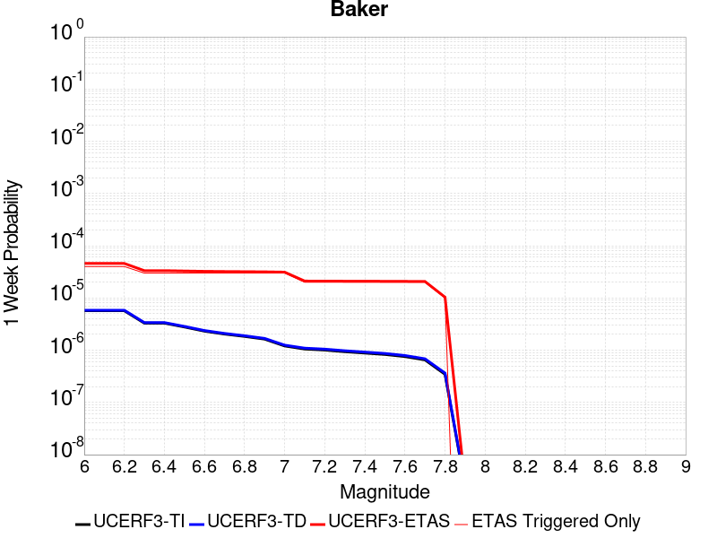 |  |  |  |

| Magnitude | 1 wk TI Prob | 1 wk TD Prob | 1 wk ETAS Prob | 1 wk ETAS/TD Gain | 1 wk ETAS Triggered Only | 1 mo TI Prob | 1 mo TD Prob | 1 mo ETAS Prob | 1 mo ETAS/TD Gain | 1 mo ETAS Triggered Only | 1 yr TI Prob | 1 yr TD Prob | 1 yr ETAS Prob | 1 yr ETAS/TD Gain | 1 yr ETAS Triggered Only | 10 yr TI Prob | 10 yr TD Prob | 10 yr ETAS Prob | 10 yr ETAS/TD Gain | 10 yr ETAS Triggered Only |
|-----|-----|-----|-----|-----|-----|-----|-----|-----|-----|-----|-----|-----|-----|-----|-----|-----|-----|-----|-----|-----|
| 6.0 | 5.695525E-6 | 5.8348373E-6 | 4.5834604E-5 | 7.8553357 | 4.0E-5 | 2.4409164E-5 | 2.5006228E-5 | 8.500473E-5 | 3.3993423 | 6.0E-5 | 2.9714106E-4 | 3.044123E-4 | 3.8438794E-4 | 1.2627214 | 8.0E-5 | 0.0029674405 | 0.0030403486 | 0.003209832 | 1.0557446 | 1.7E-4 |
| 6.1 | 5.695525E-6 | 5.8348373E-6 | 4.5834604E-5 | 7.8553357 | 4.0E-5 | 2.4409164E-5 | 2.5006228E-5 | 8.500473E-5 | 3.3993423 | 6.0E-5 | 2.9714106E-4 | 3.044123E-4 | 3.8438794E-4 | 1.2627214 | 8.0E-5 | 0.0029674405 | 0.0030403486 | 0.003209832 | 1.0557446 | 1.7E-4 |
| 6.2 | 5.695525E-6 | 5.8348373E-6 | 4.5834604E-5 | 7.8553357 | 4.0E-5 | 2.4409164E-5 | 2.5006228E-5 | 8.500473E-5 | 3.3993423 | 6.0E-5 | 2.9714106E-4 | 3.044123E-4 | 3.8438794E-4 | 1.2627214 | 8.0E-5 | 0.0029674405 | 0.0030403486 | 0.003209832 | 1.0557446 | 1.7E-4 |
| 6.3 | 3.2995713E-6 | 3.383667E-6 | 3.3383567E-5 | 9.866091 | 3.0E-5 | 1.4140943E-5 | 1.4501353E-5 | 6.450063E-5 | 4.447904 | 5.0E-5 | 1.7215237E-4 | 1.7654014E-4 | 2.4652778E-4 | 1.3964404 | 7.0E-5 | 0.0017201907 | 0.001764046 | 0.0018838344 | 1.0679054 | 1.2E-4 |
| 6.4 | 3.2995713E-6 | 3.383667E-6 | 3.3383567E-5 | 9.866091 | 3.0E-5 | 1.4140943E-5 | 1.4501353E-5 | 6.450063E-5 | 4.447904 | 5.0E-5 | 1.7215237E-4 | 1.7654014E-4 | 2.4652778E-4 | 1.3964404 | 7.0E-5 | 0.0017201907 | 0.001764046 | 0.0018838344 | 1.0679054 | 1.2E-4 |
| 6.5 | 2.782202E-6 | 2.8558404E-6 | 3.2855754E-5 | 11.504759 | 3.0E-5 | 1.1923668E-5 | 1.223926E-5 | 6.223865E-5 | 5.085164 | 5.0E-5 | 1.4516099E-4 | 1.4900314E-4 | 2.189927E-4 | 1.4697188 | 7.0E-5 | 0.001450662 | 0.0014890651 | 0.0015989012 | 1.0737618 | 1.1E-4 |
| 6.6 | 2.3163404E-6 | 2.38092E-6 | 3.238085E-5 | 13.600142 | 3.0E-5 | 9.927136E-6 | 1.0203904E-5 | 5.0203496E-5 | 4.920028 | 4.0E-5 | 1.20856166E-4 | 1.2422565E-4 | 1.842182E-4 | 1.482932 | 6.0E-5 | 0.0012079047 | 0.0012415823 | 0.0013314706 | 1.0723982 | 9.0E-5 |
| 6.7 | 2.037056E-6 | 2.0965003E-6 | 3.209644E-5 | 15.30953 | 3.0E-5 | 8.7302105E-6 | 8.984972E-6 | 4.8984613E-5 | 5.451838 | 4.0E-5 | 1.0628513E-4 | 1.093867E-4 | 1.6938015E-4 | 1.5484527 | 6.0E-5 | 0.0010623431 | 0.0010933448 | 0.0011832464 | 1.0822262 | 9.0E-5 |
| 6.8 | 1.8356744E-6 | 1.8915287E-6 | 3.189147E-5 | 16.860157 | 3.0E-5 | 7.867153E-6 | 8.106527E-6 | 4.81062E-5 | 5.9342556 | 4.0E-5 | 9.577837E-5 | 9.869264E-5 | 1.5868671E-4 | 1.6078881 | 6.0E-5 | 9.57371E-4 | 9.86502E-4 | 0.0010664231 | 1.0810146 | 8.0E-5 |
| 6.9 | 1.6310546E-6 | 1.6832072E-6 | 3.1683157E-5 | 18.823088 | 3.0E-5 | 6.9902153E-6 | 7.213726E-6 | 4.7213438E-5 | 6.544945 | 4.0E-5 | 8.510255E-5 | 8.782368E-5 | 1.4781841E-4 | 1.683127 | 6.0E-5 | 8.5069967E-4 | 8.7790104E-4 | 9.578308E-4 | 1.0910465 | 8.0E-5 |
| 7.0 | 1.2058036E-6 | 1.2508665E-6 | 3.1250827E-5 | 24.983343 | 3.0E-5 | 5.1677193E-6 | 5.3608455E-6 | 4.536063E-5 | 8.46147 | 4.0E-5 | 6.291517E-5 | 6.5266366E-5 | 1.2526245E-4 | 1.9192497 | 6.0E-5 | 6.289736E-4 | 6.524743E-4 | 7.224286E-4 | 1.107214 | 7.0E-5 |
| 7.1 | 1.052382E-6 | 1.0951609E-6 | 2.1095138E-5 | 19.262138 | 2.0E-5 | 4.5102006E-6 | 4.693538E-6 | 3.4693396E-5 | 7.3917365 | 3.0E-5 | 5.491031E-5 | 5.7142337E-5 | 1.0713948E-4 | 1.8749579 | 5.0E-5 | 5.4896745E-4 | 5.7127734E-4 | 6.3124305E-4 | 1.1049678 | 6.0E-5 |
| 7.2 | 1.0067454E-6 | 1.0487711E-6 | 2.104875E-5 | 20.06992 | 2.0E-5 | 4.3146156E-6 | 4.4947255E-6 | 3.449459E-5 | 7.67446 | 3.0E-5 | 5.252918E-5 | 5.4721917E-5 | 1.0471918E-4 | 1.9136606 | 5.0E-5 | 5.251676E-4 | 5.470853E-4 | 6.0705247E-4 | 1.1096121 | 6.0E-5 |
| 7.3 | 9.3596316E-7 | 9.767723E-7 | 2.0976753E-5 | 21.47558 | 2.0E-5 | 4.0112645E-6 | 4.1861604E-6 | 3.4186036E-5 | 8.166442 | 3.0E-5 | 4.8836053E-5 | 5.096532E-5 | 1.00962774E-4 | 1.9810092 | 5.0E-5 | 4.8825322E-4 | 5.095371E-4 | 5.5951165E-4 | 1.0980783 | 5.0E-5 |
| 7.4 | 8.8117395E-7 | 9.2076635E-7 | 2.0920748E-5 | 22.721018 | 2.0E-5 | 3.7764542E-6 | 3.9461356E-6 | 3.3946017E-5 | 8.6023445 | 3.0E-5 | 4.5977362E-5 | 4.8043148E-5 | 9.804075E-5 | 2.0406811 | 5.0E-5 | 4.596785E-4 | 4.8032837E-4 | 5.303044E-4 | 1.1040455 | 5.0E-5 |
| 7.5 | 8.292386E-7 | 8.6745956E-7 | 2.0867443E-5 | 24.055809 | 2.0E-5 | 3.5538749E-6 | 3.7176785E-6 | 3.3717566E-5 | 9.069522 | 3.0E-5 | 4.326757E-5 | 4.5261804E-5 | 9.5259544E-5 | 2.1046343 | 5.0E-5 | 4.3259145E-4 | 4.5252658E-4 | 5.0250394E-4 | 1.1104407 | 5.0E-5 |
| 7.6 | 7.553842E-7 | 7.9144706E-7 | 2.079143E-5 | 26.270147 | 2.0E-5 | 3.2373566E-6 | 3.3919116E-6 | 3.339181E-5 | 9.844541 | 3.0E-5 | 3.9414106E-5 | 4.129575E-5 | 8.129409E-5 | 1.9685827 | 4.0E-5 | 3.9407116E-4 | 4.1288146E-4 | 4.5286494E-4 | 1.0968401 | 4.0E-5 |
| 7.7 | 6.5285366E-7 | 6.852797E-7 | 2.0685266E-5 | 30.185144 | 2.0E-5 | 2.797941E-6 | 2.9369096E-6 | 3.2936823E-5 | 11.214789 | 3.0E-5 | 3.40644E-5 | 3.5756293E-5 | 7.575486E-5 | 2.1186442 | 4.0E-5 | 3.405918E-4 | 3.5750607E-4 | 3.9749176E-4 | 1.1118462 | 4.0E-5 |
| 7.8 | 3.4586725E-7 | 3.6482615E-7 | 1.0364823E-5 | 28.410307 | 1.0E-5 | 1.4822873E-6 | 1.5635396E-6 | 2.1563508E-5 | 13.791469 | 2.0E-5 | 1.80467E-5 | 1.9035933E-5 | 3.9035553E-5 | 2.0506246 | 2.0E-5 | 1.8045233E-4 | 1.9034347E-4 | 2.1033967E-4 | 1.1050532 | 2.0E-5 |
| 7.9 | 2.5591178E-9 | 2.6696718E-9 | 2.6696718E-9 | 1.0 | 0.0 | 1.0967647E-8 | 1.14414505E-8 | 1.14414505E-8 | 1.0 | 0.0 | 1.335311E-7 | 1.3929966E-7 | 1.3929966E-7 | 1.0 | 0.0 | 1.3353102E-6 | 1.3929966E-6 | 1.3929966E-6 | 1.0 | 0.0 |

## San Andreas (Coachella) rev
*[(top)](#table-of-contents)*

| 1 Week | 1 Month | 1 Year | 10 Year |
|-----|-----|-----|-----|
|  |  |  |  |

| Magnitude | 1 wk TI Prob | 1 wk TD Prob | 1 wk ETAS Prob | 1 wk ETAS/TD Gain | 1 wk ETAS Triggered Only | 1 mo TI Prob | 1 mo TD Prob | 1 mo ETAS Prob | 1 mo ETAS/TD Gain | 1 mo ETAS Triggered Only | 1 yr TI Prob | 1 yr TD Prob | 1 yr ETAS Prob | 1 yr ETAS/TD Gain | 1 yr ETAS Triggered Only | 10 yr TI Prob | 10 yr TD Prob | 10 yr ETAS Prob | 10 yr ETAS/TD Gain | 10 yr ETAS Triggered Only |
|-----|-----|-----|-----|-----|-----|-----|-----|-----|-----|-----|-----|-----|-----|-----|-----|-----|-----|-----|-----|-----|
| 6.0 | 1.1925945E-4 | 3.273077E-4 | 3.6729462E-4 | 1.1221691 | 4.0E-5 | 5.110118E-4 | 0.001401998 | 0.0014619138 | 1.042736 | 6.0E-5 | 0.0062038354 | 0.016937068 | 0.017055035 | 1.006965 | 1.2E-4 | 0.060334753 | 0.15267672 | 0.15281229 | 1.000888 | 1.6E-4 |
| 6.1 | 1.1925945E-4 | 3.273077E-4 | 3.6729462E-4 | 1.1221691 | 4.0E-5 | 5.110118E-4 | 0.001401998 | 0.0014619138 | 1.042736 | 6.0E-5 | 0.0062038354 | 0.016937068 | 0.017055035 | 1.006965 | 1.2E-4 | 0.060334753 | 0.15267672 | 0.15281229 | 1.000888 | 1.6E-4 |
| 6.2 | 1.07432395E-4 | 3.0231563E-4 | 3.4230354E-4 | 1.132272 | 4.0E-5 | 4.603433E-4 | 0.001294999 | 0.0013549214 | 1.046272 | 6.0E-5 | 0.005590286 | 0.015653731 | 0.015771853 | 1.007546 | 1.2E-4 | 0.05451731 | 0.14182784 | 0.14195655 | 1.0009077 | 1.5E-4 |
| 6.3 | 1.0718766E-4 | 3.0176868E-4 | 3.4175662E-4 | 1.1325119 | 4.0E-5 | 4.592948E-4 | 0.0012926573 | 0.0013525798 | 1.046356 | 6.0E-5 | 0.005577586 | 0.01562563 | 0.015743755 | 1.0075597 | 1.2E-4 | 0.054396555 | 0.14159605 | 0.14172481 | 1.0009093 | 1.5E-4 |
| 6.4 | 1.0355944E-4 | 2.9384956E-4 | 3.338378E-4 | 1.1360841 | 4.0E-5 | 4.4375064E-4 | 0.0012587514 | 0.0013186758 | 1.0476062 | 6.0E-5 | 0.0053892885 | 0.015218662 | 0.015336836 | 1.007765 | 1.2E-4 | 0.052604496 | 0.13815795 | 0.13828723 | 1.0009357 | 1.5E-4 |
| 6.5 | 1.0227914E-4 | 2.9104383E-4 | 3.310322E-4 | 1.1373963 | 4.0E-5 | 4.382655E-4 | 0.0012467385 | 0.0013066636 | 1.0480655 | 6.0E-5 | 0.0053228354 | 0.015074439 | 0.01519263 | 1.0078405 | 1.2E-4 | 0.051971316 | 0.13694239 | 0.13707185 | 1.0009453 | 1.5E-4 |
| 6.6 | 1.0116757E-4 | 2.8870135E-4 | 3.286898E-4 | 1.1385115 | 4.0E-5 | 4.3350324E-4 | 0.0012367087 | 0.0012966346 | 1.0484558 | 6.0E-5 | 0.0052651367 | 0.014954008 | 0.015072214 | 1.0079046 | 1.2E-4 | 0.051421247 | 0.13591973 | 0.13604936 | 1.0009536 | 1.5E-4 |
| 6.7 | 1.0050676E-4 | 2.8728697E-4 | 3.2727548E-4 | 1.1391937 | 4.0E-5 | 4.3067214E-4 | 0.0012306528 | 0.001290579 | 1.0486946 | 6.0E-5 | 0.005230834 | 0.014881288 | 0.014999502 | 1.0079439 | 1.2E-4 | 0.051094085 | 0.13530464 | 0.13543436 | 1.0009586 | 1.5E-4 |
| 6.8 | 9.976819E-5 | 2.8532353E-4 | 3.253121E-4 | 1.1401517 | 4.0E-5 | 4.2750788E-4 | 0.001222246 | 0.0012821726 | 1.04903 | 6.0E-5 | 0.0051924936 | 0.014780328 | 0.014898554 | 1.007999 | 1.2E-4 | 0.050728295 | 0.13445628 | 0.13458611 | 1.0009656 | 1.5E-4 |
| 6.9 | 9.77719E-5 | 2.802926E-4 | 3.2028137E-4 | 1.142668 | 4.0E-5 | 4.1895514E-4 | 0.0012007048 | 0.0012606328 | 1.0499107 | 6.0E-5 | 0.0050888555 | 0.0145215895 | 0.014639847 | 1.0081435 | 1.2E-4 | 0.049738888 | 0.13228476 | 0.13241492 | 1.000984 | 1.5E-4 |
| 7.0 | 8.500761E-5 | 2.4763815E-4 | 2.8762824E-4 | 1.161486 | 4.0E-5 | 3.6426744E-4 | 0.0010608779 | 0.0011208142 | 1.056497 | 6.0E-5 | 0.0044259406 | 0.01284047 | 0.01295893 | 1.0092255 | 1.2E-4 | 0.04338823 | 0.11813616 | 0.11826844 | 1.0011197 | 1.5E-4 |
| 7.1 | 8.319876E-5 | 2.4366553E-4 | 2.8365577E-4 | 1.1641195 | 4.0E-5 | 3.5651738E-4 | 0.0010438662 | 0.0011038035 | 1.0574186 | 6.0E-5 | 0.004331963 | 0.012635773 | 0.012754257 | 1.0093769 | 1.2E-4 | 0.042484846 | 0.11635632 | 0.11648887 | 1.0011392 | 1.5E-4 |
| 7.2 | 7.563917E-5 | 2.2414974E-4 | 2.6414078E-4 | 1.1784121 | 4.0E-5 | 3.2412758E-4 | 9.602912E-4 | 0.0010202335 | 1.0624211 | 6.0E-5 | 0.0039391145 | 0.011629559 | 0.011748164 | 1.0101986 | 1.2E-4 | 0.03870018 | 0.10776202 | 0.10789585 | 1.0012419 | 1.5E-4 |
| 7.3 | 7.082985E-5 | 2.07311E-4 | 2.473027E-4 | 1.1929069 | 4.0E-5 | 3.0352117E-4 | 8.881761E-4 | 9.4812276E-4 | 1.0674942 | 6.0E-5 | 0.0036891096 | 0.010760553 | 0.010879262 | 1.0110319 | 1.2E-4 | 0.03628465 | 0.10028403 | 0.10041899 | 1.0013458 | 1.5E-4 |
| 7.4 | 5.146215E-5 | 1.4274761E-4 | 1.827419E-4 | 1.2801749 | 4.0E-5 | 2.2053342E-4 | 6.1163295E-4 | 6.715962E-4 | 1.0980381 | 6.0E-5 | 0.0026816884 | 0.0074213943 | 0.007530578 | 1.014712 | 1.1E-4 | 0.02649557 | 0.07085049 | 0.07098057 | 1.001836 | 1.4E-4 |
| 7.5 | 4.0285166E-5 | 1.0942422E-4 | 1.3942094E-4 | 1.2741324 | 3.0E-5 | 1.7263928E-4 | 4.6887697E-4 | 5.1885354E-4 | 1.1065878 | 5.0E-5 | 0.002099857 | 0.0056937044 | 0.005773249 | 1.0139706 | 8.0E-5 | 0.020801254 | 0.055013083 | 0.055107582 | 1.0017178 | 1.0E-4 |
| 7.6 | 3.1168736E-5 | 8.439599E-5 | 1.04394305E-4 | 1.236958 | 2.0E-5 | 1.3357346E-4 | 3.616471E-4 | 4.0163266E-4 | 1.1105651 | 4.0E-5 | 0.0016250437 | 0.004394191 | 0.004463883 | 1.0158601 | 7.0E-5 | 0.016132116 | 0.042812478 | 0.042898625 | 1.0020121 | 9.0E-5 |
| 7.7 | 2.2100989E-5 | 6.239345E-5 | 8.23922E-5 | 1.3205265 | 2.0E-5 | 9.4715084E-5 | 2.6737314E-4 | 3.0736244E-4 | 1.1495637 | 4.0E-5 | 0.001152546 | 0.0032504152 | 0.00331022 | 1.0183992 | 6.0E-5 | 0.011465867 | 0.031902168 | 0.031979617 | 1.0024277 | 8.0E-5 |
| 7.8 | 1.7484861E-5 | 5.180078E-5 | 7.179975E-5 | 1.3860745 | 2.0E-5 | 7.493296E-5 | 2.2198448E-4 | 2.619756E-4 | 1.1801528 | 4.0E-5 | 9.1192697E-4 | 0.0026993142 | 0.0027591523 | 1.0221679 | 6.0E-5 | 0.009081938 | 0.026641788 | 0.026719656 | 1.0029228 | 8.0E-5 |
| 7.9 | 1.3967285E-5 | 3.8226146E-5 | 4.8225764E-5 | 1.2615911 | 1.0E-5 | 5.985842E-5 | 1.6381606E-4 | 1.9381115E-4 | 1.1831023 | 3.0E-5 | 7.2853256E-4 | 0.0019926373 | 0.0020425378 | 1.0250424 | 5.0E-5 | 0.0072614877 | 0.019911002 | 0.01997961 | 1.0034456 | 7.0E-5 |
| 8.0 | 1.1887396E-5 | 3.106798E-5 | 4.106767E-5 | 1.3218648 | 1.0E-5 | 5.094499E-5 | 1.331417E-4 | 1.6313771E-4 | 1.2252939 | 3.0E-5 | 6.200787E-4 | 0.0016197958 | 0.0016697148 | 1.0308181 | 5.0E-5 | 0.006183513 | 0.016280567 | 0.016349427 | 1.0042295 | 7.0E-5 |
| 8.1 | 5.100864E-6 | 8.973766E-6 | 8.973766E-6 | 1.0 | 0.0 | 2.1860664E-5 | 3.845843E-5 | 4.8458045E-5 | 1.2600111 | 1.0E-5 | 2.6612106E-4 | 4.6813092E-4 | 4.8812156E-4 | 1.042703 | 2.0E-5 | 0.002658026 | 0.004918092 | 0.004947944 | 1.0060699 | 3.0E-5 |
| 8.2 | 2.3004484E-6 | 2.7863473E-6 | 2.7863473E-6 | 1.0 | 0.0 | 9.859027E-6 | 1.19414335E-5 | 2.1941314E-5 | 1.8374104 | 1.0E-5 | 1.2002704E-4 | 1.4537729E-4 | 1.6537438E-4 | 1.1375531 | 2.0E-5 | 0.0011996223 | 0.0015973782 | 0.0016173462 | 1.0125005 | 2.0E-5 |
| 8.3 | 1.0424446E-7 | 5.814421E-8 | 5.814421E-8 | 1.0 | 0.0 | 4.4676187E-7 | 2.4918944E-7 | 2.4918944E-7 | 1.0 | 0.0 | 5.439312E-6 | 3.0338776E-6 | 3.0338776E-6 | 1.0 | 0.0 | 5.4391792E-5 | 3.189592E-5 | 3.189592E-5 | 1.0 | 0.0 |

## Mission Ridge-Arroyo Parida-Santa Ana
*[(top)](#table-of-contents)*

| 1 Week | 1 Month | 1 Year | 10 Year |
|-----|-----|-----|-----|
|  |  |  |  |

| Magnitude | 1 wk TI Prob | 1 wk TD Prob | 1 wk ETAS Prob | 1 wk ETAS/TD Gain | 1 wk ETAS Triggered Only | 1 mo TI Prob | 1 mo TD Prob | 1 mo ETAS Prob | 1 mo ETAS/TD Gain | 1 mo ETAS Triggered Only | 1 yr TI Prob | 1 yr TD Prob | 1 yr ETAS Prob | 1 yr ETAS/TD Gain | 1 yr ETAS Triggered Only | 10 yr TI Prob | 10 yr TD Prob | 10 yr ETAS Prob | 10 yr ETAS/TD Gain | 10 yr ETAS Triggered Only |
|-----|-----|-----|-----|-----|-----|-----|-----|-----|-----|-----|-----|-----|-----|-----|-----|-----|-----|-----|-----|-----|
| 6.0 | 4.169034E-5 | 4.7137048E-5 | 8.713516E-5 | 1.8485495 | 4.0E-5 | 1.7866064E-4 | 2.0200513E-4 | 2.8198896E-4 | 1.3959496 | 8.0E-5 | 0.0021730233 | 0.0024574657 | 0.0025771707 | 1.0487108 | 1.2E-4 | 0.021518968 | 0.02438483 | 0.024550684 | 1.0068016 | 1.7E-4 |
| 6.1 | 1.73813E-5 | 1.6854203E-5 | 3.6853868E-5 | 2.1866276 | 2.0E-5 | 7.4489166E-5 | 7.223036E-5 | 1.02228194E-4 | 1.4153078 | 3.0E-5 | 9.065282E-4 | 8.790605E-4 | 9.090341E-4 | 1.0340973 | 3.0E-5 | 0.009028391 | 0.008757128 | 0.008786866 | 1.0033958 | 3.0E-5 |
| 6.2 | 1.4622182E-5 | 1.3673262E-5 | 3.367299E-5 | 2.4626887 | 2.0E-5 | 6.2664985E-5 | 5.85984E-5 | 8.8596644E-5 | 1.5119294 | 3.0E-5 | 7.6267915E-4 | 7.132059E-4 | 7.431845E-4 | 1.0420336 | 3.0E-5 | 0.007600669 | 0.007109767 | 0.007139554 | 1.0041895 | 3.0E-5 |
| 6.3 | 1.3552434E-5 | 1.2482174E-5 | 3.2481923E-5 | 2.6022651 | 2.0E-5 | 5.8080568E-5 | 5.349395E-5 | 7.349288E-5 | 1.373854 | 2.0E-5 | 7.069015E-4 | 6.510974E-4 | 6.7108433E-4 | 1.0306973 | 2.0E-5 | 0.00704657 | 0.006492415 | 0.0065122847 | 1.0030605 | 2.0E-5 |
| 6.4 | 1.30977305E-5 | 1.1979128E-5 | 3.197889E-5 | 2.6695504 | 2.0E-5 | 5.613192E-5 | 5.133813E-5 | 7.1337105E-5 | 1.389554 | 2.0E-5 | 6.831918E-4 | 6.2486547E-4 | 6.44853E-4 | 1.0319868 | 2.0E-5 | 0.006810953 | 0.006231584 | 0.0062514595 | 1.0031894 | 2.0E-5 |
| 6.5 | 1.225205E-5 | 1.1048776E-5 | 3.1048556E-5 | 2.8101354 | 2.0E-5 | 5.2507727E-5 | 4.735105E-5 | 6.7350105E-5 | 1.4223571 | 2.0E-5 | 6.3909404E-4 | 5.7634927E-4 | 5.963377E-4 | 1.0346812 | 2.0E-5 | 0.006372592 | 0.005749009 | 0.0057688938 | 1.0034589 | 2.0E-5 |
| 6.6 | 1.1352241E-5 | 1.0063508E-5 | 2.0063408E-5 | 1.9936793 | 1.0E-5 | 4.8651553E-5 | 4.3128617E-5 | 5.3128188E-5 | 1.2318546 | 1.0E-5 | 5.921717E-4 | 5.249665E-4 | 5.349613E-4 | 1.0190388 | 1.0E-5 | 0.0059059616 | 0.0052376646 | 0.005247612 | 1.0018992 | 1.0E-5 |
| 6.7 | 1.0864116E-5 | 9.517E-6 | 1.9516905E-5 | 2.0507412 | 1.0E-5 | 4.6559664E-5 | 4.0786515E-5 | 5.0786108E-5 | 1.245169 | 1.0E-5 | 5.667165E-4 | 4.964647E-4 | 5.0645974E-4 | 1.0201324 | 1.0E-5 | 0.005652734 | 0.0049539437 | 0.0049638944 | 1.0020086 | 1.0E-5 |
| 6.8 | 1.0666365E-5 | 9.299752E-6 | 1.929966E-5 | 2.0752876 | 1.0E-5 | 4.571219E-5 | 3.985548E-5 | 4.9855083E-5 | 1.2508966 | 1.0E-5 | 5.564038E-4 | 4.8513446E-4 | 4.951296E-4 | 1.0206028 | 1.0E-5 | 0.005550127 | 0.00484114 | 0.0048510917 | 1.0020556 | 1.0E-5 |
| 6.9 | 1.0038665E-5 | 8.592018E-6 | 8.592018E-6 | 1.0 | 0.0 | 4.302214E-5 | 3.682243E-5 | 3.682243E-5 | 1.0 | 0.0 | 5.236687E-4 | 4.4822265E-4 | 4.4822265E-4 | 1.0 | 0.0 | 0.005224364 | 0.0044735507 | 0.0044735507 | 1.0 | 0.0 |
| 7.0 | 9.5379955E-6 | 8.025047E-6 | 8.025047E-6 | 1.0 | 0.0 | 4.0876483E-5 | 3.439261E-5 | 3.439261E-5 | 1.0 | 0.0 | 4.975576E-4 | 4.1865133E-4 | 4.1865133E-4 | 1.0 | 0.0 | 0.00496445 | 0.00417898 | 0.00417898 | 1.0 | 0.0 |
| 7.1 | 9.207389E-6 | 7.652347E-6 | 7.652347E-6 | 1.0 | 0.0 | 3.945964E-5 | 3.2795375E-5 | 3.2795375E-5 | 1.0 | 0.0 | 4.803152E-4 | 3.992122E-4 | 3.992122E-4 | 1.0 | 0.0 | 0.004792784 | 0.003985301 | 0.003985301 | 1.0 | 0.0 |
| 7.2 | 7.638091E-6 | 5.9310923E-6 | 5.9310923E-6 | 1.0 | 0.0 | 3.2734264E-5 | 2.5418722E-5 | 2.5418722E-5 | 1.0 | 0.0 | 3.984668E-4 | 3.094293E-4 | 3.094293E-4 | 1.0 | 0.0 | 0.0039775306 | 0.0030901956 | 0.0030901956 | 1.0 | 0.0 |
| 7.3 | 7.2500147E-6 | 5.596131E-6 | 5.596131E-6 | 1.0 | 0.0 | 3.1071122E-5 | 2.3983199E-5 | 2.3983199E-5 | 1.0 | 0.0 | 3.7822526E-4 | 2.9195662E-4 | 2.9195662E-4 | 1.0 | 0.0 | 0.0037758215 | 0.0029159402 | 0.0029159402 | 1.0 | 0.0 |
| 7.4 | 6.3899715E-6 | 4.9184864E-6 | 4.9184864E-6 | 1.0 | 0.0 | 2.7385306E-5 | 2.1079059E-5 | 2.1079059E-5 | 1.0 | 0.0 | 3.3336508E-4 | 2.566075E-4 | 2.566075E-4 | 1.0 | 0.0 | 0.0033286542 | 0.002563311 | 0.002563311 | 1.0 | 0.0 |
| 7.5 | 5.379025E-6 | 4.0838477E-6 | 4.0838477E-6 | 1.0 | 0.0 | 2.305276E-5 | 1.7502087E-5 | 1.7502087E-5 | 1.0 | 0.0 | 2.806312E-4 | 2.1306718E-4 | 2.1306718E-4 | 1.0 | 0.0 | 0.0028027708 | 0.0021286402 | 0.0021286402 | 1.0 | 0.0 |
| 7.6 | 4.1270696E-6 | 3.0883373E-6 | 3.0883373E-6 | 1.0 | 0.0 | 1.768732E-5 | 1.32356645E-5 | 1.32356645E-5 | 1.0 | 0.0 | 2.1532185E-4 | 1.6113237E-4 | 1.6113237E-4 | 1.0 | 0.0 | 0.0021511333 | 0.0016101635 | 0.0016101635 | 1.0 | 0.0 |
| 7.7 | 2.5406805E-6 | 1.8282044E-6 | 1.8282044E-6 | 1.0 | 0.0 | 1.0888585E-5 | 7.835139E-6 | 7.835139E-6 | 1.0 | 0.0 | 1.3256045E-4 | 9.53887E-5 | 9.53887E-5 | 1.0 | 0.0 | 0.0013248142 | 9.534837E-4 | 9.534837E-4 | 1.0 | 0.0 |
| 7.8 | 4.8608285E-7 | 3.509864E-7 | 3.509864E-7 | 1.0 | 0.0 | 2.0832106E-6 | 1.5042266E-6 | 1.5042266E-6 | 1.0 | 0.0 | 2.5362791E-5 | 1.8313805E-5 | 1.8313805E-5 | 1.0 | 0.0 | 2.5359896E-4 | 1.8312308E-4 | 1.8312308E-4 | 1.0 | 0.0 |
| 7.9 | 2.0472514E-8 | 1.2688718E-8 | 1.2688718E-8 | 1.0 | 0.0 | 8.7739345E-8 | 5.438022E-8 | 5.438022E-8 | 1.0 | 0.0 | 1.068226E-6 | 6.6207895E-7 | 6.6207895E-7 | 1.0 | 0.0 | 1.0682209E-5 | 6.620771E-6 | 6.620771E-6 | 1.0 | 0.0 |
| 8.0 | 4.443582E-9 | 2.032067E-9 | 2.032067E-9 | 1.0 | 0.0 | 1.9043922E-8 | 8.7088585E-9 | 8.7088585E-9 | 1.0 | 0.0 | 2.3185973E-7 | 1.0603035E-7 | 1.0603035E-7 | 1.0 | 0.0 | 2.3185949E-6 | 1.0603031E-6 | 1.0603031E-6 | 1.0 | 0.0 |

## Cleghorn Pass
*[(top)](#table-of-contents)*

| 1 Week | 1 Month | 1 Year | 10 Year |
|-----|-----|-----|-----|
|  | 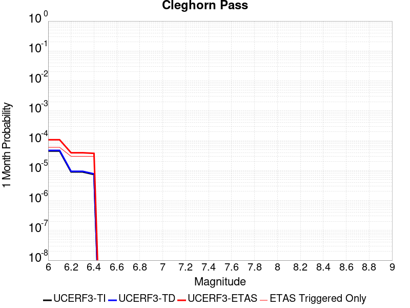 |  | 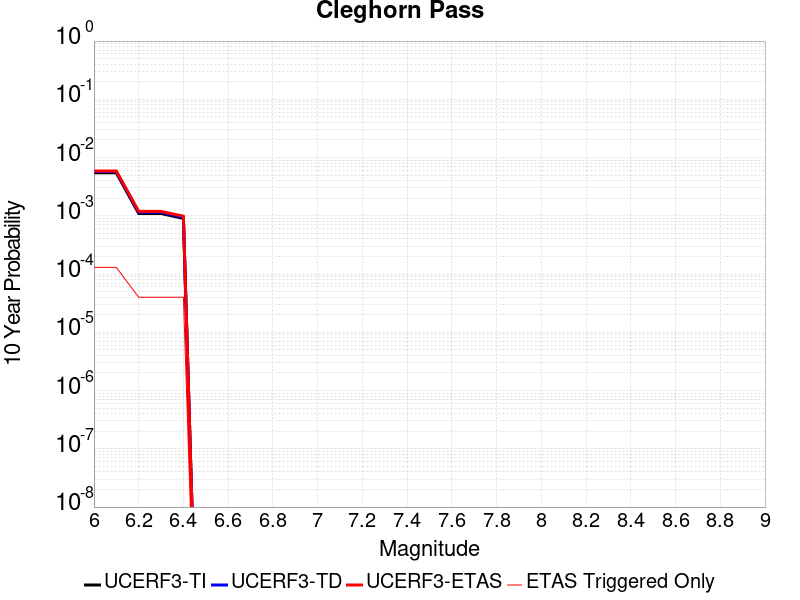 |

| Magnitude | 1 wk TI Prob | 1 wk TD Prob | 1 wk ETAS Prob | 1 wk ETAS/TD Gain | 1 wk ETAS Triggered Only | 1 mo TI Prob | 1 mo TD Prob | 1 mo ETAS Prob | 1 mo ETAS/TD Gain | 1 mo ETAS Triggered Only | 1 yr TI Prob | 1 yr TD Prob | 1 yr ETAS Prob | 1 yr ETAS/TD Gain | 1 yr ETAS Triggered Only | 10 yr TI Prob | 10 yr TD Prob | 10 yr ETAS Prob | 10 yr ETAS/TD Gain | 10 yr ETAS Triggered Only |
|-----|-----|-----|-----|-----|-----|-----|-----|-----|-----|-----|-----|-----|-----|-----|-----|-----|-----|-----|-----|-----|
| 6.0 | 1.0522846E-5 | 1.1040642E-5 | 4.104031E-5 | 3.7172034 | 3.0E-5 | 4.509713E-5 | 4.7316473E-5 | 1.0731364E-4 | 2.2679973 | 6.0E-5 | 5.4891926E-4 | 5.759784E-4 | 6.5593235E-4 | 1.1388141 | 8.0E-5 | 0.0054756533 | 0.005750022 | 0.005879274 | 1.0224786 | 1.3E-4 |
| 6.1 | 1.0522846E-5 | 1.1040642E-5 | 4.104031E-5 | 3.7172034 | 3.0E-5 | 4.509713E-5 | 4.7316473E-5 | 1.0731364E-4 | 2.2679973 | 6.0E-5 | 5.4891926E-4 | 5.759784E-4 | 6.5593235E-4 | 1.1388141 | 8.0E-5 | 0.0054756533 | 0.005750022 | 0.005879274 | 1.0224786 | 1.3E-4 |
| 6.2 | 2.1045846E-6 | 2.2082024E-6 | 2.2082024E-6 | 1.0 | 0.0 | 9.019617E-6 | 9.463714E-6 | 3.946343E-5 | 4.169973 | 3.0E-5 | 1.098083E-4 | 1.1521882E-4 | 1.4521537E-4 | 1.2603441 | 3.0E-5 | 0.0010975406 | 0.0011520023 | 0.0011919562 | 1.0346822 | 4.0E-5 |
| 6.3 | 2.1045846E-6 | 2.2082024E-6 | 2.2082024E-6 | 1.0 | 0.0 | 9.019617E-6 | 9.463714E-6 | 3.946343E-5 | 4.169973 | 3.0E-5 | 1.098083E-4 | 1.1521882E-4 | 1.4521537E-4 | 1.2603441 | 3.0E-5 | 0.0010975406 | 0.0011520023 | 0.0011919562 | 1.0346822 | 4.0E-5 |
| 6.4 | 1.7259927E-6 | 1.810877E-6 | 1.810877E-6 | 1.0 | 0.0 | 7.3970905E-6 | 7.760902E-6 | 3.776067E-5 | 4.8655 | 3.0E-5 | 9.005586E-5 | 9.4488976E-5 | 1.2448615E-4 | 1.3174673 | 3.0E-5 | 9.001937E-4 | 9.448898E-4 | 9.84852E-4 | 1.042293 | 4.0E-5 |

## Brawley (Seismic Zone) alt 1
*[(top)](#table-of-contents)*

| 1 Week | 1 Month | 1 Year | 10 Year |
|-----|-----|-----|-----|
|  | 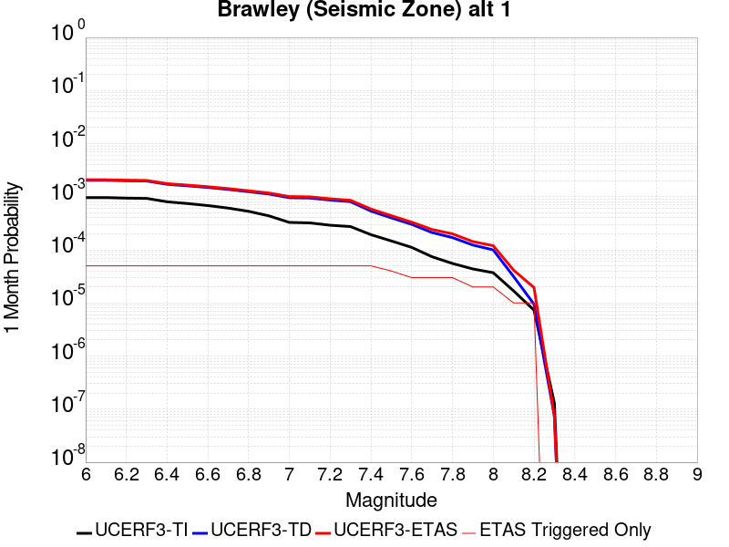 |  |  |

| Magnitude | 1 wk TI Prob | 1 wk TD Prob | 1 wk ETAS Prob | 1 wk ETAS/TD Gain | 1 wk ETAS Triggered Only | 1 mo TI Prob | 1 mo TD Prob | 1 mo ETAS Prob | 1 mo ETAS/TD Gain | 1 mo ETAS Triggered Only | 1 yr TI Prob | 1 yr TD Prob | 1 yr ETAS Prob | 1 yr ETAS/TD Gain | 1 yr ETAS Triggered Only | 10 yr TI Prob | 10 yr TD Prob | 10 yr ETAS Prob | 10 yr ETAS/TD Gain | 10 yr ETAS Triggered Only |
|-----|-----|-----|-----|-----|-----|-----|-----|-----|-----|-----|-----|-----|-----|-----|-----|-----|-----|-----|-----|-----|
| 6.0 | 2.2521618E-4 | 4.763429E-4 | 5.1632384E-4 | 1.0839331 | 4.0E-5 | 9.6485513E-4 | 0.0020399094 | 0.0020898073 | 1.0244609 | 5.0E-5 | 0.011683988 | 0.024544531 | 0.024651831 | 1.0043716 | 1.1E-4 | 0.11088423 | 0.21349923 | 0.21360934 | 1.0005157 | 1.4E-4 |
| 6.1 | 2.2521618E-4 | 4.763429E-4 | 5.1632384E-4 | 1.0839331 | 4.0E-5 | 9.6485513E-4 | 0.0020399094 | 0.0020898073 | 1.0244609 | 5.0E-5 | 0.011683988 | 0.024544531 | 0.024651831 | 1.0043716 | 1.1E-4 | 0.11088423 | 0.21349923 | 0.21360147 | 1.0004789 | 1.3E-4 |
| 6.2 | 2.198148E-4 | 4.6718874E-4 | 5.0717004E-4 | 1.0855786 | 4.0E-5 | 9.417233E-4 | 0.0020007377 | 0.0020506377 | 1.0249407 | 5.0E-5 | 0.011405343 | 0.024078513 | 0.024185864 | 1.0044584 | 1.1E-4 | 0.10837428 | 0.20993572 | 0.21003844 | 1.0004892 | 1.3E-4 |
| 6.3 | 2.1704129E-4 | 4.615455E-4 | 5.0152704E-4 | 1.0866253 | 4.0E-5 | 9.298453E-4 | 0.0019765892 | 0.0020264904 | 1.0252461 | 5.0E-5 | 0.011262234 | 0.023792034 | 0.023899417 | 1.0045134 | 1.1E-4 | 0.107082725 | 0.20782684 | 0.20792982 | 1.0004956 | 1.3E-4 |
| 6.4 | 1.876142E-4 | 4.004663E-4 | 4.4045027E-4 | 1.0998436 | 4.0E-5 | 8.038131E-4 | 0.0017151695 | 0.0017650838 | 1.0291016 | 5.0E-5 | 0.00974259 | 0.020678662 | 0.020786386 | 1.0052094 | 1.1E-4 | 0.093263686 | 0.18457787 | 0.18468387 | 1.0005744 | 1.3E-4 |
| 6.5 | 1.7390939E-4 | 3.7478763E-4 | 4.1477266E-4 | 1.1066871 | 4.0E-5 | 7.45113E-4 | 0.0016052561 | 0.0016551758 | 1.0310977 | 5.0E-5 | 0.009034078 | 0.019367293 | 0.019475162 | 1.0055697 | 1.1E-4 | 0.086755216 | 0.17440015 | 0.17450748 | 1.0006154 | 1.3E-4 |
| 6.6 | 1.591791E-4 | 3.4893592E-4 | 3.8892197E-4 | 1.1145942 | 4.0E-5 | 6.8201777E-4 | 0.0014945926 | 0.0015445179 | 1.0334039 | 5.0E-5 | 0.008271996 | 0.018045008 | 0.018153023 | 1.0059859 | 1.1E-4 | 0.07970774 | 0.16380787 | 0.16391657 | 1.0006636 | 1.3E-4 |
| 6.7 | 1.4268003E-4 | 3.2059717E-4 | 3.6058435E-4 | 1.1247271 | 4.0E-5 | 6.1134255E-4 | 0.0013732726 | 0.001423204 | 1.0363594 | 5.0E-5 | 0.007417723 | 0.01659171 | 0.016699884 | 1.0065198 | 1.1E-4 | 0.07174956 | 0.15193594 | 0.15204617 | 1.0007256 | 1.3E-4 |
| 6.8 | 1.239713E-4 | 2.9055026E-4 | 3.3053863E-4 | 1.1376299 | 4.0E-5 | 5.3119735E-4 | 0.0012446274 | 0.0012945652 | 1.0401226 | 5.0E-5 | 0.0064481674 | 0.015049482 | 0.0151479775 | 1.0065447 | 1.0E-4 | 0.06264243 | 0.13838051 | 0.1384839 | 1.0007472 | 1.2E-4 |
| 6.9 | 1.0180238E-4 | 2.6255674E-4 | 3.0254625E-4 | 1.152308 | 4.0E-5 | 4.3622297E-4 | 0.0011247622 | 0.001174706 | 1.0444038 | 5.0E-5 | 0.005298089 | 0.013608998 | 0.013707637 | 1.007248 | 1.0E-4 | 0.05173543 | 0.12496473 | 0.12506972 | 1.0008403 | 1.2E-4 |
| 7.0 | 7.6619996E-5 | 2.2400476E-4 | 2.639958E-4 | 1.1785276 | 4.0E-5 | 3.283301E-4 | 9.596704E-4 | 0.0010096225 | 1.0520512 | 5.0E-5 | 0.0039900932 | 0.011622103 | 0.0117209405 | 1.0085043 | 1.0E-4 | 0.039192066 | 0.10726982 | 0.107376955 | 1.0009986 | 1.2E-4 |
| 7.1 | 7.5127435E-5 | 2.2083633E-4 | 2.608275E-4 | 1.1810896 | 4.0E-5 | 3.2193496E-4 | 9.461013E-4 | 9.96054E-4 | 1.0527985 | 5.0E-5 | 0.0039125155 | 0.011458648 | 0.011557502 | 1.008627 | 1.0E-4 | 0.038443442 | 0.10583378 | 0.10594108 | 1.0010139 | 1.2E-4 |
| 7.2 | 6.788582E-5 | 2.0211334E-4 | 2.4210526E-4 | 1.1978687 | 4.0E-5 | 2.9090676E-4 | 8.6591556E-4 | 9.158722E-4 | 1.0576924 | 5.0E-5 | 0.0035360386 | 0.0104922 | 0.01059115 | 1.0094309 | 1.0E-4 | 0.034803 | 0.097503684 | 0.097611986 | 1.0011107 | 1.2E-4 |
| 7.3 | 6.399602E-5 | 1.8842232E-4 | 2.2841478E-4 | 1.212249 | 4.0E-5 | 2.7423984E-4 | 8.0727716E-4 | 8.572368E-4 | 1.0618865 | 5.0E-5 | 0.0033337586 | 0.009784897 | 0.009883918 | 1.0101198 | 1.0E-4 | 0.03284188 | 0.091397986 | 0.09150702 | 1.0011929 | 1.2E-4 |
| 7.4 | 4.506759E-5 | 1.2530042E-4 | 1.6529541E-4 | 1.3191928 | 4.0E-5 | 1.9313251E-4 | 5.3689216E-4 | 5.868653E-4 | 1.0930786 | 5.0E-5 | 0.0023488526 | 0.006517245 | 0.0066066585 | 1.0137196 | 9.0E-5 | 0.023241805 | 0.062364522 | 0.06246766 | 1.0016538 | 1.1E-4 |
| 7.5 | 3.43289E-5 | 9.336103E-5 | 1.2335823E-4 | 1.3213032 | 3.0E-5 | 1.4711556E-4 | 4.0005764E-4 | 4.4004165E-4 | 1.0999455 | 4.0E-5 | 0.0017896603 | 0.004859886 | 0.0049195946 | 1.012286 | 6.0E-5 | 0.01775316 | 0.047057066 | 0.04712377 | 1.0014175 | 7.0E-5 |
| 7.6 | 2.5980507E-5 | 7.053672E-5 | 9.0535315E-5 | 1.2835202 | 2.0E-5 | 1.1134028E-4 | 3.0226534E-4 | 3.3225628E-4 | 1.0992205 | 3.0E-5 | 0.001354725 | 0.0036738948 | 0.0037237112 | 1.0135596 | 5.0E-5 | 0.013464959 | 0.03584298 | 0.03590083 | 1.001614 | 6.0E-5 |
| 7.7 | 1.7292105E-5 | 4.9412036E-5 | 6.941105E-5 | 1.4047396 | 2.0E-5 | 7.4106916E-5 | 2.1174872E-4 | 2.4174237E-4 | 1.1416473 | 3.0E-5 | 9.018782E-4 | 0.0025749984 | 0.0026148953 | 1.015494 | 4.0E-5 | 0.008982267 | 0.025292097 | 0.02534083 | 1.0019269 | 5.0E-5 |
| 7.8 | 1.2927471E-5 | 3.9697254E-5 | 5.969646E-5 | 1.5037931 | 2.0E-5 | 5.5402274E-5 | 1.7012001E-4 | 2.0011491E-4 | 1.1763161 | 3.0E-5 | 6.743139E-4 | 0.0020692463 | 0.0021091634 | 1.0192907 | 4.0E-5 | 0.0067227143 | 0.020433145 | 0.020482123 | 1.0023971 | 5.0E-5 |
| 7.9 | 1.0200774E-5 | 2.8748475E-5 | 3.874819E-5 | 1.3478346 | 1.0E-5 | 4.371687E-5 | 1.2320194E-4 | 1.4319948E-4 | 1.1623151 | 2.0E-5 | 5.321229E-4 | 0.0014989526 | 0.0015289077 | 1.019984 | 3.0E-5 | 0.005308505 | 0.014992895 | 0.015032295 | 1.002628 | 4.0E-5 |
| 8.0 | 8.650396E-6 | 2.3279512E-5 | 3.3279277E-5 | 1.4295523 | 1.0E-5 | 3.70726E-5 | 9.976552E-5 | 1.1976353E-4 | 1.2004501 | 2.0E-5 | 4.5126543E-4 | 0.0012139693 | 0.0012439329 | 1.0246823 | 3.0E-5 | 0.0045035016 | 0.012212164 | 0.012251675 | 1.0032355 | 4.0E-5 |
| 8.1 | 3.9368224E-6 | 7.3283345E-6 | 7.3283345E-6 | 1.0 | 0.0 | 1.6871985E-5 | 3.1406773E-5 | 4.1406456E-5 | 1.3183926 | 1.0E-5 | 2.0539707E-4 | 3.8231048E-4 | 4.0230283E-4 | 1.0522935 | 2.0E-5 | 0.0020520731 | 0.0040015313 | 0.0040314114 | 1.0074672 | 3.0E-5 |
| 8.2 | 1.7101195E-6 | 2.2178374E-6 | 2.2178374E-6 | 1.0 | 0.0 | 7.329063E-6 | 9.504983E-6 | 1.9504889E-5 | 2.0520697 | 1.0E-5 | 8.922769E-5 | 1.15717055E-4 | 1.3571474E-4 | 1.1728153 | 2.0E-5 | 8.9191867E-4 | 0.00126669 | 0.0012866646 | 1.0157691 | 2.0E-5 |
| 8.3 | 3.0346666E-8 | 1.721086E-8 | 1.721086E-8 | 1.0 | 0.0 | 1.3005713E-7 | 7.376083E-8 | 7.376083E-8 | 1.0 | 0.0 | 1.5834444E-6 | 8.98038E-7 | 8.98038E-7 | 1.0 | 0.0 | 1.5834332E-5 | 9.36379E-6 | 9.36379E-6 | 1.0 | 0.0 |

## Dry Mountain
*[(top)](#table-of-contents)*

| 1 Week | 1 Month | 1 Year | 10 Year |
|-----|-----|-----|-----|
|  |  |  |  |

| Magnitude | 1 wk TI Prob | 1 wk TD Prob | 1 wk ETAS Prob | 1 wk ETAS/TD Gain | 1 wk ETAS Triggered Only | 1 mo TI Prob | 1 mo TD Prob | 1 mo ETAS Prob | 1 mo ETAS/TD Gain | 1 mo ETAS Triggered Only | 1 yr TI Prob | 1 yr TD Prob | 1 yr ETAS Prob | 1 yr ETAS/TD Gain | 1 yr ETAS Triggered Only | 10 yr TI Prob | 10 yr TD Prob | 10 yr ETAS Prob | 10 yr ETAS/TD Gain | 10 yr ETAS Triggered Only |
|-----|-----|-----|-----|-----|-----|-----|-----|-----|-----|-----|-----|-----|-----|-----|-----|-----|-----|-----|-----|-----|
| 6.0 | 6.222801E-6 | 6.439381E-6 | 5.6439058E-5 | 8.764671 | 5.0E-5 | 2.6668875E-5 | 2.7597147E-5 | 1.0759494E-4 | 3.8987706 | 8.0E-5 | 3.2464517E-4 | 3.3595937E-4 | 4.4592243E-4 | 1.3273106 | 1.1E-4 | 0.0032417132 | 0.0033560768 | 0.003495607 | 1.0415754 | 1.4E-4 |
| 6.1 | 6.222801E-6 | 6.439381E-6 | 5.6439058E-5 | 8.764671 | 5.0E-5 | 2.6668875E-5 | 2.7597147E-5 | 1.0759494E-4 | 3.8987706 | 8.0E-5 | 3.2464517E-4 | 3.3595937E-4 | 4.4592243E-4 | 1.3273106 | 1.1E-4 | 0.0032417132 | 0.0033560768 | 0.003495607 | 1.0415754 | 1.4E-4 |
| 6.2 | 6.222801E-6 | 6.439381E-6 | 5.6439058E-5 | 8.764671 | 5.0E-5 | 2.6668875E-5 | 2.7597147E-5 | 1.0759494E-4 | 3.8987706 | 8.0E-5 | 3.2464517E-4 | 3.3595937E-4 | 4.4592243E-4 | 1.3273106 | 1.1E-4 | 0.0032417132 | 0.0033560768 | 0.003495607 | 1.0415754 | 1.4E-4 |
| 6.3 | 6.222801E-6 | 6.439381E-6 | 5.6439058E-5 | 8.764671 | 5.0E-5 | 2.6668875E-5 | 2.7597147E-5 | 1.0759494E-4 | 3.8987706 | 8.0E-5 | 3.2464517E-4 | 3.3595937E-4 | 4.4592243E-4 | 1.3273106 | 1.1E-4 | 0.0032417132 | 0.0033560768 | 0.003495607 | 1.0415754 | 1.4E-4 |
| 6.4 | 6.222801E-6 | 6.439381E-6 | 5.6439058E-5 | 8.764671 | 5.0E-5 | 2.6668875E-5 | 2.7597147E-5 | 1.0759494E-4 | 3.8987706 | 8.0E-5 | 3.2464517E-4 | 3.3595937E-4 | 4.4592243E-4 | 1.3273106 | 1.1E-4 | 0.0032417132 | 0.0033560768 | 0.003495607 | 1.0415754 | 1.4E-4 |
| 6.5 | 2.8528623E-6 | 2.9521684E-6 | 3.295208E-5 | 11.161992 | 3.0E-5 | 1.22264955E-5 | 1.2652138E-5 | 6.26515E-5 | 4.9518514 | 5.0E-5 | 1.4884741E-4 | 1.540376E-4 | 2.1402835E-4 | 1.3894553 | 6.0E-5 | 0.0014874774 | 0.0015401616 | 0.0016200384 | 1.0518626 | 8.0E-5 |
| 6.6 | 2.8528623E-6 | 2.9521684E-6 | 3.295208E-5 | 11.161992 | 3.0E-5 | 1.22264955E-5 | 1.2652138E-5 | 6.26515E-5 | 4.9518514 | 5.0E-5 | 1.4884741E-4 | 1.540376E-4 | 2.1402835E-4 | 1.3894553 | 6.0E-5 | 0.0014874774 | 0.0015401616 | 0.0016200384 | 1.0518626 | 8.0E-5 |
| 6.7 | 2.541E-6 | 2.6293578E-6 | 3.262928E-5 | 12.4096 | 3.0E-5 | 1.0889954E-5 | 1.1268677E-5 | 6.126811E-5 | 5.4370284 | 5.0E-5 | 1.3257713E-4 | 1.3719614E-4 | 1.9718791E-4 | 1.43727 | 6.0E-5 | 0.0013249806 | 0.0013719613 | 0.0014518516 | 1.0582306 | 8.0E-5 |

## Santa Rosa Island
*[(top)](#table-of-contents)*

| 1 Week | 1 Month | 1 Year | 10 Year |
|-----|-----|-----|-----|
|  | 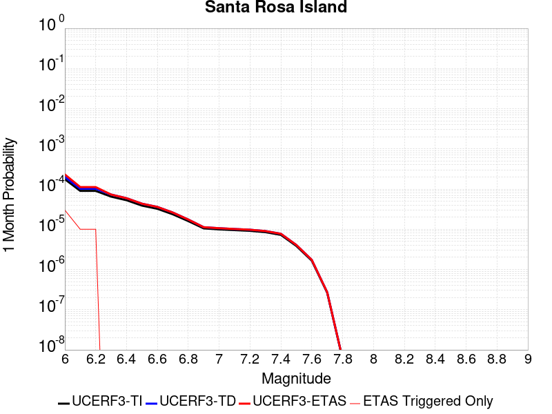 |  |  |

| Magnitude | 1 wk TI Prob | 1 wk TD Prob | 1 wk ETAS Prob | 1 wk ETAS/TD Gain | 1 wk ETAS Triggered Only | 1 mo TI Prob | 1 mo TD Prob | 1 mo ETAS Prob | 1 mo ETAS/TD Gain | 1 mo ETAS Triggered Only | 1 yr TI Prob | 1 yr TD Prob | 1 yr ETAS Prob | 1 yr ETAS/TD Gain | 1 yr ETAS Triggered Only | 10 yr TI Prob | 10 yr TD Prob | 10 yr ETAS Prob | 10 yr ETAS/TD Gain | 10 yr ETAS Triggered Only |
|-----|-----|-----|-----|-----|-----|-----|-----|-----|-----|-----|-----|-----|-----|-----|-----|-----|-----|-----|-----|-----|
| 6.0 | 4.1143165E-5 | 4.709113E-5 | 6.7090186E-5 | 1.4246885 | 2.0E-5 | 1.7631594E-4 | 2.0180462E-4 | 2.3179856E-4 | 1.1486286 | 3.0E-5 | 0.002144533 | 0.0024543991 | 0.0025242274 | 1.0284503 | 7.0E-5 | 0.021239553 | 0.024293557 | 0.02441064 | 1.0048196 | 1.2E-4 |
| 6.1 | 2.1061249E-5 | 2.3864959E-5 | 3.3864722E-5 | 1.4190143 | 1.0E-5 | 9.0259375E-5 | 1.0227455E-4 | 1.1227353E-4 | 1.097766 | 1.0E-5 | 0.0010983539 | 0.0012445103 | 0.0012644854 | 1.0160506 | 2.0E-5 | 0.01092941 | 0.01237845 | 0.012437707 | 1.0047871 | 6.0E-5 |
| 6.2 | 2.1061249E-5 | 2.3864959E-5 | 3.3864722E-5 | 1.4190143 | 1.0E-5 | 9.0259375E-5 | 1.0227455E-4 | 1.1227353E-4 | 1.097766 | 1.0E-5 | 0.0010983539 | 0.0012445103 | 0.0012644854 | 1.0160506 | 2.0E-5 | 0.01092941 | 0.01237845 | 0.012437707 | 1.0047871 | 6.0E-5 |
| 6.3 | 1.5158236E-5 | 1.7074419E-5 | 1.7074419E-5 | 1.0 | 0.0 | 6.496225E-5 | 7.3174095E-5 | 7.3174095E-5 | 1.0 | 0.0 | 7.906284E-4 | 8.9054246E-4 | 9.005336E-4 | 1.0112191 | 1.0E-5 | 0.007878214 | 0.00887099 | 0.008920547 | 1.0055864 | 5.0E-5 |
| 6.4 | 1.2341918E-5 | 1.3852917E-5 | 1.3852917E-5 | 1.0 | 0.0 | 5.2892858E-5 | 5.9368336E-5 | 5.9368336E-5 | 1.0 | 0.0 | 6.437803E-4 | 7.225779E-4 | 7.225779E-4 | 1.0 | 0.0 | 0.006419184 | 0.0072031217 | 0.0072428337 | 1.0055132 | 4.0E-5 |
| 6.5 | 9.061158E-6 | 1.0117032E-5 | 1.0117032E-5 | 1.0 | 0.0 | 3.883296E-5 | 4.3358017E-5 | 4.3358017E-5 | 1.0 | 0.0 | 4.726887E-4 | 5.277613E-4 | 5.277613E-4 | 1.0 | 0.0 | 0.004716845 | 0.0052656177 | 0.0052656177 | 1.0 | 0.0 |
| 6.6 | 7.5461685E-6 | 8.400734E-6 | 8.400734E-6 | 1.0 | 0.0 | 3.2340322E-5 | 3.600267E-5 | 3.600267E-5 | 1.0 | 0.0 | 3.936723E-4 | 4.3824868E-4 | 4.3824868E-4 | 1.0 | 0.0 | 0.003929756 | 0.0043742736 | 0.0043742736 | 1.0 | 0.0 |
| 6.7 | 5.5023775E-6 | 6.087381E-6 | 6.087381E-6 | 1.0 | 0.0 | 2.3581404E-5 | 2.6088532E-5 | 2.6088532E-5 | 1.0 | 0.0 | 2.8706578E-4 | 3.1758484E-4 | 3.1758484E-4 | 1.0 | 0.0 | 0.0028669522 | 0.0031716316 | 0.0031716316 | 1.0 | 0.0 |
| 6.8 | 3.7351679E-6 | 4.0831405E-6 | 4.0831405E-6 | 1.0 | 0.0 | 1.6007763E-5 | 1.7499071E-5 | 1.7499071E-5 | 1.0 | 0.0 | 1.948771E-4 | 2.1303285E-4 | 2.1303285E-4 | 1.0 | 0.0 | 0.0019470629 | 0.0021285315 | 0.0021285315 | 1.0 | 0.0 |
| 6.9 | 2.456366E-6 | 2.6292707E-6 | 2.6292707E-6 | 1.0 | 0.0 | 1.0527241E-5 | 1.1268255E-5 | 1.1268255E-5 | 1.0 | 0.0 | 1.2816161E-4 | 1.3718239E-4 | 1.3718239E-4 | 1.0 | 0.0 | 0.0012808773 | 0.0013709799 | 0.0013709799 | 1.0 | 0.0 |
| 7.0 | 2.3245157E-6 | 2.4827784E-6 | 2.4827784E-6 | 1.0 | 0.0 | 9.962172E-6 | 1.0640436E-5 | 1.0640436E-5 | 1.0 | 0.0 | 1.2128269E-4 | 1.2953962E-4 | 1.2953962E-4 | 1.0 | 0.0 | 0.0012121652 | 0.0012946434 | 0.0012946434 | 1.0 | 0.0 |
| 7.1 | 2.2248344E-6 | 2.37325E-6 | 2.37325E-6 | 1.0 | 0.0 | 9.53497E-6 | 1.0171032E-5 | 1.0171032E-5 | 1.0 | 0.0 | 1.1608207E-4 | 1.238253E-4 | 1.238253E-4 | 1.0 | 0.0 | 0.0011602144 | 0.0012375651 | 0.0012375651 | 1.0 | 0.0 |
| 7.2 | 2.1350402E-6 | 2.2761542E-6 | 2.2761542E-6 | 1.0 | 0.0 | 9.150141E-6 | 9.75491E-6 | 9.75491E-6 | 1.0 | 0.0 | 1.1139726E-4 | 1.1875957E-4 | 1.1875957E-4 | 1.0 | 0.0 | 0.0011134144 | 0.0011869629 | 0.0011869629 | 1.0 | 0.0 |
| 7.3 | 1.9793572E-6 | 2.1087192E-6 | 2.1087192E-6 | 1.0 | 0.0 | 8.482932E-6 | 9.037337E-6 | 9.037337E-6 | 1.0 | 0.0 | 1.032748E-4 | 1.1002403E-4 | 1.1002403E-4 | 1.0 | 0.0 | 0.0010322682 | 0.0010996974 | 0.0010996974 | 1.0 | 0.0 |
| 7.4 | 1.6951194E-6 | 1.8045735E-6 | 1.8045735E-6 | 1.0 | 0.0 | 7.264777E-6 | 7.733864E-6 | 7.733864E-6 | 1.0 | 0.0 | 8.844508E-5 | 9.415574E-5 | 9.415574E-5 | 1.0 | 0.0 | 8.840988E-4 | 9.411601E-4 | 9.411601E-4 | 1.0 | 0.0 |
| 7.5 | 8.987207E-7 | 9.512216E-7 | 9.512216E-7 | 1.0 | 0.0 | 3.8516546E-6 | 4.0766577E-6 | 4.0766577E-6 | 1.0 | 0.0 | 4.6892885E-5 | 4.9632188E-5 | 4.9632188E-5 | 1.0 | 0.0 | 4.688299E-4 | 4.962122E-4 | 4.962122E-4 | 1.0 | 0.0 |
| 7.6 | 3.8783037E-7 | 4.0529335E-7 | 4.0529335E-7 | 1.0 | 0.0 | 1.6621291E-6 | 1.7369704E-6 | 1.7369704E-6 | 1.0 | 0.0 | 2.0236233E-5 | 2.1147416E-5 | 2.1147416E-5 | 1.0 | 0.0 | 2.023439E-4 | 2.114547E-4 | 2.114547E-4 | 1.0 | 0.0 |
| 7.7 | 6.181804E-8 | 6.339047E-8 | 6.339047E-8 | 1.0 | 0.0 | 2.6493444E-7 | 2.7167343E-7 | 2.7167343E-7 | 1.0 | 0.0 | 3.225572E-6 | 3.307619E-6 | 3.307619E-6 | 1.0 | 0.0 | 3.225525E-5 | 3.3075703E-5 | 3.3075703E-5 | 1.0 | 0.0 |
| 7.8 | 1.3704449E-9 | 1.3964153E-9 | 1.3964153E-9 | 1.0 | 0.0 | 5.873335E-9 | 5.984637E-9 | 5.984637E-9 | 1.0 | 0.0 | 7.1507856E-8 | 7.286295E-8 | 7.286295E-8 | 1.0 | 0.0 | 7.1507833E-7 | 7.286294E-7 | 7.286294E-7 | 1.0 | 0.0 |

## Kern Canyon (North Kern) 2011
*[(top)](#table-of-contents)*

| 1 Week | 1 Month | 1 Year | 10 Year |
|-----|-----|-----|-----|
|  | 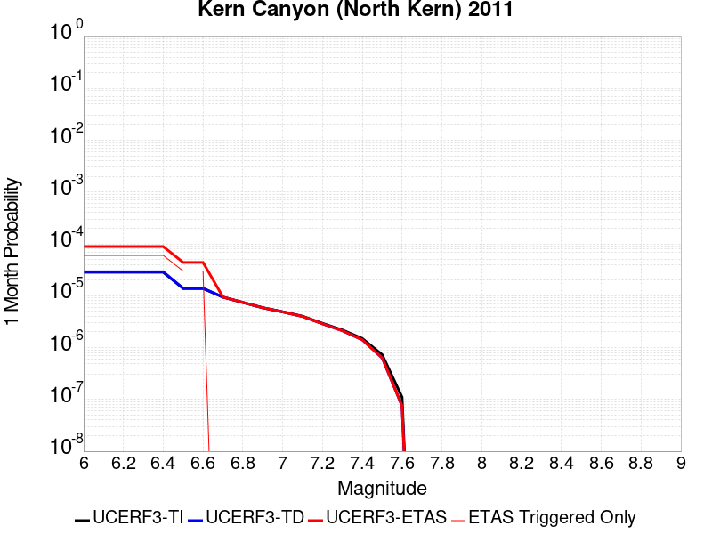 |  |  |

| Magnitude | 1 wk TI Prob | 1 wk TD Prob | 1 wk ETAS Prob | 1 wk ETAS/TD Gain | 1 wk ETAS Triggered Only | 1 mo TI Prob | 1 mo TD Prob | 1 mo ETAS Prob | 1 mo ETAS/TD Gain | 1 mo ETAS Triggered Only | 1 yr TI Prob | 1 yr TD Prob | 1 yr ETAS Prob | 1 yr ETAS/TD Gain | 1 yr ETAS Triggered Only | 10 yr TI Prob | 10 yr TD Prob | 10 yr ETAS Prob | 10 yr ETAS/TD Gain | 10 yr ETAS Triggered Only |
|-----|-----|-----|-----|-----|-----|-----|-----|-----|-----|-----|-----|-----|-----|-----|-----|-----|-----|-----|-----|-----|
| 6.0 | 6.6264497E-6 | 6.75733E-6 | 6.6756926E-5 | 9.879187 | 6.0E-5 | 2.8398761E-5 | 2.895971E-5 | 8.8957975E-5 | 3.071784 | 6.0E-5 | 3.4570007E-4 | 3.5253543E-4 | 4.2251076E-4 | 1.1984916 | 7.0E-5 | 0.0034516277 | 0.0035205502 | 0.0036500925 | 1.0367961 | 1.3E-4 |
| 6.1 | 6.6264497E-6 | 6.75733E-6 | 6.6756926E-5 | 9.879187 | 6.0E-5 | 2.8398761E-5 | 2.895971E-5 | 8.8957975E-5 | 3.071784 | 6.0E-5 | 3.4570007E-4 | 3.5253543E-4 | 4.2251076E-4 | 1.1984916 | 7.0E-5 | 0.0034516277 | 0.0035205502 | 0.0036500925 | 1.0367961 | 1.3E-4 |
| 6.2 | 6.6264497E-6 | 6.75733E-6 | 6.6756926E-5 | 9.879187 | 6.0E-5 | 2.8398761E-5 | 2.895971E-5 | 8.8957975E-5 | 3.071784 | 6.0E-5 | 3.4570007E-4 | 3.5253543E-4 | 4.2251076E-4 | 1.1984916 | 7.0E-5 | 0.0034516277 | 0.0035205502 | 0.0036500925 | 1.0367961 | 1.3E-4 |
| 6.3 | 6.6264497E-6 | 6.75733E-6 | 6.6756926E-5 | 9.879187 | 6.0E-5 | 2.8398761E-5 | 2.895971E-5 | 8.8957975E-5 | 3.071784 | 6.0E-5 | 3.4570007E-4 | 3.5253543E-4 | 4.2251076E-4 | 1.1984916 | 7.0E-5 | 0.0034516277 | 0.0035205502 | 0.0036500925 | 1.0367961 | 1.3E-4 |
| 6.4 | 6.6264497E-6 | 6.75733E-6 | 6.6756926E-5 | 9.879187 | 6.0E-5 | 2.8398761E-5 | 2.895971E-5 | 8.8957975E-5 | 3.071784 | 6.0E-5 | 3.4570007E-4 | 3.5253543E-4 | 4.2251076E-4 | 1.1984916 | 7.0E-5 | 0.0034516277 | 0.0035205502 | 0.0036500925 | 1.0367961 | 1.3E-4 |
| 6.5 | 3.2162225E-6 | 3.2570915E-6 | 3.3256994E-5 | 10.210642 | 3.0E-5 | 1.3783738E-5 | 1.3958894E-5 | 4.3958476E-5 | 3.1491375 | 3.0E-5 | 1.6780409E-4 | 1.6993708E-4 | 1.9993198E-4 | 1.1765059 | 3.0E-5 | 0.0016767744 | 0.001698151 | 0.0017480662 | 1.0293938 | 5.0E-5 |
| 6.6 | 3.2162225E-6 | 3.2570915E-6 | 3.3256994E-5 | 10.210642 | 3.0E-5 | 1.3783738E-5 | 1.3958894E-5 | 4.3958476E-5 | 3.1491375 | 3.0E-5 | 1.6780409E-4 | 1.6993708E-4 | 1.9993198E-4 | 1.1765059 | 3.0E-5 | 0.0016767744 | 0.001698151 | 0.0017480662 | 1.0293938 | 5.0E-5 |
| 6.7 | 2.1908265E-6 | 2.2071222E-6 | 2.2071222E-6 | 1.0 | 0.0 | 9.389223E-6 | 9.459062E-6 | 9.459062E-6 | 1.0 | 0.0 | 1.1430779E-4 | 1.1515819E-4 | 1.1515819E-4 | 1.0 | 0.0 | 0.0011424901 | 0.0011510046 | 0.0011609931 | 1.0086781 | 1.0E-5 |
| 6.8 | 1.7303895E-6 | 1.736553E-6 | 1.736553E-6 | 1.0 | 0.0 | 7.415934E-6 | 7.442349E-6 | 7.442349E-6 | 1.0 | 0.0 | 9.028525E-5 | 9.060693E-5 | 9.060693E-5 | 1.0 | 0.0 | 9.024858E-4 | 9.0570963E-4 | 9.1570057E-4 | 1.011031 | 1.0E-5 |
| 6.9 | 1.3700314E-6 | 1.3688623E-6 | 1.3688623E-6 | 1.0 | 0.0 | 5.87155E-6 | 5.86654E-6 | 5.86654E-6 | 1.0 | 0.0 | 7.148377E-5 | 7.142283E-5 | 7.142283E-5 | 1.0 | 0.0 | 7.146078E-4 | 7.140033E-4 | 7.2399614E-4 | 1.0139955 | 1.0E-5 |
| 7.0 | 1.1467797E-6 | 1.1413805E-6 | 1.1413805E-6 | 1.0 | 0.0 | 4.9147607E-6 | 4.8916218E-6 | 4.8916218E-6 | 1.0 | 0.0 | 5.983557E-5 | 5.95539E-5 | 5.95539E-5 | 1.0 | 0.0 | 5.981946E-4 | 5.9538253E-4 | 6.053766E-4 | 1.016786 | 1.0E-5 |
| 7.1 | 9.3952065E-7 | 9.3026915E-7 | 9.3026915E-7 | 1.0 | 0.0 | 4.026511E-6 | 3.986862E-6 | 3.986862E-6 | 1.0 | 0.0 | 4.9021666E-5 | 4.853898E-5 | 4.853898E-5 | 1.0 | 0.0 | 4.901085E-4 | 4.8528553E-4 | 4.9528066E-4 | 1.0205964 | 1.0E-5 |
| 7.2 | 6.858055E-7 | 6.7193014E-7 | 6.7193014E-7 | 1.0 | 0.0 | 2.939163E-6 | 2.8796974E-6 | 2.8796974E-6 | 1.0 | 0.0 | 3.5783723E-5 | 3.5059762E-5 | 3.5059762E-5 | 1.0 | 0.0 | 3.5777962E-4 | 3.5054318E-4 | 3.5054318E-4 | 1.0 | 0.0 |
| 7.3 | 5.1101983E-7 | 4.939301E-7 | 4.939301E-7 | 1.0 | 0.0 | 2.1900833E-6 | 2.1168414E-6 | 2.1168414E-6 | 1.0 | 0.0 | 2.6663936E-5 | 2.5772246E-5 | 2.5772246E-5 | 1.0 | 0.0 | 2.6660739E-4 | 2.5769303E-4 | 2.5769303E-4 | 1.0 | 0.0 |
| 7.4 | 3.4999414E-7 | 3.2995916E-7 | 3.2995916E-7 | 1.0 | 0.0 | 1.499974E-6 | 1.4141099E-6 | 1.4141099E-6 | 1.0 | 0.0 | 1.8262032E-5 | 1.7216655E-5 | 1.7216655E-5 | 1.0 | 0.0 | 1.826053E-4 | 1.7215345E-4 | 1.7215345E-4 | 1.0 | 0.0 |
| 7.5 | 1.7021522E-7 | 1.4750053E-7 | 1.4750053E-7 | 1.0 | 0.0 | 7.2949354E-7 | 6.32145E-7 | 6.32145E-7 | 1.0 | 0.0 | 8.881548E-6 | 7.696339E-6 | 7.696339E-6 | 1.0 | 0.0 | 8.8811925E-5 | 7.696081E-5 | 7.696081E-5 | 1.0 | 0.0 |
| 7.6 | 2.572245E-8 | 1.735264E-8 | 1.735264E-8 | 1.0 | 0.0 | 1.10239064E-7 | 7.436845E-8 | 7.436845E-8 | 1.0 | 0.0 | 1.3421597E-6 | 9.0543557E-7 | 9.0543557E-7 | 1.0 | 0.0 | 1.3421517E-5 | 9.054324E-6 | 9.054324E-6 | 1.0 | 0.0 |

## Red Mountain
*[(top)](#table-of-contents)*

| 1 Week | 1 Month | 1 Year | 10 Year |
|-----|-----|-----|-----|
|  | 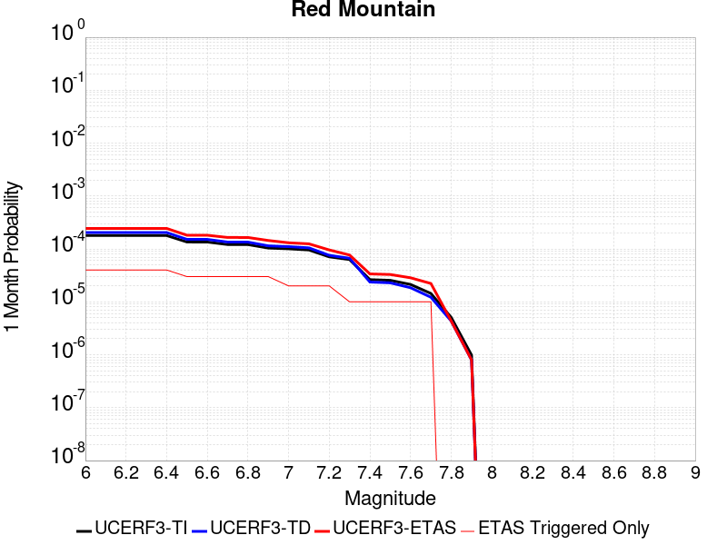 |  | 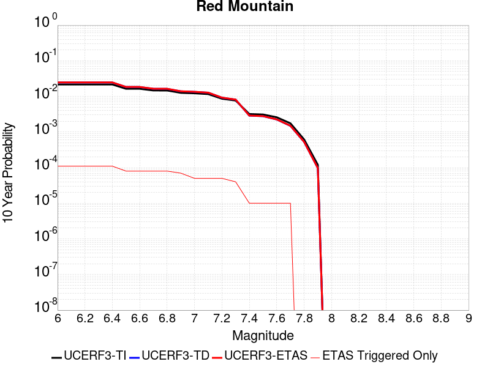 |

| Magnitude | 1 wk TI Prob | 1 wk TD Prob | 1 wk ETAS Prob | 1 wk ETAS/TD Gain | 1 wk ETAS Triggered Only | 1 mo TI Prob | 1 mo TD Prob | 1 mo ETAS Prob | 1 mo ETAS/TD Gain | 1 mo ETAS Triggered Only | 1 yr TI Prob | 1 yr TD Prob | 1 yr ETAS Prob | 1 yr ETAS/TD Gain | 1 yr ETAS Triggered Only | 10 yr TI Prob | 10 yr TD Prob | 10 yr ETAS Prob | 10 yr ETAS/TD Gain | 10 yr ETAS Triggered Only |
|-----|-----|-----|-----|-----|-----|-----|-----|-----|-----|-----|-----|-----|-----|-----|-----|-----|-----|-----|-----|-----|
| 6.0 | 4.1810763E-5 | 4.7590016E-5 | 8.758811E-5 | 1.8404725 | 4.0E-5 | 1.7917668E-4 | 2.039422E-4 | 2.4393405E-4 | 1.196094 | 4.0E-5 | 0.0021792934 | 0.0024803334 | 0.0025501598 | 1.028152 | 7.0E-5 | 0.021580452 | 0.02454411 | 0.02465141 | 1.0043718 | 1.1E-4 |
| 6.1 | 4.1810763E-5 | 4.7590016E-5 | 8.758811E-5 | 1.8404725 | 4.0E-5 | 1.7917668E-4 | 2.039422E-4 | 2.4393405E-4 | 1.196094 | 4.0E-5 | 0.0021792934 | 0.0024803334 | 0.0025501598 | 1.028152 | 7.0E-5 | 0.021580452 | 0.02454411 | 0.02465141 | 1.0043718 | 1.1E-4 |
| 6.2 | 4.1810763E-5 | 4.7590016E-5 | 8.758811E-5 | 1.8404725 | 4.0E-5 | 1.7917668E-4 | 2.039422E-4 | 2.4393405E-4 | 1.196094 | 4.0E-5 | 0.0021792934 | 0.0024803334 | 0.0025501598 | 1.028152 | 7.0E-5 | 0.021580452 | 0.02454411 | 0.02465141 | 1.0043718 | 1.1E-4 |
| 6.3 | 4.1810763E-5 | 4.7590016E-5 | 8.758811E-5 | 1.8404725 | 4.0E-5 | 1.7917668E-4 | 2.039422E-4 | 2.4393405E-4 | 1.196094 | 4.0E-5 | 0.0021792934 | 0.0024803334 | 0.0025501598 | 1.028152 | 7.0E-5 | 0.021580452 | 0.02454411 | 0.02465141 | 1.0043718 | 1.1E-4 |
| 6.4 | 4.1810763E-5 | 4.7590016E-5 | 8.758811E-5 | 1.8404725 | 4.0E-5 | 1.7917668E-4 | 2.039422E-4 | 2.4393405E-4 | 1.196094 | 4.0E-5 | 0.0021792934 | 0.0024803334 | 0.0025501598 | 1.028152 | 7.0E-5 | 0.021580452 | 0.02454411 | 0.02465141 | 1.0043718 | 1.1E-4 |
| 6.5 | 3.154503E-5 | 3.5359757E-5 | 6.53587E-5 | 1.8483921 | 3.0E-5 | 1.3518598E-4 | 1.5153353E-4 | 1.8152899E-4 | 1.197946 | 3.0E-5 | 0.0016446467 | 0.0018434518 | 0.0018933596 | 1.027073 | 5.0E-5 | 0.01632528 | 0.018291244 | 0.01836978 | 1.0042937 | 8.0E-5 |
| 6.6 | 3.1535834E-5 | 3.5349138E-5 | 6.534808E-5 | 1.848647 | 3.0E-5 | 1.3514658E-4 | 1.5148803E-4 | 1.8148348E-4 | 1.1980054 | 3.0E-5 | 0.0016441676 | 0.0018428987 | 0.0018928065 | 1.0270811 | 5.0E-5 | 0.01632056 | 0.018285805 | 0.018364342 | 1.004295 | 8.0E-5 |
| 6.7 | 2.8267326E-5 | 3.1469353E-5 | 6.146841E-5 | 1.9532784 | 3.0E-5 | 1.2114006E-4 | 1.3486217E-4 | 1.6485812E-4 | 1.2224194 | 3.0E-5 | 0.0014738824 | 0.0016407954 | 0.0016907133 | 1.030423 | 5.0E-5 | 0.014641452 | 0.01629557 | 0.016374268 | 1.0048293 | 8.0E-5 |
| 6.8 | 2.8212884E-5 | 3.1407242E-5 | 6.1406296E-5 | 1.9551637 | 3.0E-5 | 1.20906756E-4 | 1.3459599E-4 | 1.6459195E-4 | 1.2228593 | 3.0E-5 | 0.0014710457 | 0.0016375595 | 0.0016874777 | 1.0304832 | 5.0E-5 | 0.014613459 | 0.016263688 | 0.016342387 | 1.004839 | 8.0E-5 |
| 6.9 | 2.4227871E-5 | 2.6706994E-5 | 5.6706194E-5 | 2.1232712 | 3.0E-5 | 1.03829596E-4 | 1.1445395E-4 | 1.4445052E-4 | 1.2620841 | 3.0E-5 | 0.0012633923 | 0.0013926621 | 0.0014425924 | 1.0358524 | 5.0E-5 | 0.012562336 | 0.0138470335 | 0.013916064 | 1.0049852 | 7.0E-5 |
| 7.0 | 2.348524E-5 | 2.5835778E-5 | 4.5835262E-5 | 1.7741003 | 2.0E-5 | 1.0064714E-4 | 1.10720495E-4 | 1.3071828E-4 | 1.1806151 | 2.0E-5 | 0.0012246901 | 0.001347264 | 0.0013872101 | 1.0296499 | 4.0E-5 | 0.012179627 | 0.013398598 | 0.013447927 | 1.0036818 | 5.0E-5 |
| 7.1 | 2.2311642E-5 | 2.4462845E-5 | 4.4462355E-5 | 1.8175464 | 2.0E-5 | 9.561782E-5 | 1.04836974E-4 | 1.2483487E-4 | 1.1907524 | 2.0E-5 | 0.0011635252 | 0.0012757176 | 0.0013156666 | 1.0313148 | 4.0E-5 | 0.01157452 | 0.01269146 | 0.012740825 | 1.0038897 | 5.0E-5 |
| 7.2 | 1.6533986E-5 | 1.7670362E-5 | 3.7670008E-5 | 2.1318188 | 2.0E-5 | 7.085802E-5 | 7.572828E-5 | 9.572677E-5 | 1.2640821 | 2.0E-5 | 8.623549E-4 | 9.2166534E-4 | 9.6162845E-4 | 1.0433598 | 4.0E-5 | 0.008590161 | 0.009184707 | 0.009234248 | 1.0053939 | 5.0E-5 |
| 7.3 | 1.4703092E-5 | 1.5559537E-5 | 2.555938E-5 | 1.6426827 | 1.0E-5 | 6.301173E-5 | 6.668237E-5 | 7.66817E-5 | 1.1499547 | 1.0E-5 | 7.668978E-4 | 8.1161706E-4 | 8.4159273E-4 | 1.0369333 | 3.0E-5 | 0.0076425658 | 0.008092604 | 0.00813228 | 1.0049028 | 4.0E-5 |
| 7.4 | 6.1331984E-6 | 5.5288874E-6 | 1.5528833E-5 | 2.8086722 | 1.0E-5 | 2.6284872E-5 | 2.3695018E-5 | 3.369478E-5 | 1.4220196 | 1.0E-5 | 3.199713E-4 | 2.884492E-4 | 2.984463E-4 | 1.0346582 | 1.0E-5 | 0.0031951098 | 0.0028808024 | 0.0028907736 | 1.0034612 | 1.0E-5 |
| 7.5 | 5.954766E-6 | 5.338517E-6 | 1.5338464E-5 | 2.8731694 | 1.0E-5 | 2.5520176E-5 | 2.2879161E-5 | 3.2878932E-5 | 1.4370689 | 1.0E-5 | 3.1066386E-4 | 2.785187E-4 | 2.885159E-4 | 1.0358943 | 1.0E-5 | 0.003102299 | 0.0027817504 | 0.0027917225 | 1.0035849 | 1.0E-5 |
| 7.6 | 4.9726646E-6 | 4.315309E-6 | 1.4315266E-5 | 3.317321 | 1.0E-5 | 2.1311245E-5 | 1.8494053E-5 | 2.8493867E-5 | 1.5407044 | 1.0E-5 | 2.5943352E-4 | 2.2514217E-4 | 2.3513992E-4 | 1.0444064 | 1.0E-5 | 0.0025913084 | 0.0022491754 | 0.002259153 | 1.004436 | 1.0E-5 |
| 7.7 | 3.3613894E-6 | 2.8526886E-6 | 1.285266E-5 | 4.505455 | 1.0E-5 | 1.4405875E-5 | 1.22257525E-5 | 2.2225631E-5 | 1.8179356 | 1.0E-5 | 1.7537741E-4 | 1.4883863E-4 | 1.5883715E-4 | 1.0671768 | 1.0E-5 | 0.0017523908 | 0.0014874157 | 0.0014974009 | 1.006713 | 1.0E-5 |
| 7.8 | 1.1828961E-6 | 1.0122935E-6 | 1.0122935E-6 | 1.0 | 0.0 | 5.069545E-6 | 4.338394E-6 | 4.338394E-6 | 1.0 | 0.0 | 6.171996E-5 | 5.281869E-5 | 5.281869E-5 | 1.0 | 0.0 | 6.170282E-4 | 5.280643E-4 | 5.280643E-4 | 1.0 | 0.0 |
| 7.9 | 2.2967266E-7 | 1.861919E-7 | 1.861919E-7 | 1.0 | 0.0 | 9.843111E-7 | 7.97965E-7 | 7.97965E-7 | 1.0 | 0.0 | 1.19839215E-5 | 9.715184E-6 | 9.715184E-6 | 1.0 | 0.0 | 1.1983275E-4 | 9.714788E-5 | 9.714788E-5 | 1.0 | 0.0 |

## Lost Hills
*[(top)](#table-of-contents)*

| 1 Week | 1 Month | 1 Year | 10 Year |
|-----|-----|-----|-----|
|  |  |  |  |

| Magnitude | 1 wk TI Prob | 1 wk TD Prob | 1 wk ETAS Prob | 1 wk ETAS/TD Gain | 1 wk ETAS Triggered Only | 1 mo TI Prob | 1 mo TD Prob | 1 mo ETAS Prob | 1 mo ETAS/TD Gain | 1 mo ETAS Triggered Only | 1 yr TI Prob | 1 yr TD Prob | 1 yr ETAS Prob | 1 yr ETAS/TD Gain | 1 yr ETAS Triggered Only | 10 yr TI Prob | 10 yr TD Prob | 10 yr ETAS Prob | 10 yr ETAS/TD Gain | 10 yr ETAS Triggered Only |
|-----|-----|-----|-----|-----|-----|-----|-----|-----|-----|-----|-----|-----|-----|-----|-----|-----|-----|-----|-----|-----|
| 6.0 | 2.233523E-5 | 2.5106583E-5 | 7.510533E-5 | 2.9914596 | 5.0E-5 | 9.571891E-5 | 1.0759615E-4 | 1.675897E-4 | 1.5575808 | 6.0E-5 | 0.0011647546 | 0.001309364 | 0.0013892592 | 1.0610183 | 8.0E-5 | 0.011586686 | 0.013033091 | 0.013151527 | 1.0090873 | 1.2E-4 |
| 6.1 | 2.233523E-5 | 2.5106583E-5 | 7.510533E-5 | 2.9914596 | 5.0E-5 | 9.571891E-5 | 1.0759615E-4 | 1.675897E-4 | 1.5575808 | 6.0E-5 | 0.0011647546 | 0.001309364 | 0.0013892592 | 1.0610183 | 8.0E-5 | 0.011586686 | 0.013033091 | 0.013151527 | 1.0090873 | 1.2E-4 |
| 6.2 | 2.233523E-5 | 2.5106583E-5 | 7.510533E-5 | 2.9914596 | 5.0E-5 | 9.571891E-5 | 1.0759615E-4 | 1.675897E-4 | 1.5575808 | 6.0E-5 | 0.0011647546 | 0.001309364 | 0.0013892592 | 1.0610183 | 8.0E-5 | 0.011586686 | 0.013033091 | 0.013151527 | 1.0090873 | 1.2E-4 |
| 6.3 | 2.233523E-5 | 2.5106583E-5 | 7.510533E-5 | 2.9914596 | 5.0E-5 | 9.571891E-5 | 1.0759615E-4 | 1.675897E-4 | 1.5575808 | 6.0E-5 | 0.0011647546 | 0.001309364 | 0.0013892592 | 1.0610183 | 8.0E-5 | 0.011586686 | 0.013033091 | 0.013151527 | 1.0090873 | 1.2E-4 |
| 6.4 | 1.2288092E-5 | 1.3781108E-5 | 3.378083E-5 | 2.4512422 | 2.0E-5 | 5.2662188E-5 | 5.906108E-5 | 8.905931E-5 | 1.5079187 | 3.0E-5 | 6.409735E-4 | 7.189252E-4 | 7.5889647E-4 | 1.0555986 | 4.0E-5 | 0.006391279 | 0.0071752006 | 0.007224842 | 1.0069184 | 5.0E-5 |
| 6.5 | 1.2288092E-5 | 1.3781108E-5 | 3.378083E-5 | 2.4512422 | 2.0E-5 | 5.2662188E-5 | 5.906108E-5 | 8.905931E-5 | 1.5079187 | 3.0E-5 | 6.409735E-4 | 7.189252E-4 | 7.5889647E-4 | 1.0555986 | 4.0E-5 | 0.006391279 | 0.0071752006 | 0.007224842 | 1.0069184 | 5.0E-5 |
| 6.6 | 8.58281E-6 | 9.63377E-6 | 2.9633577E-5 | 3.0760105 | 2.0E-5 | 3.6782953E-5 | 4.12874E-5 | 7.1286166E-5 | 1.726584 | 3.0E-5 | 4.4774043E-4 | 5.026414E-4 | 5.4262124E-4 | 1.0795397 | 4.0E-5 | 0.0044683935 | 0.005023205 | 0.0050630043 | 1.007923 | 4.0E-5 |
| 6.7 | 7.205685E-6 | 8.088302E-6 | 2.808814E-5 | 3.472687 | 2.0E-5 | 3.088114E-5 | 3.466415E-5 | 6.466311E-5 | 1.8654175 | 3.0E-5 | 3.7591302E-4 | 4.2203604E-4 | 4.6201915E-4 | 1.0947386 | 4.0E-5 | 0.0037527776 | 0.0042203604 | 0.0042601917 | 1.0094379 | 4.0E-5 |

## Imperial
*[(top)](#table-of-contents)*

| 1 Week | 1 Month | 1 Year | 10 Year |
|-----|-----|-----|-----|
|  |  |  |  |

| Magnitude | 1 wk TI Prob | 1 wk TD Prob | 1 wk ETAS Prob | 1 wk ETAS/TD Gain | 1 wk ETAS Triggered Only | 1 mo TI Prob | 1 mo TD Prob | 1 mo ETAS Prob | 1 mo ETAS/TD Gain | 1 mo ETAS Triggered Only | 1 yr TI Prob | 1 yr TD Prob | 1 yr ETAS Prob | 1 yr ETAS/TD Gain | 1 yr ETAS Triggered Only | 10 yr TI Prob | 10 yr TD Prob | 10 yr ETAS Prob | 10 yr ETAS/TD Gain | 10 yr ETAS Triggered Only |
|-----|-----|-----|-----|-----|-----|-----|-----|-----|-----|-----|-----|-----|-----|-----|-----|-----|-----|-----|-----|-----|
| 6.0 | 2.7496446E-4 | 5.055345E-4 | 5.355194E-4 | 1.0593132 | 3.0E-5 | 0.0011778869 | 0.002164817 | 0.0022047304 | 1.0184373 | 4.0E-5 | 0.0142467655 | 0.026048409 | 0.026145805 | 1.003739 | 1.0E-4 | 0.13367249 | 0.22807029 | 0.22816291 | 1.0004061 | 1.2E-4 |
| 6.1 | 2.5356023E-4 | 4.8657708E-4 | 5.165625E-4 | 1.0616252 | 3.0E-5 | 0.001086234 | 0.002083702 | 0.0021236187 | 1.0191566 | 4.0E-5 | 0.013144928 | 0.02507094 | 0.025168432 | 1.0038887 | 1.0E-4 | 0.123940155 | 0.21949561 | 0.21958928 | 1.0004267 | 1.2E-4 |
| 6.2 | 2.4820742E-4 | 4.775311E-4 | 5.075168E-4 | 1.0627931 | 3.0E-5 | 0.0010633124 | 0.0020449946 | 0.0020849127 | 1.0195199 | 4.0E-5 | 0.01286919 | 0.024610676 | 0.024708215 | 1.0039632 | 1.0E-4 | 0.12148927 | 0.21600136 | 0.21609545 | 1.0004356 | 1.2E-4 |
| 6.3 | 2.3205351E-4 | 4.5892023E-4 | 4.8890646E-4 | 1.0653409 | 3.0E-5 | 9.94136E-4 | 0.0019653554 | 0.0020052767 | 1.0203125 | 4.0E-5 | 0.012036599 | 0.023661187 | 0.02375882 | 1.0041263 | 1.0E-4 | 0.11405133 | 0.20793827 | 0.20803332 | 1.000457 | 1.2E-4 |
| 6.4 | 2.0304754E-4 | 3.9878016E-4 | 4.287682E-4 | 1.0751994 | 3.0E-5 | 8.6991355E-4 | 0.0017079529 | 0.0017478847 | 1.0233798 | 4.0E-5 | 0.010539869 | 0.020595418 | 0.020693358 | 1.0047555 | 1.0E-4 | 0.100537635 | 0.18507113 | 0.1851689 | 1.0005285 | 1.2E-4 |
| 6.5 | 1.854992E-4 | 3.6990462E-4 | 3.9989353E-4 | 1.081072 | 3.0E-5 | 7.9475436E-4 | 0.0015843548 | 0.0016242914 | 1.0252069 | 4.0E-5 | 0.009633281 | 0.01911443 | 0.019212518 | 1.0051316 | 1.0E-4 | 0.0922623 | 0.1733039 | 0.1734031 | 1.0005724 | 1.2E-4 |
| 6.6 | 1.6586106E-4 | 3.4036173E-4 | 3.7035154E-4 | 1.0881115 | 3.0E-5 | 7.106394E-4 | 0.0014578878 | 0.0014978296 | 1.0273969 | 4.0E-5 | 0.008617763 | 0.017607626 | 0.017705863 | 1.0055794 | 1.0E-4 | 0.08291132 | 0.16078055 | 0.16088125 | 1.0006263 | 1.2E-4 |
| 6.7 | 1.4224656E-4 | 3.076812E-4 | 3.3767198E-4 | 1.0974735 | 3.0E-5 | 6.094856E-4 | 0.0013179756 | 0.0013579228 | 1.0303096 | 4.0E-5 | 0.0073952693 | 0.015928522 | 0.016026929 | 1.006178 | 1.0E-4 | 0.07153955 | 0.14648798 | 0.1465904 | 1.0006992 | 1.2E-4 |
| 6.8 | 1.2317259E-4 | 2.779231E-4 | 3.0791477E-4 | 1.1079135 | 3.0E-5 | 5.2777573E-4 | 0.0011905615 | 0.0012305138 | 1.0335577 | 4.0E-5 | 0.0064067547 | 0.014400131 | 0.014488835 | 1.0061599 | 9.0E-5 | 0.06225166 | 0.13294089 | 0.13303626 | 1.0007174 | 1.1E-4 |
| 6.9 | 9.859898E-5 | 2.5015484E-4 | 2.8014733E-4 | 1.1198957 | 3.0E-5 | 4.2249862E-4 | 0.0010716559 | 0.001111613 | 1.0372854 | 4.0E-5 | 0.0051317946 | 0.012970319 | 0.013059151 | 1.0068489 | 9.0E-5 | 0.05014893 | 0.119408876 | 0.11950574 | 1.0008112 | 1.1E-4 |
| 7.0 | 7.3191884E-5 | 2.1267848E-4 | 2.426721E-4 | 1.141028 | 3.0E-5 | 3.136418E-4 | 9.11164E-4 | 9.5112756E-4 | 1.0438598 | 4.0E-5 | 0.003811904 | 0.011037681 | 0.011126688 | 1.0080639 | 9.0E-5 | 0.037471764 | 0.10206756 | 0.10216633 | 1.0009677 | 1.1E-4 |
| 7.1 | 7.1760296E-5 | 2.0969207E-4 | 2.3968577E-4 | 1.143037 | 3.0E-5 | 3.0750787E-4 | 8.9837395E-4 | 9.3833805E-4 | 1.0444849 | 4.0E-5 | 0.003737482 | 0.010883528 | 0.010972548 | 1.0081794 | 9.0E-5 | 0.03675245 | 0.10070406 | 0.10080299 | 1.0009823 | 1.1E-4 |
| 7.2 | 6.46614E-5 | 1.9137723E-4 | 2.2137149E-4 | 1.1567285 | 3.0E-5 | 2.7709085E-4 | 8.199333E-4 | 8.5990055E-4 | 1.0487444 | 4.0E-5 | 0.0033683628 | 0.009937617 | 0.010026723 | 1.0089664 | 9.0E-5 | 0.033177625 | 0.092511006 | 0.09261083 | 1.0010791 | 1.1E-4 |
| 7.3 | 6.088115E-5 | 1.780939E-4 | 2.0808856E-4 | 1.1684204 | 3.0E-5 | 2.6089314E-4 | 7.6303916E-4 | 8.030087E-4 | 1.052382 | 4.0E-5 | 0.0031717476 | 0.009251006 | 0.009340174 | 1.0096387 | 9.0E-5 | 0.031268585 | 0.08656135 | 0.08666183 | 1.0011607 | 1.1E-4 |
| 7.4 | 4.199346E-5 | 1.1511097E-4 | 1.4510751E-4 | 1.260588 | 3.0E-5 | 1.7995955E-4 | 4.932403E-4 | 5.332206E-4 | 1.0810564 | 4.0E-5 | 0.0021888057 | 0.005988835 | 0.006068356 | 1.0132782 | 8.0E-5 | 0.02167372 | 0.05744024 | 0.057534497 | 1.0016409 | 1.0E-4 |
| 7.5 | 3.130448E-5 | 8.333871E-5 | 1.0333704E-4 | 1.2399645 | 2.0E-5 | 1.3415517E-4 | 3.5711733E-4 | 3.8710661E-4 | 1.083976 | 3.0E-5 | 0.0016321153 | 0.0043392954 | 0.0043890784 | 1.0114726 | 5.0E-5 | 0.016201803 | 0.042133506 | 0.042190976 | 1.001364 | 6.0E-5 |
| 7.6 | 2.3074248E-5 | 6.0849357E-5 | 7.084875E-5 | 1.1643302 | 1.0E-5 | 9.888588E-5 | 2.6075702E-4 | 2.8075182E-4 | 1.0766797 | 2.0E-5 | 0.0012032706 | 0.0031701182 | 0.0032099916 | 1.0125778 | 4.0E-5 | 0.011967761 | 0.03102816 | 0.03107661 | 1.0015614 | 5.0E-5 |
| 7.7 | 1.45864815E-5 | 4.0128452E-5 | 5.0128052E-5 | 1.2491897 | 1.0E-5 | 6.2511994E-5 | 1.7196777E-4 | 1.9196433E-4 | 1.1162809 | 2.0E-5 | 7.608177E-4 | 0.0020917025 | 0.00212164 | 1.0143124 | 3.0E-5 | 0.007582182 | 0.02062909 | 0.020668264 | 1.001899 | 4.0E-5 |
| 7.8 | 1.0352979E-5 | 3.096395E-5 | 4.096364E-5 | 1.3229462 | 1.0E-5 | 4.4369157E-5 | 1.326959E-4 | 1.5269325E-4 | 1.1507006 | 2.0E-5 | 5.400606E-4 | 0.0016143778 | 0.0016443294 | 1.018553 | 3.0E-5 | 0.0053875 | 0.016017893 | 0.016057253 | 1.0024573 | 4.0E-5 |
| 7.9 | 8.137906E-6 | 2.2151205E-5 | 2.2151205E-5 | 1.0 | 0.0 | 3.4876273E-5 | 9.493029E-5 | 1.0492934E-4 | 1.1053305 | 1.0E-5 | 4.2453592E-4 | 0.0011551644 | 0.0011751413 | 1.0172936 | 2.0E-5 | 0.004237258 | 0.011618842 | 0.011648494 | 1.002552 | 3.0E-5 |
| 8.0 | 6.93792E-6 | 1.8010365E-5 | 1.8010365E-5 | 1.0 | 0.0 | 2.9733603E-5 | 7.7185E-5 | 8.718423E-5 | 1.1295488 | 1.0E-5 | 3.6194647E-4 | 9.3932304E-4 | 9.593042E-4 | 1.021272 | 2.0E-5 | 0.0036135751 | 0.009502415 | 0.009532129 | 1.0031271 | 3.0E-5 |
| 8.1 | 3.4286315E-6 | 6.380179E-6 | 6.380179E-6 | 1.0 | 0.0 | 1.4694053E-5 | 2.734334E-5 | 3.7343067E-5 | 1.3657098 | 1.0E-5 | 1.7888541E-4 | 3.3285443E-4 | 3.5284777E-4 | 1.0600663 | 2.0E-5 | 0.0017874148 | 0.0034863674 | 0.0035162629 | 1.008575 | 3.0E-5 |
| 8.2 | 1.4906886E-6 | 1.936633E-6 | 1.936633E-6 | 1.0 | 0.0 | 6.3886496E-6 | 8.2998295E-6 | 1.8299746E-5 | 2.204834 | 1.0E-5 | 7.7779034E-5 | 1.0104576E-4 | 1.2104375E-4 | 1.1979101 | 2.0E-5 | 7.775182E-4 | 0.0011075423 | 0.0011275201 | 1.018038 | 2.0E-5 |
| 8.3 | 2.5758007E-8 | 1.4495866E-8 | 1.4495866E-8 | 1.0 | 0.0 | 1.10391454E-7 | 6.212514E-8 | 6.212514E-8 | 1.0 | 0.0 | 1.3440151E-6 | 7.563736E-7 | 7.563736E-7 | 1.0 | 0.0 | 1.344007E-5 | 7.884359E-6 | 7.884359E-6 | 1.0 | 0.0 |

## Channel Islands Thrust
*[(top)](#table-of-contents)*

| 1 Week | 1 Month | 1 Year | 10 Year |
|-----|-----|-----|-----|
|  |  |  | 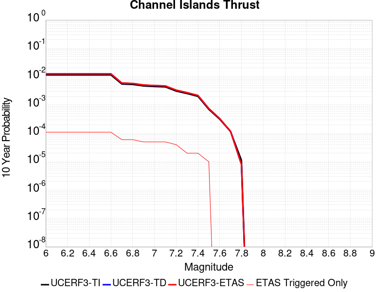 |

| Magnitude | 1 wk TI Prob | 1 wk TD Prob | 1 wk ETAS Prob | 1 wk ETAS/TD Gain | 1 wk ETAS Triggered Only | 1 mo TI Prob | 1 mo TD Prob | 1 mo ETAS Prob | 1 mo ETAS/TD Gain | 1 mo ETAS Triggered Only | 1 yr TI Prob | 1 yr TD Prob | 1 yr ETAS Prob | 1 yr ETAS/TD Gain | 1 yr ETAS Triggered Only | 10 yr TI Prob | 10 yr TD Prob | 10 yr ETAS Prob | 10 yr ETAS/TD Gain | 10 yr ETAS Triggered Only |
|-----|-----|-----|-----|-----|-----|-----|-----|-----|-----|-----|-----|-----|-----|-----|-----|-----|-----|-----|-----|-----|
| 6.0 | 2.2156251E-5 | 2.4092022E-5 | 6.409106E-5 | 2.6602607 | 4.0E-5 | 9.495191E-5 | 1.03248036E-4 | 1.5324287E-4 | 1.4842207 | 5.0E-5 | 0.0011554264 | 0.0012564266 | 0.0013263385 | 1.0556436 | 7.0E-5 | 0.011494373 | 0.0125038205 | 0.012612445 | 1.0086873 | 1.1E-4 |
| 6.1 | 2.2156251E-5 | 2.4092022E-5 | 6.409106E-5 | 2.6602607 | 4.0E-5 | 9.495191E-5 | 1.03248036E-4 | 1.5324287E-4 | 1.4842207 | 5.0E-5 | 0.0011554264 | 0.0012564266 | 0.0013263385 | 1.0556436 | 7.0E-5 | 0.011494373 | 0.0125038205 | 0.012612445 | 1.0086873 | 1.1E-4 |
| 6.2 | 2.2156251E-5 | 2.4092022E-5 | 6.409106E-5 | 2.6602607 | 4.0E-5 | 9.495191E-5 | 1.03248036E-4 | 1.5324287E-4 | 1.4842207 | 5.0E-5 | 0.0011554264 | 0.0012564266 | 0.0013263385 | 1.0556436 | 7.0E-5 | 0.011494373 | 0.0125038205 | 0.012612445 | 1.0086873 | 1.1E-4 |
| 6.3 | 2.2156251E-5 | 2.4092022E-5 | 6.409106E-5 | 2.6602607 | 4.0E-5 | 9.495191E-5 | 1.03248036E-4 | 1.5324287E-4 | 1.4842207 | 5.0E-5 | 0.0011554264 | 0.0012564266 | 0.0013263385 | 1.0556436 | 7.0E-5 | 0.011494373 | 0.0125038205 | 0.012612445 | 1.0086873 | 1.1E-4 |
| 6.4 | 2.2156251E-5 | 2.4092022E-5 | 6.409106E-5 | 2.6602607 | 4.0E-5 | 9.495191E-5 | 1.03248036E-4 | 1.5324287E-4 | 1.4842207 | 5.0E-5 | 0.0011554264 | 0.0012564266 | 0.0013263385 | 1.0556436 | 7.0E-5 | 0.011494373 | 0.0125038205 | 0.012612445 | 1.0086873 | 1.1E-4 |
| 6.5 | 2.2156251E-5 | 2.4092022E-5 | 6.409106E-5 | 2.6602607 | 4.0E-5 | 9.495191E-5 | 1.03248036E-4 | 1.5324287E-4 | 1.4842207 | 5.0E-5 | 0.0011554264 | 0.0012564266 | 0.0013263385 | 1.0556436 | 7.0E-5 | 0.011494373 | 0.0125038205 | 0.012612445 | 1.0086873 | 1.1E-4 |
| 6.6 | 2.2156251E-5 | 2.4092022E-5 | 6.409106E-5 | 2.6602607 | 4.0E-5 | 9.495191E-5 | 1.03248036E-4 | 1.5324287E-4 | 1.4842207 | 5.0E-5 | 0.0011554264 | 0.0012564266 | 0.0013263385 | 1.0556436 | 7.0E-5 | 0.011494373 | 0.0125038205 | 0.012612445 | 1.0086873 | 1.1E-4 |
| 6.7 | 1.0601296E-5 | 1.1379544E-5 | 3.1379317E-5 | 2.7575197 | 2.0E-5 | 4.5433335E-5 | 4.876859E-5 | 7.876712E-5 | 1.61512 | 3.0E-5 | 5.5301044E-4 | 5.936007E-4 | 6.235829E-4 | 1.050509 | 3.0E-5 | 0.005516363 | 0.005920653 | 0.0059802984 | 1.010074 | 6.0E-5 |
| 6.8 | 1.0246747E-5 | 1.0996669E-5 | 3.099645E-5 | 2.8187125 | 2.0E-5 | 4.391389E-5 | 4.7127756E-5 | 7.7126344E-5 | 1.6365376 | 3.0E-5 | 5.345204E-4 | 5.7363417E-4 | 6.0361694E-4 | 1.0522681 | 3.0E-5 | 0.0053323656 | 0.005722025 | 0.0057816817 | 1.0104258 | 6.0E-5 |
| 6.9 | 9.049551E-6 | 9.699645E-6 | 2.9699451E-5 | 3.0619113 | 2.0E-5 | 3.878322E-5 | 4.1569267E-5 | 6.156843E-5 | 1.4811047 | 2.0E-5 | 4.7208337E-4 | 5.059924E-4 | 5.259823E-4 | 1.0395063 | 2.0E-5 | 0.0047108172 | 0.0050488203 | 0.005098568 | 1.0098534 | 5.0E-5 |
| 7.0 | 8.6542195E-6 | 9.274603E-6 | 2.9274417E-5 | 3.1564064 | 2.0E-5 | 3.7088983E-5 | 3.9747716E-5 | 5.9746922E-5 | 1.5031536 | 2.0E-5 | 4.5146482E-4 | 4.8382508E-4 | 5.038154E-4 | 1.0413172 | 2.0E-5 | 0.004505487 | 0.0048281294 | 0.0048778877 | 1.010306 | 5.0E-5 |
| 7.1 | 8.391028E-6 | 8.992925E-6 | 2.8992745E-5 | 3.2239504 | 2.0E-5 | 3.5961057E-5 | 3.8540562E-5 | 5.853979E-5 | 1.5189139 | 2.0E-5 | 4.3773788E-4 | 4.6913436E-4 | 4.8912497E-4 | 1.0426117 | 2.0E-5 | 0.004368766 | 0.0046818503 | 0.0047316165 | 1.0106295 | 5.0E-5 |
| 7.2 | 5.965188E-6 | 6.3716957E-6 | 2.6371568E-5 | 4.138862 | 2.0E-5 | 2.556484E-5 | 2.7306984E-5 | 4.730644E-5 | 1.7323934 | 2.0E-5 | 3.1120746E-4 | 3.3241237E-4 | 3.524057E-4 | 1.0601462 | 2.0E-5 | 0.00310772 | 0.0033192094 | 0.0033590766 | 1.012011 | 4.0E-5 |
| 7.3 | 4.877518E-6 | 5.206007E-6 | 1.5205955E-5 | 2.9208481 | 1.0E-5 | 2.0903482E-5 | 2.231127E-5 | 3.2311047E-5 | 1.448194 | 1.0E-5 | 2.5447016E-4 | 2.716063E-4 | 2.8160357E-4 | 1.036808 | 1.0E-5 | 0.0025417898 | 0.0027127897 | 0.0027327354 | 1.0073525 | 2.0E-5 |
| 7.4 | 3.8829853E-6 | 4.141863E-6 | 1.4141821E-5 | 3.4143624 | 1.0E-5 | 1.664126E-5 | 1.7750723E-5 | 2.7750546E-5 | 1.5633473 | 1.0E-5 | 2.0258849E-4 | 2.1609403E-4 | 2.2609187E-4 | 1.0462662 | 1.0E-5 | 0.002024039 | 0.002158881 | 0.0021788375 | 1.0092441 | 2.0E-5 |
| 7.5 | 1.3489616E-6 | 1.4277905E-6 | 1.1427776E-5 | 8.0038185 | 1.0E-5 | 5.7812517E-6 | 6.119088E-6 | 1.6119027E-5 | 2.6342204 | 1.0E-5 | 7.038446E-5 | 7.449739E-5 | 8.449665E-5 | 1.1342229 | 1.0E-5 | 7.036218E-4 | 7.4472814E-4 | 7.547207E-4 | 1.0134177 | 1.0E-5 |
| 7.6 | 6.058192E-7 | 6.35378E-7 | 6.35378E-7 | 1.0 | 0.0 | 2.5963652E-6 | 2.7230458E-6 | 2.7230458E-6 | 1.0 | 0.0 | 3.161029E-5 | 3.3152595E-5 | 3.3152595E-5 | 1.0 | 0.0 | 3.1605794E-4 | 3.314781E-4 | 3.314781E-4 | 1.0 | 0.0 |
| 7.7 | 2.2170494E-7 | 2.2607924E-7 | 2.2607924E-7 | 1.0 | 0.0 | 9.5016367E-7 | 9.689107E-7 | 9.689107E-7 | 1.0 | 0.0 | 1.1568181E-5 | 1.17964355E-5 | 1.17964355E-5 | 1.0 | 0.0 | 1.1567579E-4 | 1.179592E-4 | 1.179592E-4 | 1.0 | 0.0 |
| 7.8 | 2.1613102E-8 | 1.5466837E-8 | 1.5466837E-8 | 1.0 | 0.0 | 9.262757E-8 | 6.628645E-8 | 6.628645E-8 | 1.0 | 0.0 | 1.1277401E-6 | 8.070372E-7 | 8.070372E-7 | 1.0 | 0.0 | 1.1277344E-5 | 8.07035E-6 | 8.07035E-6 | 1.0 | 0.0 |

## Santa Cruz Island
*[(top)](#table-of-contents)*

| 1 Week | 1 Month | 1 Year | 10 Year |
|-----|-----|-----|-----|
|  |  |  | 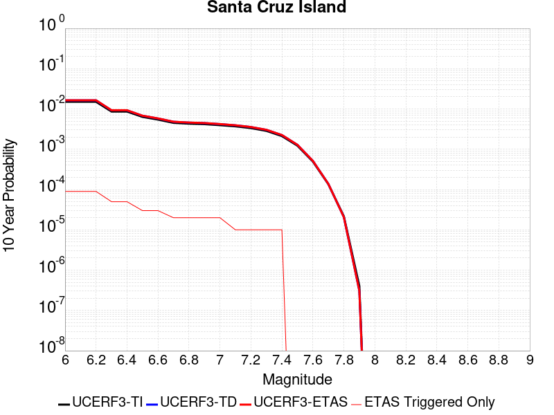 |

| Magnitude | 1 wk TI Prob | 1 wk TD Prob | 1 wk ETAS Prob | 1 wk ETAS/TD Gain | 1 wk ETAS Triggered Only | 1 mo TI Prob | 1 mo TD Prob | 1 mo ETAS Prob | 1 mo ETAS/TD Gain | 1 mo ETAS Triggered Only | 1 yr TI Prob | 1 yr TD Prob | 1 yr ETAS Prob | 1 yr ETAS/TD Gain | 1 yr ETAS Triggered Only | 10 yr TI Prob | 10 yr TD Prob | 10 yr ETAS Prob | 10 yr ETAS/TD Gain | 10 yr ETAS Triggered Only |
|-----|-----|-----|-----|-----|-----|-----|-----|-----|-----|-----|-----|-----|-----|-----|-----|-----|-----|-----|-----|-----|
| 6.0 | 2.9164563E-5 | 3.1599742E-5 | 5.1599112E-5 | 1.6328965 | 2.0E-5 | 1.2498499E-4 | 1.3542121E-4 | 1.6541715E-4 | 1.221501 | 3.0E-5 | 0.0015206301 | 0.0016476426 | 0.0016875766 | 1.0242372 | 4.0E-5 | 0.015102667 | 0.016368 | 0.016456526 | 1.0054085 | 9.0E-5 |
| 6.1 | 2.9164563E-5 | 3.1599742E-5 | 5.1599112E-5 | 1.6328965 | 2.0E-5 | 1.2498499E-4 | 1.3542121E-4 | 1.6541715E-4 | 1.221501 | 3.0E-5 | 0.0015206301 | 0.0016476426 | 0.0016875766 | 1.0242372 | 4.0E-5 | 0.015102667 | 0.016368 | 0.016456526 | 1.0054085 | 9.0E-5 |
| 6.2 | 2.9164563E-5 | 3.1599742E-5 | 5.1599112E-5 | 1.6328965 | 2.0E-5 | 1.2498499E-4 | 1.3542121E-4 | 1.6541715E-4 | 1.221501 | 3.0E-5 | 0.0015206301 | 0.0016476426 | 0.0016875766 | 1.0242372 | 4.0E-5 | 0.015102667 | 0.016368 | 0.016456526 | 1.0054085 | 9.0E-5 |
| 6.3 | 1.6635553E-5 | 1.780436E-5 | 2.780418E-5 | 1.5616502 | 1.0E-5 | 7.1293274E-5 | 7.630227E-5 | 9.630074E-5 | 1.2620955 | 2.0E-5 | 8.6765E-4 | 9.286024E-4 | 9.585745E-4 | 1.0322766 | 3.0E-5 | 0.008642701 | 0.009249094 | 0.009298631 | 1.005356 | 5.0E-5 |
| 6.4 | 1.6635553E-5 | 1.780436E-5 | 2.780418E-5 | 1.5616502 | 1.0E-5 | 7.1293274E-5 | 7.630227E-5 | 9.630074E-5 | 1.2620955 | 2.0E-5 | 8.6765E-4 | 9.286024E-4 | 9.585745E-4 | 1.0322766 | 3.0E-5 | 0.008642701 | 0.009249094 | 0.009298631 | 1.005356 | 5.0E-5 |
| 6.5 | 1.2238748E-5 | 1.3042996E-5 | 1.3042996E-5 | 1.0 | 0.0 | 5.2450723E-5 | 5.5897377E-5 | 6.589682E-5 | 1.1788893 | 1.0E-5 | 6.3840044E-4 | 6.8034173E-4 | 6.9033494E-4 | 1.0146885 | 1.0E-5 | 0.0063656955 | 0.006782988 | 0.0068127844 | 1.0043929 | 3.0E-5 |
| 6.6 | 1.0489767E-5 | 1.1156636E-5 | 1.1156636E-5 | 1.0 | 0.0 | 4.495537E-5 | 4.781329E-5 | 5.7812813E-5 | 1.2091368 | 1.0E-5 | 5.4719415E-4 | 5.819736E-4 | 5.919677E-4 | 1.0171729 | 1.0E-5 | 0.005458487 | 0.005804736 | 0.005834562 | 1.0051382 | 3.0E-5 |
| 6.7 | 8.699222E-6 | 9.236783E-6 | 9.236783E-6 | 1.0 | 0.0 | 3.7281847E-5 | 3.958561E-5 | 3.958561E-5 | 1.0 | 0.0 | 4.5381195E-4 | 4.818488E-4 | 4.818488E-4 | 1.0 | 0.0 | 0.0045288634 | 0.004808108 | 0.004828012 | 1.0041397 | 2.0E-5 |
| 6.8 | 8.307732E-6 | 8.8169045E-6 | 8.8169045E-6 | 1.0 | 0.0 | 3.560408E-5 | 3.7786187E-5 | 3.7786187E-5 | 1.0 | 0.0 | 4.3339343E-4 | 4.5995016E-4 | 4.5995016E-4 | 1.0 | 0.0 | 0.004325492 | 0.0045900354 | 0.004609944 | 1.0043373 | 2.0E-5 |
| 6.9 | 8.073121E-6 | 8.564939E-6 | 8.564939E-6 | 1.0 | 0.0 | 3.459863E-5 | 3.670637E-5 | 3.670637E-5 | 1.0 | 0.0 | 4.2115687E-4 | 4.4680882E-4 | 4.4680882E-4 | 1.0 | 0.0 | 0.004203596 | 0.004459156 | 0.004479067 | 1.0044651 | 2.0E-5 |
| 7.0 | 7.617019E-6 | 8.074665E-6 | 8.074665E-6 | 1.0 | 0.0 | 3.264396E-5 | 3.4605247E-5 | 3.4605247E-5 | 1.0 | 0.0 | 3.9736772E-4 | 4.2123784E-4 | 4.2123784E-4 | 1.0 | 0.0 | 0.003966579 | 0.0042044413 | 0.004224357 | 1.0047369 | 2.0E-5 |
| 7.1 | 7.1224836E-6 | 7.5457883E-6 | 7.5457883E-6 | 1.0 | 0.0 | 3.052457E-5 | 3.2338692E-5 | 3.2338692E-5 | 1.0 | 0.0 | 3.715733E-4 | 3.9365282E-4 | 3.9365282E-4 | 1.0 | 0.0 | 0.003709526 | 0.0039295983 | 0.0039395588 | 1.0025347 | 1.0E-5 |
| 7.2 | 6.441115E-6 | 6.8273835E-6 | 6.8273835E-6 | 1.0 | 0.0 | 2.7604487E-5 | 2.9259889E-5 | 2.9259889E-5 | 1.0 | 0.0 | 3.360328E-4 | 3.5618115E-4 | 3.5618115E-4 | 1.0 | 0.0 | 0.0033552512 | 0.0035561312 | 0.0035660956 | 1.002802 | 1.0E-5 |
| 7.3 | 5.494274E-6 | 5.8199944E-6 | 5.8199944E-6 | 1.0 | 0.0 | 2.3546674E-5 | 2.4942596E-5 | 2.4942596E-5 | 1.0 | 0.0 | 2.8664304E-4 | 3.03634E-4 | 3.03634E-4 | 1.0 | 0.0 | 0.002862736 | 0.0030322145 | 0.0030421843 | 1.0032879 | 1.0E-5 |
| 7.4 | 4.0802624E-6 | 4.3122564E-6 | 4.3122564E-6 | 1.0 | 0.0 | 1.7486722E-5 | 1.8480969E-5 | 1.8480969E-5 | 1.0 | 0.0 | 2.1288003E-4 | 2.2498264E-4 | 2.2498264E-4 | 1.0 | 0.0 | 0.0021267622 | 0.0022475577 | 0.0022575352 | 1.0044392 | 1.0E-5 |
| 7.5 | 2.3584746E-6 | 2.4753099E-6 | 2.4753099E-6 | 1.0 | 0.0 | 1.0107709E-5 | 1.0608428E-5 | 1.0608428E-5 | 1.0 | 0.0 | 1.2305441E-4 | 1.2915001E-4 | 1.2915001E-4 | 1.0 | 0.0 | 0.0012298629 | 0.0012907545 | 0.0012907545 | 1.0 | 0.0 |
| 7.6 | 9.4981914E-7 | 9.860934E-7 | 9.860934E-7 | 1.0 | 0.0 | 4.0706473E-6 | 4.2261076E-6 | 4.2261076E-6 | 1.0 | 0.0 | 4.9559E-5 | 5.1451658E-5 | 5.1451658E-5 | 1.0 | 0.0 | 4.954795E-4 | 5.1439874E-4 | 5.1439874E-4 | 1.0 | 0.0 |
| 7.7 | 2.6013532E-7 | 2.6416632E-7 | 2.6416632E-7 | 1.0 | 0.0 | 1.1148652E-6 | 1.1321408E-6 | 1.1321408E-6 | 1.0 | 0.0 | 1.3573399E-5 | 1.3783729E-5 | 1.3783729E-5 | 1.0 | 0.0 | 1.357257E-4 | 1.378288E-4 | 1.378288E-4 | 1.0 | 0.0 |
| 7.8 | 4.1522263E-8 | 3.965698E-8 | 3.965698E-8 | 1.0 | 0.0 | 1.7795254E-7 | 1.6995848E-7 | 1.6995848E-7 | 1.0 | 0.0 | 2.16657E-6 | 2.0692428E-6 | 2.0692428E-6 | 1.0 | 0.0 | 2.1665488E-5 | 2.0692256E-5 | 2.0692256E-5 | 1.0 | 0.0 |
| 7.9 | 7.7242046E-10 | 5.9475225E-10 | 5.9475225E-10 | 1.0 | 0.0 | 3.3103735E-9 | 2.5489382E-9 | 2.5489382E-9 | 1.0 | 0.0 | 4.0303796E-8 | 3.1033323E-8 | 3.1033323E-8 | 1.0 | 0.0 | 4.030379E-7 | 3.103332E-7 | 3.103332E-7 | 1.0 | 0.0 |

## White Mountains
*[(top)](#table-of-contents)*

| 1 Week | 1 Month | 1 Year | 10 Year |
|-----|-----|-----|-----|
|  |  |  |  |

| Magnitude | 1 wk TI Prob | 1 wk TD Prob | 1 wk ETAS Prob | 1 wk ETAS/TD Gain | 1 wk ETAS Triggered Only | 1 mo TI Prob | 1 mo TD Prob | 1 mo ETAS Prob | 1 mo ETAS/TD Gain | 1 mo ETAS Triggered Only | 1 yr TI Prob | 1 yr TD Prob | 1 yr ETAS Prob | 1 yr ETAS/TD Gain | 1 yr ETAS Triggered Only | 10 yr TI Prob | 10 yr TD Prob | 10 yr ETAS Prob | 10 yr ETAS/TD Gain | 10 yr ETAS Triggered Only |
|-----|-----|-----|-----|-----|-----|-----|-----|-----|-----|-----|-----|-----|-----|-----|-----|-----|-----|-----|-----|-----|
| 6.0 | 3.503579E-5 | 3.3784127E-5 | 5.378345E-5 | 1.591974 | 2.0E-5 | 1.5014476E-4 | 1.4478175E-4 | 1.7477741E-4 | 1.2071785 | 3.0E-5 | 0.0018264796 | 0.0017614134 | 0.0018213077 | 1.0340035 | 6.0E-5 | 0.018115403 | 0.017486857 | 0.017594934 | 1.0061804 | 1.1E-4 |
| 6.1 | 3.503579E-5 | 3.3784127E-5 | 5.378345E-5 | 1.591974 | 2.0E-5 | 1.5014476E-4 | 1.4478175E-4 | 1.7477741E-4 | 1.2071785 | 3.0E-5 | 0.0018264796 | 0.0017614134 | 0.0018213077 | 1.0340035 | 6.0E-5 | 0.018115403 | 0.017486857 | 0.017594934 | 1.0061804 | 1.1E-4 |
| 6.2 | 3.503579E-5 | 3.3784127E-5 | 5.378345E-5 | 1.591974 | 2.0E-5 | 1.5014476E-4 | 1.4478175E-4 | 1.7477741E-4 | 1.2071785 | 3.0E-5 | 0.0018264796 | 0.0017614134 | 0.0018213077 | 1.0340035 | 6.0E-5 | 0.018115403 | 0.017486857 | 0.017594934 | 1.0061804 | 1.1E-4 |
| 6.3 | 1.7818425E-5 | 1.591616E-5 | 2.5916E-5 | 1.6282823 | 1.0E-5 | 7.636245E-5 | 6.821041E-5 | 8.8209046E-5 | 1.2931904 | 2.0E-5 | 9.293162E-4 | 8.301596E-4 | 8.6013466E-4 | 1.0361077 | 3.0E-5 | 0.009254395 | 0.0082720425 | 0.008321629 | 1.0059944 | 5.0E-5 |
| 6.4 | 1.7818425E-5 | 1.591616E-5 | 2.5916E-5 | 1.6282823 | 1.0E-5 | 7.636245E-5 | 6.821041E-5 | 8.8209046E-5 | 1.2931904 | 2.0E-5 | 9.293162E-4 | 8.301596E-4 | 8.6013466E-4 | 1.0361077 | 3.0E-5 | 0.009254395 | 0.0082720425 | 0.008321629 | 1.0059944 | 5.0E-5 |
| 6.5 | 1.3397557E-5 | 1.1336374E-5 | 1.1336374E-5 | 1.0 | 0.0 | 5.741684E-5 | 4.8583595E-5 | 4.8583595E-5 | 1.0 | 0.0 | 6.988258E-4 | 5.913517E-4 | 5.913517E-4 | 1.0 | 0.0 | 0.006966323 | 0.005898487 | 0.0059183687 | 1.0033706 | 2.0E-5 |
| 6.6 | 1.0818695E-5 | 8.625434E-6 | 8.625434E-6 | 1.0 | 0.0 | 4.6365014E-5 | 3.6965648E-5 | 3.6965648E-5 | 1.0 | 0.0 | 5.6434784E-4 | 4.4996818E-4 | 4.4996818E-4 | 1.0 | 0.0 | 0.005629168 | 0.0044910074 | 0.0045109177 | 1.0044334 | 2.0E-5 |
| 6.7 | 9.067908E-6 | 6.802476E-6 | 6.802476E-6 | 1.0 | 0.0 | 3.8861883E-5 | 2.915316E-5 | 2.915316E-5 | 1.0 | 0.0 | 4.7304068E-4 | 3.548851E-4 | 3.548851E-4 | 1.0 | 0.0 | 0.00472035 | 0.003543501 | 0.0035634302 | 1.0056242 | 2.0E-5 |
| 6.8 | 7.295947E-6 | 4.9364285E-6 | 4.9364285E-6 | 1.0 | 0.0 | 3.126797E-5 | 2.1155956E-5 | 2.1155956E-5 | 1.0 | 0.0 | 3.8062103E-4 | 2.5754445E-4 | 2.5754445E-4 | 1.0 | 0.0 | 0.0037996976 | 0.0025725728 | 0.002582547 | 1.0038772 | 1.0E-5 |
| 6.9 | 6.2243444E-6 | 3.8322546E-6 | 3.8322546E-6 | 1.0 | 0.0 | 2.6675489E-5 | 1.6423846E-5 | 1.6423846E-5 | 1.0 | 0.0 | 3.2472567E-4 | 1.9994251E-4 | 1.9994251E-4 | 1.0 | 0.0 | 0.0032425157 | 0.001997679 | 0.002007659 | 1.0049958 | 1.0E-5 |
| 7.0 | 4.9878413E-6 | 2.679564E-6 | 2.679564E-6 | 1.0 | 0.0 | 2.1376287E-5 | 1.1483797E-5 | 1.1483797E-5 | 1.0 | 0.0 | 2.602252E-4 | 1.3980652E-4 | 1.3980652E-4 | 1.0 | 0.0 | 0.002599207 | 0.0013972119 | 0.0014071979 | 1.0071471 | 1.0E-5 |
| 7.1 | 4.0252844E-6 | 1.885702E-6 | 1.885702E-6 | 1.0 | 0.0 | 1.7251105E-5 | 8.081555E-6 | 8.081555E-6 | 1.0 | 0.0 | 2.1001195E-4 | 9.838863E-5 | 9.838863E-5 | 1.0 | 0.0 | 0.0020981359 | 9.834635E-4 | 9.934537E-4 | 1.0101582 | 1.0E-5 |
| 7.2 | 3.3284066E-6 | 1.2818929E-6 | 1.2818929E-6 | 1.0 | 0.0 | 1.4264522E-5 | 5.4938155E-6 | 5.4938155E-6 | 1.0 | 0.0 | 1.736567E-4 | 6.688525E-5 | 6.688525E-5 | 1.0 | 0.0 | 0.0017352107 | 6.6866126E-4 | 6.786546E-4 | 1.0149453 | 1.0E-5 |
| 7.3 | 2.458226E-6 | 6.056684E-7 | 6.056684E-7 | 1.0 | 0.0 | 1.0535211E-5 | 2.5957193E-6 | 2.5957193E-6 | 1.0 | 0.0 | 1.2825865E-4 | 3.160246E-5 | 3.160246E-5 | 1.0 | 0.0 | 0.0012818464 | 3.1598343E-4 | 3.2598025E-4 | 1.0316372 | 1.0E-5 |
| 7.4 | 1.965953E-6 | 3.1084684E-7 | 3.1084684E-7 | 1.0 | 0.0 | 8.425486E-6 | 1.3322001E-6 | 1.3322001E-6 | 1.0 | 0.0 | 1.0257547E-4 | 1.6219417E-5 | 1.6219417E-5 | 1.0 | 0.0 | 0.0010252813 | 1.6218246E-4 | 1.6218246E-4 | 1.0 | 0.0 |
| 7.5 | 1.2014192E-6 | 1.8241002E-7 | 1.8241002E-7 | 1.0 | 0.0 | 5.148929E-6 | 7.8175697E-7 | 7.8175697E-7 | 1.0 | 0.0 | 6.2686406E-5 | 9.51785E-6 | 9.51785E-6 | 1.0 | 0.0 | 6.266873E-4 | 9.517451E-5 | 9.517451E-5 | 1.0 | 0.0 |
| 7.6 | 2.5612175E-7 | 4.893784E-8 | 4.893784E-8 | 1.0 | 0.0 | 1.0976642E-6 | 2.0973359E-7 | 2.0973359E-7 | 1.0 | 0.0 | 1.3363979E-5 | 2.5535037E-6 | 2.5535037E-6 | 1.0 | 0.0 | 1.3363175E-4 | 2.553478E-5 | 2.553478E-5 | 1.0 | 0.0 |

## Kern Canyon (South Kern) 2011
*[(top)](#table-of-contents)*

| 1 Week | 1 Month | 1 Year | 10 Year |
|-----|-----|-----|-----|
|  |  |  |  |

| Magnitude | 1 wk TI Prob | 1 wk TD Prob | 1 wk ETAS Prob | 1 wk ETAS/TD Gain | 1 wk ETAS Triggered Only | 1 mo TI Prob | 1 mo TD Prob | 1 mo ETAS Prob | 1 mo ETAS/TD Gain | 1 mo ETAS Triggered Only | 1 yr TI Prob | 1 yr TD Prob | 1 yr ETAS Prob | 1 yr ETAS/TD Gain | 1 yr ETAS Triggered Only | 10 yr TI Prob | 10 yr TD Prob | 10 yr ETAS Prob | 10 yr ETAS/TD Gain | 10 yr ETAS Triggered Only |
|-----|-----|-----|-----|-----|-----|-----|-----|-----|-----|-----|-----|-----|-----|-----|-----|-----|-----|-----|-----|-----|
| 6.0 | 4.105075E-6 | 4.113726E-6 | 2.4113644E-5 | 5.8617525 | 2.0E-5 | 1.7593058E-5 | 1.7630138E-5 | 4.7629608E-5 | 2.7016015 | 3.0E-5 | 2.1417443E-4 | 2.1462643E-4 | 2.646157E-4 | 1.2329129 | 5.0E-5 | 0.0021396813 | 0.0021442554 | 0.0022540195 | 1.0511899 | 1.1E-4 |
| 6.1 | 4.105075E-6 | 4.113726E-6 | 2.4113644E-5 | 5.8617525 | 2.0E-5 | 1.7593058E-5 | 1.7630138E-5 | 4.7629608E-5 | 2.7016015 | 3.0E-5 | 2.1417443E-4 | 2.1462643E-4 | 2.646157E-4 | 1.2329129 | 5.0E-5 | 0.0021396813 | 0.0021442554 | 0.0022540195 | 1.0511899 | 1.1E-4 |
| 6.2 | 4.105075E-6 | 4.113726E-6 | 2.4113644E-5 | 5.8617525 | 2.0E-5 | 1.7593058E-5 | 1.7630138E-5 | 4.7629608E-5 | 2.7016015 | 3.0E-5 | 2.1417443E-4 | 2.1462643E-4 | 2.646157E-4 | 1.2329129 | 5.0E-5 | 0.0021396813 | 0.0021442554 | 0.0022540195 | 1.0511899 | 1.1E-4 |
| 6.3 | 4.105075E-6 | 4.113726E-6 | 2.4113644E-5 | 5.8617525 | 2.0E-5 | 1.7593058E-5 | 1.7630138E-5 | 4.7629608E-5 | 2.7016015 | 3.0E-5 | 2.1417443E-4 | 2.1462643E-4 | 2.646157E-4 | 1.2329129 | 5.0E-5 | 0.0021396813 | 0.0021442554 | 0.0022540195 | 1.0511899 | 1.1E-4 |
| 6.4 | 4.105075E-6 | 4.113726E-6 | 2.4113644E-5 | 5.8617525 | 2.0E-5 | 1.7593058E-5 | 1.7630138E-5 | 4.7629608E-5 | 2.7016015 | 3.0E-5 | 2.1417443E-4 | 2.1462643E-4 | 2.646157E-4 | 1.2329129 | 5.0E-5 | 0.0021396813 | 0.0021442554 | 0.0022540195 | 1.0511899 | 1.1E-4 |
| 6.5 | 2.9849807E-6 | 2.973154E-6 | 2.973154E-6 | 1.0 | 0.0 | 1.2792712E-5 | 1.2742028E-5 | 1.2742028E-5 | 1.0 | 0.0 | 1.5574014E-4 | 1.551233E-4 | 1.6512175E-4 | 1.0644548 | 1.0E-5 | 0.0015563103 | 0.0015501654 | 0.0016100723 | 1.0386455 | 6.0E-5 |
| 6.6 | 2.9849807E-6 | 2.973154E-6 | 2.973154E-6 | 1.0 | 0.0 | 1.2792712E-5 | 1.2742028E-5 | 1.2742028E-5 | 1.0 | 0.0 | 1.5574014E-4 | 1.551233E-4 | 1.6512175E-4 | 1.0644548 | 1.0E-5 | 0.0015563103 | 0.0015501654 | 0.0016100723 | 1.0386455 | 6.0E-5 |
| 6.7 | 2.6756725E-6 | 2.6582202E-6 | 2.6582202E-6 | 1.0 | 0.0 | 1.1467117E-5 | 1.1392323E-5 | 1.1392323E-5 | 1.0 | 0.0 | 1.396032E-4 | 1.386928E-4 | 1.4869143E-4 | 1.0720918 | 1.0E-5 | 0.0013951553 | 0.0013860734 | 0.0014459903 | 1.0432278 | 6.0E-5 |
| 6.8 | 2.3283721E-6 | 2.3047783E-6 | 2.3047783E-6 | 1.0 | 0.0 | 9.9787E-6 | 9.877584E-6 | 9.877584E-6 | 1.0 | 0.0 | 1.214839E-4 | 1.2025302E-4 | 1.3025182E-4 | 1.083148 | 1.0E-5 | 0.001214175 | 0.001201887 | 0.0012518269 | 1.0415512 | 5.0E-5 |
| 6.9 | 2.0972677E-6 | 2.0696405E-6 | 2.0696405E-6 | 1.0 | 0.0 | 8.988259E-6 | 8.869858E-6 | 8.869858E-6 | 1.0 | 0.0 | 1.0942656E-4 | 1.0798523E-4 | 1.1798415E-4 | 1.0925952 | 1.0E-5 | 0.0010937268 | 0.0010793334 | 0.0011192902 | 1.03702 | 4.0E-5 |
| 7.0 | 1.7132242E-6 | 1.6787029E-6 | 1.6787029E-6 | 1.0 | 0.0 | 7.3423685E-6 | 7.1944214E-6 | 7.1944214E-6 | 1.0 | 0.0 | 8.938967E-5 | 8.75886E-5 | 8.75886E-5 | 1.0 | 0.0 | 8.935372E-4 | 8.755446E-4 | 8.855359E-4 | 1.0114114 | 1.0E-5 |
| 7.1 | 1.4215541E-6 | 1.3815746E-6 | 1.3815746E-6 | 1.0 | 0.0 | 6.0923603E-6 | 5.9210206E-6 | 5.9210206E-6 | 1.0 | 0.0 | 7.417196E-5 | 7.208607E-5 | 7.208607E-5 | 1.0 | 0.0 | 7.414721E-4 | 7.206296E-4 | 7.306224E-4 | 1.0138668 | 1.0E-5 |
| 7.2 | 9.097853E-7 | 8.60377E-7 | 8.60377E-7 | 1.0 | 0.0 | 3.899074E-6 | 3.6873246E-6 | 3.6873246E-6 | 1.0 | 0.0 | 4.7470192E-5 | 4.4892266E-5 | 4.4892266E-5 | 1.0 | 0.0 | 4.7460053E-4 | 4.4883305E-4 | 4.4883305E-4 | 1.0 | 0.0 |
| 7.3 | 6.144169E-7 | 5.628199E-7 | 5.628199E-7 | 1.0 | 0.0 | 2.6332125E-6 | 2.4120832E-6 | 2.4120832E-6 | 1.0 | 0.0 | 3.205889E-5 | 2.9366722E-5 | 2.9366722E-5 | 1.0 | 0.0 | 3.2054266E-4 | 2.9362892E-4 | 2.9362892E-4 | 1.0 | 0.0 |
| 7.4 | 4.049844E-7 | 3.5728252E-7 | 3.5728252E-7 | 1.0 | 0.0 | 1.7356463E-6 | 1.5312098E-6 | 1.5312098E-6 | 1.0 | 0.0 | 2.1131287E-5 | 1.8642324E-5 | 1.8642324E-5 | 1.0 | 0.0 | 2.1129279E-4 | 1.8640784E-4 | 1.8640784E-4 | 1.0 | 0.0 |
| 7.5 | 1.9871162E-7 | 1.5830383E-7 | 1.5830383E-7 | 1.0 | 0.0 | 8.5162094E-7 | 6.784448E-7 | 6.784448E-7 | 1.0 | 0.0 | 1.0368436E-5 | 8.260035E-6 | 8.260035E-6 | 1.0 | 0.0 | 1.0367952E-4 | 8.259736E-5 | 8.259736E-5 | 1.0 | 0.0 |
| 7.6 | 2.572245E-8 | 1.735264E-8 | 1.735264E-8 | 1.0 | 0.0 | 1.10239064E-7 | 7.436845E-8 | 7.436845E-8 | 1.0 | 0.0 | 1.3421597E-6 | 9.0543557E-7 | 9.0543557E-7 | 1.0 | 0.0 | 1.3421517E-5 | 9.054324E-6 | 9.054324E-6 | 1.0 | 0.0 |

## San Clemente
*[(top)](#table-of-contents)*

| 1 Week | 1 Month | 1 Year | 10 Year |
|-----|-----|-----|-----|
|  |  |  |  |

| Magnitude | 1 wk TI Prob | 1 wk TD Prob | 1 wk ETAS Prob | 1 wk ETAS/TD Gain | 1 wk ETAS Triggered Only | 1 mo TI Prob | 1 mo TD Prob | 1 mo ETAS Prob | 1 mo ETAS/TD Gain | 1 mo ETAS Triggered Only | 1 yr TI Prob | 1 yr TD Prob | 1 yr ETAS Prob | 1 yr ETAS/TD Gain | 1 yr ETAS Triggered Only | 10 yr TI Prob | 10 yr TD Prob | 10 yr ETAS Prob | 10 yr ETAS/TD Gain | 10 yr ETAS Triggered Only |
|-----|-----|-----|-----|-----|-----|-----|-----|-----|-----|-----|-----|-----|-----|-----|-----|-----|-----|-----|-----|-----|
| 6.0 | 6.681379E-5 | 8.163834E-5 | 1.2163507E-4 | 1.4899259 | 4.0E-5 | 2.8631336E-4 | 3.4983488E-4 | 4.0981392E-4 | 1.1714494 | 6.0E-5 | 0.003480294 | 0.00425141 | 0.004311155 | 1.014053 | 6.0E-5 | 0.03426291 | 0.04175603 | 0.041851852 | 1.0022949 | 1.0E-4 |
| 6.1 | 6.681379E-5 | 8.163834E-5 | 1.2163507E-4 | 1.4899259 | 4.0E-5 | 2.8631336E-4 | 3.4983488E-4 | 4.0981392E-4 | 1.1714494 | 6.0E-5 | 0.003480294 | 0.00425141 | 0.004311155 | 1.014053 | 6.0E-5 | 0.03426291 | 0.04175603 | 0.04184227 | 1.0020654 | 9.0E-5 |
| 6.2 | 3.9400576E-5 | 4.6452373E-5 | 4.6452373E-5 | 1.0 | 0.0 | 1.6884868E-4 | 1.9906677E-4 | 2.0906478E-4 | 1.0502244 | 1.0E-5 | 0.0020537945 | 0.0024209984 | 0.0024309743 | 1.0041205 | 1.0E-5 | 0.020349167 | 0.023952903 | 0.023982184 | 1.0012225 | 3.0E-5 |
| 6.3 | 3.2590255E-5 | 3.792912E-5 | 3.792912E-5 | 1.0 | 0.0 | 1.3966505E-4 | 1.6254342E-4 | 1.725418E-4 | 1.061512 | 1.0E-5 | 0.0016990956 | 0.0019772002 | 0.0019871802 | 1.0050477 | 1.0E-5 | 0.01686163 | 0.019599883 | 0.019629294 | 1.0015006 | 3.0E-5 |
| 6.4 | 2.9454652E-5 | 3.4097764E-5 | 3.4097764E-5 | 1.0 | 0.0 | 1.2622811E-4 | 1.4612524E-4 | 1.4612524E-4 | 1.0 | 0.0 | 0.0015357438 | 0.0017776493 | 0.0017776493 | 1.0 | 0.0 | 0.015251739 | 0.01763747 | 0.017647294 | 1.000557 | 1.0E-5 |
| 6.5 | 2.790836E-5 | 3.2247463E-5 | 3.2247463E-5 | 1.0 | 0.0 | 1.1960178E-4 | 1.3819624E-4 | 1.3819624E-4 | 1.0 | 0.0 | 0.001455179 | 0.0016812662 | 0.0016812662 | 1.0 | 0.0 | 0.014456868 | 0.016688485 | 0.016698318 | 1.0005893 | 1.0E-5 |
| 6.6 | 2.2492153E-5 | 2.5762702E-5 | 2.5762702E-5 | 1.0 | 0.0 | 9.639138E-5 | 1.1040699E-4 | 1.1040699E-4 | 1.0 | 0.0 | 0.0011729331 | 0.0013433909 | 0.0013433909 | 1.0 | 0.0 | 0.011667615 | 0.013354417 | 0.013364283 | 1.0007389 | 1.0E-5 |
| 6.7 | 1.9862755E-5 | 2.2666423E-5 | 2.2666423E-5 | 1.0 | 0.0 | 8.512331E-5 | 9.713826E-5 | 9.713826E-5 | 1.0 | 0.0 | 0.0010358836 | 0.0011820279 | 0.0011820279 | 1.0 | 0.0 | 0.010310682 | 0.011758701 | 0.011768583 | 1.0008404 | 1.0E-5 |
| 6.8 | 1.6697575E-5 | 1.897771E-5 | 1.897771E-5 | 1.0 | 0.0 | 7.155907E-5 | 8.133056E-5 | 8.133056E-5 | 1.0 | 0.0 | 8.7088346E-4 | 9.897591E-4 | 9.897591E-4 | 1.0 | 0.0 | 0.008674784 | 0.0098545365 | 0.009864438 | 1.0010048 | 1.0E-5 |
| 6.9 | 1.5218415E-5 | 1.72694E-5 | 1.72694E-5 | 1.0 | 0.0 | 6.522015E-5 | 7.4009666E-5 | 7.4009666E-5 | 1.0 | 0.0 | 7.93766E-4 | 9.00704E-4 | 9.00704E-4 | 1.0 | 0.0 | 0.007909367 | 0.008971481 | 0.008981391 | 1.0011046 | 1.0E-5 |
| 7.0 | 1.2392958E-5 | 1.4033016E-5 | 1.4033016E-5 | 1.0 | 0.0 | 5.3111595E-5 | 6.014015E-5 | 6.014015E-5 | 1.0 | 0.0 | 6.4644177E-4 | 7.319679E-4 | 7.319679E-4 | 1.0 | 0.0 | 0.0064456454 | 0.0072963564 | 0.0072963564 | 1.0 | 0.0 |
| 7.1 | 1.0934128E-5 | 1.2375138E-5 | 1.2375138E-5 | 1.0 | 0.0 | 4.6859706E-5 | 5.303527E-5 | 5.303527E-5 | 1.0 | 0.0 | 5.7036756E-4 | 6.455204E-4 | 6.455204E-4 | 1.0 | 0.0 | 0.0056890585 | 0.0064371997 | 0.0064371997 | 1.0 | 0.0 |
| 7.2 | 9.5798805E-6 | 1.0844935E-5 | 1.0844935E-5 | 1.0 | 0.0 | 4.1055984E-5 | 4.6477508E-5 | 4.6477508E-5 | 1.0 | 0.0 | 4.9974193E-4 | 5.657239E-4 | 5.657239E-4 | 1.0 | 0.0 | 0.0049861963 | 0.0056435615 | 0.0056435615 | 1.0 | 0.0 |
| 7.3 | 8.0167365E-6 | 9.083918E-6 | 9.083918E-6 | 1.0 | 0.0 | 3.4356988E-5 | 3.8930535E-5 | 3.8930535E-5 | 1.0 | 0.0 | 4.1821605E-4 | 4.7388324E-4 | 4.7388324E-4 | 1.0 | 0.0 | 0.0041742986 | 0.0047294297 | 0.0047294297 | 1.0 | 0.0 |
| 7.4 | 2.9581017E-6 | 3.3623792E-6 | 3.3623792E-6 | 1.0 | 0.0 | 1.2677518E-5 | 1.4410146E-5 | 1.4410146E-5 | 1.0 | 0.0 | 1.5433785E-4 | 1.7543444E-4 | 1.7543444E-4 | 1.0 | 0.0 | 0.001542307 | 0.0017534546 | 0.0017534546 | 1.0 | 0.0 |

## Owens Valley
*[(top)](#table-of-contents)*

| 1 Week | 1 Month | 1 Year | 10 Year |
|-----|-----|-----|-----|
|  |  |  |  |

| Magnitude | 1 wk TI Prob | 1 wk TD Prob | 1 wk ETAS Prob | 1 wk ETAS/TD Gain | 1 wk ETAS Triggered Only | 1 mo TI Prob | 1 mo TD Prob | 1 mo ETAS Prob | 1 mo ETAS/TD Gain | 1 mo ETAS Triggered Only | 1 yr TI Prob | 1 yr TD Prob | 1 yr ETAS Prob | 1 yr ETAS/TD Gain | 1 yr ETAS Triggered Only | 10 yr TI Prob | 10 yr TD Prob | 10 yr ETAS Prob | 10 yr ETAS/TD Gain | 10 yr ETAS Triggered Only |
|-----|-----|-----|-----|-----|-----|-----|-----|-----|-----|-----|-----|-----|-----|-----|-----|-----|-----|-----|-----|-----|
| 6.0 | 4.83821E-5 | 3.6210524E-6 | 4.362091E-5 | 12.046473 | 4.0E-5 | 2.0733538E-4 | 1.551871E-5 | 6.551793E-5 | 4.2218676 | 5.0E-5 | 0.002521386 | 1.889249E-4 | 2.689098E-4 | 1.4233687 | 8.0E-5 | 0.024929691 | 0.0019297141 | 0.0020295212 | 1.0517211 | 1.0E-4 |
| 6.1 | 4.83821E-5 | 3.6210524E-6 | 4.362091E-5 | 12.046473 | 4.0E-5 | 2.0733538E-4 | 1.551871E-5 | 6.551793E-5 | 4.2218676 | 5.0E-5 | 0.002521386 | 1.889249E-4 | 2.689098E-4 | 1.4233687 | 8.0E-5 | 0.024929691 | 0.0019297141 | 0.0020295212 | 1.0517211 | 1.0E-4 |
| 6.2 | 4.83821E-5 | 3.6210524E-6 | 4.362091E-5 | 12.046473 | 4.0E-5 | 2.0733538E-4 | 1.551871E-5 | 6.551793E-5 | 4.2218676 | 5.0E-5 | 0.002521386 | 1.889249E-4 | 2.689098E-4 | 1.4233687 | 8.0E-5 | 0.024929691 | 0.0019297141 | 0.0020295212 | 1.0517211 | 1.0E-4 |
| 6.3 | 3.953008E-5 | 3.1530958E-6 | 4.315297E-5 | 13.6859045 | 4.0E-5 | 1.6940363E-4 | 1.3513202E-5 | 6.3512525E-5 | 4.700035 | 5.0E-5 | 0.002060538 | 1.6451156E-4 | 2.444984E-4 | 1.4862081 | 8.0E-5 | 0.020415364 | 0.0016621627 | 0.0017520131 | 1.0540563 | 9.0E-5 |
| 6.4 | 3.953008E-5 | 3.1530958E-6 | 4.315297E-5 | 13.6859045 | 4.0E-5 | 1.6940363E-4 | 1.3513202E-5 | 6.3512525E-5 | 4.700035 | 5.0E-5 | 0.002060538 | 1.6451156E-4 | 2.444984E-4 | 1.4862081 | 8.0E-5 | 0.020415364 | 0.0016621627 | 0.0017520131 | 1.0540563 | 9.0E-5 |
| 6.5 | 3.457342E-5 | 2.9707387E-6 | 4.297062E-5 | 14.464624 | 4.0E-5 | 1.4816338E-4 | 1.273168E-5 | 6.2731044E-5 | 4.9271617 | 5.0E-5 | 0.0018023965 | 1.5499788E-4 | 2.3498548E-4 | 1.5160562 | 8.0E-5 | 0.017878477 | 0.0015563119 | 0.0016461718 | 1.057739 | 9.0E-5 |
| 6.6 | 3.1127765E-5 | 2.8737306E-6 | 4.2873617E-5 | 14.919149 | 4.0E-5 | 1.3339789E-4 | 1.2315934E-5 | 6.231532E-5 | 5.0597315 | 5.0E-5 | 0.0016229092 | 1.4993687E-4 | 2.2992487E-4 | 1.5334779 | 8.0E-5 | 0.016111081 | 0.0015013438 | 0.0015912086 | 1.0598563 | 9.0E-5 |
| 6.7 | 2.806885E-5 | 2.8101606E-6 | 4.2810047E-5 | 15.234022 | 4.0E-5 | 1.2028952E-4 | 1.2043493E-5 | 6.204289E-5 | 5.1515694 | 5.0E-5 | 0.001463541 | 1.4662035E-4 | 2.2660862E-4 | 1.5455469 | 8.0E-5 | 0.014539397 | 0.0014656087 | 0.0015554768 | 1.0613179 | 9.0E-5 |
| 6.8 | 2.524524E-5 | 2.2351392E-6 | 4.223505E-5 | 18.895937 | 4.0E-5 | 1.0818939E-4 | 9.579134E-6 | 5.9578655E-5 | 6.2196283 | 5.0E-5 | 0.0013164099 | 1.16620016E-4 | 1.966107E-4 | 1.6859086 | 8.0E-5 | 0.01308639 | 0.001165827 | 0.0012557221 | 1.0771084 | 9.0E-5 |
| 6.9 | 2.2704568E-5 | 1.6079711E-6 | 4.1607906E-5 | 25.87603 | 4.0E-5 | 9.730166E-5 | 6.8912864E-6 | 5.689094E-5 | 8.255489 | 5.0E-5 | 0.0011840039 | 8.38982E-5 | 1.6389148E-4 | 1.9534565 | 8.0E-5 | 0.011777153 | 8.38853E-4 | 9.2877756E-4 | 1.1071993 | 9.0E-5 |
| 7.0 | 2.0871712E-5 | 1.5393621E-6 | 4.15393E-5 | 26.984749 | 4.0E-5 | 8.944713E-5 | 6.5972495E-6 | 5.659692E-5 | 8.578866 | 5.0E-5 | 0.0010884746 | 8.031857E-5 | 1.6031215E-4 | 1.9959537 | 8.0E-5 | 0.010831586 | 8.030395E-4 | 8.929673E-4 | 1.1119841 | 9.0E-5 |
| 7.1 | 1.944928E-5 | 1.3862556E-6 | 3.1386215E-5 | 22.641 | 3.0E-5 | 8.335139E-5 | 5.941082E-6 | 4.5940844E-5 | 7.7327404 | 4.0E-5 | 0.0010143308 | 7.233028E-5 | 1.4232521E-4 | 1.9677128 | 7.0E-5 | 0.010097133 | 7.2319806E-4 | 8.031402E-4 | 1.1105398 | 8.0E-5 |
| 7.2 | 1.7876306E-5 | 1.2487686E-6 | 3.1248732E-5 | 25.023636 | 3.0E-5 | 7.6610486E-5 | 5.3518543E-6 | 4.535164E-5 | 8.474005 | 4.0E-5 | 9.3233347E-4 | 6.515689E-5 | 1.3515232E-4 | 2.07426 | 7.0E-5 | 0.009284316 | 6.5148395E-4 | 7.314318E-4 | 1.1227165 | 8.0E-5 |
| 7.3 | 1.2618672E-5 | 1.1113839E-6 | 3.111135E-5 | 27.993343 | 3.0E-5 | 5.40789E-5 | 4.763065E-6 | 4.4762874E-5 | 9.397913 | 4.0E-5 | 6.582117E-4 | 5.7988782E-5 | 1.2798472E-4 | 2.20706 | 7.0E-5 | 0.0065626553 | 5.7983754E-4 | 6.5979117E-4 | 1.1378896 | 8.0E-5 |
| 7.4 | 7.4874442E-6 | 8.547518E-7 | 3.0854728E-5 | 36.097878 | 3.0E-5 | 3.208865E-5 | 3.6632168E-6 | 4.366307E-5 | 11.919325 | 4.0E-5 | 3.906093E-4 | 4.4598757E-5 | 1.14595634E-4 | 2.5694804 | 7.0E-5 | 0.003899234 | 4.459579E-4 | 5.259222E-4 | 1.1793091 | 8.0E-5 |
| 7.5 | 2.4734156E-6 | 6.0679935E-7 | 1.0606794E-5 | 17.479902 | 1.0E-5 | 1.060031E-5 | 2.6005662E-6 | 2.2600514E-5 | 8.690613 | 2.0E-5 | 1.2905113E-4 | 3.1661435E-5 | 7.166017E-5 | 2.2633266 | 4.0E-5 | 0.0012897621 | 3.1656958E-4 | 3.6655375E-4 | 1.1578932 | 5.0E-5 |
| 7.6 | 1.1328841E-6 | 3.1961991E-7 | 1.0319617E-5 | 32.28715 | 1.0E-5 | 4.8552088E-6 | 1.369799E-6 | 2.1369771E-5 | 15.600662 | 2.0E-5 | 5.9110564E-5 | 1.6677177E-5 | 5.667651E-5 | 3.3984475 | 4.0E-5 | 5.9094845E-4 | 1.6675945E-4 | 2.0675277E-4 | 1.2398264 | 4.0E-5 |
| 7.7 | 4.8613185E-7 | 8.962742E-8 | 8.962742E-8 | 1.0 | 0.0 | 2.0834207E-6 | 3.8411747E-7 | 3.8411747E-7 | 1.0 | 0.0 | 2.536535E-5 | 4.676621E-6 | 4.676621E-6 | 1.0 | 0.0 | 2.5362454E-4 | 4.676529E-5 | 4.676529E-5 | 1.0 | 0.0 |

## Chino alt 1
*[(top)](#table-of-contents)*

| 1 Week | 1 Month | 1 Year | 10 Year |
|-----|-----|-----|-----|
| 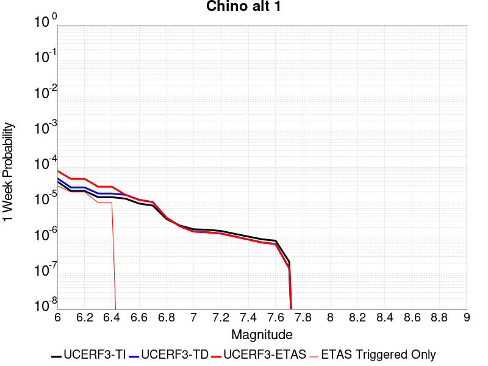 |  |  |  |

| Magnitude | 1 wk TI Prob | 1 wk TD Prob | 1 wk ETAS Prob | 1 wk ETAS/TD Gain | 1 wk ETAS Triggered Only | 1 mo TI Prob | 1 mo TD Prob | 1 mo ETAS Prob | 1 mo ETAS/TD Gain | 1 mo ETAS Triggered Only | 1 yr TI Prob | 1 yr TD Prob | 1 yr ETAS Prob | 1 yr ETAS/TD Gain | 1 yr ETAS Triggered Only | 10 yr TI Prob | 10 yr TD Prob | 10 yr ETAS Prob | 10 yr ETAS/TD Gain | 10 yr ETAS Triggered Only |
|-----|-----|-----|-----|-----|-----|-----|-----|-----|-----|-----|-----|-----|-----|-----|-----|-----|-----|-----|-----|-----|
| 6.0 | 3.939946E-5 | 4.894798E-5 | 7.894651E-5 | 1.6128656 | 3.0E-5 | 1.6884391E-4 | 2.0976314E-4 | 2.5975265E-4 | 1.2383142 | 5.0E-5 | 0.0020537362 | 0.002551385 | 0.002631181 | 1.0312755 | 8.0E-5 | 0.020348595 | 0.025280168 | 0.025367893 | 1.0034701 | 9.0E-5 |
| 6.1 | 2.1505624E-5 | 2.6878823E-5 | 4.6878286E-5 | 1.7440602 | 2.0E-5 | 9.2163704E-5 | 1.15190494E-4 | 1.5518589E-4 | 1.3472109 | 4.0E-5 | 0.0011215154 | 0.0014016517 | 0.0014515815 | 1.0356222 | 5.0E-5 | 0.011158722 | 0.013947425 | 0.014006589 | 1.0042418 | 6.0E-5 |
| 6.2 | 2.1505624E-5 | 2.6878823E-5 | 4.6878286E-5 | 1.7440602 | 2.0E-5 | 9.2163704E-5 | 1.15190494E-4 | 1.5518589E-4 | 1.3472109 | 4.0E-5 | 0.0011215154 | 0.0014016517 | 0.0014515815 | 1.0356222 | 5.0E-5 | 0.011158722 | 0.013947425 | 0.014006589 | 1.0042418 | 6.0E-5 |
| 6.3 | 1.4290785E-5 | 1.8164832E-5 | 2.816465E-5 | 1.5505043 | 1.0E-5 | 6.1244784E-5 | 7.784722E-5 | 1.0784488E-4 | 1.3853402 | 3.0E-5 | 7.454001E-4 | 9.4742293E-4 | 9.773945E-4 | 1.0316348 | 3.0E-5 | 0.007429048 | 0.00944674 | 0.009476457 | 1.0031457 | 3.0E-5 |
| 6.4 | 1.4290785E-5 | 1.8164832E-5 | 2.816465E-5 | 1.5505043 | 1.0E-5 | 6.1244784E-5 | 7.784722E-5 | 1.0784488E-4 | 1.3853402 | 3.0E-5 | 7.454001E-4 | 9.4742293E-4 | 9.773945E-4 | 1.0316348 | 3.0E-5 | 0.007429048 | 0.00944674 | 0.009476457 | 1.0031457 | 3.0E-5 |
| 6.5 | 1.3017944E-5 | 1.6651793E-5 | 1.6651793E-5 | 1.0 | 0.0 | 5.5789995E-5 | 7.1363116E-5 | 7.1363116E-5 | 1.0 | 0.0 | 6.790315E-4 | 8.6854334E-4 | 8.6854334E-4 | 1.0 | 0.0 | 0.0067696036 | 0.008664233 | 0.008664233 | 1.0 | 0.0 |
| 6.6 | 9.470016E-6 | 1.2039209E-5 | 1.2039209E-5 | 1.0 | 0.0 | 4.058515E-5 | 5.159578E-5 | 5.159578E-5 | 1.0 | 0.0 | 4.940122E-4 | 6.280315E-4 | 6.280315E-4 | 1.0 | 0.0 | 0.004929154 | 0.006273248 | 0.006273248 | 1.0 | 0.0 |
| 6.7 | 8.314155E-6 | 1.040749E-5 | 1.040749E-5 | 1.0 | 0.0 | 3.5631605E-5 | 4.4602948E-5 | 4.4602948E-5 | 1.0 | 0.0 | 4.3372845E-4 | 5.4293784E-4 | 5.4293784E-4 | 1.0 | 0.0 | 0.004328829 | 0.0054270807 | 0.0054270807 | 1.0 | 0.0 |
| 6.8 | 3.4856364E-6 | 3.8134033E-6 | 3.8134033E-6 | 1.0 | 0.0 | 1.4938357E-5 | 1.6343065E-5 | 1.6343065E-5 | 1.0 | 0.0 | 1.8185932E-4 | 1.9896074E-4 | 1.9896074E-4 | 1.0 | 0.0 | 0.0018171056 | 0.0019894529 | 0.0019894529 | 1.0 | 0.0 |
| 6.9 | 2.2645952E-6 | 2.152909E-6 | 2.152909E-6 | 1.0 | 0.0 | 9.705372E-6 | 9.226722E-6 | 9.226722E-6 | 1.0 | 0.0 | 1.18156495E-4 | 1.12329755E-4 | 1.12329755E-4 | 1.0 | 0.0 | 0.0011809369 | 0.0011233138 | 0.0011233138 | 1.0 | 0.0 |
| 7.0 | 1.7864003E-6 | 1.5430741E-6 | 1.5430741E-6 | 1.0 | 0.0 | 7.655979E-6 | 6.613158E-6 | 6.613158E-6 | 1.0 | 0.0 | 9.3207556E-5 | 8.051228E-5 | 8.051228E-5 | 1.0 | 0.0 | 9.316847E-4 | 8.052856E-4 | 8.052856E-4 | 1.0 | 0.0 |
| 7.1 | 1.7315456E-6 | 1.4733466E-6 | 1.4733466E-6 | 1.0 | 0.0 | 7.420889E-6 | 6.314328E-6 | 6.314328E-6 | 1.0 | 0.0 | 9.034557E-5 | 7.687428E-5 | 7.687428E-5 | 1.0 | 0.0 | 9.0308854E-4 | 7.68921E-4 | 7.68921E-4 | 1.0 | 0.0 |
| 7.2 | 1.6008337E-6 | 1.3574178E-6 | 1.3574178E-6 | 1.0 | 0.0 | 6.860698E-6 | 5.817492E-6 | 5.817492E-6 | 1.0 | 0.0 | 8.352579E-5 | 7.082572E-5 | 7.082572E-5 | 1.0 | 0.0 | 8.34944E-4 | 7.0846075E-4 | 7.0846075E-4 | 1.0 | 0.0 |
| 7.3 | 1.3320939E-6 | 1.1217794E-6 | 1.1217794E-6 | 1.0 | 0.0 | 5.7089615E-6 | 4.8076176E-6 | 4.8076176E-6 | 1.0 | 0.0 | 6.9504385E-5 | 5.853122E-5 | 5.853122E-5 | 1.0 | 0.0 | 6.9482654E-4 | 5.8530655E-4 | 5.8530655E-4 | 1.0 | 0.0 |
| 7.4 | 1.114294E-6 | 9.237087E-7 | 9.237087E-7 | 1.0 | 0.0 | 4.775537E-6 | 3.9587458E-6 | 3.9587458E-6 | 1.0 | 0.0 | 5.8140613E-5 | 4.81967E-5 | 4.81967E-5 | 1.0 | 0.0 | 5.81254E-4 | 4.8187698E-4 | 4.8187698E-4 | 1.0 | 0.0 |
| 7.5 | 9.354081E-7 | 7.6233886E-7 | 7.6233886E-7 | 1.0 | 0.0 | 4.0088858E-6 | 3.2671626E-6 | 3.2671626E-6 | 1.0 | 0.0 | 4.8807087E-5 | 3.9777013E-5 | 3.9777013E-5 | 1.0 | 0.0 | 4.879637E-4 | 3.9770233E-4 | 3.9770233E-4 | 1.0 | 0.0 |
| 7.6 | 8.521771E-7 | 6.880688E-7 | 6.880688E-7 | 1.0 | 0.0 | 3.6521824E-6 | 2.948863E-6 | 2.948863E-6 | 1.0 | 0.0 | 4.4464414E-5 | 3.590185E-5 | 3.590185E-5 | 1.0 | 0.0 | 4.4455516E-4 | 3.5896365E-4 | 3.5896365E-4 | 1.0 | 0.0 |
| 7.7 | 2.1803626E-7 | 1.4186368E-7 | 1.4186368E-7 | 1.0 | 0.0 | 9.344408E-7 | 6.0798715E-7 | 6.0798715E-7 | 1.0 | 0.0 | 1.1376757E-5 | 7.4022278E-6 | 7.4022278E-6 | 1.0 | 0.0 | 1.13761744E-4 | 7.402077E-5 | 7.402077E-5 | 1.0 | 0.0 |

## Ortigalita (North)
*[(top)](#table-of-contents)*

| 1 Week | 1 Month | 1 Year | 10 Year |
|-----|-----|-----|-----|
|  |  |  |  |

| Magnitude | 1 wk TI Prob | 1 wk TD Prob | 1 wk ETAS Prob | 1 wk ETAS/TD Gain | 1 wk ETAS Triggered Only | 1 mo TI Prob | 1 mo TD Prob | 1 mo ETAS Prob | 1 mo ETAS/TD Gain | 1 mo ETAS Triggered Only | 1 yr TI Prob | 1 yr TD Prob | 1 yr ETAS Prob | 1 yr ETAS/TD Gain | 1 yr ETAS Triggered Only | 10 yr TI Prob | 10 yr TD Prob | 10 yr ETAS Prob | 10 yr ETAS/TD Gain | 10 yr ETAS Triggered Only |
|-----|-----|-----|-----|-----|-----|-----|-----|-----|-----|-----|-----|-----|-----|-----|-----|-----|-----|-----|-----|-----|
| 6.0 | 7.711876E-5 | 1.0505308E-4 | 1.2505098E-4 | 1.19036 | 2.0E-5 | 3.3046713E-4 | 4.501601E-4 | 4.901421E-4 | 1.0888172 | 4.0E-5 | 0.004016016 | 0.0054680547 | 0.005527727 | 1.0109128 | 6.0E-5 | 0.039442103 | 0.053455614 | 0.053512406 | 1.0010624 | 6.0E-5 |
| 6.1 | 4.607858E-5 | 6.0239887E-5 | 7.0239286E-5 | 1.165993 | 1.0E-5 | 1.9746469E-4 | 2.5814763E-4 | 2.7814248E-4 | 1.077455 | 2.0E-5 | 0.0024014818 | 0.0031387366 | 0.0031885796 | 1.01588 | 5.0E-5 | 0.023756953 | 0.030975312 | 0.031023763 | 1.0015641 | 5.0E-5 |
| 6.2 | 4.607858E-5 | 6.0239887E-5 | 7.0239286E-5 | 1.165993 | 1.0E-5 | 1.9746469E-4 | 2.5814763E-4 | 2.7814248E-4 | 1.077455 | 2.0E-5 | 0.0024014818 | 0.0031387366 | 0.0031885796 | 1.01588 | 5.0E-5 | 0.023756953 | 0.030975312 | 0.031023763 | 1.0015641 | 5.0E-5 |
| 6.3 | 3.327423E-5 | 4.2476124E-5 | 5.2475698E-5 | 1.2354164 | 1.0E-5 | 1.4259605E-4 | 1.8202956E-4 | 1.9202773E-4 | 1.0549262 | 1.0E-5 | 0.0017347244 | 0.002214206 | 0.0022441396 | 1.0135189 | 3.0E-5 | 0.017212452 | 0.02194574 | 0.021975081 | 1.001337 | 3.0E-5 |
| 6.4 | 2.7732503E-5 | 3.4999008E-5 | 4.4998655E-5 | 1.2857124 | 1.0E-5 | 1.1884817E-4 | 1.499886E-4 | 1.599871E-4 | 1.0666617 | 1.0E-5 | 0.001446016 | 0.0018248158 | 0.001854761 | 1.01641 | 3.0E-5 | 0.014366428 | 0.018121297 | 0.018150754 | 1.0016255 | 3.0E-5 |
| 6.5 | 2.7689714E-5 | 3.4948822E-5 | 4.4948472E-5 | 1.2861227 | 1.0E-5 | 1.186648E-4 | 1.4977354E-4 | 1.5977204E-4 | 1.0667574 | 1.0E-5 | 0.0014437864 | 0.0018222018 | 0.0018521472 | 1.0164336 | 3.0E-5 | 0.014344421 | 0.018095585 | 0.01812504 | 1.0016279 | 3.0E-5 |
| 6.6 | 2.2976905E-5 | 2.871829E-5 | 3.8718004E-5 | 1.3482001 | 1.0E-5 | 9.846873E-5 | 1.23074E-4 | 1.3307277E-4 | 1.081242 | 1.0E-5 | 0.0011981975 | 0.0014976348 | 0.0015275899 | 1.0200015 | 3.0E-5 | 0.011917574 | 0.014898733 | 0.014928287 | 1.0019836 | 3.0E-5 |
| 6.7 | 1.9871539E-5 | 2.4904637E-5 | 3.4904388E-5 | 1.4015217 | 1.0E-5 | 8.516096E-5 | 1.067312E-4 | 1.1673012E-4 | 1.0936834 | 1.0E-5 | 0.0010363415 | 0.0012989199 | 0.001328881 | 1.0230662 | 3.0E-5 | 0.010315218 | 0.012936938 | 0.01296655 | 1.0022889 | 3.0E-5 |
| 6.8 | 6.5640475E-6 | 7.6054926E-6 | 7.6054926E-6 | 1.0 | 0.0 | 2.813133E-5 | 3.2594577E-5 | 3.2594577E-5 | 1.0 | 0.0 | 3.424451E-4 | 3.9676955E-4 | 4.0676558E-4 | 1.0251936 | 1.0E-5 | 0.0034191788 | 0.003960899 | 0.003970859 | 1.0025147 | 1.0E-5 |
| 6.9 | 5.6219683E-6 | 6.5018376E-6 | 6.5018376E-6 | 1.0 | 0.0 | 2.4093928E-5 | 2.7864735E-5 | 2.7864735E-5 | 1.0 | 0.0 | 2.933041E-4 | 3.3920293E-4 | 3.3920293E-4 | 1.0 | 0.0 | 0.0029291727 | 0.003387109 | 0.003387109 | 1.0 | 0.0 |
| 7.0 | 3.875591E-6 | 4.4847548E-6 | 4.4847548E-6 | 1.0 | 0.0 | 1.6609569E-5 | 1.9220248E-5 | 1.9220248E-5 | 1.0 | 0.0 | 2.0220275E-4 | 2.339835E-4 | 2.339835E-4 | 1.0 | 0.0 | 0.0020201886 | 0.0023375798 | 0.0023375798 | 1.0 | 0.0 |
| 7.1 | 1.6017933E-6 | 1.8570418E-6 | 1.8570418E-6 | 1.0 | 0.0 | 6.8648105E-6 | 7.958732E-6 | 7.958732E-6 | 1.0 | 0.0 | 8.357586E-5 | 9.689432E-5 | 9.689432E-5 | 1.0 | 0.0 | 8.3544437E-4 | 9.686254E-4 | 9.686254E-4 | 1.0 | 0.0 |

## Coronado Bank alt1
*[(top)](#table-of-contents)*

| 1 Week | 1 Month | 1 Year | 10 Year |
|-----|-----|-----|-----|
|  |  |  |  |

| Magnitude | 1 wk TI Prob | 1 wk TD Prob | 1 wk ETAS Prob | 1 wk ETAS/TD Gain | 1 wk ETAS Triggered Only | 1 mo TI Prob | 1 mo TD Prob | 1 mo ETAS Prob | 1 mo ETAS/TD Gain | 1 mo ETAS Triggered Only | 1 yr TI Prob | 1 yr TD Prob | 1 yr ETAS Prob | 1 yr ETAS/TD Gain | 1 yr ETAS Triggered Only | 10 yr TI Prob | 10 yr TD Prob | 10 yr ETAS Prob | 10 yr ETAS/TD Gain | 10 yr ETAS Triggered Only |
|-----|-----|-----|-----|-----|-----|-----|-----|-----|-----|-----|-----|-----|-----|-----|-----|-----|-----|-----|-----|-----|
| 6.0 | 7.533492E-5 | 9.3951705E-5 | 1.3394795E-4 | 1.4257107 | 4.0E-5 | 3.22824E-4 | 4.025903E-4 | 4.4257418E-4 | 1.0993166 | 4.0E-5 | 0.0039233007 | 0.004891121 | 0.0049408763 | 1.0101726 | 5.0E-5 | 0.03854755 | 0.047904 | 0.04797065 | 1.0013913 | 7.0E-5 |
| 6.1 | 4.1807285E-5 | 5.0493105E-5 | 6.04926E-5 | 1.1980368 | 1.0E-5 | 1.7916178E-4 | 2.1638138E-4 | 2.2637921E-4 | 1.0462047 | 1.0E-5 | 0.0021791123 | 0.0026313365 | 0.0026413102 | 1.0037904 | 1.0E-5 | 0.021578677 | 0.026011124 | 0.026040344 | 1.0011233 | 3.0E-5 |
| 6.2 | 4.1807285E-5 | 5.0493105E-5 | 6.04926E-5 | 1.1980368 | 1.0E-5 | 1.7916178E-4 | 2.1638138E-4 | 2.2637921E-4 | 1.0462047 | 1.0E-5 | 0.0021791123 | 0.0026313365 | 0.0026413102 | 1.0037904 | 1.0E-5 | 0.021578677 | 0.026011124 | 0.026040344 | 1.0011233 | 3.0E-5 |
| 6.3 | 3.1793104E-5 | 3.7711125E-5 | 4.771075E-5 | 1.2651638 | 1.0E-5 | 1.3624904E-4 | 1.6160926E-4 | 1.7160765E-4 | 1.0618676 | 1.0E-5 | 0.0016575698 | 0.001965849 | 0.0019758292 | 1.0050769 | 1.0E-5 | 0.016452603 | 0.019488495 | 0.019508105 | 1.0010062 | 2.0E-5 |
| 6.4 | 2.9878007E-5 | 3.5335797E-5 | 4.5335444E-5 | 1.2829891 | 1.0E-5 | 1.2804232E-4 | 1.5143053E-4 | 1.6142902E-4 | 1.0660269 | 1.0E-5 | 0.0015578003 | 0.0018421395 | 0.0018521211 | 1.0054184 | 1.0E-5 | 0.015469253 | 0.018272463 | 0.0182921 | 1.0010746 | 2.0E-5 |
| 6.5 | 2.4512565E-5 | 2.8764101E-5 | 3.8763814E-5 | 1.3476455 | 1.0E-5 | 1.0504962E-4 | 1.2326906E-4 | 1.3326782E-4 | 1.0811133 | 1.0E-5 | 0.0012782287 | 0.0014997943 | 0.0015097794 | 1.0066576 | 1.0E-5 | 0.012709012 | 0.0148996925 | 0.014919395 | 1.0013223 | 2.0E-5 |
| 6.6 | 2.1317413E-5 | 2.490667E-5 | 3.490642E-5 | 1.4014889 | 1.0E-5 | 9.135714E-5 | 1.0673863E-4 | 1.1673757E-4 | 1.0936768 | 1.0E-5 | 0.0011117056 | 0.0012987903 | 0.0013087774 | 1.0076895 | 1.0E-5 | 0.011061605 | 0.012914407 | 0.012934149 | 1.0015286 | 2.0E-5 |
| 6.7 | 1.8585655E-5 | 2.1634882E-5 | 3.1634663E-5 | 1.4622066 | 1.0E-5 | 7.9650374E-5 | 9.271774E-5 | 1.0271681E-4 | 1.1078442 | 1.0E-5 | 9.6931186E-4 | 0.0011282744 | 0.001138263 | 1.0088531 | 1.0E-5 | 0.0096509475 | 0.011227623 | 0.011247398 | 1.0017613 | 2.0E-5 |
| 6.8 | 1.5862879E-5 | 1.8419476E-5 | 2.8419292E-5 | 1.5428936 | 1.0E-5 | 6.798199E-5 | 7.8938334E-5 | 8.8937544E-5 | 1.1266712 | 1.0E-5 | 8.273665E-4 | 9.606697E-4 | 9.7066007E-4 | 1.0103995 | 1.0E-5 | 0.008242928 | 0.009567151 | 0.0095770545 | 1.0010352 | 1.0E-5 |
| 6.9 | 1.3021509E-5 | 1.5095266E-5 | 2.5095114E-5 | 1.6624494 | 1.0E-5 | 5.5805274E-5 | 6.46925E-5 | 7.4691845E-5 | 1.1545675 | 1.0E-5 | 6.792174E-4 | 7.873646E-4 | 7.973567E-4 | 1.0126905 | 1.0E-5 | 0.006771452 | 0.007847573 | 0.007857494 | 1.0012643 | 1.0E-5 |
| 7.0 | 1.0974371E-5 | 1.2720105E-5 | 2.2719978E-5 | 1.786147 | 1.0E-5 | 4.7032172E-5 | 5.4513697E-5 | 6.451315E-5 | 1.1834302 | 1.0E-5 | 5.7246623E-4 | 6.635197E-4 | 6.7351304E-4 | 1.0150611 | 1.0E-5 | 0.0057099373 | 0.0066171354 | 0.0066270693 | 1.0015012 | 1.0E-5 |
| 7.1 | 8.766221E-6 | 1.0163833E-5 | 2.0163732E-5 | 1.9838707 | 1.0E-5 | 3.7568978E-5 | 4.3558655E-5 | 5.355822E-5 | 1.2295655 | 1.0E-5 | 4.573063E-4 | 5.302148E-4 | 5.4020947E-4 | 1.0188503 | 1.0E-5 | 0.0045636636 | 0.005291197 | 0.0053011444 | 1.0018799 | 1.0E-5 |
| 7.2 | 8.026024E-7 | 8.331776E-7 | 8.331776E-7 | 1.0 | 0.0 | 3.43972E-6 | 3.5707562E-6 | 3.5707562E-6 | 1.0 | 0.0 | 4.1877785E-5 | 4.34731E-5 | 4.34731E-5 | 1.0 | 0.0 | 4.1869894E-4 | 4.3464705E-4 | 4.3464705E-4 | 1.0 | 0.0 |
| 7.3 | 3.7293114E-7 | 3.700106E-7 | 3.700106E-7 | 1.0 | 0.0 | 1.5982754E-6 | 1.5857588E-6 | 1.5857588E-6 | 1.0 | 0.0 | 1.9458828E-5 | 1.9306442E-5 | 1.9306442E-5 | 1.0 | 0.0 | 1.9457124E-4 | 1.9304773E-4 | 1.9304773E-4 | 1.0 | 0.0 |
| 7.4 | 2.0557036E-7 | 1.9674441E-7 | 1.9674441E-7 | 1.0 | 0.0 | 8.810155E-7 | 8.4319004E-7 | 8.4319004E-7 | 1.0 | 0.0 | 1.0726311E-5 | 1.02657905E-5 | 1.02657905E-5 | 1.0 | 0.0 | 1.0725793E-4 | 1.026532E-4 | 1.026532E-4 | 1.0 | 0.0 |
| 7.5 | 6.845446E-8 | 6.2794086E-8 | 6.2794086E-8 | 1.0 | 0.0 | 2.9337625E-7 | 2.6911746E-7 | 2.6911746E-7 | 1.0 | 0.0 | 3.5718497E-6 | 3.2765004E-6 | 3.2765004E-6 | 1.0 | 0.0 | 3.5717923E-5 | 3.276453E-5 | 3.276453E-5 | 1.0 | 0.0 |
| 7.6 | 6.0975145E-9 | 5.531901E-9 | 5.531901E-9 | 1.0 | 0.0 | 2.6132206E-8 | 2.3708148E-8 | 2.3708148E-8 | 1.0 | 0.0 | 3.1815955E-7 | 2.8864667E-7 | 2.8864667E-7 | 1.0 | 0.0 | 3.181591E-6 | 2.886464E-6 | 2.886464E-6 | 1.0 | 0.0 |

## Deep Springs
*[(top)](#table-of-contents)*

| 1 Week | 1 Month | 1 Year | 10 Year |
|-----|-----|-----|-----|
|  |  | 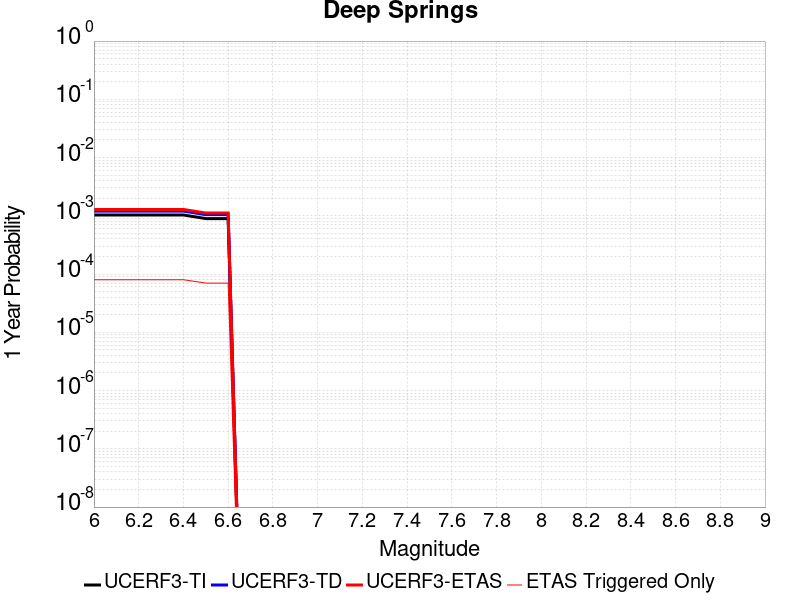 |  |

| Magnitude | 1 wk TI Prob | 1 wk TD Prob | 1 wk ETAS Prob | 1 wk ETAS/TD Gain | 1 wk ETAS Triggered Only | 1 mo TI Prob | 1 mo TD Prob | 1 mo ETAS Prob | 1 mo ETAS/TD Gain | 1 mo ETAS Triggered Only | 1 yr TI Prob | 1 yr TD Prob | 1 yr ETAS Prob | 1 yr ETAS/TD Gain | 1 yr ETAS Triggered Only | 10 yr TI Prob | 10 yr TD Prob | 10 yr ETAS Prob | 10 yr ETAS/TD Gain | 10 yr ETAS Triggered Only |
|-----|-----|-----|-----|-----|-----|-----|-----|-----|-----|-----|-----|-----|-----|-----|-----|-----|-----|-----|-----|-----|
| 6.0 | 1.9810619E-5 | 2.311252E-5 | 6.31116E-5 | 2.7306237 | 4.0E-5 | 8.489989E-5 | 9.9052755E-5 | 1.490478E-4 | 1.5047315 | 5.0E-5 | 0.001033166 | 0.0012058078 | 0.0012857113 | 1.0662656 | 8.0E-5 | 0.010283757 | 0.01204243 | 0.012131346 | 1.0073836 | 9.0E-5 |
| 6.1 | 1.9810619E-5 | 2.311252E-5 | 6.31116E-5 | 2.7306237 | 4.0E-5 | 8.489989E-5 | 9.9052755E-5 | 1.490478E-4 | 1.5047315 | 5.0E-5 | 0.001033166 | 0.0012058078 | 0.0012857113 | 1.0662656 | 8.0E-5 | 0.010283757 | 0.01204243 | 0.012131346 | 1.0073836 | 9.0E-5 |
| 6.2 | 1.9810619E-5 | 2.311252E-5 | 6.31116E-5 | 2.7306237 | 4.0E-5 | 8.489989E-5 | 9.9052755E-5 | 1.490478E-4 | 1.5047315 | 5.0E-5 | 0.001033166 | 0.0012058078 | 0.0012857113 | 1.0662656 | 8.0E-5 | 0.010283757 | 0.01204243 | 0.012131346 | 1.0073836 | 9.0E-5 |
| 6.3 | 1.9810619E-5 | 2.311252E-5 | 6.31116E-5 | 2.7306237 | 4.0E-5 | 8.489989E-5 | 9.9052755E-5 | 1.490478E-4 | 1.5047315 | 5.0E-5 | 0.001033166 | 0.0012058078 | 0.0012857113 | 1.0662656 | 8.0E-5 | 0.010283757 | 0.01204243 | 0.012131346 | 1.0073836 | 9.0E-5 |
| 6.4 | 1.9810619E-5 | 2.311252E-5 | 6.31116E-5 | 2.7306237 | 4.0E-5 | 8.489989E-5 | 9.9052755E-5 | 1.490478E-4 | 1.5047315 | 5.0E-5 | 0.001033166 | 0.0012058078 | 0.0012857113 | 1.0662656 | 8.0E-5 | 0.010283757 | 0.01204243 | 0.012131346 | 1.0073836 | 9.0E-5 |
| 6.5 | 1.7190405E-5 | 2.0050558E-5 | 5.0049955E-5 | 2.4961877 | 3.0E-5 | 7.367108E-5 | 8.593096E-5 | 1.2592753E-4 | 1.4654499 | 4.0E-5 | 8.9657627E-4 | 0.0010462092 | 0.001116136 | 1.0668383 | 7.0E-5 | 0.008929676 | 0.010462061 | 0.010541224 | 1.0075667 | 8.0E-5 |
| 6.6 | 1.7190405E-5 | 2.0050558E-5 | 5.0049955E-5 | 2.4961877 | 3.0E-5 | 7.367108E-5 | 8.593096E-5 | 1.2592753E-4 | 1.4654499 | 4.0E-5 | 8.9657627E-4 | 0.0010462092 | 0.001116136 | 1.0668383 | 7.0E-5 | 0.008929676 | 0.010462061 | 0.010541224 | 1.0075667 | 8.0E-5 |

## San Jacinto (San Bernardino)
*[(top)](#table-of-contents)*

| 1 Week | 1 Month | 1 Year | 10 Year |
|-----|-----|-----|-----|
|  |  |  |  |

| Magnitude | 1 wk TI Prob | 1 wk TD Prob | 1 wk ETAS Prob | 1 wk ETAS/TD Gain | 1 wk ETAS Triggered Only | 1 mo TI Prob | 1 mo TD Prob | 1 mo ETAS Prob | 1 mo ETAS/TD Gain | 1 mo ETAS Triggered Only | 1 yr TI Prob | 1 yr TD Prob | 1 yr ETAS Prob | 1 yr ETAS/TD Gain | 1 yr ETAS Triggered Only | 10 yr TI Prob | 10 yr TD Prob | 10 yr ETAS Prob | 10 yr ETAS/TD Gain | 10 yr ETAS Triggered Only |
|-----|-----|-----|-----|-----|-----|-----|-----|-----|-----|-----|-----|-----|-----|-----|-----|-----|-----|-----|-----|-----|
| 6.0 | 3.409352E-5 | 3.598562E-5 | 5.59849E-5 | 1.5557575 | 2.0E-5 | 1.461069E-4 | 1.5421498E-4 | 1.8421035E-4 | 1.1945037 | 3.0E-5 | 0.0017774 | 0.0018759521 | 0.0019358395 | 1.0319238 | 6.0E-5 | 0.01763251 | 0.019349992 | 0.019438252 | 1.0045612 | 9.0E-5 |
| 6.1 | 3.409352E-5 | 3.598562E-5 | 5.59849E-5 | 1.5557575 | 2.0E-5 | 1.461069E-4 | 1.5421498E-4 | 1.8421035E-4 | 1.1945037 | 3.0E-5 | 0.0017774 | 0.0018759521 | 0.0019358395 | 1.0319238 | 6.0E-5 | 0.01763251 | 0.019349992 | 0.019438252 | 1.0045612 | 9.0E-5 |
| 6.2 | 3.409352E-5 | 3.598562E-5 | 5.59849E-5 | 1.5557575 | 2.0E-5 | 1.461069E-4 | 1.5421498E-4 | 1.8421035E-4 | 1.1945037 | 3.0E-5 | 0.0017774 | 0.0018759521 | 0.0019358395 | 1.0319238 | 6.0E-5 | 0.01763251 | 0.019349992 | 0.019438252 | 1.0045612 | 9.0E-5 |
| 6.3 | 3.409352E-5 | 3.598562E-5 | 5.59849E-5 | 1.5557575 | 2.0E-5 | 1.461069E-4 | 1.5421498E-4 | 1.8421035E-4 | 1.1945037 | 3.0E-5 | 0.0017774 | 0.0018759521 | 0.0019358395 | 1.0319238 | 6.0E-5 | 0.01763251 | 0.019349992 | 0.019438252 | 1.0045612 | 9.0E-5 |
| 6.4 | 3.400795E-5 | 3.5878285E-5 | 5.587757E-5 | 1.5574203 | 2.0E-5 | 1.4574021E-4 | 1.5375503E-4 | 1.8375041E-4 | 1.1950855 | 3.0E-5 | 0.0017729428 | 0.0018703619 | 0.0019302496 | 1.0320194 | 6.0E-5 | 0.017588645 | 0.019295074 | 0.019383337 | 1.0045744 | 9.0E-5 |
| 6.5 | 3.341482E-5 | 3.5138914E-5 | 5.513821E-5 | 1.5691495 | 2.0E-5 | 1.4319851E-4 | 1.5058667E-4 | 1.8058215E-4 | 1.1991909 | 3.0E-5 | 0.0017420477 | 0.0018318522 | 0.0018917423 | 1.0326937 | 6.0E-5 | 0.017284546 | 0.018916616 | 0.019004913 | 1.0046678 | 9.0E-5 |
| 6.6 | 3.3364955E-5 | 3.5076133E-5 | 5.507543E-5 | 1.5701683 | 2.0E-5 | 1.4298483E-4 | 1.5031763E-4 | 1.8031312E-4 | 1.1995474 | 3.0E-5 | 0.0017394501 | 0.0018285823 | 0.0018884726 | 1.0327523 | 6.0E-5 | 0.017258976 | 0.01888448 | 0.01896297 | 1.0041562 | 8.0E-5 |
| 6.7 | 3.335922E-5 | 3.5065907E-5 | 5.5065204E-5 | 1.5703346 | 2.0E-5 | 1.4296026E-4 | 1.5027382E-4 | 1.802693E-4 | 1.1996056 | 3.0E-5 | 0.0017391514 | 0.0018280497 | 0.00188794 | 1.0327618 | 6.0E-5 | 0.017256035 | 0.018879272 | 0.018957762 | 1.0041574 | 8.0E-5 |
| 6.8 | 3.327683E-5 | 3.4959972E-5 | 5.4959273E-5 | 1.5720628 | 2.0E-5 | 1.4260718E-4 | 1.4981985E-4 | 1.7981537E-4 | 1.2002105 | 3.0E-5 | 0.0017348597 | 0.001822532 | 0.0018824227 | 1.0328612 | 6.0E-5 | 0.017213784 | 0.018825045 | 0.018903539 | 1.0041697 | 8.0E-5 |
| 6.9 | 3.3235785E-5 | 3.4900928E-5 | 5.490023E-5 | 1.5730307 | 2.0E-5 | 1.4243131E-4 | 1.4956683E-4 | 1.7956234E-4 | 1.2005492 | 3.0E-5 | 0.0017327217 | 0.0018194567 | 0.0018793475 | 1.0329169 | 6.0E-5 | 0.017192734 | 0.018794911 | 0.018873407 | 1.0041765 | 8.0E-5 |
| 7.0 | 3.3197095E-5 | 3.4840854E-5 | 5.484016E-5 | 1.5740187 | 2.0E-5 | 1.422655E-4 | 1.4930942E-4 | 1.7930493E-4 | 1.2008951 | 3.0E-5 | 0.0017307063 | 0.0018163278 | 0.0018762188 | 1.0329736 | 6.0E-5 | 0.017172894 | 0.01876429 | 0.018842788 | 1.0041834 | 8.0E-5 |
| 7.1 | 3.3129716E-5 | 3.4721066E-5 | 5.472037E-5 | 1.5759993 | 2.0E-5 | 1.4197677E-4 | 1.4879608E-4 | 1.7879163E-4 | 1.2015882 | 3.0E-5 | 0.0017271966 | 0.0018100884 | 0.0018699798 | 1.0330876 | 6.0E-5 | 0.017138338 | 0.018703366 | 0.018781869 | 1.0041974 | 8.0E-5 |
| 7.2 | 3.3034008E-5 | 3.4588513E-5 | 5.458782E-5 | 1.5782067 | 2.0E-5 | 1.4156665E-4 | 1.4822806E-4 | 1.7822362E-4 | 1.2023609 | 3.0E-5 | 0.0017222111 | 0.0018031843 | 0.0018630761 | 1.0332144 | 6.0E-5 | 0.017089253 | 0.01863575 | 0.018714258 | 1.0042129 | 8.0E-5 |
| 7.3 | 3.2956614E-5 | 3.4456265E-5 | 5.4455577E-5 | 1.580426 | 2.0E-5 | 1.4123498E-4 | 1.4766137E-4 | 1.7765693E-4 | 1.2031375 | 3.0E-5 | 0.0017181796 | 0.0017962961 | 0.0018561883 | 1.0333421 | 6.0E-5 | 0.017049557 | 0.018568495 | 0.01864701 | 1.0042284 | 8.0E-5 |
| 7.4 | 3.2915937E-5 | 3.4377957E-5 | 5.437727E-5 | 1.5817481 | 2.0E-5 | 1.4106068E-4 | 1.473258E-4 | 1.7732137E-4 | 1.2036003 | 3.0E-5 | 0.0017160608 | 0.0017922173 | 0.0018521098 | 1.033418 | 6.0E-5 | 0.017028693 | 0.018528769 | 0.018607287 | 1.0042377 | 8.0E-5 |
| 7.5 | 3.281791E-5 | 3.424287E-5 | 5.4242184E-5 | 1.5840431 | 2.0E-5 | 1.406406E-4 | 1.4674691E-4 | 1.7674251E-4 | 1.2044036 | 3.0E-5 | 0.0017109542 | 0.0017851809 | 0.0018450738 | 1.03355 | 6.0E-5 | 0.016978411 | 0.018459652 | 0.018538175 | 1.0042537 | 8.0E-5 |
| 7.6 | 3.2521442E-5 | 3.396782E-5 | 5.396714E-5 | 1.5887725 | 2.0E-5 | 1.3937015E-4 | 1.4556825E-4 | 1.7556388E-4 | 1.2060589 | 3.0E-5 | 0.0016955109 | 0.0017708542 | 0.0018307479 | 1.033822 | 6.0E-5 | 0.016826328 | 0.018317295 | 0.01839583 | 1.0042875 | 8.0E-5 |
| 7.7 | 3.0287873E-5 | 3.245191E-5 | 5.245126E-5 | 1.6162765 | 2.0E-5 | 1.297987E-4 | 1.3907222E-4 | 1.6906804E-4 | 1.2156852 | 3.0E-5 | 0.0015791537 | 0.0016918903 | 0.0017517888 | 1.0354033 | 6.0E-5 | 0.01567979 | 0.017528199 | 0.017606797 | 1.004484 | 8.0E-5 |
| 7.8 | 2.6316151E-5 | 2.9662837E-5 | 4.966224E-5 | 1.6742244 | 2.0E-5 | 1.1277862E-4 | 1.2712025E-4 | 1.5711643E-4 | 1.235967 | 3.0E-5 | 0.0013722149 | 0.0015465913 | 0.0016064985 | 1.038735 | 6.0E-5 | 0.013637724 | 0.016069878 | 0.016148591 | 1.0048983 | 8.0E-5 |
| 7.9 | 2.0761147E-5 | 2.3417291E-5 | 4.341682E-5 | 1.8540498 | 2.0E-5 | 8.897331E-5 | 1.0035596E-4 | 1.3035296E-4 | 1.2989058 | 3.0E-5 | 0.0010827117 | 0.0012211498 | 0.0012710887 | 1.040895 | 5.0E-5 | 0.010774517 | 0.012793272 | 0.012862376 | 1.0054016 | 7.0E-5 |
| 8.0 | 1.5738568E-5 | 1.6032505E-5 | 2.6032345E-5 | 1.6237228 | 1.0E-5 | 6.744926E-5 | 6.8708934E-5 | 7.8708246E-5 | 1.1455315 | 1.0E-5 | 8.2088535E-4 | 8.3621085E-4 | 8.6618576E-4 | 1.0358461 | 3.0E-5 | 0.008178596 | 0.008865741 | 0.008915298 | 1.0055897 | 5.0E-5 |
| 8.1 | 1.0105832E-5 | 8.329479E-6 | 8.329479E-6 | 1.0 | 0.0 | 4.3309992E-5 | 3.569728E-5 | 3.569728E-5 | 1.0 | 0.0 | 5.2717153E-4 | 4.3452822E-4 | 4.3452822E-4 | 1.0 | 0.0 | 0.005259227 | 0.0046768794 | 0.0046768794 | 1.0 | 0.0 |
| 8.2 | 4.189207E-6 | 1.577699E-6 | 1.577699E-6 | 1.0 | 0.0 | 1.7953622E-5 | 6.7615497E-6 | 6.7615497E-6 | 1.0 | 0.0 | 2.1856341E-4 | 8.231879E-5 | 8.231879E-5 | 1.0 | 0.0 | 0.0021834858 | 9.562628E-4 | 9.562628E-4 | 1.0 | 0.0 |
| 8.3 | 1.2758221E-6 | 3.612677E-7 | 3.612677E-7 | 1.0 | 0.0 | 5.4677976E-6 | 1.5482892E-6 | 1.5482892E-6 | 1.0 | 0.0 | 6.65684E-5 | 1.8850264E-5 | 1.8850264E-5 | 1.0 | 0.0 | 6.6548464E-4 | 2.2739546E-4 | 2.2739546E-4 | 1.0 | 0.0 |

## Ventura-Pitas Point
*[(top)](#table-of-contents)*

| 1 Week | 1 Month | 1 Year | 10 Year |
|-----|-----|-----|-----|
| 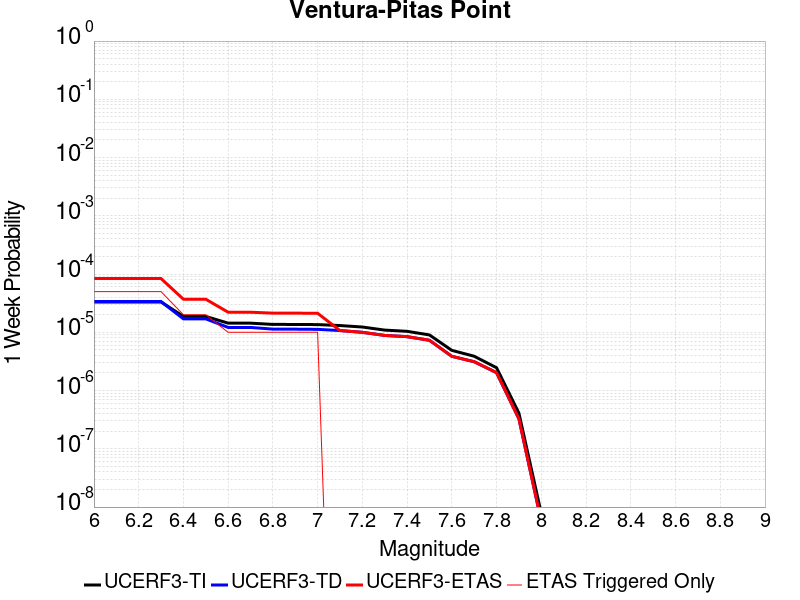 |  |  |  |

| Magnitude | 1 wk TI Prob | 1 wk TD Prob | 1 wk ETAS Prob | 1 wk ETAS/TD Gain | 1 wk ETAS Triggered Only | 1 mo TI Prob | 1 mo TD Prob | 1 mo ETAS Prob | 1 mo ETAS/TD Gain | 1 mo ETAS Triggered Only | 1 yr TI Prob | 1 yr TD Prob | 1 yr ETAS Prob | 1 yr ETAS/TD Gain | 1 yr ETAS Triggered Only | 10 yr TI Prob | 10 yr TD Prob | 10 yr ETAS Prob | 10 yr ETAS/TD Gain | 10 yr ETAS Triggered Only |
|-----|-----|-----|-----|-----|-----|-----|-----|-----|-----|-----|-----|-----|-----|-----|-----|-----|-----|-----|-----|-----|
| 6.0 | 3.3179622E-5 | 3.373519E-5 | 8.37335E-5 | 2.482082 | 5.0E-5 | 1.4219063E-4 | 1.4457281E-4 | 2.0456414E-4 | 1.4149557 | 6.0E-5 | 0.0017297962 | 0.0017590097 | 0.0018288866 | 1.0397251 | 7.0E-5 | 0.017163932 | 0.017476497 | 0.017564924 | 1.0050597 | 9.0E-5 |
| 6.1 | 3.3179622E-5 | 3.373519E-5 | 8.37335E-5 | 2.482082 | 5.0E-5 | 1.4219063E-4 | 1.4457281E-4 | 2.0456414E-4 | 1.4149557 | 6.0E-5 | 0.0017297962 | 0.0017590097 | 0.0018288866 | 1.0397251 | 7.0E-5 | 0.017163932 | 0.017476497 | 0.017564924 | 1.0050597 | 9.0E-5 |
| 6.2 | 3.3179622E-5 | 3.373519E-5 | 8.37335E-5 | 2.482082 | 5.0E-5 | 1.4219063E-4 | 1.4457281E-4 | 2.0456414E-4 | 1.4149557 | 6.0E-5 | 0.0017297962 | 0.0017590097 | 0.0018288866 | 1.0397251 | 7.0E-5 | 0.017163932 | 0.017476497 | 0.017564924 | 1.0050597 | 9.0E-5 |
| 6.3 | 3.3179622E-5 | 3.373519E-5 | 8.37335E-5 | 2.482082 | 5.0E-5 | 1.4219063E-4 | 1.4457281E-4 | 2.0456414E-4 | 1.4149557 | 6.0E-5 | 0.0017297962 | 0.0017590097 | 0.0018288866 | 1.0397251 | 7.0E-5 | 0.017163932 | 0.017476497 | 0.017564924 | 1.0050597 | 9.0E-5 |
| 6.4 | 1.8754668E-5 | 1.7019594E-5 | 3.7019254E-5 | 2.1750963 | 2.0E-5 | 8.037467E-5 | 7.2939205E-5 | 9.293775E-5 | 1.274181 | 2.0E-5 | 9.781223E-4 | 8.8769617E-4 | 9.176695E-4 | 1.0337653 | 3.0E-5 | 0.009738282 | 0.008843943 | 0.008883589 | 1.0044829 | 4.0E-5 |
| 6.5 | 1.8754668E-5 | 1.7019594E-5 | 3.7019254E-5 | 2.1750963 | 2.0E-5 | 8.037467E-5 | 7.2939205E-5 | 9.293775E-5 | 1.274181 | 2.0E-5 | 9.781223E-4 | 8.8769617E-4 | 9.176695E-4 | 1.0337653 | 3.0E-5 | 0.009738282 | 0.008843943 | 0.008883589 | 1.0044829 | 4.0E-5 |
| 6.6 | 1.4361558E-5 | 1.2122258E-5 | 2.2122136E-5 | 1.8249189 | 1.0E-5 | 6.154808E-5 | 5.1951512E-5 | 6.1950996E-5 | 1.1924772 | 1.0E-5 | 7.490902E-4 | 6.323284E-4 | 6.5231574E-4 | 1.0316092 | 2.0E-5 | 0.0074657016 | 0.006305652 | 0.006335463 | 1.0047276 | 3.0E-5 |
| 6.7 | 1.4361558E-5 | 1.2122258E-5 | 2.2122136E-5 | 1.8249189 | 1.0E-5 | 6.154808E-5 | 5.1951512E-5 | 6.1950996E-5 | 1.1924772 | 1.0E-5 | 7.490902E-4 | 6.323284E-4 | 6.5231574E-4 | 1.0316092 | 2.0E-5 | 0.0074657016 | 0.006305652 | 0.006335463 | 1.0047276 | 3.0E-5 |
| 6.8 | 1.3663846E-5 | 1.1344401E-5 | 2.1344287E-5 | 1.8814821 | 1.0E-5 | 5.8558027E-5 | 4.8617967E-5 | 5.861748E-5 | 1.2056752 | 1.0E-5 | 7.127108E-4 | 5.917649E-4 | 6.117531E-4 | 1.0337772 | 2.0E-5 | 0.007104293 | 0.0059022107 | 0.005932034 | 1.0050528 | 3.0E-5 |
| 6.9 | 1.3644157E-5 | 1.1322501E-5 | 2.1322388E-5 | 1.883187 | 1.0E-5 | 5.8473648E-5 | 4.8524114E-5 | 5.852363E-5 | 1.206073 | 1.0E-5 | 7.116841E-4 | 5.906229E-4 | 6.106111E-4 | 1.0338426 | 2.0E-5 | 0.007094092 | 0.0058908514 | 0.0059206747 | 1.0050627 | 3.0E-5 |
| 7.0 | 1.3568845E-5 | 1.12420685E-5 | 2.1241956E-5 | 1.889506 | 1.0E-5 | 5.8150898E-5 | 4.8179416E-5 | 5.817893E-5 | 1.2075475 | 1.0E-5 | 7.077572E-4 | 5.8642845E-4 | 6.064167E-4 | 1.0340848 | 2.0E-5 | 0.007055073 | 0.005849128 | 0.005878953 | 1.0050989 | 3.0E-5 |
| 7.1 | 1.306572E-5 | 1.0720521E-5 | 1.0720521E-5 | 1.0 | 0.0 | 5.599474E-5 | 4.594429E-5 | 4.594429E-5 | 1.0 | 0.0 | 6.815227E-4 | 5.5923004E-4 | 5.692244E-4 | 1.0178717 | 1.0E-5 | 0.0067943637 | 0.005578536 | 0.0055984245 | 1.0035652 | 2.0E-5 |
| 7.2 | 1.232604E-5 | 9.995121E-6 | 9.995121E-6 | 1.0 | 0.0 | 5.2824813E-5 | 4.283554E-5 | 4.283554E-5 | 1.0 | 0.0 | 6.429523E-4 | 5.2139966E-4 | 5.3139444E-4 | 1.0191691 | 1.0E-5 | 0.0064109527 | 0.005202059 | 0.005212007 | 1.0019124 | 1.0E-5 |
| 7.3 | 1.0917261E-5 | 8.843812E-6 | 8.843812E-6 | 1.0 | 0.0 | 4.678742E-5 | 3.7901507E-5 | 3.7901507E-5 | 1.0 | 0.0 | 5.69488E-4 | 4.6135474E-4 | 4.6135474E-4 | 1.0 | 0.0 | 0.0056803077 | 0.004604239 | 0.004604239 | 1.0 | 0.0 |
| 7.4 | 1.039959E-5 | 8.42354E-6 | 8.42354E-6 | 1.0 | 0.0 | 4.456891E-5 | 3.6100395E-5 | 3.6100395E-5 | 1.0 | 0.0 | 5.424914E-4 | 4.394352E-4 | 4.394352E-4 | 1.0 | 0.0 | 0.0054116896 | 0.0043859277 | 0.0043859277 | 1.0 | 0.0 |
| 7.5 | 9.015877E-6 | 7.29752E-6 | 7.29752E-6 | 1.0 | 0.0 | 3.86389E-5 | 3.1274718E-5 | 3.1274718E-5 | 1.0 | 0.0 | 4.7032707E-4 | 3.8070456E-4 | 3.8070456E-4 | 1.0 | 0.0 | 0.004693329 | 0.003800772 | 0.003800772 | 1.0 | 0.0 |
| 7.6 | 4.900162E-6 | 3.874119E-6 | 3.874119E-6 | 1.0 | 0.0 | 2.1000526E-5 | 1.6603262E-5 | 1.6603262E-5 | 1.0 | 0.0 | 2.556514E-4 | 2.0212609E-4 | 2.0212609E-4 | 1.0 | 0.0 | 0.0025535747 | 0.002019436 | 0.002019436 | 1.0 | 0.0 |
| 7.7 | 3.8850626E-6 | 3.12676E-6 | 3.12676E-6 | 1.0 | 0.0 | 1.6650163E-5 | 1.3400332E-5 | 1.3400332E-5 | 1.0 | 0.0 | 2.0269687E-4 | 1.6313691E-4 | 1.6313691E-4 | 1.0 | 0.0 | 0.002025121 | 0.0016301809 | 0.0016301809 | 1.0 | 0.0 |
| 7.8 | 2.4654719E-6 | 2.029902E-6 | 2.029902E-6 | 1.0 | 0.0 | 1.0566265E-5 | 8.699551E-6 | 8.699551E-6 | 1.0 | 0.0 | 1.2863669E-4 | 1.0591193E-4 | 1.0591193E-4 | 1.0 | 0.0 | 0.0012856225 | 0.0010586192 | 0.0010586192 | 1.0 | 0.0 |
| 7.9 | 4.095894E-7 | 3.2765078E-7 | 3.2765078E-7 | 1.0 | 0.0 | 1.7553821E-6 | 1.4042168E-6 | 1.4042168E-6 | 1.0 | 0.0 | 2.1371567E-5 | 1.709621E-5 | 1.709621E-5 | 1.0 | 0.0 | 2.1369511E-4 | 1.7094925E-4 | 1.7094925E-4 | 1.0 | 0.0 |
| 8.0 | 7.791402E-9 | 5.6836056E-9 | 5.6836056E-9 | 1.0 | 0.0 | 3.3391725E-8 | 2.4358311E-8 | 2.4358311E-8 | 1.0 | 0.0 | 4.0654416E-7 | 2.965624E-7 | 2.965624E-7 | 1.0 | 0.0 | 4.065434E-6 | 2.9656223E-6 | 2.9656223E-6 | 1.0 | 0.0 |

## Big Pine (East)
*[(top)](#table-of-contents)*

| 1 Week | 1 Month | 1 Year | 10 Year |
|-----|-----|-----|-----|
|  |  |  |  |

| Magnitude | 1 wk TI Prob | 1 wk TD Prob | 1 wk ETAS Prob | 1 wk ETAS/TD Gain | 1 wk ETAS Triggered Only | 1 mo TI Prob | 1 mo TD Prob | 1 mo ETAS Prob | 1 mo ETAS/TD Gain | 1 mo ETAS Triggered Only | 1 yr TI Prob | 1 yr TD Prob | 1 yr ETAS Prob | 1 yr ETAS/TD Gain | 1 yr ETAS Triggered Only | 10 yr TI Prob | 10 yr TD Prob | 10 yr ETAS Prob | 10 yr ETAS/TD Gain | 10 yr ETAS Triggered Only |
|-----|-----|-----|-----|-----|-----|-----|-----|-----|-----|-----|-----|-----|-----|-----|-----|-----|-----|-----|-----|-----|
| 6.0 | 9.916913E-6 | 1.28172705E-5 | 2.2817143E-5 | 1.7801872 | 1.0E-5 | 4.250036E-5 | 5.493013E-5 | 7.492903E-5 | 1.3640789 | 2.0E-5 | 5.173191E-4 | 6.685912E-4 | 7.485377E-4 | 1.1195745 | 8.0E-5 | 0.0051611643 | 0.006670449 | 0.006749915 | 1.0119132 | 8.0E-5 |
| 6.1 | 9.916913E-6 | 1.28172705E-5 | 2.2817143E-5 | 1.7801872 | 1.0E-5 | 4.250036E-5 | 5.493013E-5 | 7.492903E-5 | 1.3640789 | 2.0E-5 | 5.173191E-4 | 6.685912E-4 | 7.485377E-4 | 1.1195745 | 8.0E-5 | 0.0051611643 | 0.006670449 | 0.006749915 | 1.0119132 | 8.0E-5 |
| 6.2 | 9.916913E-6 | 1.28172705E-5 | 2.2817143E-5 | 1.7801872 | 1.0E-5 | 4.250036E-5 | 5.493013E-5 | 7.492903E-5 | 1.3640789 | 2.0E-5 | 5.173191E-4 | 6.685912E-4 | 7.485377E-4 | 1.1195745 | 8.0E-5 | 0.0051611643 | 0.006670449 | 0.006749915 | 1.0119132 | 8.0E-5 |
| 6.3 | 5.479711E-6 | 8.1132375E-6 | 1.8113156E-5 | 2.2325435 | 1.0E-5 | 2.3484265E-5 | 3.4770575E-5 | 4.4770226E-5 | 1.2875896 | 1.0E-5 | 2.858834E-4 | 4.232527E-4 | 4.832273E-4 | 1.1416993 | 6.0E-5 | 0.0028551589 | 0.0042272513 | 0.0042869975 | 1.0141336 | 6.0E-5 |
| 6.4 | 5.465009E-6 | 8.0975315E-6 | 1.8097451E-5 | 2.2349343 | 1.0E-5 | 2.3421257E-5 | 3.4703262E-5 | 4.4702916E-5 | 1.2881473 | 1.0E-5 | 2.851165E-4 | 4.2243348E-4 | 4.8240816E-4 | 1.1419742 | 6.0E-5 | 0.0028475097 | 0.00421909 | 0.0042788372 | 1.0141611 | 6.0E-5 |
| 6.5 | 4.826767E-6 | 7.4225877E-6 | 1.7422513E-5 | 2.347229 | 1.0E-5 | 2.068598E-5 | 3.1810716E-5 | 4.18104E-5 | 1.3143494 | 1.0E-5 | 2.518227E-4 | 3.8722943E-4 | 4.472062E-4 | 1.1548868 | 6.0E-5 | 0.0025153751 | 0.0038682907 | 0.0039280583 | 1.0154507 | 6.0E-5 |
| 6.6 | 4.3146847E-6 | 6.8825234E-6 | 1.6882455E-5 | 2.4529455 | 1.0E-5 | 1.8491375E-5 | 2.949621E-5 | 3.9495913E-5 | 1.3390166 | 1.0E-5 | 2.2510924E-4 | 3.5905963E-4 | 4.190381E-4 | 1.1670432 | 6.0E-5 | 0.0022488134 | 0.0035875062 | 0.0036472909 | 1.0166647 | 6.0E-5 |
| 6.7 | 3.6968106E-6 | 5.9957474E-6 | 1.5995687E-5 | 2.6678388 | 1.0E-5 | 1.5843378E-5 | 2.5695816E-5 | 3.569556E-5 | 1.3891584 | 1.0E-5 | 1.9287605E-4 | 3.128032E-4 | 3.427938E-4 | 1.0958769 | 3.0E-5 | 0.0019270873 | 0.0031262499 | 0.003156156 | 1.0095662 | 3.0E-5 |
| 6.8 | 3.4671132E-6 | 5.7024477E-6 | 1.5702391E-5 | 2.753623 | 1.0E-5 | 1.4858972E-5 | 2.4438841E-5 | 3.4438595E-5 | 1.4091747 | 1.0E-5 | 1.8089297E-4 | 2.9750372E-4 | 3.2749478E-4 | 1.1008091 | 3.0E-5 | 0.0018074579 | 0.0029736666 | 0.0030035775 | 1.0100585 | 3.0E-5 |
| 6.9 | 2.7686972E-6 | 4.8254797E-6 | 4.8254797E-6 | 1.0 | 0.0 | 1.1865792E-5 | 2.0680467E-5 | 2.0680467E-5 | 1.0 | 0.0 | 1.4445644E-4 | 2.5175634E-4 | 2.717513E-4 | 1.0794219 | 2.0E-5 | 0.0014436257 | 0.002517256 | 0.0025372056 | 1.0079252 | 2.0E-5 |
| 7.0 | 2.1472624E-6 | 3.985277E-6 | 3.985277E-6 | 1.0 | 0.0 | 9.20252E-6 | 1.707965E-5 | 1.707965E-5 | 1.0 | 0.0 | 1.12034926E-4 | 2.0792543E-4 | 2.2792126E-4 | 1.0961683 | 2.0E-5 | 0.0011197845 | 0.0020798238 | 0.0020997822 | 1.0095962 | 2.0E-5 |
| 7.1 | 1.7018335E-6 | 3.3450835E-6 | 3.3450835E-6 | 1.0 | 0.0 | 7.293552E-6 | 1.4335996E-5 | 1.4335996E-5 | 1.0 | 0.0 | 8.879537E-5 | 1.7452713E-4 | 1.8452539E-4 | 1.0572877 | 1.0E-5 | 8.87599E-4 | 0.0017463792 | 0.0017563617 | 1.0057161 | 1.0E-5 |
| 7.2 | 1.25603E-6 | 2.794679E-6 | 2.794679E-6 | 1.0 | 0.0 | 5.3829745E-6 | 1.1977142E-5 | 1.1977142E-5 | 1.0 | 0.0 | 6.553574E-5 | 1.4581217E-4 | 1.5581072E-4 | 1.0685713 | 1.0E-5 | 6.551642E-4 | 0.0014596173 | 0.0014696027 | 1.0068411 | 1.0E-5 |
| 7.3 | 1.112297E-6 | 2.610519E-6 | 2.610519E-6 | 1.0 | 0.0 | 4.7669787E-6 | 1.1187892E-5 | 1.1187892E-5 | 1.0 | 0.0 | 5.803642E-5 | 1.3620428E-4 | 1.4620292E-4 | 1.0734091 | 1.0E-5 | 5.802127E-4 | 0.001363502 | 0.0013734883 | 1.0073241 | 1.0E-5 |
| 7.4 | 1.0137181E-6 | 2.4836752E-6 | 2.4836752E-6 | 1.0 | 0.0 | 4.3444993E-6 | 1.064428E-5 | 1.064428E-5 | 1.0 | 0.0 | 5.2892992E-5 | 1.2958662E-4 | 1.3958532E-4 | 1.0771585 | 1.0E-5 | 5.288041E-4 | 0.0012971918 | 0.0013071789 | 1.007699 | 1.0E-5 |
| 7.5 | 9.598608E-7 | 2.407328E-6 | 2.407328E-6 | 1.0 | 0.0 | 4.1136827E-6 | 1.03170805E-5 | 1.03170805E-5 | 1.0 | 0.0 | 5.0082934E-5 | 1.2560343E-4 | 1.3560218E-4 | 1.0796057 | 1.0E-5 | 5.007165E-4 | 0.0012572132 | 0.0012672007 | 1.0079441 | 1.0E-5 |
| 7.6 | 7.929459E-7 | 2.0450152E-6 | 2.0450152E-6 | 1.0 | 0.0 | 3.3983351E-6 | 8.764322E-6 | 8.764322E-6 | 1.0 | 0.0 | 4.1373947E-5 | 1.0670057E-4 | 1.0670057E-4 | 1.0 | 0.0 | 4.1366243E-4 | 0.0010685825 | 0.0010685825 | 1.0 | 0.0 |
| 7.7 | 4.155788E-7 | 1.1606729E-6 | 1.1606729E-6 | 1.0 | 0.0 | 1.7810507E-6 | 4.974303E-6 | 4.974303E-6 | 1.0 | 0.0 | 2.1684076E-5 | 6.05605E-5 | 6.05605E-5 | 1.0 | 0.0 | 2.1681961E-4 | 6.085995E-4 | 6.085995E-4 | 1.0 | 0.0 |
| 7.8 | 1.14666925E-7 | 2.592197E-7 | 2.592197E-7 | 1.0 | 0.0 | 4.914296E-7 | 1.1109411E-6 | 1.1109411E-6 | 1.0 | 0.0 | 5.9831386E-6 | 1.3525627E-5 | 1.3525627E-5 | 1.0 | 0.0 | 5.9829777E-5 | 1.3636416E-4 | 1.3636416E-4 | 1.0 | 0.0 |
| 7.9 | 2.9231824E-8 | 4.1462318E-8 | 4.1462318E-8 | 1.0 | 0.0 | 1.2527924E-7 | 1.7769564E-7 | 1.7769564E-7 | 1.0 | 0.0 | 1.5252737E-6 | 2.1634426E-6 | 2.1634426E-6 | 1.0 | 0.0 | 1.5252632E-5 | 2.197062E-5 | 2.197062E-5 | 1.0 | 0.0 |

## San Diego Trough north alt1
*[(top)](#table-of-contents)*

| 1 Week | 1 Month | 1 Year | 10 Year |
|-----|-----|-----|-----|
|  |  |  |  |

| Magnitude | 1 wk TI Prob | 1 wk TD Prob | 1 wk ETAS Prob | 1 wk ETAS/TD Gain | 1 wk ETAS Triggered Only | 1 mo TI Prob | 1 mo TD Prob | 1 mo ETAS Prob | 1 mo ETAS/TD Gain | 1 mo ETAS Triggered Only | 1 yr TI Prob | 1 yr TD Prob | 1 yr ETAS Prob | 1 yr ETAS/TD Gain | 1 yr ETAS Triggered Only | 10 yr TI Prob | 10 yr TD Prob | 10 yr ETAS Prob | 10 yr ETAS/TD Gain | 10 yr ETAS Triggered Only |
|-----|-----|-----|-----|-----|-----|-----|-----|-----|-----|-----|-----|-----|-----|-----|-----|-----|-----|-----|-----|-----|
| 6.0 | 7.329252E-5 | 8.821269E-5 | 1.2820917E-4 | 1.4534094 | 4.0E-5 | 3.14073E-4 | 3.7800326E-4 | 4.2798437E-4 | 1.132224 | 5.0E-5 | 0.0038171355 | 0.0045930487 | 0.004642819 | 1.010836 | 5.0E-5 | 0.03752231 | 0.045045137 | 0.045121532 | 1.001696 | 8.0E-5 |
| 6.1 | 3.7940346E-5 | 4.4884906E-5 | 5.488446E-5 | 1.222782 | 1.0E-5 | 1.6259136E-4 | 1.9235026E-4 | 2.0234832E-4 | 1.0519785 | 1.0E-5 | 0.0019777524 | 0.002339431 | 0.0023494076 | 1.0042646 | 1.0E-5 | 0.019602431 | 0.023156732 | 0.023186037 | 1.0012655 | 3.0E-5 |
| 6.2 | 2.8645263E-5 | 3.329672E-5 | 4.329639E-5 | 1.3003199 | 1.0E-5 | 1.2275964E-4 | 1.4269259E-4 | 1.5269115E-4 | 1.0700707 | 1.0E-5 | 0.0014935739 | 0.0017359206 | 0.0017459032 | 1.0057507 | 1.0E-5 | 0.0148357535 | 0.017226268 | 0.017236095 | 1.0005705 | 1.0E-5 |
| 6.3 | 2.8645263E-5 | 3.329672E-5 | 4.329639E-5 | 1.3003199 | 1.0E-5 | 1.2275964E-4 | 1.4269259E-4 | 1.5269115E-4 | 1.0700707 | 1.0E-5 | 0.0014935739 | 0.0017359206 | 0.0017459032 | 1.0057507 | 1.0E-5 | 0.0148357535 | 0.017226268 | 0.017236095 | 1.0005705 | 1.0E-5 |
| 6.4 | 2.2204576E-5 | 2.544832E-5 | 3.5448065E-5 | 1.3929433 | 1.0E-5 | 9.5159E-5 | 1.0905972E-4 | 1.1905863E-4 | 1.0916829 | 1.0E-5 | 0.001157945 | 0.0013270028 | 0.0013369895 | 1.0075258 | 1.0E-5 | 0.011519298 | 0.013191959 | 0.013201827 | 1.000748 | 1.0E-5 |
| 6.5 | 2.1004838E-5 | 2.4024695E-5 | 3.4024455E-5 | 1.4162284 | 1.0E-5 | 9.0017624E-5 | 1.0295897E-4 | 1.1295794E-4 | 1.0971161 | 1.0E-5 | 0.0010954136 | 0.0012528135 | 0.001262801 | 1.007972 | 1.0E-5 | 0.010900296 | 0.012458592 | 0.0124684675 | 1.0007926 | 1.0E-5 |
| 6.6 | 1.820557E-5 | 2.070479E-5 | 3.070458E-5 | 1.48297 | 1.0E-5 | 7.802154E-5 | 8.8731824E-5 | 9.873094E-5 | 1.1126891 | 1.0E-5 | 9.4949827E-4 | 0.0010797799 | 0.0010897692 | 1.0092511 | 1.0E-5 | 0.009454516 | 0.010746005 | 0.0107558975 | 1.0009205 | 1.0E-5 |
| 6.7 | 1.5884485E-5 | 1.7983646E-5 | 1.7983646E-5 | 1.0 | 0.0 | 6.807459E-5 | 7.707051E-5 | 7.707051E-5 | 1.0 | 0.0 | 8.284929E-4 | 9.3793223E-4 | 9.3793223E-4 | 1.0 | 0.0 | 0.008254109 | 0.009340104 | 0.009340104 | 1.0 | 0.0 |
| 6.8 | 1.4331171E-5 | 1.6201066E-5 | 1.6201066E-5 | 1.0 | 0.0 | 6.141786E-5 | 6.94313E-5 | 6.94313E-5 | 1.0 | 0.0 | 7.4750587E-4 | 8.450002E-4 | 8.450002E-4 | 1.0 | 0.0 | 0.0074499645 | 0.008418139 | 0.008418139 | 1.0 | 0.0 |
| 6.9 | 1.2574203E-5 | 1.4205835E-5 | 1.4205835E-5 | 1.0 | 0.0 | 5.3888325E-5 | 6.0880735E-5 | 6.0880735E-5 | 1.0 | 0.0 | 6.558929E-4 | 7.409723E-4 | 7.409723E-4 | 1.0 | 0.0 | 0.0065396037 | 0.007385203 | 0.007385203 | 1.0 | 0.0 |
| 7.0 | 1.0883844E-5 | 1.2289262E-5 | 1.2289262E-5 | 1.0 | 0.0 | 4.664421E-5 | 5.2667205E-5 | 5.2667205E-5 | 1.0 | 0.0 | 5.677453E-4 | 6.4103556E-4 | 6.4103556E-4 | 1.0 | 0.0 | 0.00566297 | 0.006391993 | 0.006391993 | 1.0 | 0.0 |
| 7.1 | 9.393088E-6 | 1.060702E-5 | 1.060702E-5 | 1.0 | 0.0 | 4.025547E-5 | 4.545787E-5 | 4.545787E-5 | 1.0 | 0.0 | 4.900001E-4 | 5.533098E-4 | 5.533098E-4 | 1.0 | 0.0 | 0.0048892107 | 0.005519418 | 0.005519418 | 1.0 | 0.0 |
| 7.2 | 8.190791E-6 | 9.258625E-6 | 9.258625E-6 | 1.0 | 0.0 | 3.510292E-5 | 3.9679224E-5 | 3.9679224E-5 | 1.0 | 0.0 | 4.2729423E-4 | 4.8298817E-4 | 4.8298817E-4 | 1.0 | 0.0 | 0.0042647356 | 0.004819465 | 0.004819465 | 1.0 | 0.0 |
| 7.3 | 6.268162E-6 | 7.089716E-6 | 7.089716E-6 | 1.0 | 0.0 | 2.6863276E-5 | 3.0384144E-5 | 3.0384144E-5 | 1.0 | 0.0 | 3.2701128E-4 | 3.6986457E-4 | 3.6986457E-4 | 1.0 | 0.0 | 0.003265305 | 0.003692536 | 0.003692536 | 1.0 | 0.0 |
| 7.4 | 4.985186E-6 | 5.6426816E-6 | 5.6426816E-6 | 1.0 | 0.0 | 2.1364907E-5 | 2.4182698E-5 | 2.4182698E-5 | 1.0 | 0.0 | 2.600867E-4 | 2.9438498E-4 | 2.9438498E-4 | 1.0 | 0.0 | 0.002597825 | 0.0029399914 | 0.0029399914 | 1.0 | 0.0 |
| 7.5 | 1.7489613E-6 | 1.969678E-6 | 1.969678E-6 | 1.0 | 0.0 | 7.495527E-6 | 8.4414505E-6 | 8.4414505E-6 | 1.0 | 0.0 | 9.125422E-5 | 1.02770035E-4 | 1.02770035E-4 | 1.0 | 0.0 | 9.1216754E-4 | 0.0010272472 | 0.0010272472 | 1.0 | 0.0 |
| 7.6 | 1.6988751E-7 | 1.7533823E-7 | 1.7533823E-7 | 1.0 | 0.0 | 7.2808916E-7 | 7.5144936E-7 | 7.5144936E-7 | 1.0 | 0.0 | 8.864449E-6 | 9.14886E-6 | 9.14886E-6 | 1.0 | 0.0 | 8.8640954E-5 | 9.1485024E-5 | 9.1485024E-5 | 1.0 | 0.0 |

## Pinto Mtn
*[(top)](#table-of-contents)*

| 1 Week | 1 Month | 1 Year | 10 Year |
|-----|-----|-----|-----|
|  | 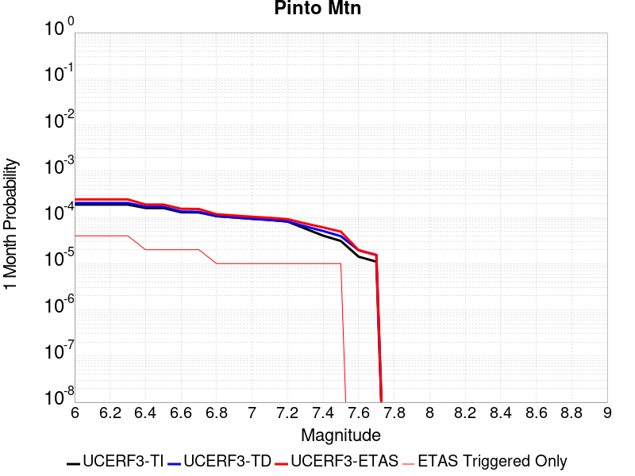 |  |  |

| Magnitude | 1 wk TI Prob | 1 wk TD Prob | 1 wk ETAS Prob | 1 wk ETAS/TD Gain | 1 wk ETAS Triggered Only | 1 mo TI Prob | 1 mo TD Prob | 1 mo ETAS Prob | 1 mo ETAS/TD Gain | 1 mo ETAS Triggered Only | 1 yr TI Prob | 1 yr TD Prob | 1 yr ETAS Prob | 1 yr ETAS/TD Gain | 1 yr ETAS Triggered Only | 10 yr TI Prob | 10 yr TD Prob | 10 yr ETAS Prob | 10 yr ETAS/TD Gain | 10 yr ETAS Triggered Only |
|-----|-----|-----|-----|-----|-----|-----|-----|-----|-----|-----|-----|-----|-----|-----|-----|-----|-----|-----|-----|-----|
| 6.0 | 4.4194956E-5 | 4.7853926E-5 | 8.785201E-5 | 1.8358371 | 4.0E-5 | 1.893932E-4 | 2.0507304E-4 | 2.4506485E-4 | 1.1950125 | 4.0E-5 | 0.0023034236 | 0.0024940688 | 0.002553919 | 1.0239971 | 6.0E-5 | 0.022796938 | 0.024678305 | 0.024756331 | 1.0031617 | 8.0E-5 |
| 6.1 | 4.4194956E-5 | 4.7853926E-5 | 8.785201E-5 | 1.8358371 | 4.0E-5 | 1.893932E-4 | 2.0507304E-4 | 2.4506485E-4 | 1.1950125 | 4.0E-5 | 0.0023034236 | 0.0024940688 | 0.002553919 | 1.0239971 | 6.0E-5 | 0.022796938 | 0.024678305 | 0.024756331 | 1.0031617 | 8.0E-5 |
| 6.2 | 4.4194956E-5 | 4.7853926E-5 | 8.785201E-5 | 1.8358371 | 4.0E-5 | 1.893932E-4 | 2.0507304E-4 | 2.4506485E-4 | 1.1950125 | 4.0E-5 | 0.0023034236 | 0.0024940688 | 0.002553919 | 1.0239971 | 6.0E-5 | 0.022796938 | 0.024678305 | 0.024756331 | 1.0031617 | 8.0E-5 |
| 6.3 | 4.4194956E-5 | 4.7853926E-5 | 8.785201E-5 | 1.8358371 | 4.0E-5 | 1.893932E-4 | 2.0507304E-4 | 2.4506485E-4 | 1.1950125 | 4.0E-5 | 0.0023034236 | 0.0024940688 | 0.002553919 | 1.0239971 | 6.0E-5 | 0.022796938 | 0.024678305 | 0.024756331 | 1.0031617 | 8.0E-5 |
| 6.4 | 3.729929E-5 | 3.960349E-5 | 5.96027E-5 | 1.504986 | 2.0E-5 | 1.5984432E-4 | 1.6971873E-4 | 1.8971533E-4 | 1.117822 | 2.0E-5 | 0.0019443673 | 0.0020644604 | 0.0021043778 | 1.0193355 | 4.0E-5 | 0.019274427 | 0.020462848 | 0.020511825 | 1.0023935 | 5.0E-5 |
| 6.5 | 3.729929E-5 | 3.960349E-5 | 5.96027E-5 | 1.504986 | 2.0E-5 | 1.5984432E-4 | 1.6971873E-4 | 1.8971533E-4 | 1.117822 | 2.0E-5 | 0.0019443673 | 0.0020644604 | 0.0021043778 | 1.0193355 | 4.0E-5 | 0.019274427 | 0.020462848 | 0.020511825 | 1.0023935 | 5.0E-5 |
| 6.6 | 3.0204548E-5 | 3.12056E-5 | 5.1204977E-5 | 1.6408906 | 2.0E-5 | 1.2944164E-4 | 1.3373162E-4 | 1.5372895E-4 | 1.1495333 | 2.0E-5 | 0.0015748127 | 0.0016270012 | 0.0016569524 | 1.0184088 | 3.0E-5 | 0.015636992 | 0.016154764 | 0.01618428 | 1.001827 | 3.0E-5 |
| 6.7 | 2.9857754E-5 | 3.0814987E-5 | 5.0814368E-5 | 1.6490148 | 2.0E-5 | 1.2795553E-4 | 1.3205773E-4 | 1.5205509E-4 | 1.1514289 | 2.0E-5 | 0.0015567453 | 0.0016066517 | 0.0016366035 | 1.0186424 | 3.0E-5 | 0.015458848 | 0.015954204 | 0.015983725 | 1.0018504 | 3.0E-5 |
| 6.8 | 2.4819734E-5 | 2.5009665E-5 | 3.5009416E-5 | 1.3998355 | 1.0E-5 | 1.0636595E-4 | 1.0718E-4 | 1.17178926E-4 | 1.093291 | 1.0E-5 | 0.0012942362 | 0.001304157 | 0.0013241309 | 1.0153155 | 2.0E-5 | 0.012867244 | 0.012967403 | 0.012987143 | 1.0015223 | 2.0E-5 |
| 6.9 | 2.331124E-5 | 2.3337945E-5 | 3.333771E-5 | 1.4284767 | 1.0E-5 | 9.990149E-5 | 1.0001605E-4 | 1.1001505E-4 | 1.0999739 | 1.0E-5 | 0.001215622 | 0.0012170355 | 0.0012370112 | 1.0164133 | 2.0E-5 | 0.012089936 | 0.012105897 | 0.012125655 | 1.0016321 | 2.0E-5 |
| 7.0 | 2.1818534E-5 | 2.1761074E-5 | 3.1760857E-5 | 1.4595262 | 1.0E-5 | 9.3504656E-5 | 9.3258524E-5 | 1.0325759E-4 | 1.1072189 | 1.0E-5 | 0.0011378246 | 0.0011348509 | 0.0011448396 | 1.0088017 | 1.0E-5 | 0.011320163 | 0.01129266 | 0.011302547 | 1.0008755 | 1.0E-5 |
| 7.1 | 2.066081E-5 | 2.0540718E-5 | 3.0540512E-5 | 1.4868279 | 1.0E-5 | 8.854332E-5 | 8.8028784E-5 | 9.802791E-5 | 1.1135892 | 1.0E-5 | 0.0010774818 | 0.0010712431 | 0.0010812324 | 1.0093249 | 1.0E-5 | 0.010722724 | 0.0106628435 | 0.010672737 | 1.0009278 | 1.0E-5 |
| 7.2 | 1.8990233E-5 | 1.9054001E-5 | 2.9053812E-5 | 1.5248141 | 1.0E-5 | 8.138417E-5 | 8.165756E-5 | 9.1656744E-5 | 1.1224526 | 1.0E-5 | 9.904018E-4 | 9.937467E-4 | 0.0010037367 | 1.0100529 | 1.0E-5 | 0.009859995 | 0.009895029 | 0.00990493 | 1.0010006 | 1.0E-5 |
| 7.3 | 1.3335872E-5 | 1.4906713E-5 | 2.4906563E-5 | 1.6708287 | 1.0E-5 | 5.7152483E-5 | 6.388442E-5 | 7.388378E-5 | 1.1565228 | 1.0E-5 | 6.956093E-4 | 7.77528E-4 | 7.875202E-4 | 1.0128512 | 1.0E-5 | 0.006934359 | 0.007749376 | 0.007759298 | 1.0012804 | 1.0E-5 |
| 7.4 | 9.414066E-6 | 1.186096E-5 | 2.1860842E-5 | 1.8430921 | 1.0E-5 | 4.0345374E-5 | 5.083175E-5 | 6.083124E-5 | 1.1967175 | 1.0E-5 | 4.910942E-4 | 6.1871024E-4 | 6.2870403E-4 | 1.0161526 | 1.0E-5 | 0.0049001034 | 0.0061708256 | 0.0061807637 | 1.0016105 | 1.0E-5 |
| 7.5 | 7.2101157E-6 | 9.158192E-6 | 1.91581E-5 | 2.0919085 | 1.0E-5 | 3.090013E-5 | 3.9248847E-5 | 4.9248454E-5 | 1.2547746 | 1.0E-5 | 3.7614413E-4 | 4.7775774E-4 | 4.87753E-4 | 1.0209211 | 1.0E-5 | 0.0037550807 | 0.004768082 | 0.0047780345 | 1.0020872 | 1.0E-5 |
| 7.6 | 3.296375E-6 | 4.5455017E-6 | 4.5455017E-6 | 1.0 | 0.0 | 1.4127245E-5 | 1.9480583E-5 | 1.9480583E-5 | 1.0 | 0.0 | 1.7198564E-4 | 2.3715167E-4 | 2.3715167E-4 | 1.0 | 0.0 | 0.0017185259 | 0.0023691233 | 0.0023691233 | 1.0 | 0.0 |
| 7.7 | 2.5741092E-6 | 3.5844084E-6 | 3.5844084E-6 | 1.0 | 0.0 | 1.103185E-5 | 1.5361667E-5 | 1.5361667E-5 | 1.0 | 0.0 | 1.3430449E-4 | 1.8701357E-4 | 1.8701357E-4 | 1.0 | 0.0 | 0.0013422335 | 0.0018686918 | 0.0018686918 | 1.0 | 0.0 |

## San Andreas (North Branch Mill Creek)
*[(top)](#table-of-contents)*

| 1 Week | 1 Month | 1 Year | 10 Year |
|-----|-----|-----|-----|
|  |  |  |  |

| Magnitude | 1 wk TI Prob | 1 wk TD Prob | 1 wk ETAS Prob | 1 wk ETAS/TD Gain | 1 wk ETAS Triggered Only | 1 mo TI Prob | 1 mo TD Prob | 1 mo ETAS Prob | 1 mo ETAS/TD Gain | 1 mo ETAS Triggered Only | 1 yr TI Prob | 1 yr TD Prob | 1 yr ETAS Prob | 1 yr ETAS/TD Gain | 1 yr ETAS Triggered Only | 10 yr TI Prob | 10 yr TD Prob | 10 yr ETAS Prob | 10 yr ETAS/TD Gain | 10 yr ETAS Triggered Only |
|-----|-----|-----|-----|-----|-----|-----|-----|-----|-----|-----|-----|-----|-----|-----|-----|-----|-----|-----|-----|-----|
| 6.0 | 1.3461156E-5 | 2.3500992E-5 | 4.350052E-5 | 1.8510079 | 2.0E-5 | 5.7689394E-5 | 1.00714664E-4 | 1.5070963E-4 | 1.496402 | 5.0E-5 | 7.02142E-4 | 0.0012255146 | 0.0012854411 | 1.048899 | 6.0E-5 | 0.0069992766 | 0.012228744 | 0.012307766 | 1.006462 | 8.0E-5 |
| 6.1 | 1.3461156E-5 | 2.3500992E-5 | 4.350052E-5 | 1.8510079 | 2.0E-5 | 5.7689394E-5 | 1.00714664E-4 | 1.5070963E-4 | 1.496402 | 5.0E-5 | 7.02142E-4 | 0.0012255146 | 0.0012854411 | 1.048899 | 6.0E-5 | 0.0069992766 | 0.012228744 | 0.012307766 | 1.006462 | 8.0E-5 |
| 6.2 | 1.3461156E-5 | 2.3500992E-5 | 4.350052E-5 | 1.8510079 | 2.0E-5 | 5.7689394E-5 | 1.00714664E-4 | 1.5070963E-4 | 1.496402 | 5.0E-5 | 7.02142E-4 | 0.0012255146 | 0.0012854411 | 1.048899 | 6.0E-5 | 0.0069992766 | 0.012228744 | 0.012307766 | 1.006462 | 8.0E-5 |
| 6.3 | 1.3461156E-5 | 2.3500992E-5 | 4.350052E-5 | 1.8510079 | 2.0E-5 | 5.7689394E-5 | 1.00714664E-4 | 1.5070963E-4 | 1.496402 | 5.0E-5 | 7.02142E-4 | 0.0012255146 | 0.0012854411 | 1.048899 | 6.0E-5 | 0.0069992766 | 0.012228744 | 0.012307766 | 1.006462 | 8.0E-5 |
| 6.4 | 1.3461156E-5 | 2.3500992E-5 | 4.350052E-5 | 1.8510079 | 2.0E-5 | 5.7689394E-5 | 1.00714664E-4 | 1.5070963E-4 | 1.496402 | 5.0E-5 | 7.02142E-4 | 0.0012255146 | 0.0012854411 | 1.048899 | 6.0E-5 | 0.0069992766 | 0.012228744 | 0.012307766 | 1.006462 | 8.0E-5 |
| 6.5 | 1.3450706E-5 | 2.348995E-5 | 4.3489483E-5 | 1.8514079 | 2.0E-5 | 5.764461E-5 | 1.00667356E-4 | 1.5066232E-4 | 1.4966353 | 5.0E-5 | 7.0159714E-4 | 0.0012249392 | 0.0012848658 | 1.0489221 | 6.0E-5 | 0.006993862 | 0.012223054 | 0.0123020755 | 1.006465 | 8.0E-5 |
| 6.6 | 1.3074523E-5 | 2.3104236E-5 | 4.3103773E-5 | 1.8656222 | 2.0E-5 | 5.6032466E-5 | 9.901441E-5 | 1.4900946E-4 | 1.504927 | 5.0E-5 | 6.8198174E-4 | 0.001204837 | 0.0012647647 | 1.0497392 | 6.0E-5 | 0.006798926 | 0.012024219 | 0.012103258 | 1.0065732 | 8.0E-5 |
| 6.7 | 1.3050216E-5 | 2.3079532E-5 | 4.307907E-5 | 1.8665487 | 2.0E-5 | 5.59283E-5 | 9.890855E-5 | 1.4890361E-4 | 1.5054674 | 5.0E-5 | 6.8071426E-4 | 0.0012035496 | 0.0012634774 | 1.0497925 | 6.0E-5 | 0.0067863287 | 0.012011484 | 0.012090523 | 1.0065802 | 8.0E-5 |
| 6.8 | 1.29049395E-5 | 2.2927941E-5 | 4.292748E-5 | 1.8722781 | 2.0E-5 | 5.530571E-5 | 9.825892E-5 | 1.4825401E-4 | 1.5088097 | 5.0E-5 | 6.73139E-4 | 0.001195649 | 0.0012555773 | 1.0501219 | 6.0E-5 | 0.0067110364 | 0.011933329 | 0.012012374 | 1.0066239 | 8.0E-5 |
| 6.9 | 1.2867369E-5 | 2.2887343E-5 | 4.2886884E-5 | 1.8738254 | 2.0E-5 | 5.51447E-5 | 9.808494E-5 | 1.4808004E-4 | 1.5097122 | 5.0E-5 | 6.711799E-4 | 0.0011935332 | 0.0012534616 | 1.050211 | 6.0E-5 | 0.006691564 | 0.011912397 | 0.011991444 | 1.0066357 | 8.0E-5 |
| 7.0 | 1.2495996E-5 | 2.2287419E-5 | 4.2286974E-5 | 1.8973472 | 2.0E-5 | 5.3553173E-5 | 9.551403E-5 | 1.4550926E-4 | 1.5234333 | 5.0E-5 | 6.518148E-4 | 0.0011622658 | 0.001222196 | 1.0515633 | 6.0E-5 | 0.0064990623 | 0.011603 | 0.011682072 | 1.0068147 | 8.0E-5 |
| 7.1 | 1.2452067E-5 | 2.2232492E-5 | 4.2232048E-5 | 1.8995643 | 2.0E-5 | 5.3364907E-5 | 9.527864E-5 | 1.4527388E-4 | 1.5247266 | 5.0E-5 | 6.4952404E-4 | 0.001159403 | 0.0012193335 | 1.0516908 | 6.0E-5 | 0.0064762887 | 0.011574671 | 0.011653745 | 1.0068316 | 8.0E-5 |
| 7.2 | 1.2002777E-5 | 2.1611015E-5 | 4.1610583E-5 | 1.925434 | 2.0E-5 | 5.143946E-5 | 9.261536E-5 | 1.4261073E-4 | 1.5398172 | 5.0E-5 | 6.2609545E-4 | 0.0011270114 | 0.0011869437 | 1.0531782 | 6.0E-5 | 0.006243344 | 0.011254058 | 0.011333157 | 1.0070286 | 8.0E-5 |
| 7.3 | 1.1923425E-5 | 2.1480853E-5 | 4.1480424E-5 | 1.9310417 | 2.0E-5 | 5.109939E-5 | 9.205757E-5 | 1.4205297E-4 | 1.5430884 | 5.0E-5 | 6.219575E-4 | 0.0011202273 | 0.0011801601 | 1.0535005 | 6.0E-5 | 0.0062021962 | 0.011186945 | 0.01126605 | 1.0070711 | 8.0E-5 |
| 7.4 | 1.16105175E-5 | 2.0854808E-5 | 4.085439E-5 | 1.9589915 | 2.0E-5 | 4.975841E-5 | 8.93747E-5 | 1.3937023E-4 | 1.5593925 | 5.0E-5 | 6.0564023E-4 | 0.0010875963 | 0.0011475311 | 1.0551075 | 6.0E-5 | 0.006039923 | 0.010864409 | 0.01094354 | 1.0072834 | 8.0E-5 |
| 7.5 | 1.1037265E-5 | 1.9554842E-5 | 3.9554452E-5 | 2.0227447 | 2.0E-5 | 4.7301706E-5 | 8.380379E-5 | 1.337996E-4 | 1.5965817 | 5.0E-5 | 5.757461E-4 | 0.0010198357 | 0.0010797745 | 1.058773 | 6.0E-5 | 0.005742567 | 0.010195527 | 0.010274712 | 1.0077666 | 8.0E-5 |
| 7.6 | 1.0720915E-5 | 1.8996727E-5 | 3.8996346E-5 | 2.0527928 | 2.0E-5 | 4.5945973E-5 | 8.141202E-5 | 1.3140794E-4 | 1.61411 | 5.0E-5 | 5.592486E-4 | 9.907428E-4 | 0.0010506833 | 1.0605006 | 6.0E-5 | 0.005578433 | 0.009907238 | 0.009986446 | 1.0079949 | 8.0E-5 |
| 7.7 | 9.276279E-6 | 1.6442464E-5 | 3.6442136E-5 | 2.2163427 | 2.0E-5 | 3.9754876E-5 | 7.046581E-5 | 1.2046228E-4 | 1.709514 | 5.0E-5 | 4.839081E-4 | 8.5758517E-4 | 9.1753376E-4 | 1.0699039 | 6.0E-5 | 0.0048285574 | 0.008586576 | 0.008665889 | 1.0092368 | 8.0E-5 |
| 7.8 | 5.8346777E-6 | 1.11555855E-5 | 3.1155363E-5 | 2.792804 | 2.0E-5 | 2.5005522E-5 | 4.7808775E-5 | 9.780638E-5 | 2.045783 | 5.0E-5 | 3.043997E-4 | 5.819165E-4 | 6.418816E-4 | 1.1030476 | 6.0E-5 | 0.0030398308 | 0.0058473335 | 0.0059268656 | 1.0136014 | 8.0E-5 |
| 7.9 | 4.690204E-6 | 8.509473E-6 | 2.8509303E-5 | 3.3503015 | 2.0E-5 | 2.0100719E-5 | 3.6468664E-5 | 8.646684E-5 | 2.37099 | 5.0E-5 | 2.4469878E-4 | 4.439156E-4 | 5.03889E-4 | 1.1351008 | 6.0E-5 | 0.002444295 | 0.004471165 | 0.004550807 | 1.0178124 | 8.0E-5 |
| 8.0 | 2.9570454E-6 | 4.8470656E-6 | 4.8470656E-6 | 1.0 | 0.0 | 1.267299E-5 | 2.0772974E-5 | 5.077235E-5 | 2.4441543 | 3.0E-5 | 1.5428272E-4 | 2.5288164E-4 | 2.8287404E-4 | 1.1186026 | 3.0E-5 | 0.0015417566 | 0.002549932 | 0.0025898302 | 1.0156467 | 4.0E-5 |
| 8.1 | 1.6376824E-6 | 2.1968672E-6 | 2.1968672E-6 | 1.0 | 0.0 | 7.01862E-6 | 9.415111E-6 | 1.9415018E-5 | 2.0621123 | 1.0E-5 | 8.544835E-5 | 1.1462297E-4 | 1.2462182E-4 | 1.0872326 | 1.0E-5 | 8.54155E-4 | 0.0011607445 | 0.0011707328 | 1.0086051 | 1.0E-5 |
| 8.2 | 6.9631557E-7 | 4.535001E-7 | 4.535001E-7 | 1.0 | 0.0 | 2.984206E-6 | 1.9435704E-6 | 1.1943551E-5 | 6.14516 | 1.0E-5 | 3.63321E-5 | 2.3662713E-5 | 3.3662476E-5 | 1.4225959 | 1.0E-5 | 3.6326164E-4 | 2.4510184E-4 | 2.5509938E-4 | 1.0407894 | 1.0E-5 |
| 8.3 | 1.7876137E-7 | 8.357368E-8 | 8.357368E-8 | 1.0 | 0.0 | 7.661199E-7 | 3.5817288E-7 | 3.5817288E-7 | 1.0 | 0.0 | 9.32747E-6 | 4.3607465E-6 | 4.3607465E-6 | 1.0 | 0.0 | 9.3270784E-5 | 4.5800018E-5 | 4.5800018E-5 | 1.0 | 0.0 |

## Independence rev 2011
*[(top)](#table-of-contents)*

| 1 Week | 1 Month | 1 Year | 10 Year |
|-----|-----|-----|-----|
|  |  |  |  |

| Magnitude | 1 wk TI Prob | 1 wk TD Prob | 1 wk ETAS Prob | 1 wk ETAS/TD Gain | 1 wk ETAS Triggered Only | 1 mo TI Prob | 1 mo TD Prob | 1 mo ETAS Prob | 1 mo ETAS/TD Gain | 1 mo ETAS Triggered Only | 1 yr TI Prob | 1 yr TD Prob | 1 yr ETAS Prob | 1 yr ETAS/TD Gain | 1 yr ETAS Triggered Only | 10 yr TI Prob | 10 yr TD Prob | 10 yr ETAS Prob | 10 yr ETAS/TD Gain | 10 yr ETAS Triggered Only |
|-----|-----|-----|-----|-----|-----|-----|-----|-----|-----|-----|-----|-----|-----|-----|-----|-----|-----|-----|-----|-----|
| 6.0 | 4.422171E-6 | 4.3262253E-6 | 4.3262253E-6 | 1.0 | 0.0 | 1.8952025E-5 | 1.8540852E-5 | 3.854048E-5 | 2.078679 | 2.0E-5 | 2.3071647E-4 | 2.2571447E-4 | 2.6570543E-4 | 1.177175 | 4.0E-5 | 0.0023047708 | 0.0022551457 | 0.0023150104 | 1.0265458 | 6.0E-5 |
| 6.1 | 4.422171E-6 | 4.3262253E-6 | 4.3262253E-6 | 1.0 | 0.0 | 1.8952025E-5 | 1.8540852E-5 | 3.854048E-5 | 2.078679 | 2.0E-5 | 2.3071647E-4 | 2.2571447E-4 | 2.6570543E-4 | 1.177175 | 4.0E-5 | 0.0023047708 | 0.0022551457 | 0.0023150104 | 1.0265458 | 6.0E-5 |
| 6.2 | 4.422171E-6 | 4.3262253E-6 | 4.3262253E-6 | 1.0 | 0.0 | 1.8952025E-5 | 1.8540852E-5 | 3.854048E-5 | 2.078679 | 2.0E-5 | 2.3071647E-4 | 2.2571447E-4 | 2.6570543E-4 | 1.177175 | 4.0E-5 | 0.0023047708 | 0.0022551457 | 0.0023150104 | 1.0265458 | 6.0E-5 |
| 6.3 | 4.422171E-6 | 4.3262253E-6 | 4.3262253E-6 | 1.0 | 0.0 | 1.8952025E-5 | 1.8540852E-5 | 3.854048E-5 | 2.078679 | 2.0E-5 | 2.3071647E-4 | 2.2571447E-4 | 2.6570543E-4 | 1.177175 | 4.0E-5 | 0.0023047708 | 0.0022551457 | 0.0023150104 | 1.0265458 | 6.0E-5 |
| 6.4 | 4.422171E-6 | 4.3262253E-6 | 4.3262253E-6 | 1.0 | 0.0 | 1.8952025E-5 | 1.8540852E-5 | 3.854048E-5 | 2.078679 | 2.0E-5 | 2.3071647E-4 | 2.2571447E-4 | 2.6570543E-4 | 1.177175 | 4.0E-5 | 0.0023047708 | 0.0022551457 | 0.0023150104 | 1.0265458 | 6.0E-5 |
| 6.5 | 4.422171E-6 | 4.3262253E-6 | 4.3262253E-6 | 1.0 | 0.0 | 1.8952025E-5 | 1.8540852E-5 | 3.854048E-5 | 2.078679 | 2.0E-5 | 2.3071647E-4 | 2.2571447E-4 | 2.6570543E-4 | 1.177175 | 4.0E-5 | 0.0023047708 | 0.0022551457 | 0.0023150104 | 1.0265458 | 6.0E-5 |
| 6.6 | 2.663744E-6 | 2.5319846E-6 | 2.5319846E-6 | 1.0 | 0.0 | 1.1415996E-5 | 1.08513195E-5 | 3.0851104E-5 | 2.8430738 | 2.0E-5 | 1.3898089E-4 | 1.321073E-4 | 1.7210201E-4 | 1.3027442 | 4.0E-5 | 0.0013889399 | 0.0013203359 | 0.0013802567 | 1.045383 | 6.0E-5 |
| 6.7 | 2.663744E-6 | 2.5319846E-6 | 2.5319846E-6 | 1.0 | 0.0 | 1.1415996E-5 | 1.08513195E-5 | 3.0851104E-5 | 2.8430738 | 2.0E-5 | 1.3898089E-4 | 1.321073E-4 | 1.7210201E-4 | 1.3027442 | 4.0E-5 | 0.0013889399 | 0.0013203359 | 0.0013802567 | 1.045383 | 6.0E-5 |
| 6.8 | 1.9716529E-6 | 1.8322567E-6 | 1.8322567E-6 | 1.0 | 0.0 | 8.449913E-6 | 7.852505E-6 | 2.7852348E-5 | 3.5469377 | 2.0E-5 | 1.0287284E-4 | 9.560019E-5 | 1.2559732E-4 | 1.3137769 | 3.0E-5 | 0.0010282523 | 9.5560355E-4 | 0.0010055557 | 1.0522729 | 5.0E-5 |
| 6.9 | 1.8788617E-6 | 1.7429976E-6 | 1.7429976E-6 | 1.0 | 0.0 | 8.0522395E-6 | 7.4699688E-6 | 2.746982E-5 | 3.6773674 | 2.0E-5 | 9.80316E-5 | 9.09432E-5 | 1.1094138E-4 | 1.2198975 | 2.0E-5 | 9.798837E-4 | 9.090718E-4 | 9.4903546E-4 | 1.0439609 | 4.0E-5 |
| 7.0 | 1.5045488E-6 | 1.3849498E-6 | 1.3849498E-6 | 1.0 | 0.0 | 6.44805E-6 | 5.9354857E-6 | 2.5935367E-5 | 4.369544 | 2.0E-5 | 7.8502184E-5 | 7.226219E-5 | 9.226075E-5 | 1.2767498 | 2.0E-5 | 7.8474457E-4 | 7.223921E-4 | 7.523704E-4 | 1.0414987 | 3.0E-5 |
| 7.1 | 1.272341E-6 | 1.1625089E-6 | 1.1625089E-6 | 1.0 | 0.0 | 5.4528787E-6 | 4.9821715E-6 | 2.4982071E-5 | 5.0142937 | 2.0E-5 | 6.6386776E-5 | 6.0656283E-5 | 8.065507E-5 | 1.3297068 | 2.0E-5 | 6.636695E-4 | 6.064005E-4 | 6.3638226E-4 | 1.0494423 | 3.0E-5 |
| 7.2 | 1.0416892E-6 | 9.409871E-7 | 9.409871E-7 | 1.0 | 0.0 | 4.464375E-6 | 4.032796E-6 | 2.4032715E-5 | 5.9593186 | 2.0E-5 | 5.4352407E-5 | 4.9098202E-5 | 6.9097216E-5 | 1.4073269 | 2.0E-5 | 5.4339116E-4 | 4.908754E-4 | 5.2086066E-4 | 1.0610853 | 3.0E-5 |
| 7.3 | 7.9450155E-7 | 7.2350036E-7 | 7.2350036E-7 | 1.0 | 0.0 | 3.4050022E-6 | 3.1007123E-6 | 2.310065E-5 | 7.450111 | 2.0E-5 | 4.1455114E-5 | 3.7750528E-5 | 5.7749774E-5 | 1.529774 | 2.0E-5 | 4.144738E-4 | 3.7744228E-4 | 4.0743095E-4 | 1.0794524 | 3.0E-5 |
| 7.4 | 5.3893444E-7 | 5.0195166E-7 | 5.0195166E-7 | 1.0 | 0.0 | 2.309717E-6 | 2.1512196E-6 | 2.2151176E-5 | 10.297031 | 2.0E-5 | 2.8120441E-5 | 2.6190788E-5 | 4.6190264E-5 | 1.7636073 | 2.0E-5 | 2.8116882E-4 | 2.6187746E-4 | 2.9186963E-4 | 1.1145273 | 3.0E-5 |
| 7.5 | 3.8852085E-7 | 3.6825622E-7 | 3.6825622E-7 | 1.0 | 0.0 | 1.6650882E-6 | 1.57824E-6 | 2.157821E-5 | 13.672323 | 2.0E-5 | 2.027226E-5 | 1.9214905E-5 | 3.921452E-5 | 2.0408387 | 2.0E-5 | 2.0270412E-4 | 1.9213265E-4 | 2.221269E-4 | 1.1561121 | 3.0E-5 |
| 7.6 | 2.414929E-7 | 2.3457605E-7 | 2.3457605E-7 | 1.0 | 0.0 | 1.0349692E-6 | 1.0053255E-6 | 1.0053255E-6 | 1.0 | 0.0 | 1.2600677E-5 | 1.2239771E-5 | 1.2239771E-5 | 1.0 | 0.0 | 1.2599962E-4 | 1.223911E-4 | 1.3238986E-4 | 1.0816953 | 1.0E-5 |
| 7.7 | 6.8298014E-8 | 6.8589785E-8 | 6.8589785E-8 | 1.0 | 0.0 | 2.9270575E-7 | 2.939562E-7 | 2.939562E-7 | 1.0 | 0.0 | 3.5636867E-6 | 3.5789112E-6 | 3.5789112E-6 | 1.0 | 0.0 | 3.5636294E-5 | 3.5788584E-5 | 3.5788584E-5 | 1.0 | 0.0 |

## Pisgah-Bullion Mtn-Mesquite Lk
*[(top)](#table-of-contents)*

| 1 Week | 1 Month | 1 Year | 10 Year |
|-----|-----|-----|-----|
|  | 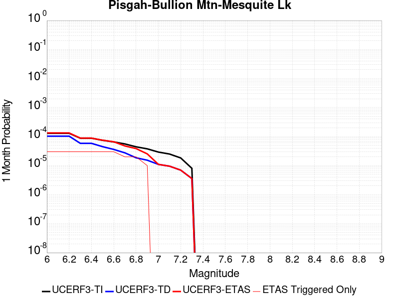 |  |  |

| Magnitude | 1 wk TI Prob | 1 wk TD Prob | 1 wk ETAS Prob | 1 wk ETAS/TD Gain | 1 wk ETAS Triggered Only | 1 mo TI Prob | 1 mo TD Prob | 1 mo ETAS Prob | 1 mo ETAS/TD Gain | 1 mo ETAS Triggered Only | 1 yr TI Prob | 1 yr TD Prob | 1 yr ETAS Prob | 1 yr ETAS/TD Gain | 1 yr ETAS Triggered Only | 10 yr TI Prob | 10 yr TD Prob | 10 yr ETAS Prob | 10 yr ETAS/TD Gain | 10 yr ETAS Triggered Only |
|-----|-----|-----|-----|-----|-----|-----|-----|-----|-----|-----|-----|-----|-----|-----|-----|-----|-----|-----|-----|-----|
| 6.0 | 3.0240792E-5 | 2.40909E-5 | 5.409018E-5 | 2.2452536 | 3.0E-5 | 1.2959696E-4 | 1.032432E-4 | 1.332401E-4 | 1.2905461 | 3.0E-5 | 0.0015767008 | 0.0012563618 | 0.0013162864 | 1.047697 | 6.0E-5 | 0.015655609 | 0.012502613 | 0.012571738 | 1.0055288 | 7.0E-5 |
| 6.1 | 3.0240792E-5 | 2.40909E-5 | 5.409018E-5 | 2.2452536 | 3.0E-5 | 1.2959696E-4 | 1.032432E-4 | 1.332401E-4 | 1.2905461 | 3.0E-5 | 0.0015767008 | 0.0012563618 | 0.0013162864 | 1.047697 | 6.0E-5 | 0.015655609 | 0.012502613 | 0.012571738 | 1.0055288 | 7.0E-5 |
| 6.2 | 3.0240792E-5 | 2.40909E-5 | 5.409018E-5 | 2.2452536 | 3.0E-5 | 1.2959696E-4 | 1.032432E-4 | 1.332401E-4 | 1.2905461 | 3.0E-5 | 0.0015767008 | 0.0012563618 | 0.0013162864 | 1.047697 | 6.0E-5 | 0.015655609 | 0.012502613 | 0.012571738 | 1.0055288 | 7.0E-5 |
| 6.3 | 2.0498217E-5 | 1.3638054E-5 | 4.3637647E-5 | 3.1996973 | 3.0E-5 | 8.784654E-5 | 5.8447586E-5 | 8.8445835E-5 | 1.5132504 | 3.0E-5 | 0.0010690069 | 7.1138324E-4 | 7.613477E-4 | 1.0702356 | 5.0E-5 | 0.01063879 | 0.0070926864 | 0.007142332 | 1.0069995 | 5.0E-5 |
| 6.4 | 2.0498217E-5 | 1.3638054E-5 | 4.3637647E-5 | 3.1996973 | 3.0E-5 | 8.784654E-5 | 5.8447586E-5 | 8.8445835E-5 | 1.5132504 | 3.0E-5 | 0.0010690069 | 7.1138324E-4 | 7.613477E-4 | 1.0702356 | 5.0E-5 | 0.01063879 | 0.0070926864 | 0.007142332 | 1.0069995 | 5.0E-5 |
| 6.5 | 1.7316182E-5 | 1.04769715E-5 | 4.0476658E-5 | 3.8633928 | 3.0E-5 | 7.42101E-5 | 4.490059E-5 | 7.4899246E-5 | 1.6681126 | 3.0E-5 | 9.0313336E-4 | 5.465376E-4 | 5.865157E-4 | 1.073148 | 4.0E-5 | 0.008994718 | 0.00545293 | 0.005492712 | 1.0072955 | 4.0E-5 |
| 6.6 | 1.5251077E-5 | 8.414133E-6 | 3.841388E-5 | 4.5653996 | 3.0E-5 | 6.536012E-5 | 3.606011E-5 | 6.605903E-5 | 1.8319142 | 3.0E-5 | 7.9546886E-4 | 4.3895066E-4 | 4.789331E-4 | 1.0910864 | 4.0E-5 | 0.007926274 | 0.0043815537 | 0.0044213785 | 1.0090892 | 4.0E-5 |
| 6.7 | 1.2997425E-5 | 6.4112146E-6 | 2.6411086E-5 | 4.1195135 | 2.0E-5 | 5.570206E-5 | 2.7476372E-5 | 4.747582E-5 | 1.7278782 | 2.0E-5 | 6.7796157E-4 | 3.3447813E-4 | 3.6446808E-4 | 1.089662 | 3.0E-5 | 0.0067589693 | 0.003340207 | 0.003370107 | 1.0089514 | 3.0E-5 |
| 6.8 | 1.035386E-5 | 4.333145E-6 | 2.4333058E-5 | 5.615565 | 2.0E-5 | 4.437293E-5 | 1.8570496E-5 | 3.8570124E-5 | 2.0769572 | 2.0E-5 | 5.401065E-4 | 2.260732E-4 | 2.560664E-4 | 1.1326704 | 3.0E-5 | 0.0053879567 | 0.002258519 | 0.0022884512 | 1.0132531 | 3.0E-5 |
| 6.9 | 8.816252E-6 | 3.5805879E-6 | 1.3580552E-5 | 3.7928274 | 1.0E-5 | 3.778339E-5 | 1.534529E-5 | 2.5345136E-5 | 1.6516558 | 1.0E-5 | 4.5991567E-4 | 1.8681347E-4 | 2.0680974E-4 | 1.1070386 | 2.0E-5 | 0.00458965 | 0.0018666228 | 0.0018865855 | 1.0106945 | 2.0E-5 |
| 7.0 | 6.8232207E-6 | 2.5674399E-6 | 2.5674399E-6 | 1.0 | 0.0 | 2.9242048E-5 | 1.100327E-5 | 1.100327E-5 | 1.0 | 0.0 | 3.5596377E-4 | 1.3395688E-4 | 1.3395688E-4 | 1.0 | 0.0 | 0.0035539411 | 0.0013387925 | 0.0013387925 | 1.0 | 0.0 |
| 7.1 | 5.837013E-6 | 2.2273143E-6 | 2.2273143E-6 | 1.0 | 0.0 | 2.501553E-5 | 9.5456E-6 | 9.5456E-6 | 1.0 | 0.0 | 3.045215E-4 | 1.1621177E-4 | 1.1621177E-4 | 1.0 | 0.0 | 0.0030410455 | 0.001161539 | 0.001161539 | 1.0 | 0.0 |
| 7.2 | 4.278052E-6 | 1.6275065E-6 | 1.6275065E-6 | 1.0 | 0.0 | 1.833438E-5 | 6.975011E-6 | 6.975011E-6 | 1.0 | 0.0 | 2.231982E-4 | 8.491768E-5 | 8.491768E-5 | 1.0 | 0.0 | 0.0022297418 | 8.4887556E-4 | 8.4887556E-4 | 1.0 | 0.0 |
| 7.3 | 1.8803692E-6 | 8.344788E-7 | 8.344788E-7 | 1.0 | 0.0 | 8.0587E-6 | 3.5763337E-6 | 3.5763337E-6 | 1.0 | 0.0 | 9.811026E-5 | 4.354114E-5 | 4.354114E-5 | 1.0 | 0.0 | 9.806695E-4 | 4.3534054E-4 | 4.3534054E-4 | 1.0 | 0.0 |

## Pleito
*[(top)](#table-of-contents)*

| 1 Week | 1 Month | 1 Year | 10 Year |
|-----|-----|-----|-----|
|  |  | 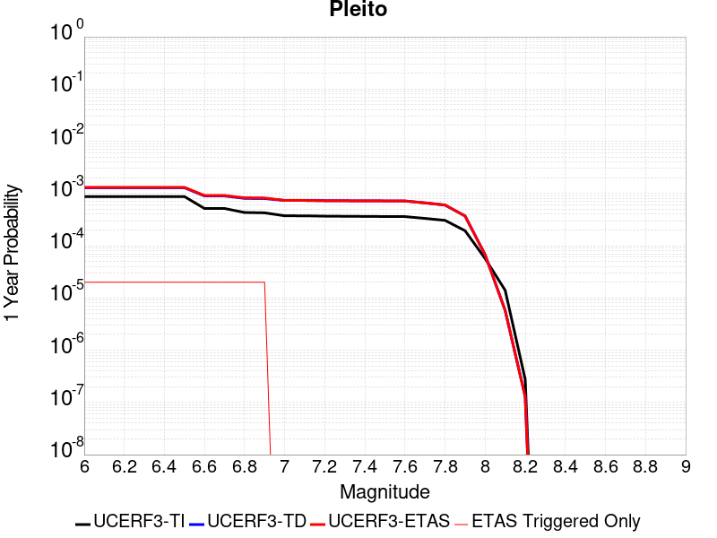 |  |

| Magnitude | 1 wk TI Prob | 1 wk TD Prob | 1 wk ETAS Prob | 1 wk ETAS/TD Gain | 1 wk ETAS Triggered Only | 1 mo TI Prob | 1 mo TD Prob | 1 mo ETAS Prob | 1 mo ETAS/TD Gain | 1 mo ETAS Triggered Only | 1 yr TI Prob | 1 yr TD Prob | 1 yr ETAS Prob | 1 yr ETAS/TD Gain | 1 yr ETAS Triggered Only | 10 yr TI Prob | 10 yr TD Prob | 10 yr ETAS Prob | 10 yr ETAS/TD Gain | 10 yr ETAS Triggered Only |
|-----|-----|-----|-----|-----|-----|-----|-----|-----|-----|-----|-----|-----|-----|-----|-----|-----|-----|-----|-----|-----|
| 6.0 | 1.6763008E-5 | 2.4764735E-5 | 4.476424E-5 | 1.80758 | 2.0E-5 | 7.183948E-5 | 1.0613067E-4 | 1.2612855E-4 | 1.188427 | 2.0E-5 | 8.742947E-4 | 0.001291447 | 0.0013114212 | 1.0154665 | 2.0E-5 | 0.00870863 | 0.012954412 | 0.013013635 | 1.0045717 | 6.0E-5 |
| 6.1 | 1.6763008E-5 | 2.4764735E-5 | 4.476424E-5 | 1.80758 | 2.0E-5 | 7.183948E-5 | 1.0613067E-4 | 1.2612855E-4 | 1.188427 | 2.0E-5 | 8.742947E-4 | 0.001291447 | 0.0013114212 | 1.0154665 | 2.0E-5 | 0.00870863 | 0.012954412 | 0.013013635 | 1.0045717 | 6.0E-5 |
| 6.2 | 1.6763008E-5 | 2.4764735E-5 | 4.476424E-5 | 1.80758 | 2.0E-5 | 7.183948E-5 | 1.0613067E-4 | 1.2612855E-4 | 1.188427 | 2.0E-5 | 8.742947E-4 | 0.001291447 | 0.0013114212 | 1.0154665 | 2.0E-5 | 0.00870863 | 0.012954412 | 0.013013635 | 1.0045717 | 6.0E-5 |
| 6.3 | 1.6763008E-5 | 2.4764735E-5 | 4.476424E-5 | 1.80758 | 2.0E-5 | 7.183948E-5 | 1.0613067E-4 | 1.2612855E-4 | 1.188427 | 2.0E-5 | 8.742947E-4 | 0.001291447 | 0.0013114212 | 1.0154665 | 2.0E-5 | 0.00870863 | 0.012954412 | 0.013013635 | 1.0045717 | 6.0E-5 |
| 6.4 | 1.6763008E-5 | 2.4764735E-5 | 4.476424E-5 | 1.80758 | 2.0E-5 | 7.183948E-5 | 1.0613067E-4 | 1.2612855E-4 | 1.188427 | 2.0E-5 | 8.742947E-4 | 0.001291447 | 0.0013114212 | 1.0154665 | 2.0E-5 | 0.00870863 | 0.012954412 | 0.013013635 | 1.0045717 | 6.0E-5 |
| 6.5 | 1.6763008E-5 | 2.4764735E-5 | 4.476424E-5 | 1.80758 | 2.0E-5 | 7.183948E-5 | 1.0613067E-4 | 1.2612855E-4 | 1.188427 | 2.0E-5 | 8.742947E-4 | 0.001291447 | 0.0013114212 | 1.0154665 | 2.0E-5 | 0.00870863 | 0.012954412 | 0.013013635 | 1.0045717 | 6.0E-5 |
| 6.6 | 9.910213E-6 | 1.721552E-5 | 3.7215177E-5 | 2.1617224 | 2.0E-5 | 4.247165E-5 | 7.3778734E-5 | 9.377726E-5 | 1.2710608 | 2.0E-5 | 5.169696E-4 | 8.9788967E-4 | 9.1787166E-4 | 1.0222545 | 2.0E-5 | 0.0051576863 | 0.009051226 | 0.009071045 | 1.0021896 | 2.0E-5 |
| 6.7 | 9.910213E-6 | 1.721552E-5 | 3.7215177E-5 | 2.1617224 | 2.0E-5 | 4.247165E-5 | 7.3778734E-5 | 9.377726E-5 | 1.2710608 | 2.0E-5 | 5.169696E-4 | 8.9788967E-4 | 9.1787166E-4 | 1.0222545 | 2.0E-5 | 0.0051576863 | 0.009051226 | 0.009071045 | 1.0021896 | 2.0E-5 |
| 6.8 | 8.300162E-6 | 1.5475129E-5 | 3.547482E-5 | 2.2923763 | 2.0E-5 | 3.557164E-5 | 6.63203E-5 | 8.631898E-5 | 1.3015468 | 2.0E-5 | 4.3299864E-4 | 8.07152E-4 | 8.2713587E-4 | 1.0247585 | 2.0E-5 | 0.004321559 | 0.008150663 | 0.0081705 | 1.0024338 | 2.0E-5 |
| 6.9 | 8.183114E-6 | 1.5346344E-5 | 3.534604E-5 | 2.303222 | 2.0E-5 | 3.5070017E-5 | 6.57684E-5 | 8.576708E-5 | 1.3040774 | 2.0E-5 | 4.2689382E-4 | 8.0043747E-4 | 8.204215E-4 | 1.0249664 | 2.0E-5 | 0.0042607468 | 0.008084008 | 0.008103847 | 1.002454 | 2.0E-5 |
| 7.0 | 7.1748823E-6 | 1.4133306E-5 | 1.4133306E-5 | 1.0 | 0.0 | 3.0749135E-5 | 6.0569906E-5 | 6.0569906E-5 | 1.0 | 0.0 | 3.743064E-4 | 7.3718966E-4 | 7.3718966E-4 | 1.0 | 0.0 | 0.0037367654 | 0.0074553755 | 0.0074553755 | 1.0 | 0.0 |
| 7.1 | 7.1671807E-6 | 1.4123676E-5 | 1.4123676E-5 | 1.0 | 0.0 | 3.0716128E-5 | 6.0528637E-5 | 6.0528637E-5 | 1.0 | 0.0 | 3.7390468E-4 | 7.366875E-4 | 7.366875E-4 | 1.0 | 0.0 | 0.0037327618 | 0.0074503883 | 0.0074503883 | 1.0 | 0.0 |
| 7.2 | 7.0649667E-6 | 1.3970962E-5 | 1.3970962E-5 | 1.0 | 0.0 | 3.0278077E-5 | 5.987418E-5 | 5.987418E-5 | 1.0 | 0.0 | 3.6857324E-4 | 7.287248E-4 | 7.287248E-4 | 1.0 | 0.0 | 0.0036796255 | 0.0073711374 | 0.0073711374 | 1.0 | 0.0 |
| 7.3 | 7.02082E-6 | 1.3914415E-5 | 1.3914415E-5 | 1.0 | 0.0 | 3.008888E-5 | 5.9631846E-5 | 5.9631846E-5 | 1.0 | 0.0 | 3.6627054E-4 | 7.257764E-4 | 7.257764E-4 | 1.0 | 0.0 | 0.0036566744 | 0.0073416373 | 0.0073416373 | 1.0 | 0.0 |
| 7.4 | 6.987146E-6 | 1.3873975E-5 | 1.3873975E-5 | 1.0 | 0.0 | 2.9944567E-5 | 5.9458544E-5 | 5.9458544E-5 | 1.0 | 0.0 | 3.6451413E-4 | 7.2366785E-4 | 7.2366785E-4 | 1.0 | 0.0 | 0.0036391679 | 0.007320571 | 0.007320571 | 1.0 | 0.0 |
| 7.5 | 6.9494554E-6 | 1.383088E-5 | 1.383088E-5 | 1.0 | 0.0 | 2.9783041E-5 | 5.9273858E-5 | 5.9273858E-5 | 1.0 | 0.0 | 3.625482E-4 | 7.2142074E-4 | 7.2142074E-4 | 1.0 | 0.0 | 0.0036195726 | 0.007298199 | 0.007298199 | 1.0 | 0.0 |
| 7.6 | 6.92694E-6 | 1.3789992E-5 | 1.3789992E-5 | 1.0 | 0.0 | 2.9686547E-5 | 5.909863E-5 | 5.909863E-5 | 1.0 | 0.0 | 3.6137376E-4 | 7.192888E-4 | 7.192888E-4 | 1.0 | 0.0 | 0.0036078666 | 0.007276951 | 0.007276951 | 1.0 | 0.0 |
| 7.7 | 6.395867E-6 | 1.26690065E-5 | 1.26690065E-5 | 1.0 | 0.0 | 2.741057E-5 | 5.4294615E-5 | 5.4294615E-5 | 1.0 | 0.0 | 3.336726E-4 | 6.6083675E-4 | 6.6083675E-4 | 1.0 | 0.0 | 0.0033317201 | 0.0066955453 | 0.0066955453 | 1.0 | 0.0 |
| 7.8 | 5.8664327E-6 | 1.1536581E-5 | 1.1536581E-5 | 1.0 | 0.0 | 2.5141611E-5 | 4.9441554E-5 | 4.9441554E-5 | 1.0 | 0.0 | 3.060561E-4 | 6.0178485E-4 | 6.0178485E-4 | 1.0 | 0.0 | 0.0030563495 | 0.0061010164 | 0.0061010164 | 1.0 | 0.0 |
| 7.9 | 3.7167474E-6 | 7.1145205E-6 | 7.1145205E-6 | 1.0 | 0.0 | 1.592882E-5 | 3.0490448E-5 | 3.0490448E-5 | 1.0 | 0.0 | 1.9391612E-4 | 3.7115812E-4 | 3.7115812E-4 | 1.0 | 0.0 | 0.0019374699 | 0.0037676243 | 0.0037676243 | 1.0 | 0.0 |
| 8.0 | 1.0903841E-6 | 1.2879104E-6 | 1.2879104E-6 | 1.0 | 0.0 | 4.6730665E-6 | 5.5196047E-6 | 5.5196047E-6 | 1.0 | 0.0 | 5.68931E-5 | 6.719913E-5 | 6.719913E-5 | 1.0 | 0.0 | 5.6878536E-4 | 6.942094E-4 | 6.942094E-4 | 1.0 | 0.0 |
| 8.1 | 2.6894583E-7 | 1.1056095E-7 | 1.1056095E-7 | 1.0 | 0.0 | 1.1526245E-6 | 4.7383253E-7 | 4.7383253E-7 | 1.0 | 0.0 | 1.4033113E-5 | 5.768896E-6 | 5.768896E-6 | 1.0 | 0.0 | 1.4032227E-4 | 6.454915E-5 | 6.454915E-5 | 1.0 | 0.0 |
| 8.2 | 5.2967013E-9 | 2.4567874E-9 | 2.4567874E-9 | 1.0 | 0.0 | 2.2700148E-8 | 1.0529089E-8 | 1.0529089E-8 | 1.0 | 0.0 | 2.7637427E-7 | 1.2819166E-7 | 1.2819166E-7 | 1.0 | 0.0 | 2.7637393E-6 | 1.4588004E-6 | 1.4588004E-6 | 1.0 | 0.0 |

## Blue Cut
*[(top)](#table-of-contents)*

| 1 Week | 1 Month | 1 Year | 10 Year |
|-----|-----|-----|-----|
|  |  |  |  |

| Magnitude | 1 wk TI Prob | 1 wk TD Prob | 1 wk ETAS Prob | 1 wk ETAS/TD Gain | 1 wk ETAS Triggered Only | 1 mo TI Prob | 1 mo TD Prob | 1 mo ETAS Prob | 1 mo ETAS/TD Gain | 1 mo ETAS Triggered Only | 1 yr TI Prob | 1 yr TD Prob | 1 yr ETAS Prob | 1 yr ETAS/TD Gain | 1 yr ETAS Triggered Only | 10 yr TI Prob | 10 yr TD Prob | 10 yr ETAS Prob | 10 yr ETAS/TD Gain | 10 yr ETAS Triggered Only |
|-----|-----|-----|-----|-----|-----|-----|-----|-----|-----|-----|-----|-----|-----|-----|-----|-----|-----|-----|-----|-----|
| 6.0 | 2.1227985E-5 | 2.2719574E-5 | 3.271935E-5 | 1.440139 | 1.0E-5 | 9.097391E-5 | 9.73663E-5 | 1.17364354E-4 | 1.2053899 | 2.0E-5 | 0.0011070445 | 0.0011848481 | 0.0012248007 | 1.0337197 | 4.0E-5 | 0.011015458 | 0.011791152 | 0.011850445 | 1.0050286 | 6.0E-5 |
| 6.1 | 2.1227985E-5 | 2.2719574E-5 | 3.271935E-5 | 1.440139 | 1.0E-5 | 9.097391E-5 | 9.73663E-5 | 1.17364354E-4 | 1.2053899 | 2.0E-5 | 0.0011070445 | 0.0011848481 | 0.0012248007 | 1.0337197 | 4.0E-5 | 0.011015458 | 0.011791152 | 0.011850445 | 1.0050286 | 6.0E-5 |
| 6.2 | 2.1227985E-5 | 2.2719574E-5 | 3.271935E-5 | 1.440139 | 1.0E-5 | 9.097391E-5 | 9.73663E-5 | 1.17364354E-4 | 1.2053899 | 2.0E-5 | 0.0011070445 | 0.0011848481 | 0.0012248007 | 1.0337197 | 4.0E-5 | 0.011015458 | 0.011791152 | 0.011850445 | 1.0050286 | 6.0E-5 |
| 6.3 | 1.1613981E-5 | 1.2353542E-5 | 2.2353419E-5 | 1.8094745 | 1.0E-5 | 4.9773254E-5 | 5.2942745E-5 | 7.2941686E-5 | 1.3777466 | 2.0E-5 | 6.0582085E-4 | 6.443998E-4 | 6.7438046E-4 | 1.046525 | 3.0E-5 | 0.0060417196 | 0.0064265593 | 0.006476238 | 1.0077302 | 5.0E-5 |
| 6.4 | 1.1613981E-5 | 1.2353542E-5 | 2.2353419E-5 | 1.8094745 | 1.0E-5 | 4.9773254E-5 | 5.2942745E-5 | 7.2941686E-5 | 1.3777466 | 2.0E-5 | 6.0582085E-4 | 6.443998E-4 | 6.7438046E-4 | 1.046525 | 3.0E-5 | 0.0060417196 | 0.0064265593 | 0.006476238 | 1.0077302 | 5.0E-5 |
| 6.5 | 8.931326E-6 | 9.4816E-6 | 1.9481506E-5 | 2.0546644 | 1.0E-5 | 3.8276554E-5 | 4.0634844E-5 | 5.063444E-5 | 1.2460842 | 1.0E-5 | 4.6591737E-4 | 4.946261E-4 | 5.0462113E-4 | 1.0202073 | 1.0E-5 | 0.0046494175 | 0.004936161 | 0.0049560624 | 1.0040318 | 2.0E-5 |
| 6.6 | 7.345353E-6 | 7.79028E-6 | 1.7790202E-5 | 2.283641 | 1.0E-5 | 3.1479703E-5 | 3.338653E-5 | 4.3386193E-5 | 1.299512 | 1.0E-5 | 3.83198E-4 | 4.064132E-4 | 4.164091E-4 | 1.0245955 | 1.0E-5 | 0.0038253788 | 0.0040574907 | 0.00407741 | 1.0049092 | 2.0E-5 |
| 6.7 | 6.2775666E-6 | 6.655149E-6 | 1.6655082E-5 | 2.502586 | 1.0E-5 | 2.690358E-5 | 2.8521798E-5 | 3.8521513E-5 | 1.350599 | 1.0E-5 | 3.2750185E-4 | 3.472051E-4 | 3.572016E-4 | 1.0287914 | 1.0E-5 | 0.0032701963 | 0.003467367 | 0.0034872978 | 1.005748 | 2.0E-5 |
| 6.8 | 5.5234095E-6 | 5.8551113E-6 | 1.5855052E-5 | 2.7078996 | 1.0E-5 | 2.367154E-5 | 2.5093133E-5 | 3.5092882E-5 | 1.3985054 | 1.0E-5 | 2.8816288E-4 | 3.0547334E-4 | 3.154703E-4 | 1.032726 | 1.0E-5 | 0.002877895 | 0.0030512505 | 0.0030711896 | 1.0065347 | 2.0E-5 |
| 6.9 | 4.7780054E-6 | 5.0654203E-6 | 1.506537E-5 | 2.9741597 | 1.0E-5 | 2.0477004E-5 | 2.1708804E-5 | 3.1708587E-5 | 1.4606326 | 1.0E-5 | 2.4927902E-4 | 2.642797E-4 | 2.7427703E-4 | 1.0378287 | 1.0E-5 | 0.0024899957 | 0.002640346 | 0.0026503198 | 1.0037774 | 1.0E-5 |
| 7.0 | 3.883171E-6 | 4.118487E-6 | 1.41184455E-5 | 3.428066 | 1.0E-5 | 1.6642054E-5 | 1.7650578E-5 | 2.7650402E-5 | 1.5665437 | 1.0E-5 | 2.0259817E-4 | 2.1488148E-4 | 2.2487935E-4 | 1.0465273 | 1.0E-5 | 0.0020241356 | 0.0021474129 | 0.0021573913 | 1.0046468 | 1.0E-5 |
| 7.1 | 2.8358215E-6 | 3.0097158E-6 | 1.3009686E-5 | 4.3225627 | 1.0E-5 | 1.2153464E-5 | 1.2898756E-5 | 2.2898626E-5 | 1.7752585 | 1.0E-5 | 1.4795837E-4 | 1.5703762E-4 | 1.6703604E-4 | 1.063669 | 1.0E-5 | 0.001478599 | 0.0015699116 | 0.001579896 | 1.0063598 | 1.0E-5 |

## Elysian Park (Upper)
*[(top)](#table-of-contents)*

| 1 Week | 1 Month | 1 Year | 10 Year |
|-----|-----|-----|-----|
|  |  |  |  |

| Magnitude | 1 wk TI Prob | 1 wk TD Prob | 1 wk ETAS Prob | 1 wk ETAS/TD Gain | 1 wk ETAS Triggered Only | 1 mo TI Prob | 1 mo TD Prob | 1 mo ETAS Prob | 1 mo ETAS/TD Gain | 1 mo ETAS Triggered Only | 1 yr TI Prob | 1 yr TD Prob | 1 yr ETAS Prob | 1 yr ETAS/TD Gain | 1 yr ETAS Triggered Only | 10 yr TI Prob | 10 yr TD Prob | 10 yr ETAS Prob | 10 yr ETAS/TD Gain | 10 yr ETAS Triggered Only |
|-----|-----|-----|-----|-----|-----|-----|-----|-----|-----|-----|-----|-----|-----|-----|-----|-----|-----|-----|-----|-----|
| 6.0 | 3.1876025E-5 | 3.7035275E-5 | 5.7034536E-5 | 1.5400057 | 2.0E-5 | 1.3660437E-4 | 1.5871569E-4 | 1.8871092E-4 | 1.1889873 | 3.0E-5 | 0.0016618895 | 0.001931122 | 0.0019710448 | 1.0206734 | 4.0E-5 | 0.016495159 | 0.019189863 | 0.019248711 | 1.0030667 | 6.0E-5 |
| 6.1 | 3.1876025E-5 | 3.7035275E-5 | 5.7034536E-5 | 1.5400057 | 2.0E-5 | 1.3660437E-4 | 1.5871569E-4 | 1.8871092E-4 | 1.1889873 | 3.0E-5 | 0.0016618895 | 0.001931122 | 0.0019710448 | 1.0206734 | 4.0E-5 | 0.016495159 | 0.019189863 | 0.019248711 | 1.0030667 | 6.0E-5 |
| 6.2 | 3.1876025E-5 | 3.7035275E-5 | 5.7034536E-5 | 1.5400057 | 2.0E-5 | 1.3660437E-4 | 1.5871569E-4 | 1.8871092E-4 | 1.1889873 | 3.0E-5 | 0.0016618895 | 0.001931122 | 0.0019710448 | 1.0206734 | 4.0E-5 | 0.016495159 | 0.019189863 | 0.019248711 | 1.0030667 | 6.0E-5 |
| 6.3 | 3.1876025E-5 | 3.7035275E-5 | 5.7034536E-5 | 1.5400057 | 2.0E-5 | 1.3660437E-4 | 1.5871569E-4 | 1.8871092E-4 | 1.1889873 | 3.0E-5 | 0.0016618895 | 0.001931122 | 0.0019710448 | 1.0206734 | 4.0E-5 | 0.016495159 | 0.019189863 | 0.019248711 | 1.0030667 | 6.0E-5 |
| 6.4 | 1.9273462E-5 | 2.120244E-5 | 2.120244E-5 | 1.0 | 0.0 | 8.259794E-5 | 9.086542E-5 | 1.0086451E-4 | 1.1100428 | 1.0E-5 | 0.001005166 | 0.0011058967 | 0.0011158857 | 1.0090325 | 1.0E-5 | 0.010006315 | 0.011020744 | 0.011030634 | 1.0008974 | 1.0E-5 |
| 6.5 | 1.9273462E-5 | 2.120244E-5 | 2.120244E-5 | 1.0 | 0.0 | 8.259794E-5 | 9.086542E-5 | 1.0086451E-4 | 1.1100428 | 1.0E-5 | 0.001005166 | 0.0011058967 | 0.0011158857 | 1.0090325 | 1.0E-5 | 0.010006315 | 0.011020744 | 0.011030634 | 1.0008974 | 1.0E-5 |
| 6.6 | 9.813258E-6 | 9.665589E-6 | 9.665589E-6 | 1.0 | 0.0 | 4.205614E-5 | 4.1423333E-5 | 5.1422918E-5 | 1.2413999 | 1.0E-5 | 5.119132E-4 | 5.042196E-4 | 5.1421457E-4 | 1.0198226 | 1.0E-5 | 0.005107356 | 0.0050314795 | 0.0050414293 | 1.0019774 | 1.0E-5 |
| 6.7 | 9.801478E-6 | 9.653158E-6 | 9.653158E-6 | 1.0 | 0.0 | 4.2005657E-5 | 4.137006E-5 | 5.1369647E-5 | 1.2417107 | 1.0E-5 | 5.112989E-4 | 5.0357135E-4 | 5.135663E-4 | 1.0198481 | 1.0E-5 | 0.0051012407 | 0.005025026 | 0.0050349757 | 1.0019801 | 1.0E-5 |
| 6.8 | 8.102489E-6 | 7.772994E-6 | 7.772994E-6 | 1.0 | 0.0 | 3.4724493E-5 | 3.3312434E-5 | 4.3312102E-5 | 1.3001782 | 1.0E-5 | 4.2268867E-4 | 4.0550836E-4 | 4.1550433E-4 | 1.0246505 | 1.0E-5 | 0.004218856 | 0.0040481784 | 0.0040581375 | 1.0024602 | 1.0E-5 |
| 6.9 | 6.08275E-6 | 5.481441E-6 | 5.481441E-6 | 1.0 | 0.0 | 2.6068668E-5 | 2.3491682E-5 | 2.3491682E-5 | 1.0 | 0.0 | 3.173398E-4 | 2.8597447E-4 | 2.8597447E-4 | 1.0 | 0.0 | 0.0031688702 | 0.0028561424 | 0.0028561424 | 1.0 | 0.0 |
| 7.0 | 5.5995934E-6 | 4.9827686E-6 | 4.9827686E-6 | 1.0 | 0.0 | 2.3998036E-5 | 2.1354552E-5 | 2.1354552E-5 | 1.0 | 0.0 | 2.9213692E-4 | 2.5996132E-4 | 2.5996132E-4 | 1.0 | 0.0 | 0.0029175316 | 0.0025966396 | 0.0025966396 | 1.0 | 0.0 |
| 7.1 | 4.709881E-6 | 4.0873906E-6 | 4.0873906E-6 | 1.0 | 0.0 | 2.0185047E-5 | 1.7517272E-5 | 1.7517272E-5 | 1.0 | 0.0 | 2.4572524E-4 | 2.1325232E-4 | 2.1325232E-4 | 1.0 | 0.0 | 0.002454537 | 0.0021305184 | 0.0021305184 | 1.0 | 0.0 |
| 7.2 | 3.6063436E-6 | 2.9779412E-6 | 2.9779412E-6 | 1.0 | 0.0 | 1.5455667E-5 | 1.27625435E-5 | 1.27625435E-5 | 1.0 | 0.0 | 1.881565E-4 | 1.55373E-4 | 1.55373E-4 | 1.0 | 0.0 | 0.0018799726 | 0.0015526549 | 0.0015526549 | 1.0 | 0.0 |
| 7.3 | 2.471135E-6 | 2.0954562E-6 | 2.0954562E-6 | 1.0 | 0.0 | 1.0590536E-5 | 8.980496E-6 | 8.980496E-6 | 1.0 | 0.0 | 1.2893214E-4 | 1.0933213E-4 | 1.0933213E-4 | 1.0 | 0.0 | 0.0012885736 | 0.0010927906 | 0.0010927906 | 1.0 | 0.0 |
| 7.4 | 1.163943E-6 | 1.0275061E-6 | 1.0275061E-6 | 1.0 | 0.0 | 4.988318E-6 | 4.40359E-6 | 4.40359E-6 | 1.0 | 0.0 | 6.0731076E-5 | 5.361242E-5 | 5.361242E-5 | 1.0 | 0.0 | 6.071448E-4 | 5.3599785E-4 | 5.3599785E-4 | 1.0 | 0.0 |
| 7.5 | 4.99459E-7 | 4.917601E-7 | 4.917601E-7 | 1.0 | 0.0 | 2.140537E-6 | 2.1075416E-6 | 2.1075416E-6 | 1.0 | 0.0 | 2.6060725E-5 | 2.5659032E-5 | 2.5659032E-5 | 1.0 | 0.0 | 2.605767E-4 | 2.5656226E-4 | 2.5656226E-4 | 1.0 | 0.0 |
| 7.6 | 2.4667852E-7 | 2.4778313E-7 | 2.4778313E-7 | 1.0 | 0.0 | 1.0571932E-6 | 1.0619274E-6 | 1.0619274E-6 | 1.0 | 0.0 | 1.2871251E-5 | 1.2928893E-5 | 1.2928893E-5 | 1.0 | 0.0 | 1.2870505E-4 | 1.2928178E-4 | 1.2928178E-4 | 1.0 | 0.0 |
| 7.7 | 8.2312795E-8 | 7.3864214E-8 | 7.3864214E-8 | 1.0 | 0.0 | 3.527691E-7 | 3.165609E-7 | 3.165609E-7 | 1.0 | 0.0 | 4.294955E-6 | 3.854123E-6 | 3.854123E-6 | 1.0 | 0.0 | 4.2948723E-5 | 3.854068E-5 | 3.854068E-5 | 1.0 | 0.0 |
| 7.8 | 2.7819295E-8 | 1.7565618E-8 | 1.7565618E-8 | 1.0 | 0.0 | 1.1922555E-7 | 7.528122E-8 | 7.528122E-8 | 1.0 | 0.0 | 1.45157E-6 | 9.1654863E-7 | 9.1654863E-7 | 1.0 | 0.0 | 1.45156055E-5 | 9.165463E-6 | 9.165463E-6 | 1.0 | 0.0 |

## Raymond
*[(top)](#table-of-contents)*

| 1 Week | 1 Month | 1 Year | 10 Year |
|-----|-----|-----|-----|
| 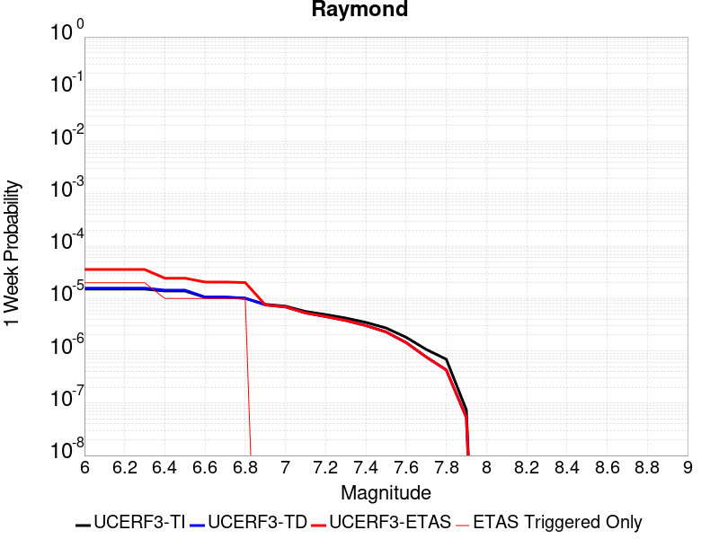 |  |  | 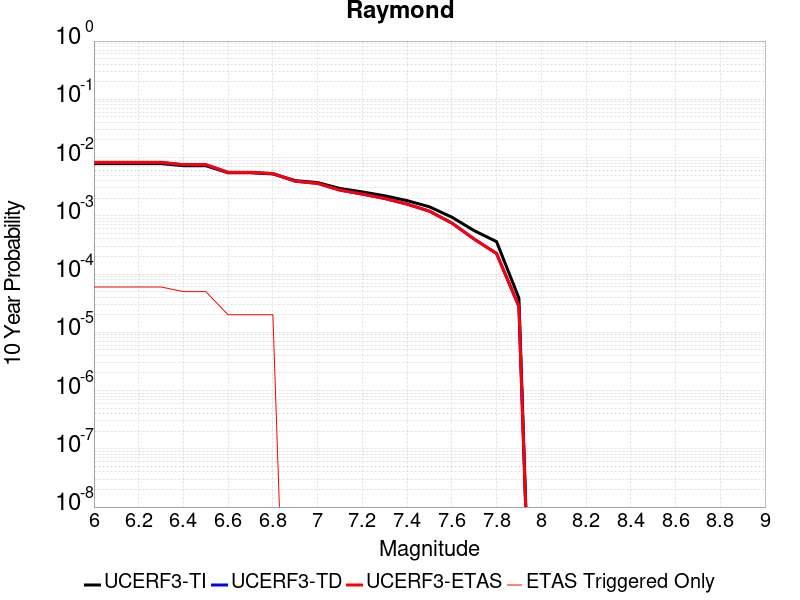 |

| Magnitude | 1 wk TI Prob | 1 wk TD Prob | 1 wk ETAS Prob | 1 wk ETAS/TD Gain | 1 wk ETAS Triggered Only | 1 mo TI Prob | 1 mo TD Prob | 1 mo ETAS Prob | 1 mo ETAS/TD Gain | 1 mo ETAS Triggered Only | 1 yr TI Prob | 1 yr TD Prob | 1 yr ETAS Prob | 1 yr ETAS/TD Gain | 1 yr ETAS Triggered Only | 10 yr TI Prob | 10 yr TD Prob | 10 yr ETAS Prob | 10 yr ETAS/TD Gain | 10 yr ETAS Triggered Only |
|-----|-----|-----|-----|-----|-----|-----|-----|-----|-----|-----|-----|-----|-----|-----|-----|-----|-----|-----|-----|-----|
| 6.0 | 1.5157413E-5 | 1.5810125E-5 | 3.5809808E-5 | 2.264992 | 2.0E-5 | 6.4958724E-5 | 6.775606E-5 | 9.775403E-5 | 1.4427348 | 3.0E-5 | 7.905855E-4 | 8.246429E-4 | 8.7460165E-4 | 1.0605823 | 5.0E-5 | 0.007877788 | 0.008218355 | 0.008277861 | 1.0072408 | 6.0E-5 |
| 6.1 | 1.5157413E-5 | 1.5810125E-5 | 3.5809808E-5 | 2.264992 | 2.0E-5 | 6.4958724E-5 | 6.775606E-5 | 9.775403E-5 | 1.4427348 | 3.0E-5 | 7.905855E-4 | 8.246429E-4 | 8.7460165E-4 | 1.0605823 | 5.0E-5 | 0.007877788 | 0.008218355 | 0.008277861 | 1.0072408 | 6.0E-5 |
| 6.2 | 1.5157413E-5 | 1.5810125E-5 | 3.5809808E-5 | 2.264992 | 2.0E-5 | 6.4958724E-5 | 6.775606E-5 | 9.775403E-5 | 1.4427348 | 3.0E-5 | 7.905855E-4 | 8.246429E-4 | 8.7460165E-4 | 1.0605823 | 5.0E-5 | 0.007877788 | 0.008218355 | 0.008277861 | 1.0072408 | 6.0E-5 |
| 6.3 | 1.5157413E-5 | 1.5810125E-5 | 3.5809808E-5 | 2.264992 | 2.0E-5 | 6.4958724E-5 | 6.775606E-5 | 9.775403E-5 | 1.4427348 | 3.0E-5 | 7.905855E-4 | 8.246429E-4 | 8.7460165E-4 | 1.0605823 | 5.0E-5 | 0.007877788 | 0.008218355 | 0.008277861 | 1.0072408 | 6.0E-5 |
| 6.4 | 1.3941944E-5 | 1.4454688E-5 | 2.4454543E-5 | 1.691807 | 1.0E-5 | 5.9749822E-5 | 6.194732E-5 | 8.1946084E-5 | 1.322835 | 2.0E-5 | 7.2721124E-4 | 7.53971E-4 | 7.9394085E-4 | 1.0530125 | 4.0E-5 | 0.007248361 | 0.007516471 | 0.0075660953 | 1.006602 | 5.0E-5 |
| 6.5 | 1.3941944E-5 | 1.4454688E-5 | 2.4454543E-5 | 1.691807 | 1.0E-5 | 5.9749822E-5 | 6.194732E-5 | 8.1946084E-5 | 1.322835 | 2.0E-5 | 7.2721124E-4 | 7.53971E-4 | 7.9394085E-4 | 1.0530125 | 4.0E-5 | 0.007248361 | 0.007516471 | 0.0075660953 | 1.006602 | 5.0E-5 |
| 6.6 | 1.0542609E-5 | 1.067111E-5 | 2.0671003E-5 | 1.9370996 | 1.0E-5 | 4.5181827E-5 | 4.573256E-5 | 6.573164E-5 | 1.4373052 | 2.0E-5 | 5.499499E-4 | 5.566571E-4 | 5.76646E-4 | 1.0359088 | 2.0E-5 | 0.005485909 | 0.0055531966 | 0.0055730855 | 1.0035815 | 2.0E-5 |
| 6.7 | 1.0542609E-5 | 1.067111E-5 | 2.0671003E-5 | 1.9370996 | 1.0E-5 | 4.5181827E-5 | 4.573256E-5 | 6.573164E-5 | 1.4373052 | 2.0E-5 | 5.499499E-4 | 5.566571E-4 | 5.76646E-4 | 1.0359088 | 2.0E-5 | 0.005485909 | 0.0055531966 | 0.0055730855 | 1.0035815 | 2.0E-5 |
| 6.8 | 1.0079132E-5 | 1.0176644E-5 | 2.0176542E-5 | 1.9826323 | 1.0E-5 | 4.3195567E-5 | 4.3613487E-5 | 6.361261E-5 | 1.4585538 | 2.0E-5 | 5.257791E-4 | 5.308702E-4 | 5.508596E-4 | 1.037654 | 2.0E-5 | 0.0052453685 | 0.0052965777 | 0.0053164717 | 1.003756 | 2.0E-5 |
| 6.9 | 7.721598E-6 | 7.548902E-6 | 7.548902E-6 | 1.0 | 0.0 | 3.3092143E-5 | 3.2352043E-5 | 3.2352043E-5 | 1.0 | 0.0 | 4.0282236E-4 | 3.9381615E-4 | 3.9381615E-4 | 1.0 | 0.0 | 0.0040209293 | 0.003931324 | 0.003931324 | 1.0 | 0.0 |
| 7.0 | 7.137566E-6 | 6.911303E-6 | 6.911303E-6 | 1.0 | 0.0 | 3.058921E-5 | 2.961954E-5 | 2.961954E-5 | 1.0 | 0.0 | 3.7236E-4 | 3.605593E-4 | 3.605593E-4 | 1.0 | 0.0 | 0.0037173668 | 0.003599869 | 0.003599869 | 1.0 | 0.0 |
| 7.1 | 5.654976E-6 | 5.299538E-6 | 5.299538E-6 | 1.0 | 0.0 | 2.4235387E-5 | 2.2712107E-5 | 2.2712107E-5 | 1.0 | 0.0 | 2.9502588E-4 | 2.7648505E-4 | 2.7648505E-4 | 1.0 | 0.0 | 0.0029463451 | 0.0027614492 | 0.0027614492 | 1.0 | 0.0 |
| 7.2 | 4.9358455E-6 | 4.526655E-6 | 4.526655E-6 | 1.0 | 0.0 | 2.1153453E-5 | 1.9399806E-5 | 1.9399806E-5 | 1.0 | 0.0 | 2.5751285E-4 | 2.3616718E-4 | 2.3616718E-4 | 1.0 | 0.0 | 0.0025721465 | 0.002359192 | 0.002359192 | 1.0 | 0.0 |
| 7.3 | 4.2368597E-6 | 3.8056128E-6 | 3.8056128E-6 | 1.0 | 0.0 | 1.8157843E-5 | 1.6309668E-5 | 1.6309668E-5 | 1.0 | 0.0 | 2.2104931E-4 | 1.9855222E-4 | 1.9855222E-4 | 1.0 | 0.0 | 0.0022082955 | 0.0019837746 | 0.0019837746 | 1.0 | 0.0 |
| 7.4 | 3.4999923E-6 | 3.0437407E-6 | 3.0437407E-6 | 1.0 | 0.0 | 1.49998805E-5 | 1.3044538E-5 | 1.3044538E-5 | 1.0 | 0.0 | 1.8260824E-4 | 1.5880575E-4 | 1.5880575E-4 | 1.0 | 0.0 | 0.0018245826 | 0.0015869461 | 0.0015869461 | 1.0 | 0.0 |
| 7.5 | 2.738017E-6 | 2.3020405E-6 | 2.3020405E-6 | 1.0 | 0.0 | 1.1734306E-5 | 9.865851E-6 | 9.865851E-6 | 1.0 | 0.0 | 1.428558E-4 | 1.20110184E-4 | 1.20110184E-4 | 1.0 | 0.0 | 0.0014276401 | 0.0012004747 | 0.0012004747 | 1.0 | 0.0 |
| 7.6 | 1.8186392E-6 | 1.442302E-6 | 1.442302E-6 | 1.0 | 0.0 | 7.794145E-6 | 6.1812802E-6 | 6.1812802E-6 | 1.0 | 0.0 | 9.488958E-5 | 7.5254524E-5 | 7.5254524E-5 | 1.0 | 0.0 | 9.4849075E-4 | 7.5230957E-4 | 7.5230957E-4 | 1.0 | 0.0 |
| 7.7 | 1.0660348E-6 | 7.6437E-7 | 7.6437E-7 | 1.0 | 0.0 | 4.5687125E-6 | 3.2758674E-6 | 3.2758674E-6 | 1.0 | 0.0 | 5.5622655E-5 | 3.988297E-5 | 3.988297E-5 | 1.0 | 0.0 | 5.5608735E-4 | 3.9877492E-4 | 3.9877492E-4 | 1.0 | 0.0 |
| 7.8 | 6.913602E-7 | 4.3202903E-7 | 4.3202903E-7 | 1.0 | 0.0 | 2.962969E-6 | 1.8515517E-6 | 1.8515517E-6 | 1.0 | 0.0 | 3.607355E-5 | 2.2542416E-5 | 2.2542416E-5 | 1.0 | 0.0 | 3.6067693E-4 | 2.2541684E-4 | 2.2541684E-4 | 1.0 | 0.0 |
| 7.9 | 7.425201E-8 | 5.322267E-8 | 5.322267E-8 | 1.0 | 0.0 | 3.1822285E-7 | 2.2809714E-7 | 2.2809714E-7 | 1.0 | 0.0 | 3.874356E-6 | 2.7770805E-6 | 2.7770805E-6 | 1.0 | 0.0 | 3.8742884E-5 | 2.7770588E-5 | 2.7770588E-5 | 1.0 | 0.0 |

## San Pedro Basin
*[(top)](#table-of-contents)*

| 1 Week | 1 Month | 1 Year | 10 Year |
|-----|-----|-----|-----|
|  |  |  |  |

| Magnitude | 1 wk TI Prob | 1 wk TD Prob | 1 wk ETAS Prob | 1 wk ETAS/TD Gain | 1 wk ETAS Triggered Only | 1 mo TI Prob | 1 mo TD Prob | 1 mo ETAS Prob | 1 mo ETAS/TD Gain | 1 mo ETAS Triggered Only | 1 yr TI Prob | 1 yr TD Prob | 1 yr ETAS Prob | 1 yr ETAS/TD Gain | 1 yr ETAS Triggered Only | 10 yr TI Prob | 10 yr TD Prob | 10 yr ETAS Prob | 10 yr ETAS/TD Gain | 10 yr ETAS Triggered Only |
|-----|-----|-----|-----|-----|-----|-----|-----|-----|-----|-----|-----|-----|-----|-----|-----|-----|-----|-----|-----|-----|
| 6.0 | 5.3449043E-5 | 6.337018E-5 | 7.336955E-5 | 1.1577929 | 1.0E-5 | 2.2904722E-4 | 2.7156167E-4 | 2.8155895E-4 | 1.0368141 | 1.0E-5 | 0.0027850836 | 0.0033018515 | 0.0033217852 | 1.0060372 | 2.0E-5 | 0.027504366 | 0.03258948 | 0.032637853 | 1.0014843 | 5.0E-5 |
| 6.1 | 5.3449043E-5 | 6.337018E-5 | 7.336955E-5 | 1.1577929 | 1.0E-5 | 2.2904722E-4 | 2.7156167E-4 | 2.8155895E-4 | 1.0368141 | 1.0E-5 | 0.0027850836 | 0.0033018515 | 0.0033217852 | 1.0060372 | 2.0E-5 | 0.027504366 | 0.03258948 | 0.032637853 | 1.0014843 | 5.0E-5 |
| 6.2 | 2.3189454E-5 | 2.6642829E-5 | 2.6642829E-5 | 1.0 | 0.0 | 9.9379584E-5 | 1.1417881E-4 | 1.1417881E-4 | 1.0 | 0.0 | 0.0012092749 | 0.0013892875 | 0.0013892875 | 1.0 | 0.0 | 0.012027155 | 0.01381089 | 0.01381089 | 1.0 | 0.0 |
| 6.3 | 2.3189454E-5 | 2.6642829E-5 | 2.6642829E-5 | 1.0 | 0.0 | 9.9379584E-5 | 1.1417881E-4 | 1.1417881E-4 | 1.0 | 0.0 | 0.0012092749 | 0.0013892875 | 0.0013892875 | 1.0 | 0.0 | 0.012027155 | 0.01381089 | 0.01381089 | 1.0 | 0.0 |
| 6.4 | 1.966056E-5 | 2.246342E-5 | 2.246342E-5 | 1.0 | 0.0 | 8.425682E-5 | 9.626848E-5 | 9.626848E-5 | 1.0 | 0.0 | 0.001025344 | 0.0011714787 | 0.0011714787 | 1.0 | 0.0 | 0.010206259 | 0.011657119 | 0.011657119 | 1.0 | 0.0 |
| 6.5 | 1.7342953E-5 | 1.9745152E-5 | 1.9745152E-5 | 1.0 | 0.0 | 7.4324824E-5 | 8.461954E-5 | 8.461954E-5 | 1.0 | 0.0 | 9.04529E-4 | 0.0010297929 | 0.0010297929 | 1.0 | 0.0 | 0.009008561 | 0.010253932 | 0.010253932 | 1.0 | 0.0 |
| 6.6 | 1.439804E-5 | 1.6322716E-5 | 1.6322716E-5 | 1.0 | 0.0 | 6.170443E-5 | 6.99528E-5 | 6.99528E-5 | 1.0 | 0.0 | 7.509924E-4 | 8.513747E-4 | 8.513747E-4 | 1.0 | 0.0 | 0.0074845953 | 0.008484333 | 0.008484333 | 1.0 | 0.0 |
| 6.7 | 1.2634884E-5 | 1.4285298E-5 | 1.4285298E-5 | 1.0 | 0.0 | 5.414838E-5 | 6.122144E-5 | 6.122144E-5 | 1.0 | 0.0 | 6.590571E-4 | 7.451466E-4 | 7.451466E-4 | 1.0 | 0.0 | 0.006571059 | 0.007429502 | 0.007429502 | 1.0 | 0.0 |
| 6.8 | 1.146091E-5 | 1.2933193E-5 | 1.2933193E-5 | 1.0 | 0.0 | 4.911726E-5 | 5.542696E-5 | 5.542696E-5 | 1.0 | 0.0 | 5.9783855E-4 | 6.74644E-4 | 6.74644E-4 | 1.0 | 0.0 | 0.0059623276 | 0.0067288997 | 0.0067288997 | 1.0 | 0.0 |
| 6.9 | 9.109035E-6 | 1.0235013E-5 | 1.0235013E-5 | 1.0 | 0.0 | 3.9038136E-5 | 4.386376E-5 | 4.386376E-5 | 1.0 | 0.0 | 4.7518566E-4 | 5.339384E-4 | 5.339384E-4 | 1.0 | 0.0 | 0.0047417083 | 0.0053293095 | 0.0053293095 | 1.0 | 0.0 |
| 7.0 | 5.9351028E-6 | 6.583965E-6 | 6.583965E-6 | 1.0 | 0.0 | 2.5435906E-5 | 2.821682E-5 | 2.821682E-5 | 1.0 | 0.0 | 3.0963816E-4 | 3.4350925E-4 | 3.4350925E-4 | 1.0 | 0.0 | 0.0030920706 | 0.0034320997 | 0.0034320997 | 1.0 | 0.0 |
| 7.1 | 2.1557585E-6 | 2.2096492E-6 | 2.2096492E-6 | 1.0 | 0.0 | 9.238933E-6 | 9.469892E-6 | 9.469892E-6 | 1.0 | 0.0 | 1.1247819E-4 | 1.15289986E-4 | 1.15289986E-4 | 1.0 | 0.0 | 0.0011242128 | 0.0011523172 | 0.0011523172 | 1.0 | 0.0 |
| 7.2 | 2.1251979E-6 | 2.1779954E-6 | 2.1779954E-6 | 1.0 | 0.0 | 9.107958E-6 | 9.334234E-6 | 9.334234E-6 | 1.0 | 0.0 | 1.1088375E-4 | 1.13638525E-4 | 1.13638525E-4 | 1.0 | 0.0 | 0.0011082845 | 0.0011358195 | 0.0011358195 | 1.0 | 0.0 |
| 7.3 | 1.7145798E-6 | 1.7442885E-6 | 1.7442885E-6 | 1.0 | 0.0 | 7.3481783E-6 | 7.475501E-6 | 7.475501E-6 | 1.0 | 0.0 | 8.94604E-5 | 9.1010515E-5 | 9.1010515E-5 | 1.0 | 0.0 | 8.9424395E-4 | 9.0974156E-4 | 9.0974156E-4 | 1.0 | 0.0 |
| 7.4 | 1.4467993E-6 | 1.4641878E-6 | 1.4641878E-6 | 1.0 | 0.0 | 6.200554E-6 | 6.275076E-6 | 6.275076E-6 | 1.0 | 0.0 | 7.548913E-5 | 7.639644E-5 | 7.639644E-5 | 1.0 | 0.0 | 7.546349E-4 | 7.6370913E-4 | 7.6370913E-4 | 1.0 | 0.0 |
| 7.5 | 1.2803735E-6 | 1.2931506E-6 | 1.2931506E-6 | 1.0 | 0.0 | 5.487303E-6 | 5.5420624E-6 | 5.5420624E-6 | 1.0 | 0.0 | 6.680587E-5 | 6.747259E-5 | 6.747259E-5 | 1.0 | 0.0 | 6.678579E-4 | 6.745281E-4 | 6.745281E-4 | 1.0 | 0.0 |
| 7.6 | 6.755009E-7 | 6.76947E-7 | 6.76947E-7 | 1.0 | 0.0 | 2.8950008E-6 | 2.9011985E-6 | 2.9011985E-6 | 1.0 | 0.0 | 3.5246063E-5 | 3.532158E-5 | 3.532158E-5 | 1.0 | 0.0 | 3.5240475E-4 | 3.5316538E-4 | 3.5316538E-4 | 1.0 | 0.0 |
| 7.7 | 6.211885E-8 | 4.5699714E-8 | 4.5699714E-8 | 1.0 | 0.0 | 2.6622362E-7 | 1.9585592E-7 | 1.9585592E-7 | 1.0 | 0.0 | 3.2412677E-6 | 2.3845432E-6 | 2.3845432E-6 | 1.0 | 0.0 | 3.2412205E-5 | 2.3845198E-5 | 2.3845198E-5 | 1.0 | 0.0 |
| 7.8 | 2.6580573E-9 | 1.5138054E-9 | 1.5138054E-9 | 1.0 | 0.0 | 1.1391674E-8 | 6.4877375E-9 | 6.4877375E-9 | 1.0 | 0.0 | 1.3869362E-7 | 7.89882E-8 | 7.89882E-8 | 1.0 | 0.0 | 1.3869354E-6 | 7.89882E-7 | 7.89882E-7 | 1.0 | 0.0 |

## Rose Canyon
*[(top)](#table-of-contents)*

| 1 Week | 1 Month | 1 Year | 10 Year |
|-----|-----|-----|-----|
|  |  |  | 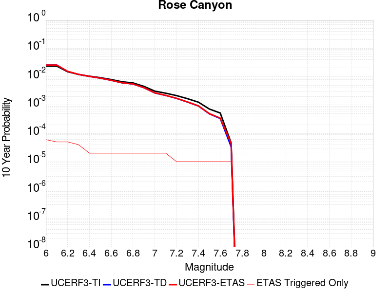 |

| Magnitude | 1 wk TI Prob | 1 wk TD Prob | 1 wk ETAS Prob | 1 wk ETAS/TD Gain | 1 wk ETAS Triggered Only | 1 mo TI Prob | 1 mo TD Prob | 1 mo ETAS Prob | 1 mo ETAS/TD Gain | 1 mo ETAS Triggered Only | 1 yr TI Prob | 1 yr TD Prob | 1 yr ETAS Prob | 1 yr ETAS/TD Gain | 1 yr ETAS Triggered Only | 10 yr TI Prob | 10 yr TD Prob | 10 yr ETAS Prob | 10 yr ETAS/TD Gain | 10 yr ETAS Triggered Only |
|-----|-----|-----|-----|-----|-----|-----|-----|-----|-----|-----|-----|-----|-----|-----|-----|-----|-----|-----|-----|-----|
| 6.0 | 4.5923203E-5 | 4.9714607E-5 | 6.971361E-5 | 1.4022763 | 2.0E-5 | 1.9679888E-4 | 2.1304654E-4 | 2.4304015E-4 | 1.1407843 | 3.0E-5 | 0.0023933933 | 0.0025909478 | 0.0026308442 | 1.0153984 | 4.0E-5 | 0.023677798 | 0.025618518 | 0.02567698 | 1.002282 | 6.0E-5 |
| 6.1 | 4.5923203E-5 | 4.9714607E-5 | 6.971361E-5 | 1.4022763 | 2.0E-5 | 1.9679888E-4 | 2.1304654E-4 | 2.4304015E-4 | 1.1407843 | 3.0E-5 | 0.0023933933 | 0.0025909478 | 0.0026308442 | 1.0153984 | 4.0E-5 | 0.023677798 | 0.025618518 | 0.025667237 | 1.0019017 | 5.0E-5 |
| 6.2 | 2.8844734E-5 | 2.9669678E-5 | 4.9669085E-5 | 1.6740689 | 2.0E-5 | 1.2361443E-4 | 1.2714976E-4 | 1.5714594E-4 | 1.2359122 | 3.0E-5 | 0.0015039665 | 0.001546976 | 0.0015869142 | 1.0258169 | 4.0E-5 | 0.0149382865 | 0.015364873 | 0.015414105 | 1.0032042 | 5.0E-5 |
| 6.3 | 2.3171577E-5 | 2.3162425E-5 | 3.3162192E-5 | 1.4317237 | 1.0E-5 | 9.9302975E-5 | 9.926383E-5 | 1.19261844E-4 | 1.2014632 | 2.0E-5 | 0.0012083431 | 0.0012078804 | 0.0012378442 | 1.0248069 | 3.0E-5 | 0.012017938 | 0.012012152 | 0.012051672 | 1.0032899 | 4.0E-5 |
| 6.4 | 2.0066604E-5 | 1.9668067E-5 | 2.966787E-5 | 1.5084283 | 1.0E-5 | 8.599689E-5 | 8.428905E-5 | 9.42882E-5 | 1.1186293 | 1.0E-5 | 0.0010465092 | 0.001025746 | 0.0010457255 | 1.019478 | 2.0E-5 | 0.010415946 | 0.010211479 | 0.010231274 | 1.0019386 | 2.0E-5 |
| 6.5 | 1.776989E-5 | 1.7115402E-5 | 2.7115231E-5 | 1.584259 | 1.0E-5 | 7.615444E-5 | 7.33497E-5 | 8.334896E-5 | 1.1363232 | 1.0E-5 | 9.267859E-4 | 8.926737E-4 | 9.126558E-4 | 1.0223846 | 2.0E-5 | 0.009229303 | 0.008874663 | 0.008894485 | 1.0022336 | 2.0E-5 |
| 6.6 | 1.5227364E-5 | 1.4340872E-5 | 2.4340728E-5 | 1.6972976 | 1.0E-5 | 6.52585E-5 | 6.145947E-5 | 7.145885E-5 | 1.1626989 | 1.0E-5 | 7.942326E-4 | 7.480173E-4 | 7.6800236E-4 | 1.0267173 | 2.0E-5 | 0.007914 | 0.0074410336 | 0.0074608847 | 1.0026678 | 2.0E-5 |
| 6.7 | 1.2703898E-5 | 1.1674277E-5 | 2.1674161E-5 | 1.856574 | 1.0E-5 | 5.4444143E-5 | 5.0031682E-5 | 6.003118E-5 | 1.1998633 | 1.0E-5 | 6.626558E-4 | 6.089697E-4 | 6.289575E-4 | 1.0328224 | 2.0E-5 | 0.006606833 | 0.0060623093 | 0.006082188 | 1.0032791 | 2.0E-5 |
| 6.8 | 1.1554917E-5 | 1.0610384E-5 | 2.0610278E-5 | 1.9424629 | 1.0E-5 | 4.9520135E-5 | 4.547231E-5 | 5.5471854E-5 | 1.2199041 | 1.0E-5 | 6.0274085E-4 | 5.5348873E-4 | 5.734777E-4 | 1.0361145 | 2.0E-5 | 0.0060110865 | 0.005504414 | 0.0055243038 | 1.0036135 | 2.0E-5 |
| 6.9 | 8.732078E-6 | 7.882285E-6 | 1.7882207E-5 | 2.2686577 | 1.0E-5 | 3.7422655E-5 | 3.37808E-5 | 4.3780463E-5 | 1.2960161 | 1.0E-5 | 4.5552556E-4 | 4.112066E-4 | 4.3119836E-4 | 1.0486174 | 2.0E-5 | 0.0045459294 | 0.004089515 | 0.0041094334 | 1.0048705 | 2.0E-5 |
| 7.0 | 5.9337494E-6 | 5.107436E-6 | 1.51073855E-5 | 2.9579196 | 1.0E-5 | 2.5430107E-5 | 2.1888829E-5 | 3.1888612E-5 | 1.456844 | 1.0E-5 | 3.0956755E-4 | 2.6646405E-4 | 2.8645873E-4 | 1.075037 | 2.0E-5 | 0.0030913667 | 0.002661461 | 0.0026814078 | 1.0074947 | 2.0E-5 |
| 7.1 | 5.013409E-6 | 4.17734E-6 | 1.4177298E-5 | 3.393858 | 1.0E-5 | 2.1485863E-5 | 1.7902763E-5 | 2.7902584E-5 | 1.558563 | 1.0E-5 | 2.6155898E-4 | 2.1794444E-4 | 2.3794008E-4 | 1.0917464 | 2.0E-5 | 0.0026125133 | 0.0021773188 | 0.0021972752 | 1.0091656 | 2.0E-5 |
| 7.2 | 4.120763E-6 | 3.2820917E-6 | 3.2820917E-6 | 1.0 | 0.0 | 1.7660293E-5 | 1.4066032E-5 | 1.4066032E-5 | 1.0 | 0.0 | 2.1499286E-4 | 1.7124058E-4 | 1.8123887E-4 | 1.0583874 | 1.0E-5 | 0.0021478499 | 0.0017110958 | 0.0017210786 | 1.0058342 | 1.0E-5 |
| 7.3 | 3.2081239E-6 | 2.4404965E-6 | 2.4404965E-6 | 1.0 | 0.0 | 1.374903E-5 | 1.0459229E-5 | 1.0459229E-5 | 1.0 | 0.0 | 1.6738157E-4 | 1.2733374E-4 | 1.3733246E-4 | 1.0785238 | 1.0E-5 | 0.0016725556 | 0.0012726148 | 0.0012826021 | 1.0078478 | 1.0E-5 |
| 7.4 | 2.4194755E-6 | 1.7680321E-6 | 1.7680321E-6 | 1.0 | 0.0 | 1.0369139E-5 | 7.5772587E-6 | 7.5772587E-6 | 1.0 | 0.0 | 1.2623696E-4 | 9.224927E-5 | 1.0224835E-4 | 1.1083919 | 1.0E-5 | 0.0012616527 | 9.221151E-4 | 9.3210593E-4 | 1.0108346 | 1.0E-5 |
| 7.5 | 1.3842889E-6 | 9.3782967E-7 | 9.3782967E-7 | 1.0 | 0.0 | 5.9326535E-6 | 4.019264E-6 | 4.019264E-6 | 1.0 | 0.0 | 7.222766E-5 | 4.8933474E-5 | 5.8932987E-5 | 1.204349 | 1.0E-5 | 7.220419E-4 | 4.8923056E-4 | 4.992256E-4 | 1.0204302 | 1.0E-5 |
| 7.6 | 1.0021575E-6 | 6.4113493E-7 | 6.4113493E-7 | 1.0 | 0.0 | 4.2949537E-6 | 2.7477186E-6 | 2.7477186E-6 | 1.0 | 0.0 | 5.2289808E-5 | 3.345298E-5 | 4.3452645E-5 | 1.298917 | 1.0E-5 | 5.2277505E-4 | 3.344816E-4 | 3.4447823E-4 | 1.029887 | 1.0E-5 |
| 7.7 | 8.7620116E-8 | 6.449304E-8 | 6.449304E-8 | 1.0 | 0.0 | 3.7551473E-7 | 2.763987E-7 | 2.763987E-7 | 1.0 | 0.0 | 4.5718825E-6 | 3.3651493E-6 | 1.3365116E-5 | 3.9716265 | 1.0E-5 | 4.5717883E-5 | 3.3651013E-5 | 4.3650674E-5 | 1.2971579 | 1.0E-5 |

## Newport-Inglewood alt 1
*[(top)](#table-of-contents)*

| 1 Week | 1 Month | 1 Year | 10 Year |
|-----|-----|-----|-----|
|  | 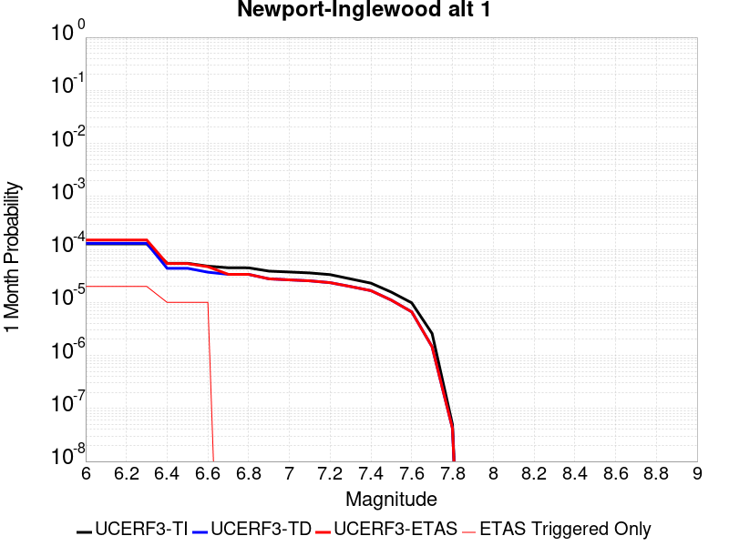 |  |  |

| Magnitude | 1 wk TI Prob | 1 wk TD Prob | 1 wk ETAS Prob | 1 wk ETAS/TD Gain | 1 wk ETAS Triggered Only | 1 mo TI Prob | 1 mo TD Prob | 1 mo ETAS Prob | 1 mo ETAS/TD Gain | 1 mo ETAS Triggered Only | 1 yr TI Prob | 1 yr TD Prob | 1 yr ETAS Prob | 1 yr ETAS/TD Gain | 1 yr ETAS Triggered Only | 10 yr TI Prob | 10 yr TD Prob | 10 yr ETAS Prob | 10 yr ETAS/TD Gain | 10 yr ETAS Triggered Only |
|-----|-----|-----|-----|-----|-----|-----|-----|-----|-----|-----|-----|-----|-----|-----|-----|-----|-----|-----|-----|-----|
| 6.0 | 2.9668912E-5 | 3.0404828E-5 | 5.0404222E-5 | 1.6577703 | 2.0E-5 | 1.2714628E-4 | 1.3030265E-4 | 1.5030004E-4 | 1.1534688 | 2.0E-5 | 0.0015469068 | 0.0015857654 | 0.0016157179 | 1.0188884 | 3.0E-5 | 0.015361829 | 0.01579211 | 0.01584132 | 1.0031161 | 5.0E-5 |
| 6.1 | 2.9668912E-5 | 3.0404828E-5 | 5.0404222E-5 | 1.6577703 | 2.0E-5 | 1.2714628E-4 | 1.3030265E-4 | 1.5030004E-4 | 1.1534688 | 2.0E-5 | 0.0015469068 | 0.0015857654 | 0.0016157179 | 1.0188884 | 3.0E-5 | 0.015361829 | 0.01579211 | 0.01584132 | 1.0031161 | 5.0E-5 |
| 6.2 | 2.9668912E-5 | 3.0404828E-5 | 5.0404222E-5 | 1.6577703 | 2.0E-5 | 1.2714628E-4 | 1.3030265E-4 | 1.5030004E-4 | 1.1534688 | 2.0E-5 | 0.0015469068 | 0.0015857654 | 0.0016157179 | 1.0188884 | 3.0E-5 | 0.015361829 | 0.01579211 | 0.01584132 | 1.0031161 | 5.0E-5 |
| 6.3 | 2.9668912E-5 | 3.0404828E-5 | 5.0404222E-5 | 1.6577703 | 2.0E-5 | 1.2714628E-4 | 1.3030265E-4 | 1.5030004E-4 | 1.1534688 | 2.0E-5 | 0.0015469068 | 0.0015857654 | 0.0016157179 | 1.0188884 | 3.0E-5 | 0.015361829 | 0.01579211 | 0.01584132 | 1.0031161 | 5.0E-5 |
| 6.4 | 1.275942E-5 | 1.02725335E-5 | 2.0272431E-5 | 1.9734597 | 1.0E-5 | 5.4682085E-5 | 4.4024422E-5 | 5.402398E-5 | 1.2271366 | 1.0E-5 | 6.65551E-4 | 5.358697E-4 | 5.55859E-4 | 1.0373025 | 2.0E-5 | 0.0066356123 | 0.0053462 | 0.005366093 | 1.003721 | 2.0E-5 |
| 6.5 | 1.275942E-5 | 1.02725335E-5 | 2.0272431E-5 | 1.9734597 | 1.0E-5 | 5.4682085E-5 | 4.4024422E-5 | 5.402398E-5 | 1.2271366 | 1.0E-5 | 6.65551E-4 | 5.358697E-4 | 5.55859E-4 | 1.0373025 | 2.0E-5 | 0.0066356123 | 0.0053462 | 0.005366093 | 1.003721 | 2.0E-5 |
| 6.6 | 1.1255358E-5 | 8.661911E-6 | 1.8661825E-5 | 2.1544695 | 1.0E-5 | 4.8236358E-5 | 3.7121958E-5 | 4.7121586E-5 | 1.2693723 | 1.0E-5 | 5.871194E-4 | 4.5186782E-4 | 4.7185877E-4 | 1.0442407 | 2.0E-5 | 0.005855706 | 0.0045096674 | 0.004529577 | 1.0044149 | 2.0E-5 |
| 6.7 | 1.0504745E-5 | 7.8998455E-6 | 7.8998455E-6 | 1.0 | 0.0 | 4.5019555E-5 | 3.385605E-5 | 3.385605E-5 | 1.0 | 0.0 | 5.4797524E-4 | 4.121207E-4 | 4.2211654E-4 | 1.0242547 | 1.0E-5 | 0.0054662596 | 0.004113694 | 0.004123653 | 1.0024209 | 1.0E-5 |
| 6.8 | 1.0476007E-5 | 7.881227E-6 | 7.881227E-6 | 1.0 | 0.0 | 4.4896402E-5 | 3.3776258E-5 | 3.3776258E-5 | 1.0 | 0.0 | 5.464766E-4 | 4.1114958E-4 | 4.2114547E-4 | 1.024312 | 1.0E-5 | 0.005451347 | 0.004104019 | 0.004113978 | 1.0024266 | 1.0E-5 |
| 6.9 | 9.076797E-6 | 6.4896567E-6 | 6.4896567E-6 | 1.0 | 0.0 | 3.889998E-5 | 2.7812519E-5 | 2.7812519E-5 | 1.0 | 0.0 | 4.7350433E-4 | 3.3856515E-4 | 3.4856176E-4 | 1.0295265 | 1.0E-5 | 0.004724967 | 0.003380531 | 0.003390497 | 1.0029482 | 1.0E-5 |
| 7.0 | 8.73795E-6 | 6.2120503E-6 | 6.2120503E-6 | 1.0 | 0.0 | 3.7447822E-5 | 2.6622802E-5 | 2.6622802E-5 | 1.0 | 0.0 | 4.5583185E-4 | 3.2408469E-4 | 3.3408144E-4 | 1.0308461 | 1.0E-5 | 0.0045489795 | 0.0032361522 | 0.00324612 | 1.0030801 | 1.0E-5 |
| 7.1 | 8.391299E-6 | 5.9557533E-6 | 5.9557533E-6 | 1.0 | 0.0 | 3.5962214E-5 | 2.5524409E-5 | 2.5524409E-5 | 1.0 | 0.0 | 4.37752E-4 | 3.1071564E-4 | 3.207125E-4 | 1.0321738 | 1.0E-5 | 0.004368907 | 0.0031028416 | 0.0031128104 | 1.0032128 | 1.0E-5 |
| 7.2 | 7.796882E-6 | 5.4964826E-6 | 5.4964826E-6 | 1.0 | 0.0 | 3.341478E-5 | 2.3556144E-5 | 2.3556144E-5 | 1.0 | 0.0 | 4.06749E-4 | 2.867585E-4 | 2.9675564E-4 | 1.0348625 | 1.0E-5 | 0.0040600533 | 0.002863909 | 0.0028738803 | 1.0034817 | 1.0E-5 |
| 7.3 | 6.4738833E-6 | 4.6477753E-6 | 4.6477753E-6 | 1.0 | 0.0 | 2.774492E-5 | 1.9918885E-5 | 1.9918885E-5 | 1.0 | 0.0 | 3.3774204E-4 | 2.424856E-4 | 2.5248318E-4 | 1.0412296 | 1.0E-5 | 0.0033722918 | 0.0024222268 | 0.0024322027 | 1.0041184 | 1.0E-5 |
| 7.4 | 5.382145E-6 | 3.8857215E-6 | 3.8857215E-6 | 1.0 | 0.0 | 2.3066134E-5 | 1.6652988E-5 | 1.6652988E-5 | 1.0 | 0.0 | 2.8079396E-4 | 2.0273139E-4 | 2.1272937E-4 | 1.0493164 | 1.0E-5 | 0.0028043943 | 0.002025479 | 0.0020354588 | 1.0049272 | 1.0E-5 |
| 7.5 | 3.648244E-6 | 2.5737634E-6 | 2.5737634E-6 | 1.0 | 0.0 | 1.5635238E-5 | 1.1030369E-5 | 1.1030369E-5 | 1.0 | 0.0 | 1.9034238E-4 | 1.3428657E-4 | 1.4428522E-4 | 1.0744576 | 1.0E-5 | 0.0019017943 | 0.0013420646 | 0.0013520513 | 1.0074412 | 1.0E-5 |
| 7.6 | 2.2906888E-6 | 1.547986E-6 | 1.547986E-6 | 1.0 | 0.0 | 9.817201E-6 | 6.634209E-6 | 6.634209E-6 | 1.0 | 0.0 | 1.1951787E-4 | 8.076857E-5 | 9.076776E-5 | 1.1238005 | 1.0E-5 | 0.0011945361 | 8.073989E-4 | 8.173908E-4 | 1.0123755 | 1.0E-5 |
| 7.7 | 6.0479874E-7 | 3.397468E-7 | 3.397468E-7 | 1.0 | 0.0 | 2.5919921E-6 | 1.456057E-6 | 1.456057E-6 | 1.0 | 0.0 | 3.1557047E-5 | 1.7727363E-5 | 2.7727187E-5 | 1.5640897 | 1.0E-5 | 3.1552566E-4 | 1.7726087E-4 | 1.872591E-4 | 1.056404 | 1.0E-5 |
| 7.8 | 1.16056995E-8 | 9.782997E-9 | 9.782997E-9 | 1.0 | 0.0 | 4.9738713E-8 | 4.1927127E-8 | 4.1927127E-8 | 1.0 | 0.0 | 6.0556863E-7 | 5.1046277E-7 | 5.1046277E-7 | 1.0 | 0.0 | 6.05567E-6 | 5.1046277E-6 | 5.1046277E-6 | 1.0 | 0.0 |

## La Panza 2011
*[(top)](#table-of-contents)*

| 1 Week | 1 Month | 1 Year | 10 Year |
|-----|-----|-----|-----|
|  | 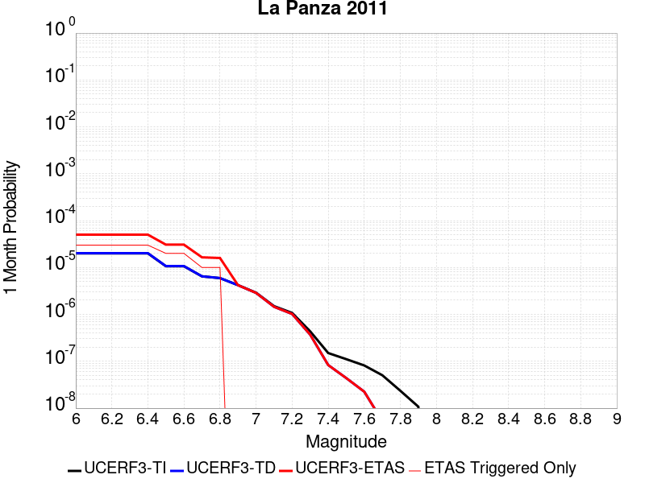 |  |  |

| Magnitude | 1 wk TI Prob | 1 wk TD Prob | 1 wk ETAS Prob | 1 wk ETAS/TD Gain | 1 wk ETAS Triggered Only | 1 mo TI Prob | 1 mo TD Prob | 1 mo ETAS Prob | 1 mo ETAS/TD Gain | 1 mo ETAS Triggered Only | 1 yr TI Prob | 1 yr TD Prob | 1 yr ETAS Prob | 1 yr ETAS/TD Gain | 1 yr ETAS Triggered Only | 10 yr TI Prob | 10 yr TD Prob | 10 yr ETAS Prob | 10 yr ETAS/TD Gain | 10 yr ETAS Triggered Only |
|-----|-----|-----|-----|-----|-----|-----|-----|-----|-----|-----|-----|-----|-----|-----|-----|-----|-----|-----|-----|-----|
| 6.0 | 4.6754544E-6 | 4.7175886E-6 | 2.4717494E-5 | 5.239434 | 2.0E-5 | 2.0037509E-5 | 2.021809E-5 | 5.0217484E-5 | 2.4837897 | 3.0E-5 | 2.4392935E-4 | 2.4612944E-4 | 2.9611713E-4 | 1.2030952 | 5.0E-5 | 0.0024366176 | 0.0024587628 | 0.0025086398 | 1.0202855 | 5.0E-5 |
| 6.1 | 4.6754544E-6 | 4.7175886E-6 | 2.4717494E-5 | 5.239434 | 2.0E-5 | 2.0037509E-5 | 2.021809E-5 | 5.0217484E-5 | 2.4837897 | 3.0E-5 | 2.4392935E-4 | 2.4612944E-4 | 2.9611713E-4 | 1.2030952 | 5.0E-5 | 0.0024366176 | 0.0024587628 | 0.0025086398 | 1.0202855 | 5.0E-5 |
| 6.2 | 4.6754544E-6 | 4.7175886E-6 | 2.4717494E-5 | 5.239434 | 2.0E-5 | 2.0037509E-5 | 2.021809E-5 | 5.0217484E-5 | 2.4837897 | 3.0E-5 | 2.4392935E-4 | 2.4612944E-4 | 2.9611713E-4 | 1.2030952 | 5.0E-5 | 0.0024366176 | 0.0024587628 | 0.0025086398 | 1.0202855 | 5.0E-5 |
| 6.3 | 4.6754544E-6 | 4.7175886E-6 | 2.4717494E-5 | 5.239434 | 2.0E-5 | 2.0037509E-5 | 2.021809E-5 | 5.0217484E-5 | 2.4837897 | 3.0E-5 | 2.4392935E-4 | 2.4612944E-4 | 2.9611713E-4 | 1.2030952 | 5.0E-5 | 0.0024366176 | 0.0024587628 | 0.0025086398 | 1.0202855 | 5.0E-5 |
| 6.4 | 4.6754544E-6 | 4.7175886E-6 | 2.4717494E-5 | 5.239434 | 2.0E-5 | 2.0037509E-5 | 2.021809E-5 | 5.0217484E-5 | 2.4837897 | 3.0E-5 | 2.4392935E-4 | 2.4612944E-4 | 2.9611713E-4 | 1.2030952 | 5.0E-5 | 0.0024366176 | 0.0024587628 | 0.0025086398 | 1.0202855 | 5.0E-5 |
| 6.5 | 2.485343E-6 | 2.5006007E-6 | 1.2500575E-5 | 4.999029 | 1.0E-5 | 1.0651426E-5 | 1.0716818E-5 | 3.0716605E-5 | 2.8662057 | 2.0E-5 | 1.296734E-4 | 1.3046984E-4 | 1.7046461E-4 | 1.3065443 | 4.0E-5 | 0.0012959775 | 0.0013039707 | 0.0013439186 | 1.0306355 | 4.0E-5 |
| 6.6 | 2.485343E-6 | 2.5006007E-6 | 1.2500575E-5 | 4.999029 | 1.0E-5 | 1.0651426E-5 | 1.0716818E-5 | 3.0716605E-5 | 2.8662057 | 2.0E-5 | 1.296734E-4 | 1.3046984E-4 | 1.7046461E-4 | 1.3065443 | 4.0E-5 | 0.0012959775 | 0.0013039707 | 0.0013439186 | 1.0306355 | 4.0E-5 |
| 6.7 | 1.5108508E-6 | 1.514639E-6 | 1.514639E-6 | 1.0 | 0.0 | 6.4750584E-6 | 6.4912947E-6 | 1.649123E-5 | 2.5405147 | 1.0E-5 | 7.8830984E-5 | 7.902876E-5 | 1.0902639E-4 | 1.3795786 | 3.0E-5 | 7.880303E-4 | 7.9001737E-4 | 8.199937E-4 | 1.0379438 | 3.0E-5 |
| 6.8 | 1.3865837E-6 | 1.3885118E-6 | 1.3885118E-6 | 1.0 | 0.0 | 5.942488E-6 | 5.950752E-6 | 1.5950693E-5 | 2.68045 | 1.0E-5 | 7.234739E-5 | 7.244809E-5 | 9.2446644E-5 | 1.2760397 | 2.0E-5 | 7.232384E-4 | 7.242546E-4 | 7.442401E-4 | 1.0275946 | 2.0E-5 |
| 6.9 | 9.826583E-7 | 9.796303E-7 | 9.796303E-7 | 1.0 | 0.0 | 4.2113857E-6 | 4.198409E-6 | 4.198409E-6 | 1.0 | 0.0 | 5.1272415E-5 | 5.1114486E-5 | 6.111398E-5 | 1.1956292 | 1.0E-5 | 5.126059E-4 | 5.1103265E-4 | 5.2102754E-4 | 1.0195582 | 1.0E-5 |
| 7.0 | 6.7797646E-7 | 6.710231E-7 | 6.710231E-7 | 1.0 | 0.0 | 2.9056102E-6 | 2.8758104E-6 | 2.8758104E-6 | 1.0 | 0.0 | 3.537523E-5 | 3.501246E-5 | 3.501246E-5 | 1.0 | 0.0 | 3.5369597E-4 | 3.5007254E-4 | 3.5007254E-4 | 1.0 | 0.0 |
| 7.1 | 3.4979826E-7 | 3.3874045E-7 | 3.3874045E-7 | 1.0 | 0.0 | 1.4991346E-6 | 1.4517441E-6 | 1.4517441E-6 | 1.0 | 0.0 | 1.825181E-5 | 1.7674853E-5 | 1.7674853E-5 | 1.0 | 0.0 | 1.825031E-4 | 1.7673563E-4 | 1.7673563E-4 | 1.0 | 0.0 |
| 7.2 | 2.5088332E-7 | 2.3832064E-7 | 2.3832064E-7 | 1.0 | 0.0 | 1.0752137E-6 | 1.0213738E-6 | 1.0213738E-6 | 1.0 | 0.0 | 1.3090649E-5 | 1.2435164E-5 | 1.2435164E-5 | 1.0 | 0.0 | 1.3089878E-4 | 1.2434553E-4 | 1.2434553E-4 | 1.0 | 0.0 |
| 7.3 | 1.0159086E-7 | 8.644785E-8 | 8.644785E-8 | 1.0 | 0.0 | 4.3538932E-7 | 3.704907E-7 | 3.704907E-7 | 1.0 | 0.0 | 5.300852E-6 | 4.510716E-6 | 4.510716E-6 | 1.0 | 0.0 | 5.3007258E-5 | 4.510628E-5 | 4.510628E-5 | 1.0 | 0.0 |
| 7.4 | 3.5006252E-8 | 1.9403883E-8 | 1.9403883E-8 | 1.0 | 0.0 | 1.5002678E-7 | 8.315949E-8 | 8.315949E-8 | 1.0 | 0.0 | 1.8265745E-6 | 1.0124663E-6 | 1.0124663E-6 | 1.0 | 0.0 | 1.8265595E-5 | 1.012462E-5 | 1.012462E-5 | 1.0 | 0.0 |
| 7.5 | 2.592274E-8 | 1.0238468E-8 | 1.0238468E-8 | 1.0 | 0.0 | 1.1109746E-7 | 4.3879147E-8 | 4.3879147E-8 | 1.0 | 0.0 | 1.3526106E-6 | 5.342285E-7 | 5.342285E-7 | 1.0 | 0.0 | 1.3526024E-5 | 5.342273E-6 | 5.342273E-6 | 1.0 | 0.0 |
| 7.6 | 1.9016717E-8 | 5.2442264E-9 | 5.2442264E-9 | 1.0 | 0.0 | 8.150022E-8 | 2.2475257E-8 | 2.2475257E-8 | 1.0 | 0.0 | 9.922647E-7 | 2.736362E-7 | 2.736362E-7 | 1.0 | 0.0 | 9.922603E-6 | 2.736359E-6 | 2.736359E-6 | 1.0 | 0.0 |
| 7.7 | 1.17738495E-8 | 1.2393437E-9 | 1.2393437E-9 | 1.0 | 0.0 | 5.0459356E-8 | 5.3114735E-9 | 5.3114735E-9 | 1.0 | 0.0 | 6.1434247E-7 | 6.466719E-8 | 6.466719E-8 | 1.0 | 0.0 | 6.143408E-6 | 6.466717E-7 | 6.466717E-7 | 1.0 | 0.0 |
| 7.8 | 5.489079E-9 | 2.009185E-10 | 2.009185E-10 | 1.0 | 0.0 | 2.3524624E-8 | 8.61079E-10 | 8.61079E-10 | 1.0 | 0.0 | 2.8641225E-7 | 1.0483639E-8 | 1.0483639E-8 | 1.0 | 0.0 | 2.8641189E-6 | 1.0483638E-7 | 1.0483638E-7 | 1.0 | 0.0 |
| 7.9 | 2.5081048E-9 | 6.675449E-11 | 6.675449E-11 | 1.0 | 0.0 | 1.0749021E-8 | 2.8609015E-10 | 2.8609015E-10 | 1.0 | 0.0 | 1.3086932E-7 | 3.483148E-9 | 3.483148E-9 | 1.0 | 0.0 | 1.3086925E-6 | 3.483148E-8 | 3.483148E-8 | 1.0 | 0.0 |

## Kern Canyon (Lake Isabella) 2011
*[(top)](#table-of-contents)*

| 1 Week | 1 Month | 1 Year | 10 Year |
|-----|-----|-----|-----|
|  |  |  | 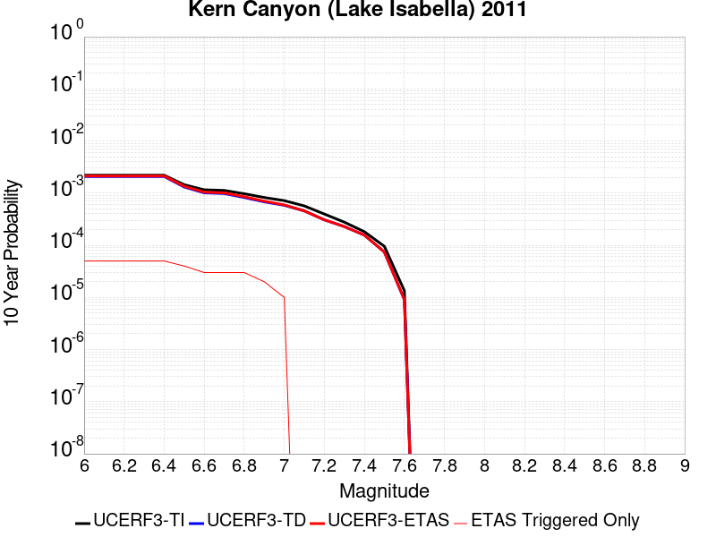 |

| Magnitude | 1 wk TI Prob | 1 wk TD Prob | 1 wk ETAS Prob | 1 wk ETAS/TD Gain | 1 wk ETAS Triggered Only | 1 mo TI Prob | 1 mo TD Prob | 1 mo ETAS Prob | 1 mo ETAS/TD Gain | 1 mo ETAS Triggered Only | 1 yr TI Prob | 1 yr TD Prob | 1 yr ETAS Prob | 1 yr ETAS/TD Gain | 1 yr ETAS Triggered Only | 10 yr TI Prob | 10 yr TD Prob | 10 yr ETAS Prob | 10 yr ETAS/TD Gain | 10 yr ETAS Triggered Only |
|-----|-----|-----|-----|-----|-----|-----|-----|-----|-----|-----|-----|-----|-----|-----|-----|-----|-----|-----|-----|-----|
| 6.0 | 4.2387383E-6 | 4.0016344E-6 | 4.0016344E-6 | 1.0 | 0.0 | 1.8165894E-5 | 1.7149758E-5 | 1.7149758E-5 | 1.0 | 0.0 | 2.2114732E-4 | 2.0878017E-4 | 2.28776E-4 | 1.0957745 | 2.0E-5 | 0.0022092736 | 0.002086024 | 0.0021359199 | 1.023919 | 5.0E-5 |
| 6.1 | 4.2387383E-6 | 4.0016344E-6 | 4.0016344E-6 | 1.0 | 0.0 | 1.8165894E-5 | 1.7149758E-5 | 1.7149758E-5 | 1.0 | 0.0 | 2.2114732E-4 | 2.0878017E-4 | 2.28776E-4 | 1.0957745 | 2.0E-5 | 0.0022092736 | 0.002086024 | 0.0021359199 | 1.023919 | 5.0E-5 |
| 6.2 | 4.2387383E-6 | 4.0016344E-6 | 4.0016344E-6 | 1.0 | 0.0 | 1.8165894E-5 | 1.7149758E-5 | 1.7149758E-5 | 1.0 | 0.0 | 2.2114732E-4 | 2.0878017E-4 | 2.28776E-4 | 1.0957745 | 2.0E-5 | 0.0022092736 | 0.002086024 | 0.0021359199 | 1.023919 | 5.0E-5 |
| 6.3 | 4.2387383E-6 | 4.0016344E-6 | 4.0016344E-6 | 1.0 | 0.0 | 1.8165894E-5 | 1.7149758E-5 | 1.7149758E-5 | 1.0 | 0.0 | 2.2114732E-4 | 2.0878017E-4 | 2.28776E-4 | 1.0957745 | 2.0E-5 | 0.0022092736 | 0.002086024 | 0.0021359199 | 1.023919 | 5.0E-5 |
| 6.4 | 4.2387383E-6 | 4.0016344E-6 | 4.0016344E-6 | 1.0 | 0.0 | 1.8165894E-5 | 1.7149758E-5 | 1.7149758E-5 | 1.0 | 0.0 | 2.2114732E-4 | 2.0878017E-4 | 2.28776E-4 | 1.0957745 | 2.0E-5 | 0.0022092736 | 0.002086024 | 0.0021359199 | 1.023919 | 5.0E-5 |
| 6.5 | 2.7857532E-6 | 2.5178624E-6 | 2.5178624E-6 | 1.0 | 0.0 | 1.1938888E-5 | 1.0790796E-5 | 1.0790796E-5 | 1.0 | 0.0 | 1.4534626E-4 | 1.3137035E-4 | 1.4136903E-4 | 1.0761107 | 1.0E-5 | 0.0014525123 | 0.0013129596 | 0.0013529072 | 1.0304255 | 4.0E-5 |
| 6.6 | 2.2233348E-6 | 1.944119E-6 | 1.944119E-6 | 1.0 | 0.0 | 9.528543E-6 | 8.331913E-6 | 8.331913E-6 | 1.0 | 0.0 | 1.1600384E-4 | 1.014364E-4 | 1.1143539E-4 | 1.0985739 | 1.0E-5 | 0.001159433 | 0.0010139096 | 0.0010438792 | 1.0295584 | 3.0E-5 |
| 6.7 | 2.1635126E-6 | 1.8834991E-6 | 1.8834991E-6 | 1.0 | 0.0 | 9.272164E-6 | 8.072114E-6 | 8.072114E-6 | 1.0 | 0.0 | 1.1288274E-4 | 9.827364E-5 | 1.0827266E-4 | 1.1017467 | 1.0E-5 | 0.0011282542 | 9.8231E-4 | 0.0010122805 | 1.0305103 | 3.0E-5 |
| 6.8 | 1.8685711E-6 | 1.583138E-6 | 1.583138E-6 | 1.0 | 0.0 | 8.008137E-6 | 6.7848596E-6 | 6.7848596E-6 | 1.0 | 0.0 | 9.74947E-5 | 8.2602586E-5 | 9.260176E-5 | 1.1210515 | 1.0E-5 | 9.745194E-4 | 8.2572375E-4 | 8.5569895E-4 | 1.0363017 | 3.0E-5 |
| 6.9 | 1.5815071E-6 | 1.3064887E-6 | 1.3064887E-6 | 1.0 | 0.0 | 6.77787E-6 | 5.5992255E-6 | 5.5992255E-6 | 1.0 | 0.0 | 8.251744E-5 | 6.816846E-5 | 7.816778E-5 | 1.1466854 | 1.0E-5 | 8.248681E-4 | 6.8147824E-4 | 7.014646E-4 | 1.029328 | 2.0E-5 |
| 7.0 | 1.3772564E-6 | 1.1210681E-6 | 1.1210681E-6 | 1.0 | 0.0 | 5.9025137E-6 | 4.8045686E-6 | 4.8045686E-6 | 1.0 | 0.0 | 7.186073E-5 | 5.8494075E-5 | 5.8494075E-5 | 1.0 | 0.0 | 7.18375E-4 | 5.8478885E-4 | 5.94783E-4 | 1.0170902 | 1.0E-5 |
| 7.1 | 1.0916998E-6 | 8.7637505E-7 | 8.7637505E-7 | 1.0 | 0.0 | 4.678705E-6 | 3.7558877E-6 | 3.7558877E-6 | 1.0 | 0.0 | 5.6961744E-5 | 4.5726985E-5 | 4.5726985E-5 | 1.0 | 0.0 | 5.6947145E-4 | 4.571771E-4 | 4.571771E-4 | 1.0 | 0.0 |
| 7.2 | 7.6277024E-7 | 5.901439E-7 | 5.901439E-7 | 1.0 | 0.0 | 3.2690114E-6 | 2.5291856E-6 | 2.5291856E-6 | 1.0 | 0.0 | 3.9799485E-5 | 3.0792406E-5 | 3.0792406E-5 | 1.0 | 0.0 | 3.9792358E-4 | 3.07882E-4 | 3.07882E-4 | 1.0 | 0.0 |
| 7.3 | 5.3265916E-7 | 4.3824264E-7 | 4.3824264E-7 | 1.0 | 0.0 | 2.282823E-6 | 1.8781814E-6 | 1.8781814E-6 | 1.0 | 0.0 | 2.7793016E-5 | 2.2866623E-5 | 2.2866623E-5 | 1.0 | 0.0 | 2.778954E-4 | 2.2864307E-4 | 2.2864307E-4 | 1.0 | 0.0 |
| 7.4 | 3.4946007E-7 | 3.0065647E-7 | 3.0065647E-7 | 1.0 | 0.0 | 1.497685E-6 | 1.2885271E-6 | 1.2885271E-6 | 1.0 | 0.0 | 1.8234163E-5 | 1.5687707E-5 | 1.5687707E-5 | 1.0 | 0.0 | 1.8232666E-4 | 1.5686621E-4 | 1.5686621E-4 | 1.0 | 0.0 |
| 7.5 | 1.8317026E-7 | 1.4244755E-7 | 1.4244755E-7 | 1.0 | 0.0 | 7.850152E-7 | 6.1048934E-7 | 6.1048934E-7 | 1.0 | 0.0 | 9.557518E-6 | 7.432683E-6 | 7.432683E-6 | 1.0 | 0.0 | 9.5571064E-5 | 7.432442E-5 | 7.432442E-5 | 1.0 | 0.0 |
| 7.6 | 2.572245E-8 | 1.735264E-8 | 1.735264E-8 | 1.0 | 0.0 | 1.10239064E-7 | 7.436845E-8 | 7.436845E-8 | 1.0 | 0.0 | 1.3421597E-6 | 9.0543557E-7 | 9.0543557E-7 | 1.0 | 0.0 | 1.3421517E-5 | 9.054324E-6 | 9.054324E-6 | 1.0 | 0.0 |

## San Cayetano
*[(top)](#table-of-contents)*

| 1 Week | 1 Month | 1 Year | 10 Year |
|-----|-----|-----|-----|
|  |  |  | 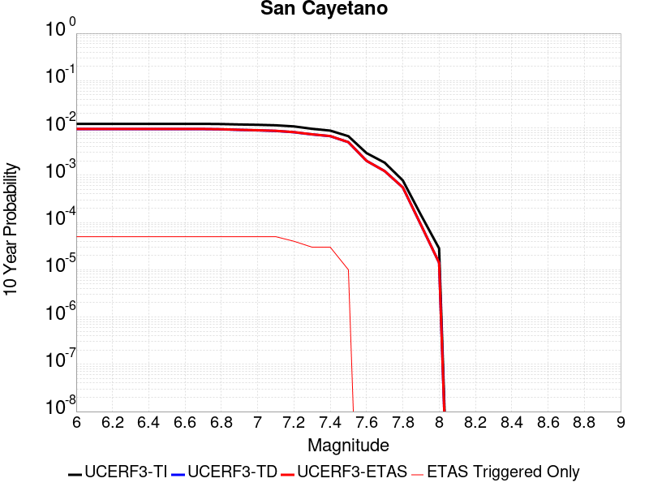 |

| Magnitude | 1 wk TI Prob | 1 wk TD Prob | 1 wk ETAS Prob | 1 wk ETAS/TD Gain | 1 wk ETAS Triggered Only | 1 mo TI Prob | 1 mo TD Prob | 1 mo ETAS Prob | 1 mo ETAS/TD Gain | 1 mo ETAS Triggered Only | 1 yr TI Prob | 1 yr TD Prob | 1 yr ETAS Prob | 1 yr ETAS/TD Gain | 1 yr ETAS Triggered Only | 10 yr TI Prob | 10 yr TD Prob | 10 yr ETAS Prob | 10 yr ETAS/TD Gain | 10 yr ETAS Triggered Only |
|-----|-----|-----|-----|-----|-----|-----|-----|-----|-----|-----|-----|-----|-----|-----|-----|-----|-----|-----|-----|-----|
| 6.0 | 2.3476267E-5 | 1.8169216E-5 | 1.8169216E-5 | 1.0 | 0.0 | 1.0060869E-4 | 7.786576E-5 | 8.786499E-5 | 1.1284162 | 1.0E-5 | 0.0012242225 | 9.4760704E-4 | 9.775786E-4 | 1.0316287 | 3.0E-5 | 0.012175002 | 0.00943675 | 0.009486278 | 1.0052484 | 5.0E-5 |
| 6.1 | 2.3476267E-5 | 1.8169216E-5 | 1.8169216E-5 | 1.0 | 0.0 | 1.0060869E-4 | 7.786576E-5 | 8.786499E-5 | 1.1284162 | 1.0E-5 | 0.0012242225 | 9.4760704E-4 | 9.775786E-4 | 1.0316287 | 3.0E-5 | 0.012175002 | 0.00943675 | 0.009486278 | 1.0052484 | 5.0E-5 |
| 6.2 | 2.3476267E-5 | 1.8169216E-5 | 1.8169216E-5 | 1.0 | 0.0 | 1.0060869E-4 | 7.786576E-5 | 8.786499E-5 | 1.1284162 | 1.0E-5 | 0.0012242225 | 9.4760704E-4 | 9.775786E-4 | 1.0316287 | 3.0E-5 | 0.012175002 | 0.00943675 | 0.009486278 | 1.0052484 | 5.0E-5 |
| 6.3 | 2.3476267E-5 | 1.8169216E-5 | 1.8169216E-5 | 1.0 | 0.0 | 1.0060869E-4 | 7.786576E-5 | 8.786499E-5 | 1.1284162 | 1.0E-5 | 0.0012242225 | 9.4760704E-4 | 9.775786E-4 | 1.0316287 | 3.0E-5 | 0.012175002 | 0.00943675 | 0.009486278 | 1.0052484 | 5.0E-5 |
| 6.4 | 2.3476267E-5 | 1.8169216E-5 | 1.8169216E-5 | 1.0 | 0.0 | 1.0060869E-4 | 7.786576E-5 | 8.786499E-5 | 1.1284162 | 1.0E-5 | 0.0012242225 | 9.4760704E-4 | 9.775786E-4 | 1.0316287 | 3.0E-5 | 0.012175002 | 0.00943675 | 0.009486278 | 1.0052484 | 5.0E-5 |
| 6.5 | 2.3476267E-5 | 1.8169216E-5 | 1.8169216E-5 | 1.0 | 0.0 | 1.0060869E-4 | 7.786576E-5 | 8.786499E-5 | 1.1284162 | 1.0E-5 | 0.0012242225 | 9.4760704E-4 | 9.775786E-4 | 1.0316287 | 3.0E-5 | 0.012175002 | 0.00943675 | 0.009486278 | 1.0052484 | 5.0E-5 |
| 6.6 | 2.3476267E-5 | 1.8169216E-5 | 1.8169216E-5 | 1.0 | 0.0 | 1.0060869E-4 | 7.786576E-5 | 8.786499E-5 | 1.1284162 | 1.0E-5 | 0.0012242225 | 9.4760704E-4 | 9.775786E-4 | 1.0316287 | 3.0E-5 | 0.012175002 | 0.00943675 | 0.009486278 | 1.0052484 | 5.0E-5 |
| 6.7 | 2.3476267E-5 | 1.8169216E-5 | 1.8169216E-5 | 1.0 | 0.0 | 1.0060869E-4 | 7.786576E-5 | 8.786499E-5 | 1.1284162 | 1.0E-5 | 0.0012242225 | 9.4760704E-4 | 9.775786E-4 | 1.0316287 | 3.0E-5 | 0.012175002 | 0.00943675 | 0.009486278 | 1.0052484 | 5.0E-5 |
| 6.8 | 2.3241924E-5 | 1.7936945E-5 | 1.7936945E-5 | 1.0 | 0.0 | 9.960445E-5 | 7.687038E-5 | 8.6869615E-5 | 1.1300792 | 1.0E-5 | 0.0012120095 | 9.354987E-4 | 9.654706E-4 | 1.0320385 | 3.0E-5 | 0.012054204 | 0.0093166195 | 0.009366154 | 1.0053167 | 5.0E-5 |
| 6.9 | 2.2761007E-5 | 1.7432383E-5 | 1.7432383E-5 | 1.0 | 0.0 | 9.7543525E-5 | 7.47081E-5 | 8.470735E-5 | 1.1338443 | 1.0E-5 | 0.0011869454 | 9.09195E-4 | 9.391677E-4 | 1.0329663 | 3.0E-5 | 0.011806256 | 0.009055741 | 0.009105288 | 1.0054713 | 5.0E-5 |
| 7.0 | 2.240283E-5 | 1.7066137E-5 | 1.7066137E-5 | 1.0 | 0.0 | 9.600859E-5 | 7.313856E-5 | 8.313783E-5 | 1.1367168 | 1.0E-5 | 0.0011682777 | 8.9010154E-4 | 9.200749E-4 | 1.033674 | 3.0E-5 | 0.011621549 | 0.008866336 | 0.008915893 | 1.0055894 | 5.0E-5 |
| 7.1 | 2.1871154E-5 | 1.658602E-5 | 1.658602E-5 | 1.0 | 0.0 | 9.373015E-5 | 7.108103E-5 | 8.108031E-5 | 1.1406745 | 1.0E-5 | 0.0011405671 | 8.6507126E-4 | 8.950453E-4 | 1.0346493 | 3.0E-5 | 0.011347309 | 0.008617996 | 0.008667566 | 1.0057518 | 5.0E-5 |
| 7.2 | 2.0714133E-5 | 1.5564563E-5 | 1.5564563E-5 | 1.0 | 0.0 | 8.8771834E-5 | 6.670358E-5 | 7.670291E-5 | 1.149907 | 1.0E-5 | 0.0010802611 | 8.118168E-4 | 8.417924E-4 | 1.0369241 | 3.0E-5 | 0.010750249 | 0.008089443 | 0.008129119 | 1.0049047 | 4.0E-5 |
| 7.3 | 1.8408395E-5 | 1.3996829E-5 | 1.3996829E-5 | 1.0 | 0.0 | 7.8890735E-5 | 5.9985046E-5 | 6.9984446E-5 | 1.1666982 | 1.0E-5 | 9.600714E-4 | 7.300762E-4 | 7.500616E-4 | 1.0273744 | 2.0E-5 | 0.009559342 | 0.0072776447 | 0.007307426 | 1.0040922 | 3.0E-5 |
| 7.4 | 1.6856795E-5 | 1.285006E-5 | 1.285006E-5 | 1.0 | 0.0 | 7.2241404E-5 | 5.5070537E-5 | 6.506999E-5 | 1.1815753 | 1.0E-5 | 8.7918417E-4 | 6.7028037E-4 | 6.9026696E-4 | 1.0298183 | 2.0E-5 | 0.00875714 | 0.0066834087 | 0.0067132083 | 1.0044588 | 3.0E-5 |
| 7.5 | 1.2822778E-5 | 9.577415E-6 | 9.577415E-6 | 1.0 | 0.0 | 5.495361E-5 | 4.1045427E-5 | 4.1045427E-5 | 1.0 | 0.0 | 6.688548E-4 | 4.9961504E-4 | 4.9961504E-4 | 1.0 | 0.0 | 0.006668452 | 0.0049851923 | 0.004995142 | 1.0019959 | 1.0E-5 |
| 7.6 | 5.6272684E-6 | 3.854899E-6 | 3.854899E-6 | 1.0 | 0.0 | 2.4116642E-5 | 1.6520893E-5 | 1.6520893E-5 | 1.0 | 0.0 | 2.9358055E-4 | 2.0112342E-4 | 2.0112342E-4 | 1.0 | 0.0 | 0.0029319301 | 0.0020094248 | 0.0020094248 | 1.0 | 0.0 |
| 7.7 | 3.5261346E-6 | 2.3407094E-6 | 2.3407094E-6 | 1.0 | 0.0 | 1.5111918E-5 | 1.0031574E-5 | 1.0031574E-5 | 1.0 | 0.0 | 1.8397206E-4 | 1.2212765E-4 | 1.2212765E-4 | 1.0 | 0.0 | 0.0018381984 | 0.0012206127 | 0.0012206127 | 1.0 | 0.0 |
| 7.8 | 1.4826929E-6 | 1.0564395E-6 | 1.0564395E-6 | 1.0 | 0.0 | 6.354383E-6 | 4.52759E-6 | 4.52759E-6 | 1.0 | 0.0 | 7.736187E-5 | 5.5122033E-5 | 5.5122033E-5 | 1.0 | 0.0 | 7.733494E-4 | 5.510856E-4 | 5.510856E-4 | 1.0 | 0.0 |
| 7.9 | 2.7568166E-7 | 1.6977887E-7 | 1.6977887E-7 | 1.0 | 0.0 | 1.1814923E-6 | 7.276235E-7 | 7.276235E-7 | 1.0 | 0.0 | 1.4384574E-5 | 8.85878E-6 | 8.85878E-6 | 1.0 | 0.0 | 1.4383643E-4 | 8.858431E-5 | 8.858431E-5 | 1.0 | 0.0 |
| 8.0 | 5.407832E-8 | 2.688677E-8 | 2.688677E-8 | 1.0 | 0.0 | 2.3176422E-7 | 1.15229014E-7 | 1.15229014E-7 | 1.0 | 0.0 | 2.8217257E-6 | 1.4029123E-6 | 1.4029123E-6 | 1.0 | 0.0 | 2.8216898E-5 | 1.40290385E-5 | 1.40290385E-5 | 1.0 | 0.0 |

## Whittier alt 1
*[(top)](#table-of-contents)*

| 1 Week | 1 Month | 1 Year | 10 Year |
|-----|-----|-----|-----|
|  |  | 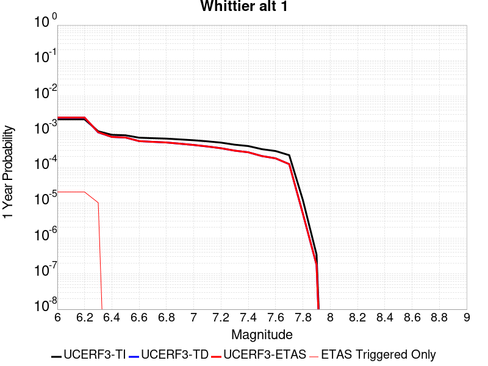 | 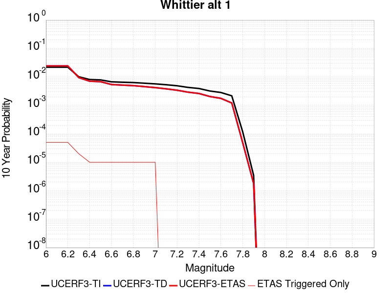 |

| Magnitude | 1 wk TI Prob | 1 wk TD Prob | 1 wk ETAS Prob | 1 wk ETAS/TD Gain | 1 wk ETAS Triggered Only | 1 mo TI Prob | 1 mo TD Prob | 1 mo ETAS Prob | 1 mo ETAS/TD Gain | 1 mo ETAS Triggered Only | 1 yr TI Prob | 1 yr TD Prob | 1 yr ETAS Prob | 1 yr ETAS/TD Gain | 1 yr ETAS Triggered Only | 10 yr TI Prob | 10 yr TD Prob | 10 yr ETAS Prob | 10 yr ETAS/TD Gain | 10 yr ETAS Triggered Only |
|-----|-----|-----|-----|-----|-----|-----|-----|-----|-----|-----|-----|-----|-----|-----|-----|-----|-----|-----|-----|-----|
| 6.0 | 4.2554693E-5 | 4.7252182E-5 | 4.7252182E-5 | 1.0 | 0.0 | 1.8236451E-4 | 2.0249544E-4 | 2.1249343E-4 | 1.0493739 | 1.0E-5 | 0.002218027 | 0.0024629163 | 0.002482867 | 1.0081005 | 2.0E-5 | 0.02196019 | 0.024390263 | 0.024439044 | 1.002 | 5.0E-5 |
| 6.1 | 4.2554693E-5 | 4.7252182E-5 | 4.7252182E-5 | 1.0 | 0.0 | 1.8236451E-4 | 2.0249544E-4 | 2.1249343E-4 | 1.0493739 | 1.0E-5 | 0.002218027 | 0.0024629163 | 0.002482867 | 1.0081005 | 2.0E-5 | 0.02196019 | 0.024390263 | 0.024439044 | 1.002 | 5.0E-5 |
| 6.2 | 4.2554693E-5 | 4.7252182E-5 | 4.7252182E-5 | 1.0 | 0.0 | 1.8236451E-4 | 2.0249544E-4 | 2.1249343E-4 | 1.0493739 | 1.0E-5 | 0.002218027 | 0.0024629163 | 0.002482867 | 1.0081005 | 2.0E-5 | 0.02196019 | 0.024390263 | 0.024439044 | 1.002 | 5.0E-5 |
| 6.3 | 1.9617712E-5 | 1.826841E-5 | 1.826841E-5 | 1.0 | 0.0 | 8.40732E-5 | 7.829095E-5 | 8.8290166E-5 | 1.1277187 | 1.0E-5 | 0.0010231105 | 9.527944E-4 | 9.6278486E-4 | 1.0104854 | 1.0E-5 | 0.01018413 | 0.0094904 | 0.00951021 | 1.0020874 | 2.0E-5 |
| 6.4 | 1.5611336E-5 | 1.3604089E-5 | 1.3604089E-5 | 1.0 | 0.0 | 6.690401E-5 | 5.8301972E-5 | 5.8301972E-5 | 1.0 | 0.0 | 8.142519E-4 | 7.096013E-4 | 7.096013E-4 | 1.0 | 0.0 | 0.008112748 | 0.0070753377 | 0.007085267 | 1.0014033 | 1.0E-5 |
| 6.5 | 1.5150166E-5 | 1.3100744E-5 | 1.3100744E-5 | 1.0 | 0.0 | 6.492767E-5 | 5.614487E-5 | 5.614487E-5 | 1.0 | 0.0 | 7.9020765E-4 | 6.8335526E-4 | 6.8335526E-4 | 1.0 | 0.0 | 0.007874036 | 0.006814508 | 0.0068244394 | 1.0014575 | 1.0E-5 |
| 6.6 | 1.295588E-5 | 1.0380544E-5 | 1.0380544E-5 | 1.0 | 0.0 | 5.552402E-5 | 4.44873E-5 | 4.44873E-5 | 1.0 | 0.0 | 6.7579525E-4 | 5.415002E-4 | 5.415002E-4 | 1.0 | 0.0 | 0.006737438 | 0.005403343 | 0.005413289 | 1.0018407 | 1.0E-5 |
| 6.7 | 1.2542085E-5 | 9.899189E-6 | 9.899189E-6 | 1.0 | 0.0 | 5.3750682E-5 | 4.2424414E-5 | 4.2424414E-5 | 1.0 | 0.0 | 6.542181E-4 | 5.163967E-4 | 5.163967E-4 | 1.0 | 0.0 | 0.006522954 | 0.005153464 | 0.0051634125 | 1.0019305 | 1.0E-5 |
| 6.8 | 1.2195878E-5 | 9.49523E-6 | 9.49523E-6 | 1.0 | 0.0 | 5.2267E-5 | 4.069322E-5 | 4.069322E-5 | 1.0 | 0.0 | 6.36165E-4 | 4.9532915E-4 | 4.9532915E-4 | 1.0 | 0.0 | 0.0063434686 | 0.0049436963 | 0.004953647 | 1.0020127 | 1.0E-5 |
| 6.9 | 1.1580298E-5 | 8.772739E-6 | 8.772739E-6 | 1.0 | 0.0 | 4.9628903E-5 | 3.759692E-5 | 3.759692E-5 | 1.0 | 0.0 | 6.040644E-4 | 4.5764804E-4 | 4.5764804E-4 | 1.0 | 0.0 | 0.00602425 | 0.0045684646 | 0.0045784186 | 1.0021789 | 1.0E-5 |
| 7.0 | 1.0964795E-5 | 8.083794E-6 | 8.083794E-6 | 1.0 | 0.0 | 4.6991136E-5 | 3.4644378E-5 | 3.4644378E-5 | 1.0 | 0.0 | 5.7196687E-4 | 4.217152E-4 | 4.217152E-4 | 1.0 | 0.0 | 0.0057049696 | 0.004210459 | 0.004220417 | 1.002365 | 1.0E-5 |
| 7.1 | 1.0230601E-5 | 7.32646E-6 | 7.32646E-6 | 1.0 | 0.0 | 4.3844695E-5 | 3.1398744E-5 | 3.1398744E-5 | 1.0 | 0.0 | 5.336784E-4 | 3.8221394E-4 | 3.8221394E-4 | 1.0 | 0.0 | 0.005323986 | 0.0038167592 | 0.0038167592 | 1.0 | 0.0 |
| 7.2 | 9.40865E-6 | 6.5430822E-6 | 6.5430822E-6 | 1.0 | 0.0 | 4.032216E-5 | 2.8041486E-5 | 2.8041486E-5 | 1.0 | 0.0 | 4.908117E-4 | 3.4135283E-4 | 3.4135283E-4 | 1.0 | 0.0 | 0.0048972913 | 0.0034094024 | 0.0034094024 | 1.0 | 0.0 |
| 7.3 | 8.237384E-6 | 5.5975433E-6 | 5.5975433E-6 | 1.0 | 0.0 | 3.5302593E-5 | 2.3989258E-5 | 2.3989258E-5 | 1.0 | 0.0 | 4.2972428E-4 | 2.920311E-4 | 2.920311E-4 | 1.0 | 0.0 | 0.0042889426 | 0.0029167992 | 0.0029167992 | 1.0 | 0.0 |
| 7.4 | 7.5316966E-6 | 5.0276153E-6 | 5.0276153E-6 | 1.0 | 0.0 | 3.2278298E-5 | 2.154675E-5 | 2.154675E-5 | 1.0 | 0.0 | 3.9291743E-4 | 2.623011E-4 | 2.623011E-4 | 1.0 | 0.0 | 0.0039222343 | 0.0026200267 | 0.0026200267 | 1.0 | 0.0 |
| 7.5 | 6.149649E-6 | 3.9336355E-6 | 3.9336355E-6 | 1.0 | 0.0 | 2.6355372E-5 | 1.6858336E-5 | 1.6858336E-5 | 1.0 | 0.0 | 3.208294E-4 | 2.052318E-4 | 2.052318E-4 | 1.0 | 0.0 | 0.003203666 | 0.0020505118 | 0.0020505118 | 1.0 | 0.0 |
| 7.6 | 5.457711E-6 | 3.3951796E-6 | 3.3951796E-6 | 1.0 | 0.0 | 2.338998E-5 | 1.4550694E-5 | 1.4550694E-5 | 1.0 | 0.0 | 2.8473578E-4 | 1.771411E-4 | 1.771411E-4 | 1.0 | 0.0 | 0.0028437122 | 0.0017700798 | 0.0017700798 | 1.0 | 0.0 |
| 7.7 | 4.1676276E-6 | 2.3329922E-6 | 2.3329922E-6 | 1.0 | 0.0 | 1.7861139E-5 | 9.998504E-6 | 9.998504E-6 | 1.0 | 0.0 | 2.1743766E-4 | 1.2172572E-4 | 1.2172572E-4 | 1.0 | 0.0 | 0.0021722503 | 0.0012166635 | 0.0012166635 | 1.0 | 0.0 |
| 7.8 | 2.2692414E-7 | 9.384417E-8 | 9.384417E-8 | 1.0 | 0.0 | 9.725317E-7 | 4.0218927E-7 | 4.0218927E-7 | 1.0 | 0.0 | 1.1840509E-5 | 4.8966467E-6 | 4.8966467E-6 | 1.0 | 0.0 | 1.1839878E-4 | 4.8965718E-5 | 4.8965718E-5 | 1.0 | 0.0 |
| 7.9 | 6.676829E-9 | 3.4397174E-9 | 3.4397174E-9 | 1.0 | 0.0 | 2.861498E-8 | 1.4741646E-8 | 1.4741646E-8 | 1.0 | 0.0 | 3.4838732E-7 | 1.7947953E-7 | 1.7947953E-7 | 1.0 | 0.0 | 3.4838679E-6 | 1.794794E-6 | 1.794794E-6 | 1.0 | 0.0 |

## Sheephole
*[(top)](#table-of-contents)*

| 1 Week | 1 Month | 1 Year | 10 Year |
|-----|-----|-----|-----|
|  |  |  |  |

| Magnitude | 1 wk TI Prob | 1 wk TD Prob | 1 wk ETAS Prob | 1 wk ETAS/TD Gain | 1 wk ETAS Triggered Only | 1 mo TI Prob | 1 mo TD Prob | 1 mo ETAS Prob | 1 mo ETAS/TD Gain | 1 mo ETAS Triggered Only | 1 yr TI Prob | 1 yr TD Prob | 1 yr ETAS Prob | 1 yr ETAS/TD Gain | 1 yr ETAS Triggered Only | 10 yr TI Prob | 10 yr TD Prob | 10 yr ETAS Prob | 10 yr ETAS/TD Gain | 10 yr ETAS Triggered Only |
|-----|-----|-----|-----|-----|-----|-----|-----|-----|-----|-----|-----|-----|-----|-----|-----|-----|-----|-----|-----|-----|
| 6.0 | 4.5579695E-6 | 4.7412627E-6 | 3.474112E-5 | 7.3273983 | 3.0E-5 | 1.9534009E-5 | 2.031957E-5 | 6.031876E-5 | 2.9685056 | 4.0E-5 | 2.3780059E-4 | 2.473682E-4 | 2.8735833E-4 | 1.1616622 | 4.0E-5 | 0.0023754628 | 0.002471473 | 0.0025213496 | 1.0201808 | 5.0E-5 |
| 6.1 | 4.5579695E-6 | 4.7412627E-6 | 3.474112E-5 | 7.3273983 | 3.0E-5 | 1.9534009E-5 | 2.031957E-5 | 6.031876E-5 | 2.9685056 | 4.0E-5 | 2.3780059E-4 | 2.473682E-4 | 2.8735833E-4 | 1.1616622 | 4.0E-5 | 0.0023754628 | 0.002471473 | 0.0025213496 | 1.0201808 | 5.0E-5 |
| 6.2 | 2.6677674E-6 | 2.7873941E-6 | 3.278731E-5 | 11.762711 | 3.0E-5 | 1.1433239E-5 | 1.1945926E-5 | 5.1945448E-5 | 4.3483815 | 4.0E-5 | 1.3919079E-4 | 1.4543302E-4 | 1.8542721E-4 | 1.2750007 | 4.0E-5 | 0.0013910364 | 0.0014534844 | 0.0014934263 | 1.0274801 | 4.0E-5 |
| 6.3 | 2.6677674E-6 | 2.7873941E-6 | 3.278731E-5 | 11.762711 | 3.0E-5 | 1.1433239E-5 | 1.1945926E-5 | 5.1945448E-5 | 4.3483815 | 4.0E-5 | 1.3919079E-4 | 1.4543302E-4 | 1.8542721E-4 | 1.2750007 | 4.0E-5 | 0.0013910364 | 0.0014534844 | 0.0014934263 | 1.0274801 | 4.0E-5 |
| 6.4 | 2.2159759E-6 | 2.3228788E-6 | 3.232281E-5 | 13.914979 | 3.0E-5 | 9.497005E-6 | 9.955161E-6 | 4.9954764E-5 | 5.0179763 | 4.0E-5 | 1.156199E-4 | 1.2119815E-4 | 1.6119331E-4 | 1.329998 | 4.0E-5 | 0.0011555976 | 0.0012113999 | 0.0012513514 | 1.0329796 | 4.0E-5 |
| 6.5 | 2.1986082E-6 | 2.304759E-6 | 3.230469E-5 | 14.016515 | 3.0E-5 | 9.4225725E-6 | 9.877506E-6 | 4.987711E-5 | 5.0495653 | 4.0E-5 | 1.1471378E-4 | 1.2025281E-4 | 1.6024799E-4 | 1.3325926 | 4.0E-5 | 0.0011465458 | 0.0012019566 | 0.0012419085 | 1.0332391 | 4.0E-5 |
| 6.6 | 1.5232331E-6 | 1.6018919E-6 | 3.1601845E-5 | 19.727827 | 3.0E-5 | 6.5281256E-6 | 6.865234E-6 | 4.686496E-5 | 6.8264184 | 4.0E-5 | 7.947703E-5 | 8.35812E-5 | 1.2357786E-4 | 1.4785365 | 4.0E-5 | 7.9448614E-4 | 8.3551643E-4 | 8.75483E-4 | 1.0478346 | 4.0E-5 |
| 6.7 | 1.3137362E-6 | 1.382819E-6 | 2.1382792E-5 | 15.463188 | 2.0E-5 | 5.6302856E-6 | 5.926355E-6 | 2.5926236E-5 | 4.374736 | 2.0E-5 | 6.854657E-5 | 7.215112E-5 | 9.2149676E-5 | 1.277176 | 2.0E-5 | 6.8525434E-4 | 7.212908E-4 | 7.412764E-4 | 1.027708 | 2.0E-5 |
| 6.8 | 1.2275751E-6 | 1.2922847E-6 | 2.1292259E-5 | 16.476446 | 2.0E-5 | 5.2610258E-6 | 5.5383516E-6 | 2.553824E-5 | 4.6111627 | 2.0E-5 | 6.4051106E-5 | 6.7427485E-5 | 8.742613E-5 | 1.296595 | 2.0E-5 | 6.4032647E-4 | 6.740836E-4 | 6.940701E-4 | 1.0296499 | 2.0E-5 |
| 6.9 | 1.1837088E-6 | 1.246102E-6 | 2.1246076E-5 | 17.05003 | 2.0E-5 | 5.0730278E-6 | 5.340427E-6 | 2.534032E-5 | 4.744999 | 2.0E-5 | 6.176237E-5 | 6.501789E-5 | 8.501659E-5 | 1.3075876 | 2.0E-5 | 6.17452E-4 | 6.5000186E-4 | 6.6998886E-4 | 1.0307492 | 2.0E-5 |
| 7.0 | 9.849371E-7 | 1.0366288E-6 | 2.1036609E-5 | 20.29329 | 2.0E-5 | 4.2211523E-6 | 4.442688E-6 | 2.44426E-5 | 5.501759 | 2.0E-5 | 5.1391315E-5 | 5.4088487E-5 | 7.40874E-5 | 1.3697444 | 2.0E-5 | 5.137943E-4 | 5.407633E-4 | 5.6075247E-4 | 1.0369648 | 2.0E-5 |
| 7.1 | 8.1643645E-7 | 8.591669E-7 | 2.085915E-5 | 24.278345 | 2.0E-5 | 3.4990085E-6 | 3.682139E-6 | 2.3682065E-5 | 6.4316053 | 2.0E-5 | 4.2599597E-5 | 4.482921E-5 | 6.482832E-5 | 1.4461176 | 2.0E-5 | 4.259143E-4 | 4.4821028E-4 | 4.6820132E-4 | 1.0446019 | 2.0E-5 |
| 7.2 | 5.7295756E-7 | 6.029502E-7 | 1.0602944E-5 | 17.585108 | 1.0E-5 | 2.45553E-6 | 2.58407E-6 | 1.2584044E-5 | 4.869854 | 1.0E-5 | 2.9895667E-5 | 3.1460666E-5 | 4.1460353E-5 | 1.3178473 | 1.0E-5 | 2.9891645E-4 | 3.145688E-4 | 3.2456568E-4 | 1.0317795 | 1.0E-5 |

## San Jacinto (San Jacinto Valley) rev
*[(top)](#table-of-contents)*

| 1 Week | 1 Month | 1 Year | 10 Year |
|-----|-----|-----|-----|
| 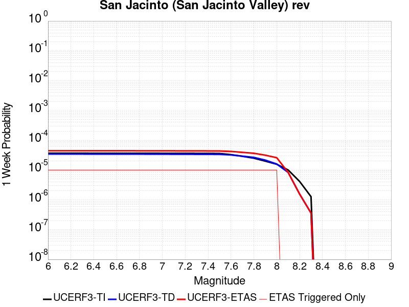 |  |  |  |

| Magnitude | 1 wk TI Prob | 1 wk TD Prob | 1 wk ETAS Prob | 1 wk ETAS/TD Gain | 1 wk ETAS Triggered Only | 1 mo TI Prob | 1 mo TD Prob | 1 mo ETAS Prob | 1 mo ETAS/TD Gain | 1 mo ETAS Triggered Only | 1 yr TI Prob | 1 yr TD Prob | 1 yr ETAS Prob | 1 yr ETAS/TD Gain | 1 yr ETAS Triggered Only | 10 yr TI Prob | 10 yr TD Prob | 10 yr ETAS Prob | 10 yr ETAS/TD Gain | 10 yr ETAS Triggered Only |
|-----|-----|-----|-----|-----|-----|-----|-----|-----|-----|-----|-----|-----|-----|-----|-----|-----|-----|-----|-----|-----|
| 6.0 | 3.652694E-5 | 3.4401106E-5 | 4.440076E-5 | 1.2906784 | 1.0E-5 | 1.5653463E-4 | 1.4742499E-4 | 1.574235E-4 | 1.0678211 | 1.0E-5 | 0.0019041431 | 0.0017934233 | 0.0018233695 | 1.0166978 | 3.0E-5 | 0.018879099 | 0.018526303 | 0.018575376 | 1.0026488 | 5.0E-5 |
| 6.1 | 3.652694E-5 | 3.4401106E-5 | 4.440076E-5 | 1.2906784 | 1.0E-5 | 1.5653463E-4 | 1.4742499E-4 | 1.574235E-4 | 1.0678211 | 1.0E-5 | 0.0019041431 | 0.0017934233 | 0.0018233695 | 1.0166978 | 3.0E-5 | 0.018879099 | 0.018526303 | 0.018575376 | 1.0026488 | 5.0E-5 |
| 6.2 | 3.652694E-5 | 3.4401106E-5 | 4.440076E-5 | 1.2906784 | 1.0E-5 | 1.5653463E-4 | 1.4742499E-4 | 1.574235E-4 | 1.0678211 | 1.0E-5 | 0.0019041431 | 0.0017934233 | 0.0018233695 | 1.0166978 | 3.0E-5 | 0.018879099 | 0.018526303 | 0.018575376 | 1.0026488 | 5.0E-5 |
| 6.3 | 3.652694E-5 | 3.4401106E-5 | 4.440076E-5 | 1.2906784 | 1.0E-5 | 1.5653463E-4 | 1.4742499E-4 | 1.574235E-4 | 1.0678211 | 1.0E-5 | 0.0019041431 | 0.0017934233 | 0.0018233695 | 1.0166978 | 3.0E-5 | 0.018879099 | 0.018526303 | 0.018575376 | 1.0026488 | 5.0E-5 |
| 6.4 | 3.646941E-5 | 3.432268E-5 | 4.4322336E-5 | 1.2913425 | 1.0E-5 | 1.5628811E-4 | 1.4708891E-4 | 1.5708744E-4 | 1.0679761 | 1.0E-5 | 0.0019011468 | 0.0017893389 | 0.0018192851 | 1.0167359 | 3.0E-5 | 0.018849645 | 0.018486181 | 0.018535258 | 1.0026547 | 5.0E-5 |
| 6.5 | 3.646941E-5 | 3.432268E-5 | 4.4322336E-5 | 1.2913425 | 1.0E-5 | 1.5628811E-4 | 1.4708891E-4 | 1.5708744E-4 | 1.0679761 | 1.0E-5 | 0.0019011468 | 0.0017893389 | 0.0018192851 | 1.0167359 | 3.0E-5 | 0.018849645 | 0.018486181 | 0.018535258 | 1.0026547 | 5.0E-5 |
| 6.6 | 3.6442503E-5 | 3.4286066E-5 | 4.4285724E-5 | 1.2916536 | 1.0E-5 | 1.561728E-4 | 1.4693203E-4 | 1.5693056E-4 | 1.0680487 | 1.0E-5 | 0.0018997455 | 0.001787432 | 0.0018173783 | 1.0167539 | 3.0E-5 | 0.018835869 | 0.01846745 | 0.018516527 | 1.0026574 | 5.0E-5 |
| 6.7 | 3.6432113E-5 | 3.427164E-5 | 4.42713E-5 | 1.2917764 | 1.0E-5 | 1.5612828E-4 | 1.4687021E-4 | 1.5686874E-4 | 1.0680773 | 1.0E-5 | 0.0018992044 | 0.0017866807 | 0.0018166271 | 1.016761 | 3.0E-5 | 0.018830549 | 0.018460074 | 0.018509151 | 1.0026586 | 5.0E-5 |
| 6.8 | 3.6409598E-5 | 3.4240697E-5 | 4.4240354E-5 | 1.2920401 | 1.0E-5 | 1.560318E-4 | 1.4673761E-4 | 1.5673615E-4 | 1.0681388 | 1.0E-5 | 0.0018980318 | 0.0017850689 | 0.0018150153 | 1.0167761 | 3.0E-5 | 0.018819023 | 0.018444229 | 0.018493306 | 1.0026609 | 5.0E-5 |
| 6.9 | 3.638078E-5 | 3.4201123E-5 | 4.420078E-5 | 1.2923781 | 1.0E-5 | 1.5590832E-4 | 1.4656801E-4 | 1.5656654E-4 | 1.0682178 | 1.0E-5 | 0.0018965311 | 0.0017830075 | 0.0018129541 | 1.0167955 | 3.0E-5 | 0.018804269 | 0.018423963 | 0.018473042 | 1.0026639 | 5.0E-5 |
| 7.0 | 3.6294874E-5 | 3.408314E-5 | 4.4082797E-5 | 1.2933902 | 1.0E-5 | 1.5554018E-4 | 1.4606243E-4 | 1.5606097E-4 | 1.0684539 | 1.0E-5 | 0.0018920569 | 0.0017768623 | 0.001806809 | 1.0168537 | 3.0E-5 | 0.018760284 | 0.018363545 | 0.018412627 | 1.0026728 | 5.0E-5 |
| 7.1 | 3.6260717E-5 | 3.403942E-5 | 4.4039083E-5 | 1.293767 | 1.0E-5 | 1.5539382E-4 | 1.4587509E-4 | 1.5587364E-4 | 1.0685418 | 1.0E-5 | 0.001890278 | 0.0017745851 | 0.0018045319 | 1.0168754 | 3.0E-5 | 0.018742796 | 0.018341139 | 0.018390222 | 1.0026761 | 5.0E-5 |
| 7.2 | 3.6210204E-5 | 3.397364E-5 | 4.39733E-5 | 1.2943358 | 1.0E-5 | 1.5517735E-4 | 1.455932E-4 | 1.5559176E-4 | 1.0686746 | 1.0E-5 | 0.001887647 | 0.0017711588 | 0.0018011057 | 1.016908 | 3.0E-5 | 0.01871693 | 0.018307408 | 0.018356493 | 1.0026811 | 5.0E-5 |
| 7.3 | 3.6119454E-5 | 3.386193E-5 | 4.386159E-5 | 1.2953069 | 1.0E-5 | 1.5478847E-4 | 1.4511449E-4 | 1.5511304E-4 | 1.0689011 | 1.0E-5 | 0.0018829206 | 0.0017653398 | 0.0017952869 | 1.0169638 | 3.0E-5 | 0.018670462 | 0.01824996 | 0.018299049 | 1.0026897 | 5.0E-5 |
| 7.4 | 3.607848E-5 | 3.380943E-5 | 4.380909E-5 | 1.2957655 | 1.0E-5 | 1.5461289E-4 | 1.4488952E-4 | 1.5488807E-4 | 1.0690081 | 1.0E-5 | 0.0018807866 | 0.0017626052 | 0.0017925523 | 1.0169903 | 3.0E-5 | 0.018649481 | 0.018222956 | 0.018272044 | 1.0026938 | 5.0E-5 |
| 7.5 | 3.5856774E-5 | 3.3619202E-5 | 4.3618867E-5 | 1.2974391 | 1.0E-5 | 1.5366284E-4 | 1.4407437E-4 | 1.5407291E-4 | 1.0693986 | 1.0E-5 | 0.0018692396 | 0.0017526967 | 0.0017826441 | 1.0170865 | 3.0E-5 | 0.018535944 | 0.018124057 | 0.01817315 | 1.0027088 | 5.0E-5 |
| 7.6 | 3.286655E-5 | 3.2142278E-5 | 4.2141957E-5 | 1.3111067 | 1.0E-5 | 1.4084904E-4 | 1.3774536E-4 | 1.4774398E-4 | 1.0725877 | 1.0E-5 | 0.001713488 | 0.0016757617 | 0.0017057114 | 1.0178723 | 3.0E-5 | 0.017003361 | 0.017343804 | 0.017392937 | 1.0028329 | 5.0E-5 |
| 7.7 | 2.8882527E-5 | 2.9235205E-5 | 3.9234914E-5 | 1.3420434 | 1.0E-5 | 1.237764E-4 | 1.2528773E-4 | 1.3528646E-4 | 1.0798063 | 1.0E-5 | 0.0015059357 | 0.0015243118 | 0.0015542661 | 1.019651 | 3.0E-5 | 0.014957713 | 0.015830338 | 0.015879545 | 1.0031085 | 5.0E-5 |
| 7.8 | 2.4950225E-5 | 2.6526219E-5 | 3.6525955E-5 | 1.3769755 | 1.0E-5 | 1.0692515E-4 | 1.1367885E-4 | 1.2367772E-4 | 1.0879571 | 1.0E-5 | 0.0013010362 | 0.0013831621 | 0.0014131207 | 1.0216594 | 3.0E-5 | 0.012934455 | 0.01441176 | 0.014461039 | 1.0034194 | 5.0E-5 |
| 7.9 | 1.9881603E-5 | 2.150649E-5 | 3.1506275E-5 | 1.4649659 | 1.0E-5 | 8.520408E-5 | 9.216742E-5 | 1.021665E-4 | 1.1084882 | 1.0E-5 | 0.001036866 | 0.0011215615 | 0.0011515279 | 1.0267184 | 3.0E-5 | 0.010320415 | 0.011776998 | 0.011826409 | 1.0041956 | 5.0E-5 |
| 8.0 | 1.563292E-5 | 1.5936288E-5 | 2.5936128E-5 | 1.6274887 | 1.0E-5 | 6.6996516E-5 | 6.829659E-5 | 7.829591E-5 | 1.1464102 | 1.0E-5 | 8.153773E-4 | 8.3119445E-4 | 8.6116954E-4 | 1.0360626 | 3.0E-5 | 0.00812392 | 0.008810331 | 0.0088598905 | 1.0056251 | 5.0E-5 |
| 8.1 | 1.0045313E-5 | 8.300794E-6 | 8.300794E-6 | 1.0 | 0.0 | 4.305063E-5 | 3.557435E-5 | 3.557435E-5 | 1.0 | 0.0 | 5.2401534E-4 | 4.3303217E-4 | 4.3303217E-4 | 1.0 | 0.0 | 0.0052278144 | 0.0046587666 | 0.0046587666 | 1.0 | 0.0 |
| 8.2 | 4.1554413E-6 | 1.5648296E-6 | 1.5648296E-6 | 1.0 | 0.0 | 1.7808914E-5 | 6.7063957E-6 | 6.7063957E-6 | 1.0 | 0.0 | 2.1680194E-4 | 8.164734E-5 | 8.164734E-5 | 1.0 | 0.0 | 0.0021659054 | 9.479703E-4 | 9.479703E-4 | 1.0 | 0.0 |
| 8.3 | 1.2758221E-6 | 3.612677E-7 | 3.612677E-7 | 1.0 | 0.0 | 5.4677976E-6 | 1.5482892E-6 | 1.5482892E-6 | 1.0 | 0.0 | 6.65684E-5 | 1.8850264E-5 | 1.8850264E-5 | 1.0 | 0.0 | 6.6548464E-4 | 2.2739546E-4 | 2.2739546E-4 | 1.0 | 0.0 |

## San Jacinto (Anza) rev
*[(top)](#table-of-contents)*

| 1 Week | 1 Month | 1 Year | 10 Year |
|-----|-----|-----|-----|
|  |  |  |  |

| Magnitude | 1 wk TI Prob | 1 wk TD Prob | 1 wk ETAS Prob | 1 wk ETAS/TD Gain | 1 wk ETAS Triggered Only | 1 mo TI Prob | 1 mo TD Prob | 1 mo ETAS Prob | 1 mo ETAS/TD Gain | 1 mo ETAS Triggered Only | 1 yr TI Prob | 1 yr TD Prob | 1 yr ETAS Prob | 1 yr ETAS/TD Gain | 1 yr ETAS Triggered Only | 10 yr TI Prob | 10 yr TD Prob | 10 yr ETAS Prob | 10 yr ETAS/TD Gain | 10 yr ETAS Triggered Only |
|-----|-----|-----|-----|-----|-----|-----|-----|-----|-----|-----|-----|-----|-----|-----|-----|-----|-----|-----|-----|-----|
| 6.0 | 6.3015636E-5 | 4.3298347E-5 | 5.3297914E-5 | 1.2309457 | 1.0E-5 | 2.7003905E-4 | 1.8555121E-4 | 1.9554936E-4 | 1.0538834 | 1.0E-5 | 0.0032827691 | 0.0022567573 | 0.0022866896 | 1.0132635 | 3.0E-5 | 0.032346968 | 0.02329361 | 0.023342447 | 1.0020965 | 5.0E-5 |
| 6.1 | 6.3015636E-5 | 4.3298347E-5 | 5.3297914E-5 | 1.2309457 | 1.0E-5 | 2.7003905E-4 | 1.8555121E-4 | 1.9554936E-4 | 1.0538834 | 1.0E-5 | 0.0032827691 | 0.0022567573 | 0.0022866896 | 1.0132635 | 3.0E-5 | 0.032346968 | 0.02329361 | 0.023342447 | 1.0020965 | 5.0E-5 |
| 6.2 | 6.3015636E-5 | 4.3298347E-5 | 5.3297914E-5 | 1.2309457 | 1.0E-5 | 2.7003905E-4 | 1.8555121E-4 | 1.9554936E-4 | 1.0538834 | 1.0E-5 | 0.0032827691 | 0.0022567573 | 0.0022866896 | 1.0132635 | 3.0E-5 | 0.032346968 | 0.02329361 | 0.023342447 | 1.0020965 | 5.0E-5 |
| 6.3 | 6.3015636E-5 | 4.3298347E-5 | 5.3297914E-5 | 1.2309457 | 1.0E-5 | 2.7003905E-4 | 1.8555121E-4 | 1.9554936E-4 | 1.0538834 | 1.0E-5 | 0.0032827691 | 0.0022567573 | 0.0022866896 | 1.0132635 | 3.0E-5 | 0.032346968 | 0.02329361 | 0.023342447 | 1.0020965 | 5.0E-5 |
| 6.4 | 6.3015636E-5 | 4.3298347E-5 | 5.3297914E-5 | 1.2309457 | 1.0E-5 | 2.7003905E-4 | 1.8555121E-4 | 1.9554936E-4 | 1.0538834 | 1.0E-5 | 0.0032827691 | 0.0022567573 | 0.0022866896 | 1.0132635 | 3.0E-5 | 0.032346968 | 0.02329361 | 0.023342447 | 1.0020965 | 5.0E-5 |
| 6.5 | 5.811017E-5 | 4.0080286E-5 | 5.0079885E-5 | 1.2494892 | 1.0E-5 | 2.4901982E-4 | 1.7176138E-4 | 1.8175965E-4 | 1.0582103 | 1.0E-5 | 0.0030276014 | 0.0020891947 | 0.002119132 | 1.0143296 | 3.0E-5 | 0.02986684 | 0.021590833 | 0.021639753 | 1.0022658 | 5.0E-5 |
| 6.6 | 5.811017E-5 | 4.0080286E-5 | 5.0079885E-5 | 1.2494892 | 1.0E-5 | 2.4901982E-4 | 1.7176138E-4 | 1.8175965E-4 | 1.0582103 | 1.0E-5 | 0.0030276014 | 0.0020891947 | 0.002119132 | 1.0143296 | 3.0E-5 | 0.02986684 | 0.021590833 | 0.021639753 | 1.0022658 | 5.0E-5 |
| 6.7 | 5.712442E-5 | 3.950301E-5 | 4.9502618E-5 | 1.2531352 | 1.0E-5 | 2.4479596E-4 | 1.6928767E-4 | 1.7928597E-4 | 1.059061 | 1.0E-5 | 0.0029763177 | 0.0020591344 | 0.0020890727 | 1.0145392 | 3.0E-5 | 0.029367693 | 0.021282919 | 0.021331854 | 1.0022993 | 5.0E-5 |
| 6.8 | 5.6967532E-5 | 3.93593E-5 | 4.9358907E-5 | 1.2540596 | 1.0E-5 | 2.4412372E-4 | 1.6867183E-4 | 1.7867015E-4 | 1.0592767 | 1.0E-5 | 0.0029681553 | 0.0020516508 | 0.0020815893 | 1.0145924 | 3.0E-5 | 0.029288229 | 0.02120852 | 0.021257458 | 1.0023075 | 5.0E-5 |
| 6.9 | 5.6211324E-5 | 3.9064216E-5 | 4.9063827E-5 | 1.2559787 | 1.0E-5 | 2.4088343E-4 | 1.6740736E-4 | 1.7740569E-4 | 1.0597246 | 1.0E-5 | 0.0029288116 | 0.0020362847 | 0.0020662236 | 1.0147027 | 3.0E-5 | 0.028905109 | 0.021047527 | 0.021096475 | 1.0023255 | 5.0E-5 |
| 7.0 | 5.4383527E-5 | 3.7925012E-5 | 4.7924634E-5 | 1.2636682 | 1.0E-5 | 2.3305144E-4 | 1.6252567E-4 | 1.7252404E-4 | 1.0615188 | 1.0E-5 | 0.0028337094 | 0.001976959 | 0.0020068996 | 1.0151448 | 3.0E-5 | 0.027978465 | 0.02044095 | 0.020489927 | 1.0023961 | 5.0E-5 |
| 7.1 | 5.1393665E-5 | 3.638787E-5 | 4.6387508E-5 | 1.2748069 | 1.0E-5 | 2.2023996E-4 | 1.5593872E-4 | 1.6593716E-4 | 1.0641178 | 1.0E-5 | 0.0026781242 | 0.0018969048 | 0.001926848 | 1.0157852 | 3.0E-5 | 0.026460782 | 0.019616077 | 0.019665096 | 1.002499 | 5.0E-5 |
| 7.2 | 4.785222E-5 | 3.4738845E-5 | 4.4738495E-5 | 1.2878522 | 1.0E-5 | 2.0506482E-4 | 1.4887229E-4 | 1.588708E-4 | 1.0671617 | 1.0E-5 | 0.0024938055 | 0.0018110167 | 0.0018409624 | 1.0165353 | 3.0E-5 | 0.024660049 | 0.018728783 | 0.018777847 | 1.0026197 | 5.0E-5 |
| 7.3 | 4.2143256E-5 | 3.3834414E-5 | 4.3834076E-5 | 1.2955471 | 1.0E-5 | 1.8060145E-4 | 1.449966E-4 | 1.5499514E-4 | 1.0689571 | 1.0E-5 | 0.002196605 | 0.0017639075 | 0.0017938545 | 1.0169777 | 3.0E-5 | 0.02175019 | 0.018236695 | 0.018285783 | 1.0026917 | 5.0E-5 |
| 7.4 | 4.0264713E-5 | 3.3472694E-5 | 4.347236E-5 | 1.298741 | 1.0E-5 | 1.7255165E-4 | 1.4344654E-4 | 1.534451E-4 | 1.0697024 | 1.0E-5 | 0.002098792 | 0.0017450659 | 0.0017750135 | 1.0171614 | 3.0E-5 | 0.020790804 | 0.018041389 | 0.018090487 | 1.0027214 | 5.0E-5 |
| 7.5 | 3.694492E-5 | 3.2186905E-5 | 4.2186584E-5 | 1.3106754 | 1.0E-5 | 1.5832575E-4 | 1.379366E-4 | 1.4793522E-4 | 1.0724871 | 1.0E-5 | 0.0019259118 | 0.0016780876 | 0.0017080372 | 1.0178475 | 3.0E-5 | 0.01909306 | 0.017357888 | 0.01740702 | 1.0028305 | 5.0E-5 |
| 7.6 | 3.200565E-5 | 2.9502702E-5 | 3.9502407E-5 | 1.338942 | 1.0E-5 | 1.3715986E-4 | 1.2643404E-4 | 1.3643278E-4 | 1.0790826 | 1.0E-5 | 0.001668642 | 0.0015382497 | 0.0015682036 | 1.0194727 | 3.0E-5 | 0.01656168 | 0.015946016 | 0.01599522 | 1.0030856 | 5.0E-5 |
| 7.7 | 2.731642E-5 | 2.6091477E-5 | 3.6091216E-5 | 1.3832569 | 1.0E-5 | 1.1706512E-4 | 1.11815825E-4 | 1.2181471E-4 | 1.0894228 | 1.0E-5 | 0.001424336 | 0.0013605085 | 0.0013904677 | 1.0220206 | 3.0E-5 | 0.014152412 | 0.0141668 | 0.0142160915 | 1.0034794 | 5.0E-5 |
| 7.8 | 2.3466424E-5 | 2.3503619E-5 | 3.3503384E-5 | 1.4254564 | 1.0E-5 | 1.0056651E-4 | 1.0072591E-4 | 1.10724905E-4 | 1.0992693 | 1.0E-5 | 0.0012237094 | 0.0012256489 | 0.0012556121 | 1.0244468 | 3.0E-5 | 0.012169928 | 0.012808796 | 0.012858156 | 1.0038536 | 5.0E-5 |
| 7.9 | 1.8611925E-5 | 1.890698E-5 | 2.890679E-5 | 1.5288953 | 1.0E-5 | 7.9762955E-5 | 8.10274E-5 | 9.102659E-5 | 1.1234051 | 1.0E-5 | 9.7068126E-4 | 9.860628E-4 | 0.0010160332 | 1.0303941 | 3.0E-5 | 0.0096645225 | 0.010393705 | 0.010443185 | 1.0047606 | 5.0E-5 |
| 8.0 | 1.5460775E-5 | 1.5739915E-5 | 2.5739759E-5 | 1.6353174 | 1.0E-5 | 6.6258784E-5 | 6.745504E-5 | 7.7454366E-5 | 1.1482369 | 1.0E-5 | 8.0640207E-4 | 8.2095637E-4 | 8.5093174E-4 | 1.0365127 | 3.0E-5 | 0.008034821 | 0.008702706 | 0.008752271 | 1.0056953 | 5.0E-5 |
| 8.1 | 9.983884E-6 | 8.268954E-6 | 8.268954E-6 | 1.0 | 0.0 | 4.2787375E-5 | 3.5437897E-5 | 3.5437897E-5 | 1.0 | 0.0 | 5.2081177E-4 | 4.313715E-4 | 4.313715E-4 | 1.0 | 0.0 | 0.0051959283 | 0.00463968 | 0.00463968 | 1.0 | 0.0 |
| 8.2 | 4.1226E-6 | 1.5522551E-6 | 1.5522551E-6 | 1.0 | 0.0 | 1.7668166E-5 | 6.6525045E-6 | 6.6525045E-6 | 1.0 | 0.0 | 2.1508869E-4 | 8.099126E-5 | 8.099126E-5 | 1.0 | 0.0 | 0.0021488064 | 9.401847E-4 | 9.401847E-4 | 1.0 | 0.0 |
| 8.3 | 1.2750878E-6 | 3.609817E-7 | 3.609817E-7 | 1.0 | 0.0 | 5.4646503E-6 | 1.5470634E-6 | 1.5470634E-6 | 1.0 | 0.0 | 6.653009E-5 | 1.8835339E-5 | 1.8835339E-5 | 1.0 | 0.0 | 6.6510175E-4 | 2.272251E-4 | 2.272251E-4 | 1.0 | 0.0 |

## San Diego Trough south
*[(top)](#table-of-contents)*

| 1 Week | 1 Month | 1 Year | 10 Year |
|-----|-----|-----|-----|
|  |  |  |  |

| Magnitude | 1 wk TI Prob | 1 wk TD Prob | 1 wk ETAS Prob | 1 wk ETAS/TD Gain | 1 wk ETAS Triggered Only | 1 mo TI Prob | 1 mo TD Prob | 1 mo ETAS Prob | 1 mo ETAS/TD Gain | 1 mo ETAS Triggered Only | 1 yr TI Prob | 1 yr TD Prob | 1 yr ETAS Prob | 1 yr ETAS/TD Gain | 1 yr ETAS Triggered Only | 10 yr TI Prob | 10 yr TD Prob | 10 yr ETAS Prob | 10 yr ETAS/TD Gain | 10 yr ETAS Triggered Only |
|-----|-----|-----|-----|-----|-----|-----|-----|-----|-----|-----|-----|-----|-----|-----|-----|-----|-----|-----|-----|-----|
| 6.0 | 8.279495E-5 | 1.0425541E-4 | 1.4425124E-4 | 1.3836331 | 4.0E-5 | 3.5478722E-4 | 4.4673498E-4 | 4.867171E-4 | 1.0894985 | 4.0E-5 | 0.004310982 | 0.0054259133 | 0.005475642 | 1.009165 | 5.0E-5 | 0.042283054 | 0.05299303 | 0.05304038 | 1.0008935 | 5.0E-5 |
| 6.1 | 4.6961468E-5 | 5.773024E-5 | 6.772966E-5 | 1.1732094 | 1.0E-5 | 2.0124791E-4 | 2.473905E-4 | 2.5738802E-4 | 1.040412 | 1.0E-5 | 0.00244744 | 0.003007886 | 0.0030178558 | 1.0033146 | 1.0E-5 | 0.024206603 | 0.029679636 | 0.029689338 | 1.0003269 | 1.0E-5 |
| 6.2 | 3.5079658E-5 | 4.214258E-5 | 5.2142157E-5 | 1.2372797 | 1.0E-5 | 1.5033272E-4 | 1.8059829E-4 | 1.9059649E-4 | 1.0553615 | 1.0E-5 | 0.0018287642 | 0.002196587 | 0.002206565 | 1.0045425 | 1.0E-5 | 0.018137876 | 0.021751188 | 0.02176097 | 1.0004498 | 1.0E-5 |
| 6.3 | 3.5079658E-5 | 4.214258E-5 | 5.2142157E-5 | 1.2372797 | 1.0E-5 | 1.5033272E-4 | 1.8059829E-4 | 1.9059649E-4 | 1.0553615 | 1.0E-5 | 0.0018287642 | 0.002196587 | 0.002206565 | 1.0045425 | 1.0E-5 | 0.018137876 | 0.021751188 | 0.02176097 | 1.0004498 | 1.0E-5 |
| 6.4 | 2.7196904E-5 | 3.208715E-5 | 3.208715E-5 | 1.0 | 0.0 | 1.16552954E-4 | 1.3750911E-4 | 1.3750911E-4 | 1.0 | 0.0 | 0.0014181085 | 0.0016728995 | 0.0016728995 | 1.0 | 0.0 | 0.014090929 | 0.016604666 | 0.016604666 | 1.0 | 0.0 |
| 6.5 | 2.5584688E-5 | 3.0101632E-5 | 3.0101632E-5 | 1.0 | 0.0 | 1.0964406E-4 | 1.2900059E-4 | 1.2900059E-4 | 1.0 | 0.0 | 0.0013340989 | 0.0015694627 | 0.0015694627 | 1.0 | 0.0 | 0.013261181 | 0.015585332 | 0.015585332 | 1.0 | 0.0 |
| 6.6 | 2.2034688E-5 | 2.574271E-5 | 2.574271E-5 | 1.0 | 0.0 | 9.443096E-5 | 1.1032127E-4 | 1.1032127E-4 | 1.0 | 0.0 | 0.0011490905 | 0.0013423412 | 0.0013423412 | 1.0 | 0.0 | 0.011431668 | 0.013343325 | 0.013343325 | 1.0 | 0.0 |
| 6.7 | 1.9394853E-5 | 2.254176E-5 | 2.254176E-5 | 1.0 | 0.0 | 8.311815E-5 | 9.6604E-5 | 9.6604E-5 | 1.0 | 0.0 | 0.0010114936 | 0.0011755243 | 0.0011755243 | 1.0 | 0.0 | 0.01006902 | 0.011693766 | 0.011693766 | 1.0 | 0.0 |
| 6.8 | 1.7615313E-5 | 2.0403182E-5 | 2.0403182E-5 | 1.0 | 0.0 | 7.549201E-5 | 8.743931E-5 | 8.743931E-5 | 1.0 | 0.0 | 9.1872766E-4 | 0.0010640579 | 0.0010640579 | 1.0 | 0.0 | 0.009149387 | 0.010590198 | 0.010590198 | 1.0 | 0.0 |
| 6.9 | 1.5621423E-5 | 1.8026114E-5 | 1.8026114E-5 | 1.0 | 0.0 | 6.6947236E-5 | 7.725251E-5 | 7.725251E-5 | 1.0 | 0.0 | 8.147778E-4 | 9.40147E-4 | 9.40147E-4 | 1.0 | 0.0 | 0.008117969 | 0.009362142 | 0.009362142 | 1.0 | 0.0 |
| 7.0 | 1.3444376E-5 | 1.544809E-5 | 1.544809E-5 | 1.0 | 0.0 | 5.7617483E-5 | 6.620443E-5 | 6.620443E-5 | 1.0 | 0.0 | 7.0126704E-4 | 8.057436E-4 | 8.057436E-4 | 1.0 | 0.0 | 0.006990582 | 0.008028555 | 0.008028555 | 1.0 | 0.0 |
| 7.1 | 1.2268361E-5 | 1.407303E-5 | 1.407303E-5 | 1.0 | 0.0 | 5.2577634E-5 | 6.0311606E-5 | 6.0311606E-5 | 1.0 | 0.0 | 6.399447E-4 | 7.3404907E-4 | 7.3404907E-4 | 1.0 | 0.0 | 0.0063810493 | 0.0073165493 | 0.0073165493 | 1.0 | 0.0 |
| 7.2 | 1.0922655E-5 | 1.2513563E-5 | 1.2513563E-5 | 1.0 | 0.0 | 4.681054E-5 | 5.3628468E-5 | 5.3628468E-5 | 1.0 | 0.0 | 5.697693E-4 | 6.5273355E-4 | 6.5273355E-4 | 1.0 | 0.0 | 0.0056831064 | 0.0065084435 | 0.0065084435 | 1.0 | 0.0 |
| 7.3 | 6.1106753E-6 | 6.928925E-6 | 6.928925E-6 | 1.0 | 0.0 | 2.6188345E-5 | 2.9695057E-5 | 2.9695057E-5 | 1.0 | 0.0 | 3.1879646E-4 | 3.6147775E-4 | 3.6147775E-4 | 1.0 | 0.0 | 0.0031833951 | 0.003608943 | 0.003608943 | 1.0 | 0.0 |
| 7.4 | 4.933187E-6 | 5.5895525E-6 | 5.5895525E-6 | 1.0 | 0.0 | 2.114206E-5 | 2.3955008E-5 | 2.3955008E-5 | 1.0 | 0.0 | 2.5737417E-4 | 2.9161357E-4 | 2.9161357E-4 | 1.0 | 0.0 | 0.002570763 | 0.0029123505 | 0.0029123505 | 1.0 | 0.0 |
| 7.5 | 1.7489613E-6 | 1.969678E-6 | 1.969678E-6 | 1.0 | 0.0 | 7.495527E-6 | 8.4414505E-6 | 8.4414505E-6 | 1.0 | 0.0 | 9.125422E-5 | 1.02770035E-4 | 1.02770035E-4 | 1.0 | 0.0 | 9.1216754E-4 | 0.0010272472 | 0.0010272472 | 1.0 | 0.0 |
| 7.6 | 1.6988751E-7 | 1.7533823E-7 | 1.7533823E-7 | 1.0 | 0.0 | 7.2808916E-7 | 7.5144936E-7 | 7.5144936E-7 | 1.0 | 0.0 | 8.864449E-6 | 9.14886E-6 | 9.14886E-6 | 1.0 | 0.0 | 8.8640954E-5 | 9.1485024E-5 | 9.1485024E-5 | 1.0 | 0.0 |

## Oceanic - West Huasna
*[(top)](#table-of-contents)*

| 1 Week | 1 Month | 1 Year | 10 Year |
|-----|-----|-----|-----|
|  |  |  |  |

| Magnitude | 1 wk TI Prob | 1 wk TD Prob | 1 wk ETAS Prob | 1 wk ETAS/TD Gain | 1 wk ETAS Triggered Only | 1 mo TI Prob | 1 mo TD Prob | 1 mo ETAS Prob | 1 mo ETAS/TD Gain | 1 mo ETAS Triggered Only | 1 yr TI Prob | 1 yr TD Prob | 1 yr ETAS Prob | 1 yr ETAS/TD Gain | 1 yr ETAS Triggered Only | 10 yr TI Prob | 10 yr TD Prob | 10 yr ETAS Prob | 10 yr ETAS/TD Gain | 10 yr ETAS Triggered Only |
|-----|-----|-----|-----|-----|-----|-----|-----|-----|-----|-----|-----|-----|-----|-----|-----|-----|-----|-----|-----|-----|
| 6.0 | 3.195567E-5 | 2.7926368E-5 | 3.792609E-5 | 1.3580745 | 1.0E-5 | 1.3694567E-4 | 1.19679185E-4 | 1.496756E-4 | 1.2506402 | 3.0E-5 | 0.0016660384 | 0.0014561634 | 0.0014861196 | 1.0205721 | 3.0E-5 | 0.016536033 | 0.01447077 | 0.014510191 | 1.0027242 | 4.0E-5 |
| 6.1 | 2.1156782E-5 | 1.7573117E-5 | 1.7573117E-5 | 1.0 | 0.0 | 9.066878E-5 | 7.531123E-5 | 9.530973E-5 | 1.2655447 | 2.0E-5 | 0.0011033333 | 9.1653795E-4 | 9.3651965E-4 | 1.0218012 | 2.0E-5 | 0.010978713 | 0.009128587 | 0.009158313 | 1.0032563 | 3.0E-5 |
| 6.2 | 1.6195117E-5 | 1.3327227E-5 | 1.3327227E-5 | 1.0 | 0.0 | 6.9405796E-5 | 5.7115452E-5 | 6.711488E-5 | 1.175074 | 1.0E-5 | 8.44688E-4 | 6.9516135E-4 | 7.051544E-4 | 1.0143751 | 1.0E-5 | 0.008414844 | 0.0069301617 | 0.006950023 | 1.0028659 | 2.0E-5 |
| 6.3 | 1.3559345E-5 | 1.1179013E-5 | 1.1179013E-5 | 1.0 | 0.0 | 5.811018E-5 | 4.7909183E-5 | 5.7908703E-5 | 1.2087183 | 1.0E-5 | 7.072618E-4 | 5.8313913E-4 | 5.931333E-4 | 1.0171386 | 1.0E-5 | 0.0070501505 | 0.005816208 | 0.0058261496 | 1.0017093 | 1.0E-5 |
| 6.4 | 1.2120619E-5 | 1.0000874E-5 | 1.0000874E-5 | 1.0 | 0.0 | 5.1944477E-5 | 4.2860185E-5 | 4.2860185E-5 | 1.0 | 0.0 | 6.322405E-4 | 5.216983E-4 | 5.216983E-4 | 1.0 | 0.0 | 0.006304447 | 0.005204804 | 0.005204804 | 1.0 | 0.0 |
| 6.5 | 1.13511915E-5 | 9.367378E-6 | 9.367378E-6 | 1.0 | 0.0 | 4.8647056E-5 | 4.0145293E-5 | 4.0145293E-5 | 1.0 | 0.0 | 5.9211696E-4 | 4.886598E-4 | 4.886598E-4 | 1.0 | 0.0 | 0.0059054173 | 0.0048759114 | 0.0048759114 | 1.0 | 0.0 |
| 6.6 | 9.850605E-6 | 8.1353155E-6 | 8.1353155E-6 | 1.0 | 0.0 | 4.2216197E-5 | 3.4865174E-5 | 3.4865174E-5 | 1.0 | 0.0 | 5.1386096E-4 | 4.2440102E-4 | 4.2440102E-4 | 1.0 | 0.0 | 0.0051267436 | 0.0042359377 | 0.0042359377 | 1.0 | 0.0 |
| 6.7 | 8.8558645E-6 | 7.318341E-6 | 7.318341E-6 | 1.0 | 0.0 | 3.7953152E-5 | 3.1363943E-5 | 3.1363943E-5 | 1.0 | 0.0 | 4.6198163E-4 | 3.8178926E-4 | 3.8178926E-4 | 1.0 | 0.0 | 0.004610224 | 0.0038113592 | 0.0038113592 | 1.0 | 0.0 |
| 6.8 | 7.67136E-6 | 6.39169E-6 | 6.39169E-6 | 1.0 | 0.0 | 3.2876844E-5 | 2.739267E-5 | 2.739267E-5 | 1.0 | 0.0 | 4.0020206E-4 | 3.3345487E-4 | 3.3345487E-4 | 1.0 | 0.0 | 0.003994821 | 0.0033295664 | 0.0033295664 | 1.0 | 0.0 |
| 6.9 | 6.534529E-6 | 5.458261E-6 | 5.458261E-6 | 1.0 | 0.0 | 2.8004823E-5 | 2.3392338E-5 | 2.3392338E-5 | 1.0 | 0.0 | 3.4090536E-4 | 2.8476462E-4 | 2.8476462E-4 | 1.0 | 0.0 | 0.0034038287 | 0.002844014 | 0.002844014 | 1.0 | 0.0 |
| 7.0 | 5.460525E-6 | 4.5699203E-6 | 4.5699203E-6 | 1.0 | 0.0 | 2.3402039E-5 | 1.9585226E-5 | 1.9585226E-5 | 1.0 | 0.0 | 2.8488258E-4 | 2.3842414E-4 | 2.3842414E-4 | 1.0 | 0.0 | 0.0028451765 | 0.0023816973 | 0.0023816973 | 1.0 | 0.0 |
| 7.1 | 4.4825083E-6 | 3.7524153E-6 | 3.7524153E-6 | 1.0 | 0.0 | 1.9210609E-5 | 1.6081682E-5 | 1.6081682E-5 | 1.0 | 0.0 | 2.3386406E-4 | 1.9577699E-4 | 1.9577699E-4 | 1.0 | 0.0 | 0.002336181 | 0.001956057 | 0.001956057 | 1.0 | 0.0 |
| 7.2 | 2.821708E-6 | 2.424941E-6 | 2.424941E-6 | 1.0 | 0.0 | 1.2092979E-5 | 1.0392562E-5 | 1.0392562E-5 | 1.0 | 0.0 | 1.4722206E-4 | 1.265221E-4 | 1.265221E-4 | 1.0 | 0.0 | 0.0014712457 | 0.0012645032 | 0.0012645032 | 1.0 | 0.0 |
| 7.3 | 2.0644757E-6 | 1.7687502E-6 | 1.7687502E-6 | 1.0 | 0.0 | 8.847723E-6 | 7.580336E-6 | 7.580336E-6 | 1.0 | 0.0 | 1.0771569E-4 | 9.228668E-5 | 9.228668E-5 | 1.0 | 0.0 | 0.001076635 | 9.224854E-4 | 9.224854E-4 | 1.0 | 0.0 |
| 7.4 | 1.6980367E-6 | 1.4379966E-6 | 1.4379966E-6 | 1.0 | 0.0 | 7.27728E-6 | 6.1628284E-6 | 6.1628284E-6 | 1.0 | 0.0 | 8.8597284E-5 | 7.502986E-5 | 7.502986E-5 | 1.0 | 0.0 | 8.8561967E-4 | 7.5004686E-4 | 7.5004686E-4 | 1.0 | 0.0 |
| 7.5 | 1.3637683E-6 | 1.1302697E-6 | 1.1302697E-6 | 1.0 | 0.0 | 5.844708E-6 | 4.844004E-6 | 4.844004E-6 | 1.0 | 0.0 | 7.1156996E-5 | 5.897415E-5 | 5.897415E-5 | 1.0 | 0.0 | 7.1134215E-4 | 5.8958656E-4 | 5.8958656E-4 | 1.0 | 0.0 |
| 7.6 | 9.802994E-7 | 7.6772847E-7 | 7.6772847E-7 | 1.0 | 0.0 | 4.2012766E-6 | 3.2902608E-6 | 3.2902608E-6 | 1.0 | 0.0 | 5.1149345E-5 | 4.005819E-5 | 4.005819E-5 | 1.0 | 0.0 | 5.113757E-4 | 4.0051117E-4 | 4.0051117E-4 | 1.0 | 0.0 |
| 7.7 | 5.986191E-7 | 4.0050708E-7 | 4.0050708E-7 | 1.0 | 0.0 | 2.5655079E-6 | 1.7164577E-6 | 1.7164577E-6 | 1.0 | 0.0 | 3.1234613E-5 | 2.0897673E-5 | 2.0897673E-5 | 1.0 | 0.0 | 3.123022E-4 | 2.0895849E-4 | 2.0895849E-4 | 1.0 | 0.0 |
| 7.8 | 2.9189815E-7 | 1.5285202E-7 | 1.5285202E-7 | 1.0 | 0.0 | 1.2509914E-6 | 6.5507993E-7 | 6.5507993E-7 | 1.0 | 0.0 | 1.5230714E-5 | 7.975569E-6 | 7.975569E-6 | 1.0 | 0.0 | 1.522967E-4 | 7.97542E-5 | 7.97542E-5 | 1.0 | 0.0 |
| 7.9 | 1.2057845E-7 | 4.6208047E-8 | 4.6208047E-8 | 1.0 | 0.0 | 5.1676466E-7 | 1.9803447E-7 | 1.9803447E-7 | 1.0 | 0.0 | 6.2915915E-6 | 2.411067E-6 | 2.411067E-6 | 1.0 | 0.0 | 6.2914136E-5 | 2.4111772E-5 | 2.4111772E-5 | 1.0 | 0.0 |
| 8.0 | 3.3806387E-9 | 9.0093144E-10 | 9.0093144E-10 | 1.0 | 0.0 | 1.4488451E-8 | 3.8611354E-9 | 3.8611354E-9 | 1.0 | 0.0 | 1.7639688E-7 | 4.7009323E-8 | 4.7009323E-8 | 1.0 | 0.0 | 1.7639674E-6 | 4.712806E-7 | 4.712806E-7 | 1.0 | 0.0 |

## Big Pine (Central)
*[(top)](#table-of-contents)*

| 1 Week | 1 Month | 1 Year | 10 Year |
|-----|-----|-----|-----|
|  |  | 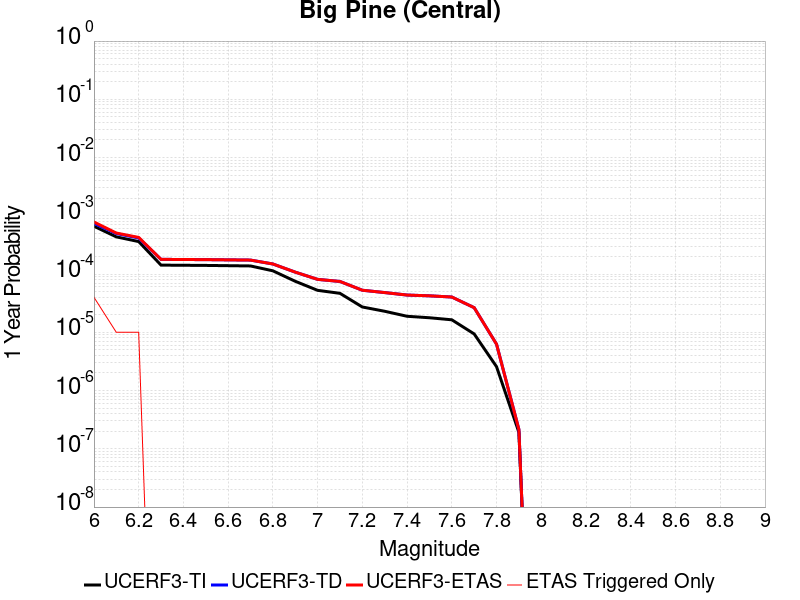 |  |

| Magnitude | 1 wk TI Prob | 1 wk TD Prob | 1 wk ETAS Prob | 1 wk ETAS/TD Gain | 1 wk ETAS Triggered Only | 1 mo TI Prob | 1 mo TD Prob | 1 mo ETAS Prob | 1 mo ETAS/TD Gain | 1 mo ETAS Triggered Only | 1 yr TI Prob | 1 yr TD Prob | 1 yr ETAS Prob | 1 yr ETAS/TD Gain | 1 yr ETAS Triggered Only | 10 yr TI Prob | 10 yr TD Prob | 10 yr ETAS Prob | 10 yr ETAS/TD Gain | 10 yr ETAS Triggered Only |
|-----|-----|-----|-----|-----|-----|-----|-----|-----|-----|-----|-----|-----|-----|-----|-----|-----|-----|-----|-----|-----|
| 6.0 | 1.2706755E-5 | 1.4250602E-5 | 3.425032E-5 | 2.4034295 | 2.0E-5 | 5.4456385E-5 | 6.107279E-5 | 9.107096E-5 | 1.4911871 | 3.0E-5 | 6.628048E-4 | 7.433441E-4 | 7.8331435E-4 | 1.0537709 | 4.0E-5 | 0.006608314 | 0.007413639 | 0.0074632685 | 1.0066943 | 5.0E-5 |
| 6.1 | 8.342579E-6 | 9.510835E-6 | 9.510835E-6 | 1.0 | 0.0 | 3.5753423E-5 | 4.076021E-5 | 5.07598E-5 | 1.2453274 | 1.0E-5 | 4.3521097E-4 | 4.9616426E-4 | 5.061593E-4 | 1.0201446 | 1.0E-5 | 0.0043435963 | 0.004954155 | 0.004974056 | 1.004017 | 2.0E-5 |
| 6.2 | 6.923899E-6 | 7.967221E-6 | 7.967221E-6 | 1.0 | 0.0 | 2.9673516E-5 | 3.4144894E-5 | 4.4144555E-5 | 1.2928596 | 1.0E-5 | 3.6121515E-4 | 4.1565404E-4 | 4.256499E-4 | 1.0240484 | 1.0E-5 | 0.003606286 | 0.0041521094 | 0.004172026 | 1.0047969 | 2.0E-5 |
| 6.3 | 2.728396E-6 | 3.4243646E-6 | 3.4243646E-6 | 1.0 | 0.0 | 1.1693074E-5 | 1.4675771E-5 | 1.4675771E-5 | 1.0 | 0.0 | 1.4235388E-4 | 1.7866373E-4 | 1.7866373E-4 | 1.0 | 0.0 | 0.0014226272 | 0.0017867433 | 0.0017867433 | 1.0 | 0.0 |
| 6.4 | 2.7136944E-6 | 3.4086581E-6 | 3.4086581E-6 | 1.0 | 0.0 | 1.1630066E-5 | 1.4608458E-5 | 1.4608458E-5 | 1.0 | 0.0 | 1.4158686E-4 | 1.7784433E-4 | 1.7784433E-4 | 1.0 | 0.0 | 0.0014149669 | 0.0017785623 | 0.0017785623 | 1.0 | 0.0 |
| 6.5 | 2.6971882E-6 | 3.3910032E-6 | 3.3910032E-6 | 1.0 | 0.0 | 1.1559327E-5 | 1.4532795E-5 | 1.4532795E-5 | 1.0 | 0.0 | 1.4072572E-4 | 1.7692328E-4 | 1.7692328E-4 | 1.0 | 0.0 | 0.0014063664 | 0.0017693666 | 0.0017693666 | 1.0 | 0.0 |
| 6.6 | 2.669092E-6 | 3.3610236E-6 | 3.3610236E-6 | 1.0 | 0.0 | 1.1438916E-5 | 1.4404312E-5 | 1.4404312E-5 | 1.0 | 0.0 | 1.3925991E-4 | 1.7535927E-4 | 1.7535927E-4 | 1.0 | 0.0 | 0.0013917267 | 0.0017537511 | 0.0017537511 | 1.0 | 0.0 |
| 6.7 | 2.6408059E-6 | 3.3310494E-6 | 3.3310494E-6 | 1.0 | 0.0 | 1.1317691E-5 | 1.4275853E-5 | 1.4275853E-5 | 1.0 | 0.0 | 1.3778417E-4 | 1.737955E-4 | 1.737955E-4 | 1.0 | 0.0 | 0.0013769877 | 0.0017381381 | 0.0017381381 | 1.0 | 0.0 |
| 6.8 | 2.1786943E-6 | 2.8545066E-6 | 2.8545066E-6 | 1.0 | 0.0 | 9.337228E-6 | 1.2233547E-5 | 1.2233547E-5 | 1.0 | 0.0 | 1.1367482E-4 | 1.4893398E-4 | 1.4893398E-4 | 1.0 | 0.0 | 0.0011361669 | 0.0014898704 | 0.0014898704 | 1.0 | 0.0 |
| 6.9 | 1.4411696E-6 | 2.0685677E-6 | 2.0685677E-6 | 1.0 | 0.0 | 6.1764263E-6 | 8.865261E-6 | 8.865261E-6 | 1.0 | 0.0 | 7.51954E-5 | 1.0792949E-4 | 1.0792949E-4 | 1.0 | 0.0 | 7.5169955E-4 | 0.0010802548 | 0.0010802548 | 1.0 | 0.0 |
| 7.0 | 1.0073411E-6 | 1.5543274E-6 | 1.5543274E-6 | 1.0 | 0.0 | 4.317169E-6 | 6.661387E-6 | 6.661387E-6 | 1.0 | 0.0 | 5.2560266E-5 | 8.109952E-5 | 8.109952E-5 | 1.0 | 0.0 | 5.2547833E-4 | 8.1217213E-4 | 8.1217213E-4 | 1.0 | 0.0 |
| 7.1 | 8.947104E-7 | 1.430316E-6 | 1.430316E-6 | 1.0 | 0.0 | 3.834468E-6 | 6.1299124E-6 | 6.1299124E-6 | 1.0 | 0.0 | 4.6683643E-5 | 7.462928E-5 | 7.462928E-5 | 1.0 | 0.0 | 4.6673836E-4 | 7.4751483E-4 | 7.4751483E-4 | 1.0 | 0.0 |
| 7.2 | 5.215166E-7 | 1.0112277E-6 | 1.0112277E-6 | 1.0 | 0.0 | 2.2350691E-6 | 4.333826E-6 | 4.333826E-6 | 1.0 | 0.0 | 2.7211627E-5 | 5.27631E-5 | 5.27631E-5 | 1.0 | 0.0 | 2.7208295E-4 | 5.289683E-4 | 5.289683E-4 | 1.0 | 0.0 |
| 7.3 | 4.4024807E-7 | 9.220183E-7 | 9.220183E-7 | 1.0 | 0.0 | 1.8867761E-6 | 3.951501E-6 | 3.951501E-6 | 1.0 | 0.0 | 2.2971257E-5 | 4.8108504E-5 | 4.8108504E-5 | 1.0 | 0.0 | 2.2968883E-4 | 4.824433E-4 | 4.824433E-4 | 1.0 | 0.0 |
| 7.4 | 3.6130905E-7 | 8.359109E-7 | 8.359109E-7 | 1.0 | 0.0 | 1.5484665E-6 | 3.5824705E-6 | 3.5824705E-6 | 1.0 | 0.0 | 1.8852415E-5 | 4.3615746E-5 | 4.3615746E-5 | 1.0 | 0.0 | 1.8850817E-4 | 4.3752496E-4 | 4.3752496E-4 | 1.0 | 0.0 |
| 7.5 | 3.408184E-7 | 8.1087245E-7 | 8.1087245E-7 | 1.0 | 0.0 | 1.4606494E-6 | 3.475163E-6 | 3.475163E-6 | 1.0 | 0.0 | 1.7783263E-5 | 4.230933E-5 | 4.230933E-5 | 1.0 | 0.0 | 1.778184E-4 | 4.2444657E-4 | 4.2444657E-4 | 1.0 | 0.0 |
| 7.6 | 3.1428627E-7 | 7.732167E-7 | 7.732167E-7 | 1.0 | 0.0 | 1.3469405E-6 | 3.313782E-6 | 3.313782E-6 | 1.0 | 0.0 | 1.6398877E-5 | 4.0344585E-5 | 4.0344585E-5 | 1.0 | 0.0 | 1.6397667E-4 | 4.0477706E-4 | 4.0477706E-4 | 1.0 | 0.0 |
| 7.7 | 1.7972785E-7 | 5.0782415E-7 | 5.0782415E-7 | 1.0 | 0.0 | 7.70262E-7 | 2.1763874E-6 | 2.1763874E-6 | 1.0 | 0.0 | 9.377899E-6 | 2.6497206E-5 | 2.6497206E-5 | 1.0 | 0.0 | 9.377503E-5 | 2.6633305E-4 | 2.6633305E-4 | 1.0 | 0.0 |
| 7.8 | 4.9230927E-8 | 1.1981747E-7 | 1.1981747E-7 | 1.0 | 0.0 | 2.1098968E-7 | 5.135033E-7 | 5.135033E-7 | 1.0 | 0.0 | 2.5687964E-6 | 6.2518866E-6 | 6.2518866E-6 | 1.0 | 0.0 | 2.5687666E-5 | 6.2971965E-5 | 6.2971965E-5 | 1.0 | 0.0 |
| 7.9 | 3.6805972E-9 | 4.1051638E-9 | 4.1051638E-9 | 1.0 | 0.0 | 1.5773987E-8 | 1.7593557E-8 | 1.7593557E-8 | 1.0 | 0.0 | 1.9204828E-7 | 2.1420155E-7 | 2.1420155E-7 | 1.0 | 0.0 | 1.920481E-6 | 2.1898923E-6 | 2.1898923E-6 | 1.0 | 0.0 |

## San Jacinto (Stepovers Combined)
*[(top)](#table-of-contents)*

| 1 Week | 1 Month | 1 Year | 10 Year |
|-----|-----|-----|-----|
|  |  |  | 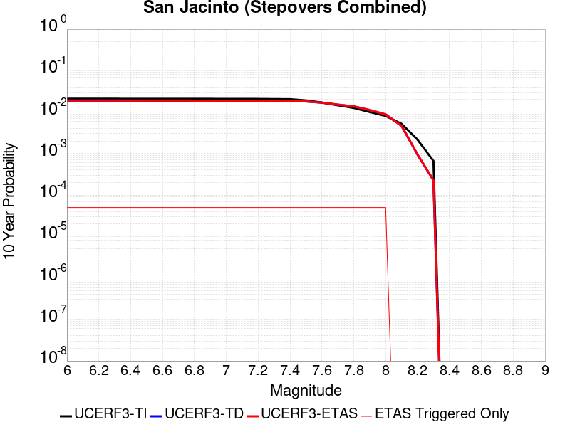 |

| Magnitude | 1 wk TI Prob | 1 wk TD Prob | 1 wk ETAS Prob | 1 wk ETAS/TD Gain | 1 wk ETAS Triggered Only | 1 mo TI Prob | 1 mo TD Prob | 1 mo ETAS Prob | 1 mo ETAS/TD Gain | 1 mo ETAS Triggered Only | 1 yr TI Prob | 1 yr TD Prob | 1 yr ETAS Prob | 1 yr ETAS/TD Gain | 1 yr ETAS Triggered Only | 10 yr TI Prob | 10 yr TD Prob | 10 yr ETAS Prob | 10 yr ETAS/TD Gain | 10 yr ETAS Triggered Only |
|-----|-----|-----|-----|-----|-----|-----|-----|-----|-----|-----|-----|-----|-----|-----|-----|-----|-----|-----|-----|-----|
| 6.0 | 4.0667746E-5 | 3.5271103E-5 | 4.527075E-5 | 1.2835082 | 1.0E-5 | 1.742787E-4 | 1.5115313E-4 | 1.6115162E-4 | 1.066148 | 1.0E-5 | 0.0021197782 | 0.0018387372 | 0.0018686821 | 1.0162855 | 3.0E-5 | 0.020996714 | 0.018986495 | 0.019035546 | 1.0025835 | 5.0E-5 |
| 6.1 | 4.0667746E-5 | 3.5271103E-5 | 4.527075E-5 | 1.2835082 | 1.0E-5 | 1.742787E-4 | 1.5115313E-4 | 1.6115162E-4 | 1.066148 | 1.0E-5 | 0.0021197782 | 0.0018387372 | 0.0018686821 | 1.0162855 | 3.0E-5 | 0.020996714 | 0.018986495 | 0.019035546 | 1.0025835 | 5.0E-5 |
| 6.2 | 4.0667746E-5 | 3.5271103E-5 | 4.527075E-5 | 1.2835082 | 1.0E-5 | 1.742787E-4 | 1.5115313E-4 | 1.6115162E-4 | 1.066148 | 1.0E-5 | 0.0021197782 | 0.0018387372 | 0.0018686821 | 1.0162855 | 3.0E-5 | 0.020996714 | 0.018986495 | 0.019035546 | 1.0025835 | 5.0E-5 |
| 6.3 | 4.0667746E-5 | 3.5271103E-5 | 4.527075E-5 | 1.2835082 | 1.0E-5 | 1.742787E-4 | 1.5115313E-4 | 1.6115162E-4 | 1.066148 | 1.0E-5 | 0.0021197782 | 0.0018387372 | 0.0018686821 | 1.0162855 | 3.0E-5 | 0.020996714 | 0.018986495 | 0.019035546 | 1.0025835 | 5.0E-5 |
| 6.4 | 4.0577226E-5 | 3.5143014E-5 | 4.5142664E-5 | 1.2845416 | 1.0E-5 | 1.738908E-4 | 1.5060425E-4 | 1.6060274E-4 | 1.0663892 | 1.0E-5 | 0.0021150648 | 0.0018320669 | 0.001862012 | 1.0163449 | 3.0E-5 | 0.020950472 | 0.018921062 | 0.018970117 | 1.0025926 | 5.0E-5 |
| 6.5 | 4.0577226E-5 | 3.5143014E-5 | 4.5142664E-5 | 1.2845416 | 1.0E-5 | 1.738908E-4 | 1.5060425E-4 | 1.6060274E-4 | 1.0663892 | 1.0E-5 | 0.0021150648 | 0.0018320669 | 0.001862012 | 1.0163449 | 3.0E-5 | 0.020950472 | 0.018921062 | 0.018970117 | 1.0025926 | 5.0E-5 |
| 6.6 | 4.053861E-5 | 3.5088357E-5 | 4.5088007E-5 | 1.2849848 | 1.0E-5 | 1.7372532E-4 | 1.5037002E-4 | 1.6036852E-4 | 1.0664926 | 1.0E-5 | 0.0021130538 | 0.0018292206 | 0.0018591657 | 1.0163704 | 3.0E-5 | 0.020930743 | 0.01889314 | 0.018942196 | 1.0025965 | 5.0E-5 |
| 6.7 | 4.0516545E-5 | 3.505743E-5 | 4.505708E-5 | 1.2852362 | 1.0E-5 | 1.7363077E-4 | 1.502375E-4 | 1.60236E-4 | 1.0665513 | 1.0E-5 | 0.002111905 | 0.0018276101 | 0.0018575552 | 1.0163848 | 3.0E-5 | 0.020919468 | 0.018877337 | 0.018926393 | 1.0025986 | 5.0E-5 |
| 6.8 | 4.049434E-5 | 3.5028992E-5 | 4.5028642E-5 | 1.2854677 | 1.0E-5 | 1.7353562E-4 | 1.5011564E-4 | 1.6011414E-4 | 1.0666053 | 1.0E-5 | 0.0021107488 | 0.0018261289 | 0.0018560741 | 1.0163982 | 3.0E-5 | 0.020908125 | 0.018862749 | 0.018911805 | 1.0026007 | 5.0E-5 |
| 6.9 | 4.046386E-5 | 3.4991554E-5 | 4.4991204E-5 | 1.2857733 | 1.0E-5 | 1.73405E-4 | 1.499552E-4 | 1.5995369E-4 | 1.0666766 | 1.0E-5 | 0.0021091616 | 0.0018241788 | 0.0018541241 | 1.0164157 | 3.0E-5 | 0.020892553 | 0.018843522 | 0.01889258 | 1.0026034 | 5.0E-5 |
| 7.0 | 4.036382E-5 | 3.4872126E-5 | 4.4871776E-5 | 1.286752 | 1.0E-5 | 1.7297632E-4 | 1.4944343E-4 | 1.5944193E-4 | 1.0669049 | 1.0E-5 | 0.0021039525 | 0.0018179584 | 0.001847904 | 1.016472 | 3.0E-5 | 0.02084144 | 0.018782137 | 0.018831197 | 1.0026121 | 5.0E-5 |
| 7.1 | 4.0343282E-5 | 3.485059E-5 | 4.485024E-5 | 1.2869292 | 1.0E-5 | 1.7288832E-4 | 1.4935112E-4 | 1.5934964E-4 | 1.0669463 | 1.0E-5 | 0.002102883 | 0.0018168368 | 0.0018467822 | 1.0164822 | 3.0E-5 | 0.020830948 | 0.018771008 | 0.018820068 | 1.0026137 | 5.0E-5 |
| 7.2 | 4.0257353E-5 | 3.475509E-5 | 4.475474E-5 | 1.2877177 | 1.0E-5 | 1.725201E-4 | 1.489419E-4 | 1.589404E-4 | 1.0671303 | 1.0E-5 | 0.0020984085 | 0.0018118626 | 0.0018418082 | 1.0165275 | 3.0E-5 | 0.020787042 | 0.018721746 | 0.01877081 | 1.0026207 | 5.0E-5 |
| 7.3 | 3.9940667E-5 | 3.458276E-5 | 4.4582415E-5 | 1.2891514 | 1.0E-5 | 1.7116306E-4 | 1.4820343E-4 | 1.5820195E-4 | 1.0674648 | 1.0E-5 | 0.0020819185 | 0.0018028866 | 0.0018328326 | 1.01661 | 3.0E-5 | 0.020625217 | 0.018630387 | 0.018679455 | 1.0026338 | 5.0E-5 |
| 7.4 | 3.9721202E-5 | 3.4468165E-5 | 4.4467823E-5 | 1.2901127 | 1.0E-5 | 1.7022261E-4 | 1.4771236E-4 | 1.5771089E-4 | 1.0676892 | 1.0E-5 | 0.0020704903 | 0.0017969179 | 0.001826864 | 1.0166652 | 3.0E-5 | 0.020513052 | 0.018569522 | 0.018618593 | 1.0026426 | 5.0E-5 |
| 7.5 | 3.7036873E-5 | 3.3535776E-5 | 4.3535438E-5 | 1.298179 | 1.0E-5 | 1.5871979E-4 | 1.4371685E-4 | 1.5371542E-4 | 1.0695713 | 1.0E-5 | 0.0019307006 | 0.0017483513 | 0.0017782989 | 1.0171291 | 3.0E-5 | 0.019140124 | 0.018071128 | 0.018120226 | 1.0027169 | 5.0E-5 |
| 7.6 | 3.2940967E-5 | 3.13167E-5 | 4.1316387E-5 | 1.3193084 | 1.0E-5 | 1.4116794E-4 | 1.3420754E-4 | 1.442062E-4 | 1.0745015 | 1.0E-5 | 0.0017173645 | 0.0016327545 | 0.0016627054 | 1.0183438 | 3.0E-5 | 0.01704153 | 0.016904091 | 0.016953247 | 1.0029079 | 5.0E-5 |
| 7.7 | 2.8236149E-5 | 2.7882697E-5 | 3.788242E-5 | 1.3586353 | 1.0E-5 | 1.2100645E-4 | 1.1949181E-4 | 1.2949061E-4 | 1.0836778 | 1.0E-5 | 0.0014722579 | 0.0014538429 | 0.0014837993 | 1.020605 | 3.0E-5 | 0.014625421 | 0.015114912 | 0.0151641555 | 1.003258 | 5.0E-5 |
| 7.8 | 2.4329287E-5 | 2.5206451E-5 | 3.5206198E-5 | 1.3967139 | 1.0E-5 | 1.042642E-4 | 1.08023174E-4 | 1.1802209E-4 | 1.0925627 | 1.0E-5 | 0.0012686774 | 0.0013143895 | 0.0013443502 | 1.0227942 | 3.0E-5 | 0.012614589 | 0.013712341 | 0.0137616545 | 1.0035963 | 5.0E-5 |
| 7.9 | 1.9370926E-5 | 2.0420413E-5 | 3.042021E-5 | 1.489696 | 1.0E-5 | 8.301561E-5 | 8.751312E-5 | 9.7512246E-5 | 1.1142585 | 1.0E-5 | 0.0010102465 | 0.0010649522 | 0.0010949203 | 1.0281403 | 3.0E-5 | 0.0100566605 | 0.011199402 | 0.011248842 | 1.0044146 | 5.0E-5 |
| 8.0 | 1.5583017E-5 | 1.5885415E-5 | 2.5885256E-5 | 1.6294982 | 1.0E-5 | 6.6782646E-5 | 6.807858E-5 | 7.80779E-5 | 1.1468791 | 1.0E-5 | 8.127754E-4 | 8.2854216E-4 | 8.585173E-4 | 1.0361782 | 3.0E-5 | 0.008098091 | 0.008781636 | 0.008831197 | 1.0056437 | 5.0E-5 |
| 8.1 | 1.0024873E-5 | 8.291399E-6 | 8.291399E-6 | 1.0 | 0.0 | 4.2963035E-5 | 3.553409E-5 | 3.553409E-5 | 1.0 | 0.0 | 5.229494E-4 | 4.3254215E-4 | 4.3254215E-4 | 1.0 | 0.0 | 0.0052172043 | 0.0046530655 | 0.0046530655 | 1.0 | 0.0 |
| 8.2 | 4.142796E-6 | 1.5602761E-6 | 1.5602761E-6 | 1.0 | 0.0 | 1.775472E-5 | 6.6868806E-6 | 6.6868806E-6 | 1.0 | 0.0 | 2.1614227E-4 | 8.140976E-5 | 8.140976E-5 | 1.0 | 0.0 | 0.0021593217 | 9.4514614E-4 | 9.4514614E-4 | 1.0 | 0.0 |
| 8.3 | 1.2750878E-6 | 3.609817E-7 | 3.609817E-7 | 1.0 | 0.0 | 5.4646503E-6 | 1.5470634E-6 | 1.5470634E-6 | 1.0 | 0.0 | 6.653009E-5 | 1.8835339E-5 | 1.8835339E-5 | 1.0 | 0.0 | 6.6510175E-4 | 2.272251E-4 | 2.272251E-4 | 1.0 | 0.0 |

## Malibu Coast (Extension) alt 1
*[(top)](#table-of-contents)*

| 1 Week | 1 Month | 1 Year | 10 Year |
|-----|-----|-----|-----|
|  |  | 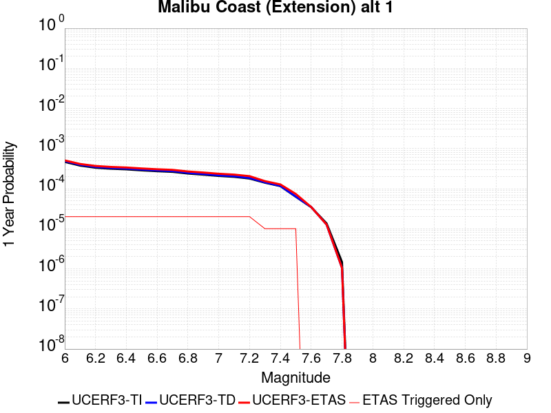 |  |

| Magnitude | 1 wk TI Prob | 1 wk TD Prob | 1 wk ETAS Prob | 1 wk ETAS/TD Gain | 1 wk ETAS Triggered Only | 1 mo TI Prob | 1 mo TD Prob | 1 mo ETAS Prob | 1 mo ETAS/TD Gain | 1 mo ETAS Triggered Only | 1 yr TI Prob | 1 yr TD Prob | 1 yr ETAS Prob | 1 yr ETAS/TD Gain | 1 yr ETAS Triggered Only | 10 yr TI Prob | 10 yr TD Prob | 10 yr ETAS Prob | 10 yr ETAS/TD Gain | 10 yr ETAS Triggered Only |
|-----|-----|-----|-----|-----|-----|-----|-----|-----|-----|-----|-----|-----|-----|-----|-----|-----|-----|-----|-----|-----|
| 6.0 | 8.930738E-6 | 9.3292765E-6 | 2.932909E-5 | 3.143769 | 2.0E-5 | 3.827403E-5 | 3.998201E-5 | 5.9981212E-5 | 1.5002049 | 2.0E-5 | 4.6588664E-4 | 4.86674E-4 | 5.066643E-4 | 1.0410752 | 2.0E-5 | 0.0046491115 | 0.004856264 | 0.0049060215 | 1.010246 | 5.0E-5 |
| 6.1 | 7.199952E-6 | 7.5302974E-6 | 2.7530146E-5 | 3.6559176 | 2.0E-5 | 3.0856572E-5 | 3.2272306E-5 | 5.2271662E-5 | 1.6197064 | 2.0E-5 | 3.75614E-4 | 3.928451E-4 | 4.1283725E-4 | 1.0508907 | 2.0E-5 | 0.0037497976 | 0.0039215726 | 0.0039713765 | 1.0127 | 5.0E-5 |
| 6.2 | 6.3721413E-6 | 6.666792E-6 | 2.666666E-5 | 3.9999235 | 2.0E-5 | 2.7308892E-5 | 2.8571656E-5 | 4.8571084E-5 | 1.6999744 | 2.0E-5 | 3.3243504E-4 | 3.4780474E-4 | 3.677978E-4 | 1.0574836 | 2.0E-5 | 0.0033193815 | 0.0034726441 | 0.0035125052 | 1.0114785 | 4.0E-5 |
| 6.3 | 6.016345E-6 | 6.295159E-6 | 2.6295033E-5 | 4.1770244 | 2.0E-5 | 2.578408E-5 | 2.6978976E-5 | 4.6978435E-5 | 1.741298 | 2.0E-5 | 3.1387596E-4 | 3.2841985E-4 | 3.4841328E-4 | 1.0608777 | 2.0E-5 | 0.00313433 | 0.0032793812 | 0.00331925 | 1.0121574 | 4.0E-5 |
| 6.4 | 5.8104883E-6 | 6.0795455E-6 | 2.6079424E-5 | 4.2896996 | 2.0E-5 | 2.4901856E-5 | 2.6054937E-5 | 4.6054414E-5 | 1.7675889 | 2.0E-5 | 3.031379E-4 | 3.17173E-4 | 3.3716665E-4 | 1.063037 | 2.0E-5 | 0.0030272473 | 0.0031672379 | 0.003207111 | 1.0125893 | 4.0E-5 |
| 6.5 | 5.476925E-6 | 5.727514E-6 | 2.5727399E-5 | 4.491896 | 2.0E-5 | 2.3472323E-5 | 2.454626E-5 | 4.454577E-5 | 1.8147681 | 2.0E-5 | 2.8573806E-4 | 2.9881002E-4 | 3.1880403E-4 | 1.0669122 | 2.0E-5 | 0.0028537093 | 0.0029841145 | 0.003023995 | 1.0133643 | 4.0E-5 |
| 6.6 | 5.222387E-6 | 5.4585807E-6 | 2.5458472E-5 | 4.663936 | 2.0E-5 | 2.2381464E-5 | 2.3393708E-5 | 4.339324E-5 | 1.8549107 | 2.0E-5 | 2.7246025E-4 | 2.8478145E-4 | 3.0477578E-4 | 1.0702093 | 2.0E-5 | 0.0027212645 | 0.002844196 | 0.0028840823 | 1.0140238 | 4.0E-5 |
| 6.7 | 5.0337076E-6 | 5.259104E-6 | 2.5258998E-5 | 4.8029094 | 2.0E-5 | 2.1572854E-5 | 2.2538823E-5 | 4.2538373E-5 | 1.8873378 | 2.0E-5 | 2.6261783E-4 | 2.743759E-4 | 2.9437043E-4 | 1.0728726 | 2.0E-5 | 0.002623077 | 0.0027404015 | 0.002780292 | 1.0145564 | 4.0E-5 |
| 6.8 | 4.5675624E-6 | 4.7587173E-6 | 2.4758621E-5 | 5.202793 | 2.0E-5 | 1.9575122E-5 | 2.0394344E-5 | 4.0393938E-5 | 1.980644 | 2.0E-5 | 2.3830103E-4 | 2.4827302E-4 | 2.6826808E-4 | 1.0805365 | 2.0E-5 | 0.0023804565 | 0.0024799763 | 0.0025198772 | 1.0160892 | 4.0E-5 |
| 6.9 | 4.2802412E-6 | 4.4520216E-6 | 2.4451932E-5 | 5.4923215 | 2.0E-5 | 1.8343762E-5 | 1.9079953E-5 | 3.9079572E-5 | 2.0482006 | 2.0E-5 | 2.2331243E-4 | 2.3227383E-4 | 2.5226918E-4 | 1.0860853 | 2.0E-5 | 0.0022308815 | 0.0023203273 | 0.0023602345 | 1.0171989 | 4.0E-5 |
| 7.0 | 3.9794063E-6 | 4.1301E-6 | 2.4130017E-5 | 5.842478 | 2.0E-5 | 1.7054486E-5 | 1.770031E-5 | 3.7699956E-5 | 2.1299038 | 2.0E-5 | 2.0761859E-4 | 2.1548007E-4 | 2.3547576E-4 | 1.092796 | 2.0E-5 | 0.0020742472 | 0.002152725 | 0.0021926388 | 1.0185411 | 4.0E-5 |
| 7.1 | 3.7730424E-6 | 3.911218E-6 | 2.391114E-5 | 6.1134768 | 2.0E-5 | 1.6170083E-5 | 1.6762255E-5 | 3.676192E-5 | 2.193137 | 2.0E-5 | 1.9685295E-4 | 2.0406146E-4 | 2.2405738E-4 | 1.0979897 | 2.0E-5 | 0.0019667868 | 0.0020387538 | 0.0020786722 | 1.0195799 | 4.0E-5 |
| 7.2 | 3.424985E-6 | 3.541338E-6 | 2.3541266E-5 | 6.647563 | 2.0E-5 | 1.4678424E-5 | 1.5177075E-5 | 3.517677E-5 | 2.317757 | 2.0E-5 | 1.7869516E-4 | 1.8476533E-4 | 2.0476164E-4 | 1.1082255 | 2.0E-5 | 0.0017855153 | 0.0018461292 | 0.0018860553 | 1.021627 | 4.0E-5 |
| 7.3 | 2.6966375E-6 | 2.759654E-6 | 1.2759627E-5 | 4.6236324 | 1.0E-5 | 1.15569665E-5 | 1.1827035E-5 | 2.1826918E-5 | 1.8455104 | 1.0E-5 | 1.4069698E-4 | 1.4398468E-4 | 1.5398324E-4 | 1.0694418 | 1.0E-5 | 0.0014060794 | 0.001438918 | 0.0014588893 | 1.0138793 | 2.0E-5 |
| 7.4 | 2.215957E-6 | 2.249379E-6 | 1.2249357E-5 | 5.4456615 | 1.0E-5 | 9.496924E-6 | 9.64016E-6 | 1.9640063E-5 | 2.0373173 | 1.0E-5 | 1.1561892E-4 | 1.1736266E-4 | 1.2736149E-4 | 1.085196 | 1.0E-5 | 0.0011555878 | 0.0011730106 | 0.0011929871 | 1.0170301 | 2.0E-5 |
| 7.5 | 1.2040218E-6 | 1.2219067E-6 | 1.1221894E-5 | 9.183921 | 1.0E-5 | 5.160083E-6 | 5.2367327E-6 | 1.523668E-5 | 2.9095776 | 1.0E-5 | 6.2822204E-5 | 6.3755375E-5 | 7.375474E-5 | 1.1568395 | 1.0E-5 | 6.280445E-4 | 6.3737266E-4 | 6.4736634E-4 | 1.0156794 | 1.0E-5 |
| 7.6 | 6.6157446E-7 | 6.6789755E-7 | 6.6789755E-7 | 1.0 | 0.0 | 2.835316E-6 | 2.8624152E-6 | 2.8624152E-6 | 1.0 | 0.0 | 3.4519428E-5 | 3.4849363E-5 | 3.4849363E-5 | 1.0 | 0.0 | 3.4514067E-4 | 3.484405E-4 | 3.484405E-4 | 1.0 | 0.0 |
| 7.7 | 2.6012302E-7 | 2.4357584E-7 | 2.4357584E-7 | 1.0 | 0.0 | 1.1148124E-6 | 1.0438962E-6 | 1.0438962E-6 | 1.0 | 0.0 | 1.3572758E-5 | 1.2709373E-5 | 1.2709373E-5 | 1.0 | 0.0 | 1.3571928E-4 | 1.2708752E-4 | 1.2708752E-4 | 1.0 | 0.0 |
| 7.8 | 2.8323132E-8 | 2.0266642E-8 | 2.0266642E-8 | 1.0 | 0.0 | 1.2138484E-7 | 8.685703E-8 | 8.685703E-8 | 1.0 | 0.0 | 1.4778595E-6 | 1.0574839E-6 | 1.0574839E-6 | 1.0 | 0.0 | 1.4778497E-5 | 1.0574797E-5 | 1.0574797E-5 | 1.0 | 0.0 |

## San Andreas (North Coast) 2011 CFM
*[(top)](#table-of-contents)*

| 1 Week | 1 Month | 1 Year | 10 Year |
|-----|-----|-----|-----|
|  |  | 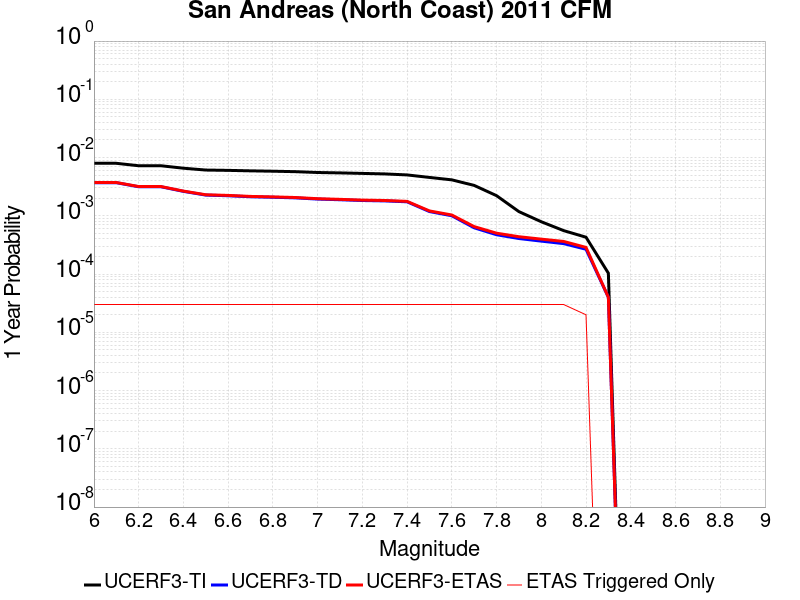 | 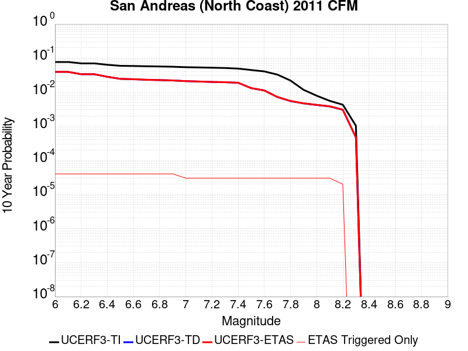 |

| Magnitude | 1 wk TI Prob | 1 wk TD Prob | 1 wk ETAS Prob | 1 wk ETAS/TD Gain | 1 wk ETAS Triggered Only | 1 mo TI Prob | 1 mo TD Prob | 1 mo ETAS Prob | 1 mo ETAS/TD Gain | 1 mo ETAS Triggered Only | 1 yr TI Prob | 1 yr TD Prob | 1 yr ETAS Prob | 1 yr ETAS/TD Gain | 1 yr ETAS Triggered Only | 10 yr TI Prob | 10 yr TD Prob | 10 yr ETAS Prob | 10 yr ETAS/TD Gain | 10 yr ETAS Triggered Only |
|-----|-----|-----|-----|-----|-----|-----|-----|-----|-----|-----|-----|-----|-----|-----|-----|-----|-----|-----|-----|-----|
| 6.0 | 1.5333705E-4 | 7.109695E-5 | 8.109623E-5 | 1.140643 | 1.0E-5 | 6.5699324E-4 | 3.046658E-4 | 3.246597E-4 | 1.0656257 | 2.0E-5 | 0.007969595 | 0.0037030308 | 0.0037329197 | 1.0080714 | 3.0E-5 | 0.0768977 | 0.039364267 | 0.039402694 | 1.0009762 | 4.0E-5 |
| 6.1 | 1.5333705E-4 | 7.109695E-5 | 8.109623E-5 | 1.140643 | 1.0E-5 | 6.5699324E-4 | 3.046658E-4 | 3.246597E-4 | 1.0656257 | 2.0E-5 | 0.007969595 | 0.0037030308 | 0.0037329197 | 1.0080714 | 3.0E-5 | 0.0768977 | 0.039364267 | 0.039402694 | 1.0009762 | 4.0E-5 |
| 6.2 | 1.3912938E-4 | 6.049243E-5 | 7.049183E-5 | 1.1652999 | 1.0E-5 | 5.961325E-4 | 2.5922767E-4 | 2.7922247E-4 | 1.0771322 | 2.0E-5 | 0.007233787 | 0.0031515562 | 0.0031814617 | 1.009489 | 3.0E-5 | 0.07002798 | 0.03369792 | 0.03373657 | 1.001147 | 4.0E-5 |
| 6.3 | 1.3912938E-4 | 6.049243E-5 | 7.049183E-5 | 1.1652999 | 1.0E-5 | 5.961325E-4 | 2.5922767E-4 | 2.7922247E-4 | 1.0771322 | 2.0E-5 | 0.007233787 | 0.0031515562 | 0.0031814617 | 1.009489 | 3.0E-5 | 0.07002798 | 0.03369792 | 0.03373657 | 1.001147 | 4.0E-5 |
| 6.4 | 1.2623647E-4 | 5.0433562E-5 | 6.043306E-5 | 1.1982707 | 1.0E-5 | 5.4090127E-4 | 2.1612605E-4 | 2.3612172E-4 | 1.0925186 | 2.0E-5 | 0.0065656058 | 0.0026281793 | 0.0026581006 | 1.0113847 | 3.0E-5 | 0.06374981 | 0.02830552 | 0.028344387 | 1.0013732 | 4.0E-5 |
| 6.5 | 1.1736096E-4 | 4.3516375E-5 | 5.351594E-5 | 1.2297885 | 1.0E-5 | 5.028786E-4 | 1.8648551E-4 | 2.0648178E-4 | 1.107227 | 2.0E-5 | 0.006105373 | 0.0022681132 | 0.0022980452 | 1.0131968 | 3.0E-5 | 0.05940335 | 0.024576947 | 0.024615964 | 1.0015875 | 4.0E-5 |
| 6.6 | 1.1586959E-4 | 4.2416294E-5 | 5.2415868E-5 | 1.2357484 | 1.0E-5 | 4.964894E-4 | 1.8177154E-4 | 2.017679E-4 | 1.1100082 | 2.0E-5 | 0.006028018 | 0.0022108385 | 0.0022407721 | 1.0135396 | 3.0E-5 | 0.058671024 | 0.023982164 | 0.024021205 | 1.0016279 | 4.0E-5 |
| 6.7 | 1.13693764E-4 | 4.0728228E-5 | 5.072782E-5 | 1.24552 | 1.0E-5 | 4.87168E-4 | 1.7453796E-4 | 1.9453447E-4 | 1.1145682 | 2.0E-5 | 0.005915152 | 0.0021229447 | 0.002152881 | 1.0141013 | 3.0E-5 | 0.057601593 | 0.023075242 | 0.02311432 | 1.0016935 | 4.0E-5 |
| 6.8 | 1.1204889E-4 | 3.9945848E-5 | 4.994545E-5 | 1.2503289 | 1.0E-5 | 4.8012115E-4 | 1.7118535E-4 | 1.9118193E-4 | 1.1168125 | 2.0E-5 | 0.005829819 | 0.0020822054 | 0.0021121427 | 1.0143778 | 3.0E-5 | 0.05679232 | 0.022635331 | 0.022674426 | 1.0017271 | 4.0E-5 |
| 6.9 | 1.1005794E-4 | 3.9001738E-5 | 4.9001348E-5 | 1.2563888 | 1.0E-5 | 4.7159163E-4 | 1.6713967E-4 | 1.8713633E-4 | 1.1196404 | 2.0E-5 | 0.0057265228 | 0.0020330423 | 0.0020629812 | 1.0147262 | 3.0E-5 | 0.055811852 | 0.02210134 | 0.022140456 | 1.0017699 | 4.0E-5 |
| 7.0 | 1.0647948E-4 | 3.7159174E-5 | 4.7158803E-5 | 1.2691026 | 1.0E-5 | 4.562608E-4 | 1.5924397E-4 | 1.7924079E-4 | 1.1255735 | 2.0E-5 | 0.0055408357 | 0.0019370868 | 0.0019670287 | 1.0154572 | 3.0E-5 | 0.054047033 | 0.02105931 | 0.021088678 | 1.0013945 | 3.0E-5 |
| 7.1 | 1.04795035E-4 | 3.620866E-5 | 4.62083E-5 | 1.276167 | 1.0E-5 | 4.4904428E-4 | 1.5517084E-4 | 1.7516773E-4 | 1.1288702 | 2.0E-5 | 0.0054534175 | 0.0018875834 | 0.0019175267 | 1.0158633 | 3.0E-5 | 0.053215165 | 0.02052821 | 0.020557594 | 1.0014313 | 3.0E-5 |
| 7.2 | 1.02724036E-4 | 3.5117457E-5 | 4.5117107E-5 | 1.2847487 | 1.0E-5 | 4.401716E-4 | 1.5049479E-4 | 1.7049178E-4 | 1.132875 | 2.0E-5 | 0.0053459285 | 0.0018307496 | 0.0018606947 | 1.0163567 | 3.0E-5 | 0.052191395 | 0.01991573 | 0.019945132 | 1.0014763 | 3.0E-5 |
| 7.3 | 1.00650694E-4 | 3.45853E-5 | 4.4584955E-5 | 1.2891302 | 1.0E-5 | 4.312888E-4 | 1.4821437E-4 | 1.6821141E-4 | 1.1349196 | 2.0E-5 | 0.005238306 | 0.0018030318 | 0.0018329778 | 1.0166086 | 3.0E-5 | 0.051165357 | 0.01959264 | 0.019622052 | 1.0015012 | 3.0E-5 |
| 7.4 | 9.672919E-5 | 3.3374814E-5 | 4.337448E-5 | 1.2996172 | 1.0E-5 | 4.144878E-4 | 1.4302715E-4 | 1.6302429E-4 | 1.1398135 | 2.0E-5 | 0.005034718 | 0.00173998 | 0.0017699278 | 1.0172116 | 3.0E-5 | 0.049221683 | 0.01886682 | 0.018896254 | 1.0015601 | 3.0E-5 |
| 7.5 | 8.7600405E-5 | 2.2694192E-5 | 3.2693966E-5 | 1.4406314 | 1.0E-5 | 3.753763E-4 | 9.725721E-5 | 1.17255266E-4 | 1.2056203 | 2.0E-5 | 0.0045606326 | 0.0011834651 | 0.0012134296 | 1.0253193 | 3.0E-5 | 0.04468165 | 0.013127938 | 0.013157544 | 1.0022552 | 3.0E-5 |
| 7.6 | 7.9562284E-5 | 1.922004E-5 | 2.921985E-5 | 1.5202802 | 1.0E-5 | 3.4093665E-4 | 8.236901E-5 | 1.0236736E-4 | 1.2427897 | 2.0E-5 | 0.0041430052 | 0.0010023828 | 0.0010323528 | 1.0298986 | 3.0E-5 | 0.040666126 | 0.0112194 | 0.011249063 | 1.002644 | 3.0E-5 |
| 7.7 | 6.3866544E-5 | 1.1936281E-5 | 2.1936161E-5 | 1.8377719 | 1.0E-5 | 2.7368503E-4 | 5.115449E-5 | 7.115347E-5 | 1.3909526 | 2.0E-5 | 0.0033270244 | 6.226282E-4 | 6.526095E-4 | 1.0481528 | 3.0E-5 | 0.032776527 | 0.0072073294 | 0.007237113 | 1.0041324 | 3.0E-5 |
| 7.8 | 4.2543215E-5 | 9.0726735E-6 | 1.9072584E-5 | 2.102201 | 1.0E-5 | 1.8231533E-4 | 3.888231E-5 | 5.888153E-5 | 1.5143528 | 2.0E-5 | 0.0022174292 | 4.7328937E-4 | 5.032752E-4 | 1.0633562 | 3.0E-5 | 0.021954332 | 0.0054884683 | 0.0055183037 | 1.0054361 | 3.0E-5 |
| 7.9 | 2.2636612E-5 | 7.811842E-6 | 1.7811764E-5 | 2.2800977 | 1.0E-5 | 9.7010445E-5 | 3.3478893E-5 | 5.3478223E-5 | 1.5973713 | 2.0E-5 | 0.0011804621 | 4.0752938E-4 | 4.3751716E-4 | 1.0735843 | 3.0E-5 | 0.011742111 | 0.0046821116 | 0.004711971 | 1.0063773 | 3.0E-5 |
| 8.0 | 1.5167874E-5 | 7.0475517E-6 | 1.7047481E-5 | 2.4189224 | 1.0E-5 | 6.500356E-5 | 3.0203442E-5 | 5.0202838E-5 | 1.6621561 | 2.0E-5 | 7.9113094E-4 | 3.6766496E-4 | 3.9765393E-4 | 1.081566 | 3.0E-5 | 0.007883203 | 0.004214701 | 0.0042445743 | 1.007088 | 3.0E-5 |
| 8.1 | 1.0681047E-5 | 6.3854363E-6 | 1.6385373E-5 | 2.5660536 | 1.0E-5 | 4.5775112E-5 | 2.7365868E-5 | 4.736532E-5 | 1.7308174 | 2.0E-5 | 5.5716943E-4 | 3.331286E-4 | 3.631186E-4 | 1.0900253 | 3.0E-5 | 0.0055577457 | 0.003816698 | 0.0038465834 | 1.0078301 | 3.0E-5 |
| 8.2 | 8.226114E-6 | 5.1139064E-6 | 5.1139064E-6 | 1.0 | 0.0 | 3.52543E-5 | 2.1916558E-5 | 3.1916337E-5 | 1.456266 | 1.0E-5 | 4.2913653E-4 | 2.6680148E-4 | 2.8679616E-4 | 1.0749421 | 2.0E-5 | 0.004283088 | 0.0030445685 | 0.0030645076 | 1.0065491 | 2.0E-5 |
| 8.3 | 1.983087E-6 | 7.6564595E-7 | 7.6564595E-7 | 1.0 | 0.0 | 8.498917E-6 | 3.281336E-6 | 3.281336E-6 | 1.0 | 0.0 | 1.034694E-4 | 3.9949547E-5 | 3.9949547E-5 | 1.0 | 0.0 | 0.0010342124 | 4.717979E-4 | 4.717979E-4 | 1.0 | 0.0 |

## Oak Ridge (Onshore)
*[(top)](#table-of-contents)*

| 1 Week | 1 Month | 1 Year | 10 Year |
|-----|-----|-----|-----|
| 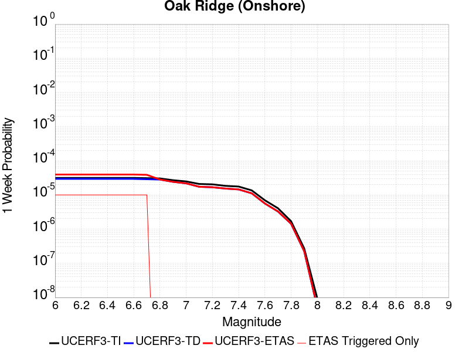 |  |  |  |

| Magnitude | 1 wk TI Prob | 1 wk TD Prob | 1 wk ETAS Prob | 1 wk ETAS/TD Gain | 1 wk ETAS Triggered Only | 1 mo TI Prob | 1 mo TD Prob | 1 mo ETAS Prob | 1 mo ETAS/TD Gain | 1 mo ETAS Triggered Only | 1 yr TI Prob | 1 yr TD Prob | 1 yr ETAS Prob | 1 yr ETAS/TD Gain | 1 yr ETAS Triggered Only | 10 yr TI Prob | 10 yr TD Prob | 10 yr ETAS Prob | 10 yr ETAS/TD Gain | 10 yr ETAS Triggered Only |
|-----|-----|-----|-----|-----|-----|-----|-----|-----|-----|-----|-----|-----|-----|-----|-----|-----|-----|-----|-----|-----|
| 6.0 | 3.155064E-5 | 2.9526076E-5 | 3.952578E-5 | 1.3386737 | 1.0E-5 | 1.3521002E-4 | 1.265344E-4 | 1.3653314E-4 | 1.0790199 | 1.0E-5 | 0.001644939 | 0.0015395058 | 0.001559475 | 1.0129712 | 2.0E-5 | 0.01632816 | 0.015293054 | 0.015332443 | 1.0025755 | 4.0E-5 |
| 6.1 | 3.155064E-5 | 2.9526076E-5 | 3.952578E-5 | 1.3386737 | 1.0E-5 | 1.3521002E-4 | 1.265344E-4 | 1.3653314E-4 | 1.0790199 | 1.0E-5 | 0.001644939 | 0.0015395058 | 0.001559475 | 1.0129712 | 2.0E-5 | 0.01632816 | 0.015293054 | 0.015332443 | 1.0025755 | 4.0E-5 |
| 6.2 | 3.155064E-5 | 2.9526076E-5 | 3.952578E-5 | 1.3386737 | 1.0E-5 | 1.3521002E-4 | 1.265344E-4 | 1.3653314E-4 | 1.0790199 | 1.0E-5 | 0.001644939 | 0.0015395058 | 0.001559475 | 1.0129712 | 2.0E-5 | 0.01632816 | 0.015293054 | 0.015332443 | 1.0025755 | 4.0E-5 |
| 6.3 | 3.155064E-5 | 2.9526076E-5 | 3.952578E-5 | 1.3386737 | 1.0E-5 | 1.3521002E-4 | 1.265344E-4 | 1.3653314E-4 | 1.0790199 | 1.0E-5 | 0.001644939 | 0.0015395058 | 0.001559475 | 1.0129712 | 2.0E-5 | 0.01632816 | 0.015293054 | 0.015332443 | 1.0025755 | 4.0E-5 |
| 6.4 | 3.155064E-5 | 2.9526076E-5 | 3.952578E-5 | 1.3386737 | 1.0E-5 | 1.3521002E-4 | 1.265344E-4 | 1.3653314E-4 | 1.0790199 | 1.0E-5 | 0.001644939 | 0.0015395058 | 0.001559475 | 1.0129712 | 2.0E-5 | 0.01632816 | 0.015293054 | 0.015332443 | 1.0025755 | 4.0E-5 |
| 6.5 | 3.155064E-5 | 2.9526076E-5 | 3.952578E-5 | 1.3386737 | 1.0E-5 | 1.3521002E-4 | 1.265344E-4 | 1.3653314E-4 | 1.0790199 | 1.0E-5 | 0.001644939 | 0.0015395058 | 0.001559475 | 1.0129712 | 2.0E-5 | 0.01632816 | 0.015293054 | 0.015332443 | 1.0025755 | 4.0E-5 |
| 6.6 | 3.155064E-5 | 2.9526076E-5 | 3.952578E-5 | 1.3386737 | 1.0E-5 | 1.3521002E-4 | 1.265344E-4 | 1.3653314E-4 | 1.0790199 | 1.0E-5 | 0.001644939 | 0.0015395058 | 0.001559475 | 1.0129712 | 2.0E-5 | 0.01632816 | 0.015293054 | 0.015332443 | 1.0025755 | 4.0E-5 |
| 6.7 | 3.098897E-5 | 2.8864279E-5 | 3.886399E-5 | 1.346439 | 1.0E-5 | 1.328031E-4 | 1.236984E-4 | 1.3369716E-4 | 1.0808318 | 1.0E-5 | 0.0016156785 | 0.0015050253 | 0.0015249952 | 1.0132688 | 2.0E-5 | 0.016039822 | 0.014952909 | 0.014982461 | 1.0019763 | 3.0E-5 |
| 6.8 | 3.0449872E-5 | 2.8239476E-5 | 2.8239476E-5 | 1.0 | 0.0 | 1.3049292E-4 | 1.2102092E-4 | 1.2102092E-4 | 1.0 | 0.0 | 0.0015875935 | 0.001472471 | 0.0014824563 | 1.0067813 | 1.0E-5 | 0.015762992 | 0.014631658 | 0.014651365 | 1.001347 | 2.0E-5 |
| 6.9 | 2.697928E-5 | 2.4219877E-5 | 2.4219877E-5 | 1.0 | 0.0 | 1.15620365E-4 | 1.03795464E-4 | 1.03795464E-4 | 1.0 | 0.0 | 0.0014067689 | 0.0012629988 | 0.0012629988 | 1.0 | 0.0 | 0.0139789665 | 0.012561066 | 0.01257094 | 1.0007861 | 1.0E-5 |
| 7.0 | 2.4893961E-5 | 2.1862146E-5 | 2.1862146E-5 | 1.0 | 0.0 | 1.0668404E-4 | 9.369165E-5 | 9.369165E-5 | 1.0 | 0.0 | 0.0012981043 | 0.0011401166 | 0.0011401166 | 1.0 | 0.0 | 0.012905477 | 0.011345102 | 0.011345102 | 1.0 | 0.0 |
| 7.1 | 2.0945363E-5 | 1.7354592E-5 | 1.7354592E-5 | 1.0 | 0.0 | 8.976275E-5 | 7.437473E-5 | 7.437473E-5 | 1.0 | 0.0 | 0.0010923136 | 9.0514094E-4 | 9.0514094E-4 | 1.0 | 0.0 | 0.0108696 | 0.009015621 | 0.009015621 | 1.0 | 0.0 |
| 7.2 | 2.0439404E-5 | 1.680953E-5 | 1.680953E-5 | 1.0 | 0.0 | 8.7594504E-5 | 7.203888E-5 | 7.203888E-5 | 1.0 | 0.0 | 0.0010659413 | 8.767251E-4 | 8.767251E-4 | 1.0 | 0.0 | 0.010608427 | 0.008733723 | 0.008733723 | 1.0 | 0.0 |
| 7.3 | 1.8463334E-5 | 1.5381947E-5 | 1.5381947E-5 | 1.0 | 0.0 | 7.912617E-5 | 6.592098E-5 | 6.592098E-5 | 1.0 | 0.0 | 9.6293533E-4 | 8.0229685E-4 | 8.0229685E-4 | 1.0 | 0.0 | 0.009587734 | 0.0079950085 | 0.0079950085 | 1.0 | 0.0 |
| 7.4 | 1.763139E-5 | 1.4516977E-5 | 1.4516977E-5 | 1.0 | 0.0 | 7.556091E-5 | 6.221415E-5 | 6.221415E-5 | 1.0 | 0.0 | 9.1956573E-4 | 7.57198E-4 | 7.57198E-4 | 1.0 | 0.0 | 0.009157699 | 0.007547126 | 0.007547126 | 1.0 | 0.0 |
| 7.5 | 1.3594944E-5 | 1.1163363E-5 | 1.1163363E-5 | 1.0 | 0.0 | 5.8262744E-5 | 4.7842117E-5 | 4.7842117E-5 | 1.0 | 0.0 | 7.0911803E-4 | 5.8232463E-4 | 5.8232463E-4 | 1.0 | 0.0 | 0.007068595 | 0.005808362 | 0.005808362 | 1.0 | 0.0 |
| 7.6 | 6.9889534E-6 | 5.6367194E-6 | 5.6367194E-6 | 1.0 | 0.0 | 2.9952313E-5 | 2.4157147E-5 | 2.4157147E-5 | 1.0 | 0.0 | 3.646084E-4 | 2.94074E-4 | 2.94074E-4 | 1.0 | 0.0 | 0.0036401073 | 0.0029368924 | 0.0029368924 | 1.0 | 0.0 |
| 7.7 | 4.0824193E-6 | 3.2832731E-6 | 3.2832731E-6 | 1.0 | 0.0 | 1.7495966E-5 | 1.4071096E-5 | 1.4071096E-5 | 1.0 | 0.0 | 2.1299256E-4 | 1.7130225E-4 | 1.7130225E-4 | 1.0 | 0.0 | 0.0021278851 | 0.0017117155 | 0.0017117155 | 1.0 | 0.0 |
| 7.8 | 1.7023609E-6 | 1.43706E-6 | 1.43706E-6 | 1.0 | 0.0 | 7.295812E-6 | 6.158814E-6 | 6.158814E-6 | 1.0 | 0.0 | 8.882289E-5 | 7.4981006E-5 | 7.4981006E-5 | 1.0 | 0.0 | 8.8787393E-4 | 7.4955984E-4 | 7.4955984E-4 | 1.0 | 0.0 |
| 7.9 | 2.721225E-7 | 2.261692E-7 | 2.261692E-7 | 1.0 | 0.0 | 1.1662388E-6 | 9.692963E-7 | 9.692963E-7 | 1.0 | 0.0 | 1.4198865E-5 | 1.1801121E-5 | 1.1801121E-5 | 1.0 | 0.0 | 1.4197957E-4 | 1.1800523E-4 | 1.1800523E-4 | 1.0 | 0.0 |
| 8.0 | 9.364255E-9 | 5.1204916E-9 | 5.1204916E-9 | 1.0 | 0.0 | 4.0132523E-8 | 2.1944963E-8 | 2.1944963E-8 | 1.0 | 0.0 | 4.8861335E-7 | 2.671799E-7 | 2.671799E-7 | 1.0 | 0.0 | 4.8861225E-6 | 2.6717962E-6 | 2.6717962E-6 | 1.0 | 0.0 |

## Hayward (So) 2011 CFM
*[(top)](#table-of-contents)*

| 1 Week | 1 Month | 1 Year | 10 Year |
|-----|-----|-----|-----|
|  |  |  |  |

| Magnitude | 1 wk TI Prob | 1 wk TD Prob | 1 wk ETAS Prob | 1 wk ETAS/TD Gain | 1 wk ETAS Triggered Only | 1 mo TI Prob | 1 mo TD Prob | 1 mo ETAS Prob | 1 mo ETAS/TD Gain | 1 mo ETAS Triggered Only | 1 yr TI Prob | 1 yr TD Prob | 1 yr ETAS Prob | 1 yr ETAS/TD Gain | 1 yr ETAS Triggered Only | 10 yr TI Prob | 10 yr TD Prob | 10 yr ETAS Prob | 10 yr ETAS/TD Gain | 10 yr ETAS Triggered Only |
|-----|-----|-----|-----|-----|-----|-----|-----|-----|-----|-----|-----|-----|-----|-----|-----|-----|-----|-----|-----|-----|
| 6.0 | 1.8091932E-4 | 3.570673E-4 | 3.670637E-4 | 1.027996 | 1.0E-5 | 7.751381E-4 | 0.0015294008 | 0.0015493702 | 1.013057 | 2.0E-5 | 0.00939654 | 0.018463885 | 0.01849333 | 1.0015948 | 3.0E-5 | 0.090090066 | 0.1667085 | 0.16674182 | 1.0001999 | 4.0E-5 |
| 6.1 | 1.8091932E-4 | 3.570673E-4 | 3.670637E-4 | 1.027996 | 1.0E-5 | 7.751381E-4 | 0.0015294008 | 0.0015493702 | 1.013057 | 2.0E-5 | 0.00939654 | 0.018463885 | 0.01849333 | 1.0015948 | 3.0E-5 | 0.090090066 | 0.1667085 | 0.16674182 | 1.0001999 | 4.0E-5 |
| 6.2 | 1.8091932E-4 | 3.570673E-4 | 3.670637E-4 | 1.027996 | 1.0E-5 | 7.751381E-4 | 0.0015294008 | 0.0015493702 | 1.013057 | 2.0E-5 | 0.00939654 | 0.018463885 | 0.01849333 | 1.0015948 | 3.0E-5 | 0.090090066 | 0.1667085 | 0.16674182 | 1.0001999 | 4.0E-5 |
| 6.3 | 1.7322872E-4 | 3.4263515E-4 | 3.5263173E-4 | 1.0291755 | 1.0E-5 | 7.4219756E-4 | 0.0014676197 | 0.0014875903 | 1.0136075 | 2.0E-5 | 0.0089988755 | 0.017724147 | 0.017753616 | 1.0016626 | 3.0E-5 | 0.08643075 | 0.16065954 | 0.16069311 | 1.000209 | 4.0E-5 |
| 6.4 | 1.6334097E-4 | 3.2345165E-4 | 3.334484E-4 | 1.0309066 | 1.0E-5 | 6.998449E-4 | 0.0013854936 | 0.0014054659 | 1.0144153 | 2.0E-5 | 0.008487372 | 0.016739927 | 0.016769424 | 1.0017622 | 3.0E-5 | 0.081704415 | 0.15256606 | 0.15259995 | 1.0002222 | 4.0E-5 |
| 6.5 | 1.5600289E-4 | 3.101982E-4 | 3.2019507E-4 | 1.0322274 | 1.0E-5 | 6.684125E-4 | 0.0013287518 | 0.0013487253 | 1.0150317 | 2.0E-5 | 0.008107598 | 0.016059443 | 0.016088963 | 1.0018381 | 3.0E-5 | 0.078181036 | 0.14684291 | 0.14687704 | 1.0002325 | 4.0E-5 |
| 6.6 | 1.4046066E-4 | 2.8034003E-4 | 2.9033722E-4 | 1.035661 | 1.0E-5 | 6.018354E-4 | 0.0012009109 | 0.0012208868 | 1.016634 | 2.0E-5 | 0.0073027555 | 0.014524571 | 0.01454428 | 1.001357 | 2.0E-5 | 0.07067384 | 0.13393044 | 0.13395643 | 1.000194 | 3.0E-5 |
| 6.7 | 1.14696966E-4 | 2.3272466E-4 | 2.3272466E-4 | 1.0 | 0.0 | 4.914658E-4 | 9.970153E-4 | 0.0010070052 | 1.0100199 | 1.0E-5 | 0.0059671924 | 0.012072163 | 0.012082042 | 1.0008184 | 1.0E-5 | 0.058094822 | 0.11274141 | 0.11275916 | 1.0001574 | 2.0E-5 |
| 6.8 | 9.3874296E-5 | 1.8862431E-4 | 1.8862431E-4 | 1.0 | 0.0 | 4.0225635E-4 | 8.081431E-4 | 8.1813504E-4 | 1.012364 | 1.0E-5 | 0.0048864787 | 0.009795489 | 0.009805392 | 1.0010109 | 1.0E-5 | 0.047804173 | 0.092592984 | 0.092611134 | 1.000196 | 2.0E-5 |
| 6.9 | 5.551852E-5 | 1.0729875E-4 | 1.0729875E-4 | 1.0 | 0.0 | 2.3791482E-4 | 4.5977137E-4 | 4.6976676E-4 | 1.02174 | 1.0E-5 | 0.0028927654 | 0.005583468 | 0.0055934116 | 1.001781 | 1.0E-5 | 0.028553981 | 0.054246075 | 0.05425553 | 1.0001744 | 1.0E-5 |
| 7.0 | 4.2662363E-5 | 8.246792E-5 | 8.246792E-5 | 1.0 | 0.0 | 1.8282588E-4 | 3.5338648E-4 | 3.6338295E-4 | 1.0282876 | 1.0E-5 | 0.0022236328 | 0.0042940658 | 0.004304023 | 1.0023187 | 1.0E-5 | 0.022015138 | 0.04206509 | 0.04207467 | 1.0002277 | 1.0E-5 |
| 7.1 | 3.305886E-5 | 6.302183E-5 | 6.302183E-5 | 1.0 | 0.0 | 1.4167312E-4 | 2.7006568E-4 | 2.80063E-4 | 1.0370181 | 1.0E-5 | 0.0017235056 | 0.003283111 | 0.0032930782 | 1.0030359 | 1.0E-5 | 0.017101998 | 0.032453902 | 0.03246358 | 1.0002981 | 1.0E-5 |
| 7.2 | 2.9856887E-5 | 5.701622E-5 | 5.701622E-5 | 1.0 | 0.0 | 1.2795182E-4 | 2.4433242E-4 | 2.5433E-4 | 1.0409179 | 1.0E-5 | 0.0015567001 | 0.0029707062 | 0.0029806765 | 1.0033562 | 1.0E-5 | 0.015458403 | 0.029454801 | 0.029464506 | 1.0003295 | 1.0E-5 |
| 7.3 | 2.4559737E-5 | 4.599286E-5 | 4.599286E-5 | 1.0 | 0.0 | 1.0525176E-4 | 1.9709744E-4 | 2.0709547E-4 | 1.0507263 | 1.0E-5 | 0.0012806869 | 0.0023970334 | 0.0024070095 | 1.0041618 | 1.0E-5 | 0.012733313 | 0.023858516 | 0.023868278 | 1.0004091 | 1.0E-5 |
| 7.4 | 1.9002231E-5 | 3.505084E-5 | 3.505084E-5 | 1.0 | 0.0 | 8.143559E-5 | 1.502093E-4 | 1.602078E-4 | 1.0665637 | 1.0E-5 | 9.910273E-4 | 0.001827274 | 0.0018372558 | 1.0054626 | 1.0E-5 | 0.009866194 | 0.018258808 | 0.018268624 | 1.0005376 | 1.0E-5 |
| 7.5 | 1.2783333E-5 | 2.3331182E-5 | 2.3331182E-5 | 1.0 | 0.0 | 5.4784563E-5 | 9.998698E-5 | 9.998698E-5 | 1.0 | 0.0 | 6.667979E-4 | 0.0012166675 | 0.0012166675 | 1.0 | 0.0 | 0.006648007 | 0.012209443 | 0.012209443 | 1.0 | 0.0 |
| 7.6 | 4.8149627E-6 | 8.888056E-6 | 8.888056E-6 | 1.0 | 0.0 | 2.063539E-5 | 3.8091122E-5 | 3.8091122E-5 | 1.0 | 0.0 | 2.5120692E-4 | 4.6366194E-4 | 4.6366194E-4 | 1.0 | 0.0 | 0.0025092314 | 0.0046805087 | 0.0046805087 | 1.0 | 0.0 |
| 7.7 | 6.0838227E-7 | 1.205754E-6 | 1.205754E-6 | 1.0 | 0.0 | 2.6073499E-6 | 5.1675065E-6 | 5.1675065E-6 | 1.0 | 0.0 | 3.174402E-5 | 6.291258E-5 | 6.291258E-5 | 1.0 | 0.0 | 3.1739488E-4 | 6.5296254E-4 | 6.5296254E-4 | 1.0 | 0.0 |
| 7.8 | 4.5542808E-7 | 9.792941E-7 | 9.792941E-7 | 1.0 | 0.0 | 1.9518332E-6 | 4.196968E-6 | 4.196968E-6 | 1.0 | 0.0 | 2.376331E-5 | 5.109689E-5 | 5.109689E-5 | 1.0 | 0.0 | 2.3760769E-4 | 5.321693E-4 | 5.321693E-4 | 1.0 | 0.0 |
| 7.9 | 3.3016747E-7 | 7.3869535E-7 | 7.3869535E-7 | 1.0 | 0.0 | 1.4150027E-6 | 3.1658333E-6 | 3.1658333E-6 | 1.0 | 0.0 | 1.7227521E-5 | 3.854334E-5 | 3.854334E-5 | 1.0 | 0.0 | 1.7226185E-4 | 3.9932923E-4 | 3.9932923E-4 | 1.0 | 0.0 |
| 8.0 | 2.347038E-7 | 5.471963E-7 | 5.471963E-7 | 1.0 | 0.0 | 1.0058731E-6 | 2.3451248E-6 | 2.3451248E-6 | 1.0 | 0.0 | 1.2246436E-5 | 2.8551523E-5 | 2.8551523E-5 | 1.0 | 0.0 | 1.2245761E-4 | 2.9357258E-4 | 2.9357258E-4 | 1.0 | 0.0 |
| 8.1 | 1.18822804E-7 | 2.6060948E-7 | 2.6060948E-7 | 1.0 | 0.0 | 5.092405E-7 | 1.1168972E-6 | 1.1168972E-6 | 1.0 | 0.0 | 6.1999854E-6 | 1.359814E-5 | 1.359814E-5 | 1.0 | 0.0 | 6.199812E-5 | 1.3918082E-4 | 1.3918082E-4 | 1.0 | 0.0 |

## Pine Mtn
*[(top)](#table-of-contents)*

| 1 Week | 1 Month | 1 Year | 10 Year |
|-----|-----|-----|-----|
|  |  | 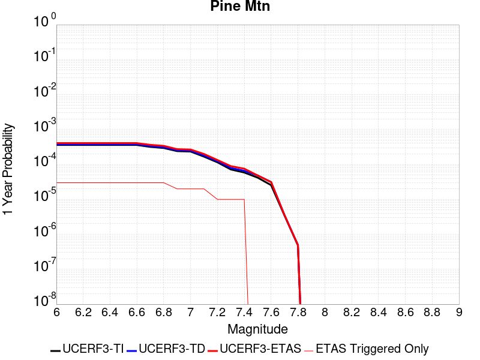 |  |

| Magnitude | 1 wk TI Prob | 1 wk TD Prob | 1 wk ETAS Prob | 1 wk ETAS/TD Gain | 1 wk ETAS Triggered Only | 1 mo TI Prob | 1 mo TD Prob | 1 mo ETAS Prob | 1 mo ETAS/TD Gain | 1 mo ETAS Triggered Only | 1 yr TI Prob | 1 yr TD Prob | 1 yr ETAS Prob | 1 yr ETAS/TD Gain | 1 yr ETAS Triggered Only | 10 yr TI Prob | 10 yr TD Prob | 10 yr ETAS Prob | 10 yr ETAS/TD Gain | 10 yr ETAS Triggered Only |
|-----|-----|-----|-----|-----|-----|-----|-----|-----|-----|-----|-----|-----|-----|-----|-----|-----|-----|-----|-----|-----|
| 6.0 | 6.894797E-6 | 7.2254716E-6 | 2.7225327E-5 | 3.7679653 | 2.0E-5 | 2.9548795E-5 | 3.0965955E-5 | 6.0965027E-5 | 1.9687759 | 3.0E-5 | 3.596972E-4 | 3.7694827E-4 | 4.0693698E-4 | 1.0795565 | 3.0E-5 | 0.0035911554 | 0.0037633865 | 0.003803236 | 1.0105888 | 4.0E-5 |
| 6.1 | 6.894797E-6 | 7.2254716E-6 | 2.7225327E-5 | 3.7679653 | 2.0E-5 | 2.9548795E-5 | 3.0965955E-5 | 6.0965027E-5 | 1.9687759 | 3.0E-5 | 3.596972E-4 | 3.7694827E-4 | 4.0693698E-4 | 1.0795565 | 3.0E-5 | 0.0035911554 | 0.0037633865 | 0.003803236 | 1.0105888 | 4.0E-5 |
| 6.2 | 6.894797E-6 | 7.2254716E-6 | 2.7225327E-5 | 3.7679653 | 2.0E-5 | 2.9548795E-5 | 3.0965955E-5 | 6.0965027E-5 | 1.9687759 | 3.0E-5 | 3.596972E-4 | 3.7694827E-4 | 4.0693698E-4 | 1.0795565 | 3.0E-5 | 0.0035911554 | 0.0037633865 | 0.003803236 | 1.0105888 | 4.0E-5 |
| 6.3 | 6.894797E-6 | 7.2254716E-6 | 2.7225327E-5 | 3.7679653 | 2.0E-5 | 2.9548795E-5 | 3.0965955E-5 | 6.0965027E-5 | 1.9687759 | 3.0E-5 | 3.596972E-4 | 3.7694827E-4 | 4.0693698E-4 | 1.0795565 | 3.0E-5 | 0.0035911554 | 0.0037633865 | 0.003803236 | 1.0105888 | 4.0E-5 |
| 6.4 | 6.894797E-6 | 7.2254716E-6 | 2.7225327E-5 | 3.7679653 | 2.0E-5 | 2.9548795E-5 | 3.0965955E-5 | 6.0965027E-5 | 1.9687759 | 3.0E-5 | 3.596972E-4 | 3.7694827E-4 | 4.0693698E-4 | 1.0795565 | 3.0E-5 | 0.0035911554 | 0.0037633865 | 0.003803236 | 1.0105888 | 4.0E-5 |
| 6.5 | 6.894797E-6 | 7.2254716E-6 | 2.7225327E-5 | 3.7679653 | 2.0E-5 | 2.9548795E-5 | 3.0965955E-5 | 6.0965027E-5 | 1.9687759 | 3.0E-5 | 3.596972E-4 | 3.7694827E-4 | 4.0693698E-4 | 1.0795565 | 3.0E-5 | 0.0035911554 | 0.0037633865 | 0.003803236 | 1.0105888 | 4.0E-5 |
| 6.6 | 6.894797E-6 | 7.2254716E-6 | 2.7225327E-5 | 3.7679653 | 2.0E-5 | 2.9548795E-5 | 3.0965955E-5 | 6.0965027E-5 | 1.9687759 | 3.0E-5 | 3.596972E-4 | 3.7694827E-4 | 4.0693698E-4 | 1.0795565 | 3.0E-5 | 0.0035911554 | 0.0037633865 | 0.003803236 | 1.0105888 | 4.0E-5 |
| 6.7 | 6.0867933E-6 | 6.397124E-6 | 2.6396996E-5 | 4.126385 | 2.0E-5 | 2.6085996E-5 | 2.7415968E-5 | 5.7415145E-5 | 2.0942228 | 3.0E-5 | 3.1755073E-4 | 3.337405E-4 | 3.6373048E-4 | 1.0898602 | 3.0E-5 | 0.0031709734 | 0.0033326119 | 0.003362512 | 1.0089719 | 3.0E-5 |
| 6.8 | 5.6530425E-6 | 5.950606E-6 | 2.5950487E-5 | 4.3609824 | 2.0E-5 | 2.42271E-5 | 2.5502359E-5 | 5.5501594E-5 | 2.1763318 | 3.0E-5 | 2.94925E-4 | 3.1044905E-4 | 3.4043973E-4 | 1.0966042 | 3.0E-5 | 0.002945339 | 0.0031003582 | 0.0031302653 | 1.0096463 | 3.0E-5 |
| 6.9 | 4.6015225E-6 | 4.8638444E-6 | 1.48637955E-5 | 3.0559769 | 1.0E-5 | 1.9720663E-5 | 2.084489E-5 | 4.0844472E-5 | 1.9594477 | 2.0E-5 | 2.4007261E-4 | 2.5375842E-4 | 2.7375337E-4 | 1.0787951 | 2.0E-5 | 0.0023981342 | 0.002534831 | 0.00255478 | 1.0078701 | 2.0E-5 |
| 7.0 | 4.4875965E-6 | 4.7474837E-6 | 1.4747436E-5 | 3.106369 | 1.0E-5 | 1.9232413E-5 | 2.0346208E-5 | 4.03458E-5 | 1.9829642 | 2.0E-5 | 2.3412947E-4 | 2.4768838E-4 | 2.676834E-4 | 1.0807266 | 2.0E-5 | 0.0023388295 | 0.0024742668 | 0.0024942174 | 1.0080632 | 2.0E-5 |
| 7.1 | 3.203907E-6 | 3.42942E-6 | 1.3429386E-5 | 3.915935 | 1.0E-5 | 1.3730958E-5 | 1.4697435E-5 | 3.4697143E-5 | 2.3607616 | 2.0E-5 | 1.6716159E-4 | 1.7892725E-4 | 1.9892366E-4 | 1.1117573 | 2.0E-5 | 0.0016703589 | 0.001787898 | 0.0018078622 | 1.0111663 | 2.0E-5 |
| 7.2 | 2.2060601E-6 | 2.3784874E-6 | 1.2378464E-5 | 5.204343 | 1.0E-5 | 9.4545085E-6 | 1.019348E-5 | 2.0193378E-5 | 1.9810092 | 1.0E-5 | 1.15102564E-4 | 1.2409901E-4 | 1.3409776E-4 | 1.0805708 | 1.0E-5 | 0.0011504296 | 0.0012403419 | 0.0012503295 | 1.0080523 | 1.0E-5 |
| 7.3 | 1.3765207E-6 | 1.5216535E-6 | 1.1521638E-5 | 7.5717883 | 1.0E-5 | 5.899361E-6 | 6.5213567E-6 | 1.6521291E-5 | 2.5334132 | 1.0E-5 | 7.182235E-5 | 7.939472E-5 | 8.939392E-5 | 1.125943 | 1.0E-5 | 7.1799144E-4 | 7.9367263E-4 | 8.036647E-4 | 1.0125897 | 1.0E-5 |
| 7.4 | 1.1245983E-6 | 1.2587126E-6 | 1.12587E-5 | 8.944615 | 1.0E-5 | 4.819698E-6 | 5.394472E-6 | 1.5394418E-5 | 2.8537395 | 1.0E-5 | 5.8678244E-5 | 6.56758E-5 | 7.567515E-5 | 1.152253 | 1.0E-5 | 5.866275E-4 | 6.565722E-4 | 6.6656567E-4 | 1.0152206 | 1.0E-5 |
| 7.5 | 8.031682E-7 | 9.276999E-7 | 9.276999E-7 | 1.0 | 0.0 | 3.4421448E-6 | 3.975851E-6 | 3.975851E-6 | 1.0 | 0.0 | 4.1907308E-5 | 4.840498E-5 | 4.840498E-5 | 1.0 | 0.0 | 4.1899405E-4 | 4.8395112E-4 | 4.8395112E-4 | 1.0 | 0.0 |
| 7.6 | 4.8953444E-7 | 6.0030544E-7 | 6.0030544E-7 | 1.0 | 0.0 | 2.098003E-6 | 2.5727354E-6 | 2.5727354E-6 | 1.0 | 0.0 | 2.5542888E-5 | 3.1322652E-5 | 3.1322652E-5 | 1.0 | 0.0 | 2.5539953E-4 | 3.1318725E-4 | 3.1318725E-4 | 1.0 | 0.0 |
| 7.7 | 6.634529E-8 | 6.788826E-8 | 6.788826E-8 | 1.0 | 0.0 | 2.843369E-7 | 2.9094966E-7 | 2.9094966E-7 | 1.0 | 0.0 | 3.4617963E-6 | 3.5423066E-6 | 3.5423066E-6 | 1.0 | 0.0 | 3.4617424E-5 | 3.542255E-5 | 3.542255E-5 | 1.0 | 0.0 |
| 7.8 | 9.235578E-9 | 9.488566E-9 | 9.488566E-9 | 1.0 | 0.0 | 3.9581046E-8 | 4.0665284E-8 | 4.0665284E-8 | 1.0 | 0.0 | 4.818991E-7 | 4.950997E-7 | 4.950997E-7 | 1.0 | 0.0 | 4.8189804E-6 | 4.950988E-6 | 4.950988E-6 | 1.0 | 0.0 |

## Likely 2011 CFM
*[(top)](#table-of-contents)*

| 1 Week | 1 Month | 1 Year | 10 Year |
|-----|-----|-----|-----|
|  |  |  |  |

| Magnitude | 1 wk TI Prob | 1 wk TD Prob | 1 wk ETAS Prob | 1 wk ETAS/TD Gain | 1 wk ETAS Triggered Only | 1 mo TI Prob | 1 mo TD Prob | 1 mo ETAS Prob | 1 mo ETAS/TD Gain | 1 mo ETAS Triggered Only | 1 yr TI Prob | 1 yr TD Prob | 1 yr ETAS Prob | 1 yr ETAS/TD Gain | 1 yr ETAS Triggered Only | 10 yr TI Prob | 10 yr TD Prob | 10 yr ETAS Prob | 10 yr ETAS/TD Gain | 10 yr ETAS Triggered Only |
|-----|-----|-----|-----|-----|-----|-----|-----|-----|-----|-----|-----|-----|-----|-----|-----|-----|-----|-----|-----|-----|
| 6.0 | 2.5315949E-5 | 2.7104748E-5 | 3.7104477E-5 | 1.368929 | 1.0E-5 | 1.0849241E-4 | 1.16158284E-4 | 1.3615596E-4 | 1.1721588 | 2.0E-5 | 0.0013200947 | 0.0014133542 | 0.0014433118 | 1.0211961 | 3.0E-5 | 0.013122803 | 0.01404831 | 0.014087749 | 1.0028073 | 4.0E-5 |
| 6.1 | 2.5315949E-5 | 2.7104748E-5 | 3.7104477E-5 | 1.368929 | 1.0E-5 | 1.0849241E-4 | 1.16158284E-4 | 1.3615596E-4 | 1.1721588 | 2.0E-5 | 0.0013200947 | 0.0014133542 | 0.0014433118 | 1.0211961 | 3.0E-5 | 0.013122803 | 0.01404831 | 0.014077889 | 1.0021055 | 3.0E-5 |
| 6.2 | 1.6375941E-5 | 1.7465842E-5 | 2.7465667E-5 | 1.5725361 | 1.0E-5 | 7.0180715E-5 | 7.485153E-5 | 8.4850784E-5 | 1.1335878 | 1.0E-5 | 8.5411523E-4 | 9.109487E-4 | 9.2093955E-4 | 1.0109676 | 1.0E-5 | 0.008508399 | 0.009073433 | 0.009083342 | 1.0010921 | 1.0E-5 |
| 6.3 | 1.1945543E-5 | 1.2712587E-5 | 2.271246E-5 | 1.7866119 | 1.0E-5 | 5.119418E-5 | 5.4481407E-5 | 6.448086E-5 | 1.1835389 | 1.0E-5 | 6.2311086E-4 | 6.631146E-4 | 6.73108E-4 | 1.0150703 | 1.0E-5 | 0.0062136655 | 0.0066119144 | 0.0066218483 | 1.0015024 | 1.0E-5 |
| 6.4 | 9.192729E-6 | 9.768488E-6 | 1.976839E-5 | 2.02369 | 1.0E-5 | 3.939681E-5 | 4.1864292E-5 | 5.1863874E-5 | 1.238857 | 1.0E-5 | 4.7955062E-4 | 5.0958124E-4 | 5.195762E-4 | 1.019614 | 1.0E-5 | 0.004785171 | 0.0050844094 | 0.005094358 | 1.0019568 | 1.0E-5 |
| 6.5 | 7.67906E-6 | 8.152622E-6 | 1.8152541E-5 | 2.2265892 | 1.0E-5 | 3.2909844E-5 | 3.4939352E-5 | 4.4939003E-5 | 1.2862003 | 1.0E-5 | 4.006037E-4 | 4.2530545E-4 | 4.3530122E-4 | 1.0235025 | 1.0E-5 | 0.0039988225 | 0.004245108 | 0.0042550657 | 1.0023457 | 1.0E-5 |
| 6.6 | 6.4884057E-6 | 6.8847507E-6 | 1.6884682E-5 | 2.4524755 | 1.0E-5 | 2.7807157E-5 | 2.9505749E-5 | 3.9505452E-5 | 1.338907 | 1.0E-5 | 3.3849955E-4 | 3.591747E-4 | 3.6917112E-4 | 1.0278316 | 1.0E-5 | 0.003379844 | 0.0035860867 | 0.003596051 | 1.0027785 | 1.0E-5 |
| 6.7 | 4.6060636E-6 | 4.884041E-6 | 1.4883993E-5 | 3.0474749 | 1.0E-5 | 1.9740122E-5 | 2.0931442E-5 | 3.0931235E-5 | 1.4777402 | 1.0E-5 | 2.403095E-4 | 2.5481134E-4 | 2.648088E-4 | 1.0392348 | 1.0E-5 | 0.002400498 | 0.0025452746 | 0.0025552493 | 1.0039189 | 1.0E-5 |
| 6.8 | 3.2795615E-6 | 3.4773732E-6 | 1.3477338E-5 | 3.875724 | 1.0E-5 | 1.4055187E-5 | 1.4902946E-5 | 2.4902796E-5 | 1.6709983 | 1.0E-5 | 1.7110848E-4 | 1.8142881E-4 | 1.91427E-4 | 1.0551081 | 1.0E-5 | 0.0017097679 | 0.0018128622 | 0.001822844 | 1.0055062 | 1.0E-5 |
| 6.9 | 2.3289967E-6 | 2.4705569E-6 | 1.2470532E-5 | 5.0476604 | 1.0E-5 | 9.981376E-6 | 1.058806E-5 | 2.0587955E-5 | 1.94445 | 1.0E-5 | 1.2151648E-4 | 1.2890245E-4 | 1.3890116E-4 | 1.077568 | 1.0E-5 | 0.0012145005 | 0.0012883197 | 0.0012983069 | 1.0077521 | 1.0E-5 |
| 7.0 | 1.211292E-6 | 1.2863958E-6 | 1.2863958E-6 | 1.0 | 0.0 | 5.1912407E-6 | 5.5131145E-6 | 5.5131145E-6 | 1.0 | 0.0 | 6.320152E-5 | 6.712041E-5 | 6.712041E-5 | 1.0 | 0.0 | 6.3183554E-4 | 6.710312E-4 | 6.710312E-4 | 1.0 | 0.0 |

## Channel Islands Western Deep Ramp
*[(top)](#table-of-contents)*

| 1 Week | 1 Month | 1 Year | 10 Year |
|-----|-----|-----|-----|
|  |  | 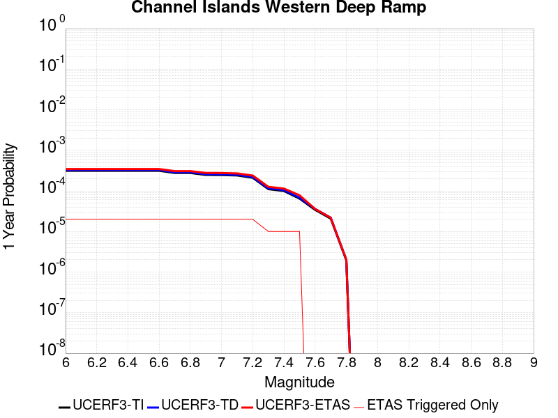 |  |

| Magnitude | 1 wk TI Prob | 1 wk TD Prob | 1 wk ETAS Prob | 1 wk ETAS/TD Gain | 1 wk ETAS Triggered Only | 1 mo TI Prob | 1 mo TD Prob | 1 mo ETAS Prob | 1 mo ETAS/TD Gain | 1 mo ETAS Triggered Only | 1 yr TI Prob | 1 yr TD Prob | 1 yr ETAS Prob | 1 yr ETAS/TD Gain | 1 yr ETAS Triggered Only | 10 yr TI Prob | 10 yr TD Prob | 10 yr ETAS Prob | 10 yr ETAS/TD Gain | 10 yr ETAS Triggered Only |
|-----|-----|-----|-----|-----|-----|-----|-----|-----|-----|-----|-----|-----|-----|-----|-----|-----|-----|-----|-----|-----|
| 6.0 | 6.0213506E-6 | 6.2548684E-6 | 1.6254806E-5 | 2.5987446 | 1.0E-5 | 2.5805533E-5 | 2.6806329E-5 | 3.680606E-5 | 1.3730363 | 1.0E-5 | 3.1413708E-4 | 3.2632265E-4 | 3.463161E-4 | 1.061269 | 2.0E-5 | 0.0031369338 | 0.0032588763 | 0.0032887785 | 1.0091757 | 3.0E-5 |
| 6.1 | 6.0213506E-6 | 6.2548684E-6 | 1.6254806E-5 | 2.5987446 | 1.0E-5 | 2.5805533E-5 | 2.6806329E-5 | 3.680606E-5 | 1.3730363 | 1.0E-5 | 3.1413708E-4 | 3.2632265E-4 | 3.463161E-4 | 1.061269 | 2.0E-5 | 0.0031369338 | 0.0032588763 | 0.0032887785 | 1.0091757 | 3.0E-5 |
| 6.2 | 6.0213506E-6 | 6.2548684E-6 | 1.6254806E-5 | 2.5987446 | 1.0E-5 | 2.5805533E-5 | 2.6806329E-5 | 3.680606E-5 | 1.3730363 | 1.0E-5 | 3.1413708E-4 | 3.2632265E-4 | 3.463161E-4 | 1.061269 | 2.0E-5 | 0.0031369338 | 0.0032588763 | 0.0032887785 | 1.0091757 | 3.0E-5 |
| 6.3 | 6.0213506E-6 | 6.2548684E-6 | 1.6254806E-5 | 2.5987446 | 1.0E-5 | 2.5805533E-5 | 2.6806329E-5 | 3.680606E-5 | 1.3730363 | 1.0E-5 | 3.1413708E-4 | 3.2632265E-4 | 3.463161E-4 | 1.061269 | 2.0E-5 | 0.0031369338 | 0.0032588763 | 0.0032887785 | 1.0091757 | 3.0E-5 |
| 6.4 | 6.0213506E-6 | 6.2548684E-6 | 1.6254806E-5 | 2.5987446 | 1.0E-5 | 2.5805533E-5 | 2.6806329E-5 | 3.680606E-5 | 1.3730363 | 1.0E-5 | 3.1413708E-4 | 3.2632265E-4 | 3.463161E-4 | 1.061269 | 2.0E-5 | 0.0031369338 | 0.0032588763 | 0.0032887785 | 1.0091757 | 3.0E-5 |
| 6.5 | 6.0213506E-6 | 6.2548684E-6 | 1.6254806E-5 | 2.5987446 | 1.0E-5 | 2.5805533E-5 | 2.6806329E-5 | 3.680606E-5 | 1.3730363 | 1.0E-5 | 3.1413708E-4 | 3.2632265E-4 | 3.463161E-4 | 1.061269 | 2.0E-5 | 0.0031369338 | 0.0032588763 | 0.0032887785 | 1.0091757 | 3.0E-5 |
| 6.6 | 6.0213506E-6 | 6.2548684E-6 | 1.6254806E-5 | 2.5987446 | 1.0E-5 | 2.5805533E-5 | 2.6806329E-5 | 3.680606E-5 | 1.3730363 | 1.0E-5 | 3.1413708E-4 | 3.2632265E-4 | 3.463161E-4 | 1.061269 | 2.0E-5 | 0.0031369338 | 0.0032588763 | 0.0032887785 | 1.0091757 | 3.0E-5 |
| 6.7 | 5.313309E-6 | 5.5252403E-6 | 1.5525186E-5 | 2.809866 | 1.0E-5 | 2.2771126E-5 | 2.367941E-5 | 3.3679175E-5 | 1.4222978 | 1.0E-5 | 2.772032E-4 | 2.8826276E-4 | 3.08257E-4 | 1.0693611 | 2.0E-5 | 0.0027685766 | 0.0028792918 | 0.0029092054 | 1.0103892 | 3.0E-5 |
| 6.8 | 5.313309E-6 | 5.5252403E-6 | 1.5525186E-5 | 2.809866 | 1.0E-5 | 2.2771126E-5 | 2.367941E-5 | 3.3679175E-5 | 1.4222978 | 1.0E-5 | 2.772032E-4 | 2.8826276E-4 | 3.08257E-4 | 1.0693611 | 2.0E-5 | 0.0027685766 | 0.0028792918 | 0.0029092054 | 1.0103892 | 3.0E-5 |
| 6.9 | 4.744377E-6 | 4.9394303E-6 | 1.4939381E-5 | 3.024515 | 1.0E-5 | 2.0332885E-5 | 2.1168837E-5 | 3.1168624E-5 | 1.4723825 | 1.0E-5 | 2.4752476E-4 | 2.5770385E-4 | 2.7769868E-4 | 1.0775884 | 2.0E-5 | 0.0024724922 | 0.0025744175 | 0.0026043402 | 1.0116231 | 3.0E-5 |
| 7.0 | 4.722209E-6 | 4.9164732E-6 | 1.4916424E-5 | 3.0339684 | 1.0E-5 | 2.0237881E-5 | 2.107045E-5 | 3.1070238E-5 | 1.4745883 | 1.0E-5 | 2.4636835E-4 | 2.5650626E-4 | 2.7650114E-4 | 1.0779508 | 2.0E-5 | 0.002460954 | 0.0025624693 | 0.0025923925 | 1.0116775 | 3.0E-5 |
| 7.1 | 4.611174E-6 | 4.801409E-6 | 1.48013605E-5 | 3.082712 | 1.0E-5 | 1.9762025E-5 | 2.0577325E-5 | 3.057712E-5 | 1.4859618 | 1.0E-5 | 2.4057609E-4 | 2.5050386E-4 | 2.7049886E-4 | 1.0798191 | 2.0E-5 | 0.002403158 | 0.002502582 | 0.0025325068 | 1.0119576 | 3.0E-5 |
| 7.2 | 4.043994E-6 | 4.2120264E-6 | 1.4211984E-5 | 3.374144 | 1.0E-5 | 1.7331287E-5 | 1.8051438E-5 | 2.8051258E-5 | 1.5539625 | 1.0E-5 | 2.10988E-4 | 2.1975765E-4 | 2.3975327E-4 | 1.0909894 | 2.0E-5 | 0.002107878 | 0.0021957543 | 0.0022256884 | 1.0136328 | 3.0E-5 |
| 7.3 | 2.1233036E-6 | 2.2297875E-6 | 1.2229765E-5 | 5.4847226 | 1.0E-5 | 9.099841E-6 | 9.556197E-6 | 1.9556102E-5 | 2.0464313 | 1.0E-5 | 1.1078493E-4 | 1.1634055E-4 | 1.2633938E-4 | 1.0859445 | 1.0E-5 | 0.0011072971 | 0.001162802 | 0.0011827787 | 1.0171798 | 2.0E-5 |
| 7.4 | 1.9051884E-6 | 2.0014973E-6 | 1.2001477E-5 | 5.9962497 | 1.0E-5 | 8.165067E-6 | 8.577817E-6 | 1.8577732E-5 | 2.1657877 | 1.0E-5 | 9.940516E-5 | 1.0442998E-4 | 1.14428934E-4 | 1.095748 | 1.0E-5 | 9.93607E-4 | 0.0010438144 | 0.0010637934 | 1.0191405 | 2.0E-5 |
| 7.5 | 1.2408497E-6 | 1.3038839E-6 | 1.130387E-5 | 8.669384 | 1.0E-5 | 5.317916E-6 | 5.588062E-6 | 1.5588006E-5 | 2.789519 | 1.0E-5 | 6.4743705E-5 | 6.8032554E-5 | 7.803187E-5 | 1.1469785 | 1.0E-5 | 6.4724847E-4 | 6.8011944E-4 | 6.9011265E-4 | 1.0146933 | 1.0E-5 |
| 7.6 | 6.5440025E-7 | 6.886718E-7 | 6.886718E-7 | 1.0 | 0.0 | 2.8045695E-6 | 2.9514472E-6 | 2.9514472E-6 | 1.0 | 0.0 | 3.4145098E-5 | 3.593329E-5 | 3.593329E-5 | 1.0 | 0.0 | 3.4139853E-4 | 3.5927625E-4 | 3.5927625E-4 | 1.0 | 0.0 |
| 7.7 | 3.985963E-7 | 4.1930787E-7 | 4.1930787E-7 | 1.0 | 0.0 | 1.7082689E-6 | 1.7970326E-6 | 1.7970326E-6 | 1.0 | 0.0 | 2.0797976E-5 | 2.1878664E-5 | 2.1878664E-5 | 1.0 | 0.0 | 2.0796029E-4 | 2.1876628E-4 | 2.1876628E-4 | 1.0 | 0.0 |
| 7.8 | 3.706329E-8 | 3.8591796E-8 | 3.8591796E-8 | 1.0 | 0.0 | 1.5884267E-7 | 1.653934E-7 | 1.653934E-7 | 1.0 | 0.0 | 1.9339077E-6 | 2.0136629E-6 | 2.0136629E-6 | 1.0 | 0.0 | 1.933891E-5 | 2.0136458E-5 | 2.0136458E-5 | 1.0 | 0.0 |

## Elsinore (Stepovers Combined)
*[(top)](#table-of-contents)*

| 1 Week | 1 Month | 1 Year | 10 Year |
|-----|-----|-----|-----|
| 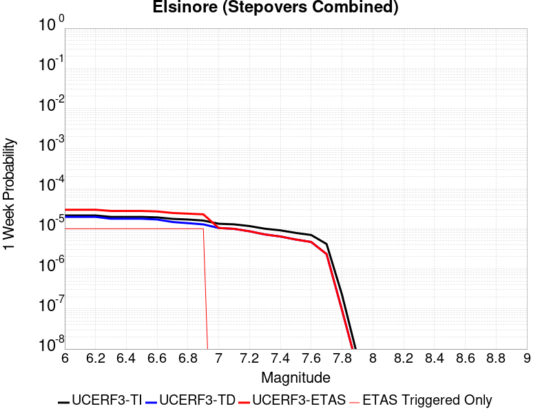 |  | 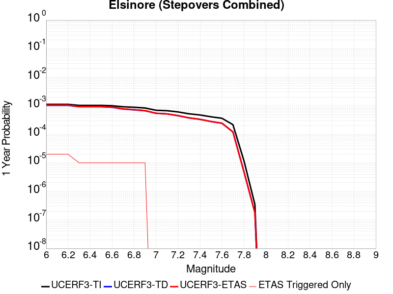 |  |

| Magnitude | 1 wk TI Prob | 1 wk TD Prob | 1 wk ETAS Prob | 1 wk ETAS/TD Gain | 1 wk ETAS Triggered Only | 1 mo TI Prob | 1 mo TD Prob | 1 mo ETAS Prob | 1 mo ETAS/TD Gain | 1 mo ETAS Triggered Only | 1 yr TI Prob | 1 yr TD Prob | 1 yr ETAS Prob | 1 yr ETAS/TD Gain | 1 yr ETAS Triggered Only | 10 yr TI Prob | 10 yr TD Prob | 10 yr ETAS Prob | 10 yr ETAS/TD Gain | 10 yr ETAS Triggered Only |
|-----|-----|-----|-----|-----|-----|-----|-----|-----|-----|-----|-----|-----|-----|-----|-----|-----|-----|-----|-----|-----|
| 6.0 | 2.144392E-5 | 1.976007E-5 | 2.9759873E-5 | 1.5060611 | 1.0E-5 | 9.189928E-5 | 8.468338E-5 | 9.468253E-5 | 1.1180769 | 1.0E-5 | 0.0011182994 | 0.0010305515 | 0.0010505309 | 1.0193871 | 2.0E-5 | 0.011126885 | 0.010264617 | 0.01029431 | 1.0028926 | 3.0E-5 |
| 6.1 | 2.144392E-5 | 1.976007E-5 | 2.9759873E-5 | 1.5060611 | 1.0E-5 | 9.189928E-5 | 8.468338E-5 | 9.468253E-5 | 1.1180769 | 1.0E-5 | 0.0011182994 | 0.0010305515 | 0.0010505309 | 1.0193871 | 2.0E-5 | 0.011126885 | 0.010264617 | 0.01029431 | 1.0028926 | 3.0E-5 |
| 6.2 | 2.144392E-5 | 1.976007E-5 | 2.9759873E-5 | 1.5060611 | 1.0E-5 | 9.189928E-5 | 8.468338E-5 | 9.468253E-5 | 1.1180769 | 1.0E-5 | 0.0011182994 | 0.0010305515 | 0.0010505309 | 1.0193871 | 2.0E-5 | 0.011126885 | 0.010264617 | 0.01029431 | 1.0028926 | 3.0E-5 |
| 6.3 | 1.9751555E-5 | 1.7741326E-5 | 2.7741147E-5 | 1.5636457 | 1.0E-5 | 8.4646774E-5 | 7.603211E-5 | 8.603135E-5 | 1.1315134 | 1.0E-5 | 0.0010300872 | 9.25312E-4 | 9.353027E-4 | 1.0107971 | 1.0E-5 | 0.010253254 | 0.0092209745 | 0.00924079 | 1.002149 | 2.0E-5 |
| 6.4 | 1.9751555E-5 | 1.7741326E-5 | 2.7741147E-5 | 1.5636457 | 1.0E-5 | 8.4646774E-5 | 7.603211E-5 | 8.603135E-5 | 1.1315134 | 1.0E-5 | 0.0010300872 | 9.25312E-4 | 9.353027E-4 | 1.0107971 | 1.0E-5 | 0.010253254 | 0.0092209745 | 0.00924079 | 1.002149 | 2.0E-5 |
| 6.5 | 1.9751555E-5 | 1.7741326E-5 | 2.7741147E-5 | 1.5636457 | 1.0E-5 | 8.4646774E-5 | 7.603211E-5 | 8.603135E-5 | 1.1315134 | 1.0E-5 | 0.0010300872 | 9.25312E-4 | 9.353027E-4 | 1.0107971 | 1.0E-5 | 0.010253254 | 0.0092209745 | 0.00924079 | 1.002149 | 2.0E-5 |
| 6.6 | 1.9188685E-5 | 1.7003247E-5 | 2.7003076E-5 | 1.588113 | 1.0E-5 | 8.2234634E-5 | 7.2869116E-5 | 8.2868384E-5 | 1.1372224 | 1.0E-5 | 0.0010007467 | 8.8683655E-4 | 8.9682767E-4 | 1.011266 | 1.0E-5 | 0.00996252 | 0.008839546 | 0.008859369 | 1.0022426 | 2.0E-5 |
| 6.7 | 1.7608272E-5 | 1.4732402E-5 | 2.4732255E-5 | 1.6787659 | 1.0E-5 | 7.546184E-5 | 6.313739E-5 | 7.313676E-5 | 1.1583748 | 1.0E-5 | 9.183606E-4 | 7.684364E-4 | 7.7842874E-4 | 1.0130035 | 1.0E-5 | 0.009145746 | 0.007664441 | 0.0076842876 | 1.0025895 | 2.0E-5 |
| 6.8 | 1.697165E-5 | 1.3783126E-5 | 2.3782988E-5 | 1.7255148 | 1.0E-5 | 7.273361E-5 | 5.906925E-5 | 6.9068665E-5 | 1.1692828 | 1.0E-5 | 8.8517193E-4 | 7.189395E-4 | 7.289323E-4 | 1.0138993 | 1.0E-5 | 0.008816543 | 0.0071722106 | 0.0071920673 | 1.0027685 | 2.0E-5 |
| 6.9 | 1.600365E-5 | 1.2846429E-5 | 2.2846301E-5 | 1.7784164 | 1.0E-5 | 6.858527E-5 | 5.5055007E-5 | 6.505445E-5 | 1.1816266 | 1.0E-5 | 8.347058E-4 | 6.700963E-4 | 6.8008964E-4 | 1.0149132 | 1.0E-5 | 0.008315775 | 0.006686422 | 0.006706288 | 1.0029712 | 2.0E-5 |
| 7.0 | 1.3314581E-5 | 1.044738E-5 | 1.044738E-5 | 1.0 | 0.0 | 5.7061243E-5 | 4.4773733E-5 | 4.4773733E-5 | 1.0 | 0.0 | 6.944992E-4 | 5.449866E-4 | 5.449866E-4 | 1.0 | 0.0 | 0.006923327 | 0.005440055 | 0.005440055 | 1.0 | 0.0 |
| 7.1 | 1.2865345E-5 | 9.937339E-6 | 9.937339E-6 | 1.0 | 0.0 | 5.5136024E-5 | 4.258792E-5 | 4.258792E-5 | 1.0 | 0.0 | 6.710743E-4 | 5.1838707E-4 | 5.1838707E-4 | 1.0 | 0.0 | 0.0066905143 | 0.005175021 | 0.005175021 | 1.0 | 0.0 |
| 7.2 | 1.1650051E-5 | 8.633585E-6 | 8.633585E-6 | 1.0 | 0.0 | 4.9927836E-5 | 3.7000562E-5 | 3.7000562E-5 | 1.0 | 0.0 | 6.0770183E-4 | 4.503905E-4 | 4.503905E-4 | 1.0 | 0.0 | 0.0060604266 | 0.00449624 | 0.00449624 | 1.0 | 0.0 |
| 7.3 | 1.0008533E-5 | 7.2008215E-6 | 7.2008215E-6 | 1.0 | 0.0 | 4.2893007E-5 | 3.0860305E-5 | 3.0860305E-5 | 1.0 | 0.0 | 5.220972E-4 | 3.756609E-4 | 3.756609E-4 | 1.0 | 0.0 | 0.005208723 | 0.0037506663 | 0.0037506663 | 1.0 | 0.0 |
| 7.4 | 9.116759E-6 | 6.409854E-6 | 6.409854E-6 | 1.0 | 0.0 | 3.907124E-5 | 2.7470522E-5 | 2.7470522E-5 | 1.0 | 0.0 | 4.7558855E-4 | 3.3440365E-4 | 3.3440365E-4 | 1.0 | 0.0 | 0.00474572 | 0.0033391542 | 0.0033391542 | 1.0 | 0.0 |
| 7.5 | 7.870524E-6 | 5.382316E-6 | 5.382316E-6 | 1.0 | 0.0 | 3.3730383E-5 | 2.306687E-5 | 2.306687E-5 | 1.0 | 0.0 | 4.1059E-4 | 2.8080423E-4 | 2.8080423E-4 | 1.0 | 0.0 | 0.0040983222 | 0.0028046207 | 0.0028046207 | 1.0 | 0.0 |
| 7.6 | 6.9774537E-6 | 4.677398E-6 | 4.677398E-6 | 1.0 | 0.0 | 2.990303E-5 | 2.0045845E-5 | 2.0045845E-5 | 1.0 | 0.0 | 3.640086E-4 | 2.44032E-4 | 2.44032E-4 | 1.0 | 0.0 | 0.003634129 | 0.0024377564 | 0.0024377564 | 1.0 | 0.0 |
| 7.7 | 4.1616954E-6 | 2.3281368E-6 | 2.3281368E-6 | 1.0 | 0.0 | 1.7835715E-5 | 9.977695E-6 | 9.977695E-6 | 1.0 | 0.0 | 2.171282E-4 | 1.2147242E-4 | 1.2147242E-4 | 1.0 | 0.0 | 0.0021691616 | 0.0012141332 | 0.0012141332 | 1.0 | 0.0 |
| 7.8 | 2.2692414E-7 | 9.384417E-8 | 9.384417E-8 | 1.0 | 0.0 | 9.725317E-7 | 4.0218927E-7 | 4.0218927E-7 | 1.0 | 0.0 | 1.1840509E-5 | 4.8966467E-6 | 4.8966467E-6 | 1.0 | 0.0 | 1.1839878E-4 | 4.8965718E-5 | 4.8965718E-5 | 1.0 | 0.0 |
| 7.9 | 6.676829E-9 | 3.4397174E-9 | 3.4397174E-9 | 1.0 | 0.0 | 2.861498E-8 | 1.4741646E-8 | 1.4741646E-8 | 1.0 | 0.0 | 3.4838732E-7 | 1.7947953E-7 | 1.7947953E-7 | 1.0 | 0.0 | 3.4838679E-6 | 1.794794E-6 | 1.794794E-6 | 1.0 | 0.0 |

## Keddie Ridge 2011 CFM
*[(top)](#table-of-contents)*

| 1 Week | 1 Month | 1 Year | 10 Year |
|-----|-----|-----|-----|
|  | 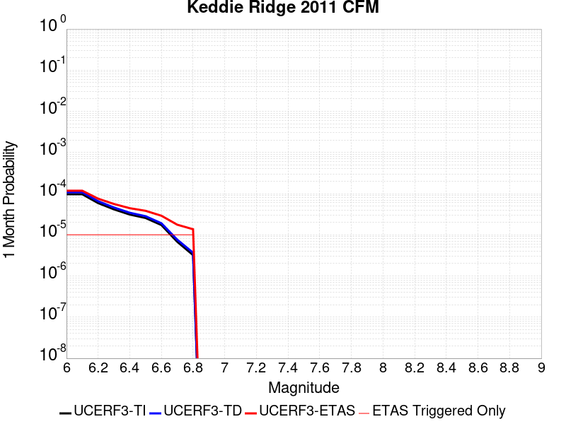 | 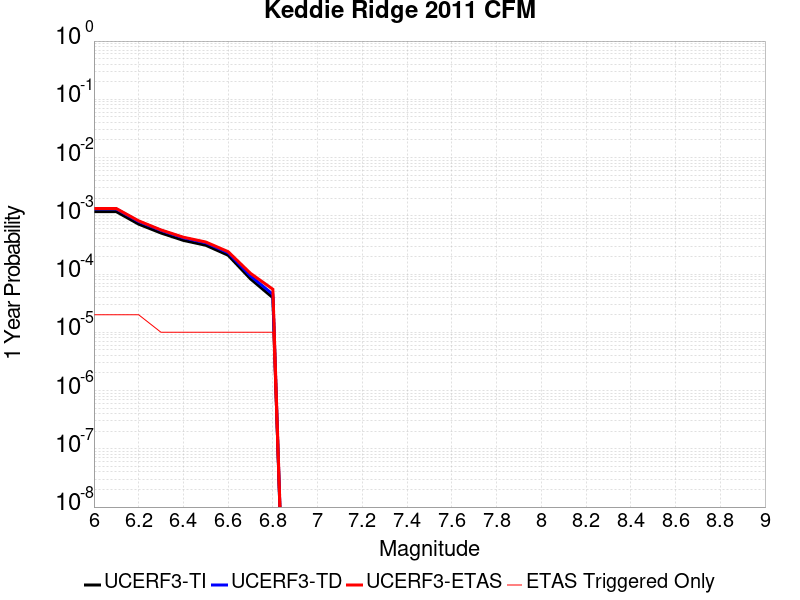 |  |

| Magnitude | 1 wk TI Prob | 1 wk TD Prob | 1 wk ETAS Prob | 1 wk ETAS/TD Gain | 1 wk ETAS Triggered Only | 1 mo TI Prob | 1 mo TD Prob | 1 mo ETAS Prob | 1 mo ETAS/TD Gain | 1 mo ETAS Triggered Only | 1 yr TI Prob | 1 yr TD Prob | 1 yr ETAS Prob | 1 yr ETAS/TD Gain | 1 yr ETAS Triggered Only | 10 yr TI Prob | 10 yr TD Prob | 10 yr ETAS Prob | 10 yr ETAS/TD Gain | 10 yr ETAS Triggered Only |
|-----|-----|-----|-----|-----|-----|-----|-----|-----|-----|-----|-----|-----|-----|-----|-----|-----|-----|-----|-----|-----|
| 6.0 | 2.2591947E-5 | 2.5189187E-5 | 2.5189187E-5 | 1.0 | 0.0 | 9.6819036E-5 | 1.0794964E-4 | 1.1794856E-4 | 1.0926257 | 1.0E-5 | 0.0011781343 | 0.0013135736 | 0.0013335473 | 1.0152056 | 2.0E-5 | 0.011719079 | 0.013066037 | 0.013095644 | 1.002266 | 3.0E-5 |
| 6.1 | 2.2591947E-5 | 2.5189187E-5 | 2.5189187E-5 | 1.0 | 0.0 | 9.6819036E-5 | 1.0794964E-4 | 1.1794856E-4 | 1.0926257 | 1.0E-5 | 0.0011781343 | 0.0013135736 | 0.0013335473 | 1.0152056 | 2.0E-5 | 0.011719079 | 0.013066037 | 0.013095644 | 1.002266 | 3.0E-5 |
| 6.2 | 1.3775145E-5 | 1.5322817E-5 | 1.5322817E-5 | 1.0 | 0.0 | 5.9035E-5 | 6.56677E-5 | 7.566705E-5 | 1.1522719 | 1.0E-5 | 7.185141E-4 | 7.9923525E-4 | 8.192192E-4 | 1.0250039 | 2.0E-5 | 0.0071619535 | 0.007966028 | 0.007995789 | 1.003736 | 3.0E-5 |
| 6.3 | 9.705435E-6 | 1.0768351E-5 | 1.0768351E-5 | 1.0 | 0.0 | 4.1594063E-5 | 4.6149325E-5 | 5.6148867E-5 | 1.2166779 | 1.0E-5 | 5.0629E-4 | 5.617356E-4 | 5.7172996E-4 | 1.017792 | 1.0E-5 | 0.005051381 | 0.0056043877 | 0.0056242757 | 1.0035486 | 2.0E-5 |
| 6.4 | 7.2549733E-6 | 8.027268E-6 | 8.027268E-6 | 1.0 | 0.0 | 3.109237E-5 | 3.440217E-5 | 4.4401826E-5 | 1.2906693 | 1.0E-5 | 3.7848388E-4 | 4.1877388E-4 | 4.287697E-4 | 1.0238693 | 1.0E-5 | 0.003778399 | 0.004180635 | 0.004190593 | 1.002382 | 1.0E-5 |
| 6.5 | 5.983293E-6 | 6.6130237E-6 | 6.6130237E-6 | 1.0 | 0.0 | 2.5642432E-5 | 2.834126E-5 | 3.8340975E-5 | 1.3528324 | 1.0E-5 | 3.1215188E-4 | 3.4500693E-4 | 3.550035E-4 | 1.0289749 | 1.0E-5 | 0.0031171376 | 0.003445376 | 0.0034553413 | 1.0028925 | 1.0E-5 |
| 6.6 | 4.0336154E-6 | 4.4578037E-6 | 4.4578037E-6 | 1.0 | 0.0 | 1.728681E-5 | 1.9104757E-5 | 2.9104565E-5 | 1.5234199 | 1.0E-5 | 2.1044657E-4 | 2.3257962E-4 | 2.425773E-4 | 1.042986 | 1.0E-5 | 0.002102474 | 0.002323758 | 0.0023337347 | 1.0042933 | 1.0E-5 |
| 6.7 | 1.5832104E-6 | 1.7816087E-6 | 1.7816087E-6 | 1.0 | 0.0 | 6.7851697E-6 | 7.635445E-6 | 1.763537E-5 | 2.3096714 | 1.0E-5 | 8.260631E-5 | 9.295785E-5 | 1.0295692E-4 | 1.1075656 | 1.0E-5 | 8.2575605E-4 | 9.2921633E-4 | 9.3920704E-4 | 1.0107517 | 1.0E-5 |
| 6.8 | 7.5177275E-7 | 8.5902946E-7 | 8.5902946E-7 | 1.0 | 0.0 | 3.221879E-6 | 3.6815507E-6 | 1.3681514E-5 | 3.7162368 | 1.0E-5 | 3.9225673E-5 | 4.4822125E-5 | 5.4821678E-5 | 1.2230941 | 1.0E-5 | 3.921875E-4 | 4.481474E-4 | 4.5814292E-4 | 1.022304 | 1.0E-5 |

## Santa Cruz Catalina Ridge alt1
*[(top)](#table-of-contents)*

| 1 Week | 1 Month | 1 Year | 10 Year |
|-----|-----|-----|-----|
|  |  |  |  |

| Magnitude | 1 wk TI Prob | 1 wk TD Prob | 1 wk ETAS Prob | 1 wk ETAS/TD Gain | 1 wk ETAS Triggered Only | 1 mo TI Prob | 1 mo TD Prob | 1 mo ETAS Prob | 1 mo ETAS/TD Gain | 1 mo ETAS Triggered Only | 1 yr TI Prob | 1 yr TD Prob | 1 yr ETAS Prob | 1 yr ETAS/TD Gain | 1 yr ETAS Triggered Only | 10 yr TI Prob | 10 yr TD Prob | 10 yr ETAS Prob | 10 yr ETAS/TD Gain | 10 yr ETAS Triggered Only |
|-----|-----|-----|-----|-----|-----|-----|-----|-----|-----|-----|-----|-----|-----|-----|-----|-----|-----|-----|-----|-----|
| 6.0 | 3.2833184E-5 | 3.6558402E-5 | 3.6558402E-5 | 1.0 | 0.0 | 1.4070606E-4 | 1.5667039E-4 | 1.6666882E-4 | 1.0638182 | 1.0E-5 | 0.00171175 | 0.0019059594 | 0.0019259213 | 1.0104734 | 2.0E-5 | 0.016986247 | 0.018913032 | 0.018952277 | 1.002075 | 4.0E-5 |
| 6.1 | 1.9835548E-5 | 2.1659505E-5 | 2.1659505E-5 | 1.0 | 0.0 | 8.500672E-5 | 9.282326E-5 | 9.282326E-5 | 1.0 | 0.0 | 0.0010344655 | 0.0011295575 | 0.0011395462 | 1.0088431 | 1.0E-5 | 0.010296632 | 0.011240296 | 0.011269959 | 1.0026389 | 3.0E-5 |
| 6.2 | 1.9835548E-5 | 2.1659505E-5 | 2.1659505E-5 | 1.0 | 0.0 | 8.500672E-5 | 9.282326E-5 | 9.282326E-5 | 1.0 | 0.0 | 0.0010344655 | 0.0011295575 | 0.0011395462 | 1.0088431 | 1.0E-5 | 0.010296632 | 0.011240296 | 0.011269959 | 1.0026389 | 3.0E-5 |
| 6.3 | 1.5728183E-5 | 1.703395E-5 | 1.703395E-5 | 1.0 | 0.0 | 6.7404755E-5 | 7.300063E-5 | 7.300063E-5 | 1.0 | 0.0 | 8.2034385E-4 | 8.884264E-4 | 8.884264E-4 | 1.0 | 0.0 | 0.008173222 | 0.008849427 | 0.00886925 | 1.0022401 | 2.0E-5 |
| 6.4 | 1.5728183E-5 | 1.703395E-5 | 1.703395E-5 | 1.0 | 0.0 | 6.7404755E-5 | 7.300063E-5 | 7.300063E-5 | 1.0 | 0.0 | 8.2034385E-4 | 8.884264E-4 | 8.884264E-4 | 1.0 | 0.0 | 0.008173222 | 0.008849427 | 0.00886925 | 1.0022401 | 2.0E-5 |
| 6.5 | 1.3707734E-5 | 1.4794522E-5 | 1.4794522E-5 | 1.0 | 0.0 | 5.8746107E-5 | 6.3403575E-5 | 6.3403575E-5 | 1.0 | 0.0 | 7.1499916E-4 | 7.716686E-4 | 7.716686E-4 | 1.0 | 0.0 | 0.0071270303 | 0.0076902895 | 0.007710136 | 1.0025806 | 2.0E-5 |
| 6.6 | 1.2539813E-5 | 1.3510219E-5 | 1.3510219E-5 | 1.0 | 0.0 | 5.3740947E-5 | 5.789967E-5 | 5.789967E-5 | 1.0 | 0.0 | 6.540996E-4 | 7.0470315E-4 | 7.0470315E-4 | 1.0 | 0.0 | 0.0065217763 | 0.0070249885 | 0.007044848 | 1.0028269 | 2.0E-5 |
| 6.7 | 1.1504083E-5 | 1.2377375E-5 | 1.2377375E-5 | 1.0 | 0.0 | 4.930228E-5 | 5.3044827E-5 | 5.3044827E-5 | 1.0 | 0.0 | 6.0008996E-4 | 6.456314E-4 | 6.456314E-4 | 1.0 | 0.0 | 0.005984721 | 0.006437786 | 0.006457657 | 1.0030867 | 2.0E-5 |
| 6.8 | 1.012739E-5 | 1.0877071E-5 | 1.0877071E-5 | 1.0 | 0.0 | 4.340238E-5 | 4.6615194E-5 | 4.6615194E-5 | 1.0 | 0.0 | 5.282958E-4 | 5.673937E-4 | 5.673937E-4 | 1.0 | 0.0 | 0.0052704164 | 0.0056596193 | 0.0056795063 | 1.0035138 | 2.0E-5 |
| 6.9 | 8.9607865E-6 | 9.609117E-6 | 9.609117E-6 | 1.0 | 0.0 | 3.8402806E-5 | 4.1181287E-5 | 4.1181287E-5 | 1.0 | 0.0 | 4.6745385E-4 | 5.012679E-4 | 5.012679E-4 | 1.0 | 0.0 | 0.0046647177 | 0.005001492 | 0.005021392 | 1.0039788 | 2.0E-5 |
| 7.0 | 8.046829E-6 | 8.619746E-6 | 8.619746E-6 | 1.0 | 0.0 | 3.4485955E-5 | 3.694125E-5 | 3.694125E-5 | 1.0 | 0.0 | 4.1978562E-4 | 4.496677E-4 | 4.496677E-4 | 1.0 | 0.0 | 0.004189935 | 0.0044876686 | 0.004507579 | 1.0044366 | 2.0E-5 |
| 7.1 | 7.136131E-6 | 7.637656E-6 | 7.637656E-6 | 1.0 | 0.0 | 3.0583058E-5 | 3.2732405E-5 | 3.2732405E-5 | 1.0 | 0.0 | 3.7228514E-4 | 3.9844486E-4 | 3.9844486E-4 | 1.0 | 0.0 | 0.0037166206 | 0.003977381 | 0.0039973017 | 1.0050085 | 2.0E-5 |
| 7.2 | 6.362014E-6 | 6.8049585E-6 | 6.8049585E-6 | 1.0 | 0.0 | 2.726549E-5 | 2.9163786E-5 | 2.9163786E-5 | 1.0 | 0.0 | 3.3190678E-4 | 3.550119E-4 | 3.550119E-4 | 1.0 | 0.0 | 0.0033141149 | 0.003544516 | 0.003564445 | 1.0056225 | 2.0E-5 |
| 7.3 | 5.004101E-6 | 5.351715E-6 | 5.351715E-6 | 1.0 | 0.0 | 2.1445969E-5 | 2.2935723E-5 | 2.2935723E-5 | 1.0 | 0.0 | 2.6107338E-4 | 2.792072E-4 | 2.792072E-4 | 1.0 | 0.0 | 0.002607669 | 0.0027886187 | 0.0027886187 | 1.0 | 0.0 |
| 7.4 | 3.4901443E-6 | 3.7320526E-6 | 3.7320526E-6 | 1.0 | 0.0 | 1.4957676E-5 | 1.5994416E-5 | 1.5994416E-5 | 1.0 | 0.0 | 1.8209449E-4 | 1.9471499E-4 | 1.9471499E-4 | 1.0 | 0.0 | 0.0018194534 | 0.0019454823 | 0.0019454823 | 1.0 | 0.0 |
| 7.5 | 1.1215045E-6 | 1.189387E-6 | 1.189387E-6 | 1.0 | 0.0 | 4.806439E-6 | 5.097363E-6 | 5.097363E-6 | 1.0 | 0.0 | 5.851682E-5 | 6.205866E-5 | 6.205866E-5 | 1.0 | 0.0 | 5.850142E-4 | 6.2041637E-4 | 6.2041637E-4 | 1.0 | 0.0 |
| 7.6 | 2.8599047E-7 | 2.9951994E-7 | 2.9951994E-7 | 1.0 | 0.0 | 1.2256729E-6 | 1.2836562E-6 | 1.2836562E-6 | 1.0 | 0.0 | 1.4922465E-5 | 1.5628404E-5 | 1.5628404E-5 | 1.0 | 0.0 | 1.4921463E-4 | 1.5627318E-4 | 1.5627318E-4 | 1.0 | 0.0 |
| 7.7 | 2.0781519E-7 | 2.1744323E-7 | 2.1744323E-7 | 1.0 | 0.0 | 8.906362E-7 | 9.3189925E-7 | 9.3189925E-7 | 1.0 | 0.0 | 1.08434415E-5 | 1.13458145E-5 | 1.13458145E-5 | 1.0 | 0.0 | 1.0842913E-4 | 1.1345245E-4 | 1.1345245E-4 | 1.0 | 0.0 |
| 7.8 | 3.614776E-8 | 3.764102E-8 | 3.764102E-8 | 1.0 | 0.0 | 1.5491896E-7 | 1.6131864E-7 | 1.6131864E-7 | 1.0 | 0.0 | 1.8861368E-6 | 1.9640527E-6 | 1.9640527E-6 | 1.0 | 0.0 | 1.8861208E-5 | 1.9640367E-5 | 1.9640367E-5 | 1.0 | 0.0 |

## San Andreas (Peninsula) 2011 CFM
*[(top)](#table-of-contents)*

| 1 Week | 1 Month | 1 Year | 10 Year |
|-----|-----|-----|-----|
|  |  |  |  |

| Magnitude | 1 wk TI Prob | 1 wk TD Prob | 1 wk ETAS Prob | 1 wk ETAS/TD Gain | 1 wk ETAS Triggered Only | 1 mo TI Prob | 1 mo TD Prob | 1 mo ETAS Prob | 1 mo ETAS/TD Gain | 1 mo ETAS Triggered Only | 1 yr TI Prob | 1 yr TD Prob | 1 yr ETAS Prob | 1 yr ETAS/TD Gain | 1 yr ETAS Triggered Only | 10 yr TI Prob | 10 yr TD Prob | 10 yr ETAS Prob | 10 yr ETAS/TD Gain | 10 yr ETAS Triggered Only |
|-----|-----|-----|-----|-----|-----|-----|-----|-----|-----|-----|-----|-----|-----|-----|-----|-----|-----|-----|-----|-----|
| 6.0 | 8.6200685E-5 | 2.5207937E-5 | 3.5207686E-5 | 1.3966905 | 1.0E-5 | 3.6937918E-4 | 1.0802955E-4 | 1.2802739E-4 | 1.1851145 | 2.0E-5 | 0.0044879215 | 0.0013144679 | 0.0013444284 | 1.0227929 | 3.0E-5 | 0.043983612 | 0.01477218 | 0.014811588 | 1.0026678 | 4.0E-5 |
| 6.1 | 8.6200685E-5 | 2.5207937E-5 | 3.5207686E-5 | 1.3966905 | 1.0E-5 | 3.6937918E-4 | 1.0802955E-4 | 1.2802739E-4 | 1.1851145 | 2.0E-5 | 0.0044879215 | 0.0013144679 | 0.0013444284 | 1.0227929 | 3.0E-5 | 0.043983612 | 0.01477218 | 0.014811588 | 1.0026678 | 4.0E-5 |
| 6.2 | 8.6200685E-5 | 2.5207937E-5 | 3.5207686E-5 | 1.3966905 | 1.0E-5 | 3.6937918E-4 | 1.0802955E-4 | 1.2802739E-4 | 1.1851145 | 2.0E-5 | 0.0044879215 | 0.0013144679 | 0.0013444284 | 1.0227929 | 3.0E-5 | 0.043983612 | 0.01477218 | 0.014811588 | 1.0026678 | 4.0E-5 |
| 6.3 | 8.551163E-5 | 2.4899866E-5 | 3.4899615E-5 | 1.4015986 | 1.0E-5 | 3.6642692E-4 | 1.06709354E-4 | 1.2670722E-4 | 1.187405 | 2.0E-5 | 0.004452125 | 0.0012984137 | 0.0013283747 | 1.0230751 | 3.0E-5 | 0.043639794 | 0.01459892 | 0.014638336 | 1.0027 | 4.0E-5 |
| 6.4 | 8.551163E-5 | 2.4899866E-5 | 3.4899615E-5 | 1.4015986 | 1.0E-5 | 3.6642692E-4 | 1.06709354E-4 | 1.2670722E-4 | 1.187405 | 2.0E-5 | 0.004452125 | 0.0012984137 | 0.0013283747 | 1.0230751 | 3.0E-5 | 0.043639794 | 0.01459892 | 0.014638336 | 1.0027 | 4.0E-5 |
| 6.5 | 8.511146E-5 | 2.4721267E-5 | 3.472102E-5 | 1.4045 | 1.0E-5 | 3.647124E-4 | 1.0594399E-4 | 1.2594186E-4 | 1.188759 | 2.0E-5 | 0.004431336 | 0.0012891064 | 0.0013190678 | 1.0232419 | 3.0E-5 | 0.04344007 | 0.014498963 | 0.014538383 | 1.0027188 | 4.0E-5 |
| 6.6 | 8.4985084E-5 | 2.4651948E-5 | 3.46517E-5 | 1.4056375 | 1.0E-5 | 3.6417096E-4 | 1.0564694E-4 | 1.2564483E-4 | 1.1892898 | 2.0E-5 | 0.0044247704 | 0.0012854942 | 0.0013154555 | 1.0233073 | 3.0E-5 | 0.043376986 | 0.0144609315 | 0.0145003535 | 1.0027261 | 4.0E-5 |
| 6.7 | 8.462618E-5 | 2.4480485E-5 | 3.448024E-5 | 1.4084786 | 1.0E-5 | 3.6263323E-4 | 1.0491216E-4 | 1.2491006E-4 | 1.1906157 | 2.0E-5 | 0.004406125 | 0.0012765586 | 0.0013065203 | 1.0234706 | 3.0E-5 | 0.043197807 | 0.014365727 | 0.014405152 | 1.0027444 | 4.0E-5 |
| 6.8 | 8.42337E-5 | 2.4376272E-5 | 3.437603E-5 | 1.410225 | 1.0E-5 | 3.6095164E-4 | 1.04465566E-4 | 1.2446348E-4 | 1.1914307 | 2.0E-5 | 0.004385734 | 0.0012711277 | 0.0013010897 | 1.0235711 | 3.0E-5 | 0.043001823 | 0.014306363 | 0.01434579 | 1.002756 | 4.0E-5 |
| 6.9 | 8.365989E-5 | 2.4180892E-5 | 3.418065E-5 | 1.4135396 | 1.0E-5 | 3.5849313E-4 | 1.0362829E-4 | 1.2362622E-4 | 1.1929775 | 2.0E-5 | 0.004355922 | 0.0012609458 | 0.001290908 | 1.0237616 | 3.0E-5 | 0.04271523 | 0.014198911 | 0.014238343 | 1.0027771 | 4.0E-5 |
| 7.0 | 8.30936E-5 | 2.3942457E-5 | 3.394222E-5 | 1.4176581 | 1.0E-5 | 3.560668E-4 | 1.026065E-4 | 1.2260446E-4 | 1.1948994 | 2.0E-5 | 0.004326499 | 0.0012485199 | 0.0012784824 | 1.0239985 | 3.0E-5 | 0.042432297 | 0.014069902 | 0.01410934 | 1.002803 | 4.0E-5 |
| 7.1 | 8.041264E-5 | 2.3628894E-5 | 3.3628658E-5 | 1.4232006 | 1.0E-5 | 3.4458007E-4 | 1.0126277E-4 | 1.21260746E-4 | 1.1974859 | 2.0E-5 | 0.0041871946 | 0.0012321785 | 0.0012621416 | 1.0243171 | 3.0E-5 | 0.041091725 | 0.013892905 | 0.013932349 | 1.0028392 | 4.0E-5 |
| 7.2 | 7.8427016E-5 | 2.3052688E-5 | 3.3052456E-5 | 1.4337789 | 1.0E-5 | 3.3607247E-4 | 9.87935E-5 | 1.1879152E-4 | 1.2024225 | 2.0E-5 | 0.004084008 | 0.0012021487 | 0.0012321126 | 1.0249254 | 3.0E-5 | 0.040097635 | 0.013576745 | 0.013616202 | 1.0029062 | 4.0E-5 |
| 7.3 | 7.721087E-5 | 2.2837554E-5 | 3.2837324E-5 | 1.4378653 | 1.0E-5 | 3.3086175E-4 | 9.787157E-5 | 1.1786961E-4 | 1.2043295 | 2.0E-5 | 0.004020803 | 0.0011909365 | 0.0012209008 | 1.0251603 | 3.0E-5 | 0.03948827 | 0.013460464 | 0.013499925 | 1.0029317 | 4.0E-5 |
| 7.4 | 7.3536525E-5 | 2.095521E-5 | 3.0955E-5 | 1.4771982 | 1.0E-5 | 3.1511846E-4 | 8.980496E-5 | 1.09803164E-4 | 1.2226849 | 2.0E-5 | 0.0038298194 | 0.0010928282 | 0.0011227954 | 1.0274217 | 3.0E-5 | 0.037644852 | 0.0124172745 | 0.0124567775 | 1.0031813 | 4.0E-5 |
| 7.5 | 6.806207E-5 | 1.876151E-5 | 2.8761322E-5 | 1.5329962 | 1.0E-5 | 2.9166197E-4 | 8.0404E-5 | 1.00402394E-4 | 1.2487239 | 2.0E-5 | 0.0035452035 | 9.784801E-4 | 0.0010084508 | 1.0306298 | 3.0E-5 | 0.034891766 | 0.011170478 | 0.011210031 | 1.0035409 | 4.0E-5 |
| 7.6 | 5.6731416E-5 | 1.4173155E-5 | 2.4173014E-5 | 1.7055492 | 1.0E-5 | 2.43112E-4 | 6.074068E-5 | 8.073947E-5 | 1.3292487 | 2.0E-5 | 0.0029558712 | 7.3926704E-4 | 7.6924486E-4 | 1.0405507 | 3.0E-5 | 0.02916862 | 0.00848332 | 0.00852298 | 1.0046751 | 4.0E-5 |
| 7.7 | 4.946994E-5 | 1.3242368E-5 | 2.3242235E-5 | 1.755142 | 1.0E-5 | 2.1199681E-4 | 5.675177E-5 | 7.6750635E-5 | 1.352392 | 2.0E-5 | 0.002578006 | 6.907339E-4 | 7.207132E-4 | 1.0434021 | 3.0E-5 | 0.02548303 | 0.007905742 | 0.007945426 | 1.0050197 | 4.0E-5 |
| 7.8 | 3.9718198E-5 | 1.2979126E-5 | 2.2978997E-5 | 1.7704579 | 1.0E-5 | 1.7020974E-4 | 5.562364E-5 | 7.562253E-5 | 1.3595394 | 2.0E-5 | 0.0020703338 | 6.7700754E-4 | 7.069872E-4 | 1.0442827 | 3.0E-5 | 0.020511515 | 0.007716547 | 0.0077562383 | 1.0051436 | 4.0E-5 |
| 7.9 | 2.4115114E-5 | 1.2183215E-5 | 2.2183094E-5 | 1.8207914 | 1.0E-5 | 1.0334639E-4 | 5.2212738E-5 | 7.221169E-5 | 1.3830283 | 2.0E-5 | 0.001257516 | 6.355048E-4 | 6.6548574E-4 | 1.0471766 | 3.0E-5 | 0.012504238 | 0.0071578487 | 0.007197562 | 1.0055482 | 4.0E-5 |
| 8.0 | 1.7756569E-5 | 1.1408184E-5 | 2.140807E-5 | 1.8765537 | 1.0E-5 | 7.6097356E-5 | 4.8891303E-5 | 6.8890324E-5 | 1.4090507 | 2.0E-5 | 9.260915E-4 | 5.9508916E-4 | 6.250713E-4 | 1.0503826 | 3.0E-5 | 0.009222416 | 0.006658535 | 0.0066982685 | 1.0059674 | 4.0E-5 |
| 8.1 | 1.3159258E-5 | 9.744603E-6 | 1.9744506E-5 | 2.026199 | 1.0E-5 | 5.6395602E-5 | 4.1761916E-5 | 6.176108E-5 | 1.4788853 | 2.0E-5 | 6.864001E-4 | 5.083328E-4 | 5.3831754E-4 | 1.0589864 | 3.0E-5 | 0.0068428386 | 0.005688865 | 0.005728638 | 1.0069913 | 4.0E-5 |
| 8.2 | 8.635426E-6 | 5.465718E-6 | 5.465718E-6 | 1.0 | 0.0 | 3.700844E-5 | 2.3424296E-5 | 3.342406E-5 | 1.4268972 | 1.0E-5 | 4.5048463E-4 | 2.8515357E-4 | 3.0514787E-4 | 1.0701176 | 2.0E-5 | 0.004495725 | 0.0032439749 | 0.00326391 | 1.0061452 | 2.0E-5 |
| 8.3 | 1.983087E-6 | 7.6564595E-7 | 7.6564595E-7 | 1.0 | 0.0 | 8.498917E-6 | 3.281336E-6 | 3.281336E-6 | 1.0 | 0.0 | 1.034694E-4 | 3.9949547E-5 | 3.9949547E-5 | 1.0 | 0.0 | 0.0010342124 | 4.717979E-4 | 4.717979E-4 | 1.0 | 0.0 |

## Great Valley 09 (Laguna Seca)
*[(top)](#table-of-contents)*

| 1 Week | 1 Month | 1 Year | 10 Year |
|-----|-----|-----|-----|
|  |  |  | 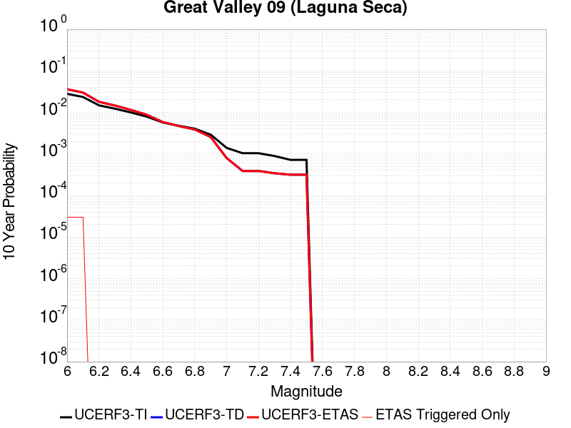 |

| Magnitude | 1 wk TI Prob | 1 wk TD Prob | 1 wk ETAS Prob | 1 wk ETAS/TD Gain | 1 wk ETAS Triggered Only | 1 mo TI Prob | 1 mo TD Prob | 1 mo ETAS Prob | 1 mo ETAS/TD Gain | 1 mo ETAS Triggered Only | 1 yr TI Prob | 1 yr TD Prob | 1 yr ETAS Prob | 1 yr ETAS/TD Gain | 1 yr ETAS Triggered Only | 10 yr TI Prob | 10 yr TD Prob | 10 yr ETAS Prob | 10 yr ETAS/TD Gain | 10 yr ETAS Triggered Only |
|-----|-----|-----|-----|-----|-----|-----|-----|-----|-----|-----|-----|-----|-----|-----|-----|-----|-----|-----|-----|-----|
| 6.0 | 5.4353277E-5 | 7.050019E-5 | 7.050019E-5 | 1.0 | 0.0 | 2.3292181E-4 | 3.0211007E-4 | 3.0211007E-4 | 1.0 | 0.0 | 0.0028321352 | 0.0036720056 | 0.0037018955 | 1.00814 | 3.0E-5 | 0.02796312 | 0.036115844 | 0.03614476 | 1.0008006 | 3.0E-5 |
| 6.1 | 4.5578287E-5 | 5.822054E-5 | 5.822054E-5 | 1.0 | 0.0 | 1.953209E-4 | 2.4949352E-4 | 2.4949352E-4 | 1.0 | 0.0 | 0.0023754383 | 0.0030333549 | 0.003063264 | 1.00986 | 3.0E-5 | 0.023502063 | 0.029919893 | 0.029948995 | 1.0009726 | 3.0E-5 |
| 6.2 | 2.8536782E-5 | 3.4736422E-5 | 3.4736422E-5 | 1.0 | 0.0 | 1.2229476E-4 | 1.4886161E-4 | 1.4886161E-4 | 1.0 | 0.0 | 0.0014879217 | 0.0018108576 | 0.0018108576 | 1.0 | 0.0 | 0.014779986 | 0.017958276 | 0.017958276 | 1.0 | 0.0 |
| 6.3 | 2.3698774E-5 | 2.8213344E-5 | 2.8213344E-5 | 1.0 | 0.0 | 1.01562226E-4 | 1.2090833E-4 | 1.2090833E-4 | 1.0 | 0.0 | 0.0012358186 | 0.001471051 | 0.001471051 | 1.0 | 0.0 | 0.012289686 | 0.014611455 | 0.014611455 | 1.0 | 0.0 |
| 6.4 | 1.9191197E-5 | 2.212289E-5 | 2.212289E-5 | 1.0 | 0.0 | 8.2245395E-5 | 9.4808805E-5 | 9.4808805E-5 | 1.0 | 0.0 | 0.0010008777 | 0.0011536906 | 0.0011536906 | 1.0 | 0.0 | 0.009963818 | 0.011477022 | 0.011477022 | 1.0 | 0.0 |
| 6.5 | 1.5203241E-5 | 1.6801298E-5 | 1.6801298E-5 | 1.0 | 0.0 | 6.5155116E-5 | 7.200338E-5 | 7.200338E-5 | 1.0 | 0.0 | 7.9297484E-4 | 8.76301E-4 | 8.76301E-4 | 1.0 | 0.0 | 0.007901512 | 0.008729581 | 0.008729581 | 1.0 | 0.0 |
| 6.6 | 1.0984925E-5 | 1.12425605E-5 | 1.12425605E-5 | 1.0 | 0.0 | 4.70774E-5 | 4.8181533E-5 | 4.8181533E-5 | 1.0 | 0.0 | 5.730166E-4 | 5.8645604E-4 | 5.8645604E-4 | 1.0 | 0.0 | 0.005715413 | 0.0058494755 | 0.0058494755 | 1.0 | 0.0 |
| 6.7 | 9.134616E-6 | 9.019868E-6 | 9.019868E-6 | 1.0 | 0.0 | 3.9147766E-5 | 3.865602E-5 | 3.865602E-5 | 1.0 | 0.0 | 4.7651984E-4 | 4.7053778E-4 | 4.7053778E-4 | 1.0 | 0.0 | 0.004754993 | 0.00469566 | 0.00469566 | 1.0 | 0.0 |
| 6.8 | 7.785589E-6 | 7.4519185E-6 | 7.4519185E-6 | 1.0 | 0.0 | 3.3366385E-5 | 3.1936415E-5 | 3.1936415E-5 | 1.0 | 0.0 | 4.0616E-4 | 3.887585E-4 | 3.887585E-4 | 1.0 | 0.0 | 0.0040541845 | 0.003880988 | 0.003880988 | 1.0 | 0.0 |
| 6.9 | 5.579095E-6 | 4.8984666E-6 | 4.8984666E-6 | 1.0 | 0.0 | 2.3910188E-5 | 2.0993268E-5 | 2.0993268E-5 | 1.0 | 0.0 | 2.9106764E-4 | 2.5556443E-4 | 2.5556443E-4 | 1.0 | 0.0 | 0.002906867 | 0.0025528427 | 0.0025528427 | 1.0 | 0.0 |
| 7.0 | 2.6816688E-6 | 1.521587E-6 | 1.521587E-6 | 1.0 | 0.0 | 1.1492816E-5 | 6.521071E-6 | 6.521071E-6 | 1.0 | 0.0 | 1.3991605E-4 | 7.939124E-5 | 7.939124E-5 | 1.0 | 0.0 | 0.0013982799 | 7.936375E-4 | 7.936375E-4 | 1.0 | 0.0 |
| 7.1 | 1.9951021E-6 | 7.45357E-7 | 7.45357E-7 | 1.0 | 0.0 | 8.55041E-6 | 3.1943835E-6 | 3.1943835E-6 | 1.0 | 0.0 | 1.0409627E-4 | 3.889097E-5 | 3.889097E-5 | 1.0 | 0.0 | 0.0010404752 | 3.8884574E-4 | 3.8884574E-4 | 1.0 | 0.0 |
| 7.2 | 1.9951021E-6 | 7.45357E-7 | 7.45357E-7 | 1.0 | 0.0 | 8.55041E-6 | 3.1943835E-6 | 3.1943835E-6 | 1.0 | 0.0 | 1.0409627E-4 | 3.889097E-5 | 3.889097E-5 | 1.0 | 0.0 | 0.0010404752 | 3.8884574E-4 | 3.8884574E-4 | 1.0 | 0.0 |
| 7.3 | 1.7087556E-6 | 6.578663E-7 | 6.578663E-7 | 1.0 | 0.0 | 7.3232177E-6 | 2.819424E-6 | 2.819424E-6 | 1.0 | 0.0 | 8.915652E-5 | 3.432599E-5 | 3.432599E-5 | 1.0 | 0.0 | 8.9120766E-4 | 3.432109E-4 | 3.432109E-4 | 1.0 | 0.0 |
| 7.4 | 1.3804846E-6 | 6.0737113E-7 | 6.0737113E-7 | 1.0 | 0.0 | 5.916349E-6 | 2.6030168E-6 | 2.6030168E-6 | 1.0 | 0.0 | 7.2029165E-5 | 3.169131E-5 | 3.169131E-5 | 1.0 | 0.0 | 7.200583E-4 | 3.168719E-4 | 3.168719E-4 | 1.0 | 0.0 |
| 7.5 | 1.3804846E-6 | 6.0737113E-7 | 6.0737113E-7 | 1.0 | 0.0 | 5.916349E-6 | 2.6030168E-6 | 2.6030168E-6 | 1.0 | 0.0 | 7.2029165E-5 | 3.169131E-5 | 3.169131E-5 | 1.0 | 0.0 | 7.200583E-4 | 3.168719E-4 | 3.168719E-4 | 1.0 | 0.0 |

## San Andreas (Santa Cruz Mts) 2011 CFM
*[(top)](#table-of-contents)*

| 1 Week | 1 Month | 1 Year | 10 Year |
|-----|-----|-----|-----|
|  |  | 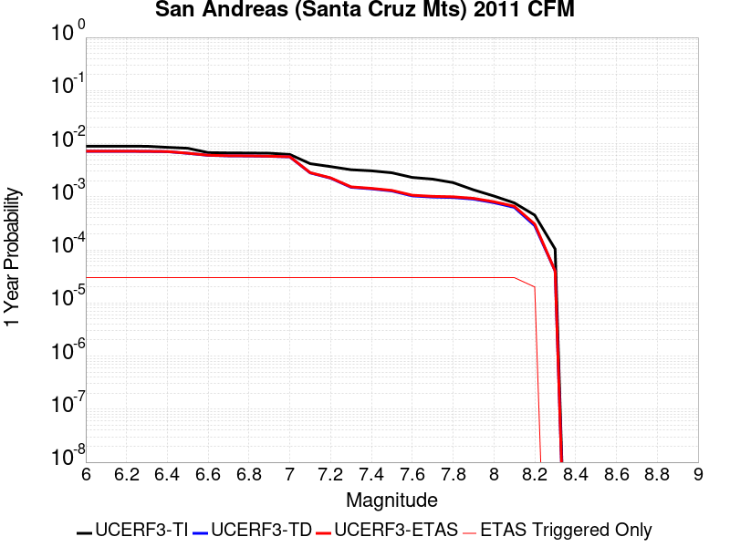 |  |

| Magnitude | 1 wk TI Prob | 1 wk TD Prob | 1 wk ETAS Prob | 1 wk ETAS/TD Gain | 1 wk ETAS Triggered Only | 1 mo TI Prob | 1 mo TD Prob | 1 mo ETAS Prob | 1 mo ETAS/TD Gain | 1 mo ETAS Triggered Only | 1 yr TI Prob | 1 yr TD Prob | 1 yr ETAS Prob | 1 yr ETAS/TD Gain | 1 yr ETAS Triggered Only | 10 yr TI Prob | 10 yr TD Prob | 10 yr ETAS Prob | 10 yr ETAS/TD Gain | 10 yr ETAS Triggered Only |
|-----|-----|-----|-----|-----|-----|-----|-----|-----|-----|-----|-----|-----|-----|-----|-----|-----|-----|-----|-----|-----|
| 6.0 | 1.7221631E-4 | 1.3792426E-4 | 1.4792288E-4 | 1.0724936 | 1.0E-5 | 7.378611E-4 | 5.9097214E-4 | 6.109603E-4 | 1.0338225 | 2.0E-5 | 0.008946515 | 0.0071717235 | 0.0072015086 | 1.0041531 | 3.0E-5 | 0.08594794 | 0.07054796 | 0.07058514 | 1.000527 | 4.0E-5 |
| 6.1 | 1.7221631E-4 | 1.3792426E-4 | 1.4792288E-4 | 1.0724936 | 1.0E-5 | 7.378611E-4 | 5.9097214E-4 | 6.109603E-4 | 1.0338225 | 2.0E-5 | 0.008946515 | 0.0071717235 | 0.0072015086 | 1.0041531 | 3.0E-5 | 0.08594794 | 0.07054796 | 0.07058514 | 1.000527 | 4.0E-5 |
| 6.2 | 1.7221631E-4 | 1.3792426E-4 | 1.4792288E-4 | 1.0724936 | 1.0E-5 | 7.378611E-4 | 5.9097214E-4 | 6.109603E-4 | 1.0338225 | 2.0E-5 | 0.008946515 | 0.0071717235 | 0.0072015086 | 1.0041531 | 3.0E-5 | 0.08594794 | 0.07054796 | 0.07058514 | 1.000527 | 4.0E-5 |
| 6.3 | 1.716926E-4 | 1.3711878E-4 | 1.4711742E-4 | 1.0729195 | 1.0E-5 | 7.3561794E-4 | 5.8752164E-4 | 6.075099E-4 | 1.0340213 | 2.0E-5 | 0.008919428 | 0.007129989 | 0.0071597756 | 1.0041776 | 3.0E-5 | 0.08569809 | 0.07015993 | 0.07019712 | 1.0005301 | 4.0E-5 |
| 6.4 | 1.6392978E-4 | 1.3587909E-4 | 1.4587774E-4 | 1.0735848 | 1.0E-5 | 7.02367E-4 | 5.82211E-4 | 6.021994E-4 | 1.0343318 | 2.0E-5 | 0.008517839 | 0.0070657525 | 0.0070955404 | 1.0042158 | 3.0E-5 | 0.08198654 | 0.069394976 | 0.0694322 | 1.0005364 | 4.0E-5 |
| 6.5 | 1.5742714E-4 | 1.2647794E-4 | 1.3647668E-4 | 1.0790552 | 1.0E-5 | 6.745133E-4 | 5.419374E-4 | 5.6192663E-4 | 1.0368847 | 2.0E-5 | 0.00818132 | 0.0065784375 | 0.0066082403 | 1.0045303 | 3.0E-5 | 0.078865945 | 0.06486093 | 0.064898334 | 1.0005767 | 4.0E-5 |
| 6.6 | 1.3038084E-4 | 1.1587992E-4 | 1.2587877E-4 | 1.0862862 | 1.0E-5 | 5.5865536E-4 | 4.96535E-4 | 5.1652506E-4 | 1.0402591 | 2.0E-5 | 0.006780438 | 0.006028784 | 0.0060586035 | 1.0049461 | 3.0E-5 | 0.0657725 | 0.059330538 | 0.059368163 | 1.0006342 | 4.0E-5 |
| 6.7 | 1.2867592E-4 | 1.1314491E-4 | 1.2314378E-4 | 1.0883722 | 1.0E-5 | 5.5135164E-4 | 4.8481792E-4 | 5.048082E-4 | 1.0412326 | 2.0E-5 | 0.0066920654 | 0.005886907 | 0.0059167305 | 1.005066 | 3.0E-5 | 0.06494093 | 0.058041416 | 0.058079094 | 1.0006492 | 4.0E-5 |
| 6.8 | 1.2801298E-4 | 1.12520516E-4 | 1.2251938E-4 | 1.0888627 | 1.0E-5 | 5.485117E-4 | 4.8214293E-4 | 5.021333E-4 | 1.0414615 | 2.0E-5 | 0.0066577005 | 0.0058545293 | 0.005884354 | 1.0050943 | 3.0E-5 | 0.06461738 | 0.05775524 | 0.05779293 | 1.0006526 | 4.0E-5 |
| 6.9 | 1.269149E-4 | 1.1094256E-4 | 1.2094145E-4 | 1.0901268 | 1.0E-5 | 5.4380763E-4 | 4.7538272E-4 | 4.953732E-4 | 1.0420513 | 2.0E-5 | 0.006600777 | 0.005772663 | 0.00580249 | 1.0051669 | 3.0E-5 | 0.06408122 | 0.057027116 | 0.057064835 | 1.0006614 | 4.0E-5 |
| 7.0 | 1.2030331E-4 | 1.0824356E-4 | 1.1824248E-4 | 1.0923742 | 1.0E-5 | 5.154837E-4 | 4.638198E-4 | 4.8381052E-4 | 1.0431002 | 2.0E-5 | 0.006257969 | 0.0056326203 | 0.005662451 | 1.0052961 | 3.0E-5 | 0.06084648 | 0.055699922 | 0.055737697 | 1.0006782 | 4.0E-5 |
| 7.1 | 8.049617E-5 | 5.392429E-5 | 6.392375E-5 | 1.1854352 | 1.0E-5 | 3.4493793E-4 | 2.3108382E-4 | 2.510792E-4 | 1.0865287 | 2.0E-5 | 0.0041915346 | 0.0028098505 | 0.0028397662 | 1.0106467 | 3.0E-5 | 0.041133516 | 0.029618833 | 0.029657647 | 1.0013105 | 4.0E-5 |
| 7.2 | 7.093979E-5 | 4.2935415E-5 | 5.2934985E-5 | 1.232898 | 1.0E-5 | 3.0399222E-4 | 1.8399608E-4 | 2.0399239E-4 | 1.108678 | 2.0E-5 | 0.0036948253 | 0.0022378736 | 0.0022678063 | 1.0133756 | 3.0E-5 | 0.03633994 | 0.023941126 | 0.023980169 | 1.0016308 | 4.0E-5 |
| 7.3 | 6.193693E-5 | 2.8891074E-5 | 3.8890787E-5 | 1.3461176 | 1.0E-5 | 2.6541698E-4 | 1.2381302E-4 | 1.4381054E-4 | 1.1615139 | 2.0E-5 | 0.0032266637 | 0.001506383 | 0.0015363378 | 1.0198853 | 3.0E-5 | 0.031802133 | 0.016497677 | 0.016537018 | 1.0023845 | 4.0E-5 |
| 7.4 | 5.906492E-5 | 2.7020369E-5 | 3.7020098E-5 | 1.3700812 | 1.0E-5 | 2.5311083E-4 | 1.1579645E-4 | 1.3579414E-4 | 1.1726968 | 2.0E-5 | 0.0030772698 | 0.0014089114 | 0.0014388692 | 1.021263 | 3.0E-5 | 0.030350044 | 0.0154695045 | 0.0155088855 | 1.0025457 | 4.0E-5 |
| 7.5 | 5.424296E-5 | 2.4675093E-5 | 3.4674846E-5 | 1.405257 | 1.0E-5 | 2.324491E-4 | 1.0574612E-4 | 1.25744E-4 | 1.1891122 | 2.0E-5 | 0.002826395 | 0.0012866998 | 0.0013166612 | 1.0232855 | 3.0E-5 | 0.027907165 | 0.014161854 | 0.014201287 | 1.0027845 | 4.0E-5 |
| 7.6 | 4.43084E-5 | 1.990151E-5 | 2.9901312E-5 | 1.5024644 | 1.0E-5 | 1.8987931E-4 | 8.528939E-5 | 1.0528769E-4 | 1.2344757 | 2.0E-5 | 0.0023093296 | 0.001037904 | 0.0010678729 | 1.0288744 | 3.0E-5 | 0.022854783 | 0.011411123 | 0.011450667 | 1.0034653 | 4.0E-5 |
| 7.7 | 4.118098E-5 | 1.8933848E-5 | 2.8933659E-5 | 1.5281447 | 1.0E-5 | 1.7647797E-4 | 8.1142534E-5 | 1.0114091E-4 | 1.2464598 | 2.0E-5 | 0.002146502 | 9.874629E-4 | 0.0010174332 | 1.0303509 | 3.0E-5 | 0.021258866 | 0.010868995 | 0.010908561 | 1.0036402 | 4.0E-5 |
| 7.8 | 3.5408906E-5 | 1.856201E-5 | 2.8561824E-5 | 1.5387248 | 1.0E-5 | 1.5174363E-4 | 7.954905E-5 | 9.9547455E-5 | 1.2513973 | 2.0E-5 | 0.0018459131 | 9.6807955E-4 | 9.980506E-4 | 1.0309591 | 3.0E-5 | 0.018306552 | 0.0106506655 | 0.010690239 | 1.0037156 | 4.0E-5 |
| 7.9 | 2.5860836E-5 | 1.7313954E-5 | 2.7313781E-5 | 1.5775588 | 1.0E-5 | 1.10827445E-4 | 7.420055E-5 | 9.4199066E-5 | 1.2695198 | 2.0E-5 | 0.001348489 | 9.030175E-4 | 9.3299046E-4 | 1.0331919 | 3.0E-5 | 0.013403354 | 0.009906601 | 0.009946205 | 1.0039977 | 4.0E-5 |
| 8.0 | 1.9777332E-5 | 1.4837888E-5 | 2.4837738E-5 | 1.6739404 | 1.0E-5 | 8.4757245E-5 | 6.3589396E-5 | 8.358812E-5 | 1.3144978 | 2.0E-5 | 0.0010314309 | 7.739261E-4 | 8.0390286E-4 | 1.0387334 | 3.0E-5 | 0.010266567 | 0.008508087 | 0.008547747 | 1.0046614 | 4.0E-5 |
| 8.1 | 1.468494E-5 | 1.2105831E-5 | 2.210571E-5 | 1.8260382 | 1.0E-5 | 6.293394E-5 | 5.1881103E-5 | 7.1880066E-5 | 1.3854768 | 2.0E-5 | 7.6595135E-4 | 6.3146953E-4 | 6.614506E-4 | 1.0474782 | 3.0E-5 | 0.0076331664 | 0.0069684954 | 0.007008217 | 1.0057001 | 4.0E-5 |
| 8.2 | 8.63836E-6 | 5.4678667E-6 | 5.4678667E-6 | 1.0 | 0.0 | 3.7021015E-5 | 2.3433504E-5 | 3.343327E-5 | 1.4267294 | 1.0E-5 | 4.5063766E-4 | 2.8526565E-4 | 3.0525995E-4 | 1.07009 | 2.0E-5 | 0.004497249 | 0.003245162 | 0.0032650973 | 1.006143 | 2.0E-5 |
| 8.3 | 1.983087E-6 | 7.6564595E-7 | 7.6564595E-7 | 1.0 | 0.0 | 8.498917E-6 | 3.281336E-6 | 3.281336E-6 | 1.0 | 0.0 | 1.034694E-4 | 3.9949547E-5 | 3.9949547E-5 | 1.0 | 0.0 | 0.0010342124 | 4.717979E-4 | 4.717979E-4 | 1.0 | 0.0 |

## Hosgri
*[(top)](#table-of-contents)*

| 1 Week | 1 Month | 1 Year | 10 Year |
|-----|-----|-----|-----|
|  |  |  |  |

| Magnitude | 1 wk TI Prob | 1 wk TD Prob | 1 wk ETAS Prob | 1 wk ETAS/TD Gain | 1 wk ETAS Triggered Only | 1 mo TI Prob | 1 mo TD Prob | 1 mo ETAS Prob | 1 mo ETAS/TD Gain | 1 mo ETAS Triggered Only | 1 yr TI Prob | 1 yr TD Prob | 1 yr ETAS Prob | 1 yr ETAS/TD Gain | 1 yr ETAS Triggered Only | 10 yr TI Prob | 10 yr TD Prob | 10 yr ETAS Prob | 10 yr ETAS/TD Gain | 10 yr ETAS Triggered Only |
|-----|-----|-----|-----|-----|-----|-----|-----|-----|-----|-----|-----|-----|-----|-----|-----|-----|-----|-----|-----|-----|
| 6.0 | 2.883978E-5 | 2.9128403E-5 | 5.9127527E-5 | 2.0298927 | 3.0E-5 | 1.235932E-4 | 1.248302E-4 | 1.5482646E-4 | 1.2402965 | 3.0E-5 | 0.0015037085 | 0.0015187752 | 0.0015587145 | 1.026297 | 4.0E-5 | 0.01493574 | 0.01508773 | 0.015127126 | 1.0026112 | 4.0E-5 |
| 6.1 | 2.883978E-5 | 2.9128403E-5 | 5.9127527E-5 | 2.0298927 | 3.0E-5 | 1.235932E-4 | 1.248302E-4 | 1.5482646E-4 | 1.2402965 | 3.0E-5 | 0.0015037085 | 0.0015187752 | 0.0015587145 | 1.026297 | 4.0E-5 | 0.01493574 | 0.01508773 | 0.015127126 | 1.0026112 | 4.0E-5 |
| 6.2 | 2.883978E-5 | 2.9128403E-5 | 5.9127527E-5 | 2.0298927 | 3.0E-5 | 1.235932E-4 | 1.248302E-4 | 1.5482646E-4 | 1.2402965 | 3.0E-5 | 0.0015037085 | 0.0015187752 | 0.0015587145 | 1.026297 | 4.0E-5 | 0.01493574 | 0.01508773 | 0.015127126 | 1.0026112 | 4.0E-5 |
| 6.3 | 2.2914428E-5 | 2.2641956E-5 | 5.2641277E-5 | 2.3249438 | 3.0E-5 | 9.8200995E-5 | 9.703337E-5 | 1.2703046E-4 | 1.309142 | 3.0E-5 | 0.0011949413 | 0.001180746 | 0.0012206988 | 1.0338368 | 4.0E-5 | 0.011885363 | 0.011746123 | 0.011785653 | 1.0033654 | 4.0E-5 |
| 6.4 | 2.0195741E-5 | 1.9696547E-5 | 3.9696155E-5 | 2.0153863 | 2.0E-5 | 8.65503E-5 | 8.4411055E-5 | 1.04409366E-4 | 1.2369158 | 2.0E-5 | 0.0010532405 | 0.001027222 | 0.0010472015 | 1.01945 | 2.0E-5 | 0.010482626 | 0.010225783 | 0.010245578 | 1.0019358 | 2.0E-5 |
| 6.5 | 1.9924333E-5 | 1.9408968E-5 | 3.940858E-5 | 2.0304315 | 2.0E-5 | 8.53872E-5 | 8.317865E-5 | 1.03176986E-4 | 1.2404263 | 2.0E-5 | 0.0010390934 | 0.0010122315 | 0.0010322112 | 1.0197383 | 2.0E-5 | 0.010342481 | 0.010077244 | 0.010097042 | 1.0019647 | 2.0E-5 |
| 6.6 | 1.809694E-5 | 1.7458287E-5 | 3.745794E-5 | 2.1455677 | 2.0E-5 | 7.7556004E-5 | 7.4819094E-5 | 9.4817595E-5 | 1.2672914 | 2.0E-5 | 9.438353E-4 | 9.105431E-4 | 9.3052484E-4 | 1.0219449 | 2.0E-5 | 0.009398366 | 0.009069063 | 0.009088881 | 1.0021853 | 2.0E-5 |
| 6.7 | 1.675989E-5 | 1.6042752E-5 | 3.604243E-5 | 2.246649 | 2.0E-5 | 7.182612E-5 | 6.8752845E-5 | 8.875147E-5 | 1.2908771 | 2.0E-5 | 8.7413215E-4 | 8.3674554E-4 | 8.567288E-4 | 1.0238822 | 2.0E-5 | 0.008707017 | 0.008336853 | 0.008356687 | 1.002379 | 2.0E-5 |
| 6.8 | 1.5401129E-5 | 1.4614069E-5 | 3.461378E-5 | 2.3685243 | 2.0E-5 | 6.6003166E-5 | 6.263023E-5 | 8.2628976E-5 | 1.3193146 | 2.0E-5 | 8.032922E-4 | 7.6225714E-4 | 7.8224187E-4 | 1.0262178 | 2.0E-5 | 0.008003947 | 0.0075972863 | 0.0076171346 | 1.0026125 | 2.0E-5 |
| 6.9 | 1.356559E-5 | 1.2689955E-5 | 2.2689828E-5 | 1.7880149 | 1.0E-5 | 5.8136946E-5 | 5.438439E-5 | 6.438384E-5 | 1.1838663 | 1.0E-5 | 7.0758746E-4 | 6.6192925E-4 | 6.7192264E-4 | 1.0150974 | 1.0E-5 | 0.007053386 | 0.006600378 | 0.006610312 | 1.001505 | 1.0E-5 |
| 7.0 | 1.2030819E-5 | 1.1095949E-5 | 2.1095839E-5 | 1.9012198 | 1.0E-5 | 5.155963E-5 | 4.75532E-5 | 5.7552727E-5 | 1.2102808 | 1.0E-5 | 6.275577E-4 | 5.788065E-4 | 5.8880076E-4 | 1.017267 | 1.0E-5 | 0.006257884 | 0.0057737473 | 0.0057836897 | 1.001722 | 1.0E-5 |
| 7.1 | 1.0972698E-5 | 1.0022167E-5 | 2.0022067E-5 | 1.9977782 | 1.0E-5 | 4.7025E-5 | 4.2951437E-5 | 5.2951007E-5 | 1.2328111 | 1.0E-5 | 5.72379E-4 | 5.2280835E-4 | 5.328031E-4 | 1.0191175 | 1.0E-5 | 0.0057090693 | 0.005216533 | 0.005226481 | 1.001907 | 1.0E-5 |
| 7.2 | 9.961926E-6 | 9.034732E-6 | 1.9034642E-5 | 2.1068296 | 1.0E-5 | 4.2693267E-5 | 3.8719707E-5 | 4.871932E-5 | 1.2582564 | 1.0E-5 | 5.1966653E-4 | 4.7131052E-4 | 4.8130582E-4 | 1.0212075 | 1.0E-5 | 0.00518453 | 0.0047038523 | 0.0047138054 | 1.002116 | 1.0E-5 |
| 7.3 | 8.700929E-6 | 7.828089E-6 | 1.782801E-5 | 2.277441 | 1.0E-5 | 3.7289166E-5 | 3.354852E-5 | 4.3548185E-5 | 1.2980658 | 1.0E-5 | 4.53901E-4 | 4.083767E-4 | 4.1837263E-4 | 1.0244772 | 1.0E-5 | 0.00452975 | 0.004076999 | 0.0040869582 | 1.0024428 | 1.0E-5 |
| 7.4 | 7.866285E-6 | 6.9987263E-6 | 1.6998656E-5 | 2.4288213 | 1.0E-5 | 3.3712215E-5 | 2.9994197E-5 | 3.9993898E-5 | 1.3333879 | 1.0E-5 | 4.103689E-4 | 3.6511818E-4 | 3.7511453E-4 | 1.0273784 | 1.0E-5 | 0.004096119 | 0.0036459167 | 0.0036558805 | 1.0027328 | 1.0E-5 |
| 7.5 | 6.8381305E-6 | 5.9596814E-6 | 5.9596814E-6 | 1.0 | 0.0 | 2.9305946E-5 | 2.5541241E-5 | 2.5541241E-5 | 1.0 | 0.0 | 3.5674145E-4 | 3.1092027E-4 | 3.1092027E-4 | 1.0 | 0.0 | 0.0035616932 | 0.003105584 | 0.003105584 | 1.0 | 0.0 |
| 7.6 | 5.503376E-6 | 4.595227E-6 | 4.595227E-6 | 1.0 | 0.0 | 2.3585684E-5 | 1.9693682E-5 | 1.9693682E-5 | 1.0 | 0.0 | 2.8711787E-4 | 2.397442E-4 | 2.397442E-4 | 1.0 | 0.0 | 0.002867472 | 0.0023955852 | 0.0023955852 | 1.0 | 0.0 |
| 7.7 | 3.6144982E-6 | 2.6521896E-6 | 2.6521896E-6 | 1.0 | 0.0 | 1.5490614E-5 | 1.1366477E-5 | 1.1366477E-5 | 1.0 | 0.0 | 1.8858191E-4 | 1.3837808E-4 | 1.3837808E-4 | 1.0 | 0.0 | 0.0018842196 | 0.001383647 | 0.001383647 | 1.0 | 0.0 |
| 7.8 | 1.9853494E-6 | 1.1360784E-6 | 1.1360784E-6 | 1.0 | 0.0 | 8.508612E-6 | 4.8688985E-6 | 4.8688985E-6 | 1.0 | 0.0 | 1.0358743E-4 | 5.9277223E-5 | 5.9277223E-5 | 1.0 | 0.0 | 0.0010353916 | 5.933389E-4 | 5.933389E-4 | 1.0 | 0.0 |
| 7.9 | 1.1818757E-6 | 5.29477E-7 | 5.29477E-7 | 1.0 | 0.0 | 5.0651715E-6 | 2.269185E-6 | 2.269185E-6 | 1.0 | 0.0 | 6.1666724E-5 | 2.7626977E-5 | 2.7626977E-5 | 1.0 | 0.0 | 6.1649614E-4 | 2.7691363E-4 | 2.7691363E-4 | 1.0 | 0.0 |
| 8.0 | 6.962958E-7 | 2.71365E-7 | 2.71365E-7 | 1.0 | 0.0 | 2.9841215E-6 | 1.1629924E-6 | 1.1629924E-6 | 1.0 | 0.0 | 3.6331072E-5 | 1.415934E-5 | 1.415934E-5 | 1.0 | 0.0 | 3.6325134E-4 | 1.4215276E-4 | 1.4215276E-4 | 1.0 | 0.0 |
| 8.1 | 1.5033264E-7 | 6.52693E-8 | 6.52693E-8 | 1.0 | 0.0 | 6.442826E-7 | 2.7972553E-7 | 2.7972553E-7 | 1.0 | 0.0 | 7.844113E-6 | 3.4056532E-6 | 3.4056532E-6 | 1.0 | 0.0 | 7.843835E-5 | 3.4072833E-5 | 3.4072833E-5 | 1.0 | 0.0 |

## Rinconada 2011 CFM
*[(top)](#table-of-contents)*

| 1 Week | 1 Month | 1 Year | 10 Year |
|-----|-----|-----|-----|
|  | 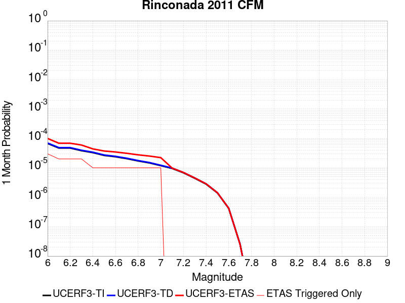 |  |  |

| Magnitude | 1 wk TI Prob | 1 wk TD Prob | 1 wk ETAS Prob | 1 wk ETAS/TD Gain | 1 wk ETAS Triggered Only | 1 mo TI Prob | 1 mo TD Prob | 1 mo ETAS Prob | 1 mo ETAS/TD Gain | 1 mo ETAS Triggered Only | 1 yr TI Prob | 1 yr TD Prob | 1 yr ETAS Prob | 1 yr ETAS/TD Gain | 1 yr ETAS Triggered Only | 10 yr TI Prob | 10 yr TD Prob | 10 yr ETAS Prob | 10 yr ETAS/TD Gain | 10 yr ETAS Triggered Only |
|-----|-----|-----|-----|-----|-----|-----|-----|-----|-----|-----|-----|-----|-----|-----|-----|-----|-----|-----|-----|-----|
| 6.0 | 1.5752368E-5 | 1.6274716E-5 | 2.6274553E-5 | 1.6144401 | 1.0E-5 | 6.75084E-5 | 6.974694E-5 | 9.9744844E-5 | 1.4300964 | 3.0E-5 | 8.2160486E-4 | 8.488413E-4 | 8.888073E-4 | 1.047083 | 4.0E-5 | 0.008185739 | 0.00845637 | 0.008496032 | 1.0046902 | 4.0E-5 |
| 6.1 | 1.0966133E-5 | 1.1323029E-5 | 2.1322916E-5 | 1.8831459 | 1.0E-5 | 4.6996865E-5 | 4.852637E-5 | 6.85254E-5 | 1.412127 | 2.0E-5 | 5.720366E-4 | 5.9064914E-4 | 6.106373E-4 | 1.033841 | 2.0E-5 | 0.0057056635 | 0.005890889 | 0.005910771 | 1.003375 | 2.0E-5 |
| 6.2 | 1.0966133E-5 | 1.1323029E-5 | 2.1322916E-5 | 1.8831459 | 1.0E-5 | 4.6996865E-5 | 4.852637E-5 | 6.85254E-5 | 1.412127 | 2.0E-5 | 5.720366E-4 | 5.9064914E-4 | 6.106373E-4 | 1.033841 | 2.0E-5 | 0.0057056635 | 0.005890889 | 0.005910771 | 1.003375 | 2.0E-5 |
| 6.3 | 8.926149E-6 | 9.212772E-6 | 1.9212679E-5 | 2.0854397 | 1.0E-5 | 3.8254362E-5 | 3.948271E-5 | 5.948192E-5 | 1.5065308 | 2.0E-5 | 4.6564735E-4 | 4.8059633E-4 | 5.005867E-4 | 1.041595 | 2.0E-5 | 0.0046467283 | 0.0047956146 | 0.004815519 | 1.0041505 | 2.0E-5 |
| 6.4 | 7.676955E-6 | 7.920191E-6 | 1.7920112E-5 | 2.2625859 | 1.0E-5 | 3.290082E-5 | 3.3943234E-5 | 4.3942895E-5 | 1.2945995 | 1.0E-5 | 4.0049385E-4 | 4.131807E-4 | 4.2317656E-4 | 1.0241925 | 1.0E-5 | 0.0039977287 | 0.004124151 | 0.00413411 | 1.0024147 | 1.0E-5 |
| 6.5 | 6.1671026E-6 | 6.358955E-6 | 1.6358892E-5 | 2.5725753 | 1.0E-5 | 2.6430173E-5 | 2.725238E-5 | 3.7252106E-5 | 1.3669305 | 1.0E-5 | 3.2173982E-4 | 3.317473E-4 | 3.4174396E-4 | 1.0301335 | 1.0E-5 | 0.003212744 | 0.0033125326 | 0.0033224996 | 1.0030088 | 1.0E-5 |
| 6.6 | 5.553456E-6 | 5.7248126E-6 | 1.5724756E-5 | 2.746772 | 1.0E-5 | 2.3800309E-5 | 2.4534682E-5 | 3.4534438E-5 | 1.4075763 | 1.0E-5 | 2.897302E-4 | 2.9866886E-4 | 3.0866588E-4 | 1.033472 | 1.0E-5 | 0.0028935277 | 0.0029826832 | 0.0029926535 | 1.0033426 | 1.0E-5 |
| 6.7 | 4.787857E-6 | 4.93331E-6 | 1.493326E-5 | 3.0270267 | 1.0E-5 | 2.0519226E-5 | 2.1142585E-5 | 3.1142372E-5 | 1.472969 | 1.0E-5 | 2.4979294E-4 | 2.573806E-4 | 2.6737803E-4 | 1.0388429 | 1.0E-5 | 0.0024951235 | 0.002570831 | 0.0025808052 | 1.0038798 | 1.0E-5 |
| 6.8 | 3.9955166E-6 | 4.1134763E-6 | 1.4113435E-5 | 3.4310238 | 1.0E-5 | 1.7123532E-5 | 1.7629065E-5 | 2.7628888E-5 | 1.567235 | 1.0E-5 | 2.0845905E-4 | 2.1461275E-4 | 2.2461062E-4 | 1.0465856 | 1.0E-5 | 0.002082636 | 0.0021440587 | 0.0021540371 | 1.004654 | 1.0E-5 |
| 6.9 | 3.4250072E-6 | 3.5224466E-6 | 1.3522412E-5 | 3.8389258 | 1.0E-5 | 1.46785205E-5 | 1.5096112E-5 | 2.5095962E-5 | 1.6624122 | 1.0E-5 | 1.7869633E-4 | 1.8377969E-4 | 1.9377784E-4 | 1.054403 | 1.0E-5 | 0.001785527 | 0.0018362795 | 0.0018462611 | 1.0054358 | 1.0E-5 |
| 7.0 | 2.7712713E-6 | 2.8467002E-6 | 1.2846672E-5 | 4.5128293 | 1.0E-5 | 1.1876823E-5 | 1.22000865E-5 | 2.2199965E-5 | 1.8196563 | 1.0E-5 | 1.4459073E-4 | 1.4852594E-4 | 1.5852446E-4 | 1.0673183 | 1.0E-5 | 0.0014449668 | 0.0014842683 | 0.0014942535 | 1.0067273 | 1.0E-5 |
| 7.1 | 2.227358E-6 | 2.2856987E-6 | 2.2856987E-6 | 1.0 | 0.0 | 9.545785E-6 | 9.795815E-6 | 9.795815E-6 | 1.0 | 0.0 | 1.16213734E-4 | 1.1925753E-4 | 1.1925753E-4 | 1.0 | 0.0 | 0.0011615298 | 0.0011919363 | 0.0011919363 | 1.0 | 0.0 |
| 7.2 | 1.581796E-6 | 1.6209015E-6 | 1.6209015E-6 | 1.0 | 0.0 | 6.779108E-6 | 6.946702E-6 | 6.946702E-6 | 1.0 | 0.0 | 8.253252E-5 | 8.4572814E-5 | 8.4572814E-5 | 1.0 | 0.0 | 8.250187E-4 | 8.4540684E-4 | 8.4540684E-4 | 1.0 | 0.0 |
| 7.3 | 1.0306567E-6 | 1.054648E-6 | 1.054648E-6 | 1.0 | 0.0 | 4.4170924E-6 | 4.519912E-6 | 4.519912E-6 | 1.0 | 0.0 | 5.3776774E-5 | 5.502854E-5 | 5.502854E-5 | 1.0 | 0.0 | 5.376376E-4 | 5.501494E-4 | 5.501494E-4 | 1.0 | 0.0 |
| 7.4 | 6.535541E-7 | 6.682744E-7 | 6.682744E-7 | 1.0 | 0.0 | 2.800943E-6 | 2.8640302E-6 | 2.8640302E-6 | 1.0 | 0.0 | 3.4100947E-5 | 3.4869012E-5 | 3.4869012E-5 | 1.0 | 0.0 | 3.4095717E-4 | 3.486355E-4 | 3.486355E-4 | 1.0 | 0.0 |
| 7.5 | 3.2656962E-7 | 3.3316712E-7 | 3.3316712E-7 | 1.0 | 0.0 | 1.3995833E-6 | 1.4278584E-6 | 1.4278584E-6 | 1.0 | 0.0 | 1.7039794E-5 | 1.7384036E-5 | 1.7384036E-5 | 1.0 | 0.0 | 1.7038487E-4 | 1.738268E-4 | 1.738268E-4 | 1.0 | 0.0 |
| 7.6 | 9.754343E-8 | 9.821017E-8 | 9.821017E-8 | 1.0 | 0.0 | 4.180432E-7 | 4.2090065E-7 | 4.2090065E-7 | 1.0 | 0.0 | 5.089664E-6 | 5.1244533E-6 | 5.1244533E-6 | 1.0 | 0.0 | 5.0895473E-5 | 5.124336E-5 | 5.124336E-5 | 1.0 | 0.0 |
| 7.7 | 6.0001453E-9 | 5.8491207E-9 | 5.8491207E-9 | 1.0 | 0.0 | 2.5714908E-8 | 2.506766E-8 | 2.506766E-8 | 1.0 | 0.0 | 3.1307894E-7 | 3.051987E-7 | 3.051987E-7 | 1.0 | 0.0 | 3.1307852E-6 | 3.0519832E-6 | 3.0519832E-6 | 1.0 | 0.0 |
| 7.8 | 7.400003E-11 | 7.4654505E-11 | 7.4654505E-11 | 1.0 | 0.0 | 3.171432E-10 | 3.1994773E-10 | 3.1994773E-10 | 1.0 | 0.0 | 3.861218E-9 | 3.895363E-9 | 3.895363E-9 | 1.0 | 0.0 | 3.861218E-8 | 3.895363E-8 | 3.895363E-8 | 1.0 | 0.0 |

## Tin Mountain
*[(top)](#table-of-contents)*

| 1 Week | 1 Month | 1 Year | 10 Year |
|-----|-----|-----|-----|
| 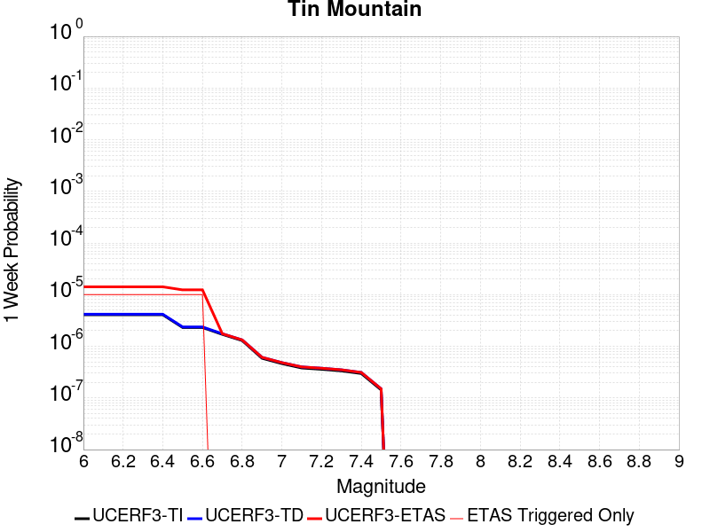 |  | 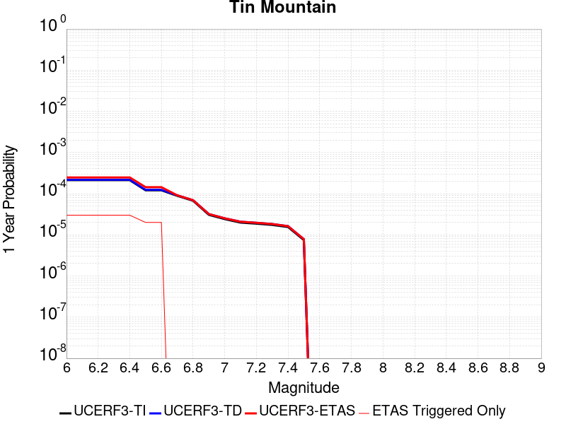 |  |

| Magnitude | 1 wk TI Prob | 1 wk TD Prob | 1 wk ETAS Prob | 1 wk ETAS/TD Gain | 1 wk ETAS Triggered Only | 1 mo TI Prob | 1 mo TD Prob | 1 mo ETAS Prob | 1 mo ETAS/TD Gain | 1 mo ETAS Triggered Only | 1 yr TI Prob | 1 yr TD Prob | 1 yr ETAS Prob | 1 yr ETAS/TD Gain | 1 yr ETAS Triggered Only | 10 yr TI Prob | 10 yr TD Prob | 10 yr ETAS Prob | 10 yr ETAS/TD Gain | 10 yr ETAS Triggered Only |
|-----|-----|-----|-----|-----|-----|-----|-----|-----|-----|-----|-----|-----|-----|-----|-----|-----|-----|-----|-----|-----|
| 6.0 | 4.083776E-6 | 4.1815365E-6 | 1.4181494E-5 | 3.3914554 | 1.0E-5 | 1.750178E-5 | 1.792077E-5 | 2.792059E-5 | 1.5580018 | 1.0E-5 | 2.1306332E-4 | 2.1816725E-4 | 2.481607E-4 | 1.1374792 | 3.0E-5 | 0.0021285915 | 0.0021798965 | 0.0022198092 | 1.0183095 | 4.0E-5 |
| 6.1 | 4.083776E-6 | 4.1815365E-6 | 1.4181494E-5 | 3.3914554 | 1.0E-5 | 1.750178E-5 | 1.792077E-5 | 2.792059E-5 | 1.5580018 | 1.0E-5 | 2.1306332E-4 | 2.1816725E-4 | 2.481607E-4 | 1.1374792 | 3.0E-5 | 0.0021285915 | 0.0021798965 | 0.0022198092 | 1.0183095 | 4.0E-5 |
| 6.2 | 4.083776E-6 | 4.1815365E-6 | 1.4181494E-5 | 3.3914554 | 1.0E-5 | 1.750178E-5 | 1.792077E-5 | 2.792059E-5 | 1.5580018 | 1.0E-5 | 2.1306332E-4 | 2.1816725E-4 | 2.481607E-4 | 1.1374792 | 3.0E-5 | 0.0021285915 | 0.0021798965 | 0.0022198092 | 1.0183095 | 4.0E-5 |
| 6.3 | 4.083776E-6 | 4.1815365E-6 | 1.4181494E-5 | 3.3914554 | 1.0E-5 | 1.750178E-5 | 1.792077E-5 | 2.792059E-5 | 1.5580018 | 1.0E-5 | 2.1306332E-4 | 2.1816725E-4 | 2.481607E-4 | 1.1374792 | 3.0E-5 | 0.0021285915 | 0.0021798965 | 0.0022198092 | 1.0183095 | 4.0E-5 |
| 6.4 | 4.083776E-6 | 4.1815365E-6 | 1.4181494E-5 | 3.3914554 | 1.0E-5 | 1.750178E-5 | 1.792077E-5 | 2.792059E-5 | 1.5580018 | 1.0E-5 | 2.1306332E-4 | 2.1816725E-4 | 2.481607E-4 | 1.1374792 | 3.0E-5 | 0.0021285915 | 0.0021798965 | 0.0022198092 | 1.0183095 | 4.0E-5 |
| 6.5 | 2.3143427E-6 | 2.3731573E-6 | 1.2373133E-5 | 5.213786 | 1.0E-5 | 9.9185745E-6 | 1.0170638E-5 | 2.0170537E-5 | 1.9832125 | 1.0E-5 | 1.2075195E-4 | 1.2382126E-4 | 1.4381878E-4 | 1.1615032 | 2.0E-5 | 0.0012068636 | 0.0012375986 | 0.0012575738 | 1.0161403 | 2.0E-5 |
| 6.6 | 2.3143427E-6 | 2.3731573E-6 | 1.2373133E-5 | 5.213786 | 1.0E-5 | 9.9185745E-6 | 1.0170638E-5 | 2.0170537E-5 | 1.9832125 | 1.0E-5 | 1.2075195E-4 | 1.2382126E-4 | 1.4381878E-4 | 1.1615032 | 2.0E-5 | 0.0012068636 | 0.0012375986 | 0.0012575738 | 1.0161403 | 2.0E-5 |
| 6.7 | 1.7029532E-6 | 1.7497915E-6 | 1.7497915E-6 | 1.0 | 0.0 | 7.2983503E-6 | 7.499088E-6 | 7.499088E-6 | 1.0 | 0.0 | 8.885379E-5 | 9.1298105E-5 | 9.1298105E-5 | 1.0 | 0.0 | 8.881827E-4 | 9.1265864E-4 | 9.1265864E-4 | 1.0 | 0.0 |
| 6.8 | 1.2914646E-6 | 1.3299378E-6 | 1.3299378E-6 | 1.0 | 0.0 | 5.534837E-6 | 5.6997237E-6 | 5.6997237E-6 | 1.0 | 0.0 | 6.738455E-5 | 6.939237E-5 | 6.939237E-5 | 1.0 | 0.0 | 6.736412E-4 | 6.9375033E-4 | 6.9375033E-4 | 1.0 | 0.0 |
| 6.9 | 5.8708974E-7 | 6.1169936E-7 | 6.1169936E-7 | 1.0 | 0.0 | 2.5160964E-6 | 2.6215664E-6 | 2.6215664E-6 | 1.0 | 0.0 | 3.0633044E-5 | 3.1917145E-5 | 3.1917145E-5 | 1.0 | 0.0 | 3.0628822E-4 | 3.191297E-4 | 3.191297E-4 | 1.0 | 0.0 |
| 7.0 | 4.6248786E-7 | 4.832015E-7 | 4.832015E-7 | 1.0 | 0.0 | 1.9820893E-6 | 2.0708624E-6 | 2.0708624E-6 | 1.0 | 0.0 | 2.413167E-5 | 2.5212494E-5 | 2.5212494E-5 | 1.0 | 0.0 | 2.412905E-4 | 2.5210003E-4 | 2.5210003E-4 | 1.0 | 0.0 |
| 7.1 | 3.804606E-7 | 3.987147E-7 | 3.987147E-7 | 1.0 | 0.0 | 1.6305444E-6 | 1.7087764E-6 | 1.7087764E-6 | 1.0 | 0.0 | 1.9851697E-5 | 2.0804187E-5 | 2.0804187E-5 | 1.0 | 0.0 | 1.9849923E-4 | 2.0802575E-4 | 2.0802575E-4 | 1.0 | 0.0 |
| 7.2 | 3.5864858E-7 | 3.7616863E-7 | 3.7616863E-7 | 1.0 | 0.0 | 1.5370645E-6 | 1.6121504E-6 | 1.6121504E-6 | 1.0 | 0.0 | 1.87136E-5 | 1.9627789E-5 | 1.9627789E-5 | 1.0 | 0.0 | 1.8712023E-4 | 1.9626386E-4 | 1.9626386E-4 | 1.0 | 0.0 |
| 7.3 | 3.342063E-7 | 3.506347E-7 | 3.506347E-7 | 1.0 | 0.0 | 1.4323119E-6 | 1.5027196E-6 | 1.5027196E-6 | 1.0 | 0.0 | 1.7438259E-5 | 1.829549E-5 | 1.829549E-5 | 1.0 | 0.0 | 1.743689E-4 | 1.8294314E-4 | 1.8294314E-4 | 1.0 | 0.0 |
| 7.4 | 2.971242E-7 | 3.1165817E-7 | 3.1165817E-7 | 1.0 | 0.0 | 1.2733886E-6 | 1.3356774E-6 | 1.3356774E-6 | 1.0 | 0.0 | 1.5503398E-5 | 1.6261785E-5 | 1.6261785E-5 | 1.0 | 0.0 | 1.5502315E-4 | 1.6260923E-4 | 1.6260923E-4 | 1.0 | 0.0 |
| 7.5 | 1.4326713E-7 | 1.5012525E-7 | 1.5012525E-7 | 1.0 | 0.0 | 6.140018E-7 | 6.433939E-7 | 6.433939E-7 | 1.0 | 0.0 | 7.4754466E-6 | 7.8333205E-6 | 7.8333205E-6 | 1.0 | 0.0 | 7.475195E-5 | 7.833321E-5 | 7.833321E-5 | 1.0 | 0.0 |

## White Wolf
*[(top)](#table-of-contents)*

| 1 Week | 1 Month | 1 Year | 10 Year |
|-----|-----|-----|-----|
|  |  |  |  |

| Magnitude | 1 wk TI Prob | 1 wk TD Prob | 1 wk ETAS Prob | 1 wk ETAS/TD Gain | 1 wk ETAS Triggered Only | 1 mo TI Prob | 1 mo TD Prob | 1 mo ETAS Prob | 1 mo ETAS/TD Gain | 1 mo ETAS Triggered Only | 1 yr TI Prob | 1 yr TD Prob | 1 yr ETAS Prob | 1 yr ETAS/TD Gain | 1 yr ETAS Triggered Only | 10 yr TI Prob | 10 yr TD Prob | 10 yr ETAS Prob | 10 yr ETAS/TD Gain | 10 yr ETAS Triggered Only |
|-----|-----|-----|-----|-----|-----|-----|-----|-----|-----|-----|-----|-----|-----|-----|-----|-----|-----|-----|-----|-----|
| 6.0 | 2.0037822E-5 | 1.0468583E-6 | 2.1046837E-5 | 20.104763 | 2.0E-5 | 8.587355E-5 | 4.4865283E-6 | 2.4486439E-5 | 5.45777 | 2.0E-5 | 0.001045009 | 5.4622164E-5 | 8.462052E-5 | 1.5491976 | 3.0E-5 | 0.010401085 | 5.4609246E-4 | 5.860706E-4 | 1.0732076 | 4.0E-5 |
| 6.1 | 2.0037822E-5 | 1.0468583E-6 | 2.1046837E-5 | 20.104763 | 2.0E-5 | 8.587355E-5 | 4.4865283E-6 | 2.4486439E-5 | 5.45777 | 2.0E-5 | 0.001045009 | 5.4622164E-5 | 8.462052E-5 | 1.5491976 | 3.0E-5 | 0.010401085 | 5.4609246E-4 | 5.860706E-4 | 1.0732076 | 4.0E-5 |
| 6.2 | 2.0037822E-5 | 1.0468583E-6 | 2.1046837E-5 | 20.104763 | 2.0E-5 | 8.587355E-5 | 4.4865283E-6 | 2.4486439E-5 | 5.45777 | 2.0E-5 | 0.001045009 | 5.4622164E-5 | 8.462052E-5 | 1.5491976 | 3.0E-5 | 0.010401085 | 5.4609246E-4 | 5.860706E-4 | 1.0732076 | 4.0E-5 |
| 6.3 | 2.0037822E-5 | 1.0468583E-6 | 2.1046837E-5 | 20.104763 | 2.0E-5 | 8.587355E-5 | 4.4865283E-6 | 2.4486439E-5 | 5.45777 | 2.0E-5 | 0.001045009 | 5.4622164E-5 | 8.462052E-5 | 1.5491976 | 3.0E-5 | 0.010401085 | 5.4609246E-4 | 5.860706E-4 | 1.0732076 | 4.0E-5 |
| 6.4 | 1.132487E-5 | 1.0468583E-6 | 2.1046837E-5 | 20.104763 | 2.0E-5 | 4.8534253E-5 | 4.4865283E-6 | 2.4486439E-5 | 5.45777 | 2.0E-5 | 5.907443E-4 | 5.4622164E-5 | 8.462052E-5 | 1.5491976 | 3.0E-5 | 0.005891764 | 5.4609246E-4 | 5.860706E-4 | 1.0732076 | 4.0E-5 |
| 6.5 | 1.132487E-5 | 1.0468583E-6 | 2.1046837E-5 | 20.104763 | 2.0E-5 | 4.8534253E-5 | 4.4865283E-6 | 2.4486439E-5 | 5.45777 | 2.0E-5 | 5.907443E-4 | 5.4622164E-5 | 8.462052E-5 | 1.5491976 | 3.0E-5 | 0.005891764 | 5.4609246E-4 | 5.860706E-4 | 1.0732076 | 4.0E-5 |
| 6.6 | 9.347473E-6 | 1.0468583E-6 | 2.1046837E-5 | 20.104763 | 2.0E-5 | 4.0059982E-5 | 4.4865283E-6 | 2.4486439E-5 | 5.45777 | 2.0E-5 | 4.8762115E-4 | 5.4622164E-5 | 8.462052E-5 | 1.5491976 | 3.0E-5 | 0.0048655253 | 5.4609246E-4 | 5.860706E-4 | 1.0732076 | 4.0E-5 |
| 6.7 | 7.842647E-6 | 1.0047773E-6 | 2.1004756E-5 | 20.904888 | 2.0E-5 | 3.361091E-5 | 4.306182E-6 | 2.4306095E-5 | 5.644466 | 2.0E-5 | 4.0913603E-4 | 5.2426552E-5 | 8.242498E-5 | 1.5721991 | 3.0E-5 | 0.004083836 | 5.241468E-4 | 5.6412583E-4 | 1.0762745 | 4.0E-5 |
| 6.8 | 6.26597E-6 | 9.734289E-7 | 2.097341E-5 | 21.54591 | 2.0E-5 | 2.685388E-5 | 4.1718313E-6 | 2.4171748E-5 | 5.7940373 | 2.0E-5 | 3.2689696E-4 | 5.0790914E-5 | 8.078939E-5 | 1.5906268 | 3.0E-5 | 0.003264165 | 5.07798E-4 | 5.477776E-4 | 1.0787315 | 4.0E-5 |
| 6.9 | 5.258436E-6 | 9.1827343E-7 | 2.0918254E-5 | 22.779985 | 2.0E-5 | 2.2535958E-5 | 3.935452E-6 | 2.3935374E-5 | 6.0819883 | 2.0E-5 | 2.7434074E-4 | 4.7913123E-5 | 7.791168E-5 | 1.6261033 | 3.0E-5 | 0.0027400232 | 4.7903272E-4 | 5.1901356E-4 | 1.0834616 | 4.0E-5 |
| 7.0 | 4.675028E-6 | 8.660704E-7 | 2.0866053E-5 | 24.09279 | 2.0E-5 | 2.003568E-5 | 3.7117254E-6 | 2.3711651E-5 | 6.38831 | 2.0E-5 | 2.4390711E-4 | 4.518937E-5 | 7.5188014E-5 | 1.663843 | 3.0E-5 | 0.0024363957 | 4.518065E-4 | 4.9178844E-4 | 1.0884935 | 4.0E-5 |
| 7.1 | 2.8270078E-6 | 6.8737717E-7 | 2.0687363E-5 | 30.096088 | 2.0E-5 | 1.2115692E-5 | 2.945899E-6 | 2.294584E-5 | 7.789079 | 2.0E-5 | 1.4749856E-4 | 3.586577E-5 | 6.58647E-5 | 1.8364221 | 3.0E-5 | 0.001474007 | 3.5860392E-4 | 3.985896E-4 | 1.1115037 | 4.0E-5 |
| 7.2 | 1.6881406E-6 | 2.2703432E-7 | 2.2703432E-7 | 1.0 | 0.0 | 7.2348685E-6 | 9.730038E-7 | 9.730038E-7 | 1.0 | 0.0 | 8.808096E-5 | 1.1846259E-5 | 1.1846259E-5 | 1.0 | 0.0 | 8.8046055E-4 | 1.1845643E-4 | 1.1845643E-4 | 1.0 | 0.0 |
| 7.3 | 9.086107E-7 | 1.5264496E-7 | 1.5264496E-7 | 1.0 | 0.0 | 3.8940398E-6 | 6.5419255E-7 | 6.5419255E-7 | 1.0 | 0.0 | 4.7408903E-5 | 7.964766E-6 | 7.964766E-6 | 1.0 | 0.0 | 4.739879E-4 | 7.964489E-5 | 7.964489E-5 | 1.0 | 0.0 |
| 7.4 | 1.9717383E-7 | 9.003399E-8 | 9.003399E-8 | 1.0 | 0.0 | 8.450304E-7 | 3.8585992E-7 | 3.8585992E-7 | 1.0 | 0.0 | 1.0288197E-5 | 4.697835E-6 | 4.697835E-6 | 1.0 | 0.0 | 1.028772E-4 | 4.6977384E-5 | 4.6977384E-5 | 1.0 | 0.0 |
| 7.5 | 1.086975E-7 | 6.659662E-8 | 6.659662E-8 | 1.0 | 0.0 | 4.6584634E-7 | 2.8541407E-7 | 2.8541407E-7 | 1.0 | 0.0 | 5.6716644E-6 | 3.474911E-6 | 3.474911E-6 | 1.0 | 0.0 | 5.6715195E-5 | 3.474859E-5 | 3.474859E-5 | 1.0 | 0.0 |
| 7.6 | 2.4217808E-8 | 1.5820849E-8 | 1.5820849E-8 | 1.0 | 0.0 | 1.03790605E-7 | 6.780364E-8 | 6.780364E-8 | 1.0 | 0.0 | 1.2636499E-6 | 8.25509E-7 | 8.25509E-7 | 1.0 | 0.0 | 1.2636427E-5 | 8.255064E-6 | 8.255064E-6 | 1.0 | 0.0 |

## Mission Creek
*[(top)](#table-of-contents)*

| 1 Week | 1 Month | 1 Year | 10 Year |
|-----|-----|-----|-----|
| 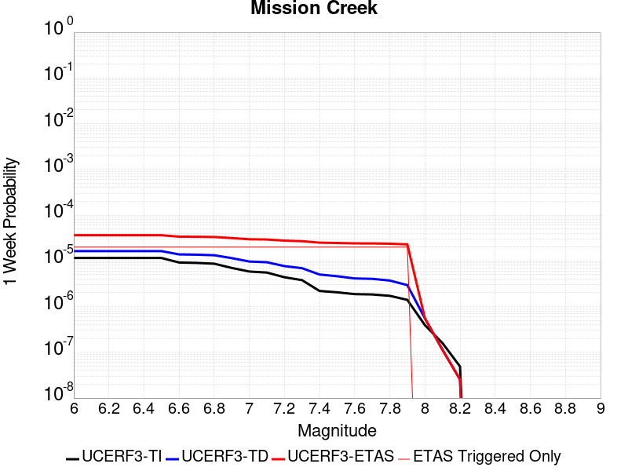 |  | 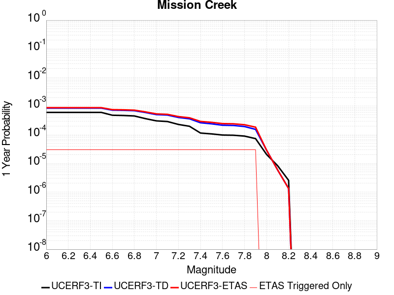 |  |

| Magnitude | 1 wk TI Prob | 1 wk TD Prob | 1 wk ETAS Prob | 1 wk ETAS/TD Gain | 1 wk ETAS Triggered Only | 1 mo TI Prob | 1 mo TD Prob | 1 mo ETAS Prob | 1 mo ETAS/TD Gain | 1 mo ETAS Triggered Only | 1 yr TI Prob | 1 yr TD Prob | 1 yr ETAS Prob | 1 yr ETAS/TD Gain | 1 yr ETAS Triggered Only | 10 yr TI Prob | 10 yr TD Prob | 10 yr ETAS Prob | 10 yr ETAS/TD Gain | 10 yr ETAS Triggered Only |
|-----|-----|-----|-----|-----|-----|-----|-----|-----|-----|-----|-----|-----|-----|-----|-----|-----|-----|-----|-----|-----|
| 6.0 | 1.1549387E-5 | 1.6322783E-5 | 3.6322457E-5 | 2.2252612 | 2.0E-5 | 4.9496433E-5 | 6.995299E-5 | 9.995089E-5 | 1.4288294 | 3.0E-5 | 6.0245243E-4 | 8.5135986E-4 | 8.8133436E-4 | 1.0352077 | 3.0E-5 | 0.006008218 | 0.008510157 | 0.008539901 | 1.0034952 | 3.0E-5 |
| 6.1 | 1.1549387E-5 | 1.6322783E-5 | 3.6322457E-5 | 2.2252612 | 2.0E-5 | 4.9496433E-5 | 6.995299E-5 | 9.995089E-5 | 1.4288294 | 3.0E-5 | 6.0245243E-4 | 8.5135986E-4 | 8.8133436E-4 | 1.0352077 | 3.0E-5 | 0.006008218 | 0.008510157 | 0.008539901 | 1.0034952 | 3.0E-5 |
| 6.2 | 1.1549387E-5 | 1.6322783E-5 | 3.6322457E-5 | 2.2252612 | 2.0E-5 | 4.9496433E-5 | 6.995299E-5 | 9.995089E-5 | 1.4288294 | 3.0E-5 | 6.0245243E-4 | 8.5135986E-4 | 8.8133436E-4 | 1.0352077 | 3.0E-5 | 0.006008218 | 0.008510157 | 0.008539901 | 1.0034952 | 3.0E-5 |
| 6.3 | 1.1549387E-5 | 1.6322783E-5 | 3.6322457E-5 | 2.2252612 | 2.0E-5 | 4.9496433E-5 | 6.995299E-5 | 9.995089E-5 | 1.4288294 | 3.0E-5 | 6.0245243E-4 | 8.5135986E-4 | 8.8133436E-4 | 1.0352077 | 3.0E-5 | 0.006008218 | 0.008510157 | 0.008539901 | 1.0034952 | 3.0E-5 |
| 6.4 | 1.1549387E-5 | 1.6322783E-5 | 3.6322457E-5 | 2.2252612 | 2.0E-5 | 4.9496433E-5 | 6.995299E-5 | 9.995089E-5 | 1.4288294 | 3.0E-5 | 6.0245243E-4 | 8.5135986E-4 | 8.8133436E-4 | 1.0352077 | 3.0E-5 | 0.006008218 | 0.008510157 | 0.008539901 | 1.0034952 | 3.0E-5 |
| 6.5 | 1.1549387E-5 | 1.6322783E-5 | 3.6322457E-5 | 2.2252612 | 2.0E-5 | 4.9496433E-5 | 6.995299E-5 | 9.995089E-5 | 1.4288294 | 3.0E-5 | 6.0245243E-4 | 8.5135986E-4 | 8.8133436E-4 | 1.0352077 | 3.0E-5 | 0.006008218 | 0.008510157 | 0.008539901 | 1.0034952 | 3.0E-5 |
| 6.6 | 9.202681E-6 | 1.3846059E-5 | 3.3845783E-5 | 2.4444344 | 2.0E-5 | 3.9439463E-5 | 5.9338956E-5 | 8.9337176E-5 | 1.5055401 | 3.0E-5 | 4.800697E-4 | 7.2222133E-4 | 7.521997E-4 | 1.0415086 | 3.0E-5 | 0.004790339 | 0.0072273402 | 0.0072571235 | 1.004121 | 3.0E-5 |
| 6.7 | 9.019164E-6 | 1.3651728E-5 | 3.3651457E-5 | 2.4649959 | 2.0E-5 | 3.8652986E-5 | 5.8506146E-5 | 8.850439E-5 | 1.5127367 | 3.0E-5 | 4.7049852E-4 | 7.1208854E-4 | 7.420672E-4 | 1.0420996 | 3.0E-5 | 0.004695036 | 0.0071266647 | 0.0071564508 | 1.0041796 | 3.0E-5 |
| 6.8 | 8.673558E-6 | 1.3273839E-5 | 3.3273573E-5 | 2.5067031 | 2.0E-5 | 3.717186E-5 | 5.688669E-5 | 8.688498E-5 | 1.5273341 | 3.0E-5 | 4.524734E-4 | 6.923842E-4 | 7.223634E-4 | 1.0432986 | 3.0E-5 | 0.0045155324 | 0.0069308523 | 0.0069606444 | 1.0042984 | 3.0E-5 |
| 6.9 | 7.002255E-6 | 1.1478069E-5 | 3.1477837E-5 | 2.7424335 | 2.0E-5 | 3.000932E-5 | 4.9190832E-5 | 7.9189354E-5 | 1.6098398 | 3.0E-5 | 3.653022E-4 | 5.9874065E-4 | 6.287227E-4 | 1.0500752 | 3.0E-5 | 0.0036470229 | 0.005999676 | 0.006029496 | 1.0049703 | 3.0E-5 |
| 7.0 | 5.84644E-6 | 9.675359E-6 | 2.9675166E-5 | 3.0670867 | 2.0E-5 | 2.5055931E-5 | 4.146519E-5 | 7.146395E-5 | 1.7234684 | 3.0E-5 | 3.0501327E-4 | 5.047263E-4 | 5.347112E-4 | 1.0594082 | 3.0E-5 | 0.0030459496 | 0.005063994 | 0.0050938423 | 1.0058942 | 3.0E-5 |
| 7.1 | 5.54703E-6 | 9.329834E-6 | 2.9329647E-5 | 3.1436408 | 2.0E-5 | 2.377277E-5 | 3.9984414E-5 | 6.9983216E-5 | 1.7502624 | 3.0E-5 | 2.8939504E-4 | 4.8670598E-4 | 5.1669136E-4 | 1.0616089 | 3.0E-5 | 0.0028901845 | 0.0048845876 | 0.0049144407 | 1.0061117 | 3.0E-5 |
| 7.2 | 4.384709E-6 | 7.681918E-6 | 2.7681765E-5 | 3.6034966 | 2.0E-5 | 1.8791474E-5 | 3.292211E-5 | 6.292112E-5 | 1.9112117 | 3.0E-5 | 2.2876218E-4 | 4.0075663E-4 | 4.307446E-4 | 1.0748284 | 3.0E-5 | 0.0022852682 | 0.004028542 | 0.004058421 | 1.0074168 | 3.0E-5 |
| 7.3 | 3.7888456E-6 | 6.915788E-6 | 2.691565E-5 | 3.8919137 | 2.0E-5 | 1.623781E-5 | 2.9638775E-5 | 5.9637885E-5 | 2.0121577 | 3.0E-5 | 1.9767738E-4 | 3.6079568E-4 | 3.9078487E-4 | 1.0831195 | 3.0E-5 | 0.0019750162 | 0.00363027 | 0.003660161 | 1.0082339 | 3.0E-5 |
| 7.4 | 2.1982462E-6 | 5.0241033E-6 | 2.5024003E-5 | 4.98079 | 2.0E-5 | 9.421021E-6 | 2.1531694E-5 | 5.153105E-5 | 2.393265 | 3.0E-5 | 1.1469489E-4 | 2.6211704E-4 | 2.9210918E-4 | 1.1144227 | 3.0E-5 | 0.0011463572 | 0.0026460327 | 0.0026759533 | 1.0113077 | 3.0E-5 |
| 7.5 | 2.051923E-6 | 4.6153277E-6 | 2.4615236E-5 | 5.333367 | 2.0E-5 | 8.793926E-6 | 1.9779825E-5 | 4.977923E-5 | 2.516667 | 3.0E-5 | 1.0706078E-4 | 2.4079291E-4 | 2.7078568E-4 | 1.1245583 | 3.0E-5 | 0.0010700922 | 0.0024335932 | 0.00246352 | 1.0122974 | 3.0E-5 |
| 7.6 | 1.8733427E-6 | 4.1236603E-6 | 2.4123578E-5 | 5.85004 | 2.0E-5 | 8.028587E-6 | 1.7672712E-5 | 4.767218E-5 | 2.6975024 | 3.0E-5 | 9.774366E-5 | 2.151441E-4 | 2.4513763E-4 | 1.1394114 | 3.0E-5 | 9.770069E-4 | 0.0021782513 | 0.0022081858 | 1.0137426 | 3.0E-5 |
| 7.7 | 1.8411953E-6 | 4.0433315E-6 | 2.4043251E-5 | 5.946396 | 2.0E-5 | 7.890813E-6 | 1.732845E-5 | 4.732793E-5 | 2.731227 | 3.0E-5 | 9.606641E-5 | 2.1095353E-4 | 2.409472E-4 | 1.1421814 | 3.0E-5 | 9.6024893E-4 | 0.0021365292 | 0.002166465 | 1.0140115 | 3.0E-5 |
| 7.8 | 1.7194251E-6 | 3.71068E-6 | 2.3710605E-5 | 6.3898277 | 2.0E-5 | 7.368944E-6 | 1.5902819E-5 | 4.590234E-5 | 2.886428 | 3.0E-5 | 8.97132E-5 | 1.9359968E-4 | 2.2359387E-4 | 1.1549289 | 3.0E-5 | 8.967699E-4 | 0.0019624757 | 0.0019924168 | 1.0152568 | 3.0E-5 |
| 7.9 | 1.4035052E-6 | 2.9502596E-6 | 2.29502E-5 | 7.779044 | 2.0E-5 | 6.0150082E-6 | 1.2643909E-5 | 4.264353E-5 | 3.372654 | 3.0E-5 | 7.3230265E-5 | 1.5392878E-4 | 1.8392416E-4 | 1.1948653 | 3.0E-5 | 7.3206134E-4 | 0.0015631174 | 0.0015930705 | 1.0191624 | 3.0E-5 |
| 8.0 | 3.9318823E-7 | 5.528477E-7 | 5.528477E-7 | 1.0 | 0.0 | 1.6850913E-6 | 2.3693453E-6 | 2.3693453E-6 | 1.0 | 0.0 | 2.0515794E-5 | 2.8846403E-5 | 2.8846403E-5 | 1.0 | 0.0 | 2.0513899E-4 | 2.990952E-4 | 2.990952E-4 | 1.0 | 0.0 |
| 8.1 | 1.596793E-7 | 1.13775044E-7 | 1.13775044E-7 | 1.0 | 0.0 | 6.8433974E-7 | 4.876072E-7 | 4.876072E-7 | 1.0 | 0.0 | 8.331805E-6 | 5.936602E-6 | 5.936602E-6 | 1.0 | 0.0 | 8.331492E-5 | 6.5494125E-5 | 6.5494125E-5 | 1.0 | 0.0 |
| 8.2 | 4.9003038E-8 | 2.5435753E-8 | 2.5435753E-8 | 1.0 | 0.0 | 2.10013E-7 | 1.09010365E-7 | 1.09010365E-7 | 1.0 | 0.0 | 2.5569052E-6 | 1.3272004E-6 | 1.3272004E-6 | 1.0 | 0.0 | 2.556876E-5 | 1.4952613E-5 | 1.4952613E-5 | 1.0 | 0.0 |

## Honey Lake 2011 CFM
*[(top)](#table-of-contents)*

| 1 Week | 1 Month | 1 Year | 10 Year |
|-----|-----|-----|-----|
|  | 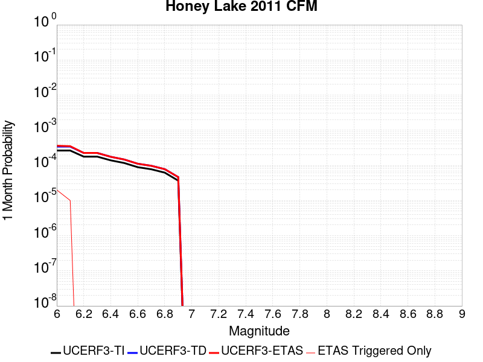 |  |  |

| Magnitude | 1 wk TI Prob | 1 wk TD Prob | 1 wk ETAS Prob | 1 wk ETAS/TD Gain | 1 wk ETAS Triggered Only | 1 mo TI Prob | 1 mo TD Prob | 1 mo ETAS Prob | 1 mo ETAS/TD Gain | 1 mo ETAS Triggered Only | 1 yr TI Prob | 1 yr TD Prob | 1 yr ETAS Prob | 1 yr ETAS/TD Gain | 1 yr ETAS Triggered Only | 10 yr TI Prob | 10 yr TD Prob | 10 yr ETAS Prob | 10 yr ETAS/TD Gain | 10 yr ETAS Triggered Only |
|-----|-----|-----|-----|-----|-----|-----|-----|-----|-----|-----|-----|-----|-----|-----|-----|-----|-----|-----|-----|-----|
| 6.0 | 6.155506E-5 | 7.954708E-5 | 9.954548E-5 | 1.2514035 | 2.0E-5 | 2.6378073E-4 | 3.4087323E-4 | 3.6086643E-4 | 1.0586529 | 2.0E-5 | 0.0032068014 | 0.0041426765 | 0.0041625937 | 1.0048078 | 2.0E-5 | 0.03160919 | 0.040703055 | 0.040731832 | 1.000707 | 3.0E-5 |
| 6.1 | 6.155506E-5 | 7.954708E-5 | 8.954628E-5 | 1.1257017 | 1.0E-5 | 2.6378073E-4 | 3.4087323E-4 | 3.508698E-4 | 1.0293264 | 1.0E-5 | 0.0032068014 | 0.0041426765 | 0.004152635 | 1.0024039 | 1.0E-5 | 0.03160919 | 0.040703055 | 0.04072224 | 1.0004714 | 2.0E-5 |
| 6.2 | 4.1335024E-5 | 5.257652E-5 | 5.257652E-5 | 1.0 | 0.0 | 1.7713808E-4 | 2.2530954E-4 | 2.2530954E-4 | 1.0 | 0.0 | 0.0021545228 | 0.0027398444 | 0.0027398444 | 1.0 | 0.0 | 0.021337535 | 0.027076809 | 0.027086537 | 1.0003593 | 1.0E-5 |
| 6.3 | 4.1335024E-5 | 5.257652E-5 | 5.257652E-5 | 1.0 | 0.0 | 1.7713808E-4 | 2.2530954E-4 | 2.2530954E-4 | 1.0 | 0.0 | 0.0021545228 | 0.0027398444 | 0.0027398444 | 1.0 | 0.0 | 0.021337535 | 0.027076809 | 0.027086537 | 1.0003593 | 1.0E-5 |
| 6.4 | 3.2393702E-5 | 4.0887273E-5 | 4.0887273E-5 | 1.0 | 0.0 | 1.3882275E-4 | 1.7522006E-4 | 1.7522006E-4 | 1.0 | 0.0 | 0.0016888566 | 0.0021313233 | 0.0021313233 | 1.0 | 0.0 | 0.016760793 | 0.021119867 | 0.021119867 | 1.0 | 0.0 |
| 6.5 | 2.7205504E-5 | 3.4211767E-5 | 3.4211767E-5 | 1.0 | 0.0 | 1.1658981E-4 | 1.4661417E-4 | 1.4661417E-4 | 1.0 | 0.0 | 0.0014185566 | 0.0017836596 | 0.0017836596 | 1.0 | 0.0 | 0.014095354 | 0.017702963 | 0.017702963 | 1.0 | 0.0 |
| 6.6 | 2.069265E-5 | 2.5955416E-5 | 2.5955416E-5 | 1.0 | 0.0 | 8.867977E-5 | 1.1123324E-4 | 1.1123324E-4 | 1.0 | 0.0 | 0.0010791414 | 0.0013535074 | 0.0013535074 | 1.0 | 0.0 | 0.010739161 | 0.0134610105 | 0.0134610105 | 1.0 | 0.0 |
| 6.7 | 1.8060919E-5 | 2.265683E-5 | 2.265683E-5 | 1.0 | 0.0 | 7.7401644E-5 | 9.7097545E-5 | 9.7097545E-5 | 1.0 | 0.0 | 9.419576E-4 | 0.0011816025 | 0.0011816025 | 1.0 | 0.0 | 0.009379748 | 0.0117612425 | 0.0117612425 | 1.0 | 0.0 |
| 6.8 | 1.4474663E-5 | 1.8181274E-5 | 1.8181274E-5 | 1.0 | 0.0 | 6.203279E-5 | 7.791785E-5 | 7.791785E-5 | 1.0 | 0.0 | 7.5498753E-4 | 9.4831345E-4 | 9.4831345E-4 | 1.0 | 0.0 | 0.007524277 | 0.009450195 | 0.009450195 | 1.0 | 0.0 |
| 6.9 | 8.564552E-6 | 1.0802311E-5 | 1.0802311E-5 | 1.0 | 0.0 | 3.6704707E-5 | 4.6295176E-5 | 4.6295176E-5 | 1.0 | 0.0 | 4.4678818E-4 | 5.635644E-4 | 5.635644E-4 | 1.0 | 0.0 | 0.0044589094 | 0.0056278505 | 0.0056278505 | 1.0 | 0.0 |

## Anaheim
*[(top)](#table-of-contents)*

| 1 Week | 1 Month | 1 Year | 10 Year |
|-----|-----|-----|-----|
|  |  |  |  |

| Magnitude | 1 wk TI Prob | 1 wk TD Prob | 1 wk ETAS Prob | 1 wk ETAS/TD Gain | 1 wk ETAS Triggered Only | 1 mo TI Prob | 1 mo TD Prob | 1 mo ETAS Prob | 1 mo ETAS/TD Gain | 1 mo ETAS Triggered Only | 1 yr TI Prob | 1 yr TD Prob | 1 yr ETAS Prob | 1 yr ETAS/TD Gain | 1 yr ETAS Triggered Only | 10 yr TI Prob | 10 yr TD Prob | 10 yr ETAS Prob | 10 yr ETAS/TD Gain | 10 yr ETAS Triggered Only |
|-----|-----|-----|-----|-----|-----|-----|-----|-----|-----|-----|-----|-----|-----|-----|-----|-----|-----|-----|-----|-----|
| 6.0 | 2.9254998E-6 | 2.5122672E-6 | 1.2512242E-5 | 4.9804583 | 1.0E-5 | 1.25377965E-5 | 1.0766828E-5 | 2.076672E-5 | 1.9287686 | 1.0E-5 | 1.5263697E-4 | 1.310806E-4 | 1.6107666E-4 | 1.2288368 | 3.0E-5 | 0.0015253217 | 0.001310263 | 0.0013402237 | 1.0228661 | 3.0E-5 |
| 6.1 | 1.6729715E-6 | 1.2337158E-6 | 1.2337158E-6 | 1.0 | 0.0 | 7.1698582E-6 | 5.287345E-6 | 5.287345E-6 | 1.0 | 0.0 | 8.7289525E-5 | 6.437194E-5 | 6.437194E-5 | 1.0 | 0.0 | 8.7255245E-4 | 6.435739E-4 | 6.435739E-4 | 1.0 | 0.0 |
| 6.2 | 1.6729715E-6 | 1.2337158E-6 | 1.2337158E-6 | 1.0 | 0.0 | 7.1698582E-6 | 5.287345E-6 | 5.287345E-6 | 1.0 | 0.0 | 8.7289525E-5 | 6.437194E-5 | 6.437194E-5 | 1.0 | 0.0 | 8.7255245E-4 | 6.435739E-4 | 6.435739E-4 | 1.0 | 0.0 |
| 6.3 | 1.1444064E-6 | 6.9594773E-7 | 6.9594773E-7 | 1.0 | 0.0 | 4.9045893E-6 | 2.9826301E-6 | 2.9826301E-6 | 1.0 | 0.0 | 5.971174E-5 | 3.6312973E-5 | 3.6312973E-5 | 1.0 | 0.0 | 5.96957E-4 | 3.6307587E-4 | 3.6307587E-4 | 1.0 | 0.0 |
| 6.4 | 1.1444064E-6 | 6.9594773E-7 | 6.9594773E-7 | 1.0 | 0.0 | 4.9045893E-6 | 2.9826301E-6 | 2.9826301E-6 | 1.0 | 0.0 | 5.971174E-5 | 3.6312973E-5 | 3.6312973E-5 | 1.0 | 0.0 | 5.96957E-4 | 3.6307587E-4 | 3.6307587E-4 | 1.0 | 0.0 |
| 6.5 | 1.1385318E-6 | 6.9001607E-7 | 6.9001607E-7 | 1.0 | 0.0 | 4.879413E-6 | 2.9572088E-6 | 2.9572088E-6 | 1.0 | 0.0 | 5.9405233E-5 | 3.600348E-5 | 3.600348E-5 | 1.0 | 0.0 | 5.938936E-4 | 3.5998193E-4 | 3.5998193E-4 | 1.0 | 0.0 |
| 6.6 | 1.1165511E-6 | 6.678032E-7 | 6.678032E-7 | 1.0 | 0.0 | 4.78521E-6 | 2.862011E-6 | 2.862011E-6 | 1.0 | 0.0 | 5.8258374E-5 | 3.484448E-5 | 3.484448E-5 | 1.0 | 0.0 | 5.8243104E-4 | 3.483956E-4 | 3.483956E-4 | 1.0 | 0.0 |
| 6.7 | 1.1098243E-6 | 6.610226E-7 | 6.610226E-7 | 1.0 | 0.0 | 4.7563813E-6 | 2.8329514E-6 | 2.8329514E-6 | 1.0 | 0.0 | 5.7907404E-5 | 3.449069E-5 | 3.449069E-5 | 1.0 | 0.0 | 5.7892315E-4 | 3.4485882E-4 | 3.4485882E-4 | 1.0 | 0.0 |
| 6.8 | 1.1077587E-6 | 6.5894295E-7 | 6.5894295E-7 | 1.0 | 0.0 | 4.7475287E-6 | 2.8240383E-6 | 2.8240383E-6 | 1.0 | 0.0 | 5.779963E-5 | 3.438218E-5 | 3.438218E-5 | 1.0 | 0.0 | 5.77846E-4 | 3.4377404E-4 | 3.4377404E-4 | 1.0 | 0.0 |
| 6.9 | 1.1024468E-6 | 6.5360064E-7 | 6.5360064E-7 | 1.0 | 0.0 | 4.7247636E-6 | 2.801143E-6 | 2.801143E-6 | 1.0 | 0.0 | 5.752248E-5 | 3.4103436E-5 | 3.4103436E-5 | 1.0 | 0.0 | 5.750759E-4 | 3.4098746E-4 | 3.4098746E-4 | 1.0 | 0.0 |
| 7.0 | 1.0993066E-6 | 6.5101136E-7 | 6.5101136E-7 | 1.0 | 0.0 | 4.7113053E-6 | 2.790046E-6 | 2.790046E-6 | 1.0 | 0.0 | 5.7358633E-5 | 3.3968336E-5 | 3.3968336E-5 | 1.0 | 0.0 | 5.734383E-4 | 3.3963687E-4 | 3.3963687E-4 | 1.0 | 0.0 |
| 7.1 | 8.334877E-7 | 4.4046894E-7 | 4.4046894E-7 | 1.0 | 0.0 | 3.5720855E-6 | 1.8877229E-6 | 1.8877229E-6 | 1.0 | 0.0 | 4.348927E-5 | 2.2982806E-5 | 2.2982806E-5 | 1.0 | 0.0 | 4.3480762E-4 | 2.2980652E-4 | 2.2980652E-4 | 1.0 | 0.0 |
| 7.2 | 7.794411E-7 | 3.997425E-7 | 3.997425E-7 | 1.0 | 0.0 | 3.3404576E-6 | 1.7131812E-6 | 1.7131812E-6 | 1.0 | 0.0 | 4.0669314E-5 | 2.0857802E-5 | 2.0857802E-5 | 1.0 | 0.0 | 4.066187E-4 | 2.085605E-4 | 2.085605E-4 | 1.0 | 0.0 |
| 7.3 | 5.01704E-7 | 2.5571964E-7 | 2.5571964E-7 | 1.0 | 0.0 | 2.150158E-6 | 1.095941E-6 | 1.095941E-6 | 1.0 | 0.0 | 2.617786E-5 | 1.3343012E-5 | 1.3343012E-5 | 1.0 | 0.0 | 2.6174777E-4 | 1.3342335E-4 | 1.3342335E-4 | 1.0 | 0.0 |
| 7.4 | 2.4008182E-7 | 1.2367195E-7 | 1.2367195E-7 | 1.0 | 0.0 | 1.0289217E-6 | 5.300226E-7 | 5.300226E-7 | 1.0 | 0.0 | 1.252705E-5 | 6.4530136E-6 | 6.4530136E-6 | 1.0 | 0.0 | 1.2526344E-4 | 6.452902E-5 | 6.452902E-5 | 1.0 | 0.0 |
| 7.5 | 2.0263876E-8 | 1.6121012E-8 | 1.6121012E-8 | 1.0 | 0.0 | 8.684518E-8 | 6.909005E-8 | 6.909005E-8 | 1.0 | 0.0 | 1.0573395E-6 | 8.4117113E-7 | 8.4117113E-7 | 1.0 | 0.0 | 1.0573345E-5 | 8.411688E-6 | 8.411688E-6 | 1.0 | 0.0 |
| 7.6 | 1.4871431E-9 | 1.508418E-9 | 1.508418E-9 | 1.0 | 0.0 | 6.37347E-9 | 6.4646484E-9 | 6.4646484E-9 | 1.0 | 0.0 | 7.7596994E-8 | 7.870709E-8 | 7.870709E-8 | 1.0 | 0.0 | 7.759697E-7 | 7.8707063E-7 | 7.8707063E-7 | 1.0 | 0.0 |
| 7.7 | 1.5093293E-10 | 1.5333512E-10 | 1.5333512E-10 | 1.0 | 0.0 | 6.4685546E-10 | 6.571509E-10 | 6.571509E-10 | 1.0 | 0.0 | 7.875465E-9 | 8.0008125E-9 | 8.0008125E-9 | 1.0 | 0.0 | 7.8754645E-8 | 8.000812E-8 | 8.000812E-8 | 1.0 | 0.0 |

## Gillem - Big Crack 2011 CFM
*[(top)](#table-of-contents)*

| 1 Week | 1 Month | 1 Year | 10 Year |
|-----|-----|-----|-----|
|  |  |  |  |

| Magnitude | 1 wk TI Prob | 1 wk TD Prob | 1 wk ETAS Prob | 1 wk ETAS/TD Gain | 1 wk ETAS Triggered Only | 1 mo TI Prob | 1 mo TD Prob | 1 mo ETAS Prob | 1 mo ETAS/TD Gain | 1 mo ETAS Triggered Only | 1 yr TI Prob | 1 yr TD Prob | 1 yr ETAS Prob | 1 yr ETAS/TD Gain | 1 yr ETAS Triggered Only | 10 yr TI Prob | 10 yr TD Prob | 10 yr ETAS Prob | 10 yr ETAS/TD Gain | 10 yr ETAS Triggered Only |
|-----|-----|-----|-----|-----|-----|-----|-----|-----|-----|-----|-----|-----|-----|-----|-----|-----|-----|-----|-----|-----|
| 6.0 | 2.196852E-5 | 2.3604485E-5 | 2.3604485E-5 | 1.0 | 0.0 | 9.4147406E-5 | 1.01158665E-4 | 1.1115765E-4 | 1.0988446 | 1.0E-5 | 0.0011456419 | 0.0012309998 | 0.0012509752 | 1.016227 | 2.0E-5 | 0.011397537 | 0.012250669 | 0.012280302 | 1.0024189 | 3.0E-5 |
| 6.1 | 9.992795E-6 | 1.071189E-5 | 1.071189E-5 | 1.0 | 0.0 | 4.2825563E-5 | 4.5907396E-5 | 5.5906938E-5 | 1.2178198 | 1.0E-5 | 5.2127644E-4 | 5.587975E-4 | 5.7878636E-4 | 1.0357711 | 2.0E-5 | 0.0052005537 | 0.0055757347 | 0.005595623 | 1.003567 | 2.0E-5 |
| 6.2 | 9.992795E-6 | 1.071189E-5 | 1.071189E-5 | 1.0 | 0.0 | 4.2825563E-5 | 4.5907396E-5 | 5.5906938E-5 | 1.2178198 | 1.0E-5 | 5.2127644E-4 | 5.587975E-4 | 5.7878636E-4 | 1.0357711 | 2.0E-5 | 0.0052005537 | 0.0055757347 | 0.005595623 | 1.003567 | 2.0E-5 |
| 6.3 | 4.6127884E-6 | 4.942657E-6 | 4.942657E-6 | 1.0 | 0.0 | 1.9768944E-5 | 2.1182668E-5 | 3.118246E-5 | 1.472074 | 1.0E-5 | 2.406603E-4 | 2.5787292E-4 | 2.6787035E-4 | 1.0387688 | 1.0E-5 | 0.0024039985 | 0.0025761751 | 0.0025861494 | 1.0038717 | 1.0E-5 |
| 6.4 | 4.6127884E-6 | 4.942657E-6 | 4.942657E-6 | 1.0 | 0.0 | 1.9768944E-5 | 2.1182668E-5 | 3.118246E-5 | 1.472074 | 1.0E-5 | 2.406603E-4 | 2.5787292E-4 | 2.6787035E-4 | 1.0387688 | 1.0E-5 | 0.0024039985 | 0.0025761751 | 0.0025861494 | 1.0038717 | 1.0E-5 |
| 6.5 | 2.716712E-6 | 2.9111113E-6 | 2.9111113E-6 | 1.0 | 0.0 | 1.1643E-5 | 1.24761455E-5 | 2.247602E-5 | 1.8015196 | 1.0E-5 | 1.417443E-4 | 1.5188892E-4 | 1.618874E-4 | 1.0658276 | 1.0E-5 | 0.0014165393 | 0.001518089 | 0.0015280738 | 1.0065773 | 1.0E-5 |
| 6.6 | 1.3818255E-6 | 1.4820689E-6 | 1.4820689E-6 | 1.0 | 0.0 | 5.922096E-6 | 6.3517155E-6 | 6.3517155E-6 | 1.0 | 0.0 | 7.209913E-5 | 7.7330624E-5 | 7.7330624E-5 | 1.0 | 0.0 | 7.2075747E-4 | 7.7315804E-4 | 7.7315804E-4 | 1.0 | 0.0 |

## Hayward (So) extension 2011 CFM
*[(top)](#table-of-contents)*

| 1 Week | 1 Month | 1 Year | 10 Year |
|-----|-----|-----|-----|
|  |  |  |  |

| Magnitude | 1 wk TI Prob | 1 wk TD Prob | 1 wk ETAS Prob | 1 wk ETAS/TD Gain | 1 wk ETAS Triggered Only | 1 mo TI Prob | 1 mo TD Prob | 1 mo ETAS Prob | 1 mo ETAS/TD Gain | 1 mo ETAS Triggered Only | 1 yr TI Prob | 1 yr TD Prob | 1 yr ETAS Prob | 1 yr ETAS/TD Gain | 1 yr ETAS Triggered Only | 10 yr TI Prob | 10 yr TD Prob | 10 yr ETAS Prob | 10 yr ETAS/TD Gain | 10 yr ETAS Triggered Only |
|-----|-----|-----|-----|-----|-----|-----|-----|-----|-----|-----|-----|-----|-----|-----|-----|-----|-----|-----|-----|-----|
| 6.0 | 1.1721256E-4 | 2.3671088E-4 | 2.467085E-4 | 1.0422356 | 1.0E-5 | 5.022428E-4 | 0.0010138806 | 0.0010338603 | 1.0197062 | 2.0E-5 | 0.0060976758 | 0.012250609 | 0.012270364 | 1.0016125 | 2.0E-5 | 0.0593305 | 0.11284437 | 0.11286212 | 1.0001572 | 2.0E-5 |
| 6.1 | 6.99169E-5 | 1.3808164E-4 | 1.4808026E-4 | 1.072411 | 1.0E-5 | 2.9960944E-4 | 5.9155683E-4 | 6.11545E-4 | 1.033789 | 2.0E-5 | 0.0036416445 | 0.0071723475 | 0.0071922042 | 1.0027685 | 2.0E-5 | 0.035825435 | 0.067804344 | 0.067822985 | 1.000275 | 2.0E-5 |
| 6.2 | 6.99169E-5 | 1.3808164E-4 | 1.4808026E-4 | 1.072411 | 1.0E-5 | 2.9960944E-4 | 5.9155683E-4 | 6.11545E-4 | 1.033789 | 2.0E-5 | 0.0036416445 | 0.0071723475 | 0.0071922042 | 1.0027685 | 2.0E-5 | 0.035825435 | 0.067804344 | 0.067822985 | 1.000275 | 2.0E-5 |
| 6.3 | 6.970908E-5 | 1.3776305E-4 | 1.4776168E-4 | 1.0725784 | 1.0E-5 | 2.9871898E-4 | 5.9019245E-4 | 6.1018066E-4 | 1.0338672 | 2.0E-5 | 0.0036308395 | 0.007155884 | 0.0071757413 | 1.002775 | 2.0E-5 | 0.035720866 | 0.0676533 | 0.06767195 | 1.0002756 | 2.0E-5 |
| 6.4 | 6.9517155E-5 | 1.3743227E-4 | 1.4743091E-4 | 1.0727531 | 1.0E-5 | 2.9789665E-4 | 5.8877567E-4 | 6.087639E-4 | 1.0339488 | 2.0E-5 | 0.0036208609 | 0.0071387975 | 0.0071586547 | 1.0027816 | 2.0E-5 | 0.03562429 | 0.06749734 | 0.06751599 | 1.0002763 | 2.0E-5 |
| 6.5 | 4.786248E-5 | 9.415232E-5 | 1.04151375E-4 | 1.1062009 | 1.0E-5 | 2.0510878E-4 | 4.0344993E-4 | 4.2344184E-4 | 1.0495524 | 2.0E-5 | 0.0024943394 | 0.0049013784 | 0.0049212803 | 1.0040605 | 2.0E-5 | 0.02466527 | 0.046900697 | 0.04691976 | 1.0004064 | 2.0E-5 |
| 6.6 | 4.4662214E-5 | 8.8819244E-5 | 9.881836E-5 | 1.1125782 | 1.0E-5 | 1.9139545E-4 | 3.80601E-4 | 4.005934E-4 | 1.0525285 | 2.0E-5 | 0.0023277493 | 0.0046244357 | 0.004644343 | 1.0043049 | 2.0E-5 | 0.02303517 | 0.04429206 | 0.044311173 | 1.0004315 | 2.0E-5 |
| 6.7 | 3.884542E-5 | 7.8650686E-5 | 7.8650686E-5 | 1.0 | 0.0 | 1.6646975E-4 | 3.3703333E-4 | 3.4702994E-4 | 1.0296607 | 1.0E-5 | 0.002024885 | 0.0040961048 | 0.004106064 | 1.0024314 | 1.0E-5 | 0.020065336 | 0.039332055 | 0.039351266 | 1.0004885 | 2.0E-5 |
| 6.8 | 3.4221863E-5 | 6.855886E-5 | 6.855886E-5 | 1.0 | 0.0 | 1.4665688E-4 | 2.9379298E-4 | 3.0379003E-4 | 1.0340276 | 1.0E-5 | 0.0017840851 | 0.0035714838 | 0.003581448 | 1.00279 | 1.0E-5 | 0.017698295 | 0.034419462 | 0.034438774 | 1.0005611 | 2.0E-5 |
| 6.9 | 1.6927712E-5 | 3.006262E-5 | 3.006262E-5 | 1.0 | 0.0 | 7.2545314E-5 | 1.2883375E-4 | 1.3883247E-4 | 1.0776094 | 1.0E-5 | 8.828813E-4 | 0.0015674793 | 0.0015774637 | 1.0063697 | 1.0E-5 | 0.008793819 | 0.015463544 | 0.015483235 | 1.0012734 | 2.0E-5 |
| 7.0 | 1.2509653E-5 | 2.246337E-5 | 2.246337E-5 | 1.0 | 0.0 | 5.3611697E-5 | 9.626828E-5 | 1.0626732E-4 | 1.1038663 | 1.0E-5 | 6.525269E-4 | 0.0011714802 | 0.0011814684 | 1.0085262 | 1.0E-5 | 0.0065061417 | 0.011583166 | 0.01159305 | 1.0008533 | 1.0E-5 |
| 7.1 | 8.751583E-6 | 1.4926157E-5 | 1.4926157E-5 | 1.0 | 0.0 | 3.750624E-5 | 6.396771E-5 | 7.3967065E-5 | 1.1563189 | 1.0E-5 | 4.5654282E-4 | 7.785344E-4 | 7.885266E-4 | 1.0128347 | 1.0E-5 | 0.0045560603 | 0.007764457 | 0.007774379 | 1.0012779 | 1.0E-5 |
| 7.2 | 6.354379E-6 | 1.1499087E-5 | 1.1499087E-5 | 1.0 | 0.0 | 2.7232769E-5 | 4.9280898E-5 | 5.9280406E-5 | 1.2029084 | 1.0E-5 | 3.3150852E-4 | 5.9983454E-4 | 6.0982857E-4 | 1.0166613 | 1.0E-5 | 0.0033101442 | 0.006001243 | 0.006011183 | 1.0016563 | 1.0E-5 |
| 7.3 | 4.645554E-6 | 8.818441E-6 | 8.818441E-6 | 1.0 | 0.0 | 1.9909365E-5 | 3.7792794E-5 | 4.7792415E-5 | 1.2645907 | 1.0E-5 | 2.4236954E-4 | 4.6003403E-4 | 4.7002942E-4 | 1.0217276 | 1.0E-5 | 0.0024210536 | 0.004611421 | 0.004621375 | 1.0021585 | 1.0E-5 |
| 7.4 | 4.23437E-6 | 7.992759E-6 | 7.992759E-6 | 1.0 | 0.0 | 1.8147173E-5 | 3.425425E-5 | 4.425391E-5 | 1.2919246 | 1.0E-5 | 2.2091944E-4 | 4.1696956E-4 | 4.269654E-4 | 1.0239725 | 1.0E-5 | 0.0022069993 | 0.0041826614 | 0.0041926196 | 1.0023808 | 1.0E-5 |
| 7.5 | 2.2187417E-6 | 3.952336E-6 | 3.952336E-6 | 1.0 | 0.0 | 9.508858E-6 | 1.6938488E-5 | 1.6938488E-5 | 1.0 | 0.0 | 1.157642E-4 | 2.0620918E-4 | 2.0620918E-4 | 1.0 | 0.0 | 0.0011570391 | 0.0020739497 | 0.0020739497 | 1.0 | 0.0 |
| 7.6 | 2.7952495E-8 | 3.8785874E-8 | 3.8785874E-8 | 1.0 | 0.0 | 1.1979641E-7 | 1.6622516E-7 | 1.6622516E-7 | 1.0 | 0.0 | 1.4585203E-6 | 2.0237894E-6 | 2.0237894E-6 | 1.0 | 0.0 | 1.4585107E-5 | 2.0317146E-5 | 2.0317146E-5 | 1.0 | 0.0 |
| 7.7 | 1.7192724E-8 | 2.3436652E-8 | 2.3436652E-8 | 1.0 | 0.0 | 7.36831E-8 | 1.0044278E-7 | 1.0044278E-7 | 1.0 | 0.0 | 8.9709135E-7 | 1.2228902E-6 | 1.2228902E-6 | 1.0 | 0.0 | 8.970877E-6 | 1.2285953E-5 | 1.2285953E-5 | 1.0 | 0.0 |

## San Gabriel
*[(top)](#table-of-contents)*

| 1 Week | 1 Month | 1 Year | 10 Year |
|-----|-----|-----|-----|
|  |  |  | 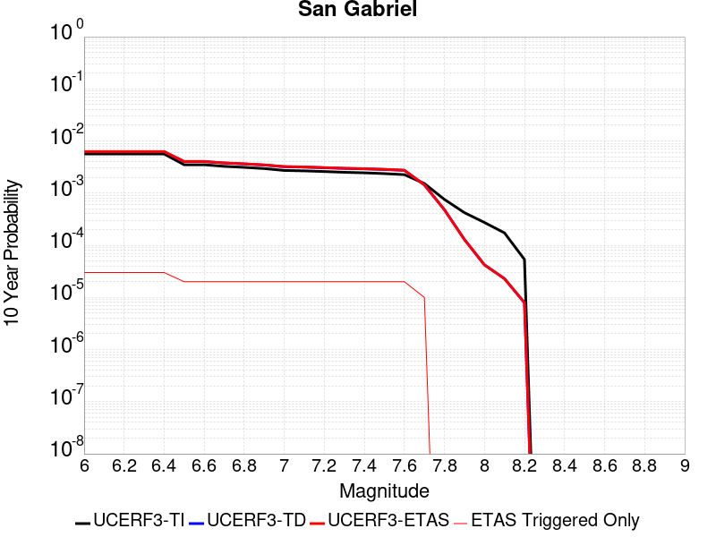 |

| Magnitude | 1 wk TI Prob | 1 wk TD Prob | 1 wk ETAS Prob | 1 wk ETAS/TD Gain | 1 wk ETAS Triggered Only | 1 mo TI Prob | 1 mo TD Prob | 1 mo ETAS Prob | 1 mo ETAS/TD Gain | 1 mo ETAS Triggered Only | 1 yr TI Prob | 1 yr TD Prob | 1 yr ETAS Prob | 1 yr ETAS/TD Gain | 1 yr ETAS Triggered Only | 10 yr TI Prob | 10 yr TD Prob | 10 yr ETAS Prob | 10 yr ETAS/TD Gain | 10 yr ETAS Triggered Only |
|-----|-----|-----|-----|-----|-----|-----|-----|-----|-----|-----|-----|-----|-----|-----|-----|-----|-----|-----|-----|-----|
| 6.0 | 1.083775E-5 | 1.198525E-5 | 1.198525E-5 | 1.0 | 0.0 | 4.6446676E-5 | 5.1364408E-5 | 5.1364408E-5 | 1.0 | 0.0 | 5.653415E-4 | 6.251936E-4 | 6.5517484E-4 | 1.0479552 | 3.0E-5 | 0.0056390543 | 0.0062463325 | 0.006276145 | 1.0047728 | 3.0E-5 |
| 6.1 | 1.083775E-5 | 1.198525E-5 | 1.198525E-5 | 1.0 | 0.0 | 4.6446676E-5 | 5.1364408E-5 | 5.1364408E-5 | 1.0 | 0.0 | 5.653415E-4 | 6.251936E-4 | 6.5517484E-4 | 1.0479552 | 3.0E-5 | 0.0056390543 | 0.0062463325 | 0.006276145 | 1.0047728 | 3.0E-5 |
| 6.2 | 1.083775E-5 | 1.198525E-5 | 1.198525E-5 | 1.0 | 0.0 | 4.6446676E-5 | 5.1364408E-5 | 5.1364408E-5 | 1.0 | 0.0 | 5.653415E-4 | 6.251936E-4 | 6.5517484E-4 | 1.0479552 | 3.0E-5 | 0.0056390543 | 0.0062463325 | 0.006276145 | 1.0047728 | 3.0E-5 |
| 6.3 | 1.083775E-5 | 1.198525E-5 | 1.198525E-5 | 1.0 | 0.0 | 4.6446676E-5 | 5.1364408E-5 | 5.1364408E-5 | 1.0 | 0.0 | 5.653415E-4 | 6.251936E-4 | 6.5517484E-4 | 1.0479552 | 3.0E-5 | 0.0056390543 | 0.0062463325 | 0.006276145 | 1.0047728 | 3.0E-5 |
| 6.4 | 1.083775E-5 | 1.198525E-5 | 1.198525E-5 | 1.0 | 0.0 | 4.6446676E-5 | 5.1364408E-5 | 5.1364408E-5 | 1.0 | 0.0 | 5.653415E-4 | 6.251936E-4 | 6.5517484E-4 | 1.0479552 | 3.0E-5 | 0.0056390543 | 0.0062463325 | 0.006276145 | 1.0047728 | 3.0E-5 |
| 6.5 | 6.7317824E-6 | 7.717007E-6 | 7.717007E-6 | 1.0 | 0.0 | 2.8850178E-5 | 3.3072472E-5 | 3.3072472E-5 | 1.0 | 0.0 | 3.511943E-4 | 4.0258403E-4 | 4.2257598E-4 | 1.049659 | 2.0E-5 | 0.003506398 | 0.004029533 | 0.0040494525 | 1.0049434 | 2.0E-5 |
| 6.6 | 6.7317824E-6 | 7.717007E-6 | 7.717007E-6 | 1.0 | 0.0 | 2.8850178E-5 | 3.3072472E-5 | 3.3072472E-5 | 1.0 | 0.0 | 3.511943E-4 | 4.0258403E-4 | 4.2257598E-4 | 1.049659 | 2.0E-5 | 0.003506398 | 0.004029533 | 0.0040494525 | 1.0049434 | 2.0E-5 |
| 6.7 | 6.274881E-6 | 7.2459275E-6 | 7.2459275E-6 | 1.0 | 0.0 | 2.6892068E-5 | 3.105361E-5 | 3.105361E-5 | 1.0 | 0.0 | 3.2736175E-4 | 3.7801306E-4 | 3.980055E-4 | 1.0528883 | 2.0E-5 | 0.0032687993 | 0.0037846796 | 0.0038046038 | 1.0052645 | 2.0E-5 |
| 6.8 | 5.996209E-6 | 6.958647E-6 | 6.958647E-6 | 1.0 | 0.0 | 2.5697784E-5 | 2.9822439E-5 | 2.9822439E-5 | 1.0 | 0.0 | 3.128256E-4 | 3.6302864E-4 | 3.8302137E-4 | 1.0550721 | 2.0E-5 | 0.003123856 | 0.0036353325 | 0.0036552597 | 1.0054816 | 2.0E-5 |
| 6.9 | 5.686331E-6 | 6.6236917E-6 | 6.6236917E-6 | 1.0 | 0.0 | 2.4369761E-5 | 2.8386947E-5 | 2.8386947E-5 | 1.0 | 0.0 | 2.9666146E-4 | 3.4555717E-4 | 3.6555025E-4 | 1.0578575 | 2.0E-5 | 0.0029626573 | 0.0034611735 | 0.0034811043 | 1.0057584 | 2.0E-5 |
| 7.0 | 5.2329838E-6 | 6.1475757E-6 | 6.1475757E-6 | 1.0 | 0.0 | 2.242688E-5 | 2.6346492E-5 | 2.6346492E-5 | 1.0 | 0.0 | 2.7301308E-4 | 3.207221E-4 | 3.4071566E-4 | 1.0623393 | 2.0E-5 | 0.002726779 | 0.0032135549 | 0.0032334907 | 1.0062037 | 2.0E-5 |
| 7.1 | 5.135671E-6 | 6.0377E-6 | 6.0377E-6 | 1.0 | 0.0 | 2.2009834E-5 | 2.5875606E-5 | 2.5875606E-5 | 1.0 | 0.0 | 2.6793676E-4 | 3.1499073E-4 | 3.3498442E-4 | 1.0634739 | 2.0E-5 | 0.0026761394 | 0.0031564054 | 0.0031763422 | 1.0063163 | 2.0E-5 |
| 7.2 | 4.989062E-6 | 5.8710784E-6 | 5.8710784E-6 | 1.0 | 0.0 | 2.1381518E-5 | 2.5161527E-5 | 2.5161527E-5 | 1.0 | 0.0 | 2.6028889E-4 | 3.0629928E-4 | 3.2629314E-4 | 1.0652757 | 2.0E-5 | 0.0025998424 | 0.003069734 | 0.0030896724 | 1.0064952 | 2.0E-5 |
| 7.3 | 4.8219395E-6 | 5.7026323E-6 | 5.7026323E-6 | 1.0 | 0.0 | 2.0665291E-5 | 2.4439627E-5 | 2.4439627E-5 | 1.0 | 0.0 | 2.5157086E-4 | 2.975126E-4 | 3.1750664E-4 | 1.067204 | 2.0E-5 | 0.0025128627 | 0.002982106 | 0.0030020464 | 1.0066867 | 2.0E-5 |
| 7.4 | 4.7118383E-6 | 5.5911896E-6 | 5.5911896E-6 | 1.0 | 0.0 | 2.0193436E-5 | 2.3962024E-5 | 2.3962024E-5 | 1.0 | 0.0 | 2.4582737E-4 | 2.9169934E-4 | 3.116935E-4 | 1.0685438 | 2.0E-5 | 0.002455556 | 0.0029241266 | 0.002944068 | 1.0068196 | 2.0E-5 |
| 7.5 | 4.5506545E-6 | 5.4365555E-6 | 5.4365555E-6 | 1.0 | 0.0 | 1.9502659E-5 | 2.329932E-5 | 2.329932E-5 | 1.0 | 0.0 | 2.37419E-4 | 2.8363304E-4 | 3.0362737E-4 | 1.0704937 | 2.0E-5 | 0.002371655 | 0.0028436715 | 0.0028636146 | 1.0070132 | 2.0E-5 |
| 7.6 | 4.343636E-6 | 5.2294336E-6 | 5.2294336E-6 | 1.0 | 0.0 | 1.861545E-5 | 2.241167E-5 | 2.241167E-5 | 1.0 | 0.0 | 2.2661954E-4 | 2.7282868E-4 | 2.928232E-4 | 1.073286 | 2.0E-5 | 0.0022638857 | 0.0027358893 | 0.0027558345 | 1.0072902 | 2.0E-5 |
| 7.7 | 2.936235E-6 | 2.743946E-6 | 2.743946E-6 | 1.0 | 0.0 | 1.2583803E-5 | 1.1759716E-5 | 1.1759716E-5 | 1.0 | 0.0 | 1.5319703E-4 | 1.4316518E-4 | 1.5316374E-4 | 1.0698394 | 1.0E-5 | 0.0015309147 | 0.0014379849 | 0.0014479705 | 1.0069442 | 1.0E-5 |
| 7.8 | 1.4541639E-6 | 9.122518E-7 | 9.122518E-7 | 1.0 | 0.0 | 6.232116E-6 | 3.9096444E-6 | 3.9096444E-6 | 1.0 | 0.0 | 7.587337E-5 | 4.7598885E-5 | 4.7598885E-5 | 1.0 | 0.0 | 7.584747E-4 | 4.8078224E-4 | 4.8078224E-4 | 1.0 | 0.0 |
| 7.9 | 8.098958E-7 | 2.4165956E-7 | 2.4165956E-7 | 1.0 | 0.0 | 3.4709774E-6 | 1.0356835E-6 | 1.0356835E-6 | 1.0 | 0.0 | 4.225833E-5 | 1.2609373E-5 | 1.2609373E-5 | 1.0 | 0.0 | 4.2250296E-4 | 1.2917137E-4 | 1.2917137E-4 | 1.0 | 0.0 |
| 8.0 | 5.2473234E-7 | 7.672734E-8 | 7.672734E-8 | 1.0 | 0.0 | 2.248851E-6 | 3.2883142E-7 | 3.2883142E-7 | 1.0 | 0.0 | 2.7379416E-5 | 4.003515E-6 | 4.003515E-6 | 1.0 | 0.0 | 2.7376044E-4 | 4.215796E-5 | 4.215796E-5 | 1.0 | 0.0 |
| 8.1 | 3.3162388E-7 | 4.1457096E-8 | 4.1457096E-8 | 1.0 | 0.0 | 1.4212444E-6 | 1.7767324E-7 | 1.7767324E-7 | 1.0 | 0.0 | 1.7303513E-5 | 2.1631695E-6 | 2.1631695E-6 | 1.0 | 0.0 | 1.7302166E-4 | 2.294416E-5 | 2.294416E-5 | 1.0 | 0.0 |
| 8.2 | 1.0235345E-7 | 1.4032201E-8 | 1.4032201E-8 | 1.0 | 0.0 | 4.3865757E-7 | 6.013801E-8 | 6.013801E-8 | 1.0 | 0.0 | 5.340643E-6 | 7.3217996E-7 | 7.3217996E-7 | 1.0 | 0.0 | 5.3405143E-5 | 7.921925E-6 | 7.921925E-6 | 1.0 | 0.0 |

## Robinson Creek
*[(top)](#table-of-contents)*

| 1 Week | 1 Month | 1 Year | 10 Year |
|-----|-----|-----|-----|
|  |  |  |  |

| Magnitude | 1 wk TI Prob | 1 wk TD Prob | 1 wk ETAS Prob | 1 wk ETAS/TD Gain | 1 wk ETAS Triggered Only | 1 mo TI Prob | 1 mo TD Prob | 1 mo ETAS Prob | 1 mo ETAS/TD Gain | 1 mo ETAS Triggered Only | 1 yr TI Prob | 1 yr TD Prob | 1 yr ETAS Prob | 1 yr ETAS/TD Gain | 1 yr ETAS Triggered Only | 10 yr TI Prob | 10 yr TD Prob | 10 yr ETAS Prob | 10 yr ETAS/TD Gain | 10 yr ETAS Triggered Only |
|-----|-----|-----|-----|-----|-----|-----|-----|-----|-----|-----|-----|-----|-----|-----|-----|-----|-----|-----|-----|-----|
| 6.0 | 1.3705327E-5 | 1.5285013E-5 | 1.5285013E-5 | 1.0 | 0.0 | 5.8735794E-5 | 6.55072E-5 | 7.550655E-5 | 1.152645 | 1.0E-5 | 7.1487366E-4 | 7.9755014E-4 | 8.075422E-4 | 1.0125284 | 1.0E-5 | 0.0071257832 | 0.007975501 | 0.008005262 | 1.0037315 | 3.0E-5 |
| 6.1 | 1.3705327E-5 | 1.5285013E-5 | 1.5285013E-5 | 1.0 | 0.0 | 5.8735794E-5 | 6.55072E-5 | 7.550655E-5 | 1.152645 | 1.0E-5 | 7.1487366E-4 | 7.9755014E-4 | 8.075422E-4 | 1.0125284 | 1.0E-5 | 0.0071257832 | 0.007975501 | 0.008005262 | 1.0037315 | 3.0E-5 |
| 6.2 | 1.3705327E-5 | 1.5285013E-5 | 1.5285013E-5 | 1.0 | 0.0 | 5.8735794E-5 | 6.55072E-5 | 7.550655E-5 | 1.152645 | 1.0E-5 | 7.1487366E-4 | 7.9755014E-4 | 8.075422E-4 | 1.0125284 | 1.0E-5 | 0.0071257832 | 0.007975501 | 0.008005262 | 1.0037315 | 3.0E-5 |
| 6.3 | 1.3705327E-5 | 1.5285013E-5 | 1.5285013E-5 | 1.0 | 0.0 | 5.8735794E-5 | 6.55072E-5 | 7.550655E-5 | 1.152645 | 1.0E-5 | 7.1487366E-4 | 7.9755014E-4 | 8.075422E-4 | 1.0125284 | 1.0E-5 | 0.0071257832 | 0.007975501 | 0.008005262 | 1.0037315 | 3.0E-5 |
| 6.4 | 1.3705327E-5 | 1.5285013E-5 | 1.5285013E-5 | 1.0 | 0.0 | 5.8735794E-5 | 6.55072E-5 | 7.550655E-5 | 1.152645 | 1.0E-5 | 7.1487366E-4 | 7.9755014E-4 | 8.075422E-4 | 1.0125284 | 1.0E-5 | 0.0071257832 | 0.007975501 | 0.008005262 | 1.0037315 | 3.0E-5 |

## Camp Rock 2011
*[(top)](#table-of-contents)*

| 1 Week | 1 Month | 1 Year | 10 Year |
|-----|-----|-----|-----|
|  |  |  |  |

| Magnitude | 1 wk TI Prob | 1 wk TD Prob | 1 wk ETAS Prob | 1 wk ETAS/TD Gain | 1 wk ETAS Triggered Only | 1 mo TI Prob | 1 mo TD Prob | 1 mo ETAS Prob | 1 mo ETAS/TD Gain | 1 mo ETAS Triggered Only | 1 yr TI Prob | 1 yr TD Prob | 1 yr ETAS Prob | 1 yr ETAS/TD Gain | 1 yr ETAS Triggered Only | 10 yr TI Prob | 10 yr TD Prob | 10 yr ETAS Prob | 10 yr ETAS/TD Gain | 10 yr ETAS Triggered Only |
|-----|-----|-----|-----|-----|-----|-----|-----|-----|-----|-----|-----|-----|-----|-----|-----|-----|-----|-----|-----|-----|
| 6.0 | 1.6710783E-5 | 4.249999E-6 | 2.4249914E-5 | 5.705863 | 2.0E-5 | 7.161568E-5 | 1.8214158E-5 | 3.8213795E-5 | 2.098027 | 2.0E-5 | 8.7157206E-4 | 2.2173533E-4 | 2.417309E-4 | 1.0901777 | 2.0E-5 | 0.008681616 | 0.0022151938 | 0.0022451272 | 1.0135128 | 3.0E-5 |
| 6.1 | 1.6710783E-5 | 4.249999E-6 | 2.4249914E-5 | 5.705863 | 2.0E-5 | 7.161568E-5 | 1.8214158E-5 | 3.8213795E-5 | 2.098027 | 2.0E-5 | 8.7157206E-4 | 2.2173533E-4 | 2.417309E-4 | 1.0901777 | 2.0E-5 | 0.008681616 | 0.0022151938 | 0.0022451272 | 1.0135128 | 3.0E-5 |
| 6.2 | 1.6710783E-5 | 4.249999E-6 | 2.4249914E-5 | 5.705863 | 2.0E-5 | 7.161568E-5 | 1.8214158E-5 | 3.8213795E-5 | 2.098027 | 2.0E-5 | 8.7157206E-4 | 2.2173533E-4 | 2.417309E-4 | 1.0901777 | 2.0E-5 | 0.008681616 | 0.0022151938 | 0.0022451272 | 1.0135128 | 3.0E-5 |
| 6.3 | 1.6710783E-5 | 4.249999E-6 | 2.4249914E-5 | 5.705863 | 2.0E-5 | 7.161568E-5 | 1.8214158E-5 | 3.8213795E-5 | 2.098027 | 2.0E-5 | 8.7157206E-4 | 2.2173533E-4 | 2.417309E-4 | 1.0901777 | 2.0E-5 | 0.008681616 | 0.0022151938 | 0.0022451272 | 1.0135128 | 3.0E-5 |
| 6.4 | 7.982846E-6 | 3.6820359E-6 | 1.3681999E-5 | 3.7158787 | 1.0E-5 | 3.421175E-5 | 1.578006E-5 | 2.5779902E-5 | 1.6337011 | 1.0E-5 | 4.1644843E-4 | 1.9210564E-4 | 2.0210372E-4 | 1.0520447 | 1.0E-5 | 0.0041566887 | 0.0019194306 | 0.0019393922 | 1.0103997 | 2.0E-5 |
| 6.5 | 7.982846E-6 | 3.6820359E-6 | 1.3681999E-5 | 3.7158787 | 1.0E-5 | 3.421175E-5 | 1.578006E-5 | 2.5779902E-5 | 1.6337011 | 1.0E-5 | 4.1644843E-4 | 1.9210564E-4 | 2.0210372E-4 | 1.0520447 | 1.0E-5 | 0.0041566887 | 0.0019194306 | 0.0019393922 | 1.0103997 | 2.0E-5 |
| 6.6 | 7.048869E-6 | 3.4242998E-6 | 1.34242655E-5 | 3.920295 | 1.0E-5 | 3.0209088E-5 | 1.467549E-5 | 2.4675343E-5 | 1.6813983 | 1.0E-5 | 3.677336E-4 | 1.7865976E-4 | 1.8865797E-4 | 1.0559623 | 1.0E-5 | 0.0036712566 | 0.0017851929 | 0.0018051572 | 1.0111833 | 2.0E-5 |
| 6.7 | 6.987307E-6 | 3.3622775E-6 | 1.3362243E-5 | 3.9741645 | 1.0E-5 | 2.9945259E-5 | 1.4409683E-5 | 2.4409539E-5 | 1.6939678 | 1.0E-5 | 3.6452254E-4 | 1.7542407E-4 | 1.8542232E-4 | 1.0569947 | 1.0E-5 | 0.0036392517 | 0.0017528872 | 0.001772852 | 1.0113897 | 2.0E-5 |
| 6.8 | 6.3737602E-6 | 3.1178672E-6 | 1.3117836E-5 | 4.2073107 | 1.0E-5 | 2.731583E-5 | 1.3362222E-5 | 2.3362089E-5 | 1.7483685 | 1.0E-5 | 3.3251947E-4 | 1.6267318E-4 | 1.7267156E-4 | 1.061463 | 1.0E-5 | 0.0033202237 | 0.0016255698 | 0.0016455372 | 1.0122833 | 2.0E-5 |
| 6.9 | 6.112211E-6 | 2.933078E-6 | 1.2933048E-5 | 4.4093776 | 1.0E-5 | 2.6194928E-5 | 1.2570275E-5 | 2.257015E-5 | 1.7955176 | 1.0E-5 | 3.1887658E-4 | 1.5303263E-4 | 1.630311E-4 | 1.0653355 | 1.0E-5 | 0.003184194 | 0.0015293002 | 0.0015492697 | 1.0130578 | 2.0E-5 |
| 7.0 | 5.5140117E-6 | 2.64191E-6 | 1.2641884E-5 | 4.7851305 | 1.0E-5 | 2.3631264E-5 | 1.1322423E-5 | 2.132231E-5 | 1.8831931 | 1.0E-5 | 2.8767265E-4 | 1.3784204E-4 | 1.4784066E-4 | 1.0725368 | 1.0E-5 | 0.0028730053 | 0.0013775907 | 0.0013975631 | 1.0144981 | 2.0E-5 |
| 7.1 | 4.8151105E-6 | 2.1342612E-6 | 1.213424E-5 | 5.6854525 | 1.0E-5 | 2.0636026E-5 | 9.146803E-6 | 1.9146712E-5 | 2.0932682 | 1.0E-5 | 2.5121463E-4 | 1.1135685E-4 | 1.2135574E-4 | 1.0897914 | 1.0E-5 | 0.0025093083 | 0.0011130325 | 0.0011230212 | 1.0089744 | 1.0E-5 |
| 7.2 | 3.818335E-6 | 1.2937372E-6 | 1.1293724E-5 | 8.729535 | 1.0E-5 | 1.6364189E-5 | 5.5445767E-6 | 1.5544521E-5 | 2.803554 | 1.0E-5 | 1.9921579E-4 | 6.750321E-5 | 7.750254E-5 | 1.1481311 | 1.0E-5 | 0.0019903728 | 6.7483535E-4 | 6.848286E-4 | 1.0148084 | 1.0E-5 |
| 7.3 | 2.7166698E-6 | 7.383078E-7 | 1.07383E-5 | 14.5444765 | 1.0E-5 | 1.1642818E-5 | 3.1641725E-6 | 1.3164141E-5 | 4.1603737 | 1.0E-5 | 1.4174209E-4 | 3.852314E-5 | 4.8522754E-5 | 1.2595743 | 1.0E-5 | 0.0014165172 | 3.8516664E-4 | 3.951628E-4 | 1.0259528 | 1.0E-5 |
| 7.4 | 2.0893426E-6 | 5.4614605E-7 | 1.054614E-5 | 19.31011 | 1.0E-5 | 8.954295E-6 | 2.340624E-6 | 1.2340601E-5 | 5.272355 | 1.0E-5 | 1.0901308E-4 | 2.8496728E-5 | 3.8496444E-5 | 1.3509074 | 1.0E-5 | 0.0010895962 | 2.849313E-4 | 2.9492844E-4 | 1.0350862 | 1.0E-5 |
| 7.5 | 1.1681728E-6 | 3.6028484E-7 | 1.03602815E-5 | 28.755806 | 1.0E-5 | 5.0064455E-6 | 1.544077E-6 | 1.1544062E-5 | 7.476351 | 1.0E-5 | 6.0951766E-5 | 1.879898E-5 | 2.8798791E-5 | 1.5319338 | 1.0E-5 | 6.093505E-4 | 1.8797436E-4 | 1.9797249E-4 | 1.0531888 | 1.0E-5 |
| 7.6 | 1.3154387E-7 | 7.1196716E-8 | 7.1196716E-8 | 1.0 | 0.0 | 5.6375933E-7 | 3.0512876E-7 | 3.0512876E-7 | 1.0 | 0.0 | 6.863748E-6 | 3.714938E-6 | 3.714938E-6 | 1.0 | 0.0 | 6.863536E-5 | 3.7148915E-5 | 3.7148915E-5 | 1.0 | 0.0 |

## Maacama 2011 CFM
*[(top)](#table-of-contents)*

| 1 Week | 1 Month | 1 Year | 10 Year |
|-----|-----|-----|-----|
|  |  | 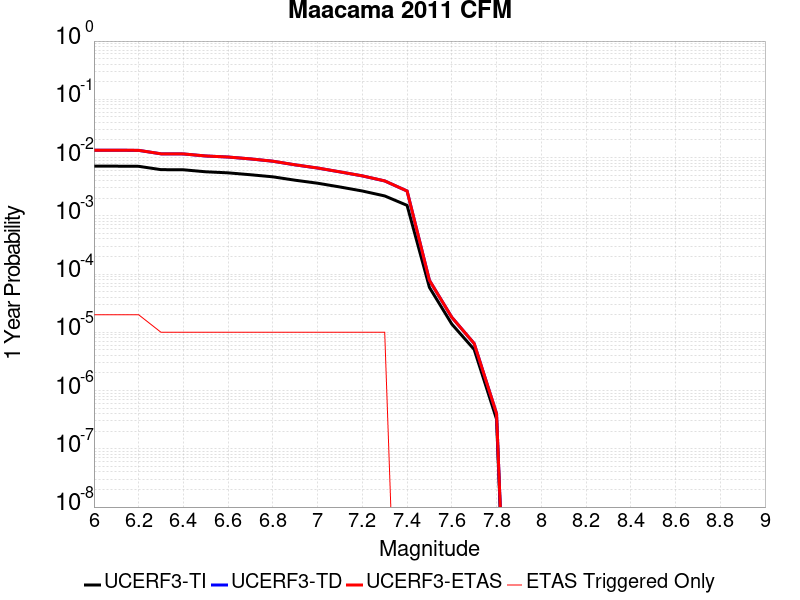 |  |

| Magnitude | 1 wk TI Prob | 1 wk TD Prob | 1 wk ETAS Prob | 1 wk ETAS/TD Gain | 1 wk ETAS Triggered Only | 1 mo TI Prob | 1 mo TD Prob | 1 mo ETAS Prob | 1 mo ETAS/TD Gain | 1 mo ETAS Triggered Only | 1 yr TI Prob | 1 yr TD Prob | 1 yr ETAS Prob | 1 yr ETAS/TD Gain | 1 yr ETAS Triggered Only | 10 yr TI Prob | 10 yr TD Prob | 10 yr ETAS Prob | 10 yr ETAS/TD Gain | 10 yr ETAS Triggered Only |
|-----|-----|-----|-----|-----|-----|-----|-----|-----|-----|-----|-----|-----|-----|-----|-----|-----|-----|-----|-----|-----|
| 6.0 | 1.368203E-4 | 2.579087E-4 | 2.679061E-4 | 1.0387634 | 1.0E-5 | 5.862409E-4 | 0.0011047592 | 0.0011147481 | 1.0090418 | 1.0E-5 | 0.0071141496 | 0.013350345 | 0.013370078 | 1.0014781 | 2.0E-5 | 0.06890667 | 0.1241916 | 0.124217875 | 1.0002116 | 3.0E-5 |
| 6.1 | 1.368203E-4 | 2.579087E-4 | 2.679061E-4 | 1.0387634 | 1.0E-5 | 5.862409E-4 | 0.0011047592 | 0.0011147481 | 1.0090418 | 1.0E-5 | 0.0071141496 | 0.013350345 | 0.013370078 | 1.0014781 | 2.0E-5 | 0.06890667 | 0.1241916 | 0.124217875 | 1.0002116 | 3.0E-5 |
| 6.2 | 1.360743E-4 | 2.566557E-4 | 2.6665317E-4 | 1.0389527 | 1.0E-5 | 5.8304524E-4 | 0.001099394 | 0.0011093831 | 1.0090859 | 1.0E-5 | 0.007075496 | 0.013285898 | 0.0133056315 | 1.0014853 | 2.0E-5 | 0.06854413 | 0.123625994 | 0.12365229 | 1.0002127 | 3.0E-5 |
| 6.3 | 1.1917239E-4 | 2.236021E-4 | 2.3359986E-4 | 1.0447123 | 1.0E-5 | 5.1063887E-4 | 9.578717E-4 | 9.6786214E-4 | 1.0104299 | 1.0E-5 | 0.0061993203 | 0.0115873255 | 0.01159721 | 1.0008531 | 1.0E-5 | 0.060292065 | 0.108845875 | 0.1088637 | 1.0001638 | 2.0E-5 |
| 6.4 | 1.1859289E-4 | 2.2263796E-4 | 2.3263574E-4 | 1.044906 | 1.0E-5 | 5.0815626E-4 | 9.537432E-4 | 9.6373365E-4 | 1.010475 | 1.0E-5 | 0.006169266 | 0.011537647 | 0.011547532 | 1.0008568 | 1.0E-5 | 0.06000784 | 0.10840272 | 0.10842056 | 1.0001645 | 2.0E-5 |
| 6.5 | 1.09512424E-4 | 2.0517908E-4 | 2.1517703E-4 | 1.0487279 | 1.0E-5 | 4.6925453E-4 | 8.7897904E-4 | 8.889703E-4 | 1.0113668 | 1.0E-5 | 0.005698218 | 0.010639169 | 0.010649063 | 1.00093 | 1.0E-5 | 0.055543028 | 0.1004949 | 0.100512885 | 1.000179 | 2.0E-5 |
| 6.6 | 1.0502928E-4 | 1.9675294E-4 | 2.0675096E-4 | 1.0508151 | 1.0E-5 | 4.500478E-4 | 8.429031E-4 | 8.528946E-4 | 1.0118538 | 1.0E-5 | 0.0054655746 | 0.010205293 | 0.010215191 | 1.0009699 | 1.0E-5 | 0.053330887 | 0.0966474 | 0.096665464 | 1.0001869 | 2.0E-5 |
| 6.7 | 9.739358E-5 | 1.8259176E-4 | 1.9258993E-4 | 1.054757 | 1.0E-5 | 4.173343E-4 | 7.822563E-4 | 7.9224847E-4 | 1.0127735 | 1.0E-5 | 0.0050692135 | 0.009475343 | 0.009485248 | 1.0010453 | 1.0E-5 | 0.049551267 | 0.09012011 | 0.0901383 | 1.000202 | 2.0E-5 |
| 6.8 | 8.969524E-5 | 1.6658378E-4 | 1.765821E-4 | 1.0600199 | 1.0E-5 | 3.8435153E-4 | 7.1369443E-4 | 7.236873E-4 | 1.0140016 | 1.0E-5 | 0.0046694432 | 0.00864909 | 0.008659003 | 1.0011462 | 1.0E-5 | 0.045725387 | 0.08265246 | 0.08267081 | 1.000222 | 2.0E-5 |
| 6.9 | 7.838291E-5 | 1.4418772E-4 | 1.5418629E-4 | 1.069344 | 1.0E-5 | 3.358835E-4 | 6.1778206E-4 | 6.2777585E-4 | 1.0161769 | 1.0E-5 | 0.0040817154 | 0.007491724 | 0.007501649 | 1.0013248 | 1.0E-5 | 0.04007554 | 0.07205298 | 0.072062254 | 1.0001287 | 1.0E-5 |
| 7.0 | 6.961957E-5 | 1.2708071E-4 | 1.3707943E-4 | 1.0786802 | 1.0E-5 | 2.9833548E-4 | 5.445059E-4 | 5.5450044E-4 | 1.0183553 | 1.0E-5 | 0.0036261857 | 0.006606692 | 0.006616626 | 1.0015036 | 1.0E-5 | 0.035675827 | 0.063871816 | 0.063881174 | 1.0001465 | 1.0E-5 |
| 7.1 | 5.999398E-5 | 1.09053384E-4 | 1.19052296E-4 | 1.0916882 | 1.0E-5 | 2.570917E-4 | 4.6728246E-4 | 4.7727776E-4 | 1.0213903 | 1.0E-5 | 0.0031255994 | 0.00567284 | 0.005682783 | 1.0017527 | 1.0E-5 | 0.030820016 | 0.055139277 | 0.055148724 | 1.0001713 | 1.0E-5 |
| 7.2 | 5.116532E-5 | 9.305489E-5 | 1.03053964E-4 | 1.1074535 | 1.0E-5 | 2.1926152E-4 | 3.9874107E-4 | 4.0873708E-4 | 1.0250689 | 1.0E-5 | 0.002666241 | 0.00484315 | 0.0048531014 | 1.0020548 | 1.0E-5 | 0.026344774 | 0.047303654 | 0.04731318 | 1.0002013 | 1.0E-5 |
| 7.3 | 4.2087835E-5 | 7.617064E-5 | 8.616987E-5 | 1.1312742 | 1.0E-5 | 1.8036396E-4 | 3.264016E-4 | 3.3639834E-4 | 1.0306271 | 1.0E-5 | 0.0021937196 | 0.0039662397 | 0.0039762 | 1.0025113 | 1.0E-5 | 0.0217219 | 0.038905017 | 0.03891463 | 1.000247 | 1.0E-5 |
| 7.4 | 2.8991652E-5 | 5.1163643E-5 | 5.1163643E-5 | 1.0 | 0.0 | 1.2424402E-4 | 2.1925455E-4 | 2.1925455E-4 | 1.0 | 0.0 | 0.0015116213 | 0.0026661097 | 0.0026661097 | 1.0 | 0.0 | 0.015013801 | 0.026332043 | 0.026332043 | 1.0 | 0.0 |
| 7.5 | 1.1292299E-6 | 1.4950216E-6 | 1.4950216E-6 | 1.0 | 0.0 | 4.8395473E-6 | 6.407227E-6 | 6.407227E-6 | 1.0 | 0.0 | 5.8919897E-5 | 7.8006444E-5 | 7.8006444E-5 | 1.0 | 0.0 | 5.890428E-4 | 7.805042E-4 | 7.805042E-4 | 1.0 | 0.0 |
| 7.6 | 2.6535366E-7 | 3.4720998E-7 | 3.4720998E-7 | 1.0 | 0.0 | 1.1372296E-6 | 1.4880419E-6 | 1.4880419E-6 | 1.0 | 0.0 | 1.3845682E-5 | 1.811676E-5 | 1.811676E-5 | 1.0 | 0.0 | 1.3844819E-4 | 1.8170691E-4 | 1.8170691E-4 | 1.0 | 0.0 |
| 7.7 | 9.727789E-8 | 1.2302418E-7 | 1.2302418E-7 | 1.0 | 0.0 | 4.1690518E-7 | 5.2724636E-7 | 5.2724636E-7 | 1.0 | 0.0 | 5.0758085E-6 | 6.419206E-6 | 6.419206E-6 | 1.0 | 0.0 | 5.0756928E-5 | 6.456404E-5 | 6.456404E-5 | 1.0 | 0.0 |
| 7.8 | 6.1939325E-9 | 7.711711E-9 | 7.711711E-9 | 1.0 | 0.0 | 2.6545425E-8 | 3.305019E-8 | 3.305019E-8 | 1.0 | 0.0 | 3.231905E-7 | 4.0238598E-7 | 4.0238598E-7 | 1.0 | 0.0 | 3.2319003E-6 | 4.0597915E-6 | 4.0597915E-6 | 1.0 | 0.0 |

## San Jacinto (Superstition Mtn)
*[(top)](#table-of-contents)*

| 1 Week | 1 Month | 1 Year | 10 Year |
|-----|-----|-----|-----|
|  |  |  |  |

| Magnitude | 1 wk TI Prob | 1 wk TD Prob | 1 wk ETAS Prob | 1 wk ETAS/TD Gain | 1 wk ETAS Triggered Only | 1 mo TI Prob | 1 mo TD Prob | 1 mo ETAS Prob | 1 mo ETAS/TD Gain | 1 mo ETAS Triggered Only | 1 yr TI Prob | 1 yr TD Prob | 1 yr ETAS Prob | 1 yr ETAS/TD Gain | 1 yr ETAS Triggered Only | 10 yr TI Prob | 10 yr TD Prob | 10 yr ETAS Prob | 10 yr ETAS/TD Gain | 10 yr ETAS Triggered Only |
|-----|-----|-----|-----|-----|-----|-----|-----|-----|-----|-----|-----|-----|-----|-----|-----|-----|-----|-----|-----|-----|
| 6.0 | 6.4193904E-5 | 9.599558E-5 | 9.599558E-5 | 1.0 | 0.0 | 2.7508775E-4 | 4.1135435E-4 | 4.3134612E-4 | 1.0485998 | 2.0E-5 | 0.0033440501 | 0.0049981694 | 0.005028019 | 1.0059721 | 3.0E-5 | 0.03294174 | 0.048820045 | 0.04884858 | 1.0005845 | 3.0E-5 |
| 6.1 | 6.4193904E-5 | 9.599558E-5 | 9.599558E-5 | 1.0 | 0.0 | 2.7508775E-4 | 4.1135435E-4 | 4.3134612E-4 | 1.0485998 | 2.0E-5 | 0.0033440501 | 0.0049981694 | 0.005028019 | 1.0059721 | 3.0E-5 | 0.03294174 | 0.048820045 | 0.04884858 | 1.0005845 | 3.0E-5 |
| 6.2 | 5.7023593E-5 | 8.3144616E-5 | 8.3144616E-5 | 1.0 | 0.0 | 2.4436394E-4 | 3.5629462E-4 | 3.762875E-4 | 1.0561134 | 2.0E-5 | 0.002971072 | 0.0043309047 | 0.004360775 | 1.006897 | 3.0E-5 | 0.029316625 | 0.042502448 | 0.042531174 | 1.0006758 | 3.0E-5 |
| 6.3 | 5.6940098E-5 | 8.298998E-5 | 8.298998E-5 | 1.0 | 0.0 | 2.4400617E-4 | 3.5563204E-4 | 3.7562495E-4 | 1.0562179 | 2.0E-5 | 0.002966728 | 0.00432287 | 0.0043527405 | 1.0069098 | 3.0E-5 | 0.029274331 | 0.04242582 | 0.04245455 | 1.0006771 | 3.0E-5 |
| 6.4 | 5.4171585E-5 | 7.748391E-5 | 7.748391E-5 | 1.0 | 0.0 | 2.3214328E-4 | 3.3204095E-4 | 3.520343E-4 | 1.0602136 | 2.0E-5 | 0.0028226813 | 0.0040367534 | 0.004066632 | 1.0074017 | 3.0E-5 | 0.02787096 | 0.039715026 | 0.039743833 | 1.0007254 | 3.0E-5 |
| 6.5 | 4.375144E-5 | 5.6421442E-5 | 5.6421442E-5 | 1.0 | 0.0 | 1.874927E-4 | 2.417904E-4 | 2.6178558E-4 | 1.0826963 | 2.0E-5 | 0.0022803338 | 0.002941 | 0.0029709118 | 1.0101706 | 3.0E-5 | 0.022570757 | 0.029235592 | 0.029264715 | 1.0009961 | 3.0E-5 |
| 6.6 | 2.772192E-5 | 2.5488029E-5 | 2.5488029E-5 | 1.0 | 0.0 | 1.1880282E-4 | 1.0922994E-4 | 1.0922994E-4 | 1.0 | 0.0 | 0.0014454646 | 0.0013290826 | 0.0013290826 | 1.0 | 0.0 | 0.014360986 | 0.013540891 | 0.013540891 | 1.0 | 0.0 |
| 6.7 | 2.7124124E-5 | 2.4699055E-5 | 2.4699055E-5 | 1.0 | 0.0 | 1.1624106E-4 | 1.0584891E-4 | 1.0584891E-4 | 1.0 | 0.0 | 0.0014143161 | 0.0012879678 | 0.0012879678 | 1.0 | 0.0 | 0.014053487 | 0.013134248 | 0.013134248 | 1.0 | 0.0 |
| 6.8 | 2.5475807E-5 | 2.2164071E-5 | 2.2164071E-5 | 1.0 | 0.0 | 1.0917746E-4 | 9.498548E-5 | 9.498548E-5 | 1.0 | 0.0 | 0.001328425 | 0.0011558468 | 0.0011558468 | 1.0 | 0.0 | 0.0132051185 | 0.011821818 | 0.011821818 | 1.0 | 0.0 |
| 6.9 | 2.1162023E-5 | 1.762564E-5 | 1.762564E-5 | 1.0 | 0.0 | 9.069123E-5 | 7.553629E-5 | 7.553629E-5 | 1.0 | 0.0 | 0.0011036064 | 9.1927015E-4 | 9.1927015E-4 | 1.0 | 0.0 | 0.010981417 | 0.009446762 | 0.009446762 | 1.0 | 0.0 |
| 7.0 | 1.8754288E-5 | 1.616099E-5 | 1.616099E-5 | 1.0 | 0.0 | 8.037304E-5 | 6.9259564E-5 | 6.9259564E-5 | 1.0 | 0.0 | 9.781026E-4 | 8.429114E-4 | 8.429114E-4 | 1.0 | 0.0 | 0.009738087 | 0.008669995 | 0.008669995 | 1.0 | 0.0 |
| 7.1 | 1.8678527E-5 | 1.6086136E-5 | 1.6086136E-5 | 1.0 | 0.0 | 8.0048376E-5 | 6.8938774E-5 | 6.8938774E-5 | 1.0 | 0.0 | 9.7415317E-4 | 8.3900883E-4 | 8.3900883E-4 | 1.0 | 0.0 | 0.009698939 | 0.008631011 | 0.008631011 | 1.0 | 0.0 |
| 7.2 | 1.7804578E-5 | 1.5380709E-5 | 1.5380709E-5 | 1.0 | 0.0 | 7.6303106E-5 | 6.591567E-5 | 6.591567E-5 | 1.0 | 0.0 | 9.285943E-4 | 8.022301E-4 | 8.022301E-4 | 1.0 | 0.0 | 0.009247236 | 0.008262424 | 0.008262424 | 1.0 | 0.0 |
| 7.3 | 1.6583685E-5 | 1.4529837E-5 | 1.4529837E-5 | 1.0 | 0.0 | 7.1070994E-5 | 6.226926E-5 | 6.226926E-5 | 1.0 | 0.0 | 8.649459E-4 | 7.5786654E-4 | 7.5786654E-4 | 1.0 | 0.0 | 0.00861587 | 0.007817646 | 0.007817646 | 1.0 | 0.0 |
| 7.4 | 1.6387552E-5 | 1.4394727E-5 | 1.4394727E-5 | 1.0 | 0.0 | 7.023047E-5 | 6.169024E-5 | 6.169024E-5 | 1.0 | 0.0 | 8.5472054E-4 | 7.508219E-4 | 7.508219E-4 | 1.0 | 0.0 | 0.008514405 | 0.0077470187 | 0.0077470187 | 1.0 | 0.0 |
| 7.5 | 1.5790754E-5 | 1.40354305E-5 | 1.40354305E-5 | 1.0 | 0.0 | 6.767291E-5 | 6.015047E-5 | 6.015047E-5 | 1.0 | 0.0 | 8.236062E-4 | 7.320879E-4 | 7.320879E-4 | 1.0 | 0.0 | 0.008205604 | 0.007557581 | 0.007557581 | 1.0 | 0.0 |
| 7.6 | 1.4248672E-5 | 1.3054444E-5 | 1.3054444E-5 | 1.0 | 0.0 | 6.106431E-5 | 5.5946428E-5 | 5.5946428E-5 | 1.0 | 0.0 | 7.432043E-4 | 6.809366E-4 | 6.809366E-4 | 1.0 | 0.0 | 0.007407237 | 0.007040175 | 0.007040175 | 1.0 | 0.0 |
| 7.7 | 1.15449975E-5 | 1.0903222E-5 | 1.0903222E-5 | 1.0 | 0.0 | 4.947762E-5 | 4.672726E-5 | 4.672726E-5 | 1.0 | 0.0 | 6.022235E-4 | 5.6875666E-4 | 5.6875666E-4 | 1.0 | 0.0 | 0.006005941 | 0.0059102564 | 0.0059102564 | 1.0 | 0.0 |
| 7.8 | 9.1391985E-6 | 9.5139185E-6 | 9.5139185E-6 | 1.0 | 0.0 | 3.9167408E-5 | 4.0773306E-5 | 4.0773306E-5 | 1.0 | 0.0 | 4.767588E-4 | 4.963025E-4 | 4.963025E-4 | 1.0 | 0.0 | 0.0047573727 | 0.005176809 | 0.005176809 | 1.0 | 0.0 |
| 7.9 | 6.973017E-6 | 7.3817937E-6 | 7.3817937E-6 | 1.0 | 0.0 | 2.9884017E-5 | 3.163588E-5 | 3.163588E-5 | 1.0 | 0.0 | 3.6377716E-4 | 3.8509927E-4 | 3.8509927E-4 | 1.0 | 0.0 | 0.0036318225 | 0.004051976 | 0.004051976 | 1.0 | 0.0 |
| 8.0 | 5.7638235E-6 | 6.259641E-6 | 6.259641E-6 | 1.0 | 0.0 | 2.4701867E-5 | 2.682676E-5 | 2.682676E-5 | 1.0 | 0.0 | 3.0070372E-4 | 3.2656736E-4 | 3.2656736E-4 | 1.0 | 0.0 | 0.0030029714 | 0.0034535413 | 0.0034535413 | 1.0 | 0.0 |
| 8.1 | 5.1124434E-6 | 5.4953657E-6 | 5.4953657E-6 | 1.0 | 0.0 | 2.1910288E-5 | 2.3551356E-5 | 2.3551356E-5 | 1.0 | 0.0 | 2.6672508E-4 | 2.8670052E-4 | 2.8670052E-4 | 1.0 | 0.0 | 0.0026640517 | 0.0030403896 | 0.0030403896 | 1.0 | 0.0 |
| 8.2 | 1.1075938E-6 | 5.3348367E-7 | 5.3348367E-7 | 1.0 | 0.0 | 4.7468216E-6 | 2.2863567E-6 | 2.2863567E-6 | 1.0 | 0.0 | 5.779102E-5 | 2.7836059E-5 | 2.7836059E-5 | 1.0 | 0.0 | 5.777599E-4 | 3.133962E-4 | 3.133962E-4 | 1.0 | 0.0 |
| 8.3 | 1.3584393E-8 | 4.4718784E-9 | 4.4718784E-9 | 1.0 | 0.0 | 5.8218827E-8 | 1.9165192E-8 | 1.9165192E-8 | 1.0 | 0.0 | 7.0881396E-7 | 2.3333622E-7 | 2.3333622E-7 | 1.0 | 0.0 | 7.0881174E-6 | 2.6140672E-6 | 2.6140672E-6 | 1.0 | 0.0 |

## Simi-Santa Rosa
*[(top)](#table-of-contents)*

| 1 Week | 1 Month | 1 Year | 10 Year |
|-----|-----|-----|-----|
|  |  |  | 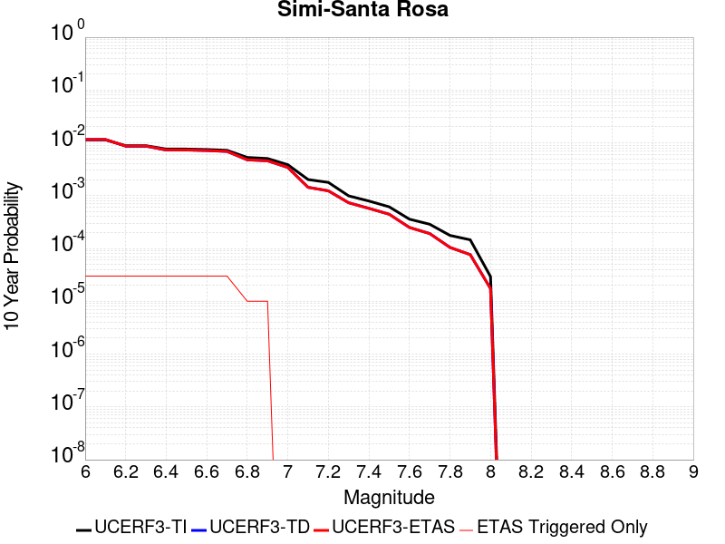 |

| Magnitude | 1 wk TI Prob | 1 wk TD Prob | 1 wk ETAS Prob | 1 wk ETAS/TD Gain | 1 wk ETAS Triggered Only | 1 mo TI Prob | 1 mo TD Prob | 1 mo ETAS Prob | 1 mo ETAS/TD Gain | 1 mo ETAS Triggered Only | 1 yr TI Prob | 1 yr TD Prob | 1 yr ETAS Prob | 1 yr ETAS/TD Gain | 1 yr ETAS Triggered Only | 10 yr TI Prob | 10 yr TD Prob | 10 yr ETAS Prob | 10 yr ETAS/TD Gain | 10 yr ETAS Triggered Only |
|-----|-----|-----|-----|-----|-----|-----|-----|-----|-----|-----|-----|-----|-----|-----|-----|-----|-----|-----|-----|-----|
| 6.0 | 2.198912E-5 | 2.2275388E-5 | 4.2274944E-5 | 1.8978319 | 2.0E-5 | 9.4235686E-5 | 9.54627E-5 | 1.15460796E-4 | 1.2094859 | 2.0E-5 | 0.0011467156 | 0.0011616825 | 0.0011816593 | 1.0171964 | 2.0E-5 | 0.011408163 | 0.011560547 | 0.0115902005 | 1.002565 | 3.0E-5 |
| 6.1 | 2.198912E-5 | 2.2275388E-5 | 4.2274944E-5 | 1.8978319 | 2.0E-5 | 9.4235686E-5 | 9.54627E-5 | 1.15460796E-4 | 1.2094859 | 2.0E-5 | 0.0011467156 | 0.0011616825 | 0.0011816593 | 1.0171964 | 2.0E-5 | 0.011408163 | 0.011560547 | 0.0115902005 | 1.002565 | 3.0E-5 |
| 6.2 | 1.69983E-5 | 1.6668506E-5 | 3.666817E-5 | 2.1998477 | 2.0E-5 | 7.284782E-5 | 7.143466E-5 | 9.1433234E-5 | 1.2799561 | 2.0E-5 | 8.865613E-4 | 8.6939917E-4 | 8.8938174E-4 | 1.0229844 | 2.0E-5 | 0.008830327 | 0.0086629 | 0.00869264 | 1.003433 | 3.0E-5 |
| 6.3 | 1.69983E-5 | 1.6668506E-5 | 3.666817E-5 | 2.1998477 | 2.0E-5 | 7.284782E-5 | 7.143466E-5 | 9.1433234E-5 | 1.2799561 | 2.0E-5 | 8.865613E-4 | 8.6939917E-4 | 8.8938174E-4 | 1.0229844 | 2.0E-5 | 0.008830327 | 0.0086629 | 0.00869264 | 1.003433 | 3.0E-5 |
| 6.4 | 1.4666188E-5 | 1.4052489E-5 | 3.405221E-5 | 2.4232154 | 2.0E-5 | 6.285358E-5 | 6.0223705E-5 | 8.02225E-5 | 1.3320751 | 2.0E-5 | 7.6497364E-4 | 7.330018E-4 | 7.5298717E-4 | 1.0272651 | 2.0E-5 | 0.0076234564 | 0.0073083164 | 0.007338097 | 1.0040749 | 3.0E-5 |
| 6.5 | 1.4666188E-5 | 1.4052489E-5 | 3.405221E-5 | 2.4232154 | 2.0E-5 | 6.285358E-5 | 6.0223705E-5 | 8.02225E-5 | 1.3320751 | 2.0E-5 | 7.6497364E-4 | 7.330018E-4 | 7.5298717E-4 | 1.0272651 | 2.0E-5 | 0.0076234564 | 0.0073083164 | 0.007338097 | 1.0040749 | 3.0E-5 |
| 6.6 | 1.4377586E-5 | 1.3729529E-5 | 3.3729255E-5 | 2.4566941 | 2.0E-5 | 6.1616774E-5 | 5.883965E-5 | 7.883847E-5 | 1.3398869 | 2.0E-5 | 7.4992597E-4 | 7.1616215E-4 | 7.361478E-4 | 1.0279067 | 2.0E-5 | 0.007474003 | 0.0071410104 | 0.0071707964 | 1.0041711 | 3.0E-5 |
| 6.7 | 1.3881404E-5 | 1.3207497E-5 | 3.3207234E-5 | 2.5142715 | 2.0E-5 | 5.9490372E-5 | 5.6602472E-5 | 7.660134E-5 | 1.3533214 | 2.0E-5 | 7.240546E-4 | 6.889419E-4 | 7.0892816E-4 | 1.02901 | 2.0E-5 | 0.007217 | 0.0068705105 | 0.0069003045 | 1.0043365 | 3.0E-5 |
| 6.8 | 1.0176516E-5 | 9.1541E-6 | 9.1541E-6 | 1.0 | 0.0 | 4.3612912E-5 | 3.923136E-5 | 3.923136E-5 | 1.0 | 0.0 | 5.308578E-4 | 4.775537E-4 | 4.775537E-4 | 1.0 | 0.0 | 0.0052959146 | 0.004766908 | 0.00477686 | 1.0020878 | 1.0E-5 |
| 6.9 | 9.699797E-6 | 8.774672E-6 | 8.774672E-6 | 1.0 | 0.0 | 4.15699E-5 | 3.760529E-5 | 3.760529E-5 | 1.0 | 0.0 | 5.05996E-4 | 4.5776463E-4 | 4.5776463E-4 | 1.0 | 0.0 | 0.005048454 | 0.0045698346 | 0.004579789 | 1.0021783 | 1.0E-5 |
| 7.0 | 7.4049476E-6 | 6.559291E-6 | 6.559291E-6 | 1.0 | 0.0 | 3.1735104E-5 | 2.8111013E-5 | 2.8111013E-5 | 1.0 | 0.0 | 3.8630638E-4 | 3.422105E-4 | 3.422105E-4 | 1.0 | 0.0 | 0.0038563553 | 0.0034180775 | 0.0034180775 | 1.0 | 0.0 |
| 7.1 | 3.873439E-6 | 2.759473E-6 | 2.759473E-6 | 1.0 | 0.0 | 1.6600346E-5 | 1.1826261E-5 | 1.1826261E-5 | 1.0 | 0.0 | 2.0209046E-4 | 1.4397544E-4 | 1.4397544E-4 | 1.0 | 0.0 | 0.0020190678 | 0.0014388453 | 0.0014388453 | 1.0 | 0.0 |
| 7.2 | 3.417706E-6 | 2.367616E-6 | 2.367616E-6 | 1.0 | 0.0 | 1.4647229E-5 | 1.0146887E-5 | 1.0146887E-5 | 1.0 | 0.0 | 1.7831543E-4 | 1.2353157E-4 | 1.2353157E-4 | 1.0 | 0.0 | 0.0017817242 | 0.0012346513 | 0.0012346513 | 1.0 | 0.0 |
| 7.3 | 1.90225E-6 | 1.4073756E-6 | 1.4073756E-6 | 1.0 | 0.0 | 8.152474E-6 | 6.031596E-6 | 6.031596E-6 | 1.0 | 0.0 | 9.9251854E-5 | 7.343223E-5 | 7.343223E-5 | 1.0 | 0.0 | 9.920754E-4 | 7.340819E-4 | 7.340819E-4 | 1.0 | 0.0 |
| 7.4 | 1.5170556E-6 | 1.1024792E-6 | 1.1024792E-6 | 1.0 | 0.0 | 6.5016507E-6 | 4.7249023E-6 | 4.7249023E-6 | 1.0 | 0.0 | 7.915472E-5 | 5.752418E-5 | 5.752418E-5 | 1.0 | 0.0 | 7.9126534E-4 | 5.75094E-4 | 5.75094E-4 | 1.0 | 0.0 |
| 7.5 | 1.178732E-6 | 8.5351127E-7 | 8.5351127E-7 | 1.0 | 0.0 | 5.0516987E-6 | 3.6579004E-6 | 3.6579004E-6 | 1.0 | 0.0 | 6.1502695E-5 | 4.4534037E-5 | 4.4534037E-5 | 1.0 | 0.0 | 6.148568E-4 | 4.4525208E-4 | 4.4525208E-4 | 1.0 | 0.0 |
| 7.6 | 6.8722386E-7 | 4.793211E-7 | 4.793211E-7 | 1.0 | 0.0 | 2.9452417E-6 | 2.0542318E-6 | 2.0542318E-6 | 1.0 | 0.0 | 3.5857727E-5 | 2.5009986E-5 | 2.5009986E-5 | 1.0 | 0.0 | 3.5851944E-4 | 2.5007184E-4 | 2.5007184E-4 | 1.0 | 0.0 |
| 7.7 | 5.5126515E-7 | 3.6731117E-7 | 3.6731117E-7 | 1.0 | 0.0 | 2.3625628E-6 | 1.5741898E-6 | 1.5741898E-6 | 1.0 | 0.0 | 2.8763823E-5 | 1.9165593E-5 | 1.9165593E-5 | 1.0 | 0.0 | 2.87601E-4 | 1.9163951E-4 | 1.9163951E-4 | 1.0 | 0.0 |
| 7.8 | 3.3860243E-7 | 2.0075514E-7 | 2.0075514E-7 | 1.0 | 0.0 | 1.4511525E-6 | 8.6037886E-7 | 8.6037886E-7 | 1.0 | 0.0 | 1.7667637E-5 | 1.0475063E-5 | 1.0475063E-5 | 1.0 | 0.0 | 1.7666233E-4 | 1.0474575E-4 | 1.0474575E-4 | 1.0 | 0.0 |
| 7.9 | 2.7955386E-7 | 1.4648724E-7 | 1.4648724E-7 | 1.0 | 0.0 | 1.1980875E-6 | 6.278023E-7 | 6.278023E-7 | 1.0 | 0.0 | 1.4586617E-5 | 7.643467E-6 | 7.643467E-6 | 1.0 | 0.0 | 1.458566E-4 | 7.643208E-5 | 7.643208E-5 | 1.0 | 0.0 |
| 8.0 | 5.6259015E-8 | 3.335318E-8 | 3.335318E-8 | 1.0 | 0.0 | 2.4111003E-7 | 1.429422E-7 | 1.429422E-7 | 1.0 | 0.0 | 2.9355108E-6 | 1.7403199E-6 | 1.7403199E-6 | 1.0 | 0.0 | 2.935472E-5 | 1.7403077E-5 | 1.7403077E-5 | 1.0 | 0.0 |

## Santa Ynez River
*[(top)](#table-of-contents)*

| 1 Week | 1 Month | 1 Year | 10 Year |
|-----|-----|-----|-----|
|  | 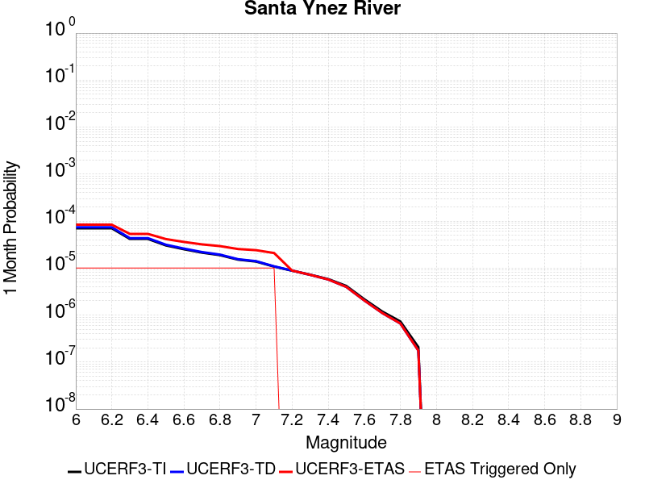 |  |  |

| Magnitude | 1 wk TI Prob | 1 wk TD Prob | 1 wk ETAS Prob | 1 wk ETAS/TD Gain | 1 wk ETAS Triggered Only | 1 mo TI Prob | 1 mo TD Prob | 1 mo ETAS Prob | 1 mo ETAS/TD Gain | 1 mo ETAS Triggered Only | 1 yr TI Prob | 1 yr TD Prob | 1 yr ETAS Prob | 1 yr ETAS/TD Gain | 1 yr ETAS Triggered Only | 10 yr TI Prob | 10 yr TD Prob | 10 yr ETAS Prob | 10 yr ETAS/TD Gain | 10 yr ETAS Triggered Only |
|-----|-----|-----|-----|-----|-----|-----|-----|-----|-----|-----|-----|-----|-----|-----|-----|-----|-----|-----|-----|-----|
| 6.0 | 1.6396456E-5 | 1.7209444E-5 | 2.7209273E-5 | 1.5810663 | 1.0E-5 | 7.026863E-5 | 7.3752875E-5 | 8.375214E-5 | 1.1355779 | 1.0E-5 | 8.551848E-4 | 8.976069E-4 | 9.1758894E-4 | 1.0222615 | 2.0E-5 | 0.0085190125 | 0.008943363 | 0.008973095 | 1.0033244 | 3.0E-5 |
| 6.1 | 1.6396456E-5 | 1.7209444E-5 | 2.7209273E-5 | 1.5810663 | 1.0E-5 | 7.026863E-5 | 7.3752875E-5 | 8.375214E-5 | 1.1355779 | 1.0E-5 | 8.551848E-4 | 8.976069E-4 | 9.1758894E-4 | 1.0222615 | 2.0E-5 | 0.0085190125 | 0.008943363 | 0.008973095 | 1.0033244 | 3.0E-5 |
| 6.2 | 1.6396456E-5 | 1.7209444E-5 | 2.7209273E-5 | 1.5810663 | 1.0E-5 | 7.026863E-5 | 7.3752875E-5 | 8.375214E-5 | 1.1355779 | 1.0E-5 | 8.551848E-4 | 8.976069E-4 | 9.1758894E-4 | 1.0222615 | 2.0E-5 | 0.0085190125 | 0.008943363 | 0.008973095 | 1.0033244 | 3.0E-5 |
| 6.3 | 9.736976E-6 | 1.01223395E-5 | 2.0122237E-5 | 1.987904 | 1.0E-5 | 4.172923E-5 | 4.338076E-5 | 5.3380325E-5 | 1.2305069 | 1.0E-5 | 5.0793495E-4 | 5.280378E-4 | 5.480272E-4 | 1.0378561 | 2.0E-5 | 0.005067755 | 0.0052683367 | 0.005288231 | 1.0037763 | 2.0E-5 |
| 6.4 | 9.736976E-6 | 1.01223395E-5 | 2.0122237E-5 | 1.987904 | 1.0E-5 | 4.172923E-5 | 4.338076E-5 | 5.3380325E-5 | 1.2305069 | 1.0E-5 | 5.0793495E-4 | 5.280378E-4 | 5.480272E-4 | 1.0378561 | 2.0E-5 | 0.005067755 | 0.0052683367 | 0.005288231 | 1.0037763 | 2.0E-5 |
| 6.5 | 7.081964E-6 | 7.329905E-6 | 1.7329832E-5 | 2.364264 | 1.0E-5 | 3.035092E-5 | 3.141351E-5 | 4.1413197E-5 | 1.3183243 | 1.0E-5 | 3.694598E-4 | 3.8239395E-4 | 4.023863E-4 | 1.0522821 | 2.0E-5 | 0.0036884616 | 0.0038175215 | 0.003837445 | 1.005219 | 2.0E-5 |
| 6.6 | 5.873247E-6 | 6.0597517E-6 | 1.6059692E-5 | 2.6502225 | 1.0E-5 | 2.5170815E-5 | 2.5970112E-5 | 3.5969853E-5 | 1.385048 | 1.0E-5 | 3.064116E-4 | 3.161411E-4 | 3.2613793E-4 | 1.0316215 | 1.0E-5 | 0.0030598943 | 0.003157001 | 0.0031669694 | 1.0031576 | 1.0E-5 |
| 6.7 | 4.973277E-6 | 5.11591E-6 | 1.5115859E-5 | 2.9546764 | 1.0E-5 | 2.1313872E-5 | 2.1925147E-5 | 3.1924927E-5 | 1.4560872 | 1.0E-5 | 2.5946548E-4 | 2.6690646E-4 | 2.7690377E-4 | 1.0374563 | 1.0E-5 | 0.0025916274 | 0.0026659078 | 0.0026758811 | 1.003741 | 1.0E-5 |
| 6.8 | 4.396492E-6 | 4.510987E-6 | 1.4510942E-5 | 3.2168 | 1.0E-5 | 1.884197E-5 | 1.933266E-5 | 2.9332465E-5 | 1.5172495 | 1.0E-5 | 2.2937685E-4 | 2.3535005E-4 | 2.4534768E-4 | 1.0424799 | 1.0E-5 | 0.0022914023 | 0.0023510433 | 0.0023610198 | 1.0042434 | 1.0E-5 |
| 6.9 | 3.5255632E-6 | 3.6013423E-6 | 1.3601306E-5 | 3.7767324 | 1.0E-5 | 1.5109469E-5 | 1.5434234E-5 | 2.543408E-5 | 1.6479003 | 1.0E-5 | 1.8394225E-4 | 1.8789574E-4 | 1.9789387E-4 | 1.053211 | 1.0E-5 | 0.0018379007 | 0.001877385 | 0.0018873662 | 1.0053166 | 1.0E-5 |
| 7.0 | 3.211603E-6 | 3.273663E-6 | 1.327363E-5 | 4.0546722 | 1.0E-5 | 1.376394E-5 | 1.402991E-5 | 2.4029769E-5 | 1.7127529 | 1.0E-5 | 1.6756308E-4 | 1.708009E-4 | 1.807992E-4 | 1.0585377 | 1.0E-5 | 0.0016743679 | 0.0017067104 | 0.0017166934 | 1.0058492 | 1.0E-5 |
| 7.1 | 2.5094619E-6 | 2.5409295E-6 | 1.2540904E-5 | 4.935558 | 1.0E-5 | 1.0754793E-5 | 1.0889652E-5 | 2.0889544E-5 | 1.918293 | 1.0E-5 | 1.3093173E-4 | 1.325735E-4 | 1.4257219E-4 | 1.0754199 | 1.0E-5 | 0.0013085462 | 0.0013249503 | 0.0013349369 | 1.0075375 | 1.0E-5 |
| 7.2 | 2.0515774E-6 | 2.0619466E-6 | 2.0619466E-6 | 1.0 | 0.0 | 8.792445E-6 | 8.836884E-6 | 8.836884E-6 | 1.0 | 0.0 | 1.0704277E-4 | 1.0758379E-4 | 1.0758379E-4 | 1.0 | 0.0 | 0.0010699122 | 0.0010753215 | 0.0010753215 | 1.0 | 0.0 |
| 7.3 | 1.6845745E-6 | 1.6773996E-6 | 1.6773996E-6 | 1.0 | 0.0 | 7.219585E-6 | 7.1888358E-6 | 7.1888358E-6 | 1.0 | 0.0 | 8.78949E-5 | 8.752059E-5 | 8.752059E-5 | 1.0 | 0.0 | 8.7860145E-4 | 8.7486405E-4 | 8.7486405E-4 | 1.0 | 0.0 |
| 7.4 | 1.3600285E-6 | 1.3333447E-6 | 1.3333447E-6 | 1.0 | 0.0 | 5.82868E-6 | 5.714322E-6 | 5.714322E-6 | 1.0 | 0.0 | 7.096187E-5 | 6.956967E-5 | 6.956967E-5 | 1.0 | 0.0 | 7.0939213E-4 | 6.9548114E-4 | 6.9548114E-4 | 1.0 | 0.0 |
| 7.5 | 9.735342E-7 | 9.2901894E-7 | 9.2901894E-7 | 1.0 | 0.0 | 4.172283E-6 | 3.9815036E-6 | 3.9815036E-6 | 1.0 | 0.0 | 5.079636E-5 | 4.8473747E-5 | 4.8473747E-5 | 1.0 | 0.0 | 5.0784746E-4 | 4.8463346E-4 | 4.8463346E-4 | 1.0 | 0.0 |
| 7.6 | 5.067187E-7 | 4.778609E-7 | 4.778609E-7 | 1.0 | 0.0 | 2.1716498E-6 | 2.0479738E-6 | 2.0479738E-6 | 1.0 | 0.0 | 2.6439517E-5 | 2.4933803E-5 | 2.4933803E-5 | 1.0 | 0.0 | 2.643637E-4 | 2.493108E-4 | 2.493108E-4 | 1.0 | 0.0 |
| 7.7 | 2.769089E-7 | 2.5759346E-7 | 2.5759346E-7 | 1.0 | 0.0 | 1.1867519E-6 | 1.1039714E-6 | 1.1039714E-6 | 1.0 | 0.0 | 1.4448608E-5 | 1.344077E-5 | 1.344077E-5 | 1.0 | 0.0 | 1.444767E-4 | 1.343996E-4 | 1.343996E-4 | 1.0 | 0.0 |
| 7.8 | 1.7044663E-7 | 1.5449208E-7 | 1.5449208E-7 | 1.0 | 0.0 | 7.3048534E-7 | 6.6210873E-7 | 6.6210873E-7 | 1.0 | 0.0 | 8.893623E-6 | 8.061144E-6 | 8.061144E-6 | 1.0 | 0.0 | 8.893267E-5 | 8.060854E-5 | 8.060854E-5 | 1.0 | 0.0 |
| 7.9 | 4.8344287E-8 | 4.0911143E-8 | 4.0911143E-8 | 1.0 | 0.0 | 2.0718979E-7 | 1.7533345E-7 | 1.7533345E-7 | 1.0 | 0.0 | 2.5225327E-6 | 2.1346827E-6 | 2.1346827E-6 | 1.0 | 0.0 | 2.5225041E-5 | 2.1346626E-5 | 2.1346626E-5 | 1.0 | 0.0 |

## South Klamath Lake West
*[(top)](#table-of-contents)*

| 1 Week | 1 Month | 1 Year | 10 Year |
|-----|-----|-----|-----|
|  |  |  |  |

| Magnitude | 1 wk TI Prob | 1 wk TD Prob | 1 wk ETAS Prob | 1 wk ETAS/TD Gain | 1 wk ETAS Triggered Only | 1 mo TI Prob | 1 mo TD Prob | 1 mo ETAS Prob | 1 mo ETAS/TD Gain | 1 mo ETAS Triggered Only | 1 yr TI Prob | 1 yr TD Prob | 1 yr ETAS Prob | 1 yr ETAS/TD Gain | 1 yr ETAS Triggered Only | 10 yr TI Prob | 10 yr TD Prob | 10 yr ETAS Prob | 10 yr ETAS/TD Gain | 10 yr ETAS Triggered Only |
|-----|-----|-----|-----|-----|-----|-----|-----|-----|-----|-----|-----|-----|-----|-----|-----|-----|-----|-----|-----|-----|
| 6.0 | 2.174025E-5 | 2.3042025E-5 | 2.3042025E-5 | 1.0 | 0.0 | 9.3169176E-5 | 9.874817E-5 | 9.874817E-5 | 1.0 | 0.0 | 0.0011337444 | 0.0012016617 | 0.0012016617 | 1.0 | 0.0 | 0.011279777 | 0.0119582405 | 0.011978001 | 1.0016525 | 2.0E-5 |
| 6.1 | 2.174025E-5 | 2.3042025E-5 | 2.3042025E-5 | 1.0 | 0.0 | 9.3169176E-5 | 9.874817E-5 | 9.874817E-5 | 1.0 | 0.0 | 0.0011337444 | 0.0012016617 | 0.0012016617 | 1.0 | 0.0 | 0.011279777 | 0.0119582405 | 0.011978001 | 1.0016525 | 2.0E-5 |
| 6.2 | 9.834929E-6 | 1.0393841E-5 | 1.0393841E-5 | 1.0 | 0.0 | 4.2149015E-5 | 4.4544326E-5 | 4.4544326E-5 | 1.0 | 0.0 | 5.1304343E-4 | 5.422012E-4 | 5.422012E-4 | 1.0 | 0.0 | 0.0051186057 | 0.0054096854 | 0.0054196315 | 1.0018386 | 1.0E-5 |
| 6.3 | 9.834929E-6 | 1.0393841E-5 | 1.0393841E-5 | 1.0 | 0.0 | 4.2149015E-5 | 4.4544326E-5 | 4.4544326E-5 | 1.0 | 0.0 | 5.1304343E-4 | 5.422012E-4 | 5.422012E-4 | 1.0 | 0.0 | 0.0051186057 | 0.0054096854 | 0.0054196315 | 1.0018386 | 1.0E-5 |
| 6.4 | 6.066321E-6 | 6.40043E-6 | 6.40043E-6 | 1.0 | 0.0 | 2.5998259E-5 | 2.743014E-5 | 2.743014E-5 | 1.0 | 0.0 | 3.1648282E-4 | 3.3391351E-4 | 3.3391351E-4 | 1.0 | 0.0 | 0.0031603249 | 0.0033343881 | 0.0033343881 | 1.0 | 0.0 |
| 6.5 | 6.066321E-6 | 6.40043E-6 | 6.40043E-6 | 1.0 | 0.0 | 2.5998259E-5 | 2.743014E-5 | 2.743014E-5 | 1.0 | 0.0 | 3.1648282E-4 | 3.3391351E-4 | 3.3391351E-4 | 1.0 | 0.0 | 0.0031603249 | 0.0033343881 | 0.0033343881 | 1.0 | 0.0 |
| 6.6 | 4.2321803E-6 | 4.461291E-6 | 4.461291E-6 | 1.0 | 0.0 | 1.8137789E-5 | 1.9119685E-5 | 1.9119685E-5 | 1.0 | 0.0 | 2.208052E-4 | 2.3275832E-4 | 2.3275832E-4 | 1.0 | 0.0 | 0.0022058594 | 0.0023252473 | 0.0023252473 | 1.0 | 0.0 |
| 6.7 | 3.186646E-6 | 3.360305E-6 | 3.360305E-6 | 1.0 | 0.0 | 1.3656982E-5 | 1.4401232E-5 | 1.4401232E-5 | 1.0 | 0.0 | 1.6626107E-4 | 1.7532158E-4 | 1.7532158E-4 | 1.0 | 0.0 | 0.0016613674 | 0.0017518997 | 0.0017518997 | 1.0 | 0.0 |
| 6.8 | 2.380121E-6 | 2.510907E-6 | 2.510907E-6 | 1.0 | 0.0 | 1.0200479E-5 | 1.07609885E-5 | 1.07609885E-5 | 1.0 | 0.0 | 1.2418375E-4 | 1.3100762E-4 | 1.3100762E-4 | 1.0 | 0.0 | 0.0012411437 | 0.0013093497 | 0.0013093497 | 1.0 | 0.0 |
| 6.9 | 8.928287E-7 | 9.4302504E-7 | 9.4302504E-7 | 1.0 | 0.0 | 3.826403E-6 | 4.0415307E-6 | 4.0415307E-6 | 1.0 | 0.0 | 4.658546E-5 | 4.9204747E-5 | 4.9204747E-5 | 1.0 | 0.0 | 4.6575698E-4 | 4.9196015E-4 | 4.9196015E-4 | 1.0 | 0.0 |

## Cedar Mtn-Mahogany Mtn
*[(top)](#table-of-contents)*

| 1 Week | 1 Month | 1 Year | 10 Year |
|-----|-----|-----|-----|
|  |  |  |  |

| Magnitude | 1 wk TI Prob | 1 wk TD Prob | 1 wk ETAS Prob | 1 wk ETAS/TD Gain | 1 wk ETAS Triggered Only | 1 mo TI Prob | 1 mo TD Prob | 1 mo ETAS Prob | 1 mo ETAS/TD Gain | 1 mo ETAS Triggered Only | 1 yr TI Prob | 1 yr TD Prob | 1 yr ETAS Prob | 1 yr ETAS/TD Gain | 1 yr ETAS Triggered Only | 10 yr TI Prob | 10 yr TD Prob | 10 yr ETAS Prob | 10 yr ETAS/TD Gain | 10 yr ETAS Triggered Only |
|-----|-----|-----|-----|-----|-----|-----|-----|-----|-----|-----|-----|-----|-----|-----|-----|-----|-----|-----|-----|-----|
| 6.0 | 2.7763876E-5 | 2.9588866E-5 | 2.9588866E-5 | 1.0 | 0.0 | 1.1898261E-4 | 1.2680366E-4 | 1.2680366E-4 | 1.0 | 0.0 | 0.0014476506 | 0.0015428112 | 0.0015527958 | 1.0064716 | 1.0E-5 | 0.0143825635 | 0.015328225 | 0.0153479185 | 1.0012848 | 2.0E-5 |
| 6.1 | 1.6162443E-5 | 1.7142966E-5 | 1.7142966E-5 | 1.0 | 0.0 | 6.926578E-5 | 7.346788E-5 | 7.346788E-5 | 1.0 | 0.0 | 8.4298453E-4 | 8.941221E-4 | 9.0411317E-4 | 1.0111742 | 1.0E-5 | 0.008397939 | 0.008907059 | 0.008926881 | 1.0022254 | 2.0E-5 |
| 6.2 | 1.6162443E-5 | 1.7142966E-5 | 1.7142966E-5 | 1.0 | 0.0 | 6.926578E-5 | 7.346788E-5 | 7.346788E-5 | 1.0 | 0.0 | 8.4298453E-4 | 8.941221E-4 | 9.0411317E-4 | 1.0111742 | 1.0E-5 | 0.008397939 | 0.008907059 | 0.008926881 | 1.0022254 | 2.0E-5 |
| 6.3 | 9.746053E-6 | 1.0303152E-5 | 1.0303152E-5 | 1.0 | 0.0 | 4.1768133E-5 | 4.415564E-5 | 4.415564E-5 | 1.0 | 0.0 | 5.0840835E-4 | 5.3746643E-4 | 5.4746104E-4 | 1.0185958 | 1.0E-5 | 0.0050724675 | 0.005362084 | 0.005381977 | 1.0037099 | 2.0E-5 |
| 6.4 | 9.746053E-6 | 1.0303152E-5 | 1.0303152E-5 | 1.0 | 0.0 | 4.1768133E-5 | 4.415564E-5 | 4.415564E-5 | 1.0 | 0.0 | 5.0840835E-4 | 5.3746643E-4 | 5.4746104E-4 | 1.0185958 | 1.0E-5 | 0.0050724675 | 0.005362084 | 0.005381977 | 1.0037099 | 2.0E-5 |
| 6.5 | 7.290083E-6 | 7.695325E-6 | 7.695325E-6 | 1.0 | 0.0 | 3.124284E-5 | 3.297956E-5 | 3.297956E-5 | 1.0 | 0.0 | 3.8031515E-4 | 4.014543E-4 | 4.1145028E-4 | 1.0248995 | 1.0E-5 | 0.0037966494 | 0.004007511 | 0.004027431 | 1.0049707 | 2.0E-5 |
| 6.6 | 5.67907E-6 | 5.9891527E-6 | 5.9891527E-6 | 1.0 | 0.0 | 2.4338644E-5 | 2.5667552E-5 | 2.5667552E-5 | 1.0 | 0.0 | 2.962827E-4 | 3.12459E-4 | 3.2245586E-4 | 1.0319942 | 1.0E-5 | 0.0029588798 | 0.003120333 | 0.0031303016 | 1.0031948 | 1.0E-5 |
| 6.7 | 3.4853963E-6 | 3.672631E-6 | 3.672631E-6 | 1.0 | 0.0 | 1.4937327E-5 | 1.5739755E-5 | 1.5739755E-5 | 1.0 | 0.0 | 1.8184677E-4 | 1.916153E-4 | 2.0161338E-4 | 1.0521779 | 1.0E-5 | 0.0018169804 | 0.0019145629 | 0.0019245436 | 1.0052131 | 1.0E-5 |
| 6.8 | 2.7535168E-6 | 2.9015764E-6 | 2.9015764E-6 | 1.0 | 0.0 | 1.1800733E-5 | 1.2435271E-5 | 1.2435271E-5 | 1.0 | 0.0 | 1.4366445E-4 | 1.5138938E-4 | 1.6138787E-4 | 1.0660448 | 1.0E-5 | 0.0014357162 | 0.0015129098 | 0.0015228946 | 1.0065998 | 1.0E-5 |
| 6.9 | 1.6594106E-6 | 1.7496985E-6 | 1.7496985E-6 | 1.0 | 0.0 | 7.1117406E-6 | 7.4986883E-6 | 7.4986883E-6 | 1.0 | 0.0 | 8.6582E-5 | 9.129302E-5 | 9.129302E-5 | 1.0 | 0.0 | 8.654827E-4 | 9.125856E-4 | 9.125856E-4 | 1.0 | 0.0 |
| 7.0 | 5.10215E-7 | 5.389254E-7 | 5.389254E-7 | 1.0 | 0.0 | 2.186634E-6 | 2.3096788E-6 | 2.3096788E-6 | 1.0 | 0.0 | 2.6621943E-5 | 2.8120105E-5 | 2.8120105E-5 | 1.0 | 0.0 | 2.6618753E-4 | 2.81178E-4 | 2.81178E-4 | 1.0 | 0.0 |

## San Andreas (Offshore) 2011 CFM
*[(top)](#table-of-contents)*

| 1 Week | 1 Month | 1 Year | 10 Year |
|-----|-----|-----|-----|
|  |  |  |  |

| Magnitude | 1 wk TI Prob | 1 wk TD Prob | 1 wk ETAS Prob | 1 wk ETAS/TD Gain | 1 wk ETAS Triggered Only | 1 mo TI Prob | 1 mo TD Prob | 1 mo ETAS Prob | 1 mo ETAS/TD Gain | 1 mo ETAS Triggered Only | 1 yr TI Prob | 1 yr TD Prob | 1 yr ETAS Prob | 1 yr ETAS/TD Gain | 1 yr ETAS Triggered Only | 10 yr TI Prob | 10 yr TD Prob | 10 yr ETAS Prob | 10 yr ETAS/TD Gain | 10 yr ETAS Triggered Only |
|-----|-----|-----|-----|-----|-----|-----|-----|-----|-----|-----|-----|-----|-----|-----|-----|-----|-----|-----|-----|-----|
| 6.0 | 1.7072787E-4 | 1.9226626E-4 | 1.9226626E-4 | 1.0 | 0.0 | 7.3148566E-4 | 8.237405E-4 | 8.237405E-4 | 1.0 | 0.0 | 0.008869528 | 0.009983436 | 0.009993336 | 1.0009917 | 1.0E-5 | 0.085237645 | 0.09681613 | 0.0968342 | 1.0001866 | 2.0E-5 |
| 6.1 | 1.7072787E-4 | 1.9226626E-4 | 1.9226626E-4 | 1.0 | 0.0 | 7.3148566E-4 | 8.237405E-4 | 8.237405E-4 | 1.0 | 0.0 | 0.008869528 | 0.009983436 | 0.009993336 | 1.0009917 | 1.0E-5 | 0.085237645 | 0.09681613 | 0.0968342 | 1.0001866 | 2.0E-5 |
| 6.2 | 1.6312556E-4 | 1.8408237E-4 | 1.8408237E-4 | 1.0 | 0.0 | 6.989222E-4 | 7.8868825E-4 | 7.8868825E-4 | 1.0 | 0.0 | 0.008476226 | 0.0095605 | 0.009570405 | 1.0010359 | 1.0E-5 | 0.08160117 | 0.092837214 | 0.09285536 | 1.0001954 | 2.0E-5 |
| 6.3 | 1.5103363E-4 | 1.6881147E-4 | 1.6881147E-4 | 1.0 | 0.0 | 6.471264E-4 | 7.232793E-4 | 7.232793E-4 | 1.0 | 0.0 | 0.007850339 | 0.008770814 | 0.008780727 | 1.0011301 | 1.0E-5 | 0.075787395 | 0.08546859 | 0.08548688 | 1.000214 | 2.0E-5 |
| 6.4 | 1.5047993E-4 | 1.6767075E-4 | 1.6767075E-4 | 1.0 | 0.0 | 6.4475456E-4 | 7.183932E-4 | 7.183932E-4 | 1.0 | 0.0 | 0.007821669 | 0.008711802 | 0.008721715 | 1.0011379 | 1.0E-5 | 0.0755203 | 0.08494888 | 0.08496718 | 1.0002154 | 2.0E-5 |
| 6.5 | 1.2760791E-4 | 1.3734949E-4 | 1.3734949E-4 | 1.0 | 0.0 | 5.467764E-4 | 5.8850925E-4 | 5.8850925E-4 | 1.0 | 0.0 | 0.0066367025 | 0.007141834 | 0.007151763 | 1.0013902 | 1.0E-5 | 0.064419635 | 0.07024954 | 0.07026814 | 1.0002646 | 2.0E-5 |
| 6.6 | 1.1063525E-4 | 1.15565475E-4 | 1.15565475E-4 | 1.0 | 0.0 | 4.740649E-4 | 4.9518765E-4 | 4.9518765E-4 | 1.0 | 0.0 | 0.0057564764 | 0.006012446 | 0.006012446 | 1.0 | 0.0 | 0.05609626 | 0.059496127 | 0.059505533 | 1.0001581 | 1.0E-5 |
| 6.7 | 1.0391049E-4 | 1.0645875E-4 | 1.0645875E-4 | 1.0 | 0.0 | 4.4525467E-4 | 4.56173E-4 | 4.56173E-4 | 1.0 | 0.0 | 0.0054075094 | 0.0055399504 | 0.0055399504 | 1.0 | 0.0 | 0.052778035 | 0.05498844 | 0.05499789 | 1.0001719 | 1.0E-5 |
| 6.8 | 1.0096706E-4 | 1.01582154E-4 | 1.01582154E-4 | 1.0 | 0.0 | 4.3264418E-4 | 4.3528038E-4 | 4.3528038E-4 | 1.0 | 0.0 | 0.0052547283 | 0.0052868384 | 0.0052868384 | 1.0 | 0.0 | 0.051321987 | 0.052686825 | 0.0526963 | 1.0001798 | 1.0E-5 |
| 6.9 | 9.800265E-5 | 9.588697E-5 | 9.588697E-5 | 1.0 | 0.0 | 4.1994374E-4 | 4.1088034E-4 | 4.1088034E-4 | 1.0 | 0.0 | 0.0051008356 | 0.004991162 | 0.004991162 | 1.0 | 0.0 | 0.049853306 | 0.05001508 | 0.05002458 | 1.0001899 | 1.0E-5 |
| 7.0 | 9.4642375E-5 | 9.002096E-5 | 9.002096E-5 | 1.0 | 0.0 | 4.0554712E-4 | 3.8574796E-4 | 3.8574796E-4 | 1.0 | 0.0 | 0.004926363 | 0.00468653 | 0.00468653 | 1.0 | 0.0 | 0.048185747 | 0.047194667 | 0.047194667 | 1.0 | 0.0 |
| 7.1 | 9.0996844E-5 | 8.354119E-5 | 8.354119E-5 | 1.0 | 0.0 | 3.8992817E-4 | 3.579854E-4 | 3.579854E-4 | 1.0 | 0.0 | 0.004737046 | 0.0043499186 | 0.0043499186 | 1.0 | 0.0 | 0.04637333 | 0.04404688 | 0.04404688 | 1.0 | 0.0 |
| 7.2 | 8.848287E-5 | 7.981761E-5 | 7.981761E-5 | 1.0 | 0.0 | 3.791572E-4 | 3.420315E-4 | 3.420315E-4 | 1.0 | 0.0 | 0.004606472 | 0.0041564363 | 0.0041564363 | 1.0 | 0.0 | 0.045121472 | 0.042189904 | 0.042189904 | 1.0 | 0.0 |
| 7.3 | 7.9280784E-5 | 6.1274885E-5 | 6.1274885E-5 | 1.0 | 0.0 | 3.3973053E-4 | 2.6258078E-4 | 2.6258078E-4 | 1.0 | 0.0 | 0.004128377 | 0.003192337 | 0.003192337 | 1.0 | 0.0 | 0.040525194 | 0.03290183 | 0.03290183 | 1.0 | 0.0 |
| 7.4 | 6.468038E-5 | 3.7930724E-5 | 3.7930724E-5 | 1.0 | 0.0 | 2.771722E-4 | 1.6255044E-4 | 1.6255044E-4 | 1.0 | 0.0 | 0.0033693502 | 0.0019773128 | 0.0019773128 | 1.0 | 0.0 | 0.0331872 | 0.02081734 | 0.02081734 | 1.0 | 0.0 |
| 7.5 | 4.930574E-5 | 1.2699263E-5 | 1.2699263E-5 | 1.0 | 0.0 | 2.1129321E-4 | 5.4424287E-5 | 5.4424287E-5 | 1.0 | 0.0 | 0.0025694598 | 6.6241587E-4 | 6.6241587E-4 | 1.0 | 0.0 | 0.02539953 | 0.0074798525 | 0.0074798525 | 1.0 | 0.0 |
| 7.6 | 4.612566E-5 | 1.0332297E-5 | 1.0332297E-5 | 1.0 | 0.0 | 1.9766642E-4 | 4.428053E-5 | 4.428053E-5 | 1.0 | 0.0 | 0.0024039324 | 5.3898344E-4 | 5.3898344E-4 | 1.0 | 0.0 | 0.023780935 | 0.006170428 | 0.006170428 | 1.0 | 0.0 |
| 7.7 | 3.9435414E-5 | 5.5710498E-6 | 5.5710498E-6 | 1.0 | 0.0 | 1.6899795E-4 | 2.3875711E-5 | 2.3875711E-5 | 1.0 | 0.0 | 0.0020556084 | 2.906482E-4 | 2.906482E-4 | 1.0 | 0.0 | 0.020366974 | 0.0035397834 | 0.0035397834 | 1.0 | 0.0 |
| 7.8 | 2.7787428E-5 | 3.7526645E-6 | 3.7526645E-6 | 1.0 | 0.0 | 1.1908354E-4 | 1.6082748E-5 | 1.6082748E-5 | 1.0 | 0.0 | 0.0014488777 | 1.9578991E-4 | 1.9578991E-4 | 1.0 | 0.0 | 0.014394675 | 0.0023862 | 0.0023862 | 1.0 | 0.0 |
| 7.9 | 1.590671E-5 | 3.0391298E-6 | 3.0391298E-6 | 1.0 | 0.0 | 6.816983E-5 | 1.3024777E-5 | 1.3024777E-5 | 1.0 | 0.0 | 8.2965166E-4 | 1.5856515E-4 | 1.5856515E-4 | 1.0 | 0.0 | 0.008265611 | 0.0019033558 | 0.0019033558 | 1.0 | 0.0 |
| 8.0 | 9.193638E-6 | 2.5908973E-6 | 2.5908973E-6 | 1.0 | 0.0 | 3.940071E-5 | 1.1103798E-5 | 1.1103798E-5 | 1.0 | 0.0 | 4.7959806E-4 | 1.3518038E-4 | 1.3518038E-4 | 1.0 | 0.0 | 0.0047856434 | 0.0016108477 | 0.0016108477 | 1.0 | 0.0 |
| 8.1 | 5.601576E-6 | 2.2333788E-6 | 2.2333788E-6 | 1.0 | 0.0 | 2.4006533E-5 | 9.571589E-6 | 9.571589E-6 | 1.0 | 0.0 | 2.9224035E-4 | 1.1652788E-4 | 1.1652788E-4 | 1.0 | 0.0 | 0.0029185633 | 0.0014015464 | 0.0014015464 | 1.0 | 0.0 |
| 8.2 | 4.3508785E-6 | 1.8568232E-6 | 1.8568232E-6 | 1.0 | 0.0 | 1.864649E-5 | 7.957789E-6 | 7.957789E-6 | 1.0 | 0.0 | 2.2699735E-4 | 9.6881806E-5 | 9.6881806E-5 | 1.0 | 0.0 | 0.0022676561 | 0.0011590312 | 0.0011590312 | 1.0 | 0.0 |
| 8.3 | 1.9573292E-6 | 7.511501E-7 | 7.511501E-7 | 1.0 | 0.0 | 8.388526E-6 | 3.2192108E-6 | 3.2192108E-6 | 1.0 | 0.0 | 1.0212552E-4 | 3.9193204E-5 | 3.9193204E-5 | 1.0 | 0.0 | 0.001020786 | 4.6391718E-4 | 4.6391718E-4 | 1.0 | 0.0 |

## Great Valley 08 (Quinto)
*[(top)](#table-of-contents)*

| 1 Week | 1 Month | 1 Year | 10 Year |
|-----|-----|-----|-----|
|  |  |  |  |

| Magnitude | 1 wk TI Prob | 1 wk TD Prob | 1 wk ETAS Prob | 1 wk ETAS/TD Gain | 1 wk ETAS Triggered Only | 1 mo TI Prob | 1 mo TD Prob | 1 mo ETAS Prob | 1 mo ETAS/TD Gain | 1 mo ETAS Triggered Only | 1 yr TI Prob | 1 yr TD Prob | 1 yr ETAS Prob | 1 yr ETAS/TD Gain | 1 yr ETAS Triggered Only | 10 yr TI Prob | 10 yr TD Prob | 10 yr ETAS Prob | 10 yr ETAS/TD Gain | 10 yr ETAS Triggered Only |
|-----|-----|-----|-----|-----|-----|-----|-----|-----|-----|-----|-----|-----|-----|-----|-----|-----|-----|-----|-----|-----|
| 6.0 | 7.737697E-6 | 8.253038E-6 | 8.253038E-6 | 1.0 | 0.0 | 3.3161137E-5 | 3.536979E-5 | 4.5369437E-5 | 1.2827171 | 1.0E-5 | 4.0366207E-4 | 4.3056096E-4 | 4.4055664E-4 | 1.0232155 | 1.0E-5 | 0.004029296 | 0.0042991205 | 0.0043190345 | 1.0046321 | 2.0E-5 |
| 6.1 | 7.737697E-6 | 8.253038E-6 | 8.253038E-6 | 1.0 | 0.0 | 3.3161137E-5 | 3.536979E-5 | 4.5369437E-5 | 1.2827171 | 1.0E-5 | 4.0366207E-4 | 4.3056096E-4 | 4.4055664E-4 | 1.0232155 | 1.0E-5 | 0.004029296 | 0.0042991205 | 0.0043190345 | 1.0046321 | 2.0E-5 |
| 6.2 | 7.737697E-6 | 8.253038E-6 | 8.253038E-6 | 1.0 | 0.0 | 3.3161137E-5 | 3.536979E-5 | 4.5369437E-5 | 1.2827171 | 1.0E-5 | 4.0366207E-4 | 4.3056096E-4 | 4.4055664E-4 | 1.0232155 | 1.0E-5 | 0.004029296 | 0.0042991205 | 0.0043190345 | 1.0046321 | 2.0E-5 |
| 6.3 | 5.374012E-6 | 5.7505736E-6 | 5.7505736E-6 | 1.0 | 0.0 | 2.3031276E-5 | 2.4645145E-5 | 3.4644898E-5 | 1.4057494 | 1.0E-5 | 2.803697E-4 | 3.0002446E-4 | 3.1002148E-4 | 1.0333207 | 1.0E-5 | 0.0028001624 | 0.0029972875 | 0.0030172276 | 1.0066527 | 2.0E-5 |
| 6.4 | 5.374012E-6 | 5.7505736E-6 | 5.7505736E-6 | 1.0 | 0.0 | 2.3031276E-5 | 2.4645145E-5 | 3.4644898E-5 | 1.4057494 | 1.0E-5 | 2.803697E-4 | 3.0002446E-4 | 3.1002148E-4 | 1.0333207 | 1.0E-5 | 0.0028001624 | 0.0029972875 | 0.0030172276 | 1.0066527 | 2.0E-5 |
| 6.5 | 3.65427E-6 | 3.941324E-6 | 3.941324E-6 | 1.0 | 0.0 | 1.5661062E-5 | 1.689132E-5 | 1.689132E-5 | 1.0 | 0.0 | 1.9065675E-4 | 2.0563944E-4 | 2.0563944E-4 | 1.0 | 0.0 | 0.0019049325 | 0.0020551833 | 0.0020551833 | 1.0 | 0.0 |
| 6.6 | 3.6143538E-6 | 3.8985104E-6 | 3.8985104E-6 | 1.0 | 0.0 | 1.5489995E-5 | 1.6707834E-5 | 1.6707834E-5 | 1.0 | 0.0 | 1.8857437E-4 | 2.0340596E-4 | 2.0340596E-4 | 1.0 | 0.0 | 0.0018841444 | 0.0020328893 | 0.0020328893 | 1.0 | 0.0 |
| 6.7 | 2.4821015E-6 | 2.6857067E-6 | 2.6857067E-6 | 1.0 | 0.0 | 1.0637535E-5 | 1.1510153E-5 | 1.1510153E-5 | 1.0 | 0.0 | 1.2950429E-4 | 1.4013276E-4 | 1.4013276E-4 | 1.0 | 0.0 | 0.0012942884 | 0.0014009989 | 0.0014009989 | 1.0 | 0.0 |
| 6.8 | 4.7110538E-7 | 5.193021E-7 | 5.193021E-7 | 1.0 | 0.0 | 2.0190216E-6 | 2.2255786E-6 | 2.2255786E-6 | 1.0 | 0.0 | 2.458131E-5 | 2.70961E-5 | 2.70961E-5 | 1.0 | 0.0 | 2.457859E-4 | 2.7092977E-4 | 2.7092977E-4 | 1.0 | 0.0 |
| 6.9 | 3.958685E-7 | 4.3703452E-7 | 4.3703452E-7 | 1.0 | 0.0 | 1.6965782E-6 | 1.8730038E-6 | 1.8730038E-6 | 1.0 | 0.0 | 2.0655643E-5 | 2.28036E-5 | 2.28036E-5 | 1.0 | 0.0 | 2.0653724E-4 | 2.2801422E-4 | 2.2801422E-4 | 1.0 | 0.0 |
| 7.0 | 2.70294E-7 | 2.9920008E-7 | 2.9920008E-7 | 1.0 | 0.0 | 1.1584025E-6 | 1.2822856E-6 | 1.2822856E-6 | 1.0 | 0.0 | 1.4103458E-5 | 1.5611728E-5 | 1.5611728E-5 | 1.0 | 0.0 | 1.4102564E-4 | 1.5610759E-4 | 1.5610759E-4 | 1.0 | 0.0 |
| 7.1 | 1.4828602E-7 | 1.6469107E-7 | 1.6469107E-7 | 1.0 | 0.0 | 6.3551136E-7 | 7.058187E-7 | 7.058187E-7 | 1.0 | 0.0 | 7.737323E-6 | 8.593317E-6 | 8.593317E-6 | 1.0 | 0.0 | 7.737054E-5 | 8.593065E-5 | 8.593065E-5 | 1.0 | 0.0 |

## Pitas Point (Lower West)
*[(top)](#table-of-contents)*

| 1 Week | 1 Month | 1 Year | 10 Year |
|-----|-----|-----|-----|
|  | 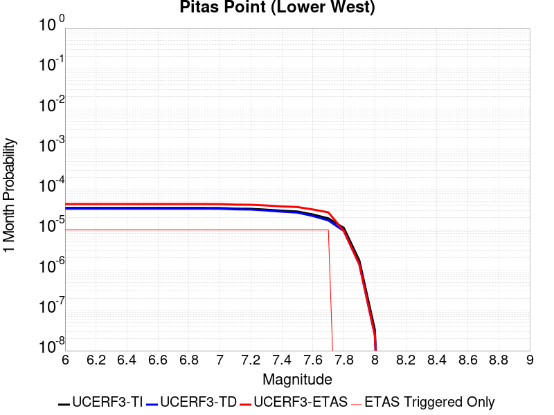 |  |  |

| Magnitude | 1 wk TI Prob | 1 wk TD Prob | 1 wk ETAS Prob | 1 wk ETAS/TD Gain | 1 wk ETAS Triggered Only | 1 mo TI Prob | 1 mo TD Prob | 1 mo ETAS Prob | 1 mo ETAS/TD Gain | 1 mo ETAS Triggered Only | 1 yr TI Prob | 1 yr TD Prob | 1 yr ETAS Prob | 1 yr ETAS/TD Gain | 1 yr ETAS Triggered Only | 10 yr TI Prob | 10 yr TD Prob | 10 yr ETAS Prob | 10 yr ETAS/TD Gain | 10 yr ETAS Triggered Only |
|-----|-----|-----|-----|-----|-----|-----|-----|-----|-----|-----|-----|-----|-----|-----|-----|-----|-----|-----|-----|-----|
| 6.0 | 8.151497E-6 | 7.855796E-6 | 1.7855718E-5 | 2.2729354 | 1.0E-5 | 3.493452E-5 | 3.3667267E-5 | 4.3666932E-5 | 1.2970144 | 1.0E-5 | 4.252448E-4 | 4.0982262E-4 | 4.1981853E-4 | 1.0243908 | 1.0E-5 | 0.0042443196 | 0.004090749 | 0.0041106674 | 1.0048691 | 2.0E-5 |
| 6.1 | 8.151497E-6 | 7.855796E-6 | 1.7855718E-5 | 2.2729354 | 1.0E-5 | 3.493452E-5 | 3.3667267E-5 | 4.3666932E-5 | 1.2970144 | 1.0E-5 | 4.252448E-4 | 4.0982262E-4 | 4.1981853E-4 | 1.0243908 | 1.0E-5 | 0.0042443196 | 0.004090749 | 0.0041106674 | 1.0048691 | 2.0E-5 |
| 6.2 | 8.151497E-6 | 7.855796E-6 | 1.7855718E-5 | 2.2729354 | 1.0E-5 | 3.493452E-5 | 3.3667267E-5 | 4.3666932E-5 | 1.2970144 | 1.0E-5 | 4.252448E-4 | 4.0982262E-4 | 4.1981853E-4 | 1.0243908 | 1.0E-5 | 0.0042443196 | 0.004090749 | 0.0041106674 | 1.0048691 | 2.0E-5 |
| 6.3 | 8.151497E-6 | 7.855796E-6 | 1.7855718E-5 | 2.2729354 | 1.0E-5 | 3.493452E-5 | 3.3667267E-5 | 4.3666932E-5 | 1.2970144 | 1.0E-5 | 4.252448E-4 | 4.0982262E-4 | 4.1981853E-4 | 1.0243908 | 1.0E-5 | 0.0042443196 | 0.004090749 | 0.0041106674 | 1.0048691 | 2.0E-5 |
| 6.4 | 8.151497E-6 | 7.855796E-6 | 1.7855718E-5 | 2.2729354 | 1.0E-5 | 3.493452E-5 | 3.3667267E-5 | 4.3666932E-5 | 1.2970144 | 1.0E-5 | 4.252448E-4 | 4.0982262E-4 | 4.1981853E-4 | 1.0243908 | 1.0E-5 | 0.0042443196 | 0.004090749 | 0.0041106674 | 1.0048691 | 2.0E-5 |
| 6.5 | 8.151497E-6 | 7.855796E-6 | 1.7855718E-5 | 2.2729354 | 1.0E-5 | 3.493452E-5 | 3.3667267E-5 | 4.3666932E-5 | 1.2970144 | 1.0E-5 | 4.252448E-4 | 4.0982262E-4 | 4.1981853E-4 | 1.0243908 | 1.0E-5 | 0.0042443196 | 0.004090749 | 0.0041106674 | 1.0048691 | 2.0E-5 |
| 6.6 | 8.151497E-6 | 7.855796E-6 | 1.7855718E-5 | 2.2729354 | 1.0E-5 | 3.493452E-5 | 3.3667267E-5 | 4.3666932E-5 | 1.2970144 | 1.0E-5 | 4.252448E-4 | 4.0982262E-4 | 4.1981853E-4 | 1.0243908 | 1.0E-5 | 0.0042443196 | 0.004090749 | 0.0041106674 | 1.0048691 | 2.0E-5 |
| 6.7 | 8.151497E-6 | 7.855796E-6 | 1.7855718E-5 | 2.2729354 | 1.0E-5 | 3.493452E-5 | 3.3667267E-5 | 4.3666932E-5 | 1.2970144 | 1.0E-5 | 4.252448E-4 | 4.0982262E-4 | 4.1981853E-4 | 1.0243908 | 1.0E-5 | 0.0042443196 | 0.004090749 | 0.0041106674 | 1.0048691 | 2.0E-5 |
| 6.8 | 8.151497E-6 | 7.855796E-6 | 1.7855718E-5 | 2.2729354 | 1.0E-5 | 3.493452E-5 | 3.3667267E-5 | 4.3666932E-5 | 1.2970144 | 1.0E-5 | 4.252448E-4 | 4.0982262E-4 | 4.1981853E-4 | 1.0243908 | 1.0E-5 | 0.0042443196 | 0.004090749 | 0.0041106674 | 1.0048691 | 2.0E-5 |
| 6.9 | 8.151497E-6 | 7.855796E-6 | 1.7855718E-5 | 2.2729354 | 1.0E-5 | 3.493452E-5 | 3.3667267E-5 | 4.3666932E-5 | 1.2970144 | 1.0E-5 | 4.252448E-4 | 4.0982262E-4 | 4.1981853E-4 | 1.0243908 | 1.0E-5 | 0.0042443196 | 0.004090749 | 0.0041106674 | 1.0048691 | 2.0E-5 |
| 7.0 | 8.103535E-6 | 7.805226E-6 | 1.7805149E-5 | 2.281183 | 1.0E-5 | 3.4728975E-5 | 3.3450542E-5 | 4.3450207E-5 | 1.2989388 | 1.0E-5 | 4.2274324E-4 | 4.07185E-4 | 4.171809E-4 | 1.0245489 | 1.0E-5 | 0.0042193993 | 0.0040644696 | 0.0040843883 | 1.0049007 | 2.0E-5 |
| 7.1 | 7.853298E-6 | 7.540917E-6 | 1.7540842E-5 | 2.3260887 | 1.0E-5 | 3.3656554E-5 | 3.2317817E-5 | 4.2317497E-5 | 1.3094168 | 1.0E-5 | 4.096915E-4 | 3.9339912E-4 | 4.0339518E-4 | 1.0254095 | 1.0E-5 | 0.00408937 | 0.0039271032 | 0.0039470247 | 1.0050728 | 2.0E-5 |
| 7.2 | 7.771102E-6 | 7.453199E-6 | 1.7453125E-5 | 2.3416958 | 1.0E-5 | 3.33043E-5 | 3.1941894E-5 | 4.1941574E-5 | 1.3130585 | 1.0E-5 | 4.0540437E-4 | 3.8882386E-4 | 3.9881998E-4 | 1.0257086 | 1.0E-5 | 0.0040466557 | 0.003881511 | 0.0039014334 | 1.0051327 | 2.0E-5 |
| 7.3 | 7.3945344E-6 | 7.0493033E-6 | 1.7049233E-5 | 2.4185698 | 1.0E-5 | 3.1690477E-5 | 3.0210955E-5 | 4.0210653E-5 | 1.3309958 | 1.0E-5 | 3.8576324E-4 | 3.677569E-4 | 3.7775323E-4 | 1.0271819 | 1.0E-5 | 0.0038509427 | 0.003671551 | 0.0036914775 | 1.0054272 | 2.0E-5 |
| 7.4 | 6.964645E-6 | 6.5901527E-6 | 1.6590087E-5 | 2.5174055 | 1.0E-5 | 2.9848137E-5 | 2.8243208E-5 | 3.8242924E-5 | 1.3540574 | 1.0E-5 | 3.6334046E-4 | 3.438073E-4 | 3.5380386E-4 | 1.0290761 | 1.0E-5 | 0.0036274698 | 0.0034328073 | 0.003442773 | 1.0029031 | 1.0E-5 |
| 7.5 | 6.6525035E-6 | 6.259191E-6 | 1.6259128E-5 | 2.5976405 | 1.0E-5 | 2.851042E-5 | 2.6824831E-5 | 3.6824564E-5 | 1.3727789 | 1.0E-5 | 3.4705905E-4 | 3.2654387E-4 | 3.365406E-4 | 1.0306138 | 1.0E-5 | 0.0034651754 | 0.0032606919 | 0.0032706594 | 1.0030569 | 1.0E-5 |
| 7.6 | 5.613338E-6 | 5.15142E-6 | 1.5151369E-5 | 2.9412024 | 1.0E-5 | 2.405694E-5 | 2.2077327E-5 | 3.2077107E-5 | 1.4529433 | 1.0E-5 | 2.928539E-4 | 2.6875862E-4 | 2.7875594E-4 | 1.0371981 | 1.0E-5 | 0.0029246826 | 0.0026843674 | 0.0026943407 | 1.0037153 | 1.0E-5 |
| 7.7 | 4.494704E-6 | 3.996945E-6 | 1.3996905E-5 | 3.501901 | 1.0E-5 | 1.9262876E-5 | 1.7129652E-5 | 2.7129481E-5 | 1.583773 | 1.0E-5 | 2.3450027E-4 | 2.0853379E-4 | 2.185317E-4 | 1.0479438 | 1.0E-5 | 0.0023425296 | 0.0020834052 | 0.0020933843 | 1.0047898 | 1.0E-5 |
| 7.8 | 2.6075882E-6 | 2.1836663E-6 | 2.1836663E-6 | 1.0 | 0.0 | 1.117533E-5 | 9.358537E-6 | 9.358537E-6 | 1.0 | 0.0 | 1.3605114E-4 | 1.1393427E-4 | 1.1393427E-4 | 1.0 | 0.0 | 0.0013596788 | 0.0011387634 | 0.0011387634 | 1.0 | 0.0 |
| 7.9 | 4.045984E-7 | 3.2424057E-7 | 3.2424057E-7 | 1.0 | 0.0 | 1.733992E-6 | 1.3896017E-6 | 1.3896017E-6 | 1.0 | 0.0 | 2.1111147E-5 | 1.6918271E-5 | 1.6918271E-5 | 1.0 | 0.0 | 2.1109142E-4 | 1.6917015E-4 | 1.6917015E-4 | 1.0 | 0.0 |
| 8.0 | 7.791402E-9 | 5.6836056E-9 | 5.6836056E-9 | 1.0 | 0.0 | 3.3391725E-8 | 2.4358311E-8 | 2.4358311E-8 | 1.0 | 0.0 | 4.0654416E-7 | 2.965624E-7 | 2.965624E-7 | 1.0 | 0.0 | 4.065434E-6 | 2.9656223E-6 | 2.9656223E-6 | 1.0 | 0.0 |

## Sierra Madre
*[(top)](#table-of-contents)*

| 1 Week | 1 Month | 1 Year | 10 Year |
|-----|-----|-----|-----|
|  |  |  |  |

| Magnitude | 1 wk TI Prob | 1 wk TD Prob | 1 wk ETAS Prob | 1 wk ETAS/TD Gain | 1 wk ETAS Triggered Only | 1 mo TI Prob | 1 mo TD Prob | 1 mo ETAS Prob | 1 mo ETAS/TD Gain | 1 mo ETAS Triggered Only | 1 yr TI Prob | 1 yr TD Prob | 1 yr ETAS Prob | 1 yr ETAS/TD Gain | 1 yr ETAS Triggered Only | 10 yr TI Prob | 10 yr TD Prob | 10 yr ETAS Prob | 10 yr ETAS/TD Gain | 10 yr ETAS Triggered Only |
|-----|-----|-----|-----|-----|-----|-----|-----|-----|-----|-----|-----|-----|-----|-----|-----|-----|-----|-----|-----|-----|
| 6.0 | 1.3379373E-5 | 1.1000776E-5 | 1.1000776E-5 | 1.0 | 0.0 | 5.7338908E-5 | 4.714534E-5 | 4.714534E-5 | 1.0 | 0.0 | 6.978776E-4 | 5.738448E-4 | 5.9383333E-4 | 1.0348326 | 2.0E-5 | 0.0069569005 | 0.0057238447 | 0.0057437303 | 1.0034741 | 2.0E-5 |
| 6.1 | 1.3379373E-5 | 1.1000776E-5 | 1.1000776E-5 | 1.0 | 0.0 | 5.7338908E-5 | 4.714534E-5 | 4.714534E-5 | 1.0 | 0.0 | 6.978776E-4 | 5.738448E-4 | 5.9383333E-4 | 1.0348326 | 2.0E-5 | 0.0069569005 | 0.0057238447 | 0.0057437303 | 1.0034741 | 2.0E-5 |
| 6.2 | 1.3379373E-5 | 1.1000776E-5 | 1.1000776E-5 | 1.0 | 0.0 | 5.7338908E-5 | 4.714534E-5 | 4.714534E-5 | 1.0 | 0.0 | 6.978776E-4 | 5.738448E-4 | 5.9383333E-4 | 1.0348326 | 2.0E-5 | 0.0069569005 | 0.0057238447 | 0.0057437303 | 1.0034741 | 2.0E-5 |
| 6.3 | 1.3379373E-5 | 1.1000776E-5 | 1.1000776E-5 | 1.0 | 0.0 | 5.7338908E-5 | 4.714534E-5 | 4.714534E-5 | 1.0 | 0.0 | 6.978776E-4 | 5.738448E-4 | 5.9383333E-4 | 1.0348326 | 2.0E-5 | 0.0069569005 | 0.0057238447 | 0.0057437303 | 1.0034741 | 2.0E-5 |
| 6.4 | 1.3379373E-5 | 1.1000776E-5 | 1.1000776E-5 | 1.0 | 0.0 | 5.7338908E-5 | 4.714534E-5 | 4.714534E-5 | 1.0 | 0.0 | 6.978776E-4 | 5.738448E-4 | 5.9383333E-4 | 1.0348326 | 2.0E-5 | 0.0069569005 | 0.0057238447 | 0.0057437303 | 1.0034741 | 2.0E-5 |
| 6.5 | 1.26563245E-5 | 1.0230232E-5 | 1.0230232E-5 | 1.0 | 0.0 | 5.4240263E-5 | 4.384312E-5 | 4.384312E-5 | 1.0 | 0.0 | 6.601751E-4 | 5.3366035E-4 | 5.536497E-4 | 1.037457 | 2.0E-5 | 0.006582173 | 0.0053239604 | 0.005343854 | 1.0037366 | 2.0E-5 |
| 6.6 | 1.26563245E-5 | 1.0230232E-5 | 1.0230232E-5 | 1.0 | 0.0 | 5.4240263E-5 | 4.384312E-5 | 4.384312E-5 | 1.0 | 0.0 | 6.601751E-4 | 5.3366035E-4 | 5.536497E-4 | 1.037457 | 2.0E-5 | 0.006582173 | 0.0053239604 | 0.005343854 | 1.0037366 | 2.0E-5 |
| 6.7 | 1.2502474E-5 | 1.00663765E-5 | 1.00663765E-5 | 1.0 | 0.0 | 5.3580934E-5 | 4.3140906E-5 | 4.3140906E-5 | 1.0 | 0.0 | 6.521526E-4 | 5.25115E-4 | 5.351097E-4 | 1.0190334 | 1.0E-5 | 0.0065024206 | 0.0052389116 | 0.005248859 | 1.0018988 | 1.0E-5 |
| 6.8 | 1.2454966E-5 | 1.0018662E-5 | 1.0018662E-5 | 1.0 | 0.0 | 5.3377335E-5 | 4.293642E-5 | 4.293642E-5 | 1.0 | 0.0 | 6.4967526E-4 | 5.226266E-4 | 5.3262134E-4 | 1.0191242 | 1.0E-5 | 0.006477792 | 0.0052141445 | 0.0052240924 | 1.0019078 | 1.0E-5 |
| 6.9 | 1.2225574E-5 | 9.792639E-6 | 9.792639E-6 | 1.0 | 0.0 | 5.2394265E-5 | 4.196778E-5 | 4.196778E-5 | 1.0 | 0.0 | 6.3771347E-4 | 5.10839E-4 | 5.208339E-4 | 1.0195656 | 1.0E-5 | 0.006358865 | 0.0050968137 | 0.005106763 | 1.001952 | 1.0E-5 |
| 7.0 | 1.182946E-5 | 9.399179E-6 | 9.399179E-6 | 1.0 | 0.0 | 5.06967E-5 | 4.0281582E-5 | 4.0281582E-5 | 1.0 | 0.0 | 6.1705755E-4 | 4.903189E-4 | 4.903189E-4 | 1.0 | 0.0 | 0.006153469 | 0.004892533 | 0.004892533 | 1.0 | 0.0 |
| 7.1 | 1.14369095E-5 | 8.986194E-6 | 8.986194E-6 | 1.0 | 0.0 | 4.9014405E-5 | 3.85117E-5 | 3.85117E-5 | 1.0 | 0.0 | 5.9658696E-4 | 4.6878002E-4 | 4.6878002E-4 | 1.0 | 0.0 | 0.005949879 | 0.0046780678 | 0.0046780678 | 1.0 | 0.0 |
| 7.2 | 1.0836419E-5 | 8.39959E-6 | 8.39959E-6 | 1.0 | 0.0 | 4.644097E-5 | 3.599775E-5 | 3.599775E-5 | 1.0 | 0.0 | 5.652721E-4 | 4.3818538E-4 | 4.3818538E-4 | 1.0 | 0.0 | 0.0056383642 | 0.0043733614 | 0.0043733614 | 1.0 | 0.0 |
| 7.3 | 1.0403439E-5 | 8.020854E-6 | 8.020854E-6 | 1.0 | 0.0 | 4.4585406E-5 | 3.437464E-5 | 3.437464E-5 | 1.0 | 0.0 | 5.426921E-4 | 4.184318E-4 | 4.184318E-4 | 1.0 | 0.0 | 0.005413687 | 0.004176585 | 0.004176585 | 1.0 | 0.0 |
| 7.4 | 9.768864E-6 | 7.4144855E-6 | 7.4144855E-6 | 1.0 | 0.0 | 4.186589E-5 | 3.1775984E-5 | 3.1775984E-5 | 1.0 | 0.0 | 5.09598E-4 | 3.868048E-4 | 3.868048E-4 | 1.0 | 0.0 | 0.0050843097 | 0.0038614576 | 0.0038614576 | 1.0 | 0.0 |
| 7.5 | 8.687089E-6 | 6.450183E-6 | 6.450183E-6 | 1.0 | 0.0 | 3.722985E-5 | 2.7643353E-5 | 2.7643353E-5 | 1.0 | 0.0 | 4.5317915E-4 | 3.3650672E-4 | 3.3650672E-4 | 1.0 | 0.0 | 0.004522561 | 0.003360109 | 0.003360109 | 1.0 | 0.0 |
| 7.6 | 6.3506063E-6 | 4.430329E-6 | 4.430329E-6 | 1.0 | 0.0 | 2.72166E-5 | 1.8986988E-5 | 1.8986988E-5 | 1.0 | 0.0 | 3.3131172E-4 | 2.3114232E-4 | 2.3114232E-4 | 1.0 | 0.0 | 0.003308182 | 0.0023090935 | 0.0023090935 | 1.0 | 0.0 |
| 7.7 | 4.62223E-6 | 2.9329542E-6 | 2.9329542E-6 | 1.0 | 0.0 | 1.9809406E-5 | 1.2569743E-5 | 1.2569743E-5 | 1.0 | 0.0 | 2.4115283E-4 | 1.5302589E-4 | 1.5302589E-4 | 1.0 | 0.0 | 0.0024089129 | 0.0015292577 | 0.0015292577 | 1.0 | 0.0 |
| 7.8 | 3.2145008E-6 | 1.949411E-6 | 1.949411E-6 | 1.0 | 0.0 | 1.3776359E-5 | 8.354592E-6 | 8.354592E-6 | 1.0 | 0.0 | 1.6771426E-4 | 1.01712416E-4 | 1.01712416E-4 | 1.0 | 0.0 | 0.0016758774 | 0.0010166786 | 0.0010166786 | 1.0 | 0.0 |
| 7.9 | 1.0391769E-6 | 5.602482E-7 | 5.602482E-7 | 1.0 | 0.0 | 4.4536077E-6 | 2.4010617E-6 | 2.4010617E-6 | 1.0 | 0.0 | 5.4221324E-5 | 2.9232539E-5 | 2.9232539E-5 | 1.0 | 0.0 | 5.4208096E-4 | 2.9228735E-4 | 2.9228735E-4 | 1.0 | 0.0 |
| 8.0 | 1.210983E-7 | 6.613497E-8 | 6.613497E-8 | 1.0 | 0.0 | 5.1899264E-7 | 2.8343558E-7 | 2.8343558E-7 | 1.0 | 0.0 | 6.3187167E-6 | 3.4508228E-6 | 3.4508228E-6 | 1.0 | 0.0 | 6.318537E-5 | 3.450771E-5 | 3.450771E-5 | 1.0 | 0.0 |

## San Gregorio (South) 2011 CFM
*[(top)](#table-of-contents)*

| 1 Week | 1 Month | 1 Year | 10 Year |
|-----|-----|-----|-----|
|  | 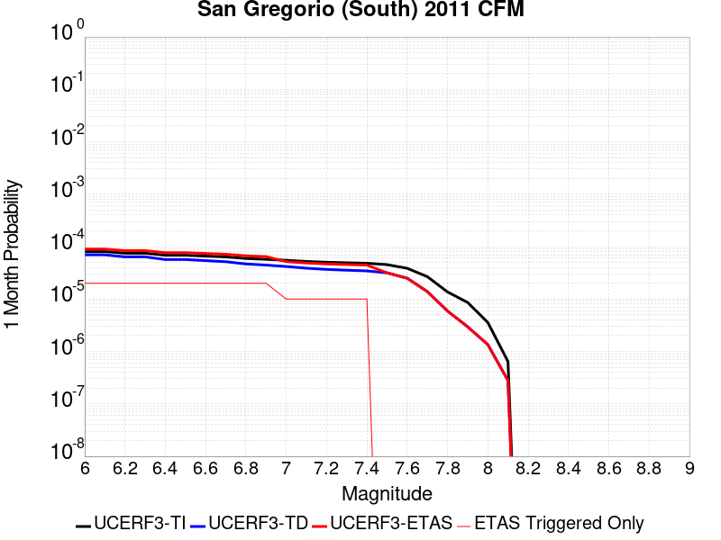 | 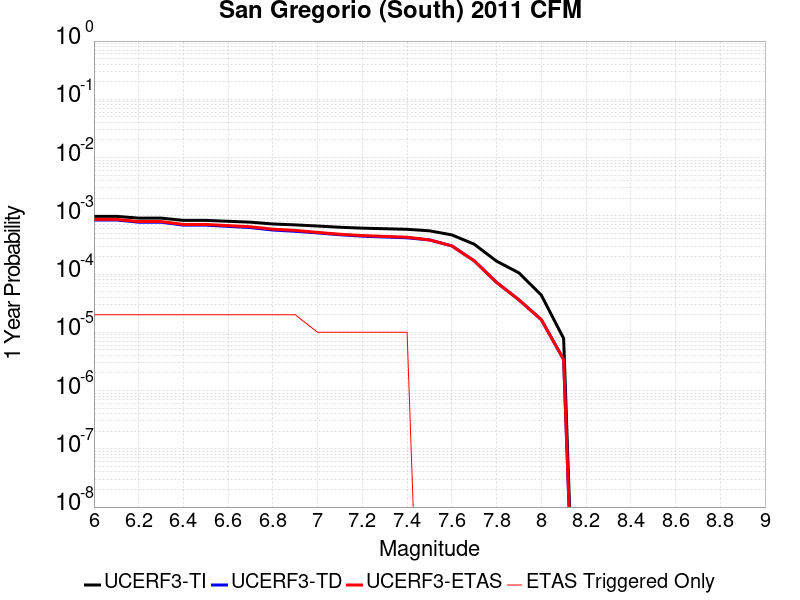 |  |

| Magnitude | 1 wk TI Prob | 1 wk TD Prob | 1 wk ETAS Prob | 1 wk ETAS/TD Gain | 1 wk ETAS Triggered Only | 1 mo TI Prob | 1 mo TD Prob | 1 mo ETAS Prob | 1 mo ETAS/TD Gain | 1 mo ETAS Triggered Only | 1 yr TI Prob | 1 yr TD Prob | 1 yr ETAS Prob | 1 yr ETAS/TD Gain | 1 yr ETAS Triggered Only | 10 yr TI Prob | 10 yr TD Prob | 10 yr ETAS Prob | 10 yr ETAS/TD Gain | 10 yr ETAS Triggered Only |
|-----|-----|-----|-----|-----|-----|-----|-----|-----|-----|-----|-----|-----|-----|-----|-----|-----|-----|-----|-----|-----|
| 6.0 | 1.8770423E-5 | 1.6279559E-5 | 2.6279396E-5 | 1.6142572 | 1.0E-5 | 8.044219E-5 | 6.9767695E-5 | 8.97663E-5 | 1.2866457 | 2.0E-5 | 9.789435E-4 | 8.490944E-4 | 8.6907746E-4 | 1.0235345 | 2.0E-5 | 0.009746423 | 0.008471475 | 0.008491306 | 1.0023409 | 2.0E-5 |
| 6.1 | 1.8770423E-5 | 1.6279559E-5 | 2.6279396E-5 | 1.6142572 | 1.0E-5 | 8.044219E-5 | 6.9767695E-5 | 8.97663E-5 | 1.2866457 | 2.0E-5 | 9.789435E-4 | 8.490944E-4 | 8.6907746E-4 | 1.0235345 | 2.0E-5 | 0.009746423 | 0.008471475 | 0.008491306 | 1.0023409 | 2.0E-5 |
| 6.2 | 1.7508692E-5 | 1.4899064E-5 | 2.4898914E-5 | 1.6711731 | 1.0E-5 | 7.5035096E-5 | 6.3851585E-5 | 8.385031E-5 | 1.3132063 | 2.0E-5 | 9.1316935E-4 | 7.7711884E-4 | 7.971033E-4 | 1.0257161 | 2.0E-5 | 0.00909426 | 0.007756904 | 0.0077767484 | 1.0025584 | 2.0E-5 |
| 6.3 | 1.7508692E-5 | 1.4899064E-5 | 2.4898914E-5 | 1.6711731 | 1.0E-5 | 7.5035096E-5 | 6.3851585E-5 | 8.385031E-5 | 1.3132063 | 2.0E-5 | 9.1316935E-4 | 7.7711884E-4 | 7.971033E-4 | 1.0257161 | 2.0E-5 | 0.00909426 | 0.007756904 | 0.0077767484 | 1.0025584 | 2.0E-5 |
| 6.4 | 1.6004591E-5 | 1.3248901E-5 | 2.324877E-5 | 1.7547696 | 1.0E-5 | 6.85893E-5 | 5.6779776E-5 | 7.677864E-5 | 1.352218 | 2.0E-5 | 8.347548E-4 | 6.910755E-4 | 7.110617E-4 | 1.0289204 | 2.0E-5 | 0.008316261 | 0.0069019548 | 0.006921817 | 1.0028777 | 2.0E-5 |
| 6.5 | 1.6004591E-5 | 1.3248901E-5 | 2.324877E-5 | 1.7547696 | 1.0E-5 | 6.85893E-5 | 5.6779776E-5 | 7.677864E-5 | 1.352218 | 2.0E-5 | 8.347548E-4 | 6.910755E-4 | 7.110617E-4 | 1.0289204 | 2.0E-5 | 0.008316261 | 0.0069019548 | 0.006921817 | 1.0028777 | 2.0E-5 |
| 6.6 | 1.5442201E-5 | 1.2633533E-5 | 2.2633407E-5 | 1.7915342 | 1.0E-5 | 6.617918E-5 | 5.414259E-5 | 7.4141506E-5 | 1.369375 | 2.0E-5 | 8.0543366E-4 | 6.5898756E-4 | 6.789744E-4 | 1.0303296 | 2.0E-5 | 0.008025207 | 0.0065830066 | 0.006602875 | 1.0030181 | 2.0E-5 |
| 6.7 | 1.489921E-5 | 1.2042042E-5 | 2.204192E-5 | 1.8304139 | 1.0E-5 | 6.3852196E-5 | 5.1607734E-5 | 7.16067E-5 | 1.3875189 | 2.0E-5 | 7.7712315E-4 | 6.281437E-4 | 6.481311E-4 | 1.0318198 | 2.0E-5 | 0.0077441116 | 0.0062763398 | 0.006296214 | 1.0031666 | 2.0E-5 |
| 6.8 | 1.3876024E-5 | 1.0920992E-5 | 2.0920883E-5 | 1.9156578 | 1.0E-5 | 5.9467322E-5 | 4.6803412E-5 | 6.680248E-5 | 1.4272993 | 2.0E-5 | 7.237741E-4 | 5.696829E-4 | 5.8967154E-4 | 1.0350872 | 2.0E-5 | 0.0072142133 | 0.005694849 | 0.005714735 | 1.003492 | 2.0E-5 |
| 6.9 | 1.33922495E-5 | 1.0392495E-5 | 2.039239E-5 | 1.9622229 | 1.0E-5 | 5.7394092E-5 | 4.4538505E-5 | 6.453761E-5 | 1.4490297 | 2.0E-5 | 6.9854903E-4 | 5.4212165E-4 | 5.621108E-4 | 1.0368721 | 2.0E-5 | 0.0069635725 | 0.0054206066 | 0.0054404982 | 1.0036696 | 2.0E-5 |
| 7.0 | 1.2807324E-5 | 9.752456E-6 | 1.9752359E-5 | 2.0253727 | 1.0E-5 | 5.4887376E-5 | 4.179557E-5 | 5.1795152E-5 | 1.2392498 | 1.0E-5 | 6.680489E-4 | 5.0874247E-4 | 5.1873736E-4 | 1.0196463 | 1.0E-5 | 0.006660442 | 0.0050883847 | 0.005098334 | 1.0019553 | 1.0E-5 |
| 7.1 | 1.2191438E-5 | 9.061344E-6 | 1.9061254E-5 | 2.103579 | 1.0E-5 | 5.224797E-5 | 3.8833754E-5 | 4.8833364E-5 | 1.2574979 | 1.0E-5 | 6.3593336E-4 | 4.7269845E-4 | 4.8269372E-4 | 1.0211451 | 1.0E-5 | 0.0063411663 | 0.004729529 | 0.0047394815 | 1.0021044 | 1.0E-5 |
| 7.2 | 1.1769438E-5 | 8.581538E-6 | 1.8581453E-5 | 2.1652822 | 1.0E-5 | 5.0439474E-5 | 3.6777503E-5 | 4.6777135E-5 | 1.2718953 | 1.0E-5 | 6.1392755E-4 | 4.476742E-4 | 4.576697E-4 | 1.0223277 | 1.0E-5 | 0.0061223423 | 0.0044803214 | 0.004490277 | 1.002222 | 1.0E-5 |
| 7.3 | 1.150374E-5 | 8.296966E-6 | 1.8296883E-5 | 2.2052498 | 1.0E-5 | 4.9300812E-5 | 3.5557943E-5 | 4.5557586E-5 | 1.2812212 | 1.0E-5 | 6.0007203E-4 | 4.3283202E-4 | 4.4282767E-4 | 1.0230937 | 1.0E-5 | 0.0059845424 | 0.004332466 | 0.004342423 | 1.0022981 | 1.0E-5 |
| 7.4 | 1.12514E-5 | 8.042707E-6 | 1.8042627E-5 | 2.2433524 | 1.0E-5 | 4.8219394E-5 | 3.446829E-5 | 4.4467943E-5 | 1.2901118 | 1.0E-5 | 5.8691297E-4 | 4.1957066E-4 | 4.2956645E-4 | 1.0238239 | 1.0E-5 | 0.005853653 | 0.0042003556 | 0.004210314 | 1.0023707 | 1.0E-5 |
| 7.5 | 1.059696E-5 | 7.39299E-6 | 7.39299E-6 | 1.0 | 0.0 | 4.5414752E-5 | 3.168386E-5 | 3.168386E-5 | 1.0 | 0.0 | 5.5278436E-4 | 3.8568274E-4 | 3.8568274E-4 | 1.0 | 0.0 | 0.0055141128 | 0.003862607 | 0.003862607 | 1.0 | 0.0 |
| 7.6 | 9.018592E-6 | 5.836751E-6 | 5.836751E-6 | 1.0 | 0.0 | 3.8650534E-5 | 2.5014408E-5 | 2.5014408E-5 | 1.0 | 0.0 | 4.7046866E-4 | 3.0450788E-4 | 3.0450788E-4 | 1.0 | 0.0 | 0.004694739 | 0.0030530049 | 0.0030530049 | 1.0 | 0.0 |
| 7.7 | 6.243489E-6 | 3.239351E-6 | 3.239351E-6 | 1.0 | 0.0 | 2.6757538E-5 | 1.3882858E-5 | 1.3882858E-5 | 1.0 | 0.0 | 3.257243E-4 | 1.690107E-4 | 1.690107E-4 | 1.0 | 0.0 | 0.003252473 | 0.0016990631 | 0.0016990631 | 1.0 | 0.0 |
| 7.8 | 3.1941963E-6 | 1.380876E-6 | 1.380876E-6 | 1.0 | 0.0 | 1.368934E-5 | 5.9180265E-6 | 5.9180265E-6 | 1.0 | 0.0 | 1.6665498E-4 | 7.2049595E-5 | 7.2049595E-5 | 1.0 | 0.0 | 0.0016653005 | 7.2625576E-4 | 7.2625576E-4 | 1.0 | 0.0 |
| 7.9 | 2.0098398E-6 | 6.915071E-7 | 6.915071E-7 | 1.0 | 0.0 | 8.6135715E-6 | 2.9635985E-6 | 2.9635985E-6 | 1.0 | 0.0 | 1.0486518E-4 | 3.6081216E-5 | 3.6081216E-5 | 1.0 | 0.0 | 0.0010481571 | 3.6566515E-4 | 3.6566515E-4 | 1.0 | 0.0 |
| 8.0 | 8.353119E-7 | 3.1619197E-7 | 3.1619197E-7 | 1.0 | 0.0 | 3.579903E-6 | 1.3551078E-6 | 1.3551078E-6 | 1.0 | 0.0 | 4.358445E-5 | 1.6498312E-5 | 1.6498312E-5 | 1.0 | 0.0 | 4.3575902E-4 | 1.6616881E-4 | 1.6616881E-4 | 1.0 | 0.0 |
| 8.1 | 1.5033264E-7 | 6.52693E-8 | 6.52693E-8 | 1.0 | 0.0 | 6.442826E-7 | 2.7972553E-7 | 2.7972553E-7 | 1.0 | 0.0 | 7.844113E-6 | 3.4056532E-6 | 3.4056532E-6 | 1.0 | 0.0 | 7.843835E-5 | 3.4072833E-5 | 3.4072833E-5 | 1.0 | 0.0 |

## San Jacinto (Coyote Creek)
*[(top)](#table-of-contents)*

| 1 Week | 1 Month | 1 Year | 10 Year |
|-----|-----|-----|-----|
|  |  |  |  |

| Magnitude | 1 wk TI Prob | 1 wk TD Prob | 1 wk ETAS Prob | 1 wk ETAS/TD Gain | 1 wk ETAS Triggered Only | 1 mo TI Prob | 1 mo TD Prob | 1 mo ETAS Prob | 1 mo ETAS/TD Gain | 1 mo ETAS Triggered Only | 1 yr TI Prob | 1 yr TD Prob | 1 yr ETAS Prob | 1 yr ETAS/TD Gain | 1 yr ETAS Triggered Only | 10 yr TI Prob | 10 yr TD Prob | 10 yr ETAS Prob | 10 yr ETAS/TD Gain | 10 yr ETAS Triggered Only |
|-----|-----|-----|-----|-----|-----|-----|-----|-----|-----|-----|-----|-----|-----|-----|-----|-----|-----|-----|-----|-----|
| 6.0 | 2.7374346E-5 | 2.41444E-5 | 2.41444E-5 | 1.0 | 0.0 | 1.1731335E-4 | 1.034719E-4 | 1.034719E-4 | 1.0 | 0.0 | 0.0014273542 | 0.001259045 | 0.0012790199 | 1.0158651 | 2.0E-5 | 0.01418221 | 0.012928195 | 0.012947937 | 1.001527 | 2.0E-5 |
| 6.1 | 2.7374346E-5 | 2.41444E-5 | 2.41444E-5 | 1.0 | 0.0 | 1.1731335E-4 | 1.034719E-4 | 1.034719E-4 | 1.0 | 0.0 | 0.0014273542 | 0.001259045 | 0.0012790199 | 1.0158651 | 2.0E-5 | 0.01418221 | 0.012928195 | 0.012947937 | 1.001527 | 2.0E-5 |
| 6.2 | 2.7374346E-5 | 2.41444E-5 | 2.41444E-5 | 1.0 | 0.0 | 1.1731335E-4 | 1.034719E-4 | 1.034719E-4 | 1.0 | 0.0 | 0.0014273542 | 0.001259045 | 0.0012790199 | 1.0158651 | 2.0E-5 | 0.01418221 | 0.012928195 | 0.012947937 | 1.001527 | 2.0E-5 |
| 6.3 | 2.7374346E-5 | 2.41444E-5 | 2.41444E-5 | 1.0 | 0.0 | 1.1731335E-4 | 1.034719E-4 | 1.034719E-4 | 1.0 | 0.0 | 0.0014273542 | 0.001259045 | 0.0012790199 | 1.0158651 | 2.0E-5 | 0.01418221 | 0.012928195 | 0.012947937 | 1.001527 | 2.0E-5 |
| 6.4 | 2.7374346E-5 | 2.41444E-5 | 2.41444E-5 | 1.0 | 0.0 | 1.1731335E-4 | 1.034719E-4 | 1.034719E-4 | 1.0 | 0.0 | 0.0014273542 | 0.001259045 | 0.0012790199 | 1.0158651 | 2.0E-5 | 0.01418221 | 0.012928195 | 0.012947937 | 1.001527 | 2.0E-5 |
| 6.5 | 2.7282445E-5 | 2.4030476E-5 | 2.4030476E-5 | 1.0 | 0.0 | 1.16919524E-4 | 1.0298371E-4 | 1.0298371E-4 | 1.0 | 0.0 | 0.0014225657 | 0.001253108 | 0.001273083 | 1.0159403 | 2.0E-5 | 0.014134934 | 0.012869522 | 0.012889265 | 1.0015341 | 2.0E-5 |
| 6.6 | 2.7282445E-5 | 2.4030476E-5 | 2.4030476E-5 | 1.0 | 0.0 | 1.16919524E-4 | 1.0298371E-4 | 1.0298371E-4 | 1.0 | 0.0 | 0.0014225657 | 0.001253108 | 0.001273083 | 1.0159403 | 2.0E-5 | 0.014134934 | 0.012869522 | 0.012889265 | 1.0015341 | 2.0E-5 |
| 6.7 | 2.7216198E-5 | 2.3955597E-5 | 2.3955597E-5 | 1.0 | 0.0 | 1.1663563E-4 | 1.02662816E-4 | 1.02662816E-4 | 1.0 | 0.0 | 0.0014191137 | 0.0012492058 | 0.0012691808 | 1.0159901 | 2.0E-5 | 0.014100855 | 0.012830934 | 0.012850678 | 1.0015388 | 2.0E-5 |
| 6.8 | 2.7078617E-5 | 2.3872815E-5 | 2.3872815E-5 | 1.0 | 0.0 | 1.1604605E-4 | 1.0230807E-4 | 1.0230807E-4 | 1.0 | 0.0 | 0.001411945 | 0.0012448917 | 0.0012648668 | 1.0160457 | 2.0E-5 | 0.014030075 | 0.0127880825 | 0.0128078265 | 1.001544 | 2.0E-5 |
| 6.9 | 2.6982952E-5 | 2.3792329E-5 | 2.3792329E-5 | 1.0 | 0.0 | 1.15636096E-4 | 1.0196315E-4 | 1.0196315E-4 | 1.0 | 0.0 | 0.0014069602 | 0.0012406971 | 0.0012606723 | 1.0160999 | 2.0E-5 | 0.013980856 | 0.012746378 | 0.012766123 | 1.0015491 | 2.0E-5 |
| 7.0 | 2.6449972E-5 | 2.3369357E-5 | 2.3369357E-5 | 1.0 | 0.0 | 1.1335209E-4 | 1.0015055E-4 | 1.0015055E-4 | 1.0 | 0.0 | 0.001379188 | 0.0012186535 | 0.0012386292 | 1.0163915 | 2.0E-5 | 0.0137065975 | 0.012527733 | 0.012547483 | 1.0015764 | 2.0E-5 |
| 7.1 | 2.6257849E-5 | 2.3195396E-5 | 2.3195396E-5 | 1.0 | 0.0 | 1.1252879E-4 | 9.940507E-5 | 9.940507E-5 | 1.0 | 0.0 | 0.0013691769 | 0.0012095873 | 0.0012295631 | 1.0165145 | 2.0E-5 | 0.013607717 | 0.012437661 | 0.012457412 | 1.001588 | 2.0E-5 |
| 7.2 | 2.5270041E-5 | 2.2390155E-5 | 2.2390155E-5 | 1.0 | 0.0 | 1.0829568E-4 | 9.5954296E-5 | 9.5954296E-5 | 1.0 | 0.0 | 0.0013177024 | 0.0011676198 | 0.0011875965 | 1.0171089 | 2.0E-5 | 0.013099162 | 0.0120187905 | 0.01203855 | 1.001644 | 2.0E-5 |
| 7.3 | 2.339701E-5 | 2.1122027E-5 | 2.1122027E-5 | 1.0 | 0.0 | 1.0026905E-4 | 9.051985E-5 | 9.051985E-5 | 1.0 | 0.0 | 0.001220092 | 0.001101524 | 0.0011215019 | 1.0181366 | 2.0E-5 | 0.012134149 | 0.011357642 | 0.011377415 | 1.0017409 | 2.0E-5 |
| 7.4 | 2.296333E-5 | 2.0852396E-5 | 2.0852396E-5 | 1.0 | 0.0 | 9.841056E-5 | 8.936436E-5 | 8.936436E-5 | 1.0 | 0.0 | 0.0011974899 | 0.0010874701 | 0.0011074484 | 1.0183713 | 2.0E-5 | 0.011910575 | 0.011216754 | 0.01123653 | 1.0017631 | 2.0E-5 |
| 7.5 | 2.2188895E-5 | 2.037534E-5 | 2.037534E-5 | 1.0 | 0.0 | 9.50918E-5 | 8.731998E-5 | 8.731998E-5 | 1.0 | 0.0 | 0.0011571277 | 0.0010626042 | 0.0010825831 | 1.0188017 | 2.0E-5 | 0.011511209 | 0.010966369 | 0.01098615 | 1.0018038 | 2.0E-5 |
| 7.6 | 2.0013189E-5 | 1.8961666E-5 | 1.8961666E-5 | 1.0 | 0.0 | 8.5767984E-5 | 8.126176E-5 | 8.126176E-5 | 1.0 | 0.0 | 0.001043725 | 9.889146E-4 | 0.0010088949 | 1.0202042 | 2.0E-5 | 0.010388365 | 0.010224371 | 0.0102441665 | 1.0019361 | 2.0E-5 |
| 7.7 | 1.7230794E-5 | 1.6743043E-5 | 1.6743043E-5 | 1.0 | 0.0 | 7.384417E-5 | 7.175393E-5 | 7.175393E-5 | 1.0 | 0.0 | 8.986819E-4 | 8.732547E-4 | 8.932373E-4 | 1.0228828 | 2.0E-5 | 0.008950562 | 0.00906292 | 0.009082739 | 1.0021868 | 2.0E-5 |
| 7.8 | 1.4478809E-5 | 1.499039E-5 | 1.499039E-5 | 1.0 | 0.0 | 6.205057E-5 | 6.424295E-5 | 6.424295E-5 | 1.0 | 0.0 | 7.552038E-4 | 7.8187784E-4 | 8.018622E-4 | 1.0255594 | 2.0E-5 | 0.0075264242 | 0.008141388 | 0.008161225 | 1.0024366 | 2.0E-5 |
| 7.9 | 1.1114467E-5 | 1.1644517E-5 | 1.1644517E-5 | 1.0 | 0.0 | 4.7632562E-5 | 4.990412E-5 | 4.990412E-5 | 1.0 | 0.0 | 5.797721E-4 | 6.074139E-4 | 6.274017E-4 | 1.0329065 | 2.0E-5 | 0.0057826187 | 0.0063803545 | 0.006400227 | 1.0031146 | 2.0E-5 |
| 8.0 | 9.327402E-6 | 9.8986575E-6 | 9.8986575E-6 | 1.0 | 0.0 | 3.9973966E-5 | 4.2422133E-5 | 4.2422133E-5 | 1.0 | 0.0 | 4.8657437E-4 | 5.163676E-4 | 5.363573E-4 | 1.0387121 | 2.0E-5 | 0.0048551033 | 0.00544994 | 0.005469831 | 1.0036497 | 2.0E-5 |
| 8.1 | 7.0235833E-6 | 6.826985E-6 | 6.826985E-6 | 1.0 | 0.0 | 3.0100724E-5 | 2.9258183E-5 | 2.9258183E-5 | 1.0 | 0.0 | 3.664147E-4 | 3.5616063E-4 | 3.5616063E-4 | 1.0 | 0.0 | 0.003658111 | 0.0037874572 | 0.0037874572 | 1.0 | 0.0 |
| 8.2 | 2.0358202E-6 | 8.9912584E-7 | 8.9912584E-7 | 1.0 | 0.0 | 8.724915E-6 | 3.853391E-6 | 3.853391E-6 | 1.0 | 0.0 | 1.06220665E-4 | 4.6914047E-5 | 4.6914047E-5 | 1.0 | 0.0 | 0.001061699 | 5.3239096E-4 | 5.3239096E-4 | 1.0 | 0.0 |
| 8.3 | 2.0051264E-7 | 6.61379E-8 | 6.61379E-8 | 1.0 | 0.0 | 8.5933965E-7 | 2.8344812E-7 | 2.8344812E-7 | 1.0 | 0.0 | 1.046241E-5 | 3.450976E-6 | 3.450976E-6 | 1.0 | 0.0 | 1.0461917E-4 | 4.0120205E-5 | 4.0120205E-5 | 1.0 | 0.0 |

## Mono Lake 2011 CFM
*[(top)](#table-of-contents)*

| 1 Week | 1 Month | 1 Year | 10 Year |
|-----|-----|-----|-----|
|  |  |  |  |

| Magnitude | 1 wk TI Prob | 1 wk TD Prob | 1 wk ETAS Prob | 1 wk ETAS/TD Gain | 1 wk ETAS Triggered Only | 1 mo TI Prob | 1 mo TD Prob | 1 mo ETAS Prob | 1 mo ETAS/TD Gain | 1 mo ETAS Triggered Only | 1 yr TI Prob | 1 yr TD Prob | 1 yr ETAS Prob | 1 yr ETAS/TD Gain | 1 yr ETAS Triggered Only | 10 yr TI Prob | 10 yr TD Prob | 10 yr ETAS Prob | 10 yr ETAS/TD Gain | 10 yr ETAS Triggered Only |
|-----|-----|-----|-----|-----|-----|-----|-----|-----|-----|-----|-----|-----|-----|-----|-----|-----|-----|-----|-----|-----|
| 6.0 | 2.0341662E-5 | 2.3828192E-5 | 2.3828192E-5 | 1.0 | 0.0 | 8.717564E-5 | 1.0211982E-4 | 1.0211982E-4 | 1.0 | 0.0 | 0.0010608466 | 0.0012431308 | 0.0012631059 | 1.0160685 | 2.0E-5 | 0.010557966 | 0.012413842 | 0.012433593 | 1.0015911 | 2.0E-5 |
| 6.1 | 2.0341662E-5 | 2.3828192E-5 | 2.3828192E-5 | 1.0 | 0.0 | 8.717564E-5 | 1.0211982E-4 | 1.0211982E-4 | 1.0 | 0.0 | 0.0010608466 | 0.0012431308 | 0.0012631059 | 1.0160685 | 2.0E-5 | 0.010557966 | 0.012413842 | 0.012433593 | 1.0015911 | 2.0E-5 |
| 6.2 | 2.0341662E-5 | 2.3828192E-5 | 2.3828192E-5 | 1.0 | 0.0 | 8.717564E-5 | 1.0211982E-4 | 1.0211982E-4 | 1.0 | 0.0 | 0.0010608466 | 0.0012431308 | 0.0012631059 | 1.0160685 | 2.0E-5 | 0.010557966 | 0.012413842 | 0.012433593 | 1.0015911 | 2.0E-5 |
| 6.3 | 2.0341662E-5 | 2.3828192E-5 | 2.3828192E-5 | 1.0 | 0.0 | 8.717564E-5 | 1.0211982E-4 | 1.0211982E-4 | 1.0 | 0.0 | 0.0010608466 | 0.0012431308 | 0.0012631059 | 1.0160685 | 2.0E-5 | 0.010557966 | 0.012413842 | 0.012433593 | 1.0015911 | 2.0E-5 |
| 6.4 | 1.749821E-5 | 2.049101E-5 | 2.049101E-5 | 1.0 | 0.0 | 7.499018E-5 | 8.781861E-5 | 8.781861E-5 | 1.0 | 0.0 | 9.1262296E-4 | 0.0010691914 | 0.00108917 | 1.0186857 | 2.0E-5 | 0.009088841 | 0.01069187 | 0.010711657 | 1.0018506 | 2.0E-5 |
| 6.5 | 1.749821E-5 | 2.049101E-5 | 2.049101E-5 | 1.0 | 0.0 | 7.499018E-5 | 8.781861E-5 | 8.781861E-5 | 1.0 | 0.0 | 9.1262296E-4 | 0.0010691914 | 0.00108917 | 1.0186857 | 2.0E-5 | 0.009088841 | 0.01069187 | 0.010711657 | 1.0018506 | 2.0E-5 |

## San Gabriel (Extension)
*[(top)](#table-of-contents)*

| 1 Week | 1 Month | 1 Year | 10 Year |
|-----|-----|-----|-----|
|  |  |  | 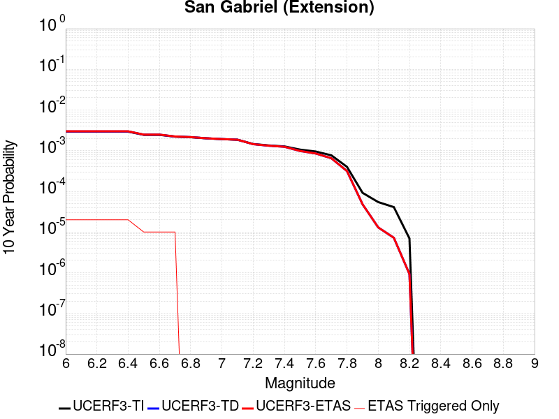 |

| Magnitude | 1 wk TI Prob | 1 wk TD Prob | 1 wk ETAS Prob | 1 wk ETAS/TD Gain | 1 wk ETAS Triggered Only | 1 mo TI Prob | 1 mo TD Prob | 1 mo ETAS Prob | 1 mo ETAS/TD Gain | 1 mo ETAS Triggered Only | 1 yr TI Prob | 1 yr TD Prob | 1 yr ETAS Prob | 1 yr ETAS/TD Gain | 1 yr ETAS Triggered Only | 10 yr TI Prob | 10 yr TD Prob | 10 yr ETAS Prob | 10 yr ETAS/TD Gain | 10 yr ETAS Triggered Only |
|-----|-----|-----|-----|-----|-----|-----|-----|-----|-----|-----|-----|-----|-----|-----|-----|-----|-----|-----|-----|-----|
| 6.0 | 5.6486106E-6 | 5.7168368E-6 | 5.7168368E-6 | 1.0 | 0.0 | 2.4208108E-5 | 2.4500505E-5 | 2.4500505E-5 | 1.0 | 0.0 | 2.9469383E-4 | 2.9825408E-4 | 3.1824812E-4 | 1.0670369 | 2.0E-5 | 0.0029430336 | 0.0029786646 | 0.0029986051 | 1.0066944 | 2.0E-5 |
| 6.1 | 5.6486106E-6 | 5.7168368E-6 | 5.7168368E-6 | 1.0 | 0.0 | 2.4208108E-5 | 2.4500505E-5 | 2.4500505E-5 | 1.0 | 0.0 | 2.9469383E-4 | 2.9825408E-4 | 3.1824812E-4 | 1.0670369 | 2.0E-5 | 0.0029430336 | 0.0029786646 | 0.0029986051 | 1.0066944 | 2.0E-5 |
| 6.2 | 5.6486106E-6 | 5.7168368E-6 | 5.7168368E-6 | 1.0 | 0.0 | 2.4208108E-5 | 2.4500505E-5 | 2.4500505E-5 | 1.0 | 0.0 | 2.9469383E-4 | 2.9825408E-4 | 3.1824812E-4 | 1.0670369 | 2.0E-5 | 0.0029430336 | 0.0029786646 | 0.0029986051 | 1.0066944 | 2.0E-5 |
| 6.3 | 5.6486106E-6 | 5.7168368E-6 | 5.7168368E-6 | 1.0 | 0.0 | 2.4208108E-5 | 2.4500505E-5 | 2.4500505E-5 | 1.0 | 0.0 | 2.9469383E-4 | 2.9825408E-4 | 3.1824812E-4 | 1.0670369 | 2.0E-5 | 0.0029430336 | 0.0029786646 | 0.0029986051 | 1.0066944 | 2.0E-5 |
| 6.4 | 5.6486106E-6 | 5.7168368E-6 | 5.7168368E-6 | 1.0 | 0.0 | 2.4208108E-5 | 2.4500505E-5 | 2.4500505E-5 | 1.0 | 0.0 | 2.9469383E-4 | 2.9825408E-4 | 3.1824812E-4 | 1.0670369 | 2.0E-5 | 0.0029430336 | 0.0029786646 | 0.0029986051 | 1.0066944 | 2.0E-5 |
| 6.5 | 4.7134554E-6 | 4.7542608E-6 | 4.7542608E-6 | 1.0 | 0.0 | 2.0200367E-5 | 2.0375248E-5 | 2.0375248E-5 | 1.0 | 0.0 | 2.459117E-4 | 2.4804127E-4 | 2.5803878E-4 | 1.0403059 | 1.0E-5 | 0.0024563975 | 0.0024777285 | 0.0024877037 | 1.0040259 | 1.0E-5 |
| 6.6 | 4.7134554E-6 | 4.7542608E-6 | 4.7542608E-6 | 1.0 | 0.0 | 2.0200367E-5 | 2.0375248E-5 | 2.0375248E-5 | 1.0 | 0.0 | 2.459117E-4 | 2.4804127E-4 | 2.5803878E-4 | 1.0403059 | 1.0E-5 | 0.0024563975 | 0.0024777285 | 0.0024877037 | 1.0040259 | 1.0E-5 |
| 6.7 | 4.2468837E-6 | 4.274078E-6 | 4.274078E-6 | 1.0 | 0.0 | 1.8200803E-5 | 1.8317352E-5 | 1.8317352E-5 | 1.0 | 0.0 | 2.2157225E-4 | 2.2299167E-4 | 2.3298943E-4 | 1.0448347 | 1.0E-5 | 0.0022135144 | 0.0022277513 | 0.002237729 | 1.0044788 | 1.0E-5 |
| 6.8 | 4.1180615E-6 | 4.1414673E-6 | 4.1414673E-6 | 1.0 | 0.0 | 1.7648716E-5 | 1.774903E-5 | 1.774903E-5 | 1.0 | 0.0 | 2.1485193E-4 | 2.1607373E-4 | 2.1607373E-4 | 1.0 | 0.0 | 0.0021464431 | 0.0021587077 | 0.0021587077 | 1.0 | 0.0 |
| 6.9 | 3.863861E-6 | 3.879783E-6 | 3.879783E-6 | 1.0 | 0.0 | 1.65593E-5 | 1.6627539E-5 | 1.6627539E-5 | 1.0 | 0.0 | 2.0159081E-4 | 2.0242216E-4 | 2.0242216E-4 | 1.0 | 0.0 | 0.0020140803 | 0.0020224454 | 0.0020224454 | 1.0 | 0.0 |
| 7.0 | 3.6947372E-6 | 3.705682E-6 | 3.705682E-6 | 1.0 | 0.0 | 1.5834492E-5 | 1.5881402E-5 | 1.5881402E-5 | 1.0 | 0.0 | 1.9276788E-4 | 1.9333958E-4 | 1.9333958E-4 | 1.0 | 0.0 | 0.0019260074 | 0.0019317803 | 0.0019317803 | 1.0 | 0.0 |
| 7.1 | 3.5686835E-6 | 3.5729024E-6 | 3.5729024E-6 | 1.0 | 0.0 | 1.5294268E-5 | 1.5312353E-5 | 1.5312353E-5 | 1.0 | 0.0 | 1.861918E-4 | 1.8641262E-4 | 1.8641262E-4 | 1.0 | 0.0 | 0.0018603588 | 0.0018626284 | 0.0018626284 | 1.0 | 0.0 |
| 7.2 | 2.8023446E-6 | 2.776794E-6 | 2.776794E-6 | 1.0 | 0.0 | 1.2009994E-5 | 1.1900492E-5 | 1.1900492E-5 | 1.0 | 0.0 | 1.4621185E-4 | 1.4487897E-4 | 1.4487897E-4 | 1.0 | 0.0 | 0.001461157 | 0.001447856 | 0.001447856 | 1.0 | 0.0 |
| 7.3 | 2.5843012E-6 | 2.5459692E-6 | 2.5459692E-6 | 1.0 | 0.0 | 1.1075529E-5 | 1.0911252E-5 | 1.0911252E-5 | 1.0 | 0.0 | 1.3483623E-4 | 1.3283649E-4 | 1.3283649E-4 | 1.0 | 0.0 | 0.0013475444 | 0.0013275805 | 0.0013275805 | 1.0 | 0.0 |
| 7.4 | 2.4464468E-6 | 2.396669E-6 | 2.396669E-6 | 1.0 | 0.0 | 1.04847295E-5 | 1.0271398E-5 | 1.0271398E-5 | 1.0 | 0.0 | 1.276441E-4 | 1.250472E-4 | 1.250472E-4 | 1.0 | 0.0 | 0.0012757082 | 0.001249778 | 0.001249778 | 1.0 | 0.0 |
| 7.5 | 2.0420266E-6 | 1.8910376E-6 | 1.8910376E-6 | 1.0 | 0.0 | 8.751514E-6 | 8.104422E-6 | 8.104422E-6 | 1.0 | 0.0 | 1.0654447E-4 | 9.866691E-5 | 9.866691E-5 | 1.0 | 0.0 | 0.001064934 | 9.862344E-4 | 9.862344E-4 | 1.0 | 0.0 |
| 7.6 | 1.8326596E-6 | 1.6398233E-6 | 1.6398233E-6 | 1.0 | 0.0 | 7.854232E-6 | 7.027795E-6 | 7.027795E-6 | 1.0 | 0.0 | 9.562107E-5 | 8.556007E-5 | 8.556007E-5 | 1.0 | 0.0 | 9.5579936E-4 | 8.552735E-4 | 8.552735E-4 | 1.0 | 0.0 |
| 7.7 | 1.4786998E-6 | 1.2523672E-6 | 1.2523672E-6 | 1.0 | 0.0 | 6.3372695E-6 | 5.3672766E-6 | 5.3672766E-6 | 1.0 | 0.0 | 7.715353E-5 | 6.534465E-5 | 6.534465E-5 | 1.0 | 0.0 | 7.7126746E-4 | 6.5325975E-4 | 6.5325975E-4 | 1.0 | 0.0 |
| 7.8 | 7.6975533E-7 | 6.069207E-7 | 6.069207E-7 | 1.0 | 0.0 | 3.2989474E-6 | 2.6010862E-6 | 2.6010862E-6 | 1.0 | 0.0 | 4.0163945E-5 | 3.1667765E-5 | 3.1667765E-5 | 1.0 | 0.0 | 4.0156685E-4 | 3.166365E-4 | 3.166365E-4 | 1.0 | 0.0 |
| 7.9 | 1.7645915E-7 | 9.211899E-8 | 9.211899E-8 | 1.0 | 0.0 | 7.562533E-7 | 3.947956E-7 | 3.947956E-7 | 1.0 | 0.0 | 9.207345E-6 | 4.806626E-6 | 4.806626E-6 | 1.0 | 0.0 | 9.206964E-5 | 4.8069025E-5 | 4.8069025E-5 | 1.0 | 0.0 |
| 8.0 | 1.0463461E-7 | 2.4937416E-8 | 2.4937416E-8 | 1.0 | 0.0 | 4.4843398E-7 | 1.0687464E-7 | 1.0687464E-7 | 1.0 | 0.0 | 5.45967E-6 | 1.3011979E-6 | 1.3011979E-6 | 1.0 | 0.0 | 5.459536E-5 | 1.3015701E-5 | 1.3015701E-5 | 1.0 | 0.0 |
| 8.1 | 7.875717E-8 | 1.3857542E-8 | 1.3857542E-8 | 1.0 | 0.0 | 3.3753068E-7 | 5.9389468E-8 | 5.9389468E-8 | 1.0 | 0.0 | 4.109428E-6 | 7.2306653E-7 | 7.2306653E-7 | 1.0 | 0.0 | 4.109352E-5 | 7.234439E-6 | 7.234439E-6 | 1.0 | 0.0 |
| 8.2 | 1.33163E-8 | 1.7720816E-9 | 1.7720816E-9 | 1.0 | 0.0 | 5.7069855E-8 | 7.594638E-9 | 7.594638E-9 | 1.0 | 0.0 | 6.9482525E-7 | 9.246471E-8 | 9.246471E-8 | 1.0 | 0.0 | 6.9482307E-6 | 9.2664203E-7 | 9.2664203E-7 | 1.0 | 0.0 |

## Los Alamos 2011 CFM
*[(top)](#table-of-contents)*

| 1 Week | 1 Month | 1 Year | 10 Year |
|-----|-----|-----|-----|
|  |  | 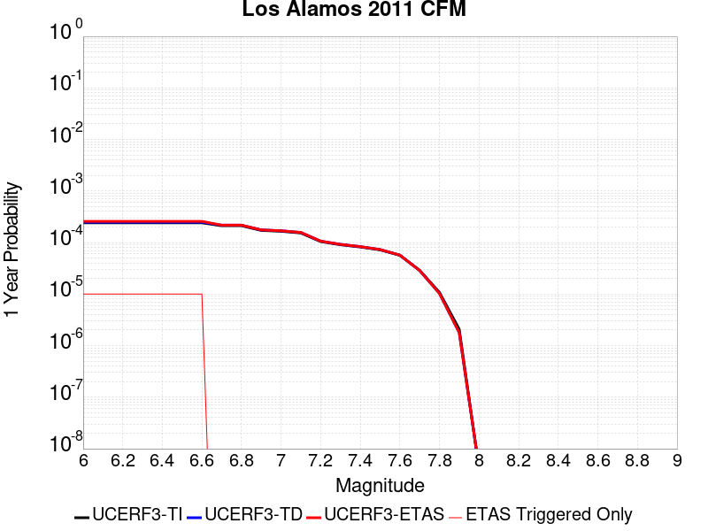 | 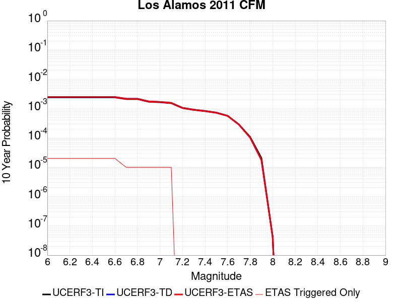 |

| Magnitude | 1 wk TI Prob | 1 wk TD Prob | 1 wk ETAS Prob | 1 wk ETAS/TD Gain | 1 wk ETAS Triggered Only | 1 mo TI Prob | 1 mo TD Prob | 1 mo ETAS Prob | 1 mo ETAS/TD Gain | 1 mo ETAS Triggered Only | 1 yr TI Prob | 1 yr TD Prob | 1 yr ETAS Prob | 1 yr ETAS/TD Gain | 1 yr ETAS Triggered Only | 10 yr TI Prob | 10 yr TD Prob | 10 yr ETAS Prob | 10 yr ETAS/TD Gain | 10 yr ETAS Triggered Only |
|-----|-----|-----|-----|-----|-----|-----|-----|-----|-----|-----|-----|-----|-----|-----|-----|-----|-----|-----|-----|-----|
| 6.0 | 4.6284417E-6 | 4.7517333E-6 | 1.4751686E-5 | 3.1044853 | 1.0E-5 | 1.9836029E-5 | 2.0364423E-5 | 3.036422E-5 | 1.4910425 | 1.0E-5 | 2.4147688E-4 | 2.479104E-4 | 2.5790793E-4 | 1.0403272 | 1.0E-5 | 0.0024121467 | 0.0024765125 | 0.002496463 | 1.0080559 | 2.0E-5 |
| 6.1 | 4.6284417E-6 | 4.7517333E-6 | 1.4751686E-5 | 3.1044853 | 1.0E-5 | 1.9836029E-5 | 2.0364423E-5 | 3.036422E-5 | 1.4910425 | 1.0E-5 | 2.4147688E-4 | 2.479104E-4 | 2.5790793E-4 | 1.0403272 | 1.0E-5 | 0.0024121467 | 0.0024765125 | 0.002496463 | 1.0080559 | 2.0E-5 |
| 6.2 | 4.6284417E-6 | 4.7517333E-6 | 1.4751686E-5 | 3.1044853 | 1.0E-5 | 1.9836029E-5 | 2.0364423E-5 | 3.036422E-5 | 1.4910425 | 1.0E-5 | 2.4147688E-4 | 2.479104E-4 | 2.5790793E-4 | 1.0403272 | 1.0E-5 | 0.0024121467 | 0.0024765125 | 0.002496463 | 1.0080559 | 2.0E-5 |
| 6.3 | 4.6284417E-6 | 4.7517333E-6 | 1.4751686E-5 | 3.1044853 | 1.0E-5 | 1.9836029E-5 | 2.0364423E-5 | 3.036422E-5 | 1.4910425 | 1.0E-5 | 2.4147688E-4 | 2.479104E-4 | 2.5790793E-4 | 1.0403272 | 1.0E-5 | 0.0024121467 | 0.0024765125 | 0.002496463 | 1.0080559 | 2.0E-5 |
| 6.4 | 4.6284417E-6 | 4.7517333E-6 | 1.4751686E-5 | 3.1044853 | 1.0E-5 | 1.9836029E-5 | 2.0364423E-5 | 3.036422E-5 | 1.4910425 | 1.0E-5 | 2.4147688E-4 | 2.479104E-4 | 2.5790793E-4 | 1.0403272 | 1.0E-5 | 0.0024121467 | 0.0024765125 | 0.002496463 | 1.0080559 | 2.0E-5 |
| 6.5 | 4.6284417E-6 | 4.7517333E-6 | 1.4751686E-5 | 3.1044853 | 1.0E-5 | 1.9836029E-5 | 2.0364423E-5 | 3.036422E-5 | 1.4910425 | 1.0E-5 | 2.4147688E-4 | 2.479104E-4 | 2.5790793E-4 | 1.0403272 | 1.0E-5 | 0.0024121467 | 0.0024765125 | 0.002496463 | 1.0080559 | 2.0E-5 |
| 6.6 | 4.6284417E-6 | 4.7517333E-6 | 1.4751686E-5 | 3.1044853 | 1.0E-5 | 1.9836029E-5 | 2.0364423E-5 | 3.036422E-5 | 1.4910425 | 1.0E-5 | 2.4147688E-4 | 2.479104E-4 | 2.5790793E-4 | 1.0403272 | 1.0E-5 | 0.0024121467 | 0.0024765125 | 0.002496463 | 1.0080559 | 2.0E-5 |
| 6.7 | 4.062321E-6 | 4.166351E-6 | 4.166351E-6 | 1.0 | 0.0 | 1.7409831E-5 | 1.7855677E-5 | 1.7855677E-5 | 1.0 | 0.0 | 2.1194408E-4 | 2.1737268E-4 | 2.1737268E-4 | 1.0 | 0.0 | 0.0021174205 | 0.0021717504 | 0.0021817286 | 1.0045946 | 1.0E-5 |
| 6.8 | 4.062321E-6 | 4.166351E-6 | 4.166351E-6 | 1.0 | 0.0 | 1.7409831E-5 | 1.7855677E-5 | 1.7855677E-5 | 1.0 | 0.0 | 2.1194408E-4 | 2.1737268E-4 | 2.1737268E-4 | 1.0 | 0.0 | 0.0021174205 | 0.0021717504 | 0.0021817286 | 1.0045946 | 1.0E-5 |
| 6.9 | 3.2936077E-6 | 3.37296E-6 | 3.37296E-6 | 1.0 | 0.0 | 1.4115385E-5 | 1.4455468E-5 | 1.4455468E-5 | 1.0 | 0.0 | 1.7184127E-4 | 1.7598206E-4 | 1.7598206E-4 | 1.0 | 0.0 | 0.0017170844 | 0.0017585196 | 0.0017685019 | 1.0056766 | 1.0E-5 |
| 7.0 | 3.1687898E-6 | 3.2448177E-6 | 3.2448177E-6 | 1.0 | 0.0 | 1.3580457E-5 | 1.3906293E-5 | 1.3906293E-5 | 1.0 | 0.0 | 1.6532952E-4 | 1.692969E-4 | 1.692969E-4 | 1.0 | 0.0 | 0.0016520657 | 0.0016917707 | 0.0017017538 | 1.005901 | 1.0E-5 |
| 7.1 | 2.9379228E-6 | 3.007328E-6 | 3.007328E-6 | 1.0 | 0.0 | 1.25910365E-5 | 1.288849E-5 | 1.288849E-5 | 1.0 | 0.0 | 1.5328509E-4 | 1.5690697E-4 | 1.5690697E-4 | 1.0 | 0.0 | 0.001531794 | 0.001568051 | 0.0015780353 | 1.0063673 | 1.0E-5 |
| 7.2 | 2.0020686E-6 | 2.041632E-6 | 2.041632E-6 | 1.0 | 0.0 | 8.580266E-6 | 8.749822E-6 | 8.749822E-6 | 1.0 | 0.0 | 1.0445973E-4 | 1.0652392E-4 | 1.0652392E-4 | 1.0 | 0.0 | 0.0010441064 | 0.001064733 | 0.001064733 | 1.0 | 0.0 |
| 7.3 | 1.7364243E-6 | 1.7678824E-6 | 1.7678824E-6 | 1.0 | 0.0 | 7.441797E-6 | 7.576617E-6 | 7.576617E-6 | 1.0 | 0.0 | 9.0600115E-5 | 9.224144E-5 | 9.224144E-5 | 1.0 | 0.0 | 9.0563187E-4 | 9.2203467E-4 | 9.2203467E-4 | 1.0 | 0.0 |
| 7.4 | 1.5718434E-6 | 1.5983198E-6 | 1.5983198E-6 | 1.0 | 0.0 | 6.7364545E-6 | 6.8499244E-6 | 6.8499244E-6 | 1.0 | 0.0 | 8.201325E-5 | 8.339467E-5 | 8.339467E-5 | 1.0 | 0.0 | 8.198299E-4 | 8.3363673E-4 | 8.3363673E-4 | 1.0 | 0.0 |
| 7.5 | 1.3841119E-6 | 1.4042814E-6 | 1.4042814E-6 | 1.0 | 0.0 | 5.9318945E-6 | 6.018335E-6 | 6.018335E-6 | 1.0 | 0.0 | 7.221842E-5 | 7.327079E-5 | 7.327079E-5 | 1.0 | 0.0 | 7.2194956E-4 | 7.3246926E-4 | 7.3246926E-4 | 1.0 | 0.0 |
| 7.6 | 1.0843726E-6 | 1.0934443E-6 | 1.0934443E-6 | 1.0 | 0.0 | 4.647303E-6 | 4.6861815E-6 | 4.6861815E-6 | 1.0 | 0.0 | 5.6579443E-5 | 5.705279E-5 | 5.705279E-5 | 1.0 | 0.0 | 5.656504E-4 | 5.70384E-4 | 5.70384E-4 | 1.0 | 0.0 |
| 7.7 | 5.544814E-7 | 5.501884E-7 | 5.501884E-7 | 1.0 | 0.0 | 2.3763469E-6 | 2.3579482E-6 | 2.3579482E-6 | 1.0 | 0.0 | 2.8931638E-5 | 2.8707644E-5 | 2.8707644E-5 | 1.0 | 0.0 | 2.8927872E-4 | 2.870395E-4 | 2.870395E-4 | 1.0 | 0.0 |
| 7.8 | 2.0707465E-7 | 1.9778598E-7 | 1.9778598E-7 | 1.0 | 0.0 | 8.874625E-7 | 8.476539E-7 | 8.476539E-7 | 1.0 | 0.0 | 1.08048025E-5 | 1.0320137E-5 | 1.0320137E-5 | 1.0 | 0.0 | 1.0804277E-4 | 1.0319663E-4 | 1.0319663E-4 | 1.0 | 0.0 |
| 7.9 | 3.9821284E-8 | 3.4331528E-8 | 3.4331528E-8 | 1.0 | 0.0 | 1.7066264E-7 | 1.4713511E-7 | 1.4713511E-7 | 1.0 | 0.0 | 2.0778157E-6 | 1.7913685E-6 | 1.7913685E-6 | 1.0 | 0.0 | 2.0777963E-5 | 1.7913546E-5 | 1.7913546E-5 | 1.0 | 0.0 |
| 8.0 | 7.880441E-11 | 8.2353124E-11 | 8.2353124E-11 | 1.0 | 0.0 | 3.3773329E-10 | 3.52942E-10 | 3.52942E-10 | 1.0 | 0.0 | 4.1119033E-9 | 4.2970694E-9 | 4.2970694E-9 | 1.0 | 0.0 | 4.1119034E-8 | 4.2970694E-8 | 4.2970694E-8 | 1.0 | 0.0 |

## Calaveras (Central) 2011 CFM
*[(top)](#table-of-contents)*

| 1 Week | 1 Month | 1 Year | 10 Year |
|-----|-----|-----|-----|
| 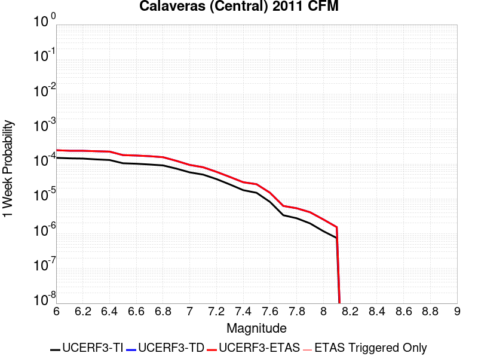 |  |  |  |

| Magnitude | 1 wk TI Prob | 1 wk TD Prob | 1 wk ETAS Prob | 1 wk ETAS/TD Gain | 1 wk ETAS Triggered Only | 1 mo TI Prob | 1 mo TD Prob | 1 mo ETAS Prob | 1 mo ETAS/TD Gain | 1 mo ETAS Triggered Only | 1 yr TI Prob | 1 yr TD Prob | 1 yr ETAS Prob | 1 yr ETAS/TD Gain | 1 yr ETAS Triggered Only | 10 yr TI Prob | 10 yr TD Prob | 10 yr ETAS Prob | 10 yr ETAS/TD Gain | 10 yr ETAS Triggered Only |
|-----|-----|-----|-----|-----|-----|-----|-----|-----|-----|-----|-----|-----|-----|-----|-----|-----|-----|-----|-----|-----|
| 6.0 | 1.5010907E-4 | 2.4804124E-4 | 2.4804124E-4 | 1.0 | 0.0 | 6.4316596E-4 | 0.001062498 | 0.001062498 | 1.0 | 0.0 | 0.0078024664 | 0.012850443 | 0.012850443 | 1.0 | 0.0 | 0.07534136 | 0.120411225 | 0.120428815 | 1.0001462 | 2.0E-5 |
| 6.1 | 1.4521465E-4 | 2.3965565E-4 | 2.3965565E-4 | 1.0 | 0.0 | 6.222001E-4 | 0.0010265942 | 0.0010265942 | 1.0 | 0.0 | 0.0075490056 | 0.012419763 | 0.012419763 | 1.0 | 0.0 | 0.07297657 | 0.11668273 | 0.116700396 | 1.0001514 | 2.0E-5 |
| 6.2 | 1.429998E-4 | 2.3896809E-4 | 2.3896809E-4 | 1.0 | 0.0 | 6.127123E-4 | 0.0010236499 | 0.0010236499 | 1.0 | 0.0 | 0.007434286 | 0.012384372 | 0.012384372 | 1.0 | 0.0 | 0.07190444 | 0.11633677 | 0.11635444 | 1.0001519 | 2.0E-5 |
| 6.3 | 1.3536277E-4 | 2.3227946E-4 | 2.3227946E-4 | 1.0 | 0.0 | 5.799972E-4 | 9.950127E-4 | 9.950127E-4 | 1.0 | 0.0 | 0.0070386264 | 0.012040534 | 0.012040534 | 1.0 | 0.0 | 0.0681982 | 0.113249525 | 0.11326726 | 1.0001566 | 2.0E-5 |
| 6.4 | 1.2993296E-4 | 2.2651516E-4 | 2.2651516E-4 | 1.0 | 0.0 | 5.5673666E-4 | 9.703276E-4 | 9.703276E-4 | 1.0 | 0.0 | 0.006757223 | 0.011743338 | 0.011743338 | 1.0 | 0.0 | 0.06555412 | 0.11052752 | 0.110545315 | 1.0001609 | 2.0E-5 |
| 6.5 | 1.0498927E-4 | 1.7981966E-4 | 1.7981966E-4 | 1.0 | 0.0 | 4.498764E-4 | 7.7042676E-4 | 7.7042676E-4 | 1.0 | 0.0 | 0.005463498 | 0.00933952 | 0.00933952 | 1.0 | 0.0 | 0.053311124 | 0.08920739 | 0.089225605 | 1.0002042 | 2.0E-5 |
| 6.6 | 1.0157505E-4 | 1.7469494E-4 | 1.7469494E-4 | 1.0 | 0.0 | 4.35249E-4 | 7.4847665E-4 | 7.4847665E-4 | 1.0 | 0.0 | 0.0052862884 | 0.009074567 | 0.009074567 | 1.0 | 0.0 | 0.05162293 | 0.08678487 | 0.08680314 | 1.0002104 | 2.0E-5 |
| 6.7 | 9.660386E-5 | 1.6728783E-4 | 1.6728783E-4 | 1.0 | 0.0 | 4.1395082E-4 | 7.167497E-4 | 7.167497E-4 | 1.0 | 0.0 | 0.0050282106 | 0.008691474 | 0.008691474 | 1.0 | 0.0 | 0.049159497 | 0.08327401 | 0.08329234 | 1.0002202 | 2.0E-5 |
| 6.8 | 9.089927E-5 | 1.5643238E-4 | 1.5643238E-4 | 1.0 | 0.0 | 3.8951015E-4 | 6.702511E-4 | 6.702511E-4 | 1.0 | 0.0 | 0.0047319788 | 0.008129742 | 0.008129742 | 1.0 | 0.0 | 0.046324775 | 0.078163 | 0.07818144 | 1.0002359 | 2.0E-5 |
| 6.9 | 7.353187E-5 | 1.2295779E-4 | 1.2295779E-4 | 1.0 | 0.0 | 3.150985E-4 | 5.2685605E-4 | 5.2685605E-4 | 1.0 | 0.0 | 0.0038295772 | 0.006395728 | 0.006395728 | 1.0 | 0.0 | 0.037642512 | 0.06218928 | 0.062198658 | 1.0001508 | 1.0E-5 |
| 7.0 | 5.746064E-5 | 9.3890936E-5 | 9.3890936E-5 | 1.0 | 0.0 | 2.4623662E-4 | 4.0232803E-4 | 4.0232803E-4 | 1.0 | 0.0 | 0.0029938098 | 0.0048874132 | 0.0048874132 | 1.0 | 0.0 | 0.02953797 | 0.04798713 | 0.04798713 | 1.0 | 0.0 |
| 7.1 | 4.9557195E-5 | 8.052768E-5 | 8.052768E-5 | 1.0 | 0.0 | 2.123707E-4 | 3.4507332E-4 | 3.4507332E-4 | 1.0 | 0.0 | 0.0025825473 | 0.004193237 | 0.004193237 | 1.0 | 0.0 | 0.0255274 | 0.041373473 | 0.041373473 | 1.0 | 0.0 |
| 7.2 | 3.687595E-5 | 5.952694E-5 | 5.952694E-5 | 1.0 | 0.0 | 1.5803022E-4 | 2.5509068E-4 | 2.5509068E-4 | 1.0 | 0.0 | 0.0019223199 | 0.003101335 | 0.003101335 | 1.0 | 0.0 | 0.01905776 | 0.030883823 | 0.030883823 | 1.0 | 0.0 |
| 7.3 | 2.5846984E-5 | 4.2473923E-5 | 4.2473923E-5 | 1.0 | 0.0 | 1.1076809E-4 | 1.820185E-4 | 1.820185E-4 | 1.0 | 0.0 | 0.0013477671 | 0.0022138404 | 0.0022138404 | 1.0 | 0.0 | 0.013396223 | 0.022175217 | 0.022175217 | 1.0 | 0.0 |
| 7.4 | 1.7747854E-5 | 2.993759E-5 | 2.993759E-5 | 1.0 | 0.0 | 7.6060016E-5 | 1.2829766E-4 | 1.2829766E-4 | 1.0 | 0.0 | 9.2563726E-4 | 0.0015609078 | 0.0015609078 | 1.0 | 0.0 | 0.009217911 | 0.015708687 | 0.015708687 | 1.0 | 0.0 |
| 7.5 | 1.4883479E-5 | 2.6244672E-5 | 2.6244672E-5 | 1.0 | 0.0 | 6.378478E-5 | 1.12472335E-4 | 1.12472335E-4 | 1.0 | 0.0 | 7.76303E-4 | 0.0013684932 | 0.0013684932 | 1.0 | 0.0 | 0.0077359667 | 0.013801667 | 0.013801667 | 1.0 | 0.0 |
| 7.6 | 8.166975E-6 | 1.4964299E-5 | 1.4964299E-5 | 1.0 | 0.0 | 3.5000852E-5 | 6.413114E-5 | 6.413114E-5 | 1.0 | 0.0 | 4.2605202E-4 | 7.805183E-4 | 7.805183E-4 | 1.0 | 0.0 | 0.004252361 | 0.007939203 | 0.007939203 | 1.0 | 0.0 |
| 7.7 | 3.3858064E-6 | 6.254251E-6 | 6.254251E-6 | 1.0 | 0.0 | 1.4510518E-5 | 2.6803657E-5 | 2.6803657E-5 | 1.0 | 0.0 | 1.7665124E-4 | 3.2628572E-4 | 3.2628572E-4 | 1.0 | 0.0 | 0.0017651088 | 0.003388363 | 0.003388363 | 1.0 | 0.0 |
| 7.8 | 2.7721615E-6 | 5.366695E-6 | 5.366695E-6 | 1.0 | 0.0 | 1.1880637E-5 | 2.2999919E-5 | 2.2999919E-5 | 1.0 | 0.0 | 1.4463716E-4 | 2.7998807E-4 | 2.7998807E-4 | 1.0 | 0.0 | 0.0014454306 | 0.002907615 | 0.002907615 | 1.0 | 0.0 |
| 7.9 | 1.9736292E-6 | 4.128705E-6 | 4.128705E-6 | 1.0 | 0.0 | 8.4583835E-6 | 1.769433E-5 | 1.769433E-5 | 1.0 | 0.0 | 1.0297595E-4 | 2.1540721E-4 | 2.1540721E-4 | 1.0 | 0.0 | 0.0010292825 | 0.0022237299 | 0.0022237299 | 1.0 | 0.0 |
| 8.0 | 1.1767289E-6 | 2.5546633E-6 | 2.5546633E-6 | 1.0 | 0.0 | 5.0431145E-6 | 1.0948511E-5 | 1.0948511E-5 | 1.0 | 0.0 | 6.139818E-5 | 1.3329E-4 | 1.3329E-4 | 1.0 | 0.0 | 6.1381224E-4 | 0.001366126 | 0.001366126 | 1.0 | 0.0 |
| 8.1 | 7.5112825E-7 | 1.541076E-6 | 1.541076E-6 | 1.0 | 0.0 | 3.2191172E-6 | 6.604595E-6 | 6.604595E-6 | 1.0 | 0.0 | 3.9192048E-5 | 8.0408E-5 | 8.0408E-5 | 1.0 | 0.0 | 3.9185135E-4 | 8.2356273E-4 | 8.2356273E-4 | 1.0 | 0.0 |

## Hunting Creek - Berryessa 2011 CFM
*[(top)](#table-of-contents)*

| 1 Week | 1 Month | 1 Year | 10 Year |
|-----|-----|-----|-----|
|  |  |  | 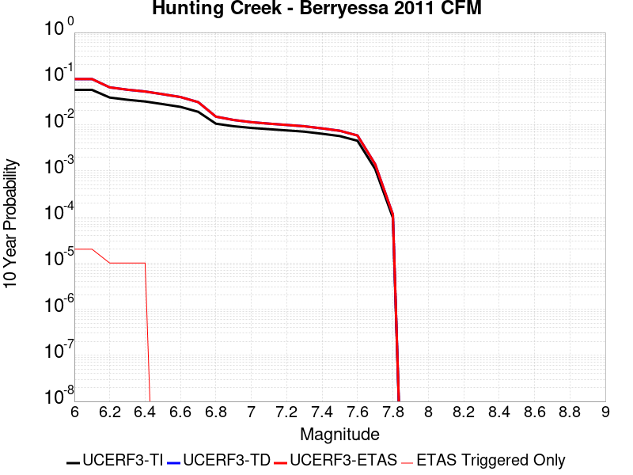 |

| Magnitude | 1 wk TI Prob | 1 wk TD Prob | 1 wk ETAS Prob | 1 wk ETAS/TD Gain | 1 wk ETAS Triggered Only | 1 mo TI Prob | 1 mo TD Prob | 1 mo ETAS Prob | 1 mo ETAS/TD Gain | 1 mo ETAS Triggered Only | 1 yr TI Prob | 1 yr TD Prob | 1 yr ETAS Prob | 1 yr ETAS/TD Gain | 1 yr ETAS Triggered Only | 10 yr TI Prob | 10 yr TD Prob | 10 yr ETAS Prob | 10 yr ETAS/TD Gain | 10 yr ETAS Triggered Only |
|-----|-----|-----|-----|-----|-----|-----|-----|-----|-----|-----|-----|-----|-----|-----|-----|-----|-----|-----|-----|-----|
| 6.0 | 1.1270982E-4 | 2.0028367E-4 | 2.2027966E-4 | 1.0998384 | 2.0E-5 | 4.8295266E-4 | 8.579912E-4 | 8.779741E-4 | 1.0232903 | 2.0E-5 | 0.0058641075 | 0.010386173 | 0.010405965 | 1.0019057 | 2.0E-5 | 0.057117578 | 0.09804048 | 0.098058514 | 1.0001839 | 2.0E-5 |
| 6.1 | 1.1239393E-4 | 1.9976508E-4 | 2.1976109E-4 | 1.1000975 | 2.0E-5 | 4.8159933E-4 | 8.557703E-4 | 8.757532E-4 | 1.0233507 | 2.0E-5 | 0.0058477195 | 0.010359417 | 0.010379209 | 1.0019106 | 2.0E-5 | 0.056962132 | 0.09779895 | 0.097817 | 1.0001845 | 2.0E-5 |
| 6.2 | 7.596265E-5 | 1.2933646E-4 | 1.3933517E-4 | 1.0773077 | 1.0E-5 | 3.2551357E-4 | 5.5415573E-4 | 5.6415016E-4 | 1.0180354 | 1.0E-5 | 0.0039559277 | 0.0067213587 | 0.006731292 | 1.0014778 | 1.0E-5 | 0.038862433 | 0.06459229 | 0.064601645 | 1.0001448 | 1.0E-5 |
| 6.3 | 6.78794E-5 | 1.1448377E-4 | 1.2448263E-4 | 1.0873386 | 1.0E-5 | 2.9087928E-4 | 4.9052597E-4 | 5.0052104E-4 | 1.0203763 | 1.0E-5 | 0.003535705 | 0.005952661 | 0.0059626014 | 1.0016699 | 1.0E-5 | 0.034799766 | 0.057466213 | 0.057475638 | 1.000164 | 1.0E-5 |
| 6.4 | 6.2165134E-5 | 1.0434825E-4 | 1.143472E-4 | 1.0958229 | 1.0E-5 | 2.6639478E-4 | 4.4711027E-4 | 4.5710578E-4 | 1.0223558 | 1.0E-5 | 0.0032385332 | 0.0054274183 | 0.005437364 | 1.0018325 | 1.0E-5 | 0.03191742 | 0.05255138 | 0.052560855 | 1.0001802 | 1.0E-5 |
| 6.5 | 5.4368087E-5 | 9.070258E-5 | 9.070258E-5 | 1.0 | 0.0 | 2.3298527E-4 | 3.886537E-4 | 3.886537E-4 | 1.0 | 0.0 | 0.0028329059 | 0.0047197016 | 0.0047197016 | 1.0 | 0.0 | 0.027970633 | 0.045881182 | 0.045881182 | 1.0 | 0.0 |
| 6.6 | 4.729947E-5 | 7.847101E-5 | 7.847101E-5 | 1.0 | 0.0 | 2.0269625E-4 | 3.3624718E-4 | 3.3624718E-4 | 1.0 | 0.0 | 0.002465034 | 0.004084746 | 0.004084746 | 1.0 | 0.0 | 0.02437869 | 0.03985269 | 0.03985269 | 1.0 | 0.0 |
| 6.7 | 3.6875328E-5 | 6.0443555E-5 | 6.0443555E-5 | 1.0 | 0.0 | 1.5802756E-4 | 2.5900968E-4 | 2.5900968E-4 | 1.0 | 0.0 | 0.0019222875 | 0.0031482724 | 0.0031482724 | 1.0 | 0.0 | 0.019057442 | 0.03089371 | 0.03089371 | 1.0 | 0.0 |
| 6.8 | 2.0292036E-5 | 2.8976721E-5 | 2.8976721E-5 | 1.0 | 0.0 | 8.6962966E-5 | 1.2417998E-4 | 1.2417998E-4 | 1.0 | 0.0 | 0.0010582599 | 0.0015108302 | 0.0015108302 | 1.0 | 0.0 | 0.010532344 | 0.0149790775 | 0.0149790775 | 1.0 | 0.0 |
| 6.9 | 1.7871042E-5 | 2.4472653E-5 | 2.4472653E-5 | 1.0 | 0.0 | 7.658793E-5 | 1.04878585E-4 | 1.04878585E-4 | 1.0 | 0.0 | 9.320591E-4 | 0.0012761486 | 0.0012761486 | 1.0 | 0.0 | 0.009281595 | 0.012680395 | 0.012680395 | 1.0 | 0.0 |
| 7.0 | 1.6415532E-5 | 2.1906566E-5 | 2.1906566E-5 | 1.0 | 0.0 | 7.035038E-5 | 9.388191E-5 | 9.388191E-5 | 1.0 | 0.0 | 8.561793E-4 | 0.0011424144 | 0.0011424144 | 1.0 | 0.0 | 0.008528882 | 0.011365017 | 0.011365017 | 1.0 | 0.0 |
| 7.1 | 1.5409885E-5 | 2.0346588E-5 | 2.0346588E-5 | 1.0 | 0.0 | 6.6040695E-5 | 8.719676E-5 | 8.719676E-5 | 1.0 | 0.0 | 8.0374884E-4 | 0.0010611062 | 0.0010611062 | 1.0 | 0.0 | 0.00800848 | 0.010560924 | 0.010560924 | 1.0 | 0.0 |
| 7.2 | 1.4497423E-5 | 1.905519E-5 | 1.905519E-5 | 1.0 | 0.0 | 6.213033E-5 | 8.166256E-5 | 8.166256E-5 | 1.0 | 0.0 | 7.5617427E-4 | 9.937913E-4 | 9.937913E-4 | 1.0 | 0.0 | 0.0075360634 | 0.00989425 | 0.00989425 | 1.0 | 0.0 |
| 7.3 | 1.3615175E-5 | 1.7826347E-5 | 1.7826347E-5 | 1.0 | 0.0 | 5.8349444E-5 | 7.6396405E-5 | 7.6396405E-5 | 1.0 | 0.0 | 7.101729E-4 | 9.297323E-4 | 9.297323E-4 | 1.0 | 0.0 | 0.0070790765 | 0.009259124 | 0.009259124 | 1.0 | 0.0 |
| 7.4 | 1.2252825E-5 | 1.6026455E-5 | 1.6026455E-5 | 1.0 | 0.0 | 5.251105E-5 | 6.868302E-5 | 6.868302E-5 | 1.0 | 0.0 | 6.391345E-4 | 8.3589775E-4 | 8.3589775E-4 | 1.0 | 0.0 | 0.0063729943 | 0.008328172 | 0.008328172 | 1.0 | 0.0 |
| 7.5 | 1.0913301E-5 | 1.4241286E-5 | 1.4241286E-5 | 1.0 | 0.0 | 4.6770452E-5 | 6.103267E-5 | 6.103267E-5 | 1.0 | 0.0 | 5.6928146E-4 | 7.428222E-4 | 7.428222E-4 | 1.0 | 0.0 | 0.0056782532 | 0.0074039865 | 0.0074039865 | 1.0 | 0.0 |
| 7.6 | 8.623192E-6 | 1.12347825E-5 | 1.12347825E-5 | 1.0 | 0.0 | 3.6956015E-5 | 4.8148195E-5 | 4.8148195E-5 | 1.0 | 0.0 | 4.4984656E-4 | 5.8604917E-4 | 5.8604917E-4 | 1.0 | 0.0 | 0.00448937 | 0.005845504 | 0.005845504 | 1.0 | 0.0 |
| 7.7 | 2.0993634E-6 | 2.66264E-6 | 2.66264E-6 | 1.0 | 0.0 | 8.997241E-6 | 1.1411265E-5 | 1.1411265E-5 | 1.0 | 0.0 | 1.09535904E-4 | 1.3892337E-4 | 1.3892337E-4 | 1.0 | 0.0 | 0.0010948193 | 0.0013883994 | 0.0013883994 | 1.0 | 0.0 |
| 7.8 | 1.8428308E-7 | 2.1674624E-7 | 2.1674624E-7 | 1.0 | 0.0 | 7.897844E-7 | 9.289122E-7 | 9.289122E-7 | 1.0 | 0.0 | 9.615583E-6 | 1.130945E-5 | 1.130945E-5 | 1.0 | 0.0 | 9.615166E-5 | 1.1308173E-4 | 1.1308173E-4 | 1.0 | 0.0 |

## Los Alamos extension
*[(top)](#table-of-contents)*

| 1 Week | 1 Month | 1 Year | 10 Year |
|-----|-----|-----|-----|
|  |  |  |  |

| Magnitude | 1 wk TI Prob | 1 wk TD Prob | 1 wk ETAS Prob | 1 wk ETAS/TD Gain | 1 wk ETAS Triggered Only | 1 mo TI Prob | 1 mo TD Prob | 1 mo ETAS Prob | 1 mo ETAS/TD Gain | 1 mo ETAS Triggered Only | 1 yr TI Prob | 1 yr TD Prob | 1 yr ETAS Prob | 1 yr ETAS/TD Gain | 1 yr ETAS Triggered Only | 10 yr TI Prob | 10 yr TD Prob | 10 yr ETAS Prob | 10 yr ETAS/TD Gain | 10 yr ETAS Triggered Only |
|-----|-----|-----|-----|-----|-----|-----|-----|-----|-----|-----|-----|-----|-----|-----|-----|-----|-----|-----|-----|-----|
| 6.0 | 4.0146506E-6 | 4.086164E-6 | 1.4086124E-5 | 3.4472728 | 1.0E-5 | 1.7205533E-5 | 1.7512022E-5 | 2.7511845E-5 | 1.5710263 | 1.0E-5 | 2.0945723E-4 | 2.1318911E-4 | 2.2318697E-4 | 1.0468967 | 1.0E-5 | 0.0020925992 | 0.002129955 | 0.0021499125 | 1.0093699 | 2.0E-5 |
| 6.1 | 4.0146506E-6 | 4.086164E-6 | 1.4086124E-5 | 3.4472728 | 1.0E-5 | 1.7205533E-5 | 1.7512022E-5 | 2.7511845E-5 | 1.5710263 | 1.0E-5 | 2.0945723E-4 | 2.1318911E-4 | 2.2318697E-4 | 1.0468967 | 1.0E-5 | 0.0020925992 | 0.002129955 | 0.0021499125 | 1.0093699 | 2.0E-5 |
| 6.2 | 4.0146506E-6 | 4.086164E-6 | 1.4086124E-5 | 3.4472728 | 1.0E-5 | 1.7205533E-5 | 1.7512022E-5 | 2.7511845E-5 | 1.5710263 | 1.0E-5 | 2.0945723E-4 | 2.1318911E-4 | 2.2318697E-4 | 1.0468967 | 1.0E-5 | 0.0020925992 | 0.002129955 | 0.0021499125 | 1.0093699 | 2.0E-5 |
| 6.3 | 4.0146506E-6 | 4.086164E-6 | 1.4086124E-5 | 3.4472728 | 1.0E-5 | 1.7205533E-5 | 1.7512022E-5 | 2.7511845E-5 | 1.5710263 | 1.0E-5 | 2.0945723E-4 | 2.1318911E-4 | 2.2318697E-4 | 1.0468967 | 1.0E-5 | 0.0020925992 | 0.002129955 | 0.0021499125 | 1.0093699 | 2.0E-5 |
| 6.4 | 4.0146506E-6 | 4.086164E-6 | 1.4086124E-5 | 3.4472728 | 1.0E-5 | 1.7205533E-5 | 1.7512022E-5 | 2.7511845E-5 | 1.5710263 | 1.0E-5 | 2.0945723E-4 | 2.1318911E-4 | 2.2318697E-4 | 1.0468967 | 1.0E-5 | 0.0020925992 | 0.002129955 | 0.0021499125 | 1.0093699 | 2.0E-5 |
| 6.5 | 4.0146506E-6 | 4.086164E-6 | 1.4086124E-5 | 3.4472728 | 1.0E-5 | 1.7205533E-5 | 1.7512022E-5 | 2.7511845E-5 | 1.5710263 | 1.0E-5 | 2.0945723E-4 | 2.1318911E-4 | 2.2318697E-4 | 1.0468967 | 1.0E-5 | 0.0020925992 | 0.002129955 | 0.0021499125 | 1.0093699 | 2.0E-5 |
| 6.6 | 4.0146506E-6 | 4.086164E-6 | 1.4086124E-5 | 3.4472728 | 1.0E-5 | 1.7205533E-5 | 1.7512022E-5 | 2.7511845E-5 | 1.5710263 | 1.0E-5 | 2.0945723E-4 | 2.1318911E-4 | 2.2318697E-4 | 1.0468967 | 1.0E-5 | 0.0020925992 | 0.002129955 | 0.0021499125 | 1.0093699 | 2.0E-5 |
| 6.7 | 4.0146506E-6 | 4.086164E-6 | 1.4086124E-5 | 3.4472728 | 1.0E-5 | 1.7205533E-5 | 1.7512022E-5 | 2.7511845E-5 | 1.5710263 | 1.0E-5 | 2.0945723E-4 | 2.1318911E-4 | 2.2318697E-4 | 1.0468967 | 1.0E-5 | 0.0020925992 | 0.002129955 | 0.0021499125 | 1.0093699 | 2.0E-5 |
| 6.8 | 3.6584688E-6 | 3.7188636E-6 | 3.7188636E-6 | 1.0 | 0.0 | 1.5679057E-5 | 1.5937894E-5 | 1.5937894E-5 | 1.0 | 0.0 | 1.9087581E-4 | 1.9402753E-4 | 1.9402753E-4 | 1.0 | 0.0 | 0.0019071194 | 0.0019386737 | 0.0019486542 | 1.0051482 | 1.0E-5 |
| 6.9 | 3.644631E-6 | 3.7045736E-6 | 3.7045736E-6 | 1.0 | 0.0 | 1.5619753E-5 | 1.5876652E-5 | 1.5876652E-5 | 1.0 | 0.0 | 1.901539E-4 | 1.9328203E-4 | 1.9328203E-4 | 1.0 | 0.0 | 0.0018999127 | 0.0019312317 | 0.0019412123 | 1.0051681 | 1.0E-5 |
| 7.0 | 3.6318522E-6 | 3.691334E-6 | 3.691334E-6 | 1.0 | 0.0 | 1.5564989E-5 | 1.5819913E-5 | 1.5819913E-5 | 1.0 | 0.0 | 1.8948725E-4 | 1.9259135E-4 | 1.9259135E-4 | 1.0 | 0.0 | 0.0018932576 | 0.0019243368 | 0.0019343175 | 1.0051866 | 1.0E-5 |
| 7.1 | 3.5001724E-6 | 3.5554046E-6 | 3.5554046E-6 | 1.0 | 0.0 | 1.5000653E-5 | 1.5237365E-5 | 1.5237365E-5 | 1.0 | 0.0 | 1.8261763E-4 | 1.8550004E-4 | 1.8550004E-4 | 1.0 | 0.0 | 0.0018246764 | 0.0018535426 | 0.0018635241 | 1.005385 | 1.0E-5 |
| 7.2 | 2.5204702E-6 | 2.5436989E-6 | 2.5436989E-6 | 1.0 | 0.0 | 1.080197E-5 | 1.0901522E-5 | 1.0901522E-5 | 1.0 | 0.0 | 1.3150605E-4 | 1.3271799E-4 | 1.3271799E-4 | 1.0 | 0.0 | 0.0013142825 | 0.001326393 | 0.001326393 | 1.0 | 0.0 |
| 7.3 | 2.1399692E-6 | 2.1501362E-6 | 2.1501362E-6 | 1.0 | 0.0 | 9.1712645E-6 | 9.2148375E-6 | 9.2148375E-6 | 1.0 | 0.0 | 1.1165442E-4 | 1.121849E-4 | 1.121849E-4 | 1.0 | 0.0 | 0.0011159834 | 0.001121286 | 0.001121286 | 1.0 | 0.0 |
| 7.4 | 1.9660122E-6 | 1.970241E-6 | 1.970241E-6 | 1.0 | 0.0 | 8.42574E-6 | 8.4438625E-6 | 8.4438625E-6 | 1.0 | 0.0 | 1.0257855E-4 | 1.0279921E-4 | 1.0279921E-4 | 1.0 | 0.0 | 0.0010253121 | 0.0010275197 | 0.0010275197 | 1.0 | 0.0 |
| 7.5 | 1.7204633E-6 | 1.7151029E-6 | 1.7151029E-6 | 1.0 | 0.0 | 7.373393E-6 | 7.3504207E-6 | 7.3504207E-6 | 1.0 | 0.0 | 8.976737E-5 | 8.948772E-5 | 8.948772E-5 | 1.0 | 0.0 | 8.9731114E-4 | 8.945199E-4 | 8.945199E-4 | 1.0 | 0.0 |
| 7.6 | 1.3717638E-6 | 1.3535872E-6 | 1.3535872E-6 | 1.0 | 0.0 | 5.878974E-6 | 5.801075E-6 | 5.801075E-6 | 1.0 | 0.0 | 7.157416E-5 | 7.062583E-5 | 7.062583E-5 | 1.0 | 0.0 | 7.1551115E-4 | 7.0603646E-4 | 7.0603646E-4 | 1.0 | 0.0 |
| 7.7 | 8.272564E-7 | 7.9576733E-7 | 7.9576733E-7 | 1.0 | 0.0 | 3.5453797E-6 | 3.4104269E-6 | 3.4104269E-6 | 1.0 | 0.0 | 4.3164142E-5 | 4.1521158E-5 | 4.1521158E-5 | 1.0 | 0.0 | 4.315576E-4 | 4.151342E-4 | 4.151342E-4 | 1.0 | 0.0 |
| 7.8 | 3.9708277E-7 | 3.671937E-7 | 3.671937E-7 | 1.0 | 0.0 | 1.7017821E-6 | 1.5736864E-6 | 1.5736864E-6 | 1.0 | 0.0 | 2.0719E-5 | 1.9159465E-5 | 1.9159465E-5 | 1.0 | 0.0 | 2.071707E-4 | 1.9157819E-4 | 1.9157819E-4 | 1.0 | 0.0 |
| 7.9 | 9.292528E-8 | 7.889168E-8 | 7.889168E-8 | 1.0 | 0.0 | 3.9825116E-7 | 3.3810713E-7 | 3.3810713E-7 | 1.0 | 0.0 | 4.848697E-6 | 4.1164467E-6 | 4.1164467E-6 | 1.0 | 0.0 | 4.8485912E-5 | 4.1163716E-5 | 4.1163716E-5 | 1.0 | 0.0 |
| 8.0 | 7.880441E-11 | 8.2353124E-11 | 8.2353124E-11 | 1.0 | 0.0 | 3.3773329E-10 | 3.52942E-10 | 3.52942E-10 | 1.0 | 0.0 | 4.1119033E-9 | 4.2970694E-9 | 4.2970694E-9 | 1.0 | 0.0 | 4.1119034E-8 | 4.2970694E-8 | 4.2970694E-8 | 1.0 | 0.0 |

## Elsinore (Temecula) rev
*[(top)](#table-of-contents)*

| 1 Week | 1 Month | 1 Year | 10 Year |
|-----|-----|-----|-----|
|  |  | 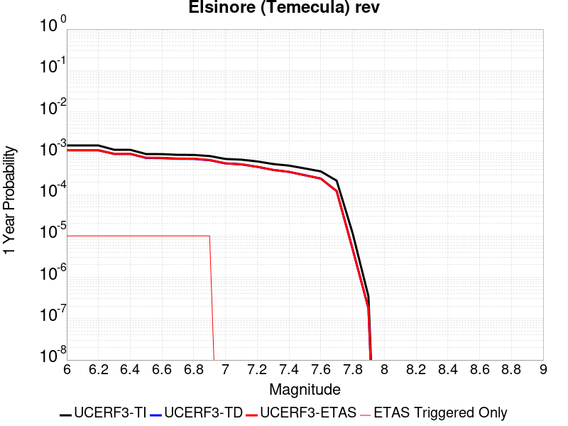 |  |

| Magnitude | 1 wk TI Prob | 1 wk TD Prob | 1 wk ETAS Prob | 1 wk ETAS/TD Gain | 1 wk ETAS Triggered Only | 1 mo TI Prob | 1 mo TD Prob | 1 mo ETAS Prob | 1 mo ETAS/TD Gain | 1 mo ETAS Triggered Only | 1 yr TI Prob | 1 yr TD Prob | 1 yr ETAS Prob | 1 yr ETAS/TD Gain | 1 yr ETAS Triggered Only | 10 yr TI Prob | 10 yr TD Prob | 10 yr ETAS Prob | 10 yr ETAS/TD Gain | 10 yr ETAS Triggered Only |
|-----|-----|-----|-----|-----|-----|-----|-----|-----|-----|-----|-----|-----|-----|-----|-----|-----|-----|-----|-----|-----|
| 6.0 | 2.9514995E-5 | 2.251887E-5 | 3.2518645E-5 | 1.444062 | 1.0E-5 | 1.264867E-4 | 9.6505995E-5 | 1.0650503E-4 | 1.1036105 | 1.0E-5 | 0.0015388876 | 0.0011743492 | 0.0011843374 | 1.0085053 | 1.0E-5 | 0.015282745 | 0.011688135 | 0.011707901 | 1.0016911 | 2.0E-5 |
| 6.1 | 2.9514995E-5 | 2.251887E-5 | 3.2518645E-5 | 1.444062 | 1.0E-5 | 1.264867E-4 | 9.6505995E-5 | 1.0650503E-4 | 1.1036105 | 1.0E-5 | 0.0015388876 | 0.0011743492 | 0.0011843374 | 1.0085053 | 1.0E-5 | 0.015282745 | 0.011688135 | 0.011707901 | 1.0016911 | 2.0E-5 |
| 6.2 | 2.9514995E-5 | 2.251887E-5 | 3.2518645E-5 | 1.444062 | 1.0E-5 | 1.264867E-4 | 9.6505995E-5 | 1.0650503E-4 | 1.1036105 | 1.0E-5 | 0.0015388876 | 0.0011743492 | 0.0011843374 | 1.0085053 | 1.0E-5 | 0.015282745 | 0.011688135 | 0.011707901 | 1.0016911 | 2.0E-5 |
| 6.3 | 2.3223649E-5 | 1.840822E-5 | 2.8408034E-5 | 1.5432256 | 1.0E-5 | 9.952613E-5 | 7.889008E-5 | 8.888929E-5 | 1.1267487 | 1.0E-5 | 0.001211057 | 9.600807E-4 | 9.700711E-4 | 1.0104058 | 1.0E-5 | 0.012044783 | 0.009551284 | 0.009571092 | 1.002074 | 2.0E-5 |
| 6.4 | 2.3223649E-5 | 1.840822E-5 | 2.8408034E-5 | 1.5432256 | 1.0E-5 | 9.952613E-5 | 7.889008E-5 | 8.888929E-5 | 1.1267487 | 1.0E-5 | 0.001211057 | 9.600807E-4 | 9.700711E-4 | 1.0104058 | 1.0E-5 | 0.012044783 | 0.009551284 | 0.009571092 | 1.002074 | 2.0E-5 |
| 6.5 | 1.8338875E-5 | 1.4750074E-5 | 2.4749927E-5 | 1.6779526 | 1.0E-5 | 7.8592806E-5 | 6.321312E-5 | 7.321249E-5 | 1.158185 | 1.0E-5 | 9.5644733E-4 | 7.6935673E-4 | 7.7934907E-4 | 1.0129879 | 1.0E-5 | 0.009523412 | 0.0076699676 | 0.007689814 | 1.0025876 | 2.0E-5 |
| 6.6 | 1.8223333E-5 | 1.461263E-5 | 2.4612484E-5 | 1.6843295 | 1.0E-5 | 7.809766E-5 | 6.26241E-5 | 7.262348E-5 | 1.159673 | 1.0E-5 | 9.504242E-4 | 7.621905E-4 | 7.721829E-4 | 1.01311 | 1.0E-5 | 0.009463696 | 0.007598796 | 0.0076186443 | 1.002612 | 2.0E-5 |
| 6.7 | 1.7512752E-5 | 1.4026963E-5 | 2.4026822E-5 | 1.7129027 | 1.0E-5 | 7.505249E-5 | 6.0114216E-5 | 7.0113616E-5 | 1.16634 | 1.0E-5 | 9.13381E-4 | 7.316534E-4 | 7.416461E-4 | 1.0136577 | 1.0E-5 | 0.00909636 | 0.0072983317 | 0.0073181856 | 1.0027204 | 2.0E-5 |
| 6.8 | 1.7417142E-5 | 1.395093E-5 | 2.395079E-5 | 1.716788 | 1.0E-5 | 7.4642754E-5 | 5.978838E-5 | 6.9787784E-5 | 1.1672466 | 1.0E-5 | 9.083966E-4 | 7.27689E-4 | 7.376817E-4 | 1.0137321 | 1.0E-5 | 0.009046922 | 0.007259359 | 0.007279214 | 1.002735 | 2.0E-5 |
| 6.9 | 1.6402591E-5 | 1.29883665E-5 | 2.2988237E-5 | 1.7699097 | 1.0E-5 | 7.0294926E-5 | 5.5663284E-5 | 6.566273E-5 | 1.1796416 | 1.0E-5 | 8.5550465E-4 | 6.774974E-4 | 6.874907E-4 | 1.0147502 | 1.0E-5 | 0.008522186 | 0.0067598647 | 0.0067797294 | 1.0029386 | 2.0E-5 |
| 7.0 | 1.3912486E-5 | 1.0878067E-5 | 1.0878067E-5 | 1.0 | 0.0 | 5.9623577E-5 | 4.661947E-5 | 4.661947E-5 | 1.0 | 0.0 | 7.2567526E-4 | 5.674469E-4 | 5.674469E-4 | 1.0 | 0.0 | 0.0072331014 | 0.0056635314 | 0.0056635314 | 1.0 | 0.0 |
| 7.1 | 1.3405147E-5 | 1.0327192E-5 | 1.0327192E-5 | 1.0 | 0.0 | 5.7449364E-5 | 4.4258657E-5 | 4.4258657E-5 | 1.0 | 0.0 | 6.9922156E-4 | 5.3871854E-4 | 5.3871854E-4 | 1.0 | 0.0 | 0.0069702556 | 0.005377366 | 0.005377366 | 1.0 | 0.0 |
| 7.2 | 1.21402E-5 | 8.996479E-6 | 8.996479E-6 | 1.0 | 0.0 | 5.202839E-5 | 3.8555776E-5 | 3.8555776E-5 | 1.0 | 0.0 | 6.332616E-4 | 4.6931725E-4 | 4.6931725E-4 | 1.0 | 0.0 | 0.0063146 | 0.0046847262 | 0.0046847262 | 1.0 | 0.0 |
| 7.3 | 1.05047775E-5 | 7.571515E-6 | 7.571515E-6 | 1.0 | 0.0 | 4.5019697E-5 | 3.2448956E-5 | 3.2448956E-5 | 1.0 | 0.0 | 5.4797693E-4 | 3.9499588E-4 | 3.9499588E-4 | 1.0 | 0.0 | 0.005466277 | 0.003943348 | 0.003943348 | 1.0 | 0.0 |
| 7.4 | 9.624483E-6 | 6.786621E-6 | 6.786621E-6 | 1.0 | 0.0 | 4.124713E-5 | 2.90852E-5 | 2.90852E-5 | 1.0 | 0.0 | 5.0206814E-4 | 3.5405616E-4 | 3.5405616E-4 | 1.0 | 0.0 | 0.005009353 | 0.0035350726 | 0.0035350726 | 1.0 | 0.0 |
| 7.5 | 8.215151E-6 | 5.6353133E-6 | 5.6353133E-6 | 1.0 | 0.0 | 3.5207315E-5 | 2.4151126E-5 | 2.4151126E-5 | 1.0 | 0.0 | 4.2856473E-4 | 2.9400157E-4 | 2.9400157E-4 | 1.0 | 0.0 | 0.004277392 | 0.002936254 | 0.002936254 | 1.0 | 0.0 |
| 7.6 | 6.975058E-6 | 4.675836E-6 | 4.675836E-6 | 1.0 | 0.0 | 2.9892764E-5 | 2.003915E-5 | 2.003915E-5 | 1.0 | 0.0 | 3.6388362E-4 | 2.439505E-4 | 2.439505E-4 | 1.0 | 0.0 | 0.0036328835 | 0.0024369434 | 0.0024369434 | 1.0 | 0.0 |
| 7.7 | 4.159604E-6 | 2.326789E-6 | 2.326789E-6 | 1.0 | 0.0 | 1.7826753E-5 | 9.971919E-6 | 9.971919E-6 | 1.0 | 0.0 | 2.1701909E-4 | 1.2140209E-4 | 1.2140209E-4 | 1.0 | 0.0 | 0.0021680726 | 0.0012134308 | 0.0012134308 | 1.0 | 0.0 |
| 7.8 | 2.2692414E-7 | 9.384417E-8 | 9.384417E-8 | 1.0 | 0.0 | 9.725317E-7 | 4.0218927E-7 | 4.0218927E-7 | 1.0 | 0.0 | 1.1840509E-5 | 4.8966467E-6 | 4.8966467E-6 | 1.0 | 0.0 | 1.1839878E-4 | 4.8965718E-5 | 4.8965718E-5 | 1.0 | 0.0 |
| 7.9 | 6.676829E-9 | 3.4397174E-9 | 3.4397174E-9 | 1.0 | 0.0 | 2.861498E-8 | 1.4741646E-8 | 1.4741646E-8 | 1.0 | 0.0 | 3.4838732E-7 | 1.7947953E-7 | 1.7947953E-7 | 1.0 | 0.0 | 3.4838679E-6 | 1.794794E-6 | 1.794794E-6 | 1.0 | 0.0 |

## Newport-Inglewood (Offshore)
*[(top)](#table-of-contents)*

| 1 Week | 1 Month | 1 Year | 10 Year |
|-----|-----|-----|-----|
|  |  |  |  |

| Magnitude | 1 wk TI Prob | 1 wk TD Prob | 1 wk ETAS Prob | 1 wk ETAS/TD Gain | 1 wk ETAS Triggered Only | 1 mo TI Prob | 1 mo TD Prob | 1 mo ETAS Prob | 1 mo ETAS/TD Gain | 1 mo ETAS Triggered Only | 1 yr TI Prob | 1 yr TD Prob | 1 yr ETAS Prob | 1 yr ETAS/TD Gain | 1 yr ETAS Triggered Only | 10 yr TI Prob | 10 yr TD Prob | 10 yr ETAS Prob | 10 yr ETAS/TD Gain | 10 yr ETAS Triggered Only |
|-----|-----|-----|-----|-----|-----|-----|-----|-----|-----|-----|-----|-----|-----|-----|-----|-----|-----|-----|-----|-----|
| 6.0 | 1.9626508E-5 | 1.8965342E-5 | 2.8965153E-5 | 1.5272676 | 1.0E-5 | 8.411089E-5 | 8.1277576E-5 | 9.1276765E-5 | 1.1230252 | 1.0E-5 | 0.001023569 | 9.891179E-4 | 0.0010090981 | 1.0202 | 2.0E-5 | 0.010188672 | 0.009848497 | 0.0098683 | 1.0020108 | 2.0E-5 |
| 6.1 | 1.331886E-5 | 1.2218078E-5 | 2.2217957E-5 | 1.8184493 | 1.0E-5 | 5.707958E-5 | 5.2362153E-5 | 6.236163E-5 | 1.1909677 | 1.0E-5 | 6.947222E-4 | 6.3732424E-4 | 6.5731147E-4 | 1.0313612 | 2.0E-5 | 0.006925544 | 0.006355142 | 0.006375015 | 1.0031271 | 2.0E-5 |
| 6.2 | 1.2250852E-5 | 1.1076016E-5 | 2.1075904E-5 | 1.9028417 | 1.0E-5 | 5.2502597E-5 | 4.746778E-5 | 5.7467307E-5 | 1.2106593 | 1.0E-5 | 6.3903164E-4 | 5.7776796E-4 | 5.977564E-4 | 1.034596 | 2.0E-5 | 0.006371971 | 0.0057627796 | 0.0057826643 | 1.0034505 | 2.0E-5 |
| 6.3 | 1.2106258E-5 | 1.0918878E-5 | 2.091877E-5 | 1.915835 | 1.0E-5 | 5.1882926E-5 | 4.6794354E-5 | 5.6793888E-5 | 1.213691 | 1.0E-5 | 6.3149154E-4 | 5.695733E-4 | 5.8956194E-4 | 1.035094 | 2.0E-5 | 0.0062970007 | 0.005681252 | 0.0057011386 | 1.0035003 | 2.0E-5 |
| 6.4 | 1.1348758E-5 | 1.0109348E-5 | 2.0109248E-5 | 1.9891734 | 1.0E-5 | 4.8636626E-5 | 4.3325064E-5 | 5.332463E-5 | 1.2308033 | 1.0E-5 | 5.919901E-4 | 5.2735576E-4 | 5.4734526E-4 | 1.0379051 | 2.0E-5 | 0.005904155 | 0.0052611395 | 0.0052810344 | 1.0037814 | 2.0E-5 |
| 6.5 | 1.100837E-5 | 9.743376E-6 | 1.9743278E-5 | 2.0263283 | 1.0E-5 | 4.7177873E-5 | 4.175666E-5 | 5.1756244E-5 | 1.2394727 | 1.0E-5 | 5.7423924E-4 | 5.082695E-4 | 5.282594E-4 | 1.0393292 | 2.0E-5 | 0.005727576 | 0.005071162 | 0.0050910604 | 1.0039239 | 2.0E-5 |
| 6.6 | 1.0634696E-5 | 9.34553E-6 | 1.9345436E-5 | 2.0700202 | 1.0E-5 | 4.557647E-5 | 4.0051662E-5 | 5.005126E-5 | 1.2496675 | 1.0E-5 | 5.5475225E-4 | 4.875206E-4 | 5.0751085E-4 | 1.041004 | 2.0E-5 | 0.0055336943 | 0.0048645977 | 0.0048845005 | 1.0040914 | 2.0E-5 |
| 6.7 | 9.9780855E-6 | 8.667898E-6 | 1.8667812E-5 | 2.1536722 | 1.0E-5 | 4.276252E-5 | 3.7147613E-5 | 4.714724E-5 | 1.2691863 | 1.0E-5 | 5.205093E-4 | 4.5217903E-4 | 4.7216998E-4 | 1.0442103 | 2.0E-5 | 0.0051929182 | 0.0045126686 | 0.0045325784 | 1.0044119 | 2.0E-5 |
| 6.8 | 9.59546E-6 | 8.272933E-6 | 1.827285E-5 | 2.2087512 | 1.0E-5 | 4.1122752E-5 | 3.545495E-5 | 4.545459E-5 | 1.2820381 | 1.0E-5 | 5.0055445E-4 | 4.3157916E-4 | 4.5157052E-4 | 1.0463214 | 2.0E-5 | 0.004994285 | 0.004307486 | 0.0043273997 | 1.004623 | 2.0E-5 |
| 6.9 | 9.000614E-6 | 7.706823E-6 | 1.7706747E-5 | 2.2975414 | 1.0E-5 | 3.857349E-5 | 3.3028828E-5 | 4.30285E-5 | 1.3027558 | 1.0E-5 | 4.6953102E-4 | 4.0205245E-4 | 4.220444E-4 | 1.0497247 | 2.0E-5 | 0.004685402 | 0.0040133223 | 0.004033242 | 1.0049634 | 2.0E-5 |
| 7.0 | 7.4070194E-6 | 6.148865E-6 | 1.6148802E-5 | 2.6263065 | 1.0E-5 | 3.1743984E-5 | 2.6352012E-5 | 3.635175E-5 | 1.3794676 | 1.0E-5 | 3.8641447E-4 | 3.2078868E-4 | 3.4078225E-4 | 1.0623263 | 2.0E-5 | 0.0038574322 | 0.0032032758 | 0.0032232117 | 1.0062236 | 2.0E-5 |
| 7.1 | 6.299615E-6 | 5.0565613E-6 | 1.5056511E-5 | 2.9776185 | 1.0E-5 | 2.699807E-5 | 2.1670798E-5 | 3.167058E-5 | 1.4614404 | 1.0E-5 | 3.2865192E-4 | 2.6381016E-4 | 2.8380487E-4 | 1.0757921 | 2.0E-5 | 0.003281663 | 0.0026349847 | 0.002654932 | 1.0075701 | 2.0E-5 |
| 7.2 | 5.096653E-6 | 3.892733E-6 | 3.892733E-6 | 1.0 | 0.0 | 2.1842614E-5 | 1.6683034E-5 | 1.6683034E-5 | 1.0 | 0.0 | 2.6590136E-4 | 2.0309711E-4 | 2.1309509E-4 | 1.0492275 | 1.0E-5 | 0.0026558342 | 0.0020291263 | 0.0020391059 | 1.0049182 | 1.0E-5 |
| 7.3 | 3.9753018E-6 | 2.9098787E-6 | 2.9098787E-6 | 1.0 | 0.0 | 1.7036897E-5 | 1.24708495E-5 | 1.24708495E-5 | 1.0 | 0.0 | 2.0740448E-4 | 1.518221E-4 | 1.6182057E-4 | 1.0658566 | 1.0E-5 | 0.00207211 | 0.0015171919 | 0.0015271767 | 1.0065811 | 1.0E-5 |
| 7.4 | 3.0568392E-6 | 2.1449732E-6 | 2.1449732E-6 | 1.0 | 0.0 | 1.3100675E-5 | 9.19271E-6 | 9.19271E-6 | 1.0 | 0.0 | 1.5948903E-4 | 1.11915564E-4 | 1.2191445E-4 | 1.0893431 | 1.0E-5 | 0.0015937461 | 0.0011185983 | 0.0011285872 | 1.0089297 | 1.0E-5 |
| 7.5 | 1.7279019E-6 | 1.1469651E-6 | 1.1469651E-6 | 1.0 | 0.0 | 7.405273E-6 | 4.9155556E-6 | 4.9155556E-6 | 1.0 | 0.0 | 9.015547E-5 | 5.9845286E-5 | 6.984469E-5 | 1.1670876 | 1.0E-5 | 9.01189E-4 | 5.982956E-4 | 6.082896E-4 | 1.0167042 | 1.0E-5 |
| 7.6 | 1.1156416E-6 | 7.222962E-7 | 7.222962E-7 | 1.0 | 0.0 | 4.7813123E-6 | 3.0955514E-6 | 3.0955514E-6 | 1.0 | 0.0 | 5.821092E-5 | 3.768771E-5 | 4.7687336E-5 | 1.2653285 | 1.0E-5 | 5.8195676E-4 | 3.7681553E-4 | 3.8681176E-4 | 1.0265282 | 1.0E-5 |
| 7.7 | 9.117973E-8 | 6.7342256E-8 | 6.7342256E-8 | 1.0 | 0.0 | 3.907702E-7 | 2.8860964E-7 | 2.8860964E-7 | 1.0 | 0.0 | 4.757617E-6 | 3.5138169E-6 | 1.3513782E-5 | 3.8458982 | 1.0E-5 | 4.7575148E-5 | 3.5137644E-5 | 4.513729E-5 | 1.2845851 | 1.0E-5 |

## Owens Valley Keough Hot Springs
*[(top)](#table-of-contents)*

| 1 Week | 1 Month | 1 Year | 10 Year |
|-----|-----|-----|-----|
|  |  |  |  |

| Magnitude | 1 wk TI Prob | 1 wk TD Prob | 1 wk ETAS Prob | 1 wk ETAS/TD Gain | 1 wk ETAS Triggered Only | 1 mo TI Prob | 1 mo TD Prob | 1 mo ETAS Prob | 1 mo ETAS/TD Gain | 1 mo ETAS Triggered Only | 1 yr TI Prob | 1 yr TD Prob | 1 yr ETAS Prob | 1 yr ETAS/TD Gain | 1 yr ETAS Triggered Only | 10 yr TI Prob | 10 yr TD Prob | 10 yr ETAS Prob | 10 yr ETAS/TD Gain | 10 yr ETAS Triggered Only |
|-----|-----|-----|-----|-----|-----|-----|-----|-----|-----|-----|-----|-----|-----|-----|-----|-----|-----|-----|-----|-----|
| 6.0 | 1.5708529E-5 | 4.950463E-6 | 4.950463E-6 | 1.0 | 0.0 | 6.7320536E-5 | 2.1216127E-5 | 2.1216127E-5 | 1.0 | 0.0 | 8.193192E-4 | 2.5828084E-4 | 2.5828084E-4 | 1.0 | 0.0 | 0.008163051 | 0.0025804387 | 0.0026003872 | 1.0077306 | 2.0E-5 |
| 6.1 | 1.5708529E-5 | 4.950463E-6 | 4.950463E-6 | 1.0 | 0.0 | 6.7320536E-5 | 2.1216127E-5 | 2.1216127E-5 | 1.0 | 0.0 | 8.193192E-4 | 2.5828084E-4 | 2.5828084E-4 | 1.0 | 0.0 | 0.008163051 | 0.0025804387 | 0.0026003872 | 1.0077306 | 2.0E-5 |
| 6.2 | 1.5708529E-5 | 4.950463E-6 | 4.950463E-6 | 1.0 | 0.0 | 6.7320536E-5 | 2.1216127E-5 | 2.1216127E-5 | 1.0 | 0.0 | 8.193192E-4 | 2.5828084E-4 | 2.5828084E-4 | 1.0 | 0.0 | 0.008163051 | 0.0025804387 | 0.0026003872 | 1.0077306 | 2.0E-5 |
| 6.3 | 1.5708529E-5 | 4.950463E-6 | 4.950463E-6 | 1.0 | 0.0 | 6.7320536E-5 | 2.1216127E-5 | 2.1216127E-5 | 1.0 | 0.0 | 8.193192E-4 | 2.5828084E-4 | 2.5828084E-4 | 1.0 | 0.0 | 0.008163051 | 0.0025804387 | 0.0026003872 | 1.0077306 | 2.0E-5 |
| 6.4 | 1.4622509E-5 | 3.7263276E-6 | 3.7263276E-6 | 1.0 | 0.0 | 6.266639E-5 | 1.5969896E-5 | 1.5969896E-5 | 1.0 | 0.0 | 7.626962E-4 | 1.9441944E-4 | 1.9441944E-4 | 1.0 | 0.0 | 0.007600839 | 0.0019429466 | 0.0019529272 | 1.0051368 | 1.0E-5 |
| 6.5 | 1.3335527E-5 | 2.2775241E-6 | 2.2775241E-6 | 1.0 | 0.0 | 5.7151006E-5 | 9.760785E-6 | 9.760785E-6 | 1.0 | 0.0 | 6.955913E-4 | 1.1883176E-4 | 1.1883176E-4 | 1.0 | 0.0 | 0.0069341804 | 0.001187878 | 0.001187878 | 1.0 | 0.0 |
| 6.6 | 1.3332855E-5 | 2.2746733E-6 | 2.2746733E-6 | 1.0 | 0.0 | 5.7139558E-5 | 9.748568E-6 | 9.748568E-6 | 1.0 | 0.0 | 6.9545204E-4 | 1.1868303E-4 | 1.1868303E-4 | 1.0 | 0.0 | 0.0069327964 | 0.0011863923 | 0.0011863923 | 1.0 | 0.0 |
| 6.7 | 1.3318214E-5 | 2.2639038E-6 | 2.2639038E-6 | 1.0 | 0.0 | 5.707681E-5 | 9.702413E-6 | 9.702413E-6 | 1.0 | 0.0 | 6.946886E-4 | 1.18121156E-4 | 1.18121156E-4 | 1.0 | 0.0 | 0.0069252094 | 0.0011807795 | 0.0011807795 | 1.0 | 0.0 |
| 6.8 | 1.2441338E-5 | 1.677594E-6 | 1.677594E-6 | 1.0 | 0.0 | 5.331893E-5 | 7.1896707E-6 | 7.1896707E-6 | 1.0 | 0.0 | 6.489646E-4 | 8.753102E-5 | 8.753102E-5 | 1.0 | 0.0 | 0.0064707273 | 8.751236E-4 | 8.751236E-4 | 1.0 | 0.0 |
| 6.9 | 1.1130476E-5 | 1.0302234E-6 | 1.0302234E-6 | 1.0 | 0.0 | 4.7701167E-5 | 4.4152357E-6 | 4.4152357E-6 | 1.0 | 0.0 | 5.806069E-4 | 5.3754186E-5 | 5.3754186E-5 | 1.0 | 0.0 | 0.0057909233 | 5.375404E-4 | 5.375404E-4 | 1.0 | 0.0 |
| 7.0 | 1.0986073E-5 | 9.577824E-7 | 9.577824E-7 | 1.0 | 0.0 | 4.7082318E-5 | 4.1047756E-6 | 4.1047756E-6 | 1.0 | 0.0 | 5.730765E-4 | 4.9974507E-5 | 4.9974507E-5 | 1.0 | 0.0 | 0.0057160086 | 4.997603E-4 | 4.997603E-4 | 1.0 | 0.0 |
| 7.1 | 1.0451338E-5 | 7.9988575E-7 | 7.9988575E-7 | 1.0 | 0.0 | 4.4790682E-5 | 3.4280772E-6 | 3.4280772E-6 | 1.0 | 0.0 | 5.451901E-4 | 4.1736046E-5 | 4.1736046E-5 | 1.0 | 0.0 | 0.005438545 | 4.1740583E-4 | 4.1740583E-4 | 1.0 | 0.0 |
| 7.2 | 9.989061E-6 | 6.543693E-7 | 6.543693E-7 | 1.0 | 0.0 | 4.280956E-5 | 2.8044367E-6 | 2.8044367E-6 | 1.0 | 0.0 | 5.2108173E-4 | 3.4143486E-5 | 3.4143486E-5 | 1.0 | 0.0 | 0.0051986156 | 3.41488E-4 | 3.41488E-4 | 1.0 | 0.0 |
| 7.3 | 9.465365E-6 | 5.458855E-7 | 5.458855E-7 | 1.0 | 0.0 | 4.056522E-5 | 2.3395073E-6 | 2.3395073E-6 | 1.0 | 0.0 | 4.937696E-4 | 2.8483131E-5 | 2.8483131E-5 | 1.0 | 0.0 | 0.0049267393 | 2.8489542E-4 | 2.8489542E-4 | 1.0 | 0.0 |
| 7.4 | 6.3824805E-6 | 4.0153776E-7 | 4.0153776E-7 | 1.0 | 0.0 | 2.73532E-5 | 1.7208749E-6 | 1.7208749E-6 | 1.0 | 0.0 | 3.3297433E-4 | 2.0951453E-5 | 2.0951453E-5 | 1.0 | 0.0 | 0.0033247585 | 2.0955436E-4 | 2.0955436E-4 | 1.0 | 0.0 |
| 7.5 | 1.6192645E-6 | 2.5156373E-7 | 2.5156373E-7 | 1.0 | 0.0 | 6.9396865E-6 | 1.0781299E-6 | 1.0781299E-6 | 1.0 | 0.0 | 8.448741E-5 | 1.3126153E-5 | 1.3126153E-5 | 1.0 | 0.0 | 8.4455294E-4 | 1.3125391E-4 | 1.3125391E-4 | 1.0 | 0.0 |
| 7.6 | 5.7062545E-7 | 1.0790214E-7 | 1.0790214E-7 | 1.0 | 0.0 | 2.4455355E-6 | 4.6243767E-7 | 4.6243767E-7 | 1.0 | 0.0 | 2.9773988E-5 | 5.630165E-6 | 5.630165E-6 | 1.0 | 0.0 | 2.977E-4 | 5.6300305E-5 | 5.6300305E-5 | 1.0 | 0.0 |
| 7.7 | 2.5988817E-7 | 4.5445965E-8 | 4.5445965E-8 | 1.0 | 0.0 | 1.113806E-6 | 1.9476842E-7 | 1.9476842E-7 | 1.0 | 0.0 | 1.3560503E-5 | 2.3713033E-6 | 2.3713033E-6 | 1.0 | 0.0 | 1.3559677E-4 | 2.3712824E-5 | 2.3712824E-5 | 1.0 | 0.0 |

## Hat Creek-McArthur-Mayfield
*[(top)](#table-of-contents)*

| 1 Week | 1 Month | 1 Year | 10 Year |
|-----|-----|-----|-----|
|  |  |  |  |

| Magnitude | 1 wk TI Prob | 1 wk TD Prob | 1 wk ETAS Prob | 1 wk ETAS/TD Gain | 1 wk ETAS Triggered Only | 1 mo TI Prob | 1 mo TD Prob | 1 mo ETAS Prob | 1 mo ETAS/TD Gain | 1 mo ETAS Triggered Only | 1 yr TI Prob | 1 yr TD Prob | 1 yr ETAS Prob | 1 yr ETAS/TD Gain | 1 yr ETAS Triggered Only | 10 yr TI Prob | 10 yr TD Prob | 10 yr ETAS Prob | 10 yr ETAS/TD Gain | 10 yr ETAS Triggered Only |
|-----|-----|-----|-----|-----|-----|-----|-----|-----|-----|-----|-----|-----|-----|-----|-----|-----|-----|-----|-----|-----|
| 6.0 | 3.967457E-5 | 4.315831E-5 | 5.3157877E-5 | 1.231695 | 1.0E-5 | 1.7002279E-4 | 1.8495171E-4 | 2.0494802E-4 | 1.1081164 | 2.0E-5 | 0.002068062 | 0.002249576 | 0.002269531 | 1.0088706 | 2.0E-5 | 0.02048922 | 0.022280399 | 0.022299953 | 1.0008776 | 2.0E-5 |
| 6.1 | 2.5044013E-5 | 2.7071164E-5 | 3.7070895E-5 | 1.3693868 | 1.0E-5 | 1.0732707E-4 | 1.1601429E-4 | 1.3601198E-4 | 1.1723726 | 2.0E-5 | 0.0013059238 | 0.0014115906 | 0.0014315624 | 1.0141484 | 2.0E-5 | 0.01298276 | 0.01402966 | 0.01404938 | 1.0014056 | 2.0E-5 |
| 6.2 | 2.5044013E-5 | 2.7071164E-5 | 3.7070895E-5 | 1.3693868 | 1.0E-5 | 1.0732707E-4 | 1.1601429E-4 | 1.3601198E-4 | 1.1723726 | 2.0E-5 | 0.0013059238 | 0.0014115906 | 0.0014315624 | 1.0141484 | 2.0E-5 | 0.01298276 | 0.01402966 | 0.01404938 | 1.0014056 | 2.0E-5 |
| 6.3 | 1.6624012E-5 | 1.7891072E-5 | 1.7891072E-5 | 1.0 | 0.0 | 7.124382E-5 | 7.6673816E-5 | 7.6673816E-5 | 1.0 | 0.0 | 8.670483E-4 | 9.331125E-4 | 9.331125E-4 | 1.0 | 0.0 | 0.008636732 | 0.009292879 | 0.009292879 | 1.0 | 0.0 |
| 6.4 | 1.6624012E-5 | 1.7891072E-5 | 1.7891072E-5 | 1.0 | 0.0 | 7.124382E-5 | 7.6673816E-5 | 7.6673816E-5 | 1.0 | 0.0 | 8.670483E-4 | 9.331125E-4 | 9.331125E-4 | 1.0 | 0.0 | 0.008636732 | 0.009292879 | 0.009292879 | 1.0 | 0.0 |
| 6.5 | 1.3394842E-5 | 1.4392137E-5 | 1.4392137E-5 | 1.0 | 0.0 | 5.7405203E-5 | 6.167916E-5 | 6.167916E-5 | 1.0 | 0.0 | 6.986842E-4 | 7.506906E-4 | 7.506906E-4 | 1.0 | 0.0 | 0.006964916 | 0.0074821403 | 0.0074821403 | 1.0 | 0.0 |
| 6.6 | 1.1137514E-5 | 1.1954546E-5 | 1.1954546E-5 | 1.0 | 0.0 | 4.7731326E-5 | 5.1232782E-5 | 5.1232782E-5 | 1.0 | 0.0 | 5.809739E-4 | 6.2358467E-4 | 6.2358467E-4 | 1.0 | 0.0 | 0.005794574 | 0.00621877 | 0.00621877 | 1.0 | 0.0 |
| 6.7 | 7.0200663E-6 | 7.5242897E-6 | 7.5242897E-6 | 1.0 | 0.0 | 3.008565E-5 | 3.2246568E-5 | 3.2246568E-5 | 1.0 | 0.0 | 3.6623122E-4 | 3.925328E-4 | 3.925328E-4 | 1.0 | 0.0 | 0.0036562826 | 0.0039185574 | 0.0039185574 | 1.0 | 0.0 |
| 6.8 | 5.940172E-6 | 6.3654766E-6 | 6.3654766E-6 | 1.0 | 0.0 | 2.545763E-5 | 2.7280335E-5 | 2.7280335E-5 | 1.0 | 0.0 | 3.0990256E-4 | 3.3208873E-4 | 3.3208873E-4 | 1.0 | 0.0 | 0.0030947074 | 0.0033160534 | 0.0033160534 | 1.0 | 0.0 |
| 6.9 | 4.129831E-6 | 4.423547E-6 | 4.423547E-6 | 1.0 | 0.0 | 1.7699154E-5 | 1.8957926E-5 | 1.8957926E-5 | 1.0 | 0.0 | 2.154659E-4 | 2.3078908E-4 | 2.3078908E-4 | 1.0 | 0.0 | 0.002152571 | 0.0023055724 | 0.0023055724 | 1.0 | 0.0 |
| 7.0 | 2.6512955E-6 | 2.8374002E-6 | 2.8374002E-6 | 1.0 | 0.0 | 1.1362646E-5 | 1.2160232E-5 | 1.2160232E-5 | 1.0 | 0.0 | 1.3833142E-4 | 1.480412E-4 | 1.480412E-4 | 1.0 | 0.0 | 0.0013824535 | 0.0014794683 | 0.0014794683 | 1.0 | 0.0 |
| 7.1 | 1.2992575E-6 | 1.3909317E-6 | 1.3909317E-6 | 1.0 | 0.0 | 5.568235E-6 | 5.961124E-6 | 5.961124E-6 | 1.0 | 0.0 | 6.779115E-5 | 7.257448E-5 | 7.257448E-5 | 1.0 | 0.0 | 6.7770475E-4 | 7.2552945E-4 | 7.2552945E-4 | 1.0 | 0.0 |
| 7.2 | 4.968191E-7 | 5.3271475E-7 | 5.3271475E-7 | 1.0 | 0.0 | 2.1292228E-6 | 2.283062E-6 | 2.283062E-6 | 1.0 | 0.0 | 2.592298E-5 | 2.7796052E-5 | 2.7796052E-5 | 1.0 | 0.0 | 2.5919956E-4 | 2.7793812E-4 | 2.7793812E-4 | 1.0 | 0.0 |

## San Jacinto (Clark) rev
*[(top)](#table-of-contents)*

| 1 Week | 1 Month | 1 Year | 10 Year |
|-----|-----|-----|-----|
| 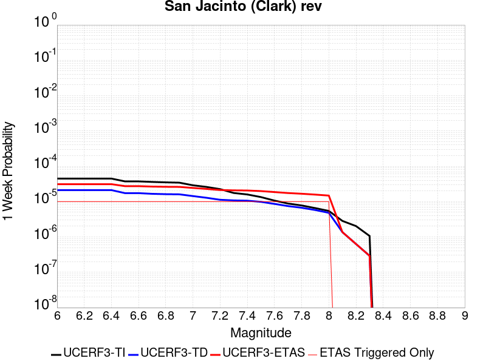 |  |  |  |

| Magnitude | 1 wk TI Prob | 1 wk TD Prob | 1 wk ETAS Prob | 1 wk ETAS/TD Gain | 1 wk ETAS Triggered Only | 1 mo TI Prob | 1 mo TD Prob | 1 mo ETAS Prob | 1 mo ETAS/TD Gain | 1 mo ETAS Triggered Only | 1 yr TI Prob | 1 yr TD Prob | 1 yr ETAS Prob | 1 yr ETAS/TD Gain | 1 yr ETAS Triggered Only | 10 yr TI Prob | 10 yr TD Prob | 10 yr ETAS Prob | 10 yr ETAS/TD Gain | 10 yr ETAS Triggered Only |
|-----|-----|-----|-----|-----|-----|-----|-----|-----|-----|-----|-----|-----|-----|-----|-----|-----|-----|-----|-----|-----|
| 6.0 | 4.482615E-5 | 2.1153059E-5 | 3.115285E-5 | 1.4727348 | 1.0E-5 | 1.9209793E-4 | 9.065287E-5 | 1.0065197E-4 | 1.1103009 | 1.0E-5 | 0.0023362834 | 0.0011031491 | 0.001113138 | 1.0090549 | 1.0E-5 | 0.02311874 | 0.011485709 | 0.011505479 | 1.0017213 | 2.0E-5 |
| 6.1 | 4.482615E-5 | 2.1153059E-5 | 3.115285E-5 | 1.4727348 | 1.0E-5 | 1.9209793E-4 | 9.065287E-5 | 1.0065197E-4 | 1.1103009 | 1.0E-5 | 0.0023362834 | 0.0011031491 | 0.001113138 | 1.0090549 | 1.0E-5 | 0.02311874 | 0.011485709 | 0.011505479 | 1.0017213 | 2.0E-5 |
| 6.2 | 4.482615E-5 | 2.1153059E-5 | 3.115285E-5 | 1.4727348 | 1.0E-5 | 1.9209793E-4 | 9.065287E-5 | 1.0065197E-4 | 1.1103009 | 1.0E-5 | 0.0023362834 | 0.0011031491 | 0.001113138 | 1.0090549 | 1.0E-5 | 0.02311874 | 0.011485709 | 0.011505479 | 1.0017213 | 2.0E-5 |
| 6.3 | 4.482615E-5 | 2.1153059E-5 | 3.115285E-5 | 1.4727348 | 1.0E-5 | 1.9209793E-4 | 9.065287E-5 | 1.0065197E-4 | 1.1103009 | 1.0E-5 | 0.0023362834 | 0.0011031491 | 0.001113138 | 1.0090549 | 1.0E-5 | 0.02311874 | 0.011485709 | 0.011505479 | 1.0017213 | 2.0E-5 |
| 6.4 | 4.482615E-5 | 2.1153059E-5 | 3.115285E-5 | 1.4727348 | 1.0E-5 | 1.9209793E-4 | 9.065287E-5 | 1.0065197E-4 | 1.1103009 | 1.0E-5 | 0.0023362834 | 0.0011031491 | 0.001113138 | 1.0090549 | 1.0E-5 | 0.02311874 | 0.011485709 | 0.011505479 | 1.0017213 | 2.0E-5 |
| 6.5 | 3.7294863E-5 | 1.7354667E-5 | 2.7354492E-5 | 1.576204 | 1.0E-5 | 1.5982533E-4 | 7.437504E-5 | 8.4374304E-5 | 1.1344436 | 1.0E-5 | 0.0019441366 | 9.051445E-4 | 9.1513543E-4 | 1.011038 | 1.0E-5 | 0.01927216 | 0.009485902 | 0.009505713 | 1.0020884 | 2.0E-5 |
| 6.6 | 3.7294863E-5 | 1.7354667E-5 | 2.7354492E-5 | 1.576204 | 1.0E-5 | 1.5982533E-4 | 7.437504E-5 | 8.4374304E-5 | 1.1344436 | 1.0E-5 | 0.0019441366 | 9.051445E-4 | 9.1513543E-4 | 1.011038 | 1.0E-5 | 0.01927216 | 0.009485902 | 0.009505713 | 1.0020884 | 2.0E-5 |
| 6.7 | 3.6039248E-5 | 1.6602684E-5 | 2.6602518E-5 | 1.6023023 | 1.0E-5 | 1.5444479E-4 | 7.115244E-5 | 8.115173E-5 | 1.1405333 | 1.0E-5 | 0.0018787434 | 8.659408E-4 | 8.7593216E-4 | 1.0115381 | 1.0E-5 | 0.01862939 | 0.009088189 | 0.009108008 | 1.0021807 | 2.0E-5 |
| 6.8 | 3.5031844E-5 | 1.6231123E-5 | 2.623096E-5 | 1.6160903 | 1.0E-5 | 1.5012783E-4 | 6.956012E-5 | 7.9559424E-5 | 1.1437505 | 1.0E-5 | 0.0018262739 | 8.4656954E-4 | 8.5656106E-4 | 1.0118024 | 1.0E-5 | 0.01811338 | 0.008888788 | 0.00890861 | 1.00223 | 2.0E-5 |
| 6.9 | 3.435112E-5 | 1.6061658E-5 | 2.6061498E-5 | 1.6225907 | 1.0E-5 | 1.4721078E-4 | 6.8833884E-5 | 7.8833196E-5 | 1.1452672 | 1.0E-5 | 0.0017908178 | 8.377344E-4 | 8.47726E-4 | 1.011927 | 1.0E-5 | 0.017764548 | 0.008796512 | 0.008816336 | 1.0022537 | 2.0E-5 |
| 7.0 | 2.8959772E-5 | 1.43355255E-5 | 2.4335382E-5 | 1.6975578 | 1.0E-5 | 1.241074E-4 | 6.1436534E-5 | 7.143592E-5 | 1.1627595 | 1.0E-5 | 0.0015099603 | 7.477359E-4 | 7.577284E-4 | 1.0133637 | 1.0E-5 | 0.014997416 | 0.007868331 | 0.007888174 | 1.0025219 | 2.0E-5 |
| 7.1 | 2.6002877E-5 | 1.2827699E-5 | 2.2827571E-5 | 1.779553 | 1.0E-5 | 1.11436144E-4 | 5.4974706E-5 | 6.4974156E-5 | 1.1818918 | 1.0E-5 | 0.0013558907 | 6.6911365E-4 | 6.791069E-4 | 1.0149351 | 1.0E-5 | 0.013476475 | 0.0070483433 | 0.0070682024 | 1.0028175 | 2.0E-5 |
| 7.2 | 2.2544838E-5 | 1.1260331E-5 | 2.1260219E-5 | 1.8880633 | 1.0E-5 | 9.661716E-5 | 4.825768E-5 | 5.8257196E-5 | 1.2072109 | 1.0E-5 | 0.001175679 | 5.873803E-4 | 5.973744E-4 | 1.0170147 | 1.0E-5 | 0.011694785 | 0.00619256 | 0.006212436 | 1.0032097 | 2.0E-5 |
| 7.3 | 1.75334E-5 | 1.0810585E-5 | 2.0810478E-5 | 1.9250094 | 1.0E-5 | 7.514098E-5 | 4.6330264E-5 | 5.63298E-5 | 1.2158316 | 1.0E-5 | 9.144575E-4 | 5.6392635E-4 | 5.739207E-4 | 1.0177228 | 1.0E-5 | 0.009107036 | 0.0059332196 | 0.0059531005 | 1.0033509 | 2.0E-5 |
| 7.4 | 1.5924552E-5 | 1.0610475E-5 | 2.0610369E-5 | 1.9424548 | 1.0E-5 | 6.82463E-5 | 4.547268E-5 | 5.5472225E-5 | 1.2199023 | 1.0E-5 | 8.305819E-4 | 5.534906E-4 | 5.634851E-4 | 1.0180571 | 1.0E-5 | 0.008274844 | 0.0058205863 | 0.0058404696 | 1.0034161 | 2.0E-5 |
| 7.5 | 1.3428931E-5 | 9.851045E-6 | 1.9850946E-5 | 2.0151107 | 1.0E-5 | 5.7551293E-5 | 4.221809E-5 | 5.2217667E-5 | 1.2368553 | 1.0E-5 | 7.004617E-4 | 5.1388505E-4 | 5.2387995E-4 | 1.0194496 | 1.0E-5 | 0.006982579 | 0.005406209 | 0.0054261005 | 1.0036794 | 2.0E-5 |
| 7.6 | 1.0688787E-5 | 8.614091E-6 | 1.8614004E-5 | 2.1608787 | 1.0E-5 | 4.5808283E-5 | 3.6917012E-5 | 4.691664E-5 | 1.2708678 | 1.0E-5 | 5.5757316E-4 | 4.4937237E-4 | 4.5936788E-4 | 1.0222433 | 1.0E-5 | 0.005561762 | 0.0047413614 | 0.0047612665 | 1.0041982 | 2.0E-5 |
| 7.7 | 8.81236E-6 | 7.4673385E-6 | 1.7467264E-5 | 2.3391552 | 1.0E-5 | 3.776671E-5 | 3.200249E-5 | 4.2002168E-5 | 1.3124657 | 1.0E-5 | 4.597127E-4 | 3.8956082E-4 | 3.9955694E-4 | 1.0256599 | 1.0E-5 | 0.0045876284 | 0.0041344194 | 0.0041543366 | 1.0048175 | 2.0E-5 |
| 7.8 | 7.780431E-6 | 6.695928E-6 | 1.669586E-5 | 2.4934351 | 1.0E-5 | 3.3344273E-5 | 2.8696519E-5 | 3.869623E-5 | 1.3484644 | 1.0E-5 | 4.0589093E-4 | 3.4932428E-4 | 3.5932078E-4 | 1.0286167 | 1.0E-5 | 0.0040515037 | 0.0037226272 | 0.0037425528 | 1.0053525 | 2.0E-5 |
| 7.9 | 6.5437994E-6 | 5.7797783E-6 | 1.577972E-5 | 2.7301602 | 1.0E-5 | 2.8044553E-5 | 2.4770245E-5 | 3.4769997E-5 | 1.4037002 | 1.0E-5 | 3.4138895E-4 | 3.0153614E-4 | 3.1153313E-4 | 1.0331535 | 1.0E-5 | 0.0034086495 | 0.0032343294 | 0.0032542646 | 1.0061637 | 2.0E-5 |
| 8.0 | 5.4488164E-6 | 4.812793E-6 | 1.4812745E-5 | 3.0777855 | 1.0E-5 | 2.3351862E-5 | 2.0626094E-5 | 3.0625888E-5 | 1.4848127 | 1.0E-5 | 2.8427184E-4 | 2.510939E-4 | 2.610914E-4 | 1.0398158 | 1.0E-5 | 0.0028390845 | 0.0027107038 | 0.0027306494 | 1.0073582 | 2.0E-5 |
| 8.1 | 2.8397242E-6 | 1.3665673E-6 | 1.3665673E-6 | 1.0 | 0.0 | 1.217019E-5 | 5.856704E-6 | 5.856704E-6 | 1.0 | 0.0 | 1.4816198E-4 | 7.1303046E-5 | 7.1303046E-5 | 1.0 | 0.0 | 0.0014806325 | 8.113543E-4 | 8.113543E-4 | 1.0 | 0.0 |
| 8.2 | 2.030244E-6 | 6.3151083E-7 | 6.3151083E-7 | 1.0 | 0.0 | 8.701017E-6 | 2.7064723E-6 | 2.7064723E-6 | 1.0 | 0.0 | 1.05929736E-4 | 3.2950808E-5 | 3.2950808E-5 | 1.0 | 0.0 | 0.0010587925 | 3.9470522E-4 | 3.9470522E-4 | 1.0 | 0.0 |
| 8.3 | 1.0659804E-6 | 2.9230563E-7 | 2.9230563E-7 | 1.0 | 0.0 | 4.568479E-6 | 1.2527379E-6 | 1.2527379E-6 | 1.0 | 0.0 | 5.5619817E-5 | 1.5251981E-5 | 1.5251981E-5 | 1.0 | 0.0 | 5.5605895E-4 | 1.8556409E-4 | 1.8556409E-4 | 1.0 | 0.0 |

## Rodgers Creek - Healdsburg 2011 CFM
*[(top)](#table-of-contents)*

| 1 Week | 1 Month | 1 Year | 10 Year |
|-----|-----|-----|-----|
|  |  |  |  |

| Magnitude | 1 wk TI Prob | 1 wk TD Prob | 1 wk ETAS Prob | 1 wk ETAS/TD Gain | 1 wk ETAS Triggered Only | 1 mo TI Prob | 1 mo TD Prob | 1 mo ETAS Prob | 1 mo ETAS/TD Gain | 1 mo ETAS Triggered Only | 1 yr TI Prob | 1 yr TD Prob | 1 yr ETAS Prob | 1 yr ETAS/TD Gain | 1 yr ETAS Triggered Only | 10 yr TI Prob | 10 yr TD Prob | 10 yr ETAS Prob | 10 yr ETAS/TD Gain | 10 yr ETAS Triggered Only |
|-----|-----|-----|-----|-----|-----|-----|-----|-----|-----|-----|-----|-----|-----|-----|-----|-----|-----|-----|-----|-----|
| 6.0 | 7.390182E-5 | 1.3137296E-4 | 1.3137296E-4 | 1.0 | 0.0 | 3.1668364E-4 | 5.629057E-4 | 5.7290005E-4 | 1.0177549 | 1.0E-5 | 0.0038488081 | 0.0068318076 | 0.006841739 | 1.0014538 | 1.0E-5 | 0.037828278 | 0.06618395 | 0.066202626 | 1.0002822 | 2.0E-5 |
| 6.1 | 7.318768E-5 | 1.303531E-4 | 1.303531E-4 | 1.0 | 0.0 | 3.1362378E-4 | 5.585369E-4 | 5.6853134E-4 | 1.0178939 | 1.0E-5 | 0.0038116854 | 0.006778966 | 0.0067888983 | 1.0014652 | 1.0E-5 | 0.037469655 | 0.06568854 | 0.06570723 | 1.0002844 | 2.0E-5 |
| 6.2 | 7.1379836E-5 | 1.2728151E-4 | 1.2728151E-4 | 1.0 | 0.0 | 3.058777E-4 | 5.453785E-4 | 5.5537303E-4 | 1.0183259 | 1.0E-5 | 0.003717703 | 0.0066197454 | 0.006629679 | 1.0015006 | 1.0E-5 | 0.0365612 | 0.06421061 | 0.064229324 | 1.0002915 | 2.0E-5 |
| 6.3 | 6.9255926E-5 | 1.2382482E-4 | 1.2382482E-4 | 1.0 | 0.0 | 2.9677735E-4 | 5.305703E-4 | 5.4056494E-4 | 1.0188377 | 1.0E-5 | 0.0036072785 | 0.0064406106 | 0.0064505464 | 1.0015427 | 1.0E-5 | 0.035492823 | 0.062541805 | 0.06256056 | 1.0002998 | 2.0E-5 |
| 6.4 | 6.6757144E-5 | 1.195919E-4 | 1.195919E-4 | 1.0 | 0.0 | 2.8607066E-4 | 5.1243644E-4 | 5.2243134E-4 | 1.0195047 | 1.0E-5 | 0.0034773487 | 0.00622114 | 0.006231078 | 1.0015974 | 1.0E-5 | 0.034234364 | 0.060491614 | 0.060510404 | 1.0003107 | 2.0E-5 |
| 6.5 | 6.5735134E-5 | 1.180849E-4 | 1.180849E-4 | 1.0 | 0.0 | 2.8169158E-4 | 5.059804E-4 | 5.1597535E-4 | 1.0197536 | 1.0E-5 | 0.003424202 | 0.0061429944 | 0.006152933 | 1.0016179 | 1.0E-5 | 0.03371918 | 0.059755705 | 0.05977451 | 1.0003147 | 2.0E-5 |
| 6.6 | 6.289601E-5 | 1.13442366E-4 | 1.13442366E-4 | 1.0 | 0.0 | 2.6952647E-4 | 4.8609133E-4 | 4.960865E-4 | 1.0205623 | 1.0E-5 | 0.0032765474 | 0.005902183 | 0.0059121237 | 1.0016843 | 1.0E-5 | 0.032286562 | 0.057495043 | 0.057513893 | 1.0003278 | 2.0E-5 |
| 6.7 | 6.115274E-5 | 1.106132E-4 | 1.106132E-4 | 1.0 | 0.0 | 2.6205686E-4 | 4.739708E-4 | 4.8396608E-4 | 1.0210884 | 1.0E-5 | 0.0031858748 | 0.0057554054 | 0.0057653477 | 1.0017275 | 1.0E-5 | 0.031405866 | 0.05611361 | 0.056132488 | 1.0003364 | 2.0E-5 |
| 6.8 | 5.9232367E-5 | 1.0728657E-4 | 1.0728657E-4 | 1.0 | 0.0 | 2.538283E-4 | 4.5971893E-4 | 4.6971434E-4 | 1.0217425 | 1.0E-5 | 0.0030859804 | 0.005582791 | 0.005592735 | 1.0017812 | 1.0E-5 | 0.030434765 | 0.05448041 | 0.05449932 | 1.0003471 | 2.0E-5 |
| 6.9 | 5.4030377E-5 | 9.8228295E-5 | 9.8228295E-5 | 1.0 | 0.0 | 2.315382E-4 | 4.209108E-4 | 4.309066E-4 | 1.023748 | 1.0E-5 | 0.0028153337 | 0.0051126136 | 0.0051225624 | 1.001946 | 1.0E-5 | 0.027799325 | 0.05001572 | 0.05003472 | 1.0003799 | 2.0E-5 |
| 7.0 | 4.8260714E-5 | 8.7408924E-5 | 8.7408924E-5 | 1.0 | 0.0 | 2.0681522E-4 | 3.7455617E-4 | 3.8455243E-4 | 1.0266882 | 1.0E-5 | 0.0025150678 | 0.0045507406 | 0.004560695 | 1.0021875 | 1.0E-5 | 0.024867928 | 0.044667073 | 0.044676628 | 1.0002139 | 1.0E-5 |
| 7.1 | 4.0294493E-5 | 7.389363E-5 | 7.389363E-5 | 1.0 | 0.0 | 1.7267925E-4 | 3.1664874E-4 | 3.2664556E-4 | 1.0315708 | 1.0E-5 | 0.0021003427 | 0.0038484214 | 0.003858383 | 1.0025885 | 1.0E-5 | 0.02080602 | 0.037923187 | 0.03793281 | 1.0002537 | 1.0E-5 |
| 7.2 | 3.096388E-5 | 5.698023E-5 | 5.698023E-5 | 1.0 | 0.0 | 1.326956E-4 | 2.4417826E-4 | 2.541758E-4 | 1.0409437 | 1.0E-5 | 0.0016143717 | 0.0029688394 | 0.0029788096 | 1.0033584 | 1.0E-5 | 0.01602694 | 0.029437006 | 0.029446712 | 1.0003297 | 1.0E-5 |
| 7.3 | 2.3615226E-5 | 4.3629818E-5 | 4.3629818E-5 | 1.0 | 0.0 | 1.0120418E-4 | 1.869716E-4 | 1.9696973E-4 | 1.0534741 | 1.0E-5 | 0.0012314644 | 0.0022740164 | 0.0022839936 | 1.0043875 | 1.0E-5 | 0.0122466255 | 0.022637889 | 0.022647662 | 1.0004318 | 1.0E-5 |
| 7.4 | 1.8251132E-5 | 3.3542477E-5 | 3.3542477E-5 | 1.0 | 0.0 | 7.821679E-5 | 1.4374561E-4 | 1.5374417E-4 | 1.0695573 | 1.0E-5 | 9.518733E-4 | 0.0017487077 | 0.0017586902 | 1.0057085 | 1.0E-5 | 0.009478063 | 0.017466031 | 0.017475856 | 1.0005625 | 1.0E-5 |
| 7.5 | 1.2411432E-5 | 2.2461069E-5 | 2.2461069E-5 | 1.0 | 0.0 | 5.3190768E-5 | 9.6258205E-5 | 9.6258205E-5 | 1.0 | 0.0 | 6.4740516E-4 | 0.0011713194 | 0.0011713194 | 1.0 | 0.0 | 0.006455223 | 0.011743137 | 0.011743137 | 1.0 | 0.0 |
| 7.6 | 4.4771446E-6 | 8.08443E-6 | 8.08443E-6 | 1.0 | 0.0 | 1.918762E-5 | 3.4647102E-5 | 3.4647102E-5 | 1.0 | 0.0 | 2.3358424E-4 | 4.2174806E-4 | 4.2174806E-4 | 1.0 | 0.0 | 0.0023333887 | 0.0042453306 | 0.0042453306 | 1.0 | 0.0 |
| 7.7 | 2.157941E-7 | 3.5350925E-7 | 3.5350925E-7 | 1.0 | 0.0 | 9.248315E-7 | 1.5150388E-6 | 1.5150388E-6 | 1.0 | 0.0 | 1.1259765E-5 | 1.844544E-5 | 1.844544E-5 | 1.0 | 0.0 | 1.1259195E-4 | 1.9069649E-4 | 1.9069649E-4 | 1.0 | 0.0 |
| 7.8 | 9.9623286E-8 | 1.9900986E-7 | 1.9900986E-7 | 1.0 | 0.0 | 4.269569E-7 | 8.528991E-7 | 8.528991E-7 | 1.0 | 0.0 | 5.1981874E-6 | 1.03839975E-5 | 1.03839975E-5 | 1.0 | 0.0 | 5.198066E-5 | 1.0902916E-4 | 1.0902916E-4 | 1.0 | 0.0 |
| 7.9 | 5.6745257E-8 | 1.1774714E-7 | 1.1774714E-7 | 1.0 | 0.0 | 2.4319394E-7 | 5.046305E-7 | 5.046305E-7 | 1.0 | 0.0 | 2.960882E-6 | 6.143859E-6 | 6.143859E-6 | 1.0 | 0.0 | 2.9608427E-5 | 6.471445E-5 | 6.471445E-5 | 1.0 | 0.0 |
| 8.0 | 2.8614323E-8 | 6.5789635E-8 | 6.5789635E-8 | 1.0 | 0.0 | 1.2263281E-7 | 2.8195555E-7 | 2.8195555E-7 | 1.0 | 0.0 | 1.4930534E-6 | 3.4328034E-6 | 3.4328034E-6 | 1.0 | 0.0 | 1.4930434E-5 | 3.5830046E-5 | 3.5830046E-5 | 1.0 | 0.0 |
| 8.1 | 3.5045191E-9 | 8.966459E-9 | 8.966459E-9 | 1.0 | 0.0 | 1.5019367E-8 | 3.8427682E-8 | 3.8427682E-8 | 1.0 | 0.0 | 1.8286079E-7 | 4.6785692E-7 | 4.6785692E-7 | 1.0 | 0.0 | 1.8286064E-6 | 4.834128E-6 | 4.834128E-6 | 1.0 | 0.0 |

## San Gregorio (North) 2011 CFM
*[(top)](#table-of-contents)*

| 1 Week | 1 Month | 1 Year | 10 Year |
|-----|-----|-----|-----|
|  |  |  |  |

| Magnitude | 1 wk TI Prob | 1 wk TD Prob | 1 wk ETAS Prob | 1 wk ETAS/TD Gain | 1 wk ETAS Triggered Only | 1 mo TI Prob | 1 mo TD Prob | 1 mo ETAS Prob | 1 mo ETAS/TD Gain | 1 mo ETAS Triggered Only | 1 yr TI Prob | 1 yr TD Prob | 1 yr ETAS Prob | 1 yr ETAS/TD Gain | 1 yr ETAS Triggered Only | 10 yr TI Prob | 10 yr TD Prob | 10 yr ETAS Prob | 10 yr ETAS/TD Gain | 10 yr ETAS Triggered Only |
|-----|-----|-----|-----|-----|-----|-----|-----|-----|-----|-----|-----|-----|-----|-----|-----|-----|-----|-----|-----|-----|
| 6.0 | 5.0283932E-5 | 4.3057098E-5 | 5.305667E-5 | 1.2322397 | 1.0E-5 | 2.1548476E-4 | 1.8451746E-4 | 1.9451561E-4 | 1.0541854 | 1.0E-5 | 0.0026203706 | 0.002244199 | 0.0022541767 | 1.0044459 | 1.0E-5 | 0.02589687 | 0.022295918 | 0.022315472 | 1.000877 | 2.0E-5 |
| 6.1 | 5.0283932E-5 | 4.3057098E-5 | 5.305667E-5 | 1.2322397 | 1.0E-5 | 2.1548476E-4 | 1.8451746E-4 | 1.9451561E-4 | 1.0541854 | 1.0E-5 | 0.0026203706 | 0.002244199 | 0.0022541767 | 1.0044459 | 1.0E-5 | 0.02589687 | 0.022295918 | 0.022315472 | 1.000877 | 2.0E-5 |
| 6.2 | 4.2998647E-5 | 3.4440873E-5 | 4.4440527E-5 | 1.2903427 | 1.0E-5 | 1.842669E-4 | 1.4759546E-4 | 1.5759398E-4 | 1.0677427 | 1.0E-5 | 0.0022411412 | 0.001795506 | 0.001805488 | 1.0055594 | 1.0E-5 | 0.022186736 | 0.017884884 | 0.017904526 | 1.0010983 | 2.0E-5 |
| 6.3 | 4.2998647E-5 | 3.4440873E-5 | 4.4440527E-5 | 1.2903427 | 1.0E-5 | 1.842669E-4 | 1.4759546E-4 | 1.5759398E-4 | 1.0677427 | 1.0E-5 | 0.0022411412 | 0.001795506 | 0.001805488 | 1.0055594 | 1.0E-5 | 0.022186736 | 0.017884884 | 0.017904526 | 1.0010983 | 2.0E-5 |
| 6.4 | 4.1101295E-5 | 3.2326076E-5 | 4.232575E-5 | 1.3093379 | 1.0E-5 | 1.7613651E-4 | 1.3853304E-4 | 1.4853165E-4 | 1.0721749 | 1.0E-5 | 0.0021423528 | 0.0016853481 | 0.0016953313 | 1.0059235 | 1.0E-5 | 0.02121817 | 0.016800618 | 0.016820282 | 1.0011704 | 2.0E-5 |
| 6.5 | 4.1032585E-5 | 3.224411E-5 | 4.2243788E-5 | 1.3101242 | 1.0E-5 | 1.7584208E-4 | 1.381818E-4 | 1.4818042E-4 | 1.0723585 | 1.0E-5 | 0.0021387753 | 0.0016810785 | 0.0016910617 | 1.0059385 | 1.0E-5 | 0.021183075 | 0.01675857 | 0.016778236 | 1.0011734 | 2.0E-5 |
| 6.6 | 4.011629E-5 | 3.1265718E-5 | 4.1265404E-5 | 1.3198291 | 1.0E-5 | 1.7191563E-4 | 1.3398913E-4 | 1.4398778E-4 | 1.0746229 | 1.0E-5 | 0.0020910634 | 0.0016301107 | 0.0016400943 | 1.0061245 | 1.0E-5 | 0.020714961 | 0.016257357 | 0.016277032 | 1.0012102 | 2.0E-5 |
| 6.7 | 3.8583938E-5 | 2.9452754E-5 | 3.945246E-5 | 1.3395168 | 1.0E-5 | 1.6534925E-4 | 1.2622007E-4 | 1.362188E-4 | 1.0792167 | 1.0E-5 | 0.0020112682 | 0.0015356604 | 0.001545645 | 1.0065019 | 1.0E-5 | 0.019931622 | 0.015326062 | 0.015345756 | 1.001285 | 2.0E-5 |
| 6.8 | 3.44341E-5 | 2.4450024E-5 | 3.444978E-5 | 1.4089875 | 1.0E-5 | 1.4756636E-4 | 1.0478167E-4 | 1.1478062E-4 | 1.0954266 | 1.0E-5 | 0.0017951399 | 0.0012749807 | 0.001284968 | 1.0078332 | 1.0E-5 | 0.017807078 | 0.012751525 | 0.01277127 | 1.0015484 | 2.0E-5 |
| 6.9 | 3.221199E-5 | 2.1777196E-5 | 3.1776977E-5 | 1.459186 | 1.0E-5 | 1.3804408E-4 | 9.3327544E-5 | 1.0332661E-4 | 1.1071395 | 1.0E-5 | 0.0016793909 | 0.0011356788 | 0.0011456675 | 1.0087953 | 1.0E-5 | 0.01666756 | 0.011372544 | 0.011392316 | 1.0017387 | 2.0E-5 |
| 7.0 | 2.9186718E-5 | 1.814604E-5 | 2.814586E-5 | 1.5510744 | 1.0E-5 | 1.2507994E-4 | 7.776645E-5 | 8.776567E-5 | 1.1285802 | 1.0E-5 | 0.0015217843 | 9.463997E-4 | 9.563902E-4 | 1.0105563 | 1.0E-5 | 0.015114053 | 0.0094966395 | 0.00951645 | 1.002086 | 2.0E-5 |
| 7.1 | 2.6840138E-5 | 1.5283675E-5 | 2.5283522E-5 | 1.6542829 | 1.0E-5 | 1.1502409E-4 | 6.549983E-5 | 7.549918E-5 | 1.1526622 | 1.0E-5 | 0.0013995186 | 7.971706E-4 | 8.0716267E-4 | 1.0125344 | 1.0E-5 | 0.013907375 | 0.0080155255 | 0.0080353655 | 1.0024751 | 2.0E-5 |
| 7.2 | 2.453002E-5 | 1.2605825E-5 | 2.2605698E-5 | 1.793274 | 1.0E-5 | 1.05124425E-4 | 5.4023847E-5 | 6.4023305E-5 | 1.1850934 | 1.0E-5 | 0.0012791384 | 6.5754243E-4 | 6.675359E-4 | 1.0151981 | 1.0E-5 | 0.012718005 | 0.006627395 | 0.0066472623 | 1.0029978 | 2.0E-5 |
| 7.3 | 2.3330727E-5 | 1.1487833E-5 | 2.1487718E-5 | 1.8704762 | 1.0E-5 | 9.9985E-5 | 4.923264E-5 | 5.923215E-5 | 1.2031072 | 1.0E-5 | 0.0012166376 | 5.99243E-4 | 6.09237E-4 | 1.0166777 | 1.0E-5 | 0.012099981 | 0.0060462817 | 0.006056221 | 1.0016439 | 1.0E-5 |
| 7.4 | 2.2136466E-5 | 1.0368137E-5 | 2.0368032E-5 | 1.9644835 | 1.0E-5 | 9.486712E-5 | 4.4434113E-5 | 5.443367E-5 | 1.2250423 | 1.0E-5 | 0.0011543952 | 5.408513E-4 | 5.508459E-4 | 1.0184793 | 1.0E-5 | 0.011484168 | 0.0054640025 | 0.005473948 | 1.0018202 | 1.0E-5 |
| 7.5 | 2.0994974E-5 | 9.426374E-6 | 9.426374E-6 | 1.0 | 0.0 | 8.997535E-5 | 4.0398125E-5 | 4.0398125E-5 | 1.0 | 0.0 | 0.0010948994 | 4.917364E-4 | 4.917364E-4 | 1.0 | 0.0 | 0.010895205 | 0.004973108 | 0.004973108 | 1.0 | 0.0 |
| 7.6 | 1.7091823E-5 | 6.892992E-6 | 6.892992E-6 | 1.0 | 0.0 | 7.3248615E-5 | 2.9541061E-5 | 2.9541061E-5 | 1.0 | 0.0 | 8.9143694E-4 | 3.5960317E-4 | 3.5960317E-4 | 1.0 | 0.0 | 0.008878695 | 0.0036480771 | 0.0036480771 | 1.0 | 0.0 |
| 7.7 | 1.2772179E-5 | 4.0202267E-6 | 4.0202267E-6 | 1.0 | 0.0 | 5.473676E-5 | 1.722943E-5 | 1.722943E-5 | 1.0 | 0.0 | 6.6621625E-4 | 2.0974813E-4 | 2.0974813E-4 | 1.0 | 0.0 | 0.006642225 | 0.0021365841 | 0.0021365841 | 1.0 | 0.0 |
| 7.8 | 7.041923E-6 | 1.9402341E-6 | 1.9402341E-6 | 1.0 | 0.0 | 3.017932E-5 | 8.315263E-6 | 8.315263E-6 | 1.0 | 0.0 | 3.6737128E-4 | 1.01233614E-4 | 1.01233614E-4 | 1.0 | 0.0 | 0.0036676454 | 0.0010376878 | 0.0010376878 | 1.0 | 0.0 |
| 7.9 | 2.946768E-6 | 1.0031822E-6 | 1.0031822E-6 | 1.0 | 0.0 | 1.2628945E-5 | 4.299345E-6 | 4.299345E-6 | 1.0 | 0.0 | 1.5374656E-4 | 5.2343268E-5 | 5.2343268E-5 | 1.0 | 0.0 | 0.0015364023 | 5.339059E-4 | 5.339059E-4 | 1.0 | 0.0 |
| 8.0 | 1.1433375E-6 | 5.180804E-7 | 5.180804E-7 | 1.0 | 0.0 | 4.9000087E-6 | 2.2203426E-6 | 2.2203426E-6 | 1.0 | 0.0 | 5.965597E-5 | 2.7032334E-5 | 2.7032334E-5 | 1.0 | 0.0 | 5.963996E-4 | 2.7394458E-4 | 2.7394458E-4 | 1.0 | 0.0 |
| 8.1 | 2.6675295E-7 | 1.6288074E-7 | 1.6288074E-7 | 1.0 | 0.0 | 1.1432264E-6 | 6.9806015E-7 | 6.9806015E-7 | 1.0 | 0.0 | 1.3918692E-5 | 8.498849E-6 | 8.498849E-6 | 1.0 | 0.0 | 1.391782E-4 | 8.6366665E-5 | 8.6366665E-5 | 1.0 | 0.0 |
| 8.2 | 1.2704569E-8 | 9.429871E-9 | 9.429871E-9 | 1.0 | 0.0 | 5.444815E-8 | 4.041373E-8 | 4.041373E-8 | 1.0 | 0.0 | 6.629061E-7 | 4.920371E-7 | 4.920371E-7 | 1.0 | 0.0 | 6.629041E-6 | 5.1106863E-6 | 5.1106863E-6 | 1.0 | 0.0 |

## Cleghorn
*[(top)](#table-of-contents)*

| 1 Week | 1 Month | 1 Year | 10 Year |
|-----|-----|-----|-----|
|  |  |  |  |

| Magnitude | 1 wk TI Prob | 1 wk TD Prob | 1 wk ETAS Prob | 1 wk ETAS/TD Gain | 1 wk ETAS Triggered Only | 1 mo TI Prob | 1 mo TD Prob | 1 mo ETAS Prob | 1 mo ETAS/TD Gain | 1 mo ETAS Triggered Only | 1 yr TI Prob | 1 yr TD Prob | 1 yr ETAS Prob | 1 yr ETAS/TD Gain | 1 yr ETAS Triggered Only | 10 yr TI Prob | 10 yr TD Prob | 10 yr ETAS Prob | 10 yr ETAS/TD Gain | 10 yr ETAS Triggered Only |
|-----|-----|-----|-----|-----|-----|-----|-----|-----|-----|-----|-----|-----|-----|-----|-----|-----|-----|-----|-----|-----|
| 6.0 | 7.9267165E-6 | 9.831764E-6 | 9.831764E-6 | 1.0 | 0.0 | 3.39712E-5 | 4.2135514E-5 | 4.2135514E-5 | 1.0 | 0.0 | 4.1352084E-4 | 5.1288976E-4 | 5.1288976E-4 | 1.0 | 0.0 | 0.004127522 | 0.005132214 | 0.0051521114 | 1.0038769 | 2.0E-5 |
| 6.1 | 7.9267165E-6 | 9.831764E-6 | 9.831764E-6 | 1.0 | 0.0 | 3.39712E-5 | 4.2135514E-5 | 4.2135514E-5 | 1.0 | 0.0 | 4.1352084E-4 | 5.1288976E-4 | 5.1288976E-4 | 1.0 | 0.0 | 0.004127522 | 0.005132214 | 0.0051521114 | 1.0038769 | 2.0E-5 |
| 6.2 | 7.9267165E-6 | 9.831764E-6 | 9.831764E-6 | 1.0 | 0.0 | 3.39712E-5 | 4.2135514E-5 | 4.2135514E-5 | 1.0 | 0.0 | 4.1352084E-4 | 5.1288976E-4 | 5.1288976E-4 | 1.0 | 0.0 | 0.004127522 | 0.005132214 | 0.0051521114 | 1.0038769 | 2.0E-5 |
| 6.3 | 7.9267165E-6 | 9.831764E-6 | 9.831764E-6 | 1.0 | 0.0 | 3.39712E-5 | 4.2135514E-5 | 4.2135514E-5 | 1.0 | 0.0 | 4.1352084E-4 | 5.1288976E-4 | 5.1288976E-4 | 1.0 | 0.0 | 0.004127522 | 0.005132214 | 0.0051521114 | 1.0038769 | 2.0E-5 |
| 6.4 | 4.3445207E-6 | 6.0916254E-6 | 6.0916254E-6 | 1.0 | 0.0 | 1.8619241E-5 | 2.6106709E-5 | 2.6106709E-5 | 1.0 | 0.0 | 2.2666567E-4 | 3.1780385E-4 | 3.1780385E-4 | 1.0 | 0.0 | 0.0022643462 | 0.0031877246 | 0.0031976928 | 1.003127 | 1.0E-5 |
| 6.5 | 4.3445207E-6 | 6.0916254E-6 | 6.0916254E-6 | 1.0 | 0.0 | 1.8619241E-5 | 2.6106709E-5 | 2.6106709E-5 | 1.0 | 0.0 | 2.2666567E-4 | 3.1780385E-4 | 3.1780385E-4 | 1.0 | 0.0 | 0.0022643462 | 0.0031877246 | 0.0031976928 | 1.003127 | 1.0E-5 |
| 6.6 | 4.040109E-6 | 5.774033E-6 | 5.774033E-6 | 1.0 | 0.0 | 1.7314638E-5 | 2.4745626E-5 | 2.4745626E-5 | 1.0 | 0.0 | 2.1078532E-4 | 3.0123728E-4 | 3.0123728E-4 | 1.0 | 0.0 | 0.002105855 | 0.0030225143 | 0.003032484 | 1.0032985 | 1.0E-5 |
| 6.7 | 3.3632055E-6 | 5.06753E-6 | 5.06753E-6 | 1.0 | 0.0 | 1.4413658E-5 | 2.1717806E-5 | 2.1717806E-5 | 1.0 | 0.0 | 1.7547216E-4 | 2.643825E-4 | 2.643825E-4 | 1.0 | 0.0 | 0.0017533366 | 0.0026548486 | 0.0026548486 | 1.0 | 0.0 |
| 6.8 | 3.2902772E-6 | 4.9894375E-6 | 4.9894375E-6 | 1.0 | 0.0 | 1.4101111E-5 | 2.138313E-5 | 2.138313E-5 | 1.0 | 0.0 | 1.716675E-4 | 2.6030882E-4 | 2.6030882E-4 | 1.0 | 0.0 | 0.0017153495 | 0.0026142076 | 0.0026142076 | 1.0 | 0.0 |
| 6.9 | 3.031547E-6 | 4.6911987E-6 | 4.6911987E-6 | 1.0 | 0.0 | 1.299228E-5 | 2.0104984E-5 | 2.0104984E-5 | 1.0 | 0.0 | 1.5816953E-4 | 2.4475096E-4 | 2.4475096E-4 | 1.0 | 0.0 | 0.00158057 | 0.0024589805 | 0.0024589805 | 1.0 | 0.0 |
| 7.0 | 2.8259715E-6 | 4.3707637E-6 | 4.3707637E-6 | 1.0 | 0.0 | 1.211125E-5 | 1.8731711E-5 | 1.8731711E-5 | 1.0 | 0.0 | 1.4744449E-4 | 2.2803496E-4 | 2.2803496E-4 | 1.0 | 0.0 | 0.001473467 | 0.0022921748 | 0.0022921748 | 1.0 | 0.0 |
| 7.1 | 2.5962665E-6 | 4.065983E-6 | 4.065983E-6 | 1.0 | 0.0 | 1.1126809E-5 | 1.7425526E-5 | 1.7425526E-5 | 1.0 | 0.0 | 1.3546048E-4 | 2.1213535E-4 | 2.1213535E-4 | 1.0 | 0.0 | 0.0013537793 | 0.0021334959 | 0.0021334959 | 1.0 | 0.0 |
| 7.2 | 2.3247253E-6 | 3.6765352E-6 | 3.6765352E-6 | 1.0 | 0.0 | 9.96307E-6 | 1.5756486E-5 | 1.5756486E-5 | 1.0 | 0.0 | 1.21293626E-4 | 1.9181852E-4 | 1.9181852E-4 | 1.0 | 0.0 | 0.0012122744 | 0.0019307166 | 0.0019307166 | 1.0 | 0.0 |
| 7.3 | 2.056928E-6 | 3.235253E-6 | 3.235253E-6 | 1.0 | 0.0 | 8.815376E-6 | 1.3865297E-5 | 1.3865297E-5 | 1.0 | 0.0 | 1.0732192E-4 | 1.6879707E-4 | 1.6879707E-4 | 1.0 | 0.0 | 0.001072701 | 0.0017009423 | 0.0017009423 | 1.0 | 0.0 |
| 7.4 | 1.8055999E-6 | 2.8256538E-6 | 2.8256538E-6 | 1.0 | 0.0 | 7.738263E-6 | 1.210989E-5 | 1.210989E-5 | 1.0 | 0.0 | 9.4209274E-5 | 1.4742807E-4 | 1.4742807E-4 | 1.0 | 0.0 | 9.4169343E-4 | 0.0014876705 | 0.0014876705 | 1.0 | 0.0 |
| 7.5 | 1.4683443E-6 | 2.4248943E-6 | 2.4248943E-6 | 1.0 | 0.0 | 6.292889E-6 | 1.0392363E-5 | 1.0392363E-5 | 1.0 | 0.0 | 7.661323E-5 | 1.2651978E-4 | 1.2651978E-4 | 1.0 | 0.0 | 7.658682E-4 | 0.0012788812 | 0.0012788812 | 1.0 | 0.0 |
| 7.6 | 9.804088E-7 | 1.9004091E-6 | 1.9004091E-6 | 1.0 | 0.0 | 4.201745E-6 | 8.144585E-6 | 8.144585E-6 | 1.0 | 0.0 | 5.1155046E-5 | 9.915586E-5 | 9.915586E-5 | 1.0 | 0.0 | 5.114327E-4 | 0.0010055583 | 0.0010055583 | 1.0 | 0.0 |
| 7.7 | 7.3434086E-7 | 1.6285549E-6 | 1.6285549E-6 | 1.0 | 0.0 | 3.1471714E-6 | 6.9795024E-6 | 6.9795024E-6 | 1.0 | 0.0 | 3.831614E-5 | 8.4972155E-5 | 8.4972155E-5 | 1.0 | 0.0 | 3.8309532E-4 | 8.6387293E-4 | 8.6387293E-4 | 1.0 | 0.0 |
| 7.8 | 6.434184E-7 | 1.5221389E-6 | 1.5221389E-6 | 1.0 | 0.0 | 2.7575045E-6 | 6.523436E-6 | 6.523436E-6 | 1.0 | 0.0 | 3.35721E-5 | 7.9419966E-5 | 7.9419966E-5 | 1.0 | 0.0 | 3.3567028E-4 | 8.080443E-4 | 8.080443E-4 | 1.0 | 0.0 |
| 7.9 | 3.4943926E-7 | 7.5750586E-7 | 7.5750586E-7 | 1.0 | 0.0 | 1.497596E-6 | 3.2464498E-6 | 3.2464498E-6 | 1.0 | 0.0 | 1.8233079E-5 | 3.9524817E-5 | 3.9524817E-5 | 1.0 | 0.0 | 1.8231584E-4 | 4.0401975E-4 | 4.0401975E-4 | 1.0 | 0.0 |
| 8.0 | 6.717524E-8 | 5.837515E-8 | 5.837515E-8 | 1.0 | 0.0 | 2.8789387E-7 | 2.501792E-7 | 2.501792E-7 | 1.0 | 0.0 | 3.505102E-6 | 3.0459275E-6 | 3.0459275E-6 | 1.0 | 0.0 | 3.5050467E-5 | 3.2751934E-5 | 3.2751934E-5 | 1.0 | 0.0 |
| 8.1 | 3.1984914E-8 | 1.2949885E-8 | 1.2949885E-8 | 1.0 | 0.0 | 1.370782E-7 | 5.549951E-8 | 5.549951E-8 | 1.0 | 0.0 | 1.6689258E-6 | 6.757063E-7 | 6.757063E-7 | 1.0 | 0.0 | 1.6689133E-5 | 7.741151E-6 | 7.741151E-6 | 1.0 | 0.0 |
| 8.2 | 1.21887656E-8 | 3.6471115E-9 | 3.6471115E-9 | 1.0 | 0.0 | 5.2237567E-8 | 1.563048E-8 | 1.563048E-8 | 1.0 | 0.0 | 6.359922E-7 | 1.9030107E-7 | 1.9030107E-7 | 1.0 | 0.0 | 6.3599036E-6 | 2.245849E-6 | 2.245849E-6 | 1.0 | 0.0 |

## Reliz 2011 CFM
*[(top)](#table-of-contents)*

| 1 Week | 1 Month | 1 Year | 10 Year |
|-----|-----|-----|-----|
|  |  |  |  |

| Magnitude | 1 wk TI Prob | 1 wk TD Prob | 1 wk ETAS Prob | 1 wk ETAS/TD Gain | 1 wk ETAS Triggered Only | 1 mo TI Prob | 1 mo TD Prob | 1 mo ETAS Prob | 1 mo ETAS/TD Gain | 1 mo ETAS Triggered Only | 1 yr TI Prob | 1 yr TD Prob | 1 yr ETAS Prob | 1 yr ETAS/TD Gain | 1 yr ETAS Triggered Only | 10 yr TI Prob | 10 yr TD Prob | 10 yr ETAS Prob | 10 yr ETAS/TD Gain | 10 yr ETAS Triggered Only |
|-----|-----|-----|-----|-----|-----|-----|-----|-----|-----|-----|-----|-----|-----|-----|-----|-----|-----|-----|-----|-----|
| 6.0 | 1.6002472E-5 | 1.6282795E-5 | 1.6282795E-5 | 1.0 | 0.0 | 6.8580215E-5 | 6.978165E-5 | 6.978165E-5 | 1.0 | 0.0 | 8.3464425E-4 | 8.492802E-4 | 8.5927173E-4 | 1.0117646 | 1.0E-5 | 0.008315164 | 0.008462543 | 0.008482373 | 1.0023433 | 2.0E-5 |
| 6.1 | 1.6002472E-5 | 1.6282795E-5 | 1.6282795E-5 | 1.0 | 0.0 | 6.8580215E-5 | 6.978165E-5 | 6.978165E-5 | 1.0 | 0.0 | 8.3464425E-4 | 8.492802E-4 | 8.5927173E-4 | 1.0117646 | 1.0E-5 | 0.008315164 | 0.008462543 | 0.008482373 | 1.0023433 | 2.0E-5 |
| 6.2 | 1.6002472E-5 | 1.6282795E-5 | 1.6282795E-5 | 1.0 | 0.0 | 6.8580215E-5 | 6.978165E-5 | 6.978165E-5 | 1.0 | 0.0 | 8.3464425E-4 | 8.492802E-4 | 8.5927173E-4 | 1.0117646 | 1.0E-5 | 0.008315164 | 0.008462543 | 0.008482373 | 1.0023433 | 2.0E-5 |
| 6.3 | 7.792404E-6 | 7.803792E-6 | 7.803792E-6 | 1.0 | 0.0 | 3.339559E-5 | 3.3444398E-5 | 3.3444398E-5 | 1.0 | 0.0 | 4.0651546E-4 | 4.0711026E-4 | 4.0711026E-4 | 1.0 | 0.0 | 0.0040577264 | 0.0040639215 | 0.0040639215 | 1.0 | 0.0 |
| 6.4 | 7.792404E-6 | 7.803792E-6 | 7.803792E-6 | 1.0 | 0.0 | 3.339559E-5 | 3.3444398E-5 | 3.3444398E-5 | 1.0 | 0.0 | 4.0651546E-4 | 4.0711026E-4 | 4.0711026E-4 | 1.0 | 0.0 | 0.0040577264 | 0.0040639215 | 0.0040639215 | 1.0 | 0.0 |
| 6.5 | 5.9659374E-6 | 5.928728E-6 | 5.928728E-6 | 1.0 | 0.0 | 2.5568053E-5 | 2.5408588E-5 | 2.5408588E-5 | 1.0 | 0.0 | 3.1124658E-4 | 3.0930588E-4 | 3.0930588E-4 | 1.0 | 0.0 | 0.00310811 | 0.003088972 | 0.003088972 | 1.0 | 0.0 |
| 6.6 | 5.2350692E-6 | 5.178976E-6 | 5.178976E-6 | 1.0 | 0.0 | 2.2435817E-5 | 2.2195423E-5 | 2.2195423E-5 | 1.0 | 0.0 | 2.7312184E-4 | 2.7019592E-4 | 2.7019592E-4 | 1.0 | 0.0 | 0.002727864 | 0.0026988846 | 0.0026988846 | 1.0 | 0.0 |
| 6.7 | 4.580206E-6 | 4.50611E-6 | 4.50611E-6 | 1.0 | 0.0 | 1.9629308E-5 | 1.931176E-5 | 1.931176E-5 | 1.0 | 0.0 | 2.389606E-4 | 2.3509537E-4 | 2.3509537E-4 | 1.0 | 0.0 | 0.002387038 | 0.002348669 | 0.002348669 | 1.0 | 0.0 |
| 6.8 | 4.0765017E-6 | 3.988228E-6 | 3.988228E-6 | 1.0 | 0.0 | 1.7470604E-5 | 1.7092294E-5 | 1.7092294E-5 | 1.0 | 0.0 | 2.1268385E-4 | 2.0807884E-4 | 2.0807884E-4 | 1.0 | 0.0 | 0.002124804 | 0.0020790389 | 0.0020790389 | 1.0 | 0.0 |
| 6.9 | 3.5752896E-6 | 3.4725074E-6 | 3.4725074E-6 | 1.0 | 0.0 | 1.532258E-5 | 1.488209E-5 | 1.488209E-5 | 1.0 | 0.0 | 1.8653645E-4 | 1.811744E-4 | 1.811744E-4 | 1.0 | 0.0 | 0.0018637994 | 0.001810464 | 0.001810464 | 1.0 | 0.0 |
| 7.0 | 3.0259848E-6 | 2.9079317E-6 | 2.9079317E-6 | 1.0 | 0.0 | 1.2968442E-5 | 1.2462505E-5 | 1.2462505E-5 | 1.0 | 0.0 | 1.5787935E-4 | 1.5172044E-4 | 1.5172044E-4 | 1.0 | 0.0 | 0.0015776722 | 0.0015163644 | 0.0015163644 | 1.0 | 0.0 |
| 7.1 | 2.5861116E-6 | 2.455157E-6 | 2.455157E-6 | 1.0 | 0.0 | 1.1083288E-5 | 1.0522059E-5 | 1.0522059E-5 | 1.0 | 0.0 | 1.3493067E-4 | 1.2809855E-4 | 1.2809855E-4 | 1.0 | 0.0 | 0.0013484878 | 0.0012804423 | 0.0012804423 | 1.0 | 0.0 |
| 7.2 | 2.1482588E-6 | 2.0032267E-6 | 2.0032267E-6 | 1.0 | 0.0 | 9.20679E-6 | 8.585229E-6 | 8.585229E-6 | 1.0 | 0.0 | 1.12086906E-4 | 1.0452016E-4 | 1.0452016E-4 | 1.0 | 0.0 | 0.0011203039 | 0.0010449048 | 0.0010449048 | 1.0 | 0.0 |
| 7.3 | 1.7194744E-6 | 1.561114E-6 | 1.561114E-6 | 1.0 | 0.0 | 7.3691554E-6 | 6.6904713E-6 | 6.6904713E-6 | 1.0 | 0.0 | 8.971577E-5 | 8.145344E-5 | 8.145344E-5 | 1.0 | 0.0 | 8.967956E-4 | 8.144305E-4 | 8.144305E-4 | 1.0 | 0.0 |
| 7.4 | 1.2755178E-6 | 1.1056196E-6 | 1.1056196E-6 | 1.0 | 0.0 | 5.4664933E-6 | 4.738361E-6 | 4.738361E-6 | 1.0 | 0.0 | 6.655252E-5 | 5.768802E-5 | 5.768802E-5 | 1.0 | 0.0 | 6.6532596E-4 | 5.769249E-4 | 5.769249E-4 | 1.0 | 0.0 |
| 7.5 | 8.8463224E-7 | 7.0579193E-7 | 7.0579193E-7 | 1.0 | 0.0 | 3.7912755E-6 | 3.0248189E-6 | 3.0248189E-6 | 1.0 | 0.0 | 4.6157802E-5 | 3.682655E-5 | 3.682655E-5 | 1.0 | 0.0 | 4.6148215E-4 | 3.683988E-4 | 3.683988E-4 | 1.0 | 0.0 |
| 7.6 | 5.291355E-7 | 3.5006548E-7 | 3.5006548E-7 | 1.0 | 0.0 | 2.2677216E-6 | 1.5002796E-6 | 1.5002796E-6 | 1.0 | 0.0 | 2.760916E-5 | 1.8265751E-5 | 1.8265751E-5 | 1.0 | 0.0 | 2.760573E-4 | 1.8283579E-4 | 1.8283579E-4 | 1.0 | 0.0 |
| 7.7 | 2.9663357E-7 | 1.3509886E-7 | 1.3509886E-7 | 1.0 | 0.0 | 1.2712861E-6 | 5.7899496E-7 | 5.7899496E-7 | 1.0 | 0.0 | 1.5477797E-5 | 7.0492406E-6 | 7.0492406E-6 | 1.0 | 0.0 | 1.547672E-4 | 7.0675895E-5 | 7.0675895E-5 | 1.0 | 0.0 |
| 7.8 | 1.2509386E-7 | 2.7148959E-8 | 2.7148959E-8 | 1.0 | 0.0 | 5.3611643E-7 | 1.1635268E-7 | 1.1635268E-7 | 1.0 | 0.0 | 6.527198E-6 | 1.4165929E-6 | 1.4165929E-6 | 1.0 | 0.0 | 6.527006E-5 | 1.4322827E-5 | 1.4322827E-5 | 1.0 | 0.0 |
| 7.9 | 6.213493E-8 | 1.1477568E-8 | 1.1477568E-8 | 1.0 | 0.0 | 2.6629255E-7 | 4.9189577E-8 | 4.9189577E-8 | 1.0 | 0.0 | 3.242107E-6 | 5.9888293E-7 | 5.9888293E-7 | 1.0 | 0.0 | 3.2420594E-5 | 6.1203536E-6 | 6.1203536E-6 | 1.0 | 0.0 |
| 8.0 | 5.92383E-9 | 1.6775827E-9 | 1.6775827E-9 | 1.0 | 0.0 | 2.5387841E-8 | 7.18964E-9 | 7.18964E-9 | 1.0 | 0.0 | 3.0909692E-7 | 8.753386E-8 | 8.753386E-8 | 1.0 | 0.0 | 3.090965E-6 | 8.992677E-7 | 8.992677E-7 | 1.0 | 0.0 |

## Great Valley 07 (Orestimba)
*[(top)](#table-of-contents)*

| 1 Week | 1 Month | 1 Year | 10 Year |
|-----|-----|-----|-----|
|  |  |  | 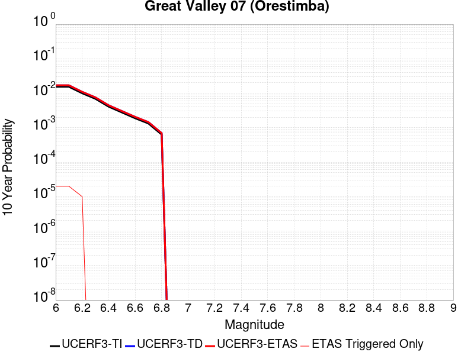 |

| Magnitude | 1 wk TI Prob | 1 wk TD Prob | 1 wk ETAS Prob | 1 wk ETAS/TD Gain | 1 wk ETAS Triggered Only | 1 mo TI Prob | 1 mo TD Prob | 1 mo ETAS Prob | 1 mo ETAS/TD Gain | 1 mo ETAS Triggered Only | 1 yr TI Prob | 1 yr TD Prob | 1 yr ETAS Prob | 1 yr ETAS/TD Gain | 1 yr ETAS Triggered Only | 10 yr TI Prob | 10 yr TD Prob | 10 yr ETAS Prob | 10 yr ETAS/TD Gain | 10 yr ETAS Triggered Only |
|-----|-----|-----|-----|-----|-----|-----|-----|-----|-----|-----|-----|-----|-----|-----|-----|-----|-----|-----|-----|-----|
| 6.0 | 2.9687902E-5 | 3.27575E-5 | 3.27575E-5 | 1.0 | 0.0 | 1.2722766E-4 | 1.4038214E-4 | 1.4038214E-4 | 1.0 | 0.0 | 0.0015478961 | 0.0017078844 | 0.0017178673 | 1.0058452 | 1.0E-5 | 0.015371585 | 0.016955135 | 0.016974797 | 1.0011595 | 2.0E-5 |
| 6.1 | 2.9687902E-5 | 3.27575E-5 | 3.27575E-5 | 1.0 | 0.0 | 1.2722766E-4 | 1.4038214E-4 | 1.4038214E-4 | 1.0 | 0.0 | 0.0015478961 | 0.0017078844 | 0.0017178673 | 1.0058452 | 1.0E-5 | 0.015371585 | 0.016955135 | 0.016974797 | 1.0011595 | 2.0E-5 |
| 6.2 | 1.9231524E-5 | 2.1159167E-5 | 2.1159167E-5 | 1.0 | 0.0 | 8.2418206E-5 | 9.067912E-5 | 9.067912E-5 | 1.0 | 0.0 | 0.0010029797 | 0.0011034822 | 0.0011034822 | 1.0 | 0.0 | 0.00998465 | 0.010982441 | 0.0109923305 | 1.0009005 | 1.0E-5 |
| 6.3 | 1.324766E-5 | 1.4548534E-5 | 1.4548534E-5 | 1.0 | 0.0 | 5.6774446E-5 | 6.234942E-5 | 6.234942E-5 | 1.0 | 0.0 | 6.910097E-4 | 7.5884897E-4 | 7.5884897E-4 | 1.0 | 0.0 | 0.006888649 | 0.0075635235 | 0.0075635235 | 1.0 | 0.0 |
| 6.4 | 7.818645E-6 | 8.57284E-6 | 8.57284E-6 | 1.0 | 0.0 | 3.3508048E-5 | 3.6740246E-5 | 3.6740246E-5 | 1.0 | 0.0 | 4.078841E-4 | 4.4722404E-4 | 4.4722404E-4 | 1.0 | 0.0 | 0.004071363 | 0.0044635804 | 0.0044635804 | 1.0 | 0.0 |
| 6.5 | 5.3076565E-6 | 5.8178007E-6 | 5.8178007E-6 | 1.0 | 0.0 | 2.27469E-5 | 2.4933206E-5 | 2.4933206E-5 | 1.0 | 0.0 | 2.7690834E-4 | 3.035216E-4 | 3.035216E-4 | 1.0 | 0.0 | 0.0027656353 | 0.00303128 | 0.00303128 | 1.0 | 0.0 |
| 6.6 | 3.6003578E-6 | 3.9484953E-6 | 3.9484953E-6 | 1.0 | 0.0 | 1.5430012E-5 | 1.6922022E-5 | 1.6922022E-5 | 1.0 | 0.0 | 1.8784421E-4 | 2.0600771E-4 | 2.0600771E-4 | 1.0 | 0.0 | 0.0018768552 | 0.0020583214 | 0.0020583214 | 1.0 | 0.0 |
| 6.7 | 2.5361826E-6 | 2.7834678E-6 | 2.7834678E-6 | 1.0 | 0.0 | 1.0869308E-5 | 1.1929101E-5 | 1.1929101E-5 | 1.0 | 0.0 | 1.3232579E-4 | 1.4522845E-4 | 1.4522845E-4 | 1.0 | 0.0 | 0.0013224703 | 0.0014514653 | 0.0014514653 | 1.0 | 0.0 |
| 6.8 | 1.2115831E-6 | 1.3313797E-6 | 1.3313797E-6 | 1.0 | 0.0 | 5.1924885E-6 | 5.7059065E-6 | 5.7059065E-6 | 1.0 | 0.0 | 6.3216714E-5 | 6.9468166E-5 | 6.9468166E-5 | 1.0 | 0.0 | 6.3198735E-4 | 6.945596E-4 | 6.945596E-4 | 1.0 | 0.0 |

## Clamshell-Sawpit
*[(top)](#table-of-contents)*

| 1 Week | 1 Month | 1 Year | 10 Year |
|-----|-----|-----|-----|
|  |  |  |  |

| Magnitude | 1 wk TI Prob | 1 wk TD Prob | 1 wk ETAS Prob | 1 wk ETAS/TD Gain | 1 wk ETAS Triggered Only | 1 mo TI Prob | 1 mo TD Prob | 1 mo ETAS Prob | 1 mo ETAS/TD Gain | 1 mo ETAS Triggered Only | 1 yr TI Prob | 1 yr TD Prob | 1 yr ETAS Prob | 1 yr ETAS/TD Gain | 1 yr ETAS Triggered Only | 10 yr TI Prob | 10 yr TD Prob | 10 yr ETAS Prob | 10 yr ETAS/TD Gain | 10 yr ETAS Triggered Only |
|-----|-----|-----|-----|-----|-----|-----|-----|-----|-----|-----|-----|-----|-----|-----|-----|-----|-----|-----|-----|-----|
| 6.0 | 3.202998E-6 | 3.0127642E-6 | 3.0127642E-6 | 1.0 | 0.0 | 1.3727062E-5 | 1.2911787E-5 | 1.2911787E-5 | 1.0 | 0.0 | 1.6711417E-4 | 1.5719047E-4 | 1.671889E-4 | 1.0636071 | 1.0E-5 | 0.0016698855 | 0.0015708723 | 0.0015908409 | 1.0127118 | 2.0E-5 |
| 6.1 | 3.202998E-6 | 3.0127642E-6 | 3.0127642E-6 | 1.0 | 0.0 | 1.3727062E-5 | 1.2911787E-5 | 1.2911787E-5 | 1.0 | 0.0 | 1.6711417E-4 | 1.5719047E-4 | 1.671889E-4 | 1.0636071 | 1.0E-5 | 0.0016698855 | 0.0015708723 | 0.0015908409 | 1.0127118 | 2.0E-5 |
| 6.2 | 3.202998E-6 | 3.0127642E-6 | 3.0127642E-6 | 1.0 | 0.0 | 1.3727062E-5 | 1.2911787E-5 | 1.2911787E-5 | 1.0 | 0.0 | 1.6711417E-4 | 1.5719047E-4 | 1.671889E-4 | 1.0636071 | 1.0E-5 | 0.0016698855 | 0.0015708723 | 0.0015908409 | 1.0127118 | 2.0E-5 |
| 6.3 | 3.202998E-6 | 3.0127642E-6 | 3.0127642E-6 | 1.0 | 0.0 | 1.3727062E-5 | 1.2911787E-5 | 1.2911787E-5 | 1.0 | 0.0 | 1.6711417E-4 | 1.5719047E-4 | 1.671889E-4 | 1.0636071 | 1.0E-5 | 0.0016698855 | 0.0015708723 | 0.0015908409 | 1.0127118 | 2.0E-5 |
| 6.4 | 3.202998E-6 | 3.0127642E-6 | 3.0127642E-6 | 1.0 | 0.0 | 1.3727062E-5 | 1.2911787E-5 | 1.2911787E-5 | 1.0 | 0.0 | 1.6711417E-4 | 1.5719047E-4 | 1.671889E-4 | 1.0636071 | 1.0E-5 | 0.0016698855 | 0.0015708723 | 0.0015908409 | 1.0127118 | 2.0E-5 |
| 6.5 | 2.5862723E-6 | 2.3807747E-6 | 2.3807747E-6 | 1.0 | 0.0 | 1.1083977E-5 | 1.0203283E-5 | 1.0203283E-5 | 1.0 | 0.0 | 1.3493907E-4 | 1.2421819E-4 | 1.2421819E-4 | 1.0 | 0.0 | 0.0013485716 | 0.0012415178 | 0.0012415178 | 1.0 | 0.0 |
| 6.6 | 2.5862723E-6 | 2.3807747E-6 | 2.3807747E-6 | 1.0 | 0.0 | 1.1083977E-5 | 1.0203283E-5 | 1.0203283E-5 | 1.0 | 0.0 | 1.3493907E-4 | 1.2421819E-4 | 1.2421819E-4 | 1.0 | 0.0 | 0.0013485716 | 0.0012415178 | 0.0012415178 | 1.0 | 0.0 |
| 6.7 | 2.5862723E-6 | 2.3807747E-6 | 2.3807747E-6 | 1.0 | 0.0 | 1.1083977E-5 | 1.0203283E-5 | 1.0203283E-5 | 1.0 | 0.0 | 1.3493907E-4 | 1.2421819E-4 | 1.2421819E-4 | 1.0 | 0.0 | 0.0013485716 | 0.0012415178 | 0.0012415178 | 1.0 | 0.0 |
| 6.8 | 2.4098806E-6 | 2.1977307E-6 | 2.1977307E-6 | 1.0 | 0.0 | 1.0328019E-5 | 9.4188135E-6 | 9.4188135E-6 | 1.0 | 0.0 | 1.2573638E-4 | 1.14668284E-4 | 1.14668284E-4 | 1.0 | 0.0 | 0.0012566525 | 0.0011461178 | 0.0011461178 | 1.0 | 0.0 |
| 6.9 | 2.0073985E-6 | 1.7784247E-6 | 1.7784247E-6 | 1.0 | 0.0 | 8.603109E-6 | 7.6217984E-6 | 7.6217984E-6 | 1.0 | 0.0 | 1.0473781E-4 | 9.279157E-5 | 9.279157E-5 | 1.0 | 0.0 | 0.0010468846 | 9.2754007E-4 | 9.2754007E-4 | 1.0 | 0.0 |
| 7.0 | 1.8166766E-6 | 1.5807094E-6 | 1.5807094E-6 | 1.0 | 0.0 | 7.785734E-6 | 6.774452E-6 | 6.774452E-6 | 1.0 | 0.0 | 9.478718E-5 | 8.247593E-5 | 8.247593E-5 | 1.0 | 0.0 | 9.4746763E-4 | 8.244633E-4 | 8.244633E-4 | 1.0 | 0.0 |
| 7.1 | 1.5471421E-6 | 1.3052961E-6 | 1.3052961E-6 | 1.0 | 0.0 | 6.6305925E-6 | 5.5941146E-6 | 5.5941146E-6 | 1.0 | 0.0 | 8.072447E-5 | 6.810627E-5 | 6.810627E-5 | 1.0 | 0.0 | 8.0695155E-4 | 6.8085943E-4 | 6.8085943E-4 | 1.0 | 0.0 |
| 7.2 | 1.3608037E-6 | 1.1153442E-6 | 1.1153442E-6 | 1.0 | 0.0 | 5.8320024E-6 | 4.780038E-6 | 4.780038E-6 | 1.0 | 0.0 | 7.1002316E-5 | 5.8195455E-5 | 5.8195455E-5 | 1.0 | 0.0 | 7.097964E-4 | 5.818068E-4 | 5.818068E-4 | 1.0 | 0.0 |
| 7.3 | 1.0749634E-6 | 8.384255E-7 | 8.384255E-7 | 1.0 | 0.0 | 4.6069777E-6 | 3.5932474E-6 | 3.5932474E-6 | 1.0 | 0.0 | 5.608851E-5 | 4.3746935E-5 | 4.3746935E-5 | 1.0 | 0.0 | 5.6074356E-4 | 4.3738607E-4 | 4.3738607E-4 | 1.0 | 0.0 |
| 7.4 | 8.416856E-7 | 6.2000527E-7 | 6.2000527E-7 | 1.0 | 0.0 | 3.607219E-6 | 2.657163E-6 | 2.657163E-6 | 1.0 | 0.0 | 4.3917007E-5 | 3.2350497E-5 | 3.2350497E-5 | 1.0 | 0.0 | 4.390833E-4 | 3.2345986E-4 | 3.2345986E-4 | 1.0 | 0.0 |
| 7.5 | 6.2779594E-7 | 4.4968908E-7 | 4.4968908E-7 | 1.0 | 0.0 | 2.6905511E-6 | 1.9272377E-6 | 1.9272377E-6 | 1.0 | 0.0 | 3.275697E-5 | 2.3463885E-5 | 2.3463885E-5 | 1.0 | 0.0 | 3.275214E-4 | 2.3461595E-4 | 2.3461595E-4 | 1.0 | 0.0 |
| 7.6 | 4.3822078E-7 | 3.059551E-7 | 3.059551E-7 | 1.0 | 0.0 | 1.8780877E-6 | 1.3112356E-6 | 1.3112356E-6 | 1.0 | 0.0 | 2.2865479E-5 | 1.5964191E-5 | 1.5964191E-5 | 1.0 | 0.0 | 2.2863125E-4 | 1.5963199E-4 | 1.5963199E-4 | 1.0 | 0.0 |
| 7.7 | 1.8704569E-7 | 1.12379E-7 | 1.12379E-7 | 1.0 | 0.0 | 8.0162414E-7 | 4.8162417E-7 | 4.8162417E-7 | 1.0 | 0.0 | 9.75973E-6 | 5.8637593E-6 | 5.8637593E-6 | 1.0 | 0.0 | 9.7593016E-5 | 5.863611E-5 | 5.863611E-5 | 1.0 | 0.0 |
| 7.8 | 3.5378733E-8 | 2.1838002E-8 | 2.1838002E-8 | 1.0 | 0.0 | 1.5162313E-7 | 9.359143E-8 | 9.359143E-8 | 1.0 | 0.0 | 1.84601E-6 | 1.1394751E-6 | 1.1394751E-6 | 1.0 | 0.0 | 1.8459947E-5 | 1.1394695E-5 | 1.1394695E-5 | 1.0 | 0.0 |
| 7.9 | 7.504945E-9 | 5.1921663E-9 | 5.1921663E-9 | 1.0 | 0.0 | 3.2164053E-8 | 2.2252141E-8 | 2.2252141E-8 | 1.0 | 0.0 | 3.9159727E-7 | 2.709198E-7 | 2.709198E-7 | 1.0 | 0.0 | 3.915966E-6 | 2.7091953E-6 | 2.7091953E-6 | 1.0 | 0.0 |
| 8.0 | 1.6554036E-10 | 1.418149E-10 | 1.418149E-10 | 1.0 | 0.0 | 7.0945894E-10 | 6.0777794E-10 | 6.0777794E-10 | 1.0 | 0.0 | 8.637662E-9 | 7.3996964E-9 | 7.3996964E-9 | 1.0 | 0.0 | 8.6376616E-8 | 7.3996965E-8 | 7.3996965E-8 | 1.0 | 0.0 |

## Ortigalita (South)
*[(top)](#table-of-contents)*

| 1 Week | 1 Month | 1 Year | 10 Year |
|-----|-----|-----|-----|
|  |  |  |  |

| Magnitude | 1 wk TI Prob | 1 wk TD Prob | 1 wk ETAS Prob | 1 wk ETAS/TD Gain | 1 wk ETAS Triggered Only | 1 mo TI Prob | 1 mo TD Prob | 1 mo ETAS Prob | 1 mo ETAS/TD Gain | 1 mo ETAS Triggered Only | 1 yr TI Prob | 1 yr TD Prob | 1 yr ETAS Prob | 1 yr ETAS/TD Gain | 1 yr ETAS Triggered Only | 10 yr TI Prob | 10 yr TD Prob | 10 yr ETAS Prob | 10 yr ETAS/TD Gain | 10 yr ETAS Triggered Only |
|-----|-----|-----|-----|-----|-----|-----|-----|-----|-----|-----|-----|-----|-----|-----|-----|-----|-----|-----|-----|-----|
| 6.0 | 3.72394E-5 | 4.32556E-5 | 5.3255168E-5 | 1.231174 | 1.0E-5 | 1.5958765E-4 | 1.8536886E-4 | 1.95367E-4 | 1.0539365 | 1.0E-5 | 0.0019412481 | 0.0022546863 | 0.0022746413 | 1.0088505 | 2.0E-5 | 0.019243775 | 0.022334501 | 0.022354055 | 1.0008755 | 2.0E-5 |
| 6.1 | 2.7299884E-5 | 3.1492036E-5 | 4.149172E-5 | 1.3175306 | 1.0E-5 | 1.16994255E-4 | 1.349592E-4 | 1.4495786E-4 | 1.0740864 | 1.0E-5 | 0.0014234743 | 0.0016419457 | 0.0016619129 | 1.0121607 | 2.0E-5 | 0.014143906 | 0.016304072 | 0.016323747 | 1.0012066 | 2.0E-5 |
| 6.2 | 2.7299884E-5 | 3.1492036E-5 | 4.149172E-5 | 1.3175306 | 1.0E-5 | 1.16994255E-4 | 1.349592E-4 | 1.4495786E-4 | 1.0740864 | 1.0E-5 | 0.0014234743 | 0.0016419457 | 0.0016619129 | 1.0121607 | 2.0E-5 | 0.014143906 | 0.016304072 | 0.016323747 | 1.0012066 | 2.0E-5 |
| 6.3 | 2.0546433E-5 | 2.3631454E-5 | 3.3631215E-5 | 1.4231548 | 1.0E-5 | 8.805317E-5 | 1.0127383E-4 | 1.1127282E-4 | 1.0987322 | 1.0E-5 | 0.00107152 | 0.0012323305 | 0.0012523058 | 1.0162094 | 2.0E-5 | 0.010663681 | 0.012257031 | 0.012276786 | 1.0016117 | 2.0E-5 |
| 6.4 | 2.0546433E-5 | 2.3631454E-5 | 3.3631215E-5 | 1.4231548 | 1.0E-5 | 8.805317E-5 | 1.0127383E-4 | 1.1127282E-4 | 1.0987322 | 1.0E-5 | 0.00107152 | 0.0012323305 | 0.0012523058 | 1.0162094 | 2.0E-5 | 0.010663681 | 0.012257031 | 0.012276786 | 1.0016117 | 2.0E-5 |
| 6.5 | 1.7779594E-5 | 2.0446974E-5 | 3.044677E-5 | 1.4890599 | 1.0E-5 | 7.619603E-5 | 8.762703E-5 | 9.762615E-5 | 1.11411 | 1.0E-5 | 9.272918E-4 | 0.0010663505 | 0.0010863291 | 1.0187355 | 2.0E-5 | 0.009234319 | 0.010613804 | 0.010633592 | 1.0018643 | 2.0E-5 |
| 6.6 | 1.6272212E-5 | 1.8714967E-5 | 2.871478E-5 | 1.5343217 | 1.0E-5 | 6.973618E-5 | 8.0204605E-5 | 9.020381E-5 | 1.1246711 | 1.0E-5 | 8.487073E-4 | 9.760659E-4 | 9.960464E-4 | 1.0204704 | 2.0E-5 | 0.008454733 | 0.009719091 | 0.009738896 | 1.0020378 | 2.0E-5 |
| 6.7 | 1.3051484E-5 | 1.5038758E-5 | 2.5038607E-5 | 1.6649386 | 1.0E-5 | 5.593373E-5 | 6.445028E-5 | 7.4449636E-5 | 1.1551484 | 1.0E-5 | 6.807804E-4 | 7.844092E-4 | 8.043935E-4 | 1.0254769 | 2.0E-5 | 0.006786986 | 0.007817388 | 0.007837231 | 1.0025384 | 2.0E-5 |
| 6.8 | 1.04277415E-5 | 1.1987235E-5 | 1.1987235E-5 | 1.0 | 0.0 | 4.4689557E-5 | 5.1372896E-5 | 5.1372896E-5 | 1.0 | 0.0 | 5.439595E-4 | 6.2529295E-4 | 6.352867E-4 | 1.0159825 | 1.0E-5 | 0.0054262993 | 0.00623609 | 0.0062460275 | 1.0015936 | 1.0E-5 |
| 6.9 | 7.639968E-6 | 8.791503E-6 | 8.791503E-6 | 1.0 | 0.0 | 3.274231E-5 | 3.767736E-5 | 3.767736E-5 | 1.0 | 0.0 | 3.9856473E-4 | 4.586312E-4 | 4.586312E-4 | 1.0 | 0.0 | 0.003978506 | 0.004577433 | 0.004577433 | 1.0 | 0.0 |
| 7.0 | 3.919831E-6 | 4.5334014E-6 | 4.5334014E-6 | 1.0 | 0.0 | 1.679917E-5 | 1.942873E-5 | 1.942873E-5 | 1.0 | 0.0 | 2.045107E-4 | 2.3652123E-4 | 2.3652123E-4 | 1.0 | 0.0 | 0.0020432258 | 0.0023629034 | 0.0023629034 | 1.0 | 0.0 |
| 7.1 | 1.6017933E-6 | 1.8570418E-6 | 1.8570418E-6 | 1.0 | 0.0 | 6.8648105E-6 | 7.958732E-6 | 7.958732E-6 | 1.0 | 0.0 | 8.357586E-5 | 9.689432E-5 | 9.689432E-5 | 1.0 | 0.0 | 8.3544437E-4 | 9.686254E-4 | 9.686254E-4 | 1.0 | 0.0 |

## Almanor 2011 CFM
*[(top)](#table-of-contents)*

| 1 Week | 1 Month | 1 Year | 10 Year |
|-----|-----|-----|-----|
|  | 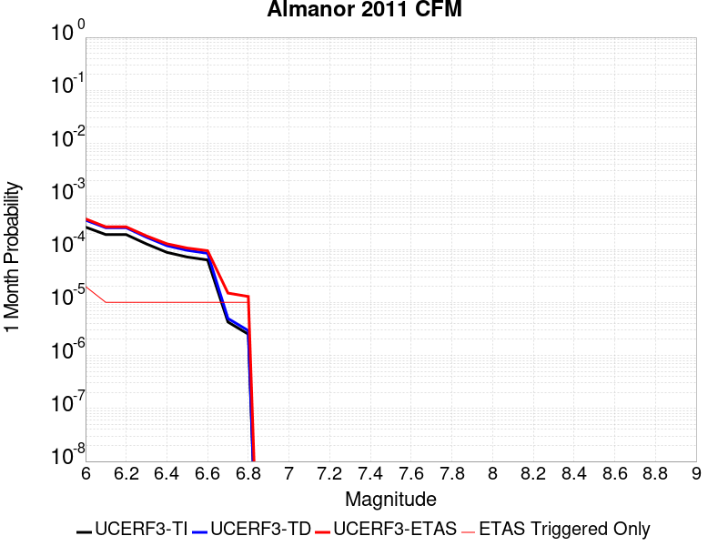 | 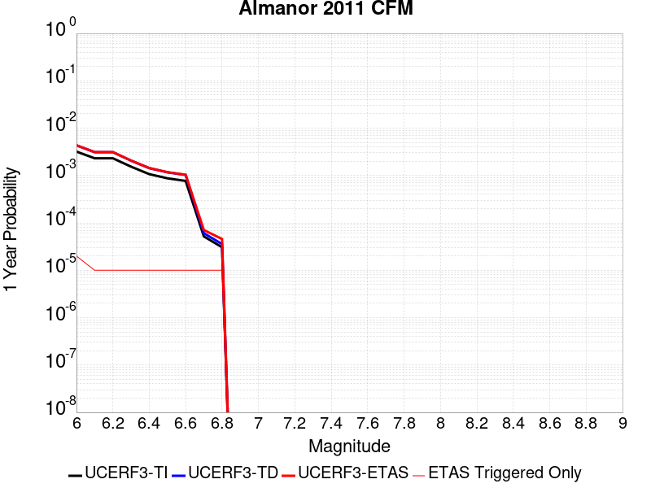 |  |

| Magnitude | 1 wk TI Prob | 1 wk TD Prob | 1 wk ETAS Prob | 1 wk ETAS/TD Gain | 1 wk ETAS Triggered Only | 1 mo TI Prob | 1 mo TD Prob | 1 mo ETAS Prob | 1 mo ETAS/TD Gain | 1 mo ETAS Triggered Only | 1 yr TI Prob | 1 yr TD Prob | 1 yr ETAS Prob | 1 yr ETAS/TD Gain | 1 yr ETAS Triggered Only | 10 yr TI Prob | 10 yr TD Prob | 10 yr ETAS Prob | 10 yr ETAS/TD Gain | 10 yr ETAS Triggered Only |
|-----|-----|-----|-----|-----|-----|-----|-----|-----|-----|-----|-----|-----|-----|-----|-----|-----|-----|-----|-----|-----|
| 6.0 | 6.1479834E-5 | 8.327245E-5 | 9.3271614E-5 | 1.1200777 | 1.0E-5 | 2.6345838E-4 | 3.5683523E-4 | 3.7682807E-4 | 1.0560282 | 2.0E-5 | 0.0032028882 | 0.004336495 | 0.004356408 | 1.0045921 | 2.0E-5 | 0.031571172 | 0.04258658 | 0.042605728 | 1.0004497 | 2.0E-5 |
| 6.1 | 4.4387216E-5 | 5.9767433E-5 | 5.9767433E-5 | 1.0 | 0.0 | 1.9021705E-4 | 2.561236E-4 | 2.6612106E-4 | 1.0390337 | 1.0E-5 | 0.0023134327 | 0.003114351 | 0.0031243197 | 1.0032009 | 1.0E-5 | 0.022894967 | 0.030755581 | 0.030765275 | 1.0003152 | 1.0E-5 |
| 6.2 | 4.4387216E-5 | 5.9767433E-5 | 5.9767433E-5 | 1.0 | 0.0 | 1.9021705E-4 | 2.561236E-4 | 2.6612106E-4 | 1.0390337 | 1.0E-5 | 0.0023134327 | 0.003114351 | 0.0031243197 | 1.0032009 | 1.0E-5 | 0.022894967 | 0.030755581 | 0.030765275 | 1.0003152 | 1.0E-5 |
| 6.3 | 2.9523822E-5 | 3.9546965E-5 | 3.9546965E-5 | 1.0 | 0.0 | 1.2652454E-4 | 1.6947731E-4 | 1.7947561E-4 | 1.058995 | 1.0E-5 | 0.0015393476 | 0.0020617929 | 0.0020717722 | 1.0048401 | 1.0E-5 | 0.015287281 | 0.020461112 | 0.020470908 | 1.0004787 | 1.0E-5 |
| 6.4 | 2.0512744E-5 | 2.7430639E-5 | 2.7430639E-5 | 1.0 | 0.0 | 8.79088E-5 | 1.17555675E-4 | 1.2755451E-4 | 1.0850561 | 1.0E-5 | 0.001069764 | 0.0014306171 | 0.0014406027 | 1.00698 | 1.0E-5 | 0.010646289 | 0.01424458 | 0.014254437 | 1.000692 | 1.0E-5 |
| 6.5 | 1.6750226E-5 | 2.2390364E-5 | 2.2390364E-5 | 1.0 | 0.0 | 7.178471E-5 | 9.595619E-5 | 1.0595523E-4 | 1.1042042 | 1.0E-5 | 8.7362836E-4 | 0.0011679606 | 0.0011779489 | 1.008552 | 1.0E-5 | 0.008702018 | 0.011649196 | 0.011659079 | 1.0008484 | 1.0E-5 |
| 6.6 | 1.4745303E-5 | 1.970686E-5 | 1.970686E-5 | 1.0 | 0.0 | 6.319262E-5 | 8.445639E-5 | 9.445554E-5 | 1.1183943 | 1.0E-5 | 7.690986E-4 | 0.0010280984 | 0.0010380881 | 1.0097167 | 1.0E-5 | 0.0076644225 | 0.01026513 | 0.010275028 | 1.0009642 | 1.0E-5 |
| 6.7 | 9.951145E-7 | 1.1616347E-6 | 1.1616347E-6 | 1.0 | 0.0 | 4.26477E-6 | 4.9784257E-6 | 1.4978376E-5 | 3.008657 | 1.0E-5 | 5.1922336E-5 | 6.0610826E-5 | 7.061022E-5 | 1.1649771 | 1.0E-5 | 5.1910203E-4 | 6.059602E-4 | 6.159541E-4 | 1.0164927 | 1.0E-5 |
| 6.8 | 5.866312E-7 | 6.849384E-7 | 6.849384E-7 | 1.0 | 0.0 | 2.5141312E-6 | 2.9354478E-6 | 1.2935418E-5 | 4.4066253 | 1.0E-5 | 3.0609117E-5 | 3.5738623E-5 | 4.5738263E-5 | 1.2797993 | 1.0E-5 | 3.06049E-4 | 3.5734157E-4 | 3.67338E-4 | 1.0279745 | 1.0E-5 |

## San Juan
*[(top)](#table-of-contents)*

| 1 Week | 1 Month | 1 Year | 10 Year |
|-----|-----|-----|-----|
|  |  | 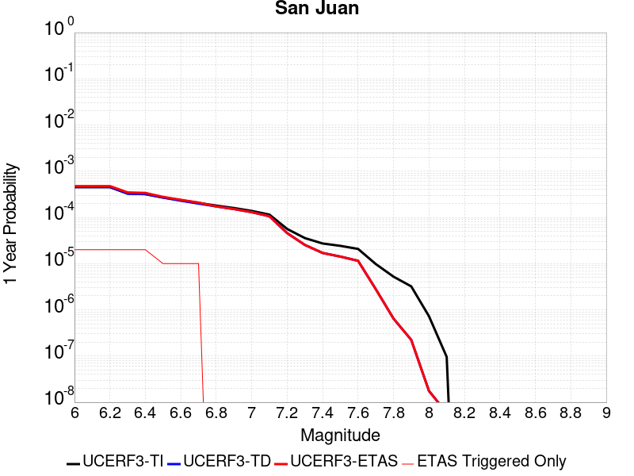 | 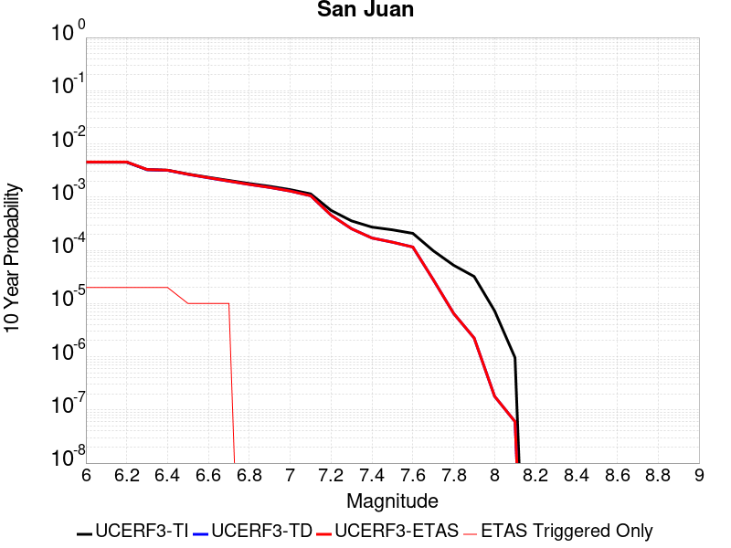 |

| Magnitude | 1 wk TI Prob | 1 wk TD Prob | 1 wk ETAS Prob | 1 wk ETAS/TD Gain | 1 wk ETAS Triggered Only | 1 mo TI Prob | 1 mo TD Prob | 1 mo ETAS Prob | 1 mo ETAS/TD Gain | 1 mo ETAS Triggered Only | 1 yr TI Prob | 1 yr TD Prob | 1 yr ETAS Prob | 1 yr ETAS/TD Gain | 1 yr ETAS Triggered Only | 10 yr TI Prob | 10 yr TD Prob | 10 yr ETAS Prob | 10 yr ETAS/TD Gain | 10 yr ETAS Triggered Only |
|-----|-----|-----|-----|-----|-----|-----|-----|-----|-----|-----|-----|-----|-----|-----|-----|-----|-----|-----|-----|-----|
| 6.0 | 8.682808E-6 | 8.74917E-6 | 8.74917E-6 | 1.0 | 0.0 | 3.72115E-5 | 3.749593E-5 | 3.749593E-5 | 1.0 | 0.0 | 4.5295584E-4 | 4.5642213E-4 | 4.76413E-4 | 1.043799 | 2.0E-5 | 0.004520337 | 0.004555389 | 0.0045752977 | 1.0043705 | 2.0E-5 |
| 6.1 | 8.682808E-6 | 8.74917E-6 | 8.74917E-6 | 1.0 | 0.0 | 3.72115E-5 | 3.749593E-5 | 3.749593E-5 | 1.0 | 0.0 | 4.5295584E-4 | 4.5642213E-4 | 4.76413E-4 | 1.043799 | 2.0E-5 | 0.004520337 | 0.004555389 | 0.0045752977 | 1.0043705 | 2.0E-5 |
| 6.2 | 8.682808E-6 | 8.74917E-6 | 8.74917E-6 | 1.0 | 0.0 | 3.72115E-5 | 3.749593E-5 | 3.749593E-5 | 1.0 | 0.0 | 4.5295584E-4 | 4.5642213E-4 | 4.76413E-4 | 1.043799 | 2.0E-5 | 0.004520337 | 0.004555389 | 0.0045752977 | 1.0043705 | 2.0E-5 |
| 6.3 | 6.3054235E-6 | 6.282591E-6 | 6.282591E-6 | 1.0 | 0.0 | 2.7022963E-5 | 2.692512E-5 | 2.692512E-5 | 1.0 | 0.0 | 3.2895492E-4 | 3.2776545E-4 | 3.4775888E-4 | 1.0609993 | 2.0E-5 | 0.003284684 | 0.0032730205 | 0.003292955 | 1.0060905 | 2.0E-5 |
| 6.4 | 6.1490473E-6 | 6.1144706E-6 | 6.1144706E-6 | 1.0 | 0.0 | 2.6352795E-5 | 2.6204618E-5 | 2.6204618E-5 | 1.0 | 0.0 | 3.2079802E-4 | 3.189959E-4 | 3.389895E-4 | 1.0626768 | 2.0E-5 | 0.0032033534 | 0.0031855768 | 0.003205513 | 1.0062582 | 2.0E-5 |
| 6.5 | 5.204848E-6 | 5.137238E-6 | 5.137238E-6 | 1.0 | 0.0 | 2.23063E-5 | 2.2016555E-5 | 2.2016555E-5 | 1.0 | 0.0 | 2.7154534E-4 | 2.6801953E-4 | 2.7801684E-4 | 1.0373007 | 1.0E-5 | 0.0027121378 | 0.0026771172 | 0.0026870905 | 1.0037254 | 1.0E-5 |
| 6.6 | 4.5179986E-6 | 4.415036E-6 | 4.415036E-6 | 1.0 | 0.0 | 1.9362706E-5 | 1.892145E-5 | 1.892145E-5 | 1.0 | 0.0 | 2.3571544E-4 | 2.303451E-4 | 2.403428E-4 | 1.0434031 | 1.0E-5 | 0.0023546559 | 0.0023012008 | 0.0023111778 | 1.0043355 | 1.0E-5 |
| 6.7 | 3.9442616E-6 | 3.8198336E-6 | 3.8198336E-6 | 1.0 | 0.0 | 1.6903869E-5 | 1.6370615E-5 | 1.6370615E-5 | 1.0 | 0.0 | 2.0578515E-4 | 1.9929469E-4 | 2.092927E-4 | 1.050167 | 1.0E-5 | 0.002055947 | 0.001991285 | 0.002001265 | 1.0050119 | 1.0E-5 |
| 6.8 | 3.4536245E-6 | 3.3163408E-6 | 3.3163408E-6 | 1.0 | 0.0 | 1.4801163E-5 | 1.4212815E-5 | 1.4212815E-5 | 1.0 | 0.0 | 1.8018926E-4 | 1.7302789E-4 | 1.7302789E-4 | 1.0 | 0.0 | 0.0018004322 | 0.001729051 | 0.001729051 | 1.0 | 0.0 |
| 6.9 | 3.059865E-6 | 2.9120363E-6 | 2.9120363E-6 | 1.0 | 0.0 | 1.3113641E-5 | 1.2480099E-5 | 1.2480099E-5 | 1.0 | 0.0 | 1.596469E-4 | 1.5193518E-4 | 1.5193518E-4 | 1.0 | 0.0 | 0.0015953224 | 0.0015184281 | 0.0015184281 | 1.0 | 0.0 |
| 7.0 | 2.6504351E-6 | 2.492005E-6 | 2.492005E-6 | 1.0 | 0.0 | 1.1358958E-5 | 1.0679981E-5 | 1.0679981E-5 | 1.0 | 0.0 | 1.3828653E-4 | 1.3002155E-4 | 1.3002155E-4 | 1.0 | 0.0 | 0.0013820052 | 0.001299567 | 0.001299567 | 1.0 | 0.0 |
| 7.1 | 2.2039317E-6 | 2.0338366E-6 | 2.0338366E-6 | 1.0 | 0.0 | 9.445387E-6 | 8.716416E-6 | 8.716416E-6 | 1.0 | 0.0 | 1.1499152E-4 | 1.0611773E-4 | 1.0611773E-4 | 1.0 | 0.0 | 0.0011493203 | 0.0010607811 | 0.0010607811 | 1.0 | 0.0 |
| 7.2 | 1.0786707E-6 | 8.770239E-7 | 8.770239E-7 | 1.0 | 0.0 | 4.622866E-6 | 3.7586685E-6 | 3.7586685E-6 | 1.0 | 0.0 | 5.628194E-5 | 4.576084E-5 | 4.576084E-5 | 1.0 | 0.0 | 5.6267687E-4 | 4.5757365E-4 | 4.5757365E-4 | 1.0 | 0.0 |
| 7.3 | 6.846433E-7 | 4.868812E-7 | 4.868812E-7 | 1.0 | 0.0 | 2.9341822E-6 | 2.086632E-6 | 2.086632E-6 | 1.0 | 0.0 | 3.5723086E-5 | 2.5404452E-5 | 2.5404452E-5 | 1.0 | 0.0 | 3.571734E-4 | 2.5405022E-4 | 2.5405022E-4 | 1.0 | 0.0 |
| 7.4 | 5.23043E-7 | 3.2627884E-7 | 3.2627884E-7 | 1.0 | 0.0 | 2.2416111E-6 | 1.3983371E-6 | 1.3983371E-6 | 1.0 | 0.0 | 2.7291273E-5 | 1.7024622E-5 | 1.7024622E-5 | 1.0 | 0.0 | 2.7287923E-4 | 1.7026608E-4 | 1.7026608E-4 | 1.0 | 0.0 |
| 7.5 | 4.648444E-7 | 2.723464E-7 | 2.723464E-7 | 1.0 | 0.0 | 1.9921886E-6 | 1.1671983E-6 | 1.1671983E-6 | 1.0 | 0.0 | 2.4254627E-5 | 1.4210547E-5 | 1.4210547E-5 | 1.0 | 0.0 | 2.425198E-4 | 1.4212691E-4 | 1.4212691E-4 | 1.0 | 0.0 |
| 7.6 | 3.9906567E-7 | 2.2083036E-7 | 2.2083036E-7 | 1.0 | 0.0 | 1.7102802E-6 | 9.4641547E-7 | 9.4641547E-7 | 1.0 | 0.0 | 2.0822463E-5 | 1.1522548E-5 | 1.1522548E-5 | 1.0 | 0.0 | 2.0820512E-4 | 1.15244526E-4 | 1.15244526E-4 | 1.0 | 0.0 |
| 7.7 | 1.8784601E-7 | 5.366277E-8 | 5.366277E-8 | 1.0 | 0.0 | 8.0505407E-7 | 2.2998329E-7 | 2.2998329E-7 | 1.0 | 0.0 | 9.80149E-6 | 2.800043E-6 | 2.800043E-6 | 1.0 | 0.0 | 9.801057E-5 | 2.8008939E-5 | 2.8008939E-5 | 1.0 | 0.0 |
| 7.8 | 1.00154914E-7 | 1.2412917E-8 | 1.2412917E-8 | 1.0 | 0.0 | 4.2923529E-7 | 5.3198217E-8 | 5.3198217E-8 | 1.0 | 0.0 | 5.225927E-6 | 6.476881E-7 | 6.476881E-7 | 1.0 | 0.0 | 5.225804E-5 | 6.4827886E-6 | 6.4827886E-6 | 1.0 | 0.0 |
| 7.9 | 6.171429E-8 | 4.2946513E-9 | 4.2946513E-9 | 1.0 | 0.0 | 2.6448978E-7 | 1.8405647E-8 | 1.8405647E-8 | 1.0 | 0.0 | 3.2201583E-6 | 2.2408874E-7 | 2.2408874E-7 | 1.0 | 0.0 | 3.2201115E-5 | 2.2462114E-6 | 2.2462114E-6 | 1.0 | 0.0 |
| 8.0 | 1.3974572E-8 | 3.3737857E-10 | 3.3737857E-10 | 1.0 | 0.0 | 5.989102E-8 | 1.4459075E-9 | 1.4459075E-9 | 1.0 | 0.0 | 7.2917294E-7 | 1.760392E-8 | 1.760392E-8 | 1.0 | 0.0 | 7.2917055E-6 | 1.8038004E-7 | 1.8038004E-7 | 1.0 | 0.0 |
| 8.1 | 1.8403477E-9 | 1.1291601E-10 | 1.1291601E-10 | 1.0 | 0.0 | 7.887204E-9 | 4.839261E-10 | 4.839261E-10 | 1.0 | 0.0 | 9.602671E-8 | 5.8917977E-9 | 5.8917977E-9 | 1.0 | 0.0 | 9.602667E-7 | 6.0206084E-8 | 6.0206084E-8 | 1.0 | 0.0 |

## Malibu Coast alt 1
*[(top)](#table-of-contents)*

| 1 Week | 1 Month | 1 Year | 10 Year |
|-----|-----|-----|-----|
|  |  |  |  |

| Magnitude | 1 wk TI Prob | 1 wk TD Prob | 1 wk ETAS Prob | 1 wk ETAS/TD Gain | 1 wk ETAS Triggered Only | 1 mo TI Prob | 1 mo TD Prob | 1 mo ETAS Prob | 1 mo ETAS/TD Gain | 1 mo ETAS Triggered Only | 1 yr TI Prob | 1 yr TD Prob | 1 yr ETAS Prob | 1 yr ETAS/TD Gain | 1 yr ETAS Triggered Only | 10 yr TI Prob | 10 yr TD Prob | 10 yr ETAS Prob | 10 yr ETAS/TD Gain | 10 yr ETAS Triggered Only |
|-----|-----|-----|-----|-----|-----|-----|-----|-----|-----|-----|-----|-----|-----|-----|-----|-----|-----|-----|-----|-----|
| 6.0 | 1.6572556E-5 | 1.759807E-5 | 1.759807E-5 | 1.0 | 0.0 | 7.102331E-5 | 7.5418226E-5 | 7.5418226E-5 | 1.0 | 0.0 | 8.6436566E-4 | 9.1784896E-4 | 9.278398E-4 | 1.010885 | 1.0E-5 | 0.0086101135 | 0.009142514 | 0.009162331 | 1.0021676 | 2.0E-5 |
| 6.1 | 1.6572556E-5 | 1.759807E-5 | 1.759807E-5 | 1.0 | 0.0 | 7.102331E-5 | 7.5418226E-5 | 7.5418226E-5 | 1.0 | 0.0 | 8.6436566E-4 | 9.1784896E-4 | 9.278398E-4 | 1.010885 | 1.0E-5 | 0.0086101135 | 0.009142514 | 0.009162331 | 1.0021676 | 2.0E-5 |
| 6.2 | 1.1085717E-5 | 1.155715E-5 | 1.155715E-5 | 1.0 | 0.0 | 4.750935E-5 | 4.9529724E-5 | 4.9529724E-5 | 1.0 | 0.0 | 5.782728E-4 | 6.0286105E-4 | 6.0286105E-4 | 1.0 | 0.0 | 0.0057677035 | 0.0060126274 | 0.0060126274 | 1.0 | 0.0 |
| 6.3 | 1.0208568E-5 | 1.0592241E-5 | 1.0592241E-5 | 1.0 | 0.0 | 4.375027E-5 | 4.5394543E-5 | 4.5394543E-5 | 1.0 | 0.0 | 5.325294E-4 | 5.5254134E-4 | 5.5254134E-4 | 1.0 | 0.0 | 0.0053125503 | 0.0055119833 | 0.0055119833 | 1.0 | 0.0 |
| 6.4 | 9.0682315E-6 | 9.342641E-6 | 9.342641E-6 | 1.0 | 0.0 | 3.8863272E-5 | 4.0039286E-5 | 4.0039286E-5 | 1.0 | 0.0 | 4.730576E-4 | 4.873713E-4 | 4.873713E-4 | 1.0 | 0.0 | 0.0047205184 | 0.004863238 | 0.004863238 | 1.0 | 0.0 |
| 6.5 | 7.605796E-6 | 7.74859E-6 | 7.74859E-6 | 1.0 | 0.0 | 3.259586E-5 | 3.320783E-5 | 3.320783E-5 | 1.0 | 0.0 | 3.9678233E-4 | 4.0423166E-4 | 4.0423166E-4 | 1.0 | 0.0 | 0.0039607463 | 0.0040351013 | 0.0040351013 | 1.0 | 0.0 |
| 6.6 | 5.889873E-6 | 5.8795417E-6 | 5.8795417E-6 | 1.0 | 0.0 | 2.5242069E-5 | 2.5197793E-5 | 2.5197793E-5 | 1.0 | 0.0 | 3.0727885E-4 | 3.0674002E-4 | 3.0674002E-4 | 1.0 | 0.0 | 0.003068543 | 0.0030631793 | 0.0030631793 | 1.0 | 0.0 |
| 6.7 | 5.66586E-6 | 5.6416443E-6 | 5.6416443E-6 | 1.0 | 0.0 | 2.428203E-5 | 2.4178253E-5 | 2.4178253E-5 | 1.0 | 0.0 | 2.955936E-4 | 2.9433056E-4 | 2.9433056E-4 | 1.0 | 0.0 | 0.0029520073 | 0.0029394194 | 0.0029394194 | 1.0 | 0.0 |
| 6.8 | 5.521556E-6 | 5.48943E-6 | 5.48943E-6 | 1.0 | 0.0 | 2.3663597E-5 | 2.3525918E-5 | 2.3525918E-5 | 1.0 | 0.0 | 2.880662E-4 | 2.8639048E-4 | 2.8639048E-4 | 1.0 | 0.0 | 0.0028769306 | 0.0028602257 | 0.0028602257 | 1.0 | 0.0 |
| 6.9 | 5.29752E-6 | 5.2499345E-6 | 5.2499345E-6 | 1.0 | 0.0 | 2.270346E-5 | 2.2499526E-5 | 2.2499526E-5 | 1.0 | 0.0 | 2.7637955E-4 | 2.7389737E-4 | 2.7389737E-4 | 1.0 | 0.0 | 0.0027603607 | 0.0027356083 | 0.0027356083 | 1.0 | 0.0 |
| 7.0 | 5.106743E-6 | 5.0476815E-6 | 5.0476815E-6 | 1.0 | 0.0 | 2.1885859E-5 | 2.1632743E-5 | 2.1632743E-5 | 1.0 | 0.0 | 2.6642776E-4 | 2.6334688E-4 | 2.6334688E-4 | 1.0 | 0.0 | 0.0026610855 | 0.0026303576 | 0.0026303576 | 1.0 | 0.0 |
| 7.1 | 4.8469647E-6 | 4.770376E-6 | 4.770376E-6 | 1.0 | 0.0 | 2.0772539E-5 | 2.044431E-5 | 2.044431E-5 | 1.0 | 0.0 | 2.528763E-4 | 2.488811E-4 | 2.488811E-4 | 1.0 | 0.0 | 0.0025258875 | 0.0024860317 | 0.0024860317 | 1.0 | 0.0 |
| 7.2 | 4.545514E-6 | 4.4481967E-6 | 4.4481967E-6 | 1.0 | 0.0 | 1.9480629E-5 | 1.906356E-5 | 1.906356E-5 | 1.0 | 0.0 | 2.3715083E-4 | 2.3207419E-4 | 2.3207419E-4 | 1.0 | 0.0 | 0.0023689792 | 0.002318326 | 0.002318326 | 1.0 | 0.0 |
| 7.3 | 3.794097E-6 | 3.6519373E-6 | 3.6519373E-6 | 1.0 | 0.0 | 1.6260314E-5 | 1.5651065E-5 | 1.5651065E-5 | 1.0 | 0.0 | 1.9795135E-4 | 1.9053511E-4 | 1.9053511E-4 | 1.0 | 0.0 | 0.001977751 | 0.0019037221 | 0.0019037221 | 1.0 | 0.0 |
| 7.4 | 2.808217E-6 | 2.7190777E-6 | 2.7190777E-6 | 1.0 | 0.0 | 1.203516E-5 | 1.1653137E-5 | 1.1653137E-5 | 1.0 | 0.0 | 1.4651821E-4 | 1.4186774E-4 | 1.4186774E-4 | 1.0 | 0.0 | 0.0014642165 | 0.0014177744 | 0.0014177744 | 1.0 | 0.0 |
| 7.5 | 1.83809E-6 | 1.8190703E-6 | 1.8190703E-6 | 1.0 | 0.0 | 7.877505E-6 | 7.795992E-6 | 7.795992E-6 | 1.0 | 0.0 | 9.59044E-5 | 9.4912095E-5 | 9.4912095E-5 | 1.0 | 0.0 | 9.5863023E-4 | 9.487176E-4 | 9.487176E-4 | 1.0 | 0.0 |
| 7.6 | 1.1292672E-6 | 1.1001456E-6 | 1.1001456E-6 | 1.0 | 0.0 | 4.839708E-6 | 4.7149015E-6 | 4.7149015E-6 | 1.0 | 0.0 | 5.8921847E-5 | 5.7402427E-5 | 5.7402427E-5 | 1.0 | 0.0 | 5.890623E-4 | 5.7387765E-4 | 5.7387765E-4 | 1.0 | 0.0 |
| 7.7 | 5.065272E-7 | 4.6091537E-7 | 4.6091537E-7 | 1.0 | 0.0 | 2.170829E-6 | 1.9753502E-6 | 1.9753502E-6 | 1.0 | 0.0 | 2.6429525E-5 | 2.4049634E-5 | 2.4049634E-5 | 1.0 | 0.0 | 2.642638E-4 | 2.4047145E-4 | 2.4047145E-4 | 1.0 | 0.0 |
| 7.8 | 8.952991E-8 | 6.707853E-8 | 6.707853E-8 | 1.0 | 0.0 | 3.8369956E-7 | 2.874794E-7 | 2.874794E-7 | 1.0 | 0.0 | 4.671532E-6 | 3.5000562E-6 | 3.5000562E-6 | 1.0 | 0.0 | 4.671434E-5 | 3.500003E-5 | 3.500003E-5 | 1.0 | 0.0 |
| 7.9 | 8.007447E-10 | 6.161581E-10 | 6.161581E-10 | 1.0 | 0.0 | 3.4317629E-9 | 2.640678E-9 | 2.640678E-9 | 1.0 | 0.0 | 4.1781714E-8 | 3.2150254E-8 | 3.2150254E-8 | 1.0 | 0.0 | 4.1781706E-7 | 3.2150248E-7 | 3.2150248E-7 | 1.0 | 0.0 |

## Hayward (No) 2011 CFM
*[(top)](#table-of-contents)*

| 1 Week | 1 Month | 1 Year | 10 Year |
|-----|-----|-----|-----|
|  |  |  |  |

| Magnitude | 1 wk TI Prob | 1 wk TD Prob | 1 wk ETAS Prob | 1 wk ETAS/TD Gain | 1 wk ETAS Triggered Only | 1 mo TI Prob | 1 mo TD Prob | 1 mo ETAS Prob | 1 mo ETAS/TD Gain | 1 mo ETAS Triggered Only | 1 yr TI Prob | 1 yr TD Prob | 1 yr ETAS Prob | 1 yr ETAS/TD Gain | 1 yr ETAS Triggered Only | 10 yr TI Prob | 10 yr TD Prob | 10 yr ETAS Prob | 10 yr ETAS/TD Gain | 10 yr ETAS Triggered Only |
|-----|-----|-----|-----|-----|-----|-----|-----|-----|-----|-----|-----|-----|-----|-----|-----|-----|-----|-----|-----|-----|
| 6.0 | 9.3068506E-5 | 1.739643E-4 | 1.739643E-4 | 1.0 | 0.0 | 3.9880406E-4 | 7.453474E-4 | 7.5534E-4 | 1.0134065 | 1.0E-5 | 0.0048446343 | 0.009036727 | 0.0090466365 | 1.0010966 | 1.0E-5 | 0.047403704 | 0.086396605 | 0.08641488 | 1.0002115 | 2.0E-5 |
| 6.1 | 9.055486E-5 | 1.6947639E-4 | 1.6947639E-4 | 1.0 | 0.0 | 3.880345E-4 | 7.2612526E-4 | 7.36118E-4 | 1.0137618 | 1.0E-5 | 0.0047140904 | 0.008804814 | 0.008814726 | 1.0011257 | 1.0E-5 | 0.046153355 | 0.08428568 | 0.08430399 | 1.0002173 | 2.0E-5 |
| 6.2 | 9.006742E-5 | 1.6868232E-4 | 1.6868232E-4 | 1.0 | 0.0 | 3.859461E-4 | 7.227246E-4 | 7.327174E-4 | 1.0138265 | 1.0E-5 | 0.0046887742 | 0.00876378 | 0.008773692 | 1.001131 | 1.0E-5 | 0.0459107 | 0.08390991 | 0.08392823 | 1.0002184 | 2.0E-5 |
| 6.3 | 8.8336754E-5 | 1.6547782E-4 | 1.6547782E-4 | 1.0 | 0.0 | 3.7853114E-4 | 7.0899865E-4 | 7.1899156E-4 | 1.0140944 | 1.0E-5 | 0.004598882 | 0.008598051 | 0.008607965 | 1.0011531 | 1.0E-5 | 0.04504866 | 0.08240195 | 0.082420304 | 1.0002227 | 2.0E-5 |
| 6.4 | 8.526157E-5 | 1.5974796E-4 | 1.5974796E-4 | 1.0 | 0.0 | 3.6535555E-4 | 6.844552E-4 | 6.9444836E-4 | 1.0146002 | 1.0E-5 | 0.0044391346 | 0.00830156 | 0.008311477 | 1.0011946 | 1.0E-5 | 0.043514993 | 0.07968467 | 0.07970307 | 1.000231 | 2.0E-5 |
| 6.5 | 8.152396E-5 | 1.5307199E-4 | 1.5307199E-4 | 1.0 | 0.0 | 3.493416E-4 | 6.558586E-4 | 6.6585204E-4 | 1.0152372 | 1.0E-5 | 0.0042449418 | 0.007955993 | 0.007965913 | 1.0012469 | 1.0E-5 | 0.04164765 | 0.07651448 | 0.07653295 | 1.0002414 | 2.0E-5 |
| 6.6 | 7.987405E-5 | 1.5011412E-4 | 1.5011412E-4 | 1.0 | 0.0 | 3.4227243E-4 | 6.431883E-4 | 6.5318187E-4 | 1.0155375 | 1.0E-5 | 0.0041592065 | 0.007802858 | 0.00781278 | 1.0012716 | 1.0E-5 | 0.04082218 | 0.075105876 | 0.07512437 | 1.0002463 | 2.0E-5 |
| 6.7 | 7.777665E-5 | 1.4650672E-4 | 1.4650672E-4 | 1.0 | 0.0 | 3.332859E-4 | 6.277355E-4 | 6.3772924E-4 | 1.0159203 | 1.0E-5 | 0.004050208 | 0.007616053 | 0.0076259766 | 1.001303 | 1.0E-5 | 0.039771806 | 0.0733825 | 0.073401034 | 1.0002525 | 2.0E-5 |
| 6.8 | 7.3284005E-5 | 1.3801287E-4 | 1.3801287E-4 | 1.0 | 0.0 | 3.140365E-4 | 5.9135025E-4 | 6.0134433E-4 | 1.0169004 | 1.0E-5 | 0.0038166929 | 0.007176059 | 0.007185987 | 1.0013835 | 1.0E-5 | 0.037518036 | 0.06929624 | 0.06931486 | 1.0002686 | 2.0E-5 |
| 6.9 | 6.458263E-5 | 1.21319164E-4 | 1.21319164E-4 | 1.0 | 0.0 | 2.7675333E-4 | 5.1983615E-4 | 5.298309E-4 | 1.0192268 | 1.0E-5 | 0.0033642664 | 0.0063107396 | 0.0063206763 | 1.0015746 | 1.0E-5 | 0.033137884 | 0.061224625 | 0.0612434 | 1.0003067 | 2.0E-5 |
| 7.0 | 5.3853604E-5 | 1.00254634E-4 | 1.00254634E-4 | 1.0 | 0.0 | 2.3078074E-4 | 4.295923E-4 | 4.39588E-4 | 1.0232679 | 1.0E-5 | 0.0028061352 | 0.0052178074 | 0.0052277553 | 1.0019065 | 1.0E-5 | 0.027709642 | 0.050957024 | 0.050966512 | 1.0001862 | 1.0E-5 |
| 7.1 | 4.4308683E-5 | 8.17098E-5 | 8.17098E-5 | 1.0 | 0.0 | 1.8988053E-4 | 3.5013806E-4 | 3.6013455E-4 | 1.0285501 | 1.0E-5 | 0.0023093442 | 0.0042546396 | 0.0042645973 | 1.0023403 | 1.0E-5 | 0.022854926 | 0.041824497 | 0.04183408 | 1.0002291 | 1.0E-5 |
| 7.2 | 3.295973E-5 | 6.0774026E-5 | 6.0774026E-5 | 1.0 | 0.0 | 1.4124835E-4 | 2.6043423E-4 | 2.7043163E-4 | 1.0383874 | 1.0E-5 | 0.0017183421 | 0.0031661994 | 0.0031761678 | 1.0031483 | 1.0E-5 | 0.017051157 | 0.031370014 | 0.0313797 | 1.0003088 | 1.0E-5 |
| 7.3 | 2.452256E-5 | 4.518223E-5 | 4.518223E-5 | 1.0 | 0.0 | 1.05092455E-4 | 1.9362383E-4 | 2.036219E-4 | 1.0516366 | 1.0E-5 | 0.0012787496 | 0.0023548352 | 0.0023648117 | 1.0042366 | 1.0E-5 | 0.0127141625 | 0.023442036 | 0.023451801 | 1.0004166 | 1.0E-5 |
| 7.4 | 1.8829967E-5 | 3.4604043E-5 | 3.4604043E-5 | 1.0 | 0.0 | 8.069736E-5 | 1.4829468E-4 | 1.5829319E-4 | 1.0674233 | 1.0E-5 | 9.820475E-4 | 0.0018040023 | 0.0018139842 | 1.0055332 | 1.0E-5 | 0.009777189 | 0.01802003 | 0.01802985 | 1.0005449 | 1.0E-5 |
| 7.5 | 1.26374125E-5 | 2.292219E-5 | 2.292219E-5 | 1.0 | 0.0 | 5.4159216E-5 | 9.823428E-5 | 9.823428E-5 | 1.0 | 0.0 | 6.5918895E-4 | 0.0011953521 | 0.0011953521 | 1.0 | 0.0 | 0.00657237 | 0.011988704 | 0.011988704 | 1.0 | 0.0 |
| 7.6 | 4.666429E-6 | 8.479636E-6 | 8.479636E-6 | 1.0 | 0.0 | 1.9998828E-5 | 3.6340796E-5 | 3.6340796E-5 | 1.0 | 0.0 | 2.4345852E-4 | 4.423606E-4 | 4.423606E-4 | 1.0 | 0.0 | 0.0024319198 | 0.004458377 | 0.004458377 | 1.0 | 0.0 |
| 7.7 | 3.8399318E-7 | 7.1343146E-7 | 7.1343146E-7 | 1.0 | 0.0 | 1.6456839E-6 | 3.0575598E-6 | 3.0575598E-6 | 1.0 | 0.0 | 2.003602E-5 | 3.7225156E-5 | 3.7225156E-5 | 1.0 | 0.0 | 2.0034213E-4 | 3.86166E-4 | 3.86166E-4 | 1.0 | 0.0 |
| 7.8 | 2.5637698E-7 | 5.3666145E-7 | 5.3666145E-7 | 1.0 | 0.0 | 1.098758E-6 | 2.2999754E-6 | 2.2999754E-6 | 1.0 | 0.0 | 1.3377297E-5 | 2.8001843E-5 | 2.8001843E-5 | 1.0 | 0.0 | 1.3376492E-4 | 2.9246495E-4 | 2.9246495E-4 | 1.0 | 0.0 |
| 7.9 | 1.7141245E-7 | 3.7293606E-7 | 3.7293606E-7 | 1.0 | 0.0 | 7.3462456E-7 | 1.5982963E-6 | 1.5982963E-6 | 1.0 | 0.0 | 8.944017E-6 | 1.9459085E-5 | 1.9459085E-5 | 1.0 | 0.0 | 8.943657E-5 | 2.0246378E-4 | 2.0246378E-4 | 1.0 | 0.0 |
| 8.0 | 1.1808895E-7 | 2.7512246E-7 | 2.7512246E-7 | 1.0 | 0.0 | 5.060954E-7 | 1.1790958E-6 | 1.1790958E-6 | 1.0 | 0.0 | 6.161694E-6 | 1.4355397E-5 | 1.4355397E-5 | 1.0 | 0.0 | 6.161523E-5 | 1.4817173E-4 | 1.4817173E-4 | 1.0 | 0.0 |
| 8.1 | 5.138535E-8 | 1.12307575E-7 | 1.12307575E-7 | 1.0 | 0.0 | 2.2022292E-7 | 4.8131807E-7 | 4.8131807E-7 | 1.0 | 0.0 | 2.6812106E-6 | 5.860032E-6 | 5.860032E-6 | 1.0 | 0.0 | 2.6811784E-5 | 6.0156468E-5 | 6.0156468E-5 | 1.0 | 0.0 |

## Greenville (So) 2011 CFM
*[(top)](#table-of-contents)*

| 1 Week | 1 Month | 1 Year | 10 Year |
|-----|-----|-----|-----|
|  |  | 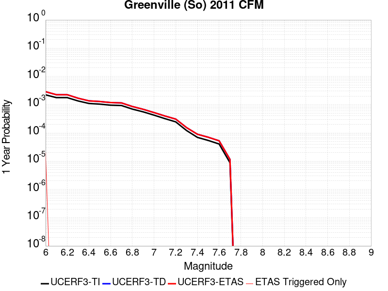 |  |

| Magnitude | 1 wk TI Prob | 1 wk TD Prob | 1 wk ETAS Prob | 1 wk ETAS/TD Gain | 1 wk ETAS Triggered Only | 1 mo TI Prob | 1 mo TD Prob | 1 mo ETAS Prob | 1 mo ETAS/TD Gain | 1 mo ETAS Triggered Only | 1 yr TI Prob | 1 yr TD Prob | 1 yr ETAS Prob | 1 yr ETAS/TD Gain | 1 yr ETAS Triggered Only | 10 yr TI Prob | 10 yr TD Prob | 10 yr ETAS Prob | 10 yr ETAS/TD Gain | 10 yr ETAS Triggered Only |
|-----|-----|-----|-----|-----|-----|-----|-----|-----|-----|-----|-----|-----|-----|-----|-----|-----|-----|-----|-----|-----|
| 6.0 | 4.279693E-5 | 5.5040568E-5 | 6.504002E-5 | 1.1816741 | 1.0E-5 | 1.8340252E-4 | 2.3586866E-4 | 2.5586394E-4 | 1.084773 | 2.0E-5 | 0.0022306389 | 0.0028681692 | 0.0028881119 | 1.0069531 | 2.0E-5 | 0.022083808 | 0.028338658 | 0.02835809 | 1.0006857 | 2.0E-5 |
| 6.1 | 3.4037297E-5 | 4.319238E-5 | 4.319238E-5 | 1.0 | 0.0 | 1.4586597E-4 | 1.8509808E-4 | 1.8509808E-4 | 1.0 | 0.0 | 0.0017744715 | 0.0022513992 | 0.0022513992 | 1.0 | 0.0 | 0.01760369 | 0.022303047 | 0.022303047 | 1.0 | 0.0 |
| 6.2 | 3.4037297E-5 | 4.319238E-5 | 4.319238E-5 | 1.0 | 0.0 | 1.4586597E-4 | 1.8509808E-4 | 1.8509808E-4 | 1.0 | 0.0 | 0.0017744715 | 0.0022513992 | 0.0022513992 | 1.0 | 0.0 | 0.01760369 | 0.022303047 | 0.022303047 | 1.0 | 0.0 |
| 6.3 | 2.5956324E-5 | 3.242939E-5 | 3.242939E-5 | 1.0 | 0.0 | 1.11236644E-4 | 1.3897609E-4 | 1.3897609E-4 | 1.0 | 0.0 | 0.0013534647 | 0.0016907848 | 0.0016907848 | 1.0 | 0.0 | 0.013452509 | 0.016786316 | 0.016786316 | 1.0 | 0.0 |
| 6.4 | 2.1145053E-5 | 2.6197793E-5 | 2.6197793E-5 | 1.0 | 0.0 | 9.061851E-5 | 1.1227157E-4 | 1.1227157E-4 | 1.0 | 0.0 | 0.0011027219 | 0.0013660807 | 0.0013660807 | 1.0 | 0.0 | 0.01097266 | 0.013580576 | 0.013580576 | 1.0 | 0.0 |
| 6.5 | 2.0030959E-5 | 2.4795921E-5 | 2.4795921E-5 | 1.0 | 0.0 | 8.584414E-5 | 1.0626408E-4 | 1.0626408E-4 | 1.0 | 0.0 | 0.0010446513 | 0.0012930284 | 0.0012930284 | 1.0 | 0.0 | 0.010397541 | 0.01285873 | 0.01285873 | 1.0 | 0.0 |
| 6.6 | 1.8395405E-5 | 2.275458E-5 | 2.275458E-5 | 1.0 | 0.0 | 7.8835066E-5 | 9.7516146E-5 | 9.7516146E-5 | 1.0 | 0.0 | 9.5939427E-4 | 0.0011866409 | 0.0011866409 | 1.0 | 0.0 | 0.009552629 | 0.01180643 | 0.01180643 | 1.0 | 0.0 |
| 6.7 | 1.7883482E-5 | 2.2125625E-5 | 2.2125625E-5 | 1.0 | 0.0 | 7.664124E-5 | 9.482082E-5 | 9.482082E-5 | 1.0 | 0.0 | 9.3270757E-4 | 0.0011538607 | 0.0011538607 | 1.0 | 0.0 | 0.009288026 | 0.011482077 | 0.011482077 | 1.0 | 0.0 |
| 6.8 | 1.3373564E-5 | 1.650608E-5 | 1.650608E-5 | 1.0 | 0.0 | 5.7314013E-5 | 7.0738504E-5 | 7.0738504E-5 | 1.0 | 0.0 | 6.975747E-4 | 8.609158E-4 | 8.609158E-4 | 1.0 | 0.0 | 0.0069538904 | 0.008577745 | 0.008577745 | 1.0 | 0.0 |
| 6.9 | 1.06692905E-5 | 1.3152695E-5 | 1.3152695E-5 | 1.0 | 0.0 | 4.5724726E-5 | 5.636754E-5 | 5.636754E-5 | 1.0 | 0.0 | 5.5655633E-4 | 6.8606995E-4 | 6.8606995E-4 | 1.0 | 0.0 | 0.005551645 | 0.006841082 | 0.006841082 | 1.0 | 0.0 |
| 7.0 | 8.157512E-6 | 1.0062752E-5 | 1.0062752E-5 | 1.0 | 0.0 | 3.4960296E-5 | 4.312539E-5 | 4.312539E-5 | 1.0 | 0.0 | 4.2555845E-4 | 5.2492885E-4 | 5.2492885E-4 | 1.0 | 0.0 | 0.004247444 | 0.0052376967 | 0.0052376967 | 1.0 | 0.0 |
| 7.1 | 6.1467113E-6 | 7.627545E-6 | 7.627545E-6 | 1.0 | 0.0 | 2.6342783E-5 | 3.2689073E-5 | 3.2689073E-5 | 1.0 | 0.0 | 3.206762E-4 | 3.9791764E-4 | 3.9791764E-4 | 1.0 | 0.0 | 0.0032021382 | 0.0039725704 | 0.0039725704 | 1.0 | 0.0 |
| 7.2 | 4.713467E-6 | 5.9142685E-6 | 5.9142685E-6 | 1.0 | 0.0 | 2.0200418E-5 | 2.5346622E-5 | 2.5346622E-5 | 1.0 | 0.0 | 2.4591232E-4 | 3.0855203E-4 | 3.0855203E-4 | 1.0 | 0.0 | 0.0024564038 | 0.0030816782 | 0.0030816782 | 1.0 | 0.0 |
| 7.3 | 2.3266216E-6 | 2.954067E-6 | 2.954067E-6 | 1.0 | 0.0 | 9.971197E-6 | 1.2660226E-5 | 1.2660226E-5 | 1.0 | 0.0 | 1.2139256E-4 | 1.541275E-4 | 1.541275E-4 | 1.0 | 0.0 | 0.0012132627 | 0.0015404817 | 0.0015404817 | 1.0 | 0.0 |
| 7.4 | 1.3314E-6 | 1.7179866E-6 | 1.7179866E-6 | 1.0 | 0.0 | 5.7059874E-6 | 7.362779E-6 | 7.362779E-6 | 1.0 | 0.0 | 6.946818E-5 | 8.96382E-5 | 8.96382E-5 | 1.0 | 0.0 | 6.9446466E-4 | 8.963211E-4 | 8.963211E-4 | 1.0 | 0.0 |
| 7.5 | 1.0362941E-6 | 1.3469155E-6 | 1.3469155E-6 | 1.0 | 0.0 | 4.4412527E-6 | 5.7724824E-6 | 5.7724824E-6 | 1.0 | 0.0 | 5.407091E-5 | 7.0277754E-5 | 7.0277754E-5 | 1.0 | 0.0 | 5.405776E-4 | 7.028451E-4 | 7.028451E-4 | 1.0 | 0.0 |
| 7.6 | 7.764784E-7 | 1.0088881E-6 | 1.0088881E-6 | 1.0 | 0.0 | 3.3277602E-6 | 4.3237997E-6 | 4.3237997E-6 | 1.0 | 0.0 | 4.0514726E-5 | 5.264103E-5 | 5.264103E-5 | 1.0 | 0.0 | 4.050734E-4 | 5.265317E-4 | 5.265317E-4 | 1.0 | 0.0 |
| 7.7 | 1.6927763E-7 | 2.2140186E-7 | 2.2140186E-7 | 1.0 | 0.0 | 7.2547533E-7 | 9.488648E-7 | 9.488648E-7 | 1.0 | 0.0 | 8.832627E-6 | 1.1552371E-5 | 1.1552371E-5 | 1.0 | 0.0 | 8.8322755E-5 | 1.1554653E-4 | 1.1554653E-4 | 1.0 | 0.0 |

## San Jacinto (Lytle Creek connector)
*[(top)](#table-of-contents)*

| 1 Week | 1 Month | 1 Year | 10 Year |
|-----|-----|-----|-----|
|  |  | 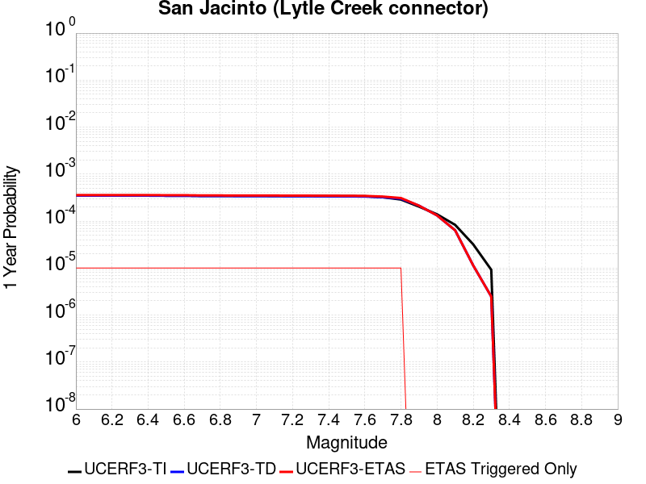 |  |

| Magnitude | 1 wk TI Prob | 1 wk TD Prob | 1 wk ETAS Prob | 1 wk ETAS/TD Gain | 1 wk ETAS Triggered Only | 1 mo TI Prob | 1 mo TD Prob | 1 mo ETAS Prob | 1 mo ETAS/TD Gain | 1 mo ETAS Triggered Only | 1 yr TI Prob | 1 yr TD Prob | 1 yr ETAS Prob | 1 yr ETAS/TD Gain | 1 yr ETAS Triggered Only | 10 yr TI Prob | 10 yr TD Prob | 10 yr ETAS Prob | 10 yr ETAS/TD Gain | 10 yr ETAS Triggered Only |
|-----|-----|-----|-----|-----|-----|-----|-----|-----|-----|-----|-----|-----|-----|-----|-----|-----|-----|-----|-----|-----|
| 6.0 | 6.693995E-6 | 6.660123E-6 | 1.6660057E-5 | 2.501464 | 1.0E-5 | 2.8688235E-5 | 2.8543072E-5 | 3.854279E-5 | 1.3503377 | 1.0E-5 | 3.492233E-4 | 3.4745657E-4 | 3.574531E-4 | 1.0287706 | 1.0E-5 | 0.00348675 | 0.0035491167 | 0.0035690458 | 1.0056152 | 2.0E-5 |
| 6.1 | 6.693995E-6 | 6.660123E-6 | 1.6660057E-5 | 2.501464 | 1.0E-5 | 2.8688235E-5 | 2.8543072E-5 | 3.854279E-5 | 1.3503377 | 1.0E-5 | 3.492233E-4 | 3.4745657E-4 | 3.574531E-4 | 1.0287706 | 1.0E-5 | 0.00348675 | 0.0035491167 | 0.0035690458 | 1.0056152 | 2.0E-5 |
| 6.2 | 6.693995E-6 | 6.660123E-6 | 1.6660057E-5 | 2.501464 | 1.0E-5 | 2.8688235E-5 | 2.8543072E-5 | 3.854279E-5 | 1.3503377 | 1.0E-5 | 3.492233E-4 | 3.4745657E-4 | 3.574531E-4 | 1.0287706 | 1.0E-5 | 0.00348675 | 0.0035491167 | 0.0035690458 | 1.0056152 | 2.0E-5 |
| 6.3 | 6.693995E-6 | 6.660123E-6 | 1.6660057E-5 | 2.501464 | 1.0E-5 | 2.8688235E-5 | 2.8543072E-5 | 3.854279E-5 | 1.3503377 | 1.0E-5 | 3.492233E-4 | 3.4745657E-4 | 3.574531E-4 | 1.0287706 | 1.0E-5 | 0.00348675 | 0.0035491167 | 0.0035690458 | 1.0056152 | 2.0E-5 |
| 6.4 | 6.693995E-6 | 6.660123E-6 | 1.6660057E-5 | 2.501464 | 1.0E-5 | 2.8688235E-5 | 2.8543072E-5 | 3.854279E-5 | 1.3503377 | 1.0E-5 | 3.492233E-4 | 3.4745657E-4 | 3.574531E-4 | 1.0287706 | 1.0E-5 | 0.00348675 | 0.0035491167 | 0.0035690458 | 1.0056152 | 2.0E-5 |
| 6.5 | 6.6561875E-6 | 6.620341E-6 | 1.6620275E-5 | 2.5104861 | 1.0E-5 | 2.8526205E-5 | 2.8372582E-5 | 3.8372298E-5 | 1.352443 | 1.0E-5 | 3.472512E-4 | 3.453815E-4 | 3.5537806E-4 | 1.0289435 | 1.0E-5 | 0.0034670907 | 0.0035284322 | 0.0035483616 | 1.0056483 | 2.0E-5 |
| 6.6 | 6.6561875E-6 | 6.620341E-6 | 1.6620275E-5 | 2.5104861 | 1.0E-5 | 2.8526205E-5 | 2.8372582E-5 | 3.8372298E-5 | 1.352443 | 1.0E-5 | 3.472512E-4 | 3.453815E-4 | 3.5537806E-4 | 1.0289435 | 1.0E-5 | 0.0034670907 | 0.0035284322 | 0.0035483616 | 1.0056483 | 2.0E-5 |
| 6.7 | 6.5802237E-6 | 6.539518E-6 | 1.6539452E-5 | 2.5291548 | 1.0E-5 | 2.8200653E-5 | 2.8026205E-5 | 3.8025923E-5 | 1.3567989 | 1.0E-5 | 3.4328885E-4 | 3.4116567E-4 | 3.5116228E-4 | 1.0293013 | 1.0E-5 | 0.0034275902 | 0.0034864065 | 0.0035063368 | 1.0057166 | 2.0E-5 |
| 6.8 | 6.575632E-6 | 6.5340073E-6 | 1.6533942E-5 | 2.5304444 | 1.0E-5 | 2.8180975E-5 | 2.8002589E-5 | 3.800231E-5 | 1.3570999 | 1.0E-5 | 3.4304935E-4 | 3.4087826E-4 | 3.5087485E-4 | 1.029326 | 1.0E-5 | 0.0034252026 | 0.0034835413 | 0.0035034716 | 1.0057213 | 2.0E-5 |
| 6.9 | 6.570433E-6 | 6.525401E-6 | 1.6525337E-5 | 2.5324628 | 1.0E-5 | 2.8158694E-5 | 2.7965707E-5 | 3.7965427E-5 | 1.3575708 | 1.0E-5 | 3.4277816E-4 | 3.4042934E-4 | 3.5042595E-4 | 1.0293647 | 1.0E-5 | 0.0034224992 | 0.0034790665 | 0.0034989968 | 1.0057287 | 2.0E-5 |
| 7.0 | 6.5643826E-6 | 6.5155223E-6 | 1.6515458E-5 | 2.5347865 | 1.0E-5 | 2.8132765E-5 | 2.7923368E-5 | 3.7923088E-5 | 1.3581129 | 1.0E-5 | 3.424626E-4 | 3.3991406E-4 | 3.4991064E-4 | 1.0294092 | 1.0E-5 | 0.0034193532 | 0.0034739296 | 0.0034938601 | 1.0057372 | 2.0E-5 |
| 7.1 | 6.557402E-6 | 6.504234E-6 | 1.650417E-5 | 2.53745 | 1.0E-5 | 2.8102848E-5 | 2.7874992E-5 | 3.7874714E-5 | 1.3587345 | 1.0E-5 | 3.4209844E-4 | 3.3932526E-4 | 3.4932184E-4 | 1.0294602 | 1.0E-5 | 0.0034157229 | 0.0034680606 | 0.0034879914 | 1.005747 | 2.0E-5 |
| 7.2 | 6.546394E-6 | 6.4862006E-6 | 1.6486136E-5 | 2.5417247 | 1.0E-5 | 2.8055672E-5 | 2.7797707E-5 | 3.779743E-5 | 1.3597319 | 1.0E-5 | 3.4152428E-4 | 3.383846E-4 | 3.483812E-4 | 1.0295422 | 1.0E-5 | 0.0034099987 | 0.0034586883 | 0.003478619 | 1.0057626 | 2.0E-5 |
| 7.3 | 6.5364216E-6 | 6.4669857E-6 | 1.6466922E-5 | 2.5463054 | 1.0E-5 | 2.8012933E-5 | 2.771536E-5 | 3.7715083E-5 | 1.3608007 | 1.0E-5 | 3.4100408E-4 | 3.373823E-4 | 3.4737895E-4 | 1.02963 | 1.0E-5 | 0.003404813 | 0.0034487103 | 0.0034686413 | 1.0057793 | 2.0E-5 |
| 7.4 | 6.5269523E-6 | 6.4480723E-6 | 1.6448008E-5 | 2.550841 | 1.0E-5 | 2.7972354E-5 | 2.7634303E-5 | 3.7634025E-5 | 1.3618591 | 1.0E-5 | 3.4051016E-4 | 3.3639578E-4 | 3.463924E-4 | 1.0297168 | 1.0E-5 | 0.0033998888 | 0.0034388923 | 0.0034588235 | 1.0057958 | 2.0E-5 |
| 7.5 | 6.5111835E-6 | 6.424346E-6 | 1.6424281E-5 | 2.5565686 | 1.0E-5 | 2.7904773E-5 | 2.753262E-5 | 3.7532347E-5 | 1.3631955 | 1.0E-5 | 3.3968766E-4 | 3.3515817E-4 | 3.451548E-4 | 1.0298266 | 1.0E-5 | 0.0033916887 | 0.0034265644 | 0.0034464959 | 1.0058167 | 2.0E-5 |
| 7.6 | 6.4768806E-6 | 6.383454E-6 | 1.638339E-5 | 2.56654 | 1.0E-5 | 2.7757764E-5 | 2.7357375E-5 | 3.7357102E-5 | 1.3655221 | 1.0E-5 | 3.3789838E-4 | 3.330252E-4 | 3.4302188E-4 | 1.0300177 | 1.0E-5 | 0.0033738504 | 0.0034052972 | 0.003425229 | 1.0058532 | 2.0E-5 |
| 7.7 | 6.1655364E-6 | 6.1759456E-6 | 1.6175884E-5 | 2.6191752 | 1.0E-5 | 2.642346E-5 | 2.646807E-5 | 3.6467805E-5 | 1.3778037 | 1.0E-5 | 3.2165812E-4 | 3.2220117E-4 | 3.3219793E-4 | 1.0310265 | 1.0E-5 | 0.0032119295 | 0.0032969362 | 0.0033168704 | 1.0060463 | 2.0E-5 |
| 7.8 | 5.5043524E-6 | 5.7370175E-6 | 1.573696E-5 | 2.7430558 | 1.0E-5 | 2.3589868E-5 | 2.4586987E-5 | 3.458674E-5 | 1.4067092 | 1.0E-5 | 2.871688E-4 | 2.993055E-4 | 3.093025E-4 | 1.0334007 | 1.0E-5 | 0.0028679797 | 0.0030670585 | 0.0030869972 | 1.006501 | 2.0E-5 |
| 7.9 | 3.889249E-6 | 4.0766436E-6 | 4.0766436E-6 | 1.0 | 0.0 | 1.6668104E-5 | 1.7471213E-5 | 1.7471213E-5 | 1.0 | 0.0 | 2.0291525E-4 | 2.126913E-4 | 2.126913E-4 | 1.0 | 0.0 | 0.0020273007 | 0.0021941073 | 0.0022040855 | 1.0045477 | 1.0E-5 |
| 8.0 | 2.668535E-6 | 2.5313454E-6 | 2.5313454E-6 | 1.0 | 0.0 | 1.1436528E-5 | 1.0848577E-5 | 1.0848577E-5 | 1.0 | 0.0 | 1.3923083E-4 | 1.3207346E-4 | 1.3207346E-4 | 1.0 | 0.0 | 0.0013914363 | 0.0013755665 | 0.0013755665 | 1.0 | 0.0 |
| 8.1 | 1.5911459E-6 | 1.2185134E-6 | 1.2185134E-6 | 1.0 | 0.0 | 6.8191785E-6 | 5.2221894E-6 | 5.2221894E-6 | 1.0 | 0.0 | 8.3020335E-5 | 6.357832E-5 | 6.357832E-5 | 1.0 | 0.0 | 8.298933E-4 | 6.6911156E-4 | 6.6911156E-4 | 1.0 | 0.0 |
| 8.2 | 6.1294963E-7 | 2.1802066E-7 | 2.1802066E-7 | 1.0 | 0.0 | 2.6269242E-6 | 9.3437393E-7 | 9.3437393E-7 | 1.0 | 0.0 | 3.1982334E-5 | 1.1375943E-5 | 1.1375943E-5 | 1.0 | 0.0 | 3.1977732E-4 | 1.2778955E-4 | 1.2778955E-4 | 1.0 | 0.0 |
| 8.3 | 1.762871E-7 | 4.7516316E-8 | 4.7516316E-8 | 1.0 | 0.0 | 7.5551594E-7 | 2.0364133E-7 | 2.0364133E-7 | 1.0 | 0.0 | 9.1983675E-6 | 2.4793305E-6 | 2.4793305E-6 | 1.0 | 0.0 | 9.197987E-5 | 2.8671833E-5 | 2.8671833E-5 | 1.0 | 0.0 |

## Round Valley
*[(top)](#table-of-contents)*

| 1 Week | 1 Month | 1 Year | 10 Year |
|-----|-----|-----|-----|
|  |  |  |  |

| Magnitude | 1 wk TI Prob | 1 wk TD Prob | 1 wk ETAS Prob | 1 wk ETAS/TD Gain | 1 wk ETAS Triggered Only | 1 mo TI Prob | 1 mo TD Prob | 1 mo ETAS Prob | 1 mo ETAS/TD Gain | 1 mo ETAS Triggered Only | 1 yr TI Prob | 1 yr TD Prob | 1 yr ETAS Prob | 1 yr ETAS/TD Gain | 1 yr ETAS Triggered Only | 10 yr TI Prob | 10 yr TD Prob | 10 yr ETAS Prob | 10 yr ETAS/TD Gain | 10 yr ETAS Triggered Only |
|-----|-----|-----|-----|-----|-----|-----|-----|-----|-----|-----|-----|-----|-----|-----|-----|-----|-----|-----|-----|-----|
| 6.0 | 1.588152E-5 | 1.3670525E-5 | 2.3670389E-5 | 1.7314909 | 1.0E-5 | 6.806188E-5 | 5.8586873E-5 | 6.858628E-5 | 1.1706767 | 1.0E-5 | 8.283384E-4 | 7.131011E-4 | 7.23094E-4 | 1.0140133 | 1.0E-5 | 0.008252576 | 0.0071120164 | 0.007131874 | 1.0027921 | 2.0E-5 |
| 6.1 | 1.588152E-5 | 1.3670525E-5 | 2.3670389E-5 | 1.7314909 | 1.0E-5 | 6.806188E-5 | 5.8586873E-5 | 6.858628E-5 | 1.1706767 | 1.0E-5 | 8.283384E-4 | 7.131011E-4 | 7.23094E-4 | 1.0140133 | 1.0E-5 | 0.008252576 | 0.0071120164 | 0.007131874 | 1.0027921 | 2.0E-5 |
| 6.2 | 1.588152E-5 | 1.3670525E-5 | 2.3670389E-5 | 1.7314909 | 1.0E-5 | 6.806188E-5 | 5.8586873E-5 | 6.858628E-5 | 1.1706767 | 1.0E-5 | 8.283384E-4 | 7.131011E-4 | 7.23094E-4 | 1.0140133 | 1.0E-5 | 0.008252576 | 0.0071120164 | 0.007131874 | 1.0027921 | 2.0E-5 |
| 6.3 | 1.588152E-5 | 1.3670525E-5 | 2.3670389E-5 | 1.7314909 | 1.0E-5 | 6.806188E-5 | 5.8586873E-5 | 6.858628E-5 | 1.1706767 | 1.0E-5 | 8.283384E-4 | 7.131011E-4 | 7.23094E-4 | 1.0140133 | 1.0E-5 | 0.008252576 | 0.0071120164 | 0.007131874 | 1.0027921 | 2.0E-5 |
| 6.4 | 1.588152E-5 | 1.3670525E-5 | 2.3670389E-5 | 1.7314909 | 1.0E-5 | 6.806188E-5 | 5.8586873E-5 | 6.858628E-5 | 1.1706767 | 1.0E-5 | 8.283384E-4 | 7.131011E-4 | 7.23094E-4 | 1.0140133 | 1.0E-5 | 0.008252576 | 0.0071120164 | 0.007131874 | 1.0027921 | 2.0E-5 |
| 6.5 | 1.0646776E-5 | 7.952847E-6 | 1.7952767E-5 | 2.2574012 | 1.0E-5 | 4.5628243E-5 | 3.4083234E-5 | 4.408289E-5 | 1.2933894 | 1.0E-5 | 5.553823E-4 | 4.1489274E-4 | 4.248886E-4 | 1.0240927 | 1.0E-5 | 0.005539963 | 0.00414201 | 0.0041619274 | 1.0048085 | 2.0E-5 |
| 6.6 | 8.632956E-6 | 5.768552E-6 | 5.768552E-6 | 1.0 | 0.0 | 3.6997862E-5 | 2.4722152E-5 | 2.4722152E-5 | 1.0 | 0.0 | 4.5035584E-4 | 3.0095447E-4 | 3.0095447E-4 | 1.0 | 0.0 | 0.0044944426 | 0.0030058469 | 0.0030058469 | 1.0 | 0.0 |
| 6.7 | 8.632956E-6 | 5.768552E-6 | 5.768552E-6 | 1.0 | 0.0 | 3.6997862E-5 | 2.4722152E-5 | 2.4722152E-5 | 1.0 | 0.0 | 4.5035584E-4 | 3.0095447E-4 | 3.0095447E-4 | 1.0 | 0.0 | 0.0044944426 | 0.0030058469 | 0.0030058469 | 1.0 | 0.0 |
| 6.8 | 7.143895E-6 | 4.201644E-6 | 4.201644E-6 | 1.0 | 0.0 | 3.0616335E-5 | 1.8006931E-5 | 1.8006931E-5 | 1.0 | 0.0 | 3.726901E-4 | 2.19214E-4 | 2.19214E-4 | 1.0 | 0.0 | 0.0037206567 | 0.0021901424 | 0.0021901424 | 1.0 | 0.0 |
| 6.9 | 6.5120694E-6 | 3.6642807E-6 | 3.6642807E-6 | 1.0 | 0.0 | 2.790857E-5 | 1.5703974E-5 | 1.5703974E-5 | 1.0 | 0.0 | 3.3973387E-4 | 1.9118062E-4 | 1.9118062E-4 | 1.0 | 0.0 | 0.0033921495 | 0.0019103106 | 0.0019103106 | 1.0 | 0.0 |
| 7.0 | 5.0614435E-6 | 2.6834869E-6 | 2.6834869E-6 | 1.0 | 0.0 | 2.169172E-5 | 1.1500612E-5 | 1.1500612E-5 | 1.0 | 0.0 | 2.6406467E-4 | 1.40012E-4 | 1.40012E-4 | 1.0 | 0.0 | 0.0026375111 | 0.0013993392 | 0.0013993392 | 1.0 | 0.0 |
| 7.1 | 4.41728E-6 | 2.3573243E-6 | 2.3573243E-6 | 1.0 | 0.0 | 1.8931061E-5 | 1.01027845E-5 | 1.01027845E-5 | 1.0 | 0.0 | 2.304613E-4 | 1.2299545E-4 | 1.2299545E-4 | 1.0 | 0.0 | 0.0023022245 | 0.0012293702 | 0.0012293702 | 1.0 | 0.0 |
| 7.2 | 2.535495E-6 | 1.120784E-6 | 1.120784E-6 | 1.0 | 0.0 | 1.0866362E-5 | 4.803354E-6 | 4.803354E-6 | 1.0 | 0.0 | 1.3228992E-4 | 5.8479785E-5 | 5.8479785E-5 | 1.0 | 0.0 | 0.0013221119 | 5.846952E-4 | 5.846952E-4 | 1.0 | 0.0 |
| 7.3 | 7.900015E-7 | 4.0888176E-7 | 4.0888176E-7 | 1.0 | 0.0 | 3.3857161E-6 | 1.7523504E-6 | 1.7523504E-6 | 1.0 | 0.0 | 4.1220315E-5 | 2.1334865E-5 | 2.1334865E-5 | 1.0 | 0.0 | 4.121267E-4 | 2.1334866E-4 | 2.1334866E-4 | 1.0 | 0.0 |

## San Luis Range 2011 CFM
*[(top)](#table-of-contents)*

| 1 Week | 1 Month | 1 Year | 10 Year |
|-----|-----|-----|-----|
|  |  |  |  |

| Magnitude | 1 wk TI Prob | 1 wk TD Prob | 1 wk ETAS Prob | 1 wk ETAS/TD Gain | 1 wk ETAS Triggered Only | 1 mo TI Prob | 1 mo TD Prob | 1 mo ETAS Prob | 1 mo ETAS/TD Gain | 1 mo ETAS Triggered Only | 1 yr TI Prob | 1 yr TD Prob | 1 yr ETAS Prob | 1 yr ETAS/TD Gain | 1 yr ETAS Triggered Only | 10 yr TI Prob | 10 yr TD Prob | 10 yr ETAS Prob | 10 yr ETAS/TD Gain | 10 yr ETAS Triggered Only |
|-----|-----|-----|-----|-----|-----|-----|-----|-----|-----|-----|-----|-----|-----|-----|-----|-----|-----|-----|-----|-----|
| 6.0 | 8.8368415E-6 | 8.965455E-6 | 1.8965366E-5 | 2.1153824 | 1.0E-5 | 3.787163E-5 | 3.8422855E-5 | 5.8422087E-5 | 1.5205035 | 2.0E-5 | 4.609895E-4 | 4.6770574E-4 | 4.8769638E-4 | 1.0427419 | 2.0E-5 | 0.0046003438 | 0.004667997 | 0.0046879034 | 1.0042645 | 2.0E-5 |
| 6.1 | 8.8368415E-6 | 8.965455E-6 | 1.8965366E-5 | 2.1153824 | 1.0E-5 | 3.787163E-5 | 3.8422855E-5 | 5.8422087E-5 | 1.5205035 | 2.0E-5 | 4.609895E-4 | 4.6770574E-4 | 4.8769638E-4 | 1.0427419 | 2.0E-5 | 0.0046003438 | 0.004667997 | 0.0046879034 | 1.0042645 | 2.0E-5 |
| 6.2 | 8.8368415E-6 | 8.965455E-6 | 1.8965366E-5 | 2.1153824 | 1.0E-5 | 3.787163E-5 | 3.8422855E-5 | 5.8422087E-5 | 1.5205035 | 2.0E-5 | 4.609895E-4 | 4.6770574E-4 | 4.8769638E-4 | 1.0427419 | 2.0E-5 | 0.0046003438 | 0.004667997 | 0.0046879034 | 1.0042645 | 2.0E-5 |
| 6.3 | 8.8368415E-6 | 8.965455E-6 | 1.8965366E-5 | 2.1153824 | 1.0E-5 | 3.787163E-5 | 3.8422855E-5 | 5.8422087E-5 | 1.5205035 | 2.0E-5 | 4.609895E-4 | 4.6770574E-4 | 4.8769638E-4 | 1.0427419 | 2.0E-5 | 0.0046003438 | 0.004667997 | 0.0046879034 | 1.0042645 | 2.0E-5 |
| 6.4 | 3.9094193E-6 | 3.941204E-6 | 3.941204E-6 | 1.0 | 0.0 | 1.6754546E-5 | 1.6890766E-5 | 1.6890766E-5 | 1.0 | 0.0 | 2.039675E-4 | 2.0562594E-4 | 2.0562594E-4 | 1.0 | 0.0 | 0.0020378039 | 0.0020543856 | 0.0020543856 | 1.0 | 0.0 |
| 6.5 | 3.9094193E-6 | 3.941204E-6 | 3.941204E-6 | 1.0 | 0.0 | 1.6754546E-5 | 1.6890766E-5 | 1.6890766E-5 | 1.0 | 0.0 | 2.039675E-4 | 2.0562594E-4 | 2.0562594E-4 | 1.0 | 0.0 | 0.0020378039 | 0.0020543856 | 0.0020543856 | 1.0 | 0.0 |
| 6.6 | 3.0587726E-6 | 3.0753893E-6 | 3.0753893E-6 | 1.0 | 0.0 | 1.3108959E-5 | 1.3180174E-5 | 1.3180174E-5 | 1.0 | 0.0 | 1.595899E-4 | 1.6045693E-4 | 1.6045693E-4 | 1.0 | 0.0 | 0.0015947534 | 0.0016034227 | 0.0016034227 | 1.0 | 0.0 |
| 6.7 | 2.6160574E-6 | 2.6251284E-6 | 2.6251284E-6 | 1.0 | 0.0 | 1.1211626E-5 | 1.1250502E-5 | 1.1250502E-5 | 1.0 | 0.0 | 1.3649299E-4 | 1.3696631E-4 | 1.3696631E-4 | 1.0 | 0.0 | 0.0013640919 | 0.0013688251 | 0.0013688251 | 1.0 | 0.0 |
| 6.8 | 2.5110312E-6 | 2.5181412E-6 | 2.5181412E-6 | 1.0 | 0.0 | 1.0761518E-5 | 1.079199E-5 | 1.079199E-5 | 1.0 | 0.0 | 1.310136E-4 | 1.313846E-4 | 1.313846E-4 | 1.0 | 0.0 | 0.0013093639 | 0.0013130752 | 0.0013130752 | 1.0 | 0.0 |
| 6.9 | 1.8564405E-6 | 1.852488E-6 | 1.852488E-6 | 1.0 | 0.0 | 7.95615E-6 | 7.93921E-6 | 7.93921E-6 | 1.0 | 0.0 | 9.686181E-5 | 9.665562E-5 | 9.665562E-5 | 1.0 | 0.0 | 9.68196E-4 | 9.6613786E-4 | 9.6613786E-4 | 1.0 | 0.0 |
| 7.0 | 1.546127E-6 | 1.5369549E-6 | 1.5369549E-6 | 1.0 | 0.0 | 6.626242E-6 | 6.5869326E-6 | 6.5869326E-6 | 1.0 | 0.0 | 8.06715E-5 | 8.019296E-5 | 8.019296E-5 | 1.0 | 0.0 | 8.0642226E-4 | 8.016409E-4 | 8.016409E-4 | 1.0 | 0.0 |
| 7.1 | 1.3368208E-6 | 1.3235336E-6 | 1.3235336E-6 | 1.0 | 0.0 | 5.7292195E-6 | 5.6722747E-6 | 5.6722747E-6 | 1.0 | 0.0 | 6.975101E-5 | 6.905776E-5 | 6.905776E-5 | 1.0 | 0.0 | 6.972912E-4 | 6.903635E-4 | 6.903635E-4 | 1.0 | 0.0 |
| 7.2 | 1.0623363E-6 | 1.0454378E-6 | 1.0454378E-6 | 1.0 | 0.0 | 4.5528623E-6 | 4.4804397E-6 | 4.4804397E-6 | 1.0 | 0.0 | 5.5429686E-5 | 5.4547992E-5 | 5.4547992E-5 | 1.0 | 0.0 | 5.5415864E-4 | 5.453463E-4 | 5.453463E-4 | 1.0 | 0.0 |
| 7.3 | 7.831679E-7 | 7.727399E-7 | 7.727399E-7 | 1.0 | 0.0 | 3.3564295E-6 | 3.3117383E-6 | 3.3117383E-6 | 1.0 | 0.0 | 4.086376E-5 | 4.031967E-5 | 4.031967E-5 | 1.0 | 0.0 | 4.0856248E-4 | 4.0312367E-4 | 4.0312367E-4 | 1.0 | 0.0 |
| 7.4 | 5.9558846E-7 | 5.910646E-7 | 5.910646E-7 | 1.0 | 0.0 | 2.5525194E-6 | 2.5331315E-6 | 2.5331315E-6 | 1.0 | 0.0 | 3.107648E-5 | 3.084044E-5 | 3.084044E-5 | 1.0 | 0.0 | 3.1072134E-4 | 3.083617E-4 | 3.083617E-4 | 1.0 | 0.0 |
| 7.5 | 4.1616502E-7 | 4.1196404E-7 | 4.1196404E-7 | 1.0 | 0.0 | 1.7835631E-6 | 1.765559E-6 | 1.765559E-6 | 1.0 | 0.0 | 2.1714664E-5 | 2.1495469E-5 | 2.1495469E-5 | 1.0 | 0.0 | 2.1712543E-4 | 2.1493394E-4 | 2.1493394E-4 | 1.0 | 0.0 |
| 7.6 | 2.3816014E-7 | 2.3376614E-7 | 2.3376614E-7 | 1.0 | 0.0 | 1.0206859E-6 | 1.0018545E-6 | 1.0018545E-6 | 1.0 | 0.0 | 1.242678E-5 | 1.219751E-5 | 1.219751E-5 | 1.0 | 0.0 | 1.2426086E-4 | 1.2196843E-4 | 1.2196843E-4 | 1.0 | 0.0 |
| 7.7 | 9.918777E-8 | 9.3868096E-8 | 9.3868096E-8 | 1.0 | 0.0 | 4.2509038E-7 | 4.022918E-7 | 4.022918E-7 | 1.0 | 0.0 | 5.1754632E-6 | 4.8978914E-6 | 4.8978914E-6 | 1.0 | 0.0 | 5.1753424E-5 | 4.897784E-5 | 4.897784E-5 | 1.0 | 0.0 |
| 7.8 | 3.4982556E-8 | 2.968672E-8 | 2.968672E-8 | 1.0 | 0.0 | 1.4992524E-7 | 1.272288E-7 | 1.272288E-7 | 1.0 | 0.0 | 1.8253382E-6 | 1.5490094E-6 | 1.5490094E-6 | 1.0 | 0.0 | 1.8253233E-5 | 1.5489988E-5 | 1.5489988E-5 | 1.0 | 0.0 |
| 7.9 | 1.6624908E-8 | 1.1476994E-8 | 1.1476994E-8 | 1.0 | 0.0 | 7.12496E-8 | 4.9187115E-8 | 4.9187115E-8 | 1.0 | 0.0 | 8.6746354E-7 | 5.988529E-7 | 5.988529E-7 | 1.0 | 0.0 | 8.674601E-6 | 5.9885133E-6 | 5.9885133E-6 | 1.0 | 0.0 |
| 8.0 | 6.3352315E-9 | 3.0886564E-9 | 3.0886564E-9 | 1.0 | 0.0 | 2.715099E-8 | 1.32370985E-8 | 1.32370985E-8 | 1.0 | 0.0 | 3.3056327E-7 | 1.6116167E-7 | 1.6116167E-7 | 1.0 | 0.0 | 3.3056278E-6 | 1.6116155E-6 | 1.6116155E-6 | 1.0 | 0.0 |

## Thirty Mile Bank
*[(top)](#table-of-contents)*

| 1 Week | 1 Month | 1 Year | 10 Year |
|-----|-----|-----|-----|
|  |  |  |  |

| Magnitude | 1 wk TI Prob | 1 wk TD Prob | 1 wk ETAS Prob | 1 wk ETAS/TD Gain | 1 wk ETAS Triggered Only | 1 mo TI Prob | 1 mo TD Prob | 1 mo ETAS Prob | 1 mo ETAS/TD Gain | 1 mo ETAS Triggered Only | 1 yr TI Prob | 1 yr TD Prob | 1 yr ETAS Prob | 1 yr ETAS/TD Gain | 1 yr ETAS Triggered Only | 10 yr TI Prob | 10 yr TD Prob | 10 yr ETAS Prob | 10 yr ETAS/TD Gain | 10 yr ETAS Triggered Only |
|-----|-----|-----|-----|-----|-----|-----|-----|-----|-----|-----|-----|-----|-----|-----|-----|-----|-----|-----|-----|-----|
| 6.0 | 6.5124755E-6 | 6.6592643E-6 | 1.6659198E-5 | 2.5016575 | 1.0E-5 | 2.791031E-5 | 2.8539416E-5 | 4.8538845E-5 | 1.7007651 | 2.0E-5 | 3.3975503E-4 | 3.4741635E-4 | 3.674094E-4 | 1.0575478 | 2.0E-5 | 0.0033923604 | 0.003469164 | 0.0034890946 | 1.005745 | 2.0E-5 |
| 6.1 | 6.5124755E-6 | 6.6592643E-6 | 1.6659198E-5 | 2.5016575 | 1.0E-5 | 2.791031E-5 | 2.8539416E-5 | 4.8538845E-5 | 1.7007651 | 2.0E-5 | 3.3975503E-4 | 3.4741635E-4 | 3.674094E-4 | 1.0575478 | 2.0E-5 | 0.0033923604 | 0.003469164 | 0.0034890946 | 1.005745 | 2.0E-5 |
| 6.2 | 6.5124755E-6 | 6.6592643E-6 | 1.6659198E-5 | 2.5016575 | 1.0E-5 | 2.791031E-5 | 2.8539416E-5 | 4.8538845E-5 | 1.7007651 | 2.0E-5 | 3.3975503E-4 | 3.4741635E-4 | 3.674094E-4 | 1.0575478 | 2.0E-5 | 0.0033923604 | 0.003469164 | 0.0034890946 | 1.005745 | 2.0E-5 |
| 6.3 | 6.5124755E-6 | 6.6592643E-6 | 1.6659198E-5 | 2.5016575 | 1.0E-5 | 2.791031E-5 | 2.8539416E-5 | 4.8538845E-5 | 1.7007651 | 2.0E-5 | 3.3975503E-4 | 3.4741635E-4 | 3.674094E-4 | 1.0575478 | 2.0E-5 | 0.0033923604 | 0.003469164 | 0.0034890946 | 1.005745 | 2.0E-5 |
| 6.4 | 6.5124755E-6 | 6.6592643E-6 | 1.6659198E-5 | 2.5016575 | 1.0E-5 | 2.791031E-5 | 2.8539416E-5 | 4.8538845E-5 | 1.7007651 | 2.0E-5 | 3.3975503E-4 | 3.4741635E-4 | 3.674094E-4 | 1.0575478 | 2.0E-5 | 0.0033923604 | 0.003469164 | 0.0034890946 | 1.005745 | 2.0E-5 |
| 6.5 | 6.5124755E-6 | 6.6592643E-6 | 1.6659198E-5 | 2.5016575 | 1.0E-5 | 2.791031E-5 | 2.8539416E-5 | 4.8538845E-5 | 1.7007651 | 2.0E-5 | 3.3975503E-4 | 3.4741635E-4 | 3.674094E-4 | 1.0575478 | 2.0E-5 | 0.0033923604 | 0.003469164 | 0.0034890946 | 1.005745 | 2.0E-5 |
| 6.6 | 6.5124755E-6 | 6.6592643E-6 | 1.6659198E-5 | 2.5016575 | 1.0E-5 | 2.791031E-5 | 2.8539416E-5 | 4.8538845E-5 | 1.7007651 | 2.0E-5 | 3.3975503E-4 | 3.4741635E-4 | 3.674094E-4 | 1.0575478 | 2.0E-5 | 0.0033923604 | 0.003469164 | 0.0034890946 | 1.005745 | 2.0E-5 |
| 6.7 | 3.5261137E-6 | 3.6098995E-6 | 3.6098995E-6 | 1.0 | 0.0 | 1.5111828E-5 | 1.547091E-5 | 1.547091E-5 | 1.0 | 0.0 | 1.8397097E-4 | 1.883427E-4 | 1.883427E-4 | 1.0 | 0.0 | 0.0018381875 | 0.0018818958 | 0.0018818958 | 1.0 | 0.0 |
| 6.8 | 3.370743E-6 | 3.4509355E-6 | 3.4509355E-6 | 1.0 | 0.0 | 1.4445961E-5 | 1.47896435E-5 | 1.47896435E-5 | 1.0 | 0.0 | 1.7586538E-4 | 1.8004965E-4 | 1.8004965E-4 | 1.0 | 0.0 | 0.0017572626 | 0.0017990996 | 0.0017990996 | 1.0 | 0.0 |
| 6.9 | 2.2756835E-6 | 2.333161E-6 | 2.333161E-6 | 1.0 | 0.0 | 9.752893E-6 | 9.999225E-6 | 9.999225E-6 | 1.0 | 0.0 | 1.18735006E-4 | 1.2173401E-4 | 1.2173401E-4 | 1.0 | 0.0 | 0.0011867158 | 0.0012166979 | 0.0012166979 | 1.0 | 0.0 |
| 7.0 | 2.1617404E-6 | 2.21598E-6 | 2.21598E-6 | 1.0 | 0.0 | 9.264569E-6 | 9.497024E-6 | 9.497024E-6 | 1.0 | 0.0 | 1.1279029E-4 | 1.1562037E-4 | 1.1562037E-4 | 1.0 | 0.0 | 0.0011273306 | 0.0011556263 | 0.0011556263 | 1.0 | 0.0 |
| 7.1 | 1.5900777E-6 | 1.6327014E-6 | 1.6327014E-6 | 1.0 | 0.0 | 6.814601E-6 | 6.997274E-6 | 6.997274E-6 | 1.0 | 0.0 | 8.296461E-5 | 8.518861E-5 | 8.518861E-5 | 1.0 | 0.0 | 8.293364E-4 | 8.5157226E-4 | 8.5157226E-4 | 1.0 | 0.0 |
| 7.2 | 1.2971728E-6 | 1.3328992E-6 | 1.3328992E-6 | 1.0 | 0.0 | 5.5593005E-6 | 5.712413E-6 | 5.712413E-6 | 1.0 | 0.0 | 6.768238E-5 | 6.954651E-5 | 6.954651E-5 | 1.0 | 0.0 | 6.7661767E-4 | 6.952578E-4 | 6.952578E-4 | 1.0 | 0.0 |
| 7.3 | 8.2454284E-7 | 8.448891E-7 | 8.448891E-7 | 1.0 | 0.0 | 3.5337503E-6 | 3.6209485E-6 | 3.6209485E-6 | 1.0 | 0.0 | 4.302256E-5 | 4.408422E-5 | 4.408422E-5 | 1.0 | 0.0 | 4.301423E-4 | 4.4076078E-4 | 4.4076078E-4 | 1.0 | 0.0 |
| 7.4 | 4.2619024E-7 | 4.3863466E-7 | 4.3863466E-7 | 1.0 | 0.0 | 1.8265283E-6 | 1.8798615E-6 | 1.8798615E-6 | 1.0 | 0.0 | 2.2237757E-5 | 2.2887078E-5 | 2.2887078E-5 | 1.0 | 0.0 | 2.223553E-4 | 2.288476E-4 | 2.288476E-4 | 1.0 | 0.0 |
| 7.5 | 2.993922E-7 | 3.086453E-7 | 3.086453E-7 | 1.0 | 0.0 | 1.2831089E-6 | 1.3227649E-6 | 1.3227649E-6 | 1.0 | 0.0 | 1.5621737E-5 | 1.6104546E-5 | 1.6104546E-5 | 1.0 | 0.0 | 1.562064E-4 | 1.6103406E-4 | 1.6103406E-4 | 1.0 | 0.0 |
| 7.6 | 1.6988751E-7 | 1.7533823E-7 | 1.7533823E-7 | 1.0 | 0.0 | 7.2808916E-7 | 7.5144936E-7 | 7.5144936E-7 | 1.0 | 0.0 | 8.864449E-6 | 9.14886E-6 | 9.14886E-6 | 1.0 | 0.0 | 8.8640954E-5 | 9.1485024E-5 | 9.1485024E-5 | 1.0 | 0.0 |

## Hosgri (Extension)
*[(top)](#table-of-contents)*

| 1 Week | 1 Month | 1 Year | 10 Year |
|-----|-----|-----|-----|
|  |  | 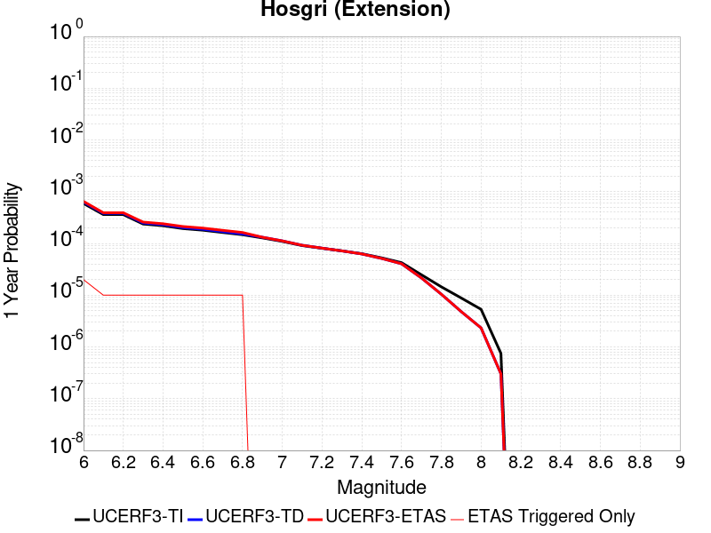 |  |

| Magnitude | 1 wk TI Prob | 1 wk TD Prob | 1 wk ETAS Prob | 1 wk ETAS/TD Gain | 1 wk ETAS Triggered Only | 1 mo TI Prob | 1 mo TD Prob | 1 mo ETAS Prob | 1 mo ETAS/TD Gain | 1 mo ETAS Triggered Only | 1 yr TI Prob | 1 yr TD Prob | 1 yr ETAS Prob | 1 yr ETAS/TD Gain | 1 yr ETAS Triggered Only | 10 yr TI Prob | 10 yr TD Prob | 10 yr ETAS Prob | 10 yr ETAS/TD Gain | 10 yr ETAS Triggered Only |
|-----|-----|-----|-----|-----|-----|-----|-----|-----|-----|-----|-----|-----|-----|-----|-----|-----|-----|-----|-----|-----|
| 6.0 | 1.1369135E-5 | 1.2083073E-5 | 2.2082952E-5 | 1.827594 | 1.0E-5 | 4.8723956E-5 | 5.17837E-5 | 7.178266E-5 | 1.386202 | 2.0E-5 | 5.9305265E-4 | 6.303069E-4 | 6.502943E-4 | 1.0317106 | 2.0E-5 | 0.005914725 | 0.00628744 | 0.0063073146 | 1.003161 | 2.0E-5 |
| 6.1 | 6.934979E-6 | 7.324556E-6 | 1.7324483E-5 | 2.3652604 | 1.0E-5 | 2.9721E-5 | 3.13906E-5 | 4.1390285E-5 | 1.3185567 | 1.0E-5 | 3.617931E-4 | 3.821177E-4 | 3.9211387E-4 | 1.02616 | 1.0E-5 | 0.0036120464 | 0.003815019 | 0.003824981 | 1.0026112 | 1.0E-5 |
| 6.2 | 6.934979E-6 | 7.324556E-6 | 1.7324483E-5 | 2.3652604 | 1.0E-5 | 2.9721E-5 | 3.13906E-5 | 4.1390285E-5 | 1.3185567 | 1.0E-5 | 3.617931E-4 | 3.821177E-4 | 3.9211387E-4 | 1.02616 | 1.0E-5 | 0.0036120464 | 0.003815019 | 0.003824981 | 1.0026112 | 1.0E-5 |
| 6.3 | 4.5484676E-6 | 4.769331E-6 | 1.4769284E-5 | 3.09672 | 1.0E-5 | 1.9493287E-5 | 2.0439833E-5 | 3.0439629E-5 | 1.4892308 | 1.0E-5 | 2.3730492E-4 | 2.4882698E-4 | 2.588245E-4 | 1.0401785 | 1.0E-5 | 0.0023705168 | 0.0024855263 | 0.0024955014 | 1.0040133 | 1.0E-5 |
| 6.4 | 4.218095E-6 | 4.416863E-6 | 1.4416819E-5 | 3.2640405 | 1.0E-5 | 1.8077424E-5 | 1.8929275E-5 | 2.8929086E-5 | 1.5282723 | 1.0E-5 | 2.2007042E-4 | 2.3043988E-4 | 2.4043758E-4 | 1.0433853 | 1.0E-5 | 0.002198526 | 0.002302043 | 0.00231202 | 1.004334 | 1.0E-5 |
| 6.5 | 3.717374E-6 | 3.883879E-6 | 1.38838395E-5 | 3.5747356 | 1.0E-5 | 1.5931506E-5 | 1.664509E-5 | 2.6644922E-5 | 1.6007679 | 1.0E-5 | 1.9394881E-4 | 2.026353E-4 | 2.1263327E-4 | 1.0493398 | 1.0E-5 | 0.0019377962 | 0.0020245241 | 0.002034504 | 1.0049294 | 1.0E-5 |
| 6.6 | 3.4605036E-6 | 3.6083072E-6 | 1.3608271E-5 | 3.7713728 | 1.0E-5 | 1.4830645E-5 | 1.5464082E-5 | 2.5463927E-5 | 1.6466497 | 1.0E-5 | 1.8054814E-4 | 1.8825909E-4 | 1.982572E-4 | 1.0531083 | 1.0E-5 | 0.0018040152 | 0.0018810107 | 0.0018909919 | 1.0053062 | 1.0E-5 |
| 6.7 | 3.123439E-6 | 3.2465698E-6 | 1.32465375E-5 | 4.080164 | 1.0E-5 | 1.33860985E-5 | 1.39137965E-5 | 2.3913657E-5 | 1.7187011 | 1.0E-5 | 1.6296357E-4 | 1.6938741E-4 | 1.7938572E-4 | 1.0590262 | 1.0E-5 | 0.001628441 | 0.001692594 | 0.0017025771 | 1.0058981 | 1.0E-5 |
| 6.8 | 2.8290783E-6 | 2.9305413E-6 | 1.2930512E-5 | 4.4123287 | 1.0E-5 | 1.2124565E-5 | 1.2559403E-5 | 2.2559278E-5 | 1.7962061 | 1.0E-5 | 1.4760658E-4 | 1.5290009E-4 | 1.6289856E-4 | 1.0653921 | 1.0E-5 | 0.0014750857 | 0.0015279576 | 0.0015379423 | 1.0065347 | 1.0E-5 |
| 6.9 | 2.454112E-6 | 2.5283207E-6 | 2.5283207E-6 | 1.0 | 0.0 | 1.0517581E-5 | 1.0835615E-5 | 1.0835615E-5 | 1.0 | 0.0 | 1.2804402E-4 | 1.3191569E-4 | 1.3191569E-4 | 1.0 | 0.0 | 0.0012797028 | 0.0013183799 | 0.0013183799 | 1.0 | 0.0 |
| 7.0 | 2.1008145E-6 | 2.1498715E-6 | 2.1498715E-6 | 1.0 | 0.0 | 9.003459E-6 | 9.2137025E-6 | 9.2137025E-6 | 1.0 | 0.0 | 1.096116E-4 | 1.1217109E-4 | 1.1217109E-4 | 1.0 | 0.0 | 0.0010955755 | 0.0011211485 | 0.0011211485 | 1.0 | 0.0 |
| 7.1 | 1.744384E-6 | 1.7686364E-6 | 1.7686364E-6 | 1.0 | 0.0 | 7.47591E-6 | 7.579848E-6 | 7.579848E-6 | 1.0 | 0.0 | 9.1015405E-5 | 9.228076E-5 | 9.228076E-5 | 1.0 | 0.0 | 9.097813E-4 | 9.224261E-4 | 9.224261E-4 | 1.0 | 0.0 |
| 7.2 | 1.5456587E-6 | 1.5562894E-6 | 1.5562894E-6 | 1.0 | 0.0 | 6.6242346E-6 | 6.6697944E-6 | 6.6697944E-6 | 1.0 | 0.0 | 8.064707E-5 | 8.120173E-5 | 8.120173E-5 | 1.0 | 0.0 | 8.0617814E-4 | 8.117219E-4 | 8.117219E-4 | 1.0 | 0.0 |
| 7.3 | 1.3775123E-6 | 1.3766092E-6 | 1.3766092E-6 | 1.0 | 0.0 | 5.9036106E-6 | 5.8997407E-6 | 5.8997407E-6 | 1.0 | 0.0 | 7.187409E-5 | 7.182699E-5 | 7.182699E-5 | 1.0 | 0.0 | 7.185085E-4 | 7.180387E-4 | 7.180387E-4 | 1.0 | 0.0 |
| 7.4 | 1.214491E-6 | 1.2023471E-6 | 1.2023471E-6 | 1.0 | 0.0 | 5.2049513E-6 | 5.152906E-6 | 5.152906E-6 | 1.0 | 0.0 | 6.336844E-5 | 6.2734835E-5 | 6.2734835E-5 | 1.0 | 0.0 | 6.335037E-4 | 6.2717206E-4 | 6.2717206E-4 | 1.0 | 0.0 |
| 7.5 | 1.0101123E-6 | 9.842256E-7 | 9.842256E-7 | 1.0 | 0.0 | 4.3290456E-6 | 4.218103E-6 | 4.218103E-6 | 1.0 | 0.0 | 5.2704854E-5 | 5.13542E-5 | 5.13542E-5 | 1.0 | 0.0 | 5.2692357E-4 | 5.1342393E-4 | 5.1342393E-4 | 1.0 | 0.0 |
| 7.6 | 8.1558215E-7 | 7.765977E-7 | 7.765977E-7 | 1.0 | 0.0 | 3.4953473E-6 | 3.3282718E-6 | 3.3282718E-6 | 1.0 | 0.0 | 4.255502E-5 | 4.0520958E-5 | 4.0520958E-5 | 1.0 | 0.0 | 4.2546875E-4 | 4.0513615E-4 | 4.0513615E-4 | 1.0 | 0.0 |
| 7.7 | 4.757816E-7 | 4.1308996E-7 | 4.1308996E-7 | 1.0 | 0.0 | 2.0390623E-6 | 1.7703843E-6 | 1.7703843E-6 | 1.0 | 0.0 | 2.4825302E-5 | 2.1554217E-5 | 2.1554217E-5 | 1.0 | 0.0 | 2.482253E-4 | 2.1552139E-4 | 2.1552139E-4 | 1.0 | 0.0 |
| 7.8 | 2.782787E-7 | 2.004783E-7 | 2.004783E-7 | 1.0 | 0.0 | 1.1926223E-6 | 8.591924E-7 | 8.591924E-7 | 1.0 | 0.0 | 1.452008E-5 | 1.0460618E-5 | 1.0460618E-5 | 1.0 | 0.0 | 1.4519131E-4 | 1.04601284E-4 | 1.04601284E-4 | 1.0 | 0.0 |
| 7.9 | 1.6948086E-7 | 9.243938E-8 | 9.243938E-8 | 1.0 | 0.0 | 7.2634634E-7 | 3.961687E-7 | 3.961687E-7 | 1.0 | 0.0 | 8.843231E-6 | 4.8233433E-6 | 4.8233433E-6 | 1.0 | 0.0 | 8.842879E-5 | 4.8232392E-5 | 4.8232392E-5 | 1.0 | 0.0 |
| 8.0 | 1.0225492E-7 | 4.473497E-8 | 4.473497E-8 | 1.0 | 0.0 | 4.382353E-7 | 1.917213E-7 | 1.917213E-7 | 1.0 | 0.0 | 5.335502E-6 | 2.3342043E-6 | 2.3342043E-6 | 1.0 | 0.0 | 5.335374E-5 | 2.33418E-5 | 2.33418E-5 | 1.0 | 0.0 |
| 8.1 | 1.43711345E-8 | 5.78716E-9 | 5.78716E-9 | 1.0 | 0.0 | 6.1590576E-8 | 2.4802116E-8 | 2.4802116E-8 | 1.0 | 0.0 | 7.4986497E-7 | 3.019657E-7 | 3.019657E-7 | 1.0 | 0.0 | 7.4986247E-6 | 3.0196536E-6 | 3.0196536E-6 | 1.0 | 0.0 |

## Johnson Valley (No) 2011 rev
*[(top)](#table-of-contents)*

| 1 Week | 1 Month | 1 Year | 10 Year |
|-----|-----|-----|-----|
|  |  |  |  |

| Magnitude | 1 wk TI Prob | 1 wk TD Prob | 1 wk ETAS Prob | 1 wk ETAS/TD Gain | 1 wk ETAS Triggered Only | 1 mo TI Prob | 1 mo TD Prob | 1 mo ETAS Prob | 1 mo ETAS/TD Gain | 1 mo ETAS Triggered Only | 1 yr TI Prob | 1 yr TD Prob | 1 yr ETAS Prob | 1 yr ETAS/TD Gain | 1 yr ETAS Triggered Only | 10 yr TI Prob | 10 yr TD Prob | 10 yr ETAS Prob | 10 yr ETAS/TD Gain | 10 yr ETAS Triggered Only |
|-----|-----|-----|-----|-----|-----|-----|-----|-----|-----|-----|-----|-----|-----|-----|-----|-----|-----|-----|-----|-----|
| 6.0 | 2.577707E-5 | 1.2901208E-5 | 3.290095E-5 | 2.5502224 | 2.0E-5 | 1.1046848E-4 | 5.528994E-5 | 7.528884E-5 | 1.3617095 | 2.0E-5 | 0.0013441239 | 6.729868E-4 | 6.929733E-4 | 1.0296983 | 2.0E-5 | 0.013360229 | 0.006713397 | 0.0067332624 | 1.0029591 | 2.0E-5 |
| 6.1 | 2.577707E-5 | 1.2901208E-5 | 3.290095E-5 | 2.5502224 | 2.0E-5 | 1.1046848E-4 | 5.528994E-5 | 7.528884E-5 | 1.3617095 | 2.0E-5 | 0.0013441239 | 6.729868E-4 | 6.929733E-4 | 1.0296983 | 2.0E-5 | 0.013360229 | 0.006713397 | 0.0067332624 | 1.0029591 | 2.0E-5 |
| 6.2 | 2.577707E-5 | 1.2901208E-5 | 3.290095E-5 | 2.5502224 | 2.0E-5 | 1.1046848E-4 | 5.528994E-5 | 7.528884E-5 | 1.3617095 | 2.0E-5 | 0.0013441239 | 6.729868E-4 | 6.929733E-4 | 1.0296983 | 2.0E-5 | 0.013360229 | 0.006713397 | 0.0067332624 | 1.0029591 | 2.0E-5 |
| 6.3 | 2.577707E-5 | 1.2901208E-5 | 3.290095E-5 | 2.5502224 | 2.0E-5 | 1.1046848E-4 | 5.528994E-5 | 7.528884E-5 | 1.3617095 | 2.0E-5 | 0.0013441239 | 6.729868E-4 | 6.929733E-4 | 1.0296983 | 2.0E-5 | 0.013360229 | 0.006713397 | 0.0067332624 | 1.0029591 | 2.0E-5 |
| 6.4 | 1.5296591E-5 | 7.5369735E-6 | 1.7536899E-5 | 2.3267825 | 1.0E-5 | 6.555518E-5 | 3.230102E-5 | 4.2300697E-5 | 1.3095777 | 1.0E-5 | 7.97842E-4 | 3.9321271E-4 | 4.0320877E-4 | 1.0254215 | 1.0E-5 | 0.007949836 | 0.003927011 | 0.003936972 | 1.0025364 | 1.0E-5 |
| 6.5 | 1.5296591E-5 | 7.5369735E-6 | 1.7536899E-5 | 2.3267825 | 1.0E-5 | 6.555518E-5 | 3.230102E-5 | 4.2300697E-5 | 1.3095777 | 1.0E-5 | 7.97842E-4 | 3.9321271E-4 | 4.0320877E-4 | 1.0254215 | 1.0E-5 | 0.007949836 | 0.003927011 | 0.003936972 | 1.0025364 | 1.0E-5 |
| 6.6 | 1.3289383E-5 | 5.9919316E-6 | 1.599187E-5 | 2.668901 | 1.0E-5 | 5.6953253E-5 | 2.567955E-5 | 3.567929E-5 | 1.3894049 | 1.0E-5 | 6.9318525E-4 | 3.1262063E-4 | 3.226175E-4 | 1.0319777 | 1.0E-5 | 0.0069102696 | 0.0031234731 | 0.0031334418 | 1.0031916 | 1.0E-5 |
| 6.7 | 1.3289383E-5 | 5.9919316E-6 | 1.599187E-5 | 2.668901 | 1.0E-5 | 5.6953253E-5 | 2.567955E-5 | 3.567929E-5 | 1.3894049 | 1.0E-5 | 6.9318525E-4 | 3.1262063E-4 | 3.226175E-4 | 1.0319777 | 1.0E-5 | 0.0069102696 | 0.0031234731 | 0.0031334418 | 1.0031916 | 1.0E-5 |
| 6.8 | 8.330789E-6 | 2.9214577E-6 | 1.2921429E-5 | 4.422939 | 1.0E-5 | 3.570289E-5 | 1.2520505E-5 | 2.252038E-5 | 1.7986798 | 1.0E-5 | 4.34596E-4 | 1.524322E-4 | 1.6243068E-4 | 1.0655929 | 1.0E-5 | 0.0043374705 | 0.0015238364 | 0.0015338212 | 1.0065523 | 1.0E-5 |
| 6.9 | 7.2359003E-6 | 2.3014702E-6 | 1.2301447E-5 | 5.345039 | 1.0E-5 | 3.1010633E-5 | 9.863436E-6 | 1.9863337E-5 | 2.0138354 | 1.0E-5 | 3.7748902E-4 | 1.2008605E-4 | 1.3008485E-4 | 1.0832636 | 1.0E-5 | 0.0037684843 | 0.0012007345 | 0.0012107225 | 1.0083182 | 1.0E-5 |
| 7.0 | 6.5149957E-6 | 2.0886398E-6 | 1.2088619E-5 | 5.787795 | 1.0E-5 | 2.792111E-5 | 8.951313E-6 | 1.8951223E-5 | 2.1171446 | 1.0E-5 | 3.398865E-4 | 1.0898209E-4 | 1.1898099E-4 | 1.0917482 | 1.0E-5 | 0.003393671 | 0.0010898062 | 0.0010997953 | 1.009166 | 1.0E-5 |
| 7.1 | 1.1662233E-6 | 2.8793124E-8 | 2.8793124E-8 | 1.0 | 0.0 | 4.9980904E-6 | 1.2339909E-7 | 1.2339909E-7 | 1.0 | 0.0 | 6.0850052E-5 | 1.5023832E-6 | 1.5023832E-6 | 1.0 | 0.0 | 6.083339E-4 | 1.5023746E-5 | 1.5023746E-5 | 1.0 | 0.0 |
| 7.2 | 5.413881E-7 | 2.8793124E-8 | 2.8793124E-8 | 1.0 | 0.0 | 2.3202326E-6 | 1.2339909E-7 | 1.2339909E-7 | 1.0 | 0.0 | 2.8248465E-5 | 1.5023832E-6 | 1.5023832E-6 | 1.0 | 0.0 | 2.8244875E-4 | 1.5023746E-5 | 1.5023746E-5 | 1.0 | 0.0 |
| 7.3 | 5.076821E-7 | 2.8793124E-8 | 2.8793124E-8 | 1.0 | 0.0 | 2.1757785E-6 | 1.2339909E-7 | 1.2339909E-7 | 1.0 | 0.0 | 2.648978E-5 | 1.5023832E-6 | 1.5023832E-6 | 1.0 | 0.0 | 2.6486625E-4 | 1.5023746E-5 | 1.5023746E-5 | 1.0 | 0.0 |
| 7.4 | 4.7568687E-7 | 2.8775073E-8 | 2.8775073E-8 | 1.0 | 0.0 | 2.0386565E-6 | 1.2332174E-7 | 1.2332174E-7 | 1.0 | 0.0 | 2.482036E-5 | 1.5014413E-6 | 1.5014413E-6 | 1.0 | 0.0 | 2.4817587E-4 | 1.5014328E-5 | 1.5014328E-5 | 1.0 | 0.0 |
| 7.5 | 3.435626E-7 | 2.5350424E-8 | 2.5350424E-8 | 1.0 | 0.0 | 1.4724103E-6 | 1.0864467E-7 | 1.0864467E-7 | 1.0 | 0.0 | 1.7926448E-5 | 1.3227482E-6 | 1.3227482E-6 | 1.0 | 0.0 | 1.7925001E-4 | 1.3227419E-5 | 1.3227419E-5 | 1.0 | 0.0 |

## Point Reyes 2011 CFM
*[(top)](#table-of-contents)*

| 1 Week | 1 Month | 1 Year | 10 Year |
|-----|-----|-----|-----|
|  |  |  | 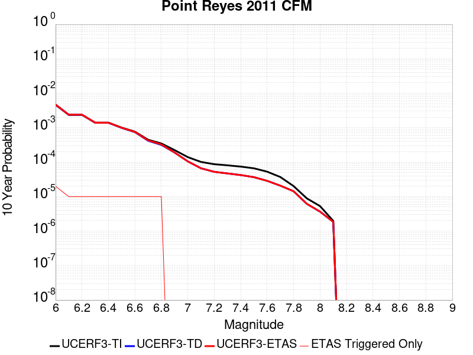 |

| Magnitude | 1 wk TI Prob | 1 wk TD Prob | 1 wk ETAS Prob | 1 wk ETAS/TD Gain | 1 wk ETAS Triggered Only | 1 mo TI Prob | 1 mo TD Prob | 1 mo ETAS Prob | 1 mo ETAS/TD Gain | 1 mo ETAS Triggered Only | 1 yr TI Prob | 1 yr TD Prob | 1 yr ETAS Prob | 1 yr ETAS/TD Gain | 1 yr ETAS Triggered Only | 10 yr TI Prob | 10 yr TD Prob | 10 yr ETAS Prob | 10 yr ETAS/TD Gain | 10 yr ETAS Triggered Only |
|-----|-----|-----|-----|-----|-----|-----|-----|-----|-----|-----|-----|-----|-----|-----|-----|-----|-----|-----|-----|-----|
| 6.0 | 8.8644965E-6 | 8.96716E-6 | 1.896707E-5 | 2.1151702 | 1.0E-5 | 3.7990147E-5 | 3.8430157E-5 | 4.842977E-5 | 1.2602023 | 1.0E-5 | 4.624319E-4 | 4.67793E-4 | 4.777883E-4 | 1.021367 | 1.0E-5 | 0.0046147075 | 0.004668711 | 0.0046886182 | 1.0042639 | 2.0E-5 |
| 6.1 | 4.526405E-6 | 4.5392153E-6 | 4.5392153E-6 | 1.0 | 0.0 | 1.9398734E-5 | 1.945364E-5 | 1.945364E-5 | 1.0 | 0.0 | 2.36154E-4 | 2.3682338E-4 | 2.3682338E-4 | 1.0 | 0.0 | 0.002359032 | 0.0023658164 | 0.0023757927 | 1.0042169 | 1.0E-5 |
| 6.2 | 4.526405E-6 | 4.5392153E-6 | 4.5392153E-6 | 1.0 | 0.0 | 1.9398734E-5 | 1.945364E-5 | 1.945364E-5 | 1.0 | 0.0 | 2.36154E-4 | 2.3682338E-4 | 2.3682338E-4 | 1.0 | 0.0 | 0.002359032 | 0.0023658164 | 0.0023757927 | 1.0042169 | 1.0E-5 |
| 6.3 | 2.6842322E-6 | 2.660673E-6 | 2.660673E-6 | 1.0 | 0.0 | 1.1503801E-5 | 1.1402836E-5 | 1.1402836E-5 | 1.0 | 0.0 | 1.4004979E-4 | 1.3882088E-4 | 1.3882088E-4 | 1.0 | 0.0 | 0.0013996155 | 0.0013873635 | 0.0013973496 | 1.0071979 | 1.0E-5 |
| 6.4 | 2.6842322E-6 | 2.660673E-6 | 2.660673E-6 | 1.0 | 0.0 | 1.1503801E-5 | 1.1402836E-5 | 1.1402836E-5 | 1.0 | 0.0 | 1.4004979E-4 | 1.3882088E-4 | 1.3882088E-4 | 1.0 | 0.0 | 0.0013996155 | 0.0013873635 | 0.0013973496 | 1.0071979 | 1.0E-5 |
| 6.5 | 1.9281833E-6 | 1.8906233E-6 | 1.8906233E-6 | 1.0 | 0.0 | 8.263617E-6 | 8.1026465E-6 | 8.1026465E-6 | 1.0 | 0.0 | 1.0060489E-4 | 9.864534E-5 | 9.864534E-5 | 1.0 | 0.0 | 0.0010055936 | 9.860265E-4 | 9.960165E-4 | 1.0101317 | 1.0E-5 |
| 6.6 | 1.4726726E-6 | 1.4269547E-6 | 1.4269547E-6 | 1.0 | 0.0 | 6.3114385E-6 | 6.115506E-6 | 6.115506E-6 | 1.0 | 0.0 | 7.683905E-5 | 7.445379E-5 | 7.445379E-5 | 1.0 | 0.0 | 7.6812494E-4 | 7.442957E-4 | 7.542883E-4 | 1.0134255 | 1.0E-5 |
| 6.7 | 8.572307E-7 | 8.007182E-7 | 8.007182E-7 | 1.0 | 0.0 | 3.6738406E-6 | 3.431645E-6 | 3.431645E-6 | 1.0 | 0.0 | 4.472809E-5 | 4.1779494E-5 | 4.1779494E-5 | 1.0 | 0.0 | 4.471909E-4 | 4.177204E-4 | 4.2771624E-4 | 1.0239295 | 1.0E-5 |
| 6.8 | 6.6745434E-7 | 6.07727E-7 | 6.07727E-7 | 1.0 | 0.0 | 2.8605155E-6 | 2.6045416E-6 | 2.6045416E-6 | 1.0 | 0.0 | 3.482622E-5 | 3.1709842E-5 | 3.1709842E-5 | 1.0 | 0.0 | 3.4820763E-4 | 3.170566E-4 | 3.2705342E-4 | 1.0315301 | 1.0E-5 |
| 6.9 | 4.291521E-7 | 3.6535639E-7 | 3.6535639E-7 | 1.0 | 0.0 | 1.839222E-6 | 1.5658121E-6 | 1.5658121E-6 | 1.0 | 0.0 | 2.2392298E-5 | 1.90636E-5 | 1.90636E-5 | 1.0 | 0.0 | 2.2390042E-4 | 1.906224E-4 | 1.906224E-4 | 1.0 | 0.0 |
| 7.0 | 2.6812808E-7 | 2.0187117E-7 | 2.0187117E-7 | 1.0 | 0.0 | 1.1491198E-6 | 8.6516184E-7 | 8.6516184E-7 | 1.0 | 0.0 | 1.3990444E-5 | 1.0533295E-5 | 1.0533295E-5 | 1.0 | 0.0 | 1.3989564E-4 | 1.05330415E-4 | 1.05330415E-4 | 1.0 | 0.0 |
| 7.1 | 1.9451231E-7 | 1.2725201E-7 | 1.2725201E-7 | 1.0 | 0.0 | 8.336239E-7 | 5.4536565E-7 | 5.4536565E-7 | 1.0 | 0.0 | 1.0149324E-5 | 6.639806E-6 | 6.639806E-6 | 1.0 | 0.0 | 1.014886E-4 | 6.639846E-5 | 6.639846E-5 | 1.0 | 0.0 |
| 7.2 | 1.6715143E-7 | 1.0042555E-7 | 1.0042555E-7 | 1.0 | 0.0 | 7.1636305E-7 | 4.3039515E-7 | 4.3039515E-7 | 1.0 | 0.0 | 8.721685E-6 | 5.2400483E-6 | 5.2400483E-6 | 1.0 | 0.0 | 8.721343E-5 | 5.240162E-5 | 5.240162E-5 | 1.0 | 0.0 |
| 7.3 | 1.5503173E-7 | 9.012816E-8 | 9.012816E-8 | 1.0 | 0.0 | 6.644215E-7 | 3.8626348E-7 | 3.8626348E-7 | 1.0 | 0.0 | 8.089301E-6 | 4.7027474E-6 | 4.7027474E-6 | 1.0 | 0.0 | 8.089007E-5 | 4.7028854E-5 | 4.7028854E-5 | 1.0 | 0.0 |
| 7.4 | 1.4251614E-7 | 8.097342E-8 | 8.097342E-8 | 1.0 | 0.0 | 6.1078333E-7 | 3.4702887E-7 | 3.4702887E-7 | 1.0 | 0.0 | 7.4362615E-6 | 4.225068E-6 | 4.225068E-6 | 1.0 | 0.0 | 7.436013E-5 | 4.2252257E-5 | 4.2252257E-5 | 1.0 | 0.0 |
| 7.5 | 1.2710186E-7 | 7.029377E-8 | 7.029377E-8 | 1.0 | 0.0 | 5.447221E-7 | 3.0125898E-7 | 3.0125898E-7 | 1.0 | 0.0 | 6.6319717E-6 | 3.6678218E-6 | 3.6678218E-6 | 1.0 | 0.0 | 6.6317734E-5 | 3.667999E-5 | 3.667999E-5 | 1.0 | 0.0 |
| 7.6 | 1.0144708E-7 | 5.494996E-8 | 5.494996E-8 | 1.0 | 0.0 | 4.347731E-7 | 2.354998E-7 | 2.354998E-7 | 1.0 | 0.0 | 5.2933497E-6 | 2.8672061E-6 | 2.8672061E-6 | 1.0 | 0.0 | 5.293224E-5 | 2.8674069E-5 | 2.8674069E-5 | 1.0 | 0.0 |
| 7.7 | 7.090527E-8 | 3.9821334E-8 | 3.9821334E-8 | 1.0 | 0.0 | 3.038797E-7 | 1.7066284E-7 | 1.7066284E-7 | 1.0 | 0.0 | 3.699729E-6 | 2.0778182E-6 | 2.0778182E-6 | 1.0 | 0.0 | 3.6996673E-5 | 2.0780362E-5 | 2.0780362E-5 | 1.0 | 0.0 |
| 7.8 | 3.8712045E-8 | 2.7438638E-8 | 2.7438638E-8 | 1.0 | 0.0 | 1.6590876E-7 | 1.1759416E-7 | 1.1759416E-7 | 1.0 | 0.0 | 2.0199373E-6 | 1.4317079E-6 | 1.4317079E-6 | 1.0 | 0.0 | 2.0199188E-5 | 1.4319363E-5 | 1.4319363E-5 | 1.0 | 0.0 |
| 7.9 | 1.7068782E-8 | 1.183186E-8 | 1.183186E-8 | 1.0 | 0.0 | 7.315192E-8 | 5.0707975E-8 | 5.0707975E-8 | 1.0 | 0.0 | 8.906242E-7 | 6.173694E-7 | 6.173694E-7 | 1.0 | 0.0 | 8.906207E-6 | 6.1760525E-6 | 6.1760525E-6 | 1.0 | 0.0 |
| 8.0 | 1.0172592E-8 | 7.0268076E-9 | 7.0268076E-9 | 1.0 | 0.0 | 4.359682E-8 | 3.011489E-8 | 3.011489E-8 | 1.0 | 0.0 | 5.3079117E-7 | 3.6664872E-7 | 3.6664872E-7 | 1.0 | 0.0 | 5.307899E-6 | 3.6688568E-6 | 3.6688568E-6 | 1.0 | 0.0 |
| 8.1 | 3.7861243E-9 | 3.5448604E-9 | 3.5448604E-9 | 1.0 | 0.0 | 1.6226247E-8 | 1.5192258E-8 | 1.5192258E-8 | 1.0 | 0.0 | 1.9755454E-7 | 1.8496571E-7 | 1.8496571E-7 | 1.0 | 0.0 | 1.9755437E-6 | 1.8514592E-6 | 1.8514592E-6 | 1.0 | 0.0 |

## Great Valley 03 Mysterious Ridge
*[(top)](#table-of-contents)*

| 1 Week | 1 Month | 1 Year | 10 Year |
|-----|-----|-----|-----|
|  |  |  |  |

| Magnitude | 1 wk TI Prob | 1 wk TD Prob | 1 wk ETAS Prob | 1 wk ETAS/TD Gain | 1 wk ETAS Triggered Only | 1 mo TI Prob | 1 mo TD Prob | 1 mo ETAS Prob | 1 mo ETAS/TD Gain | 1 mo ETAS Triggered Only | 1 yr TI Prob | 1 yr TD Prob | 1 yr ETAS Prob | 1 yr ETAS/TD Gain | 1 yr ETAS Triggered Only | 10 yr TI Prob | 10 yr TD Prob | 10 yr ETAS Prob | 10 yr ETAS/TD Gain | 10 yr ETAS Triggered Only |
|-----|-----|-----|-----|-----|-----|-----|-----|-----|-----|-----|-----|-----|-----|-----|-----|-----|-----|-----|-----|-----|
| 6.0 | 3.1182444E-5 | 3.6034133E-5 | 3.6034133E-5 | 1.0 | 0.0 | 1.336322E-4 | 1.5442389E-4 | 1.5442389E-4 | 1.0 | 0.0 | 0.0016257578 | 0.0018786751 | 0.0018886563 | 1.0053129 | 1.0E-5 | 0.016139153 | 0.018646672 | 0.018656485 | 1.0005263 | 1.0E-5 |
| 6.1 | 3.1182444E-5 | 3.6034133E-5 | 3.6034133E-5 | 1.0 | 0.0 | 1.336322E-4 | 1.5442389E-4 | 1.5442389E-4 | 1.0 | 0.0 | 0.0016257578 | 0.0018786751 | 0.0018886563 | 1.0053129 | 1.0E-5 | 0.016139153 | 0.018646672 | 0.018656485 | 1.0005263 | 1.0E-5 |
| 6.2 | 3.1182444E-5 | 3.6034133E-5 | 3.6034133E-5 | 1.0 | 0.0 | 1.336322E-4 | 1.5442389E-4 | 1.5442389E-4 | 1.0 | 0.0 | 0.0016257578 | 0.0018786751 | 0.0018886563 | 1.0053129 | 1.0E-5 | 0.016139153 | 0.018646672 | 0.018656485 | 1.0005263 | 1.0E-5 |
| 6.3 | 2.106934E-5 | 2.3850303E-5 | 2.3850303E-5 | 1.0 | 0.0 | 9.0294045E-5 | 1.0221176E-4 | 1.0221176E-4 | 1.0 | 0.0 | 0.0010987755 | 0.0012437488 | 0.0012437488 | 1.0 | 0.0 | 0.010933585 | 0.0123711275 | 0.0123711275 | 1.0 | 0.0 |
| 6.4 | 2.106934E-5 | 2.3850303E-5 | 2.3850303E-5 | 1.0 | 0.0 | 9.0294045E-5 | 1.0221176E-4 | 1.0221176E-4 | 1.0 | 0.0 | 0.0010987755 | 0.0012437488 | 0.0012437488 | 1.0 | 0.0 | 0.010933585 | 0.0123711275 | 0.0123711275 | 1.0 | 0.0 |
| 6.5 | 1.9389783E-5 | 2.1884982E-5 | 2.1884982E-5 | 1.0 | 0.0 | 8.309642E-5 | 9.378956E-5 | 9.378956E-5 | 1.0 | 0.0 | 0.0010112294 | 0.0011413175 | 0.0011413175 | 1.0 | 0.0 | 0.010066401 | 0.011357434 | 0.011357434 | 1.0 | 0.0 |
| 6.6 | 1.9370193E-5 | 2.1864902E-5 | 2.1864902E-5 | 1.0 | 0.0 | 8.301247E-5 | 9.3703515E-5 | 9.3703515E-5 | 1.0 | 0.0 | 0.0010102082 | 0.001140271 | 0.001140271 | 1.0 | 0.0 | 0.010056281 | 0.011347076 | 0.011347076 | 1.0 | 0.0 |
| 6.7 | 1.6723505E-5 | 1.8799281E-5 | 1.8799281E-5 | 1.0 | 0.0 | 7.16702E-5 | 8.056597E-5 | 8.056597E-5 | 1.0 | 0.0 | 8.722353E-4 | 9.804688E-4 | 9.804688E-4 | 1.0 | 0.0 | 0.008688197 | 0.009763439 | 0.009763439 | 1.0 | 0.0 |
| 6.8 | 1.426937E-5 | 1.599721E-5 | 1.599721E-5 | 1.0 | 0.0 | 6.115301E-5 | 6.855775E-5 | 6.855775E-5 | 1.0 | 0.0 | 7.4428355E-4 | 8.343854E-4 | 8.343854E-4 | 1.0 | 0.0 | 0.007417957 | 0.008314005 | 0.008314005 | 1.0 | 0.0 |
| 6.9 | 1.2469891E-5 | 1.3956928E-5 | 1.3956928E-5 | 1.0 | 0.0 | 5.3441294E-5 | 5.9814105E-5 | 5.9814105E-5 | 1.0 | 0.0 | 6.504535E-4 | 7.280055E-4 | 7.280055E-4 | 1.0 | 0.0 | 0.006485529 | 0.00725743 | 0.00725743 | 1.0 | 0.0 |
| 7.0 | 8.7746275E-6 | 9.791734E-6 | 9.791734E-6 | 1.0 | 0.0 | 3.7605005E-5 | 4.196394E-5 | 4.196394E-5 | 1.0 | 0.0 | 4.5774475E-4 | 5.1079853E-4 | 5.1079853E-4 | 1.0 | 0.0 | 0.00456803 | 0.005096977 | 0.005096977 | 1.0 | 0.0 |
| 7.1 | 6.1067153E-6 | 6.813725E-6 | 6.813725E-6 | 1.0 | 0.0 | 2.6171374E-5 | 2.9201385E-5 | 2.9201385E-5 | 1.0 | 0.0 | 3.1858988E-4 | 3.5547445E-4 | 3.5547445E-4 | 1.0 | 0.0 | 0.0031813353 | 0.003549609 | 0.003549609 | 1.0 | 0.0 |
| 7.2 | 2.939283E-6 | 3.2741057E-6 | 3.2741057E-6 | 1.0 | 0.0 | 1.2596866E-5 | 1.4031816E-5 | 1.4031816E-5 | 1.0 | 0.0 | 1.5335606E-4 | 1.7082572E-4 | 1.7082572E-4 | 1.0 | 0.0 | 0.0015325027 | 0.001707116 | 0.001707116 | 1.0 | 0.0 |
| 7.3 | 7.2387763E-7 | 8.008505E-7 | 8.008505E-7 | 1.0 | 0.0 | 3.102329E-6 | 3.4322145E-6 | 3.4322145E-6 | 1.0 | 0.0 | 3.77702E-5 | 4.178687E-5 | 4.178687E-5 | 1.0 | 0.0 | 3.7763783E-4 | 4.1783508E-4 | 4.1783508E-4 | 1.0 | 0.0 |
| 7.4 | 3.112171E-8 | 3.2068368E-8 | 3.2068368E-8 | 1.0 | 0.0 | 1.3337875E-7 | 1.3743585E-7 | 1.3743585E-7 | 1.0 | 0.0 | 1.6238852E-6 | 1.6732803E-6 | 1.6732803E-6 | 1.0 | 0.0 | 1.6238733E-5 | 1.6732685E-5 | 1.6732685E-5 | 1.0 | 0.0 |

## San Jose
*[(top)](#table-of-contents)*

| 1 Week | 1 Month | 1 Year | 10 Year |
|-----|-----|-----|-----|
|  |  |  |  |

| Magnitude | 1 wk TI Prob | 1 wk TD Prob | 1 wk ETAS Prob | 1 wk ETAS/TD Gain | 1 wk ETAS Triggered Only | 1 mo TI Prob | 1 mo TD Prob | 1 mo ETAS Prob | 1 mo ETAS/TD Gain | 1 mo ETAS Triggered Only | 1 yr TI Prob | 1 yr TD Prob | 1 yr ETAS Prob | 1 yr ETAS/TD Gain | 1 yr ETAS Triggered Only | 10 yr TI Prob | 10 yr TD Prob | 10 yr ETAS Prob | 10 yr ETAS/TD Gain | 10 yr ETAS Triggered Only |
|-----|-----|-----|-----|-----|-----|-----|-----|-----|-----|-----|-----|-----|-----|-----|-----|-----|-----|-----|-----|-----|
| 6.0 | 5.0851277E-6 | 4.125642E-6 | 1.41256005E-5 | 3.423855 | 1.0E-5 | 2.1793223E-5 | 1.768122E-5 | 2.7681042E-5 | 1.5655619 | 1.0E-5 | 2.653002E-4 | 2.152502E-4 | 2.2524805E-4 | 1.0464475 | 1.0E-5 | 0.0026498367 | 0.0021507454 | 0.002160724 | 1.0046395 | 1.0E-5 |
| 6.1 | 5.0851277E-6 | 4.125642E-6 | 1.41256005E-5 | 3.423855 | 1.0E-5 | 2.1793223E-5 | 1.768122E-5 | 2.7681042E-5 | 1.5655619 | 1.0E-5 | 2.653002E-4 | 2.152502E-4 | 2.2524805E-4 | 1.0464475 | 1.0E-5 | 0.0026498367 | 0.0021507454 | 0.002160724 | 1.0046395 | 1.0E-5 |
| 6.2 | 5.0851277E-6 | 4.125642E-6 | 1.41256005E-5 | 3.423855 | 1.0E-5 | 2.1793223E-5 | 1.768122E-5 | 2.7681042E-5 | 1.5655619 | 1.0E-5 | 2.653002E-4 | 2.152502E-4 | 2.2524805E-4 | 1.0464475 | 1.0E-5 | 0.0026498367 | 0.0021507454 | 0.002160724 | 1.0046395 | 1.0E-5 |
| 6.3 | 5.0851277E-6 | 4.125642E-6 | 1.41256005E-5 | 3.423855 | 1.0E-5 | 2.1793223E-5 | 1.768122E-5 | 2.7681042E-5 | 1.5655619 | 1.0E-5 | 2.653002E-4 | 2.152502E-4 | 2.2524805E-4 | 1.0464475 | 1.0E-5 | 0.0026498367 | 0.0021507454 | 0.002160724 | 1.0046395 | 1.0E-5 |
| 6.4 | 4.3115124E-6 | 3.3237525E-6 | 1.3323719E-5 | 4.0086374 | 1.0E-5 | 1.8477778E-5 | 1.4244589E-5 | 2.4244446E-5 | 1.702011 | 1.0E-5 | 2.2494372E-4 | 1.7341628E-4 | 1.8341454E-4 | 1.0576547 | 1.0E-5 | 0.0022471617 | 0.0017330965 | 0.0017430792 | 1.0057601 | 1.0E-5 |
| 6.5 | 4.3115124E-6 | 3.3237525E-6 | 1.3323719E-5 | 4.0086374 | 1.0E-5 | 1.8477778E-5 | 1.4244589E-5 | 2.4244446E-5 | 1.702011 | 1.0E-5 | 2.2494372E-4 | 1.7341628E-4 | 1.8341454E-4 | 1.0576547 | 1.0E-5 | 0.0022471617 | 0.0017330965 | 0.0017430792 | 1.0057601 | 1.0E-5 |
| 6.6 | 3.110396E-6 | 2.0799562E-6 | 2.0799562E-6 | 1.0 | 0.0 | 1.33302E-5 | 8.9140685E-6 | 8.9140685E-6 | 1.0 | 0.0 | 1.622831E-4 | 1.0852366E-4 | 1.0852366E-4 | 1.0 | 0.0 | 0.0016216465 | 0.001084804 | 0.001084804 | 1.0 | 0.0 |
| 6.7 | 3.110396E-6 | 2.0799562E-6 | 2.0799562E-6 | 1.0 | 0.0 | 1.33302E-5 | 8.9140685E-6 | 8.9140685E-6 | 1.0 | 0.0 | 1.622831E-4 | 1.0852366E-4 | 1.0852366E-4 | 1.0 | 0.0 | 0.0016216465 | 0.001084804 | 0.001084804 | 1.0 | 0.0 |
| 6.8 | 2.856651E-6 | 1.9024077E-6 | 1.9024077E-6 | 1.0 | 0.0 | 1.2242733E-5 | 8.153152E-6 | 8.153152E-6 | 1.0 | 0.0 | 1.4904508E-4 | 9.926035E-5 | 9.926035E-5 | 1.0 | 0.0 | 0.0014894515 | 9.922545E-4 | 9.922545E-4 | 1.0 | 0.0 |
| 6.9 | 2.1618725E-6 | 1.4186406E-6 | 1.4186406E-6 | 1.0 | 0.0 | 9.265135E-6 | 6.0798748E-6 | 6.0798748E-6 | 1.0 | 0.0 | 1.12797185E-4 | 7.402005E-5 | 7.402005E-5 | 1.0 | 0.0 | 0.0011273995 | 7.4003247E-4 | 7.4003247E-4 | 1.0 | 0.0 |
| 7.0 | 1.9684312E-6 | 1.3256082E-6 | 1.3256082E-6 | 1.0 | 0.0 | 8.436106E-6 | 5.681166E-6 | 5.681166E-6 | 1.0 | 0.0 | 1.02704755E-4 | 6.916608E-5 | 6.916608E-5 | 1.0 | 0.0 | 0.001026573 | 6.9152354E-4 | 6.9152354E-4 | 1.0 | 0.0 |
| 7.1 | 1.6070337E-6 | 1.1154867E-6 | 1.1154867E-6 | 1.0 | 0.0 | 6.887269E-6 | 4.7806493E-6 | 4.7806493E-6 | 1.0 | 0.0 | 8.384928E-5 | 5.8202913E-5 | 5.8202913E-5 | 1.0 | 0.0 | 8.3817646E-4 | 5.819527E-4 | 5.819527E-4 | 1.0 | 0.0 |
| 7.2 | 1.0631658E-6 | 6.403567E-7 | 6.403567E-7 | 1.0 | 0.0 | 4.556417E-6 | 2.744383E-6 | 2.744383E-6 | 1.0 | 0.0 | 5.5472963E-5 | 3.3412365E-5 | 3.3412365E-5 | 1.0 | 0.0 | 5.545912E-4 | 3.3414463E-4 | 3.3414463E-4 | 1.0 | 0.0 |
| 7.3 | 7.060711E-7 | 4.5823228E-7 | 4.5823228E-7 | 1.0 | 0.0 | 3.0260155E-6 | 1.9638512E-6 | 1.9638512E-6 | 1.0 | 0.0 | 3.6841117E-5 | 2.3909635E-5 | 2.3909635E-5 | 1.0 | 0.0 | 3.6835007E-4 | 2.3914136E-4 | 2.3914136E-4 | 1.0 | 0.0 |
| 7.4 | 3.3677085E-7 | 2.3231999E-7 | 2.3231999E-7 | 1.0 | 0.0 | 1.4433028E-6 | 9.956567E-7 | 9.956567E-7 | 1.0 | 0.0 | 1.757207E-5 | 1.2122056E-5 | 1.2122056E-5 | 1.0 | 0.0 | 1.7570681E-4 | 1.2128407E-4 | 1.2128407E-4 | 1.0 | 0.0 |
| 7.5 | 3.129161E-7 | 1.9529637E-7 | 1.9529637E-7 | 1.0 | 0.0 | 1.3410682E-6 | 8.3698416E-7 | 8.3698416E-7 | 1.0 | 0.0 | 1.6327383E-5 | 1.0190237E-5 | 1.0190237E-5 | 1.0 | 0.0 | 1.6326184E-4 | 1.0196777E-4 | 1.0196777E-4 | 1.0 | 0.0 |
| 7.6 | 2.8008668E-7 | 1.4240818E-7 | 1.4240818E-7 | 1.0 | 0.0 | 1.2003709E-6 | 6.103206E-7 | 6.103206E-7 | 1.0 | 0.0 | 1.46144175E-5 | 7.43063E-6 | 7.43063E-6 | 1.0 | 0.0 | 1.4613457E-4 | 7.43735E-5 | 7.43735E-5 | 1.0 | 0.0 |
| 7.7 | 2.7852005E-7 | 1.4015403E-7 | 1.4015403E-7 | 1.0 | 0.0 | 1.1936568E-6 | 6.0066003E-7 | 6.0066003E-7 | 1.0 | 0.0 | 1.4532674E-5 | 7.3130127E-6 | 7.3130127E-6 | 1.0 | 0.0 | 1.4531724E-4 | 7.31974E-5 | 7.31974E-5 | 1.0 | 0.0 |
| 7.8 | 1.1810797E-7 | 7.5187074E-8 | 7.5187074E-8 | 1.0 | 0.0 | 5.0617695E-7 | 3.2223028E-7 | 3.2223028E-7 | 1.0 | 0.0 | 6.1626865E-6 | 3.9231472E-6 | 3.9231472E-6 | 1.0 | 0.0 | 6.162516E-5 | 3.9271265E-5 | 3.9271265E-5 | 1.0 | 0.0 |

## San Pedro Escarpment
*[(top)](#table-of-contents)*

| 1 Week | 1 Month | 1 Year | 10 Year |
|-----|-----|-----|-----|
| 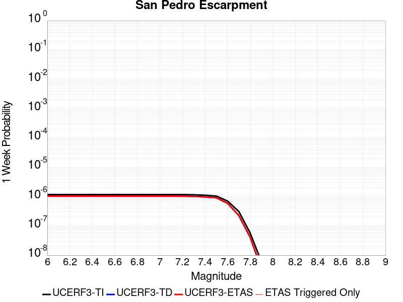 |  |  |  |

| Magnitude | 1 wk TI Prob | 1 wk TD Prob | 1 wk ETAS Prob | 1 wk ETAS/TD Gain | 1 wk ETAS Triggered Only | 1 mo TI Prob | 1 mo TD Prob | 1 mo ETAS Prob | 1 mo ETAS/TD Gain | 1 mo ETAS Triggered Only | 1 yr TI Prob | 1 yr TD Prob | 1 yr ETAS Prob | 1 yr ETAS/TD Gain | 1 yr ETAS Triggered Only | 10 yr TI Prob | 10 yr TD Prob | 10 yr ETAS Prob | 10 yr ETAS/TD Gain | 10 yr ETAS Triggered Only |
|-----|-----|-----|-----|-----|-----|-----|-----|-----|-----|-----|-----|-----|-----|-----|-----|-----|-----|-----|-----|-----|
| 6.0 | 1.1740281E-6 | 1.0380334E-6 | 1.0380334E-6 | 1.0 | 0.0 | 5.031539E-6 | 4.448707E-6 | 4.448707E-6 | 1.0 | 0.0 | 6.125726E-5 | 5.4161726E-5 | 6.4161184E-5 | 1.1846222 | 1.0E-5 | 6.124038E-4 | 5.4149167E-4 | 5.514862E-4 | 1.0184575 | 1.0E-5 |
| 6.1 | 1.1740281E-6 | 1.0380334E-6 | 1.0380334E-6 | 1.0 | 0.0 | 5.031539E-6 | 4.448707E-6 | 4.448707E-6 | 1.0 | 0.0 | 6.125726E-5 | 5.4161726E-5 | 6.4161184E-5 | 1.1846222 | 1.0E-5 | 6.124038E-4 | 5.4149167E-4 | 5.514862E-4 | 1.0184575 | 1.0E-5 |
| 6.2 | 1.1740281E-6 | 1.0380334E-6 | 1.0380334E-6 | 1.0 | 0.0 | 5.031539E-6 | 4.448707E-6 | 4.448707E-6 | 1.0 | 0.0 | 6.125726E-5 | 5.4161726E-5 | 6.4161184E-5 | 1.1846222 | 1.0E-5 | 6.124038E-4 | 5.4149167E-4 | 5.514862E-4 | 1.0184575 | 1.0E-5 |
| 6.3 | 1.1740281E-6 | 1.0380334E-6 | 1.0380334E-6 | 1.0 | 0.0 | 5.031539E-6 | 4.448707E-6 | 4.448707E-6 | 1.0 | 0.0 | 6.125726E-5 | 5.4161726E-5 | 6.4161184E-5 | 1.1846222 | 1.0E-5 | 6.124038E-4 | 5.4149167E-4 | 5.514862E-4 | 1.0184575 | 1.0E-5 |
| 6.4 | 1.1740281E-6 | 1.0380334E-6 | 1.0380334E-6 | 1.0 | 0.0 | 5.031539E-6 | 4.448707E-6 | 4.448707E-6 | 1.0 | 0.0 | 6.125726E-5 | 5.4161726E-5 | 6.4161184E-5 | 1.1846222 | 1.0E-5 | 6.124038E-4 | 5.4149167E-4 | 5.514862E-4 | 1.0184575 | 1.0E-5 |
| 6.5 | 1.1740281E-6 | 1.0380334E-6 | 1.0380334E-6 | 1.0 | 0.0 | 5.031539E-6 | 4.448707E-6 | 4.448707E-6 | 1.0 | 0.0 | 6.125726E-5 | 5.4161726E-5 | 6.4161184E-5 | 1.1846222 | 1.0E-5 | 6.124038E-4 | 5.4149167E-4 | 5.514862E-4 | 1.0184575 | 1.0E-5 |
| 6.6 | 1.1740281E-6 | 1.0380334E-6 | 1.0380334E-6 | 1.0 | 0.0 | 5.031539E-6 | 4.448707E-6 | 4.448707E-6 | 1.0 | 0.0 | 6.125726E-5 | 5.4161726E-5 | 6.4161184E-5 | 1.1846222 | 1.0E-5 | 6.124038E-4 | 5.4149167E-4 | 5.514862E-4 | 1.0184575 | 1.0E-5 |
| 6.7 | 1.1740281E-6 | 1.0380334E-6 | 1.0380334E-6 | 1.0 | 0.0 | 5.031539E-6 | 4.448707E-6 | 4.448707E-6 | 1.0 | 0.0 | 6.125726E-5 | 5.4161726E-5 | 6.4161184E-5 | 1.1846222 | 1.0E-5 | 6.124038E-4 | 5.4149167E-4 | 5.514862E-4 | 1.0184575 | 1.0E-5 |
| 6.8 | 1.1740281E-6 | 1.0380334E-6 | 1.0380334E-6 | 1.0 | 0.0 | 5.031539E-6 | 4.448707E-6 | 4.448707E-6 | 1.0 | 0.0 | 6.125726E-5 | 5.4161726E-5 | 6.4161184E-5 | 1.1846222 | 1.0E-5 | 6.124038E-4 | 5.4149167E-4 | 5.514862E-4 | 1.0184575 | 1.0E-5 |
| 6.9 | 1.1740281E-6 | 1.0380334E-6 | 1.0380334E-6 | 1.0 | 0.0 | 5.031539E-6 | 4.448707E-6 | 4.448707E-6 | 1.0 | 0.0 | 6.125726E-5 | 5.4161726E-5 | 6.4161184E-5 | 1.1846222 | 1.0E-5 | 6.124038E-4 | 5.4149167E-4 | 5.514862E-4 | 1.0184575 | 1.0E-5 |
| 7.0 | 1.1740281E-6 | 1.0380334E-6 | 1.0380334E-6 | 1.0 | 0.0 | 5.031539E-6 | 4.448707E-6 | 4.448707E-6 | 1.0 | 0.0 | 6.125726E-5 | 5.4161726E-5 | 6.4161184E-5 | 1.1846222 | 1.0E-5 | 6.124038E-4 | 5.4149167E-4 | 5.514862E-4 | 1.0184575 | 1.0E-5 |
| 7.1 | 1.1740281E-6 | 1.0380334E-6 | 1.0380334E-6 | 1.0 | 0.0 | 5.031539E-6 | 4.448707E-6 | 4.448707E-6 | 1.0 | 0.0 | 6.125726E-5 | 5.4161726E-5 | 6.4161184E-5 | 1.1846222 | 1.0E-5 | 6.124038E-4 | 5.4149167E-4 | 5.514862E-4 | 1.0184575 | 1.0E-5 |
| 7.2 | 1.1722314E-6 | 1.0362206E-6 | 1.0362206E-6 | 1.0 | 0.0 | 5.023839E-6 | 4.440938E-6 | 4.440938E-6 | 1.0 | 0.0 | 6.116352E-5 | 5.4067146E-5 | 6.4066604E-5 | 1.1849452 | 1.0E-5 | 6.114669E-4 | 5.405463E-4 | 5.505409E-4 | 1.0184898 | 1.0E-5 |
| 7.3 | 1.1515234E-6 | 1.0152946E-6 | 1.0152946E-6 | 1.0 | 0.0 | 4.935091E-6 | 4.351256E-6 | 4.351256E-6 | 1.0 | 0.0 | 6.008308E-5 | 5.2975316E-5 | 6.297479E-5 | 1.1887572 | 1.0E-5 | 6.0066837E-4 | 5.2963325E-4 | 5.39628E-4 | 1.018871 | 1.0E-5 |
| 7.4 | 1.1103637E-6 | 9.736538E-7 | 9.736538E-7 | 1.0 | 0.0 | 4.7586927E-6 | 4.172796E-6 | 4.172796E-6 | 1.0 | 0.0 | 5.793554E-5 | 5.0802668E-5 | 6.080216E-5 | 1.19683 | 1.0E-5 | 5.792044E-4 | 5.079169E-4 | 5.179118E-4 | 1.0196782 | 1.0E-5 |
| 7.5 | 1.0425391E-6 | 9.11898E-7 | 9.11898E-7 | 1.0 | 0.0 | 4.4680173E-6 | 3.9081287E-6 | 3.9081287E-6 | 1.0 | 0.0 | 5.439675E-5 | 4.758049E-5 | 5.7580015E-5 | 1.2101601 | 1.0E-5 | 5.438344E-4 | 4.7570938E-4 | 4.8570463E-4 | 1.0210112 | 1.0E-5 |
| 7.6 | 7.0184194E-7 | 5.8865743E-7 | 5.8865743E-7 | 1.0 | 0.0 | 3.0078907E-6 | 2.5228155E-6 | 2.5228155E-6 | 1.0 | 0.0 | 3.6620455E-5 | 3.0714895E-5 | 4.0714585E-5 | 1.325565 | 1.0E-5 | 3.661442E-4 | 3.0711124E-4 | 3.1710818E-4 | 1.0325515 | 1.0E-5 |
| 7.7 | 3.0871365E-7 | 2.2456504E-7 | 2.2456504E-7 | 1.0 | 0.0 | 1.3230577E-6 | 9.624213E-7 | 9.624213E-7 | 1.0 | 0.0 | 1.610811E-5 | 1.1717418E-5 | 2.17173E-5 | 1.8534204 | 1.0E-5 | 1.6106942E-4 | 1.1716811E-4 | 1.2716693E-4 | 1.0853374 | 1.0E-5 |
| 7.8 | 5.7512665E-8 | 4.1053934E-8 | 4.1053934E-8 | 1.0 | 0.0 | 2.464828E-7 | 1.7594542E-7 | 1.7594542E-7 | 1.0 | 0.0 | 3.0009242E-6 | 2.1421336E-6 | 2.1421336E-6 | 1.0 | 0.0 | 3.0008836E-5 | 2.142115E-5 | 2.142115E-5 | 1.0 | 0.0 |
| 7.9 | 6.040053E-9 | 3.4534282E-9 | 3.4534282E-9 | 1.0 | 0.0 | 2.5885942E-8 | 1.4800406E-8 | 1.4800406E-8 | 1.0 | 0.0 | 3.151613E-7 | 1.8019493E-7 | 1.8019493E-7 | 1.0 | 0.0 | 3.1516086E-6 | 1.8019481E-6 | 1.8019481E-6 | 1.0 | 0.0 |

## Elysian Park (Lower CFM)
*[(top)](#table-of-contents)*

| 1 Week | 1 Month | 1 Year | 10 Year |
|-----|-----|-----|-----|
|  |  |  |  |

| Magnitude | 1 wk TI Prob | 1 wk TD Prob | 1 wk ETAS Prob | 1 wk ETAS/TD Gain | 1 wk ETAS Triggered Only | 1 mo TI Prob | 1 mo TD Prob | 1 mo ETAS Prob | 1 mo ETAS/TD Gain | 1 mo ETAS Triggered Only | 1 yr TI Prob | 1 yr TD Prob | 1 yr ETAS Prob | 1 yr ETAS/TD Gain | 1 yr ETAS Triggered Only | 10 yr TI Prob | 10 yr TD Prob | 10 yr ETAS Prob | 10 yr ETAS/TD Gain | 10 yr ETAS Triggered Only |
|-----|-----|-----|-----|-----|-----|-----|-----|-----|-----|-----|-----|-----|-----|-----|-----|-----|-----|-----|-----|-----|
| 6.0 | 2.1766498E-6 | 2.1037895E-6 | 2.1037895E-6 | 1.0 | 0.0 | 9.328466E-6 | 9.0162175E-6 | 9.0162175E-6 | 1.0 | 0.0 | 1.1356815E-4 | 1.0976836E-4 | 1.0976836E-4 | 1.0 | 0.0 | 0.0011351013 | 0.0010972833 | 0.0011072723 | 1.0091034 | 1.0E-5 |
| 6.1 | 2.1766498E-6 | 2.1037895E-6 | 2.1037895E-6 | 1.0 | 0.0 | 9.328466E-6 | 9.0162175E-6 | 9.0162175E-6 | 1.0 | 0.0 | 1.1356815E-4 | 1.0976836E-4 | 1.0976836E-4 | 1.0 | 0.0 | 0.0011351013 | 0.0010972833 | 0.0011072723 | 1.0091034 | 1.0E-5 |
| 6.2 | 1.0031182E-6 | 9.186213E-7 | 9.186213E-7 | 1.0 | 0.0 | 4.299071E-6 | 3.936943E-6 | 3.936943E-6 | 1.0 | 0.0 | 5.2339932E-5 | 4.7931328E-5 | 4.7931328E-5 | 1.0 | 0.0 | 5.2327604E-4 | 4.7921969E-4 | 4.7921969E-4 | 1.0 | 0.0 |
| 6.3 | 1.0031182E-6 | 9.186213E-7 | 9.186213E-7 | 1.0 | 0.0 | 4.299071E-6 | 3.936943E-6 | 3.936943E-6 | 1.0 | 0.0 | 5.2339932E-5 | 4.7931328E-5 | 4.7931328E-5 | 1.0 | 0.0 | 5.2327604E-4 | 4.7921969E-4 | 4.7921969E-4 | 1.0 | 0.0 |
| 6.4 | 6.9606244E-7 | 6.091942E-7 | 6.091942E-7 | 1.0 | 0.0 | 2.9831212E-6 | 2.6108296E-6 | 2.6108296E-6 | 1.0 | 0.0 | 3.6318896E-5 | 3.178639E-5 | 3.178639E-5 | 1.0 | 0.0 | 3.6312963E-4 | 3.1781866E-4 | 3.1781866E-4 | 1.0 | 0.0 |
| 6.5 | 6.901879E-7 | 6.0326255E-7 | 6.0326255E-7 | 1.0 | 0.0 | 2.9579448E-6 | 2.5854083E-6 | 2.5854083E-6 | 1.0 | 0.0 | 3.6012385E-5 | 3.1476895E-5 | 3.1476895E-5 | 1.0 | 0.0 | 3.600655E-4 | 3.147246E-4 | 3.147246E-4 | 1.0 | 0.0 |
| 6.6 | 6.4198554E-7 | 5.5466086E-7 | 5.5466086E-7 | 1.0 | 0.0 | 2.7513638E-6 | 2.3771156E-6 | 2.3771156E-6 | 1.0 | 0.0 | 3.3497337E-5 | 2.8941E-5 | 2.8941E-5 | 1.0 | 0.0 | 3.349229E-4 | 2.8937246E-4 | 2.8937246E-4 | 1.0 | 0.0 |
| 6.7 | 6.138733E-7 | 5.263416E-7 | 5.263416E-7 | 1.0 | 0.0 | 2.6308828E-6 | 2.2557474E-6 | 2.2557474E-6 | 1.0 | 0.0 | 3.203053E-5 | 2.746338E-5 | 2.746338E-5 | 1.0 | 0.0 | 3.2025913E-4 | 2.746E-4 | 2.746E-4 | 1.0 | 0.0 |
| 6.8 | 5.84778E-7 | 5.0029365E-7 | 5.0029365E-7 | 1.0 | 0.0 | 2.506189E-6 | 2.1441138E-6 | 2.1441138E-6 | 1.0 | 0.0 | 3.0512423E-5 | 2.6104273E-5 | 2.6104273E-5 | 1.0 | 0.0 | 3.0508233E-4 | 2.6101217E-4 | 2.6101217E-4 | 1.0 | 0.0 |
| 6.9 | 5.322785E-7 | 4.5800792E-7 | 4.5800792E-7 | 1.0 | 0.0 | 2.2811914E-6 | 1.9628894E-6 | 1.9628894E-6 | 1.0 | 0.0 | 2.7773152E-5 | 2.389792E-5 | 2.389792E-5 | 1.0 | 0.0 | 2.7769682E-4 | 2.3895358E-4 | 2.3895358E-4 | 1.0 | 0.0 |
| 7.0 | 4.8147206E-7 | 4.1124093E-7 | 4.1124093E-7 | 1.0 | 0.0 | 2.06345E-6 | 1.7624599E-6 | 1.7624599E-6 | 1.0 | 0.0 | 2.5122214E-5 | 2.1457738E-5 | 2.1457738E-5 | 1.0 | 0.0 | 2.5119373E-4 | 2.1455674E-4 | 2.1455674E-4 | 1.0 | 0.0 |
| 7.1 | 4.1932955E-7 | 3.5455687E-7 | 3.5455687E-7 | 1.0 | 0.0 | 1.7971255E-6 | 1.5195285E-6 | 1.5195285E-6 | 1.0 | 0.0 | 2.1879783E-5 | 1.8500103E-5 | 1.8500103E-5 | 1.0 | 0.0 | 2.1877629E-4 | 1.8498568E-4 | 1.8498568E-4 | 1.0 | 0.0 |
| 7.2 | 3.426051E-7 | 2.7810242E-7 | 2.7810242E-7 | 1.0 | 0.0 | 1.4683067E-6 | 1.1918669E-6 | 1.1918669E-6 | 1.0 | 0.0 | 1.7876488E-5 | 1.45108825E-5 | 1.45108825E-5 | 1.0 | 0.0 | 1.787505E-4 | 1.4509937E-4 | 1.4509937E-4 | 1.0 | 0.0 |
| 7.3 | 2.7771645E-7 | 2.2096455E-7 | 2.2096455E-7 | 1.0 | 0.0 | 1.1902127E-6 | 9.4699055E-7 | 9.4699055E-7 | 1.0 | 0.0 | 1.4490744E-5 | 1.1529549E-5 | 1.1529549E-5 | 1.0 | 0.0 | 1.4489799E-4 | 1.1528953E-4 | 1.1528953E-4 | 1.0 | 0.0 |
| 7.4 | 2.2756493E-7 | 1.7839739E-7 | 1.7839739E-7 | 1.0 | 0.0 | 9.752779E-7 | 7.6455996E-7 | 7.6455996E-7 | 1.0 | 0.0 | 1.1873944E-5 | 9.308478E-6 | 9.308478E-6 | 1.0 | 0.0 | 1.18733085E-4 | 9.30809E-5 | 9.30809E-5 | 1.0 | 0.0 |
| 7.5 | 1.7874558E-7 | 1.354262E-7 | 1.354262E-7 | 1.0 | 0.0 | 7.660522E-7 | 5.803979E-7 | 5.803979E-7 | 1.0 | 0.0 | 9.326646E-6 | 7.0663214E-6 | 7.0663214E-6 | 1.0 | 0.0 | 9.326255E-5 | 7.0660986E-5 | 7.0660986E-5 | 1.0 | 0.0 |
| 7.6 | 1.3124549E-7 | 9.250717E-8 | 9.250717E-8 | 1.0 | 0.0 | 5.624805E-7 | 3.9645926E-7 | 3.9645926E-7 | 1.0 | 0.0 | 6.8481786E-6 | 4.8268807E-6 | 4.8268807E-6 | 1.0 | 0.0 | 6.8479676E-5 | 4.8267775E-5 | 4.8267775E-5 | 1.0 | 0.0 |
| 7.7 | 8.439993E-8 | 5.0898713E-8 | 5.0898713E-8 | 1.0 | 0.0 | 3.6171392E-7 | 2.1813733E-7 | 2.1813733E-7 | 1.0 | 0.0 | 4.403858E-6 | 2.655819E-6 | 2.655819E-6 | 1.0 | 0.0 | 4.4037708E-5 | 2.6557884E-5 | 2.6557884E-5 | 1.0 | 0.0 |
| 7.8 | 1.2591407E-8 | 7.2273507E-9 | 7.2273507E-9 | 1.0 | 0.0 | 5.3963173E-8 | 3.0974363E-8 | 3.0974363E-8 | 1.0 | 0.0 | 6.570014E-7 | 3.7711277E-7 | 3.7711277E-7 | 1.0 | 0.0 | 6.5699946E-6 | 3.7711216E-6 | 3.7711216E-6 | 1.0 | 0.0 |
| 7.9 | 2.8324232E-11 | 2.1405877E-11 | 2.1405877E-11 | 1.0 | 0.0 | 1.2138957E-10 | 9.1739616E-11 | 9.1739616E-11 | 1.0 | 0.0 | 1.4779177E-9 | 1.1169302E-9 | 1.1169302E-9 | 1.0 | 0.0 | 1.4779177E-8 | 1.1169303E-8 | 1.1169303E-8 | 1.0 | 0.0 |

## Puente Hills
*[(top)](#table-of-contents)*

| 1 Week | 1 Month | 1 Year | 10 Year |
|-----|-----|-----|-----|
|  |  |  |  |

| Magnitude | 1 wk TI Prob | 1 wk TD Prob | 1 wk ETAS Prob | 1 wk ETAS/TD Gain | 1 wk ETAS Triggered Only | 1 mo TI Prob | 1 mo TD Prob | 1 mo ETAS Prob | 1 mo ETAS/TD Gain | 1 mo ETAS Triggered Only | 1 yr TI Prob | 1 yr TD Prob | 1 yr ETAS Prob | 1 yr ETAS/TD Gain | 1 yr ETAS Triggered Only | 10 yr TI Prob | 10 yr TD Prob | 10 yr ETAS Prob | 10 yr ETAS/TD Gain | 10 yr ETAS Triggered Only |
|-----|-----|-----|-----|-----|-----|-----|-----|-----|-----|-----|-----|-----|-----|-----|-----|-----|-----|-----|-----|-----|
| 6.0 | 1.2101656E-5 | 8.098448E-6 | 8.098448E-6 | 1.0 | 0.0 | 5.1863204E-5 | 3.4707205E-5 | 3.4707205E-5 | 1.0 | 0.0 | 6.312516E-4 | 4.2248392E-4 | 4.2248392E-4 | 1.0 | 0.0 | 0.0062946146 | 0.0042173676 | 0.0042273253 | 1.0023612 | 1.0E-5 |
| 6.1 | 1.2101656E-5 | 8.098448E-6 | 8.098448E-6 | 1.0 | 0.0 | 5.1863204E-5 | 3.4707205E-5 | 3.4707205E-5 | 1.0 | 0.0 | 6.312516E-4 | 4.2248392E-4 | 4.2248392E-4 | 1.0 | 0.0 | 0.0062946146 | 0.0042173676 | 0.0042273253 | 1.0023612 | 1.0E-5 |
| 6.2 | 1.2101656E-5 | 8.098448E-6 | 8.098448E-6 | 1.0 | 0.0 | 5.1863204E-5 | 3.4707205E-5 | 3.4707205E-5 | 1.0 | 0.0 | 6.312516E-4 | 4.2248392E-4 | 4.2248392E-4 | 1.0 | 0.0 | 0.0062946146 | 0.0042173676 | 0.0042273253 | 1.0023612 | 1.0E-5 |
| 6.3 | 1.2101656E-5 | 8.098448E-6 | 8.098448E-6 | 1.0 | 0.0 | 5.1863204E-5 | 3.4707205E-5 | 3.4707205E-5 | 1.0 | 0.0 | 6.312516E-4 | 4.2248392E-4 | 4.2248392E-4 | 1.0 | 0.0 | 0.0062946146 | 0.0042173676 | 0.0042273253 | 1.0023612 | 1.0E-5 |
| 6.4 | 1.2101656E-5 | 8.098448E-6 | 8.098448E-6 | 1.0 | 0.0 | 5.1863204E-5 | 3.4707205E-5 | 3.4707205E-5 | 1.0 | 0.0 | 6.312516E-4 | 4.2248392E-4 | 4.2248392E-4 | 1.0 | 0.0 | 0.0062946146 | 0.0042173676 | 0.0042273253 | 1.0023612 | 1.0E-5 |
| 6.5 | 1.2101656E-5 | 8.098448E-6 | 8.098448E-6 | 1.0 | 0.0 | 5.1863204E-5 | 3.4707205E-5 | 3.4707205E-5 | 1.0 | 0.0 | 6.312516E-4 | 4.2248392E-4 | 4.2248392E-4 | 1.0 | 0.0 | 0.0062946146 | 0.0042173676 | 0.0042273253 | 1.0023612 | 1.0E-5 |
| 6.6 | 1.0222488E-5 | 6.399079E-6 | 6.399079E-6 | 1.0 | 0.0 | 4.3809923E-5 | 2.742435E-5 | 2.742435E-5 | 1.0 | 0.0 | 5.332553E-4 | 3.3384276E-4 | 3.3384276E-4 | 1.0 | 0.0 | 0.0053197746 | 0.0033336577 | 0.0033336577 | 1.0 | 0.0 |
| 6.7 | 1.0222488E-5 | 6.399079E-6 | 6.399079E-6 | 1.0 | 0.0 | 4.3809923E-5 | 2.742435E-5 | 2.742435E-5 | 1.0 | 0.0 | 5.332553E-4 | 3.3384276E-4 | 3.3384276E-4 | 1.0 | 0.0 | 0.0053197746 | 0.0033336577 | 0.0033336577 | 1.0 | 0.0 |
| 6.8 | 8.6367845E-6 | 5.028129E-6 | 5.028129E-6 | 1.0 | 0.0 | 3.7014266E-5 | 2.1548949E-5 | 2.1548949E-5 | 1.0 | 0.0 | 4.505555E-4 | 2.6232743E-4 | 2.6232743E-4 | 1.0 | 0.0 | 0.004496431 | 0.002620234 | 0.002620234 | 1.0 | 0.0 |
| 6.9 | 8.066481E-6 | 4.8360116E-6 | 4.8360116E-6 | 1.0 | 0.0 | 3.4570177E-5 | 2.0725602E-5 | 2.0725602E-5 | 1.0 | 0.0 | 4.2081063E-4 | 2.523055E-4 | 2.523055E-4 | 1.0 | 0.0 | 0.0042001465 | 0.0025202443 | 0.0025202443 | 1.0 | 0.0 |
| 7.0 | 7.393828E-6 | 4.4172275E-6 | 4.4172275E-6 | 1.0 | 0.0 | 3.168745E-5 | 1.8930841E-5 | 1.8930841E-5 | 1.0 | 0.0 | 3.857264E-4 | 2.3045906E-4 | 2.3045906E-4 | 1.0 | 0.0 | 0.0038505755 | 0.0023022462 | 0.0023022462 | 1.0 | 0.0 |
| 7.1 | 6.4660953E-6 | 3.8043859E-6 | 3.8043859E-6 | 1.0 | 0.0 | 2.7711543E-5 | 1.630441E-5 | 1.630441E-5 | 1.0 | 0.0 | 3.373358E-4 | 1.9848847E-4 | 1.9848847E-4 | 1.0 | 0.0 | 0.0033682417 | 0.0019831478 | 0.0019831478 | 1.0 | 0.0 |
| 7.2 | 5.143232E-6 | 2.7864896E-6 | 2.7864896E-6 | 1.0 | 0.0 | 2.2042237E-5 | 1.1942045E-5 | 1.1942045E-5 | 1.0 | 0.0 | 2.6833118E-4 | 1.453848E-4 | 1.453848E-4 | 1.0 | 0.0 | 0.002680074 | 0.0014529065 | 0.0014529065 | 1.0 | 0.0 |
| 7.3 | 3.928255E-6 | 2.091338E-6 | 2.091338E-6 | 1.0 | 0.0 | 1.683527E-5 | 8.962847E-6 | 8.962847E-6 | 1.0 | 0.0 | 2.0495013E-4 | 1.0911726E-4 | 1.0911726E-4 | 1.0 | 0.0 | 0.002047612 | 0.0010906435 | 0.0010906435 | 1.0 | 0.0 |
| 7.4 | 2.7894434E-6 | 1.3546429E-6 | 1.3546429E-6 | 1.0 | 0.0 | 1.1954703E-5 | 5.8056E-6 | 5.8056E-6 | 1.0 | 0.0 | 1.4553878E-4 | 7.068093E-5 | 7.068093E-5 | 1.0 | 0.0 | 0.001454435 | 7.0658885E-4 | 7.0658885E-4 | 1.0 | 0.0 |
| 7.5 | 2.041735E-6 | 8.786996E-7 | 8.786996E-7 | 1.0 | 0.0 | 8.750263E-6 | 3.7658504E-6 | 3.7658504E-6 | 1.0 | 0.0 | 1.06529245E-4 | 4.5848297E-5 | 4.5848297E-5 | 1.0 | 0.0 | 0.0010647819 | 4.5839173E-4 | 4.5839173E-4 | 1.0 | 0.0 |
| 7.6 | 1.6959062E-6 | 6.698339E-7 | 6.698339E-7 | 1.0 | 0.0 | 7.268149E-6 | 2.8707138E-6 | 2.8707138E-6 | 1.0 | 0.0 | 8.848612E-5 | 3.4950408E-5 | 3.4950408E-5 | 1.0 | 0.0 | 8.84509E-4 | 3.4945202E-4 | 3.4945202E-4 | 1.0 | 0.0 |
| 7.7 | 1.4767965E-6 | 5.407146E-7 | 5.407146E-7 | 1.0 | 0.0 | 6.3291122E-6 | 2.3173466E-6 | 2.3173466E-6 | 1.0 | 0.0 | 7.705422E-5 | 2.8213353E-5 | 2.8213353E-5 | 1.0 | 0.0 | 7.702751E-4 | 2.8210029E-4 | 2.8210029E-4 | 1.0 | 0.0 |
| 7.8 | 1.8432911E-7 | 7.2811105E-8 | 7.2811105E-8 | 1.0 | 0.0 | 7.8998164E-7 | 3.1204758E-7 | 3.1204758E-7 | 1.0 | 0.0 | 9.617985E-6 | 3.799176E-6 | 3.799176E-6 | 1.0 | 0.0 | 9.617568E-5 | 3.7991435E-5 | 3.7991435E-5 | 1.0 | 0.0 |

## Fontana (Seismicity)
*[(top)](#table-of-contents)*

| 1 Week | 1 Month | 1 Year | 10 Year |
|-----|-----|-----|-----|
|  |  |  |  |

| Magnitude | 1 wk TI Prob | 1 wk TD Prob | 1 wk ETAS Prob | 1 wk ETAS/TD Gain | 1 wk ETAS Triggered Only | 1 mo TI Prob | 1 mo TD Prob | 1 mo ETAS Prob | 1 mo ETAS/TD Gain | 1 mo ETAS Triggered Only | 1 yr TI Prob | 1 yr TD Prob | 1 yr ETAS Prob | 1 yr ETAS/TD Gain | 1 yr ETAS Triggered Only | 10 yr TI Prob | 10 yr TD Prob | 10 yr ETAS Prob | 10 yr ETAS/TD Gain | 10 yr ETAS Triggered Only |
|-----|-----|-----|-----|-----|-----|-----|-----|-----|-----|-----|-----|-----|-----|-----|-----|-----|-----|-----|-----|-----|
| 6.0 | 7.1789214E-6 | 7.5520006E-6 | 7.5520006E-6 | 1.0 | 0.0 | 3.076644E-5 | 3.2365548E-5 | 3.2365548E-5 | 1.0 | 0.0 | 3.7451705E-4 | 3.9402005E-4 | 4.0401611E-4 | 1.0253694 | 1.0E-5 | 0.003738865 | 0.003937214 | 0.0039471746 | 1.0025299 | 1.0E-5 |
| 6.1 | 7.1789214E-6 | 7.5520006E-6 | 7.5520006E-6 | 1.0 | 0.0 | 3.076644E-5 | 3.2365548E-5 | 3.2365548E-5 | 1.0 | 0.0 | 3.7451705E-4 | 3.9402005E-4 | 4.0401611E-4 | 1.0253694 | 1.0E-5 | 0.003738865 | 0.003937214 | 0.0039471746 | 1.0025299 | 1.0E-5 |
| 6.2 | 7.1789214E-6 | 7.5520006E-6 | 7.5520006E-6 | 1.0 | 0.0 | 3.076644E-5 | 3.2365548E-5 | 3.2365548E-5 | 1.0 | 0.0 | 3.7451705E-4 | 3.9402005E-4 | 4.0401611E-4 | 1.0253694 | 1.0E-5 | 0.003738865 | 0.003937214 | 0.0039471746 | 1.0025299 | 1.0E-5 |
| 6.3 | 7.1789214E-6 | 7.5520006E-6 | 7.5520006E-6 | 1.0 | 0.0 | 3.076644E-5 | 3.2365548E-5 | 3.2365548E-5 | 1.0 | 0.0 | 3.7451705E-4 | 3.9402005E-4 | 4.0401611E-4 | 1.0253694 | 1.0E-5 | 0.003738865 | 0.003937214 | 0.0039471746 | 1.0025299 | 1.0E-5 |
| 6.4 | 7.1789214E-6 | 7.5520006E-6 | 7.5520006E-6 | 1.0 | 0.0 | 3.076644E-5 | 3.2365548E-5 | 3.2365548E-5 | 1.0 | 0.0 | 3.7451705E-4 | 3.9402005E-4 | 4.0401611E-4 | 1.0253694 | 1.0E-5 | 0.003738865 | 0.003937214 | 0.0039471746 | 1.0025299 | 1.0E-5 |
| 6.5 | 5.2611317E-6 | 5.532726E-6 | 5.532726E-6 | 1.0 | 0.0 | 2.2547512E-5 | 2.3711682E-5 | 2.3711682E-5 | 1.0 | 0.0 | 2.744814E-4 | 2.8868974E-4 | 2.9868685E-4 | 1.0346292 | 1.0E-5 | 0.002741426 | 0.0028868972 | 0.0028968684 | 1.003454 | 1.0E-5 |
| 6.6 | 5.2611317E-6 | 5.532726E-6 | 5.532726E-6 | 1.0 | 0.0 | 2.2547512E-5 | 2.3711682E-5 | 2.3711682E-5 | 1.0 | 0.0 | 2.744814E-4 | 2.8868974E-4 | 2.9868685E-4 | 1.0346292 | 1.0E-5 | 0.002741426 | 0.0028868972 | 0.0028968684 | 1.003454 | 1.0E-5 |

## San Jacinto (Borrego)
*[(top)](#table-of-contents)*

| 1 Week | 1 Month | 1 Year | 10 Year |
|-----|-----|-----|-----|
|  |  |  |  |

| Magnitude | 1 wk TI Prob | 1 wk TD Prob | 1 wk ETAS Prob | 1 wk ETAS/TD Gain | 1 wk ETAS Triggered Only | 1 mo TI Prob | 1 mo TD Prob | 1 mo ETAS Prob | 1 mo ETAS/TD Gain | 1 mo ETAS Triggered Only | 1 yr TI Prob | 1 yr TD Prob | 1 yr ETAS Prob | 1 yr ETAS/TD Gain | 1 yr ETAS Triggered Only | 10 yr TI Prob | 10 yr TD Prob | 10 yr ETAS Prob | 10 yr ETAS/TD Gain | 10 yr ETAS Triggered Only |
|-----|-----|-----|-----|-----|-----|-----|-----|-----|-----|-----|-----|-----|-----|-----|-----|-----|-----|-----|-----|-----|
| 6.0 | 3.543992E-5 | 2.7925962E-5 | 2.7925962E-5 | 1.0 | 0.0 | 1.5187653E-4 | 1.1967727E-4 | 1.1967727E-4 | 1.0 | 0.0 | 0.0018475284 | 0.0014561092 | 0.0014660946 | 1.0068576 | 1.0E-5 | 0.018322436 | 0.01486815 | 0.014878002 | 1.0006626 | 1.0E-5 |
| 6.1 | 3.542281E-5 | 2.7925962E-5 | 2.7925962E-5 | 1.0 | 0.0 | 1.5180321E-4 | 1.1967727E-4 | 1.1967727E-4 | 1.0 | 0.0 | 0.0018466372 | 0.0014561092 | 0.0014660946 | 1.0068576 | 1.0E-5 | 0.018313672 | 0.01486815 | 0.014878002 | 1.0006626 | 1.0E-5 |
| 6.2 | 3.4688688E-5 | 2.7925962E-5 | 2.7925962E-5 | 1.0 | 0.0 | 1.4865733E-4 | 1.1967727E-4 | 1.1967727E-4 | 1.0 | 0.0 | 0.0018084005 | 0.0014561091 | 0.0014660946 | 1.0068576 | 1.0E-5 | 0.017937548 | 0.01486815 | 0.014878002 | 1.0006626 | 1.0E-5 |
| 6.3 | 3.2087122E-5 | 2.7771312E-5 | 2.7771312E-5 | 1.0 | 0.0 | 1.3750899E-4 | 1.1901455E-4 | 1.1901455E-4 | 1.0 | 0.0 | 0.0016728862 | 0.0014480512 | 0.0014580367 | 1.0068958 | 1.0E-5 | 0.016603488 | 0.014789308 | 0.01479916 | 1.0006661 | 1.0E-5 |
| 6.4 | 3.1828724E-5 | 2.773829E-5 | 2.773829E-5 | 1.0 | 0.0 | 1.364017E-4 | 1.1887303E-4 | 1.1887303E-4 | 1.0 | 0.0 | 0.0016594254 | 0.0014463306 | 0.0014563161 | 1.006904 | 1.0E-5 | 0.016470885 | 0.014772502 | 0.014782353 | 1.000667 | 1.0E-5 |
| 6.5 | 3.1563577E-5 | 2.7477974E-5 | 2.7477974E-5 | 1.0 | 0.0 | 1.3526545E-4 | 1.17757496E-4 | 1.17757496E-4 | 1.0 | 0.0 | 0.0016456128 | 0.0014327668 | 0.0014427525 | 1.0069695 | 1.0E-5 | 0.0163348 | 0.01463991 | 0.014649764 | 1.000673 | 1.0E-5 |
| 6.6 | 3.1467625E-5 | 2.7322194E-5 | 2.7322194E-5 | 1.0 | 0.0 | 1.3485427E-4 | 1.17089934E-4 | 1.17089934E-4 | 1.0 | 0.0 | 0.0016406142 | 0.0014246498 | 0.0014346356 | 1.0070093 | 1.0E-5 | 0.016285548 | 0.014560228 | 0.014570083 | 1.0006768 | 1.0E-5 |
| 6.7 | 3.1223695E-5 | 2.6940217E-5 | 2.6940217E-5 | 1.0 | 0.0 | 1.3380898E-4 | 1.1545303E-4 | 1.1545303E-4 | 1.0 | 0.0 | 0.0016279068 | 0.0014047464 | 0.0014147324 | 1.0071087 | 1.0E-5 | 0.01616033 | 0.01436451 | 0.014374366 | 1.0006862 | 1.0E-5 |
| 6.8 | 3.1015585E-5 | 2.6761221E-5 | 2.6761221E-5 | 1.0 | 0.0 | 1.3291716E-4 | 1.1468597E-4 | 1.1468597E-4 | 1.0 | 0.0 | 0.001617065 | 0.0013954195 | 0.0014054056 | 1.0071563 | 1.0E-5 | 0.016053487 | 0.014271772 | 0.014281629 | 1.0006907 | 1.0E-5 |
| 6.9 | 2.6641965E-5 | 2.2183434E-5 | 2.2183434E-5 | 1.0 | 0.0 | 1.1417485E-4 | 9.506842E-5 | 9.506842E-5 | 1.0 | 0.0 | 0.0013891924 | 0.0011568473 | 0.0011668358 | 1.0086342 | 1.0E-5 | 0.0138054015 | 0.011882191 | 0.011892072 | 1.0008316 | 1.0E-5 |
| 7.0 | 2.3854353E-5 | 2.047825E-5 | 2.047825E-5 | 1.0 | 0.0 | 1.02228936E-4 | 8.776099E-5 | 8.776099E-5 | 1.0 | 0.0 | 0.0012439266 | 0.0010679689 | 0.0010779583 | 1.0093535 | 1.0E-5 | 0.012369866 | 0.0109826205 | 0.01099251 | 1.0009005 | 1.0E-5 |
| 7.1 | 2.3672901E-5 | 2.0314741E-5 | 2.0314741E-5 | 1.0 | 0.0 | 1.0145135E-4 | 8.706028E-5 | 8.706028E-5 | 1.0 | 0.0 | 0.0012344702 | 0.0010594461 | 0.0010694355 | 1.0094289 | 1.0E-5 | 0.0122763505 | 0.010897858 | 0.01090775 | 1.0009077 | 1.0E-5 |
| 7.2 | 2.2717244E-5 | 1.9542116E-5 | 1.9542116E-5 | 1.0 | 0.0 | 9.735599E-5 | 8.3749255E-5 | 8.3749255E-5 | 1.0 | 0.0 | 0.0011846646 | 0.0010191725 | 0.0010291623 | 1.0098019 | 1.0E-5 | 0.01178369 | 0.010495322 | 0.010505217 | 1.0009428 | 1.0E-5 |
| 7.3 | 2.1016205E-5 | 1.8383771E-5 | 1.8383771E-5 | 1.0 | 0.0 | 9.006634E-5 | 7.878522E-5 | 7.878522E-5 | 1.0 | 0.0 | 0.001096006 | 9.5879E-4 | 9.687804E-4 | 1.0104198 | 1.0E-5 | 0.010906163 | 0.009890901 | 0.009900802 | 1.001001 | 1.0E-5 |
| 7.4 | 2.0683625E-5 | 1.8186302E-5 | 1.8186302E-5 | 1.0 | 0.0 | 8.86411E-5 | 7.7938974E-5 | 7.7938974E-5 | 1.0 | 0.0 | 0.001078671 | 9.48496E-4 | 9.584865E-4 | 1.010533 | 1.0E-5 | 0.010734501 | 0.0097876275 | 0.00979753 | 1.0010117 | 1.0E-5 |
| 7.5 | 1.9993966E-5 | 1.7781347E-5 | 1.7781347E-5 | 1.0 | 0.0 | 8.568561E-5 | 7.6203556E-5 | 7.6203556E-5 | 1.0 | 0.0 | 0.001042723 | 9.2738547E-4 | 9.373762E-4 | 1.010773 | 1.0E-5 | 0.010378438 | 0.009574548 | 0.009584453 | 1.0010344 | 1.0E-5 |
| 7.6 | 1.788966E-5 | 1.6434618E-5 | 1.6434618E-5 | 1.0 | 0.0 | 7.666772E-5 | 7.043219E-5 | 7.043219E-5 | 1.0 | 0.0 | 9.3302975E-4 | 8.5717626E-4 | 8.6716766E-4 | 1.0116562 | 1.0E-5 | 0.00929122 | 0.008866415 | 0.0088763265 | 1.0011178 | 1.0E-5 |
| 7.7 | 1.5125781E-5 | 1.4236738E-5 | 1.4236738E-5 | 1.0 | 0.0 | 6.4823165E-5 | 6.101317E-5 | 6.101317E-5 | 1.0 | 0.0 | 7.889362E-4 | 7.4258295E-4 | 7.525755E-4 | 1.0134565 | 1.0E-5 | 0.007861412 | 0.007714161 | 0.007724084 | 1.0012863 | 1.0E-5 |
| 7.8 | 1.250089E-5 | 1.262994E-5 | 1.262994E-5 | 1.0 | 0.0 | 5.3574146E-5 | 5.4127195E-5 | 5.4127195E-5 | 1.0 | 0.0 | 6.5207E-4 | 6.588E-4 | 6.687934E-4 | 1.0151691 | 1.0E-5 | 0.006501599 | 0.006867759 | 0.00687769 | 1.0014461 | 1.0E-5 |
| 7.9 | 9.561E-6 | 9.754065E-6 | 9.754065E-6 | 1.0 | 0.0 | 4.0975072E-5 | 4.180247E-5 | 4.180247E-5 | 1.0 | 0.0 | 4.987573E-4 | 5.0882675E-4 | 5.188217E-4 | 1.0196431 | 1.0E-5 | 0.0049763937 | 0.0053523607 | 0.005362307 | 1.0018584 | 1.0E-5 |
| 8.0 | 8.01699E-6 | 8.292994E-6 | 8.292994E-6 | 1.0 | 0.0 | 3.4358076E-5 | 3.554092E-5 | 3.554092E-5 | 1.0 | 0.0 | 4.1822926E-4 | 4.3262533E-4 | 4.4262098E-4 | 1.0231047 | 1.0E-5 | 0.0041744304 | 0.0045733186 | 0.004583273 | 1.0021766 | 1.0E-5 |
| 8.1 | 6.541947E-6 | 6.461784E-6 | 6.461784E-6 | 1.0 | 0.0 | 2.8036617E-5 | 2.7693068E-5 | 2.7693068E-5 | 1.0 | 0.0 | 3.4129233E-4 | 3.3711144E-4 | 3.3711144E-4 | 1.0 | 0.0 | 0.0034076865 | 0.0035805756 | 0.0035805756 | 1.0 | 0.0 |
| 8.2 | 1.7968189E-6 | 7.9684827E-7 | 7.9684827E-7 | 1.0 | 0.0 | 7.70063E-6 | 3.4150596E-6 | 3.4150596E-6 | 1.0 | 0.0 | 9.3751136E-5 | 4.157758E-5 | 4.157758E-5 | 1.0 | 0.0 | 9.371159E-4 | 4.7107413E-4 | 4.7107413E-4 | 1.0 | 0.0 |
| 8.3 | 1.5167889E-7 | 4.8951257E-8 | 4.8951257E-8 | 1.0 | 0.0 | 6.500522E-7 | 2.0979108E-7 | 2.0979108E-7 | 1.0 | 0.0 | 7.9143565E-6 | 2.5542038E-6 | 2.5542038E-6 | 1.0 | 0.0 | 7.914075E-5 | 2.9679897E-5 | 2.9679897E-5 | 1.0 | 0.0 |

## Elmore Ranch
*[(top)](#table-of-contents)*

| 1 Week | 1 Month | 1 Year | 10 Year |
|-----|-----|-----|-----|
|  | 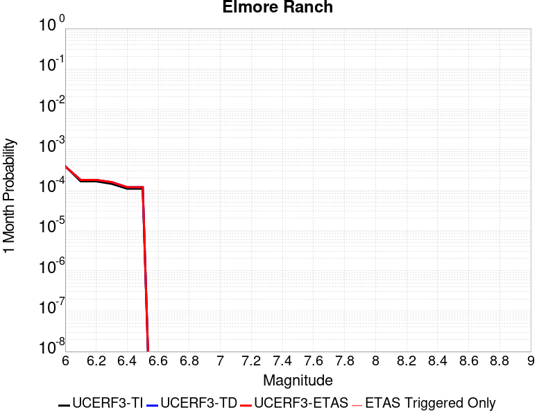 |  |  |

| Magnitude | 1 wk TI Prob | 1 wk TD Prob | 1 wk ETAS Prob | 1 wk ETAS/TD Gain | 1 wk ETAS Triggered Only | 1 mo TI Prob | 1 mo TD Prob | 1 mo ETAS Prob | 1 mo ETAS/TD Gain | 1 mo ETAS Triggered Only | 1 yr TI Prob | 1 yr TD Prob | 1 yr ETAS Prob | 1 yr ETAS/TD Gain | 1 yr ETAS Triggered Only | 10 yr TI Prob | 10 yr TD Prob | 10 yr ETAS Prob | 10 yr ETAS/TD Gain | 10 yr ETAS Triggered Only |
|-----|-----|-----|-----|-----|-----|-----|-----|-----|-----|-----|-----|-----|-----|-----|-----|-----|-----|-----|-----|-----|
| 6.0 | 9.102099E-5 | 8.953848E-5 | 8.953848E-5 | 1.0 | 0.0 | 3.9003167E-4 | 3.836898E-4 | 3.836898E-4 | 1.0 | 0.0 | 0.0047383 | 0.004662132 | 0.0046720854 | 1.0021349 | 1.0E-5 | 0.046385348 | 0.04583787 | 0.045847416 | 1.0002081 | 1.0E-5 |
| 6.1 | 3.8306698E-5 | 4.14921E-5 | 4.14921E-5 | 1.0 | 0.0 | 1.6416123E-4 | 1.7781362E-4 | 1.7781362E-4 | 1.0 | 0.0 | 0.0019968306 | 0.0021632186 | 0.0021632186 | 1.0 | 0.0 | 0.019789828 | 0.021595007 | 0.021595007 | 1.0 | 0.0 |
| 6.2 | 3.8306698E-5 | 4.14921E-5 | 4.14921E-5 | 1.0 | 0.0 | 1.6416123E-4 | 1.7781362E-4 | 1.7781362E-4 | 1.0 | 0.0 | 0.0019968306 | 0.0021632186 | 0.0021632186 | 1.0 | 0.0 | 0.019789828 | 0.021595007 | 0.021595007 | 1.0 | 0.0 |
| 6.3 | 3.3197924E-5 | 3.6550366E-5 | 3.6550366E-5 | 1.0 | 0.0 | 1.4226905E-4 | 1.56639E-4 | 1.56639E-4 | 1.0 | 0.0 | 0.0017307495 | 0.0019059771 | 0.0019059771 | 1.0 | 0.0 | 0.017173318 | 0.019057386 | 0.019057386 | 1.0 | 0.0 |
| 6.4 | 2.5148964E-5 | 2.7420736E-5 | 2.7420736E-5 | 1.0 | 0.0 | 1.0777682E-4 | 1.17515796E-4 | 1.17515796E-4 | 1.0 | 0.0 | 0.0013113929 | 0.0014304637 | 0.0014304637 | 1.0 | 0.0 | 0.01303681 | 0.014365338 | 0.014365338 | 1.0 | 0.0 |
| 6.5 | 2.5148964E-5 | 2.7420736E-5 | 2.7420736E-5 | 1.0 | 0.0 | 1.0777682E-4 | 1.17515796E-4 | 1.17515796E-4 | 1.0 | 0.0 | 0.0013113929 | 0.0014304637 | 0.0014304637 | 1.0 | 0.0 | 0.01303681 | 0.014365338 | 0.014365338 | 1.0 | 0.0 |

## Palos Verdes
*[(top)](#table-of-contents)*

| 1 Week | 1 Month | 1 Year | 10 Year |
|-----|-----|-----|-----|
|  |  | 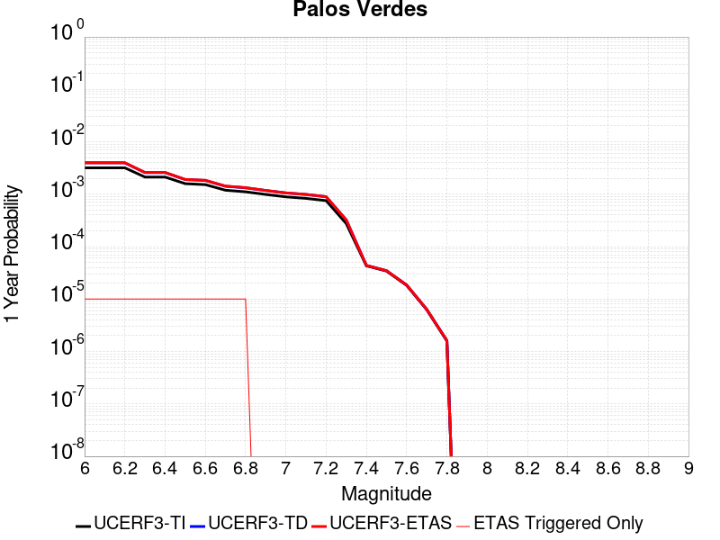 |  |

| Magnitude | 1 wk TI Prob | 1 wk TD Prob | 1 wk ETAS Prob | 1 wk ETAS/TD Gain | 1 wk ETAS Triggered Only | 1 mo TI Prob | 1 mo TD Prob | 1 mo ETAS Prob | 1 mo ETAS/TD Gain | 1 mo ETAS Triggered Only | 1 yr TI Prob | 1 yr TD Prob | 1 yr ETAS Prob | 1 yr ETAS/TD Gain | 1 yr ETAS Triggered Only | 10 yr TI Prob | 10 yr TD Prob | 10 yr ETAS Prob | 10 yr ETAS/TD Gain | 10 yr ETAS Triggered Only |
|-----|-----|-----|-----|-----|-----|-----|-----|-----|-----|-----|-----|-----|-----|-----|-----|-----|-----|-----|-----|-----|
| 6.0 | 6.126063E-5 | 7.622572E-5 | 8.622496E-5 | 1.1311793 | 1.0E-5 | 2.6251914E-4 | 3.266441E-4 | 3.3664083E-4 | 1.0306044 | 1.0E-5 | 0.0031914865 | 0.0039701737 | 0.003980134 | 1.0025088 | 1.0E-5 | 0.031460393 | 0.03904909 | 0.039058696 | 1.000246 | 1.0E-5 |
| 6.1 | 6.126063E-5 | 7.622572E-5 | 8.622496E-5 | 1.1311793 | 1.0E-5 | 2.6251914E-4 | 3.266441E-4 | 3.3664083E-4 | 1.0306044 | 1.0E-5 | 0.0031914865 | 0.0039701737 | 0.003980134 | 1.0025088 | 1.0E-5 | 0.031460393 | 0.03904909 | 0.039058696 | 1.000246 | 1.0E-5 |
| 6.2 | 6.126063E-5 | 7.622572E-5 | 8.622496E-5 | 1.1311793 | 1.0E-5 | 2.6251914E-4 | 3.266441E-4 | 3.3664083E-4 | 1.0306044 | 1.0E-5 | 0.0031914865 | 0.0039701737 | 0.003980134 | 1.0025088 | 1.0E-5 | 0.031460393 | 0.03904909 | 0.039058696 | 1.000246 | 1.0E-5 |
| 6.3 | 4.0838047E-5 | 4.9749007E-5 | 5.974851E-5 | 1.200999 | 1.0E-5 | 1.7500846E-4 | 2.1319388E-4 | 2.2319175E-4 | 1.0468956 | 1.0E-5 | 0.0021286458 | 0.002592754 | 0.0026027283 | 1.0038469 | 1.0E-5 | 0.021083709 | 0.025646746 | 0.02565649 | 1.0003799 | 1.0E-5 |
| 6.4 | 4.0838047E-5 | 4.9749007E-5 | 5.974851E-5 | 1.200999 | 1.0E-5 | 1.7500846E-4 | 2.1319388E-4 | 2.2319175E-4 | 1.0468956 | 1.0E-5 | 0.0021286458 | 0.002592754 | 0.0026027283 | 1.0038469 | 1.0E-5 | 0.021083709 | 0.025646746 | 0.02565649 | 1.0003799 | 1.0E-5 |
| 6.5 | 3.0512005E-5 | 3.6561592E-5 | 4.656123E-5 | 1.273501 | 1.0E-5 | 1.3075917E-4 | 1.566838E-4 | 1.6668225E-4 | 1.0638129 | 1.0E-5 | 0.0015908304 | 0.001906072 | 0.001916053 | 1.0052364 | 1.0E-5 | 0.015794903 | 0.018909173 | 0.018918984 | 1.0005188 | 1.0E-5 |
| 6.6 | 2.9255087E-5 | 3.5154393E-5 | 4.515404E-5 | 1.2844495 | 1.0E-5 | 1.2537291E-4 | 1.5065364E-4 | 1.6065213E-4 | 1.0663674 | 1.0E-5 | 0.0015253464 | 0.0018327782 | 0.0018427599 | 1.0054462 | 1.0E-5 | 0.015149189 | 0.018188244 | 0.018198062 | 1.0005398 | 1.0E-5 |
| 6.7 | 2.287198E-5 | 2.724828E-5 | 3.7248006E-5 | 1.3669857 | 1.0E-5 | 9.801909E-5 | 1.16773626E-4 | 1.2677246E-4 | 1.0856258 | 1.0E-5 | 0.001192729 | 0.0014208833 | 0.0014308692 | 1.0070279 | 1.0E-5 | 0.011863477 | 0.014127217 | 0.014137076 | 1.0006979 | 1.0E-5 |
| 6.8 | 2.1325764E-5 | 2.5431878E-5 | 3.5431625E-5 | 1.3931973 | 1.0E-5 | 9.139293E-5 | 1.0898972E-4 | 1.18988624E-4 | 1.0917418 | 1.0E-5 | 0.001112141 | 0.0013262323 | 0.001336219 | 1.0075302 | 1.0E-5 | 0.011065915 | 0.013192211 | 0.01320208 | 1.000748 | 1.0E-5 |
| 6.9 | 1.9009392E-5 | 2.2613547E-5 | 2.2613547E-5 | 1.0 | 0.0 | 8.1466285E-5 | 9.6912096E-5 | 9.6912096E-5 | 1.0 | 0.0 | 9.914007E-4 | 0.0011793535 | 0.0011793535 | 1.0 | 0.0 | 0.009869894 | 0.011739633 | 0.011739633 | 1.0 | 0.0 |
| 7.0 | 1.7098473E-5 | 2.0319356E-5 | 2.0319356E-5 | 1.0 | 0.0 | 7.3277115E-5 | 8.708052E-5 | 8.708052E-5 | 1.0 | 0.0 | 8.917837E-4 | 0.001059775 | 0.001059775 | 1.0 | 0.0 | 0.008882134 | 0.010555646 | 0.010555646 | 1.0 | 0.0 |
| 7.1 | 1.5982785E-5 | 1.899476E-5 | 1.899476E-5 | 1.0 | 0.0 | 6.849585E-5 | 8.1404054E-5 | 8.1404054E-5 | 1.0 | 0.0 | 8.336179E-4 | 9.907284E-4 | 9.907284E-4 | 1.0 | 0.0 | 0.008304977 | 0.009871479 | 0.009871479 | 1.0 | 0.0 |
| 7.2 | 1.4468002E-5 | 1.7197237E-5 | 1.7197237E-5 | 1.0 | 0.0 | 6.200425E-5 | 7.370083E-5 | 7.370083E-5 | 1.0 | 0.0 | 7.546402E-4 | 8.970222E-4 | 8.970222E-4 | 1.0 | 0.0 | 0.007520827 | 0.008942284 | 0.008942284 | 1.0 | 0.0 |
| 7.3 | 5.288233E-6 | 6.2036747E-6 | 6.2036747E-6 | 1.0 | 0.0 | 2.2663658E-5 | 2.6587102E-5 | 2.6587102E-5 | 1.0 | 0.0 | 2.7589512E-4 | 3.236848E-4 | 3.236848E-4 | 1.0 | 0.0 | 0.0027555283 | 0.0032355562 | 0.0032355562 | 1.0 | 0.0 |
| 7.4 | 8.279556E-7 | 8.408347E-7 | 8.408347E-7 | 1.0 | 0.0 | 3.5483763E-6 | 3.6035726E-6 | 3.6035726E-6 | 1.0 | 0.0 | 4.3200624E-5 | 4.3872686E-5 | 4.3872686E-5 | 1.0 | 0.0 | 4.3192226E-4 | 4.3864746E-4 | 4.3864746E-4 | 1.0 | 0.0 |
| 7.5 | 6.559831E-7 | 6.667229E-7 | 6.667229E-7 | 1.0 | 0.0 | 2.8113532E-6 | 2.857381E-6 | 2.857381E-6 | 1.0 | 0.0 | 3.4227687E-5 | 3.4788125E-5 | 3.4788125E-5 | 1.0 | 0.0 | 3.4222414E-4 | 3.4783344E-4 | 3.4783344E-4 | 1.0 | 0.0 |
| 7.6 | 3.5018968E-7 | 3.5620027E-7 | 3.5620027E-7 | 1.0 | 0.0 | 1.500812E-6 | 1.526572E-6 | 1.526572E-6 | 1.0 | 0.0 | 1.8272232E-5 | 1.8585903E-5 | 1.8585903E-5 | 1.0 | 0.0 | 1.8270731E-4 | 1.8584808E-4 | 1.8584808E-4 | 1.0 | 0.0 |
| 7.7 | 1.1986104E-7 | 1.2198376E-7 | 1.2198376E-7 | 1.0 | 0.0 | 5.1369005E-7 | 5.2278745E-7 | 5.2278745E-7 | 1.0 | 0.0 | 6.2541585E-6 | 6.364919E-6 | 6.364919E-6 | 1.0 | 0.0 | 6.2539824E-5 | 6.364741E-5 | 6.364741E-5 | 1.0 | 0.0 |
| 7.8 | 3.0445005E-8 | 3.1027582E-8 | 3.1027582E-8 | 1.0 | 0.0 | 1.3047858E-7 | 1.3297536E-7 | 1.3297536E-7 | 1.0 | 0.0 | 1.5885756E-6 | 1.6189739E-6 | 1.6189739E-6 | 1.0 | 0.0 | 1.5885644E-5 | 1.6189642E-5 | 1.6189642E-5 | 1.0 | 0.0 |

## Great Valley 01
*[(top)](#table-of-contents)*

| 1 Week | 1 Month | 1 Year | 10 Year |
|-----|-----|-----|-----|
|  | 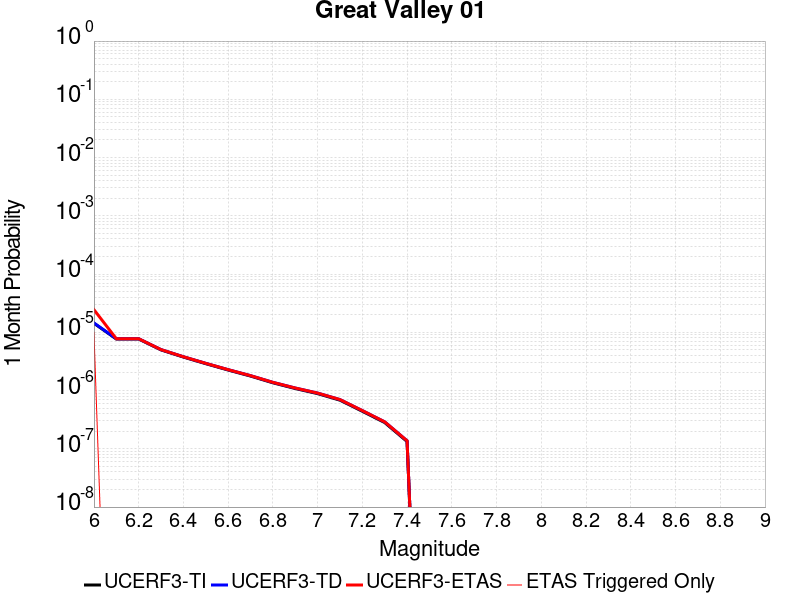 | 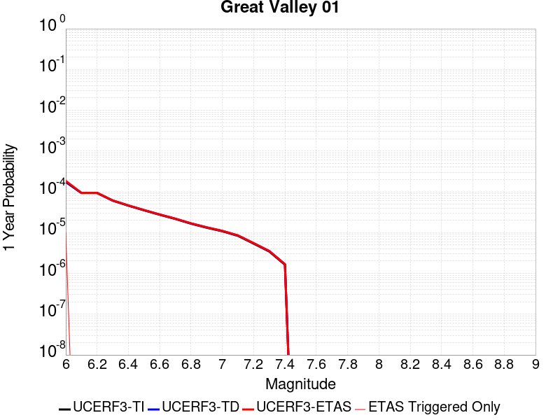 |  |

| Magnitude | 1 wk TI Prob | 1 wk TD Prob | 1 wk ETAS Prob | 1 wk ETAS/TD Gain | 1 wk ETAS Triggered Only | 1 mo TI Prob | 1 mo TD Prob | 1 mo ETAS Prob | 1 mo ETAS/TD Gain | 1 mo ETAS Triggered Only | 1 yr TI Prob | 1 yr TD Prob | 1 yr ETAS Prob | 1 yr ETAS/TD Gain | 1 yr ETAS Triggered Only | 10 yr TI Prob | 10 yr TD Prob | 10 yr ETAS Prob | 10 yr ETAS/TD Gain | 10 yr ETAS Triggered Only |
|-----|-----|-----|-----|-----|-----|-----|-----|-----|-----|-----|-----|-----|-----|-----|-----|-----|-----|-----|-----|-----|
| 6.0 | 3.3398478E-6 | 3.3762976E-6 | 1.3376264E-5 | 3.9618142 | 1.0E-5 | 1.4313555E-5 | 1.4469774E-5 | 2.446963E-5 | 1.6910858 | 1.0E-5 | 1.742536E-4 | 1.7615648E-4 | 1.8615472E-4 | 1.0567577 | 1.0E-5 | 0.0017411702 | 0.0017602886 | 0.001770271 | 1.0056709 | 1.0E-5 |
| 6.1 | 1.7919616E-6 | 1.8120251E-6 | 1.8120251E-6 | 1.0 | 0.0 | 7.679812E-6 | 7.7658E-6 | 7.7658E-6 | 1.0 | 0.0 | 9.349771E-5 | 9.454471E-5 | 9.454471E-5 | 1.0 | 0.0 | 9.345838E-4 | 9.4506424E-4 | 9.4506424E-4 | 1.0 | 0.0 |
| 6.2 | 1.7919616E-6 | 1.8120251E-6 | 1.8120251E-6 | 1.0 | 0.0 | 7.679812E-6 | 7.7658E-6 | 7.7658E-6 | 1.0 | 0.0 | 9.349771E-5 | 9.454471E-5 | 9.454471E-5 | 1.0 | 0.0 | 9.345838E-4 | 9.4506424E-4 | 9.4506424E-4 | 1.0 | 0.0 |
| 6.3 | 1.1636545E-6 | 1.17745E-6 | 1.17745E-6 | 1.0 | 0.0 | 4.9870814E-6 | 5.046205E-6 | 5.046205E-6 | 1.0 | 0.0 | 6.0716022E-5 | 6.143586E-5 | 6.143586E-5 | 1.0 | 0.0 | 6.069944E-4 | 6.1419315E-4 | 6.1419315E-4 | 1.0 | 0.0 |
| 6.4 | 8.770928E-7 | 8.881815E-7 | 8.881815E-7 | 1.0 | 0.0 | 3.7589639E-6 | 3.8064866E-6 | 3.8064866E-6 | 1.0 | 0.0 | 4.5764424E-5 | 4.634301E-5 | 4.634301E-5 | 1.0 | 0.0 | 4.5755E-4 | 4.633356E-4 | 4.633356E-4 | 1.0 | 0.0 |
| 6.5 | 6.753308E-7 | 6.8452607E-7 | 6.8452607E-7 | 1.0 | 0.0 | 2.8942718E-6 | 2.93368E-6 | 2.93368E-6 | 1.0 | 0.0 | 3.523719E-5 | 3.5716977E-5 | 3.5716977E-5 | 1.0 | 0.0 | 3.52316E-4 | 3.5711337E-4 | 3.5711337E-4 | 1.0 | 0.0 |
| 6.6 | 5.2531993E-7 | 5.331276E-7 | 5.331276E-7 | 1.0 | 0.0 | 2.251369E-6 | 2.2848305E-6 | 2.2848305E-6 | 1.0 | 0.0 | 2.7410075E-5 | 2.7817463E-5 | 2.7817463E-5 | 1.0 | 0.0 | 2.7406693E-4 | 2.7814036E-4 | 2.7814036E-4 | 1.0 | 0.0 |
| 6.7 | 4.1404678E-7 | 4.208609E-7 | 4.208609E-7 | 1.0 | 0.0 | 1.774485E-6 | 1.8036884E-6 | 1.8036884E-6 | 1.0 | 0.0 | 2.160414E-5 | 2.1959688E-5 | 2.1959688E-5 | 1.0 | 0.0 | 2.160204E-4 | 2.1957551E-4 | 2.1957551E-4 | 1.0 | 0.0 |
| 6.8 | 3.1713054E-7 | 3.2302975E-7 | 3.2302975E-7 | 1.0 | 0.0 | 1.3591301E-6 | 1.3844125E-6 | 1.3844125E-6 | 1.0 | 0.0 | 1.6547285E-5 | 1.6855092E-5 | 1.6855092E-5 | 1.0 | 0.0 | 1.6546051E-4 | 1.6853833E-4 | 1.6853833E-4 | 1.0 | 0.0 |
| 6.9 | 2.528054E-7 | 2.580374E-7 | 2.580374E-7 | 1.0 | 0.0 | 1.0834511E-6 | 1.1058742E-6 | 1.1058742E-6 | 1.0 | 0.0 | 1.3190938E-5 | 1.3463935E-5 | 1.3463935E-5 | 1.0 | 0.0 | 1.3190156E-4 | 1.3463132E-4 | 1.3463132E-4 | 1.0 | 0.0 |
| 7.0 | 2.0667689E-7 | 2.1131233E-7 | 2.1131233E-7 | 1.0 | 0.0 | 8.857578E-7 | 9.0562395E-7 | 9.0562395E-7 | 1.0 | 0.0 | 1.0784048E-5 | 1.1025917E-5 | 1.1025917E-5 | 1.0 | 0.0 | 1.0783524E-4 | 1.1025378E-4 | 1.1025378E-4 | 1.0 | 0.0 |
| 7.1 | 1.5951586E-7 | 1.6338481E-7 | 1.6338481E-7 | 1.0 | 0.0 | 6.8363926E-7 | 7.002204E-7 | 7.002204E-7 | 1.0 | 0.0 | 8.323276E-6 | 8.525151E-6 | 8.525151E-6 | 1.0 | 0.0 | 8.322964E-5 | 8.5248306E-5 | 8.5248306E-5 | 1.0 | 0.0 |
| 7.2 | 1.02912296E-7 | 1.0566137E-7 | 1.0566137E-7 | 1.0 | 0.0 | 4.4105263E-7 | 4.5283437E-7 | 4.5283437E-7 | 1.0 | 0.0 | 5.3698027E-6 | 5.5132446E-6 | 5.5132446E-6 | 1.0 | 0.0 | 5.3696727E-5 | 5.5131113E-5 | 5.5131113E-5 | 1.0 | 0.0 |
| 7.3 | 6.581281E-8 | 6.77207E-8 | 6.77207E-8 | 1.0 | 0.0 | 2.8205488E-7 | 2.9023153E-7 | 2.9023153E-7 | 1.0 | 0.0 | 3.4340128E-6 | 3.5335634E-6 | 3.5335634E-6 | 1.0 | 0.0 | 3.4339595E-5 | 3.533509E-5 | 3.533509E-5 | 1.0 | 0.0 |
| 7.4 | 3.112171E-8 | 3.2068368E-8 | 3.2068368E-8 | 1.0 | 0.0 | 1.3337875E-7 | 1.3743585E-7 | 1.3743585E-7 | 1.0 | 0.0 | 1.6238852E-6 | 1.6732803E-6 | 1.6732803E-6 | 1.0 | 0.0 | 1.6238733E-5 | 1.6732685E-5 | 1.6732685E-5 | 1.0 | 0.0 |

## Pitas Point (Lower)-Montalvo
*[(top)](#table-of-contents)*

| 1 Week | 1 Month | 1 Year | 10 Year |
|-----|-----|-----|-----|
|  |  |  |  |

| Magnitude | 1 wk TI Prob | 1 wk TD Prob | 1 wk ETAS Prob | 1 wk ETAS/TD Gain | 1 wk ETAS Triggered Only | 1 mo TI Prob | 1 mo TD Prob | 1 mo ETAS Prob | 1 mo ETAS/TD Gain | 1 mo ETAS Triggered Only | 1 yr TI Prob | 1 yr TD Prob | 1 yr ETAS Prob | 1 yr ETAS/TD Gain | 1 yr ETAS Triggered Only | 10 yr TI Prob | 10 yr TD Prob | 10 yr ETAS Prob | 10 yr ETAS/TD Gain | 10 yr ETAS Triggered Only |
|-----|-----|-----|-----|-----|-----|-----|-----|-----|-----|-----|-----|-----|-----|-----|-----|-----|-----|-----|-----|-----|
| 6.0 | 5.2543637E-6 | 4.8379025E-6 | 1.4837854E-5 | 3.0670013 | 1.0E-5 | 2.2518509E-5 | 2.0733705E-5 | 3.07335E-5 | 1.4822965 | 1.0E-5 | 2.7412834E-4 | 2.5240393E-4 | 2.6240142E-4 | 1.0396091 | 1.0E-5 | 0.0027379042 | 0.0025212052 | 0.00253118 | 1.0039563 | 1.0E-5 |
| 6.1 | 5.2543637E-6 | 4.8379025E-6 | 1.4837854E-5 | 3.0670013 | 1.0E-5 | 2.2518509E-5 | 2.0733705E-5 | 3.07335E-5 | 1.4822965 | 1.0E-5 | 2.7412834E-4 | 2.5240393E-4 | 2.6240142E-4 | 1.0396091 | 1.0E-5 | 0.0027379042 | 0.0025212052 | 0.00253118 | 1.0039563 | 1.0E-5 |
| 6.2 | 5.2543637E-6 | 4.8379025E-6 | 1.4837854E-5 | 3.0670013 | 1.0E-5 | 2.2518509E-5 | 2.0733705E-5 | 3.07335E-5 | 1.4822965 | 1.0E-5 | 2.7412834E-4 | 2.5240393E-4 | 2.6240142E-4 | 1.0396091 | 1.0E-5 | 0.0027379042 | 0.0025212052 | 0.00253118 | 1.0039563 | 1.0E-5 |
| 6.3 | 5.2543637E-6 | 4.8379025E-6 | 1.4837854E-5 | 3.0670013 | 1.0E-5 | 2.2518509E-5 | 2.0733705E-5 | 3.07335E-5 | 1.4822965 | 1.0E-5 | 2.7412834E-4 | 2.5240393E-4 | 2.6240142E-4 | 1.0396091 | 1.0E-5 | 0.0027379042 | 0.0025212052 | 0.00253118 | 1.0039563 | 1.0E-5 |
| 6.4 | 5.2543637E-6 | 4.8379025E-6 | 1.4837854E-5 | 3.0670013 | 1.0E-5 | 2.2518509E-5 | 2.0733705E-5 | 3.07335E-5 | 1.4822965 | 1.0E-5 | 2.7412834E-4 | 2.5240393E-4 | 2.6240142E-4 | 1.0396091 | 1.0E-5 | 0.0027379042 | 0.0025212052 | 0.00253118 | 1.0039563 | 1.0E-5 |
| 6.5 | 5.2543637E-6 | 4.8379025E-6 | 1.4837854E-5 | 3.0670013 | 1.0E-5 | 2.2518509E-5 | 2.0733705E-5 | 3.07335E-5 | 1.4822965 | 1.0E-5 | 2.7412834E-4 | 2.5240393E-4 | 2.6240142E-4 | 1.0396091 | 1.0E-5 | 0.0027379042 | 0.0025212052 | 0.00253118 | 1.0039563 | 1.0E-5 |
| 6.6 | 5.2543637E-6 | 4.8379025E-6 | 1.4837854E-5 | 3.0670013 | 1.0E-5 | 2.2518509E-5 | 2.0733705E-5 | 3.07335E-5 | 1.4822965 | 1.0E-5 | 2.7412834E-4 | 2.5240393E-4 | 2.6240142E-4 | 1.0396091 | 1.0E-5 | 0.0027379042 | 0.0025212052 | 0.00253118 | 1.0039563 | 1.0E-5 |
| 6.7 | 5.2543637E-6 | 4.8379025E-6 | 1.4837854E-5 | 3.0670013 | 1.0E-5 | 2.2518509E-5 | 2.0733705E-5 | 3.07335E-5 | 1.4822965 | 1.0E-5 | 2.7412834E-4 | 2.5240393E-4 | 2.6240142E-4 | 1.0396091 | 1.0E-5 | 0.0027379042 | 0.0025212052 | 0.00253118 | 1.0039563 | 1.0E-5 |
| 6.8 | 5.2543637E-6 | 4.8379025E-6 | 1.4837854E-5 | 3.0670013 | 1.0E-5 | 2.2518509E-5 | 2.0733705E-5 | 3.07335E-5 | 1.4822965 | 1.0E-5 | 2.7412834E-4 | 2.5240393E-4 | 2.6240142E-4 | 1.0396091 | 1.0E-5 | 0.0027379042 | 0.0025212052 | 0.00253118 | 1.0039563 | 1.0E-5 |
| 6.9 | 5.2543637E-6 | 4.8379025E-6 | 1.4837854E-5 | 3.0670013 | 1.0E-5 | 2.2518509E-5 | 2.0733705E-5 | 3.07335E-5 | 1.4822965 | 1.0E-5 | 2.7412834E-4 | 2.5240393E-4 | 2.6240142E-4 | 1.0396091 | 1.0E-5 | 0.0027379042 | 0.0025212052 | 0.00253118 | 1.0039563 | 1.0E-5 |
| 7.0 | 5.2543637E-6 | 4.8379025E-6 | 1.4837854E-5 | 3.0670013 | 1.0E-5 | 2.2518509E-5 | 2.0733705E-5 | 3.07335E-5 | 1.4822965 | 1.0E-5 | 2.7412834E-4 | 2.5240393E-4 | 2.6240142E-4 | 1.0396091 | 1.0E-5 | 0.0027379042 | 0.0025212052 | 0.00253118 | 1.0039563 | 1.0E-5 |
| 7.1 | 5.2543637E-6 | 4.8379025E-6 | 1.4837854E-5 | 3.0670013 | 1.0E-5 | 2.2518509E-5 | 2.0733705E-5 | 3.07335E-5 | 1.4822965 | 1.0E-5 | 2.7412834E-4 | 2.5240393E-4 | 2.6240142E-4 | 1.0396091 | 1.0E-5 | 0.0027379042 | 0.0025212052 | 0.00253118 | 1.0039563 | 1.0E-5 |
| 7.2 | 5.2458695E-6 | 4.8290563E-6 | 1.4829008E-5 | 3.070788 | 1.0E-5 | 2.2482105E-5 | 2.0695794E-5 | 3.0695588E-5 | 1.4831799 | 1.0E-5 | 2.7368523E-4 | 2.5194246E-4 | 2.6193995E-4 | 1.0396816 | 1.0E-5 | 0.0027334841 | 0.002516601 | 0.0025265757 | 1.0039636 | 1.0E-5 |
| 7.3 | 5.22665E-6 | 4.8089737E-6 | 1.4808926E-5 | 3.0794358 | 1.0E-5 | 2.2399736E-5 | 2.0609727E-5 | 3.060952E-5 | 1.4851978 | 1.0E-5 | 2.7268266E-4 | 2.5089484E-4 | 2.6089232E-4 | 1.0398474 | 1.0E-5 | 0.002723483 | 0.0025061483 | 0.0025161232 | 1.0039802 | 1.0E-5 |
| 7.4 | 5.210642E-6 | 4.7921862E-6 | 1.4792138E-5 | 3.0867202 | 1.0E-5 | 2.233113E-5 | 2.053778E-5 | 3.0537576E-5 | 1.4868976 | 1.0E-5 | 2.718476E-4 | 2.500191E-4 | 2.600166E-4 | 1.039987 | 1.0E-5 | 0.002715153 | 0.0024974106 | 0.0025073856 | 1.0039941 | 1.0E-5 |
| 7.5 | 5.1226016E-6 | 4.7000726E-6 | 1.47000255E-5 | 3.1276166 | 1.0E-5 | 2.1953823E-5 | 2.0143016E-5 | 3.0142814E-5 | 1.49644 | 1.0E-5 | 2.67255E-4 | 2.4521392E-4 | 2.5521146E-4 | 1.0407708 | 1.0E-5 | 0.0026693381 | 0.002449465 | 0.0024594406 | 1.0040725 | 1.0E-5 |
| 7.6 | 4.8796987E-6 | 4.4449725E-6 | 1.4444928E-5 | 3.2497227 | 1.0E-5 | 2.0912828E-5 | 1.9049745E-5 | 2.9049555E-5 | 1.5249314 | 1.0E-5 | 2.5458392E-4 | 2.3190626E-4 | 2.4190394E-4 | 1.0431108 | 1.0E-5 | 0.0025429246 | 0.0023166733 | 0.00232665 | 1.0043066 | 1.0E-5 |
| 7.7 | 4.0834398E-6 | 3.6091444E-6 | 1.36091085E-5 | 3.7707298 | 1.0E-5 | 1.7500339E-5 | 1.546767E-5 | 2.5467516E-5 | 1.6464998 | 1.0E-5 | 2.1304579E-4 | 1.8830286E-4 | 1.9830097E-4 | 1.0530959 | 1.0E-5 | 0.0021284167 | 0.0018814567 | 0.0018914379 | 1.005305 | 1.0E-5 |
| 7.8 | 2.5445438E-6 | 2.1212566E-6 | 2.1212566E-6 | 1.0 | 0.0 | 1.0905142E-5 | 9.091068E-6 | 9.091068E-6 | 1.0 | 0.0 | 1.3276201E-4 | 1.1067818E-4 | 1.1067818E-4 | 1.0 | 0.0 | 0.0013268272 | 0.0011062352 | 0.0011062352 | 1.0 | 0.0 |
| 7.9 | 4.1677114E-7 | 3.3294015E-7 | 3.3294015E-7 | 1.0 | 0.0 | 1.7861609E-6 | 1.4268857E-6 | 1.4268857E-6 | 1.0 | 0.0 | 2.1746291E-5 | 1.7372196E-5 | 1.7372196E-5 | 1.0 | 0.0 | 2.1744163E-4 | 1.737087E-4 | 1.737087E-4 | 1.0 | 0.0 |
| 8.0 | 7.791402E-9 | 5.6836056E-9 | 5.6836056E-9 | 1.0 | 0.0 | 3.3391725E-8 | 2.4358311E-8 | 2.4358311E-8 | 1.0 | 0.0 | 4.0654416E-7 | 2.965624E-7 | 2.965624E-7 | 1.0 | 0.0 | 4.065434E-6 | 2.9656223E-6 | 2.9656223E-6 | 1.0 | 0.0 |

## Elsinore (Coyote Mountains)
*[(top)](#table-of-contents)*

| 1 Week | 1 Month | 1 Year | 10 Year |
|-----|-----|-----|-----|
|  |  |  |  |

| Magnitude | 1 wk TI Prob | 1 wk TD Prob | 1 wk ETAS Prob | 1 wk ETAS/TD Gain | 1 wk ETAS Triggered Only | 1 mo TI Prob | 1 mo TD Prob | 1 mo ETAS Prob | 1 mo ETAS/TD Gain | 1 mo ETAS Triggered Only | 1 yr TI Prob | 1 yr TD Prob | 1 yr ETAS Prob | 1 yr ETAS/TD Gain | 1 yr ETAS Triggered Only | 10 yr TI Prob | 10 yr TD Prob | 10 yr ETAS Prob | 10 yr ETAS/TD Gain | 10 yr ETAS Triggered Only |
|-----|-----|-----|-----|-----|-----|-----|-----|-----|-----|-----|-----|-----|-----|-----|-----|-----|-----|-----|-----|-----|
| 6.0 | 4.20513E-5 | 4.8630944E-5 | 4.8630944E-5 | 1.0 | 0.0 | 1.8020741E-4 | 2.0840492E-4 | 2.0840492E-4 | 1.0 | 0.0 | 0.0021918174 | 0.0025349057 | 0.0025448804 | 1.0039349 | 1.0E-5 | 0.021703249 | 0.025111204 | 0.025120951 | 1.0003883 | 1.0E-5 |
| 6.1 | 4.20513E-5 | 4.8630944E-5 | 4.8630944E-5 | 1.0 | 0.0 | 1.8020741E-4 | 2.0840492E-4 | 2.0840492E-4 | 1.0 | 0.0 | 0.0021918174 | 0.0025349057 | 0.0025448804 | 1.0039349 | 1.0E-5 | 0.021703249 | 0.025111204 | 0.025120951 | 1.0003883 | 1.0E-5 |
| 6.2 | 2.3413893E-5 | 2.4695422E-5 | 2.4695422E-5 | 1.0 | 0.0 | 1.0034139E-4 | 1.0583377E-4 | 1.0583377E-4 | 1.0 | 0.0 | 0.0012209718 | 0.0012878523 | 0.0012978393 | 1.0077549 | 1.0E-5 | 0.012142851 | 0.012812569 | 0.012822441 | 1.0007704 | 1.0E-5 |
| 6.3 | 2.3413893E-5 | 2.4695422E-5 | 2.4695422E-5 | 1.0 | 0.0 | 1.0034139E-4 | 1.0583377E-4 | 1.0583377E-4 | 1.0 | 0.0 | 0.0012209718 | 0.0012878523 | 0.0012978393 | 1.0077549 | 1.0E-5 | 0.012142851 | 0.012812569 | 0.012822441 | 1.0007704 | 1.0E-5 |
| 6.4 | 1.6894814E-5 | 1.6568214E-5 | 1.6568214E-5 | 1.0 | 0.0 | 7.240433E-5 | 7.100491E-5 | 7.100491E-5 | 1.0 | 0.0 | 8.811662E-4 | 8.641788E-4 | 8.641788E-4 | 1.0 | 0.0 | 0.0087768035 | 0.008611842 | 0.008611842 | 1.0 | 0.0 |
| 6.5 | 1.6894814E-5 | 1.6568214E-5 | 1.6568214E-5 | 1.0 | 0.0 | 7.240433E-5 | 7.100491E-5 | 7.100491E-5 | 1.0 | 0.0 | 8.811662E-4 | 8.641788E-4 | 8.641788E-4 | 1.0 | 0.0 | 0.0087768035 | 0.008611842 | 0.008611842 | 1.0 | 0.0 |
| 6.6 | 1.1910969E-5 | 1.0530538E-5 | 1.0530538E-5 | 1.0 | 0.0 | 5.1046012E-5 | 4.513017E-5 | 4.513017E-5 | 1.0 | 0.0 | 6.21308E-4 | 5.493346E-4 | 5.493346E-4 | 1.0 | 0.0 | 0.0061957375 | 0.0054810685 | 0.0054810685 | 1.0 | 0.0 |
| 6.7 | 9.1486E-6 | 7.2026473E-6 | 7.2026473E-6 | 1.0 | 0.0 | 3.9207694E-5 | 3.0868145E-5 | 3.0868145E-5 | 1.0 | 0.0 | 4.7724912E-4 | 3.7575865E-4 | 3.7575865E-4 | 1.0 | 0.0 | 0.0047622547 | 0.0037516125 | 0.0037516125 | 1.0 | 0.0 |
| 6.8 | 7.90441E-6 | 5.7288153E-6 | 5.7288153E-6 | 1.0 | 0.0 | 3.3875604E-5 | 2.4551842E-5 | 2.4551842E-5 | 1.0 | 0.0 | 4.1235742E-4 | 2.9887896E-4 | 2.9887896E-4 | 1.0 | 0.0 | 0.0041159308 | 0.0029848986 | 0.0029848986 | 1.0 | 0.0 |
| 6.9 | 7.77015E-6 | 5.5827695E-6 | 5.5827695E-6 | 1.0 | 0.0 | 3.3300217E-5 | 2.3925944E-5 | 2.3925944E-5 | 1.0 | 0.0 | 4.0535472E-4 | 2.912607E-4 | 2.912607E-4 | 1.0 | 0.0 | 0.004046161 | 0.0029089167 | 0.0029089167 | 1.0 | 0.0 |
| 7.0 | 7.675798E-6 | 5.4796283E-6 | 5.4796283E-6 | 1.0 | 0.0 | 3.289586E-5 | 2.3483917E-5 | 2.3483917E-5 | 1.0 | 0.0 | 4.004335E-4 | 2.8588044E-4 | 2.8588044E-4 | 1.0 | 0.0 | 0.003997127 | 0.0028552532 | 0.0028552532 | 1.0 | 0.0 |
| 7.1 | 7.447814E-6 | 5.2385003E-6 | 5.2385003E-6 | 1.0 | 0.0 | 3.191881E-5 | 2.245053E-5 | 2.245053E-5 | 1.0 | 0.0 | 3.8854225E-4 | 2.7330214E-4 | 2.7330214E-4 | 1.0 | 0.0 | 0.003878636 | 0.0027297847 | 0.0027297847 | 1.0 | 0.0 |
| 7.2 | 7.128185E-6 | 4.905146E-6 | 4.905146E-6 | 1.0 | 0.0 | 3.0549007E-5 | 2.1021891E-5 | 2.1021891E-5 | 1.0 | 0.0 | 3.7187067E-4 | 2.5591266E-4 | 2.5591266E-4 | 1.0 | 0.0 | 0.00371249 | 0.002556298 | 0.002556298 | 1.0 | 0.0 |
| 7.3 | 7.0913875E-6 | 4.873821E-6 | 4.873821E-6 | 1.0 | 0.0 | 3.0391306E-5 | 2.0887644E-5 | 2.0887644E-5 | 1.0 | 0.0 | 3.6995133E-4 | 2.542786E-4 | 2.542786E-4 | 1.0 | 0.0 | 0.0036933604 | 0.0025399947 | 0.0025399947 | 1.0 | 0.0 |
| 7.4 | 7.051521E-6 | 4.837673E-6 | 4.837673E-6 | 1.0 | 0.0 | 3.0220453E-5 | 2.0732725E-5 | 2.0732725E-5 | 1.0 | 0.0 | 3.6787192E-4 | 2.5239287E-4 | 2.5239287E-4 | 1.0 | 0.0 | 0.0036726352 | 0.0025211805 | 0.0025211805 | 1.0 | 0.0 |
| 7.5 | 6.910666E-6 | 4.7332255E-6 | 4.7332255E-6 | 1.0 | 0.0 | 2.9616802E-5 | 2.02851E-5 | 2.02851E-5 | 1.0 | 0.0 | 3.605249E-4 | 2.4694428E-4 | 2.4694428E-4 | 1.0 | 0.0 | 0.0035994058 | 0.002466817 | 0.002466817 | 1.0 | 0.0 |
| 7.6 | 6.341753E-6 | 4.306345E-6 | 4.306345E-6 | 1.0 | 0.0 | 2.7178658E-5 | 1.8455641E-5 | 1.8455641E-5 | 1.0 | 0.0 | 3.3084993E-4 | 2.2467543E-4 | 2.2467543E-4 | 1.0 | 0.0 | 0.0033035777 | 0.002244598 | 0.002244598 | 1.0 | 0.0 |
| 7.7 | 3.9205916E-6 | 2.2437468E-6 | 2.2437468E-6 | 1.0 | 0.0 | 1.6802427E-5 | 9.616027E-6 | 9.616027E-6 | 1.0 | 0.0 | 2.0455034E-4 | 1.17069576E-4 | 1.17069576E-4 | 1.0 | 0.0 | 0.0020436216 | 0.001170152 | 0.001170152 | 1.0 | 0.0 |
| 7.8 | 2.0846227E-7 | 8.4853966E-8 | 8.4853966E-8 | 1.0 | 0.0 | 8.9340944E-7 | 3.6365984E-7 | 3.6365984E-7 | 1.0 | 0.0 | 1.0877206E-5 | 4.427553E-6 | 4.427553E-6 | 1.0 | 0.0 | 1.0876673E-4 | 4.4274973E-5 | 4.4274973E-5 | 1.0 | 0.0 |
| 7.9 | 4.4969806E-9 | 2.269088E-9 | 2.269088E-9 | 1.0 | 0.0 | 1.9272775E-8 | 9.724664E-9 | 9.724664E-9 | 1.0 | 0.0 | 2.3464601E-7 | 1.1839777E-7 | 1.1839777E-7 | 1.0 | 0.0 | 2.3464577E-6 | 1.1839772E-6 | 1.1839772E-6 | 1.0 | 0.0 |

## Hartley Springs 2011 CFM
*[(top)](#table-of-contents)*

| 1 Week | 1 Month | 1 Year | 10 Year |
|-----|-----|-----|-----|
|  |  |  |  |

| Magnitude | 1 wk TI Prob | 1 wk TD Prob | 1 wk ETAS Prob | 1 wk ETAS/TD Gain | 1 wk ETAS Triggered Only | 1 mo TI Prob | 1 mo TD Prob | 1 mo ETAS Prob | 1 mo ETAS/TD Gain | 1 mo ETAS Triggered Only | 1 yr TI Prob | 1 yr TD Prob | 1 yr ETAS Prob | 1 yr ETAS/TD Gain | 1 yr ETAS Triggered Only | 10 yr TI Prob | 10 yr TD Prob | 10 yr ETAS Prob | 10 yr ETAS/TD Gain | 10 yr ETAS Triggered Only |
|-----|-----|-----|-----|-----|-----|-----|-----|-----|-----|-----|-----|-----|-----|-----|-----|-----|-----|-----|-----|-----|
| 6.0 | 1.4352418E-5 | 1.4434111E-5 | 1.4434111E-5 | 1.0 | 0.0 | 6.1508916E-5 | 6.185994E-5 | 6.185994E-5 | 1.0 | 0.0 | 7.486137E-4 | 7.5304887E-4 | 7.5304887E-4 | 1.0 | 0.0 | 0.007460968 | 0.007521092 | 0.0075310166 | 1.0013196 | 1.0E-5 |
| 6.1 | 1.4352418E-5 | 1.4434111E-5 | 1.4434111E-5 | 1.0 | 0.0 | 6.1508916E-5 | 6.185994E-5 | 6.185994E-5 | 1.0 | 0.0 | 7.486137E-4 | 7.5304887E-4 | 7.5304887E-4 | 1.0 | 0.0 | 0.007460968 | 0.007521092 | 0.0075310166 | 1.0013196 | 1.0E-5 |
| 6.2 | 1.4352418E-5 | 1.4434111E-5 | 1.4434111E-5 | 1.0 | 0.0 | 6.1508916E-5 | 6.185994E-5 | 6.185994E-5 | 1.0 | 0.0 | 7.486137E-4 | 7.5304887E-4 | 7.5304887E-4 | 1.0 | 0.0 | 0.007460968 | 0.007521092 | 0.0075310166 | 1.0013196 | 1.0E-5 |
| 6.3 | 1.4352418E-5 | 1.4434111E-5 | 1.4434111E-5 | 1.0 | 0.0 | 6.1508916E-5 | 6.185994E-5 | 6.185994E-5 | 1.0 | 0.0 | 7.486137E-4 | 7.5304887E-4 | 7.5304887E-4 | 1.0 | 0.0 | 0.007460968 | 0.007521092 | 0.0075310166 | 1.0013196 | 1.0E-5 |
| 6.4 | 1.4352418E-5 | 1.4434111E-5 | 1.4434111E-5 | 1.0 | 0.0 | 6.1508916E-5 | 6.185994E-5 | 6.185994E-5 | 1.0 | 0.0 | 7.486137E-4 | 7.5304887E-4 | 7.5304887E-4 | 1.0 | 0.0 | 0.007460968 | 0.007521092 | 0.0075310166 | 1.0013196 | 1.0E-5 |
| 6.5 | 1.2279858E-5 | 1.2133036E-5 | 1.2133036E-5 | 1.0 | 0.0 | 5.26269E-5 | 5.199858E-5 | 5.199858E-5 | 1.0 | 0.0 | 6.4054417E-4 | 6.33057E-4 | 6.33057E-4 | 1.0 | 0.0 | 0.0063870098 | 0.006328048 | 0.006337985 | 1.0015702 | 1.0E-5 |
| 6.6 | 1.2279858E-5 | 1.2133036E-5 | 1.2133036E-5 | 1.0 | 0.0 | 5.26269E-5 | 5.199858E-5 | 5.199858E-5 | 1.0 | 0.0 | 6.4054417E-4 | 6.33057E-4 | 6.33057E-4 | 1.0 | 0.0 | 0.0063870098 | 0.006328048 | 0.006337985 | 1.0015702 | 1.0E-5 |
| 6.7 | 2.1282601E-6 | 8.894127E-7 | 8.894127E-7 | 1.0 | 0.0 | 9.121083E-6 | 3.8117648E-6 | 3.8117648E-6 | 1.0 | 0.0 | 1.11043526E-4 | 4.6407506E-5 | 4.6407506E-5 | 1.0 | 0.0 | 0.0011098806 | 4.6400347E-4 | 4.6400347E-4 | 1.0 | 0.0 |
| 6.8 | 2.00516E-6 | 8.516916E-7 | 8.516916E-7 | 1.0 | 0.0 | 8.593515E-6 | 3.6501033E-6 | 3.6501033E-6 | 1.0 | 0.0 | 1.04621024E-4 | 4.443936E-5 | 4.443936E-5 | 1.0 | 0.0 | 0.0010457177 | 4.4432987E-4 | 4.4432987E-4 | 1.0 | 0.0 |
| 6.9 | 2.00516E-6 | 8.516916E-7 | 8.516916E-7 | 1.0 | 0.0 | 8.593515E-6 | 3.6501033E-6 | 3.6501033E-6 | 1.0 | 0.0 | 1.04621024E-4 | 4.443936E-5 | 4.443936E-5 | 1.0 | 0.0 | 0.0010457177 | 4.4432987E-4 | 4.4432987E-4 | 1.0 | 0.0 |
| 7.0 | 1.8366732E-6 | 8.2366813E-7 | 8.2366813E-7 | 1.0 | 0.0 | 7.871433E-6 | 3.5300031E-6 | 3.5300031E-6 | 1.0 | 0.0 | 9.583048E-5 | 4.2977194E-5 | 4.2977194E-5 | 1.0 | 0.0 | 9.5789164E-4 | 4.297139E-4 | 4.297139E-4 | 1.0 | 0.0 |
| 7.1 | 1.5097997E-6 | 7.1897E-7 | 7.1897E-7 | 1.0 | 0.0 | 6.470554E-6 | 3.0812978E-6 | 3.0812978E-6 | 1.0 | 0.0 | 7.877615E-5 | 3.7514397E-5 | 3.7514397E-5 | 1.0 | 0.0 | 7.874823E-4 | 3.7510434E-4 | 3.7510434E-4 | 1.0 | 0.0 |
| 7.2 | 1.3490993E-6 | 6.404769E-7 | 6.404769E-7 | 1.0 | 0.0 | 5.7818415E-6 | 2.7448996E-6 | 2.7448996E-6 | 1.0 | 0.0 | 7.0391645E-5 | 3.3418873E-5 | 3.3418873E-5 | 1.0 | 0.0 | 7.0369354E-4 | 3.3416142E-4 | 3.3416142E-4 | 1.0 | 0.0 |
| 7.3 | 7.900015E-7 | 4.0888176E-7 | 4.0888176E-7 | 1.0 | 0.0 | 3.3857161E-6 | 1.7523504E-6 | 1.7523504E-6 | 1.0 | 0.0 | 4.1220315E-5 | 2.1334865E-5 | 2.1334865E-5 | 1.0 | 0.0 | 4.121267E-4 | 2.1334866E-4 | 2.1334866E-4 | 1.0 | 0.0 |

## Big Lagoon - Bald Mtn 2011 CFM
*[(top)](#table-of-contents)*

| 1 Week | 1 Month | 1 Year | 10 Year |
|-----|-----|-----|-----|
|  |  |  |  |

| Magnitude | 1 wk TI Prob | 1 wk TD Prob | 1 wk ETAS Prob | 1 wk ETAS/TD Gain | 1 wk ETAS Triggered Only | 1 mo TI Prob | 1 mo TD Prob | 1 mo ETAS Prob | 1 mo ETAS/TD Gain | 1 mo ETAS Triggered Only | 1 yr TI Prob | 1 yr TD Prob | 1 yr ETAS Prob | 1 yr ETAS/TD Gain | 1 yr ETAS Triggered Only | 10 yr TI Prob | 10 yr TD Prob | 10 yr ETAS Prob | 10 yr ETAS/TD Gain | 10 yr ETAS Triggered Only |
|-----|-----|-----|-----|-----|-----|-----|-----|-----|-----|-----|-----|-----|-----|-----|-----|-----|-----|-----|-----|-----|
| 6.0 | 1.8699735E-5 | 1.985018E-5 | 2.9849982E-5 | 1.5037638 | 1.0E-5 | 8.013926E-5 | 8.5069645E-5 | 9.506879E-5 | 1.1175407 | 1.0E-5 | 9.752587E-4 | 0.0010352687 | 0.0010452583 | 1.0096493 | 1.0E-5 | 0.009709897 | 0.010308274 | 0.010318171 | 1.0009601 | 1.0E-5 |
| 6.1 | 1.8699735E-5 | 1.985018E-5 | 2.9849982E-5 | 1.5037638 | 1.0E-5 | 8.013926E-5 | 8.5069645E-5 | 9.506879E-5 | 1.1175407 | 1.0E-5 | 9.752587E-4 | 0.0010352687 | 0.0010452583 | 1.0096493 | 1.0E-5 | 0.009709897 | 0.010308274 | 0.010318171 | 1.0009601 | 1.0E-5 |
| 6.2 | 1.8699735E-5 | 1.985018E-5 | 2.9849982E-5 | 1.5037638 | 1.0E-5 | 8.013926E-5 | 8.5069645E-5 | 9.506879E-5 | 1.1175407 | 1.0E-5 | 9.752587E-4 | 0.0010352687 | 0.0010452583 | 1.0096493 | 1.0E-5 | 0.009709897 | 0.010308274 | 0.010318171 | 1.0009601 | 1.0E-5 |
| 6.3 | 1.8699735E-5 | 1.985018E-5 | 2.9849982E-5 | 1.5037638 | 1.0E-5 | 8.013926E-5 | 8.5069645E-5 | 9.506879E-5 | 1.1175407 | 1.0E-5 | 9.752587E-4 | 0.0010352687 | 0.0010452583 | 1.0096493 | 1.0E-5 | 0.009709897 | 0.010308274 | 0.010318171 | 1.0009601 | 1.0E-5 |
| 6.4 | 1.8699735E-5 | 1.985018E-5 | 2.9849982E-5 | 1.5037638 | 1.0E-5 | 8.013926E-5 | 8.5069645E-5 | 9.506879E-5 | 1.1175407 | 1.0E-5 | 9.752587E-4 | 0.0010352687 | 0.0010452583 | 1.0096493 | 1.0E-5 | 0.009709897 | 0.010308274 | 0.010318171 | 1.0009601 | 1.0E-5 |
| 6.5 | 1.8699735E-5 | 1.985018E-5 | 2.9849982E-5 | 1.5037638 | 1.0E-5 | 8.013926E-5 | 8.5069645E-5 | 9.506879E-5 | 1.1175407 | 1.0E-5 | 9.752587E-4 | 0.0010352687 | 0.0010452583 | 1.0096493 | 1.0E-5 | 0.009709897 | 0.010308274 | 0.010318171 | 1.0009601 | 1.0E-5 |
| 6.6 | 1.8699735E-5 | 1.985018E-5 | 2.9849982E-5 | 1.5037638 | 1.0E-5 | 8.013926E-5 | 8.5069645E-5 | 9.506879E-5 | 1.1175407 | 1.0E-5 | 9.752587E-4 | 0.0010352687 | 0.0010452583 | 1.0096493 | 1.0E-5 | 0.009709897 | 0.010308274 | 0.010318171 | 1.0009601 | 1.0E-5 |
| 6.7 | 1.8699735E-5 | 1.985018E-5 | 2.9849982E-5 | 1.5037638 | 1.0E-5 | 8.013926E-5 | 8.5069645E-5 | 9.506879E-5 | 1.1175407 | 1.0E-5 | 9.752587E-4 | 0.0010352687 | 0.0010452583 | 1.0096493 | 1.0E-5 | 0.009709897 | 0.010308274 | 0.010318171 | 1.0009601 | 1.0E-5 |
| 6.8 | 1.18505095E-5 | 1.2499804E-5 | 2.2499678E-5 | 1.8000026 | 1.0E-5 | 5.078691E-5 | 5.3569514E-5 | 6.356898E-5 | 1.1866634 | 1.0E-5 | 6.181552E-4 | 6.520185E-4 | 6.6201197E-4 | 1.015327 | 1.0E-5 | 0.006164385 | 0.0065015587 | 0.0065114936 | 1.0015281 | 1.0E-5 |
| 6.9 | 1.18505095E-5 | 1.2499804E-5 | 2.2499678E-5 | 1.8000026 | 1.0E-5 | 5.078691E-5 | 5.3569514E-5 | 6.356898E-5 | 1.1866634 | 1.0E-5 | 6.181552E-4 | 6.520185E-4 | 6.6201197E-4 | 1.015327 | 1.0E-5 | 0.006164385 | 0.0065015587 | 0.0065114936 | 1.0015281 | 1.0E-5 |
| 7.0 | 9.719786E-6 | 1.0235487E-5 | 1.0235487E-5 | 1.0 | 0.0 | 4.1655563E-5 | 4.386565E-5 | 4.386565E-5 | 1.0 | 0.0 | 5.0703844E-4 | 5.3393573E-4 | 5.3393573E-4 | 1.0 | 0.0 | 0.005058831 | 0.0053267754 | 0.0053267754 | 1.0 | 0.0 |
| 7.1 | 8.523418E-6 | 8.969463E-6 | 8.969463E-6 | 1.0 | 0.0 | 3.652842E-5 | 3.844E-5 | 3.844E-5 | 1.0 | 0.0 | 4.4464276E-4 | 4.6790804E-4 | 4.6790804E-4 | 1.0 | 0.0 | 0.0044375416 | 0.004669392 | 0.004669392 | 1.0 | 0.0 |
| 7.2 | 7.378894E-6 | 7.761112E-6 | 7.761112E-6 | 1.0 | 0.0 | 3.162345E-5 | 3.326149E-5 | 3.326149E-5 | 1.0 | 0.0 | 3.8494746E-4 | 4.048843E-4 | 4.048843E-4 | 1.0 | 0.0 | 0.0038428132 | 0.0040415623 | 0.0040415623 | 1.0 | 0.0 |
| 7.3 | 6.4640294E-6 | 6.7924434E-6 | 6.7924434E-6 | 1.0 | 0.0 | 2.7702688E-5 | 2.9110151E-5 | 2.9110151E-5 | 1.0 | 0.0 | 3.3722803E-4 | 3.5435913E-4 | 3.5435913E-4 | 1.0 | 0.0 | 0.0033671674 | 0.0035380109 | 0.0035380109 | 1.0 | 0.0 |
| 7.4 | 5.9959093E-6 | 6.2988E-6 | 6.2988E-6 | 1.0 | 0.0 | 2.5696501E-5 | 2.6994581E-5 | 2.6994581E-5 | 1.0 | 0.0 | 3.1280998E-4 | 3.2861007E-4 | 3.2861007E-4 | 1.0 | 0.0 | 0.0031237002 | 0.0032813034 | 0.0032813034 | 1.0 | 0.0 |
| 7.5 | 4.929265E-6 | 5.176396E-6 | 5.176396E-6 | 1.0 | 0.0 | 2.112525E-5 | 2.2184367E-5 | 2.2184367E-5 | 1.0 | 0.0 | 2.5716957E-4 | 2.700616E-4 | 2.700616E-4 | 1.0 | 0.0 | 0.0025687215 | 0.002697375 | 0.002697375 | 1.0 | 0.0 |
| 7.6 | 3.8982403E-6 | 4.0889267E-6 | 4.0889267E-6 | 1.0 | 0.0 | 1.6706637E-5 | 1.7523857E-5 | 1.7523857E-5 | 1.0 | 0.0 | 2.0338432E-4 | 2.1333233E-4 | 2.1333233E-4 | 1.0 | 0.0 | 0.0020319829 | 0.002131303 | 0.002131303 | 1.0 | 0.0 |
| 7.7 | 2.820968E-6 | 2.9572116E-6 | 2.9572116E-6 | 1.0 | 0.0 | 1.2089806E-5 | 1.2673704E-5 | 1.2673704E-5 | 1.0 | 0.0 | 1.4718344E-4 | 1.5429159E-4 | 1.5429159E-4 | 1.0 | 0.0 | 0.00147086 | 0.0015418624 | 0.0015418624 | 1.0 | 0.0 |
| 7.8 | 1.9314455E-6 | 2.0260186E-6 | 2.0260186E-6 | 1.0 | 0.0 | 8.277597E-6 | 8.682909E-6 | 8.682909E-6 | 1.0 | 0.0 | 1.0077508E-4 | 1.0570941E-4 | 1.0570941E-4 | 1.0 | 0.0 | 0.0010072939 | 0.0010566041 | 0.0010566041 | 1.0 | 0.0 |
| 7.9 | 4.9586197E-7 | 5.2189216E-7 | 5.2189216E-7 | 1.0 | 0.0 | 2.125121E-6 | 2.2366787E-6 | 2.2366787E-6 | 1.0 | 0.0 | 2.5873042E-5 | 2.7231245E-5 | 2.7231245E-5 | 1.0 | 0.0 | 2.5870028E-4 | 2.7228118E-4 | 2.7228118E-4 | 1.0 | 0.0 |

## East Huasna 2011 CFM
*[(top)](#table-of-contents)*

| 1 Week | 1 Month | 1 Year | 10 Year |
|-----|-----|-----|-----|
| 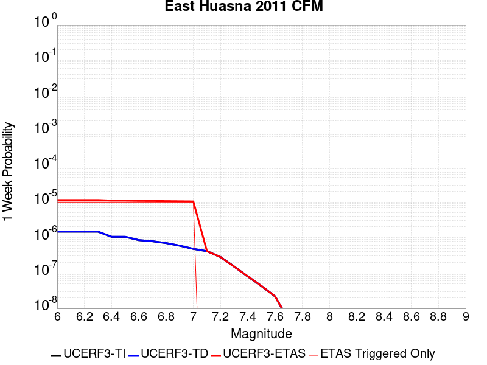 |  |  |  |

| Magnitude | 1 wk TI Prob | 1 wk TD Prob | 1 wk ETAS Prob | 1 wk ETAS/TD Gain | 1 wk ETAS Triggered Only | 1 mo TI Prob | 1 mo TD Prob | 1 mo ETAS Prob | 1 mo ETAS/TD Gain | 1 mo ETAS Triggered Only | 1 yr TI Prob | 1 yr TD Prob | 1 yr ETAS Prob | 1 yr ETAS/TD Gain | 1 yr ETAS Triggered Only | 10 yr TI Prob | 10 yr TD Prob | 10 yr ETAS Prob | 10 yr ETAS/TD Gain | 10 yr ETAS Triggered Only |
|-----|-----|-----|-----|-----|-----|-----|-----|-----|-----|-----|-----|-----|-----|-----|-----|-----|-----|-----|-----|-----|
| 6.0 | 1.4658423E-6 | 1.471566E-6 | 1.1471551E-5 | 7.795472 | 1.0E-5 | 6.282166E-6 | 6.3066964E-6 | 1.6306634E-5 | 2.585606 | 1.0E-5 | 7.6482684E-5 | 7.67814E-5 | 8.678063E-5 | 1.1302298 | 1.0E-5 | 7.645637E-4 | 7.6755567E-4 | 7.77548E-4 | 1.0130184 | 1.0E-5 |
| 6.1 | 1.4658423E-6 | 1.471566E-6 | 1.1471551E-5 | 7.795472 | 1.0E-5 | 6.282166E-6 | 6.3066964E-6 | 1.6306634E-5 | 2.585606 | 1.0E-5 | 7.6482684E-5 | 7.67814E-5 | 8.678063E-5 | 1.1302298 | 1.0E-5 | 7.645637E-4 | 7.6755567E-4 | 7.77548E-4 | 1.0130184 | 1.0E-5 |
| 6.2 | 1.4658423E-6 | 1.471566E-6 | 1.1471551E-5 | 7.795472 | 1.0E-5 | 6.282166E-6 | 6.3066964E-6 | 1.6306634E-5 | 2.585606 | 1.0E-5 | 7.6482684E-5 | 7.67814E-5 | 8.678063E-5 | 1.1302298 | 1.0E-5 | 7.645637E-4 | 7.6755567E-4 | 7.77548E-4 | 1.0130184 | 1.0E-5 |
| 6.3 | 1.4658423E-6 | 1.471566E-6 | 1.1471551E-5 | 7.795472 | 1.0E-5 | 6.282166E-6 | 6.3066964E-6 | 1.6306634E-5 | 2.585606 | 1.0E-5 | 7.6482684E-5 | 7.67814E-5 | 8.678063E-5 | 1.1302298 | 1.0E-5 | 7.645637E-4 | 7.6755567E-4 | 7.77548E-4 | 1.0130184 | 1.0E-5 |
| 6.4 | 1.0488257E-6 | 1.0527515E-6 | 1.1052741E-5 | 10.498908 | 1.0E-5 | 4.4949593E-6 | 4.5117845E-6 | 1.4511739E-5 | 3.216408 | 1.0E-5 | 5.472476E-5 | 5.492961E-5 | 6.492906E-5 | 1.1820412 | 1.0E-5 | 5.4711284E-4 | 5.491622E-4 | 5.591567E-4 | 1.0181996 | 1.0E-5 |
| 6.5 | 1.0488257E-6 | 1.0527515E-6 | 1.1052741E-5 | 10.498908 | 1.0E-5 | 4.4949593E-6 | 4.5117845E-6 | 1.4511739E-5 | 3.216408 | 1.0E-5 | 5.472476E-5 | 5.492961E-5 | 6.492906E-5 | 1.1820412 | 1.0E-5 | 5.4711284E-4 | 5.491622E-4 | 5.591567E-4 | 1.0181996 | 1.0E-5 |
| 6.6 | 8.463064E-7 | 8.4936323E-7 | 1.0849355E-5 | 12.773516 | 1.0E-5 | 3.6270226E-6 | 3.6401232E-6 | 1.3640087E-5 | 3.74715 | 1.0E-5 | 4.4158103E-5 | 4.4317607E-5 | 5.4317163E-5 | 1.225634 | 1.0E-5 | 4.414933E-4 | 4.4308856E-4 | 4.5308413E-4 | 1.0225588 | 1.0E-5 |
| 6.7 | 7.876149E-7 | 7.902533E-7 | 1.0790245E-5 | 13.6541605 | 1.0E-5 | 3.375488E-6 | 3.3867955E-6 | 1.3386762E-5 | 3.9526336 | 1.0E-5 | 4.109579E-5 | 4.1233463E-5 | 5.1233048E-5 | 1.2425115 | 1.0E-5 | 4.108819E-4 | 4.1225873E-4 | 4.222546E-4 | 1.0242466 | 1.0E-5 |
| 6.8 | 6.9940785E-7 | 7.0165777E-7 | 1.070165E-5 | 15.251952 | 1.0E-5 | 2.9974588E-6 | 3.0071012E-6 | 1.3007071E-5 | 4.325452 | 1.0E-5 | 3.649345E-5 | 3.6610847E-5 | 4.661048E-5 | 1.273133 | 1.0E-5 | 3.6487455E-4 | 3.6604863E-4 | 3.7604498E-4 | 1.0273088 | 1.0E-5 |
| 6.9 | 5.899658E-7 | 5.9155997E-7 | 1.0591554E-5 | 17.904448 | 1.0E-5 | 2.5284223E-6 | 2.5352545E-6 | 1.2535229E-5 | 4.9443674 | 1.0E-5 | 3.0783107E-5 | 3.086629E-5 | 4.086598E-5 | 1.323968 | 1.0E-5 | 3.0778843E-4 | 3.086203E-4 | 3.186172E-4 | 1.0323923 | 1.0E-5 |
| 7.0 | 4.793814E-7 | 4.803273E-7 | 1.0480322E-5 | 21.819128 | 1.0E-5 | 2.05449E-6 | 2.058544E-6 | 1.2058524E-5 | 5.8577924 | 1.0E-5 | 2.501313E-5 | 2.5062485E-5 | 3.5062236E-5 | 1.3989928 | 1.0E-5 | 2.5010316E-4 | 2.505968E-4 | 2.6059427E-4 | 1.0398947 | 1.0E-5 |
| 7.1 | 4.1256908E-7 | 4.129941E-7 | 4.129941E-7 | 1.0 | 0.0 | 1.768152E-6 | 1.7699736E-6 | 1.7699736E-6 | 1.0 | 0.0 | 2.1527037E-5 | 2.1549216E-5 | 2.1549216E-5 | 1.0 | 0.0 | 2.1524953E-4 | 2.1547142E-4 | 2.1547142E-4 | 1.0 | 0.0 |
| 7.2 | 2.822599E-7 | 2.8161418E-7 | 2.8161418E-7 | 1.0 | 0.0 | 1.2096847E-6 | 1.2069174E-6 | 1.2069174E-6 | 1.0 | 0.0 | 1.47278115E-5 | 1.4694121E-5 | 1.4694121E-5 | 1.0 | 0.0 | 1.4726835E-4 | 1.4693156E-4 | 1.4693156E-4 | 1.0 | 0.0 |
| 7.3 | 1.5261652E-7 | 1.5075021E-7 | 1.5075021E-7 | 1.0 | 0.0 | 6.540707E-7 | 6.460722E-7 | 6.460722E-7 | 1.0 | 0.0 | 7.963281E-6 | 7.8659E-6 | 7.8659E-6 | 1.0 | 0.0 | 7.962996E-5 | 7.865624E-5 | 7.865624E-5 | 1.0 | 0.0 |
| 7.4 | 7.976414E-8 | 8.057865E-8 | 8.057865E-8 | 1.0 | 0.0 | 3.418463E-7 | 3.45337E-7 | 3.45337E-7 | 1.0 | 0.0 | 4.1619705E-6 | 4.2044703E-6 | 4.2044703E-6 | 1.0 | 0.0 | 4.161893E-5 | 4.2043914E-5 | 4.2043914E-5 | 1.0 | 0.0 |
| 7.5 | 4.2715055E-8 | 4.3202512E-8 | 4.3202512E-8 | 1.0 | 0.0 | 1.830645E-7 | 1.8515361E-7 | 1.8515361E-7 | 1.0 | 0.0 | 2.228808E-6 | 2.2542429E-6 | 2.2542429E-6 | 1.0 | 0.0 | 2.2287857E-5 | 2.2542203E-5 | 2.2542203E-5 | 1.0 | 0.0 |
| 7.6 | 2.1807532E-8 | 2.2057476E-8 | 2.2057476E-8 | 1.0 | 0.0 | 9.346085E-8 | 9.4532034E-8 | 9.4532034E-8 | 1.0 | 0.0 | 1.1378852E-6 | 1.1509269E-6 | 1.1509269E-6 | 1.0 | 0.0 | 1.1378794E-5 | 1.1509211E-5 | 1.1509211E-5 | 1.0 | 0.0 |
| 7.7 | 4.7196043E-9 | 4.767283E-9 | 4.767283E-9 | 1.0 | 0.0 | 2.0226874E-8 | 2.0431212E-8 | 2.0431212E-8 | 1.0 | 0.0 | 2.4626218E-7 | 2.4874998E-7 | 2.4874998E-7 | 1.0 | 0.0 | 2.462619E-6 | 2.487497E-6 | 2.487497E-6 | 1.0 | 0.0 |
| 7.8 | 7.400003E-11 | 7.4654505E-11 | 7.4654505E-11 | 1.0 | 0.0 | 3.171432E-10 | 3.1994773E-10 | 3.1994773E-10 | 1.0 | 0.0 | 3.861218E-9 | 3.895363E-9 | 3.895363E-9 | 1.0 | 0.0 | 3.861218E-8 | 3.895363E-8 | 3.895363E-8 | 1.0 | 0.0 |

## Redondo Canyon alt 1
*[(top)](#table-of-contents)*

| 1 Week | 1 Month | 1 Year | 10 Year |
|-----|-----|-----|-----|
|  |  |  |  |

| Magnitude | 1 wk TI Prob | 1 wk TD Prob | 1 wk ETAS Prob | 1 wk ETAS/TD Gain | 1 wk ETAS Triggered Only | 1 mo TI Prob | 1 mo TD Prob | 1 mo ETAS Prob | 1 mo ETAS/TD Gain | 1 mo ETAS Triggered Only | 1 yr TI Prob | 1 yr TD Prob | 1 yr ETAS Prob | 1 yr ETAS/TD Gain | 1 yr ETAS Triggered Only | 10 yr TI Prob | 10 yr TD Prob | 10 yr ETAS Prob | 10 yr ETAS/TD Gain | 10 yr ETAS Triggered Only |
|-----|-----|-----|-----|-----|-----|-----|-----|-----|-----|-----|-----|-----|-----|-----|-----|-----|-----|-----|-----|-----|
| 6.0 | 1.0346246E-5 | 1.0981325E-5 | 1.0981325E-5 | 1.0 | 0.0 | 4.43403E-5 | 4.7062418E-5 | 4.7062418E-5 | 1.0 | 0.0 | 5.3970946E-4 | 5.729132E-4 | 5.729132E-4 | 1.0 | 0.0 | 0.0053840056 | 0.0057221013 | 0.005732044 | 1.0017376 | 1.0E-5 |
| 6.1 | 1.0346246E-5 | 1.0981325E-5 | 1.0981325E-5 | 1.0 | 0.0 | 4.43403E-5 | 4.7062418E-5 | 4.7062418E-5 | 1.0 | 0.0 | 5.3970946E-4 | 5.729132E-4 | 5.729132E-4 | 1.0 | 0.0 | 0.0053840056 | 0.0057221013 | 0.005732044 | 1.0017376 | 1.0E-5 |
| 6.2 | 1.0346246E-5 | 1.0981325E-5 | 1.0981325E-5 | 1.0 | 0.0 | 4.43403E-5 | 4.7062418E-5 | 4.7062418E-5 | 1.0 | 0.0 | 5.3970946E-4 | 5.729132E-4 | 5.729132E-4 | 1.0 | 0.0 | 0.0053840056 | 0.0057221013 | 0.005732044 | 1.0017376 | 1.0E-5 |
| 6.3 | 3.2052794E-6 | 3.2360983E-6 | 3.2360983E-6 | 1.0 | 0.0 | 1.373684E-5 | 1.3868941E-5 | 1.3868941E-5 | 1.0 | 0.0 | 1.6723319E-4 | 1.6884525E-4 | 1.6884525E-4 | 1.0 | 0.0 | 0.001671074 | 0.0016875593 | 0.0016875593 | 1.0 | 0.0 |
| 6.4 | 3.2052794E-6 | 3.2360983E-6 | 3.2360983E-6 | 1.0 | 0.0 | 1.373684E-5 | 1.3868941E-5 | 1.3868941E-5 | 1.0 | 0.0 | 1.6723319E-4 | 1.6884525E-4 | 1.6884525E-4 | 1.0 | 0.0 | 0.001671074 | 0.0016875593 | 0.0016875593 | 1.0 | 0.0 |
| 6.5 | 3.2052794E-6 | 3.2360983E-6 | 3.2360983E-6 | 1.0 | 0.0 | 1.373684E-5 | 1.3868941E-5 | 1.3868941E-5 | 1.0 | 0.0 | 1.6723319E-4 | 1.6884525E-4 | 1.6884525E-4 | 1.0 | 0.0 | 0.001671074 | 0.0016875593 | 0.0016875593 | 1.0 | 0.0 |
| 6.6 | 1.948328E-6 | 1.8288489E-6 | 1.8288489E-6 | 1.0 | 0.0 | 8.349951E-6 | 7.837909E-6 | 7.837909E-6 | 1.0 | 0.0 | 1.016559E-4 | 9.5423864E-5 | 9.5423864E-5 | 1.0 | 0.0 | 0.0010160941 | 9.5397583E-4 | 9.5397583E-4 | 1.0 | 0.0 |
| 6.7 | 1.948328E-6 | 1.8288489E-6 | 1.8288489E-6 | 1.0 | 0.0 | 8.349951E-6 | 7.837909E-6 | 7.837909E-6 | 1.0 | 0.0 | 1.016559E-4 | 9.5423864E-5 | 9.5423864E-5 | 1.0 | 0.0 | 0.0010160941 | 9.5397583E-4 | 9.5397583E-4 | 1.0 | 0.0 |
| 6.8 | 1.1278219E-6 | 9.032885E-7 | 9.032885E-7 | 1.0 | 0.0 | 4.8335132E-6 | 3.871233E-6 | 3.871233E-6 | 1.0 | 0.0 | 5.8846435E-5 | 4.713167E-5 | 4.713167E-5 | 1.0 | 0.0 | 5.8830855E-4 | 4.7125877E-4 | 4.7125877E-4 | 1.0 | 0.0 |
| 6.9 | 1.1278219E-6 | 9.032885E-7 | 9.032885E-7 | 1.0 | 0.0 | 4.8335132E-6 | 3.871233E-6 | 3.871233E-6 | 1.0 | 0.0 | 5.8846435E-5 | 4.713167E-5 | 4.713167E-5 | 1.0 | 0.0 | 5.8830855E-4 | 4.7125877E-4 | 4.7125877E-4 | 1.0 | 0.0 |
| 7.0 | 1.1278219E-6 | 9.032885E-7 | 9.032885E-7 | 1.0 | 0.0 | 4.8335132E-6 | 3.871233E-6 | 3.871233E-6 | 1.0 | 0.0 | 5.8846435E-5 | 4.713167E-5 | 4.713167E-5 | 1.0 | 0.0 | 5.8830855E-4 | 4.7125877E-4 | 4.7125877E-4 | 1.0 | 0.0 |
| 7.1 | 1.0545139E-6 | 8.5690925E-7 | 8.5690925E-7 | 1.0 | 0.0 | 4.5193374E-6 | 3.6724655E-6 | 3.6724655E-6 | 1.0 | 0.0 | 5.5021545E-5 | 4.4711775E-5 | 4.4711775E-5 | 1.0 | 0.0 | 5.500792E-4 | 4.4706953E-4 | 4.4706953E-4 | 1.0 | 0.0 |
| 7.2 | 1.0545139E-6 | 8.5690925E-7 | 8.5690925E-7 | 1.0 | 0.0 | 4.5193374E-6 | 3.6724655E-6 | 3.6724655E-6 | 1.0 | 0.0 | 5.5021545E-5 | 4.4711775E-5 | 4.4711775E-5 | 1.0 | 0.0 | 5.500792E-4 | 4.4706953E-4 | 4.4706953E-4 | 1.0 | 0.0 |
| 7.3 | 9.505161E-8 | 5.8955752E-8 | 5.8955752E-8 | 1.0 | 0.0 | 4.0736398E-7 | 2.526675E-7 | 2.526675E-7 | 1.0 | 0.0 | 4.959645E-6 | 3.0762235E-6 | 3.0762235E-6 | 1.0 | 0.0 | 4.9595343E-5 | 3.076193E-5 | 3.076193E-5 | 1.0 | 0.0 |
| 7.4 | 3.9520785E-8 | 2.6987088E-8 | 2.6987088E-8 | 1.0 | 0.0 | 1.6937479E-7 | 1.1565894E-7 | 1.1565894E-7 | 1.0 | 0.0 | 2.062136E-6 | 1.408147E-6 | 1.408147E-6 | 1.0 | 0.0 | 2.062117E-5 | 1.4081407E-5 | 1.4081407E-5 | 1.0 | 0.0 |
| 7.5 | 5.6133214E-9 | 3.7367687E-9 | 3.7367687E-9 | 1.0 | 0.0 | 2.4057092E-8 | 1.6014722E-8 | 1.6014722E-8 | 1.0 | 0.0 | 2.9289507E-7 | 1.9497922E-7 | 1.9497922E-7 | 1.0 | 0.0 | 2.9289467E-6 | 1.9497909E-6 | 1.9497909E-6 | 1.0 | 0.0 |
| 7.6 | 4.1064334E-9 | 2.5957205E-9 | 2.5957205E-9 | 1.0 | 0.0 | 1.7599E-8 | 1.1124517E-8 | 1.1124517E-8 | 1.0 | 0.0 | 2.142678E-7 | 1.3544098E-7 | 1.3544098E-7 | 1.0 | 0.0 | 2.1426758E-6 | 1.3544093E-6 | 1.3544093E-6 | 1.0 | 0.0 |
| 7.7 | 1.361975E-9 | 6.360521E-10 | 6.360521E-10 | 1.0 | 0.0 | 5.8370353E-9 | 2.7259377E-9 | 2.7259377E-9 | 1.0 | 0.0 | 7.1065905E-8 | 3.318829E-8 | 3.318829E-8 | 1.0 | 0.0 | 7.106588E-7 | 3.3188286E-7 | 3.3188286E-7 | 1.0 | 0.0 |
| 7.8 | 1.361975E-9 | 6.360521E-10 | 6.360521E-10 | 1.0 | 0.0 | 5.8370353E-9 | 2.7259377E-9 | 2.7259377E-9 | 1.0 | 0.0 | 7.1065905E-8 | 3.318829E-8 | 3.318829E-8 | 1.0 | 0.0 | 7.106588E-7 | 3.3188286E-7 | 3.3188286E-7 | 1.0 | 0.0 |

## Santa Susana East (connector)
*[(top)](#table-of-contents)*

| 1 Week | 1 Month | 1 Year | 10 Year |
|-----|-----|-----|-----|
|  |  | 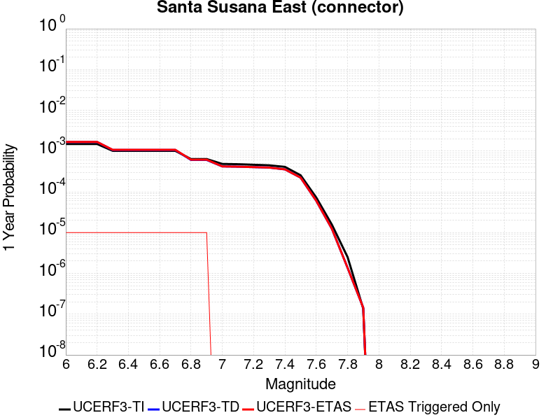 |  |

| Magnitude | 1 wk TI Prob | 1 wk TD Prob | 1 wk ETAS Prob | 1 wk ETAS/TD Gain | 1 wk ETAS Triggered Only | 1 mo TI Prob | 1 mo TD Prob | 1 mo ETAS Prob | 1 mo ETAS/TD Gain | 1 mo ETAS Triggered Only | 1 yr TI Prob | 1 yr TD Prob | 1 yr ETAS Prob | 1 yr ETAS/TD Gain | 1 yr ETAS Triggered Only | 10 yr TI Prob | 10 yr TD Prob | 10 yr ETAS Prob | 10 yr ETAS/TD Gain | 10 yr ETAS Triggered Only |
|-----|-----|-----|-----|-----|-----|-----|-----|-----|-----|-----|-----|-----|-----|-----|-----|-----|-----|-----|-----|-----|
| 6.0 | 2.858397E-5 | 3.2021693E-5 | 3.2021693E-5 | 1.0 | 0.0 | 1.2249697E-4 | 1.3723019E-4 | 1.3723019E-4 | 1.0 | 0.0 | 0.0014903803 | 0.00166977 | 0.0016797533 | 1.0059788 | 1.0E-5 | 0.014804244 | 0.016599316 | 0.01660915 | 1.0005925 | 1.0E-5 |
| 6.1 | 2.858397E-5 | 3.2021693E-5 | 3.2021693E-5 | 1.0 | 0.0 | 1.2249697E-4 | 1.3723019E-4 | 1.3723019E-4 | 1.0 | 0.0 | 0.0014903803 | 0.00166977 | 0.0016797533 | 1.0059788 | 1.0E-5 | 0.014804244 | 0.016599316 | 0.01660915 | 1.0005925 | 1.0E-5 |
| 6.2 | 2.858397E-5 | 3.2021693E-5 | 3.2021693E-5 | 1.0 | 0.0 | 1.2249697E-4 | 1.3723019E-4 | 1.3723019E-4 | 1.0 | 0.0 | 0.0014903803 | 0.00166977 | 0.0016797533 | 1.0059788 | 1.0E-5 | 0.014804244 | 0.016599316 | 0.01660915 | 1.0005925 | 1.0E-5 |
| 6.3 | 1.943582E-5 | 2.0367343E-5 | 2.0367343E-5 | 1.0 | 0.0 | 8.329371E-5 | 8.7286324E-5 | 8.7286324E-5 | 1.0 | 0.0 | 0.001013629 | 0.001062305 | 0.0010722943 | 1.0094035 | 1.0E-5 | 0.010090181 | 0.010583852 | 0.010593747 | 1.0009348 | 1.0E-5 |
| 6.4 | 1.943582E-5 | 2.0367343E-5 | 2.0367343E-5 | 1.0 | 0.0 | 8.329371E-5 | 8.7286324E-5 | 8.7286324E-5 | 1.0 | 0.0 | 0.001013629 | 0.001062305 | 0.0010722943 | 1.0094035 | 1.0E-5 | 0.010090181 | 0.010583852 | 0.010593747 | 1.0009348 | 1.0E-5 |
| 6.5 | 1.943582E-5 | 2.0367343E-5 | 2.0367343E-5 | 1.0 | 0.0 | 8.329371E-5 | 8.7286324E-5 | 8.7286324E-5 | 1.0 | 0.0 | 0.001013629 | 0.001062305 | 0.0010722943 | 1.0094035 | 1.0E-5 | 0.010090181 | 0.010583852 | 0.010593747 | 1.0009348 | 1.0E-5 |
| 6.6 | 1.943582E-5 | 2.0367343E-5 | 2.0367343E-5 | 1.0 | 0.0 | 8.329371E-5 | 8.7286324E-5 | 8.7286324E-5 | 1.0 | 0.0 | 0.001013629 | 0.001062305 | 0.0010722943 | 1.0094035 | 1.0E-5 | 0.010090181 | 0.010583852 | 0.010593747 | 1.0009348 | 1.0E-5 |
| 6.7 | 1.9404439E-5 | 2.0354766E-5 | 2.0354766E-5 | 1.0 | 0.0 | 8.3159226E-5 | 8.723242E-5 | 8.723242E-5 | 1.0 | 0.0 | 0.0010119933 | 0.0010616493 | 0.0010716388 | 1.0094093 | 1.0E-5 | 0.010073971 | 0.010577358 | 0.010587253 | 1.0009354 | 1.0E-5 |
| 6.8 | 1.2217526E-5 | 1.1593157E-5 | 1.1593157E-5 | 1.0 | 0.0 | 5.2359774E-5 | 4.9684106E-5 | 4.9684106E-5 | 1.0 | 0.0 | 6.372938E-4 | 6.047529E-4 | 6.147469E-4 | 1.0165256 | 1.0E-5 | 0.0063546924 | 0.006033274 | 0.006043214 | 1.0016475 | 1.0E-5 |
| 6.9 | 1.2217526E-5 | 1.1593157E-5 | 1.1593157E-5 | 1.0 | 0.0 | 5.2359774E-5 | 4.9684106E-5 | 4.9684106E-5 | 1.0 | 0.0 | 6.372938E-4 | 6.047529E-4 | 6.147469E-4 | 1.0165256 | 1.0E-5 | 0.0063546924 | 0.006033274 | 0.006043214 | 1.0016475 | 1.0E-5 |
| 7.0 | 9.276017E-6 | 8.059273E-6 | 8.059273E-6 | 1.0 | 0.0 | 3.9753755E-5 | 3.4539302E-5 | 3.4539302E-5 | 1.0 | 0.0 | 4.8389446E-4 | 4.2043833E-4 | 4.2043833E-4 | 1.0 | 0.0 | 0.0048284214 | 0.0041973097 | 0.0041973097 | 1.0 | 0.0 |
| 7.1 | 9.130355E-6 | 7.942446E-6 | 7.942446E-6 | 1.0 | 0.0 | 3.9129503E-5 | 3.4038632E-5 | 3.4038632E-5 | 1.0 | 0.0 | 4.7629757E-4 | 4.1434498E-4 | 4.1434498E-4 | 1.0 | 0.0 | 0.00475278 | 0.0041366047 | 0.0041366047 | 1.0 | 0.0 |
| 7.2 | 8.851015E-6 | 7.741608E-6 | 7.741608E-6 | 1.0 | 0.0 | 3.7932372E-5 | 3.317792E-5 | 3.317792E-5 | 1.0 | 0.0 | 4.6172875E-4 | 4.038697E-4 | 4.038697E-4 | 1.0 | 0.0 | 0.0046077054 | 0.0040322347 | 0.0040322347 | 1.0 | 0.0 |
| 7.3 | 8.573006E-6 | 7.5503312E-6 | 7.5503312E-6 | 1.0 | 0.0 | 3.6740938E-5 | 3.235818E-5 | 3.235818E-5 | 1.0 | 0.0 | 4.472291E-4 | 3.9389305E-4 | 3.9389305E-4 | 1.0 | 0.0 | 0.004463301 | 0.003932817 | 0.003932817 | 1.0 | 0.0 |
| 7.4 | 7.852282E-6 | 6.8178556E-6 | 6.8178556E-6 | 1.0 | 0.0 | 3.36522E-5 | 2.921907E-5 | 2.921907E-5 | 1.0 | 0.0 | 4.096385E-4 | 3.5568717E-4 | 3.5568717E-4 | 1.0 | 0.0 | 0.0040888423 | 0.0035519868 | 0.0035519868 | 1.0 | 0.0 |
| 7.5 | 4.8869324E-6 | 4.2790975E-6 | 4.2790975E-6 | 1.0 | 0.0 | 2.0943828E-5 | 1.833887E-5 | 1.833887E-5 | 1.0 | 0.0 | 2.5496128E-4 | 2.2325452E-4 | 2.2325452E-4 | 1.0 | 0.0 | 0.0025466895 | 0.00223057 | 0.00223057 | 1.0 | 0.0 |
| 7.6 | 1.3894544E-6 | 1.1568394E-6 | 1.1568394E-6 | 1.0 | 0.0 | 5.954791E-6 | 4.957875E-6 | 4.957875E-6 | 1.0 | 0.0 | 7.249717E-5 | 6.036068E-5 | 6.036068E-5 | 1.0 | 0.0 | 7.247352E-4 | 6.0346466E-4 | 6.0346466E-4 | 1.0 | 0.0 |
| 7.7 | 2.9924632E-7 | 2.3719332E-7 | 2.3719332E-7 | 1.0 | 0.0 | 1.2824837E-6 | 1.0165425E-6 | 1.0165425E-6 | 1.0 | 0.0 | 1.5614127E-5 | 1.2376341E-5 | 1.2376341E-5 | 1.0 | 0.0 | 1.5613029E-4 | 1.2375724E-4 | 1.2375724E-4 | 1.0 | 0.0 |
| 7.8 | 4.8188564E-8 | 2.6321862E-8 | 2.6321862E-8 | 1.0 | 0.0 | 2.065224E-7 | 1.12807975E-7 | 1.12807975E-7 | 1.0 | 0.0 | 2.5144072E-6 | 1.3734362E-6 | 1.3734362E-6 | 1.0 | 0.0 | 2.5143789E-5 | 1.3734286E-5 | 1.3734286E-5 | 1.0 | 0.0 |
| 7.9 | 2.6127251E-9 | 2.7681102E-9 | 2.7681102E-9 | 1.0 | 0.0 | 1.1197393E-8 | 1.186333E-8 | 1.186333E-8 | 1.0 | 0.0 | 1.3632825E-7 | 1.4443603E-7 | 1.4443603E-7 | 1.0 | 0.0 | 1.3632817E-6 | 1.4443604E-6 | 1.4443604E-6 | 1.0 | 0.0 |

## Walker Spring 2011 CFM
*[(top)](#table-of-contents)*

| 1 Week | 1 Month | 1 Year | 10 Year |
|-----|-----|-----|-----|
|  | 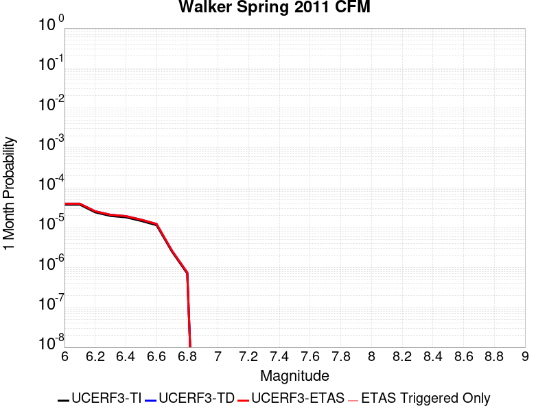 |  |  |

| Magnitude | 1 wk TI Prob | 1 wk TD Prob | 1 wk ETAS Prob | 1 wk ETAS/TD Gain | 1 wk ETAS Triggered Only | 1 mo TI Prob | 1 mo TD Prob | 1 mo ETAS Prob | 1 mo ETAS/TD Gain | 1 mo ETAS Triggered Only | 1 yr TI Prob | 1 yr TD Prob | 1 yr ETAS Prob | 1 yr ETAS/TD Gain | 1 yr ETAS Triggered Only | 10 yr TI Prob | 10 yr TD Prob | 10 yr ETAS Prob | 10 yr ETAS/TD Gain | 10 yr ETAS Triggered Only |
|-----|-----|-----|-----|-----|-----|-----|-----|-----|-----|-----|-----|-----|-----|-----|-----|-----|-----|-----|-----|-----|
| 6.0 | 8.791276E-6 | 9.264088E-6 | 9.264088E-6 | 1.0 | 0.0 | 3.767635E-5 | 3.970269E-5 | 3.970269E-5 | 1.0 | 0.0 | 4.58613E-4 | 4.832839E-4 | 4.832839E-4 | 1.0 | 0.0 | 0.004576677 | 0.0048234025 | 0.004833354 | 1.0020633 | 1.0E-5 |
| 6.1 | 8.791276E-6 | 9.264088E-6 | 9.264088E-6 | 1.0 | 0.0 | 3.767635E-5 | 3.970269E-5 | 3.970269E-5 | 1.0 | 0.0 | 4.58613E-4 | 4.832839E-4 | 4.832839E-4 | 1.0 | 0.0 | 0.004576677 | 0.0048234025 | 0.004833354 | 1.0020633 | 1.0E-5 |
| 6.2 | 5.654515E-6 | 5.99876E-6 | 5.99876E-6 | 1.0 | 0.0 | 2.4233412E-5 | 2.5708747E-5 | 2.5708747E-5 | 1.0 | 0.0 | 2.9500184E-4 | 3.1296405E-4 | 3.1296405E-4 | 1.0 | 0.0 | 0.0029461053 | 0.0031257276 | 0.0031356963 | 1.0031892 | 1.0E-5 |
| 6.3 | 4.591685E-6 | 4.8947268E-6 | 4.8947268E-6 | 1.0 | 0.0 | 1.96785E-5 | 2.0977257E-5 | 2.0977257E-5 | 1.0 | 0.0 | 2.395594E-4 | 2.5537255E-4 | 2.5537255E-4 | 1.0 | 0.0 | 0.002393013 | 0.0025512208 | 0.0025611953 | 1.0039097 | 1.0E-5 |
| 6.4 | 4.243283E-6 | 4.52266E-6 | 4.52266E-6 | 1.0 | 0.0 | 1.8185372E-5 | 1.938271E-5 | 1.938271E-5 | 1.0 | 0.0 | 2.2138441E-4 | 2.3596318E-4 | 2.3596318E-4 | 1.0 | 0.0 | 0.00221164 | 0.0023575418 | 0.0023575418 | 1.0 | 0.0 |
| 6.5 | 3.4445666E-6 | 3.6860924E-6 | 3.6860924E-6 | 1.0 | 0.0 | 1.4762345E-5 | 1.5797466E-5 | 1.5797466E-5 | 1.0 | 0.0 | 1.7971672E-4 | 1.923212E-4 | 1.923212E-4 | 1.0 | 0.0 | 0.0017957145 | 0.0019219425 | 0.0019219425 | 1.0 | 0.0 |
| 6.6 | 2.68766E-6 | 2.8794348E-6 | 2.8794348E-6 | 1.0 | 0.0 | 1.1518492E-5 | 1.2340398E-5 | 1.2340398E-5 | 1.0 | 0.0 | 1.4022861E-4 | 1.502378E-4 | 1.502378E-4 | 1.0 | 0.0 | 0.0014014016 | 0.0015017362 | 0.0015017362 | 1.0 | 0.0 |
| 6.7 | 5.880964E-7 | 6.1997474E-7 | 6.1997474E-7 | 1.0 | 0.0 | 2.5204106E-6 | 2.6570326E-6 | 2.6570326E-6 | 1.0 | 0.0 | 3.0685565E-5 | 3.2348988E-5 | 3.2348988E-5 | 1.0 | 0.0 | 3.068133E-4 | 3.2345214E-4 | 3.2345214E-4 | 1.0 | 0.0 |
| 6.8 | 1.6514163E-7 | 1.7409117E-7 | 1.7409117E-7 | 1.0 | 0.0 | 7.077497E-7 | 7.46105E-7 | 7.46105E-7 | 1.0 | 0.0 | 8.616818E-6 | 9.083828E-6 | 9.083828E-6 | 1.0 | 0.0 | 8.616484E-5 | 9.0838286E-5 | 9.0838286E-5 | 1.0 | 0.0 |

## Greenville (No) 2011 CFM
*[(top)](#table-of-contents)*

| 1 Week | 1 Month | 1 Year | 10 Year |
|-----|-----|-----|-----|
|  |  | 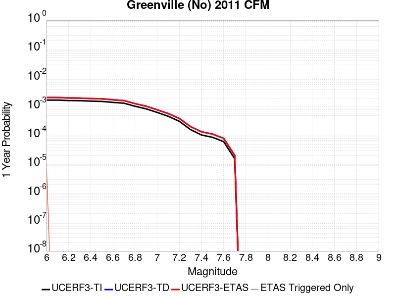 |  |

| Magnitude | 1 wk TI Prob | 1 wk TD Prob | 1 wk ETAS Prob | 1 wk ETAS/TD Gain | 1 wk ETAS Triggered Only | 1 mo TI Prob | 1 mo TD Prob | 1 mo ETAS Prob | 1 mo ETAS/TD Gain | 1 mo ETAS Triggered Only | 1 yr TI Prob | 1 yr TD Prob | 1 yr ETAS Prob | 1 yr ETAS/TD Gain | 1 yr ETAS Triggered Only | 10 yr TI Prob | 10 yr TD Prob | 10 yr ETAS Prob | 10 yr ETAS/TD Gain | 10 yr ETAS Triggered Only |
|-----|-----|-----|-----|-----|-----|-----|-----|-----|-----|-----|-----|-----|-----|-----|-----|-----|-----|-----|-----|-----|
| 6.0 | 3.286654E-5 | 4.036671E-5 | 4.036671E-5 | 1.0 | 0.0 | 1.4084899E-4 | 1.7298892E-4 | 1.8298719E-4 | 1.0577972 | 1.0E-5 | 0.0017134876 | 0.0021041434 | 0.0021141223 | 1.0047425 | 1.0E-5 | 0.017003356 | 0.02084759 | 0.02085738 | 1.0004697 | 1.0E-5 |
| 6.1 | 3.286654E-5 | 4.036671E-5 | 4.036671E-5 | 1.0 | 0.0 | 1.4084899E-4 | 1.7298892E-4 | 1.7298892E-4 | 1.0 | 0.0 | 0.0017134876 | 0.0021041434 | 0.0021041434 | 1.0 | 0.0 | 0.017003356 | 0.02084759 | 0.02084759 | 1.0 | 0.0 |
| 6.2 | 3.1697953E-5 | 3.8929615E-5 | 3.8929615E-5 | 1.0 | 0.0 | 1.358413E-4 | 1.6683072E-4 | 1.6683072E-4 | 1.0 | 0.0 | 0.0016526132 | 0.0020293088 | 0.0020293088 | 1.0 | 0.0 | 0.01640377 | 0.020112982 | 0.020112982 | 1.0 | 0.0 |
| 6.3 | 3.1363317E-5 | 3.8518487E-5 | 3.8518487E-5 | 1.0 | 0.0 | 1.344073E-4 | 1.6506898E-4 | 1.6506898E-4 | 1.0 | 0.0 | 0.0016351803 | 0.0020078993 | 0.0020078993 | 1.0 | 0.0 | 0.016232004 | 0.019902749 | 0.019902749 | 1.0 | 0.0 |
| 6.4 | 3.0228604E-5 | 3.712561E-5 | 3.712561E-5 | 1.0 | 0.0 | 1.2954473E-4 | 1.5910025E-4 | 1.5910025E-4 | 1.0 | 0.0 | 0.0015760659 | 0.001935361 | 0.001935361 | 1.0 | 0.0 | 0.015649348 | 0.01919009 | 0.01919009 | 1.0 | 0.0 |
| 6.5 | 2.9537814E-5 | 3.628106E-5 | 3.628106E-5 | 1.0 | 0.0 | 1.2658449E-4 | 1.5548118E-4 | 1.5548118E-4 | 1.0 | 0.0 | 0.0015400766 | 0.0018913761 | 0.0018913761 | 1.0 | 0.0 | 0.01529447 | 0.018757751 | 0.018757751 | 1.0 | 0.0 |
| 6.6 | 2.7345395E-5 | 3.359038E-5 | 3.359038E-5 | 1.0 | 0.0 | 1.1718928E-4 | 1.43951E-4 | 1.43951E-4 | 1.0 | 0.0 | 0.0014258457 | 0.0017512254 | 0.0017512254 | 1.0 | 0.0 | 0.014167317 | 0.017378574 | 0.017378574 | 1.0 | 0.0 |
| 6.7 | 2.5615784E-5 | 3.1567277E-5 | 3.1567277E-5 | 1.0 | 0.0 | 1.09777306E-4 | 1.352815E-4 | 1.352815E-4 | 1.0 | 0.0 | 0.0013357193 | 0.0016458385 | 0.0016458385 | 1.0 | 0.0 | 0.013277191 | 0.016340667 | 0.016340667 | 1.0 | 0.0 |
| 6.8 | 2.0059057E-5 | 2.4712264E-5 | 2.4712264E-5 | 1.0 | 0.0 | 8.596455E-5 | 1.059055E-4 | 1.059055E-4 | 1.0 | 0.0 | 0.0010461159 | 0.001288653 | 0.001288653 | 1.0 | 0.0 | 0.0104120495 | 0.012814328 | 0.012814328 | 1.0 | 0.0 |
| 6.9 | 1.6321746E-5 | 2.018486E-5 | 2.018486E-5 | 1.0 | 0.0 | 6.9948466E-5 | 8.6503744E-5 | 8.6503744E-5 | 1.0 | 0.0 | 8.5128983E-4 | 0.0010526866 | 0.0010526866 | 1.0 | 0.0 | 0.008480361 | 0.010479037 | 0.010479037 | 1.0 | 0.0 |
| 7.0 | 1.22527645E-5 | 1.5135808E-5 | 1.5135808E-5 | 1.0 | 0.0 | 5.2510793E-5 | 6.486616E-5 | 6.486616E-5 | 1.0 | 0.0 | 6.3913135E-4 | 7.894636E-4 | 7.894636E-4 | 1.0 | 0.0 | 0.0063729626 | 0.007867573 | 0.007867573 | 1.0 | 0.0 |
| 7.1 | 8.996482E-6 | 1.1165116E-5 | 1.1165116E-5 | 1.0 | 0.0 | 3.8555783E-5 | 4.784963E-5 | 4.784963E-5 | 1.0 | 0.0 | 4.6931554E-4 | 5.8241474E-4 | 5.8241474E-4 | 1.0 | 0.0 | 0.004683256 | 0.0058096354 | 0.0058096354 | 1.0 | 0.0 |
| 7.2 | 6.0273087E-6 | 7.569621E-6 | 7.569621E-6 | 1.0 | 0.0 | 2.5831067E-5 | 3.2440836E-5 | 3.2440836E-5 | 1.0 | 0.0 | 3.1444785E-4 | 3.9489628E-4 | 3.9489628E-4 | 1.0 | 0.0 | 0.0031400328 | 0.003942419 | 0.003942419 | 1.0 | 0.0 |
| 7.3 | 3.1209995E-6 | 3.9664565E-6 | 3.9664565E-6 | 1.0 | 0.0 | 1.3375643E-5 | 1.6998989E-5 | 1.6998989E-5 | 1.0 | 0.0 | 1.6283628E-4 | 2.069432E-4 | 2.069432E-4 | 1.0 | 0.0 | 0.0016271701 | 0.0020678395 | 0.0020678395 | 1.0 | 0.0 |
| 7.4 | 2.0254208E-6 | 2.6096657E-6 | 2.6096657E-6 | 1.0 | 0.0 | 8.680347E-6 | 1.1184234E-5 | 1.1184234E-5 | 1.0 | 0.0 | 1.0567809E-4 | 1.361596E-4 | 1.361596E-4 | 1.0 | 0.0 | 0.0010562785 | 0.0013611179 | 0.0013611179 | 1.0 | 0.0 |
| 7.5 | 1.6763418E-6 | 2.1734072E-6 | 2.1734072E-6 | 1.0 | 0.0 | 7.184302E-6 | 9.314569E-6 | 9.314569E-6 | 1.0 | 0.0 | 8.746537E-5 | 1.1339904E-4 | 1.1339904E-4 | 1.0 | 0.0 | 8.743095E-4 | 0.0011337536 | 0.0011337536 | 1.0 | 0.0 |
| 7.6 | 1.1935462E-6 | 1.5458915E-6 | 1.5458915E-6 | 1.0 | 0.0 | 5.115188E-6 | 6.625233E-6 | 6.625233E-6 | 1.0 | 0.0 | 6.2275634E-5 | 8.0659265E-5 | 8.0659265E-5 | 1.0 | 0.0 | 6.2258187E-4 | 8.0655375E-4 | 8.0655375E-4 | 1.0 | 0.0 |
| 7.7 | 3.0464201E-7 | 3.9848686E-7 | 3.9848686E-7 | 1.0 | 0.0 | 1.3056081E-6 | 1.7077997E-6 | 1.7077997E-6 | 1.0 | 0.0 | 1.589566E-5 | 2.0792268E-5 | 2.0792268E-5 | 1.0 | 0.0 | 1.5894524E-4 | 2.0793018E-4 | 2.0793018E-4 | 1.0 | 0.0 |

## South Klamath Lake East
*[(top)](#table-of-contents)*

| 1 Week | 1 Month | 1 Year | 10 Year |
|-----|-----|-----|-----|
|  |  |  | 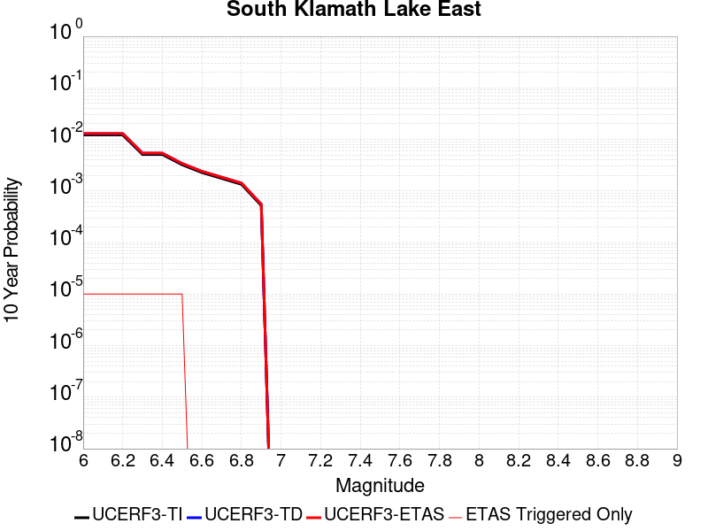 |

| Magnitude | 1 wk TI Prob | 1 wk TD Prob | 1 wk ETAS Prob | 1 wk ETAS/TD Gain | 1 wk ETAS Triggered Only | 1 mo TI Prob | 1 mo TD Prob | 1 mo ETAS Prob | 1 mo ETAS/TD Gain | 1 mo ETAS Triggered Only | 1 yr TI Prob | 1 yr TD Prob | 1 yr ETAS Prob | 1 yr ETAS/TD Gain | 1 yr ETAS Triggered Only | 10 yr TI Prob | 10 yr TD Prob | 10 yr ETAS Prob | 10 yr ETAS/TD Gain | 10 yr ETAS Triggered Only |
|-----|-----|-----|-----|-----|-----|-----|-----|-----|-----|-----|-----|-----|-----|-----|-----|-----|-----|-----|-----|-----|
| 6.0 | 2.3539369E-5 | 2.5047308E-5 | 2.5047308E-5 | 1.0 | 0.0 | 1.0087911E-4 | 1.0734166E-4 | 1.0734166E-4 | 1.0 | 0.0 | 0.0012275111 | 0.0013061843 | 0.0013061843 | 1.0 | 0.0 | 0.012207527 | 0.012993417 | 0.013003287 | 1.0007596 | 1.0E-5 |
| 6.1 | 2.3539369E-5 | 2.5047308E-5 | 2.5047308E-5 | 1.0 | 0.0 | 1.0087911E-4 | 1.0734166E-4 | 1.0734166E-4 | 1.0 | 0.0 | 0.0012275111 | 0.0013061843 | 0.0013061843 | 1.0 | 0.0 | 0.012207527 | 0.012993417 | 0.013003287 | 1.0007596 | 1.0E-5 |
| 6.2 | 2.3539369E-5 | 2.5047308E-5 | 2.5047308E-5 | 1.0 | 0.0 | 1.0087911E-4 | 1.0734166E-4 | 1.0734166E-4 | 1.0 | 0.0 | 0.0012275111 | 0.0013061843 | 0.0013061843 | 1.0 | 0.0 | 0.012207527 | 0.012993417 | 0.013003287 | 1.0007596 | 1.0E-5 |
| 6.3 | 9.807823E-6 | 1.0396044E-5 | 1.0396044E-5 | 1.0 | 0.0 | 4.2032847E-5 | 4.455376E-5 | 4.455376E-5 | 1.0 | 0.0 | 5.1162974E-4 | 5.4231536E-4 | 5.4231536E-4 | 1.0 | 0.0 | 0.005104534 | 0.005410756 | 0.005420702 | 1.0018382 | 1.0E-5 |
| 6.4 | 9.807823E-6 | 1.0396044E-5 | 1.0396044E-5 | 1.0 | 0.0 | 4.2032847E-5 | 4.455376E-5 | 4.455376E-5 | 1.0 | 0.0 | 5.1162974E-4 | 5.4231536E-4 | 5.4231536E-4 | 1.0 | 0.0 | 0.005104534 | 0.005410756 | 0.005420702 | 1.0018382 | 1.0E-5 |
| 6.5 | 6.191981E-6 | 6.5508398E-6 | 6.5508398E-6 | 1.0 | 0.0 | 2.653679E-5 | 2.8074743E-5 | 2.8074743E-5 | 1.0 | 0.0 | 3.2303753E-4 | 3.4175918E-4 | 3.4175918E-4 | 1.0 | 0.0 | 0.0032256835 | 0.003412614 | 0.00342258 | 1.0029203 | 1.0E-5 |
| 6.6 | 4.3693776E-6 | 4.6165574E-6 | 4.6165574E-6 | 1.0 | 0.0 | 1.8725768E-5 | 1.9785102E-5 | 1.9785102E-5 | 1.0 | 0.0 | 2.2796239E-4 | 2.4085813E-4 | 2.4085813E-4 | 1.0 | 0.0 | 0.0022772867 | 0.0024060833 | 0.0024060833 | 1.0 | 0.0 |
| 6.7 | 3.360834E-6 | 3.5512403E-6 | 3.5512403E-6 | 1.0 | 0.0 | 1.4403494E-5 | 1.5219517E-5 | 1.5219517E-5 | 1.0 | 0.0 | 1.7534842E-4 | 1.8528267E-4 | 1.8528267E-4 | 1.0 | 0.0 | 0.0017521014 | 0.0018513618 | 0.0018513618 | 1.0 | 0.0 |
| 6.8 | 2.57873E-6 | 2.7251708E-6 | 2.7251708E-6 | 1.0 | 0.0 | 1.1051653E-5 | 1.1679254E-5 | 1.1679254E-5 | 1.0 | 0.0 | 1.3454557E-4 | 1.4218627E-4 | 1.4218627E-4 | 1.0 | 0.0 | 0.0013446413 | 0.0014210136 | 0.0014210136 | 1.0 | 0.0 |
| 6.9 | 9.987825E-7 | 1.0566213E-6 | 1.0566213E-6 | 1.0 | 0.0 | 4.2804895E-6 | 4.528371E-6 | 4.528371E-6 | 1.0 | 0.0 | 5.211371E-5 | 5.5131848E-5 | 5.5131848E-5 | 1.0 | 0.0 | 5.210149E-4 | 5.5121386E-4 | 5.5121386E-4 | 1.0 | 0.0 |

## Del Valle
*[(top)](#table-of-contents)*

| 1 Week | 1 Month | 1 Year | 10 Year |
|-----|-----|-----|-----|
|  |  |  |  |

| Magnitude | 1 wk TI Prob | 1 wk TD Prob | 1 wk ETAS Prob | 1 wk ETAS/TD Gain | 1 wk ETAS Triggered Only | 1 mo TI Prob | 1 mo TD Prob | 1 mo ETAS Prob | 1 mo ETAS/TD Gain | 1 mo ETAS Triggered Only | 1 yr TI Prob | 1 yr TD Prob | 1 yr ETAS Prob | 1 yr ETAS/TD Gain | 1 yr ETAS Triggered Only | 10 yr TI Prob | 10 yr TD Prob | 10 yr ETAS Prob | 10 yr ETAS/TD Gain | 10 yr ETAS Triggered Only |
|-----|-----|-----|-----|-----|-----|-----|-----|-----|-----|-----|-----|-----|-----|-----|-----|-----|-----|-----|-----|-----|
| 6.0 | 1.0716125E-5 | 8.767882E-6 | 8.767882E-6 | 1.0 | 0.0 | 4.592544E-5 | 3.7576207E-5 | 4.7575828E-5 | 1.2661159 | 1.0E-5 | 5.589988E-4 | 4.5741402E-4 | 4.6740944E-4 | 1.021852 | 1.0E-5 | 0.0055759475 | 0.004566694 | 0.0045766486 | 1.0021797 | 1.0E-5 |
| 6.1 | 1.0716125E-5 | 8.767882E-6 | 8.767882E-6 | 1.0 | 0.0 | 4.592544E-5 | 3.7576207E-5 | 4.7575828E-5 | 1.2661159 | 1.0E-5 | 5.589988E-4 | 4.5741402E-4 | 4.6740944E-4 | 1.021852 | 1.0E-5 | 0.0055759475 | 0.004566694 | 0.0045766486 | 1.0021797 | 1.0E-5 |
| 6.2 | 1.0716125E-5 | 8.767882E-6 | 8.767882E-6 | 1.0 | 0.0 | 4.592544E-5 | 3.7576207E-5 | 4.7575828E-5 | 1.2661159 | 1.0E-5 | 5.589988E-4 | 4.5741402E-4 | 4.6740944E-4 | 1.021852 | 1.0E-5 | 0.0055759475 | 0.004566694 | 0.0045766486 | 1.0021797 | 1.0E-5 |
| 6.3 | 7.1293784E-6 | 4.8658226E-6 | 4.8658226E-6 | 1.0 | 0.0 | 3.055412E-5 | 2.0853362E-5 | 3.0853153E-5 | 1.479529 | 1.0E-5 | 3.7193293E-4 | 2.5386084E-4 | 2.638583E-4 | 1.0393816 | 1.0E-5 | 0.0037131102 | 0.0025358086 | 0.0025457833 | 1.0039335 | 1.0E-5 |
| 6.4 | 7.1293784E-6 | 4.8658226E-6 | 4.8658226E-6 | 1.0 | 0.0 | 3.055412E-5 | 2.0853362E-5 | 3.0853153E-5 | 1.479529 | 1.0E-5 | 3.7193293E-4 | 2.5386084E-4 | 2.638583E-4 | 1.0393816 | 1.0E-5 | 0.0037131102 | 0.0025358086 | 0.0025457833 | 1.0039335 | 1.0E-5 |
| 6.5 | 7.1293784E-6 | 4.8658226E-6 | 4.8658226E-6 | 1.0 | 0.0 | 3.055412E-5 | 2.0853362E-5 | 3.0853153E-5 | 1.479529 | 1.0E-5 | 3.7193293E-4 | 2.5386084E-4 | 2.638583E-4 | 1.0393816 | 1.0E-5 | 0.0037131102 | 0.0025358086 | 0.0025457833 | 1.0039335 | 1.0E-5 |
| 6.6 | 7.1293784E-6 | 4.8658226E-6 | 4.8658226E-6 | 1.0 | 0.0 | 3.055412E-5 | 2.0853362E-5 | 3.0853153E-5 | 1.479529 | 1.0E-5 | 3.7193293E-4 | 2.5386084E-4 | 2.638583E-4 | 1.0393816 | 1.0E-5 | 0.0037131102 | 0.0025358086 | 0.0025457833 | 1.0039335 | 1.0E-5 |
| 6.7 | 7.12272E-6 | 4.8631982E-6 | 4.8631982E-6 | 1.0 | 0.0 | 3.0525585E-5 | 2.0842115E-5 | 3.0841908E-5 | 1.4797877 | 1.0E-5 | 3.7158563E-4 | 2.5372393E-4 | 2.6372142E-4 | 1.039403 | 1.0E-5 | 0.003709649 | 0.0025344428 | 0.0025444175 | 1.0039357 | 1.0E-5 |
| 6.8 | 6.7558703E-6 | 4.559404E-6 | 4.559404E-6 | 1.0 | 0.0 | 2.895341E-5 | 1.954016E-5 | 2.9539964E-5 | 1.5117565 | 1.0E-5 | 3.5245073E-4 | 2.3787611E-4 | 2.4787372E-4 | 1.0420287 | 1.0E-5 | 0.0035189227 | 0.0023763045 | 0.0023862806 | 1.0041982 | 1.0E-5 |
| 6.9 | 6.6700386E-6 | 4.5025436E-6 | 4.5025436E-6 | 1.0 | 0.0 | 2.8585566E-5 | 1.9296476E-5 | 2.9296283E-5 | 1.5182194 | 1.0E-5 | 3.479737E-4 | 2.349099E-4 | 2.4490754E-4 | 1.0425595 | 1.0E-5 | 0.003474293 | 0.0023467052 | 0.0023566815 | 1.0042512 | 1.0E-5 |
| 7.0 | 6.3181424E-6 | 4.098708E-6 | 4.098708E-6 | 1.0 | 0.0 | 2.7077473E-5 | 1.7565775E-5 | 2.7565598E-5 | 1.5692788 | 1.0E-5 | 3.2961834E-4 | 2.1384275E-4 | 2.238406E-4 | 1.0467533 | 1.0E-5 | 0.0032912986 | 0.0021364389 | 0.0021464175 | 1.0046707 | 1.0E-5 |
| 7.1 | 6.248759E-6 | 4.033899E-6 | 4.033899E-6 | 1.0 | 0.0 | 2.678012E-5 | 1.7288028E-5 | 2.7287855E-5 | 1.5784249 | 1.0E-5 | 3.2599916E-4 | 2.1046183E-4 | 2.2045973E-4 | 1.0475045 | 1.0E-5 | 0.0032552136 | 0.0021026938 | 0.002112673 | 1.0047458 | 1.0E-5 |
| 7.2 | 6.0411944E-6 | 3.869892E-6 | 3.869892E-6 | 1.0 | 0.0 | 2.5890577E-5 | 1.658515E-5 | 2.6584985E-5 | 1.602939 | 1.0E-5 | 3.1517216E-4 | 2.019059E-4 | 2.1190388E-4 | 1.049518 | 1.0E-5 | 0.0031472554 | 0.0020172922 | 0.002027272 | 1.0049472 | 1.0E-5 |
| 7.3 | 4.7691183E-6 | 3.0780905E-6 | 3.0780905E-6 | 1.0 | 0.0 | 2.0438918E-5 | 1.3191751E-5 | 2.3191618E-5 | 1.7580395 | 1.0E-5 | 2.488154E-4 | 1.6059795E-4 | 1.7059634E-4 | 1.0622573 | 1.0E-5 | 0.00248537 | 0.0016048512 | 0.0016148352 | 1.006221 | 1.0E-5 |
| 7.4 | 3.5524722E-6 | 2.1893159E-6 | 2.1893159E-6 | 1.0 | 0.0 | 1.5224792E-5 | 9.382749E-6 | 1.9382655E-5 | 2.0657756 | 1.0E-5 | 1.8534607E-4 | 1.14229064E-4 | 1.2422792E-4 | 1.0875334 | 1.0E-5 | 0.0018519156 | 0.0011417117 | 0.0011517003 | 1.0087488 | 1.0E-5 |
| 7.5 | 2.7133442E-6 | 1.5915855E-6 | 1.5915855E-6 | 1.0 | 0.0 | 1.1628566E-5 | 6.821063E-6 | 6.821063E-6 | 1.0 | 0.0 | 1.415686E-4 | 8.30433E-5 | 8.30433E-5 | 1.0 | 0.0 | 0.0014147845 | 8.301246E-4 | 8.301246E-4 | 1.0 | 0.0 |
| 7.6 | 1.915338E-6 | 1.1738952E-6 | 1.1738952E-6 | 1.0 | 0.0 | 8.208566E-6 | 5.0309695E-6 | 5.0309695E-6 | 1.0 | 0.0 | 9.993471E-5 | 6.125034E-5 | 6.125034E-5 | 1.0 | 0.0 | 9.988978E-4 | 6.123355E-4 | 6.123355E-4 | 1.0 | 0.0 |
| 7.7 | 1.2120448E-6 | 7.1801645E-7 | 7.1801645E-7 | 1.0 | 0.0 | 5.194467E-6 | 3.0772098E-6 | 3.0772098E-6 | 1.0 | 0.0 | 6.3240805E-5 | 3.746439E-5 | 3.746439E-5 | 1.0 | 0.0 | 6.322281E-4 | 3.745811E-4 | 3.745811E-4 | 1.0 | 0.0 |
| 7.8 | 6.272381E-7 | 3.93245E-7 | 3.93245E-7 | 1.0 | 0.0 | 2.6881603E-6 | 1.6853346E-6 | 1.6853346E-6 | 1.0 | 0.0 | 3.272786E-5 | 2.0518757E-5 | 2.0518757E-5 | 1.0 | 0.0 | 3.272304E-4 | 2.0516879E-4 | 2.0516879E-4 | 1.0 | 0.0 |
| 7.9 | 2.0292627E-7 | 1.2004223E-7 | 1.2004223E-7 | 1.0 | 0.0 | 8.6968373E-7 | 5.144666E-7 | 5.144666E-7 | 1.0 | 0.0 | 1.0588348E-5 | 6.2636127E-6 | 6.2636127E-6 | 1.0 | 0.0 | 1.0587843E-4 | 6.263438E-5 | 6.263438E-5 | 1.0 | 0.0 |
| 8.0 | 4.374492E-8 | 2.1898856E-8 | 2.1898856E-8 | 1.0 | 0.0 | 1.8747821E-7 | 9.3852236E-8 | 9.3852236E-8 | 1.0 | 0.0 | 2.2825448E-6 | 1.1426505E-6 | 1.1426505E-6 | 1.0 | 0.0 | 2.2825214E-5 | 1.1426449E-5 | 1.1426449E-5 | 1.0 | 0.0 |

## Mission (connected) 2011 CFM
*[(top)](#table-of-contents)*

| 1 Week | 1 Month | 1 Year | 10 Year |
|-----|-----|-----|-----|
| 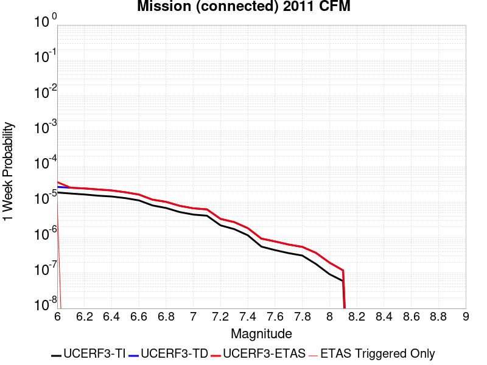 | 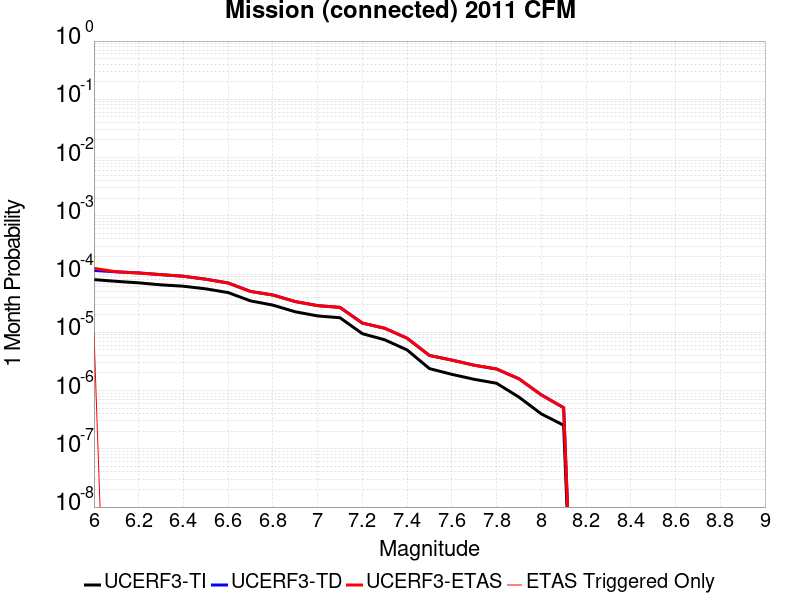 | 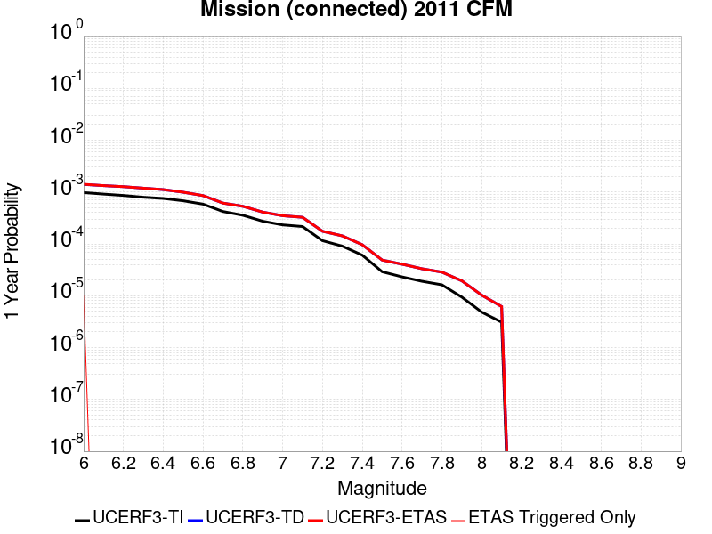 |  |

| Magnitude | 1 wk TI Prob | 1 wk TD Prob | 1 wk ETAS Prob | 1 wk ETAS/TD Gain | 1 wk ETAS Triggered Only | 1 mo TI Prob | 1 mo TD Prob | 1 mo ETAS Prob | 1 mo ETAS/TD Gain | 1 mo ETAS Triggered Only | 1 yr TI Prob | 1 yr TD Prob | 1 yr ETAS Prob | 1 yr ETAS/TD Gain | 1 yr ETAS Triggered Only | 10 yr TI Prob | 10 yr TD Prob | 10 yr ETAS Prob | 10 yr ETAS/TD Gain | 10 yr ETAS Triggered Only |
|-----|-----|-----|-----|-----|-----|-----|-----|-----|-----|-----|-----|-----|-----|-----|-----|-----|-----|-----|-----|-----|
| 6.0 | 1.8735573E-5 | 2.688439E-5 | 3.688412E-5 | 1.371953 | 1.0E-5 | 8.029284E-5 | 1.1521349E-4 | 1.2521233E-4 | 1.0867854 | 1.0E-5 | 9.771269E-4 | 0.0014017284 | 0.0014117144 | 1.0071241 | 1.0E-5 | 0.009728416 | 0.013937845 | 0.013947706 | 1.0007075 | 1.0E-5 |
| 6.1 | 1.7515964E-5 | 2.5525667E-5 | 2.5525667E-5 | 1.0 | 0.0 | 7.506625E-5 | 1.0939089E-4 | 1.0939089E-4 | 1.0 | 0.0 | 9.135484E-4 | 0.0013309267 | 0.0013309267 | 1.0 | 0.0 | 0.009098019 | 0.01323845 | 0.01323845 | 1.0 | 0.0 |
| 6.2 | 1.6486343E-5 | 2.437034E-5 | 2.437034E-5 | 1.0 | 0.0 | 7.065384E-5 | 1.0443989E-4 | 1.0443989E-4 | 1.0 | 0.0 | 8.5987104E-4 | 0.0012707205 | 0.0012707205 | 1.0 | 0.0 | 0.008565514 | 0.012643425 | 0.012643425 | 1.0 | 0.0 |
| 6.3 | 1.5229385E-5 | 2.27998E-5 | 2.27998E-5 | 1.0 | 0.0 | 6.526716E-5 | 9.7709526E-5 | 9.7709526E-5 | 1.0 | 0.0 | 7.9433795E-4 | 0.0011888708 | 0.0011888708 | 1.0 | 0.0 | 0.007915046 | 0.011836656 | 0.011836656 | 1.0 | 0.0 |
| 6.4 | 1.4435828E-5 | 2.1399865E-5 | 2.1399865E-5 | 1.0 | 0.0 | 6.186637E-5 | 9.1710244E-5 | 9.1710244E-5 | 1.0 | 0.0 | 7.529627E-4 | 0.0011159078 | 0.0011159078 | 1.0 | 0.0 | 0.007504165 | 0.011119671 | 0.011119671 | 1.0 | 0.0 |
| 6.5 | 1.30127955E-5 | 1.9037165E-5 | 1.9037165E-5 | 1.0 | 0.0 | 5.576793E-5 | 8.1585065E-5 | 8.1585065E-5 | 1.0 | 0.0 | 6.78763E-4 | 9.928137E-4 | 9.928137E-4 | 1.0 | 0.0 | 0.0067669353 | 0.0099117085 | 0.0099117085 | 1.0 | 0.0 |
| 6.6 | 1.1220718E-5 | 1.6393737E-5 | 1.6393737E-5 | 1.0 | 0.0 | 4.8087906E-5 | 7.025699E-5 | 7.025699E-5 | 1.0 | 0.0 | 5.8531296E-4 | 8.5504283E-4 | 8.5504283E-4 | 1.0 | 0.0 | 0.005837737 | 0.008549754 | 0.008549754 | 1.0 | 0.0 |
| 6.7 | 8.086152E-6 | 1.1750606E-5 | 1.1750606E-5 | 1.0 | 0.0 | 3.4654473E-5 | 5.0358773E-5 | 5.0358773E-5 | 1.0 | 0.0 | 4.2183654E-4 | 6.1294634E-4 | 6.1294634E-4 | 1.0 | 0.0 | 0.004210367 | 0.006149825 | 0.006149825 | 1.0 | 0.0 |
| 6.8 | 6.8361655E-6 | 1.0195686E-5 | 1.0195686E-5 | 1.0 | 0.0 | 2.9297524E-5 | 4.369507E-5 | 4.369507E-5 | 1.0 | 0.0 | 3.5663895E-4 | 5.3185824E-4 | 5.3185824E-4 | 1.0 | 0.0 | 0.0035606713 | 0.0053387634 | 0.0053387634 | 1.0 | 0.0 |
| 6.9 | 5.2517353E-6 | 7.869309E-6 | 7.869309E-6 | 1.0 | 0.0 | 2.2507242E-5 | 3.3725177E-5 | 3.3725177E-5 | 1.0 | 0.0 | 2.739912E-4 | 4.1052693E-4 | 4.1052693E-4 | 1.0 | 0.0 | 0.0027365363 | 0.0041298596 | 0.0041298596 | 1.0 | 0.0 |
| 7.0 | 4.4602784E-6 | 6.7018273E-6 | 6.7018273E-6 | 1.0 | 0.0 | 1.911534E-5 | 2.8721803E-5 | 2.8721803E-5 | 1.0 | 0.0 | 2.327044E-4 | 3.49632E-4 | 3.49632E-4 | 1.0 | 0.0 | 0.0023246086 | 0.0035221954 | 0.0035221954 | 1.0 | 0.0 |
| 7.1 | 4.1492594E-6 | 6.250573E-6 | 6.250573E-6 | 1.0 | 0.0 | 1.7782419E-5 | 2.6787895E-5 | 2.6787895E-5 | 1.0 | 0.0 | 2.1647944E-4 | 3.2609396E-4 | 3.2609396E-4 | 1.0 | 0.0 | 0.0021626868 | 0.0032869952 | 0.0032869952 | 1.0 | 0.0 |
| 7.2 | 2.213247E-6 | 3.362939E-6 | 3.362939E-6 | 1.0 | 0.0 | 9.485309E-6 | 1.4412516E-5 | 1.4412516E-5 | 1.0 | 0.0 | 1.15477524E-4 | 1.7545828E-4 | 1.7545828E-4 | 1.0 | 0.0 | 0.0011541754 | 0.0017818378 | 0.0017818378 | 1.0 | 0.0 |
| 7.3 | 1.7362703E-6 | 2.738553E-6 | 2.738553E-6 | 1.0 | 0.0 | 7.4411373E-6 | 1.1736603E-5 | 1.1736603E-5 | 1.0 | 0.0 | 9.0592075E-5 | 1.4288379E-4 | 1.4288379E-4 | 1.0 | 0.0 | 9.0555154E-4 | 0.0014532298 | 0.0014532298 | 1.0 | 0.0 |
| 7.4 | 1.1628409E-6 | 1.8494098E-6 | 1.8494098E-6 | 1.0 | 0.0 | 4.9835944E-6 | 7.926018E-6 | 7.926018E-6 | 1.0 | 0.0 | 6.0673574E-5 | 9.649501E-5 | 9.649501E-5 | 1.0 | 0.0 | 6.065701E-4 | 9.853557E-4 | 9.853557E-4 | 1.0 | 0.0 |
| 7.5 | 5.5610667E-7 | 9.3442156E-7 | 9.3442156E-7 | 1.0 | 0.0 | 2.3833122E-6 | 4.0046575E-6 | 4.0046575E-6 | 1.0 | 0.0 | 2.9016439E-5 | 4.875562E-5 | 4.875562E-5 | 1.0 | 0.0 | 2.901265E-4 | 5.0411985E-4 | 5.0411985E-4 | 1.0 | 0.0 |
| 7.6 | 4.4307663E-7 | 7.7849705E-7 | 7.7849705E-7 | 1.0 | 0.0 | 1.8988985E-6 | 3.3364117E-6 | 3.3364117E-6 | 1.0 | 0.0 | 2.3118844E-5 | 4.0620056E-5 | 4.0620056E-5 | 1.0 | 0.0 | 2.3116439E-4 | 4.2211605E-4 | 4.2211605E-4 | 1.0 | 0.0 |
| 7.7 | 3.639119E-7 | 6.3552113E-7 | 6.3552113E-7 | 1.0 | 0.0 | 1.5596215E-6 | 2.7236592E-6 | 2.7236592E-6 | 1.0 | 0.0 | 1.8988227E-5 | 3.316005E-5 | 3.316005E-5 | 1.0 | 0.0 | 1.8986604E-4 | 3.469058E-4 | 3.469058E-4 | 1.0 | 0.0 |
| 7.8 | 3.1152942E-7 | 5.475073E-7 | 5.475073E-7 | 1.0 | 0.0 | 1.3351254E-6 | 2.3464577E-6 | 2.3464577E-6 | 1.0 | 0.0 | 1.6255031E-5 | 2.856775E-5 | 2.856775E-5 | 1.0 | 0.0 | 1.6253842E-4 | 2.977156E-4 | 2.977156E-4 | 1.0 | 0.0 |
| 7.9 | 1.8035962E-7 | 3.7187047E-7 | 3.7187047E-7 | 1.0 | 0.0 | 7.729696E-7 | 1.5937296E-6 | 1.5937296E-6 | 1.0 | 0.0 | 9.410865E-6 | 1.9403486E-5 | 1.9403486E-5 | 1.0 | 0.0 | 9.410465E-5 | 2.0072333E-4 | 2.0072333E-4 | 1.0 | 0.0 |
| 8.0 | 9.279334E-8 | 1.9696856E-7 | 1.9696856E-7 | 1.0 | 0.0 | 3.976857E-7 | 8.4415063E-7 | 8.4415063E-7 | 1.0 | 0.0 | 4.841813E-6 | 1.0277487E-5 | 1.0277487E-5 | 1.0 | 0.0 | 4.841707E-5 | 1.0529156E-4 | 1.0529156E-4 | 1.0 | 0.0 |
| 8.1 | 5.9253985E-8 | 1.1851607E-7 | 1.1851607E-7 | 1.0 | 0.0 | 2.5394561E-7 | 5.079259E-7 | 5.079259E-7 | 1.0 | 0.0 | 3.0917836E-6 | 6.183981E-6 | 6.183981E-6 | 1.0 | 0.0 | 3.0917407E-5 | 6.322424E-5 | 6.322424E-5 | 1.0 | 0.0 |

## Emerson-Copper Mtn 2011
*[(top)](#table-of-contents)*

| 1 Week | 1 Month | 1 Year | 10 Year |
|-----|-----|-----|-----|
| 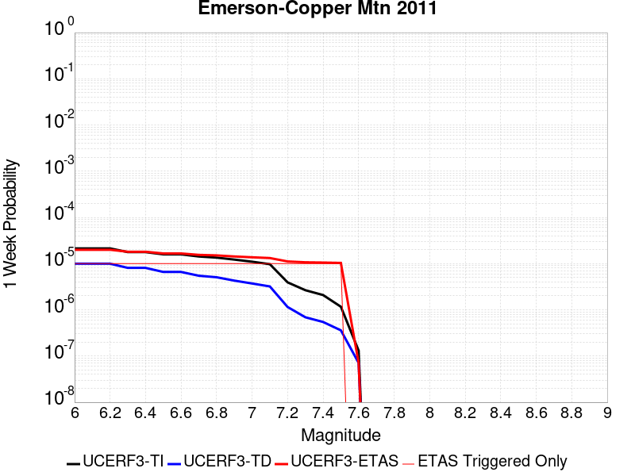 |  |  |  |

| Magnitude | 1 wk TI Prob | 1 wk TD Prob | 1 wk ETAS Prob | 1 wk ETAS/TD Gain | 1 wk ETAS Triggered Only | 1 mo TI Prob | 1 mo TD Prob | 1 mo ETAS Prob | 1 mo ETAS/TD Gain | 1 mo ETAS Triggered Only | 1 yr TI Prob | 1 yr TD Prob | 1 yr ETAS Prob | 1 yr ETAS/TD Gain | 1 yr ETAS Triggered Only | 10 yr TI Prob | 10 yr TD Prob | 10 yr ETAS Prob | 10 yr ETAS/TD Gain | 10 yr ETAS Triggered Only |
|-----|-----|-----|-----|-----|-----|-----|-----|-----|-----|-----|-----|-----|-----|-----|-----|-----|-----|-----|-----|-----|
| 6.0 | 2.1364202E-5 | 9.967999E-6 | 1.99679E-5 | 2.0032003 | 1.0E-5 | 9.1557646E-5 | 4.2719344E-5 | 5.271892E-5 | 1.234076 | 1.0E-5 | 0.0011141442 | 5.1999267E-4 | 5.2998745E-4 | 1.0192211 | 1.0E-5 | 0.011085749 | 0.0051886286 | 0.005198577 | 1.0019172 | 1.0E-5 |
| 6.1 | 2.1364202E-5 | 9.967999E-6 | 1.99679E-5 | 2.0032003 | 1.0E-5 | 9.1557646E-5 | 4.2719344E-5 | 5.271892E-5 | 1.234076 | 1.0E-5 | 0.0011141442 | 5.1999267E-4 | 5.2998745E-4 | 1.0192211 | 1.0E-5 | 0.011085749 | 0.0051886286 | 0.005198577 | 1.0019172 | 1.0E-5 |
| 6.2 | 2.1364202E-5 | 9.967999E-6 | 1.99679E-5 | 2.0032003 | 1.0E-5 | 9.1557646E-5 | 4.2719344E-5 | 5.271892E-5 | 1.234076 | 1.0E-5 | 0.0011141442 | 5.1999267E-4 | 5.2998745E-4 | 1.0192211 | 1.0E-5 | 0.011085749 | 0.0051886286 | 0.005198577 | 1.0019172 | 1.0E-5 |
| 6.3 | 1.7751237E-5 | 8.089109E-6 | 1.8089027E-5 | 2.2362201 | 1.0E-5 | 7.607452E-5 | 3.4667184E-5 | 4.4666835E-5 | 1.2884473 | 1.0E-5 | 9.258136E-4 | 4.2199748E-4 | 4.3199325E-4 | 1.0236868 | 1.0E-5 | 0.00921966 | 0.004212584 | 0.0042225416 | 1.0023638 | 1.0E-5 |
| 6.4 | 1.7751237E-5 | 8.089109E-6 | 1.8089027E-5 | 2.2362201 | 1.0E-5 | 7.607452E-5 | 3.4667184E-5 | 4.4666835E-5 | 1.2884473 | 1.0E-5 | 9.258136E-4 | 4.2199748E-4 | 4.3199325E-4 | 1.0236868 | 1.0E-5 | 0.00921966 | 0.004212584 | 0.0042225416 | 1.0023638 | 1.0E-5 |
| 6.5 | 1.5886664E-5 | 6.6037437E-6 | 1.6603677E-5 | 2.5142825 | 1.0E-5 | 6.808392E-5 | 2.830148E-5 | 3.8301197E-5 | 1.3533285 | 1.0E-5 | 8.286065E-4 | 3.4452073E-4 | 3.5451728E-4 | 1.0290158 | 1.0E-5 | 0.008255237 | 0.0034403303 | 0.003450296 | 1.0028967 | 1.0E-5 |
| 6.6 | 1.5886664E-5 | 6.6037437E-6 | 1.6603677E-5 | 2.5142825 | 1.0E-5 | 6.808392E-5 | 2.830148E-5 | 3.8301197E-5 | 1.3533285 | 1.0E-5 | 8.286065E-4 | 3.4452073E-4 | 3.5451728E-4 | 1.0290158 | 1.0E-5 | 0.008255237 | 0.0034403303 | 0.003450296 | 1.0028967 | 1.0E-5 |
| 6.7 | 1.428471E-5 | 5.4703055E-6 | 1.547025E-5 | 2.8280416 | 1.0E-5 | 6.121875E-5 | 2.3443978E-5 | 3.3443743E-5 | 1.4265388 | 1.0E-5 | 7.450834E-4 | 2.8539696E-4 | 2.9539413E-4 | 1.0350289 | 1.0E-5 | 0.007425902 | 0.0028506925 | 0.002860664 | 1.003498 | 1.0E-5 |
| 6.8 | 1.3490684E-5 | 5.0735894E-6 | 1.5073539E-5 | 2.9709811 | 1.0E-5 | 5.7815934E-5 | 2.1743796E-5 | 3.1743577E-5 | 1.4598913 | 1.0E-5 | 7.0368167E-4 | 2.6470242E-4 | 2.7469976E-4 | 1.0377682 | 1.0E-5 | 0.007014576 | 0.002644252 | 0.0026542256 | 1.0037718 | 1.0E-5 |
| 6.9 | 1.2235421E-5 | 4.289545E-6 | 1.4289501E-5 | 3.3312397 | 1.0E-5 | 5.2436466E-5 | 1.8383655E-5 | 2.838347E-5 | 1.5439515 | 1.0E-5 | 6.38227E-4 | 2.238016E-4 | 2.3379936E-4 | 1.0446725 | 1.0E-5 | 0.0063639707 | 0.0022361164 | 0.0022460942 | 1.004462 | 1.0E-5 |
| 7.0 | 1.1009851E-5 | 3.7188345E-6 | 1.3718797E-5 | 3.6890047 | 1.0E-5 | 4.7184225E-5 | 1.5937783E-5 | 2.5937625E-5 | 1.6274298 | 1.0E-5 | 5.743165E-4 | 1.9402867E-4 | 2.0402674E-4 | 1.0515288 | 1.0E-5 | 0.005728345 | 0.0019389305 | 0.0019489111 | 1.0051475 | 1.0E-5 |
| 7.1 | 9.726373E-6 | 3.2115693E-6 | 1.3211537E-5 | 4.1137323 | 1.0E-5 | 4.168379E-5 | 1.3763814E-5 | 2.3763678E-5 | 1.7265328 | 1.0E-5 | 5.07382E-4 | 1.6756494E-4 | 1.7756326E-4 | 1.0596683 | 1.0E-5 | 0.0050622504 | 0.0016747171 | 0.0016847003 | 1.0059612 | 1.0E-5 |
| 7.2 | 3.9335127E-6 | 1.1524114E-6 | 1.11524E-5 | 9.677446 | 1.0E-5 | 1.6857803E-5 | 4.9388973E-6 | 1.4938848E-5 | 3.0247335 | 1.0E-5 | 2.0522442E-4 | 6.0129474E-5 | 7.012887E-5 | 1.1662978 | 1.0E-5 | 0.00205035 | 6.01138E-4 | 6.11132E-4 | 1.0166252 | 1.0E-5 |
| 7.3 | 2.661632E-6 | 6.91098E-7 | 1.0691091E-5 | 15.469718 | 1.0E-5 | 1.14069435E-5 | 2.9618452E-6 | 1.2961816E-5 | 4.3762636 | 1.0E-5 | 1.3887069E-4 | 3.605988E-5 | 4.605952E-5 | 1.2773066 | 1.0E-5 | 0.0013878393 | 3.6054134E-4 | 3.7053772E-4 | 1.027726 | 1.0E-5 |
| 7.4 | 2.0893426E-6 | 5.4614605E-7 | 1.054614E-5 | 19.31011 | 1.0E-5 | 8.954295E-6 | 2.340624E-6 | 1.2340601E-5 | 5.272355 | 1.0E-5 | 1.0901308E-4 | 2.8496728E-5 | 3.8496444E-5 | 1.3509074 | 1.0E-5 | 0.0010895962 | 2.849313E-4 | 2.9492844E-4 | 1.0350862 | 1.0E-5 |
| 7.5 | 1.1681728E-6 | 3.6028484E-7 | 1.03602815E-5 | 28.755806 | 1.0E-5 | 5.0064455E-6 | 1.544077E-6 | 1.1544062E-5 | 7.476351 | 1.0E-5 | 6.0951766E-5 | 1.879898E-5 | 2.8798791E-5 | 1.5319338 | 1.0E-5 | 6.093505E-4 | 1.8797436E-4 | 1.9797249E-4 | 1.0531888 | 1.0E-5 |
| 7.6 | 1.3154387E-7 | 7.1196716E-8 | 7.1196716E-8 | 1.0 | 0.0 | 5.6375933E-7 | 3.0512876E-7 | 3.0512876E-7 | 1.0 | 0.0 | 6.863748E-6 | 3.714938E-6 | 3.714938E-6 | 1.0 | 0.0 | 6.863536E-5 | 3.7148915E-5 | 3.7148915E-5 | 1.0 | 0.0 |

## Cerro Prieto
*[(top)](#table-of-contents)*

| 1 Week | 1 Month | 1 Year | 10 Year |
|-----|-----|-----|-----|
|  |  |  |  |

| Magnitude | 1 wk TI Prob | 1 wk TD Prob | 1 wk ETAS Prob | 1 wk ETAS/TD Gain | 1 wk ETAS Triggered Only | 1 mo TI Prob | 1 mo TD Prob | 1 mo ETAS Prob | 1 mo ETAS/TD Gain | 1 mo ETAS Triggered Only | 1 yr TI Prob | 1 yr TD Prob | 1 yr ETAS Prob | 1 yr ETAS/TD Gain | 1 yr ETAS Triggered Only | 10 yr TI Prob | 10 yr TD Prob | 10 yr ETAS Prob | 10 yr ETAS/TD Gain | 10 yr ETAS Triggered Only |
|-----|-----|-----|-----|-----|-----|-----|-----|-----|-----|-----|-----|-----|-----|-----|-----|-----|-----|-----|-----|-----|
| 6.0 | 2.9101528E-4 | 5.9654453E-4 | 5.9654453E-4 | 1.0 | 0.0 | 0.0012466122 | 0.0025543566 | 0.0025543566 | 1.0 | 0.0 | 0.015072231 | 0.030802928 | 0.03081262 | 1.0003146 | 1.0E-5 | 0.14089979 | 0.25386256 | 0.25387004 | 1.0000294 | 1.0E-5 |
| 6.1 | 2.9101528E-4 | 5.9654453E-4 | 5.9654453E-4 | 1.0 | 0.0 | 0.0012466122 | 0.0025543566 | 0.0025543566 | 1.0 | 0.0 | 0.015072231 | 0.030802928 | 0.03081262 | 1.0003146 | 1.0E-5 | 0.14089979 | 0.25386256 | 0.25387004 | 1.0000294 | 1.0E-5 |
| 6.2 | 2.9101528E-4 | 5.9654453E-4 | 5.9654453E-4 | 1.0 | 0.0 | 0.0012466122 | 0.0025543566 | 0.0025543566 | 1.0 | 0.0 | 0.015072231 | 0.030802928 | 0.03081262 | 1.0003146 | 1.0E-5 | 0.14089979 | 0.25386256 | 0.25387004 | 1.0000294 | 1.0E-5 |
| 6.3 | 2.9101528E-4 | 5.9654453E-4 | 5.9654453E-4 | 1.0 | 0.0 | 0.0012466122 | 0.0025543566 | 0.0025543566 | 1.0 | 0.0 | 0.015072231 | 0.030802928 | 0.03081262 | 1.0003146 | 1.0E-5 | 0.14089979 | 0.25386256 | 0.25387004 | 1.0000294 | 1.0E-5 |
| 6.4 | 2.508648E-4 | 5.140412E-4 | 5.140412E-4 | 1.0 | 0.0 | 0.0010746918 | 0.0022013725 | 0.0022013725 | 1.0 | 0.0 | 0.013006088 | 0.026629416 | 0.02663915 | 1.0003655 | 1.0E-5 | 0.12270685 | 0.2242222 | 0.22422995 | 1.0000346 | 1.0E-5 |
| 6.5 | 2.508648E-4 | 5.140412E-4 | 5.140412E-4 | 1.0 | 0.0 | 0.0010746918 | 0.0022013725 | 0.0022013725 | 1.0 | 0.0 | 0.013006088 | 0.026629416 | 0.02663915 | 1.0003655 | 1.0E-5 | 0.12270685 | 0.2242222 | 0.22422995 | 1.0000346 | 1.0E-5 |
| 6.6 | 2.294914E-4 | 4.7123645E-4 | 4.7123645E-4 | 1.0 | 0.0 | 9.831638E-4 | 0.0020182093 | 0.0020182093 | 1.0 | 0.0 | 0.011904482 | 0.024394194 | 0.02440395 | 1.0004 | 1.0E-5 | 0.11286586 | 0.20837563 | 0.20838355 | 1.000038 | 1.0E-5 |
| 6.7 | 1.9621674E-4 | 4.0426268E-4 | 4.0426268E-4 | 1.0 | 0.0 | 8.4065786E-4 | 0.0017315624 | 0.0017315624 | 1.0 | 0.0 | 0.010187071 | 0.020888962 | 0.020898754 | 1.0004687 | 1.0E-5 | 0.09732539 | 0.18264732 | 0.18265548 | 1.0000447 | 1.0E-5 |
| 6.8 | 1.5476145E-4 | 3.0572579E-4 | 3.0572579E-4 | 1.0 | 0.0 | 6.6309475E-4 | 0.0013096977 | 0.0013096977 | 1.0 | 0.0 | 0.008043335 | 0.015826825 | 0.015826825 | 1.0 | 0.0 | 0.07758363 | 0.14310057 | 0.14310057 | 1.0 | 0.0 |
| 6.9 | 1.20509176E-4 | 2.2588465E-4 | 2.2588465E-4 | 1.0 | 0.0 | 5.1636563E-4 | 9.6778123E-4 | 9.6778123E-4 | 1.0 | 0.0 | 0.006268645 | 0.011734025 | 0.011734025 | 1.0 | 0.0 | 0.060947374 | 0.10917958 | 0.10917958 | 1.0 | 0.0 |
| 7.0 | 9.3269155E-5 | 1.6721459E-4 | 1.6721459E-4 | 1.0 | 0.0 | 3.9966372E-4 | 7.1648025E-4 | 7.1648025E-4 | 1.0 | 0.0 | 0.0048550544 | 0.008695914 | 0.008695914 | 1.0 | 0.0 | 0.04750344 | 0.082943216 | 0.082943216 | 1.0 | 0.0 |
| 7.1 | 5.029709E-5 | 8.174011E-5 | 8.174011E-5 | 1.0 | 0.0 | 2.1554115E-4 | 3.50287E-4 | 3.50287E-4 | 1.0 | 0.0 | 0.0026210553 | 0.004259821 | 0.004259821 | 1.0 | 0.0 | 0.025903556 | 0.04226813 | 0.04226813 | 1.0 | 0.0 |
| 7.2 | 6.5445185E-8 | 6.824737E-8 | 6.824737E-8 | 1.0 | 0.0 | 2.8047933E-7 | 2.9248872E-7 | 2.9248872E-7 | 1.0 | 0.0 | 3.4148304E-6 | 3.56105E-6 | 3.56105E-6 | 1.0 | 0.0 | 3.414778E-5 | 3.56105E-5 | 3.56105E-5 | 1.0 | 0.0 |

## Calaveras (So) - Paicines extension 2011 CFM
*[(top)](#table-of-contents)*

| 1 Week | 1 Month | 1 Year | 10 Year |
|-----|-----|-----|-----|
|  |  |  | 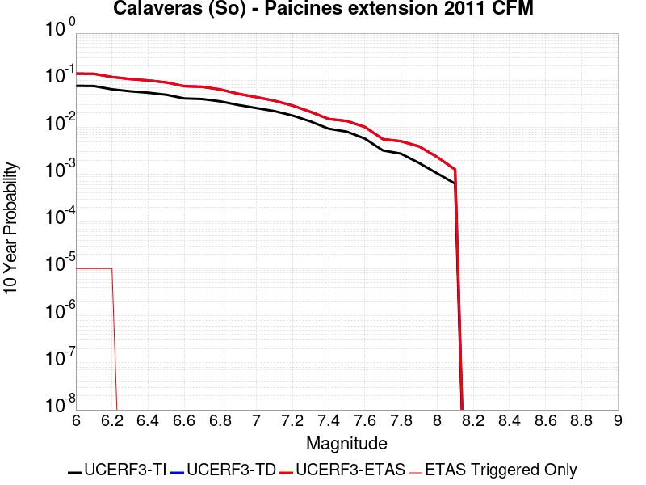 |

| Magnitude | 1 wk TI Prob | 1 wk TD Prob | 1 wk ETAS Prob | 1 wk ETAS/TD Gain | 1 wk ETAS Triggered Only | 1 mo TI Prob | 1 mo TD Prob | 1 mo ETAS Prob | 1 mo ETAS/TD Gain | 1 mo ETAS Triggered Only | 1 yr TI Prob | 1 yr TD Prob | 1 yr ETAS Prob | 1 yr ETAS/TD Gain | 1 yr ETAS Triggered Only | 10 yr TI Prob | 10 yr TD Prob | 10 yr ETAS Prob | 10 yr ETAS/TD Gain | 10 yr ETAS Triggered Only |
|-----|-----|-----|-----|-----|-----|-----|-----|-----|-----|-----|-----|-----|-----|-----|-----|-----|-----|-----|-----|-----|
| 6.0 | 1.5183659E-4 | 3.0520977E-4 | 3.0520977E-4 | 1.0 | 0.0 | 6.5056595E-4 | 0.0013068188 | 0.0013068188 | 1.0 | 0.0 | 0.007891912 | 0.015696203 | 0.015706047 | 1.000627 | 1.0E-5 | 0.076174594 | 0.13848905 | 0.13849767 | 1.0000622 | 1.0E-5 |
| 6.1 | 1.5024997E-4 | 3.021517E-4 | 3.021517E-4 | 1.0 | 0.0 | 6.437695E-4 | 0.0012937278 | 0.0012937278 | 1.0 | 0.0 | 0.0078097614 | 0.015539596 | 0.015549441 | 1.0006335 | 1.0E-5 | 0.075409345 | 0.13715863 | 0.13716726 | 1.000063 | 1.0E-5 |
| 6.2 | 1.2743923E-4 | 2.5313982E-4 | 2.5313982E-4 | 1.0 | 0.0 | 5.460538E-4 | 0.0010839999 | 0.0010839999 | 1.0 | 0.0 | 0.0066279583 | 0.013046881 | 0.013056751 | 1.0007565 | 1.0E-5 | 0.064337276 | 0.117256075 | 0.1172649 | 1.0000753 | 1.0E-5 |
| 6.3 | 1.1525114E-4 | 2.2599236E-4 | 2.2599236E-4 | 1.0 | 0.0 | 4.9383997E-4 | 9.678718E-4 | 9.678718E-4 | 1.0 | 0.0 | 0.0059959386 | 0.011668079 | 0.011668079 | 1.0 | 0.0 | 0.058367174 | 0.106372125 | 0.106372125 | 1.0 | 0.0 |
| 6.4 | 1.07200925E-4 | 2.0840544E-4 | 2.0840544E-4 | 1.0 | 0.0 | 4.5935164E-4 | 8.926123E-4 | 8.926123E-4 | 1.0 | 0.0 | 0.0055782744 | 0.010772959 | 0.010772959 | 1.0 | 0.0 | 0.0544031 | 0.099194765 | 0.099194765 | 1.0 | 0.0 |
| 6.5 | 9.69631E-5 | 1.8734725E-4 | 1.8734725E-4 | 1.0 | 0.0 | 4.1548995E-4 | 8.024631E-4 | 8.024631E-4 | 1.0 | 0.0 | 0.0050468626 | 0.009694842 | 0.009694842 | 1.0 | 0.0 | 0.04933773 | 0.090086564 | 0.090086564 | 1.0 | 0.0 |
| 6.6 | 8.0552316E-5 | 1.507068E-4 | 1.507068E-4 | 1.0 | 0.0 | 3.4517853E-4 | 6.4569083E-4 | 6.4569083E-4 | 1.0 | 0.0 | 0.0041944524 | 0.007826508 | 0.007826508 | 1.0 | 0.0 | 0.04116161 | 0.0748563 | 0.0748563 | 1.0 | 0.0 |
| 6.7 | 7.815757E-5 | 1.4611272E-4 | 1.4611272E-4 | 1.0 | 0.0 | 3.34918E-4 | 6.26014E-4 | 6.26014E-4 | 1.0 | 0.0 | 0.004070005 | 0.007589312 | 0.007589312 | 1.0 | 0.0 | 0.039962657 | 0.07270582 | 0.07270582 | 1.0 | 0.0 |
| 6.8 | 6.965264E-5 | 1.2722758E-4 | 1.2722758E-4 | 1.0 | 0.0 | 2.9847719E-4 | 5.4513285E-4 | 5.4513285E-4 | 1.0 | 0.0 | 0.0036279052 | 0.0066135945 | 0.0066135945 | 1.0 | 0.0 | 0.03569247 | 0.063801065 | 0.063801065 | 1.0 | 0.0 |
| 6.9 | 5.8000453E-5 | 1.01439E-4 | 1.01439E-4 | 1.0 | 0.0 | 2.4854968E-4 | 4.346666E-4 | 4.346666E-4 | 1.0 | 0.0 | 0.0030218933 | 0.005279322 | 0.005279322 | 1.0 | 0.0 | 0.029811295 | 0.051502965 | 0.051502965 | 1.0 | 0.0 |
| 7.0 | 4.9865852E-5 | 8.568029E-5 | 8.568029E-5 | 1.0 | 0.0 | 2.1369329E-4 | 3.6715003E-4 | 3.6715003E-4 | 1.0 | 0.0 | 0.0025986114 | 0.004460979 | 0.004460979 | 1.0 | 0.0 | 0.025684336 | 0.043782018 | 0.043782018 | 1.0 | 0.0 |
| 7.1 | 4.283875E-5 | 7.1124625E-5 | 7.1124625E-5 | 1.0 | 0.0 | 1.8358172E-4 | 3.0478454E-4 | 3.0478454E-4 | 1.0 | 0.0 | 0.0022328163 | 0.003704494 | 0.003704494 | 1.0 | 0.0 | 0.022105146 | 0.03673582 | 0.03673582 | 1.0 | 0.0 |
| 7.2 | 3.450115E-5 | 5.5778568E-5 | 5.5778568E-5 | 1.0 | 0.0 | 1.478537E-4 | 2.3902925E-4 | 2.3902925E-4 | 1.0 | 0.0 | 0.0017986323 | 0.0029063264 | 0.0029063264 | 1.0 | 0.0 | 0.017841442 | 0.029079042 | 0.029079042 | 1.0 | 0.0 |
| 7.3 | 2.5709045E-5 | 4.059001E-5 | 4.059001E-5 | 1.0 | 0.0 | 1.1017697E-4 | 1.7394568E-4 | 1.7394568E-4 | 1.0 | 0.0 | 0.0013405791 | 0.0021157486 | 0.0021157486 | 1.0 | 0.0 | 0.013325208 | 0.02129686 | 0.02129686 | 1.0 | 0.0 |
| 7.4 | 1.8003093E-5 | 2.8511378E-5 | 2.8511378E-5 | 1.0 | 0.0 | 7.715383E-5 | 1.2218591E-4 | 1.2218591E-4 | 1.0 | 0.0 | 9.3894306E-4 | 0.0014866006 | 0.0014866006 | 1.0 | 0.0 | 0.009349857 | 0.015051589 | 0.015051589 | 1.0 | 0.0 |
| 7.5 | 1.5595824E-5 | 2.5823752E-5 | 2.5823752E-5 | 1.0 | 0.0 | 6.683753E-5 | 1.10668545E-4 | 1.10668545E-4 | 1.0 | 0.0 | 8.134431E-4 | 0.0013465589 | 0.0013465589 | 1.0 | 0.0 | 0.008104719 | 0.013651571 | 0.013651571 | 1.0 | 0.0 |
| 7.6 | 1.1110309E-5 | 1.9223195E-5 | 1.9223195E-5 | 1.0 | 0.0 | 4.761474E-5 | 8.2382525E-5 | 8.2382525E-5 | 1.0 | 0.0 | 5.795553E-4 | 0.0010025471 | 0.0010025471 | 1.0 | 0.0 | 0.0057804612 | 0.01020344 | 0.01020344 | 1.0 | 0.0 |
| 7.7 | 6.2140443E-6 | 1.04376995E-5 | 1.04376995E-5 | 1.0 | 0.0 | 2.6631347E-5 | 4.4732235E-5 | 4.4732235E-5 | 1.0 | 0.0 | 3.241884E-4 | 5.4447894E-4 | 5.4447894E-4 | 1.0 | 0.0 | 0.0032371588 | 0.005620102 | 0.005620102 | 1.0 | 0.0 |
| 7.8 | 5.305533E-6 | 9.433651E-6 | 9.433651E-6 | 1.0 | 0.0 | 2.27378E-5 | 4.0429306E-5 | 4.0429306E-5 | 1.0 | 0.0 | 2.7679754E-4 | 4.9211574E-4 | 4.9211574E-4 | 1.0 | 0.0 | 0.0027645302 | 0.005074622 | 0.005074622 | 1.0 | 0.0 |
| 7.9 | 3.363505E-6 | 7.3854467E-6 | 7.3854467E-6 | 1.0 | 0.0 | 1.4414942E-5 | 3.1651532E-5 | 3.1651532E-5 | 1.0 | 0.0 | 1.7548777E-4 | 3.8528934E-4 | 3.8528934E-4 | 1.0 | 0.0 | 0.0017534926 | 0.003948784 | 0.003948784 | 1.0 | 0.0 |
| 8.0 | 2.0271132E-6 | 4.4134235E-6 | 4.4134235E-6 | 1.0 | 0.0 | 8.687599E-6 | 1.8914534E-5 | 1.8914534E-5 | 1.0 | 0.0 | 1.05766376E-4 | 2.3026018E-4 | 2.3026018E-4 | 1.0 | 0.0 | 0.0010571606 | 0.002351194 | 0.002351194 | 1.0 | 0.0 |
| 8.1 | 1.2206116E-6 | 2.3752666E-6 | 2.3752666E-6 | 1.0 | 0.0 | 5.2311816E-6 | 1.0179674E-5 | 1.0179674E-5 | 1.0 | 0.0 | 6.3687774E-5 | 1.2393051E-4 | 1.2393051E-4 | 1.0 | 0.0 | 6.366953E-4 | 0.0012705618 | 0.0012705618 | 1.0 | 0.0 |

## Bullion Mountains
*[(top)](#table-of-contents)*

| 1 Week | 1 Month | 1 Year | 10 Year |
|-----|-----|-----|-----|
|  | 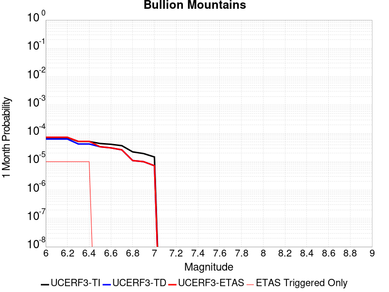 |  |  |

| Magnitude | 1 wk TI Prob | 1 wk TD Prob | 1 wk ETAS Prob | 1 wk ETAS/TD Gain | 1 wk ETAS Triggered Only | 1 mo TI Prob | 1 mo TD Prob | 1 mo ETAS Prob | 1 mo ETAS/TD Gain | 1 mo ETAS Triggered Only | 1 yr TI Prob | 1 yr TD Prob | 1 yr ETAS Prob | 1 yr ETAS/TD Gain | 1 yr ETAS Triggered Only | 10 yr TI Prob | 10 yr TD Prob | 10 yr ETAS Prob | 10 yr ETAS/TD Gain | 10 yr ETAS Triggered Only |
|-----|-----|-----|-----|-----|-----|-----|-----|-----|-----|-----|-----|-----|-----|-----|-----|-----|-----|-----|-----|-----|
| 6.0 | 1.6420427E-5 | 1.4692009E-5 | 2.4691863E-5 | 1.6806321 | 1.0E-5 | 7.037136E-5 | 6.296445E-5 | 7.296382E-5 | 1.1588098 | 1.0E-5 | 8.5643446E-4 | 7.6636096E-4 | 7.763533E-4 | 1.0130386 | 1.0E-5 | 0.008531413 | 0.0076409746 | 0.0076508983 | 1.0012988 | 1.0E-5 |
| 6.1 | 1.6420427E-5 | 1.4692009E-5 | 2.4691863E-5 | 1.6806321 | 1.0E-5 | 7.037136E-5 | 6.296445E-5 | 7.296382E-5 | 1.1588098 | 1.0E-5 | 8.5643446E-4 | 7.6636096E-4 | 7.763533E-4 | 1.0130386 | 1.0E-5 | 0.008531413 | 0.0076409746 | 0.0076508983 | 1.0012988 | 1.0E-5 |
| 6.2 | 1.6420427E-5 | 1.4692009E-5 | 2.4691863E-5 | 1.6806321 | 1.0E-5 | 7.037136E-5 | 6.296445E-5 | 7.296382E-5 | 1.1588098 | 1.0E-5 | 8.5643446E-4 | 7.6636096E-4 | 7.763533E-4 | 1.0130386 | 1.0E-5 | 0.008531413 | 0.0076409746 | 0.0076508983 | 1.0012988 | 1.0E-5 |
| 6.3 | 1.2046778E-5 | 9.862255E-6 | 1.9862156E-5 | 2.0139568 | 1.0E-5 | 5.1628023E-5 | 4.2266256E-5 | 5.226583E-5 | 1.2365854 | 1.0E-5 | 6.283899E-4 | 5.144933E-4 | 5.2448816E-4 | 1.0194266 | 1.0E-5 | 0.0062661595 | 0.0051353034 | 0.005145252 | 1.0019373 | 1.0E-5 |
| 6.4 | 1.2046778E-5 | 9.862255E-6 | 1.9862156E-5 | 2.0139568 | 1.0E-5 | 5.1628023E-5 | 4.2266256E-5 | 5.226583E-5 | 1.2365854 | 1.0E-5 | 6.283899E-4 | 5.144933E-4 | 5.2448816E-4 | 1.0194266 | 1.0E-5 | 0.0062661595 | 0.0051353034 | 0.005145252 | 1.0019373 | 1.0E-5 |
| 6.5 | 1.0244343E-5 | 7.879378E-6 | 7.879378E-6 | 1.0 | 0.0 | 4.390359E-5 | 3.3768443E-5 | 3.3768443E-5 | 1.0 | 0.0 | 5.343951E-4 | 4.1107394E-4 | 4.1107394E-4 | 1.0 | 0.0 | 0.005331118 | 0.0041051665 | 0.0041051665 | 1.0 | 0.0 |
| 6.6 | 9.605408E-6 | 7.1774166E-6 | 7.1774166E-6 | 1.0 | 0.0 | 4.1165385E-5 | 3.0760108E-5 | 3.0760108E-5 | 1.0 | 0.0 | 5.010733E-4 | 3.7446033E-4 | 3.7446033E-4 | 1.0 | 0.0 | 0.00499945 | 0.0037402906 | 0.0037402906 | 1.0 | 0.0 |
| 6.7 | 8.60418E-6 | 6.123926E-6 | 6.123926E-6 | 1.0 | 0.0 | 3.687454E-5 | 2.6245243E-5 | 2.6245243E-5 | 1.0 | 0.0 | 4.48855E-4 | 3.195085E-4 | 3.195085E-4 | 1.0 | 0.0 | 0.004479495 | 0.0031924031 | 0.0031924031 | 1.0 | 0.0 |
| 6.8 | 5.187994E-6 | 2.563117E-6 | 2.563117E-6 | 1.0 | 0.0 | 2.223407E-5 | 1.0984763E-5 | 1.0984763E-5 | 1.0 | 0.0 | 2.7066618E-4 | 1.3373529E-4 | 1.3373529E-4 | 1.0 | 0.0 | 0.0027033675 | 0.0013369396 | 0.0013369396 | 1.0 | 0.0 |
| 6.9 | 4.5302368E-6 | 2.3442778E-6 | 2.3442778E-6 | 1.0 | 0.0 | 1.9415156E-5 | 1.0046889E-5 | 1.0046889E-5 | 1.0 | 0.0 | 2.3635388E-4 | 1.2231797E-4 | 1.2231797E-4 | 1.0 | 0.0 | 0.0023610266 | 0.0012228956 | 0.0012228956 | 1.0 | 0.0 |
| 7.0 | 3.431668E-6 | 1.6882177E-6 | 1.6882177E-6 | 1.0 | 0.0 | 1.4707065E-5 | 7.2352186E-6 | 7.2352186E-6 | 1.0 | 0.0 | 1.7904381E-4 | 8.808879E-5 | 8.808879E-5 | 1.0 | 0.0 | 0.0017889962 | 8.8088785E-4 | 8.8088785E-4 | 1.0 | 0.0 |

## Goose Lake 2011 CFM
*[(top)](#table-of-contents)*

| 1 Week | 1 Month | 1 Year | 10 Year |
|-----|-----|-----|-----|
|  |  |  |  |

| Magnitude | 1 wk TI Prob | 1 wk TD Prob | 1 wk ETAS Prob | 1 wk ETAS/TD Gain | 1 wk ETAS Triggered Only | 1 mo TI Prob | 1 mo TD Prob | 1 mo ETAS Prob | 1 mo ETAS/TD Gain | 1 mo ETAS Triggered Only | 1 yr TI Prob | 1 yr TD Prob | 1 yr ETAS Prob | 1 yr ETAS/TD Gain | 1 yr ETAS Triggered Only | 10 yr TI Prob | 10 yr TD Prob | 10 yr ETAS Prob | 10 yr ETAS/TD Gain | 10 yr ETAS Triggered Only |
|-----|-----|-----|-----|-----|-----|-----|-----|-----|-----|-----|-----|-----|-----|-----|-----|-----|-----|-----|-----|-----|
| 6.0 | 3.780968E-6 | 3.8230223E-6 | 3.8230223E-6 | 1.0 | 0.0 | 1.6204049E-5 | 1.6384285E-5 | 1.6384285E-5 | 1.0 | 0.0 | 1.9726643E-4 | 1.994615E-4 | 2.0945951E-4 | 1.050125 | 1.0E-5 | 0.001970914 | 0.001992933 | 0.002002913 | 1.0050077 | 1.0E-5 |
| 6.1 | 2.2035124E-6 | 2.229801E-6 | 2.229801E-6 | 1.0 | 0.0 | 9.443591E-6 | 9.556257E-6 | 9.556257E-6 | 1.0 | 0.0 | 1.1496965E-4 | 1.163414E-4 | 1.163414E-4 | 1.0 | 0.0 | 0.0011491019 | 0.0011628233 | 0.0011628233 | 1.0 | 0.0 |
| 6.2 | 1.5624689E-6 | 1.5826923E-6 | 1.5826923E-6 | 1.0 | 0.0 | 6.6962784E-6 | 6.7829496E-6 | 6.7829496E-6 | 1.0 | 0.0 | 8.152414E-5 | 8.2579325E-5 | 8.2579325E-5 | 1.0 | 0.0 | 8.1494235E-4 | 8.2549086E-4 | 8.2549086E-4 | 1.0 | 0.0 |
| 6.3 | 1.5624689E-6 | 1.5826923E-6 | 1.5826923E-6 | 1.0 | 0.0 | 6.6962784E-6 | 6.7829496E-6 | 6.7829496E-6 | 1.0 | 0.0 | 8.152414E-5 | 8.2579325E-5 | 8.2579325E-5 | 1.0 | 0.0 | 8.1494235E-4 | 8.2549086E-4 | 8.2549086E-4 | 1.0 | 0.0 |
| 6.4 | 1.256464E-6 | 1.2738695E-6 | 1.2738695E-6 | 1.0 | 0.0 | 5.3848344E-6 | 5.4594293E-6 | 5.4594293E-6 | 1.0 | 0.0 | 6.5558386E-5 | 6.646655E-5 | 6.646655E-5 | 1.0 | 0.0 | 6.553905E-4 | 6.644687E-4 | 6.644687E-4 | 1.0 | 0.0 |
| 6.5 | 1.0910911E-6 | 1.1069404E-6 | 1.1069404E-6 | 1.0 | 0.0 | 4.6760965E-6 | 4.7440217E-6 | 4.7440217E-6 | 1.0 | 0.0 | 5.692999E-5 | 5.7756948E-5 | 5.7756948E-5 | 1.0 | 0.0 | 5.6915404E-4 | 5.7742064E-4 | 5.7742064E-4 | 1.0 | 0.0 |
| 6.6 | 9.546601E-7 | 9.691246E-7 | 9.691246E-7 | 1.0 | 0.0 | 4.091394E-6 | 4.1533845E-6 | 4.1533845E-6 | 1.0 | 0.0 | 4.9811584E-5 | 5.056629E-5 | 5.056629E-5 | 1.0 | 0.0 | 4.980042E-4 | 5.055487E-4 | 5.055487E-4 | 1.0 | 0.0 |
| 6.7 | 7.790316E-7 | 7.9159634E-7 | 7.9159634E-7 | 1.0 | 0.0 | 3.3387028E-6 | 3.3925514E-6 | 3.3925514E-6 | 1.0 | 0.0 | 4.0647945E-5 | 4.1303538E-5 | 4.1303538E-5 | 1.0 | 0.0 | 4.0640513E-4 | 4.129592E-4 | 4.129592E-4 | 1.0 | 0.0 |
| 6.8 | 6.3714384E-7 | 6.4787395E-7 | 6.4787395E-7 | 1.0 | 0.0 | 2.7306137E-6 | 2.7765998E-6 | 2.7765998E-6 | 1.0 | 0.0 | 3.3244716E-5 | 3.3804583E-5 | 3.3804583E-5 | 1.0 | 0.0 | 3.323974E-4 | 3.379949E-4 | 3.379949E-4 | 1.0 | 0.0 |
| 6.9 | 4.92586E-7 | 5.0139147E-7 | 5.0139147E-7 | 1.0 | 0.0 | 2.1110811E-6 | 2.1488188E-6 | 2.1488188E-6 | 1.0 | 0.0 | 2.5702111E-5 | 2.616156E-5 | 2.616156E-5 | 1.0 | 0.0 | 2.569914E-4 | 2.6158517E-4 | 2.6158517E-4 | 1.0 | 0.0 |
| 7.0 | 3.130245E-7 | 3.190354E-7 | 3.190354E-7 | 1.0 | 0.0 | 1.3415328E-6 | 1.3672939E-6 | 1.3672939E-6 | 1.0 | 0.0 | 1.6333039E-5 | 1.6646678E-5 | 1.6646678E-5 | 1.0 | 0.0 | 1.6331839E-4 | 1.6645451E-4 | 1.6645451E-4 | 1.0 | 0.0 |
| 7.1 | 1.7680084E-7 | 1.8023923E-7 | 1.8023923E-7 | 1.0 | 0.0 | 7.5771766E-7 | 7.724536E-7 | 7.724536E-7 | 1.0 | 0.0 | 9.225173E-6 | 9.404583E-6 | 9.404583E-6 | 1.0 | 0.0 | 9.22479E-5 | 9.4041956E-5 | 9.4041956E-5 | 1.0 | 0.0 |
| 7.2 | 4.8641045E-8 | 4.9402068E-8 | 4.9402068E-8 | 1.0 | 0.0 | 2.084616E-7 | 2.1172312E-7 | 2.1172312E-7 | 1.0 | 0.0 | 2.538017E-6 | 2.577726E-6 | 2.577726E-6 | 1.0 | 0.0 | 2.537988E-5 | 2.5776973E-5 | 2.5776973E-5 | 1.0 | 0.0 |
| 7.3 | 5.3911844E-9 | 5.4758145E-9 | 5.4758145E-9 | 1.0 | 0.0 | 2.3105075E-8 | 2.3467775E-8 | 2.3467775E-8 | 1.0 | 0.0 | 2.8130427E-7 | 2.8572015E-7 | 2.8572015E-7 | 1.0 | 0.0 | 2.8130391E-6 | 2.8571992E-6 | 2.8571992E-6 | 1.0 | 0.0 |

## Russ 2011 CFM
*[(top)](#table-of-contents)*

| 1 Week | 1 Month | 1 Year | 10 Year |
|-----|-----|-----|-----|
|  |  | 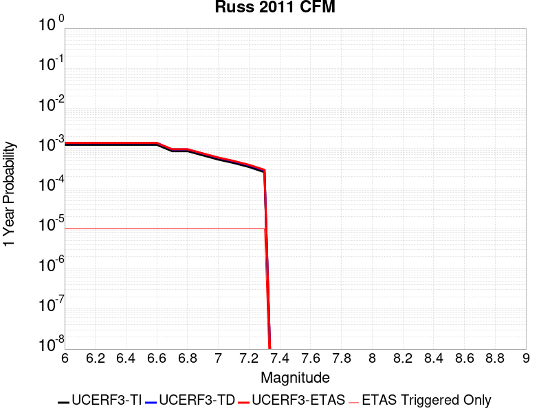 |  |

| Magnitude | 1 wk TI Prob | 1 wk TD Prob | 1 wk ETAS Prob | 1 wk ETAS/TD Gain | 1 wk ETAS Triggered Only | 1 mo TI Prob | 1 mo TD Prob | 1 mo ETAS Prob | 1 mo ETAS/TD Gain | 1 mo ETAS Triggered Only | 1 yr TI Prob | 1 yr TD Prob | 1 yr ETAS Prob | 1 yr ETAS/TD Gain | 1 yr ETAS Triggered Only | 10 yr TI Prob | 10 yr TD Prob | 10 yr ETAS Prob | 10 yr ETAS/TD Gain | 10 yr ETAS Triggered Only |
|-----|-----|-----|-----|-----|-----|-----|-----|-----|-----|-----|-----|-----|-----|-----|-----|-----|-----|-----|-----|-----|
| 6.0 | 2.3806366E-5 | 2.6254156E-5 | 3.6253892E-5 | 1.3808821 | 1.0E-5 | 1.0202329E-4 | 1.1251331E-4 | 1.225122E-4 | 1.0888684 | 1.0E-5 | 0.0012414258 | 0.0013690525 | 0.0013790388 | 1.0072943 | 1.0E-5 | 0.012345135 | 0.013612664 | 0.013622528 | 1.0007246 | 1.0E-5 |
| 6.1 | 2.3806366E-5 | 2.6254156E-5 | 3.6253892E-5 | 1.3808821 | 1.0E-5 | 1.0202329E-4 | 1.1251331E-4 | 1.225122E-4 | 1.0888684 | 1.0E-5 | 0.0012414258 | 0.0013690525 | 0.0013790388 | 1.0072943 | 1.0E-5 | 0.012345135 | 0.013612664 | 0.013622528 | 1.0007246 | 1.0E-5 |
| 6.2 | 2.3806366E-5 | 2.6254156E-5 | 3.6253892E-5 | 1.3808821 | 1.0E-5 | 1.0202329E-4 | 1.1251331E-4 | 1.225122E-4 | 1.0888684 | 1.0E-5 | 0.0012414258 | 0.0013690525 | 0.0013790388 | 1.0072943 | 1.0E-5 | 0.012345135 | 0.013612664 | 0.013622528 | 1.0007246 | 1.0E-5 |
| 6.3 | 2.3806366E-5 | 2.6254156E-5 | 3.6253892E-5 | 1.3808821 | 1.0E-5 | 1.0202329E-4 | 1.1251331E-4 | 1.225122E-4 | 1.0888684 | 1.0E-5 | 0.0012414258 | 0.0013690525 | 0.0013790388 | 1.0072943 | 1.0E-5 | 0.012345135 | 0.013612664 | 0.013622528 | 1.0007246 | 1.0E-5 |
| 6.4 | 2.3806366E-5 | 2.6254156E-5 | 3.6253892E-5 | 1.3808821 | 1.0E-5 | 1.0202329E-4 | 1.1251331E-4 | 1.225122E-4 | 1.0888684 | 1.0E-5 | 0.0012414258 | 0.0013690525 | 0.0013790388 | 1.0072943 | 1.0E-5 | 0.012345135 | 0.013612664 | 0.013622528 | 1.0007246 | 1.0E-5 |
| 6.5 | 2.3806366E-5 | 2.6254156E-5 | 3.6253892E-5 | 1.3808821 | 1.0E-5 | 1.0202329E-4 | 1.1251331E-4 | 1.225122E-4 | 1.0888684 | 1.0E-5 | 0.0012414258 | 0.0013690525 | 0.0013790388 | 1.0072943 | 1.0E-5 | 0.012345135 | 0.013612664 | 0.013622528 | 1.0007246 | 1.0E-5 |
| 6.6 | 2.3806366E-5 | 2.6254156E-5 | 3.6253892E-5 | 1.3808821 | 1.0E-5 | 1.0202329E-4 | 1.1251331E-4 | 1.225122E-4 | 1.0888684 | 1.0E-5 | 0.0012414258 | 0.0013690525 | 0.0013790388 | 1.0072943 | 1.0E-5 | 0.012345135 | 0.013612664 | 0.013622528 | 1.0007246 | 1.0E-5 |
| 6.7 | 1.6515693E-5 | 1.8187944E-5 | 2.8187764E-5 | 1.5498047 | 1.0E-5 | 7.077962E-5 | 7.79462E-5 | 8.794542E-5 | 1.1282836 | 1.0E-5 | 8.6140115E-4 | 9.486156E-4 | 9.586061E-4 | 1.0105317 | 1.0E-5 | 0.008580698 | 0.009449055 | 0.009458961 | 1.0010483 | 1.0E-5 |
| 6.8 | 1.6515693E-5 | 1.8187944E-5 | 2.8187764E-5 | 1.5498047 | 1.0E-5 | 7.077962E-5 | 7.79462E-5 | 8.794542E-5 | 1.1282836 | 1.0E-5 | 8.6140115E-4 | 9.486156E-4 | 9.586061E-4 | 1.0105317 | 1.0E-5 | 0.008580698 | 0.009449055 | 0.009458961 | 1.0010483 | 1.0E-5 |
| 6.9 | 1.2971182E-5 | 1.4273831E-5 | 2.4273688E-5 | 1.7005727 | 1.0E-5 | 5.5589593E-5 | 6.117227E-5 | 7.1171664E-5 | 1.1634628 | 1.0E-5 | 6.765931E-4 | 7.4454385E-4 | 7.5453636E-4 | 1.013421 | 1.0E-5 | 0.0067453682 | 0.0074230675 | 0.0074329935 | 1.0013372 | 1.0E-5 |
| 7.0 | 1.0201805E-5 | 1.1221911E-5 | 2.12218E-5 | 1.8911037 | 1.0E-5 | 4.3721288E-5 | 4.8093138E-5 | 5.8092657E-5 | 1.2079198 | 1.0E-5 | 5.3217664E-4 | 5.853974E-4 | 5.9539155E-4 | 1.0170724 | 1.0E-5 | 0.00530904 | 0.005840605 | 0.005850547 | 1.0017022 | 1.0E-5 |
| 7.1 | 8.3744935E-6 | 9.2126675E-6 | 1.9212575E-5 | 2.085452 | 1.0E-5 | 3.5890193E-5 | 3.9482366E-5 | 4.9481972E-5 | 1.2532676 | 1.0E-5 | 4.368755E-4 | 4.8061032E-4 | 4.9060554E-4 | 1.0207969 | 1.0E-5 | 0.004360176 | 0.0047975346 | 0.0048074867 | 1.0020744 | 1.0E-5 |
| 7.2 | 6.649391E-6 | 7.3170095E-6 | 1.7316936E-5 | 2.3666687 | 1.0E-5 | 2.8497077E-5 | 3.135833E-5 | 4.1358013E-5 | 1.3188846 | 1.0E-5 | 3.4689668E-4 | 3.8173737E-4 | 3.9173354E-4 | 1.026186 | 1.0E-5 | 0.0034635565 | 0.0038124465 | 0.0038224084 | 1.002613 | 1.0E-5 |
| 7.3 | 4.9549312E-6 | 5.454593E-6 | 1.5454538E-5 | 2.8333073 | 1.0E-5 | 2.1235246E-5 | 2.33767E-5 | 3.3376466E-5 | 1.4277663 | 1.0E-5 | 2.5850846E-4 | 2.8458887E-4 | 2.9458603E-4 | 1.0351284 | 1.0E-5 | 0.0025820795 | 0.0028436882 | 0.00285366 | 1.0035065 | 1.0E-5 |

## Calaveras (No) 2011 CFM
*[(top)](#table-of-contents)*

| 1 Week | 1 Month | 1 Year | 10 Year |
|-----|-----|-----|-----|
|  |  |  |  |

| Magnitude | 1 wk TI Prob | 1 wk TD Prob | 1 wk ETAS Prob | 1 wk ETAS/TD Gain | 1 wk ETAS Triggered Only | 1 mo TI Prob | 1 mo TD Prob | 1 mo ETAS Prob | 1 mo ETAS/TD Gain | 1 mo ETAS Triggered Only | 1 yr TI Prob | 1 yr TD Prob | 1 yr ETAS Prob | 1 yr ETAS/TD Gain | 1 yr ETAS Triggered Only | 10 yr TI Prob | 10 yr TD Prob | 10 yr ETAS Prob | 10 yr ETAS/TD Gain | 10 yr ETAS Triggered Only |
|-----|-----|-----|-----|-----|-----|-----|-----|-----|-----|-----|-----|-----|-----|-----|-----|-----|-----|-----|-----|-----|
| 6.0 | 4.8694856E-5 | 6.747457E-5 | 6.747457E-5 | 1.0 | 0.0 | 2.0867554E-4 | 2.891453E-4 | 2.891453E-4 | 1.0 | 0.0 | 0.0025376645 | 0.0035146773 | 0.0035146773 | 1.0 | 0.0 | 0.02508881 | 0.034771074 | 0.034780726 | 1.0002776 | 1.0E-5 |
| 6.1 | 4.8694856E-5 | 6.747457E-5 | 6.747457E-5 | 1.0 | 0.0 | 2.0867554E-4 | 2.891453E-4 | 2.891453E-4 | 1.0 | 0.0 | 0.0025376645 | 0.0035146773 | 0.0035146773 | 1.0 | 0.0 | 0.02508881 | 0.034771074 | 0.034780726 | 1.0002776 | 1.0E-5 |
| 6.2 | 4.7541962E-5 | 6.5805805E-5 | 6.5805805E-5 | 1.0 | 0.0 | 2.0373536E-4 | 2.8199502E-4 | 2.8199502E-4 | 1.0 | 0.0 | 0.0024776561 | 0.003427919 | 0.003427919 | 1.0 | 0.0 | 0.024502134 | 0.0339325 | 0.03394216 | 1.0002847 | 1.0E-5 |
| 6.3 | 4.6717287E-5 | 6.463939E-5 | 6.463939E-5 | 1.0 | 0.0 | 2.0020158E-4 | 2.7699716E-4 | 2.7699716E-4 | 1.0 | 0.0 | 0.0024347296 | 0.0033672696 | 0.0033672696 | 1.0 | 0.0 | 0.024082264 | 0.033345006 | 0.033354674 | 1.0002899 | 1.0E-5 |
| 6.4 | 4.6276386E-5 | 6.400103E-5 | 6.400103E-5 | 1.0 | 0.0 | 1.983123E-4 | 2.7426204E-4 | 2.7426204E-4 | 1.0 | 0.0 | 0.0024117786 | 0.00333408 | 0.00333408 | 1.0 | 0.0 | 0.02385771 | 0.03302388 | 0.03303355 | 1.0002928 | 1.0E-5 |
| 6.5 | 4.5720994E-5 | 6.32025E-5 | 6.32025E-5 | 1.0 | 0.0 | 1.9593239E-4 | 2.7084045E-4 | 2.7084045E-4 | 1.0 | 0.0 | 0.002382867 | 0.0032925585 | 0.0032925585 | 1.0 | 0.0 | 0.023574775 | 0.032621842 | 0.032631516 | 1.0002966 | 1.0E-5 |
| 6.6 | 4.549134E-5 | 6.285557E-5 | 6.285557E-5 | 1.0 | 0.0 | 1.949483E-4 | 2.693539E-4 | 2.693539E-4 | 1.0 | 0.0 | 0.0023709119 | 0.0032745146 | 0.0032745146 | 1.0 | 0.0 | 0.023457756 | 0.03244731 | 0.032456987 | 1.0002981 | 1.0E-5 |
| 6.7 | 3.701047E-5 | 5.03607E-5 | 5.03607E-5 | 1.0 | 0.0 | 1.5860666E-4 | 2.1581395E-4 | 2.1581395E-4 | 1.0 | 0.0 | 0.0019293258 | 0.002624412 | 0.002624412 | 1.0 | 0.0 | 0.019126613 | 0.026125198 | 0.026134938 | 1.0003728 | 1.0E-5 |
| 6.8 | 3.5523568E-5 | 4.834225E-5 | 4.834225E-5 | 1.0 | 0.0 | 1.5223498E-4 | 2.0716486E-4 | 2.0716486E-4 | 1.0 | 0.0 | 0.0018518851 | 0.0025193577 | 0.0025193577 | 1.0 | 0.0 | 0.018365284 | 0.025097623 | 0.025107373 | 1.0003885 | 1.0E-5 |
| 6.9 | 3.2946147E-5 | 4.4663826E-5 | 4.4663826E-5 | 1.0 | 0.0 | 1.4119013E-4 | 1.9140259E-4 | 1.9140259E-4 | 1.0 | 0.0 | 0.0017176344 | 0.0023278783 | 0.0023278783 | 1.0 | 0.0 | 0.017044188 | 0.023219762 | 0.02322953 | 1.0004207 | 1.0E-5 |
| 7.0 | 2.7682381E-5 | 3.7023216E-5 | 3.7023216E-5 | 1.0 | 0.0 | 1.1863338E-4 | 1.5866144E-4 | 1.5866144E-4 | 1.0 | 0.0 | 0.0014434044 | 0.0019300217 | 0.0019300217 | 1.0 | 0.0 | 0.01434065 | 0.019311164 | 0.019311164 | 1.0 | 0.0 |
| 7.1 | 2.471967E-5 | 3.328756E-5 | 3.328756E-5 | 1.0 | 0.0 | 1.05937135E-4 | 1.4265333E-4 | 1.4265333E-4 | 1.0 | 0.0 | 0.0012890215 | 0.0017354497 | 0.0017354497 | 1.0 | 0.0 | 0.0128157 | 0.017386293 | 0.017386293 | 1.0 | 0.0 |
| 7.2 | 1.9748062E-5 | 2.6775411E-5 | 2.6775411E-5 | 1.0 | 0.0 | 8.463181E-5 | 1.1474685E-4 | 1.1474685E-4 | 1.0 | 0.0 | 0.0010299052 | 0.001396171 | 0.001396171 | 1.0 | 0.0 | 0.01025145 | 0.014031046 | 0.014031046 | 1.0 | 0.0 |
| 7.3 | 1.1603734E-5 | 1.5784257E-5 | 1.5784257E-5 | 1.0 | 0.0 | 4.9729337E-5 | 6.7645145E-5 | 6.7645145E-5 | 1.0 | 0.0 | 6.052865E-4 | 8.232826E-4 | 8.232826E-4 | 1.0 | 0.0 | 0.0060364045 | 0.008308739 | 0.008308739 | 1.0 | 0.0 |
| 7.4 | 4.885381E-6 | 6.035117E-6 | 6.035117E-6 | 1.0 | 0.0 | 2.0937177E-5 | 2.5864532E-5 | 2.5864532E-5 | 1.0 | 0.0 | 2.5488032E-4 | 3.1485534E-4 | 3.1485534E-4 | 1.0 | 0.0 | 0.0025458818 | 0.0032009764 | 0.0032009764 | 1.0 | 0.0 |
| 7.5 | 3.0571264E-6 | 4.1554085E-6 | 4.1554085E-6 | 1.0 | 0.0 | 1.3101904E-5 | 1.7808772E-5 | 1.7808772E-5 | 1.0 | 0.0 | 1.5950401E-4 | 2.1680034E-4 | 2.1680034E-4 | 1.0 | 0.0 | 0.0015938957 | 0.0022209007 | 0.0022209007 | 1.0 | 0.0 |
| 7.6 | 1.764948E-6 | 2.795641E-6 | 2.795641E-6 | 1.0 | 0.0 | 7.564041E-6 | 1.1981264E-5 | 1.1981264E-5 | 1.0 | 0.0 | 9.208831E-5 | 1.458622E-4 | 1.458622E-4 | 1.0 | 0.0 | 9.205016E-4 | 0.0015124046 | 0.0015124046 | 1.0 | 0.0 |
| 7.7 | 1.3173734E-6 | 2.0585271E-6 | 2.0585271E-6 | 1.0 | 0.0 | 5.645874E-6 | 8.82223E-6 | 8.82223E-6 | 1.0 | 0.0 | 6.873634E-5 | 1.0740537E-4 | 1.0740537E-4 | 1.0 | 0.0 | 6.8715087E-4 | 0.0011261607 | 0.0011261607 | 1.0 | 0.0 |
| 7.8 | 9.4429885E-7 | 1.5490102E-6 | 1.5490102E-6 | 1.0 | 0.0 | 4.0469886E-6 | 6.6385983E-6 | 6.6385983E-6 | 1.0 | 0.0 | 4.9270973E-5 | 8.082195E-5 | 8.082195E-5 | 1.0 | 0.0 | 4.926005E-4 | 8.501931E-4 | 8.501931E-4 | 1.0 | 0.0 |
| 7.9 | 6.388233E-7 | 1.11492E-6 | 1.11492E-6 | 1.0 | 0.0 | 2.7378112E-6 | 4.7782196E-6 | 4.7782196E-6 | 1.0 | 0.0 | 3.3332344E-5 | 5.8173282E-5 | 5.8173282E-5 | 1.0 | 0.0 | 3.3327343E-4 | 6.096674E-4 | 6.096674E-4 | 1.0 | 0.0 |
| 8.0 | 3.087986E-7 | 5.754721E-7 | 5.754721E-7 | 1.0 | 0.0 | 1.323422E-6 | 2.4663066E-6 | 2.4663066E-6 | 1.0 | 0.0 | 1.6112543E-5 | 3.0026871E-5 | 3.0026871E-5 | 1.0 | 0.0 | 1.6111376E-4 | 3.110238E-4 | 3.110238E-4 | 1.0 | 0.0 |
| 8.1 | 1.6725647E-7 | 2.7410795E-7 | 2.7410795E-7 | 1.0 | 0.0 | 7.168133E-7 | 1.1747478E-6 | 1.1747478E-6 | 1.0 | 0.0 | 8.7271665E-6 | 1.4302462E-5 | 1.4302462E-5 | 1.0 | 0.0 | 8.726824E-5 | 1.4847395E-4 | 1.4847395E-4 | 1.0 | 0.0 |

## Santa Susana alt 1
*[(top)](#table-of-contents)*

| 1 Week | 1 Month | 1 Year | 10 Year |
|-----|-----|-----|-----|
|  |  |  |  |

| Magnitude | 1 wk TI Prob | 1 wk TD Prob | 1 wk ETAS Prob | 1 wk ETAS/TD Gain | 1 wk ETAS Triggered Only | 1 mo TI Prob | 1 mo TD Prob | 1 mo ETAS Prob | 1 mo ETAS/TD Gain | 1 mo ETAS Triggered Only | 1 yr TI Prob | 1 yr TD Prob | 1 yr ETAS Prob | 1 yr ETAS/TD Gain | 1 yr ETAS Triggered Only | 10 yr TI Prob | 10 yr TD Prob | 10 yr ETAS Prob | 10 yr ETAS/TD Gain | 10 yr ETAS Triggered Only |
|-----|-----|-----|-----|-----|-----|-----|-----|-----|-----|-----|-----|-----|-----|-----|-----|-----|-----|-----|-----|-----|
| 6.0 | 2.674877E-5 | 2.7198214E-5 | 2.7198214E-5 | 1.0 | 0.0 | 1.1463255E-4 | 1.16559204E-4 | 1.16559204E-4 | 1.0 | 0.0 | 0.0013947578 | 0.0014182981 | 0.001428284 | 1.0070407 | 1.0E-5 | 0.013860362 | 0.014104388 | 0.014114247 | 1.000699 | 1.0E-5 |
| 6.1 | 2.674877E-5 | 2.7198214E-5 | 2.7198214E-5 | 1.0 | 0.0 | 1.1463255E-4 | 1.16559204E-4 | 1.16559204E-4 | 1.0 | 0.0 | 0.0013947578 | 0.0014182981 | 0.001428284 | 1.0070407 | 1.0E-5 | 0.013860362 | 0.014104388 | 0.014114247 | 1.000699 | 1.0E-5 |
| 6.2 | 2.674877E-5 | 2.7198214E-5 | 2.7198214E-5 | 1.0 | 0.0 | 1.1463255E-4 | 1.16559204E-4 | 1.16559204E-4 | 1.0 | 0.0 | 0.0013947578 | 0.0014182981 | 0.001428284 | 1.0070407 | 1.0E-5 | 0.013860362 | 0.014104388 | 0.014114247 | 1.000699 | 1.0E-5 |
| 6.3 | 2.674877E-5 | 2.7198214E-5 | 2.7198214E-5 | 1.0 | 0.0 | 1.1463255E-4 | 1.16559204E-4 | 1.16559204E-4 | 1.0 | 0.0 | 0.0013947578 | 0.0014182981 | 0.001428284 | 1.0070407 | 1.0E-5 | 0.013860362 | 0.014104388 | 0.014114247 | 1.000699 | 1.0E-5 |
| 6.4 | 2.674877E-5 | 2.7198214E-5 | 2.7198214E-5 | 1.0 | 0.0 | 1.1463255E-4 | 1.16559204E-4 | 1.16559204E-4 | 1.0 | 0.0 | 0.0013947578 | 0.0014182981 | 0.001428284 | 1.0070407 | 1.0E-5 | 0.013860362 | 0.014104388 | 0.014114247 | 1.000699 | 1.0E-5 |
| 6.5 | 2.674877E-5 | 2.7198214E-5 | 2.7198214E-5 | 1.0 | 0.0 | 1.1463255E-4 | 1.16559204E-4 | 1.16559204E-4 | 1.0 | 0.0 | 0.0013947578 | 0.0014182981 | 0.001428284 | 1.0070407 | 1.0E-5 | 0.013860362 | 0.014104388 | 0.014114247 | 1.000699 | 1.0E-5 |
| 6.6 | 2.6647976E-5 | 2.7074553E-5 | 2.7074553E-5 | 1.0 | 0.0 | 1.14200615E-4 | 1.16029274E-4 | 1.16029274E-4 | 1.0 | 0.0 | 0.0013895056 | 0.0014118546 | 0.0014218405 | 1.0070729 | 1.0E-5 | 0.013808494 | 0.014040773 | 0.014050633 | 1.0007023 | 1.0E-5 |
| 6.7 | 2.6647976E-5 | 2.7074553E-5 | 2.7074553E-5 | 1.0 | 0.0 | 1.14200615E-4 | 1.16029274E-4 | 1.16029274E-4 | 1.0 | 0.0 | 0.0013895056 | 0.0014118546 | 0.0014218405 | 1.0070729 | 1.0E-5 | 0.013808494 | 0.014040773 | 0.014050633 | 1.0007023 | 1.0E-5 |
| 6.8 | 1.9073179E-5 | 1.7637467E-5 | 1.7637467E-5 | 1.0 | 0.0 | 8.1739636E-5 | 7.558706E-5 | 7.558706E-5 | 1.0 | 0.0 | 9.947256E-4 | 9.19902E-4 | 9.2989276E-4 | 1.0108607 | 1.0E-5 | 0.009902848 | 0.009163361 | 0.009173269 | 1.0010813 | 1.0E-5 |
| 6.9 | 1.9041876E-5 | 1.7619597E-5 | 1.7619597E-5 | 1.0 | 0.0 | 8.160549E-5 | 7.551048E-5 | 7.551048E-5 | 1.0 | 0.0 | 9.930939E-4 | 9.189705E-4 | 9.2896126E-4 | 1.0108718 | 1.0E-5 | 0.0098866755 | 0.009154123 | 0.009164032 | 1.0010824 | 1.0E-5 |
| 7.0 | 1.5917482E-5 | 1.3864049E-5 | 1.3864049E-5 | 1.0 | 0.0 | 6.8215995E-5 | 5.9416023E-5 | 5.9416023E-5 | 1.0 | 0.0 | 8.302132E-4 | 7.2315463E-4 | 7.2315463E-4 | 1.0 | 0.0 | 0.008271185 | 0.0072090672 | 0.0072090672 | 1.0 | 0.0 |
| 7.1 | 1.577788E-5 | 1.3744056E-5 | 1.3744056E-5 | 1.0 | 0.0 | 6.761774E-5 | 5.890179E-5 | 5.890179E-5 | 1.0 | 0.0 | 8.2293496E-4 | 7.16898E-4 | 7.16898E-4 | 1.0 | 0.0 | 0.008198941 | 0.0071469042 | 0.0071469042 | 1.0 | 0.0 |
| 7.2 | 1.5416446E-5 | 1.34701295E-5 | 1.34701295E-5 | 1.0 | 0.0 | 6.606882E-5 | 5.7727877E-5 | 5.7727877E-5 | 1.0 | 0.0 | 8.0409093E-4 | 7.026149E-4 | 7.026149E-4 | 1.0 | 0.0 | 0.008011877 | 0.0070049763 | 0.0070049763 | 1.0 | 0.0 |
| 7.3 | 1.4534083E-5 | 1.2718032E-5 | 1.2718032E-5 | 1.0 | 0.0 | 6.228744E-5 | 5.4504737E-5 | 5.4504737E-5 | 1.0 | 0.0 | 7.580857E-4 | 6.633976E-4 | 6.633976E-4 | 1.0 | 0.0 | 0.007555048 | 0.0066151717 | 0.0066151717 | 1.0 | 0.0 |
| 7.4 | 1.2858995E-5 | 1.1229814E-5 | 1.1229814E-5 | 1.0 | 0.0 | 5.5108816E-5 | 4.812691E-5 | 4.812691E-5 | 1.0 | 0.0 | 6.7074323E-4 | 5.8579154E-4 | 5.8579154E-4 | 1.0 | 0.0 | 0.0066872234 | 0.0058433902 | 0.0058433902 | 1.0 | 0.0 |
| 7.5 | 8.827668E-6 | 7.805494E-6 | 7.805494E-6 | 1.0 | 0.0 | 3.7832317E-5 | 3.3451703E-5 | 3.3451703E-5 | 1.0 | 0.0 | 4.605111E-4 | 4.072008E-4 | 4.072008E-4 | 1.0 | 0.0 | 0.0045955796 | 0.0040648985 | 0.0040648985 | 1.0 | 0.0 |
| 7.6 | 3.2533426E-6 | 2.8720106E-6 | 2.8720106E-6 | 1.0 | 0.0 | 1.3942822E-5 | 1.230856E-5 | 1.230856E-5 | 1.0 | 0.0 | 1.6974064E-4 | 1.4984679E-4 | 1.4984679E-4 | 1.0 | 0.0 | 0.0016961104 | 0.0014974943 | 0.0014974943 | 1.0 | 0.0 |
| 7.7 | 1.2751709E-6 | 1.1491339E-6 | 1.1491339E-6 | 1.0 | 0.0 | 5.4650063E-6 | 4.9248506E-6 | 4.9248506E-6 | 1.0 | 0.0 | 6.653442E-5 | 5.99585E-5 | 5.99585E-5 | 1.0 | 0.0 | 6.6514505E-4 | 5.9943215E-4 | 5.9943215E-4 | 1.0 | 0.0 |
| 7.8 | 3.067544E-7 | 3.240052E-7 | 3.240052E-7 | 1.0 | 0.0 | 1.3146611E-6 | 1.3885931E-6 | 1.3885931E-6 | 1.0 | 0.0 | 1.600588E-5 | 1.6906E-5 | 1.6906E-5 | 1.0 | 0.0 | 1.6004729E-4 | 1.6904817E-4 | 1.6904817E-4 | 1.0 | 0.0 |
| 7.9 | 7.622999E-8 | 8.0879715E-8 | 8.0879715E-8 | 1.0 | 0.0 | 3.2669993E-7 | 3.4662733E-7 | 3.4662733E-7 | 1.0 | 0.0 | 3.977564E-6 | 4.220182E-6 | 4.220182E-6 | 1.0 | 0.0 | 3.977493E-5 | 4.2201224E-5 | 4.2201224E-5 | 1.0 | 0.0 |

## Morales (West)
*[(top)](#table-of-contents)*

| 1 Week | 1 Month | 1 Year | 10 Year |
|-----|-----|-----|-----|
|  |  |  |  |

| Magnitude | 1 wk TI Prob | 1 wk TD Prob | 1 wk ETAS Prob | 1 wk ETAS/TD Gain | 1 wk ETAS Triggered Only | 1 mo TI Prob | 1 mo TD Prob | 1 mo ETAS Prob | 1 mo ETAS/TD Gain | 1 mo ETAS Triggered Only | 1 yr TI Prob | 1 yr TD Prob | 1 yr ETAS Prob | 1 yr ETAS/TD Gain | 1 yr ETAS Triggered Only | 10 yr TI Prob | 10 yr TD Prob | 10 yr ETAS Prob | 10 yr ETAS/TD Gain | 10 yr ETAS Triggered Only |
|-----|-----|-----|-----|-----|-----|-----|-----|-----|-----|-----|-----|-----|-----|-----|-----|-----|-----|-----|-----|-----|
| 6.0 | 1.4027072E-6 | 1.4791653E-6 | 1.147915E-5 | 7.7605596 | 1.0E-5 | 6.0115885E-6 | 6.3392686E-6 | 1.6339205E-5 | 2.577459 | 1.0E-5 | 7.318863E-5 | 7.7178556E-5 | 8.717779E-5 | 1.1295596 | 1.0E-5 | 7.316453E-4 | 7.715861E-4 | 7.8157836E-4 | 1.0129503 | 1.0E-5 |
| 6.1 | 1.4027072E-6 | 1.4791653E-6 | 1.147915E-5 | 7.7605596 | 1.0E-5 | 6.0115885E-6 | 6.3392686E-6 | 1.6339205E-5 | 2.577459 | 1.0E-5 | 7.318863E-5 | 7.7178556E-5 | 8.717779E-5 | 1.1295596 | 1.0E-5 | 7.316453E-4 | 7.715861E-4 | 7.8157836E-4 | 1.0129503 | 1.0E-5 |
| 6.2 | 1.4027072E-6 | 1.4791653E-6 | 1.147915E-5 | 7.7605596 | 1.0E-5 | 6.0115885E-6 | 6.3392686E-6 | 1.6339205E-5 | 2.577459 | 1.0E-5 | 7.318863E-5 | 7.7178556E-5 | 8.717779E-5 | 1.1295596 | 1.0E-5 | 7.316453E-4 | 7.715861E-4 | 7.8157836E-4 | 1.0129503 | 1.0E-5 |
| 6.3 | 1.4027072E-6 | 1.4791653E-6 | 1.147915E-5 | 7.7605596 | 1.0E-5 | 6.0115885E-6 | 6.3392686E-6 | 1.6339205E-5 | 2.577459 | 1.0E-5 | 7.318863E-5 | 7.7178556E-5 | 8.717779E-5 | 1.1295596 | 1.0E-5 | 7.316453E-4 | 7.715861E-4 | 7.8157836E-4 | 1.0129503 | 1.0E-5 |
| 6.4 | 6.504502E-7 | 7.2039586E-7 | 7.2039586E-7 | 1.0 | 0.0 | 2.7876408E-6 | 3.0874073E-6 | 3.0874073E-6 | 1.0 | 0.0 | 3.3939E-5 | 3.7588547E-5 | 3.7588547E-5 | 1.0 | 0.0 | 3.3933815E-4 | 3.758231E-4 | 3.758231E-4 | 1.0 | 0.0 |
| 6.5 | 6.504502E-7 | 7.2039586E-7 | 7.2039586E-7 | 1.0 | 0.0 | 2.7876408E-6 | 3.0874073E-6 | 3.0874073E-6 | 1.0 | 0.0 | 3.3939E-5 | 3.7588547E-5 | 3.7588547E-5 | 1.0 | 0.0 | 3.3933815E-4 | 3.758231E-4 | 3.758231E-4 | 1.0 | 0.0 |
| 6.6 | 5.8056526E-7 | 6.500219E-7 | 6.500219E-7 | 1.0 | 0.0 | 2.4881344E-6 | 2.7858052E-6 | 2.7858052E-6 | 1.0 | 0.0 | 3.0292615E-5 | 3.3916655E-5 | 3.3916655E-5 | 1.0 | 0.0 | 3.0288487E-4 | 3.3911542E-4 | 3.3911542E-4 | 1.0 | 0.0 |
| 6.7 | 5.741448E-7 | 6.43553E-7 | 6.43553E-7 | 1.0 | 0.0 | 2.4606184E-6 | 2.7580813E-6 | 2.7580813E-6 | 1.0 | 0.0 | 2.9957617E-5 | 3.357913E-5 | 3.357913E-5 | 1.0 | 0.0 | 2.9953578E-4 | 3.3574118E-4 | 3.3574118E-4 | 1.0 | 0.0 |
| 6.8 | 5.299428E-7 | 5.890972E-7 | 5.890972E-7 | 1.0 | 0.0 | 2.2711813E-6 | 2.5246998E-6 | 2.5246998E-6 | 1.0 | 0.0 | 2.7651282E-5 | 3.0737792E-5 | 3.0737792E-5 | 1.0 | 0.0 | 2.7647841E-4 | 3.073359E-4 | 3.073359E-4 | 1.0 | 0.0 |
| 6.9 | 4.82394E-7 | 5.341744E-7 | 5.341744E-7 | 1.0 | 0.0 | 2.0674013E-6 | 2.2893166E-6 | 2.2893166E-6 | 1.0 | 0.0 | 2.517032E-5 | 2.7872078E-5 | 2.7872078E-5 | 1.0 | 0.0 | 2.516747E-4 | 2.7868623E-4 | 2.7868623E-4 | 1.0 | 0.0 |
| 7.0 | 4.3264512E-7 | 4.759919E-7 | 4.759919E-7 | 1.0 | 0.0 | 1.8541921E-6 | 2.0399636E-6 | 2.0399636E-6 | 1.0 | 0.0 | 2.2574555E-5 | 2.4836278E-5 | 2.4836278E-5 | 1.0 | 0.0 | 2.2572262E-4 | 2.4833536E-4 | 2.4833536E-4 | 1.0 | 0.0 |
| 7.1 | 3.7388565E-7 | 4.0004235E-7 | 4.0004235E-7 | 1.0 | 0.0 | 1.6023661E-6 | 1.7144661E-6 | 1.7144661E-6 | 1.0 | 0.0 | 1.9508632E-5 | 2.0873427E-5 | 2.0873427E-5 | 1.0 | 0.0 | 1.950692E-4 | 2.087149E-4 | 2.087149E-4 | 1.0 | 0.0 |
| 7.2 | 3.1592543E-7 | 3.3199368E-7 | 3.3199368E-7 | 1.0 | 0.0 | 1.3539654E-6 | 1.4228293E-6 | 1.4228293E-6 | 1.0 | 0.0 | 1.6484404E-5 | 1.732281E-5 | 1.732281E-5 | 1.0 | 0.0 | 1.6483181E-4 | 1.7321478E-4 | 1.7321478E-4 | 1.0 | 0.0 |
| 7.3 | 2.2677783E-7 | 2.1794003E-7 | 2.1794003E-7 | 1.0 | 0.0 | 9.719047E-7 | 9.340283E-7 | 9.340283E-7 | 1.0 | 0.0 | 1.1832874E-5 | 1.1371736E-5 | 1.1371736E-5 | 1.0 | 0.0 | 1.18322445E-4 | 1.1371159E-4 | 1.1371159E-4 | 1.0 | 0.0 |
| 7.4 | 1.2295531E-7 | 8.350615E-8 | 8.350615E-8 | 1.0 | 0.0 | 5.269512E-7 | 3.5788344E-7 | 3.5788344E-7 | 1.0 | 0.0 | 6.4156125E-6 | 4.357222E-6 | 4.357222E-6 | 1.0 | 0.0 | 6.415427E-5 | 4.3571377E-5 | 4.3571377E-5 | 1.0 | 0.0 |
| 7.5 | 9.9632544E-8 | 5.4428718E-8 | 5.4428718E-8 | 1.0 | 0.0 | 4.2699656E-7 | 2.3326591E-7 | 2.3326591E-7 | 1.0 | 0.0 | 5.198671E-6 | 2.8400086E-6 | 2.8400086E-6 | 1.0 | 0.0 | 5.198549E-5 | 2.839973E-5 | 2.839973E-5 | 1.0 | 0.0 |
| 7.6 | 8.125894E-8 | 3.594723E-8 | 3.594723E-8 | 1.0 | 0.0 | 3.4825257E-7 | 1.5405955E-7 | 1.5405955E-7 | 1.0 | 0.0 | 4.2399665E-6 | 1.8756734E-6 | 1.8756734E-6 | 1.0 | 0.0 | 4.2398857E-5 | 1.8756582E-5 | 1.8756582E-5 | 1.0 | 0.0 |
| 7.7 | 5.1810765E-8 | 1.164019E-8 | 1.164019E-8 | 1.0 | 0.0 | 2.2204613E-7 | 4.9886527E-8 | 4.9886527E-8 | 1.0 | 0.0 | 2.7034082E-6 | 6.073683E-7 | 6.073683E-7 | 1.0 | 0.0 | 2.7033753E-5 | 6.0736706E-6 | 6.0736706E-6 | 1.0 | 0.0 |
| 7.8 | 2.6315043E-8 | 2.3369484E-9 | 2.3369484E-9 | 1.0 | 0.0 | 1.1277875E-7 | 1.0015491E-8 | 1.0015491E-8 | 1.0 | 0.0 | 1.3730804E-6 | 1.2193858E-7 | 1.2193858E-7 | 1.0 | 0.0 | 1.3730719E-5 | 1.2193896E-6 | 1.2193896E-6 | 1.0 | 0.0 |
| 7.9 | 1.24281545E-8 | 4.201718E-10 | 4.201718E-10 | 1.0 | 0.0 | 5.3263516E-8 | 1.8007349E-9 | 1.8007349E-9 | 1.0 | 0.0 | 6.4848314E-7 | 2.1923938E-8 | 2.1923938E-8 | 1.0 | 0.0 | 6.4848123E-6 | 2.1924373E-7 | 2.1924373E-7 | 1.0 | 0.0 |
| 8.0 | 5.954214E-9 | 1.8482171E-10 | 1.8482171E-10 | 1.0 | 0.0 | 2.551806E-8 | 7.9209383E-10 | 7.9209383E-10 | 1.0 | 0.0 | 3.1068234E-7 | 9.643733E-9 | 9.643733E-9 | 1.0 | 0.0 | 3.1068191E-6 | 9.644168E-8 | 9.644168E-8 | 1.0 | 0.0 |
| 8.1 | 1.2586262E-9 | 8.337564E-11 | 8.337564E-11 | 1.0 | 0.0 | 5.3941123E-9 | 3.5732306E-10 | 3.5732306E-10 | 1.0 | 0.0 | 6.567332E-8 | 4.350408E-9 | 4.350408E-9 | 1.0 | 0.0 | 6.56733E-7 | 4.3508436E-8 | 4.3508436E-8 | 1.0 | 0.0 |

## Little Salmon (Offshore)
*[(top)](#table-of-contents)*

| 1 Week | 1 Month | 1 Year | 10 Year |
|-----|-----|-----|-----|
| 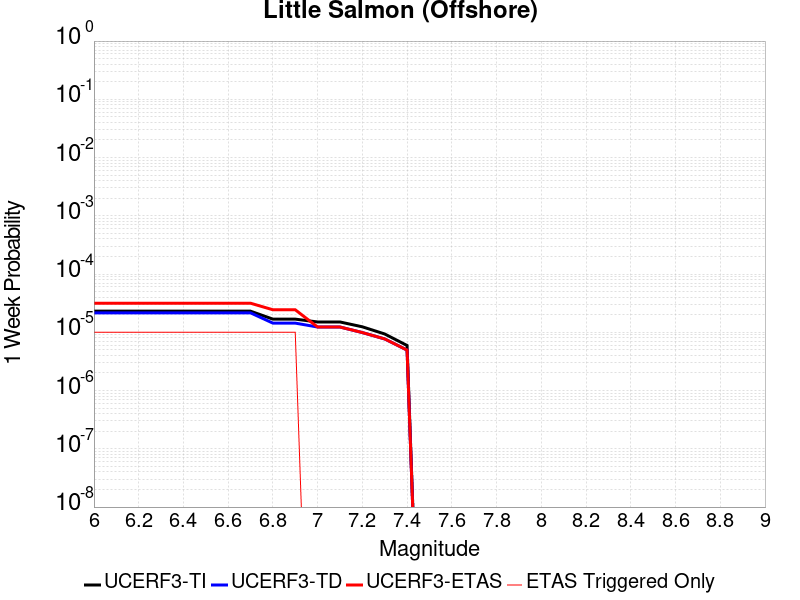 |  |  | 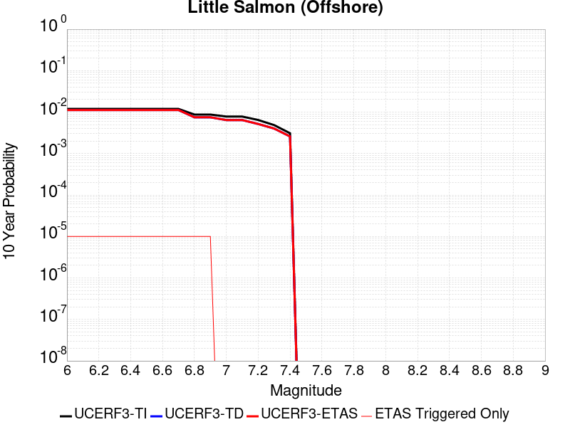 |

| Magnitude | 1 wk TI Prob | 1 wk TD Prob | 1 wk ETAS Prob | 1 wk ETAS/TD Gain | 1 wk ETAS Triggered Only | 1 mo TI Prob | 1 mo TD Prob | 1 mo ETAS Prob | 1 mo ETAS/TD Gain | 1 mo ETAS Triggered Only | 1 yr TI Prob | 1 yr TD Prob | 1 yr ETAS Prob | 1 yr ETAS/TD Gain | 1 yr ETAS Triggered Only | 10 yr TI Prob | 10 yr TD Prob | 10 yr ETAS Prob | 10 yr ETAS/TD Gain | 10 yr ETAS Triggered Only |
|-----|-----|-----|-----|-----|-----|-----|-----|-----|-----|-----|-----|-----|-----|-----|-----|-----|-----|-----|-----|-----|
| 6.0 | 2.3052053E-5 | 2.1604856E-5 | 3.160464E-5 | 1.4628489 | 1.0E-5 | 9.879077E-5 | 9.25896E-5 | 1.02588674E-4 | 1.1079935 | 1.0E-5 | 0.0012021139 | 0.0011268103 | 0.001136799 | 1.0088646 | 1.0E-5 | 0.011956319 | 0.0112438025 | 0.01125369 | 1.0008794 | 1.0E-5 |
| 6.1 | 2.3052053E-5 | 2.1604856E-5 | 3.160464E-5 | 1.4628489 | 1.0E-5 | 9.879077E-5 | 9.25896E-5 | 1.02588674E-4 | 1.1079935 | 1.0E-5 | 0.0012021139 | 0.0011268103 | 0.001136799 | 1.0088646 | 1.0E-5 | 0.011956319 | 0.0112438025 | 0.01125369 | 1.0008794 | 1.0E-5 |
| 6.2 | 2.3052053E-5 | 2.1604856E-5 | 3.160464E-5 | 1.4628489 | 1.0E-5 | 9.879077E-5 | 9.25896E-5 | 1.02588674E-4 | 1.1079935 | 1.0E-5 | 0.0012021139 | 0.0011268103 | 0.001136799 | 1.0088646 | 1.0E-5 | 0.011956319 | 0.0112438025 | 0.01125369 | 1.0008794 | 1.0E-5 |
| 6.3 | 2.3052053E-5 | 2.1604856E-5 | 3.160464E-5 | 1.4628489 | 1.0E-5 | 9.879077E-5 | 9.25896E-5 | 1.02588674E-4 | 1.1079935 | 1.0E-5 | 0.0012021139 | 0.0011268103 | 0.001136799 | 1.0088646 | 1.0E-5 | 0.011956319 | 0.0112438025 | 0.01125369 | 1.0008794 | 1.0E-5 |
| 6.4 | 2.3052053E-5 | 2.1604856E-5 | 3.160464E-5 | 1.4628489 | 1.0E-5 | 9.879077E-5 | 9.25896E-5 | 1.02588674E-4 | 1.1079935 | 1.0E-5 | 0.0012021139 | 0.0011268103 | 0.001136799 | 1.0088646 | 1.0E-5 | 0.011956319 | 0.0112438025 | 0.01125369 | 1.0008794 | 1.0E-5 |
| 6.5 | 2.3052053E-5 | 2.1604856E-5 | 3.160464E-5 | 1.4628489 | 1.0E-5 | 9.879077E-5 | 9.25896E-5 | 1.02588674E-4 | 1.1079935 | 1.0E-5 | 0.0012021139 | 0.0011268103 | 0.001136799 | 1.0088646 | 1.0E-5 | 0.011956319 | 0.0112438025 | 0.01125369 | 1.0008794 | 1.0E-5 |
| 6.6 | 2.3052053E-5 | 2.1604856E-5 | 3.160464E-5 | 1.4628489 | 1.0E-5 | 9.879077E-5 | 9.25896E-5 | 1.02588674E-4 | 1.1079935 | 1.0E-5 | 0.0012021139 | 0.0011268103 | 0.001136799 | 1.0088646 | 1.0E-5 | 0.011956319 | 0.0112438025 | 0.01125369 | 1.0008794 | 1.0E-5 |
| 6.7 | 2.3052053E-5 | 2.1604856E-5 | 3.160464E-5 | 1.4628489 | 1.0E-5 | 9.879077E-5 | 9.25896E-5 | 1.02588674E-4 | 1.1079935 | 1.0E-5 | 0.0012021139 | 0.0011268103 | 0.001136799 | 1.0088646 | 1.0E-5 | 0.011956319 | 0.0112438025 | 0.01125369 | 1.0008794 | 1.0E-5 |
| 6.8 | 1.683878E-5 | 1.4384146E-5 | 2.4384002E-5 | 1.6951998 | 1.0E-5 | 7.21642E-5 | 6.164517E-5 | 7.164455E-5 | 1.1622087 | 1.0E-5 | 8.78245E-4 | 7.503224E-4 | 7.603149E-4 | 1.0133176 | 1.0E-5 | 0.008747822 | 0.0075044776 | 0.0075144027 | 1.0013225 | 1.0E-5 |
| 6.9 | 1.683878E-5 | 1.4384146E-5 | 2.4384002E-5 | 1.6951998 | 1.0E-5 | 7.21642E-5 | 6.164517E-5 | 7.164455E-5 | 1.1622087 | 1.0E-5 | 8.78245E-4 | 7.503224E-4 | 7.603149E-4 | 1.0133176 | 1.0E-5 | 0.008747822 | 0.0075044776 | 0.0075144027 | 1.0013225 | 1.0E-5 |
| 7.0 | 1.5051273E-5 | 1.2332205E-5 | 1.2332205E-5 | 1.0 | 0.0 | 6.450386E-5 | 5.2851494E-5 | 5.2851494E-5 | 1.0 | 0.0 | 7.8505155E-4 | 6.4332294E-4 | 6.4332294E-4 | 1.0 | 0.0 | 0.00782284 | 0.0064407173 | 0.0064407173 | 1.0 | 0.0 |
| 7.1 | 1.5051273E-5 | 1.2332205E-5 | 1.2332205E-5 | 1.0 | 0.0 | 6.450386E-5 | 5.2851494E-5 | 5.2851494E-5 | 1.0 | 0.0 | 7.8505155E-4 | 6.4332294E-4 | 6.4332294E-4 | 1.0 | 0.0 | 0.00782284 | 0.0064407173 | 0.0064407173 | 1.0 | 0.0 |
| 7.2 | 1.24301405E-5 | 9.902278E-6 | 9.902278E-6 | 1.0 | 0.0 | 5.3270942E-5 | 4.243787E-5 | 4.243787E-5 | 1.0 | 0.0 | 6.483807E-4 | 5.165986E-4 | 5.165986E-4 | 1.0 | 0.0 | 0.006464922 | 0.005179082 | 0.005179082 | 1.0 | 0.0 |
| 7.3 | 9.3599865E-6 | 7.694566E-6 | 7.694566E-6 | 1.0 | 0.0 | 4.011361E-5 | 3.2976495E-5 | 3.2976495E-5 | 1.0 | 0.0 | 4.8827377E-4 | 4.0145052E-4 | 4.0145052E-4 | 1.0 | 0.0 | 0.004872023 | 0.0040242276 | 0.0040242276 | 1.0 | 0.0 |
| 7.4 | 5.941556E-6 | 4.9508285E-6 | 4.9508285E-6 | 1.0 | 0.0 | 2.5463563E-5 | 2.1217837E-5 | 2.1217837E-5 | 1.0 | 0.0 | 3.0997477E-4 | 2.5832717E-4 | 2.5832717E-4 | 1.0 | 0.0 | 0.0030954275 | 0.0025927064 | 0.0025927064 | 1.0 | 0.0 |

## Bartlett Springs 2011 CFM
*[(top)](#table-of-contents)*

| 1 Week | 1 Month | 1 Year | 10 Year |
|-----|-----|-----|-----|
|  |  |  |  |

| Magnitude | 1 wk TI Prob | 1 wk TD Prob | 1 wk ETAS Prob | 1 wk ETAS/TD Gain | 1 wk ETAS Triggered Only | 1 mo TI Prob | 1 mo TD Prob | 1 mo ETAS Prob | 1 mo ETAS/TD Gain | 1 mo ETAS Triggered Only | 1 yr TI Prob | 1 yr TD Prob | 1 yr ETAS Prob | 1 yr ETAS/TD Gain | 1 yr ETAS Triggered Only | 10 yr TI Prob | 10 yr TD Prob | 10 yr ETAS Prob | 10 yr ETAS/TD Gain | 10 yr ETAS Triggered Only |
|-----|-----|-----|-----|-----|-----|-----|-----|-----|-----|-----|-----|-----|-----|-----|-----|-----|-----|-----|-----|-----|
| 6.0 | 6.2326144E-5 | 8.060668E-5 | 8.060668E-5 | 1.0 | 0.0 | 2.6708472E-4 | 3.4541206E-4 | 3.554086E-4 | 1.0289409 | 1.0E-5 | 0.003246908 | 0.0041973754 | 0.0042073335 | 1.0023724 | 1.0E-5 | 0.031998757 | 0.041198105 | 0.041207694 | 1.0002327 | 1.0E-5 |
| 6.1 | 6.227657E-5 | 8.054418E-5 | 8.054418E-5 | 1.0 | 0.0 | 2.668723E-4 | 3.4514428E-4 | 3.5514083E-4 | 1.0289634 | 1.0E-5 | 0.0032443295 | 0.004194128 | 0.004204086 | 1.0023743 | 1.0E-5 | 0.031973712 | 0.041166842 | 0.04117643 | 1.0002329 | 1.0E-5 |
| 6.2 | 6.22452E-5 | 8.050479E-5 | 8.050479E-5 | 1.0 | 0.0 | 2.6673786E-4 | 3.449755E-4 | 3.5497203E-4 | 1.0289775 | 1.0E-5 | 0.0032426978 | 0.004192081 | 0.004202039 | 1.0023755 | 1.0E-5 | 0.03195787 | 0.04114713 | 0.04115672 | 1.000233 | 1.0E-5 |
| 6.3 | 6.219006E-5 | 8.043463E-5 | 8.043463E-5 | 1.0 | 0.0 | 2.6650162E-4 | 3.4467486E-4 | 3.546714E-4 | 1.0290029 | 1.0E-5 | 0.00323983 | 0.0041884347 | 0.004198393 | 1.0023775 | 1.0E-5 | 0.031930014 | 0.04111203 | 0.04112162 | 1.0002333 | 1.0E-5 |
| 6.4 | 5.2175856E-5 | 6.7254E-5 | 6.7254E-5 | 1.0 | 0.0 | 2.2359163E-4 | 2.8819984E-4 | 2.9819697E-4 | 1.0346881 | 1.0E-5 | 0.0027188298 | 0.0035032362 | 0.0035132011 | 1.0028445 | 1.0E-5 | 0.026858058 | 0.03448956 | 0.034499217 | 1.0002799 | 1.0E-5 |
| 6.5 | 5.205166E-5 | 6.709666E-5 | 6.709666E-5 | 1.0 | 0.0 | 2.2305945E-4 | 2.875257E-4 | 2.9752284E-4 | 1.0347695 | 1.0E-5 | 0.0027123666 | 0.0034950553 | 0.0035050202 | 1.0028511 | 1.0E-5 | 0.026794989 | 0.034410305 | 0.03441996 | 1.0002806 | 1.0E-5 |
| 6.6 | 5.0085426E-5 | 6.449303E-5 | 6.449303E-5 | 1.0 | 0.0 | 2.1463417E-4 | 2.7636968E-4 | 2.863669E-4 | 1.0361735 | 1.0E-5 | 0.0026100394 | 0.0033596596 | 0.003369626 | 1.0029665 | 1.0E-5 | 0.025795965 | 0.03309789 | 0.03310756 | 1.0002922 | 1.0E-5 |
| 6.7 | 4.8930866E-5 | 6.30177E-5 | 6.30177E-5 | 1.0 | 0.0 | 2.0968684E-4 | 2.700482E-4 | 2.700482E-4 | 1.0 | 0.0 | 0.0025499484 | 0.0032829295 | 0.0032829295 | 1.0 | 0.0 | 0.025208864 | 0.032353252 | 0.032353252 | 1.0 | 0.0 |
| 6.8 | 4.5679535E-5 | 5.874213E-5 | 5.874213E-5 | 1.0 | 0.0 | 1.9575475E-4 | 2.517279E-4 | 2.517279E-4 | 1.0 | 0.0 | 0.002380709 | 0.0030605178 | 0.0030605178 | 1.0 | 0.0 | 0.023553653 | 0.030190729 | 0.030190729 | 1.0 | 0.0 |
| 6.9 | 4.1439176E-5 | 5.3220345E-5 | 5.3220345E-5 | 1.0 | 0.0 | 1.7758438E-4 | 2.2806737E-4 | 2.2806737E-4 | 1.0 | 0.0 | 0.002159946 | 0.00277321 | 0.00277321 | 1.0 | 0.0 | 0.021390721 | 0.02739108 | 0.02739108 | 1.0 | 0.0 |
| 7.0 | 3.5920104E-5 | 4.6008958E-5 | 4.6008958E-5 | 1.0 | 0.0 | 1.5393422E-4 | 1.9716643E-4 | 1.9716643E-4 | 1.0 | 0.0 | 0.001872538 | 0.0023978746 | 0.0023978746 | 1.0 | 0.0 | 0.018568378 | 0.023723308 | 0.023723308 | 1.0 | 0.0 |
| 7.1 | 3.338812E-5 | 4.2689815E-5 | 4.2689815E-5 | 1.0 | 0.0 | 1.430841E-4 | 1.829436E-4 | 1.829436E-4 | 1.0 | 0.0 | 0.0017406568 | 0.0022250775 | 0.0022250775 | 1.0 | 0.0 | 0.017270854 | 0.02203084 | 0.02203084 | 1.0 | 0.0 |
| 7.2 | 2.8619615E-5 | 3.640186E-5 | 3.640186E-5 | 1.0 | 0.0 | 1.2264973E-4 | 1.559987E-4 | 1.559987E-4 | 1.0 | 0.0 | 0.0014922376 | 0.0018976394 | 0.0018976394 | 1.0 | 0.0 | 0.014822568 | 0.018816413 | 0.018816413 | 1.0 | 0.0 |
| 7.3 | 2.6376783E-5 | 3.3422963E-5 | 3.3422963E-5 | 1.0 | 0.0 | 1.13038455E-4 | 1.4323345E-4 | 1.4323345E-4 | 1.0 | 0.0 | 0.0013753743 | 0.0017424817 | 0.0017424817 | 1.0 | 0.0 | 0.01366893 | 0.017289983 | 0.017289983 | 1.0 | 0.0 |
| 7.4 | 2.3738676E-5 | 2.9979174E-5 | 2.9979174E-5 | 1.0 | 0.0 | 1.0173322E-4 | 1.2847589E-4 | 1.2847589E-4 | 1.0 | 0.0 | 0.0012378981 | 0.0015630797 | 0.0015630797 | 1.0 | 0.0 | 0.012310251 | 0.01552236 | 0.01552236 | 1.0 | 0.0 |
| 7.5 | 2.1789481E-5 | 2.7439555E-5 | 2.7439555E-5 | 1.0 | 0.0 | 9.338015E-5 | 1.1759284E-4 | 1.1759284E-4 | 1.0 | 0.0 | 0.0011363103 | 0.0014307604 | 0.0014307604 | 1.0 | 0.0 | 0.011305175 | 0.014216874 | 0.014216874 | 1.0 | 0.0 |
| 7.6 | 1.3895281E-5 | 1.7368566E-5 | 1.7368566E-5 | 1.0 | 0.0 | 5.9549846E-5 | 7.44346E-5 | 7.44346E-5 | 1.0 | 0.0 | 7.2477816E-4 | 9.058674E-4 | 9.058674E-4 | 1.0 | 0.0 | 0.0072241887 | 0.009022309 | 0.009022309 | 1.0 | 0.0 |
| 7.7 | 4.245981E-6 | 5.1625234E-6 | 5.1625234E-6 | 1.0 | 0.0 | 1.8196934E-5 | 2.2124914E-5 | 2.2124914E-5 | 1.0 | 0.0 | 2.2152514E-4 | 2.693377E-4 | 2.693377E-4 | 1.0 | 0.0 | 0.0022130446 | 0.00269016 | 0.00269016 | 1.0 | 0.0 |
| 7.8 | 6.145192E-7 | 7.0470315E-7 | 7.0470315E-7 | 1.0 | 0.0 | 2.633651E-6 | 3.020153E-6 | 3.020153E-6 | 1.0 | 0.0 | 3.206423E-5 | 3.6769754E-5 | 3.6769754E-5 | 1.0 | 0.0 | 3.2059604E-4 | 3.6763048E-4 | 3.6763048E-4 | 1.0 | 0.0 |

## Green Valley 2011 CFM
*[(top)](#table-of-contents)*

| 1 Week | 1 Month | 1 Year | 10 Year |
|-----|-----|-----|-----|
| 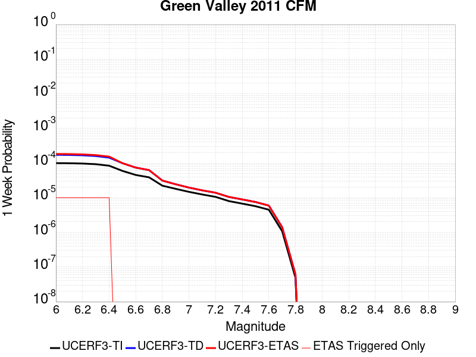 |  |  |  |

| Magnitude | 1 wk TI Prob | 1 wk TD Prob | 1 wk ETAS Prob | 1 wk ETAS/TD Gain | 1 wk ETAS Triggered Only | 1 mo TI Prob | 1 mo TD Prob | 1 mo ETAS Prob | 1 mo ETAS/TD Gain | 1 mo ETAS Triggered Only | 1 yr TI Prob | 1 yr TD Prob | 1 yr ETAS Prob | 1 yr ETAS/TD Gain | 1 yr ETAS Triggered Only | 10 yr TI Prob | 10 yr TD Prob | 10 yr ETAS Prob | 10 yr ETAS/TD Gain | 10 yr ETAS Triggered Only |
|-----|-----|-----|-----|-----|-----|-----|-----|-----|-----|-----|-----|-----|-----|-----|-----|-----|-----|-----|-----|-----|
| 6.0 | 9.9629346E-5 | 1.7302863E-4 | 1.8302689E-4 | 1.057784 | 1.0E-5 | 4.2691303E-4 | 7.41326E-4 | 7.513186E-4 | 1.0134794 | 1.0E-5 | 0.0051852856 | 0.00898692 | 0.008996829 | 1.0011027 | 1.0E-5 | 0.050659515 | 0.08553951 | 0.085548654 | 1.0001069 | 1.0E-5 |
| 6.1 | 9.88615E-5 | 1.7150163E-4 | 1.8149991E-4 | 1.0582985 | 1.0E-5 | 4.2362334E-4 | 7.347854E-4 | 7.447781E-4 | 1.0135994 | 1.0E-5 | 0.0051454236 | 0.008907947 | 0.008917858 | 1.0011126 | 1.0E-5 | 0.050279044 | 0.08482712 | 0.08483627 | 1.0001079 | 1.0E-5 |
| 6.2 | 9.696895E-5 | 1.6789208E-4 | 1.7789041E-4 | 1.0595521 | 1.0E-5 | 4.15515E-4 | 7.1932544E-4 | 7.2931824E-4 | 1.0138919 | 1.0E-5 | 0.0050471667 | 0.00872133 | 0.008731242 | 1.0011367 | 1.0E-5 | 0.04934063 | 0.08313578 | 0.083144955 | 1.0001103 | 1.0E-5 |
| 6.3 | 9.275224E-5 | 1.5968543E-4 | 1.6968383E-4 | 1.0626131 | 1.0E-5 | 3.9744904E-4 | 6.841728E-4 | 6.9416594E-4 | 1.0146062 | 1.0E-5 | 0.0048282105 | 0.008296652 | 0.0083065685 | 1.0011953 | 1.0E-5 | 0.047246475 | 0.07927481 | 0.07928401 | 1.0001161 | 1.0E-5 |
| 6.4 | 8.391499E-5 | 1.4365884E-4 | 1.536574E-4 | 1.0695994 | 1.0E-5 | 3.595861E-4 | 6.155238E-4 | 6.255176E-4 | 1.0162363 | 1.0E-5 | 0.004369175 | 0.007467181 | 0.007477106 | 1.0013292 | 1.0E-5 | 0.04284265 | 0.07164672 | 0.071656 | 1.0001296 | 1.0E-5 |
| 6.5 | 5.9519385E-5 | 9.932622E-5 | 9.932622E-5 | 1.0 | 0.0 | 2.5505814E-4 | 4.2560388E-4 | 4.2560388E-4 | 1.0 | 0.0 | 0.0031009112 | 0.005168341 | 0.005168341 | 1.0 | 0.0 | 0.030579966 | 0.05014692 | 0.05014692 | 1.0 | 0.0 |
| 6.6 | 4.5361558E-5 | 7.4019794E-5 | 7.4019794E-5 | 1.0 | 0.0 | 1.9439218E-4 | 3.1717744E-4 | 3.1717744E-4 | 1.0 | 0.0 | 0.0023641558 | 0.0038538678 | 0.0038538678 | 1.0 | 0.0 | 0.023391623 | 0.03766727 | 0.03766727 | 1.0 | 0.0 |
| 6.7 | 3.8808106E-5 | 6.264382E-5 | 6.264382E-5 | 1.0 | 0.0 | 1.6630985E-4 | 2.6843755E-4 | 2.6843755E-4 | 1.0 | 0.0 | 0.0020229418 | 0.0032627317 | 0.0032627317 | 1.0 | 0.0 | 0.020046256 | 0.032007415 | 0.032007415 | 1.0 | 0.0 |
| 6.8 | 2.2284667E-5 | 3.128574E-5 | 3.128574E-5 | 1.0 | 0.0 | 9.550222E-5 | 1.3407487E-4 | 1.3407487E-4 | 1.0 | 0.0 | 0.0011621192 | 0.0016311383 | 0.0016311383 | 1.0 | 0.0 | 0.011560607 | 0.01616672 | 0.01616672 | 1.0 | 0.0 |
| 6.9 | 1.8050168E-5 | 2.4448536E-5 | 2.4448536E-5 | 1.0 | 0.0 | 7.735557E-5 | 1.0477527E-4 | 1.0477527E-4 | 1.0 | 0.0 | 9.4139716E-4 | 0.0012748954 | 0.0012748954 | 1.0 | 0.0 | 0.009374191 | 0.012669067 | 0.012669067 | 1.0 | 0.0 |
| 7.0 | 1.4763166E-5 | 1.9583236E-5 | 1.9583236E-5 | 1.0 | 0.0 | 6.326917E-5 | 8.3925464E-5 | 8.3925464E-5 | 1.0 | 0.0 | 7.7002996E-4 | 0.001021315 | 0.001021315 | 1.0 | 0.0 | 0.007673672 | 0.01016625 | 0.01016625 | 1.0 | 0.0 |
| 7.1 | 1.2399713E-5 | 1.6304042E-5 | 1.6304042E-5 | 1.0 | 0.0 | 5.3140546E-5 | 6.987261E-5 | 6.987261E-5 | 1.0 | 0.0 | 6.467941E-4 | 8.5036893E-4 | 8.5036893E-4 | 1.0 | 0.0 | 0.006449148 | 0.008471781 | 0.008471781 | 1.0 | 0.0 |
| 7.2 | 1.0584195E-5 | 1.39220465E-5 | 1.39220465E-5 | 1.0 | 0.0 | 4.5360044E-5 | 5.966456E-5 | 5.966456E-5 | 1.0 | 0.0 | 5.521186E-4 | 7.2617555E-4 | 7.2617555E-4 | 1.0 | 0.0 | 0.0055074887 | 0.0072386027 | 0.0072386027 | 1.0 | 0.0 |
| 7.3 | 7.998173E-6 | 1.0544255E-5 | 1.0544255E-5 | 1.0 | 0.0 | 3.4277433E-5 | 4.5188888E-5 | 4.5188888E-5 | 1.0 | 0.0 | 4.1724785E-4 | 5.500369E-4 | 5.500369E-4 | 1.0 | 0.0 | 0.004164653 | 0.005487135 | 0.005487135 | 1.0 | 0.0 |
| 7.4 | 6.7571127E-6 | 8.932903E-6 | 8.932903E-6 | 1.0 | 0.0 | 2.8958733E-5 | 3.8283313E-5 | 3.8283313E-5 | 1.0 | 0.0 | 3.5251552E-4 | 4.660006E-4 | 4.660006E-4 | 1.0 | 0.0 | 0.0035195686 | 0.004650633 | 0.004650633 | 1.0 | 0.0 |
| 7.5 | 5.69878E-6 | 7.516483E-6 | 7.516483E-6 | 1.0 | 0.0 | 2.4423114E-5 | 3.2213105E-5 | 3.2213105E-5 | 1.0 | 0.0 | 2.9731085E-4 | 3.9212484E-4 | 3.9212484E-4 | 1.0 | 0.0 | 0.002969134 | 0.0039147018 | 0.0039147018 | 1.0 | 0.0 |
| 7.6 | 4.503664E-6 | 5.9358217E-6 | 5.9358217E-6 | 1.0 | 0.0 | 1.9301275E-5 | 2.5438992E-5 | 2.5438992E-5 | 1.0 | 0.0 | 2.3496768E-4 | 3.0967654E-4 | 3.0967654E-4 | 1.0 | 0.0 | 0.002347194 | 0.0030927279 | 0.0030927279 | 1.0 | 0.0 |
| 7.7 | 1.0873546E-6 | 1.410754E-6 | 1.410754E-6 | 1.0 | 0.0 | 4.6600826E-6 | 6.0460743E-6 | 6.0460743E-6 | 1.0 | 0.0 | 5.6735033E-5 | 7.36085E-5 | 7.36085E-5 | 1.0 | 0.0 | 5.672055E-4 | 7.3587085E-4 | 7.3587085E-4 | 1.0 | 0.0 |
| 7.8 | 4.9373917E-8 | 6.177967E-8 | 6.177967E-8 | 1.0 | 0.0 | 2.1160248E-7 | 2.6477002E-7 | 2.6477002E-7 | 1.0 | 0.0 | 2.5762572E-6 | 3.2235714E-6 | 3.2235714E-6 | 1.0 | 0.0 | 2.5762274E-5 | 3.2228E-5 | 3.2228E-5 | 1.0 | 0.0 |

## Hollywood
*[(top)](#table-of-contents)*

| 1 Week | 1 Month | 1 Year | 10 Year |
|-----|-----|-----|-----|
| 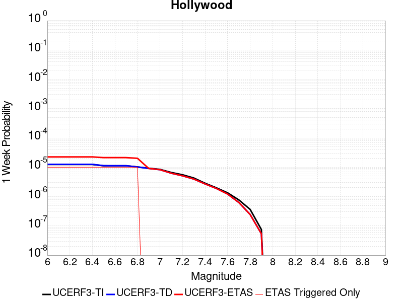 |  | 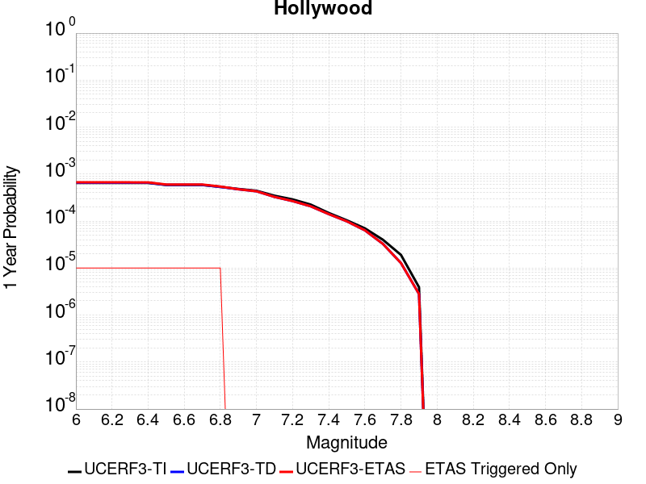 |  |

| Magnitude | 1 wk TI Prob | 1 wk TD Prob | 1 wk ETAS Prob | 1 wk ETAS/TD Gain | 1 wk ETAS Triggered Only | 1 mo TI Prob | 1 mo TD Prob | 1 mo ETAS Prob | 1 mo ETAS/TD Gain | 1 mo ETAS Triggered Only | 1 yr TI Prob | 1 yr TD Prob | 1 yr ETAS Prob | 1 yr ETAS/TD Gain | 1 yr ETAS Triggered Only | 10 yr TI Prob | 10 yr TD Prob | 10 yr ETAS Prob | 10 yr ETAS/TD Gain | 10 yr ETAS Triggered Only |
|-----|-----|-----|-----|-----|-----|-----|-----|-----|-----|-----|-----|-----|-----|-----|-----|-----|-----|-----|-----|-----|
| 6.0 | 1.24487615E-5 | 1.2593229E-5 | 2.2593103E-5 | 1.7940675 | 1.0E-5 | 5.3350745E-5 | 5.3969892E-5 | 6.396935E-5 | 1.1852785 | 1.0E-5 | 6.4935174E-4 | 6.5689E-4 | 6.668834E-4 | 1.0152133 | 1.0E-5 | 0.0064745755 | 0.0065499707 | 0.006559905 | 1.0015167 | 1.0E-5 |
| 6.1 | 1.24487615E-5 | 1.2593229E-5 | 2.2593103E-5 | 1.7940675 | 1.0E-5 | 5.3350745E-5 | 5.3969892E-5 | 6.396935E-5 | 1.1852785 | 1.0E-5 | 6.4935174E-4 | 6.5689E-4 | 6.668834E-4 | 1.0152133 | 1.0E-5 | 0.0064745755 | 0.0065499707 | 0.006559905 | 1.0015167 | 1.0E-5 |
| 6.2 | 1.24487615E-5 | 1.2593229E-5 | 2.2593103E-5 | 1.7940675 | 1.0E-5 | 5.3350745E-5 | 5.3969892E-5 | 6.396935E-5 | 1.1852785 | 1.0E-5 | 6.4935174E-4 | 6.5689E-4 | 6.668834E-4 | 1.0152133 | 1.0E-5 | 0.0064745755 | 0.0065499707 | 0.006559905 | 1.0015167 | 1.0E-5 |
| 6.3 | 1.24487615E-5 | 1.2593229E-5 | 2.2593103E-5 | 1.7940675 | 1.0E-5 | 5.3350745E-5 | 5.3969892E-5 | 6.396935E-5 | 1.1852785 | 1.0E-5 | 6.4935174E-4 | 6.5689E-4 | 6.668834E-4 | 1.0152133 | 1.0E-5 | 0.0064745755 | 0.0065499707 | 0.006559905 | 1.0015167 | 1.0E-5 |
| 6.4 | 1.2431024E-5 | 1.25738425E-5 | 2.2573717E-5 | 1.7952918 | 1.0E-5 | 5.327473E-5 | 5.388681E-5 | 6.388627E-5 | 1.1855642 | 1.0E-5 | 6.4842677E-4 | 6.558791E-4 | 6.6587253E-4 | 1.0152367 | 1.0E-5 | 0.0064653796 | 0.0065399213 | 0.0065498557 | 1.0015191 | 1.0E-5 |
| 6.5 | 1.1242222E-5 | 1.1317804E-5 | 2.131769E-5 | 1.8835536 | 1.0E-5 | 4.8180063E-5 | 4.8503985E-5 | 5.85035E-5 | 1.2061586 | 1.0E-5 | 5.864344E-4 | 5.903787E-4 | 6.003728E-4 | 1.0169283 | 1.0E-5 | 0.0058488925 | 0.00588839 | 0.005898331 | 1.0016882 | 1.0E-5 |
| 6.6 | 1.1234066E-5 | 1.1308918E-5 | 2.1308804E-5 | 1.8842479 | 1.0E-5 | 4.8145106E-5 | 4.8465907E-5 | 5.846542E-5 | 1.2063206 | 1.0E-5 | 5.86009E-4 | 5.899153E-4 | 5.999094E-4 | 1.0169415 | 1.0E-5 | 0.005844661 | 0.0058837803 | 0.0058937217 | 1.0016896 | 1.0E-5 |
| 6.7 | 1.12294E-5 | 1.1303661E-5 | 2.1303547E-5 | 1.8846592 | 1.0E-5 | 4.812511E-5 | 4.8443377E-5 | 5.8442893E-5 | 1.2064166 | 1.0E-5 | 5.857657E-4 | 5.896412E-4 | 5.996353E-4 | 1.0169494 | 1.0E-5 | 0.0058422405 | 0.005881054 | 0.005890995 | 1.0016904 | 1.0E-5 |
| 6.8 | 1.0252819E-5 | 1.0218449E-5 | 2.0218346E-5 | 1.9786122 | 1.0E-5 | 4.3939912E-5 | 4.3792625E-5 | 5.3792188E-5 | 1.228339 | 1.0E-5 | 5.3483713E-4 | 5.330469E-4 | 5.4304156E-4 | 1.0187501 | 1.0E-5 | 0.005335517 | 0.0053179096 | 0.005327856 | 1.0018704 | 1.0E-5 |
| 6.9 | 9.252289E-6 | 9.110309E-6 | 9.110309E-6 | 1.0 | 0.0 | 3.9652066E-5 | 3.9043607E-5 | 3.9043607E-5 | 1.0 | 0.0 | 4.8265693E-4 | 4.752539E-4 | 4.752539E-4 | 1.0 | 0.0 | 0.0048161 | 0.004742549 | 0.004742549 | 1.0 | 0.0 |
| 7.0 | 8.474604E-6 | 8.25826E-6 | 8.25826E-6 | 1.0 | 0.0 | 3.6319227E-5 | 3.5392073E-5 | 3.5392073E-5 | 1.0 | 0.0 | 4.4209688E-4 | 4.3081472E-4 | 4.3081472E-4 | 1.0 | 0.0 | 0.004412184 | 0.0042999457 | 0.0042999457 | 1.0 | 0.0 |
| 7.1 | 6.643643E-6 | 6.2683707E-6 | 6.2683707E-6 | 1.0 | 0.0 | 2.8472443E-5 | 2.686417E-5 | 2.686417E-5 | 1.0 | 0.0 | 3.4659685E-4 | 3.2702263E-4 | 3.2702263E-4 | 1.0 | 0.0 | 0.0034605677 | 0.0032654598 | 0.0032654598 | 1.0 | 0.0 |
| 7.2 | 5.549002E-6 | 5.1087086E-6 | 5.1087086E-6 | 1.0 | 0.0 | 2.378122E-5 | 2.1894282E-5 | 2.1894282E-5 | 1.0 | 0.0 | 2.8949787E-4 | 2.665304E-4 | 2.665304E-4 | 1.0 | 0.0 | 0.0028912104 | 0.002662124 | 0.002662124 | 1.0 | 0.0 |
| 7.3 | 4.3059727E-6 | 3.9598913E-6 | 3.9598913E-6 | 1.0 | 0.0 | 1.8454039E-5 | 1.6970853E-5 | 1.6970853E-5 | 1.0 | 0.0 | 2.2465475E-4 | 2.0660064E-4 | 2.0660064E-4 | 1.0 | 0.0 | 0.0022442779 | 0.0020640958 | 0.0020640958 | 1.0 | 0.0 |
| 7.4 | 2.8550733E-6 | 2.7013002E-6 | 2.7013002E-6 | 1.0 | 0.0 | 1.2235971E-5 | 1.1576949E-5 | 1.1576949E-5 | 1.0 | 0.0 | 1.4896276E-4 | 1.4094029E-4 | 1.4094029E-4 | 1.0 | 0.0 | 0.0014886294 | 0.0014085141 | 0.0014085141 | 1.0 | 0.0 |
| 7.5 | 1.9927045E-6 | 1.8976393E-6 | 1.8976393E-6 | 1.0 | 0.0 | 8.540134E-6 | 8.132714E-6 | 8.132714E-6 | 1.0 | 0.0 | 1.0397117E-4 | 9.901134E-5 | 9.901134E-5 | 1.0 | 0.0 | 0.0010392254 | 9.896759E-4 | 9.896759E-4 | 1.0 | 0.0 |
| 7.6 | 1.345084E-6 | 1.2216018E-6 | 1.2216018E-6 | 1.0 | 0.0 | 5.764633E-6 | 5.2354258E-6 | 5.2354258E-6 | 1.0 | 0.0 | 7.018215E-5 | 6.373946E-5 | 6.373946E-5 | 1.0 | 0.0 | 7.0159987E-4 | 6.372138E-4 | 6.372138E-4 | 1.0 | 0.0 |
| 7.7 | 7.6835164E-7 | 6.2777013E-7 | 6.2777013E-7 | 1.0 | 0.0 | 3.2929315E-6 | 2.6904406E-6 | 2.6904406E-6 | 1.0 | 0.0 | 4.00907E-5 | 3.2755637E-5 | 3.2755637E-5 | 1.0 | 0.0 | 4.0083472E-4 | 3.2750957E-4 | 3.2750957E-4 | 1.0 | 0.0 |
| 7.8 | 3.6562128E-7 | 2.4534745E-7 | 2.4534745E-7 | 1.0 | 0.0 | 1.5669474E-6 | 1.0514887E-6 | 1.0514887E-6 | 1.0 | 0.0 | 1.9077417E-5 | 1.2801803E-5 | 1.2801803E-5 | 1.0 | 0.0 | 1.907578E-4 | 1.2801103E-4 | 1.2801103E-4 | 1.0 | 0.0 |
| 7.9 | 7.5024424E-8 | 5.381742E-8 | 5.381742E-8 | 1.0 | 0.0 | 3.215332E-7 | 2.3064608E-7 | 2.3064608E-7 | 1.0 | 0.0 | 3.91466E-6 | 2.8081138E-6 | 2.8081138E-6 | 1.0 | 0.0 | 3.9145907E-5 | 2.8080913E-5 | 2.8080913E-5 | 1.0 | 0.0 |

## Monterey Bay-Tularcitos
*[(top)](#table-of-contents)*

| 1 Week | 1 Month | 1 Year | 10 Year |
|-----|-----|-----|-----|
|  |  |  |  |

| Magnitude | 1 wk TI Prob | 1 wk TD Prob | 1 wk ETAS Prob | 1 wk ETAS/TD Gain | 1 wk ETAS Triggered Only | 1 mo TI Prob | 1 mo TD Prob | 1 mo ETAS Prob | 1 mo ETAS/TD Gain | 1 mo ETAS Triggered Only | 1 yr TI Prob | 1 yr TD Prob | 1 yr ETAS Prob | 1 yr ETAS/TD Gain | 1 yr ETAS Triggered Only | 10 yr TI Prob | 10 yr TD Prob | 10 yr ETAS Prob | 10 yr ETAS/TD Gain | 10 yr ETAS Triggered Only |
|-----|-----|-----|-----|-----|-----|-----|-----|-----|-----|-----|-----|-----|-----|-----|-----|-----|-----|-----|-----|-----|
| 6.0 | 3.0131365E-5 | 3.279877E-5 | 3.279877E-5 | 1.0 | 0.0 | 1.2912804E-4 | 1.4055918E-4 | 1.4055918E-4 | 1.0 | 0.0 | 0.001571 | 0.0017100703 | 0.0017100703 | 1.0 | 0.0 | 0.015599402 | 0.016979916 | 0.016989747 | 1.0005789 | 1.0E-5 |
| 6.1 | 3.0131365E-5 | 3.279877E-5 | 3.279877E-5 | 1.0 | 0.0 | 1.2912804E-4 | 1.4055918E-4 | 1.4055918E-4 | 1.0 | 0.0 | 0.001571 | 0.0017100703 | 0.0017100703 | 1.0 | 0.0 | 0.015599402 | 0.016979916 | 0.016989747 | 1.0005789 | 1.0E-5 |
| 6.2 | 3.0131365E-5 | 3.279877E-5 | 3.279877E-5 | 1.0 | 0.0 | 1.2912804E-4 | 1.4055918E-4 | 1.4055918E-4 | 1.0 | 0.0 | 0.001571 | 0.0017100703 | 0.0017100703 | 1.0 | 0.0 | 0.015599402 | 0.016979916 | 0.016989747 | 1.0005789 | 1.0E-5 |
| 6.3 | 1.6998249E-5 | 1.8330798E-5 | 1.8330798E-5 | 1.0 | 0.0 | 7.28476E-5 | 7.85583E-5 | 7.85583E-5 | 1.0 | 0.0 | 8.865586E-4 | 9.5604634E-4 | 9.5604634E-4 | 1.0 | 0.0 | 0.0088303005 | 0.009521258 | 0.009531163 | 1.0010403 | 1.0E-5 |
| 6.4 | 1.6998249E-5 | 1.8330798E-5 | 1.8330798E-5 | 1.0 | 0.0 | 7.28476E-5 | 7.85583E-5 | 7.85583E-5 | 1.0 | 0.0 | 8.865586E-4 | 9.5604634E-4 | 9.5604634E-4 | 1.0 | 0.0 | 0.0088303005 | 0.009521258 | 0.009531163 | 1.0010403 | 1.0E-5 |
| 6.5 | 1.27470785E-5 | 1.3693312E-5 | 1.3693312E-5 | 1.0 | 0.0 | 5.4629192E-5 | 5.8684363E-5 | 5.8684363E-5 | 1.0 | 0.0 | 6.649074E-4 | 7.1425823E-4 | 7.1425823E-4 | 1.0 | 0.0 | 0.0066292146 | 0.007120678 | 0.007130607 | 1.0013944 | 1.0E-5 |
| 6.6 | 1.2739422E-5 | 1.36854E-5 | 1.36854E-5 | 1.0 | 0.0 | 5.4596385E-5 | 5.8650454E-5 | 5.8650454E-5 | 1.0 | 0.0 | 6.645082E-4 | 7.1384566E-4 | 7.1384566E-4 | 1.0 | 0.0 | 0.0066252467 | 0.007116579 | 0.007126508 | 1.0013952 | 1.0E-5 |
| 6.7 | 1.0160109E-5 | 1.0885755E-5 | 1.0885755E-5 | 1.0 | 0.0 | 4.35426E-5 | 4.665244E-5 | 4.665244E-5 | 1.0 | 0.0 | 5.300022E-4 | 5.6785246E-4 | 5.6785246E-4 | 1.0 | 0.0 | 0.005287399 | 0.0056647263 | 0.0056746695 | 1.0017554 | 1.0E-5 |
| 6.8 | 8.349859E-6 | 8.932587E-6 | 8.932587E-6 | 1.0 | 0.0 | 3.578462E-5 | 3.8281985E-5 | 3.8281985E-5 | 1.0 | 0.0 | 4.3559066E-4 | 4.6598914E-4 | 4.6598914E-4 | 1.0 | 0.0 | 0.004347378 | 0.004650685 | 0.0046606385 | 1.0021402 | 1.0E-5 |
| 6.9 | 5.193639E-6 | 5.53643E-6 | 5.53643E-6 | 1.0 | 0.0 | 2.2258262E-5 | 2.372736E-5 | 2.372736E-5 | 1.0 | 0.0 | 2.7096065E-4 | 2.8884556E-4 | 2.8884556E-4 | 1.0 | 0.0 | 0.0027063051 | 0.0028850224 | 0.0028850224 | 1.0 | 0.0 |
| 7.0 | 4.359381E-6 | 4.643366E-6 | 4.643366E-6 | 1.0 | 0.0 | 1.8682927E-5 | 1.9900004E-5 | 1.9900004E-5 | 1.0 | 0.0 | 2.274409E-4 | 2.422586E-4 | 2.422586E-4 | 1.0 | 0.0 | 0.0022720827 | 0.002420238 | 0.002420238 | 1.0 | 0.0 |
| 7.1 | 3.0398533E-6 | 3.2310427E-6 | 3.2310427E-6 | 1.0 | 0.0 | 1.3027877E-5 | 1.3847267E-5 | 1.3847267E-5 | 1.0 | 0.0 | 1.5860285E-4 | 1.6858005E-4 | 1.6858005E-4 | 1.0 | 0.0 | 0.001584897 | 0.0016847793 | 0.0016847793 | 1.0 | 0.0 |
| 7.2 | 1.642335E-6 | 1.7333153E-6 | 1.7333153E-6 | 1.0 | 0.0 | 7.0385595E-6 | 7.428485E-6 | 7.428485E-6 | 1.0 | 0.0 | 8.569109E-5 | 9.044012E-5 | 9.044012E-5 | 1.0 | 0.0 | 8.5658056E-4 | 9.042358E-4 | 9.042358E-4 | 1.0 | 0.0 |
| 7.3 | 3.356842E-7 | 3.2952389E-7 | 3.2952389E-7 | 1.0 | 0.0 | 1.4386458E-6 | 1.4122445E-6 | 1.4122445E-6 | 1.0 | 0.0 | 1.7515373E-5 | 1.7193941E-5 | 1.7193941E-5 | 1.0 | 0.0 | 1.7513991E-4 | 1.719262E-4 | 1.719262E-4 | 1.0 | 0.0 |
| 7.4 | 2.1973483E-7 | 2.1006414E-7 | 2.1006414E-7 | 1.0 | 0.0 | 9.417204E-7 | 9.002746E-7 | 9.002746E-7 | 1.0 | 0.0 | 1.1465385E-5 | 1.0960788E-5 | 1.0960788E-5 | 1.0 | 0.0 | 1.1464794E-4 | 1.0960251E-4 | 1.0960251E-4 | 1.0 | 0.0 |
| 7.5 | 1.1944135E-7 | 1.0696035E-7 | 1.0696035E-7 | 1.0 | 0.0 | 5.118914E-7 | 4.5840142E-7 | 4.5840142E-7 | 1.0 | 0.0 | 6.23226E-6 | 5.581023E-6 | 5.581023E-6 | 1.0 | 0.0 | 6.2320854E-5 | 5.5808843E-5 | 5.5808843E-5 | 1.0 | 0.0 |
| 7.6 | 4.636058E-8 | 3.3364433E-8 | 3.3364433E-8 | 1.0 | 0.0 | 1.9868818E-7 | 1.4299042E-7 | 1.4299042E-7 | 1.0 | 0.0 | 2.419026E-6 | 1.740907E-6 | 1.740907E-6 | 1.0 | 0.0 | 2.4189996E-5 | 1.7408936E-5 | 1.7408936E-5 | 1.0 | 0.0 |
| 7.7 | 1.8588572E-8 | 8.003168E-9 | 8.003168E-9 | 1.0 | 0.0 | 7.9665305E-8 | 3.429929E-8 | 3.429929E-8 | 1.0 | 0.0 | 9.699246E-7 | 4.1759378E-7 | 4.1759378E-7 | 1.0 | 0.0 | 9.699204E-6 | 4.1759304E-6 | 4.1759304E-6 | 1.0 | 0.0 |
| 7.8 | 2.7960154E-9 | 7.608624E-10 | 7.608624E-10 | 1.0 | 0.0 | 1.1982923E-8 | 3.2608392E-9 | 3.2608392E-9 | 1.0 | 0.0 | 1.4589209E-7 | 3.9700716E-8 | 3.9700716E-8 | 1.0 | 0.0 | 1.4589199E-6 | 3.970071E-7 | 3.970071E-7 | 1.0 | 0.0 |

## Great Valley 05 Pittsburg - Kirby Hills alt1
*[(top)](#table-of-contents)*

| 1 Week | 1 Month | 1 Year | 10 Year |
|-----|-----|-----|-----|
|  | 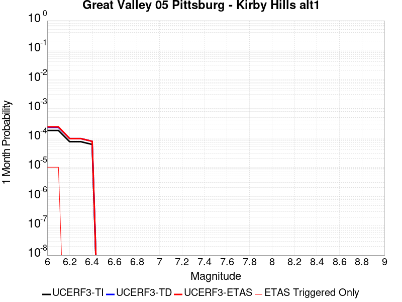 |  |  |

| Magnitude | 1 wk TI Prob | 1 wk TD Prob | 1 wk ETAS Prob | 1 wk ETAS/TD Gain | 1 wk ETAS Triggered Only | 1 mo TI Prob | 1 mo TD Prob | 1 mo ETAS Prob | 1 mo ETAS/TD Gain | 1 mo ETAS Triggered Only | 1 yr TI Prob | 1 yr TD Prob | 1 yr ETAS Prob | 1 yr ETAS/TD Gain | 1 yr ETAS Triggered Only | 10 yr TI Prob | 10 yr TD Prob | 10 yr ETAS Prob | 10 yr ETAS/TD Gain | 10 yr ETAS Triggered Only |
|-----|-----|-----|-----|-----|-----|-----|-----|-----|-----|-----|-----|-----|-----|-----|-----|-----|-----|-----|-----|-----|
| 6.0 | 4.187212E-5 | 5.344289E-5 | 5.344289E-5 | 1.0 | 0.0 | 1.794396E-4 | 2.2902661E-4 | 2.3902432E-4 | 1.043653 | 1.0E-5 | 0.002182488 | 0.0027857998 | 0.002795772 | 1.0035796 | 1.0E-5 | 0.021611776 | 0.027603218 | 0.027612941 | 1.0003523 | 1.0E-5 |
| 6.1 | 4.187212E-5 | 5.344289E-5 | 5.344289E-5 | 1.0 | 0.0 | 1.794396E-4 | 2.2902661E-4 | 2.3902432E-4 | 1.043653 | 1.0E-5 | 0.002182488 | 0.0027857998 | 0.002795772 | 1.0035796 | 1.0E-5 | 0.021611776 | 0.027603218 | 0.027612941 | 1.0003523 | 1.0E-5 |
| 6.2 | 1.7353306E-5 | 2.2154672E-5 | 2.2154672E-5 | 1.0 | 0.0 | 7.436919E-5 | 9.4947456E-5 | 9.4947456E-5 | 1.0 | 0.0 | 9.050688E-4 | 0.0011557573 | 0.0011557573 | 1.0 | 0.0 | 0.009013915 | 0.0115352 | 0.0115352 | 1.0 | 0.0 |
| 6.3 | 1.7353306E-5 | 2.2154672E-5 | 2.2154672E-5 | 1.0 | 0.0 | 7.436919E-5 | 9.4947456E-5 | 9.4947456E-5 | 1.0 | 0.0 | 9.050688E-4 | 0.0011557573 | 0.0011557573 | 1.0 | 0.0 | 0.009013915 | 0.0115352 | 0.0115352 | 1.0 | 0.0 |
| 6.4 | 1.4028824E-5 | 1.7901062E-5 | 1.7901062E-5 | 1.0 | 0.0 | 6.0122147E-5 | 7.671883E-5 | 7.671883E-5 | 1.0 | 0.0 | 7.3174125E-4 | 9.340303E-4 | 9.340303E-4 | 1.0 | 0.0 | 0.0072933645 | 0.009338211 | 0.009338211 | 1.0 | 0.0 |

