# Parent Section Magnitude-Probability Distributions

Only fault sections with at least one triggered aftershock are plotted. Sections are sorted by total supraseismogenic trigger rate (decreasing)

## Table Of Contents

* [Tank Canyon](#tank-canyon)
* [Garlock (Central)](#garlock-central)
* [Panamint Valley](#panamint-valley)
* [Owl Lake](#owl-lake)
* [Little Lake](#little-lake)
* [Ash Hill](#ash-hill)
* [Garlock (East)](#garlock-east)
* [Blackwater](#blackwater)
* [Hunter Mountain-Saline Valley](#hunter-mountain-saline-valley)
* [Gravel Hills-Harper Lk](#gravel-hills-harper-lk)
* [Airport Lake](#airport-lake)
* [Goldstone Lake](#goldstone-lake)
* [So Sierra Nevada](#so-sierra-nevada)
* [McLean Lake](#mclean-lake)
* [Lenwood-Lockhart-Old Woman Springs](#lenwood-lockhart-old-woman-springs)
* [Garlock (West)](#garlock-west)
* [Coyote Canyon](#coyote-canyon)
* [Nelson Lake](#nelson-lake)
* [San Andreas (Mojave S)](#san-andreas-mojave-s)
* [Death Valley (So)](#death-valley-so)
* [Paradise](#paradise)
* [Bicycle Lake](#bicycle-lake)
* [Towne Pass](#towne-pass)
* [San Andreas (San Bernardino N)](#san-andreas-san-bernardino-n)
* [Death Valley (Black Mtns Frontal)](#death-valley-black-mtns-frontal)
* [San Andreas (Mojave N)](#san-andreas-mojave-n)
* [Helendale-So Lockhart](#helendale-so-lockhart)
* [Garlic Springs](#garlic-springs)
* [Sierra Nevada  (No Extension)](#sierra-nevada--no-extension)
* [Elsinore (Glen Ivy) rev](#elsinore-glen-ivy-rev)
* [Coyote Lake](#coyote-lake)
* [Cleghorn Lake](#cleghorn-lake)
* [Death Valley (No)](#death-valley-no)
* [San Andreas (Big Bend)](#san-andreas-big-bend)
* [White Wolf (Extension)](#white-wolf-extension)
* [San Andreas (San Bernardino S)](#san-andreas-san-bernardino-s)
* [Scodie Lineament](#scodie-lineament)
* [San Andreas (Parkfield)](#san-andreas-parkfield)
* [Manix-Afton Hills](#manix-afton-hills)
* [Owens Valley](#owens-valley)
* [San Andreas (Coachella) rev](#san-andreas-coachella-rev)
* [Lake Isabella (Seismicity)](#lake-isabella-seismicity)
* [San Andreas (Cholame) rev](#san-andreas-cholame-rev)
* [Mission Ridge-Arroyo Parida-Santa Ana](#mission-ridge-arroyo-parida-santa-ana)
* [Dry Mountain](#dry-mountain)
* [Santa Cruz Island](#santa-cruz-island)
* [Cady](#cady)
* [Channel Islands Thrust](#channel-islands-thrust)
* [San Andreas (Carrizo) rev](#san-andreas-carrizo-rev)
* [Death Valley (Fish Lake Valley)](#death-valley-fish-lake-valley)
* [Red Pass](#red-pass)
* [San Diego Trough north alt1](#san-diego-trough-north-alt1)
* [Calico-Hidalgo](#calico-hidalgo)
* [San Jacinto (San Bernardino)](#san-jacinto-san-bernardino)
* [Imperial](#imperial)
* [White Mountains](#white-mountains)
* [Ludlow](#ludlow)
* [Brawley (Seismic Zone) alt 1](#brawley-seismic-zone-alt-1)
* [Big Pine (East)](#big-pine-east)
* [Santa Ynez (East)](#santa-ynez-east)
* [Cleghorn Pass](#cleghorn-pass)
* [San Andreas (San Gorgonio Pass-Garnet HIll)](#san-andreas-san-gorgonio-pass-garnet-hill)
* [San Gregorio (North) 2011 CFM](#san-gregorio-north-2011-cfm)
* [Hosgri (Extension)](#hosgri-extension)
* [San Jacinto (Borrego)](#san-jacinto-borrego)
* [Monterey Bay-Tularcitos](#monterey-bay-tularcitos)
* [Great Valley 08 (Quinto)](#great-valley-08-quinto)
* [Elsinore (Coyote Mountains)](#elsinore-coyote-mountains)
* [San Jacinto (Anza) rev](#san-jacinto-anza-rev)
* [White Wolf](#white-wolf)
* [San Andreas (Creeping Section) 2011 CFM](#san-andreas-creeping-section-2011-cfm)
* [San Diego Trough south](#san-diego-trough-south)
* [Thirty Mile Bank](#thirty-mile-bank)
* [Los Alamos 2011 CFM](#los-alamos-2011-cfm)
* [San Jacinto (Coyote Creek)](#san-jacinto-coyote-creek)
* [San Jacinto (Lytle Creek connector)](#san-jacinto-lytle-creek-connector)
* [Kern Canyon (South Kern) 2011](#kern-canyon-south-kern-2011)
* [Newport-Inglewood alt 1](#newport-inglewood-alt-1)
* [Hosgri](#hosgri)
* [Malibu Coast (Extension) alt 1](#malibu-coast-extension-alt-1)
* [Blue Cut](#blue-cut)
* [Hayward (No) 2011 CFM](#hayward-no-2011-cfm)
* [Hayward (So) extension 2011 CFM](#hayward-so-extension-2011-cfm)
* [Goose Lake 2011 CFM](#goose-lake-2011-cfm)
* [Reliz 2011 CFM](#reliz-2011-cfm)
* [Pleito](#pleito)
* [San Jacinto (Stepovers Combined)](#san-jacinto-stepovers-combined)
* [Emerson-Copper Mtn 2011](#emerson-copper-mtn-2011)
* [Likely 2011 CFM](#likely-2011-cfm)
* [Hayward (So) 2011 CFM](#hayward-so-2011-cfm)
* [Channel Islands Western Deep Ramp](#channel-islands-western-deep-ramp)
* [Rodgers Creek - Healdsburg 2011 CFM](#rodgers-creek---healdsburg-2011-cfm)
* [Great Valley 01](#great-valley-01)
* [San Jacinto (San Jacinto Valley) rev](#san-jacinto-san-jacinto-valley-rev)
* [Independence rev 2011](#independence-rev-2011)
* [Baker](#baker)
* [Santa Ynez (West)](#santa-ynez-west)
* [Anaheim](#anaheim)
* [Los Alamos extension](#los-alamos-extension)
* [San Pedro Basin](#san-pedro-basin)
* [Lost Hills](#lost-hills)
* [San Clemente](#san-clemente)
* [Camp Rock 2011](#camp-rock-2011)
* [Sheephole](#sheephole)

## Tank Canyon
*[(top)](#table-of-contents)*

| 1 Week | 1 Month | 1 Year | 10 Year |
|-----|-----|-----|-----|
|  |  |  |  |

| Magnitude | 1 wk TI Prob | 1 wk TD Prob | 1 wk ETAS Prob | 1 wk ETAS/TD Gain | 1 wk ETAS Triggered Only | 1 mo TI Prob | 1 mo TD Prob | 1 mo ETAS Prob | 1 mo ETAS/TD Gain | 1 mo ETAS Triggered Only | 1 yr TI Prob | 1 yr TD Prob | 1 yr ETAS Prob | 1 yr ETAS/TD Gain | 1 yr ETAS Triggered Only | 10 yr TI Prob | 10 yr TD Prob | 10 yr ETAS Prob | 10 yr ETAS/TD Gain | 10 yr ETAS Triggered Only |
|-----|-----|-----|-----|-----|-----|-----|-----|-----|-----|-----|-----|-----|-----|-----|-----|-----|-----|-----|-----|-----|
| 6.0 | 4.8284557E-5 | 5.7964822E-5 | 0.037125777 | 640.48804 | 0.03706996 | 2.0691741E-4 | 2.4840087E-4 | 0.050906986 | 204.93884 | 0.05067117 | 0.0025163088 | 0.0030207601 | 0.08260893 | 27.347067 | 0.07982932 | 0.02488006 | 0.029863637 | 0.1343027 | 4.497199 | 0.10765401 |
| 6.1 | 1.7796336E-5 | 2.0873314E-5 | 0.013444008 | 644.07635 | 0.013423416 | 7.626778E-5 | 8.945422E-5 | 0.019467222 | 217.62218 | 0.0193795 | 9.281647E-4 | 0.0010885983 | 0.035010204 | 32.160812 | 0.033958573 | 0.009242975 | 0.010836744 | 0.057441466 | 5.3006206 | 0.0471153 |
| 6.2 | 1.7796336E-5 | 2.0873314E-5 | 0.013444008 | 644.07635 | 0.013423416 | 7.626778E-5 | 8.945422E-5 | 0.019467222 | 217.62218 | 0.0193795 | 9.281647E-4 | 0.0010885983 | 0.035010204 | 32.160812 | 0.033958573 | 0.009242975 | 0.010836744 | 0.057441466 | 5.3006206 | 0.0471153 |
| 6.3 | 1.3515912E-5 | 1.5759564E-5 | 0.010594311 | 672.2464 | 0.010578718 | 5.792405E-5 | 6.753938E-5 | 0.015356755 | 227.37483 | 0.015290248 | 7.049971E-4 | 8.2200574E-4 | 0.02649206 | 32.228558 | 0.025691172 | 0.007027647 | 0.0081922645 | 0.043371506 | 5.2942023 | 0.03546982 |
| 6.4 | 1.0870146E-5 | 1.2618021E-5 | 0.008191019 | 649.15247 | 0.008178505 | 4.658551E-5 | 5.4076212E-5 | 0.011521142 | 213.05379 | 0.011467686 | 5.67031E-4 | 6.581969E-4 | 0.019847265 | 30.153994 | 0.019201707 | 0.005655863 | 0.0065644905 | 0.03305846 | 5.035952 | 0.026669037 |
| 6.5 | 7.964826E-6 | 9.196094E-6 | 0.0052540586 | 571.3359 | 0.0052449107 | 3.4134522E-5 | 3.9411298E-5 | 0.007417554 | 188.20883 | 0.007378434 | 4.1550855E-4 | 4.7973756E-4 | 0.013008172 | 27.115183 | 0.012534448 | 0.0041473247 | 0.004788321 | 0.022482546 | 4.6952877 | 0.017779358 |
| 6.6 | 6.6317E-6 | 7.6122988E-6 | 0.0032078724 | 421.40652 | 0.0032002844 | 2.8421264E-5 | 3.2623782E-5 | 0.004832894 | 148.14021 | 0.004800427 | 3.4597394E-4 | 3.9713128E-4 | 0.00866125 | 21.809538 | 0.008267402 | 0.0034543579 | 0.003965368 | 0.016095934 | 4.059128 | 0.012178861 |
| 6.7 | 4.793663E-6 | 5.4307857E-6 | 0.0016055644 | 295.64127 | 0.0016001422 | 2.0544108E-5 | 2.3274613E-5 | 0.0026901162 | 115.58157 | 0.0026669037 | 2.500958E-4 | 2.8333595E-4 | 0.0055267606 | 19.506035 | 0.0052449107 | 0.0024981452 | 0.0028304397 | 0.01054257 | 3.724711 | 0.0077340207 |
| 6.8 | 4.382823E-6 | 4.9692567E-6 | 0.0013384145 | 269.33896 | 0.0013334518 | 1.8783392E-5 | 2.1296666E-5 | 0.002421459 | 113.70132 | 0.0024002134 | 2.286638E-4 | 2.5926033E-4 | 0.004969569 | 19.168259 | 0.0047115297 | 0.0022842865 | 0.002590253 | 0.009506242 | 3.6700053 | 0.00693395 |
| 6.9 | 2.729601E-6 | 3.0735416E-6 | 6.253492E-4 | 203.46207 | 6.2227756E-4 | 1.1698237E-5 | 1.3172262E-5 | 0.0010799197 | 81.984375 | 0.0010667614 | 1.4241673E-4 | 1.6036171E-4 | 0.00220466 | 13.748045 | 0.0020446263 | 0.001423255 | 0.0016026258 | 0.0047090272 | 2.9383197 | 0.0031113876 |
| 7.0 | 1.8987357E-6 | 2.126939E-6 | 4.4660995E-4 | 209.97778 | 4.4448394E-4 | 8.137413E-6 | 9.115425E-6 | 7.2028325E-4 | 79.01807 | 7.1117433E-4 | 9.90685E-5 | 1.1097535E-4 | 0.0014442792 | 13.014415 | 0.0013334518 | 9.902435E-4 | 0.0011092679 | 0.003062828 | 2.7611253 | 0.0019557294 |
| 7.1 | 1.4928986E-6 | 1.6641272E-6 | 2.6835405E-4 | 161.25813 | 2.6669036E-4 | 6.398121E-6 | 7.1319573E-6 | 2.7382042E-4 | 38.393448 | 2.6669036E-4 | 7.789434E-5 | 8.682871E-5 | 5.3127407E-4 | 6.118645 | 4.4448394E-4 | 7.786704E-4 | 8.6800574E-4 | 0.0014897431 | 1.7162826 | 6.2227756E-4 |
| 7.2 | 1.069082E-6 | 1.1828573E-6 | 1.7897623E-4 | 151.3084 | 1.7779358E-4 | 4.581772E-6 | 5.0693816E-6 | 1.8286206E-4 | 36.07187 | 1.7779358E-4 | 5.5781646E-5 | 6.171851E-5 | 3.2839243E-4 | 5.32081 | 2.6669036E-4 | 5.576765E-4 | 6.170659E-4 | 8.835917E-4 | 1.4319243 | 2.6669036E-4 |
| 7.3 | 8.776551E-7 | 9.770005E-7 | 1.7877041E-4 | 182.97884 | 1.7779358E-4 | 3.7613736E-6 | 4.1871413E-6 | 1.8197998E-4 | 43.46163 | 1.7779358E-4 | 4.579376E-5 | 5.097777E-5 | 2.2876229E-4 | 4.487491 | 1.7779358E-4 | 4.5784327E-4 | 5.097118E-4 | 6.874147E-4 | 1.3486342 | 1.7779358E-4 |
| 7.4 | 7.55721E-7 | 8.510244E-7 | 1.7864445E-4 | 209.91695 | 1.7779358E-4 | 3.2388E-6 | 3.6472454E-6 | 1.8144018E-4 | 49.74718 | 1.7779358E-4 | 3.9431678E-5 | 4.4404827E-5 | 2.2219052E-4 | 5.003747 | 1.7779358E-4 | 3.942468E-4 | 4.440104E-4 | 6.2172505E-4 | 1.4002489 | 1.7779358E-4 |
| 7.5 | 5.587665E-7 | 6.305619E-7 | 6.305619E-7 | 1.0 | 0.0 | 2.3947114E-6 | 2.702408E-6 | 2.702408E-6 | 1.0 | 0.0 | 2.915522E-5 | 3.290182E-5 | 3.290182E-5 | 1.0 | 0.0 | 2.9151395E-4 | 3.290182E-4 | 3.290182E-4 | 1.0 | 0.0 |

## Garlock (Central)
*[(top)](#table-of-contents)*

| 1 Week | 1 Month | 1 Year | 10 Year |
|-----|-----|-----|-----|
|  |  |  |  |

| Magnitude | 1 wk TI Prob | 1 wk TD Prob | 1 wk ETAS Prob | 1 wk ETAS/TD Gain | 1 wk ETAS Triggered Only | 1 mo TI Prob | 1 mo TD Prob | 1 mo ETAS Prob | 1 mo ETAS/TD Gain | 1 mo ETAS Triggered Only | 1 yr TI Prob | 1 yr TD Prob | 1 yr ETAS Prob | 1 yr ETAS/TD Gain | 1 yr ETAS Triggered Only | 10 yr TI Prob | 10 yr TD Prob | 10 yr ETAS Prob | 10 yr ETAS/TD Gain | 10 yr ETAS Triggered Only |
|-----|-----|-----|-----|-----|-----|-----|-----|-----|-----|-----|-----|-----|-----|-----|-----|-----|-----|-----|-----|-----|
| 6.0 | 5.5131142E-5 | 7.024681E-5 | 0.010914894 | 155.3792 | 0.010845409 | 2.3625491E-4 | 3.010234E-4 | 0.015142319 | 50.3028 | 0.014845764 | 0.0028726095 | 0.0036588663 | 0.027307464 | 7.463368 | 0.023735443 | 0.028357591 | 0.036079824 | 0.066928014 | 1.8549982 | 0.032002844 |
| 6.1 | 5.5131142E-5 | 7.024681E-5 | 0.010914894 | 155.3792 | 0.010845409 | 2.3625491E-4 | 3.010234E-4 | 0.015142319 | 50.3028 | 0.014845764 | 0.0028726095 | 0.0036588663 | 0.027307464 | 7.463368 | 0.023735443 | 0.028357591 | 0.036079824 | 0.066928014 | 1.8549982 | 0.032002844 |
| 6.2 | 4.216245E-5 | 5.1661493E-5 | 0.007607498 | 147.25665 | 0.007556227 | 1.806837E-4 | 2.2138779E-4 | 0.009908993 | 44.758533 | 0.00968975 | 0.0021976046 | 0.0026920962 | 0.018473126 | 6.8619857 | 0.015823629 | 0.021759989 | 0.026689773 | 0.047282524 | 1.7715595 | 0.021157436 |
| 6.3 | 4.216245E-5 | 5.1661493E-5 | 0.007607498 | 147.25665 | 0.007556227 | 1.806837E-4 | 2.2138779E-4 | 0.009908993 | 44.758533 | 0.00968975 | 0.0021976046 | 0.0026920962 | 0.018473126 | 6.8619857 | 0.015823629 | 0.021759989 | 0.026689773 | 0.047282524 | 1.7715595 | 0.021157436 |
| 6.4 | 3.6858168E-5 | 4.411054E-5 | 0.0058221472 | 131.98993 | 0.0057782913 | 1.5795401E-4 | 1.8903162E-4 | 0.0076549505 | 40.49561 | 0.0074673304 | 0.0019213937 | 0.002299056 | 0.0145386085 | 6.32373 | 0.012267757 | 0.019048655 | 0.02284894 | 0.039527133 | 1.7299329 | 0.017068183 |
| 6.5 | 3.39199E-5 | 4.0018083E-5 | 0.0055513987 | 138.72224 | 0.005511601 | 1.453629E-4 | 1.7149492E-4 | 0.007015374 | 40.90718 | 0.006845053 | 0.0017683565 | 0.002085973 | 0.013174892 | 6.3159456 | 0.011112099 | 0.017543508 | 0.020759864 | 0.03590679 | 1.7296256 | 0.015468041 |
| 6.6 | 3.3571985E-5 | 3.9472274E-5 | 0.0054619624 | 138.37466 | 0.0054227044 | 1.4387199E-4 | 1.6915603E-4 | 0.006924169 | 40.933624 | 0.006756156 | 0.0017502342 | 0.0020575512 | 0.012969359 | 6.3032985 | 0.010934305 | 0.017365133 | 0.020481179 | 0.035458263 | 1.7312609 | 0.015290248 |
| 6.7 | 3.2580007E-5 | 3.8088703E-5 | 0.005371693 | 141.03114 | 0.0053338073 | 1.3962112E-4 | 1.632272E-4 | 0.006651634 | 40.750767 | 0.006489466 | 0.0016985617 | 0.0019855013 | 0.012454495 | 6.272721 | 0.010489821 | 0.016856372 | 0.019773813 | 0.034151744 | 1.7271197 | 0.01466797 |
| 6.8 | 3.2185937E-5 | 3.7515918E-5 | 0.005371123 | 143.16917 | 0.0053338073 | 1.3793244E-4 | 1.6077272E-4 | 0.0065603126 | 40.804886 | 0.006400569 | 0.0016780337 | 0.001955672 | 0.012336256 | 6.307937 | 0.010400925 | 0.016654192 | 0.019480614 | 0.033688515 | 1.7293353 | 0.014490177 |
| 6.9 | 3.165394E-5 | 3.6720503E-5 | 0.0051925452 | 141.40724 | 0.0051560136 | 1.3565269E-4 | 1.5736422E-4 | 0.0063791606 | 40.53755 | 0.006222775 | 0.0016503202 | 0.001914247 | 0.011940355 | 6.2376246 | 0.0100453375 | 0.01638118 | 0.019073246 | 0.032763842 | 1.7177905 | 0.013956796 |
| 7.0 | 3.0903822E-5 | 3.5625766E-5 | 0.004924775 | 138.23633 | 0.0048893234 | 1.3243823E-4 | 1.5267303E-4 | 0.0061078486 | 40.006073 | 0.005956085 | 0.0016112428 | 0.0018572307 | 0.011440253 | 6.159845 | 0.009600854 | 0.015996104 | 0.018512413 | 0.031600077 | 1.706967 | 0.013334518 |
| 7.1 | 3.0069863E-5 | 3.4392073E-5 | 0.004834654 | 140.57466 | 0.004800427 | 1.2886449E-4 | 1.4738638E-4 | 0.00601371 | 40.802345 | 0.0058671883 | 0.0015677959 | 0.0017929734 | 0.011110401 | 6.1966343 | 0.009334163 | 0.01556781 | 0.017880075 | 0.030452328 | 1.7031431 | 0.012801138 |
| 7.2 | 2.7957109E-5 | 3.128145E-5 | 0.004387088 | 140.24565 | 0.004355943 | 1.1981068E-4 | 1.340566E-4 | 0.005378264 | 40.119354 | 0.0052449107 | 0.0014577188 | 0.0016309366 | 0.010062358 | 6.1696806 | 0.008445195 | 0.014481937 | 0.016283695 | 0.027739543 | 1.7035165 | 0.01164548 |
| 7.3 | 2.4519275E-5 | 2.6714795E-5 | 0.0029602305 | 110.808655 | 0.0029335942 | 1.0507837E-4 | 1.1448703E-4 | 0.003581065 | 31.279219 | 0.003466975 | 0.0012785783 | 0.001393003 | 0.007340791 | 5.2697597 | 0.005956085 | 0.012712469 | 0.013928054 | 0.022167966 | 1.5916054 | 0.008356298 |
| 7.4 | 2.3225532E-5 | 2.51994E-5 | 0.0025142469 | 99.77408 | 0.0024891102 | 9.95342E-5 | 1.0799304E-4 | 0.0031301575 | 28.984808 | 0.003022491 | 0.0012111551 | 0.0013140367 | 0.0065520555 | 4.9862046 | 0.0052449107 | 0.012045753 | 0.013145725 | 0.020602621 | 1.5672487 | 0.007556227 |
| 7.5 | 2.097765E-5 | 2.2483688E-5 | 0.0021559587 | 95.88991 | 0.0021335229 | 8.9901114E-5 | 9.635517E-5 | 0.0026741137 | 27.752674 | 0.0025780068 | 0.0010939965 | 0.0011725046 | 0.0054345476 | 4.63499 | 0.0042670458 | 0.010886264 | 0.011740365 | 0.01780223 | 1.5163268 | 0.0061338786 |
| 7.6 | 1.511254E-5 | 1.5991332E-5 | 0.0012605265 | 78.82561 | 0.0012445551 | 6.476642E-5 | 6.853253E-5 | 0.0015796744 | 23.049995 | 0.0015112455 | 7.882459E-4 | 8.3407195E-4 | 0.003321106 | 3.981798 | 0.0024891102 | 0.007854558 | 0.008383559 | 0.01190962 | 1.4205923 | 0.0035558715 |
| 7.7 | 9.934069E-6 | 1.0678794E-5 | 2.773663E-4 | 25.973564 | 2.6669036E-4 | 4.2573887E-5 | 4.5765457E-5 | 3.1244362E-4 | 6.827062 | 2.6669036E-4 | 5.182138E-4 | 5.570524E-4 | 0.0011789832 | 2.1164675 | 6.2227756E-4 | 0.00517007 | 0.005627684 | 0.006423252 | 1.141367 | 8.000711E-4 |
| 7.8 | 6.7562896E-6 | 8.428449E-6 | 2.7511656E-4 | 32.641422 | 2.6669036E-4 | 2.8955206E-5 | 3.6121426E-5 | 3.0280216E-4 | 8.382896 | 2.6669036E-4 | 3.5247262E-4 | 4.3968976E-4 | 0.0010616936 | 2.4146428 | 6.2227756E-4 | 0.0035191406 | 0.004446654 | 0.0051546665 | 1.1592236 | 7.1117433E-4 |
| 7.9 | 3.975453E-6 | 5.37103E-6 | 9.426734E-5 | 17.551073 | 8.889679E-5 | 1.7037546E-5 | 2.3018498E-5 | 1.1191324E-4 | 4.8618827 | 8.889679E-5 | 2.0741238E-4 | 2.8021427E-4 | 5.468299E-4 | 1.9514706 | 2.6669036E-4 | 0.002072189 | 0.0028336283 | 0.0031882077 | 1.1251327 | 3.5558717E-4 |
| 8.0 | 1.6729537E-6 | 2.0775144E-6 | 2.0775144E-6 | 1.0 | 0.0 | 7.169782E-6 | 8.903603E-6 | 8.903603E-6 | 1.0 | 0.0 | 8.7288594E-5 | 1.0839601E-4 | 1.9728317E-4 | 1.8200225 | 8.889679E-5 | 8.7254314E-4 | 0.0010969337 | 0.0012745323 | 1.1619046 | 1.7779358E-4 |
| 8.1 | 3.6733252E-7 | 3.1489964E-7 | 3.1489964E-7 | 1.0 | 0.0 | 1.5742813E-6 | 1.3495693E-6 | 1.3495693E-6 | 1.0 | 0.0 | 1.9166706E-5 | 1.6430899E-5 | 1.6430899E-5 | 1.0 | 0.0 | 1.9165053E-4 | 1.6638759E-4 | 1.6638759E-4 | 1.0 | 0.0 |

## Panamint Valley
*[(top)](#table-of-contents)*

| 1 Week | 1 Month | 1 Year | 10 Year |
|-----|-----|-----|-----|
|  |  |  |  |

| Magnitude | 1 wk TI Prob | 1 wk TD Prob | 1 wk ETAS Prob | 1 wk ETAS/TD Gain | 1 wk ETAS Triggered Only | 1 mo TI Prob | 1 mo TD Prob | 1 mo ETAS Prob | 1 mo ETAS/TD Gain | 1 mo ETAS Triggered Only | 1 yr TI Prob | 1 yr TD Prob | 1 yr ETAS Prob | 1 yr ETAS/TD Gain | 1 yr ETAS Triggered Only | 10 yr TI Prob | 10 yr TD Prob | 10 yr ETAS Prob | 10 yr ETAS/TD Gain | 10 yr ETAS Triggered Only |
|-----|-----|-----|-----|-----|-----|-----|-----|-----|-----|-----|-----|-----|-----|-----|-----|-----|-----|-----|-----|-----|
| 6.0 | 3.0211835E-5 | 3.3984514E-5 | 0.0058120796 | 171.02142 | 0.0057782913 | 1.2947287E-4 | 1.4563995E-4 | 0.0078785345 | 54.09597 | 0.0077340207 | 0.0015751923 | 0.0017717537 | 0.0158813 | 8.963605 | 0.01413459 | 0.015640736 | 0.017583137 | 0.037233222 | 2.1175528 | 0.020001778 |
| 6.1 | 3.0211835E-5 | 3.3984514E-5 | 0.0058120796 | 171.02142 | 0.0057782913 | 1.2947287E-4 | 1.4563995E-4 | 0.0078785345 | 54.09597 | 0.0077340207 | 0.0015751923 | 0.0017717537 | 0.0158813 | 8.963605 | 0.01413459 | 0.015640736 | 0.017583137 | 0.037233222 | 2.1175528 | 0.020001778 |
| 6.2 | 3.0211835E-5 | 3.3984514E-5 | 0.0058120796 | 171.02142 | 0.0057782913 | 1.2947287E-4 | 1.4563995E-4 | 0.0078785345 | 54.09597 | 0.0077340207 | 0.0015751923 | 0.0017717537 | 0.0158813 | 8.963605 | 0.01413459 | 0.015640736 | 0.017583137 | 0.037233222 | 2.1175528 | 0.020001778 |
| 6.3 | 2.8573924E-5 | 3.210268E-5 | 0.0056324205 | 175.45018 | 0.0056004976 | 1.2245393E-4 | 1.3757581E-4 | 0.007603879 | 55.270462 | 0.0074673304 | 0.001489857 | 0.0016737265 | 0.015340919 | 9.165727 | 0.013690106 | 0.01479908 | 0.016617801 | 0.035762675 | 2.1520703 | 0.019468397 |
| 6.4 | 2.8573924E-5 | 3.210268E-5 | 0.0056324205 | 175.45018 | 0.0056004976 | 1.2245393E-4 | 1.3757581E-4 | 0.007603879 | 55.270462 | 0.0074673304 | 0.001489857 | 0.0016737265 | 0.015340919 | 9.165727 | 0.013690106 | 0.01479908 | 0.016617801 | 0.035762675 | 2.1520703 | 0.019468397 |
| 6.5 | 2.7468774E-5 | 3.0828433E-5 | 0.0054533654 | 176.89401 | 0.0054227044 | 1.1771801E-4 | 1.3211532E-4 | 0.0074206893 | 56.16827 | 0.0072895368 | 0.0014322745 | 0.0016073446 | 0.015009184 | 9.337875 | 0.013423416 | 0.014230782 | 0.015963677 | 0.034771375 | 2.178156 | 0.01911281 |
| 6.6 | 2.6135967E-5 | 2.925248E-5 | 0.0050962213 | 174.21501 | 0.005067117 | 1.1200648E-4 | 1.253619E-4 | 0.0069695567 | 55.595493 | 0.006845053 | 0.0013628257 | 0.0015252391 | 0.014040569 | 9.205487 | 0.012534448 | 0.013544982 | 0.015154043 | 0.03283907 | 2.1670172 | 0.017957151 |
| 6.7 | 2.4498746E-5 | 2.7341335E-5 | 0.004649848 | 170.0666 | 0.004622633 | 1.04990395E-4 | 1.1717203E-4 | 0.006516991 | 55.619 | 0.006400569 | 0.0012775084 | 0.0014256609 | 0.012876998 | 9.0323 | 0.011467686 | 0.012701893 | 0.014171274 | 0.030471759 | 2.1502483 | 0.016534803 |
| 6.8 | 2.2244329E-5 | 2.4935423E-5 | 0.004114086 | 164.98961 | 0.0040892526 | 9.532935E-5 | 1.0686185E-4 | 0.0058845356 | 55.06676 | 0.0057782913 | 0.0011600169 | 0.0013002884 | 0.011243783 | 8.647146 | 0.009956441 | 0.011539802 | 0.0129325185 | 0.027498543 | 2.1263099 | 0.014756868 |
| 6.9 | 1.9902658E-5 | 2.2290267E-5 | 0.0033113982 | 148.55803 | 0.0032891813 | 8.529431E-5 | 9.552632E-5 | 0.0044510528 | 46.595043 | 0.004355943 | 0.0010379635 | 0.0011624309 | 0.008265907 | 7.1108804 | 0.007111743 | 0.010331288 | 0.011568608 | 0.021937076 | 1.896259 | 0.010489821 |
| 7.0 | 1.8353881E-5 | 2.0566185E-5 | 0.0029541 | 143.63869 | 0.0029335942 | 7.865712E-5 | 8.813792E-5 | 0.003732585 | 42.349365 | 0.0036447684 | 9.5722964E-4 | 0.0010725686 | 0.007111067 | 6.629941 | 0.006044982 | 0.009531168 | 0.010678849 | 0.019473597 | 1.823567 | 0.008889679 |
| 7.1 | 1.7667631E-5 | 1.9772613E-5 | 0.0025977285 | 131.38014 | 0.0025780068 | 7.571623E-5 | 8.473711E-5 | 0.003106972 | 36.66601 | 0.003022491 | 9.2145515E-4 | 0.0010312037 | 0.00600429 | 5.8226037 | 0.0049782204 | 0.009176437 | 0.010269073 | 0.017483752 | 1.702564 | 0.0072895368 |
| 7.2 | 1.6381597E-5 | 1.8158249E-5 | 0.0023294329 | 128.2851 | 0.0023113166 | 7.020495E-5 | 7.781885E-5 | 0.0028334048 | 36.410267 | 0.0027558005 | 8.544101E-4 | 9.4704994E-4 | 0.0054764925 | 5.782686 | 0.0045337365 | 0.008511325 | 0.009434792 | 0.015863031 | 1.6813334 | 0.006489466 |
| 7.3 | 1.4520491E-5 | 1.5966476E-5 | 0.0019716646 | 123.48778 | 0.0019557294 | 6.222919E-5 | 6.842605E-5 | 0.0024684751 | 36.07508 | 0.0024002134 | 7.57377E-4 | 8.327849E-4 | 0.004829809 | 5.7995872 | 0.0040003555 | 0.0075480095 | 0.00829975 | 0.013677448 | 1.6479348 | 0.0054227044 |
| 7.4 | 1.2852287E-5 | 1.4145411E-5 | 0.0018809516 | 132.97256 | 0.0018668326 | 5.5080065E-5 | 6.062187E-5 | 0.0023717983 | 39.124466 | 0.0023113166 | 6.7039346E-4 | 7.378371E-4 | 0.0044687474 | 6.05655 | 0.0037336652 | 0.0066837464 | 0.0073567946 | 0.012474877 | 1.6956946 | 0.0051560136 |
| 7.5 | 1.1637851E-5 | 1.2836797E-5 | 0.0017018542 | 132.57622 | 0.001689039 | 4.987555E-5 | 5.5013777E-5 | 0.0021884195 | 39.77948 | 0.0021335229 | 6.070656E-4 | 6.6960254E-4 | 0.0040454185 | 6.041522 | 0.003378078 | 0.006054099 | 0.0066787465 | 0.011358809 | 1.7007397 | 0.0047115297 |
| 7.6 | 3.0068115E-6 | 3.3330316E-6 | 6.256085E-4 | 187.69954 | 6.2227756E-4 | 1.2886271E-5 | 1.4284384E-5 | 9.032396E-4 | 63.232662 | 8.889679E-4 | 1.5687906E-4 | 1.7390578E-4 | 0.0015071258 | 8.666335 | 0.0013334518 | 0.0015676835 | 0.0017391363 | 0.0037802067 | 2.1736114 | 0.0020446263 |

## Owl Lake
*[(top)](#table-of-contents)*

| 1 Week | 1 Month | 1 Year | 10 Year |
|-----|-----|-----|-----|
|  | 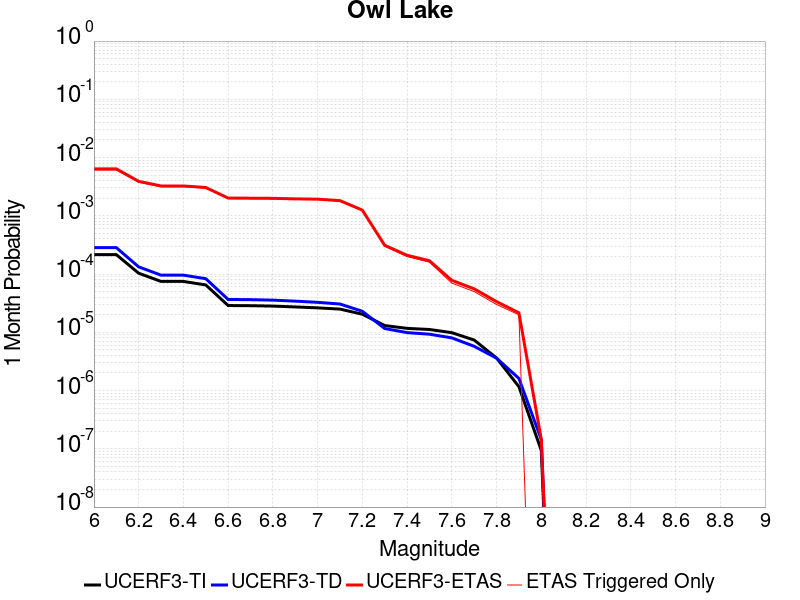 |  |  |

| Magnitude | 1 wk TI Prob | 1 wk TD Prob | 1 wk ETAS Prob | 1 wk ETAS/TD Gain | 1 wk ETAS Triggered Only | 1 mo TI Prob | 1 mo TD Prob | 1 mo ETAS Prob | 1 mo ETAS/TD Gain | 1 mo ETAS Triggered Only | 1 yr TI Prob | 1 yr TD Prob | 1 yr ETAS Prob | 1 yr ETAS/TD Gain | 1 yr ETAS Triggered Only | 10 yr TI Prob | 10 yr TD Prob | 10 yr ETAS Prob | 10 yr ETAS/TD Gain | 10 yr ETAS Triggered Only |
|-----|-----|-----|-----|-----|-----|-----|-----|-----|-----|-----|-----|-----|-----|-----|-----|-----|-----|-----|-----|-----|
| 6.0 | 5.0320643E-5 | 6.635816E-5 | 0.004599794 | 69.31768 | 0.0045337365 | 2.1564208E-4 | 2.843674E-4 | 0.006149887 | 21.626556 | 0.0058671883 | 0.0026222812 | 0.0034577388 | 0.0138227 | 3.9976125 | 0.010400925 | 0.02591553 | 0.034140717 | 0.04865136 | 1.4250245 | 0.0150235575 |
| 6.1 | 5.0320643E-5 | 6.635816E-5 | 0.004599794 | 69.31768 | 0.0045337365 | 2.1564208E-4 | 2.843674E-4 | 0.006149887 | 21.626556 | 0.0058671883 | 0.0026222812 | 0.0034577388 | 0.0138227 | 3.9976125 | 0.010400925 | 0.02591553 | 0.034140717 | 0.04865136 | 1.4250245 | 0.0150235575 |
| 6.2 | 2.4125871E-5 | 3.0981035E-5 | 0.0029644843 | 95.68706 | 0.0029335942 | 1.0339249E-4 | 1.3277028E-4 | 0.003954825 | 29.786974 | 0.003822562 | 0.0012580766 | 0.001615439 | 0.0085381875 | 5.2853665 | 0.00693395 | 0.012509781 | 0.016070465 | 0.02542956 | 1.5823786 | 0.009511957 |
| 6.3 | 1.7433485E-5 | 2.2355514E-5 | 0.00251141 | 112.33962 | 0.0024891102 | 7.471279E-5 | 9.580672E-5 | 0.003473561 | 36.255924 | 0.003378078 | 9.0924866E-4 | 0.0011659743 | 0.0070263217 | 6.0261374 | 0.0058671883 | 0.009055373 | 0.011628896 | 0.019360842 | 1.6648908 | 0.007822918 |
| 6.4 | 1.7433485E-5 | 2.2355514E-5 | 0.00251141 | 112.33962 | 0.0024891102 | 7.471279E-5 | 9.580672E-5 | 0.003473561 | 36.255924 | 0.003378078 | 9.0924866E-4 | 0.0011659743 | 0.0070263217 | 6.0261374 | 0.0058671883 | 0.009055373 | 0.011628896 | 0.019360842 | 1.6648908 | 0.007822918 |
| 6.5 | 1.5182742E-5 | 1.9429144E-5 | 0.0024195958 | 124.53435 | 0.0024002134 | 6.506727E-5 | 8.326596E-5 | 0.0033721733 | 40.49882 | 0.0032891813 | 7.919061E-4 | 0.0010134429 | 0.006341845 | 6.257723 | 0.0053338073 | 0.0078909 | 0.010118429 | 0.017334206 | 1.7131323 | 0.0072895368 |
| 6.6 | 6.7271576E-6 | 8.547361E-6 | 0.001786468 | 209.00813 | 0.0017779358 | 2.8830356E-5 | 3.6631063E-5 | 0.0022589695 | 61.668133 | 0.0022224197 | 3.5095305E-4 | 4.458976E-4 | 0.004177898 | 9.369636 | 0.0037336652 | 0.0035039932 | 0.004467813 | 0.009069793 | 2.0300298 | 0.004622633 |
| 6.7 | 6.682835E-6 | 8.479807E-6 | 0.0017864006 | 210.66524 | 0.0017779358 | 2.8640408E-5 | 3.6341557E-5 | 0.0022586805 | 62.151455 | 0.0022224197 | 3.4864116E-4 | 4.4237426E-4 | 0.004174388 | 9.436326 | 0.0037336652 | 0.003480947 | 0.0044327388 | 0.008946379 | 2.0182507 | 0.0045337365 |
| 6.8 | 6.5774975E-6 | 8.32628E-6 | 0.0017862472 | 214.53123 | 0.0017779358 | 2.8188972E-5 | 3.5683603E-5 | 0.0022580242 | 63.279037 | 0.0022224197 | 3.4314668E-4 | 4.343669E-4 | 0.0040775524 | 9.387345 | 0.0036447684 | 0.0034261728 | 0.004352885 | 0.0087783765 | 2.0166802 | 0.0044448394 |
| 6.9 | 6.363419E-6 | 7.999454E-6 | 0.0016970249 | 212.14258 | 0.001689039 | 2.727151E-5 | 3.428296E-5 | 0.0021677327 | 63.230625 | 0.0021335229 | 3.3198006E-4 | 4.1732067E-4 | 0.0038828487 | 9.304233 | 0.003466975 | 0.0033148455 | 0.0041828766 | 0.008432074 | 2.0158553 | 0.0042670458 |
| 7.0 | 6.1342453E-6 | 7.6316555E-6 | 0.0016966577 | 222.31845 | 0.001689039 | 2.6289357E-5 | 3.2706717E-5 | 0.00216616 | 66.22982 | 0.0021335229 | 3.2002592E-4 | 3.9813702E-4 | 0.0038637316 | 9.704527 | 0.003466975 | 0.0031956544 | 0.003991571 | 0.008153043 | 2.0425649 | 0.004178149 |
| 7.1 | 5.842926E-6 | 7.142211E-6 | 0.0016961691 | 237.48517 | 0.001689039 | 2.504087E-5 | 3.0609146E-5 | 0.0021640668 | 70.700005 | 0.0021335229 | 3.0482994E-4 | 3.7260808E-4 | 0.0036605638 | 9.824166 | 0.0032891813 | 0.0030441214 | 0.0037370329 | 0.0076338747 | 2.0427635 | 0.003911459 |
| 7.2 | 4.77173E-6 | 5.358483E-6 | 0.0013388032 | 249.84741 | 0.0013334518 | 2.045011E-5 | 2.2964748E-5 | 0.0016230702 | 70.6766 | 0.0016001422 | 2.4895166E-4 | 2.79564E-4 | 0.0028568502 | 10.218948 | 0.0025780068 | 0.0024867293 | 0.002808645 | 0.005822647 | 2.073116 | 0.003022491 |
| 7.3 | 3.0494948E-6 | 2.710463E-6 | 2.694001E-4 | 99.392654 | 2.6669036E-4 | 1.3069198E-5 | 1.1616219E-5 | 2.783035E-4 | 23.958183 | 2.6669036E-4 | 1.5910587E-4 | 1.4141845E-4 | 8.5249223E-4 | 6.028154 | 7.1117433E-4 | 0.0015899199 | 0.0014232415 | 0.0022221738 | 1.5613471 | 8.000711E-4 |
| 7.4 | 2.7263884E-6 | 2.3056762E-6 | 1.8009885E-4 | 78.11108 | 1.7779358E-4 | 1.1684469E-5 | 9.881433E-6 | 1.8767326E-4 | 18.992516 | 1.7779358E-4 | 1.4224913E-4 | 1.20299905E-4 | 6.536165E-4 | 5.433225 | 5.333807E-4 | 0.0014215811 | 0.0012112238 | 0.0017439584 | 1.4398317 | 5.333807E-4 |
| 7.5 | 2.6090431E-6 | 2.1656133E-6 | 9.106221E-5 | 42.049156 | 8.889679E-5 | 1.1181565E-5 | 9.281167E-6 | 9.817713E-5 | 10.578102 | 8.889679E-5 | 1.3612706E-4 | 1.1299244E-4 | 3.796527E-4 | 3.359983 | 2.6669036E-4 | 0.001360437 | 0.0011379806 | 0.0014043675 | 1.2340873 | 2.6669036E-4 |
| 7.6 | 2.3008756E-6 | 1.8727933E-6 | 9.076942E-5 | 48.467396 | 8.889679E-5 | 9.860858E-6 | 8.0262325E-6 | 9.692231E-5 | 12.075691 | 8.889679E-5 | 1.20049335E-4 | 9.7715085E-5 | 3.643794E-4 | 3.7289984 | 2.6669036E-4 | 0.001199845 | 9.849932E-4 | 0.0012514208 | 1.2704868 | 2.6669036E-4 |
| 7.7 | 1.7184348E-6 | 1.3419171E-6 | 9.023859E-5 | 67.246025 | 8.889679E-5 | 7.3646997E-6 | 5.7510606E-6 | 9.464734E-5 | 16.45737 | 8.889679E-5 | 8.966153E-5 | 7.0016955E-5 | 2.477981E-4 | 3.5391154 | 1.7779358E-4 | 8.962536E-4 | 7.078345E-4 | 8.855022E-4 | 1.2510018 | 1.7779358E-4 |
| 7.8 | 8.4612907E-7 | 8.4058576E-7 | 8.97373E-5 | 106.75568 | 8.889679E-5 | 3.6262625E-6 | 3.6025056E-6 | 9.249897E-5 | 25.67629 | 8.889679E-5 | 4.4148852E-5 | 4.3859643E-5 | 2.2164543E-4 | 5.0535164 | 1.7779358E-4 | 4.414008E-4 | 4.4398365E-4 | 6.216983E-4 | 1.400273 | 1.7779358E-4 |
| 7.9 | 2.716738E-7 | 3.768106E-7 | 3.768106E-7 | 1.0 | 0.0 | 1.1643157E-6 | 1.6149015E-6 | 1.6149015E-6 | 1.0 | 0.0 | 1.4175452E-5 | 1.966126E-5 | 1.966126E-5 | 1.0 | 0.0 | 1.4174548E-4 | 1.9836679E-4 | 1.9836679E-4 | 1.0 | 0.0 |
| 8.0 | 2.1995428E-8 | 3.384878E-8 | 3.384878E-8 | 1.0 | 0.0 | 9.426611E-8 | 1.4506621E-7 | 1.4506621E-7 | 1.0 | 0.0 | 1.1476893E-6 | 1.7661803E-6 | 1.7661803E-6 | 1.0 | 0.0 | 1.14768345E-5 | 1.7963059E-5 | 1.7963059E-5 | 1.0 | 0.0 |

## Little Lake
*[(top)](#table-of-contents)*

| 1 Week | 1 Month | 1 Year | 10 Year |
|-----|-----|-----|-----|
|  |  |  |  |

| Magnitude | 1 wk TI Prob | 1 wk TD Prob | 1 wk ETAS Prob | 1 wk ETAS/TD Gain | 1 wk ETAS Triggered Only | 1 mo TI Prob | 1 mo TD Prob | 1 mo ETAS Prob | 1 mo ETAS/TD Gain | 1 mo ETAS Triggered Only | 1 yr TI Prob | 1 yr TD Prob | 1 yr ETAS Prob | 1 yr ETAS/TD Gain | 1 yr ETAS Triggered Only | 10 yr TI Prob | 10 yr TD Prob | 10 yr ETAS Prob | 10 yr ETAS/TD Gain | 10 yr ETAS Triggered Only |
|-----|-----|-----|-----|-----|-----|-----|-----|-----|-----|-----|-----|-----|-----|-----|-----|-----|-----|-----|-----|-----|
| 6.0 | 2.8424427E-5 | 3.120572E-5 | 0.006698257 | 214.64836 | 0.006667259 | 1.2181328E-4 | 1.337327E-4 | 0.009111108 | 68.12924 | 0.0089785755 | 0.0014820677 | 0.0016271127 | 0.014673678 | 9.01823 | 0.0130678285 | 0.014722223 | 0.016165402 | 0.032520372 | 2.0117269 | 0.0166237 |
| 6.1 | 2.8424427E-5 | 3.120572E-5 | 0.006698257 | 214.64836 | 0.006667259 | 1.2181328E-4 | 1.337327E-4 | 0.009111108 | 68.12924 | 0.0089785755 | 0.0014820677 | 0.0016271127 | 0.014673678 | 9.01823 | 0.0130678285 | 0.014722223 | 0.016165402 | 0.032520372 | 2.0117269 | 0.0166237 |
| 6.2 | 2.8424427E-5 | 3.120572E-5 | 0.006698257 | 214.64836 | 0.006667259 | 1.2181328E-4 | 1.337327E-4 | 0.009111108 | 68.12924 | 0.0089785755 | 0.0014820677 | 0.0016271127 | 0.014673678 | 9.01823 | 0.0130678285 | 0.014722223 | 0.016165402 | 0.032520372 | 2.0117269 | 0.0166237 |
| 6.3 | 1.48860645E-5 | 1.6081389E-5 | 0.003394105 | 211.05795 | 0.003378078 | 6.379586E-5 | 6.8918576E-5 | 0.0042467797 | 61.620247 | 0.004178149 | 7.7643775E-4 | 8.3878887E-4 | 0.0070563448 | 8.4125395 | 0.006222775 | 0.007737305 | 0.008359048 | 0.01602842 | 1.9174935 | 0.0077340207 |
| 6.4 | 1.48860645E-5 | 1.6081389E-5 | 0.003394105 | 211.05795 | 0.003378078 | 6.379586E-5 | 6.8918576E-5 | 0.0042467797 | 61.620247 | 0.004178149 | 7.7643775E-4 | 8.3878887E-4 | 0.0070563448 | 8.4125395 | 0.006222775 | 0.007737305 | 0.008359048 | 0.01602842 | 1.9174935 | 0.0077340207 |
| 6.5 | 1.2797581E-5 | 1.3765565E-5 | 0.0030362147 | 220.56595 | 0.003022491 | 5.4845623E-5 | 5.899409E-5 | 0.0038813306 | 65.791855 | 0.003822562 | 6.675408E-4 | 7.18042E-4 | 0.0065810173 | 9.165226 | 0.0058671883 | 0.006655392 | 0.00715977 | 0.014132335 | 1.9738531 | 0.0070228465 |
| 6.6 | 9.661896E-6 | 1.0289038E-5 | 0.0024104777 | 234.2763 | 0.0024002134 | 4.1407468E-5 | 4.409522E-5 | 0.0032442387 | 73.57347 | 0.0032002844 | 5.040193E-4 | 5.367433E-4 | 0.0056011407 | 10.435417 | 0.005067117 | 0.005028777 | 0.0053560743 | 0.011280258 | 2.1060681 | 0.005956085 |
| 6.7 | 7.767871E-6 | 8.199687E-6 | 0.001875017 | 228.66934 | 0.0018668326 | 3.329045E-5 | 3.5141118E-5 | 0.0026130574 | 74.35897 | 0.0025780068 | 4.0523586E-4 | 4.2777284E-4 | 0.0044264174 | 10.347588 | 0.0040003555 | 0.004044977 | 0.004270846 | 0.009050771 | 2.1191986 | 0.004800427 |
| 6.8 | 6.4235196E-6 | 6.7357446E-6 | 0.0013401787 | 198.96518 | 0.0013334518 | 2.752908E-5 | 2.8867229E-5 | 0.0018067517 | 62.588333 | 0.0017779358 | 3.35115E-4 | 3.5141467E-4 | 0.0033728434 | 9.597901 | 0.003022491 | 0.003346101 | 0.00350985 | 0.0073189954 | 2.085273 | 0.003822562 |
| 6.9 | 3.1283696E-6 | 3.1121804E-6 | 3.5869825E-4 | 115.25625 | 3.5558717E-4 | 1.3407229E-5 | 1.3337856E-5 | 6.356071E-4 | 47.654366 | 6.2227756E-4 | 1.6322079E-4 | 1.6237781E-4 | 0.0013178485 | 8.115939 | 0.0011556583 | 0.0016310095 | 0.00162274 | 0.0032202855 | 1.9844742 | 0.0016001422 |
| 7.0 | 2.290603E-6 | 2.2286815E-6 | 2.6891846E-4 | 120.662575 | 2.6669036E-4 | 9.816834E-6 | 9.551463E-6 | 4.5403116E-4 | 47.535248 | 4.4448394E-4 | 1.19513395E-4 | 1.162839E-4 | 0.0010051484 | 8.643917 | 8.889679E-4 | 0.0011944914 | 0.0011623327 | 0.0021390608 | 1.8403171 | 9.778647E-4 |
| 7.1 | 1.293693E-6 | 1.1776827E-6 | 1.1776827E-6 | 1.0 | 0.0 | 5.5443866E-6 | 5.0472063E-6 | 9.394355E-5 | 18.61298 | 8.889679E-5 | 6.750081E-5 | 6.14487E-5 | 4.17014E-4 | 6.7863765 | 3.5558717E-4 | 6.7480316E-4 | 6.143856E-4 | 0.0010585964 | 1.7230165 | 4.4448394E-4 |
| 7.2 | 4.715842E-7 | 3.0917857E-7 | 3.0917857E-7 | 1.0 | 0.0 | 2.0210737E-6 | 1.3250503E-6 | 9.022172E-5 | 68.08928 | 8.889679E-5 | 2.4606294E-5 | 1.6132375E-5 | 2.8281845E-4 | 17.53111 | 2.6669036E-4 | 2.460357E-4 | 1.6131258E-4 | 4.2795992E-4 | 2.6529856 | 2.6669036E-4 |
| 7.3 | 3.9430947E-7 | 2.3097488E-7 | 2.3097488E-7 | 1.0 | 0.0 | 1.6898966E-6 | 9.89892E-7 | 8.98866E-5 | 90.80445 | 8.889679E-5 | 2.0574296E-5 | 1.2051869E-5 | 2.7873903E-4 | 23.128283 | 2.6669036E-4 | 2.0572392E-4 | 1.20512224E-4 | 3.8717047E-4 | 3.212707 | 2.6669036E-4 |
| 7.4 | 3.547123E-7 | 1.9679135E-7 | 1.9679135E-7 | 1.0 | 0.0 | 1.5201948E-6 | 8.4339126E-7 | 8.9740104E-5 | 106.403885 | 8.889679E-5 | 1.8508214E-5 | 1.0268241E-5 | 2.7695586E-4 | 26.972086 | 2.6669036E-4 | 1.8506673E-4 | 1.02677724E-4 | 3.693407E-4 | 3.597087 | 2.6669036E-4 |
| 7.5 | 2.6354266E-7 | 1.4423138E-7 | 1.4423138E-7 | 1.0 | 0.0 | 1.129468E-6 | 6.181344E-7 | 8.951487E-5 | 144.81459 | 8.889679E-5 | 1.3751187E-5 | 7.5257603E-6 | 2.7421414E-4 | 36.436733 | 2.6669036E-4 | 1.3750336E-4 | 7.5255106E-5 | 3.4192542E-4 | 4.543551 | 2.6669036E-4 |
| 7.6 | 1.269913E-7 | 7.572556E-8 | 7.572556E-8 | 1.0 | 0.0 | 5.4424834E-7 | 3.245381E-7 | 3.245381E-7 | 1.0 | 0.0 | 6.6262032E-6 | 3.9512443E-6 | 1.8174412E-4 | 45.99668 | 1.7779358E-4 | 6.626006E-5 | 3.9511775E-5 | 2.1729834E-4 | 5.499584 | 1.7779358E-4 |

## Ash Hill
*[(top)](#table-of-contents)*

| 1 Week | 1 Month | 1 Year | 10 Year |
|-----|-----|-----|-----|
|  | 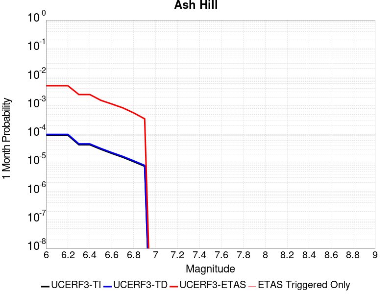 |  |  |

| Magnitude | 1 wk TI Prob | 1 wk TD Prob | 1 wk ETAS Prob | 1 wk ETAS/TD Gain | 1 wk ETAS Triggered Only | 1 mo TI Prob | 1 mo TD Prob | 1 mo ETAS Prob | 1 mo ETAS/TD Gain | 1 mo ETAS Triggered Only | 1 yr TI Prob | 1 yr TD Prob | 1 yr ETAS Prob | 1 yr ETAS/TD Gain | 1 yr ETAS Triggered Only | 10 yr TI Prob | 10 yr TD Prob | 10 yr ETAS Prob | 10 yr ETAS/TD Gain | 10 yr ETAS Triggered Only |
|-----|-----|-----|-----|-----|-----|-----|-----|-----|-----|-----|-----|-----|-----|-----|-----|-----|-----|-----|-----|-----|
| 6.0 | 2.1545662E-5 | 2.3194447E-5 | 0.0032234048 | 138.97313 | 0.0032002844 | 9.2335285E-5 | 9.940143E-5 | 0.004721575 | 47.50007 | 0.004622633 | 0.0011236023 | 0.0012096206 | 0.008756707 | 7.2392187 | 0.007556227 | 0.011179381 | 0.012038348 | 0.023367982 | 1.9411286 | 0.011467686 |
| 6.1 | 2.1545662E-5 | 2.3194447E-5 | 0.0032234048 | 138.97313 | 0.0032002844 | 9.2335285E-5 | 9.940143E-5 | 0.004721575 | 47.50007 | 0.004622633 | 0.0011236023 | 0.0012096206 | 0.008756707 | 7.2392187 | 0.007556227 | 0.011179381 | 0.012038348 | 0.023367982 | 1.9411286 | 0.011467686 |
| 6.2 | 2.1545662E-5 | 2.3194447E-5 | 0.0032234048 | 138.97313 | 0.0032002844 | 9.2335285E-5 | 9.940143E-5 | 0.004721575 | 47.50007 | 0.004622633 | 0.0011236023 | 0.0012096206 | 0.008756707 | 7.2392187 | 0.007556227 | 0.011179381 | 0.012038348 | 0.023367982 | 1.9411286 | 0.011467686 |
| 6.3 | 1.0025529E-5 | 1.0746934E-5 | 0.0013441845 | 125.07609 | 0.0013334518 | 4.2965847E-5 | 4.605755E-5 | 0.002268375 | 49.25088 | 0.0022224197 | 5.229836E-4 | 5.6061964E-4 | 0.0042033447 | 7.4976764 | 0.0036447684 | 0.005217545 | 0.0055933665 | 0.011162538 | 1.9956745 | 0.0056004976 |
| 6.4 | 1.0025529E-5 | 1.0746934E-5 | 0.0013441845 | 125.07609 | 0.0013334518 | 4.2965847E-5 | 4.605755E-5 | 0.002268375 | 49.25088 | 0.0022224197 | 5.229836E-4 | 5.6061964E-4 | 0.0042033447 | 7.4976764 | 0.0036447684 | 0.005217545 | 0.0055933665 | 0.011162538 | 1.9956745 | 0.0056004976 |
| 6.5 | 6.9617327E-6 | 7.456634E-6 | 0.0010742102 | 144.061 | 0.0010667614 | 2.9835655E-5 | 3.195666E-5 | 0.0018098357 | 56.634068 | 0.0017779358 | 3.6318856E-4 | 3.8901155E-4 | 0.0028771535 | 7.3960614 | 0.0024891102 | 0.0036259557 | 0.0038841602 | 0.0076033236 | 1.9575205 | 0.0037336652 |
| 6.6 | 4.9919777E-6 | 5.3466883E-6 | 5.387246E-4 | 100.75855 | 5.333807E-4 | 2.1394015E-5 | 2.2914215E-5 | 0.001178546 | 51.432964 | 0.0011556583 | 2.60441E-4 | 2.7895154E-4 | 0.0020563914 | 7.3718586 | 0.0017779358 | 0.0026013597 | 0.0027866727 | 0.0056234426 | 2.0179775 | 0.0028446973 |
| 6.7 | 3.6630722E-6 | 3.924624E-6 | 4.4840682E-4 | 114.25473 | 4.4448394E-4 | 1.5698786E-5 | 1.681974E-5 | 0.0010835633 | 64.42212 | 0.0010667614 | 1.9111596E-4 | 2.0476682E-4 | 0.0016268243 | 7.9447646 | 0.0014223487 | 0.0019095168 | 0.0020463446 | 0.0041755014 | 2.0404685 | 0.0021335229 |
| 6.8 | 2.5599613E-6 | 2.744925E-6 | 1.8053802E-4 | 65.77157 | 1.7779358E-4 | 1.0971216E-5 | 1.1763939E-5 | 6.3403416E-4 | 53.896416 | 6.2227756E-4 | 1.3356637E-4 | 1.4322149E-4 | 8.54294E-4 | 5.9648447 | 7.1117433E-4 | 0.0013348613 | 0.0014317769 | 0.0025857806 | 1.805994 | 0.0011556583 |
| 6.9 | 1.7684905E-6 | 1.8968707E-6 | 9.0793495E-5 | 47.864883 | 8.889679E-5 | 7.579223E-6 | 8.129446E-6 | 2.7481766E-4 | 33.805214 | 2.6669036E-4 | 9.2273134E-5 | 9.8976E-5 | 4.5452797E-4 | 4.5923047 | 3.5558717E-4 | 9.223483E-4 | 9.8976E-4 | 0.0017002305 | 1.7178209 | 7.1117433E-4 |

## Garlock (East)
*[(top)](#table-of-contents)*

| 1 Week | 1 Month | 1 Year | 10 Year |
|-----|-----|-----|-----|
|  |  |  |  |

| Magnitude | 1 wk TI Prob | 1 wk TD Prob | 1 wk ETAS Prob | 1 wk ETAS/TD Gain | 1 wk ETAS Triggered Only | 1 mo TI Prob | 1 mo TD Prob | 1 mo ETAS Prob | 1 mo ETAS/TD Gain | 1 mo ETAS Triggered Only | 1 yr TI Prob | 1 yr TD Prob | 1 yr ETAS Prob | 1 yr ETAS/TD Gain | 1 yr ETAS Triggered Only | 10 yr TI Prob | 10 yr TD Prob | 10 yr ETAS Prob | 10 yr ETAS/TD Gain | 10 yr ETAS Triggered Only |
|-----|-----|-----|-----|-----|-----|-----|-----|-----|-----|-----|-----|-----|-----|-----|-----|-----|-----|-----|-----|-----|
| 6.0 | 4.5092507E-5 | 6.290325E-5 | 0.0028185304 | 44.80739 | 0.0027558005 | 1.9323928E-4 | 2.6956003E-4 | 0.004268837 | 15.836315 | 0.0040003555 | 0.0023501497 | 0.0032774 | 0.009922808 | 3.0276463 | 0.006667259 | 0.023254504 | 0.032351844 | 0.04215822 | 1.3031163 | 0.010134234 |
| 6.1 | 4.5092507E-5 | 6.290325E-5 | 0.0028185304 | 44.80739 | 0.0027558005 | 1.9323928E-4 | 2.6956003E-4 | 0.004268837 | 15.836315 | 0.0040003555 | 0.0023501497 | 0.0032774 | 0.009922808 | 3.0276463 | 0.006667259 | 0.023254504 | 0.032351844 | 0.04215822 | 1.3031163 | 0.010134234 |
| 6.2 | 2.6674514E-5 | 3.4509674E-5 | 0.0020790652 | 60.24587 | 0.0020446263 | 1.1431433E-4 | 1.4789042E-4 | 0.0030810507 | 20.833336 | 0.0029335942 | 0.0013908884 | 0.0017991117 | 0.0060584806 | 3.3674843 | 0.0042670458 | 0.01382215 | 0.017890299 | 0.024263667 | 1.3562471 | 0.006489466 |
| 6.3 | 2.6674514E-5 | 3.4509674E-5 | 0.0020790652 | 60.24587 | 0.0020446263 | 1.1431433E-4 | 1.4789042E-4 | 0.0030810507 | 20.833336 | 0.0029335942 | 0.0013908884 | 0.0017991117 | 0.0060584806 | 3.3674843 | 0.0042670458 | 0.01382215 | 0.017890299 | 0.024263667 | 1.3562471 | 0.006489466 |
| 6.4 | 2.5312667E-5 | 3.233893E-5 | 0.002076899 | 64.22287 | 0.0020446263 | 1.0847834E-4 | 1.3858822E-4 | 0.0030717757 | 22.164768 | 0.0029335942 | 0.0013199237 | 0.0016860351 | 0.0059458865 | 3.5265498 | 0.0042670458 | 0.013121112 | 0.016778335 | 0.023158919 | 1.380287 | 0.006489466 |
| 6.5 | 2.5312667E-5 | 3.233893E-5 | 0.002076899 | 64.22287 | 0.0020446263 | 1.0847834E-4 | 1.3858822E-4 | 0.0030717757 | 22.164768 | 0.0029335942 | 0.0013199237 | 0.0016860351 | 0.0059458865 | 3.5265498 | 0.0042670458 | 0.013121112 | 0.016778335 | 0.023158919 | 1.380287 | 0.006489466 |
| 6.6 | 2.246556E-5 | 2.8133776E-5 | 0.0019838081 | 70.5134 | 0.0019557294 | 9.627742E-5 | 1.20567885E-4 | 0.00278715 | 23.116852 | 0.0026669037 | 0.0011715472 | 0.0014669491 | 0.00537267 | 3.6624787 | 0.003911459 | 0.011653901 | 0.01461866 | 0.02031248 | 1.3894899 | 0.0057782913 |
| 6.7 | 2.2241198E-5 | 2.7803519E-5 | 0.0019834784 | 71.33912 | 0.0019557294 | 9.531594E-5 | 1.1915263E-4 | 0.0027857386 | 23.379581 | 0.0026669037 | 0.0011598538 | 0.0014497414 | 0.0053555295 | 3.6941276 | 0.003911459 | 0.011538187 | 0.014448853 | 0.020143656 | 1.3941352 | 0.0057782913 |
| 6.8 | 1.9528685E-5 | 2.389819E-5 | 0.0018906862 | 79.1142 | 0.0018668326 | 8.369167E-5 | 1.0241691E-4 | 0.0024134968 | 23.565413 | 0.0023113166 | 0.0010184698 | 0.0012462323 | 0.0047088866 | 3.7784982 | 0.003466975 | 0.010138147 | 0.012436427 | 0.017264945 | 1.3882561 | 0.0048893234 |
| 6.9 | 1.3318621E-5 | 1.5198884E-5 | 0.001437526 | 94.58102 | 0.0014223487 | 5.7078556E-5 | 6.513648E-5 | 0.0015762835 | 24.199701 | 0.0015112455 | 6.9470983E-4 | 7.927538E-4 | 0.0032798906 | 4.137338 | 0.0024891102 | 0.0069254204 | 0.007939888 | 0.011643908 | 1.4665079 | 0.0037336652 |
| 7.0 | 1.1760853E-5 | 1.31077895E-5 | 0.0014354378 | 109.51029 | 0.0014223487 | 5.0402683E-5 | 5.6175057E-5 | 0.0015673356 | 27.900917 | 0.0015112455 | 6.134799E-4 | 6.8372174E-4 | 0.00317113 | 4.638042 | 0.0024891102 | 0.0061178906 | 0.00685652 | 0.010476299 | 1.5279322 | 0.0036447684 |
| 7.1 | 1.0064758E-5 | 1.0902931E-5 | 0.0014332361 | 131.45421 | 0.0014223487 | 4.3133965E-5 | 4.672603E-5 | 0.0015579008 | 33.34118 | 0.0015112455 | 5.2502943E-4 | 5.687444E-4 | 0.0029675926 | 5.217797 | 0.0024002134 | 0.005237907 | 0.0057129986 | 0.009160167 | 1.6033903 | 0.003466975 |
| 7.2 | 9.768808E-6 | 1.0498807E-5 | 0.0014328326 | 136.47575 | 0.0014223487 | 4.186565E-5 | 4.499413E-5 | 0.0015561716 | 34.5861 | 0.0015112455 | 5.095951E-4 | 5.4766936E-4 | 0.0029465682 | 5.3801956 | 0.0024002134 | 0.0050842804 | 0.0055032647 | 0.00895116 | 1.6265181 | 0.003466975 |
| 7.3 | 9.344516E-6 | 9.944468E-6 | 0.0013433831 | 135.08849 | 0.0013334518 | 4.004731E-5 | 4.261847E-5 | 0.0014649065 | 34.372574 | 0.0014223487 | 4.8746695E-4 | 5.1875977E-4 | 0.0027400267 | 5.2818794 | 0.0022224197 | 0.0048639905 | 0.0052149445 | 0.008486973 | 1.6274331 | 0.0032891813 |
| 7.4 | 9.023491E-6 | 9.490661E-6 | 0.0010762421 | 113.400116 | 0.0010667614 | 3.867153E-5 | 4.0673647E-5 | 0.0011962849 | 29.411795 | 0.0011556583 | 4.7072413E-4 | 4.950925E-4 | 0.0023610007 | 4.768808 | 0.0018668326 | 0.004697283 | 0.0049783974 | 0.007897387 | 1.5863311 | 0.0029335942 |
| 7.5 | 7.081253E-6 | 7.087672E-6 | 8.071531E-4 | 113.88127 | 8.000711E-4 | 3.0347876E-5 | 3.0375388E-5 | 8.304222E-4 | 27.338654 | 8.000711E-4 | 3.6942272E-4 | 3.6975832E-4 | 0.0015249893 | 4.1242867 | 0.0011556583 | 0.003688092 | 0.0037243143 | 0.0054956283 | 1.4756081 | 0.0017779358 |
| 7.6 | 6.116396E-6 | 5.959245E-6 | 4.5044054E-4 | 75.58685 | 4.4448394E-4 | 2.6212863E-5 | 2.5539372E-5 | 4.7001196E-4 | 18.403427 | 4.4448394E-4 | 3.1909486E-4 | 3.1089774E-4 | 0.001021851 | 3.286775 | 7.1117433E-4 | 0.0031863707 | 0.0031357552 | 0.0041991714 | 1.3391261 | 0.0010667614 |
| 7.7 | 4.797145E-6 | 4.757281E-6 | 9.365365E-5 | 19.686382 | 8.889679E-5 | 2.055903E-5 | 2.0388188E-5 | 1.09283166E-4 | 5.3601213 | 8.889679E-5 | 2.5027743E-4 | 2.4819805E-4 | 4.259475E-4 | 1.7161597 | 1.7779358E-4 | 0.0024999576 | 0.0025093474 | 0.0028640423 | 1.1413494 | 3.5558717E-4 |
| 7.8 | 3.4028885E-6 | 3.978462E-6 | 9.28749E-5 | 23.344425 | 8.889679E-5 | 1.4583726E-5 | 1.7050439E-5 | 1.0594571E-4 | 6.213665 | 8.889679E-5 | 1.775424E-4 | 2.0756939E-4 | 3.8532607E-4 | 1.8563722 | 1.7779358E-4 | 0.0017740062 | 0.0021012232 | 0.002367353 | 1.1266547 | 2.6669036E-4 |
| 7.9 | 2.5928412E-6 | 3.3724489E-6 | 9.226894E-5 | 27.359627 | 8.889679E-5 | 1.1112129E-5 | 1.4453272E-5 | 1.0334878E-4 | 7.150545 | 8.889679E-5 | 1.3528178E-4 | 1.7595445E-4 | 3.5371675E-4 | 2.0102746 | 1.7779358E-4 | 0.0013519945 | 0.0017812408 | 0.002047456 | 1.149455 | 2.6669036E-4 |
| 8.0 | 1.3743648E-6 | 1.6734747E-6 | 1.6734747E-6 | 1.0 | 0.0 | 5.8901214E-6 | 7.1720146E-6 | 7.1720146E-6 | 1.0 | 0.0 | 7.1709874E-5 | 8.731581E-5 | 8.731581E-5 | 1.0 | 0.0 | 7.1686733E-4 | 8.837234E-4 | 9.725416E-4 | 1.1005045 | 8.889679E-5 |
| 8.1 | 3.6733252E-7 | 3.1489964E-7 | 3.1489964E-7 | 1.0 | 0.0 | 1.5742813E-6 | 1.3495693E-6 | 1.3495693E-6 | 1.0 | 0.0 | 1.9166706E-5 | 1.6430899E-5 | 1.6430899E-5 | 1.0 | 0.0 | 1.9165053E-4 | 1.6638759E-4 | 1.6638759E-4 | 1.0 | 0.0 |

## Blackwater
*[(top)](#table-of-contents)*

| 1 Week | 1 Month | 1 Year | 10 Year |
|-----|-----|-----|-----|
|  |  |  |  |

| Magnitude | 1 wk TI Prob | 1 wk TD Prob | 1 wk ETAS Prob | 1 wk ETAS/TD Gain | 1 wk ETAS Triggered Only | 1 mo TI Prob | 1 mo TD Prob | 1 mo ETAS Prob | 1 mo ETAS/TD Gain | 1 mo ETAS Triggered Only | 1 yr TI Prob | 1 yr TD Prob | 1 yr ETAS Prob | 1 yr ETAS/TD Gain | 1 yr ETAS Triggered Only | 10 yr TI Prob | 10 yr TD Prob | 10 yr ETAS Prob | 10 yr ETAS/TD Gain | 10 yr ETAS Triggered Only |
|-----|-----|-----|-----|-----|-----|-----|-----|-----|-----|-----|-----|-----|-----|-----|-----|-----|-----|-----|-----|-----|
| 6.0 | 3.0708583E-5 | 3.3095846E-5 | 0.002255442 | 68.14879 | 0.0022224197 | 1.3160157E-4 | 1.4183241E-4 | 0.0036083155 | 25.440699 | 0.003466975 | 0.0016010714 | 0.0017255784 | 0.006783952 | 3.9314072 | 0.005067117 | 0.015895851 | 0.017135633 | 0.023950765 | 1.397717 | 0.00693395 |
| 6.1 | 3.0708583E-5 | 3.3095846E-5 | 0.002255442 | 68.14879 | 0.0022224197 | 1.3160157E-4 | 1.4183241E-4 | 0.0036083155 | 25.440699 | 0.003466975 | 0.0016010714 | 0.0017255784 | 0.006783952 | 3.9314072 | 0.005067117 | 0.015895851 | 0.017135633 | 0.023950765 | 1.397717 | 0.00693395 |
| 6.2 | 1.1707779E-5 | 1.2545122E-5 | 8.126062E-4 | 64.77467 | 8.000711E-4 | 5.017523E-5 | 5.3763757E-5 | 0.0012982519 | 24.147345 | 0.0012445551 | 6.107122E-4 | 6.5438676E-4 | 0.0024311591 | 3.7151716 | 0.0017779358 | 0.006090366 | 0.0065255696 | 0.009175071 | 1.4060183 | 0.0026669037 |
| 6.3 | 1.1707779E-5 | 1.2545122E-5 | 8.126062E-4 | 64.77467 | 8.000711E-4 | 5.017523E-5 | 5.3763757E-5 | 0.0012982519 | 24.147345 | 0.0012445551 | 6.107122E-4 | 6.5438676E-4 | 0.0024311591 | 3.7151716 | 0.0017779358 | 0.006090366 | 0.0065255696 | 0.009175071 | 1.4060183 | 0.0026669037 |
| 6.4 | 7.929244E-6 | 8.480098E-6 | 4.529603E-4 | 53.41451 | 4.4448394E-4 | 3.3982033E-5 | 3.6342793E-5 | 6.5859774E-4 | 18.121824 | 6.2227756E-4 | 4.136527E-4 | 4.423877E-4 | 0.0015086773 | 3.4103055 | 0.0010667614 | 0.0041288356 | 0.0044154758 | 0.006097057 | 1.380838 | 0.001689039 |
| 6.5 | 5.8832115E-6 | 6.285991E-6 | 3.6187092E-4 | 57.56784 | 3.5558717E-4 | 2.521352E-5 | 2.6939697E-5 | 4.7141168E-4 | 17.498774 | 4.4448394E-4 | 3.0693135E-4 | 3.27944E-4 | 0.0011277527 | 3.4388578 | 8.000711E-4 | 0.0030650778 | 0.0032748538 | 0.0044267275 | 1.3517329 | 0.0011556583 |
| 6.6 | 5.8832115E-6 | 6.285991E-6 | 3.6187092E-4 | 57.56784 | 3.5558717E-4 | 2.521352E-5 | 2.6939697E-5 | 4.7141168E-4 | 17.498774 | 4.4448394E-4 | 3.0693135E-4 | 3.27944E-4 | 0.0011277527 | 3.4388578 | 8.000711E-4 | 0.0030650778 | 0.0032748538 | 0.0044267275 | 1.3517329 | 0.0011556583 |
| 6.7 | 3.0715053E-6 | 3.2814662E-6 | 1.8107446E-4 | 55.18096 | 1.7779358E-4 | 1.3163528E-5 | 1.4063357E-5 | 1.9185444E-4 | 13.642151 | 1.7779358E-4 | 1.6025416E-4 | 1.7120909E-4 | 4.378538E-4 | 2.5574214 | 2.6669036E-4 | 0.0016013865 | 0.0017108864 | 0.002065865 | 1.2074823 | 3.5558717E-4 |
| 6.8 | 2.2722281E-6 | 2.4287538E-6 | 9.132533E-5 | 37.601727 | 8.889679E-5 | 9.738084E-6 | 1.0408908E-5 | 9.930477E-5 | 9.540364 | 8.889679E-5 | 1.1855473E-4 | 1.26722E-4 | 3.0449306E-4 | 2.4028428 | 1.7779358E-4 | 0.001184915 | 0.0012665876 | 0.0015329402 | 1.2102915 | 2.6669036E-4 |
| 6.9 | 9.952399E-7 | 1.0653489E-6 | 1.0653489E-6 | 1.0 | 0.0 | 4.265307E-6 | 4.5657757E-6 | 4.5657757E-6 | 1.0 | 0.0 | 5.1928873E-5 | 5.5587418E-5 | 5.5587418E-5 | 1.0 | 0.0 | 5.191674E-4 | 5.557858E-4 | 5.557858E-4 | 1.0 | 0.0 |
| 7.0 | 4.7385504E-7 | 5.0755597E-7 | 5.0755597E-7 | 1.0 | 0.0 | 2.0308057E-6 | 2.1752398E-6 | 2.1752398E-6 | 1.0 | 0.0 | 2.4724779E-5 | 2.6483543E-5 | 2.6483543E-5 | 1.0 | 0.0 | 2.4722028E-4 | 2.6483546E-4 | 2.6483546E-4 | 1.0 | 0.0 |

## Hunter Mountain-Saline Valley
*[(top)](#table-of-contents)*

| 1 Week | 1 Month | 1 Year | 10 Year |
|-----|-----|-----|-----|
|  |  |  |  |

| Magnitude | 1 wk TI Prob | 1 wk TD Prob | 1 wk ETAS Prob | 1 wk ETAS/TD Gain | 1 wk ETAS Triggered Only | 1 mo TI Prob | 1 mo TD Prob | 1 mo ETAS Prob | 1 mo ETAS/TD Gain | 1 mo ETAS Triggered Only | 1 yr TI Prob | 1 yr TD Prob | 1 yr ETAS Prob | 1 yr ETAS/TD Gain | 1 yr ETAS Triggered Only | 10 yr TI Prob | 10 yr TD Prob | 10 yr ETAS Prob | 10 yr ETAS/TD Gain | 10 yr ETAS Triggered Only |
|-----|-----|-----|-----|-----|-----|-----|-----|-----|-----|-----|-----|-----|-----|-----|-----|-----|-----|-----|-----|-----|
| 6.0 | 4.5103672E-5 | 5.4570177E-5 | 0.002099085 | 38.465786 | 0.0020446263 | 1.9328714E-4 | 2.3385242E-4 | 0.0028112566 | 12.021498 | 0.0025780068 | 0.002350731 | 0.0028435152 | 0.0071870717 | 2.5275307 | 0.004355943 | 0.023260195 | 0.028091887 | 0.033794254 | 1.2029898 | 0.0058671883 |
| 6.1 | 4.5103672E-5 | 5.4570177E-5 | 0.002099085 | 38.465786 | 0.0020446263 | 1.9328714E-4 | 2.3385242E-4 | 0.0028112566 | 12.021498 | 0.0025780068 | 0.002350731 | 0.0028435152 | 0.0071870717 | 2.5275307 | 0.004355943 | 0.023260195 | 0.028091887 | 0.033794254 | 1.2029898 | 0.0058671883 |
| 6.2 | 3.9363465E-5 | 4.706337E-5 | 0.0020915933 | 44.442066 | 0.0020446263 | 1.6868966E-4 | 2.0168544E-4 | 0.0026902936 | 13.339057 | 0.0024891102 | 0.002051862 | 0.0024528175 | 0.0066207186 | 2.69923 | 0.004178149 | 0.020330196 | 0.024273481 | 0.029738035 | 1.2251245 | 0.0056004976 |
| 6.3 | 3.9363465E-5 | 4.706337E-5 | 0.0020915933 | 44.442066 | 0.0020446263 | 1.6868966E-4 | 2.0168544E-4 | 0.0026902936 | 13.339057 | 0.0024891102 | 0.002051862 | 0.0024528175 | 0.0066207186 | 2.69923 | 0.004178149 | 0.020330196 | 0.024273481 | 0.029738035 | 1.2251245 | 0.0056004976 |
| 6.4 | 3.2311684E-5 | 3.795099E-5 | 0.0020824997 | 54.873394 | 0.0020446263 | 1.384713E-4 | 1.6263737E-4 | 0.0026513427 | 16.302174 | 0.0024891102 | 0.0016845843 | 0.0019783843 | 0.0061482675 | 3.1077213 | 0.004178149 | 0.016718714 | 0.019616475 | 0.02510711 | 1.2798992 | 0.0056004976 |
| 6.5 | 3.2311684E-5 | 3.795099E-5 | 0.0020824997 | 54.873394 | 0.0020446263 | 1.384713E-4 | 1.6263737E-4 | 0.0026513427 | 16.302174 | 0.0024891102 | 0.0016845843 | 0.0019783843 | 0.0061482675 | 3.1077213 | 0.004178149 | 0.016718714 | 0.019616475 | 0.02510711 | 1.2798992 | 0.0056004976 |
| 6.6 | 2.9305844E-5 | 3.418183E-5 | 0.002078738 | 60.814125 | 0.0020446263 | 1.2559042E-4 | 1.4648569E-4 | 0.0026352312 | 17.989683 | 0.0024891102 | 0.0015279909 | 0.001782067 | 0.005864032 | 3.2905788 | 0.0040892526 | 0.015175272 | 0.01768569 | 0.023099815 | 1.3061302 | 0.005511601 |
| 6.7 | 2.7826512E-5 | 3.2344276E-5 | 0.0020769043 | 64.212425 | 0.0020446263 | 1.19251024E-4 | 1.386113E-4 | 0.0026273765 | 18.954994 | 0.0024891102 | 0.0014509142 | 0.0016863465 | 0.005768703 | 3.420829 | 0.0040892526 | 0.014414776 | 0.016743187 | 0.022162506 | 1.3236731 | 0.005511601 |
| 6.8 | 2.3389874E-5 | 2.6866714E-5 | 0.0019825436 | 73.79182 | 0.0019557294 | 1.0023846E-4 | 1.15138246E-4 | 0.0025150753 | 21.84396 | 0.0024002134 | 0.00121972 | 0.001400954 | 0.005306933 | 3.7880852 | 0.003911459 | 0.01213047 | 0.013927434 | 0.019186955 | 1.3776375 | 0.0053338073 |
| 6.9 | 2.069209E-5 | 2.3570032E-5 | 0.0018903586 | 80.20179 | 0.0018668326 | 8.867737E-5 | 1.01010715E-4 | 0.0024120938 | 23.879583 | 0.0023113166 | 0.0010791123 | 0.0012291478 | 0.005047011 | 4.1061063 | 0.003822562 | 0.010738871 | 0.012228523 | 0.017409297 | 1.423663 | 0.0052449107 |
| 7.0 | 1.7462342E-5 | 1.9633546E-5 | 0.0018864295 | 96.081955 | 0.0018668326 | 7.483646E-5 | 8.414118E-5 | 0.0023952632 | 28.467194 | 0.0023113166 | 9.1075303E-4 | 0.0010239601 | 0.004842608 | 4.729294 | 0.003822562 | 0.009070295 | 0.0101960525 | 0.015387486 | 1.5091611 | 0.0052449107 |
| 7.1 | 1.4807709E-5 | 1.6441749E-5 | 0.0018832437 | 114.540344 | 0.0018668326 | 6.3460066E-5 | 7.046283E-5 | 0.0023816165 | 33.799614 | 0.0023113166 | 7.723524E-4 | 8.575638E-4 | 0.0046768477 | 5.4536443 | 0.003822562 | 0.007696735 | 0.008545532 | 0.013745622 | 1.6085157 | 0.0052449107 |
| 7.2 | 1.4180048E-5 | 1.5698337E-5 | 0.0018825016 | 119.91727 | 0.0018668326 | 6.077022E-5 | 6.727694E-5 | 0.002378438 | 35.352947 | 0.0023113166 | 7.396263E-4 | 8.188051E-4 | 0.0046382374 | 5.664641 | 0.003822562 | 0.0073716943 | 0.008160833 | 0.013362941 | 1.6374481 | 0.0052449107 |
| 7.3 | 1.3730402E-5 | 1.5172075E-5 | 0.0018819764 | 124.042114 | 0.0018668326 | 5.8843252E-5 | 6.502165E-5 | 0.0023761878 | 36.544563 | 0.0023113166 | 7.161811E-4 | 7.9136714E-4 | 0.004610904 | 5.826504 | 0.003822562 | 0.007138774 | 0.007888422 | 0.013091959 | 1.6596422 | 0.0052449107 |
| 7.4 | 1.2810095E-5 | 1.4109277E-5 | 0.0018809156 | 133.31055 | 0.0018668326 | 5.489925E-5 | 6.0467017E-5 | 0.002371644 | 39.222107 | 0.0023113166 | 6.681934E-4 | 7.359531E-4 | 0.0044668703 | 6.0695043 | 0.0037336652 | 0.006661878 | 0.007338053 | 0.012456232 | 1.6974846 | 0.0051560136 |
| 7.5 | 1.1595659E-5 | 1.2800664E-5 | 0.0017018181 | 132.94765 | 0.001689039 | 4.9694736E-5 | 5.4858923E-5 | 0.0021882649 | 39.88895 | 0.0021335229 | 6.0486543E-4 | 6.6771836E-4 | 0.004043541 | 6.055758 | 0.003378078 | 0.006032217 | 0.0066599925 | 0.011340143 | 1.7027262 | 0.0047115297 |
| 7.6 | 2.997694E-6 | 3.3251579E-6 | 6.2560063E-4 | 188.14163 | 6.2227756E-4 | 1.28471975E-5 | 1.425064E-5 | 9.032059E-4 | 63.380024 | 8.889679E-4 | 1.564034E-4 | 1.73495E-4 | 0.0015067155 | 8.684489 | 0.0013334518 | 0.0015629337 | 0.001735031 | 0.0037761098 | 2.1763933 | 0.0020446263 |

## Gravel Hills-Harper Lk
*[(top)](#table-of-contents)*

| 1 Week | 1 Month | 1 Year | 10 Year |
|-----|-----|-----|-----|
| 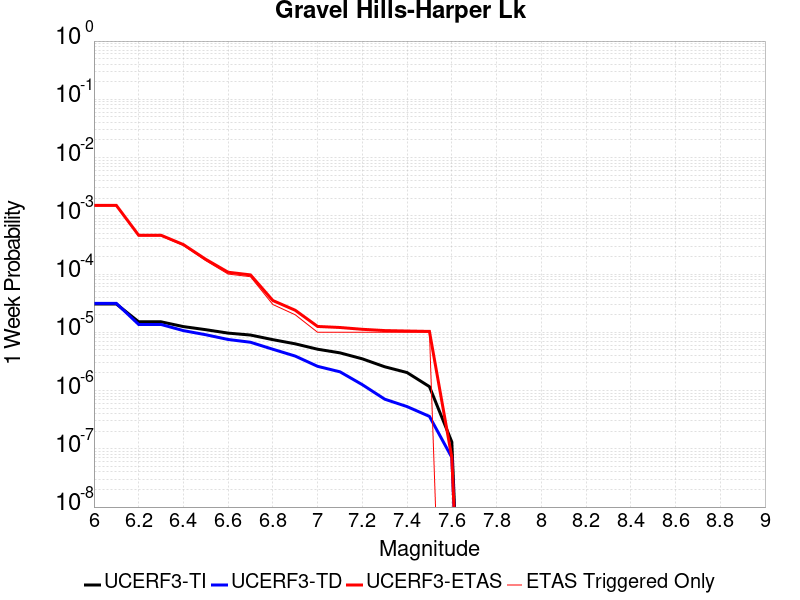 | 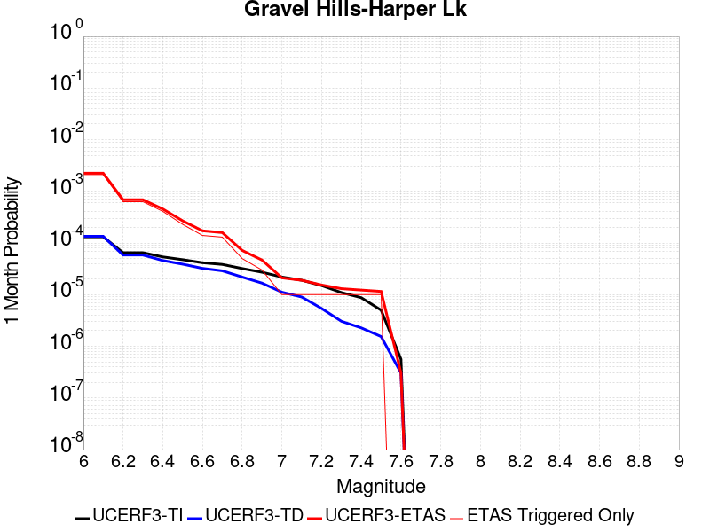 |  |  |

| Magnitude | 1 wk TI Prob | 1 wk TD Prob | 1 wk ETAS Prob | 1 wk ETAS/TD Gain | 1 wk ETAS Triggered Only | 1 mo TI Prob | 1 mo TD Prob | 1 mo ETAS Prob | 1 mo ETAS/TD Gain | 1 mo ETAS Triggered Only | 1 yr TI Prob | 1 yr TD Prob | 1 yr ETAS Prob | 1 yr ETAS/TD Gain | 1 yr ETAS Triggered Only | 10 yr TI Prob | 10 yr TD Prob | 10 yr ETAS Prob | 10 yr ETAS/TD Gain | 10 yr ETAS Triggered Only |
|-----|-----|-----|-----|-----|-----|-----|-----|-----|-----|-----|-----|-----|-----|-----|-----|-----|-----|-----|-----|-----|
| 6.0 | 3.0679566E-5 | 3.1464646E-5 | 0.0017204505 | 54.678844 | 0.001689039 | 1.3147724E-4 | 1.3484273E-4 | 0.0027125021 | 20.116041 | 0.0025780068 | 0.0015995599 | 0.0016406906 | 0.0051019774 | 3.1096523 | 0.003466975 | 0.015880952 | 0.01630734 | 0.021204377 | 1.3002967 | 0.0049782204 |
| 6.1 | 3.0679566E-5 | 3.1464646E-5 | 0.0017204505 | 54.678844 | 0.001689039 | 1.3147724E-4 | 1.3484273E-4 | 0.0027125021 | 20.116041 | 0.0025780068 | 0.0015995599 | 0.0016406906 | 0.0051019774 | 3.1096523 | 0.003466975 | 0.015880952 | 0.01630734 | 0.021204377 | 1.3002967 | 0.0049782204 |
| 6.2 | 1.514536E-5 | 1.3635206E-5 | 4.581131E-4 | 33.597813 | 4.4448394E-4 | 6.490707E-5 | 5.843536E-5 | 7.6956814E-4 | 13.169563 | 7.1117433E-4 | 7.8995706E-4 | 7.1123015E-4 | 0.0016883994 | 2.3739142 | 9.778647E-4 | 0.007871548 | 0.0070907404 | 0.008503004 | 1.19917 | 0.0014223487 |
| 6.3 | 1.514536E-5 | 1.3635206E-5 | 4.581131E-4 | 33.597813 | 4.4448394E-4 | 6.490707E-5 | 5.843536E-5 | 7.6956814E-4 | 13.169563 | 7.1117433E-4 | 7.8995706E-4 | 7.1123015E-4 | 0.0016883994 | 2.3739142 | 9.778647E-4 | 0.007871548 | 0.0070907404 | 0.008503004 | 1.19917 | 0.0014223487 |
| 6.4 | 1.2532521E-5 | 1.06896905E-5 | 4.551689E-4 | 42.580173 | 4.4448394E-4 | 5.37097E-5 | 4.581219E-5 | 5.791685E-4 | 12.642236 | 5.333807E-4 | 6.537194E-4 | 5.576265E-4 | 0.0012684042 | 2.2746484 | 7.1117433E-4 | 0.0065179965 | 0.005562863 | 0.0063584833 | 1.1430236 | 8.000711E-4 |
| 6.5 | 1.1094058E-5 | 9.083664E-6 | 3.646676E-4 | 40.14543 | 3.5558717E-4 | 4.7545094E-5 | 3.892943E-5 | 3.9450274E-4 | 10.133793 | 3.5558717E-4 | 5.787078E-4 | 4.7386673E-4 | 9.1814005E-4 | 1.9375491 | 4.4448394E-4 | 0.0057720304 | 0.0047289706 | 0.0051713525 | 1.0935472 | 4.4448394E-4 |
| 6.6 | 9.688328E-6 | 7.5316952E-6 | 9.6427815E-5 | 12.802937 | 8.889679E-5 | 4.1520743E-5 | 3.227831E-5 | 1.2117223E-4 | 3.7539833 | 8.889679E-5 | 5.053978E-4 | 3.9292008E-4 | 5.706438E-4 | 1.4523152 | 1.7779358E-4 | 0.0050424994 | 0.0039225104 | 0.0040996065 | 1.0451487 | 1.7779358E-4 |
| 6.7 | 8.974824E-6 | 6.749413E-6 | 9.5645606E-5 | 14.170952 | 8.889679E-5 | 3.8462964E-5 | 2.8925748E-5 | 1.1781997E-4 | 4.0731864 | 8.889679E-5 | 4.6818596E-4 | 3.5211627E-4 | 4.4098176E-4 | 1.2523754 | 8.889679E-5 | 0.004672008 | 0.0035158044 | 0.0036043888 | 1.025196 | 8.889679E-5 |
| 6.8 | 7.4780046E-6 | 5.1161933E-6 | 9.401253E-5 | 18.375484 | 8.889679E-5 | 3.20482E-5 | 2.1926366E-5 | 1.1082121E-4 | 5.054244 | 8.889679E-5 | 3.9011694E-4 | 2.669222E-4 | 3.5579526E-4 | 1.3329549 | 8.889679E-5 | 0.0038943281 | 0.0026661542 | 0.002754814 | 1.0332538 | 8.889679E-5 |
| 6.9 | 6.3409307E-6 | 3.9074966E-6 | 9.280394E-5 | 23.750229 | 8.889679E-5 | 2.7175134E-5 | 1.6746313E-5 | 1.05641615E-4 | 6.3083506 | 8.889679E-5 | 3.3080703E-4 | 2.0386827E-4 | 2.9274693E-4 | 1.4359612 | 8.889679E-5 | 0.0033031502 | 0.0020369107 | 0.0021256264 | 1.0435541 | 8.889679E-5 |
| 7.0 | 5.1239335E-6 | 2.6058565E-6 | 9.1502414E-5 | 35.114143 | 8.889679E-5 | 2.195953E-5 | 1.116791E-5 | 1.00063706E-4 | 8.959931 | 8.889679E-5 | 2.6732447E-4 | 1.3596108E-4 | 2.2484577E-4 | 1.6537511 | 8.889679E-5 | 0.0026700313 | 0.0013588042 | 0.0014475802 | 1.065334 | 8.889679E-5 |
| 7.1 | 4.438899E-6 | 2.0984728E-6 | 9.0995076E-5 | 43.362526 | 8.889679E-5 | 1.9023713E-5 | 8.993425E-6 | 9.788942E-5 | 10.884554 | 8.889679E-5 | 2.315891E-4 | 1.0948967E-4 | 1.9837673E-4 | 1.8118305 | 8.889679E-5 | 0.002313479 | 0.0010943791 | 0.0011831786 | 1.0811415 | 8.889679E-5 |
| 7.2 | 3.50367E-6 | 1.2615716E-6 | 9.015825E-5 | 71.46503 | 8.889679E-5 | 1.5015643E-5 | 5.4067245E-6 | 9.430303E-5 | 17.441805 | 8.889679E-5 | 1.8280011E-4 | 6.582497E-5 | 1.547159E-4 | 2.3504138 | 8.889679E-5 | 0.0018264982 | 6.580629E-4 | 7.469012E-4 | 1.1349996 | 8.889679E-5 |
| 7.3 | 2.561638E-6 | 7.1191585E-7 | 8.960864E-5 | 125.86971 | 8.889679E-5 | 1.0978401E-5 | 3.0510646E-6 | 9.1947586E-5 | 30.13623 | 8.889679E-5 | 1.3365384E-4 | 3.71461E-5 | 1.2603958E-4 | 3.3930774 | 8.889679E-5 | 0.0013357349 | 3.7140088E-4 | 4.6026465E-4 | 1.2392665 | 8.889679E-5 |
| 7.4 | 2.0368864E-6 | 5.304837E-7 | 8.942723E-5 | 168.57677 | 8.889679E-5 | 8.729483E-6 | 2.2734996E-6 | 9.117009E-5 | 40.101208 | 8.889679E-5 | 1.06276275E-4 | 2.7679513E-5 | 1.1657384E-4 | 4.211557 | 8.889679E-5 | 0.0010622547 | 2.767612E-4 | 3.6563337E-4 | 1.321115 | 8.889679E-5 |
| 7.5 | 1.1681728E-6 | 3.6030585E-7 | 8.925707E-5 | 247.72583 | 8.889679E-5 | 5.0064455E-6 | 1.544167E-6 | 9.044082E-5 | 58.569324 | 8.889679E-5 | 6.0951766E-5 | 1.8800076E-5 | 1.07695196E-4 | 5.7284446 | 8.889679E-5 | 6.093505E-4 | 1.8798532E-4 | 2.768654E-4 | 1.4728032 | 8.889679E-5 |
| 7.6 | 1.3154387E-7 | 7.1197384E-8 | 7.1197384E-8 | 1.0 | 0.0 | 5.6375933E-7 | 3.051316E-7 | 3.051316E-7 | 1.0 | 0.0 | 6.863748E-6 | 3.7149728E-6 | 3.7149728E-6 | 1.0 | 0.0 | 6.863536E-5 | 3.7149264E-5 | 3.7149264E-5 | 1.0 | 0.0 |

## Airport Lake
*[(top)](#table-of-contents)*

| 1 Week | 1 Month | 1 Year | 10 Year |
|-----|-----|-----|-----|
|  |  |  |  |

| Magnitude | 1 wk TI Prob | 1 wk TD Prob | 1 wk ETAS Prob | 1 wk ETAS/TD Gain | 1 wk ETAS Triggered Only | 1 mo TI Prob | 1 mo TD Prob | 1 mo ETAS Prob | 1 mo ETAS/TD Gain | 1 mo ETAS Triggered Only | 1 yr TI Prob | 1 yr TD Prob | 1 yr ETAS Prob | 1 yr ETAS/TD Gain | 1 yr ETAS Triggered Only | 10 yr TI Prob | 10 yr TD Prob | 10 yr ETAS Prob | 10 yr ETAS/TD Gain | 10 yr ETAS Triggered Only |
|-----|-----|-----|-----|-----|-----|-----|-----|-----|-----|-----|-----|-----|-----|-----|-----|-----|-----|-----|-----|-----|
| 6.0 | 1.2387061E-5 | 1.3103157E-5 | 0.0021465982 | 163.82298 | 0.0021335229 | 5.3086325E-5 | 5.615534E-5 | 0.0026340175 | 46.905914 | 0.0025780068 | 6.461343E-4 | 6.8350515E-4 | 0.004059274 | 5.938908 | 0.003378078 | 0.0064425888 | 0.0068168393 | 0.01131967 | 1.6605452 | 0.0045337365 |
| 6.1 | 1.2387061E-5 | 1.3103157E-5 | 0.0021465982 | 163.82298 | 0.0021335229 | 5.3086325E-5 | 5.615534E-5 | 0.0026340175 | 46.905914 | 0.0025780068 | 6.461343E-4 | 6.8350515E-4 | 0.004059274 | 5.938908 | 0.003378078 | 0.0064425888 | 0.0068168393 | 0.01131967 | 1.6605452 | 0.0045337365 |
| 6.2 | 1.2387061E-5 | 1.3103157E-5 | 0.0021465982 | 163.82298 | 0.0021335229 | 5.3086325E-5 | 5.615534E-5 | 0.0026340175 | 46.905914 | 0.0025780068 | 6.461343E-4 | 6.8350515E-4 | 0.004059274 | 5.938908 | 0.003378078 | 0.0064425888 | 0.0068168393 | 0.01131967 | 1.6605452 | 0.0045337365 |
| 6.3 | 1.2387061E-5 | 1.3103157E-5 | 0.0021465982 | 163.82298 | 0.0021335229 | 5.3086325E-5 | 5.615534E-5 | 0.0026340175 | 46.905914 | 0.0025780068 | 6.461343E-4 | 6.8350515E-4 | 0.004059274 | 5.938908 | 0.003378078 | 0.0064425888 | 0.0068168393 | 0.01131967 | 1.6605452 | 0.0045337365 |
| 6.4 | 1.2387061E-5 | 1.3103157E-5 | 0.0021465982 | 163.82298 | 0.0021335229 | 5.3086325E-5 | 5.615534E-5 | 0.0026340175 | 46.905914 | 0.0025780068 | 6.461343E-4 | 6.8350515E-4 | 0.004059274 | 5.938908 | 0.003378078 | 0.0064425888 | 0.0068168393 | 0.01131967 | 1.6605452 | 0.0045337365 |
| 6.5 | 6.9922594E-6 | 7.384925E-6 | 0.0016075154 | 217.67523 | 0.0016001422 | 2.996648E-5 | 3.1649324E-5 | 0.0018095289 | 57.174324 | 0.0017779358 | 3.6478083E-4 | 3.8526783E-4 | 0.0027845565 | 7.2275863 | 0.0024002134 | 0.003641826 | 0.0038465366 | 0.006945956 | 1.805769 | 0.0031113876 |
| 6.6 | 6.9922594E-6 | 7.384925E-6 | 0.0016075154 | 217.67523 | 0.0016001422 | 2.996648E-5 | 3.1649324E-5 | 0.0018095289 | 57.174324 | 0.0017779358 | 3.6478083E-4 | 3.8526783E-4 | 0.0027845565 | 7.2275863 | 0.0024002134 | 0.003641826 | 0.0038465366 | 0.006945956 | 1.805769 | 0.0031113876 |
| 6.7 | 5.477277E-6 | 5.7860684E-6 | 0.0014281265 | 246.82156 | 0.0014223487 | 2.3473833E-5 | 2.4797222E-5 | 0.0016248998 | 65.52749 | 0.0016001422 | 2.8575645E-4 | 3.0186825E-4 | 0.0024347473 | 8.065596 | 0.0021335229 | 0.0028538927 | 0.003014966 | 0.0058510867 | 1.9406809 | 0.0028446973 |
| 6.8 | 3.9950432E-6 | 4.2190873E-6 | 9.820797E-4 | 232.77066 | 9.778647E-4 | 1.7121502E-5 | 1.8081691E-5 | 0.0010848239 | 59.99571 | 0.0010667614 | 2.0843433E-4 | 2.2012512E-4 | 0.0017310379 | 7.8638816 | 0.0015112455 | 0.0020823893 | 0.0021993418 | 0.004239471 | 1.9276091 | 0.0020446263 |
| 6.9 | 2.95695E-6 | 3.1230243E-6 | 7.1429514E-4 | 228.71904 | 7.1117433E-4 | 1.2672582E-5 | 1.3384334E-5 | 8.134447E-4 | 60.775887 | 8.000711E-4 | 1.5427776E-4 | 1.6294434E-4 | 0.0013184143 | 8.091194 | 0.0011556583 | 0.001541707 | 0.0016284712 | 0.0032260076 | 1.9810039 | 0.0016001422 |
| 7.0 | 1.456072E-6 | 1.540812E-6 | 2.6823077E-4 | 174.08403 | 2.6669036E-4 | 6.2402937E-6 | 6.603469E-6 | 2.7329207E-4 | 41.38614 | 2.6669036E-4 | 7.597293E-5 | 8.039528E-5 | 6.1373314E-4 | 7.6339455 | 5.333807E-4 | 7.594696E-4 | 8.0376083E-4 | 0.0014255382 | 1.7735851 | 6.2227756E-4 |
| 7.1 | 6.995192E-7 | 7.4089746E-7 | 7.4089746E-7 | 1.0 | 0.0 | 2.997936E-6 | 3.1752747E-6 | 3.1752747E-6 | 1.0 | 0.0 | 3.649926E-5 | 3.865897E-5 | 1.2755232E-4 | 3.2994237 | 8.889679E-5 | 3.6493264E-4 | 3.865897E-4 | 5.6431454E-4 | 1.4597248 | 1.7779358E-4 |

## Goldstone Lake
*[(top)](#table-of-contents)*

| 1 Week | 1 Month | 1 Year | 10 Year |
|-----|-----|-----|-----|
|  |  |  |  |

| Magnitude | 1 wk TI Prob | 1 wk TD Prob | 1 wk ETAS Prob | 1 wk ETAS/TD Gain | 1 wk ETAS Triggered Only | 1 mo TI Prob | 1 mo TD Prob | 1 mo ETAS Prob | 1 mo ETAS/TD Gain | 1 mo ETAS Triggered Only | 1 yr TI Prob | 1 yr TD Prob | 1 yr ETAS Prob | 1 yr ETAS/TD Gain | 1 yr ETAS Triggered Only | 10 yr TI Prob | 10 yr TD Prob | 10 yr ETAS Prob | 10 yr ETAS/TD Gain | 10 yr ETAS Triggered Only |
|-----|-----|-----|-----|-----|-----|-----|-----|-----|-----|-----|-----|-----|-----|-----|-----|-----|-----|-----|-----|-----|
| 6.0 | 2.671352E-5 | 3.037609E-5 | 0.0011859993 | 39.043842 | 0.0011556583 | 1.1448149E-4 | 1.3017785E-4 | 0.0016412266 | 12.607572 | 0.0015112455 | 0.001392921 | 0.0015839594 | 0.004335395 | 2.7370617 | 0.0027558005 | 0.013842222 | 0.015746197 | 0.019508567 | 1.2389385 | 0.003822562 |
| 6.1 | 2.671352E-5 | 3.037609E-5 | 0.0011859993 | 39.043842 | 0.0011556583 | 1.1448149E-4 | 1.3017785E-4 | 0.0016412266 | 12.607572 | 0.0015112455 | 0.001392921 | 0.0015839594 | 0.004335395 | 2.7370617 | 0.0027558005 | 0.013842222 | 0.015746197 | 0.019508567 | 1.2389385 | 0.003822562 |
| 6.2 | 1.4197047E-5 | 1.6096245E-5 | 2.8278233E-4 | 17.568218 | 2.6669036E-4 | 6.0843064E-5 | 6.8982634E-5 | 5.134359E-4 | 7.442973 | 4.4448394E-4 | 7.4051257E-4 | 8.3963864E-4 | 0.0024384374 | 2.904151 | 0.0016001422 | 0.007380498 | 0.0083743585 | 0.010666319 | 1.273688 | 0.0023113166 |
| 6.3 | 1.4197047E-5 | 1.6096245E-5 | 2.8278233E-4 | 17.568218 | 2.6669036E-4 | 6.0843064E-5 | 6.8982634E-5 | 5.134359E-4 | 7.442973 | 4.4448394E-4 | 7.4051257E-4 | 8.3963864E-4 | 0.0024384374 | 2.904151 | 0.0016001422 | 0.007380498 | 0.0083743585 | 0.010666319 | 1.273688 | 0.0023113166 |
| 6.4 | 1.3238931E-5 | 1.500846E-5 | 2.8169484E-4 | 18.76907 | 2.6669036E-4 | 5.6737044E-5 | 6.4320935E-5 | 5.087763E-4 | 7.909964 | 4.4448394E-4 | 6.9055456E-4 | 7.82924E-4 | 0.0023818135 | 3.0422025 | 0.0016001422 | 0.006884126 | 0.0078112837 | 0.010016344 | 1.2822917 | 0.0022224197 |
| 6.5 | 1.3238931E-5 | 1.500846E-5 | 2.8169484E-4 | 18.76907 | 2.6669036E-4 | 5.6737044E-5 | 6.4320935E-5 | 5.087763E-4 | 7.909964 | 4.4448394E-4 | 6.9055456E-4 | 7.82924E-4 | 0.0023818135 | 3.0422025 | 0.0016001422 | 0.006884126 | 0.0078112837 | 0.010016344 | 1.2822917 | 0.0022224197 |
| 6.6 | 1.1328278E-5 | 1.2855166E-5 | 1.9064646E-4 | 14.830339 | 1.7779358E-4 | 4.8548856E-5 | 5.5092944E-5 | 4.1066052E-4 | 7.4539585 | 3.5558717E-4 | 5.90922E-4 | 6.7064585E-4 | 0.0020920406 | 3.1194417 | 0.0014223487 | 0.0058935313 | 0.0066956086 | 0.008549942 | 1.2769476 | 0.0018668326 |
| 6.7 | 8.651175E-6 | 9.824565E-6 | 1.876164E-4 | 19.096663 | 1.7779358E-4 | 3.707594E-5 | 4.2105108E-5 | 3.976773E-4 | 9.444871 | 3.5558717E-4 | 4.5130608E-4 | 5.1259965E-4 | 0.0015788144 | 3.0800145 | 0.0010667614 | 0.0045039062 | 0.005123051 | 0.006538113 | 1.2762147 | 0.0014223487 |
| 6.8 | 1.0215377E-6 | 1.1754702E-6 | 9.007216E-5 | 76.62649 | 8.889679E-5 | 4.378012E-6 | 5.0377203E-6 | 9.393406E-5 | 18.646145 | 8.889679E-5 | 5.3300988E-5 | 6.1332634E-5 | 1.5022398E-4 | 2.4493318 | 8.889679E-5 | 5.3288206E-4 | 6.1316835E-4 | 7.0201064E-4 | 1.1448905 | 8.889679E-5 |
| 6.9 | 7.9360774E-7 | 9.2833966E-7 | 8.982505E-5 | 96.75882 | 8.889679E-5 | 3.4011714E-6 | 3.9785928E-6 | 9.287503E-5 | 23.343689 | 8.889679E-5 | 4.1408475E-5 | 4.843836E-5 | 1.3733085E-4 | 2.835167 | 8.889679E-5 | 4.140076E-4 | 4.8428503E-4 | 5.7313876E-4 | 1.1834741 | 8.889679E-5 |
| 7.0 | 7.4382757E-7 | 8.7473285E-7 | 8.7473285E-7 | 1.0 | 0.0 | 3.1878285E-6 | 3.74885E-6 | 3.74885E-6 | 1.0 | 0.0 | 3.8811122E-5 | 4.564136E-5 | 4.564136E-5 | 1.0 | 0.0 | 3.8804344E-4 | 4.5632652E-4 | 4.5632652E-4 | 1.0 | 0.0 |
| 7.1 | 6.4709513E-7 | 7.7113E-7 | 7.7113E-7 | 1.0 | 0.0 | 2.773262E-6 | 3.3048389E-6 | 3.3048389E-6 | 1.0 | 0.0 | 3.376394E-5 | 4.0235733E-5 | 4.0235733E-5 | 1.0 | 0.0 | 3.375881E-4 | 4.0229043E-4 | 4.0229043E-4 | 1.0 | 0.0 |
| 7.2 | 6.356704E-7 | 7.5883594E-7 | 7.5883594E-7 | 1.0 | 0.0 | 2.7242988E-6 | 3.2521505E-6 | 3.2521505E-6 | 1.0 | 0.0 | 3.3167835E-5 | 3.959427E-5 | 3.959427E-5 | 1.0 | 0.0 | 3.3162883E-4 | 3.958781E-4 | 3.958781E-4 | 1.0 | 0.0 |
| 7.3 | 5.7695723E-7 | 6.8965653E-7 | 6.8965653E-7 | 1.0 | 0.0 | 2.4726714E-6 | 2.9556677E-6 | 2.9556677E-6 | 1.0 | 0.0 | 3.0104358E-5 | 3.5984718E-5 | 3.5984718E-5 | 1.0 | 0.0 | 3.0100282E-4 | 3.5979465E-4 | 3.5979465E-4 | 1.0 | 0.0 |
| 7.4 | 5.209647E-7 | 6.193514E-7 | 6.193514E-7 | 1.0 | 0.0 | 2.232704E-6 | 2.6543607E-6 | 2.6543607E-6 | 1.0 | 0.0 | 2.718283E-5 | 3.2316417E-5 | 3.2316417E-5 | 1.0 | 0.0 | 2.7179506E-4 | 3.2312275E-4 | 3.2312275E-4 | 1.0 | 0.0 |
| 7.5 | 4.512955E-7 | 5.348885E-7 | 5.348885E-7 | 1.0 | 0.0 | 1.934122E-6 | 2.2923775E-6 | 2.2923775E-6 | 1.0 | 0.0 | 2.3547682E-5 | 2.7909393E-5 | 2.7909393E-5 | 1.0 | 0.0 | 2.3545188E-4 | 2.7906417E-4 | 2.7906417E-4 | 1.0 | 0.0 |
| 7.6 | 2.21172E-7 | 2.603961E-7 | 2.603961E-7 | 1.0 | 0.0 | 9.478797E-7 | 1.1159829E-6 | 1.1159829E-6 | 1.0 | 0.0 | 1.1540374E-5 | 1.3587036E-5 | 1.3587036E-5 | 1.0 | 0.0 | 1.1539775E-4 | 1.3586486E-4 | 1.3586486E-4 | 1.0 | 0.0 |

## So Sierra Nevada
*[(top)](#table-of-contents)*

| 1 Week | 1 Month | 1 Year | 10 Year |
|-----|-----|-----|-----|
|  |  |  | 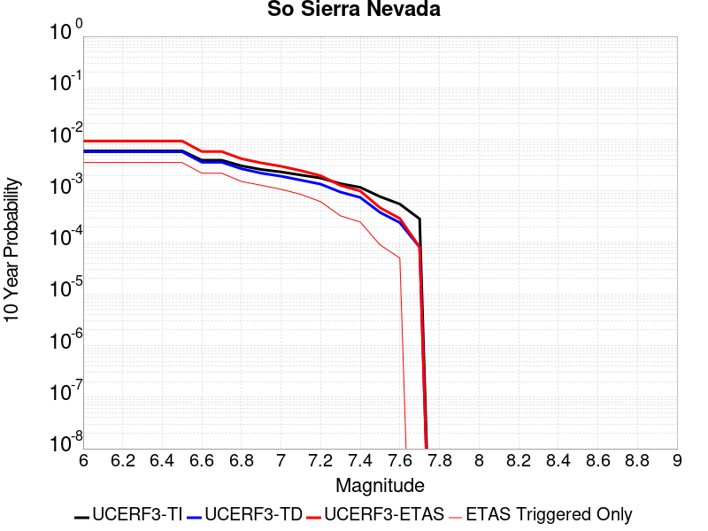 |

| Magnitude | 1 wk TI Prob | 1 wk TD Prob | 1 wk ETAS Prob | 1 wk ETAS/TD Gain | 1 wk ETAS Triggered Only | 1 mo TI Prob | 1 mo TD Prob | 1 mo ETAS Prob | 1 mo ETAS/TD Gain | 1 mo ETAS Triggered Only | 1 yr TI Prob | 1 yr TD Prob | 1 yr ETAS Prob | 1 yr ETAS/TD Gain | 1 yr ETAS Triggered Only | 10 yr TI Prob | 10 yr TD Prob | 10 yr ETAS Prob | 10 yr ETAS/TD Gain | 10 yr ETAS Triggered Only |
|-----|-----|-----|-----|-----|-----|-----|-----|-----|-----|-----|-----|-----|-----|-----|-----|-----|-----|-----|-----|-----|
| 6.0 | 1.15488665E-5 | 1.1079643E-5 | 0.0018778916 | 169.49026 | 0.0018668326 | 4.9494203E-5 | 4.748339E-5 | 0.0025364754 | 53.418163 | 0.0024891102 | 6.024253E-4 | 5.7796965E-4 | 0.00386525 | 6.6876345 | 0.0032891813 | 0.006007948 | 0.005765934 | 0.009743224 | 1.6897911 | 0.0040003555 |
| 6.1 | 1.15488665E-5 | 1.1079643E-5 | 0.0018778916 | 169.49026 | 0.0018668326 | 4.9494203E-5 | 4.748339E-5 | 0.0025364754 | 53.418163 | 0.0024891102 | 6.024253E-4 | 5.7796965E-4 | 0.00386525 | 6.6876345 | 0.0032891813 | 0.006007948 | 0.005765934 | 0.009743224 | 1.6897911 | 0.0040003555 |
| 6.2 | 1.15488665E-5 | 1.1079643E-5 | 0.0018778916 | 169.49026 | 0.0018668326 | 4.9494203E-5 | 4.748339E-5 | 0.0025364754 | 53.418163 | 0.0024891102 | 6.024253E-4 | 5.7796965E-4 | 0.00386525 | 6.6876345 | 0.0032891813 | 0.006007948 | 0.005765934 | 0.009743224 | 1.6897911 | 0.0040003555 |
| 6.3 | 1.15488665E-5 | 1.1079643E-5 | 0.0018778916 | 169.49026 | 0.0018668326 | 4.9494203E-5 | 4.748339E-5 | 0.0025364754 | 53.418163 | 0.0024891102 | 6.024253E-4 | 5.7796965E-4 | 0.00386525 | 6.6876345 | 0.0032891813 | 0.006007948 | 0.005765934 | 0.009743224 | 1.6897911 | 0.0040003555 |
| 6.4 | 1.15488665E-5 | 1.1079643E-5 | 0.0018778916 | 169.49026 | 0.0018668326 | 4.9494203E-5 | 4.748339E-5 | 0.0025364754 | 53.418163 | 0.0024891102 | 6.024253E-4 | 5.7796965E-4 | 0.00386525 | 6.6876345 | 0.0032891813 | 0.006007948 | 0.005765934 | 0.009743224 | 1.6897911 | 0.0040003555 |
| 6.5 | 1.15488665E-5 | 1.1079643E-5 | 0.0018778916 | 169.49026 | 0.0018668326 | 4.9494203E-5 | 4.748339E-5 | 0.0025364754 | 53.418163 | 0.0024891102 | 6.024253E-4 | 5.7796965E-4 | 0.00386525 | 6.6876345 | 0.0032891813 | 0.006007948 | 0.005765934 | 0.009743224 | 1.6897911 | 0.0040003555 |
| 6.6 | 7.587044E-6 | 6.935635E-6 | 0.001251482 | 180.44232 | 0.0012445551 | 3.2515498E-5 | 2.9723828E-5 | 0.0015409243 | 51.84138 | 0.0015112455 | 3.9580427E-4 | 3.6183043E-4 | 0.0024057168 | 6.648741 | 0.0020446263 | 0.003951 | 0.0036127048 | 0.006004247 | 1.661981 | 0.0024002134 |
| 6.7 | 7.587044E-6 | 6.935635E-6 | 0.001251482 | 180.44232 | 0.0012445551 | 3.2515498E-5 | 2.9723828E-5 | 0.0015409243 | 51.84138 | 0.0015112455 | 3.9580427E-4 | 3.6183043E-4 | 0.0024057168 | 6.648741 | 0.0020446263 | 0.003951 | 0.0036127048 | 0.006004247 | 1.661981 | 0.0024002134 |
| 6.8 | 5.9026956E-6 | 5.1793927E-6 | 7.1635004E-4 | 138.30772 | 7.1117433E-4 | 2.5297022E-5 | 2.2197215E-5 | 0.0010000402 | 45.05251 | 9.778647E-4 | 3.0794772E-4 | 2.7021873E-4 | 0.0016921831 | 6.2622714 | 0.0014223487 | 0.0030752132 | 0.002699018 | 0.0042948416 | 1.5912608 | 0.0016001422 |
| 6.9 | 5.0118915E-6 | 4.2524252E-6 | 6.265273E-4 | 147.3341 | 6.2227756E-4 | 2.1479358E-5 | 1.8224557E-5 | 9.071763E-4 | 49.777687 | 8.889679E-4 | 2.614798E-4 | 2.2186211E-4 | 0.0014661411 | 6.6083436 | 0.0012445551 | 0.0026117235 | 0.0022164788 | 0.003546975 | 1.6002748 | 0.0013334518 |
| 7.0 | 4.4924795E-6 | 3.7139177E-6 | 6.2598917E-4 | 168.55225 | 6.2227756E-4 | 1.925334E-5 | 1.5916696E-5 | 9.0487045E-4 | 56.850395 | 8.889679E-4 | 2.3438422E-4 | 1.9376918E-4 | 0.0013492035 | 6.9629416 | 0.0011556583 | 0.0023413717 | 0.0019360651 | 0.0031782107 | 1.6415825 | 0.0012445551 |
| 7.1 | 3.9118436E-6 | 3.1119775E-6 | 5.3649105E-4 | 172.39554 | 5.333807E-4 | 1.6764936E-5 | 1.3336982E-5 | 6.3560624E-4 | 47.657425 | 6.2227756E-4 | 2.0409399E-4 | 1.6236622E-4 | 0.0010511898 | 6.47419 | 8.889679E-4 | 0.0020390663 | 0.001622532 | 0.00259881 | 1.6017003 | 9.778647E-4 |
| 7.2 | 3.4200818E-6 | 2.6054543E-6 | 4.4708824E-4 | 171.59705 | 4.4448394E-4 | 1.4657411E-5 | 1.11661875E-5 | 5.44541E-4 | 48.766956 | 5.333807E-4 | 1.7843937E-4 | 1.3594035E-4 | 8.4701803E-4 | 6.230806 | 7.1117433E-4 | 0.0017829615 | 0.0013586218 | 0.002157606 | 1.5880843 | 8.000711E-4 |
| 7.3 | 2.6593618E-6 | 1.8284203E-6 | 3.5741495E-4 | 195.47745 | 3.5558717E-4 | 1.13972155E-5 | 7.836065E-6 | 4.5231654E-4 | 57.72241 | 4.4448394E-4 | 1.3875226E-4 | 9.540021E-5 | 7.176184E-4 | 7.5221887 | 6.2227756E-4 | 0.0013866565 | 9.5362146E-4 | 0.0016641176 | 1.7450504 | 7.1117433E-4 |
| 7.4 | 2.2577992E-6 | 1.436438E-6 | 9.03331E-5 | 62.88688 | 8.889679E-5 | 9.676246E-6 | 6.15615E-6 | 1.8394864E-4 | 29.880468 | 1.7779358E-4 | 1.1780193E-4 | 7.49488E-5 | 4.305093E-4 | 5.7440453 | 3.5558717E-4 | 0.001177395 | 7.492603E-4 | 0.0011934112 | 1.5927858 | 4.4448394E-4 |
| 7.5 | 1.489319E-6 | 7.353936E-7 | 7.353936E-7 | 1.0 | 0.0 | 6.3827797E-6 | 3.1516831E-6 | 9.204819E-5 | 29.206043 | 8.889679E-5 | 7.770758E-5 | 3.8371072E-5 | 3.0505122E-4 | 7.9500313 | 2.6669036E-4 | 7.7680405E-4 | 3.836449E-4 | 6.5023295E-4 | 1.6948824 | 2.6669036E-4 |
| 7.6 | 1.0680322E-6 | 4.6596554E-7 | 4.6596554E-7 | 1.0 | 0.0 | 4.577273E-6 | 1.9969937E-6 | 1.9969937E-6 | 1.0 | 0.0 | 5.5726876E-5 | 2.4313129E-5 | 2.0210238E-4 | 8.31248 | 1.7779358E-4 | 5.5712904E-4 | 2.4310495E-4 | 4.2085533E-4 | 1.7311672 | 1.7779358E-4 |
| 7.7 | 5.509146E-7 | 1.5580486E-7 | 1.5580486E-7 | 1.0 | 0.0 | 2.3610605E-6 | 6.677349E-7 | 6.677349E-7 | 1.0 | 0.0 | 2.8745531E-5 | 8.129644E-6 | 8.129644E-6 | 1.0 | 0.0 | 2.8741814E-4 | 8.1293576E-5 | 8.1293576E-5 | 1.0 | 0.0 |

## McLean Lake
*[(top)](#table-of-contents)*

| 1 Week | 1 Month | 1 Year | 10 Year |
|-----|-----|-----|-----|
|  |  |  | 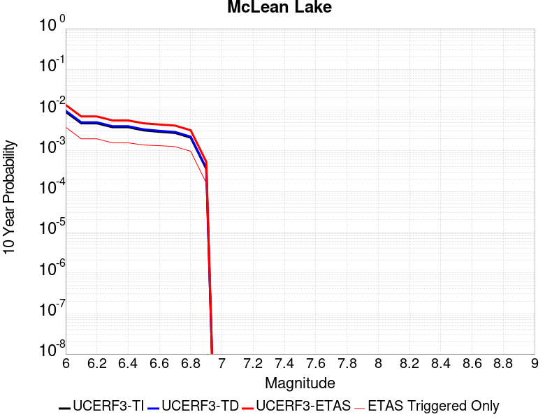 |

| Magnitude | 1 wk TI Prob | 1 wk TD Prob | 1 wk ETAS Prob | 1 wk ETAS/TD Gain | 1 wk ETAS Triggered Only | 1 mo TI Prob | 1 mo TD Prob | 1 mo ETAS Prob | 1 mo ETAS/TD Gain | 1 mo ETAS Triggered Only | 1 yr TI Prob | 1 yr TD Prob | 1 yr ETAS Prob | 1 yr ETAS/TD Gain | 1 yr ETAS Triggered Only | 10 yr TI Prob | 10 yr TD Prob | 10 yr ETAS Prob | 10 yr ETAS/TD Gain | 10 yr ETAS Triggered Only |
|-----|-----|-----|-----|-----|-----|-----|-----|-----|-----|-----|-----|-----|-----|-----|-----|-----|-----|-----|-----|-----|
| 6.0 | 1.7360222E-5 | 1.8501627E-5 | 6.407676E-4 | 34.63304 | 6.2227756E-4 | 7.439883E-5 | 7.9290556E-5 | 0.0011459675 | 14.452762 | 0.0010667614 | 9.0542925E-4 | 9.6498354E-4 | 0.0035405029 | 3.6689773 | 0.0025780068 | 0.009017491 | 0.0096127745 | 0.013310549 | 1.384673 | 0.0037336652 |
| 6.1 | 9.062689E-6 | 9.592193E-6 | 4.5407188E-4 | 47.33765 | 4.4448394E-4 | 3.8839516E-5 | 4.1108804E-5 | 6.6336076E-4 | 16.136707 | 6.2227756E-4 | 4.727685E-4 | 5.003936E-4 | 0.0020108828 | 4.018602 | 0.0015112455 | 0.0047176396 | 0.004993552 | 0.0071164207 | 1.4251221 | 0.0021335229 |
| 6.2 | 9.062689E-6 | 9.592193E-6 | 4.5407188E-4 | 47.33765 | 4.4448394E-4 | 3.8839516E-5 | 4.1108804E-5 | 6.6336076E-4 | 16.136707 | 6.2227756E-4 | 4.727685E-4 | 5.003936E-4 | 0.0020108828 | 4.018602 | 0.0015112455 | 0.0047176396 | 0.004993552 | 0.0071164207 | 1.4251221 | 0.0021335229 |
| 6.3 | 7.2575485E-6 | 7.66771E-6 | 4.5214826E-4 | 58.96784 | 4.4448394E-4 | 3.110341E-5 | 3.2861237E-5 | 6.551183E-4 | 19.9359 | 6.2227756E-4 | 3.786182E-4 | 4.0001926E-4 | 0.0016440764 | 4.1099935 | 0.0012445551 | 0.0037797375 | 0.0039936965 | 0.0058530737 | 1.465578 | 0.0018668326 |
| 6.4 | 7.2575485E-6 | 7.66771E-6 | 4.5214826E-4 | 58.96784 | 4.4448394E-4 | 3.110341E-5 | 3.2861237E-5 | 6.551183E-4 | 19.9359 | 6.2227756E-4 | 3.786182E-4 | 4.0001926E-4 | 0.0016440764 | 4.1099935 | 0.0012445551 | 0.0037797375 | 0.0039936965 | 0.0058530737 | 1.465578 | 0.0018668326 |
| 6.5 | 6.06582E-6 | 6.4038773E-6 | 4.5088498E-4 | 70.40813 | 4.4448394E-4 | 2.5996113E-5 | 2.7444936E-5 | 6.497054E-4 | 23.673052 | 6.2227756E-4 | 3.164567E-4 | 3.3409733E-4 | 0.0014005024 | 4.1918993 | 0.0010667614 | 0.0031600643 | 0.0033365893 | 0.0050199926 | 1.5045282 | 0.001689039 |
| 6.6 | 5.598744E-6 | 5.910262E-6 | 4.5039158E-4 | 76.20501 | 4.4448394E-4 | 2.3994397E-5 | 2.5329486E-5 | 6.4759125E-4 | 25.566696 | 6.2227756E-4 | 2.9209262E-4 | 3.0834923E-4 | 0.0013747818 | 4.458522 | 0.0010667614 | 0.0029170897 | 0.003079843 | 0.0046750573 | 1.517953 | 0.0016001422 |
| 6.7 | 5.246996E-6 | 5.539162E-6 | 4.5002066E-4 | 81.243454 | 4.4448394E-4 | 2.2486933E-5 | 2.3739085E-5 | 6.4600183E-4 | 27.212584 | 6.2227756E-4 | 2.73744E-4 | 2.8899137E-4 | 0.0013554445 | 4.6902595 | 0.0010667614 | 0.0027340704 | 0.0028867796 | 0.0043936623 | 1.5219944 | 0.0015112455 |
| 6.8 | 4.02324E-6 | 4.2469046E-6 | 4.4872897E-4 | 105.66025 | 4.4448394E-4 | 1.7242342E-5 | 1.8200926E-5 | 6.4046716E-4 | 35.188713 | 6.2227756E-4 | 2.099053E-4 | 2.2157968E-4 | 0.0010214736 | 4.60996 | 8.000711E-4 | 0.0020970714 | 0.002214172 | 0.0032785714 | 1.4807212 | 0.0010667614 |
| 6.9 | 6.835972E-7 | 7.1399285E-7 | 7.1399285E-7 | 1.0 | 0.0 | 2.9296991E-6 | 3.0599674E-6 | 3.0599674E-6 | 1.0 | 0.0 | 3.56685E-5 | 3.7254784E-5 | 1.2614827E-4 | 3.3860955 | 8.889679E-5 | 3.5662777E-4 | 3.7251666E-4 | 5.50244E-4 | 1.4770991 | 1.7779358E-4 |

## Lenwood-Lockhart-Old Woman Springs
*[(top)](#table-of-contents)*

| 1 Week | 1 Month | 1 Year | 10 Year |
|-----|-----|-----|-----|
|  |  |  | 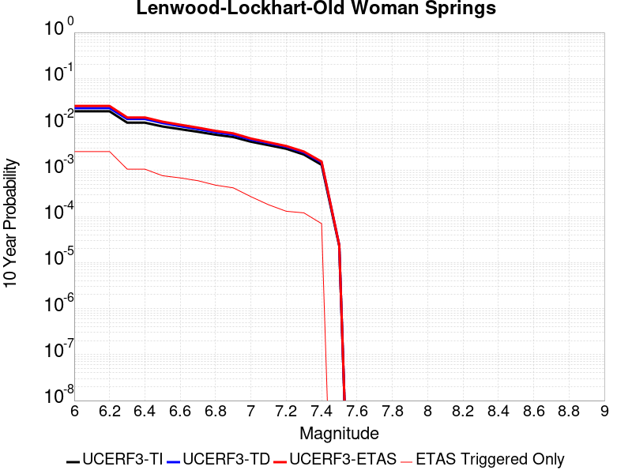 |

| Magnitude | 1 wk TI Prob | 1 wk TD Prob | 1 wk ETAS Prob | 1 wk ETAS/TD Gain | 1 wk ETAS Triggered Only | 1 mo TI Prob | 1 mo TD Prob | 1 mo ETAS Prob | 1 mo ETAS/TD Gain | 1 mo ETAS Triggered Only | 1 yr TI Prob | 1 yr TD Prob | 1 yr ETAS Prob | 1 yr ETAS/TD Gain | 1 yr ETAS Triggered Only | 10 yr TI Prob | 10 yr TD Prob | 10 yr ETAS Prob | 10 yr ETAS/TD Gain | 10 yr ETAS Triggered Only |
|-----|-----|-----|-----|-----|-----|-----|-----|-----|-----|-----|-----|-----|-----|-----|-----|-----|-----|-----|-----|-----|
| 6.0 | 3.744542E-5 | 4.396252E-5 | 0.0011106771 | 25.264183 | 0.0010667614 | 1.604705E-4 | 1.8839816E-4 | 0.0014327187 | 7.6047387 | 0.0012445551 | 0.0019519776 | 0.0022915069 | 0.0041540614 | 1.8128079 | 0.0018668326 | 0.019349206 | 0.022696787 | 0.025563799 | 1.1263179 | 0.0029335942 |
| 6.1 | 3.744542E-5 | 4.396252E-5 | 0.0011106771 | 25.264183 | 0.0010667614 | 1.604705E-4 | 1.8839816E-4 | 0.0014327187 | 7.6047387 | 0.0012445551 | 0.0019519776 | 0.0022915069 | 0.0041540614 | 1.8128079 | 0.0018668326 | 0.019349206 | 0.022696787 | 0.025563799 | 1.1263179 | 0.0029335942 |
| 6.2 | 3.744542E-5 | 4.396252E-5 | 0.0011106771 | 25.264183 | 0.0010667614 | 1.604705E-4 | 1.8839816E-4 | 0.0014327187 | 7.6047387 | 0.0012445551 | 0.0019519776 | 0.0022915069 | 0.0041540614 | 1.8128079 | 0.0018668326 | 0.019349206 | 0.022696787 | 0.025563799 | 1.1263179 | 0.0029335942 |
| 6.3 | 2.1079984E-5 | 2.5353434E-5 | 4.6982613E-4 | 18.531065 | 4.4448394E-4 | 9.0339665E-5 | 1.0865316E-4 | 5.5308884E-4 | 5.090407 | 4.4448394E-4 | 0.0010993304 | 0.0013220694 | 0.0019435243 | 1.4700621 | 6.2227756E-4 | 0.010939079 | 0.0131442575 | 0.014109269 | 1.073417 | 9.778647E-4 |
| 6.4 | 2.1079984E-5 | 2.5353434E-5 | 4.6982613E-4 | 18.531065 | 4.4448394E-4 | 9.0339665E-5 | 1.0865316E-4 | 5.5308884E-4 | 5.090407 | 4.4448394E-4 | 0.0010993304 | 0.0013220694 | 0.0019435243 | 1.4700621 | 6.2227756E-4 | 0.010939079 | 0.0131442575 | 0.014109269 | 1.073417 | 9.778647E-4 |
| 6.5 | 1.7397282E-5 | 2.066241E-5 | 4.651372E-4 | 22.511274 | 4.4448394E-4 | 7.455765E-5 | 8.8550245E-5 | 5.3299486E-4 | 6.019123 | 4.4448394E-4 | 9.073613E-4 | 0.0010775778 | 0.0015215828 | 1.4120399 | 4.4448394E-4 | 0.009036654 | 0.010724821 | 0.0112524815 | 1.0491999 | 5.333807E-4 |
| 6.6 | 1.52050325E-5 | 1.7679693E-5 | 4.621558E-4 | 26.140486 | 4.4448394E-4 | 6.51628E-5 | 7.576796E-5 | 5.202182E-4 | 6.8659396 | 4.4448394E-4 | 7.9306826E-4 | 9.220924E-4 | 0.0013661665 | 1.481594 | 4.4448394E-4 | 0.007902439 | 0.009183526 | 0.009712009 | 1.0575467 | 5.333807E-4 |
| 6.7 | 1.332523E-5 | 1.5264002E-5 | 4.5974116E-4 | 30.119307 | 4.4448394E-4 | 5.7106878E-5 | 6.5415545E-5 | 5.098704E-4 | 7.794331 | 4.4448394E-4 | 6.950544E-4 | 7.961491E-4 | 0.0012402792 | 1.5578479 | 4.4448394E-4 | 0.006928845 | 0.007933599 | 0.008462748 | 1.0666972 | 5.333807E-4 |
| 6.8 | 1.1525329E-5 | 1.3030979E-5 | 3.6861352E-4 | 28.287476 | 3.5558717E-4 | 4.9393333E-5 | 5.584588E-5 | 4.1141317E-4 | 7.3669386 | 3.5558717E-4 | 6.011979E-4 | 6.797157E-4 | 0.0010350612 | 1.5227854 | 3.5558717E-4 | 0.00599574 | 0.006776819 | 0.007218291 | 1.0651444 | 4.4448394E-4 |
| 6.9 | 1.0253909E-5 | 1.15144385E-5 | 3.670975E-4 | 31.881495 | 3.5558717E-4 | 4.3944583E-5 | 4.9346683E-5 | 4.049163E-4 | 8.205543 | 3.5558717E-4 | 5.3489394E-4 | 6.0063385E-4 | 9.5600745E-4 | 1.5916643 | 3.5558717E-4 | 0.0053360825 | 0.0059904843 | 0.0064323056 | 1.0737538 | 4.4448394E-4 |
| 7.0 | 8.104563E-6 | 8.991279E-6 | 2.7567925E-4 | 30.660738 | 2.6669036E-4 | 3.4733377E-5 | 3.8533497E-5 | 3.052136E-4 | 7.9207344 | 2.6669036E-4 | 4.2279682E-4 | 4.6904673E-4 | 7.35612E-4 | 1.5683129 | 2.6669036E-4 | 0.0042199334 | 0.0046808156 | 0.004946258 | 1.0567085 | 2.6669036E-4 |
| 7.1 | 6.7986157E-6 | 7.515816E-6 | 1.8530806E-4 | 24.655748 | 1.7779358E-4 | 2.91366E-5 | 3.2210253E-5 | 2.099981E-4 | 6.519604 | 1.7779358E-4 | 3.5468035E-4 | 3.920914E-4 | 5.698153E-4 | 1.4532715 | 1.7779358E-4 | 0.003541148 | 0.003914213 | 0.0040913103 | 1.0452448 | 1.7779358E-4 |
| 7.2 | 5.6893327E-6 | 6.2800136E-6 | 9.517625E-5 | 15.15542 | 8.889679E-5 | 2.4382627E-5 | 2.6914078E-5 | 1.1580848E-4 | 4.302896 | 8.889679E-5 | 2.9681803E-4 | 3.2763163E-4 | 4.1649927E-4 | 1.2712426 | 8.889679E-5 | 0.002964219 | 0.0032716845 | 0.0033602905 | 1.0270827 | 8.889679E-5 |
| 7.3 | 4.253348E-6 | 4.7069107E-6 | 9.360328E-5 | 19.886353 | 8.889679E-5 | 1.8228506E-5 | 2.0172329E-5 | 1.09067325E-4 | 5.4067793 | 8.889679E-5 | 2.2190946E-4 | 2.4557224E-4 | 3.344472E-4 | 1.3619096 | 8.889679E-5 | 0.00221688 | 0.0024531898 | 0.0025418685 | 1.0361483 | 8.889679E-5 |
| 7.4 | 2.5448119E-6 | 2.852045E-6 | 9.174858E-5 | 32.169403 | 8.889679E-5 | 1.0906291E-5 | 1.2223002E-5 | 1.01118705E-4 | 8.27282 | 8.889679E-5 | 1.3277601E-4 | 1.4880655E-4 | 2.376901E-4 | 1.5973095 | 8.889679E-5 | 0.001326967 | 0.0014872311 | 0.0015759957 | 1.0596844 | 8.889679E-5 |
| 7.5 | 4.3706837E-8 | 4.562909E-8 | 4.562909E-8 | 1.0 | 0.0 | 1.8731501E-7 | 1.9555324E-7 | 1.9555324E-7 | 1.0 | 0.0 | 2.2805577E-6 | 2.3808586E-6 | 2.3808586E-6 | 1.0 | 0.0 | 2.2805343E-5 | 2.3808387E-5 | 2.3808387E-5 | 1.0 | 0.0 |

## Garlock (West)
*[(top)](#table-of-contents)*

| 1 Week | 1 Month | 1 Year | 10 Year |
|-----|-----|-----|-----|
|  |  |  |  |

| Magnitude | 1 wk TI Prob | 1 wk TD Prob | 1 wk ETAS Prob | 1 wk ETAS/TD Gain | 1 wk ETAS Triggered Only | 1 mo TI Prob | 1 mo TD Prob | 1 mo ETAS Prob | 1 mo ETAS/TD Gain | 1 mo ETAS Triggered Only | 1 yr TI Prob | 1 yr TD Prob | 1 yr ETAS Prob | 1 yr ETAS/TD Gain | 1 yr ETAS Triggered Only | 10 yr TI Prob | 10 yr TD Prob | 10 yr ETAS Prob | 10 yr ETAS/TD Gain | 10 yr ETAS Triggered Only |
|-----|-----|-----|-----|-----|-----|-----|-----|-----|-----|-----|-----|-----|-----|-----|-----|-----|-----|-----|-----|-----|
| 6.0 | 2.5181727E-5 | 2.51973E-5 | 0.0011808265 | 46.863213 | 0.0011556583 | 1.0791722E-4 | 1.0798398E-4 | 0.0013524047 | 12.524123 | 0.0012445551 | 0.0013131002 | 0.0013139155 | 0.003444635 | 2.6216567 | 0.0021335229 | 0.013053683 | 0.013141977 | 0.016037017 | 1.2202896 | 0.0029335942 |
| 6.1 | 2.5077732E-5 | 2.5098372E-5 | 0.0011807276 | 47.043995 | 0.0011556583 | 1.0747157E-4 | 1.0756004E-4 | 0.0013519812 | 12.56955 | 0.0012445551 | 0.001307681 | 0.0013087603 | 0.003439491 | 2.6280527 | 0.0021335229 | 0.013000126 | 0.013091032 | 0.015986223 | 1.2211583 | 0.0029335942 |
| 6.2 | 2.494612E-5 | 2.498005E-5 | 0.0011806095 | 47.262093 | 0.0011556583 | 1.0690756E-4 | 1.0705298E-4 | 0.0013514748 | 12.624354 | 0.0012445551 | 0.0013008224 | 0.0013025942 | 0.0034333381 | 2.6357694 | 0.0021335229 | 0.012932341 | 0.013030097 | 0.015925465 | 1.2222062 | 0.0029335942 |
| 6.3 | 2.4733758E-5 | 2.479942E-5 | 0.001180429 | 47.59906 | 0.0011556583 | 1.0599751E-4 | 1.06278916E-4 | 0.0013507017 | 12.709028 | 0.0012445551 | 0.0012897556 | 0.0012931811 | 0.003423945 | 2.6476917 | 0.0021335229 | 0.012822957 | 0.012937066 | 0.015832707 | 1.2238252 | 0.0029335942 |
| 6.4 | 2.3237335E-5 | 2.317873E-5 | 0.0010899155 | 47.022224 | 0.0010667614 | 9.958477E-5 | 9.933365E-5 | 0.0012548772 | 12.632951 | 0.0011556583 | 0.0012117702 | 0.001208719 | 0.0032508739 | 2.68952 | 0.0020446263 | 0.012051838 | 0.012101916 | 0.014736544 | 1.2177035 | 0.0026669037 |
| 6.5 | 2.2732203E-5 | 2.2993298E-5 | 0.0010897303 | 47.393387 | 0.0010667614 | 9.742009E-5 | 9.8539E-5 | 0.0012540834 | 12.726772 | 0.0011556583 | 0.0011854442 | 0.0011990548 | 0.0032412293 | 2.7031536 | 0.0020446263 | 0.011791403 | 0.012006322 | 0.014641206 | 1.2194581 | 0.0026669037 |
| 6.6 | 2.1319436E-5 | 2.17735E-5 | 0.0010885118 | 49.992504 | 0.0010667614 | 9.136581E-5 | 9.331167E-5 | 0.0012488621 | 13.383772 | 0.0011556583 | 0.001111811 | 0.0011354799 | 0.0031777844 | 2.798627 | 0.0020446263 | 0.011062649 | 0.011377227 | 0.014013788 | 1.2317402 | 0.0026669037 |
| 6.7 | 1.970802E-5 | 2.0393396E-5 | 0.0010871331 | 53.308098 | 0.0010667614 | 8.446021E-5 | 8.739735E-5 | 0.0012429546 | 14.22188 | 0.0011556583 | 0.001027818 | 0.001063545 | 0.0031059966 | 2.9204185 | 0.0020446263 | 0.010230771 | 0.010664964 | 0.013303426 | 1.2473953 | 0.0026669037 |
| 6.8 | 1.8744462E-5 | 1.9901045E-5 | 0.0010866413 | 54.602222 | 0.0010667614 | 8.033094E-5 | 8.5287415E-5 | 0.0012408472 | 14.549006 | 0.0011556583 | 9.775903E-4 | 0.0010378812 | 0.0030803853 | 2.9679554 | 0.0020446263 | 0.009733009 | 0.01041075 | 0.01304989 | 1.2535013 | 0.0026669037 |
| 6.9 | 1.7559682E-5 | 1.8953415E-5 | 0.0010856946 | 57.282272 | 0.0010667614 | 7.5253614E-5 | 8.12264E-5 | 0.0012367908 | 15.226463 | 0.0011556583 | 9.158276E-4 | 9.884841E-4 | 0.0030310892 | 3.0664015 | 0.0020446263 | 0.0091206245 | 0.009921231 | 0.012561676 | 1.2661408 | 0.0026669037 |
| 7.0 | 1.6794445E-5 | 1.8216237E-5 | 0.0010849583 | 59.559956 | 0.0010667614 | 7.197421E-5 | 7.8067256E-5 | 0.0012336354 | 15.802211 | 0.0011556583 | 8.759337E-4 | 9.5005584E-4 | 0.0029927394 | 3.150067 | 0.0020446263 | 0.008724891 | 0.009540141 | 0.0121816015 | 1.2768786 | 0.0026669037 |
| 7.1 | 1.6337795E-5 | 1.7717046E-5 | 0.0010844596 | 61.20996 | 0.0010667614 | 7.0017246E-5 | 7.5927994E-5 | 0.0012314986 | 16.219296 | 0.0011556583 | 8.521265E-4 | 9.240326E-4 | 0.0029667695 | 3.2106762 | 0.0020446263 | 0.008488664 | 0.009281996 | 0.011924146 | 1.2846532 | 0.0026669037 |
| 7.2 | 1.5780008E-5 | 1.7165687E-5 | 0.0010839088 | 63.14393 | 0.0010667614 | 6.762685E-5 | 7.356516E-5 | 0.0012291385 | 16.70816 | 0.0011556583 | 8.2304585E-4 | 8.9528906E-4 | 0.0029380848 | 3.2817163 | 0.0020446263 | 0.008200042 | 0.008996838 | 0.011639748 | 1.2937598 | 0.0026669037 |
| 7.3 | 1.5058865E-5 | 1.6618762E-5 | 0.0010833625 | 65.189125 | 0.0010667614 | 6.45364E-5 | 7.122133E-5 | 0.0011379068 | 15.977052 | 0.0010667614 | 7.854473E-4 | 8.667759E-4 | 0.00282081 | 3.2543707 | 0.0019557294 | 0.00782677 | 0.008713539 | 0.011269081 | 1.2932842 | 0.0025780068 |
| 7.4 | 1.4887923E-5 | 1.6454731E-5 | 0.0010831987 | 65.82901 | 0.0010667614 | 6.380382E-5 | 7.051838E-5 | 0.0011372047 | 16.126358 | 0.0010667614 | 7.7653467E-4 | 8.582243E-4 | 0.0028122752 | 3.2768536 | 0.0019557294 | 0.0077382675 | 0.008628399 | 0.0111841615 | 1.2962036 | 0.0025780068 |
| 7.5 | 1.4509299E-5 | 1.6046748E-5 | 9.938958E-4 | 61.93752 | 9.778647E-4 | 6.218123E-5 | 6.876997E-5 | 0.0010465675 | 15.218378 | 9.778647E-4 | 7.567935E-4 | 8.36954E-4 | 0.0025245794 | 3.0163898 | 0.001689039 | 0.0075422134 | 0.008416704 | 0.010708567 | 1.2722993 | 0.0023113166 |
| 7.6 | 1.2756717E-5 | 1.4050848E-5 | 6.3631963E-4 | 45.28692 | 6.2227756E-4 | 5.4670498E-5 | 6.0216535E-5 | 6.824566E-4 | 11.333375 | 6.2227756E-4 | 6.6541E-4 | 7.328904E-4 | 0.0019765333 | 2.6969018 | 0.0012445551 | 0.006634211 | 0.0073816874 | 0.0089700185 | 1.2151717 | 0.0016001422 |
| 7.7 | 1.0328985E-5 | 1.1460557E-5 | 2.7814787E-4 | 24.270014 | 2.6669036E-4 | 4.4266326E-5 | 4.911575E-5 | 3.1579303E-4 | 6.4295673 | 2.6669036E-4 | 5.388092E-4 | 5.978206E-4 | 0.0012197262 | 2.040288 | 6.2227756E-4 | 0.0053750467 | 0.006038511 | 0.006833751 | 1.1316947 | 8.000711E-4 |
| 7.8 | 7.0306583E-6 | 8.899601E-6 | 2.755876E-4 | 30.966288 | 2.6669036E-4 | 3.0131043E-5 | 3.814059E-5 | 3.048208E-4 | 7.992031 | 2.6669036E-4 | 3.667837E-4 | 4.642629E-4 | 0.0010862516 | 2.3397336 | 6.2227756E-4 | 0.003661789 | 0.0046952725 | 0.0054031075 | 1.1507548 | 7.1117433E-4 |
| 7.9 | 4.060633E-6 | 5.4653938E-6 | 9.43617E-5 | 17.265306 | 8.889679E-5 | 1.7402595E-5 | 2.3422906E-5 | 1.1231762E-4 | 4.7952037 | 8.889679E-5 | 2.11856E-4 | 2.851367E-4 | 5.51751E-4 | 1.9350405 | 2.6669036E-4 | 0.0021165414 | 0.002884201 | 0.0032387625 | 1.1229323 | 3.5558717E-4 |
| 8.0 | 1.6729537E-6 | 2.0775144E-6 | 2.0775144E-6 | 1.0 | 0.0 | 7.169782E-6 | 8.903603E-6 | 8.903603E-6 | 1.0 | 0.0 | 8.7288594E-5 | 1.0839601E-4 | 1.9728317E-4 | 1.8200225 | 8.889679E-5 | 8.7254314E-4 | 0.0010969337 | 0.0012745323 | 1.1619046 | 1.7779358E-4 |
| 8.1 | 3.6733252E-7 | 3.1489964E-7 | 3.1489964E-7 | 1.0 | 0.0 | 1.5742813E-6 | 1.3495693E-6 | 1.3495693E-6 | 1.0 | 0.0 | 1.9166706E-5 | 1.6430899E-5 | 1.6430899E-5 | 1.0 | 0.0 | 1.9165053E-4 | 1.6638759E-4 | 1.6638759E-4 | 1.0 | 0.0 |

## Coyote Canyon
*[(top)](#table-of-contents)*

| 1 Week | 1 Month | 1 Year | 10 Year |
|-----|-----|-----|-----|
|  |  |  |  |

| Magnitude | 1 wk TI Prob | 1 wk TD Prob | 1 wk ETAS Prob | 1 wk ETAS/TD Gain | 1 wk ETAS Triggered Only | 1 mo TI Prob | 1 mo TD Prob | 1 mo ETAS Prob | 1 mo ETAS/TD Gain | 1 mo ETAS Triggered Only | 1 yr TI Prob | 1 yr TD Prob | 1 yr ETAS Prob | 1 yr ETAS/TD Gain | 1 yr ETAS Triggered Only | 10 yr TI Prob | 10 yr TD Prob | 10 yr ETAS Prob | 10 yr ETAS/TD Gain | 10 yr ETAS Triggered Only |
|-----|-----|-----|-----|-----|-----|-----|-----|-----|-----|-----|-----|-----|-----|-----|-----|-----|-----|-----|-----|-----|
| 6.0 | 3.5090034E-5 | 4.0364324E-5 | 6.6261675E-4 | 16.415901 | 6.2227756E-4 | 1.503772E-4 | 1.7297994E-4 | 0.0010617941 | 6.13825 | 8.889679E-4 | 0.0018293047 | 0.0021042528 | 0.003967157 | 1.8853045 | 0.0018668326 | 0.018143194 | 0.020869201 | 0.023219325 | 1.112612 | 0.0024002134 |
| 6.1 | 3.5090034E-5 | 4.0364324E-5 | 6.6261675E-4 | 16.415901 | 6.2227756E-4 | 1.503772E-4 | 1.7297994E-4 | 0.0010617941 | 6.13825 | 8.889679E-4 | 0.0018293047 | 0.0021042528 | 0.003967157 | 1.8853045 | 0.0018668326 | 0.018143194 | 0.020869201 | 0.023219325 | 1.112612 | 0.0024002134 |
| 6.2 | 1.841879E-5 | 2.1059794E-5 | 6.433242E-4 | 30.547508 | 6.2227756E-4 | 7.8935285E-5 | 9.0253714E-5 | 7.124751E-4 | 7.8941364 | 6.2227756E-4 | 9.606133E-4 | 0.001098387 | 0.002252776 | 2.0509856 | 0.0011556583 | 0.0095647145 | 0.010939667 | 0.012522304 | 1.1446697 | 0.0016001422 |
| 6.3 | 1.841879E-5 | 2.1059794E-5 | 6.433242E-4 | 30.547508 | 6.2227756E-4 | 7.8935285E-5 | 9.0253714E-5 | 7.124751E-4 | 7.8941364 | 6.2227756E-4 | 9.606133E-4 | 0.001098387 | 0.002252776 | 2.0509856 | 0.0011556583 | 0.0095647145 | 0.010939667 | 0.012522304 | 1.1446697 | 0.0016001422 |
| 6.4 | 1.712201E-5 | 1.9565212E-5 | 5.529355E-4 | 28.261158 | 5.333807E-4 | 7.337798E-5 | 8.3848776E-5 | 6.171848E-4 | 7.360689 | 5.333807E-4 | 8.930107E-4 | 0.0010204813 | 0.0020861542 | 2.0442846 | 0.0010667614 | 0.008894307 | 0.010167871 | 0.01166375 | 1.1471182 | 0.0015112455 |
| 6.5 | 1.4744935E-5 | 1.6836972E-5 | 4.6131344E-4 | 27.398838 | 4.4448394E-4 | 6.3191044E-5 | 7.215698E-5 | 5.166089E-4 | 7.1595135 | 4.4448394E-4 | 7.6907943E-4 | 8.7825063E-4 | 0.0018552565 | 2.1124454 | 9.778647E-4 | 0.007664232 | 0.008756994 | 0.009990651 | 1.1408767 | 0.0012445551 |
| 6.6 | 1.2017839E-5 | 1.37240895E-5 | 3.6930636E-4 | 26.909353 | 3.5558717E-4 | 5.150401E-5 | 5.88167E-5 | 4.1438296E-4 | 7.045328 | 3.5558717E-4 | 6.268809E-4 | 7.159466E-4 | 0.001515445 | 2.1167011 | 8.000711E-4 | 0.0062511545 | 0.0071450938 | 0.008115971 | 1.1358804 | 9.778647E-4 |
| 6.7 | 1.00956095E-5 | 1.1533517E-5 | 1.8932504E-4 | 16.415205 | 1.7779358E-4 | 4.326618E-5 | 4.942891E-5 | 2.272137E-4 | 4.5967774 | 1.7779358E-4 | 5.266384E-4 | 6.017178E-4 | 0.0011347776 | 1.8858967 | 5.333807E-4 | 0.005253921 | 0.0060094125 | 0.006716313 | 1.1176323 | 7.1117433E-4 |

## Nelson Lake
*[(top)](#table-of-contents)*

| 1 Week | 1 Month | 1 Year | 10 Year |
|-----|-----|-----|-----|
|  | 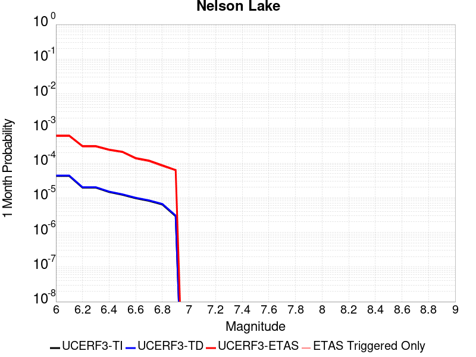 |  |  |

| Magnitude | 1 wk TI Prob | 1 wk TD Prob | 1 wk ETAS Prob | 1 wk ETAS/TD Gain | 1 wk ETAS Triggered Only | 1 mo TI Prob | 1 mo TD Prob | 1 mo ETAS Prob | 1 mo ETAS/TD Gain | 1 mo ETAS Triggered Only | 1 yr TI Prob | 1 yr TD Prob | 1 yr ETAS Prob | 1 yr ETAS/TD Gain | 1 yr ETAS Triggered Only | 10 yr TI Prob | 10 yr TD Prob | 10 yr ETAS Prob | 10 yr ETAS/TD Gain | 10 yr ETAS Triggered Only |
|-----|-----|-----|-----|-----|-----|-----|-----|-----|-----|-----|-----|-----|-----|-----|-----|-----|-----|-----|-----|-----|
| 6.0 | 9.913453E-6 | 1.0192255E-5 | 2.768799E-4 | 27.165716 | 2.6669036E-4 | 4.2485535E-5 | 4.3680422E-5 | 8.437166E-4 | 19.31567 | 8.000711E-4 | 5.1713863E-4 | 5.316897E-4 | 0.0019532822 | 3.6737256 | 0.0014223487 | 0.0051593683 | 0.005305204 | 0.0072505577 | 1.3666879 | 0.0019557294 |
| 6.1 | 9.913453E-6 | 1.0192255E-5 | 2.768799E-4 | 27.165716 | 2.6669036E-4 | 4.2485535E-5 | 4.3680422E-5 | 8.437166E-4 | 19.31567 | 8.000711E-4 | 5.1713863E-4 | 5.316897E-4 | 0.0019532822 | 3.6737256 | 0.0014223487 | 0.0051593683 | 0.005305204 | 0.0072505577 | 1.3666879 | 0.0019557294 |
| 6.2 | 4.5596407E-6 | 4.696313E-6 | 9.359269E-5 | 19.92897 | 8.889679E-5 | 1.954117E-5 | 2.0126909E-5 | 4.646019E-4 | 23.083622 | 4.4448394E-4 | 2.3788778E-4 | 2.4501883E-4 | 8.671439E-4 | 3.5390909 | 6.2227756E-4 | 0.0023763329 | 0.0024476128 | 0.003334405 | 1.362309 | 8.889679E-4 |
| 6.3 | 4.5596407E-6 | 4.696313E-6 | 9.359269E-5 | 19.92897 | 8.889679E-5 | 1.954117E-5 | 2.0126909E-5 | 4.646019E-4 | 23.083622 | 4.4448394E-4 | 2.3788778E-4 | 2.4501883E-4 | 8.671439E-4 | 3.5390909 | 6.2227756E-4 | 0.0023763329 | 0.0024476128 | 0.003334405 | 1.362309 | 8.889679E-4 |
| 6.4 | 3.4025713E-6 | 3.5098972E-6 | 9.240638E-5 | 26.327374 | 8.889679E-5 | 1.4582367E-5 | 1.5042335E-5 | 4.595196E-4 | 30.548422 | 4.4448394E-4 | 1.7752586E-4 | 1.8312587E-4 | 8.052894E-4 | 4.3974643 | 6.2227756E-4 | 0.001773841 | 0.0018298327 | 0.0026284398 | 1.4364372 | 8.000711E-4 |
| 6.5 | 2.8352947E-6 | 2.927856E-6 | 9.182439E-5 | 31.36233 | 8.889679E-5 | 1.2151207E-5 | 1.2547898E-5 | 3.681306E-4 | 29.338028 | 3.5558717E-4 | 1.479309E-4 | 1.5276071E-4 | 6.8606E-4 | 4.491076 | 5.333807E-4 | 0.0014783246 | 0.0015266308 | 0.0022367195 | 1.4651345 | 7.1117433E-4 |
| 6.6 | 2.251518E-6 | 2.3290677E-6 | 9.122565E-5 | 39.168316 | 8.889679E-5 | 9.649328E-6 | 9.981683E-6 | 1.8777349E-4 | 18.811806 | 1.7779358E-4 | 1.1747423E-4 | 1.2152085E-4 | 3.881788E-4 | 3.1943393 | 2.6669036E-4 | 0.0011741214 | 0.0012146058 | 0.0016585498 | 1.3655047 | 4.4448394E-4 |
| 6.7 | 1.8911853E-6 | 1.9591396E-6 | 9.0855756E-5 | 46.37533 | 8.889679E-5 | 8.105055E-6 | 8.39629E-6 | 9.729234E-5 | 11.58754 | 8.889679E-5 | 9.867457E-5 | 1.0222061E-4 | 2.7999602E-4 | 2.7391346 | 1.7779358E-4 | 9.863076E-4 | 0.0010217935 | 0.0013770172 | 1.3476474 | 3.5558717E-4 |
| 6.8 | 1.4874814E-6 | 1.5438305E-6 | 1.5438305E-6 | 1.0 | 0.0 | 6.374905E-6 | 6.6164025E-6 | 6.6164025E-6 | 1.0 | 0.0 | 7.76117E-5 | 8.055224E-5 | 1.6944188E-4 | 2.1035028 | 8.889679E-5 | 7.75846E-4 | 8.0528157E-4 | 9.829319E-4 | 1.2206066 | 1.7779358E-4 |
| 6.9 | 6.835972E-7 | 7.1399285E-7 | 7.1399285E-7 | 1.0 | 0.0 | 2.9296991E-6 | 3.0599674E-6 | 3.0599674E-6 | 1.0 | 0.0 | 3.56685E-5 | 3.7254784E-5 | 1.2614827E-4 | 3.3860955 | 8.889679E-5 | 3.5662777E-4 | 3.7251666E-4 | 5.50244E-4 | 1.4770991 | 1.7779358E-4 |

## San Andreas (Mojave S)
*[(top)](#table-of-contents)*

| 1 Week | 1 Month | 1 Year | 10 Year |
|-----|-----|-----|-----|
|  |  |  |  |

| Magnitude | 1 wk TI Prob | 1 wk TD Prob | 1 wk ETAS Prob | 1 wk ETAS/TD Gain | 1 wk ETAS Triggered Only | 1 mo TI Prob | 1 mo TD Prob | 1 mo ETAS Prob | 1 mo ETAS/TD Gain | 1 mo ETAS Triggered Only | 1 yr TI Prob | 1 yr TD Prob | 1 yr ETAS Prob | 1 yr ETAS/TD Gain | 1 yr ETAS Triggered Only | 10 yr TI Prob | 10 yr TD Prob | 10 yr ETAS Prob | 10 yr ETAS/TD Gain | 10 yr ETAS Triggered Only |
|-----|-----|-----|-----|-----|-----|-----|-----|-----|-----|-----|-----|-----|-----|-----|-----|-----|-----|-----|-----|-----|
| 6.0 | 3.1064058E-4 | 6.7460834E-4 | 0.0012964661 | 1.9218056 | 6.2227756E-4 | 0.0013306376 | 0.0028881032 | 0.0036858637 | 1.276223 | 8.000711E-4 | 0.016080605 | 0.03462235 | 0.035909634 | 1.0371808 | 0.0013334518 | 0.1496549 | 0.28660452 | 0.28799972 | 1.004868 | 0.0019557294 |
| 6.1 | 3.1064058E-4 | 6.7460834E-4 | 0.0012964661 | 1.9218056 | 6.2227756E-4 | 0.0013306376 | 0.0028881032 | 0.0036858637 | 1.276223 | 8.000711E-4 | 0.016080605 | 0.03462235 | 0.035909634 | 1.0371808 | 0.0013334518 | 0.1496549 | 0.28660452 | 0.28799972 | 1.004868 | 0.0019557294 |
| 6.2 | 3.1064058E-4 | 6.7460834E-4 | 0.0012964661 | 1.9218056 | 6.2227756E-4 | 0.0013306376 | 0.0028881032 | 0.0036858637 | 1.276223 | 8.000711E-4 | 0.016080605 | 0.03462235 | 0.035909634 | 1.0371808 | 0.0013334518 | 0.1496549 | 0.28660452 | 0.28799972 | 1.004868 | 0.0019557294 |
| 6.3 | 3.1064058E-4 | 6.7460834E-4 | 0.0012964661 | 1.9218056 | 6.2227756E-4 | 0.0013306376 | 0.0028881032 | 0.0036858637 | 1.276223 | 8.000711E-4 | 0.016080605 | 0.03462235 | 0.035909634 | 1.0371808 | 0.0013334518 | 0.1496549 | 0.28660452 | 0.28799972 | 1.004868 | 0.0019557294 |
| 6.4 | 1.9872203E-4 | 4.3179357E-4 | 8.760856E-4 | 2.0289454 | 4.4448394E-4 | 8.5138786E-4 | 0.0018492596 | 0.002381654 | 1.2878959 | 5.333807E-4 | 0.010316478 | 0.02228844 | 0.023157593 | 1.0389957 | 8.889679E-4 | 0.098504856 | 0.19699748 | 0.19799685 | 1.0050731 | 0.0012445551 |
| 6.5 | 1.291105E-4 | 2.875267E-4 | 7.318829E-4 | 2.545443 | 4.4448394E-4 | 5.5321335E-4 | 0.0012316781 | 0.0016756146 | 1.3604323 | 4.4448394E-4 | 0.006714592 | 0.0148934 | 0.015681555 | 1.0529197 | 8.000711E-4 | 0.065152965 | 0.13803436 | 0.1390305 | 1.0072166 | 0.0011556583 |
| 6.6 | 1.291105E-4 | 2.875267E-4 | 7.318829E-4 | 2.545443 | 4.4448394E-4 | 5.5321335E-4 | 0.0012316781 | 0.0016756146 | 1.3604323 | 4.4448394E-4 | 0.006714592 | 0.0148934 | 0.015681555 | 1.0529197 | 8.000711E-4 | 0.065152965 | 0.13803436 | 0.1390305 | 1.0072166 | 0.0011556583 |
| 6.7 | 1.08001186E-4 | 2.4333889E-4 | 5.9883954E-4 | 2.4609282 | 3.5558717E-4 | 4.6278012E-4 | 0.0010424647 | 0.0013976812 | 1.3407468 | 3.5558717E-4 | 0.0056198016 | 0.012618446 | 0.013320646 | 1.0556487 | 7.1117433E-4 | 0.054797906 | 0.119176775 | 0.120116405 | 1.0078844 | 0.0010667614 |
| 6.8 | 1.0624356E-4 | 2.3851555E-4 | 5.051423E-4 | 2.1178591 | 2.6669036E-4 | 4.5525006E-4 | 0.0010218095 | 0.0012882274 | 1.2607315 | 2.6669036E-4 | 0.0055285925 | 0.012369843 | 0.012984423 | 1.0496837 | 6.2227756E-4 | 0.053930566 | 0.11712591 | 0.11798924 | 1.007371 | 9.778647E-4 |
| 6.9 | 1.0393785E-4 | 2.3221898E-4 | 4.9884745E-4 | 2.1481767 | 2.6669036E-4 | 4.4537184E-4 | 9.948451E-4 | 0.0012612701 | 1.2678056 | 2.6669036E-4 | 0.0054089287 | 0.012045221 | 0.012660003 | 1.0510395 | 6.2227756E-4 | 0.05279156 | 0.11442335 | 0.1152106 | 1.0068802 | 8.889679E-4 |
| 7.0 | 1.0155622E-4 | 2.2591476E-4 | 4.925449E-4 | 2.1802244 | 2.6669036E-4 | 4.3516833E-4 | 9.6784724E-4 | 0.0012342795 | 1.2752833 | 2.6669036E-4 | 0.005285311 | 0.0117200995 | 0.012335084 | 1.0524726 | 6.2227756E-4 | 0.05161361 | 0.111683756 | 0.112473436 | 1.0070708 | 8.889679E-4 |
| 7.1 | 9.885595E-5 | 2.1879886E-4 | 4.8543088E-4 | 2.218617 | 2.6669036E-4 | 4.2359953E-4 | 9.3737274E-4 | 0.0012038131 | 1.2842417 | 2.6669036E-4 | 0.0051451353 | 0.011352993 | 0.011968206 | 1.0541894 | 6.2227756E-4 | 0.05027629 | 0.1085682 | 0.10928141 | 1.0065693 | 8.000711E-4 |
| 7.2 | 9.6411415E-5 | 2.124288E-4 | 4.7906252E-4 | 2.2551675 | 2.6669036E-4 | 4.1312634E-4 | 9.1009185E-4 | 0.0011765395 | 1.29277 | 2.6669036E-4 | 0.005018219 | 0.011024255 | 0.011639673 | 1.0558239 | 6.2227756E-4 | 0.049064007 | 0.105758004 | 0.10647346 | 1.006765 | 8.000711E-4 |
| 7.3 | 9.1180635E-5 | 1.9471257E-4 | 4.61351E-4 | 2.369395 | 2.6669036E-4 | 3.907156E-4 | 8.342157E-4 | 0.0011006836 | 1.3194232 | 2.6669036E-4 | 0.004746591 | 0.01010939 | 0.010725376 | 1.0609322 | 6.2227756E-4 | 0.046464786 | 0.09795115 | 0.09867285 | 1.007368 | 8.000711E-4 |
| 7.4 | 8.887388E-5 | 1.8719878E-4 | 4.5383922E-4 | 2.4243705 | 2.6669036E-4 | 3.8083247E-4 | 8.020339E-4 | 0.0010685103 | 1.3322508 | 2.6669036E-4 | 0.0046267817 | 0.00972114 | 0.010337369 | 1.0633905 | 6.2227756E-4 | 0.045316286 | 0.09458615 | 0.09531054 | 1.0076586 | 8.000711E-4 |
| 7.5 | 8.6750515E-5 | 1.8051457E-4 | 4.471568E-4 | 2.477123 | 2.6669036E-4 | 3.7173493E-4 | 7.7340455E-4 | 0.0010398887 | 1.3445598 | 2.6669036E-4 | 0.004516484 | 0.009375632 | 0.009992075 | 1.0657495 | 6.2227756E-4 | 0.04425787 | 0.091549896 | 0.09227672 | 1.0079391 | 8.000711E-4 |
| 7.6 | 8.453092E-5 | 1.7439072E-4 | 4.410346E-4 | 2.5290027 | 2.6669036E-4 | 3.6222505E-4 | 7.471748E-4 | 0.0010136659 | 1.356665 | 2.6669036E-4 | 0.0044011753 | 0.009058985 | 0.009675625 | 1.0680695 | 6.2227756E-4 | 0.04315024 | 0.08870898 | 0.08943808 | 1.008219 | 8.000711E-4 |
| 7.7 | 8.259102E-5 | 1.6961215E-4 | 4.3625728E-4 | 2.5720875 | 2.6669036E-4 | 3.539135E-4 | 7.2670676E-4 | 9.932034E-4 | 1.3667182 | 2.6669036E-4 | 0.004300386 | 0.008811831 | 0.009428624 | 1.0699961 | 6.2227756E-4 | 0.042181134 | 0.08645982 | 0.087190725 | 1.0084536 | 8.000711E-4 |
| 7.8 | 7.444844E-5 | 1.5283503E-4 | 4.1948463E-4 | 2.7446892 | 2.6669036E-4 | 3.1902574E-4 | 6.548429E-4 | 9.213586E-4 | 1.4069918 | 2.6669036E-4 | 0.0038772223 | 0.007943616 | 0.008560951 | 1.0777146 | 6.2227756E-4 | 0.03810269 | 0.078290746 | 0.07894624 | 1.0083725 | 7.1117433E-4 |
| 7.9 | 5.2586525E-5 | 1.00064186E-4 | 1.8895208E-4 | 1.8883088 | 8.889679E-5 | 2.2535135E-4 | 4.2877605E-4 | 5.1763473E-4 | 1.207238 | 8.889679E-5 | 0.0027402006 | 0.005207864 | 0.0054731653 | 1.0509424 | 2.6669036E-4 | 0.027066574 | 0.052200034 | 0.05253706 | 1.0064564 | 3.5558717E-4 |
| 8.0 | 3.379877E-5 | 5.4074168E-5 | 5.4074168E-5 | 1.0 | 0.0 | 1.4484383E-4 | 2.3172585E-4 | 2.3172585E-4 | 1.0 | 0.0 | 0.0017620471 | 0.002817614 | 0.0029062603 | 1.0314615 | 8.889679E-5 | 0.017481409 | 0.028834904 | 0.029007569 | 1.0059881 | 1.7779358E-4 |
| 8.1 | 1.8668277E-5 | 1.9309397E-5 | 1.9309397E-5 | 1.0 | 0.0 | 8.000444E-5 | 8.275194E-5 | 8.275194E-5 | 1.0 | 0.0 | 9.736188E-4 | 0.0010070398 | 0.0010070398 | 1.0 | 0.0 | 0.009693642 | 0.010798888 | 0.010798888 | 1.0 | 0.0 |
| 8.2 | 8.541571E-6 | 5.460819E-6 | 5.460819E-6 | 1.0 | 0.0 | 3.660622E-5 | 2.3403301E-5 | 2.3403301E-5 | 1.0 | 0.0 | 4.455896E-4 | 2.84898E-4 | 2.84898E-4 | 1.0 | 0.0 | 0.0044469717 | 0.0032408056 | 0.0032408056 | 1.0 | 0.0 |
| 8.3 | 1.983087E-6 | 7.6599065E-7 | 7.6599065E-7 | 1.0 | 0.0 | 8.498917E-6 | 3.282813E-6 | 3.282813E-6 | 1.0 | 0.0 | 1.034694E-4 | 3.9967534E-5 | 3.9967534E-5 | 1.0 | 0.0 | 0.0010342124 | 4.719687E-4 | 4.719687E-4 | 1.0 | 0.0 |

## Death Valley (So)
*[(top)](#table-of-contents)*

| 1 Week | 1 Month | 1 Year | 10 Year |
|-----|-----|-----|-----|
| 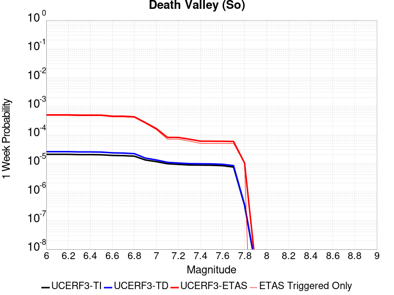 |  | 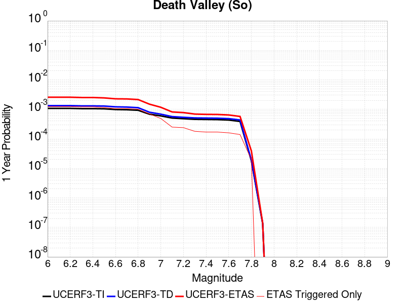 |  |

| Magnitude | 1 wk TI Prob | 1 wk TD Prob | 1 wk ETAS Prob | 1 wk ETAS/TD Gain | 1 wk ETAS Triggered Only | 1 mo TI Prob | 1 mo TD Prob | 1 mo ETAS Prob | 1 mo ETAS/TD Gain | 1 mo ETAS Triggered Only | 1 yr TI Prob | 1 yr TD Prob | 1 yr ETAS Prob | 1 yr ETAS/TD Gain | 1 yr ETAS Triggered Only | 10 yr TI Prob | 10 yr TD Prob | 10 yr ETAS Prob | 10 yr ETAS/TD Gain | 10 yr ETAS Triggered Only |
|-----|-----|-----|-----|-----|-----|-----|-----|-----|-----|-----|-----|-----|-----|-----|-----|-----|-----|-----|-----|-----|
| 6.0 | 2.0684236E-5 | 2.5617775E-5 | 3.8119583E-4 | 14.88013 | 3.5558717E-4 | 8.864371E-5 | 1.0978594E-4 | 8.208822E-4 | 7.4771156 | 7.1117433E-4 | 0.0010787029 | 0.0013358411 | 0.0023123997 | 1.7310438 | 9.778647E-4 | 0.010734817 | 0.013281397 | 0.014509423 | 1.0924621 | 0.0012445551 |
| 6.1 | 2.0684236E-5 | 2.5617775E-5 | 3.8119583E-4 | 14.88013 | 3.5558717E-4 | 8.864371E-5 | 1.0978594E-4 | 8.208822E-4 | 7.4771156 | 7.1117433E-4 | 0.0010787029 | 0.0013358411 | 0.0023123997 | 1.7310438 | 9.778647E-4 | 0.010734817 | 0.013281397 | 0.014509423 | 1.0924621 | 0.0012445551 |
| 6.2 | 2.0684236E-5 | 2.5617775E-5 | 3.8119583E-4 | 14.88013 | 3.5558717E-4 | 8.864371E-5 | 1.0978594E-4 | 8.208822E-4 | 7.4771156 | 7.1117433E-4 | 0.0010787029 | 0.0013358411 | 0.0023123997 | 1.7310438 | 9.778647E-4 | 0.010734817 | 0.013281397 | 0.014509423 | 1.0924621 | 0.0012445551 |
| 6.3 | 2.0240292E-5 | 2.511786E-5 | 3.806961E-4 | 15.15639 | 3.5558717E-4 | 8.6741224E-5 | 1.07643624E-4 | 8.187414E-4 | 7.606037 | 7.1117433E-4 | 0.0010555626 | 0.00130979 | 0.0022863739 | 1.7456034 | 9.778647E-4 | 0.010505628 | 0.013023956 | 0.014252302 | 1.0943143 | 0.0012445551 |
| 6.4 | 2.0240292E-5 | 2.511786E-5 | 3.806961E-4 | 15.15639 | 3.5558717E-4 | 8.6741224E-5 | 1.07643624E-4 | 8.187414E-4 | 7.606037 | 7.1117433E-4 | 0.0010555626 | 0.00130979 | 0.0022863739 | 1.7456034 | 9.778647E-4 | 0.010505628 | 0.013023956 | 0.014252302 | 1.0943143 | 0.0012445551 |
| 6.5 | 1.9962767E-5 | 2.4807114E-5 | 3.8038546E-4 | 15.333725 | 3.5558717E-4 | 8.55519E-5 | 1.0631196E-4 | 8.174107E-4 | 7.688793 | 7.1117433E-4 | 0.0010410968 | 0.0012935963 | 0.002270196 | 1.7549493 | 9.778647E-4 | 0.010362327 | 0.012863902 | 0.014092448 | 1.0955033 | 0.0012445551 |
| 6.6 | 1.8937297E-5 | 2.3310964E-5 | 3.7888985E-4 | 16.253717 | 3.5558717E-4 | 8.115732E-5 | 9.990039E-5 | 8.110037E-4 | 8.118123 | 7.1117433E-4 | 9.876423E-4 | 0.0012156231 | 0.002192299 | 1.8034365 | 9.778647E-4 | 0.009832645 | 0.012092789 | 0.013322294 | 1.1016725 | 0.0012445551 |
| 6.7 | 1.8621096E-5 | 2.2911607E-5 | 3.7849063E-4 | 16.519602 | 3.5558717E-4 | 7.980225E-5 | 9.818898E-5 | 8.092935E-4 | 8.242203 | 7.1117433E-4 | 9.711593E-4 | 0.0011948098 | 0.0021715062 | 1.8174492 | 9.778647E-4 | 0.009669261 | 0.011886904 | 0.013116665 | 1.1034552 | 0.0012445551 |
| 6.8 | 1.7830353E-5 | 2.1805688E-5 | 3.773851E-4 | 17.306728 | 3.5558717E-4 | 7.641356E-5 | 9.344968E-5 | 8.045575E-4 | 8.609527 | 7.1117433E-4 | 9.29938E-4 | 0.00113717 | 0.002025127 | 1.780848 | 8.889679E-4 | 0.009260561 | 0.011316354 | 0.012458934 | 1.1009672 | 0.0011556583 |
| 6.9 | 1.3135183E-5 | 1.5303925E-5 | 1.5303925E-5 | 1.0 | 0.0 | 5.6292425E-5 | 6.558664E-5 | 2.4336856E-4 | 3.7106423 | 1.7779358E-4 | 6.8514474E-4 | 7.982312E-4 | 0.0011535345 | 1.4451133 | 3.5558717E-4 | 0.006830362 | 0.007954649 | 0.008571976 | 1.0776058 | 6.2227756E-4 |
| 7.0 | 1.1507512E-5 | 1.3154199E-5 | 1.3154199E-5 | 1.0 | 0.0 | 4.9316975E-5 | 5.6373956E-5 | 2.3415752E-4 | 4.153647 | 1.7779358E-4 | 6.002687E-4 | 6.8614254E-4 | 0.0010414857 | 1.5178853 | 3.5558717E-4 | 0.0059864987 | 0.0068409415 | 0.0073706736 | 1.0774355 | 5.333807E-4 |
| 7.1 | 9.715903E-6 | 1.0865278E-5 | 1.0865278E-5 | 1.0 | 0.0 | 4.1638916E-5 | 4.656467E-5 | 2.2434998E-4 | 4.81803 | 1.7779358E-4 | 5.068359E-4 | 5.667817E-4 | 8.333209E-4 | 1.4702679 | 2.6669036E-4 | 0.0050568148 | 0.0056538144 | 0.0060957856 | 1.0781722 | 4.4448394E-4 |
| 7.2 | 9.233269E-6 | 1.02863105E-5 | 1.02863105E-5 | 1.0 | 0.0 | 3.9570554E-5 | 4.4083466E-5 | 2.2186921E-4 | 5.0329347 | 1.7779358E-4 | 4.81665E-4 | 5.3658825E-4 | 8.031355E-4 | 1.4967445 | 2.6669036E-4 | 0.0048062233 | 0.0053533576 | 0.005795462 | 1.0825845 | 4.4448394E-4 |
| 7.3 | 8.8041315E-6 | 9.808164E-6 | 9.808164E-6 | 1.0 | 0.0 | 3.7731446E-5 | 4.2034335E-5 | 1.309274E-4 | 3.1147726 | 8.889679E-5 | 4.592835E-4 | 5.1165203E-4 | 6.0050335E-4 | 1.1736557 | 8.889679E-5 | 0.0045833546 | 0.005105167 | 0.005370496 | 1.0519726 | 2.6669036E-4 |
| 7.4 | 8.708749E-6 | 9.707175E-6 | 9.707175E-6 | 1.0 | 0.0 | 3.7322676E-5 | 4.160154E-5 | 1.3049463E-4 | 3.136774 | 8.889679E-5 | 4.5430884E-4 | 5.0638523E-4 | 5.95237E-4 | 1.1754628 | 8.889679E-5 | 0.004533812 | 0.0050527398 | 0.0053180824 | 1.0525147 | 2.6669036E-4 |
| 7.5 | 8.612678E-6 | 9.604817E-6 | 9.604817E-6 | 1.0 | 0.0 | 3.6910955E-5 | 4.1162875E-5 | 1.3005601E-4 | 3.1595461 | 8.889679E-5 | 4.492982E-4 | 5.01047E-4 | 5.8989925E-4 | 1.1773331 | 8.889679E-5 | 0.004483909 | 0.0049995985 | 0.0052649556 | 1.0530757 | 2.6669036E-4 |
| 7.6 | 8.319024E-6 | 9.283916E-6 | 9.283916E-6 | 1.0 | 0.0 | 3.5652476E-5 | 3.978763E-5 | 1.2868088E-4 | 3.2341933 | 8.889679E-5 | 4.3398244E-4 | 4.8431093E-4 | 5.7316467E-4 | 1.1834643 | 8.889679E-5 | 0.0043313587 | 0.0048329784 | 0.0050983797 | 1.0549147 | 2.6669036E-4 |
| 7.7 | 7.4718328E-6 | 8.34517E-6 | 8.34517E-6 | 1.0 | 0.0 | 3.2021748E-5 | 3.5764548E-5 | 1.2465815E-4 | 3.4855232 | 8.889679E-5 | 3.8979502E-4 | 4.353504E-4 | 5.242085E-4 | 1.204107 | 8.889679E-5 | 0.00389112 | 0.0043453807 | 0.004610912 | 1.0611066 | 2.6669036E-4 |
| 7.8 | 3.4586725E-7 | 3.6482615E-7 | 3.6482615E-7 | 1.0 | 0.0 | 1.4822873E-6 | 1.5635396E-6 | 9.046019E-5 | 57.856026 | 8.889679E-5 | 1.80467E-5 | 1.9035933E-5 | 1.0793103E-4 | 5.6698575 | 8.889679E-5 | 1.8045233E-4 | 1.9034347E-4 | 2.7922334E-4 | 1.4669447 | 8.889679E-5 |
| 7.9 | 2.5591178E-9 | 2.6696718E-9 | 2.6696718E-9 | 1.0 | 0.0 | 1.0967647E-8 | 1.14414505E-8 | 1.14414505E-8 | 1.0 | 0.0 | 1.335311E-7 | 1.3929966E-7 | 1.3929966E-7 | 1.0 | 0.0 | 1.3353102E-6 | 1.3929966E-6 | 1.3929966E-6 | 1.0 | 0.0 |

## Paradise
*[(top)](#table-of-contents)*

| 1 Week | 1 Month | 1 Year | 10 Year |
|-----|-----|-----|-----|
|  |  |  |  |

| Magnitude | 1 wk TI Prob | 1 wk TD Prob | 1 wk ETAS Prob | 1 wk ETAS/TD Gain | 1 wk ETAS Triggered Only | 1 mo TI Prob | 1 mo TD Prob | 1 mo ETAS Prob | 1 mo ETAS/TD Gain | 1 mo ETAS Triggered Only | 1 yr TI Prob | 1 yr TD Prob | 1 yr ETAS Prob | 1 yr ETAS/TD Gain | 1 yr ETAS Triggered Only | 10 yr TI Prob | 10 yr TD Prob | 10 yr ETAS Prob | 10 yr ETAS/TD Gain | 10 yr ETAS Triggered Only |
|-----|-----|-----|-----|-----|-----|-----|-----|-----|-----|-----|-----|-----|-----|-----|-----|-----|-----|-----|-----|-----|
| 6.0 | 1.4851273E-5 | 1.6694692E-5 | 1.944853E-4 | 11.649529 | 1.7779358E-4 | 6.364676E-5 | 7.154685E-5 | 3.3821815E-4 | 4.7272263 | 2.6669036E-4 | 7.7462377E-4 | 8.707584E-4 | 0.0014036747 | 1.6120139 | 5.333807E-4 | 0.0077192914 | 0.008675844 | 0.009997727 | 1.1523637 | 0.0013334518 |
| 6.1 | 1.4851273E-5 | 1.6694692E-5 | 1.944853E-4 | 11.649529 | 1.7779358E-4 | 6.364676E-5 | 7.154685E-5 | 3.3821815E-4 | 4.7272263 | 2.6669036E-4 | 7.7462377E-4 | 8.707584E-4 | 0.0014036747 | 1.6120139 | 5.333807E-4 | 0.0077192914 | 0.008675844 | 0.009997727 | 1.1523637 | 0.0013334518 |
| 6.2 | 1.4851273E-5 | 1.6694692E-5 | 1.944853E-4 | 11.649529 | 1.7779358E-4 | 6.364676E-5 | 7.154685E-5 | 3.3821815E-4 | 4.7272263 | 2.6669036E-4 | 7.7462377E-4 | 8.707584E-4 | 0.0014036747 | 1.6120139 | 5.333807E-4 | 0.0077192914 | 0.008675844 | 0.009997727 | 1.1523637 | 0.0013334518 |
| 6.3 | 1.0426831E-5 | 1.188862E-5 | 1.8968008E-4 | 15.954761 | 1.7779358E-4 | 4.4685654E-5 | 5.0950268E-5 | 2.2873479E-4 | 4.4893737 | 1.7779358E-4 | 5.43912E-4 | 6.201489E-4 | 9.755155E-4 | 1.5730344 | 3.5558717E-4 | 0.0054258266 | 0.0061847917 | 0.0067148735 | 1.0857073 | 5.333807E-4 |
| 6.4 | 1.0426831E-5 | 1.188862E-5 | 1.8968008E-4 | 15.954761 | 1.7779358E-4 | 4.4685654E-5 | 5.0950268E-5 | 2.2873479E-4 | 4.4893737 | 1.7779358E-4 | 5.43912E-4 | 6.201489E-4 | 9.755155E-4 | 1.5730344 | 3.5558717E-4 | 0.0054258266 | 0.0061847917 | 0.0067148735 | 1.0857073 | 5.333807E-4 |
| 6.5 | 9.25027E-6 | 1.06199595E-5 | 1.8841165E-4 | 17.741278 | 1.7779358E-4 | 3.964341E-5 | 4.551335E-5 | 2.2329883E-4 | 4.9062276 | 1.7779358E-4 | 4.8255164E-4 | 5.53989E-4 | 8.205316E-4 | 1.4811335 | 2.6669036E-4 | 0.0048150513 | 0.0055265795 | 0.0059686066 | 1.0799822 | 4.4448394E-4 |
| 6.6 | 7.904275E-6 | 9.159525E-6 | 9.8055505E-5 | 10.705304 | 8.889679E-5 | 3.3875025E-5 | 3.9254537E-5 | 1.2814785E-4 | 3.2645357 | 8.889679E-5 | 4.1235037E-4 | 4.7782314E-4 | 5.666774E-4 | 1.1859565 | 8.889679E-5 | 0.0041158604 | 0.0047683544 | 0.0049453 | 1.0371083 | 1.7779358E-4 |
| 6.7 | 7.2061953E-6 | 8.407248E-6 | 9.7303295E-5 | 11.573738 | 8.889679E-5 | 3.088333E-5 | 3.6030586E-5 | 1.2492418E-4 | 3.46717 | 8.889679E-5 | 3.7593965E-4 | 4.3858777E-4 | 5.274456E-4 | 1.2025998 | 8.889679E-5 | 0.003753043 | 0.004377591 | 0.0044660987 | 1.0202184 | 8.889679E-5 |
| 6.8 | 6.6948724E-6 | 7.842166E-6 | 9.673826E-5 | 12.335656 | 8.889679E-5 | 2.8691995E-5 | 3.360887E-5 | 1.2250268E-4 | 3.6449506 | 8.889679E-5 | 3.4926904E-4 | 4.0911473E-4 | 4.9797515E-4 | 1.2172017 | 8.889679E-5 | 0.003487206 | 0.0040839734 | 0.0041725067 | 1.0216783 | 8.889679E-5 |
| 6.9 | 6.0421025E-6 | 7.130621E-6 | 9.602678E-5 | 13.466819 | 8.889679E-5 | 2.5894467E-5 | 3.0559466E-5 | 1.19453536E-4 | 3.9088883 | 8.889679E-5 | 3.1521954E-4 | 3.7200135E-4 | 4.608651E-4 | 1.23888 | 8.889679E-5 | 0.0031477278 | 0.0037141247 | 0.0038026914 | 1.0238459 | 8.889679E-5 |
| 7.0 | 4.134091E-6 | 5.0803087E-6 | 5.0803087E-6 | 1.0 | 0.0 | 1.7717413E-5 | 2.177258E-5 | 2.177258E-5 | 1.0 | 0.0 | 2.1568815E-4 | 2.6505045E-4 | 2.6505045E-4 | 1.0 | 0.0 | 0.0021547892 | 0.0026474963 | 0.0026474963 | 1.0 | 0.0 |
| 7.1 | 3.7674888E-6 | 4.6318696E-6 | 4.6318696E-6 | 1.0 | 0.0 | 1.6146281E-5 | 1.9850726E-5 | 1.9850726E-5 | 1.0 | 0.0 | 1.9656324E-4 | 2.4165731E-4 | 2.4165731E-4 | 1.0 | 0.0 | 0.0019638946 | 0.002414096 | 0.002414096 | 1.0 | 0.0 |
| 7.2 | 3.4065345E-6 | 4.156723E-6 | 4.156723E-6 | 1.0 | 0.0 | 1.4599351E-5 | 1.7814415E-5 | 1.7814415E-5 | 1.0 | 0.0 | 1.777326E-4 | 2.1687041E-4 | 2.1687041E-4 | 1.0 | 0.0 | 0.0017759053 | 0.002166736 | 0.002166736 | 1.0 | 0.0 |
| 7.3 | 2.9934936E-6 | 3.6293168E-6 | 3.6293168E-6 | 1.0 | 0.0 | 1.2829195E-5 | 1.555413E-5 | 1.555413E-5 | 1.0 | 0.0 | 1.5618425E-4 | 1.8935655E-4 | 1.8935655E-4 | 1.0 | 0.0 | 0.0015607453 | 0.0018920974 | 0.0018920974 | 1.0 | 0.0 |
| 7.4 | 2.4049796E-6 | 2.8889842E-6 | 2.8889842E-6 | 1.0 | 0.0 | 1.0307015E-5 | 1.238131E-5 | 1.238131E-5 | 1.0 | 0.0 | 1.2548068E-4 | 1.5073347E-4 | 1.5073347E-4 | 1.0 | 0.0 | 0.0012540985 | 0.0015064536 | 0.0015064536 | 1.0 | 0.0 |
| 7.5 | 1.2710091E-6 | 1.5134682E-6 | 1.5134682E-6 | 1.0 | 0.0 | 5.44717E-6 | 6.4862834E-6 | 6.4862834E-6 | 1.0 | 0.0 | 6.631728E-5 | 7.8968886E-5 | 7.8968886E-5 | 1.0 | 0.0 | 6.6297496E-4 | 7.8953087E-4 | 7.8953087E-4 | 1.0 | 0.0 |
| 7.6 | 2.21172E-7 | 2.603961E-7 | 2.603961E-7 | 1.0 | 0.0 | 9.478797E-7 | 1.1159829E-6 | 1.1159829E-6 | 1.0 | 0.0 | 1.1540374E-5 | 1.3587036E-5 | 1.3587036E-5 | 1.0 | 0.0 | 1.1539775E-4 | 1.3586486E-4 | 1.3586486E-4 | 1.0 | 0.0 |

## Bicycle Lake
*[(top)](#table-of-contents)*

| 1 Week | 1 Month | 1 Year | 10 Year |
|-----|-----|-----|-----|
|  |  |  |  |

| Magnitude | 1 wk TI Prob | 1 wk TD Prob | 1 wk ETAS Prob | 1 wk ETAS/TD Gain | 1 wk ETAS Triggered Only | 1 mo TI Prob | 1 mo TD Prob | 1 mo ETAS Prob | 1 mo ETAS/TD Gain | 1 mo ETAS Triggered Only | 1 yr TI Prob | 1 yr TD Prob | 1 yr ETAS Prob | 1 yr ETAS/TD Gain | 1 yr ETAS Triggered Only | 10 yr TI Prob | 10 yr TD Prob | 10 yr ETAS Prob | 10 yr ETAS/TD Gain | 10 yr ETAS Triggered Only |
|-----|-----|-----|-----|-----|-----|-----|-----|-----|-----|-----|-----|-----|-----|-----|-----|-----|-----|-----|-----|-----|
| 6.0 | 1.9621975E-5 | 2.2097078E-5 | 4.6657122E-4 | 21.11461 | 4.4448394E-4 | 8.4091465E-5 | 9.4699084E-5 | 5.3914095E-4 | 5.693201 | 4.4448394E-4 | 0.0010233327 | 0.0011524865 | 0.0019516356 | 1.6934129 | 8.000711E-4 | 0.01018633 | 0.011478408 | 0.012532924 | 1.0918696 | 0.0010667614 |
| 6.1 | 1.9621975E-5 | 2.2097078E-5 | 4.6657122E-4 | 21.11461 | 4.4448394E-4 | 8.4091465E-5 | 9.4699084E-5 | 5.3914095E-4 | 5.693201 | 4.4448394E-4 | 0.0010233327 | 0.0011524865 | 0.0019516356 | 1.6934129 | 8.000711E-4 | 0.01018633 | 0.011478408 | 0.012532924 | 1.0918696 | 0.0010667614 |
| 6.2 | 9.9971285E-6 | 1.1255639E-5 | 3.668388E-4 | 32.591557 | 3.5558717E-4 | 4.2844134E-5 | 4.8237856E-5 | 4.0380788E-4 | 8.3711815 | 3.5558717E-4 | 5.2150246E-4 | 5.871896E-4 | 0.0012091018 | 2.0591333 | 6.2227756E-4 | 0.0052028033 | 0.005861487 | 0.0065684924 | 1.1206188 | 7.1117433E-4 |
| 6.3 | 9.589428E-6 | 1.0798346E-5 | 3.6638166E-4 | 33.929424 | 3.5558717E-4 | 4.10969E-5 | 4.62781E-5 | 4.018488E-4 | 8.683348 | 3.5558717E-4 | 5.002399E-4 | 5.6334207E-4 | 0.001185269 | 2.1039953 | 6.2227756E-4 | 0.0049911533 | 0.0056242296 | 0.006331404 | 1.1257372 | 7.1117433E-4 |
| 6.4 | 9.589428E-6 | 1.0798346E-5 | 3.6638166E-4 | 33.929424 | 3.5558717E-4 | 4.10969E-5 | 4.62781E-5 | 4.018488E-4 | 8.683348 | 3.5558717E-4 | 5.002399E-4 | 5.6334207E-4 | 0.001185269 | 2.1039953 | 6.2227756E-4 | 0.0049911533 | 0.0056242296 | 0.006331404 | 1.1257372 | 7.1117433E-4 |
| 6.5 | 5.557707E-6 | 6.2856016E-6 | 3.6187054E-4 | 57.571346 | 3.5558717E-4 | 2.3818526E-5 | 2.6938165E-5 | 3.8251575E-4 | 14.19977 | 3.5558717E-4 | 2.8995197E-4 | 3.2794967E-4 | 8.611555E-4 | 2.625877 | 5.333807E-4 | 0.0028957394 | 0.0032772934 | 0.003808926 | 1.162217 | 5.333807E-4 |
| 6.6 | 4.8742945E-6 | 5.5132896E-6 | 3.610985E-4 | 65.49601 | 3.5558717E-4 | 2.0889667E-5 | 2.3628318E-5 | 3.7920708E-4 | 16.04884 | 3.5558717E-4 | 2.54302E-4 | 2.87663E-4 | 8.208903E-4 | 2.8536527 | 5.333807E-4 | 0.002540112 | 0.0028754752 | 0.0034073223 | 1.1849597 | 5.333807E-4 |
| 6.7 | 3.991108E-6 | 4.5159104E-6 | 1.823087E-4 | 40.370308 | 1.7779358E-4 | 1.7104636E-5 | 1.9353902E-5 | 1.9714404E-4 | 10.186269 | 1.7779358E-4 | 2.0822904E-4 | 2.3563375E-4 | 5.022613E-4 | 2.1315336 | 2.6669036E-4 | 0.0020803404 | 0.0023563374 | 0.0026223995 | 1.1129134 | 2.6669036E-4 |

## Towne Pass
*[(top)](#table-of-contents)*

| 1 Week | 1 Month | 1 Year | 10 Year |
|-----|-----|-----|-----|
|  | 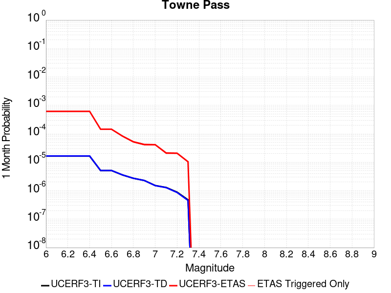 | 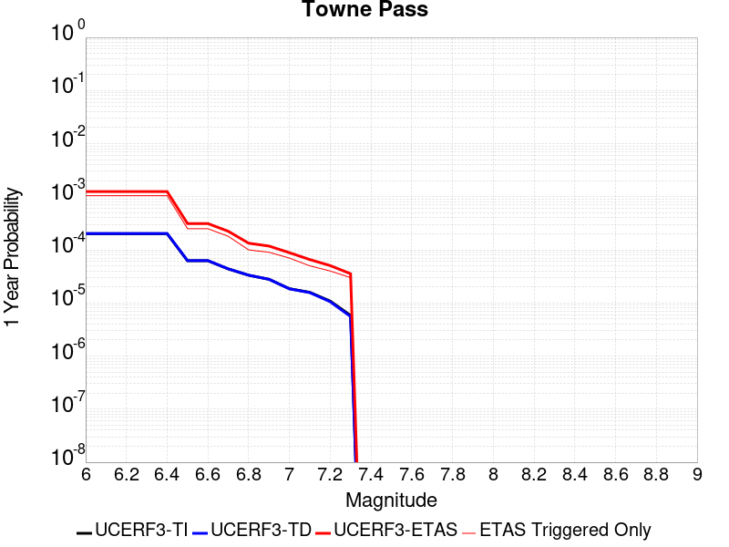 |  |

| Magnitude | 1 wk TI Prob | 1 wk TD Prob | 1 wk ETAS Prob | 1 wk ETAS/TD Gain | 1 wk ETAS Triggered Only | 1 mo TI Prob | 1 mo TD Prob | 1 mo ETAS Prob | 1 mo ETAS/TD Gain | 1 mo ETAS Triggered Only | 1 yr TI Prob | 1 yr TD Prob | 1 yr ETAS Prob | 1 yr ETAS/TD Gain | 1 yr ETAS Triggered Only | 10 yr TI Prob | 10 yr TD Prob | 10 yr ETAS Prob | 10 yr ETAS/TD Gain | 10 yr ETAS Triggered Only |
|-----|-----|-----|-----|-----|-----|-----|-----|-----|-----|-----|-----|-----|-----|-----|-----|-----|-----|-----|-----|-----|
| 6.0 | 3.849728E-6 | 3.8945414E-6 | 9.2790986E-5 | 23.825909 | 8.889679E-5 | 1.649873E-5 | 1.669081E-5 | 3.7227204E-4 | 22.304014 | 3.5558717E-4 | 2.0085352E-4 | 2.0319603E-4 | 8.2534715E-4 | 4.061827 | 6.2227756E-4 | 0.0020067208 | 0.0020305314 | 0.0030064106 | 1.4806029 | 9.778647E-4 |
| 6.1 | 3.849728E-6 | 3.8945414E-6 | 9.2790986E-5 | 23.825909 | 8.889679E-5 | 1.649873E-5 | 1.669081E-5 | 3.7227204E-4 | 22.304014 | 3.5558717E-4 | 2.0085352E-4 | 2.0319603E-4 | 8.2534715E-4 | 4.061827 | 6.2227756E-4 | 0.0020067208 | 0.0020305314 | 0.0030064106 | 1.4806029 | 9.778647E-4 |
| 6.2 | 3.849728E-6 | 3.8945414E-6 | 9.2790986E-5 | 23.825909 | 8.889679E-5 | 1.649873E-5 | 1.669081E-5 | 3.7227204E-4 | 22.304014 | 3.5558717E-4 | 2.0085352E-4 | 2.0319603E-4 | 8.2534715E-4 | 4.061827 | 6.2227756E-4 | 0.0020067208 | 0.0020305314 | 0.0030064106 | 1.4806029 | 9.778647E-4 |
| 6.3 | 3.849728E-6 | 3.8945414E-6 | 9.2790986E-5 | 23.825909 | 8.889679E-5 | 1.649873E-5 | 1.669081E-5 | 3.7227204E-4 | 22.304014 | 3.5558717E-4 | 2.0085352E-4 | 2.0319603E-4 | 8.2534715E-4 | 4.061827 | 6.2227756E-4 | 0.0020067208 | 0.0020305314 | 0.0030064106 | 1.4806029 | 9.778647E-4 |
| 6.4 | 3.849728E-6 | 3.8945414E-6 | 9.2790986E-5 | 23.825909 | 8.889679E-5 | 1.649873E-5 | 1.669081E-5 | 3.7227204E-4 | 22.304014 | 3.5558717E-4 | 2.0085352E-4 | 2.0319603E-4 | 8.2534715E-4 | 4.061827 | 6.2227756E-4 | 0.0020067208 | 0.0020305314 | 0.0030064106 | 1.4806029 | 9.778647E-4 |
| 6.5 | 1.1953545E-6 | 1.203052E-6 | 9.009973E-5 | 74.89263 | 8.889679E-5 | 5.1229376E-6 | 5.1559277E-6 | 9.405226E-5 | 18.24158 | 8.889679E-5 | 6.236998E-5 | 6.277173E-5 | 1.5166294E-4 | 2.4161026 | 8.889679E-5 | 6.235248E-4 | 6.275517E-4 | 7.163927E-4 | 1.1415676 | 8.889679E-5 |
| 6.6 | 1.1953545E-6 | 1.203052E-6 | 9.009973E-5 | 74.89263 | 8.889679E-5 | 5.1229376E-6 | 5.1559277E-6 | 9.405226E-5 | 18.24158 | 8.889679E-5 | 6.236998E-5 | 6.277173E-5 | 1.5166294E-4 | 2.4161026 | 8.889679E-5 | 6.235248E-4 | 6.275517E-4 | 7.163927E-4 | 1.1415676 | 8.889679E-5 |
| 6.7 | 8.375951E-7 | 8.4106705E-7 | 8.973778E-5 | 106.69516 | 8.889679E-5 | 3.5896885E-6 | 3.6045683E-6 | 9.250104E-5 | 25.662169 | 8.889679E-5 | 4.370358E-5 | 4.3884793E-5 | 1.3277768E-4 | 3.0255966 | 8.889679E-5 | 4.3694986E-4 | 4.38767E-4 | 5.276248E-4 | 1.202517 | 8.889679E-5 |
| 6.8 | 6.38041E-7 | 6.392156E-7 | 8.953595E-5 | 140.0716 | 8.889679E-5 | 2.7344586E-6 | 2.7394929E-6 | 9.163604E-5 | 33.45 | 8.889679E-5 | 3.3291526E-5 | 3.3352855E-5 | 1.2224668E-4 | 3.6652539 | 8.889679E-5 | 3.3286537E-4 | 3.334823E-4 | 4.2234946E-4 | 1.2664824 | 8.889679E-5 |
| 6.9 | 5.3460053E-7 | 5.345333E-7 | 8.9431276E-5 | 167.3072 | 8.889679E-5 | 2.2911431E-6 | 2.2908553E-6 | 9.1187445E-5 | 39.804977 | 8.889679E-5 | 2.789431E-5 | 2.789084E-5 | 1.1678515E-4 | 4.1872225 | 8.889679E-5 | 2.789081E-4 | 2.7887672E-4 | 3.677487E-4 | 1.3186785 | 8.889679E-5 |
| 7.0 | 3.557783E-7 | 3.5324226E-7 | 8.925E-5 | 252.65947 | 8.889679E-5 | 1.5247632E-6 | 1.5138945E-6 | 9.041055E-5 | 59.720505 | 8.889679E-5 | 1.8563835E-5 | 1.843152E-5 | 1.0732667E-4 | 5.8229966 | 8.889679E-5 | 1.8562283E-4 | 1.8430075E-4 | 2.7318115E-4 | 1.4822575 | 8.889679E-5 |
| 7.1 | 3.037942E-7 | 3.0002218E-7 | 3.0002218E-7 | 1.0 | 0.0 | 1.3019744E-6 | 1.2858087E-6 | 1.2858087E-6 | 1.0 | 0.0 | 1.5851423E-5 | 1.5654618E-5 | 1.5654618E-5 | 1.0 | 0.0 | 1.5850292E-4 | 1.5653588E-4 | 1.5653588E-4 | 1.0 | 0.0 |
| 7.2 | 2.0808248E-7 | 2.0217689E-7 | 2.0217689E-7 | 1.0 | 0.0 | 8.917818E-7 | 8.6647213E-7 | 8.6647213E-7 | 1.0 | 0.0 | 1.0857389E-5 | 1.0549252E-5 | 1.0549252E-5 | 1.0 | 0.0 | 1.0856859E-4 | 1.0548797E-4 | 1.0548797E-4 | 1.0 | 0.0 |
| 7.3 | 1.1162073E-7 | 1.0636894E-7 | 1.0636894E-7 | 1.0 | 0.0 | 4.7837443E-7 | 4.558668E-7 | 4.558668E-7 | 1.0 | 0.0 | 5.8241935E-6 | 5.550166E-6 | 5.550166E-6 | 1.0 | 0.0 | 5.8240406E-5 | 5.5500474E-5 | 5.5500474E-5 | 1.0 | 0.0 |

## San Andreas (San Bernardino N)
*[(top)](#table-of-contents)*

| 1 Week | 1 Month | 1 Year | 10 Year |
|-----|-----|-----|-----|
|  |  |  |  |

| Magnitude | 1 wk TI Prob | 1 wk TD Prob | 1 wk ETAS Prob | 1 wk ETAS/TD Gain | 1 wk ETAS Triggered Only | 1 mo TI Prob | 1 mo TD Prob | 1 mo ETAS Prob | 1 mo ETAS/TD Gain | 1 mo ETAS Triggered Only | 1 yr TI Prob | 1 yr TD Prob | 1 yr ETAS Prob | 1 yr ETAS/TD Gain | 1 yr ETAS Triggered Only | 10 yr TI Prob | 10 yr TD Prob | 10 yr ETAS Prob | 10 yr ETAS/TD Gain | 10 yr ETAS Triggered Only |
|-----|-----|-----|-----|-----|-----|-----|-----|-----|-----|-----|-----|-----|-----|-----|-----|-----|-----|-----|-----|-----|
| 6.0 | 1.4273766E-4 | 3.1606483E-4 | 4.9380225E-4 | 1.5623447 | 1.7779358E-4 | 6.115894E-4 | 0.0013538664 | 0.0015314192 | 1.131145 | 1.7779358E-4 | 0.0074207084 | 0.016360244 | 0.016884897 | 1.0320688 | 5.333807E-4 | 0.07177748 | 0.15026689 | 0.15094674 | 1.0045242 | 8.000711E-4 |
| 6.1 | 1.4273766E-4 | 3.1606483E-4 | 4.9380225E-4 | 1.5623447 | 1.7779358E-4 | 6.115894E-4 | 0.0013538664 | 0.0015314192 | 1.131145 | 1.7779358E-4 | 0.0074207084 | 0.016360244 | 0.016884897 | 1.0320688 | 5.333807E-4 | 0.07177748 | 0.15026689 | 0.15094674 | 1.0045242 | 8.000711E-4 |
| 6.2 | 1.4273766E-4 | 3.1606483E-4 | 4.9380225E-4 | 1.5623447 | 1.7779358E-4 | 6.115894E-4 | 0.0013538664 | 0.0015314192 | 1.131145 | 1.7779358E-4 | 0.0074207084 | 0.016360244 | 0.016884897 | 1.0320688 | 5.333807E-4 | 0.07177748 | 0.15026689 | 0.15094674 | 1.0045242 | 8.000711E-4 |
| 6.3 | 1.3730655E-4 | 3.0511338E-4 | 4.8285272E-4 | 1.5825354 | 1.7779358E-4 | 5.883239E-4 | 0.0013069791 | 0.0014845404 | 1.1358562 | 1.7779358E-4 | 0.0071393442 | 0.015797773 | 0.016322726 | 1.0332297 | 5.333807E-4 | 0.06914291 | 0.14556676 | 0.14625037 | 1.0046961 | 8.000711E-4 |
| 6.4 | 1.3730655E-4 | 3.0511338E-4 | 4.8285272E-4 | 1.5825354 | 1.7779358E-4 | 5.883239E-4 | 0.0013069791 | 0.0014845404 | 1.1358562 | 1.7779358E-4 | 0.0071393442 | 0.015797773 | 0.016322726 | 1.0332297 | 5.333807E-4 | 0.06914291 | 0.14556676 | 0.14625037 | 1.0046961 | 8.000711E-4 |
| 6.5 | 1.2942807E-4 | 2.8925808E-4 | 4.6700024E-4 | 1.6144761 | 1.7779358E-4 | 5.545738E-4 | 0.0012390936 | 0.0014166669 | 1.143309 | 1.7779358E-4 | 0.0067310524 | 0.01498286 | 0.015508249 | 1.035066 | 5.333807E-4 | 0.06530788 | 0.13870941 | 0.13939852 | 1.0049679 | 8.000711E-4 |
| 6.6 | 1.1125901E-4 | 2.536472E-4 | 4.313957E-4 | 1.7007705 | 1.7779358E-4 | 4.767372E-4 | 0.0010866089 | 0.0012642093 | 1.1634446 | 1.7779358E-4 | 0.005788839 | 0.013149847 | 0.013588486 | 1.033357 | 4.4448394E-4 | 0.056403454 | 0.122999296 | 0.12362299 | 1.0050708 | 7.1117433E-4 |
| 6.7 | 1.02209575E-4 | 2.3499702E-4 | 4.127488E-4 | 1.7564002 | 1.7779358E-4 | 4.3796748E-4 | 0.0010067427 | 0.0011843573 | 1.176425 | 1.7779358E-4 | 0.0053192247 | 0.012188629 | 0.012627696 | 1.0360227 | 4.4448394E-4 | 0.051936906 | 0.114790924 | 0.11542046 | 1.0054842 | 7.1117433E-4 |
| 6.8 | 9.610582E-5 | 2.2025521E-4 | 3.9800964E-4 | 1.8070384 | 1.7779358E-4 | 4.1181705E-4 | 9.436101E-4 | 0.0011212359 | 1.1882406 | 1.7779358E-4 | 0.0050023515 | 0.011428202 | 0.011867606 | 1.0384492 | 4.4448394E-4 | 0.048912346 | 0.1081929 | 0.10882713 | 1.005862 | 7.1117433E-4 |
| 6.9 | 9.3877505E-5 | 2.1481077E-4 | 3.9256617E-4 | 1.8274976 | 1.7779358E-4 | 4.0227012E-4 | 9.2029345E-4 | 0.0010979234 | 1.1930145 | 1.7779358E-4 | 0.0048866454 | 0.011147255 | 0.011586784 | 1.0394293 | 4.4448394E-4 | 0.04780577 | 0.10578323 | 0.10633968 | 1.0052603 | 6.2227756E-4 |
| 7.0 | 9.1019785E-5 | 2.0808022E-4 | 3.858368E-4 | 1.8542695 | 1.7779358E-4 | 3.900265E-4 | 8.914682E-4 | 0.0010691033 | 1.1992613 | 1.7779358E-4 | 0.0047382377 | 0.010799837 | 0.01123952 | 1.0407121 | 4.4448394E-4 | 0.046384744 | 0.102753714 | 0.10331205 | 1.0054337 | 6.2227756E-4 |
| 7.1 | 8.771155E-5 | 1.9982594E-4 | 3.77584E-4 | 1.8895644 | 1.7779358E-4 | 3.758525E-4 | 8.5611636E-4 | 0.0010337577 | 1.2074968 | 1.7779358E-4 | 0.0045664064 | 0.0103736 | 0.010813473 | 1.0424031 | 4.4448394E-4 | 0.044737056 | 0.09906527 | 0.09954581 | 1.0048507 | 5.333807E-4 |
| 7.2 | 8.0830236E-5 | 1.8388197E-4 | 3.6164286E-4 | 1.9667119 | 1.7779358E-4 | 3.4636928E-4 | 7.8782777E-4 | 9.654813E-4 | 1.225498 | 1.7779358E-4 | 0.0042088944 | 0.009549725 | 0.009989964 | 1.0460997 | 4.4448394E-4 | 0.041300658 | 0.09179615 | 0.09228057 | 1.0052772 | 5.333807E-4 |
| 7.3 | 7.7668235E-5 | 1.7331762E-4 | 3.5108038E-4 | 2.0256474 | 1.7779358E-4 | 3.328214E-4 | 7.425784E-4 | 9.2024E-4 | 1.2392496 | 1.7779358E-4 | 0.0040445733 | 0.009003494 | 0.009443976 | 1.0489235 | 4.4448394E-4 | 0.03971748 | 0.08706327 | 0.08755021 | 1.005593 | 5.333807E-4 |
| 7.4 | 7.520177E-5 | 1.6551897E-4 | 3.4328314E-4 | 2.0739806 | 1.7779358E-4 | 3.2225347E-4 | 7.0917426E-4 | 8.8684174E-4 | 1.2505273 | 1.7779358E-4 | 0.0039163795 | 0.008600081 | 0.009040743 | 1.0512393 | 4.4448394E-4 | 0.038480744 | 0.08351955 | 0.08400838 | 1.0058529 | 5.333807E-4 |
| 7.5 | 7.274697E-5 | 1.5839566E-4 | 3.361611E-4 | 2.1222873 | 1.7779358E-4 | 3.1173544E-4 | 6.78662E-4 | 8.563349E-4 | 1.2617989 | 1.7779358E-4 | 0.003788775 | 0.008231463 | 0.008672288 | 1.0535537 | 4.4448394E-4 | 0.03724827 | 0.08023631 | 0.08072689 | 1.0061142 | 5.333807E-4 |
| 7.6 | 7.1185845E-5 | 1.540943E-4 | 3.318605E-4 | 2.1536195 | 1.7779358E-4 | 3.0504653E-4 | 6.6023704E-4 | 8.3791325E-4 | 1.2691097 | 1.7779358E-4 | 0.0037076178 | 0.008008812 | 0.008449735 | 1.0550549 | 4.4448394E-4 | 0.036463667 | 0.07822598 | 0.078717634 | 1.0062851 | 5.333807E-4 |
| 7.7 | 6.709961E-5 | 1.4318313E-4 | 3.2095125E-4 | 2.2415438 | 1.7779358E-4 | 2.8753807E-4 | 6.1349774E-4 | 7.911822E-4 | 1.2896254 | 1.7779358E-4 | 0.003495157 | 0.0074437927 | 0.007884968 | 1.0592675 | 4.4448394E-4 | 0.034406938 | 0.07305469 | 0.07354911 | 1.0067677 | 5.333807E-4 |
| 7.8 | 6.300812E-5 | 1.3202413E-4 | 3.0979424E-4 | 2.346497 | 1.7779358E-4 | 2.7000686E-4 | 5.65695E-4 | 7.43388E-4 | 1.3141145 | 1.7779358E-4 | 0.0032823787 | 0.006865616 | 0.007307048 | 1.0642961 | 4.4448394E-4 | 0.032343175 | 0.06771354 | 0.0682108 | 1.0073436 | 5.333807E-4 |
| 7.9 | 4.983037E-5 | 9.723488E-5 | 1.8612303E-4 | 1.914159 | 8.889679E-5 | 2.1354125E-4 | 4.1665437E-4 | 5.0551415E-4 | 1.2132697 | 8.889679E-5 | 0.0025967648 | 0.0050609782 | 0.005326319 | 1.0524287 | 2.6669036E-4 | 0.025666296 | 0.05064886 | 0.050986435 | 1.006665 | 3.5558717E-4 |
| 8.0 | 3.2211527E-5 | 5.3304586E-5 | 5.3304586E-5 | 1.0 | 0.0 | 1.380421E-4 | 2.2842824E-4 | 2.2842824E-4 | 1.0 | 0.0 | 0.0016793669 | 0.0027775685 | 0.0028662186 | 1.0319164 | 8.889679E-5 | 0.016667323 | 0.028361378 | 0.02853413 | 1.0060911 | 1.7779358E-4 |
| 8.1 | 1.743376E-5 | 1.8824427E-5 | 1.8824427E-5 | 1.0 | 0.0 | 7.471398E-5 | 8.067362E-5 | 8.067362E-5 | 1.0 | 0.0 | 9.0926304E-4 | 9.817594E-4 | 9.817594E-4 | 1.0 | 0.0 | 0.009055517 | 0.010484105 | 0.010484105 | 1.0 | 0.0 |
| 8.2 | 7.831616E-6 | 5.1551065E-6 | 5.1551065E-6 | 1.0 | 0.0 | 3.3563636E-5 | 2.2093127E-5 | 2.2093127E-5 | 1.0 | 0.0 | 4.0856065E-4 | 2.6895068E-4 | 2.6895068E-4 | 1.0 | 0.0 | 0.004078103 | 0.0030418145 | 0.0030418145 | 1.0 | 0.0 |
| 8.3 | 1.983087E-6 | 7.6599065E-7 | 7.6599065E-7 | 1.0 | 0.0 | 8.498917E-6 | 3.282813E-6 | 3.282813E-6 | 1.0 | 0.0 | 1.034694E-4 | 3.9967534E-5 | 3.9967534E-5 | 1.0 | 0.0 | 0.0010342124 | 4.719687E-4 | 4.719687E-4 | 1.0 | 0.0 |

## Death Valley (Black Mtns Frontal)
*[(top)](#table-of-contents)*

| 1 Week | 1 Month | 1 Year | 10 Year |
|-----|-----|-----|-----|
|  |  |  |  |

| Magnitude | 1 wk TI Prob | 1 wk TD Prob | 1 wk ETAS Prob | 1 wk ETAS/TD Gain | 1 wk ETAS Triggered Only | 1 mo TI Prob | 1 mo TD Prob | 1 mo ETAS Prob | 1 mo ETAS/TD Gain | 1 mo ETAS Triggered Only | 1 yr TI Prob | 1 yr TD Prob | 1 yr ETAS Prob | 1 yr ETAS/TD Gain | 1 yr ETAS Triggered Only | 10 yr TI Prob | 10 yr TD Prob | 10 yr ETAS Prob | 10 yr ETAS/TD Gain | 10 yr ETAS Triggered Only |
|-----|-----|-----|-----|-----|-----|-----|-----|-----|-----|-----|-----|-----|-----|-----|-----|-----|-----|-----|-----|-----|
| 6.0 | 1.6707214E-5 | 1.867027E-5 | 1.9646053E-4 | 10.522641 | 1.7779358E-4 | 7.160038E-5 | 8.001302E-5 | 5.2446144E-4 | 6.5547004 | 4.4448394E-4 | 8.71386E-4 | 9.737309E-4 | 0.0015954025 | 1.638443 | 6.2227756E-4 | 0.00867977 | 0.009695496 | 0.010575846 | 1.0907998 | 8.889679E-4 |
| 6.1 | 1.6707214E-5 | 1.867027E-5 | 1.9646053E-4 | 10.522641 | 1.7779358E-4 | 7.160038E-5 | 8.001302E-5 | 5.2446144E-4 | 6.5547004 | 4.4448394E-4 | 8.71386E-4 | 9.737309E-4 | 0.0015954025 | 1.638443 | 6.2227756E-4 | 0.00867977 | 0.009695496 | 0.010575846 | 1.0907998 | 8.889679E-4 |
| 6.2 | 1.6707214E-5 | 1.867027E-5 | 1.9646053E-4 | 10.522641 | 1.7779358E-4 | 7.160038E-5 | 8.001302E-5 | 5.2446144E-4 | 6.5547004 | 4.4448394E-4 | 8.71386E-4 | 9.737309E-4 | 0.0015954025 | 1.638443 | 6.2227756E-4 | 0.00867977 | 0.009695496 | 0.010575846 | 1.0907998 | 8.889679E-4 |
| 6.3 | 1.6707214E-5 | 1.867027E-5 | 1.9646053E-4 | 10.522641 | 1.7779358E-4 | 7.160038E-5 | 8.001302E-5 | 5.2446144E-4 | 6.5547004 | 4.4448394E-4 | 8.71386E-4 | 9.737309E-4 | 0.0015954025 | 1.638443 | 6.2227756E-4 | 0.00867977 | 0.009695496 | 0.010575846 | 1.0907998 | 8.889679E-4 |
| 6.4 | 1.5515609E-5 | 1.7338214E-5 | 1.9512871E-4 | 11.254257 | 1.7779358E-4 | 6.649377E-5 | 7.4304546E-5 | 4.298653E-4 | 5.7851815 | 3.5558717E-4 | 8.0926094E-4 | 9.042885E-4 | 0.001437187 | 1.5893013 | 5.333807E-4 | 0.008063202 | 0.009006773 | 0.009711542 | 1.0782487 | 7.1117433E-4 |
| 6.5 | 1.5515609E-5 | 1.7338214E-5 | 1.9512871E-4 | 11.254257 | 1.7779358E-4 | 6.649377E-5 | 7.4304546E-5 | 4.298653E-4 | 5.7851815 | 3.5558717E-4 | 8.0926094E-4 | 9.042885E-4 | 0.001437187 | 1.5893013 | 5.333807E-4 | 0.008063202 | 0.009006773 | 0.009711542 | 1.0782487 | 7.1117433E-4 |
| 6.6 | 1.5041828E-5 | 1.6809145E-5 | 1.0570444E-4 | 6.288508 | 8.889679E-5 | 6.4463384E-5 | 7.203723E-5 | 3.387084E-4 | 4.701852 | 2.6669036E-4 | 7.8455906E-4 | 8.767063E-4 | 0.0013208006 | 1.5065485 | 4.4448394E-4 | 0.00781795 | 0.008733132 | 0.009349976 | 1.0706325 | 6.2227756E-4 |
| 6.7 | 1.4634985E-5 | 1.6356016E-5 | 1.6356016E-5 | 1.0 | 0.0 | 6.271985E-5 | 7.009536E-5 | 2.4787648E-4 | 3.5362751 | 1.7779358E-4 | 7.6334673E-4 | 8.5308263E-4 | 0.0012083665 | 1.4164705 | 3.5558717E-4 | 0.007607299 | 0.008498715 | 0.009027563 | 1.0622268 | 5.333807E-4 |
| 6.8 | 1.4209158E-5 | 1.5882048E-5 | 1.5882048E-5 | 1.0 | 0.0 | 6.089497E-5 | 6.8064175E-5 | 2.4584564E-4 | 3.6119685 | 1.7779358E-4 | 7.4114406E-4 | 8.2837185E-4 | 0.0010948413 | 1.3216785 | 2.6669036E-4 | 0.007386771 | 0.008253456 | 0.008694272 | 1.0534098 | 4.4448394E-4 |
| 6.9 | 1.3780098E-5 | 1.5404594E-5 | 1.5404594E-5 | 1.0 | 0.0 | 5.9056227E-5 | 6.6018045E-5 | 2.4379989E-4 | 3.692928 | 1.7779358E-4 | 7.1877235E-4 | 8.0347876E-4 | 9.811295E-4 | 1.221102 | 1.7779358E-4 | 0.0071645193 | 0.008006332 | 0.008359073 | 1.0440576 | 3.5558717E-4 |
| 7.0 | 1.3585064E-5 | 1.5188155E-5 | 1.5188155E-5 | 1.0 | 0.0 | 5.8220405E-5 | 6.50905E-5 | 2.4287251E-4 | 3.731305 | 1.7779358E-4 | 7.086029E-4 | 7.9219416E-4 | 9.698469E-4 | 1.224254 | 1.7779358E-4 | 0.007063476 | 0.007894293 | 0.008247074 | 1.044688 | 3.5558717E-4 |
| 7.1 | 1.3398601E-5 | 1.49813395E-5 | 1.49813395E-5 | 1.0 | 0.0 | 5.742131E-5 | 6.420419E-5 | 2.4198636E-4 | 3.769012 | 1.7779358E-4 | 6.9888023E-4 | 7.8141113E-4 | 9.590658E-4 | 1.2273511 | 1.7779358E-4 | 0.0069668638 | 0.007787224 | 0.008140042 | 1.0453073 | 3.5558717E-4 |
| 7.2 | 1.3126312E-5 | 1.4679561E-5 | 1.4679561E-5 | 1.0 | 0.0 | 5.6254412E-5 | 6.291092E-5 | 2.4069332E-4 | 3.8259387 | 1.7779358E-4 | 6.846822E-4 | 7.6567667E-4 | 9.4333413E-4 | 1.2320267 | 1.7779358E-4 | 0.006825765 | 0.00763097 | 0.007983844 | 1.0462424 | 3.5558717E-4 |
| 7.3 | 1.2922429E-5 | 1.4453788E-5 | 1.4453788E-5 | 1.0 | 0.0 | 5.5380664E-5 | 6.194336E-5 | 1.5083465E-4 | 2.4350412 | 8.889679E-5 | 6.74051E-4 | 7.53905E-4 | 8.427347E-4 | 1.1178262 | 8.889679E-5 | 0.006720101 | 0.007514055 | 0.0077787414 | 1.0352255 | 2.6669036E-4 |
| 7.4 | 1.2768878E-5 | 1.4283772E-5 | 1.4283772E-5 | 1.0 | 0.0 | 5.4722615E-5 | 6.1214756E-5 | 1.501061E-4 | 2.452123 | 8.889679E-5 | 6.660441E-4 | 7.4504025E-4 | 8.338708E-4 | 1.1192292 | 8.889679E-5 | 0.0066405144 | 0.0074260035 | 0.0076907133 | 1.0356463 | 2.6669036E-4 |
| 7.5 | 1.2521929E-5 | 1.40120155E-5 | 1.40120155E-5 | 1.0 | 0.0 | 5.366431E-5 | 6.005014E-5 | 1.4894159E-4 | 2.480287 | 8.889679E-5 | 6.531671E-4 | 7.3087064E-4 | 8.1970246E-4 | 1.1215425 | 8.889679E-5 | 0.006512506 | 0.0072852457 | 0.007549993 | 1.0363402 | 2.6669036E-4 |
| 7.6 | 1.1301089E-5 | 1.2648149E-5 | 1.2648149E-5 | 1.0 | 0.0 | 4.8432343E-5 | 5.4205255E-5 | 1.4309723E-4 | 2.6399143 | 8.889679E-5 | 5.895042E-4 | 6.5975444E-4 | 7.485926E-4 | 1.1346533 | 8.889679E-5 | 0.0058794282 | 0.00657851 | 0.0068434463 | 1.040273 | 2.6669036E-4 |
| 7.7 | 9.189108E-6 | 1.0283358E-5 | 1.0283358E-5 | 1.0 | 0.0 | 3.93813E-5 | 4.407082E-5 | 1.3296369E-4 | 3.017046 | 8.889679E-5 | 4.7936183E-4 | 5.3643517E-4 | 6.252843E-4 | 1.1656288 | 8.889679E-5 | 0.004783291 | 0.005351914 | 0.005617177 | 1.0495641 | 2.6669036E-4 |
| 7.8 | 3.4586725E-7 | 3.6482615E-7 | 3.6482615E-7 | 1.0 | 0.0 | 1.4822873E-6 | 1.5635396E-6 | 9.046019E-5 | 57.856026 | 8.889679E-5 | 1.80467E-5 | 1.9035933E-5 | 1.0793103E-4 | 5.6698575 | 8.889679E-5 | 1.8045233E-4 | 1.9034347E-4 | 2.7922334E-4 | 1.4669447 | 8.889679E-5 |
| 7.9 | 2.5591178E-9 | 2.6696718E-9 | 2.6696718E-9 | 1.0 | 0.0 | 1.0967647E-8 | 1.14414505E-8 | 1.14414505E-8 | 1.0 | 0.0 | 1.335311E-7 | 1.3929966E-7 | 1.3929966E-7 | 1.0 | 0.0 | 1.3353102E-6 | 1.3929966E-6 | 1.3929966E-6 | 1.0 | 0.0 |

## San Andreas (Mojave N)
*[(top)](#table-of-contents)*

| 1 Week | 1 Month | 1 Year | 10 Year |
|-----|-----|-----|-----|
|  |  |  |  |

| Magnitude | 1 wk TI Prob | 1 wk TD Prob | 1 wk ETAS Prob | 1 wk ETAS/TD Gain | 1 wk ETAS Triggered Only | 1 mo TI Prob | 1 mo TD Prob | 1 mo ETAS Prob | 1 mo ETAS/TD Gain | 1 mo ETAS Triggered Only | 1 yr TI Prob | 1 yr TD Prob | 1 yr ETAS Prob | 1 yr ETAS/TD Gain | 1 yr ETAS Triggered Only | 10 yr TI Prob | 10 yr TD Prob | 10 yr ETAS Prob | 10 yr ETAS/TD Gain | 10 yr ETAS Triggered Only |
|-----|-----|-----|-----|-----|-----|-----|-----|-----|-----|-----|-----|-----|-----|-----|-----|-----|-----|-----|-----|-----|
| 6.0 | 9.877682E-5 | 1.9400702E-4 | 4.6064565E-4 | 2.3743763 | 2.6669036E-4 | 4.2326056E-4 | 8.311939E-4 | 0.0010976626 | 1.3205855 | 2.6669036E-4 | 0.0051410277 | 0.010072956 | 0.010688965 | 1.0611547 | 6.2227756E-4 | 0.05023708 | 0.09831428 | 0.09903569 | 1.0073378 | 8.000711E-4 |
| 6.1 | 9.877682E-5 | 1.9400702E-4 | 4.6064565E-4 | 2.3743763 | 2.6669036E-4 | 4.2326056E-4 | 8.311939E-4 | 0.0010976626 | 1.3205855 | 2.6669036E-4 | 0.0051410277 | 0.010072956 | 0.010688965 | 1.0611547 | 6.2227756E-4 | 0.05023708 | 0.09831428 | 0.09903569 | 1.0073378 | 8.000711E-4 |
| 6.2 | 9.877682E-5 | 1.9400702E-4 | 4.6064565E-4 | 2.3743763 | 2.6669036E-4 | 4.2326056E-4 | 8.311939E-4 | 0.0010976626 | 1.3205855 | 2.6669036E-4 | 0.0051410277 | 0.010072956 | 0.010688965 | 1.0611547 | 6.2227756E-4 | 0.05023708 | 0.09831428 | 0.09903569 | 1.0073378 | 8.000711E-4 |
| 6.3 | 9.877682E-5 | 1.9400702E-4 | 4.6064565E-4 | 2.3743763 | 2.6669036E-4 | 4.2326056E-4 | 8.311939E-4 | 0.0010976626 | 1.3205855 | 2.6669036E-4 | 0.0051410277 | 0.010072956 | 0.010688965 | 1.0611547 | 6.2227756E-4 | 0.05023708 | 0.09831428 | 0.09903569 | 1.0073378 | 8.000711E-4 |
| 6.4 | 9.877682E-5 | 1.9400702E-4 | 4.6064565E-4 | 2.3743763 | 2.6669036E-4 | 4.2326056E-4 | 8.311939E-4 | 0.0010976626 | 1.3205855 | 2.6669036E-4 | 0.0051410277 | 0.010072956 | 0.010688965 | 1.0611547 | 6.2227756E-4 | 0.05023708 | 0.09831428 | 0.09903569 | 1.0073378 | 8.000711E-4 |
| 6.5 | 9.861474E-5 | 1.9374468E-4 | 4.603834E-4 | 2.3762376 | 2.6669036E-4 | 4.2256617E-4 | 8.300703E-4 | 0.0010965393 | 1.3210198 | 2.6669036E-4 | 0.0051326132 | 0.010059402 | 0.010675421 | 1.061238 | 6.2227756E-4 | 0.050156746 | 0.098192066 | 0.09891358 | 1.007348 | 8.000711E-4 |
| 6.6 | 9.861474E-5 | 1.9374468E-4 | 4.603834E-4 | 2.3762376 | 2.6669036E-4 | 4.2256617E-4 | 8.300703E-4 | 0.0010965393 | 1.3210198 | 2.6669036E-4 | 0.0051326132 | 0.010059402 | 0.010675421 | 1.061238 | 6.2227756E-4 | 0.050156746 | 0.098192066 | 0.09891358 | 1.007348 | 8.000711E-4 |
| 6.7 | 9.8552715E-5 | 1.9364421E-4 | 4.6028293E-4 | 2.3769517 | 2.6669036E-4 | 4.223004E-4 | 8.2964E-4 | 0.0010961092 | 1.3211864 | 2.6669036E-4 | 0.0051293927 | 0.010054212 | 0.0106702335 | 1.06127 | 6.2227756E-4 | 0.050125998 | 0.098145254 | 0.098866805 | 1.0073519 | 8.000711E-4 |
| 6.8 | 9.8464974E-5 | 1.9349584E-4 | 4.6013462E-4 | 2.3780077 | 2.6669036E-4 | 4.219245E-4 | 8.290045E-4 | 0.0010954738 | 1.3214328 | 2.6669036E-4 | 0.0051248376 | 0.010046546 | 0.010662572 | 1.0613172 | 6.2227756E-4 | 0.05008251 | 0.09807528 | 0.09879688 | 1.0073576 | 8.000711E-4 |
| 6.9 | 9.825824E-5 | 1.9317595E-4 | 4.598148E-4 | 2.3802903 | 2.6669036E-4 | 4.2103877E-4 | 8.276344E-4 | 0.001094104 | 1.3219655 | 2.6669036E-4 | 0.0051141046 | 0.010030019 | 0.010646055 | 1.0614192 | 6.2227756E-4 | 0.049980022 | 0.09792438 | 0.098646104 | 1.0073702 | 8.000711E-4 |
| 7.0 | 9.781462E-5 | 1.924896E-4 | 4.5912864E-4 | 2.3852127 | 2.6669036E-4 | 4.1913814E-4 | 8.246948E-4 | 0.0010911652 | 1.323114 | 2.6669036E-4 | 0.005091073 | 0.009994558 | 0.010610617 | 1.0616393 | 6.2227756E-4 | 0.04976007 | 0.09760077 | 0.09832276 | 1.0073973 | 8.000711E-4 |
| 7.1 | 9.7121134E-5 | 1.9150671E-4 | 4.58146E-4 | 2.3923235 | 2.6669036E-4 | 4.1616702E-4 | 8.204851E-4 | 0.0010869567 | 1.3247732 | 2.6669036E-4 | 0.005055068 | 0.009943774 | 0.010559864 | 1.0619574 | 6.2227756E-4 | 0.04941613 | 0.09713728 | 0.097859636 | 1.0074364 | 8.000711E-4 |
| 7.2 | 9.663819E-5 | 1.9081456E-4 | 4.5745407E-4 | 2.3973749 | 2.6669036E-4 | 4.1409794E-4 | 8.175206E-4 | 0.001083993 | 1.3259518 | 2.6669036E-4 | 0.0050299936 | 0.00990801 | 0.010524123 | 1.0621833 | 6.2227756E-4 | 0.049176537 | 0.09681055 | 0.09753317 | 1.0074642 | 8.000711E-4 |
| 7.3 | 9.6277574E-5 | 1.9033969E-4 | 4.569793E-4 | 2.4008617 | 2.6669036E-4 | 4.125529E-4 | 8.154867E-4 | 0.0010819596 | 1.3267654 | 2.6669036E-4 | 0.0050112694 | 0.009883473 | 0.0104996 | 1.0623392 | 6.2227756E-4 | 0.04899759 | 0.09658401 | 0.0973068 | 1.0074836 | 8.000711E-4 |
| 7.4 | 9.593308E-5 | 1.897375E-4 | 4.5637728E-4 | 2.4053087 | 2.6669036E-4 | 4.1107697E-4 | 8.129075E-4 | 0.0010793811 | 1.327803 | 2.6669036E-4 | 0.0049933824 | 0.009852355 | 0.010468502 | 1.062538 | 6.2227756E-4 | 0.04882661 | 0.09630218 | 0.09702521 | 1.0075078 | 8.000711E-4 |
| 7.5 | 9.561707E-5 | 1.8919831E-4 | 4.5583822E-4 | 2.4093144 | 2.6669036E-4 | 4.0972308E-4 | 8.1059814E-4 | 0.0010770723 | 1.3287377 | 2.6669036E-4 | 0.0049769743 | 0.009824493 | 0.010440657 | 1.0627171 | 6.2227756E-4 | 0.048669744 | 0.09604836 | 0.09677159 | 1.0075299 | 8.000711E-4 |
| 7.6 | 9.418194E-5 | 1.8572104E-4 | 4.5236188E-4 | 2.4357061 | 2.6669036E-4 | 4.0357444E-4 | 7.957047E-4 | 0.001062183 | 1.3348958 | 2.6669036E-4 | 0.004902454 | 0.009644784 | 0.01026106 | 1.0638974 | 6.2227756E-4 | 0.047957025 | 0.094430685 | 0.09515521 | 1.0076725 | 8.000711E-4 |
| 7.7 | 8.202141E-5 | 1.6021315E-4 | 4.268608E-4 | 2.6643305 | 2.6669036E-4 | 3.51473E-4 | 6.8644714E-4 | 9.5295446E-4 | 1.3882415 | 2.6669036E-4 | 0.00427079 | 0.008325525 | 0.008942622 | 1.0741211 | 6.2227756E-4 | 0.04189639 | 0.08223219 | 0.08296648 | 1.0089294 | 8.000711E-4 |
| 7.8 | 7.2859846E-5 | 1.4516473E-4 | 4.1181638E-4 | 2.8368902 | 2.6669036E-4 | 3.1221908E-4 | 6.219862E-4 | 8.885107E-4 | 1.4285054 | 2.6669036E-4 | 0.003794643 | 0.0075464295 | 0.008164011 | 1.0818375 | 6.2227756E-4 | 0.037304975 | 0.07472468 | 0.07538272 | 1.0088061 | 7.1117433E-4 |
| 7.9 | 5.3874453E-5 | 1.0045676E-4 | 1.8934462E-4 | 1.884837 | 8.889679E-5 | 2.3087008E-4 | 4.3045796E-4 | 5.1931647E-4 | 1.2064279 | 8.889679E-5 | 0.0028072202 | 0.0052282433 | 0.005493539 | 1.0507429 | 2.6669036E-4 | 0.02772022 | 0.05242443 | 0.052761376 | 1.0064273 | 3.5558717E-4 |
| 8.0 | 3.468538E-5 | 5.4260272E-5 | 5.4260272E-5 | 1.0 | 0.0 | 1.4864317E-4 | 2.325233E-4 | 2.325233E-4 | 1.0 | 0.0 | 0.0018082283 | 0.002827298 | 0.0029159433 | 1.0313535 | 8.889679E-5 | 0.017935853 | 0.028947512 | 0.029120158 | 1.0059642 | 1.7779358E-4 |
| 8.1 | 1.9152367E-5 | 1.940263E-5 | 1.940263E-5 | 1.0 | 0.0 | 8.207899E-5 | 8.3151484E-5 | 8.3151484E-5 | 1.0 | 0.0 | 9.988535E-4 | 0.0010118998 | 0.0010118998 | 1.0 | 0.0 | 0.009943757 | 0.01085625 | 0.01085625 | 1.0 | 0.0 |
| 8.2 | 8.643924E-6 | 5.4748625E-6 | 5.4748625E-6 | 1.0 | 0.0 | 3.704486E-5 | 2.3463486E-5 | 2.3463486E-5 | 1.0 | 0.0 | 4.5092785E-4 | 2.8563058E-4 | 2.8563058E-4 | 1.0 | 0.0 | 0.0045001395 | 0.0032487072 | 0.0032487072 | 1.0 | 0.0 |
| 8.3 | 1.983087E-6 | 7.6599065E-7 | 7.6599065E-7 | 1.0 | 0.0 | 8.498917E-6 | 3.282813E-6 | 3.282813E-6 | 1.0 | 0.0 | 1.034694E-4 | 3.9967534E-5 | 3.9967534E-5 | 1.0 | 0.0 | 0.0010342124 | 4.719687E-4 | 4.719687E-4 | 1.0 | 0.0 |

## Helendale-So Lockhart
*[(top)](#table-of-contents)*

| 1 Week | 1 Month | 1 Year | 10 Year |
|-----|-----|-----|-----|
|  |  |  |  |

| Magnitude | 1 wk TI Prob | 1 wk TD Prob | 1 wk ETAS Prob | 1 wk ETAS/TD Gain | 1 wk ETAS Triggered Only | 1 mo TI Prob | 1 mo TD Prob | 1 mo ETAS Prob | 1 mo ETAS/TD Gain | 1 mo ETAS Triggered Only | 1 yr TI Prob | 1 yr TD Prob | 1 yr ETAS Prob | 1 yr ETAS/TD Gain | 1 yr ETAS Triggered Only | 10 yr TI Prob | 10 yr TD Prob | 10 yr ETAS Prob | 10 yr ETAS/TD Gain | 10 yr ETAS Triggered Only |
|-----|-----|-----|-----|-----|-----|-----|-----|-----|-----|-----|-----|-----|-----|-----|-----|-----|-----|-----|-----|-----|
| 6.0 | 1.7296055E-5 | 1.8103729E-5 | 2.8478928E-4 | 15.730973 | 2.6669036E-4 | 7.412385E-5 | 7.7585224E-5 | 3.442549E-4 | 4.4371195 | 2.6669036E-4 | 9.0208417E-4 | 9.4421144E-4 | 0.0012994629 | 1.3762413 | 3.5558717E-4 | 0.008984311 | 0.009404116 | 0.010196663 | 1.0842767 | 8.000711E-4 |
| 6.1 | 1.7296055E-5 | 1.8103729E-5 | 2.8478928E-4 | 15.730973 | 2.6669036E-4 | 7.412385E-5 | 7.7585224E-5 | 3.442549E-4 | 4.4371195 | 2.6669036E-4 | 9.0208417E-4 | 9.4421144E-4 | 0.0012994629 | 1.3762413 | 3.5558717E-4 | 0.008984311 | 0.009404116 | 0.010196663 | 1.0842767 | 8.000711E-4 |
| 6.2 | 1.7296055E-5 | 1.8103729E-5 | 2.8478928E-4 | 15.730973 | 2.6669036E-4 | 7.412385E-5 | 7.7585224E-5 | 3.442549E-4 | 4.4371195 | 2.6669036E-4 | 9.0208417E-4 | 9.4421144E-4 | 0.0012994629 | 1.3762413 | 3.5558717E-4 | 0.008984311 | 0.009404116 | 0.010196663 | 1.0842767 | 8.000711E-4 |
| 6.3 | 1.0669118E-5 | 1.1135425E-5 | 1.8892702E-4 | 16.966307 | 1.7779358E-4 | 4.5723988E-5 | 4.772239E-5 | 2.255075E-4 | 4.7254024 | 1.7779358E-4 | 5.5654737E-4 | 5.80868E-4 | 7.5855834E-4 | 1.3059047 | 1.7779358E-4 | 0.0055515557 | 0.0057937936 | 0.0061473204 | 1.0610182 | 3.5558717E-4 |
| 6.4 | 1.0669118E-5 | 1.1135425E-5 | 1.8892702E-4 | 16.966307 | 1.7779358E-4 | 4.5723988E-5 | 4.772239E-5 | 2.255075E-4 | 4.7254024 | 1.7779358E-4 | 5.5654737E-4 | 5.80868E-4 | 7.5855834E-4 | 1.3059047 | 1.7779358E-4 | 0.0055515557 | 0.0057937936 | 0.0061473204 | 1.0610182 | 3.5558717E-4 |
| 6.5 | 8.790038E-6 | 9.170197E-6 | 9.806617E-5 | 10.69401 | 8.889679E-5 | 3.767105E-5 | 3.930026E-5 | 1.2819355E-4 | 3.261901 | 8.889679E-5 | 4.585485E-4 | 4.7837716E-4 | 5.6723144E-4 | 1.1857411 | 8.889679E-5 | 0.0045760344 | 0.004773638 | 0.005039056 | 1.0556006 | 2.6669036E-4 |
| 6.6 | 7.396949E-6 | 7.715537E-6 | 9.661164E-5 | 12.5217 | 8.889679E-5 | 3.1700827E-5 | 3.3066175E-5 | 1.2196002E-4 | 3.6883621 | 8.889679E-5 | 3.858892E-4 | 4.025073E-4 | 4.913683E-4 | 1.2207687 | 8.889679E-5 | 0.003852198 | 0.00401789 | 0.0042835088 | 1.0661091 | 2.6669036E-4 |
| 6.7 | 6.4600285E-6 | 6.738031E-6 | 9.563423E-5 | 14.1932 | 8.889679E-5 | 2.7685543E-5 | 2.887696E-5 | 1.1777118E-4 | 4.0783787 | 8.889679E-5 | 3.3701936E-4 | 3.5152107E-4 | 4.403866E-4 | 1.2528028 | 8.889679E-5 | 0.0033650869 | 0.003509732 | 0.0036869014 | 1.0504795 | 1.7779358E-4 |
| 6.8 | 5.600104E-6 | 5.836009E-6 | 9.4732284E-5 | 16.232372 | 8.889679E-5 | 2.4000226E-5 | 2.5011232E-5 | 1.139058E-4 | 4.554186 | 8.889679E-5 | 2.9216358E-4 | 3.044698E-4 | 3.9333952E-4 | 1.2918836 | 8.889679E-5 | 0.0029177975 | 0.003040588 | 0.003217841 | 1.0582956 | 1.7779358E-4 |
| 6.9 | 4.839122E-6 | 5.0395092E-6 | 9.393585E-5 | 18.639881 | 8.889679E-5 | 2.0738931E-5 | 2.159772E-5 | 1.1049259E-4 | 5.1159377 | 8.889679E-5 | 2.5246723E-4 | 2.6292098E-4 | 3.517944E-4 | 1.3380233 | 8.889679E-5 | 0.002521806 | 0.002626147 | 0.0028034735 | 1.0675235 | 1.7779358E-4 |
| 7.0 | 3.6937633E-6 | 3.845208E-6 | 9.2741655E-5 | 24.118763 | 8.889679E-5 | 1.5830317E-5 | 1.647936E-5 | 1.0537469E-4 | 6.3943434 | 8.889679E-5 | 1.9271708E-4 | 2.0061806E-4 | 2.8949702E-4 | 1.4430257 | 8.889679E-5 | 0.0019255003 | 0.002004401 | 0.0020931195 | 1.0442619 | 8.889679E-5 |
| 7.1 | 2.7858857E-6 | 2.8978538E-6 | 9.179438E-5 | 31.67668 | 8.889679E-5 | 1.1939455E-5 | 1.2419316E-5 | 1.01315E-4 | 8.157857 | 8.889679E-5 | 1.4535317E-4 | 1.511949E-4 | 2.4007824E-4 | 1.5878727 | 8.889679E-5 | 0.0014525814 | 0.0015109418 | 0.0015997043 | 1.0587465 | 8.889679E-5 |
| 7.2 | 2.1672065E-6 | 2.2540128E-6 | 2.2540128E-6 | 1.0 | 0.0 | 9.2879945E-6 | 9.66002E-6 | 9.66002E-6 | 1.0 | 0.0 | 1.1307546E-4 | 1.1760458E-4 | 1.1760458E-4 | 1.0 | 0.0 | 0.0011301794 | 0.0011754417 | 0.0011754417 | 1.0 | 0.0 |
| 7.3 | 1.4823496E-6 | 1.5422102E-6 | 1.5422102E-6 | 1.0 | 0.0 | 6.3529114E-6 | 6.6094562E-6 | 6.6094562E-6 | 1.0 | 0.0 | 7.734395E-5 | 8.046731E-5 | 8.046731E-5 | 1.0 | 0.0 | 7.731704E-4 | 8.0439687E-4 | 8.0439687E-4 | 1.0 | 0.0 |
| 7.4 | 4.2321457E-7 | 4.4108765E-7 | 4.4108765E-7 | 1.0 | 0.0 | 1.8137755E-6 | 1.8903745E-6 | 1.8903745E-6 | 1.0 | 0.0 | 2.2082493E-5 | 2.3015113E-5 | 2.3015113E-5 | 1.0 | 0.0 | 2.2080299E-4 | 2.3013182E-4 | 2.3013182E-4 | 1.0 | 0.0 |
| 7.5 | 5.6942316E-8 | 5.9415648E-8 | 5.9415648E-8 | 1.0 | 0.0 | 2.440385E-7 | 2.5463845E-7 | 2.5463845E-7 | 1.0 | 0.0 | 2.9711643E-6 | 3.1002196E-6 | 3.1002196E-6 | 1.0 | 0.0 | 2.9711247E-5 | 3.1001844E-5 | 3.1001844E-5 | 1.0 | 0.0 |

## Garlic Springs
*[(top)](#table-of-contents)*

| 1 Week | 1 Month | 1 Year | 10 Year |
|-----|-----|-----|-----|
|  |  | 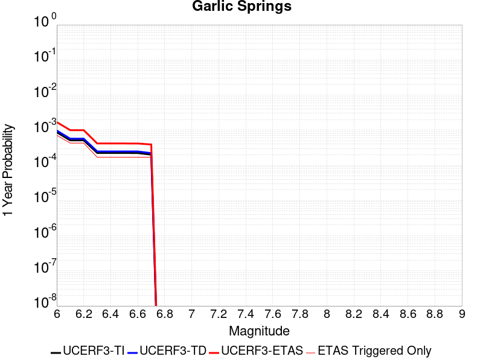 |  |

| Magnitude | 1 wk TI Prob | 1 wk TD Prob | 1 wk ETAS Prob | 1 wk ETAS/TD Gain | 1 wk ETAS Triggered Only | 1 mo TI Prob | 1 mo TD Prob | 1 mo ETAS Prob | 1 mo ETAS/TD Gain | 1 mo ETAS Triggered Only | 1 yr TI Prob | 1 yr TD Prob | 1 yr ETAS Prob | 1 yr ETAS/TD Gain | 1 yr ETAS Triggered Only | 10 yr TI Prob | 10 yr TD Prob | 10 yr ETAS Prob | 10 yr ETAS/TD Gain | 10 yr ETAS Triggered Only |
|-----|-----|-----|-----|-----|-----|-----|-----|-----|-----|-----|-----|-----|-----|-----|-----|-----|-----|-----|-----|-----|
| 6.0 | 1.6760017E-5 | 1.8776833E-5 | 4.6325245E-4 | 24.67149 | 4.4448394E-4 | 7.182667E-5 | 8.0470316E-5 | 5.249185E-4 | 6.523132 | 4.4448394E-4 | 8.7413884E-4 | 9.794032E-4 | 0.0017786907 | 1.8160965 | 8.000711E-4 | 0.008707083 | 0.009762413 | 0.010554673 | 1.0811542 | 8.000711E-4 |
| 6.1 | 9.852767E-6 | 1.09735865E-5 | 2.7766102E-4 | 25.30267 | 2.6669036E-4 | 4.222546E-5 | 4.702921E-5 | 3.1370705E-4 | 6.670472 | 2.6669036E-4 | 5.139737E-4 | 5.7250116E-4 | 0.0011055765 | 1.9311341 | 5.333807E-4 | 0.005127866 | 0.005717221 | 0.0062475526 | 1.0927603 | 5.333807E-4 |
| 6.2 | 9.852767E-6 | 1.09735865E-5 | 2.7766102E-4 | 25.30267 | 2.6669036E-4 | 4.222546E-5 | 4.702921E-5 | 3.1370705E-4 | 6.670472 | 2.6669036E-4 | 5.139737E-4 | 5.7250116E-4 | 0.0011055765 | 1.9311341 | 5.333807E-4 | 0.005127866 | 0.005717221 | 0.0062475526 | 1.0927603 | 5.333807E-4 |
| 6.3 | 4.3167724E-6 | 4.7780286E-6 | 2.714671E-4 | 56.81572 | 2.6669036E-4 | 1.8500323E-5 | 2.0477235E-5 | 2.8716214E-4 | 14.023482 | 2.6669036E-4 | 2.2521814E-4 | 2.4930484E-4 | 6.048033E-4 | 2.425959 | 3.5558717E-4 | 0.0022499003 | 0.00249251 | 0.0028472107 | 1.1423067 | 3.5558717E-4 |
| 6.4 | 4.3167724E-6 | 4.7780286E-6 | 2.714671E-4 | 56.81572 | 2.6669036E-4 | 1.8500323E-5 | 2.0477235E-5 | 2.8716214E-4 | 14.023482 | 2.6669036E-4 | 2.2521814E-4 | 2.4930484E-4 | 6.048033E-4 | 2.425959 | 3.5558717E-4 | 0.0022499003 | 0.00249251 | 0.0028472107 | 1.1423067 | 3.5558717E-4 |
| 6.5 | 4.3167724E-6 | 4.7780286E-6 | 2.714671E-4 | 56.81572 | 2.6669036E-4 | 1.8500323E-5 | 2.0477235E-5 | 2.8716214E-4 | 14.023482 | 2.6669036E-4 | 2.2521814E-4 | 2.4930484E-4 | 6.048033E-4 | 2.425959 | 3.5558717E-4 | 0.0022499003 | 0.00249251 | 0.0028472107 | 1.1423067 | 3.5558717E-4 |
| 6.6 | 4.301311E-6 | 4.760897E-6 | 2.7145E-4 | 57.016567 | 2.6669036E-4 | 1.8434059E-5 | 2.0403815E-5 | 2.8708874E-4 | 14.070347 | 2.6669036E-4 | 2.2441156E-4 | 2.4841115E-4 | 6.0391E-4 | 2.4310904 | 3.5558717E-4 | 0.0022418506 | 0.002483593 | 0.002838297 | 1.1428189 | 3.5558717E-4 |
| 6.7 | 3.8599724E-6 | 4.27106E-6 | 2.709603E-4 | 63.440998 | 2.6669036E-4 | 1.6542634E-5 | 1.8304541E-5 | 2.8499003E-4 | 15.569362 | 2.6669036E-4 | 2.0138794E-4 | 2.228578E-4 | 5.783657E-4 | 2.5952232 | 3.5558717E-4 | 0.0020120554 | 0.002228578 | 0.0025833726 | 1.1592023 | 3.5558717E-4 |

## Sierra Nevada  (No Extension)
*[(top)](#table-of-contents)*

| 1 Week | 1 Month | 1 Year | 10 Year |
|-----|-----|-----|-----|
|  |  |  |  |

| Magnitude | 1 wk TI Prob | 1 wk TD Prob | 1 wk ETAS Prob | 1 wk ETAS/TD Gain | 1 wk ETAS Triggered Only | 1 mo TI Prob | 1 mo TD Prob | 1 mo ETAS Prob | 1 mo ETAS/TD Gain | 1 mo ETAS Triggered Only | 1 yr TI Prob | 1 yr TD Prob | 1 yr ETAS Prob | 1 yr ETAS/TD Gain | 1 yr ETAS Triggered Only | 10 yr TI Prob | 10 yr TD Prob | 10 yr ETAS Prob | 10 yr ETAS/TD Gain | 10 yr ETAS Triggered Only |
|-----|-----|-----|-----|-----|-----|-----|-----|-----|-----|-----|-----|-----|-----|-----|-----|-----|-----|-----|-----|-----|
| 6.0 | 7.7690465E-6 | 6.976322E-6 | 9.587249E-5 | 13.742556 | 8.889679E-5 | 3.329549E-5 | 2.9898381E-5 | 2.0768665E-4 | 6.946418 | 1.7779358E-4 | 4.0529718E-4 | 3.6398784E-4 | 7.194456E-4 | 1.9765649 | 3.5558717E-4 | 0.004045588 | 0.0036374326 | 0.0039917263 | 1.0974021 | 3.5558717E-4 |
| 6.1 | 7.7690465E-6 | 6.976322E-6 | 9.587249E-5 | 13.742556 | 8.889679E-5 | 3.329549E-5 | 2.9898381E-5 | 2.0768665E-4 | 6.946418 | 1.7779358E-4 | 4.0529718E-4 | 3.6398784E-4 | 7.194456E-4 | 1.9765649 | 3.5558717E-4 | 0.004045588 | 0.0036374326 | 0.0039917263 | 1.0974021 | 3.5558717E-4 |
| 6.2 | 7.7690465E-6 | 6.976322E-6 | 9.587249E-5 | 13.742556 | 8.889679E-5 | 3.329549E-5 | 2.9898381E-5 | 2.0768665E-4 | 6.946418 | 1.7779358E-4 | 4.0529718E-4 | 3.6398784E-4 | 7.194456E-4 | 1.9765649 | 3.5558717E-4 | 0.004045588 | 0.0036374326 | 0.0039917263 | 1.0974021 | 3.5558717E-4 |
| 6.3 | 7.7690465E-6 | 6.976322E-6 | 9.587249E-5 | 13.742556 | 8.889679E-5 | 3.329549E-5 | 2.9898381E-5 | 2.0768665E-4 | 6.946418 | 1.7779358E-4 | 4.0529718E-4 | 3.6398784E-4 | 7.194456E-4 | 1.9765649 | 3.5558717E-4 | 0.004045588 | 0.0036374326 | 0.0039917263 | 1.0974021 | 3.5558717E-4 |
| 6.4 | 7.7690465E-6 | 6.976322E-6 | 9.587249E-5 | 13.742556 | 8.889679E-5 | 3.329549E-5 | 2.9898381E-5 | 2.0768665E-4 | 6.946418 | 1.7779358E-4 | 4.0529718E-4 | 3.6398784E-4 | 7.194456E-4 | 1.9765649 | 3.5558717E-4 | 0.004045588 | 0.0036374326 | 0.0039917263 | 1.0974021 | 3.5558717E-4 |
| 6.5 | 7.7690465E-6 | 6.976322E-6 | 9.587249E-5 | 13.742556 | 8.889679E-5 | 3.329549E-5 | 2.9898381E-5 | 2.0768665E-4 | 6.946418 | 1.7779358E-4 | 4.0529718E-4 | 3.6398784E-4 | 7.194456E-4 | 1.9765649 | 3.5558717E-4 | 0.004045588 | 0.0036374326 | 0.0039917263 | 1.0974021 | 3.5558717E-4 |
| 6.6 | 2.653E-6 | 1.614854E-6 | 9.05115E-5 | 56.04934 | 8.889679E-5 | 1.136995E-5 | 6.9207845E-6 | 1.8471314E-4 | 26.689623 | 1.7779358E-4 | 1.3842035E-4 | 8.425733E-5 | 4.3981452E-4 | 5.2198963 | 3.5558717E-4 | 0.0013833415 | 8.422573E-4 | 0.001197545 | 1.4218279 | 3.5558717E-4 |
| 6.7 | 2.5902466E-6 | 1.5501876E-6 | 9.044684E-5 | 58.34574 | 8.889679E-5 | 1.11010095E-5 | 6.643644E-6 | 1.8443604E-4 | 27.761278 | 1.7779358E-4 | 1.351464E-4 | 8.0883394E-5 | 4.364418E-4 | 5.3959384 | 3.5558717E-4 | 0.0013506424 | 8.0854254E-4 | 0.0011638422 | 1.4394323 | 3.5558717E-4 |
| 6.8 | 2.5853892E-6 | 1.5469877E-6 | 9.044364E-5 | 58.464355 | 8.889679E-5 | 1.1080193E-5 | 6.629931E-6 | 1.8442233E-4 | 27.81663 | 1.7779358E-4 | 1.34893E-4 | 8.071645E-5 | 4.3627492E-4 | 5.405031 | 3.5558717E-4 | 0.0013481114 | 8.068743E-4 | 0.0011621745 | 1.4403415 | 3.5558717E-4 |
| 6.9 | 2.458257E-6 | 1.4220619E-6 | 9.0318725E-5 | 63.512512 | 8.889679E-5 | 1.0535345E-5 | 6.094537E-6 | 1.8388704E-4 | 30.172436 | 1.7779358E-4 | 1.2826028E-4 | 7.4198484E-5 | 4.2975927E-4 | 5.792022 | 3.5558717E-4 | 0.0012818627 | 7.4173906E-4 | 0.0010970625 | 1.479041 | 3.5558717E-4 |
| 7.0 | 2.4341468E-6 | 1.3990258E-6 | 9.029569E-5 | 64.54183 | 8.889679E-5 | 1.0432016E-5 | 5.9958115E-6 | 1.8378833E-4 | 30.652786 | 1.7779358E-4 | 1.270024E-4 | 7.2996576E-5 | 4.2855777E-4 | 5.8709297 | 3.5558717E-4 | 0.0012692984 | 7.297279E-4 | 0.0010850555 | 1.4869318 | 3.5558717E-4 |
| 7.1 | 2.3652476E-6 | 1.3339754E-6 | 9.023065E-5 | 67.64041 | 8.889679E-5 | 1.0136736E-5 | 5.717025E-6 | 1.8350959E-4 | 32.09879 | 1.7779358E-4 | 1.2340778E-4 | 6.9602575E-5 | 4.25165E-4 | 6.108466 | 3.5558717E-4 | 0.0012333926 | 6.9580943E-4 | 0.0010511492 | 1.5106854 | 3.5558717E-4 |
| 7.2 | 2.272158E-6 | 1.2502821E-6 | 9.014696E-5 | 72.101295 | 8.889679E-5 | 9.737784E-6 | 5.3583412E-6 | 1.8315097E-4 | 34.180534 | 1.7779358E-4 | 1.1855107E-4 | 6.5235865E-5 | 4.2079983E-4 | 6.450437 | 3.5558717E-4 | 0.0011848784 | 6.5216864E-4 | 0.001007524 | 1.5448824 | 3.5558717E-4 |
| 7.3 | 2.1382127E-6 | 1.1419703E-6 | 9.003866E-5 | 78.84501 | 8.889679E-5 | 9.163737E-6 | 4.8941492E-6 | 1.8268685E-4 | 37.327602 | 1.7779358E-4 | 1.1156279E-4 | 5.958465E-5 | 4.1515063E-4 | 6.967409 | 3.5558717E-4 | 0.001115068 | 5.956879E-4 | 9.5106324E-4 | 1.5965798 | 3.5558717E-4 |
| 7.4 | 1.9048055E-6 | 9.575242E-7 | 8.985423E-5 | 93.840164 | 8.889679E-5 | 8.163426E-6 | 4.1036687E-6 | 1.8189652E-4 | 44.32534 | 1.7779358E-4 | 9.9385186E-5 | 4.996103E-5 | 4.0553042E-4 | 8.116935 | 3.5558717E-4 | 9.934074E-4 | 4.994987E-4 | 8.549082E-4 | 1.7115325 | 3.5558717E-4 |
| 7.5 | 1.5373403E-6 | 7.560042E-7 | 7.560042E-7 | 1.0 | 0.0 | 6.5885843E-6 | 3.2400142E-6 | 9.213651E-5 | 28.437073 | 8.889679E-5 | 8.021306E-5 | 3.9446462E-5 | 3.061263E-4 | 7.760552 | 2.6669036E-4 | 8.0184115E-4 | 3.943951E-4 | 6.609803E-4 | 1.6759343 | 2.6669036E-4 |
| 7.6 | 1.0680322E-6 | 4.6596554E-7 | 4.6596554E-7 | 1.0 | 0.0 | 4.577273E-6 | 1.9969937E-6 | 1.9969937E-6 | 1.0 | 0.0 | 5.5726876E-5 | 2.4313129E-5 | 2.0210238E-4 | 8.31248 | 1.7779358E-4 | 5.5712904E-4 | 2.4310495E-4 | 4.2085533E-4 | 1.7311672 | 1.7779358E-4 |
| 7.7 | 5.509146E-7 | 1.5580486E-7 | 1.5580486E-7 | 1.0 | 0.0 | 2.3610605E-6 | 6.677349E-7 | 6.677349E-7 | 1.0 | 0.0 | 2.8745531E-5 | 8.129644E-6 | 8.129644E-6 | 1.0 | 0.0 | 2.8741814E-4 | 8.1293576E-5 | 8.1293576E-5 | 1.0 | 0.0 |

## Elsinore (Glen Ivy) rev
*[(top)](#table-of-contents)*

| 1 Week | 1 Month | 1 Year | 10 Year |
|-----|-----|-----|-----|
| 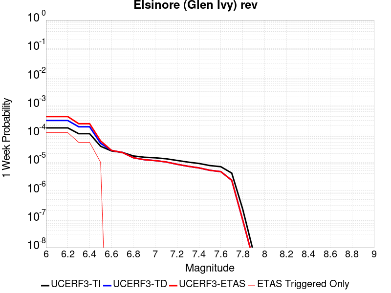 |  |  |  |

| Magnitude | 1 wk TI Prob | 1 wk TD Prob | 1 wk ETAS Prob | 1 wk ETAS/TD Gain | 1 wk ETAS Triggered Only | 1 mo TI Prob | 1 mo TD Prob | 1 mo ETAS Prob | 1 mo ETAS/TD Gain | 1 mo ETAS Triggered Only | 1 yr TI Prob | 1 yr TD Prob | 1 yr ETAS Prob | 1 yr ETAS/TD Gain | 1 yr ETAS Triggered Only | 10 yr TI Prob | 10 yr TD Prob | 10 yr ETAS Prob | 10 yr ETAS/TD Gain | 10 yr ETAS Triggered Only |
|-----|-----|-----|-----|-----|-----|-----|-----|-----|-----|-----|-----|-----|-----|-----|-----|-----|-----|-----|-----|-----|
| 6.0 | 1.6204086E-4 | 2.9360707E-4 | 3.8247777E-4 | 1.3026859 | 8.889679E-5 | 6.94276E-4 | 0.0012578638 | 0.0014354339 | 1.1411679 | 1.7779358E-4 | 0.008420097 | 0.015234485 | 0.015497113 | 1.017239 | 2.6669036E-4 | 0.081081145 | 0.13969168 | 0.14007407 | 1.0027374 | 4.4448394E-4 |
| 6.1 | 1.6204086E-4 | 2.9360707E-4 | 3.8247777E-4 | 1.3026859 | 8.889679E-5 | 6.94276E-4 | 0.0012578638 | 0.0014354339 | 1.1411679 | 1.7779358E-4 | 0.008420097 | 0.015234485 | 0.015497113 | 1.017239 | 2.6669036E-4 | 0.081081145 | 0.13969168 | 0.14007407 | 1.0027374 | 4.4448394E-4 |
| 6.2 | 1.6204086E-4 | 2.9360707E-4 | 3.8247777E-4 | 1.3026859 | 8.889679E-5 | 6.94276E-4 | 0.0012578638 | 0.0014354339 | 1.1411679 | 1.7779358E-4 | 0.008420097 | 0.015234485 | 0.015497113 | 1.017239 | 2.6669036E-4 | 0.081081145 | 0.13969168 | 0.14007407 | 1.0027374 | 4.4448394E-4 |
| 6.3 | 1.0111737E-4 | 1.7703383E-4 | 2.659149E-4 | 1.502057 | 8.889679E-5 | 4.332882E-4 | 7.5861247E-4 | 9.3627116E-4 | 1.234189 | 1.7779358E-4 | 0.005262531 | 0.009217682 | 0.009481914 | 1.0286658 | 2.6669036E-4 | 0.0513964 | 0.0870191 | 0.087424904 | 1.0046633 | 4.4448394E-4 |
| 6.4 | 1.0111737E-4 | 1.7703383E-4 | 2.659149E-4 | 1.502057 | 8.889679E-5 | 4.332882E-4 | 7.5861247E-4 | 9.3627116E-4 | 1.234189 | 1.7779358E-4 | 0.005262531 | 0.009217682 | 0.009481914 | 1.0286658 | 2.6669036E-4 | 0.0513964 | 0.0870191 | 0.087424904 | 1.0046633 | 4.4448394E-4 |
| 6.5 | 3.6624708E-5 | 4.6391084E-5 | 1.3528376E-4 | 2.9161584 | 8.889679E-5 | 1.569536E-4 | 1.9880582E-4 | 2.8768493E-4 | 1.447065 | 8.889679E-5 | 0.001909235 | 0.0024181372 | 0.0025068189 | 1.0366737 | 8.889679E-5 | 0.01892915 | 0.023739954 | 0.023913527 | 1.0073115 | 1.7779358E-4 |
| 6.6 | 2.5051324E-5 | 2.614772E-5 | 2.614772E-5 | 1.0 | 0.0 | 1.073584E-4 | 1.12057096E-4 | 1.12057096E-4 | 1.0 | 0.0 | 0.0013063047 | 0.0013634858 | 0.0013634858 | 1.0 | 0.0 | 0.012986525 | 0.013564618 | 0.013564618 | 1.0 | 0.0 |
| 6.7 | 2.2189772E-5 | 2.2072849E-5 | 2.2072849E-5 | 1.0 | 0.0 | 9.509556E-5 | 9.4594696E-5 | 9.4594696E-5 | 1.0 | 0.0 | 0.0011571734 | 0.0011511183 | 0.0011511183 | 1.0 | 0.0 | 0.011511663 | 0.011465415 | 0.011465415 | 1.0 | 0.0 |
| 6.8 | 1.6654378E-5 | 1.4437705E-5 | 1.4437705E-5 | 1.0 | 0.0 | 7.137396E-5 | 6.187444E-5 | 6.187444E-5 | 1.0 | 0.0 | 8.686314E-4 | 7.530661E-4 | 7.530661E-4 | 1.0 | 0.0 | 0.008652439 | 0.00751048 | 0.00751048 | 1.0 | 0.0 |
| 6.9 | 1.5042909E-5 | 1.2332022E-5 | 1.2332022E-5 | 1.0 | 0.0 | 6.446802E-5 | 5.285047E-5 | 5.285047E-5 | 1.0 | 0.0 | 7.8461546E-4 | 6.4326765E-4 | 6.4326765E-4 | 1.0 | 0.0 | 0.007818509 | 0.00641828 | 0.00641828 | 1.0 | 0.0 |
| 7.0 | 1.4361385E-5 | 1.1451324E-5 | 1.1451324E-5 | 1.0 | 0.0 | 6.154734E-5 | 4.9076196E-5 | 4.9076196E-5 | 1.0 | 0.0 | 7.490812E-4 | 5.973418E-4 | 5.973418E-4 | 1.0 | 0.0 | 0.007465612 | 0.0059613534 | 0.0059613534 | 1.0 | 0.0 |
| 7.1 | 1.3265571E-5 | 1.0244926E-5 | 1.0244926E-5 | 1.0 | 0.0 | 5.6851208E-5 | 4.39061E-5 | 4.39061E-5 | 1.0 | 0.0 | 6.919436E-4 | 5.344282E-4 | 5.344282E-4 | 1.0 | 0.0 | 0.006897931 | 0.0053347866 | 0.0053347866 | 1.0 | 0.0 |
| 7.2 | 1.1596403E-5 | 8.505067E-6 | 8.505067E-6 | 1.0 | 0.0 | 4.9697923E-5 | 3.6449786E-5 | 3.6449786E-5 | 1.0 | 0.0 | 6.049042E-4 | 4.436875E-4 | 4.436875E-4 | 1.0 | 0.0 | 0.006032603 | 0.0044294316 | 0.0044294316 | 1.0 | 0.0 |
| 7.3 | 1.0150827E-5 | 7.2387597E-6 | 7.2387597E-6 | 1.0 | 0.0 | 4.3502816E-5 | 3.1022897E-5 | 3.1022897E-5 | 1.0 | 0.0 | 5.2951806E-4 | 3.7763975E-4 | 3.7763975E-4 | 1.0 | 0.0 | 0.005282581 | 0.0037703665 | 0.0037703665 | 1.0 | 0.0 |
| 7.4 | 9.080705E-6 | 6.352519E-6 | 6.352519E-6 | 1.0 | 0.0 | 3.8916725E-5 | 2.7224805E-5 | 2.7224805E-5 | 1.0 | 0.0 | 4.7370812E-4 | 3.3141294E-4 | 3.3141294E-4 | 1.0 | 0.0 | 0.004726996 | 0.0033093381 | 0.0033093381 | 1.0 | 0.0 |
| 7.5 | 7.671649E-6 | 5.2256332E-6 | 5.2256332E-6 | 1.0 | 0.0 | 3.287808E-5 | 2.2395385E-5 | 2.2395385E-5 | 1.0 | 0.0 | 4.0021708E-4 | 2.7263095E-4 | 2.7263095E-4 | 1.0 | 0.0 | 0.0039949706 | 0.00272309 | 0.00272309 | 1.0 | 0.0 |
| 7.6 | 6.990086E-6 | 4.687545E-6 | 4.687545E-6 | 1.0 | 0.0 | 2.9957167E-5 | 2.008933E-5 | 2.008933E-5 | 1.0 | 0.0 | 3.6466747E-4 | 2.445613E-4 | 2.445613E-4 | 1.0 | 0.0 | 0.0036406964 | 0.002443038 | 0.002443038 | 1.0 | 0.0 |
| 7.7 | 4.163505E-6 | 2.3295343E-6 | 2.3295343E-6 | 1.0 | 0.0 | 1.7843471E-5 | 9.983683E-6 | 9.983683E-6 | 1.0 | 0.0 | 2.172226E-4 | 1.21545316E-4 | 1.21545316E-4 | 1.0 | 0.0 | 0.0021701038 | 0.0012148614 | 0.0012148614 | 1.0 | 0.0 |
| 7.8 | 2.2692414E-7 | 9.3854695E-8 | 9.3854695E-8 | 1.0 | 0.0 | 9.725317E-7 | 4.0223435E-7 | 4.0223435E-7 | 1.0 | 0.0 | 1.1840509E-5 | 4.8971956E-6 | 4.8971956E-6 | 1.0 | 0.0 | 1.1839878E-4 | 4.8971204E-5 | 4.8971204E-5 | 1.0 | 0.0 |
| 7.9 | 6.676829E-9 | 3.439853E-9 | 3.439853E-9 | 1.0 | 0.0 | 2.861498E-8 | 1.4742227E-8 | 1.4742227E-8 | 1.0 | 0.0 | 3.4838732E-7 | 1.7948659E-7 | 1.7948659E-7 | 1.0 | 0.0 | 3.4838679E-6 | 1.7948646E-6 | 1.7948646E-6 | 1.0 | 0.0 |

## Coyote Lake
*[(top)](#table-of-contents)*

| 1 Week | 1 Month | 1 Year | 10 Year |
|-----|-----|-----|-----|
|  |  |  |  |

| Magnitude | 1 wk TI Prob | 1 wk TD Prob | 1 wk ETAS Prob | 1 wk ETAS/TD Gain | 1 wk ETAS Triggered Only | 1 mo TI Prob | 1 mo TD Prob | 1 mo ETAS Prob | 1 mo ETAS/TD Gain | 1 mo ETAS Triggered Only | 1 yr TI Prob | 1 yr TD Prob | 1 yr ETAS Prob | 1 yr ETAS/TD Gain | 1 yr ETAS Triggered Only | 10 yr TI Prob | 10 yr TD Prob | 10 yr ETAS Prob | 10 yr ETAS/TD Gain | 10 yr ETAS Triggered Only |
|-----|-----|-----|-----|-----|-----|-----|-----|-----|-----|-----|-----|-----|-----|-----|-----|-----|-----|-----|-----|-----|
| 6.0 | 1.980352E-5 | 2.1706745E-5 | 2.8839134E-4 | 13.285793 | 2.6669036E-4 | 8.486947E-5 | 9.302599E-5 | 3.5969156E-4 | 3.8665705 | 2.6669036E-4 | 0.0010327959 | 0.0011320751 | 0.0015760558 | 1.3921832 | 4.4448394E-4 | 0.010280091 | 0.011270258 | 0.011709733 | 1.0389942 | 4.4448394E-4 |
| 6.1 | 1.980352E-5 | 2.1706745E-5 | 2.8839134E-4 | 13.285793 | 2.6669036E-4 | 8.486947E-5 | 9.302599E-5 | 3.5969156E-4 | 3.8665705 | 2.6669036E-4 | 0.0010327959 | 0.0011320751 | 0.0015760558 | 1.3921832 | 4.4448394E-4 | 0.010280091 | 0.011270258 | 0.011709733 | 1.0389942 | 4.4448394E-4 |
| 6.2 | 1.980352E-5 | 2.1706745E-5 | 2.8839134E-4 | 13.285793 | 2.6669036E-4 | 8.486947E-5 | 9.302599E-5 | 3.5969156E-4 | 3.8665705 | 2.6669036E-4 | 0.0010327959 | 0.0011320751 | 0.0015760558 | 1.3921832 | 4.4448394E-4 | 0.010280091 | 0.011270258 | 0.011709733 | 1.0389942 | 4.4448394E-4 |
| 6.3 | 1.5344787E-5 | 1.682067E-5 | 2.8350655E-4 | 16.854654 | 2.6669036E-4 | 6.576172E-5 | 7.2086936E-5 | 3.3875808E-4 | 4.6992993 | 2.6669036E-4 | 8.003548E-4 | 8.773662E-4 | 0.0013214602 | 1.5061672 | 4.4448394E-4 | 0.007974784 | 0.00874507 | 0.009185666 | 1.0503824 | 4.4448394E-4 |
| 6.4 | 1.5344787E-5 | 1.682067E-5 | 2.8350655E-4 | 16.854654 | 2.6669036E-4 | 6.576172E-5 | 7.2086936E-5 | 3.3875808E-4 | 4.6992993 | 2.6669036E-4 | 8.003548E-4 | 8.773662E-4 | 0.0013214602 | 1.5061672 | 4.4448394E-4 | 0.007974784 | 0.00874507 | 0.009185666 | 1.0503824 | 4.4448394E-4 |
| 6.5 | 1.4189697E-5 | 1.5557987E-5 | 2.822442E-4 | 18.141436 | 2.6669036E-4 | 6.081157E-5 | 6.6675726E-5 | 3.3334832E-4 | 4.9995456 | 2.6669036E-4 | 7.401293E-4 | 8.115349E-4 | 0.0012556581 | 1.5472633 | 4.4448394E-4 | 0.0073766913 | 0.008091656 | 0.008532544 | 1.0544866 | 4.4448394E-4 |
| 6.6 | 1.3469301E-5 | 1.4771577E-5 | 2.8145802E-4 | 19.054026 | 2.6669036E-4 | 5.7724297E-5 | 6.330556E-5 | 3.2997906E-4 | 5.212481 | 2.6669036E-4 | 7.025667E-4 | 7.7053264E-4 | 0.0011258458 | 1.4611267 | 3.5558717E-4 | 0.0070034964 | 0.0076845144 | 0.008037369 | 1.0459176 | 3.5558717E-4 |
| 6.7 | 1.3027966E-5 | 1.4281745E-5 | 2.8096832E-4 | 19.673248 | 2.6669036E-4 | 5.5832945E-5 | 6.120638E-5 | 3.2788044E-4 | 5.356965 | 2.6669036E-4 | 6.7955407E-4 | 7.4499263E-4 | 0.0011003149 | 1.4769473 | 3.5558717E-4 | 0.006774798 | 0.0074308286 | 0.007783774 | 1.0474974 | 3.5558717E-4 |
| 6.8 | 5.695434E-6 | 6.2244176E-6 | 6.2244176E-6 | 1.0 | 0.0 | 2.4408775E-5 | 2.6675973E-5 | 2.6675973E-5 | 1.0 | 0.0 | 2.971363E-4 | 3.2476155E-4 | 3.2476155E-4 | 1.0 | 0.0 | 0.0029673933 | 0.0032458105 | 0.0032458105 | 1.0 | 0.0 |
| 6.9 | 4.385688E-6 | 4.7930553E-6 | 4.7930553E-6 | 1.0 | 0.0 | 1.879567E-5 | 2.0541665E-5 | 2.0541665E-5 | 1.0 | 0.0 | 2.2881327E-4 | 2.5009477E-4 | 2.5009477E-4 | 1.0 | 0.0 | 0.002285778 | 0.0025009478 | 0.0025009478 | 1.0 | 0.0 |

## Cleghorn Lake
*[(top)](#table-of-contents)*

| 1 Week | 1 Month | 1 Year | 10 Year |
|-----|-----|-----|-----|
|  |  |  |  |

| Magnitude | 1 wk TI Prob | 1 wk TD Prob | 1 wk ETAS Prob | 1 wk ETAS/TD Gain | 1 wk ETAS Triggered Only | 1 mo TI Prob | 1 mo TD Prob | 1 mo ETAS Prob | 1 mo ETAS/TD Gain | 1 mo ETAS Triggered Only | 1 yr TI Prob | 1 yr TD Prob | 1 yr ETAS Prob | 1 yr ETAS/TD Gain | 1 yr ETAS Triggered Only | 10 yr TI Prob | 10 yr TD Prob | 10 yr ETAS Prob | 10 yr ETAS/TD Gain | 10 yr ETAS Triggered Only |
|-----|-----|-----|-----|-----|-----|-----|-----|-----|-----|-----|-----|-----|-----|-----|-----|-----|-----|-----|-----|-----|
| 6.0 | 1.5467183E-5 | 1.6794203E-5 | 1.945848E-4 | 11.586426 | 1.7779358E-4 | 6.6286244E-5 | 7.197348E-5 | 3.3864466E-4 | 4.705131 | 2.6669036E-4 | 8.067362E-4 | 8.759797E-4 | 0.0011424365 | 1.3041815 | 2.6669036E-4 | 0.008038137 | 0.008730696 | 0.008995057 | 1.0302796 | 2.6669036E-4 |
| 6.1 | 1.5467183E-5 | 1.6794203E-5 | 1.945848E-4 | 11.586426 | 1.7779358E-4 | 6.6286244E-5 | 7.197348E-5 | 3.3864466E-4 | 4.705131 | 2.6669036E-4 | 8.067362E-4 | 8.759797E-4 | 0.0011424365 | 1.3041815 | 2.6669036E-4 | 0.008038137 | 0.008730696 | 0.008995057 | 1.0302796 | 2.6669036E-4 |
| 6.2 | 1.2624631E-5 | 1.3681544E-5 | 1.9147269E-4 | 13.994962 | 1.7779358E-4 | 5.410444E-5 | 5.863415E-5 | 3.2530888E-4 | 5.5481133 | 2.6669036E-4 | 6.585225E-4 | 7.1368564E-4 | 9.801857E-4 | 1.3734138 | 2.6669036E-4 | 0.0065657445 | 0.0071187317 | 0.0073835235 | 1.0371965 | 2.6669036E-4 |
| 6.3 | 1.2624631E-5 | 1.3681544E-5 | 1.9147269E-4 | 13.994962 | 1.7779358E-4 | 5.410444E-5 | 5.863415E-5 | 3.2530888E-4 | 5.5481133 | 2.6669036E-4 | 6.585225E-4 | 7.1368564E-4 | 9.801857E-4 | 1.3734138 | 2.6669036E-4 | 0.0065657445 | 0.0071187317 | 0.0073835235 | 1.0371965 | 2.6669036E-4 |
| 6.4 | 9.417684E-6 | 1.0170118E-5 | 1.0170118E-5 | 1.0 | 0.0 | 4.036088E-5 | 4.3585722E-5 | 1.3247864E-4 | 3.0394962 | 8.889679E-5 | 4.912829E-4 | 5.3056807E-4 | 6.194177E-4 | 1.1674613 | 8.889679E-5 | 0.004901982 | 0.005297049 | 0.005385475 | 1.0166935 | 8.889679E-5 |
| 6.5 | 9.368219E-6 | 1.0117545E-5 | 1.0117545E-5 | 1.0 | 0.0 | 4.014889E-5 | 4.3360415E-5 | 1.3225335E-4 | 3.0500941 | 8.889679E-5 | 4.8870314E-4 | 5.2782625E-4 | 6.166761E-4 | 1.1683316 | 8.889679E-5 | 0.004876298 | 0.0052697617 | 0.00535819 | 1.0167804 | 8.889679E-5 |
| 6.6 | 7.803798E-6 | 8.441831E-6 | 8.441831E-6 | 1.0 | 0.0 | 3.3444423E-5 | 3.6179E-5 | 1.2507258E-4 | 3.4570491 | 8.889679E-5 | 4.0710976E-4 | 4.4043022E-4 | 5.2928785E-4 | 1.201752 | 8.889679E-5 | 0.0040636472 | 0.0043994905 | 0.004487996 | 1.0201173 | 8.889679E-5 |
| 6.7 | 2.3108669E-6 | 2.4438336E-6 | 2.4438336E-6 | 1.0 | 0.0 | 9.903678E-6 | 1.0473532E-5 | 1.0473532E-5 | 1.0 | 0.0 | 1.205706E-4 | 1.2750797E-4 | 1.2750797E-4 | 1.0 | 0.0 | 0.001205052 | 0.0012743667 | 0.0012743667 | 1.0 | 0.0 |
| 6.8 | 2.0882828E-6 | 2.2062823E-6 | 2.2062823E-6 | 1.0 | 0.0 | 8.949753E-6 | 9.455462E-6 | 9.455462E-6 | 1.0 | 0.0 | 1.08957785E-4 | 1.1511434E-4 | 1.1511434E-4 | 1.0 | 0.0 | 0.0010890438 | 0.0011505639 | 0.0011505639 | 1.0 | 0.0 |
| 6.9 | 1.876935E-6 | 1.981051E-6 | 1.981051E-6 | 1.0 | 0.0 | 8.043982E-6 | 8.490192E-6 | 8.490192E-6 | 1.0 | 0.0 | 9.7931086E-5 | 1.03363345E-4 | 1.03363345E-4 | 1.0 | 0.0 | 9.788794E-4 | 0.0010331686 | 0.0010331686 | 1.0 | 0.0 |
| 7.0 | 1.5357559E-6 | 1.6202807E-6 | 1.6202807E-6 | 1.0 | 0.0 | 6.5817944E-6 | 6.9440425E-6 | 6.9440425E-6 | 1.0 | 0.0 | 8.01304E-5 | 8.454057E-5 | 8.454057E-5 | 1.0 | 0.0 | 8.010151E-4 | 8.450965E-4 | 8.450965E-4 | 1.0 | 0.0 |
| 7.1 | 1.0905424E-6 | 1.1497619E-6 | 1.1497619E-6 | 1.0 | 0.0 | 4.6737446E-6 | 4.9275427E-6 | 4.9275427E-6 | 1.0 | 0.0 | 5.6901354E-5 | 5.999128E-5 | 5.999128E-5 | 1.0 | 0.0 | 5.6886784E-4 | 5.997606E-4 | 5.997606E-4 | 1.0 | 0.0 |
| 7.2 | 6.06668E-7 | 6.387277E-7 | 6.387277E-7 | 1.0 | 0.0 | 2.600003E-6 | 2.7374022E-6 | 2.7374022E-6 | 1.0 | 0.0 | 3.1654577E-5 | 3.3327433E-5 | 3.3327433E-5 | 1.0 | 0.0 | 3.1650066E-4 | 3.3323118E-4 | 3.3323118E-4 | 1.0 | 0.0 |

## Death Valley (No)
*[(top)](#table-of-contents)*

| 1 Week | 1 Month | 1 Year | 10 Year |
|-----|-----|-----|-----|
|  |  |  |  |

| Magnitude | 1 wk TI Prob | 1 wk TD Prob | 1 wk ETAS Prob | 1 wk ETAS/TD Gain | 1 wk ETAS Triggered Only | 1 mo TI Prob | 1 mo TD Prob | 1 mo ETAS Prob | 1 mo ETAS/TD Gain | 1 mo ETAS Triggered Only | 1 yr TI Prob | 1 yr TD Prob | 1 yr ETAS Prob | 1 yr ETAS/TD Gain | 1 yr ETAS Triggered Only | 10 yr TI Prob | 10 yr TD Prob | 10 yr ETAS Prob | 10 yr ETAS/TD Gain | 10 yr ETAS Triggered Only |
|-----|-----|-----|-----|-----|-----|-----|-----|-----|-----|-----|-----|-----|-----|-----|-----|-----|-----|-----|-----|-----|
| 6.0 | 2.0074807E-5 | 2.2500084E-5 | 2.2500084E-5 | 1.0 | 0.0 | 8.603206E-5 | 9.642541E-5 | 1.8531362E-4 | 1.921834 | 8.889679E-5 | 0.001046937 | 0.0011733545 | 0.0013509394 | 1.1513481 | 1.7779358E-4 | 0.010420183 | 0.011672506 | 0.0120239435 | 1.0301081 | 3.5558717E-4 |
| 6.1 | 2.0074807E-5 | 2.2500084E-5 | 2.2500084E-5 | 1.0 | 0.0 | 8.603206E-5 | 9.642541E-5 | 1.8531362E-4 | 1.921834 | 8.889679E-5 | 0.001046937 | 0.0011733545 | 0.0013509394 | 1.1513481 | 1.7779358E-4 | 0.010420183 | 0.011672506 | 0.0120239435 | 1.0301081 | 3.5558717E-4 |
| 6.2 | 2.0074807E-5 | 2.2500084E-5 | 2.2500084E-5 | 1.0 | 0.0 | 8.603206E-5 | 9.642541E-5 | 1.8531362E-4 | 1.921834 | 8.889679E-5 | 0.001046937 | 0.0011733545 | 0.0013509394 | 1.1513481 | 1.7779358E-4 | 0.010420183 | 0.011672506 | 0.0120239435 | 1.0301081 | 3.5558717E-4 |
| 6.3 | 1.9050609E-5 | 2.1336948E-5 | 2.1336948E-5 | 1.0 | 0.0 | 8.164292E-5 | 9.1440896E-5 | 1.8032956E-4 | 1.9720887 | 8.889679E-5 | 9.935491E-4 | 0.001112731 | 0.0012903268 | 1.1596035 | 1.7779358E-4 | 0.009891188 | 0.011072419 | 0.011424068 | 1.0317591 | 3.5558717E-4 |
| 6.4 | 1.9050609E-5 | 2.1336948E-5 | 2.1336948E-5 | 1.0 | 0.0 | 8.164292E-5 | 9.1440896E-5 | 1.8032956E-4 | 1.9720887 | 8.889679E-5 | 9.935491E-4 | 0.001112731 | 0.0012903268 | 1.1596035 | 1.7779358E-4 | 0.009891188 | 0.011072419 | 0.011424068 | 1.0317591 | 3.5558717E-4 |
| 6.5 | 1.8367004E-5 | 2.0561009E-5 | 2.0561009E-5 | 1.0 | 0.0 | 7.8713354E-5 | 8.811567E-5 | 1.7700462E-4 | 2.008776 | 8.889679E-5 | 9.5791375E-4 | 0.0010722869 | 0.0012498897 | 1.1656301 | 1.7779358E-4 | 0.009537951 | 0.0106719155 | 0.011023708 | 1.0329643 | 3.5558717E-4 |
| 6.6 | 1.779439E-5 | 1.9910927E-5 | 1.9910927E-5 | 1.0 | 0.0 | 7.625944E-5 | 8.53298E-5 | 1.7421899E-4 | 2.0417135 | 8.889679E-5 | 9.280632E-4 | 0.0010384015 | 0.0012160104 | 1.1710408 | 1.7779358E-4 | 0.009241969 | 0.010336253 | 0.010688164 | 1.0340464 | 3.5558717E-4 |
| 6.7 | 1.7025437E-5 | 1.9043426E-5 | 1.9043426E-5 | 1.0 | 0.0 | 7.296412E-5 | 8.161216E-5 | 1.7050169E-4 | 2.0891702 | 8.889679E-5 | 8.87976E-4 | 9.931813E-4 | 0.0011707983 | 1.1788365 | 1.7779358E-4 | 0.008844362 | 0.009888145 | 0.010240217 | 1.0356053 | 3.5558717E-4 |
| 6.8 | 1.6545107E-5 | 1.8512545E-5 | 1.8512545E-5 | 1.0 | 0.0 | 7.090568E-5 | 7.93371E-5 | 1.6822683E-4 | 2.1204057 | 8.889679E-5 | 8.629347E-4 | 9.655073E-4 | 0.0011431292 | 1.1839675 | 1.7779358E-4 | 0.008595915 | 0.009613829 | 0.009965997 | 1.0366315 | 3.5558717E-4 |
| 6.9 | 1.615478E-5 | 1.8087594E-5 | 1.8087594E-5 | 1.0 | 0.0 | 6.9232934E-5 | 7.751599E-5 | 1.664059E-4 | 2.14673 | 8.889679E-5 | 8.4258494E-4 | 9.433546E-4 | 0.0011209805 | 1.1882917 | 1.7779358E-4 | 0.008393973 | 0.009394196 | 0.009746443 | 1.0374962 | 3.5558717E-4 |
| 7.0 | 1.5894311E-5 | 1.780555E-5 | 1.780555E-5 | 1.0 | 0.0 | 6.81167E-5 | 7.6307304E-5 | 1.6519731E-4 | 2.164895 | 8.889679E-5 | 8.2900526E-4 | 9.286515E-4 | 0.00110628 | 1.1912757 | 1.7779358E-4 | 0.008259195 | 0.009248397 | 0.009600696 | 1.038093 | 3.5558717E-4 |
| 7.1 | 1.5602263E-5 | 1.7483504E-5 | 1.7483504E-5 | 1.0 | 0.0 | 6.6865134E-5 | 7.492718E-5 | 1.6381731E-4 | 2.1863537 | 8.889679E-5 | 8.137789E-4 | 9.118627E-4 | 0.0010894942 | 1.1948006 | 1.7779358E-4 | 0.008108052 | 0.009081894 | 0.009434252 | 1.0387979 | 3.5558717E-4 |
| 7.2 | 1.5323829E-5 | 1.717063E-5 | 1.717063E-5 | 1.0 | 0.0 | 6.56719E-5 | 7.358637E-5 | 1.6247662E-4 | 2.2079716 | 8.889679E-5 | 7.99262E-4 | 8.9555193E-4 | 0.0010731863 | 1.1983519 | 1.7779358E-4 | 0.007963934 | 0.008920107 | 0.009272522 | 1.039508 | 3.5558717E-4 |
| 7.3 | 1.4556212E-5 | 1.6302456E-5 | 1.6302456E-5 | 1.0 | 0.0 | 6.238227E-5 | 6.9865826E-5 | 1.587564E-4 | 2.272304 | 8.889679E-5 | 7.592395E-4 | 8.5029035E-4 | 9.391116E-4 | 1.1044599 | 8.889679E-5 | 0.0075665074 | 0.008471014 | 0.008735445 | 1.031216 | 2.6669036E-4 |
| 7.4 | 1.411725E-5 | 1.580796E-5 | 1.580796E-5 | 1.0 | 0.0 | 6.0501097E-5 | 6.7746674E-5 | 1.5663744E-4 | 2.3121052 | 8.889679E-5 | 7.363519E-4 | 8.245094E-4 | 9.133329E-4 | 1.107729 | 8.889679E-5 | 0.0073391674 | 0.008215138 | 0.008479638 | 1.0321966 | 2.6669036E-4 |
| 7.5 | 1.3503312E-5 | 1.5126289E-5 | 1.5126289E-5 | 1.0 | 0.0 | 5.7870053E-5 | 6.482538E-5 | 1.537164E-4 | 2.3712382 | 8.889679E-5 | 7.043401E-4 | 7.8896893E-4 | 8.777956E-4 | 1.1125858 | 8.889679E-5 | 0.007021119 | 0.007862304 | 0.008126898 | 1.0336535 | 2.6669036E-4 |
| 7.6 | 1.1279839E-5 | 1.2626327E-5 | 1.2626327E-5 | 1.0 | 0.0 | 4.834127E-5 | 5.4111737E-5 | 1.4300372E-4 | 2.6427486 | 8.889679E-5 | 5.88396E-4 | 6.5861654E-4 | 7.474548E-4 | 1.1348861 | 8.889679E-5 | 0.005868405 | 0.006567199 | 0.0068321377 | 1.0403428 | 2.6669036E-4 |
| 7.7 | 9.189108E-6 | 1.0283358E-5 | 1.0283358E-5 | 1.0 | 0.0 | 3.93813E-5 | 4.407082E-5 | 1.3296369E-4 | 3.017046 | 8.889679E-5 | 4.7936183E-4 | 5.3643517E-4 | 6.252843E-4 | 1.1656288 | 8.889679E-5 | 0.004783291 | 0.005351914 | 0.005617177 | 1.0495641 | 2.6669036E-4 |
| 7.8 | 3.4586725E-7 | 3.6482615E-7 | 3.6482615E-7 | 1.0 | 0.0 | 1.4822873E-6 | 1.5635396E-6 | 9.046019E-5 | 57.856026 | 8.889679E-5 | 1.80467E-5 | 1.9035933E-5 | 1.0793103E-4 | 5.6698575 | 8.889679E-5 | 1.8045233E-4 | 1.9034347E-4 | 2.7922334E-4 | 1.4669447 | 8.889679E-5 |
| 7.9 | 2.5591178E-9 | 2.6696718E-9 | 2.6696718E-9 | 1.0 | 0.0 | 1.0967647E-8 | 1.14414505E-8 | 1.14414505E-8 | 1.0 | 0.0 | 1.335311E-7 | 1.3929966E-7 | 1.3929966E-7 | 1.0 | 0.0 | 1.3353102E-6 | 1.3929966E-6 | 1.3929966E-6 | 1.0 | 0.0 |

## San Andreas (Big Bend)
*[(top)](#table-of-contents)*

| 1 Week | 1 Month | 1 Year | 10 Year |
|-----|-----|-----|-----|
| 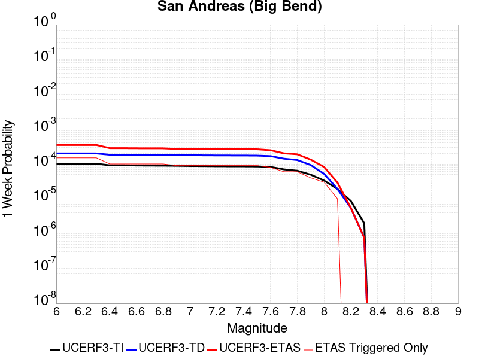 |  |  |  |

| Magnitude | 1 wk TI Prob | 1 wk TD Prob | 1 wk ETAS Prob | 1 wk ETAS/TD Gain | 1 wk ETAS Triggered Only | 1 mo TI Prob | 1 mo TD Prob | 1 mo ETAS Prob | 1 mo ETAS/TD Gain | 1 mo ETAS Triggered Only | 1 yr TI Prob | 1 yr TD Prob | 1 yr ETAS Prob | 1 yr ETAS/TD Gain | 1 yr ETAS Triggered Only | 10 yr TI Prob | 10 yr TD Prob | 10 yr ETAS Prob | 10 yr ETAS/TD Gain | 10 yr ETAS Triggered Only |
|-----|-----|-----|-----|-----|-----|-----|-----|-----|-----|-----|-----|-----|-----|-----|-----|-----|-----|-----|-----|-----|
| 6.0 | 1.0179969E-4 | 2.0072258E-4 | 2.8960154E-4 | 1.4427949 | 8.889679E-5 | 4.362114E-4 | 8.599571E-4 | 9.487774E-4 | 1.1032846 | 8.889679E-5 | 0.0052979486 | 0.010419999 | 0.010771881 | 1.0337698 | 3.5558717E-4 | 0.051734097 | 0.10144902 | 0.10176854 | 1.0031495 | 3.5558717E-4 |
| 6.1 | 1.0179969E-4 | 2.0072258E-4 | 2.8960154E-4 | 1.4427949 | 8.889679E-5 | 4.362114E-4 | 8.599571E-4 | 9.487774E-4 | 1.1032846 | 8.889679E-5 | 0.0052979486 | 0.010419999 | 0.010771881 | 1.0337698 | 3.5558717E-4 | 0.051734097 | 0.10144902 | 0.10176854 | 1.0031495 | 3.5558717E-4 |
| 6.2 | 1.0179969E-4 | 2.0072258E-4 | 2.8960154E-4 | 1.4427949 | 8.889679E-5 | 4.362114E-4 | 8.599571E-4 | 9.487774E-4 | 1.1032846 | 8.889679E-5 | 0.0052979486 | 0.010419999 | 0.010771881 | 1.0337698 | 3.5558717E-4 | 0.051734097 | 0.10144902 | 0.10176854 | 1.0031495 | 3.5558717E-4 |
| 6.3 | 1.0179969E-4 | 2.0072258E-4 | 2.8960154E-4 | 1.4427949 | 8.889679E-5 | 4.362114E-4 | 8.599571E-4 | 9.487774E-4 | 1.1032846 | 8.889679E-5 | 0.0052979486 | 0.010419999 | 0.010771881 | 1.0337698 | 3.5558717E-4 | 0.051734097 | 0.10144902 | 0.10176854 | 1.0031495 | 3.5558717E-4 |
| 6.4 | 9.1639464E-5 | 1.8429532E-4 | 2.7317574E-4 | 1.4822717 | 8.889679E-5 | 3.9268145E-4 | 7.895982E-4 | 8.7842485E-4 | 1.1124959 | 8.889679E-5 | 0.0047704205 | 0.009571102 | 0.00983524 | 1.0275974 | 2.6669036E-4 | 0.046693064 | 0.09377527 | 0.094016954 | 1.0025772 | 2.6669036E-4 |
| 6.5 | 9.1639464E-5 | 1.8429532E-4 | 2.7317574E-4 | 1.4822717 | 8.889679E-5 | 3.9268145E-4 | 7.895982E-4 | 8.7842485E-4 | 1.1124959 | 8.889679E-5 | 0.0047704205 | 0.009571102 | 0.00983524 | 1.0275974 | 2.6669036E-4 | 0.046693064 | 0.09377527 | 0.094016954 | 1.0025772 | 2.6669036E-4 |
| 6.6 | 9.042622E-5 | 1.823659E-4 | 2.7124648E-4 | 1.487375 | 8.889679E-5 | 3.8748336E-4 | 7.8133424E-4 | 8.701616E-4 | 1.1136867 | 8.889679E-5 | 0.0047074095 | 0.009471365 | 0.009735529 | 1.0278908 | 2.6669036E-4 | 0.046089325 | 0.092869274 | 0.0931112 | 1.002605 | 2.6669036E-4 |
| 6.7 | 8.9836685E-5 | 1.8150927E-4 | 2.7038992E-4 | 1.4896756 | 8.889679E-5 | 3.8495753E-4 | 7.776651E-4 | 8.664928E-4 | 1.1142235 | 8.889679E-5 | 0.00467679 | 0.00942708 | 0.009603198 | 1.0186821 | 1.7779358E-4 | 0.045795817 | 0.09246355 | 0.0926249 | 1.0017451 | 1.7779358E-4 |
| 6.8 | 8.9471854E-5 | 1.8097709E-4 | 2.698578E-4 | 1.4911158 | 8.889679E-5 | 3.8339442E-4 | 7.7538576E-4 | 8.642136E-4 | 1.1145595 | 8.889679E-5 | 0.004657841 | 0.009399569 | 0.00948763 | 1.0093687 | 8.889679E-5 | 0.04561414 | 0.092210755 | 0.09229146 | 1.0008751 | 8.889679E-5 |
| 6.9 | 8.858234E-5 | 1.7979681E-4 | 1.7979681E-4 | 1.0 | 0.0 | 3.7958333E-4 | 7.703304E-4 | 7.703304E-4 | 1.0 | 0.0 | 0.004611638 | 0.009338548 | 0.009338548 | 1.0 | 0.0 | 0.04517103 | 0.09165087 | 0.09165087 | 1.0 | 0.0 |
| 7.0 | 8.7433385E-5 | 1.7818481E-4 | 1.7818481E-4 | 1.0 | 0.0 | 3.746607E-4 | 7.634259E-4 | 7.634259E-4 | 1.0 | 0.0 | 0.004551957 | 0.009255203 | 0.009255203 | 1.0 | 0.0 | 0.044598386 | 0.09088532 | 0.09088532 | 1.0 | 0.0 |
| 7.1 | 8.684964E-5 | 1.7730435E-4 | 1.7730435E-4 | 1.0 | 0.0 | 3.7215967E-4 | 7.596547E-4 | 7.596547E-4 | 1.0 | 0.0 | 0.0045216335 | 0.009209678 | 0.009209678 | 1.0 | 0.0 | 0.04430731 | 0.09046686 | 0.09046686 | 1.0 | 0.0 |
| 7.2 | 8.606521E-5 | 1.762105E-4 | 1.762105E-4 | 1.0 | 0.0 | 3.6879873E-4 | 7.549695E-4 | 7.549695E-4 | 1.0 | 0.0 | 0.0044808835 | 0.0091531165 | 0.0091531165 | 1.0 | 0.0 | 0.043916024 | 0.089947365 | 0.089947365 | 1.0 | 0.0 |
| 7.3 | 8.568266E-5 | 1.7563057E-4 | 1.7563057E-4 | 1.0 | 0.0 | 3.6715972E-4 | 7.524855E-4 | 7.524855E-4 | 1.0 | 0.0 | 0.0044610105 | 0.009123127 | 0.009123127 | 1.0 | 0.0 | 0.043725148 | 0.08966853 | 0.08966853 | 1.0 | 0.0 |
| 7.4 | 8.5432206E-5 | 1.7525644E-4 | 1.7525644E-4 | 1.0 | 0.0 | 3.6608664E-4 | 7.50883E-4 | 7.50883E-4 | 1.0 | 0.0 | 0.004447999 | 0.009103781 | 0.009103781 | 1.0 | 0.0 | 0.043600157 | 0.08948871 | 0.08948871 | 1.0 | 0.0 |
| 7.5 | 8.4791965E-5 | 1.7394972E-4 | 1.7394972E-4 | 1.0 | 0.0 | 3.633435E-4 | 7.4528606E-4 | 7.4528606E-4 | 1.0 | 0.0 | 0.0044147377 | 0.009036204 | 0.009036204 | 1.0 | 0.0 | 0.043280575 | 0.088866346 | 0.088866346 | 1.0 | 0.0 |
| 7.6 | 8.241105E-5 | 1.6840403E-4 | 1.6840403E-4 | 1.0 | 0.0 | 3.531424E-4 | 7.215321E-4 | 7.215321E-4 | 1.0 | 0.0 | 0.0042910352 | 0.008749358 | 0.008749358 | 1.0 | 0.0 | 0.042091176 | 0.086243294 | 0.086243294 | 1.0 | 0.0 |
| 7.7 | 7.00432E-5 | 1.42045E-4 | 1.42045E-4 | 1.0 | 0.0 | 3.001506E-4 | 6.0862233E-4 | 6.0862233E-4 | 1.0 | 0.0 | 0.0036482112 | 0.0073848404 | 0.0073848404 | 1.0 | 0.0 | 0.035888977 | 0.07351733 | 0.07351733 | 1.0 | 0.0 |
| 7.8 | 6.415362E-5 | 1.2968935E-4 | 1.2968935E-4 | 1.0 | 0.0 | 2.749151E-4 | 5.556931E-4 | 5.556931E-4 | 1.0 | 0.0 | 0.0033419547 | 0.0067446055 | 0.0067446055 | 1.0 | 0.0 | 0.03292141 | 0.06725231 | 0.06725231 | 1.0 | 0.0 |
| 7.9 | 4.939911E-5 | 9.3411545E-5 | 9.3411545E-5 | 1.0 | 0.0 | 2.116933E-4 | 4.0027377E-4 | 4.0027377E-4 | 1.0 | 0.0 | 0.0025743195 | 0.004862453 | 0.004862453 | 1.0 | 0.0 | 0.025447013 | 0.048914436 | 0.048914436 | 1.0 | 0.0 |
| 8.0 | 3.344983E-5 | 5.222685E-5 | 5.222685E-5 | 1.0 | 0.0 | 1.4334853E-4 | 2.2381016E-4 | 2.2381016E-4 | 1.0 | 0.0 | 0.0017438711 | 0.0027214854 | 0.0027214854 | 1.0 | 0.0 | 0.017302496 | 0.027922187 | 0.027922187 | 1.0 | 0.0 |
| 8.1 | 1.9104898E-5 | 1.9173063E-5 | 1.9173063E-5 | 1.0 | 0.0 | 8.1875565E-5 | 8.216769E-5 | 8.216769E-5 | 1.0 | 0.0 | 9.963791E-4 | 9.999331E-4 | 9.999331E-4 | 1.0 | 0.0 | 0.009919235 | 0.010749801 | 0.010749801 | 1.0 | 0.0 |
| 8.2 | 8.643924E-6 | 5.4748625E-6 | 5.4748625E-6 | 1.0 | 0.0 | 3.704486E-5 | 2.3463486E-5 | 2.3463486E-5 | 1.0 | 0.0 | 4.5092785E-4 | 2.8563058E-4 | 2.8563058E-4 | 1.0 | 0.0 | 0.0045001395 | 0.0032487072 | 0.0032487072 | 1.0 | 0.0 |
| 8.3 | 1.983087E-6 | 7.6599065E-7 | 7.6599065E-7 | 1.0 | 0.0 | 8.498917E-6 | 3.282813E-6 | 3.282813E-6 | 1.0 | 0.0 | 1.034694E-4 | 3.9967534E-5 | 3.9967534E-5 | 1.0 | 0.0 | 0.0010342124 | 4.719687E-4 | 4.719687E-4 | 1.0 | 0.0 |

## White Wolf (Extension)
*[(top)](#table-of-contents)*

| 1 Week | 1 Month | 1 Year | 10 Year |
|-----|-----|-----|-----|
|  |  | 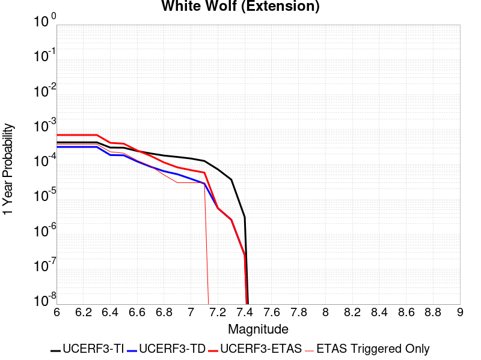 | 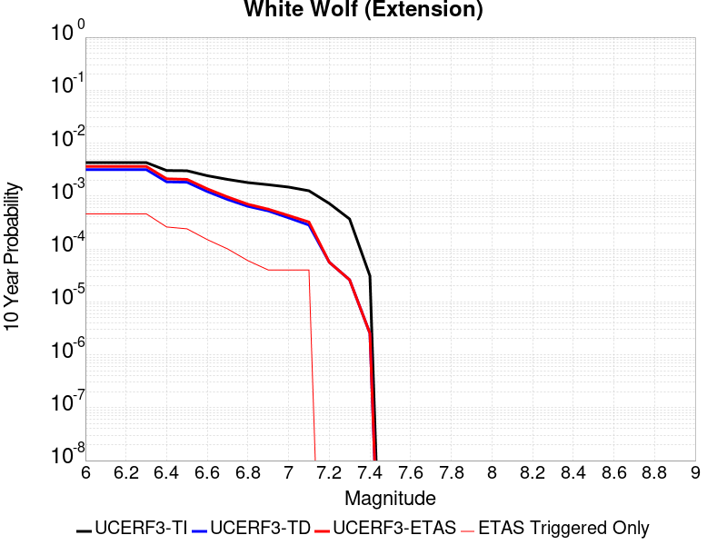 |

| Magnitude | 1 wk TI Prob | 1 wk TD Prob | 1 wk ETAS Prob | 1 wk ETAS/TD Gain | 1 wk ETAS Triggered Only | 1 mo TI Prob | 1 mo TD Prob | 1 mo ETAS Prob | 1 mo ETAS/TD Gain | 1 mo ETAS Triggered Only | 1 yr TI Prob | 1 yr TD Prob | 1 yr ETAS Prob | 1 yr ETAS/TD Gain | 1 yr ETAS Triggered Only | 10 yr TI Prob | 10 yr TD Prob | 10 yr ETAS Prob | 10 yr ETAS/TD Gain | 10 yr ETAS Triggered Only |
|-----|-----|-----|-----|-----|-----|-----|-----|-----|-----|-----|-----|-----|-----|-----|-----|-----|-----|-----|-----|-----|
| 6.0 | 8.222555E-6 | 6.0666657E-6 | 2.7275542E-4 | 44.959694 | 2.6669036E-4 | 3.5239045E-5 | 2.5999774E-5 | 2.9268322E-4 | 11.257145 | 2.6669036E-4 | 4.289509E-4 | 3.1650788E-4 | 6.7198253E-4 | 2.1231146 | 3.5558717E-4 | 0.0042812387 | 0.003161223 | 0.0035156861 | 1.1121285 | 3.5558717E-4 |
| 6.1 | 8.222555E-6 | 6.0666657E-6 | 2.7275542E-4 | 44.959694 | 2.6669036E-4 | 3.5239045E-5 | 2.5999774E-5 | 2.9268322E-4 | 11.257145 | 2.6669036E-4 | 4.289509E-4 | 3.1650788E-4 | 6.7198253E-4 | 2.1231146 | 3.5558717E-4 | 0.0042812387 | 0.003161223 | 0.0035156861 | 1.1121285 | 3.5558717E-4 |
| 6.2 | 8.222555E-6 | 6.0666657E-6 | 2.7275542E-4 | 44.959694 | 2.6669036E-4 | 3.5239045E-5 | 2.5999774E-5 | 2.9268322E-4 | 11.257145 | 2.6669036E-4 | 4.289509E-4 | 3.1650788E-4 | 6.7198253E-4 | 2.1231146 | 3.5558717E-4 | 0.0042812387 | 0.003161223 | 0.0035156861 | 1.1121285 | 3.5558717E-4 |
| 6.3 | 8.222555E-6 | 6.0666657E-6 | 2.7275542E-4 | 44.959694 | 2.6669036E-4 | 3.5239045E-5 | 2.5999774E-5 | 2.9268322E-4 | 11.257145 | 2.6669036E-4 | 4.289509E-4 | 3.1650788E-4 | 6.7198253E-4 | 2.1231146 | 3.5558717E-4 | 0.0042812387 | 0.003161223 | 0.0035156861 | 1.1121285 | 3.5558717E-4 |
| 6.4 | 5.821773E-6 | 3.5571766E-6 | 1.8135013E-4 | 50.98148 | 1.7779358E-4 | 2.4950215E-5 | 1.5244959E-5 | 1.9303583E-4 | 12.662272 | 1.7779358E-4 | 3.0372653E-4 | 1.8559267E-4 | 4.5223354E-4 | 2.4366994 | 2.6669036E-4 | 0.0030331176 | 0.001854485 | 0.0021206809 | 1.1435416 | 2.6669036E-4 |
| 6.5 | 5.766023E-6 | 3.4991106E-6 | 1.8129207E-4 | 51.8109 | 1.7779358E-4 | 2.4711293E-5 | 1.4996108E-5 | 1.9278702E-4 | 12.8558035 | 1.7779358E-4 | 3.0081844E-4 | 1.8256342E-4 | 4.492051E-4 | 2.4605427 | 2.6669036E-4 | 0.0030041158 | 0.0018242426 | 0.0020904464 | 1.1459256 | 2.6669036E-4 |
| 6.6 | 4.643576E-6 | 2.332624E-6 | 1.8012579E-4 | 77.22024 | 1.7779358E-4 | 1.9900888E-5 | 9.996925E-6 | 1.8778873E-4 | 18.78465 | 1.7779358E-4 | 2.4226638E-4 | 1.2170619E-4 | 3.883641E-4 | 3.1909971 | 2.6669036E-4 | 0.0024200242 | 0.0012164378 | 0.0014828037 | 1.2189721 | 2.6669036E-4 |
| 6.7 | 3.9529173E-6 | 1.6483477E-6 | 1.7944163E-4 | 108.86151 | 1.7779358E-4 | 1.6940963E-5 | 7.0643296E-6 | 1.8485666E-4 | 26.167614 | 1.7779358E-4 | 2.0623671E-4 | 8.6005006E-5 | 3.5267245E-4 | 4.1006036 | 2.6669036E-4 | 0.002060454 | 8.597357E-4 | 0.0011261968 | 1.3099337 | 2.6669036E-4 |
| 6.8 | 3.4377522E-6 | 1.2245237E-6 | 1.2245237E-6 | 1.0 | 0.0 | 1.473314E-5 | 5.2479486E-6 | 5.2479486E-6 | 1.0 | 0.0 | 1.7936122E-4 | 6.3891996E-5 | 1.527831E-4 | 2.3912716 | 8.889679E-5 | 0.0017921652 | 6.387454E-4 | 7.2758534E-4 | 1.1390852 | 8.889679E-5 |
| 6.9 | 3.1367306E-6 | 1.0033783E-6 | 1.0033783E-6 | 1.0 | 0.0 | 1.3443062E-5 | 4.3001864E-6 | 4.3001864E-6 | 1.0 | 0.0 | 1.63657E-4 | 5.235359E-5 | 1.4124572E-4 | 2.6979187 | 8.889679E-5 | 0.0016353652 | 5.2342017E-4 | 6.1227044E-4 | 1.1697494 | 8.889679E-5 |
| 7.0 | 2.8298145E-6 | 7.4286646E-7 | 7.4286646E-7 | 1.0 | 0.0 | 1.2127721E-5 | 3.1837099E-6 | 3.1837099E-6 | 1.0 | 0.0 | 1.47645E-4 | 3.8761027E-5 | 1.2765438E-4 | 3.293369 | 8.889679E-5 | 0.0014754693 | 3.8754768E-4 | 4.7641E-4 | 1.229294 | 8.889679E-5 |
| 7.1 | 2.4091064E-6 | 5.4227525E-7 | 5.4227525E-7 | 1.0 | 0.0 | 1.03247E-5 | 2.3240348E-6 | 2.3240348E-6 | 1.0 | 0.0 | 1.2569598E-4 | 2.8294799E-5 | 1.17189076E-4 | 4.141718 | 8.889679E-5 | 0.001256249 | 2.8291598E-4 | 3.7178764E-4 | 1.3141273 | 8.889679E-5 |
| 7.2 | 1.3875518E-6 | 1.0743063E-7 | 1.0743063E-7 | 1.0 | 0.0 | 5.9466374E-6 | 4.6041689E-7 | 4.6041689E-7 | 1.0 | 0.0 | 7.23979E-5 | 5.6055624E-6 | 5.6055624E-6 | 1.0 | 0.0 | 7.2374323E-4 | 5.6054323E-5 | 5.6054323E-5 | 1.0 | 0.0 |
| 7.3 | 7.056077E-7 | 5.002034E-8 | 5.002034E-8 | 1.0 | 0.0 | 3.0240296E-6 | 2.1437286E-7 | 2.1437286E-7 | 1.0 | 0.0 | 3.681694E-5 | 2.609987E-6 | 2.609987E-6 | 1.0 | 0.0 | 3.681084E-4 | 2.609961E-5 | 2.609961E-5 | 1.0 | 0.0 |
| 7.4 | 5.9334678E-8 | 4.8683537E-9 | 4.8683537E-9 | 1.0 | 0.0 | 2.5429145E-7 | 2.0864372E-8 | 2.0864372E-8 | 1.0 | 0.0 | 3.095994E-6 | 2.5402372E-7 | 2.5402372E-7 | 1.0 | 0.0 | 3.095951E-5 | 2.5402353E-6 | 2.5402353E-6 | 1.0 | 0.0 |

## San Andreas (San Bernardino S)
*[(top)](#table-of-contents)*

| 1 Week | 1 Month | 1 Year | 10 Year |
|-----|-----|-----|-----|
|  |  |  |  |

| Magnitude | 1 wk TI Prob | 1 wk TD Prob | 1 wk ETAS Prob | 1 wk ETAS/TD Gain | 1 wk ETAS Triggered Only | 1 mo TI Prob | 1 mo TD Prob | 1 mo ETAS Prob | 1 mo ETAS/TD Gain | 1 mo ETAS Triggered Only | 1 yr TI Prob | 1 yr TD Prob | 1 yr ETAS Prob | 1 yr ETAS/TD Gain | 1 yr ETAS Triggered Only | 10 yr TI Prob | 10 yr TD Prob | 10 yr ETAS Prob | 10 yr ETAS/TD Gain | 10 yr ETAS Triggered Only |
|-----|-----|-----|-----|-----|-----|-----|-----|-----|-----|-----|-----|-----|-----|-----|-----|-----|-----|-----|-----|-----|
| 6.0 | 1.2336002E-4 | 3.0004102E-4 | 3.0004102E-4 | 1.0 | 0.0 | 5.2857865E-4 | 0.0012852824 | 0.0012852824 | 1.0 | 0.0 | 0.006416472 | 0.015540994 | 0.015716024 | 1.0112625 | 1.7779358E-4 | 0.06234337 | 0.14283717 | 0.14314197 | 1.0021338 | 3.5558717E-4 |
| 6.1 | 1.2336002E-4 | 3.0004102E-4 | 3.0004102E-4 | 1.0 | 0.0 | 5.2857865E-4 | 0.0012852824 | 0.0012852824 | 1.0 | 0.0 | 0.006416472 | 0.015540994 | 0.015716024 | 1.0112625 | 1.7779358E-4 | 0.06234337 | 0.14283717 | 0.14314197 | 1.0021338 | 3.5558717E-4 |
| 6.2 | 1.2336002E-4 | 3.0004102E-4 | 3.0004102E-4 | 1.0 | 0.0 | 5.2857865E-4 | 0.0012852824 | 0.0012852824 | 1.0 | 0.0 | 0.006416472 | 0.015540994 | 0.015716024 | 1.0112625 | 1.7779358E-4 | 0.06234337 | 0.14283717 | 0.14314197 | 1.0021338 | 3.5558717E-4 |
| 6.3 | 1.1712257E-4 | 2.8792414E-4 | 2.8792414E-4 | 1.0 | 0.0 | 5.018573E-4 | 0.0012334028 | 0.0012334028 | 1.0 | 0.0 | 0.006093008 | 0.014918125 | 0.015093266 | 1.0117402 | 1.7779358E-4 | 0.059286322 | 0.13754563 | 0.13785231 | 1.0022297 | 3.5558717E-4 |
| 6.4 | 1.1712257E-4 | 2.8792414E-4 | 2.8792414E-4 | 1.0 | 0.0 | 5.018573E-4 | 0.0012334028 | 0.0012334028 | 1.0 | 0.0 | 0.006093008 | 0.014918125 | 0.015093266 | 1.0117402 | 1.7779358E-4 | 0.059286322 | 0.13754563 | 0.13785231 | 1.0022297 | 3.5558717E-4 |
| 6.5 | 1.0689076E-4 | 2.680528E-4 | 2.680528E-4 | 1.0 | 0.0 | 4.5802278E-4 | 0.0011483167 | 0.0011483167 | 1.0 | 0.0 | 0.0055621783 | 0.01389575 | 0.014071073 | 1.012617 | 1.7779358E-4 | 0.05425003 | 0.12879294 | 0.12910274 | 1.0024053 | 3.5558717E-4 |
| 6.6 | 9.7648895E-5 | 2.50501E-4 | 2.50501E-4 | 1.0 | 0.0 | 4.1842813E-4 | 0.0010731576 | 0.0010731576 | 1.0 | 0.0 | 0.005082469 | 0.012991785 | 0.013167269 | 1.0135072 | 1.7779358E-4 | 0.049677886 | 0.12095292 | 0.12126549 | 1.0025843 | 3.5558717E-4 |
| 6.7 | 8.757013E-5 | 2.3120902E-4 | 2.3120902E-4 | 1.0 | 0.0 | 3.7524657E-4 | 9.905418E-4 | 9.905418E-4 | 1.0 | 0.0 | 0.00455906 | 0.011997245 | 0.012172906 | 1.0146418 | 1.7779358E-4 | 0.04466656 | 0.11226123 | 0.112576894 | 1.0028119 | 3.5558717E-4 |
| 6.8 | 8.562978E-5 | 2.2680782E-4 | 2.2680782E-4 | 1.0 | 0.0 | 3.6693315E-4 | 9.7169366E-4 | 9.7169366E-4 | 1.0 | 0.0 | 0.004458263 | 0.011770263 | 0.011945965 | 1.0149275 | 1.7779358E-4 | 0.043698758 | 0.11027153 | 0.11058791 | 1.002869 | 3.5558717E-4 |
| 6.9 | 6.124075E-5 | 1.7065753E-4 | 1.7065753E-4 | 1.0 | 0.0 | 2.6243398E-4 | 7.311852E-4 | 7.311852E-4 | 1.0 | 0.0 | 0.0031904527 | 0.008866051 | 0.009042268 | 1.0198755 | 1.7779358E-4 | 0.031450346 | 0.08418263 | 0.084508285 | 1.0038685 | 3.5558717E-4 |
| 7.0 | 5.8598747E-5 | 1.649477E-4 | 1.649477E-4 | 1.0 | 0.0 | 2.5111332E-4 | 7.06728E-4 | 7.06728E-4 | 1.0 | 0.0 | 0.0030530186 | 0.008570663 | 0.008746932 | 1.0205667 | 1.7779358E-4 | 0.03011414 | 0.081500374 | 0.08182698 | 1.0040075 | 3.5558717E-4 |
| 7.1 | 5.613814E-5 | 1.5913323E-4 | 1.5913323E-4 | 1.0 | 0.0 | 2.4056983E-4 | 6.818221E-4 | 6.818221E-4 | 1.0 | 0.0 | 0.0029250039 | 0.008269769 | 0.008446092 | 1.0213214 | 1.7779358E-4 | 0.028868021 | 0.07879931 | 0.07904498 | 1.0031177 | 2.6669036E-4 |
| 7.2 | 4.991222E-5 | 1.4519796E-4 | 1.4519796E-4 | 1.0 | 0.0 | 2.1389198E-4 | 6.2212895E-4 | 6.2212895E-4 | 1.0 | 0.0 | 0.002601025 | 0.007548217 | 0.007724669 | 1.0233766 | 1.7779358E-4 | 0.025707912 | 0.07225321 | 0.07250063 | 1.0034244 | 2.6669036E-4 |
| 7.3 | 4.7410045E-5 | 1.3714004E-4 | 1.3714004E-4 | 1.0 | 0.0 | 2.0317009E-4 | 5.8761094E-4 | 5.8761094E-4 | 1.0 | 0.0 | 0.0024707897 | 0.0071307817 | 0.0073073073 | 1.0247555 | 1.7779358E-4 | 0.024434982 | 0.06853558 | 0.06878399 | 1.0036246 | 2.6669036E-4 |
| 7.4 | 4.5556746E-5 | 1.3121912E-4 | 1.3121912E-4 | 1.0 | 0.0 | 1.952286E-4 | 5.622468E-4 | 5.622468E-4 | 1.0 | 0.0 | 0.002374317 | 0.0068239477 | 0.007000528 | 1.0258765 | 1.7779358E-4 | 0.023491086 | 0.065788016 | 0.06603716 | 1.003787 | 2.6669036E-4 |
| 7.5 | 4.3084514E-5 | 1.2357246E-4 | 1.2357246E-4 | 1.0 | 0.0 | 1.8463485E-4 | 5.2948913E-4 | 5.2948913E-4 | 1.0 | 0.0 | 0.0022456115 | 0.0064275465 | 0.0066041974 | 1.0274833 | 1.7779358E-4 | 0.022230545 | 0.062188786 | 0.06243889 | 1.0040218 | 2.6669036E-4 |
| 7.6 | 3.408608E-5 | 9.83552E-5 | 9.83552E-5 | 1.0 | 0.0 | 1.4607502E-4 | 4.214543E-4 | 4.214543E-4 | 1.0 | 0.0 | 0.0017770125 | 0.0051191594 | 0.0052960427 | 1.0345532 | 1.7779358E-4 | 0.017628696 | 0.050020292 | 0.050273642 | 1.005065 | 2.6669036E-4 |
| 7.7 | 2.8315713E-5 | 8.248679E-5 | 8.248679E-5 | 1.0 | 0.0 | 1.2134742E-4 | 3.5346695E-4 | 3.5346695E-4 | 1.0 | 0.0 | 0.0014764034 | 0.0042949775 | 0.0044720075 | 1.0412179 | 1.7779358E-4 | 0.01466633 | 0.0422714 | 0.04252682 | 1.0060424 | 2.6669036E-4 |
| 7.8 | 2.6222975E-5 | 7.463088E-5 | 7.463088E-5 | 1.0 | 0.0 | 1.1237934E-4 | 3.1980744E-4 | 3.1980744E-4 | 1.0 | 0.0 | 0.0013673597 | 0.0038867102 | 0.0040638126 | 1.0455662 | 1.7779358E-4 | 0.013589768 | 0.03843674 | 0.038693182 | 1.0066718 | 2.6669036E-4 |
| 7.9 | 2.1469694E-5 | 5.787864E-5 | 5.787864E-5 | 1.0 | 0.0 | 9.200973E-5 | 2.4802773E-4 | 2.4802773E-4 | 1.0 | 0.0 | 0.0011196428 | 0.0030155594 | 0.003104188 | 1.0293905 | 8.889679E-5 | 0.011140184 | 0.030152109 | 0.030324541 | 1.0057187 | 1.7779358E-4 |
| 8.0 | 1.2420249E-5 | 3.131896E-5 | 3.131896E-5 | 1.0 | 0.0 | 5.322855E-5 | 1.342172E-4 | 1.342172E-4 | 1.0 | 0.0 | 6.478649E-4 | 0.0016328706 | 0.0016328706 | 1.0 | 0.0 | 0.0064597935 | 0.016522504 | 0.016609931 | 1.0052915 | 8.889679E-5 |
| 8.1 | 4.9197724E-6 | 7.822348E-6 | 7.822348E-6 | 1.0 | 0.0 | 2.1084568E-5 | 3.352392E-5 | 3.352392E-5 | 1.0 | 0.0 | 2.566744E-4 | 4.0807744E-4 | 4.0807744E-4 | 1.0 | 0.0 | 0.002563781 | 0.0043843705 | 0.0043843705 | 1.0 | 0.0 |
| 8.2 | 2.5634774E-6 | 2.9067196E-6 | 2.9067196E-6 | 1.0 | 0.0 | 1.0986286E-5 | 1.2457311E-5 | 1.2457311E-5 | 1.0 | 0.0 | 1.3374983E-4 | 1.5165724E-4 | 1.5165724E-4 | 1.0 | 0.0 | 0.0013366934 | 0.0017049741 | 0.0017049741 | 1.0 | 0.0 |
| 8.3 | 5.2850464E-7 | 3.2088764E-7 | 3.2088764E-7 | 1.0 | 0.0 | 2.2650179E-6 | 1.375232E-6 | 1.375232E-6 | 1.0 | 0.0 | 2.7576245E-5 | 1.6743334E-5 | 1.6743334E-5 | 1.0 | 0.0 | 2.7572823E-4 | 1.9870348E-4 | 1.9870348E-4 | 1.0 | 0.0 |

## Scodie Lineament
*[(top)](#table-of-contents)*

| 1 Week | 1 Month | 1 Year | 10 Year |
|-----|-----|-----|-----|
|  |  |  |  |

| Magnitude | 1 wk TI Prob | 1 wk TD Prob | 1 wk ETAS Prob | 1 wk ETAS/TD Gain | 1 wk ETAS Triggered Only | 1 mo TI Prob | 1 mo TD Prob | 1 mo ETAS Prob | 1 mo ETAS/TD Gain | 1 mo ETAS Triggered Only | 1 yr TI Prob | 1 yr TD Prob | 1 yr ETAS Prob | 1 yr ETAS/TD Gain | 1 yr ETAS Triggered Only | 10 yr TI Prob | 10 yr TD Prob | 10 yr ETAS Prob | 10 yr ETAS/TD Gain | 10 yr ETAS Triggered Only |
|-----|-----|-----|-----|-----|-----|-----|-----|-----|-----|-----|-----|-----|-----|-----|-----|-----|-----|-----|-----|-----|
| 6.0 | 3.2919327E-6 | 3.0133422E-6 | 1.8080638E-4 | 60.00194 | 1.7779358E-4 | 1.4108206E-5 | 1.2914278E-5 | 1.9070557E-4 | 14.767033 | 1.7779358E-4 | 1.7175387E-4 | 1.5722317E-4 | 3.3498878E-4 | 2.130658 | 1.7779358E-4 | 0.0017162118 | 0.0015714309 | 0.0019264593 | 1.2259269 | 3.5558717E-4 |
| 6.1 | 1.8663811E-6 | 1.5490499E-6 | 1.5490499E-6 | 1.0 | 0.0 | 7.998751E-6 | 6.6387715E-6 | 6.6387715E-6 | 1.0 | 0.0 | 9.738045E-5 | 8.082454E-5 | 8.082454E-5 | 1.0 | 0.0 | 9.7337784E-4 | 8.080003E-4 | 8.080003E-4 | 1.0 | 0.0 |
| 6.2 | 1.8663811E-6 | 1.5490499E-6 | 1.5490499E-6 | 1.0 | 0.0 | 7.998751E-6 | 6.6387715E-6 | 6.6387715E-6 | 1.0 | 0.0 | 9.738045E-5 | 8.082454E-5 | 8.082454E-5 | 1.0 | 0.0 | 9.7337784E-4 | 8.080003E-4 | 8.080003E-4 | 1.0 | 0.0 |
| 6.3 | 1.8663811E-6 | 1.5490499E-6 | 1.5490499E-6 | 1.0 | 0.0 | 7.998751E-6 | 6.6387715E-6 | 6.6387715E-6 | 1.0 | 0.0 | 9.738045E-5 | 8.082454E-5 | 8.082454E-5 | 1.0 | 0.0 | 9.7337784E-4 | 8.080003E-4 | 8.080003E-4 | 1.0 | 0.0 |
| 6.4 | 1.8663811E-6 | 1.5490499E-6 | 1.5490499E-6 | 1.0 | 0.0 | 7.998751E-6 | 6.6387715E-6 | 6.6387715E-6 | 1.0 | 0.0 | 9.738045E-5 | 8.082454E-5 | 8.082454E-5 | 1.0 | 0.0 | 9.7337784E-4 | 8.080003E-4 | 8.080003E-4 | 1.0 | 0.0 |
| 6.5 | 1.8106311E-6 | 1.4909839E-6 | 1.4909839E-6 | 1.0 | 0.0 | 7.759824E-6 | 6.3899183E-6 | 6.3899183E-6 | 1.0 | 0.0 | 9.447177E-5 | 7.7794975E-5 | 7.7794975E-5 | 1.0 | 0.0 | 9.4431615E-4 | 7.7772606E-4 | 7.7772606E-4 | 1.0 | 0.0 |
| 6.6 | 1.2414679E-6 | 8.997558E-7 | 8.997558E-7 | 1.0 | 0.0 | 5.320566E-6 | 3.856091E-6 | 3.856091E-6 | 1.0 | 0.0 | 6.477596E-5 | 4.6946985E-5 | 4.6946985E-5 | 1.0 | 0.0 | 6.475708E-4 | 4.693793E-4 | 4.693793E-4 | 1.0 | 0.0 |
| 6.7 | 1.1062215E-6 | 7.594311E-7 | 7.594311E-7 | 1.0 | 0.0 | 4.7409408E-6 | 3.2547011E-6 | 3.2547011E-6 | 1.0 | 0.0 | 5.7719422E-5 | 3.9625334E-5 | 3.9625334E-5 | 1.0 | 0.0 | 5.770443E-4 | 3.961897E-4 | 3.961897E-4 | 1.0 | 0.0 |
| 6.8 | 1.0006736E-6 | 6.500397E-7 | 6.500397E-7 | 1.0 | 0.0 | 4.288594E-6 | 2.7858816E-6 | 2.7858816E-6 | 1.0 | 0.0 | 5.221238E-5 | 3.3917644E-5 | 3.3917644E-5 | 1.0 | 0.0 | 5.220012E-4 | 3.3913075E-4 | 3.3913075E-4 | 1.0 | 0.0 |
| 6.9 | 9.167364E-7 | 5.631625E-7 | 5.631625E-7 | 1.0 | 0.0 | 3.9288643E-6 | 2.4135516E-6 | 2.4135516E-6 | 1.0 | 0.0 | 4.7832873E-5 | 2.9384651E-5 | 2.9384651E-5 | 1.0 | 0.0 | 4.782258E-4 | 2.9381333E-4 | 2.9381333E-4 | 1.0 | 0.0 |
| 7.0 | 7.6987664E-7 | 4.113383E-7 | 4.113383E-7 | 1.0 | 0.0 | 3.2994672E-6 | 1.7628774E-6 | 1.7628774E-6 | 1.0 | 0.0 | 4.0170275E-5 | 2.1462862E-5 | 2.1462862E-5 | 1.0 | 0.0 | 4.0163012E-4 | 2.1461173E-4 | 2.1461173E-4 | 1.0 | 0.0 |
| 7.1 | 7.1038727E-7 | 3.5211494E-7 | 3.5211494E-7 | 1.0 | 0.0 | 3.0445133E-6 | 1.5090633E-6 | 1.5090633E-6 | 1.0 | 0.0 | 3.706632E-5 | 1.8372726E-5 | 1.8372726E-5 | 1.0 | 0.0 | 3.7060137E-4 | 1.8371557E-4 | 1.8371557E-4 | 1.0 | 0.0 |
| 7.2 | 2.0799602E-7 | 3.1186854E-8 | 3.1186854E-8 | 1.0 | 0.0 | 8.914113E-7 | 1.3365793E-7 | 1.3365793E-7 | 1.0 | 0.0 | 1.0852878E-5 | 1.6272843E-6 | 1.6272843E-6 | 1.0 | 0.0 | 1.08523476E-4 | 1.627273E-5 | 1.627273E-5 | 1.0 | 0.0 |
| 7.3 | 1.5048182E-7 | 1.5945696E-8 | 1.5945696E-8 | 1.0 | 0.0 | 6.449219E-7 | 6.83387E-8 | 6.83387E-8 | 1.0 | 0.0 | 7.851896E-6 | 8.320234E-7 | 8.320234E-7 | 1.0 | 0.0 | 7.851618E-5 | 8.320206E-6 | 8.320206E-6 | 1.0 | 0.0 |
| 7.4 | 5.9334678E-8 | 4.8683537E-9 | 4.8683537E-9 | 1.0 | 0.0 | 2.5429145E-7 | 2.0864372E-8 | 2.0864372E-8 | 1.0 | 0.0 | 3.095994E-6 | 2.5402372E-7 | 2.5402372E-7 | 1.0 | 0.0 | 3.095951E-5 | 2.5402353E-6 | 2.5402353E-6 | 1.0 | 0.0 |

## San Andreas (Parkfield)
*[(top)](#table-of-contents)*

| 1 Week | 1 Month | 1 Year | 10 Year |
|-----|-----|-----|-----|
|  |  | 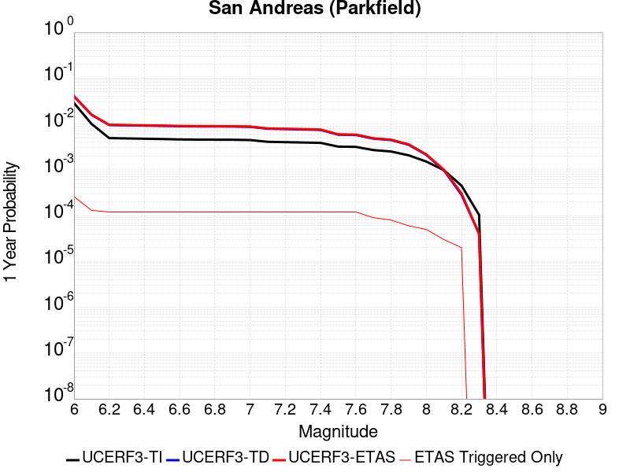 | 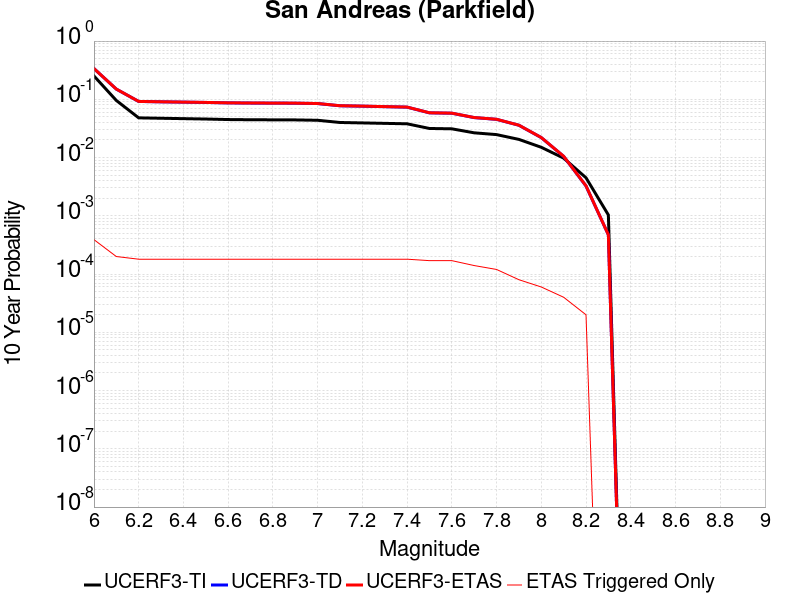 |

| Magnitude | 1 wk TI Prob | 1 wk TD Prob | 1 wk ETAS Prob | 1 wk ETAS/TD Gain | 1 wk ETAS Triggered Only | 1 mo TI Prob | 1 mo TD Prob | 1 mo ETAS Prob | 1 mo ETAS/TD Gain | 1 mo ETAS Triggered Only | 1 yr TI Prob | 1 yr TD Prob | 1 yr ETAS Prob | 1 yr ETAS/TD Gain | 1 yr ETAS Triggered Only | 10 yr TI Prob | 10 yr TD Prob | 10 yr ETAS Prob | 10 yr ETAS/TD Gain | 10 yr ETAS Triggered Only |
|-----|-----|-----|-----|-----|-----|-----|-----|-----|-----|-----|-----|-----|-----|-----|-----|-----|-----|-----|-----|-----|
| 6.0 | 5.556969E-4 | 7.7782426E-4 | 7.7782426E-4 | 1.0 | 0.0 | 0.0023793848 | 0.0033298214 | 0.0033298214 | 1.0 | 0.0 | 0.028586963 | 0.040191233 | 0.040191233 | 1.0 | 0.0 | 0.25176284 | 0.33716413 | 0.33734092 | 1.0005243 | 2.6669036E-4 |
| 6.1 | 1.925858E-4 | 3.0276453E-4 | 3.0276453E-4 | 1.0 | 0.0 | 8.2510663E-4 | 0.0012970108 | 0.0012970108 | 1.0 | 0.0 | 0.0099994885 | 0.015778083 | 0.015778083 | 1.0 | 0.0 | 0.095613256 | 0.1497237 | 0.14979927 | 1.0005049 | 8.889679E-5 |
| 6.2 | 9.4306815E-5 | 1.8242796E-4 | 1.8242796E-4 | 1.0 | 0.0 | 4.0410945E-4 | 7.816011E-4 | 7.816011E-4 | 1.0 | 0.0 | 0.0049089384 | 0.009474681 | 0.009474681 | 1.0 | 0.0 | 0.048019063 | 0.09185409 | 0.09193482 | 1.0008789 | 8.889679E-5 |
| 6.3 | 9.283051E-5 | 1.7939322E-4 | 1.7939322E-4 | 1.0 | 0.0 | 3.9778434E-4 | 7.686027E-4 | 7.686027E-4 | 1.0 | 0.0 | 0.0048322747 | 0.009317789 | 0.009317789 | 1.0 | 0.0 | 0.047285385 | 0.09050704 | 0.090587884 | 1.0008934 | 8.889679E-5 |
| 6.4 | 9.138826E-5 | 1.770153E-4 | 1.770153E-4 | 1.0 | 0.0 | 3.916052E-4 | 7.5841765E-4 | 7.5841765E-4 | 1.0 | 0.0 | 0.0047573745 | 0.00919484 | 0.00919484 | 1.0 | 0.0 | 0.046568092 | 0.08940927 | 0.08949022 | 1.0009054 | 8.889679E-5 |
| 6.5 | 9.000255E-5 | 1.7459576E-4 | 1.7459576E-4 | 1.0 | 0.0 | 3.8566816E-4 | 7.480541E-4 | 7.480541E-4 | 1.0 | 0.0 | 0.0046854047 | 0.009069731 | 0.009069731 | 1.0 | 0.0 | 0.045878403 | 0.088295065 | 0.08837611 | 1.0009179 | 8.889679E-5 |
| 6.6 | 8.8109264E-5 | 1.7140752E-4 | 1.7140752E-4 | 1.0 | 0.0 | 3.7755648E-4 | 7.3439797E-4 | 7.3439797E-4 | 1.0 | 0.0 | 0.0045870654 | 0.008904854 | 0.008904854 | 1.0 | 0.0 | 0.04493529 | 0.0868267 | 0.08690787 | 1.000935 | 8.889679E-5 |
| 6.7 | 8.738073E-5 | 1.7007832E-4 | 1.7007832E-4 | 1.0 | 0.0 | 3.7443507E-4 | 7.287046E-4 | 7.287046E-4 | 1.0 | 0.0 | 0.0045492216 | 0.008836143 | 0.008836143 | 1.0 | 0.0 | 0.04457213 | 0.08622707 | 0.08630829 | 1.0009421 | 8.889679E-5 |
| 6.8 | 8.710195E-5 | 1.6953335E-4 | 1.6953335E-4 | 1.0 | 0.0 | 3.7324068E-4 | 7.263703E-4 | 7.263703E-4 | 1.0 | 0.0 | 0.0045347405 | 0.008807961 | 0.008807961 | 1.0 | 0.0 | 0.04443313 | 0.08597467 | 0.08605592 | 1.0009451 | 8.889679E-5 |
| 6.9 | 8.6801556E-5 | 1.689429E-4 | 1.689429E-4 | 1.0 | 0.0 | 3.7195362E-4 | 7.2384125E-4 | 7.2384125E-4 | 1.0 | 0.0 | 0.0045191357 | 0.008777418 | 0.008777418 | 1.0 | 0.0 | 0.044283327 | 0.085700735 | 0.085782014 | 1.0009484 | 8.889679E-5 |
| 7.0 | 8.5571606E-5 | 1.6647128E-4 | 1.6647128E-4 | 1.0 | 0.0 | 3.6668387E-4 | 7.132544E-4 | 7.132544E-4 | 1.0 | 0.0 | 0.004455241 | 0.008649553 | 0.008649553 | 1.0 | 0.0 | 0.043669727 | 0.08454914 | 0.08463052 | 1.0009625 | 8.889679E-5 |
| 7.1 | 7.82589E-5 | 1.5128135E-4 | 1.5128135E-4 | 1.0 | 0.0 | 3.3535215E-4 | 6.481883E-4 | 6.481883E-4 | 1.0 | 0.0 | 0.0040752706 | 0.007863307 | 0.007863307 | 1.0 | 0.0 | 0.040013418 | 0.07746111 | 0.07754312 | 1.0010587 | 8.889679E-5 |
| 7.2 | 7.690929E-5 | 1.4865391E-4 | 1.4865391E-4 | 1.0 | 0.0 | 3.2956956E-4 | 6.369334E-4 | 6.369334E-4 | 1.0 | 0.0 | 0.004005129 | 0.007727258 | 0.007727258 | 1.0 | 0.0 | 0.0393371 | 0.07623427 | 0.076316394 | 1.0010772 | 8.889679E-5 |
| 7.3 | 7.5543794E-5 | 1.4561978E-4 | 1.4561978E-4 | 1.0 | 0.0 | 3.2371894E-4 | 6.2393624E-4 | 6.2393624E-4 | 1.0 | 0.0 | 0.003934157 | 0.007570127 | 0.007570127 | 1.0 | 0.0 | 0.038652334 | 0.074797355 | 0.0748796 | 1.0010996 | 8.889679E-5 |
| 7.4 | 7.4214564E-5 | 1.4262961E-4 | 1.4262961E-4 | 1.0 | 0.0 | 3.1802364E-4 | 6.111273E-4 | 6.111273E-4 | 1.0 | 0.0 | 0.003865065 | 0.00741525 | 0.00741525 | 1.0 | 0.0 | 0.03798529 | 0.07337123 | 0.073453605 | 1.0011227 | 8.889679E-5 |
| 7.5 | 6.149578E-5 | 1.11907226E-4 | 1.11907226E-4 | 1.0 | 0.0 | 2.6352672E-4 | 4.7951436E-4 | 4.7951436E-4 | 1.0 | 0.0 | 0.0032037178 | 0.0058224914 | 0.0058224914 | 1.0 | 0.0 | 0.03157923 | 0.058557566 | 0.058557566 | 1.0 | 0.0 |
| 7.6 | 6.0643448E-5 | 1.10193796E-4 | 1.10193796E-4 | 1.0 | 0.0 | 2.598746E-4 | 4.7217376E-4 | 4.7217376E-4 | 1.0 | 0.0 | 0.0031593828 | 0.0057335934 | 0.0057335934 | 1.0 | 0.0 | 0.031148417 | 0.057718582 | 0.057718582 | 1.0 | 0.0 |
| 7.7 | 5.1652263E-5 | 9.174698E-5 | 9.174698E-5 | 1.0 | 0.0 | 2.2134806E-4 | 3.931421E-4 | 3.931421E-4 | 1.0 | 0.0 | 0.002691582 | 0.0047760103 | 0.0047760103 | 1.0 | 0.0 | 0.026592141 | 0.04853623 | 0.04853623 | 1.0 | 0.0 |
| 7.8 | 4.8090482E-5 | 8.559635E-5 | 8.559635E-5 | 1.0 | 0.0 | 2.060858E-4 | 3.6678996E-4 | 3.6678996E-4 | 1.0 | 0.0 | 0.0025062072 | 0.0044565317 | 0.0044565317 | 1.0 | 0.0 | 0.024781305 | 0.04530245 | 0.04530245 | 1.0 | 0.0 |
| 7.9 | 3.970278E-5 | 6.750426E-5 | 6.750426E-5 | 1.0 | 0.0 | 1.7014367E-4 | 2.892719E-4 | 2.892719E-4 | 1.0 | 0.0 | 0.002069531 | 0.0035162016 | 0.0035162016 | 1.0 | 0.0 | 0.020503636 | 0.035881363 | 0.035881363 | 1.0 | 0.0 |
| 8.0 | 2.8982335E-5 | 4.069796E-5 | 4.069796E-5 | 1.0 | 0.0 | 1.2420409E-4 | 1.7440817E-4 | 1.7440817E-4 | 1.0 | 0.0 | 0.0015111357 | 0.0021213528 | 0.0021213528 | 1.0 | 0.0 | 0.015009012 | 0.022010697 | 0.022010697 | 1.0 | 0.0 |
| 8.1 | 1.8836186E-5 | 1.8681134E-5 | 1.8681134E-5 | 1.0 | 0.0 | 8.0724014E-5 | 8.005955E-5 | 8.005955E-5 | 1.0 | 0.0 | 9.823717E-4 | 9.742898E-4 | 9.742898E-4 | 1.0 | 0.0 | 0.009780403 | 0.010488115 | 0.010488115 | 1.0 | 0.0 |
| 8.2 | 8.643924E-6 | 5.4748625E-6 | 5.4748625E-6 | 1.0 | 0.0 | 3.704486E-5 | 2.3463486E-5 | 2.3463486E-5 | 1.0 | 0.0 | 4.5092785E-4 | 2.8563058E-4 | 2.8563058E-4 | 1.0 | 0.0 | 0.0045001395 | 0.0032487072 | 0.0032487072 | 1.0 | 0.0 |
| 8.3 | 1.983087E-6 | 7.6599065E-7 | 7.6599065E-7 | 1.0 | 0.0 | 8.498917E-6 | 3.282813E-6 | 3.282813E-6 | 1.0 | 0.0 | 1.034694E-4 | 3.9967534E-5 | 3.9967534E-5 | 1.0 | 0.0 | 0.0010342124 | 4.719687E-4 | 4.719687E-4 | 1.0 | 0.0 |

## Manix-Afton Hills
*[(top)](#table-of-contents)*

| 1 Week | 1 Month | 1 Year | 10 Year |
|-----|-----|-----|-----|
|  |  |  |  |

| Magnitude | 1 wk TI Prob | 1 wk TD Prob | 1 wk ETAS Prob | 1 wk ETAS/TD Gain | 1 wk ETAS Triggered Only | 1 mo TI Prob | 1 mo TD Prob | 1 mo ETAS Prob | 1 mo ETAS/TD Gain | 1 mo ETAS Triggered Only | 1 yr TI Prob | 1 yr TD Prob | 1 yr ETAS Prob | 1 yr ETAS/TD Gain | 1 yr ETAS Triggered Only | 10 yr TI Prob | 10 yr TD Prob | 10 yr ETAS Prob | 10 yr ETAS/TD Gain | 10 yr ETAS Triggered Only |
|-----|-----|-----|-----|-----|-----|-----|-----|-----|-----|-----|-----|-----|-----|-----|-----|-----|-----|-----|-----|-----|
| 6.0 | 1.3783202E-5 | 1.47110895E-5 | 1.0360657E-4 | 7.042753 | 8.889679E-5 | 5.906953E-5 | 6.30461E-5 | 2.4082848E-4 | 3.8198788 | 1.7779358E-4 | 7.189342E-4 | 7.6733343E-4 | 0.0010338192 | 1.347288 | 2.6669036E-4 | 0.0071661277 | 0.007648596 | 0.007913247 | 1.0346012 | 2.6669036E-4 |
| 6.1 | 1.3783202E-5 | 1.47110895E-5 | 1.0360657E-4 | 7.042753 | 8.889679E-5 | 5.906953E-5 | 6.30461E-5 | 2.4082848E-4 | 3.8198788 | 1.7779358E-4 | 7.189342E-4 | 7.6733343E-4 | 0.0010338192 | 1.347288 | 2.6669036E-4 | 0.0071661277 | 0.007648596 | 0.007913247 | 1.0346012 | 2.6669036E-4 |
| 6.2 | 1.3783202E-5 | 1.47110895E-5 | 1.0360657E-4 | 7.042753 | 8.889679E-5 | 5.906953E-5 | 6.30461E-5 | 2.4082848E-4 | 3.8198788 | 1.7779358E-4 | 7.189342E-4 | 7.6733343E-4 | 0.0010338192 | 1.347288 | 2.6669036E-4 | 0.0071661277 | 0.007648596 | 0.007913247 | 1.0346012 | 2.6669036E-4 |
| 6.3 | 1.10494875E-5 | 1.1793136E-5 | 1.1793136E-5 | 1.0 | 0.0 | 4.7354086E-5 | 5.054109E-5 | 5.054109E-5 | 1.0 | 0.0 | 5.763835E-4 | 6.151744E-4 | 6.151744E-4 | 1.0 | 0.0 | 0.005748908 | 0.0061357557 | 0.0061357557 | 1.0 | 0.0 |
| 6.4 | 1.10494875E-5 | 1.1793136E-5 | 1.1793136E-5 | 1.0 | 0.0 | 4.7354086E-5 | 5.054109E-5 | 5.054109E-5 | 1.0 | 0.0 | 5.763835E-4 | 6.151744E-4 | 6.151744E-4 | 1.0 | 0.0 | 0.005748908 | 0.0061357557 | 0.0061357557 | 1.0 | 0.0 |
| 6.5 | 9.788949E-6 | 1.045432E-5 | 1.045432E-5 | 1.0 | 0.0 | 4.1951964E-5 | 4.480351E-5 | 4.480351E-5 | 1.0 | 0.0 | 5.1064545E-4 | 5.453555E-4 | 5.453555E-4 | 1.0 | 0.0 | 0.0050947363 | 0.0054410985 | 0.0054410985 | 1.0 | 0.0 |
| 6.6 | 8.810006E-6 | 9.4136285E-6 | 9.4136285E-6 | 1.0 | 0.0 | 3.775662E-5 | 4.0343548E-5 | 4.0343548E-5 | 1.0 | 0.0 | 4.5958988E-4 | 4.9108086E-4 | 4.9108086E-4 | 1.0 | 0.0 | 0.0045864056 | 0.004900839 | 0.004900839 | 1.0 | 0.0 |
| 6.7 | 8.80128E-6 | 9.404108E-6 | 9.404108E-6 | 1.0 | 0.0 | 3.7719226E-5 | 4.0302748E-5 | 4.0302748E-5 | 1.0 | 0.0 | 4.591348E-4 | 4.9058435E-4 | 4.9058435E-4 | 1.0 | 0.0 | 0.004581874 | 0.0048958957 | 0.0048958957 | 1.0 | 0.0 |
| 6.8 | 6.8994877E-6 | 7.380076E-6 | 7.380076E-6 | 1.0 | 0.0 | 2.9568899E-5 | 3.162856E-5 | 3.162856E-5 | 1.0 | 0.0 | 3.5994186E-4 | 3.8501783E-4 | 3.8501783E-4 | 1.0 | 0.0 | 0.003593594 | 0.0038443129 | 0.0038443129 | 1.0 | 0.0 |
| 6.9 | 4.9328037E-6 | 5.2709615E-6 | 5.2709615E-6 | 1.0 | 0.0 | 2.1140417E-5 | 2.2589675E-5 | 2.2589675E-5 | 1.0 | 0.0 | 2.5735417E-4 | 2.7500073E-4 | 2.7500073E-4 | 1.0 | 0.0 | 0.0025705635 | 0.0027472095 | 0.0027472095 | 1.0 | 0.0 |
| 7.0 | 3.347973E-6 | 3.59003E-6 | 3.59003E-6 | 1.0 | 0.0 | 1.4348378E-5 | 1.5385775E-5 | 1.5385775E-5 | 1.0 | 0.0 | 1.746775E-4 | 1.8730981E-4 | 1.8730981E-4 | 1.0 | 0.0 | 0.0017454025 | 0.0018719219 | 0.0018719219 | 1.0 | 0.0 |
| 7.1 | 1.2073567E-6 | 1.293482E-6 | 1.293482E-6 | 1.0 | 0.0 | 5.1743755E-6 | 5.543492E-6 | 5.543492E-6 | 1.0 | 0.0 | 6.29962E-5 | 6.749156E-5 | 6.749156E-5 | 1.0 | 0.0 | 6.297835E-4 | 6.7487074E-4 | 6.7487074E-4 | 1.0 | 0.0 |

## Owens Valley
*[(top)](#table-of-contents)*

| 1 Week | 1 Month | 1 Year | 10 Year |
|-----|-----|-----|-----|
|  |  |  |  |

| Magnitude | 1 wk TI Prob | 1 wk TD Prob | 1 wk ETAS Prob | 1 wk ETAS/TD Gain | 1 wk ETAS Triggered Only | 1 mo TI Prob | 1 mo TD Prob | 1 mo ETAS Prob | 1 mo ETAS/TD Gain | 1 mo ETAS Triggered Only | 1 yr TI Prob | 1 yr TD Prob | 1 yr ETAS Prob | 1 yr ETAS/TD Gain | 1 yr ETAS Triggered Only | 10 yr TI Prob | 10 yr TD Prob | 10 yr ETAS Prob | 10 yr ETAS/TD Gain | 10 yr ETAS Triggered Only |
|-----|-----|-----|-----|-----|-----|-----|-----|-----|-----|-----|-----|-----|-----|-----|-----|-----|-----|-----|-----|-----|
| 6.0 | 4.83821E-5 | 3.626567E-6 | 9.2523034E-5 | 25.512568 | 8.889679E-5 | 2.0733538E-4 | 1.5542342E-5 | 1.0443775E-4 | 6.719563 | 8.889679E-5 | 0.002521386 | 1.8921259E-4 | 4.5585248E-4 | 2.409208 | 2.6669036E-4 | 0.024929691 | 0.001925011 | 0.002191188 | 1.138273 | 2.6669036E-4 |
| 6.1 | 4.83821E-5 | 3.626567E-6 | 9.2523034E-5 | 25.512568 | 8.889679E-5 | 2.0733538E-4 | 1.5542342E-5 | 1.0443775E-4 | 6.719563 | 8.889679E-5 | 0.002521386 | 1.8921259E-4 | 4.5585248E-4 | 2.409208 | 2.6669036E-4 | 0.024929691 | 0.001925011 | 0.002191188 | 1.138273 | 2.6669036E-4 |
| 6.2 | 4.83821E-5 | 3.626567E-6 | 9.2523034E-5 | 25.512568 | 8.889679E-5 | 2.0733538E-4 | 1.5542342E-5 | 1.0443775E-4 | 6.719563 | 8.889679E-5 | 0.002521386 | 1.8921259E-4 | 4.5585248E-4 | 2.409208 | 2.6669036E-4 | 0.024929691 | 0.001925011 | 0.002191188 | 1.138273 | 2.6669036E-4 |
| 6.3 | 3.953008E-5 | 3.1553948E-6 | 9.205191E-5 | 29.172865 | 8.889679E-5 | 1.6940363E-4 | 1.3523055E-5 | 1.0241864E-4 | 7.5736322 | 8.889679E-5 | 0.002060538 | 1.6463149E-4 | 4.3127796E-4 | 2.6196566 | 2.6669036E-4 | 0.020415364 | 0.0016592 | 0.0019254478 | 1.1604676 | 2.6669036E-4 |
| 6.4 | 3.953008E-5 | 3.1553948E-6 | 9.205191E-5 | 29.172865 | 8.889679E-5 | 1.6940363E-4 | 1.3523055E-5 | 1.0241864E-4 | 7.5736322 | 8.889679E-5 | 0.002060538 | 1.6463149E-4 | 4.3127796E-4 | 2.6196566 | 2.6669036E-4 | 0.020415364 | 0.0016592 | 0.0019254478 | 1.1604676 | 2.6669036E-4 |
| 6.5 | 3.457342E-5 | 2.9715961E-6 | 9.1868125E-5 | 30.915413 | 8.889679E-5 | 1.4816338E-4 | 1.2735354E-5 | 1.0163101E-4 | 7.9802265 | 8.889679E-5 | 0.0018023965 | 1.550426E-4 | 4.2169163E-4 | 2.7198436 | 2.6669036E-4 | 0.017878477 | 0.001555719 | 0.0018219944 | 1.1711591 | 2.6669036E-4 |
| 6.6 | 3.1127765E-5 | 2.8744932E-6 | 9.177103E-5 | 31.925985 | 8.889679E-5 | 1.3339789E-4 | 1.2319203E-5 | 1.012149E-4 | 8.216026 | 8.889679E-5 | 0.0016229092 | 1.4997667E-4 | 4.1662704E-4 | 2.7779458 | 2.6669036E-4 | 0.016111081 | 0.0015012559 | 0.0017675458 | 1.1773782 | 2.6669036E-4 |
| 6.7 | 2.806885E-5 | 2.8104134E-6 | 9.1706956E-5 | 32.631126 | 8.889679E-5 | 1.2028952E-4 | 1.20445775E-5 | 1.009403E-4 | 8.38056 | 8.889679E-5 | 0.001463541 | 1.4663354E-4 | 4.132848E-4 | 2.8184874 | 2.6669036E-4 | 0.014539397 | 0.0014657511 | 0.0017320506 | 1.1816813 | 2.6669036E-4 |
| 6.8 | 2.524524E-5 | 2.2353688E-6 | 9.113196E-5 | 40.7682 | 8.889679E-5 | 1.0818939E-4 | 9.580118E-6 | 9.8476055E-5 | 10.279211 | 8.889679E-5 | 0.0013164099 | 1.16632E-4 | 3.8329128E-4 | 3.2863302 | 2.6669036E-4 | 0.01308639 | 0.0011659812 | 0.0014323606 | 1.2284595 | 2.6669036E-4 |
| 6.9 | 2.2704568E-5 | 1.6081682E-6 | 9.0504815E-5 | 56.278202 | 8.889679E-5 | 9.730166E-5 | 6.8921313E-6 | 9.578831E-5 | 13.898212 | 8.889679E-5 | 0.0011840039 | 8.390849E-5 | 3.5057648E-4 | 4.1780815 | 2.6669036E-4 | 0.011777153 | 8.3897985E-4 | 0.0011054465 | 1.3176079 | 2.6669036E-4 |
| 7.0 | 2.0871712E-5 | 1.5395453E-6 | 9.04362E-5 | 58.74215 | 8.889679E-5 | 8.944713E-5 | 6.598035E-6 | 9.549424E-5 | 14.473134 | 8.889679E-5 | 0.0010884746 | 8.032813E-5 | 3.4699708E-4 | 4.3197455 | 2.6669036E-4 | 0.010831586 | 8.0316263E-4 | 0.0010696388 | 1.3317835 | 2.6669036E-4 |
| 7.1 | 1.944928E-5 | 1.3864178E-6 | 9.028309E-5 | 65.11968 | 8.889679E-5 | 8.335139E-5 | 5.941777E-6 | 9.483804E-5 | 15.9612255 | 8.889679E-5 | 0.0010143308 | 7.233874E-5 | 3.3900983E-4 | 4.6864214 | 2.6669036E-4 | 0.010097133 | 7.2330976E-4 | 9.898072E-4 | 1.3684417 | 2.6669036E-4 |
| 7.2 | 1.7876306E-5 | 1.2489141E-6 | 9.014559E-5 | 72.17918 | 8.889679E-5 | 7.6610486E-5 | 5.352478E-6 | 9.42488E-5 | 17.60844 | 8.889679E-5 | 9.3233347E-4 | 6.516448E-5 | 3.3183748E-4 | 5.092306 | 2.6669036E-4 | 0.009284316 | 6.5159105E-4 | 9.1810763E-4 | 1.4090244 | 2.6669036E-4 |
| 7.3 | 1.2618672E-5 | 1.1115209E-6 | 9.0008216E-5 | 80.97753 | 8.889679E-5 | 5.40789E-5 | 4.763652E-6 | 9.366002E-5 | 19.661388 | 8.889679E-5 | 6.582117E-4 | 5.799593E-5 | 3.2467084E-4 | 5.598166 | 2.6669036E-4 | 0.0065626553 | 5.7994033E-4 | 8.4647606E-4 | 1.4595916 | 2.6669036E-4 |
| 7.4 | 7.4874442E-6 | 8.5486437E-7 | 8.975158E-5 | 104.98926 | 8.889679E-5 | 3.208865E-5 | 3.6636993E-6 | 9.256016E-5 | 25.264126 | 8.889679E-5 | 3.906093E-4 | 4.4604632E-5 | 3.112831E-4 | 6.9787173 | 2.6669036E-4 | 0.003899234 | 4.4604883E-4 | 7.1262027E-4 | 1.5976284 | 2.6669036E-4 |
| 7.5 | 2.4734156E-6 | 6.068616E-7 | 6.068616E-7 | 1.0 | 0.0 | 1.060031E-5 | 2.6008327E-6 | 2.6008327E-6 | 1.0 | 0.0 | 1.2905113E-4 | 3.166468E-5 | 2.0945263E-4 | 6.6147084 | 1.7779358E-4 | 0.0012897621 | 3.1660203E-4 | 4.943393E-4 | 1.5613903 | 1.7779358E-4 |
| 7.6 | 1.1328841E-6 | 3.196531E-7 | 3.196531E-7 | 1.0 | 0.0 | 4.8552088E-6 | 1.3699412E-6 | 1.3699412E-6 | 1.0 | 0.0 | 5.9110564E-5 | 1.6678909E-5 | 1.9446953E-4 | 11.659608 | 1.7779358E-4 | 5.9094845E-4 | 1.6677675E-4 | 3.445407E-4 | 2.0658796 | 1.7779358E-4 |
| 7.7 | 4.8613185E-7 | 8.964689E-8 | 8.964689E-8 | 1.0 | 0.0 | 2.0834207E-6 | 3.8420092E-7 | 3.8420092E-7 | 1.0 | 0.0 | 2.536535E-5 | 4.6776368E-6 | 4.6776368E-6 | 1.0 | 0.0 | 2.5362454E-4 | 4.677545E-5 | 4.677545E-5 | 1.0 | 0.0 |

## San Andreas (Coachella) rev
*[(top)](#table-of-contents)*

| 1 Week | 1 Month | 1 Year | 10 Year |
|-----|-----|-----|-----|
|  |  |  |  |

| Magnitude | 1 wk TI Prob | 1 wk TD Prob | 1 wk ETAS Prob | 1 wk ETAS/TD Gain | 1 wk ETAS Triggered Only | 1 mo TI Prob | 1 mo TD Prob | 1 mo ETAS Prob | 1 mo ETAS/TD Gain | 1 mo ETAS Triggered Only | 1 yr TI Prob | 1 yr TD Prob | 1 yr ETAS Prob | 1 yr ETAS/TD Gain | 1 yr ETAS Triggered Only | 10 yr TI Prob | 10 yr TD Prob | 10 yr ETAS Prob | 10 yr ETAS/TD Gain | 10 yr ETAS Triggered Only |
|-----|-----|-----|-----|-----|-----|-----|-----|-----|-----|-----|-----|-----|-----|-----|-----|-----|-----|-----|-----|-----|
| 6.0 | 1.1925945E-4 | 3.2729402E-4 | 4.161617E-4 | 1.2715225 | 8.889679E-5 | 5.110118E-4 | 0.0014019393 | 0.0014907115 | 1.063321 | 8.889679E-5 | 0.0062038354 | 0.016936364 | 0.017023755 | 1.00516 | 8.889679E-5 | 0.060334753 | 0.15265316 | 0.15280381 | 1.0009869 | 1.7779358E-4 |
| 6.1 | 1.1925945E-4 | 3.2729402E-4 | 4.161617E-4 | 1.2715225 | 8.889679E-5 | 5.110118E-4 | 0.0014019393 | 0.0014907115 | 1.063321 | 8.889679E-5 | 0.0062038354 | 0.016936364 | 0.017023755 | 1.00516 | 8.889679E-5 | 0.060334753 | 0.15265316 | 0.15280381 | 1.0009869 | 1.7779358E-4 |
| 6.2 | 1.07432395E-4 | 3.0230157E-4 | 3.911715E-4 | 1.2939777 | 8.889679E-5 | 4.603433E-4 | 0.0012949388 | 0.0013837205 | 1.0685605 | 8.889679E-5 | 0.005590286 | 0.015653009 | 0.015740514 | 1.0055903 | 8.889679E-5 | 0.05451731 | 0.14182423 | 0.14197682 | 1.0010759 | 1.7779358E-4 |
| 6.3 | 1.0718766E-4 | 3.0175463E-4 | 3.9062457E-4 | 1.2945107 | 8.889679E-5 | 4.592948E-4 | 0.0012925972 | 0.001381379 | 1.0686849 | 8.889679E-5 | 0.005577586 | 0.015624908 | 0.015712416 | 1.0056006 | 8.889679E-5 | 0.054396555 | 0.14159249 | 0.1417451 | 1.0010779 | 1.7779358E-4 |
| 6.4 | 1.0355944E-4 | 2.9383553E-4 | 3.827062E-4 | 1.3024504 | 8.889679E-5 | 4.4375064E-4 | 0.0012586913 | 0.0013474763 | 1.0705374 | 8.889679E-5 | 0.0053892885 | 0.015217941 | 0.015305486 | 1.0057527 | 8.889679E-5 | 0.052604496 | 0.13815255 | 0.13830578 | 1.0011091 | 1.7779358E-4 |
| 6.5 | 1.0227914E-4 | 2.9102986E-4 | 3.799008E-4 | 1.305367 | 8.889679E-5 | 4.382655E-4 | 0.0012466786 | 0.0013354645 | 1.071218 | 8.889679E-5 | 0.0053228354 | 0.01507372 | 0.015161277 | 1.0058086 | 8.889679E-5 | 0.051971316 | 0.13693172 | 0.13708517 | 1.0011206 | 1.7779358E-4 |
| 6.6 | 1.0116757E-4 | 2.8868738E-4 | 3.7755852E-4 | 1.3078456 | 8.889679E-5 | 4.3350324E-4 | 0.0012366489 | 0.0013254358 | 1.0717963 | 8.889679E-5 | 0.0052651367 | 0.01495329 | 0.015040858 | 1.005856 | 8.889679E-5 | 0.051421247 | 0.1359099 | 0.13606353 | 1.0011303 | 1.7779358E-4 |
| 6.7 | 1.0050676E-4 | 2.8727303E-4 | 3.7614428E-4 | 1.3093617 | 8.889679E-5 | 4.3067214E-4 | 0.0012305931 | 0.0013193805 | 1.0721501 | 8.889679E-5 | 0.005230834 | 0.014880571 | 0.014968144 | 1.0058851 | 8.889679E-5 | 0.051094085 | 0.13529462 | 0.13544835 | 1.0011363 | 1.7779358E-4 |
| 6.8 | 9.976819E-5 | 2.853096E-4 | 3.7418102E-4 | 1.3114913 | 8.889679E-5 | 4.2750788E-4 | 0.0012221863 | 0.0013109745 | 1.072647 | 8.889679E-5 | 0.0051924936 | 0.0147796115 | 0.014867194 | 1.0059259 | 8.889679E-5 | 0.050728295 | 0.13444631 | 0.13460019 | 1.0011446 | 1.7779358E-4 |
| 6.9 | 9.77719E-5 | 2.8027873E-4 | 3.6915063E-4 | 1.317084 | 8.889679E-5 | 4.1895514E-4 | 0.0012006456 | 0.0012894355 | 1.073952 | 8.889679E-5 | 0.0050888555 | 0.014520878 | 0.014608484 | 1.0060331 | 8.889679E-5 | 0.049738888 | 0.1322748 | 0.1324291 | 1.0011663 | 1.7779358E-4 |
| 7.0 | 8.500761E-5 | 2.4762485E-4 | 3.3649962E-4 | 1.358909 | 8.889679E-5 | 3.6426744E-4 | 0.001060821 | 0.0011496234 | 1.0837111 | 8.889679E-5 | 0.0044259406 | 0.012839786 | 0.0129275415 | 1.0068346 | 8.889679E-5 | 0.04338823 | 0.11813272 | 0.118289515 | 1.0013273 | 1.7779358E-4 |
| 7.1 | 8.319876E-5 | 2.4365232E-4 | 3.3252744E-4 | 1.3647621 | 8.889679E-5 | 3.5651738E-4 | 0.0010438096 | 0.0011326135 | 1.0850768 | 8.889679E-5 | 0.004331963 | 0.012635092 | 0.012722867 | 1.0069468 | 8.889679E-5 | 0.042484846 | 0.116353 | 0.11651011 | 1.0013503 | 1.7779358E-4 |
| 7.2 | 7.563917E-5 | 2.2413683E-4 | 3.130137E-4 | 1.3965294 | 8.889679E-5 | 3.2412758E-4 | 9.602359E-4 | 0.0010490473 | 1.0924891 | 8.889679E-5 | 0.0039391145 | 0.011628893 | 0.011716757 | 1.0075556 | 8.889679E-5 | 0.03870018 | 0.10775925 | 0.10791788 | 1.0014721 | 1.7779358E-4 |
| 7.3 | 7.082985E-5 | 2.0729867E-4 | 2.9617702E-4 | 1.4287455 | 8.889679E-5 | 3.0352117E-4 | 8.881233E-4 | 9.769411E-4 | 1.1000062 | 8.889679E-5 | 0.0036891096 | 0.010759917 | 0.010847857 | 1.008173 | 8.889679E-5 | 0.03628465 | 0.100282 | 0.10044196 | 1.0015951 | 1.7779358E-4 |
| 7.4 | 5.146215E-5 | 1.4273795E-4 | 2.3162205E-4 | 1.6227083 | 8.889679E-5 | 2.2053342E-4 | 6.115915E-4 | 7.004339E-4 | 1.1452643 | 8.889679E-5 | 0.0026816884 | 0.0074208933 | 0.0075091305 | 1.0118904 | 8.889679E-5 | 0.02649557 | 0.070849575 | 0.07101478 | 1.0023316 | 1.7779358E-4 |
| 7.5 | 4.0285166E-5 | 1.09416E-4 | 1.09416E-4 | 1.0 | 0.0 | 1.7263928E-4 | 4.6884175E-4 | 4.6884175E-4 | 1.0 | 0.0 | 0.002099857 | 0.0056932783 | 0.0056932783 | 1.0 | 0.0 | 0.020801254 | 0.055011146 | 0.055095155 | 1.0015271 | 8.889679E-5 |
| 7.6 | 3.1168736E-5 | 8.4389096E-5 | 8.4389096E-5 | 1.0 | 0.0 | 1.3357346E-4 | 3.6161754E-4 | 3.6161754E-4 | 1.0 | 0.0 | 0.0016250437 | 0.0043938323 | 0.0043938323 | 1.0 | 0.0 | 0.016132116 | 0.04281005 | 0.042895142 | 1.0019877 | 8.889679E-5 |
| 7.7 | 2.2100989E-5 | 6.238755E-5 | 6.238755E-5 | 1.0 | 0.0 | 9.4715084E-5 | 2.6734784E-4 | 2.6734784E-4 | 1.0 | 0.0 | 0.001152546 | 0.0032501083 | 0.0032501083 | 1.0 | 0.0 | 0.011465867 | 0.0319002 | 0.03198626 | 1.0026978 | 8.889679E-5 |
| 7.8 | 1.7484861E-5 | 5.179572E-5 | 5.179572E-5 | 1.0 | 0.0 | 7.493296E-5 | 2.2196278E-4 | 2.2196278E-4 | 1.0 | 0.0 | 9.1192697E-4 | 0.0026990508 | 0.0026990508 | 1.0 | 0.0 | 0.009081938 | 0.026640115 | 0.026726644 | 1.0032481 | 8.889679E-5 |
| 7.9 | 1.3967285E-5 | 3.822255E-5 | 3.822255E-5 | 1.0 | 0.0 | 5.985842E-5 | 1.6380067E-4 | 1.6380067E-4 | 1.0 | 0.0 | 7.2853256E-4 | 0.00199245 | 0.00199245 | 1.0 | 0.0 | 0.0072614877 | 0.019909438 | 0.019996563 | 1.0043762 | 8.889679E-5 |
| 8.0 | 1.1887396E-5 | 3.106521E-5 | 3.106521E-5 | 1.0 | 0.0 | 5.094499E-5 | 1.3312983E-4 | 1.3312983E-4 | 1.0 | 0.0 | 6.200787E-4 | 0.0016196516 | 0.0016196516 | 1.0 | 0.0 | 0.006183513 | 0.016279267 | 0.016366716 | 1.0053718 | 8.889679E-5 |
| 8.1 | 5.100864E-6 | 8.973418E-6 | 8.973418E-6 | 1.0 | 0.0 | 2.1860664E-5 | 3.8456936E-5 | 3.8456936E-5 | 1.0 | 0.0 | 2.6612106E-4 | 4.6811273E-4 | 4.6811273E-4 | 1.0 | 0.0 | 0.002658026 | 0.004917731 | 0.004917731 | 1.0 | 0.0 |
| 8.2 | 2.3004484E-6 | 2.7864487E-6 | 2.7864487E-6 | 1.0 | 0.0 | 9.859027E-6 | 1.1941868E-5 | 1.1941868E-5 | 1.0 | 0.0 | 1.2002704E-4 | 1.4538258E-4 | 1.4538258E-4 | 1.0 | 0.0 | 0.0011996223 | 0.0015973912 | 0.0015973912 | 1.0 | 0.0 |
| 8.3 | 1.0424446E-7 | 5.8161504E-8 | 5.8161504E-8 | 1.0 | 0.0 | 4.4676187E-7 | 2.4926356E-7 | 2.4926356E-7 | 1.0 | 0.0 | 5.439312E-6 | 3.03478E-6 | 3.03478E-6 | 1.0 | 0.0 | 5.4391792E-5 | 3.190716E-5 | 3.190716E-5 | 1.0 | 0.0 |

## Lake Isabella (Seismicity)
*[(top)](#table-of-contents)*

| 1 Week | 1 Month | 1 Year | 10 Year |
|-----|-----|-----|-----|
|  |  |  |  |

| Magnitude | 1 wk TI Prob | 1 wk TD Prob | 1 wk ETAS Prob | 1 wk ETAS/TD Gain | 1 wk ETAS Triggered Only | 1 mo TI Prob | 1 mo TD Prob | 1 mo ETAS Prob | 1 mo ETAS/TD Gain | 1 mo ETAS Triggered Only | 1 yr TI Prob | 1 yr TD Prob | 1 yr ETAS Prob | 1 yr ETAS/TD Gain | 1 yr ETAS Triggered Only | 10 yr TI Prob | 10 yr TD Prob | 10 yr ETAS Prob | 10 yr ETAS/TD Gain | 10 yr ETAS Triggered Only |
|-----|-----|-----|-----|-----|-----|-----|-----|-----|-----|-----|-----|-----|-----|-----|-----|-----|-----|-----|-----|-----|
| 6.0 | 9.431637E-6 | 9.741651E-6 | 1.875335E-4 | 19.250689 | 1.7779358E-4 | 4.0420677E-5 | 4.1749343E-5 | 2.195355E-4 | 5.258418 | 1.7779358E-4 | 4.920106E-4 | 5.0819275E-4 | 6.8589597E-4 | 1.3496768 | 1.7779358E-4 | 0.004909227 | 0.005071599 | 0.0053369366 | 1.0523183 | 2.6669036E-4 |
| 6.1 | 9.431637E-6 | 9.741651E-6 | 1.875335E-4 | 19.250689 | 1.7779358E-4 | 4.0420677E-5 | 4.1749343E-5 | 2.195355E-4 | 5.258418 | 1.7779358E-4 | 4.920106E-4 | 5.0819275E-4 | 6.8589597E-4 | 1.3496768 | 1.7779358E-4 | 0.004909227 | 0.005071599 | 0.0053369366 | 1.0523183 | 2.6669036E-4 |
| 6.2 | 9.431637E-6 | 9.741651E-6 | 1.875335E-4 | 19.250689 | 1.7779358E-4 | 4.0420677E-5 | 4.1749343E-5 | 2.195355E-4 | 5.258418 | 1.7779358E-4 | 4.920106E-4 | 5.0819275E-4 | 6.8589597E-4 | 1.3496768 | 1.7779358E-4 | 0.004909227 | 0.005071599 | 0.0053369366 | 1.0523183 | 2.6669036E-4 |
| 6.3 | 9.431637E-6 | 9.741651E-6 | 1.875335E-4 | 19.250689 | 1.7779358E-4 | 4.0420677E-5 | 4.1749343E-5 | 2.195355E-4 | 5.258418 | 1.7779358E-4 | 4.920106E-4 | 5.0819275E-4 | 6.8589597E-4 | 1.3496768 | 1.7779358E-4 | 0.004909227 | 0.005071599 | 0.0053369366 | 1.0523183 | 2.6669036E-4 |
| 6.4 | 5.144063E-6 | 5.3000763E-6 | 9.4196395E-5 | 17.77265 | 8.889679E-5 | 2.2045799E-5 | 2.2714434E-5 | 1.116092E-4 | 4.913581 | 8.889679E-5 | 2.6837454E-4 | 2.765166E-4 | 3.653888E-4 | 1.3213992 | 8.889679E-5 | 0.0026805066 | 0.0027620657 | 0.002850717 | 1.032096 | 8.889679E-5 |
| 6.5 | 5.144063E-6 | 5.3000763E-6 | 9.4196395E-5 | 17.77265 | 8.889679E-5 | 2.2045799E-5 | 2.2714434E-5 | 1.116092E-4 | 4.913581 | 8.889679E-5 | 2.6837454E-4 | 2.765166E-4 | 3.653888E-4 | 1.3213992 | 8.889679E-5 | 0.0026805066 | 0.0027620657 | 0.002850717 | 1.032096 | 8.889679E-5 |
| 6.6 | 3.4009804E-6 | 3.498786E-6 | 9.239527E-5 | 26.407806 | 8.889679E-5 | 1.4575549E-5 | 1.4994721E-5 | 1.03890176E-4 | 6.9284506 | 8.889679E-5 | 1.7744285E-4 | 1.8254704E-4 | 2.714276E-4 | 1.4868913 | 8.889679E-5 | 0.0017730123 | 0.0018241286 | 0.0019128632 | 1.0486449 | 8.889679E-5 |
| 6.7 | 3.3880428E-6 | 3.4856528E-6 | 9.2382135E-5 | 26.503538 | 8.889679E-5 | 1.4520103E-5 | 1.4938435E-5 | 1.03833896E-4 | 6.950788 | 8.889679E-5 | 1.767679E-4 | 1.8186188E-4 | 2.707425E-4 | 1.488726 | 8.889679E-5 | 0.0017662736 | 0.0018172882 | 0.0019060235 | 1.0488284 | 8.889679E-5 |
| 6.8 | 2.6582E-6 | 2.7337003E-6 | 2.7337003E-6 | 1.0 | 0.0 | 1.1392236E-5 | 1.1715813E-5 | 1.1715813E-5 | 1.0 | 0.0 | 1.3869164E-4 | 1.4263204E-4 | 1.4263204E-4 | 1.0 | 0.0 | 0.0013860512 | 0.0014255369 | 0.0014255369 | 1.0 | 0.0 |
| 6.9 | 2.406011E-6 | 2.4743288E-6 | 2.4743288E-6 | 1.0 | 0.0 | 1.0311434E-5 | 1.0604231E-5 | 1.0604231E-5 | 1.0 | 0.0 | 1.2553448E-4 | 1.2910018E-4 | 1.2910018E-4 | 1.0 | 0.0 | 0.0012546359 | 0.0012903814 | 0.0012903814 | 1.0 | 0.0 |
| 7.0 | 1.6953097E-6 | 1.7429371E-6 | 1.7429371E-6 | 1.0 | 0.0 | 7.265593E-6 | 7.469715E-6 | 7.469715E-6 | 1.0 | 0.0 | 8.8455E-5 | 9.094104E-5 | 9.094104E-5 | 1.0 | 0.0 | 8.84198E-4 | 9.09141E-4 | 9.09141E-4 | 1.0 | 0.0 |
| 7.1 | 3.5013824E-7 | 3.5714822E-7 | 3.5714822E-7 | 1.0 | 0.0 | 1.5005916E-6 | 1.5306344E-6 | 1.5306344E-6 | 1.0 | 0.0 | 1.826955E-5 | 1.8635317E-5 | 1.8635317E-5 | 1.0 | 0.0 | 1.8268047E-4 | 1.863378E-4 | 1.863378E-4 | 1.0 | 0.0 |
| 7.2 | 2.2321095E-7 | 2.2750574E-7 | 2.2750574E-7 | 1.0 | 0.0 | 9.56618E-7 | 9.750242E-7 | 9.750242E-7 | 1.0 | 0.0 | 1.1646762E-5 | 1.1870856E-5 | 1.1870856E-5 | 1.0 | 0.0 | 1.1646151E-4 | 1.1870232E-4 | 1.1870232E-4 | 1.0 | 0.0 |
| 7.3 | 1.5760406E-7 | 1.6060922E-7 | 1.6060922E-7 | 1.0 | 0.0 | 6.7544585E-7 | 6.8832503E-7 | 6.8832503E-7 | 1.0 | 0.0 | 8.223522E-6 | 8.380326E-6 | 8.380326E-6 | 1.0 | 0.0 | 8.2232174E-5 | 8.3800165E-5 | 8.3800165E-5 | 1.0 | 0.0 |
| 7.4 | 1.1216497E-7 | 1.1431706E-7 | 1.1431706E-7 | 1.0 | 0.0 | 4.8070694E-7 | 4.899302E-7 | 4.899302E-7 | 1.0 | 0.0 | 5.852591E-6 | 5.964884E-6 | 5.964884E-6 | 1.0 | 0.0 | 5.8524372E-5 | 5.9647282E-5 | 5.9647282E-5 | 1.0 | 0.0 |
| 7.5 | 4.885185E-8 | 4.9787737E-8 | 4.9787737E-8 | 1.0 | 0.0 | 2.0936506E-7 | 2.13376E-7 | 2.13376E-7 | 1.0 | 0.0 | 2.5490165E-6 | 2.59785E-6 | 2.59785E-6 | 1.0 | 0.0 | 2.5489873E-5 | 2.5978214E-5 | 2.5978214E-5 | 1.0 | 0.0 |
| 7.6 | 1.504641E-9 | 1.5317903E-9 | 1.5317903E-9 | 1.0 | 0.0 | 6.4484613E-9 | 6.5648154E-9 | 6.5648154E-9 | 1.0 | 0.0 | 7.851001E-8 | 7.992663E-8 | 7.992663E-8 | 1.0 | 0.0 | 7.8509987E-7 | 7.992663E-7 | 7.992663E-7 | 1.0 | 0.0 |

## San Andreas (Cholame) rev
*[(top)](#table-of-contents)*

| 1 Week | 1 Month | 1 Year | 10 Year |
|-----|-----|-----|-----|
|  |  |  |  |

| Magnitude | 1 wk TI Prob | 1 wk TD Prob | 1 wk ETAS Prob | 1 wk ETAS/TD Gain | 1 wk ETAS Triggered Only | 1 mo TI Prob | 1 mo TD Prob | 1 mo ETAS Prob | 1 mo ETAS/TD Gain | 1 mo ETAS Triggered Only | 1 yr TI Prob | 1 yr TD Prob | 1 yr ETAS Prob | 1 yr ETAS/TD Gain | 1 yr ETAS Triggered Only | 10 yr TI Prob | 10 yr TD Prob | 10 yr ETAS Prob | 10 yr ETAS/TD Gain | 10 yr ETAS Triggered Only |
|-----|-----|-----|-----|-----|-----|-----|-----|-----|-----|-----|-----|-----|-----|-----|-----|-----|-----|-----|-----|-----|
| 6.0 | 1.2302514E-4 | 2.5204287E-4 | 3.4091726E-4 | 1.3526162 | 8.889679E-5 | 5.27144E-4 | 0.0010797381 | 0.001168539 | 1.0822428 | 8.889679E-5 | 0.0063991086 | 0.0130670825 | 0.013242553 | 1.0134284 | 1.7779358E-4 | 0.06217949 | 0.12439073 | 0.124624245 | 1.0018773 | 2.6669036E-4 |
| 6.1 | 1.2302514E-4 | 2.5204287E-4 | 3.4091726E-4 | 1.3526162 | 8.889679E-5 | 5.27144E-4 | 0.0010797381 | 0.001168539 | 1.0822428 | 8.889679E-5 | 0.0063991086 | 0.0130670825 | 0.013242553 | 1.0134284 | 1.7779358E-4 | 0.06217949 | 0.12439073 | 0.124624245 | 1.0018773 | 2.6669036E-4 |
| 6.2 | 1.2203569E-4 | 2.5021084E-4 | 3.3908538E-4 | 1.3551986 | 8.889679E-5 | 5.2290526E-4 | 0.0010718931 | 0.0011606946 | 1.0828454 | 8.889679E-5 | 0.006347804 | 0.01297271 | 0.013148197 | 1.0135274 | 1.7779358E-4 | 0.061695136 | 0.12357691 | 0.12381064 | 1.0018914 | 2.6669036E-4 |
| 6.3 | 1.2142645E-4 | 2.4907055E-4 | 3.379452E-4 | 1.3568252 | 8.889679E-5 | 5.202953E-4 | 0.0010670102 | 0.0011558122 | 1.083225 | 8.889679E-5 | 0.006316212 | 0.012913967 | 0.013089464 | 1.0135897 | 1.7779358E-4 | 0.06139677 | 0.12307103 | 0.1233049 | 1.0019003 | 2.6669036E-4 |
| 6.4 | 1.1865206E-4 | 2.44126E-4 | 3.3300108E-4 | 1.3640542 | 8.889679E-5 | 5.0840975E-4 | 0.0010458364 | 0.0011346402 | 1.0849118 | 8.889679E-5 | 0.006172335 | 0.012659196 | 0.012834739 | 1.0138668 | 1.7779358E-4 | 0.060036868 | 0.1208638 | 0.121098265 | 1.0019399 | 2.6669036E-4 |
| 6.5 | 1.17443946E-4 | 2.4205919E-4 | 3.3093448E-4 | 1.3671634 | 8.889679E-5 | 5.032341E-4 | 0.0010369857 | 0.0011257903 | 1.0856372 | 8.889679E-5 | 0.006109677 | 0.012552682 | 0.012728244 | 1.013986 | 1.7779358E-4 | 0.059444077 | 0.11993805 | 0.12017276 | 1.0019568 | 2.6669036E-4 |
| 6.6 | 1.13579066E-4 | 2.3514954E-4 | 3.2402543E-4 | 1.3779547 | 8.889679E-5 | 4.866766E-4 | 0.001007396 | 0.0010962032 | 1.0881553 | 8.889679E-5 | 0.0059092017 | 0.012196515 | 0.01237214 | 1.0143996 | 1.7779358E-4 | 0.057545185 | 0.11685214 | 0.11708767 | 1.0020156 | 2.6669036E-4 |
| 6.7 | 1.1271412E-4 | 2.3359268E-4 | 2.3359268E-4 | 1.0 | 0.0 | 4.829711E-4 | 0.0010007289 | 0.0010007289 | 1.0 | 0.0 | 0.005864331 | 0.012116249 | 0.012204069 | 1.007248 | 8.889679E-5 | 0.057119697 | 0.116155714 | 0.116312854 | 1.0013529 | 1.7779358E-4 |
| 6.8 | 1.1217975E-4 | 2.3247694E-4 | 2.3247694E-4 | 1.0 | 0.0 | 4.8068175E-4 | 9.959509E-4 | 9.959509E-4 | 1.0 | 0.0 | 0.005836608 | 0.012058721 | 0.012146546 | 1.0072831 | 8.889679E-5 | 0.056856725 | 0.11565396 | 0.1158112 | 1.0013595 | 1.7779358E-4 |
| 6.9 | 1.1146753E-4 | 2.3096445E-4 | 2.3096445E-4 | 1.0 | 0.0 | 4.7763053E-4 | 9.894737E-4 | 9.894737E-4 | 1.0 | 0.0 | 0.0057996577 | 0.011980731 | 0.012068563 | 1.0073311 | 8.889679E-5 | 0.056506127 | 0.11497439 | 0.11513174 | 1.0013685 | 1.7779358E-4 |
| 7.0 | 1.0965793E-4 | 2.2719789E-4 | 2.2719789E-4 | 1.0 | 0.0 | 4.698779E-4 | 9.733434E-4 | 9.733434E-4 | 1.0 | 0.0 | 0.005705768 | 0.011786487 | 0.011874336 | 1.0074533 | 8.889679E-5 | 0.055614736 | 0.11327597 | 0.11343362 | 1.0013918 | 1.7779358E-4 |
| 7.1 | 9.927982E-5 | 2.0538924E-4 | 2.0538924E-4 | 1.0 | 0.0 | 4.2541555E-4 | 8.7994366E-4 | 8.7994366E-4 | 1.0 | 0.0 | 0.0051671406 | 0.010660981 | 0.01074893 | 1.0082496 | 8.889679E-5 | 0.05048634 | 0.1033706 | 0.10353001 | 1.0015422 | 1.7779358E-4 |
| 7.2 | 9.696786E-5 | 2.0043184E-4 | 2.0043184E-4 | 1.0 | 0.0 | 4.1551032E-4 | 8.5871184E-4 | 8.5871184E-4 | 1.0 | 0.0 | 0.00504711 | 0.010404981 | 0.010404981 | 1.0 | 0.0 | 0.04934009 | 0.1011086 | 0.10118851 | 1.0007904 | 8.889679E-5 |
| 7.3 | 9.4727984E-5 | 1.9472468E-4 | 1.9472468E-4 | 1.0 | 0.0 | 4.0591392E-4 | 8.3426846E-4 | 8.3426846E-4 | 1.0 | 0.0 | 0.0049308087 | 0.010110183 | 0.010110183 | 1.0 | 0.0 | 0.048228268 | 0.09847952 | 0.098559655 | 1.0008138 | 8.889679E-5 |
| 7.4 | 9.220358E-5 | 1.8843076E-4 | 1.8843076E-4 | 1.0 | 0.0 | 3.9509835E-4 | 8.073114E-4 | 8.073114E-4 | 1.0 | 0.0 | 0.004799717 | 0.009784967 | 0.009784967 | 1.0 | 0.0 | 0.046973653 | 0.095557496 | 0.0956379 | 1.0008414 | 8.889679E-5 |
| 7.5 | 7.71631E-5 | 1.5177966E-4 | 1.5177966E-4 | 1.0 | 0.0 | 3.306571E-4 | 6.503223E-4 | 6.503223E-4 | 1.0 | 0.0 | 0.0040183207 | 0.007889002 | 0.007889002 | 1.0 | 0.0 | 0.03946433 | 0.07828531 | 0.07828531 | 1.0 | 0.0 |
| 7.6 | 7.5634416E-5 | 1.483744E-4 | 1.483744E-4 | 1.0 | 0.0 | 3.241072E-4 | 6.3573546E-4 | 6.3573546E-4 | 1.0 | 0.0 | 0.0039388672 | 0.0077126776 | 0.0077126776 | 1.0 | 0.0 | 0.038697794 | 0.07664872 | 0.07664872 | 1.0 | 0.0 |
| 7.7 | 6.3783E-5 | 1.235872E-4 | 1.235872E-4 | 1.0 | 0.0 | 2.7332708E-4 | 5.29552E-4 | 5.29552E-4 | 1.0 | 0.0 | 0.0033226798 | 0.0064282627 | 0.0064282627 | 1.0 | 0.0 | 0.032734364 | 0.06454029 | 0.06454029 | 1.0 | 0.0 |
| 7.8 | 5.863422E-5 | 1.1416107E-4 | 1.1416107E-4 | 1.0 | 0.0 | 2.512653E-4 | 4.8917E-4 | 4.8917E-4 | 1.0 | 0.0 | 0.003054864 | 0.0059394026 | 0.0059394026 | 1.0 | 0.0 | 0.030132094 | 0.059659187 | 0.059659187 | 1.0 | 0.0 |
| 7.9 | 4.595283E-5 | 8.426331E-5 | 8.426331E-5 | 1.0 | 0.0 | 1.9692584E-4 | 3.610785E-4 | 3.610785E-4 | 1.0 | 0.0 | 0.0023949358 | 0.0043872762 | 0.0043872762 | 1.0 | 0.0 | 0.023692891 | 0.044362005 | 0.044362005 | 1.0 | 0.0 |
| 8.0 | 3.2950178E-5 | 5.0772942E-5 | 5.0772942E-5 | 1.0 | 0.0 | 1.412074E-4 | 2.1758018E-4 | 2.1758018E-4 | 1.0 | 0.0 | 0.0017178444 | 0.0026458222 | 0.0026458222 | 1.0 | 0.0 | 0.017046256 | 0.027180137 | 0.027180137 | 1.0 | 0.0 |
| 8.1 | 1.9177472E-5 | 1.9185145E-5 | 1.9185145E-5 | 1.0 | 0.0 | 8.218658E-5 | 8.221946E-5 | 8.221946E-5 | 1.0 | 0.0 | 0.0010001622 | 0.0010005629 | 0.0010005629 | 1.0 | 0.0 | 0.009956728 | 0.010758142 | 0.010758142 | 1.0 | 0.0 |
| 8.2 | 8.643924E-6 | 5.4748625E-6 | 5.4748625E-6 | 1.0 | 0.0 | 3.704486E-5 | 2.3463486E-5 | 2.3463486E-5 | 1.0 | 0.0 | 4.5092785E-4 | 2.8563058E-4 | 2.8563058E-4 | 1.0 | 0.0 | 0.0045001395 | 0.0032487072 | 0.0032487072 | 1.0 | 0.0 |
| 8.3 | 1.983087E-6 | 7.6599065E-7 | 7.6599065E-7 | 1.0 | 0.0 | 8.498917E-6 | 3.282813E-6 | 3.282813E-6 | 1.0 | 0.0 | 1.034694E-4 | 3.9967534E-5 | 3.9967534E-5 | 1.0 | 0.0 | 0.0010342124 | 4.719687E-4 | 4.719687E-4 | 1.0 | 0.0 |

## Mission Ridge-Arroyo Parida-Santa Ana
*[(top)](#table-of-contents)*

| 1 Week | 1 Month | 1 Year | 10 Year |
|-----|-----|-----|-----|
|  |  |  |  |

| Magnitude | 1 wk TI Prob | 1 wk TD Prob | 1 wk ETAS Prob | 1 wk ETAS/TD Gain | 1 wk ETAS Triggered Only | 1 mo TI Prob | 1 mo TD Prob | 1 mo ETAS Prob | 1 mo ETAS/TD Gain | 1 mo ETAS Triggered Only | 1 yr TI Prob | 1 yr TD Prob | 1 yr ETAS Prob | 1 yr ETAS/TD Gain | 1 yr ETAS Triggered Only | 10 yr TI Prob | 10 yr TD Prob | 10 yr ETAS Prob | 10 yr ETAS/TD Gain | 10 yr ETAS Triggered Only |
|-----|-----|-----|-----|-----|-----|-----|-----|-----|-----|-----|-----|-----|-----|-----|-----|-----|-----|-----|-----|-----|
| 6.0 | 4.169034E-5 | 4.7138263E-5 | 1.3603087E-4 | 2.8857844 | 8.889679E-5 | 1.7866064E-4 | 2.0201034E-4 | 3.79768E-4 | 1.8799434 | 1.7779358E-4 | 0.0021730233 | 0.00245745 | 0.002723485 | 1.1082566 | 2.6669036E-4 | 0.021518968 | 0.024384614 | 0.024644801 | 1.0106702 | 2.6669036E-4 |
| 6.1 | 1.73813E-5 | 1.6854226E-5 | 1.0574952E-4 | 6.274362 | 8.889679E-5 | 7.4489166E-5 | 7.223046E-5 | 1.6112083E-4 | 2.2306495 | 8.889679E-5 | 9.065282E-4 | 8.790618E-4 | 9.678805E-4 | 1.101038 | 8.889679E-5 | 0.009028391 | 0.008756988 | 0.008845107 | 1.0100626 | 8.889679E-5 |
| 6.2 | 1.4622182E-5 | 1.367329E-5 | 1.0256886E-4 | 7.501404 | 8.889679E-5 | 6.2664985E-5 | 5.8598518E-5 | 1.474901E-4 | 2.5169594 | 8.889679E-5 | 7.6267915E-4 | 7.132073E-4 | 8.020407E-4 | 1.1245548 | 8.889679E-5 | 0.007600669 | 0.007109627 | 0.007197892 | 1.0124148 | 8.889679E-5 |
| 6.3 | 1.3552434E-5 | 1.2482201E-5 | 1.0137788E-4 | 8.121796 | 8.889679E-5 | 5.8080568E-5 | 5.3494066E-5 | 1.423861E-4 | 2.6617177 | 8.889679E-5 | 7.069015E-4 | 6.510988E-4 | 7.399377E-4 | 1.1364446 | 8.889679E-5 | 0.00704657 | 0.006492275 | 0.0065805945 | 1.0136038 | 8.889679E-5 |
| 6.4 | 1.30977305E-5 | 1.1979156E-5 | 1.0087488E-4 | 8.420867 | 8.889679E-5 | 5.613192E-5 | 5.1338247E-5 | 1.4023048E-4 | 2.731501 | 8.889679E-5 | 6.831918E-4 | 6.248669E-4 | 7.1370817E-4 | 1.1421763 | 8.889679E-5 | 0.006810953 | 0.0062314444 | 0.0063197874 | 1.014177 | 8.889679E-5 |
| 6.5 | 1.225205E-5 | 1.1048803E-5 | 9.994461E-5 | 9.045741 | 8.889679E-5 | 5.2507727E-5 | 4.7351168E-5 | 1.3624375E-4 | 2.877305 | 8.889679E-5 | 6.3909404E-4 | 5.7635066E-4 | 6.651962E-4 | 1.1541519 | 8.889679E-5 | 0.006372592 | 0.005748869 | 0.0058372547 | 1.0153744 | 8.889679E-5 |
| 6.6 | 1.1352241E-5 | 1.0063535E-5 | 1.0063535E-5 | 1.0 | 0.0 | 4.8651553E-5 | 4.3128734E-5 | 4.3128734E-5 | 1.0 | 0.0 | 5.921717E-4 | 5.2496797E-4 | 5.2496797E-4 | 1.0 | 0.0 | 0.0059059616 | 0.0052375244 | 0.0052375244 | 1.0 | 0.0 |
| 6.7 | 1.0864116E-5 | 9.517027E-6 | 9.517027E-6 | 1.0 | 0.0 | 4.6559664E-5 | 4.0786632E-5 | 4.0786632E-5 | 1.0 | 0.0 | 5.667165E-4 | 4.964661E-4 | 4.964661E-4 | 1.0 | 0.0 | 0.005652734 | 0.004953804 | 0.004953804 | 1.0 | 0.0 |
| 6.8 | 1.0666365E-5 | 9.299779E-6 | 9.299779E-6 | 1.0 | 0.0 | 4.571219E-5 | 3.9855597E-5 | 3.9855597E-5 | 1.0 | 0.0 | 5.564038E-4 | 4.8513585E-4 | 4.8513585E-4 | 1.0 | 0.0 | 0.005550127 | 0.0048410003 | 0.0048410003 | 1.0 | 0.0 |
| 6.9 | 1.0038665E-5 | 8.592046E-6 | 8.592046E-6 | 1.0 | 0.0 | 4.302214E-5 | 3.682254E-5 | 3.682254E-5 | 1.0 | 0.0 | 5.236687E-4 | 4.4822405E-4 | 4.4822405E-4 | 1.0 | 0.0 | 0.005224364 | 0.004473411 | 0.004473411 | 1.0 | 0.0 |
| 7.0 | 9.5379955E-6 | 8.025073E-6 | 8.025073E-6 | 1.0 | 0.0 | 4.0876483E-5 | 3.4392728E-5 | 3.4392728E-5 | 1.0 | 0.0 | 4.975576E-4 | 4.1865272E-4 | 4.1865272E-4 | 1.0 | 0.0 | 0.00496445 | 0.0041788397 | 0.0041788397 | 1.0 | 0.0 |
| 7.1 | 9.207389E-6 | 7.652375E-6 | 7.652375E-6 | 1.0 | 0.0 | 3.945964E-5 | 3.279549E-5 | 3.279549E-5 | 1.0 | 0.0 | 4.803152E-4 | 3.9921363E-4 | 3.9921363E-4 | 1.0 | 0.0 | 0.004792784 | 0.003985161 | 0.003985161 | 1.0 | 0.0 |
| 7.2 | 7.638091E-6 | 5.9311183E-6 | 5.9311183E-6 | 1.0 | 0.0 | 3.2734264E-5 | 2.541883E-5 | 2.541883E-5 | 1.0 | 0.0 | 3.984668E-4 | 3.0943064E-4 | 3.0943064E-4 | 1.0 | 0.0 | 0.0039775306 | 0.0030900547 | 0.0030900547 | 1.0 | 0.0 |
| 7.3 | 7.2500147E-6 | 5.5961527E-6 | 5.5961527E-6 | 1.0 | 0.0 | 3.1071122E-5 | 2.3983293E-5 | 2.3983293E-5 | 1.0 | 0.0 | 3.7822526E-4 | 2.9195778E-4 | 2.9195778E-4 | 1.0 | 0.0 | 0.0037758215 | 0.0029157975 | 0.0029157975 | 1.0 | 0.0 |
| 7.4 | 6.3899715E-6 | 4.9184964E-6 | 4.9184964E-6 | 1.0 | 0.0 | 2.7385306E-5 | 2.10791E-5 | 2.10791E-5 | 1.0 | 0.0 | 3.3336508E-4 | 2.5660804E-4 | 2.5660804E-4 | 1.0 | 0.0 | 0.0033286542 | 0.0025631618 | 0.0025631618 | 1.0 | 0.0 |
| 7.5 | 5.379025E-6 | 4.0838527E-6 | 4.0838527E-6 | 1.0 | 0.0 | 2.305276E-5 | 1.7502109E-5 | 1.7502109E-5 | 1.0 | 0.0 | 2.806312E-4 | 2.1306744E-4 | 2.1306744E-4 | 1.0 | 0.0 | 0.0028027708 | 0.002128643 | 0.002128643 | 1.0 | 0.0 |
| 7.6 | 4.1270696E-6 | 3.0883439E-6 | 3.0883439E-6 | 1.0 | 0.0 | 1.768732E-5 | 1.3235693E-5 | 1.3235693E-5 | 1.0 | 0.0 | 2.1532185E-4 | 1.6113273E-4 | 1.6113273E-4 | 1.0 | 0.0 | 0.0021511333 | 0.001610167 | 0.001610167 | 1.0 | 0.0 |
| 7.7 | 2.5406805E-6 | 1.8282013E-6 | 1.8282013E-6 | 1.0 | 0.0 | 1.0888585E-5 | 7.835125E-6 | 7.835125E-6 | 1.0 | 0.0 | 1.3256045E-4 | 9.538854E-5 | 9.538854E-5 | 1.0 | 0.0 | 0.0013248142 | 9.534821E-4 | 9.534821E-4 | 1.0 | 0.0 |
| 7.8 | 4.8608285E-7 | 3.5098864E-7 | 3.5098864E-7 | 1.0 | 0.0 | 2.0832106E-6 | 1.5042363E-6 | 1.5042363E-6 | 1.0 | 0.0 | 2.5362791E-5 | 1.8313924E-5 | 1.8313924E-5 | 1.0 | 0.0 | 2.5359896E-4 | 1.8312426E-4 | 1.8312426E-4 | 1.0 | 0.0 |
| 7.9 | 2.0472514E-8 | 1.2688783E-8 | 1.2688783E-8 | 1.0 | 0.0 | 8.7739345E-8 | 5.43805E-8 | 5.43805E-8 | 1.0 | 0.0 | 1.068226E-6 | 6.6208236E-7 | 6.6208236E-7 | 1.0 | 0.0 | 1.0682209E-5 | 6.620805E-6 | 6.620805E-6 | 1.0 | 0.0 |
| 8.0 | 4.443582E-9 | 2.0321211E-9 | 2.0321211E-9 | 1.0 | 0.0 | 1.9043922E-8 | 8.70909E-9 | 8.70909E-9 | 1.0 | 0.0 | 2.3185973E-7 | 1.0603316E-7 | 1.0603316E-7 | 1.0 | 0.0 | 2.3185949E-6 | 1.0603312E-6 | 1.0603312E-6 | 1.0 | 0.0 |

## Dry Mountain
*[(top)](#table-of-contents)*

| 1 Week | 1 Month | 1 Year | 10 Year |
|-----|-----|-----|-----|
|  |  |  |  |

| Magnitude | 1 wk TI Prob | 1 wk TD Prob | 1 wk ETAS Prob | 1 wk ETAS/TD Gain | 1 wk ETAS Triggered Only | 1 mo TI Prob | 1 mo TD Prob | 1 mo ETAS Prob | 1 mo ETAS/TD Gain | 1 mo ETAS Triggered Only | 1 yr TI Prob | 1 yr TD Prob | 1 yr ETAS Prob | 1 yr ETAS/TD Gain | 1 yr ETAS Triggered Only | 10 yr TI Prob | 10 yr TD Prob | 10 yr ETAS Prob | 10 yr ETAS/TD Gain | 10 yr ETAS Triggered Only |
|-----|-----|-----|-----|-----|-----|-----|-----|-----|-----|-----|-----|-----|-----|-----|-----|-----|-----|-----|-----|-----|
| 6.0 | 6.222801E-6 | 6.439381E-6 | 6.439381E-6 | 1.0 | 0.0 | 2.6668875E-5 | 2.7597147E-5 | 2.7597147E-5 | 1.0 | 0.0 | 3.2464517E-4 | 3.3595937E-4 | 4.2482628E-4 | 1.2645168 | 8.889679E-5 | 0.0032417132 | 0.0033560768 | 0.0036218723 | 1.0791982 | 2.6669036E-4 |
| 6.1 | 6.222801E-6 | 6.439381E-6 | 6.439381E-6 | 1.0 | 0.0 | 2.6668875E-5 | 2.7597147E-5 | 2.7597147E-5 | 1.0 | 0.0 | 3.2464517E-4 | 3.3595937E-4 | 4.2482628E-4 | 1.2645168 | 8.889679E-5 | 0.0032417132 | 0.0033560768 | 0.0036218723 | 1.0791982 | 2.6669036E-4 |
| 6.2 | 6.222801E-6 | 6.439381E-6 | 6.439381E-6 | 1.0 | 0.0 | 2.6668875E-5 | 2.7597147E-5 | 2.7597147E-5 | 1.0 | 0.0 | 3.2464517E-4 | 3.3595937E-4 | 4.2482628E-4 | 1.2645168 | 8.889679E-5 | 0.0032417132 | 0.0033560768 | 0.0036218723 | 1.0791982 | 2.6669036E-4 |
| 6.3 | 6.222801E-6 | 6.439381E-6 | 6.439381E-6 | 1.0 | 0.0 | 2.6668875E-5 | 2.7597147E-5 | 2.7597147E-5 | 1.0 | 0.0 | 3.2464517E-4 | 3.3595937E-4 | 4.2482628E-4 | 1.2645168 | 8.889679E-5 | 0.0032417132 | 0.0033560768 | 0.0036218723 | 1.0791982 | 2.6669036E-4 |
| 6.4 | 6.222801E-6 | 6.439381E-6 | 6.439381E-6 | 1.0 | 0.0 | 2.6668875E-5 | 2.7597147E-5 | 2.7597147E-5 | 1.0 | 0.0 | 3.2464517E-4 | 3.3595937E-4 | 4.2482628E-4 | 1.2645168 | 8.889679E-5 | 0.0032417132 | 0.0033560768 | 0.0036218723 | 1.0791982 | 2.6669036E-4 |
| 6.5 | 2.8528623E-6 | 2.9521684E-6 | 2.9521684E-6 | 1.0 | 0.0 | 1.22264955E-5 | 1.2652138E-5 | 1.2652138E-5 | 1.0 | 0.0 | 1.4884741E-4 | 1.540376E-4 | 2.429207E-4 | 1.5770221 | 8.889679E-5 | 0.0014874774 | 0.0015401616 | 0.0018064412 | 1.1728907 | 2.6669036E-4 |
| 6.6 | 2.8528623E-6 | 2.9521684E-6 | 2.9521684E-6 | 1.0 | 0.0 | 1.22264955E-5 | 1.2652138E-5 | 1.2652138E-5 | 1.0 | 0.0 | 1.4884741E-4 | 1.540376E-4 | 2.429207E-4 | 1.5770221 | 8.889679E-5 | 0.0014874774 | 0.0015401616 | 0.0018064412 | 1.1728907 | 2.6669036E-4 |
| 6.7 | 2.541E-6 | 2.6293578E-6 | 2.6293578E-6 | 1.0 | 0.0 | 1.0889954E-5 | 1.1268677E-5 | 1.1268677E-5 | 1.0 | 0.0 | 1.3257713E-4 | 1.3719614E-4 | 2.2608074E-4 | 1.6478652 | 8.889679E-5 | 0.0013249806 | 0.0013719613 | 0.0016382858 | 1.1941196 | 2.6669036E-4 |

## Santa Cruz Island
*[(top)](#table-of-contents)*

| 1 Week | 1 Month | 1 Year | 10 Year |
|-----|-----|-----|-----|
|  |  |  |  |

| Magnitude | 1 wk TI Prob | 1 wk TD Prob | 1 wk ETAS Prob | 1 wk ETAS/TD Gain | 1 wk ETAS Triggered Only | 1 mo TI Prob | 1 mo TD Prob | 1 mo ETAS Prob | 1 mo ETAS/TD Gain | 1 mo ETAS Triggered Only | 1 yr TI Prob | 1 yr TD Prob | 1 yr ETAS Prob | 1 yr ETAS/TD Gain | 1 yr ETAS Triggered Only | 10 yr TI Prob | 10 yr TD Prob | 10 yr ETAS Prob | 10 yr ETAS/TD Gain | 10 yr ETAS Triggered Only |
|-----|-----|-----|-----|-----|-----|-----|-----|-----|-----|-----|-----|-----|-----|-----|-----|-----|-----|-----|-----|-----|
| 6.0 | 2.9164563E-5 | 3.1599742E-5 | 1.2049373E-4 | 3.8131235 | 8.889679E-5 | 1.2498499E-4 | 1.3542121E-4 | 3.131907E-4 | 2.3127153 | 1.7779358E-4 | 0.0015206301 | 0.0016476426 | 0.0018251431 | 1.10773 | 1.7779358E-4 | 0.015102667 | 0.016368 | 0.016542882 | 1.0106845 | 1.7779358E-4 |
| 6.1 | 2.9164563E-5 | 3.1599742E-5 | 1.2049373E-4 | 3.8131235 | 8.889679E-5 | 1.2498499E-4 | 1.3542121E-4 | 3.131907E-4 | 2.3127153 | 1.7779358E-4 | 0.0015206301 | 0.0016476426 | 0.0018251431 | 1.10773 | 1.7779358E-4 | 0.015102667 | 0.016368 | 0.016542882 | 1.0106845 | 1.7779358E-4 |
| 6.2 | 2.9164563E-5 | 3.1599742E-5 | 1.2049373E-4 | 3.8131235 | 8.889679E-5 | 1.2498499E-4 | 1.3542121E-4 | 3.131907E-4 | 2.3127153 | 1.7779358E-4 | 0.0015206301 | 0.0016476426 | 0.0018251431 | 1.10773 | 1.7779358E-4 | 0.015102667 | 0.016368 | 0.016542882 | 1.0106845 | 1.7779358E-4 |
| 6.3 | 1.6635553E-5 | 1.780436E-5 | 1.780436E-5 | 1.0 | 0.0 | 7.1293274E-5 | 7.630226E-5 | 1.6519228E-4 | 2.164972 | 8.889679E-5 | 8.6765E-4 | 9.2860236E-4 | 0.0011062309 | 1.1912858 | 1.7779358E-4 | 0.008642701 | 0.009249094 | 0.009425242 | 1.019045 | 1.7779358E-4 |
| 6.4 | 1.6635553E-5 | 1.780436E-5 | 1.780436E-5 | 1.0 | 0.0 | 7.1293274E-5 | 7.630226E-5 | 1.6519228E-4 | 2.164972 | 8.889679E-5 | 8.6765E-4 | 9.2860236E-4 | 0.0011062309 | 1.1912858 | 1.7779358E-4 | 0.008642701 | 0.009249094 | 0.009425242 | 1.019045 | 1.7779358E-4 |
| 6.5 | 1.2238748E-5 | 1.3042995E-5 | 1.3042995E-5 | 1.0 | 0.0 | 5.2450723E-5 | 5.5897377E-5 | 1.447892E-4 | 2.5902684 | 8.889679E-5 | 6.3840044E-4 | 6.8034173E-4 | 7.6917803E-4 | 1.130576 | 8.889679E-5 | 0.0063656955 | 0.0067829876 | 0.0068712817 | 1.0130169 | 8.889679E-5 |
| 6.6 | 1.0489767E-5 | 1.1156636E-5 | 1.1156636E-5 | 1.0 | 0.0 | 4.495537E-5 | 4.781329E-5 | 1.3670583E-4 | 2.8591597 | 8.889679E-5 | 5.4719415E-4 | 5.819735E-4 | 6.708186E-4 | 1.1526617 | 8.889679E-5 | 0.005458487 | 0.0058047357 | 0.0058931164 | 1.0152256 | 8.889679E-5 |
| 6.7 | 8.699222E-6 | 9.236782E-6 | 9.236782E-6 | 1.0 | 0.0 | 3.7281847E-5 | 3.958561E-5 | 3.958561E-5 | 1.0 | 0.0 | 4.5381195E-4 | 4.8184878E-4 | 4.8184878E-4 | 1.0 | 0.0 | 0.0045288634 | 0.004808108 | 0.004808108 | 1.0 | 0.0 |
| 6.8 | 8.307732E-6 | 8.8169045E-6 | 8.8169045E-6 | 1.0 | 0.0 | 3.560408E-5 | 3.7786187E-5 | 3.7786187E-5 | 1.0 | 0.0 | 4.3339343E-4 | 4.5995016E-4 | 4.5995016E-4 | 1.0 | 0.0 | 0.004325492 | 0.0045900354 | 0.0045900354 | 1.0 | 0.0 |
| 6.9 | 8.073121E-6 | 8.564939E-6 | 8.564939E-6 | 1.0 | 0.0 | 3.459863E-5 | 3.6706366E-5 | 3.6706366E-5 | 1.0 | 0.0 | 4.2115687E-4 | 4.468088E-4 | 4.468088E-4 | 1.0 | 0.0 | 0.004203596 | 0.004459156 | 0.004459156 | 1.0 | 0.0 |
| 7.0 | 7.617019E-6 | 8.074664E-6 | 8.074664E-6 | 1.0 | 0.0 | 3.264396E-5 | 3.4605247E-5 | 3.4605247E-5 | 1.0 | 0.0 | 3.9736772E-4 | 4.212378E-4 | 4.212378E-4 | 1.0 | 0.0 | 0.003966579 | 0.0042044413 | 0.0042044413 | 1.0 | 0.0 |
| 7.1 | 7.1224836E-6 | 7.545788E-6 | 7.545788E-6 | 1.0 | 0.0 | 3.052457E-5 | 3.2338692E-5 | 3.2338692E-5 | 1.0 | 0.0 | 3.715733E-4 | 3.936528E-4 | 3.936528E-4 | 1.0 | 0.0 | 0.003709526 | 0.003929598 | 0.003929598 | 1.0 | 0.0 |
| 7.2 | 6.441115E-6 | 6.8273835E-6 | 6.8273835E-6 | 1.0 | 0.0 | 2.7604487E-5 | 2.9259887E-5 | 2.9259887E-5 | 1.0 | 0.0 | 3.360328E-4 | 3.5618112E-4 | 3.5618112E-4 | 1.0 | 0.0 | 0.0033552512 | 0.003556131 | 0.003556131 | 1.0 | 0.0 |
| 7.3 | 5.494274E-6 | 5.8199944E-6 | 5.8199944E-6 | 1.0 | 0.0 | 2.3546674E-5 | 2.4942596E-5 | 2.4942596E-5 | 1.0 | 0.0 | 2.8664304E-4 | 3.0363398E-4 | 3.0363398E-4 | 1.0 | 0.0 | 0.002862736 | 0.0030322142 | 0.0030322142 | 1.0 | 0.0 |
| 7.4 | 4.0802624E-6 | 4.312256E-6 | 4.312256E-6 | 1.0 | 0.0 | 1.7486722E-5 | 1.8480967E-5 | 1.8480967E-5 | 1.0 | 0.0 | 2.1288003E-4 | 2.2498262E-4 | 2.2498262E-4 | 1.0 | 0.0 | 0.0021267622 | 0.0022475575 | 0.0022475575 | 1.0 | 0.0 |
| 7.5 | 2.3584746E-6 | 2.4753094E-6 | 2.4753094E-6 | 1.0 | 0.0 | 1.0107709E-5 | 1.0608426E-5 | 1.0608426E-5 | 1.0 | 0.0 | 1.2305441E-4 | 1.2915E-4 | 1.2915E-4 | 1.0 | 0.0 | 0.0012298629 | 0.0012907543 | 0.0012907543 | 1.0 | 0.0 |
| 7.6 | 9.4981914E-7 | 9.86093E-7 | 9.86093E-7 | 1.0 | 0.0 | 4.0706473E-6 | 4.2261063E-6 | 4.2261063E-6 | 1.0 | 0.0 | 4.9559E-5 | 5.145164E-5 | 5.145164E-5 | 1.0 | 0.0 | 4.954795E-4 | 5.1439856E-4 | 5.1439856E-4 | 1.0 | 0.0 |
| 7.7 | 2.6013532E-7 | 2.6416603E-7 | 2.6416603E-7 | 1.0 | 0.0 | 1.1148652E-6 | 1.1321397E-6 | 1.1321397E-6 | 1.0 | 0.0 | 1.3573399E-5 | 1.3783714E-5 | 1.3783714E-5 | 1.0 | 0.0 | 1.357257E-4 | 1.3782867E-4 | 1.3782867E-4 | 1.0 | 0.0 |
| 7.8 | 4.1522263E-8 | 3.965679E-8 | 3.965679E-8 | 1.0 | 0.0 | 1.7795254E-7 | 1.6995766E-7 | 1.6995766E-7 | 1.0 | 0.0 | 2.16657E-6 | 2.0692328E-6 | 2.0692328E-6 | 1.0 | 0.0 | 2.1665488E-5 | 2.0692156E-5 | 2.0692156E-5 | 1.0 | 0.0 |
| 7.9 | 7.7242046E-10 | 5.9468175E-10 | 5.9468175E-10 | 1.0 | 0.0 | 3.3103735E-9 | 2.5486364E-9 | 2.5486364E-9 | 1.0 | 0.0 | 4.0303796E-8 | 3.1029646E-8 | 3.1029646E-8 | 1.0 | 0.0 | 4.030379E-7 | 3.1029643E-7 | 3.1029643E-7 | 1.0 | 0.0 |

## Cady
*[(top)](#table-of-contents)*

| 1 Week | 1 Month | 1 Year | 10 Year |
|-----|-----|-----|-----|
|  |  |  | 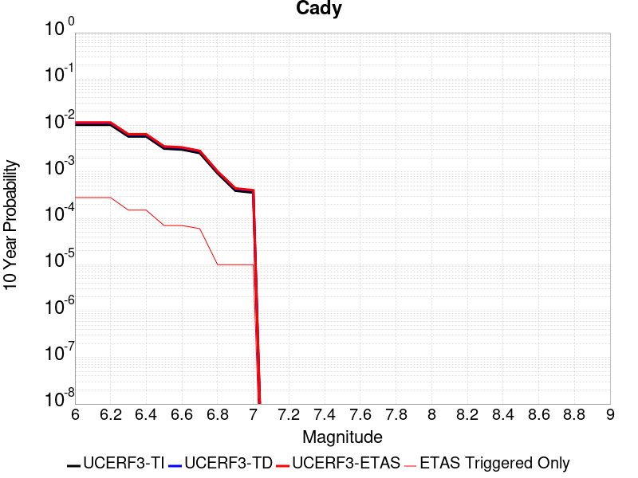 |

| Magnitude | 1 wk TI Prob | 1 wk TD Prob | 1 wk ETAS Prob | 1 wk ETAS/TD Gain | 1 wk ETAS Triggered Only | 1 mo TI Prob | 1 mo TD Prob | 1 mo ETAS Prob | 1 mo ETAS/TD Gain | 1 mo ETAS Triggered Only | 1 yr TI Prob | 1 yr TD Prob | 1 yr ETAS Prob | 1 yr ETAS/TD Gain | 1 yr ETAS Triggered Only | 10 yr TI Prob | 10 yr TD Prob | 10 yr ETAS Prob | 10 yr ETAS/TD Gain | 10 yr ETAS Triggered Only |
|-----|-----|-----|-----|-----|-----|-----|-----|-----|-----|-----|-----|-----|-----|-----|-----|-----|-----|-----|-----|-----|
| 6.0 | 1.9892565E-5 | 2.1858728E-5 | 1.1075358E-4 | 5.066789 | 8.889679E-5 | 8.525106E-5 | 9.3677416E-5 | 1.8256588E-4 | 1.9488783 | 8.889679E-5 | 0.0010374374 | 0.0011400167 | 0.0012288122 | 1.0778896 | 8.889679E-5 | 0.010326075 | 0.011350701 | 0.011614364 | 1.0232288 | 2.6669036E-4 |
| 6.1 | 1.9892565E-5 | 2.1858728E-5 | 1.1075358E-4 | 5.066789 | 8.889679E-5 | 8.525106E-5 | 9.3677416E-5 | 1.8256588E-4 | 1.9488783 | 8.889679E-5 | 0.0010374374 | 0.0011400167 | 0.0012288122 | 1.0778896 | 8.889679E-5 | 0.010326075 | 0.011350701 | 0.011614364 | 1.0232288 | 2.6669036E-4 |
| 6.2 | 1.9892565E-5 | 2.1858728E-5 | 1.1075358E-4 | 5.066789 | 8.889679E-5 | 8.525106E-5 | 9.3677416E-5 | 1.8256588E-4 | 1.9488783 | 8.889679E-5 | 0.0010374374 | 0.0011400167 | 0.0012288122 | 1.0778896 | 8.889679E-5 | 0.010326075 | 0.011350701 | 0.011614364 | 1.0232288 | 2.6669036E-4 |
| 6.3 | 1.1117327E-5 | 1.2176583E-5 | 1.2176583E-5 | 1.0 | 0.0 | 4.764482E-5 | 5.2184492E-5 | 5.2184492E-5 | 1.0 | 0.0 | 5.7992124E-4 | 6.351925E-4 | 6.351925E-4 | 1.0 | 0.0 | 0.0057841022 | 0.0063368753 | 0.0065135425 | 1.0278792 | 1.7779358E-4 |
| 6.4 | 1.1117327E-5 | 1.2176583E-5 | 1.2176583E-5 | 1.0 | 0.0 | 4.764482E-5 | 5.2184492E-5 | 5.2184492E-5 | 1.0 | 0.0 | 5.7992124E-4 | 6.351925E-4 | 6.351925E-4 | 1.0 | 0.0 | 0.0057841022 | 0.0063368753 | 0.0065135425 | 1.0278792 | 1.7779358E-4 |
| 6.5 | 6.103093E-6 | 6.672021E-6 | 6.672021E-6 | 1.0 | 0.0 | 2.615585E-5 | 2.8594131E-5 | 2.8594131E-5 | 1.0 | 0.0 | 3.1840094E-4 | 3.480905E-4 | 3.480905E-4 | 1.0 | 0.0 | 0.0031794512 | 0.0034766865 | 0.0035652744 | 1.0254805 | 8.889679E-5 |
| 6.6 | 5.817237E-6 | 6.3656585E-6 | 6.3656585E-6 | 1.0 | 0.0 | 2.4930776E-5 | 2.728118E-5 | 2.728118E-5 | 1.0 | 0.0 | 3.034899E-4 | 3.3211018E-4 | 3.3211018E-4 | 1.0 | 0.0 | 0.0030307577 | 0.0033173605 | 0.0034059624 | 1.0267086 | 8.889679E-5 |
| 6.7 | 4.8846314E-6 | 5.3405684E-6 | 5.3405684E-6 | 1.0 | 0.0 | 2.0933967E-5 | 2.2888014E-5 | 2.2888014E-5 | 1.0 | 0.0 | 2.5484123E-4 | 2.7863772E-4 | 2.7863772E-4 | 1.0 | 0.0 | 0.0025454918 | 0.0027840391 | 0.0027840391 | 1.0 | 0.0 |
| 6.8 | 1.7788773E-6 | 1.9399079E-6 | 1.9399079E-6 | 1.0 | 0.0 | 7.6237375E-6 | 8.313874E-6 | 8.313874E-6 | 1.0 | 0.0 | 9.281505E-5 | 1.01218284E-4 | 1.01218284E-4 | 1.0 | 0.0 | 9.2776294E-4 | 0.0010118765 | 0.0010118765 | 1.0 | 0.0 |
| 6.9 | 7.5455404E-7 | 8.297092E-7 | 8.297092E-7 | 1.0 | 0.0 | 3.233799E-6 | 3.5558937E-6 | 3.5558937E-6 | 1.0 | 0.0 | 3.937079E-5 | 4.3292483E-5 | 4.3292483E-5 | 1.0 | 0.0 | 3.9363815E-4 | 4.3287344E-4 | 4.3287344E-4 | 1.0 | 0.0 |
| 7.0 | 6.8578805E-7 | 7.541816E-7 | 7.541816E-7 | 1.0 | 0.0 | 2.9390883E-6 | 3.2322048E-6 | 3.2322048E-6 | 1.0 | 0.0 | 3.578281E-5 | 3.9351715E-5 | 3.9351715E-5 | 1.0 | 0.0 | 3.577705E-4 | 3.9347992E-4 | 3.9347992E-4 | 1.0 | 0.0 |

## Channel Islands Thrust
*[(top)](#table-of-contents)*

| 1 Week | 1 Month | 1 Year | 10 Year |
|-----|-----|-----|-----|
|  |  |  |  |

| Magnitude | 1 wk TI Prob | 1 wk TD Prob | 1 wk ETAS Prob | 1 wk ETAS/TD Gain | 1 wk ETAS Triggered Only | 1 mo TI Prob | 1 mo TD Prob | 1 mo ETAS Prob | 1 mo ETAS/TD Gain | 1 mo ETAS Triggered Only | 1 yr TI Prob | 1 yr TD Prob | 1 yr ETAS Prob | 1 yr ETAS/TD Gain | 1 yr ETAS Triggered Only | 10 yr TI Prob | 10 yr TD Prob | 10 yr ETAS Prob | 10 yr ETAS/TD Gain | 10 yr ETAS Triggered Only |
|-----|-----|-----|-----|-----|-----|-----|-----|-----|-----|-----|-----|-----|-----|-----|-----|-----|-----|-----|-----|-----|
| 6.0 | 2.2156251E-5 | 2.4092022E-5 | 1.1298667E-4 | 4.689796 | 8.889679E-5 | 9.495191E-5 | 1.03248036E-4 | 2.8102327E-4 | 2.7218268 | 1.7779358E-4 | 0.0011554264 | 0.0012564264 | 0.0014339967 | 1.1413295 | 1.7779358E-4 | 0.011494373 | 0.0125038205 | 0.012767176 | 1.021062 | 2.6669036E-4 |
| 6.1 | 2.2156251E-5 | 2.4092022E-5 | 1.1298667E-4 | 4.689796 | 8.889679E-5 | 9.495191E-5 | 1.03248036E-4 | 2.8102327E-4 | 2.7218268 | 1.7779358E-4 | 0.0011554264 | 0.0012564264 | 0.0014339967 | 1.1413295 | 1.7779358E-4 | 0.011494373 | 0.0125038205 | 0.012767176 | 1.021062 | 2.6669036E-4 |
| 6.2 | 2.2156251E-5 | 2.4092022E-5 | 1.1298667E-4 | 4.689796 | 8.889679E-5 | 9.495191E-5 | 1.03248036E-4 | 2.8102327E-4 | 2.7218268 | 1.7779358E-4 | 0.0011554264 | 0.0012564264 | 0.0014339967 | 1.1413295 | 1.7779358E-4 | 0.011494373 | 0.0125038205 | 0.012767176 | 1.021062 | 2.6669036E-4 |
| 6.3 | 2.2156251E-5 | 2.4092022E-5 | 1.1298667E-4 | 4.689796 | 8.889679E-5 | 9.495191E-5 | 1.03248036E-4 | 2.8102327E-4 | 2.7218268 | 1.7779358E-4 | 0.0011554264 | 0.0012564264 | 0.0014339967 | 1.1413295 | 1.7779358E-4 | 0.011494373 | 0.0125038205 | 0.012767176 | 1.021062 | 2.6669036E-4 |
| 6.4 | 2.2156251E-5 | 2.4092022E-5 | 1.1298667E-4 | 4.689796 | 8.889679E-5 | 9.495191E-5 | 1.03248036E-4 | 2.8102327E-4 | 2.7218268 | 1.7779358E-4 | 0.0011554264 | 0.0012564264 | 0.0014339967 | 1.1413295 | 1.7779358E-4 | 0.011494373 | 0.0125038205 | 0.012767176 | 1.021062 | 2.6669036E-4 |
| 6.5 | 2.2156251E-5 | 2.4092022E-5 | 1.1298667E-4 | 4.689796 | 8.889679E-5 | 9.495191E-5 | 1.03248036E-4 | 2.8102327E-4 | 2.7218268 | 1.7779358E-4 | 0.0011554264 | 0.0012564264 | 0.0014339967 | 1.1413295 | 1.7779358E-4 | 0.011494373 | 0.0125038205 | 0.012767176 | 1.021062 | 2.6669036E-4 |
| 6.6 | 2.2156251E-5 | 2.4092022E-5 | 1.1298667E-4 | 4.689796 | 8.889679E-5 | 9.495191E-5 | 1.03248036E-4 | 2.8102327E-4 | 2.7218268 | 1.7779358E-4 | 0.0011554264 | 0.0012564264 | 0.0014339967 | 1.1413295 | 1.7779358E-4 | 0.011494373 | 0.0125038205 | 0.012767176 | 1.021062 | 2.6669036E-4 |
| 6.7 | 1.0601296E-5 | 1.1379544E-5 | 1.0027532E-4 | 8.811893 | 8.889679E-5 | 4.5433335E-5 | 4.876859E-5 | 2.265535E-4 | 4.64548 | 1.7779358E-4 | 5.5301044E-4 | 5.936007E-4 | 7.7128876E-4 | 1.2993393 | 1.7779358E-4 | 0.005516363 | 0.005920653 | 0.006097394 | 1.0298516 | 1.7779358E-4 |
| 6.8 | 1.0246747E-5 | 1.0996669E-5 | 9.989248E-5 | 9.083886 | 8.889679E-5 | 4.391389E-5 | 4.7127756E-5 | 2.2491296E-4 | 4.7724094 | 1.7779358E-4 | 5.345204E-4 | 5.7363417E-4 | 7.5132574E-4 | 1.3097646 | 1.7779358E-4 | 0.0053323656 | 0.005722025 | 0.005898801 | 1.030894 | 1.7779358E-4 |
| 6.9 | 9.049551E-6 | 9.699645E-6 | 9.859557E-5 | 10.164865 | 8.889679E-5 | 3.878322E-5 | 4.1569267E-5 | 1.3046236E-4 | 3.1384332 | 8.889679E-5 | 4.7208337E-4 | 5.059924E-4 | 5.9484417E-4 | 1.1755991 | 8.889679E-5 | 0.0047108172 | 0.0050488203 | 0.005137268 | 1.0175185 | 8.889679E-5 |
| 7.0 | 8.6542195E-6 | 9.274603E-6 | 9.817057E-5 | 10.584881 | 8.889679E-5 | 3.7088983E-5 | 3.9747716E-5 | 1.2864097E-4 | 3.2364368 | 8.889679E-5 | 4.5146482E-4 | 4.8382508E-4 | 5.7267887E-4 | 1.1836486 | 8.889679E-5 | 0.004505487 | 0.004828129 | 0.0049165967 | 1.0183234 | 8.889679E-5 |
| 7.1 | 8.391028E-6 | 8.992924E-6 | 9.7888915E-5 | 10.885103 | 8.889679E-5 | 3.5961057E-5 | 3.854056E-5 | 1.2743393E-4 | 3.3064888 | 8.889679E-5 | 4.3773788E-4 | 4.6913436E-4 | 5.5798946E-4 | 1.1894022 | 8.889679E-5 | 0.004368766 | 0.0046818503 | 0.004770331 | 1.0188986 | 8.889679E-5 |
| 7.2 | 5.965188E-6 | 6.3716952E-6 | 9.526792E-5 | 14.951738 | 8.889679E-5 | 2.556484E-5 | 2.7306982E-5 | 1.1620134E-4 | 4.255371 | 8.889679E-5 | 3.1120746E-4 | 3.3241234E-4 | 4.2127958E-4 | 1.2673404 | 8.889679E-5 | 0.00310772 | 0.0033192092 | 0.003407811 | 1.0266936 | 8.889679E-5 |
| 7.3 | 4.877518E-6 | 5.2060063E-6 | 9.410233E-5 | 18.075724 | 8.889679E-5 | 2.0903482E-5 | 2.2311267E-5 | 1.1120608E-4 | 4.984301 | 8.889679E-5 | 2.5447016E-4 | 2.716063E-4 | 3.6047894E-4 | 1.3272113 | 8.889679E-5 | 0.0025417898 | 0.0027127895 | 0.002801445 | 1.0326806 | 8.889679E-5 |
| 7.4 | 3.8829853E-6 | 4.141863E-6 | 9.303829E-5 | 22.462908 | 8.889679E-5 | 1.664126E-5 | 1.7750723E-5 | 1.0664594E-4 | 6.0079775 | 8.889679E-5 | 2.0258849E-4 | 2.1609402E-4 | 3.0497162E-4 | 1.4112912 | 8.889679E-5 | 0.002024039 | 0.0021588807 | 0.0022475857 | 1.0410883 | 8.889679E-5 |
| 7.5 | 1.3489616E-6 | 1.4277903E-6 | 9.032445E-5 | 63.261707 | 8.889679E-5 | 5.7812517E-6 | 6.119087E-6 | 9.501533E-5 | 15.527698 | 8.889679E-5 | 7.038446E-5 | 7.449738E-5 | 1.6338755E-4 | 2.1931987 | 8.889679E-5 | 7.036218E-4 | 7.44728E-4 | 8.335586E-4 | 1.1192793 | 8.889679E-5 |
| 7.6 | 6.058192E-7 | 6.353778E-7 | 6.353778E-7 | 1.0 | 0.0 | 2.5963652E-6 | 2.7230449E-6 | 2.7230449E-6 | 1.0 | 0.0 | 3.161029E-5 | 3.3152584E-5 | 3.3152584E-5 | 1.0 | 0.0 | 3.1605794E-4 | 3.31478E-4 | 3.31478E-4 | 1.0 | 0.0 |
| 7.7 | 2.2170494E-7 | 2.2607902E-7 | 2.2607902E-7 | 1.0 | 0.0 | 9.5016367E-7 | 9.689098E-7 | 9.689098E-7 | 1.0 | 0.0 | 1.1568181E-5 | 1.1796425E-5 | 1.1796425E-5 | 1.0 | 0.0 | 1.1567579E-4 | 1.1795909E-4 | 1.1795909E-4 | 1.0 | 0.0 |
| 7.8 | 2.1613102E-8 | 1.5466682E-8 | 1.5466682E-8 | 1.0 | 0.0 | 9.262757E-8 | 6.628578E-8 | 6.628578E-8 | 1.0 | 0.0 | 1.1277401E-6 | 8.070291E-7 | 8.070291E-7 | 1.0 | 0.0 | 1.1277344E-5 | 8.070269E-6 | 8.070269E-6 | 1.0 | 0.0 |

## San Andreas (Carrizo) rev
*[(top)](#table-of-contents)*

| 1 Week | 1 Month | 1 Year | 10 Year |
|-----|-----|-----|-----|
|  |  |  |  |

| Magnitude | 1 wk TI Prob | 1 wk TD Prob | 1 wk ETAS Prob | 1 wk ETAS/TD Gain | 1 wk ETAS Triggered Only | 1 mo TI Prob | 1 mo TD Prob | 1 mo ETAS Prob | 1 mo ETAS/TD Gain | 1 mo ETAS Triggered Only | 1 yr TI Prob | 1 yr TD Prob | 1 yr ETAS Prob | 1 yr ETAS/TD Gain | 1 yr ETAS Triggered Only | 10 yr TI Prob | 10 yr TD Prob | 10 yr ETAS Prob | 10 yr ETAS/TD Gain | 10 yr ETAS Triggered Only |
|-----|-----|-----|-----|-----|-----|-----|-----|-----|-----|-----|-----|-----|-----|-----|-----|-----|-----|-----|-----|-----|
| 6.0 | 1.1674632E-4 | 2.432302E-4 | 3.3210538E-4 | 1.3653953 | 8.889679E-5 | 5.002454E-4 | 0.0010420004 | 0.0011308045 | 1.0852247 | 8.889679E-5 | 0.006073493 | 0.012613042 | 0.012788594 | 1.0139182 | 1.7779358E-4 | 0.0591016 | 0.12061418 | 0.1208487 | 1.0019444 | 2.6669036E-4 |
| 6.1 | 1.1674632E-4 | 2.432302E-4 | 3.3210538E-4 | 1.3653953 | 8.889679E-5 | 5.002454E-4 | 0.0010420004 | 0.0011308045 | 1.0852247 | 8.889679E-5 | 0.006073493 | 0.012613042 | 0.012788594 | 1.0139182 | 1.7779358E-4 | 0.0591016 | 0.12061418 | 0.1208487 | 1.0019444 | 2.6669036E-4 |
| 6.2 | 1.1674632E-4 | 2.432302E-4 | 3.3210538E-4 | 1.3653953 | 8.889679E-5 | 5.002454E-4 | 0.0010420004 | 0.0011308045 | 1.0852247 | 8.889679E-5 | 0.006073493 | 0.012613042 | 0.012788594 | 1.0139182 | 1.7779358E-4 | 0.0591016 | 0.12061418 | 0.1208487 | 1.0019444 | 2.6669036E-4 |
| 6.3 | 1.1674632E-4 | 2.432302E-4 | 3.3210538E-4 | 1.3653953 | 8.889679E-5 | 5.002454E-4 | 0.0010420004 | 0.0011308045 | 1.0852247 | 8.889679E-5 | 0.006073493 | 0.012613042 | 0.012788594 | 1.0139182 | 1.7779358E-4 | 0.0591016 | 0.12061418 | 0.1208487 | 1.0019444 | 2.6669036E-4 |
| 6.4 | 1.1674632E-4 | 2.432302E-4 | 3.3210538E-4 | 1.3653953 | 8.889679E-5 | 5.002454E-4 | 0.0010420004 | 0.0011308045 | 1.0852247 | 8.889679E-5 | 0.006073493 | 0.012613042 | 0.012788594 | 1.0139182 | 1.7779358E-4 | 0.0591016 | 0.12061418 | 0.1208487 | 1.0019444 | 2.6669036E-4 |
| 6.5 | 1.13136164E-4 | 2.3643032E-4 | 3.253061E-4 | 1.3759068 | 8.889679E-5 | 4.847792E-4 | 0.0010128808 | 0.0011016876 | 1.0876774 | 8.889679E-5 | 0.0058862255 | 0.012262545 | 0.012438158 | 1.0143211 | 1.7779358E-4 | 0.057327334 | 0.117585555 | 0.11782088 | 1.0020014 | 2.6669036E-4 |
| 6.6 | 1.13136164E-4 | 2.3643032E-4 | 3.253061E-4 | 1.3759068 | 8.889679E-5 | 4.847792E-4 | 0.0010128808 | 0.0011016876 | 1.0876774 | 8.889679E-5 | 0.0058862255 | 0.012262545 | 0.012438158 | 1.0143211 | 1.7779358E-4 | 0.057327334 | 0.117585555 | 0.11782088 | 1.0020014 | 2.6669036E-4 |
| 6.7 | 1.1149675E-4 | 2.3334254E-4 | 2.3334254E-4 | 1.0 | 0.0 | 4.777557E-4 | 9.996577E-4 | 9.996577E-4 | 1.0 | 0.0 | 0.0058011734 | 0.012103349 | 0.01219117 | 1.0072559 | 8.889679E-5 | 0.05652051 | 0.1162071 | 0.11636423 | 1.0013522 | 1.7779358E-4 |
| 6.8 | 1.1103589E-4 | 2.3236412E-4 | 2.3236412E-4 | 1.0 | 0.0 | 4.7578133E-4 | 9.954676E-4 | 9.954676E-4 | 1.0 | 0.0 | 0.005777263 | 0.012052901 | 0.012140727 | 1.0072867 | 8.889679E-5 | 0.056293584 | 0.1157674 | 0.11592461 | 1.001358 | 1.7779358E-4 |
| 6.9 | 1.1053259E-4 | 2.3128795E-4 | 2.3128795E-4 | 1.0 | 0.0 | 4.7362508E-4 | 9.90859E-4 | 9.90859E-4 | 1.0 | 0.0 | 0.0057511497 | 0.01199741 | 0.01208524 | 1.0073208 | 8.889679E-5 | 0.05604569 | 0.11528359 | 0.11544089 | 1.0013645 | 1.7779358E-4 |
| 7.0 | 1.1005377E-4 | 2.3029637E-4 | 2.3029637E-4 | 1.0 | 0.0 | 4.7157376E-4 | 9.866126E-4 | 9.866126E-4 | 1.0 | 0.0 | 0.0057263062 | 0.011946279 | 0.0120341135 | 1.0073525 | 8.889679E-5 | 0.055809796 | 0.11483591 | 0.11499329 | 1.0013704 | 1.7779358E-4 |
| 7.1 | 1.0308142E-4 | 2.1539345E-4 | 2.1539345E-4 | 1.0 | 0.0 | 4.417027E-4 | 9.227892E-4 | 9.227892E-4 | 1.0 | 0.0 | 0.0053644776 | 0.011177397 | 0.011265301 | 1.0078644 | 8.889679E-5 | 0.052368138 | 0.108092256 | 0.108250834 | 1.001467 | 1.7779358E-4 |
| 7.2 | 1.0027479E-4 | 2.094724E-4 | 2.094724E-4 | 1.0 | 0.0 | 4.296783E-4 | 8.9743105E-4 | 8.9743105E-4 | 1.0 | 0.0 | 0.0052187922 | 0.010871782 | 0.010871782 | 1.0 | 0.0 | 0.050979212 | 0.10539625 | 0.105475776 | 1.0007546 | 8.889679E-5 |
| 7.3 | 9.816942E-5 | 2.0422463E-4 | 2.0422463E-4 | 1.0 | 0.0 | 4.2065824E-4 | 8.7495585E-4 | 8.7495585E-4 | 1.0 | 0.0 | 0.005109493 | 0.010600842 | 0.010600842 | 1.0 | 0.0 | 0.049935985 | 0.102979995 | 0.10305974 | 1.0007744 | 8.889679E-5 |
| 7.4 | 9.5634205E-5 | 1.9791997E-4 | 1.9791997E-4 | 1.0 | 0.0 | 4.0979648E-4 | 8.479536E-4 | 8.479536E-4 | 1.0 | 0.0 | 0.0049778637 | 0.010275229 | 0.010275229 | 1.0 | 0.0 | 0.048678253 | 0.10006632 | 0.10014632 | 1.0007995 | 8.889679E-5 |
| 7.5 | 8.052417E-5 | 1.611261E-4 | 1.611261E-4 | 1.0 | 0.0 | 3.4505792E-4 | 6.903579E-4 | 6.903579E-4 | 1.0 | 0.0 | 0.0041929903 | 0.008372796 | 0.008372796 | 1.0 | 0.0 | 0.04114753 | 0.08281049 | 0.08281049 | 1.0 | 0.0 |
| 7.6 | 7.897024E-5 | 1.5765853E-4 | 1.5765853E-4 | 1.0 | 0.0 | 3.384E-4 | 6.755046E-4 | 6.755046E-4 | 1.0 | 0.0 | 0.0041122385 | 0.008193332 | 0.008193332 | 1.0 | 0.0 | 0.040369697 | 0.08115171 | 0.08115171 | 1.0 | 0.0 |
| 7.7 | 6.707427E-5 | 1.3276102E-4 | 1.3276102E-4 | 1.0 | 0.0 | 2.8742946E-4 | 5.688518E-4 | 5.688518E-4 | 1.0 | 0.0 | 0.003493839 | 0.00690381 | 0.00690381 | 1.0 | 0.0 | 0.034394164 | 0.069048055 | 0.069048055 | 1.0 | 0.0 |
| 7.8 | 6.147705E-5 | 1.2197486E-4 | 1.2197486E-4 | 1.0 | 0.0 | 2.6344648E-4 | 5.226447E-4 | 5.226447E-4 | 1.0 | 0.0 | 0.0032027436 | 0.006344659 | 0.006344659 | 1.0 | 0.0 | 0.031569764 | 0.06351457 | 0.06351457 | 1.0 | 0.0 |
| 7.9 | 4.7636717E-5 | 8.87977E-5 | 8.87977E-5 | 1.0 | 0.0 | 2.0414138E-4 | 3.8050607E-4 | 3.8050607E-4 | 1.0 | 0.0 | 0.0024825884 | 0.0046228287 | 0.0046228287 | 1.0 | 0.0 | 0.024550365 | 0.046628095 | 0.046628095 | 1.0 | 0.0 |
| 8.0 | 3.3554235E-5 | 5.2136907E-5 | 5.2136907E-5 | 1.0 | 0.0 | 1.4379594E-4 | 2.2342477E-4 | 2.2342477E-4 | 1.0 | 0.0 | 0.0017493097 | 0.002716805 | 0.002716805 | 1.0 | 0.0 | 0.017356034 | 0.027880952 | 0.027880952 | 1.0 | 0.0 |
| 8.1 | 1.9175432E-5 | 1.9184976E-5 | 1.9184976E-5 | 1.0 | 0.0 | 8.217783E-5 | 8.2218736E-5 | 8.2218736E-5 | 1.0 | 0.0 | 0.0010000558 | 0.0010005541 | 0.0010005541 | 1.0 | 0.0 | 0.009955673 | 0.0107580265 | 0.0107580265 | 1.0 | 0.0 |
| 8.2 | 8.643924E-6 | 5.4748625E-6 | 5.4748625E-6 | 1.0 | 0.0 | 3.704486E-5 | 2.3463486E-5 | 2.3463486E-5 | 1.0 | 0.0 | 4.5092785E-4 | 2.8563058E-4 | 2.8563058E-4 | 1.0 | 0.0 | 0.0045001395 | 0.0032487072 | 0.0032487072 | 1.0 | 0.0 |
| 8.3 | 1.983087E-6 | 7.6599065E-7 | 7.6599065E-7 | 1.0 | 0.0 | 8.498917E-6 | 3.282813E-6 | 3.282813E-6 | 1.0 | 0.0 | 1.034694E-4 | 3.9967534E-5 | 3.9967534E-5 | 1.0 | 0.0 | 0.0010342124 | 4.719687E-4 | 4.719687E-4 | 1.0 | 0.0 |

## Death Valley (Fish Lake Valley)
*[(top)](#table-of-contents)*

| 1 Week | 1 Month | 1 Year | 10 Year |
|-----|-----|-----|-----|
|  |  |  |  |

| Magnitude | 1 wk TI Prob | 1 wk TD Prob | 1 wk ETAS Prob | 1 wk ETAS/TD Gain | 1 wk ETAS Triggered Only | 1 mo TI Prob | 1 mo TD Prob | 1 mo ETAS Prob | 1 mo ETAS/TD Gain | 1 mo ETAS Triggered Only | 1 yr TI Prob | 1 yr TD Prob | 1 yr ETAS Prob | 1 yr ETAS/TD Gain | 1 yr ETAS Triggered Only | 10 yr TI Prob | 10 yr TD Prob | 10 yr ETAS Prob | 10 yr ETAS/TD Gain | 10 yr ETAS Triggered Only |
|-----|-----|-----|-----|-----|-----|-----|-----|-----|-----|-----|-----|-----|-----|-----|-----|-----|-----|-----|-----|-----|
| 6.0 | 3.872328E-5 | 4.7267473E-5 | 4.7267473E-5 | 1.0 | 0.0 | 1.6594635E-4 | 2.0256084E-4 | 2.9143962E-4 | 1.4387758 | 8.889679E-5 | 0.0020185246 | 0.002463534 | 0.0025522118 | 1.0359962 | 8.889679E-5 | 0.02000288 | 0.024388181 | 0.024648366 | 1.0106685 | 2.6669036E-4 |
| 6.1 | 3.872328E-5 | 4.7267473E-5 | 4.7267473E-5 | 1.0 | 0.0 | 1.6594635E-4 | 2.0256084E-4 | 2.9143962E-4 | 1.4387758 | 8.889679E-5 | 0.0020185246 | 0.002463534 | 0.0025522118 | 1.0359962 | 8.889679E-5 | 0.02000288 | 0.024388181 | 0.024648366 | 1.0106685 | 2.6669036E-4 |
| 6.2 | 3.872328E-5 | 4.7267473E-5 | 4.7267473E-5 | 1.0 | 0.0 | 1.6594635E-4 | 2.0256084E-4 | 2.9143962E-4 | 1.4387758 | 8.889679E-5 | 0.0020185246 | 0.002463534 | 0.0025522118 | 1.0359962 | 8.889679E-5 | 0.02000288 | 0.024388181 | 0.024648366 | 1.0106685 | 2.6669036E-4 |
| 6.3 | 2.8356371E-5 | 3.3609853E-5 | 3.3609853E-5 | 1.0 | 0.0 | 1.2152165E-4 | 1.4403471E-4 | 2.329187E-4 | 1.6171012 | 8.889679E-5 | 0.0014785219 | 0.0017522911 | 0.0018410321 | 1.0506428 | 8.889679E-5 | 0.014687235 | 0.017391782 | 0.017653834 | 1.0150676 | 2.6669036E-4 |
| 6.4 | 2.8356371E-5 | 3.3609853E-5 | 3.3609853E-5 | 1.0 | 0.0 | 1.2152165E-4 | 1.4403471E-4 | 2.329187E-4 | 1.6171012 | 8.889679E-5 | 0.0014785219 | 0.0017522911 | 0.0018410321 | 1.0506428 | 8.889679E-5 | 0.014687235 | 0.017391782 | 0.017653834 | 1.0150676 | 2.6669036E-4 |
| 6.5 | 2.4448687E-5 | 2.8607552E-5 | 2.8607552E-5 | 1.0 | 0.0 | 1.0477588E-4 | 1.2259831E-4 | 2.114842E-4 | 1.7250172 | 8.889679E-5 | 0.0012748998 | 0.0014916632 | 0.0015804273 | 1.0595069 | 8.889679E-5 | 0.012676105 | 0.014821377 | 0.015084114 | 1.0177269 | 2.6669036E-4 |
| 6.6 | 2.1298161E-5 | 2.4660083E-5 | 2.4660083E-5 | 1.0 | 0.0 | 9.127464E-5 | 1.0568198E-4 | 1.9456938E-4 | 1.8410838 | 8.889679E-5 | 0.0011107022 | 0.0012859525 | 0.001374735 | 1.0690403 | 8.889679E-5 | 0.011051672 | 0.012788526 | 0.013051805 | 1.0205872 | 2.6669036E-4 |
| 6.7 | 1.8959729E-5 | 2.1781025E-5 | 2.1781025E-5 | 1.0 | 0.0 | 8.125345E-5 | 9.334405E-5 | 1.8223254E-4 | 1.9522673 | 8.889679E-5 | 9.888117E-4 | 0.001135897 | 0.0012246928 | 1.0781724 | 8.889679E-5 | 0.009844234 | 0.01130357 | 0.011567246 | 1.0233268 | 2.6669036E-4 |
| 6.8 | 1.6691629E-5 | 1.9018353E-5 | 1.9018353E-5 | 1.0 | 0.0 | 7.153359E-5 | 8.150477E-5 | 1.7039431E-4 | 2.0906055 | 8.889679E-5 | 8.7057345E-4 | 9.918857E-4 | 0.0010806943 | 1.0895351 | 8.889679E-5 | 0.008671708 | 0.009876343 | 0.0101404 | 1.0267363 | 2.6669036E-4 |
| 6.9 | 1.450505E-5 | 1.638954E-5 | 1.638954E-5 | 1.0 | 0.0 | 6.216302E-5 | 7.0239046E-5 | 1.5912959E-4 | 2.2655432 | 8.889679E-5 | 7.5657194E-4 | 8.5483363E-4 | 9.4365445E-4 | 1.1039042 | 8.889679E-5 | 0.007540013 | 0.008516385 | 0.008780804 | 1.0310483 | 2.6669036E-4 |
| 7.0 | 1.2940855E-5 | 1.4537972E-5 | 1.4537972E-5 | 1.0 | 0.0 | 5.545963E-5 | 6.230414E-5 | 1.5119539E-4 | 2.426731 | 8.889679E-5 | 6.750118E-4 | 7.5829466E-4 | 8.471241E-4 | 1.1171436 | 8.889679E-5 | 0.006729651 | 0.0075576897 | 0.007822365 | 1.0350206 | 2.6669036E-4 |
| 7.1 | 1.2544658E-5 | 1.4078208E-5 | 1.4078208E-5 | 1.0 | 0.0 | 5.3761712E-5 | 6.0333812E-5 | 1.4922523E-4 | 2.473327 | 8.889679E-5 | 6.5435225E-4 | 7.343222E-4 | 8.231537E-4 | 1.1209707 | 8.889679E-5 | 0.006524288 | 0.007319551 | 0.007584289 | 1.0361687 | 2.6669036E-4 |
| 7.2 | 1.2489416E-5 | 1.4015674E-5 | 1.4015674E-5 | 1.0 | 0.0 | 5.3524967E-5 | 6.0065824E-5 | 1.4895728E-4 | 2.4799006 | 8.889679E-5 | 6.514716E-4 | 7.310616E-4 | 8.1989344E-4 | 1.1215107 | 8.889679E-5 | 0.006495651 | 0.0072871596 | 0.0075519066 | 1.0363306 | 2.6669036E-4 |
| 7.3 | 1.2368307E-5 | 1.3879812E-5 | 1.3879812E-5 | 1.0 | 0.0 | 5.3005948E-5 | 5.9483587E-5 | 1.4837508E-4 | 2.4943871 | 8.889679E-5 | 6.451563E-4 | 7.2397763E-4 | 8.1281003E-4 | 1.1227006 | 8.889679E-5 | 0.0064328653 | 0.007216782 | 0.0074815475 | 1.0366875 | 2.6669036E-4 |
| 7.4 | 1.2161707E-5 | 1.36478675E-5 | 1.36478675E-5 | 1.0 | 0.0 | 5.212056E-5 | 5.8489582E-5 | 1.4738117E-4 | 2.519785 | 8.889679E-5 | 6.3438306E-4 | 7.118836E-4 | 8.007171E-4 | 1.1247866 | 8.889679E-5 | 0.006325751 | 0.0070966207 | 0.007361418 | 1.0373132 | 2.6669036E-4 |
| 7.5 | 1.1707948E-5 | 1.3145515E-5 | 1.3145515E-5 | 1.0 | 0.0 | 5.0175953E-5 | 5.6336736E-5 | 1.4522852E-4 | 2.5778654 | 8.889679E-5 | 6.10721E-4 | 6.856895E-4 | 7.7452534E-4 | 1.1295569 | 8.889679E-5 | 0.0060904534 | 0.006836321 | 0.0071011884 | 1.0387441 | 2.6669036E-4 |
| 7.6 | 1.0319538E-5 | 1.1579622E-5 | 1.1579622E-5 | 1.0 | 0.0 | 4.4225842E-5 | 4.9626036E-5 | 1.3851842E-4 | 2.7912447 | 8.889679E-5 | 5.383166E-4 | 6.040347E-4 | 6.928778E-4 | 1.1470828 | 8.889679E-5 | 0.0053701443 | 0.0060244603 | 0.006289544 | 1.0440012 | 2.6669036E-4 |
| 7.7 | 8.937764E-6 | 1.0022779E-5 | 1.0022779E-5 | 1.0 | 0.0 | 3.830414E-5 | 4.295409E-5 | 1.3184706E-4 | 3.069488 | 8.889679E-5 | 4.6625308E-4 | 5.228456E-4 | 6.1169587E-4 | 1.1699361 | 8.889679E-5 | 0.0046527605 | 0.005216664 | 0.0054819635 | 1.0508561 | 2.6669036E-4 |
| 7.8 | 3.108007E-7 | 3.284654E-7 | 3.284654E-7 | 1.0 | 0.0 | 1.3320023E-6 | 1.407708E-6 | 9.030438E-5 | 64.149925 | 8.889679E-5 | 1.6217007E-5 | 1.7138715E-5 | 1.06033986E-4 | 6.1868105 | 8.889679E-5 | 1.6215823E-4 | 1.7137431E-4 | 2.6025588E-4 | 1.5186399 | 8.889679E-5 |
| 7.9 | 2.5591178E-9 | 2.6696718E-9 | 2.6696718E-9 | 1.0 | 0.0 | 1.0967647E-8 | 1.14414505E-8 | 1.14414505E-8 | 1.0 | 0.0 | 1.335311E-7 | 1.3929966E-7 | 1.3929966E-7 | 1.0 | 0.0 | 1.3353102E-6 | 1.3929966E-6 | 1.3929966E-6 | 1.0 | 0.0 |

## Red Pass
*[(top)](#table-of-contents)*

| 1 Week | 1 Month | 1 Year | 10 Year |
|-----|-----|-----|-----|
|  |  |  |  |

| Magnitude | 1 wk TI Prob | 1 wk TD Prob | 1 wk ETAS Prob | 1 wk ETAS/TD Gain | 1 wk ETAS Triggered Only | 1 mo TI Prob | 1 mo TD Prob | 1 mo ETAS Prob | 1 mo ETAS/TD Gain | 1 mo ETAS Triggered Only | 1 yr TI Prob | 1 yr TD Prob | 1 yr ETAS Prob | 1 yr ETAS/TD Gain | 1 yr ETAS Triggered Only | 10 yr TI Prob | 10 yr TD Prob | 10 yr ETAS Prob | 10 yr ETAS/TD Gain | 10 yr ETAS Triggered Only |
|-----|-----|-----|-----|-----|-----|-----|-----|-----|-----|-----|-----|-----|-----|-----|-----|-----|-----|-----|-----|-----|
| 6.0 | 8.258278E-6 | 8.551265E-6 | 1.8634333E-4 | 21.791317 | 1.7779358E-4 | 3.539214E-5 | 3.6647863E-5 | 2.1443493E-4 | 5.851226 | 1.7779358E-4 | 4.308141E-4 | 4.4611428E-4 | 7.126857E-4 | 1.5975406 | 2.6669036E-4 | 0.0042997985 | 0.004453945 | 0.0047194473 | 1.0596106 | 2.6669036E-4 |
| 6.1 | 3.649988E-6 | 3.7753161E-6 | 3.7753161E-6 | 1.0 | 0.0 | 1.5642712E-5 | 1.6179853E-5 | 1.6179853E-5 | 1.0 | 0.0 | 1.9043336E-4 | 1.9697666E-4 | 1.9697666E-4 | 1.0 | 0.0 | 0.0019027026 | 0.001968488 | 0.001968488 | 1.0 | 0.0 |
| 6.2 | 3.649988E-6 | 3.7753161E-6 | 3.7753161E-6 | 1.0 | 0.0 | 1.5642712E-5 | 1.6179853E-5 | 1.6179853E-5 | 1.0 | 0.0 | 1.9043336E-4 | 1.9697666E-4 | 1.9697666E-4 | 1.0 | 0.0 | 0.0019027026 | 0.001968488 | 0.001968488 | 1.0 | 0.0 |
| 6.3 | 1.3924937E-6 | 1.4411166E-6 | 1.4411166E-6 | 1.0 | 0.0 | 5.9678164E-6 | 6.1762075E-6 | 6.1762075E-6 | 1.0 | 0.0 | 7.265574E-5 | 7.519415E-5 | 7.519415E-5 | 1.0 | 0.0 | 7.263199E-4 | 7.518258E-4 | 7.518258E-4 | 1.0 | 0.0 |
| 6.4 | 1.3924937E-6 | 1.4411166E-6 | 1.4411166E-6 | 1.0 | 0.0 | 5.9678164E-6 | 6.1762075E-6 | 6.1762075E-6 | 1.0 | 0.0 | 7.265574E-5 | 7.519415E-5 | 7.519415E-5 | 1.0 | 0.0 | 7.263199E-4 | 7.518258E-4 | 7.518258E-4 | 1.0 | 0.0 |
| 6.5 | 9.876812E-7 | 1.0221912E-6 | 1.0221912E-6 | 1.0 | 0.0 | 4.2329125E-6 | 4.3808195E-6 | 4.3808195E-6 | 1.0 | 0.0 | 5.153449E-5 | 5.3336476E-5 | 5.3336476E-5 | 1.0 | 0.0 | 5.1522546E-4 | 5.333648E-4 | 5.333648E-4 | 1.0 | 0.0 |

## San Diego Trough north alt1
*[(top)](#table-of-contents)*

| 1 Week | 1 Month | 1 Year | 10 Year |
|-----|-----|-----|-----|
|  |  |  |  |

| Magnitude | 1 wk TI Prob | 1 wk TD Prob | 1 wk ETAS Prob | 1 wk ETAS/TD Gain | 1 wk ETAS Triggered Only | 1 mo TI Prob | 1 mo TD Prob | 1 mo ETAS Prob | 1 mo ETAS/TD Gain | 1 mo ETAS Triggered Only | 1 yr TI Prob | 1 yr TD Prob | 1 yr ETAS Prob | 1 yr ETAS/TD Gain | 1 yr ETAS Triggered Only | 10 yr TI Prob | 10 yr TD Prob | 10 yr ETAS Prob | 10 yr ETAS/TD Gain | 10 yr ETAS Triggered Only |
|-----|-----|-----|-----|-----|-----|-----|-----|-----|-----|-----|-----|-----|-----|-----|-----|-----|-----|-----|-----|-----|
| 6.0 | 7.329252E-5 | 8.821093E-5 | 1.7709988E-4 | 2.0076864 | 8.889679E-5 | 3.14073E-4 | 3.7799572E-4 | 5.557221E-4 | 1.4701809 | 1.7779358E-4 | 0.0038171355 | 0.004593027 | 0.0047700037 | 1.0385317 | 1.7779358E-4 | 0.03752231 | 0.045044992 | 0.045214776 | 1.0037693 | 1.7779358E-4 |
| 6.1 | 3.7940346E-5 | 4.4885E-5 | 4.4885E-5 | 1.0 | 0.0 | 1.6259136E-4 | 1.9235066E-4 | 1.9235066E-4 | 1.0 | 0.0 | 0.0019777524 | 0.0023394432 | 0.0023394432 | 1.0 | 0.0 | 0.019602431 | 0.023156688 | 0.023156688 | 1.0 | 0.0 |
| 6.2 | 2.8645263E-5 | 3.329678E-5 | 3.329678E-5 | 1.0 | 0.0 | 1.2275964E-4 | 1.4269284E-4 | 1.4269284E-4 | 1.0 | 0.0 | 0.0014935739 | 0.0017359189 | 0.0017359189 | 1.0 | 0.0 | 0.0148357535 | 0.017226247 | 0.017226247 | 1.0 | 0.0 |
| 6.3 | 2.8645263E-5 | 3.329678E-5 | 3.329678E-5 | 1.0 | 0.0 | 1.2275964E-4 | 1.4269284E-4 | 1.4269284E-4 | 1.0 | 0.0 | 0.0014935739 | 0.0017359189 | 0.0017359189 | 1.0 | 0.0 | 0.0148357535 | 0.017226247 | 0.017226247 | 1.0 | 0.0 |
| 6.4 | 2.2204576E-5 | 2.5448318E-5 | 2.5448318E-5 | 1.0 | 0.0 | 9.5159E-5 | 1.0905972E-4 | 1.0905972E-4 | 1.0 | 0.0 | 0.001157945 | 0.0013270034 | 0.0013270034 | 1.0 | 0.0 | 0.011519298 | 0.013191955 | 0.013191955 | 1.0 | 0.0 |
| 6.5 | 2.1004838E-5 | 2.4024694E-5 | 2.4024694E-5 | 1.0 | 0.0 | 9.0017624E-5 | 1.0295896E-4 | 1.0295896E-4 | 1.0 | 0.0 | 0.0010954136 | 0.0012528138 | 0.0012528138 | 1.0 | 0.0 | 0.010900296 | 0.012458589 | 0.012458589 | 1.0 | 0.0 |
| 6.6 | 1.820557E-5 | 2.0704787E-5 | 2.0704787E-5 | 1.0 | 0.0 | 7.802154E-5 | 8.873181E-5 | 8.873181E-5 | 1.0 | 0.0 | 9.4949827E-4 | 0.0010797799 | 0.0010797799 | 1.0 | 0.0 | 0.009454516 | 0.010746004 | 0.010746004 | 1.0 | 0.0 |
| 6.7 | 1.5884485E-5 | 1.7983646E-5 | 1.7983646E-5 | 1.0 | 0.0 | 6.807459E-5 | 7.707051E-5 | 7.707051E-5 | 1.0 | 0.0 | 8.284929E-4 | 9.3793223E-4 | 9.3793223E-4 | 1.0 | 0.0 | 0.008254109 | 0.009340104 | 0.009340104 | 1.0 | 0.0 |
| 6.8 | 1.4331171E-5 | 1.6201066E-5 | 1.6201066E-5 | 1.0 | 0.0 | 6.141786E-5 | 6.94313E-5 | 6.94313E-5 | 1.0 | 0.0 | 7.4750587E-4 | 8.450002E-4 | 8.450002E-4 | 1.0 | 0.0 | 0.0074499645 | 0.008418139 | 0.008418139 | 1.0 | 0.0 |
| 6.9 | 1.2574203E-5 | 1.4205835E-5 | 1.4205835E-5 | 1.0 | 0.0 | 5.3888325E-5 | 6.0880735E-5 | 6.0880735E-5 | 1.0 | 0.0 | 6.558929E-4 | 7.409723E-4 | 7.409723E-4 | 1.0 | 0.0 | 0.0065396037 | 0.007385203 | 0.007385203 | 1.0 | 0.0 |
| 7.0 | 1.0883844E-5 | 1.2289262E-5 | 1.2289262E-5 | 1.0 | 0.0 | 4.664421E-5 | 5.2667205E-5 | 5.2667205E-5 | 1.0 | 0.0 | 5.677453E-4 | 6.4103556E-4 | 6.4103556E-4 | 1.0 | 0.0 | 0.00566297 | 0.006391993 | 0.006391993 | 1.0 | 0.0 |
| 7.1 | 9.393088E-6 | 1.060702E-5 | 1.060702E-5 | 1.0 | 0.0 | 4.025547E-5 | 4.545787E-5 | 4.545787E-5 | 1.0 | 0.0 | 4.900001E-4 | 5.533098E-4 | 5.533098E-4 | 1.0 | 0.0 | 0.0048892107 | 0.005519418 | 0.005519418 | 1.0 | 0.0 |
| 7.2 | 8.190791E-6 | 9.258625E-6 | 9.258625E-6 | 1.0 | 0.0 | 3.510292E-5 | 3.9679224E-5 | 3.9679224E-5 | 1.0 | 0.0 | 4.2729423E-4 | 4.8298817E-4 | 4.8298817E-4 | 1.0 | 0.0 | 0.0042647356 | 0.004819465 | 0.004819465 | 1.0 | 0.0 |
| 7.3 | 6.268162E-6 | 7.089716E-6 | 7.089716E-6 | 1.0 | 0.0 | 2.6863276E-5 | 3.0384144E-5 | 3.0384144E-5 | 1.0 | 0.0 | 3.2701128E-4 | 3.6986457E-4 | 3.6986457E-4 | 1.0 | 0.0 | 0.003265305 | 0.003692536 | 0.003692536 | 1.0 | 0.0 |
| 7.4 | 4.985186E-6 | 5.6426816E-6 | 5.6426816E-6 | 1.0 | 0.0 | 2.1364907E-5 | 2.4182698E-5 | 2.4182698E-5 | 1.0 | 0.0 | 2.600867E-4 | 2.9438498E-4 | 2.9438498E-4 | 1.0 | 0.0 | 0.002597825 | 0.0029399914 | 0.0029399914 | 1.0 | 0.0 |
| 7.5 | 1.7489613E-6 | 1.969678E-6 | 1.969678E-6 | 1.0 | 0.0 | 7.495527E-6 | 8.4414505E-6 | 8.4414505E-6 | 1.0 | 0.0 | 9.125422E-5 | 1.02770035E-4 | 1.02770035E-4 | 1.0 | 0.0 | 9.1216754E-4 | 0.0010272472 | 0.0010272472 | 1.0 | 0.0 |
| 7.6 | 1.6988751E-7 | 1.7533823E-7 | 1.7533823E-7 | 1.0 | 0.0 | 7.2808916E-7 | 7.5144936E-7 | 7.5144936E-7 | 1.0 | 0.0 | 8.864449E-6 | 9.14886E-6 | 9.14886E-6 | 1.0 | 0.0 | 8.8640954E-5 | 9.1485024E-5 | 9.1485024E-5 | 1.0 | 0.0 |

## Calico-Hidalgo
*[(top)](#table-of-contents)*

| 1 Week | 1 Month | 1 Year | 10 Year |
|-----|-----|-----|-----|
|  |  |  |  |

| Magnitude | 1 wk TI Prob | 1 wk TD Prob | 1 wk ETAS Prob | 1 wk ETAS/TD Gain | 1 wk ETAS Triggered Only | 1 mo TI Prob | 1 mo TD Prob | 1 mo ETAS Prob | 1 mo ETAS/TD Gain | 1 mo ETAS Triggered Only | 1 yr TI Prob | 1 yr TD Prob | 1 yr ETAS Prob | 1 yr ETAS/TD Gain | 1 yr ETAS Triggered Only | 10 yr TI Prob | 10 yr TD Prob | 10 yr ETAS Prob | 10 yr ETAS/TD Gain | 10 yr ETAS Triggered Only |
|-----|-----|-----|-----|-----|-----|-----|-----|-----|-----|-----|-----|-----|-----|-----|-----|-----|-----|-----|-----|-----|
| 6.0 | 4.0906612E-5 | 5.0703686E-5 | 5.0703686E-5 | 1.0 | 0.0 | 1.7530227E-4 | 2.172857E-4 | 2.172857E-4 | 1.0 | 0.0 | 0.0021322158 | 0.002642648 | 0.00273131 | 1.0335504 | 8.889679E-5 | 0.02111873 | 0.026152607 | 0.026325751 | 1.0066205 | 1.7779358E-4 |
| 6.1 | 4.0906612E-5 | 5.0703686E-5 | 5.0703686E-5 | 1.0 | 0.0 | 1.7530227E-4 | 2.172857E-4 | 2.172857E-4 | 1.0 | 0.0 | 0.0021322158 | 0.002642648 | 0.00273131 | 1.0335504 | 8.889679E-5 | 0.02111873 | 0.026152607 | 0.026325751 | 1.0066205 | 1.7779358E-4 |
| 6.2 | 4.0906612E-5 | 5.0703686E-5 | 5.0703686E-5 | 1.0 | 0.0 | 1.7530227E-4 | 2.172857E-4 | 2.172857E-4 | 1.0 | 0.0 | 0.0021322158 | 0.002642648 | 0.00273131 | 1.0335504 | 8.889679E-5 | 0.02111873 | 0.026152607 | 0.026325751 | 1.0066205 | 1.7779358E-4 |
| 6.3 | 2.4242801E-5 | 3.0090669E-5 | 3.0090669E-5 | 1.0 | 0.0 | 1.0389358E-4 | 1.2895382E-4 | 1.2895382E-4 | 1.0 | 0.0 | 0.0012641704 | 0.0015689151 | 0.0016576725 | 1.0565724 | 8.889679E-5 | 0.01257003 | 0.01558206 | 0.015757084 | 1.0112324 | 1.7779358E-4 |
| 6.4 | 2.4242801E-5 | 3.0090669E-5 | 3.0090669E-5 | 1.0 | 0.0 | 1.0389358E-4 | 1.2895382E-4 | 1.2895382E-4 | 1.0 | 0.0 | 0.0012641704 | 0.0015689151 | 0.0016576725 | 1.0565724 | 8.889679E-5 | 0.01257003 | 0.01558206 | 0.015757084 | 1.0112324 | 1.7779358E-4 |
| 6.5 | 2.0286952E-5 | 2.5315738E-5 | 2.5315738E-5 | 1.0 | 0.0 | 8.694118E-5 | 1.0849161E-4 | 1.0849161E-4 | 1.0 | 0.0 | 0.0010579949 | 0.001320102 | 0.001320102 | 1.0 | 0.0 | 0.010529719 | 0.013124538 | 0.013212268 | 1.0066844 | 8.889679E-5 |
| 6.6 | 2.0269223E-5 | 2.5296687E-5 | 2.5296687E-5 | 1.0 | 0.0 | 8.6865206E-5 | 1.08409964E-4 | 1.08409964E-4 | 1.0 | 0.0 | 0.0010570707 | 0.0013191093 | 0.0013191093 | 1.0 | 0.0 | 0.010520565 | 0.013114728 | 0.013202459 | 1.0066895 | 8.889679E-5 |
| 6.7 | 1.799852E-5 | 2.25406E-5 | 2.25406E-5 | 1.0 | 0.0 | 7.713423E-5 | 9.659908E-5 | 9.659908E-5 | 1.0 | 0.0 | 9.3870464E-4 | 0.0011754738 | 0.0011754738 | 1.0 | 0.0 | 0.009347493 | 0.011694173 | 0.011782031 | 1.0075129 | 8.889679E-5 |
| 6.8 | 1.7458793E-5 | 2.184212E-5 | 2.184212E-5 | 1.0 | 0.0 | 7.4821255E-5 | 9.3605806E-5 | 9.3605806E-5 | 1.0 | 0.0 | 9.10568E-4 | 0.0011390693 | 0.0011390693 | 1.0 | 0.0 | 0.009068459 | 0.011333893 | 0.011421783 | 1.0077546 | 8.889679E-5 |
| 6.9 | 1.542884E-5 | 1.9025927E-5 | 1.9025927E-5 | 1.0 | 0.0 | 6.612192E-5 | 8.153721E-5 | 8.153721E-5 | 1.0 | 0.0 | 8.04737E-4 | 9.922766E-4 | 9.922766E-4 | 1.0 | 0.0 | 0.008018291 | 0.009879857 | 0.009967877 | 1.0089089 | 8.889679E-5 |
| 7.0 | 1.468253E-5 | 1.8030598E-5 | 1.8030598E-5 | 1.0 | 0.0 | 6.292361E-5 | 7.7271776E-5 | 7.7271776E-5 | 1.0 | 0.0 | 7.658257E-4 | 9.4039086E-4 | 9.4039086E-4 | 1.0 | 0.0 | 0.0076319184 | 0.009365481 | 0.009453545 | 1.0094031 | 8.889679E-5 |
| 7.1 | 1.3139281E-5 | 1.6200942E-5 | 1.6200942E-5 | 1.0 | 0.0 | 5.6309986E-5 | 6.943083E-5 | 6.943083E-5 | 1.0 | 0.0 | 6.853584E-4 | 8.4500515E-4 | 8.4500515E-4 | 1.0 | 0.0 | 0.0068324856 | 0.0084192185 | 0.008507367 | 1.0104699 | 8.889679E-5 |
| 7.2 | 1.1127404E-5 | 1.3866597E-5 | 1.3866597E-5 | 1.0 | 0.0 | 4.7688E-5 | 5.942698E-5 | 5.942698E-5 | 1.0 | 0.0 | 5.8044674E-4 | 7.232942E-4 | 7.232942E-4 | 1.0 | 0.0 | 0.0057893298 | 0.0072105085 | 0.0072987643 | 1.0122399 | 8.889679E-5 |
| 7.3 | 9.808154E-6 | 1.2176215E-5 | 1.2176215E-5 | 1.0 | 0.0 | 4.2034266E-5 | 5.2182797E-5 | 5.2182797E-5 | 1.0 | 0.0 | 5.11647E-4 | 6.3515105E-4 | 6.3515105E-4 | 1.0 | 0.0 | 0.0051047057 | 0.006334433 | 0.006334433 | 1.0 | 0.0 |
| 7.4 | 7.942452E-6 | 9.792144E-6 | 9.792144E-6 | 1.0 | 0.0 | 3.4038632E-5 | 4.1965708E-5 | 4.1965708E-5 | 1.0 | 0.0 | 4.1434157E-4 | 5.1082217E-4 | 5.1082217E-4 | 1.0 | 0.0 | 0.0041356985 | 0.005097421 | 0.005097421 | 1.0 | 0.0 |
| 7.5 | 4.7121216E-6 | 5.772836E-6 | 5.772836E-6 | 1.0 | 0.0 | 2.019465E-5 | 2.4740535E-5 | 2.4740535E-5 | 1.0 | 0.0 | 2.4584212E-4 | 3.0118204E-4 | 3.0118204E-4 | 1.0 | 0.0 | 0.0024557032 | 0.0030084911 | 0.0030084911 | 1.0 | 0.0 |
| 7.6 | 2.21172E-7 | 2.603961E-7 | 2.603961E-7 | 1.0 | 0.0 | 9.478797E-7 | 1.1159829E-6 | 1.1159829E-6 | 1.0 | 0.0 | 1.1540374E-5 | 1.3587036E-5 | 1.3587036E-5 | 1.0 | 0.0 | 1.1539775E-4 | 1.3586486E-4 | 1.3586486E-4 | 1.0 | 0.0 |

## San Jacinto (San Bernardino)
*[(top)](#table-of-contents)*

| 1 Week | 1 Month | 1 Year | 10 Year |
|-----|-----|-----|-----|
|  | 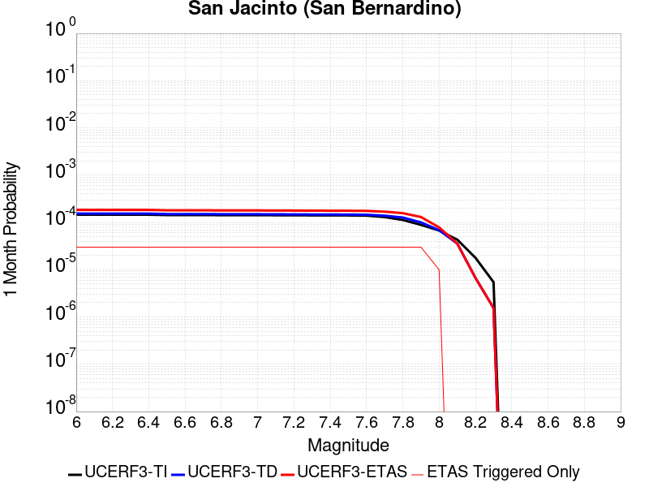 |  | 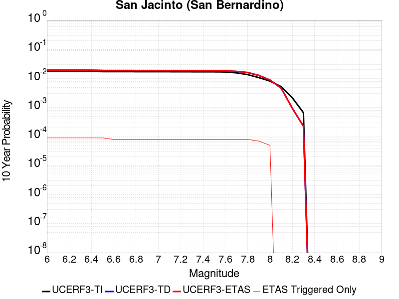 |

| Magnitude | 1 wk TI Prob | 1 wk TD Prob | 1 wk ETAS Prob | 1 wk ETAS/TD Gain | 1 wk ETAS Triggered Only | 1 mo TI Prob | 1 mo TD Prob | 1 mo ETAS Prob | 1 mo ETAS/TD Gain | 1 mo ETAS Triggered Only | 1 yr TI Prob | 1 yr TD Prob | 1 yr ETAS Prob | 1 yr ETAS/TD Gain | 1 yr ETAS Triggered Only | 10 yr TI Prob | 10 yr TD Prob | 10 yr ETAS Prob | 10 yr ETAS/TD Gain | 10 yr ETAS Triggered Only |
|-----|-----|-----|-----|-----|-----|-----|-----|-----|-----|-----|-----|-----|-----|-----|-----|-----|-----|-----|-----|-----|
| 6.0 | 3.409352E-5 | 3.5986508E-5 | 1.248801E-4 | 3.4701922 | 8.889679E-5 | 1.461069E-4 | 1.542188E-4 | 2.4310188E-4 | 1.576344 | 8.889679E-5 | 0.0017774 | 0.0018759987 | 0.0020534587 | 1.094595 | 1.7779358E-4 | 0.01763251 | 0.019349935 | 0.01952429 | 1.0090106 | 1.7779358E-4 |
| 6.1 | 3.409352E-5 | 3.5986508E-5 | 1.248801E-4 | 3.4701922 | 8.889679E-5 | 1.461069E-4 | 1.542188E-4 | 2.4310188E-4 | 1.576344 | 8.889679E-5 | 0.0017774 | 0.0018759987 | 0.0020534587 | 1.094595 | 1.7779358E-4 | 0.01763251 | 0.019349935 | 0.01952429 | 1.0090106 | 1.7779358E-4 |
| 6.2 | 3.409352E-5 | 3.5986508E-5 | 1.248801E-4 | 3.4701922 | 8.889679E-5 | 1.461069E-4 | 1.542188E-4 | 2.4310188E-4 | 1.576344 | 8.889679E-5 | 0.0017774 | 0.0018759987 | 0.0020534587 | 1.094595 | 1.7779358E-4 | 0.01763251 | 0.019349935 | 0.01952429 | 1.0090106 | 1.7779358E-4 |
| 6.3 | 3.409352E-5 | 3.5986508E-5 | 1.248801E-4 | 3.4701922 | 8.889679E-5 | 1.461069E-4 | 1.542188E-4 | 2.4310188E-4 | 1.576344 | 8.889679E-5 | 0.0017774 | 0.0018759987 | 0.0020534587 | 1.094595 | 1.7779358E-4 | 0.01763251 | 0.019349935 | 0.01952429 | 1.0090106 | 1.7779358E-4 |
| 6.4 | 3.400795E-5 | 3.5879173E-5 | 1.2477278E-4 | 3.4775822 | 8.889679E-5 | 1.4574021E-4 | 1.5375883E-4 | 2.4264195E-4 | 1.5780684 | 8.889679E-5 | 0.0017729428 | 0.0018704084 | 0.0020478694 | 1.0948782 | 1.7779358E-4 | 0.017588645 | 0.019295016 | 0.01946938 | 1.0090367 | 1.7779358E-4 |
| 6.5 | 3.341482E-5 | 3.5139812E-5 | 1.2403348E-4 | 3.5297139 | 8.889679E-5 | 1.4319851E-4 | 1.5059051E-4 | 2.3947391E-4 | 1.5902325 | 8.889679E-5 | 0.0017420477 | 0.0018318989 | 0.0020093669 | 1.0968765 | 1.7779358E-4 | 0.017284546 | 0.018916558 | 0.01909099 | 1.0092211 | 1.7779358E-4 |
| 6.6 | 3.3364955E-5 | 3.5077028E-5 | 1.239707E-4 | 3.5342417 | 8.889679E-5 | 1.4298483E-4 | 1.5032147E-4 | 2.392049E-4 | 1.5912889 | 8.889679E-5 | 0.0017394501 | 0.001828629 | 0.0020060975 | 1.09705 | 1.7779358E-4 | 0.017258976 | 0.018884424 | 0.019058859 | 1.009237 | 1.7779358E-4 |
| 6.7 | 3.335922E-5 | 3.5066805E-5 | 1.2396048E-4 | 3.5349808 | 8.889679E-5 | 1.4296026E-4 | 1.5027766E-4 | 2.3916109E-4 | 1.5914614 | 8.889679E-5 | 0.0017391514 | 0.0018280965 | 0.002005565 | 1.0970783 | 1.7779358E-4 | 0.017256035 | 0.018879214 | 0.019053653 | 1.0092397 | 1.7779358E-4 |
| 6.8 | 3.327683E-5 | 3.496087E-5 | 1.2385455E-4 | 3.5426621 | 8.889679E-5 | 1.4260718E-4 | 1.498237E-4 | 2.3870717E-4 | 1.5932537 | 8.889679E-5 | 0.0017348597 | 0.0018225788 | 0.0020000483 | 1.0973728 | 1.7779358E-4 | 0.017213784 | 0.018824987 | 0.018999433 | 1.0092667 | 1.7779358E-4 |
| 6.9 | 3.3235785E-5 | 3.4901823E-5 | 1.2379551E-4 | 3.546964 | 8.889679E-5 | 1.4243131E-4 | 1.4957068E-4 | 2.3845417E-4 | 1.5942575 | 8.889679E-5 | 0.0017327217 | 0.0018195034 | 0.0019969735 | 1.0975376 | 1.7779358E-4 | 0.017192734 | 0.018794855 | 0.018969307 | 1.0092819 | 1.7779358E-4 |
| 7.0 | 3.3197095E-5 | 3.4841752E-5 | 1.2373544E-4 | 3.5513554 | 8.889679E-5 | 1.422655E-4 | 1.4931326E-4 | 2.3819678E-4 | 1.5952821 | 8.889679E-5 | 0.0017307063 | 0.0018163746 | 0.0019938452 | 1.097706 | 1.7779358E-4 | 0.017172894 | 0.018764233 | 0.01893869 | 1.0092974 | 1.7779358E-4 |
| 7.1 | 3.3129716E-5 | 3.4721965E-5 | 1.2361567E-4 | 3.5601575 | 8.889679E-5 | 1.4197677E-4 | 1.4879994E-4 | 2.376835E-4 | 1.597336 | 8.889679E-5 | 0.0017271966 | 0.0018101353 | 0.001987607 | 1.0980433 | 1.7779358E-4 | 0.017138338 | 0.018703312 | 0.01887778 | 1.0093282 | 1.7779358E-4 |
| 7.2 | 3.3034008E-5 | 3.458941E-5 | 1.2348313E-4 | 3.569969 | 8.889679E-5 | 1.4156665E-4 | 1.4823192E-4 | 2.3711554E-4 | 1.5996253 | 8.889679E-5 | 0.0017222111 | 0.0018032312 | 0.0019807043 | 1.0984194 | 1.7779358E-4 | 0.017089253 | 0.018635705 | 0.018810185 | 1.0093627 | 1.7779358E-4 |
| 7.3 | 3.2956614E-5 | 3.445717E-5 | 1.233509E-4 | 3.5798326 | 8.889679E-5 | 1.4123498E-4 | 1.4766524E-4 | 2.3654889E-4 | 1.6019268 | 8.889679E-5 | 0.0017181796 | 0.0017963431 | 0.0019738174 | 1.0987974 | 1.7779358E-4 | 0.017049557 | 0.018568452 | 0.018742945 | 1.0093973 | 1.7779358E-4 |
| 7.4 | 3.2915937E-5 | 3.4378863E-5 | 1.232726E-4 | 3.5857089 | 8.889679E-5 | 1.4106068E-4 | 1.4732967E-4 | 2.3621337E-4 | 1.603298 | 8.889679E-5 | 0.0017160608 | 0.0017922645 | 0.0019697393 | 1.0990227 | 1.7779358E-4 | 0.017028693 | 0.018528719 | 0.018703219 | 1.0094178 | 1.7779358E-4 |
| 7.5 | 3.281791E-5 | 3.4243778E-5 | 1.2313752E-4 | 3.5959094 | 8.889679E-5 | 1.406406E-4 | 1.4675081E-4 | 2.3563455E-4 | 1.6056781 | 8.889679E-5 | 0.0017109542 | 0.0017852283 | 0.0019627046 | 1.0994138 | 1.7779358E-4 | 0.016978411 | 0.018459605 | 0.018634116 | 1.0094537 | 1.7779358E-4 |
| 7.6 | 3.2521442E-5 | 3.396873E-5 | 1.228625E-4 | 3.6169295 | 8.889679E-5 | 1.3937015E-4 | 1.4557215E-4 | 2.34456E-4 | 1.6105828 | 8.889679E-5 | 0.0016955109 | 0.0017709016 | 0.0019483804 | 1.1002194 | 1.7779358E-4 | 0.016826328 | 0.018317232 | 0.01849177 | 1.0095285 | 1.7779358E-4 |
| 7.7 | 3.0287873E-5 | 3.245276E-5 | 1.2134667E-4 | 3.7391784 | 8.889679E-5 | 1.297987E-4 | 1.3907586E-4 | 2.2796029E-4 | 1.6391075 | 8.889679E-5 | 0.0015791537 | 0.0016919347 | 0.0018694274 | 1.1049052 | 1.7779358E-4 | 0.01567979 | 0.01752809 | 0.017702768 | 1.0099655 | 1.7779358E-4 |
| 7.8 | 2.6316151E-5 | 2.9663592E-5 | 1.1855774E-4 | 3.9967427 | 8.889679E-5 | 1.1277862E-4 | 1.2712348E-4 | 2.1600898E-4 | 1.6992059 | 8.889679E-5 | 0.0013722149 | 0.0015466306 | 0.0017241492 | 1.1147777 | 1.7779358E-4 | 0.013637724 | 0.016069634 | 0.01624457 | 1.0108862 | 1.7779358E-4 |
| 7.9 | 2.0761147E-5 | 2.34181E-5 | 1.1231281E-4 | 4.795983 | 8.889679E-5 | 8.897331E-5 | 1.0035944E-4 | 1.8924731E-4 | 1.8856952 | 8.889679E-5 | 0.0010827117 | 0.0012211921 | 0.0013987685 | 1.1454124 | 1.7779358E-4 | 0.010774517 | 0.012793174 | 0.012968693 | 1.0137198 | 1.7779358E-4 |
| 8.0 | 1.5738568E-5 | 1.6033575E-5 | 1.6033575E-5 | 1.0 | 0.0 | 6.744926E-5 | 6.871352E-5 | 6.871352E-5 | 1.0 | 0.0 | 8.2088535E-4 | 8.3626667E-4 | 9.250891E-4 | 1.1062131 | 8.889679E-5 | 0.008178596 | 0.008865921 | 0.0089540295 | 1.0099379 | 8.889679E-5 |
| 8.1 | 1.0105832E-5 | 8.3304985E-6 | 8.3304985E-6 | 1.0 | 0.0 | 4.3309992E-5 | 3.570165E-5 | 3.570165E-5 | 1.0 | 0.0 | 5.2717153E-4 | 4.345814E-4 | 4.345814E-4 | 1.0 | 0.0 | 0.005259227 | 0.004677232 | 0.004677232 | 1.0 | 0.0 |
| 8.2 | 4.189207E-6 | 1.5784357E-6 | 1.5784357E-6 | 1.0 | 0.0 | 1.7953622E-5 | 6.7647065E-6 | 6.7647065E-6 | 1.0 | 0.0 | 2.1856341E-4 | 8.235722E-5 | 8.235722E-5 | 1.0 | 0.0 | 0.0021834858 | 9.565867E-4 | 9.565867E-4 | 1.0 | 0.0 |
| 8.3 | 1.2758221E-6 | 3.6149942E-7 | 3.6149942E-7 | 1.0 | 0.0 | 5.4677976E-6 | 1.5492824E-6 | 1.5492824E-6 | 1.0 | 0.0 | 6.65684E-5 | 1.8862354E-5 | 1.8862354E-5 | 1.0 | 0.0 | 6.6548464E-4 | 2.2751294E-4 | 2.2751294E-4 | 1.0 | 0.0 |

## Imperial
*[(top)](#table-of-contents)*

| 1 Week | 1 Month | 1 Year | 10 Year |
|-----|-----|-----|-----|
|  |  |  |  |

| Magnitude | 1 wk TI Prob | 1 wk TD Prob | 1 wk ETAS Prob | 1 wk ETAS/TD Gain | 1 wk ETAS Triggered Only | 1 mo TI Prob | 1 mo TD Prob | 1 mo ETAS Prob | 1 mo ETAS/TD Gain | 1 mo ETAS Triggered Only | 1 yr TI Prob | 1 yr TD Prob | 1 yr ETAS Prob | 1 yr ETAS/TD Gain | 1 yr ETAS Triggered Only | 10 yr TI Prob | 10 yr TD Prob | 10 yr ETAS Prob | 10 yr ETAS/TD Gain | 10 yr ETAS Triggered Only |
|-----|-----|-----|-----|-----|-----|-----|-----|-----|-----|-----|-----|-----|-----|-----|-----|-----|-----|-----|-----|-----|
| 6.0 | 2.7496446E-4 | 5.0552754E-4 | 5.943794E-4 | 1.1757606 | 8.889679E-5 | 0.0011778869 | 0.002164787 | 0.0022534914 | 1.040976 | 8.889679E-5 | 0.0142467655 | 0.026038699 | 0.026211862 | 1.0066502 | 1.7779358E-4 | 0.13367249 | 0.2280438 | 0.22818103 | 1.0006019 | 1.7779358E-4 |
| 6.1 | 2.5356023E-4 | 4.8656776E-4 | 5.754213E-4 | 1.1826129 | 8.889679E-5 | 0.001086234 | 0.0020836622 | 0.002172374 | 1.0425749 | 8.889679E-5 | 0.013144928 | 0.025071215 | 0.02524455 | 1.0069138 | 1.7779358E-4 | 0.123940155 | 0.21947981 | 0.21961859 | 1.0006323 | 1.7779358E-4 |
| 6.2 | 2.4820742E-4 | 4.7752203E-4 | 5.663764E-4 | 1.1860738 | 8.889679E-5 | 0.0010633124 | 0.0020449557 | 0.0021336707 | 1.0433824 | 8.889679E-5 | 0.01286919 | 0.024611235 | 0.024784653 | 1.0070463 | 1.7779358E-4 | 0.12148927 | 0.21598552 | 0.21612492 | 1.0006454 | 1.7779358E-4 |
| 6.3 | 2.3205351E-4 | 4.5890483E-4 | 5.477608E-4 | 1.1936262 | 8.889679E-5 | 9.94136E-4 | 0.0019652895 | 0.0020540114 | 1.0451446 | 8.889679E-5 | 0.012036599 | 0.02366133 | 0.023834918 | 1.0073363 | 1.7779358E-4 | 0.11405133 | 0.20793462 | 0.20807543 | 1.0006772 | 1.7779358E-4 |
| 6.4 | 2.0304754E-4 | 3.987652E-4 | 4.8762653E-4 | 1.2228413 | 8.889679E-5 | 8.6991355E-4 | 0.0017078889 | 0.0017966339 | 1.0519618 | 8.889679E-5 | 0.010539869 | 0.020595672 | 0.020769803 | 1.0084548 | 1.7779358E-4 | 0.100537635 | 0.1850669 | 0.18521178 | 1.0007828 | 1.7779358E-4 |
| 6.5 | 1.854992E-4 | 3.6988858E-4 | 4.587525E-4 | 1.2402451 | 8.889679E-5 | 7.9475436E-4 | 0.0015842861 | 0.0016730421 | 1.0560226 | 8.889679E-5 | 0.009633281 | 0.01911948 | 0.019293876 | 1.0091213 | 1.7779358E-4 | 0.0922623 | 0.173298 | 0.17344499 | 1.0008482 | 1.7779358E-4 |
| 6.6 | 1.6586106E-4 | 3.403506E-4 | 4.2921715E-4 | 1.2611029 | 8.889679E-5 | 7.106394E-4 | 0.0014578402 | 0.0015466075 | 1.0608895 | 8.889679E-5 | 0.008617763 | 0.01760642 | 0.017781083 | 1.0099205 | 1.7779358E-4 | 0.08291132 | 0.16077545 | 0.16092466 | 1.000928 | 1.7779358E-4 |
| 6.7 | 1.4224656E-4 | 3.076692E-4 | 3.965386E-4 | 1.2888474 | 8.889679E-5 | 6.094856E-4 | 0.001317924 | 0.0014067037 | 1.0673633 | 8.889679E-5 | 0.0073952693 | 0.015929576 | 0.016104538 | 1.0109835 | 1.7779358E-4 | 0.07153955 | 0.14648417 | 0.14663592 | 1.0010359 | 1.7779358E-4 |
| 6.8 | 1.2317259E-4 | 2.779122E-4 | 3.6678428E-4 | 1.3197848 | 8.889679E-5 | 5.2777573E-4 | 0.0011905148 | 0.0012793057 | 1.074582 | 8.889679E-5 | 0.0064067547 | 0.0143995695 | 0.014487186 | 1.0060847 | 8.889679E-5 | 0.06225166 | 0.13293684 | 0.1330139 | 1.0005798 | 8.889679E-5 |
| 6.9 | 9.859898E-5 | 2.5014306E-4 | 3.390176E-4 | 1.355295 | 8.889679E-5 | 4.2249862E-4 | 0.0010716055 | 0.001160407 | 1.0828677 | 8.889679E-5 | 0.0051317946 | 0.012969712 | 0.013057455 | 1.0067652 | 8.889679E-5 | 0.05014893 | 0.11940631 | 0.119484596 | 1.0006557 | 8.889679E-5 |
| 7.0 | 7.3191884E-5 | 2.1266776E-4 | 3.0154566E-4 | 1.4179189 | 8.889679E-5 | 3.136418E-4 | 9.1111806E-4 | 9.999339E-4 | 1.09748 | 8.889679E-5 | 0.003811904 | 0.011037128 | 0.011125043 | 1.0079654 | 8.889679E-5 | 0.037471764 | 0.10206493 | 0.10214475 | 1.0007821 | 8.889679E-5 |
| 7.1 | 7.1760296E-5 | 2.0968143E-4 | 2.9855958E-4 | 1.4238724 | 8.889679E-5 | 3.0750787E-4 | 8.983284E-4 | 9.871452E-4 | 1.0988691 | 8.889679E-5 | 0.003737482 | 0.010882978 | 0.010970907 | 1.0080795 | 8.889679E-5 | 0.03675245 | 0.10070146 | 0.1007814 | 1.0007939 | 8.889679E-5 |
| 7.2 | 6.46614E-5 | 1.9136685E-4 | 2.8024663E-4 | 1.464447 | 8.889679E-5 | 2.7709085E-4 | 8.1988896E-4 | 9.0871286E-4 | 1.1083366 | 8.889679E-5 | 0.0033683628 | 0.0099370815 | 0.010025095 | 1.008857 | 8.889679E-5 | 0.033177625 | 0.09250898 | 0.092589654 | 1.000872 | 8.889679E-5 |
| 7.3 | 6.088115E-5 | 1.78084E-4 | 2.6696495E-4 | 1.4990957 | 8.889679E-5 | 2.6089314E-4 | 7.6299673E-4 | 8.518257E-4 | 1.1164211 | 8.889679E-5 | 0.0031717476 | 0.009250494 | 0.009338568 | 1.009521 | 8.889679E-5 | 0.031268585 | 0.08655989 | 0.086641096 | 1.000938 | 8.889679E-5 |
| 7.4 | 4.199346E-5 | 1.1510366E-4 | 2.0399022E-4 | 1.7722305 | 8.889679E-5 | 1.7995955E-4 | 4.9320905E-4 | 5.82062E-4 | 1.1801527 | 8.889679E-5 | 0.0021888057 | 0.0059884563 | 0.0060768207 | 1.0147558 | 8.889679E-5 | 0.02167372 | 0.057439793 | 0.057523586 | 1.0014588 | 8.889679E-5 |
| 7.5 | 3.130448E-5 | 8.33328E-5 | 8.33328E-5 | 1.0 | 0.0 | 1.3415517E-4 | 3.57092E-4 | 3.57092E-4 | 1.0 | 0.0 | 0.0016321153 | 0.004338988 | 0.004338988 | 1.0 | 0.0 | 0.016201803 | 0.04213201 | 0.04213201 | 1.0 | 0.0 |
| 7.6 | 2.3074248E-5 | 6.0844646E-5 | 6.0844646E-5 | 1.0 | 0.0 | 9.888588E-5 | 2.6073685E-4 | 2.6073685E-4 | 1.0 | 0.0 | 0.0012032706 | 0.0031698733 | 0.0031698733 | 1.0 | 0.0 | 0.011967761 | 0.031026395 | 0.031026395 | 1.0 | 0.0 |
| 7.7 | 1.45864815E-5 | 4.0124698E-5 | 4.0124698E-5 | 1.0 | 0.0 | 6.2511994E-5 | 1.7195169E-4 | 1.7195169E-4 | 1.0 | 0.0 | 7.608177E-4 | 0.0020915072 | 0.0020915072 | 1.0 | 0.0 | 0.007582182 | 0.020627763 | 0.020627763 | 1.0 | 0.0 |
| 7.8 | 1.0352979E-5 | 3.0960902E-5 | 3.0960902E-5 | 1.0 | 0.0 | 4.4369157E-5 | 1.3268284E-4 | 1.3268284E-4 | 1.0 | 0.0 | 5.400606E-4 | 0.0016142189 | 0.0016142189 | 1.0 | 0.0 | 0.0053875 | 0.016016833 | 0.016016833 | 1.0 | 0.0 |
| 7.9 | 8.137906E-6 | 2.2149103E-5 | 2.2149103E-5 | 1.0 | 0.0 | 3.4876273E-5 | 9.492128E-5 | 9.492128E-5 | 1.0 | 0.0 | 4.2453592E-4 | 0.0011550548 | 0.0011550548 | 1.0 | 0.0 | 0.004237258 | 0.011617903 | 0.011617903 | 1.0 | 0.0 |
| 8.0 | 6.93792E-6 | 1.8008766E-5 | 1.8008766E-5 | 1.0 | 0.0 | 2.9733603E-5 | 7.717814E-5 | 7.717814E-5 | 1.0 | 0.0 | 3.6194647E-4 | 9.3923963E-4 | 9.3923963E-4 | 1.0 | 0.0 | 0.0036135751 | 0.00950155 | 0.00950155 | 1.0 | 0.0 |
| 8.1 | 3.4286315E-6 | 6.379872E-6 | 6.379872E-6 | 1.0 | 0.0 | 1.4694053E-5 | 2.7342023E-5 | 2.7342023E-5 | 1.0 | 0.0 | 1.7888541E-4 | 3.328384E-4 | 3.328384E-4 | 1.0 | 0.0 | 0.0017874148 | 0.003486031 | 0.003486031 | 1.0 | 0.0 |
| 8.2 | 1.4906886E-6 | 1.9366646E-6 | 1.9366646E-6 | 1.0 | 0.0 | 6.3886496E-6 | 8.299965E-6 | 8.299965E-6 | 1.0 | 0.0 | 7.7779034E-5 | 1.0104742E-4 | 1.0104742E-4 | 1.0 | 0.0 | 7.775182E-4 | 0.0011075331 | 0.0011075331 | 1.0 | 0.0 |
| 8.3 | 2.5758007E-8 | 1.4500102E-8 | 1.4500102E-8 | 1.0 | 0.0 | 1.10391454E-7 | 6.214329E-8 | 6.214329E-8 | 1.0 | 0.0 | 1.3440151E-6 | 7.565946E-7 | 7.565946E-7 | 1.0 | 0.0 | 1.344007E-5 | 7.887763E-6 | 7.887763E-6 | 1.0 | 0.0 |

## White Mountains
*[(top)](#table-of-contents)*

| 1 Week | 1 Month | 1 Year | 10 Year |
|-----|-----|-----|-----|
|  |  |  |  |

| Magnitude | 1 wk TI Prob | 1 wk TD Prob | 1 wk ETAS Prob | 1 wk ETAS/TD Gain | 1 wk ETAS Triggered Only | 1 mo TI Prob | 1 mo TD Prob | 1 mo ETAS Prob | 1 mo ETAS/TD Gain | 1 mo ETAS Triggered Only | 1 yr TI Prob | 1 yr TD Prob | 1 yr ETAS Prob | 1 yr ETAS/TD Gain | 1 yr ETAS Triggered Only | 10 yr TI Prob | 10 yr TD Prob | 10 yr ETAS Prob | 10 yr ETAS/TD Gain | 10 yr ETAS Triggered Only |
|-----|-----|-----|-----|-----|-----|-----|-----|-----|-----|-----|-----|-----|-----|-----|-----|-----|-----|-----|-----|-----|
| 6.0 | 3.503579E-5 | 3.378405E-5 | 3.378405E-5 | 1.0 | 0.0 | 1.5014476E-4 | 1.4478143E-4 | 1.4478143E-4 | 1.0 | 0.0 | 0.0018264796 | 0.0017614096 | 0.0018501497 | 1.0503802 | 8.889679E-5 | 0.018115403 | 0.017486818 | 0.017661503 | 1.0099895 | 1.7779358E-4 |
| 6.1 | 3.503579E-5 | 3.378405E-5 | 3.378405E-5 | 1.0 | 0.0 | 1.5014476E-4 | 1.4478143E-4 | 1.4478143E-4 | 1.0 | 0.0 | 0.0018264796 | 0.0017614096 | 0.0018501497 | 1.0503802 | 8.889679E-5 | 0.018115403 | 0.017486818 | 0.017661503 | 1.0099895 | 1.7779358E-4 |
| 6.2 | 3.503579E-5 | 3.378405E-5 | 3.378405E-5 | 1.0 | 0.0 | 1.5014476E-4 | 1.4478143E-4 | 1.4478143E-4 | 1.0 | 0.0 | 0.0018264796 | 0.0017614096 | 0.0018501497 | 1.0503802 | 8.889679E-5 | 0.018115403 | 0.017486818 | 0.017661503 | 1.0099895 | 1.7779358E-4 |
| 6.3 | 1.7818425E-5 | 1.5916074E-5 | 1.5916074E-5 | 1.0 | 0.0 | 7.636245E-5 | 6.821004E-5 | 6.821004E-5 | 1.0 | 0.0 | 9.293162E-4 | 8.301551E-4 | 8.301551E-4 | 1.0 | 0.0 | 0.009254395 | 0.008271999 | 0.008271999 | 1.0 | 0.0 |
| 6.4 | 1.7818425E-5 | 1.5916074E-5 | 1.5916074E-5 | 1.0 | 0.0 | 7.636245E-5 | 6.821004E-5 | 6.821004E-5 | 1.0 | 0.0 | 9.293162E-4 | 8.301551E-4 | 8.301551E-4 | 1.0 | 0.0 | 0.009254395 | 0.008271999 | 0.008271999 | 1.0 | 0.0 |
| 6.5 | 1.3397557E-5 | 1.13362685E-5 | 1.13362685E-5 | 1.0 | 0.0 | 5.741684E-5 | 4.858314E-5 | 4.858314E-5 | 1.0 | 0.0 | 6.988258E-4 | 5.913462E-4 | 5.913462E-4 | 1.0 | 0.0 | 0.006966323 | 0.005898432 | 0.005898432 | 1.0 | 0.0 |
| 6.6 | 1.0818695E-5 | 8.625366E-6 | 8.625366E-6 | 1.0 | 0.0 | 4.6365014E-5 | 3.6965357E-5 | 3.6965357E-5 | 1.0 | 0.0 | 5.6434784E-4 | 4.4996463E-4 | 4.4996463E-4 | 1.0 | 0.0 | 0.005629168 | 0.004490972 | 0.004490972 | 1.0 | 0.0 |
| 6.7 | 9.067908E-6 | 6.802442E-6 | 6.802442E-6 | 1.0 | 0.0 | 3.8861883E-5 | 2.9153016E-5 | 2.9153016E-5 | 1.0 | 0.0 | 4.7304068E-4 | 3.5488335E-4 | 3.5488335E-4 | 1.0 | 0.0 | 0.00472035 | 0.0035434833 | 0.0035434833 | 1.0 | 0.0 |
| 6.8 | 7.295947E-6 | 4.936391E-6 | 4.936391E-6 | 1.0 | 0.0 | 3.126797E-5 | 2.1155796E-5 | 2.1155796E-5 | 1.0 | 0.0 | 3.8062103E-4 | 2.575425E-4 | 2.575425E-4 | 1.0 | 0.0 | 0.0037996976 | 0.0025725532 | 0.0025725532 | 1.0 | 0.0 |
| 6.9 | 6.2243444E-6 | 3.832213E-6 | 3.832213E-6 | 1.0 | 0.0 | 2.6675489E-5 | 1.642367E-5 | 1.642367E-5 | 1.0 | 0.0 | 3.2472567E-4 | 1.9994036E-4 | 1.9994036E-4 | 1.0 | 0.0 | 0.0032425157 | 0.0019976576 | 0.0019976576 | 1.0 | 0.0 |
| 7.0 | 4.9878413E-6 | 2.6795342E-6 | 2.6795342E-6 | 1.0 | 0.0 | 2.1376287E-5 | 1.14836685E-5 | 1.14836685E-5 | 1.0 | 0.0 | 2.602252E-4 | 1.3980496E-4 | 1.3980496E-4 | 1.0 | 0.0 | 0.002599207 | 0.0013971963 | 0.0013971963 | 1.0 | 0.0 |
| 7.1 | 4.0252844E-6 | 1.8857575E-6 | 1.8857575E-6 | 1.0 | 0.0 | 1.7251105E-5 | 8.081794E-6 | 8.081794E-6 | 1.0 | 0.0 | 2.1001195E-4 | 9.8391516E-5 | 9.8391516E-5 | 1.0 | 0.0 | 0.0020981359 | 9.834924E-4 | 9.834924E-4 | 1.0 | 0.0 |
| 7.2 | 3.3284066E-6 | 1.281964E-6 | 1.281964E-6 | 1.0 | 0.0 | 1.4264522E-5 | 5.494121E-6 | 5.494121E-6 | 1.0 | 0.0 | 1.736567E-4 | 6.688897E-5 | 6.688897E-5 | 1.0 | 0.0 | 0.0017352107 | 6.6869846E-4 | 6.6869846E-4 | 1.0 | 0.0 |
| 7.3 | 2.458226E-6 | 6.05722E-7 | 6.05722E-7 | 1.0 | 0.0 | 1.0535211E-5 | 2.5959491E-6 | 2.5959491E-6 | 1.0 | 0.0 | 1.2825865E-4 | 3.1605257E-5 | 3.1605257E-5 | 1.0 | 0.0 | 0.0012818464 | 3.160114E-4 | 3.160114E-4 | 1.0 | 0.0 |
| 7.4 | 1.965953E-6 | 3.1089303E-7 | 3.1089303E-7 | 1.0 | 0.0 | 8.425486E-6 | 1.332398E-6 | 1.332398E-6 | 1.0 | 0.0 | 1.0257547E-4 | 1.6221828E-5 | 1.6221828E-5 | 1.0 | 0.0 | 0.0010252813 | 1.6220656E-4 | 1.6220656E-4 | 1.0 | 0.0 |
| 7.5 | 1.2014192E-6 | 1.8244253E-7 | 1.8244253E-7 | 1.0 | 0.0 | 5.148929E-6 | 7.8189635E-7 | 7.8189635E-7 | 1.0 | 0.0 | 6.2686406E-5 | 9.519547E-6 | 9.519547E-6 | 1.0 | 0.0 | 6.266873E-4 | 9.519148E-5 | 9.519148E-5 | 1.0 | 0.0 |
| 7.6 | 2.5612175E-7 | 4.8946475E-8 | 4.8946475E-8 | 1.0 | 0.0 | 1.0976642E-6 | 2.0977059E-7 | 2.0977059E-7 | 1.0 | 0.0 | 1.3363979E-5 | 2.5539543E-6 | 2.5539543E-6 | 1.0 | 0.0 | 1.3363175E-4 | 2.5539286E-5 | 2.5539286E-5 | 1.0 | 0.0 |

## Ludlow
*[(top)](#table-of-contents)*

| 1 Week | 1 Month | 1 Year | 10 Year |
|-----|-----|-----|-----|
|  |  |  |  |

| Magnitude | 1 wk TI Prob | 1 wk TD Prob | 1 wk ETAS Prob | 1 wk ETAS/TD Gain | 1 wk ETAS Triggered Only | 1 mo TI Prob | 1 mo TD Prob | 1 mo ETAS Prob | 1 mo ETAS/TD Gain | 1 mo ETAS Triggered Only | 1 yr TI Prob | 1 yr TD Prob | 1 yr ETAS Prob | 1 yr ETAS/TD Gain | 1 yr ETAS Triggered Only | 10 yr TI Prob | 10 yr TD Prob | 10 yr ETAS Prob | 10 yr ETAS/TD Gain | 10 yr ETAS Triggered Only |
|-----|-----|-----|-----|-----|-----|-----|-----|-----|-----|-----|-----|-----|-----|-----|-----|-----|-----|-----|-----|-----|
| 6.0 | 2.2407607E-5 | 2.3657254E-5 | 2.3657254E-5 | 1.0 | 0.0 | 9.602906E-5 | 1.0138454E-4 | 1.0138454E-4 | 1.0 | 0.0 | 0.0011685267 | 0.001233702 | 0.001322489 | 1.0719681 | 8.889679E-5 | 0.011624013 | 0.012273042 | 0.012448654 | 1.0143087 | 1.7779358E-4 |
| 6.1 | 2.2407607E-5 | 2.3657254E-5 | 2.3657254E-5 | 1.0 | 0.0 | 9.602906E-5 | 1.0138454E-4 | 1.0138454E-4 | 1.0 | 0.0 | 0.0011685267 | 0.001233702 | 0.001322489 | 1.0719681 | 8.889679E-5 | 0.011624013 | 0.012273042 | 0.012448654 | 1.0143087 | 1.7779358E-4 |
| 6.2 | 1.0781252E-5 | 1.1365663E-5 | 1.1365663E-5 | 1.0 | 0.0 | 4.620455E-5 | 4.8709102E-5 | 4.8709102E-5 | 1.0 | 0.0 | 5.623952E-4 | 5.9287593E-4 | 6.8172003E-4 | 1.1498528 | 8.889679E-5 | 0.00560974 | 0.0059133614 | 0.0060901036 | 1.0298886 | 1.7779358E-4 |
| 6.3 | 1.0781252E-5 | 1.1365663E-5 | 1.1365663E-5 | 1.0 | 0.0 | 4.620455E-5 | 4.8709102E-5 | 4.8709102E-5 | 1.0 | 0.0 | 5.623952E-4 | 5.9287593E-4 | 6.8172003E-4 | 1.1498528 | 8.889679E-5 | 0.00560974 | 0.0059133614 | 0.0060901036 | 1.0298886 | 1.7779358E-4 |
| 6.4 | 7.814439E-6 | 8.237729E-6 | 8.237729E-6 | 1.0 | 0.0 | 3.3490025E-5 | 3.530408E-5 | 3.530408E-5 | 1.0 | 0.0 | 4.0766477E-4 | 4.2974384E-4 | 5.1860244E-4 | 1.206771 | 8.889679E-5 | 0.0040691774 | 0.0042892746 | 0.0044663055 | 1.041273 | 1.7779358E-4 |
| 6.5 | 6.4986366E-6 | 6.85092E-6 | 6.85092E-6 | 1.0 | 0.0 | 2.7851002E-5 | 2.9360759E-5 | 2.9360759E-5 | 1.0 | 0.0 | 3.390332E-4 | 3.5740953E-4 | 4.4627456E-4 | 1.2486364 | 8.889679E-5 | 0.003385164 | 0.0035684432 | 0.003657023 | 1.0248231 | 8.889679E-5 |
| 6.6 | 5.582177E-6 | 5.8860055E-6 | 5.8860055E-6 | 1.0 | 0.0 | 2.3923398E-5 | 2.5225498E-5 | 2.5225498E-5 | 1.0 | 0.0 | 2.9122844E-4 | 3.0707786E-4 | 3.9594737E-4 | 1.2894038 | 8.889679E-5 | 0.0029084706 | 0.003066609 | 0.003155233 | 1.0288998 | 8.889679E-5 |
| 6.7 | 4.6858763E-6 | 4.940427E-6 | 4.940427E-6 | 1.0 | 0.0 | 2.0082172E-5 | 2.1173091E-5 | 2.1173091E-5 | 1.0 | 0.0 | 2.4447302E-4 | 2.5775246E-4 | 3.4662633E-4 | 1.3448032 | 8.889679E-5 | 0.0024420423 | 0.0025745912 | 0.0026632592 | 1.0344396 | 8.889679E-5 |
| 6.8 | 3.5584908E-6 | 3.7520183E-6 | 3.7520183E-6 | 1.0 | 0.0 | 1.5250586E-5 | 1.6079981E-5 | 1.6079981E-5 | 1.0 | 0.0 | 1.8566006E-4 | 1.957566E-4 | 1.957566E-4 | 1.0 | 0.0 | 0.0018550502 | 0.0019558826 | 0.0019558826 | 1.0 | 0.0 |
| 6.9 | 2.532834E-6 | 2.6710034E-6 | 2.6710034E-6 | 1.0 | 0.0 | 1.0854958E-5 | 1.1447109E-5 | 1.1447109E-5 | 1.0 | 0.0 | 1.3215111E-4 | 1.3935992E-4 | 1.3935992E-4 | 1.0 | 0.0 | 0.0013207254 | 0.0013927529 | 0.0013927529 | 1.0 | 0.0 |
| 7.0 | 1.7083285E-6 | 1.8019439E-6 | 1.8019439E-6 | 1.0 | 0.0 | 7.3213873E-6 | 7.722595E-6 | 7.722595E-6 | 1.0 | 0.0 | 8.913424E-5 | 9.40187E-5 | 9.40187E-5 | 1.0 | 0.0 | 8.9098496E-4 | 9.3980576E-4 | 9.3980576E-4 | 1.0 | 0.0 |
| 7.1 | 1.0905424E-6 | 1.1497619E-6 | 1.1497619E-6 | 1.0 | 0.0 | 4.6737446E-6 | 4.9275427E-6 | 4.9275427E-6 | 1.0 | 0.0 | 5.6901354E-5 | 5.999128E-5 | 5.999128E-5 | 1.0 | 0.0 | 5.6886784E-4 | 5.997606E-4 | 5.997606E-4 | 1.0 | 0.0 |
| 7.2 | 6.06668E-7 | 6.387277E-7 | 6.387277E-7 | 1.0 | 0.0 | 2.600003E-6 | 2.7374022E-6 | 2.7374022E-6 | 1.0 | 0.0 | 3.1654577E-5 | 3.3327433E-5 | 3.3327433E-5 | 1.0 | 0.0 | 3.1650066E-4 | 3.3323118E-4 | 3.3323118E-4 | 1.0 | 0.0 |

## Brawley (Seismic Zone) alt 1
*[(top)](#table-of-contents)*

| 1 Week | 1 Month | 1 Year | 10 Year |
|-----|-----|-----|-----|
|  |  |  |  |

| Magnitude | 1 wk TI Prob | 1 wk TD Prob | 1 wk ETAS Prob | 1 wk ETAS/TD Gain | 1 wk ETAS Triggered Only | 1 mo TI Prob | 1 mo TD Prob | 1 mo ETAS Prob | 1 mo ETAS/TD Gain | 1 mo ETAS Triggered Only | 1 yr TI Prob | 1 yr TD Prob | 1 yr ETAS Prob | 1 yr ETAS/TD Gain | 1 yr ETAS Triggered Only | 10 yr TI Prob | 10 yr TD Prob | 10 yr ETAS Prob | 10 yr ETAS/TD Gain | 10 yr ETAS Triggered Only |
|-----|-----|-----|-----|-----|-----|-----|-----|-----|-----|-----|-----|-----|-----|-----|-----|-----|-----|-----|-----|-----|
| 6.0 | 2.2521618E-4 | 4.7632487E-4 | 5.6517933E-4 | 1.1865417 | 8.889679E-5 | 9.6485513E-4 | 0.0020398323 | 0.0021285478 | 1.0434916 | 8.889679E-5 | 0.011683988 | 0.024546238 | 0.024719667 | 1.0070654 | 1.7779358E-4 | 0.11088423 | 0.21350002 | 0.21363986 | 1.0006549 | 1.7779358E-4 |
| 6.1 | 2.2521618E-4 | 4.7632487E-4 | 5.6517933E-4 | 1.1865417 | 8.889679E-5 | 9.6485513E-4 | 0.0020398323 | 0.0021285478 | 1.0434916 | 8.889679E-5 | 0.011683988 | 0.024546238 | 0.024719667 | 1.0070654 | 1.7779358E-4 | 0.11088423 | 0.21350002 | 0.21363986 | 1.0006549 | 1.7779358E-4 |
| 6.2 | 2.198148E-4 | 4.6717093E-4 | 5.560262E-4 | 1.1901987 | 8.889679E-5 | 9.417233E-4 | 0.0020006616 | 0.0020893805 | 1.0443448 | 8.889679E-5 | 0.011405343 | 0.024080504 | 0.024254015 | 1.0072055 | 1.7779358E-4 | 0.10837428 | 0.20993657 | 0.21007703 | 1.0006691 | 1.7779358E-4 |
| 6.3 | 2.1704129E-4 | 4.615278E-4 | 5.503835E-4 | 1.1925253 | 8.889679E-5 | 9.298453E-4 | 0.0019765133 | 0.0020652344 | 1.0448877 | 8.889679E-5 | 0.011262234 | 0.02379366 | 0.023967223 | 1.0072945 | 1.7779358E-4 | 0.107082725 | 0.20782755 | 0.20796838 | 1.0006777 | 1.7779358E-4 |
| 6.4 | 1.876142E-4 | 4.00449E-4 | 4.893102E-4 | 1.2219039 | 8.889679E-5 | 8.038131E-4 | 0.0017150956 | 0.0018038399 | 1.051743 | 8.889679E-5 | 0.00974259 | 0.020680401 | 0.020854518 | 1.0084194 | 1.7779358E-4 | 0.093263686 | 0.18457815 | 0.18472312 | 1.0007855 | 1.7779358E-4 |
| 6.5 | 1.7390939E-4 | 3.7477075E-4 | 4.6363423E-4 | 1.2371142 | 8.889679E-5 | 7.45113E-4 | 0.0016051838 | 0.0016939379 | 1.0552921 | 8.889679E-5 | 0.009034078 | 0.019368723 | 0.019543074 | 1.0090016 | 1.7779358E-4 | 0.086755216 | 0.17440031 | 0.1745471 | 1.0008416 | 1.7779358E-4 |
| 6.6 | 1.591791E-4 | 3.4891962E-4 | 4.377854E-4 | 1.2546884 | 8.889679E-5 | 6.8201777E-4 | 0.0014945229 | 0.0015832868 | 1.0593928 | 8.889679E-5 | 0.008271996 | 0.018045569 | 0.018220155 | 1.0096747 | 1.7779358E-4 | 0.07970774 | 0.16380852 | 0.1639572 | 1.0009075 | 1.7779358E-4 |
| 6.7 | 1.4268003E-4 | 3.20582E-4 | 4.094503E-4 | 1.2772093 | 8.889679E-5 | 6.1134255E-4 | 0.0013732077 | 0.0014619824 | 1.0646477 | 8.889679E-5 | 0.007417723 | 0.016592601 | 0.016767446 | 1.0105374 | 1.7779358E-4 | 0.07174956 | 0.15193306 | 0.15208384 | 1.0009924 | 1.7779358E-4 |
| 6.8 | 1.239713E-4 | 2.9053655E-4 | 3.7940752E-4 | 1.3058857 | 8.889679E-5 | 5.3119735E-4 | 0.0012445687 | 0.0013333549 | 1.0713389 | 8.889679E-5 | 0.0064481674 | 0.015048777 | 0.015136336 | 1.0058184 | 8.889679E-5 | 0.06264243 | 0.13837762 | 0.13845423 | 1.0005535 | 8.889679E-5 |
| 6.9 | 1.0180238E-4 | 2.625439E-4 | 3.5141734E-4 | 1.338509 | 8.889679E-5 | 4.3622297E-4 | 0.0011247073 | 0.001213504 | 1.078951 | 8.889679E-5 | 0.005298089 | 0.013608336 | 0.013696023 | 1.0064436 | 8.889679E-5 | 0.05173543 | 0.124961674 | 0.12503946 | 1.0006225 | 8.889679E-5 |
| 7.0 | 7.6619996E-5 | 2.23993E-4 | 3.1286987E-4 | 1.3967842 | 8.889679E-5 | 3.283301E-4 | 9.5962E-4 | 0.0010484315 | 1.0925486 | 8.889679E-5 | 0.0039900932 | 0.011621496 | 0.0117093595 | 1.0075605 | 8.889679E-5 | 0.039192066 | 0.107266866 | 0.10734623 | 1.0007398 | 8.889679E-5 |
| 7.1 | 7.5127435E-5 | 2.2082464E-4 | 3.097018E-4 | 1.4024785 | 8.889679E-5 | 3.2193496E-4 | 9.4605127E-4 | 0.0010348639 | 1.0938772 | 8.889679E-5 | 0.0039125155 | 0.011458045 | 0.011545923 | 1.0076696 | 8.889679E-5 | 0.038443442 | 0.10583085 | 0.10591034 | 1.0007511 | 8.889679E-5 |
| 7.2 | 6.788582E-5 | 2.0210193E-4 | 2.9098077E-4 | 1.4397722 | 8.889679E-5 | 2.9090676E-4 | 8.6586666E-4 | 9.546865E-4 | 1.1025791 | 8.889679E-5 | 0.0035360386 | 0.0104916105 | 0.010579575 | 1.0083842 | 8.889679E-5 | 0.034803 | 0.09750131 | 0.09758154 | 1.0008229 | 8.889679E-5 |
| 7.3 | 6.399602E-5 | 1.8841137E-4 | 2.772914E-4 | 1.4717339 | 8.889679E-5 | 2.7423984E-4 | 8.072303E-4 | 8.960553E-4 | 1.1100367 | 8.889679E-5 | 0.0033337586 | 0.009784332 | 0.009872358 | 1.0089967 | 8.889679E-5 | 0.03284188 | 0.09139617 | 0.09147694 | 1.0008837 | 8.889679E-5 |
| 7.4 | 4.506759E-5 | 1.2529209E-4 | 2.1417774E-4 | 1.7094275 | 8.889679E-5 | 1.9313251E-4 | 5.368565E-4 | 6.257055E-4 | 1.1654987 | 8.889679E-5 | 0.0023488526 | 0.0065168133 | 0.006605131 | 1.0135522 | 8.889679E-5 | 0.023241805 | 0.062363707 | 0.062447056 | 1.0013366 | 8.889679E-5 |
| 7.5 | 3.43289E-5 | 9.33541E-5 | 9.33541E-5 | 1.0 | 0.0 | 1.4711556E-4 | 4.00028E-4 | 4.00028E-4 | 1.0 | 0.0 | 0.0017896603 | 0.0048595266 | 0.0048595266 | 1.0 | 0.0 | 0.01775316 | 0.04705519 | 0.04705519 | 1.0 | 0.0 |
| 7.6 | 2.5980507E-5 | 7.053101E-5 | 7.053101E-5 | 1.0 | 0.0 | 1.1134028E-4 | 3.0224086E-4 | 3.0224086E-4 | 1.0 | 0.0 | 0.001354725 | 0.003673598 | 0.003673598 | 1.0 | 0.0 | 0.013464959 | 0.035840835 | 0.035840835 | 1.0 | 0.0 |
| 7.7 | 1.7292105E-5 | 4.9407296E-5 | 4.9407296E-5 | 1.0 | 0.0 | 7.4106916E-5 | 2.117284E-4 | 2.117284E-4 | 1.0 | 0.0 | 9.018782E-4 | 0.0025747516 | 0.0025747516 | 1.0 | 0.0 | 0.008982267 | 0.025290398 | 0.025290398 | 1.0 | 0.0 |
| 7.8 | 1.2927471E-5 | 3.9693266E-5 | 3.9693266E-5 | 1.0 | 0.0 | 5.5402274E-5 | 1.7010293E-4 | 1.7010293E-4 | 1.0 | 0.0 | 6.743139E-4 | 0.0020690386 | 0.0020690386 | 1.0 | 0.0 | 0.0067227143 | 0.020431727 | 0.020431727 | 1.0 | 0.0 |
| 7.9 | 1.0200774E-5 | 2.874569E-5 | 2.874569E-5 | 1.0 | 0.0 | 4.371687E-5 | 1.2319001E-4 | 1.2319001E-4 | 1.0 | 0.0 | 5.321229E-4 | 0.0014988075 | 0.0014988075 | 1.0 | 0.0 | 0.005308505 | 0.014991644 | 0.014991644 | 1.0 | 0.0 |
| 8.0 | 8.650396E-6 | 2.3277367E-5 | 2.3277367E-5 | 1.0 | 0.0 | 3.70726E-5 | 9.975634E-5 | 9.975634E-5 | 1.0 | 0.0 | 4.5126543E-4 | 0.0012138576 | 0.0012138576 | 1.0 | 0.0 | 0.0045035016 | 0.012211097 | 0.012211097 | 1.0 | 0.0 |
| 8.1 | 3.9368224E-6 | 7.3279825E-6 | 7.3279825E-6 | 1.0 | 0.0 | 1.6871985E-5 | 3.140526E-5 | 3.140526E-5 | 1.0 | 0.0 | 2.0539707E-4 | 3.8229208E-4 | 3.8229208E-4 | 1.0 | 0.0 | 0.0020520731 | 0.004001185 | 0.004001185 | 1.0 | 0.0 |
| 8.2 | 1.7101195E-6 | 2.217876E-6 | 2.217876E-6 | 1.0 | 0.0 | 7.329063E-6 | 9.505149E-6 | 9.505149E-6 | 1.0 | 0.0 | 8.922769E-5 | 1.1571907E-4 | 1.1571907E-4 | 1.0 | 0.0 | 8.9191867E-4 | 0.0012666774 | 0.0012666774 | 1.0 | 0.0 |
| 8.3 | 3.0346666E-8 | 1.721586E-8 | 1.721586E-8 | 1.0 | 0.0 | 1.3005713E-7 | 7.378226E-8 | 7.378226E-8 | 1.0 | 0.0 | 1.5834444E-6 | 8.9829894E-7 | 8.9829894E-7 | 1.0 | 0.0 | 1.5834332E-5 | 9.367729E-6 | 9.367729E-6 | 1.0 | 0.0 |

## Big Pine (East)
*[(top)](#table-of-contents)*

| 1 Week | 1 Month | 1 Year | 10 Year |
|-----|-----|-----|-----|
|  |  |  |  |

| Magnitude | 1 wk TI Prob | 1 wk TD Prob | 1 wk ETAS Prob | 1 wk ETAS/TD Gain | 1 wk ETAS Triggered Only | 1 mo TI Prob | 1 mo TD Prob | 1 mo ETAS Prob | 1 mo ETAS/TD Gain | 1 mo ETAS Triggered Only | 1 yr TI Prob | 1 yr TD Prob | 1 yr ETAS Prob | 1 yr ETAS/TD Gain | 1 yr ETAS Triggered Only | 10 yr TI Prob | 10 yr TD Prob | 10 yr ETAS Prob | 10 yr ETAS/TD Gain | 10 yr ETAS Triggered Only |
|-----|-----|-----|-----|-----|-----|-----|-----|-----|-----|-----|-----|-----|-----|-----|-----|-----|-----|-----|-----|-----|
| 6.0 | 9.916913E-6 | 1.2816984E-5 | 1.01712634E-4 | 7.9357696 | 8.889679E-5 | 4.250036E-5 | 5.49289E-5 | 1.4382081E-4 | 2.6183085 | 8.889679E-5 | 5.173191E-4 | 6.685763E-4 | 8.46251E-4 | 1.2657509 | 1.7779358E-4 | 0.0051611643 | 0.006670441 | 0.0068470486 | 1.0264761 | 1.7779358E-4 |
| 6.1 | 9.916913E-6 | 1.2816984E-5 | 1.01712634E-4 | 7.9357696 | 8.889679E-5 | 4.250036E-5 | 5.49289E-5 | 1.4382081E-4 | 2.6183085 | 8.889679E-5 | 5.173191E-4 | 6.685763E-4 | 8.46251E-4 | 1.2657509 | 1.7779358E-4 | 0.0051611643 | 0.006670441 | 0.0068470486 | 1.0264761 | 1.7779358E-4 |
| 6.2 | 9.916913E-6 | 1.2816984E-5 | 1.01712634E-4 | 7.9357696 | 8.889679E-5 | 4.250036E-5 | 5.49289E-5 | 1.4382081E-4 | 2.6183085 | 8.889679E-5 | 5.173191E-4 | 6.685763E-4 | 8.46251E-4 | 1.2657509 | 1.7779358E-4 | 0.0051611643 | 0.006670441 | 0.0068470486 | 1.0264761 | 1.7779358E-4 |
| 6.3 | 5.479711E-6 | 8.112951E-6 | 9.700902E-5 | 11.957303 | 8.889679E-5 | 2.3484265E-5 | 3.4769346E-5 | 1.2366305E-4 | 3.5566688 | 8.889679E-5 | 2.858834E-4 | 4.2323777E-4 | 6.009561E-4 | 1.4199018 | 1.7779358E-4 | 0.0028551589 | 0.004227244 | 0.0044042855 | 1.0418812 | 1.7779358E-4 |
| 6.4 | 5.465009E-6 | 8.097245E-6 | 9.699332E-5 | 11.978558 | 8.889679E-5 | 2.3421257E-5 | 3.4702036E-5 | 1.2359575E-4 | 3.561628 | 8.889679E-5 | 2.851165E-4 | 4.2241855E-4 | 6.0013705E-4 | 1.4207165 | 1.7779358E-4 | 0.0028475097 | 0.0042190826 | 0.004396126 | 1.0419625 | 1.7779358E-4 |
| 6.5 | 4.826767E-6 | 7.422301E-6 | 9.6318436E-5 | 12.976896 | 8.889679E-5 | 2.068598E-5 | 3.180949E-5 | 1.2070345E-4 | 3.7945735 | 8.889679E-5 | 2.518227E-4 | 3.872145E-4 | 5.649392E-4 | 1.4589827 | 1.7779358E-4 | 0.0025153751 | 0.003868283 | 0.0040453887 | 1.0457841 | 1.7779358E-4 |
| 6.6 | 4.3146847E-6 | 6.8822374E-6 | 9.5778414E-5 | 13.916756 | 8.889679E-5 | 1.8491375E-5 | 2.9494982E-5 | 1.1838915E-4 | 4.013874 | 8.889679E-5 | 2.2510924E-4 | 3.590447E-4 | 5.3677446E-4 | 1.4950073 | 1.7779358E-4 | 0.0022488134 | 0.0035874986 | 0.0037646543 | 1.0493814 | 1.7779358E-4 |
| 6.7 | 3.6968106E-6 | 5.9954727E-6 | 9.489173E-5 | 15.82723 | 8.889679E-5 | 1.5843378E-5 | 2.5694639E-5 | 1.14589144E-4 | 4.459652 | 8.889679E-5 | 1.9287605E-4 | 3.1278885E-4 | 4.0165783E-4 | 1.2841182 | 8.889679E-5 | 0.0019270873 | 0.0031262483 | 0.003214867 | 1.0283468 | 8.889679E-5 |
| 6.8 | 3.4671132E-6 | 5.702177E-6 | 9.459846E-5 | 16.589884 | 8.889679E-5 | 1.4858972E-5 | 2.4437682E-5 | 1.133323E-4 | 4.637604 | 8.889679E-5 | 1.8089297E-4 | 2.974896E-4 | 3.8635996E-4 | 1.2987343 | 8.889679E-5 | 0.0018074579 | 0.002973667 | 0.0030622997 | 1.0298058 | 8.889679E-5 |
| 6.9 | 2.7686972E-6 | 4.825223E-6 | 4.825223E-6 | 1.0 | 0.0 | 1.1865792E-5 | 2.0679368E-5 | 2.0679368E-5 | 1.0 | 0.0 | 1.4445644E-4 | 2.5174298E-4 | 2.5174298E-4 | 1.0 | 0.0 | 0.0014436257 | 0.0025172636 | 0.0025172636 | 1.0 | 0.0 |
| 7.0 | 2.1472624E-6 | 3.9850406E-6 | 3.9850406E-6 | 1.0 | 0.0 | 9.20252E-6 | 1.7078637E-5 | 1.7078637E-5 | 1.0 | 0.0 | 1.12034926E-4 | 2.079131E-4 | 2.079131E-4 | 1.0 | 0.0 | 0.0011197845 | 0.0020798394 | 0.0020798394 | 1.0 | 0.0 |
| 7.1 | 1.7018335E-6 | 3.344876E-6 | 3.344876E-6 | 1.0 | 0.0 | 7.293552E-6 | 1.4335106E-5 | 1.4335106E-5 | 1.0 | 0.0 | 8.879537E-5 | 1.7451629E-4 | 1.7451629E-4 | 1.0 | 0.0 | 8.87599E-4 | 0.0017464145 | 0.0017464145 | 1.0 | 0.0 |
| 7.2 | 1.25603E-6 | 2.794484E-6 | 2.794484E-6 | 1.0 | 0.0 | 5.3829745E-6 | 1.1976307E-5 | 1.1976307E-5 | 1.0 | 0.0 | 6.553574E-5 | 1.4580201E-4 | 1.4580201E-4 | 1.0 | 0.0 | 6.551642E-4 | 0.001459661 | 0.001459661 | 1.0 | 0.0 |
| 7.3 | 1.112297E-6 | 2.610332E-6 | 2.610332E-6 | 1.0 | 0.0 | 4.7669787E-6 | 1.118709E-5 | 1.118709E-5 | 1.0 | 0.0 | 5.803642E-5 | 1.3619453E-4 | 1.3619453E-4 | 1.0 | 0.0 | 5.802127E-4 | 0.0013635408 | 0.0013635408 | 1.0 | 0.0 |
| 7.4 | 1.0137181E-6 | 2.4834917E-6 | 2.4834917E-6 | 1.0 | 0.0 | 4.3444993E-6 | 1.0643494E-5 | 1.0643494E-5 | 1.0 | 0.0 | 5.2892992E-5 | 1.2957705E-4 | 1.2957705E-4 | 1.0 | 0.0 | 5.288041E-4 | 0.0012972289 | 0.0012972289 | 1.0 | 0.0 |
| 7.5 | 9.598608E-7 | 2.4071483E-6 | 2.4071483E-6 | 1.0 | 0.0 | 4.1136827E-6 | 1.031631E-5 | 1.031631E-5 | 1.0 | 0.0 | 5.0082934E-5 | 1.2559404E-4 | 1.2559404E-4 | 1.0 | 0.0 | 5.007165E-4 | 0.0012572526 | 0.0012572526 | 1.0 | 0.0 |
| 7.6 | 7.929459E-7 | 2.0448588E-6 | 2.0448588E-6 | 1.0 | 0.0 | 3.3983351E-6 | 8.763653E-6 | 8.763653E-6 | 1.0 | 0.0 | 4.1373947E-5 | 1.06692416E-4 | 1.06692416E-4 | 1.0 | 0.0 | 4.1366243E-4 | 0.0010685222 | 0.0010685222 | 1.0 | 0.0 |
| 7.7 | 4.155788E-7 | 1.1605589E-6 | 1.1605589E-6 | 1.0 | 0.0 | 1.7810507E-6 | 4.9738146E-6 | 4.9738146E-6 | 1.0 | 0.0 | 2.1684076E-5 | 6.0554554E-5 | 6.0554554E-5 | 1.0 | 0.0 | 2.1681961E-4 | 6.0857297E-4 | 6.0857297E-4 | 1.0 | 0.0 |
| 7.8 | 1.14666925E-7 | 2.592015E-7 | 2.592015E-7 | 1.0 | 0.0 | 4.914296E-7 | 1.1108631E-6 | 1.1108631E-6 | 1.0 | 0.0 | 5.9831386E-6 | 1.3524678E-5 | 1.3524678E-5 | 1.0 | 0.0 | 5.9829777E-5 | 1.3634123E-4 | 1.3634123E-4 | 1.0 | 0.0 |
| 7.9 | 2.9231824E-8 | 4.1463963E-8 | 4.1463963E-8 | 1.0 | 0.0 | 1.2527924E-7 | 1.7770269E-7 | 1.7770269E-7 | 1.0 | 0.0 | 1.5252737E-6 | 2.1635283E-6 | 2.1635283E-6 | 1.0 | 0.0 | 1.5252632E-5 | 2.1967755E-5 | 2.1967755E-5 | 1.0 | 0.0 |

## Santa Ynez (East)
*[(top)](#table-of-contents)*

| 1 Week | 1 Month | 1 Year | 10 Year |
|-----|-----|-----|-----|
|  |  | 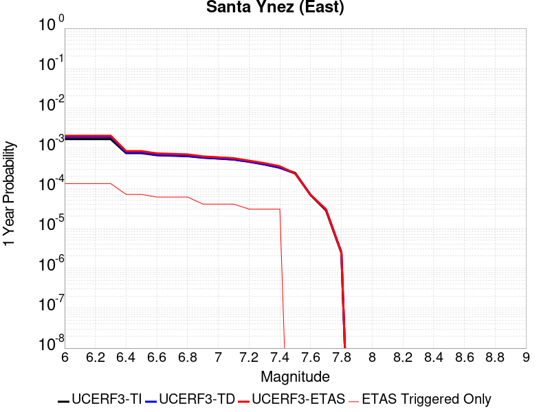 |  |

| Magnitude | 1 wk TI Prob | 1 wk TD Prob | 1 wk ETAS Prob | 1 wk ETAS/TD Gain | 1 wk ETAS Triggered Only | 1 mo TI Prob | 1 mo TD Prob | 1 mo ETAS Prob | 1 mo ETAS/TD Gain | 1 mo ETAS Triggered Only | 1 yr TI Prob | 1 yr TD Prob | 1 yr ETAS Prob | 1 yr ETAS/TD Gain | 1 yr ETAS Triggered Only | 10 yr TI Prob | 10 yr TD Prob | 10 yr ETAS Prob | 10 yr ETAS/TD Gain | 10 yr ETAS Triggered Only |
|-----|-----|-----|-----|-----|-----|-----|-----|-----|-----|-----|-----|-----|-----|-----|-----|-----|-----|-----|-----|-----|
| 6.0 | 3.2269712E-5 | 3.67505E-5 | 2.1453755E-4 | 5.8376765 | 1.7779358E-4 | 1.3829143E-4 | 1.5749598E-4 | 3.3526155E-4 | 2.1286993 | 1.7779358E-4 | 0.0016823979 | 0.0019164166 | 0.0020938695 | 1.0925962 | 1.7779358E-4 | 0.016697178 | 0.019056441 | 0.019230846 | 1.009152 | 1.7779358E-4 |
| 6.1 | 3.2269712E-5 | 3.67505E-5 | 2.1453755E-4 | 5.8376765 | 1.7779358E-4 | 1.3829143E-4 | 1.5749598E-4 | 3.3526155E-4 | 2.1286993 | 1.7779358E-4 | 0.0016823979 | 0.0019164166 | 0.0020938695 | 1.0925962 | 1.7779358E-4 | 0.016697178 | 0.019056441 | 0.019230846 | 1.009152 | 1.7779358E-4 |
| 6.2 | 3.2269712E-5 | 3.67505E-5 | 2.1453755E-4 | 5.8376765 | 1.7779358E-4 | 1.3829143E-4 | 1.5749598E-4 | 3.3526155E-4 | 2.1286993 | 1.7779358E-4 | 0.0016823979 | 0.0019164166 | 0.0020938695 | 1.0925962 | 1.7779358E-4 | 0.016697178 | 0.019056441 | 0.019230846 | 1.009152 | 1.7779358E-4 |
| 6.3 | 3.2269712E-5 | 3.67505E-5 | 2.1453755E-4 | 5.8376765 | 1.7779358E-4 | 1.3829143E-4 | 1.5749598E-4 | 3.3526155E-4 | 2.1286993 | 1.7779358E-4 | 0.0016823979 | 0.0019164166 | 0.0020938695 | 1.0925962 | 1.7779358E-4 | 0.016697178 | 0.019056441 | 0.019230846 | 1.009152 | 1.7779358E-4 |
| 6.4 | 1.4404779E-5 | 1.4849382E-5 | 1.4849382E-5 | 1.0 | 0.0 | 6.1733306E-5 | 6.363868E-5 | 6.363868E-5 | 1.0 | 0.0 | 7.513438E-4 | 7.745306E-4 | 7.745306E-4 | 1.0 | 0.0 | 0.0074880854 | 0.007718862 | 0.007718862 | 1.0 | 0.0 |
| 6.5 | 1.4404779E-5 | 1.4849382E-5 | 1.4849382E-5 | 1.0 | 0.0 | 6.1733306E-5 | 6.363868E-5 | 6.363868E-5 | 1.0 | 0.0 | 7.513438E-4 | 7.745306E-4 | 7.745306E-4 | 1.0 | 0.0 | 0.0074880854 | 0.007718862 | 0.007718862 | 1.0 | 0.0 |
| 6.6 | 1.280208E-5 | 1.3011947E-5 | 1.3011947E-5 | 1.0 | 0.0 | 5.4864904E-5 | 5.5764307E-5 | 5.5764307E-5 | 1.0 | 0.0 | 6.6777546E-4 | 6.787207E-4 | 6.787207E-4 | 1.0 | 0.0 | 0.006657724 | 0.0067666885 | 0.0067666885 | 1.0 | 0.0 |
| 6.7 | 1.2457027E-5 | 1.2628468E-5 | 1.2628468E-5 | 1.0 | 0.0 | 5.3386164E-5 | 5.412089E-5 | 5.412089E-5 | 1.0 | 0.0 | 6.497827E-4 | 6.587243E-4 | 6.587243E-4 | 1.0 | 0.0 | 0.00647886 | 0.006567915 | 0.006567915 | 1.0 | 0.0 |
| 6.8 | 1.2095134E-5 | 1.2230915E-5 | 1.2230915E-5 | 1.0 | 0.0 | 5.1835254E-5 | 5.241716E-5 | 5.241716E-5 | 1.0 | 0.0 | 6.309115E-4 | 6.379937E-4 | 6.379937E-4 | 1.0 | 0.0 | 0.0062912325 | 0.006361809 | 0.006361809 | 1.0 | 0.0 |
| 6.9 | 1.1104036E-5 | 1.1157347E-5 | 1.1157347E-5 | 1.0 | 0.0 | 4.758786E-5 | 4.781633E-5 | 4.781633E-5 | 1.0 | 0.0 | 5.7922816E-4 | 5.820096E-4 | 5.820096E-4 | 1.0 | 0.0 | 0.005777207 | 0.0058049993 | 0.0058049993 | 1.0 | 0.0 |
| 7.0 | 1.0577444E-5 | 1.058168E-5 | 1.058168E-5 | 1.0 | 0.0 | 4.5331115E-5 | 4.5349276E-5 | 4.5349276E-5 | 1.0 | 0.0 | 5.5176654E-4 | 5.519888E-4 | 5.519888E-4 | 1.0 | 0.0 | 0.0055039856 | 0.0055063153 | 0.0055063153 | 1.0 | 0.0 |
| 7.1 | 1.0021775E-5 | 9.980988E-6 | 9.980988E-6 | 1.0 | 0.0 | 4.294976E-5 | 4.2774966E-5 | 4.2774966E-5 | 1.0 | 0.0 | 5.2278786E-4 | 5.2066194E-4 | 5.2066194E-4 | 1.0 | 0.0 | 0.0052155964 | 0.0051945536 | 0.0051945536 | 1.0 | 0.0 |
| 7.2 | 8.874109E-6 | 8.748793E-6 | 8.748793E-6 | 1.0 | 0.0 | 3.8031343E-5 | 3.7494297E-5 | 3.7494297E-5 | 1.0 | 0.0 | 4.629332E-4 | 4.5639853E-4 | 4.5639853E-4 | 1.0 | 0.0 | 0.0046197 | 0.0045547304 | 0.0045547304 | 1.0 | 0.0 |
| 7.3 | 7.5504267E-6 | 7.5051175E-6 | 7.5051175E-6 | 1.0 | 0.0 | 3.235857E-5 | 3.21644E-5 | 3.21644E-5 | 1.0 | 0.0 | 3.9389438E-4 | 3.915322E-4 | 3.915322E-4 | 1.0 | 0.0 | 0.0039319694 | 0.003908531 | 0.003908531 | 1.0 | 0.0 |
| 7.4 | 6.309394E-6 | 6.1831556E-6 | 6.1831556E-6 | 1.0 | 0.0 | 2.703998E-5 | 2.6498974E-5 | 2.6498974E-5 | 1.0 | 0.0 | 3.2916202E-4 | 3.225782E-4 | 3.225782E-4 | 1.0 | 0.0 | 0.003286749 | 0.003221197 | 0.003221197 | 1.0 | 0.0 |
| 7.5 | 4.6103073E-6 | 4.4408903E-6 | 4.4408903E-6 | 1.0 | 0.0 | 1.975831E-5 | 1.9032252E-5 | 1.9032252E-5 | 1.0 | 0.0 | 2.4053088E-4 | 2.3169373E-4 | 2.3169373E-4 | 1.0 | 0.0 | 0.002402707 | 0.002314591 | 0.002314591 | 1.0 | 0.0 |
| 7.6 | 1.2858658E-6 | 1.3008173E-6 | 1.3008173E-6 | 1.0 | 0.0 | 5.5108417E-6 | 5.5749197E-6 | 5.5749197E-6 | 1.0 | 0.0 | 6.7092435E-5 | 6.78726E-5 | 6.78726E-5 | 1.0 | 0.0 | 6.707218E-4 | 6.785256E-4 | 6.785256E-4 | 1.0 | 0.0 |
| 7.7 | 5.3302307E-7 | 5.612138E-7 | 5.612138E-7 | 1.0 | 0.0 | 2.2843826E-6 | 2.4052001E-6 | 2.4052001E-6 | 1.0 | 0.0 | 2.7812002E-5 | 2.9282954E-5 | 2.9282954E-5 | 1.0 | 0.0 | 2.7808524E-4 | 2.9279452E-4 | 2.9279452E-4 | 1.0 | 0.0 |
| 7.8 | 4.613933E-8 | 4.80301E-8 | 4.80301E-8 | 1.0 | 0.0 | 1.9773998E-7 | 2.0584326E-7 | 2.0584326E-7 | 1.0 | 0.0 | 2.4074816E-6 | 2.5061388E-6 | 2.5061388E-6 | 1.0 | 0.0 | 2.4074554E-5 | 2.5061116E-5 | 2.5061116E-5 | 1.0 | 0.0 |

## Cleghorn Pass
*[(top)](#table-of-contents)*

| 1 Week | 1 Month | 1 Year | 10 Year |
|-----|-----|-----|-----|
|  |  |  |  |

| Magnitude | 1 wk TI Prob | 1 wk TD Prob | 1 wk ETAS Prob | 1 wk ETAS/TD Gain | 1 wk ETAS Triggered Only | 1 mo TI Prob | 1 mo TD Prob | 1 mo ETAS Prob | 1 mo ETAS/TD Gain | 1 mo ETAS Triggered Only | 1 yr TI Prob | 1 yr TD Prob | 1 yr ETAS Prob | 1 yr ETAS/TD Gain | 1 yr ETAS Triggered Only | 10 yr TI Prob | 10 yr TD Prob | 10 yr ETAS Prob | 10 yr ETAS/TD Gain | 10 yr ETAS Triggered Only |
|-----|-----|-----|-----|-----|-----|-----|-----|-----|-----|-----|-----|-----|-----|-----|-----|-----|-----|-----|-----|-----|
| 6.0 | 1.0522846E-5 | 1.1040642E-5 | 1.1040642E-5 | 1.0 | 0.0 | 4.509713E-5 | 4.7316473E-5 | 1.3620906E-4 | 2.8786814 | 8.889679E-5 | 5.4891926E-4 | 5.759784E-4 | 6.6482404E-4 | 1.1542516 | 8.889679E-5 | 0.0054756533 | 0.005750022 | 0.005926793 | 1.0307428 | 1.7779358E-4 |
| 6.1 | 1.0522846E-5 | 1.1040642E-5 | 1.1040642E-5 | 1.0 | 0.0 | 4.509713E-5 | 4.7316473E-5 | 1.3620906E-4 | 2.8786814 | 8.889679E-5 | 5.4891926E-4 | 5.759784E-4 | 6.6482404E-4 | 1.1542516 | 8.889679E-5 | 0.0054756533 | 0.005750022 | 0.005926793 | 1.0307428 | 1.7779358E-4 |
| 6.2 | 2.1045846E-6 | 2.2082024E-6 | 2.2082024E-6 | 1.0 | 0.0 | 9.019617E-6 | 9.463714E-6 | 9.835966E-5 | 10.393347 | 8.889679E-5 | 1.098083E-4 | 1.1521882E-4 | 2.0410537E-4 | 1.7714586 | 8.889679E-5 | 0.0010975406 | 0.0011520023 | 0.0012407966 | 1.0770783 | 8.889679E-5 |
| 6.3 | 2.1045846E-6 | 2.2082024E-6 | 2.2082024E-6 | 1.0 | 0.0 | 9.019617E-6 | 9.463714E-6 | 9.835966E-5 | 10.393347 | 8.889679E-5 | 1.098083E-4 | 1.1521882E-4 | 2.0410537E-4 | 1.7714586 | 8.889679E-5 | 0.0010975406 | 0.0011520023 | 0.0012407966 | 1.0770783 | 8.889679E-5 |
| 6.4 | 1.7259927E-6 | 1.810877E-6 | 1.810877E-6 | 1.0 | 0.0 | 7.3970905E-6 | 7.760902E-6 | 9.6657E-5 | 12.454352 | 8.889679E-5 | 9.005586E-5 | 9.4488976E-5 | 1.8337737E-4 | 1.9407276 | 8.889679E-5 | 9.001937E-4 | 9.448898E-4 | 0.0010337026 | 1.0939927 | 8.889679E-5 |

## San Andreas (San Gorgonio Pass-Garnet HIll)
*[(top)](#table-of-contents)*

| 1 Week | 1 Month | 1 Year | 10 Year |
|-----|-----|-----|-----|
|  |  |  |  |

| Magnitude | 1 wk TI Prob | 1 wk TD Prob | 1 wk ETAS Prob | 1 wk ETAS/TD Gain | 1 wk ETAS Triggered Only | 1 mo TI Prob | 1 mo TD Prob | 1 mo ETAS Prob | 1 mo ETAS/TD Gain | 1 mo ETAS Triggered Only | 1 yr TI Prob | 1 yr TD Prob | 1 yr ETAS Prob | 1 yr ETAS/TD Gain | 1 yr ETAS Triggered Only | 10 yr TI Prob | 10 yr TD Prob | 10 yr ETAS Prob | 10 yr ETAS/TD Gain | 10 yr ETAS Triggered Only |
|-----|-----|-----|-----|-----|-----|-----|-----|-----|-----|-----|-----|-----|-----|-----|-----|-----|-----|-----|-----|-----|
| 6.0 | 8.31567E-5 | 2.3382473E-4 | 3.2270074E-4 | 1.3800967 | 8.889679E-5 | 3.5633717E-4 | 0.0010017233 | 0.0010905311 | 1.088655 | 8.889679E-5 | 0.004329778 | 0.012127888 | 0.012215707 | 1.007241 | 8.889679E-5 | 0.042463828 | 0.11257892 | 0.112736695 | 1.0014015 | 1.7779358E-4 |
| 6.1 | 8.31567E-5 | 2.3382473E-4 | 3.2270074E-4 | 1.3800967 | 8.889679E-5 | 3.5633717E-4 | 0.0010017233 | 0.0010905311 | 1.088655 | 8.889679E-5 | 0.004329778 | 0.012127888 | 0.012215707 | 1.007241 | 8.889679E-5 | 0.042463828 | 0.11257892 | 0.112736695 | 1.0014015 | 1.7779358E-4 |
| 6.2 | 8.31567E-5 | 2.3382473E-4 | 3.2270074E-4 | 1.3800967 | 8.889679E-5 | 3.5633717E-4 | 0.0010017233 | 0.0010905311 | 1.088655 | 8.889679E-5 | 0.004329778 | 0.012127888 | 0.012215707 | 1.007241 | 8.889679E-5 | 0.042463828 | 0.11257892 | 0.112736695 | 1.0014015 | 1.7779358E-4 |
| 6.3 | 8.31567E-5 | 2.3382473E-4 | 3.2270074E-4 | 1.3800967 | 8.889679E-5 | 3.5633717E-4 | 0.0010017233 | 0.0010905311 | 1.088655 | 8.889679E-5 | 0.004329778 | 0.012127888 | 0.012215707 | 1.007241 | 8.889679E-5 | 0.042463828 | 0.11257892 | 0.112736695 | 1.0014015 | 1.7779358E-4 |
| 6.4 | 8.059055E-5 | 2.2940808E-4 | 3.1828447E-4 | 1.3874161 | 8.889679E-5 | 3.4534236E-4 | 9.828096E-4 | 0.001071619 | 1.0903628 | 8.889679E-5 | 0.0041964394 | 0.011900152 | 0.011987991 | 1.0073813 | 8.889679E-5 | 0.041180745 | 0.11056015 | 0.11071828 | 1.0014303 | 1.7779358E-4 |
| 6.5 | 8.059055E-5 | 2.2940808E-4 | 3.1828447E-4 | 1.3874161 | 8.889679E-5 | 3.4534236E-4 | 9.828096E-4 | 0.001071619 | 1.0903628 | 8.889679E-5 | 0.0041964394 | 0.011900152 | 0.011987991 | 1.0073813 | 8.889679E-5 | 0.041180745 | 0.11056015 | 0.11071828 | 1.0014303 | 1.7779358E-4 |
| 6.6 | 7.619237E-5 | 2.218517E-4 | 3.1072876E-4 | 1.4006147 | 8.889679E-5 | 3.2649786E-4 | 9.5044886E-4 | 0.0010392612 | 1.0934424 | 8.889679E-5 | 0.0039678677 | 0.01151087 | 0.0115987435 | 1.0076339 | 8.889679E-5 | 0.03897764 | 0.10709683 | 0.10725558 | 1.0014824 | 1.7779358E-4 |
| 6.7 | 7.440636E-5 | 2.1860997E-4 | 3.0748732E-4 | 1.4065567 | 8.889679E-5 | 3.188454E-4 | 9.3656575E-4 | 0.0010253793 | 1.094829 | 8.889679E-5 | 0.0038750346 | 0.011343609 | 0.011431497 | 1.0077479 | 8.889679E-5 | 0.038081564 | 0.105605274 | 0.10576429 | 1.0015057 | 1.7779358E-4 |
| 6.8 | 7.3735864E-5 | 2.1708169E-4 | 3.0595917E-4 | 1.4094195 | 8.889679E-5 | 3.1597257E-4 | 9.3002064E-4 | 0.0010188348 | 1.0954969 | 8.889679E-5 | 0.0038401815 | 0.011264749 | 0.011352644 | 1.0078027 | 8.889679E-5 | 0.03774495 | 0.10490683 | 0.10506597 | 1.0015169 | 1.7779358E-4 |
| 6.9 | 7.27575E-5 | 2.1477141E-4 | 3.036491E-4 | 1.4138246 | 8.889679E-5 | 3.117806E-4 | 9.201265E-4 | 0.0010089414 | 1.0965247 | 8.889679E-5 | 0.003789323 | 0.011145527 | 0.011233432 | 1.0078871 | 8.889679E-5 | 0.037253562 | 0.103854746 | 0.10401407 | 1.0015341 | 1.7779358E-4 |
| 7.0 | 7.102591E-5 | 2.1061185E-4 | 2.994899E-4 | 1.4219993 | 8.889679E-5 | 3.0436125E-4 | 9.023122E-4 | 9.911287E-4 | 1.0984322 | 8.889679E-5 | 0.003699303 | 0.010930831 | 0.011018756 | 1.0080438 | 8.889679E-5 | 0.03638325 | 0.10195695 | 0.102116615 | 1.001566 | 1.7779358E-4 |
| 7.1 | 7.028513E-5 | 2.0896831E-4 | 2.9784653E-4 | 1.4253191 | 8.889679E-5 | 3.0118722E-4 | 8.9527335E-4 | 9.840905E-4 | 1.0992068 | 8.889679E-5 | 0.0036607897 | 0.010845989 | 0.010933922 | 1.0081074 | 8.889679E-5 | 0.036010686 | 0.101199985 | 0.101359785 | 1.001579 | 1.7779358E-4 |
| 7.2 | 6.8498244E-5 | 2.0504706E-4 | 2.9392564E-4 | 1.4334544 | 8.889679E-5 | 2.9353087E-4 | 8.784794E-4 | 9.672981E-4 | 1.1011051 | 8.889679E-5 | 0.003567883 | 0.010643536 | 0.010731487 | 1.0082632 | 8.889679E-5 | 0.035111405 | 0.09939202 | 0.09955214 | 1.001611 | 1.7779358E-4 |
| 7.3 | 6.622592E-5 | 1.9732013E-4 | 2.8619939E-4 | 1.4504317 | 8.889679E-5 | 2.8379448E-4 | 8.453858E-4 | 9.342074E-4 | 1.1050664 | 8.889679E-5 | 0.0034497243 | 0.0102444785 | 0.010332465 | 1.0085887 | 8.889679E-5 | 0.033966612 | 0.095888525 | 0.09604927 | 1.0016763 | 1.7779358E-4 |
| 7.4 | 5.1050705E-5 | 1.4689034E-4 | 2.3577406E-4 | 1.6051027 | 8.889679E-5 | 2.1877038E-4 | 6.29379E-4 | 7.1821985E-4 | 1.1411563 | 8.889679E-5 | 0.002660276 | 0.0076359594 | 0.0077241776 | 1.0115529 | 8.889679E-5 | 0.02628654 | 0.07286301 | 0.07302786 | 1.0022624 | 1.7779358E-4 |
| 7.5 | 3.9302922E-5 | 1.1129847E-4 | 1.1129847E-4 | 1.0 | 0.0 | 1.6843023E-4 | 4.7690657E-4 | 4.7690657E-4 | 1.0 | 0.0 | 0.0020487092 | 0.005790949 | 0.005790949 | 1.0 | 0.0 | 0.020299247 | 0.05600951 | 0.05609343 | 1.0014982 | 8.889679E-5 |
| 7.6 | 2.9851626E-5 | 8.4949745E-5 | 8.4949745E-5 | 1.0 | 0.0 | 1.2792926E-4 | 3.6401965E-4 | 3.6401965E-4 | 1.0 | 0.0 | 0.0015564259 | 0.0044229585 | 0.0044229585 | 1.0 | 0.0 | 0.0154556995 | 0.04319374 | 0.043278795 | 1.0019692 | 8.889679E-5 |
| 7.7 | 2.1135214E-5 | 6.3529005E-5 | 6.3529005E-5 | 1.0 | 0.0 | 9.0576345E-5 | 2.7223877E-4 | 2.7223877E-4 | 1.0 | 0.0 | 0.0011022091 | 0.0033094748 | 0.0033094748 | 1.0 | 0.0 | 0.010967582 | 0.032582592 | 0.032668594 | 1.0026394 | 8.889679E-5 |
| 7.8 | 1.883379E-5 | 5.564028E-5 | 5.564028E-5 | 1.0 | 0.0 | 8.0713755E-5 | 2.3843657E-4 | 2.3843657E-4 | 1.0 | 0.0 | 9.822468E-4 | 0.0028991038 | 0.0028991038 | 1.0 | 0.0 | 0.0097791655 | 0.028695205 | 0.028781552 | 1.0030091 | 8.889679E-5 |
| 7.9 | 1.5156185E-5 | 4.1658426E-5 | 4.1658426E-5 | 1.0 | 0.0 | 6.495346E-5 | 1.785239E-4 | 1.785239E-4 | 1.0 | 0.0 | 7.9052144E-4 | 0.0021713632 | 0.0021713632 | 1.0 | 0.0 | 0.007877152 | 0.021759422 | 0.021846386 | 1.0039965 | 8.889679E-5 |
| 8.0 | 1.1405907E-5 | 2.9974231E-5 | 2.9974231E-5 | 1.0 | 0.0 | 4.8881542E-5 | 1.2845467E-4 | 1.2845467E-4 | 1.0 | 0.0 | 5.9497025E-4 | 0.0015628147 | 0.0015628147 | 1.0 | 0.0 | 0.005933798 | 0.015772851 | 0.015860345 | 1.0055472 | 8.889679E-5 |
| 8.1 | 4.3511436E-6 | 7.369219E-6 | 7.369219E-6 | 1.0 | 0.0 | 1.8647626E-5 | 3.1581985E-5 | 3.1581985E-5 | 1.0 | 0.0 | 2.2701119E-4 | 3.8444297E-4 | 3.8444297E-4 | 1.0 | 0.0 | 0.0022677942 | 0.0041163345 | 0.0041163345 | 1.0 | 0.0 |
| 8.2 | 2.3042528E-6 | 2.7329415E-6 | 2.7329415E-6 | 1.0 | 0.0 | 9.875332E-6 | 1.1712554E-5 | 1.1712554E-5 | 1.0 | 0.0 | 1.2022553E-4 | 1.4259106E-4 | 1.4259106E-4 | 1.0 | 0.0 | 0.0012016051 | 0.0015979785 | 0.0015979785 | 1.0 | 0.0 |
| 8.3 | 5.202968E-7 | 3.1598344E-7 | 3.1598344E-7 | 1.0 | 0.0 | 2.2298414E-6 | 1.3542141E-6 | 1.3542141E-6 | 1.0 | 0.0 | 2.714798E-5 | 1.6487444E-5 | 1.6487444E-5 | 1.0 | 0.0 | 2.7144665E-4 | 1.9563142E-4 | 1.9563142E-4 | 1.0 | 0.0 |

## San Gregorio (North) 2011 CFM
*[(top)](#table-of-contents)*

| 1 Week | 1 Month | 1 Year | 10 Year |
|-----|-----|-----|-----|
|  |  |  |  |

| Magnitude | 1 wk TI Prob | 1 wk TD Prob | 1 wk ETAS Prob | 1 wk ETAS/TD Gain | 1 wk ETAS Triggered Only | 1 mo TI Prob | 1 mo TD Prob | 1 mo ETAS Prob | 1 mo ETAS/TD Gain | 1 mo ETAS Triggered Only | 1 yr TI Prob | 1 yr TD Prob | 1 yr ETAS Prob | 1 yr ETAS/TD Gain | 1 yr ETAS Triggered Only | 10 yr TI Prob | 10 yr TD Prob | 10 yr ETAS Prob | 10 yr ETAS/TD Gain | 10 yr ETAS Triggered Only |
|-----|-----|-----|-----|-----|-----|-----|-----|-----|-----|-----|-----|-----|-----|-----|-----|-----|-----|-----|-----|-----|
| 6.0 | 5.0283932E-5 | 4.3057815E-5 | 4.3057815E-5 | 1.0 | 0.0 | 2.1548476E-4 | 1.8452053E-4 | 1.8452053E-4 | 1.0 | 0.0 | 0.0026203706 | 0.002244237 | 0.002244237 | 1.0 | 0.0 | 0.02589687 | 0.022293162 | 0.022380076 | 1.0038987 | 8.889679E-5 |
| 6.1 | 5.0283932E-5 | 4.3057815E-5 | 4.3057815E-5 | 1.0 | 0.0 | 2.1548476E-4 | 1.8452053E-4 | 1.8452053E-4 | 1.0 | 0.0 | 0.0026203706 | 0.002244237 | 0.002244237 | 1.0 | 0.0 | 0.02589687 | 0.022293162 | 0.022380076 | 1.0038987 | 8.889679E-5 |
| 6.2 | 4.2998647E-5 | 3.4441564E-5 | 3.4441564E-5 | 1.0 | 0.0 | 1.842669E-4 | 1.475984E-4 | 1.475984E-4 | 1.0 | 0.0 | 0.0022411412 | 0.00179554 | 0.00179554 | 1.0 | 0.0 | 0.022186736 | 0.017886506 | 0.017973812 | 1.0048811 | 8.889679E-5 |
| 6.3 | 4.2998647E-5 | 3.4441564E-5 | 3.4441564E-5 | 1.0 | 0.0 | 1.842669E-4 | 1.475984E-4 | 1.475984E-4 | 1.0 | 0.0 | 0.0022411412 | 0.00179554 | 0.00179554 | 1.0 | 0.0 | 0.022186736 | 0.017886506 | 0.017973812 | 1.0048811 | 8.889679E-5 |
| 6.4 | 4.1101295E-5 | 3.2326872E-5 | 3.2326872E-5 | 1.0 | 0.0 | 1.7613651E-4 | 1.3853642E-4 | 1.3853642E-4 | 1.0 | 0.0 | 0.0021423528 | 0.0016853869 | 0.0016853869 | 1.0 | 0.0 | 0.02121817 | 0.016801886 | 0.016889289 | 1.0052019 | 8.889679E-5 |
| 6.5 | 4.1032585E-5 | 3.2244905E-5 | 3.2244905E-5 | 1.0 | 0.0 | 1.7584208E-4 | 1.3818518E-4 | 1.3818518E-4 | 1.0 | 0.0 | 0.0021387753 | 0.0016811171 | 0.0016811171 | 1.0 | 0.0 | 0.021183075 | 0.016759839 | 0.016847245 | 1.0052153 | 8.889679E-5 |
| 6.6 | 4.011629E-5 | 3.1266558E-5 | 3.1266558E-5 | 1.0 | 0.0 | 1.7191563E-4 | 1.339927E-4 | 1.339927E-4 | 1.0 | 0.0 | 0.0020910634 | 0.0016301516 | 0.0016301516 | 1.0 | 0.0 | 0.020714961 | 0.01625741 | 0.016344862 | 1.0053792 | 8.889679E-5 |
| 6.7 | 3.8583938E-5 | 2.9453593E-5 | 2.9453593E-5 | 1.0 | 0.0 | 1.6534925E-4 | 1.2622366E-4 | 1.2622366E-4 | 1.0 | 0.0 | 0.0020112682 | 0.0015357039 | 0.0015357039 | 1.0 | 0.0 | 0.019931622 | 0.015325955 | 0.015413489 | 1.0057116 | 8.889679E-5 |
| 6.8 | 3.44341E-5 | 2.4450854E-5 | 2.4450854E-5 | 1.0 | 0.0 | 1.4756636E-4 | 1.0478523E-4 | 1.0478523E-4 | 1.0 | 0.0 | 0.0017951399 | 0.0012750238 | 0.0012750238 | 1.0 | 0.0 | 0.017807078 | 0.012751131 | 0.012838895 | 1.0068828 | 8.889679E-5 |
| 6.9 | 3.221199E-5 | 2.1778029E-5 | 2.1778029E-5 | 1.0 | 0.0 | 1.3804408E-4 | 9.333112E-5 | 9.333112E-5 | 1.0 | 0.0 | 0.0016793909 | 0.0011357224 | 0.0011357224 | 1.0 | 0.0 | 0.01666756 | 0.011372583 | 0.011460469 | 1.0077279 | 8.889679E-5 |
| 7.0 | 2.9186718E-5 | 1.8146875E-5 | 1.8146875E-5 | 1.0 | 0.0 | 1.2507994E-4 | 7.7770026E-5 | 7.7770026E-5 | 1.0 | 0.0 | 0.0015217843 | 9.464431E-4 | 9.464431E-4 | 1.0 | 0.0 | 0.015114053 | 0.009496798 | 0.009584851 | 1.0092719 | 8.889679E-5 |
| 7.1 | 2.6840138E-5 | 1.5284508E-5 | 1.5284508E-5 | 1.0 | 0.0 | 1.1502409E-4 | 6.55034E-5 | 6.55034E-5 | 1.0 | 0.0 | 0.0013995186 | 7.9721404E-4 | 7.9721404E-4 | 1.0 | 0.0 | 0.013907375 | 0.008015723 | 0.008103907 | 1.0110013 | 8.889679E-5 |
| 7.2 | 2.453002E-5 | 1.2606672E-5 | 1.2606672E-5 | 1.0 | 0.0 | 1.05124425E-4 | 5.4027478E-5 | 5.4027478E-5 | 1.0 | 0.0 | 0.0012791384 | 6.575866E-4 | 6.575866E-4 | 1.0 | 0.0 | 0.012718005 | 0.00662763 | 0.0067159375 | 1.0133241 | 8.889679E-5 |
| 7.3 | 2.3330727E-5 | 1.1488677E-5 | 1.1488677E-5 | 1.0 | 0.0 | 9.9985E-5 | 4.923626E-5 | 4.923626E-5 | 1.0 | 0.0 | 0.0012166376 | 5.9928704E-4 | 5.9928704E-4 | 1.0 | 0.0 | 0.012099981 | 0.006046564 | 0.006046564 | 1.0 | 0.0 |
| 7.4 | 2.2136466E-5 | 1.0368981E-5 | 1.0368981E-5 | 1.0 | 0.0 | 9.486712E-5 | 4.4437733E-5 | 4.4437733E-5 | 1.0 | 0.0 | 0.0011543952 | 5.4089533E-4 | 5.4089533E-4 | 1.0 | 0.0 | 0.011484168 | 0.005464249 | 0.005464249 | 1.0 | 0.0 |
| 7.5 | 2.0994974E-5 | 9.427217E-6 | 9.427217E-6 | 1.0 | 0.0 | 8.997535E-5 | 4.0401734E-5 | 4.0401734E-5 | 1.0 | 0.0 | 0.0010948994 | 4.9178035E-4 | 4.9178035E-4 | 1.0 | 0.0 | 0.010895205 | 0.004973358 | 0.004973358 | 1.0 | 0.0 |
| 7.6 | 1.7091823E-5 | 6.893766E-6 | 6.893766E-6 | 1.0 | 0.0 | 7.3248615E-5 | 2.9544377E-5 | 2.9544377E-5 | 1.0 | 0.0 | 8.9143694E-4 | 3.596435E-4 | 3.596435E-4 | 1.0 | 0.0 | 0.008878695 | 0.0036482841 | 0.0036482841 | 1.0 | 0.0 |
| 7.7 | 1.2772179E-5 | 4.0208706E-6 | 4.0208706E-6 | 1.0 | 0.0 | 5.473676E-5 | 1.7232189E-5 | 1.7232189E-5 | 1.0 | 0.0 | 6.6621625E-4 | 2.0978172E-4 | 2.0978172E-4 | 1.0 | 0.0 | 0.006642225 | 0.002136922 | 0.002136922 | 1.0 | 0.0 |
| 7.8 | 7.041923E-6 | 1.940626E-6 | 1.940626E-6 | 1.0 | 0.0 | 3.017932E-5 | 8.316942E-6 | 8.316942E-6 | 1.0 | 0.0 | 3.6737128E-4 | 1.0125406E-4 | 1.0125406E-4 | 1.0 | 0.0 | 0.0036676454 | 0.0010379003 | 0.0010379003 | 1.0 | 0.0 |
| 7.9 | 2.946768E-6 | 1.0033551E-6 | 1.0033551E-6 | 1.0 | 0.0 | 1.2628945E-5 | 4.300086E-6 | 4.300086E-6 | 1.0 | 0.0 | 1.5374656E-4 | 5.235229E-5 | 5.235229E-5 | 1.0 | 0.0 | 0.0015364023 | 5.3400313E-4 | 5.3400313E-4 | 1.0 | 0.0 |
| 8.0 | 1.1433375E-6 | 5.18146E-7 | 5.18146E-7 | 1.0 | 0.0 | 4.9000087E-6 | 2.2206239E-6 | 2.2206239E-6 | 1.0 | 0.0 | 5.965597E-5 | 2.703576E-5 | 2.703576E-5 | 1.0 | 0.0 | 5.963996E-4 | 2.7398416E-4 | 2.7398416E-4 | 1.0 | 0.0 |
| 8.1 | 2.6675295E-7 | 1.62899E-7 | 1.62899E-7 | 1.0 | 0.0 | 1.1432264E-6 | 6.9813836E-7 | 6.9813836E-7 | 1.0 | 0.0 | 1.3918692E-5 | 8.499802E-6 | 8.499802E-6 | 1.0 | 0.0 | 1.391782E-4 | 8.63795E-5 | 8.63795E-5 | 1.0 | 0.0 |
| 8.2 | 1.2704569E-8 | 9.431393E-9 | 9.431393E-9 | 1.0 | 0.0 | 5.444815E-8 | 4.042026E-8 | 4.042026E-8 | 1.0 | 0.0 | 6.629061E-7 | 4.9211656E-7 | 4.9211656E-7 | 1.0 | 0.0 | 6.629041E-6 | 5.1121438E-6 | 5.1121438E-6 | 1.0 | 0.0 |

## Hosgri (Extension)
*[(top)](#table-of-contents)*

| 1 Week | 1 Month | 1 Year | 10 Year |
|-----|-----|-----|-----|
|  |  |  |  |

| Magnitude | 1 wk TI Prob | 1 wk TD Prob | 1 wk ETAS Prob | 1 wk ETAS/TD Gain | 1 wk ETAS Triggered Only | 1 mo TI Prob | 1 mo TD Prob | 1 mo ETAS Prob | 1 mo ETAS/TD Gain | 1 mo ETAS Triggered Only | 1 yr TI Prob | 1 yr TD Prob | 1 yr ETAS Prob | 1 yr ETAS/TD Gain | 1 yr ETAS Triggered Only | 10 yr TI Prob | 10 yr TD Prob | 10 yr ETAS Prob | 10 yr ETAS/TD Gain | 10 yr ETAS Triggered Only |
|-----|-----|-----|-----|-----|-----|-----|-----|-----|-----|-----|-----|-----|-----|-----|-----|-----|-----|-----|-----|-----|
| 6.0 | 1.1369135E-5 | 1.2083072E-5 | 1.0097879E-4 | 8.357046 | 8.889679E-5 | 4.8723956E-5 | 5.1783692E-5 | 1.4067588E-4 | 2.7166057 | 8.889679E-5 | 5.9305265E-4 | 6.3030684E-4 | 7.1914756E-4 | 1.1409484 | 8.889679E-5 | 0.005914725 | 0.0062874397 | 0.0063757775 | 1.0140499 | 8.889679E-5 |
| 6.1 | 6.934979E-6 | 7.324555E-6 | 9.62207E-5 | 13.136729 | 8.889679E-5 | 2.9721E-5 | 3.1390595E-5 | 1.20284596E-4 | 3.8318672 | 8.889679E-5 | 3.617931E-4 | 3.8211764E-4 | 4.7098045E-4 | 1.2325536 | 8.889679E-5 | 0.0036120464 | 0.0038150186 | 0.0039035762 | 1.0232129 | 8.889679E-5 |
| 6.2 | 6.934979E-6 | 7.324555E-6 | 9.62207E-5 | 13.136729 | 8.889679E-5 | 2.9721E-5 | 3.1390595E-5 | 1.20284596E-4 | 3.8318672 | 8.889679E-5 | 3.617931E-4 | 3.8211764E-4 | 4.7098045E-4 | 1.2325536 | 8.889679E-5 | 0.0036120464 | 0.0038150186 | 0.0039035762 | 1.0232129 | 8.889679E-5 |
| 6.3 | 4.5484676E-6 | 4.76933E-6 | 9.3665694E-5 | 19.639172 | 8.889679E-5 | 1.9493287E-5 | 2.043983E-5 | 1.09334804E-4 | 5.3491054 | 8.889679E-5 | 2.3730492E-4 | 2.4882692E-4 | 3.3770158E-4 | 1.3571746 | 8.889679E-5 | 0.0023705168 | 0.0024855258 | 0.0025742017 | 1.0356768 | 8.889679E-5 |
| 6.4 | 4.218095E-6 | 4.4168614E-6 | 9.331326E-5 | 21.126598 | 8.889679E-5 | 1.8077424E-5 | 1.8929271E-5 | 1.0782438E-4 | 5.6961718 | 8.889679E-5 | 2.2007042E-4 | 2.3043984E-4 | 3.1931614E-4 | 1.3856812 | 8.889679E-5 | 0.002198526 | 0.0023020422 | 0.0023907344 | 1.0385276 | 8.889679E-5 |
| 6.5 | 3.717374E-6 | 3.8838775E-6 | 9.278033E-5 | 23.88858 | 8.889679E-5 | 1.5931506E-5 | 1.6645085E-5 | 1.055404E-4 | 6.3406343 | 8.889679E-5 | 1.9394881E-4 | 2.0263524E-4 | 2.91514E-4 | 1.4386146 | 8.889679E-5 | 0.0019377962 | 0.0020245234 | 0.0021132403 | 1.0438211 | 8.889679E-5 |
| 6.6 | 3.4605036E-6 | 3.608306E-6 | 9.250478E-5 | 25.636621 | 8.889679E-5 | 1.4830645E-5 | 1.5464078E-5 | 1.043595E-4 | 6.7485104 | 8.889679E-5 | 1.8054814E-4 | 1.8825903E-4 | 2.7713907E-4 | 1.4721158 | 8.889679E-5 | 0.0018040152 | 0.0018810101 | 0.0019697398 | 1.0471712 | 8.889679E-5 |
| 6.7 | 3.123439E-6 | 3.2465687E-6 | 9.214307E-5 | 28.38168 | 8.889679E-5 | 1.33860985E-5 | 1.3913792E-5 | 1.0280935E-4 | 7.3890243 | 8.889679E-5 | 1.6296357E-4 | 1.6938736E-4 | 2.5826908E-4 | 1.5247247 | 8.889679E-5 | 0.001628441 | 0.0016925934 | 0.0017813398 | 1.0524322 | 8.889679E-5 |
| 6.8 | 2.8290783E-6 | 2.9305404E-6 | 9.182707E-5 | 31.334518 | 8.889679E-5 | 1.2124565E-5 | 1.2559399E-5 | 1.0145507E-4 | 8.07802 | 8.889679E-5 | 1.4760658E-4 | 1.5290003E-4 | 2.4178323E-4 | 1.5813158 | 8.889679E-5 | 0.0014750857 | 0.001527957 | 0.001616718 | 1.0580913 | 8.889679E-5 |
| 6.9 | 2.454112E-6 | 2.5283196E-6 | 2.5283196E-6 | 1.0 | 0.0 | 1.0517581E-5 | 1.0835611E-5 | 1.0835611E-5 | 1.0 | 0.0 | 1.2804402E-4 | 1.3191563E-4 | 1.3191563E-4 | 1.0 | 0.0 | 0.0012797028 | 0.0013183793 | 0.0013183793 | 1.0 | 0.0 |
| 7.0 | 2.1008145E-6 | 2.1498704E-6 | 2.1498704E-6 | 1.0 | 0.0 | 9.003459E-6 | 9.213698E-6 | 9.213698E-6 | 1.0 | 0.0 | 1.096116E-4 | 1.1217103E-4 | 1.1217103E-4 | 1.0 | 0.0 | 0.0010955755 | 0.0011211479 | 0.0011211479 | 1.0 | 0.0 |
| 7.1 | 1.744384E-6 | 1.7686352E-6 | 1.7686352E-6 | 1.0 | 0.0 | 7.47591E-6 | 7.5798434E-6 | 7.5798434E-6 | 1.0 | 0.0 | 9.1015405E-5 | 9.22807E-5 | 9.22807E-5 | 1.0 | 0.0 | 9.097813E-4 | 9.2242553E-4 | 9.2242553E-4 | 1.0 | 0.0 |
| 7.2 | 1.5456587E-6 | 1.5562882E-6 | 1.5562882E-6 | 1.0 | 0.0 | 6.6242346E-6 | 6.66979E-6 | 6.66979E-6 | 1.0 | 0.0 | 8.064707E-5 | 8.120168E-5 | 8.120168E-5 | 1.0 | 0.0 | 8.0617814E-4 | 8.117213E-4 | 8.117213E-4 | 1.0 | 0.0 |
| 7.3 | 1.3775123E-6 | 1.3766082E-6 | 1.3766082E-6 | 1.0 | 0.0 | 5.9036106E-6 | 5.899736E-6 | 5.899736E-6 | 1.0 | 0.0 | 7.187409E-5 | 7.182693E-5 | 7.182693E-5 | 1.0 | 0.0 | 7.185085E-4 | 7.180382E-4 | 7.180382E-4 | 1.0 | 0.0 |
| 7.4 | 1.214491E-6 | 1.2023461E-6 | 1.2023461E-6 | 1.0 | 0.0 | 5.2049513E-6 | 5.1529014E-6 | 5.1529014E-6 | 1.0 | 0.0 | 6.336844E-5 | 6.2734776E-5 | 6.2734776E-5 | 1.0 | 0.0 | 6.335037E-4 | 6.271715E-4 | 6.271715E-4 | 1.0 | 0.0 |
| 7.5 | 1.0101123E-6 | 9.842246E-7 | 9.842246E-7 | 1.0 | 0.0 | 4.3290456E-6 | 4.2180986E-6 | 4.2180986E-6 | 1.0 | 0.0 | 5.2704854E-5 | 5.1354145E-5 | 5.1354145E-5 | 1.0 | 0.0 | 5.2692357E-4 | 5.1342335E-4 | 5.1342335E-4 | 1.0 | 0.0 |
| 7.6 | 8.1558215E-7 | 7.765966E-7 | 7.765966E-7 | 1.0 | 0.0 | 3.4953473E-6 | 3.328267E-6 | 3.328267E-6 | 1.0 | 0.0 | 4.255502E-5 | 4.0520903E-5 | 4.0520903E-5 | 1.0 | 0.0 | 4.2546875E-4 | 4.0513556E-4 | 4.0513556E-4 | 1.0 | 0.0 |
| 7.7 | 4.757816E-7 | 4.1308888E-7 | 4.1308888E-7 | 1.0 | 0.0 | 2.0390623E-6 | 1.7703798E-6 | 1.7703798E-6 | 1.0 | 0.0 | 2.4825302E-5 | 2.155416E-5 | 2.155416E-5 | 1.0 | 0.0 | 2.482253E-4 | 2.1552083E-4 | 2.1552083E-4 | 1.0 | 0.0 |
| 7.8 | 2.782787E-7 | 2.0047722E-7 | 2.0047722E-7 | 1.0 | 0.0 | 1.1926223E-6 | 8.5918776E-7 | 8.5918776E-7 | 1.0 | 0.0 | 1.452008E-5 | 1.04605615E-5 | 1.04605615E-5 | 1.0 | 0.0 | 1.4519131E-4 | 1.04600724E-4 | 1.04600724E-4 | 1.0 | 0.0 |
| 7.9 | 1.6948086E-7 | 9.244227E-8 | 9.244227E-8 | 1.0 | 0.0 | 7.2634634E-7 | 3.961811E-7 | 3.961811E-7 | 1.0 | 0.0 | 8.843231E-6 | 4.8234942E-6 | 4.8234942E-6 | 1.0 | 0.0 | 8.842879E-5 | 4.8233902E-5 | 4.8233902E-5 | 1.0 | 0.0 |
| 8.0 | 1.0225492E-7 | 4.4738776E-8 | 4.4738776E-8 | 1.0 | 0.0 | 4.382353E-7 | 1.917376E-7 | 1.917376E-7 | 1.0 | 0.0 | 5.335502E-6 | 2.3344028E-6 | 2.3344028E-6 | 1.0 | 0.0 | 5.335374E-5 | 2.3343786E-5 | 2.3343786E-5 | 1.0 | 0.0 |
| 8.1 | 1.43711345E-8 | 5.787707E-9 | 5.787707E-9 | 1.0 | 0.0 | 6.1590576E-8 | 2.480446E-8 | 2.480446E-8 | 1.0 | 0.0 | 7.4986497E-7 | 3.0199428E-7 | 3.0199428E-7 | 1.0 | 0.0 | 7.4986247E-6 | 3.0199392E-6 | 3.0199392E-6 | 1.0 | 0.0 |

## San Jacinto (Borrego)
*[(top)](#table-of-contents)*

| 1 Week | 1 Month | 1 Year | 10 Year |
|-----|-----|-----|-----|
|  |  | 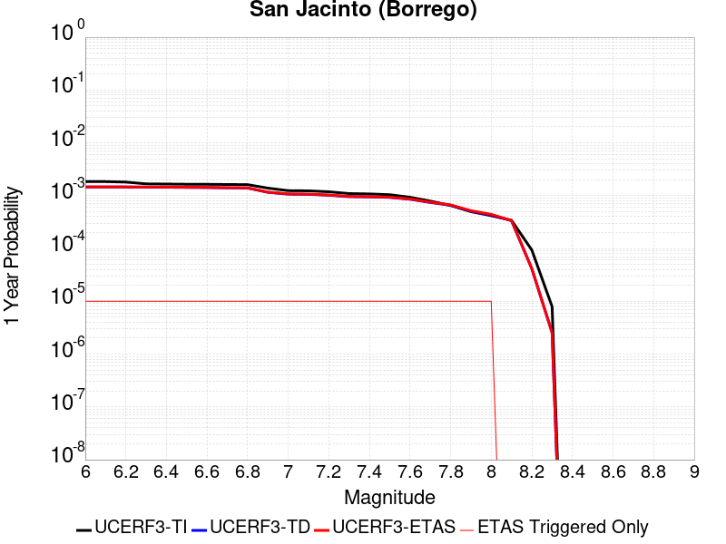 |  |

| Magnitude | 1 wk TI Prob | 1 wk TD Prob | 1 wk ETAS Prob | 1 wk ETAS/TD Gain | 1 wk ETAS Triggered Only | 1 mo TI Prob | 1 mo TD Prob | 1 mo ETAS Prob | 1 mo ETAS/TD Gain | 1 mo ETAS Triggered Only | 1 yr TI Prob | 1 yr TD Prob | 1 yr ETAS Prob | 1 yr ETAS/TD Gain | 1 yr ETAS Triggered Only | 10 yr TI Prob | 10 yr TD Prob | 10 yr ETAS Prob | 10 yr ETAS/TD Gain | 10 yr ETAS Triggered Only |
|-----|-----|-----|-----|-----|-----|-----|-----|-----|-----|-----|-----|-----|-----|-----|-----|-----|-----|-----|-----|-----|
| 6.0 | 3.543992E-5 | 2.7926513E-5 | 2.7926513E-5 | 1.0 | 0.0 | 1.5187653E-4 | 1.1967963E-4 | 1.1967963E-4 | 1.0 | 0.0 | 0.0018475284 | 0.0014561379 | 0.0015449051 | 1.0609608 | 8.889679E-5 | 0.018322436 | 0.014869647 | 0.014957222 | 1.0058895 | 8.889679E-5 |
| 6.1 | 3.542281E-5 | 2.7926513E-5 | 2.7926513E-5 | 1.0 | 0.0 | 1.5180321E-4 | 1.1967963E-4 | 1.1967963E-4 | 1.0 | 0.0 | 0.0018466372 | 0.0014561379 | 0.0015449051 | 1.0609608 | 8.889679E-5 | 0.018313672 | 0.014869647 | 0.014957222 | 1.0058895 | 8.889679E-5 |
| 6.2 | 3.4688688E-5 | 2.7926511E-5 | 2.7926511E-5 | 1.0 | 0.0 | 1.4865733E-4 | 1.1967963E-4 | 1.1967963E-4 | 1.0 | 0.0 | 0.0018084005 | 0.0014561379 | 0.0015449051 | 1.0609608 | 8.889679E-5 | 0.017937548 | 0.014869647 | 0.014957222 | 1.0058895 | 8.889679E-5 |
| 6.3 | 3.2087122E-5 | 2.7771865E-5 | 2.7771865E-5 | 1.0 | 0.0 | 1.3750899E-4 | 1.1901691E-4 | 1.1901691E-4 | 1.0 | 0.0 | 0.0016728862 | 0.00144808 | 0.001536848 | 1.0613005 | 8.889679E-5 | 0.016603488 | 0.014790683 | 0.014878265 | 1.0059215 | 8.889679E-5 |
| 6.4 | 3.1828724E-5 | 2.7738852E-5 | 2.7738852E-5 | 1.0 | 0.0 | 1.364017E-4 | 1.1887544E-4 | 1.1887544E-4 | 1.0 | 0.0 | 0.0016594254 | 0.0014463598 | 0.0015351281 | 1.0613736 | 8.889679E-5 | 0.016470885 | 0.014773762 | 0.014861345 | 1.0059283 | 8.889679E-5 |
| 6.5 | 3.1563577E-5 | 2.747857E-5 | 2.747857E-5 | 1.0 | 0.0 | 1.3526545E-4 | 1.1776006E-4 | 1.1776006E-4 | 1.0 | 0.0 | 0.0016456128 | 0.0014327979 | 0.0015215673 | 1.0619553 | 8.889679E-5 | 0.0163348 | 0.014640348 | 0.014727944 | 1.0059831 | 8.889679E-5 |
| 6.6 | 3.1467625E-5 | 2.7322796E-5 | 2.7322796E-5 | 1.0 | 0.0 | 1.3485427E-4 | 1.1709251E-4 | 1.1709251E-4 | 1.0 | 0.0 | 0.0016406142 | 0.0014246812 | 0.0015134513 | 1.0623088 | 8.889679E-5 | 0.016285548 | 0.014560594 | 0.014648197 | 1.0060164 | 8.889679E-5 |
| 6.7 | 3.1223695E-5 | 2.6940816E-5 | 2.6940816E-5 | 1.0 | 0.0 | 1.3380898E-4 | 1.15455594E-4 | 1.15455594E-4 | 1.0 | 0.0 | 0.0016279068 | 0.0014047775 | 0.0014935494 | 1.0631928 | 8.889679E-5 | 0.01616033 | 0.014364966 | 0.014452586 | 1.0060996 | 8.889679E-5 |
| 6.8 | 3.1015585E-5 | 2.6761822E-5 | 2.6761822E-5 | 1.0 | 0.0 | 1.3291716E-4 | 1.1468855E-4 | 1.1468855E-4 | 1.0 | 0.0 | 0.001617065 | 0.0013954508 | 0.0014842235 | 1.0636158 | 8.889679E-5 | 0.016053487 | 0.014272246 | 0.014359874 | 1.0061398 | 8.889679E-5 |
| 6.9 | 2.6641965E-5 | 2.2184247E-5 | 2.2184247E-5 | 1.0 | 0.0 | 1.1417485E-4 | 9.50719E-5 | 9.50719E-5 | 1.0 | 0.0 | 0.0013891924 | 0.0011568897 | 0.0012456836 | 1.0767523 | 8.889679E-5 | 0.0138054015 | 0.011882438 | 0.011970279 | 1.0073924 | 8.889679E-5 |
| 7.0 | 2.3854353E-5 | 2.0479023E-5 | 2.0479023E-5 | 1.0 | 0.0 | 1.02228936E-4 | 8.77643E-5 | 8.77643E-5 | 1.0 | 0.0 | 0.0012439266 | 0.0010680092 | 0.001156811 | 1.083147 | 8.889679E-5 | 0.012369866 | 0.0109828 | 0.011070721 | 1.0080053 | 8.889679E-5 |
| 7.1 | 2.3672901E-5 | 2.031551E-5 | 2.031551E-5 | 1.0 | 0.0 | 1.0145135E-4 | 8.7063585E-5 | 8.7063585E-5 | 1.0 | 0.0 | 0.0012344702 | 0.0010594862 | 0.0011482888 | 1.0838166 | 8.889679E-5 | 0.0122763505 | 0.010897976 | 0.010985904 | 1.0080683 | 8.889679E-5 |
| 7.2 | 2.2717244E-5 | 1.9542893E-5 | 1.9542893E-5 | 1.0 | 0.0 | 9.735599E-5 | 8.375258E-5 | 8.375258E-5 | 1.0 | 0.0 | 0.0011846646 | 0.001019213 | 0.0011080191 | 1.0871321 | 8.889679E-5 | 0.01178369 | 0.010495341 | 0.010583305 | 1.0083812 | 8.889679E-5 |
| 7.3 | 2.1016205E-5 | 1.8384526E-5 | 1.8384526E-5 | 1.0 | 0.0 | 9.006634E-5 | 7.878846E-5 | 7.878846E-5 | 1.0 | 0.0 | 0.001096006 | 9.5882936E-4 | 0.0010476409 | 1.092625 | 8.889679E-5 | 0.010906163 | 0.009890967 | 0.0099789845 | 1.0088987 | 8.889679E-5 |
| 7.4 | 2.0683625E-5 | 1.8187047E-5 | 1.8187047E-5 | 1.0 | 0.0 | 8.86411E-5 | 7.794217E-5 | 7.794217E-5 | 1.0 | 0.0 | 0.001078671 | 9.485349E-4 | 0.0010373474 | 1.0936313 | 8.889679E-5 | 0.010734501 | 0.009787692 | 0.0098757185 | 1.0089936 | 8.889679E-5 |
| 7.5 | 1.9993966E-5 | 1.7782075E-5 | 1.7782075E-5 | 1.0 | 0.0 | 8.568561E-5 | 7.620667E-5 | 7.620667E-5 | 1.0 | 0.0 | 0.001042723 | 9.2742336E-4 | 0.0010162377 | 1.0957646 | 8.889679E-5 | 0.010378438 | 0.009574614 | 0.00966266 | 1.0091957 | 8.889679E-5 |
| 7.6 | 1.788966E-5 | 1.6435291E-5 | 1.6435291E-5 | 1.0 | 0.0 | 7.666772E-5 | 7.043507E-5 | 7.043507E-5 | 1.0 | 0.0 | 9.3302975E-4 | 8.572113E-4 | 9.460319E-4 | 1.1036158 | 8.889679E-5 | 0.00929122 | 0.008866487 | 0.008954596 | 1.0099373 | 8.889679E-5 |
| 7.7 | 1.5125781E-5 | 1.4237377E-5 | 1.4237377E-5 | 1.0 | 0.0 | 6.4823165E-5 | 6.1015908E-5 | 6.1015908E-5 | 1.0 | 0.0 | 7.889362E-4 | 7.426163E-4 | 8.314471E-4 | 1.1196187 | 8.889679E-5 | 0.007861412 | 0.0077142045 | 0.007802415 | 1.0114349 | 8.889679E-5 |
| 7.8 | 1.250089E-5 | 1.26304985E-5 | 1.26304985E-5 | 1.0 | 0.0 | 5.3574146E-5 | 5.412959E-5 | 5.412959E-5 | 1.0 | 0.0 | 6.5207E-4 | 6.588291E-4 | 7.4766733E-4 | 1.1348426 | 8.889679E-5 | 0.006501599 | 0.0068677636 | 0.0069560497 | 1.0128552 | 8.889679E-5 |
| 7.9 | 9.561E-6 | 9.754616E-6 | 9.754616E-6 | 1.0 | 0.0 | 4.0975072E-5 | 4.1804833E-5 | 4.1804833E-5 | 1.0 | 0.0 | 4.987573E-4 | 5.088555E-4 | 5.977071E-4 | 1.1746106 | 8.889679E-5 | 0.0049763937 | 0.0053523467 | 0.0054407674 | 1.01652 | 8.889679E-5 |
| 8.0 | 8.01699E-6 | 8.293488E-6 | 8.293488E-6 | 1.0 | 0.0 | 3.4358076E-5 | 3.554304E-5 | 3.554304E-5 | 1.0 | 0.0 | 4.1822926E-4 | 4.3265108E-4 | 5.215094E-4 | 1.205381 | 8.889679E-5 | 0.0041744304 | 0.004573375 | 0.0046618655 | 1.019349 | 8.889679E-5 |
| 8.1 | 6.541947E-6 | 6.4622354E-6 | 6.4622354E-6 | 1.0 | 0.0 | 2.8036617E-5 | 2.7695003E-5 | 2.7695003E-5 | 1.0 | 0.0 | 3.4129233E-4 | 3.37135E-4 | 3.37135E-4 | 1.0 | 0.0 | 0.0034076865 | 0.0035806994 | 0.0035806994 | 1.0 | 0.0 |
| 8.2 | 1.7968189E-6 | 7.9713476E-7 | 7.9713476E-7 | 1.0 | 0.0 | 7.70063E-6 | 3.4162877E-6 | 3.4162877E-6 | 1.0 | 0.0 | 9.3751136E-5 | 4.159253E-5 | 4.159253E-5 | 1.0 | 0.0 | 9.371159E-4 | 4.712058E-4 | 4.712058E-4 | 1.0 | 0.0 |
| 8.3 | 1.5167889E-7 | 4.897714E-8 | 4.897714E-8 | 1.0 | 0.0 | 6.500522E-7 | 2.09902E-7 | 2.09902E-7 | 1.0 | 0.0 | 7.9143565E-6 | 2.5555544E-6 | 2.5555544E-6 | 1.0 | 0.0 | 7.914075E-5 | 2.969505E-5 | 2.969505E-5 | 1.0 | 0.0 |

## Monterey Bay-Tularcitos
*[(top)](#table-of-contents)*

| 1 Week | 1 Month | 1 Year | 10 Year |
|-----|-----|-----|-----|
|  |  |  | 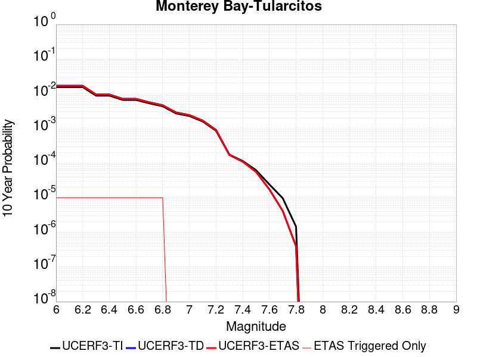 |

| Magnitude | 1 wk TI Prob | 1 wk TD Prob | 1 wk ETAS Prob | 1 wk ETAS/TD Gain | 1 wk ETAS Triggered Only | 1 mo TI Prob | 1 mo TD Prob | 1 mo ETAS Prob | 1 mo ETAS/TD Gain | 1 mo ETAS Triggered Only | 1 yr TI Prob | 1 yr TD Prob | 1 yr ETAS Prob | 1 yr ETAS/TD Gain | 1 yr ETAS Triggered Only | 10 yr TI Prob | 10 yr TD Prob | 10 yr ETAS Prob | 10 yr ETAS/TD Gain | 10 yr ETAS Triggered Only |
|-----|-----|-----|-----|-----|-----|-----|-----|-----|-----|-----|-----|-----|-----|-----|-----|-----|-----|-----|-----|-----|
| 6.0 | 3.0131365E-5 | 3.279877E-5 | 3.279877E-5 | 1.0 | 0.0 | 1.2912804E-4 | 1.4055918E-4 | 1.4055918E-4 | 1.0 | 0.0 | 0.001571 | 0.0017100703 | 0.0017100703 | 1.0 | 0.0 | 0.015599402 | 0.016979916 | 0.017067304 | 1.0051465 | 8.889679E-5 |
| 6.1 | 3.0131365E-5 | 3.279877E-5 | 3.279877E-5 | 1.0 | 0.0 | 1.2912804E-4 | 1.4055918E-4 | 1.4055918E-4 | 1.0 | 0.0 | 0.001571 | 0.0017100703 | 0.0017100703 | 1.0 | 0.0 | 0.015599402 | 0.016979916 | 0.017067304 | 1.0051465 | 8.889679E-5 |
| 6.2 | 3.0131365E-5 | 3.279877E-5 | 3.279877E-5 | 1.0 | 0.0 | 1.2912804E-4 | 1.4055918E-4 | 1.4055918E-4 | 1.0 | 0.0 | 0.001571 | 0.0017100703 | 0.0017100703 | 1.0 | 0.0 | 0.015599402 | 0.016979916 | 0.017067304 | 1.0051465 | 8.889679E-5 |
| 6.3 | 1.6998249E-5 | 1.8330798E-5 | 1.8330798E-5 | 1.0 | 0.0 | 7.28476E-5 | 7.85583E-5 | 7.85583E-5 | 1.0 | 0.0 | 8.865586E-4 | 9.5604634E-4 | 9.5604634E-4 | 1.0 | 0.0 | 0.0088303005 | 0.009521258 | 0.009609308 | 1.0092478 | 8.889679E-5 |
| 6.4 | 1.6998249E-5 | 1.8330798E-5 | 1.8330798E-5 | 1.0 | 0.0 | 7.28476E-5 | 7.85583E-5 | 7.85583E-5 | 1.0 | 0.0 | 8.865586E-4 | 9.5604634E-4 | 9.5604634E-4 | 1.0 | 0.0 | 0.0088303005 | 0.009521258 | 0.009609308 | 1.0092478 | 8.889679E-5 |
| 6.5 | 1.27470785E-5 | 1.3693312E-5 | 1.3693312E-5 | 1.0 | 0.0 | 5.4629192E-5 | 5.8684363E-5 | 5.8684363E-5 | 1.0 | 0.0 | 6.649074E-4 | 7.1425823E-4 | 7.1425823E-4 | 1.0 | 0.0 | 0.0066292146 | 0.007120678 | 0.007208942 | 1.0123954 | 8.889679E-5 |
| 6.6 | 1.2739422E-5 | 1.36854E-5 | 1.36854E-5 | 1.0 | 0.0 | 5.4596385E-5 | 5.8650454E-5 | 5.8650454E-5 | 1.0 | 0.0 | 6.645082E-4 | 7.1384566E-4 | 7.1384566E-4 | 1.0 | 0.0 | 0.0066252467 | 0.007116579 | 0.007204843 | 1.0124027 | 8.889679E-5 |
| 6.7 | 1.0160109E-5 | 1.0885755E-5 | 1.0885755E-5 | 1.0 | 0.0 | 4.35426E-5 | 4.665244E-5 | 4.665244E-5 | 1.0 | 0.0 | 5.300022E-4 | 5.6785246E-4 | 5.6785246E-4 | 1.0 | 0.0 | 0.005287399 | 0.0056647263 | 0.0057531195 | 1.0156041 | 8.889679E-5 |
| 6.8 | 8.349859E-6 | 8.932587E-6 | 8.932587E-6 | 1.0 | 0.0 | 3.578462E-5 | 3.8281985E-5 | 3.8281985E-5 | 1.0 | 0.0 | 4.3559066E-4 | 4.6598914E-4 | 4.6598914E-4 | 1.0 | 0.0 | 0.004347378 | 0.004650685 | 0.0047391686 | 1.0190259 | 8.889679E-5 |
| 6.9 | 5.193639E-6 | 5.53643E-6 | 5.53643E-6 | 1.0 | 0.0 | 2.2258262E-5 | 2.372736E-5 | 2.372736E-5 | 1.0 | 0.0 | 2.7096065E-4 | 2.8884556E-4 | 2.8884556E-4 | 1.0 | 0.0 | 0.0027063051 | 0.0028850222 | 0.0028850222 | 1.0 | 0.0 |
| 7.0 | 4.359381E-6 | 4.643366E-6 | 4.643366E-6 | 1.0 | 0.0 | 1.8682927E-5 | 1.9900004E-5 | 1.9900004E-5 | 1.0 | 0.0 | 2.274409E-4 | 2.422586E-4 | 2.422586E-4 | 1.0 | 0.0 | 0.0022720827 | 0.002420238 | 0.002420238 | 1.0 | 0.0 |
| 7.1 | 3.0398533E-6 | 3.2310427E-6 | 3.2310427E-6 | 1.0 | 0.0 | 1.3027877E-5 | 1.3847267E-5 | 1.3847267E-5 | 1.0 | 0.0 | 1.5860285E-4 | 1.6858005E-4 | 1.6858005E-4 | 1.0 | 0.0 | 0.001584897 | 0.0016847793 | 0.0016847793 | 1.0 | 0.0 |
| 7.2 | 1.642335E-6 | 1.7333153E-6 | 1.7333153E-6 | 1.0 | 0.0 | 7.0385595E-6 | 7.428485E-6 | 7.428485E-6 | 1.0 | 0.0 | 8.569109E-5 | 9.044012E-5 | 9.044012E-5 | 1.0 | 0.0 | 8.5658056E-4 | 9.042358E-4 | 9.042358E-4 | 1.0 | 0.0 |
| 7.3 | 3.356842E-7 | 3.2952389E-7 | 3.2952389E-7 | 1.0 | 0.0 | 1.4386458E-6 | 1.4122444E-6 | 1.4122444E-6 | 1.0 | 0.0 | 1.7515373E-5 | 1.7193941E-5 | 1.7193941E-5 | 1.0 | 0.0 | 1.7513991E-4 | 1.719262E-4 | 1.719262E-4 | 1.0 | 0.0 |
| 7.4 | 2.1973483E-7 | 2.1006413E-7 | 2.1006413E-7 | 1.0 | 0.0 | 9.417204E-7 | 9.0027453E-7 | 9.0027453E-7 | 1.0 | 0.0 | 1.1465385E-5 | 1.0960787E-5 | 1.0960787E-5 | 1.0 | 0.0 | 1.1464794E-4 | 1.096025E-4 | 1.096025E-4 | 1.0 | 0.0 |
| 7.5 | 1.1944135E-7 | 1.0696043E-7 | 1.0696043E-7 | 1.0 | 0.0 | 5.118914E-7 | 4.5840173E-7 | 4.5840173E-7 | 1.0 | 0.0 | 6.23226E-6 | 5.581027E-6 | 5.581027E-6 | 1.0 | 0.0 | 6.2320854E-5 | 5.5808883E-5 | 5.5808883E-5 | 1.0 | 0.0 |
| 7.6 | 4.636058E-8 | 3.336489E-8 | 3.336489E-8 | 1.0 | 0.0 | 1.9868818E-7 | 1.4299238E-7 | 1.4299238E-7 | 1.0 | 0.0 | 2.419026E-6 | 1.7409308E-6 | 1.7409308E-6 | 1.0 | 0.0 | 2.4189996E-5 | 1.7409173E-5 | 1.7409173E-5 | 1.0 | 0.0 |
| 7.7 | 1.8588572E-8 | 8.003744E-9 | 8.003744E-9 | 1.0 | 0.0 | 7.9665305E-8 | 3.430176E-8 | 3.430176E-8 | 1.0 | 0.0 | 9.699246E-7 | 4.1762385E-7 | 4.1762385E-7 | 1.0 | 0.0 | 9.699204E-6 | 4.176231E-6 | 4.176231E-6 | 1.0 | 0.0 |
| 7.8 | 2.7960154E-9 | 7.6099427E-10 | 7.6099427E-10 | 1.0 | 0.0 | 1.1982923E-8 | 3.2614043E-9 | 3.2614043E-9 | 1.0 | 0.0 | 1.4589209E-7 | 3.9707597E-8 | 3.9707597E-8 | 1.0 | 0.0 | 1.4589199E-6 | 3.9707595E-7 | 3.9707595E-7 | 1.0 | 0.0 |

## Great Valley 08 (Quinto)
*[(top)](#table-of-contents)*

| 1 Week | 1 Month | 1 Year | 10 Year |
|-----|-----|-----|-----|
|  |  |  |  |

| Magnitude | 1 wk TI Prob | 1 wk TD Prob | 1 wk ETAS Prob | 1 wk ETAS/TD Gain | 1 wk ETAS Triggered Only | 1 mo TI Prob | 1 mo TD Prob | 1 mo ETAS Prob | 1 mo ETAS/TD Gain | 1 mo ETAS Triggered Only | 1 yr TI Prob | 1 yr TD Prob | 1 yr ETAS Prob | 1 yr ETAS/TD Gain | 1 yr ETAS Triggered Only | 10 yr TI Prob | 10 yr TD Prob | 10 yr ETAS Prob | 10 yr ETAS/TD Gain | 10 yr ETAS Triggered Only |
|-----|-----|-----|-----|-----|-----|-----|-----|-----|-----|-----|-----|-----|-----|-----|-----|-----|-----|-----|-----|-----|
| 6.0 | 7.737697E-6 | 8.253038E-6 | 8.253038E-6 | 1.0 | 0.0 | 3.3161137E-5 | 3.536979E-5 | 3.536979E-5 | 1.0 | 0.0 | 4.0366207E-4 | 4.3056096E-4 | 4.3056096E-4 | 1.0 | 0.0 | 0.004029296 | 0.0042991205 | 0.0043876353 | 1.020589 | 8.889679E-5 |
| 6.1 | 7.737697E-6 | 8.253038E-6 | 8.253038E-6 | 1.0 | 0.0 | 3.3161137E-5 | 3.536979E-5 | 3.536979E-5 | 1.0 | 0.0 | 4.0366207E-4 | 4.3056096E-4 | 4.3056096E-4 | 1.0 | 0.0 | 0.004029296 | 0.0042991205 | 0.0043876353 | 1.020589 | 8.889679E-5 |
| 6.2 | 7.737697E-6 | 8.253038E-6 | 8.253038E-6 | 1.0 | 0.0 | 3.3161137E-5 | 3.536979E-5 | 3.536979E-5 | 1.0 | 0.0 | 4.0366207E-4 | 4.3056096E-4 | 4.3056096E-4 | 1.0 | 0.0 | 0.004029296 | 0.0042991205 | 0.0043876353 | 1.020589 | 8.889679E-5 |
| 6.3 | 5.374012E-6 | 5.7505736E-6 | 5.7505736E-6 | 1.0 | 0.0 | 2.3031276E-5 | 2.4645145E-5 | 2.4645145E-5 | 1.0 | 0.0 | 2.803697E-4 | 3.0002446E-4 | 3.0002446E-4 | 1.0 | 0.0 | 0.0028001624 | 0.0029972875 | 0.0030859178 | 1.0295702 | 8.889679E-5 |
| 6.4 | 5.374012E-6 | 5.7505736E-6 | 5.7505736E-6 | 1.0 | 0.0 | 2.3031276E-5 | 2.4645145E-5 | 2.4645145E-5 | 1.0 | 0.0 | 2.803697E-4 | 3.0002446E-4 | 3.0002446E-4 | 1.0 | 0.0 | 0.0028001624 | 0.0029972875 | 0.0030859178 | 1.0295702 | 8.889679E-5 |
| 6.5 | 3.65427E-6 | 3.941324E-6 | 3.941324E-6 | 1.0 | 0.0 | 1.5661062E-5 | 1.689132E-5 | 1.689132E-5 | 1.0 | 0.0 | 1.9065675E-4 | 2.0563944E-4 | 2.0563944E-4 | 1.0 | 0.0 | 0.0019049325 | 0.0020551833 | 0.0020551833 | 1.0 | 0.0 |
| 6.6 | 3.6143538E-6 | 3.8985104E-6 | 3.8985104E-6 | 1.0 | 0.0 | 1.5489995E-5 | 1.6707834E-5 | 1.6707834E-5 | 1.0 | 0.0 | 1.8857437E-4 | 2.0340596E-4 | 2.0340596E-4 | 1.0 | 0.0 | 0.0018841444 | 0.0020328893 | 0.0020328893 | 1.0 | 0.0 |
| 6.7 | 2.4821015E-6 | 2.6857067E-6 | 2.6857067E-6 | 1.0 | 0.0 | 1.0637535E-5 | 1.1510153E-5 | 1.1510153E-5 | 1.0 | 0.0 | 1.2950429E-4 | 1.4013276E-4 | 1.4013276E-4 | 1.0 | 0.0 | 0.0012942884 | 0.0014009989 | 0.0014009989 | 1.0 | 0.0 |
| 6.8 | 4.7110538E-7 | 5.193021E-7 | 5.193021E-7 | 1.0 | 0.0 | 2.0190216E-6 | 2.2255786E-6 | 2.2255786E-6 | 1.0 | 0.0 | 2.458131E-5 | 2.70961E-5 | 2.70961E-5 | 1.0 | 0.0 | 2.457859E-4 | 2.7092977E-4 | 2.7092977E-4 | 1.0 | 0.0 |
| 6.9 | 3.958685E-7 | 4.3703452E-7 | 4.3703452E-7 | 1.0 | 0.0 | 1.6965782E-6 | 1.8730038E-6 | 1.8730038E-6 | 1.0 | 0.0 | 2.0655643E-5 | 2.28036E-5 | 2.28036E-5 | 1.0 | 0.0 | 2.0653724E-4 | 2.2801422E-4 | 2.2801422E-4 | 1.0 | 0.0 |
| 7.0 | 2.70294E-7 | 2.9920008E-7 | 2.9920008E-7 | 1.0 | 0.0 | 1.1584025E-6 | 1.2822856E-6 | 1.2822856E-6 | 1.0 | 0.0 | 1.4103458E-5 | 1.5611728E-5 | 1.5611728E-5 | 1.0 | 0.0 | 1.4102564E-4 | 1.5610759E-4 | 1.5610759E-4 | 1.0 | 0.0 |
| 7.1 | 1.4828602E-7 | 1.6469107E-7 | 1.6469107E-7 | 1.0 | 0.0 | 6.3551136E-7 | 7.058187E-7 | 7.058187E-7 | 1.0 | 0.0 | 7.737323E-6 | 8.593317E-6 | 8.593317E-6 | 1.0 | 0.0 | 7.737054E-5 | 8.593065E-5 | 8.593065E-5 | 1.0 | 0.0 |

## Elsinore (Coyote Mountains)
*[(top)](#table-of-contents)*

| 1 Week | 1 Month | 1 Year | 10 Year |
|-----|-----|-----|-----|
|  |  |  |  |

| Magnitude | 1 wk TI Prob | 1 wk TD Prob | 1 wk ETAS Prob | 1 wk ETAS/TD Gain | 1 wk ETAS Triggered Only | 1 mo TI Prob | 1 mo TD Prob | 1 mo ETAS Prob | 1 mo ETAS/TD Gain | 1 mo ETAS Triggered Only | 1 yr TI Prob | 1 yr TD Prob | 1 yr ETAS Prob | 1 yr ETAS/TD Gain | 1 yr ETAS Triggered Only | 10 yr TI Prob | 10 yr TD Prob | 10 yr ETAS Prob | 10 yr ETAS/TD Gain | 10 yr ETAS Triggered Only |
|-----|-----|-----|-----|-----|-----|-----|-----|-----|-----|-----|-----|-----|-----|-----|-----|-----|-----|-----|-----|-----|
| 6.0 | 4.20513E-5 | 4.8631882E-5 | 4.8631882E-5 | 1.0 | 0.0 | 1.8020741E-4 | 2.0840895E-4 | 2.0840895E-4 | 1.0 | 0.0 | 0.0021918174 | 0.002535 | 0.0026236714 | 1.0349789 | 8.889679E-5 | 0.021703249 | 0.025111282 | 0.025197947 | 1.0034512 | 8.889679E-5 |
| 6.1 | 4.20513E-5 | 4.8631882E-5 | 4.8631882E-5 | 1.0 | 0.0 | 1.8020741E-4 | 2.0840895E-4 | 2.0840895E-4 | 1.0 | 0.0 | 0.0021918174 | 0.002535 | 0.0026236714 | 1.0349789 | 8.889679E-5 | 0.021703249 | 0.025111282 | 0.025197947 | 1.0034512 | 8.889679E-5 |
| 6.2 | 2.3413893E-5 | 2.469566E-5 | 2.469566E-5 | 1.0 | 0.0 | 1.0034139E-4 | 1.0583479E-4 | 1.0583479E-4 | 1.0 | 0.0 | 0.0012209718 | 0.0012878707 | 0.001376653 | 1.0689373 | 8.889679E-5 | 0.012142851 | 0.01281264 | 0.012900398 | 1.0068493 | 8.889679E-5 |
| 6.3 | 2.3413893E-5 | 2.469566E-5 | 2.469566E-5 | 1.0 | 0.0 | 1.0034139E-4 | 1.0583479E-4 | 1.0583479E-4 | 1.0 | 0.0 | 0.0012209718 | 0.0012878707 | 0.001376653 | 1.0689373 | 8.889679E-5 | 0.012142851 | 0.01281264 | 0.012900398 | 1.0068493 | 8.889679E-5 |
| 6.4 | 1.6894814E-5 | 1.6568361E-5 | 1.6568361E-5 | 1.0 | 0.0 | 7.240433E-5 | 7.1005554E-5 | 7.1005554E-5 | 1.0 | 0.0 | 8.811662E-4 | 8.6418656E-4 | 8.6418656E-4 | 1.0 | 0.0 | 0.0087768035 | 0.00861194 | 0.00861194 | 1.0 | 0.0 |
| 6.5 | 1.6894814E-5 | 1.6568361E-5 | 1.6568361E-5 | 1.0 | 0.0 | 7.240433E-5 | 7.1005554E-5 | 7.1005554E-5 | 1.0 | 0.0 | 8.811662E-4 | 8.6418656E-4 | 8.6418656E-4 | 1.0 | 0.0 | 0.0087768035 | 0.00861194 | 0.00861194 | 1.0 | 0.0 |
| 6.6 | 1.1910969E-5 | 1.0530774E-5 | 1.0530774E-5 | 1.0 | 0.0 | 5.1046012E-5 | 4.5131183E-5 | 4.5131183E-5 | 1.0 | 0.0 | 6.21308E-4 | 5.4934516E-4 | 5.4934516E-4 | 1.0 | 0.0 | 0.0061957375 | 0.005481174 | 0.005481174 | 1.0 | 0.0 |
| 6.7 | 9.1486E-6 | 7.2028593E-6 | 7.2028593E-6 | 1.0 | 0.0 | 3.9207694E-5 | 3.0869054E-5 | 3.0869054E-5 | 1.0 | 0.0 | 4.7724912E-4 | 3.757697E-4 | 3.757697E-4 | 1.0 | 0.0 | 0.0047622547 | 0.0037517229 | 0.0037517229 | 1.0 | 0.0 |
| 6.8 | 7.90441E-6 | 5.7290276E-6 | 5.7290276E-6 | 1.0 | 0.0 | 3.3875604E-5 | 2.4552752E-5 | 2.4552752E-5 | 1.0 | 0.0 | 4.1235742E-4 | 2.9889002E-4 | 2.9889002E-4 | 1.0 | 0.0 | 0.0041159308 | 0.002985009 | 0.002985009 | 1.0 | 0.0 |
| 6.9 | 7.77015E-6 | 5.582982E-6 | 5.582982E-6 | 1.0 | 0.0 | 3.3300217E-5 | 2.3926852E-5 | 2.3926852E-5 | 1.0 | 0.0 | 4.0535472E-4 | 2.9127175E-4 | 2.9127175E-4 | 1.0 | 0.0 | 0.004046161 | 0.002909027 | 0.002909027 | 1.0 | 0.0 |
| 7.0 | 7.675798E-6 | 5.47984E-6 | 5.47984E-6 | 1.0 | 0.0 | 3.289586E-5 | 2.3484827E-5 | 2.3484827E-5 | 1.0 | 0.0 | 4.004335E-4 | 2.858915E-4 | 2.858915E-4 | 1.0 | 0.0 | 0.003997127 | 0.0028553635 | 0.0028553635 | 1.0 | 0.0 |
| 7.1 | 7.447814E-6 | 5.238714E-6 | 5.238714E-6 | 1.0 | 0.0 | 3.191881E-5 | 2.2451446E-5 | 2.2451446E-5 | 1.0 | 0.0 | 3.8854225E-4 | 2.7331332E-4 | 2.7331332E-4 | 1.0 | 0.0 | 0.003878636 | 0.0027298962 | 0.0027298962 | 1.0 | 0.0 |
| 7.2 | 7.128185E-6 | 4.905372E-6 | 4.905372E-6 | 1.0 | 0.0 | 3.0549007E-5 | 2.102286E-5 | 2.102286E-5 | 1.0 | 0.0 | 3.7187067E-4 | 2.5592445E-4 | 2.5592445E-4 | 1.0 | 0.0 | 0.00371249 | 0.0025564157 | 0.0025564157 | 1.0 | 0.0 |
| 7.3 | 7.0913875E-6 | 4.874047E-6 | 4.874047E-6 | 1.0 | 0.0 | 3.0391306E-5 | 2.0888614E-5 | 2.0888614E-5 | 1.0 | 0.0 | 3.6995133E-4 | 2.5429038E-4 | 2.5429038E-4 | 1.0 | 0.0 | 0.0036933604 | 0.0025401122 | 0.0025401122 | 1.0 | 0.0 |
| 7.4 | 7.051521E-6 | 4.837899E-6 | 4.837899E-6 | 1.0 | 0.0 | 3.0220453E-5 | 2.0733693E-5 | 2.0733693E-5 | 1.0 | 0.0 | 3.6787192E-4 | 2.5240466E-4 | 2.5240466E-4 | 1.0 | 0.0 | 0.0036726352 | 0.0025212981 | 0.0025212981 | 1.0 | 0.0 |
| 7.5 | 6.910666E-6 | 4.733448E-6 | 4.733448E-6 | 1.0 | 0.0 | 2.9616802E-5 | 2.0286056E-5 | 2.0286056E-5 | 1.0 | 0.0 | 3.605249E-4 | 2.4695593E-4 | 2.4695593E-4 | 1.0 | 0.0 | 0.0035994058 | 0.0024669329 | 0.0024669329 | 1.0 | 0.0 |
| 7.6 | 6.341753E-6 | 4.3065565E-6 | 4.3065565E-6 | 1.0 | 0.0 | 2.7178658E-5 | 1.8456547E-5 | 1.8456547E-5 | 1.0 | 0.0 | 3.3084993E-4 | 2.2468645E-4 | 2.2468645E-4 | 1.0 | 0.0 | 0.0033035777 | 0.002244708 | 0.002244708 | 1.0 | 0.0 |
| 7.7 | 3.9205916E-6 | 2.2439415E-6 | 2.2439415E-6 | 1.0 | 0.0 | 1.6802427E-5 | 9.616861E-6 | 9.616861E-6 | 1.0 | 0.0 | 2.0455034E-4 | 1.1707973E-4 | 1.1707973E-4 | 1.0 | 0.0 | 0.0020436216 | 0.0011702535 | 0.0011702535 | 1.0 | 0.0 |
| 7.8 | 2.0846227E-7 | 8.486417E-8 | 8.486417E-8 | 1.0 | 0.0 | 8.9340944E-7 | 3.6370355E-7 | 3.6370355E-7 | 1.0 | 0.0 | 1.0877206E-5 | 4.428085E-6 | 4.428085E-6 | 1.0 | 0.0 | 1.0876673E-4 | 4.4280296E-5 | 4.4280296E-5 | 1.0 | 0.0 |
| 7.9 | 4.4969806E-9 | 2.2691855E-9 | 2.2691855E-9 | 1.0 | 0.0 | 1.9272775E-8 | 9.72508E-9 | 9.72508E-9 | 1.0 | 0.0 | 2.3464601E-7 | 1.18402845E-7 | 1.18402845E-7 | 1.0 | 0.0 | 2.3464577E-6 | 1.184028E-6 | 1.184028E-6 | 1.0 | 0.0 |

## San Jacinto (Anza) rev
*[(top)](#table-of-contents)*

| 1 Week | 1 Month | 1 Year | 10 Year |
|-----|-----|-----|-----|
|  |  |  |  |

| Magnitude | 1 wk TI Prob | 1 wk TD Prob | 1 wk ETAS Prob | 1 wk ETAS/TD Gain | 1 wk ETAS Triggered Only | 1 mo TI Prob | 1 mo TD Prob | 1 mo ETAS Prob | 1 mo ETAS/TD Gain | 1 mo ETAS Triggered Only | 1 yr TI Prob | 1 yr TD Prob | 1 yr ETAS Prob | 1 yr ETAS/TD Gain | 1 yr ETAS Triggered Only | 10 yr TI Prob | 10 yr TD Prob | 10 yr ETAS Prob | 10 yr ETAS/TD Gain | 10 yr ETAS Triggered Only |
|-----|-----|-----|-----|-----|-----|-----|-----|-----|-----|-----|-----|-----|-----|-----|-----|-----|-----|-----|-----|-----|
| 6.0 | 6.3015636E-5 | 4.3302647E-5 | 4.3302647E-5 | 1.0 | 0.0 | 2.7003905E-4 | 1.8556965E-4 | 1.8556965E-4 | 1.0 | 0.0 | 0.0032827691 | 0.0022569813 | 0.0023456775 | 1.0392985 | 8.889679E-5 | 0.032346968 | 0.023296192 | 0.023383018 | 1.0037271 | 8.889679E-5 |
| 6.1 | 6.3015636E-5 | 4.3302647E-5 | 4.3302647E-5 | 1.0 | 0.0 | 2.7003905E-4 | 1.8556965E-4 | 1.8556965E-4 | 1.0 | 0.0 | 0.0032827691 | 0.0022569813 | 0.0023456775 | 1.0392985 | 8.889679E-5 | 0.032346968 | 0.023296192 | 0.023383018 | 1.0037271 | 8.889679E-5 |
| 6.2 | 6.3015636E-5 | 4.3302647E-5 | 4.3302647E-5 | 1.0 | 0.0 | 2.7003905E-4 | 1.8556965E-4 | 1.8556965E-4 | 1.0 | 0.0 | 0.0032827691 | 0.0022569813 | 0.0023456775 | 1.0392985 | 8.889679E-5 | 0.032346968 | 0.023296192 | 0.023383018 | 1.0037271 | 8.889679E-5 |
| 6.3 | 6.3015636E-5 | 4.3302647E-5 | 4.3302647E-5 | 1.0 | 0.0 | 2.7003905E-4 | 1.8556965E-4 | 1.8556965E-4 | 1.0 | 0.0 | 0.0032827691 | 0.0022569813 | 0.0023456775 | 1.0392985 | 8.889679E-5 | 0.032346968 | 0.023296192 | 0.023383018 | 1.0037271 | 8.889679E-5 |
| 6.4 | 6.3015636E-5 | 4.3302647E-5 | 4.3302647E-5 | 1.0 | 0.0 | 2.7003905E-4 | 1.8556965E-4 | 1.8556965E-4 | 1.0 | 0.0 | 0.0032827691 | 0.0022569813 | 0.0023456775 | 1.0392985 | 8.889679E-5 | 0.032346968 | 0.023296192 | 0.023383018 | 1.0037271 | 8.889679E-5 |
| 6.5 | 5.811017E-5 | 4.0082516E-5 | 4.0082516E-5 | 1.0 | 0.0 | 2.4901982E-4 | 1.7177092E-4 | 1.7177092E-4 | 1.0 | 0.0 | 0.0030276014 | 0.002089311 | 0.002178022 | 1.0424595 | 8.889679E-5 | 0.02986684 | 0.021593736 | 0.021680715 | 1.0040278 | 8.889679E-5 |
| 6.6 | 5.811017E-5 | 4.0082516E-5 | 4.0082516E-5 | 1.0 | 0.0 | 2.4901982E-4 | 1.7177092E-4 | 1.7177092E-4 | 1.0 | 0.0 | 0.0030276014 | 0.002089311 | 0.002178022 | 1.0424595 | 8.889679E-5 | 0.02986684 | 0.021593736 | 0.021680715 | 1.0040278 | 8.889679E-5 |
| 6.7 | 5.712442E-5 | 3.9505223E-5 | 3.9505223E-5 | 1.0 | 0.0 | 2.4479596E-4 | 1.6929714E-4 | 1.6929714E-4 | 1.0 | 0.0 | 0.0029763177 | 0.0020592497 | 0.0021479635 | 1.0430806 | 8.889679E-5 | 0.029367693 | 0.021285562 | 0.021372566 | 1.0040874 | 8.889679E-5 |
| 6.8 | 5.6967532E-5 | 3.9361643E-5 | 3.9361643E-5 | 1.0 | 0.0 | 2.4412372E-4 | 1.6868189E-4 | 1.6868189E-4 | 1.0 | 0.0 | 0.0029681553 | 0.002051773 | 0.0021404873 | 1.0432379 | 8.889679E-5 | 0.029288229 | 0.021210281 | 0.021297293 | 1.0041023 | 8.889679E-5 |
| 6.9 | 5.6211324E-5 | 3.9066435E-5 | 3.9066435E-5 | 1.0 | 0.0 | 2.4088343E-4 | 1.6741687E-4 | 1.6741687E-4 | 1.0 | 0.0 | 0.0029288116 | 0.0020364004 | 0.002125116 | 1.043565 | 8.889679E-5 | 0.028905109 | 0.021049714 | 0.021136738 | 1.0041343 | 8.889679E-5 |
| 7.0 | 5.4383527E-5 | 3.792697E-5 | 3.792697E-5 | 1.0 | 0.0 | 2.3305144E-4 | 1.6253405E-4 | 1.6253405E-4 | 1.0 | 0.0 | 0.0028337094 | 0.001977061 | 0.002065782 | 1.0448753 | 8.889679E-5 | 0.027978465 | 0.020440677 | 0.020527756 | 1.0042601 | 8.889679E-5 |
| 7.1 | 5.1393665E-5 | 3.6389913E-5 | 3.6389913E-5 | 1.0 | 0.0 | 2.2023996E-4 | 1.5594746E-4 | 1.5594746E-4 | 1.0 | 0.0 | 0.0026781242 | 0.0018970112 | 0.0019857395 | 1.0467726 | 8.889679E-5 | 0.026460782 | 0.019614287 | 0.01970144 | 1.0044434 | 8.889679E-5 |
| 7.2 | 4.785222E-5 | 3.4741795E-5 | 3.4741795E-5 | 1.0 | 0.0 | 2.0506482E-4 | 1.4888494E-4 | 1.4888494E-4 | 1.0 | 0.0 | 0.0024938055 | 0.0018111705 | 0.0018999063 | 1.0489936 | 8.889679E-5 | 0.024660049 | 0.018728992 | 0.018816223 | 1.0046576 | 8.889679E-5 |
| 7.3 | 4.2143256E-5 | 3.383628E-5 | 3.383628E-5 | 1.0 | 0.0 | 1.8060145E-4 | 1.4500458E-4 | 1.4500458E-4 | 1.0 | 0.0 | 0.002196605 | 0.0017640047 | 0.0018527446 | 1.050306 | 8.889679E-5 | 0.02175019 | 0.01823724 | 0.018324517 | 1.0047855 | 8.889679E-5 |
| 7.4 | 4.0264713E-5 | 3.347446E-5 | 3.347446E-5 | 1.0 | 0.0 | 1.7255165E-4 | 1.4345412E-4 | 1.4345412E-4 | 1.0 | 0.0 | 0.002098792 | 0.0017451581 | 0.0018338998 | 1.0508502 | 8.889679E-5 | 0.020790804 | 0.018041821 | 0.018129114 | 1.0048383 | 8.889679E-5 |
| 7.5 | 3.694492E-5 | 3.218847E-5 | 3.218847E-5 | 1.0 | 0.0 | 1.5832575E-4 | 1.379433E-4 | 1.379433E-4 | 1.0 | 0.0 | 0.0019259118 | 0.001678169 | 0.0017669166 | 1.0528836 | 8.889679E-5 | 0.01909306 | 0.01735827 | 0.017445624 | 1.0050324 | 8.889679E-5 |
| 7.6 | 3.200565E-5 | 2.9504106E-5 | 2.9504106E-5 | 1.0 | 0.0 | 1.3715986E-4 | 1.2644005E-4 | 1.2644005E-4 | 1.0 | 0.0 | 0.001668642 | 0.0015383229 | 0.0016270829 | 1.0576992 | 8.889679E-5 | 0.01656168 | 0.0159463 | 0.01603378 | 1.0054859 | 8.889679E-5 |
| 7.7 | 2.731642E-5 | 2.6092788E-5 | 2.6092788E-5 | 1.0 | 0.0 | 1.1706512E-4 | 1.1182144E-4 | 1.1182144E-4 | 1.0 | 0.0 | 0.001424336 | 0.0013605768 | 0.0014493527 | 1.0652487 | 8.889679E-5 | 0.014152412 | 0.014167004 | 0.014254642 | 1.006186 | 8.889679E-5 |
| 7.8 | 2.3466424E-5 | 2.3504817E-5 | 2.3504817E-5 | 1.0 | 0.0 | 1.0056651E-4 | 1.0073105E-4 | 1.0073105E-4 | 1.0 | 0.0 | 0.0012237094 | 0.0012257113 | 0.0013144992 | 1.0724378 | 8.889679E-5 | 0.012169928 | 0.012808893 | 0.012896651 | 1.0068513 | 8.889679E-5 |
| 7.9 | 1.8611925E-5 | 1.8908117E-5 | 1.8908117E-5 | 1.0 | 0.0 | 7.9762955E-5 | 8.1032274E-5 | 8.1032274E-5 | 1.0 | 0.0 | 9.7068126E-4 | 9.861222E-4 | 0.0010749312 | 1.0900589 | 8.889679E-5 | 0.0096645225 | 0.010393824 | 0.010481797 | 1.008464 | 8.889679E-5 |
| 8.0 | 1.5460775E-5 | 1.5740965E-5 | 1.5740965E-5 | 1.0 | 0.0 | 6.6258784E-5 | 6.7459536E-5 | 6.7459536E-5 | 1.0 | 0.0 | 8.0640207E-4 | 8.21011E-4 | 9.0983487E-4 | 1.1081883 | 8.889679E-5 | 0.008034821 | 0.0087028835 | 0.008791007 | 1.0101258 | 8.889679E-5 |
| 8.1 | 9.983884E-6 | 8.269952E-6 | 8.269952E-6 | 1.0 | 0.0 | 4.2787375E-5 | 3.544217E-5 | 3.544217E-5 | 1.0 | 0.0 | 5.2081177E-4 | 4.314235E-4 | 4.314235E-4 | 1.0 | 0.0 | 0.0051959283 | 0.004640022 | 0.004640022 | 1.0 | 0.0 |
| 8.2 | 4.1226E-6 | 1.5529788E-6 | 1.5529788E-6 | 1.0 | 0.0 | 1.7668166E-5 | 6.6556063E-6 | 6.6556063E-6 | 1.0 | 0.0 | 2.1508869E-4 | 8.102902E-5 | 8.102902E-5 | 1.0 | 0.0 | 0.0021488064 | 9.4050163E-4 | 9.4050163E-4 | 1.0 | 0.0 |
| 8.3 | 1.2750878E-6 | 3.612133E-7 | 3.612133E-7 | 1.0 | 0.0 | 5.4646503E-6 | 1.548056E-6 | 1.548056E-6 | 1.0 | 0.0 | 6.653009E-5 | 1.8847424E-5 | 1.8847424E-5 | 1.0 | 0.0 | 6.6510175E-4 | 2.2734253E-4 | 2.2734253E-4 | 1.0 | 0.0 |

## White Wolf
*[(top)](#table-of-contents)*

| 1 Week | 1 Month | 1 Year | 10 Year |
|-----|-----|-----|-----|
|  |  |  |  |

| Magnitude | 1 wk TI Prob | 1 wk TD Prob | 1 wk ETAS Prob | 1 wk ETAS/TD Gain | 1 wk ETAS Triggered Only | 1 mo TI Prob | 1 mo TD Prob | 1 mo ETAS Prob | 1 mo ETAS/TD Gain | 1 mo ETAS Triggered Only | 1 yr TI Prob | 1 yr TD Prob | 1 yr ETAS Prob | 1 yr ETAS/TD Gain | 1 yr ETAS Triggered Only | 10 yr TI Prob | 10 yr TD Prob | 10 yr ETAS Prob | 10 yr ETAS/TD Gain | 10 yr ETAS Triggered Only |
|-----|-----|-----|-----|-----|-----|-----|-----|-----|-----|-----|-----|-----|-----|-----|-----|-----|-----|-----|-----|-----|
| 6.0 | 2.0037822E-5 | 1.0469162E-6 | 1.0469162E-6 | 1.0 | 0.0 | 8.587355E-5 | 4.486776E-6 | 4.486776E-6 | 1.0 | 0.0 | 0.001045009 | 5.4625183E-5 | 1.4351711E-4 | 2.627307 | 8.889679E-5 | 0.010401085 | 5.461226E-4 | 6.3497084E-4 | 1.1626892 | 8.889679E-5 |
| 6.1 | 2.0037822E-5 | 1.0469162E-6 | 1.0469162E-6 | 1.0 | 0.0 | 8.587355E-5 | 4.486776E-6 | 4.486776E-6 | 1.0 | 0.0 | 0.001045009 | 5.4625183E-5 | 1.4351711E-4 | 2.627307 | 8.889679E-5 | 0.010401085 | 5.461226E-4 | 6.3497084E-4 | 1.1626892 | 8.889679E-5 |
| 6.2 | 2.0037822E-5 | 1.0469162E-6 | 1.0469162E-6 | 1.0 | 0.0 | 8.587355E-5 | 4.486776E-6 | 4.486776E-6 | 1.0 | 0.0 | 0.001045009 | 5.4625183E-5 | 1.4351711E-4 | 2.627307 | 8.889679E-5 | 0.010401085 | 5.461226E-4 | 6.3497084E-4 | 1.1626892 | 8.889679E-5 |
| 6.3 | 2.0037822E-5 | 1.0469162E-6 | 1.0469162E-6 | 1.0 | 0.0 | 8.587355E-5 | 4.486776E-6 | 4.486776E-6 | 1.0 | 0.0 | 0.001045009 | 5.4625183E-5 | 1.4351711E-4 | 2.627307 | 8.889679E-5 | 0.010401085 | 5.461226E-4 | 6.3497084E-4 | 1.1626892 | 8.889679E-5 |
| 6.4 | 1.132487E-5 | 1.0469162E-6 | 1.0469162E-6 | 1.0 | 0.0 | 4.8534253E-5 | 4.486776E-6 | 4.486776E-6 | 1.0 | 0.0 | 5.907443E-4 | 5.4625183E-5 | 1.4351711E-4 | 2.627307 | 8.889679E-5 | 0.005891764 | 5.461226E-4 | 6.3497084E-4 | 1.1626892 | 8.889679E-5 |
| 6.5 | 1.132487E-5 | 1.0469162E-6 | 1.0469162E-6 | 1.0 | 0.0 | 4.8534253E-5 | 4.486776E-6 | 4.486776E-6 | 1.0 | 0.0 | 5.907443E-4 | 5.4625183E-5 | 1.4351711E-4 | 2.627307 | 8.889679E-5 | 0.005891764 | 5.461226E-4 | 6.3497084E-4 | 1.1626892 | 8.889679E-5 |
| 6.6 | 9.347473E-6 | 1.0469162E-6 | 1.0469162E-6 | 1.0 | 0.0 | 4.0059982E-5 | 4.486776E-6 | 4.486776E-6 | 1.0 | 0.0 | 4.8762115E-4 | 5.4625183E-5 | 1.4351711E-4 | 2.627307 | 8.889679E-5 | 0.0048655253 | 5.461226E-4 | 6.3497084E-4 | 1.1626892 | 8.889679E-5 |
| 6.7 | 7.842647E-6 | 1.0048342E-6 | 1.0048342E-6 | 1.0 | 0.0 | 3.361091E-5 | 4.3064256E-6 | 4.3064256E-6 | 1.0 | 0.0 | 4.0913603E-4 | 5.2429517E-5 | 1.4132165E-4 | 2.6954596 | 8.889679E-5 | 0.004083836 | 5.2417646E-4 | 6.130266E-4 | 1.1695044 | 8.889679E-5 |
| 6.8 | 6.26597E-6 | 9.734822E-7 | 9.734822E-7 | 1.0 | 0.0 | 2.685388E-5 | 4.17206E-6 | 4.17206E-6 | 1.0 | 0.0 | 3.2689696E-4 | 5.0793697E-5 | 1.3968597E-4 | 2.750065 | 8.889679E-5 | 0.003264165 | 5.078258E-4 | 5.966774E-4 | 1.1749648 | 8.889679E-5 |
| 6.9 | 5.258436E-6 | 9.183254E-7 | 9.183254E-7 | 1.0 | 0.0 | 2.2535958E-5 | 3.9356746E-6 | 3.9356746E-6 | 1.0 | 0.0 | 2.7434074E-4 | 4.7915833E-5 | 1.3680836E-4 | 2.8551807 | 8.889679E-5 | 0.0027400232 | 4.790598E-4 | 5.67914E-4 | 1.1854762 | 8.889679E-5 |
| 7.0 | 4.675028E-6 | 8.6611794E-7 | 8.6611794E-7 | 1.0 | 0.0 | 2.003568E-5 | 3.7119291E-6 | 3.7119291E-6 | 1.0 | 0.0 | 2.4390711E-4 | 4.5191846E-5 | 1.3408462E-4 | 2.967009 | 8.889679E-5 | 0.0024363957 | 4.518313E-4 | 5.4068794E-4 | 1.1966588 | 8.889679E-5 |
| 7.1 | 2.8270078E-6 | 6.8741696E-7 | 6.8741696E-7 | 1.0 | 0.0 | 1.2115692E-5 | 2.9460696E-6 | 2.9460696E-6 | 1.0 | 0.0 | 1.4749856E-4 | 3.5867848E-5 | 1.2476146E-4 | 3.4783645 | 8.889679E-5 | 0.001474007 | 3.586247E-4 | 4.474896E-4 | 1.2477937 | 8.889679E-5 |
| 7.2 | 1.6881406E-6 | 2.2706382E-7 | 2.2706382E-7 | 1.0 | 0.0 | 7.2348685E-6 | 9.731303E-7 | 9.731303E-7 | 1.0 | 0.0 | 8.808096E-5 | 1.1847799E-5 | 1.1847799E-5 | 1.0 | 0.0 | 8.8046055E-4 | 1.1847183E-4 | 1.1847183E-4 | 1.0 | 0.0 |
| 7.3 | 9.086107E-7 | 1.5266386E-7 | 1.5266386E-7 | 1.0 | 0.0 | 3.8940398E-6 | 6.5427355E-7 | 6.5427355E-7 | 1.0 | 0.0 | 4.7408903E-5 | 7.965752E-6 | 7.965752E-6 | 1.0 | 0.0 | 4.739879E-4 | 7.965475E-5 | 7.965475E-5 | 1.0 | 0.0 |
| 7.4 | 1.9717383E-7 | 9.003913E-8 | 9.003913E-8 | 1.0 | 0.0 | 8.450304E-7 | 3.8588192E-7 | 3.8588192E-7 | 1.0 | 0.0 | 1.0288197E-5 | 4.6981027E-6 | 4.6981027E-6 | 1.0 | 0.0 | 1.028772E-4 | 4.6980065E-5 | 4.6980065E-5 | 1.0 | 0.0 |
| 7.5 | 1.086975E-7 | 6.6597195E-8 | 6.6597195E-8 | 1.0 | 0.0 | 4.6584634E-7 | 2.8541652E-7 | 2.8541652E-7 | 1.0 | 0.0 | 5.6716644E-6 | 3.474941E-6 | 3.474941E-6 | 1.0 | 0.0 | 5.6715195E-5 | 3.474889E-5 | 3.474889E-5 | 1.0 | 0.0 |
| 7.6 | 2.4217808E-8 | 1.5820765E-8 | 1.5820765E-8 | 1.0 | 0.0 | 1.03790605E-7 | 6.780328E-8 | 6.780328E-8 | 1.0 | 0.0 | 1.2636499E-6 | 8.255046E-7 | 8.255046E-7 | 1.0 | 0.0 | 1.2636427E-5 | 8.2550205E-6 | 8.2550205E-6 | 1.0 | 0.0 |

## San Andreas (Creeping Section) 2011 CFM
*[(top)](#table-of-contents)*

| 1 Week | 1 Month | 1 Year | 10 Year |
|-----|-----|-----|-----|
|  |  | 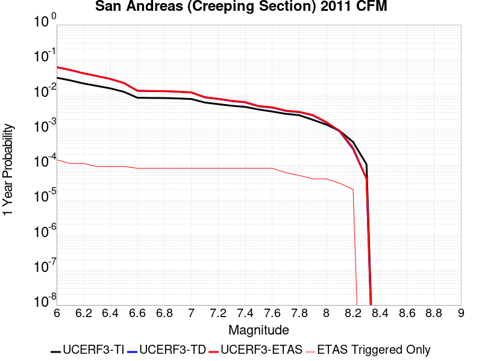 |  |

| Magnitude | 1 wk TI Prob | 1 wk TD Prob | 1 wk ETAS Prob | 1 wk ETAS/TD Gain | 1 wk ETAS Triggered Only | 1 mo TI Prob | 1 mo TD Prob | 1 mo ETAS Prob | 1 mo ETAS/TD Gain | 1 mo ETAS Triggered Only | 1 yr TI Prob | 1 yr TD Prob | 1 yr ETAS Prob | 1 yr ETAS/TD Gain | 1 yr ETAS Triggered Only | 10 yr TI Prob | 10 yr TD Prob | 10 yr ETAS Prob | 10 yr ETAS/TD Gain | 10 yr ETAS Triggered Only |
|-----|-----|-----|-----|-----|-----|-----|-----|-----|-----|-----|-----|-----|-----|-----|-----|-----|-----|-----|-----|-----|
| 6.0 | 5.986481E-4 | 0.001228691 | 0.001228691 | 1.0 | 0.0 | 0.0025631124 | 0.005246795 | 0.005246795 | 1.0 | 0.0 | 0.030762846 | 0.061203245 | 0.061203245 | 1.0 | 0.0 | 0.26835477 | 0.425928 | 0.42597905 | 1.0001198 | 8.889679E-5 |
| 6.1 | 5.015945E-4 | 0.0010230356 | 0.0010230356 | 1.0 | 0.0 | 0.00214792 | 0.004369436 | 0.004369436 | 1.0 | 0.0 | 0.025839351 | 0.051246606 | 0.051246606 | 1.0 | 0.0 | 0.23032776 | 0.37284943 | 0.3729052 | 1.0001495 | 8.889679E-5 |
| 6.2 | 4.073338E-4 | 8.1157376E-4 | 8.1157376E-4 | 1.0 | 0.0 | 0.0017445484 | 0.0034683137 | 0.0034683137 | 1.0 | 0.0 | 0.021034058 | 0.04093177 | 0.04093177 | 1.0 | 0.0 | 0.19150782 | 0.31302592 | 0.313087 | 1.0001951 | 8.889679E-5 |
| 6.3 | 3.464099E-4 | 6.7455834E-4 | 6.7455834E-4 | 1.0 | 0.0 | 0.0014837692 | 0.0028832308 | 0.0028832308 | 1.0 | 0.0 | 0.017915873 | 0.034187846 | 0.034187846 | 1.0 | 0.0 | 0.16538359 | 0.27130842 | 0.27137318 | 1.0002388 | 8.889679E-5 |
| 6.4 | 2.935057E-4 | 5.5516965E-4 | 5.5516965E-4 | 1.0 | 0.0 | 0.0012572751 | 0.0023727308 | 0.0023727308 | 1.0 | 0.0 | 0.015200248 | 0.02826279 | 0.02826279 | 1.0 | 0.0 | 0.14201577 | 0.23297668 | 0.23304486 | 1.0002927 | 8.889679E-5 |
| 6.5 | 2.3409708E-4 | 4.2132285E-4 | 4.2132285E-4 | 1.0 | 0.0 | 0.0010028875 | 0.0018017791 | 0.0018017791 | 1.0 | 0.0 | 0.012141965 | 0.021586355 | 0.021586355 | 1.0 | 0.0 | 0.11499573 | 0.1868149 | 0.1868872 | 1.000387 | 8.889679E-5 |
| 6.6 | 1.5842178E-4 | 2.5068692E-4 | 2.5068692E-4 | 1.0 | 0.0 | 6.7877385E-4 | 0.0010739256 | 0.0010739256 | 1.0 | 0.0 | 0.0082328 | 0.012995283 | 0.012995283 | 1.0 | 0.0 | 0.07934396 | 0.12313759 | 0.12321554 | 1.000633 | 8.889679E-5 |
| 6.7 | 1.5616413E-4 | 2.4605254E-4 | 2.4605254E-4 | 1.0 | 0.0 | 6.691031E-4 | 0.0010540807 | 0.0010540807 | 1.0 | 0.0 | 0.0081159435 | 0.012757154 | 0.012757154 | 1.0 | 0.0 | 0.0782586 | 0.12116472 | 0.12124284 | 1.0006448 | 8.889679E-5 |
| 6.8 | 1.5538467E-4 | 2.442914E-4 | 2.442914E-4 | 1.0 | 0.0 | 6.6576427E-4 | 0.001046539 | 0.001046539 | 1.0 | 0.0 | 0.008075596 | 0.012666538 | 0.012666538 | 1.0 | 0.0 | 0.07788358 | 0.12039561 | 0.1204738 | 1.0006495 | 8.889679E-5 |
| 6.9 | 1.5153569E-4 | 2.3538464E-4 | 2.3538464E-4 | 1.0 | 0.0 | 6.49277E-4 | 0.0010084033 | 0.0010084033 | 1.0 | 0.0 | 0.007876333 | 0.012208726 | 0.012208726 | 1.0 | 0.0 | 0.07602952 | 0.11646574 | 0.116544284 | 1.0006744 | 8.889679E-5 |
| 7.0 | 1.4588932E-4 | 2.2395732E-4 | 2.2395732E-4 | 1.0 | 0.0 | 6.250901E-4 | 9.59466E-4 | 9.59466E-4 | 1.0 | 0.0 | 0.0075839474 | 0.011619428 | 0.011619428 | 1.0 | 0.0 | 0.073302895 | 0.11131206 | 0.11139107 | 1.0007098 | 8.889679E-5 |
| 7.1 | 1.1565079E-4 | 1.6281323E-4 | 1.6281323E-4 | 1.0 | 0.0 | 4.955521E-4 | 6.9758523E-4 | 6.9758523E-4 | 1.0 | 0.0 | 0.006016669 | 0.008460228 | 0.008460228 | 1.0 | 0.0 | 0.058563538 | 0.08366478 | 0.08374625 | 1.0009736 | 8.889679E-5 |
| 7.2 | 1.0393792E-4 | 1.4615392E-4 | 1.4615392E-4 | 1.0 | 0.0 | 4.4537216E-4 | 6.262243E-4 | 6.262243E-4 | 1.0 | 0.0 | 0.005408933 | 0.0075977976 | 0.0075977976 | 1.0 | 0.0 | 0.052791595 | 0.07561503 | 0.07569721 | 1.0010867 | 8.889679E-5 |
| 7.3 | 9.332884E-5 | 1.2780601E-4 | 1.2780601E-4 | 1.0 | 0.0 | 3.999194E-4 | 5.4762565E-4 | 5.4762565E-4 | 1.0 | 0.0 | 0.0048581534 | 0.0066470946 | 0.0066470946 | 1.0 | 0.0 | 0.047533102 | 0.06647954 | 0.066562526 | 1.0012484 | 8.889679E-5 |
| 7.4 | 8.670252E-5 | 1.1702972E-4 | 1.1702972E-4 | 1.0 | 0.0 | 3.715293E-4 | 5.014601E-4 | 5.014601E-4 | 1.0 | 0.0 | 0.004513991 | 0.0060883067 | 0.0060883067 | 1.0 | 0.0 | 0.044233937 | 0.061148684 | 0.061232146 | 1.0013648 | 8.889679E-5 |
| 7.5 | 7.3036405E-5 | 9.005699E-5 | 9.005699E-5 | 1.0 | 0.0 | 3.129756E-4 | 3.859015E-4 | 3.859015E-4 | 1.0 | 0.0 | 0.0038038217 | 0.0046882504 | 0.0046882504 | 1.0 | 0.0 | 0.03739367 | 0.047875606 | 0.047875606 | 1.0 | 0.0 |
| 7.6 | 6.3935775E-5 | 8.280209E-5 | 8.280209E-5 | 1.0 | 0.0 | 2.7398168E-4 | 3.5481792E-4 | 3.5481792E-4 | 1.0 | 0.0 | 0.0033306254 | 0.00431137 | 0.00431137 | 1.0 | 0.0 | 0.032811474 | 0.043990135 | 0.043990135 | 1.0 | 0.0 |
| 7.7 | 5.5050095E-5 | 6.661729E-5 | 6.661729E-5 | 1.0 | 0.0 | 2.3590765E-4 | 2.8547147E-4 | 2.8547147E-4 | 1.0 | 0.0 | 0.0028683927 | 0.0034700802 | 0.0034700802 | 1.0 | 0.0 | 0.0283165 | 0.03579509 | 0.03579509 | 1.0 | 0.0 |
| 7.8 | 5.027131E-5 | 6.1627725E-5 | 6.1627725E-5 | 1.0 | 0.0 | 2.1543067E-4 | 2.640921E-4 | 2.640921E-4 | 1.0 | 0.0 | 0.0026197135 | 0.003210584 | 0.003210584 | 1.0 | 0.0 | 0.025890453 | 0.03312572 | 0.03312572 | 1.0 | 0.0 |
| 7.9 | 3.7271806E-5 | 5.0224386E-5 | 5.0224386E-5 | 1.0 | 0.0 | 1.5972654E-4 | 2.1522962E-4 | 2.1522962E-4 | 1.0 | 0.0 | 0.0019429359 | 0.0026172737 | 0.0026172737 | 1.0 | 0.0 | 0.019260362 | 0.027066687 | 0.027066687 | 1.0 | 0.0 |
| 8.0 | 2.7310243E-5 | 3.1428404E-5 | 3.1428404E-5 | 1.0 | 0.0 | 1.17038646E-4 | 1.3468621E-4 | 1.3468621E-4 | 1.0 | 0.0 | 0.0014240141 | 0.0016385721 | 0.0016385721 | 1.0 | 0.0 | 0.014149235 | 0.01721387 | 0.01721387 | 1.0 | 0.0 |
| 8.1 | 1.7940547E-5 | 1.7400796E-5 | 1.7400796E-5 | 1.0 | 0.0 | 7.688579E-5 | 7.457271E-5 | 7.457271E-5 | 1.0 | 0.0 | 9.3568244E-4 | 9.075451E-4 | 9.075451E-4 | 1.0 | 0.0 | 0.009317525 | 0.009799073 | 0.009799073 | 1.0 | 0.0 |
| 8.2 | 8.643924E-6 | 5.4748625E-6 | 5.4748625E-6 | 1.0 | 0.0 | 3.704486E-5 | 2.3463486E-5 | 2.3463486E-5 | 1.0 | 0.0 | 4.5092785E-4 | 2.8563058E-4 | 2.8563058E-4 | 1.0 | 0.0 | 0.0045001395 | 0.0032487072 | 0.0032487072 | 1.0 | 0.0 |
| 8.3 | 1.983087E-6 | 7.6599065E-7 | 7.6599065E-7 | 1.0 | 0.0 | 8.498917E-6 | 3.282813E-6 | 3.282813E-6 | 1.0 | 0.0 | 1.034694E-4 | 3.9967534E-5 | 3.9967534E-5 | 1.0 | 0.0 | 0.0010342124 | 4.719687E-4 | 4.719687E-4 | 1.0 | 0.0 |

## San Diego Trough south
*[(top)](#table-of-contents)*

| 1 Week | 1 Month | 1 Year | 10 Year |
|-----|-----|-----|-----|
|  |  |  |  |

| Magnitude | 1 wk TI Prob | 1 wk TD Prob | 1 wk ETAS Prob | 1 wk ETAS/TD Gain | 1 wk ETAS Triggered Only | 1 mo TI Prob | 1 mo TD Prob | 1 mo ETAS Prob | 1 mo ETAS/TD Gain | 1 mo ETAS Triggered Only | 1 yr TI Prob | 1 yr TD Prob | 1 yr ETAS Prob | 1 yr ETAS/TD Gain | 1 yr ETAS Triggered Only | 10 yr TI Prob | 10 yr TD Prob | 10 yr ETAS Prob | 10 yr ETAS/TD Gain | 10 yr ETAS Triggered Only |
|-----|-----|-----|-----|-----|-----|-----|-----|-----|-----|-----|-----|-----|-----|-----|-----|-----|-----|-----|-----|-----|
| 6.0 | 8.279495E-5 | 1.04241306E-4 | 1.9312883E-4 | 1.8527092 | 8.889679E-5 | 3.5478722E-4 | 4.4667677E-4 | 5.355339E-4 | 1.1989293 | 8.889679E-5 | 0.004310982 | 0.0054256152 | 0.00551403 | 1.0162958 | 8.889679E-5 | 0.042283054 | 0.05299221 | 0.053076394 | 1.0015887 | 8.889679E-5 |
| 6.1 | 4.6961468E-5 | 5.772944E-5 | 5.772944E-5 | 1.0 | 0.0 | 2.0124791E-4 | 2.473894E-4 | 2.473894E-4 | 1.0 | 0.0 | 0.00244744 | 0.0030079768 | 0.0030079768 | 1.0 | 0.0 | 0.024206603 | 0.029679462 | 0.029679462 | 1.0 | 0.0 |
| 6.2 | 3.5079658E-5 | 4.214154E-5 | 4.214154E-5 | 1.0 | 0.0 | 1.5033272E-4 | 1.8059435E-4 | 1.8059435E-4 | 1.0 | 0.0 | 0.0018287642 | 0.0021965632 | 0.0021965632 | 1.0 | 0.0 | 0.018137876 | 0.021751117 | 0.021751117 | 1.0 | 0.0 |
| 6.3 | 3.5079658E-5 | 4.214154E-5 | 4.214154E-5 | 1.0 | 0.0 | 1.5033272E-4 | 1.8059435E-4 | 1.8059435E-4 | 1.0 | 0.0 | 0.0018287642 | 0.0021965632 | 0.0021965632 | 1.0 | 0.0 | 0.018137876 | 0.021751117 | 0.021751117 | 1.0 | 0.0 |
| 6.4 | 2.7196904E-5 | 3.2087162E-5 | 3.2087162E-5 | 1.0 | 0.0 | 1.16552954E-4 | 1.3750927E-4 | 1.3750927E-4 | 1.0 | 0.0 | 0.0014181085 | 0.0016729041 | 0.0016729041 | 1.0 | 0.0 | 0.014090929 | 0.016604643 | 0.016604643 | 1.0 | 0.0 |
| 6.5 | 2.5584688E-5 | 3.010164E-5 | 3.010164E-5 | 1.0 | 0.0 | 1.0964406E-4 | 1.2900073E-4 | 1.2900073E-4 | 1.0 | 0.0 | 0.0013340989 | 0.0015694655 | 0.0015694655 | 1.0 | 0.0 | 0.013261181 | 0.015585314 | 0.015585314 | 1.0 | 0.0 |
| 6.6 | 2.2034688E-5 | 2.5742738E-5 | 2.5742738E-5 | 1.0 | 0.0 | 9.443096E-5 | 1.1032141E-4 | 1.1032141E-4 | 1.0 | 0.0 | 0.0011490905 | 0.0013423424 | 0.0013423424 | 1.0 | 0.0 | 0.011431668 | 0.013343317 | 0.013343317 | 1.0 | 0.0 |
| 6.7 | 1.9394853E-5 | 2.254176E-5 | 2.254176E-5 | 1.0 | 0.0 | 8.311815E-5 | 9.6603995E-5 | 9.6603995E-5 | 1.0 | 0.0 | 0.0010114936 | 0.0011755243 | 0.0011755243 | 1.0 | 0.0 | 0.01006902 | 0.011693766 | 0.011693766 | 1.0 | 0.0 |
| 6.8 | 1.7615313E-5 | 2.0403182E-5 | 2.0403182E-5 | 1.0 | 0.0 | 7.549201E-5 | 8.74393E-5 | 8.74393E-5 | 1.0 | 0.0 | 9.1872766E-4 | 0.0010640579 | 0.0010640579 | 1.0 | 0.0 | 0.009149387 | 0.010590198 | 0.010590198 | 1.0 | 0.0 |
| 6.9 | 1.5621423E-5 | 1.8026114E-5 | 1.8026114E-5 | 1.0 | 0.0 | 6.6947236E-5 | 7.725251E-5 | 7.725251E-5 | 1.0 | 0.0 | 8.147778E-4 | 9.40147E-4 | 9.40147E-4 | 1.0 | 0.0 | 0.008117969 | 0.009362142 | 0.009362142 | 1.0 | 0.0 |
| 7.0 | 1.3444376E-5 | 1.544809E-5 | 1.544809E-5 | 1.0 | 0.0 | 5.7617483E-5 | 6.620443E-5 | 6.620443E-5 | 1.0 | 0.0 | 7.0126704E-4 | 8.057436E-4 | 8.057436E-4 | 1.0 | 0.0 | 0.006990582 | 0.008028555 | 0.008028555 | 1.0 | 0.0 |
| 7.1 | 1.2268361E-5 | 1.407303E-5 | 1.407303E-5 | 1.0 | 0.0 | 5.2577634E-5 | 6.0311606E-5 | 6.0311606E-5 | 1.0 | 0.0 | 6.399447E-4 | 7.3404907E-4 | 7.3404907E-4 | 1.0 | 0.0 | 0.0063810493 | 0.0073165493 | 0.0073165493 | 1.0 | 0.0 |
| 7.2 | 1.0922655E-5 | 1.2513563E-5 | 1.2513563E-5 | 1.0 | 0.0 | 4.681054E-5 | 5.3628468E-5 | 5.3628468E-5 | 1.0 | 0.0 | 5.697693E-4 | 6.5273355E-4 | 6.5273355E-4 | 1.0 | 0.0 | 0.0056831064 | 0.0065084435 | 0.0065084435 | 1.0 | 0.0 |
| 7.3 | 6.1106753E-6 | 6.928925E-6 | 6.928925E-6 | 1.0 | 0.0 | 2.6188345E-5 | 2.9695057E-5 | 2.9695057E-5 | 1.0 | 0.0 | 3.1879646E-4 | 3.6147775E-4 | 3.6147775E-4 | 1.0 | 0.0 | 0.0031833951 | 0.003608943 | 0.003608943 | 1.0 | 0.0 |
| 7.4 | 4.933187E-6 | 5.5895525E-6 | 5.5895525E-6 | 1.0 | 0.0 | 2.114206E-5 | 2.3955008E-5 | 2.3955008E-5 | 1.0 | 0.0 | 2.5737417E-4 | 2.9161357E-4 | 2.9161357E-4 | 1.0 | 0.0 | 0.002570763 | 0.0029123505 | 0.0029123505 | 1.0 | 0.0 |
| 7.5 | 1.7489613E-6 | 1.969678E-6 | 1.969678E-6 | 1.0 | 0.0 | 7.495527E-6 | 8.4414505E-6 | 8.4414505E-6 | 1.0 | 0.0 | 9.125422E-5 | 1.02770035E-4 | 1.02770035E-4 | 1.0 | 0.0 | 9.1216754E-4 | 0.0010272472 | 0.0010272472 | 1.0 | 0.0 |
| 7.6 | 1.6988751E-7 | 1.7533823E-7 | 1.7533823E-7 | 1.0 | 0.0 | 7.2808916E-7 | 7.5144936E-7 | 7.5144936E-7 | 1.0 | 0.0 | 8.864449E-6 | 9.14886E-6 | 9.14886E-6 | 1.0 | 0.0 | 8.8640954E-5 | 9.1485024E-5 | 9.1485024E-5 | 1.0 | 0.0 |

## Thirty Mile Bank
*[(top)](#table-of-contents)*

| 1 Week | 1 Month | 1 Year | 10 Year |
|-----|-----|-----|-----|
|  |  |  |  |

| Magnitude | 1 wk TI Prob | 1 wk TD Prob | 1 wk ETAS Prob | 1 wk ETAS/TD Gain | 1 wk ETAS Triggered Only | 1 mo TI Prob | 1 mo TD Prob | 1 mo ETAS Prob | 1 mo ETAS/TD Gain | 1 mo ETAS Triggered Only | 1 yr TI Prob | 1 yr TD Prob | 1 yr ETAS Prob | 1 yr ETAS/TD Gain | 1 yr ETAS Triggered Only | 10 yr TI Prob | 10 yr TD Prob | 10 yr ETAS Prob | 10 yr ETAS/TD Gain | 10 yr ETAS Triggered Only |
|-----|-----|-----|-----|-----|-----|-----|-----|-----|-----|-----|-----|-----|-----|-----|-----|-----|-----|-----|-----|-----|
| 6.0 | 6.5124755E-6 | 6.6592643E-6 | 6.6592643E-6 | 1.0 | 0.0 | 2.791031E-5 | 2.8539416E-5 | 1.1743367E-4 | 4.1147885 | 8.889679E-5 | 3.3975503E-4 | 3.4741635E-4 | 4.3628225E-4 | 1.2557908 | 8.889679E-5 | 0.0033923604 | 0.003469164 | 0.0035577524 | 1.025536 | 8.889679E-5 |
| 6.1 | 6.5124755E-6 | 6.6592643E-6 | 6.6592643E-6 | 1.0 | 0.0 | 2.791031E-5 | 2.8539416E-5 | 1.1743367E-4 | 4.1147885 | 8.889679E-5 | 3.3975503E-4 | 3.4741635E-4 | 4.3628225E-4 | 1.2557908 | 8.889679E-5 | 0.0033923604 | 0.003469164 | 0.0035577524 | 1.025536 | 8.889679E-5 |
| 6.2 | 6.5124755E-6 | 6.6592643E-6 | 6.6592643E-6 | 1.0 | 0.0 | 2.791031E-5 | 2.8539416E-5 | 1.1743367E-4 | 4.1147885 | 8.889679E-5 | 3.3975503E-4 | 3.4741635E-4 | 4.3628225E-4 | 1.2557908 | 8.889679E-5 | 0.0033923604 | 0.003469164 | 0.0035577524 | 1.025536 | 8.889679E-5 |
| 6.3 | 6.5124755E-6 | 6.6592643E-6 | 6.6592643E-6 | 1.0 | 0.0 | 2.791031E-5 | 2.8539416E-5 | 1.1743367E-4 | 4.1147885 | 8.889679E-5 | 3.3975503E-4 | 3.4741635E-4 | 4.3628225E-4 | 1.2557908 | 8.889679E-5 | 0.0033923604 | 0.003469164 | 0.0035577524 | 1.025536 | 8.889679E-5 |
| 6.4 | 6.5124755E-6 | 6.6592643E-6 | 6.6592643E-6 | 1.0 | 0.0 | 2.791031E-5 | 2.8539416E-5 | 1.1743367E-4 | 4.1147885 | 8.889679E-5 | 3.3975503E-4 | 3.4741635E-4 | 4.3628225E-4 | 1.2557908 | 8.889679E-5 | 0.0033923604 | 0.003469164 | 0.0035577524 | 1.025536 | 8.889679E-5 |
| 6.5 | 6.5124755E-6 | 6.6592643E-6 | 6.6592643E-6 | 1.0 | 0.0 | 2.791031E-5 | 2.8539416E-5 | 1.1743367E-4 | 4.1147885 | 8.889679E-5 | 3.3975503E-4 | 3.4741635E-4 | 4.3628225E-4 | 1.2557908 | 8.889679E-5 | 0.0033923604 | 0.003469164 | 0.0035577524 | 1.025536 | 8.889679E-5 |
| 6.6 | 6.5124755E-6 | 6.6592643E-6 | 6.6592643E-6 | 1.0 | 0.0 | 2.791031E-5 | 2.8539416E-5 | 1.1743367E-4 | 4.1147885 | 8.889679E-5 | 3.3975503E-4 | 3.4741635E-4 | 4.3628225E-4 | 1.2557908 | 8.889679E-5 | 0.0033923604 | 0.003469164 | 0.0035577524 | 1.025536 | 8.889679E-5 |
| 6.7 | 3.5261137E-6 | 3.6098995E-6 | 3.6098995E-6 | 1.0 | 0.0 | 1.5111828E-5 | 1.547091E-5 | 1.547091E-5 | 1.0 | 0.0 | 1.8397097E-4 | 1.883427E-4 | 1.883427E-4 | 1.0 | 0.0 | 0.0018381875 | 0.0018818958 | 0.0018818958 | 1.0 | 0.0 |
| 6.8 | 3.370743E-6 | 3.4509355E-6 | 3.4509355E-6 | 1.0 | 0.0 | 1.4445961E-5 | 1.47896435E-5 | 1.47896435E-5 | 1.0 | 0.0 | 1.7586538E-4 | 1.8004965E-4 | 1.8004965E-4 | 1.0 | 0.0 | 0.0017572626 | 0.0017990996 | 0.0017990996 | 1.0 | 0.0 |
| 6.9 | 2.2756835E-6 | 2.333161E-6 | 2.333161E-6 | 1.0 | 0.0 | 9.752893E-6 | 9.999225E-6 | 9.999225E-6 | 1.0 | 0.0 | 1.18735006E-4 | 1.2173401E-4 | 1.2173401E-4 | 1.0 | 0.0 | 0.0011867158 | 0.0012166979 | 0.0012166979 | 1.0 | 0.0 |
| 7.0 | 2.1617404E-6 | 2.21598E-6 | 2.21598E-6 | 1.0 | 0.0 | 9.264569E-6 | 9.497024E-6 | 9.497024E-6 | 1.0 | 0.0 | 1.1279029E-4 | 1.1562037E-4 | 1.1562037E-4 | 1.0 | 0.0 | 0.0011273306 | 0.0011556263 | 0.0011556263 | 1.0 | 0.0 |
| 7.1 | 1.5900777E-6 | 1.6327014E-6 | 1.6327014E-6 | 1.0 | 0.0 | 6.814601E-6 | 6.997274E-6 | 6.997274E-6 | 1.0 | 0.0 | 8.296461E-5 | 8.518861E-5 | 8.518861E-5 | 1.0 | 0.0 | 8.293364E-4 | 8.5157226E-4 | 8.5157226E-4 | 1.0 | 0.0 |
| 7.2 | 1.2971728E-6 | 1.3328992E-6 | 1.3328992E-6 | 1.0 | 0.0 | 5.5593005E-6 | 5.712413E-6 | 5.712413E-6 | 1.0 | 0.0 | 6.768238E-5 | 6.954651E-5 | 6.954651E-5 | 1.0 | 0.0 | 6.7661767E-4 | 6.952578E-4 | 6.952578E-4 | 1.0 | 0.0 |
| 7.3 | 8.2454284E-7 | 8.448891E-7 | 8.448891E-7 | 1.0 | 0.0 | 3.5337503E-6 | 3.6209485E-6 | 3.6209485E-6 | 1.0 | 0.0 | 4.302256E-5 | 4.408422E-5 | 4.408422E-5 | 1.0 | 0.0 | 4.301423E-4 | 4.4076078E-4 | 4.4076078E-4 | 1.0 | 0.0 |
| 7.4 | 4.2619024E-7 | 4.3863466E-7 | 4.3863466E-7 | 1.0 | 0.0 | 1.8265283E-6 | 1.8798615E-6 | 1.8798615E-6 | 1.0 | 0.0 | 2.2237757E-5 | 2.2887078E-5 | 2.2887078E-5 | 1.0 | 0.0 | 2.223553E-4 | 2.288476E-4 | 2.288476E-4 | 1.0 | 0.0 |
| 7.5 | 2.993922E-7 | 3.086453E-7 | 3.086453E-7 | 1.0 | 0.0 | 1.2831089E-6 | 1.3227649E-6 | 1.3227649E-6 | 1.0 | 0.0 | 1.5621737E-5 | 1.6104546E-5 | 1.6104546E-5 | 1.0 | 0.0 | 1.562064E-4 | 1.6103406E-4 | 1.6103406E-4 | 1.0 | 0.0 |
| 7.6 | 1.6988751E-7 | 1.7533823E-7 | 1.7533823E-7 | 1.0 | 0.0 | 7.2808916E-7 | 7.5144936E-7 | 7.5144936E-7 | 1.0 | 0.0 | 8.864449E-6 | 9.14886E-6 | 9.14886E-6 | 1.0 | 0.0 | 8.8640954E-5 | 9.1485024E-5 | 9.1485024E-5 | 1.0 | 0.0 |

## Los Alamos 2011 CFM
*[(top)](#table-of-contents)*

| 1 Week | 1 Month | 1 Year | 10 Year |
|-----|-----|-----|-----|
|  |  |  |  |

| Magnitude | 1 wk TI Prob | 1 wk TD Prob | 1 wk ETAS Prob | 1 wk ETAS/TD Gain | 1 wk ETAS Triggered Only | 1 mo TI Prob | 1 mo TD Prob | 1 mo ETAS Prob | 1 mo ETAS/TD Gain | 1 mo ETAS Triggered Only | 1 yr TI Prob | 1 yr TD Prob | 1 yr ETAS Prob | 1 yr ETAS/TD Gain | 1 yr ETAS Triggered Only | 10 yr TI Prob | 10 yr TD Prob | 10 yr ETAS Prob | 10 yr ETAS/TD Gain | 10 yr ETAS Triggered Only |
|-----|-----|-----|-----|-----|-----|-----|-----|-----|-----|-----|-----|-----|-----|-----|-----|-----|-----|-----|-----|-----|
| 6.0 | 4.6284417E-6 | 4.751731E-6 | 4.751731E-6 | 1.0 | 0.0 | 1.9836029E-5 | 2.0364414E-5 | 2.0364414E-5 | 1.0 | 0.0 | 2.4147688E-4 | 2.4791027E-4 | 2.4791027E-4 | 1.0 | 0.0 | 0.0024121467 | 0.0024765113 | 0.002565188 | 1.0358071 | 8.889679E-5 |
| 6.1 | 4.6284417E-6 | 4.751731E-6 | 4.751731E-6 | 1.0 | 0.0 | 1.9836029E-5 | 2.0364414E-5 | 2.0364414E-5 | 1.0 | 0.0 | 2.4147688E-4 | 2.4791027E-4 | 2.4791027E-4 | 1.0 | 0.0 | 0.0024121467 | 0.0024765113 | 0.002565188 | 1.0358071 | 8.889679E-5 |
| 6.2 | 4.6284417E-6 | 4.751731E-6 | 4.751731E-6 | 1.0 | 0.0 | 1.9836029E-5 | 2.0364414E-5 | 2.0364414E-5 | 1.0 | 0.0 | 2.4147688E-4 | 2.4791027E-4 | 2.4791027E-4 | 1.0 | 0.0 | 0.0024121467 | 0.0024765113 | 0.002565188 | 1.0358071 | 8.889679E-5 |
| 6.3 | 4.6284417E-6 | 4.751731E-6 | 4.751731E-6 | 1.0 | 0.0 | 1.9836029E-5 | 2.0364414E-5 | 2.0364414E-5 | 1.0 | 0.0 | 2.4147688E-4 | 2.4791027E-4 | 2.4791027E-4 | 1.0 | 0.0 | 0.0024121467 | 0.0024765113 | 0.002565188 | 1.0358071 | 8.889679E-5 |
| 6.4 | 4.6284417E-6 | 4.751731E-6 | 4.751731E-6 | 1.0 | 0.0 | 1.9836029E-5 | 2.0364414E-5 | 2.0364414E-5 | 1.0 | 0.0 | 2.4147688E-4 | 2.4791027E-4 | 2.4791027E-4 | 1.0 | 0.0 | 0.0024121467 | 0.0024765113 | 0.002565188 | 1.0358071 | 8.889679E-5 |
| 6.5 | 4.6284417E-6 | 4.751731E-6 | 4.751731E-6 | 1.0 | 0.0 | 1.9836029E-5 | 2.0364414E-5 | 2.0364414E-5 | 1.0 | 0.0 | 2.4147688E-4 | 2.4791027E-4 | 2.4791027E-4 | 1.0 | 0.0 | 0.0024121467 | 0.0024765113 | 0.002565188 | 1.0358071 | 8.889679E-5 |
| 6.6 | 4.6284417E-6 | 4.751731E-6 | 4.751731E-6 | 1.0 | 0.0 | 1.9836029E-5 | 2.0364414E-5 | 2.0364414E-5 | 1.0 | 0.0 | 2.4147688E-4 | 2.4791027E-4 | 2.4791027E-4 | 1.0 | 0.0 | 0.0024121467 | 0.0024765113 | 0.002565188 | 1.0358071 | 8.889679E-5 |
| 6.7 | 4.062321E-6 | 4.166349E-6 | 4.166349E-6 | 1.0 | 0.0 | 1.7409831E-5 | 1.7855667E-5 | 1.7855667E-5 | 1.0 | 0.0 | 2.1194408E-4 | 2.1737257E-4 | 2.1737257E-4 | 1.0 | 0.0 | 0.0021174205 | 0.0021717492 | 0.0022604528 | 1.0408443 | 8.889679E-5 |
| 6.8 | 4.062321E-6 | 4.166349E-6 | 4.166349E-6 | 1.0 | 0.0 | 1.7409831E-5 | 1.7855667E-5 | 1.7855667E-5 | 1.0 | 0.0 | 2.1194408E-4 | 2.1737257E-4 | 2.1737257E-4 | 1.0 | 0.0 | 0.0021174205 | 0.0021717492 | 0.0022604528 | 1.0408443 | 8.889679E-5 |
| 6.9 | 3.2936077E-6 | 3.372958E-6 | 3.372958E-6 | 1.0 | 0.0 | 1.4115385E-5 | 1.4455459E-5 | 1.4455459E-5 | 1.0 | 0.0 | 1.7184127E-4 | 1.7598194E-4 | 1.7598194E-4 | 1.0 | 0.0 | 0.0017170844 | 0.0017585184 | 0.0018472589 | 1.0504632 | 8.889679E-5 |
| 7.0 | 3.1687898E-6 | 3.2448156E-6 | 3.2448156E-6 | 1.0 | 0.0 | 1.3580457E-5 | 1.3906283E-5 | 1.3906283E-5 | 1.0 | 0.0 | 1.6532952E-4 | 1.6929678E-4 | 1.6929678E-4 | 1.0 | 0.0 | 0.0016520657 | 0.0016917696 | 0.001780516 | 1.0524577 | 8.889679E-5 |
| 7.1 | 2.9379228E-6 | 3.0073259E-6 | 3.0073259E-6 | 1.0 | 0.0 | 1.25910365E-5 | 1.288848E-5 | 1.288848E-5 | 1.0 | 0.0 | 1.5328509E-4 | 1.5690686E-4 | 1.5690686E-4 | 1.0 | 0.0 | 0.001531794 | 0.0015680499 | 0.0016568073 | 1.0566037 | 8.889679E-5 |
| 7.2 | 2.0020686E-6 | 2.0416298E-6 | 2.0416298E-6 | 1.0 | 0.0 | 8.580266E-6 | 8.749813E-6 | 8.749813E-6 | 1.0 | 0.0 | 1.0445973E-4 | 1.0652381E-4 | 1.0652381E-4 | 1.0 | 0.0 | 0.0010441064 | 0.001064732 | 0.001064732 | 1.0 | 0.0 |
| 7.3 | 1.7364243E-6 | 1.7678802E-6 | 1.7678802E-6 | 1.0 | 0.0 | 7.441797E-6 | 7.576608E-6 | 7.576608E-6 | 1.0 | 0.0 | 9.0600115E-5 | 9.2241324E-5 | 9.2241324E-5 | 1.0 | 0.0 | 9.0563187E-4 | 9.2203356E-4 | 9.2203356E-4 | 1.0 | 0.0 |
| 7.4 | 1.5718434E-6 | 1.5983177E-6 | 1.5983177E-6 | 1.0 | 0.0 | 6.7364545E-6 | 6.849915E-6 | 6.849915E-6 | 1.0 | 0.0 | 8.201325E-5 | 8.339455E-5 | 8.339455E-5 | 1.0 | 0.0 | 8.198299E-4 | 8.3363557E-4 | 8.3363557E-4 | 1.0 | 0.0 |
| 7.5 | 1.3841119E-6 | 1.4042793E-6 | 1.4042793E-6 | 1.0 | 0.0 | 5.9318945E-6 | 6.0183256E-6 | 6.0183256E-6 | 1.0 | 0.0 | 7.221842E-5 | 7.327068E-5 | 7.327068E-5 | 1.0 | 0.0 | 7.2194956E-4 | 7.324681E-4 | 7.324681E-4 | 1.0 | 0.0 |
| 7.6 | 1.0843726E-6 | 1.093442E-6 | 1.093442E-6 | 1.0 | 0.0 | 4.647303E-6 | 4.6861724E-6 | 4.6861724E-6 | 1.0 | 0.0 | 5.6579443E-5 | 5.705268E-5 | 5.705268E-5 | 1.0 | 0.0 | 5.656504E-4 | 5.703829E-4 | 5.703829E-4 | 1.0 | 0.0 |
| 7.7 | 5.544814E-7 | 5.5018705E-7 | 5.5018705E-7 | 1.0 | 0.0 | 2.3763469E-6 | 2.3579425E-6 | 2.3579425E-6 | 1.0 | 0.0 | 2.8931638E-5 | 2.8707573E-5 | 2.8707573E-5 | 1.0 | 0.0 | 2.8927872E-4 | 2.870388E-4 | 2.870388E-4 | 1.0 | 0.0 |
| 7.8 | 2.0707465E-7 | 1.977846E-7 | 1.977846E-7 | 1.0 | 0.0 | 8.874625E-7 | 8.4764804E-7 | 8.4764804E-7 | 1.0 | 0.0 | 1.08048025E-5 | 1.0320066E-5 | 1.0320066E-5 | 1.0 | 0.0 | 1.0804277E-4 | 1.0319592E-4 | 1.0319592E-4 | 1.0 | 0.0 |
| 7.9 | 3.9821284E-8 | 3.433109E-8 | 3.433109E-8 | 1.0 | 0.0 | 1.7066264E-7 | 1.4713324E-7 | 1.4713324E-7 | 1.0 | 0.0 | 2.0778157E-6 | 1.7913457E-6 | 1.7913457E-6 | 1.0 | 0.0 | 2.0777963E-5 | 1.7913319E-5 | 1.7913319E-5 | 1.0 | 0.0 |
| 8.0 | 7.880441E-11 | 8.2353124E-11 | 8.2353124E-11 | 1.0 | 0.0 | 3.3773329E-10 | 3.52942E-10 | 3.52942E-10 | 1.0 | 0.0 | 4.1119033E-9 | 4.2970694E-9 | 4.2970694E-9 | 1.0 | 0.0 | 4.1119034E-8 | 4.2970694E-8 | 4.2970694E-8 | 1.0 | 0.0 |

## San Jacinto (Coyote Creek)
*[(top)](#table-of-contents)*

| 1 Week | 1 Month | 1 Year | 10 Year |
|-----|-----|-----|-----|
|  |  |  |  |

| Magnitude | 1 wk TI Prob | 1 wk TD Prob | 1 wk ETAS Prob | 1 wk ETAS/TD Gain | 1 wk ETAS Triggered Only | 1 mo TI Prob | 1 mo TD Prob | 1 mo ETAS Prob | 1 mo ETAS/TD Gain | 1 mo ETAS Triggered Only | 1 yr TI Prob | 1 yr TD Prob | 1 yr ETAS Prob | 1 yr ETAS/TD Gain | 1 yr ETAS Triggered Only | 10 yr TI Prob | 10 yr TD Prob | 10 yr ETAS Prob | 10 yr ETAS/TD Gain | 10 yr ETAS Triggered Only |
|-----|-----|-----|-----|-----|-----|-----|-----|-----|-----|-----|-----|-----|-----|-----|-----|-----|-----|-----|-----|-----|
| 6.0 | 2.7374346E-5 | 2.4145214E-5 | 2.4145214E-5 | 1.0 | 0.0 | 1.1731335E-4 | 1.034754E-4 | 1.034754E-4 | 1.0 | 0.0 | 0.0014273542 | 0.0012590875 | 0.0013478723 | 1.0705153 | 8.889679E-5 | 0.01418221 | 0.012928318 | 0.013016066 | 1.0067872 | 8.889679E-5 |
| 6.1 | 2.7374346E-5 | 2.4145214E-5 | 2.4145214E-5 | 1.0 | 0.0 | 1.1731335E-4 | 1.034754E-4 | 1.034754E-4 | 1.0 | 0.0 | 0.0014273542 | 0.0012590875 | 0.0013478723 | 1.0705153 | 8.889679E-5 | 0.01418221 | 0.012928318 | 0.013016066 | 1.0067872 | 8.889679E-5 |
| 6.2 | 2.7374346E-5 | 2.4145214E-5 | 2.4145214E-5 | 1.0 | 0.0 | 1.1731335E-4 | 1.034754E-4 | 1.034754E-4 | 1.0 | 0.0 | 0.0014273542 | 0.0012590875 | 0.0013478723 | 1.0705153 | 8.889679E-5 | 0.01418221 | 0.012928318 | 0.013016066 | 1.0067872 | 8.889679E-5 |
| 6.3 | 2.7374346E-5 | 2.4145214E-5 | 2.4145214E-5 | 1.0 | 0.0 | 1.1731335E-4 | 1.034754E-4 | 1.034754E-4 | 1.0 | 0.0 | 0.0014273542 | 0.0012590875 | 0.0013478723 | 1.0705153 | 8.889679E-5 | 0.01418221 | 0.012928318 | 0.013016066 | 1.0067872 | 8.889679E-5 |
| 6.4 | 2.7374346E-5 | 2.4145214E-5 | 2.4145214E-5 | 1.0 | 0.0 | 1.1731335E-4 | 1.034754E-4 | 1.034754E-4 | 1.0 | 0.0 | 0.0014273542 | 0.0012590875 | 0.0013478723 | 1.0705153 | 8.889679E-5 | 0.01418221 | 0.012928318 | 0.013016066 | 1.0067872 | 8.889679E-5 |
| 6.5 | 2.7282445E-5 | 2.4031293E-5 | 2.4031293E-5 | 1.0 | 0.0 | 1.16919524E-4 | 1.029872E-4 | 1.029872E-4 | 1.0 | 0.0 | 0.0014225657 | 0.0012531505 | 0.001341936 | 1.0708498 | 8.889679E-5 | 0.014134934 | 0.012869646 | 0.012957399 | 1.0068185 | 8.889679E-5 |
| 6.6 | 2.7282445E-5 | 2.4031293E-5 | 2.4031293E-5 | 1.0 | 0.0 | 1.16919524E-4 | 1.029872E-4 | 1.029872E-4 | 1.0 | 0.0 | 0.0014225657 | 0.0012531505 | 0.001341936 | 1.0708498 | 8.889679E-5 | 0.014134934 | 0.012869646 | 0.012957399 | 1.0068185 | 8.889679E-5 |
| 6.7 | 2.7216198E-5 | 2.3956412E-5 | 2.3956412E-5 | 1.0 | 0.0 | 1.1663563E-4 | 1.02666316E-4 | 1.02666316E-4 | 1.0 | 0.0 | 0.0014191137 | 0.0012492483 | 0.001338034 | 1.0710714 | 8.889679E-5 | 0.014100855 | 0.0128310565 | 0.012918813 | 1.0068394 | 8.889679E-5 |
| 6.8 | 2.7078617E-5 | 2.387363E-5 | 2.387363E-5 | 1.0 | 0.0 | 1.1604605E-4 | 1.0231156E-4 | 1.0231156E-4 | 1.0 | 0.0 | 0.001411945 | 0.0012449342 | 0.0013337203 | 1.0713179 | 8.889679E-5 | 0.014030075 | 0.012788199 | 0.012875959 | 1.0068625 | 8.889679E-5 |
| 6.9 | 2.6982952E-5 | 2.3793142E-5 | 2.3793142E-5 | 1.0 | 0.0 | 1.15636096E-4 | 1.0196664E-4 | 1.0196664E-4 | 1.0 | 0.0 | 0.0014069602 | 0.0012407395 | 0.001329526 | 1.0715593 | 8.889679E-5 | 0.013980856 | 0.012746515 | 0.012834278 | 1.0068853 | 8.889679E-5 |
| 7.0 | 2.6449972E-5 | 2.3370165E-5 | 2.3370165E-5 | 1.0 | 0.0 | 1.1335209E-4 | 1.00154015E-4 | 1.00154015E-4 | 1.0 | 0.0 | 0.001379188 | 0.0012186957 | 0.0013074841 | 1.0728554 | 8.889679E-5 | 0.0137065975 | 0.0125278765 | 0.01261566 | 1.007007 | 8.889679E-5 |
| 7.1 | 2.6257849E-5 | 2.3196202E-5 | 2.3196202E-5 | 1.0 | 0.0 | 1.1252879E-4 | 9.940852E-5 | 9.940852E-5 | 1.0 | 0.0 | 0.0013691769 | 0.0012096294 | 0.0012984186 | 1.073402 | 8.889679E-5 | 0.013607717 | 0.012437741 | 0.012525532 | 1.0070585 | 8.889679E-5 |
| 7.2 | 2.5270041E-5 | 2.2390966E-5 | 2.2390966E-5 | 1.0 | 0.0 | 1.0829568E-4 | 9.595777E-5 | 9.595777E-5 | 1.0 | 0.0 | 0.0013177024 | 0.0011676621 | 0.0012564551 | 1.0760434 | 8.889679E-5 | 0.013099162 | 0.012018777 | 0.012106606 | 1.0073076 | 8.889679E-5 |
| 7.3 | 2.339701E-5 | 2.1122814E-5 | 2.1122814E-5 | 1.0 | 0.0 | 1.0026905E-4 | 9.0523215E-5 | 9.0523215E-5 | 1.0 | 0.0 | 0.001220092 | 0.0011015651 | 0.0011903639 | 1.0806116 | 8.889679E-5 | 0.012134149 | 0.011357696 | 0.011445583 | 1.0077381 | 8.889679E-5 |
| 7.4 | 2.296333E-5 | 2.0853171E-5 | 2.0853171E-5 | 1.0 | 0.0 | 9.841056E-5 | 8.936768E-5 | 8.936768E-5 | 1.0 | 0.0 | 0.0011974899 | 0.0010875105 | 0.0011763106 | 1.0816545 | 8.889679E-5 | 0.011910575 | 0.01121681 | 0.011304709 | 1.0078365 | 8.889679E-5 |
| 7.5 | 2.2188895E-5 | 2.0376096E-5 | 2.0376096E-5 | 1.0 | 0.0 | 9.50918E-5 | 8.732321E-5 | 8.732321E-5 | 1.0 | 0.0 | 0.0011571277 | 0.0010626436 | 0.0011514459 | 1.0835674 | 8.889679E-5 | 0.011511209 | 0.010966429 | 0.01105435 | 1.0080174 | 8.889679E-5 |
| 7.6 | 2.0013189E-5 | 1.8962366E-5 | 1.8962366E-5 | 1.0 | 0.0 | 8.5767984E-5 | 8.1264756E-5 | 8.1264756E-5 | 1.0 | 0.0 | 0.001043725 | 9.889511E-4 | 0.00107776 | 1.0898011 | 8.889679E-5 | 0.010388365 | 0.010224434 | 0.010312421 | 1.0086056 | 8.889679E-5 |
| 7.7 | 1.7230794E-5 | 1.674371E-5 | 1.674371E-5 | 1.0 | 0.0 | 7.384417E-5 | 7.175679E-5 | 7.175679E-5 | 1.0 | 0.0 | 8.986819E-4 | 8.7328954E-4 | 9.621087E-4 | 1.1017064 | 8.889679E-5 | 0.008950562 | 0.009062956 | 0.009151047 | 1.00972 | 8.889679E-5 |
| 7.8 | 1.4478809E-5 | 1.4990978E-5 | 1.4990978E-5 | 1.0 | 0.0 | 6.205057E-5 | 6.424547E-5 | 6.424547E-5 | 1.0 | 0.0 | 7.552038E-4 | 7.819085E-4 | 8.7073585E-4 | 1.1136031 | 8.889679E-5 | 0.0075264242 | 0.008141387 | 0.00822956 | 1.0108303 | 8.889679E-5 |
| 7.9 | 1.1114467E-5 | 1.1645102E-5 | 1.1645102E-5 | 1.0 | 0.0 | 4.7632562E-5 | 4.990663E-5 | 4.990663E-5 | 1.0 | 0.0 | 5.797721E-4 | 6.074444E-4 | 6.962872E-4 | 1.1462567 | 8.889679E-5 | 0.0057826187 | 0.0063803247 | 0.006468654 | 1.013844 | 8.889679E-5 |
| 8.0 | 9.327402E-6 | 9.899186E-6 | 9.899186E-6 | 1.0 | 0.0 | 3.9973966E-5 | 4.2424395E-5 | 4.2424395E-5 | 1.0 | 0.0 | 4.8657437E-4 | 5.1639514E-4 | 6.0524605E-4 | 1.1720599 | 8.889679E-5 | 0.0048551033 | 0.0054499684 | 0.0055383807 | 1.0162225 | 8.889679E-5 |
| 8.1 | 7.0235833E-6 | 6.827495E-6 | 6.827495E-6 | 1.0 | 0.0 | 3.0100724E-5 | 2.9260367E-5 | 2.9260367E-5 | 1.0 | 0.0 | 3.664147E-4 | 3.5618723E-4 | 3.5618723E-4 | 1.0 | 0.0 | 0.003658111 | 0.0037876023 | 0.0037876023 | 1.0 | 0.0 |
| 8.2 | 2.0358202E-6 | 8.994527E-7 | 8.994527E-7 | 1.0 | 0.0 | 8.724915E-6 | 3.854792E-6 | 3.854792E-6 | 1.0 | 0.0 | 1.06220665E-4 | 4.69311E-5 | 4.69311E-5 | 1.0 | 0.0 | 0.001061699 | 5.3254166E-4 | 5.3254166E-4 | 1.0 | 0.0 |
| 8.3 | 2.0051264E-7 | 6.617272E-8 | 6.617272E-8 | 1.0 | 0.0 | 8.5933965E-7 | 2.8359733E-7 | 2.8359733E-7 | 1.0 | 0.0 | 1.046241E-5 | 3.4527925E-6 | 3.4527925E-6 | 1.0 | 0.0 | 1.0461917E-4 | 4.01389E-5 | 4.01389E-5 | 1.0 | 0.0 |

## San Jacinto (Lytle Creek connector)
*[(top)](#table-of-contents)*

| 1 Week | 1 Month | 1 Year | 10 Year |
|-----|-----|-----|-----|
|  |  |  | 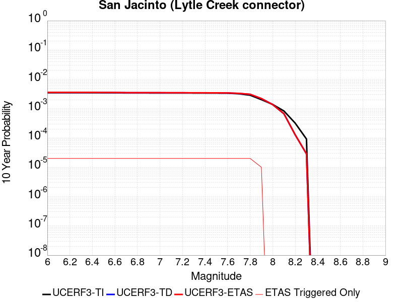 |

| Magnitude | 1 wk TI Prob | 1 wk TD Prob | 1 wk ETAS Prob | 1 wk ETAS/TD Gain | 1 wk ETAS Triggered Only | 1 mo TI Prob | 1 mo TD Prob | 1 mo ETAS Prob | 1 mo ETAS/TD Gain | 1 mo ETAS Triggered Only | 1 yr TI Prob | 1 yr TD Prob | 1 yr ETAS Prob | 1 yr ETAS/TD Gain | 1 yr ETAS Triggered Only | 10 yr TI Prob | 10 yr TD Prob | 10 yr ETAS Prob | 10 yr ETAS/TD Gain | 10 yr ETAS Triggered Only |
|-----|-----|-----|-----|-----|-----|-----|-----|-----|-----|-----|-----|-----|-----|-----|-----|-----|-----|-----|-----|-----|
| 6.0 | 6.693995E-6 | 6.660216E-6 | 9.555642E-5 | 14.347344 | 8.889679E-5 | 2.8688235E-5 | 2.854347E-5 | 1.17437725E-4 | 4.114346 | 8.889679E-5 | 3.492233E-4 | 3.4746144E-4 | 4.3632733E-4 | 1.2557576 | 8.889679E-5 | 0.00348675 | 0.0035493854 | 0.0036379665 | 1.0249568 | 8.889679E-5 |
| 6.1 | 6.693995E-6 | 6.660216E-6 | 9.555642E-5 | 14.347344 | 8.889679E-5 | 2.8688235E-5 | 2.854347E-5 | 1.17437725E-4 | 4.114346 | 8.889679E-5 | 3.492233E-4 | 3.4746144E-4 | 4.3632733E-4 | 1.2557576 | 8.889679E-5 | 0.00348675 | 0.0035493854 | 0.0036379665 | 1.0249568 | 8.889679E-5 |
| 6.2 | 6.693995E-6 | 6.660216E-6 | 9.555642E-5 | 14.347344 | 8.889679E-5 | 2.8688235E-5 | 2.854347E-5 | 1.17437725E-4 | 4.114346 | 8.889679E-5 | 3.492233E-4 | 3.4746144E-4 | 4.3632733E-4 | 1.2557576 | 8.889679E-5 | 0.00348675 | 0.0035493854 | 0.0036379665 | 1.0249568 | 8.889679E-5 |
| 6.3 | 6.693995E-6 | 6.660216E-6 | 9.555642E-5 | 14.347344 | 8.889679E-5 | 2.8688235E-5 | 2.854347E-5 | 1.17437725E-4 | 4.114346 | 8.889679E-5 | 3.492233E-4 | 3.4746144E-4 | 4.3632733E-4 | 1.2557576 | 8.889679E-5 | 0.00348675 | 0.0035493854 | 0.0036379665 | 1.0249568 | 8.889679E-5 |
| 6.4 | 6.693995E-6 | 6.660216E-6 | 9.555642E-5 | 14.347344 | 8.889679E-5 | 2.8688235E-5 | 2.854347E-5 | 1.17437725E-4 | 4.114346 | 8.889679E-5 | 3.492233E-4 | 3.4746144E-4 | 4.3632733E-4 | 1.2557576 | 8.889679E-5 | 0.00348675 | 0.0035493854 | 0.0036379665 | 1.0249568 | 8.889679E-5 |
| 6.5 | 6.6561875E-6 | 6.6204343E-6 | 9.551664E-5 | 14.427548 | 8.889679E-5 | 2.8526205E-5 | 2.837298E-5 | 1.1726725E-4 | 4.1330605 | 8.889679E-5 | 3.472512E-4 | 3.4538636E-4 | 4.3425246E-4 | 1.2572947 | 8.889679E-5 | 0.0034670907 | 0.003528701 | 0.003617284 | 1.0251036 | 8.889679E-5 |
| 6.6 | 6.6561875E-6 | 6.6204343E-6 | 9.551664E-5 | 14.427548 | 8.889679E-5 | 2.8526205E-5 | 2.837298E-5 | 1.1726725E-4 | 4.1330605 | 8.889679E-5 | 3.472512E-4 | 3.4538636E-4 | 4.3425246E-4 | 1.2572947 | 8.889679E-5 | 0.0034670907 | 0.003528701 | 0.003617284 | 1.0251036 | 8.889679E-5 |
| 6.7 | 6.5802237E-6 | 6.539611E-6 | 9.543582E-5 | 14.593501 | 8.889679E-5 | 2.8200653E-5 | 2.8026603E-5 | 1.16920906E-4 | 4.171783 | 8.889679E-5 | 3.4328885E-4 | 3.4117055E-4 | 4.30037E-4 | 1.2604752 | 8.889679E-5 | 0.0034275902 | 0.0034866752 | 0.0035752621 | 1.0254072 | 8.889679E-5 |
| 6.8 | 6.575632E-6 | 6.5341005E-6 | 9.543031E-5 | 14.604965 | 8.889679E-5 | 2.8180975E-5 | 2.8002989E-5 | 1.1689729E-4 | 4.1744576 | 8.889679E-5 | 3.4304935E-4 | 3.4088313E-4 | 4.297496E-4 | 1.2606949 | 8.889679E-5 | 0.0034252026 | 0.00348381 | 0.0035723972 | 1.0254282 | 8.889679E-5 |
| 6.9 | 6.570433E-6 | 6.525495E-6 | 9.54217E-5 | 14.622908 | 8.889679E-5 | 2.8158694E-5 | 2.7966107E-5 | 1.16860414E-4 | 4.178644 | 8.889679E-5 | 3.4277816E-4 | 3.4043423E-4 | 4.2930077E-4 | 1.2610388 | 8.889679E-5 | 0.0034224992 | 0.0034793352 | 0.0035679226 | 1.0254611 | 8.889679E-5 |
| 7.0 | 6.5643826E-6 | 6.515616E-6 | 9.541183E-5 | 14.643562 | 8.889679E-5 | 2.8132765E-5 | 2.792377E-5 | 1.16818075E-4 | 4.1834636 | 8.889679E-5 | 3.424626E-4 | 3.3991894E-4 | 4.287855E-4 | 1.2614346 | 8.889679E-5 | 0.0034193532 | 0.0034741985 | 0.0035627864 | 1.0254989 | 8.889679E-5 |
| 7.1 | 6.557402E-6 | 6.5043278E-6 | 9.540054E-5 | 14.66724 | 8.889679E-5 | 2.8102848E-5 | 2.7875392E-5 | 1.16769705E-4 | 4.1889887 | 8.889679E-5 | 3.4209844E-4 | 3.3933012E-4 | 4.2819674E-4 | 1.2618884 | 8.889679E-5 | 0.0034157229 | 0.0034683298 | 0.0035569184 | 1.0255421 | 8.889679E-5 |
| 7.2 | 6.546394E-6 | 6.4862943E-6 | 9.538251E-5 | 14.705238 | 8.889679E-5 | 2.8055672E-5 | 2.7798109E-5 | 1.1669243E-4 | 4.197855 | 8.889679E-5 | 3.4152428E-4 | 3.3838948E-4 | 4.272562E-4 | 1.2626166 | 8.889679E-5 | 0.0034099987 | 0.0034589572 | 0.0035475465 | 1.0256115 | 8.889679E-5 |
| 7.3 | 6.5364216E-6 | 6.4670803E-6 | 9.53633E-5 | 14.745958 | 8.889679E-5 | 2.8012933E-5 | 2.7715765E-5 | 1.1661009E-4 | 4.207356 | 8.889679E-5 | 3.4100408E-4 | 3.3738726E-4 | 4.2625406E-4 | 1.263397 | 8.889679E-5 | 0.003404813 | 0.0034489788 | 0.003537569 | 1.0256859 | 8.889679E-5 |
| 7.4 | 6.5269523E-6 | 6.4481674E-6 | 9.534439E-5 | 14.786276 | 8.889679E-5 | 2.7972354E-5 | 2.7634711E-5 | 1.16529045E-4 | 4.2167635 | 8.889679E-5 | 3.4051016E-4 | 3.3640073E-4 | 4.2526762E-4 | 1.2641697 | 8.889679E-5 | 0.0033998888 | 0.003439161 | 0.003527752 | 1.0257595 | 8.889679E-5 |
| 7.5 | 6.5111835E-6 | 6.424442E-6 | 9.532066E-5 | 14.83719 | 8.889679E-5 | 2.7904773E-5 | 2.7533031E-5 | 1.1642738E-4 | 4.2286434 | 8.889679E-5 | 3.3968766E-4 | 3.3516317E-4 | 4.2403018E-4 | 1.2651454 | 8.889679E-5 | 0.0033916887 | 0.003426834 | 0.0035154263 | 1.0258524 | 8.889679E-5 |
| 7.6 | 6.4768806E-6 | 6.383551E-6 | 9.527977E-5 | 14.925826 | 8.889679E-5 | 2.7757764E-5 | 2.735779E-5 | 1.1625215E-4 | 4.2493253 | 8.889679E-5 | 3.3789838E-4 | 3.3303024E-4 | 4.2189745E-4 | 1.2668442 | 8.889679E-5 | 0.0033738504 | 0.0034055663 | 0.0034941602 | 1.0260144 | 8.889679E-5 |
| 7.7 | 6.1655364E-6 | 6.1760365E-6 | 9.5072275E-5 | 15.393737 | 8.889679E-5 | 2.642346E-5 | 2.646846E-5 | 1.153629E-4 | 4.3585043 | 8.889679E-5 | 3.2165812E-4 | 3.2220592E-4 | 4.1107406E-4 | 1.2758117 | 8.889679E-5 | 0.0032119295 | 0.0032971818 | 0.0033857853 | 1.0268725 | 8.889679E-5 |
| 7.8 | 5.5043524E-6 | 5.737097E-6 | 9.4633375E-5 | 16.494993 | 8.889679E-5 | 2.3589868E-5 | 2.4587327E-5 | 1.1348193E-4 | 4.615464 | 8.889679E-5 | 2.871688E-4 | 2.9930964E-4 | 3.8817982E-4 | 1.2969172 | 8.889679E-5 | 0.0028679797 | 0.0030672832 | 0.0031559074 | 1.0288934 | 8.889679E-5 |
| 7.9 | 3.889249E-6 | 4.076761E-6 | 4.076761E-6 | 1.0 | 0.0 | 1.6668104E-5 | 1.7471715E-5 | 1.7471715E-5 | 1.0 | 0.0 | 2.0291525E-4 | 2.1269741E-4 | 2.1269741E-4 | 1.0 | 0.0 | 0.0020273007 | 0.0021943315 | 0.0021943315 | 1.0 | 0.0 |
| 8.0 | 2.668535E-6 | 2.5315155E-6 | 2.5315155E-6 | 1.0 | 0.0 | 1.1436528E-5 | 1.0849307E-5 | 1.0849307E-5 | 1.0 | 0.0 | 1.3923083E-4 | 1.3208234E-4 | 1.3208234E-4 | 1.0 | 0.0 | 0.0013914363 | 0.0013757964 | 0.0013757964 | 1.0 | 0.0 |
| 8.1 | 1.5911459E-6 | 1.218661E-6 | 1.218661E-6 | 1.0 | 0.0 | 6.8191785E-6 | 5.2228224E-6 | 5.2228224E-6 | 1.0 | 0.0 | 8.3020335E-5 | 6.3586034E-5 | 6.3586034E-5 | 1.0 | 0.0 | 8.298933E-4 | 6.6932244E-4 | 6.6932244E-4 | 1.0 | 0.0 |
| 8.2 | 6.1294963E-7 | 2.1812275E-7 | 2.1812275E-7 | 1.0 | 0.0 | 2.6269242E-6 | 9.3481145E-7 | 9.3481145E-7 | 1.0 | 0.0 | 3.1982334E-5 | 1.138127E-5 | 1.138127E-5 | 1.0 | 0.0 | 3.1977732E-4 | 1.2784546E-4 | 1.2784546E-4 | 1.0 | 0.0 |
| 8.3 | 1.762871E-7 | 4.7546838E-8 | 4.7546838E-8 | 1.0 | 0.0 | 7.5551594E-7 | 2.0377215E-7 | 2.0377215E-7 | 1.0 | 0.0 | 9.1983675E-6 | 2.480923E-6 | 2.480923E-6 | 1.0 | 0.0 | 9.197987E-5 | 2.868753E-5 | 2.868753E-5 | 1.0 | 0.0 |

## Kern Canyon (South Kern) 2011
*[(top)](#table-of-contents)*

| 1 Week | 1 Month | 1 Year | 10 Year |
|-----|-----|-----|-----|
|  |  |  |  |

| Magnitude | 1 wk TI Prob | 1 wk TD Prob | 1 wk ETAS Prob | 1 wk ETAS/TD Gain | 1 wk ETAS Triggered Only | 1 mo TI Prob | 1 mo TD Prob | 1 mo ETAS Prob | 1 mo ETAS/TD Gain | 1 mo ETAS Triggered Only | 1 yr TI Prob | 1 yr TD Prob | 1 yr ETAS Prob | 1 yr ETAS/TD Gain | 1 yr ETAS Triggered Only | 10 yr TI Prob | 10 yr TD Prob | 10 yr ETAS Prob | 10 yr ETAS/TD Gain | 10 yr ETAS Triggered Only |
|-----|-----|-----|-----|-----|-----|-----|-----|-----|-----|-----|-----|-----|-----|-----|-----|-----|-----|-----|-----|-----|
| 6.0 | 4.105075E-6 | 4.1137264E-6 | 9.301015E-5 | 22.609707 | 8.889679E-5 | 1.7593058E-5 | 1.763014E-5 | 1.0652537E-4 | 6.04223 | 8.889679E-5 | 2.1417443E-4 | 2.1462646E-4 | 3.0350417E-4 | 1.4141042 | 8.889679E-5 | 0.0021396813 | 0.0021442557 | 0.0022329618 | 1.0413692 | 8.889679E-5 |
| 6.1 | 4.105075E-6 | 4.1137264E-6 | 9.301015E-5 | 22.609707 | 8.889679E-5 | 1.7593058E-5 | 1.763014E-5 | 1.0652537E-4 | 6.04223 | 8.889679E-5 | 2.1417443E-4 | 2.1462646E-4 | 3.0350417E-4 | 1.4141042 | 8.889679E-5 | 0.0021396813 | 0.0021442557 | 0.0022329618 | 1.0413692 | 8.889679E-5 |
| 6.2 | 4.105075E-6 | 4.1137264E-6 | 9.301015E-5 | 22.609707 | 8.889679E-5 | 1.7593058E-5 | 1.763014E-5 | 1.0652537E-4 | 6.04223 | 8.889679E-5 | 2.1417443E-4 | 2.1462646E-4 | 3.0350417E-4 | 1.4141042 | 8.889679E-5 | 0.0021396813 | 0.0021442557 | 0.0022329618 | 1.0413692 | 8.889679E-5 |
| 6.3 | 4.105075E-6 | 4.1137264E-6 | 9.301015E-5 | 22.609707 | 8.889679E-5 | 1.7593058E-5 | 1.763014E-5 | 1.0652537E-4 | 6.04223 | 8.889679E-5 | 2.1417443E-4 | 2.1462646E-4 | 3.0350417E-4 | 1.4141042 | 8.889679E-5 | 0.0021396813 | 0.0021442557 | 0.0022329618 | 1.0413692 | 8.889679E-5 |
| 6.4 | 4.105075E-6 | 4.1137264E-6 | 9.301015E-5 | 22.609707 | 8.889679E-5 | 1.7593058E-5 | 1.763014E-5 | 1.0652537E-4 | 6.04223 | 8.889679E-5 | 2.1417443E-4 | 2.1462646E-4 | 3.0350417E-4 | 1.4141042 | 8.889679E-5 | 0.0021396813 | 0.0021442557 | 0.0022329618 | 1.0413692 | 8.889679E-5 |
| 6.5 | 2.9849807E-6 | 2.9731548E-6 | 2.9731548E-6 | 1.0 | 0.0 | 1.2792712E-5 | 1.274203E-5 | 1.274203E-5 | 1.0 | 0.0 | 1.5574014E-4 | 1.5512333E-4 | 1.5512333E-4 | 1.0 | 0.0 | 0.0015563103 | 0.0015501656 | 0.0015501656 | 1.0 | 0.0 |
| 6.6 | 2.9849807E-6 | 2.9731548E-6 | 2.9731548E-6 | 1.0 | 0.0 | 1.2792712E-5 | 1.274203E-5 | 1.274203E-5 | 1.0 | 0.0 | 1.5574014E-4 | 1.5512333E-4 | 1.5512333E-4 | 1.0 | 0.0 | 0.0015563103 | 0.0015501656 | 0.0015501656 | 1.0 | 0.0 |
| 6.7 | 2.6756725E-6 | 2.6582206E-6 | 2.6582206E-6 | 1.0 | 0.0 | 1.1467117E-5 | 1.1392325E-5 | 1.1392325E-5 | 1.0 | 0.0 | 1.396032E-4 | 1.3869285E-4 | 1.3869285E-4 | 1.0 | 0.0 | 0.0013951553 | 0.0013860738 | 0.0013860738 | 1.0 | 0.0 |
| 6.8 | 2.3283721E-6 | 2.3047787E-6 | 2.3047787E-6 | 1.0 | 0.0 | 9.9787E-6 | 9.877586E-6 | 9.877586E-6 | 1.0 | 0.0 | 1.214839E-4 | 1.20253055E-4 | 1.20253055E-4 | 1.0 | 0.0 | 0.001214175 | 0.0012018873 | 0.0012018873 | 1.0 | 0.0 |
| 6.9 | 2.0972677E-6 | 2.0696411E-6 | 2.0696411E-6 | 1.0 | 0.0 | 8.988259E-6 | 8.869861E-6 | 8.869861E-6 | 1.0 | 0.0 | 1.0942656E-4 | 1.0798526E-4 | 1.0798526E-4 | 1.0 | 0.0 | 0.0010937268 | 0.0010793337 | 0.0010793337 | 1.0 | 0.0 |
| 7.0 | 1.7132242E-6 | 1.6787036E-6 | 1.6787036E-6 | 1.0 | 0.0 | 7.3423685E-6 | 7.194424E-6 | 7.194424E-6 | 1.0 | 0.0 | 8.938967E-5 | 8.758863E-5 | 8.758863E-5 | 1.0 | 0.0 | 8.935372E-4 | 8.7554497E-4 | 8.7554497E-4 | 1.0 | 0.0 |
| 7.1 | 1.4215541E-6 | 1.3815752E-6 | 1.3815752E-6 | 1.0 | 0.0 | 6.0923603E-6 | 5.9210233E-6 | 5.9210233E-6 | 1.0 | 0.0 | 7.417196E-5 | 7.20861E-5 | 7.20861E-5 | 1.0 | 0.0 | 7.414721E-4 | 7.206299E-4 | 7.206299E-4 | 1.0 | 0.0 |
| 7.2 | 9.097853E-7 | 8.6037755E-7 | 8.6037755E-7 | 1.0 | 0.0 | 3.899074E-6 | 3.6873273E-6 | 3.6873273E-6 | 1.0 | 0.0 | 4.7470192E-5 | 4.4892295E-5 | 4.4892295E-5 | 1.0 | 0.0 | 4.7460053E-4 | 4.4883334E-4 | 4.4883334E-4 | 1.0 | 0.0 |
| 7.3 | 6.144169E-7 | 5.628206E-7 | 5.628206E-7 | 1.0 | 0.0 | 2.6332125E-6 | 2.4120861E-6 | 2.4120861E-6 | 1.0 | 0.0 | 3.205889E-5 | 2.9366758E-5 | 2.9366758E-5 | 1.0 | 0.0 | 3.2054266E-4 | 2.936293E-4 | 2.936293E-4 | 1.0 | 0.0 |
| 7.4 | 4.049844E-7 | 3.5728314E-7 | 3.5728314E-7 | 1.0 | 0.0 | 1.7356463E-6 | 1.5312125E-6 | 1.5312125E-6 | 1.0 | 0.0 | 2.1131287E-5 | 1.8642357E-5 | 1.8642357E-5 | 1.0 | 0.0 | 2.1129279E-4 | 1.8640817E-4 | 1.8640817E-4 | 1.0 | 0.0 |
| 7.5 | 1.9871162E-7 | 1.583044E-7 | 1.583044E-7 | 1.0 | 0.0 | 8.5162094E-7 | 6.7844724E-7 | 6.7844724E-7 | 1.0 | 0.0 | 1.0368436E-5 | 8.260065E-6 | 8.260065E-6 | 1.0 | 0.0 | 1.0367952E-4 | 8.259767E-5 | 8.259767E-5 | 1.0 | 0.0 |
| 7.6 | 2.572245E-8 | 1.7352555E-8 | 1.7352555E-8 | 1.0 | 0.0 | 1.10239064E-7 | 7.436809E-8 | 7.436809E-8 | 1.0 | 0.0 | 1.3421597E-6 | 9.054312E-7 | 9.054312E-7 | 1.0 | 0.0 | 1.3421517E-5 | 9.05428E-6 | 9.05428E-6 | 1.0 | 0.0 |

## Newport-Inglewood alt 1
*[(top)](#table-of-contents)*

| 1 Week | 1 Month | 1 Year | 10 Year |
|-----|-----|-----|-----|
|  |  |  |  |

| Magnitude | 1 wk TI Prob | 1 wk TD Prob | 1 wk ETAS Prob | 1 wk ETAS/TD Gain | 1 wk ETAS Triggered Only | 1 mo TI Prob | 1 mo TD Prob | 1 mo ETAS Prob | 1 mo ETAS/TD Gain | 1 mo ETAS Triggered Only | 1 yr TI Prob | 1 yr TD Prob | 1 yr ETAS Prob | 1 yr ETAS/TD Gain | 1 yr ETAS Triggered Only | 10 yr TI Prob | 10 yr TD Prob | 10 yr ETAS Prob | 10 yr ETAS/TD Gain | 10 yr ETAS Triggered Only |
|-----|-----|-----|-----|-----|-----|-----|-----|-----|-----|-----|-----|-----|-----|-----|-----|-----|-----|-----|-----|-----|
| 6.0 | 2.9668912E-5 | 3.0404817E-5 | 1.1929891E-4 | 3.9236844 | 8.889679E-5 | 1.2714628E-4 | 1.303026E-4 | 2.191878E-4 | 1.6821445 | 8.889679E-5 | 0.0015469068 | 0.0015857625 | 0.0016745183 | 1.0559704 | 8.889679E-5 | 0.015361829 | 0.015792042 | 0.015879536 | 1.0055404 | 8.889679E-5 |
| 6.1 | 2.9668912E-5 | 3.0404817E-5 | 1.1929891E-4 | 3.9236844 | 8.889679E-5 | 1.2714628E-4 | 1.303026E-4 | 2.191878E-4 | 1.6821445 | 8.889679E-5 | 0.0015469068 | 0.0015857625 | 0.0016745183 | 1.0559704 | 8.889679E-5 | 0.015361829 | 0.015792042 | 0.015879536 | 1.0055404 | 8.889679E-5 |
| 6.2 | 2.9668912E-5 | 3.0404817E-5 | 1.1929891E-4 | 3.9236844 | 8.889679E-5 | 1.2714628E-4 | 1.303026E-4 | 2.191878E-4 | 1.6821445 | 8.889679E-5 | 0.0015469068 | 0.0015857625 | 0.0016745183 | 1.0559704 | 8.889679E-5 | 0.015361829 | 0.015792042 | 0.015879536 | 1.0055404 | 8.889679E-5 |
| 6.3 | 2.9668912E-5 | 3.0404817E-5 | 1.1929891E-4 | 3.9236844 | 8.889679E-5 | 1.2714628E-4 | 1.303026E-4 | 2.191878E-4 | 1.6821445 | 8.889679E-5 | 0.0015469068 | 0.0015857625 | 0.0016745183 | 1.0559704 | 8.889679E-5 | 0.015361829 | 0.015792042 | 0.015879536 | 1.0055404 | 8.889679E-5 |
| 6.4 | 1.275942E-5 | 1.0272503E-5 | 1.0272503E-5 | 1.0 | 0.0 | 5.4682085E-5 | 4.402429E-5 | 4.402429E-5 | 1.0 | 0.0 | 6.65551E-4 | 5.358681E-4 | 5.358681E-4 | 1.0 | 0.0 | 0.0066356123 | 0.005346184 | 0.005346184 | 1.0 | 0.0 |
| 6.5 | 1.275942E-5 | 1.0272503E-5 | 1.0272503E-5 | 1.0 | 0.0 | 5.4682085E-5 | 4.402429E-5 | 4.402429E-5 | 1.0 | 0.0 | 6.65551E-4 | 5.358681E-4 | 5.358681E-4 | 1.0 | 0.0 | 0.0066356123 | 0.005346184 | 0.005346184 | 1.0 | 0.0 |
| 6.6 | 1.1255358E-5 | 8.661884E-6 | 8.661884E-6 | 1.0 | 0.0 | 4.8236358E-5 | 3.712184E-5 | 3.712184E-5 | 1.0 | 0.0 | 5.871194E-4 | 4.518664E-4 | 4.518664E-4 | 1.0 | 0.0 | 0.005855706 | 0.004509653 | 0.004509653 | 1.0 | 0.0 |
| 6.7 | 1.0504745E-5 | 7.8997955E-6 | 7.8997955E-6 | 1.0 | 0.0 | 4.5019555E-5 | 3.3855835E-5 | 3.3855835E-5 | 1.0 | 0.0 | 5.4797524E-4 | 4.1211807E-4 | 4.1211807E-4 | 1.0 | 0.0 | 0.0054662596 | 0.004113668 | 0.004113668 | 1.0 | 0.0 |
| 6.8 | 1.0476007E-5 | 7.881176E-6 | 7.881176E-6 | 1.0 | 0.0 | 4.4896402E-5 | 3.3776043E-5 | 3.3776043E-5 | 1.0 | 0.0 | 5.464766E-4 | 4.1114696E-4 | 4.1114696E-4 | 1.0 | 0.0 | 0.005451347 | 0.0041039926 | 0.0041039926 | 1.0 | 0.0 |
| 6.9 | 9.076797E-6 | 6.4896312E-6 | 6.4896312E-6 | 1.0 | 0.0 | 3.889998E-5 | 2.781241E-5 | 2.781241E-5 | 1.0 | 0.0 | 4.7350433E-4 | 3.385638E-4 | 3.385638E-4 | 1.0 | 0.0 | 0.004724967 | 0.0033805177 | 0.0033805177 | 1.0 | 0.0 |
| 7.0 | 8.73795E-6 | 6.2120125E-6 | 6.2120125E-6 | 1.0 | 0.0 | 3.7447822E-5 | 2.6622642E-5 | 2.6622642E-5 | 1.0 | 0.0 | 4.5583185E-4 | 3.2408274E-4 | 3.2408274E-4 | 1.0 | 0.0 | 0.0045489795 | 0.0032361327 | 0.0032361327 | 1.0 | 0.0 |
| 7.1 | 8.391299E-6 | 5.95579E-6 | 5.95579E-6 | 1.0 | 0.0 | 3.5962214E-5 | 2.5524565E-5 | 2.5524565E-5 | 1.0 | 0.0 | 4.37752E-4 | 3.1071753E-4 | 3.1071753E-4 | 1.0 | 0.0 | 0.004368907 | 0.0031028606 | 0.0031028606 | 1.0 | 0.0 |
| 7.2 | 7.796882E-6 | 5.4965344E-6 | 5.4965344E-6 | 1.0 | 0.0 | 3.341478E-5 | 2.3556364E-5 | 2.3556364E-5 | 1.0 | 0.0 | 4.06749E-4 | 2.867612E-4 | 2.867612E-4 | 1.0 | 0.0 | 0.0040600533 | 0.0028639357 | 0.0028639357 | 1.0 | 0.0 |
| 7.3 | 6.4738833E-6 | 4.6478162E-6 | 4.6478162E-6 | 1.0 | 0.0 | 2.774492E-5 | 1.9919062E-5 | 1.9919062E-5 | 1.0 | 0.0 | 3.3774204E-4 | 2.4248775E-4 | 2.4248775E-4 | 1.0 | 0.0 | 0.0033722918 | 0.0024222482 | 0.0024222482 | 1.0 | 0.0 |
| 7.4 | 5.382145E-6 | 3.8857597E-6 | 3.8857597E-6 | 1.0 | 0.0 | 2.3066134E-5 | 1.665315E-5 | 1.665315E-5 | 1.0 | 0.0 | 2.8079396E-4 | 2.0273338E-4 | 2.0273338E-4 | 1.0 | 0.0 | 0.0028043943 | 0.0020254988 | 0.0020254988 | 1.0 | 0.0 |
| 7.5 | 3.648244E-6 | 2.5737843E-6 | 2.5737843E-6 | 1.0 | 0.0 | 1.5635238E-5 | 1.1030458E-5 | 1.1030458E-5 | 1.0 | 0.0 | 1.9034238E-4 | 1.3428765E-4 | 1.3428765E-4 | 1.0 | 0.0 | 0.0019017943 | 0.0013420755 | 0.0013420755 | 1.0 | 0.0 |
| 7.6 | 2.2906888E-6 | 1.5479842E-6 | 1.5479842E-6 | 1.0 | 0.0 | 9.817201E-6 | 6.634202E-6 | 6.634202E-6 | 1.0 | 0.0 | 1.1951787E-4 | 8.076848E-5 | 8.076848E-5 | 1.0 | 0.0 | 0.0011945361 | 8.07398E-4 | 8.07398E-4 | 1.0 | 0.0 |
| 7.7 | 6.0479874E-7 | 3.397512E-7 | 3.397512E-7 | 1.0 | 0.0 | 2.5919921E-6 | 1.4560758E-6 | 1.4560758E-6 | 1.0 | 0.0 | 3.1557047E-5 | 1.7727592E-5 | 1.7727592E-5 | 1.0 | 0.0 | 3.1552566E-4 | 1.7726317E-4 | 1.7726317E-4 | 1.0 | 0.0 |
| 7.8 | 1.16056995E-8 | 9.782373E-9 | 9.782373E-9 | 1.0 | 0.0 | 4.9738713E-8 | 4.1924455E-8 | 4.1924455E-8 | 1.0 | 0.0 | 6.0556863E-7 | 5.1043025E-7 | 5.1043025E-7 | 1.0 | 0.0 | 6.05567E-6 | 5.1043025E-6 | 5.1043025E-6 | 1.0 | 0.0 |

## Hosgri
*[(top)](#table-of-contents)*

| 1 Week | 1 Month | 1 Year | 10 Year |
|-----|-----|-----|-----|
|  |  |  | 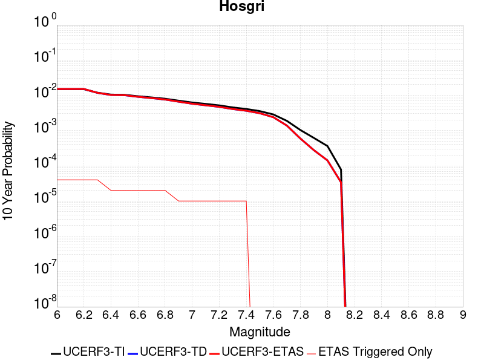 |

| Magnitude | 1 wk TI Prob | 1 wk TD Prob | 1 wk ETAS Prob | 1 wk ETAS/TD Gain | 1 wk ETAS Triggered Only | 1 mo TI Prob | 1 mo TD Prob | 1 mo ETAS Prob | 1 mo ETAS/TD Gain | 1 mo ETAS Triggered Only | 1 yr TI Prob | 1 yr TD Prob | 1 yr ETAS Prob | 1 yr ETAS/TD Gain | 1 yr ETAS Triggered Only | 10 yr TI Prob | 10 yr TD Prob | 10 yr ETAS Prob | 10 yr ETAS/TD Gain | 10 yr ETAS Triggered Only |
|-----|-----|-----|-----|-----|-----|-----|-----|-----|-----|-----|-----|-----|-----|-----|-----|-----|-----|-----|-----|-----|
| 6.0 | 2.883978E-5 | 2.9128416E-5 | 1.1802262E-4 | 4.0518036 | 8.889679E-5 | 1.235932E-4 | 1.2483024E-4 | 2.1371595E-4 | 1.7120526 | 8.889679E-5 | 0.0015037085 | 0.001518776 | 0.0016075377 | 1.058443 | 8.889679E-5 | 0.01493574 | 0.01508774 | 0.015175295 | 1.0058031 | 8.889679E-5 |
| 6.1 | 2.883978E-5 | 2.9128416E-5 | 1.1802262E-4 | 4.0518036 | 8.889679E-5 | 1.235932E-4 | 1.2483024E-4 | 2.1371595E-4 | 1.7120526 | 8.889679E-5 | 0.0015037085 | 0.001518776 | 0.0016075377 | 1.058443 | 8.889679E-5 | 0.01493574 | 0.01508774 | 0.015175295 | 1.0058031 | 8.889679E-5 |
| 6.2 | 2.883978E-5 | 2.9128416E-5 | 1.1802262E-4 | 4.0518036 | 8.889679E-5 | 1.235932E-4 | 1.2483024E-4 | 2.1371595E-4 | 1.7120526 | 8.889679E-5 | 0.0015037085 | 0.001518776 | 0.0016075377 | 1.058443 | 8.889679E-5 | 0.01493574 | 0.01508774 | 0.015175295 | 1.0058031 | 8.889679E-5 |
| 6.3 | 2.2914428E-5 | 2.2641969E-5 | 1.1153675E-4 | 4.9261065 | 8.889679E-5 | 9.8200995E-5 | 9.703343E-5 | 1.859216E-4 | 1.9160571 | 8.889679E-5 | 0.0011949413 | 0.0011807467 | 0.0012695385 | 1.0751997 | 8.889679E-5 | 0.011885363 | 0.011746133 | 0.011833985 | 1.0074793 | 8.889679E-5 |
| 6.4 | 2.0195741E-5 | 1.969656E-5 | 1.085916E-4 | 5.5132265 | 8.889679E-5 | 8.65503E-5 | 8.4411105E-5 | 1.733004E-4 | 2.053052 | 8.889679E-5 | 0.0010532405 | 0.0010272227 | 0.0011160282 | 1.086452 | 8.889679E-5 | 0.010482626 | 0.010225792 | 0.01031378 | 1.0086045 | 8.889679E-5 |
| 6.5 | 1.9924333E-5 | 1.940898E-5 | 1.0830405E-4 | 5.5800996 | 8.889679E-5 | 8.53872E-5 | 8.3178704E-5 | 1.720681E-4 | 2.0686557 | 8.889679E-5 | 0.0010390934 | 0.0010122322 | 0.001101039 | 1.0877336 | 8.889679E-5 | 0.010342481 | 0.010077253 | 0.010165254 | 1.0087327 | 8.889679E-5 |
| 6.6 | 1.809694E-5 | 1.74583E-5 | 1.0635354E-4 | 6.0918612 | 8.889679E-5 | 7.7556004E-5 | 7.4819145E-5 | 1.637093E-4 | 2.1880667 | 8.889679E-5 | 9.438353E-4 | 9.105437E-4 | 9.993596E-4 | 1.0975416 | 8.889679E-5 | 0.009398366 | 0.009069073 | 0.009157164 | 1.0097133 | 8.889679E-5 |
| 6.7 | 1.675989E-5 | 1.6042764E-5 | 1.0493813E-4 | 6.54115 | 8.889679E-5 | 7.182612E-5 | 6.87529E-5 | 1.5764358E-4 | 2.2929008 | 8.889679E-5 | 8.7413215E-4 | 8.3674624E-4 | 9.2556863E-4 | 1.1061522 | 8.889679E-5 | 0.008707017 | 0.0083368635 | 0.008425019 | 1.0105742 | 8.889679E-5 |
| 6.8 | 1.5401129E-5 | 1.4614083E-5 | 1.0350958E-4 | 7.082865 | 8.889679E-5 | 6.6003166E-5 | 6.2630286E-5 | 1.5152151E-4 | 2.419301 | 8.889679E-5 | 8.032922E-4 | 7.622578E-4 | 8.510868E-4 | 1.1165341 | 8.889679E-5 | 0.008003947 | 0.007597296 | 0.007685518 | 1.0116122 | 8.889679E-5 |
| 6.9 | 1.356559E-5 | 1.2689968E-5 | 1.2689968E-5 | 1.0 | 0.0 | 5.8136946E-5 | 5.4384444E-5 | 5.4384444E-5 | 1.0 | 0.0 | 7.0758746E-4 | 6.619299E-4 | 6.619299E-4 | 1.0 | 0.0 | 0.007053386 | 0.006600388 | 0.006600388 | 1.0 | 0.0 |
| 7.0 | 1.2030819E-5 | 1.1095962E-5 | 1.1095962E-5 | 1.0 | 0.0 | 5.155963E-5 | 4.7553254E-5 | 4.7553254E-5 | 1.0 | 0.0 | 6.275577E-4 | 5.7880714E-4 | 5.7880714E-4 | 1.0 | 0.0 | 0.006257884 | 0.005773757 | 0.005773757 | 1.0 | 0.0 |
| 7.1 | 1.0972698E-5 | 1.0022179E-5 | 1.0022179E-5 | 1.0 | 0.0 | 4.7025E-5 | 4.2951488E-5 | 4.2951488E-5 | 1.0 | 0.0 | 5.72379E-4 | 5.22809E-4 | 5.22809E-4 | 1.0 | 0.0 | 0.0057090693 | 0.005216542 | 0.005216542 | 1.0 | 0.0 |
| 7.2 | 9.961926E-6 | 9.034746E-6 | 9.034746E-6 | 1.0 | 0.0 | 4.2693267E-5 | 3.8719765E-5 | 3.8719765E-5 | 1.0 | 0.0 | 5.1966653E-4 | 4.713112E-4 | 4.713112E-4 | 1.0 | 0.0 | 0.00518453 | 0.0047038626 | 0.0047038626 | 1.0 | 0.0 |
| 7.3 | 8.700929E-6 | 7.8281E-6 | 7.8281E-6 | 1.0 | 0.0 | 3.7289166E-5 | 3.354857E-5 | 3.354857E-5 | 1.0 | 0.0 | 4.53901E-4 | 4.0837732E-4 | 4.0837732E-4 | 1.0 | 0.0 | 0.00452975 | 0.004077008 | 0.004077008 | 1.0 | 0.0 |
| 7.4 | 7.866285E-6 | 6.998739E-6 | 6.998739E-6 | 1.0 | 0.0 | 3.3712215E-5 | 2.9994251E-5 | 2.9994251E-5 | 1.0 | 0.0 | 4.103689E-4 | 3.6511885E-4 | 3.6511885E-4 | 1.0 | 0.0 | 0.004096119 | 0.0036459267 | 0.0036459267 | 1.0 | 0.0 |
| 7.5 | 6.8381305E-6 | 5.9596955E-6 | 5.9596955E-6 | 1.0 | 0.0 | 2.9305946E-5 | 2.5541302E-5 | 2.5541302E-5 | 1.0 | 0.0 | 3.5674145E-4 | 3.10921E-4 | 3.10921E-4 | 1.0 | 0.0 | 0.0035616932 | 0.0031055948 | 0.0031055948 | 1.0 | 0.0 |
| 7.6 | 5.503376E-6 | 4.5952443E-6 | 4.5952443E-6 | 1.0 | 0.0 | 2.3585684E-5 | 1.9693754E-5 | 1.9693754E-5 | 1.0 | 0.0 | 2.8711787E-4 | 2.397451E-4 | 2.397451E-4 | 1.0 | 0.0 | 0.002867472 | 0.0023955975 | 0.0023955975 | 1.0 | 0.0 |
| 7.7 | 3.6144982E-6 | 2.6522112E-6 | 2.6522112E-6 | 1.0 | 0.0 | 1.5490614E-5 | 1.1366569E-5 | 1.1366569E-5 | 1.0 | 0.0 | 1.8858191E-4 | 1.383792E-4 | 1.383792E-4 | 1.0 | 0.0 | 0.0018842196 | 0.0013836613 | 0.0013836613 | 1.0 | 0.0 |
| 7.8 | 1.9853494E-6 | 1.1361129E-6 | 1.1361129E-6 | 1.0 | 0.0 | 8.508612E-6 | 4.8690463E-6 | 4.8690463E-6 | 1.0 | 0.0 | 1.0358743E-4 | 5.9279027E-5 | 5.9279027E-5 | 1.0 | 0.0 | 0.0010353916 | 5.9336185E-4 | 5.9336185E-4 | 1.0 | 0.0 |
| 7.9 | 1.1818757E-6 | 5.2951856E-7 | 5.2951856E-7 | 1.0 | 0.0 | 5.0651715E-6 | 2.2693632E-6 | 2.2693632E-6 | 1.0 | 0.0 | 6.1666724E-5 | 2.7629147E-5 | 2.7629147E-5 | 1.0 | 0.0 | 6.1649614E-4 | 2.7694515E-4 | 2.7694515E-4 | 1.0 | 0.0 |
| 8.0 | 6.962958E-7 | 2.7139782E-7 | 2.7139782E-7 | 1.0 | 0.0 | 2.9841215E-6 | 1.163133E-6 | 1.163133E-6 | 1.0 | 0.0 | 3.6331072E-5 | 1.4161053E-5 | 1.4161053E-5 | 1.0 | 0.0 | 3.6325134E-4 | 1.4217179E-4 | 1.4217179E-4 | 1.0 | 0.0 |
| 8.1 | 1.5033264E-7 | 6.527624E-8 | 6.527624E-8 | 1.0 | 0.0 | 6.442826E-7 | 2.7975528E-7 | 2.7975528E-7 | 1.0 | 0.0 | 7.844113E-6 | 3.4060151E-6 | 3.4060151E-6 | 1.0 | 0.0 | 7.843835E-5 | 3.407693E-5 | 3.407693E-5 | 1.0 | 0.0 |

## Malibu Coast (Extension) alt 1
*[(top)](#table-of-contents)*

| 1 Week | 1 Month | 1 Year | 10 Year |
|-----|-----|-----|-----|
|  |  |  |  |

| Magnitude | 1 wk TI Prob | 1 wk TD Prob | 1 wk ETAS Prob | 1 wk ETAS/TD Gain | 1 wk ETAS Triggered Only | 1 mo TI Prob | 1 mo TD Prob | 1 mo ETAS Prob | 1 mo ETAS/TD Gain | 1 mo ETAS Triggered Only | 1 yr TI Prob | 1 yr TD Prob | 1 yr ETAS Prob | 1 yr ETAS/TD Gain | 1 yr ETAS Triggered Only | 10 yr TI Prob | 10 yr TD Prob | 10 yr ETAS Prob | 10 yr ETAS/TD Gain | 10 yr ETAS Triggered Only |
|-----|-----|-----|-----|-----|-----|-----|-----|-----|-----|-----|-----|-----|-----|-----|-----|-----|-----|-----|-----|-----|
| 6.0 | 8.930738E-6 | 9.329276E-6 | 9.822524E-5 | 10.528709 | 8.889679E-5 | 3.827403E-5 | 3.998201E-5 | 1.2887524E-4 | 3.223331 | 8.889679E-5 | 4.6588664E-4 | 4.8667393E-4 | 5.755275E-4 | 1.182573 | 8.889679E-5 | 0.0046491115 | 0.004856264 | 0.004944729 | 1.0182167 | 8.889679E-5 |
| 6.1 | 7.199952E-6 | 7.5302964E-6 | 9.642642E-5 | 12.805129 | 8.889679E-5 | 3.0856572E-5 | 3.2272303E-5 | 1.21166224E-4 | 3.7544956 | 8.889679E-5 | 3.75614E-4 | 3.9284505E-4 | 4.8170693E-4 | 1.2262008 | 8.889679E-5 | 0.0037497976 | 0.003921572 | 0.0040101204 | 1.0225798 | 8.889679E-5 |
| 6.2 | 6.3721413E-6 | 6.6667917E-6 | 9.556299E-5 | 14.33418 | 8.889679E-5 | 2.7308892E-5 | 2.8571652E-5 | 1.17465905E-4 | 4.1112742 | 8.889679E-5 | 3.3243504E-4 | 3.4780471E-4 | 4.3667058E-4 | 1.2555051 | 8.889679E-5 | 0.0033193815 | 0.0034726437 | 0.0035612318 | 1.0255103 | 8.889679E-5 |
| 6.3 | 6.016345E-6 | 6.295158E-6 | 9.519139E-5 | 15.121366 | 8.889679E-5 | 2.578408E-5 | 2.6978973E-5 | 1.15873365E-4 | 4.294951 | 8.889679E-5 | 3.1387596E-4 | 3.2841982E-4 | 4.172874E-4 | 1.2705915 | 8.889679E-5 | 0.00313433 | 0.0032793807 | 0.003367986 | 1.0270189 | 8.889679E-5 |
| 6.4 | 5.8104883E-6 | 6.0795446E-6 | 9.4975796E-5 | 15.622189 | 8.889679E-5 | 2.4901856E-5 | 2.6054933E-5 | 1.14949406E-4 | 4.41181 | 8.889679E-5 | 3.031379E-4 | 3.1717293E-4 | 4.0604154E-4 | 1.2801898 | 8.889679E-5 | 0.0030272473 | 0.0031672374 | 0.0032558525 | 1.0279787 | 8.889679E-5 |
| 6.5 | 5.476925E-6 | 5.7275133E-6 | 9.462379E-5 | 16.520922 | 8.889679E-5 | 2.3472323E-5 | 2.4546256E-5 | 1.1344087E-4 | 4.621514 | 8.889679E-5 | 2.8573806E-4 | 2.9880996E-4 | 3.876802E-4 | 1.2974138 | 8.889679E-5 | 0.0028537093 | 0.002984114 | 0.0030727454 | 1.0297011 | 8.889679E-5 |
| 6.6 | 5.222387E-6 | 5.45858E-6 | 9.435489E-5 | 17.28561 | 8.889679E-5 | 2.2381464E-5 | 2.3393704E-5 | 1.1228841E-4 | 4.7999415 | 8.889679E-5 | 2.7246025E-4 | 2.8478142E-4 | 3.736529E-4 | 1.312069 | 8.889679E-5 | 0.0027212645 | 0.0028441956 | 0.0029328393 | 1.0311667 | 8.889679E-5 |
| 6.7 | 5.0337076E-6 | 5.259103E-6 | 9.4155424E-5 | 17.903324 | 8.889679E-5 | 2.1572854E-5 | 2.253882E-5 | 1.11433605E-4 | 4.9440746 | 8.889679E-5 | 2.6261783E-4 | 2.7437587E-4 | 3.6324825E-4 | 1.3239075 | 8.889679E-5 | 0.002623077 | 0.002740401 | 0.0028290544 | 1.0323504 | 8.889679E-5 |
| 6.8 | 4.5675624E-6 | 4.7587164E-6 | 9.3655086E-5 | 19.680744 | 8.889679E-5 | 1.9575122E-5 | 2.039434E-5 | 1.0928932E-4 | 5.358806 | 8.889679E-5 | 2.3830103E-4 | 2.48273E-4 | 3.371477E-4 | 1.3579718 | 8.889679E-5 | 0.0023804565 | 0.002479976 | 0.0025686524 | 1.035757 | 8.889679E-5 |
| 6.9 | 4.2802412E-6 | 4.4520207E-6 | 9.334842E-5 | 20.967651 | 8.889679E-5 | 1.8343762E-5 | 1.907995E-5 | 1.07975044E-4 | 5.6590843 | 8.889679E-5 | 2.2331243E-4 | 2.3227377E-4 | 3.211499E-4 | 1.3826352 | 8.889679E-5 | 0.0022308815 | 0.0023203269 | 0.0024090174 | 1.0382233 | 8.889679E-5 |
| 7.0 | 3.9794063E-6 | 4.130099E-6 | 9.302652E-5 | 22.524042 | 8.889679E-5 | 1.7054486E-5 | 1.7700306E-5 | 1.0659552E-4 | 6.022242 | 8.889679E-5 | 2.0761859E-4 | 2.1548003E-4 | 3.0435767E-4 | 1.4124634 | 8.889679E-5 | 0.0020742472 | 0.0021527244 | 0.0022414299 | 1.0412061 | 8.889679E-5 |
| 7.1 | 3.7730424E-6 | 3.911217E-6 | 9.280766E-5 | 23.728588 | 8.889679E-5 | 1.6170083E-5 | 1.6762251E-5 | 1.0565755E-4 | 6.3033032 | 8.889679E-5 | 1.9685295E-4 | 2.0406142E-4 | 2.9294007E-4 | 1.4355485 | 8.889679E-5 | 0.0019667868 | 0.0020387534 | 0.0021274688 | 1.0435146 | 8.889679E-5 |
| 7.2 | 3.424985E-6 | 3.541337E-6 | 9.243781E-5 | 26.102518 | 8.889679E-5 | 1.4678424E-5 | 1.5177071E-5 | 1.0407251E-4 | 6.8572197 | 8.889679E-5 | 1.7869516E-4 | 1.8476529E-4 | 2.7364565E-4 | 1.4810448 | 8.889679E-5 | 0.0017855153 | 0.0018461287 | 0.0019348614 | 1.0480642 | 8.889679E-5 |
| 7.3 | 2.6966375E-6 | 2.7596534E-6 | 9.16562E-5 | 33.21294 | 8.889679E-5 | 1.15569665E-5 | 1.1827032E-5 | 1.0072277E-4 | 8.516318 | 8.889679E-5 | 1.4069698E-4 | 1.4398464E-4 | 2.3286862E-4 | 1.6173158 | 8.889679E-5 | 0.0014060794 | 0.0014389176 | 0.0015276865 | 1.0616914 | 8.889679E-5 |
| 7.4 | 2.215957E-6 | 2.249378E-6 | 9.114597E-5 | 40.52052 | 8.889679E-5 | 9.496924E-6 | 9.640156E-6 | 9.853609E-5 | 10.22142 | 8.889679E-5 | 1.1561892E-4 | 1.17362615E-4 | 2.0624898E-4 | 1.7573652 | 8.889679E-5 | 0.0011555878 | 0.0011730101 | 0.0012618026 | 1.0756963 | 8.889679E-5 |
| 7.5 | 1.2040218E-6 | 1.2219067E-6 | 9.011859E-5 | 73.75243 | 8.889679E-5 | 5.160083E-6 | 5.2367322E-6 | 9.413306E-5 | 17.975533 | 8.889679E-5 | 6.2822204E-5 | 6.375537E-5 | 1.5264649E-4 | 2.394253 | 8.889679E-5 | 6.280445E-4 | 6.3737266E-4 | 7.262128E-4 | 1.1393849 | 8.889679E-5 |
| 7.6 | 6.6157446E-7 | 6.678975E-7 | 6.678975E-7 | 1.0 | 0.0 | 2.835316E-6 | 2.8624147E-6 | 2.8624147E-6 | 1.0 | 0.0 | 3.4519428E-5 | 3.484936E-5 | 3.484936E-5 | 1.0 | 0.0 | 3.4514067E-4 | 3.4844046E-4 | 3.4844046E-4 | 1.0 | 0.0 |
| 7.7 | 2.6012302E-7 | 2.4357593E-7 | 2.4357593E-7 | 1.0 | 0.0 | 1.1148124E-6 | 1.0438964E-6 | 1.0438964E-6 | 1.0 | 0.0 | 1.3572758E-5 | 1.2709375E-5 | 1.2709375E-5 | 1.0 | 0.0 | 1.3571928E-4 | 1.2708755E-4 | 1.2708755E-4 | 1.0 | 0.0 |
| 7.8 | 2.8323132E-8 | 2.0266649E-8 | 2.0266649E-8 | 1.0 | 0.0 | 1.2138484E-7 | 8.685707E-8 | 8.685707E-8 | 1.0 | 0.0 | 1.4778595E-6 | 1.0574844E-6 | 1.0574844E-6 | 1.0 | 0.0 | 1.4778497E-5 | 1.0574801E-5 | 1.0574801E-5 | 1.0 | 0.0 |

## Blue Cut
*[(top)](#table-of-contents)*

| 1 Week | 1 Month | 1 Year | 10 Year |
|-----|-----|-----|-----|
|  |  |  |  |

| Magnitude | 1 wk TI Prob | 1 wk TD Prob | 1 wk ETAS Prob | 1 wk ETAS/TD Gain | 1 wk ETAS Triggered Only | 1 mo TI Prob | 1 mo TD Prob | 1 mo ETAS Prob | 1 mo ETAS/TD Gain | 1 mo ETAS Triggered Only | 1 yr TI Prob | 1 yr TD Prob | 1 yr ETAS Prob | 1 yr ETAS/TD Gain | 1 yr ETAS Triggered Only | 10 yr TI Prob | 10 yr TD Prob | 10 yr ETAS Prob | 10 yr ETAS/TD Gain | 10 yr ETAS Triggered Only |
|-----|-----|-----|-----|-----|-----|-----|-----|-----|-----|-----|-----|-----|-----|-----|-----|-----|-----|-----|-----|-----|
| 6.0 | 2.1227985E-5 | 2.2719574E-5 | 2.2719574E-5 | 1.0 | 0.0 | 9.097391E-5 | 9.73663E-5 | 9.73663E-5 | 1.0 | 0.0 | 0.0011070445 | 0.0011848481 | 0.0012736396 | 1.0749391 | 8.889679E-5 | 0.011015458 | 0.011791152 | 0.011879 | 1.0074503 | 8.889679E-5 |
| 6.1 | 2.1227985E-5 | 2.2719574E-5 | 2.2719574E-5 | 1.0 | 0.0 | 9.097391E-5 | 9.73663E-5 | 9.73663E-5 | 1.0 | 0.0 | 0.0011070445 | 0.0011848481 | 0.0012736396 | 1.0749391 | 8.889679E-5 | 0.011015458 | 0.011791152 | 0.011879 | 1.0074503 | 8.889679E-5 |
| 6.2 | 2.1227985E-5 | 2.2719574E-5 | 2.2719574E-5 | 1.0 | 0.0 | 9.097391E-5 | 9.73663E-5 | 9.73663E-5 | 1.0 | 0.0 | 0.0011070445 | 0.0011848481 | 0.0012736396 | 1.0749391 | 8.889679E-5 | 0.011015458 | 0.011791152 | 0.011879 | 1.0074503 | 8.889679E-5 |
| 6.3 | 1.1613981E-5 | 1.2353542E-5 | 1.2353542E-5 | 1.0 | 0.0 | 4.9773254E-5 | 5.2942745E-5 | 5.2942745E-5 | 1.0 | 0.0 | 6.0582085E-4 | 6.443998E-4 | 6.443998E-4 | 1.0 | 0.0 | 0.0060417196 | 0.0064265593 | 0.0064265593 | 1.0 | 0.0 |
| 6.4 | 1.1613981E-5 | 1.2353542E-5 | 1.2353542E-5 | 1.0 | 0.0 | 4.9773254E-5 | 5.2942745E-5 | 5.2942745E-5 | 1.0 | 0.0 | 6.0582085E-4 | 6.443998E-4 | 6.443998E-4 | 1.0 | 0.0 | 0.0060417196 | 0.0064265593 | 0.0064265593 | 1.0 | 0.0 |
| 6.5 | 8.931326E-6 | 9.4816E-6 | 9.4816E-6 | 1.0 | 0.0 | 3.8276554E-5 | 4.0634844E-5 | 4.0634844E-5 | 1.0 | 0.0 | 4.6591737E-4 | 4.946261E-4 | 4.946261E-4 | 1.0 | 0.0 | 0.0046494175 | 0.004936161 | 0.004936161 | 1.0 | 0.0 |
| 6.6 | 7.345353E-6 | 7.79028E-6 | 7.79028E-6 | 1.0 | 0.0 | 3.1479703E-5 | 3.338653E-5 | 3.338653E-5 | 1.0 | 0.0 | 3.83198E-4 | 4.064132E-4 | 4.064132E-4 | 1.0 | 0.0 | 0.0038253788 | 0.0040574907 | 0.0040574907 | 1.0 | 0.0 |
| 6.7 | 6.2775666E-6 | 6.655149E-6 | 6.655149E-6 | 1.0 | 0.0 | 2.690358E-5 | 2.8521798E-5 | 2.8521798E-5 | 1.0 | 0.0 | 3.2750185E-4 | 3.472051E-4 | 3.472051E-4 | 1.0 | 0.0 | 0.0032701963 | 0.003467367 | 0.003467367 | 1.0 | 0.0 |
| 6.8 | 5.5234095E-6 | 5.8551113E-6 | 5.8551113E-6 | 1.0 | 0.0 | 2.367154E-5 | 2.5093133E-5 | 2.5093133E-5 | 1.0 | 0.0 | 2.8816288E-4 | 3.0547334E-4 | 3.0547334E-4 | 1.0 | 0.0 | 0.002877895 | 0.0030512505 | 0.0030512505 | 1.0 | 0.0 |
| 6.9 | 4.7780054E-6 | 5.0654203E-6 | 5.0654203E-6 | 1.0 | 0.0 | 2.0477004E-5 | 2.1708804E-5 | 2.1708804E-5 | 1.0 | 0.0 | 2.4927902E-4 | 2.642797E-4 | 2.642797E-4 | 1.0 | 0.0 | 0.0024899957 | 0.002640346 | 0.002640346 | 1.0 | 0.0 |
| 7.0 | 3.883171E-6 | 4.118487E-6 | 4.118487E-6 | 1.0 | 0.0 | 1.6642054E-5 | 1.7650578E-5 | 1.7650578E-5 | 1.0 | 0.0 | 2.0259817E-4 | 2.1488148E-4 | 2.1488148E-4 | 1.0 | 0.0 | 0.0020241356 | 0.0021474129 | 0.0021474129 | 1.0 | 0.0 |
| 7.1 | 2.8358215E-6 | 3.0097158E-6 | 3.0097158E-6 | 1.0 | 0.0 | 1.2153464E-5 | 1.2898756E-5 | 1.2898756E-5 | 1.0 | 0.0 | 1.4795837E-4 | 1.5703762E-4 | 1.5703762E-4 | 1.0 | 0.0 | 0.001478599 | 0.0015699116 | 0.0015699116 | 1.0 | 0.0 |

## Hayward (No) 2011 CFM
*[(top)](#table-of-contents)*

| 1 Week | 1 Month | 1 Year | 10 Year |
|-----|-----|-----|-----|
|  |  | 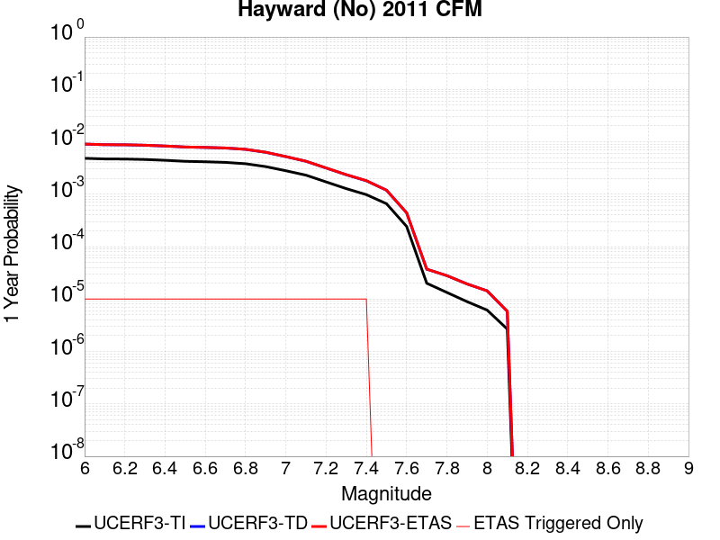 |  |

| Magnitude | 1 wk TI Prob | 1 wk TD Prob | 1 wk ETAS Prob | 1 wk ETAS/TD Gain | 1 wk ETAS Triggered Only | 1 mo TI Prob | 1 mo TD Prob | 1 mo ETAS Prob | 1 mo ETAS/TD Gain | 1 mo ETAS Triggered Only | 1 yr TI Prob | 1 yr TD Prob | 1 yr ETAS Prob | 1 yr ETAS/TD Gain | 1 yr ETAS Triggered Only | 10 yr TI Prob | 10 yr TD Prob | 10 yr ETAS Prob | 10 yr ETAS/TD Gain | 10 yr ETAS Triggered Only |
|-----|-----|-----|-----|-----|-----|-----|-----|-----|-----|-----|-----|-----|-----|-----|-----|-----|-----|-----|-----|-----|
| 6.0 | 9.3068506E-5 | 1.739599E-4 | 1.739599E-4 | 1.0 | 0.0 | 3.9880406E-4 | 7.453244E-4 | 8.3415495E-4 | 1.1191837 | 8.889679E-5 | 0.0048446343 | 0.009036438 | 0.009124531 | 1.0097487 | 8.889679E-5 | 0.047403704 | 0.08637534 | 0.08645656 | 1.0009403 | 8.889679E-5 |
| 6.1 | 9.055486E-5 | 1.6947114E-4 | 1.6947114E-4 | 1.0 | 0.0 | 3.880345E-4 | 7.261021E-4 | 8.149343E-4 | 1.1223413 | 8.889679E-5 | 0.0047140904 | 0.008804537 | 0.008892652 | 1.0100079 | 8.889679E-5 | 0.046153355 | 0.08426854 | 0.084349945 | 1.0009661 | 8.889679E-5 |
| 6.2 | 9.006742E-5 | 1.6867711E-4 | 1.6867711E-4 | 1.0 | 0.0 | 3.859461E-4 | 7.22701E-4 | 8.115336E-4 | 1.1229174 | 8.889679E-5 | 0.0046887742 | 0.008763513 | 0.008851631 | 1.0100551 | 8.889679E-5 | 0.0459107 | 0.083892785 | 0.08397422 | 1.0009707 | 8.889679E-5 |
| 6.3 | 8.8336754E-5 | 1.6547246E-4 | 1.6547246E-4 | 1.0 | 0.0 | 3.7853114E-4 | 7.089758E-4 | 7.9780957E-4 | 1.1252987 | 8.889679E-5 | 0.004598882 | 0.008597788 | 0.00868592 | 1.0102506 | 8.889679E-5 | 0.04504866 | 0.08238599 | 0.08246756 | 1.0009902 | 8.889679E-5 |
| 6.4 | 8.526157E-5 | 1.5974249E-4 | 1.5974249E-4 | 1.0 | 0.0 | 3.6535555E-4 | 6.8443175E-4 | 7.732677E-4 | 1.1297952 | 8.889679E-5 | 0.0044391346 | 0.008301278 | 0.008389437 | 1.0106199 | 8.889679E-5 | 0.043514993 | 0.079682834 | 0.07976465 | 1.0010267 | 8.889679E-5 |
| 6.5 | 8.152396E-5 | 1.530663E-4 | 1.530663E-4 | 1.0 | 0.0 | 3.493416E-4 | 6.558342E-4 | 7.446727E-4 | 1.1354587 | 8.889679E-5 | 0.0042449418 | 0.007955698 | 0.008043888 | 1.011085 | 8.889679E-5 | 0.04164765 | 0.07651369 | 0.07659578 | 1.001073 | 8.889679E-5 |
| 6.6 | 7.987405E-5 | 1.5010842E-4 | 1.5010842E-4 | 1.0 | 0.0 | 3.4227243E-4 | 6.4316386E-4 | 7.320035E-4 | 1.138129 | 8.889679E-5 | 0.0041592065 | 0.0078025614 | 0.007890765 | 1.0113044 | 8.889679E-5 | 0.04082218 | 0.07510622 | 0.075188436 | 1.0010947 | 8.889679E-5 |
| 6.7 | 7.777665E-5 | 1.4650106E-4 | 1.4650106E-4 | 1.0 | 0.0 | 3.332859E-4 | 6.277113E-4 | 7.1655225E-4 | 1.1415316 | 8.889679E-5 | 0.004050208 | 0.00761576 | 0.0077039795 | 1.0115838 | 8.889679E-5 | 0.039771806 | 0.073382616 | 0.07346499 | 1.0011225 | 8.889679E-5 |
| 6.8 | 7.3284005E-5 | 1.3800753E-4 | 1.3800753E-4 | 1.0 | 0.0 | 3.140365E-4 | 5.913274E-4 | 6.8017165E-4 | 1.1502454 | 8.889679E-5 | 0.0038166929 | 0.0071757827 | 0.007264042 | 1.0122995 | 8.889679E-5 | 0.037518036 | 0.06929621 | 0.06937895 | 1.001194 | 8.889679E-5 |
| 6.9 | 6.458263E-5 | 1.2131439E-4 | 1.2131439E-4 | 1.0 | 0.0 | 2.7675333E-4 | 5.198157E-4 | 6.086663E-4 | 1.170927 | 8.889679E-5 | 0.0033642664 | 0.0063104923 | 0.0063988282 | 1.0139983 | 8.889679E-5 | 0.033137884 | 0.061225023 | 0.061308477 | 1.001363 | 8.889679E-5 |
| 7.0 | 5.3853604E-5 | 1.00250414E-4 | 1.00250414E-4 | 1.0 | 0.0 | 2.3078074E-4 | 4.295742E-4 | 5.184328E-4 | 1.2068528 | 8.889679E-5 | 0.0028061352 | 0.0052175885 | 0.0053060213 | 1.016949 | 8.889679E-5 | 0.027709642 | 0.0509578 | 0.051042166 | 1.0016556 | 8.889679E-5 |
| 7.1 | 4.4308683E-5 | 8.170626E-5 | 8.170626E-5 | 1.0 | 0.0 | 1.8988053E-4 | 3.501229E-4 | 4.389886E-4 | 1.2538128 | 8.889679E-5 | 0.0023093442 | 0.0042544557 | 0.0043429746 | 1.0208061 | 8.889679E-5 | 0.022854926 | 0.04182473 | 0.041909907 | 1.0020366 | 8.889679E-5 |
| 7.2 | 3.295973E-5 | 6.0771144E-5 | 6.0771144E-5 | 1.0 | 0.0 | 1.4124835E-4 | 2.604219E-4 | 3.4929553E-4 | 1.341268 | 8.889679E-5 | 0.0017183421 | 0.0031660495 | 0.0032546648 | 1.0279893 | 8.889679E-5 | 0.017051157 | 0.031369876 | 0.031455982 | 1.0027449 | 8.889679E-5 |
| 7.3 | 2.452256E-5 | 4.5180346E-5 | 4.5180346E-5 | 1.0 | 0.0 | 1.05092455E-4 | 1.9361576E-4 | 2.8249534E-4 | 1.4590514 | 8.889679E-5 | 0.0012787496 | 0.0023547374 | 0.0024434247 | 1.0376635 | 8.889679E-5 | 0.0127141625 | 0.02344111 | 0.023527924 | 1.0037035 | 8.889679E-5 |
| 7.4 | 1.8829967E-5 | 3.4602548E-5 | 3.4602548E-5 | 1.0 | 0.0 | 8.069736E-5 | 1.4828827E-4 | 2.3717187E-4 | 1.5993974 | 8.889679E-5 | 9.820475E-4 | 0.0018039243 | 0.0018926609 | 1.0491908 | 8.889679E-5 | 0.009777189 | 0.0180195 | 0.018106794 | 1.0048444 | 8.889679E-5 |
| 7.5 | 1.26374125E-5 | 2.2921116E-5 | 2.2921116E-5 | 1.0 | 0.0 | 5.4159216E-5 | 9.822969E-5 | 9.822969E-5 | 1.0 | 0.0 | 6.5918895E-4 | 0.0011952962 | 0.0011952962 | 1.0 | 0.0 | 0.00657237 | 0.011988836 | 0.011988836 | 1.0 | 0.0 |
| 7.6 | 4.666429E-6 | 8.4791645E-6 | 8.4791645E-6 | 1.0 | 0.0 | 1.9998828E-5 | 3.6338777E-5 | 3.6338777E-5 | 1.0 | 0.0 | 2.4345852E-4 | 4.4233602E-4 | 4.4233602E-4 | 1.0 | 0.0 | 0.0024319198 | 0.0044591012 | 0.0044591012 | 1.0 | 0.0 |
| 7.7 | 3.8399318E-7 | 7.133867E-7 | 7.133867E-7 | 1.0 | 0.0 | 1.6456839E-6 | 3.057368E-6 | 3.057368E-6 | 1.0 | 0.0 | 2.003602E-5 | 3.722282E-5 | 3.722282E-5 | 1.0 | 0.0 | 2.0034213E-4 | 3.8614936E-4 | 3.8614936E-4 | 1.0 | 0.0 |
| 7.8 | 2.5637698E-7 | 5.3662194E-7 | 5.3662194E-7 | 1.0 | 0.0 | 1.098758E-6 | 2.299806E-6 | 2.299806E-6 | 1.0 | 0.0 | 1.3377297E-5 | 2.7999782E-5 | 2.7999782E-5 | 1.0 | 0.0 | 1.3376492E-4 | 2.9244382E-4 | 2.9244382E-4 | 1.0 | 0.0 |
| 7.9 | 1.7141245E-7 | 3.7290573E-7 | 3.7290573E-7 | 1.0 | 0.0 | 7.3462456E-7 | 1.5981665E-6 | 1.5981665E-6 | 1.0 | 0.0 | 8.944017E-6 | 1.9457504E-5 | 1.9457504E-5 | 1.0 | 0.0 | 8.943657E-5 | 2.0245428E-4 | 2.0245428E-4 | 1.0 | 0.0 |
| 8.0 | 1.1808895E-7 | 2.7509762E-7 | 2.7509762E-7 | 1.0 | 0.0 | 5.060954E-7 | 1.1789892E-6 | 1.1789892E-6 | 1.0 | 0.0 | 6.161694E-6 | 1.43541E-5 | 1.43541E-5 | 1.0 | 0.0 | 6.161523E-5 | 1.4816441E-4 | 1.4816441E-4 | 1.0 | 0.0 |
| 8.1 | 5.138535E-8 | 1.1229867E-7 | 1.1229867E-7 | 1.0 | 0.0 | 2.2022292E-7 | 4.812799E-7 | 4.812799E-7 | 1.0 | 0.0 | 2.6812106E-6 | 5.8595674E-6 | 5.8595674E-6 | 1.0 | 0.0 | 2.6811784E-5 | 6.0158476E-5 | 6.0158476E-5 | 1.0 | 0.0 |

## Hayward (So) extension 2011 CFM
*[(top)](#table-of-contents)*

| 1 Week | 1 Month | 1 Year | 10 Year |
|-----|-----|-----|-----|
|  |  |  |  |

| Magnitude | 1 wk TI Prob | 1 wk TD Prob | 1 wk ETAS Prob | 1 wk ETAS/TD Gain | 1 wk ETAS Triggered Only | 1 mo TI Prob | 1 mo TD Prob | 1 mo ETAS Prob | 1 mo ETAS/TD Gain | 1 mo ETAS Triggered Only | 1 yr TI Prob | 1 yr TD Prob | 1 yr ETAS Prob | 1 yr ETAS/TD Gain | 1 yr ETAS Triggered Only | 10 yr TI Prob | 10 yr TD Prob | 10 yr ETAS Prob | 10 yr ETAS/TD Gain | 10 yr ETAS Triggered Only |
|-----|-----|-----|-----|-----|-----|-----|-----|-----|-----|-----|-----|-----|-----|-----|-----|-----|-----|-----|-----|-----|
| 6.0 | 1.1721256E-4 | 2.3697627E-4 | 2.3697627E-4 | 1.0 | 0.0 | 5.022428E-4 | 0.0010129517 | 0.0011017584 | 1.0876713 | 8.889679E-5 | 0.0060976758 | 0.012248711 | 0.01233652 | 1.0071688 | 8.889679E-5 | 0.0593305 | 0.112843215 | 0.11292208 | 1.0006989 | 8.889679E-5 |
| 6.1 | 6.99169E-5 | 1.3822885E-4 | 1.3822885E-4 | 1.0 | 0.0 | 2.9960944E-4 | 5.9128006E-4 | 6.8012427E-4 | 1.1502575 | 8.889679E-5 | 0.0036416445 | 0.0071720886 | 0.0072603477 | 1.012306 | 8.889679E-5 | 0.035825435 | 0.067803554 | 0.06788642 | 1.0012223 | 8.889679E-5 |
| 6.2 | 6.99169E-5 | 1.3822885E-4 | 1.3822885E-4 | 1.0 | 0.0 | 2.9960944E-4 | 5.9128006E-4 | 6.8012427E-4 | 1.1502575 | 8.889679E-5 | 0.0036416445 | 0.0071720886 | 0.0072603477 | 1.012306 | 8.889679E-5 | 0.035825435 | 0.067803554 | 0.06788642 | 1.0012223 | 8.889679E-5 |
| 6.3 | 6.970908E-5 | 1.379104E-4 | 1.379104E-4 | 1.0 | 0.0 | 2.9871898E-4 | 5.899159E-4 | 6.7876023E-4 | 1.1506051 | 8.889679E-5 | 0.0036308395 | 0.007155625 | 0.0072438857 | 1.0123345 | 8.889679E-5 | 0.035720866 | 0.067652516 | 0.0677354 | 1.0012251 | 8.889679E-5 |
| 6.4 | 6.9517155E-5 | 1.375792E-4 | 1.375792E-4 | 1.0 | 0.0 | 2.9789665E-4 | 5.884971E-4 | 6.773416E-4 | 1.1509684 | 8.889679E-5 | 0.0036208609 | 0.0071385372 | 0.0072267996 | 1.0123641 | 8.889679E-5 | 0.03562429 | 0.06749655 | 0.06757945 | 1.0012282 | 8.889679E-5 |
| 6.5 | 4.786248E-5 | 9.41498E-5 | 9.41498E-5 | 1.0 | 0.0 | 2.0510878E-4 | 4.034394E-4 | 4.923003E-4 | 1.2202585 | 8.889679E-5 | 0.0024943394 | 0.004901227 | 0.0049896883 | 1.0180488 | 8.889679E-5 | 0.02466527 | 0.046901822 | 0.04698655 | 1.0018065 | 8.889679E-5 |
| 6.6 | 4.4662214E-5 | 8.881654E-5 | 8.881654E-5 | 1.0 | 0.0 | 1.9139545E-4 | 3.805894E-4 | 4.6945235E-4 | 1.2334877 | 8.889679E-5 | 0.0023277493 | 0.0046242937 | 0.004712779 | 1.019135 | 8.889679E-5 | 0.02303517 | 0.044293344 | 0.044378303 | 1.0019181 | 8.889679E-5 |
| 6.7 | 3.884542E-5 | 7.8648096E-5 | 7.8648096E-5 | 1.0 | 0.0 | 1.6646975E-4 | 3.370222E-4 | 4.2588904E-4 | 1.2636824 | 8.889679E-5 | 0.002024885 | 0.0040959697 | 0.0041845026 | 1.0216146 | 8.889679E-5 | 0.020065336 | 0.039333146 | 0.039418545 | 1.0021712 | 8.889679E-5 |
| 6.8 | 3.4221863E-5 | 6.855653E-5 | 6.855653E-5 | 1.0 | 0.0 | 1.4665688E-4 | 2.93783E-4 | 3.8265367E-4 | 1.3025044 | 8.889679E-5 | 0.0017840851 | 0.0035713627 | 0.003659942 | 1.0248027 | 8.889679E-5 | 0.017698295 | 0.034421004 | 0.03450684 | 1.0024937 | 8.889679E-5 |
| 6.9 | 1.6927712E-5 | 3.0061563E-5 | 3.0061563E-5 | 1.0 | 0.0 | 7.2545314E-5 | 1.2882923E-4 | 2.1771457E-4 | 1.689947 | 8.889679E-5 | 8.828813E-4 | 0.0015674243 | 0.0016561818 | 1.0566263 | 8.889679E-5 | 0.008793819 | 0.01546327 | 0.015550792 | 1.00566 | 8.889679E-5 |
| 7.0 | 1.2509653E-5 | 2.2462571E-5 | 2.2462571E-5 | 1.0 | 0.0 | 5.3611697E-5 | 9.6264856E-5 | 1.8515308E-4 | 1.9233716 | 8.889679E-5 | 6.525269E-4 | 0.0011714385 | 0.0012602311 | 1.0757979 | 8.889679E-5 | 0.0065061417 | 0.01158231 | 0.011670178 | 1.0075864 | 8.889679E-5 |
| 7.1 | 8.751583E-6 | 1.4925648E-5 | 1.4925648E-5 | 1.0 | 0.0 | 3.750624E-5 | 6.3965526E-5 | 1.5285664E-4 | 2.389672 | 8.889679E-5 | 4.5654282E-4 | 7.785079E-4 | 8.673355E-4 | 1.1140997 | 8.889679E-5 | 0.0045560603 | 0.007763496 | 0.007851702 | 1.0113617 | 8.889679E-5 |
| 7.2 | 6.354379E-6 | 1.1498636E-5 | 1.1498636E-5 | 1.0 | 0.0 | 2.7232769E-5 | 4.9278966E-5 | 1.3817138E-4 | 2.8038611 | 8.889679E-5 | 3.3150852E-4 | 5.99811E-4 | 6.886545E-4 | 1.1481191 | 8.889679E-5 | 0.0033101442 | 0.0060003046 | 0.006088668 | 1.0147265 | 8.889679E-5 |
| 7.3 | 4.645554E-6 | 8.818172E-6 | 8.818172E-6 | 1.0 | 0.0 | 1.9909365E-5 | 3.779164E-5 | 1.2668507E-4 | 3.3521984 | 8.889679E-5 | 2.4236954E-4 | 4.6002E-4 | 5.488759E-4 | 1.1931566 | 8.889679E-5 | 0.0024210536 | 0.004610708 | 0.004699195 | 1.0191916 | 8.889679E-5 |
| 7.4 | 4.23437E-6 | 7.992532E-6 | 7.992532E-6 | 1.0 | 0.0 | 1.8147173E-5 | 3.425328E-5 | 1.2314702E-4 | 3.5951893 | 8.889679E-5 | 2.2091944E-4 | 4.1695772E-4 | 5.058175E-4 | 1.2131145 | 8.889679E-5 | 0.0022069993 | 0.004181972 | 0.004270497 | 1.0211682 | 8.889679E-5 |
| 7.5 | 2.2187417E-6 | 3.9522306E-6 | 3.9522306E-6 | 1.0 | 0.0 | 9.508858E-6 | 1.6938036E-5 | 1.6938036E-5 | 1.0 | 0.0 | 1.157642E-4 | 2.0620368E-4 | 2.0620368E-4 | 1.0 | 0.0 | 0.0011570391 | 0.0020734754 | 0.0020734754 | 1.0 | 0.0 |
| 7.6 | 2.7952495E-8 | 3.878529E-8 | 3.878529E-8 | 1.0 | 0.0 | 1.1979641E-7 | 1.6622266E-7 | 1.6622266E-7 | 1.0 | 0.0 | 1.4585203E-6 | 2.0237592E-6 | 2.0237592E-6 | 1.0 | 0.0 | 1.4585107E-5 | 2.0328182E-5 | 2.0328182E-5 | 1.0 | 0.0 |
| 7.7 | 1.7192724E-8 | 2.3436517E-8 | 2.3436517E-8 | 1.0 | 0.0 | 7.36831E-8 | 1.0044221E-7 | 1.0044221E-7 | 1.0 | 0.0 | 8.9709135E-7 | 1.2228833E-6 | 1.2228833E-6 | 1.0 | 0.0 | 8.970877E-6 | 1.2296933E-5 | 1.2296933E-5 | 1.0 | 0.0 |

## Goose Lake 2011 CFM
*[(top)](#table-of-contents)*

| 1 Week | 1 Month | 1 Year | 10 Year |
|-----|-----|-----|-----|
|  |  |  |  |

| Magnitude | 1 wk TI Prob | 1 wk TD Prob | 1 wk ETAS Prob | 1 wk ETAS/TD Gain | 1 wk ETAS Triggered Only | 1 mo TI Prob | 1 mo TD Prob | 1 mo ETAS Prob | 1 mo ETAS/TD Gain | 1 mo ETAS Triggered Only | 1 yr TI Prob | 1 yr TD Prob | 1 yr ETAS Prob | 1 yr ETAS/TD Gain | 1 yr ETAS Triggered Only | 10 yr TI Prob | 10 yr TD Prob | 10 yr ETAS Prob | 10 yr ETAS/TD Gain | 10 yr ETAS Triggered Only |
|-----|-----|-----|-----|-----|-----|-----|-----|-----|-----|-----|-----|-----|-----|-----|-----|-----|-----|-----|-----|-----|
| 6.0 | 3.780968E-6 | 3.8230223E-6 | 3.8230223E-6 | 1.0 | 0.0 | 1.6204049E-5 | 1.6384285E-5 | 1.6384285E-5 | 1.0 | 0.0 | 1.9726643E-4 | 1.994615E-4 | 2.8834055E-4 | 1.445595 | 8.889679E-5 | 0.001970914 | 0.001992933 | 0.0020816526 | 1.0445172 | 8.889679E-5 |
| 6.1 | 2.2035124E-6 | 2.229801E-6 | 2.229801E-6 | 1.0 | 0.0 | 9.443591E-6 | 9.556257E-6 | 9.556257E-6 | 1.0 | 0.0 | 1.1496965E-4 | 1.163414E-4 | 1.163414E-4 | 1.0 | 0.0 | 0.0011491019 | 0.0011628233 | 0.0011628233 | 1.0 | 0.0 |
| 6.2 | 1.5624689E-6 | 1.5826923E-6 | 1.5826923E-6 | 1.0 | 0.0 | 6.6962784E-6 | 6.7829496E-6 | 6.7829496E-6 | 1.0 | 0.0 | 8.152414E-5 | 8.2579325E-5 | 8.2579325E-5 | 1.0 | 0.0 | 8.1494235E-4 | 8.2549086E-4 | 8.2549086E-4 | 1.0 | 0.0 |
| 6.3 | 1.5624689E-6 | 1.5826923E-6 | 1.5826923E-6 | 1.0 | 0.0 | 6.6962784E-6 | 6.7829496E-6 | 6.7829496E-6 | 1.0 | 0.0 | 8.152414E-5 | 8.2579325E-5 | 8.2579325E-5 | 1.0 | 0.0 | 8.1494235E-4 | 8.2549086E-4 | 8.2549086E-4 | 1.0 | 0.0 |
| 6.4 | 1.256464E-6 | 1.2738695E-6 | 1.2738695E-6 | 1.0 | 0.0 | 5.3848344E-6 | 5.4594293E-6 | 5.4594293E-6 | 1.0 | 0.0 | 6.5558386E-5 | 6.646655E-5 | 6.646655E-5 | 1.0 | 0.0 | 6.553905E-4 | 6.644687E-4 | 6.644687E-4 | 1.0 | 0.0 |
| 6.5 | 1.0910911E-6 | 1.1069404E-6 | 1.1069404E-6 | 1.0 | 0.0 | 4.6760965E-6 | 4.7440217E-6 | 4.7440217E-6 | 1.0 | 0.0 | 5.692999E-5 | 5.7756948E-5 | 5.7756948E-5 | 1.0 | 0.0 | 5.6915404E-4 | 5.7742064E-4 | 5.7742064E-4 | 1.0 | 0.0 |
| 6.6 | 9.546601E-7 | 9.691246E-7 | 9.691246E-7 | 1.0 | 0.0 | 4.091394E-6 | 4.1533845E-6 | 4.1533845E-6 | 1.0 | 0.0 | 4.9811584E-5 | 5.056629E-5 | 5.056629E-5 | 1.0 | 0.0 | 4.980042E-4 | 5.055487E-4 | 5.055487E-4 | 1.0 | 0.0 |
| 6.7 | 7.790316E-7 | 7.9159634E-7 | 7.9159634E-7 | 1.0 | 0.0 | 3.3387028E-6 | 3.3925514E-6 | 3.3925514E-6 | 1.0 | 0.0 | 4.0647945E-5 | 4.1303538E-5 | 4.1303538E-5 | 1.0 | 0.0 | 4.0640513E-4 | 4.129592E-4 | 4.129592E-4 | 1.0 | 0.0 |
| 6.8 | 6.3714384E-7 | 6.4787395E-7 | 6.4787395E-7 | 1.0 | 0.0 | 2.7306137E-6 | 2.7765998E-6 | 2.7765998E-6 | 1.0 | 0.0 | 3.3244716E-5 | 3.3804583E-5 | 3.3804583E-5 | 1.0 | 0.0 | 3.323974E-4 | 3.379949E-4 | 3.379949E-4 | 1.0 | 0.0 |
| 6.9 | 4.92586E-7 | 5.0139147E-7 | 5.0139147E-7 | 1.0 | 0.0 | 2.1110811E-6 | 2.1488188E-6 | 2.1488188E-6 | 1.0 | 0.0 | 2.5702111E-5 | 2.616156E-5 | 2.616156E-5 | 1.0 | 0.0 | 2.569914E-4 | 2.6158517E-4 | 2.6158517E-4 | 1.0 | 0.0 |
| 7.0 | 3.130245E-7 | 3.190354E-7 | 3.190354E-7 | 1.0 | 0.0 | 1.3415328E-6 | 1.3672939E-6 | 1.3672939E-6 | 1.0 | 0.0 | 1.6333039E-5 | 1.6646678E-5 | 1.6646678E-5 | 1.0 | 0.0 | 1.6331839E-4 | 1.6645451E-4 | 1.6645451E-4 | 1.0 | 0.0 |
| 7.1 | 1.7680084E-7 | 1.8023923E-7 | 1.8023923E-7 | 1.0 | 0.0 | 7.5771766E-7 | 7.724536E-7 | 7.724536E-7 | 1.0 | 0.0 | 9.225173E-6 | 9.404583E-6 | 9.404583E-6 | 1.0 | 0.0 | 9.22479E-5 | 9.4041956E-5 | 9.4041956E-5 | 1.0 | 0.0 |
| 7.2 | 4.8641045E-8 | 4.9402068E-8 | 4.9402068E-8 | 1.0 | 0.0 | 2.084616E-7 | 2.1172312E-7 | 2.1172312E-7 | 1.0 | 0.0 | 2.538017E-6 | 2.577726E-6 | 2.577726E-6 | 1.0 | 0.0 | 2.537988E-5 | 2.5776973E-5 | 2.5776973E-5 | 1.0 | 0.0 |
| 7.3 | 5.3911844E-9 | 5.4758145E-9 | 5.4758145E-9 | 1.0 | 0.0 | 2.3105075E-8 | 2.3467775E-8 | 2.3467775E-8 | 1.0 | 0.0 | 2.8130427E-7 | 2.8572015E-7 | 2.8572015E-7 | 1.0 | 0.0 | 2.8130391E-6 | 2.8571992E-6 | 2.8571992E-6 | 1.0 | 0.0 |

## Reliz 2011 CFM
*[(top)](#table-of-contents)*

| 1 Week | 1 Month | 1 Year | 10 Year |
|-----|-----|-----|-----|
|  |  |  |  |

| Magnitude | 1 wk TI Prob | 1 wk TD Prob | 1 wk ETAS Prob | 1 wk ETAS/TD Gain | 1 wk ETAS Triggered Only | 1 mo TI Prob | 1 mo TD Prob | 1 mo ETAS Prob | 1 mo ETAS/TD Gain | 1 mo ETAS Triggered Only | 1 yr TI Prob | 1 yr TD Prob | 1 yr ETAS Prob | 1 yr ETAS/TD Gain | 1 yr ETAS Triggered Only | 10 yr TI Prob | 10 yr TD Prob | 10 yr ETAS Prob | 10 yr ETAS/TD Gain | 10 yr ETAS Triggered Only |
|-----|-----|-----|-----|-----|-----|-----|-----|-----|-----|-----|-----|-----|-----|-----|-----|-----|-----|-----|-----|-----|
| 6.0 | 1.6002472E-5 | 1.6282804E-5 | 1.6282804E-5 | 1.0 | 0.0 | 6.8580215E-5 | 6.9781694E-5 | 6.9781694E-5 | 1.0 | 0.0 | 8.3464425E-4 | 8.4928074E-4 | 8.4928074E-4 | 1.0 | 0.0 | 0.008315164 | 0.008462547 | 0.008550692 | 1.0104158 | 8.889679E-5 |
| 6.1 | 1.6002472E-5 | 1.6282804E-5 | 1.6282804E-5 | 1.0 | 0.0 | 6.8580215E-5 | 6.9781694E-5 | 6.9781694E-5 | 1.0 | 0.0 | 8.3464425E-4 | 8.4928074E-4 | 8.4928074E-4 | 1.0 | 0.0 | 0.008315164 | 0.008462547 | 0.008550692 | 1.0104158 | 8.889679E-5 |
| 6.2 | 1.6002472E-5 | 1.6282804E-5 | 1.6282804E-5 | 1.0 | 0.0 | 6.8580215E-5 | 6.9781694E-5 | 6.9781694E-5 | 1.0 | 0.0 | 8.3464425E-4 | 8.4928074E-4 | 8.4928074E-4 | 1.0 | 0.0 | 0.008315164 | 0.008462547 | 0.008550692 | 1.0104158 | 8.889679E-5 |
| 6.3 | 7.792404E-6 | 7.803802E-6 | 7.803802E-6 | 1.0 | 0.0 | 3.339559E-5 | 3.344444E-5 | 3.344444E-5 | 1.0 | 0.0 | 4.0651546E-4 | 4.0711078E-4 | 4.0711078E-4 | 1.0 | 0.0 | 0.0040577264 | 0.004063926 | 0.004063926 | 1.0 | 0.0 |
| 6.4 | 7.792404E-6 | 7.803802E-6 | 7.803802E-6 | 1.0 | 0.0 | 3.339559E-5 | 3.344444E-5 | 3.344444E-5 | 1.0 | 0.0 | 4.0651546E-4 | 4.0711078E-4 | 4.0711078E-4 | 1.0 | 0.0 | 0.0040577264 | 0.004063926 | 0.004063926 | 1.0 | 0.0 |
| 6.5 | 5.9659374E-6 | 5.928738E-6 | 5.928738E-6 | 1.0 | 0.0 | 2.5568053E-5 | 2.5408632E-5 | 2.5408632E-5 | 1.0 | 0.0 | 3.1124658E-4 | 3.093064E-4 | 3.093064E-4 | 1.0 | 0.0 | 0.00310811 | 0.0030889767 | 0.0030889767 | 1.0 | 0.0 |
| 6.6 | 5.2350692E-6 | 5.178986E-6 | 5.178986E-6 | 1.0 | 0.0 | 2.2435817E-5 | 2.2195467E-5 | 2.2195467E-5 | 1.0 | 0.0 | 2.7312184E-4 | 2.7019644E-4 | 2.7019644E-4 | 1.0 | 0.0 | 0.002727864 | 0.0026988892 | 0.0026988892 | 1.0 | 0.0 |
| 6.7 | 4.580206E-6 | 4.5061206E-6 | 4.5061206E-6 | 1.0 | 0.0 | 1.9629308E-5 | 1.9311801E-5 | 1.9311801E-5 | 1.0 | 0.0 | 2.389606E-4 | 2.350959E-4 | 2.350959E-4 | 1.0 | 0.0 | 0.002387038 | 0.0023486738 | 0.0023486738 | 1.0 | 0.0 |
| 6.8 | 4.0765017E-6 | 3.9882384E-6 | 3.9882384E-6 | 1.0 | 0.0 | 1.7470604E-5 | 1.7092338E-5 | 1.7092338E-5 | 1.0 | 0.0 | 2.1268385E-4 | 2.0807938E-4 | 2.0807938E-4 | 1.0 | 0.0 | 0.002124804 | 0.0020790435 | 0.0020790435 | 1.0 | 0.0 |
| 6.9 | 3.5752896E-6 | 3.4725176E-6 | 3.4725176E-6 | 1.0 | 0.0 | 1.532258E-5 | 1.4882134E-5 | 1.4882134E-5 | 1.0 | 0.0 | 1.8653645E-4 | 1.8117494E-4 | 1.8117494E-4 | 1.0 | 0.0 | 0.0018637994 | 0.0018104686 | 0.0018104686 | 1.0 | 0.0 |
| 7.0 | 3.0259848E-6 | 2.9079417E-6 | 2.9079417E-6 | 1.0 | 0.0 | 1.2968442E-5 | 1.2462548E-5 | 1.2462548E-5 | 1.0 | 0.0 | 1.5787935E-4 | 1.5172097E-4 | 1.5172097E-4 | 1.0 | 0.0 | 0.0015776722 | 0.001516369 | 0.001516369 | 1.0 | 0.0 |
| 7.1 | 2.5861116E-6 | 2.455167E-6 | 2.455167E-6 | 1.0 | 0.0 | 1.1083288E-5 | 1.05221025E-5 | 1.05221025E-5 | 1.0 | 0.0 | 1.3493067E-4 | 1.2809907E-4 | 1.2809907E-4 | 1.0 | 0.0 | 0.0013484878 | 0.001280447 | 0.001280447 | 1.0 | 0.0 |
| 7.2 | 2.1482588E-6 | 2.003237E-6 | 2.003237E-6 | 1.0 | 0.0 | 9.20679E-6 | 8.585273E-6 | 8.585273E-6 | 1.0 | 0.0 | 1.12086906E-4 | 1.0452068E-4 | 1.0452068E-4 | 1.0 | 0.0 | 0.0011203039 | 0.0010449095 | 0.0010449095 | 1.0 | 0.0 |
| 7.3 | 1.7194744E-6 | 1.5611241E-6 | 1.5611241E-6 | 1.0 | 0.0 | 7.3691554E-6 | 6.690515E-6 | 6.690515E-6 | 1.0 | 0.0 | 8.971577E-5 | 8.1453974E-5 | 8.1453974E-5 | 1.0 | 0.0 | 8.967956E-4 | 8.1443513E-4 | 8.1443513E-4 | 1.0 | 0.0 |
| 7.4 | 1.2755178E-6 | 1.10563E-6 | 1.10563E-6 | 1.0 | 0.0 | 5.4664933E-6 | 4.7384056E-6 | 4.7384056E-6 | 1.0 | 0.0 | 6.655252E-5 | 5.768856E-5 | 5.768856E-5 | 1.0 | 0.0 | 6.6532596E-4 | 5.7692965E-4 | 5.7692965E-4 | 1.0 | 0.0 |
| 7.5 | 8.8463224E-7 | 7.0580273E-7 | 7.0580273E-7 | 1.0 | 0.0 | 3.7912755E-6 | 3.0248652E-6 | 3.0248652E-6 | 1.0 | 0.0 | 4.6157802E-5 | 3.6827114E-5 | 3.6827114E-5 | 1.0 | 0.0 | 4.6148215E-4 | 3.684038E-4 | 3.684038E-4 | 1.0 | 0.0 |
| 7.6 | 5.291355E-7 | 3.500777E-7 | 3.500777E-7 | 1.0 | 0.0 | 2.2677216E-6 | 1.5003321E-6 | 1.5003321E-6 | 1.0 | 0.0 | 2.760916E-5 | 1.8266392E-5 | 1.8266392E-5 | 1.0 | 0.0 | 2.760573E-4 | 1.8284164E-4 | 1.8284164E-4 | 1.0 | 0.0 |
| 7.7 | 2.9663357E-7 | 1.351113E-7 | 1.351113E-7 | 1.0 | 0.0 | 1.2712861E-6 | 5.7904833E-7 | 5.7904833E-7 | 1.0 | 0.0 | 1.5477797E-5 | 7.049891E-6 | 7.049891E-6 | 1.0 | 0.0 | 1.547672E-4 | 7.068132E-5 | 7.068132E-5 | 1.0 | 0.0 |
| 7.8 | 1.2509386E-7 | 2.7157126E-8 | 2.7157126E-8 | 1.0 | 0.0 | 5.3611643E-7 | 1.1638769E-7 | 1.1638769E-7 | 1.0 | 0.0 | 6.527198E-6 | 1.4170191E-6 | 1.4170191E-6 | 1.0 | 0.0 | 6.527006E-5 | 1.4326506E-5 | 1.4326506E-5 | 1.0 | 0.0 |
| 7.9 | 6.213493E-8 | 1.1482114E-8 | 1.1482114E-8 | 1.0 | 0.0 | 2.6629255E-7 | 4.920906E-8 | 4.920906E-8 | 1.0 | 0.0 | 3.242107E-6 | 5.9912014E-7 | 5.9912014E-7 | 1.0 | 0.0 | 3.2420594E-5 | 6.1224223E-6 | 6.1224223E-6 | 1.0 | 0.0 |
| 8.0 | 5.92383E-9 | 1.677887E-9 | 1.677887E-9 | 1.0 | 0.0 | 2.5387841E-8 | 7.190944E-9 | 7.190944E-9 | 1.0 | 0.0 | 3.0909692E-7 | 8.754974E-8 | 8.754974E-8 | 1.0 | 0.0 | 3.090965E-6 | 9.003061E-7 | 9.003061E-7 | 1.0 | 0.0 |

## Pleito
*[(top)](#table-of-contents)*

| 1 Week | 1 Month | 1 Year | 10 Year |
|-----|-----|-----|-----|
|  |  |  | 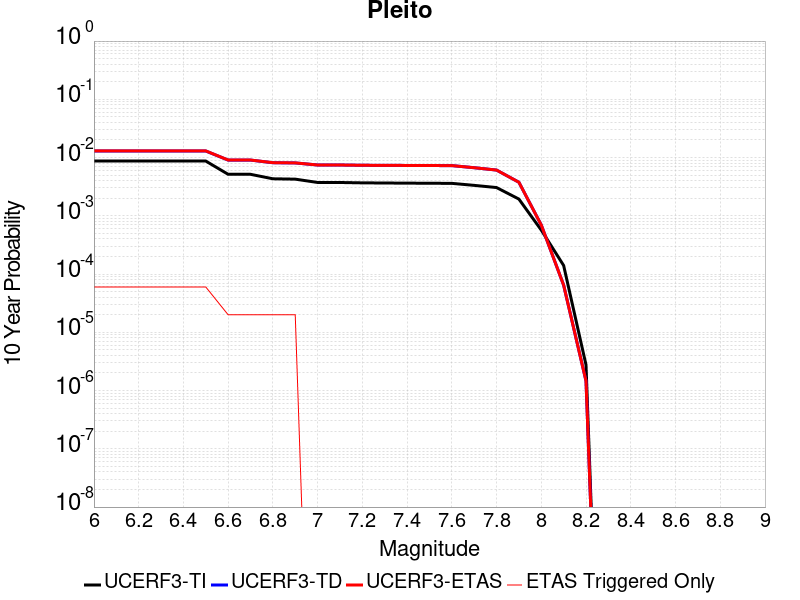 |

| Magnitude | 1 wk TI Prob | 1 wk TD Prob | 1 wk ETAS Prob | 1 wk ETAS/TD Gain | 1 wk ETAS Triggered Only | 1 mo TI Prob | 1 mo TD Prob | 1 mo ETAS Prob | 1 mo ETAS/TD Gain | 1 mo ETAS Triggered Only | 1 yr TI Prob | 1 yr TD Prob | 1 yr ETAS Prob | 1 yr ETAS/TD Gain | 1 yr ETAS Triggered Only | 10 yr TI Prob | 10 yr TD Prob | 10 yr ETAS Prob | 10 yr ETAS/TD Gain | 10 yr ETAS Triggered Only |
|-----|-----|-----|-----|-----|-----|-----|-----|-----|-----|-----|-----|-----|-----|-----|-----|-----|-----|-----|-----|-----|
| 6.0 | 1.6763008E-5 | 2.4763838E-5 | 2.4763838E-5 | 1.0 | 0.0 | 7.183948E-5 | 1.0612683E-4 | 1.0612683E-4 | 1.0 | 0.0 | 8.742947E-4 | 0.0012914003 | 0.0012914003 | 1.0 | 0.0 | 0.00870863 | 0.0129538905 | 0.013041635 | 1.0067737 | 8.889679E-5 |
| 6.1 | 1.6763008E-5 | 2.4763838E-5 | 2.4763838E-5 | 1.0 | 0.0 | 7.183948E-5 | 1.0612683E-4 | 1.0612683E-4 | 1.0 | 0.0 | 8.742947E-4 | 0.0012914003 | 0.0012914003 | 1.0 | 0.0 | 0.00870863 | 0.0129538905 | 0.013041635 | 1.0067737 | 8.889679E-5 |
| 6.2 | 1.6763008E-5 | 2.4763838E-5 | 2.4763838E-5 | 1.0 | 0.0 | 7.183948E-5 | 1.0612683E-4 | 1.0612683E-4 | 1.0 | 0.0 | 8.742947E-4 | 0.0012914003 | 0.0012914003 | 1.0 | 0.0 | 0.00870863 | 0.0129538905 | 0.013041635 | 1.0067737 | 8.889679E-5 |
| 6.3 | 1.6763008E-5 | 2.4763838E-5 | 2.4763838E-5 | 1.0 | 0.0 | 7.183948E-5 | 1.0612683E-4 | 1.0612683E-4 | 1.0 | 0.0 | 8.742947E-4 | 0.0012914003 | 0.0012914003 | 1.0 | 0.0 | 0.00870863 | 0.0129538905 | 0.013041635 | 1.0067737 | 8.889679E-5 |
| 6.4 | 1.6763008E-5 | 2.4763838E-5 | 2.4763838E-5 | 1.0 | 0.0 | 7.183948E-5 | 1.0612683E-4 | 1.0612683E-4 | 1.0 | 0.0 | 8.742947E-4 | 0.0012914003 | 0.0012914003 | 1.0 | 0.0 | 0.00870863 | 0.0129538905 | 0.013041635 | 1.0067737 | 8.889679E-5 |
| 6.5 | 1.6763008E-5 | 2.4763838E-5 | 2.4763838E-5 | 1.0 | 0.0 | 7.183948E-5 | 1.0612683E-4 | 1.0612683E-4 | 1.0 | 0.0 | 8.742947E-4 | 0.0012914003 | 0.0012914003 | 1.0 | 0.0 | 0.00870863 | 0.0129538905 | 0.013041635 | 1.0067737 | 8.889679E-5 |
| 6.6 | 9.910213E-6 | 1.7214623E-5 | 1.7214623E-5 | 1.0 | 0.0 | 4.247165E-5 | 7.377489E-5 | 7.377489E-5 | 1.0 | 0.0 | 5.169696E-4 | 8.978429E-4 | 8.978429E-4 | 1.0 | 0.0 | 0.0051576863 | 0.009050702 | 0.009050702 | 1.0 | 0.0 |
| 6.7 | 9.910213E-6 | 1.7214623E-5 | 1.7214623E-5 | 1.0 | 0.0 | 4.247165E-5 | 7.377489E-5 | 7.377489E-5 | 1.0 | 0.0 | 5.169696E-4 | 8.978429E-4 | 8.978429E-4 | 1.0 | 0.0 | 0.0051576863 | 0.009050702 | 0.009050702 | 1.0 | 0.0 |
| 6.8 | 8.300162E-6 | 1.5474232E-5 | 1.5474232E-5 | 1.0 | 0.0 | 3.557164E-5 | 6.631646E-5 | 6.631646E-5 | 1.0 | 0.0 | 4.3299864E-4 | 8.071053E-4 | 8.071053E-4 | 1.0 | 0.0 | 0.004321559 | 0.008150139 | 0.008150139 | 1.0 | 0.0 |
| 6.9 | 8.183114E-6 | 1.5345448E-5 | 1.5345448E-5 | 1.0 | 0.0 | 3.5070017E-5 | 6.576455E-5 | 6.576455E-5 | 1.0 | 0.0 | 4.2689382E-4 | 8.003907E-4 | 8.003907E-4 | 1.0 | 0.0 | 0.0042607468 | 0.008083483 | 0.008083483 | 1.0 | 0.0 |
| 7.0 | 7.1748823E-6 | 1.413244E-5 | 1.413244E-5 | 1.0 | 0.0 | 3.0749135E-5 | 6.0566195E-5 | 6.0566195E-5 | 1.0 | 0.0 | 3.743064E-4 | 7.371445E-4 | 7.371445E-4 | 1.0 | 0.0 | 0.0037367654 | 0.007454939 | 0.007454939 | 1.0 | 0.0 |
| 7.1 | 7.1671807E-6 | 1.412281E-5 | 1.412281E-5 | 1.0 | 0.0 | 3.0716128E-5 | 6.052493E-5 | 6.052493E-5 | 1.0 | 0.0 | 3.7390468E-4 | 7.366424E-4 | 7.366424E-4 | 1.0 | 0.0 | 0.0037327618 | 0.0074499524 | 0.0074499524 | 1.0 | 0.0 |
| 7.2 | 7.0649667E-6 | 1.39701015E-5 | 1.39701015E-5 | 1.0 | 0.0 | 3.0278077E-5 | 5.9870494E-5 | 5.9870494E-5 | 1.0 | 0.0 | 3.6857324E-4 | 7.2868E-4 | 7.2868E-4 | 1.0 | 0.0 | 0.0036796255 | 0.0073707094 | 0.0073707094 | 1.0 | 0.0 |
| 7.3 | 7.02082E-6 | 1.3913556E-5 | 1.3913556E-5 | 1.0 | 0.0 | 3.008888E-5 | 5.9628168E-5 | 5.9628168E-5 | 1.0 | 0.0 | 3.6627054E-4 | 7.2573166E-4 | 7.2573166E-4 | 1.0 | 0.0 | 0.0036566744 | 0.007341209 | 0.007341209 | 1.0 | 0.0 |
| 7.4 | 6.987146E-6 | 1.3873118E-5 | 1.3873118E-5 | 1.0 | 0.0 | 2.9944567E-5 | 5.945487E-5 | 5.945487E-5 | 1.0 | 0.0 | 3.6451413E-4 | 7.2362315E-4 | 7.2362315E-4 | 1.0 | 0.0 | 0.0036391679 | 0.007320144 | 0.007320144 | 1.0 | 0.0 |
| 7.5 | 6.9494554E-6 | 1.3830024E-5 | 1.3830024E-5 | 1.0 | 0.0 | 2.9783041E-5 | 5.9270187E-5 | 5.9270187E-5 | 1.0 | 0.0 | 3.625482E-4 | 7.2137616E-4 | 7.2137616E-4 | 1.0 | 0.0 | 0.0036195726 | 0.0072977724 | 0.0072977724 | 1.0 | 0.0 |
| 7.6 | 6.92694E-6 | 1.3789138E-5 | 1.3789138E-5 | 1.0 | 0.0 | 2.9686547E-5 | 5.909497E-5 | 5.909497E-5 | 1.0 | 0.0 | 3.6137376E-4 | 7.1924424E-4 | 7.1924424E-4 | 1.0 | 0.0 | 0.0036078666 | 0.0072765257 | 0.0072765257 | 1.0 | 0.0 |
| 7.7 | 6.395867E-6 | 1.2668219E-5 | 1.2668219E-5 | 1.0 | 0.0 | 2.741057E-5 | 5.429124E-5 | 5.429124E-5 | 1.0 | 0.0 | 3.336726E-4 | 6.6079566E-4 | 6.6079566E-4 | 1.0 | 0.0 | 0.0033317201 | 0.0066951844 | 0.0066951844 | 1.0 | 0.0 |
| 7.8 | 5.8664327E-6 | 1.153586E-5 | 1.153586E-5 | 1.0 | 0.0 | 2.5141611E-5 | 4.9438466E-5 | 4.9438466E-5 | 1.0 | 0.0 | 3.060561E-4 | 6.017473E-4 | 6.017473E-4 | 1.0 | 0.0 | 0.0030563495 | 0.0061006667 | 0.0061006667 | 1.0 | 0.0 |
| 7.9 | 3.7167474E-6 | 7.1140853E-6 | 7.1140853E-6 | 1.0 | 0.0 | 1.592882E-5 | 3.0488582E-5 | 3.0488582E-5 | 1.0 | 0.0 | 1.9391612E-4 | 3.7113542E-4 | 3.7113542E-4 | 1.0 | 0.0 | 0.0019374699 | 0.0037674906 | 0.0037674906 | 1.0 | 0.0 |
| 8.0 | 1.0903841E-6 | 1.2879392E-6 | 1.2879392E-6 | 1.0 | 0.0 | 4.6730665E-6 | 5.5197274E-6 | 5.5197274E-6 | 1.0 | 0.0 | 5.68931E-5 | 6.720063E-5 | 6.720063E-5 | 1.0 | 0.0 | 5.6878536E-4 | 6.941948E-4 | 6.941948E-4 | 1.0 | 0.0 |
| 8.1 | 2.6894583E-7 | 1.1060341E-7 | 1.1060341E-7 | 1.0 | 0.0 | 1.1526245E-6 | 4.740145E-7 | 4.740145E-7 | 1.0 | 0.0 | 1.4033113E-5 | 5.7711113E-6 | 5.7711113E-6 | 1.0 | 0.0 | 1.4032227E-4 | 6.456908E-5 | 6.456908E-5 | 1.0 | 0.0 |
| 8.2 | 5.2967013E-9 | 2.4578228E-9 | 2.4578228E-9 | 1.0 | 0.0 | 2.2700148E-8 | 1.0533527E-8 | 1.0533527E-8 | 1.0 | 0.0 | 2.7637427E-7 | 1.2824569E-7 | 1.2824569E-7 | 1.0 | 0.0 | 2.7637393E-6 | 1.4592787E-6 | 1.4592787E-6 | 1.0 | 0.0 |

## San Jacinto (Stepovers Combined)
*[(top)](#table-of-contents)*

| 1 Week | 1 Month | 1 Year | 10 Year |
|-----|-----|-----|-----|
|  |  |  |  |

| Magnitude | 1 wk TI Prob | 1 wk TD Prob | 1 wk ETAS Prob | 1 wk ETAS/TD Gain | 1 wk ETAS Triggered Only | 1 mo TI Prob | 1 mo TD Prob | 1 mo ETAS Prob | 1 mo ETAS/TD Gain | 1 mo ETAS Triggered Only | 1 yr TI Prob | 1 yr TD Prob | 1 yr ETAS Prob | 1 yr ETAS/TD Gain | 1 yr ETAS Triggered Only | 10 yr TI Prob | 10 yr TD Prob | 10 yr ETAS Prob | 10 yr ETAS/TD Gain | 10 yr ETAS Triggered Only |
|-----|-----|-----|-----|-----|-----|-----|-----|-----|-----|-----|-----|-----|-----|-----|-----|-----|-----|-----|-----|-----|
| 6.0 | 4.0667746E-5 | 3.5272755E-5 | 3.5272755E-5 | 1.0 | 0.0 | 1.742787E-4 | 1.5116022E-4 | 1.5116022E-4 | 1.0 | 0.0 | 0.0021197782 | 0.0018388226 | 0.001927556 | 1.0482556 | 8.889679E-5 | 0.020996714 | 0.018986892 | 0.019074101 | 1.0045931 | 8.889679E-5 |
| 6.1 | 4.0667746E-5 | 3.5272755E-5 | 3.5272755E-5 | 1.0 | 0.0 | 1.742787E-4 | 1.5116022E-4 | 1.5116022E-4 | 1.0 | 0.0 | 0.0021197782 | 0.0018388226 | 0.001927556 | 1.0482556 | 8.889679E-5 | 0.020996714 | 0.018986892 | 0.019074101 | 1.0045931 | 8.889679E-5 |
| 6.2 | 4.0667746E-5 | 3.5272755E-5 | 3.5272755E-5 | 1.0 | 0.0 | 1.742787E-4 | 1.5116022E-4 | 1.5116022E-4 | 1.0 | 0.0 | 0.0021197782 | 0.0018388226 | 0.001927556 | 1.0482556 | 8.889679E-5 | 0.020996714 | 0.018986892 | 0.019074101 | 1.0045931 | 8.889679E-5 |
| 6.3 | 4.0667746E-5 | 3.5272755E-5 | 3.5272755E-5 | 1.0 | 0.0 | 1.742787E-4 | 1.5116022E-4 | 1.5116022E-4 | 1.0 | 0.0 | 0.0021197782 | 0.0018388226 | 0.001927556 | 1.0482556 | 8.889679E-5 | 0.020996714 | 0.018986892 | 0.019074101 | 1.0045931 | 8.889679E-5 |
| 6.4 | 4.0577226E-5 | 3.5144654E-5 | 3.5144654E-5 | 1.0 | 0.0 | 1.738908E-4 | 1.5061127E-4 | 1.5061127E-4 | 1.0 | 0.0 | 0.0021150648 | 0.0018321523 | 0.0019208862 | 1.0484315 | 8.889679E-5 | 0.020950472 | 0.018921461 | 0.019008676 | 1.0046093 | 8.889679E-5 |
| 6.5 | 4.0577226E-5 | 3.5144654E-5 | 3.5144654E-5 | 1.0 | 0.0 | 1.738908E-4 | 1.5061127E-4 | 1.5061127E-4 | 1.0 | 0.0 | 0.0021150648 | 0.0018321523 | 0.0019208862 | 1.0484315 | 8.889679E-5 | 0.020950472 | 0.018921461 | 0.019008676 | 1.0046093 | 8.889679E-5 |
| 6.6 | 4.053861E-5 | 3.509E-5 | 3.509E-5 | 1.0 | 0.0 | 1.7372532E-4 | 1.5037706E-4 | 1.5037706E-4 | 1.0 | 0.0 | 0.0021130538 | 0.0018293057 | 0.0019180398 | 1.048507 | 8.889679E-5 | 0.020930743 | 0.018893538 | 0.018980756 | 1.0046163 | 8.889679E-5 |
| 6.7 | 4.0516545E-5 | 3.5059067E-5 | 3.5059067E-5 | 1.0 | 0.0 | 1.7363077E-4 | 1.5024451E-4 | 1.5024451E-4 | 1.0 | 0.0 | 0.002111905 | 0.001827695 | 0.0019164294 | 1.0485499 | 8.889679E-5 | 0.020919468 | 0.018877735 | 0.018964954 | 1.0046202 | 8.889679E-5 |
| 6.8 | 4.049434E-5 | 3.5030633E-5 | 3.5030633E-5 | 1.0 | 0.0 | 1.7353562E-4 | 1.5012265E-4 | 1.5012265E-4 | 1.0 | 0.0 | 0.0021107488 | 0.0018262138 | 0.0019149482 | 1.0485893 | 8.889679E-5 | 0.020908125 | 0.018863149 | 0.018950367 | 1.0046238 | 8.889679E-5 |
| 6.9 | 4.046386E-5 | 3.499319E-5 | 3.499319E-5 | 1.0 | 0.0 | 1.73405E-4 | 1.4996222E-4 | 1.4996222E-4 | 1.0 | 0.0 | 0.0021091616 | 0.0018242638 | 0.0019129984 | 1.0486413 | 8.889679E-5 | 0.020892553 | 0.01884392 | 0.018931143 | 1.0046287 | 8.889679E-5 |
| 7.0 | 4.036382E-5 | 3.487376E-5 | 3.487376E-5 | 1.0 | 0.0 | 1.7297632E-4 | 1.4945042E-4 | 1.4945042E-4 | 1.0 | 0.0 | 0.0021039525 | 0.0018180435 | 0.0019067788 | 1.0488081 | 8.889679E-5 | 0.02084144 | 0.018782536 | 0.018869763 | 1.004644 | 8.889679E-5 |
| 7.1 | 4.0343282E-5 | 3.4852223E-5 | 3.4852223E-5 | 1.0 | 0.0 | 1.7288832E-4 | 1.4935812E-4 | 1.4935812E-4 | 1.0 | 0.0 | 0.002102883 | 0.0018169218 | 0.0019056571 | 1.0488383 | 8.889679E-5 | 0.020830948 | 0.018771412 | 0.018858641 | 1.0046469 | 8.889679E-5 |
| 7.2 | 4.0257353E-5 | 3.4756722E-5 | 3.4756722E-5 | 1.0 | 0.0 | 1.725201E-4 | 1.489489E-4 | 1.489489E-4 | 1.0 | 0.0 | 0.0020984085 | 0.0018119477 | 0.0019006834 | 1.0489726 | 8.889679E-5 | 0.020787042 | 0.018722152 | 0.018809384 | 1.0046593 | 8.889679E-5 |
| 7.3 | 3.9940667E-5 | 3.4584376E-5 | 3.4584376E-5 | 1.0 | 0.0 | 1.7116306E-4 | 1.4821035E-4 | 1.4821035E-4 | 1.0 | 0.0 | 0.0020819185 | 0.0018029709 | 0.0018917074 | 1.0492169 | 8.889679E-5 | 0.020625217 | 0.018630784 | 0.018718025 | 1.0046827 | 8.889679E-5 |
| 7.4 | 3.9721202E-5 | 3.4469766E-5 | 3.4469766E-5 | 1.0 | 0.0 | 1.7022261E-4 | 1.4771923E-4 | 1.4771923E-4 | 1.0 | 0.0 | 0.0020704903 | 0.0017970012 | 0.0018857382 | 1.0493807 | 8.889679E-5 | 0.020513052 | 0.018569905 | 0.018657152 | 1.0046983 | 8.889679E-5 |
| 7.5 | 3.7036873E-5 | 3.3537188E-5 | 3.3537188E-5 | 1.0 | 0.0 | 1.5871979E-4 | 1.437229E-4 | 1.437229E-4 | 1.0 | 0.0 | 0.0019307006 | 0.0017484248 | 0.0018371661 | 1.050755 | 8.889679E-5 | 0.019140124 | 0.018071463 | 0.018158754 | 1.0048302 | 8.889679E-5 |
| 7.6 | 3.2940967E-5 | 3.1317984E-5 | 3.1317984E-5 | 1.0 | 0.0 | 1.4116794E-4 | 1.3421304E-4 | 1.3421304E-4 | 1.0 | 0.0 | 0.0017173645 | 0.0016328214 | 0.001721573 | 1.0543548 | 8.889679E-5 | 0.01704153 | 0.016904354 | 0.016991748 | 1.0051699 | 8.889679E-5 |
| 7.7 | 2.8236149E-5 | 2.7883889E-5 | 2.7883889E-5 | 1.0 | 0.0 | 1.2100645E-4 | 1.19496915E-4 | 1.19496915E-4 | 1.0 | 0.0 | 0.0014722579 | 0.001453905 | 0.0015426726 | 1.0610546 | 8.889679E-5 | 0.014625421 | 0.015115095 | 0.015202648 | 1.0057924 | 8.889679E-5 |
| 7.8 | 2.4329287E-5 | 2.5207537E-5 | 2.5207537E-5 | 1.0 | 0.0 | 1.042642E-4 | 1.0802783E-4 | 1.0802783E-4 | 1.0 | 0.0 | 0.0012686774 | 0.0013144462 | 0.001403226 | 1.0675417 | 8.889679E-5 | 0.012614589 | 0.013712396 | 0.013800073 | 1.006394 | 8.889679E-5 |
| 7.9 | 1.9370926E-5 | 2.0421452E-5 | 2.0421452E-5 | 1.0 | 0.0 | 8.301561E-5 | 8.7517576E-5 | 8.7517576E-5 | 1.0 | 0.0 | 0.0010102465 | 0.0010650064 | 0.0011538086 | 1.0833818 | 8.889679E-5 | 0.0100566605 | 0.011199483 | 0.011287384 | 1.0078487 | 8.889679E-5 |
| 8.0 | 1.5583017E-5 | 1.588647E-5 | 1.588647E-5 | 1.0 | 0.0 | 6.6782646E-5 | 6.808309E-5 | 6.808309E-5 | 1.0 | 0.0 | 8.127754E-4 | 8.285971E-4 | 9.1742026E-4 | 1.107197 | 8.889679E-5 | 0.008098091 | 0.008781809 | 0.0088699255 | 1.010034 | 8.889679E-5 |
| 8.1 | 1.0024873E-5 | 8.292404E-6 | 8.292404E-6 | 1.0 | 0.0 | 4.2963035E-5 | 3.5538393E-5 | 3.5538393E-5 | 1.0 | 0.0 | 5.229494E-4 | 4.3259456E-4 | 4.3259456E-4 | 1.0 | 0.0 | 0.0052172043 | 0.0046534105 | 0.0046534105 | 1.0 | 0.0 |
| 8.2 | 4.142796E-6 | 1.5610041E-6 | 1.5610041E-6 | 1.0 | 0.0 | 1.775472E-5 | 6.69E-6 | 6.69E-6 | 1.0 | 0.0 | 2.1614227E-4 | 8.144774E-5 | 8.144774E-5 | 1.0 | 0.0 | 0.0021593217 | 9.454649E-4 | 9.454649E-4 | 1.0 | 0.0 |
| 8.3 | 1.2750878E-6 | 3.612133E-7 | 3.612133E-7 | 1.0 | 0.0 | 5.4646503E-6 | 1.548056E-6 | 1.548056E-6 | 1.0 | 0.0 | 6.653009E-5 | 1.8847424E-5 | 1.8847424E-5 | 1.0 | 0.0 | 6.6510175E-4 | 2.2734253E-4 | 2.2734253E-4 | 1.0 | 0.0 |

## Emerson-Copper Mtn 2011
*[(top)](#table-of-contents)*

| 1 Week | 1 Month | 1 Year | 10 Year |
|-----|-----|-----|-----|
|  |  |  | 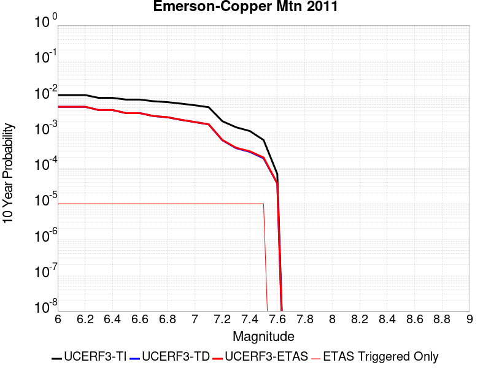 |

| Magnitude | 1 wk TI Prob | 1 wk TD Prob | 1 wk ETAS Prob | 1 wk ETAS/TD Gain | 1 wk ETAS Triggered Only | 1 mo TI Prob | 1 mo TD Prob | 1 mo ETAS Prob | 1 mo ETAS/TD Gain | 1 mo ETAS Triggered Only | 1 yr TI Prob | 1 yr TD Prob | 1 yr ETAS Prob | 1 yr ETAS/TD Gain | 1 yr ETAS Triggered Only | 10 yr TI Prob | 10 yr TD Prob | 10 yr ETAS Prob | 10 yr ETAS/TD Gain | 10 yr ETAS Triggered Only |
|-----|-----|-----|-----|-----|-----|-----|-----|-----|-----|-----|-----|-----|-----|-----|-----|-----|-----|-----|-----|-----|
| 6.0 | 2.1364202E-5 | 9.968114E-6 | 9.886402E-5 | 9.918027 | 8.889679E-5 | 9.1557646E-5 | 4.2719836E-5 | 1.3161283E-4 | 3.0808365 | 8.889679E-5 | 0.0011141442 | 5.199986E-4 | 6.0884916E-4 | 1.170867 | 8.889679E-5 | 0.011085749 | 0.005188688 | 0.005277124 | 1.017044 | 8.889679E-5 |
| 6.1 | 2.1364202E-5 | 9.968114E-6 | 9.886402E-5 | 9.918027 | 8.889679E-5 | 9.1557646E-5 | 4.2719836E-5 | 1.3161283E-4 | 3.0808365 | 8.889679E-5 | 0.0011141442 | 5.199986E-4 | 6.0884916E-4 | 1.170867 | 8.889679E-5 | 0.011085749 | 0.005188688 | 0.005277124 | 1.017044 | 8.889679E-5 |
| 6.2 | 2.1364202E-5 | 9.968114E-6 | 9.886402E-5 | 9.918027 | 8.889679E-5 | 9.1557646E-5 | 4.2719836E-5 | 1.3161283E-4 | 3.0808365 | 8.889679E-5 | 0.0011141442 | 5.199986E-4 | 6.0884916E-4 | 1.170867 | 8.889679E-5 | 0.011085749 | 0.005188688 | 0.005277124 | 1.017044 | 8.889679E-5 |
| 6.3 | 1.7751237E-5 | 8.089227E-6 | 9.69853E-5 | 11.98944 | 8.889679E-5 | 7.607452E-5 | 3.466769E-5 | 1.235614E-4 | 3.564166 | 8.889679E-5 | 9.258136E-4 | 4.2200365E-4 | 5.108629E-4 | 1.2105652 | 8.889679E-5 | 0.00921966 | 0.0042126453 | 0.0043011676 | 1.0210135 | 8.889679E-5 |
| 6.4 | 1.7751237E-5 | 8.089227E-6 | 9.69853E-5 | 11.98944 | 8.889679E-5 | 7.607452E-5 | 3.466769E-5 | 1.235614E-4 | 3.564166 | 8.889679E-5 | 9.258136E-4 | 4.2200365E-4 | 5.108629E-4 | 1.2105652 | 8.889679E-5 | 0.00921966 | 0.0042126453 | 0.0043011676 | 1.0210135 | 8.889679E-5 |
| 6.5 | 1.5886664E-5 | 6.603819E-6 | 9.550002E-5 | 14.461332 | 8.889679E-5 | 6.808392E-5 | 2.8301802E-5 | 1.17196076E-4 | 4.1409407 | 8.889679E-5 | 8.286065E-4 | 3.4452465E-4 | 4.3339081E-4 | 1.2579385 | 8.889679E-5 | 0.008255237 | 0.0034403696 | 0.0035289605 | 1.0257504 | 8.889679E-5 |
| 6.6 | 1.5886664E-5 | 6.603819E-6 | 9.550002E-5 | 14.461332 | 8.889679E-5 | 6.808392E-5 | 2.8301802E-5 | 1.17196076E-4 | 4.1409407 | 8.889679E-5 | 8.286065E-4 | 3.4452465E-4 | 4.3339081E-4 | 1.2579385 | 8.889679E-5 | 0.008255237 | 0.0034403696 | 0.0035289605 | 1.0257504 | 8.889679E-5 |
| 6.7 | 1.428471E-5 | 5.470403E-6 | 9.4366704E-5 | 17.250414 | 8.889679E-5 | 6.121875E-5 | 2.3444394E-5 | 1.12339105E-4 | 4.7917256 | 8.889679E-5 | 7.450834E-4 | 2.8540206E-4 | 3.7427348E-4 | 1.3113903 | 8.889679E-5 | 0.007425902 | 0.0028507432 | 0.0029393865 | 1.0310948 | 8.889679E-5 |
| 6.8 | 1.3490684E-5 | 5.073699E-6 | 9.397004E-5 | 18.521011 | 8.889679E-5 | 5.7815934E-5 | 2.1744265E-5 | 1.1063912E-4 | 5.088198 | 8.889679E-5 | 7.0368167E-4 | 2.6470813E-4 | 3.535814E-4 | 1.3357406 | 8.889679E-5 | 0.007014576 | 0.002644309 | 0.0027329708 | 1.0335293 | 8.889679E-5 |
| 6.9 | 1.2235421E-5 | 4.289677E-6 | 9.3186085E-5 | 21.723333 | 8.889679E-5 | 5.2436466E-5 | 1.838422E-5 | 1.07279375E-4 | 5.8354053 | 8.889679E-5 | 6.38227E-4 | 2.238085E-4 | 3.1268538E-4 | 1.3971113 | 8.889679E-5 | 0.0063639707 | 0.0022361854 | 0.0023248834 | 1.0396649 | 8.889679E-5 |
| 7.0 | 1.1009851E-5 | 3.7189886E-6 | 9.2615446E-5 | 24.903397 | 8.889679E-5 | 4.7184225E-5 | 1.5938444E-5 | 1.04833816E-4 | 6.5774183 | 8.889679E-5 | 5.743165E-4 | 1.9403672E-4 | 2.8291627E-4 | 1.4580553 | 8.889679E-5 | 0.005728345 | 0.0019390108 | 0.002027735 | 1.0457575 | 8.889679E-5 |
| 7.1 | 9.726373E-6 | 3.2117953E-6 | 9.21083E-5 | 28.678135 | 8.889679E-5 | 4.168379E-5 | 1.3764783E-5 | 1.0266035E-4 | 7.4581885 | 8.889679E-5 | 5.07382E-4 | 1.6757673E-4 | 2.5645862E-4 | 1.5303953 | 8.889679E-5 | 0.0050622504 | 0.0016748349 | 0.0017635827 | 1.052989 | 8.889679E-5 |
| 7.2 | 3.9335127E-6 | 1.1524792E-6 | 9.0049165E-5 | 78.13518 | 8.889679E-5 | 1.6857803E-5 | 4.9391874E-6 | 9.383554E-5 | 18.998173 | 8.889679E-5 | 2.0522442E-4 | 6.0133007E-5 | 1.4902445E-4 | 2.4782472 | 8.889679E-5 | 0.00205035 | 6.011733E-4 | 6.9001666E-4 | 1.1477833 | 8.889679E-5 |
| 7.3 | 2.661632E-6 | 6.911505E-7 | 8.958788E-5 | 129.62138 | 8.889679E-5 | 1.14069435E-5 | 2.9620703E-6 | 9.18586E-5 | 31.01162 | 8.889679E-5 | 1.3887069E-4 | 3.6062618E-5 | 1.249562E-4 | 3.4649787 | 8.889679E-5 | 0.0013878393 | 3.605687E-4 | 4.4943343E-4 | 1.2464571 | 8.889679E-5 |
| 7.4 | 2.0893426E-6 | 5.4618386E-7 | 8.9442925E-5 | 163.75974 | 8.889679E-5 | 8.954295E-6 | 2.3407858E-6 | 9.1237365E-5 | 38.977238 | 8.889679E-5 | 1.0901308E-4 | 2.84987E-5 | 1.17392956E-4 | 4.119239 | 8.889679E-5 | 0.0010895962 | 2.84951E-4 | 3.7382246E-4 | 1.3118833 | 8.889679E-5 |
| 7.5 | 1.1681728E-6 | 3.6030585E-7 | 8.925707E-5 | 247.72583 | 8.889679E-5 | 5.0064455E-6 | 1.544167E-6 | 9.044082E-5 | 58.569324 | 8.889679E-5 | 6.0951766E-5 | 1.8800076E-5 | 1.07695196E-4 | 5.7284446 | 8.889679E-5 | 6.093505E-4 | 1.8798532E-4 | 2.768654E-4 | 1.4728032 | 8.889679E-5 |
| 7.6 | 1.3154387E-7 | 7.1197384E-8 | 7.1197384E-8 | 1.0 | 0.0 | 5.6375933E-7 | 3.051316E-7 | 3.051316E-7 | 1.0 | 0.0 | 6.863748E-6 | 3.7149728E-6 | 3.7149728E-6 | 1.0 | 0.0 | 6.863536E-5 | 3.7149264E-5 | 3.7149264E-5 | 1.0 | 0.0 |

## Likely 2011 CFM
*[(top)](#table-of-contents)*

| 1 Week | 1 Month | 1 Year | 10 Year |
|-----|-----|-----|-----|
|  |  |  |  |

| Magnitude | 1 wk TI Prob | 1 wk TD Prob | 1 wk ETAS Prob | 1 wk ETAS/TD Gain | 1 wk ETAS Triggered Only | 1 mo TI Prob | 1 mo TD Prob | 1 mo ETAS Prob | 1 mo ETAS/TD Gain | 1 mo ETAS Triggered Only | 1 yr TI Prob | 1 yr TD Prob | 1 yr ETAS Prob | 1 yr ETAS/TD Gain | 1 yr ETAS Triggered Only | 10 yr TI Prob | 10 yr TD Prob | 10 yr ETAS Prob | 10 yr ETAS/TD Gain | 10 yr ETAS Triggered Only |
|-----|-----|-----|-----|-----|-----|-----|-----|-----|-----|-----|-----|-----|-----|-----|-----|-----|-----|-----|-----|-----|
| 6.0 | 2.5315949E-5 | 2.7104748E-5 | 2.7104748E-5 | 1.0 | 0.0 | 1.0849241E-4 | 1.16158284E-4 | 1.16158284E-4 | 1.0 | 0.0 | 0.0013200947 | 0.0014133542 | 0.0015021253 | 1.0628089 | 8.889679E-5 | 0.013122803 | 0.01404831 | 0.014135959 | 1.006239 | 8.889679E-5 |
| 6.1 | 2.5315949E-5 | 2.7104748E-5 | 2.7104748E-5 | 1.0 | 0.0 | 1.0849241E-4 | 1.16158284E-4 | 1.16158284E-4 | 1.0 | 0.0 | 0.0013200947 | 0.0014133542 | 0.0015021253 | 1.0628089 | 8.889679E-5 | 0.013122803 | 0.01404831 | 0.014135959 | 1.006239 | 8.889679E-5 |
| 6.2 | 1.6375941E-5 | 1.7465842E-5 | 1.7465842E-5 | 1.0 | 0.0 | 7.0180715E-5 | 7.485153E-5 | 7.485153E-5 | 1.0 | 0.0 | 8.5411523E-4 | 9.109487E-4 | 9.109487E-4 | 1.0 | 0.0 | 0.008508399 | 0.009073433 | 0.009073433 | 1.0 | 0.0 |
| 6.3 | 1.1945543E-5 | 1.2712587E-5 | 1.2712587E-5 | 1.0 | 0.0 | 5.119418E-5 | 5.4481407E-5 | 5.4481407E-5 | 1.0 | 0.0 | 6.2311086E-4 | 6.631146E-4 | 6.631146E-4 | 1.0 | 0.0 | 0.0062136655 | 0.0066119144 | 0.0066119144 | 1.0 | 0.0 |
| 6.4 | 9.192729E-6 | 9.768488E-6 | 9.768488E-6 | 1.0 | 0.0 | 3.939681E-5 | 4.1864292E-5 | 4.1864292E-5 | 1.0 | 0.0 | 4.7955062E-4 | 5.0958124E-4 | 5.0958124E-4 | 1.0 | 0.0 | 0.004785171 | 0.0050844094 | 0.0050844094 | 1.0 | 0.0 |
| 6.5 | 7.67906E-6 | 8.152622E-6 | 8.152622E-6 | 1.0 | 0.0 | 3.2909844E-5 | 3.4939352E-5 | 3.4939352E-5 | 1.0 | 0.0 | 4.006037E-4 | 4.2530545E-4 | 4.2530545E-4 | 1.0 | 0.0 | 0.0039988225 | 0.004245108 | 0.004245108 | 1.0 | 0.0 |
| 6.6 | 6.4884057E-6 | 6.8847507E-6 | 6.8847507E-6 | 1.0 | 0.0 | 2.7807157E-5 | 2.9505749E-5 | 2.9505749E-5 | 1.0 | 0.0 | 3.3849955E-4 | 3.591747E-4 | 3.591747E-4 | 1.0 | 0.0 | 0.003379844 | 0.0035860867 | 0.0035860867 | 1.0 | 0.0 |
| 6.7 | 4.6060636E-6 | 4.884041E-6 | 4.884041E-6 | 1.0 | 0.0 | 1.9740122E-5 | 2.0931442E-5 | 2.0931442E-5 | 1.0 | 0.0 | 2.403095E-4 | 2.5481134E-4 | 2.5481134E-4 | 1.0 | 0.0 | 0.002400498 | 0.0025452746 | 0.0025452746 | 1.0 | 0.0 |
| 6.8 | 3.2795615E-6 | 3.4773732E-6 | 3.4773732E-6 | 1.0 | 0.0 | 1.4055187E-5 | 1.4902946E-5 | 1.4902946E-5 | 1.0 | 0.0 | 1.7110848E-4 | 1.8142881E-4 | 1.8142881E-4 | 1.0 | 0.0 | 0.0017097679 | 0.0018128622 | 0.0018128622 | 1.0 | 0.0 |
| 6.9 | 2.3289967E-6 | 2.4705569E-6 | 2.4705569E-6 | 1.0 | 0.0 | 9.981376E-6 | 1.058806E-5 | 1.058806E-5 | 1.0 | 0.0 | 1.2151648E-4 | 1.2890245E-4 | 1.2890245E-4 | 1.0 | 0.0 | 0.0012145005 | 0.0012883197 | 0.0012883197 | 1.0 | 0.0 |
| 7.0 | 1.211292E-6 | 1.2863958E-6 | 1.2863958E-6 | 1.0 | 0.0 | 5.1912407E-6 | 5.5131145E-6 | 5.5131145E-6 | 1.0 | 0.0 | 6.320152E-5 | 6.712041E-5 | 6.712041E-5 | 1.0 | 0.0 | 6.3183554E-4 | 6.710312E-4 | 6.710312E-4 | 1.0 | 0.0 |

## Hayward (So) 2011 CFM
*[(top)](#table-of-contents)*

| 1 Week | 1 Month | 1 Year | 10 Year |
|-----|-----|-----|-----|
|  |  | 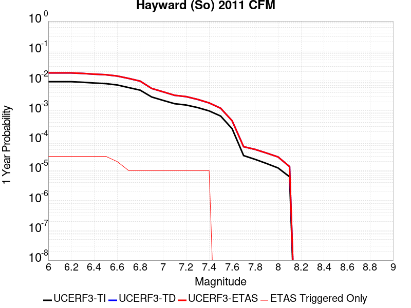 |  |

| Magnitude | 1 wk TI Prob | 1 wk TD Prob | 1 wk ETAS Prob | 1 wk ETAS/TD Gain | 1 wk ETAS Triggered Only | 1 mo TI Prob | 1 mo TD Prob | 1 mo ETAS Prob | 1 mo ETAS/TD Gain | 1 mo ETAS Triggered Only | 1 yr TI Prob | 1 yr TD Prob | 1 yr ETAS Prob | 1 yr ETAS/TD Gain | 1 yr ETAS Triggered Only | 10 yr TI Prob | 10 yr TD Prob | 10 yr ETAS Prob | 10 yr ETAS/TD Gain | 10 yr ETAS Triggered Only |
|-----|-----|-----|-----|-----|-----|-----|-----|-----|-----|-----|-----|-----|-----|-----|-----|-----|-----|-----|-----|-----|
| 6.0 | 1.8091932E-4 | 3.570541E-4 | 3.570541E-4 | 1.0 | 0.0 | 7.751381E-4 | 0.0015293444 | 0.0016181051 | 1.0580385 | 8.889679E-5 | 0.00939654 | 0.018463207 | 0.018550463 | 1.0047259 | 8.889679E-5 | 0.090090066 | 0.16673161 | 0.16680568 | 1.0004443 | 8.889679E-5 |
| 6.1 | 1.8091932E-4 | 3.570541E-4 | 3.570541E-4 | 1.0 | 0.0 | 7.751381E-4 | 0.0015293444 | 0.0016181051 | 1.0580385 | 8.889679E-5 | 0.00939654 | 0.018463207 | 0.018550463 | 1.0047259 | 8.889679E-5 | 0.090090066 | 0.16673161 | 0.16680568 | 1.0004443 | 8.889679E-5 |
| 6.2 | 1.8091932E-4 | 3.570541E-4 | 3.570541E-4 | 1.0 | 0.0 | 7.751381E-4 | 0.0015293444 | 0.0016181051 | 1.0580385 | 8.889679E-5 | 0.00939654 | 0.018463207 | 0.018550463 | 1.0047259 | 8.889679E-5 | 0.090090066 | 0.16673161 | 0.16680568 | 1.0004443 | 8.889679E-5 |
| 6.3 | 1.7322872E-4 | 3.426234E-4 | 3.426234E-4 | 1.0 | 0.0 | 7.4219756E-4 | 0.0014675693 | 0.0015563356 | 1.0604852 | 8.889679E-5 | 0.0089988755 | 0.017723544 | 0.017810866 | 1.0049268 | 8.889679E-5 | 0.08643075 | 0.16066726 | 0.16074187 | 1.0004644 | 8.889679E-5 |
| 6.4 | 1.6334097E-4 | 3.234411E-4 | 3.234411E-4 | 1.0 | 0.0 | 6.998449E-4 | 0.0013854484 | 0.001474222 | 1.0640757 | 8.889679E-5 | 0.008487372 | 0.016739385 | 0.016826794 | 1.0052217 | 8.889679E-5 | 0.081704415 | 0.15255594 | 0.15263128 | 1.0004938 | 8.889679E-5 |
| 6.5 | 1.5600289E-4 | 3.1018828E-4 | 3.1018828E-4 | 1.0 | 0.0 | 6.684125E-4 | 0.0013287093 | 0.001417488 | 1.0668157 | 8.889679E-5 | 0.008107598 | 0.016058935 | 0.016146403 | 1.0054468 | 8.889679E-5 | 0.078181036 | 0.14683272 | 0.14690855 | 1.0005165 | 8.889679E-5 |
| 6.6 | 1.4046066E-4 | 2.8032906E-4 | 2.8032906E-4 | 1.0 | 0.0 | 6.018354E-4 | 0.0012008639 | 0.0012896539 | 1.0739385 | 8.889679E-5 | 0.0073027555 | 0.014524006 | 0.014611612 | 1.0060318 | 8.889679E-5 | 0.07067384 | 0.13391982 | 0.13399681 | 1.000575 | 8.889679E-5 |
| 6.7 | 1.14696966E-4 | 2.3271477E-4 | 2.3271477E-4 | 1.0 | 0.0 | 4.914658E-4 | 9.969729E-4 | 0.001085781 | 1.0890778 | 8.889679E-5 | 0.0059671924 | 0.012071652 | 0.012159476 | 1.0072752 | 8.889679E-5 | 0.058094822 | 0.11274672 | 0.112825595 | 1.0006995 | 8.889679E-5 |
| 6.8 | 9.3874296E-5 | 1.8861453E-4 | 1.8861453E-4 | 1.0 | 0.0 | 4.0225635E-4 | 8.0810126E-4 | 8.969262E-4 | 1.1099181 | 8.889679E-5 | 0.0048864787 | 0.009794984 | 0.00988301 | 1.0089868 | 8.889679E-5 | 0.047804173 | 0.09259856 | 0.092679225 | 1.0008712 | 8.889679E-5 |
| 6.9 | 5.551852E-5 | 1.072948E-4 | 1.072948E-4 | 1.0 | 0.0 | 2.3791482E-4 | 4.5975443E-4 | 5.4861035E-4 | 1.1932682 | 8.889679E-5 | 0.0028927654 | 0.0055832625 | 0.0056716627 | 1.0158331 | 8.889679E-5 | 0.028553981 | 0.054245494 | 0.054329567 | 1.0015498 | 8.889679E-5 |
| 7.0 | 4.2662363E-5 | 8.2464416E-5 | 8.2464416E-5 | 1.0 | 0.0 | 1.8282588E-4 | 3.5337146E-4 | 4.4223684E-4 | 1.2514787 | 8.889679E-5 | 0.0022236328 | 0.0042938837 | 0.004382399 | 1.0206143 | 8.889679E-5 | 0.022015138 | 0.042064495 | 0.04214965 | 1.0020244 | 8.889679E-5 |
| 7.1 | 3.305886E-5 | 6.3019055E-5 | 6.3019055E-5 | 1.0 | 0.0 | 1.4167312E-4 | 2.700538E-4 | 3.5892657E-4 | 1.3290929 | 8.889679E-5 | 0.0017235056 | 0.0032829668 | 0.0033715717 | 1.0269893 | 8.889679E-5 | 0.017101998 | 0.032452874 | 0.032538887 | 1.0026504 | 8.889679E-5 |
| 7.2 | 2.9856887E-5 | 5.7013647E-5 | 5.7013647E-5 | 1.0 | 0.0 | 1.2795182E-4 | 2.4432142E-4 | 3.3319648E-4 | 1.363763 | 8.889679E-5 | 0.0015567001 | 0.0029705726 | 0.0030592051 | 1.0298369 | 8.889679E-5 | 0.015458403 | 0.029453589 | 0.029539866 | 1.0029293 | 8.889679E-5 |
| 7.3 | 2.4559737E-5 | 4.599088E-5 | 4.599088E-5 | 1.0 | 0.0 | 1.0525176E-4 | 1.9708896E-4 | 2.8596824E-4 | 1.4509602 | 8.889679E-5 | 0.0012806869 | 0.0023969305 | 0.002485614 | 1.0369989 | 8.889679E-5 | 0.012733313 | 0.023857482 | 0.023944257 | 1.0036373 | 8.889679E-5 |
| 7.4 | 1.9002231E-5 | 3.5049303E-5 | 3.5049303E-5 | 1.0 | 0.0 | 8.143559E-5 | 1.502027E-4 | 2.3908613E-4 | 1.5917566 | 8.889679E-5 | 9.910273E-4 | 0.0018271938 | 0.0019159282 | 1.0485632 | 8.889679E-5 | 0.009866194 | 0.018258283 | 0.018345555 | 1.0047799 | 8.889679E-5 |
| 7.5 | 1.2783333E-5 | 2.3330069E-5 | 2.3330069E-5 | 1.0 | 0.0 | 5.4784563E-5 | 9.998221E-5 | 9.998221E-5 | 1.0 | 0.0 | 6.667979E-4 | 0.0012166094 | 0.0012166094 | 1.0 | 0.0 | 0.006648007 | 0.012209582 | 0.012209582 | 1.0 | 0.0 |
| 7.6 | 4.8149627E-6 | 8.887544E-6 | 8.887544E-6 | 1.0 | 0.0 | 2.063539E-5 | 3.8088925E-5 | 3.8088925E-5 | 1.0 | 0.0 | 2.5120692E-4 | 4.636352E-4 | 4.636352E-4 | 1.0 | 0.0 | 0.0025092314 | 0.0046812436 | 0.0046812436 | 1.0 | 0.0 |
| 7.7 | 6.0838227E-7 | 1.2056693E-6 | 1.2056693E-6 | 1.0 | 0.0 | 2.6073499E-6 | 5.1671436E-6 | 5.1671436E-6 | 1.0 | 0.0 | 3.174402E-5 | 6.290816E-5 | 6.290816E-5 | 1.0 | 0.0 | 3.1739488E-4 | 6.5293367E-4 | 6.5293367E-4 | 1.0 | 0.0 |
| 7.8 | 4.5542808E-7 | 9.792182E-7 | 9.792182E-7 | 1.0 | 0.0 | 1.9518332E-6 | 4.1966427E-6 | 4.1966427E-6 | 1.0 | 0.0 | 2.376331E-5 | 5.1092928E-5 | 5.1092928E-5 | 1.0 | 0.0 | 2.3760769E-4 | 5.321372E-4 | 5.321372E-4 | 1.0 | 0.0 |
| 7.9 | 3.3016747E-7 | 7.386335E-7 | 7.386335E-7 | 1.0 | 0.0 | 1.4150027E-6 | 3.1655684E-6 | 3.1655684E-6 | 1.0 | 0.0 | 1.7227521E-5 | 3.8540114E-5 | 3.8540114E-5 | 1.0 | 0.0 | 1.7226185E-4 | 3.9930744E-4 | 3.9930744E-4 | 1.0 | 0.0 |
| 8.0 | 2.347038E-7 | 5.4714894E-7 | 5.4714894E-7 | 1.0 | 0.0 | 1.0058731E-6 | 2.344922E-6 | 2.344922E-6 | 1.0 | 0.0 | 1.2246436E-5 | 2.8549053E-5 | 2.8549053E-5 | 1.0 | 0.0 | 1.2245761E-4 | 2.9355253E-4 | 2.9355253E-4 | 1.0 | 0.0 |
| 8.1 | 1.18822804E-7 | 2.6058973E-7 | 2.6058973E-7 | 1.0 | 0.0 | 5.092405E-7 | 1.1168127E-6 | 1.1168127E-6 | 1.0 | 0.0 | 6.1999854E-6 | 1.359711E-5 | 1.359711E-5 | 1.0 | 0.0 | 6.199812E-5 | 1.3917852E-4 | 1.3917852E-4 | 1.0 | 0.0 |

## Channel Islands Western Deep Ramp
*[(top)](#table-of-contents)*

| 1 Week | 1 Month | 1 Year | 10 Year |
|-----|-----|-----|-----|
|  |  |  |  |

| Magnitude | 1 wk TI Prob | 1 wk TD Prob | 1 wk ETAS Prob | 1 wk ETAS/TD Gain | 1 wk ETAS Triggered Only | 1 mo TI Prob | 1 mo TD Prob | 1 mo ETAS Prob | 1 mo ETAS/TD Gain | 1 mo ETAS Triggered Only | 1 yr TI Prob | 1 yr TD Prob | 1 yr ETAS Prob | 1 yr ETAS/TD Gain | 1 yr ETAS Triggered Only | 10 yr TI Prob | 10 yr TD Prob | 10 yr ETAS Prob | 10 yr ETAS/TD Gain | 10 yr ETAS Triggered Only |
|-----|-----|-----|-----|-----|-----|-----|-----|-----|-----|-----|-----|-----|-----|-----|-----|-----|-----|-----|-----|-----|
| 6.0 | 6.0213506E-6 | 6.2548684E-6 | 9.51511E-5 | 15.212327 | 8.889679E-5 | 2.5805533E-5 | 2.6806329E-5 | 1.15700735E-4 | 4.3161726 | 8.889679E-5 | 3.1413708E-4 | 3.2632265E-4 | 4.151904E-4 | 1.272331 | 8.889679E-5 | 0.0031369338 | 0.0032588763 | 0.0033474835 | 1.0271895 | 8.889679E-5 |
| 6.1 | 6.0213506E-6 | 6.2548684E-6 | 9.51511E-5 | 15.212327 | 8.889679E-5 | 2.5805533E-5 | 2.6806329E-5 | 1.15700735E-4 | 4.3161726 | 8.889679E-5 | 3.1413708E-4 | 3.2632265E-4 | 4.151904E-4 | 1.272331 | 8.889679E-5 | 0.0031369338 | 0.0032588763 | 0.0033474835 | 1.0271895 | 8.889679E-5 |
| 6.2 | 6.0213506E-6 | 6.2548684E-6 | 9.51511E-5 | 15.212327 | 8.889679E-5 | 2.5805533E-5 | 2.6806329E-5 | 1.15700735E-4 | 4.3161726 | 8.889679E-5 | 3.1413708E-4 | 3.2632265E-4 | 4.151904E-4 | 1.272331 | 8.889679E-5 | 0.0031369338 | 0.0032588763 | 0.0033474835 | 1.0271895 | 8.889679E-5 |
| 6.3 | 6.0213506E-6 | 6.2548684E-6 | 9.51511E-5 | 15.212327 | 8.889679E-5 | 2.5805533E-5 | 2.6806329E-5 | 1.15700735E-4 | 4.3161726 | 8.889679E-5 | 3.1413708E-4 | 3.2632265E-4 | 4.151904E-4 | 1.272331 | 8.889679E-5 | 0.0031369338 | 0.0032588763 | 0.0033474835 | 1.0271895 | 8.889679E-5 |
| 6.4 | 6.0213506E-6 | 6.2548684E-6 | 9.51511E-5 | 15.212327 | 8.889679E-5 | 2.5805533E-5 | 2.6806329E-5 | 1.15700735E-4 | 4.3161726 | 8.889679E-5 | 3.1413708E-4 | 3.2632265E-4 | 4.151904E-4 | 1.272331 | 8.889679E-5 | 0.0031369338 | 0.0032588763 | 0.0033474835 | 1.0271895 | 8.889679E-5 |
| 6.5 | 6.0213506E-6 | 6.2548684E-6 | 9.51511E-5 | 15.212327 | 8.889679E-5 | 2.5805533E-5 | 2.6806329E-5 | 1.15700735E-4 | 4.3161726 | 8.889679E-5 | 3.1413708E-4 | 3.2632265E-4 | 4.151904E-4 | 1.272331 | 8.889679E-5 | 0.0031369338 | 0.0032588763 | 0.0033474835 | 1.0271895 | 8.889679E-5 |
| 6.6 | 6.0213506E-6 | 6.2548684E-6 | 9.51511E-5 | 15.212327 | 8.889679E-5 | 2.5805533E-5 | 2.6806329E-5 | 1.15700735E-4 | 4.3161726 | 8.889679E-5 | 3.1413708E-4 | 3.2632265E-4 | 4.151904E-4 | 1.272331 | 8.889679E-5 | 0.0031369338 | 0.0032588763 | 0.0033474835 | 1.0271895 | 8.889679E-5 |
| 6.7 | 5.313309E-6 | 5.5252403E-6 | 9.442154E-5 | 17.089128 | 8.889679E-5 | 2.2771126E-5 | 2.367941E-5 | 1.125741E-4 | 4.754092 | 8.889679E-5 | 2.772032E-4 | 2.8826276E-4 | 3.7713393E-4 | 1.3082992 | 8.889679E-5 | 0.0027685766 | 0.0028792918 | 0.0029679325 | 1.0307857 | 8.889679E-5 |
| 6.8 | 5.313309E-6 | 5.5252403E-6 | 9.442154E-5 | 17.089128 | 8.889679E-5 | 2.2771126E-5 | 2.367941E-5 | 1.125741E-4 | 4.754092 | 8.889679E-5 | 2.772032E-4 | 2.8826276E-4 | 3.7713393E-4 | 1.3082992 | 8.889679E-5 | 0.0027685766 | 0.0028792918 | 0.0029679325 | 1.0307857 | 8.889679E-5 |
| 6.9 | 4.744377E-6 | 4.9394303E-6 | 9.3835784E-5 | 18.997288 | 8.889679E-5 | 2.0332885E-5 | 2.1168837E-5 | 1.10063746E-4 | 5.199329 | 8.889679E-5 | 2.4752476E-4 | 2.5770385E-4 | 3.4657773E-4 | 1.3448683 | 8.889679E-5 | 0.0024724922 | 0.0025744175 | 0.0026630855 | 1.034442 | 8.889679E-5 |
| 7.0 | 4.722209E-6 | 4.9164732E-6 | 9.381283E-5 | 19.081326 | 8.889679E-5 | 2.0237881E-5 | 2.107045E-5 | 1.0996537E-4 | 5.218938 | 8.889679E-5 | 2.4636835E-4 | 2.5650626E-4 | 3.4538025E-4 | 1.3464788 | 8.889679E-5 | 0.002460954 | 0.0025624693 | 0.0026511382 | 1.034603 | 8.889679E-5 |
| 7.1 | 4.611174E-6 | 4.801409E-6 | 9.3697774E-5 | 19.51464 | 8.889679E-5 | 1.9762025E-5 | 2.0577325E-5 | 1.0947229E-4 | 5.3200445 | 8.889679E-5 | 2.4057609E-4 | 2.5050386E-4 | 3.393784E-4 | 1.354783 | 8.889679E-5 | 0.002403158 | 0.002502582 | 0.0025912563 | 1.0354332 | 8.889679E-5 |
| 7.2 | 4.043994E-6 | 4.2120264E-6 | 9.310844E-5 | 22.10538 | 8.889679E-5 | 1.7331287E-5 | 1.8051438E-5 | 1.0694662E-4 | 5.9245486 | 8.889679E-5 | 2.10988E-4 | 2.1975765E-4 | 3.0863492E-4 | 1.404433 | 8.889679E-5 | 0.002107878 | 0.0021957543 | 0.0022844558 | 1.0403968 | 8.889679E-5 |
| 7.3 | 2.1233036E-6 | 2.2297875E-6 | 9.112638E-5 | 40.867744 | 8.889679E-5 | 9.099841E-6 | 9.556197E-6 | 9.845214E-5 | 10.302439 | 8.889679E-5 | 1.1078493E-4 | 1.1634055E-4 | 2.05227E-4 | 1.7640195 | 8.889679E-5 | 0.0011072971 | 0.001162802 | 0.0012515953 | 1.0763617 | 8.889679E-5 |
| 7.4 | 1.9051884E-6 | 2.0014973E-6 | 9.089811E-5 | 45.415054 | 8.889679E-5 | 8.165067E-6 | 8.577817E-6 | 9.747384E-5 | 11.363479 | 8.889679E-5 | 9.940516E-5 | 1.0442998E-4 | 1.9331748E-4 | 1.8511685 | 8.889679E-5 | 9.93607E-4 | 0.0010438144 | 0.0011326183 | 1.0850765 | 8.889679E-5 |
| 7.5 | 1.2408497E-6 | 1.3038839E-6 | 9.0200556E-5 | 69.17837 | 8.889679E-5 | 5.317916E-6 | 5.588062E-6 | 9.4484356E-5 | 16.90825 | 8.889679E-5 | 6.4743705E-5 | 6.8032554E-5 | 1.569233E-4 | 2.3065913 | 8.889679E-5 | 6.4724847E-4 | 6.8011944E-4 | 7.689558E-4 | 1.1306187 | 8.889679E-5 |
| 7.6 | 6.5440025E-7 | 6.886718E-7 | 6.886718E-7 | 1.0 | 0.0 | 2.8045695E-6 | 2.9514472E-6 | 2.9514472E-6 | 1.0 | 0.0 | 3.4145098E-5 | 3.593329E-5 | 3.593329E-5 | 1.0 | 0.0 | 3.4139853E-4 | 3.5927625E-4 | 3.5927625E-4 | 1.0 | 0.0 |
| 7.7 | 3.985963E-7 | 4.1930787E-7 | 4.1930787E-7 | 1.0 | 0.0 | 1.7082689E-6 | 1.7970326E-6 | 1.7970326E-6 | 1.0 | 0.0 | 2.0797976E-5 | 2.1878664E-5 | 2.1878664E-5 | 1.0 | 0.0 | 2.0796029E-4 | 2.1876628E-4 | 2.1876628E-4 | 1.0 | 0.0 |
| 7.8 | 3.706329E-8 | 3.8591796E-8 | 3.8591796E-8 | 1.0 | 0.0 | 1.5884267E-7 | 1.653934E-7 | 1.653934E-7 | 1.0 | 0.0 | 1.9339077E-6 | 2.0136629E-6 | 2.0136629E-6 | 1.0 | 0.0 | 1.933891E-5 | 2.0136458E-5 | 2.0136458E-5 | 1.0 | 0.0 |

## Rodgers Creek - Healdsburg 2011 CFM
*[(top)](#table-of-contents)*

| 1 Week | 1 Month | 1 Year | 10 Year |
|-----|-----|-----|-----|
|  |  |  |  |

| Magnitude | 1 wk TI Prob | 1 wk TD Prob | 1 wk ETAS Prob | 1 wk ETAS/TD Gain | 1 wk ETAS Triggered Only | 1 mo TI Prob | 1 mo TD Prob | 1 mo ETAS Prob | 1 mo ETAS/TD Gain | 1 mo ETAS Triggered Only | 1 yr TI Prob | 1 yr TD Prob | 1 yr ETAS Prob | 1 yr ETAS/TD Gain | 1 yr ETAS Triggered Only | 10 yr TI Prob | 10 yr TD Prob | 10 yr ETAS Prob | 10 yr ETAS/TD Gain | 10 yr ETAS Triggered Only |
|-----|-----|-----|-----|-----|-----|-----|-----|-----|-----|-----|-----|-----|-----|-----|-----|-----|-----|-----|-----|-----|
| 6.0 | 7.390182E-5 | 1.3136698E-4 | 1.3136698E-4 | 1.0 | 0.0 | 3.1668364E-4 | 5.6287815E-4 | 6.5172487E-4 | 1.1578437 | 8.889679E-5 | 0.0038488081 | 0.0068315 | 0.00691979 | 1.0129238 | 8.889679E-5 | 0.037828278 | 0.06619178 | 0.06627479 | 1.0012541 | 8.889679E-5 |
| 6.1 | 7.318768E-5 | 1.3034661E-4 | 1.3034661E-4 | 1.0 | 0.0 | 3.1362378E-4 | 5.585081E-4 | 6.473553E-4 | 1.1590794 | 8.889679E-5 | 0.0038116854 | 0.0067786723 | 0.0068669664 | 1.0130253 | 8.889679E-5 | 0.037469655 | 0.06569639 | 0.06577945 | 1.0012642 | 8.889679E-5 |
| 6.2 | 7.1379836E-5 | 1.2727521E-4 | 1.2727521E-4 | 1.0 | 0.0 | 3.058777E-4 | 5.453505E-4 | 6.3419883E-4 | 1.1629196 | 8.889679E-5 | 0.003717703 | 0.0066194604 | 0.006707769 | 1.0133407 | 8.889679E-5 | 0.0365612 | 0.06421462 | 0.0642978 | 1.0012954 | 8.889679E-5 |
| 6.3 | 6.9255926E-5 | 1.2382054E-4 | 1.2382054E-4 | 1.0 | 0.0 | 2.9677735E-4 | 5.3055194E-4 | 6.194016E-4 | 1.1674664 | 8.889679E-5 | 0.0036072785 | 0.006440372 | 0.0065286965 | 1.0137142 | 8.889679E-5 | 0.035492823 | 0.06254096 | 0.0626243 | 1.0013325 | 8.889679E-5 |
| 6.4 | 6.6757144E-5 | 1.1958744E-4 | 1.1958744E-4 | 1.0 | 0.0 | 2.8607066E-4 | 5.1241735E-4 | 6.012686E-4 | 1.1733962 | 8.889679E-5 | 0.0034773487 | 0.0062209065 | 0.0063092504 | 1.0142012 | 8.889679E-5 | 0.034234364 | 0.060490217 | 0.060573738 | 1.0013807 | 8.889679E-5 |
| 6.5 | 6.5735134E-5 | 1.1808043E-4 | 1.1808043E-4 | 1.0 | 0.0 | 2.8169158E-4 | 5.0596124E-4 | 5.948131E-4 | 1.17561 | 8.889679E-5 | 0.003424202 | 0.0061427657 | 0.0062311166 | 1.0143828 | 8.889679E-5 | 0.03371918 | 0.059755135 | 0.05983872 | 1.0013988 | 8.889679E-5 |
| 6.6 | 6.289601E-5 | 1.1343802E-4 | 1.1343802E-4 | 1.0 | 0.0 | 2.6952647E-4 | 4.8607276E-4 | 5.749263E-4 | 1.182799 | 8.889679E-5 | 0.0032765474 | 0.005901959 | 0.005990331 | 1.0149734 | 8.889679E-5 | 0.032286562 | 0.057494484 | 0.05757827 | 1.0014573 | 8.889679E-5 |
| 6.7 | 6.115274E-5 | 1.1060895E-4 | 1.1060895E-4 | 1.0 | 0.0 | 2.6205686E-4 | 4.7395262E-4 | 5.6280725E-4 | 1.1874758 | 8.889679E-5 | 0.0031858748 | 0.0057551847 | 0.00584357 | 1.0153575 | 8.889679E-5 | 0.031405866 | 0.05611298 | 0.056196887 | 1.0014954 | 8.889679E-5 |
| 6.8 | 5.9232367E-5 | 1.0728244E-4 | 1.0728244E-4 | 1.0 | 0.0 | 2.538283E-4 | 4.597012E-4 | 5.4855715E-4 | 1.1932906 | 8.889679E-5 | 0.0030859804 | 0.0055825757 | 0.0056709764 | 1.015835 | 8.889679E-5 | 0.030434765 | 0.054479737 | 0.05456379 | 1.0015428 | 8.889679E-5 |
| 6.9 | 5.4030377E-5 | 9.8224424E-5 | 9.8224424E-5 | 1.0 | 0.0 | 2.315382E-4 | 4.2089424E-4 | 5.097536E-4 | 1.2111205 | 8.889679E-5 | 0.0028153337 | 0.005112413 | 0.0052008554 | 1.0172995 | 8.889679E-5 | 0.027799325 | 0.05001516 | 0.050099608 | 1.0016885 | 8.889679E-5 |
| 7.0 | 4.8260714E-5 | 8.740524E-5 | 8.740524E-5 | 1.0 | 0.0 | 2.0681522E-4 | 3.745404E-4 | 4.634039E-4 | 1.2372601 | 8.889679E-5 | 0.0025150678 | 0.004550549 | 0.0046390416 | 1.0194465 | 8.889679E-5 | 0.024867928 | 0.044667665 | 0.04475259 | 1.0019013 | 8.889679E-5 |
| 7.1 | 4.0294493E-5 | 7.389041E-5 | 7.389041E-5 | 1.0 | 0.0 | 1.7267925E-4 | 3.1663495E-4 | 4.055036E-4 | 1.2806659 | 8.889679E-5 | 0.0021003427 | 0.0038482544 | 0.003936809 | 1.0230117 | 8.889679E-5 | 0.02080602 | 0.037923392 | 0.038008917 | 1.0022552 | 8.889679E-5 |
| 7.2 | 3.096388E-5 | 5.697752E-5 | 5.697752E-5 | 1.0 | 0.0 | 1.326956E-4 | 2.4416664E-4 | 3.330417E-4 | 1.3639935 | 8.889679E-5 | 0.0016143717 | 0.0029686983 | 0.0030573313 | 1.0298558 | 8.889679E-5 | 0.01602694 | 0.029436996 | 0.029523276 | 1.002931 | 8.889679E-5 |
| 7.3 | 2.3615226E-5 | 4.3628002E-5 | 4.3628002E-5 | 1.0 | 0.0 | 1.0120418E-4 | 1.8696384E-4 | 2.75844E-4 | 1.475387 | 8.889679E-5 | 0.0012314644 | 0.002273922 | 0.0023626166 | 1.0390052 | 8.889679E-5 | 0.0122466255 | 0.022636993 | 0.022723878 | 1.0038382 | 8.889679E-5 |
| 7.4 | 1.8251132E-5 | 3.3541033E-5 | 3.3541033E-5 | 1.0 | 0.0 | 7.821679E-5 | 1.4373941E-4 | 2.3262342E-4 | 1.6183691 | 8.889679E-5 | 9.518733E-4 | 0.0017486324 | 0.0018373738 | 1.050749 | 8.889679E-5 | 0.009478063 | 0.017465532 | 0.017552875 | 1.005001 | 8.889679E-5 |
| 7.5 | 1.2411432E-5 | 2.246003E-5 | 2.246003E-5 | 1.0 | 0.0 | 5.3190768E-5 | 9.625375E-5 | 9.625375E-5 | 1.0 | 0.0 | 6.4740516E-4 | 0.0011712653 | 0.0011712653 | 1.0 | 0.0 | 0.006455223 | 0.011743283 | 0.011743283 | 1.0 | 0.0 |
| 7.6 | 4.4771446E-6 | 8.083989E-6 | 8.083989E-6 | 1.0 | 0.0 | 1.918762E-5 | 3.4645214E-5 | 3.4645214E-5 | 1.0 | 0.0 | 2.3358424E-4 | 4.2172507E-4 | 4.2172507E-4 | 1.0 | 0.0 | 0.0023333887 | 0.004246066 | 0.004246066 | 1.0 | 0.0 |
| 7.7 | 2.157941E-7 | 3.5349316E-7 | 3.5349316E-7 | 1.0 | 0.0 | 9.248315E-7 | 1.5149698E-6 | 1.5149698E-6 | 1.0 | 0.0 | 1.1259765E-5 | 1.8444602E-5 | 1.8444602E-5 | 1.0 | 0.0 | 1.1259195E-4 | 1.9069147E-4 | 1.9069147E-4 | 1.0 | 0.0 |
| 7.8 | 9.9623286E-8 | 1.989979E-7 | 1.989979E-7 | 1.0 | 0.0 | 4.269569E-7 | 8.528478E-7 | 8.528478E-7 | 1.0 | 0.0 | 5.1981874E-6 | 1.0383373E-5 | 1.0383373E-5 | 1.0 | 0.0 | 5.198066E-5 | 1.09018714E-4 | 1.09018714E-4 | 1.0 | 0.0 |
| 7.9 | 5.6745257E-8 | 1.1773924E-7 | 1.1773924E-7 | 1.0 | 0.0 | 2.4319394E-7 | 5.0459664E-7 | 5.0459664E-7 | 1.0 | 0.0 | 2.960882E-6 | 6.1434466E-6 | 6.1434466E-6 | 1.0 | 0.0 | 2.9608427E-5 | 6.470911E-5 | 6.470911E-5 | 1.0 | 0.0 |
| 8.0 | 2.8614323E-8 | 6.57845E-8 | 6.57845E-8 | 1.0 | 0.0 | 1.2263281E-7 | 2.8193355E-7 | 2.8193355E-7 | 1.0 | 0.0 | 1.4930534E-6 | 3.4325356E-6 | 3.4325356E-6 | 1.0 | 0.0 | 1.4930434E-5 | 3.582588E-5 | 3.582588E-5 | 1.0 | 0.0 |
| 8.1 | 3.5045191E-9 | 8.965783E-9 | 8.965783E-9 | 1.0 | 0.0 | 1.5019367E-8 | 3.8424783E-8 | 3.8424783E-8 | 1.0 | 0.0 | 1.8286079E-7 | 4.6782165E-7 | 4.6782165E-7 | 1.0 | 0.0 | 1.8286064E-6 | 4.8327956E-6 | 4.8327956E-6 | 1.0 | 0.0 |

## Great Valley 01
*[(top)](#table-of-contents)*

| 1 Week | 1 Month | 1 Year | 10 Year |
|-----|-----|-----|-----|
|  |  |  |  |

| Magnitude | 1 wk TI Prob | 1 wk TD Prob | 1 wk ETAS Prob | 1 wk ETAS/TD Gain | 1 wk ETAS Triggered Only | 1 mo TI Prob | 1 mo TD Prob | 1 mo ETAS Prob | 1 mo ETAS/TD Gain | 1 mo ETAS Triggered Only | 1 yr TI Prob | 1 yr TD Prob | 1 yr ETAS Prob | 1 yr ETAS/TD Gain | 1 yr ETAS Triggered Only | 10 yr TI Prob | 10 yr TD Prob | 10 yr ETAS Prob | 10 yr ETAS/TD Gain | 10 yr ETAS Triggered Only |
|-----|-----|-----|-----|-----|-----|-----|-----|-----|-----|-----|-----|-----|-----|-----|-----|-----|-----|-----|-----|-----|
| 6.0 | 3.3398478E-6 | 3.3762976E-6 | 9.2272785E-5 | 27.329576 | 8.889679E-5 | 1.4313555E-5 | 1.4469774E-5 | 1.0336528E-4 | 7.143531 | 8.889679E-5 | 1.742536E-4 | 1.7615648E-4 | 2.650376E-4 | 1.5045578 | 8.889679E-5 | 0.0017411702 | 0.0017602886 | 0.0018490289 | 1.0504124 | 8.889679E-5 |
| 6.1 | 1.7919616E-6 | 1.8120251E-6 | 1.8120251E-6 | 1.0 | 0.0 | 7.679812E-6 | 7.7658E-6 | 7.7658E-6 | 1.0 | 0.0 | 9.349771E-5 | 9.454471E-5 | 9.454471E-5 | 1.0 | 0.0 | 9.345838E-4 | 9.4506424E-4 | 9.4506424E-4 | 1.0 | 0.0 |
| 6.2 | 1.7919616E-6 | 1.8120251E-6 | 1.8120251E-6 | 1.0 | 0.0 | 7.679812E-6 | 7.7658E-6 | 7.7658E-6 | 1.0 | 0.0 | 9.349771E-5 | 9.454471E-5 | 9.454471E-5 | 1.0 | 0.0 | 9.345838E-4 | 9.4506424E-4 | 9.4506424E-4 | 1.0 | 0.0 |
| 6.3 | 1.1636545E-6 | 1.17745E-6 | 1.17745E-6 | 1.0 | 0.0 | 4.9870814E-6 | 5.046205E-6 | 5.046205E-6 | 1.0 | 0.0 | 6.0716022E-5 | 6.143586E-5 | 6.143586E-5 | 1.0 | 0.0 | 6.069944E-4 | 6.1419315E-4 | 6.1419315E-4 | 1.0 | 0.0 |
| 6.4 | 8.770928E-7 | 8.881815E-7 | 8.881815E-7 | 1.0 | 0.0 | 3.7589639E-6 | 3.8064866E-6 | 3.8064866E-6 | 1.0 | 0.0 | 4.5764424E-5 | 4.634301E-5 | 4.634301E-5 | 1.0 | 0.0 | 4.5755E-4 | 4.633356E-4 | 4.633356E-4 | 1.0 | 0.0 |
| 6.5 | 6.753308E-7 | 6.8452607E-7 | 6.8452607E-7 | 1.0 | 0.0 | 2.8942718E-6 | 2.93368E-6 | 2.93368E-6 | 1.0 | 0.0 | 3.523719E-5 | 3.5716977E-5 | 3.5716977E-5 | 1.0 | 0.0 | 3.52316E-4 | 3.5711337E-4 | 3.5711337E-4 | 1.0 | 0.0 |
| 6.6 | 5.2531993E-7 | 5.331276E-7 | 5.331276E-7 | 1.0 | 0.0 | 2.251369E-6 | 2.2848305E-6 | 2.2848305E-6 | 1.0 | 0.0 | 2.7410075E-5 | 2.7817463E-5 | 2.7817463E-5 | 1.0 | 0.0 | 2.7406693E-4 | 2.7814036E-4 | 2.7814036E-4 | 1.0 | 0.0 |
| 6.7 | 4.1404678E-7 | 4.208609E-7 | 4.208609E-7 | 1.0 | 0.0 | 1.774485E-6 | 1.8036884E-6 | 1.8036884E-6 | 1.0 | 0.0 | 2.160414E-5 | 2.1959688E-5 | 2.1959688E-5 | 1.0 | 0.0 | 2.160204E-4 | 2.1957551E-4 | 2.1957551E-4 | 1.0 | 0.0 |
| 6.8 | 3.1713054E-7 | 3.2302975E-7 | 3.2302975E-7 | 1.0 | 0.0 | 1.3591301E-6 | 1.3844125E-6 | 1.3844125E-6 | 1.0 | 0.0 | 1.6547285E-5 | 1.6855092E-5 | 1.6855092E-5 | 1.0 | 0.0 | 1.6546051E-4 | 1.6853833E-4 | 1.6853833E-4 | 1.0 | 0.0 |
| 6.9 | 2.528054E-7 | 2.580374E-7 | 2.580374E-7 | 1.0 | 0.0 | 1.0834511E-6 | 1.1058742E-6 | 1.1058742E-6 | 1.0 | 0.0 | 1.3190938E-5 | 1.3463935E-5 | 1.3463935E-5 | 1.0 | 0.0 | 1.3190156E-4 | 1.3463132E-4 | 1.3463132E-4 | 1.0 | 0.0 |
| 7.0 | 2.0667689E-7 | 2.1131233E-7 | 2.1131233E-7 | 1.0 | 0.0 | 8.857578E-7 | 9.0562395E-7 | 9.0562395E-7 | 1.0 | 0.0 | 1.0784048E-5 | 1.1025917E-5 | 1.1025917E-5 | 1.0 | 0.0 | 1.0783524E-4 | 1.1025378E-4 | 1.1025378E-4 | 1.0 | 0.0 |
| 7.1 | 1.5951586E-7 | 1.6338481E-7 | 1.6338481E-7 | 1.0 | 0.0 | 6.8363926E-7 | 7.002204E-7 | 7.002204E-7 | 1.0 | 0.0 | 8.323276E-6 | 8.525151E-6 | 8.525151E-6 | 1.0 | 0.0 | 8.322964E-5 | 8.5248306E-5 | 8.5248306E-5 | 1.0 | 0.0 |
| 7.2 | 1.02912296E-7 | 1.0566137E-7 | 1.0566137E-7 | 1.0 | 0.0 | 4.4105263E-7 | 4.5283437E-7 | 4.5283437E-7 | 1.0 | 0.0 | 5.3698027E-6 | 5.5132446E-6 | 5.5132446E-6 | 1.0 | 0.0 | 5.3696727E-5 | 5.5131113E-5 | 5.5131113E-5 | 1.0 | 0.0 |
| 7.3 | 6.581281E-8 | 6.77207E-8 | 6.77207E-8 | 1.0 | 0.0 | 2.8205488E-7 | 2.9023153E-7 | 2.9023153E-7 | 1.0 | 0.0 | 3.4340128E-6 | 3.5335634E-6 | 3.5335634E-6 | 1.0 | 0.0 | 3.4339595E-5 | 3.533509E-5 | 3.533509E-5 | 1.0 | 0.0 |
| 7.4 | 3.112171E-8 | 3.2068368E-8 | 3.2068368E-8 | 1.0 | 0.0 | 1.3337875E-7 | 1.3743585E-7 | 1.3743585E-7 | 1.0 | 0.0 | 1.6238852E-6 | 1.6732803E-6 | 1.6732803E-6 | 1.0 | 0.0 | 1.6238733E-5 | 1.6732685E-5 | 1.6732685E-5 | 1.0 | 0.0 |

## San Jacinto (San Jacinto Valley) rev
*[(top)](#table-of-contents)*

| 1 Week | 1 Month | 1 Year | 10 Year |
|-----|-----|-----|-----|
|  |  |  |  |

| Magnitude | 1 wk TI Prob | 1 wk TD Prob | 1 wk ETAS Prob | 1 wk ETAS/TD Gain | 1 wk ETAS Triggered Only | 1 mo TI Prob | 1 mo TD Prob | 1 mo ETAS Prob | 1 mo ETAS/TD Gain | 1 mo ETAS Triggered Only | 1 yr TI Prob | 1 yr TD Prob | 1 yr ETAS Prob | 1 yr ETAS/TD Gain | 1 yr ETAS Triggered Only | 10 yr TI Prob | 10 yr TD Prob | 10 yr ETAS Prob | 10 yr ETAS/TD Gain | 10 yr ETAS Triggered Only |
|-----|-----|-----|-----|-----|-----|-----|-----|-----|-----|-----|-----|-----|-----|-----|-----|-----|-----|-----|-----|-----|
| 6.0 | 3.652694E-5 | 3.4402394E-5 | 3.4402394E-5 | 1.0 | 0.0 | 1.5653463E-4 | 1.474305E-4 | 1.474305E-4 | 1.0 | 0.0 | 0.0019041431 | 0.00179349 | 0.0018822274 | 1.0494775 | 8.889679E-5 | 0.018879099 | 0.018526595 | 0.018613845 | 1.0047095 | 8.889679E-5 |
| 6.1 | 3.652694E-5 | 3.4402394E-5 | 3.4402394E-5 | 1.0 | 0.0 | 1.5653463E-4 | 1.474305E-4 | 1.474305E-4 | 1.0 | 0.0 | 0.0019041431 | 0.00179349 | 0.0018822274 | 1.0494775 | 8.889679E-5 | 0.018879099 | 0.018526595 | 0.018613845 | 1.0047095 | 8.889679E-5 |
| 6.2 | 3.652694E-5 | 3.4402394E-5 | 3.4402394E-5 | 1.0 | 0.0 | 1.5653463E-4 | 1.474305E-4 | 1.474305E-4 | 1.0 | 0.0 | 0.0019041431 | 0.00179349 | 0.0018822274 | 1.0494775 | 8.889679E-5 | 0.018879099 | 0.018526595 | 0.018613845 | 1.0047095 | 8.889679E-5 |
| 6.3 | 3.652694E-5 | 3.4402394E-5 | 3.4402394E-5 | 1.0 | 0.0 | 1.5653463E-4 | 1.474305E-4 | 1.474305E-4 | 1.0 | 0.0 | 0.0019041431 | 0.00179349 | 0.0018822274 | 1.0494775 | 8.889679E-5 | 0.018879099 | 0.018526595 | 0.018613845 | 1.0047095 | 8.889679E-5 |
| 6.4 | 3.646941E-5 | 3.432397E-5 | 3.432397E-5 | 1.0 | 0.0 | 1.5628811E-4 | 1.4709444E-4 | 1.4709444E-4 | 1.0 | 0.0 | 0.0019011468 | 0.0017894056 | 0.0018781434 | 1.0495906 | 8.889679E-5 | 0.018849645 | 0.018486476 | 0.01857373 | 1.0047199 | 8.889679E-5 |
| 6.5 | 3.646941E-5 | 3.432397E-5 | 3.432397E-5 | 1.0 | 0.0 | 1.5628811E-4 | 1.4709444E-4 | 1.4709444E-4 | 1.0 | 0.0 | 0.0019011468 | 0.0017894056 | 0.0018781434 | 1.0495906 | 8.889679E-5 | 0.018849645 | 0.018486476 | 0.01857373 | 1.0047199 | 8.889679E-5 |
| 6.6 | 3.6442503E-5 | 3.4287354E-5 | 3.4287354E-5 | 1.0 | 0.0 | 1.561728E-4 | 1.4693754E-4 | 1.4693754E-4 | 1.0 | 0.0 | 0.0018997455 | 0.0017874985 | 0.0018762364 | 1.0496436 | 8.889679E-5 | 0.018835869 | 0.018467745 | 0.018555 | 1.0047247 | 8.889679E-5 |
| 6.7 | 3.6432113E-5 | 3.4272925E-5 | 3.4272925E-5 | 1.0 | 0.0 | 1.5612828E-4 | 1.4687571E-4 | 1.4687571E-4 | 1.0 | 0.0 | 0.0018992044 | 0.0017867472 | 0.0018754852 | 1.0496645 | 8.889679E-5 | 0.018830549 | 0.018460369 | 0.018547624 | 1.0047266 | 8.889679E-5 |
| 6.8 | 3.6409598E-5 | 3.424198E-5 | 3.424198E-5 | 1.0 | 0.0 | 1.560318E-4 | 1.4674311E-4 | 1.4674311E-4 | 1.0 | 0.0 | 0.0018980318 | 0.0017851355 | 0.0018738735 | 1.0497094 | 8.889679E-5 | 0.018819023 | 0.018444523 | 0.01853178 | 1.0047308 | 8.889679E-5 |
| 6.9 | 3.638078E-5 | 3.4202407E-5 | 3.4202407E-5 | 1.0 | 0.0 | 1.5590832E-4 | 1.4657351E-4 | 1.4657351E-4 | 1.0 | 0.0 | 0.0018965311 | 0.001783074 | 0.0018718124 | 1.049767 | 8.889679E-5 | 0.018804269 | 0.018424258 | 0.018511517 | 1.0047361 | 8.889679E-5 |
| 7.0 | 3.6294874E-5 | 3.408442E-5 | 3.408442E-5 | 1.0 | 0.0 | 1.5554018E-4 | 1.4606792E-4 | 1.4606792E-4 | 1.0 | 0.0 | 0.0018920569 | 0.001776929 | 0.0018656678 | 1.0499394 | 8.889679E-5 | 0.018760284 | 0.018363839 | 0.018451104 | 1.0047519 | 8.889679E-5 |
| 7.1 | 3.6260717E-5 | 3.4040702E-5 | 3.4040702E-5 | 1.0 | 0.0 | 1.5539382E-4 | 1.4588058E-4 | 1.4588058E-4 | 1.0 | 0.0 | 0.001890278 | 0.0017746518 | 0.0018633909 | 1.0500036 | 8.889679E-5 | 0.018742796 | 0.018341439 | 0.018428706 | 1.0047579 | 8.889679E-5 |
| 7.2 | 3.6210204E-5 | 3.397492E-5 | 3.397492E-5 | 1.0 | 0.0 | 1.5517735E-4 | 1.455987E-4 | 1.455987E-4 | 1.0 | 0.0 | 0.001887647 | 0.0017712255 | 0.0018599648 | 1.0501006 | 8.889679E-5 | 0.01871693 | 0.01830772 | 0.018394988 | 1.0047668 | 8.889679E-5 |
| 7.3 | 3.6119454E-5 | 3.386321E-5 | 3.386321E-5 | 1.0 | 0.0 | 1.5478847E-4 | 1.4511998E-4 | 1.4511998E-4 | 1.0 | 0.0 | 0.0018829206 | 0.0017654065 | 0.0018541464 | 1.0502659 | 8.889679E-5 | 0.018670462 | 0.018250274 | 0.018337548 | 1.0047821 | 8.889679E-5 |
| 7.4 | 3.607848E-5 | 3.381071E-5 | 3.381071E-5 | 1.0 | 0.0 | 1.5461289E-4 | 1.44895E-4 | 1.44895E-4 | 1.0 | 0.0 | 0.0018807866 | 0.0017626719 | 0.001851412 | 1.0503441 | 8.889679E-5 | 0.018649481 | 0.018223269 | 0.018310545 | 1.0047894 | 8.889679E-5 |
| 7.5 | 3.5856774E-5 | 3.3620483E-5 | 3.3620483E-5 | 1.0 | 0.0 | 1.5366284E-4 | 1.4407984E-4 | 1.4407984E-4 | 1.0 | 0.0 | 0.0018692396 | 0.0017527633 | 0.0018415042 | 1.0506291 | 8.889679E-5 | 0.018535944 | 0.018124366 | 0.018211652 | 1.0048159 | 8.889679E-5 |
| 7.6 | 3.286655E-5 | 3.2143445E-5 | 3.2143445E-5 | 1.0 | 0.0 | 1.4084904E-4 | 1.3775036E-4 | 1.3775036E-4 | 1.0 | 0.0 | 0.001713488 | 0.0016758227 | 0.0017645704 | 1.0529578 | 8.889679E-5 | 0.017003361 | 0.017344031 | 0.017431386 | 1.0050366 | 8.889679E-5 |
| 7.7 | 2.8882527E-5 | 2.9236293E-5 | 2.9236293E-5 | 1.0 | 0.0 | 1.237764E-4 | 1.2529238E-4 | 1.2529238E-4 | 1.0 | 0.0 | 0.0015059357 | 0.0015243685 | 0.0016131299 | 1.0582283 | 8.889679E-5 | 0.014957713 | 0.015830461 | 0.01591795 | 1.0055267 | 8.889679E-5 |
| 7.8 | 2.4950225E-5 | 2.6527203E-5 | 2.6527203E-5 | 1.0 | 0.0 | 1.0692515E-4 | 1.1368306E-4 | 1.1368306E-4 | 1.0 | 0.0 | 0.0013010362 | 0.0013832134 | 0.0014719872 | 1.0641794 | 8.889679E-5 | 0.012934455 | 0.014411755 | 0.01449937 | 1.0060794 | 8.889679E-5 |
| 7.9 | 1.9881603E-5 | 2.1507445E-5 | 2.1507445E-5 | 1.0 | 0.0 | 8.520408E-5 | 9.217151E-5 | 9.217151E-5 | 1.0 | 0.0 | 0.001036866 | 0.0011216112 | 0.0012104083 | 1.0791693 | 8.889679E-5 | 0.010320415 | 0.011777027 | 0.011864876 | 1.0074594 | 8.889679E-5 |
| 8.0 | 1.563292E-5 | 1.5937347E-5 | 1.5937347E-5 | 1.0 | 0.0 | 6.6996516E-5 | 6.8301124E-5 | 6.8301124E-5 | 1.0 | 0.0 | 8.153773E-4 | 8.3124964E-4 | 9.2007255E-4 | 1.1068547 | 8.889679E-5 | 0.00812392 | 0.008810506 | 0.00889862 | 1.010001 | 8.889679E-5 |
| 8.1 | 1.0045313E-5 | 8.301802E-6 | 8.301802E-6 | 1.0 | 0.0 | 4.305063E-5 | 3.5578672E-5 | 3.5578672E-5 | 1.0 | 0.0 | 5.2401534E-4 | 4.3308473E-4 | 4.3308473E-4 | 1.0 | 0.0 | 0.0052278144 | 0.0046591135 | 0.0046591135 | 1.0 | 0.0 |
| 8.2 | 4.1554413E-6 | 1.5655598E-6 | 1.5655598E-6 | 1.0 | 0.0 | 1.7808914E-5 | 6.709525E-6 | 6.709525E-6 | 1.0 | 0.0 | 2.1680194E-4 | 8.168544E-5 | 8.168544E-5 | 1.0 | 0.0 | 0.0021659054 | 9.482903E-4 | 9.482903E-4 | 1.0 | 0.0 |
| 8.3 | 1.2758221E-6 | 3.6149942E-7 | 3.6149942E-7 | 1.0 | 0.0 | 5.4677976E-6 | 1.5492824E-6 | 1.5492824E-6 | 1.0 | 0.0 | 6.65684E-5 | 1.8862354E-5 | 1.8862354E-5 | 1.0 | 0.0 | 6.6548464E-4 | 2.2751294E-4 | 2.2751294E-4 | 1.0 | 0.0 |

## Independence rev 2011
*[(top)](#table-of-contents)*

| 1 Week | 1 Month | 1 Year | 10 Year |
|-----|-----|-----|-----|
|  |  |  | 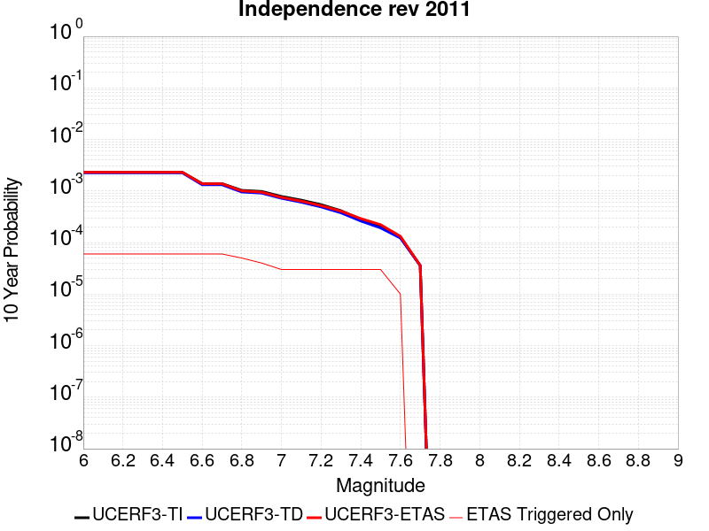 |

| Magnitude | 1 wk TI Prob | 1 wk TD Prob | 1 wk ETAS Prob | 1 wk ETAS/TD Gain | 1 wk ETAS Triggered Only | 1 mo TI Prob | 1 mo TD Prob | 1 mo ETAS Prob | 1 mo ETAS/TD Gain | 1 mo ETAS Triggered Only | 1 yr TI Prob | 1 yr TD Prob | 1 yr ETAS Prob | 1 yr ETAS/TD Gain | 1 yr ETAS Triggered Only | 10 yr TI Prob | 10 yr TD Prob | 10 yr ETAS Prob | 10 yr ETAS/TD Gain | 10 yr ETAS Triggered Only |
|-----|-----|-----|-----|-----|-----|-----|-----|-----|-----|-----|-----|-----|-----|-----|-----|-----|-----|-----|-----|-----|
| 6.0 | 4.422171E-6 | 4.326227E-6 | 4.326227E-6 | 1.0 | 0.0 | 1.8952025E-5 | 1.8540857E-5 | 1.07436E-4 | 5.7945538 | 8.889679E-5 | 2.3071647E-4 | 2.2571455E-4 | 3.1459128E-4 | 1.3937572 | 8.889679E-5 | 0.0023047708 | 0.0022551466 | 0.0023438428 | 1.0393306 | 8.889679E-5 |
| 6.1 | 4.422171E-6 | 4.326227E-6 | 4.326227E-6 | 1.0 | 0.0 | 1.8952025E-5 | 1.8540857E-5 | 1.07436E-4 | 5.7945538 | 8.889679E-5 | 2.3071647E-4 | 2.2571455E-4 | 3.1459128E-4 | 1.3937572 | 8.889679E-5 | 0.0023047708 | 0.0022551466 | 0.0023438428 | 1.0393306 | 8.889679E-5 |
| 6.2 | 4.422171E-6 | 4.326227E-6 | 4.326227E-6 | 1.0 | 0.0 | 1.8952025E-5 | 1.8540857E-5 | 1.07436E-4 | 5.7945538 | 8.889679E-5 | 2.3071647E-4 | 2.2571455E-4 | 3.1459128E-4 | 1.3937572 | 8.889679E-5 | 0.0023047708 | 0.0022551466 | 0.0023438428 | 1.0393306 | 8.889679E-5 |
| 6.3 | 4.422171E-6 | 4.326227E-6 | 4.326227E-6 | 1.0 | 0.0 | 1.8952025E-5 | 1.8540857E-5 | 1.07436E-4 | 5.7945538 | 8.889679E-5 | 2.3071647E-4 | 2.2571455E-4 | 3.1459128E-4 | 1.3937572 | 8.889679E-5 | 0.0023047708 | 0.0022551466 | 0.0023438428 | 1.0393306 | 8.889679E-5 |
| 6.4 | 4.422171E-6 | 4.326227E-6 | 4.326227E-6 | 1.0 | 0.0 | 1.8952025E-5 | 1.8540857E-5 | 1.07436E-4 | 5.7945538 | 8.889679E-5 | 2.3071647E-4 | 2.2571455E-4 | 3.1459128E-4 | 1.3937572 | 8.889679E-5 | 0.0023047708 | 0.0022551466 | 0.0023438428 | 1.0393306 | 8.889679E-5 |
| 6.5 | 4.422171E-6 | 4.326227E-6 | 4.326227E-6 | 1.0 | 0.0 | 1.8952025E-5 | 1.8540857E-5 | 1.07436E-4 | 5.7945538 | 8.889679E-5 | 2.3071647E-4 | 2.2571455E-4 | 3.1459128E-4 | 1.3937572 | 8.889679E-5 | 0.0023047708 | 0.0022551466 | 0.0023438428 | 1.0393306 | 8.889679E-5 |
| 6.6 | 2.663744E-6 | 2.5319862E-6 | 2.5319862E-6 | 1.0 | 0.0 | 1.1415996E-5 | 1.0851327E-5 | 9.974715E-5 | 9.192162 | 8.889679E-5 | 1.3898089E-4 | 1.3210738E-4 | 2.2099243E-4 | 1.6728243 | 8.889679E-5 | 0.0013889399 | 0.0013203367 | 0.0014091162 | 1.06724 | 8.889679E-5 |
| 6.7 | 2.663744E-6 | 2.5319862E-6 | 2.5319862E-6 | 1.0 | 0.0 | 1.1415996E-5 | 1.0851327E-5 | 9.974715E-5 | 9.192162 | 8.889679E-5 | 1.3898089E-4 | 1.3210738E-4 | 2.2099243E-4 | 1.6728243 | 8.889679E-5 | 0.0013889399 | 0.0013203367 | 0.0014091162 | 1.06724 | 8.889679E-5 |
| 6.8 | 1.9716529E-6 | 1.8322585E-6 | 1.8322585E-6 | 1.0 | 0.0 | 8.449913E-6 | 7.852514E-6 | 9.6748605E-5 | 12.320719 | 8.889679E-5 | 1.0287284E-4 | 9.5600284E-5 | 1.8448857E-4 | 1.9297911 | 8.889679E-5 | 0.0010282523 | 9.556045E-4 | 0.0010444163 | 1.0929378 | 8.889679E-5 |
| 6.9 | 1.8788617E-6 | 1.7429993E-6 | 1.7429993E-6 | 1.0 | 0.0 | 8.0522395E-6 | 7.4699765E-6 | 9.63661E-5 | 12.900456 | 8.889679E-5 | 9.80316E-5 | 9.0943286E-5 | 1.79832E-4 | 1.977408 | 8.889679E-5 | 9.798837E-4 | 9.0907275E-4 | 9.978887E-4 | 1.0976995 | 8.889679E-5 |
| 7.0 | 1.5045488E-6 | 1.3849503E-6 | 1.3849503E-6 | 1.0 | 0.0 | 6.44805E-6 | 5.9354884E-6 | 9.4831754E-5 | 15.977077 | 8.889679E-5 | 7.8502184E-5 | 7.226223E-5 | 1.611526E-4 | 2.2301083 | 8.889679E-5 | 7.8474457E-4 | 7.2239246E-4 | 8.1122504E-4 | 1.12297 | 8.889679E-5 |
| 7.1 | 1.272341E-6 | 1.1625096E-6 | 1.1625096E-6 | 1.0 | 0.0 | 5.4528787E-6 | 4.982175E-6 | 9.387852E-5 | 18.842878 | 8.889679E-5 | 6.6386776E-5 | 6.0656326E-5 | 1.4954772E-4 | 2.4654927 | 8.889679E-5 | 6.636695E-4 | 6.064009E-4 | 6.9524377E-4 | 1.1465085 | 8.889679E-5 |
| 7.2 | 1.0416892E-6 | 9.4098806E-7 | 9.4098806E-7 | 1.0 | 0.0 | 4.464375E-6 | 4.0328E-6 | 9.292923E-5 | 23.043354 | 8.889679E-5 | 5.4352407E-5 | 4.909825E-5 | 1.3799068E-4 | 2.8105009 | 8.889679E-5 | 5.4339116E-4 | 4.9087586E-4 | 5.7972904E-4 | 1.1810094 | 8.889679E-5 |
| 7.3 | 7.9450155E-7 | 7.235002E-7 | 7.235002E-7 | 1.0 | 0.0 | 3.4050022E-6 | 3.1007114E-6 | 9.199723E-5 | 29.669716 | 8.889679E-5 | 4.1455114E-5 | 3.775052E-5 | 1.2664395E-4 | 3.3547606 | 8.889679E-5 | 4.144738E-4 | 3.7744216E-4 | 4.663054E-4 | 1.2354354 | 8.889679E-5 |
| 7.4 | 5.3893444E-7 | 5.019512E-7 | 5.019512E-7 | 1.0 | 0.0 | 2.309717E-6 | 2.1512178E-6 | 9.104782E-5 | 42.32385 | 8.889679E-5 | 2.8120441E-5 | 2.6190766E-5 | 1.15085226E-4 | 4.3941145 | 8.889679E-5 | 2.8116882E-4 | 2.6187726E-4 | 3.5075075E-4 | 1.3393708 | 8.889679E-5 |
| 7.5 | 3.8852085E-7 | 3.682554E-7 | 3.682554E-7 | 1.0 | 0.0 | 1.6650882E-6 | 1.5782365E-6 | 9.047489E-5 | 57.326572 | 8.889679E-5 | 2.027226E-5 | 1.9214862E-5 | 1.0810995E-4 | 5.6263714 | 8.889679E-5 | 2.0270412E-4 | 1.9213221E-4 | 2.8101192E-4 | 1.4625967 | 8.889679E-5 |
| 7.6 | 2.414929E-7 | 2.345755E-7 | 2.345755E-7 | 1.0 | 0.0 | 1.0349692E-6 | 1.0053232E-6 | 1.0053232E-6 | 1.0 | 0.0 | 1.2600677E-5 | 1.2239742E-5 | 1.2239742E-5 | 1.0 | 0.0 | 1.2599962E-4 | 1.223908E-4 | 1.223908E-4 | 1.0 | 0.0 |
| 7.7 | 6.8298014E-8 | 6.85897E-8 | 6.85897E-8 | 1.0 | 0.0 | 2.9270575E-7 | 2.9395582E-7 | 2.9395582E-7 | 1.0 | 0.0 | 3.5636867E-6 | 3.5789067E-6 | 3.5789067E-6 | 1.0 | 0.0 | 3.5636294E-5 | 3.5788536E-5 | 3.5788536E-5 | 1.0 | 0.0 |

## Baker
*[(top)](#table-of-contents)*

| 1 Week | 1 Month | 1 Year | 10 Year |
|-----|-----|-----|-----|
|  | 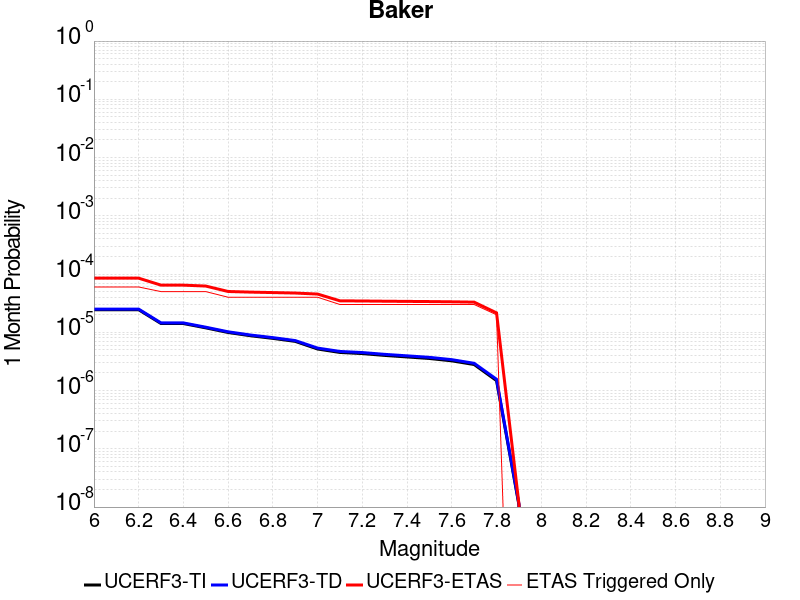 |  |  |

| Magnitude | 1 wk TI Prob | 1 wk TD Prob | 1 wk ETAS Prob | 1 wk ETAS/TD Gain | 1 wk ETAS Triggered Only | 1 mo TI Prob | 1 mo TD Prob | 1 mo ETAS Prob | 1 mo ETAS/TD Gain | 1 mo ETAS Triggered Only | 1 yr TI Prob | 1 yr TD Prob | 1 yr ETAS Prob | 1 yr ETAS/TD Gain | 1 yr ETAS Triggered Only | 10 yr TI Prob | 10 yr TD Prob | 10 yr ETAS Prob | 10 yr ETAS/TD Gain | 10 yr ETAS Triggered Only |
|-----|-----|-----|-----|-----|-----|-----|-----|-----|-----|-----|-----|-----|-----|-----|-----|-----|-----|-----|-----|-----|
| 6.0 | 5.695525E-6 | 5.8348373E-6 | 5.8348373E-6 | 1.0 | 0.0 | 2.4409164E-5 | 2.5006228E-5 | 1.13900795E-4 | 4.5548973 | 8.889679E-5 | 2.9714106E-4 | 3.044123E-4 | 3.9328204E-4 | 1.2919387 | 8.889679E-5 | 0.0029674405 | 0.0030403486 | 0.0031289752 | 1.0291501 | 8.889679E-5 |
| 6.1 | 5.695525E-6 | 5.8348373E-6 | 5.8348373E-6 | 1.0 | 0.0 | 2.4409164E-5 | 2.5006228E-5 | 1.13900795E-4 | 4.5548973 | 8.889679E-5 | 2.9714106E-4 | 3.044123E-4 | 3.9328204E-4 | 1.2919387 | 8.889679E-5 | 0.0029674405 | 0.0030403486 | 0.0031289752 | 1.0291501 | 8.889679E-5 |
| 6.2 | 5.695525E-6 | 5.8348373E-6 | 5.8348373E-6 | 1.0 | 0.0 | 2.4409164E-5 | 2.5006228E-5 | 1.13900795E-4 | 4.5548973 | 8.889679E-5 | 2.9714106E-4 | 3.044123E-4 | 3.9328204E-4 | 1.2919387 | 8.889679E-5 | 0.0029674405 | 0.0030403486 | 0.0031289752 | 1.0291501 | 8.889679E-5 |
| 6.3 | 3.2995713E-6 | 3.383667E-6 | 3.383667E-6 | 1.0 | 0.0 | 1.4140943E-5 | 1.4501353E-5 | 1.0339685E-4 | 7.1301527 | 8.889679E-5 | 1.7215237E-4 | 1.7654014E-4 | 2.6542123E-4 | 1.5034611 | 8.889679E-5 | 0.0017201907 | 0.001764046 | 0.0018527859 | 1.0503048 | 8.889679E-5 |
| 6.4 | 3.2995713E-6 | 3.383667E-6 | 3.383667E-6 | 1.0 | 0.0 | 1.4140943E-5 | 1.4501353E-5 | 1.0339685E-4 | 7.1301527 | 8.889679E-5 | 1.7215237E-4 | 1.7654014E-4 | 2.6542123E-4 | 1.5034611 | 8.889679E-5 | 0.0017201907 | 0.001764046 | 0.0018527859 | 1.0503048 | 8.889679E-5 |
| 6.5 | 2.782202E-6 | 2.8558404E-6 | 2.8558404E-6 | 1.0 | 0.0 | 1.1923668E-5 | 1.223926E-5 | 1.0113497E-4 | 8.26316 | 8.889679E-5 | 1.4516099E-4 | 1.4900314E-4 | 2.3788668E-4 | 1.5965213 | 8.889679E-5 | 0.001450662 | 0.0014890651 | 0.0015778295 | 1.0596108 | 8.889679E-5 |
| 6.6 | 2.3163404E-6 | 2.38092E-6 | 2.38092E-6 | 1.0 | 0.0 | 9.927136E-6 | 1.0203904E-5 | 9.909979E-5 | 9.711948 | 8.889679E-5 | 1.20856166E-4 | 1.2422565E-4 | 2.131114E-4 | 1.7155185 | 8.889679E-5 | 0.0012079047 | 0.0012415823 | 0.0013303687 | 1.0715107 | 8.889679E-5 |
| 6.7 | 2.037056E-6 | 2.0965003E-6 | 2.0965003E-6 | 1.0 | 0.0 | 8.7302105E-6 | 8.984972E-6 | 9.788096E-5 | 10.893853 | 8.889679E-5 | 1.0628513E-4 | 1.093867E-4 | 1.9827377E-4 | 1.8125948 | 8.889679E-5 | 0.0010623431 | 0.0010933448 | 0.0011821444 | 1.0812182 | 8.889679E-5 |
| 6.8 | 1.8356744E-6 | 1.8915287E-6 | 1.8915287E-6 | 1.0 | 0.0 | 7.867153E-6 | 8.106527E-6 | 9.7002594E-5 | 11.965987 | 8.889679E-5 | 9.577837E-5 | 9.869264E-5 | 1.8758065E-4 | 1.900655 | 8.889679E-5 | 9.57371E-4 | 9.86502E-4 | 0.0010753111 | 1.0900242 | 8.889679E-5 |
| 6.9 | 1.6310546E-6 | 1.6832072E-6 | 1.6832072E-6 | 1.0 | 0.0 | 6.9902153E-6 | 7.213726E-6 | 9.610988E-5 | 13.323195 | 8.889679E-5 | 8.510255E-5 | 8.782368E-5 | 1.7671267E-4 | 2.01213 | 8.889679E-5 | 8.5069967E-4 | 8.7790104E-4 | 9.667198E-4 | 1.1011717 | 8.889679E-5 |
| 7.0 | 1.2058036E-6 | 1.2508665E-6 | 1.2508665E-6 | 1.0 | 0.0 | 5.1677193E-6 | 5.3608455E-6 | 9.425716E-5 | 17.582518 | 8.889679E-5 | 6.291517E-5 | 6.5266366E-5 | 1.5415736E-4 | 2.3619723 | 8.889679E-5 | 6.289736E-4 | 6.524743E-4 | 7.413131E-4 | 1.1361568 | 8.889679E-5 |
| 7.1 | 1.052382E-6 | 1.0951609E-6 | 1.0951609E-6 | 1.0 | 0.0 | 4.5102006E-6 | 4.693538E-6 | 9.3589915E-5 | 19.940163 | 8.889679E-5 | 5.491031E-5 | 5.7142337E-5 | 1.4603404E-4 | 2.555619 | 8.889679E-5 | 5.4896745E-4 | 5.7127734E-4 | 6.601233E-4 | 1.1555216 | 8.889679E-5 |
| 7.2 | 1.0067454E-6 | 1.0487711E-6 | 1.0487711E-6 | 1.0 | 0.0 | 4.3146156E-6 | 4.4947255E-6 | 9.3391114E-5 | 20.777935 | 8.889679E-5 | 5.252918E-5 | 5.4721917E-5 | 1.4361384E-4 | 2.6244302 | 8.889679E-5 | 5.251676E-4 | 5.470853E-4 | 6.359334E-4 | 1.1624027 | 8.889679E-5 |
| 7.3 | 9.3596316E-7 | 9.767723E-7 | 9.767723E-7 | 1.0 | 0.0 | 4.0112645E-6 | 4.1861604E-6 | 9.308258E-5 | 22.235788 | 8.889679E-5 | 4.8836053E-5 | 5.096532E-5 | 1.3985758E-4 | 2.7441716 | 8.889679E-5 | 4.8825322E-4 | 5.095371E-4 | 5.983886E-4 | 1.1743768 | 8.889679E-5 |
| 7.4 | 8.8117395E-7 | 9.2076635E-7 | 9.2076635E-7 | 1.0 | 0.0 | 3.7764542E-6 | 3.9461356E-6 | 9.284257E-5 | 23.527468 | 8.889679E-5 | 4.5977362E-5 | 4.8043148E-5 | 1.3693566E-4 | 2.8502643 | 8.889679E-5 | 4.596785E-4 | 4.8032837E-4 | 5.6918245E-4 | 1.1849861 | 8.889679E-5 |
| 7.5 | 8.292386E-7 | 8.6745956E-7 | 8.6745956E-7 | 1.0 | 0.0 | 3.5538749E-6 | 3.7176785E-6 | 9.261414E-5 | 24.91182 | 8.889679E-5 | 4.326757E-5 | 4.5261804E-5 | 1.3415457E-4 | 2.9639688 | 8.889679E-5 | 4.3259145E-4 | 4.5252658E-4 | 5.4138317E-4 | 1.1963565 | 8.889679E-5 |
| 7.6 | 7.553842E-7 | 7.9144706E-7 | 7.9144706E-7 | 1.0 | 0.0 | 3.2373566E-6 | 3.3919116E-6 | 9.22884E-5 | 27.208374 | 8.889679E-5 | 3.9414106E-5 | 4.129575E-5 | 1.3018887E-4 | 3.1525974 | 8.889679E-5 | 3.9407116E-4 | 4.1288146E-4 | 5.0174154E-4 | 1.2152194 | 8.889679E-5 |
| 7.7 | 6.5285366E-7 | 6.852797E-7 | 6.852797E-7 | 1.0 | 0.0 | 2.797941E-6 | 2.9369096E-6 | 9.183344E-5 | 31.268732 | 8.889679E-5 | 3.40644E-5 | 3.5756293E-5 | 1.246499E-4 | 3.4860969 | 8.889679E-5 | 3.405918E-4 | 3.5750607E-4 | 4.463711E-4 | 1.2485693 | 8.889679E-5 |
| 7.8 | 3.4586725E-7 | 3.6482615E-7 | 3.6482615E-7 | 1.0 | 0.0 | 1.4822873E-6 | 1.5635396E-6 | 9.046019E-5 | 57.856026 | 8.889679E-5 | 1.80467E-5 | 1.9035933E-5 | 1.0793103E-4 | 5.6698575 | 8.889679E-5 | 1.8045233E-4 | 1.9034347E-4 | 2.7922334E-4 | 1.4669447 | 8.889679E-5 |
| 7.9 | 2.5591178E-9 | 2.6696718E-9 | 2.6696718E-9 | 1.0 | 0.0 | 1.0967647E-8 | 1.14414505E-8 | 1.14414505E-8 | 1.0 | 0.0 | 1.335311E-7 | 1.3929966E-7 | 1.3929966E-7 | 1.0 | 0.0 | 1.3353102E-6 | 1.3929966E-6 | 1.3929966E-6 | 1.0 | 0.0 |

## Santa Ynez (West)
*[(top)](#table-of-contents)*

| 1 Week | 1 Month | 1 Year | 10 Year |
|-----|-----|-----|-----|
|  |  |  |  |

| Magnitude | 1 wk TI Prob | 1 wk TD Prob | 1 wk ETAS Prob | 1 wk ETAS/TD Gain | 1 wk ETAS Triggered Only | 1 mo TI Prob | 1 mo TD Prob | 1 mo ETAS Prob | 1 mo ETAS/TD Gain | 1 mo ETAS Triggered Only | 1 yr TI Prob | 1 yr TD Prob | 1 yr ETAS Prob | 1 yr ETAS/TD Gain | 1 yr ETAS Triggered Only | 10 yr TI Prob | 10 yr TD Prob | 10 yr ETAS Prob | 10 yr ETAS/TD Gain | 10 yr ETAS Triggered Only |
|-----|-----|-----|-----|-----|-----|-----|-----|-----|-----|-----|-----|-----|-----|-----|-----|-----|-----|-----|-----|-----|
| 6.0 | 4.7352758E-5 | 5.4972126E-5 | 5.4972126E-5 | 1.0 | 0.0 | 2.0292461E-4 | 2.3557522E-4 | 2.3557522E-4 | 1.0 | 0.0 | 0.0024678076 | 0.0028645284 | 0.0029531706 | 1.0309447 | 8.889679E-5 | 0.024405818 | 0.028304417 | 0.028390799 | 1.0030519 | 8.889679E-5 |
| 6.1 | 4.7352758E-5 | 5.4972126E-5 | 5.4972126E-5 | 1.0 | 0.0 | 2.0292461E-4 | 2.3557522E-4 | 2.3557522E-4 | 1.0 | 0.0 | 0.0024678076 | 0.0028645284 | 0.0029531706 | 1.0309447 | 8.889679E-5 | 0.024405818 | 0.028304417 | 0.028390799 | 1.0030519 | 8.889679E-5 |
| 6.2 | 3.0415853E-5 | 3.392511E-5 | 3.392511E-5 | 1.0 | 0.0 | 1.3034715E-4 | 1.4538545E-4 | 1.4538545E-4 | 1.0 | 0.0 | 0.0015858212 | 0.0017686661 | 0.0018574056 | 1.0501732 | 8.889679E-5 | 0.015745522 | 0.017549807 | 0.017637143 | 1.0049765 | 8.889679E-5 |
| 6.3 | 3.0415853E-5 | 3.392511E-5 | 3.392511E-5 | 1.0 | 0.0 | 1.3034715E-4 | 1.4538545E-4 | 1.4538545E-4 | 1.0 | 0.0 | 0.0015858212 | 0.0017686661 | 0.0018574056 | 1.0501732 | 8.889679E-5 | 0.015745522 | 0.017549807 | 0.017637143 | 1.0049765 | 8.889679E-5 |
| 6.4 | 2.5452082E-5 | 2.7912422E-5 | 2.7912422E-5 | 1.0 | 0.0 | 1.09075794E-4 | 1.196193E-4 | 1.196193E-4 | 1.0 | 0.0 | 0.0013271887 | 0.0014554089 | 0.0014554089 | 1.0 | 0.0 | 0.013192902 | 0.014460951 | 0.014460951 | 1.0 | 0.0 |
| 6.5 | 2.3143784E-5 | 2.5128256E-5 | 2.5128256E-5 | 1.0 | 0.0 | 9.9183875E-5 | 1.0768817E-4 | 1.0768817E-4 | 1.0 | 0.0 | 0.0012068948 | 0.0013103267 | 0.0013103267 | 1.0 | 0.0 | 0.012003611 | 0.01302768 | 0.01302768 | 1.0 | 0.0 |
| 6.6 | 1.9118515E-5 | 2.035434E-5 | 2.035434E-5 | 1.0 | 0.0 | 8.193392E-5 | 8.7230015E-5 | 8.7230015E-5 | 1.0 | 0.0 | 9.97089E-4 | 0.001061516 | 0.001061516 | 1.0 | 0.0 | 0.00992627 | 0.010565365 | 0.010565365 | 1.0 | 0.0 |
| 6.7 | 1.722807E-5 | 1.8146347E-5 | 1.8146347E-5 | 1.0 | 0.0 | 7.3832496E-5 | 7.776777E-5 | 7.776777E-5 | 1.0 | 0.0 | 8.985399E-4 | 9.464169E-4 | 9.464169E-4 | 1.0 | 0.0 | 0.008949154 | 0.0094245095 | 0.0094245095 | 1.0 | 0.0 |
| 6.8 | 1.5317364E-5 | 1.5926486E-5 | 1.5926486E-5 | 1.0 | 0.0 | 6.56442E-5 | 6.82546E-5 | 6.82546E-5 | 1.0 | 0.0 | 7.98925E-4 | 8.306873E-4 | 8.306873E-4 | 1.0 | 0.0 | 0.007960589 | 0.00827631 | 0.00827631 | 1.0 | 0.0 |
| 6.9 | 1.3071226E-5 | 1.3329624E-5 | 1.3329624E-5 | 1.0 | 0.0 | 5.6018336E-5 | 5.7125722E-5 | 5.7125722E-5 | 1.0 | 0.0 | 6.8180985E-4 | 6.9528597E-4 | 6.9528597E-4 | 1.0 | 0.0 | 0.0067972173 | 0.006931367 | 0.006931367 | 1.0 | 0.0 |
| 7.0 | 1.1836986E-5 | 1.19327815E-5 | 1.19327815E-5 | 1.0 | 0.0 | 5.0728955E-5 | 5.11395E-5 | 5.11395E-5 | 1.0 | 0.0 | 6.1745E-4 | 6.2244723E-4 | 6.2244723E-4 | 1.0 | 0.0 | 0.006157372 | 0.006207231 | 0.006207231 | 1.0 | 0.0 |
| 7.1 | 1.0597169E-5 | 1.0542201E-5 | 1.0542201E-5 | 1.0 | 0.0 | 4.541565E-5 | 4.5180084E-5 | 4.5180084E-5 | 1.0 | 0.0 | 5.5279525E-4 | 5.4992986E-4 | 5.4992986E-4 | 1.0 | 0.0 | 0.0055142213 | 0.005485821 | 0.005485821 | 1.0 | 0.0 |
| 7.2 | 9.59113E-6 | 9.459144E-6 | 9.459144E-6 | 1.0 | 0.0 | 4.11042E-5 | 4.0538565E-5 | 4.0538565E-5 | 1.0 | 0.0 | 5.0032866E-4 | 4.934463E-4 | 4.934463E-4 | 1.0 | 0.0 | 0.004992037 | 0.0049236254 | 0.0049236254 | 1.0 | 0.0 |
| 7.3 | 8.586084E-6 | 8.379583E-6 | 8.379583E-6 | 1.0 | 0.0 | 3.679698E-5 | 3.5912013E-5 | 3.5912013E-5 | 1.0 | 0.0 | 4.4791115E-4 | 4.3714207E-4 | 4.3714207E-4 | 1.0 | 0.0 | 0.004470094 | 0.004362933 | 0.004362933 | 1.0 | 0.0 |
| 7.4 | 7.2622997E-6 | 6.9515427E-6 | 6.9515427E-6 | 1.0 | 0.0 | 3.112377E-5 | 2.979199E-5 | 2.979199E-5 | 1.0 | 0.0 | 3.78866E-4 | 3.626581E-4 | 3.626581E-4 | 1.0 | 0.0 | 0.0037822074 | 0.0036207628 | 0.0036207628 | 1.0 | 0.0 |
| 7.5 | 5.627296E-6 | 5.251588E-6 | 5.251588E-6 | 1.0 | 0.0 | 2.411676E-5 | 2.2506614E-5 | 2.2506614E-5 | 1.0 | 0.0 | 2.9358198E-4 | 2.739843E-4 | 2.739843E-4 | 1.0 | 0.0 | 0.0029319443 | 0.002736537 | 0.002736537 | 1.0 | 0.0 |
| 7.6 | 2.265244E-6 | 2.0608625E-6 | 2.0608625E-6 | 1.0 | 0.0 | 9.708152E-6 | 8.832238E-6 | 8.832238E-6 | 1.0 | 0.0 | 1.18190335E-4 | 1.0752728E-4 | 1.0752728E-4 | 1.0 | 0.0 | 0.001181275 | 0.0010747612 | 0.0010747612 | 1.0 | 0.0 |
| 7.7 | 1.3099874E-6 | 1.1016252E-6 | 1.1016252E-6 | 1.0 | 0.0 | 5.61422E-6 | 4.7212425E-6 | 4.7212425E-6 | 1.0 | 0.0 | 6.8350986E-5 | 5.7479636E-5 | 5.7479636E-5 | 1.0 | 0.0 | 6.832996E-4 | 5.7465007E-4 | 5.7465007E-4 | 1.0 | 0.0 |
| 7.8 | 7.903951E-7 | 6.0711415E-7 | 6.0711415E-7 | 1.0 | 0.0 | 3.3874032E-6 | 2.6019152E-6 | 2.6019152E-6 | 1.0 | 0.0 | 4.1240855E-5 | 3.167787E-5 | 3.167787E-5 | 1.0 | 0.0 | 4.12332E-4 | 3.167349E-4 | 3.167349E-4 | 1.0 | 0.0 |
| 7.9 | 7.0753297E-9 | 5.0899476E-9 | 5.0899476E-9 | 1.0 | 0.0 | 3.032284E-8 | 2.181406E-8 | 2.181406E-8 | 1.0 | 0.0 | 3.6918053E-7 | 2.6558615E-7 | 2.6558615E-7 | 1.0 | 0.0 | 3.691799E-6 | 2.6558594E-6 | 2.6558594E-6 | 1.0 | 0.0 |

## Anaheim
*[(top)](#table-of-contents)*

| 1 Week | 1 Month | 1 Year | 10 Year |
|-----|-----|-----|-----|
|  |  | 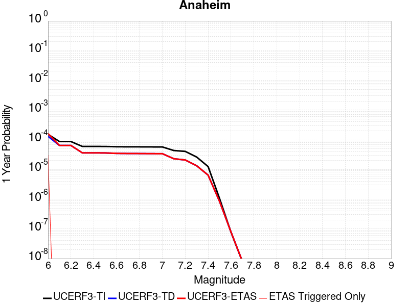 |  |

| Magnitude | 1 wk TI Prob | 1 wk TD Prob | 1 wk ETAS Prob | 1 wk ETAS/TD Gain | 1 wk ETAS Triggered Only | 1 mo TI Prob | 1 mo TD Prob | 1 mo ETAS Prob | 1 mo ETAS/TD Gain | 1 mo ETAS Triggered Only | 1 yr TI Prob | 1 yr TD Prob | 1 yr ETAS Prob | 1 yr ETAS/TD Gain | 1 yr ETAS Triggered Only | 10 yr TI Prob | 10 yr TD Prob | 10 yr ETAS Prob | 10 yr ETAS/TD Gain | 10 yr ETAS Triggered Only |
|-----|-----|-----|-----|-----|-----|-----|-----|-----|-----|-----|-----|-----|-----|-----|-----|-----|-----|-----|-----|-----|
| 6.0 | 2.9254998E-6 | 2.5122863E-6 | 2.5122863E-6 | 1.0 | 0.0 | 1.25377965E-5 | 1.0766909E-5 | 1.0766909E-5 | 1.0 | 0.0 | 1.5263697E-4 | 1.3108159E-4 | 2.1996672E-4 | 1.6780902 | 8.889679E-5 | 0.0015253217 | 0.0013102728 | 0.0013990531 | 1.0677571 | 8.889679E-5 |
| 6.1 | 1.6729715E-6 | 1.2337348E-6 | 1.2337348E-6 | 1.0 | 0.0 | 7.1698582E-6 | 5.287426E-6 | 5.287426E-6 | 1.0 | 0.0 | 8.7289525E-5 | 6.437293E-5 | 6.437293E-5 | 1.0 | 0.0 | 8.7255245E-4 | 6.435838E-4 | 6.435838E-4 | 1.0 | 0.0 |
| 6.2 | 1.6729715E-6 | 1.2337348E-6 | 1.2337348E-6 | 1.0 | 0.0 | 7.1698582E-6 | 5.287426E-6 | 5.287426E-6 | 1.0 | 0.0 | 8.7289525E-5 | 6.437293E-5 | 6.437293E-5 | 1.0 | 0.0 | 8.7255245E-4 | 6.435838E-4 | 6.435838E-4 | 1.0 | 0.0 |
| 6.3 | 1.1444064E-6 | 6.9596666E-7 | 6.9596666E-7 | 1.0 | 0.0 | 4.9045893E-6 | 2.9827113E-6 | 2.9827113E-6 | 1.0 | 0.0 | 5.971174E-5 | 3.631396E-5 | 3.631396E-5 | 1.0 | 0.0 | 5.96957E-4 | 3.6308577E-4 | 3.6308577E-4 | 1.0 | 0.0 |
| 6.4 | 1.1444064E-6 | 6.9596666E-7 | 6.9596666E-7 | 1.0 | 0.0 | 4.9045893E-6 | 2.9827113E-6 | 2.9827113E-6 | 1.0 | 0.0 | 5.971174E-5 | 3.631396E-5 | 3.631396E-5 | 1.0 | 0.0 | 5.96957E-4 | 3.6308577E-4 | 3.6308577E-4 | 1.0 | 0.0 |
| 6.5 | 1.1385318E-6 | 6.9003505E-7 | 6.9003505E-7 | 1.0 | 0.0 | 4.879413E-6 | 2.95729E-6 | 2.95729E-6 | 1.0 | 0.0 | 5.9405233E-5 | 3.6004465E-5 | 3.6004465E-5 | 1.0 | 0.0 | 5.938936E-4 | 3.5999183E-4 | 3.5999183E-4 | 1.0 | 0.0 |
| 6.6 | 1.1165511E-6 | 6.678222E-7 | 6.678222E-7 | 1.0 | 0.0 | 4.78521E-6 | 2.862092E-6 | 2.862092E-6 | 1.0 | 0.0 | 5.8258374E-5 | 3.484547E-5 | 3.484547E-5 | 1.0 | 0.0 | 5.8243104E-4 | 3.484055E-4 | 3.484055E-4 | 1.0 | 0.0 |
| 6.7 | 1.1098243E-6 | 6.610416E-7 | 6.610416E-7 | 1.0 | 0.0 | 4.7563813E-6 | 2.8330326E-6 | 2.8330326E-6 | 1.0 | 0.0 | 5.7907404E-5 | 3.449168E-5 | 3.449168E-5 | 1.0 | 0.0 | 5.7892315E-4 | 3.4486872E-4 | 3.4486872E-4 | 1.0 | 0.0 |
| 6.8 | 1.1077587E-6 | 6.589619E-7 | 6.589619E-7 | 1.0 | 0.0 | 4.7475287E-6 | 2.8241195E-6 | 2.8241195E-6 | 1.0 | 0.0 | 5.779963E-5 | 3.438317E-5 | 3.438317E-5 | 1.0 | 0.0 | 5.77846E-4 | 3.4378393E-4 | 3.4378393E-4 | 1.0 | 0.0 |
| 6.9 | 1.1024468E-6 | 6.5361957E-7 | 6.5361957E-7 | 1.0 | 0.0 | 4.7247636E-6 | 2.8012241E-6 | 2.8012241E-6 | 1.0 | 0.0 | 5.752248E-5 | 3.4104425E-5 | 3.4104425E-5 | 1.0 | 0.0 | 5.750759E-4 | 3.4099736E-4 | 3.4099736E-4 | 1.0 | 0.0 |
| 7.0 | 1.0993066E-6 | 6.510303E-7 | 6.510303E-7 | 1.0 | 0.0 | 4.7113053E-6 | 2.7901272E-6 | 2.7901272E-6 | 1.0 | 0.0 | 5.7358633E-5 | 3.3969325E-5 | 3.3969325E-5 | 1.0 | 0.0 | 5.734383E-4 | 3.3964674E-4 | 3.3964674E-4 | 1.0 | 0.0 |
| 7.1 | 8.334877E-7 | 4.4049145E-7 | 4.4049145E-7 | 1.0 | 0.0 | 3.5720855E-6 | 1.8878193E-6 | 1.8878193E-6 | 1.0 | 0.0 | 4.348927E-5 | 2.298398E-5 | 2.298398E-5 | 1.0 | 0.0 | 4.3480762E-4 | 2.2981827E-4 | 2.2981827E-4 | 1.0 | 0.0 |
| 7.2 | 7.794411E-7 | 3.997645E-7 | 3.997645E-7 | 1.0 | 0.0 | 3.3404576E-6 | 1.7132754E-6 | 1.7132754E-6 | 1.0 | 0.0 | 4.0669314E-5 | 2.0858948E-5 | 2.0858948E-5 | 1.0 | 0.0 | 4.066187E-4 | 2.0857195E-4 | 2.0857195E-4 | 1.0 | 0.0 |
| 7.3 | 5.01704E-7 | 2.5573388E-7 | 2.5573388E-7 | 1.0 | 0.0 | 2.150158E-6 | 1.0960019E-6 | 1.0960019E-6 | 1.0 | 0.0 | 2.617786E-5 | 1.3343754E-5 | 1.3343754E-5 | 1.0 | 0.0 | 2.6174777E-4 | 1.3343077E-4 | 1.3343077E-4 | 1.0 | 0.0 |
| 7.4 | 2.4008182E-7 | 1.2367859E-7 | 1.2367859E-7 | 1.0 | 0.0 | 1.0289217E-6 | 5.30051E-7 | 5.30051E-7 | 1.0 | 0.0 | 1.252705E-5 | 6.4533597E-6 | 6.4533597E-6 | 1.0 | 0.0 | 1.2526344E-4 | 6.453248E-5 | 6.453248E-5 | 1.0 | 0.0 |
| 7.5 | 2.0263876E-8 | 1.6120866E-8 | 1.6120866E-8 | 1.0 | 0.0 | 8.684518E-8 | 6.908943E-8 | 6.908943E-8 | 1.0 | 0.0 | 1.0573395E-6 | 8.4116357E-7 | 8.4116357E-7 | 1.0 | 0.0 | 1.0573345E-5 | 8.411613E-6 | 8.411613E-6 | 1.0 | 0.0 |
| 7.6 | 1.4871431E-9 | 1.508418E-9 | 1.508418E-9 | 1.0 | 0.0 | 6.37347E-9 | 6.4646484E-9 | 6.4646484E-9 | 1.0 | 0.0 | 7.7596994E-8 | 7.870709E-8 | 7.870709E-8 | 1.0 | 0.0 | 7.759697E-7 | 7.8707063E-7 | 7.8707063E-7 | 1.0 | 0.0 |
| 7.7 | 1.5093293E-10 | 1.5333512E-10 | 1.5333512E-10 | 1.0 | 0.0 | 6.4685546E-10 | 6.571509E-10 | 6.571509E-10 | 1.0 | 0.0 | 7.875465E-9 | 8.0008125E-9 | 8.0008125E-9 | 1.0 | 0.0 | 7.8754645E-8 | 8.000812E-8 | 8.000812E-8 | 1.0 | 0.0 |

## Los Alamos extension
*[(top)](#table-of-contents)*

| 1 Week | 1 Month | 1 Year | 10 Year |
|-----|-----|-----|-----|
| 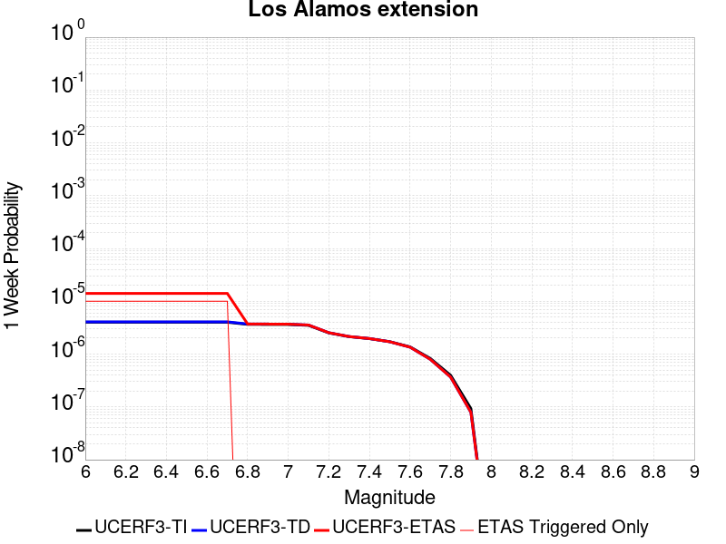 |  |  |  |

| Magnitude | 1 wk TI Prob | 1 wk TD Prob | 1 wk ETAS Prob | 1 wk ETAS/TD Gain | 1 wk ETAS Triggered Only | 1 mo TI Prob | 1 mo TD Prob | 1 mo ETAS Prob | 1 mo ETAS/TD Gain | 1 mo ETAS Triggered Only | 1 yr TI Prob | 1 yr TD Prob | 1 yr ETAS Prob | 1 yr ETAS/TD Gain | 1 yr ETAS Triggered Only | 10 yr TI Prob | 10 yr TD Prob | 10 yr ETAS Prob | 10 yr ETAS/TD Gain | 10 yr ETAS Triggered Only |
|-----|-----|-----|-----|-----|-----|-----|-----|-----|-----|-----|-----|-----|-----|-----|-----|-----|-----|-----|-----|-----|
| 6.0 | 4.0146506E-6 | 4.0861596E-6 | 4.0861596E-6 | 1.0 | 0.0 | 1.7205533E-5 | 1.7512002E-5 | 1.7512002E-5 | 1.0 | 0.0 | 2.0945723E-4 | 2.1318886E-4 | 2.1318886E-4 | 1.0 | 0.0 | 0.0020925992 | 0.0021299527 | 0.0022186602 | 1.0416477 | 8.889679E-5 |
| 6.1 | 4.0146506E-6 | 4.0861596E-6 | 4.0861596E-6 | 1.0 | 0.0 | 1.7205533E-5 | 1.7512002E-5 | 1.7512002E-5 | 1.0 | 0.0 | 2.0945723E-4 | 2.1318886E-4 | 2.1318886E-4 | 1.0 | 0.0 | 0.0020925992 | 0.0021299527 | 0.0022186602 | 1.0416477 | 8.889679E-5 |
| 6.2 | 4.0146506E-6 | 4.0861596E-6 | 4.0861596E-6 | 1.0 | 0.0 | 1.7205533E-5 | 1.7512002E-5 | 1.7512002E-5 | 1.0 | 0.0 | 2.0945723E-4 | 2.1318886E-4 | 2.1318886E-4 | 1.0 | 0.0 | 0.0020925992 | 0.0021299527 | 0.0022186602 | 1.0416477 | 8.889679E-5 |
| 6.3 | 4.0146506E-6 | 4.0861596E-6 | 4.0861596E-6 | 1.0 | 0.0 | 1.7205533E-5 | 1.7512002E-5 | 1.7512002E-5 | 1.0 | 0.0 | 2.0945723E-4 | 2.1318886E-4 | 2.1318886E-4 | 1.0 | 0.0 | 0.0020925992 | 0.0021299527 | 0.0022186602 | 1.0416477 | 8.889679E-5 |
| 6.4 | 4.0146506E-6 | 4.0861596E-6 | 4.0861596E-6 | 1.0 | 0.0 | 1.7205533E-5 | 1.7512002E-5 | 1.7512002E-5 | 1.0 | 0.0 | 2.0945723E-4 | 2.1318886E-4 | 2.1318886E-4 | 1.0 | 0.0 | 0.0020925992 | 0.0021299527 | 0.0022186602 | 1.0416477 | 8.889679E-5 |
| 6.5 | 4.0146506E-6 | 4.0861596E-6 | 4.0861596E-6 | 1.0 | 0.0 | 1.7205533E-5 | 1.7512002E-5 | 1.7512002E-5 | 1.0 | 0.0 | 2.0945723E-4 | 2.1318886E-4 | 2.1318886E-4 | 1.0 | 0.0 | 0.0020925992 | 0.0021299527 | 0.0022186602 | 1.0416477 | 8.889679E-5 |
| 6.6 | 4.0146506E-6 | 4.0861596E-6 | 4.0861596E-6 | 1.0 | 0.0 | 1.7205533E-5 | 1.7512002E-5 | 1.7512002E-5 | 1.0 | 0.0 | 2.0945723E-4 | 2.1318886E-4 | 2.1318886E-4 | 1.0 | 0.0 | 0.0020925992 | 0.0021299527 | 0.0022186602 | 1.0416477 | 8.889679E-5 |
| 6.7 | 4.0146506E-6 | 4.0861596E-6 | 4.0861596E-6 | 1.0 | 0.0 | 1.7205533E-5 | 1.7512002E-5 | 1.7512002E-5 | 1.0 | 0.0 | 2.0945723E-4 | 2.1318886E-4 | 2.1318886E-4 | 1.0 | 0.0 | 0.0020925992 | 0.0021299527 | 0.0022186602 | 1.0416477 | 8.889679E-5 |
| 6.8 | 3.6584688E-6 | 3.7188588E-6 | 3.7188588E-6 | 1.0 | 0.0 | 1.5679057E-5 | 1.5937874E-5 | 1.5937874E-5 | 1.0 | 0.0 | 1.9087581E-4 | 1.9402728E-4 | 1.9402728E-4 | 1.0 | 0.0 | 0.0019071194 | 0.0019386712 | 0.0020273956 | 1.0457656 | 8.889679E-5 |
| 6.9 | 3.644631E-6 | 3.7045688E-6 | 3.7045688E-6 | 1.0 | 0.0 | 1.5619753E-5 | 1.5876632E-5 | 1.5876632E-5 | 1.0 | 0.0 | 1.901539E-4 | 1.9328178E-4 | 1.9328178E-4 | 1.0 | 0.0 | 0.0018999127 | 0.0019312293 | 0.0020199544 | 1.0459423 | 8.889679E-5 |
| 7.0 | 3.6318522E-6 | 3.6913295E-6 | 3.6913295E-6 | 1.0 | 0.0 | 1.5564989E-5 | 1.5819893E-5 | 1.5819893E-5 | 1.0 | 0.0 | 1.8948725E-4 | 1.925911E-4 | 1.925911E-4 | 1.0 | 0.0 | 0.0018932576 | 0.0019243343 | 0.00201306 | 1.0461072 | 8.889679E-5 |
| 7.1 | 3.5001724E-6 | 3.5554E-6 | 3.5554E-6 | 1.0 | 0.0 | 1.5000653E-5 | 1.5237345E-5 | 1.5237345E-5 | 1.0 | 0.0 | 1.8261763E-4 | 1.854998E-4 | 1.854998E-4 | 1.0 | 0.0 | 0.0018246764 | 0.0018535402 | 0.0019422723 | 1.0478716 | 8.889679E-5 |
| 7.2 | 2.5204702E-6 | 2.5436943E-6 | 2.5436943E-6 | 1.0 | 0.0 | 1.080197E-5 | 1.0901502E-5 | 1.0901502E-5 | 1.0 | 0.0 | 1.3150605E-4 | 1.3271775E-4 | 1.3271775E-4 | 1.0 | 0.0 | 0.0013142825 | 0.0013263905 | 0.0013263905 | 1.0 | 0.0 |
| 7.3 | 2.1399692E-6 | 2.1501316E-6 | 2.1501316E-6 | 1.0 | 0.0 | 9.1712645E-6 | 9.2148175E-6 | 9.2148175E-6 | 1.0 | 0.0 | 1.1165442E-4 | 1.1218466E-4 | 1.1218466E-4 | 1.0 | 0.0 | 0.0011159834 | 0.0011212835 | 0.0011212835 | 1.0 | 0.0 |
| 7.4 | 1.9660122E-6 | 1.9702363E-6 | 1.9702363E-6 | 1.0 | 0.0 | 8.42574E-6 | 8.4438425E-6 | 8.4438425E-6 | 1.0 | 0.0 | 1.0257855E-4 | 1.0279897E-4 | 1.0279897E-4 | 1.0 | 0.0 | 0.0010253121 | 0.0010275173 | 0.0010275173 | 1.0 | 0.0 |
| 7.5 | 1.7204633E-6 | 1.7150983E-6 | 1.7150983E-6 | 1.0 | 0.0 | 7.373393E-6 | 7.3504007E-6 | 7.3504007E-6 | 1.0 | 0.0 | 8.976737E-5 | 8.948748E-5 | 8.948748E-5 | 1.0 | 0.0 | 8.9731114E-4 | 8.9451746E-4 | 8.9451746E-4 | 1.0 | 0.0 |
| 7.6 | 1.3717638E-6 | 1.3535827E-6 | 1.3535827E-6 | 1.0 | 0.0 | 5.878974E-6 | 5.8010555E-6 | 5.8010555E-6 | 1.0 | 0.0 | 7.157416E-5 | 7.062559E-5 | 7.062559E-5 | 1.0 | 0.0 | 7.1551115E-4 | 7.060341E-4 | 7.060341E-4 | 1.0 | 0.0 |
| 7.7 | 8.272564E-7 | 7.957636E-7 | 7.957636E-7 | 1.0 | 0.0 | 3.5453797E-6 | 3.410411E-6 | 3.410411E-6 | 1.0 | 0.0 | 4.3164142E-5 | 4.1520965E-5 | 4.1520965E-5 | 1.0 | 0.0 | 4.315576E-4 | 4.1513226E-4 | 4.1513226E-4 | 1.0 | 0.0 |
| 7.8 | 3.9708277E-7 | 3.6719027E-7 | 3.6719027E-7 | 1.0 | 0.0 | 1.7017821E-6 | 1.5736716E-6 | 1.5736716E-6 | 1.0 | 0.0 | 2.0719E-5 | 1.9159284E-5 | 1.9159284E-5 | 1.0 | 0.0 | 2.071707E-4 | 1.9157639E-4 | 1.9157639E-4 | 1.0 | 0.0 |
| 7.9 | 9.292528E-8 | 7.889087E-8 | 7.889087E-8 | 1.0 | 0.0 | 3.9825116E-7 | 3.381037E-7 | 3.381037E-7 | 1.0 | 0.0 | 4.848697E-6 | 4.116405E-6 | 4.116405E-6 | 1.0 | 0.0 | 4.8485912E-5 | 4.1163294E-5 | 4.1163294E-5 | 1.0 | 0.0 |
| 8.0 | 7.880441E-11 | 8.2353124E-11 | 8.2353124E-11 | 1.0 | 0.0 | 3.3773329E-10 | 3.52942E-10 | 3.52942E-10 | 1.0 | 0.0 | 4.1119033E-9 | 4.2970694E-9 | 4.2970694E-9 | 1.0 | 0.0 | 4.1119034E-8 | 4.2970694E-8 | 4.2970694E-8 | 1.0 | 0.0 |

## San Pedro Basin
*[(top)](#table-of-contents)*

| 1 Week | 1 Month | 1 Year | 10 Year |
|-----|-----|-----|-----|
|  |  |  | 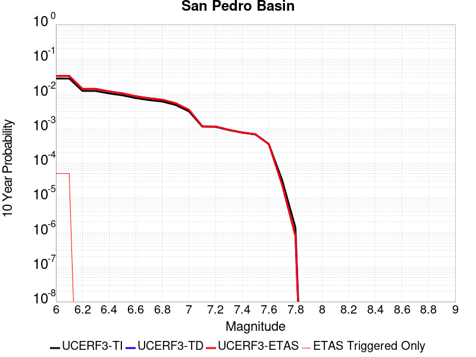 |

| Magnitude | 1 wk TI Prob | 1 wk TD Prob | 1 wk ETAS Prob | 1 wk ETAS/TD Gain | 1 wk ETAS Triggered Only | 1 mo TI Prob | 1 mo TD Prob | 1 mo ETAS Prob | 1 mo ETAS/TD Gain | 1 mo ETAS Triggered Only | 1 yr TI Prob | 1 yr TD Prob | 1 yr ETAS Prob | 1 yr ETAS/TD Gain | 1 yr ETAS Triggered Only | 10 yr TI Prob | 10 yr TD Prob | 10 yr ETAS Prob | 10 yr ETAS/TD Gain | 10 yr ETAS Triggered Only |
|-----|-----|-----|-----|-----|-----|-----|-----|-----|-----|-----|-----|-----|-----|-----|-----|-----|-----|-----|-----|-----|
| 6.0 | 5.3449043E-5 | 6.336954E-5 | 6.336954E-5 | 1.0 | 0.0 | 2.2904722E-4 | 2.715589E-4 | 2.715589E-4 | 1.0 | 0.0 | 0.0027850836 | 0.0033018254 | 0.0033018254 | 1.0 | 0.0 | 0.027504366 | 0.03258945 | 0.03267545 | 1.0026389 | 8.889679E-5 |
| 6.1 | 5.3449043E-5 | 6.336954E-5 | 6.336954E-5 | 1.0 | 0.0 | 2.2904722E-4 | 2.715589E-4 | 2.715589E-4 | 1.0 | 0.0 | 0.0027850836 | 0.0033018254 | 0.0033018254 | 1.0 | 0.0 | 0.027504366 | 0.03258945 | 0.03267545 | 1.0026389 | 8.889679E-5 |
| 6.2 | 2.3189454E-5 | 2.6642796E-5 | 2.6642796E-5 | 1.0 | 0.0 | 9.9379584E-5 | 1.14178685E-4 | 1.14178685E-4 | 1.0 | 0.0 | 0.0012092749 | 0.0013892864 | 0.0013892864 | 1.0 | 0.0 | 0.012027155 | 0.013810883 | 0.013810883 | 1.0 | 0.0 |
| 6.3 | 2.3189454E-5 | 2.6642796E-5 | 2.6642796E-5 | 1.0 | 0.0 | 9.9379584E-5 | 1.14178685E-4 | 1.14178685E-4 | 1.0 | 0.0 | 0.0012092749 | 0.0013892864 | 0.0013892864 | 1.0 | 0.0 | 0.012027155 | 0.013810883 | 0.013810883 | 1.0 | 0.0 |
| 6.4 | 1.966056E-5 | 2.2463413E-5 | 2.2463413E-5 | 1.0 | 0.0 | 8.425682E-5 | 9.626844E-5 | 9.626844E-5 | 1.0 | 0.0 | 0.001025344 | 0.0011714783 | 0.0011714783 | 1.0 | 0.0 | 0.010206259 | 0.011657117 | 0.011657117 | 1.0 | 0.0 |
| 6.5 | 1.7342953E-5 | 1.9745148E-5 | 1.9745148E-5 | 1.0 | 0.0 | 7.4324824E-5 | 8.4619525E-5 | 8.4619525E-5 | 1.0 | 0.0 | 9.04529E-4 | 0.0010297928 | 0.0010297928 | 1.0 | 0.0 | 0.009008561 | 0.010253931 | 0.010253931 | 1.0 | 0.0 |
| 6.6 | 1.439804E-5 | 1.6322716E-5 | 1.6322716E-5 | 1.0 | 0.0 | 6.170443E-5 | 6.99528E-5 | 6.99528E-5 | 1.0 | 0.0 | 7.509924E-4 | 8.513747E-4 | 8.513747E-4 | 1.0 | 0.0 | 0.0074845953 | 0.008484332 | 0.008484332 | 1.0 | 0.0 |
| 6.7 | 1.2634884E-5 | 1.4285297E-5 | 1.4285297E-5 | 1.0 | 0.0 | 5.414838E-5 | 6.1221435E-5 | 6.1221435E-5 | 1.0 | 0.0 | 6.590571E-4 | 7.4514654E-4 | 7.4514654E-4 | 1.0 | 0.0 | 0.006571059 | 0.007429501 | 0.007429501 | 1.0 | 0.0 |
| 6.8 | 1.146091E-5 | 1.2933192E-5 | 1.2933192E-5 | 1.0 | 0.0 | 4.911726E-5 | 5.5426954E-5 | 5.5426954E-5 | 1.0 | 0.0 | 5.9783855E-4 | 6.7464396E-4 | 6.7464396E-4 | 1.0 | 0.0 | 0.0059623276 | 0.006728899 | 0.006728899 | 1.0 | 0.0 |
| 6.9 | 9.109035E-6 | 1.0235011E-5 | 1.0235011E-5 | 1.0 | 0.0 | 3.9038136E-5 | 4.3863754E-5 | 4.3863754E-5 | 1.0 | 0.0 | 4.7518566E-4 | 5.3393835E-4 | 5.3393835E-4 | 1.0 | 0.0 | 0.0047417083 | 0.005329309 | 0.005329309 | 1.0 | 0.0 |
| 7.0 | 5.9351028E-6 | 6.583964E-6 | 6.583964E-6 | 1.0 | 0.0 | 2.5435906E-5 | 2.8216817E-5 | 2.8216817E-5 | 1.0 | 0.0 | 3.0963816E-4 | 3.435092E-4 | 3.435092E-4 | 1.0 | 0.0 | 0.0030920706 | 0.0034320992 | 0.0034320992 | 1.0 | 0.0 |
| 7.1 | 2.1557585E-6 | 2.209648E-6 | 2.209648E-6 | 1.0 | 0.0 | 9.238933E-6 | 9.469887E-6 | 9.469887E-6 | 1.0 | 0.0 | 1.1247819E-4 | 1.1528993E-4 | 1.1528993E-4 | 1.0 | 0.0 | 0.0011242128 | 0.0011523166 | 0.0011523166 | 1.0 | 0.0 |
| 7.2 | 2.1251979E-6 | 2.1779945E-6 | 2.1779945E-6 | 1.0 | 0.0 | 9.107958E-6 | 9.334229E-6 | 9.334229E-6 | 1.0 | 0.0 | 1.1088375E-4 | 1.1363847E-4 | 1.1363847E-4 | 1.0 | 0.0 | 0.0011082845 | 0.0011358189 | 0.0011358189 | 1.0 | 0.0 |
| 7.3 | 1.7145798E-6 | 1.7442874E-6 | 1.7442874E-6 | 1.0 | 0.0 | 7.3481783E-6 | 7.4754967E-6 | 7.4754967E-6 | 1.0 | 0.0 | 8.94604E-5 | 9.1010465E-5 | 9.1010465E-5 | 1.0 | 0.0 | 8.9424395E-4 | 9.0974104E-4 | 9.0974104E-4 | 1.0 | 0.0 |
| 7.4 | 1.4467993E-6 | 1.4641868E-6 | 1.4641868E-6 | 1.0 | 0.0 | 6.200554E-6 | 6.2750714E-6 | 6.2750714E-6 | 1.0 | 0.0 | 7.548913E-5 | 7.639639E-5 | 7.639639E-5 | 1.0 | 0.0 | 7.546349E-4 | 7.6370855E-4 | 7.6370855E-4 | 1.0 | 0.0 |
| 7.5 | 1.2803735E-6 | 1.2931497E-6 | 1.2931497E-6 | 1.0 | 0.0 | 5.487303E-6 | 5.5420587E-6 | 5.5420587E-6 | 1.0 | 0.0 | 6.680587E-5 | 6.7472545E-5 | 6.7472545E-5 | 1.0 | 0.0 | 6.678579E-4 | 6.7452766E-4 | 6.7452766E-4 | 1.0 | 0.0 |
| 7.6 | 6.755009E-7 | 6.769465E-7 | 6.769465E-7 | 1.0 | 0.0 | 2.8950008E-6 | 2.9011965E-6 | 2.9011965E-6 | 1.0 | 0.0 | 3.5246063E-5 | 3.5321555E-5 | 3.5321555E-5 | 1.0 | 0.0 | 3.5240475E-4 | 3.5316512E-4 | 3.5316512E-4 | 1.0 | 0.0 |
| 7.7 | 6.211885E-8 | 4.569953E-8 | 4.569953E-8 | 1.0 | 0.0 | 2.6622362E-7 | 1.9585512E-7 | 1.9585512E-7 | 1.0 | 0.0 | 3.2412677E-6 | 2.3845337E-6 | 2.3845337E-6 | 1.0 | 0.0 | 3.2412205E-5 | 2.3845101E-5 | 2.3845101E-5 | 1.0 | 0.0 |
| 7.8 | 2.6580573E-9 | 1.5138163E-9 | 1.5138163E-9 | 1.0 | 0.0 | 1.1391674E-8 | 6.487784E-9 | 6.487784E-9 | 1.0 | 0.0 | 1.3869362E-7 | 7.898877E-8 | 7.898877E-8 | 1.0 | 0.0 | 1.3869354E-6 | 7.898877E-7 | 7.898877E-7 | 1.0 | 0.0 |

## Lost Hills
*[(top)](#table-of-contents)*

| 1 Week | 1 Month | 1 Year | 10 Year |
|-----|-----|-----|-----|
|  |  |  |  |

| Magnitude | 1 wk TI Prob | 1 wk TD Prob | 1 wk ETAS Prob | 1 wk ETAS/TD Gain | 1 wk ETAS Triggered Only | 1 mo TI Prob | 1 mo TD Prob | 1 mo ETAS Prob | 1 mo ETAS/TD Gain | 1 mo ETAS Triggered Only | 1 yr TI Prob | 1 yr TD Prob | 1 yr ETAS Prob | 1 yr ETAS/TD Gain | 1 yr ETAS Triggered Only | 10 yr TI Prob | 10 yr TD Prob | 10 yr ETAS Prob | 10 yr ETAS/TD Gain | 10 yr ETAS Triggered Only |
|-----|-----|-----|-----|-----|-----|-----|-----|-----|-----|-----|-----|-----|-----|-----|-----|-----|-----|-----|-----|-----|
| 6.0 | 2.233523E-5 | 2.5106583E-5 | 2.5106583E-5 | 1.0 | 0.0 | 9.571891E-5 | 1.0759615E-4 | 1.0759615E-4 | 1.0 | 0.0 | 0.0011647546 | 0.001309364 | 0.001309364 | 1.0 | 0.0 | 0.011586686 | 0.013033091 | 0.013120829 | 1.006732 | 8.889679E-5 |
| 6.1 | 2.233523E-5 | 2.5106583E-5 | 2.5106583E-5 | 1.0 | 0.0 | 9.571891E-5 | 1.0759615E-4 | 1.0759615E-4 | 1.0 | 0.0 | 0.0011647546 | 0.001309364 | 0.001309364 | 1.0 | 0.0 | 0.011586686 | 0.013033091 | 0.013120829 | 1.006732 | 8.889679E-5 |
| 6.2 | 2.233523E-5 | 2.5106583E-5 | 2.5106583E-5 | 1.0 | 0.0 | 9.571891E-5 | 1.0759615E-4 | 1.0759615E-4 | 1.0 | 0.0 | 0.0011647546 | 0.001309364 | 0.001309364 | 1.0 | 0.0 | 0.011586686 | 0.013033091 | 0.013120829 | 1.006732 | 8.889679E-5 |
| 6.3 | 2.233523E-5 | 2.5106583E-5 | 2.5106583E-5 | 1.0 | 0.0 | 9.571891E-5 | 1.0759615E-4 | 1.0759615E-4 | 1.0 | 0.0 | 0.0011647546 | 0.001309364 | 0.001309364 | 1.0 | 0.0 | 0.011586686 | 0.013033091 | 0.013120829 | 1.006732 | 8.889679E-5 |
| 6.4 | 1.2288092E-5 | 1.3781108E-5 | 1.3781108E-5 | 1.0 | 0.0 | 5.2662188E-5 | 5.906108E-5 | 5.906108E-5 | 1.0 | 0.0 | 6.409735E-4 | 7.189252E-4 | 7.189252E-4 | 1.0 | 0.0 | 0.006391279 | 0.0071752006 | 0.0071752006 | 1.0 | 0.0 |
| 6.5 | 1.2288092E-5 | 1.3781108E-5 | 1.3781108E-5 | 1.0 | 0.0 | 5.2662188E-5 | 5.906108E-5 | 5.906108E-5 | 1.0 | 0.0 | 6.409735E-4 | 7.189252E-4 | 7.189252E-4 | 1.0 | 0.0 | 0.006391279 | 0.0071752006 | 0.0071752006 | 1.0 | 0.0 |
| 6.6 | 8.58281E-6 | 9.63377E-6 | 9.63377E-6 | 1.0 | 0.0 | 3.6782953E-5 | 4.12874E-5 | 4.12874E-5 | 1.0 | 0.0 | 4.4774043E-4 | 5.026414E-4 | 5.026414E-4 | 1.0 | 0.0 | 0.0044683935 | 0.005023205 | 0.005023205 | 1.0 | 0.0 |
| 6.7 | 7.205685E-6 | 8.088302E-6 | 8.088302E-6 | 1.0 | 0.0 | 3.088114E-5 | 3.466415E-5 | 3.466415E-5 | 1.0 | 0.0 | 3.7591302E-4 | 4.2203604E-4 | 4.2203604E-4 | 1.0 | 0.0 | 0.0037527776 | 0.0042203604 | 0.0042203604 | 1.0 | 0.0 |

## San Clemente
*[(top)](#table-of-contents)*

| 1 Week | 1 Month | 1 Year | 10 Year |
|-----|-----|-----|-----|
| 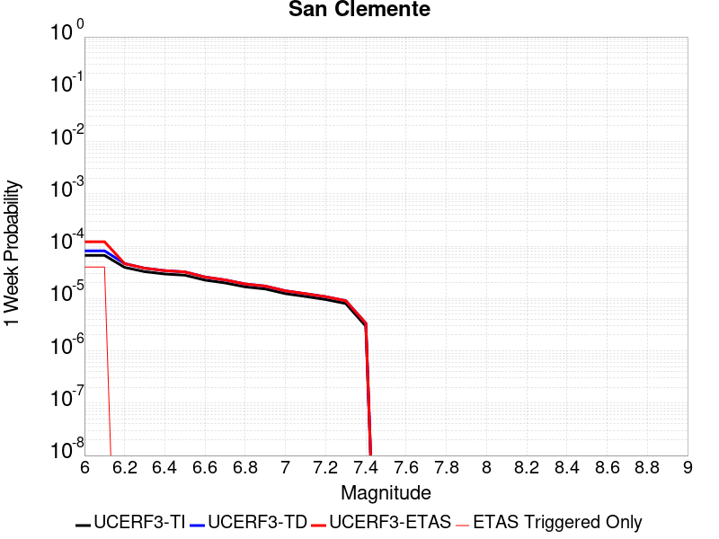 |  |  |  |

| Magnitude | 1 wk TI Prob | 1 wk TD Prob | 1 wk ETAS Prob | 1 wk ETAS/TD Gain | 1 wk ETAS Triggered Only | 1 mo TI Prob | 1 mo TD Prob | 1 mo ETAS Prob | 1 mo ETAS/TD Gain | 1 mo ETAS Triggered Only | 1 yr TI Prob | 1 yr TD Prob | 1 yr ETAS Prob | 1 yr ETAS/TD Gain | 1 yr ETAS Triggered Only | 10 yr TI Prob | 10 yr TD Prob | 10 yr ETAS Prob | 10 yr ETAS/TD Gain | 10 yr ETAS Triggered Only |
|-----|-----|-----|-----|-----|-----|-----|-----|-----|-----|-----|-----|-----|-----|-----|-----|-----|-----|-----|-----|-----|
| 6.0 | 6.681379E-5 | 8.163422E-5 | 1.7052375E-4 | 2.0888758 | 8.889679E-5 | 2.8631336E-4 | 3.498173E-4 | 4.38683E-4 | 1.2540346 | 8.889679E-5 | 0.003480294 | 0.0042512873 | 0.0043398063 | 1.0208217 | 8.889679E-5 | 0.03426291 | 0.041755714 | 0.0418409 | 1.00204 | 8.889679E-5 |
| 6.1 | 6.681379E-5 | 8.163422E-5 | 1.7052375E-4 | 2.0888758 | 8.889679E-5 | 2.8631336E-4 | 3.498173E-4 | 4.38683E-4 | 1.2540346 | 8.889679E-5 | 0.003480294 | 0.0042512873 | 0.0043398063 | 1.0208217 | 8.889679E-5 | 0.03426291 | 0.041755714 | 0.0418409 | 1.00204 | 8.889679E-5 |
| 6.2 | 3.9400576E-5 | 4.6451984E-5 | 4.6451984E-5 | 1.0 | 0.0 | 1.6884868E-4 | 1.9906509E-4 | 1.9906509E-4 | 1.0 | 0.0 | 0.0020537945 | 0.002420985 | 0.002420985 | 1.0 | 0.0 | 0.020349167 | 0.02395286 | 0.02395286 | 1.0 | 0.0 |
| 6.3 | 3.2590255E-5 | 3.7929087E-5 | 3.7929087E-5 | 1.0 | 0.0 | 1.3966505E-4 | 1.6254328E-4 | 1.6254328E-4 | 1.0 | 0.0 | 0.0016990956 | 0.0019771985 | 0.0019771985 | 1.0 | 0.0 | 0.01686163 | 0.019599866 | 0.019599866 | 1.0 | 0.0 |
| 6.4 | 2.9454652E-5 | 3.4097775E-5 | 3.4097775E-5 | 1.0 | 0.0 | 1.2622811E-4 | 1.4612528E-4 | 1.4612528E-4 | 1.0 | 0.0 | 0.0015357438 | 0.0017776482 | 0.0017776482 | 1.0 | 0.0 | 0.015251739 | 0.017637458 | 0.017637458 | 1.0 | 0.0 |
| 6.5 | 2.790836E-5 | 3.2247463E-5 | 3.2247463E-5 | 1.0 | 0.0 | 1.1960178E-4 | 1.3819622E-4 | 1.3819622E-4 | 1.0 | 0.0 | 0.001455179 | 0.0016812651 | 0.0016812651 | 1.0 | 0.0 | 0.014456868 | 0.016688475 | 0.016688475 | 1.0 | 0.0 |
| 6.6 | 2.2492153E-5 | 2.5762707E-5 | 2.5762707E-5 | 1.0 | 0.0 | 9.639138E-5 | 1.1040701E-4 | 1.1040701E-4 | 1.0 | 0.0 | 0.0011729331 | 0.0013433908 | 0.0013433908 | 1.0 | 0.0 | 0.011667615 | 0.013354415 | 0.013354415 | 1.0 | 0.0 |
| 6.7 | 1.9862755E-5 | 2.2666423E-5 | 2.2666423E-5 | 1.0 | 0.0 | 8.512331E-5 | 9.713826E-5 | 9.713826E-5 | 1.0 | 0.0 | 0.0010358836 | 0.0011820279 | 0.0011820279 | 1.0 | 0.0 | 0.010310682 | 0.011758701 | 0.011758701 | 1.0 | 0.0 |
| 6.8 | 1.6697575E-5 | 1.897771E-5 | 1.897771E-5 | 1.0 | 0.0 | 7.155907E-5 | 8.133056E-5 | 8.133056E-5 | 1.0 | 0.0 | 8.7088346E-4 | 9.897591E-4 | 9.897591E-4 | 1.0 | 0.0 | 0.008674784 | 0.0098545365 | 0.0098545365 | 1.0 | 0.0 |
| 6.9 | 1.5218415E-5 | 1.72694E-5 | 1.72694E-5 | 1.0 | 0.0 | 6.522015E-5 | 7.4009666E-5 | 7.4009666E-5 | 1.0 | 0.0 | 7.93766E-4 | 9.00704E-4 | 9.00704E-4 | 1.0 | 0.0 | 0.007909367 | 0.008971481 | 0.008971481 | 1.0 | 0.0 |
| 7.0 | 1.2392958E-5 | 1.4033016E-5 | 1.4033016E-5 | 1.0 | 0.0 | 5.3111595E-5 | 6.014015E-5 | 6.014015E-5 | 1.0 | 0.0 | 6.4644177E-4 | 7.319679E-4 | 7.319679E-4 | 1.0 | 0.0 | 0.0064456454 | 0.0072963564 | 0.0072963564 | 1.0 | 0.0 |
| 7.1 | 1.0934128E-5 | 1.2375138E-5 | 1.2375138E-5 | 1.0 | 0.0 | 4.6859706E-5 | 5.303527E-5 | 5.303527E-5 | 1.0 | 0.0 | 5.7036756E-4 | 6.455204E-4 | 6.455204E-4 | 1.0 | 0.0 | 0.0056890585 | 0.0064371997 | 0.0064371997 | 1.0 | 0.0 |
| 7.2 | 9.5798805E-6 | 1.0844935E-5 | 1.0844935E-5 | 1.0 | 0.0 | 4.1055984E-5 | 4.6477508E-5 | 4.6477508E-5 | 1.0 | 0.0 | 4.9974193E-4 | 5.657239E-4 | 5.657239E-4 | 1.0 | 0.0 | 0.0049861963 | 0.0056435615 | 0.0056435615 | 1.0 | 0.0 |
| 7.3 | 8.0167365E-6 | 9.083918E-6 | 9.083918E-6 | 1.0 | 0.0 | 3.4356988E-5 | 3.8930535E-5 | 3.8930535E-5 | 1.0 | 0.0 | 4.1821605E-4 | 4.7388324E-4 | 4.7388324E-4 | 1.0 | 0.0 | 0.0041742986 | 0.0047294297 | 0.0047294297 | 1.0 | 0.0 |
| 7.4 | 2.9581017E-6 | 3.3623792E-6 | 3.3623792E-6 | 1.0 | 0.0 | 1.2677518E-5 | 1.4410146E-5 | 1.4410146E-5 | 1.0 | 0.0 | 1.5433785E-4 | 1.7543444E-4 | 1.7543444E-4 | 1.0 | 0.0 | 0.001542307 | 0.0017534546 | 0.0017534546 | 1.0 | 0.0 |

## Camp Rock 2011
*[(top)](#table-of-contents)*

| 1 Week | 1 Month | 1 Year | 10 Year |
|-----|-----|-----|-----|
|  |  |  |  |

| Magnitude | 1 wk TI Prob | 1 wk TD Prob | 1 wk ETAS Prob | 1 wk ETAS/TD Gain | 1 wk ETAS Triggered Only | 1 mo TI Prob | 1 mo TD Prob | 1 mo ETAS Prob | 1 mo ETAS/TD Gain | 1 mo ETAS Triggered Only | 1 yr TI Prob | 1 yr TD Prob | 1 yr ETAS Prob | 1 yr ETAS/TD Gain | 1 yr ETAS Triggered Only | 10 yr TI Prob | 10 yr TD Prob | 10 yr ETAS Prob | 10 yr ETAS/TD Gain | 10 yr ETAS Triggered Only |
|-----|-----|-----|-----|-----|-----|-----|-----|-----|-----|-----|-----|-----|-----|-----|-----|-----|-----|-----|-----|-----|
| 6.0 | 1.6710783E-5 | 4.25026E-6 | 9.314667E-5 | 21.915522 | 8.889679E-5 | 7.161568E-5 | 1.8215276E-5 | 1.0711045E-4 | 5.880254 | 8.889679E-5 | 8.7157206E-4 | 2.2174895E-4 | 3.1062603E-4 | 1.4008005 | 8.889679E-5 | 0.008681616 | 0.0022153298 | 0.0023040297 | 1.0400391 | 8.889679E-5 |
| 6.1 | 1.6710783E-5 | 4.25026E-6 | 9.314667E-5 | 21.915522 | 8.889679E-5 | 7.161568E-5 | 1.8215276E-5 | 1.0711045E-4 | 5.880254 | 8.889679E-5 | 8.7157206E-4 | 2.2174895E-4 | 3.1062603E-4 | 1.4008005 | 8.889679E-5 | 0.008681616 | 0.0022153298 | 0.0023040297 | 1.0400391 | 8.889679E-5 |
| 6.2 | 1.6710783E-5 | 4.25026E-6 | 9.314667E-5 | 21.915522 | 8.889679E-5 | 7.161568E-5 | 1.8215276E-5 | 1.0711045E-4 | 5.880254 | 8.889679E-5 | 8.7157206E-4 | 2.2174895E-4 | 3.1062603E-4 | 1.4008005 | 8.889679E-5 | 0.008681616 | 0.0022153298 | 0.0023040297 | 1.0400391 | 8.889679E-5 |
| 6.3 | 1.6710783E-5 | 4.25026E-6 | 9.314667E-5 | 21.915522 | 8.889679E-5 | 7.161568E-5 | 1.8215276E-5 | 1.0711045E-4 | 5.880254 | 8.889679E-5 | 8.7157206E-4 | 2.2174895E-4 | 3.1062603E-4 | 1.4008005 | 8.889679E-5 | 0.008681616 | 0.0022153298 | 0.0023040297 | 1.0400391 | 8.889679E-5 |
| 6.4 | 7.982846E-6 | 3.6820884E-6 | 9.257855E-5 | 25.142946 | 8.889679E-5 | 3.421175E-5 | 1.5780286E-5 | 1.0467567E-4 | 6.6333194 | 8.889679E-5 | 4.1644843E-4 | 1.9210839E-4 | 2.809881E-4 | 1.462654 | 8.889679E-5 | 0.0041566887 | 0.001919458 | 0.002008184 | 1.0462246 | 8.889679E-5 |
| 6.5 | 7.982846E-6 | 3.6820884E-6 | 9.257855E-5 | 25.142946 | 8.889679E-5 | 3.421175E-5 | 1.5780286E-5 | 1.0467567E-4 | 6.6333194 | 8.889679E-5 | 4.1644843E-4 | 1.9210839E-4 | 2.809881E-4 | 1.462654 | 8.889679E-5 | 0.0041566887 | 0.001919458 | 0.002008184 | 1.0462246 | 8.889679E-5 |
| 6.6 | 7.048869E-6 | 3.4243571E-6 | 9.232084E-5 | 26.96005 | 8.889679E-5 | 3.0209088E-5 | 1.4675736E-5 | 1.0357122E-4 | 7.0573106 | 8.889679E-5 | 3.677336E-4 | 1.7866275E-4 | 2.6754366E-4 | 1.4974787 | 8.889679E-5 | 0.0036712566 | 0.0017852228 | 0.0018739608 | 1.049707 | 8.889679E-5 |
| 6.7 | 6.987307E-6 | 3.3623348E-6 | 9.225883E-5 | 27.438917 | 8.889679E-5 | 2.9945259E-5 | 1.4409929E-5 | 1.03305436E-4 | 7.169046 | 8.889679E-5 | 3.6452254E-4 | 1.7542706E-4 | 2.6430827E-4 | 1.5066562 | 8.889679E-5 | 0.0036392517 | 0.001752917 | 0.0018416579 | 1.0506247 | 8.889679E-5 |
| 6.8 | 6.3737602E-6 | 3.1179077E-6 | 9.201442E-5 | 29.511593 | 8.889679E-5 | 2.731583E-5 | 1.3362394E-5 | 1.02257996E-4 | 7.65267 | 8.889679E-5 | 3.3251947E-4 | 1.626753E-4 | 2.5155762E-4 | 1.5463787 | 8.889679E-5 | 0.0033202237 | 0.0016255907 | 0.0017143431 | 1.0545969 | 8.889679E-5 |
| 6.9 | 6.112211E-6 | 2.9331156E-6 | 9.182964E-5 | 31.307886 | 8.889679E-5 | 2.6194928E-5 | 1.2570436E-5 | 1.0146611E-4 | 8.071805 | 8.889679E-5 | 3.1887658E-4 | 1.5303459E-4 | 2.4191778E-4 | 1.5808046 | 8.889679E-5 | 0.003184194 | 0.0015293199 | 0.0016180807 | 1.0580394 | 8.889679E-5 |
| 7.0 | 5.5140117E-6 | 2.641923E-6 | 9.153848E-5 | 34.64843 | 8.889679E-5 | 2.3631264E-5 | 1.132248E-5 | 1.0021826E-4 | 8.851265 | 8.889679E-5 | 2.8767265E-4 | 1.3784273E-4 | 2.2672725E-4 | 1.6448258 | 8.889679E-5 | 0.0028730053 | 0.0013775975 | 0.0014663718 | 1.0644414 | 8.889679E-5 |
| 7.1 | 4.8151105E-6 | 2.1342705E-6 | 9.103087E-5 | 42.651985 | 8.889679E-5 | 2.0636026E-5 | 9.146843E-6 | 9.804282E-5 | 10.718761 | 8.889679E-5 | 2.5121463E-4 | 1.1135734E-4 | 2.0024423E-4 | 1.7982131 | 8.889679E-5 | 0.0025093083 | 0.0011130372 | 0.0012018351 | 1.0797797 | 8.889679E-5 |
| 7.2 | 3.818335E-6 | 1.2937425E-6 | 9.019042E-5 | 69.71281 | 8.889679E-5 | 1.6364189E-5 | 5.5445994E-6 | 9.44409E-5 | 17.032953 | 8.889679E-5 | 1.9921579E-4 | 6.750349E-5 | 1.5639428E-4 | 2.3168325 | 8.889679E-5 | 0.0019903728 | 6.748381E-4 | 7.6367485E-4 | 1.1316416 | 8.889679E-5 |
| 7.3 | 2.7166698E-6 | 7.3835776E-7 | 8.963508E-5 | 121.3979 | 8.889679E-5 | 1.1642818E-5 | 3.1643867E-6 | 9.2060895E-5 | 29.092808 | 8.889679E-5 | 1.4174209E-4 | 3.8525748E-5 | 1.2741912E-4 | 3.3073754 | 8.889679E-5 | 0.0014165172 | 3.851927E-4 | 4.7405524E-4 | 1.2306963 | 8.889679E-5 |
| 7.4 | 2.0893426E-6 | 5.4618386E-7 | 8.9442925E-5 | 163.75974 | 8.889679E-5 | 8.954295E-6 | 2.3407858E-6 | 9.1237365E-5 | 38.977238 | 8.889679E-5 | 1.0901308E-4 | 2.84987E-5 | 1.17392956E-4 | 4.119239 | 8.889679E-5 | 0.0010895962 | 2.84951E-4 | 3.7382246E-4 | 1.3118833 | 8.889679E-5 |
| 7.5 | 1.1681728E-6 | 3.6030585E-7 | 8.925707E-5 | 247.72583 | 8.889679E-5 | 5.0064455E-6 | 1.544167E-6 | 9.044082E-5 | 58.569324 | 8.889679E-5 | 6.0951766E-5 | 1.8800076E-5 | 1.07695196E-4 | 5.7284446 | 8.889679E-5 | 6.093505E-4 | 1.8798532E-4 | 2.768654E-4 | 1.4728032 | 8.889679E-5 |
| 7.6 | 1.3154387E-7 | 7.1197384E-8 | 7.1197384E-8 | 1.0 | 0.0 | 5.6375933E-7 | 3.051316E-7 | 3.051316E-7 | 1.0 | 0.0 | 6.863748E-6 | 3.7149728E-6 | 3.7149728E-6 | 1.0 | 0.0 | 6.863536E-5 | 3.7149264E-5 | 3.7149264E-5 | 1.0 | 0.0 |

## Sheephole
*[(top)](#table-of-contents)*

| 1 Week | 1 Month | 1 Year | 10 Year |
|-----|-----|-----|-----|
|  |  |  |  |

| Magnitude | 1 wk TI Prob | 1 wk TD Prob | 1 wk ETAS Prob | 1 wk ETAS/TD Gain | 1 wk ETAS Triggered Only | 1 mo TI Prob | 1 mo TD Prob | 1 mo ETAS Prob | 1 mo ETAS/TD Gain | 1 mo ETAS Triggered Only | 1 yr TI Prob | 1 yr TD Prob | 1 yr ETAS Prob | 1 yr ETAS/TD Gain | 1 yr ETAS Triggered Only | 10 yr TI Prob | 10 yr TD Prob | 10 yr ETAS Prob | 10 yr ETAS/TD Gain | 10 yr ETAS Triggered Only |
|-----|-----|-----|-----|-----|-----|-----|-----|-----|-----|-----|-----|-----|-----|-----|-----|-----|-----|-----|-----|-----|
| 6.0 | 4.5579695E-6 | 4.7412627E-6 | 4.7412627E-6 | 1.0 | 0.0 | 1.9534009E-5 | 2.031957E-5 | 1.09214554E-4 | 5.374846 | 8.889679E-5 | 2.3780059E-4 | 2.473682E-4 | 3.36243E-4 | 1.3592814 | 8.889679E-5 | 0.0023754628 | 0.002471473 | 0.0025601503 | 1.0358802 | 8.889679E-5 |
| 6.1 | 4.5579695E-6 | 4.7412627E-6 | 4.7412627E-6 | 1.0 | 0.0 | 1.9534009E-5 | 2.031957E-5 | 1.09214554E-4 | 5.374846 | 8.889679E-5 | 2.3780059E-4 | 2.473682E-4 | 3.36243E-4 | 1.3592814 | 8.889679E-5 | 0.0023754628 | 0.002471473 | 0.0025601503 | 1.0358802 | 8.889679E-5 |
| 6.2 | 2.6677674E-6 | 2.7873941E-6 | 2.7873941E-6 | 1.0 | 0.0 | 1.1433239E-5 | 1.1945926E-5 | 1.0084166E-4 | 8.441509 | 8.889679E-5 | 1.3919079E-4 | 1.4543302E-4 | 2.3431689E-4 | 1.611167 | 8.889679E-5 | 0.0013910364 | 0.0014534844 | 0.001542252 | 1.0610722 | 8.889679E-5 |
| 6.3 | 2.6677674E-6 | 2.7873941E-6 | 2.7873941E-6 | 1.0 | 0.0 | 1.1433239E-5 | 1.1945926E-5 | 1.0084166E-4 | 8.441509 | 8.889679E-5 | 1.3919079E-4 | 1.4543302E-4 | 2.3431689E-4 | 1.611167 | 8.889679E-5 | 0.0013910364 | 0.0014534844 | 0.001542252 | 1.0610722 | 8.889679E-5 |
| 6.4 | 2.2159759E-6 | 2.3228788E-6 | 2.3228788E-6 | 1.0 | 0.0 | 9.497005E-6 | 9.955161E-6 | 9.8851066E-5 | 9.92963 | 8.889679E-5 | 1.156199E-4 | 1.2119815E-4 | 2.1008417E-4 | 1.7333941 | 8.889679E-5 | 0.0011555976 | 0.0012113999 | 0.001300189 | 1.0732946 | 8.889679E-5 |
| 6.5 | 2.1986082E-6 | 2.304759E-6 | 2.304759E-6 | 1.0 | 0.0 | 9.4225725E-6 | 9.877506E-6 | 9.877342E-5 | 9.999834 | 8.889679E-5 | 1.1471378E-4 | 1.2025281E-4 | 2.091389E-4 | 1.7391603 | 8.889679E-5 | 0.0011465458 | 0.0012019566 | 0.0012907466 | 1.0738711 | 8.889679E-5 |
| 6.6 | 1.5232331E-6 | 1.6018919E-6 | 1.6018919E-6 | 1.0 | 0.0 | 6.5281256E-6 | 6.865234E-6 | 9.576142E-5 | 13.948748 | 8.889679E-5 | 7.947703E-5 | 8.35812E-5 | 1.7247057E-4 | 2.063509 | 8.889679E-5 | 7.9448614E-4 | 8.3551643E-4 | 9.2433894E-4 | 1.1063086 | 8.889679E-5 |
| 6.7 | 1.3137362E-6 | 1.382819E-6 | 1.382819E-6 | 1.0 | 0.0 | 5.6302856E-6 | 5.926355E-6 | 5.926355E-6 | 1.0 | 0.0 | 6.854657E-5 | 7.215112E-5 | 7.215112E-5 | 1.0 | 0.0 | 6.8525434E-4 | 7.212908E-4 | 7.212908E-4 | 1.0 | 0.0 |
| 6.8 | 1.2275751E-6 | 1.2922847E-6 | 1.2922847E-6 | 1.0 | 0.0 | 5.2610258E-6 | 5.5383516E-6 | 5.5383516E-6 | 1.0 | 0.0 | 6.4051106E-5 | 6.7427485E-5 | 6.7427485E-5 | 1.0 | 0.0 | 6.4032647E-4 | 6.740836E-4 | 6.740836E-4 | 1.0 | 0.0 |
| 6.9 | 1.1837088E-6 | 1.246102E-6 | 1.246102E-6 | 1.0 | 0.0 | 5.0730278E-6 | 5.340427E-6 | 5.340427E-6 | 1.0 | 0.0 | 6.176237E-5 | 6.501789E-5 | 6.501789E-5 | 1.0 | 0.0 | 6.17452E-4 | 6.5000186E-4 | 6.5000186E-4 | 1.0 | 0.0 |
| 7.0 | 9.849371E-7 | 1.0366288E-6 | 1.0366288E-6 | 1.0 | 0.0 | 4.2211523E-6 | 4.442688E-6 | 4.442688E-6 | 1.0 | 0.0 | 5.1391315E-5 | 5.4088487E-5 | 5.4088487E-5 | 1.0 | 0.0 | 5.137943E-4 | 5.407633E-4 | 5.407633E-4 | 1.0 | 0.0 |
| 7.1 | 8.1643645E-7 | 8.591669E-7 | 8.591669E-7 | 1.0 | 0.0 | 3.4990085E-6 | 3.682139E-6 | 3.682139E-6 | 1.0 | 0.0 | 4.2599597E-5 | 4.482921E-5 | 4.482921E-5 | 1.0 | 0.0 | 4.259143E-4 | 4.4821028E-4 | 4.4821028E-4 | 1.0 | 0.0 |
| 7.2 | 5.7295756E-7 | 6.029502E-7 | 6.029502E-7 | 1.0 | 0.0 | 2.45553E-6 | 2.58407E-6 | 2.58407E-6 | 1.0 | 0.0 | 2.9895667E-5 | 3.1460666E-5 | 3.1460666E-5 | 1.0 | 0.0 | 2.9891645E-4 | 3.145688E-4 | 3.145688E-4 | 1.0 | 0.0 |

