# Parent Section Magnitude-Probability Distributions

Only fault sections with at least one triggered aftershock are plotted. Sections are sorted by total supraseismogenic trigger rate (decreasing)

## Table Of Contents

* [Tank Canyon](#tank-canyon)
* [Garlock (Central)](#garlock-central)
* [Panamint Valley](#panamint-valley)
* [Owl Lake](#owl-lake)
* [Little Lake](#little-lake)
* [Ash Hill](#ash-hill)
* [Garlock (East)](#garlock-east)
* [Blackwater](#blackwater)
* [Hunter Mountain-Saline Valley](#hunter-mountain-saline-valley)
* [Gravel Hills-Harper Lk](#gravel-hills-harper-lk)
* [Airport Lake](#airport-lake)
* [Goldstone Lake](#goldstone-lake)
* [McLean Lake](#mclean-lake)
* [So Sierra Nevada](#so-sierra-nevada)
* [Coyote Canyon](#coyote-canyon)
* [Garlock (West)](#garlock-west)
* [Lenwood-Lockhart-Old Woman Springs](#lenwood-lockhart-old-woman-springs)
* [Nelson Lake](#nelson-lake)
* [San Andreas (Mojave S)](#san-andreas-mojave-s)
* [Death Valley (So)](#death-valley-so)
* [Towne Pass](#towne-pass)
* [Bicycle Lake](#bicycle-lake)
* [Paradise](#paradise)
* [San Andreas (Mojave N)](#san-andreas-mojave-n)
* [Garlic Springs](#garlic-springs)
* [San Andreas (San Bernardino N)](#san-andreas-san-bernardino-n)
* [Helendale-So Lockhart](#helendale-so-lockhart)
* [Death Valley (Black Mtns Frontal)](#death-valley-black-mtns-frontal)
* [Coyote Lake](#coyote-lake)
* [San Andreas (Big Bend)](#san-andreas-big-bend)
* [Death Valley (No)](#death-valley-no)
* [White Wolf (Extension)](#white-wolf-extension)
* [San Andreas (San Bernardino S)](#san-andreas-san-bernardino-s)
* [Elsinore (Glen Ivy) rev](#elsinore-glen-ivy-rev)
* [San Andreas (Parkfield)](#san-andreas-parkfield)
* [Scodie Lineament](#scodie-lineament)
* [Death Valley (Fish Lake Valley)](#death-valley-fish-lake-valley)
* [Lake Isabella (Seismicity)](#lake-isabella-seismicity)
* [San Andreas (Cholame) rev](#san-andreas-cholame-rev)
* [Cady](#cady)
* [San Andreas (Carrizo) rev](#san-andreas-carrizo-rev)
* [Sierra Nevada  (No Extension)](#sierra-nevada--no-extension)
* [Manix-Afton Hills](#manix-afton-hills)
* [Red Pass](#red-pass)
* [Ludlow](#ludlow)
* [Santa Ynez (West)](#santa-ynez-west)
* [Calico-Hidalgo](#calico-hidalgo)
* [San Andreas (Creeping Section) 2011 CFM](#san-andreas-creeping-section-2011-cfm)
* [Cleghorn Lake](#cleghorn-lake)
* [Santa Ynez (East)](#santa-ynez-east)
* [San Andreas (San Gorgonio Pass-Garnet HIll)](#san-andreas-san-gorgonio-pass-garnet-hill)
* [Baker](#baker)
* [Mission Ridge-Arroyo Parida-Santa Ana](#mission-ridge-arroyo-parida-santa-ana)
* [San Andreas (Coachella) rev](#san-andreas-coachella-rev)
* [Cleghorn Pass](#cleghorn-pass)
* [Brawley (Seismic Zone) alt 1](#brawley-seismic-zone-alt-1)
* [Dry Mountain](#dry-mountain)
* [Kern Canyon (North Kern) 2011](#kern-canyon-north-kern-2011)
* [Red Mountain](#red-mountain)
* [Santa Rosa Island](#santa-rosa-island)
* [Lost Hills](#lost-hills)
* [Imperial](#imperial)
* [Channel Islands Thrust](#channel-islands-thrust)
* [White Mountains](#white-mountains)
* [Kern Canyon (South Kern) 2011](#kern-canyon-south-kern-2011)
* [Santa Cruz Island](#santa-cruz-island)
* [Chino alt 1](#chino-alt-1)
* [Owens Valley](#owens-valley)
* [San Clemente](#san-clemente)
* [Ortigalita (North)](#ortigalita-north)
* [San Jacinto (San Bernardino)](#san-jacinto-san-bernardino)
* [Deep Springs](#deep-springs)
* [Ventura-Pitas Point](#ventura-pitas-point)
* [Coronado Bank alt1](#coronado-bank-alt1)
* [San Andreas (North Branch Mill Creek)](#san-andreas-north-branch-mill-creek)
* [Big Pine (East)](#big-pine-east)
* [Pinto Mtn](#pinto-mtn)
* [San Diego Trough north alt1](#san-diego-trough-north-alt1)
* [Pisgah-Bullion Mtn-Mesquite Lk](#pisgah-bullion-mtn-mesquite-lk)
* [Independence rev 2011](#independence-rev-2011)
* [Rose Canyon](#rose-canyon)
* [La Panza 2011](#la-panza-2011)
* [Blue Cut](#blue-cut)
* [Pleito](#pleito)
* [San Pedro Basin](#san-pedro-basin)
* [Elysian Park (Upper)](#elysian-park-upper)
* [Raymond](#raymond)
* [Newport-Inglewood alt 1](#newport-inglewood-alt-1)
* [Oceanic - West Huasna](#oceanic---west-huasna)
* [San Jacinto (Anza) rev](#san-jacinto-anza-rev)
* [Malibu Coast (Extension) alt 1](#malibu-coast-extension-alt-1)
* [San Jacinto (San Jacinto Valley) rev](#san-jacinto-san-jacinto-valley-rev)
* [Kern Canyon (Lake Isabella) 2011](#kern-canyon-lake-isabella-2011)
* [Big Pine (Central)](#big-pine-central)
* [San Diego Trough south](#san-diego-trough-south)
* [San Jacinto (Stepovers Combined)](#san-jacinto-stepovers-combined)
* [San Cayetano](#san-cayetano)
* [Whittier alt 1](#whittier-alt-1)
* [Sheephole](#sheephole)
* [Rinconada 2011 CFM](#rinconada-2011-cfm)
* [White Wolf](#white-wolf)
* [San Andreas (Santa Cruz Mts) 2011 CFM](#san-andreas-santa-cruz-mts-2011-cfm)
* [Pine Mtn](#pine-mtn)
* [Likely 2011 CFM](#likely-2011-cfm)
* [Great Valley 09 (Laguna Seca)](#great-valley-09-laguna-seca)
* [San Andreas (North Coast) 2011 CFM](#san-andreas-north-coast-2011-cfm)
* [Keddie Ridge 2011 CFM](#keddie-ridge-2011-cfm)
* [Elsinore (Stepovers Combined)](#elsinore-stepovers-combined)
* [Oak Ridge (Onshore)](#oak-ridge-onshore)
* [Hosgri](#hosgri)
* [Santa Cruz Catalina Ridge alt1](#santa-cruz-catalina-ridge-alt1)
* [Hayward (So) 2011 CFM](#hayward-so-2011-cfm)
* [Channel Islands Western Deep Ramp](#channel-islands-western-deep-ramp)
* [Tin Mountain](#tin-mountain)
* [San Andreas (Peninsula) 2011 CFM](#san-andreas-peninsula-2011-cfm)
* [Mission Creek](#mission-creek)
* [Maacama 2011 CFM](#maacama-2011-cfm)
* [Honey Lake 2011 CFM](#honey-lake-2011-cfm)
* [Hayward (So) extension 2011 CFM](#hayward-so-extension-2011-cfm)
* [Santa Ynez River](#santa-ynez-river)
* [Anaheim](#anaheim)
* [Robinson Creek](#robinson-creek)
* [Simi-Santa Rosa](#simi-santa-rosa)
* [San Jacinto (Superstition Mtn)](#san-jacinto-superstition-mtn)
* [Gillem - Big Crack 2011 CFM](#gillem---big-crack-2011-cfm)
* [San Gabriel](#san-gabriel)
* [Camp Rock 2011](#camp-rock-2011)
* [Cedar Mtn-Mahogany Mtn](#cedar-mtn-mahogany-mtn)
* [Hosgri (Extension)](#hosgri-extension)
* [Johnson Valley (No) 2011 rev](#johnson-valley-no-2011-rev)
* [Calaveras (Central) 2011 CFM](#calaveras-central-2011-cfm)
* [Ortigalita (South)](#ortigalita-south)
* [Owens Valley Keough Hot Springs](#owens-valley-keough-hot-springs)
* [Elsinore (Temecula) rev](#elsinore-temecula-rev)
* [Mono Lake 2011 CFM](#mono-lake-2011-cfm)
* [San Jacinto (Coyote Creek)](#san-jacinto-coyote-creek)
* [Hat Creek-McArthur-Mayfield](#hat-creek-mcarthur-mayfield)
* [Newport-Inglewood (Offshore)](#newport-inglewood-offshore)
* [Reliz 2011 CFM](#reliz-2011-cfm)
* [Pitas Point (Lower West)](#pitas-point-lower-west)
* [South Klamath Lake West](#south-klamath-lake-west)
* [Los Alamos extension](#los-alamos-extension)
* [Point Reyes 2011 CFM](#point-reyes-2011-cfm)
* [Sierra Madre](#sierra-madre)
* [San Juan](#san-juan)
* [San Gregorio (North) 2011 CFM](#san-gregorio-north-2011-cfm)
* [Round Valley](#round-valley)
* [Great Valley 08 (Quinto)](#great-valley-08-quinto)
* [San Luis Range 2011 CFM](#san-luis-range-2011-cfm)
* [Cleghorn](#cleghorn)
* [San Andreas (Offshore) 2011 CFM](#san-andreas-offshore-2011-cfm)
* [Thirty Mile Bank](#thirty-mile-bank)
* [Los Alamos 2011 CFM](#los-alamos-2011-cfm)
* [San Jacinto (Lytle Creek connector)](#san-jacinto-lytle-creek-connector)
* [San Gabriel (Extension)](#san-gabriel-extension)
* [Hunting Creek - Berryessa 2011 CFM](#hunting-creek---berryessa-2011-cfm)
* [San Gregorio (South) 2011 CFM](#san-gregorio-south-2011-cfm)
* [Hayward (No) 2011 CFM](#hayward-no-2011-cfm)
* [San Jacinto (Clark) rev](#san-jacinto-clark-rev)
* [Clamshell-Sawpit](#clamshell-sawpit)
* [Rodgers Creek - Healdsburg 2011 CFM](#rodgers-creek---healdsburg-2011-cfm)
* [Almanor 2011 CFM](#almanor-2011-cfm)
* [Greenville (So) 2011 CFM](#greenville-so-2011-cfm)
* [Malibu Coast alt 1](#malibu-coast-alt-1)
* [Great Valley 07 (Orestimba)](#great-valley-07-orestimba)
* [Big Lagoon - Bald Mtn 2011 CFM](#big-lagoon---bald-mtn-2011-cfm)
* [San Jacinto (Borrego)](#san-jacinto-borrego)
* [Mission (connected) 2011 CFM](#mission-connected-2011-cfm)
* [Monterey Bay-Tularcitos](#monterey-bay-tularcitos)
* [Morales (West)](#morales-west)
* [South Klamath Lake East](#south-klamath-lake-east)
* [Elsinore (Coyote Mountains)](#elsinore-coyote-mountains)
* [Pitas Point (Lower)-Montalvo](#pitas-point-lower-montalvo)
* [Cerro Prieto](#cerro-prieto)
* [Greenville (No) 2011 CFM](#greenville-no-2011-cfm)
* [Puente Hills](#puente-hills)
* [Redondo Canyon alt 1](#redondo-canyon-alt-1)
* [Elmore Ranch](#elmore-ranch)
* [Fontana (Seismicity)](#fontana-seismicity)
* [San Pedro Escarpment](#san-pedro-escarpment)
* [Hollywood](#hollywood)
* [Great Valley 05 Pittsburg - Kirby Hills alt1](#great-valley-05-pittsburg---kirby-hills-alt1)
* [Russ 2011 CFM](#russ-2011-cfm)
* [Bullion Mountains](#bullion-mountains)
* [Emerson-Copper Mtn 2011](#emerson-copper-mtn-2011)
* [Palos Verdes](#palos-verdes)
* [Great Valley 01](#great-valley-01)
* [Walker Spring 2011 CFM](#walker-spring-2011-cfm)
* [Little Salmon (Offshore)](#little-salmon-offshore)
* [Green Valley 2011 CFM](#green-valley-2011-cfm)
* [Elysian Park (Lower CFM)](#elysian-park-lower-cfm)
* [Great Valley 03 Mysterious Ridge](#great-valley-03-mysterious-ridge)
* [Bartlett Springs 2011 CFM](#bartlett-springs-2011-cfm)
* [Hartley Springs 2011 CFM](#hartley-springs-2011-cfm)
* [Santa Susana East (connector)](#santa-susana-east-connector)
* [East Huasna 2011 CFM](#east-huasna-2011-cfm)
* [Goose Lake 2011 CFM](#goose-lake-2011-cfm)
* [Del Valle](#del-valle)
* [San Jose](#san-jose)
* [Calaveras (No) 2011 CFM](#calaveras-no-2011-cfm)
* [Santa Susana alt 1](#santa-susana-alt-1)
* [Calaveras (So) - Paicines extension 2011 CFM](#calaveras-so---paicines-extension-2011-cfm)

## Tank Canyon
*[(top)](#table-of-contents)*

| 1 Week | 1 Month | 1 Year | 10 Year |
|-----|-----|-----|-----|
|  |  |  |  |

| Magnitude | 1 wk TI Prob | 1 wk TD Prob | 1 wk ETAS Prob | 1 wk ETAS/TD Gain | 1 wk ETAS Triggered Only | 1 mo TI Prob | 1 mo TD Prob | 1 mo ETAS Prob | 1 mo ETAS/TD Gain | 1 mo ETAS Triggered Only | 1 yr TI Prob | 1 yr TD Prob | 1 yr ETAS Prob | 1 yr ETAS/TD Gain | 1 yr ETAS Triggered Only | 10 yr TI Prob | 10 yr TD Prob | 10 yr ETAS Prob | 10 yr ETAS/TD Gain | 10 yr ETAS Triggered Only |
|-----|-----|-----|-----|-----|-----|-----|-----|-----|-----|-----|-----|-----|-----|-----|-----|-----|-----|-----|-----|-----|
| 6.0 | 4.8284557E-5 | 5.7964822E-5 | 0.038365744 | 661.87976 | 0.03831 | 2.0691741E-4 | 2.4840087E-4 | 0.052515414 | 211.41397 | 0.05228 | 0.0025163088 | 0.0030207601 | 0.08419481 | 27.87206 | 0.08142 | 0.02488006 | 0.029863637 | 0.13727714 | 4.596799 | 0.11072 |
| 6.1 | 1.7796336E-5 | 2.0873314E-5 | 0.014500571 | 694.6942 | 0.01448 | 7.626778E-5 | 8.945422E-5 | 0.02001767 | 223.7756 | 0.01993 | 9.281647E-4 | 0.0010885983 | 0.033263534 | 30.556301 | 0.03221 | 0.009242975 | 0.010836744 | 0.055616163 | 5.132184 | 0.04527 |
| 6.2 | 1.7796336E-5 | 2.0873314E-5 | 0.014500571 | 694.6942 | 0.01448 | 7.626778E-5 | 8.945422E-5 | 0.02001767 | 223.7756 | 0.01993 | 9.281647E-4 | 0.0010885983 | 0.033263534 | 30.556301 | 0.03221 | 0.009242975 | 0.010836744 | 0.055616163 | 5.132184 | 0.04527 |
| 6.3 | 1.3515912E-5 | 1.5759564E-5 | 0.010625592 | 674.2313 | 0.01061 | 5.792405E-5 | 6.753938E-5 | 0.014676552 | 217.30363 | 0.01461 | 7.049971E-4 | 8.2200574E-4 | 0.02481227 | 30.185032 | 0.02401 | 0.007027647 | 0.0081922645 | 0.04154676 | 5.071462 | 0.03363 |
| 6.4 | 1.0870146E-5 | 1.2618021E-5 | 0.007882519 | 624.70325 | 0.00787 | 4.658551E-5 | 5.4076212E-5 | 0.010923488 | 202.00172 | 0.01087 | 5.67031E-4 | 6.581969E-4 | 0.018606376 | 28.268707 | 0.01796 | 0.005655863 | 0.0065644905 | 0.03156926 | 4.8090954 | 0.02517 |
| 6.5 | 7.964826E-6 | 9.196094E-6 | 0.00504915 | 549.0537 | 0.00504 | 3.4134522E-5 | 3.9411298E-5 | 0.0071091326 | 180.38312 | 0.00707 | 4.1550855E-4 | 4.7973756E-4 | 0.012214106 | 25.459972 | 0.01174 | 0.0041473247 | 0.004788321 | 0.020970464 | 4.3795023 | 0.01626 |
| 6.6 | 6.6317E-6 | 7.6122988E-6 | 0.003847583 | 505.443 | 0.00384 | 2.8421264E-5 | 3.2623782E-5 | 0.0054424475 | 166.82454 | 0.00541 | 3.4597394E-4 | 3.9713128E-4 | 0.009213628 | 23.20046 | 0.00882 | 0.0034543579 | 0.003965368 | 0.016037308 | 4.044343 | 0.01212 |
| 6.7 | 4.793663E-6 | 5.4307857E-6 | 0.0021054193 | 387.68228 | 0.0021 | 2.0544108E-5 | 2.3274613E-5 | 0.0031132028 | 133.7596 | 0.00309 | 2.500958E-4 | 2.8333595E-4 | 0.005431877 | 19.171154 | 0.00515 | 0.0024981452 | 0.0028304397 | 0.009880428 | 3.490775 | 0.00707 |
| 6.8 | 4.382823E-6 | 4.9692567E-6 | 0.0018749599 | 377.31195 | 0.00187 | 1.8783392E-5 | 2.1296666E-5 | 0.0028012374 | 131.53409 | 0.00278 | 2.286638E-4 | 2.5926033E-4 | 0.0049280496 | 19.008114 | 0.00467 | 0.0022842865 | 0.002590253 | 0.008923804 | 3.445148 | 0.00635 |
| 6.9 | 2.729601E-6 | 3.0735416E-6 | 9.030708E-4 | 293.8209 | 9.0E-4 | 1.1698237E-5 | 1.3172262E-5 | 0.0013731543 | 104.2459 | 0.00136 | 1.4241673E-4 | 1.6036171E-4 | 0.0025199833 | 15.71437 | 0.00236 | 0.001423255 | 0.0016026258 | 0.0048274496 | 3.0122123 | 0.00323 |
| 7.0 | 1.8987357E-6 | 2.126939E-6 | 5.2212586E-4 | 245.48227 | 5.2E-4 | 8.137413E-6 | 9.115425E-6 | 7.2910887E-4 | 79.98627 | 7.2E-4 | 9.90685E-5 | 1.1097535E-4 | 0.0013008433 | 11.721912 | 0.00119 | 9.902435E-4 | 0.0011092679 | 0.002707493 | 2.4407928 | 0.0016 |
| 7.1 | 1.4928986E-6 | 1.6641272E-6 | 3.3166358E-4 | 199.30182 | 3.3E-4 | 6.398121E-6 | 7.1319573E-6 | 4.471288E-4 | 62.693703 | 4.4E-4 | 7.789434E-5 | 8.682871E-5 | 8.2676444E-4 | 9.521787 | 7.4E-4 | 7.786704E-4 | 8.6800574E-4 | 0.0018371638 | 2.1165342 | 9.7E-4 |
| 7.2 | 1.069082E-6 | 1.1828573E-6 | 2.3118258E-4 | 195.4442 | 2.3E-4 | 4.581772E-6 | 5.0693816E-6 | 2.950679E-4 | 58.205902 | 2.9E-4 | 5.5781646E-5 | 6.171851E-5 | 5.1169074E-4 | 8.290718 | 4.5E-4 | 5.576765E-4 | 6.170659E-4 | 0.0011467389 | 1.8583734 | 5.3E-4 |
| 7.3 | 8.776551E-7 | 9.770005E-7 | 1.9097682E-4 | 195.4726 | 1.9E-4 | 3.7613736E-6 | 4.1871413E-6 | 2.3418618E-4 | 55.92985 | 2.3E-4 | 4.579376E-5 | 5.097777E-5 | 3.9096043E-4 | 7.669234 | 3.4E-4 | 4.5784327E-4 | 5.097118E-4 | 9.095079E-4 | 1.7843572 | 4.0E-4 |
| 7.4 | 7.55721E-7 | 8.510244E-7 | 1.7085088E-4 | 200.75908 | 1.7E-4 | 3.2388E-6 | 3.6472454E-6 | 2.0364652E-4 | 55.835705 | 2.0E-4 | 3.9431678E-5 | 4.4404827E-5 | 3.3439195E-4 | 7.5305314 | 2.9E-4 | 3.942468E-4 | 4.440104E-4 | 7.7386387E-4 | 1.7428958 | 3.3E-4 |
| 7.5 | 5.587665E-7 | 6.305619E-7 | 1.3063048E-4 | 207.1652 | 1.3E-4 | 2.3947114E-6 | 2.702408E-6 | 1.52702E-4 | 56.5059 | 1.5E-4 | 2.915522E-5 | 3.290182E-5 | 2.528946E-4 | 7.6863403 | 2.2E-4 | 2.9151395E-4 | 3.290182E-4 | 5.8893266E-4 | 1.7899699 | 2.6E-4 |

## Garlock (Central)
*[(top)](#table-of-contents)*

| 1 Week | 1 Month | 1 Year | 10 Year |
|-----|-----|-----|-----|
|  |  | 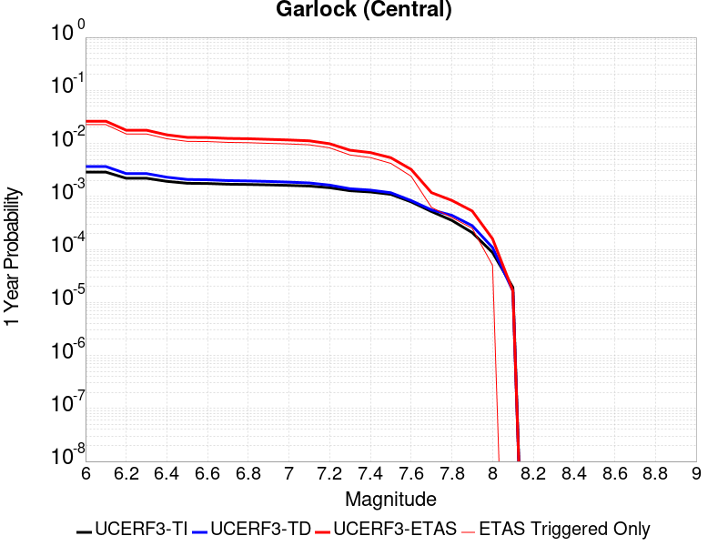 |  |

| Magnitude | 1 wk TI Prob | 1 wk TD Prob | 1 wk ETAS Prob | 1 wk ETAS/TD Gain | 1 wk ETAS Triggered Only | 1 mo TI Prob | 1 mo TD Prob | 1 mo ETAS Prob | 1 mo ETAS/TD Gain | 1 mo ETAS Triggered Only | 1 yr TI Prob | 1 yr TD Prob | 1 yr ETAS Prob | 1 yr ETAS/TD Gain | 1 yr ETAS Triggered Only | 10 yr TI Prob | 10 yr TD Prob | 10 yr ETAS Prob | 10 yr ETAS/TD Gain | 10 yr ETAS Triggered Only |
|-----|-----|-----|-----|-----|-----|-----|-----|-----|-----|-----|-----|-----|-----|-----|-----|-----|-----|-----|-----|-----|
| 6.0 | 5.5131142E-5 | 7.024681E-5 | 0.010619505 | 151.17421 | 0.01055 | 2.3625491E-4 | 3.010234E-4 | 0.01472668 | 48.922047 | 0.01443 | 0.0028726095 | 0.0036588663 | 0.026196104 | 7.1596227 | 0.02262 | 0.028357591 | 0.036079824 | 0.06696383 | 1.8559909 | 0.03204 |
| 6.1 | 5.5131142E-5 | 7.024681E-5 | 0.010619505 | 151.17421 | 0.01055 | 2.3625491E-4 | 3.010234E-4 | 0.01472668 | 48.922047 | 0.01443 | 0.0028726095 | 0.0036588663 | 0.026196104 | 7.1596227 | 0.02262 | 0.028357591 | 0.036079824 | 0.06696383 | 1.8559909 | 0.03204 |
| 6.2 | 4.216245E-5 | 5.1661493E-5 | 0.007031301 | 136.10332 | 0.00698 | 1.806837E-4 | 2.2138779E-4 | 0.009759276 | 44.082268 | 0.00954 | 0.0021976046 | 0.0026920962 | 0.017711554 | 6.5790935 | 0.01506 | 0.021759989 | 0.026689773 | 0.04766461 | 1.7858753 | 0.02155 |
| 6.3 | 4.216245E-5 | 5.1661493E-5 | 0.007031301 | 136.10332 | 0.00698 | 1.806837E-4 | 2.2138779E-4 | 0.009759276 | 44.082268 | 0.00954 | 0.0021976046 | 0.0026920962 | 0.017711554 | 6.5790935 | 0.01506 | 0.021759989 | 0.026689773 | 0.04766461 | 1.7858753 | 0.02155 |
| 6.4 | 3.6858168E-5 | 4.411054E-5 | 0.0058038565 | 131.57527 | 0.00576 | 1.5795401E-4 | 1.8903162E-4 | 0.00807754 | 42.73116 | 0.00789 | 0.0019213937 | 0.002299056 | 0.014480985 | 6.2986655 | 0.01221 | 0.019048655 | 0.02284894 | 0.040066343 | 1.7535317 | 0.01762 |
| 6.5 | 3.39199E-5 | 4.0018083E-5 | 0.0050798166 | 126.93803 | 0.00504 | 1.453629E-4 | 1.7149492E-4 | 0.0072102877 | 42.04374 | 0.00704 | 0.0017683565 | 0.002085973 | 0.012983195 | 6.224047 | 0.01092 | 0.017543508 | 0.020759864 | 0.036329783 | 1.750001 | 0.0159 |
| 6.6 | 3.3571985E-5 | 3.9472274E-5 | 0.005029275 | 127.412865 | 0.00499 | 1.4387199E-4 | 1.6915603E-4 | 0.007167972 | 42.374912 | 0.007 | 0.0017502342 | 0.0020575512 | 0.012865268 | 6.252709 | 0.01083 | 0.017365133 | 0.020481179 | 0.03594778 | 1.7551618 | 0.01579 |
| 6.7 | 3.2580007E-5 | 3.8088703E-5 | 0.0048479056 | 127.27936 | 0.00481 | 1.3962112E-4 | 1.632272E-4 | 0.006892129 | 42.224144 | 0.00673 | 0.0016985617 | 0.0019855013 | 0.012404772 | 6.247678 | 0.01044 | 0.016856372 | 0.019773813 | 0.034594834 | 1.7495277 | 0.01512 |
| 6.8 | 3.2185937E-5 | 3.7515918E-5 | 0.004817337 | 128.40779 | 0.00478 | 1.3793244E-4 | 1.6077272E-4 | 0.0068097035 | 42.356087 | 0.00665 | 0.0016780337 | 0.001955672 | 0.012245509 | 6.261535 | 0.01031 | 0.016654192 | 0.019480614 | 0.034109965 | 1.7509696 | 0.01492 |
| 6.9 | 3.165394E-5 | 3.6720503E-5 | 0.0046665506 | 127.08296 | 0.00463 | 1.3565269E-4 | 1.5736422E-4 | 0.0066363444 | 42.17188 | 0.00648 | 0.0016503202 | 0.001914247 | 0.011905085 | 6.2192 | 0.01001 | 0.01638118 | 0.019073246 | 0.033306494 | 1.7462415 | 0.01451 |
| 7.0 | 3.0903822E-5 | 3.5625766E-5 | 0.0045354655 | 127.30858 | 0.0045 | 1.3243823E-4 | 1.5267303E-4 | 0.0064817066 | 42.454823 | 0.00633 | 0.0016112428 | 0.0018572307 | 0.011589123 | 6.2400017 | 0.00975 | 0.015996104 | 0.018512413 | 0.032390647 | 1.7496718 | 0.01414 |
| 7.1 | 3.0069863E-5 | 3.4392073E-5 | 0.0044042417 | 128.0598 | 0.00437 | 1.2886449E-4 | 1.4738638E-4 | 0.0062664845 | 42.51739 | 0.00612 | 0.0015677959 | 0.0017929734 | 0.01117612 | 6.2332883 | 0.0094 | 0.01556781 | 0.017880075 | 0.03125655 | 1.7481217 | 0.01362 |
| 7.2 | 2.7957109E-5 | 3.128145E-5 | 0.00391116 | 125.03128 | 0.00388 | 1.1981068E-4 | 1.340566E-4 | 0.0054233475 | 40.455658 | 0.00529 | 0.0014577188 | 0.0016309366 | 0.009847514 | 6.03795 | 0.00823 | 0.014481937 | 0.016283695 | 0.028048942 | 1.722517 | 0.01196 |
| 7.3 | 2.4519275E-5 | 2.6714795E-5 | 0.00282664 | 105.80804 | 0.0028 | 1.0507837E-4 | 1.1448703E-4 | 0.0040040417 | 34.973755 | 0.00389 | 0.0012785783 | 0.001393003 | 0.0074245892 | 5.329916 | 0.00604 | 0.012712469 | 0.013928054 | 0.022684373 | 1.6286821 | 0.00888 |
| 7.4 | 2.3225532E-5 | 2.51994E-5 | 0.0024851374 | 98.61891 | 0.00246 | 9.95342E-5 | 1.0799304E-4 | 0.0035576206 | 32.943054 | 0.00345 | 0.0012111551 | 0.0013140367 | 0.006706941 | 5.1040745 | 0.0054 | 0.012045753 | 0.013145725 | 0.021001086 | 1.59756 | 0.00796 |
| 7.5 | 2.097765E-5 | 2.2483688E-5 | 0.0019424405 | 86.393326 | 0.00192 | 8.9901114E-5 | 9.635517E-5 | 0.002766098 | 28.707312 | 0.00267 | 0.0010939965 | 0.0011725046 | 0.0053675803 | 4.577875 | 0.0042 | 0.010886264 | 0.011740365 | 0.018025696 | 1.5353608 | 0.00636 |
| 7.6 | 1.511254E-5 | 1.5991332E-5 | 0.0011659729 | 72.9128 | 0.00115 | 6.476642E-5 | 6.853253E-5 | 0.0016584236 | 24.199072 | 0.00159 | 7.882459E-4 | 8.3407195E-4 | 0.0032320702 | 3.8750496 | 0.0024 | 0.007854558 | 0.008383559 | 0.011983126 | 1.4293604 | 0.00363 |
| 7.7 | 9.934069E-6 | 1.0678794E-5 | 2.606761E-4 | 24.410635 | 2.5E-4 | 4.2573887E-5 | 4.5765457E-5 | 3.7575036E-4 | 8.210348 | 3.3E-4 | 5.182138E-4 | 5.570524E-4 | 0.001176707 | 2.1123812 | 6.2E-4 | 0.00517007 | 0.005627684 | 0.006592225 | 1.1713922 | 9.7E-4 |
| 7.8 | 6.7562896E-6 | 8.428449E-6 | 1.684271E-4 | 19.983166 | 1.6E-4 | 2.8955206E-5 | 3.6121426E-5 | 2.4611384E-4 | 6.813514 | 2.1E-4 | 3.5247262E-4 | 4.3968976E-4 | 8.395139E-4 | 1.9093324 | 4.0E-4 | 0.0035191406 | 0.004446654 | 0.0050838087 | 1.1432885 | 6.4E-4 |
| 7.9 | 3.975453E-6 | 5.37103E-6 | 9.5370546E-5 | 17.756472 | 9.0E-5 | 1.7037546E-5 | 2.3018498E-5 | 1.5301551E-4 | 6.6475015 | 1.3E-4 | 2.0741238E-4 | 2.8021427E-4 | 5.301442E-4 | 1.8919244 | 2.5E-4 | 0.002072189 | 0.0028336283 | 0.0032225233 | 1.1372427 | 3.9E-4 |
| 8.0 | 1.6729537E-6 | 2.0775144E-6 | 2.0775144E-6 | 1.0 | 0.0 | 7.169782E-6 | 8.903603E-6 | 2.8903425E-5 | 3.2462616 | 2.0E-5 | 8.7288594E-5 | 1.0839601E-4 | 1.5839058E-4 | 1.4612216 | 5.0E-5 | 8.7254314E-4 | 0.0010969337 | 0.0011868351 | 1.0819569 | 9.0E-5 |
| 8.1 | 3.6733252E-7 | 3.1489964E-7 | 3.1489964E-7 | 1.0 | 0.0 | 1.5742813E-6 | 1.3495693E-6 | 1.3495693E-6 | 1.0 | 0.0 | 1.9166706E-5 | 1.6430899E-5 | 1.6430899E-5 | 1.0 | 0.0 | 1.9165053E-4 | 1.6638759E-4 | 1.6638759E-4 | 1.0 | 0.0 |

## Panamint Valley
*[(top)](#table-of-contents)*

| 1 Week | 1 Month | 1 Year | 10 Year |
|-----|-----|-----|-----|
|  |  |  |  |

| Magnitude | 1 wk TI Prob | 1 wk TD Prob | 1 wk ETAS Prob | 1 wk ETAS/TD Gain | 1 wk ETAS Triggered Only | 1 mo TI Prob | 1 mo TD Prob | 1 mo ETAS Prob | 1 mo ETAS/TD Gain | 1 mo ETAS Triggered Only | 1 yr TI Prob | 1 yr TD Prob | 1 yr ETAS Prob | 1 yr ETAS/TD Gain | 1 yr ETAS Triggered Only | 10 yr TI Prob | 10 yr TD Prob | 10 yr ETAS Prob | 10 yr ETAS/TD Gain | 10 yr ETAS Triggered Only |
|-----|-----|-----|-----|-----|-----|-----|-----|-----|-----|-----|-----|-----|-----|-----|-----|-----|-----|-----|-----|-----|
| 6.0 | 3.0211835E-5 | 3.3984514E-5 | 0.0057437904 | 169.01201 | 0.00571 | 1.2947287E-4 | 1.4563995E-4 | 0.008264458 | 56.745815 | 0.00812 | 0.0015751923 | 0.0017717537 | 0.015247835 | 8.60607 | 0.0135 | 0.015640736 | 0.017583137 | 0.036573254 | 2.0800188 | 0.01933 |
| 6.1 | 3.0211835E-5 | 3.3984514E-5 | 0.0057437904 | 169.01201 | 0.00571 | 1.2947287E-4 | 1.4563995E-4 | 0.008264458 | 56.745815 | 0.00812 | 0.0015751923 | 0.0017717537 | 0.015247835 | 8.60607 | 0.0135 | 0.015640736 | 0.017583137 | 0.036573254 | 2.0800188 | 0.01933 |
| 6.2 | 3.0211835E-5 | 3.3984514E-5 | 0.0057437904 | 169.01201 | 0.00571 | 1.2947287E-4 | 1.4563995E-4 | 0.008264458 | 56.745815 | 0.00812 | 0.0015751923 | 0.0017717537 | 0.015247835 | 8.60607 | 0.0135 | 0.015640736 | 0.017583137 | 0.036573254 | 2.0800188 | 0.01933 |
| 6.3 | 2.8573924E-5 | 3.210268E-5 | 0.0055719246 | 173.56572 | 0.00554 | 1.2245393E-4 | 1.3757581E-4 | 0.0079764975 | 57.97892 | 0.00784 | 0.001489857 | 0.0016737265 | 0.014612035 | 8.730241 | 0.01296 | 0.01479908 | 0.016617801 | 0.034839872 | 2.0965393 | 0.01853 |
| 6.4 | 2.8573924E-5 | 3.210268E-5 | 0.0055719246 | 173.56572 | 0.00554 | 1.2245393E-4 | 1.3757581E-4 | 0.0079764975 | 57.97892 | 0.00784 | 0.001489857 | 0.0016737265 | 0.014612035 | 8.730241 | 0.01296 | 0.01479908 | 0.016617801 | 0.034839872 | 2.0965393 | 0.01853 |
| 6.5 | 2.7468774E-5 | 3.0828433E-5 | 0.005370664 | 174.21138 | 0.00534 | 1.1771801E-4 | 1.3211532E-4 | 0.007711114 | 58.36654 | 0.00758 | 0.0014322745 | 0.0016073446 | 0.014147156 | 8.80157 | 0.01256 | 0.014230782 | 0.015963677 | 0.033577926 | 2.1033957 | 0.0179 |
| 6.6 | 2.6135967E-5 | 2.925248E-5 | 0.0050791046 | 173.62988 | 0.00505 | 1.1200648E-4 | 1.253619E-4 | 0.0073144604 | 58.34676 | 0.00719 | 0.0013628257 | 0.0015252391 | 0.013447028 | 8.816341 | 0.01194 | 0.013544982 | 0.015154043 | 0.03198506 | 2.1106617 | 0.01709 |
| 6.7 | 2.4498746E-5 | 2.7341335E-5 | 0.0048072105 | 175.82208 | 0.00478 | 1.04990395E-4 | 1.1717203E-4 | 0.006906376 | 58.942196 | 0.00679 | 0.0012775084 | 0.0014256609 | 0.012609693 | 8.844805 | 0.0112 | 0.012701893 | 0.014171274 | 0.029944535 | 2.1130445 | 0.016 |
| 6.8 | 2.2244329E-5 | 2.4935423E-5 | 0.0043048286 | 172.63908 | 0.00428 | 9.532935E-5 | 1.0686185E-4 | 0.00620621 | 58.076946 | 0.0061 | 0.0011600169 | 0.0013002884 | 0.0112972725 | 8.688283 | 0.01001 | 0.011539802 | 0.0129325185 | 0.026968619 | 2.0853338 | 0.01422 |
| 6.9 | 1.9902658E-5 | 2.2290267E-5 | 0.003212219 | 144.1086 | 0.00319 | 8.529431E-5 | 9.552632E-5 | 0.0046050954 | 48.207607 | 0.00451 | 0.0010379635 | 0.0011624309 | 0.008613759 | 7.4101257 | 0.00746 | 0.010331288 | 0.011568608 | 0.02218436 | 1.9176345 | 0.01074 |
| 7.0 | 1.8353881E-5 | 2.0566185E-5 | 0.0026905113 | 130.82208 | 0.00267 | 7.865712E-5 | 8.813792E-5 | 0.0037578144 | 42.635616 | 0.00367 | 9.5722964E-4 | 0.0010725686 | 0.007026176 | 6.550794 | 0.00596 | 0.009531168 | 0.010678849 | 0.019236477 | 1.8013624 | 0.00865 |
| 7.1 | 1.7667631E-5 | 1.9772613E-5 | 0.0024697243 | 124.90632 | 0.00245 | 7.571623E-5 | 8.473711E-5 | 0.0034444523 | 40.648685 | 0.00336 | 9.2145515E-4 | 0.0010312037 | 0.0064755837 | 6.279636 | 0.00545 | 0.009176437 | 0.010269073 | 0.018087946 | 1.7614002 | 0.0079 |
| 7.2 | 1.6381597E-5 | 1.8158249E-5 | 0.0021981187 | 121.053444 | 0.00218 | 7.020495E-5 | 7.781885E-5 | 0.0030375884 | 39.0341 | 0.00296 | 8.544101E-4 | 9.4704994E-4 | 0.0056925514 | 6.010825 | 0.00475 | 0.008511325 | 0.009434792 | 0.016289502 | 1.7265354 | 0.00692 |
| 7.3 | 1.4520491E-5 | 1.5966476E-5 | 0.0018459372 | 115.61332 | 0.00183 | 6.222919E-5 | 6.842605E-5 | 0.0025882537 | 37.825558 | 0.00252 | 7.57377E-4 | 8.327849E-4 | 0.0048993956 | 5.8831463 | 0.00407 | 0.0075480095 | 0.00829975 | 0.014269786 | 1.719303 | 0.00602 |
| 7.4 | 1.2852287E-5 | 1.4145411E-5 | 0.0016441223 | 116.23009 | 0.00163 | 5.5080065E-5 | 6.062187E-5 | 0.0023404837 | 38.60791 | 0.00228 | 6.7039346E-4 | 7.378371E-4 | 0.004415122 | 5.9838705 | 0.00368 | 0.0066837464 | 0.0073567946 | 0.0127667 | 1.7353618 | 0.00545 |
| 7.5 | 1.1637851E-5 | 1.2836797E-5 | 0.0015628169 | 121.74507 | 0.00155 | 4.987555E-5 | 5.5013777E-5 | 0.0022148949 | 40.260735 | 0.00216 | 6.070656E-4 | 6.6960254E-4 | 0.0041172924 | 6.14886 | 0.00345 | 0.006054099 | 0.0066787465 | 0.011774484 | 1.7629782 | 0.00513 |
| 7.6 | 3.0068115E-6 | 3.3330316E-6 | 6.8333076E-4 | 205.01779 | 6.8E-4 | 1.2886271E-5 | 1.4284384E-5 | 9.842705E-4 | 68.90536 | 9.7E-4 | 1.5687906E-4 | 1.7390578E-4 | 0.0015336693 | 8.818967 | 0.00136 | 0.0015676835 | 0.0017391363 | 0.0037755885 | 2.1709561 | 0.00204 |

## Owl Lake
*[(top)](#table-of-contents)*

| 1 Week | 1 Month | 1 Year | 10 Year |
|-----|-----|-----|-----|
|  |  |  |  |

| Magnitude | 1 wk TI Prob | 1 wk TD Prob | 1 wk ETAS Prob | 1 wk ETAS/TD Gain | 1 wk ETAS Triggered Only | 1 mo TI Prob | 1 mo TD Prob | 1 mo ETAS Prob | 1 mo ETAS/TD Gain | 1 mo ETAS Triggered Only | 1 yr TI Prob | 1 yr TD Prob | 1 yr ETAS Prob | 1 yr ETAS/TD Gain | 1 yr ETAS Triggered Only | 10 yr TI Prob | 10 yr TD Prob | 10 yr ETAS Prob | 10 yr ETAS/TD Gain | 10 yr ETAS Triggered Only |
|-----|-----|-----|-----|-----|-----|-----|-----|-----|-----|-----|-----|-----|-----|-----|-----|-----|-----|-----|-----|-----|
| 6.0 | 5.0320643E-5 | 6.635816E-5 | 0.004196084 | 63.233887 | 0.00413 | 2.1564208E-4 | 2.843674E-4 | 0.006402627 | 22.515337 | 0.00612 | 0.0026222812 | 0.0034577388 | 0.01375202 | 3.9771717 | 0.01033 | 0.02591553 | 0.034140717 | 0.048763826 | 1.4283187 | 0.01514 |
| 6.1 | 5.0320643E-5 | 6.635816E-5 | 0.004196084 | 63.233887 | 0.00413 | 2.1564208E-4 | 2.843674E-4 | 0.006402627 | 22.515337 | 0.00612 | 0.0026222812 | 0.0034577388 | 0.01375202 | 3.9771717 | 0.01033 | 0.02591553 | 0.034140717 | 0.048763826 | 1.4283187 | 0.01514 |
| 6.2 | 2.4125871E-5 | 3.0981035E-5 | 0.0025309036 | 81.692024 | 0.0025 | 1.0339249E-4 | 1.3277028E-4 | 0.0039022698 | 29.39114 | 0.00377 | 0.0012580766 | 0.001615439 | 0.008124907 | 5.029535 | 0.00652 | 0.012509781 | 0.016070465 | 0.025703134 | 1.5994021 | 0.00979 |
| 6.3 | 1.7433485E-5 | 2.2355514E-5 | 0.002102309 | 94.03984 | 0.00208 | 7.471279E-5 | 9.580672E-5 | 0.003255504 | 33.97991 | 0.00316 | 9.0924866E-4 | 0.0011659743 | 0.00648976 | 5.565954 | 0.00533 | 0.009055373 | 0.011628896 | 0.01949633 | 1.6765418 | 0.00796 |
| 6.4 | 1.7433485E-5 | 2.2355514E-5 | 0.002102309 | 94.03984 | 0.00208 | 7.471279E-5 | 9.580672E-5 | 0.003255504 | 33.97991 | 0.00316 | 9.0924866E-4 | 0.0011659743 | 0.00648976 | 5.565954 | 0.00533 | 0.009055373 | 0.011628896 | 0.01949633 | 1.6765418 | 0.00796 |
| 6.5 | 1.5182742E-5 | 1.9429144E-5 | 0.0019593914 | 100.84805 | 0.00194 | 6.506727E-5 | 8.326596E-5 | 0.0030630177 | 36.785954 | 0.00298 | 7.919061E-4 | 0.0010134429 | 0.005968416 | 5.889248 | 0.00496 | 0.0078909 | 0.010118429 | 0.017394058 | 1.7190474 | 0.00735 |
| 6.6 | 6.7271576E-6 | 8.547361E-6 | 0.0014285352 | 167.13173 | 0.00142 | 2.8830356E-5 | 3.6631063E-5 | 0.0020165585 | 55.050503 | 0.00198 | 3.5095305E-4 | 4.458976E-4 | 0.0035245242 | 7.9043355 | 0.00308 | 0.0035039932 | 0.004467813 | 0.008987529 | 2.0116172 | 0.00454 |
| 6.7 | 6.682835E-6 | 8.479807E-6 | 0.0014184678 | 167.27596 | 0.00141 | 2.8640408E-5 | 3.6341557E-5 | 0.00200627 | 55.205944 | 0.00197 | 3.4864116E-4 | 4.4237426E-4 | 0.0035110163 | 7.9367547 | 0.00307 | 0.003480947 | 0.0044327388 | 0.008922747 | 2.0129197 | 0.00451 |
| 6.8 | 6.5774975E-6 | 8.32628E-6 | 0.0014083147 | 169.1409 | 0.0014 | 2.8188972E-5 | 3.5683603E-5 | 0.0019956136 | 55.92523 | 0.00196 | 3.4314668E-4 | 4.343669E-4 | 0.0034830421 | 8.018663 | 0.00305 | 0.0034261728 | 0.004352885 | 0.008813384 | 2.0247226 | 0.00448 |
| 6.9 | 6.363419E-6 | 7.999454E-6 | 0.0013779885 | 172.2603 | 0.00137 | 2.727151E-5 | 3.428296E-5 | 0.0019542172 | 57.002583 | 0.00192 | 3.3198006E-4 | 4.1732067E-4 | 0.0033860812 | 8.113859 | 0.00297 | 0.0033148455 | 0.0041828766 | 0.008564472 | 2.0475078 | 0.0044 |
| 7.0 | 6.1342453E-6 | 7.6316555E-6 | 0.0013676212 | 179.20375 | 0.00136 | 2.6289357E-5 | 3.2706717E-5 | 0.0019326445 | 59.090145 | 0.0019 | 3.2002592E-4 | 3.9813702E-4 | 0.0033169745 | 8.331239 | 0.00292 | 0.0031956544 | 0.003991571 | 0.008284367 | 2.0754654 | 0.00431 |
| 7.1 | 5.842926E-6 | 7.142211E-6 | 0.001297133 | 181.61505 | 0.00129 | 2.504087E-5 | 3.0609146E-5 | 0.0018205544 | 59.47746 | 0.00179 | 3.0482994E-4 | 3.7260808E-4 | 0.0031215835 | 8.377659 | 0.00275 | 0.0030441214 | 0.0037370329 | 0.007771898 | 2.0796974 | 0.00405 |
| 7.2 | 4.77173E-6 | 5.358483E-6 | 9.6535333E-4 | 180.15422 | 9.6E-4 | 2.045011E-5 | 2.2964748E-5 | 0.0012529365 | 54.55912 | 0.00123 | 2.4895166E-4 | 2.79564E-4 | 0.0022190216 | 7.937437 | 0.00194 | 0.0024867293 | 0.002808645 | 0.005660612 | 2.0154247 | 0.00286 |
| 7.3 | 3.0494948E-6 | 2.710463E-6 | 2.3270983E-4 | 85.856125 | 2.3E-4 | 1.3069198E-5 | 1.1616219E-5 | 3.1161273E-4 | 26.825659 | 3.0E-4 | 1.5910587E-4 | 1.4141845E-4 | 6.013534E-4 | 4.252298 | 4.6E-4 | 0.0015899199 | 0.0014232415 | 0.0020922879 | 1.4700865 | 6.7E-4 |
| 7.4 | 2.7263884E-6 | 2.3056762E-6 | 1.6230531E-4 | 70.3938 | 1.6E-4 | 1.1684469E-5 | 9.881433E-6 | 2.0987945E-4 | 21.23978 | 2.0E-4 | 1.4224913E-4 | 1.20299905E-4 | 4.2026382E-4 | 3.4934676 | 3.0E-4 | 0.0014215811 | 0.0012112238 | 0.0016307151 | 1.3463367 | 4.2E-4 |
| 7.5 | 2.6090431E-6 | 2.1656133E-6 | 1.2216535E-4 | 56.411438 | 1.2E-4 | 1.1181565E-5 | 9.281167E-6 | 1.6927968E-4 | 18.239052 | 1.6E-4 | 1.3612706E-4 | 1.1299244E-4 | 3.3296758E-4 | 2.9468129 | 2.2E-4 | 0.001360437 | 0.0011379806 | 0.0014676051 | 1.2896574 | 3.3E-4 |
| 7.6 | 2.3008756E-6 | 1.8727933E-6 | 5.18727E-5 | 27.698038 | 5.0E-5 | 9.860858E-6 | 8.0262325E-6 | 7.8025674E-5 | 9.721332 | 7.0E-5 | 1.20049335E-4 | 9.7715085E-5 | 2.0770433E-4 | 2.1256118 | 1.1E-4 | 0.001199845 | 9.849932E-4 | 0.001174806 | 1.1927048 | 1.9E-4 |
| 7.7 | 1.7184348E-6 | 1.3419171E-6 | 4.1341864E-5 | 30.808062 | 4.0E-5 | 7.3646997E-6 | 5.7510606E-6 | 5.5750774E-5 | 9.693998 | 5.0E-5 | 8.966153E-5 | 7.0016955E-5 | 1.3001276E-4 | 1.8568753 | 6.0E-5 | 8.962536E-4 | 7.078345E-4 | 8.077637E-4 | 1.141176 | 1.0E-4 |
| 7.8 | 8.4612907E-7 | 8.4058576E-7 | 2.0840569E-5 | 24.792912 | 2.0E-5 | 3.6262625E-6 | 3.6025056E-6 | 3.36024E-5 | 9.327507 | 3.0E-5 | 4.4148852E-5 | 4.3859643E-5 | 8.385789E-5 | 1.9119601 | 4.0E-5 | 4.414008E-4 | 4.4398365E-4 | 5.03957E-4 | 1.1350801 | 6.0E-5 |
| 7.9 | 2.716738E-7 | 3.768106E-7 | 1.0376807E-5 | 27.538523 | 1.0E-5 | 1.1643157E-6 | 1.6149015E-6 | 2.161487E-5 | 13.384636 | 2.0E-5 | 1.4175452E-5 | 1.966126E-5 | 3.9660867E-5 | 2.0172088 | 2.0E-5 | 1.4174548E-4 | 1.9836679E-4 | 2.1836282E-4 | 1.1008034 | 2.0E-5 |
| 8.0 | 2.1995428E-8 | 3.384878E-8 | 3.384878E-8 | 1.0 | 0.0 | 9.426611E-8 | 1.4506621E-7 | 1.4506621E-7 | 1.0 | 0.0 | 1.1476893E-6 | 1.7661803E-6 | 1.7661803E-6 | 1.0 | 0.0 | 1.14768345E-5 | 1.7963059E-5 | 1.7963059E-5 | 1.0 | 0.0 |

## Little Lake
*[(top)](#table-of-contents)*

| 1 Week | 1 Month | 1 Year | 10 Year |
|-----|-----|-----|-----|
|  |  |  | 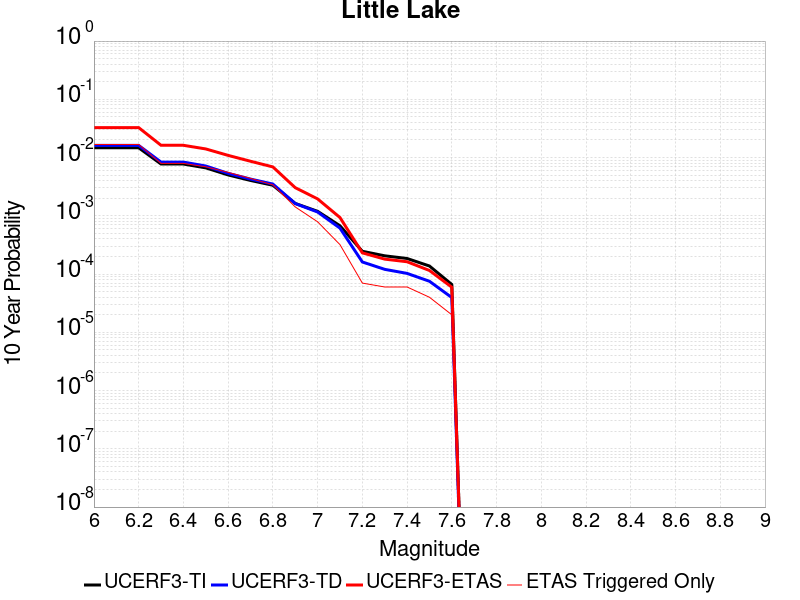 |

| Magnitude | 1 wk TI Prob | 1 wk TD Prob | 1 wk ETAS Prob | 1 wk ETAS/TD Gain | 1 wk ETAS Triggered Only | 1 mo TI Prob | 1 mo TD Prob | 1 mo ETAS Prob | 1 mo ETAS/TD Gain | 1 mo ETAS Triggered Only | 1 yr TI Prob | 1 yr TD Prob | 1 yr ETAS Prob | 1 yr ETAS/TD Gain | 1 yr ETAS Triggered Only | 10 yr TI Prob | 10 yr TD Prob | 10 yr ETAS Prob | 10 yr ETAS/TD Gain | 10 yr ETAS Triggered Only |
|-----|-----|-----|-----|-----|-----|-----|-----|-----|-----|-----|-----|-----|-----|-----|-----|-----|-----|-----|-----|-----|
| 6.0 | 2.8424427E-5 | 3.120572E-5 | 0.006820994 | 218.58151 | 0.00679 | 1.2181328E-4 | 1.337327E-4 | 0.0090725375 | 67.84083 | 0.00894 | 0.0014820677 | 0.0016271127 | 0.0144861555 | 8.902982 | 0.01288 | 0.014722223 | 0.016165402 | 0.032674145 | 2.0212395 | 0.01678 |
| 6.1 | 2.8424427E-5 | 3.120572E-5 | 0.006820994 | 218.58151 | 0.00679 | 1.2181328E-4 | 1.337327E-4 | 0.0090725375 | 67.84083 | 0.00894 | 0.0014820677 | 0.0016271127 | 0.0144861555 | 8.902982 | 0.01288 | 0.014722223 | 0.016165402 | 0.032674145 | 2.0212395 | 0.01678 |
| 6.2 | 2.8424427E-5 | 3.120572E-5 | 0.006820994 | 218.58151 | 0.00679 | 1.2181328E-4 | 1.337327E-4 | 0.0090725375 | 67.84083 | 0.00894 | 0.0014820677 | 0.0016271127 | 0.0144861555 | 8.902982 | 0.01288 | 0.014722223 | 0.016165402 | 0.032674145 | 2.0212395 | 0.01678 |
| 6.3 | 1.48860645E-5 | 1.6081389E-5 | 0.0030660324 | 190.65718 | 0.00305 | 6.379586E-5 | 6.8918576E-5 | 0.0041586366 | 60.3413 | 0.00409 | 7.7643775E-4 | 8.3878887E-4 | 0.006863731 | 8.182906 | 0.00603 | 0.007737305 | 0.008359048 | 0.016232677 | 1.941929 | 0.00794 |
| 6.4 | 1.48860645E-5 | 1.6081389E-5 | 0.0030660324 | 190.65718 | 0.00305 | 6.379586E-5 | 6.8918576E-5 | 0.0041586366 | 60.3413 | 0.00409 | 7.7643775E-4 | 8.3878887E-4 | 0.006863731 | 8.182906 | 0.00603 | 0.007737305 | 0.008359048 | 0.016232677 | 1.941929 | 0.00794 |
| 6.5 | 1.2797581E-5 | 1.3765565E-5 | 0.002663729 | 193.5067 | 0.00265 | 5.4845623E-5 | 5.899409E-5 | 0.003618784 | 61.34147 | 0.00356 | 6.675408E-4 | 7.18042E-4 | 0.0059542796 | 8.292383 | 0.00524 | 0.006655392 | 0.00715977 | 0.014060009 | 1.9637516 | 0.00695 |
| 6.6 | 9.661896E-6 | 1.0289038E-5 | 0.0020802678 | 202.18292 | 0.00207 | 4.1407468E-5 | 4.409522E-5 | 0.0028939696 | 65.630005 | 0.00285 | 5.040193E-4 | 5.367433E-4 | 0.004794457 | 8.932494 | 0.00426 | 0.005028777 | 0.0053560743 | 0.010896241 | 2.0343707 | 0.00557 |
| 6.7 | 7.767871E-6 | 8.199687E-6 | 0.0015881867 | 193.6887 | 0.00158 | 3.329045E-5 | 3.5141118E-5 | 0.0022150646 | 63.03341 | 0.00218 | 4.0523586E-4 | 4.2777284E-4 | 0.0037163654 | 8.687708 | 0.00329 | 0.004044977 | 0.004270846 | 0.008642097 | 2.0235095 | 0.00439 |
| 6.8 | 6.4235196E-6 | 6.7357446E-6 | 0.0012667272 | 188.06047 | 0.00126 | 2.752908E-5 | 2.8867229E-5 | 0.0017288182 | 59.888607 | 0.0017 | 3.35115E-4 | 3.5141467E-4 | 0.0029405046 | 8.36762 | 0.00259 | 0.003346101 | 0.00350985 | 0.0069078812 | 1.9681414 | 0.00341 |
| 6.9 | 3.1283696E-6 | 3.1121804E-6 | 5.5311044E-4 | 177.72443 | 5.5E-4 | 1.3407229E-5 | 1.3337856E-5 | 7.633279E-4 | 57.230175 | 7.5E-4 | 1.6322079E-4 | 1.6237781E-4 | 0.0012422025 | 7.650075 | 0.00108 | 0.0016310095 | 0.00162274 | 0.0030404357 | 1.8736432 | 0.00142 |
| 7.0 | 2.290603E-6 | 2.2286815E-6 | 3.2222798E-4 | 144.58232 | 3.2E-4 | 9.816834E-6 | 9.551463E-6 | 4.6954706E-4 | 49.1597 | 4.6E-4 | 1.19513395E-4 | 1.162839E-4 | 7.562095E-4 | 6.5031314 | 6.4E-4 | 0.0011944914 | 0.0011623327 | 0.0019514145 | 1.6788777 | 7.9E-4 |
| 7.1 | 1.293693E-6 | 1.1776827E-6 | 1.2117754E-4 | 102.89489 | 1.2E-4 | 5.5443866E-6 | 5.0472063E-6 | 1.650464E-4 | 32.700546 | 1.6E-4 | 6.750081E-5 | 6.14487E-5 | 3.1143334E-4 | 5.0681844 | 2.5E-4 | 6.7480316E-4 | 6.143856E-4 | 9.3418895E-4 | 1.5205256 | 3.2E-4 |
| 7.2 | 4.715842E-7 | 3.0917857E-7 | 1.0309175E-5 | 33.343758 | 1.0E-5 | 2.0210737E-6 | 1.3250503E-6 | 2.1325024E-5 | 16.093746 | 2.0E-5 | 2.4606294E-5 | 1.6132375E-5 | 7.613141E-5 | 4.719169 | 6.0E-5 | 2.460357E-4 | 1.6131258E-4 | 2.3130128E-4 | 1.4338701 | 7.0E-5 |
| 7.3 | 3.9430947E-7 | 2.3097488E-7 | 1.0230972E-5 | 44.294743 | 1.0E-5 | 1.6898966E-6 | 9.89892E-7 | 2.0989872E-5 | 21.204205 | 2.0E-5 | 2.0574296E-5 | 1.2051869E-5 | 6.2051266E-5 | 5.1486845 | 5.0E-5 | 2.0572392E-4 | 1.20512224E-4 | 1.80505E-4 | 1.4978148 | 6.0E-5 |
| 7.4 | 3.547123E-7 | 1.9679135E-7 | 1.0196789E-5 | 51.81523 | 1.0E-5 | 1.5201948E-6 | 8.4339126E-7 | 2.0843374E-5 | 24.713766 | 2.0E-5 | 1.8508214E-5 | 1.0268241E-5 | 6.026773E-5 | 5.8693333 | 5.0E-5 | 1.8506673E-4 | 1.02677724E-4 | 1.6267157E-4 | 1.5842927 | 6.0E-5 |
| 7.5 | 2.6354266E-7 | 1.4423138E-7 | 1.4423138E-7 | 1.0 | 0.0 | 1.129468E-6 | 6.181344E-7 | 1.0618128E-5 | 17.177702 | 1.0E-5 | 1.3751187E-5 | 7.5257603E-6 | 3.7525533E-5 | 4.986278 | 3.0E-5 | 1.3750336E-4 | 7.5255106E-5 | 1.152521E-4 | 1.5314854 | 4.0E-5 |
| 7.6 | 1.269913E-7 | 7.572556E-8 | 7.572556E-8 | 1.0 | 0.0 | 5.4424834E-7 | 3.245381E-7 | 3.245381E-7 | 1.0 | 0.0 | 6.6262032E-6 | 3.9512443E-6 | 2.3951165E-5 | 6.0616765 | 2.0E-5 | 6.626006E-5 | 3.9511775E-5 | 5.9510985E-5 | 1.5061582 | 2.0E-5 |

## Ash Hill
*[(top)](#table-of-contents)*

| 1 Week | 1 Month | 1 Year | 10 Year |
|-----|-----|-----|-----|
|  |  |  |  |

| Magnitude | 1 wk TI Prob | 1 wk TD Prob | 1 wk ETAS Prob | 1 wk ETAS/TD Gain | 1 wk ETAS Triggered Only | 1 mo TI Prob | 1 mo TD Prob | 1 mo ETAS Prob | 1 mo ETAS/TD Gain | 1 mo ETAS Triggered Only | 1 yr TI Prob | 1 yr TD Prob | 1 yr ETAS Prob | 1 yr ETAS/TD Gain | 1 yr ETAS Triggered Only | 10 yr TI Prob | 10 yr TD Prob | 10 yr ETAS Prob | 10 yr ETAS/TD Gain | 10 yr ETAS Triggered Only |
|-----|-----|-----|-----|-----|-----|-----|-----|-----|-----|-----|-----|-----|-----|-----|-----|-----|-----|-----|-----|-----|
| 6.0 | 2.1545662E-5 | 2.3194447E-5 | 0.0034731145 | 149.73904 | 0.00345 | 9.2335285E-5 | 9.940143E-5 | 0.0050089136 | 50.390755 | 0.00491 | 0.0011236023 | 0.0012096206 | 0.009249883 | 7.6469293 | 0.00805 | 0.011179381 | 0.012038348 | 0.023953166 | 1.9897386 | 0.01206 |
| 6.1 | 2.1545662E-5 | 2.3194447E-5 | 0.0034731145 | 149.73904 | 0.00345 | 9.2335285E-5 | 9.940143E-5 | 0.0050089136 | 50.390755 | 0.00491 | 0.0011236023 | 0.0012096206 | 0.009249883 | 7.6469293 | 0.00805 | 0.011179381 | 0.012038348 | 0.023953166 | 1.9897386 | 0.01206 |
| 6.2 | 2.1545662E-5 | 2.3194447E-5 | 0.0034731145 | 149.73904 | 0.00345 | 9.2335285E-5 | 9.940143E-5 | 0.0050089136 | 50.390755 | 0.00491 | 0.0011236023 | 0.0012096206 | 0.009249883 | 7.6469293 | 0.00805 | 0.011179381 | 0.012038348 | 0.023953166 | 1.9897386 | 0.01206 |
| 6.3 | 1.0025529E-5 | 1.0746934E-5 | 0.0016607292 | 154.5305 | 0.00165 | 4.2965847E-5 | 4.605755E-5 | 0.0024659461 | 53.54054 | 0.00242 | 5.229836E-4 | 5.6061964E-4 | 0.0041685957 | 7.4356933 | 0.00361 | 0.005217545 | 0.0055933665 | 0.0107245045 | 1.9173614 | 0.00516 |
| 6.4 | 1.0025529E-5 | 1.0746934E-5 | 0.0016607292 | 154.5305 | 0.00165 | 4.2965847E-5 | 4.605755E-5 | 0.0024659461 | 53.54054 | 0.00242 | 5.229836E-4 | 5.6061964E-4 | 0.0041685957 | 7.4356933 | 0.00361 | 0.005217545 | 0.0055933665 | 0.0107245045 | 1.9173614 | 0.00516 |
| 6.5 | 6.9617327E-6 | 7.456634E-6 | 0.001027449 | 137.78992 | 0.00102 | 2.9835655E-5 | 3.195666E-5 | 0.0015519081 | 48.5629 | 0.00152 | 3.6318856E-4 | 3.8901155E-4 | 0.0026881169 | 6.910121 | 0.0023 | 0.0036259557 | 0.0038841602 | 0.0071414593 | 1.8386108 | 0.00327 |
| 6.6 | 4.9919777E-6 | 5.3466883E-6 | 7.753426E-4 | 145.01361 | 7.7E-4 | 2.1394015E-5 | 2.2914215E-5 | 0.0011528883 | 50.313236 | 0.00113 | 2.60441E-4 | 2.7895154E-4 | 0.0020384607 | 7.3075795 | 0.00176 | 0.0026013597 | 0.0027866727 | 0.0051899566 | 1.8624207 | 0.00241 |
| 6.7 | 3.6630722E-6 | 3.924624E-6 | 5.5392244E-4 | 141.14027 | 5.5E-4 | 1.5698786E-5 | 1.681974E-5 | 8.468058E-4 | 50.34595 | 8.3E-4 | 1.9111596E-4 | 2.0476682E-4 | 0.0015244966 | 7.445037 | 0.00132 | 0.0019095168 | 0.0020463446 | 0.0038725997 | 1.8924476 | 0.00183 |
| 6.8 | 2.5599613E-6 | 2.744925E-6 | 3.727439E-4 | 135.79384 | 3.7E-4 | 1.0971216E-5 | 1.1763939E-5 | 5.617575E-4 | 47.752495 | 5.5E-4 | 1.3356637E-4 | 1.4322149E-4 | 0.0010430926 | 7.283073 | 9.0E-4 | 0.0013348613 | 0.0014317769 | 0.002679987 | 1.871791 | 0.00125 |
| 6.9 | 1.7684905E-6 | 1.8968707E-6 | 2.3189644E-4 | 122.252106 | 2.3E-4 | 7.579223E-6 | 8.129446E-6 | 3.481267E-4 | 42.82293 | 3.4E-4 | 9.2273134E-5 | 9.8976E-5 | 6.989166E-4 | 7.0614753 | 6.0E-4 | 9.223483E-4 | 9.8976E-4 | 0.0018888692 | 1.9084113 | 9.0E-4 |

## Garlock (East)
*[(top)](#table-of-contents)*

| 1 Week | 1 Month | 1 Year | 10 Year |
|-----|-----|-----|-----|
|  |  |  |  |

| Magnitude | 1 wk TI Prob | 1 wk TD Prob | 1 wk ETAS Prob | 1 wk ETAS/TD Gain | 1 wk ETAS Triggered Only | 1 mo TI Prob | 1 mo TD Prob | 1 mo ETAS Prob | 1 mo ETAS/TD Gain | 1 mo ETAS Triggered Only | 1 yr TI Prob | 1 yr TD Prob | 1 yr ETAS Prob | 1 yr ETAS/TD Gain | 1 yr ETAS Triggered Only | 10 yr TI Prob | 10 yr TD Prob | 10 yr ETAS Prob | 10 yr ETAS/TD Gain | 10 yr ETAS Triggered Only |
|-----|-----|-----|-----|-----|-----|-----|-----|-----|-----|-----|-----|-----|-----|-----|-----|-----|-----|-----|-----|-----|
| 6.0 | 4.5092507E-5 | 6.290325E-5 | 0.0026827385 | 42.648647 | 0.00262 | 1.9323928E-4 | 2.6956003E-4 | 0.0042184955 | 15.649558 | 0.00395 | 0.0023501497 | 0.0032774 | 0.009756097 | 2.9767795 | 0.0065 | 0.023254504 | 0.032351844 | 0.041883178 | 1.2946149 | 0.00985 |
| 6.1 | 4.5092507E-5 | 6.290325E-5 | 0.0026827385 | 42.648647 | 0.00262 | 1.9323928E-4 | 2.6956003E-4 | 0.0042184955 | 15.649558 | 0.00395 | 0.0023501497 | 0.0032774 | 0.009756097 | 2.9767795 | 0.0065 | 0.023254504 | 0.032351844 | 0.041883178 | 1.2946149 | 0.00985 |
| 6.2 | 2.6674514E-5 | 3.4509674E-5 | 0.0019544435 | 56.63465 | 0.00192 | 1.1431433E-4 | 1.4789042E-4 | 0.002957475 | 19.997746 | 0.00281 | 0.0013908884 | 0.0017991117 | 0.00626107 | 3.4800894 | 0.00447 | 0.01382215 | 0.017890299 | 0.024401685 | 1.3639619 | 0.00663 |
| 6.3 | 2.6674514E-5 | 3.4509674E-5 | 0.0019544435 | 56.63465 | 0.00192 | 1.1431433E-4 | 1.4789042E-4 | 0.002957475 | 19.997746 | 0.00281 | 0.0013908884 | 0.0017991117 | 0.00626107 | 3.4800894 | 0.00447 | 0.01382215 | 0.017890299 | 0.024401685 | 1.3639619 | 0.00663 |
| 6.4 | 2.5312667E-5 | 3.233893E-5 | 0.0019222779 | 59.4416 | 0.00189 | 1.0847834E-4 | 1.3858822E-4 | 0.0029082042 | 20.984499 | 0.00277 | 0.0013199237 | 0.0016860351 | 0.0060786167 | 3.605273 | 0.0044 | 0.013121112 | 0.016778335 | 0.02313978 | 1.3791463 | 0.00647 |
| 6.5 | 2.5312667E-5 | 3.233893E-5 | 0.0019222779 | 59.4416 | 0.00189 | 1.0847834E-4 | 1.3858822E-4 | 0.0029082042 | 20.984499 | 0.00277 | 0.0013199237 | 0.0016860351 | 0.0060786167 | 3.605273 | 0.0044 | 0.013121112 | 0.016778335 | 0.02313978 | 1.3791463 | 0.00647 |
| 6.6 | 2.246556E-5 | 2.8133776E-5 | 0.0018280832 | 64.97823 | 0.0018 | 9.627742E-5 | 1.20567885E-4 | 0.0027202545 | 22.562014 | 0.0026 | 0.0011715472 | 0.0014669491 | 0.0055809054 | 3.80443 | 0.00412 | 0.011653901 | 0.01461866 | 0.020570364 | 1.4071306 | 0.00604 |
| 6.7 | 2.2241198E-5 | 2.7803519E-5 | 0.0018277535 | 65.738205 | 0.0018 | 9.531594E-5 | 1.1915263E-4 | 0.0027188428 | 22.818151 | 0.0026 | 0.0011598538 | 0.0014497414 | 0.005553783 | 3.8308783 | 0.00411 | 0.011538187 | 0.014448853 | 0.020372016 | 1.40994 | 0.00601 |
| 6.8 | 1.9528685E-5 | 2.389819E-5 | 0.0016938583 | 70.8781 | 0.00167 | 8.369167E-5 | 1.0241691E-4 | 0.00251217 | 24.52886 | 0.00241 | 0.0010184698 | 0.0012462323 | 0.004991559 | 4.00532 | 0.00375 | 0.010138147 | 0.012436427 | 0.017769272 | 1.4288083 | 0.0054 |
| 6.9 | 1.3318621E-5 | 1.5198884E-5 | 0.0014351773 | 94.42649 | 0.00142 | 5.7078556E-5 | 6.513648E-5 | 0.0020750056 | 31.856272 | 0.00201 | 6.9470983E-4 | 7.927538E-4 | 0.0039202725 | 4.9451323 | 0.00313 | 0.0069254204 | 0.007939888 | 0.012314873 | 1.5510135 | 0.00441 |
| 7.0 | 1.1760853E-5 | 1.31077895E-5 | 0.0013430903 | 102.46506 | 0.00133 | 5.0402683E-5 | 5.6175057E-5 | 0.0019460688 | 34.642937 | 0.00189 | 6.134799E-4 | 6.8372174E-4 | 0.0036117185 | 5.282439 | 0.00293 | 0.0061178906 | 0.00685652 | 0.010928408 | 1.593871 | 0.0041 |
| 7.1 | 1.0064758E-5 | 1.0902931E-5 | 0.0012608893 | 115.64683 | 0.00125 | 4.3133965E-5 | 4.672603E-5 | 0.0018366424 | 39.306625 | 0.00179 | 5.2502943E-4 | 5.687444E-4 | 0.0032971918 | 5.7973175 | 0.00273 | 0.005237907 | 0.0057129986 | 0.009491289 | 1.6613498 | 0.0038 |
| 7.2 | 9.768808E-6 | 1.0498807E-5 | 0.0012404859 | 118.15494 | 0.00123 | 4.186565E-5 | 4.499413E-5 | 0.0017849158 | 39.66997 | 0.00174 | 5.095951E-4 | 5.4766936E-4 | 0.0032262015 | 5.890784 | 0.00268 | 0.0050842804 | 0.0055032647 | 0.009212738 | 1.6740495 | 0.00373 |
| 7.3 | 9.344516E-6 | 9.944468E-6 | 0.0011299333 | 113.62432 | 0.00112 | 4.004731E-5 | 4.261847E-5 | 0.0015925524 | 37.367657 | 0.00155 | 4.8746695E-4 | 5.1875977E-4 | 0.0028975252 | 5.585485 | 0.00238 | 0.0048639905 | 0.0052149445 | 0.008547475 | 1.6390346 | 0.00335 |
| 7.4 | 9.023491E-6 | 9.490661E-6 | 9.994813E-4 | 105.31208 | 9.9E-4 | 3.867153E-5 | 4.0673647E-5 | 0.0014206176 | 34.927223 | 0.00138 | 4.7072413E-4 | 4.950925E-4 | 0.0026640182 | 5.3808494 | 0.00217 | 0.004697283 | 0.0049783974 | 0.008013213 | 1.609597 | 0.00305 |
| 7.5 | 7.081253E-6 | 7.087672E-6 | 5.1708403E-4 | 72.955414 | 5.1E-4 | 3.0347876E-5 | 3.0375388E-5 | 7.0035504E-4 | 23.056662 | 6.7E-4 | 3.6942272E-4 | 3.6975832E-4 | 0.001449359 | 3.9197466 | 0.00108 | 0.003688092 | 0.0037243143 | 0.0052884673 | 1.4199841 | 0.00157 |
| 7.6 | 6.116396E-6 | 5.959245E-6 | 3.4595723E-4 | 58.05387 | 3.4E-4 | 2.6212863E-5 | 2.5539372E-5 | 4.5552838E-4 | 17.836319 | 4.3E-4 | 3.1909486E-4 | 3.1089774E-4 | 0.0010006832 | 3.2186892 | 6.9E-4 | 0.0031863707 | 0.0031357552 | 0.004152557 | 1.3242605 | 0.00102 |
| 7.7 | 4.797145E-6 | 4.757281E-6 | 1.5475656E-4 | 32.530464 | 1.5E-4 | 2.055903E-5 | 2.0388188E-5 | 2.1038431E-4 | 10.318932 | 1.9E-4 | 2.5027743E-4 | 2.4819805E-4 | 5.981112E-4 | 2.4098141 | 3.5E-4 | 0.0024999576 | 0.0025093474 | 0.0030380173 | 1.2106802 | 5.3E-4 |
| 7.8 | 3.4028885E-6 | 3.978462E-6 | 9.39781E-5 | 23.62172 | 9.0E-5 | 1.4583726E-5 | 1.7050439E-5 | 1.2704857E-4 | 7.451337 | 1.1E-4 | 1.775424E-4 | 2.0756939E-4 | 3.775341E-4 | 1.8188332 | 1.7E-4 | 0.0017740062 | 0.0021012232 | 0.0023706558 | 1.1282266 | 2.7E-4 |
| 7.9 | 2.5928412E-6 | 3.3724489E-6 | 5.337228E-5 | 15.825972 | 5.0E-5 | 1.1112129E-5 | 1.4453272E-5 | 8.445226E-5 | 5.843124 | 7.0E-5 | 1.3528178E-4 | 1.7595445E-4 | 2.9593334E-4 | 1.6818746 | 1.2E-4 | 0.0013519945 | 0.0017812408 | 0.0019808845 | 1.1120813 | 2.0E-4 |
| 8.0 | 1.3743648E-6 | 1.6734747E-6 | 1.6734747E-6 | 1.0 | 0.0 | 5.8901214E-6 | 7.1720146E-6 | 1.7171944E-5 | 2.3942983 | 1.0E-5 | 7.1709874E-5 | 8.731581E-5 | 1.0731407E-4 | 1.2290336 | 2.0E-5 | 7.1686733E-4 | 8.837234E-4 | 9.3367917E-4 | 1.0565288 | 5.0E-5 |
| 8.1 | 3.6733252E-7 | 3.1489964E-7 | 3.1489964E-7 | 1.0 | 0.0 | 1.5742813E-6 | 1.3495693E-6 | 1.3495693E-6 | 1.0 | 0.0 | 1.9166706E-5 | 1.6430899E-5 | 1.6430899E-5 | 1.0 | 0.0 | 1.9165053E-4 | 1.6638759E-4 | 1.6638759E-4 | 1.0 | 0.0 |

## Blackwater
*[(top)](#table-of-contents)*

| 1 Week | 1 Month | 1 Year | 10 Year |
|-----|-----|-----|-----|
|  |  |  |  |

| Magnitude | 1 wk TI Prob | 1 wk TD Prob | 1 wk ETAS Prob | 1 wk ETAS/TD Gain | 1 wk ETAS Triggered Only | 1 mo TI Prob | 1 mo TD Prob | 1 mo ETAS Prob | 1 mo ETAS/TD Gain | 1 mo ETAS Triggered Only | 1 yr TI Prob | 1 yr TD Prob | 1 yr ETAS Prob | 1 yr ETAS/TD Gain | 1 yr ETAS Triggered Only | 10 yr TI Prob | 10 yr TD Prob | 10 yr ETAS Prob | 10 yr ETAS/TD Gain | 10 yr ETAS Triggered Only |
|-----|-----|-----|-----|-----|-----|-----|-----|-----|-----|-----|-----|-----|-----|-----|-----|-----|-----|-----|-----|-----|
| 6.0 | 3.0708583E-5 | 3.3095846E-5 | 0.0021230266 | 64.14783 | 0.00209 | 1.3160157E-4 | 1.4183241E-4 | 0.0030814153 | 21.72575 | 0.00294 | 0.0016010714 | 0.0017255784 | 0.0065572266 | 3.8000164 | 0.00484 | 0.015895851 | 0.017135633 | 0.023769967 | 1.387166 | 0.00675 |
| 6.1 | 3.0708583E-5 | 3.3095846E-5 | 0.0021230266 | 64.14783 | 0.00209 | 1.3160157E-4 | 1.4183241E-4 | 0.0030814153 | 21.72575 | 0.00294 | 0.0016010714 | 0.0017255784 | 0.0065572266 | 3.8000164 | 0.00484 | 0.015895851 | 0.017135633 | 0.023769967 | 1.387166 | 0.00675 |
| 6.2 | 1.1707779E-5 | 1.2545122E-5 | 8.1253506E-4 | 64.769005 | 8.0E-4 | 5.017523E-5 | 5.3763757E-5 | 0.0011437051 | 21.27279 | 0.00109 | 6.107122E-4 | 6.5438676E-4 | 0.0025631369 | 3.9168532 | 0.00191 | 0.006090366 | 0.0065255696 | 0.009287428 | 1.4232365 | 0.00278 |
| 6.3 | 1.1707779E-5 | 1.2545122E-5 | 8.1253506E-4 | 64.769005 | 8.0E-4 | 5.017523E-5 | 5.3763757E-5 | 0.0011437051 | 21.27279 | 0.00109 | 6.107122E-4 | 6.5438676E-4 | 0.0025631369 | 3.9168532 | 0.00191 | 0.006090366 | 0.0065255696 | 0.009287428 | 1.4232365 | 0.00278 |
| 6.4 | 7.929244E-6 | 8.480098E-6 | 5.4847554E-4 | 64.67797 | 5.4E-4 | 3.3982033E-5 | 3.6342793E-5 | 7.5631664E-4 | 20.810635 | 7.2E-4 | 4.136527E-4 | 4.423877E-4 | 0.0017418126 | 3.9372988 | 0.0013 | 0.0041288356 | 0.0044154758 | 0.0062971306 | 1.42615 | 0.00189 |
| 6.5 | 5.8832115E-6 | 6.285991E-6 | 3.8628362E-4 | 61.451504 | 3.8E-4 | 2.521352E-5 | 2.6939697E-5 | 5.569254E-4 | 20.673038 | 5.3E-4 | 3.0693135E-4 | 3.27944E-4 | 0.001297626 | 3.9568522 | 9.7E-4 | 0.0030650778 | 0.0032748538 | 0.0046902034 | 1.4321872 | 0.00142 |
| 6.6 | 5.8832115E-6 | 6.285991E-6 | 3.8628362E-4 | 61.451504 | 3.8E-4 | 2.521352E-5 | 2.6939697E-5 | 5.569254E-4 | 20.673038 | 5.3E-4 | 3.0693135E-4 | 3.27944E-4 | 0.001297626 | 3.9568522 | 9.7E-4 | 0.0030650778 | 0.0032748538 | 0.0046902034 | 1.4321872 | 0.00142 |
| 6.7 | 3.0715053E-6 | 3.2814662E-6 | 1.6328094E-4 | 49.758533 | 1.6E-4 | 1.3163528E-5 | 1.4063357E-5 | 2.2406041E-4 | 15.932213 | 2.1E-4 | 1.6025416E-4 | 1.7120909E-4 | 6.21132E-4 | 3.6279151 | 4.5E-4 | 0.0016013865 | 0.0017108864 | 0.0023597744 | 1.3792701 | 6.5E-4 |
| 6.8 | 2.2722281E-6 | 2.4287538E-6 | 1.2242846E-4 | 50.407936 | 1.2E-4 | 9.738084E-6 | 1.0408908E-5 | 1.6040735E-4 | 15.4105835 | 1.5E-4 | 1.1855473E-4 | 1.26722E-4 | 4.4668146E-4 | 3.5248926 | 3.2E-4 | 0.001184915 | 0.0012665876 | 0.0017060303 | 1.34695 | 4.4E-4 |
| 6.9 | 9.952399E-7 | 1.0653489E-6 | 4.1065305E-5 | 38.546345 | 4.0E-5 | 4.265307E-6 | 4.5657757E-6 | 6.45655E-5 | 14.14119 | 6.0E-5 | 5.1928873E-5 | 5.5587418E-5 | 1.5558186E-4 | 2.7988682 | 1.0E-4 | 5.191674E-4 | 5.557858E-4 | 6.657246E-4 | 1.197808 | 1.1E-4 |
| 7.0 | 4.7385504E-7 | 5.0755597E-7 | 1.05075505E-5 | 20.702251 | 1.0E-5 | 2.0308057E-6 | 2.1752398E-6 | 2.2175196E-5 | 10.194368 | 2.0E-5 | 2.4724779E-5 | 2.6483543E-5 | 4.6483015E-5 | 1.7551659 | 2.0E-5 | 2.4722028E-4 | 2.6483546E-4 | 2.8483014E-4 | 1.0754986 | 2.0E-5 |

## Hunter Mountain-Saline Valley
*[(top)](#table-of-contents)*

| 1 Week | 1 Month | 1 Year | 10 Year |
|-----|-----|-----|-----|
|  |  | 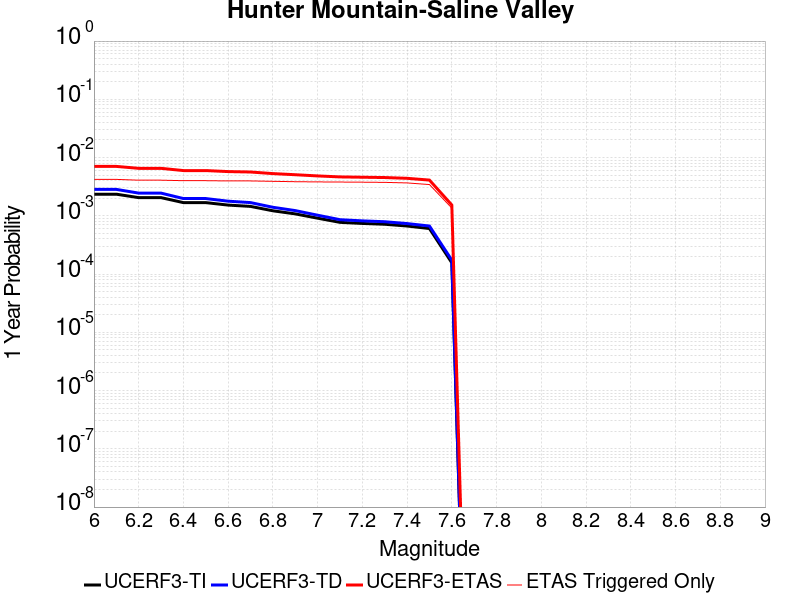 |  |

| Magnitude | 1 wk TI Prob | 1 wk TD Prob | 1 wk ETAS Prob | 1 wk ETAS/TD Gain | 1 wk ETAS Triggered Only | 1 mo TI Prob | 1 mo TD Prob | 1 mo ETAS Prob | 1 mo ETAS/TD Gain | 1 mo ETAS Triggered Only | 1 yr TI Prob | 1 yr TD Prob | 1 yr ETAS Prob | 1 yr ETAS/TD Gain | 1 yr ETAS Triggered Only | 10 yr TI Prob | 10 yr TD Prob | 10 yr ETAS Prob | 10 yr ETAS/TD Gain | 10 yr ETAS Triggered Only |
|-----|-----|-----|-----|-----|-----|-----|-----|-----|-----|-----|-----|-----|-----|-----|-----|-----|-----|-----|-----|-----|
| 6.0 | 4.5103672E-5 | 5.4570177E-5 | 0.0019144687 | 35.08269 | 0.00186 | 1.9328714E-4 | 2.3385242E-4 | 0.0028332444 | 12.115522 | 0.0026 | 0.002350731 | 0.0028435152 | 0.007051516 | 2.4798586 | 0.00422 | 0.023260195 | 0.028091887 | 0.03406912 | 1.2127744 | 0.00615 |
| 6.1 | 4.5103672E-5 | 5.4570177E-5 | 0.0019144687 | 35.08269 | 0.00186 | 1.9328714E-4 | 2.3385242E-4 | 0.0028332444 | 12.115522 | 0.0026 | 0.002350731 | 0.0028435152 | 0.007051516 | 2.4798586 | 0.00422 | 0.023260195 | 0.028091887 | 0.03406912 | 1.2127744 | 0.00615 |
| 6.2 | 3.9363465E-5 | 4.706337E-5 | 0.0018769773 | 39.881912 | 0.00183 | 1.6868966E-4 | 2.0168544E-4 | 0.0027411731 | 13.591329 | 0.00254 | 0.002051862 | 0.0024528175 | 0.0065327855 | 2.6633801 | 0.00409 | 0.020330196 | 0.024273481 | 0.03012784 | 1.2411833 | 0.006 |
| 6.3 | 3.9363465E-5 | 4.706337E-5 | 0.0018769773 | 39.881912 | 0.00183 | 1.6868966E-4 | 2.0168544E-4 | 0.0027411731 | 13.591329 | 0.00254 | 0.002051862 | 0.0024528175 | 0.0065327855 | 2.6633801 | 0.00409 | 0.020330196 | 0.024273481 | 0.03012784 | 1.2411833 | 0.006 |
| 6.4 | 3.2311684E-5 | 3.795099E-5 | 0.0018478823 | 48.69128 | 0.00181 | 1.384713E-4 | 1.6263737E-4 | 0.0026522323 | 16.307644 | 0.00249 | 0.0016845843 | 0.0019783843 | 0.005980451 | 3.0228965 | 0.00401 | 0.016718714 | 0.019616475 | 0.025390934 | 1.2943678 | 0.00589 |
| 6.5 | 3.2311684E-5 | 3.795099E-5 | 0.0018478823 | 48.69128 | 0.00181 | 1.384713E-4 | 1.6263737E-4 | 0.0026522323 | 16.307644 | 0.00249 | 0.0016845843 | 0.0019783843 | 0.005980451 | 3.0228965 | 0.00401 | 0.016718714 | 0.019616475 | 0.025390934 | 1.2943678 | 0.00589 |
| 6.6 | 2.9305844E-5 | 3.418183E-5 | 0.0018241206 | 53.36521 | 0.00179 | 1.2559042E-4 | 1.4648569E-4 | 0.0026161238 | 17.859245 | 0.00247 | 0.0015279909 | 0.001782067 | 0.0057449923 | 3.2237802 | 0.00397 | 0.015175272 | 0.01768569 | 0.023412583 | 1.323815 | 0.00583 |
| 6.7 | 2.7826512E-5 | 3.2344276E-5 | 0.0018222864 | 56.340305 | 0.00179 | 1.19251024E-4 | 1.386113E-4 | 0.002608269 | 18.817144 | 0.00247 | 0.0014509142 | 0.0016863465 | 0.005649652 | 3.350232 | 0.00397 | 0.014414776 | 0.016743187 | 0.022475574 | 1.3423713 | 0.00583 |
| 6.8 | 2.3389874E-5 | 2.6866714E-5 | 0.0017968192 | 66.879005 | 0.00177 | 1.0023846E-4 | 1.15138246E-4 | 0.0025548574 | 22.189476 | 0.00244 | 0.00121972 | 0.001400954 | 0.005305476 | 3.7870455 | 0.00391 | 0.01213047 | 0.013927434 | 0.019597352 | 1.4071043 | 0.00575 |
| 6.9 | 2.069209E-5 | 2.3570032E-5 | 0.0017435295 | 73.972305 | 0.00172 | 8.867737E-5 | 1.01010715E-4 | 0.0024907694 | 24.658466 | 0.00239 | 0.0010791123 | 0.0012291478 | 0.0050744154 | 4.1284018 | 0.00385 | 0.010738871 | 0.012228523 | 0.017829187 | 1.4580001 | 0.00567 |
| 7.0 | 1.7462342E-5 | 1.9633546E-5 | 0.0017196002 | 87.5848 | 0.0017 | 7.483646E-5 | 8.414118E-5 | 0.0024539419 | 29.164574 | 0.00237 | 9.1075303E-4 | 0.0010239601 | 0.0048400485 | 4.7267942 | 0.00382 | 0.009070295 | 0.0101960525 | 0.015778547 | 1.5475153 | 0.00564 |
| 7.1 | 1.4807709E-5 | 1.6441749E-5 | 0.0017064139 | 103.78542 | 0.00169 | 6.3460066E-5 | 7.046283E-5 | 0.0024202974 | 34.348568 | 0.00235 | 7.723524E-4 | 8.575638E-4 | 0.004654305 | 5.427357 | 0.0038 | 0.007696735 | 0.008545532 | 0.0141075915 | 1.6508734 | 0.00561 |
| 7.2 | 1.4180048E-5 | 1.5698337E-5 | 0.0017056718 | 108.65303 | 0.00169 | 6.077022E-5 | 6.727694E-5 | 0.0024171188 | 35.927895 | 0.00235 | 7.396263E-4 | 8.188051E-4 | 0.00459571 | 5.612703 | 0.00378 | 0.0073716943 | 0.008160833 | 0.013695296 | 1.6781737 | 0.00558 |
| 7.3 | 1.3730402E-5 | 1.5172075E-5 | 0.0016851467 | 111.06897 | 0.00167 | 5.8843252E-5 | 6.502165E-5 | 0.0023948702 | 36.831886 | 0.00233 | 7.161811E-4 | 7.9136714E-4 | 0.0045383996 | 5.7348847 | 0.00375 | 0.007138774 | 0.007888422 | 0.013394642 | 1.6980127 | 0.00555 |
| 7.4 | 1.2810095E-5 | 1.4109277E-5 | 0.0016440863 | 116.5252 | 0.00163 | 5.489925E-5 | 6.0467017E-5 | 0.002340329 | 38.704227 | 0.00228 | 6.681934E-4 | 7.359531E-4 | 0.004403252 | 5.983061 | 0.00367 | 0.006661878 | 0.007338053 | 0.012738134 | 1.735901 | 0.00544 |
| 7.5 | 1.1595659E-5 | 1.2800664E-5 | 0.0015627808 | 122.08592 | 0.00155 | 4.9694736E-5 | 5.4858923E-5 | 0.0022147405 | 40.371563 | 0.00216 | 6.0486543E-4 | 6.6771836E-4 | 0.0041054212 | 6.1484327 | 0.00344 | 0.006032217 | 0.0066599925 | 0.011745893 | 1.7636497 | 0.00512 |
| 7.6 | 2.997694E-6 | 3.3251579E-6 | 6.833229E-4 | 205.50089 | 6.8E-4 | 1.28471975E-5 | 1.425064E-5 | 9.842368E-4 | 69.06615 | 9.7E-4 | 1.564034E-4 | 1.73495E-4 | 0.001533259 | 8.837482 | 0.00136 | 0.0015629337 | 0.001735031 | 0.0037714916 | 2.1737316 | 0.00204 |

## Gravel Hills-Harper Lk
*[(top)](#table-of-contents)*

| 1 Week | 1 Month | 1 Year | 10 Year |
|-----|-----|-----|-----|
|  |  | 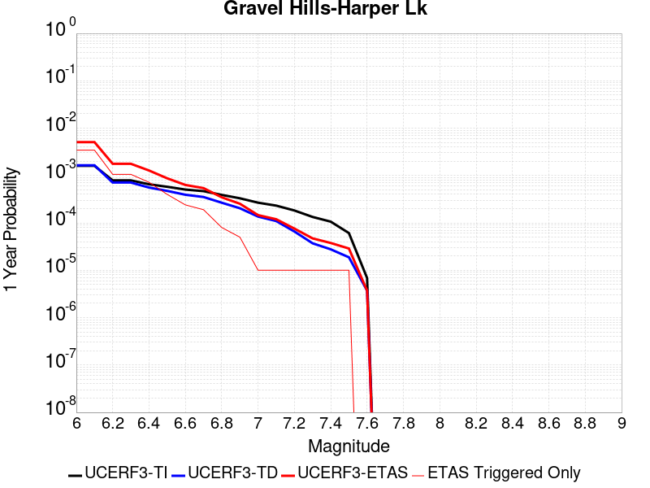 |  |

| Magnitude | 1 wk TI Prob | 1 wk TD Prob | 1 wk ETAS Prob | 1 wk ETAS/TD Gain | 1 wk ETAS Triggered Only | 1 mo TI Prob | 1 mo TD Prob | 1 mo ETAS Prob | 1 mo ETAS/TD Gain | 1 mo ETAS Triggered Only | 1 yr TI Prob | 1 yr TD Prob | 1 yr ETAS Prob | 1 yr ETAS/TD Gain | 1 yr ETAS Triggered Only | 10 yr TI Prob | 10 yr TD Prob | 10 yr ETAS Prob | 10 yr ETAS/TD Gain | 10 yr ETAS Triggered Only |
|-----|-----|-----|-----|-----|-----|-----|-----|-----|-----|-----|-----|-----|-----|-----|-----|-----|-----|-----|-----|-----|
| 6.0 | 3.0679566E-5 | 3.1464646E-5 | 0.001511418 | 48.03544 | 0.00148 | 1.3147724E-4 | 1.3484273E-4 | 0.0022445582 | 16.645748 | 0.00211 | 0.0015995599 | 0.0016406906 | 0.005065063 | 3.087153 | 0.00343 | 0.015880952 | 0.01630734 | 0.021088084 | 1.2931653 | 0.00486 |
| 6.1 | 3.0679566E-5 | 3.1464646E-5 | 0.001511418 | 48.03544 | 0.00148 | 1.3147724E-4 | 1.3484273E-4 | 0.0022445582 | 16.645748 | 0.00211 | 0.0015995599 | 0.0016406906 | 0.005065063 | 3.087153 | 0.00343 | 0.015880952 | 0.01630734 | 0.021088084 | 1.2931653 | 0.00486 |
| 6.2 | 1.514536E-5 | 1.3635206E-5 | 4.6362908E-4 | 34.00235 | 4.5E-4 | 6.490707E-5 | 5.843536E-5 | 6.8839855E-4 | 11.780514 | 6.3E-4 | 7.8995706E-4 | 7.1123015E-4 | 0.0017704762 | 2.4893155 | 0.00106 | 0.007871548 | 0.0070907404 | 0.008639679 | 1.2184452 | 0.00156 |
| 6.3 | 1.514536E-5 | 1.3635206E-5 | 4.6362908E-4 | 34.00235 | 4.5E-4 | 6.490707E-5 | 5.843536E-5 | 6.8839855E-4 | 11.780514 | 6.3E-4 | 7.8995706E-4 | 7.1123015E-4 | 0.0017704762 | 2.4893155 | 0.00106 | 0.007871548 | 0.0070907404 | 0.008639679 | 1.2184452 | 0.00156 |
| 6.4 | 1.2532521E-5 | 1.06896905E-5 | 3.2068638E-4 | 29.999594 | 3.1E-4 | 5.37097E-5 | 4.581219E-5 | 4.557934E-4 | 9.949173 | 4.1E-4 | 6.537194E-4 | 5.576265E-4 | 0.001277225 | 2.2904668 | 7.2E-4 | 0.0065179965 | 0.005562863 | 0.0065771886 | 1.1823388 | 0.00102 |
| 6.5 | 1.1094058E-5 | 9.083664E-6 | 1.7908213E-4 | 19.714746 | 1.7E-4 | 4.7545094E-5 | 3.892943E-5 | 2.6892047E-4 | 6.907897 | 2.3E-4 | 5.787078E-4 | 4.7386673E-4 | 8.736772E-4 | 1.8437191 | 4.0E-4 | 0.0057720304 | 0.0047289706 | 0.00531618 | 1.1241729 | 5.9E-4 |
| 6.6 | 9.688328E-6 | 7.5316952E-6 | 1.0753094E-4 | 14.277123 | 1.0E-4 | 4.1520743E-5 | 3.227831E-5 | 1.722738E-4 | 5.337138 | 1.4E-4 | 5.053978E-4 | 3.9292008E-4 | 6.328258E-4 | 1.6105713 | 2.4E-4 | 0.0050424994 | 0.0039225104 | 0.004310981 | 1.0990361 | 3.9E-4 |
| 6.7 | 8.974824E-6 | 6.749413E-6 | 9.674881E-5 | 14.334403 | 9.0E-5 | 3.8462964E-5 | 2.8925748E-5 | 1.5892199E-4 | 5.494136 | 1.3E-4 | 4.6818596E-4 | 3.5211627E-4 | 5.4204935E-4 | 1.5394045 | 1.9E-4 | 0.004672008 | 0.0035158044 | 0.0037748904 | 1.0736917 | 2.6E-4 |
| 6.8 | 7.4780046E-6 | 5.1161933E-6 | 3.511604E-5 | 6.8637047 | 3.0E-5 | 3.20482E-5 | 2.1926366E-5 | 7.192527E-5 | 3.2803097 | 5.0E-5 | 3.9011694E-4 | 2.669222E-4 | 3.4690084E-4 | 1.2996328 | 8.0E-5 | 0.0038943281 | 0.0026661542 | 0.0027958076 | 1.0486294 | 1.3E-4 |
| 6.9 | 6.3409307E-6 | 3.9074966E-6 | 2.3907418E-5 | 6.118346 | 2.0E-5 | 2.7175134E-5 | 1.6746313E-5 | 4.6745812E-5 | 2.791409 | 3.0E-5 | 3.3080703E-4 | 2.0386827E-4 | 2.5385807E-4 | 1.2452064 | 5.0E-5 | 0.0033031502 | 0.0020369107 | 0.002106768 | 1.0342958 | 7.0E-5 |
| 7.0 | 5.1239335E-6 | 2.6058565E-6 | 1.260583E-5 | 4.8375 | 1.0E-5 | 2.195953E-5 | 1.116791E-5 | 2.1167798E-5 | 1.8954127 | 1.0E-5 | 2.6732447E-4 | 1.3596108E-4 | 1.4595971E-4 | 1.0735404 | 1.0E-5 | 0.0026700313 | 0.0013588042 | 0.001378777 | 1.0146989 | 2.0E-5 |
| 7.1 | 4.438899E-6 | 2.0984728E-6 | 1.2098451E-5 | 5.7653604 | 1.0E-5 | 1.9023713E-5 | 8.993425E-6 | 1.8993334E-5 | 2.1119134 | 1.0E-5 | 2.315891E-4 | 1.0948967E-4 | 1.1948858E-4 | 1.0913228 | 1.0E-5 | 0.002313479 | 0.0010943791 | 0.0011043682 | 1.0091276 | 1.0E-5 |
| 7.2 | 3.50367E-6 | 1.2615716E-6 | 1.1261559E-5 | 8.926611 | 1.0E-5 | 1.5015643E-5 | 5.4067245E-6 | 1.5406671E-5 | 2.8495386 | 1.0E-5 | 1.8280011E-4 | 6.582497E-5 | 7.582431E-5 | 1.151908 | 1.0E-5 | 0.0018264982 | 6.580629E-4 | 6.6805637E-4 | 1.0151861 | 1.0E-5 |
| 7.3 | 2.561638E-6 | 7.1191585E-7 | 1.07119085E-5 | 15.046594 | 1.0E-5 | 1.0978401E-5 | 3.0510646E-6 | 1.3051034E-5 | 4.2775345 | 1.0E-5 | 1.3365384E-4 | 3.71461E-5 | 4.7145724E-5 | 1.2691972 | 1.0E-5 | 0.0013357349 | 3.7140088E-4 | 3.8139717E-4 | 1.0269151 | 1.0E-5 |
| 7.4 | 2.0368864E-6 | 5.304837E-7 | 1.0530478E-5 | 19.85071 | 1.0E-5 | 8.729483E-6 | 2.2734996E-6 | 1.2273477E-5 | 5.398495 | 1.0E-5 | 1.06276275E-4 | 2.7679513E-5 | 3.7679238E-5 | 1.361268 | 1.0E-5 | 0.0010622547 | 2.767612E-4 | 2.867584E-4 | 1.0361222 | 1.0E-5 |
| 7.5 | 1.1681728E-6 | 3.6030585E-7 | 1.0360302E-5 | 28.754189 | 1.0E-5 | 5.0064455E-6 | 1.544167E-6 | 1.1544152E-5 | 7.475973 | 1.0E-5 | 6.0951766E-5 | 1.8800076E-5 | 2.8799888E-5 | 1.5319028 | 1.0E-5 | 6.093505E-4 | 1.8798532E-4 | 1.9798345E-4 | 1.0531856 | 1.0E-5 |
| 7.6 | 1.3154387E-7 | 7.1197384E-8 | 7.1197384E-8 | 1.0 | 0.0 | 5.6375933E-7 | 3.051316E-7 | 3.051316E-7 | 1.0 | 0.0 | 6.863748E-6 | 3.7149728E-6 | 3.7149728E-6 | 1.0 | 0.0 | 6.863536E-5 | 3.7149264E-5 | 3.7149264E-5 | 1.0 | 0.0 |

## Airport Lake
*[(top)](#table-of-contents)*

| 1 Week | 1 Month | 1 Year | 10 Year |
|-----|-----|-----|-----|
|  |  |  |  |

| Magnitude | 1 wk TI Prob | 1 wk TD Prob | 1 wk ETAS Prob | 1 wk ETAS/TD Gain | 1 wk ETAS Triggered Only | 1 mo TI Prob | 1 mo TD Prob | 1 mo ETAS Prob | 1 mo ETAS/TD Gain | 1 mo ETAS Triggered Only | 1 yr TI Prob | 1 yr TD Prob | 1 yr ETAS Prob | 1 yr ETAS/TD Gain | 1 yr ETAS Triggered Only | 10 yr TI Prob | 10 yr TD Prob | 10 yr ETAS Prob | 10 yr ETAS/TD Gain | 10 yr ETAS Triggered Only |
|-----|-----|-----|-----|-----|-----|-----|-----|-----|-----|-----|-----|-----|-----|-----|-----|-----|-----|-----|-----|-----|
| 6.0 | 1.2387061E-5 | 1.3103157E-5 | 0.0018730788 | 142.94867 | 0.00186 | 5.3086325E-5 | 5.615534E-5 | 0.002556015 | 45.516865 | 0.0025 | 6.461343E-4 | 6.8350515E-4 | 0.004311024 | 6.3072295 | 0.00363 | 0.0064425888 | 0.0068168393 | 0.011663573 | 1.7109942 | 0.00488 |
| 6.1 | 1.2387061E-5 | 1.3103157E-5 | 0.0018730788 | 142.94867 | 0.00186 | 5.3086325E-5 | 5.615534E-5 | 0.002556015 | 45.516865 | 0.0025 | 6.461343E-4 | 6.8350515E-4 | 0.004311024 | 6.3072295 | 0.00363 | 0.0064425888 | 0.0068168393 | 0.011663573 | 1.7109942 | 0.00488 |
| 6.2 | 1.2387061E-5 | 1.3103157E-5 | 0.0018730788 | 142.94867 | 0.00186 | 5.3086325E-5 | 5.615534E-5 | 0.002556015 | 45.516865 | 0.0025 | 6.461343E-4 | 6.8350515E-4 | 0.004311024 | 6.3072295 | 0.00363 | 0.0064425888 | 0.0068168393 | 0.011663573 | 1.7109942 | 0.00488 |
| 6.3 | 1.2387061E-5 | 1.3103157E-5 | 0.0018730788 | 142.94867 | 0.00186 | 5.3086325E-5 | 5.615534E-5 | 0.002556015 | 45.516865 | 0.0025 | 6.461343E-4 | 6.8350515E-4 | 0.004311024 | 6.3072295 | 0.00363 | 0.0064425888 | 0.0068168393 | 0.011663573 | 1.7109942 | 0.00488 |
| 6.4 | 1.2387061E-5 | 1.3103157E-5 | 0.0018730788 | 142.94867 | 0.00186 | 5.3086325E-5 | 5.615534E-5 | 0.002556015 | 45.516865 | 0.0025 | 6.461343E-4 | 6.8350515E-4 | 0.004311024 | 6.3072295 | 0.00363 | 0.0064425888 | 0.0068168393 | 0.011663573 | 1.7109942 | 0.00488 |
| 6.5 | 6.9922594E-6 | 7.384925E-6 | 0.001357375 | 183.80348 | 0.00135 | 2.996648E-5 | 3.1649324E-5 | 0.0018615914 | 58.819305 | 0.00183 | 3.6478083E-4 | 3.8526783E-4 | 0.003054239 | 7.9275737 | 0.00267 | 0.003641826 | 0.0038465366 | 0.0074426504 | 1.9348966 | 0.00361 |
| 6.6 | 6.9922594E-6 | 7.384925E-6 | 0.001357375 | 183.80348 | 0.00135 | 2.996648E-5 | 3.1649324E-5 | 0.0018615914 | 58.819305 | 0.00183 | 3.6478083E-4 | 3.8526783E-4 | 0.003054239 | 7.9275737 | 0.00267 | 0.003641826 | 0.0038465366 | 0.0074426504 | 1.9348966 | 0.00361 |
| 6.7 | 5.477277E-6 | 5.7860684E-6 | 0.0011757793 | 203.20868 | 0.00117 | 2.3473833E-5 | 2.4797222E-5 | 0.0016347573 | 65.92502 | 0.00161 | 2.8575645E-4 | 3.0186825E-4 | 0.00258118 | 8.550684 | 0.00228 | 0.0028538927 | 0.003014966 | 0.00608568 | 2.0184903 | 0.00308 |
| 6.8 | 3.9950432E-6 | 4.2190873E-6 | 9.5421507E-4 | 226.16624 | 9.5E-4 | 1.7121502E-5 | 1.8081691E-5 | 0.0012680591 | 70.12945 | 0.00125 | 2.0843433E-4 | 2.2012512E-4 | 0.0019097531 | 8.675762 | 0.00169 | 0.0020823893 | 0.0021993418 | 0.0044244374 | 2.0117097 | 0.00223 |
| 6.9 | 2.95695E-6 | 3.1230243E-6 | 6.831209E-4 | 218.73698 | 6.8E-4 | 1.2672582E-5 | 1.3384334E-5 | 9.2337216E-4 | 68.98902 | 9.1E-4 | 1.5427776E-4 | 1.6294434E-4 | 0.0013927439 | 8.547359 | 0.00123 | 0.001541707 | 0.0016284712 | 0.0032757842 | 2.0115702 | 0.00165 |
| 7.0 | 1.456072E-6 | 1.540812E-6 | 2.715404E-4 | 176.23201 | 2.7E-4 | 6.2402937E-6 | 6.603469E-6 | 3.8660096E-4 | 58.54513 | 3.8E-4 | 7.597293E-5 | 8.039528E-5 | 5.8035506E-4 | 7.218771 | 5.0E-4 | 7.594696E-4 | 8.0376083E-4 | 0.0014232625 | 1.7707537 | 6.2E-4 |
| 7.1 | 6.995192E-7 | 7.4089746E-7 | 1.0074082E-4 | 135.97134 | 1.0E-4 | 2.997936E-6 | 3.1752747E-6 | 1.2317489E-4 | 38.791885 | 1.2E-4 | 3.649926E-5 | 3.865897E-5 | 1.9865278E-4 | 5.1385946 | 1.6E-4 | 3.6493264E-4 | 3.865897E-4 | 5.965085E-4 | 1.5430015 | 2.1E-4 |

## Goldstone Lake
*[(top)](#table-of-contents)*

| 1 Week | 1 Month | 1 Year | 10 Year |
|-----|-----|-----|-----|
|  |  |  |  |

| Magnitude | 1 wk TI Prob | 1 wk TD Prob | 1 wk ETAS Prob | 1 wk ETAS/TD Gain | 1 wk ETAS Triggered Only | 1 mo TI Prob | 1 mo TD Prob | 1 mo ETAS Prob | 1 mo ETAS/TD Gain | 1 mo ETAS Triggered Only | 1 yr TI Prob | 1 yr TD Prob | 1 yr ETAS Prob | 1 yr ETAS/TD Gain | 1 yr ETAS Triggered Only | 10 yr TI Prob | 10 yr TD Prob | 10 yr ETAS Prob | 10 yr ETAS/TD Gain | 10 yr ETAS Triggered Only |
|-----|-----|-----|-----|-----|-----|-----|-----|-----|-----|-----|-----|-----|-----|-----|-----|-----|-----|-----|-----|-----|
| 6.0 | 2.671352E-5 | 3.037609E-5 | 0.0010303457 | 33.91963 | 0.001 | 1.1448149E-4 | 1.3017785E-4 | 0.00164998 | 12.674813 | 0.00152 | 0.001392921 | 0.0015839594 | 0.004109952 | 2.594733 | 0.00253 | 0.013842222 | 0.015746197 | 0.019525731 | 1.2400284 | 0.00384 |
| 6.1 | 2.671352E-5 | 3.037609E-5 | 0.0010303457 | 33.91963 | 0.001 | 1.1448149E-4 | 1.3017785E-4 | 0.00164998 | 12.674813 | 0.00152 | 0.001392921 | 0.0015839594 | 0.004109952 | 2.594733 | 0.00253 | 0.013842222 | 0.015746197 | 0.019525731 | 1.2400284 | 0.00384 |
| 6.2 | 1.4197047E-5 | 1.6096245E-5 | 4.960885E-4 | 30.82014 | 4.8E-4 | 6.0843064E-5 | 6.8982634E-5 | 8.5892814E-4 | 12.451367 | 7.9E-4 | 7.4051257E-4 | 8.3963864E-4 | 0.0021984966 | 2.6183844 | 0.00136 | 0.007380498 | 0.0083743585 | 0.010506354 | 1.2545861 | 0.00215 |
| 6.3 | 1.4197047E-5 | 1.6096245E-5 | 4.960885E-4 | 30.82014 | 4.8E-4 | 6.0843064E-5 | 6.8982634E-5 | 8.5892814E-4 | 12.451367 | 7.9E-4 | 7.4051257E-4 | 8.3963864E-4 | 0.0021984966 | 2.6183844 | 0.00136 | 0.007380498 | 0.0083743585 | 0.010506354 | 1.2545861 | 0.00215 |
| 6.4 | 1.3238931E-5 | 1.500846E-5 | 4.650017E-4 | 30.982641 | 4.5E-4 | 5.6737044E-5 | 6.4320935E-5 | 8.142727E-4 | 12.659528 | 7.5E-4 | 6.9055456E-4 | 7.82924E-4 | 0.0020819062 | 2.659142 | 0.0013 | 0.006884126 | 0.0078112837 | 0.009825426 | 1.2578504 | 0.00203 |
| 6.5 | 1.3238931E-5 | 1.500846E-5 | 4.650017E-4 | 30.982641 | 4.5E-4 | 5.6737044E-5 | 6.4320935E-5 | 8.142727E-4 | 12.659528 | 7.5E-4 | 6.9055456E-4 | 7.82924E-4 | 0.0020819062 | 2.659142 | 0.0013 | 0.006884126 | 0.0078112837 | 0.009825426 | 1.2578504 | 0.00203 |
| 6.6 | 1.1328278E-5 | 1.2855166E-5 | 4.228499E-4 | 32.893383 | 4.1E-4 | 4.8548856E-5 | 5.5092944E-5 | 7.050571E-4 | 12.797594 | 6.5E-4 | 5.90922E-4 | 6.7064585E-4 | 0.0018098813 | 2.698714 | 0.00114 | 0.0058935313 | 0.0066956086 | 0.00846369 | 1.2640659 | 0.00178 |
| 6.7 | 8.651175E-6 | 9.824565E-6 | 3.2982143E-4 | 33.5711 | 3.2E-4 | 3.707594E-5 | 4.2105108E-5 | 5.220849E-4 | 12.399562 | 4.8E-4 | 4.5130608E-4 | 5.1259965E-4 | 0.0013421741 | 2.6183674 | 8.3E-4 | 0.0045039062 | 0.005123051 | 0.00642634 | 1.254397 | 0.00131 |
| 6.8 | 1.0215377E-6 | 1.1754702E-6 | 1.1175459E-5 | 9.507224 | 1.0E-5 | 4.378012E-6 | 5.0377203E-6 | 2.503762E-5 | 4.9700294 | 2.0E-5 | 5.3300988E-5 | 6.1332634E-5 | 1.0133018E-4 | 1.6521413 | 4.0E-5 | 5.3288206E-4 | 6.1316835E-4 | 6.7313155E-4 | 1.0977924 | 6.0E-5 |
| 6.9 | 7.9360774E-7 | 9.2833966E-7 | 1.092833E-5 | 11.77191 | 1.0E-5 | 3.4011714E-6 | 3.9785928E-6 | 1.3978553E-5 | 3.5134416 | 1.0E-5 | 4.1408475E-5 | 4.843836E-5 | 6.8437395E-5 | 1.4128759 | 2.0E-5 | 4.140076E-4 | 4.8428503E-4 | 5.042753E-4 | 1.041278 | 2.0E-5 |
| 7.0 | 7.4382757E-7 | 8.7473285E-7 | 8.7473285E-7 | 1.0 | 0.0 | 3.1878285E-6 | 3.74885E-6 | 3.74885E-6 | 1.0 | 0.0 | 3.8811122E-5 | 4.564136E-5 | 4.564136E-5 | 1.0 | 0.0 | 3.8804344E-4 | 4.5632652E-4 | 4.5632652E-4 | 1.0 | 0.0 |
| 7.1 | 6.4709513E-7 | 7.7113E-7 | 7.7113E-7 | 1.0 | 0.0 | 2.773262E-6 | 3.3048389E-6 | 3.3048389E-6 | 1.0 | 0.0 | 3.376394E-5 | 4.0235733E-5 | 4.0235733E-5 | 1.0 | 0.0 | 3.375881E-4 | 4.0229043E-4 | 4.0229043E-4 | 1.0 | 0.0 |
| 7.2 | 6.356704E-7 | 7.5883594E-7 | 7.5883594E-7 | 1.0 | 0.0 | 2.7242988E-6 | 3.2521505E-6 | 3.2521505E-6 | 1.0 | 0.0 | 3.3167835E-5 | 3.959427E-5 | 3.959427E-5 | 1.0 | 0.0 | 3.3162883E-4 | 3.958781E-4 | 3.958781E-4 | 1.0 | 0.0 |
| 7.3 | 5.7695723E-7 | 6.8965653E-7 | 6.8965653E-7 | 1.0 | 0.0 | 2.4726714E-6 | 2.9556677E-6 | 2.9556677E-6 | 1.0 | 0.0 | 3.0104358E-5 | 3.5984718E-5 | 3.5984718E-5 | 1.0 | 0.0 | 3.0100282E-4 | 3.5979465E-4 | 3.5979465E-4 | 1.0 | 0.0 |
| 7.4 | 5.209647E-7 | 6.193514E-7 | 6.193514E-7 | 1.0 | 0.0 | 2.232704E-6 | 2.6543607E-6 | 2.6543607E-6 | 1.0 | 0.0 | 2.718283E-5 | 3.2316417E-5 | 3.2316417E-5 | 1.0 | 0.0 | 2.7179506E-4 | 3.2312275E-4 | 3.2312275E-4 | 1.0 | 0.0 |
| 7.5 | 4.512955E-7 | 5.348885E-7 | 5.348885E-7 | 1.0 | 0.0 | 1.934122E-6 | 2.2923775E-6 | 2.2923775E-6 | 1.0 | 0.0 | 2.3547682E-5 | 2.7909393E-5 | 2.7909393E-5 | 1.0 | 0.0 | 2.3545188E-4 | 2.7906417E-4 | 2.7906417E-4 | 1.0 | 0.0 |
| 7.6 | 2.21172E-7 | 2.603961E-7 | 2.603961E-7 | 1.0 | 0.0 | 9.478797E-7 | 1.1159829E-6 | 1.1159829E-6 | 1.0 | 0.0 | 1.1540374E-5 | 1.3587036E-5 | 1.3587036E-5 | 1.0 | 0.0 | 1.1539775E-4 | 1.3586486E-4 | 1.3586486E-4 | 1.0 | 0.0 |

## McLean Lake
*[(top)](#table-of-contents)*

| 1 Week | 1 Month | 1 Year | 10 Year |
|-----|-----|-----|-----|
|  |  |  |  |

| Magnitude | 1 wk TI Prob | 1 wk TD Prob | 1 wk ETAS Prob | 1 wk ETAS/TD Gain | 1 wk ETAS Triggered Only | 1 mo TI Prob | 1 mo TD Prob | 1 mo ETAS Prob | 1 mo ETAS/TD Gain | 1 mo ETAS Triggered Only | 1 yr TI Prob | 1 yr TD Prob | 1 yr ETAS Prob | 1 yr ETAS/TD Gain | 1 yr ETAS Triggered Only | 10 yr TI Prob | 10 yr TD Prob | 10 yr ETAS Prob | 10 yr ETAS/TD Gain | 10 yr ETAS Triggered Only |
|-----|-----|-----|-----|-----|-----|-----|-----|-----|-----|-----|-----|-----|-----|-----|-----|-----|-----|-----|-----|-----|
| 6.0 | 1.7360222E-5 | 1.8501627E-5 | 8.384865E-4 | 45.319607 | 8.2E-4 | 7.439883E-5 | 7.9290556E-5 | 0.0014491819 | 18.276855 | 0.00137 | 9.0542925E-4 | 9.6498354E-4 | 0.003232793 | 3.3501017 | 0.00227 | 0.009017491 | 0.0096127745 | 0.0133663425 | 1.3904771 | 0.00379 |
| 6.1 | 9.062689E-6 | 9.592193E-6 | 4.995875E-4 | 52.082718 | 4.9E-4 | 3.8839516E-5 | 4.1108804E-5 | 8.010776E-4 | 19.486765 | 7.6E-4 | 4.727685E-4 | 5.003936E-4 | 0.0016897982 | 3.3769379 | 0.00119 | 0.0047176396 | 0.004993552 | 0.006943764 | 1.3905462 | 0.00196 |
| 6.2 | 9.062689E-6 | 9.592193E-6 | 4.995875E-4 | 52.082718 | 4.9E-4 | 3.8839516E-5 | 4.1108804E-5 | 8.010776E-4 | 19.486765 | 7.6E-4 | 4.727685E-4 | 5.003936E-4 | 0.0016897982 | 3.3769379 | 0.00119 | 0.0047176396 | 0.004993552 | 0.006943764 | 1.3905462 | 0.00196 |
| 6.3 | 7.2575485E-6 | 7.66771E-6 | 4.276645E-4 | 55.77474 | 4.2E-4 | 3.110341E-5 | 3.2861237E-5 | 6.528409E-4 | 19.866594 | 6.2E-4 | 3.786182E-4 | 4.0001926E-4 | 0.0013396433 | 3.3489468 | 9.4E-4 | 0.0037797375 | 0.0039936965 | 0.0055474667 | 1.3890555 | 0.00156 |
| 6.4 | 7.2575485E-6 | 7.66771E-6 | 4.276645E-4 | 55.77474 | 4.2E-4 | 3.110341E-5 | 3.2861237E-5 | 6.528409E-4 | 19.866594 | 6.2E-4 | 3.786182E-4 | 4.0001926E-4 | 0.0013396433 | 3.3489468 | 9.4E-4 | 0.0037797375 | 0.0039936965 | 0.0055474667 | 1.3890555 | 0.00156 |
| 6.5 | 6.06582E-6 | 6.4038773E-6 | 3.6640157E-4 | 57.215584 | 3.6E-4 | 2.5996113E-5 | 2.7444936E-5 | 5.7742983E-4 | 21.039577 | 5.5E-4 | 3.164567E-4 | 3.3409733E-4 | 0.00116382 | 3.483476 | 8.3E-4 | 0.0031600643 | 0.0033365893 | 0.0047119847 | 1.4122161 | 0.00138 |
| 6.6 | 5.598744E-6 | 5.910262E-6 | 3.5590818E-4 | 60.21868 | 3.5E-4 | 2.3994397E-5 | 2.5329486E-5 | 5.6531583E-4 | 22.318487 | 5.4E-4 | 2.9209262E-4 | 3.0834923E-4 | 0.0011280964 | 3.6585023 | 8.2E-4 | 0.0029170897 | 0.003079843 | 0.0044057467 | 1.4305102 | 0.00133 |
| 6.7 | 5.246996E-6 | 5.539162E-6 | 3.1553744E-4 | 56.964832 | 3.1E-4 | 2.2486933E-5 | 2.3739085E-5 | 5.137274E-4 | 21.640575 | 4.9E-4 | 2.73744E-4 | 2.8899137E-4 | 0.0010587688 | 3.6636693 | 7.7E-4 | 0.0027340704 | 0.0028867796 | 0.004143142 | 1.4352125 | 0.00126 |
| 6.8 | 4.02324E-6 | 4.2469046E-6 | 2.1424601E-4 | 50.44757 | 2.1E-4 | 1.7242342E-5 | 1.8200926E-5 | 3.6819457E-4 | 20.22944 | 3.5E-4 | 2.099053E-4 | 2.2157968E-4 | 8.0145115E-4 | 3.6169884 | 5.8E-4 | 0.0020970714 | 0.002214172 | 0.0031820242 | 1.437117 | 9.7E-4 |
| 6.9 | 6.835972E-7 | 7.1399285E-7 | 4.0713963E-5 | 57.02293 | 4.0E-5 | 2.9296991E-6 | 3.0599674E-6 | 6.3059786E-5 | 20.607992 | 6.0E-5 | 3.56685E-5 | 3.7254784E-5 | 1.172518E-4 | 3.1472952 | 8.0E-5 | 3.5662777E-4 | 3.7251666E-4 | 5.324571E-4 | 1.429351 | 1.6E-4 |

## So Sierra Nevada
*[(top)](#table-of-contents)*

| 1 Week | 1 Month | 1 Year | 10 Year |
|-----|-----|-----|-----|
|  |  | 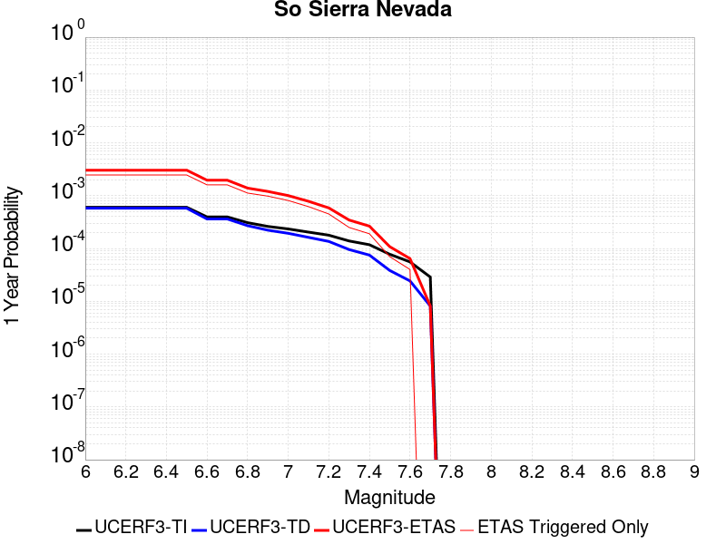 |  |

| Magnitude | 1 wk TI Prob | 1 wk TD Prob | 1 wk ETAS Prob | 1 wk ETAS/TD Gain | 1 wk ETAS Triggered Only | 1 mo TI Prob | 1 mo TD Prob | 1 mo ETAS Prob | 1 mo ETAS/TD Gain | 1 mo ETAS Triggered Only | 1 yr TI Prob | 1 yr TD Prob | 1 yr ETAS Prob | 1 yr ETAS/TD Gain | 1 yr ETAS Triggered Only | 10 yr TI Prob | 10 yr TD Prob | 10 yr ETAS Prob | 10 yr ETAS/TD Gain | 10 yr ETAS Triggered Only |
|-----|-----|-----|-----|-----|-----|-----|-----|-----|-----|-----|-----|-----|-----|-----|-----|-----|-----|-----|-----|-----|
| 6.0 | 1.15488665E-5 | 1.1079643E-5 | 0.0012710657 | 114.720825 | 0.00126 | 4.9494203E-5 | 4.748339E-5 | 0.0017074046 | 35.957935 | 0.00166 | 6.024253E-4 | 5.7796965E-4 | 0.003036548 | 5.2538185 | 0.00246 | 0.006007948 | 0.005765934 | 0.00931535 | 1.6155838 | 0.00357 |
| 6.1 | 1.15488665E-5 | 1.1079643E-5 | 0.0012710657 | 114.720825 | 0.00126 | 4.9494203E-5 | 4.748339E-5 | 0.0017074046 | 35.957935 | 0.00166 | 6.024253E-4 | 5.7796965E-4 | 0.003036548 | 5.2538185 | 0.00246 | 0.006007948 | 0.005765934 | 0.00931535 | 1.6155838 | 0.00357 |
| 6.2 | 1.15488665E-5 | 1.1079643E-5 | 0.0012710657 | 114.720825 | 0.00126 | 4.9494203E-5 | 4.748339E-5 | 0.0017074046 | 35.957935 | 0.00166 | 6.024253E-4 | 5.7796965E-4 | 0.003036548 | 5.2538185 | 0.00246 | 0.006007948 | 0.005765934 | 0.00931535 | 1.6155838 | 0.00357 |
| 6.3 | 1.15488665E-5 | 1.1079643E-5 | 0.0012710657 | 114.720825 | 0.00126 | 4.9494203E-5 | 4.748339E-5 | 0.0017074046 | 35.957935 | 0.00166 | 6.024253E-4 | 5.7796965E-4 | 0.003036548 | 5.2538185 | 0.00246 | 0.006007948 | 0.005765934 | 0.00931535 | 1.6155838 | 0.00357 |
| 6.4 | 1.15488665E-5 | 1.1079643E-5 | 0.0012710657 | 114.720825 | 0.00126 | 4.9494203E-5 | 4.748339E-5 | 0.0017074046 | 35.957935 | 0.00166 | 6.024253E-4 | 5.7796965E-4 | 0.003036548 | 5.2538185 | 0.00246 | 0.006007948 | 0.005765934 | 0.00931535 | 1.6155838 | 0.00357 |
| 6.5 | 1.15488665E-5 | 1.1079643E-5 | 0.0012710657 | 114.720825 | 0.00126 | 4.9494203E-5 | 4.748339E-5 | 0.0017074046 | 35.957935 | 0.00166 | 6.024253E-4 | 5.7796965E-4 | 0.003036548 | 5.2538185 | 0.00246 | 0.006007948 | 0.005765934 | 0.00931535 | 1.6155838 | 0.00357 |
| 6.6 | 7.587044E-6 | 6.935635E-6 | 8.369299E-4 | 120.67098 | 8.3E-4 | 3.2515498E-5 | 2.9723828E-5 | 0.0011096917 | 37.333405 | 0.00108 | 3.9580427E-4 | 3.6183043E-4 | 0.0019612515 | 5.4203606 | 0.0016 | 0.003951 | 0.0036127048 | 0.005814721 | 1.6095201 | 0.00221 |
| 6.7 | 7.587044E-6 | 6.935635E-6 | 8.369299E-4 | 120.67098 | 8.3E-4 | 3.2515498E-5 | 2.9723828E-5 | 0.0011096917 | 37.333405 | 0.00108 | 3.9580427E-4 | 3.6183043E-4 | 0.0019612515 | 5.4203606 | 0.0016 | 0.003951 | 0.0036127048 | 0.005814721 | 1.6095201 | 0.00221 |
| 6.8 | 5.9026956E-6 | 5.1793927E-6 | 5.9517636E-4 | 114.91238 | 5.9E-4 | 2.5297022E-5 | 2.2197215E-5 | 8.221795E-4 | 37.039757 | 8.0E-4 | 3.0794772E-4 | 2.7021873E-4 | 0.001389916 | 5.14367 | 0.00112 | 0.0030752132 | 0.002699018 | 0.0042248885 | 1.5653429 | 0.00153 |
| 6.9 | 5.0118915E-6 | 4.2524252E-6 | 5.1425025E-4 | 120.931046 | 5.1E-4 | 2.1479358E-5 | 1.8224557E-5 | 7.182118E-4 | 39.40901 | 7.0E-4 | 2.614798E-4 | 2.2186211E-4 | 0.0012016447 | 5.4161777 | 9.8E-4 | 0.0026117235 | 0.0022164788 | 0.0035036195 | 1.5807142 | 0.00129 |
| 7.0 | 4.4924795E-6 | 3.7139177E-6 | 4.4371228E-4 | 119.47284 | 4.4E-4 | 1.925334E-5 | 1.5916696E-5 | 6.4590666E-4 | 40.58045 | 6.3E-4 | 2.3438422E-4 | 1.9376918E-4 | 0.0010036122 | 5.1794214 | 8.1E-4 | 0.0023413717 | 0.0019360651 | 0.0030139743 | 1.5567524 | 0.00108 |
| 7.1 | 3.9118436E-6 | 3.1119775E-6 | 3.23111E-4 | 103.828186 | 3.2E-4 | 1.6764936E-5 | 1.3336982E-5 | 4.8333072E-4 | 36.239887 | 4.7E-4 | 2.0409399E-4 | 1.6236622E-4 | 7.8226556E-4 | 4.8179083 | 6.2E-4 | 0.0020390663 | 0.001622532 | 0.0024811367 | 1.5291758 | 8.6E-4 |
| 7.2 | 3.4200818E-6 | 2.6054543E-6 | 2.526048E-4 | 96.95231 | 2.5E-4 | 1.4657411E-5 | 1.11661875E-5 | 3.6116227E-4 | 32.344276 | 3.5E-4 | 1.7843937E-4 | 1.3594035E-4 | 5.858792E-4 | 4.3098254 | 4.5E-4 | 0.0017829615 | 0.0013586218 | 0.0019777794 | 1.4557248 | 6.2E-4 |
| 7.3 | 2.6593618E-6 | 1.8284203E-6 | 1.4182816E-4 | 77.56869 | 1.4E-4 | 1.13972155E-5 | 7.836065E-6 | 2.078345E-4 | 26.522814 | 2.0E-4 | 1.3875226E-4 | 9.540021E-5 | 3.4537635E-4 | 3.6202893 | 2.5E-4 | 0.0013866565 | 9.5362146E-4 | 0.0012833067 | 1.3457192 | 3.3E-4 |
| 7.4 | 2.2577992E-6 | 1.436438E-6 | 9.143631E-5 | 63.654892 | 9.0E-5 | 9.676246E-6 | 6.15615E-6 | 1.4615529E-4 | 23.741346 | 1.4E-4 | 1.1780193E-4 | 7.49488E-5 | 2.6493456E-4 | 3.534874 | 1.9E-4 | 0.001177395 | 7.492603E-4 | 9.990729E-4 | 1.3334124 | 2.5E-4 |
| 7.5 | 1.489319E-6 | 7.353936E-7 | 2.0735379E-5 | 28.1963 | 2.0E-5 | 6.3827797E-6 | 3.1516831E-6 | 5.3151525E-5 | 16.864489 | 5.0E-5 | 7.770758E-5 | 3.8371072E-5 | 1.0836838E-4 | 2.8242211 | 7.0E-5 | 7.7680405E-4 | 3.836449E-4 | 4.7361036E-4 | 1.234502 | 9.0E-5 |
| 7.6 | 1.0680322E-6 | 4.6596554E-7 | 1.0465961E-5 | 22.460804 | 1.0E-5 | 4.577273E-6 | 1.9969937E-6 | 2.1996953E-5 | 11.015035 | 2.0E-5 | 5.5726876E-5 | 2.4313129E-5 | 6.431216E-5 | 2.6451616 | 4.0E-5 | 5.5712904E-4 | 2.4310495E-4 | 2.930928E-4 | 1.2056224 | 5.0E-5 |
| 7.7 | 5.509146E-7 | 1.5580486E-7 | 1.5580486E-7 | 1.0 | 0.0 | 2.3610605E-6 | 6.677349E-7 | 6.677349E-7 | 1.0 | 0.0 | 2.8745531E-5 | 8.129644E-6 | 8.129644E-6 | 1.0 | 0.0 | 2.8741814E-4 | 8.1293576E-5 | 8.1293576E-5 | 1.0 | 0.0 |

## Coyote Canyon
*[(top)](#table-of-contents)*

| 1 Week | 1 Month | 1 Year | 10 Year |
|-----|-----|-----|-----|
|  |  |  |  |

| Magnitude | 1 wk TI Prob | 1 wk TD Prob | 1 wk ETAS Prob | 1 wk ETAS/TD Gain | 1 wk ETAS Triggered Only | 1 mo TI Prob | 1 mo TD Prob | 1 mo ETAS Prob | 1 mo ETAS/TD Gain | 1 mo ETAS Triggered Only | 1 yr TI Prob | 1 yr TD Prob | 1 yr ETAS Prob | 1 yr ETAS/TD Gain | 1 yr ETAS Triggered Only | 10 yr TI Prob | 10 yr TD Prob | 10 yr ETAS Prob | 10 yr ETAS/TD Gain | 10 yr ETAS Triggered Only |
|-----|-----|-----|-----|-----|-----|-----|-----|-----|-----|-----|-----|-----|-----|-----|-----|-----|-----|-----|-----|-----|
| 6.0 | 3.5090034E-5 | 4.0364324E-5 | 6.803385E-4 | 16.854946 | 6.4E-4 | 1.503772E-4 | 1.7297994E-4 | 0.0011828053 | 6.837817 | 0.00101 | 0.0018293047 | 0.0021042528 | 0.003920423 | 1.8630952 | 0.00182 | 0.018143194 | 0.020869201 | 0.023532437 | 1.1276156 | 0.00272 |
| 6.1 | 3.5090034E-5 | 4.0364324E-5 | 6.803385E-4 | 16.854946 | 6.4E-4 | 1.503772E-4 | 1.7297994E-4 | 0.0011828053 | 6.837817 | 0.00101 | 0.0018293047 | 0.0021042528 | 0.003920423 | 1.8630952 | 0.00182 | 0.018143194 | 0.020869201 | 0.023532437 | 1.1276156 | 0.00272 |
| 6.2 | 1.841879E-5 | 2.1059794E-5 | 4.110516E-4 | 19.51831 | 3.9E-4 | 7.8935285E-5 | 9.0253714E-5 | 6.30205E-4 | 6.9825935 | 5.4E-4 | 9.606133E-4 | 0.001098387 | 0.0020972886 | 1.909426 | 0.001 | 0.0095647145 | 0.010939667 | 0.012433148 | 1.1365198 | 0.00151 |
| 6.3 | 1.841879E-5 | 2.1059794E-5 | 4.110516E-4 | 19.51831 | 3.9E-4 | 7.8935285E-5 | 9.0253714E-5 | 6.30205E-4 | 6.9825935 | 5.4E-4 | 9.606133E-4 | 0.001098387 | 0.0020972886 | 1.909426 | 0.001 | 0.0095647145 | 0.010939667 | 0.012433148 | 1.1365198 | 0.00151 |
| 6.4 | 1.712201E-5 | 1.9565212E-5 | 3.5955856E-4 | 18.377443 | 3.4E-4 | 7.337798E-5 | 8.3848776E-5 | 5.738077E-4 | 6.843364 | 4.9E-4 | 8.930107E-4 | 0.0010204813 | 0.0019295526 | 1.8908261 | 9.1E-4 | 0.008894307 | 0.010167871 | 0.011553636 | 1.1362886 | 0.0014 |
| 6.5 | 1.4744935E-5 | 1.6836972E-5 | 3.4683142E-4 | 20.599394 | 3.3E-4 | 6.3191044E-5 | 7.215698E-5 | 5.4212305E-4 | 7.5131063 | 4.7E-4 | 7.6907943E-4 | 8.7825063E-4 | 0.0017474865 | 1.9897356 | 8.7E-4 | 0.007664232 | 0.008756994 | 0.010035697 | 1.1460208 | 0.00129 |
| 6.6 | 1.2017839E-5 | 1.37240895E-5 | 2.537208E-4 | 18.487259 | 2.4E-4 | 5.150401E-5 | 5.88167E-5 | 4.2879494E-4 | 7.2903605 | 3.7E-4 | 6.268809E-4 | 7.159466E-4 | 0.0014154455 | 1.9770266 | 7.0E-4 | 0.0062511545 | 0.0071450938 | 0.008187591 | 1.145904 | 0.00105 |
| 6.7 | 1.00956095E-5 | 1.1533517E-5 | 2.0153132E-4 | 17.473537 | 1.9E-4 | 4.326618E-5 | 4.942891E-5 | 3.794126E-4 | 7.675925 | 3.3E-4 | 5.266384E-4 | 6.017178E-4 | 0.0012213447 | 2.0297635 | 6.2E-4 | 0.005253921 | 0.0060094125 | 0.006904004 | 1.1488651 | 9.0E-4 |

## Garlock (West)
*[(top)](#table-of-contents)*

| 1 Week | 1 Month | 1 Year | 10 Year |
|-----|-----|-----|-----|
|  |  |  |  |

| Magnitude | 1 wk TI Prob | 1 wk TD Prob | 1 wk ETAS Prob | 1 wk ETAS/TD Gain | 1 wk ETAS Triggered Only | 1 mo TI Prob | 1 mo TD Prob | 1 mo ETAS Prob | 1 mo ETAS/TD Gain | 1 mo ETAS Triggered Only | 1 yr TI Prob | 1 yr TD Prob | 1 yr ETAS Prob | 1 yr ETAS/TD Gain | 1 yr ETAS Triggered Only | 10 yr TI Prob | 10 yr TD Prob | 10 yr ETAS Prob | 10 yr ETAS/TD Gain | 10 yr ETAS Triggered Only |
|-----|-----|-----|-----|-----|-----|-----|-----|-----|-----|-----|-----|-----|-----|-----|-----|-----|-----|-----|-----|-----|
| 6.0 | 2.5181727E-5 | 2.51973E-5 | 8.751759E-4 | 34.73292 | 8.5E-4 | 1.0791722E-4 | 1.0798398E-4 | 0.0012678587 | 11.741175 | 0.00116 | 0.0013131002 | 0.0013139155 | 0.0032014323 | 2.4365587 | 0.00189 | 0.013053683 | 0.013141977 | 0.015875572 | 1.208005 | 0.00277 |
| 6.1 | 2.5077732E-5 | 2.5098372E-5 | 8.7507704E-4 | 34.865887 | 8.5E-4 | 1.0747157E-4 | 1.0756004E-4 | 0.0012674353 | 11.783515 | 0.00116 | 0.001307681 | 0.0013087603 | 0.0031962867 | 2.4422247 | 0.00189 | 0.013000126 | 0.013091032 | 0.01582477 | 1.2088252 | 0.00277 |
| 6.2 | 2.494612E-5 | 2.498005E-5 | 8.749588E-4 | 35.026302 | 8.5E-4 | 1.0690756E-4 | 1.0705298E-4 | 0.0012669289 | 11.834596 | 0.00116 | 0.0013008224 | 0.0013025942 | 0.0031901323 | 2.4490607 | 0.00189 | 0.012932341 | 0.013030097 | 0.015764004 | 1.2098148 | 0.00277 |
| 6.3 | 2.4733758E-5 | 2.479942E-5 | 8.747783E-4 | 35.274147 | 8.5E-4 | 1.0599751E-4 | 1.06278916E-4 | 0.0012661556 | 11.913517 | 0.00116 | 0.0012897556 | 0.0012931811 | 0.003180737 | 2.4596221 | 0.00189 | 0.012822957 | 0.012937066 | 0.01567123 | 1.2113434 | 0.00277 |
| 6.4 | 2.3237335E-5 | 2.317873E-5 | 8.6315925E-4 | 37.23928 | 8.4E-4 | 9.958477E-5 | 9.933365E-5 | 0.0012492194 | 12.5759945 | 0.00115 | 0.0012117702 | 0.001208719 | 0.0030664708 | 2.5369592 | 0.00186 | 0.012051838 | 0.012101916 | 0.014788998 | 1.2220378 | 0.00272 |
| 6.5 | 2.2732203E-5 | 2.2993298E-5 | 8.62974E-4 | 37.531544 | 8.4E-4 | 9.742009E-5 | 9.8539E-5 | 0.0012484257 | 12.669356 | 0.00115 | 0.0011854442 | 0.0011990548 | 0.0030568247 | 2.5493617 | 0.00186 | 0.011791403 | 0.012006322 | 0.014693665 | 1.2238274 | 0.00272 |
| 6.6 | 2.1319436E-5 | 2.17735E-5 | 8.617552E-4 | 39.578167 | 8.4E-4 | 9.136581E-5 | 9.331167E-5 | 0.0012432043 | 13.323139 | 0.00115 | 0.001111811 | 0.0011354799 | 0.0029933678 | 2.636214 | 0.00186 | 0.011062649 | 0.011377227 | 0.01406628 | 1.2363541 | 0.00272 |
| 6.7 | 1.970802E-5 | 2.0393396E-5 | 8.603763E-4 | 42.188965 | 8.4E-4 | 8.446021E-5 | 8.739735E-5 | 0.0012372968 | 14.157144 | 0.00115 | 0.001027818 | 0.001063545 | 0.0029215668 | 2.747008 | 0.00186 | 0.010230771 | 0.010664964 | 0.013336169 | 1.2504654 | 0.0027 |
| 6.8 | 1.8744462E-5 | 1.9901045E-5 | 8.598843E-4 | 43.208 | 8.4E-4 | 8.033094E-5 | 8.5287415E-5 | 0.0012351894 | 14.482669 | 0.00115 | 9.775903E-4 | 0.0010378812 | 0.0028959508 | 2.7902524 | 0.00186 | 0.009733009 | 0.01041075 | 0.013072746 | 1.2556968 | 0.00269 |
| 6.9 | 1.7559682E-5 | 1.8953415E-5 | 8.4893766E-4 | 44.790752 | 8.3E-4 | 7.5253614E-5 | 8.12264E-5 | 0.0012211337 | 15.033706 | 0.00114 | 9.158276E-4 | 9.884841E-4 | 0.0028366556 | 2.8697026 | 0.00185 | 0.0091206245 | 0.009921231 | 0.012574643 | 1.2674477 | 0.00268 |
| 7.0 | 1.6794445E-5 | 1.8216237E-5 | 8.482011E-4 | 46.562916 | 8.3E-4 | 7.197421E-5 | 7.8067256E-5 | 0.001207979 | 15.473568 | 0.00113 | 8.759337E-4 | 9.5005584E-4 | 0.0027883076 | 2.9348884 | 0.00184 | 0.008724891 | 0.009540141 | 0.012174764 | 1.2761619 | 0.00266 |
| 7.1 | 1.6337795E-5 | 1.7717046E-5 | 8.477023E-4 | 47.84671 | 8.3E-4 | 7.0017246E-5 | 7.5927994E-5 | 0.0012058422 | 15.881392 | 0.00113 | 8.521265E-4 | 9.240326E-4 | 0.0027623323 | 2.9894319 | 0.00184 | 0.008488664 | 0.009281996 | 0.011917306 | 1.2839162 | 0.00266 |
| 7.2 | 1.5780008E-5 | 1.7165687E-5 | 8.4715144E-4 | 49.351444 | 8.3E-4 | 6.762685E-5 | 7.356516E-5 | 0.0011934828 | 16.223478 | 0.00112 | 8.2304585E-4 | 8.9528906E-4 | 0.0027236508 | 3.0422025 | 0.00183 | 0.008200042 | 0.008996838 | 0.011603177 | 1.2896949 | 0.00263 |
| 7.3 | 1.5058865E-5 | 1.6618762E-5 | 8.3660515E-4 | 50.341003 | 8.2E-4 | 6.45364E-5 | 7.122133E-5 | 0.001171143 | 16.443712 | 0.0011 | 7.854473E-4 | 8.667759E-4 | 0.002675207 | 3.0863883 | 0.00181 | 0.00782677 | 0.008713539 | 0.011290883 | 1.2957863 | 0.0026 |
| 7.4 | 1.4887923E-5 | 1.6454731E-5 | 8.264414E-4 | 50.22515 | 8.1E-4 | 6.380382E-5 | 7.051838E-5 | 0.0011604415 | 16.455873 | 0.00109 | 7.7653467E-4 | 8.582243E-4 | 0.0026366967 | 3.07227 | 0.00178 | 0.0077382675 | 0.008628399 | 0.011176224 | 1.2952837 | 0.00257 |
| 7.5 | 1.4509299E-5 | 1.6046748E-5 | 7.5603486E-4 | 47.11452 | 7.4E-4 | 6.218123E-5 | 6.876997E-5 | 0.0010787005 | 15.685633 | 0.00101 | 7.567935E-4 | 8.36954E-4 | 0.0024755814 | 2.9578464 | 0.00164 | 0.0075422134 | 0.008416704 | 0.01080642 | 1.2839254 | 0.00241 |
| 7.6 | 1.2756717E-5 | 1.4050848E-5 | 4.8404426E-4 | 34.449467 | 4.7E-4 | 5.4670498E-5 | 6.0216535E-5 | 6.801792E-4 | 11.295555 | 6.2E-4 | 6.6541E-4 | 7.328904E-4 | 0.0017821208 | 2.4316335 | 0.00105 | 0.006634211 | 0.0073816874 | 0.008969877 | 1.2151526 | 0.0016 |
| 7.7 | 1.0328985E-5 | 1.1460557E-5 | 2.614577E-4 | 22.813698 | 2.5E-4 | 4.4266326E-5 | 4.911575E-5 | 3.7909954E-4 | 7.7184925 | 3.3E-4 | 5.388092E-4 | 5.978206E-4 | 0.0012174499 | 2.0364804 | 6.2E-4 | 0.0053750467 | 0.006038511 | 0.007002654 | 1.1596656 | 9.7E-4 |
| 7.8 | 7.0306583E-6 | 8.899601E-6 | 1.6889817E-4 | 18.978174 | 1.6E-4 | 3.0131043E-5 | 3.814059E-5 | 2.481326E-4 | 6.505735 | 2.1E-4 | 3.667837E-4 | 4.642629E-4 | 8.640772E-4 | 1.8611808 | 4.0E-4 | 0.003661789 | 0.0046952725 | 0.0053322674 | 1.1356673 | 6.4E-4 |
| 7.9 | 4.060633E-6 | 5.4653938E-6 | 9.54649E-5 | 17.46716 | 9.0E-5 | 1.7402595E-5 | 2.3422906E-5 | 1.5341987E-4 | 6.5499926 | 1.3E-4 | 2.11856E-4 | 2.851367E-4 | 5.3506537E-4 | 1.8765225 | 2.5E-4 | 0.0021165414 | 0.002884201 | 0.0032730761 | 1.1348294 | 3.9E-4 |
| 8.0 | 1.6729537E-6 | 2.0775144E-6 | 2.0775144E-6 | 1.0 | 0.0 | 7.169782E-6 | 8.903603E-6 | 2.8903425E-5 | 3.2462616 | 2.0E-5 | 8.7288594E-5 | 1.0839601E-4 | 1.5839058E-4 | 1.4612216 | 5.0E-5 | 8.7254314E-4 | 0.0010969337 | 0.0011868351 | 1.0819569 | 9.0E-5 |
| 8.1 | 3.6733252E-7 | 3.1489964E-7 | 3.1489964E-7 | 1.0 | 0.0 | 1.5742813E-6 | 1.3495693E-6 | 1.3495693E-6 | 1.0 | 0.0 | 1.9166706E-5 | 1.6430899E-5 | 1.6430899E-5 | 1.0 | 0.0 | 1.9165053E-4 | 1.6638759E-4 | 1.6638759E-4 | 1.0 | 0.0 |

## Lenwood-Lockhart-Old Woman Springs
*[(top)](#table-of-contents)*

| 1 Week | 1 Month | 1 Year | 10 Year |
|-----|-----|-----|-----|
|  |  |  |  |

| Magnitude | 1 wk TI Prob | 1 wk TD Prob | 1 wk ETAS Prob | 1 wk ETAS/TD Gain | 1 wk ETAS Triggered Only | 1 mo TI Prob | 1 mo TD Prob | 1 mo ETAS Prob | 1 mo ETAS/TD Gain | 1 mo ETAS Triggered Only | 1 yr TI Prob | 1 yr TD Prob | 1 yr ETAS Prob | 1 yr ETAS/TD Gain | 1 yr ETAS Triggered Only | 10 yr TI Prob | 10 yr TD Prob | 10 yr ETAS Prob | 10 yr ETAS/TD Gain | 10 yr ETAS Triggered Only |
|-----|-----|-----|-----|-----|-----|-----|-----|-----|-----|-----|-----|-----|-----|-----|-----|-----|-----|-----|-----|-----|
| 6.0 | 3.744542E-5 | 4.396252E-5 | 8.039291E-4 | 18.286694 | 7.6E-4 | 1.604705E-4 | 1.8839816E-4 | 0.0013181852 | 6.996805 | 0.00113 | 0.0019519776 | 0.0022915069 | 0.004107336 | 1.7924172 | 0.00182 | 0.019349206 | 0.022696787 | 0.02521823 | 1.1110924 | 0.00258 |
| 6.1 | 3.744542E-5 | 4.396252E-5 | 8.039291E-4 | 18.286694 | 7.6E-4 | 1.604705E-4 | 1.8839816E-4 | 0.0013181852 | 6.996805 | 0.00113 | 0.0019519776 | 0.0022915069 | 0.004107336 | 1.7924172 | 0.00182 | 0.019349206 | 0.022696787 | 0.02521823 | 1.1110924 | 0.00258 |
| 6.2 | 3.744542E-5 | 4.396252E-5 | 8.039291E-4 | 18.286694 | 7.6E-4 | 1.604705E-4 | 1.8839816E-4 | 0.0013181852 | 6.996805 | 0.00113 | 0.0019519776 | 0.0022915069 | 0.004107336 | 1.7924172 | 0.00182 | 0.019349206 | 0.022696787 | 0.02521823 | 1.1110924 | 0.00258 |
| 6.3 | 2.1079984E-5 | 2.5353434E-5 | 3.2534584E-4 | 12.832417 | 3.0E-4 | 9.0339665E-5 | 1.0865316E-4 | 5.6860317E-4 | 5.233195 | 4.6E-4 | 0.0010993304 | 0.0013220694 | 0.0020810647 | 1.5740963 | 7.6E-4 | 0.010939079 | 0.0131442575 | 0.014200193 | 1.0803344 | 0.00107 |
| 6.4 | 2.1079984E-5 | 2.5353434E-5 | 3.2534584E-4 | 12.832417 | 3.0E-4 | 9.0339665E-5 | 1.0865316E-4 | 5.6860317E-4 | 5.233195 | 4.6E-4 | 0.0010993304 | 0.0013220694 | 0.0020810647 | 1.5740963 | 7.6E-4 | 0.010939079 | 0.0131442575 | 0.014200193 | 1.0803344 | 0.00107 |
| 6.5 | 1.7397282E-5 | 2.066241E-5 | 2.8065703E-4 | 13.582977 | 2.6E-4 | 7.455765E-5 | 8.8550245E-5 | 4.585175E-4 | 5.1780486 | 3.7E-4 | 9.073613E-4 | 0.0010775778 | 0.001666942 | 1.5469342 | 5.9E-4 | 0.009036654 | 0.010724821 | 0.011486563 | 1.0710261 | 7.7E-4 |
| 6.6 | 1.52050325E-5 | 1.7679693E-5 | 2.6767526E-4 | 15.140266 | 2.5E-4 | 6.51628E-5 | 7.576796E-5 | 4.2574145E-4 | 5.6190166 | 3.5E-4 | 7.9306826E-4 | 9.220924E-4 | 0.0014615945 | 1.5850846 | 5.4E-4 | 0.007902439 | 0.009183526 | 0.009867189 | 1.0744445 | 6.9E-4 |
| 6.7 | 1.332523E-5 | 1.5264002E-5 | 2.0526111E-4 | 13.447397 | 1.9E-4 | 5.7106878E-5 | 6.5415545E-5 | 3.353979E-4 | 5.127189 | 2.7E-4 | 6.950544E-4 | 7.961491E-4 | 0.0012557829 | 1.5773212 | 4.6E-4 | 0.006928845 | 0.007933599 | 0.008528839 | 1.0750277 | 6.0E-4 |
| 6.8 | 1.1525329E-5 | 1.3030979E-5 | 1.4302929E-4 | 10.976096 | 1.3E-4 | 4.9393333E-5 | 5.584588E-5 | 2.5583472E-4 | 4.5810847 | 2.0E-4 | 6.011979E-4 | 6.797157E-4 | 0.0010494642 | 1.5439752 | 3.7E-4 | 0.00599574 | 0.006776819 | 0.0072535663 | 1.0703497 | 4.8E-4 |
| 6.9 | 1.0253909E-5 | 1.15144385E-5 | 1.1151329E-4 | 9.6846485 | 1.0E-4 | 4.3944583E-5 | 4.9346683E-5 | 2.0933879E-4 | 4.242206 | 1.6E-4 | 5.3489394E-4 | 6.0063385E-4 | 9.104477E-4 | 1.5158114 | 3.1E-4 | 0.0053360825 | 0.0059904843 | 0.0064079682 | 1.0696912 | 4.2E-4 |
| 7.0 | 8.104563E-6 | 8.991279E-6 | 7.899065E-5 | 8.785252 | 7.0E-5 | 3.4733377E-5 | 3.8533497E-5 | 1.4852926E-4 | 3.8545492 | 1.1E-4 | 4.2279682E-4 | 4.6904673E-4 | 6.5895764E-4 | 1.4048868 | 1.9E-4 | 0.0042199334 | 0.0046808156 | 0.004949552 | 1.0574123 | 2.7E-4 |
| 7.1 | 6.7986157E-6 | 7.515816E-6 | 5.751544E-5 | 7.652588 | 5.0E-5 | 2.91366E-5 | 3.2210253E-5 | 1.02207996E-4 | 3.173151 | 7.0E-5 | 3.5468035E-4 | 3.920914E-4 | 5.3203653E-4 | 1.3569196 | 1.4E-4 | 0.003541148 | 0.003914213 | 0.0040935082 | 1.0458063 | 1.8E-4 |
| 7.2 | 5.6893327E-6 | 6.2800136E-6 | 3.6279824E-5 | 5.7770295 | 3.0E-5 | 2.4382627E-5 | 2.6914078E-5 | 7.691273E-5 | 2.8577137 | 5.0E-5 | 2.9681803E-4 | 3.2763163E-4 | 4.2759886E-4 | 1.3051208 | 1.0E-4 | 0.002964219 | 0.0032716845 | 0.0034012592 | 1.0396049 | 1.3E-4 |
| 7.3 | 4.253348E-6 | 4.7069107E-6 | 3.470677E-5 | 7.3735776 | 3.0E-5 | 1.8228506E-5 | 2.0172329E-5 | 7.017132E-5 | 3.478593 | 5.0E-5 | 2.2190946E-4 | 2.4557224E-4 | 3.3555014E-4 | 1.366401 | 9.0E-5 | 0.00221688 | 0.0024531898 | 0.0025728955 | 1.0487959 | 1.2E-4 |
| 7.4 | 2.5448119E-6 | 2.852045E-6 | 2.2851988E-5 | 8.012492 | 2.0E-5 | 1.0906291E-5 | 1.2223002E-5 | 3.2222757E-5 | 2.6362393 | 2.0E-5 | 1.3277601E-4 | 1.4880655E-4 | 1.987991E-4 | 1.3359567 | 5.0E-5 | 0.001326967 | 0.0014872311 | 0.0015571271 | 1.0469973 | 7.0E-5 |
| 7.5 | 4.3706837E-8 | 4.562909E-8 | 4.562909E-8 | 1.0 | 0.0 | 1.8731501E-7 | 1.9555324E-7 | 1.9555324E-7 | 1.0 | 0.0 | 2.2805577E-6 | 2.3808586E-6 | 2.3808586E-6 | 1.0 | 0.0 | 2.2805343E-5 | 2.3808387E-5 | 2.3808387E-5 | 1.0 | 0.0 |

## Nelson Lake
*[(top)](#table-of-contents)*

| 1 Week | 1 Month | 1 Year | 10 Year |
|-----|-----|-----|-----|
|  |  |  |  |

| Magnitude | 1 wk TI Prob | 1 wk TD Prob | 1 wk ETAS Prob | 1 wk ETAS/TD Gain | 1 wk ETAS Triggered Only | 1 mo TI Prob | 1 mo TD Prob | 1 mo ETAS Prob | 1 mo ETAS/TD Gain | 1 mo ETAS Triggered Only | 1 yr TI Prob | 1 yr TD Prob | 1 yr ETAS Prob | 1 yr ETAS/TD Gain | 1 yr ETAS Triggered Only | 10 yr TI Prob | 10 yr TD Prob | 10 yr ETAS Prob | 10 yr ETAS/TD Gain | 10 yr ETAS Triggered Only |
|-----|-----|-----|-----|-----|-----|-----|-----|-----|-----|-----|-----|-----|-----|-----|-----|-----|-----|-----|-----|-----|
| 6.0 | 9.913453E-6 | 1.0192255E-5 | 3.201891E-4 | 31.41494 | 3.1E-4 | 4.2485535E-5 | 4.3680422E-5 | 6.236551E-4 | 14.27768 | 5.8E-4 | 5.1713863E-4 | 5.316897E-4 | 0.0017310517 | 3.2557554 | 0.0012 | 0.0051593683 | 0.005305204 | 0.00740401 | 1.3956127 | 0.00211 |
| 6.1 | 9.913453E-6 | 1.0192255E-5 | 3.201891E-4 | 31.41494 | 3.1E-4 | 4.2485535E-5 | 4.3680422E-5 | 6.236551E-4 | 14.27768 | 5.8E-4 | 5.1713863E-4 | 5.316897E-4 | 0.0017310517 | 3.2557554 | 0.0012 | 0.0051593683 | 0.005305204 | 0.00740401 | 1.3956127 | 0.00211 |
| 6.2 | 4.5596407E-6 | 4.696313E-6 | 1.9469541E-4 | 41.457077 | 1.9E-4 | 1.954117E-5 | 2.0126909E-5 | 3.1012108E-4 | 15.408282 | 2.9E-4 | 2.3788778E-4 | 2.4501883E-4 | 8.248767E-4 | 3.366585 | 5.8E-4 | 0.0023763329 | 0.0024476128 | 0.0033952876 | 1.3871833 | 9.5E-4 |
| 6.3 | 4.5596407E-6 | 4.696313E-6 | 1.9469541E-4 | 41.457077 | 1.9E-4 | 1.954117E-5 | 2.0126909E-5 | 3.1012108E-4 | 15.408282 | 2.9E-4 | 2.3788778E-4 | 2.4501883E-4 | 8.248767E-4 | 3.366585 | 5.8E-4 | 0.0023763329 | 0.0024476128 | 0.0033952876 | 1.3871833 | 9.5E-4 |
| 6.4 | 3.4025713E-6 | 3.5098972E-6 | 1.435094E-4 | 40.887066 | 1.4E-4 | 1.4582367E-5 | 1.5042335E-5 | 2.450389E-4 | 16.28995 | 2.3E-4 | 1.7752586E-4 | 1.8312587E-4 | 6.230453E-4 | 3.402279 | 4.4E-4 | 0.001773841 | 0.0018298327 | 0.0025385334 | 1.3873036 | 7.1E-4 |
| 6.5 | 2.8352947E-6 | 2.927856E-6 | 1.2292751E-4 | 41.9855 | 1.2E-4 | 1.2151207E-5 | 1.2547898E-5 | 2.1254539E-4 | 16.938725 | 2.0E-4 | 1.479309E-4 | 1.5276071E-4 | 5.3270266E-4 | 3.4871707 | 3.8E-4 | 0.0014783246 | 0.0015266308 | 0.002155669 | 1.4120435 | 6.3E-4 |
| 6.6 | 2.251518E-6 | 2.3290677E-6 | 8.232888E-5 | 35.34843 | 8.0E-5 | 9.649328E-6 | 9.981683E-6 | 1.3998039E-4 | 14.0237255 | 1.3E-4 | 1.1747423E-4 | 1.2152085E-4 | 3.7149046E-4 | 3.0570102 | 2.5E-4 | 0.0011741214 | 0.0012146058 | 0.0016640591 | 1.3700407 | 4.5E-4 |
| 6.7 | 1.8911853E-6 | 1.9591396E-6 | 7.1959E-5 | 36.7299 | 7.0E-5 | 8.105055E-6 | 8.39629E-6 | 1.18395365E-4 | 14.100916 | 1.1E-4 | 9.867457E-5 | 1.0222061E-4 | 3.2219812E-4 | 3.1519878 | 2.2E-4 | 9.863076E-4 | 0.0010217935 | 0.0014014052 | 1.3715152 | 3.8E-4 |
| 6.8 | 1.4874814E-6 | 1.5438305E-6 | 5.1543753E-5 | 33.386925 | 5.0E-5 | 6.374905E-6 | 6.6164025E-6 | 8.661587E-5 | 13.091083 | 8.0E-5 | 7.76117E-5 | 8.055224E-5 | 2.4053936E-4 | 2.9861286 | 1.6E-4 | 7.75846E-4 | 8.0528157E-4 | 0.0011150319 | 1.3846486 | 3.1E-4 |
| 6.9 | 6.835972E-7 | 7.1399285E-7 | 4.0713963E-5 | 57.02293 | 4.0E-5 | 2.9296991E-6 | 3.0599674E-6 | 6.3059786E-5 | 20.607992 | 6.0E-5 | 3.56685E-5 | 3.7254784E-5 | 1.172518E-4 | 3.1472952 | 8.0E-5 | 3.5662777E-4 | 3.7251666E-4 | 5.324571E-4 | 1.429351 | 1.6E-4 |

## San Andreas (Mojave S)
*[(top)](#table-of-contents)*

| 1 Week | 1 Month | 1 Year | 10 Year |
|-----|-----|-----|-----|
|  |  |  |  |

| Magnitude | 1 wk TI Prob | 1 wk TD Prob | 1 wk ETAS Prob | 1 wk ETAS/TD Gain | 1 wk ETAS Triggered Only | 1 mo TI Prob | 1 mo TD Prob | 1 mo ETAS Prob | 1 mo ETAS/TD Gain | 1 mo ETAS Triggered Only | 1 yr TI Prob | 1 yr TD Prob | 1 yr ETAS Prob | 1 yr ETAS/TD Gain | 1 yr ETAS Triggered Only | 10 yr TI Prob | 10 yr TD Prob | 10 yr ETAS Prob | 10 yr ETAS/TD Gain | 10 yr ETAS Triggered Only |
|-----|-----|-----|-----|-----|-----|-----|-----|-----|-----|-----|-----|-----|-----|-----|-----|-----|-----|-----|-----|-----|
| 6.0 | 3.1064058E-4 | 6.7460834E-4 | 0.0012841967 | 1.9036185 | 6.1E-4 | 0.0013306376 | 0.0028881032 | 0.0036957639 | 1.2796509 | 8.1E-4 | 0.016080605 | 0.03462235 | 0.03587734 | 1.036248 | 0.0013 | 0.1496549 | 0.28660452 | 0.28799564 | 1.0048538 | 0.00195 |
| 6.1 | 3.1064058E-4 | 6.7460834E-4 | 0.0012841967 | 1.9036185 | 6.1E-4 | 0.0013306376 | 0.0028881032 | 0.0036957639 | 1.2796509 | 8.1E-4 | 0.016080605 | 0.03462235 | 0.03587734 | 1.036248 | 0.0013 | 0.1496549 | 0.28660452 | 0.28799564 | 1.0048538 | 0.00195 |
| 6.2 | 3.1064058E-4 | 6.7460834E-4 | 0.0012841967 | 1.9036185 | 6.1E-4 | 0.0013306376 | 0.0028881032 | 0.0036957639 | 1.2796509 | 8.1E-4 | 0.016080605 | 0.03462235 | 0.03587734 | 1.036248 | 0.0013 | 0.1496549 | 0.28660452 | 0.28799564 | 1.0048538 | 0.00195 |
| 6.3 | 3.1064058E-4 | 6.7460834E-4 | 0.0012841967 | 1.9036185 | 6.1E-4 | 0.0013306376 | 0.0028881032 | 0.0036957639 | 1.2796509 | 8.1E-4 | 0.016080605 | 0.03462235 | 0.03587734 | 1.036248 | 0.0013 | 0.1496549 | 0.28660452 | 0.28799564 | 1.0048538 | 0.00195 |
| 6.4 | 1.9872203E-4 | 4.3179357E-4 | 8.316208E-4 | 1.9259686 | 4.0E-4 | 8.5138786E-4 | 0.0018492596 | 0.002408224 | 1.3022639 | 5.6E-4 | 0.010316478 | 0.02228844 | 0.023187933 | 1.040357 | 9.2E-4 | 0.098504856 | 0.19699748 | 0.19814578 | 1.005829 | 0.00143 |
| 6.5 | 1.291105E-4 | 2.875267E-4 | 6.2742893E-4 | 2.182159 | 3.4E-4 | 5.5321335E-4 | 0.0012316781 | 0.0016911115 | 1.3730142 | 4.6E-4 | 0.006714592 | 0.0148934 | 0.015632229 | 1.0496079 | 7.5E-4 | 0.065152965 | 0.13803436 | 0.13903424 | 1.0072438 | 0.00116 |
| 6.6 | 1.291105E-4 | 2.875267E-4 | 6.2742893E-4 | 2.182159 | 3.4E-4 | 5.5321335E-4 | 0.0012316781 | 0.0016911115 | 1.3730142 | 4.6E-4 | 0.006714592 | 0.0148934 | 0.015632229 | 1.0496079 | 7.5E-4 | 0.065152965 | 0.13803436 | 0.13903424 | 1.0072438 | 0.00116 |
| 6.7 | 1.08001186E-4 | 2.4333889E-4 | 5.332683E-4 | 2.1914637 | 2.9E-4 | 4.6278012E-4 | 0.0010424647 | 0.0014220686 | 1.3641407 | 3.8E-4 | 0.0056198016 | 0.012618446 | 0.013270117 | 1.0516443 | 6.6E-4 | 0.054797906 | 0.119176775 | 0.12010164 | 1.0077604 | 0.00105 |
| 6.8 | 1.0624356E-4 | 2.3851555E-4 | 5.1844877E-4 | 2.1736476 | 2.8E-4 | 4.5525006E-4 | 0.0010218095 | 0.0013914315 | 1.3617327 | 3.7E-4 | 0.0055285925 | 0.012369843 | 0.013011803 | 1.0518972 | 6.5E-4 | 0.053930566 | 0.11712591 | 0.1180441 | 1.0078393 | 0.00104 |
| 6.9 | 1.0393785E-4 | 2.3221898E-4 | 5.1215396E-4 | 2.2054784 | 2.8E-4 | 4.4537184E-4 | 9.948451E-4 | 0.001364477 | 1.3715472 | 3.7E-4 | 0.0054089287 | 0.012045221 | 0.012667633 | 1.0516729 | 6.3E-4 | 0.05279156 | 0.11442335 | 0.115317784 | 1.0078169 | 0.00101 |
| 7.0 | 1.0155622E-4 | 2.2591476E-4 | 5.058515E-4 | 2.2391255 | 2.8E-4 | 4.3516833E-4 | 9.6784724E-4 | 0.0013374891 | 1.3819218 | 3.7E-4 | 0.005285311 | 0.0117200995 | 0.012342717 | 1.0531238 | 6.3E-4 | 0.05161361 | 0.111683756 | 0.11257207 | 1.0079539 | 0.001 |
| 7.1 | 9.885595E-5 | 2.1879886E-4 | 4.987376E-4 | 2.2794342 | 2.8E-4 | 4.2359953E-4 | 9.3737274E-4 | 0.0013070259 | 1.3943503 | 3.7E-4 | 0.0051451353 | 0.011352993 | 0.011975841 | 1.054862 | 6.3E-4 | 0.05027629 | 0.1085682 | 0.10945072 | 1.0081286 | 9.9E-4 |
| 7.2 | 9.6411415E-5 | 2.124288E-4 | 4.9236935E-4 | 2.3178086 | 2.8E-4 | 4.1312634E-4 | 9.1009185E-4 | 0.0012797551 | 1.4061824 | 3.7E-4 | 0.005018219 | 0.011024255 | 0.01164731 | 1.0565168 | 6.3E-4 | 0.049064007 | 0.105758004 | 0.106643304 | 1.008371 | 9.9E-4 |
| 7.3 | 9.1180635E-5 | 1.9471257E-4 | 4.6466E-4 | 2.3863893 | 2.7E-4 | 3.907156E-4 | 8.342157E-4 | 0.0011939154 | 1.4311831 | 3.6E-4 | 0.004746591 | 0.01010939 | 0.010703324 | 1.0587507 | 6.0E-4 | 0.046464786 | 0.09795115 | 0.09881712 | 1.0088408 | 9.6E-4 |
| 7.4 | 8.887388E-5 | 1.8719878E-4 | 4.5714824E-4 | 2.442047 | 2.7E-4 | 3.8083247E-4 | 8.020339E-4 | 0.0011617452 | 1.4484988 | 3.6E-4 | 0.0046267817 | 0.00972114 | 0.010315307 | 1.0611211 | 6.0E-4 | 0.045316286 | 0.09458615 | 0.09544629 | 1.0090938 | 9.5E-4 |
| 7.5 | 8.6750515E-5 | 1.8051457E-4 | 4.5046583E-4 | 2.495454 | 2.7E-4 | 3.7173493E-4 | 7.7340455E-4 | 0.0011331261 | 1.4651144 | 3.6E-4 | 0.004516484 | 0.009375632 | 0.0099700065 | 1.0633957 | 6.0E-4 | 0.04425787 | 0.091549896 | 0.09241292 | 1.0094268 | 9.5E-4 |
| 7.6 | 8.453092E-5 | 1.7439072E-4 | 4.343454E-4 | 2.490645 | 2.6E-4 | 3.6222505E-4 | 7.471748E-4 | 0.0010969132 | 1.4680812 | 3.5E-4 | 0.0044011753 | 0.009058985 | 0.00963373 | 1.0634449 | 5.8E-4 | 0.04315024 | 0.08870898 | 0.089556485 | 1.0095537 | 9.3E-4 |
| 7.7 | 8.259102E-5 | 1.6961215E-4 | 4.2956806E-4 | 2.532649 | 2.6E-4 | 3.539135E-4 | 7.2670676E-4 | 0.0010764524 | 1.4812748 | 3.5E-4 | 0.004300386 | 0.008811831 | 0.009386719 | 1.0652406 | 5.8E-4 | 0.042181134 | 0.08645982 | 0.08730942 | 1.0098264 | 9.3E-4 |
| 7.8 | 7.444844E-5 | 1.5283503E-4 | 3.827999E-4 | 2.5046606 | 2.3E-4 | 3.1902574E-4 | 6.548429E-4 | 9.646399E-4 | 1.473086 | 3.1E-4 | 0.0038772223 | 0.007943616 | 0.008449565 | 1.0636925 | 5.1E-4 | 0.03810269 | 0.078290746 | 0.079028115 | 1.0094184 | 8.0E-4 |
| 7.9 | 5.2586525E-5 | 1.00064186E-4 | 2.3005118E-4 | 2.299036 | 1.3E-4 | 2.2535135E-4 | 4.2877605E-4 | 6.086989E-4 | 1.4196196 | 1.8E-4 | 0.0027402006 | 0.005207864 | 0.0055162497 | 1.0592153 | 3.1E-4 | 0.027066574 | 0.052200034 | 0.0526455 | 1.0085338 | 4.7E-4 |
| 8.0 | 3.379877E-5 | 5.4074168E-5 | 8.407254E-5 | 1.5547636 | 3.0E-5 | 1.4484383E-4 | 2.3172585E-4 | 2.9171194E-4 | 1.2588667 | 6.0E-5 | 0.0017620471 | 0.002817614 | 0.0029173323 | 1.035391 | 1.0E-4 | 0.017481409 | 0.028834904 | 0.028980577 | 1.005052 | 1.5E-4 |
| 8.1 | 1.8668277E-5 | 1.9309397E-5 | 2.9309203E-5 | 1.5178726 | 1.0E-5 | 8.000444E-5 | 8.275194E-5 | 1.0275028E-4 | 1.2416662 | 2.0E-5 | 9.736188E-4 | 0.0010070398 | 0.0010370096 | 1.0297602 | 3.0E-5 | 0.009693642 | 0.010798888 | 0.010838456 | 1.0036641 | 4.0E-5 |
| 8.2 | 8.541571E-6 | 5.460819E-6 | 5.460819E-6 | 1.0 | 0.0 | 3.660622E-5 | 2.3403301E-5 | 3.3403066E-5 | 1.4272802 | 1.0E-5 | 4.455896E-4 | 2.84898E-4 | 3.048923E-4 | 1.0701805 | 2.0E-5 | 0.0044469717 | 0.0032408056 | 0.0032607408 | 1.0061513 | 2.0E-5 |
| 8.3 | 1.983087E-6 | 7.6599065E-7 | 7.6599065E-7 | 1.0 | 0.0 | 8.498917E-6 | 3.282813E-6 | 3.282813E-6 | 1.0 | 0.0 | 1.034694E-4 | 3.9967534E-5 | 3.9967534E-5 | 1.0 | 0.0 | 0.0010342124 | 4.719687E-4 | 4.719687E-4 | 1.0 | 0.0 |

## Death Valley (So)
*[(top)](#table-of-contents)*

| 1 Week | 1 Month | 1 Year | 10 Year |
|-----|-----|-----|-----|
|  |  |  |  |

| Magnitude | 1 wk TI Prob | 1 wk TD Prob | 1 wk ETAS Prob | 1 wk ETAS/TD Gain | 1 wk ETAS Triggered Only | 1 mo TI Prob | 1 mo TD Prob | 1 mo ETAS Prob | 1 mo ETAS/TD Gain | 1 mo ETAS Triggered Only | 1 yr TI Prob | 1 yr TD Prob | 1 yr ETAS Prob | 1 yr ETAS/TD Gain | 1 yr ETAS Triggered Only | 10 yr TI Prob | 10 yr TD Prob | 10 yr ETAS Prob | 10 yr ETAS/TD Gain | 10 yr ETAS Triggered Only |
|-----|-----|-----|-----|-----|-----|-----|-----|-----|-----|-----|-----|-----|-----|-----|-----|-----|-----|-----|-----|-----|
| 6.0 | 2.0684236E-5 | 2.5617775E-5 | 4.9560575E-4 | 19.346165 | 4.7E-4 | 8.864371E-5 | 1.0978594E-4 | 8.697025E-4 | 7.921802 | 7.6E-4 | 0.0010787029 | 0.0013358411 | 0.0025741847 | 1.9270141 | 0.00124 | 0.010734817 | 0.013281397 | 0.015264701 | 1.1493295 | 0.00201 |
| 6.1 | 2.0684236E-5 | 2.5617775E-5 | 4.9560575E-4 | 19.346165 | 4.7E-4 | 8.864371E-5 | 1.0978594E-4 | 8.697025E-4 | 7.921802 | 7.6E-4 | 0.0010787029 | 0.0013358411 | 0.0025741847 | 1.9270141 | 0.00124 | 0.010734817 | 0.013281397 | 0.015264701 | 1.1493295 | 0.00201 |
| 6.2 | 2.0684236E-5 | 2.5617775E-5 | 4.9560575E-4 | 19.346165 | 4.7E-4 | 8.864371E-5 | 1.0978594E-4 | 8.697025E-4 | 7.921802 | 7.6E-4 | 0.0010787029 | 0.0013358411 | 0.0025741847 | 1.9270141 | 0.00124 | 0.010734817 | 0.013281397 | 0.015264701 | 1.1493295 | 0.00201 |
| 6.3 | 2.0240292E-5 | 2.511786E-5 | 4.851063E-4 | 19.313202 | 4.6E-4 | 8.6741224E-5 | 1.07643624E-4 | 8.4756396E-4 | 7.873796 | 7.4E-4 | 0.0010555626 | 0.00130979 | 0.0025182052 | 1.9226022 | 0.00121 | 0.010505628 | 0.013023956 | 0.01490908 | 1.1447428 | 0.00191 |
| 6.4 | 2.0240292E-5 | 2.511786E-5 | 4.851063E-4 | 19.313202 | 4.6E-4 | 8.6741224E-5 | 1.07643624E-4 | 8.4756396E-4 | 7.873796 | 7.4E-4 | 0.0010555626 | 0.00130979 | 0.0025182052 | 1.9226022 | 0.00121 | 0.010505628 | 0.013023956 | 0.01490908 | 1.1447428 | 0.00191 |
| 6.5 | 1.9962767E-5 | 2.4807114E-5 | 4.847957E-4 | 19.542608 | 4.6E-4 | 8.55519E-5 | 1.0631196E-4 | 8.262354E-4 | 7.771801 | 7.2E-4 | 0.0010410968 | 0.0012935963 | 0.0024421087 | 1.8878444 | 0.00115 | 0.010362327 | 0.012863902 | 0.014670362 | 1.1404285 | 0.00183 |
| 6.6 | 1.8937297E-5 | 2.3310964E-5 | 4.4330116E-4 | 19.016851 | 4.2E-4 | 8.115732E-5 | 9.990039E-5 | 7.598345E-4 | 7.605921 | 6.6E-4 | 9.876423E-4 | 0.0012156231 | 0.0022743347 | 1.8709208 | 0.00106 | 0.009832645 | 0.012092789 | 0.013772231 | 1.1388797 | 0.0017 |
| 6.7 | 1.8621096E-5 | 2.2911607E-5 | 4.4290198E-4 | 19.3309 | 4.2E-4 | 7.980225E-5 | 9.818898E-5 | 7.5812417E-4 | 7.7210717 | 6.6E-4 | 9.711593E-4 | 0.0011948098 | 0.0022535434 | 1.8861105 | 0.00106 | 0.009669261 | 0.011886904 | 0.013537053 | 1.1388208 | 0.00167 |
| 6.8 | 1.7830353E-5 | 2.1805688E-5 | 4.2179695E-4 | 19.343437 | 4.0E-4 | 7.641356E-5 | 9.344968E-5 | 7.233908E-4 | 7.7409663 | 6.3E-4 | 9.29938E-4 | 0.00113717 | 0.0021460215 | 1.8871597 | 0.00101 | 0.009260561 | 0.011316354 | 0.012858701 | 1.1362935 | 0.00156 |
| 6.9 | 1.3135183E-5 | 1.5303925E-5 | 2.653001E-4 | 17.335428 | 2.5E-4 | 5.6292425E-5 | 6.558664E-5 | 4.5556106E-4 | 6.9459434 | 3.9E-4 | 6.8514474E-4 | 7.982312E-4 | 0.0014976725 | 1.8762388 | 7.0E-4 | 0.006830362 | 0.007954649 | 0.008996297 | 1.1309483 | 0.00105 |
| 7.0 | 1.1507512E-5 | 1.3154199E-5 | 1.6315223E-4 | 12.403052 | 1.5E-4 | 4.9316975E-5 | 5.6373956E-5 | 3.163593E-4 | 5.611799 | 2.6E-4 | 6.002687E-4 | 6.8614254E-4 | 0.0011758063 | 1.7136474 | 4.9E-4 | 0.0059864987 | 0.0068409415 | 0.0075758793 | 1.1074322 | 7.4E-4 |
| 7.1 | 9.715903E-6 | 1.0865278E-5 | 8.086452E-5 | 7.442471 | 7.0E-5 | 4.1638916E-5 | 4.656467E-5 | 1.9655768E-4 | 4.221176 | 1.5E-4 | 5.068359E-4 | 5.667817E-4 | 8.1664E-4 | 1.440837 | 2.5E-4 | 0.0050568148 | 0.0056538144 | 0.0060813837 | 1.0756248 | 4.3E-4 |
| 7.2 | 9.233269E-6 | 1.02863105E-5 | 8.0285594E-5 | 7.8050914 | 7.0E-5 | 3.9570554E-5 | 4.4083466E-5 | 1.8407729E-4 | 4.175654 | 1.4E-4 | 4.81665E-4 | 5.3658825E-4 | 7.7645946E-4 | 1.4470303 | 2.4E-4 | 0.0048062233 | 0.0053533576 | 0.0057711094 | 1.0780355 | 4.2E-4 |
| 7.3 | 8.8041315E-6 | 9.808164E-6 | 6.9807575E-5 | 7.117293 | 6.0E-5 | 3.7731446E-5 | 4.2034335E-5 | 1.4203013E-4 | 3.3789077 | 1.0E-4 | 4.592835E-4 | 5.1165203E-4 | 6.9156E-4 | 1.3516216 | 1.8E-4 | 0.0045833546 | 0.005105167 | 0.0054235337 | 1.0623616 | 3.2E-4 |
| 7.4 | 8.708749E-6 | 9.707175E-6 | 5.970669E-5 | 6.1507792 | 5.0E-5 | 3.7322676E-5 | 4.160154E-5 | 1.315978E-4 | 3.1632915 | 9.0E-5 | 4.5430884E-4 | 5.0638523E-4 | 6.7629915E-4 | 1.3355428 | 1.7E-4 | 0.004533812 | 0.0050527398 | 0.0053611733 | 1.0610429 | 3.1E-4 |
| 7.5 | 8.612678E-6 | 9.604817E-6 | 5.9604336E-5 | 6.2056713 | 5.0E-5 | 3.6910955E-5 | 4.1162875E-5 | 1.3115918E-4 | 3.186346 | 9.0E-5 | 4.492982E-4 | 5.01047E-4 | 6.709618E-4 | 1.3391196 | 1.7E-4 | 0.004483909 | 0.0049995985 | 0.005308049 | 1.061695 | 3.1E-4 |
| 7.6 | 8.319024E-6 | 9.283916E-6 | 5.928345E-5 | 6.385608 | 5.0E-5 | 3.5652476E-5 | 3.978763E-5 | 1.2978405E-4 | 3.2619195 | 9.0E-5 | 4.3398244E-4 | 4.8431093E-4 | 6.442334E-4 | 1.3302063 | 1.6E-4 | 0.0043313587 | 0.0048329784 | 0.0051215766 | 1.0597144 | 2.9E-4 |
| 7.7 | 7.4718328E-6 | 8.34517E-6 | 5.834475E-5 | 6.99144 | 5.0E-5 | 3.2021748E-5 | 3.5764548E-5 | 1.2576133E-4 | 3.5163686 | 9.0E-5 | 3.8979502E-4 | 4.353504E-4 | 5.752894E-4 | 1.3214401 | 1.4E-4 | 0.00389112 | 0.0043453807 | 0.0046142074 | 1.061865 | 2.7E-4 |
| 7.8 | 3.4586725E-7 | 3.6482615E-7 | 1.0364823E-5 | 28.410307 | 1.0E-5 | 1.4822873E-6 | 1.5635396E-6 | 2.1563508E-5 | 13.791469 | 2.0E-5 | 1.80467E-5 | 1.9035933E-5 | 3.9035553E-5 | 2.0506246 | 2.0E-5 | 1.8045233E-4 | 1.9034347E-4 | 2.1033967E-4 | 1.1050532 | 2.0E-5 |
| 7.9 | 2.5591178E-9 | 2.6696718E-9 | 2.6696718E-9 | 1.0 | 0.0 | 1.0967647E-8 | 1.14414505E-8 | 1.14414505E-8 | 1.0 | 0.0 | 1.335311E-7 | 1.3929966E-7 | 1.3929966E-7 | 1.0 | 0.0 | 1.3353102E-6 | 1.3929966E-6 | 1.3929966E-6 | 1.0 | 0.0 |

## Towne Pass
*[(top)](#table-of-contents)*

| 1 Week | 1 Month | 1 Year | 10 Year |
|-----|-----|-----|-----|
|  |  |  |  |

| Magnitude | 1 wk TI Prob | 1 wk TD Prob | 1 wk ETAS Prob | 1 wk ETAS/TD Gain | 1 wk ETAS Triggered Only | 1 mo TI Prob | 1 mo TD Prob | 1 mo ETAS Prob | 1 mo ETAS/TD Gain | 1 mo ETAS Triggered Only | 1 yr TI Prob | 1 yr TD Prob | 1 yr ETAS Prob | 1 yr ETAS/TD Gain | 1 yr ETAS Triggered Only | 10 yr TI Prob | 10 yr TD Prob | 10 yr ETAS Prob | 10 yr ETAS/TD Gain | 10 yr ETAS Triggered Only |
|-----|-----|-----|-----|-----|-----|-----|-----|-----|-----|-----|-----|-----|-----|-----|-----|-----|-----|-----|-----|-----|
| 6.0 | 3.849728E-6 | 3.8945414E-6 | 3.5389318E-4 | 90.869026 | 3.5E-4 | 1.649873E-5 | 1.669081E-5 | 6.166808E-4 | 36.947327 | 6.0E-4 | 2.0085352E-4 | 2.0319603E-4 | 0.0012529826 | 6.1663737 | 0.00105 | 0.0020067208 | 0.0020305314 | 0.0037669984 | 1.8551785 | 0.00174 |
| 6.1 | 3.849728E-6 | 3.8945414E-6 | 3.5389318E-4 | 90.869026 | 3.5E-4 | 1.649873E-5 | 1.669081E-5 | 6.166808E-4 | 36.947327 | 6.0E-4 | 2.0085352E-4 | 2.0319603E-4 | 0.0012529826 | 6.1663737 | 0.00105 | 0.0020067208 | 0.0020305314 | 0.0037669984 | 1.8551785 | 0.00174 |
| 6.2 | 3.849728E-6 | 3.8945414E-6 | 3.5389318E-4 | 90.869026 | 3.5E-4 | 1.649873E-5 | 1.669081E-5 | 6.166808E-4 | 36.947327 | 6.0E-4 | 2.0085352E-4 | 2.0319603E-4 | 0.0012529826 | 6.1663737 | 0.00105 | 0.0020067208 | 0.0020305314 | 0.0037669984 | 1.8551785 | 0.00174 |
| 6.3 | 3.849728E-6 | 3.8945414E-6 | 3.5389318E-4 | 90.869026 | 3.5E-4 | 1.649873E-5 | 1.669081E-5 | 6.166808E-4 | 36.947327 | 6.0E-4 | 2.0085352E-4 | 2.0319603E-4 | 0.0012529826 | 6.1663737 | 0.00105 | 0.0020067208 | 0.0020305314 | 0.0037669984 | 1.8551785 | 0.00174 |
| 6.4 | 3.849728E-6 | 3.8945414E-6 | 3.5389318E-4 | 90.869026 | 3.5E-4 | 1.649873E-5 | 1.669081E-5 | 6.166808E-4 | 36.947327 | 6.0E-4 | 2.0085352E-4 | 2.0319603E-4 | 0.0012529826 | 6.1663737 | 0.00105 | 0.0020067208 | 0.0020305314 | 0.0037669984 | 1.8551785 | 0.00174 |
| 6.5 | 1.1953545E-6 | 1.203052E-6 | 1.0120293E-4 | 84.121826 | 1.0E-4 | 5.1229376E-6 | 5.1559277E-6 | 1.4515521E-4 | 28.153072 | 1.4E-4 | 6.236998E-5 | 6.277173E-5 | 3.1275605E-4 | 4.9824343 | 2.5E-4 | 6.235248E-4 | 6.275517E-4 | 9.873258E-4 | 1.5732979 | 3.6E-4 |
| 6.6 | 1.1953545E-6 | 1.203052E-6 | 1.0120293E-4 | 84.121826 | 1.0E-4 | 5.1229376E-6 | 5.1559277E-6 | 1.4515521E-4 | 28.153072 | 1.4E-4 | 6.236998E-5 | 6.277173E-5 | 3.1275605E-4 | 4.9824343 | 2.5E-4 | 6.235248E-4 | 6.275517E-4 | 9.873258E-4 | 1.5732979 | 3.6E-4 |
| 6.7 | 8.375951E-7 | 8.4106705E-7 | 5.0841027E-5 | 60.448242 | 5.0E-5 | 3.5896885E-6 | 3.6045683E-6 | 8.360428E-5 | 23.193977 | 8.0E-5 | 4.370358E-5 | 4.3884793E-5 | 2.238769E-4 | 5.1014686 | 1.8E-4 | 4.3694986E-4 | 4.38767E-4 | 6.5867044E-4 | 1.501185 | 2.2E-4 |
| 6.8 | 6.38041E-7 | 6.392156E-7 | 4.0639192E-5 | 63.576653 | 4.0E-5 | 2.7344586E-6 | 2.7394929E-6 | 5.2739357E-5 | 19.251503 | 5.0E-5 | 3.3291526E-5 | 3.3352855E-5 | 1.3334952E-4 | 3.9981441 | 1.0E-4 | 3.3286537E-4 | 3.334823E-4 | 4.7343562E-4 | 1.4196724 | 1.4E-4 |
| 6.9 | 5.3460053E-7 | 5.345333E-7 | 4.0534513E-5 | 75.83159 | 4.0E-5 | 2.2911431E-6 | 2.2908553E-6 | 4.2290765E-5 | 18.460688 | 4.0E-5 | 2.789431E-5 | 2.789084E-5 | 1.1788833E-4 | 4.226776 | 9.0E-5 | 2.789081E-4 | 2.7887672E-4 | 4.0884045E-4 | 1.4660258 | 1.3E-4 |
| 7.0 | 3.557783E-7 | 3.5324226E-7 | 4.035323E-5 | 114.236694 | 4.0E-5 | 1.5247632E-6 | 1.5138945E-6 | 4.1513835E-5 | 27.421879 | 4.0E-5 | 1.8563835E-5 | 1.843152E-5 | 8.843023E-5 | 4.797772 | 7.0E-5 | 1.8562283E-4 | 1.8430075E-4 | 2.8428232E-4 | 1.5424914 | 1.0E-4 |
| 7.1 | 3.037942E-7 | 3.0002218E-7 | 2.0300016E-5 | 67.66172 | 2.0E-5 | 1.3019744E-6 | 1.2858087E-6 | 2.1285783E-5 | 16.554392 | 2.0E-5 | 1.5851423E-5 | 1.5654618E-5 | 6.565383E-5 | 4.193896 | 5.0E-5 | 1.5850292E-4 | 1.5653588E-4 | 2.3652337E-4 | 1.5109849 | 8.0E-5 |
| 7.2 | 2.0808248E-7 | 2.0217689E-7 | 2.0202173E-5 | 99.923256 | 2.0E-5 | 8.917818E-7 | 8.6647213E-7 | 2.0866455E-5 | 24.082085 | 2.0E-5 | 1.0857389E-5 | 1.0549252E-5 | 5.0548828E-5 | 4.791698 | 4.0E-5 | 1.0856859E-4 | 1.0548797E-4 | 1.554827E-4 | 1.4739376 | 5.0E-5 |
| 7.3 | 1.1162073E-7 | 1.0636894E-7 | 1.0106368E-5 | 95.0124 | 1.0E-5 | 4.7837443E-7 | 4.558668E-7 | 1.0455862E-5 | 22.936222 | 1.0E-5 | 5.8241935E-6 | 5.550166E-6 | 3.5549998E-5 | 6.405214 | 3.0E-5 | 5.8240406E-5 | 5.5500474E-5 | 9.549825E-5 | 1.7206745 | 4.0E-5 |

## Bicycle Lake
*[(top)](#table-of-contents)*

| 1 Week | 1 Month | 1 Year | 10 Year |
|-----|-----|-----|-----|
|  |  |  |  |

| Magnitude | 1 wk TI Prob | 1 wk TD Prob | 1 wk ETAS Prob | 1 wk ETAS/TD Gain | 1 wk ETAS Triggered Only | 1 mo TI Prob | 1 mo TD Prob | 1 mo ETAS Prob | 1 mo ETAS/TD Gain | 1 mo ETAS Triggered Only | 1 yr TI Prob | 1 yr TD Prob | 1 yr ETAS Prob | 1 yr ETAS/TD Gain | 1 yr ETAS Triggered Only | 10 yr TI Prob | 10 yr TD Prob | 10 yr ETAS Prob | 10 yr ETAS/TD Gain | 10 yr ETAS Triggered Only |
|-----|-----|-----|-----|-----|-----|-----|-----|-----|-----|-----|-----|-----|-----|-----|-----|-----|-----|-----|-----|-----|
| 6.0 | 1.9621975E-5 | 2.2097078E-5 | 2.920911E-4 | 13.21854 | 2.7E-4 | 8.4091465E-5 | 9.4699084E-5 | 4.746631E-4 | 5.0123305 | 3.8E-4 | 0.0010233327 | 0.0011524865 | 0.0019515646 | 1.6933513 | 8.0E-4 | 0.01018633 | 0.011478408 | 0.012832683 | 1.1179845 | 0.00137 |
| 6.1 | 1.9621975E-5 | 2.2097078E-5 | 2.920911E-4 | 13.21854 | 2.7E-4 | 8.4091465E-5 | 9.4699084E-5 | 4.746631E-4 | 5.0123305 | 3.8E-4 | 0.0010233327 | 0.0011524865 | 0.0019515646 | 1.6933513 | 8.0E-4 | 0.01018633 | 0.011478408 | 0.012832683 | 1.1179845 | 0.00137 |
| 6.2 | 9.9971285E-6 | 1.1255639E-5 | 1.5125406E-4 | 13.438069 | 1.4E-4 | 4.2844134E-5 | 4.8237856E-5 | 2.5822772E-4 | 5.353217 | 2.1E-4 | 5.2150246E-4 | 5.871896E-4 | 0.0010569136 | 1.7999529 | 4.7E-4 | 0.0052028033 | 0.005861487 | 0.006646856 | 1.1339881 | 7.9E-4 |
| 6.3 | 9.589428E-6 | 1.0798346E-5 | 1.4079694E-4 | 13.038751 | 1.3E-4 | 4.10969E-5 | 4.62781E-5 | 2.4626884E-4 | 5.321499 | 2.0E-4 | 5.002399E-4 | 5.6334207E-4 | 0.0010130885 | 1.7983543 | 4.5E-4 | 0.0049911533 | 0.0056242296 | 0.006389899 | 1.1361376 | 7.7E-4 |
| 6.4 | 9.589428E-6 | 1.0798346E-5 | 1.4079694E-4 | 13.038751 | 1.3E-4 | 4.10969E-5 | 4.62781E-5 | 2.4626884E-4 | 5.321499 | 2.0E-4 | 5.002399E-4 | 5.6334207E-4 | 0.0010130885 | 1.7983543 | 4.5E-4 | 0.0049911533 | 0.0056242296 | 0.006389899 | 1.1361376 | 7.7E-4 |
| 6.5 | 5.557707E-6 | 6.2856016E-6 | 9.628504E-5 | 15.318349 | 9.0E-5 | 2.3818526E-5 | 2.6938165E-5 | 1.6693439E-4 | 6.1969476 | 1.4E-4 | 2.8995197E-4 | 3.2794967E-4 | 6.178546E-4 | 1.883992 | 2.9E-4 | 0.0028957394 | 0.0032772934 | 0.0037258186 | 1.1368585 | 4.5E-4 |
| 6.6 | 4.8742945E-6 | 5.5132896E-6 | 7.55129E-5 | 13.696524 | 7.0E-5 | 2.0889667E-5 | 2.3628318E-5 | 1.3362571E-4 | 5.6553206 | 1.1E-4 | 2.54302E-4 | 2.87663E-4 | 5.3759106E-4 | 1.8688225 | 2.5E-4 | 0.002540112 | 0.0028754752 | 0.0032543826 | 1.131772 | 3.8E-4 |
| 6.7 | 3.991108E-6 | 4.5159104E-6 | 4.451573E-5 | 9.857532 | 4.0E-5 | 1.7104636E-5 | 1.9353902E-5 | 9.935235E-5 | 5.1334534 | 8.0E-5 | 2.0822904E-4 | 2.3563375E-4 | 4.1559135E-4 | 1.7637174 | 1.8E-4 | 0.0020803404 | 0.0023563374 | 0.002615725 | 1.1100807 | 2.6E-4 |

## Paradise
*[(top)](#table-of-contents)*

| 1 Week | 1 Month | 1 Year | 10 Year |
|-----|-----|-----|-----|
|  |  |  | 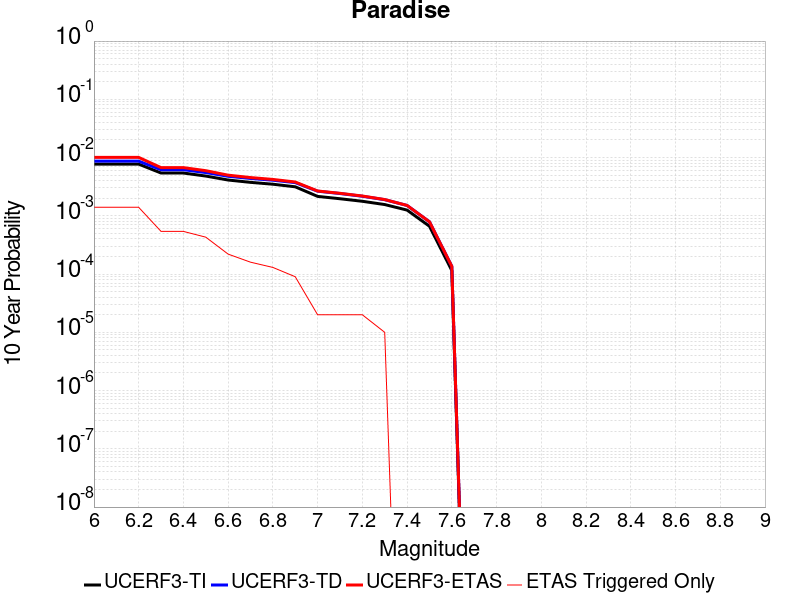 |

| Magnitude | 1 wk TI Prob | 1 wk TD Prob | 1 wk ETAS Prob | 1 wk ETAS/TD Gain | 1 wk ETAS Triggered Only | 1 mo TI Prob | 1 mo TD Prob | 1 mo ETAS Prob | 1 mo ETAS/TD Gain | 1 mo ETAS Triggered Only | 1 yr TI Prob | 1 yr TD Prob | 1 yr ETAS Prob | 1 yr ETAS/TD Gain | 1 yr ETAS Triggered Only | 10 yr TI Prob | 10 yr TD Prob | 10 yr ETAS Prob | 10 yr ETAS/TD Gain | 10 yr ETAS Triggered Only |
|-----|-----|-----|-----|-----|-----|-----|-----|-----|-----|-----|-----|-----|-----|-----|-----|-----|-----|-----|-----|-----|
| 6.0 | 1.4851273E-5 | 1.6694692E-5 | 4.16688E-4 | 24.959312 | 4.0E-4 | 6.364676E-5 | 7.154685E-5 | 6.115082E-4 | 8.546963 | 5.4E-4 | 7.7462377E-4 | 8.707584E-4 | 0.0018099399 | 2.0785787 | 9.4E-4 | 0.0077192914 | 0.008675844 | 0.0100636985 | 1.1599675 | 0.0014 |
| 6.1 | 1.4851273E-5 | 1.6694692E-5 | 4.16688E-4 | 24.959312 | 4.0E-4 | 6.364676E-5 | 7.154685E-5 | 6.115082E-4 | 8.546963 | 5.4E-4 | 7.7462377E-4 | 8.707584E-4 | 0.0018099399 | 2.0785787 | 9.4E-4 | 0.0077192914 | 0.008675844 | 0.0100636985 | 1.1599675 | 0.0014 |
| 6.2 | 1.4851273E-5 | 1.6694692E-5 | 4.16688E-4 | 24.959312 | 4.0E-4 | 6.364676E-5 | 7.154685E-5 | 6.115082E-4 | 8.546963 | 5.4E-4 | 7.7462377E-4 | 8.707584E-4 | 0.0018099399 | 2.0785787 | 9.4E-4 | 0.0077192914 | 0.008675844 | 0.0100636985 | 1.1599675 | 0.0014 |
| 6.3 | 1.0426831E-5 | 1.188862E-5 | 1.0188755E-4 | 8.570174 | 9.0E-5 | 4.4685654E-5 | 5.0950268E-5 | 2.0094262E-4 | 3.9438972 | 1.5E-4 | 5.43912E-4 | 6.201489E-4 | 9.799256E-4 | 1.5801457 | 3.6E-4 | 0.0054258266 | 0.0061847917 | 0.006721452 | 1.0867709 | 5.4E-4 |
| 6.4 | 1.0426831E-5 | 1.188862E-5 | 1.0188755E-4 | 8.570174 | 9.0E-5 | 4.4685654E-5 | 5.0950268E-5 | 2.0094262E-4 | 3.9438972 | 1.5E-4 | 5.43912E-4 | 6.201489E-4 | 9.799256E-4 | 1.5801457 | 3.6E-4 | 0.0054258266 | 0.0061847917 | 0.006721452 | 1.0867709 | 5.4E-4 |
| 6.5 | 9.25027E-6 | 1.06199595E-5 | 7.0619324E-5 | 6.6496787 | 6.0E-5 | 3.964341E-5 | 4.551335E-5 | 1.4550879E-4 | 3.1970577 | 1.0E-4 | 4.8255164E-4 | 5.53989E-4 | 8.338339E-4 | 1.5051452 | 2.8E-4 | 0.0048150513 | 0.0055265795 | 0.0059542027 | 1.0773758 | 4.3E-4 |
| 6.6 | 7.904275E-6 | 9.159525E-6 | 2.9159342E-5 | 3.1834993 | 2.0E-5 | 3.3875025E-5 | 3.9254537E-5 | 8.925258E-5 | 2.273688 | 5.0E-5 | 4.1235037E-4 | 4.7782314E-4 | 6.177562E-4 | 1.2928555 | 1.4E-4 | 0.0041158604 | 0.0047683544 | 0.0049873055 | 1.0459175 | 2.2E-4 |
| 6.7 | 7.2061953E-6 | 8.407248E-6 | 1.8407165E-5 | 2.1894398 | 1.0E-5 | 3.088333E-5 | 3.6030586E-5 | 6.6029505E-5 | 1.832596 | 3.0E-5 | 3.7593965E-4 | 4.3858777E-4 | 5.485395E-4 | 1.250695 | 1.1E-4 | 0.003753043 | 0.004377591 | 0.0045368904 | 1.0363898 | 1.6E-4 |
| 6.8 | 6.6948724E-6 | 7.842166E-6 | 1.7842087E-5 | 2.275148 | 1.0E-5 | 2.8691995E-5 | 3.360887E-5 | 6.360786E-5 | 1.8925915 | 3.0E-5 | 3.4926904E-4 | 4.0911473E-4 | 4.990779E-4 | 1.2198972 | 9.0E-5 | 0.003487206 | 0.0040839734 | 0.004213442 | 1.0317018 | 1.3E-4 |
| 6.9 | 6.0421025E-6 | 7.130621E-6 | 1.713055E-5 | 2.4023924 | 1.0E-5 | 2.5894467E-5 | 3.0559466E-5 | 5.0558854E-5 | 1.6544417 | 2.0E-5 | 3.1521954E-4 | 3.7200135E-4 | 4.419753E-4 | 1.1881014 | 7.0E-5 | 0.0031477278 | 0.0037141247 | 0.0038037905 | 1.0241418 | 9.0E-5 |
| 7.0 | 4.134091E-6 | 5.0803087E-6 | 5.0803087E-6 | 1.0 | 0.0 | 1.7717413E-5 | 2.177258E-5 | 3.177236E-5 | 1.4592834 | 1.0E-5 | 2.1568815E-4 | 2.6505045E-4 | 2.8504516E-4 | 1.0754373 | 2.0E-5 | 0.0021547892 | 0.0026474963 | 0.0026674434 | 1.0075343 | 2.0E-5 |
| 7.1 | 3.7674888E-6 | 4.6318696E-6 | 4.6318696E-6 | 1.0 | 0.0 | 1.6146281E-5 | 1.9850726E-5 | 2.9850527E-5 | 1.5037498 | 1.0E-5 | 1.9656324E-4 | 2.4165731E-4 | 2.616525E-4 | 1.0827419 | 2.0E-5 | 0.0019638946 | 0.002414096 | 0.0024340476 | 1.0082647 | 2.0E-5 |
| 7.2 | 3.4065345E-6 | 4.156723E-6 | 4.156723E-6 | 1.0 | 0.0 | 1.4599351E-5 | 1.7814415E-5 | 2.7814236E-5 | 1.5613332 | 1.0E-5 | 1.777326E-4 | 2.1687041E-4 | 2.3686608E-4 | 1.092201 | 2.0E-5 | 0.0017759053 | 0.002166736 | 0.0021866926 | 1.0092105 | 2.0E-5 |
| 7.3 | 2.9934936E-6 | 3.6293168E-6 | 3.6293168E-6 | 1.0 | 0.0 | 1.2829195E-5 | 1.555413E-5 | 2.5553974E-5 | 1.6429061 | 1.0E-5 | 1.5618425E-4 | 1.8935655E-4 | 1.9935466E-4 | 1.0528004 | 1.0E-5 | 0.0015607453 | 0.0018920974 | 0.0019020785 | 1.0052751 | 1.0E-5 |
| 7.4 | 2.4049796E-6 | 2.8889842E-6 | 2.8889842E-6 | 1.0 | 0.0 | 1.0307015E-5 | 1.238131E-5 | 1.238131E-5 | 1.0 | 0.0 | 1.2548068E-4 | 1.5073347E-4 | 1.5073347E-4 | 1.0 | 0.0 | 0.0012540985 | 0.0015064536 | 0.0015064536 | 1.0 | 0.0 |
| 7.5 | 1.2710091E-6 | 1.5134682E-6 | 1.5134682E-6 | 1.0 | 0.0 | 5.44717E-6 | 6.4862834E-6 | 6.4862834E-6 | 1.0 | 0.0 | 6.631728E-5 | 7.8968886E-5 | 7.8968886E-5 | 1.0 | 0.0 | 6.6297496E-4 | 7.8953087E-4 | 7.8953087E-4 | 1.0 | 0.0 |
| 7.6 | 2.21172E-7 | 2.603961E-7 | 2.603961E-7 | 1.0 | 0.0 | 9.478797E-7 | 1.1159829E-6 | 1.1159829E-6 | 1.0 | 0.0 | 1.1540374E-5 | 1.3587036E-5 | 1.3587036E-5 | 1.0 | 0.0 | 1.1539775E-4 | 1.3586486E-4 | 1.3586486E-4 | 1.0 | 0.0 |

## San Andreas (Mojave N)
*[(top)](#table-of-contents)*

| 1 Week | 1 Month | 1 Year | 10 Year |
|-----|-----|-----|-----|
|  |  |  |  |

| Magnitude | 1 wk TI Prob | 1 wk TD Prob | 1 wk ETAS Prob | 1 wk ETAS/TD Gain | 1 wk ETAS Triggered Only | 1 mo TI Prob | 1 mo TD Prob | 1 mo ETAS Prob | 1 mo ETAS/TD Gain | 1 mo ETAS Triggered Only | 1 yr TI Prob | 1 yr TD Prob | 1 yr ETAS Prob | 1 yr ETAS/TD Gain | 1 yr ETAS Triggered Only | 10 yr TI Prob | 10 yr TD Prob | 10 yr ETAS Prob | 10 yr ETAS/TD Gain | 10 yr ETAS Triggered Only |
|-----|-----|-----|-----|-----|-----|-----|-----|-----|-----|-----|-----|-----|-----|-----|-----|-----|-----|-----|-----|-----|
| 6.0 | 9.877682E-5 | 1.9400702E-4 | 5.739333E-4 | 2.958312 | 3.8E-4 | 4.2326056E-4 | 8.311939E-4 | 0.0013307784 | 1.6010444 | 5.0E-4 | 0.0051410277 | 0.010072956 | 0.010934193 | 1.0854999 | 8.7E-4 | 0.05023708 | 0.09831428 | 0.0995045 | 1.0121063 | 0.00132 |
| 6.1 | 9.877682E-5 | 1.9400702E-4 | 5.739333E-4 | 2.958312 | 3.8E-4 | 4.2326056E-4 | 8.311939E-4 | 0.0013307784 | 1.6010444 | 5.0E-4 | 0.0051410277 | 0.010072956 | 0.010934193 | 1.0854999 | 8.7E-4 | 0.05023708 | 0.09831428 | 0.0995045 | 1.0121063 | 0.00132 |
| 6.2 | 9.877682E-5 | 1.9400702E-4 | 5.739333E-4 | 2.958312 | 3.8E-4 | 4.2326056E-4 | 8.311939E-4 | 0.0013307784 | 1.6010444 | 5.0E-4 | 0.0051410277 | 0.010072956 | 0.010934193 | 1.0854999 | 8.7E-4 | 0.05023708 | 0.09831428 | 0.0995045 | 1.0121063 | 0.00132 |
| 6.3 | 9.877682E-5 | 1.9400702E-4 | 5.739333E-4 | 2.958312 | 3.8E-4 | 4.2326056E-4 | 8.311939E-4 | 0.0013307784 | 1.6010444 | 5.0E-4 | 0.0051410277 | 0.010072956 | 0.010934193 | 1.0854999 | 8.7E-4 | 0.05023708 | 0.09831428 | 0.0995045 | 1.0121063 | 0.00132 |
| 6.4 | 9.877682E-5 | 1.9400702E-4 | 5.739333E-4 | 2.958312 | 3.8E-4 | 4.2326056E-4 | 8.311939E-4 | 0.0013307784 | 1.6010444 | 5.0E-4 | 0.0051410277 | 0.010072956 | 0.010934193 | 1.0854999 | 8.7E-4 | 0.05023708 | 0.09831428 | 0.0995045 | 1.0121063 | 0.00132 |
| 6.5 | 9.861474E-5 | 1.9374468E-4 | 5.736711E-4 | 2.9609642 | 3.8E-4 | 4.2256617E-4 | 8.300703E-4 | 0.0013296553 | 1.6018586 | 5.0E-4 | 0.0051326132 | 0.010059402 | 0.010920651 | 1.0856162 | 8.7E-4 | 0.050156746 | 0.098192066 | 0.09938245 | 1.012123 | 0.00132 |
| 6.6 | 9.861474E-5 | 1.9374468E-4 | 5.736711E-4 | 2.9609642 | 3.8E-4 | 4.2256617E-4 | 8.300703E-4 | 0.0013296553 | 1.6018586 | 5.0E-4 | 0.0051326132 | 0.010059402 | 0.010920651 | 1.0856162 | 8.7E-4 | 0.050156746 | 0.098192066 | 0.09938245 | 1.012123 | 0.00132 |
| 6.7 | 9.8552715E-5 | 1.9364421E-4 | 5.735706E-4 | 2.9619818 | 3.8E-4 | 4.223004E-4 | 8.2964E-4 | 0.0013292251 | 1.6021711 | 5.0E-4 | 0.0051293927 | 0.010054212 | 0.010915465 | 1.0856609 | 8.7E-4 | 0.050125998 | 0.098145254 | 0.09933571 | 1.0121294 | 0.00132 |
| 6.8 | 9.8464974E-5 | 1.9349584E-4 | 5.734223E-4 | 2.9634864 | 3.8E-4 | 4.219245E-4 | 8.290045E-4 | 0.00132859 | 1.602633 | 5.0E-4 | 0.0051248376 | 0.010046546 | 0.010907806 | 1.085727 | 8.7E-4 | 0.05008251 | 0.09807528 | 0.09926582 | 1.0121391 | 0.00132 |
| 6.9 | 9.825824E-5 | 1.9317595E-4 | 5.7310256E-4 | 2.9667387 | 3.8E-4 | 4.2103877E-4 | 8.276344E-4 | 0.0013272206 | 1.6036315 | 5.0E-4 | 0.0051141046 | 0.010030019 | 0.010891293 | 1.0858697 | 8.7E-4 | 0.049980022 | 0.09792438 | 0.09911512 | 1.0121598 | 0.00132 |
| 7.0 | 9.781462E-5 | 1.924896E-4 | 5.7241647E-4 | 2.9737525 | 3.8E-4 | 4.1913814E-4 | 8.246948E-4 | 0.0013242825 | 1.6057849 | 5.0E-4 | 0.005091073 | 0.009994558 | 0.010855863 | 1.0861773 | 8.7E-4 | 0.04976007 | 0.09760077 | 0.09879194 | 1.0122045 | 0.00132 |
| 7.1 | 9.7121134E-5 | 1.9150671E-4 | 5.714339E-4 | 2.9838846 | 3.8E-4 | 4.1616702E-4 | 8.204851E-4 | 0.0013200749 | 1.6088955 | 5.0E-4 | 0.005055068 | 0.009943774 | 0.010795223 | 1.0856262 | 8.6E-4 | 0.04941613 | 0.09713728 | 0.09832004 | 1.012176 | 0.00131 |
| 7.2 | 9.663819E-5 | 1.9081456E-4 | 5.7074206E-4 | 2.9910822 | 3.8E-4 | 4.1409794E-4 | 8.175206E-4 | 0.0013171119 | 1.6111053 | 5.0E-4 | 0.0050299936 | 0.00990801 | 0.01075949 | 1.0859385 | 8.6E-4 | 0.049176537 | 0.09681055 | 0.097984694 | 1.0121282 | 0.0013 |
| 7.3 | 9.6277574E-5 | 1.9033969E-4 | 5.702674E-4 | 2.9960506 | 3.8E-4 | 4.125529E-4 | 8.154867E-4 | 0.0013150789 | 1.6126307 | 5.0E-4 | 0.0050112694 | 0.009883473 | 0.0107349735 | 1.086154 | 8.6E-4 | 0.04899759 | 0.09658401 | 0.09775845 | 1.0121598 | 0.0013 |
| 7.4 | 9.593308E-5 | 1.897375E-4 | 5.696654E-4 | 3.002387 | 3.8E-4 | 4.1107697E-4 | 8.129075E-4 | 0.001312501 | 1.6145761 | 5.0E-4 | 0.0049933824 | 0.009852355 | 0.010703882 | 1.0864288 | 8.6E-4 | 0.04882661 | 0.09630218 | 0.09747699 | 1.0121992 | 0.0013 |
| 7.5 | 9.561707E-5 | 1.8919831E-4 | 5.691264E-4 | 3.0080945 | 3.8E-4 | 4.0972308E-4 | 8.1059814E-4 | 0.0013101929 | 1.6163285 | 5.0E-4 | 0.0049769743 | 0.009824493 | 0.010676044 | 1.0866764 | 8.6E-4 | 0.048669744 | 0.09604836 | 0.0972235 | 1.0122348 | 0.0013 |
| 7.6 | 9.418194E-5 | 1.8572104E-4 | 5.556523E-4 | 2.9918652 | 3.7E-4 | 4.0357444E-4 | 7.957047E-4 | 0.0012853148 | 1.6153163 | 4.9E-4 | 0.004902454 | 0.009644784 | 0.010476682 | 1.0862538 | 8.4E-4 | 0.047957025 | 0.094430685 | 0.09558982 | 1.0122749 | 0.00128 |
| 7.7 | 8.202141E-5 | 1.6021315E-4 | 4.7016348E-4 | 2.9346123 | 3.1E-4 | 3.51473E-4 | 6.8644714E-4 | 0.0011061588 | 1.6114261 | 4.2E-4 | 0.00427079 | 0.008325525 | 0.009049447 | 1.0869522 | 7.3E-4 | 0.04189639 | 0.08223219 | 0.08328763 | 1.0128348 | 0.00115 |
| 7.8 | 7.2859846E-5 | 1.4516473E-4 | 3.651328E-4 | 2.5152998 | 2.2E-4 | 3.1221908E-4 | 6.219862E-4 | 9.217996E-4 | 1.4820259 | 3.0E-4 | 0.003794643 | 0.0075464295 | 0.008042657 | 1.0657564 | 5.0E-4 | 0.037304975 | 0.07472468 | 0.07545565 | 1.0097822 | 7.9E-4 |
| 7.9 | 5.3874453E-5 | 1.0045676E-4 | 2.3044371E-4 | 2.2939591 | 1.3E-4 | 2.3087008E-4 | 4.3045796E-4 | 6.103805E-4 | 1.4179794 | 1.8E-4 | 0.0028072202 | 0.0052282433 | 0.0055366224 | 1.0589833 | 3.1E-4 | 0.02772022 | 0.05242443 | 0.05286979 | 1.0084953 | 4.7E-4 |
| 8.0 | 3.468538E-5 | 5.4260272E-5 | 8.4258645E-5 | 1.5528607 | 3.0E-5 | 1.4864317E-4 | 2.325233E-4 | 2.9250936E-4 | 1.2579787 | 6.0E-5 | 0.0018082283 | 0.002827298 | 0.002927015 | 1.0352695 | 1.0E-4 | 0.017935853 | 0.028947512 | 0.029093169 | 1.0050318 | 1.5E-4 |
| 8.1 | 1.9152367E-5 | 1.940263E-5 | 2.9402436E-5 | 1.5153841 | 1.0E-5 | 8.207899E-5 | 8.3151484E-5 | 1.0314982E-4 | 1.2405049 | 2.0E-5 | 9.988535E-4 | 0.0010118998 | 0.0010418694 | 1.0296172 | 3.0E-5 | 0.009943757 | 0.01085625 | 0.010895816 | 1.0036445 | 4.0E-5 |
| 8.2 | 8.643924E-6 | 5.4748625E-6 | 5.4748625E-6 | 1.0 | 0.0 | 3.704486E-5 | 2.3463486E-5 | 3.346325E-5 | 1.4261842 | 1.0E-5 | 4.5092785E-4 | 2.8563058E-4 | 3.0562485E-4 | 1.0700005 | 2.0E-5 | 0.0045001395 | 0.0032487072 | 0.0032686424 | 1.0061363 | 2.0E-5 |
| 8.3 | 1.983087E-6 | 7.6599065E-7 | 7.6599065E-7 | 1.0 | 0.0 | 8.498917E-6 | 3.282813E-6 | 3.282813E-6 | 1.0 | 0.0 | 1.034694E-4 | 3.9967534E-5 | 3.9967534E-5 | 1.0 | 0.0 | 0.0010342124 | 4.719687E-4 | 4.719687E-4 | 1.0 | 0.0 |

## Garlic Springs
*[(top)](#table-of-contents)*

| 1 Week | 1 Month | 1 Year | 10 Year |
|-----|-----|-----|-----|
|  |  |  |  |

| Magnitude | 1 wk TI Prob | 1 wk TD Prob | 1 wk ETAS Prob | 1 wk ETAS/TD Gain | 1 wk ETAS Triggered Only | 1 mo TI Prob | 1 mo TD Prob | 1 mo ETAS Prob | 1 mo ETAS/TD Gain | 1 mo ETAS Triggered Only | 1 yr TI Prob | 1 yr TD Prob | 1 yr ETAS Prob | 1 yr ETAS/TD Gain | 1 yr ETAS Triggered Only | 10 yr TI Prob | 10 yr TD Prob | 10 yr ETAS Prob | 10 yr ETAS/TD Gain | 10 yr ETAS Triggered Only |
|-----|-----|-----|-----|-----|-----|-----|-----|-----|-----|-----|-----|-----|-----|-----|-----|-----|-----|-----|-----|-----|
| 6.0 | 1.6760017E-5 | 1.8776833E-5 | 2.2877289E-4 | 12.183785 | 2.1E-4 | 7.182667E-5 | 8.0470316E-5 | 4.3044216E-4 | 5.3490796 | 3.5E-4 | 8.7413884E-4 | 9.794032E-4 | 0.001698698 | 1.7344216 | 7.2E-4 | 0.008707083 | 0.009762413 | 0.010871479 | 1.1136057 | 0.00112 |
| 6.1 | 9.852767E-6 | 1.09735865E-5 | 1.2097238E-4 | 11.02396 | 1.1E-4 | 4.222546E-5 | 4.702921E-5 | 2.1702121E-4 | 4.6146045 | 1.7E-4 | 5.139737E-4 | 5.7250116E-4 | 0.001002255 | 1.7506602 | 4.3E-4 | 0.005127866 | 0.005717221 | 0.006373448 | 1.1147807 | 6.6E-4 |
| 6.2 | 9.852767E-6 | 1.09735865E-5 | 1.2097238E-4 | 11.02396 | 1.1E-4 | 4.222546E-5 | 4.702921E-5 | 2.1702121E-4 | 4.6146045 | 1.7E-4 | 5.139737E-4 | 5.7250116E-4 | 0.001002255 | 1.7506602 | 4.3E-4 | 0.005127866 | 0.005717221 | 0.006373448 | 1.1147807 | 6.6E-4 |
| 6.3 | 4.3167724E-6 | 4.7780286E-6 | 1.0477755E-4 | 21.929033 | 1.0E-4 | 1.8500323E-5 | 2.0477235E-5 | 1.2047519E-4 | 5.883372 | 1.0E-4 | 2.2521814E-4 | 2.4930484E-4 | 4.1926245E-4 | 1.6817261 | 1.7E-4 | 0.0022499003 | 0.00249251 | 0.002751862 | 1.1040525 | 2.6E-4 |
| 6.4 | 4.3167724E-6 | 4.7780286E-6 | 1.0477755E-4 | 21.929033 | 1.0E-4 | 1.8500323E-5 | 2.0477235E-5 | 1.2047519E-4 | 5.883372 | 1.0E-4 | 2.2521814E-4 | 2.4930484E-4 | 4.1926245E-4 | 1.6817261 | 1.7E-4 | 0.0022499003 | 0.00249251 | 0.002751862 | 1.1040525 | 2.6E-4 |
| 6.5 | 4.3167724E-6 | 4.7780286E-6 | 1.0477755E-4 | 21.929033 | 1.0E-4 | 1.8500323E-5 | 2.0477235E-5 | 1.2047519E-4 | 5.883372 | 1.0E-4 | 2.2521814E-4 | 2.4930484E-4 | 4.1926245E-4 | 1.6817261 | 1.7E-4 | 0.0022499003 | 0.00249251 | 0.002751862 | 1.1040525 | 2.6E-4 |
| 6.6 | 4.301311E-6 | 4.760897E-6 | 1.04760424E-4 | 22.004345 | 1.0E-4 | 1.8434059E-5 | 2.0403815E-5 | 1.20401775E-4 | 5.900944 | 1.0E-4 | 2.2441156E-4 | 2.4841115E-4 | 4.1836893E-4 | 1.6841793 | 1.7E-4 | 0.0022418506 | 0.002483593 | 0.0027429473 | 1.104427 | 2.6E-4 |
| 6.7 | 3.8599724E-6 | 4.27106E-6 | 1.04270635E-4 | 24.413292 | 1.0E-4 | 1.6542634E-5 | 1.8304541E-5 | 1.1830271E-4 | 6.463025 | 1.0E-4 | 2.0138794E-4 | 2.228578E-4 | 3.9281993E-4 | 1.7626482 | 1.7E-4 | 0.0020120554 | 0.002228578 | 0.002478021 | 1.1119292 | 2.5E-4 |

## San Andreas (San Bernardino N)
*[(top)](#table-of-contents)*

| 1 Week | 1 Month | 1 Year | 10 Year |
|-----|-----|-----|-----|
|  |  |  |  |

| Magnitude | 1 wk TI Prob | 1 wk TD Prob | 1 wk ETAS Prob | 1 wk ETAS/TD Gain | 1 wk ETAS Triggered Only | 1 mo TI Prob | 1 mo TD Prob | 1 mo ETAS Prob | 1 mo ETAS/TD Gain | 1 mo ETAS Triggered Only | 1 yr TI Prob | 1 yr TD Prob | 1 yr ETAS Prob | 1 yr ETAS/TD Gain | 1 yr ETAS Triggered Only | 10 yr TI Prob | 10 yr TD Prob | 10 yr ETAS Prob | 10 yr ETAS/TD Gain | 10 yr ETAS Triggered Only |
|-----|-----|-----|-----|-----|-----|-----|-----|-----|-----|-----|-----|-----|-----|-----|-----|-----|-----|-----|-----|-----|
| 6.0 | 1.4273766E-4 | 3.1606483E-4 | 5.1600166E-4 | 1.6325816 | 2.0E-4 | 6.115894E-4 | 0.0013538664 | 0.0016334873 | 1.2065351 | 2.8E-4 | 0.0074207084 | 0.016360244 | 0.016861899 | 1.0306631 | 5.1E-4 | 0.07177748 | 0.15026689 | 0.15093817 | 1.0044674 | 7.9E-4 |
| 6.1 | 1.4273766E-4 | 3.1606483E-4 | 5.1600166E-4 | 1.6325816 | 2.0E-4 | 6.115894E-4 | 0.0013538664 | 0.0016334873 | 1.2065351 | 2.8E-4 | 0.0074207084 | 0.016360244 | 0.016861899 | 1.0306631 | 5.1E-4 | 0.07177748 | 0.15026689 | 0.15093817 | 1.0044674 | 7.9E-4 |
| 6.2 | 1.4273766E-4 | 3.1606483E-4 | 5.1600166E-4 | 1.6325816 | 2.0E-4 | 6.115894E-4 | 0.0013538664 | 0.0016334873 | 1.2065351 | 2.8E-4 | 0.0074207084 | 0.016360244 | 0.016861899 | 1.0306631 | 5.1E-4 | 0.07177748 | 0.15026689 | 0.15093817 | 1.0044674 | 7.9E-4 |
| 6.3 | 1.3730655E-4 | 3.0511338E-4 | 5.050524E-4 | 1.6552941 | 2.0E-4 | 5.883239E-4 | 0.0013069791 | 0.0015866132 | 1.2139544 | 2.8E-4 | 0.0071393442 | 0.015797773 | 0.016299715 | 1.0317731 | 5.1E-4 | 0.06914291 | 0.14556676 | 0.14624177 | 1.0046371 | 7.9E-4 |
| 6.4 | 1.3730655E-4 | 3.0511338E-4 | 5.050524E-4 | 1.6552941 | 2.0E-4 | 5.883239E-4 | 0.0013069791 | 0.0015866132 | 1.2139544 | 2.8E-4 | 0.0071393442 | 0.015797773 | 0.016299715 | 1.0317731 | 5.1E-4 | 0.06914291 | 0.14556676 | 0.14624177 | 1.0046371 | 7.9E-4 |
| 6.5 | 1.2942807E-4 | 2.8925808E-4 | 4.7920312E-4 | 1.656663 | 1.9E-4 | 5.545738E-4 | 0.0012390936 | 0.0015087591 | 1.2176312 | 2.7E-4 | 0.0067310524 | 0.01498286 | 0.015465518 | 1.032214 | 4.9E-4 | 0.06530788 | 0.13870941 | 0.13937262 | 1.0047811 | 7.7E-4 |
| 6.6 | 1.1125901E-4 | 2.536472E-4 | 4.43599E-4 | 1.7488819 | 1.9E-4 | 4.767372E-4 | 0.0010866089 | 0.0013363372 | 1.2298236 | 2.5E-4 | 0.005788839 | 0.013149847 | 0.0135840615 | 1.0330205 | 4.4E-4 | 0.056403454 | 0.122999296 | 0.12362196 | 1.0050623 | 7.1E-4 |
| 6.7 | 1.02209575E-4 | 2.3499702E-4 | 4.149547E-4 | 1.7657872 | 1.8E-4 | 4.3796748E-4 | 0.0010067427 | 0.0012465011 | 1.2381526 | 2.4E-4 | 0.0053192247 | 0.012188629 | 0.012613389 | 1.0348488 | 4.3E-4 | 0.051936906 | 0.114790924 | 0.115401715 | 1.0053209 | 6.9E-4 |
| 6.8 | 9.610582E-5 | 2.2025521E-4 | 4.0021556E-4 | 1.8170538 | 1.8E-4 | 4.1181705E-4 | 9.436101E-4 | 0.0011833836 | 1.2541023 | 2.4E-4 | 0.0050023515 | 0.011428202 | 0.011853287 | 1.0371962 | 4.3E-4 | 0.048912346 | 0.1081929 | 0.10880825 | 1.0056875 | 6.9E-4 |
| 6.9 | 9.3877505E-5 | 2.1481077E-4 | 3.947721E-4 | 1.8377668 | 1.8E-4 | 4.0227012E-4 | 9.2029345E-4 | 0.0011600726 | 1.2605463 | 2.4E-4 | 0.0048866454 | 0.011147255 | 0.011552685 | 1.0363704 | 4.1E-4 | 0.04780577 | 0.10578323 | 0.106373414 | 1.0055792 | 6.6E-4 |
| 7.0 | 9.1019785E-5 | 2.0808022E-4 | 3.8804277E-4 | 1.864871 | 1.8E-4 | 3.900265E-4 | 8.914682E-4 | 0.0011312542 | 1.2689788 | 2.4E-4 | 0.0047382377 | 0.010799837 | 0.011205409 | 1.0375535 | 4.1E-4 | 0.046384744 | 0.102753714 | 0.10333692 | 1.0056758 | 6.5E-4 |
| 7.1 | 8.771155E-5 | 1.9982594E-4 | 3.7978997E-4 | 1.9006039 | 1.8E-4 | 3.758525E-4 | 8.5611636E-4 | 0.0010959109 | 1.2800957 | 2.4E-4 | 0.0045664064 | 0.0103736 | 0.010779346 | 1.0391134 | 4.1E-4 | 0.044737056 | 0.09906527 | 0.09964186 | 1.0058204 | 6.4E-4 |
| 7.2 | 8.0830236E-5 | 1.8388197E-4 | 3.6384887E-4 | 1.9787087 | 1.8E-4 | 3.4636928E-4 | 7.8782777E-4 | 0.0010276387 | 1.3043951 | 2.4E-4 | 0.0042088944 | 0.009549725 | 0.009955809 | 1.0425231 | 4.1E-4 | 0.041300658 | 0.09179615 | 0.0923774 | 1.0063319 | 6.4E-4 |
| 7.3 | 7.7668235E-5 | 1.7331762E-4 | 3.4328815E-4 | 1.9806881 | 1.7E-4 | 3.328214E-4 | 7.425784E-4 | 9.7240764E-4 | 1.3095016 | 2.3E-4 | 0.0040445733 | 0.009003494 | 0.009389983 | 1.0429265 | 3.9E-4 | 0.03971748 | 0.08706327 | 0.08762929 | 1.0065013 | 6.2E-4 |
| 7.4 | 7.520177E-5 | 1.6551897E-4 | 3.3549083E-4 | 2.0269027 | 1.7E-4 | 3.2225347E-4 | 7.0917426E-4 | 9.3901117E-4 | 1.3240908 | 2.3E-4 | 0.0039163795 | 0.008600081 | 0.008986727 | 1.0449584 | 3.9E-4 | 0.038480744 | 0.08351955 | 0.0840786 | 1.0066937 | 6.1E-4 |
| 7.5 | 7.274697E-5 | 1.5839566E-4 | 3.2836874E-4 | 2.0730917 | 1.7E-4 | 3.1173544E-4 | 6.78662E-4 | 9.0850587E-4 | 1.3386722 | 2.3E-4 | 0.003788775 | 0.008231463 | 0.008618252 | 1.0469892 | 3.9E-4 | 0.03724827 | 0.08023631 | 0.08079737 | 1.0069926 | 6.1E-4 |
| 7.6 | 7.1185845E-5 | 1.540943E-4 | 3.240681E-4 | 2.1030505 | 1.7E-4 | 3.0504653E-4 | 6.6023704E-4 | 8.9008524E-4 | 1.3481297 | 2.3E-4 | 0.0037076178 | 0.008008812 | 0.008395688 | 1.0483063 | 3.9E-4 | 0.036463667 | 0.07822598 | 0.07878826 | 1.007188 | 6.1E-4 |
| 7.7 | 6.709961E-5 | 1.4318313E-4 | 3.131588E-4 | 2.1871207 | 1.7E-4 | 2.8753807E-4 | 6.1349774E-4 | 8.433566E-4 | 1.3746696 | 2.3E-4 | 0.003495157 | 0.0074437927 | 0.007820964 | 1.0506692 | 3.8E-4 | 0.034406938 | 0.07305469 | 0.073610865 | 1.0076131 | 6.0E-4 |
| 7.8 | 6.300812E-5 | 1.3202413E-4 | 3.020017E-4 | 2.2874734 | 1.7E-4 | 2.7000686E-4 | 5.65695E-4 | 7.955649E-4 | 1.4063495 | 2.3E-4 | 0.0032823787 | 0.006865616 | 0.007243007 | 1.0549682 | 3.8E-4 | 0.032343175 | 0.06771354 | 0.06827291 | 1.0082608 | 6.0E-4 |
| 7.9 | 4.983037E-5 | 9.723488E-5 | 2.2722223E-4 | 2.3368387 | 1.3E-4 | 2.1354125E-4 | 4.1665437E-4 | 5.965794E-4 | 1.4318328 | 1.8E-4 | 0.0025967648 | 0.0050609782 | 0.0053694095 | 1.060943 | 3.1E-4 | 0.025666296 | 0.05064886 | 0.051095054 | 1.0088096 | 4.7E-4 |
| 8.0 | 3.2211527E-5 | 5.3304586E-5 | 8.3302984E-5 | 1.5627733 | 3.0E-5 | 1.380421E-4 | 2.2842824E-4 | 2.8841454E-4 | 1.2626046 | 6.0E-5 | 0.0016793669 | 0.0027775685 | 0.0028772908 | 1.0359027 | 1.0E-4 | 0.016667323 | 0.028361378 | 0.028507125 | 1.0051389 | 1.5E-4 |
| 8.1 | 1.743376E-5 | 1.8824427E-5 | 2.8824237E-5 | 1.5312147 | 1.0E-5 | 7.471398E-5 | 8.067362E-5 | 1.00672005E-4 | 1.2478925 | 2.0E-5 | 9.0926304E-4 | 9.817594E-4 | 0.0010117299 | 1.0305274 | 3.0E-5 | 0.009055517 | 0.010484105 | 0.010523685 | 1.0037754 | 4.0E-5 |
| 8.2 | 7.831616E-6 | 5.1551065E-6 | 5.1551065E-6 | 1.0 | 0.0 | 3.3563636E-5 | 2.2093127E-5 | 3.2092907E-5 | 1.4526194 | 1.0E-5 | 4.0856065E-4 | 2.6895068E-4 | 2.889453E-4 | 1.0743431 | 2.0E-5 | 0.004078103 | 0.0030418145 | 0.0030617537 | 1.0065551 | 2.0E-5 |
| 8.3 | 1.983087E-6 | 7.6599065E-7 | 7.6599065E-7 | 1.0 | 0.0 | 8.498917E-6 | 3.282813E-6 | 3.282813E-6 | 1.0 | 0.0 | 1.034694E-4 | 3.9967534E-5 | 3.9967534E-5 | 1.0 | 0.0 | 0.0010342124 | 4.719687E-4 | 4.719687E-4 | 1.0 | 0.0 |

## Helendale-So Lockhart
*[(top)](#table-of-contents)*

| 1 Week | 1 Month | 1 Year | 10 Year |
|-----|-----|-----|-----|
|  |  | 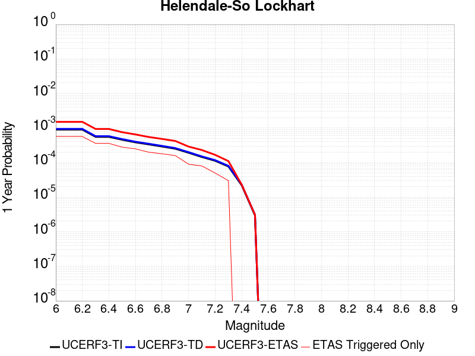 |  |

| Magnitude | 1 wk TI Prob | 1 wk TD Prob | 1 wk ETAS Prob | 1 wk ETAS/TD Gain | 1 wk ETAS Triggered Only | 1 mo TI Prob | 1 mo TD Prob | 1 mo ETAS Prob | 1 mo ETAS/TD Gain | 1 mo ETAS Triggered Only | 1 yr TI Prob | 1 yr TD Prob | 1 yr ETAS Prob | 1 yr ETAS/TD Gain | 1 yr ETAS Triggered Only | 10 yr TI Prob | 10 yr TD Prob | 10 yr ETAS Prob | 10 yr ETAS/TD Gain | 10 yr ETAS Triggered Only |
|-----|-----|-----|-----|-----|-----|-----|-----|-----|-----|-----|-----|-----|-----|-----|-----|-----|-----|-----|-----|-----|
| 6.0 | 1.7296055E-5 | 1.8103729E-5 | 2.3809975E-4 | 13.151972 | 2.2E-4 | 7.412385E-5 | 7.7585224E-5 | 4.0755962E-4 | 5.2530575 | 3.3E-4 | 9.0208417E-4 | 9.4421144E-4 | 0.0015136732 | 1.6031083 | 5.7E-4 | 0.008984311 | 0.009404116 | 0.010216405 | 1.0863758 | 8.2E-4 |
| 6.1 | 1.7296055E-5 | 1.8103729E-5 | 2.3809975E-4 | 13.151972 | 2.2E-4 | 7.412385E-5 | 7.7585224E-5 | 4.0755962E-4 | 5.2530575 | 3.3E-4 | 9.0208417E-4 | 9.4421144E-4 | 0.0015136732 | 1.6031083 | 5.7E-4 | 0.008984311 | 0.009404116 | 0.010216405 | 1.0863758 | 8.2E-4 |
| 6.2 | 1.7296055E-5 | 1.8103729E-5 | 2.3809975E-4 | 13.151972 | 2.2E-4 | 7.412385E-5 | 7.7585224E-5 | 4.0755962E-4 | 5.2530575 | 3.3E-4 | 9.0208417E-4 | 9.4421144E-4 | 0.0015136732 | 1.6031083 | 5.7E-4 | 0.008984311 | 0.009404116 | 0.010216405 | 1.0863758 | 8.2E-4 |
| 6.3 | 1.0669118E-5 | 1.1135425E-5 | 1.6113375E-4 | 14.470374 | 1.5E-4 | 4.5723988E-5 | 4.772239E-5 | 2.677119E-4 | 5.6097755 | 2.2E-4 | 5.5654737E-4 | 5.80868E-4 | 9.406589E-4 | 1.6194022 | 3.6E-4 | 0.0055515557 | 0.0057937936 | 0.0062809545 | 1.0840832 | 4.9E-4 |
| 6.4 | 1.0669118E-5 | 1.1135425E-5 | 1.6113375E-4 | 14.470374 | 1.5E-4 | 4.5723988E-5 | 4.772239E-5 | 2.677119E-4 | 5.6097755 | 2.2E-4 | 5.5654737E-4 | 5.80868E-4 | 9.406589E-4 | 1.6194022 | 3.6E-4 | 0.0055515557 | 0.0057937936 | 0.0062809545 | 1.0840832 | 4.9E-4 |
| 6.5 | 8.790038E-6 | 9.170197E-6 | 1.291691E-4 | 14.08575 | 1.2E-4 | 3.767105E-5 | 3.930026E-5 | 2.0929358E-4 | 5.325501 | 1.7E-4 | 4.585485E-4 | 4.7837716E-4 | 7.582432E-4 | 1.5850322 | 2.8E-4 | 0.0045760344 | 0.004773638 | 0.0051518246 | 1.0792239 | 3.8E-4 |
| 6.6 | 7.396949E-6 | 7.715537E-6 | 1.2771461E-4 | 16.552914 | 1.2E-4 | 3.1700827E-5 | 3.3066175E-5 | 2.0306055E-4 | 6.1410356 | 1.7E-4 | 3.858892E-4 | 4.025073E-4 | 6.5240666E-4 | 1.6208568 | 2.5E-4 | 0.003852198 | 0.00401789 | 0.0043664835 | 1.0867604 | 3.5E-4 |
| 6.7 | 6.4600285E-6 | 6.738031E-6 | 8.673749E-5 | 12.872825 | 8.0E-5 | 2.7685543E-5 | 2.887696E-5 | 1.488735E-4 | 5.155442 | 1.2E-4 | 3.3701936E-4 | 3.5152107E-4 | 5.5145076E-4 | 1.568756 | 2.0E-4 | 0.0033650869 | 0.003509732 | 0.0037987141 | 1.0823374 | 2.9E-4 |
| 6.8 | 5.600104E-6 | 5.836009E-6 | 8.583554E-5 | 14.707917 | 8.0E-5 | 2.4000226E-5 | 2.5011232E-5 | 1.4500823E-4 | 5.7977242 | 1.2E-4 | 2.9216358E-4 | 3.044698E-4 | 4.8441498E-4 | 1.5910116 | 1.8E-4 | 0.0029177975 | 0.003040588 | 0.0032798583 | 1.0786921 | 2.4E-4 |
| 6.9 | 4.839122E-6 | 5.0395092E-6 | 6.503921E-5 | 12.905861 | 6.0E-5 | 2.0738931E-5 | 2.159772E-5 | 1.2159556E-4 | 5.630018 | 1.0E-4 | 2.5246723E-4 | 2.6292098E-4 | 4.2287892E-4 | 1.6083878 | 1.6E-4 | 0.002521806 | 0.002626147 | 0.002845569 | 1.083553 | 2.2E-4 |
| 7.0 | 3.6937633E-6 | 3.845208E-6 | 3.3845092E-5 | 8.801888 | 3.0E-5 | 1.5830317E-5 | 1.647936E-5 | 7.647837E-5 | 4.640858 | 6.0E-5 | 1.9271708E-4 | 2.0061806E-4 | 2.906E-4 | 1.4485236 | 9.0E-5 | 0.0019255003 | 0.002004401 | 0.0021241605 | 1.0597483 | 1.2E-4 |
| 7.1 | 2.7858857E-6 | 2.8978538E-6 | 3.2897766E-5 | 11.352459 | 3.0E-5 | 1.1939455E-5 | 1.2419316E-5 | 6.2418694E-5 | 5.0259366 | 5.0E-5 | 1.4535317E-4 | 1.511949E-4 | 2.311828E-4 | 1.5290384 | 8.0E-5 | 0.0014525814 | 0.0015109418 | 0.0016008058 | 1.0594755 | 9.0E-5 |
| 7.2 | 2.1672065E-6 | 2.2540128E-6 | 1.22539905E-5 | 5.436522 | 1.0E-5 | 9.2879945E-6 | 9.66002E-6 | 3.965973E-5 | 4.1055536 | 3.0E-5 | 1.1307546E-4 | 1.1760458E-4 | 1.675987E-4 | 1.4251035 | 5.0E-5 | 0.0011301794 | 0.0011754417 | 0.0012353711 | 1.0509846 | 6.0E-5 |
| 7.3 | 1.4823496E-6 | 1.5422102E-6 | 1.5422102E-6 | 1.0 | 0.0 | 6.3529114E-6 | 6.6094562E-6 | 2.6609325E-5 | 4.0259476 | 2.0E-5 | 7.734395E-5 | 8.046731E-5 | 1.104649E-4 | 1.3727922 | 3.0E-5 | 7.731704E-4 | 8.0439687E-4 | 8.443647E-4 | 1.0496867 | 4.0E-5 |
| 7.4 | 4.2321457E-7 | 4.4108765E-7 | 4.4108765E-7 | 1.0 | 0.0 | 1.8137755E-6 | 1.8903745E-6 | 1.8903745E-6 | 1.0 | 0.0 | 2.2082493E-5 | 2.3015113E-5 | 2.3015113E-5 | 1.0 | 0.0 | 2.2080299E-4 | 2.3013182E-4 | 2.3013182E-4 | 1.0 | 0.0 |
| 7.5 | 5.6942316E-8 | 5.9415648E-8 | 5.9415648E-8 | 1.0 | 0.0 | 2.440385E-7 | 2.5463845E-7 | 2.5463845E-7 | 1.0 | 0.0 | 2.9711643E-6 | 3.1002196E-6 | 3.1002196E-6 | 1.0 | 0.0 | 2.9711247E-5 | 3.1001844E-5 | 3.1001844E-5 | 1.0 | 0.0 |

## Death Valley (Black Mtns Frontal)
*[(top)](#table-of-contents)*

| 1 Week | 1 Month | 1 Year | 10 Year |
|-----|-----|-----|-----|
|  |  |  |  |

| Magnitude | 1 wk TI Prob | 1 wk TD Prob | 1 wk ETAS Prob | 1 wk ETAS/TD Gain | 1 wk ETAS Triggered Only | 1 mo TI Prob | 1 mo TD Prob | 1 mo ETAS Prob | 1 mo ETAS/TD Gain | 1 mo ETAS Triggered Only | 1 yr TI Prob | 1 yr TD Prob | 1 yr ETAS Prob | 1 yr ETAS/TD Gain | 1 yr ETAS Triggered Only | 10 yr TI Prob | 10 yr TD Prob | 10 yr ETAS Prob | 10 yr ETAS/TD Gain | 10 yr ETAS Triggered Only |
|-----|-----|-----|-----|-----|-----|-----|-----|-----|-----|-----|-----|-----|-----|-----|-----|-----|-----|-----|-----|-----|
| 6.0 | 1.6707214E-5 | 1.867027E-5 | 1.886671E-4 | 10.105216 | 1.7E-4 | 7.160038E-5 | 8.001302E-5 | 3.899882E-4 | 4.874059 | 3.1E-4 | 8.71386E-4 | 9.737309E-4 | 0.0014832342 | 1.5232487 | 5.1E-4 | 0.00867977 | 0.009695496 | 0.0104283225 | 1.075584 | 7.4E-4 |
| 6.1 | 1.6707214E-5 | 1.867027E-5 | 1.886671E-4 | 10.105216 | 1.7E-4 | 7.160038E-5 | 8.001302E-5 | 3.899882E-4 | 4.874059 | 3.1E-4 | 8.71386E-4 | 9.737309E-4 | 0.0014832342 | 1.5232487 | 5.1E-4 | 0.00867977 | 0.009695496 | 0.0104283225 | 1.075584 | 7.4E-4 |
| 6.2 | 1.6707214E-5 | 1.867027E-5 | 1.886671E-4 | 10.105216 | 1.7E-4 | 7.160038E-5 | 8.001302E-5 | 3.899882E-4 | 4.874059 | 3.1E-4 | 8.71386E-4 | 9.737309E-4 | 0.0014832342 | 1.5232487 | 5.1E-4 | 0.00867977 | 0.009695496 | 0.0104283225 | 1.075584 | 7.4E-4 |
| 6.3 | 1.6707214E-5 | 1.867027E-5 | 1.886671E-4 | 10.105216 | 1.7E-4 | 7.160038E-5 | 8.001302E-5 | 3.899882E-4 | 4.874059 | 3.1E-4 | 8.71386E-4 | 9.737309E-4 | 0.0014832342 | 1.5232487 | 5.1E-4 | 0.00867977 | 0.009695496 | 0.0104283225 | 1.075584 | 7.4E-4 |
| 6.4 | 1.5515609E-5 | 1.7338214E-5 | 1.4733596E-4 | 8.497759 | 1.3E-4 | 6.649377E-5 | 7.4304546E-5 | 3.2428597E-4 | 4.3642817 | 2.5E-4 | 8.0926094E-4 | 9.042885E-4 | 0.0013338997 | 1.4750819 | 4.3E-4 | 0.008063202 | 0.009006773 | 0.009631098 | 1.0693173 | 6.3E-4 |
| 6.5 | 1.5515609E-5 | 1.7338214E-5 | 1.4733596E-4 | 8.497759 | 1.3E-4 | 6.649377E-5 | 7.4304546E-5 | 3.2428597E-4 | 4.3642817 | 2.5E-4 | 8.0926094E-4 | 9.042885E-4 | 0.0013338997 | 1.4750819 | 4.3E-4 | 0.008063202 | 0.009006773 | 0.009631098 | 1.0693173 | 6.3E-4 |
| 6.6 | 1.5041828E-5 | 1.6809145E-5 | 1.3680712E-4 | 8.138851 | 1.2E-4 | 6.4463384E-5 | 7.203723E-5 | 3.0202066E-4 | 4.192563 | 2.3E-4 | 7.8455906E-4 | 8.767063E-4 | 0.0012563731 | 1.4330605 | 3.8E-4 | 0.00781795 | 0.008733132 | 0.009308067 | 1.0658337 | 5.8E-4 |
| 6.7 | 1.4634985E-5 | 1.6356016E-5 | 1.2635422E-4 | 7.725244 | 1.1E-4 | 6.271985E-5 | 7.009536E-5 | 2.9007994E-4 | 4.1383615 | 2.2E-4 | 7.6334673E-4 | 8.5308263E-4 | 0.0012127756 | 1.421639 | 3.6E-4 | 0.007607299 | 0.008498715 | 0.009034126 | 1.062999 | 5.4E-4 |
| 6.8 | 1.4209158E-5 | 1.5882048E-5 | 1.05880616E-4 | 6.6666856 | 9.0E-5 | 6.089497E-5 | 6.8064175E-5 | 2.4805192E-4 | 3.644383 | 1.8E-4 | 7.4114406E-4 | 8.2837185E-4 | 0.0011381151 | 1.373918 | 3.1E-4 | 0.007386771 | 0.008253456 | 0.008729494 | 1.0576775 | 4.8E-4 |
| 6.9 | 1.3780098E-5 | 1.5404594E-5 | 9.540336E-5 | 6.1931763 | 8.0E-5 | 5.9056227E-5 | 6.6018045E-5 | 2.3600682E-4 | 3.5748835 | 1.7E-4 | 7.1877235E-4 | 8.0347876E-4 | 0.0010832538 | 1.3482046 | 2.8E-4 | 0.0071645193 | 0.008006332 | 0.00844281 | 1.0545166 | 4.4E-4 |
| 7.0 | 1.3585064E-5 | 1.5188155E-5 | 9.518694E-5 | 6.2671824 | 8.0E-5 | 5.8220405E-5 | 6.50905E-5 | 2.3507944E-4 | 3.6115782 | 1.7E-4 | 7.086029E-4 | 7.9219416E-4 | 0.0010719723 | 1.3531687 | 2.8E-4 | 0.007063476 | 0.007894293 | 0.00833082 | 1.0552964 | 4.4E-4 |
| 7.1 | 1.3398601E-5 | 1.49813395E-5 | 9.498014E-5 | 6.3398967 | 8.0E-5 | 5.742131E-5 | 6.420419E-5 | 2.2419392E-4 | 3.4918892 | 1.6E-4 | 6.9888023E-4 | 7.8141113E-4 | 0.0010412079 | 1.3324714 | 2.6E-4 | 0.0069668638 | 0.007787224 | 0.0082039535 | 1.0535145 | 4.2E-4 |
| 7.2 | 1.3126312E-5 | 1.4679561E-5 | 9.4678384E-5 | 6.449674 | 8.0E-5 | 5.6254412E-5 | 6.291092E-5 | 2.1290148E-4 | 3.3841739 | 1.5E-4 | 6.846822E-4 | 7.6567667E-4 | 0.0010154853 | 1.3262585 | 2.5E-4 | 0.006825765 | 0.00763097 | 0.008037841 | 1.0533184 | 4.1E-4 |
| 7.3 | 1.2922429E-5 | 1.4453788E-5 | 9.445263E-5 | 6.534801 | 8.0E-5 | 5.5380664E-5 | 6.194336E-5 | 2.0193469E-4 | 3.259989 | 1.4E-4 | 6.74051E-4 | 7.53905E-4 | 9.93724E-4 | 1.3181025 | 2.4E-4 | 0.006720101 | 0.007514055 | 0.007911049 | 1.0528336 | 4.0E-4 |
| 7.4 | 1.2768878E-5 | 1.4283772E-5 | 8.428277E-5 | 5.9005966 | 7.0E-5 | 5.4722615E-5 | 6.1214756E-5 | 1.912068E-4 | 3.1235409 | 1.3E-4 | 6.660441E-4 | 7.4504025E-4 | 9.748689E-4 | 1.3084781 | 2.3E-4 | 0.0066405144 | 0.0074260035 | 0.007813107 | 1.0521282 | 3.9E-4 |
| 7.5 | 1.2521929E-5 | 1.40120155E-5 | 8.401104E-5 | 5.9956427 | 7.0E-5 | 5.366431E-5 | 6.005014E-5 | 1.8004293E-4 | 2.99821 | 1.2E-4 | 6.531671E-4 | 7.3087064E-4 | 9.5070986E-4 | 1.3007909 | 2.2E-4 | 0.006512506 | 0.0072852457 | 0.0076624774 | 1.0517802 | 3.8E-4 |
| 7.6 | 1.1301089E-5 | 1.2648149E-5 | 8.264726E-5 | 6.5343366 | 7.0E-5 | 4.8432343E-5 | 5.4205255E-5 | 1.7419875E-4 | 3.2136874 | 1.2E-4 | 5.895042E-4 | 6.5975444E-4 | 8.596225E-4 | 1.3029431 | 2.0E-4 | 0.0058794282 | 0.00657851 | 0.0069162734 | 1.0513434 | 3.4E-4 |
| 7.7 | 9.189108E-6 | 1.0283358E-5 | 7.028274E-5 | 6.83461 | 6.0E-5 | 3.93813E-5 | 4.407082E-5 | 1.440664E-4 | 3.268975 | 1.0E-4 | 4.7936183E-4 | 5.3643517E-4 | 6.9634937E-4 | 1.2981054 | 1.6E-4 | 0.004783291 | 0.005351914 | 0.0056503084 | 1.0557547 | 3.0E-4 |
| 7.8 | 3.4586725E-7 | 3.6482615E-7 | 1.0364823E-5 | 28.410307 | 1.0E-5 | 1.4822873E-6 | 1.5635396E-6 | 2.1563508E-5 | 13.791469 | 2.0E-5 | 1.80467E-5 | 1.9035933E-5 | 3.9035553E-5 | 2.0506246 | 2.0E-5 | 1.8045233E-4 | 1.9034347E-4 | 2.1033967E-4 | 1.1050532 | 2.0E-5 |
| 7.9 | 2.5591178E-9 | 2.6696718E-9 | 2.6696718E-9 | 1.0 | 0.0 | 1.0967647E-8 | 1.14414505E-8 | 1.14414505E-8 | 1.0 | 0.0 | 1.335311E-7 | 1.3929966E-7 | 1.3929966E-7 | 1.0 | 0.0 | 1.3353102E-6 | 1.3929966E-6 | 1.3929966E-6 | 1.0 | 0.0 |

## Coyote Lake
*[(top)](#table-of-contents)*

| 1 Week | 1 Month | 1 Year | 10 Year |
|-----|-----|-----|-----|
|  |  |  |  |

| Magnitude | 1 wk TI Prob | 1 wk TD Prob | 1 wk ETAS Prob | 1 wk ETAS/TD Gain | 1 wk ETAS Triggered Only | 1 mo TI Prob | 1 mo TD Prob | 1 mo ETAS Prob | 1 mo ETAS/TD Gain | 1 mo ETAS Triggered Only | 1 yr TI Prob | 1 yr TD Prob | 1 yr ETAS Prob | 1 yr ETAS/TD Gain | 1 yr ETAS Triggered Only | 10 yr TI Prob | 10 yr TD Prob | 10 yr ETAS Prob | 10 yr ETAS/TD Gain | 10 yr ETAS Triggered Only |
|-----|-----|-----|-----|-----|-----|-----|-----|-----|-----|-----|-----|-----|-----|-----|-----|-----|-----|-----|-----|-----|
| 6.0 | 1.980352E-5 | 2.1706745E-5 | 2.0170283E-4 | 9.292173 | 1.8E-4 | 8.486947E-5 | 9.302599E-5 | 2.9300738E-4 | 3.1497366 | 2.0E-4 | 0.0010327959 | 0.0011320751 | 0.0015216336 | 1.3441101 | 3.9E-4 | 0.010280091 | 0.011270258 | 0.011893158 | 1.0552694 | 6.3E-4 |
| 6.1 | 1.980352E-5 | 2.1706745E-5 | 2.0170283E-4 | 9.292173 | 1.8E-4 | 8.486947E-5 | 9.302599E-5 | 2.9300738E-4 | 3.1497366 | 2.0E-4 | 0.0010327959 | 0.0011320751 | 0.0015216336 | 1.3441101 | 3.9E-4 | 0.010280091 | 0.011270258 | 0.011893158 | 1.0552694 | 6.3E-4 |
| 6.2 | 1.980352E-5 | 2.1706745E-5 | 2.0170283E-4 | 9.292173 | 1.8E-4 | 8.486947E-5 | 9.302599E-5 | 2.9300738E-4 | 3.1497366 | 2.0E-4 | 0.0010327959 | 0.0011320751 | 0.0015216336 | 1.3441101 | 3.9E-4 | 0.010280091 | 0.011270258 | 0.011893158 | 1.0552694 | 6.3E-4 |
| 6.3 | 1.5344787E-5 | 1.682067E-5 | 1.7681798E-4 | 10.511947 | 1.6E-4 | 6.576172E-5 | 7.2086936E-5 | 2.4207468E-4 | 3.3580937 | 1.7E-4 | 8.003548E-4 | 8.773662E-4 | 0.0011970855 | 1.364408 | 3.2E-4 | 0.007974784 | 0.00874507 | 0.009230784 | 1.0555415 | 4.9E-4 |
| 6.4 | 1.5344787E-5 | 1.682067E-5 | 1.7681798E-4 | 10.511947 | 1.6E-4 | 6.576172E-5 | 7.2086936E-5 | 2.4207468E-4 | 3.3580937 | 1.7E-4 | 8.003548E-4 | 8.773662E-4 | 0.0011970855 | 1.364408 | 3.2E-4 | 0.007974784 | 0.00874507 | 0.009230784 | 1.0555415 | 4.9E-4 |
| 6.5 | 1.4189697E-5 | 1.5557987E-5 | 1.755555E-4 | 11.283947 | 1.6E-4 | 6.081157E-5 | 6.6675726E-5 | 2.3666439E-4 | 3.5494838 | 1.7E-4 | 7.401293E-4 | 8.115349E-4 | 0.0011212833 | 1.3816822 | 3.1E-4 | 0.0073766913 | 0.008091656 | 0.008547934 | 1.0563887 | 4.6E-4 |
| 6.6 | 1.3469301E-5 | 1.4771577E-5 | 1.7476921E-4 | 11.831452 | 1.6E-4 | 5.7724297E-5 | 6.330556E-5 | 2.332948E-4 | 3.685218 | 1.7E-4 | 7.025667E-4 | 7.7053264E-4 | 0.0010703015 | 1.3890411 | 3.0E-4 | 0.0070034964 | 0.0076845144 | 0.008131056 | 1.0581093 | 4.5E-4 |
| 6.7 | 1.3027966E-5 | 1.4281745E-5 | 1.7427946E-4 | 12.202952 | 1.6E-4 | 5.5832945E-5 | 6.120638E-5 | 2.3119597E-4 | 3.7773182 | 1.7E-4 | 6.7955407E-4 | 7.4499263E-4 | 0.0010447692 | 1.4023886 | 3.0E-4 | 0.006774798 | 0.0074308286 | 0.007867559 | 1.0587728 | 4.4E-4 |
| 6.8 | 5.695434E-6 | 6.2244176E-6 | 4.622417E-5 | 7.426264 | 4.0E-5 | 2.4408775E-5 | 2.6675973E-5 | 7.667464E-5 | 2.874296 | 5.0E-5 | 2.971363E-4 | 3.2476155E-4 | 4.1473232E-4 | 1.2770364 | 9.0E-5 | 0.0029673933 | 0.0032458105 | 0.0033753884 | 1.0399216 | 1.3E-4 |
| 6.9 | 4.385688E-6 | 4.7930553E-6 | 2.479296E-5 | 5.1726837 | 2.0E-5 | 1.879567E-5 | 2.0541665E-5 | 5.054105E-5 | 2.4604163 | 3.0E-5 | 2.2881327E-4 | 2.5009477E-4 | 2.9008478E-4 | 1.1598994 | 4.0E-5 | 0.002285778 | 0.0025009478 | 0.0025807477 | 1.0319079 | 8.0E-5 |

## San Andreas (Big Bend)
*[(top)](#table-of-contents)*

| 1 Week | 1 Month | 1 Year | 10 Year |
|-----|-----|-----|-----|
|  | 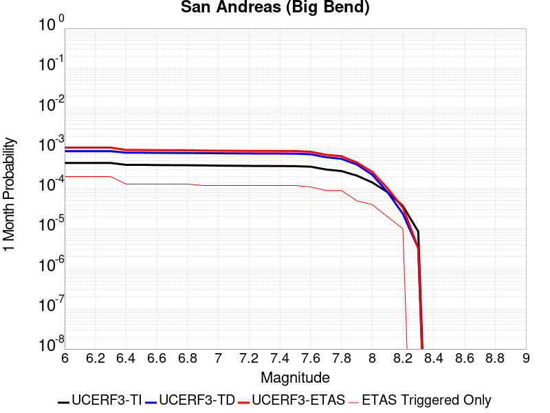 |  |  |

| Magnitude | 1 wk TI Prob | 1 wk TD Prob | 1 wk ETAS Prob | 1 wk ETAS/TD Gain | 1 wk ETAS Triggered Only | 1 mo TI Prob | 1 mo TD Prob | 1 mo ETAS Prob | 1 mo ETAS/TD Gain | 1 mo ETAS Triggered Only | 1 yr TI Prob | 1 yr TD Prob | 1 yr ETAS Prob | 1 yr ETAS/TD Gain | 1 yr ETAS Triggered Only | 10 yr TI Prob | 10 yr TD Prob | 10 yr ETAS Prob | 10 yr ETAS/TD Gain | 10 yr ETAS Triggered Only |
|-----|-----|-----|-----|-----|-----|-----|-----|-----|-----|-----|-----|-----|-----|-----|-----|-----|-----|-----|-----|-----|
| 6.0 | 1.0179969E-4 | 2.0072258E-4 | 3.5069248E-4 | 1.7471501 | 1.5E-4 | 4.362114E-4 | 8.599571E-4 | 0.0010597851 | 1.2323698 | 2.0E-4 | 0.0052979486 | 0.010419999 | 0.010766352 | 1.0332392 | 3.5E-4 | 0.051734097 | 0.10144902 | 0.10187134 | 1.0041629 | 4.7E-4 |
| 6.1 | 1.0179969E-4 | 2.0072258E-4 | 3.5069248E-4 | 1.7471501 | 1.5E-4 | 4.362114E-4 | 8.599571E-4 | 0.0010597851 | 1.2323698 | 2.0E-4 | 0.0052979486 | 0.010419999 | 0.010766352 | 1.0332392 | 3.5E-4 | 0.051734097 | 0.10144902 | 0.10187134 | 1.0041629 | 4.7E-4 |
| 6.2 | 1.0179969E-4 | 2.0072258E-4 | 3.5069248E-4 | 1.7471501 | 1.5E-4 | 4.362114E-4 | 8.599571E-4 | 0.0010597851 | 1.2323698 | 2.0E-4 | 0.0052979486 | 0.010419999 | 0.010766352 | 1.0332392 | 3.5E-4 | 0.051734097 | 0.10144902 | 0.10187134 | 1.0041629 | 4.7E-4 |
| 6.3 | 1.0179969E-4 | 2.0072258E-4 | 3.5069248E-4 | 1.7471501 | 1.5E-4 | 4.362114E-4 | 8.599571E-4 | 0.0010597851 | 1.2323698 | 2.0E-4 | 0.0052979486 | 0.010419999 | 0.010766352 | 1.0332392 | 3.5E-4 | 0.051734097 | 0.10144902 | 0.10187134 | 1.0041629 | 4.7E-4 |
| 6.4 | 9.1639464E-5 | 1.8429532E-4 | 2.842769E-4 | 1.5425074 | 1.0E-4 | 3.9268145E-4 | 7.895982E-4 | 9.194956E-4 | 1.1645107 | 1.3E-4 | 0.0047704205 | 0.009571102 | 0.009798901 | 1.0238006 | 2.3E-4 | 0.046693064 | 0.09377527 | 0.094056204 | 1.0029957 | 3.1E-4 |
| 6.5 | 9.1639464E-5 | 1.8429532E-4 | 2.842769E-4 | 1.5425074 | 1.0E-4 | 3.9268145E-4 | 7.895982E-4 | 9.194956E-4 | 1.1645107 | 1.3E-4 | 0.0047704205 | 0.009571102 | 0.009798901 | 1.0238006 | 2.3E-4 | 0.046693064 | 0.09377527 | 0.094056204 | 1.0029957 | 3.1E-4 |
| 6.6 | 9.042622E-5 | 1.823659E-4 | 2.8234767E-4 | 1.5482482 | 1.0E-4 | 3.8748336E-4 | 7.8133424E-4 | 9.1123267E-4 | 1.166252 | 1.3E-4 | 0.0047074095 | 0.009471365 | 0.009689282 | 1.0230079 | 2.2E-4 | 0.046089325 | 0.092869274 | 0.093141414 | 1.0029304 | 3.0E-4 |
| 6.7 | 8.9836685E-5 | 1.8150927E-4 | 2.814911E-4 | 1.5508361 | 1.0E-4 | 3.8495753E-4 | 7.776651E-4 | 9.07564E-4 | 1.167037 | 1.3E-4 | 0.00467679 | 0.00942708 | 0.009625195 | 1.0210155 | 2.0E-4 | 0.045795817 | 0.09246355 | 0.09271766 | 1.0027483 | 2.8E-4 |
| 6.8 | 8.9471854E-5 | 1.8097709E-4 | 2.8095898E-4 | 1.5524561 | 1.0E-4 | 3.8339442E-4 | 7.7538576E-4 | 9.0528495E-4 | 1.1675285 | 1.3E-4 | 0.004657841 | 0.009399569 | 0.009587782 | 1.0200237 | 1.9E-4 | 0.04561414 | 0.092210755 | 0.092455864 | 1.0026581 | 2.7E-4 |
| 6.9 | 8.858234E-5 | 1.7979681E-4 | 2.6978063E-4 | 1.500475 | 9.0E-5 | 3.7958333E-4 | 7.703304E-4 | 8.90238E-4 | 1.1556573 | 1.2E-4 | 0.004611638 | 0.009338548 | 0.009516868 | 1.019095 | 1.8E-4 | 0.04517103 | 0.09165087 | 0.09188704 | 1.0025768 | 2.6E-4 |
| 7.0 | 8.7433385E-5 | 1.7818481E-4 | 2.6816878E-4 | 1.5050036 | 9.0E-5 | 3.746607E-4 | 7.634259E-4 | 8.833343E-4 | 1.1570662 | 1.2E-4 | 0.004551957 | 0.009255203 | 0.009433537 | 1.0192685 | 1.8E-4 | 0.044598386 | 0.09088532 | 0.09112169 | 1.0026008 | 2.6E-4 |
| 7.1 | 8.684964E-5 | 1.7730435E-4 | 2.672884E-4 | 1.5075117 | 9.0E-5 | 3.7215967E-4 | 7.596547E-4 | 8.795635E-4 | 1.1578465 | 1.2E-4 | 0.0045216335 | 0.009209678 | 0.009378112 | 1.0182889 | 1.7E-4 | 0.04430731 | 0.09046686 | 0.09069424 | 1.0025134 | 2.5E-4 |
| 7.2 | 8.606521E-5 | 1.762105E-4 | 2.6619463E-4 | 1.5106628 | 9.0E-5 | 3.6879873E-4 | 7.549695E-4 | 8.748789E-4 | 1.1588268 | 1.2E-4 | 0.0044808835 | 0.0091531165 | 0.00932156 | 1.0184029 | 1.7E-4 | 0.043916024 | 0.089947365 | 0.09017488 | 1.0025294 | 2.5E-4 |
| 7.3 | 8.568266E-5 | 1.7563057E-4 | 2.6561477E-4 | 1.5123492 | 9.0E-5 | 3.6715972E-4 | 7.524855E-4 | 8.723952E-4 | 1.1593515 | 1.2E-4 | 0.0044610105 | 0.009123127 | 0.009291576 | 1.018464 | 1.7E-4 | 0.043725148 | 0.08966853 | 0.08989611 | 1.0025381 | 2.5E-4 |
| 7.4 | 8.5432206E-5 | 1.7525644E-4 | 2.6524067E-4 | 1.5134432 | 9.0E-5 | 3.6608664E-4 | 7.50883E-4 | 8.707929E-4 | 1.1596918 | 1.2E-4 | 0.004447999 | 0.009103781 | 0.009272233 | 1.0185035 | 1.7E-4 | 0.043600157 | 0.08948871 | 0.08971634 | 1.0025437 | 2.5E-4 |
| 7.5 | 8.4791965E-5 | 1.7394972E-4 | 2.6393408E-4 | 1.5173008 | 9.0E-5 | 3.633435E-4 | 7.4528606E-4 | 8.651966E-4 | 1.160892 | 1.2E-4 | 0.0044147377 | 0.009036204 | 0.009204668 | 1.0186433 | 1.7E-4 | 0.043280575 | 0.088866346 | 0.089094125 | 1.0025632 | 2.5E-4 |
| 7.6 | 8.241105E-5 | 1.6840403E-4 | 2.4839057E-4 | 1.474968 | 8.0E-5 | 3.531424E-4 | 7.215321E-4 | 8.314528E-4 | 1.1523434 | 1.1E-4 | 0.0042910352 | 0.008749358 | 0.008898046 | 1.0169941 | 1.5E-4 | 0.042091176 | 0.086243294 | 0.08645346 | 1.0024369 | 2.3E-4 |
| 7.7 | 7.00432E-5 | 1.42045E-4 | 2.0203648E-4 | 1.4223413 | 6.0E-5 | 3.001506E-4 | 6.0862233E-4 | 6.9856754E-4 | 1.147785 | 9.0E-5 | 0.0036482112 | 0.0073848404 | 0.007494028 | 1.0147854 | 1.1E-4 | 0.035888977 | 0.07351733 | 0.0736841 | 1.0022684 | 1.8E-4 |
| 7.8 | 6.415362E-5 | 1.2968935E-4 | 1.8968155E-4 | 1.462584 | 6.0E-5 | 2.749151E-4 | 5.556931E-4 | 6.456431E-4 | 1.1618699 | 9.0E-5 | 0.0033419547 | 0.0067446055 | 0.006843931 | 1.0147266 | 1.0E-4 | 0.03292141 | 0.06725231 | 0.067392215 | 1.0020804 | 1.5E-4 |
| 7.9 | 4.939911E-5 | 9.3411545E-5 | 1.3340781E-4 | 1.4281726 | 4.0E-5 | 2.116933E-4 | 4.0027377E-4 | 4.5025375E-4 | 1.1248645 | 5.0E-5 | 0.0025743195 | 0.004862453 | 0.004922161 | 1.0122795 | 6.0E-5 | 0.025447013 | 0.048914436 | 0.048990525 | 1.0015556 | 8.0E-5 |
| 8.0 | 3.344983E-5 | 5.222685E-5 | 8.2225284E-5 | 1.5743872 | 3.0E-5 | 1.4334853E-4 | 2.2381016E-4 | 2.6380122E-4 | 1.1786829 | 4.0E-5 | 0.0017438711 | 0.0027214854 | 0.0027713494 | 1.0183223 | 5.0E-5 | 0.017302496 | 0.027922187 | 0.027980512 | 1.0020888 | 6.0E-5 |
| 8.1 | 1.9104898E-5 | 1.9173063E-5 | 2.9172872E-5 | 1.5215551 | 1.0E-5 | 8.1875565E-5 | 8.216769E-5 | 1.0216604E-4 | 1.2433847 | 2.0E-5 | 9.963791E-4 | 9.999331E-4 | 0.0010299032 | 1.029972 | 3.0E-5 | 0.009919235 | 0.010749801 | 0.010789371 | 1.003681 | 4.0E-5 |
| 8.2 | 8.643924E-6 | 5.4748625E-6 | 5.4748625E-6 | 1.0 | 0.0 | 3.704486E-5 | 2.3463486E-5 | 3.346325E-5 | 1.4261842 | 1.0E-5 | 4.5092785E-4 | 2.8563058E-4 | 3.0562485E-4 | 1.0700005 | 2.0E-5 | 0.0045001395 | 0.0032487072 | 0.0032686424 | 1.0061363 | 2.0E-5 |
| 8.3 | 1.983087E-6 | 7.6599065E-7 | 7.6599065E-7 | 1.0 | 0.0 | 8.498917E-6 | 3.282813E-6 | 3.282813E-6 | 1.0 | 0.0 | 1.034694E-4 | 3.9967534E-5 | 3.9967534E-5 | 1.0 | 0.0 | 0.0010342124 | 4.719687E-4 | 4.719687E-4 | 1.0 | 0.0 |

## Death Valley (No)
*[(top)](#table-of-contents)*

| 1 Week | 1 Month | 1 Year | 10 Year |
|-----|-----|-----|-----|
|  |  |  |  |

| Magnitude | 1 wk TI Prob | 1 wk TD Prob | 1 wk ETAS Prob | 1 wk ETAS/TD Gain | 1 wk ETAS Triggered Only | 1 mo TI Prob | 1 mo TD Prob | 1 mo ETAS Prob | 1 mo ETAS/TD Gain | 1 mo ETAS Triggered Only | 1 yr TI Prob | 1 yr TD Prob | 1 yr ETAS Prob | 1 yr ETAS/TD Gain | 1 yr ETAS Triggered Only | 10 yr TI Prob | 10 yr TD Prob | 10 yr ETAS Prob | 10 yr ETAS/TD Gain | 10 yr ETAS Triggered Only |
|-----|-----|-----|-----|-----|-----|-----|-----|-----|-----|-----|-----|-----|-----|-----|-----|-----|-----|-----|-----|-----|
| 6.0 | 2.0074807E-5 | 2.2500084E-5 | 1.02498285E-4 | 4.5554624 | 8.0E-5 | 8.603206E-5 | 9.642541E-5 | 2.4641096E-4 | 2.5554566 | 1.5E-4 | 0.001046937 | 0.0011733545 | 0.0014430376 | 1.2298394 | 2.7E-4 | 0.010420183 | 0.011672506 | 0.01213702 | 1.0397955 | 4.7E-4 |
| 6.1 | 2.0074807E-5 | 2.2500084E-5 | 1.02498285E-4 | 4.5554624 | 8.0E-5 | 8.603206E-5 | 9.642541E-5 | 2.4641096E-4 | 2.5554566 | 1.5E-4 | 0.001046937 | 0.0011733545 | 0.0014430376 | 1.2298394 | 2.7E-4 | 0.010420183 | 0.011672506 | 0.01213702 | 1.0397955 | 4.7E-4 |
| 6.2 | 2.0074807E-5 | 2.2500084E-5 | 1.02498285E-4 | 4.5554624 | 8.0E-5 | 8.603206E-5 | 9.642541E-5 | 2.4641096E-4 | 2.5554566 | 1.5E-4 | 0.001046937 | 0.0011733545 | 0.0014430376 | 1.2298394 | 2.7E-4 | 0.010420183 | 0.011672506 | 0.01213702 | 1.0397955 | 4.7E-4 |
| 6.3 | 1.9050609E-5 | 2.1336948E-5 | 1.0133524E-4 | 4.7492847 | 8.0E-5 | 8.164292E-5 | 9.1440896E-5 | 2.3142809E-4 | 2.5309036 | 1.4E-4 | 9.935491E-4 | 0.001112731 | 0.0013724418 | 1.2333994 | 2.6E-4 | 0.009891188 | 0.011072419 | 0.011527325 | 1.0410846 | 4.6E-4 |
| 6.4 | 1.9050609E-5 | 2.1336948E-5 | 1.0133524E-4 | 4.7492847 | 8.0E-5 | 8.164292E-5 | 9.1440896E-5 | 2.3142809E-4 | 2.5309036 | 1.4E-4 | 9.935491E-4 | 0.001112731 | 0.0013724418 | 1.2333994 | 2.6E-4 | 0.009891188 | 0.011072419 | 0.011527325 | 1.0410846 | 4.6E-4 |
| 6.5 | 1.8367004E-5 | 2.0561009E-5 | 1.00559366E-4 | 4.89078 | 8.0E-5 | 7.8713354E-5 | 8.811567E-5 | 2.2810334E-4 | 2.5886807 | 1.4E-4 | 9.5791375E-4 | 0.0010722869 | 0.001332008 | 1.2422124 | 2.6E-4 | 0.009537951 | 0.0106719155 | 0.011127006 | 1.0426438 | 4.6E-4 |
| 6.6 | 1.779439E-5 | 1.9910927E-5 | 9.990933E-5 | 5.017814 | 8.0E-5 | 7.625944E-5 | 8.53298E-5 | 2.2531785E-4 | 2.640553 | 1.4E-4 | 9.280632E-4 | 0.0010384015 | 0.0012881419 | 1.2405046 | 2.5E-4 | 0.009241969 | 0.010336253 | 0.010781601 | 1.043086 | 4.5E-4 |
| 6.7 | 1.7025437E-5 | 1.9043426E-5 | 8.904209E-5 | 4.6757393 | 7.0E-5 | 7.296412E-5 | 8.161216E-5 | 2.1160155E-4 | 2.5927699 | 1.3E-4 | 8.87976E-4 | 9.931813E-4 | 0.0012329429 | 1.2414078 | 2.4E-4 | 0.008844362 | 0.009888145 | 0.010313894 | 1.0430564 | 4.3E-4 |
| 6.8 | 1.6545107E-5 | 1.8512545E-5 | 8.851125E-5 | 4.7811494 | 7.0E-5 | 7.090568E-5 | 7.93371E-5 | 2.0932678E-4 | 2.6384475 | 1.3E-4 | 8.629347E-4 | 9.655073E-4 | 0.0012052755 | 1.248334 | 2.4E-4 | 0.008595915 | 0.009613829 | 0.010029791 | 1.043267 | 4.2E-4 |
| 6.9 | 1.615478E-5 | 1.8087594E-5 | 8.808633E-5 | 4.869986 | 7.0E-5 | 6.9232934E-5 | 7.751599E-5 | 2.0750592E-4 | 2.6769433 | 1.3E-4 | 8.4258494E-4 | 9.433546E-4 | 0.0011731377 | 1.2435807 | 2.3E-4 | 0.008393973 | 0.009394196 | 0.009800344 | 1.043234 | 4.1E-4 |
| 7.0 | 1.5894311E-5 | 1.780555E-5 | 8.780431E-5 | 4.9312887 | 7.0E-5 | 6.81167E-5 | 7.6307304E-5 | 2.0629738E-4 | 2.7035077 | 1.3E-4 | 8.2900526E-4 | 9.286515E-4 | 0.0011584379 | 1.2474409 | 2.3E-4 | 0.008259195 | 0.009248397 | 0.009654606 | 1.043922 | 4.1E-4 |
| 7.1 | 1.5602263E-5 | 1.7483504E-5 | 8.748228E-5 | 5.003704 | 7.0E-5 | 6.6865134E-5 | 7.492718E-5 | 2.0491744E-4 | 2.7348878 | 1.3E-4 | 8.137789E-4 | 9.118627E-4 | 0.001141653 | 1.2520009 | 2.3E-4 | 0.008108052 | 0.009081894 | 0.00948817 | 1.0447347 | 4.1E-4 |
| 7.2 | 1.5323829E-5 | 1.717063E-5 | 8.716943E-5 | 5.0766587 | 7.0E-5 | 6.56719E-5 | 7.358637E-5 | 2.0357681E-4 | 2.7665014 | 1.3E-4 | 7.99262E-4 | 8.9555193E-4 | 0.0011253459 | 1.2565949 | 2.3E-4 | 0.007963934 | 0.008920107 | 0.00932645 | 1.0455536 | 4.1E-4 |
| 7.3 | 1.4556212E-5 | 1.6302456E-5 | 8.630131E-5 | 5.2937617 | 7.0E-5 | 6.238227E-5 | 6.9865826E-5 | 1.9985675E-4 | 2.8605795 | 1.3E-4 | 7.592395E-4 | 8.5029035E-4 | 0.0010701033 | 1.2585151 | 2.2E-4 | 0.0075665074 | 0.008471014 | 0.00885771 | 1.0456494 | 3.9E-4 |
| 7.4 | 1.411725E-5 | 1.580796E-5 | 8.580685E-5 | 5.4280787 | 7.0E-5 | 6.0501097E-5 | 6.7746674E-5 | 1.9773787E-4 | 2.9187834 | 1.3E-4 | 7.363519E-4 | 8.245094E-4 | 0.0010443281 | 1.2666054 | 2.2E-4 | 0.0073391674 | 0.008215138 | 0.008601935 | 1.0470834 | 3.9E-4 |
| 7.5 | 1.3503312E-5 | 1.5126289E-5 | 8.512523E-5 | 5.6276345 | 7.0E-5 | 5.7870053E-5 | 6.482538E-5 | 1.8481759E-4 | 2.851007 | 1.2E-4 | 7.043401E-4 | 7.8896893E-4 | 9.988033E-4 | 1.2659602 | 2.1E-4 | 0.007021119 | 0.007862304 | 0.008239317 | 1.0479519 | 3.8E-4 |
| 7.6 | 1.1279839E-5 | 1.2626327E-5 | 8.262544E-5 | 6.543902 | 7.0E-5 | 4.834127E-5 | 5.4111737E-5 | 1.7410524E-4 | 3.2175136 | 1.2E-4 | 5.88396E-4 | 6.5861654E-4 | 8.584848E-4 | 1.3034668 | 2.0E-4 | 0.005868405 | 0.006567199 | 0.0069049657 | 1.0514325 | 3.4E-4 |
| 7.7 | 9.189108E-6 | 1.0283358E-5 | 7.028274E-5 | 6.83461 | 6.0E-5 | 3.93813E-5 | 4.407082E-5 | 1.440664E-4 | 3.268975 | 1.0E-4 | 4.7936183E-4 | 5.3643517E-4 | 6.9634937E-4 | 1.2981054 | 1.6E-4 | 0.004783291 | 0.005351914 | 0.0056503084 | 1.0557547 | 3.0E-4 |
| 7.8 | 3.4586725E-7 | 3.6482615E-7 | 1.0364823E-5 | 28.410307 | 1.0E-5 | 1.4822873E-6 | 1.5635396E-6 | 2.1563508E-5 | 13.791469 | 2.0E-5 | 1.80467E-5 | 1.9035933E-5 | 3.9035553E-5 | 2.0506246 | 2.0E-5 | 1.8045233E-4 | 1.9034347E-4 | 2.1033967E-4 | 1.1050532 | 2.0E-5 |
| 7.9 | 2.5591178E-9 | 2.6696718E-9 | 2.6696718E-9 | 1.0 | 0.0 | 1.0967647E-8 | 1.14414505E-8 | 1.14414505E-8 | 1.0 | 0.0 | 1.335311E-7 | 1.3929966E-7 | 1.3929966E-7 | 1.0 | 0.0 | 1.3353102E-6 | 1.3929966E-6 | 1.3929966E-6 | 1.0 | 0.0 |

## White Wolf (Extension)
*[(top)](#table-of-contents)*

| 1 Week | 1 Month | 1 Year | 10 Year |
|-----|-----|-----|-----|
|  |  |  |  |

| Magnitude | 1 wk TI Prob | 1 wk TD Prob | 1 wk ETAS Prob | 1 wk ETAS/TD Gain | 1 wk ETAS Triggered Only | 1 mo TI Prob | 1 mo TD Prob | 1 mo ETAS Prob | 1 mo ETAS/TD Gain | 1 mo ETAS Triggered Only | 1 yr TI Prob | 1 yr TD Prob | 1 yr ETAS Prob | 1 yr ETAS/TD Gain | 1 yr ETAS Triggered Only | 10 yr TI Prob | 10 yr TD Prob | 10 yr ETAS Prob | 10 yr ETAS/TD Gain | 10 yr ETAS Triggered Only |
|-----|-----|-----|-----|-----|-----|-----|-----|-----|-----|-----|-----|-----|-----|-----|-----|-----|-----|-----|-----|-----|
| 6.0 | 8.222555E-6 | 6.0666657E-6 | 1.8606558E-4 | 30.670155 | 1.8E-4 | 3.5239045E-5 | 2.5999774E-5 | 2.7599328E-4 | 10.615218 | 2.5E-4 | 4.289509E-4 | 3.1650788E-4 | 6.963876E-4 | 2.200222 | 3.8E-4 | 0.0042812387 | 0.003161223 | 0.003619769 | 1.1450533 | 4.6E-4 |
| 6.1 | 8.222555E-6 | 6.0666657E-6 | 1.8606558E-4 | 30.670155 | 1.8E-4 | 3.5239045E-5 | 2.5999774E-5 | 2.7599328E-4 | 10.615218 | 2.5E-4 | 4.289509E-4 | 3.1650788E-4 | 6.963876E-4 | 2.200222 | 3.8E-4 | 0.0042812387 | 0.003161223 | 0.003619769 | 1.1450533 | 4.6E-4 |
| 6.2 | 8.222555E-6 | 6.0666657E-6 | 1.8606558E-4 | 30.670155 | 1.8E-4 | 3.5239045E-5 | 2.5999774E-5 | 2.7599328E-4 | 10.615218 | 2.5E-4 | 4.289509E-4 | 3.1650788E-4 | 6.963876E-4 | 2.200222 | 3.8E-4 | 0.0042812387 | 0.003161223 | 0.003619769 | 1.1450533 | 4.6E-4 |
| 6.3 | 8.222555E-6 | 6.0666657E-6 | 1.8606558E-4 | 30.670155 | 1.8E-4 | 3.5239045E-5 | 2.5999774E-5 | 2.7599328E-4 | 10.615218 | 2.5E-4 | 4.289509E-4 | 3.1650788E-4 | 6.963876E-4 | 2.200222 | 3.8E-4 | 0.0042812387 | 0.003161223 | 0.003619769 | 1.1450533 | 4.6E-4 |
| 6.4 | 5.821773E-6 | 3.5571766E-6 | 1.2355675E-4 | 34.7345 | 1.2E-4 | 2.4950215E-5 | 1.5244959E-5 | 1.6524267E-4 | 10.839168 | 1.5E-4 | 3.0372653E-4 | 1.8559267E-4 | 4.1555E-4 | 2.239043 | 2.3E-4 | 0.0030331176 | 0.001854485 | 0.0021140028 | 1.1399406 | 2.6E-4 |
| 6.5 | 5.766023E-6 | 3.4991106E-6 | 1.0349876E-4 | 29.57859 | 1.0E-4 | 2.4711293E-5 | 1.4996108E-5 | 1.4499416E-4 | 9.668786 | 1.3E-4 | 3.0081844E-4 | 1.8256342E-4 | 3.9252508E-4 | 2.1500752 | 2.1E-4 | 0.0030041158 | 0.0018242426 | 0.0020638048 | 1.1313214 | 2.4E-4 |
| 6.6 | 4.643576E-6 | 2.332624E-6 | 7.233246E-5 | 31.009052 | 7.0E-5 | 1.9900888E-5 | 9.996925E-6 | 9.9996025E-5 | 10.002679 | 9.0E-5 | 2.4226638E-4 | 1.2170619E-4 | 2.5169036E-4 | 2.0680163 | 1.3E-4 | 0.0024200242 | 0.0012164378 | 0.0013662553 | 1.1231608 | 1.5E-4 |
| 6.7 | 3.9529173E-6 | 1.6483477E-6 | 6.164825E-5 | 37.400024 | 6.0E-5 | 1.6940963E-5 | 7.0643296E-6 | 7.7063836E-5 | 10.908868 | 7.0E-5 | 2.0623671E-4 | 8.6005006E-5 | 1.7599727E-4 | 2.0463607 | 9.0E-5 | 0.002060454 | 8.597357E-4 | 9.5964974E-4 | 1.1162149 | 1.0E-4 |
| 6.8 | 3.4377522E-6 | 1.2245237E-6 | 3.122449E-5 | 25.499292 | 3.0E-5 | 1.473314E-5 | 5.2479486E-6 | 3.524779E-5 | 6.7164893 | 3.0E-5 | 1.7936122E-4 | 6.3891996E-5 | 1.138888E-4 | 1.7825207 | 5.0E-5 | 0.0017921652 | 6.387454E-4 | 6.98707E-4 | 1.0938741 | 6.0E-5 |
| 6.9 | 3.1367306E-6 | 1.0033783E-6 | 2.1003358E-5 | 20.93264 | 2.0E-5 | 1.3443062E-5 | 4.3001864E-6 | 2.43001E-5 | 5.6509414 | 2.0E-5 | 1.63657E-4 | 5.235359E-5 | 8.235202E-5 | 1.5729966 | 3.0E-5 | 0.0016353652 | 5.2342017E-4 | 5.633992E-4 | 1.0763805 | 4.0E-5 |
| 7.0 | 2.8298145E-6 | 7.4286646E-7 | 2.0742851E-5 | 27.922718 | 2.0E-5 | 1.2127721E-5 | 3.1837099E-6 | 2.3183646E-5 | 7.2819595 | 2.0E-5 | 1.47645E-4 | 3.8761027E-5 | 6.8759866E-5 | 1.7739433 | 3.0E-5 | 0.0014754693 | 3.8754768E-4 | 4.2753218E-4 | 1.1031731 | 4.0E-5 |
| 7.1 | 2.4091064E-6 | 5.4227525E-7 | 2.0542264E-5 | 37.881622 | 2.0E-5 | 1.03247E-5 | 2.3240348E-6 | 2.2323988E-5 | 9.605703 | 2.0E-5 | 1.2569598E-4 | 2.8294799E-5 | 5.829395E-5 | 2.0602355 | 3.0E-5 | 0.001256249 | 2.8291598E-4 | 3.2290467E-4 | 1.1413447 | 4.0E-5 |
| 7.2 | 1.3875518E-6 | 1.0743063E-7 | 1.0743063E-7 | 1.0 | 0.0 | 5.9466374E-6 | 4.6041689E-7 | 4.6041689E-7 | 1.0 | 0.0 | 7.23979E-5 | 5.6055624E-6 | 5.6055624E-6 | 1.0 | 0.0 | 7.2374323E-4 | 5.6054323E-5 | 5.6054323E-5 | 1.0 | 0.0 |
| 7.3 | 7.056077E-7 | 5.002034E-8 | 5.002034E-8 | 1.0 | 0.0 | 3.0240296E-6 | 2.1437286E-7 | 2.1437286E-7 | 1.0 | 0.0 | 3.681694E-5 | 2.609987E-6 | 2.609987E-6 | 1.0 | 0.0 | 3.681084E-4 | 2.609961E-5 | 2.609961E-5 | 1.0 | 0.0 |
| 7.4 | 5.9334678E-8 | 4.8683537E-9 | 4.8683537E-9 | 1.0 | 0.0 | 2.5429145E-7 | 2.0864372E-8 | 2.0864372E-8 | 1.0 | 0.0 | 3.095994E-6 | 2.5402372E-7 | 2.5402372E-7 | 1.0 | 0.0 | 3.095951E-5 | 2.5402353E-6 | 2.5402353E-6 | 1.0 | 0.0 |

## San Andreas (San Bernardino S)
*[(top)](#table-of-contents)*

| 1 Week | 1 Month | 1 Year | 10 Year |
|-----|-----|-----|-----|
|  | 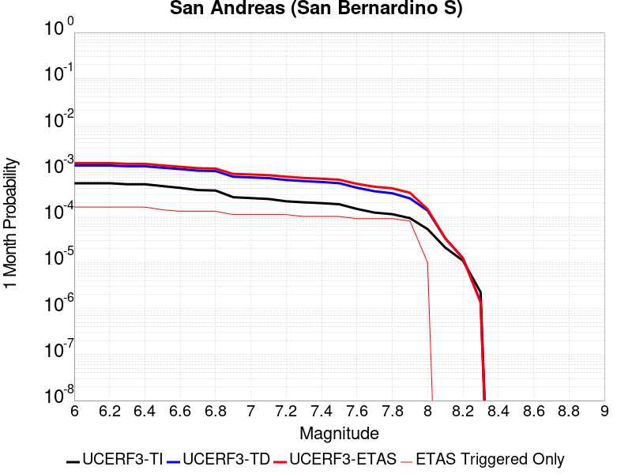 |  |  |

| Magnitude | 1 wk TI Prob | 1 wk TD Prob | 1 wk ETAS Prob | 1 wk ETAS/TD Gain | 1 wk ETAS Triggered Only | 1 mo TI Prob | 1 mo TD Prob | 1 mo ETAS Prob | 1 mo ETAS/TD Gain | 1 mo ETAS Triggered Only | 1 yr TI Prob | 1 yr TD Prob | 1 yr ETAS Prob | 1 yr ETAS/TD Gain | 1 yr ETAS Triggered Only | 10 yr TI Prob | 10 yr TD Prob | 10 yr ETAS Prob | 10 yr ETAS/TD Gain | 10 yr ETAS Triggered Only |
|-----|-----|-----|-----|-----|-----|-----|-----|-----|-----|-----|-----|-----|-----|-----|-----|-----|-----|-----|-----|-----|
| 6.0 | 1.2336002E-4 | 3.0004102E-4 | 4.39999E-4 | 1.4664629 | 1.4E-4 | 5.2857865E-4 | 0.0012852824 | 0.0014450768 | 1.1243262 | 1.6E-4 | 0.006416472 | 0.015540994 | 0.015826488 | 1.0183703 | 2.9E-4 | 0.06234337 | 0.14283717 | 0.14320575 | 1.0025804 | 4.3E-4 |
| 6.1 | 1.2336002E-4 | 3.0004102E-4 | 4.39999E-4 | 1.4664629 | 1.4E-4 | 5.2857865E-4 | 0.0012852824 | 0.0014450768 | 1.1243262 | 1.6E-4 | 0.006416472 | 0.015540994 | 0.015826488 | 1.0183703 | 2.9E-4 | 0.06234337 | 0.14283717 | 0.14320575 | 1.0025804 | 4.3E-4 |
| 6.2 | 1.2336002E-4 | 3.0004102E-4 | 4.39999E-4 | 1.4664629 | 1.4E-4 | 5.2857865E-4 | 0.0012852824 | 0.0014450768 | 1.1243262 | 1.6E-4 | 0.006416472 | 0.015540994 | 0.015826488 | 1.0183703 | 2.9E-4 | 0.06234337 | 0.14283717 | 0.14320575 | 1.0025804 | 4.3E-4 |
| 6.3 | 1.1712257E-4 | 2.8792414E-4 | 4.2788382E-4 | 1.4860992 | 1.4E-4 | 5.018573E-4 | 0.0012334028 | 0.0013932054 | 1.1295624 | 1.6E-4 | 0.006093008 | 0.014918125 | 0.015203799 | 1.0191494 | 2.9E-4 | 0.059286322 | 0.13754563 | 0.13791649 | 1.0026963 | 4.3E-4 |
| 6.4 | 1.1712257E-4 | 2.8792414E-4 | 4.2788382E-4 | 1.4860992 | 1.4E-4 | 5.018573E-4 | 0.0012334028 | 0.0013932054 | 1.1295624 | 1.6E-4 | 0.006093008 | 0.014918125 | 0.015203799 | 1.0191494 | 2.9E-4 | 0.059286322 | 0.13754563 | 0.13791649 | 1.0026963 | 4.3E-4 |
| 6.5 | 1.0689076E-4 | 2.680528E-4 | 3.9801796E-4 | 1.4848491 | 1.3E-4 | 4.5802278E-4 | 0.0011483167 | 0.0012881559 | 1.1217775 | 1.4E-4 | 0.0055621783 | 0.01389575 | 0.014161998 | 1.0191604 | 2.7E-4 | 0.05425003 | 0.12879294 | 0.12915014 | 1.0027734 | 4.1E-4 |
| 6.6 | 9.7648895E-5 | 2.50501E-4 | 3.7047095E-4 | 1.47892 | 1.2E-4 | 4.1842813E-4 | 0.0010731576 | 0.0012030181 | 1.1210078 | 1.3E-4 | 0.005082469 | 0.012991785 | 0.013248407 | 1.0197526 | 2.6E-4 | 0.049677886 | 0.12095292 | 0.12129574 | 1.0028344 | 3.9E-4 |
| 6.7 | 8.757013E-5 | 2.3120902E-4 | 3.5118128E-4 | 1.5188909 | 1.2E-4 | 3.7524657E-4 | 9.905418E-4 | 0.0011204131 | 1.1311113 | 1.3E-4 | 0.00455906 | 0.011997245 | 0.012254125 | 1.0214117 | 2.6E-4 | 0.04466656 | 0.11226123 | 0.11260745 | 1.0030841 | 3.9E-4 |
| 6.8 | 8.562978E-5 | 2.2680782E-4 | 3.467806E-4 | 1.5289623 | 1.2E-4 | 3.6693315E-4 | 9.7169366E-4 | 0.0011015673 | 1.133657 | 1.3E-4 | 0.004458263 | 0.011770263 | 0.012027203 | 1.0218296 | 2.6E-4 | 0.043698758 | 0.11027153 | 0.110618524 | 1.0031468 | 3.9E-4 |
| 6.9 | 6.124075E-5 | 1.7065753E-4 | 2.7064045E-4 | 1.5858688 | 1.0E-4 | 2.6243398E-4 | 7.311852E-4 | 8.411048E-4 | 1.1503307 | 1.1E-4 | 0.0031904527 | 0.008866051 | 0.009103923 | 1.0268296 | 2.4E-4 | 0.031450346 | 0.08418263 | 0.08449401 | 1.0036988 | 3.4E-4 |
| 7.0 | 5.8598747E-5 | 1.649477E-4 | 2.649312E-4 | 1.6061528 | 1.0E-4 | 2.5111332E-4 | 7.06728E-4 | 8.166503E-4 | 1.1555369 | 1.1E-4 | 0.0030530186 | 0.008570663 | 0.008808606 | 1.0277625 | 2.4E-4 | 0.03011414 | 0.081500374 | 0.08181266 | 1.0038317 | 3.4E-4 |
| 7.1 | 5.613814E-5 | 1.5913323E-4 | 2.591173E-4 | 1.6283042 | 1.0E-4 | 2.4056983E-4 | 6.818221E-4 | 7.9174706E-4 | 1.1612225 | 1.1E-4 | 0.0029250039 | 0.008269769 | 0.0085077835 | 1.0287814 | 2.4E-4 | 0.028868021 | 0.07879931 | 0.079103306 | 1.0038579 | 3.3E-4 |
| 7.2 | 4.991222E-5 | 1.4519796E-4 | 2.4518344E-4 | 1.688615 | 1.0E-4 | 2.1389198E-4 | 6.2212895E-4 | 7.320605E-4 | 1.1767023 | 1.1E-4 | 0.002601025 | 0.007548217 | 0.0077864057 | 1.0315555 | 2.4E-4 | 0.025707912 | 0.07225321 | 0.072559364 | 1.0042373 | 3.3E-4 |
| 7.3 | 4.7410045E-5 | 1.3714004E-4 | 2.2712769E-4 | 1.6561735 | 9.0E-5 | 2.0317009E-4 | 5.8761094E-4 | 6.875522E-4 | 1.1700807 | 1.0E-4 | 0.0024707897 | 0.0071307817 | 0.0073492127 | 1.0306321 | 2.2E-4 | 0.024434982 | 0.06853558 | 0.068824336 | 1.0042132 | 3.1E-4 |
| 7.4 | 4.5556746E-5 | 1.3121912E-4 | 2.212073E-4 | 1.6857857 | 9.0E-5 | 1.952286E-4 | 5.622468E-4 | 6.6219055E-4 | 1.1777579 | 1.0E-4 | 0.002374317 | 0.0068239477 | 0.007042446 | 1.0320194 | 2.2E-4 | 0.023491086 | 0.065788016 | 0.06607762 | 1.0044022 | 3.1E-4 |
| 7.5 | 4.3084514E-5 | 1.2357246E-4 | 2.1356135E-4 | 1.7282276 | 9.0E-5 | 1.8463485E-4 | 5.2948913E-4 | 6.2943617E-4 | 1.1887614 | 1.0E-4 | 0.0022456115 | 0.0064275465 | 0.0066461326 | 1.0340077 | 2.2E-4 | 0.022230545 | 0.062188786 | 0.062479507 | 1.0046748 | 3.1E-4 |
| 7.6 | 3.408608E-5 | 9.83552E-5 | 1.7834733E-4 | 1.8132985 | 8.0E-5 | 1.4607502E-4 | 4.214543E-4 | 5.1141635E-4 | 1.2134563 | 9.0E-5 | 0.0017770125 | 0.0051191594 | 0.0053280843 | 1.0408124 | 2.1E-4 | 0.017628696 | 0.050020292 | 0.050305285 | 1.0056976 | 3.0E-4 |
| 7.7 | 2.8315713E-5 | 8.248679E-5 | 1.624802E-4 | 1.9697722 | 8.0E-5 | 1.2134742E-4 | 3.5346695E-4 | 4.4343516E-4 | 1.2545307 | 9.0E-5 | 0.0014764034 | 0.0042949775 | 0.0044941185 | 1.046366 | 2.0E-4 | 0.01466633 | 0.0422714 | 0.042549144 | 1.0065705 | 2.9E-4 |
| 7.8 | 2.6222975E-5 | 7.463088E-5 | 1.5462491E-4 | 2.0718625 | 8.0E-5 | 1.1237934E-4 | 3.1980744E-4 | 4.0977864E-4 | 1.2813294 | 9.0E-5 | 0.0013673597 | 0.0038867102 | 0.004085933 | 1.0512574 | 2.0E-4 | 0.013589768 | 0.03843674 | 0.038715594 | 1.0072548 | 2.9E-4 |
| 7.9 | 2.1469694E-5 | 5.787864E-5 | 1.2787459E-4 | 2.2093573 | 7.0E-5 | 9.200973E-5 | 2.4802773E-4 | 3.280079E-4 | 1.3224646 | 8.0E-5 | 0.0011196428 | 0.0030155594 | 0.0031950166 | 1.0595105 | 1.8E-4 | 0.011140184 | 0.030152109 | 0.03039457 | 1.0080413 | 2.5E-4 |
| 8.0 | 1.2420249E-5 | 3.131896E-5 | 4.1318646E-5 | 1.3192854 | 1.0E-5 | 5.322855E-5 | 1.342172E-4 | 1.4421587E-4 | 1.0744962 | 1.0E-5 | 6.478649E-4 | 0.0016328706 | 0.0016628217 | 1.0183425 | 3.0E-5 | 0.0064597935 | 0.016522504 | 0.016571678 | 1.0029762 | 5.0E-5 |
| 8.1 | 4.9197724E-6 | 7.822348E-6 | 7.822348E-6 | 1.0 | 0.0 | 2.1084568E-5 | 3.352392E-5 | 3.352392E-5 | 1.0 | 0.0 | 2.566744E-4 | 4.0807744E-4 | 4.1807335E-4 | 1.0244951 | 1.0E-5 | 0.002563781 | 0.0043843705 | 0.0044042827 | 1.0045416 | 2.0E-5 |
| 8.2 | 2.5634774E-6 | 2.9067196E-6 | 2.9067196E-6 | 1.0 | 0.0 | 1.0986286E-5 | 1.2457311E-5 | 1.2457311E-5 | 1.0 | 0.0 | 1.3374983E-4 | 1.5165724E-4 | 1.6165573E-4 | 1.0659282 | 1.0E-5 | 0.0013366934 | 0.0017049741 | 0.001714957 | 1.0058552 | 1.0E-5 |
| 8.3 | 5.2850464E-7 | 3.2088764E-7 | 3.2088764E-7 | 1.0 | 0.0 | 2.2650179E-6 | 1.375232E-6 | 1.375232E-6 | 1.0 | 0.0 | 2.7576245E-5 | 1.6743334E-5 | 1.6743334E-5 | 1.0 | 0.0 | 2.7572823E-4 | 1.9870348E-4 | 1.9870348E-4 | 1.0 | 0.0 |

## Elsinore (Glen Ivy) rev
*[(top)](#table-of-contents)*

| 1 Week | 1 Month | 1 Year | 10 Year |
|-----|-----|-----|-----|
|  |  |  |  |

| Magnitude | 1 wk TI Prob | 1 wk TD Prob | 1 wk ETAS Prob | 1 wk ETAS/TD Gain | 1 wk ETAS Triggered Only | 1 mo TI Prob | 1 mo TD Prob | 1 mo ETAS Prob | 1 mo ETAS/TD Gain | 1 mo ETAS Triggered Only | 1 yr TI Prob | 1 yr TD Prob | 1 yr ETAS Prob | 1 yr ETAS/TD Gain | 1 yr ETAS Triggered Only | 10 yr TI Prob | 10 yr TD Prob | 10 yr ETAS Prob | 10 yr ETAS/TD Gain | 10 yr ETAS Triggered Only |
|-----|-----|-----|-----|-----|-----|-----|-----|-----|-----|-----|-----|-----|-----|-----|-----|-----|-----|-----|-----|-----|
| 6.0 | 1.6204086E-4 | 2.9360707E-4 | 4.0357476E-4 | 1.3745404 | 1.1E-4 | 6.94276E-4 | 0.0012578638 | 0.0013877003 | 1.1032199 | 1.3E-4 | 0.008420097 | 0.015234485 | 0.015411743 | 1.0116353 | 1.8E-4 | 0.081081145 | 0.13969168 | 0.13999279 | 1.0021555 | 3.5E-4 |
| 6.1 | 1.6204086E-4 | 2.9360707E-4 | 4.0357476E-4 | 1.3745404 | 1.1E-4 | 6.94276E-4 | 0.0012578638 | 0.0013877003 | 1.1032199 | 1.3E-4 | 0.008420097 | 0.015234485 | 0.015411743 | 1.0116353 | 1.8E-4 | 0.081081145 | 0.13969168 | 0.13999279 | 1.0021555 | 3.5E-4 |
| 6.2 | 1.6204086E-4 | 2.9360707E-4 | 4.0357476E-4 | 1.3745404 | 1.1E-4 | 6.94276E-4 | 0.0012578638 | 0.0013877003 | 1.1032199 | 1.3E-4 | 0.008420097 | 0.015234485 | 0.015411743 | 1.0116353 | 1.8E-4 | 0.081081145 | 0.13969168 | 0.13999279 | 1.0021555 | 3.5E-4 |
| 6.3 | 1.0111737E-4 | 1.7703383E-4 | 2.2702497E-4 | 1.2823819 | 5.0E-5 | 4.332882E-4 | 7.5861247E-4 | 8.1856694E-4 | 1.0790318 | 6.0E-5 | 0.005262531 | 0.009217682 | 0.00931676 | 1.0107487 | 1.0E-4 | 0.0513964 | 0.0870191 | 0.08721995 | 1.0023081 | 2.2E-4 |
| 6.4 | 1.0111737E-4 | 1.7703383E-4 | 2.2702497E-4 | 1.2823819 | 5.0E-5 | 4.332882E-4 | 7.5861247E-4 | 8.1856694E-4 | 1.0790318 | 6.0E-5 | 0.005262531 | 0.009217682 | 0.00931676 | 1.0107487 | 1.0E-4 | 0.0513964 | 0.0870191 | 0.08721995 | 1.0023081 | 2.2E-4 |
| 6.5 | 3.6624708E-5 | 4.6391084E-5 | 5.6390618E-5 | 1.2155486 | 1.0E-5 | 1.569536E-4 | 1.9880582E-4 | 2.0880383E-4 | 1.0502903 | 1.0E-5 | 0.001909235 | 0.0024181372 | 0.0024380886 | 1.0082508 | 2.0E-5 | 0.01892915 | 0.023739954 | 0.023788767 | 1.0020561 | 5.0E-5 |
| 6.6 | 2.5051324E-5 | 2.614772E-5 | 2.614772E-5 | 1.0 | 0.0 | 1.073584E-4 | 1.12057096E-4 | 1.12057096E-4 | 1.0 | 0.0 | 0.0013063047 | 0.0013634858 | 0.0013634858 | 1.0 | 0.0 | 0.012986525 | 0.013564618 | 0.0135843465 | 1.0014545 | 2.0E-5 |
| 6.7 | 2.2189772E-5 | 2.2072849E-5 | 2.2072849E-5 | 1.0 | 0.0 | 9.509556E-5 | 9.4594696E-5 | 9.4594696E-5 | 1.0 | 0.0 | 0.0011571734 | 0.0011511183 | 0.0011511183 | 1.0 | 0.0 | 0.011511663 | 0.011465415 | 0.0114753 | 1.0008622 | 1.0E-5 |
| 6.8 | 1.6654378E-5 | 1.4437705E-5 | 1.4437705E-5 | 1.0 | 0.0 | 7.137396E-5 | 6.187444E-5 | 6.187444E-5 | 1.0 | 0.0 | 8.686314E-4 | 7.530661E-4 | 7.530661E-4 | 1.0 | 0.0 | 0.008652439 | 0.00751048 | 0.007520405 | 1.0013214 | 1.0E-5 |
| 6.9 | 1.5042909E-5 | 1.2332022E-5 | 1.2332022E-5 | 1.0 | 0.0 | 6.446802E-5 | 5.285047E-5 | 5.285047E-5 | 1.0 | 0.0 | 7.8461546E-4 | 6.4326765E-4 | 6.4326765E-4 | 1.0 | 0.0 | 0.007818509 | 0.00641828 | 0.0064282157 | 1.001548 | 1.0E-5 |
| 7.0 | 1.4361385E-5 | 1.1451324E-5 | 1.1451324E-5 | 1.0 | 0.0 | 6.154734E-5 | 4.9076196E-5 | 4.9076196E-5 | 1.0 | 0.0 | 7.490812E-4 | 5.973418E-4 | 5.973418E-4 | 1.0 | 0.0 | 0.007465612 | 0.0059613534 | 0.005971294 | 1.0016675 | 1.0E-5 |
| 7.1 | 1.3265571E-5 | 1.0244926E-5 | 1.0244926E-5 | 1.0 | 0.0 | 5.6851208E-5 | 4.39061E-5 | 4.39061E-5 | 1.0 | 0.0 | 6.919436E-4 | 5.344282E-4 | 5.344282E-4 | 1.0 | 0.0 | 0.006897931 | 0.0053347866 | 0.0053347866 | 1.0 | 0.0 |
| 7.2 | 1.1596403E-5 | 8.505067E-6 | 8.505067E-6 | 1.0 | 0.0 | 4.9697923E-5 | 3.6449786E-5 | 3.6449786E-5 | 1.0 | 0.0 | 6.049042E-4 | 4.436875E-4 | 4.436875E-4 | 1.0 | 0.0 | 0.006032603 | 0.0044294316 | 0.0044294316 | 1.0 | 0.0 |
| 7.3 | 1.0150827E-5 | 7.2387597E-6 | 7.2387597E-6 | 1.0 | 0.0 | 4.3502816E-5 | 3.1022897E-5 | 3.1022897E-5 | 1.0 | 0.0 | 5.2951806E-4 | 3.7763975E-4 | 3.7763975E-4 | 1.0 | 0.0 | 0.005282581 | 0.0037703665 | 0.0037703665 | 1.0 | 0.0 |
| 7.4 | 9.080705E-6 | 6.352519E-6 | 6.352519E-6 | 1.0 | 0.0 | 3.8916725E-5 | 2.7224805E-5 | 2.7224805E-5 | 1.0 | 0.0 | 4.7370812E-4 | 3.3141294E-4 | 3.3141294E-4 | 1.0 | 0.0 | 0.004726996 | 0.0033093381 | 0.0033093381 | 1.0 | 0.0 |
| 7.5 | 7.671649E-6 | 5.2256332E-6 | 5.2256332E-6 | 1.0 | 0.0 | 3.287808E-5 | 2.2395385E-5 | 2.2395385E-5 | 1.0 | 0.0 | 4.0021708E-4 | 2.7263095E-4 | 2.7263095E-4 | 1.0 | 0.0 | 0.0039949706 | 0.00272309 | 0.00272309 | 1.0 | 0.0 |
| 7.6 | 6.990086E-6 | 4.687545E-6 | 4.687545E-6 | 1.0 | 0.0 | 2.9957167E-5 | 2.008933E-5 | 2.008933E-5 | 1.0 | 0.0 | 3.6466747E-4 | 2.445613E-4 | 2.445613E-4 | 1.0 | 0.0 | 0.0036406964 | 0.002443038 | 0.002443038 | 1.0 | 0.0 |
| 7.7 | 4.163505E-6 | 2.3295343E-6 | 2.3295343E-6 | 1.0 | 0.0 | 1.7843471E-5 | 9.983683E-6 | 9.983683E-6 | 1.0 | 0.0 | 2.172226E-4 | 1.21545316E-4 | 1.21545316E-4 | 1.0 | 0.0 | 0.0021701038 | 0.0012148614 | 0.0012148614 | 1.0 | 0.0 |
| 7.8 | 2.2692414E-7 | 9.3854695E-8 | 9.3854695E-8 | 1.0 | 0.0 | 9.725317E-7 | 4.0223435E-7 | 4.0223435E-7 | 1.0 | 0.0 | 1.1840509E-5 | 4.8971956E-6 | 4.8971956E-6 | 1.0 | 0.0 | 1.1839878E-4 | 4.8971204E-5 | 4.8971204E-5 | 1.0 | 0.0 |
| 7.9 | 6.676829E-9 | 3.439853E-9 | 3.439853E-9 | 1.0 | 0.0 | 2.861498E-8 | 1.4742227E-8 | 1.4742227E-8 | 1.0 | 0.0 | 3.4838732E-7 | 1.7948659E-7 | 1.7948659E-7 | 1.0 | 0.0 | 3.4838679E-6 | 1.7948646E-6 | 1.7948646E-6 | 1.0 | 0.0 |

## San Andreas (Parkfield)
*[(top)](#table-of-contents)*

| 1 Week | 1 Month | 1 Year | 10 Year |
|-----|-----|-----|-----|
|  |  |  |  |

| Magnitude | 1 wk TI Prob | 1 wk TD Prob | 1 wk ETAS Prob | 1 wk ETAS/TD Gain | 1 wk ETAS Triggered Only | 1 mo TI Prob | 1 mo TD Prob | 1 mo ETAS Prob | 1 mo ETAS/TD Gain | 1 mo ETAS Triggered Only | 1 yr TI Prob | 1 yr TD Prob | 1 yr ETAS Prob | 1 yr ETAS/TD Gain | 1 yr ETAS Triggered Only | 10 yr TI Prob | 10 yr TD Prob | 10 yr ETAS Prob | 10 yr ETAS/TD Gain | 10 yr ETAS Triggered Only |
|-----|-----|-----|-----|-----|-----|-----|-----|-----|-----|-----|-----|-----|-----|-----|-----|-----|-----|-----|-----|-----|
| 6.0 | 5.556969E-4 | 7.7782426E-4 | 9.077231E-4 | 1.1670029 | 1.3E-4 | 0.0023793848 | 0.0033298214 | 0.003509222 | 1.053877 | 1.8E-4 | 0.028586963 | 0.040191233 | 0.040440783 | 1.006209 | 2.6E-4 | 0.25176284 | 0.33716413 | 0.33742264 | 1.0007668 | 3.9E-4 |
| 6.1 | 1.925858E-4 | 3.0276453E-4 | 3.6274636E-4 | 1.1981138 | 6.0E-5 | 8.2510663E-4 | 0.0012970108 | 0.001376907 | 1.0616003 | 8.0E-5 | 0.0099994885 | 0.015778083 | 0.015906032 | 1.0081093 | 1.3E-4 | 0.095613256 | 0.1497237 | 0.14989375 | 1.0011358 | 2.0E-4 |
| 6.2 | 9.4306815E-5 | 1.8242796E-4 | 2.4241701E-4 | 1.3288369 | 6.0E-5 | 4.0410945E-4 | 7.816011E-4 | 8.615386E-4 | 1.1022741 | 8.0E-5 | 0.0049089384 | 0.009474681 | 0.009593544 | 1.0125453 | 1.2E-4 | 0.048019063 | 0.09185409 | 0.092017554 | 1.0017797 | 1.8E-4 |
| 6.3 | 9.283051E-5 | 1.7939322E-4 | 2.3938245E-4 | 1.3344008 | 6.0E-5 | 3.9778434E-4 | 7.686027E-4 | 8.485412E-4 | 1.104005 | 8.0E-5 | 0.0048322747 | 0.009317789 | 0.009436671 | 1.0127586 | 1.2E-4 | 0.047285385 | 0.09050704 | 0.09067074 | 1.0018088 | 1.8E-4 |
| 6.4 | 9.138826E-5 | 1.770153E-4 | 2.3700469E-4 | 1.3388938 | 6.0E-5 | 3.916052E-4 | 7.5841765E-4 | 8.3835697E-4 | 1.1054028 | 8.0E-5 | 0.0047573745 | 0.00919484 | 0.009313736 | 1.0129308 | 1.2E-4 | 0.046568092 | 0.08940927 | 0.08957318 | 1.0018332 | 1.8E-4 |
| 6.5 | 9.000255E-5 | 1.7459576E-4 | 2.3458528E-4 | 1.343591 | 6.0E-5 | 3.8566816E-4 | 7.480541E-4 | 8.279943E-4 | 1.1068641 | 8.0E-5 | 0.0046854047 | 0.009069731 | 0.009188644 | 1.0131109 | 1.2E-4 | 0.045878403 | 0.088295065 | 0.08845917 | 1.0018586 | 1.8E-4 |
| 6.6 | 8.8109264E-5 | 1.7140752E-4 | 2.3139724E-4 | 1.349983 | 6.0E-5 | 3.7755648E-4 | 7.3439797E-4 | 8.1433926E-4 | 1.1088527 | 8.0E-5 | 0.0045870654 | 0.008904854 | 0.009023786 | 1.0133559 | 1.2E-4 | 0.04493529 | 0.0868267 | 0.086991064 | 1.001893 | 1.8E-4 |
| 6.7 | 8.738073E-5 | 1.7007832E-4 | 2.3006812E-4 | 1.3527186 | 6.0E-5 | 3.7443507E-4 | 7.287046E-4 | 8.086463E-4 | 1.1097039 | 8.0E-5 | 0.0045492216 | 0.008836143 | 0.008955083 | 1.0134606 | 1.2E-4 | 0.04457213 | 0.08622707 | 0.086391546 | 1.0019075 | 1.8E-4 |
| 6.8 | 8.710195E-5 | 1.6953335E-4 | 2.2952317E-4 | 1.3538526 | 6.0E-5 | 3.7324068E-4 | 7.263703E-4 | 8.063122E-4 | 1.1100566 | 8.0E-5 | 0.0045347405 | 0.008807961 | 0.008926904 | 1.013504 | 1.2E-4 | 0.04443313 | 0.08597467 | 0.086139195 | 1.0019137 | 1.8E-4 |
| 6.9 | 8.6801556E-5 | 1.689429E-4 | 2.2893277E-4 | 1.3550895 | 6.0E-5 | 3.7195362E-4 | 7.2384125E-4 | 8.0378336E-4 | 1.1104414 | 8.0E-5 | 0.0045191357 | 0.008777418 | 0.008896365 | 1.0135515 | 1.2E-4 | 0.044283327 | 0.085700735 | 0.085865304 | 1.0019203 | 1.8E-4 |
| 7.0 | 8.5571606E-5 | 1.6647128E-4 | 2.2646128E-4 | 1.3603625 | 6.0E-5 | 3.6668387E-4 | 7.132544E-4 | 7.9319737E-4 | 1.1120819 | 8.0E-5 | 0.004455241 | 0.008649553 | 0.008768516 | 1.0137535 | 1.2E-4 | 0.043669727 | 0.08454914 | 0.08471392 | 1.001949 | 1.8E-4 |
| 7.1 | 7.82589E-5 | 1.5128135E-4 | 2.1127227E-4 | 1.396552 | 6.0E-5 | 3.3535215E-4 | 6.481883E-4 | 7.2813645E-4 | 1.123341 | 8.0E-5 | 0.0040752706 | 0.007863307 | 0.007982363 | 1.0151408 | 1.2E-4 | 0.040013418 | 0.07746111 | 0.07762717 | 1.0021437 | 1.8E-4 |
| 7.2 | 7.690929E-5 | 1.4865391E-4 | 2.08645E-4 | 1.4035621 | 6.0E-5 | 3.2956956E-4 | 6.369334E-4 | 7.168824E-4 | 1.1255218 | 8.0E-5 | 0.004005129 | 0.007727258 | 0.00784633 | 1.0154095 | 1.2E-4 | 0.0393371 | 0.07623427 | 0.07640055 | 1.0021812 | 1.8E-4 |
| 7.3 | 7.5543794E-5 | 1.4561978E-4 | 2.0561104E-4 | 1.4119719 | 6.0E-5 | 3.2371894E-4 | 6.2393624E-4 | 7.038863E-4 | 1.1281382 | 8.0E-5 | 0.003934157 | 0.007570127 | 0.007689219 | 1.0157318 | 1.2E-4 | 0.038652334 | 0.074797355 | 0.07496389 | 1.0022265 | 1.8E-4 |
| 7.4 | 7.4214564E-5 | 1.4262961E-4 | 2.0262106E-4 | 1.42061 | 6.0E-5 | 3.1802364E-4 | 6.111273E-4 | 6.910784E-4 | 1.1308256 | 8.0E-5 | 0.003865065 | 0.00741525 | 0.00753436 | 1.0160629 | 1.2E-4 | 0.03798529 | 0.07337123 | 0.07353803 | 1.0022733 | 1.8E-4 |
| 7.5 | 6.149578E-5 | 1.11907226E-4 | 1.7190051E-4 | 1.5360984 | 6.0E-5 | 2.6352672E-4 | 4.7951436E-4 | 5.59476E-4 | 1.1667554 | 8.0E-5 | 0.0032037178 | 0.0058224914 | 0.0059417924 | 1.0204897 | 1.2E-4 | 0.03157923 | 0.058557566 | 0.05871761 | 1.0027331 | 1.7E-4 |
| 7.6 | 6.0643448E-5 | 1.10193796E-4 | 1.7018718E-4 | 1.5444353 | 6.0E-5 | 2.598746E-4 | 4.7217376E-4 | 5.52136E-4 | 1.1693492 | 8.0E-5 | 0.0031593828 | 0.0057335934 | 0.0058529056 | 1.0208093 | 1.2E-4 | 0.031148417 | 0.057718582 | 0.05787877 | 1.0027753 | 1.7E-4 |
| 7.7 | 5.1652263E-5 | 9.174698E-5 | 1.4174239E-4 | 1.5449271 | 5.0E-5 | 2.2134806E-4 | 3.931421E-4 | 4.631146E-4 | 1.1779827 | 7.0E-5 | 0.002691582 | 0.0047760103 | 0.0048655802 | 1.0187541 | 9.0E-5 | 0.026592141 | 0.04853623 | 0.04866943 | 1.0027444 | 1.4E-4 |
| 7.8 | 4.8090482E-5 | 8.559635E-5 | 1.3559207E-4 | 1.584087 | 5.0E-5 | 2.060858E-4 | 3.6678996E-4 | 4.367643E-4 | 1.1907749 | 7.0E-5 | 0.0025062072 | 0.0044565317 | 0.0045361756 | 1.0178711 | 8.0E-5 | 0.024781305 | 0.04530245 | 0.045417015 | 1.0025289 | 1.2E-4 |
| 7.9 | 3.970278E-5 | 6.750426E-5 | 1.0750156E-4 | 1.5925152 | 4.0E-5 | 1.7014367E-4 | 2.892719E-4 | 3.3925744E-4 | 1.1727978 | 5.0E-5 | 0.002069531 | 0.0035162016 | 0.0035759907 | 1.0170039 | 6.0E-5 | 0.020503636 | 0.035881363 | 0.03595849 | 1.0021496 | 8.0E-5 |
| 8.0 | 2.8982335E-5 | 4.069796E-5 | 7.069674E-5 | 1.7371078 | 3.0E-5 | 1.2420409E-4 | 1.7440817E-4 | 2.144012E-4 | 1.229307 | 4.0E-5 | 0.0015111357 | 0.0021213528 | 0.0021712466 | 1.0235199 | 5.0E-5 | 0.015009012 | 0.022010697 | 0.022069376 | 1.002666 | 6.0E-5 |
| 8.1 | 1.8836186E-5 | 1.8681134E-5 | 2.8680948E-5 | 1.5352894 | 1.0E-5 | 8.0724014E-5 | 8.005955E-5 | 1.0005795E-4 | 1.249794 | 2.0E-5 | 9.823717E-4 | 9.742898E-4 | 0.0010042605 | 1.0307617 | 3.0E-5 | 0.009780403 | 0.010488115 | 0.010527696 | 1.0037738 | 4.0E-5 |
| 8.2 | 8.643924E-6 | 5.4748625E-6 | 5.4748625E-6 | 1.0 | 0.0 | 3.704486E-5 | 2.3463486E-5 | 3.346325E-5 | 1.4261842 | 1.0E-5 | 4.5092785E-4 | 2.8563058E-4 | 3.0562485E-4 | 1.0700005 | 2.0E-5 | 0.0045001395 | 0.0032487072 | 0.0032686424 | 1.0061363 | 2.0E-5 |
| 8.3 | 1.983087E-6 | 7.6599065E-7 | 7.6599065E-7 | 1.0 | 0.0 | 8.498917E-6 | 3.282813E-6 | 3.282813E-6 | 1.0 | 0.0 | 1.034694E-4 | 3.9967534E-5 | 3.9967534E-5 | 1.0 | 0.0 | 0.0010342124 | 4.719687E-4 | 4.719687E-4 | 1.0 | 0.0 |

## Scodie Lineament
*[(top)](#table-of-contents)*

| 1 Week | 1 Month | 1 Year | 10 Year |
|-----|-----|-----|-----|
|  |  |  |  |

| Magnitude | 1 wk TI Prob | 1 wk TD Prob | 1 wk ETAS Prob | 1 wk ETAS/TD Gain | 1 wk ETAS Triggered Only | 1 mo TI Prob | 1 mo TD Prob | 1 mo ETAS Prob | 1 mo ETAS/TD Gain | 1 mo ETAS Triggered Only | 1 yr TI Prob | 1 yr TD Prob | 1 yr ETAS Prob | 1 yr ETAS/TD Gain | 1 yr ETAS Triggered Only | 10 yr TI Prob | 10 yr TD Prob | 10 yr ETAS Prob | 10 yr ETAS/TD Gain | 10 yr ETAS Triggered Only |
|-----|-----|-----|-----|-----|-----|-----|-----|-----|-----|-----|-----|-----|-----|-----|-----|-----|-----|-----|-----|-----|
| 6.0 | 3.2919327E-6 | 3.0133422E-6 | 1.6301285E-4 | 54.097027 | 1.6E-4 | 1.4108206E-5 | 1.2914278E-5 | 1.9291195E-4 | 14.937881 | 1.8E-4 | 1.7175387E-4 | 1.5722317E-4 | 3.9718542E-4 | 2.5262525 | 2.4E-4 | 0.0017162118 | 0.0015714309 | 0.0019308652 | 1.2287306 | 3.6E-4 |
| 6.1 | 1.8663811E-6 | 1.5490499E-6 | 7.1548944E-5 | 46.18892 | 7.0E-5 | 7.998751E-6 | 6.6387715E-6 | 8.663824E-5 | 13.050343 | 8.0E-5 | 9.738045E-5 | 8.082454E-5 | 1.9081566E-4 | 2.3608627 | 1.1E-4 | 9.7337784E-4 | 8.080003E-4 | 9.378952E-4 | 1.160761 | 1.3E-4 |
| 6.2 | 1.8663811E-6 | 1.5490499E-6 | 7.1548944E-5 | 46.18892 | 7.0E-5 | 7.998751E-6 | 6.6387715E-6 | 8.663824E-5 | 13.050343 | 8.0E-5 | 9.738045E-5 | 8.082454E-5 | 1.9081566E-4 | 2.3608627 | 1.1E-4 | 9.7337784E-4 | 8.080003E-4 | 9.378952E-4 | 1.160761 | 1.3E-4 |
| 6.3 | 1.8663811E-6 | 1.5490499E-6 | 7.1548944E-5 | 46.18892 | 7.0E-5 | 7.998751E-6 | 6.6387715E-6 | 8.663824E-5 | 13.050343 | 8.0E-5 | 9.738045E-5 | 8.082454E-5 | 1.9081566E-4 | 2.3608627 | 1.1E-4 | 9.7337784E-4 | 8.080003E-4 | 9.378952E-4 | 1.160761 | 1.3E-4 |
| 6.4 | 1.8663811E-6 | 1.5490499E-6 | 7.1548944E-5 | 46.18892 | 7.0E-5 | 7.998751E-6 | 6.6387715E-6 | 8.663824E-5 | 13.050343 | 8.0E-5 | 9.738045E-5 | 8.082454E-5 | 1.9081566E-4 | 2.3608627 | 1.1E-4 | 9.7337784E-4 | 8.080003E-4 | 9.378952E-4 | 1.160761 | 1.3E-4 |
| 6.5 | 1.8106311E-6 | 1.4909839E-6 | 5.1490908E-5 | 34.53485 | 5.0E-5 | 7.759824E-6 | 6.3899183E-6 | 6.638953E-5 | 10.389731 | 6.0E-5 | 9.447177E-5 | 7.7794975E-5 | 1.6778798E-4 | 2.1567972 | 9.0E-5 | 9.4431615E-4 | 7.7772606E-4 | 8.876405E-4 | 1.141328 | 1.1E-4 |
| 6.6 | 1.2414679E-6 | 8.997558E-7 | 3.089973E-5 | 34.34235 | 3.0E-5 | 5.320566E-6 | 3.856091E-6 | 4.3855936E-5 | 11.373159 | 4.0E-5 | 6.477596E-5 | 4.6946985E-5 | 8.69451E-5 | 1.851985 | 4.0E-5 | 6.475708E-4 | 4.693793E-4 | 5.193558E-4 | 1.1064737 | 5.0E-5 |
| 6.7 | 1.1062215E-6 | 7.594311E-7 | 3.075941E-5 | 40.503223 | 3.0E-5 | 4.7409408E-6 | 3.2547011E-6 | 4.325457E-5 | 13.289875 | 4.0E-5 | 5.7719422E-5 | 3.9625334E-5 | 7.962375E-5 | 2.0094151 | 4.0E-5 | 5.770443E-4 | 3.961897E-4 | 4.4616987E-4 | 1.1261522 | 5.0E-5 |
| 6.8 | 1.0006736E-6 | 6.500397E-7 | 3.065002E-5 | 47.151 | 3.0E-5 | 4.288594E-6 | 2.7858816E-6 | 3.27858E-5 | 11.768554 | 3.0E-5 | 5.221238E-5 | 3.3917644E-5 | 6.3916625E-5 | 1.8844655 | 3.0E-5 | 5.220012E-4 | 3.3913075E-4 | 3.7911718E-4 | 1.1179086 | 4.0E-5 |
| 6.9 | 9.167364E-7 | 5.631625E-7 | 2.0563151E-5 | 36.51371 | 2.0E-5 | 3.9288643E-6 | 2.4135516E-6 | 2.2413504E-5 | 9.286524 | 2.0E-5 | 4.7832873E-5 | 2.9384651E-5 | 4.9384063E-5 | 1.6806074 | 2.0E-5 | 4.782258E-4 | 2.9381333E-4 | 3.2380453E-4 | 1.1020757 | 3.0E-5 |
| 7.0 | 7.6987664E-7 | 4.113383E-7 | 2.041133E-5 | 49.62176 | 2.0E-5 | 3.2994672E-6 | 1.7628774E-6 | 2.1762842E-5 | 12.345068 | 2.0E-5 | 4.0170275E-5 | 2.1462862E-5 | 4.146243E-5 | 1.9318222 | 2.0E-5 | 4.0163012E-4 | 2.1461173E-4 | 2.446053E-4 | 1.1397573 | 3.0E-5 |
| 7.1 | 7.1038727E-7 | 3.5211494E-7 | 2.0352109E-5 | 57.799618 | 2.0E-5 | 3.0445133E-6 | 1.5090633E-6 | 2.1509033E-5 | 14.253235 | 2.0E-5 | 3.706632E-5 | 1.8372726E-5 | 3.837236E-5 | 2.08855 | 2.0E-5 | 3.7060137E-4 | 1.8371557E-4 | 2.1371005E-4 | 1.163266 | 3.0E-5 |
| 7.2 | 2.0799602E-7 | 3.1186854E-8 | 3.1186854E-8 | 1.0 | 0.0 | 8.914113E-7 | 1.3365793E-7 | 1.3365793E-7 | 1.0 | 0.0 | 1.0852878E-5 | 1.6272843E-6 | 1.6272843E-6 | 1.0 | 0.0 | 1.08523476E-4 | 1.627273E-5 | 1.627273E-5 | 1.0 | 0.0 |
| 7.3 | 1.5048182E-7 | 1.5945696E-8 | 1.5945696E-8 | 1.0 | 0.0 | 6.449219E-7 | 6.83387E-8 | 6.83387E-8 | 1.0 | 0.0 | 7.851896E-6 | 8.320234E-7 | 8.320234E-7 | 1.0 | 0.0 | 7.851618E-5 | 8.320206E-6 | 8.320206E-6 | 1.0 | 0.0 |
| 7.4 | 5.9334678E-8 | 4.8683537E-9 | 4.8683537E-9 | 1.0 | 0.0 | 2.5429145E-7 | 2.0864372E-8 | 2.0864372E-8 | 1.0 | 0.0 | 3.095994E-6 | 2.5402372E-7 | 2.5402372E-7 | 1.0 | 0.0 | 3.095951E-5 | 2.5402353E-6 | 2.5402353E-6 | 1.0 | 0.0 |

## Death Valley (Fish Lake Valley)
*[(top)](#table-of-contents)*

| 1 Week | 1 Month | 1 Year | 10 Year |
|-----|-----|-----|-----|
| 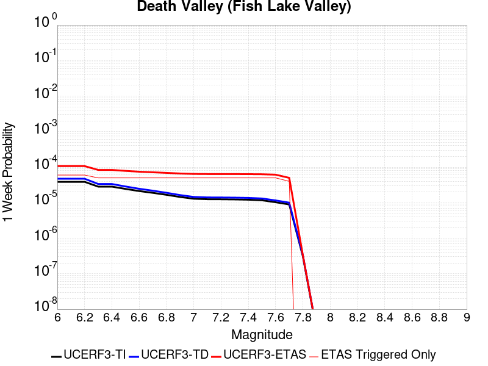 |  | 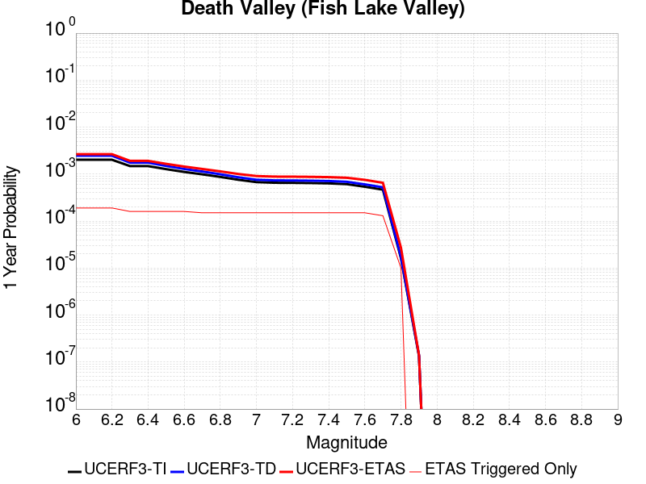 |  |

| Magnitude | 1 wk TI Prob | 1 wk TD Prob | 1 wk ETAS Prob | 1 wk ETAS/TD Gain | 1 wk ETAS Triggered Only | 1 mo TI Prob | 1 mo TD Prob | 1 mo ETAS Prob | 1 mo ETAS/TD Gain | 1 mo ETAS Triggered Only | 1 yr TI Prob | 1 yr TD Prob | 1 yr ETAS Prob | 1 yr ETAS/TD Gain | 1 yr ETAS Triggered Only | 10 yr TI Prob | 10 yr TD Prob | 10 yr ETAS Prob | 10 yr ETAS/TD Gain | 10 yr ETAS Triggered Only |
|-----|-----|-----|-----|-----|-----|-----|-----|-----|-----|-----|-----|-----|-----|-----|-----|-----|-----|-----|-----|-----|
| 6.0 | 3.872328E-5 | 4.7267473E-5 | 1.07264634E-4 | 2.269312 | 6.0E-5 | 1.6594635E-4 | 2.0256084E-4 | 3.2253654E-4 | 1.5922946 | 1.2E-4 | 0.0020185246 | 0.002463534 | 0.0026530658 | 1.0769349 | 1.9E-4 | 0.02000288 | 0.024388181 | 0.024719888 | 1.0136012 | 3.4E-4 |
| 6.1 | 3.872328E-5 | 4.7267473E-5 | 1.07264634E-4 | 2.269312 | 6.0E-5 | 1.6594635E-4 | 2.0256084E-4 | 3.2253654E-4 | 1.5922946 | 1.2E-4 | 0.0020185246 | 0.002463534 | 0.0026530658 | 1.0769349 | 1.9E-4 | 0.02000288 | 0.024388181 | 0.024719888 | 1.0136012 | 3.4E-4 |
| 6.2 | 3.872328E-5 | 4.7267473E-5 | 1.07264634E-4 | 2.269312 | 6.0E-5 | 1.6594635E-4 | 2.0256084E-4 | 3.2253654E-4 | 1.5922946 | 1.2E-4 | 0.0020185246 | 0.002463534 | 0.0026530658 | 1.0769349 | 1.9E-4 | 0.02000288 | 0.024388181 | 0.024719888 | 1.0136012 | 3.4E-4 |
| 6.3 | 2.8356371E-5 | 3.3609853E-5 | 8.360817E-5 | 2.4876091 | 5.0E-5 | 1.2152165E-4 | 1.4403471E-4 | 2.5401887E-4 | 1.7635947 | 1.1E-4 | 0.0014785219 | 0.0017522911 | 0.0019120107 | 1.091149 | 1.6E-4 | 0.014687235 | 0.017391782 | 0.017696392 | 1.0175145 | 3.1E-4 |
| 6.4 | 2.8356371E-5 | 3.3609853E-5 | 8.360817E-5 | 2.4876091 | 5.0E-5 | 1.2152165E-4 | 1.4403471E-4 | 2.5401887E-4 | 1.7635947 | 1.1E-4 | 0.0014785219 | 0.0017522911 | 0.0019120107 | 1.091149 | 1.6E-4 | 0.014687235 | 0.017391782 | 0.017696392 | 1.0175145 | 3.1E-4 |
| 6.5 | 2.4448687E-5 | 2.8607552E-5 | 7.860612E-5 | 2.7477403 | 5.0E-5 | 1.0477588E-4 | 1.2259831E-4 | 2.3258483E-4 | 1.897129 | 1.1E-4 | 0.0012748998 | 0.0014916632 | 0.0016514244 | 1.1071029 | 1.6E-4 | 0.012676105 | 0.014821377 | 0.015126782 | 1.0206057 | 3.1E-4 |
| 6.6 | 2.1298161E-5 | 2.4660083E-5 | 7.465885E-5 | 3.027518 | 5.0E-5 | 9.127464E-5 | 1.0568198E-4 | 2.1567036E-4 | 2.0407486 | 1.1E-4 | 0.0011107022 | 0.0012859525 | 0.0014457467 | 1.1242614 | 1.6E-4 | 0.011051672 | 0.012788526 | 0.013094561 | 1.0239304 | 3.1E-4 |
| 6.7 | 1.8959729E-5 | 2.1781025E-5 | 7.1779934E-5 | 3.295526 | 5.0E-5 | 8.125345E-5 | 9.334405E-5 | 1.9333472E-4 | 2.0712054 | 1.0E-4 | 9.888117E-4 | 0.001135897 | 0.0012857266 | 1.1319042 | 1.5E-4 | 0.009844234 | 0.01130357 | 0.011600179 | 1.0262402 | 3.0E-4 |
| 6.8 | 1.6691629E-5 | 1.9018353E-5 | 6.90174E-5 | 3.6289895 | 5.0E-5 | 7.153359E-5 | 8.150477E-5 | 1.8149662E-4 | 2.2268221 | 1.0E-4 | 8.7057345E-4 | 9.918857E-4 | 0.0011417369 | 1.1510772 | 1.5E-4 | 0.008671708 | 0.009876343 | 0.01017338 | 1.0300757 | 3.0E-4 |
| 6.9 | 1.450505E-5 | 1.638954E-5 | 6.638872E-5 | 4.0506763 | 5.0E-5 | 6.216302E-5 | 7.0239046E-5 | 1.7023202E-4 | 2.4236095 | 1.0E-4 | 7.5657194E-4 | 8.5483363E-4 | 0.0010047054 | 1.1753228 | 1.5E-4 | 0.007540013 | 0.008516385 | 0.008813831 | 1.0349262 | 3.0E-4 |
| 7.0 | 1.2940855E-5 | 1.4537972E-5 | 6.453724E-5 | 4.4392195 | 5.0E-5 | 5.545963E-5 | 6.230414E-5 | 1.622979E-4 | 2.60493 | 1.0E-4 | 6.750118E-4 | 7.5829466E-4 | 9.0818095E-4 | 1.1976622 | 1.5E-4 | 0.006729651 | 0.0075576897 | 0.007855423 | 1.0393946 | 3.0E-4 |
| 7.1 | 1.2544658E-5 | 1.4078208E-5 | 6.40775E-5 | 4.5515385 | 5.0E-5 | 5.3761712E-5 | 6.0333812E-5 | 1.6032778E-4 | 2.6573455 | 1.0E-4 | 6.5435225E-4 | 7.343222E-4 | 8.8421203E-4 | 1.20412 | 1.5E-4 | 0.006524288 | 0.007319551 | 0.007617355 | 1.0406861 | 3.0E-4 |
| 7.2 | 1.2489416E-5 | 1.4015674E-5 | 6.4014974E-5 | 4.5673847 | 5.0E-5 | 5.3524967E-5 | 6.0065824E-5 | 1.6005982E-4 | 2.6647403 | 1.0E-4 | 6.514716E-4 | 7.310616E-4 | 8.80952E-4 | 1.205031 | 1.5E-4 | 0.006495651 | 0.0072871596 | 0.0075849737 | 1.0408683 | 3.0E-4 |
| 7.3 | 1.2368307E-5 | 1.3879812E-5 | 6.387912E-5 | 4.602304 | 5.0E-5 | 5.3005948E-5 | 5.9483587E-5 | 1.5947764E-4 | 2.681036 | 1.0E-4 | 6.451563E-4 | 7.2397763E-4 | 8.73869E-4 | 1.2070388 | 1.5E-4 | 0.0064328653 | 0.007216782 | 0.007514617 | 1.0412698 | 3.0E-4 |
| 7.4 | 1.2161707E-5 | 1.36478675E-5 | 6.364719E-5 | 4.663526 | 5.0E-5 | 5.212056E-5 | 5.8489582E-5 | 1.5848373E-4 | 2.7096062 | 1.0E-4 | 6.3438306E-4 | 7.118836E-4 | 8.617768E-4 | 1.2105587 | 1.5E-4 | 0.006325751 | 0.0070966207 | 0.0073944917 | 1.0419736 | 3.0E-4 |
| 7.5 | 1.1707948E-5 | 1.3145515E-5 | 6.314486E-5 | 4.803529 | 5.0E-5 | 5.0175953E-5 | 5.6336736E-5 | 1.5633111E-4 | 2.7749407 | 1.0E-4 | 6.10721E-4 | 6.856895E-4 | 8.3558663E-4 | 1.2186079 | 1.5E-4 | 0.0060904534 | 0.006836321 | 0.0071342704 | 1.0435833 | 3.0E-4 |
| 7.6 | 1.0319538E-5 | 1.1579622E-5 | 6.157904E-5 | 5.31788 | 5.0E-5 | 4.4225842E-5 | 4.9626036E-5 | 1.4962108E-4 | 3.0149713 | 1.0E-4 | 5.383166E-4 | 6.040347E-4 | 7.539441E-4 | 1.2481802 | 1.5E-4 | 0.0053701443 | 0.0060244603 | 0.0063127135 | 1.047847 | 2.9E-4 |
| 7.7 | 8.937764E-6 | 1.0022779E-5 | 5.002238E-5 | 4.990869 | 4.0E-5 | 3.830414E-5 | 4.295409E-5 | 1.2295066E-4 | 2.8623736 | 8.0E-5 | 4.6625308E-4 | 5.228456E-4 | 6.527776E-4 | 1.2485094 | 1.3E-4 | 0.0046527605 | 0.005216664 | 0.0054852557 | 1.0514872 | 2.7E-4 |
| 7.8 | 3.108007E-7 | 3.284654E-7 | 3.284654E-7 | 1.0 | 0.0 | 1.3320023E-6 | 1.407708E-6 | 1.1407694E-5 | 8.103736 | 1.0E-5 | 1.6217007E-5 | 1.7138715E-5 | 2.7138543E-5 | 1.5834643 | 1.0E-5 | 1.6215823E-4 | 1.7137431E-4 | 1.813726E-4 | 1.0583419 | 1.0E-5 |
| 7.9 | 2.5591178E-9 | 2.6696718E-9 | 2.6696718E-9 | 1.0 | 0.0 | 1.0967647E-8 | 1.14414505E-8 | 1.14414505E-8 | 1.0 | 0.0 | 1.335311E-7 | 1.3929966E-7 | 1.3929966E-7 | 1.0 | 0.0 | 1.3353102E-6 | 1.3929966E-6 | 1.3929966E-6 | 1.0 | 0.0 |

## Lake Isabella (Seismicity)
*[(top)](#table-of-contents)*

| 1 Week | 1 Month | 1 Year | 10 Year |
|-----|-----|-----|-----|
|  |  |  | 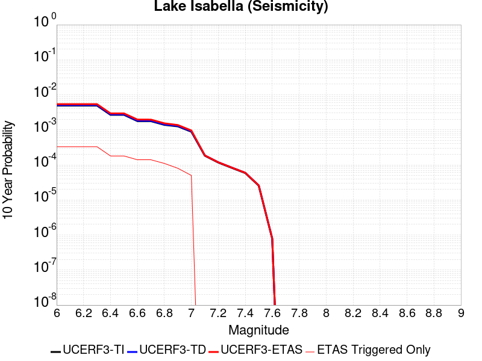 |

| Magnitude | 1 wk TI Prob | 1 wk TD Prob | 1 wk ETAS Prob | 1 wk ETAS/TD Gain | 1 wk ETAS Triggered Only | 1 mo TI Prob | 1 mo TD Prob | 1 mo ETAS Prob | 1 mo ETAS/TD Gain | 1 mo ETAS Triggered Only | 1 yr TI Prob | 1 yr TD Prob | 1 yr ETAS Prob | 1 yr ETAS/TD Gain | 1 yr ETAS Triggered Only | 10 yr TI Prob | 10 yr TD Prob | 10 yr ETAS Prob | 10 yr ETAS/TD Gain | 10 yr ETAS Triggered Only |
|-----|-----|-----|-----|-----|-----|-----|-----|-----|-----|-----|-----|-----|-----|-----|-----|-----|-----|-----|-----|-----|
| 6.0 | 9.431637E-6 | 9.741651E-6 | 9.974078E-5 | 10.238589 | 9.0E-5 | 4.0420677E-5 | 4.1749343E-5 | 1.817435E-4 | 4.353206 | 1.4E-4 | 4.920106E-4 | 5.0819275E-4 | 7.480708E-4 | 1.4720217 | 2.4E-4 | 0.004909227 | 0.005071599 | 0.005399925 | 1.0647383 | 3.3E-4 |
| 6.1 | 9.431637E-6 | 9.741651E-6 | 9.974078E-5 | 10.238589 | 9.0E-5 | 4.0420677E-5 | 4.1749343E-5 | 1.817435E-4 | 4.353206 | 1.4E-4 | 4.920106E-4 | 5.0819275E-4 | 7.480708E-4 | 1.4720217 | 2.4E-4 | 0.004909227 | 0.005071599 | 0.005399925 | 1.0647383 | 3.3E-4 |
| 6.2 | 9.431637E-6 | 9.741651E-6 | 9.974078E-5 | 10.238589 | 9.0E-5 | 4.0420677E-5 | 4.1749343E-5 | 1.817435E-4 | 4.353206 | 1.4E-4 | 4.920106E-4 | 5.0819275E-4 | 7.480708E-4 | 1.4720217 | 2.4E-4 | 0.004909227 | 0.005071599 | 0.005399925 | 1.0647383 | 3.3E-4 |
| 6.3 | 9.431637E-6 | 9.741651E-6 | 9.974078E-5 | 10.238589 | 9.0E-5 | 4.0420677E-5 | 4.1749343E-5 | 1.817435E-4 | 4.353206 | 1.4E-4 | 4.920106E-4 | 5.0819275E-4 | 7.480708E-4 | 1.4720217 | 2.4E-4 | 0.004909227 | 0.005071599 | 0.005399925 | 1.0647383 | 3.3E-4 |
| 6.4 | 5.144063E-6 | 5.3000763E-6 | 4.5299865E-5 | 8.547022 | 4.0E-5 | 2.2045799E-5 | 2.2714434E-5 | 1.0271262E-4 | 4.5219097 | 8.0E-5 | 2.6837454E-4 | 2.765166E-4 | 3.964834E-4 | 1.4338503 | 1.2E-4 | 0.0026805066 | 0.0027620657 | 0.0029415686 | 1.0649886 | 1.8E-4 |
| 6.5 | 5.144063E-6 | 5.3000763E-6 | 4.5299865E-5 | 8.547022 | 4.0E-5 | 2.2045799E-5 | 2.2714434E-5 | 1.0271262E-4 | 4.5219097 | 8.0E-5 | 2.6837454E-4 | 2.765166E-4 | 3.964834E-4 | 1.4338503 | 1.2E-4 | 0.0026805066 | 0.0027620657 | 0.0029415686 | 1.0649886 | 1.8E-4 |
| 6.6 | 3.4009804E-6 | 3.498786E-6 | 4.3498647E-5 | 12.432496 | 4.0E-5 | 1.4575549E-5 | 1.4994721E-5 | 9.499352E-5 | 6.335131 | 8.0E-5 | 1.7744285E-4 | 1.8254704E-4 | 2.8252878E-4 | 1.547704 | 1.0E-4 | 0.0017730123 | 0.0018241286 | 0.0019638732 | 1.076609 | 1.4E-4 |
| 6.7 | 3.3880428E-6 | 3.4856528E-6 | 4.3485514E-5 | 12.475573 | 4.0E-5 | 1.4520103E-5 | 1.4938435E-5 | 9.493724E-5 | 6.355233 | 8.0E-5 | 1.767679E-4 | 1.8186188E-4 | 2.8184368E-4 | 1.5497679 | 1.0E-4 | 0.0017662736 | 0.0018172882 | 0.0019570338 | 1.0768979 | 1.4E-4 |
| 6.8 | 2.6582E-6 | 2.7337003E-6 | 3.2733617E-5 | 11.974107 | 3.0E-5 | 1.1392236E-5 | 1.1715813E-5 | 8.171499E-5 | 6.974761 | 7.0E-5 | 1.3869164E-4 | 1.4263204E-4 | 2.2262063E-4 | 1.5608039 | 8.0E-5 | 0.0013860512 | 0.0014255369 | 0.0015353801 | 1.0770539 | 1.1E-4 |
| 6.9 | 2.406011E-6 | 2.4743288E-6 | 2.247428E-5 | 9.08298 | 2.0E-5 | 1.0311434E-5 | 1.0604231E-5 | 5.0603805E-5 | 4.7720394 | 4.0E-5 | 1.2553448E-4 | 1.2910018E-4 | 1.7909372E-4 | 1.3872461 | 5.0E-5 | 0.0012546359 | 0.0012903814 | 0.0013702782 | 1.0619172 | 8.0E-5 |
| 7.0 | 1.6953097E-6 | 1.7429371E-6 | 2.1742902E-5 | 12.474863 | 2.0E-5 | 7.265593E-6 | 7.469715E-6 | 2.7469567E-5 | 3.6774583 | 2.0E-5 | 8.8455E-5 | 9.094104E-5 | 1.20938304E-4 | 1.3298541 | 3.0E-5 | 8.84198E-4 | 9.09141E-4 | 9.590955E-4 | 1.054947 | 5.0E-5 |
| 7.1 | 3.5013824E-7 | 3.5714822E-7 | 3.5714822E-7 | 1.0 | 0.0 | 1.5005916E-6 | 1.5306344E-6 | 1.5306344E-6 | 1.0 | 0.0 | 1.826955E-5 | 1.8635317E-5 | 1.8635317E-5 | 1.0 | 0.0 | 1.8268047E-4 | 1.863378E-4 | 1.863378E-4 | 1.0 | 0.0 |
| 7.2 | 2.2321095E-7 | 2.2750574E-7 | 2.2750574E-7 | 1.0 | 0.0 | 9.56618E-7 | 9.750242E-7 | 9.750242E-7 | 1.0 | 0.0 | 1.1646762E-5 | 1.1870856E-5 | 1.1870856E-5 | 1.0 | 0.0 | 1.1646151E-4 | 1.1870232E-4 | 1.1870232E-4 | 1.0 | 0.0 |
| 7.3 | 1.5760406E-7 | 1.6060922E-7 | 1.6060922E-7 | 1.0 | 0.0 | 6.7544585E-7 | 6.8832503E-7 | 6.8832503E-7 | 1.0 | 0.0 | 8.223522E-6 | 8.380326E-6 | 8.380326E-6 | 1.0 | 0.0 | 8.2232174E-5 | 8.3800165E-5 | 8.3800165E-5 | 1.0 | 0.0 |
| 7.4 | 1.1216497E-7 | 1.1431706E-7 | 1.1431706E-7 | 1.0 | 0.0 | 4.8070694E-7 | 4.899302E-7 | 4.899302E-7 | 1.0 | 0.0 | 5.852591E-6 | 5.964884E-6 | 5.964884E-6 | 1.0 | 0.0 | 5.8524372E-5 | 5.9647282E-5 | 5.9647282E-5 | 1.0 | 0.0 |
| 7.5 | 4.885185E-8 | 4.9787737E-8 | 4.9787737E-8 | 1.0 | 0.0 | 2.0936506E-7 | 2.13376E-7 | 2.13376E-7 | 1.0 | 0.0 | 2.5490165E-6 | 2.59785E-6 | 2.59785E-6 | 1.0 | 0.0 | 2.5489873E-5 | 2.5978214E-5 | 2.5978214E-5 | 1.0 | 0.0 |
| 7.6 | 1.504641E-9 | 1.5317903E-9 | 1.5317903E-9 | 1.0 | 0.0 | 6.4484613E-9 | 6.5648154E-9 | 6.5648154E-9 | 1.0 | 0.0 | 7.851001E-8 | 7.992663E-8 | 7.992663E-8 | 1.0 | 0.0 | 7.8509987E-7 | 7.992663E-7 | 7.992663E-7 | 1.0 | 0.0 |

## San Andreas (Cholame) rev
*[(top)](#table-of-contents)*

| 1 Week | 1 Month | 1 Year | 10 Year |
|-----|-----|-----|-----|
|  |  |  |  |

| Magnitude | 1 wk TI Prob | 1 wk TD Prob | 1 wk ETAS Prob | 1 wk ETAS/TD Gain | 1 wk ETAS Triggered Only | 1 mo TI Prob | 1 mo TD Prob | 1 mo ETAS Prob | 1 mo ETAS/TD Gain | 1 mo ETAS Triggered Only | 1 yr TI Prob | 1 yr TD Prob | 1 yr ETAS Prob | 1 yr ETAS/TD Gain | 1 yr ETAS Triggered Only | 10 yr TI Prob | 10 yr TD Prob | 10 yr ETAS Prob | 10 yr ETAS/TD Gain | 10 yr ETAS Triggered Only |
|-----|-----|-----|-----|-----|-----|-----|-----|-----|-----|-----|-----|-----|-----|-----|-----|-----|-----|-----|-----|-----|
| 6.0 | 1.2302514E-4 | 2.5204287E-4 | 3.5201767E-4 | 1.396658 | 1.0E-4 | 5.27144E-4 | 0.0010797381 | 0.0012095978 | 1.1202695 | 1.3E-4 | 0.0063991086 | 0.0130670825 | 0.01324473 | 1.0135951 | 1.8E-4 | 0.06217949 | 0.12439073 | 0.12464465 | 1.0020413 | 2.9E-4 |
| 6.1 | 1.2302514E-4 | 2.5204287E-4 | 3.5201767E-4 | 1.396658 | 1.0E-4 | 5.27144E-4 | 0.0010797381 | 0.0012095978 | 1.1202695 | 1.3E-4 | 0.0063991086 | 0.0130670825 | 0.01324473 | 1.0135951 | 1.8E-4 | 0.06217949 | 0.12439073 | 0.12464465 | 1.0020413 | 2.9E-4 |
| 6.2 | 1.2203569E-4 | 2.5021084E-4 | 3.5018582E-4 | 1.399563 | 1.0E-4 | 5.2290526E-4 | 0.0010718931 | 0.0012017537 | 1.1211507 | 1.3E-4 | 0.006347804 | 0.01297271 | 0.013150374 | 1.0136952 | 1.8E-4 | 0.061695136 | 0.12357691 | 0.12383107 | 1.0020567 | 2.9E-4 |
| 6.3 | 1.2142645E-4 | 2.4907055E-4 | 3.4904564E-4 | 1.4013927 | 1.0E-4 | 5.202953E-4 | 0.0010670102 | 0.0011968715 | 1.1217058 | 1.3E-4 | 0.006316212 | 0.012913967 | 0.013091642 | 1.0137584 | 1.8E-4 | 0.06139677 | 0.12307103 | 0.12332534 | 1.0020664 | 2.9E-4 |
| 6.4 | 1.1865206E-4 | 2.44126E-4 | 3.441016E-4 | 1.4095246 | 1.0E-4 | 5.0840975E-4 | 0.0010458364 | 0.0011757005 | 1.1241724 | 1.3E-4 | 0.006172335 | 0.012659196 | 0.012836917 | 1.0140389 | 1.8E-4 | 0.060036868 | 0.1208638 | 0.12110996 | 1.0020367 | 2.8E-4 |
| 6.5 | 1.17443946E-4 | 2.4205919E-4 | 3.42035E-4 | 1.413022 | 1.0E-4 | 5.032341E-4 | 0.0010369857 | 0.0011668509 | 1.1252334 | 1.3E-4 | 0.006109677 | 0.012552682 | 0.012730423 | 1.0141596 | 1.8E-4 | 0.059444077 | 0.11993805 | 0.12018447 | 1.0020546 | 2.8E-4 |
| 6.6 | 1.13579066E-4 | 2.3514954E-4 | 3.2512838E-4 | 1.3826451 | 9.0E-5 | 4.866766E-4 | 0.001007396 | 0.0011272752 | 1.118999 | 1.2E-4 | 0.0059092017 | 0.012196515 | 0.0123644415 | 1.0137684 | 1.7E-4 | 0.057545185 | 0.11685214 | 0.1170906 | 1.0020406 | 2.7E-4 |
| 6.7 | 1.1271412E-4 | 2.3359268E-4 | 3.13574E-4 | 1.3423965 | 8.0E-5 | 4.829711E-4 | 0.0010007289 | 0.0011106188 | 1.1098099 | 1.1E-4 | 0.005864331 | 0.012116249 | 0.01227431 | 1.0130454 | 1.6E-4 | 0.057119697 | 0.116155714 | 0.11638551 | 1.0019784 | 2.6E-4 |
| 6.8 | 1.1217975E-4 | 2.3247694E-4 | 3.1245835E-4 | 1.3440402 | 8.0E-5 | 4.8068175E-4 | 9.959509E-4 | 0.0011058414 | 1.1103373 | 1.1E-4 | 0.005836608 | 0.012058721 | 0.0122167915 | 1.0131084 | 1.6E-4 | 0.056856725 | 0.11565396 | 0.115883894 | 1.001988 | 2.6E-4 |
| 6.9 | 1.1146753E-4 | 2.3096445E-4 | 3.1094596E-4 | 1.3462937 | 8.0E-5 | 4.7763053E-4 | 9.894737E-4 | 0.0010993648 | 1.1110603 | 1.1E-4 | 0.0057996577 | 0.011980731 | 0.012138815 | 1.0131948 | 1.6E-4 | 0.056506127 | 0.11497439 | 0.1152045 | 1.0020014 | 2.6E-4 |
| 7.0 | 1.0965793E-4 | 2.2719789E-4 | 3.0717973E-4 | 1.352036 | 8.0E-5 | 4.698779E-4 | 9.733434E-4 | 0.0010832363 | 1.1129025 | 1.1E-4 | 0.005705768 | 0.011786487 | 0.011944601 | 1.0134149 | 1.6E-4 | 0.055614736 | 0.11327597 | 0.11350651 | 1.0020353 | 2.6E-4 |
| 7.1 | 9.927982E-5 | 2.0538924E-4 | 2.853728E-4 | 1.3894243 | 8.0E-5 | 4.2541555E-4 | 8.7994366E-4 | 9.898469E-4 | 1.124898 | 1.1E-4 | 0.0051671406 | 0.010660981 | 0.010819275 | 1.014848 | 1.6E-4 | 0.05048634 | 0.1033706 | 0.10360372 | 1.0022552 | 2.6E-4 |
| 7.2 | 9.696786E-5 | 2.0043184E-4 | 2.804158E-4 | 1.3990582 | 8.0E-5 | 4.1551032E-4 | 8.5871184E-4 | 9.686174E-4 | 1.1279888 | 1.1E-4 | 0.00504711 | 0.010404981 | 0.01055342 | 1.0142661 | 1.5E-4 | 0.04934009 | 0.1011086 | 0.10133332 | 1.0022225 | 2.5E-4 |
| 7.3 | 9.4727984E-5 | 1.9472468E-4 | 2.747091E-4 | 1.4107565 | 8.0E-5 | 4.0591392E-4 | 8.3426846E-4 | 9.441767E-4 | 1.131742 | 1.1E-4 | 0.0049308087 | 0.010110183 | 0.010258666 | 1.0146866 | 1.5E-4 | 0.048228268 | 0.09847952 | 0.0987049 | 1.0022886 | 2.5E-4 |
| 7.4 | 9.220358E-5 | 1.8843076E-4 | 2.684157E-4 | 1.4244791 | 8.0E-5 | 3.9509835E-4 | 8.073114E-4 | 9.172226E-4 | 1.1361448 | 1.1E-4 | 0.004799717 | 0.009784967 | 0.009933499 | 1.0151796 | 1.5E-4 | 0.046973653 | 0.095557496 | 0.095783606 | 1.0023662 | 2.5E-4 |
| 7.5 | 7.71631E-5 | 1.5177966E-4 | 2.3176752E-4 | 1.5269998 | 8.0E-5 | 3.306571E-4 | 6.503223E-4 | 7.602507E-4 | 1.1690369 | 1.1E-4 | 0.0040183207 | 0.007889002 | 0.008037818 | 1.0188638 | 1.5E-4 | 0.03946433 | 0.07828531 | 0.0784973 | 1.002708 | 2.3E-4 |
| 7.6 | 7.5634416E-5 | 1.483744E-4 | 2.2836252E-4 | 1.5390966 | 8.0E-5 | 3.241072E-4 | 6.3573546E-4 | 7.456655E-4 | 1.172918 | 1.1E-4 | 0.0039388672 | 0.0077126776 | 0.007861521 | 1.0192986 | 1.5E-4 | 0.038697794 | 0.07664872 | 0.07686109 | 1.0027707 | 2.3E-4 |
| 7.7 | 6.3783E-5 | 1.235872E-4 | 1.8357979E-4 | 1.4854271 | 6.0E-5 | 2.7332708E-4 | 5.29552E-4 | 6.195043E-4 | 1.169865 | 9.0E-5 | 0.0033226798 | 0.0064282627 | 0.0065375557 | 1.017002 | 1.1E-4 | 0.032734364 | 0.06454029 | 0.06470867 | 1.002609 | 1.8E-4 |
| 7.8 | 5.863422E-5 | 1.1416107E-4 | 1.7415422E-4 | 1.5255132 | 6.0E-5 | 2.512653E-4 | 4.8917E-4 | 5.79126E-4 | 1.1838951 | 9.0E-5 | 0.003054864 | 0.0059394026 | 0.0060388087 | 1.0167367 | 1.0E-4 | 0.030132094 | 0.059659187 | 0.059800237 | 1.0023643 | 1.5E-4 |
| 7.9 | 4.595283E-5 | 8.426331E-5 | 1.2425994E-4 | 1.4746624 | 4.0E-5 | 1.9692584E-4 | 3.610785E-4 | 4.1106046E-4 | 1.138424 | 5.0E-5 | 0.0023949358 | 0.0043872762 | 0.004447013 | 1.013616 | 6.0E-5 | 0.023692891 | 0.044362005 | 0.044438455 | 1.0017233 | 8.0E-5 |
| 8.0 | 3.2950178E-5 | 5.0772942E-5 | 8.077142E-5 | 1.5908359 | 3.0E-5 | 1.412074E-4 | 2.1758018E-4 | 2.575715E-4 | 1.1838002 | 4.0E-5 | 0.0017178444 | 0.0026458222 | 0.0026956901 | 1.0188477 | 5.0E-5 | 0.017046256 | 0.027180137 | 0.027238507 | 1.0021474 | 6.0E-5 |
| 8.1 | 1.9177472E-5 | 1.9185145E-5 | 2.9184954E-5 | 1.5212266 | 1.0E-5 | 8.218658E-5 | 8.221946E-5 | 1.0221782E-4 | 1.2432314 | 2.0E-5 | 0.0010001622 | 0.0010005629 | 0.0010305329 | 1.0299531 | 3.0E-5 | 0.009956728 | 0.010758142 | 0.010797712 | 1.0036781 | 4.0E-5 |
| 8.2 | 8.643924E-6 | 5.4748625E-6 | 5.4748625E-6 | 1.0 | 0.0 | 3.704486E-5 | 2.3463486E-5 | 3.346325E-5 | 1.4261842 | 1.0E-5 | 4.5092785E-4 | 2.8563058E-4 | 3.0562485E-4 | 1.0700005 | 2.0E-5 | 0.0045001395 | 0.0032487072 | 0.0032686424 | 1.0061363 | 2.0E-5 |
| 8.3 | 1.983087E-6 | 7.6599065E-7 | 7.6599065E-7 | 1.0 | 0.0 | 8.498917E-6 | 3.282813E-6 | 3.282813E-6 | 1.0 | 0.0 | 1.034694E-4 | 3.9967534E-5 | 3.9967534E-5 | 1.0 | 0.0 | 0.0010342124 | 4.719687E-4 | 4.719687E-4 | 1.0 | 0.0 |

## Cady
*[(top)](#table-of-contents)*

| 1 Week | 1 Month | 1 Year | 10 Year |
|-----|-----|-----|-----|
|  | 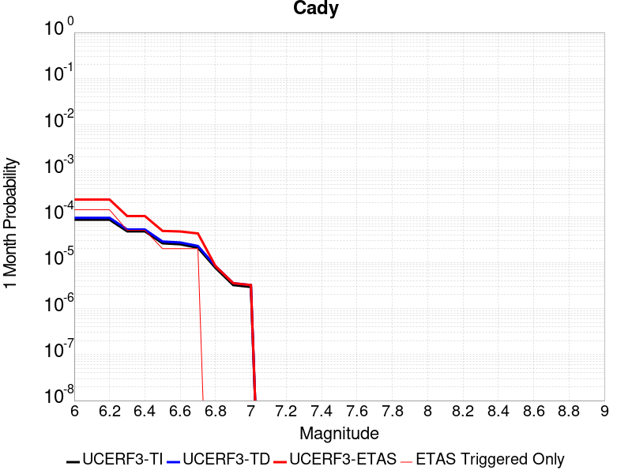 |  |  |

| Magnitude | 1 wk TI Prob | 1 wk TD Prob | 1 wk ETAS Prob | 1 wk ETAS/TD Gain | 1 wk ETAS Triggered Only | 1 mo TI Prob | 1 mo TD Prob | 1 mo ETAS Prob | 1 mo ETAS/TD Gain | 1 mo ETAS Triggered Only | 1 yr TI Prob | 1 yr TD Prob | 1 yr ETAS Prob | 1 yr ETAS/TD Gain | 1 yr ETAS Triggered Only | 10 yr TI Prob | 10 yr TD Prob | 10 yr ETAS Prob | 10 yr ETAS/TD Gain | 10 yr ETAS Triggered Only |
|-----|-----|-----|-----|-----|-----|-----|-----|-----|-----|-----|-----|-----|-----|-----|-----|-----|-----|-----|-----|-----|
| 6.0 | 1.9892565E-5 | 2.1858728E-5 | 1.418561E-4 | 6.4896774 | 1.2E-4 | 8.525106E-5 | 9.3677416E-5 | 2.3366431E-4 | 2.4943504 | 1.4E-4 | 0.0010374374 | 0.0011400167 | 0.0013298001 | 1.1664742 | 1.9E-4 | 0.010326075 | 0.011350701 | 0.011627522 | 1.0243881 | 2.8E-4 |
| 6.1 | 1.9892565E-5 | 2.1858728E-5 | 1.418561E-4 | 6.4896774 | 1.2E-4 | 8.525106E-5 | 9.3677416E-5 | 2.3366431E-4 | 2.4943504 | 1.4E-4 | 0.0010374374 | 0.0011400167 | 0.0013298001 | 1.1664742 | 1.9E-4 | 0.010326075 | 0.011350701 | 0.011627522 | 1.0243881 | 2.8E-4 |
| 6.2 | 1.9892565E-5 | 2.1858728E-5 | 1.418561E-4 | 6.4896774 | 1.2E-4 | 8.525106E-5 | 9.3677416E-5 | 2.3366431E-4 | 2.4943504 | 1.4E-4 | 0.0010374374 | 0.0011400167 | 0.0013298001 | 1.1664742 | 1.9E-4 | 0.010326075 | 0.011350701 | 0.011627522 | 1.0243881 | 2.8E-4 |
| 6.3 | 1.1117327E-5 | 1.2176583E-5 | 6.2175975E-5 | 5.106192 | 5.0E-5 | 4.764482E-5 | 5.2184492E-5 | 1.0218188E-4 | 1.9580891 | 5.0E-5 | 5.7992124E-4 | 6.351925E-4 | 7.251353E-4 | 1.1415993 | 9.0E-5 | 0.0057841022 | 0.0063368753 | 0.006485925 | 1.023521 | 1.5E-4 |
| 6.4 | 1.1117327E-5 | 1.2176583E-5 | 6.2175975E-5 | 5.106192 | 5.0E-5 | 4.764482E-5 | 5.2184492E-5 | 1.0218188E-4 | 1.9580891 | 5.0E-5 | 5.7992124E-4 | 6.351925E-4 | 7.251353E-4 | 1.1415993 | 9.0E-5 | 0.0057841022 | 0.0063368753 | 0.006485925 | 1.023521 | 1.5E-4 |
| 6.5 | 6.103093E-6 | 6.672021E-6 | 2.6671887E-5 | 3.9975727 | 2.0E-5 | 2.615585E-5 | 2.8594131E-5 | 4.859356E-5 | 1.6994243 | 2.0E-5 | 3.1840094E-4 | 3.480905E-4 | 4.080696E-4 | 1.1723089 | 6.0E-5 | 0.0031794512 | 0.0034766865 | 0.0035464433 | 1.0200641 | 7.0E-5 |
| 6.6 | 5.817237E-6 | 6.3656585E-6 | 2.6365531E-5 | 4.1418386 | 2.0E-5 | 2.4930776E-5 | 2.728118E-5 | 4.728063E-5 | 1.7330861 | 2.0E-5 | 3.034899E-4 | 3.3211018E-4 | 3.9209024E-4 | 1.1806029 | 6.0E-5 | 0.0030307577 | 0.0033173605 | 0.0033871282 | 1.0210311 | 7.0E-5 |
| 6.7 | 4.8846314E-6 | 5.3405684E-6 | 2.5340461E-5 | 4.7448997 | 2.0E-5 | 2.0933967E-5 | 2.2888014E-5 | 4.2887557E-5 | 1.8737998 | 2.0E-5 | 2.5484123E-4 | 2.7863772E-4 | 3.38621E-4 | 1.2152734 | 6.0E-5 | 0.0025454918 | 0.0027840391 | 0.0028438722 | 1.0214914 | 6.0E-5 |
| 6.8 | 1.7788773E-6 | 1.9399079E-6 | 1.9399079E-6 | 1.0 | 0.0 | 7.6237375E-6 | 8.313874E-6 | 8.313874E-6 | 1.0 | 0.0 | 9.281505E-5 | 1.01218284E-4 | 1.11217276E-4 | 1.0987864 | 1.0E-5 | 9.2776294E-4 | 0.0010118765 | 0.0010218663 | 1.0098727 | 1.0E-5 |
| 6.9 | 7.5455404E-7 | 8.297092E-7 | 8.297092E-7 | 1.0 | 0.0 | 3.233799E-6 | 3.5558937E-6 | 3.5558937E-6 | 1.0 | 0.0 | 3.937079E-5 | 4.3292483E-5 | 5.329205E-5 | 1.2309769 | 1.0E-5 | 3.9363815E-4 | 4.3287344E-4 | 4.428691E-4 | 1.0230914 | 1.0E-5 |
| 7.0 | 6.8578805E-7 | 7.541816E-7 | 7.541816E-7 | 1.0 | 0.0 | 2.9390883E-6 | 3.2322048E-6 | 3.2322048E-6 | 1.0 | 0.0 | 3.578281E-5 | 3.9351715E-5 | 4.9351318E-5 | 1.2541085 | 1.0E-5 | 3.577705E-4 | 3.9347992E-4 | 4.0347598E-4 | 1.0254042 | 1.0E-5 |

## San Andreas (Carrizo) rev
*[(top)](#table-of-contents)*

| 1 Week | 1 Month | 1 Year | 10 Year |
|-----|-----|-----|-----|
|  |  |  |  |

| Magnitude | 1 wk TI Prob | 1 wk TD Prob | 1 wk ETAS Prob | 1 wk ETAS/TD Gain | 1 wk ETAS Triggered Only | 1 mo TI Prob | 1 mo TD Prob | 1 mo ETAS Prob | 1 mo ETAS/TD Gain | 1 mo ETAS Triggered Only | 1 yr TI Prob | 1 yr TD Prob | 1 yr ETAS Prob | 1 yr ETAS/TD Gain | 1 yr ETAS Triggered Only | 10 yr TI Prob | 10 yr TD Prob | 10 yr ETAS Prob | 10 yr ETAS/TD Gain | 10 yr ETAS Triggered Only |
|-----|-----|-----|-----|-----|-----|-----|-----|-----|-----|-----|-----|-----|-----|-----|-----|-----|-----|-----|-----|-----|
| 6.0 | 1.1674632E-4 | 2.432302E-4 | 3.332083E-4 | 1.3699298 | 9.0E-5 | 5.002454E-4 | 0.0010420004 | 0.0011618753 | 1.1150432 | 1.2E-4 | 0.006073493 | 0.012613042 | 0.012780898 | 1.0133082 | 1.7E-4 | 0.0591016 | 0.12061418 | 0.120860405 | 1.0020415 | 2.8E-4 |
| 6.1 | 1.1674632E-4 | 2.432302E-4 | 3.332083E-4 | 1.3699298 | 9.0E-5 | 5.002454E-4 | 0.0010420004 | 0.0011618753 | 1.1150432 | 1.2E-4 | 0.006073493 | 0.012613042 | 0.012780898 | 1.0133082 | 1.7E-4 | 0.0591016 | 0.12061418 | 0.120860405 | 1.0020415 | 2.8E-4 |
| 6.2 | 1.1674632E-4 | 2.432302E-4 | 3.332083E-4 | 1.3699298 | 9.0E-5 | 5.002454E-4 | 0.0010420004 | 0.0011618753 | 1.1150432 | 1.2E-4 | 0.006073493 | 0.012613042 | 0.012780898 | 1.0133082 | 1.7E-4 | 0.0591016 | 0.12061418 | 0.120860405 | 1.0020415 | 2.8E-4 |
| 6.3 | 1.1674632E-4 | 2.432302E-4 | 3.332083E-4 | 1.3699298 | 9.0E-5 | 5.002454E-4 | 0.0010420004 | 0.0011618753 | 1.1150432 | 1.2E-4 | 0.006073493 | 0.012613042 | 0.012780898 | 1.0133082 | 1.7E-4 | 0.0591016 | 0.12061418 | 0.120860405 | 1.0020415 | 2.8E-4 |
| 6.4 | 1.1674632E-4 | 2.432302E-4 | 3.332083E-4 | 1.3699298 | 9.0E-5 | 5.002454E-4 | 0.0010420004 | 0.0011618753 | 1.1150432 | 1.2E-4 | 0.006073493 | 0.012613042 | 0.012780898 | 1.0133082 | 1.7E-4 | 0.0591016 | 0.12061418 | 0.120860405 | 1.0020415 | 2.8E-4 |
| 6.5 | 1.13136164E-4 | 2.3643032E-4 | 3.2640903E-4 | 1.3805718 | 9.0E-5 | 4.847792E-4 | 0.0010128808 | 0.0011327593 | 1.118354 | 1.2E-4 | 0.0058862255 | 0.012262545 | 0.012430459 | 1.0136933 | 1.7E-4 | 0.057327334 | 0.117585555 | 0.11783263 | 1.0021013 | 2.8E-4 |
| 6.6 | 1.13136164E-4 | 2.3643032E-4 | 3.2640903E-4 | 1.3805718 | 9.0E-5 | 4.847792E-4 | 0.0010128808 | 0.0011327593 | 1.118354 | 1.2E-4 | 0.0058862255 | 0.012262545 | 0.012430459 | 1.0136933 | 1.7E-4 | 0.057327334 | 0.117585555 | 0.11783263 | 1.0021013 | 2.8E-4 |
| 6.7 | 1.1149675E-4 | 2.3334254E-4 | 3.1332386E-4 | 1.3427637 | 8.0E-5 | 4.777557E-4 | 9.996577E-4 | 0.0011095477 | 1.1099277 | 1.1E-4 | 0.0058011734 | 0.012103349 | 0.012261412 | 1.0130595 | 1.6E-4 | 0.05652051 | 0.1162071 | 0.11644573 | 1.0020534 | 2.7E-4 |
| 6.8 | 1.1103589E-4 | 2.3236412E-4 | 3.1234554E-4 | 1.3442072 | 8.0E-5 | 4.7578133E-4 | 9.954676E-4 | 0.0011053582 | 1.1103908 | 1.1E-4 | 0.005777263 | 0.012052901 | 0.012210973 | 1.0131148 | 1.6E-4 | 0.056293584 | 0.1157674 | 0.11600614 | 1.0020623 | 2.7E-4 |
| 6.9 | 1.1053259E-4 | 2.3128795E-4 | 3.1126945E-4 | 1.3458092 | 8.0E-5 | 4.7362508E-4 | 9.90859E-4 | 0.00110075 | 1.1109048 | 1.1E-4 | 0.0057511497 | 0.01199741 | 0.012155491 | 1.0131762 | 1.6E-4 | 0.05604569 | 0.11528359 | 0.11552247 | 1.0020721 | 2.7E-4 |
| 7.0 | 1.1005377E-4 | 2.3029637E-4 | 3.1027794E-4 | 1.3472985 | 8.0E-5 | 4.7157376E-4 | 9.866126E-4 | 0.0010965042 | 1.1113826 | 1.1E-4 | 0.0057263062 | 0.011946279 | 0.012104367 | 1.0132333 | 1.6E-4 | 0.055809796 | 0.11483591 | 0.1150749 | 1.0020812 | 2.7E-4 |
| 7.1 | 1.0308142E-4 | 2.1539345E-4 | 2.953762E-4 | 1.3713334 | 8.0E-5 | 4.417027E-4 | 9.227892E-4 | 0.0010326877 | 1.1190938 | 1.1E-4 | 0.0053644776 | 0.011177397 | 0.0113356095 | 1.0141546 | 1.6E-4 | 0.052368138 | 0.108092256 | 0.108324155 | 1.0021454 | 2.6E-4 |
| 7.2 | 1.0027479E-4 | 2.094724E-4 | 2.8945564E-4 | 1.3818319 | 8.0E-5 | 4.296783E-4 | 8.9743105E-4 | 0.0010073324 | 1.122462 | 1.1E-4 | 0.0052187922 | 0.010871782 | 0.011020152 | 1.0136472 | 1.5E-4 | 0.050979212 | 0.10539625 | 0.1056199 | 1.002122 | 2.5E-4 |
| 7.3 | 9.816942E-5 | 2.0422463E-4 | 2.842083E-4 | 1.3916456 | 8.0E-5 | 4.2065824E-4 | 8.7495585E-4 | 9.848597E-4 | 1.1256106 | 1.1E-4 | 0.005109493 | 0.010600842 | 0.010749252 | 1.0139998 | 1.5E-4 | 0.049935985 | 0.102979995 | 0.10320425 | 1.0021777 | 2.5E-4 |
| 7.4 | 9.5634205E-5 | 1.9791997E-4 | 2.7790412E-4 | 1.4041238 | 8.0E-5 | 4.0979648E-4 | 8.479536E-4 | 9.578603E-4 | 1.1296141 | 1.1E-4 | 0.0049778637 | 0.010275229 | 0.010423687 | 1.0144482 | 1.5E-4 | 0.048678253 | 0.10006632 | 0.100291304 | 1.0022483 | 2.5E-4 |
| 7.5 | 8.052417E-5 | 1.611261E-4 | 2.411132E-4 | 1.4964255 | 8.0E-5 | 3.4505792E-4 | 6.903579E-4 | 8.0028194E-4 | 1.1592276 | 1.1E-4 | 0.0041929903 | 0.008372796 | 0.00852154 | 1.0177652 | 1.5E-4 | 0.04114753 | 0.08281049 | 0.08302145 | 1.0025474 | 2.3E-4 |
| 7.6 | 7.897024E-5 | 1.5765853E-4 | 2.3764592E-4 | 1.5073458 | 8.0E-5 | 3.384E-4 | 6.755046E-4 | 7.854303E-4 | 1.1627312 | 1.1E-4 | 0.0041122385 | 0.008193332 | 0.008342103 | 1.0181576 | 1.5E-4 | 0.040369697 | 0.08115171 | 0.08136304 | 1.0026042 | 2.3E-4 |
| 7.7 | 6.707427E-5 | 1.3276102E-4 | 1.9275307E-4 | 1.4518799 | 6.0E-5 | 2.8742946E-4 | 5.688518E-4 | 6.588006E-4 | 1.1581235 | 9.0E-5 | 0.003493839 | 0.00690381 | 0.007013051 | 1.0158232 | 1.1E-4 | 0.034394164 | 0.069048055 | 0.069215626 | 1.0024269 | 1.8E-4 |
| 7.8 | 6.147705E-5 | 1.2197486E-4 | 1.8196754E-4 | 1.4918447 | 6.0E-5 | 2.6344648E-4 | 5.226447E-4 | 6.125977E-4 | 1.1721112 | 9.0E-5 | 0.0032027436 | 0.006344659 | 0.0064440244 | 1.0156612 | 1.0E-4 | 0.031569764 | 0.06351457 | 0.06365503 | 1.0022117 | 1.5E-4 |
| 7.9 | 4.7636717E-5 | 8.87977E-5 | 1.2879414E-4 | 1.4504222 | 4.0E-5 | 2.0414138E-4 | 3.8050607E-4 | 4.3048707E-4 | 1.131354 | 5.0E-5 | 0.0024825884 | 0.0046228287 | 0.004682551 | 1.0129191 | 6.0E-5 | 0.024550365 | 0.046628095 | 0.046704363 | 1.0016357 | 8.0E-5 |
| 8.0 | 3.3554235E-5 | 5.2136907E-5 | 8.2135346E-5 | 1.5753781 | 3.0E-5 | 1.4379594E-4 | 2.2342477E-4 | 2.6341583E-4 | 1.1789912 | 4.0E-5 | 0.0017493097 | 0.002716805 | 0.0027666693 | 1.0183539 | 5.0E-5 | 0.017356034 | 0.027880952 | 0.02793928 | 1.002092 | 6.0E-5 |
| 8.1 | 1.9175432E-5 | 1.9184976E-5 | 2.9184785E-5 | 1.5212312 | 1.0E-5 | 8.217783E-5 | 8.2218736E-5 | 1.0221709E-4 | 1.2432336 | 2.0E-5 | 0.0010000558 | 0.0010005541 | 0.001030524 | 1.0299534 | 3.0E-5 | 0.009955673 | 0.0107580265 | 0.010797597 | 1.0036782 | 4.0E-5 |
| 8.2 | 8.643924E-6 | 5.4748625E-6 | 5.4748625E-6 | 1.0 | 0.0 | 3.704486E-5 | 2.3463486E-5 | 3.346325E-5 | 1.4261842 | 1.0E-5 | 4.5092785E-4 | 2.8563058E-4 | 3.0562485E-4 | 1.0700005 | 2.0E-5 | 0.0045001395 | 0.0032487072 | 0.0032686424 | 1.0061363 | 2.0E-5 |
| 8.3 | 1.983087E-6 | 7.6599065E-7 | 7.6599065E-7 | 1.0 | 0.0 | 8.498917E-6 | 3.282813E-6 | 3.282813E-6 | 1.0 | 0.0 | 1.034694E-4 | 3.9967534E-5 | 3.9967534E-5 | 1.0 | 0.0 | 0.0010342124 | 4.719687E-4 | 4.719687E-4 | 1.0 | 0.0 |

## Sierra Nevada  (No Extension)
*[(top)](#table-of-contents)*

| 1 Week | 1 Month | 1 Year | 10 Year |
|-----|-----|-----|-----|
|  |  |  |  |

| Magnitude | 1 wk TI Prob | 1 wk TD Prob | 1 wk ETAS Prob | 1 wk ETAS/TD Gain | 1 wk ETAS Triggered Only | 1 mo TI Prob | 1 mo TD Prob | 1 mo ETAS Prob | 1 mo ETAS/TD Gain | 1 mo ETAS Triggered Only | 1 yr TI Prob | 1 yr TD Prob | 1 yr ETAS Prob | 1 yr ETAS/TD Gain | 1 yr ETAS Triggered Only | 10 yr TI Prob | 10 yr TD Prob | 10 yr ETAS Prob | 10 yr ETAS/TD Gain | 10 yr ETAS Triggered Only |
|-----|-----|-----|-----|-----|-----|-----|-----|-----|-----|-----|-----|-----|-----|-----|-----|-----|-----|-----|-----|-----|
| 6.0 | 7.7690465E-6 | 6.976322E-6 | 1.16975556E-4 | 16.767511 | 1.1E-4 | 3.329549E-5 | 2.9898381E-5 | 1.7989389E-4 | 6.0168443 | 1.5E-4 | 4.0529718E-4 | 3.6398784E-4 | 5.6391506E-4 | 1.549269 | 2.0E-4 | 0.004045588 | 0.0036374326 | 0.003896487 | 1.071219 | 2.6E-4 |
| 6.1 | 7.7690465E-6 | 6.976322E-6 | 1.16975556E-4 | 16.767511 | 1.1E-4 | 3.329549E-5 | 2.9898381E-5 | 1.7989389E-4 | 6.0168443 | 1.5E-4 | 4.0529718E-4 | 3.6398784E-4 | 5.6391506E-4 | 1.549269 | 2.0E-4 | 0.004045588 | 0.0036374326 | 0.003896487 | 1.071219 | 2.6E-4 |
| 6.2 | 7.7690465E-6 | 6.976322E-6 | 1.16975556E-4 | 16.767511 | 1.1E-4 | 3.329549E-5 | 2.9898381E-5 | 1.7989389E-4 | 6.0168443 | 1.5E-4 | 4.0529718E-4 | 3.6398784E-4 | 5.6391506E-4 | 1.549269 | 2.0E-4 | 0.004045588 | 0.0036374326 | 0.003896487 | 1.071219 | 2.6E-4 |
| 6.3 | 7.7690465E-6 | 6.976322E-6 | 1.16975556E-4 | 16.767511 | 1.1E-4 | 3.329549E-5 | 2.9898381E-5 | 1.7989389E-4 | 6.0168443 | 1.5E-4 | 4.0529718E-4 | 3.6398784E-4 | 5.6391506E-4 | 1.549269 | 2.0E-4 | 0.004045588 | 0.0036374326 | 0.003896487 | 1.071219 | 2.6E-4 |
| 6.4 | 7.7690465E-6 | 6.976322E-6 | 1.16975556E-4 | 16.767511 | 1.1E-4 | 3.329549E-5 | 2.9898381E-5 | 1.7989389E-4 | 6.0168443 | 1.5E-4 | 4.0529718E-4 | 3.6398784E-4 | 5.6391506E-4 | 1.549269 | 2.0E-4 | 0.004045588 | 0.0036374326 | 0.003896487 | 1.071219 | 2.6E-4 |
| 6.5 | 7.7690465E-6 | 6.976322E-6 | 1.16975556E-4 | 16.767511 | 1.1E-4 | 3.329549E-5 | 2.9898381E-5 | 1.7989389E-4 | 6.0168443 | 1.5E-4 | 4.0529718E-4 | 3.6398784E-4 | 5.6391506E-4 | 1.549269 | 2.0E-4 | 0.004045588 | 0.0036374326 | 0.003896487 | 1.071219 | 2.6E-4 |
| 6.6 | 2.653E-6 | 1.614854E-6 | 6.161476E-5 | 38.155003 | 6.0E-5 | 1.136995E-5 | 6.9207845E-6 | 9.6920165E-5 | 14.004216 | 9.0E-5 | 1.3842035E-4 | 8.425733E-5 | 2.1424638E-4 | 2.5427625 | 1.3E-4 | 0.0013833415 | 8.422573E-4 | 0.0010021225 | 1.1898057 | 1.6E-4 |
| 6.7 | 2.5902466E-6 | 1.5501876E-6 | 6.15501E-5 | 39.704933 | 6.0E-5 | 1.11010095E-5 | 6.643644E-6 | 9.6643045E-5 | 14.546692 | 9.0E-5 | 1.351464E-4 | 8.0883394E-5 | 2.1087288E-4 | 2.607122 | 1.3E-4 | 0.0013506424 | 8.0854254E-4 | 9.6841314E-4 | 1.197727 | 1.6E-4 |
| 6.8 | 2.5853892E-6 | 1.5469877E-6 | 6.1546896E-5 | 39.784992 | 6.0E-5 | 1.1080193E-5 | 6.629931E-6 | 9.662934E-5 | 14.574712 | 9.0E-5 | 1.34893E-4 | 8.071645E-5 | 2.1070596E-4 | 2.6104462 | 1.3E-4 | 0.0013481114 | 8.068743E-4 | 9.667452E-4 | 1.1981361 | 1.6E-4 |
| 6.9 | 2.458257E-6 | 1.4220619E-6 | 6.1421975E-5 | 43.192196 | 6.0E-5 | 1.0535345E-5 | 6.094537E-6 | 9.609399E-5 | 15.767233 | 9.0E-5 | 1.2826028E-4 | 7.4198484E-5 | 1.9418958E-4 | 2.6171637 | 1.2E-4 | 0.0012818627 | 7.4173906E-4 | 8.916278E-4 | 1.2020775 | 1.5E-4 |
| 7.0 | 2.4341468E-6 | 1.3990258E-6 | 6.139894E-5 | 43.886925 | 6.0E-5 | 1.0432016E-5 | 5.9958115E-6 | 9.5995274E-5 | 16.01039 | 9.0E-5 | 1.270024E-4 | 7.2996576E-5 | 1.9298782E-4 | 2.6437926 | 1.2E-4 | 0.0012692984 | 7.297279E-4 | 8.696257E-4 | 1.1917124 | 1.4E-4 |
| 7.1 | 2.3652476E-6 | 1.3339754E-6 | 5.1333907E-5 | 38.4819 | 5.0E-5 | 1.0136736E-5 | 5.717025E-6 | 8.5716565E-5 | 14.993212 | 8.0E-5 | 1.2340778E-4 | 6.9602575E-5 | 1.7959492E-4 | 2.5802913 | 1.1E-4 | 0.0012333926 | 6.9580943E-4 | 8.25719E-4 | 1.1867027 | 1.3E-4 |
| 7.2 | 2.272158E-6 | 1.2502821E-6 | 5.125022E-5 | 40.990925 | 5.0E-5 | 9.737784E-6 | 5.3583412E-6 | 8.535791E-5 | 15.9299135 | 8.0E-5 | 1.1855107E-4 | 6.5235865E-5 | 1.7522869E-4 | 2.686079 | 1.1E-4 | 0.0011848784 | 6.5216864E-4 | 7.820839E-4 | 1.1992049 | 1.3E-4 |
| 7.3 | 2.1382127E-6 | 1.1419703E-6 | 5.1141913E-5 | 44.783928 | 5.0E-5 | 9.163737E-6 | 4.8941492E-6 | 8.4893756E-5 | 17.345968 | 8.0E-5 | 1.1156279E-4 | 5.958465E-5 | 1.695781E-4 | 2.846003 | 1.1E-4 | 0.001115068 | 5.956879E-4 | 7.256105E-4 | 1.2181051 | 1.3E-4 |
| 7.4 | 1.9048055E-6 | 9.575242E-7 | 5.0957475E-5 | 53.21795 | 5.0E-5 | 8.163426E-6 | 4.1036687E-6 | 8.410334E-5 | 20.49467 | 8.0E-5 | 9.9385186E-5 | 4.996103E-5 | 1.5995554E-4 | 3.201606 | 1.1E-4 | 9.934074E-4 | 4.994987E-4 | 6.294337E-4 | 1.260131 | 1.3E-4 |
| 7.5 | 1.5373403E-6 | 7.560042E-7 | 2.075599E-5 | 27.454859 | 2.0E-5 | 6.5885843E-6 | 3.2400142E-6 | 5.323985E-5 | 16.431982 | 5.0E-5 | 8.021306E-5 | 3.9446462E-5 | 1.094437E-4 | 2.774487 | 7.0E-5 | 8.0184115E-4 | 3.943951E-4 | 4.843596E-4 | 1.2281076 | 9.0E-5 |
| 7.6 | 1.0680322E-6 | 4.6596554E-7 | 1.0465961E-5 | 22.460804 | 1.0E-5 | 4.577273E-6 | 1.9969937E-6 | 2.1996953E-5 | 11.015035 | 2.0E-5 | 5.5726876E-5 | 2.4313129E-5 | 6.431216E-5 | 2.6451616 | 4.0E-5 | 5.5712904E-4 | 2.4310495E-4 | 2.930928E-4 | 1.2056224 | 5.0E-5 |
| 7.7 | 5.509146E-7 | 1.5580486E-7 | 1.5580486E-7 | 1.0 | 0.0 | 2.3610605E-6 | 6.677349E-7 | 6.677349E-7 | 1.0 | 0.0 | 2.8745531E-5 | 8.129644E-6 | 8.129644E-6 | 1.0 | 0.0 | 2.8741814E-4 | 8.1293576E-5 | 8.1293576E-5 | 1.0 | 0.0 |

## Manix-Afton Hills
*[(top)](#table-of-contents)*

| 1 Week | 1 Month | 1 Year | 10 Year |
|-----|-----|-----|-----|
| 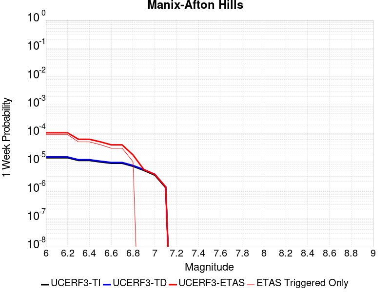 |  |  |  |

| Magnitude | 1 wk TI Prob | 1 wk TD Prob | 1 wk ETAS Prob | 1 wk ETAS/TD Gain | 1 wk ETAS Triggered Only | 1 mo TI Prob | 1 mo TD Prob | 1 mo ETAS Prob | 1 mo ETAS/TD Gain | 1 mo ETAS Triggered Only | 1 yr TI Prob | 1 yr TD Prob | 1 yr ETAS Prob | 1 yr ETAS/TD Gain | 1 yr ETAS Triggered Only | 10 yr TI Prob | 10 yr TD Prob | 10 yr ETAS Prob | 10 yr ETAS/TD Gain | 10 yr ETAS Triggered Only |
|-----|-----|-----|-----|-----|-----|-----|-----|-----|-----|-----|-----|-----|-----|-----|-----|-----|-----|-----|-----|-----|
| 6.0 | 1.3783202E-5 | 1.47110895E-5 | 1.0470977E-4 | 7.1177435 | 9.0E-5 | 5.906953E-5 | 6.30461E-5 | 1.8303854E-4 | 2.903249 | 1.2E-4 | 7.189342E-4 | 7.6733343E-4 | 9.571877E-4 | 1.2474208 | 1.9E-4 | 0.0071661277 | 0.007648596 | 0.00788676 | 1.0311383 | 2.4E-4 |
| 6.1 | 1.3783202E-5 | 1.47110895E-5 | 1.0470977E-4 | 7.1177435 | 9.0E-5 | 5.906953E-5 | 6.30461E-5 | 1.8303854E-4 | 2.903249 | 1.2E-4 | 7.189342E-4 | 7.6733343E-4 | 9.571877E-4 | 1.2474208 | 1.9E-4 | 0.0071661277 | 0.007648596 | 0.00788676 | 1.0311383 | 2.4E-4 |
| 6.2 | 1.3783202E-5 | 1.47110895E-5 | 1.0470977E-4 | 7.1177435 | 9.0E-5 | 5.906953E-5 | 6.30461E-5 | 1.8303854E-4 | 2.903249 | 1.2E-4 | 7.189342E-4 | 7.6733343E-4 | 9.571877E-4 | 1.2474208 | 1.9E-4 | 0.0071661277 | 0.007648596 | 0.00788676 | 1.0311383 | 2.4E-4 |
| 6.3 | 1.10494875E-5 | 1.1793136E-5 | 6.179255E-5 | 5.2397046 | 5.0E-5 | 4.7354086E-5 | 5.054109E-5 | 1.1053806E-4 | 2.1870928 | 6.0E-5 | 5.763835E-4 | 6.151744E-4 | 7.2510674E-4 | 1.178701 | 1.1E-4 | 0.005748908 | 0.0061357557 | 0.0062848353 | 1.0242969 | 1.5E-4 |
| 6.4 | 1.10494875E-5 | 1.1793136E-5 | 6.179255E-5 | 5.2397046 | 5.0E-5 | 4.7354086E-5 | 5.054109E-5 | 1.1053806E-4 | 2.1870928 | 6.0E-5 | 5.763835E-4 | 6.151744E-4 | 7.2510674E-4 | 1.178701 | 1.1E-4 | 0.005748908 | 0.0061357557 | 0.0062848353 | 1.0242969 | 1.5E-4 |
| 6.5 | 9.788949E-6 | 1.045432E-5 | 5.0453902E-5 | 4.8261294 | 4.0E-5 | 4.1951964E-5 | 4.480351E-5 | 9.480127E-5 | 2.115934 | 5.0E-5 | 5.1064545E-4 | 5.453555E-4 | 6.4530096E-4 | 1.1832666 | 1.0E-4 | 0.0050947363 | 0.0054410985 | 0.005570391 | 1.0237622 | 1.3E-4 |
| 6.6 | 8.810006E-6 | 9.4136285E-6 | 3.9413346E-5 | 4.186839 | 3.0E-5 | 3.775662E-5 | 4.0343548E-5 | 8.034193E-5 | 1.9914445 | 4.0E-5 | 4.5958988E-4 | 4.9108086E-4 | 5.810367E-4 | 1.1831793 | 9.0E-5 | 0.0045864056 | 0.004900839 | 0.004990398 | 1.0182742 | 9.0E-5 |
| 6.7 | 8.80128E-6 | 9.404108E-6 | 3.9403825E-5 | 4.1900654 | 3.0E-5 | 3.7719226E-5 | 4.0302748E-5 | 8.0301135E-5 | 1.9924482 | 4.0E-5 | 4.591348E-4 | 4.9058435E-4 | 5.805402E-4 | 1.1833646 | 9.0E-5 | 0.004581874 | 0.0048958957 | 0.0049854554 | 1.0182928 | 9.0E-5 |
| 6.8 | 6.8994877E-6 | 7.380076E-6 | 1.7380002E-5 | 2.3549895 | 1.0E-5 | 2.9568899E-5 | 3.162856E-5 | 5.162793E-5 | 1.6323199 | 2.0E-5 | 3.5994186E-4 | 3.8501783E-4 | 4.4499474E-4 | 1.155777 | 6.0E-5 | 0.003593594 | 0.0038443129 | 0.003904082 | 1.0155475 | 6.0E-5 |
| 6.9 | 4.9328037E-6 | 5.2709615E-6 | 5.2709615E-6 | 1.0 | 0.0 | 2.1140417E-5 | 2.2589675E-5 | 3.2589447E-5 | 1.4426701 | 1.0E-5 | 2.5735417E-4 | 2.7500073E-4 | 3.24987E-4 | 1.1817677 | 5.0E-5 | 0.0025705635 | 0.0027472095 | 0.002797072 | 1.0181503 | 5.0E-5 |
| 7.0 | 3.347973E-6 | 3.59003E-6 | 3.59003E-6 | 1.0 | 0.0 | 1.4348378E-5 | 1.5385775E-5 | 1.5385775E-5 | 1.0 | 0.0 | 1.746775E-4 | 1.8730981E-4 | 2.173042E-4 | 1.1601324 | 3.0E-5 | 0.0017454025 | 0.0018719219 | 0.0019018658 | 1.0159963 | 3.0E-5 |
| 7.1 | 1.2073567E-6 | 1.293482E-6 | 1.293482E-6 | 1.0 | 0.0 | 5.1743755E-6 | 5.543492E-6 | 5.543492E-6 | 1.0 | 0.0 | 6.29962E-5 | 6.749156E-5 | 6.749156E-5 | 1.0 | 0.0 | 6.297835E-4 | 6.7487074E-4 | 6.7487074E-4 | 1.0 | 0.0 |

## Red Pass
*[(top)](#table-of-contents)*

| 1 Week | 1 Month | 1 Year | 10 Year |
|-----|-----|-----|-----|
|  |  |  |  |

| Magnitude | 1 wk TI Prob | 1 wk TD Prob | 1 wk ETAS Prob | 1 wk ETAS/TD Gain | 1 wk ETAS Triggered Only | 1 mo TI Prob | 1 mo TD Prob | 1 mo ETAS Prob | 1 mo ETAS/TD Gain | 1 mo ETAS Triggered Only | 1 yr TI Prob | 1 yr TD Prob | 1 yr ETAS Prob | 1 yr ETAS/TD Gain | 1 yr ETAS Triggered Only | 10 yr TI Prob | 10 yr TD Prob | 10 yr ETAS Prob | 10 yr ETAS/TD Gain | 10 yr ETAS Triggered Only |
|-----|-----|-----|-----|-----|-----|-----|-----|-----|-----|-----|-----|-----|-----|-----|-----|-----|-----|-----|-----|-----|
| 6.0 | 8.258278E-6 | 8.551265E-6 | 7.855066E-5 | 9.185853 | 7.0E-5 | 3.539214E-5 | 3.6647863E-5 | 1.2664456E-4 | 3.4557147 | 9.0E-5 | 4.308141E-4 | 4.4611428E-4 | 5.960474E-4 | 1.3360868 | 1.5E-4 | 0.0042997985 | 0.004453945 | 0.004692876 | 1.0536448 | 2.4E-4 |
| 6.1 | 3.649988E-6 | 3.7753161E-6 | 4.3775166E-5 | 11.595099 | 4.0E-5 | 1.5642712E-5 | 1.6179853E-5 | 6.617904E-5 | 4.090213 | 5.0E-5 | 1.9043336E-4 | 1.9697666E-4 | 2.8695894E-4 | 1.4568169 | 9.0E-5 | 0.0019027026 | 0.001968488 | 0.0021082123 | 1.0709805 | 1.4E-4 |
| 6.2 | 3.649988E-6 | 3.7753161E-6 | 4.3775166E-5 | 11.595099 | 4.0E-5 | 1.5642712E-5 | 1.6179853E-5 | 6.617904E-5 | 4.090213 | 5.0E-5 | 1.9043336E-4 | 1.9697666E-4 | 2.8695894E-4 | 1.4568169 | 9.0E-5 | 0.0019027026 | 0.001968488 | 0.0021082123 | 1.0709805 | 1.4E-4 |
| 6.3 | 1.3924937E-6 | 1.4411166E-6 | 1.1441102E-5 | 7.9390535 | 1.0E-5 | 5.9678164E-6 | 6.1762075E-6 | 1.6176145E-5 | 2.6191065 | 1.0E-5 | 7.265574E-5 | 7.519415E-5 | 9.519264E-5 | 1.2659582 | 2.0E-5 | 7.263199E-4 | 7.518258E-4 | 7.818032E-4 | 1.0398729 | 3.0E-5 |
| 6.4 | 1.3924937E-6 | 1.4411166E-6 | 1.1441102E-5 | 7.9390535 | 1.0E-5 | 5.9678164E-6 | 6.1762075E-6 | 1.6176145E-5 | 2.6191065 | 1.0E-5 | 7.265574E-5 | 7.519415E-5 | 9.519264E-5 | 1.2659582 | 2.0E-5 | 7.263199E-4 | 7.518258E-4 | 7.818032E-4 | 1.0398729 | 3.0E-5 |
| 6.5 | 9.876812E-7 | 1.0221912E-6 | 1.1022181E-5 | 10.782895 | 1.0E-5 | 4.2329125E-6 | 4.3808195E-6 | 1.4380776E-5 | 3.2826679 | 1.0E-5 | 5.153449E-5 | 5.3336476E-5 | 6.3335945E-5 | 1.1874789 | 1.0E-5 | 5.1522546E-4 | 5.333648E-4 | 5.533541E-4 | 1.0374777 | 2.0E-5 |

## Ludlow
*[(top)](#table-of-contents)*

| 1 Week | 1 Month | 1 Year | 10 Year |
|-----|-----|-----|-----|
|  |  |  |  |

| Magnitude | 1 wk TI Prob | 1 wk TD Prob | 1 wk ETAS Prob | 1 wk ETAS/TD Gain | 1 wk ETAS Triggered Only | 1 mo TI Prob | 1 mo TD Prob | 1 mo ETAS Prob | 1 mo ETAS/TD Gain | 1 mo ETAS Triggered Only | 1 yr TI Prob | 1 yr TD Prob | 1 yr ETAS Prob | 1 yr ETAS/TD Gain | 1 yr ETAS Triggered Only | 10 yr TI Prob | 10 yr TD Prob | 10 yr ETAS Prob | 10 yr ETAS/TD Gain | 10 yr ETAS Triggered Only |
|-----|-----|-----|-----|-----|-----|-----|-----|-----|-----|-----|-----|-----|-----|-----|-----|-----|-----|-----|-----|-----|
| 6.0 | 2.2407607E-5 | 2.3657254E-5 | 1.1365512E-4 | 4.80424 | 9.0E-5 | 9.602906E-5 | 1.0138454E-4 | 2.013744E-4 | 1.9862437 | 1.0E-4 | 0.0011685267 | 0.001233702 | 0.0013935046 | 1.129531 | 1.6E-4 | 0.011624013 | 0.012273042 | 0.012480465 | 1.0169007 | 2.1E-4 |
| 6.1 | 2.2407607E-5 | 2.3657254E-5 | 1.1365512E-4 | 4.80424 | 9.0E-5 | 9.602906E-5 | 1.0138454E-4 | 2.013744E-4 | 1.9862437 | 1.0E-4 | 0.0011685267 | 0.001233702 | 0.0013935046 | 1.129531 | 1.6E-4 | 0.011624013 | 0.012273042 | 0.012480465 | 1.0169007 | 2.1E-4 |
| 6.2 | 1.0781252E-5 | 1.1365663E-5 | 9.136475E-5 | 8.038664 | 8.0E-5 | 4.620455E-5 | 4.8709102E-5 | 1.3870472E-4 | 2.847614 | 9.0E-5 | 5.623952E-4 | 5.9287593E-4 | 7.3279295E-4 | 1.2359971 | 1.4E-4 | 0.00560974 | 0.0059133614 | 0.006082356 | 1.0285784 | 1.7E-4 |
| 6.3 | 1.0781252E-5 | 1.1365663E-5 | 9.136475E-5 | 8.038664 | 8.0E-5 | 4.620455E-5 | 4.8709102E-5 | 1.3870472E-4 | 2.847614 | 9.0E-5 | 5.623952E-4 | 5.9287593E-4 | 7.3279295E-4 | 1.2359971 | 1.4E-4 | 0.00560974 | 0.0059133614 | 0.006082356 | 1.0285784 | 1.7E-4 |
| 6.4 | 7.814439E-6 | 8.237729E-6 | 6.8237234E-5 | 8.283501 | 6.0E-5 | 3.3490025E-5 | 3.530408E-5 | 1.0530161E-4 | 2.9827034 | 7.0E-5 | 4.0766477E-4 | 4.2974384E-4 | 5.2970083E-4 | 1.2325968 | 1.0E-4 | 0.0040691774 | 0.0042892746 | 0.00440876 | 1.0278567 | 1.2E-4 |
| 6.5 | 6.4986366E-6 | 6.85092E-6 | 5.685058E-5 | 8.298241 | 5.0E-5 | 2.7851002E-5 | 2.9360759E-5 | 7.935929E-5 | 2.7029033 | 5.0E-5 | 3.390332E-4 | 3.5740953E-4 | 4.3738095E-4 | 1.2237529 | 8.0E-5 | 0.003385164 | 0.0035684432 | 0.0036581222 | 1.0251311 | 9.0E-5 |
| 6.6 | 5.582177E-6 | 5.8860055E-6 | 5.588571E-5 | 9.494676 | 5.0E-5 | 2.3923398E-5 | 2.5225498E-5 | 7.5224234E-5 | 2.9820714 | 5.0E-5 | 2.9122844E-4 | 3.0707786E-4 | 3.7705636E-4 | 1.2278852 | 7.0E-5 | 0.0029084706 | 0.003066609 | 0.0031463634 | 1.0260074 | 8.0E-5 |
| 6.7 | 4.6858763E-6 | 4.940427E-6 | 5.494018E-5 | 11.120532 | 5.0E-5 | 2.0082172E-5 | 2.1173091E-5 | 7.1172035E-5 | 3.361438 | 5.0E-5 | 2.4447302E-4 | 2.5775246E-4 | 3.277344E-4 | 1.2715085 | 7.0E-5 | 0.0024420423 | 0.0025745912 | 0.0026543853 | 1.0309929 | 8.0E-5 |
| 6.8 | 3.5584908E-6 | 3.7520183E-6 | 4.375187E-5 | 11.660889 | 4.0E-5 | 1.5250586E-5 | 1.6079981E-5 | 5.6079338E-5 | 3.487525 | 4.0E-5 | 1.8566006E-4 | 1.957566E-4 | 2.3574877E-4 | 1.2042954 | 4.0E-5 | 0.0018550502 | 0.0019558826 | 0.002005785 | 1.0255139 | 5.0E-5 |
| 6.9 | 2.532834E-6 | 2.6710034E-6 | 3.2670923E-5 | 12.231704 | 3.0E-5 | 1.0854958E-5 | 1.1447109E-5 | 4.1446765E-5 | 3.620719 | 3.0E-5 | 1.3215111E-4 | 1.3935992E-4 | 1.6935574E-4 | 1.2152399 | 3.0E-5 | 0.0013207254 | 0.0013927529 | 0.0014326972 | 1.0286801 | 4.0E-5 |
| 7.0 | 1.7083285E-6 | 1.8019439E-6 | 2.1801909E-5 | 12.099105 | 2.0E-5 | 7.3213873E-6 | 7.722595E-6 | 2.772244E-5 | 3.5897832 | 2.0E-5 | 8.913424E-5 | 9.40187E-5 | 1.1401682E-4 | 1.2127036 | 2.0E-5 | 8.9098496E-4 | 9.3980576E-4 | 9.697775E-4 | 1.0318915 | 3.0E-5 |
| 7.1 | 1.0905424E-6 | 1.1497619E-6 | 2.1149739E-5 | 18.394884 | 2.0E-5 | 4.6737446E-6 | 4.9275427E-6 | 2.4927444E-5 | 5.0587983 | 2.0E-5 | 5.6901354E-5 | 5.999128E-5 | 7.999008E-5 | 1.3333617 | 2.0E-5 | 5.6886784E-4 | 5.997606E-4 | 6.197486E-4 | 1.0333266 | 2.0E-5 |
| 7.2 | 6.06668E-7 | 6.387277E-7 | 1.06387215E-5 | 16.656113 | 1.0E-5 | 2.600003E-6 | 2.7374022E-6 | 1.2737375E-5 | 4.6530886 | 1.0E-5 | 3.1654577E-5 | 3.3327433E-5 | 4.3327098E-5 | 1.3000431 | 1.0E-5 | 3.1650066E-4 | 3.3323118E-4 | 3.4322785E-4 | 1.0299993 | 1.0E-5 |

## Santa Ynez (West)
*[(top)](#table-of-contents)*

| 1 Week | 1 Month | 1 Year | 10 Year |
|-----|-----|-----|-----|
|  |  |  |  |

| Magnitude | 1 wk TI Prob | 1 wk TD Prob | 1 wk ETAS Prob | 1 wk ETAS/TD Gain | 1 wk ETAS Triggered Only | 1 mo TI Prob | 1 mo TD Prob | 1 mo ETAS Prob | 1 mo ETAS/TD Gain | 1 mo ETAS Triggered Only | 1 yr TI Prob | 1 yr TD Prob | 1 yr ETAS Prob | 1 yr ETAS/TD Gain | 1 yr ETAS Triggered Only | 10 yr TI Prob | 10 yr TD Prob | 10 yr ETAS Prob | 10 yr ETAS/TD Gain | 10 yr ETAS Triggered Only |
|-----|-----|-----|-----|-----|-----|-----|-----|-----|-----|-----|-----|-----|-----|-----|-----|-----|-----|-----|-----|-----|
| 6.0 | 4.7352758E-5 | 5.4972126E-5 | 1.14968825E-4 | 2.0914023 | 6.0E-5 | 2.0292461E-4 | 2.3557522E-4 | 3.1555636E-4 | 1.3395143 | 8.0E-5 | 0.0024678076 | 0.0028645284 | 0.0030041274 | 1.0487337 | 1.4E-4 | 0.024405818 | 0.028304417 | 0.02848904 | 1.0065228 | 1.9E-4 |
| 6.1 | 4.7352758E-5 | 5.4972126E-5 | 1.04969375E-4 | 1.9095019 | 5.0E-5 | 2.0292461E-4 | 2.3557522E-4 | 2.9556107E-4 | 1.2546357 | 6.0E-5 | 0.0024678076 | 0.0028645284 | 0.0029742133 | 1.0382907 | 1.1E-4 | 0.024405818 | 0.028304417 | 0.028450172 | 1.0051495 | 1.5E-4 |
| 6.2 | 3.0415853E-5 | 3.392511E-5 | 7.392375E-5 | 2.1790276 | 4.0E-5 | 1.3034715E-4 | 1.4538545E-4 | 1.9537818E-4 | 1.3438634 | 5.0E-5 | 0.0015858212 | 0.0017686661 | 0.0018585069 | 1.0507958 | 9.0E-5 | 0.015745522 | 0.017549807 | 0.017677525 | 1.0072775 | 1.3E-4 |
| 6.3 | 3.0415853E-5 | 3.392511E-5 | 7.392375E-5 | 2.1790276 | 4.0E-5 | 1.3034715E-4 | 1.4538545E-4 | 1.9537818E-4 | 1.3438634 | 5.0E-5 | 0.0015858212 | 0.0017686661 | 0.0018585069 | 1.0507958 | 9.0E-5 | 0.015745522 | 0.017549807 | 0.017677525 | 1.0072775 | 1.3E-4 |
| 6.4 | 2.5452082E-5 | 2.7912422E-5 | 5.7911584E-5 | 2.0747602 | 3.0E-5 | 1.09075794E-4 | 1.196193E-4 | 1.5961452E-4 | 1.3343542 | 4.0E-5 | 0.0013271887 | 0.0014554089 | 0.0015153214 | 1.0411655 | 6.0E-5 | 0.013192902 | 0.014460951 | 0.014549649 | 1.0061337 | 9.0E-5 |
| 6.5 | 2.3143784E-5 | 2.5128256E-5 | 5.5127504E-5 | 2.193845 | 3.0E-5 | 9.9183875E-5 | 1.0768817E-4 | 1.4768387E-4 | 1.3714029 | 4.0E-5 | 0.0012068948 | 0.0013103267 | 0.0013702482 | 1.0457301 | 6.0E-5 | 0.012003611 | 0.01302768 | 0.013116508 | 1.0068184 | 9.0E-5 |
| 6.6 | 1.9118515E-5 | 2.035434E-5 | 5.035373E-5 | 2.4738572 | 3.0E-5 | 8.193392E-5 | 8.7230015E-5 | 1.2722652E-4 | 1.4585178 | 4.0E-5 | 9.97089E-4 | 0.001061516 | 0.0011214523 | 1.0564629 | 6.0E-5 | 0.00992627 | 0.010565365 | 0.010654414 | 1.0084285 | 9.0E-5 |
| 6.7 | 1.722807E-5 | 1.8146347E-5 | 4.81458E-5 | 2.6531954 | 3.0E-5 | 7.3832496E-5 | 7.776777E-5 | 1.1776466E-4 | 1.5143119 | 4.0E-5 | 8.985399E-4 | 9.464169E-4 | 0.0010063602 | 1.063337 | 6.0E-5 | 0.008949154 | 0.0094245095 | 0.009513661 | 1.0094596 | 9.0E-5 |
| 6.8 | 1.5317364E-5 | 1.5926486E-5 | 4.5926008E-5 | 2.8836248 | 3.0E-5 | 6.56442E-5 | 6.82546E-5 | 1.0825187E-4 | 1.586001 | 4.0E-5 | 7.98925E-4 | 8.306873E-4 | 8.806457E-4 | 1.0601411 | 5.0E-5 | 0.007960589 | 0.00827631 | 0.008355647 | 1.0095861 | 8.0E-5 |
| 6.9 | 1.3071226E-5 | 1.3329624E-5 | 3.3329357E-5 | 2.5003974 | 2.0E-5 | 5.6018336E-5 | 5.7125722E-5 | 7.7124576E-5 | 1.350085 | 2.0E-5 | 6.8180985E-4 | 6.9528597E-4 | 7.252651E-4 | 1.0431178 | 3.0E-5 | 0.0067972173 | 0.006931367 | 0.006990951 | 1.0085963 | 6.0E-5 |
| 7.0 | 1.1836986E-5 | 1.19327815E-5 | 3.1932545E-5 | 2.6760352 | 2.0E-5 | 5.0728955E-5 | 5.11395E-5 | 7.113848E-5 | 1.3910671 | 2.0E-5 | 6.1745E-4 | 6.2244723E-4 | 6.5242854E-4 | 1.0481669 | 3.0E-5 | 0.006157372 | 0.006207231 | 0.0062469826 | 1.006404 | 4.0E-5 |
| 7.1 | 1.0597169E-5 | 1.0542201E-5 | 3.054199E-5 | 2.8971171 | 2.0E-5 | 4.541565E-5 | 4.5180084E-5 | 6.5179185E-5 | 1.442653 | 2.0E-5 | 5.5279525E-4 | 5.4992986E-4 | 5.799133E-4 | 1.0545224 | 3.0E-5 | 0.0055142213 | 0.005485821 | 0.0055256016 | 1.0072515 | 4.0E-5 |
| 7.2 | 9.59113E-6 | 9.459144E-6 | 1.945905E-5 | 2.057168 | 1.0E-5 | 4.11042E-5 | 4.0538565E-5 | 5.0538158E-5 | 1.2466687 | 1.0E-5 | 5.0032866E-4 | 4.934463E-4 | 5.1343645E-4 | 1.0405113 | 2.0E-5 | 0.004992037 | 0.0049236254 | 0.0049534775 | 1.0060631 | 3.0E-5 |
| 7.3 | 8.586084E-6 | 8.379583E-6 | 1.83795E-5 | 2.1933668 | 1.0E-5 | 3.679698E-5 | 3.5912013E-5 | 4.5911653E-5 | 1.2784483 | 1.0E-5 | 4.4791115E-4 | 4.3714207E-4 | 4.571333E-4 | 1.0457317 | 2.0E-5 | 0.004470094 | 0.004362933 | 0.0043928022 | 1.0068461 | 3.0E-5 |
| 7.4 | 7.2622997E-6 | 6.9515427E-6 | 1.6951473E-5 | 2.4385197 | 1.0E-5 | 3.112377E-5 | 2.979199E-5 | 3.9791692E-5 | 1.3356507 | 1.0E-5 | 3.78866E-4 | 3.626581E-4 | 3.8265085E-4 | 1.0551283 | 2.0E-5 | 0.0037822074 | 0.0036207628 | 0.0036506543 | 1.0082556 | 3.0E-5 |
| 7.5 | 5.627296E-6 | 5.251588E-6 | 5.251588E-6 | 1.0 | 0.0 | 2.411676E-5 | 2.2506614E-5 | 2.2506614E-5 | 1.0 | 0.0 | 2.9358198E-4 | 2.739843E-4 | 2.739843E-4 | 1.0 | 0.0 | 0.0029319443 | 0.002736537 | 0.0027465096 | 1.0036442 | 1.0E-5 |
| 7.6 | 2.265244E-6 | 2.0608625E-6 | 2.0608625E-6 | 1.0 | 0.0 | 9.708152E-6 | 8.832238E-6 | 8.832238E-6 | 1.0 | 0.0 | 1.18190335E-4 | 1.0752728E-4 | 1.0752728E-4 | 1.0 | 0.0 | 0.001181275 | 0.0010747612 | 0.0010747612 | 1.0 | 0.0 |
| 7.7 | 1.3099874E-6 | 1.1016252E-6 | 1.1016252E-6 | 1.0 | 0.0 | 5.61422E-6 | 4.7212425E-6 | 4.7212425E-6 | 1.0 | 0.0 | 6.8350986E-5 | 5.7479636E-5 | 5.7479636E-5 | 1.0 | 0.0 | 6.832996E-4 | 5.7465007E-4 | 5.7465007E-4 | 1.0 | 0.0 |
| 7.8 | 7.903951E-7 | 6.0711415E-7 | 6.0711415E-7 | 1.0 | 0.0 | 3.3874032E-6 | 2.6019152E-6 | 2.6019152E-6 | 1.0 | 0.0 | 4.1240855E-5 | 3.167787E-5 | 3.167787E-5 | 1.0 | 0.0 | 4.12332E-4 | 3.167349E-4 | 3.167349E-4 | 1.0 | 0.0 |
| 7.9 | 7.0753297E-9 | 5.0899476E-9 | 5.0899476E-9 | 1.0 | 0.0 | 3.032284E-8 | 2.181406E-8 | 2.181406E-8 | 1.0 | 0.0 | 3.6918053E-7 | 2.6558615E-7 | 2.6558615E-7 | 1.0 | 0.0 | 3.691799E-6 | 2.6558594E-6 | 2.6558594E-6 | 1.0 | 0.0 |

## Calico-Hidalgo
*[(top)](#table-of-contents)*

| 1 Week | 1 Month | 1 Year | 10 Year |
|-----|-----|-----|-----|
|  |  |  | 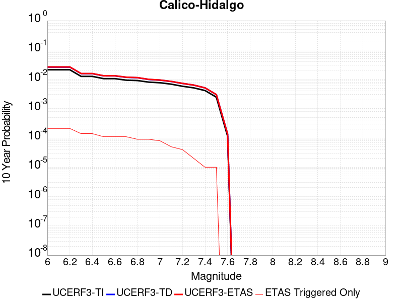 |

| Magnitude | 1 wk TI Prob | 1 wk TD Prob | 1 wk ETAS Prob | 1 wk ETAS/TD Gain | 1 wk ETAS Triggered Only | 1 mo TI Prob | 1 mo TD Prob | 1 mo ETAS Prob | 1 mo ETAS/TD Gain | 1 mo ETAS Triggered Only | 1 yr TI Prob | 1 yr TD Prob | 1 yr ETAS Prob | 1 yr ETAS/TD Gain | 1 yr ETAS Triggered Only | 10 yr TI Prob | 10 yr TD Prob | 10 yr ETAS Prob | 10 yr ETAS/TD Gain | 10 yr ETAS Triggered Only |
|-----|-----|-----|-----|-----|-----|-----|-----|-----|-----|-----|-----|-----|-----|-----|-----|-----|-----|-----|-----|-----|
| 6.0 | 4.0906612E-5 | 5.0703686E-5 | 1.0070115E-4 | 1.9860716 | 5.0E-5 | 1.7530227E-4 | 2.172857E-4 | 2.9726833E-4 | 1.3680989 | 8.0E-5 | 0.0021322158 | 0.002642648 | 0.0028022253 | 1.0603853 | 1.6E-4 | 0.02111873 | 0.026152607 | 0.026357114 | 1.0078198 | 2.1E-4 |
| 6.1 | 4.0906612E-5 | 5.0703686E-5 | 1.0070115E-4 | 1.9860716 | 5.0E-5 | 1.7530227E-4 | 2.172857E-4 | 2.9726833E-4 | 1.3680989 | 8.0E-5 | 0.0021322158 | 0.002642648 | 0.0028022253 | 1.0603853 | 1.6E-4 | 0.02111873 | 0.026152607 | 0.026357114 | 1.0078198 | 2.1E-4 |
| 6.2 | 4.0906612E-5 | 5.0703686E-5 | 1.0070115E-4 | 1.9860716 | 5.0E-5 | 1.7530227E-4 | 2.172857E-4 | 2.9726833E-4 | 1.3680989 | 8.0E-5 | 0.0021322158 | 0.002642648 | 0.0028022253 | 1.0603853 | 1.6E-4 | 0.02111873 | 0.026152607 | 0.026357114 | 1.0078198 | 2.1E-4 |
| 6.3 | 2.4242801E-5 | 3.0090669E-5 | 6.0089766E-5 | 1.9969568 | 3.0E-5 | 1.0389358E-4 | 1.2895382E-4 | 1.7894738E-4 | 1.3876857 | 5.0E-5 | 0.0012641704 | 0.0015689151 | 0.0016787425 | 1.0700022 | 1.1E-4 | 0.01257003 | 0.01558206 | 0.01571988 | 1.0088447 | 1.4E-4 |
| 6.4 | 2.4242801E-5 | 3.0090669E-5 | 6.0089766E-5 | 1.9969568 | 3.0E-5 | 1.0389358E-4 | 1.2895382E-4 | 1.7894738E-4 | 1.3876857 | 5.0E-5 | 0.0012641704 | 0.0015689151 | 0.0016787425 | 1.0700022 | 1.1E-4 | 0.01257003 | 0.01558206 | 0.01571988 | 1.0088447 | 1.4E-4 |
| 6.5 | 2.0286952E-5 | 2.5315738E-5 | 4.531523E-5 | 1.7900023 | 2.0E-5 | 8.694118E-5 | 1.0849161E-4 | 1.4848726E-4 | 1.3686521 | 4.0E-5 | 0.0010579949 | 0.001320102 | 0.0014099833 | 1.0680865 | 9.0E-5 | 0.010529719 | 0.013124538 | 0.0132330945 | 1.0082712 | 1.1E-4 |
| 6.6 | 2.0269223E-5 | 2.5296687E-5 | 4.5296183E-5 | 1.7905973 | 2.0E-5 | 8.6865206E-5 | 1.08409964E-4 | 1.4840563E-4 | 1.3689297 | 4.0E-5 | 0.0010570707 | 0.0013191093 | 0.0014089906 | 1.0681379 | 9.0E-5 | 0.010520565 | 0.013114728 | 0.013223285 | 1.0082775 | 1.1E-4 |
| 6.7 | 1.799852E-5 | 2.25406E-5 | 4.254015E-5 | 1.8872678 | 2.0E-5 | 7.713423E-5 | 9.659908E-5 | 1.3659522E-4 | 1.4140426 | 4.0E-5 | 9.3870464E-4 | 0.0011754738 | 0.001265368 | 1.0764749 | 9.0E-5 | 0.009347493 | 0.011694173 | 0.011802888 | 1.0092964 | 1.1E-4 |
| 6.8 | 1.7458793E-5 | 2.184212E-5 | 4.1841682E-5 | 1.915642 | 2.0E-5 | 7.4821255E-5 | 9.3605806E-5 | 1.3360207E-4 | 1.4272839 | 4.0E-5 | 9.10568E-4 | 0.0011390693 | 0.0012189782 | 1.0701528 | 8.0E-5 | 0.009068459 | 0.011333893 | 0.0114228735 | 1.0078508 | 9.0E-5 |
| 6.9 | 1.542884E-5 | 1.9025927E-5 | 3.9025545E-5 | 2.0511773 | 2.0E-5 | 6.612192E-5 | 8.153721E-5 | 1.2153395E-4 | 1.4905336 | 4.0E-5 | 8.04737E-4 | 9.922766E-4 | 0.0010721972 | 1.0805427 | 8.0E-5 | 0.008018291 | 0.009879857 | 0.009968968 | 1.0090195 | 9.0E-5 |
| 7.0 | 1.468253E-5 | 1.8030598E-5 | 2.803042E-5 | 1.5546027 | 1.0E-5 | 6.292361E-5 | 7.7271776E-5 | 1.0726946E-4 | 1.38821 | 3.0E-5 | 7.658257E-4 | 9.4039086E-4 | 0.001010325 | 1.0743672 | 7.0E-5 | 0.0076319184 | 0.009365481 | 0.009444732 | 1.008462 | 8.0E-5 |
| 7.1 | 1.3139281E-5 | 1.6200942E-5 | 2.620078E-5 | 1.617238 | 1.0E-5 | 5.6309986E-5 | 6.943083E-5 | 8.942944E-5 | 1.2880365 | 2.0E-5 | 6.853584E-4 | 8.4500515E-4 | 8.8497135E-4 | 1.047297 | 4.0E-5 | 0.0068324856 | 0.0084192185 | 0.008468797 | 1.0058888 | 5.0E-5 |
| 7.2 | 1.1127404E-5 | 1.3866597E-5 | 2.3866458E-5 | 1.7211474 | 1.0E-5 | 4.7688E-5 | 5.942698E-5 | 7.9425794E-5 | 1.3365275 | 2.0E-5 | 5.8044674E-4 | 7.232942E-4 | 7.532725E-4 | 1.0414469 | 3.0E-5 | 0.0057893298 | 0.0072105085 | 0.00725022 | 1.0055075 | 4.0E-5 |
| 7.3 | 9.808154E-6 | 1.2176215E-5 | 2.2176093E-5 | 1.8212633 | 1.0E-5 | 4.2034266E-5 | 5.2182797E-5 | 7.218175E-5 | 1.3832481 | 2.0E-5 | 5.11647E-4 | 6.3515105E-4 | 6.5513834E-4 | 1.0314686 | 2.0E-5 | 0.0051047057 | 0.006334433 | 0.0063543064 | 1.0031374 | 2.0E-5 |
| 7.4 | 7.942452E-6 | 9.792144E-6 | 1.9792045E-5 | 2.0212169 | 1.0E-5 | 3.4038632E-5 | 4.1965708E-5 | 5.1965286E-5 | 1.2382798 | 1.0E-5 | 4.1434157E-4 | 5.1082217E-4 | 5.2081706E-4 | 1.0195663 | 1.0E-5 | 0.0041356985 | 0.005097421 | 0.00510737 | 1.0019518 | 1.0E-5 |
| 7.5 | 4.7121216E-6 | 5.772836E-6 | 1.5772779E-5 | 2.7322407 | 1.0E-5 | 2.019465E-5 | 2.4740535E-5 | 3.474029E-5 | 1.4041849 | 1.0E-5 | 2.4584212E-4 | 3.0118204E-4 | 3.1117903E-4 | 1.0331925 | 1.0E-5 | 0.0024557032 | 0.0030084911 | 0.003018461 | 1.0033139 | 1.0E-5 |
| 7.6 | 2.21172E-7 | 2.603961E-7 | 2.603961E-7 | 1.0 | 0.0 | 9.478797E-7 | 1.1159829E-6 | 1.1159829E-6 | 1.0 | 0.0 | 1.1540374E-5 | 1.3587036E-5 | 1.3587036E-5 | 1.0 | 0.0 | 1.1539775E-4 | 1.3586486E-4 | 1.3586486E-4 | 1.0 | 0.0 |

## San Andreas (Creeping Section) 2011 CFM
*[(top)](#table-of-contents)*

| 1 Week | 1 Month | 1 Year | 10 Year |
|-----|-----|-----|-----|
|  |  |  |  |

| Magnitude | 1 wk TI Prob | 1 wk TD Prob | 1 wk ETAS Prob | 1 wk ETAS/TD Gain | 1 wk ETAS Triggered Only | 1 mo TI Prob | 1 mo TD Prob | 1 mo ETAS Prob | 1 mo ETAS/TD Gain | 1 mo ETAS Triggered Only | 1 yr TI Prob | 1 yr TD Prob | 1 yr ETAS Prob | 1 yr ETAS/TD Gain | 1 yr ETAS Triggered Only | 10 yr TI Prob | 10 yr TD Prob | 10 yr ETAS Prob | 10 yr ETAS/TD Gain | 10 yr ETAS Triggered Only |
|-----|-----|-----|-----|-----|-----|-----|-----|-----|-----|-----|-----|-----|-----|-----|-----|-----|-----|-----|-----|-----|
| 6.0 | 5.986481E-4 | 0.001228691 | 0.001298605 | 1.0569012 | 7.0E-5 | 0.0025631124 | 0.005246795 | 0.005336323 | 1.0170634 | 9.0E-5 | 0.030762846 | 0.061203245 | 0.061334677 | 1.0021474 | 1.4E-4 | 0.26835477 | 0.425928 | 0.42604855 | 1.000283 | 2.1E-4 |
| 6.1 | 5.015945E-4 | 0.0010230356 | 0.0010629947 | 1.0390593 | 4.0E-5 | 0.00214792 | 0.004369436 | 0.0044291737 | 1.0136718 | 6.0E-5 | 0.025839351 | 0.051246606 | 0.05135097 | 1.0020365 | 1.1E-4 | 0.23032776 | 0.37284943 | 0.37296233 | 1.0003028 | 1.8E-4 |
| 6.2 | 4.073338E-4 | 8.1157376E-4 | 8.515413E-4 | 1.0492469 | 4.0E-5 | 0.0017445484 | 0.0034683137 | 0.0035281056 | 1.0172395 | 6.0E-5 | 0.021034058 | 0.04093177 | 0.041037265 | 1.0025774 | 1.1E-4 | 0.19150782 | 0.31302592 | 0.31314957 | 1.000395 | 1.8E-4 |
| 6.3 | 3.464099E-4 | 6.7455834E-4 | 7.045381E-4 | 1.0444435 | 3.0E-5 | 0.0014837692 | 0.0028832308 | 0.0029330866 | 1.0172917 | 5.0E-5 | 0.017915873 | 0.034187846 | 0.034274768 | 1.0025425 | 9.0E-5 | 0.16538359 | 0.27130842 | 0.271425 | 1.0004297 | 1.6E-4 |
| 6.4 | 2.935057E-4 | 5.5516965E-4 | 5.85153E-4 | 1.0540075 | 3.0E-5 | 0.0012572751 | 0.0023727308 | 0.0024226122 | 1.0210228 | 5.0E-5 | 0.015200248 | 0.02826279 | 0.028350247 | 1.0030944 | 9.0E-5 | 0.14201577 | 0.23297668 | 0.23309173 | 1.0004939 | 1.5E-4 |
| 6.5 | 2.3409708E-4 | 4.2132285E-4 | 4.5131022E-4 | 1.0711743 | 3.0E-5 | 0.0010028875 | 0.0018017791 | 0.0018516891 | 1.0277003 | 5.0E-5 | 0.012141965 | 0.021586355 | 0.021674411 | 1.0040793 | 9.0E-5 | 0.11499573 | 0.1868149 | 0.18692876 | 1.0006094 | 1.4E-4 |
| 6.6 | 1.5842178E-4 | 2.5068692E-4 | 2.706819E-4 | 1.0797608 | 2.0E-5 | 6.7877385E-4 | 0.0010739256 | 0.0011138826 | 1.0372065 | 4.0E-5 | 0.0082328 | 0.012995283 | 0.013074243 | 1.0060761 | 8.0E-5 | 0.07934396 | 0.12313759 | 0.12325159 | 1.0009258 | 1.3E-4 |
| 6.7 | 1.5616413E-4 | 2.4605254E-4 | 2.6604763E-4 | 1.0812634 | 2.0E-5 | 6.691031E-4 | 0.0010540807 | 0.0010940385 | 1.0379077 | 4.0E-5 | 0.0081159435 | 0.012757154 | 0.012836133 | 1.006191 | 8.0E-5 | 0.0782586 | 0.12116472 | 0.121278964 | 1.000943 | 1.3E-4 |
| 6.8 | 1.5538467E-4 | 2.442914E-4 | 2.6428653E-4 | 1.0818495 | 2.0E-5 | 6.6576427E-4 | 0.001046539 | 0.0010864972 | 1.0381812 | 4.0E-5 | 0.008075596 | 0.012666538 | 0.012745525 | 1.0062358 | 8.0E-5 | 0.07788358 | 0.12039561 | 0.12050995 | 1.0009497 | 1.3E-4 |
| 6.9 | 1.5153569E-4 | 2.3538464E-4 | 2.553799E-4 | 1.0849473 | 2.0E-5 | 6.49277E-4 | 0.0010084033 | 0.0010483629 | 1.0396267 | 4.0E-5 | 0.007876333 | 0.012208726 | 0.01228775 | 1.0064727 | 8.0E-5 | 0.07602952 | 0.11646574 | 0.1165806 | 1.0009862 | 1.3E-4 |
| 7.0 | 1.4588932E-4 | 2.2395732E-4 | 2.4395285E-4 | 1.0892828 | 2.0E-5 | 6.250901E-4 | 9.59466E-4 | 9.994276E-4 | 1.0416498 | 4.0E-5 | 0.0075839474 | 0.011619428 | 0.011698498 | 1.0068051 | 8.0E-5 | 0.073302895 | 0.11131206 | 0.11142759 | 1.0010378 | 1.3E-4 |
| 7.1 | 1.1565079E-4 | 1.6281323E-4 | 1.8280996E-4 | 1.1228201 | 2.0E-5 | 4.955521E-4 | 6.9758523E-4 | 7.375573E-4 | 1.0573007 | 4.0E-5 | 0.006016669 | 0.008460228 | 0.008539551 | 1.009376 | 8.0E-5 | 0.058563538 | 0.08366478 | 0.08378391 | 1.0014238 | 1.3E-4 |
| 7.2 | 1.0393792E-4 | 1.4615392E-4 | 1.66151E-4 | 1.136822 | 2.0E-5 | 4.4537216E-4 | 6.262243E-4 | 6.661993E-4 | 1.0638349 | 4.0E-5 | 0.005408933 | 0.0075977976 | 0.00767719 | 1.0104494 | 8.0E-5 | 0.052791595 | 0.07561503 | 0.075735204 | 1.0015892 | 1.3E-4 |
| 7.3 | 9.332884E-5 | 1.2780601E-4 | 1.4780344E-4 | 1.1564672 | 2.0E-5 | 3.999194E-4 | 5.4762565E-4 | 5.876038E-4 | 1.0730026 | 4.0E-5 | 0.0048581534 | 0.0066470946 | 0.0067265625 | 1.0119554 | 8.0E-5 | 0.047533102 | 0.06647954 | 0.0666009 | 1.0018255 | 1.3E-4 |
| 7.4 | 8.670252E-5 | 1.1702972E-4 | 1.3702737E-4 | 1.1708767 | 2.0E-5 | 3.715293E-4 | 5.014601E-4 | 5.4144004E-4 | 1.079727 | 4.0E-5 | 0.004513991 | 0.0060883067 | 0.0061678197 | 1.01306 | 8.0E-5 | 0.044233937 | 0.061148684 | 0.061270732 | 1.0019959 | 1.3E-4 |
| 7.5 | 7.3036405E-5 | 9.005699E-5 | 1.1005518E-4 | 1.2220616 | 2.0E-5 | 3.129756E-4 | 3.859015E-4 | 4.2588607E-4 | 1.1036134 | 4.0E-5 | 0.0038038217 | 0.0046882504 | 0.004767875 | 1.016984 | 8.0E-5 | 0.03739367 | 0.047875606 | 0.047989864 | 1.0023865 | 1.2E-4 |
| 7.6 | 6.3935775E-5 | 8.280209E-5 | 1.0280043E-4 | 1.2415198 | 2.0E-5 | 2.7398168E-4 | 3.5481792E-4 | 3.9480373E-4 | 1.1126939 | 4.0E-5 | 0.0033306254 | 0.00431137 | 0.0043910253 | 1.0184755 | 8.0E-5 | 0.032811474 | 0.043990135 | 0.044104856 | 1.002608 | 1.2E-4 |
| 7.7 | 5.5050095E-5 | 6.661729E-5 | 8.661596E-5 | 1.3002024 | 2.0E-5 | 2.3590765E-4 | 2.8547147E-4 | 3.2546005E-4 | 1.1400791 | 4.0E-5 | 0.0028683927 | 0.0034700802 | 0.0035298718 | 1.0172306 | 6.0E-5 | 0.0283165 | 0.03579509 | 0.035891507 | 1.0026937 | 1.0E-4 |
| 7.8 | 5.027131E-5 | 6.1627725E-5 | 8.162649E-5 | 1.3245093 | 2.0E-5 | 2.1543067E-4 | 2.640921E-4 | 3.0408154E-4 | 1.1514223 | 4.0E-5 | 0.0026197135 | 0.003210584 | 0.0032604234 | 1.0155234 | 5.0E-5 | 0.025890453 | 0.03312572 | 0.03320307 | 1.0023351 | 8.0E-5 |
| 7.9 | 3.7271806E-5 | 5.0224386E-5 | 7.022338E-5 | 1.3981929 | 2.0E-5 | 1.5972654E-4 | 2.1522962E-4 | 2.4522317E-4 | 1.139356 | 3.0E-5 | 0.0019429359 | 0.0026172737 | 0.002657169 | 1.015243 | 4.0E-5 | 0.019260362 | 0.027066687 | 0.027115334 | 1.0017973 | 5.0E-5 |
| 8.0 | 2.7310243E-5 | 3.1428404E-5 | 5.1427774E-5 | 1.636347 | 2.0E-5 | 1.17038646E-4 | 1.3468621E-4 | 1.6468218E-4 | 1.2227099 | 3.0E-5 | 0.0014240141 | 0.0016385721 | 0.0016785065 | 1.0243715 | 4.0E-5 | 0.014149235 | 0.01721387 | 0.017263008 | 1.0028546 | 5.0E-5 |
| 8.1 | 1.7940547E-5 | 1.7400796E-5 | 2.7400622E-5 | 1.5746764 | 1.0E-5 | 7.688579E-5 | 7.457271E-5 | 9.457122E-5 | 1.2681746 | 2.0E-5 | 9.3568244E-4 | 9.075451E-4 | 9.375179E-4 | 1.0330262 | 3.0E-5 | 0.009317525 | 0.009799073 | 0.009838682 | 1.004042 | 4.0E-5 |
| 8.2 | 8.643924E-6 | 5.4748625E-6 | 5.4748625E-6 | 1.0 | 0.0 | 3.704486E-5 | 2.3463486E-5 | 3.346325E-5 | 1.4261842 | 1.0E-5 | 4.5092785E-4 | 2.8563058E-4 | 3.0562485E-4 | 1.0700005 | 2.0E-5 | 0.0045001395 | 0.0032487072 | 0.0032686424 | 1.0061363 | 2.0E-5 |
| 8.3 | 1.983087E-6 | 7.6599065E-7 | 7.6599065E-7 | 1.0 | 0.0 | 8.498917E-6 | 3.282813E-6 | 3.282813E-6 | 1.0 | 0.0 | 1.034694E-4 | 3.9967534E-5 | 3.9967534E-5 | 1.0 | 0.0 | 0.0010342124 | 4.719687E-4 | 4.719687E-4 | 1.0 | 0.0 |

## Cleghorn Lake
*[(top)](#table-of-contents)*

| 1 Week | 1 Month | 1 Year | 10 Year |
|-----|-----|-----|-----|
| 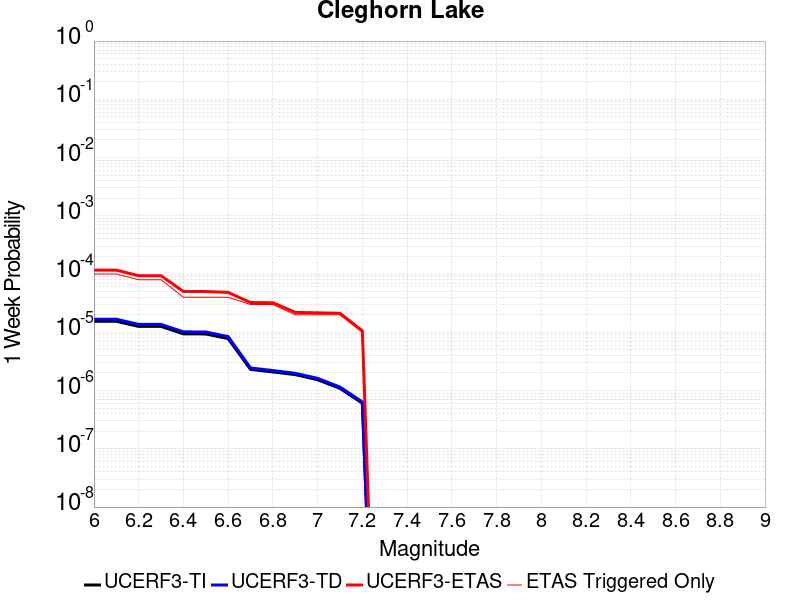 |  |  |  |

| Magnitude | 1 wk TI Prob | 1 wk TD Prob | 1 wk ETAS Prob | 1 wk ETAS/TD Gain | 1 wk ETAS Triggered Only | 1 mo TI Prob | 1 mo TD Prob | 1 mo ETAS Prob | 1 mo ETAS/TD Gain | 1 mo ETAS Triggered Only | 1 yr TI Prob | 1 yr TD Prob | 1 yr ETAS Prob | 1 yr ETAS/TD Gain | 1 yr ETAS Triggered Only | 10 yr TI Prob | 10 yr TD Prob | 10 yr ETAS Prob | 10 yr ETAS/TD Gain | 10 yr ETAS Triggered Only |
|-----|-----|-----|-----|-----|-----|-----|-----|-----|-----|-----|-----|-----|-----|-----|-----|-----|-----|-----|-----|-----|
| 6.0 | 1.5467183E-5 | 1.6794203E-5 | 1.1679252E-4 | 6.954335 | 1.0E-4 | 6.6286244E-5 | 7.197348E-5 | 1.9196485E-4 | 2.6671607 | 1.2E-4 | 8.067362E-4 | 8.759797E-4 | 0.0010358396 | 1.1824926 | 1.6E-4 | 0.008038137 | 0.008730696 | 0.008899211 | 1.0193015 | 1.7E-4 |
| 6.1 | 1.5467183E-5 | 1.6794203E-5 | 1.1679252E-4 | 6.954335 | 1.0E-4 | 6.6286244E-5 | 7.197348E-5 | 1.9196485E-4 | 2.6671607 | 1.2E-4 | 8.067362E-4 | 8.759797E-4 | 0.0010358396 | 1.1824926 | 1.6E-4 | 0.008038137 | 0.008730696 | 0.008899211 | 1.0193015 | 1.7E-4 |
| 6.2 | 1.2624631E-5 | 1.3681544E-5 | 9.368045E-5 | 6.847213 | 8.0E-5 | 5.410444E-5 | 5.863415E-5 | 1.5862829E-4 | 2.705391 | 1.0E-4 | 6.585225E-4 | 7.1368564E-4 | 8.4359286E-4 | 1.182023 | 1.3E-4 | 0.0065657445 | 0.0071187317 | 0.0072577354 | 1.0195265 | 1.4E-4 |
| 6.3 | 1.2624631E-5 | 1.3681544E-5 | 9.368045E-5 | 6.847213 | 8.0E-5 | 5.410444E-5 | 5.863415E-5 | 1.5862829E-4 | 2.705391 | 1.0E-4 | 6.585225E-4 | 7.1368564E-4 | 8.4359286E-4 | 1.182023 | 1.3E-4 | 0.0065657445 | 0.0071187317 | 0.0072577354 | 1.0195265 | 1.4E-4 |
| 6.4 | 9.417684E-6 | 1.0170118E-5 | 5.016971E-5 | 4.933051 | 4.0E-5 | 4.036088E-5 | 4.3585722E-5 | 9.358354E-5 | 2.1471148 | 5.0E-5 | 4.912829E-4 | 5.3056807E-4 | 6.105256E-4 | 1.1507018 | 8.0E-5 | 0.004901982 | 0.005297049 | 0.0053766253 | 1.0150228 | 8.0E-5 |
| 6.5 | 9.368219E-6 | 1.0117545E-5 | 5.0117138E-5 | 4.9534883 | 4.0E-5 | 4.014889E-5 | 4.3360415E-5 | 9.335825E-5 | 2.1530755 | 5.0E-5 | 4.8870314E-4 | 5.2782625E-4 | 6.07784E-4 | 1.151485 | 8.0E-5 | 0.004876298 | 0.0052697617 | 0.00534934 | 1.015101 | 8.0E-5 |
| 6.6 | 7.803798E-6 | 8.441831E-6 | 4.8441492E-5 | 5.7382684 | 4.0E-5 | 3.3444423E-5 | 3.6179E-5 | 8.617719E-5 | 2.3819673 | 5.0E-5 | 4.0710976E-4 | 4.4043022E-4 | 5.103994E-4 | 1.1588655 | 7.0E-5 | 0.0040636472 | 0.0043994905 | 0.0044691823 | 1.0158409 | 7.0E-5 |
| 6.7 | 2.3108669E-6 | 2.4438336E-6 | 3.244376E-5 | 13.275764 | 3.0E-5 | 9.903678E-6 | 1.0473532E-5 | 4.0473216E-5 | 3.8643334 | 3.0E-5 | 1.205706E-4 | 1.2750797E-4 | 1.5750415E-4 | 1.2352494 | 3.0E-5 | 0.001205052 | 0.0012743667 | 0.0013043286 | 1.023511 | 3.0E-5 |
| 6.8 | 2.0882828E-6 | 2.2062823E-6 | 3.2206215E-5 | 14.597506 | 3.0E-5 | 8.949753E-6 | 9.455462E-6 | 3.945518E-5 | 4.1727395 | 3.0E-5 | 1.08957785E-4 | 1.1511434E-4 | 1.4511088E-4 | 1.2605804 | 3.0E-5 | 0.0010890438 | 0.0011505639 | 0.0011805294 | 1.0260441 | 3.0E-5 |
| 6.9 | 1.876935E-6 | 1.981051E-6 | 2.1981012E-5 | 11.095632 | 2.0E-5 | 8.043982E-6 | 8.490192E-6 | 2.8490022E-5 | 3.3556395 | 2.0E-5 | 9.7931086E-5 | 1.03363345E-4 | 1.2336127E-4 | 1.1934721 | 2.0E-5 | 9.788794E-4 | 0.0010331686 | 0.001053148 | 1.0193379 | 2.0E-5 |
| 7.0 | 1.5357559E-6 | 1.6202807E-6 | 2.1620248E-5 | 13.34352 | 2.0E-5 | 6.5817944E-6 | 6.9440425E-6 | 2.6943904E-5 | 3.8801467 | 2.0E-5 | 8.01304E-5 | 8.454057E-5 | 1.0453887E-4 | 1.2365528 | 2.0E-5 | 8.010151E-4 | 8.450965E-4 | 8.650796E-4 | 1.0236459 | 2.0E-5 |
| 7.1 | 1.0905424E-6 | 1.1497619E-6 | 2.1149739E-5 | 18.394884 | 2.0E-5 | 4.6737446E-6 | 4.9275427E-6 | 2.4927444E-5 | 5.0587983 | 2.0E-5 | 5.6901354E-5 | 5.999128E-5 | 7.999008E-5 | 1.3333617 | 2.0E-5 | 5.6886784E-4 | 5.997606E-4 | 6.197486E-4 | 1.0333266 | 2.0E-5 |
| 7.2 | 6.06668E-7 | 6.387277E-7 | 1.06387215E-5 | 16.656113 | 1.0E-5 | 2.600003E-6 | 2.7374022E-6 | 1.2737375E-5 | 4.6530886 | 1.0E-5 | 3.1654577E-5 | 3.3327433E-5 | 4.3327098E-5 | 1.3000431 | 1.0E-5 | 3.1650066E-4 | 3.3323118E-4 | 3.4322785E-4 | 1.0299993 | 1.0E-5 |

## Santa Ynez (East)
*[(top)](#table-of-contents)*

| 1 Week | 1 Month | 1 Year | 10 Year |
|-----|-----|-----|-----|
|  |  |  |  |

| Magnitude | 1 wk TI Prob | 1 wk TD Prob | 1 wk ETAS Prob | 1 wk ETAS/TD Gain | 1 wk ETAS Triggered Only | 1 mo TI Prob | 1 mo TD Prob | 1 mo ETAS Prob | 1 mo ETAS/TD Gain | 1 mo ETAS Triggered Only | 1 yr TI Prob | 1 yr TD Prob | 1 yr ETAS Prob | 1 yr ETAS/TD Gain | 1 yr ETAS Triggered Only | 10 yr TI Prob | 10 yr TD Prob | 10 yr ETAS Prob | 10 yr ETAS/TD Gain | 10 yr ETAS Triggered Only |
|-----|-----|-----|-----|-----|-----|-----|-----|-----|-----|-----|-----|-----|-----|-----|-----|-----|-----|-----|-----|-----|
| 6.0 | 3.2269712E-5 | 3.67505E-5 | 1.0674793E-4 | 2.904666 | 7.0E-5 | 1.3829143E-4 | 1.5749598E-4 | 2.6747864E-4 | 1.6983205 | 1.1E-4 | 0.0016823979 | 0.0019164166 | 0.0020461674 | 1.0677049 | 1.3E-4 | 0.016697178 | 0.019056441 | 0.019213391 | 1.0082362 | 1.6E-4 |
| 6.1 | 3.2269712E-5 | 3.67505E-5 | 1.0674793E-4 | 2.904666 | 7.0E-5 | 1.3829143E-4 | 1.5749598E-4 | 2.6747864E-4 | 1.6983205 | 1.1E-4 | 0.0016823979 | 0.0019164166 | 0.0020461674 | 1.0677049 | 1.3E-4 | 0.016697178 | 0.019056441 | 0.019213391 | 1.0082362 | 1.6E-4 |
| 6.2 | 3.2269712E-5 | 3.67505E-5 | 1.0674793E-4 | 2.904666 | 7.0E-5 | 1.3829143E-4 | 1.5749598E-4 | 2.6747864E-4 | 1.6983205 | 1.1E-4 | 0.0016823979 | 0.0019164166 | 0.0020461674 | 1.0677049 | 1.3E-4 | 0.016697178 | 0.019056441 | 0.019213391 | 1.0082362 | 1.6E-4 |
| 6.3 | 3.2269712E-5 | 3.67505E-5 | 1.0674793E-4 | 2.904666 | 7.0E-5 | 1.3829143E-4 | 1.5749598E-4 | 2.6747864E-4 | 1.6983205 | 1.1E-4 | 0.0016823979 | 0.0019164166 | 0.0020461674 | 1.0677049 | 1.3E-4 | 0.016697178 | 0.019056441 | 0.019213391 | 1.0082362 | 1.6E-4 |
| 6.4 | 1.4404779E-5 | 1.4849382E-5 | 4.4848937E-5 | 3.020256 | 3.0E-5 | 6.1733306E-5 | 6.363868E-5 | 1.2363486E-4 | 1.9427627 | 6.0E-5 | 7.513438E-4 | 7.745306E-4 | 8.444764E-4 | 1.0903074 | 7.0E-5 | 0.0074880854 | 0.007718862 | 0.007808167 | 1.0115697 | 9.0E-5 |
| 6.5 | 1.4404779E-5 | 1.4849382E-5 | 4.4848937E-5 | 3.020256 | 3.0E-5 | 6.1733306E-5 | 6.363868E-5 | 1.2363486E-4 | 1.9427627 | 6.0E-5 | 7.513438E-4 | 7.745306E-4 | 8.444764E-4 | 1.0903074 | 7.0E-5 | 0.0074880854 | 0.007718862 | 0.007808167 | 1.0115697 | 9.0E-5 |
| 6.6 | 1.280208E-5 | 1.3011947E-5 | 3.3011685E-5 | 2.537029 | 2.0E-5 | 5.4864904E-5 | 5.5764307E-5 | 1.05761515E-4 | 1.8965809 | 5.0E-5 | 6.6777546E-4 | 6.787207E-4 | 7.3867996E-4 | 1.0883416 | 6.0E-5 | 0.006657724 | 0.0067666885 | 0.006846147 | 1.0117426 | 8.0E-5 |
| 6.7 | 1.2457027E-5 | 1.2628468E-5 | 3.2628213E-5 | 2.5837035 | 2.0E-5 | 5.3386164E-5 | 5.412089E-5 | 1.0411818E-4 | 1.9238076 | 5.0E-5 | 6.497827E-4 | 6.587243E-4 | 7.1868475E-4 | 1.0910251 | 6.0E-5 | 0.00647886 | 0.006567915 | 0.0066473894 | 1.0121005 | 8.0E-5 |
| 6.8 | 1.2095134E-5 | 1.2230915E-5 | 3.223067E-5 | 2.6351807 | 2.0E-5 | 5.1835254E-5 | 5.241716E-5 | 1.0241454E-4 | 1.9538361 | 5.0E-5 | 6.309115E-4 | 6.379937E-4 | 6.979554E-4 | 1.0939848 | 6.0E-5 | 0.0062912325 | 0.006361809 | 0.0064413003 | 1.012495 | 8.0E-5 |
| 6.9 | 1.1104036E-5 | 1.1157347E-5 | 2.1157235E-5 | 1.8962604 | 1.0E-5 | 4.758786E-5 | 4.781633E-5 | 7.78149E-5 | 1.6273707 | 3.0E-5 | 5.7922816E-4 | 5.820096E-4 | 6.2198634E-4 | 1.0686874 | 4.0E-5 | 0.005777207 | 0.0058049993 | 0.005864651 | 1.010276 | 6.0E-5 |
| 7.0 | 1.0577444E-5 | 1.058168E-5 | 2.0581574E-5 | 1.9450195 | 1.0E-5 | 4.5331115E-5 | 4.5349276E-5 | 7.534792E-5 | 1.661502 | 3.0E-5 | 5.5176654E-4 | 5.519888E-4 | 5.919667E-4 | 1.0724252 | 4.0E-5 | 0.0055039856 | 0.0055063153 | 0.00555604 | 1.0090305 | 5.0E-5 |
| 7.1 | 1.0021775E-5 | 9.980988E-6 | 1.9980887E-5 | 2.001895 | 1.0E-5 | 4.294976E-5 | 4.2774966E-5 | 7.2773684E-5 | 1.7013148 | 3.0E-5 | 5.2278786E-4 | 5.2066194E-4 | 5.606411E-4 | 1.0767853 | 4.0E-5 | 0.0052155964 | 0.0051945536 | 0.0052442937 | 1.0095755 | 5.0E-5 |
| 7.2 | 8.874109E-6 | 8.748793E-6 | 1.8748706E-5 | 2.1430047 | 1.0E-5 | 3.8031343E-5 | 3.7494297E-5 | 5.7493548E-5 | 1.5333945 | 2.0E-5 | 4.629332E-4 | 4.5639853E-4 | 4.8638484E-4 | 1.0657021 | 3.0E-5 | 0.0046197 | 0.0045547304 | 0.004594548 | 1.0087421 | 4.0E-5 |
| 7.3 | 7.5504267E-6 | 7.5051175E-6 | 1.7505043E-5 | 2.3324142 | 1.0E-5 | 3.235857E-5 | 3.21644E-5 | 5.2163756E-5 | 1.6217855 | 2.0E-5 | 3.9389438E-4 | 3.915322E-4 | 4.2152047E-4 | 1.0765921 | 3.0E-5 | 0.0039319694 | 0.003908531 | 0.0039483747 | 1.0101941 | 4.0E-5 |
| 7.4 | 6.309394E-6 | 6.1831556E-6 | 1.6183094E-5 | 2.6172872 | 1.0E-5 | 2.703998E-5 | 2.6498974E-5 | 4.6498444E-5 | 1.7547262 | 2.0E-5 | 3.2916202E-4 | 3.225782E-4 | 3.5256855E-4 | 1.0929707 | 3.0E-5 | 0.003286749 | 0.003221197 | 0.0032610681 | 1.0123777 | 4.0E-5 |
| 7.5 | 4.6103073E-6 | 4.4408903E-6 | 4.4408903E-6 | 1.0 | 0.0 | 1.975831E-5 | 1.9032252E-5 | 1.9032252E-5 | 1.0 | 0.0 | 2.4053088E-4 | 2.3169373E-4 | 2.3169373E-4 | 1.0 | 0.0 | 0.002402707 | 0.002314591 | 0.002324568 | 1.0043104 | 1.0E-5 |
| 7.6 | 1.2858658E-6 | 1.3008173E-6 | 1.3008173E-6 | 1.0 | 0.0 | 5.5108417E-6 | 5.5749197E-6 | 5.5749197E-6 | 1.0 | 0.0 | 6.7092435E-5 | 6.78726E-5 | 6.78726E-5 | 1.0 | 0.0 | 6.707218E-4 | 6.785256E-4 | 6.785256E-4 | 1.0 | 0.0 |
| 7.7 | 5.3302307E-7 | 5.612138E-7 | 5.612138E-7 | 1.0 | 0.0 | 2.2843826E-6 | 2.4052001E-6 | 2.4052001E-6 | 1.0 | 0.0 | 2.7812002E-5 | 2.9282954E-5 | 2.9282954E-5 | 1.0 | 0.0 | 2.7808524E-4 | 2.9279452E-4 | 2.9279452E-4 | 1.0 | 0.0 |
| 7.8 | 4.613933E-8 | 4.80301E-8 | 4.80301E-8 | 1.0 | 0.0 | 1.9773998E-7 | 2.0584326E-7 | 2.0584326E-7 | 1.0 | 0.0 | 2.4074816E-6 | 2.5061388E-6 | 2.5061388E-6 | 1.0 | 0.0 | 2.4074554E-5 | 2.5061116E-5 | 2.5061116E-5 | 1.0 | 0.0 |

## San Andreas (San Gorgonio Pass-Garnet HIll)
*[(top)](#table-of-contents)*

| 1 Week | 1 Month | 1 Year | 10 Year |
|-----|-----|-----|-----|
| 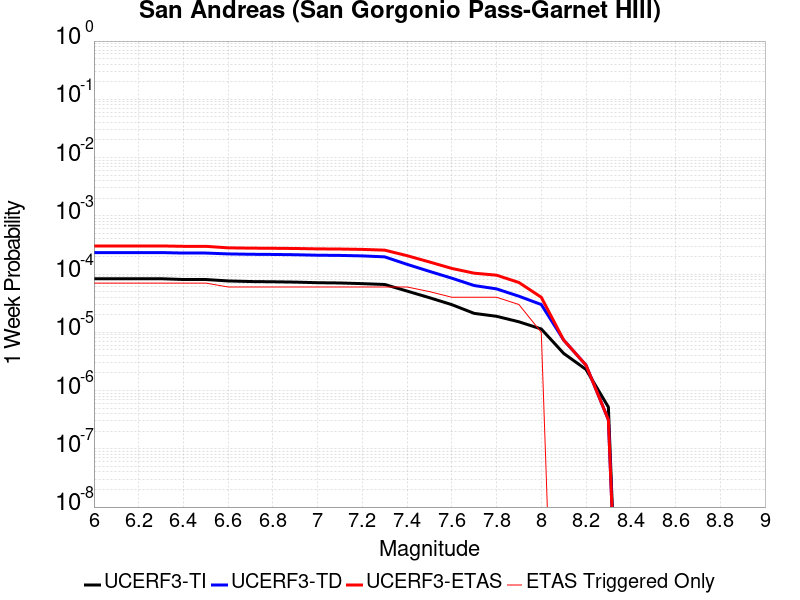 |  |  |  |

| Magnitude | 1 wk TI Prob | 1 wk TD Prob | 1 wk ETAS Prob | 1 wk ETAS/TD Gain | 1 wk ETAS Triggered Only | 1 mo TI Prob | 1 mo TD Prob | 1 mo ETAS Prob | 1 mo ETAS/TD Gain | 1 mo ETAS Triggered Only | 1 yr TI Prob | 1 yr TD Prob | 1 yr ETAS Prob | 1 yr ETAS/TD Gain | 1 yr ETAS Triggered Only | 10 yr TI Prob | 10 yr TD Prob | 10 yr ETAS Prob | 10 yr ETAS/TD Gain | 10 yr ETAS Triggered Only |
|-----|-----|-----|-----|-----|-----|-----|-----|-----|-----|-----|-----|-----|-----|-----|-----|-----|-----|-----|-----|-----|
| 6.0 | 8.31567E-5 | 2.3382473E-4 | 3.0380837E-4 | 1.2992995 | 7.0E-5 | 3.5633717E-4 | 0.0010017233 | 0.0010716532 | 1.0698096 | 7.0E-5 | 0.004329778 | 0.012127888 | 0.012266191 | 1.0114037 | 1.4E-4 | 0.042463828 | 0.11257892 | 0.11274753 | 1.0014977 | 1.9E-4 |
| 6.1 | 8.31567E-5 | 2.3382473E-4 | 3.0380837E-4 | 1.2992995 | 7.0E-5 | 3.5633717E-4 | 0.0010017233 | 0.0010716532 | 1.0698096 | 7.0E-5 | 0.004329778 | 0.012127888 | 0.012266191 | 1.0114037 | 1.4E-4 | 0.042463828 | 0.11257892 | 0.11274753 | 1.0014977 | 1.9E-4 |
| 6.2 | 8.31567E-5 | 2.3382473E-4 | 3.0380837E-4 | 1.2992995 | 7.0E-5 | 3.5633717E-4 | 0.0010017233 | 0.0010716532 | 1.0698096 | 7.0E-5 | 0.004329778 | 0.012127888 | 0.012266191 | 1.0114037 | 1.4E-4 | 0.042463828 | 0.11257892 | 0.11274753 | 1.0014977 | 1.9E-4 |
| 6.3 | 8.31567E-5 | 2.3382473E-4 | 3.0380837E-4 | 1.2992995 | 7.0E-5 | 3.5633717E-4 | 0.0010017233 | 0.0010716532 | 1.0698096 | 7.0E-5 | 0.004329778 | 0.012127888 | 0.012266191 | 1.0114037 | 1.4E-4 | 0.042463828 | 0.11257892 | 0.11274753 | 1.0014977 | 1.9E-4 |
| 6.4 | 8.059055E-5 | 2.2940808E-4 | 2.9939204E-4 | 1.3050631 | 7.0E-5 | 3.4534236E-4 | 9.828096E-4 | 0.0010527407 | 1.0711544 | 7.0E-5 | 0.0041964394 | 0.011900152 | 0.012038486 | 1.0116246 | 1.4E-4 | 0.041180745 | 0.11056015 | 0.11072914 | 1.0015285 | 1.9E-4 |
| 6.5 | 8.059055E-5 | 2.2940808E-4 | 2.9939204E-4 | 1.3050631 | 7.0E-5 | 3.4534236E-4 | 9.828096E-4 | 0.0010527407 | 1.0711544 | 7.0E-5 | 0.0041964394 | 0.011900152 | 0.012038486 | 1.0116246 | 1.4E-4 | 0.041180745 | 0.11056015 | 0.11072914 | 1.0015285 | 1.9E-4 |
| 6.6 | 7.619237E-5 | 2.218517E-4 | 2.8183838E-4 | 1.270391 | 6.0E-5 | 3.2649786E-4 | 9.5044886E-4 | 0.0010103919 | 1.063068 | 6.0E-5 | 0.0039678677 | 0.01151087 | 0.011639373 | 1.0111637 | 1.3E-4 | 0.03897764 | 0.10709683 | 0.10725755 | 1.0015007 | 1.8E-4 |
| 6.7 | 7.440636E-5 | 2.1860997E-4 | 2.7859685E-4 | 1.2744014 | 6.0E-5 | 3.188454E-4 | 9.3656575E-4 | 9.965096E-4 | 1.0640038 | 6.0E-5 | 0.0038750346 | 0.011343609 | 0.011472134 | 1.0113302 | 1.3E-4 | 0.038081564 | 0.105605274 | 0.10576627 | 1.0015244 | 1.8E-4 |
| 6.8 | 7.3735864E-5 | 2.1708169E-4 | 2.7706867E-4 | 1.2763337 | 6.0E-5 | 3.1597257E-4 | 9.3002064E-4 | 9.899648E-4 | 1.0644547 | 6.0E-5 | 0.0038401815 | 0.011264749 | 0.011393284 | 1.0114105 | 1.3E-4 | 0.03774495 | 0.10490683 | 0.105067946 | 1.0015358 | 1.8E-4 |
| 6.9 | 7.27575E-5 | 2.1477141E-4 | 2.7475852E-4 | 1.2793068 | 6.0E-5 | 3.117806E-4 | 9.201265E-4 | 9.800713E-4 | 1.0651485 | 6.0E-5 | 0.003789323 | 0.011145527 | 0.011274077 | 1.0115339 | 1.3E-4 | 0.037253562 | 0.103854746 | 0.10401605 | 1.0015532 | 1.8E-4 |
| 7.0 | 7.102591E-5 | 2.1061185E-4 | 2.705992E-4 | 1.2848243 | 6.0E-5 | 3.0436125E-4 | 9.023122E-4 | 9.622581E-4 | 1.0664358 | 6.0E-5 | 0.003699303 | 0.010930831 | 0.01105941 | 1.011763 | 1.3E-4 | 0.03638325 | 0.10195695 | 0.1021186 | 1.0015855 | 1.8E-4 |
| 7.1 | 7.028513E-5 | 2.0896831E-4 | 2.6895577E-4 | 1.2870649 | 6.0E-5 | 3.0118722E-4 | 8.9527335E-4 | 9.552196E-4 | 1.0669587 | 6.0E-5 | 0.0036607897 | 0.010845989 | 0.0109745795 | 1.011856 | 1.3E-4 | 0.036010686 | 0.101199985 | 0.10136177 | 1.0015987 | 1.8E-4 |
| 7.2 | 6.8498244E-5 | 2.0504706E-4 | 2.6503476E-4 | 1.2925557 | 6.0E-5 | 2.9353087E-4 | 8.784794E-4 | 9.384267E-4 | 1.0682398 | 6.0E-5 | 0.003567883 | 0.010643536 | 0.010772153 | 1.012084 | 1.3E-4 | 0.035111405 | 0.09939202 | 0.09955413 | 1.001631 | 1.8E-4 |
| 7.3 | 6.622592E-5 | 1.9732013E-4 | 2.5730827E-4 | 1.3040144 | 6.0E-5 | 2.8379448E-4 | 8.453858E-4 | 9.0533507E-4 | 1.0709136 | 6.0E-5 | 0.0034497243 | 0.0102444785 | 0.010373147 | 1.0125598 | 1.3E-4 | 0.033966612 | 0.095888525 | 0.09605127 | 1.0016972 | 1.8E-4 |
| 7.4 | 5.1050705E-5 | 1.4689034E-4 | 2.0688152E-4 | 1.408408 | 6.0E-5 | 2.1877038E-4 | 6.29379E-4 | 6.893412E-4 | 1.0952721 | 6.0E-5 | 0.002660276 | 0.0076359594 | 0.0077550435 | 1.0155951 | 1.2E-4 | 0.02628654 | 0.07286301 | 0.07302063 | 1.0021632 | 1.7E-4 |
| 7.5 | 3.9302922E-5 | 1.1129847E-4 | 1.612929E-4 | 1.4491925 | 5.0E-5 | 1.6843023E-4 | 4.7690657E-4 | 5.268827E-4 | 1.1047924 | 5.0E-5 | 0.0020487092 | 0.005790949 | 0.0058804275 | 1.0154516 | 9.0E-5 | 0.020299247 | 0.05600951 | 0.05613223 | 1.0021911 | 1.3E-4 |
| 7.6 | 2.9851626E-5 | 8.4949745E-5 | 1.2494634E-4 | 1.4708266 | 4.0E-5 | 1.2792926E-4 | 3.6401965E-4 | 4.0400508E-4 | 1.1098442 | 4.0E-5 | 0.0015564259 | 0.0044229585 | 0.0045026047 | 1.0180074 | 8.0E-5 | 0.0154556995 | 0.04319374 | 0.043308556 | 1.0026581 | 1.2E-4 |
| 7.7 | 2.1135214E-5 | 6.3529005E-5 | 1.0352646E-4 | 1.6295937 | 4.0E-5 | 9.0576345E-5 | 2.7223877E-4 | 3.1222787E-4 | 1.1468898 | 4.0E-5 | 0.0011022091 | 0.0033094748 | 0.0033792432 | 1.0210814 | 7.0E-5 | 0.010967582 | 0.032582592 | 0.03268901 | 1.003266 | 1.1E-4 |
| 7.8 | 1.883379E-5 | 5.564028E-5 | 9.563805E-5 | 1.7188636 | 4.0E-5 | 8.0713755E-5 | 2.3843657E-4 | 2.7842703E-4 | 1.1677195 | 4.0E-5 | 9.822468E-4 | 0.0028991038 | 0.0029689008 | 1.0240754 | 7.0E-5 | 0.0097791655 | 0.028695205 | 0.02880205 | 1.0037234 | 1.1E-4 |
| 7.9 | 1.5156185E-5 | 4.1658426E-5 | 7.1657174E-5 | 1.7201124 | 3.0E-5 | 6.495346E-5 | 1.785239E-4 | 2.0851854E-4 | 1.1680148 | 3.0E-5 | 7.9052144E-4 | 0.0021713632 | 0.0022312328 | 1.0275724 | 6.0E-5 | 0.007877152 | 0.021759422 | 0.021847464 | 1.0040461 | 9.0E-5 |
| 8.0 | 1.1405907E-5 | 2.9974231E-5 | 3.9973933E-5 | 1.3336099 | 1.0E-5 | 4.8881542E-5 | 1.2845467E-4 | 1.3845338E-4 | 1.0778384 | 1.0E-5 | 5.9497025E-4 | 0.0015628147 | 0.0015927678 | 1.0191661 | 3.0E-5 | 0.005933798 | 0.015772851 | 0.015822062 | 1.00312 | 5.0E-5 |
| 8.1 | 4.3511436E-6 | 7.369219E-6 | 7.369219E-6 | 1.0 | 0.0 | 1.8647626E-5 | 3.1581985E-5 | 3.1581985E-5 | 1.0 | 0.0 | 2.2701119E-4 | 3.8444297E-4 | 3.9443912E-4 | 1.0260017 | 1.0E-5 | 0.0022677942 | 0.0041163345 | 0.004136252 | 1.0048387 | 2.0E-5 |
| 8.2 | 2.3042528E-6 | 2.7329415E-6 | 2.7329415E-6 | 1.0 | 0.0 | 9.875332E-6 | 1.1712554E-5 | 1.1712554E-5 | 1.0 | 0.0 | 1.2022553E-4 | 1.4259106E-4 | 1.5258964E-4 | 1.0701206 | 1.0E-5 | 0.0012016051 | 0.0015979785 | 0.0016079627 | 1.0062479 | 1.0E-5 |
| 8.3 | 5.202968E-7 | 3.1598344E-7 | 3.1598344E-7 | 1.0 | 0.0 | 2.2298414E-6 | 1.3542141E-6 | 1.3542141E-6 | 1.0 | 0.0 | 2.714798E-5 | 1.6487444E-5 | 1.6487444E-5 | 1.0 | 0.0 | 2.7144665E-4 | 1.9563142E-4 | 1.9563142E-4 | 1.0 | 0.0 |

## Baker
*[(top)](#table-of-contents)*

| 1 Week | 1 Month | 1 Year | 10 Year |
|-----|-----|-----|-----|
|  |  |  |  |

| Magnitude | 1 wk TI Prob | 1 wk TD Prob | 1 wk ETAS Prob | 1 wk ETAS/TD Gain | 1 wk ETAS Triggered Only | 1 mo TI Prob | 1 mo TD Prob | 1 mo ETAS Prob | 1 mo ETAS/TD Gain | 1 mo ETAS Triggered Only | 1 yr TI Prob | 1 yr TD Prob | 1 yr ETAS Prob | 1 yr ETAS/TD Gain | 1 yr ETAS Triggered Only | 10 yr TI Prob | 10 yr TD Prob | 10 yr ETAS Prob | 10 yr ETAS/TD Gain | 10 yr ETAS Triggered Only |
|-----|-----|-----|-----|-----|-----|-----|-----|-----|-----|-----|-----|-----|-----|-----|-----|-----|-----|-----|-----|-----|
| 6.0 | 5.695525E-6 | 5.8348373E-6 | 4.5834604E-5 | 7.8553357 | 4.0E-5 | 2.4409164E-5 | 2.5006228E-5 | 8.500473E-5 | 3.3993423 | 6.0E-5 | 2.9714106E-4 | 3.044123E-4 | 3.8438794E-4 | 1.2627214 | 8.0E-5 | 0.0029674405 | 0.0030403486 | 0.003209832 | 1.0557446 | 1.7E-4 |
| 6.1 | 5.695525E-6 | 5.8348373E-6 | 4.5834604E-5 | 7.8553357 | 4.0E-5 | 2.4409164E-5 | 2.5006228E-5 | 8.500473E-5 | 3.3993423 | 6.0E-5 | 2.9714106E-4 | 3.044123E-4 | 3.8438794E-4 | 1.2627214 | 8.0E-5 | 0.0029674405 | 0.0030403486 | 0.003209832 | 1.0557446 | 1.7E-4 |
| 6.2 | 5.695525E-6 | 5.8348373E-6 | 4.5834604E-5 | 7.8553357 | 4.0E-5 | 2.4409164E-5 | 2.5006228E-5 | 8.500473E-5 | 3.3993423 | 6.0E-5 | 2.9714106E-4 | 3.044123E-4 | 3.8438794E-4 | 1.2627214 | 8.0E-5 | 0.0029674405 | 0.0030403486 | 0.003209832 | 1.0557446 | 1.7E-4 |
| 6.3 | 3.2995713E-6 | 3.383667E-6 | 3.3383567E-5 | 9.866091 | 3.0E-5 | 1.4140943E-5 | 1.4501353E-5 | 6.450063E-5 | 4.447904 | 5.0E-5 | 1.7215237E-4 | 1.7654014E-4 | 2.4652778E-4 | 1.3964404 | 7.0E-5 | 0.0017201907 | 0.001764046 | 0.0018838344 | 1.0679054 | 1.2E-4 |
| 6.4 | 3.2995713E-6 | 3.383667E-6 | 3.3383567E-5 | 9.866091 | 3.0E-5 | 1.4140943E-5 | 1.4501353E-5 | 6.450063E-5 | 4.447904 | 5.0E-5 | 1.7215237E-4 | 1.7654014E-4 | 2.4652778E-4 | 1.3964404 | 7.0E-5 | 0.0017201907 | 0.001764046 | 0.0018838344 | 1.0679054 | 1.2E-4 |
| 6.5 | 2.782202E-6 | 2.8558404E-6 | 3.2855754E-5 | 11.504759 | 3.0E-5 | 1.1923668E-5 | 1.223926E-5 | 6.223865E-5 | 5.085164 | 5.0E-5 | 1.4516099E-4 | 1.4900314E-4 | 2.189927E-4 | 1.4697188 | 7.0E-5 | 0.001450662 | 0.0014890651 | 0.0015989012 | 1.0737618 | 1.1E-4 |
| 6.6 | 2.3163404E-6 | 2.38092E-6 | 3.238085E-5 | 13.600142 | 3.0E-5 | 9.927136E-6 | 1.0203904E-5 | 5.0203496E-5 | 4.920028 | 4.0E-5 | 1.20856166E-4 | 1.2422565E-4 | 1.842182E-4 | 1.482932 | 6.0E-5 | 0.0012079047 | 0.0012415823 | 0.0013314706 | 1.0723982 | 9.0E-5 |
| 6.7 | 2.037056E-6 | 2.0965003E-6 | 3.209644E-5 | 15.30953 | 3.0E-5 | 8.7302105E-6 | 8.984972E-6 | 4.8984613E-5 | 5.451838 | 4.0E-5 | 1.0628513E-4 | 1.093867E-4 | 1.6938015E-4 | 1.5484527 | 6.0E-5 | 0.0010623431 | 0.0010933448 | 0.0011832464 | 1.0822262 | 9.0E-5 |
| 6.8 | 1.8356744E-6 | 1.8915287E-6 | 3.189147E-5 | 16.860157 | 3.0E-5 | 7.867153E-6 | 8.106527E-6 | 4.81062E-5 | 5.9342556 | 4.0E-5 | 9.577837E-5 | 9.869264E-5 | 1.5868671E-4 | 1.6078881 | 6.0E-5 | 9.57371E-4 | 9.86502E-4 | 0.0010664231 | 1.0810146 | 8.0E-5 |
| 6.9 | 1.6310546E-6 | 1.6832072E-6 | 3.1683157E-5 | 18.823088 | 3.0E-5 | 6.9902153E-6 | 7.213726E-6 | 4.7213438E-5 | 6.544945 | 4.0E-5 | 8.510255E-5 | 8.782368E-5 | 1.4781841E-4 | 1.683127 | 6.0E-5 | 8.5069967E-4 | 8.7790104E-4 | 9.578308E-4 | 1.0910465 | 8.0E-5 |
| 7.0 | 1.2058036E-6 | 1.2508665E-6 | 3.1250827E-5 | 24.983343 | 3.0E-5 | 5.1677193E-6 | 5.3608455E-6 | 4.536063E-5 | 8.46147 | 4.0E-5 | 6.291517E-5 | 6.5266366E-5 | 1.2526245E-4 | 1.9192497 | 6.0E-5 | 6.289736E-4 | 6.524743E-4 | 7.224286E-4 | 1.107214 | 7.0E-5 |
| 7.1 | 1.052382E-6 | 1.0951609E-6 | 2.1095138E-5 | 19.262138 | 2.0E-5 | 4.5102006E-6 | 4.693538E-6 | 3.4693396E-5 | 7.3917365 | 3.0E-5 | 5.491031E-5 | 5.7142337E-5 | 1.0713948E-4 | 1.8749579 | 5.0E-5 | 5.4896745E-4 | 5.7127734E-4 | 6.3124305E-4 | 1.1049678 | 6.0E-5 |
| 7.2 | 1.0067454E-6 | 1.0487711E-6 | 2.104875E-5 | 20.06992 | 2.0E-5 | 4.3146156E-6 | 4.4947255E-6 | 3.449459E-5 | 7.67446 | 3.0E-5 | 5.252918E-5 | 5.4721917E-5 | 1.0471918E-4 | 1.9136606 | 5.0E-5 | 5.251676E-4 | 5.470853E-4 | 6.0705247E-4 | 1.1096121 | 6.0E-5 |
| 7.3 | 9.3596316E-7 | 9.767723E-7 | 2.0976753E-5 | 21.47558 | 2.0E-5 | 4.0112645E-6 | 4.1861604E-6 | 3.4186036E-5 | 8.166442 | 3.0E-5 | 4.8836053E-5 | 5.096532E-5 | 1.00962774E-4 | 1.9810092 | 5.0E-5 | 4.8825322E-4 | 5.095371E-4 | 5.5951165E-4 | 1.0980783 | 5.0E-5 |
| 7.4 | 8.8117395E-7 | 9.2076635E-7 | 2.0920748E-5 | 22.721018 | 2.0E-5 | 3.7764542E-6 | 3.9461356E-6 | 3.3946017E-5 | 8.6023445 | 3.0E-5 | 4.5977362E-5 | 4.8043148E-5 | 9.804075E-5 | 2.0406811 | 5.0E-5 | 4.596785E-4 | 4.8032837E-4 | 5.303044E-4 | 1.1040455 | 5.0E-5 |
| 7.5 | 8.292386E-7 | 8.6745956E-7 | 2.0867443E-5 | 24.055809 | 2.0E-5 | 3.5538749E-6 | 3.7176785E-6 | 3.3717566E-5 | 9.069522 | 3.0E-5 | 4.326757E-5 | 4.5261804E-5 | 9.5259544E-5 | 2.1046343 | 5.0E-5 | 4.3259145E-4 | 4.5252658E-4 | 5.0250394E-4 | 1.1104407 | 5.0E-5 |
| 7.6 | 7.553842E-7 | 7.9144706E-7 | 2.079143E-5 | 26.270147 | 2.0E-5 | 3.2373566E-6 | 3.3919116E-6 | 3.339181E-5 | 9.844541 | 3.0E-5 | 3.9414106E-5 | 4.129575E-5 | 8.129409E-5 | 1.9685827 | 4.0E-5 | 3.9407116E-4 | 4.1288146E-4 | 4.5286494E-4 | 1.0968401 | 4.0E-5 |
| 7.7 | 6.5285366E-7 | 6.852797E-7 | 2.0685266E-5 | 30.185144 | 2.0E-5 | 2.797941E-6 | 2.9369096E-6 | 3.2936823E-5 | 11.214789 | 3.0E-5 | 3.40644E-5 | 3.5756293E-5 | 7.575486E-5 | 2.1186442 | 4.0E-5 | 3.405918E-4 | 3.5750607E-4 | 3.9749176E-4 | 1.1118462 | 4.0E-5 |
| 7.8 | 3.4586725E-7 | 3.6482615E-7 | 1.0364823E-5 | 28.410307 | 1.0E-5 | 1.4822873E-6 | 1.5635396E-6 | 2.1563508E-5 | 13.791469 | 2.0E-5 | 1.80467E-5 | 1.9035933E-5 | 3.9035553E-5 | 2.0506246 | 2.0E-5 | 1.8045233E-4 | 1.9034347E-4 | 2.1033967E-4 | 1.1050532 | 2.0E-5 |
| 7.9 | 2.5591178E-9 | 2.6696718E-9 | 2.6696718E-9 | 1.0 | 0.0 | 1.0967647E-8 | 1.14414505E-8 | 1.14414505E-8 | 1.0 | 0.0 | 1.335311E-7 | 1.3929966E-7 | 1.3929966E-7 | 1.0 | 0.0 | 1.3353102E-6 | 1.3929966E-6 | 1.3929966E-6 | 1.0 | 0.0 |

## Mission Ridge-Arroyo Parida-Santa Ana
*[(top)](#table-of-contents)*

| 1 Week | 1 Month | 1 Year | 10 Year |
|-----|-----|-----|-----|
| 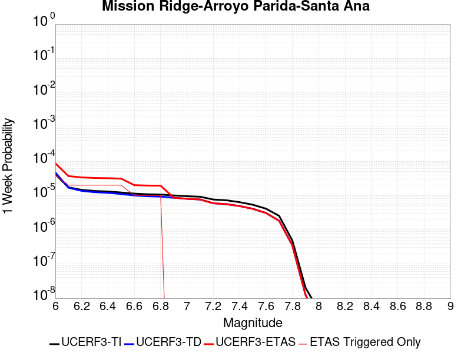 |  |  |  |

| Magnitude | 1 wk TI Prob | 1 wk TD Prob | 1 wk ETAS Prob | 1 wk ETAS/TD Gain | 1 wk ETAS Triggered Only | 1 mo TI Prob | 1 mo TD Prob | 1 mo ETAS Prob | 1 mo ETAS/TD Gain | 1 mo ETAS Triggered Only | 1 yr TI Prob | 1 yr TD Prob | 1 yr ETAS Prob | 1 yr ETAS/TD Gain | 1 yr ETAS Triggered Only | 10 yr TI Prob | 10 yr TD Prob | 10 yr ETAS Prob | 10 yr ETAS/TD Gain | 10 yr ETAS Triggered Only |
|-----|-----|-----|-----|-----|-----|-----|-----|-----|-----|-----|-----|-----|-----|-----|-----|-----|-----|-----|-----|-----|
| 6.0 | 4.169034E-5 | 4.7138263E-5 | 8.713638E-5 | 1.8485276 | 4.0E-5 | 1.7866064E-4 | 2.0201034E-4 | 2.8199417E-4 | 1.3959394 | 8.0E-5 | 0.0021730233 | 0.00245745 | 0.0025771551 | 1.0487111 | 1.2E-4 | 0.021518968 | 0.024384614 | 0.02455047 | 1.0068016 | 1.7E-4 |
| 6.1 | 1.73813E-5 | 1.6854226E-5 | 3.685389E-5 | 2.186626 | 2.0E-5 | 7.4489166E-5 | 7.223046E-5 | 1.0222829E-4 | 1.4153073 | 3.0E-5 | 9.065282E-4 | 8.790618E-4 | 9.0903544E-4 | 1.0340973 | 3.0E-5 | 0.009028391 | 0.008756988 | 0.008786725 | 1.0033958 | 3.0E-5 |
| 6.2 | 1.4622182E-5 | 1.367329E-5 | 3.3673015E-5 | 2.4626858 | 2.0E-5 | 6.2664985E-5 | 5.8598518E-5 | 8.859676E-5 | 1.5119283 | 3.0E-5 | 7.6267915E-4 | 7.132073E-4 | 7.431859E-4 | 1.0420336 | 3.0E-5 | 0.007600669 | 0.007109627 | 0.007139414 | 1.0041896 | 3.0E-5 |
| 6.3 | 1.3552434E-5 | 1.2482201E-5 | 3.2481952E-5 | 2.6022615 | 2.0E-5 | 5.8080568E-5 | 5.3494066E-5 | 7.3493E-5 | 1.3738532 | 2.0E-5 | 7.069015E-4 | 6.510988E-4 | 6.710858E-4 | 1.0306973 | 2.0E-5 | 0.00704657 | 0.006492275 | 0.006512145 | 1.0030606 | 2.0E-5 |
| 6.4 | 1.30977305E-5 | 1.1979156E-5 | 3.1978918E-5 | 2.6695466 | 2.0E-5 | 5.613192E-5 | 5.1338247E-5 | 7.133722E-5 | 1.3895531 | 2.0E-5 | 6.831918E-4 | 6.248669E-4 | 6.448544E-4 | 1.0319868 | 2.0E-5 | 0.006810953 | 0.0062314444 | 0.00625132 | 1.0031896 | 2.0E-5 |
| 6.5 | 1.225205E-5 | 1.1048803E-5 | 3.104858E-5 | 2.8101308 | 2.0E-5 | 5.2507727E-5 | 4.7351168E-5 | 6.735022E-5 | 1.422356 | 2.0E-5 | 6.3909404E-4 | 5.7635066E-4 | 5.963392E-4 | 1.0346811 | 2.0E-5 | 0.006372592 | 0.005748869 | 0.005768754 | 1.003459 | 2.0E-5 |
| 6.6 | 1.1352241E-5 | 1.0063535E-5 | 2.0063435E-5 | 1.9936767 | 1.0E-5 | 4.8651553E-5 | 4.3128734E-5 | 5.3128304E-5 | 1.231854 | 1.0E-5 | 5.921717E-4 | 5.2496797E-4 | 5.349627E-4 | 1.0190388 | 1.0E-5 | 0.0059059616 | 0.0052375244 | 0.005247472 | 1.0018992 | 1.0E-5 |
| 6.7 | 1.0864116E-5 | 9.517027E-6 | 1.9516932E-5 | 2.0507383 | 1.0E-5 | 4.6559664E-5 | 4.0786632E-5 | 5.0786224E-5 | 1.2451683 | 1.0E-5 | 5.667165E-4 | 4.964661E-4 | 5.0646113E-4 | 1.0201323 | 1.0E-5 | 0.005652734 | 0.004953804 | 0.004963754 | 1.0020087 | 1.0E-5 |
| 6.8 | 1.0666365E-5 | 9.299779E-6 | 1.9299685E-5 | 2.0752845 | 1.0E-5 | 4.571219E-5 | 3.9855597E-5 | 4.9855196E-5 | 1.2508957 | 1.0E-5 | 5.564038E-4 | 4.8513585E-4 | 4.95131E-4 | 1.0206028 | 1.0E-5 | 0.005550127 | 0.0048410003 | 0.0048509515 | 1.0020556 | 1.0E-5 |
| 6.9 | 1.0038665E-5 | 8.592046E-6 | 8.592046E-6 | 1.0 | 0.0 | 4.302214E-5 | 3.682254E-5 | 3.682254E-5 | 1.0 | 0.0 | 5.236687E-4 | 4.4822405E-4 | 4.4822405E-4 | 1.0 | 0.0 | 0.005224364 | 0.004473411 | 0.004473411 | 1.0 | 0.0 |
| 7.0 | 9.5379955E-6 | 8.025073E-6 | 8.025073E-6 | 1.0 | 0.0 | 4.0876483E-5 | 3.4392728E-5 | 3.4392728E-5 | 1.0 | 0.0 | 4.975576E-4 | 4.1865272E-4 | 4.1865272E-4 | 1.0 | 0.0 | 0.00496445 | 0.0041788397 | 0.0041788397 | 1.0 | 0.0 |
| 7.1 | 9.207389E-6 | 7.652375E-6 | 7.652375E-6 | 1.0 | 0.0 | 3.945964E-5 | 3.279549E-5 | 3.279549E-5 | 1.0 | 0.0 | 4.803152E-4 | 3.9921363E-4 | 3.9921363E-4 | 1.0 | 0.0 | 0.004792784 | 0.003985161 | 0.003985161 | 1.0 | 0.0 |
| 7.2 | 7.638091E-6 | 5.9311183E-6 | 5.9311183E-6 | 1.0 | 0.0 | 3.2734264E-5 | 2.541883E-5 | 2.541883E-5 | 1.0 | 0.0 | 3.984668E-4 | 3.0943064E-4 | 3.0943064E-4 | 1.0 | 0.0 | 0.0039775306 | 0.0030900547 | 0.0030900547 | 1.0 | 0.0 |
| 7.3 | 7.2500147E-6 | 5.5961527E-6 | 5.5961527E-6 | 1.0 | 0.0 | 3.1071122E-5 | 2.3983293E-5 | 2.3983293E-5 | 1.0 | 0.0 | 3.7822526E-4 | 2.9195778E-4 | 2.9195778E-4 | 1.0 | 0.0 | 0.0037758215 | 0.0029157975 | 0.0029157975 | 1.0 | 0.0 |
| 7.4 | 6.3899715E-6 | 4.9184964E-6 | 4.9184964E-6 | 1.0 | 0.0 | 2.7385306E-5 | 2.10791E-5 | 2.10791E-5 | 1.0 | 0.0 | 3.3336508E-4 | 2.5660804E-4 | 2.5660804E-4 | 1.0 | 0.0 | 0.0033286542 | 0.0025631618 | 0.0025631618 | 1.0 | 0.0 |
| 7.5 | 5.379025E-6 | 4.0838527E-6 | 4.0838527E-6 | 1.0 | 0.0 | 2.305276E-5 | 1.7502109E-5 | 1.7502109E-5 | 1.0 | 0.0 | 2.806312E-4 | 2.1306744E-4 | 2.1306744E-4 | 1.0 | 0.0 | 0.0028027708 | 0.002128643 | 0.002128643 | 1.0 | 0.0 |
| 7.6 | 4.1270696E-6 | 3.0883439E-6 | 3.0883439E-6 | 1.0 | 0.0 | 1.768732E-5 | 1.3235693E-5 | 1.3235693E-5 | 1.0 | 0.0 | 2.1532185E-4 | 1.6113273E-4 | 1.6113273E-4 | 1.0 | 0.0 | 0.0021511333 | 0.001610167 | 0.001610167 | 1.0 | 0.0 |
| 7.7 | 2.5406805E-6 | 1.8282013E-6 | 1.8282013E-6 | 1.0 | 0.0 | 1.0888585E-5 | 7.835125E-6 | 7.835125E-6 | 1.0 | 0.0 | 1.3256045E-4 | 9.538854E-5 | 9.538854E-5 | 1.0 | 0.0 | 0.0013248142 | 9.534821E-4 | 9.534821E-4 | 1.0 | 0.0 |
| 7.8 | 4.8608285E-7 | 3.5098864E-7 | 3.5098864E-7 | 1.0 | 0.0 | 2.0832106E-6 | 1.5042363E-6 | 1.5042363E-6 | 1.0 | 0.0 | 2.5362791E-5 | 1.8313924E-5 | 1.8313924E-5 | 1.0 | 0.0 | 2.5359896E-4 | 1.8312426E-4 | 1.8312426E-4 | 1.0 | 0.0 |
| 7.9 | 2.0472514E-8 | 1.2688783E-8 | 1.2688783E-8 | 1.0 | 0.0 | 8.7739345E-8 | 5.43805E-8 | 5.43805E-8 | 1.0 | 0.0 | 1.068226E-6 | 6.6208236E-7 | 6.6208236E-7 | 1.0 | 0.0 | 1.0682209E-5 | 6.620805E-6 | 6.620805E-6 | 1.0 | 0.0 |
| 8.0 | 4.443582E-9 | 2.0321211E-9 | 2.0321211E-9 | 1.0 | 0.0 | 1.9043922E-8 | 8.70909E-9 | 8.70909E-9 | 1.0 | 0.0 | 2.3185973E-7 | 1.0603316E-7 | 1.0603316E-7 | 1.0 | 0.0 | 2.3185949E-6 | 1.0603312E-6 | 1.0603312E-6 | 1.0 | 0.0 |

## San Andreas (Coachella) rev
*[(top)](#table-of-contents)*

| 1 Week | 1 Month | 1 Year | 10 Year |
|-----|-----|-----|-----|
|  |  | 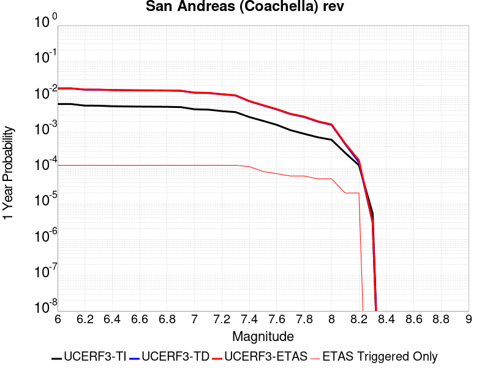 |  |

| Magnitude | 1 wk TI Prob | 1 wk TD Prob | 1 wk ETAS Prob | 1 wk ETAS/TD Gain | 1 wk ETAS Triggered Only | 1 mo TI Prob | 1 mo TD Prob | 1 mo ETAS Prob | 1 mo ETAS/TD Gain | 1 mo ETAS Triggered Only | 1 yr TI Prob | 1 yr TD Prob | 1 yr ETAS Prob | 1 yr ETAS/TD Gain | 1 yr ETAS Triggered Only | 10 yr TI Prob | 10 yr TD Prob | 10 yr ETAS Prob | 10 yr ETAS/TD Gain | 10 yr ETAS Triggered Only |
|-----|-----|-----|-----|-----|-----|-----|-----|-----|-----|-----|-----|-----|-----|-----|-----|-----|-----|-----|-----|-----|
| 6.0 | 1.1925945E-4 | 3.2729402E-4 | 3.672809E-4 | 1.1221743 | 4.0E-5 | 5.110118E-4 | 0.0014019393 | 0.0014618551 | 1.0427378 | 6.0E-5 | 0.0062038354 | 0.016936364 | 0.017054332 | 1.0069654 | 1.2E-4 | 0.060334753 | 0.15265316 | 0.15278873 | 1.0008881 | 1.6E-4 |
| 6.1 | 1.1925945E-4 | 3.2729402E-4 | 3.672809E-4 | 1.1221743 | 4.0E-5 | 5.110118E-4 | 0.0014019393 | 0.0014618551 | 1.0427378 | 6.0E-5 | 0.0062038354 | 0.016936364 | 0.017054332 | 1.0069654 | 1.2E-4 | 0.060334753 | 0.15265316 | 0.15278873 | 1.0008881 | 1.6E-4 |
| 6.2 | 1.07432395E-4 | 3.0230157E-4 | 3.4228948E-4 | 1.1322782 | 4.0E-5 | 4.603433E-4 | 0.0012949388 | 0.0013548612 | 1.0462742 | 6.0E-5 | 0.005590286 | 0.015653009 | 0.01577113 | 1.0075463 | 1.2E-4 | 0.05451731 | 0.14182423 | 0.14195296 | 1.0009077 | 1.5E-4 |
| 6.3 | 1.0718766E-4 | 3.0175463E-4 | 3.4174256E-4 | 1.132518 | 4.0E-5 | 4.592948E-4 | 0.0012925972 | 0.0013525196 | 1.0463582 | 6.0E-5 | 0.005577586 | 0.015624908 | 0.015743032 | 1.00756 | 1.2E-4 | 0.054396555 | 0.14159249 | 0.14172125 | 1.0009093 | 1.5E-4 |
| 6.4 | 1.0355944E-4 | 2.9383553E-4 | 3.338238E-4 | 1.1360906 | 4.0E-5 | 4.4375064E-4 | 0.0012586913 | 0.0013186157 | 1.0476086 | 6.0E-5 | 0.0053892885 | 0.015217941 | 0.015336116 | 1.0077654 | 1.2E-4 | 0.052604496 | 0.13815255 | 0.13828184 | 1.0009358 | 1.5E-4 |
| 6.5 | 1.0227914E-4 | 2.9102986E-4 | 3.3101824E-4 | 1.1374029 | 4.0E-5 | 4.382655E-4 | 0.0012466786 | 0.0013066038 | 1.0480679 | 6.0E-5 | 0.0053228354 | 0.01507372 | 0.015191912 | 1.0078409 | 1.2E-4 | 0.051971316 | 0.13693172 | 0.13706118 | 1.0009454 | 1.5E-4 |
| 6.6 | 1.0116757E-4 | 2.8868738E-4 | 3.2867584E-4 | 1.1385182 | 4.0E-5 | 4.3350324E-4 | 0.0012366489 | 0.0012965747 | 1.0484582 | 6.0E-5 | 0.0052651367 | 0.01495329 | 0.015071496 | 1.007905 | 1.2E-4 | 0.051421247 | 0.1359099 | 0.13603951 | 1.0009537 | 1.5E-4 |
| 6.7 | 1.0050676E-4 | 2.8727303E-4 | 3.272615E-4 | 1.1392003 | 4.0E-5 | 4.3067214E-4 | 0.0012305931 | 0.0012905193 | 1.048697 | 6.0E-5 | 0.005230834 | 0.014880571 | 0.014998784 | 1.0079442 | 1.2E-4 | 0.051094085 | 0.13529462 | 0.13542433 | 1.0009587 | 1.5E-4 |
| 6.8 | 9.976819E-5 | 2.853096E-4 | 3.2529817E-4 | 1.1401585 | 4.0E-5 | 4.2750788E-4 | 0.0012221863 | 0.001282113 | 1.0490323 | 6.0E-5 | 0.0051924936 | 0.0147796115 | 0.014897837 | 1.0079993 | 1.2E-4 | 0.050728295 | 0.13444631 | 0.13457614 | 1.0009657 | 1.5E-4 |
| 6.9 | 9.77719E-5 | 2.8027873E-4 | 3.2026754E-4 | 1.142675 | 4.0E-5 | 4.1895514E-4 | 0.0012006456 | 0.0012605735 | 1.0499132 | 6.0E-5 | 0.0050888555 | 0.014520878 | 0.014639135 | 1.008144 | 1.2E-4 | 0.049738888 | 0.1322748 | 0.13240497 | 1.000984 | 1.5E-4 |
| 7.0 | 8.500761E-5 | 2.4762485E-4 | 2.8761494E-4 | 1.1614947 | 4.0E-5 | 3.6426744E-4 | 0.001060821 | 0.0011207573 | 1.0565 | 6.0E-5 | 0.0044259406 | 0.012839786 | 0.012958245 | 1.009226 | 1.2E-4 | 0.04338823 | 0.11813272 | 0.118265 | 1.0011197 | 1.5E-4 |
| 7.1 | 8.319876E-5 | 2.4365232E-4 | 2.8364258E-4 | 1.1641283 | 4.0E-5 | 3.5651738E-4 | 0.0010438096 | 0.0011037469 | 1.0574218 | 6.0E-5 | 0.004331963 | 0.012635092 | 0.012753576 | 1.0093774 | 1.2E-4 | 0.042484846 | 0.116353 | 0.11648555 | 1.0011392 | 1.5E-4 |
| 7.2 | 7.563917E-5 | 2.2413683E-4 | 2.6412788E-4 | 1.1784225 | 4.0E-5 | 3.2412758E-4 | 9.602359E-4 | 0.0010201783 | 1.0624247 | 6.0E-5 | 0.0039391145 | 0.011628893 | 0.011747498 | 1.0101991 | 1.2E-4 | 0.03870018 | 0.10775925 | 0.10789309 | 1.001242 | 1.5E-4 |
| 7.3 | 7.082985E-5 | 2.0729867E-4 | 2.472904E-4 | 1.1929183 | 4.0E-5 | 3.0352117E-4 | 8.881233E-4 | 9.4806997E-4 | 1.0674982 | 6.0E-5 | 0.0036891096 | 0.010759917 | 0.010878626 | 1.0110325 | 1.2E-4 | 0.03628465 | 0.100282 | 0.10041696 | 1.0013458 | 1.5E-4 |
| 7.4 | 5.146215E-5 | 1.4273795E-4 | 1.8273223E-4 | 1.2801938 | 4.0E-5 | 2.2053342E-4 | 6.115915E-4 | 6.715548E-4 | 1.0980448 | 6.0E-5 | 0.0026816884 | 0.0074208933 | 0.007530077 | 1.014713 | 1.1E-4 | 0.02649557 | 0.070849575 | 0.070979655 | 1.0018361 | 1.4E-4 |
| 7.5 | 4.0285166E-5 | 1.09416E-4 | 1.3941272E-4 | 1.274153 | 3.0E-5 | 1.7263928E-4 | 4.6884175E-4 | 5.188183E-4 | 1.1065958 | 5.0E-5 | 0.002099857 | 0.0056932783 | 0.0057728225 | 1.0139717 | 8.0E-5 | 0.020801254 | 0.055011146 | 0.055105645 | 1.0017178 | 1.0E-4 |
| 7.6 | 3.1168736E-5 | 8.4389096E-5 | 1.0438741E-4 | 1.2369775 | 2.0E-5 | 1.3357346E-4 | 3.6161754E-4 | 4.016031E-4 | 1.1105741 | 4.0E-5 | 0.0016250437 | 0.0043938323 | 0.0044635246 | 1.0158614 | 7.0E-5 | 0.016132116 | 0.04281005 | 0.042896196 | 1.0020123 | 9.0E-5 |
| 7.7 | 2.2100989E-5 | 6.238755E-5 | 8.23863E-5 | 1.3205568 | 2.0E-5 | 9.4715084E-5 | 2.6734784E-4 | 3.0733715E-4 | 1.1495779 | 4.0E-5 | 0.001152546 | 0.0032501083 | 0.0033099134 | 1.0184009 | 6.0E-5 | 0.011465867 | 0.0319002 | 0.031977646 | 1.0024278 | 8.0E-5 |
| 7.8 | 1.7484861E-5 | 5.179572E-5 | 7.179468E-5 | 1.3861123 | 2.0E-5 | 7.493296E-5 | 2.2196278E-4 | 2.6195392E-4 | 1.1801704 | 4.0E-5 | 9.1192697E-4 | 0.0026990508 | 0.0027588888 | 1.0221701 | 6.0E-5 | 0.009081938 | 0.026640115 | 0.026717985 | 1.002923 | 8.0E-5 |
| 7.9 | 1.3967285E-5 | 3.822255E-5 | 4.822217E-5 | 1.2616156 | 1.0E-5 | 5.985842E-5 | 1.6380067E-4 | 1.9379574E-4 | 1.1831194 | 3.0E-5 | 7.2853256E-4 | 0.00199245 | 0.0020423506 | 1.0250447 | 5.0E-5 | 0.0072614877 | 0.019909438 | 0.019978043 | 1.0034459 | 7.0E-5 |
| 8.0 | 1.1887396E-5 | 3.106521E-5 | 4.10649E-5 | 1.3218935 | 1.0E-5 | 5.094499E-5 | 1.3312983E-4 | 1.6312583E-4 | 1.2253139 | 3.0E-5 | 6.200787E-4 | 0.0016196516 | 0.0016695706 | 1.0308208 | 5.0E-5 | 0.006183513 | 0.016279267 | 0.016348127 | 1.0042299 | 7.0E-5 |
| 8.1 | 5.100864E-6 | 8.973418E-6 | 8.973418E-6 | 1.0 | 0.0 | 2.1860664E-5 | 3.8456936E-5 | 4.8456553E-5 | 1.2600211 | 1.0E-5 | 2.6612106E-4 | 4.6811273E-4 | 4.881034E-4 | 1.0427047 | 2.0E-5 | 0.002658026 | 0.004917731 | 0.004947583 | 1.0060704 | 3.0E-5 |
| 8.2 | 2.3004484E-6 | 2.7864487E-6 | 2.7864487E-6 | 1.0 | 0.0 | 9.859027E-6 | 1.1941868E-5 | 2.1941749E-5 | 1.8373799 | 1.0E-5 | 1.2002704E-4 | 1.4538258E-4 | 1.6537968E-4 | 1.1375481 | 2.0E-5 | 0.0011996223 | 0.0015973912 | 0.0016173592 | 1.0125004 | 2.0E-5 |
| 8.3 | 1.0424446E-7 | 5.8161504E-8 | 5.8161504E-8 | 1.0 | 0.0 | 4.4676187E-7 | 2.4926356E-7 | 2.4926356E-7 | 1.0 | 0.0 | 5.439312E-6 | 3.03478E-6 | 3.03478E-6 | 1.0 | 0.0 | 5.4391792E-5 | 3.190716E-5 | 3.190716E-5 | 1.0 | 0.0 |

## Cleghorn Pass
*[(top)](#table-of-contents)*

| 1 Week | 1 Month | 1 Year | 10 Year |
|-----|-----|-----|-----|
|  |  | 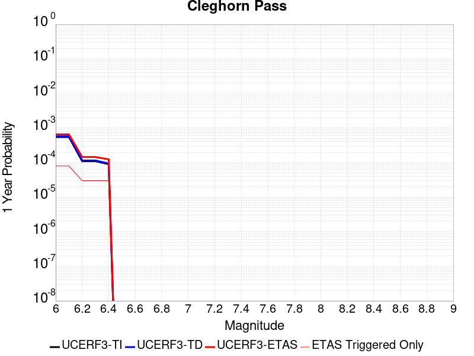 |  |

| Magnitude | 1 wk TI Prob | 1 wk TD Prob | 1 wk ETAS Prob | 1 wk ETAS/TD Gain | 1 wk ETAS Triggered Only | 1 mo TI Prob | 1 mo TD Prob | 1 mo ETAS Prob | 1 mo ETAS/TD Gain | 1 mo ETAS Triggered Only | 1 yr TI Prob | 1 yr TD Prob | 1 yr ETAS Prob | 1 yr ETAS/TD Gain | 1 yr ETAS Triggered Only | 10 yr TI Prob | 10 yr TD Prob | 10 yr ETAS Prob | 10 yr ETAS/TD Gain | 10 yr ETAS Triggered Only |
|-----|-----|-----|-----|-----|-----|-----|-----|-----|-----|-----|-----|-----|-----|-----|-----|-----|-----|-----|-----|-----|
| 6.0 | 1.0522846E-5 | 1.1040642E-5 | 4.104031E-5 | 3.7172034 | 3.0E-5 | 4.509713E-5 | 4.7316473E-5 | 1.0731364E-4 | 2.2679973 | 6.0E-5 | 5.4891926E-4 | 5.759784E-4 | 6.5593235E-4 | 1.1388141 | 8.0E-5 | 0.0054756533 | 0.005750022 | 0.005879274 | 1.0224786 | 1.3E-4 |
| 6.1 | 1.0522846E-5 | 1.1040642E-5 | 4.104031E-5 | 3.7172034 | 3.0E-5 | 4.509713E-5 | 4.7316473E-5 | 1.0731364E-4 | 2.2679973 | 6.0E-5 | 5.4891926E-4 | 5.759784E-4 | 6.5593235E-4 | 1.1388141 | 8.0E-5 | 0.0054756533 | 0.005750022 | 0.005879274 | 1.0224786 | 1.3E-4 |
| 6.2 | 2.1045846E-6 | 2.2082024E-6 | 2.2082024E-6 | 1.0 | 0.0 | 9.019617E-6 | 9.463714E-6 | 3.946343E-5 | 4.169973 | 3.0E-5 | 1.098083E-4 | 1.1521882E-4 | 1.4521537E-4 | 1.2603441 | 3.0E-5 | 0.0010975406 | 0.0011520023 | 0.0011919562 | 1.0346822 | 4.0E-5 |
| 6.3 | 2.1045846E-6 | 2.2082024E-6 | 2.2082024E-6 | 1.0 | 0.0 | 9.019617E-6 | 9.463714E-6 | 3.946343E-5 | 4.169973 | 3.0E-5 | 1.098083E-4 | 1.1521882E-4 | 1.4521537E-4 | 1.2603441 | 3.0E-5 | 0.0010975406 | 0.0011520023 | 0.0011919562 | 1.0346822 | 4.0E-5 |
| 6.4 | 1.7259927E-6 | 1.810877E-6 | 1.810877E-6 | 1.0 | 0.0 | 7.3970905E-6 | 7.760902E-6 | 3.776067E-5 | 4.8655 | 3.0E-5 | 9.005586E-5 | 9.4488976E-5 | 1.2448615E-4 | 1.3174673 | 3.0E-5 | 9.001937E-4 | 9.448898E-4 | 9.84852E-4 | 1.042293 | 4.0E-5 |

## Brawley (Seismic Zone) alt 1
*[(top)](#table-of-contents)*

| 1 Week | 1 Month | 1 Year | 10 Year |
|-----|-----|-----|-----|
|  |  |  |  |

| Magnitude | 1 wk TI Prob | 1 wk TD Prob | 1 wk ETAS Prob | 1 wk ETAS/TD Gain | 1 wk ETAS Triggered Only | 1 mo TI Prob | 1 mo TD Prob | 1 mo ETAS Prob | 1 mo ETAS/TD Gain | 1 mo ETAS Triggered Only | 1 yr TI Prob | 1 yr TD Prob | 1 yr ETAS Prob | 1 yr ETAS/TD Gain | 1 yr ETAS Triggered Only | 10 yr TI Prob | 10 yr TD Prob | 10 yr ETAS Prob | 10 yr ETAS/TD Gain | 10 yr ETAS Triggered Only |
|-----|-----|-----|-----|-----|-----|-----|-----|-----|-----|-----|-----|-----|-----|-----|-----|-----|-----|-----|-----|-----|
| 6.0 | 2.2521618E-4 | 4.7632487E-4 | 5.163058E-4 | 1.0839363 | 4.0E-5 | 9.6485513E-4 | 0.0020398323 | 0.0020897302 | 1.0244619 | 5.0E-5 | 0.011683988 | 0.024546238 | 0.024653537 | 1.0043713 | 1.1E-4 | 0.11088423 | 0.21350002 | 0.21361013 | 1.0005157 | 1.4E-4 |
| 6.1 | 2.2521618E-4 | 4.7632487E-4 | 5.163058E-4 | 1.0839363 | 4.0E-5 | 9.6485513E-4 | 0.0020398323 | 0.0020897302 | 1.0244619 | 5.0E-5 | 0.011683988 | 0.024546238 | 0.024653537 | 1.0043713 | 1.1E-4 | 0.11088423 | 0.21350002 | 0.21360226 | 1.0004789 | 1.3E-4 |
| 6.2 | 2.198148E-4 | 4.6717093E-4 | 5.0715223E-4 | 1.0855818 | 4.0E-5 | 9.417233E-4 | 0.0020006616 | 0.0020505616 | 1.0249417 | 5.0E-5 | 0.011405343 | 0.024080504 | 0.024187854 | 1.0044581 | 1.1E-4 | 0.10837428 | 0.20993657 | 0.21003927 | 1.0004892 | 1.3E-4 |
| 6.3 | 2.1704129E-4 | 4.615278E-4 | 5.015093E-4 | 1.0866287 | 4.0E-5 | 9.298453E-4 | 0.0019765133 | 0.0020264145 | 1.0252471 | 5.0E-5 | 0.011262234 | 0.02379366 | 0.023901043 | 1.004513 | 1.1E-4 | 0.107082725 | 0.20782755 | 0.20793054 | 1.0004956 | 1.3E-4 |
| 6.4 | 1.876142E-4 | 4.00449E-4 | 4.4043298E-4 | 1.0998479 | 4.0E-5 | 8.038131E-4 | 0.0017150956 | 0.0017650098 | 1.0291029 | 5.0E-5 | 0.00974259 | 0.020680401 | 0.020788126 | 1.0052091 | 1.1E-4 | 0.093263686 | 0.18457815 | 0.18468416 | 1.0005744 | 1.3E-4 |
| 6.5 | 1.7390939E-4 | 3.7477075E-4 | 4.1475578E-4 | 1.106692 | 4.0E-5 | 7.45113E-4 | 0.0016051838 | 0.0016551036 | 1.0310991 | 5.0E-5 | 0.009034078 | 0.019368723 | 0.019476593 | 1.0055692 | 1.1E-4 | 0.086755216 | 0.17440031 | 0.17450765 | 1.0006154 | 1.3E-4 |
| 6.6 | 1.591791E-4 | 3.4891962E-4 | 3.8890567E-4 | 1.1145996 | 4.0E-5 | 6.8201777E-4 | 0.0014945229 | 0.0015444482 | 1.0334055 | 5.0E-5 | 0.008271996 | 0.018045569 | 0.018153585 | 1.0059857 | 1.1E-4 | 0.07970774 | 0.16380852 | 0.16391723 | 1.0006636 | 1.3E-4 |
| 6.7 | 1.4268003E-4 | 3.20582E-4 | 3.605692E-4 | 1.1247331 | 4.0E-5 | 6.1134255E-4 | 0.0013732077 | 0.001423139 | 1.0363611 | 5.0E-5 | 0.007417723 | 0.016592601 | 0.016700776 | 1.0065194 | 1.1E-4 | 0.07174956 | 0.15193306 | 0.15204331 | 1.0007256 | 1.3E-4 |
| 6.8 | 1.239713E-4 | 2.9053655E-4 | 3.3052493E-4 | 1.1376363 | 4.0E-5 | 5.3119735E-4 | 0.0012445687 | 0.0012945065 | 1.0401245 | 5.0E-5 | 0.0064481674 | 0.015048777 | 0.0151472725 | 1.0065451 | 1.0E-4 | 0.06264243 | 0.13837762 | 0.13848102 | 1.0007472 | 1.2E-4 |
| 6.9 | 1.0180238E-4 | 2.625439E-4 | 3.0253342E-4 | 1.1523155 | 4.0E-5 | 4.3622297E-4 | 0.0011247073 | 0.001174651 | 1.044406 | 5.0E-5 | 0.005298089 | 0.013608336 | 0.013706976 | 1.0072484 | 1.0E-4 | 0.05173543 | 0.124961674 | 0.12506668 | 1.0008403 | 1.2E-4 |
| 7.0 | 7.6619996E-5 | 2.23993E-4 | 2.6398405E-4 | 1.178537 | 4.0E-5 | 3.283301E-4 | 9.5962E-4 | 0.0010095721 | 1.0520539 | 5.0E-5 | 0.0039900932 | 0.011621496 | 0.011720333 | 1.0085047 | 1.0E-4 | 0.039192066 | 0.107266866 | 0.10737399 | 1.0009987 | 1.2E-4 |
| 7.1 | 7.5127435E-5 | 2.2082464E-4 | 2.608158E-4 | 1.1810992 | 4.0E-5 | 3.2193496E-4 | 9.4605127E-4 | 9.96004E-4 | 1.0528013 | 5.0E-5 | 0.0039125155 | 0.011458045 | 0.011556899 | 1.0086275 | 1.0E-4 | 0.038443442 | 0.10583085 | 0.10593815 | 1.0010139 | 1.2E-4 |
| 7.2 | 6.788582E-5 | 2.0210193E-4 | 2.4209385E-4 | 1.1978799 | 4.0E-5 | 2.9090676E-4 | 8.6586666E-4 | 9.158234E-4 | 1.0576956 | 5.0E-5 | 0.0035360386 | 0.0104916105 | 0.010590562 | 1.0094315 | 1.0E-4 | 0.034803 | 0.09750131 | 0.09760961 | 1.0011108 | 1.2E-4 |
| 7.3 | 6.399602E-5 | 1.8841137E-4 | 2.2840383E-4 | 1.2122614 | 4.0E-5 | 2.7423984E-4 | 8.072303E-4 | 8.5718994E-4 | 1.0618902 | 5.0E-5 | 0.0033337586 | 0.009784332 | 0.009883353 | 1.0101204 | 1.0E-4 | 0.03284188 | 0.09139617 | 0.0915052 | 1.0011929 | 1.2E-4 |
| 7.4 | 4.506759E-5 | 1.2529209E-4 | 1.6528707E-4 | 1.319214 | 4.0E-5 | 1.9313251E-4 | 5.368565E-4 | 5.868296E-4 | 1.0930848 | 5.0E-5 | 0.0023488526 | 0.0065168133 | 0.006606227 | 1.0137204 | 9.0E-5 | 0.023241805 | 0.062363707 | 0.062466845 | 1.0016538 | 1.1E-4 |
| 7.5 | 3.43289E-5 | 9.33541E-5 | 1.233513E-4 | 1.3213271 | 3.0E-5 | 1.4711556E-4 | 4.00028E-4 | 4.4001197E-4 | 1.099953 | 4.0E-5 | 0.0017896603 | 0.0048595266 | 0.004919235 | 1.0122869 | 6.0E-5 | 0.01775316 | 0.04705519 | 0.047121897 | 1.0014176 | 7.0E-5 |
| 7.6 | 2.5980507E-5 | 7.053101E-5 | 9.05296E-5 | 1.2835432 | 2.0E-5 | 1.1134028E-4 | 3.0224086E-4 | 3.322318E-4 | 1.0992286 | 3.0E-5 | 0.001354725 | 0.003673598 | 0.0037234141 | 1.0135607 | 5.0E-5 | 0.013464959 | 0.035840835 | 0.035898685 | 1.0016141 | 6.0E-5 |
| 7.7 | 1.7292105E-5 | 4.9407296E-5 | 6.9406306E-5 | 1.4047785 | 2.0E-5 | 7.4106916E-5 | 2.117284E-4 | 2.4172205E-4 | 1.1416609 | 3.0E-5 | 9.018782E-4 | 0.0025747516 | 0.0026146488 | 1.0154954 | 4.0E-5 | 0.008982267 | 0.025290398 | 0.025339134 | 1.001927 | 5.0E-5 |
| 7.8 | 1.2927471E-5 | 3.9693266E-5 | 5.9692473E-5 | 1.5038438 | 2.0E-5 | 5.5402274E-5 | 1.7010293E-4 | 2.0009783E-4 | 1.1763338 | 3.0E-5 | 6.743139E-4 | 0.0020690386 | 0.0021089558 | 1.0192926 | 4.0E-5 | 0.0067227143 | 0.020431727 | 0.020480705 | 1.0023972 | 5.0E-5 |
| 7.9 | 1.0200774E-5 | 2.874569E-5 | 3.8745402E-5 | 1.3478682 | 1.0E-5 | 4.371687E-5 | 1.2319001E-4 | 1.4318754E-4 | 1.1623309 | 2.0E-5 | 5.321229E-4 | 0.0014988075 | 0.0015287625 | 1.0199859 | 3.0E-5 | 0.005308505 | 0.014991644 | 0.015031044 | 1.0026282 | 4.0E-5 |
| 8.0 | 8.650396E-6 | 2.3277367E-5 | 3.3277134E-5 | 1.4295919 | 1.0E-5 | 3.70726E-5 | 9.975634E-5 | 1.19754346E-4 | 1.2004685 | 2.0E-5 | 4.5126543E-4 | 0.0012138576 | 0.0012438211 | 1.0246845 | 3.0E-5 | 0.0045035016 | 0.012211097 | 0.012250609 | 1.0032357 | 4.0E-5 |
| 8.1 | 3.9368224E-6 | 7.3279825E-6 | 7.3279825E-6 | 1.0 | 0.0 | 1.6871985E-5 | 3.140526E-5 | 4.1404946E-5 | 1.318408 | 1.0E-5 | 2.0539707E-4 | 3.8229208E-4 | 4.0228447E-4 | 1.052296 | 2.0E-5 | 0.0020520731 | 0.004001185 | 0.0040310645 | 1.0074677 | 3.0E-5 |
| 8.2 | 1.7101195E-6 | 2.217876E-6 | 2.217876E-6 | 1.0 | 0.0 | 7.329063E-6 | 9.505149E-6 | 1.9505054E-5 | 2.0520513 | 1.0E-5 | 8.922769E-5 | 1.1571907E-4 | 1.3571676E-4 | 1.1728123 | 2.0E-5 | 8.9191867E-4 | 0.0012666774 | 0.001286652 | 1.0157694 | 2.0E-5 |
| 8.3 | 3.0346666E-8 | 1.721586E-8 | 1.721586E-8 | 1.0 | 0.0 | 1.3005713E-7 | 7.378226E-8 | 7.378226E-8 | 1.0 | 0.0 | 1.5834444E-6 | 8.9829894E-7 | 8.9829894E-7 | 1.0 | 0.0 | 1.5834332E-5 | 9.367729E-6 | 9.367729E-6 | 1.0 | 0.0 |

## Dry Mountain
*[(top)](#table-of-contents)*

| 1 Week | 1 Month | 1 Year | 10 Year |
|-----|-----|-----|-----|
|  |  |  |  |

| Magnitude | 1 wk TI Prob | 1 wk TD Prob | 1 wk ETAS Prob | 1 wk ETAS/TD Gain | 1 wk ETAS Triggered Only | 1 mo TI Prob | 1 mo TD Prob | 1 mo ETAS Prob | 1 mo ETAS/TD Gain | 1 mo ETAS Triggered Only | 1 yr TI Prob | 1 yr TD Prob | 1 yr ETAS Prob | 1 yr ETAS/TD Gain | 1 yr ETAS Triggered Only | 10 yr TI Prob | 10 yr TD Prob | 10 yr ETAS Prob | 10 yr ETAS/TD Gain | 10 yr ETAS Triggered Only |
|-----|-----|-----|-----|-----|-----|-----|-----|-----|-----|-----|-----|-----|-----|-----|-----|-----|-----|-----|-----|-----|
| 6.0 | 6.222801E-6 | 6.439381E-6 | 5.6439058E-5 | 8.764671 | 5.0E-5 | 2.6668875E-5 | 2.7597147E-5 | 1.0759494E-4 | 3.8987706 | 8.0E-5 | 3.2464517E-4 | 3.3595937E-4 | 4.4592243E-4 | 1.3273106 | 1.1E-4 | 0.0032417132 | 0.0033560768 | 0.003495607 | 1.0415754 | 1.4E-4 |
| 6.1 | 6.222801E-6 | 6.439381E-6 | 5.6439058E-5 | 8.764671 | 5.0E-5 | 2.6668875E-5 | 2.7597147E-5 | 1.0759494E-4 | 3.8987706 | 8.0E-5 | 3.2464517E-4 | 3.3595937E-4 | 4.4592243E-4 | 1.3273106 | 1.1E-4 | 0.0032417132 | 0.0033560768 | 0.003495607 | 1.0415754 | 1.4E-4 |
| 6.2 | 6.222801E-6 | 6.439381E-6 | 5.6439058E-5 | 8.764671 | 5.0E-5 | 2.6668875E-5 | 2.7597147E-5 | 1.0759494E-4 | 3.8987706 | 8.0E-5 | 3.2464517E-4 | 3.3595937E-4 | 4.4592243E-4 | 1.3273106 | 1.1E-4 | 0.0032417132 | 0.0033560768 | 0.003495607 | 1.0415754 | 1.4E-4 |
| 6.3 | 6.222801E-6 | 6.439381E-6 | 5.6439058E-5 | 8.764671 | 5.0E-5 | 2.6668875E-5 | 2.7597147E-5 | 1.0759494E-4 | 3.8987706 | 8.0E-5 | 3.2464517E-4 | 3.3595937E-4 | 4.4592243E-4 | 1.3273106 | 1.1E-4 | 0.0032417132 | 0.0033560768 | 0.003495607 | 1.0415754 | 1.4E-4 |
| 6.4 | 6.222801E-6 | 6.439381E-6 | 5.6439058E-5 | 8.764671 | 5.0E-5 | 2.6668875E-5 | 2.7597147E-5 | 1.0759494E-4 | 3.8987706 | 8.0E-5 | 3.2464517E-4 | 3.3595937E-4 | 4.4592243E-4 | 1.3273106 | 1.1E-4 | 0.0032417132 | 0.0033560768 | 0.003495607 | 1.0415754 | 1.4E-4 |
| 6.5 | 2.8528623E-6 | 2.9521684E-6 | 3.295208E-5 | 11.161992 | 3.0E-5 | 1.22264955E-5 | 1.2652138E-5 | 6.26515E-5 | 4.9518514 | 5.0E-5 | 1.4884741E-4 | 1.540376E-4 | 2.1402835E-4 | 1.3894553 | 6.0E-5 | 0.0014874774 | 0.0015401616 | 0.0016200384 | 1.0518626 | 8.0E-5 |
| 6.6 | 2.8528623E-6 | 2.9521684E-6 | 3.295208E-5 | 11.161992 | 3.0E-5 | 1.22264955E-5 | 1.2652138E-5 | 6.26515E-5 | 4.9518514 | 5.0E-5 | 1.4884741E-4 | 1.540376E-4 | 2.1402835E-4 | 1.3894553 | 6.0E-5 | 0.0014874774 | 0.0015401616 | 0.0016200384 | 1.0518626 | 8.0E-5 |
| 6.7 | 2.541E-6 | 2.6293578E-6 | 3.262928E-5 | 12.4096 | 3.0E-5 | 1.0889954E-5 | 1.1268677E-5 | 6.126811E-5 | 5.4370284 | 5.0E-5 | 1.3257713E-4 | 1.3719614E-4 | 1.9718791E-4 | 1.43727 | 6.0E-5 | 0.0013249806 | 0.0013719613 | 0.0014518516 | 1.0582306 | 8.0E-5 |

## Kern Canyon (North Kern) 2011
*[(top)](#table-of-contents)*

| 1 Week | 1 Month | 1 Year | 10 Year |
|-----|-----|-----|-----|
|  |  | 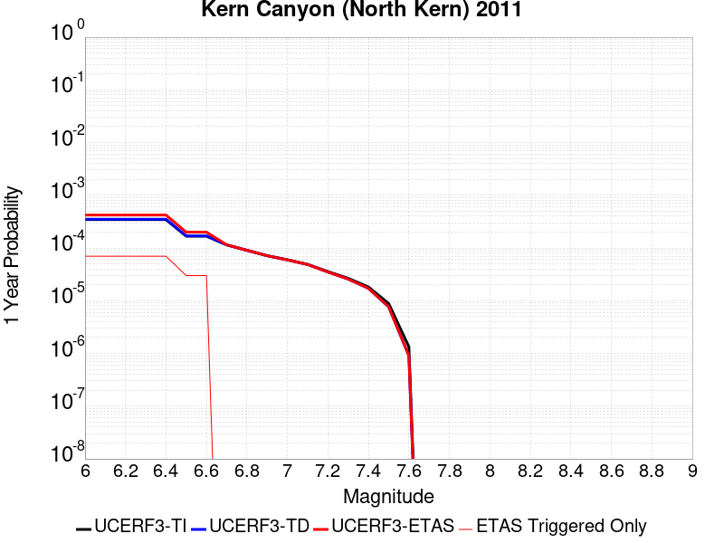 | 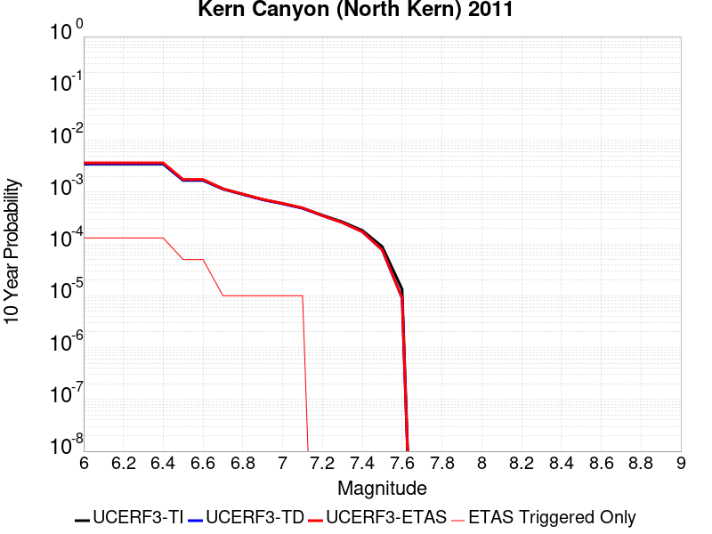 |

| Magnitude | 1 wk TI Prob | 1 wk TD Prob | 1 wk ETAS Prob | 1 wk ETAS/TD Gain | 1 wk ETAS Triggered Only | 1 mo TI Prob | 1 mo TD Prob | 1 mo ETAS Prob | 1 mo ETAS/TD Gain | 1 mo ETAS Triggered Only | 1 yr TI Prob | 1 yr TD Prob | 1 yr ETAS Prob | 1 yr ETAS/TD Gain | 1 yr ETAS Triggered Only | 10 yr TI Prob | 10 yr TD Prob | 10 yr ETAS Prob | 10 yr ETAS/TD Gain | 10 yr ETAS Triggered Only |
|-----|-----|-----|-----|-----|-----|-----|-----|-----|-----|-----|-----|-----|-----|-----|-----|-----|-----|-----|-----|-----|
| 6.0 | 6.6264497E-6 | 6.75733E-6 | 6.6756926E-5 | 9.879187 | 6.0E-5 | 2.8398761E-5 | 2.895971E-5 | 8.8957975E-5 | 3.071784 | 6.0E-5 | 3.4570007E-4 | 3.5253543E-4 | 4.2251076E-4 | 1.1984916 | 7.0E-5 | 0.0034516277 | 0.0035205502 | 0.0036500925 | 1.0367961 | 1.3E-4 |
| 6.1 | 6.6264497E-6 | 6.75733E-6 | 6.6756926E-5 | 9.879187 | 6.0E-5 | 2.8398761E-5 | 2.895971E-5 | 8.8957975E-5 | 3.071784 | 6.0E-5 | 3.4570007E-4 | 3.5253543E-4 | 4.2251076E-4 | 1.1984916 | 7.0E-5 | 0.0034516277 | 0.0035205502 | 0.0036500925 | 1.0367961 | 1.3E-4 |
| 6.2 | 6.6264497E-6 | 6.75733E-6 | 6.6756926E-5 | 9.879187 | 6.0E-5 | 2.8398761E-5 | 2.895971E-5 | 8.8957975E-5 | 3.071784 | 6.0E-5 | 3.4570007E-4 | 3.5253543E-4 | 4.2251076E-4 | 1.1984916 | 7.0E-5 | 0.0034516277 | 0.0035205502 | 0.0036500925 | 1.0367961 | 1.3E-4 |
| 6.3 | 6.6264497E-6 | 6.75733E-6 | 6.6756926E-5 | 9.879187 | 6.0E-5 | 2.8398761E-5 | 2.895971E-5 | 8.8957975E-5 | 3.071784 | 6.0E-5 | 3.4570007E-4 | 3.5253543E-4 | 4.2251076E-4 | 1.1984916 | 7.0E-5 | 0.0034516277 | 0.0035205502 | 0.0036500925 | 1.0367961 | 1.3E-4 |
| 6.4 | 6.6264497E-6 | 6.75733E-6 | 6.6756926E-5 | 9.879187 | 6.0E-5 | 2.8398761E-5 | 2.895971E-5 | 8.8957975E-5 | 3.071784 | 6.0E-5 | 3.4570007E-4 | 3.5253543E-4 | 4.2251076E-4 | 1.1984916 | 7.0E-5 | 0.0034516277 | 0.0035205502 | 0.0036500925 | 1.0367961 | 1.3E-4 |
| 6.5 | 3.2162225E-6 | 3.2570915E-6 | 3.3256994E-5 | 10.210642 | 3.0E-5 | 1.3783738E-5 | 1.3958893E-5 | 4.3958473E-5 | 3.1491375 | 3.0E-5 | 1.6780409E-4 | 1.6993708E-4 | 1.9993198E-4 | 1.1765059 | 3.0E-5 | 0.0016767744 | 0.001698151 | 0.001748066 | 1.0293938 | 5.0E-5 |
| 6.6 | 3.2162225E-6 | 3.2570915E-6 | 3.3256994E-5 | 10.210642 | 3.0E-5 | 1.3783738E-5 | 1.3958893E-5 | 4.3958473E-5 | 3.1491375 | 3.0E-5 | 1.6780409E-4 | 1.6993708E-4 | 1.9993198E-4 | 1.1765059 | 3.0E-5 | 0.0016767744 | 0.001698151 | 0.001748066 | 1.0293938 | 5.0E-5 |
| 6.7 | 2.1908265E-6 | 2.2071222E-6 | 2.2071222E-6 | 1.0 | 0.0 | 9.389223E-6 | 9.459061E-6 | 9.459061E-6 | 1.0 | 0.0 | 1.1430779E-4 | 1.1515819E-4 | 1.1515819E-4 | 1.0 | 0.0 | 0.0011424901 | 0.0011510046 | 0.001160993 | 1.0086781 | 1.0E-5 |
| 6.8 | 1.7303895E-6 | 1.7365529E-6 | 1.7365529E-6 | 1.0 | 0.0 | 7.415934E-6 | 7.4423488E-6 | 7.4423488E-6 | 1.0 | 0.0 | 9.028525E-5 | 9.0606925E-5 | 9.0606925E-5 | 1.0 | 0.0 | 9.024858E-4 | 9.057096E-4 | 9.157005E-4 | 1.011031 | 1.0E-5 |
| 6.9 | 1.3700314E-6 | 1.3688622E-6 | 1.3688622E-6 | 1.0 | 0.0 | 5.87155E-6 | 5.8665396E-6 | 5.8665396E-6 | 1.0 | 0.0 | 7.148377E-5 | 7.142282E-5 | 7.142282E-5 | 1.0 | 0.0 | 7.146078E-4 | 7.140032E-4 | 7.239961E-4 | 1.0139955 | 1.0E-5 |
| 7.0 | 1.1467797E-6 | 1.1413804E-6 | 1.1413804E-6 | 1.0 | 0.0 | 4.9147607E-6 | 4.8916213E-6 | 4.8916213E-6 | 1.0 | 0.0 | 5.983557E-5 | 5.9553895E-5 | 5.9553895E-5 | 1.0 | 0.0 | 5.981946E-4 | 5.953825E-4 | 6.0537655E-4 | 1.016786 | 1.0E-5 |
| 7.1 | 9.3952065E-7 | 9.3026904E-7 | 9.3026904E-7 | 1.0 | 0.0 | 4.026511E-6 | 3.9868614E-6 | 3.9868614E-6 | 1.0 | 0.0 | 4.9021666E-5 | 4.8538972E-5 | 4.8538972E-5 | 1.0 | 0.0 | 4.901085E-4 | 4.8528548E-4 | 4.952806E-4 | 1.0205964 | 1.0E-5 |
| 7.2 | 6.858055E-7 | 6.7193E-7 | 6.7193E-7 | 1.0 | 0.0 | 2.939163E-6 | 2.879697E-6 | 2.879697E-6 | 1.0 | 0.0 | 3.5783723E-5 | 3.5059755E-5 | 3.5059755E-5 | 1.0 | 0.0 | 3.5777962E-4 | 3.5054312E-4 | 3.5054312E-4 | 1.0 | 0.0 |
| 7.3 | 5.1101983E-7 | 4.9393E-7 | 4.9393E-7 | 1.0 | 0.0 | 2.1900833E-6 | 2.116841E-6 | 2.116841E-6 | 1.0 | 0.0 | 2.6663936E-5 | 2.5772239E-5 | 2.5772239E-5 | 1.0 | 0.0 | 2.6660739E-4 | 2.57693E-4 | 2.57693E-4 | 1.0 | 0.0 |
| 7.4 | 3.4999414E-7 | 3.2995905E-7 | 3.2995905E-7 | 1.0 | 0.0 | 1.499974E-6 | 1.4141094E-6 | 1.4141094E-6 | 1.0 | 0.0 | 1.8262032E-5 | 1.721665E-5 | 1.721665E-5 | 1.0 | 0.0 | 1.826053E-4 | 1.7215339E-4 | 1.7215339E-4 | 1.0 | 0.0 |
| 7.5 | 1.7021522E-7 | 1.4750044E-7 | 1.4750044E-7 | 1.0 | 0.0 | 7.2949354E-7 | 6.321446E-7 | 6.321446E-7 | 1.0 | 0.0 | 8.881548E-6 | 7.696334E-6 | 7.696334E-6 | 1.0 | 0.0 | 8.8811925E-5 | 7.696076E-5 | 7.696076E-5 | 1.0 | 0.0 |
| 7.6 | 2.572245E-8 | 1.7352555E-8 | 1.7352555E-8 | 1.0 | 0.0 | 1.10239064E-7 | 7.436809E-8 | 7.436809E-8 | 1.0 | 0.0 | 1.3421597E-6 | 9.054312E-7 | 9.054312E-7 | 1.0 | 0.0 | 1.3421517E-5 | 9.05428E-6 | 9.05428E-6 | 1.0 | 0.0 |

## Red Mountain
*[(top)](#table-of-contents)*

| 1 Week | 1 Month | 1 Year | 10 Year |
|-----|-----|-----|-----|
| 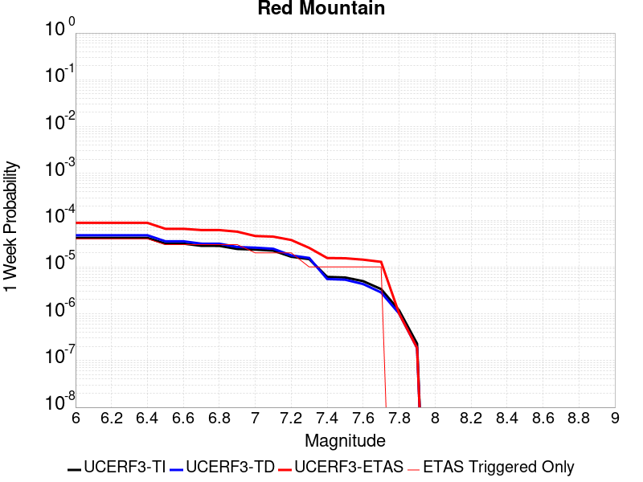 |  |  |  |

| Magnitude | 1 wk TI Prob | 1 wk TD Prob | 1 wk ETAS Prob | 1 wk ETAS/TD Gain | 1 wk ETAS Triggered Only | 1 mo TI Prob | 1 mo TD Prob | 1 mo ETAS Prob | 1 mo ETAS/TD Gain | 1 mo ETAS Triggered Only | 1 yr TI Prob | 1 yr TD Prob | 1 yr ETAS Prob | 1 yr ETAS/TD Gain | 1 yr ETAS Triggered Only | 10 yr TI Prob | 10 yr TD Prob | 10 yr ETAS Prob | 10 yr ETAS/TD Gain | 10 yr ETAS Triggered Only |
|-----|-----|-----|-----|-----|-----|-----|-----|-----|-----|-----|-----|-----|-----|-----|-----|-----|-----|-----|-----|-----|
| 6.0 | 4.1810763E-5 | 4.7589947E-5 | 8.758804E-5 | 1.8404737 | 4.0E-5 | 1.7917668E-4 | 2.039419E-4 | 2.4393374E-4 | 1.1960943 | 4.0E-5 | 0.0021792934 | 0.0024803306 | 0.002550157 | 1.028152 | 7.0E-5 | 0.021580452 | 0.024544092 | 0.024651391 | 1.0043718 | 1.1E-4 |
| 6.1 | 4.1810763E-5 | 4.7589947E-5 | 8.758804E-5 | 1.8404737 | 4.0E-5 | 1.7917668E-4 | 2.039419E-4 | 2.4393374E-4 | 1.1960943 | 4.0E-5 | 0.0021792934 | 0.0024803306 | 0.002550157 | 1.028152 | 7.0E-5 | 0.021580452 | 0.024544092 | 0.024651391 | 1.0043718 | 1.1E-4 |
| 6.2 | 4.1810763E-5 | 4.7589947E-5 | 8.758804E-5 | 1.8404737 | 4.0E-5 | 1.7917668E-4 | 2.039419E-4 | 2.4393374E-4 | 1.1960943 | 4.0E-5 | 0.0021792934 | 0.0024803306 | 0.002550157 | 1.028152 | 7.0E-5 | 0.021580452 | 0.024544092 | 0.024651391 | 1.0043718 | 1.1E-4 |
| 6.3 | 4.1810763E-5 | 4.7589947E-5 | 8.758804E-5 | 1.8404737 | 4.0E-5 | 1.7917668E-4 | 2.039419E-4 | 2.4393374E-4 | 1.1960943 | 4.0E-5 | 0.0021792934 | 0.0024803306 | 0.002550157 | 1.028152 | 7.0E-5 | 0.021580452 | 0.024544092 | 0.024651391 | 1.0043718 | 1.1E-4 |
| 6.4 | 4.1810763E-5 | 4.7589947E-5 | 8.758804E-5 | 1.8404737 | 4.0E-5 | 1.7917668E-4 | 2.039419E-4 | 2.4393374E-4 | 1.1960943 | 4.0E-5 | 0.0021792934 | 0.0024803306 | 0.002550157 | 1.028152 | 7.0E-5 | 0.021580452 | 0.024544092 | 0.024651391 | 1.0043718 | 1.1E-4 |
| 6.5 | 3.154503E-5 | 3.5359728E-5 | 6.535867E-5 | 1.8483928 | 3.0E-5 | 1.3518598E-4 | 1.5153342E-4 | 1.8152887E-4 | 1.1979462 | 3.0E-5 | 0.0016446467 | 0.0018434501 | 0.001893358 | 1.027073 | 5.0E-5 | 0.01632528 | 0.018291233 | 0.018369772 | 1.0042937 | 8.0E-5 |
| 6.6 | 3.1535834E-5 | 3.534911E-5 | 6.534805E-5 | 1.8486477 | 3.0E-5 | 1.3514658E-4 | 1.5148791E-4 | 1.8148337E-4 | 1.1980056 | 3.0E-5 | 0.0016441676 | 0.001842897 | 0.001892805 | 1.0270813 | 5.0E-5 | 0.01632056 | 0.018285794 | 0.018364333 | 1.004295 | 8.0E-5 |
| 6.7 | 2.8267326E-5 | 3.146934E-5 | 6.1468396E-5 | 1.9532789 | 3.0E-5 | 1.2114006E-4 | 1.348621E-4 | 1.6485807E-4 | 1.2224195 | 3.0E-5 | 0.0014738824 | 0.0016407946 | 0.0016907125 | 1.030423 | 5.0E-5 | 0.014641452 | 0.016295563 | 0.01637426 | 1.0048293 | 8.0E-5 |
| 6.8 | 2.8212884E-5 | 3.1407224E-5 | 6.140628E-5 | 1.9551642 | 3.0E-5 | 1.20906756E-4 | 1.3459593E-4 | 1.645919E-4 | 1.2228594 | 3.0E-5 | 0.0014710457 | 0.0016375587 | 0.0016874769 | 1.0304832 | 5.0E-5 | 0.014613459 | 0.01626368 | 0.01634238 | 1.004839 | 8.0E-5 |
| 6.9 | 2.4227871E-5 | 2.6706979E-5 | 5.6706176E-5 | 2.123272 | 3.0E-5 | 1.03829596E-4 | 1.14453884E-4 | 1.4445045E-4 | 1.2620842 | 3.0E-5 | 0.0012633923 | 0.0013926612 | 0.0014425915 | 1.0358524 | 5.0E-5 | 0.012562336 | 0.013847026 | 0.013916057 | 1.0049852 | 7.0E-5 |
| 7.0 | 2.348524E-5 | 2.5835763E-5 | 4.5835248E-5 | 1.7741008 | 2.0E-5 | 1.0064714E-4 | 1.1072042E-4 | 1.3071821E-4 | 1.1806152 | 2.0E-5 | 0.0012246901 | 0.0013472632 | 0.0013872093 | 1.0296499 | 4.0E-5 | 0.012179627 | 0.01339859 | 0.01344792 | 1.0036818 | 5.0E-5 |
| 7.1 | 2.2311642E-5 | 2.4462828E-5 | 4.446234E-5 | 1.817547 | 2.0E-5 | 9.561782E-5 | 1.048369E-4 | 1.2483481E-4 | 1.1907525 | 2.0E-5 | 0.0011635252 | 0.0012757168 | 0.0013156658 | 1.031315 | 4.0E-5 | 0.01157452 | 0.012691451 | 0.012740817 | 1.0038897 | 5.0E-5 |
| 7.2 | 1.6533986E-5 | 1.7670347E-5 | 3.7669994E-5 | 2.1318197 | 2.0E-5 | 7.085802E-5 | 7.572822E-5 | 9.5726704E-5 | 1.2640823 | 2.0E-5 | 8.623549E-4 | 9.216645E-4 | 9.6162764E-4 | 1.0433598 | 4.0E-5 | 0.008590161 | 0.009184699 | 0.009234239 | 1.0053939 | 5.0E-5 |
| 7.3 | 1.4703092E-5 | 1.555952E-5 | 2.5559366E-5 | 1.6426833 | 1.0E-5 | 6.301173E-5 | 6.66823E-5 | 7.668164E-5 | 1.1499548 | 1.0E-5 | 7.668978E-4 | 8.1161625E-4 | 8.415919E-4 | 1.0369333 | 3.0E-5 | 0.0076425658 | 0.008092596 | 0.008132272 | 1.0049028 | 4.0E-5 |
| 7.4 | 6.1331984E-6 | 5.528872E-6 | 1.5528816E-5 | 2.8086772 | 1.0E-5 | 2.6284872E-5 | 2.3694953E-5 | 3.3694716E-5 | 1.4220208 | 1.0E-5 | 3.199713E-4 | 2.8844838E-4 | 2.984455E-4 | 1.0346582 | 1.0E-5 | 0.0031951098 | 0.0028807942 | 0.0028907654 | 1.0034612 | 1.0E-5 |
| 7.5 | 5.954766E-6 | 5.3385015E-6 | 1.5338448E-5 | 2.873175 | 1.0E-5 | 2.5520176E-5 | 2.2879094E-5 | 3.2878866E-5 | 1.4370703 | 1.0E-5 | 3.1066386E-4 | 2.785179E-4 | 2.8851512E-4 | 1.0358944 | 1.0E-5 | 0.003102299 | 0.0027817423 | 0.0027917144 | 1.0035849 | 1.0E-5 |
| 7.6 | 4.9726646E-6 | 4.315295E-6 | 1.4315252E-5 | 3.3173287 | 1.0E-5 | 2.1311245E-5 | 1.8493993E-5 | 2.8493807E-5 | 1.5407062 | 1.0E-5 | 2.5943352E-4 | 2.2514143E-4 | 2.3513917E-4 | 1.0444065 | 1.0E-5 | 0.0025913084 | 0.002249168 | 0.0022591455 | 1.0044361 | 1.0E-5 |
| 7.7 | 3.3613894E-6 | 2.8526642E-6 | 1.2852636E-5 | 4.5054846 | 1.0E-5 | 1.4405875E-5 | 1.2225649E-5 | 2.2225526E-5 | 1.8179425 | 1.0E-5 | 1.7537741E-4 | 1.4883737E-4 | 1.5883589E-4 | 1.0671774 | 1.0E-5 | 0.0017523908 | 0.0014874031 | 0.0014973882 | 1.0067132 | 1.0E-5 |
| 7.8 | 1.1828961E-6 | 1.0122756E-6 | 1.0122756E-6 | 1.0 | 0.0 | 5.069545E-6 | 4.338317E-6 | 4.338317E-6 | 1.0 | 0.0 | 6.171996E-5 | 5.281776E-5 | 5.281776E-5 | 1.0 | 0.0 | 6.170282E-4 | 5.2805495E-4 | 5.2805495E-4 | 1.0 | 0.0 |
| 7.9 | 2.2967266E-7 | 1.8618952E-7 | 1.8618952E-7 | 1.0 | 0.0 | 9.843111E-7 | 7.9795484E-7 | 7.9795484E-7 | 1.0 | 0.0 | 1.19839215E-5 | 9.7150605E-6 | 9.7150605E-6 | 1.0 | 0.0 | 1.1983275E-4 | 9.714664E-5 | 9.714664E-5 | 1.0 | 0.0 |

## Santa Rosa Island
*[(top)](#table-of-contents)*

| 1 Week | 1 Month | 1 Year | 10 Year |
|-----|-----|-----|-----|
|  |  | 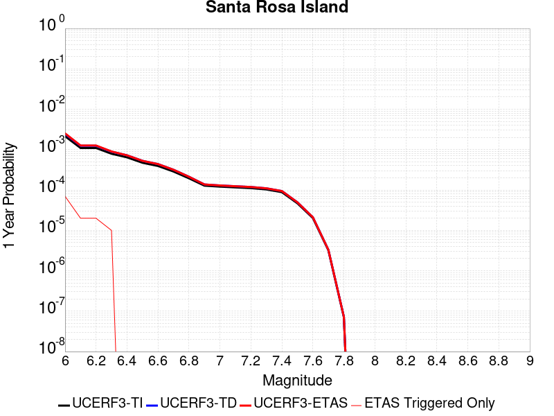 |  |

| Magnitude | 1 wk TI Prob | 1 wk TD Prob | 1 wk ETAS Prob | 1 wk ETAS/TD Gain | 1 wk ETAS Triggered Only | 1 mo TI Prob | 1 mo TD Prob | 1 mo ETAS Prob | 1 mo ETAS/TD Gain | 1 mo ETAS Triggered Only | 1 yr TI Prob | 1 yr TD Prob | 1 yr ETAS Prob | 1 yr ETAS/TD Gain | 1 yr ETAS Triggered Only | 10 yr TI Prob | 10 yr TD Prob | 10 yr ETAS Prob | 10 yr ETAS/TD Gain | 10 yr ETAS Triggered Only |
|-----|-----|-----|-----|-----|-----|-----|-----|-----|-----|-----|-----|-----|-----|-----|-----|-----|-----|-----|-----|-----|
| 6.0 | 4.1143165E-5 | 4.7091133E-5 | 6.709019E-5 | 1.4246885 | 2.0E-5 | 1.7631594E-4 | 2.0180465E-4 | 2.3179859E-4 | 1.1486286 | 3.0E-5 | 0.002144533 | 0.0024544 | 0.002524228 | 1.0284503 | 7.0E-5 | 0.021239553 | 0.024293551 | 0.024410635 | 1.0048196 | 1.2E-4 |
| 6.1 | 2.1061249E-5 | 2.3864959E-5 | 3.3864722E-5 | 1.4190143 | 1.0E-5 | 9.0259375E-5 | 1.0227455E-4 | 1.1227353E-4 | 1.097766 | 1.0E-5 | 0.0010983539 | 0.0012445104 | 0.0012644854 | 1.0160506 | 2.0E-5 | 0.01092941 | 0.012378449 | 0.012437706 | 1.0047871 | 6.0E-5 |
| 6.2 | 2.1061249E-5 | 2.3864959E-5 | 3.3864722E-5 | 1.4190143 | 1.0E-5 | 9.0259375E-5 | 1.0227455E-4 | 1.1227353E-4 | 1.097766 | 1.0E-5 | 0.0010983539 | 0.0012445104 | 0.0012644854 | 1.0160506 | 2.0E-5 | 0.01092941 | 0.012378449 | 0.012437706 | 1.0047871 | 6.0E-5 |
| 6.3 | 1.5158236E-5 | 1.7074419E-5 | 1.7074419E-5 | 1.0 | 0.0 | 6.496225E-5 | 7.3174095E-5 | 7.3174095E-5 | 1.0 | 0.0 | 7.906284E-4 | 8.905424E-4 | 9.005335E-4 | 1.0112191 | 1.0E-5 | 0.007878214 | 0.008870989 | 0.008920546 | 1.0055864 | 5.0E-5 |
| 6.4 | 1.2341918E-5 | 1.3852917E-5 | 1.3852917E-5 | 1.0 | 0.0 | 5.2892858E-5 | 5.9368336E-5 | 5.9368336E-5 | 1.0 | 0.0 | 6.437803E-4 | 7.225779E-4 | 7.225779E-4 | 1.0 | 0.0 | 0.006419184 | 0.007203121 | 0.0072428333 | 1.0055132 | 4.0E-5 |
| 6.5 | 9.061158E-6 | 1.0117031E-5 | 1.0117031E-5 | 1.0 | 0.0 | 3.883296E-5 | 4.3358013E-5 | 4.3358013E-5 | 1.0 | 0.0 | 4.726887E-4 | 5.277613E-4 | 5.277613E-4 | 1.0 | 0.0 | 0.004716845 | 0.0052656173 | 0.0052656173 | 1.0 | 0.0 |
| 6.6 | 7.5461685E-6 | 8.400733E-6 | 8.400733E-6 | 1.0 | 0.0 | 3.2340322E-5 | 3.600267E-5 | 3.600267E-5 | 1.0 | 0.0 | 3.936723E-4 | 4.3824865E-4 | 4.3824865E-4 | 1.0 | 0.0 | 0.003929756 | 0.0043742736 | 0.0043742736 | 1.0 | 0.0 |
| 6.7 | 5.5023775E-6 | 6.087381E-6 | 6.087381E-6 | 1.0 | 0.0 | 2.3581404E-5 | 2.6088532E-5 | 2.6088532E-5 | 1.0 | 0.0 | 2.8706578E-4 | 3.1758484E-4 | 3.1758484E-4 | 1.0 | 0.0 | 0.0028669522 | 0.0031716314 | 0.0031716314 | 1.0 | 0.0 |
| 6.8 | 3.7351679E-6 | 4.0831405E-6 | 4.0831405E-6 | 1.0 | 0.0 | 1.6007763E-5 | 1.749907E-5 | 1.749907E-5 | 1.0 | 0.0 | 1.948771E-4 | 2.1303284E-4 | 2.1303284E-4 | 1.0 | 0.0 | 0.0019470629 | 0.0021285315 | 0.0021285315 | 1.0 | 0.0 |
| 6.9 | 2.456366E-6 | 2.6292705E-6 | 2.6292705E-6 | 1.0 | 0.0 | 1.0527241E-5 | 1.1268254E-5 | 1.1268254E-5 | 1.0 | 0.0 | 1.2816161E-4 | 1.3718237E-4 | 1.3718237E-4 | 1.0 | 0.0 | 0.0012808773 | 0.0013709799 | 0.0013709799 | 1.0 | 0.0 |
| 7.0 | 2.3245157E-6 | 2.4827782E-6 | 2.4827782E-6 | 1.0 | 0.0 | 9.962172E-6 | 1.0640435E-5 | 1.0640435E-5 | 1.0 | 0.0 | 1.2128269E-4 | 1.2953962E-4 | 1.2953962E-4 | 1.0 | 0.0 | 0.0012121652 | 0.0012946434 | 0.0012946434 | 1.0 | 0.0 |
| 7.1 | 2.2248344E-6 | 2.37325E-6 | 2.37325E-6 | 1.0 | 0.0 | 9.53497E-6 | 1.0171032E-5 | 1.0171032E-5 | 1.0 | 0.0 | 1.1608207E-4 | 1.2382529E-4 | 1.2382529E-4 | 1.0 | 0.0 | 0.0011602144 | 0.001237565 | 0.001237565 | 1.0 | 0.0 |
| 7.2 | 2.1350402E-6 | 2.276154E-6 | 2.276154E-6 | 1.0 | 0.0 | 9.150141E-6 | 9.754909E-6 | 9.754909E-6 | 1.0 | 0.0 | 1.1139726E-4 | 1.1875956E-4 | 1.1875956E-4 | 1.0 | 0.0 | 0.0011134144 | 0.0011869629 | 0.0011869629 | 1.0 | 0.0 |
| 7.3 | 1.9793572E-6 | 2.108719E-6 | 2.108719E-6 | 1.0 | 0.0 | 8.482932E-6 | 9.037336E-6 | 9.037336E-6 | 1.0 | 0.0 | 1.032748E-4 | 1.10024026E-4 | 1.10024026E-4 | 1.0 | 0.0 | 0.0010322682 | 0.0010996973 | 0.0010996973 | 1.0 | 0.0 |
| 7.4 | 1.6951194E-6 | 1.8045733E-6 | 1.8045733E-6 | 1.0 | 0.0 | 7.264777E-6 | 7.733863E-6 | 7.733863E-6 | 1.0 | 0.0 | 8.844508E-5 | 9.415573E-5 | 9.415573E-5 | 1.0 | 0.0 | 8.840988E-4 | 9.4116E-4 | 9.4116E-4 | 1.0 | 0.0 |
| 7.5 | 8.987207E-7 | 9.5122147E-7 | 9.5122147E-7 | 1.0 | 0.0 | 3.8516546E-6 | 4.076657E-6 | 4.076657E-6 | 1.0 | 0.0 | 4.6892885E-5 | 4.963218E-5 | 4.963218E-5 | 1.0 | 0.0 | 4.688299E-4 | 4.9621216E-4 | 4.9621216E-4 | 1.0 | 0.0 |
| 7.6 | 3.8783037E-7 | 4.052932E-7 | 4.052932E-7 | 1.0 | 0.0 | 1.6621291E-6 | 1.7369698E-6 | 1.7369698E-6 | 1.0 | 0.0 | 2.0236233E-5 | 2.1147409E-5 | 2.1147409E-5 | 1.0 | 0.0 | 2.023439E-4 | 2.1145462E-4 | 2.1145462E-4 | 1.0 | 0.0 |
| 7.7 | 6.181804E-8 | 6.339035E-8 | 6.339035E-8 | 1.0 | 0.0 | 2.6493444E-7 | 2.7167292E-7 | 2.7167292E-7 | 1.0 | 0.0 | 3.225572E-6 | 3.3076128E-6 | 3.3076128E-6 | 1.0 | 0.0 | 3.225525E-5 | 3.307564E-5 | 3.307564E-5 | 1.0 | 0.0 |
| 7.8 | 1.3704449E-9 | 1.3964153E-9 | 1.3964153E-9 | 1.0 | 0.0 | 5.873335E-9 | 5.984637E-9 | 5.984637E-9 | 1.0 | 0.0 | 7.1507856E-8 | 7.286295E-8 | 7.286295E-8 | 1.0 | 0.0 | 7.1507833E-7 | 7.286294E-7 | 7.286294E-7 | 1.0 | 0.0 |

## Lost Hills
*[(top)](#table-of-contents)*

| 1 Week | 1 Month | 1 Year | 10 Year |
|-----|-----|-----|-----|
|  |  |  |  |

| Magnitude | 1 wk TI Prob | 1 wk TD Prob | 1 wk ETAS Prob | 1 wk ETAS/TD Gain | 1 wk ETAS Triggered Only | 1 mo TI Prob | 1 mo TD Prob | 1 mo ETAS Prob | 1 mo ETAS/TD Gain | 1 mo ETAS Triggered Only | 1 yr TI Prob | 1 yr TD Prob | 1 yr ETAS Prob | 1 yr ETAS/TD Gain | 1 yr ETAS Triggered Only | 10 yr TI Prob | 10 yr TD Prob | 10 yr ETAS Prob | 10 yr ETAS/TD Gain | 10 yr ETAS Triggered Only |
|-----|-----|-----|-----|-----|-----|-----|-----|-----|-----|-----|-----|-----|-----|-----|-----|-----|-----|-----|-----|-----|
| 6.0 | 2.233523E-5 | 2.5106583E-5 | 7.510533E-5 | 2.9914596 | 5.0E-5 | 9.571891E-5 | 1.0759615E-4 | 1.675897E-4 | 1.5575808 | 6.0E-5 | 0.0011647546 | 0.001309364 | 0.0013892592 | 1.0610183 | 8.0E-5 | 0.011586686 | 0.013033091 | 0.013151526 | 1.0090873 | 1.2E-4 |
| 6.1 | 2.233523E-5 | 2.5106583E-5 | 7.510533E-5 | 2.9914596 | 5.0E-5 | 9.571891E-5 | 1.0759615E-4 | 1.675897E-4 | 1.5575808 | 6.0E-5 | 0.0011647546 | 0.001309364 | 0.0013892592 | 1.0610183 | 8.0E-5 | 0.011586686 | 0.013033091 | 0.013151526 | 1.0090873 | 1.2E-4 |
| 6.2 | 2.233523E-5 | 2.5106583E-5 | 7.510533E-5 | 2.9914596 | 5.0E-5 | 9.571891E-5 | 1.0759615E-4 | 1.675897E-4 | 1.5575808 | 6.0E-5 | 0.0011647546 | 0.001309364 | 0.0013892592 | 1.0610183 | 8.0E-5 | 0.011586686 | 0.013033091 | 0.013151526 | 1.0090873 | 1.2E-4 |
| 6.3 | 2.233523E-5 | 2.5106583E-5 | 7.510533E-5 | 2.9914596 | 5.0E-5 | 9.571891E-5 | 1.0759615E-4 | 1.675897E-4 | 1.5575808 | 6.0E-5 | 0.0011647546 | 0.001309364 | 0.0013892592 | 1.0610183 | 8.0E-5 | 0.011586686 | 0.013033091 | 0.013151526 | 1.0090873 | 1.2E-4 |
| 6.4 | 1.2288092E-5 | 1.3781108E-5 | 3.378083E-5 | 2.4512422 | 2.0E-5 | 5.2662188E-5 | 5.906108E-5 | 8.905931E-5 | 1.5079187 | 3.0E-5 | 6.409735E-4 | 7.189252E-4 | 7.5889647E-4 | 1.0555986 | 4.0E-5 | 0.006391279 | 0.0071752006 | 0.007224842 | 1.0069184 | 5.0E-5 |
| 6.5 | 1.2288092E-5 | 1.3781108E-5 | 3.378083E-5 | 2.4512422 | 2.0E-5 | 5.2662188E-5 | 5.906108E-5 | 8.905931E-5 | 1.5079187 | 3.0E-5 | 6.409735E-4 | 7.189252E-4 | 7.5889647E-4 | 1.0555986 | 4.0E-5 | 0.006391279 | 0.0071752006 | 0.007224842 | 1.0069184 | 5.0E-5 |
| 6.6 | 8.58281E-6 | 9.63377E-6 | 2.9633577E-5 | 3.0760105 | 2.0E-5 | 3.6782953E-5 | 4.12874E-5 | 7.1286166E-5 | 1.726584 | 3.0E-5 | 4.4774043E-4 | 5.026414E-4 | 5.426213E-4 | 1.0795397 | 4.0E-5 | 0.0044683935 | 0.005023205 | 0.0050630043 | 1.007923 | 4.0E-5 |
| 6.7 | 7.205685E-6 | 8.088302E-6 | 2.808814E-5 | 3.472687 | 2.0E-5 | 3.088114E-5 | 3.466415E-5 | 6.466311E-5 | 1.8654175 | 3.0E-5 | 3.7591302E-4 | 4.2203604E-4 | 4.6201915E-4 | 1.0947386 | 4.0E-5 | 0.0037527776 | 0.0042203604 | 0.0042601917 | 1.0094379 | 4.0E-5 |

## Imperial
*[(top)](#table-of-contents)*

| 1 Week | 1 Month | 1 Year | 10 Year |
|-----|-----|-----|-----|
|  |  |  |  |

| Magnitude | 1 wk TI Prob | 1 wk TD Prob | 1 wk ETAS Prob | 1 wk ETAS/TD Gain | 1 wk ETAS Triggered Only | 1 mo TI Prob | 1 mo TD Prob | 1 mo ETAS Prob | 1 mo ETAS/TD Gain | 1 mo ETAS Triggered Only | 1 yr TI Prob | 1 yr TD Prob | 1 yr ETAS Prob | 1 yr ETAS/TD Gain | 1 yr ETAS Triggered Only | 10 yr TI Prob | 10 yr TD Prob | 10 yr ETAS Prob | 10 yr ETAS/TD Gain | 10 yr ETAS Triggered Only |
|-----|-----|-----|-----|-----|-----|-----|-----|-----|-----|-----|-----|-----|-----|-----|-----|-----|-----|-----|-----|-----|
| 6.0 | 2.7496446E-4 | 5.0552754E-4 | 5.3551234E-4 | 1.0593139 | 3.0E-5 | 0.0011778869 | 0.002164787 | 0.0022047004 | 1.0184376 | 4.0E-5 | 0.0142467655 | 0.026038699 | 0.026136095 | 1.0037404 | 1.0E-4 | 0.13367249 | 0.2280438 | 0.22813642 | 1.0004063 | 1.2E-4 |
| 6.1 | 2.5356023E-4 | 4.8656776E-4 | 5.165532E-4 | 1.0616263 | 3.0E-5 | 0.001086234 | 0.0020836622 | 0.002123579 | 1.0191569 | 4.0E-5 | 0.013144928 | 0.025071215 | 0.025168708 | 1.0038886 | 1.0E-4 | 0.123940155 | 0.21947981 | 0.21957347 | 1.0004268 | 1.2E-4 |
| 6.2 | 2.4820742E-4 | 4.7752203E-4 | 5.075077E-4 | 1.0627943 | 3.0E-5 | 0.0010633124 | 0.0020449557 | 0.0020848738 | 1.0195203 | 4.0E-5 | 0.01286919 | 0.024611235 | 0.024708774 | 1.0039632 | 1.0E-4 | 0.12148927 | 0.21598552 | 0.21607961 | 1.0004356 | 1.2E-4 |
| 6.3 | 2.3205351E-4 | 4.5890483E-4 | 4.8889103E-4 | 1.065343 | 3.0E-5 | 9.94136E-4 | 0.0019652895 | 0.0020052108 | 1.0203133 | 4.0E-5 | 0.012036599 | 0.02366133 | 0.023758965 | 1.0041263 | 1.0E-4 | 0.11405133 | 0.20793462 | 0.20802966 | 1.000457 | 1.2E-4 |
| 6.4 | 2.0304754E-4 | 3.987652E-4 | 4.2875324E-4 | 1.0752022 | 3.0E-5 | 8.6991355E-4 | 0.0017078889 | 0.0017478206 | 1.0233808 | 4.0E-5 | 0.010539869 | 0.020595672 | 0.020693611 | 1.0047554 | 1.0E-4 | 0.100537635 | 0.1850669 | 0.18516469 | 1.0005285 | 1.2E-4 |
| 6.5 | 1.854992E-4 | 3.6988858E-4 | 3.998775E-4 | 1.0810755 | 3.0E-5 | 7.9475436E-4 | 0.0015842861 | 0.0016242227 | 1.025208 | 4.0E-5 | 0.009633281 | 0.01911948 | 0.01921757 | 1.0051303 | 1.0E-4 | 0.0922623 | 0.173298 | 0.17339721 | 1.0005724 | 1.2E-4 |
| 6.6 | 1.6586106E-4 | 3.403506E-4 | 3.7034042E-4 | 1.0881144 | 3.0E-5 | 7.106394E-4 | 0.0014578402 | 0.001497782 | 1.0273979 | 4.0E-5 | 0.008617763 | 0.01760642 | 0.01770466 | 1.0055797 | 1.0E-4 | 0.08291132 | 0.16077545 | 0.16087615 | 1.0006263 | 1.2E-4 |
| 6.7 | 1.4224656E-4 | 3.076692E-4 | 3.3765996E-4 | 1.0974773 | 3.0E-5 | 6.094856E-4 | 0.001317924 | 0.0013578713 | 1.0303108 | 4.0E-5 | 0.0073952693 | 0.015929576 | 0.016027983 | 1.0061777 | 1.0E-4 | 0.07153955 | 0.14648417 | 0.14658658 | 1.0006992 | 1.2E-4 |
| 6.8 | 1.2317259E-4 | 2.779122E-4 | 3.0790386E-4 | 1.1079178 | 3.0E-5 | 5.2777573E-4 | 0.0011905148 | 0.0012304671 | 1.033559 | 4.0E-5 | 0.0064067547 | 0.0143995695 | 0.014488273 | 1.0061601 | 9.0E-5 | 0.06225166 | 0.13293684 | 0.1330322 | 1.0007174 | 1.1E-4 |
| 6.9 | 9.859898E-5 | 2.5014306E-4 | 2.8013554E-4 | 1.1199014 | 3.0E-5 | 4.2249862E-4 | 0.0010716055 | 0.0011115626 | 1.0372871 | 4.0E-5 | 0.0051317946 | 0.012969712 | 0.013058544 | 1.0068493 | 9.0E-5 | 0.05014893 | 0.11940631 | 0.11950318 | 1.0008112 | 1.1E-4 |
| 7.0 | 7.3191884E-5 | 2.1266776E-4 | 2.4266138E-4 | 1.1410351 | 3.0E-5 | 3.136418E-4 | 9.1111806E-4 | 9.5108163E-4 | 1.0438621 | 4.0E-5 | 0.003811904 | 0.011037128 | 0.011126135 | 1.0080643 | 9.0E-5 | 0.037471764 | 0.10206493 | 0.1021637 | 1.0009677 | 1.1E-4 |
| 7.1 | 7.1760296E-5 | 2.0968143E-4 | 2.3967514E-4 | 1.1430442 | 3.0E-5 | 3.0750787E-4 | 8.983284E-4 | 9.382924E-4 | 1.0444871 | 4.0E-5 | 0.003737482 | 0.010882978 | 0.010971999 | 1.0081798 | 9.0E-5 | 0.03675245 | 0.10070146 | 0.10080038 | 1.0009823 | 1.1E-4 |
| 7.2 | 6.46614E-5 | 1.9136685E-4 | 2.2136112E-4 | 1.156737 | 3.0E-5 | 2.7709085E-4 | 8.1988896E-4 | 8.5985614E-4 | 1.0487471 | 4.0E-5 | 0.0033683628 | 0.0099370815 | 0.010026188 | 1.008967 | 9.0E-5 | 0.033177625 | 0.09250898 | 0.0926088 | 1.0010791 | 1.1E-4 |
| 7.3 | 6.088115E-5 | 1.78084E-4 | 2.0807865E-4 | 1.1684299 | 3.0E-5 | 2.6089314E-4 | 7.6299673E-4 | 8.029662E-4 | 1.0523849 | 4.0E-5 | 0.0031717476 | 0.009250494 | 0.009339661 | 1.0096393 | 9.0E-5 | 0.031268585 | 0.08655989 | 0.08666037 | 1.0011607 | 1.1E-4 |
| 7.4 | 4.199346E-5 | 1.1510366E-4 | 1.4510022E-4 | 1.2606046 | 3.0E-5 | 1.7995955E-4 | 4.9320905E-4 | 5.3318933E-4 | 1.0810615 | 4.0E-5 | 0.0021888057 | 0.0059884563 | 0.0060679773 | 1.0132791 | 8.0E-5 | 0.02167372 | 0.057439793 | 0.05753405 | 1.0016409 | 1.0E-4 |
| 7.5 | 3.130448E-5 | 8.33328E-5 | 1.03331135E-4 | 1.2399815 | 2.0E-5 | 1.3415517E-4 | 3.57092E-4 | 3.870813E-4 | 1.083982 | 3.0E-5 | 0.0016321153 | 0.004338988 | 0.004388771 | 1.0114734 | 5.0E-5 | 0.016201803 | 0.04213201 | 0.04218948 | 1.0013641 | 6.0E-5 |
| 7.6 | 2.3074248E-5 | 6.0844646E-5 | 7.084404E-5 | 1.164343 | 1.0E-5 | 9.888588E-5 | 2.6073685E-4 | 2.8073162E-4 | 1.0766857 | 2.0E-5 | 0.0012032706 | 0.0031698733 | 0.0032097467 | 1.0125788 | 4.0E-5 | 0.011967761 | 0.031026395 | 0.031074844 | 1.0015615 | 5.0E-5 |
| 7.7 | 1.45864815E-5 | 4.0124698E-5 | 5.0124298E-5 | 1.2492131 | 1.0E-5 | 6.2511994E-5 | 1.7195169E-4 | 1.9194825E-4 | 1.1162918 | 2.0E-5 | 7.608177E-4 | 0.0020915072 | 0.0021214443 | 1.0143137 | 3.0E-5 | 0.007582182 | 0.020627763 | 0.020666938 | 1.0018991 | 4.0E-5 |
| 7.8 | 1.0352979E-5 | 3.0960902E-5 | 4.0960593E-5 | 1.322978 | 1.0E-5 | 4.4369157E-5 | 1.3268284E-4 | 1.5268018E-4 | 1.1507154 | 2.0E-5 | 5.400606E-4 | 0.0016142189 | 0.0016441705 | 1.0185548 | 3.0E-5 | 0.0053875 | 0.016016833 | 0.016056193 | 1.0024574 | 4.0E-5 |
| 7.9 | 8.137906E-6 | 2.2149103E-5 | 2.2149103E-5 | 1.0 | 0.0 | 3.4876273E-5 | 9.492128E-5 | 1.0492033E-4 | 1.1053405 | 1.0E-5 | 4.2453592E-4 | 0.0011550548 | 0.0011750316 | 1.0172952 | 2.0E-5 | 0.004237258 | 0.011617903 | 0.011647554 | 1.0025523 | 3.0E-5 |
| 8.0 | 6.93792E-6 | 1.8008766E-5 | 1.8008766E-5 | 1.0 | 0.0 | 2.9733603E-5 | 7.717814E-5 | 8.7177374E-5 | 1.1295604 | 1.0E-5 | 3.6194647E-4 | 9.3923963E-4 | 9.592208E-4 | 1.0212739 | 2.0E-5 | 0.0036135751 | 0.00950155 | 0.009531265 | 1.0031273 | 3.0E-5 |
| 8.1 | 3.4286315E-6 | 6.379872E-6 | 6.379872E-6 | 1.0 | 0.0 | 1.4694053E-5 | 2.7342023E-5 | 3.734175E-5 | 1.3657274 | 1.0E-5 | 1.7888541E-4 | 3.328384E-4 | 3.5283173E-4 | 1.0600692 | 2.0E-5 | 0.0017874148 | 0.003486031 | 0.0035159262 | 1.0085758 | 3.0E-5 |
| 8.2 | 1.4906886E-6 | 1.9366646E-6 | 1.9366646E-6 | 1.0 | 0.0 | 6.3886496E-6 | 8.299965E-6 | 1.8299883E-5 | 2.2048144 | 1.0E-5 | 7.7779034E-5 | 1.0104742E-4 | 1.210454E-4 | 1.1979069 | 2.0E-5 | 7.775182E-4 | 0.0011075331 | 0.0011275109 | 1.0180382 | 2.0E-5 |
| 8.3 | 2.5758007E-8 | 1.4500102E-8 | 1.4500102E-8 | 1.0 | 0.0 | 1.10391454E-7 | 6.214329E-8 | 6.214329E-8 | 1.0 | 0.0 | 1.3440151E-6 | 7.565946E-7 | 7.565946E-7 | 1.0 | 0.0 | 1.344007E-5 | 7.887763E-6 | 7.887763E-6 | 1.0 | 0.0 |

## Channel Islands Thrust
*[(top)](#table-of-contents)*

| 1 Week | 1 Month | 1 Year | 10 Year |
|-----|-----|-----|-----|
|  |  |  |  |

| Magnitude | 1 wk TI Prob | 1 wk TD Prob | 1 wk ETAS Prob | 1 wk ETAS/TD Gain | 1 wk ETAS Triggered Only | 1 mo TI Prob | 1 mo TD Prob | 1 mo ETAS Prob | 1 mo ETAS/TD Gain | 1 mo ETAS Triggered Only | 1 yr TI Prob | 1 yr TD Prob | 1 yr ETAS Prob | 1 yr ETAS/TD Gain | 1 yr ETAS Triggered Only | 10 yr TI Prob | 10 yr TD Prob | 10 yr ETAS Prob | 10 yr ETAS/TD Gain | 10 yr ETAS Triggered Only |
|-----|-----|-----|-----|-----|-----|-----|-----|-----|-----|-----|-----|-----|-----|-----|-----|-----|-----|-----|-----|-----|
| 6.0 | 2.2156251E-5 | 2.4092022E-5 | 6.409106E-5 | 2.6602607 | 4.0E-5 | 9.495191E-5 | 1.03248036E-4 | 1.5324287E-4 | 1.4842207 | 5.0E-5 | 0.0011554264 | 0.0012564264 | 0.0013263385 | 1.0556436 | 7.0E-5 | 0.011494373 | 0.0125038205 | 0.012612445 | 1.0086873 | 1.1E-4 |
| 6.1 | 2.2156251E-5 | 2.4092022E-5 | 6.409106E-5 | 2.6602607 | 4.0E-5 | 9.495191E-5 | 1.03248036E-4 | 1.5324287E-4 | 1.4842207 | 5.0E-5 | 0.0011554264 | 0.0012564264 | 0.0013263385 | 1.0556436 | 7.0E-5 | 0.011494373 | 0.0125038205 | 0.012612445 | 1.0086873 | 1.1E-4 |
| 6.2 | 2.2156251E-5 | 2.4092022E-5 | 6.409106E-5 | 2.6602607 | 4.0E-5 | 9.495191E-5 | 1.03248036E-4 | 1.5324287E-4 | 1.4842207 | 5.0E-5 | 0.0011554264 | 0.0012564264 | 0.0013263385 | 1.0556436 | 7.0E-5 | 0.011494373 | 0.0125038205 | 0.012612445 | 1.0086873 | 1.1E-4 |
| 6.3 | 2.2156251E-5 | 2.4092022E-5 | 6.409106E-5 | 2.6602607 | 4.0E-5 | 9.495191E-5 | 1.03248036E-4 | 1.5324287E-4 | 1.4842207 | 5.0E-5 | 0.0011554264 | 0.0012564264 | 0.0013263385 | 1.0556436 | 7.0E-5 | 0.011494373 | 0.0125038205 | 0.012612445 | 1.0086873 | 1.1E-4 |
| 6.4 | 2.2156251E-5 | 2.4092022E-5 | 6.409106E-5 | 2.6602607 | 4.0E-5 | 9.495191E-5 | 1.03248036E-4 | 1.5324287E-4 | 1.4842207 | 5.0E-5 | 0.0011554264 | 0.0012564264 | 0.0013263385 | 1.0556436 | 7.0E-5 | 0.011494373 | 0.0125038205 | 0.012612445 | 1.0086873 | 1.1E-4 |
| 6.5 | 2.2156251E-5 | 2.4092022E-5 | 6.409106E-5 | 2.6602607 | 4.0E-5 | 9.495191E-5 | 1.03248036E-4 | 1.5324287E-4 | 1.4842207 | 5.0E-5 | 0.0011554264 | 0.0012564264 | 0.0013263385 | 1.0556436 | 7.0E-5 | 0.011494373 | 0.0125038205 | 0.012612445 | 1.0086873 | 1.1E-4 |
| 6.6 | 2.2156251E-5 | 2.4092022E-5 | 6.409106E-5 | 2.6602607 | 4.0E-5 | 9.495191E-5 | 1.03248036E-4 | 1.5324287E-4 | 1.4842207 | 5.0E-5 | 0.0011554264 | 0.0012564264 | 0.0013263385 | 1.0556436 | 7.0E-5 | 0.011494373 | 0.0125038205 | 0.012612445 | 1.0086873 | 1.1E-4 |
| 6.7 | 1.0601296E-5 | 1.1379544E-5 | 3.1379317E-5 | 2.7575197 | 2.0E-5 | 4.5433335E-5 | 4.876859E-5 | 7.876712E-5 | 1.61512 | 3.0E-5 | 5.5301044E-4 | 5.936007E-4 | 6.2358286E-4 | 1.050509 | 3.0E-5 | 0.005516363 | 0.005920653 | 0.005980298 | 1.010074 | 6.0E-5 |
| 6.8 | 1.0246747E-5 | 1.0996669E-5 | 3.099645E-5 | 2.8187127 | 2.0E-5 | 4.391389E-5 | 4.7127756E-5 | 7.7126344E-5 | 1.6365376 | 3.0E-5 | 5.345204E-4 | 5.7363417E-4 | 6.0361694E-4 | 1.0522681 | 3.0E-5 | 0.0053323656 | 0.005722025 | 0.0057816813 | 1.0104258 | 6.0E-5 |
| 6.9 | 9.049551E-6 | 9.699645E-6 | 2.969945E-5 | 3.0619113 | 2.0E-5 | 3.878322E-5 | 4.1569267E-5 | 6.156843E-5 | 1.4811047 | 2.0E-5 | 4.7208337E-4 | 5.059924E-4 | 5.2598224E-4 | 1.0395063 | 2.0E-5 | 0.0047108172 | 0.0050488203 | 0.005098568 | 1.0098534 | 5.0E-5 |
| 7.0 | 8.6542195E-6 | 9.274603E-6 | 2.9274417E-5 | 3.1564066 | 2.0E-5 | 3.7088983E-5 | 3.9747716E-5 | 5.9746922E-5 | 1.5031536 | 2.0E-5 | 4.5146482E-4 | 4.8382508E-4 | 5.0381536E-4 | 1.0413172 | 2.0E-5 | 0.004505487 | 0.004828129 | 0.0048778877 | 1.010306 | 5.0E-5 |
| 7.1 | 8.391028E-6 | 8.992924E-6 | 2.8992745E-5 | 3.2239506 | 2.0E-5 | 3.5961057E-5 | 3.854056E-5 | 5.853979E-5 | 1.5189139 | 2.0E-5 | 4.3773788E-4 | 4.6913436E-4 | 4.8912497E-4 | 1.0426117 | 2.0E-5 | 0.004368766 | 0.0046818503 | 0.004731616 | 1.0106295 | 5.0E-5 |
| 7.2 | 5.965188E-6 | 6.3716952E-6 | 2.6371568E-5 | 4.138862 | 2.0E-5 | 2.556484E-5 | 2.7306982E-5 | 4.7306436E-5 | 1.7323934 | 2.0E-5 | 3.1120746E-4 | 3.3241234E-4 | 3.5240568E-4 | 1.0601462 | 2.0E-5 | 0.00310772 | 0.0033192092 | 0.0033590766 | 1.012011 | 4.0E-5 |
| 7.3 | 4.877518E-6 | 5.2060063E-6 | 1.5205955E-5 | 2.9208481 | 1.0E-5 | 2.0903482E-5 | 2.2311267E-5 | 3.2311043E-5 | 1.448194 | 1.0E-5 | 2.5447016E-4 | 2.716063E-4 | 2.8160357E-4 | 1.036808 | 1.0E-5 | 0.0025417898 | 0.0027127895 | 0.0027327354 | 1.0073525 | 2.0E-5 |
| 7.4 | 3.8829853E-6 | 4.141863E-6 | 1.4141821E-5 | 3.4143627 | 1.0E-5 | 1.664126E-5 | 1.7750723E-5 | 2.7750544E-5 | 1.5633473 | 1.0E-5 | 2.0258849E-4 | 2.1609402E-4 | 2.2609186E-4 | 1.0462662 | 1.0E-5 | 0.002024039 | 0.0021588807 | 0.0021788375 | 1.0092441 | 2.0E-5 |
| 7.5 | 1.3489616E-6 | 1.4277903E-6 | 1.1427776E-5 | 8.003819 | 1.0E-5 | 5.7812517E-6 | 6.119087E-6 | 1.6119026E-5 | 2.6342206 | 1.0E-5 | 7.038446E-5 | 7.449738E-5 | 8.4496634E-5 | 1.1342229 | 1.0E-5 | 7.036218E-4 | 7.44728E-4 | 7.547206E-4 | 1.0134177 | 1.0E-5 |
| 7.6 | 6.058192E-7 | 6.353778E-7 | 6.353778E-7 | 1.0 | 0.0 | 2.5963652E-6 | 2.7230449E-6 | 2.7230449E-6 | 1.0 | 0.0 | 3.161029E-5 | 3.3152584E-5 | 3.3152584E-5 | 1.0 | 0.0 | 3.1605794E-4 | 3.31478E-4 | 3.31478E-4 | 1.0 | 0.0 |
| 7.7 | 2.2170494E-7 | 2.2607902E-7 | 2.2607902E-7 | 1.0 | 0.0 | 9.5016367E-7 | 9.689098E-7 | 9.689098E-7 | 1.0 | 0.0 | 1.1568181E-5 | 1.1796425E-5 | 1.1796425E-5 | 1.0 | 0.0 | 1.1567579E-4 | 1.1795909E-4 | 1.1795909E-4 | 1.0 | 0.0 |
| 7.8 | 2.1613102E-8 | 1.5466682E-8 | 1.5466682E-8 | 1.0 | 0.0 | 9.262757E-8 | 6.628578E-8 | 6.628578E-8 | 1.0 | 0.0 | 1.1277401E-6 | 8.070291E-7 | 8.070291E-7 | 1.0 | 0.0 | 1.1277344E-5 | 8.070269E-6 | 8.070269E-6 | 1.0 | 0.0 |

## White Mountains
*[(top)](#table-of-contents)*

| 1 Week | 1 Month | 1 Year | 10 Year |
|-----|-----|-----|-----|
|  |  |  |  |

| Magnitude | 1 wk TI Prob | 1 wk TD Prob | 1 wk ETAS Prob | 1 wk ETAS/TD Gain | 1 wk ETAS Triggered Only | 1 mo TI Prob | 1 mo TD Prob | 1 mo ETAS Prob | 1 mo ETAS/TD Gain | 1 mo ETAS Triggered Only | 1 yr TI Prob | 1 yr TD Prob | 1 yr ETAS Prob | 1 yr ETAS/TD Gain | 1 yr ETAS Triggered Only | 10 yr TI Prob | 10 yr TD Prob | 10 yr ETAS Prob | 10 yr ETAS/TD Gain | 10 yr ETAS Triggered Only |
|-----|-----|-----|-----|-----|-----|-----|-----|-----|-----|-----|-----|-----|-----|-----|-----|-----|-----|-----|-----|-----|
| 6.0 | 3.503579E-5 | 3.378405E-5 | 5.3783377E-5 | 1.5919753 | 2.0E-5 | 1.5014476E-4 | 1.4478143E-4 | 1.7477709E-4 | 1.2071788 | 3.0E-5 | 0.0018264796 | 0.0017614096 | 0.0018213039 | 1.0340036 | 6.0E-5 | 0.018115403 | 0.017486818 | 0.017594894 | 1.0061804 | 1.1E-4 |
| 6.1 | 3.503579E-5 | 3.378405E-5 | 5.3783377E-5 | 1.5919753 | 2.0E-5 | 1.5014476E-4 | 1.4478143E-4 | 1.7477709E-4 | 1.2071788 | 3.0E-5 | 0.0018264796 | 0.0017614096 | 0.0018213039 | 1.0340036 | 6.0E-5 | 0.018115403 | 0.017486818 | 0.017594894 | 1.0061804 | 1.1E-4 |
| 6.2 | 3.503579E-5 | 3.378405E-5 | 5.3783377E-5 | 1.5919753 | 2.0E-5 | 1.5014476E-4 | 1.4478143E-4 | 1.7477709E-4 | 1.2071788 | 3.0E-5 | 0.0018264796 | 0.0017614096 | 0.0018213039 | 1.0340036 | 6.0E-5 | 0.018115403 | 0.017486818 | 0.017594894 | 1.0061804 | 1.1E-4 |
| 6.3 | 1.7818425E-5 | 1.5916074E-5 | 2.5915915E-5 | 1.6282856 | 1.0E-5 | 7.636245E-5 | 6.821004E-5 | 8.8208675E-5 | 1.2931919 | 2.0E-5 | 9.293162E-4 | 8.301551E-4 | 8.6013024E-4 | 1.0361078 | 3.0E-5 | 0.009254395 | 0.008271999 | 0.008321585 | 1.0059944 | 5.0E-5 |
| 6.4 | 1.7818425E-5 | 1.5916074E-5 | 2.5915915E-5 | 1.6282856 | 1.0E-5 | 7.636245E-5 | 6.821004E-5 | 8.8208675E-5 | 1.2931919 | 2.0E-5 | 9.293162E-4 | 8.301551E-4 | 8.6013024E-4 | 1.0361078 | 3.0E-5 | 0.009254395 | 0.008271999 | 0.008321585 | 1.0059944 | 5.0E-5 |
| 6.5 | 1.3397557E-5 | 1.13362685E-5 | 1.13362685E-5 | 1.0 | 0.0 | 5.741684E-5 | 4.858314E-5 | 4.858314E-5 | 1.0 | 0.0 | 6.988258E-4 | 5.913462E-4 | 5.913462E-4 | 1.0 | 0.0 | 0.006966323 | 0.005898432 | 0.0059183137 | 1.0033708 | 2.0E-5 |
| 6.6 | 1.0818695E-5 | 8.625366E-6 | 8.625366E-6 | 1.0 | 0.0 | 4.6365014E-5 | 3.6965357E-5 | 3.6965357E-5 | 1.0 | 0.0 | 5.6434784E-4 | 4.4996463E-4 | 4.4996463E-4 | 1.0 | 0.0 | 0.005629168 | 0.004490972 | 0.0045108823 | 1.0044334 | 2.0E-5 |
| 6.7 | 9.067908E-6 | 6.802442E-6 | 6.802442E-6 | 1.0 | 0.0 | 3.8861883E-5 | 2.9153016E-5 | 2.9153016E-5 | 1.0 | 0.0 | 4.7304068E-4 | 3.5488335E-4 | 3.5488335E-4 | 1.0 | 0.0 | 0.00472035 | 0.0035434833 | 0.0035634125 | 1.0056242 | 2.0E-5 |
| 6.8 | 7.295947E-6 | 4.936391E-6 | 4.936391E-6 | 1.0 | 0.0 | 3.126797E-5 | 2.1155796E-5 | 2.1155796E-5 | 1.0 | 0.0 | 3.8062103E-4 | 2.575425E-4 | 2.575425E-4 | 1.0 | 0.0 | 0.0037996976 | 0.0025725532 | 0.0025825277 | 1.0038772 | 1.0E-5 |
| 6.9 | 6.2243444E-6 | 3.832213E-6 | 3.832213E-6 | 1.0 | 0.0 | 2.6675489E-5 | 1.642367E-5 | 1.642367E-5 | 1.0 | 0.0 | 3.2472567E-4 | 1.9994036E-4 | 1.9994036E-4 | 1.0 | 0.0 | 0.0032425157 | 0.0019976576 | 0.0020076376 | 1.0049958 | 1.0E-5 |
| 7.0 | 4.9878413E-6 | 2.6795342E-6 | 2.6795342E-6 | 1.0 | 0.0 | 2.1376287E-5 | 1.14836685E-5 | 1.14836685E-5 | 1.0 | 0.0 | 2.602252E-4 | 1.3980496E-4 | 1.3980496E-4 | 1.0 | 0.0 | 0.002599207 | 0.0013971963 | 0.0014071823 | 1.0071472 | 1.0E-5 |
| 7.1 | 4.0252844E-6 | 1.8857575E-6 | 1.8857575E-6 | 1.0 | 0.0 | 1.7251105E-5 | 8.081794E-6 | 8.081794E-6 | 1.0 | 0.0 | 2.1001195E-4 | 9.8391516E-5 | 9.8391516E-5 | 1.0 | 0.0 | 0.0020981359 | 9.834924E-4 | 9.934825E-4 | 1.0101578 | 1.0E-5 |
| 7.2 | 3.3284066E-6 | 1.281964E-6 | 1.281964E-6 | 1.0 | 0.0 | 1.4264522E-5 | 5.494121E-6 | 5.494121E-6 | 1.0 | 0.0 | 1.736567E-4 | 6.688897E-5 | 6.688897E-5 | 1.0 | 0.0 | 0.0017352107 | 6.6869846E-4 | 6.786918E-4 | 1.0149444 | 1.0E-5 |
| 7.3 | 2.458226E-6 | 6.05722E-7 | 6.05722E-7 | 1.0 | 0.0 | 1.0535211E-5 | 2.5959491E-6 | 2.5959491E-6 | 1.0 | 0.0 | 1.2825865E-4 | 3.1605257E-5 | 3.1605257E-5 | 1.0 | 0.0 | 0.0012818464 | 3.160114E-4 | 3.2600824E-4 | 1.0316344 | 1.0E-5 |
| 7.4 | 1.965953E-6 | 3.1089303E-7 | 3.1089303E-7 | 1.0 | 0.0 | 8.425486E-6 | 1.332398E-6 | 1.332398E-6 | 1.0 | 0.0 | 1.0257547E-4 | 1.6221828E-5 | 1.6221828E-5 | 1.0 | 0.0 | 0.0010252813 | 1.6220656E-4 | 1.6220656E-4 | 1.0 | 0.0 |
| 7.5 | 1.2014192E-6 | 1.8244253E-7 | 1.8244253E-7 | 1.0 | 0.0 | 5.148929E-6 | 7.8189635E-7 | 7.8189635E-7 | 1.0 | 0.0 | 6.2686406E-5 | 9.519547E-6 | 9.519547E-6 | 1.0 | 0.0 | 6.266873E-4 | 9.519148E-5 | 9.519148E-5 | 1.0 | 0.0 |
| 7.6 | 2.5612175E-7 | 4.8946475E-8 | 4.8946475E-8 | 1.0 | 0.0 | 1.0976642E-6 | 2.0977059E-7 | 2.0977059E-7 | 1.0 | 0.0 | 1.3363979E-5 | 2.5539543E-6 | 2.5539543E-6 | 1.0 | 0.0 | 1.3363175E-4 | 2.5539286E-5 | 2.5539286E-5 | 1.0 | 0.0 |

## Kern Canyon (South Kern) 2011
*[(top)](#table-of-contents)*

| 1 Week | 1 Month | 1 Year | 10 Year |
|-----|-----|-----|-----|
|  |  |  |  |

| Magnitude | 1 wk TI Prob | 1 wk TD Prob | 1 wk ETAS Prob | 1 wk ETAS/TD Gain | 1 wk ETAS Triggered Only | 1 mo TI Prob | 1 mo TD Prob | 1 mo ETAS Prob | 1 mo ETAS/TD Gain | 1 mo ETAS Triggered Only | 1 yr TI Prob | 1 yr TD Prob | 1 yr ETAS Prob | 1 yr ETAS/TD Gain | 1 yr ETAS Triggered Only | 10 yr TI Prob | 10 yr TD Prob | 10 yr ETAS Prob | 10 yr ETAS/TD Gain | 10 yr ETAS Triggered Only |
|-----|-----|-----|-----|-----|-----|-----|-----|-----|-----|-----|-----|-----|-----|-----|-----|-----|-----|-----|-----|-----|
| 6.0 | 4.105075E-6 | 4.1137264E-6 | 2.4113644E-5 | 5.861752 | 2.0E-5 | 1.7593058E-5 | 1.763014E-5 | 4.762961E-5 | 2.7016013 | 3.0E-5 | 2.1417443E-4 | 2.1462646E-4 | 2.6461572E-4 | 1.2329129 | 5.0E-5 | 0.0021396813 | 0.0021442557 | 0.0022540197 | 1.0511899 | 1.1E-4 |
| 6.1 | 4.105075E-6 | 4.1137264E-6 | 2.4113644E-5 | 5.861752 | 2.0E-5 | 1.7593058E-5 | 1.763014E-5 | 4.762961E-5 | 2.7016013 | 3.0E-5 | 2.1417443E-4 | 2.1462646E-4 | 2.6461572E-4 | 1.2329129 | 5.0E-5 | 0.0021396813 | 0.0021442557 | 0.0022540197 | 1.0511899 | 1.1E-4 |
| 6.2 | 4.105075E-6 | 4.1137264E-6 | 2.4113644E-5 | 5.861752 | 2.0E-5 | 1.7593058E-5 | 1.763014E-5 | 4.762961E-5 | 2.7016013 | 3.0E-5 | 2.1417443E-4 | 2.1462646E-4 | 2.6461572E-4 | 1.2329129 | 5.0E-5 | 0.0021396813 | 0.0021442557 | 0.0022540197 | 1.0511899 | 1.1E-4 |
| 6.3 | 4.105075E-6 | 4.1137264E-6 | 2.4113644E-5 | 5.861752 | 2.0E-5 | 1.7593058E-5 | 1.763014E-5 | 4.762961E-5 | 2.7016013 | 3.0E-5 | 2.1417443E-4 | 2.1462646E-4 | 2.6461572E-4 | 1.2329129 | 5.0E-5 | 0.0021396813 | 0.0021442557 | 0.0022540197 | 1.0511899 | 1.1E-4 |
| 6.4 | 4.105075E-6 | 4.1137264E-6 | 2.4113644E-5 | 5.861752 | 2.0E-5 | 1.7593058E-5 | 1.763014E-5 | 4.762961E-5 | 2.7016013 | 3.0E-5 | 2.1417443E-4 | 2.1462646E-4 | 2.6461572E-4 | 1.2329129 | 5.0E-5 | 0.0021396813 | 0.0021442557 | 0.0022540197 | 1.0511899 | 1.1E-4 |
| 6.5 | 2.9849807E-6 | 2.9731548E-6 | 2.9731548E-6 | 1.0 | 0.0 | 1.2792712E-5 | 1.274203E-5 | 1.274203E-5 | 1.0 | 0.0 | 1.5574014E-4 | 1.5512333E-4 | 1.6512178E-4 | 1.0644548 | 1.0E-5 | 0.0015563103 | 0.0015501656 | 0.0016100726 | 1.0386455 | 6.0E-5 |
| 6.6 | 2.9849807E-6 | 2.9731548E-6 | 2.9731548E-6 | 1.0 | 0.0 | 1.2792712E-5 | 1.274203E-5 | 1.274203E-5 | 1.0 | 0.0 | 1.5574014E-4 | 1.5512333E-4 | 1.6512178E-4 | 1.0644548 | 1.0E-5 | 0.0015563103 | 0.0015501656 | 0.0016100726 | 1.0386455 | 6.0E-5 |
| 6.7 | 2.6756725E-6 | 2.6582206E-6 | 2.6582206E-6 | 1.0 | 0.0 | 1.1467117E-5 | 1.1392325E-5 | 1.1392325E-5 | 1.0 | 0.0 | 1.396032E-4 | 1.3869285E-4 | 1.4869146E-4 | 1.0720918 | 1.0E-5 | 0.0013951553 | 0.0013860738 | 0.0014459906 | 1.0432278 | 6.0E-5 |
| 6.8 | 2.3283721E-6 | 2.3047787E-6 | 2.3047787E-6 | 1.0 | 0.0 | 9.9787E-6 | 9.877586E-6 | 9.877586E-6 | 1.0 | 0.0 | 1.214839E-4 | 1.20253055E-4 | 1.3025185E-4 | 1.083148 | 1.0E-5 | 0.001214175 | 0.0012018873 | 0.0012518272 | 1.0415512 | 5.0E-5 |
| 6.9 | 2.0972677E-6 | 2.0696411E-6 | 2.0696411E-6 | 1.0 | 0.0 | 8.988259E-6 | 8.869861E-6 | 8.869861E-6 | 1.0 | 0.0 | 1.0942656E-4 | 1.0798526E-4 | 1.1798418E-4 | 1.0925952 | 1.0E-5 | 0.0010937268 | 0.0010793337 | 0.0011192906 | 1.0370198 | 4.0E-5 |
| 7.0 | 1.7132242E-6 | 1.6787036E-6 | 1.6787036E-6 | 1.0 | 0.0 | 7.3423685E-6 | 7.194424E-6 | 7.194424E-6 | 1.0 | 0.0 | 8.938967E-5 | 8.758863E-5 | 8.758863E-5 | 1.0 | 0.0 | 8.935372E-4 | 8.7554497E-4 | 8.855362E-4 | 1.0114114 | 1.0E-5 |
| 7.1 | 1.4215541E-6 | 1.3815752E-6 | 1.3815752E-6 | 1.0 | 0.0 | 6.0923603E-6 | 5.9210233E-6 | 5.9210233E-6 | 1.0 | 0.0 | 7.417196E-5 | 7.20861E-5 | 7.20861E-5 | 1.0 | 0.0 | 7.414721E-4 | 7.206299E-4 | 7.306227E-4 | 1.0138668 | 1.0E-5 |
| 7.2 | 9.097853E-7 | 8.6037755E-7 | 8.6037755E-7 | 1.0 | 0.0 | 3.899074E-6 | 3.6873273E-6 | 3.6873273E-6 | 1.0 | 0.0 | 4.7470192E-5 | 4.4892295E-5 | 4.4892295E-5 | 1.0 | 0.0 | 4.7460053E-4 | 4.4883334E-4 | 4.4883334E-4 | 1.0 | 0.0 |
| 7.3 | 6.144169E-7 | 5.628206E-7 | 5.628206E-7 | 1.0 | 0.0 | 2.6332125E-6 | 2.4120861E-6 | 2.4120861E-6 | 1.0 | 0.0 | 3.205889E-5 | 2.9366758E-5 | 2.9366758E-5 | 1.0 | 0.0 | 3.2054266E-4 | 2.936293E-4 | 2.936293E-4 | 1.0 | 0.0 |
| 7.4 | 4.049844E-7 | 3.5728314E-7 | 3.5728314E-7 | 1.0 | 0.0 | 1.7356463E-6 | 1.5312125E-6 | 1.5312125E-6 | 1.0 | 0.0 | 2.1131287E-5 | 1.8642357E-5 | 1.8642357E-5 | 1.0 | 0.0 | 2.1129279E-4 | 1.8640817E-4 | 1.8640817E-4 | 1.0 | 0.0 |
| 7.5 | 1.9871162E-7 | 1.583044E-7 | 1.583044E-7 | 1.0 | 0.0 | 8.5162094E-7 | 6.7844724E-7 | 6.7844724E-7 | 1.0 | 0.0 | 1.0368436E-5 | 8.260065E-6 | 8.260065E-6 | 1.0 | 0.0 | 1.0367952E-4 | 8.259767E-5 | 8.259767E-5 | 1.0 | 0.0 |
| 7.6 | 2.572245E-8 | 1.7352555E-8 | 1.7352555E-8 | 1.0 | 0.0 | 1.10239064E-7 | 7.436809E-8 | 7.436809E-8 | 1.0 | 0.0 | 1.3421597E-6 | 9.054312E-7 | 9.054312E-7 | 1.0 | 0.0 | 1.3421517E-5 | 9.05428E-6 | 9.05428E-6 | 1.0 | 0.0 |

## Santa Cruz Island
*[(top)](#table-of-contents)*

| 1 Week | 1 Month | 1 Year | 10 Year |
|-----|-----|-----|-----|
|  |  |  |  |

| Magnitude | 1 wk TI Prob | 1 wk TD Prob | 1 wk ETAS Prob | 1 wk ETAS/TD Gain | 1 wk ETAS Triggered Only | 1 mo TI Prob | 1 mo TD Prob | 1 mo ETAS Prob | 1 mo ETAS/TD Gain | 1 mo ETAS Triggered Only | 1 yr TI Prob | 1 yr TD Prob | 1 yr ETAS Prob | 1 yr ETAS/TD Gain | 1 yr ETAS Triggered Only | 10 yr TI Prob | 10 yr TD Prob | 10 yr ETAS Prob | 10 yr ETAS/TD Gain | 10 yr ETAS Triggered Only |
|-----|-----|-----|-----|-----|-----|-----|-----|-----|-----|-----|-----|-----|-----|-----|-----|-----|-----|-----|-----|-----|
| 6.0 | 2.9164563E-5 | 3.1599742E-5 | 5.1599112E-5 | 1.6328965 | 2.0E-5 | 1.2498499E-4 | 1.3542121E-4 | 1.6541715E-4 | 1.221501 | 3.0E-5 | 0.0015206301 | 0.0016476426 | 0.0016875766 | 1.0242372 | 4.0E-5 | 0.015102667 | 0.016368 | 0.016456526 | 1.0054085 | 9.0E-5 |
| 6.1 | 2.9164563E-5 | 3.1599742E-5 | 5.1599112E-5 | 1.6328965 | 2.0E-5 | 1.2498499E-4 | 1.3542121E-4 | 1.6541715E-4 | 1.221501 | 3.0E-5 | 0.0015206301 | 0.0016476426 | 0.0016875766 | 1.0242372 | 4.0E-5 | 0.015102667 | 0.016368 | 0.016456526 | 1.0054085 | 9.0E-5 |
| 6.2 | 2.9164563E-5 | 3.1599742E-5 | 5.1599112E-5 | 1.6328965 | 2.0E-5 | 1.2498499E-4 | 1.3542121E-4 | 1.6541715E-4 | 1.221501 | 3.0E-5 | 0.0015206301 | 0.0016476426 | 0.0016875766 | 1.0242372 | 4.0E-5 | 0.015102667 | 0.016368 | 0.016456526 | 1.0054085 | 9.0E-5 |
| 6.3 | 1.6635553E-5 | 1.780436E-5 | 2.780418E-5 | 1.5616503 | 1.0E-5 | 7.1293274E-5 | 7.630226E-5 | 9.630074E-5 | 1.2620955 | 2.0E-5 | 8.6765E-4 | 9.2860236E-4 | 9.585745E-4 | 1.0322766 | 3.0E-5 | 0.008642701 | 0.009249094 | 0.009298631 | 1.005356 | 5.0E-5 |
| 6.4 | 1.6635553E-5 | 1.780436E-5 | 2.780418E-5 | 1.5616503 | 1.0E-5 | 7.1293274E-5 | 7.630226E-5 | 9.630074E-5 | 1.2620955 | 2.0E-5 | 8.6765E-4 | 9.2860236E-4 | 9.585745E-4 | 1.0322766 | 3.0E-5 | 0.008642701 | 0.009249094 | 0.009298631 | 1.005356 | 5.0E-5 |
| 6.5 | 1.2238748E-5 | 1.3042995E-5 | 1.3042995E-5 | 1.0 | 0.0 | 5.2450723E-5 | 5.5897377E-5 | 6.589681E-5 | 1.1788893 | 1.0E-5 | 6.3840044E-4 | 6.8034173E-4 | 6.9033494E-4 | 1.0146885 | 1.0E-5 | 0.0063656955 | 0.0067829876 | 0.0068127844 | 1.0043929 | 3.0E-5 |
| 6.6 | 1.0489767E-5 | 1.1156636E-5 | 1.1156636E-5 | 1.0 | 0.0 | 4.495537E-5 | 4.781329E-5 | 5.7812813E-5 | 1.2091368 | 1.0E-5 | 5.4719415E-4 | 5.819735E-4 | 5.919677E-4 | 1.0171729 | 1.0E-5 | 0.005458487 | 0.0058047357 | 0.005834562 | 1.0051382 | 3.0E-5 |
| 6.7 | 8.699222E-6 | 9.236782E-6 | 9.236782E-6 | 1.0 | 0.0 | 3.7281847E-5 | 3.958561E-5 | 3.958561E-5 | 1.0 | 0.0 | 4.5381195E-4 | 4.8184878E-4 | 4.8184878E-4 | 1.0 | 0.0 | 0.0045288634 | 0.004808108 | 0.0048280116 | 1.0041397 | 2.0E-5 |
| 6.8 | 8.307732E-6 | 8.8169045E-6 | 8.8169045E-6 | 1.0 | 0.0 | 3.560408E-5 | 3.7786187E-5 | 3.7786187E-5 | 1.0 | 0.0 | 4.3339343E-4 | 4.5995016E-4 | 4.5995016E-4 | 1.0 | 0.0 | 0.004325492 | 0.0045900354 | 0.0046099434 | 1.0043373 | 2.0E-5 |
| 6.9 | 8.073121E-6 | 8.564939E-6 | 8.564939E-6 | 1.0 | 0.0 | 3.459863E-5 | 3.6706366E-5 | 3.6706366E-5 | 1.0 | 0.0 | 4.2115687E-4 | 4.468088E-4 | 4.468088E-4 | 1.0 | 0.0 | 0.004203596 | 0.004459156 | 0.004479067 | 1.0044651 | 2.0E-5 |
| 7.0 | 7.617019E-6 | 8.074664E-6 | 8.074664E-6 | 1.0 | 0.0 | 3.264396E-5 | 3.4605247E-5 | 3.4605247E-5 | 1.0 | 0.0 | 3.9736772E-4 | 4.212378E-4 | 4.212378E-4 | 1.0 | 0.0 | 0.003966579 | 0.0042044413 | 0.004224357 | 1.0047369 | 2.0E-5 |
| 7.1 | 7.1224836E-6 | 7.545788E-6 | 7.545788E-6 | 1.0 | 0.0 | 3.052457E-5 | 3.2338692E-5 | 3.2338692E-5 | 1.0 | 0.0 | 3.715733E-4 | 3.936528E-4 | 3.936528E-4 | 1.0 | 0.0 | 0.003709526 | 0.003929598 | 0.0039395588 | 1.0025347 | 1.0E-5 |
| 7.2 | 6.441115E-6 | 6.8273835E-6 | 6.8273835E-6 | 1.0 | 0.0 | 2.7604487E-5 | 2.9259887E-5 | 2.9259887E-5 | 1.0 | 0.0 | 3.360328E-4 | 3.5618112E-4 | 3.5618112E-4 | 1.0 | 0.0 | 0.0033552512 | 0.003556131 | 0.0035660954 | 1.002802 | 1.0E-5 |
| 7.3 | 5.494274E-6 | 5.8199944E-6 | 5.8199944E-6 | 1.0 | 0.0 | 2.3546674E-5 | 2.4942596E-5 | 2.4942596E-5 | 1.0 | 0.0 | 2.8664304E-4 | 3.0363398E-4 | 3.0363398E-4 | 1.0 | 0.0 | 0.002862736 | 0.0030322142 | 0.003042184 | 1.0032879 | 1.0E-5 |
| 7.4 | 4.0802624E-6 | 4.312256E-6 | 4.312256E-6 | 1.0 | 0.0 | 1.7486722E-5 | 1.8480967E-5 | 1.8480967E-5 | 1.0 | 0.0 | 2.1288003E-4 | 2.2498262E-4 | 2.2498262E-4 | 1.0 | 0.0 | 0.0021267622 | 0.0022475575 | 0.002257535 | 1.0044392 | 1.0E-5 |
| 7.5 | 2.3584746E-6 | 2.4753094E-6 | 2.4753094E-6 | 1.0 | 0.0 | 1.0107709E-5 | 1.0608426E-5 | 1.0608426E-5 | 1.0 | 0.0 | 1.2305441E-4 | 1.2915E-4 | 1.2915E-4 | 1.0 | 0.0 | 0.0012298629 | 0.0012907543 | 0.0012907543 | 1.0 | 0.0 |
| 7.6 | 9.4981914E-7 | 9.86093E-7 | 9.86093E-7 | 1.0 | 0.0 | 4.0706473E-6 | 4.2261063E-6 | 4.2261063E-6 | 1.0 | 0.0 | 4.9559E-5 | 5.145164E-5 | 5.145164E-5 | 1.0 | 0.0 | 4.954795E-4 | 5.1439856E-4 | 5.1439856E-4 | 1.0 | 0.0 |
| 7.7 | 2.6013532E-7 | 2.6416603E-7 | 2.6416603E-7 | 1.0 | 0.0 | 1.1148652E-6 | 1.1321397E-6 | 1.1321397E-6 | 1.0 | 0.0 | 1.3573399E-5 | 1.3783714E-5 | 1.3783714E-5 | 1.0 | 0.0 | 1.357257E-4 | 1.3782867E-4 | 1.3782867E-4 | 1.0 | 0.0 |
| 7.8 | 4.1522263E-8 | 3.965679E-8 | 3.965679E-8 | 1.0 | 0.0 | 1.7795254E-7 | 1.6995766E-7 | 1.6995766E-7 | 1.0 | 0.0 | 2.16657E-6 | 2.0692328E-6 | 2.0692328E-6 | 1.0 | 0.0 | 2.1665488E-5 | 2.0692156E-5 | 2.0692156E-5 | 1.0 | 0.0 |
| 7.9 | 7.7242046E-10 | 5.9468175E-10 | 5.9468175E-10 | 1.0 | 0.0 | 3.3103735E-9 | 2.5486364E-9 | 2.5486364E-9 | 1.0 | 0.0 | 4.0303796E-8 | 3.1029646E-8 | 3.1029646E-8 | 1.0 | 0.0 | 4.030379E-7 | 3.1029643E-7 | 3.1029643E-7 | 1.0 | 0.0 |

## Chino alt 1
*[(top)](#table-of-contents)*

| 1 Week | 1 Month | 1 Year | 10 Year |
|-----|-----|-----|-----|
|  |  | 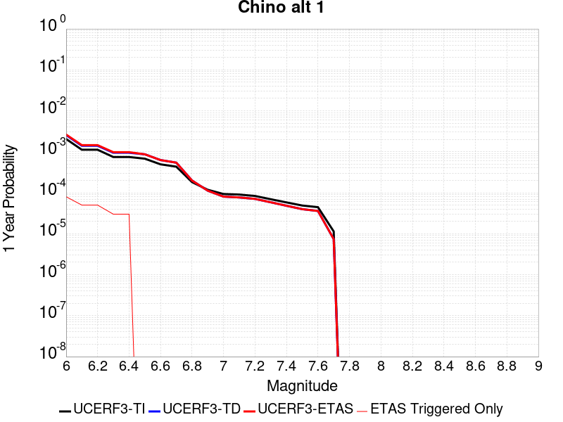 | 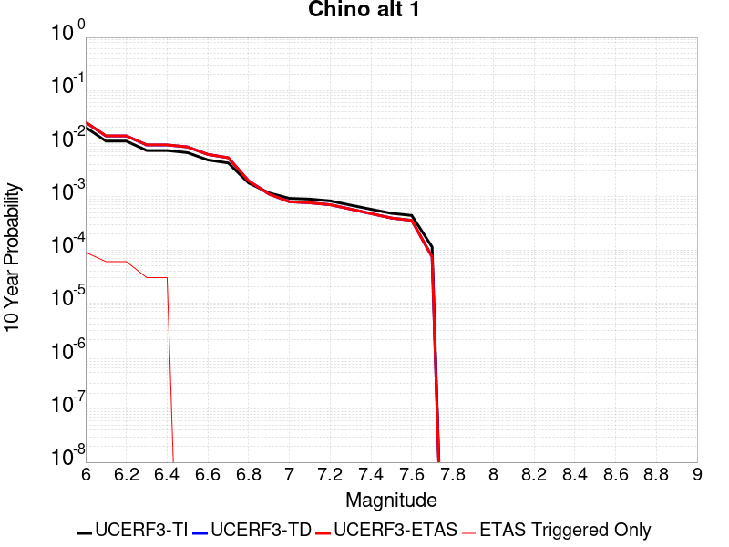 |

| Magnitude | 1 wk TI Prob | 1 wk TD Prob | 1 wk ETAS Prob | 1 wk ETAS/TD Gain | 1 wk ETAS Triggered Only | 1 mo TI Prob | 1 mo TD Prob | 1 mo ETAS Prob | 1 mo ETAS/TD Gain | 1 mo ETAS Triggered Only | 1 yr TI Prob | 1 yr TD Prob | 1 yr ETAS Prob | 1 yr ETAS/TD Gain | 1 yr ETAS Triggered Only | 10 yr TI Prob | 10 yr TD Prob | 10 yr ETAS Prob | 10 yr ETAS/TD Gain | 10 yr ETAS Triggered Only |
|-----|-----|-----|-----|-----|-----|-----|-----|-----|-----|-----|-----|-----|-----|-----|-----|-----|-----|-----|-----|-----|
| 6.0 | 3.939946E-5 | 4.8948554E-5 | 7.894709E-5 | 1.6128584 | 3.0E-5 | 1.6884391E-4 | 2.097656E-4 | 2.597551E-4 | 1.2383113 | 5.0E-5 | 0.0020537362 | 0.0025513945 | 0.0026311905 | 1.0312754 | 8.0E-5 | 0.020348595 | 0.025277847 | 0.025365572 | 1.0034704 | 9.0E-5 |
| 6.1 | 2.1505624E-5 | 2.6879026E-5 | 4.687849E-5 | 1.7440546 | 2.0E-5 | 9.2163704E-5 | 1.1519137E-4 | 1.5518676E-4 | 1.3472083 | 4.0E-5 | 0.0011215154 | 0.001401664 | 0.0014515939 | 1.0356219 | 5.0E-5 | 0.011158722 | 0.013945141 | 0.014004304 | 1.0042425 | 6.0E-5 |
| 6.2 | 2.1505624E-5 | 2.6879026E-5 | 4.687849E-5 | 1.7440546 | 2.0E-5 | 9.2163704E-5 | 1.1519137E-4 | 1.5518676E-4 | 1.3472083 | 4.0E-5 | 0.0011215154 | 0.001401664 | 0.0014515939 | 1.0356219 | 5.0E-5 | 0.011158722 | 0.013945141 | 0.014004304 | 1.0042425 | 6.0E-5 |
| 6.3 | 1.4290785E-5 | 1.8165128E-5 | 2.8164946E-5 | 1.5504954 | 1.0E-5 | 6.1244784E-5 | 7.784848E-5 | 1.0784614E-4 | 1.385334 | 3.0E-5 | 7.454001E-4 | 9.4743853E-4 | 9.774101E-4 | 1.0316343 | 3.0E-5 | 0.007429048 | 0.0094444575 | 0.009474174 | 1.0031464 | 3.0E-5 |
| 6.4 | 1.4290785E-5 | 1.8165128E-5 | 2.8164946E-5 | 1.5504954 | 1.0E-5 | 6.1244784E-5 | 7.784848E-5 | 1.0784614E-4 | 1.385334 | 3.0E-5 | 7.454001E-4 | 9.4743853E-4 | 9.774101E-4 | 1.0316343 | 3.0E-5 | 0.007429048 | 0.0094444575 | 0.009474174 | 1.0031464 | 3.0E-5 |
| 6.5 | 1.3017944E-5 | 1.6652088E-5 | 1.6652088E-5 | 1.0 | 0.0 | 5.5789995E-5 | 7.136439E-5 | 7.136439E-5 | 1.0 | 0.0 | 6.790315E-4 | 8.685589E-4 | 8.685589E-4 | 1.0 | 0.0 | 0.0067696036 | 0.008661949 | 0.008661949 | 1.0 | 0.0 |
| 6.6 | 9.470016E-6 | 1.2039424E-5 | 1.2039424E-5 | 1.0 | 0.0 | 4.058515E-5 | 5.1596704E-5 | 5.1596704E-5 | 1.0 | 0.0 | 4.940122E-4 | 6.280428E-4 | 6.280428E-4 | 1.0 | 0.0 | 0.004929154 | 0.0062718987 | 0.0062718987 | 1.0 | 0.0 |
| 6.7 | 8.314155E-6 | 1.0407736E-5 | 1.0407736E-5 | 1.0 | 0.0 | 3.5631605E-5 | 4.4604003E-5 | 4.4604003E-5 | 1.0 | 0.0 | 4.3372845E-4 | 5.429507E-4 | 5.429507E-4 | 1.0 | 0.0 | 0.004328829 | 0.005425775 | 0.005425775 | 1.0 | 0.0 |
| 6.8 | 3.4856364E-6 | 3.8133708E-6 | 3.8133708E-6 | 1.0 | 0.0 | 1.4938357E-5 | 1.6342927E-5 | 1.6342927E-5 | 1.0 | 0.0 | 1.8185932E-4 | 1.9895904E-4 | 1.9895904E-4 | 1.0 | 0.0 | 0.0018171056 | 0.0019894864 | 0.0019894864 | 1.0 | 0.0 |
| 6.9 | 2.2645952E-6 | 2.1529022E-6 | 2.1529022E-6 | 1.0 | 0.0 | 9.705372E-6 | 9.226692E-6 | 9.226692E-6 | 1.0 | 0.0 | 1.18156495E-4 | 1.123294E-4 | 1.123294E-4 | 1.0 | 0.0 | 0.0011809369 | 0.0011233423 | 0.0011233423 | 1.0 | 0.0 |
| 7.0 | 1.7864003E-6 | 1.5430785E-6 | 1.5430785E-6 | 1.0 | 0.0 | 7.655979E-6 | 6.613177E-6 | 6.613177E-6 | 1.0 | 0.0 | 9.3207556E-5 | 8.051251E-5 | 8.051251E-5 | 1.0 | 0.0 | 9.316847E-4 | 8.0528046E-4 | 8.0528046E-4 | 1.0 | 0.0 |
| 7.1 | 1.7315456E-6 | 1.4733511E-6 | 1.4733511E-6 | 1.0 | 0.0 | 7.420889E-6 | 6.3143466E-6 | 6.3143466E-6 | 1.0 | 0.0 | 9.034557E-5 | 7.6874516E-5 | 7.6874516E-5 | 1.0 | 0.0 | 9.0308854E-4 | 7.6891703E-4 | 7.6891703E-4 | 1.0 | 0.0 |
| 7.2 | 1.6008337E-6 | 1.3574215E-6 | 1.3574215E-6 | 1.0 | 0.0 | 6.860698E-6 | 5.817508E-6 | 5.817508E-6 | 1.0 | 0.0 | 8.352579E-5 | 7.082591E-5 | 7.082591E-5 | 1.0 | 0.0 | 8.34944E-4 | 7.0845755E-4 | 7.0845755E-4 | 1.0 | 0.0 |
| 7.3 | 1.3320939E-6 | 1.121782E-6 | 1.121782E-6 | 1.0 | 0.0 | 5.7089615E-6 | 4.807629E-6 | 4.807629E-6 | 1.0 | 0.0 | 6.9504385E-5 | 5.8531357E-5 | 5.8531357E-5 | 1.0 | 0.0 | 6.9482654E-4 | 5.8530393E-4 | 5.8530393E-4 | 1.0 | 0.0 |
| 7.4 | 1.114294E-6 | 9.237111E-7 | 9.237111E-7 | 1.0 | 0.0 | 4.775537E-6 | 3.958756E-6 | 3.958756E-6 | 1.0 | 0.0 | 5.8140613E-5 | 4.8196827E-5 | 4.8196827E-5 | 1.0 | 0.0 | 5.81254E-4 | 4.8188053E-4 | 4.8188053E-4 | 1.0 | 0.0 |
| 7.5 | 9.354081E-7 | 7.6234323E-7 | 7.6234323E-7 | 1.0 | 0.0 | 4.0088858E-6 | 3.2671815E-6 | 3.2671815E-6 | 1.0 | 0.0 | 4.8807087E-5 | 3.9777242E-5 | 3.9777242E-5 | 1.0 | 0.0 | 4.879637E-4 | 3.977046E-4 | 3.977046E-4 | 1.0 | 0.0 |
| 7.6 | 8.521771E-7 | 6.88071E-7 | 6.88071E-7 | 1.0 | 0.0 | 3.6521824E-6 | 2.9488726E-6 | 2.9488726E-6 | 1.0 | 0.0 | 4.4464414E-5 | 3.5901965E-5 | 3.5901965E-5 | 1.0 | 0.0 | 4.4455516E-4 | 3.589648E-4 | 3.589648E-4 | 1.0 | 0.0 |
| 7.7 | 2.1803626E-7 | 1.418649E-7 | 1.418649E-7 | 1.0 | 0.0 | 9.344408E-7 | 6.079923E-7 | 6.079923E-7 | 1.0 | 0.0 | 1.1376757E-5 | 7.4022914E-6 | 7.4022914E-6 | 1.0 | 0.0 | 1.13761744E-4 | 7.402141E-5 | 7.402141E-5 | 1.0 | 0.0 |

## Owens Valley
*[(top)](#table-of-contents)*

| 1 Week | 1 Month | 1 Year | 10 Year |
|-----|-----|-----|-----|
|  |  |  |  |

| Magnitude | 1 wk TI Prob | 1 wk TD Prob | 1 wk ETAS Prob | 1 wk ETAS/TD Gain | 1 wk ETAS Triggered Only | 1 mo TI Prob | 1 mo TD Prob | 1 mo ETAS Prob | 1 mo ETAS/TD Gain | 1 mo ETAS Triggered Only | 1 yr TI Prob | 1 yr TD Prob | 1 yr ETAS Prob | 1 yr ETAS/TD Gain | 1 yr ETAS Triggered Only | 10 yr TI Prob | 10 yr TD Prob | 10 yr ETAS Prob | 10 yr ETAS/TD Gain | 10 yr ETAS Triggered Only |
|-----|-----|-----|-----|-----|-----|-----|-----|-----|-----|-----|-----|-----|-----|-----|-----|-----|-----|-----|-----|-----|
| 6.0 | 4.83821E-5 | 3.626567E-6 | 4.3626424E-5 | 12.0296755 | 4.0E-5 | 2.0733538E-4 | 1.5542342E-5 | 6.5541564E-5 | 4.216968 | 5.0E-5 | 0.002521386 | 1.8921259E-4 | 2.6919745E-4 | 1.4227248 | 8.0E-5 | 0.024929691 | 0.001925011 | 0.0020248184 | 1.0518477 | 1.0E-4 |
| 6.1 | 4.83821E-5 | 3.626567E-6 | 4.3626424E-5 | 12.0296755 | 4.0E-5 | 2.0733538E-4 | 1.5542342E-5 | 6.5541564E-5 | 4.216968 | 5.0E-5 | 0.002521386 | 1.8921259E-4 | 2.6919745E-4 | 1.4227248 | 8.0E-5 | 0.024929691 | 0.001925011 | 0.0020248184 | 1.0518477 | 1.0E-4 |
| 6.2 | 4.83821E-5 | 3.626567E-6 | 4.3626424E-5 | 12.0296755 | 4.0E-5 | 2.0733538E-4 | 1.5542342E-5 | 6.5541564E-5 | 4.216968 | 5.0E-5 | 0.002521386 | 1.8921259E-4 | 2.6919745E-4 | 1.4227248 | 8.0E-5 | 0.024929691 | 0.001925011 | 0.0020248184 | 1.0518477 | 1.0E-4 |
| 6.3 | 3.953008E-5 | 3.1553948E-6 | 4.315527E-5 | 13.676662 | 4.0E-5 | 1.6940363E-4 | 1.3523055E-5 | 6.352238E-5 | 4.6973395 | 5.0E-5 | 0.002060538 | 1.6463149E-4 | 2.446183E-4 | 1.4858538 | 8.0E-5 | 0.020415364 | 0.0016592 | 0.0017490506 | 1.054153 | 9.0E-5 |
| 6.4 | 3.953008E-5 | 3.1553948E-6 | 4.315527E-5 | 13.676662 | 4.0E-5 | 1.6940363E-4 | 1.3523055E-5 | 6.352238E-5 | 4.6973395 | 5.0E-5 | 0.002060538 | 1.6463149E-4 | 2.446183E-4 | 1.4858538 | 8.0E-5 | 0.020415364 | 0.0016592 | 0.0017490506 | 1.054153 | 9.0E-5 |
| 6.5 | 3.457342E-5 | 2.9715961E-6 | 4.297148E-5 | 14.460739 | 4.0E-5 | 1.4816338E-4 | 1.2735354E-5 | 6.273472E-5 | 4.9260287 | 5.0E-5 | 0.0018023965 | 1.550426E-4 | 2.350302E-4 | 1.5159072 | 8.0E-5 | 0.017878477 | 0.001555719 | 0.0016455789 | 1.0577611 | 9.0E-5 |
| 6.6 | 3.1127765E-5 | 2.8744932E-6 | 4.2874377E-5 | 14.915456 | 4.0E-5 | 1.3339789E-4 | 1.2319203E-5 | 6.2318584E-5 | 5.0586543 | 5.0E-5 | 0.0016229092 | 1.4997667E-4 | 2.2996466E-4 | 1.5333363 | 8.0E-5 | 0.016111081 | 0.0015012559 | 0.0015911207 | 1.0598598 | 9.0E-5 |
| 6.7 | 2.806885E-5 | 2.8104134E-6 | 4.28103E-5 | 15.232741 | 4.0E-5 | 1.2028952E-4 | 1.20445775E-5 | 6.2043975E-5 | 5.151196 | 5.0E-5 | 0.001463541 | 1.4663354E-4 | 2.266218E-4 | 1.5454978 | 8.0E-5 | 0.014539397 | 0.0014657511 | 0.0015556192 | 1.061312 | 9.0E-5 |
| 6.8 | 2.524524E-5 | 2.2353688E-6 | 4.223528E-5 | 18.8941 | 4.0E-5 | 1.0818939E-4 | 9.580118E-6 | 5.957964E-5 | 6.2190924 | 5.0E-5 | 0.0013164099 | 1.16632E-4 | 1.9662267E-4 | 1.6858381 | 8.0E-5 | 0.01308639 | 0.0011659812 | 0.0012558763 | 1.0770983 | 9.0E-5 |
| 6.9 | 2.2704568E-5 | 1.6081682E-6 | 4.1608106E-5 | 25.87298 | 4.0E-5 | 9.730166E-5 | 6.8921313E-6 | 5.6891786E-5 | 8.2546 | 5.0E-5 | 0.0011840039 | 8.390849E-5 | 1.6390177E-4 | 1.9533396 | 8.0E-5 | 0.011777153 | 8.3897985E-4 | 9.2890434E-4 | 1.1071831 | 9.0E-5 |
| 7.0 | 2.0871712E-5 | 1.5395453E-6 | 4.1539482E-5 | 26.981657 | 4.0E-5 | 8.944713E-5 | 6.598035E-6 | 5.6597706E-5 | 8.577964 | 5.0E-5 | 0.0010884746 | 8.032813E-5 | 1.603217E-4 | 1.9958352 | 8.0E-5 | 0.010831586 | 8.0316263E-4 | 8.930903E-4 | 1.111967 | 9.0E-5 |
| 7.1 | 1.944928E-5 | 1.3864178E-6 | 3.1386375E-5 | 22.63847 | 3.0E-5 | 8.335139E-5 | 5.941777E-6 | 4.594154E-5 | 7.7319527 | 4.0E-5 | 0.0010143308 | 7.233874E-5 | 1.4233368E-4 | 1.9675995 | 7.0E-5 | 0.010097133 | 7.2330976E-4 | 8.0325187E-4 | 1.1105226 | 8.0E-5 |
| 7.2 | 1.7876306E-5 | 1.2489141E-6 | 3.1248877E-5 | 25.020838 | 3.0E-5 | 7.6610486E-5 | 5.352478E-6 | 4.5352263E-5 | 8.473134 | 4.0E-5 | 9.3233347E-4 | 6.516448E-5 | 1.3515992E-4 | 2.0741348 | 7.0E-5 | 0.009284316 | 6.5159105E-4 | 7.315389E-4 | 1.1226964 | 8.0E-5 |
| 7.3 | 1.2618672E-5 | 1.1115209E-6 | 3.111149E-5 | 27.990017 | 3.0E-5 | 5.40789E-5 | 4.763652E-6 | 4.4763463E-5 | 9.396878 | 4.0E-5 | 6.582117E-4 | 5.799593E-5 | 1.2799187E-4 | 2.2069113 | 7.0E-5 | 0.0065626553 | 5.7994033E-4 | 6.5989397E-4 | 1.1378652 | 8.0E-5 |
| 7.4 | 7.4874442E-6 | 8.5486437E-7 | 3.0854837E-5 | 36.093254 | 3.0E-5 | 3.208865E-5 | 3.6636993E-6 | 4.3663553E-5 | 11.917887 | 4.0E-5 | 3.906093E-4 | 4.4604632E-5 | 1.1460151E-4 | 2.5692737 | 7.0E-5 | 0.003899234 | 4.4604883E-4 | 5.2601314E-4 | 1.1792725 | 8.0E-5 |
| 7.5 | 2.4734156E-6 | 6.068616E-7 | 1.06068555E-5 | 17.478212 | 1.0E-5 | 1.060031E-5 | 2.6008327E-6 | 2.2600781E-5 | 8.689825 | 2.0E-5 | 1.2905113E-4 | 3.166468E-5 | 7.166342E-5 | 2.2631972 | 4.0E-5 | 0.0012897621 | 3.1660203E-4 | 3.665862E-4 | 1.157877 | 5.0E-5 |
| 7.6 | 1.1328841E-6 | 3.196531E-7 | 1.031965E-5 | 32.283905 | 1.0E-5 | 4.8552088E-6 | 1.3699412E-6 | 2.1369913E-5 | 15.599147 | 2.0E-5 | 5.9110564E-5 | 1.6678909E-5 | 5.667824E-5 | 3.3981986 | 4.0E-5 | 5.9094845E-4 | 1.6677675E-4 | 2.0677008E-4 | 1.2398016 | 4.0E-5 |
| 7.7 | 4.8613185E-7 | 8.964689E-8 | 8.964689E-8 | 1.0 | 0.0 | 2.0834207E-6 | 3.8420092E-7 | 3.8420092E-7 | 1.0 | 0.0 | 2.536535E-5 | 4.6776368E-6 | 4.6776368E-6 | 1.0 | 0.0 | 2.5362454E-4 | 4.677545E-5 | 4.677545E-5 | 1.0 | 0.0 |

## San Clemente
*[(top)](#table-of-contents)*

| 1 Week | 1 Month | 1 Year | 10 Year |
|-----|-----|-----|-----|
|  | 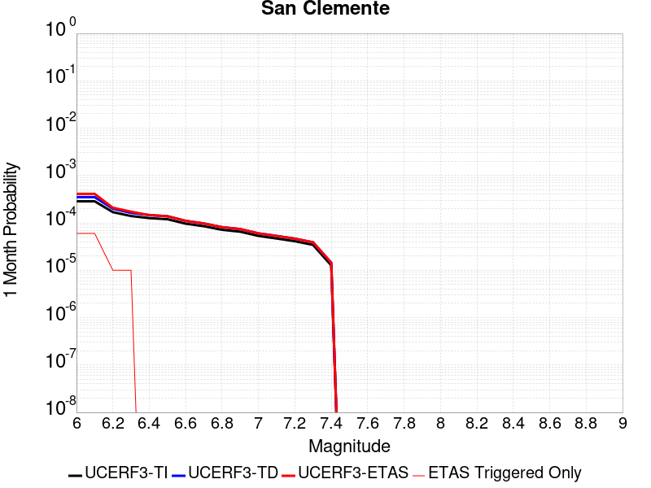 |  |  |

| Magnitude | 1 wk TI Prob | 1 wk TD Prob | 1 wk ETAS Prob | 1 wk ETAS/TD Gain | 1 wk ETAS Triggered Only | 1 mo TI Prob | 1 mo TD Prob | 1 mo ETAS Prob | 1 mo ETAS/TD Gain | 1 mo ETAS Triggered Only | 1 yr TI Prob | 1 yr TD Prob | 1 yr ETAS Prob | 1 yr ETAS/TD Gain | 1 yr ETAS Triggered Only | 10 yr TI Prob | 10 yr TD Prob | 10 yr ETAS Prob | 10 yr ETAS/TD Gain | 10 yr ETAS Triggered Only |
|-----|-----|-----|-----|-----|-----|-----|-----|-----|-----|-----|-----|-----|-----|-----|-----|-----|-----|-----|-----|-----|
| 6.0 | 6.681379E-5 | 8.163422E-5 | 1.2163096E-4 | 1.4899505 | 4.0E-5 | 2.8631336E-4 | 3.498173E-4 | 4.097963E-4 | 1.1714581 | 6.0E-5 | 0.003480294 | 0.0042512873 | 0.0043110326 | 1.0140533 | 6.0E-5 | 0.03426291 | 0.041755714 | 0.04185154 | 1.0022949 | 1.0E-4 |
| 6.1 | 6.681379E-5 | 8.163422E-5 | 1.2163096E-4 | 1.4899505 | 4.0E-5 | 2.8631336E-4 | 3.498173E-4 | 4.097963E-4 | 1.1714581 | 6.0E-5 | 0.003480294 | 0.0042512873 | 0.0043110326 | 1.0140533 | 6.0E-5 | 0.03426291 | 0.041755714 | 0.041841954 | 1.0020654 | 9.0E-5 |
| 6.2 | 3.9400576E-5 | 4.6451984E-5 | 4.6451984E-5 | 1.0 | 0.0 | 1.6884868E-4 | 1.9906509E-4 | 2.090631E-4 | 1.0502248 | 1.0E-5 | 0.0020537945 | 0.002420985 | 0.0024309605 | 1.0041206 | 1.0E-5 | 0.020349167 | 0.02395286 | 0.023982141 | 1.0012225 | 3.0E-5 |
| 6.3 | 3.2590255E-5 | 3.7929087E-5 | 3.7929087E-5 | 1.0 | 0.0 | 1.3966505E-4 | 1.6254328E-4 | 1.7254165E-4 | 1.0615121 | 1.0E-5 | 0.0016990956 | 0.0019771985 | 0.0019871786 | 1.0050477 | 1.0E-5 | 0.01686163 | 0.019599866 | 0.019629277 | 1.0015006 | 3.0E-5 |
| 6.4 | 2.9454652E-5 | 3.4097775E-5 | 3.4097775E-5 | 1.0 | 0.0 | 1.2622811E-4 | 1.4612528E-4 | 1.4612528E-4 | 1.0 | 0.0 | 0.0015357438 | 0.0017776482 | 0.0017776482 | 1.0 | 0.0 | 0.015251739 | 0.017637458 | 0.017647281 | 1.000557 | 1.0E-5 |
| 6.5 | 2.790836E-5 | 3.2247463E-5 | 3.2247463E-5 | 1.0 | 0.0 | 1.1960178E-4 | 1.3819622E-4 | 1.3819622E-4 | 1.0 | 0.0 | 0.001455179 | 0.0016812651 | 0.0016812651 | 1.0 | 0.0 | 0.014456868 | 0.016688475 | 0.016698308 | 1.0005893 | 1.0E-5 |
| 6.6 | 2.2492153E-5 | 2.5762707E-5 | 2.5762707E-5 | 1.0 | 0.0 | 9.639138E-5 | 1.1040701E-4 | 1.1040701E-4 | 1.0 | 0.0 | 0.0011729331 | 0.0013433908 | 0.0013433908 | 1.0 | 0.0 | 0.011667615 | 0.013354415 | 0.0133642815 | 1.0007389 | 1.0E-5 |
| 6.7 | 1.9862755E-5 | 2.2666423E-5 | 2.2666423E-5 | 1.0 | 0.0 | 8.512331E-5 | 9.713826E-5 | 9.713826E-5 | 1.0 | 0.0 | 0.0010358836 | 0.0011820279 | 0.0011820279 | 1.0 | 0.0 | 0.010310682 | 0.011758701 | 0.011768583 | 1.0008404 | 1.0E-5 |
| 6.8 | 1.6697575E-5 | 1.897771E-5 | 1.897771E-5 | 1.0 | 0.0 | 7.155907E-5 | 8.133056E-5 | 8.133056E-5 | 1.0 | 0.0 | 8.7088346E-4 | 9.897591E-4 | 9.897591E-4 | 1.0 | 0.0 | 0.008674784 | 0.0098545365 | 0.009864438 | 1.0010048 | 1.0E-5 |
| 6.9 | 1.5218415E-5 | 1.72694E-5 | 1.72694E-5 | 1.0 | 0.0 | 6.522015E-5 | 7.4009666E-5 | 7.4009666E-5 | 1.0 | 0.0 | 7.93766E-4 | 9.00704E-4 | 9.00704E-4 | 1.0 | 0.0 | 0.007909367 | 0.008971481 | 0.008981391 | 1.0011046 | 1.0E-5 |
| 7.0 | 1.2392958E-5 | 1.4033016E-5 | 1.4033016E-5 | 1.0 | 0.0 | 5.3111595E-5 | 6.014015E-5 | 6.014015E-5 | 1.0 | 0.0 | 6.4644177E-4 | 7.319679E-4 | 7.319679E-4 | 1.0 | 0.0 | 0.0064456454 | 0.0072963564 | 0.0072963564 | 1.0 | 0.0 |
| 7.1 | 1.0934128E-5 | 1.2375138E-5 | 1.2375138E-5 | 1.0 | 0.0 | 4.6859706E-5 | 5.303527E-5 | 5.303527E-5 | 1.0 | 0.0 | 5.7036756E-4 | 6.455204E-4 | 6.455204E-4 | 1.0 | 0.0 | 0.0056890585 | 0.0064371997 | 0.0064371997 | 1.0 | 0.0 |
| 7.2 | 9.5798805E-6 | 1.0844935E-5 | 1.0844935E-5 | 1.0 | 0.0 | 4.1055984E-5 | 4.6477508E-5 | 4.6477508E-5 | 1.0 | 0.0 | 4.9974193E-4 | 5.657239E-4 | 5.657239E-4 | 1.0 | 0.0 | 0.0049861963 | 0.0056435615 | 0.0056435615 | 1.0 | 0.0 |
| 7.3 | 8.0167365E-6 | 9.083918E-6 | 9.083918E-6 | 1.0 | 0.0 | 3.4356988E-5 | 3.8930535E-5 | 3.8930535E-5 | 1.0 | 0.0 | 4.1821605E-4 | 4.7388324E-4 | 4.7388324E-4 | 1.0 | 0.0 | 0.0041742986 | 0.0047294297 | 0.0047294297 | 1.0 | 0.0 |
| 7.4 | 2.9581017E-6 | 3.3623792E-6 | 3.3623792E-6 | 1.0 | 0.0 | 1.2677518E-5 | 1.4410146E-5 | 1.4410146E-5 | 1.0 | 0.0 | 1.5433785E-4 | 1.7543444E-4 | 1.7543444E-4 | 1.0 | 0.0 | 0.001542307 | 0.0017534546 | 0.0017534546 | 1.0 | 0.0 |

## Ortigalita (North)
*[(top)](#table-of-contents)*

| 1 Week | 1 Month | 1 Year | 10 Year |
|-----|-----|-----|-----|
|  |  | 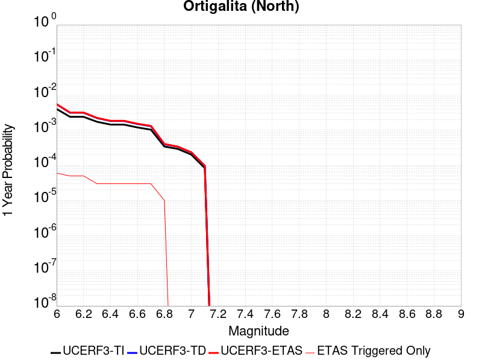 | 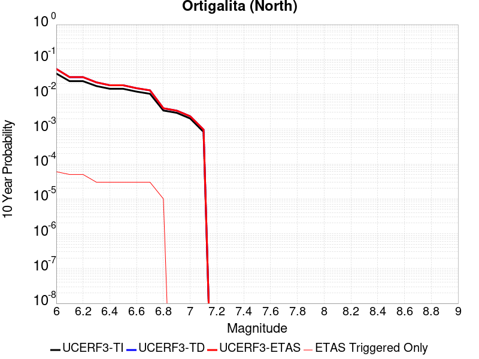 |

| Magnitude | 1 wk TI Prob | 1 wk TD Prob | 1 wk ETAS Prob | 1 wk ETAS/TD Gain | 1 wk ETAS Triggered Only | 1 mo TI Prob | 1 mo TD Prob | 1 mo ETAS Prob | 1 mo ETAS/TD Gain | 1 mo ETAS Triggered Only | 1 yr TI Prob | 1 yr TD Prob | 1 yr ETAS Prob | 1 yr ETAS/TD Gain | 1 yr ETAS Triggered Only | 10 yr TI Prob | 10 yr TD Prob | 10 yr ETAS Prob | 10 yr ETAS/TD Gain | 10 yr ETAS Triggered Only |
|-----|-----|-----|-----|-----|-----|-----|-----|-----|-----|-----|-----|-----|-----|-----|-----|-----|-----|-----|-----|-----|
| 6.0 | 7.711876E-5 | 1.05064966E-4 | 1.2506287E-4 | 1.1903384 | 2.0E-5 | 3.3046713E-4 | 4.502116E-4 | 4.901936E-4 | 1.0888071 | 4.0E-5 | 0.004016016 | 0.0054681194 | 0.0055277916 | 1.0109127 | 6.0E-5 | 0.039442103 | 0.053454787 | 0.053511582 | 1.0010624 | 6.0E-5 |
| 6.1 | 4.607858E-5 | 6.0239203E-5 | 7.02386E-5 | 1.1659949 | 1.0E-5 | 1.9746469E-4 | 2.5814527E-4 | 2.781401E-4 | 1.0774558 | 2.0E-5 | 0.0024014818 | 0.0031387596 | 0.0031886026 | 1.0158799 | 5.0E-5 | 0.023756953 | 0.030975068 | 0.03102352 | 1.0015641 | 5.0E-5 |
| 6.2 | 4.607858E-5 | 6.0239203E-5 | 7.02386E-5 | 1.1659949 | 1.0E-5 | 1.9746469E-4 | 2.5814527E-4 | 2.781401E-4 | 1.0774558 | 2.0E-5 | 0.0024014818 | 0.0031387596 | 0.0031886026 | 1.0158799 | 5.0E-5 | 0.023756953 | 0.030975068 | 0.03102352 | 1.0015641 | 5.0E-5 |
| 6.3 | 3.327423E-5 | 4.2475127E-5 | 5.2474705E-5 | 1.2354219 | 1.0E-5 | 1.4259605E-4 | 1.8202531E-4 | 1.920235E-4 | 1.0549275 | 1.0E-5 | 0.0017347244 | 0.002214197 | 0.0022441307 | 1.0135189 | 3.0E-5 | 0.017212452 | 0.021945644 | 0.021974986 | 1.001337 | 3.0E-5 |
| 6.4 | 2.7732503E-5 | 3.4998593E-5 | 4.4998244E-5 | 1.2857158 | 1.0E-5 | 1.1884817E-4 | 1.4998685E-4 | 1.5998536E-4 | 1.0666625 | 1.0E-5 | 0.001446016 | 0.0018248095 | 0.0018547548 | 1.0164101 | 3.0E-5 | 0.014366428 | 0.018121224 | 0.01815068 | 1.0016255 | 3.0E-5 |
| 6.5 | 2.7689714E-5 | 3.4948407E-5 | 4.4948058E-5 | 1.286126 | 1.0E-5 | 1.186648E-4 | 1.497718E-4 | 1.597703E-4 | 1.0667583 | 1.0E-5 | 0.0014437864 | 0.0018221956 | 0.0018521409 | 1.0164336 | 3.0E-5 | 0.014344421 | 0.01809551 | 0.018124968 | 1.0016279 | 3.0E-5 |
| 6.6 | 2.2976905E-5 | 2.8718265E-5 | 3.871798E-5 | 1.3482004 | 1.0E-5 | 9.846873E-5 | 1.230739E-4 | 1.3307267E-4 | 1.081242 | 1.0E-5 | 0.0011981975 | 0.0014976363 | 0.0015275915 | 1.0200015 | 3.0E-5 | 0.011917574 | 0.014898697 | 0.014928251 | 1.0019836 | 3.0E-5 |
| 6.7 | 1.9871539E-5 | 2.4904411E-5 | 3.4904162E-5 | 1.4015253 | 1.0E-5 | 8.516096E-5 | 1.0673023E-4 | 1.1672916E-4 | 1.0936842 | 1.0E-5 | 0.0010363415 | 0.0012989145 | 0.0013288757 | 1.0230662 | 3.0E-5 | 0.010315218 | 0.012936919 | 0.012966531 | 1.0022889 | 3.0E-5 |
| 6.8 | 6.5640475E-6 | 7.6054926E-6 | 7.6054926E-6 | 1.0 | 0.0 | 2.813133E-5 | 3.2594577E-5 | 3.2594577E-5 | 1.0 | 0.0 | 3.424451E-4 | 3.9676955E-4 | 4.0676558E-4 | 1.0251936 | 1.0E-5 | 0.0034191788 | 0.003960899 | 0.003970859 | 1.0025147 | 1.0E-5 |
| 6.9 | 5.6219683E-6 | 6.5018376E-6 | 6.5018376E-6 | 1.0 | 0.0 | 2.4093928E-5 | 2.7864735E-5 | 2.7864735E-5 | 1.0 | 0.0 | 2.933041E-4 | 3.3920293E-4 | 3.3920293E-4 | 1.0 | 0.0 | 0.0029291727 | 0.003387109 | 0.003387109 | 1.0 | 0.0 |
| 7.0 | 3.875591E-6 | 4.4847548E-6 | 4.4847548E-6 | 1.0 | 0.0 | 1.6609569E-5 | 1.9220248E-5 | 1.9220248E-5 | 1.0 | 0.0 | 2.0220275E-4 | 2.339835E-4 | 2.339835E-4 | 1.0 | 0.0 | 0.0020201886 | 0.0023375798 | 0.0023375798 | 1.0 | 0.0 |
| 7.1 | 1.6017933E-6 | 1.8570418E-6 | 1.8570418E-6 | 1.0 | 0.0 | 6.8648105E-6 | 7.958732E-6 | 7.958732E-6 | 1.0 | 0.0 | 8.357586E-5 | 9.689432E-5 | 9.689432E-5 | 1.0 | 0.0 | 8.3544437E-4 | 9.686254E-4 | 9.686254E-4 | 1.0 | 0.0 |

## San Jacinto (San Bernardino)
*[(top)](#table-of-contents)*

| 1 Week | 1 Month | 1 Year | 10 Year |
|-----|-----|-----|-----|
|  |  |  |  |

| Magnitude | 1 wk TI Prob | 1 wk TD Prob | 1 wk ETAS Prob | 1 wk ETAS/TD Gain | 1 wk ETAS Triggered Only | 1 mo TI Prob | 1 mo TD Prob | 1 mo ETAS Prob | 1 mo ETAS/TD Gain | 1 mo ETAS Triggered Only | 1 yr TI Prob | 1 yr TD Prob | 1 yr ETAS Prob | 1 yr ETAS/TD Gain | 1 yr ETAS Triggered Only | 10 yr TI Prob | 10 yr TD Prob | 10 yr ETAS Prob | 10 yr ETAS/TD Gain | 10 yr ETAS Triggered Only |
|-----|-----|-----|-----|-----|-----|-----|-----|-----|-----|-----|-----|-----|-----|-----|-----|-----|-----|-----|-----|-----|
| 6.0 | 3.409352E-5 | 3.5986508E-5 | 5.598579E-5 | 1.5557438 | 2.0E-5 | 1.461069E-4 | 1.542188E-4 | 1.8421416E-4 | 1.1944988 | 3.0E-5 | 0.0017774 | 0.0018759987 | 0.0019358861 | 1.0319229 | 6.0E-5 | 0.01763251 | 0.019349935 | 0.019438194 | 1.0045612 | 9.0E-5 |
| 6.1 | 3.409352E-5 | 3.5986508E-5 | 5.598579E-5 | 1.5557438 | 2.0E-5 | 1.461069E-4 | 1.542188E-4 | 1.8421416E-4 | 1.1944988 | 3.0E-5 | 0.0017774 | 0.0018759987 | 0.0019358861 | 1.0319229 | 6.0E-5 | 0.01763251 | 0.019349935 | 0.019438194 | 1.0045612 | 9.0E-5 |
| 6.2 | 3.409352E-5 | 3.5986508E-5 | 5.598579E-5 | 1.5557438 | 2.0E-5 | 1.461069E-4 | 1.542188E-4 | 1.8421416E-4 | 1.1944988 | 3.0E-5 | 0.0017774 | 0.0018759987 | 0.0019358861 | 1.0319229 | 6.0E-5 | 0.01763251 | 0.019349935 | 0.019438194 | 1.0045612 | 9.0E-5 |
| 6.3 | 3.409352E-5 | 3.5986508E-5 | 5.598579E-5 | 1.5557438 | 2.0E-5 | 1.461069E-4 | 1.542188E-4 | 1.8421416E-4 | 1.1944988 | 3.0E-5 | 0.0017774 | 0.0018759987 | 0.0019358861 | 1.0319229 | 6.0E-5 | 0.01763251 | 0.019349935 | 0.019438194 | 1.0045612 | 9.0E-5 |
| 6.4 | 3.400795E-5 | 3.5879173E-5 | 5.5878456E-5 | 1.5574064 | 2.0E-5 | 1.4574021E-4 | 1.5375883E-4 | 1.8375422E-4 | 1.1950808 | 3.0E-5 | 0.0017729428 | 0.0018704084 | 0.0019302962 | 1.0320185 | 6.0E-5 | 0.017588645 | 0.019295016 | 0.01938328 | 1.0045744 | 9.0E-5 |
| 6.5 | 3.341482E-5 | 3.5139812E-5 | 5.513911E-5 | 1.5691351 | 2.0E-5 | 1.4319851E-4 | 1.5059051E-4 | 1.8058598E-4 | 1.1991857 | 3.0E-5 | 0.0017420477 | 0.0018318989 | 0.001891789 | 1.0326929 | 6.0E-5 | 0.017284546 | 0.018916558 | 0.019004855 | 1.0046678 | 9.0E-5 |
| 6.6 | 3.3364955E-5 | 3.5077028E-5 | 5.507633E-5 | 1.5701537 | 2.0E-5 | 1.4298483E-4 | 1.5032147E-4 | 1.8031696E-4 | 1.1995423 | 3.0E-5 | 0.0017394501 | 0.001828629 | 0.0018885193 | 1.0327514 | 6.0E-5 | 0.017258976 | 0.018884424 | 0.018962912 | 1.0041564 | 8.0E-5 |
| 6.7 | 3.335922E-5 | 3.5066805E-5 | 5.5066103E-5 | 1.57032 | 2.0E-5 | 1.4296026E-4 | 1.5027766E-4 | 1.8027314E-4 | 1.1996005 | 3.0E-5 | 0.0017391514 | 0.0018280965 | 0.0018879868 | 1.032761 | 6.0E-5 | 0.017256035 | 0.018879214 | 0.018957704 | 1.0041574 | 8.0E-5 |
| 6.8 | 3.327683E-5 | 3.496087E-5 | 5.4960172E-5 | 1.5720482 | 2.0E-5 | 1.4260718E-4 | 1.498237E-4 | 1.7981921E-4 | 1.2002053 | 3.0E-5 | 0.0017348597 | 0.0018225788 | 0.0018824695 | 1.0328604 | 6.0E-5 | 0.017213784 | 0.018824987 | 0.01890348 | 1.0041697 | 8.0E-5 |
| 6.9 | 3.3235785E-5 | 3.4901823E-5 | 5.4901127E-5 | 1.5730159 | 2.0E-5 | 1.4243131E-4 | 1.4957068E-4 | 1.795662E-4 | 1.2005441 | 3.0E-5 | 0.0017327217 | 0.0018195034 | 0.0018793943 | 1.0329161 | 6.0E-5 | 0.017192734 | 0.018794855 | 0.018873353 | 1.0041765 | 8.0E-5 |
| 7.0 | 3.3197095E-5 | 3.4841752E-5 | 5.4841057E-5 | 1.5740039 | 2.0E-5 | 1.422655E-4 | 1.4931326E-4 | 1.7930879E-4 | 1.2008898 | 3.0E-5 | 0.0017307063 | 0.0018163746 | 0.0018762656 | 1.0329728 | 6.0E-5 | 0.017172894 | 0.018764233 | 0.018842733 | 1.0041834 | 8.0E-5 |
| 7.1 | 3.3129716E-5 | 3.4721965E-5 | 5.472127E-5 | 1.5759842 | 2.0E-5 | 1.4197677E-4 | 1.4879994E-4 | 1.7879548E-4 | 1.201583 | 3.0E-5 | 0.0017271966 | 0.0018101353 | 0.0018700267 | 1.0330867 | 6.0E-5 | 0.017138338 | 0.018703312 | 0.018781817 | 1.0041974 | 8.0E-5 |
| 7.2 | 3.3034008E-5 | 3.458941E-5 | 5.458872E-5 | 1.5781916 | 2.0E-5 | 1.4156665E-4 | 1.4823192E-4 | 1.7822748E-4 | 1.2023555 | 3.0E-5 | 0.0017222111 | 0.0018032312 | 0.001863123 | 1.0332136 | 6.0E-5 | 0.017089253 | 0.018635705 | 0.018714214 | 1.0042129 | 8.0E-5 |
| 7.3 | 3.2956614E-5 | 3.445717E-5 | 5.445648E-5 | 1.5804107 | 2.0E-5 | 1.4123498E-4 | 1.4766524E-4 | 1.776608E-4 | 1.2031323 | 3.0E-5 | 0.0017181796 | 0.0017963431 | 0.0018562353 | 1.0333412 | 6.0E-5 | 0.017049557 | 0.018568452 | 0.018646967 | 1.0042284 | 8.0E-5 |
| 7.4 | 3.2915937E-5 | 3.4378863E-5 | 5.437818E-5 | 1.5817327 | 2.0E-5 | 1.4106068E-4 | 1.4732967E-4 | 1.7732526E-4 | 1.2035949 | 3.0E-5 | 0.0017160608 | 0.0017922645 | 0.001852157 | 1.0334172 | 6.0E-5 | 0.017028693 | 0.018528719 | 0.018607236 | 1.0042377 | 8.0E-5 |
| 7.5 | 3.281791E-5 | 3.4243778E-5 | 5.4243093E-5 | 1.5840276 | 2.0E-5 | 1.406406E-4 | 1.4675081E-4 | 1.767464E-4 | 1.2043982 | 3.0E-5 | 0.0017109542 | 0.0017852283 | 0.0018451212 | 1.0335492 | 6.0E-5 | 0.016978411 | 0.018459605 | 0.018538129 | 1.0042537 | 8.0E-5 |
| 7.6 | 3.2521442E-5 | 3.396873E-5 | 5.396805E-5 | 1.5887568 | 2.0E-5 | 1.3937015E-4 | 1.4557215E-4 | 1.755678E-4 | 1.2060534 | 3.0E-5 | 0.0016955109 | 0.0017709016 | 0.0018307954 | 1.033821 | 6.0E-5 | 0.016826328 | 0.018317232 | 0.018395767 | 1.0042875 | 8.0E-5 |
| 7.7 | 3.0287873E-5 | 3.245276E-5 | 5.2452113E-5 | 1.6162604 | 2.0E-5 | 1.297987E-4 | 1.3907586E-4 | 1.6907169E-4 | 1.2156796 | 3.0E-5 | 0.0015791537 | 0.0016919347 | 0.0017518331 | 1.0354024 | 6.0E-5 | 0.01567979 | 0.01752809 | 0.017606689 | 1.004484 | 8.0E-5 |
| 7.8 | 2.6316151E-5 | 2.9663592E-5 | 4.9663E-5 | 1.6742072 | 2.0E-5 | 1.1277862E-4 | 1.2712348E-4 | 1.5711968E-4 | 1.235961 | 3.0E-5 | 0.0013722149 | 0.0015466306 | 0.0016065378 | 1.038734 | 6.0E-5 | 0.013637724 | 0.016069634 | 0.01614835 | 1.0048983 | 8.0E-5 |
| 7.9 | 2.0761147E-5 | 2.34181E-5 | 4.3417633E-5 | 1.8540202 | 2.0E-5 | 8.897331E-5 | 1.0035944E-4 | 1.3035642E-4 | 1.2988956 | 3.0E-5 | 0.0010827117 | 0.0012211921 | 0.001271131 | 1.0408936 | 5.0E-5 | 0.010774517 | 0.012793174 | 0.012862278 | 1.0054016 | 7.0E-5 |
| 8.0 | 1.5738568E-5 | 1.6033575E-5 | 2.6033415E-5 | 1.6236812 | 1.0E-5 | 6.744926E-5 | 6.871352E-5 | 7.871283E-5 | 1.1455218 | 1.0E-5 | 8.2088535E-4 | 8.3626667E-4 | 8.662416E-4 | 1.0358437 | 3.0E-5 | 0.008178596 | 0.008865921 | 0.008915477 | 1.0055896 | 5.0E-5 |
| 8.1 | 1.0105832E-5 | 8.3304985E-6 | 8.3304985E-6 | 1.0 | 0.0 | 4.3309992E-5 | 3.570165E-5 | 3.570165E-5 | 1.0 | 0.0 | 5.2717153E-4 | 4.345814E-4 | 4.345814E-4 | 1.0 | 0.0 | 0.005259227 | 0.004677232 | 0.004677232 | 1.0 | 0.0 |
| 8.2 | 4.189207E-6 | 1.5784357E-6 | 1.5784357E-6 | 1.0 | 0.0 | 1.7953622E-5 | 6.7647065E-6 | 6.7647065E-6 | 1.0 | 0.0 | 2.1856341E-4 | 8.235722E-5 | 8.235722E-5 | 1.0 | 0.0 | 0.0021834858 | 9.565867E-4 | 9.565867E-4 | 1.0 | 0.0 |
| 8.3 | 1.2758221E-6 | 3.6149942E-7 | 3.6149942E-7 | 1.0 | 0.0 | 5.4677976E-6 | 1.5492824E-6 | 1.5492824E-6 | 1.0 | 0.0 | 6.65684E-5 | 1.8862354E-5 | 1.8862354E-5 | 1.0 | 0.0 | 6.6548464E-4 | 2.2751294E-4 | 2.2751294E-4 | 1.0 | 0.0 |

## Deep Springs
*[(top)](#table-of-contents)*

| 1 Week | 1 Month | 1 Year | 10 Year |
|-----|-----|-----|-----|
|  |  |  |  |

| Magnitude | 1 wk TI Prob | 1 wk TD Prob | 1 wk ETAS Prob | 1 wk ETAS/TD Gain | 1 wk ETAS Triggered Only | 1 mo TI Prob | 1 mo TD Prob | 1 mo ETAS Prob | 1 mo ETAS/TD Gain | 1 mo ETAS Triggered Only | 1 yr TI Prob | 1 yr TD Prob | 1 yr ETAS Prob | 1 yr ETAS/TD Gain | 1 yr ETAS Triggered Only | 10 yr TI Prob | 10 yr TD Prob | 10 yr ETAS Prob | 10 yr ETAS/TD Gain | 10 yr ETAS Triggered Only |
|-----|-----|-----|-----|-----|-----|-----|-----|-----|-----|-----|-----|-----|-----|-----|-----|-----|-----|-----|-----|-----|
| 6.0 | 1.9810619E-5 | 2.311252E-5 | 6.31116E-5 | 2.7306237 | 4.0E-5 | 8.489989E-5 | 9.905276E-5 | 1.490478E-4 | 1.5047315 | 5.0E-5 | 0.001033166 | 0.0012058079 | 0.0012857114 | 1.0662656 | 8.0E-5 | 0.010283757 | 0.012042425 | 0.012131341 | 1.0073836 | 9.0E-5 |
| 6.1 | 1.9810619E-5 | 2.311252E-5 | 6.31116E-5 | 2.7306237 | 4.0E-5 | 8.489989E-5 | 9.905276E-5 | 1.490478E-4 | 1.5047315 | 5.0E-5 | 0.001033166 | 0.0012058079 | 0.0012857114 | 1.0662656 | 8.0E-5 | 0.010283757 | 0.012042425 | 0.012131341 | 1.0073836 | 9.0E-5 |
| 6.2 | 1.9810619E-5 | 2.311252E-5 | 6.31116E-5 | 2.7306237 | 4.0E-5 | 8.489989E-5 | 9.905276E-5 | 1.490478E-4 | 1.5047315 | 5.0E-5 | 0.001033166 | 0.0012058079 | 0.0012857114 | 1.0662656 | 8.0E-5 | 0.010283757 | 0.012042425 | 0.012131341 | 1.0073836 | 9.0E-5 |
| 6.3 | 1.9810619E-5 | 2.311252E-5 | 6.31116E-5 | 2.7306237 | 4.0E-5 | 8.489989E-5 | 9.905276E-5 | 1.490478E-4 | 1.5047315 | 5.0E-5 | 0.001033166 | 0.0012058079 | 0.0012857114 | 1.0662656 | 8.0E-5 | 0.010283757 | 0.012042425 | 0.012131341 | 1.0073836 | 9.0E-5 |
| 6.4 | 1.9810619E-5 | 2.311252E-5 | 6.31116E-5 | 2.7306237 | 4.0E-5 | 8.489989E-5 | 9.905276E-5 | 1.490478E-4 | 1.5047315 | 5.0E-5 | 0.001033166 | 0.0012058079 | 0.0012857114 | 1.0662656 | 8.0E-5 | 0.010283757 | 0.012042425 | 0.012131341 | 1.0073836 | 9.0E-5 |
| 6.5 | 1.7190405E-5 | 2.0050555E-5 | 5.0049955E-5 | 2.496188 | 3.0E-5 | 7.367108E-5 | 8.593095E-5 | 1.2592752E-4 | 1.46545 | 4.0E-5 | 8.9657627E-4 | 0.0010462094 | 0.0011161361 | 1.0668383 | 7.0E-5 | 0.008929676 | 0.010462056 | 0.010541219 | 1.0075667 | 8.0E-5 |
| 6.6 | 1.7190405E-5 | 2.0050555E-5 | 5.0049955E-5 | 2.496188 | 3.0E-5 | 7.367108E-5 | 8.593095E-5 | 1.2592752E-4 | 1.46545 | 4.0E-5 | 8.9657627E-4 | 0.0010462094 | 0.0011161361 | 1.0668383 | 7.0E-5 | 0.008929676 | 0.010462056 | 0.010541219 | 1.0075667 | 8.0E-5 |

## Ventura-Pitas Point
*[(top)](#table-of-contents)*

| 1 Week | 1 Month | 1 Year | 10 Year |
|-----|-----|-----|-----|
|  |  | 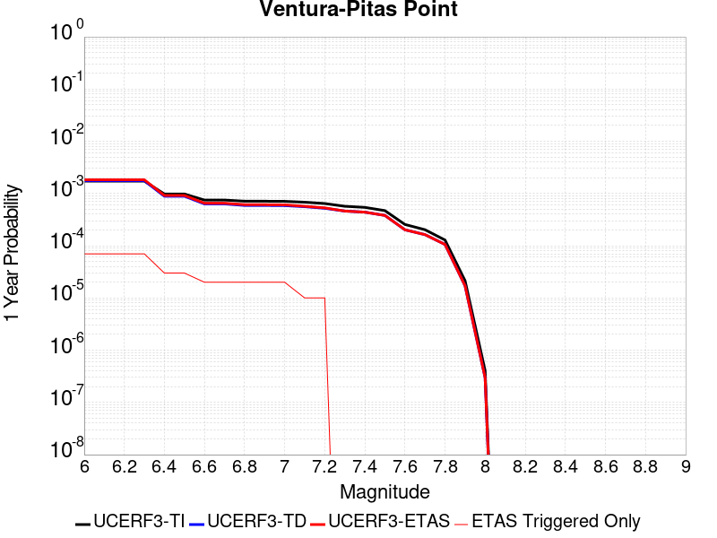 |  |

| Magnitude | 1 wk TI Prob | 1 wk TD Prob | 1 wk ETAS Prob | 1 wk ETAS/TD Gain | 1 wk ETAS Triggered Only | 1 mo TI Prob | 1 mo TD Prob | 1 mo ETAS Prob | 1 mo ETAS/TD Gain | 1 mo ETAS Triggered Only | 1 yr TI Prob | 1 yr TD Prob | 1 yr ETAS Prob | 1 yr ETAS/TD Gain | 1 yr ETAS Triggered Only | 10 yr TI Prob | 10 yr TD Prob | 10 yr ETAS Prob | 10 yr ETAS/TD Gain | 10 yr ETAS Triggered Only |
|-----|-----|-----|-----|-----|-----|-----|-----|-----|-----|-----|-----|-----|-----|-----|-----|-----|-----|-----|-----|-----|
| 6.0 | 3.3179622E-5 | 3.3735185E-5 | 8.3733496E-5 | 2.4820821 | 5.0E-5 | 1.4219063E-4 | 1.445728E-4 | 2.0456412E-4 | 1.4149559 | 6.0E-5 | 0.0017297962 | 0.0017590096 | 0.0018288865 | 1.0397251 | 7.0E-5 | 0.017163932 | 0.0174764 | 0.017564828 | 1.0050598 | 9.0E-5 |
| 6.1 | 3.3179622E-5 | 3.3735185E-5 | 8.3733496E-5 | 2.4820821 | 5.0E-5 | 1.4219063E-4 | 1.445728E-4 | 2.0456412E-4 | 1.4149559 | 6.0E-5 | 0.0017297962 | 0.0017590096 | 0.0018288865 | 1.0397251 | 7.0E-5 | 0.017163932 | 0.0174764 | 0.017564828 | 1.0050598 | 9.0E-5 |
| 6.2 | 3.3179622E-5 | 3.3735185E-5 | 8.3733496E-5 | 2.4820821 | 5.0E-5 | 1.4219063E-4 | 1.445728E-4 | 2.0456412E-4 | 1.4149559 | 6.0E-5 | 0.0017297962 | 0.0017590096 | 0.0018288865 | 1.0397251 | 7.0E-5 | 0.017163932 | 0.0174764 | 0.017564828 | 1.0050598 | 9.0E-5 |
| 6.3 | 3.3179622E-5 | 3.3735185E-5 | 8.3733496E-5 | 2.4820821 | 5.0E-5 | 1.4219063E-4 | 1.445728E-4 | 2.0456412E-4 | 1.4149559 | 6.0E-5 | 0.0017297962 | 0.0017590096 | 0.0018288865 | 1.0397251 | 7.0E-5 | 0.017163932 | 0.0174764 | 0.017564828 | 1.0050598 | 9.0E-5 |
| 6.4 | 1.8754668E-5 | 1.701961E-5 | 3.7019272E-5 | 2.175095 | 2.0E-5 | 8.037467E-5 | 7.293928E-5 | 9.293782E-5 | 1.2741807 | 2.0E-5 | 9.781223E-4 | 8.8769704E-4 | 9.176704E-4 | 1.0337653 | 3.0E-5 | 0.009738282 | 0.008843848 | 0.008883494 | 1.0044829 | 4.0E-5 |
| 6.5 | 1.8754668E-5 | 1.701961E-5 | 3.7019272E-5 | 2.175095 | 2.0E-5 | 8.037467E-5 | 7.293928E-5 | 9.293782E-5 | 1.2741807 | 2.0E-5 | 9.781223E-4 | 8.8769704E-4 | 9.176704E-4 | 1.0337653 | 3.0E-5 | 0.009738282 | 0.008843848 | 0.008883494 | 1.0044829 | 4.0E-5 |
| 6.6 | 1.4361558E-5 | 1.2122275E-5 | 2.2122154E-5 | 1.8249177 | 1.0E-5 | 6.154808E-5 | 5.1951585E-5 | 6.195107E-5 | 1.1924769 | 1.0E-5 | 7.490902E-4 | 6.3232926E-4 | 6.523166E-4 | 1.031609 | 2.0E-5 | 0.0074657016 | 0.0063055577 | 0.0063353684 | 1.0047277 | 3.0E-5 |
| 6.7 | 1.4361558E-5 | 1.2122275E-5 | 2.2122154E-5 | 1.8249177 | 1.0E-5 | 6.154808E-5 | 5.1951585E-5 | 6.195107E-5 | 1.1924769 | 1.0E-5 | 7.490902E-4 | 6.3232926E-4 | 6.523166E-4 | 1.031609 | 2.0E-5 | 0.0074657016 | 0.0063055577 | 0.0063353684 | 1.0047277 | 3.0E-5 |
| 6.8 | 1.3663846E-5 | 1.13444175E-5 | 2.1344304E-5 | 1.8814808 | 1.0E-5 | 5.8558027E-5 | 4.861804E-5 | 5.8617552E-5 | 1.205675 | 1.0E-5 | 7.127108E-4 | 5.917658E-4 | 6.1175396E-4 | 1.0337771 | 2.0E-5 | 0.007104293 | 0.005902116 | 0.005931939 | 1.0050529 | 3.0E-5 |
| 6.9 | 1.3644157E-5 | 1.1322519E-5 | 2.1322405E-5 | 1.8831857 | 1.0E-5 | 5.8473648E-5 | 4.8524187E-5 | 5.8523703E-5 | 1.2060728 | 1.0E-5 | 7.116841E-4 | 5.9062376E-4 | 6.10612E-4 | 1.0338424 | 2.0E-5 | 0.007094092 | 0.0058907564 | 0.0059205797 | 1.0050627 | 3.0E-5 |
| 7.0 | 1.3568845E-5 | 1.1242086E-5 | 2.1241973E-5 | 1.8895047 | 1.0E-5 | 5.8150898E-5 | 4.817949E-5 | 5.8179005E-5 | 1.2075472 | 1.0E-5 | 7.077572E-4 | 5.864293E-4 | 6.064176E-4 | 1.0340847 | 2.0E-5 | 0.007055073 | 0.0058490336 | 0.005878858 | 1.005099 | 3.0E-5 |
| 7.1 | 1.306572E-5 | 1.072054E-5 | 1.072054E-5 | 1.0 | 0.0 | 5.599474E-5 | 4.5944373E-5 | 4.5944373E-5 | 1.0 | 0.0 | 6.815227E-4 | 5.5923103E-4 | 5.692254E-4 | 1.0178717 | 1.0E-5 | 0.0067943637 | 0.0055784425 | 0.005598331 | 1.0035652 | 2.0E-5 |
| 7.2 | 1.232604E-5 | 9.995143E-6 | 9.995143E-6 | 1.0 | 0.0 | 5.2824813E-5 | 4.2835632E-5 | 4.2835632E-5 | 1.0 | 0.0 | 6.429523E-4 | 5.214008E-4 | 5.313956E-4 | 1.0191691 | 1.0E-5 | 0.0064109527 | 0.005201967 | 0.005211915 | 1.0019124 | 1.0E-5 |
| 7.3 | 1.0917261E-5 | 8.84384E-6 | 8.84384E-6 | 1.0 | 0.0 | 4.678742E-5 | 3.790163E-5 | 3.790163E-5 | 1.0 | 0.0 | 5.69488E-4 | 4.6135622E-4 | 4.6135622E-4 | 1.0 | 0.0 | 0.0056803077 | 0.00460415 | 0.00460415 | 1.0 | 0.0 |
| 7.4 | 1.039959E-5 | 8.423562E-6 | 8.423562E-6 | 1.0 | 0.0 | 4.456891E-5 | 3.610049E-5 | 3.610049E-5 | 1.0 | 0.0 | 5.424914E-4 | 4.3943635E-4 | 4.3943635E-4 | 1.0 | 0.0 | 0.0054116896 | 0.004385836 | 0.004385836 | 1.0 | 0.0 |
| 7.5 | 9.015877E-6 | 7.2975445E-6 | 7.2975445E-6 | 1.0 | 0.0 | 3.86389E-5 | 3.1274823E-5 | 3.1274823E-5 | 1.0 | 0.0 | 4.7032707E-4 | 3.8070587E-4 | 3.8070587E-4 | 1.0 | 0.0 | 0.004693329 | 0.0038006818 | 0.0038006818 | 1.0 | 0.0 |
| 7.6 | 4.900162E-6 | 3.8741155E-6 | 3.8741155E-6 | 1.0 | 0.0 | 2.1000526E-5 | 1.6603248E-5 | 1.6603248E-5 | 1.0 | 0.0 | 2.556514E-4 | 2.0212591E-4 | 2.0212591E-4 | 1.0 | 0.0 | 0.0025535747 | 0.0020194345 | 0.0020194345 | 1.0 | 0.0 |
| 7.7 | 3.8850626E-6 | 3.1267302E-6 | 3.1267302E-6 | 1.0 | 0.0 | 1.6650163E-5 | 1.3400205E-5 | 1.3400205E-5 | 1.0 | 0.0 | 2.0269687E-4 | 1.6313537E-4 | 1.6313537E-4 | 1.0 | 0.0 | 0.002025121 | 0.0016301654 | 0.0016301654 | 1.0 | 0.0 |
| 7.8 | 2.4654719E-6 | 2.029875E-6 | 2.029875E-6 | 1.0 | 0.0 | 1.0566265E-5 | 8.699436E-6 | 8.699436E-6 | 1.0 | 0.0 | 1.2863669E-4 | 1.0591053E-4 | 1.0591053E-4 | 1.0 | 0.0 | 0.0012856225 | 0.0010586053 | 0.0010586053 | 1.0 | 0.0 |
| 7.9 | 4.095894E-7 | 3.2764765E-7 | 3.2764765E-7 | 1.0 | 0.0 | 1.7553821E-6 | 1.4042034E-6 | 1.4042034E-6 | 1.0 | 0.0 | 2.1371567E-5 | 1.7096047E-5 | 1.7096047E-5 | 1.0 | 0.0 | 2.1369511E-4 | 1.7094762E-4 | 1.7094762E-4 | 1.0 | 0.0 |
| 8.0 | 7.791402E-9 | 5.683497E-9 | 5.683497E-9 | 1.0 | 0.0 | 3.3391725E-8 | 2.4357844E-8 | 2.4357844E-8 | 1.0 | 0.0 | 4.0654416E-7 | 2.9655675E-7 | 2.9655675E-7 | 1.0 | 0.0 | 4.065434E-6 | 2.9655655E-6 | 2.9655655E-6 | 1.0 | 0.0 |

## Coronado Bank alt1
*[(top)](#table-of-contents)*

| 1 Week | 1 Month | 1 Year | 10 Year |
|-----|-----|-----|-----|
|  |  |  | 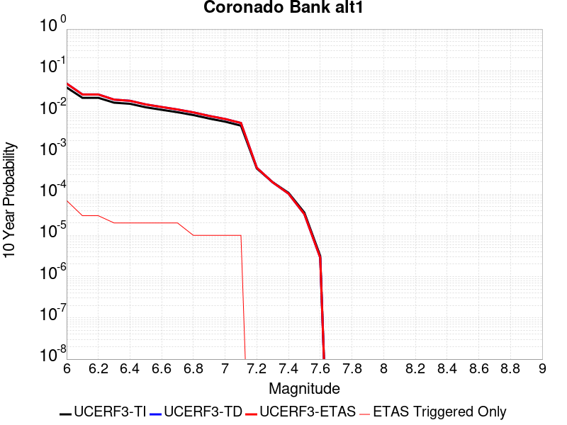 |

| Magnitude | 1 wk TI Prob | 1 wk TD Prob | 1 wk ETAS Prob | 1 wk ETAS/TD Gain | 1 wk ETAS Triggered Only | 1 mo TI Prob | 1 mo TD Prob | 1 mo ETAS Prob | 1 mo ETAS/TD Gain | 1 mo ETAS Triggered Only | 1 yr TI Prob | 1 yr TD Prob | 1 yr ETAS Prob | 1 yr ETAS/TD Gain | 1 yr ETAS Triggered Only | 10 yr TI Prob | 10 yr TD Prob | 10 yr ETAS Prob | 10 yr ETAS/TD Gain | 10 yr ETAS Triggered Only |
|-----|-----|-----|-----|-----|-----|-----|-----|-----|-----|-----|-----|-----|-----|-----|-----|-----|-----|-----|-----|-----|
| 6.0 | 7.533492E-5 | 9.394913E-5 | 1.3394537E-4 | 1.4257224 | 4.0E-5 | 3.22824E-4 | 4.0258127E-4 | 4.4256516E-4 | 1.0993189 | 4.0E-5 | 0.0039233007 | 0.0048909658 | 0.004940721 | 1.010173 | 5.0E-5 | 0.03854755 | 0.04790356 | 0.04797021 | 1.0013913 | 7.0E-5 |
| 6.1 | 4.1807285E-5 | 5.049283E-5 | 6.0492326E-5 | 1.1980379 | 1.0E-5 | 1.7916178E-4 | 2.1638049E-4 | 2.2637832E-4 | 1.0462049 | 1.0E-5 | 0.0021791123 | 0.0026313474 | 0.0026413212 | 1.0037904 | 1.0E-5 | 0.021578677 | 0.026011046 | 0.026040267 | 1.0011233 | 3.0E-5 |
| 6.2 | 4.1807285E-5 | 5.049283E-5 | 6.0492326E-5 | 1.1980379 | 1.0E-5 | 1.7916178E-4 | 2.1638049E-4 | 2.2637832E-4 | 1.0462049 | 1.0E-5 | 0.0021791123 | 0.0026313474 | 0.0026413212 | 1.0037904 | 1.0E-5 | 0.021578677 | 0.026011046 | 0.026040267 | 1.0011233 | 3.0E-5 |
| 6.3 | 3.1793104E-5 | 3.7711117E-5 | 4.771074E-5 | 1.2651638 | 1.0E-5 | 1.3624904E-4 | 1.6160926E-4 | 1.7160765E-4 | 1.0618676 | 1.0E-5 | 0.0016575698 | 0.001965848 | 0.0019758283 | 1.0050769 | 1.0E-5 | 0.016452603 | 0.019488465 | 0.019508075 | 1.0010062 | 2.0E-5 |
| 6.4 | 2.9878007E-5 | 3.5335794E-5 | 4.533544E-5 | 1.2829891 | 1.0E-5 | 1.2804232E-4 | 1.5143053E-4 | 1.6142902E-4 | 1.0660269 | 1.0E-5 | 0.0015578003 | 0.0018421387 | 0.0018521203 | 1.0054184 | 1.0E-5 | 0.015469253 | 0.01827244 | 0.018292075 | 1.0010746 | 2.0E-5 |
| 6.5 | 2.4512565E-5 | 2.8764043E-5 | 3.8763756E-5 | 1.3476462 | 1.0E-5 | 1.0504962E-4 | 1.2326881E-4 | 1.3326757E-4 | 1.0811136 | 1.0E-5 | 0.0012782287 | 0.0014997921 | 0.0015097772 | 1.0066576 | 1.0E-5 | 0.012709012 | 0.014899683 | 0.014919385 | 1.0013223 | 2.0E-5 |
| 6.6 | 2.1317413E-5 | 2.490667E-5 | 3.490642E-5 | 1.4014889 | 1.0E-5 | 9.135714E-5 | 1.0673863E-4 | 1.1673757E-4 | 1.0936768 | 1.0E-5 | 0.0011117056 | 0.0012987906 | 0.0013087775 | 1.0076895 | 1.0E-5 | 0.011061605 | 0.012914404 | 0.012934146 | 1.0015286 | 2.0E-5 |
| 6.7 | 1.8585655E-5 | 2.163488E-5 | 3.1634663E-5 | 1.4622066 | 1.0E-5 | 7.9650374E-5 | 9.271773E-5 | 1.02716804E-4 | 1.1078442 | 1.0E-5 | 9.6931186E-4 | 0.0011282742 | 0.001138263 | 1.0088531 | 1.0E-5 | 0.0096509475 | 0.011227623 | 0.011247397 | 1.0017613 | 2.0E-5 |
| 6.8 | 1.5862879E-5 | 1.8419474E-5 | 2.841929E-5 | 1.5428936 | 1.0E-5 | 6.798199E-5 | 7.893833E-5 | 8.893754E-5 | 1.1266712 | 1.0E-5 | 8.273665E-4 | 9.6066965E-4 | 9.7066E-4 | 1.0103995 | 1.0E-5 | 0.008242928 | 0.00956715 | 0.0095770545 | 1.0010352 | 1.0E-5 |
| 6.9 | 1.3021509E-5 | 1.5095265E-5 | 2.5095114E-5 | 1.6624494 | 1.0E-5 | 5.5805274E-5 | 6.469249E-5 | 7.4691845E-5 | 1.1545675 | 1.0E-5 | 6.792174E-4 | 7.8736455E-4 | 7.9735665E-4 | 1.0126905 | 1.0E-5 | 0.006771452 | 0.007847573 | 0.007857494 | 1.0012643 | 1.0E-5 |
| 7.0 | 1.0974371E-5 | 1.2720104E-5 | 2.2719976E-5 | 1.7861471 | 1.0E-5 | 4.7032172E-5 | 5.451369E-5 | 6.4513144E-5 | 1.1834302 | 1.0E-5 | 5.7246623E-4 | 6.6351966E-4 | 6.73513E-4 | 1.0150611 | 1.0E-5 | 0.0057099373 | 0.006617135 | 0.0066270684 | 1.0015012 | 1.0E-5 |
| 7.1 | 8.766221E-6 | 1.01638325E-5 | 2.016373E-5 | 1.9838709 | 1.0E-5 | 3.7568978E-5 | 4.355865E-5 | 5.3558215E-5 | 1.2295655 | 1.0E-5 | 4.573063E-4 | 5.3021475E-4 | 5.402094E-4 | 1.0188503 | 1.0E-5 | 0.0045636636 | 0.0052911965 | 0.0053011435 | 1.0018799 | 1.0E-5 |
| 7.2 | 8.026024E-7 | 8.331765E-7 | 8.331765E-7 | 1.0 | 0.0 | 3.43972E-6 | 3.5707515E-6 | 3.5707515E-6 | 1.0 | 0.0 | 4.1877785E-5 | 4.3473043E-5 | 4.3473043E-5 | 1.0 | 0.0 | 4.1869894E-4 | 4.3464647E-4 | 4.3464647E-4 | 1.0 | 0.0 |
| 7.3 | 3.7293114E-7 | 3.7000953E-7 | 3.7000953E-7 | 1.0 | 0.0 | 1.5982754E-6 | 1.5857541E-6 | 1.5857541E-6 | 1.0 | 0.0 | 1.9458828E-5 | 1.9306386E-5 | 1.9306386E-5 | 1.0 | 0.0 | 1.9457124E-4 | 1.9304715E-4 | 1.9304715E-4 | 1.0 | 0.0 |
| 7.4 | 2.0557036E-7 | 1.9674363E-7 | 1.9674363E-7 | 1.0 | 0.0 | 8.810155E-7 | 8.431867E-7 | 8.431867E-7 | 1.0 | 0.0 | 1.0726311E-5 | 1.026575E-5 | 1.026575E-5 | 1.0 | 0.0 | 1.0725793E-4 | 1.0265279E-4 | 1.0265279E-4 | 1.0 | 0.0 |
| 7.5 | 6.845446E-8 | 6.279369E-8 | 6.279369E-8 | 1.0 | 0.0 | 2.9337625E-7 | 2.691158E-7 | 2.691158E-7 | 1.0 | 0.0 | 3.5718497E-6 | 3.2764797E-6 | 3.2764797E-6 | 1.0 | 0.0 | 3.5717923E-5 | 3.2764325E-5 | 3.2764325E-5 | 1.0 | 0.0 |
| 7.6 | 6.0975145E-9 | 5.53185E-9 | 5.53185E-9 | 1.0 | 0.0 | 2.6132206E-8 | 2.370793E-8 | 2.370793E-8 | 1.0 | 0.0 | 3.1815955E-7 | 2.88644E-7 | 2.88644E-7 | 1.0 | 0.0 | 3.181591E-6 | 2.8864374E-6 | 2.8864374E-6 | 1.0 | 0.0 |

## San Andreas (North Branch Mill Creek)
*[(top)](#table-of-contents)*

| 1 Week | 1 Month | 1 Year | 10 Year |
|-----|-----|-----|-----|
| 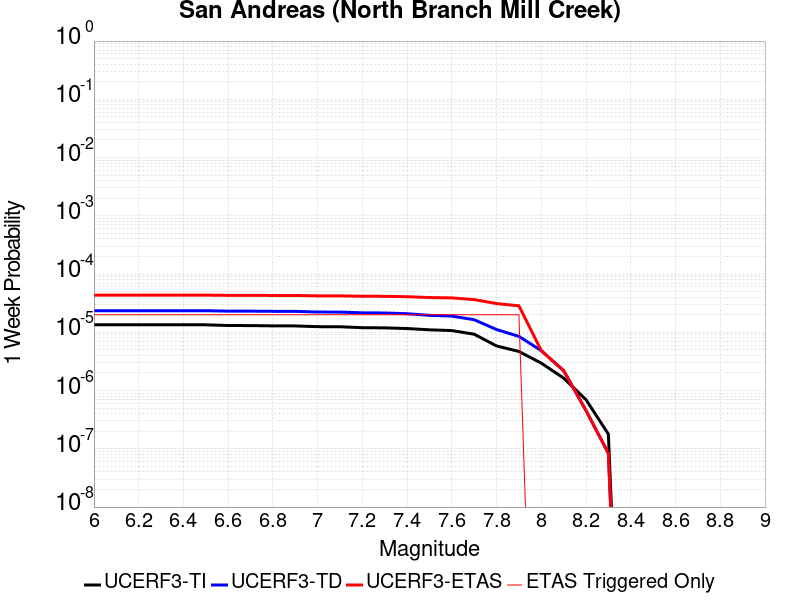 | 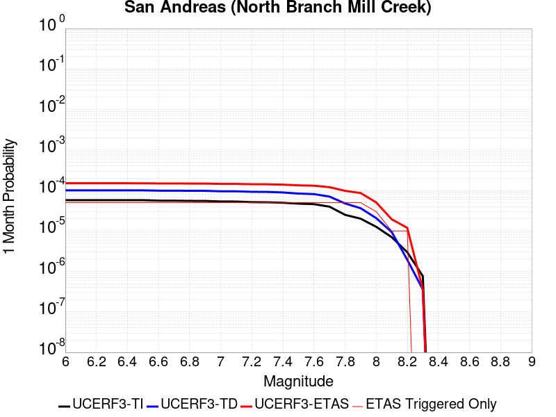 | 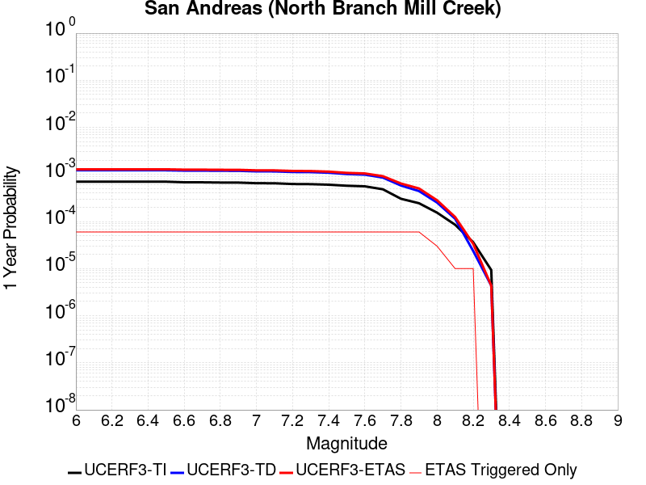 | 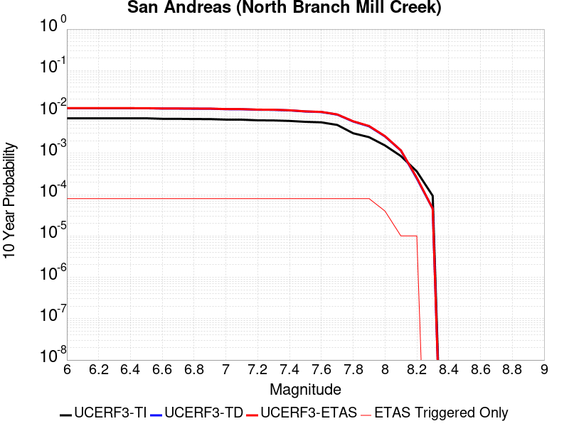 |

| Magnitude | 1 wk TI Prob | 1 wk TD Prob | 1 wk ETAS Prob | 1 wk ETAS/TD Gain | 1 wk ETAS Triggered Only | 1 mo TI Prob | 1 mo TD Prob | 1 mo ETAS Prob | 1 mo ETAS/TD Gain | 1 mo ETAS Triggered Only | 1 yr TI Prob | 1 yr TD Prob | 1 yr ETAS Prob | 1 yr ETAS/TD Gain | 1 yr ETAS Triggered Only | 10 yr TI Prob | 10 yr TD Prob | 10 yr ETAS Prob | 10 yr ETAS/TD Gain | 10 yr ETAS Triggered Only |
|-----|-----|-----|-----|-----|-----|-----|-----|-----|-----|-----|-----|-----|-----|-----|-----|-----|-----|-----|-----|-----|
| 6.0 | 1.3461156E-5 | 2.3499893E-5 | 4.349942E-5 | 1.8510478 | 2.0E-5 | 5.7689394E-5 | 1.00709956E-4 | 1.5070492E-4 | 1.4964253 | 5.0E-5 | 7.02142E-4 | 0.0012254574 | 0.0012853838 | 1.0489013 | 6.0E-5 | 0.0069992766 | 0.01222957 | 0.012308591 | 1.0064615 | 8.0E-5 |
| 6.1 | 1.3461156E-5 | 2.3499893E-5 | 4.349942E-5 | 1.8510478 | 2.0E-5 | 5.7689394E-5 | 1.00709956E-4 | 1.5070492E-4 | 1.4964253 | 5.0E-5 | 7.02142E-4 | 0.0012254574 | 0.0012853838 | 1.0489013 | 6.0E-5 | 0.0069992766 | 0.01222957 | 0.012308591 | 1.0064615 | 8.0E-5 |
| 6.2 | 1.3461156E-5 | 2.3499893E-5 | 4.349942E-5 | 1.8510478 | 2.0E-5 | 5.7689394E-5 | 1.00709956E-4 | 1.5070492E-4 | 1.4964253 | 5.0E-5 | 7.02142E-4 | 0.0012254574 | 0.0012853838 | 1.0489013 | 6.0E-5 | 0.0069992766 | 0.01222957 | 0.012308591 | 1.0064615 | 8.0E-5 |
| 6.3 | 1.3461156E-5 | 2.3499893E-5 | 4.349942E-5 | 1.8510478 | 2.0E-5 | 5.7689394E-5 | 1.00709956E-4 | 1.5070492E-4 | 1.4964253 | 5.0E-5 | 7.02142E-4 | 0.0012254574 | 0.0012853838 | 1.0489013 | 6.0E-5 | 0.0069992766 | 0.01222957 | 0.012308591 | 1.0064615 | 8.0E-5 |
| 6.4 | 1.3461156E-5 | 2.3499893E-5 | 4.349942E-5 | 1.8510478 | 2.0E-5 | 5.7689394E-5 | 1.00709956E-4 | 1.5070492E-4 | 1.4964253 | 5.0E-5 | 7.02142E-4 | 0.0012254574 | 0.0012853838 | 1.0489013 | 6.0E-5 | 0.0069992766 | 0.01222957 | 0.012308591 | 1.0064615 | 8.0E-5 |
| 6.5 | 1.3450706E-5 | 2.3488852E-5 | 4.3488384E-5 | 1.8514477 | 2.0E-5 | 5.764461E-5 | 1.0066265E-4 | 1.5065761E-4 | 1.4966586 | 5.0E-5 | 7.0159714E-4 | 0.001224882 | 0.0012848085 | 1.0489243 | 6.0E-5 | 0.006993862 | 0.01222388 | 0.012302902 | 1.0064646 | 8.0E-5 |
| 6.6 | 1.3074523E-5 | 2.3103135E-5 | 4.3102675E-5 | 1.8656634 | 2.0E-5 | 5.6032466E-5 | 9.9009696E-5 | 1.4900474E-4 | 1.504951 | 5.0E-5 | 6.8198174E-4 | 0.0012047797 | 0.0012647074 | 1.0497416 | 6.0E-5 | 0.006798926 | 0.012025044 | 0.012104083 | 1.0065727 | 8.0E-5 |
| 6.7 | 1.3050216E-5 | 2.3078432E-5 | 4.307797E-5 | 1.86659 | 2.0E-5 | 5.59283E-5 | 9.890384E-5 | 1.488989E-4 | 1.5054916 | 5.0E-5 | 6.8071426E-4 | 0.0012034923 | 0.0012634201 | 1.0497949 | 6.0E-5 | 0.0067863287 | 0.012012309 | 0.012091348 | 1.0065799 | 8.0E-5 |
| 6.8 | 1.29049395E-5 | 2.292684E-5 | 4.2926382E-5 | 1.8723199 | 2.0E-5 | 5.530571E-5 | 9.825421E-5 | 1.482493E-4 | 1.508834 | 5.0E-5 | 6.73139E-4 | 0.0011955918 | 0.00125552 | 1.0501244 | 6.0E-5 | 0.0067110364 | 0.011934154 | 0.0120132 | 1.0066235 | 8.0E-5 |
| 6.9 | 1.2867369E-5 | 2.2886245E-5 | 4.2885786E-5 | 1.8738674 | 2.0E-5 | 5.51447E-5 | 9.8080236E-5 | 1.4807533E-4 | 1.5097367 | 5.0E-5 | 6.711799E-4 | 0.0011934759 | 0.0012534043 | 1.0502133 | 6.0E-5 | 0.006691564 | 0.011913223 | 0.01199227 | 1.0066352 | 8.0E-5 |
| 7.0 | 1.2495996E-5 | 2.2286325E-5 | 4.228588E-5 | 1.8973913 | 2.0E-5 | 5.3553173E-5 | 9.550934E-5 | 1.4550457E-4 | 1.523459 | 5.0E-5 | 6.518148E-4 | 0.0011622087 | 0.0012221391 | 1.0515659 | 6.0E-5 | 0.0064990623 | 0.0116038285 | 0.011682901 | 1.0068142 | 8.0E-5 |
| 7.1 | 1.2452067E-5 | 2.2231397E-5 | 4.2230953E-5 | 1.8996085 | 2.0E-5 | 5.3364907E-5 | 9.527396E-5 | 1.452692E-4 | 1.5247524 | 5.0E-5 | 6.4952404E-4 | 0.0011593461 | 0.0012192765 | 1.0516933 | 6.0E-5 | 0.0064762887 | 0.0115755 | 0.0116545735 | 1.0068312 | 8.0E-5 |
| 7.2 | 1.2002777E-5 | 2.1609963E-5 | 4.160953E-5 | 1.925479 | 2.0E-5 | 5.143946E-5 | 9.2610855E-5 | 1.4260622E-4 | 1.5398436 | 5.0E-5 | 6.2609545E-4 | 0.0011269567 | 0.001186889 | 1.0531807 | 6.0E-5 | 0.006243344 | 0.011254923 | 0.0113340225 | 1.007028 | 8.0E-5 |
| 7.3 | 1.1923425E-5 | 2.1479793E-5 | 4.1479365E-5 | 1.9310877 | 2.0E-5 | 5.109939E-5 | 9.205302E-5 | 1.4204842E-4 | 1.5431153 | 5.0E-5 | 6.219575E-4 | 0.001120172 | 0.0011801048 | 1.0535032 | 6.0E-5 | 0.0062021962 | 0.011187789 | 0.011266894 | 1.0070707 | 8.0E-5 |
| 7.4 | 1.16105175E-5 | 2.0853771E-5 | 4.0853356E-5 | 1.9590391 | 2.0E-5 | 4.975841E-5 | 8.937026E-5 | 1.3936579E-4 | 1.5594202 | 5.0E-5 | 6.0564023E-4 | 0.0010875424 | 0.0011474771 | 1.0551102 | 6.0E-5 | 0.006039923 | 0.010865397 | 0.010944528 | 1.0072829 | 8.0E-5 |
| 7.5 | 1.1037265E-5 | 1.9553907E-5 | 3.9553517E-5 | 2.0227935 | 2.0E-5 | 4.7301706E-5 | 8.379978E-5 | 1.3379559E-4 | 1.5966103 | 5.0E-5 | 5.757461E-4 | 0.0010197869 | 0.0010797258 | 1.0587758 | 6.0E-5 | 0.005742567 | 0.010194898 | 0.010274082 | 1.0077671 | 8.0E-5 |
| 7.6 | 1.0720915E-5 | 1.899582E-5 | 3.899544E-5 | 2.0528433 | 2.0E-5 | 4.5945973E-5 | 8.140812E-5 | 1.3140406E-4 | 1.6141393 | 5.0E-5 | 5.592486E-4 | 9.906954E-4 | 0.0010506359 | 1.0605035 | 6.0E-5 | 0.005578433 | 0.009906623 | 0.00998583 | 1.0079954 | 8.0E-5 |
| 7.7 | 9.276279E-6 | 1.6441649E-5 | 3.644132E-5 | 2.216403 | 2.0E-5 | 3.9754876E-5 | 7.0462316E-5 | 1.2045879E-4 | 1.7095492 | 5.0E-5 | 4.839081E-4 | 8.575427E-4 | 9.174912E-4 | 1.0699073 | 6.0E-5 | 0.0048285574 | 0.008586041 | 0.008665354 | 1.0092374 | 8.0E-5 |
| 7.8 | 5.8346777E-6 | 1.1155013E-5 | 3.1154792E-5 | 2.7928958 | 2.0E-5 | 2.5005522E-5 | 4.7806327E-5 | 9.780393E-5 | 2.0458367 | 5.0E-5 | 3.043997E-4 | 5.818867E-4 | 6.4185174E-4 | 1.1030529 | 6.0E-5 | 0.0030398308 | 0.0058469265 | 0.0059264586 | 1.0136024 | 8.0E-5 |
| 7.9 | 4.690204E-6 | 8.509093E-6 | 2.8508923E-5 | 3.3504066 | 2.0E-5 | 2.0100719E-5 | 3.6467034E-5 | 8.646521E-5 | 2.3710513 | 5.0E-5 | 2.4469878E-4 | 4.4389578E-4 | 5.0386915E-4 | 1.1351069 | 6.0E-5 | 0.002444295 | 0.0044707474 | 0.0045503895 | 1.0178142 | 8.0E-5 |
| 8.0 | 2.9570454E-6 | 4.846947E-6 | 4.846947E-6 | 1.0 | 0.0 | 1.267299E-5 | 2.0772464E-5 | 5.077184E-5 | 2.4441895 | 3.0E-5 | 1.5428272E-4 | 2.5287544E-4 | 2.8286784E-4 | 1.1186055 | 3.0E-5 | 0.0015417566 | 0.002549644 | 0.0025895422 | 1.0156485 | 4.0E-5 |
| 8.1 | 1.6376824E-6 | 2.1968929E-6 | 2.1968929E-6 | 1.0 | 0.0 | 7.01862E-6 | 9.41522E-6 | 1.9415127E-5 | 2.0621 | 1.0E-5 | 8.544835E-5 | 1.14624294E-4 | 1.2462315E-4 | 1.0872315 | 1.0E-5 | 8.54155E-4 | 0.0011606582 | 0.0011706466 | 1.0086058 | 1.0E-5 |
| 8.2 | 6.9631557E-7 | 4.5360213E-7 | 4.5360213E-7 | 1.0 | 0.0 | 2.984206E-6 | 1.9440076E-6 | 1.1943988E-5 | 6.144003 | 1.0E-5 | 3.63321E-5 | 2.3668037E-5 | 3.36678E-5 | 1.4225007 | 1.0E-5 | 3.6326164E-4 | 2.451564E-4 | 2.5515395E-4 | 1.0407803 | 1.0E-5 |
| 8.3 | 1.7876137E-7 | 8.360375E-8 | 8.360375E-8 | 1.0 | 0.0 | 7.661199E-7 | 3.5830175E-7 | 3.5830175E-7 | 1.0 | 0.0 | 9.32747E-6 | 4.3623154E-6 | 4.3623154E-6 | 1.0 | 0.0 | 9.3270784E-5 | 4.5817014E-5 | 4.5817014E-5 | 1.0 | 0.0 |

## Big Pine (East)
*[(top)](#table-of-contents)*

| 1 Week | 1 Month | 1 Year | 10 Year |
|-----|-----|-----|-----|
|  |  |  |  |

| Magnitude | 1 wk TI Prob | 1 wk TD Prob | 1 wk ETAS Prob | 1 wk ETAS/TD Gain | 1 wk ETAS Triggered Only | 1 mo TI Prob | 1 mo TD Prob | 1 mo ETAS Prob | 1 mo ETAS/TD Gain | 1 mo ETAS Triggered Only | 1 yr TI Prob | 1 yr TD Prob | 1 yr ETAS Prob | 1 yr ETAS/TD Gain | 1 yr ETAS Triggered Only | 10 yr TI Prob | 10 yr TD Prob | 10 yr ETAS Prob | 10 yr ETAS/TD Gain | 10 yr ETAS Triggered Only |
|-----|-----|-----|-----|-----|-----|-----|-----|-----|-----|-----|-----|-----|-----|-----|-----|-----|-----|-----|-----|-----|
| 6.0 | 9.916913E-6 | 1.2816984E-5 | 2.2816856E-5 | 1.7802048 | 1.0E-5 | 4.250036E-5 | 5.49289E-5 | 7.4927804E-5 | 1.364087 | 2.0E-5 | 5.173191E-4 | 6.685763E-4 | 7.485228E-4 | 1.1195773 | 8.0E-5 | 0.0051611643 | 0.006670441 | 0.0067499075 | 1.0119132 | 8.0E-5 |
| 6.1 | 9.916913E-6 | 1.2816984E-5 | 2.2816856E-5 | 1.7802048 | 1.0E-5 | 4.250036E-5 | 5.49289E-5 | 7.4927804E-5 | 1.364087 | 2.0E-5 | 5.173191E-4 | 6.685763E-4 | 7.485228E-4 | 1.1195773 | 8.0E-5 | 0.0051611643 | 0.006670441 | 0.0067499075 | 1.0119132 | 8.0E-5 |
| 6.2 | 9.916913E-6 | 1.2816984E-5 | 2.2816856E-5 | 1.7802048 | 1.0E-5 | 4.250036E-5 | 5.49289E-5 | 7.4927804E-5 | 1.364087 | 2.0E-5 | 5.173191E-4 | 6.685763E-4 | 7.485228E-4 | 1.1195773 | 8.0E-5 | 0.0051611643 | 0.006670441 | 0.0067499075 | 1.0119132 | 8.0E-5 |
| 6.3 | 5.479711E-6 | 8.112951E-6 | 1.811287E-5 | 2.232587 | 1.0E-5 | 2.3484265E-5 | 3.4769346E-5 | 4.4769E-5 | 1.2875997 | 1.0E-5 | 2.858834E-4 | 4.2323777E-4 | 4.8321235E-4 | 1.1417043 | 6.0E-5 | 0.0028551589 | 0.004227244 | 0.00428699 | 1.0141337 | 6.0E-5 |
| 6.4 | 5.465009E-6 | 8.097245E-6 | 1.8097164E-5 | 2.234978 | 1.0E-5 | 2.3421257E-5 | 3.4702036E-5 | 4.4701686E-5 | 1.2881576 | 1.0E-5 | 2.851165E-4 | 4.2241855E-4 | 4.823932E-4 | 1.1419792 | 6.0E-5 | 0.0028475097 | 0.0042190826 | 0.0042788293 | 1.0141611 | 6.0E-5 |
| 6.5 | 4.826767E-6 | 7.422301E-6 | 1.7422228E-5 | 2.347281 | 1.0E-5 | 2.068598E-5 | 3.180949E-5 | 4.1809173E-5 | 1.3143616 | 1.0E-5 | 2.518227E-4 | 3.872145E-4 | 4.4719127E-4 | 1.1548929 | 6.0E-5 | 0.0025153751 | 0.003868283 | 0.003928051 | 1.0154507 | 6.0E-5 |
| 6.6 | 4.3146847E-6 | 6.8822374E-6 | 1.6882168E-5 | 2.4530058 | 1.0E-5 | 1.8491375E-5 | 2.9494982E-5 | 3.9494687E-5 | 1.3390307 | 1.0E-5 | 2.2510924E-4 | 3.590447E-4 | 4.1902316E-4 | 1.1670501 | 6.0E-5 | 0.0022488134 | 0.0035874986 | 0.0036472832 | 1.0166647 | 6.0E-5 |
| 6.7 | 3.6968106E-6 | 5.9954727E-6 | 1.5995412E-5 | 2.667915 | 1.0E-5 | 1.5843378E-5 | 2.5694639E-5 | 3.5694382E-5 | 1.3891762 | 1.0E-5 | 1.9287605E-4 | 3.1278885E-4 | 3.4277947E-4 | 1.0958813 | 3.0E-5 | 0.0019270873 | 0.0031262483 | 0.0031561544 | 1.0095662 | 3.0E-5 |
| 6.8 | 3.4671132E-6 | 5.702177E-6 | 1.570212E-5 | 2.7537062 | 1.0E-5 | 1.4858972E-5 | 2.4437682E-5 | 3.443744E-5 | 1.4091941 | 1.0E-5 | 1.8089297E-4 | 2.974896E-4 | 3.2748067E-4 | 1.1008139 | 3.0E-5 | 0.0018074579 | 0.002973667 | 0.003003578 | 1.0100585 | 3.0E-5 |
| 6.9 | 2.7686972E-6 | 4.825223E-6 | 4.825223E-6 | 1.0 | 0.0 | 1.1865792E-5 | 2.0679368E-5 | 2.0679368E-5 | 1.0 | 0.0 | 1.4445644E-4 | 2.5174298E-4 | 2.7173792E-4 | 1.0794262 | 2.0E-5 | 0.0014436257 | 0.0025172636 | 0.0025372133 | 1.0079252 | 2.0E-5 |
| 7.0 | 2.1472624E-6 | 3.9850406E-6 | 3.9850406E-6 | 1.0 | 0.0 | 9.20252E-6 | 1.7078637E-5 | 1.7078637E-5 | 1.0 | 0.0 | 1.12034926E-4 | 2.079131E-4 | 2.2790894E-4 | 1.096174 | 2.0E-5 | 0.0011197845 | 0.0020798394 | 0.0020997976 | 1.0095961 | 2.0E-5 |
| 7.1 | 1.7018335E-6 | 3.344876E-6 | 3.344876E-6 | 1.0 | 0.0 | 7.293552E-6 | 1.4335106E-5 | 1.4335106E-5 | 1.0 | 0.0 | 8.879537E-5 | 1.7451629E-4 | 1.8451455E-4 | 1.0572913 | 1.0E-5 | 8.87599E-4 | 0.0017464145 | 0.001756397 | 1.005716 | 1.0E-5 |
| 7.2 | 1.25603E-6 | 2.794484E-6 | 2.794484E-6 | 1.0 | 0.0 | 5.3829745E-6 | 1.1976307E-5 | 1.1976307E-5 | 1.0 | 0.0 | 6.553574E-5 | 1.4580201E-4 | 1.5580055E-4 | 1.0685762 | 1.0E-5 | 6.551642E-4 | 0.001459661 | 0.0014696465 | 1.006841 | 1.0E-5 |
| 7.3 | 1.112297E-6 | 2.610332E-6 | 2.610332E-6 | 1.0 | 0.0 | 4.7669787E-6 | 1.118709E-5 | 1.118709E-5 | 1.0 | 0.0 | 5.803642E-5 | 1.3619453E-4 | 1.4619317E-4 | 1.0734144 | 1.0E-5 | 5.802127E-4 | 0.0013635408 | 0.0013735272 | 1.0073239 | 1.0E-5 |
| 7.4 | 1.0137181E-6 | 2.4834917E-6 | 2.4834917E-6 | 1.0 | 0.0 | 4.3444993E-6 | 1.0643494E-5 | 1.0643494E-5 | 1.0 | 0.0 | 5.2892992E-5 | 1.2957705E-4 | 1.3957576E-4 | 1.0771642 | 1.0E-5 | 5.288041E-4 | 0.0012972289 | 0.0013072159 | 1.0076988 | 1.0E-5 |
| 7.5 | 9.598608E-7 | 2.4071483E-6 | 2.4071483E-6 | 1.0 | 0.0 | 4.1136827E-6 | 1.031631E-5 | 1.031631E-5 | 1.0 | 0.0 | 5.0082934E-5 | 1.2559404E-4 | 1.355928E-4 | 1.0796117 | 1.0E-5 | 5.007165E-4 | 0.0012572526 | 0.00126724 | 1.0079439 | 1.0E-5 |
| 7.6 | 7.929459E-7 | 2.0448588E-6 | 2.0448588E-6 | 1.0 | 0.0 | 3.3983351E-6 | 8.763653E-6 | 8.763653E-6 | 1.0 | 0.0 | 4.1373947E-5 | 1.06692416E-4 | 1.06692416E-4 | 1.0 | 0.0 | 4.1366243E-4 | 0.0010685222 | 0.0010685222 | 1.0 | 0.0 |
| 7.7 | 4.155788E-7 | 1.1605589E-6 | 1.1605589E-6 | 1.0 | 0.0 | 1.7810507E-6 | 4.9738146E-6 | 4.9738146E-6 | 1.0 | 0.0 | 2.1684076E-5 | 6.0554554E-5 | 6.0554554E-5 | 1.0 | 0.0 | 2.1681961E-4 | 6.0857297E-4 | 6.0857297E-4 | 1.0 | 0.0 |
| 7.8 | 1.14666925E-7 | 2.592015E-7 | 2.592015E-7 | 1.0 | 0.0 | 4.914296E-7 | 1.1108631E-6 | 1.1108631E-6 | 1.0 | 0.0 | 5.9831386E-6 | 1.3524678E-5 | 1.3524678E-5 | 1.0 | 0.0 | 5.9829777E-5 | 1.3634123E-4 | 1.3634123E-4 | 1.0 | 0.0 |
| 7.9 | 2.9231824E-8 | 4.1463963E-8 | 4.1463963E-8 | 1.0 | 0.0 | 1.2527924E-7 | 1.7770269E-7 | 1.7770269E-7 | 1.0 | 0.0 | 1.5252737E-6 | 2.1635283E-6 | 2.1635283E-6 | 1.0 | 0.0 | 1.5252632E-5 | 2.1967755E-5 | 2.1967755E-5 | 1.0 | 0.0 |

## Pinto Mtn
*[(top)](#table-of-contents)*

| 1 Week | 1 Month | 1 Year | 10 Year |
|-----|-----|-----|-----|
|  |  |  |  |

| Magnitude | 1 wk TI Prob | 1 wk TD Prob | 1 wk ETAS Prob | 1 wk ETAS/TD Gain | 1 wk ETAS Triggered Only | 1 mo TI Prob | 1 mo TD Prob | 1 mo ETAS Prob | 1 mo ETAS/TD Gain | 1 mo ETAS Triggered Only | 1 yr TI Prob | 1 yr TD Prob | 1 yr ETAS Prob | 1 yr ETAS/TD Gain | 1 yr ETAS Triggered Only | 10 yr TI Prob | 10 yr TD Prob | 10 yr ETAS Prob | 10 yr ETAS/TD Gain | 10 yr ETAS Triggered Only |
|-----|-----|-----|-----|-----|-----|-----|-----|-----|-----|-----|-----|-----|-----|-----|-----|-----|-----|-----|-----|-----|
| 6.0 | 4.4194956E-5 | 4.785362E-5 | 8.78517E-5 | 1.8358425 | 4.0E-5 | 1.893932E-4 | 2.0507174E-4 | 2.4506354E-4 | 1.1950136 | 4.0E-5 | 0.0023034236 | 0.0024940541 | 0.0025539047 | 1.0239972 | 6.0E-5 | 0.022796938 | 0.024678145 | 0.02475617 | 1.0031618 | 8.0E-5 |
| 6.1 | 4.4194956E-5 | 4.785362E-5 | 8.78517E-5 | 1.8358425 | 4.0E-5 | 1.893932E-4 | 2.0507174E-4 | 2.4506354E-4 | 1.1950136 | 4.0E-5 | 0.0023034236 | 0.0024940541 | 0.0025539047 | 1.0239972 | 6.0E-5 | 0.022796938 | 0.024678145 | 0.02475617 | 1.0031618 | 8.0E-5 |
| 6.2 | 4.4194956E-5 | 4.785362E-5 | 8.78517E-5 | 1.8358425 | 4.0E-5 | 1.893932E-4 | 2.0507174E-4 | 2.4506354E-4 | 1.1950136 | 4.0E-5 | 0.0023034236 | 0.0024940541 | 0.0025539047 | 1.0239972 | 6.0E-5 | 0.022796938 | 0.024678145 | 0.02475617 | 1.0031618 | 8.0E-5 |
| 6.3 | 4.4194956E-5 | 4.785362E-5 | 8.78517E-5 | 1.8358425 | 4.0E-5 | 1.893932E-4 | 2.0507174E-4 | 2.4506354E-4 | 1.1950136 | 4.0E-5 | 0.0023034236 | 0.0024940541 | 0.0025539047 | 1.0239972 | 6.0E-5 | 0.022796938 | 0.024678145 | 0.02475617 | 1.0031618 | 8.0E-5 |
| 6.4 | 3.729929E-5 | 3.9603186E-5 | 5.9602393E-5 | 1.5049899 | 2.0E-5 | 1.5984432E-4 | 1.6971743E-4 | 1.8971403E-4 | 1.1178229 | 2.0E-5 | 0.0019443673 | 0.002064445 | 0.0021043625 | 1.0193356 | 4.0E-5 | 0.019274427 | 0.02046269 | 0.020511666 | 1.0023935 | 5.0E-5 |
| 6.5 | 3.729929E-5 | 3.9603186E-5 | 5.9602393E-5 | 1.5049899 | 2.0E-5 | 1.5984432E-4 | 1.6971743E-4 | 1.8971403E-4 | 1.1178229 | 2.0E-5 | 0.0019443673 | 0.002064445 | 0.0021043625 | 1.0193356 | 4.0E-5 | 0.019274427 | 0.02046269 | 0.020511666 | 1.0023935 | 5.0E-5 |
| 6.6 | 3.0204548E-5 | 3.1205298E-5 | 5.1204675E-5 | 1.6408968 | 2.0E-5 | 1.2944164E-4 | 1.3373033E-4 | 1.5372765E-4 | 1.1495347 | 2.0E-5 | 0.0015748127 | 0.0016269855 | 0.0016569366 | 1.018409 | 3.0E-5 | 0.015636992 | 0.01615461 | 0.016184125 | 1.001827 | 3.0E-5 |
| 6.7 | 2.9857754E-5 | 3.081468E-5 | 5.0814066E-5 | 1.6490213 | 2.0E-5 | 1.2795553E-4 | 1.3205643E-4 | 1.5205379E-4 | 1.1514304 | 2.0E-5 | 0.0015567453 | 0.001606636 | 0.0016365878 | 1.0186425 | 3.0E-5 | 0.015458848 | 0.01595405 | 0.01598357 | 1.0018504 | 3.0E-5 |
| 6.8 | 2.4819734E-5 | 2.5009364E-5 | 3.5009114E-5 | 1.3998402 | 1.0E-5 | 1.0636595E-4 | 1.07178705E-4 | 1.1717763E-4 | 1.0932921 | 1.0E-5 | 0.0012942362 | 0.0013041412 | 0.0013241152 | 1.0153158 | 2.0E-5 | 0.012867244 | 0.0129672475 | 0.012986988 | 1.0015223 | 2.0E-5 |
| 6.9 | 2.331124E-5 | 2.3337643E-5 | 3.333741E-5 | 1.4284823 | 1.0E-5 | 9.990149E-5 | 1.00014746E-4 | 1.10013745E-4 | 1.0999752 | 1.0E-5 | 0.001215622 | 0.0012170197 | 0.0012369953 | 1.0164136 | 2.0E-5 | 0.012089936 | 0.012105742 | 0.012125499 | 1.0016321 | 2.0E-5 |
| 7.0 | 2.1818534E-5 | 2.1760772E-5 | 3.1760555E-5 | 1.4595325 | 1.0E-5 | 9.3504656E-5 | 9.325723E-5 | 1.032563E-4 | 1.1072203 | 1.0E-5 | 0.0011378246 | 0.0011348352 | 0.0011448239 | 1.0088018 | 1.0E-5 | 0.011320163 | 0.011292503 | 0.011302391 | 1.0008756 | 1.0E-5 |
| 7.1 | 2.066081E-5 | 2.0540418E-5 | 3.0540214E-5 | 1.486835 | 1.0E-5 | 8.854332E-5 | 8.8027504E-5 | 9.802662E-5 | 1.1135908 | 1.0E-5 | 0.0010774818 | 0.0010712275 | 0.0010812167 | 1.009325 | 1.0E-5 | 0.010722724 | 0.010662688 | 0.010672581 | 1.0009278 | 1.0E-5 |
| 7.2 | 1.8990233E-5 | 1.9053701E-5 | 2.9053512E-5 | 1.5248224 | 1.0E-5 | 8.138417E-5 | 8.1656275E-5 | 9.1655456E-5 | 1.1224545 | 1.0E-5 | 9.904018E-4 | 9.937311E-4 | 0.0010037211 | 1.010053 | 1.0E-5 | 0.009859995 | 0.009894874 | 0.009904775 | 1.0010006 | 1.0E-5 |
| 7.3 | 1.3335872E-5 | 1.4906372E-5 | 2.4906223E-5 | 1.6708441 | 1.0E-5 | 5.7152483E-5 | 6.388296E-5 | 7.388232E-5 | 1.1565263 | 1.0E-5 | 6.956093E-4 | 7.775102E-4 | 7.8750245E-4 | 1.0128516 | 1.0E-5 | 0.006934359 | 0.0077491994 | 0.0077591217 | 1.0012804 | 1.0E-5 |
| 7.4 | 9.414066E-6 | 1.186061E-5 | 2.1860491E-5 | 1.843117 | 1.0E-5 | 4.0345374E-5 | 5.0830247E-5 | 6.082974E-5 | 1.1967232 | 1.0E-5 | 4.910942E-4 | 6.1869196E-4 | 6.286858E-4 | 1.0161531 | 1.0E-5 | 0.0049001034 | 0.006170644 | 0.006180582 | 1.0016105 | 1.0E-5 |
| 7.5 | 7.2101157E-6 | 9.157893E-6 | 1.9157802E-5 | 2.0919442 | 1.0E-5 | 3.090013E-5 | 3.924757E-5 | 4.9247177E-5 | 1.2547828 | 1.0E-5 | 3.7614413E-4 | 4.7774217E-4 | 4.8773742E-4 | 1.0209218 | 1.0E-5 | 0.0037550807 | 0.004767927 | 0.004777879 | 1.0020874 | 1.0E-5 |
| 7.6 | 3.296375E-6 | 4.5453176E-6 | 4.5453176E-6 | 1.0 | 0.0 | 1.4127245E-5 | 1.9479796E-5 | 1.9479796E-5 | 1.0 | 0.0 | 1.7198564E-4 | 2.3714209E-4 | 2.3714209E-4 | 1.0 | 0.0 | 0.0017185259 | 0.0023690276 | 0.0023690276 | 1.0 | 0.0 |
| 7.7 | 2.5741092E-6 | 3.584251E-6 | 3.584251E-6 | 1.0 | 0.0 | 1.103185E-5 | 1.5360993E-5 | 1.5360993E-5 | 1.0 | 0.0 | 1.3430449E-4 | 1.8700535E-4 | 1.8700535E-4 | 1.0 | 0.0 | 0.0013422335 | 0.0018686098 | 0.0018686098 | 1.0 | 0.0 |

## San Diego Trough north alt1
*[(top)](#table-of-contents)*

| 1 Week | 1 Month | 1 Year | 10 Year |
|-----|-----|-----|-----|
|  |  |  |  |

| Magnitude | 1 wk TI Prob | 1 wk TD Prob | 1 wk ETAS Prob | 1 wk ETAS/TD Gain | 1 wk ETAS Triggered Only | 1 mo TI Prob | 1 mo TD Prob | 1 mo ETAS Prob | 1 mo ETAS/TD Gain | 1 mo ETAS Triggered Only | 1 yr TI Prob | 1 yr TD Prob | 1 yr ETAS Prob | 1 yr ETAS/TD Gain | 1 yr ETAS Triggered Only | 10 yr TI Prob | 10 yr TD Prob | 10 yr ETAS Prob | 10 yr ETAS/TD Gain | 10 yr ETAS Triggered Only |
|-----|-----|-----|-----|-----|-----|-----|-----|-----|-----|-----|-----|-----|-----|-----|-----|-----|-----|-----|-----|-----|
| 6.0 | 7.329252E-5 | 8.821093E-5 | 1.2820741E-4 | 1.4534185 | 4.0E-5 | 3.14073E-4 | 3.7799572E-4 | 4.279768E-4 | 1.1322266 | 5.0E-5 | 0.0038171355 | 0.004593027 | 0.004642797 | 1.0108361 | 5.0E-5 | 0.03752231 | 0.045044992 | 0.045121387 | 1.001696 | 8.0E-5 |
| 6.1 | 3.7940346E-5 | 4.4885E-5 | 5.4884553E-5 | 1.2227815 | 1.0E-5 | 1.6259136E-4 | 1.9235066E-4 | 2.0234875E-4 | 1.0519783 | 1.0E-5 | 0.0019777524 | 0.0023394432 | 0.0023494198 | 1.0042645 | 1.0E-5 | 0.019602431 | 0.023156688 | 0.023185993 | 1.0012655 | 3.0E-5 |
| 6.2 | 2.8645263E-5 | 3.329678E-5 | 4.3296448E-5 | 1.3003193 | 1.0E-5 | 1.2275964E-4 | 1.4269284E-4 | 1.5269141E-4 | 1.0700706 | 1.0E-5 | 0.0014935739 | 0.0017359189 | 0.0017459015 | 1.0057507 | 1.0E-5 | 0.0148357535 | 0.017226247 | 0.017236074 | 1.0005705 | 1.0E-5 |
| 6.3 | 2.8645263E-5 | 3.329678E-5 | 4.3296448E-5 | 1.3003193 | 1.0E-5 | 1.2275964E-4 | 1.4269284E-4 | 1.5269141E-4 | 1.0700706 | 1.0E-5 | 0.0014935739 | 0.0017359189 | 0.0017459015 | 1.0057507 | 1.0E-5 | 0.0148357535 | 0.017226247 | 0.017236074 | 1.0005705 | 1.0E-5 |
| 6.4 | 2.2204576E-5 | 2.5448318E-5 | 3.5448065E-5 | 1.3929433 | 1.0E-5 | 9.5159E-5 | 1.0905972E-4 | 1.19058626E-4 | 1.0916829 | 1.0E-5 | 0.001157945 | 0.0013270034 | 0.00133699 | 1.0075258 | 1.0E-5 | 0.011519298 | 0.013191955 | 0.0132018225 | 1.000748 | 1.0E-5 |
| 6.5 | 2.1004838E-5 | 2.4024694E-5 | 3.4024455E-5 | 1.4162284 | 1.0E-5 | 9.0017624E-5 | 1.0295896E-4 | 1.1295793E-4 | 1.0971161 | 1.0E-5 | 0.0010954136 | 0.0012528138 | 0.0012628014 | 1.007972 | 1.0E-5 | 0.010900296 | 0.012458589 | 0.012468464 | 1.0007926 | 1.0E-5 |
| 6.6 | 1.820557E-5 | 2.0704787E-5 | 3.0704578E-5 | 1.4829701 | 1.0E-5 | 7.802154E-5 | 8.873181E-5 | 9.8730925E-5 | 1.1126891 | 1.0E-5 | 9.4949827E-4 | 0.0010797799 | 0.0010897691 | 1.0092511 | 1.0E-5 | 0.009454516 | 0.010746004 | 0.010755897 | 1.0009205 | 1.0E-5 |
| 6.7 | 1.5884485E-5 | 1.7983646E-5 | 1.7983646E-5 | 1.0 | 0.0 | 6.807459E-5 | 7.707051E-5 | 7.707051E-5 | 1.0 | 0.0 | 8.284929E-4 | 9.3793223E-4 | 9.3793223E-4 | 1.0 | 0.0 | 0.008254109 | 0.009340104 | 0.009340104 | 1.0 | 0.0 |
| 6.8 | 1.4331171E-5 | 1.6201066E-5 | 1.6201066E-5 | 1.0 | 0.0 | 6.141786E-5 | 6.94313E-5 | 6.94313E-5 | 1.0 | 0.0 | 7.4750587E-4 | 8.450002E-4 | 8.450002E-4 | 1.0 | 0.0 | 0.0074499645 | 0.008418139 | 0.008418139 | 1.0 | 0.0 |
| 6.9 | 1.2574203E-5 | 1.4205835E-5 | 1.4205835E-5 | 1.0 | 0.0 | 5.3888325E-5 | 6.0880735E-5 | 6.0880735E-5 | 1.0 | 0.0 | 6.558929E-4 | 7.409723E-4 | 7.409723E-4 | 1.0 | 0.0 | 0.0065396037 | 0.007385203 | 0.007385203 | 1.0 | 0.0 |
| 7.0 | 1.0883844E-5 | 1.2289262E-5 | 1.2289262E-5 | 1.0 | 0.0 | 4.664421E-5 | 5.2667205E-5 | 5.2667205E-5 | 1.0 | 0.0 | 5.677453E-4 | 6.4103556E-4 | 6.4103556E-4 | 1.0 | 0.0 | 0.00566297 | 0.006391993 | 0.006391993 | 1.0 | 0.0 |
| 7.1 | 9.393088E-6 | 1.060702E-5 | 1.060702E-5 | 1.0 | 0.0 | 4.025547E-5 | 4.545787E-5 | 4.545787E-5 | 1.0 | 0.0 | 4.900001E-4 | 5.533098E-4 | 5.533098E-4 | 1.0 | 0.0 | 0.0048892107 | 0.005519418 | 0.005519418 | 1.0 | 0.0 |
| 7.2 | 8.190791E-6 | 9.258625E-6 | 9.258625E-6 | 1.0 | 0.0 | 3.510292E-5 | 3.9679224E-5 | 3.9679224E-5 | 1.0 | 0.0 | 4.2729423E-4 | 4.8298817E-4 | 4.8298817E-4 | 1.0 | 0.0 | 0.0042647356 | 0.004819465 | 0.004819465 | 1.0 | 0.0 |
| 7.3 | 6.268162E-6 | 7.089716E-6 | 7.089716E-6 | 1.0 | 0.0 | 2.6863276E-5 | 3.0384144E-5 | 3.0384144E-5 | 1.0 | 0.0 | 3.2701128E-4 | 3.6986457E-4 | 3.6986457E-4 | 1.0 | 0.0 | 0.003265305 | 0.003692536 | 0.003692536 | 1.0 | 0.0 |
| 7.4 | 4.985186E-6 | 5.6426816E-6 | 5.6426816E-6 | 1.0 | 0.0 | 2.1364907E-5 | 2.4182698E-5 | 2.4182698E-5 | 1.0 | 0.0 | 2.600867E-4 | 2.9438498E-4 | 2.9438498E-4 | 1.0 | 0.0 | 0.002597825 | 0.0029399914 | 0.0029399914 | 1.0 | 0.0 |
| 7.5 | 1.7489613E-6 | 1.969678E-6 | 1.969678E-6 | 1.0 | 0.0 | 7.495527E-6 | 8.4414505E-6 | 8.4414505E-6 | 1.0 | 0.0 | 9.125422E-5 | 1.02770035E-4 | 1.02770035E-4 | 1.0 | 0.0 | 9.1216754E-4 | 0.0010272472 | 0.0010272472 | 1.0 | 0.0 |
| 7.6 | 1.6988751E-7 | 1.7533823E-7 | 1.7533823E-7 | 1.0 | 0.0 | 7.2808916E-7 | 7.5144936E-7 | 7.5144936E-7 | 1.0 | 0.0 | 8.864449E-6 | 9.14886E-6 | 9.14886E-6 | 1.0 | 0.0 | 8.8640954E-5 | 9.1485024E-5 | 9.1485024E-5 | 1.0 | 0.0 |

## Pisgah-Bullion Mtn-Mesquite Lk
*[(top)](#table-of-contents)*

| 1 Week | 1 Month | 1 Year | 10 Year |
|-----|-----|-----|-----|
| 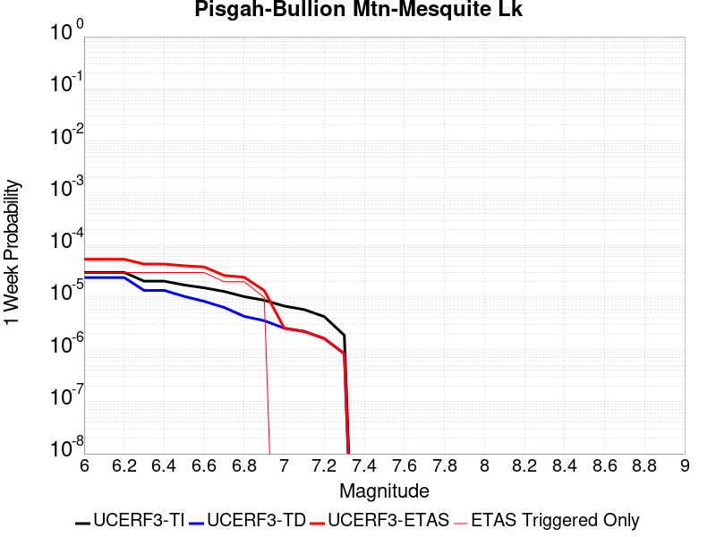 |  | 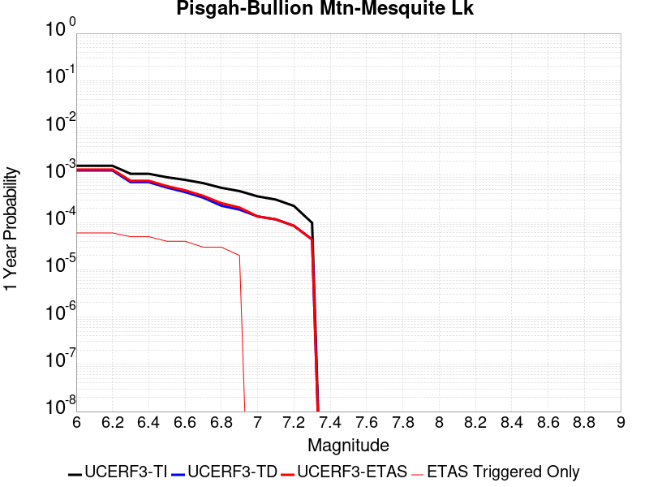 |  |

| Magnitude | 1 wk TI Prob | 1 wk TD Prob | 1 wk ETAS Prob | 1 wk ETAS/TD Gain | 1 wk ETAS Triggered Only | 1 mo TI Prob | 1 mo TD Prob | 1 mo ETAS Prob | 1 mo ETAS/TD Gain | 1 mo ETAS Triggered Only | 1 yr TI Prob | 1 yr TD Prob | 1 yr ETAS Prob | 1 yr ETAS/TD Gain | 1 yr ETAS Triggered Only | 10 yr TI Prob | 10 yr TD Prob | 10 yr ETAS Prob | 10 yr ETAS/TD Gain | 10 yr ETAS Triggered Only |
|-----|-----|-----|-----|-----|-----|-----|-----|-----|-----|-----|-----|-----|-----|-----|-----|-----|-----|-----|-----|-----|
| 6.0 | 3.0240792E-5 | 2.4091114E-5 | 5.4090393E-5 | 2.2452424 | 3.0E-5 | 1.2959696E-4 | 1.03244114E-4 | 1.3324102E-4 | 1.2905434 | 3.0E-5 | 0.0015767008 | 0.0012563728 | 0.0013162973 | 1.0476965 | 6.0E-5 | 0.015655609 | 0.012502721 | 0.012571845 | 1.0055288 | 7.0E-5 |
| 6.1 | 3.0240792E-5 | 2.4091114E-5 | 5.4090393E-5 | 2.2452424 | 3.0E-5 | 1.2959696E-4 | 1.03244114E-4 | 1.3324102E-4 | 1.2905434 | 3.0E-5 | 0.0015767008 | 0.0012563728 | 0.0013162973 | 1.0476965 | 6.0E-5 | 0.015655609 | 0.012502721 | 0.012571845 | 1.0055288 | 7.0E-5 |
| 6.2 | 3.0240792E-5 | 2.4091114E-5 | 5.4090393E-5 | 2.2452424 | 3.0E-5 | 1.2959696E-4 | 1.03244114E-4 | 1.3324102E-4 | 1.2905434 | 3.0E-5 | 0.0015767008 | 0.0012563728 | 0.0013162973 | 1.0476965 | 6.0E-5 | 0.015655609 | 0.012502721 | 0.012571845 | 1.0055288 | 7.0E-5 |
| 6.3 | 2.0498217E-5 | 1.36380695E-5 | 4.363766E-5 | 3.1996949 | 3.0E-5 | 8.784654E-5 | 5.844765E-5 | 8.84459E-5 | 1.5132499 | 3.0E-5 | 0.0010690069 | 7.1138405E-4 | 7.6134846E-4 | 1.0702355 | 5.0E-5 | 0.01063879 | 0.0070926943 | 0.00714234 | 1.0069995 | 5.0E-5 |
| 6.4 | 2.0498217E-5 | 1.36380695E-5 | 4.363766E-5 | 3.1996949 | 3.0E-5 | 8.784654E-5 | 5.844765E-5 | 8.84459E-5 | 1.5132499 | 3.0E-5 | 0.0010690069 | 7.1138405E-4 | 7.6134846E-4 | 1.0702355 | 5.0E-5 | 0.01063879 | 0.0070926943 | 0.00714234 | 1.0069995 | 5.0E-5 |
| 6.5 | 1.7316182E-5 | 1.0477042E-5 | 4.0476727E-5 | 3.8633735 | 3.0E-5 | 7.42101E-5 | 4.4900895E-5 | 7.489955E-5 | 1.6681081 | 3.0E-5 | 9.0313336E-4 | 5.465413E-4 | 5.865194E-4 | 1.0731475 | 4.0E-5 | 0.008994718 | 0.0054529672 | 0.005492749 | 1.0072955 | 4.0E-5 |
| 6.6 | 1.5251077E-5 | 8.414273E-6 | 3.8414022E-5 | 4.5653405 | 3.0E-5 | 6.536012E-5 | 3.6060712E-5 | 6.605963E-5 | 1.8319004 | 3.0E-5 | 7.9546886E-4 | 4.3895794E-4 | 4.789404E-4 | 1.091085 | 4.0E-5 | 0.007926274 | 0.0043816264 | 0.004421451 | 1.009089 | 4.0E-5 |
| 6.7 | 1.2997425E-5 | 6.4114965E-6 | 2.6411368E-5 | 4.1193767 | 2.0E-5 | 5.570206E-5 | 2.7477578E-5 | 4.7477028E-5 | 1.7278461 | 2.0E-5 | 6.7796157E-4 | 3.3449283E-4 | 3.6448278E-4 | 1.089658 | 3.0E-5 | 0.0067589693 | 0.0033403537 | 0.0033702536 | 1.0089511 | 3.0E-5 |
| 6.8 | 1.035386E-5 | 4.3332193E-6 | 2.4333132E-5 | 5.615486 | 2.0E-5 | 4.437293E-5 | 1.8570812E-5 | 3.857044E-5 | 2.0769389 | 2.0E-5 | 5.401065E-4 | 2.2607706E-4 | 2.5607029E-4 | 1.1326681 | 3.0E-5 | 0.0053879567 | 0.0022585576 | 0.0022884898 | 1.0132529 | 3.0E-5 |
| 6.9 | 8.816252E-6 | 3.580638E-6 | 1.3580602E-5 | 3.7927885 | 1.0E-5 | 3.778339E-5 | 1.5345504E-5 | 2.534535E-5 | 1.6516467 | 1.0E-5 | 4.5991567E-4 | 1.8681608E-4 | 2.0681234E-4 | 1.1070372 | 2.0E-5 | 0.00458965 | 0.0018666488 | 0.0018866115 | 1.0106944 | 2.0E-5 |
| 7.0 | 6.8232207E-6 | 2.5675843E-6 | 2.5675843E-6 | 1.0 | 0.0 | 2.9242048E-5 | 1.1003888E-5 | 1.1003888E-5 | 1.0 | 0.0 | 3.5596377E-4 | 1.3396442E-4 | 1.3396442E-4 | 1.0 | 0.0 | 0.0035539411 | 0.0013388677 | 0.0013388677 | 1.0 | 0.0 |
| 7.1 | 5.837013E-6 | 2.22738E-6 | 2.22738E-6 | 1.0 | 0.0 | 2.501553E-5 | 9.545881E-6 | 9.545881E-6 | 1.0 | 0.0 | 3.045215E-4 | 1.16215204E-4 | 1.16215204E-4 | 1.0 | 0.0 | 0.0030410455 | 0.0011615733 | 0.0011615733 | 1.0 | 0.0 |
| 7.2 | 4.278052E-6 | 1.6275711E-6 | 1.6275711E-6 | 1.0 | 0.0 | 1.833438E-5 | 6.9752873E-6 | 6.9752873E-6 | 1.0 | 0.0 | 2.231982E-4 | 8.492105E-5 | 8.492105E-5 | 1.0 | 0.0 | 0.0022297418 | 8.489092E-4 | 8.489092E-4 | 1.0 | 0.0 |
| 7.3 | 1.8803692E-6 | 8.344926E-7 | 8.344926E-7 | 1.0 | 0.0 | 8.0587E-6 | 3.5763926E-6 | 3.5763926E-6 | 1.0 | 0.0 | 9.811026E-5 | 4.354186E-5 | 4.354186E-5 | 1.0 | 0.0 | 9.806695E-4 | 4.3534773E-4 | 4.3534773E-4 | 1.0 | 0.0 |

## Independence rev 2011
*[(top)](#table-of-contents)*

| 1 Week | 1 Month | 1 Year | 10 Year |
|-----|-----|-----|-----|
|  |  | 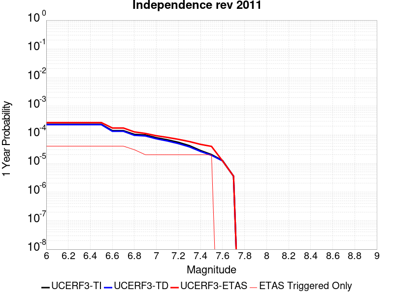 |  |

| Magnitude | 1 wk TI Prob | 1 wk TD Prob | 1 wk ETAS Prob | 1 wk ETAS/TD Gain | 1 wk ETAS Triggered Only | 1 mo TI Prob | 1 mo TD Prob | 1 mo ETAS Prob | 1 mo ETAS/TD Gain | 1 mo ETAS Triggered Only | 1 yr TI Prob | 1 yr TD Prob | 1 yr ETAS Prob | 1 yr ETAS/TD Gain | 1 yr ETAS Triggered Only | 10 yr TI Prob | 10 yr TD Prob | 10 yr ETAS Prob | 10 yr ETAS/TD Gain | 10 yr ETAS Triggered Only |
|-----|-----|-----|-----|-----|-----|-----|-----|-----|-----|-----|-----|-----|-----|-----|-----|-----|-----|-----|-----|-----|
| 6.0 | 4.422171E-6 | 4.326227E-6 | 4.326227E-6 | 1.0 | 0.0 | 1.8952025E-5 | 1.8540857E-5 | 3.8540486E-5 | 2.0786788 | 2.0E-5 | 2.3071647E-4 | 2.2571455E-4 | 2.6570552E-4 | 1.1771749 | 4.0E-5 | 0.0023047708 | 0.0022551466 | 0.0023150113 | 1.0265458 | 6.0E-5 |
| 6.1 | 4.422171E-6 | 4.326227E-6 | 4.326227E-6 | 1.0 | 0.0 | 1.8952025E-5 | 1.8540857E-5 | 3.8540486E-5 | 2.0786788 | 2.0E-5 | 2.3071647E-4 | 2.2571455E-4 | 2.6570552E-4 | 1.1771749 | 4.0E-5 | 0.0023047708 | 0.0022551466 | 0.0023150113 | 1.0265458 | 6.0E-5 |
| 6.2 | 4.422171E-6 | 4.326227E-6 | 4.326227E-6 | 1.0 | 0.0 | 1.8952025E-5 | 1.8540857E-5 | 3.8540486E-5 | 2.0786788 | 2.0E-5 | 2.3071647E-4 | 2.2571455E-4 | 2.6570552E-4 | 1.1771749 | 4.0E-5 | 0.0023047708 | 0.0022551466 | 0.0023150113 | 1.0265458 | 6.0E-5 |
| 6.3 | 4.422171E-6 | 4.326227E-6 | 4.326227E-6 | 1.0 | 0.0 | 1.8952025E-5 | 1.8540857E-5 | 3.8540486E-5 | 2.0786788 | 2.0E-5 | 2.3071647E-4 | 2.2571455E-4 | 2.6570552E-4 | 1.1771749 | 4.0E-5 | 0.0023047708 | 0.0022551466 | 0.0023150113 | 1.0265458 | 6.0E-5 |
| 6.4 | 4.422171E-6 | 4.326227E-6 | 4.326227E-6 | 1.0 | 0.0 | 1.8952025E-5 | 1.8540857E-5 | 3.8540486E-5 | 2.0786788 | 2.0E-5 | 2.3071647E-4 | 2.2571455E-4 | 2.6570552E-4 | 1.1771749 | 4.0E-5 | 0.0023047708 | 0.0022551466 | 0.0023150113 | 1.0265458 | 6.0E-5 |
| 6.5 | 4.422171E-6 | 4.326227E-6 | 4.326227E-6 | 1.0 | 0.0 | 1.8952025E-5 | 1.8540857E-5 | 3.8540486E-5 | 2.0786788 | 2.0E-5 | 2.3071647E-4 | 2.2571455E-4 | 2.6570552E-4 | 1.1771749 | 4.0E-5 | 0.0023047708 | 0.0022551466 | 0.0023150113 | 1.0265458 | 6.0E-5 |
| 6.6 | 2.663744E-6 | 2.5319862E-6 | 2.5319862E-6 | 1.0 | 0.0 | 1.1415996E-5 | 1.0851327E-5 | 3.085111E-5 | 2.8430727 | 2.0E-5 | 1.3898089E-4 | 1.3210738E-4 | 1.721021E-4 | 1.302744 | 4.0E-5 | 0.0013889399 | 0.0013203367 | 0.0013802575 | 1.045383 | 6.0E-5 |
| 6.7 | 2.663744E-6 | 2.5319862E-6 | 2.5319862E-6 | 1.0 | 0.0 | 1.1415996E-5 | 1.0851327E-5 | 3.085111E-5 | 2.8430727 | 2.0E-5 | 1.3898089E-4 | 1.3210738E-4 | 1.721021E-4 | 1.302744 | 4.0E-5 | 0.0013889399 | 0.0013203367 | 0.0013802575 | 1.045383 | 6.0E-5 |
| 6.8 | 1.9716529E-6 | 1.8322585E-6 | 1.8322585E-6 | 1.0 | 0.0 | 8.449913E-6 | 7.852514E-6 | 2.7852357E-5 | 3.5469353 | 2.0E-5 | 1.0287284E-4 | 9.5600284E-5 | 1.2559742E-4 | 1.3137766 | 3.0E-5 | 0.0010282523 | 9.556045E-4 | 0.0010055567 | 1.0522729 | 5.0E-5 |
| 6.9 | 1.8788617E-6 | 1.7429993E-6 | 1.7429993E-6 | 1.0 | 0.0 | 8.0522395E-6 | 7.4699765E-6 | 2.7469827E-5 | 3.6773646 | 2.0E-5 | 9.80316E-5 | 9.0943286E-5 | 1.10941466E-4 | 1.2198973 | 2.0E-5 | 9.798837E-4 | 9.0907275E-4 | 9.490364E-4 | 1.0439609 | 4.0E-5 |
| 7.0 | 1.5045488E-6 | 1.3849503E-6 | 1.3849503E-6 | 1.0 | 0.0 | 6.44805E-6 | 5.9354884E-6 | 2.593537E-5 | 4.3695426 | 2.0E-5 | 7.8502184E-5 | 7.226223E-5 | 9.226078E-5 | 1.2767497 | 2.0E-5 | 7.8474457E-4 | 7.2239246E-4 | 7.5237075E-4 | 1.0414987 | 3.0E-5 |
| 7.1 | 1.272341E-6 | 1.1625096E-6 | 1.1625096E-6 | 1.0 | 0.0 | 5.4528787E-6 | 4.982175E-6 | 2.4982075E-5 | 5.014291 | 2.0E-5 | 6.6386776E-5 | 6.0656326E-5 | 8.065511E-5 | 1.3297065 | 2.0E-5 | 6.636695E-4 | 6.064009E-4 | 6.363827E-4 | 1.0494422 | 3.0E-5 |
| 7.2 | 1.0416892E-6 | 9.4098806E-7 | 9.4098806E-7 | 1.0 | 0.0 | 4.464375E-6 | 4.0328E-6 | 2.4032719E-5 | 5.959314 | 2.0E-5 | 5.4352407E-5 | 4.909825E-5 | 6.909727E-5 | 1.4073265 | 2.0E-5 | 5.4339116E-4 | 4.9087586E-4 | 5.208612E-4 | 1.0610852 | 3.0E-5 |
| 7.3 | 7.9450155E-7 | 7.235002E-7 | 7.235002E-7 | 1.0 | 0.0 | 3.4050022E-6 | 3.1007114E-6 | 2.3100649E-5 | 7.450113 | 2.0E-5 | 4.1455114E-5 | 3.775052E-5 | 5.7749763E-5 | 1.5297741 | 2.0E-5 | 4.144738E-4 | 3.7744216E-4 | 4.0743084E-4 | 1.0794524 | 3.0E-5 |
| 7.4 | 5.3893444E-7 | 5.019512E-7 | 5.019512E-7 | 1.0 | 0.0 | 2.309717E-6 | 2.1512178E-6 | 2.2151175E-5 | 10.29704 | 2.0E-5 | 2.8120441E-5 | 2.6190766E-5 | 4.6190242E-5 | 1.7636079 | 2.0E-5 | 2.8116882E-4 | 2.6187726E-4 | 2.918694E-4 | 1.1145275 | 3.0E-5 |
| 7.5 | 3.8852085E-7 | 3.682554E-7 | 3.682554E-7 | 1.0 | 0.0 | 1.6650882E-6 | 1.5782365E-6 | 2.1578206E-5 | 13.672353 | 2.0E-5 | 2.027226E-5 | 1.9214862E-5 | 3.9214476E-5 | 2.040841 | 2.0E-5 | 2.0270412E-4 | 1.9213221E-4 | 2.2212646E-4 | 1.1561124 | 3.0E-5 |
| 7.6 | 2.414929E-7 | 2.345755E-7 | 2.345755E-7 | 1.0 | 0.0 | 1.0349692E-6 | 1.0053232E-6 | 1.0053232E-6 | 1.0 | 0.0 | 1.2600677E-5 | 1.2239742E-5 | 1.2239742E-5 | 1.0 | 0.0 | 1.2599962E-4 | 1.223908E-4 | 1.3238958E-4 | 1.0816954 | 1.0E-5 |
| 7.7 | 6.8298014E-8 | 6.85897E-8 | 6.85897E-8 | 1.0 | 0.0 | 2.9270575E-7 | 2.9395582E-7 | 2.9395582E-7 | 1.0 | 0.0 | 3.5636867E-6 | 3.5789067E-6 | 3.5789067E-6 | 1.0 | 0.0 | 3.5636294E-5 | 3.5788536E-5 | 3.5788536E-5 | 1.0 | 0.0 |

## Rose Canyon
*[(top)](#table-of-contents)*

| 1 Week | 1 Month | 1 Year | 10 Year |
|-----|-----|-----|-----|
| 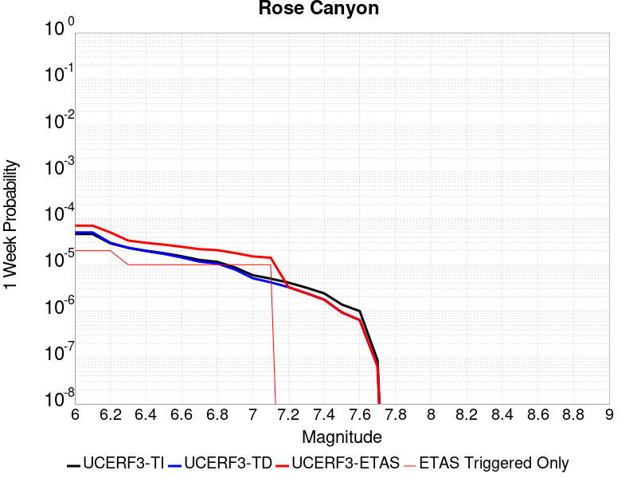 |  |  |  |

| Magnitude | 1 wk TI Prob | 1 wk TD Prob | 1 wk ETAS Prob | 1 wk ETAS/TD Gain | 1 wk ETAS Triggered Only | 1 mo TI Prob | 1 mo TD Prob | 1 mo ETAS Prob | 1 mo ETAS/TD Gain | 1 mo ETAS Triggered Only | 1 yr TI Prob | 1 yr TD Prob | 1 yr ETAS Prob | 1 yr ETAS/TD Gain | 1 yr ETAS Triggered Only | 10 yr TI Prob | 10 yr TD Prob | 10 yr ETAS Prob | 10 yr ETAS/TD Gain | 10 yr ETAS Triggered Only |
|-----|-----|-----|-----|-----|-----|-----|-----|-----|-----|-----|-----|-----|-----|-----|-----|-----|-----|-----|-----|-----|
| 6.0 | 4.5923203E-5 | 4.9714225E-5 | 6.9713235E-5 | 1.4022794 | 2.0E-5 | 1.9679888E-4 | 2.1304491E-4 | 2.4303852E-4 | 1.1407853 | 3.0E-5 | 0.0023933933 | 0.0025909345 | 0.0026308307 | 1.0153985 | 4.0E-5 | 0.023677798 | 0.02563999 | 0.025698453 | 1.0022801 | 6.0E-5 |
| 6.1 | 4.5923203E-5 | 4.9714225E-5 | 6.9713235E-5 | 1.4022794 | 2.0E-5 | 1.9679888E-4 | 2.1304491E-4 | 2.4303852E-4 | 1.1407853 | 3.0E-5 | 0.0023933933 | 0.0025909345 | 0.0026308307 | 1.0153985 | 4.0E-5 | 0.023677798 | 0.02563999 | 0.025688708 | 1.0019001 | 5.0E-5 |
| 6.2 | 2.8844734E-5 | 2.9668723E-5 | 4.9668128E-5 | 1.6740906 | 2.0E-5 | 1.2361443E-4 | 1.2714567E-4 | 1.5714185E-4 | 1.2359198 | 3.0E-5 | 0.0015039665 | 0.0015468939 | 0.001586832 | 1.0258182 | 4.0E-5 | 0.0149382865 | 0.015374276 | 0.015423507 | 1.0032022 | 5.0E-5 |
| 6.3 | 2.3171577E-5 | 2.3161238E-5 | 3.3161006E-5 | 1.4317459 | 1.0E-5 | 9.9302975E-5 | 9.9258745E-5 | 1.19256765E-4 | 1.2014736 | 2.0E-5 | 0.0012083431 | 0.0012078186 | 0.0012377824 | 1.0248082 | 3.0E-5 | 0.012017938 | 0.012022437 | 0.012061955 | 1.0032871 | 4.0E-5 |
| 6.4 | 2.0066604E-5 | 1.9667024E-5 | 2.9666828E-5 | 1.5084553 | 1.0E-5 | 8.599689E-5 | 8.4284584E-5 | 9.428374E-5 | 1.1186357 | 1.0E-5 | 0.0010465092 | 0.0010256917 | 0.0010456712 | 1.019479 | 2.0E-5 | 0.010415946 | 0.010217559 | 0.010237354 | 1.0019374 | 2.0E-5 |
| 6.5 | 1.776989E-5 | 1.7113807E-5 | 2.7113636E-5 | 1.5843135 | 1.0E-5 | 7.615444E-5 | 7.334287E-5 | 8.334213E-5 | 1.136336 | 1.0E-5 | 9.267859E-4 | 8.925905E-4 | 9.1257266E-4 | 1.0223867 | 2.0E-5 | 0.009229303 | 0.008896211 | 0.0089160325 | 1.0022281 | 2.0E-5 |
| 6.6 | 1.5227364E-5 | 1.433926E-5 | 2.4339117E-5 | 1.697376 | 1.0E-5 | 6.52585E-5 | 6.1452556E-5 | 7.145194E-5 | 1.1627172 | 1.0E-5 | 7.942326E-4 | 7.479332E-4 | 7.6791825E-4 | 1.0267204 | 2.0E-5 | 0.007914 | 0.007458359 | 0.00747821 | 1.0026616 | 2.0E-5 |
| 6.7 | 1.2703898E-5 | 1.1673274E-5 | 2.1673157E-5 | 1.8566477 | 1.0E-5 | 5.4444143E-5 | 5.0027378E-5 | 6.002688E-5 | 1.1998806 | 1.0E-5 | 6.626558E-4 | 6.089174E-4 | 6.289052E-4 | 1.0328252 | 2.0E-5 | 0.006606833 | 0.0060750856 | 0.006094964 | 1.0032722 | 2.0E-5 |
| 6.8 | 1.1554917E-5 | 1.0609337E-5 | 2.0609232E-5 | 1.942556 | 1.0E-5 | 4.9520135E-5 | 4.546782E-5 | 5.5467364E-5 | 1.2199258 | 1.0E-5 | 6.0274085E-4 | 5.5343413E-4 | 5.7342305E-4 | 1.036118 | 2.0E-5 | 0.0060110865 | 0.0055225673 | 0.005542457 | 1.0036016 | 2.0E-5 |
| 6.9 | 8.732078E-6 | 7.881357E-6 | 1.7881279E-5 | 2.268807 | 1.0E-5 | 3.7422655E-5 | 3.3776825E-5 | 4.3776487E-5 | 1.296051 | 1.0E-5 | 4.5552556E-4 | 4.111582E-4 | 4.3114997E-4 | 1.0486231 | 2.0E-5 | 0.0045459294 | 0.0041048084 | 0.004124726 | 1.0048523 | 2.0E-5 |
| 7.0 | 5.9337494E-6 | 5.1074853E-6 | 1.5107435E-5 | 2.9579008 | 1.0E-5 | 2.5430107E-5 | 2.188904E-5 | 3.188882E-5 | 1.4568397 | 1.0E-5 | 3.0956755E-4 | 2.664666E-4 | 2.864613E-4 | 1.0750363 | 2.0E-5 | 0.0030913667 | 0.0026614866 | 0.0026814335 | 1.0074946 | 2.0E-5 |
| 7.1 | 5.013409E-6 | 4.1773833E-6 | 1.4177342E-5 | 3.3938332 | 1.0E-5 | 2.1485863E-5 | 1.7902948E-5 | 2.790277E-5 | 1.5585572 | 1.0E-5 | 2.6155898E-4 | 2.179467E-4 | 2.3794234E-4 | 1.0917455 | 2.0E-5 | 0.0026125133 | 0.0021773411 | 0.0021972978 | 1.0091655 | 2.0E-5 |
| 7.2 | 4.120763E-6 | 3.2821383E-6 | 3.2821383E-6 | 1.0 | 0.0 | 1.7660293E-5 | 1.4066231E-5 | 1.4066231E-5 | 1.0 | 0.0 | 2.1499286E-4 | 1.7124301E-4 | 1.812413E-4 | 1.0583866 | 1.0E-5 | 0.0021478499 | 0.00171112 | 0.0017211029 | 1.0058341 | 1.0E-5 |
| 7.3 | 3.2081239E-6 | 2.4405372E-6 | 2.4405372E-6 | 1.0 | 0.0 | 1.374903E-5 | 1.0459404E-5 | 1.0459404E-5 | 1.0 | 0.0 | 1.6738157E-4 | 1.2733586E-4 | 1.373346E-4 | 1.0785224 | 1.0E-5 | 0.0016725556 | 0.001272636 | 0.0012826233 | 1.0078477 | 1.0E-5 |
| 7.4 | 2.4194755E-6 | 1.7680634E-6 | 1.7680634E-6 | 1.0 | 0.0 | 1.0369139E-5 | 7.577393E-6 | 7.577393E-6 | 1.0 | 0.0 | 1.2623696E-4 | 9.2250906E-5 | 1.02249986E-4 | 1.10839 | 1.0E-5 | 0.0012616527 | 9.2213147E-4 | 9.3212223E-4 | 1.0108345 | 1.0E-5 |
| 7.5 | 1.3842889E-6 | 9.3786275E-7 | 9.3786275E-7 | 1.0 | 0.0 | 5.9326535E-6 | 4.019406E-6 | 4.019406E-6 | 1.0 | 0.0 | 7.222766E-5 | 4.8935202E-5 | 5.893471E-5 | 1.2043419 | 1.0E-5 | 7.220419E-4 | 4.892478E-4 | 4.992429E-4 | 1.0204295 | 1.0E-5 |
| 7.6 | 1.0021575E-6 | 6.411463E-7 | 6.411463E-7 | 1.0 | 0.0 | 4.2949537E-6 | 2.7477672E-6 | 2.7477672E-6 | 1.0 | 0.0 | 5.2289808E-5 | 3.3453573E-5 | 4.3453238E-5 | 1.2989117 | 1.0E-5 | 5.2277505E-4 | 3.344875E-4 | 3.4448417E-4 | 1.0298865 | 1.0E-5 |
| 7.7 | 8.7620116E-8 | 6.4492404E-8 | 6.4492404E-8 | 1.0 | 0.0 | 3.7551473E-7 | 2.76396E-7 | 2.76396E-7 | 1.0 | 0.0 | 4.5718825E-6 | 3.3651165E-6 | 1.3365083E-5 | 3.9716554 | 1.0E-5 | 4.5717883E-5 | 3.3650686E-5 | 4.3650347E-5 | 1.2971607 | 1.0E-5 |

## La Panza 2011
*[(top)](#table-of-contents)*

| 1 Week | 1 Month | 1 Year | 10 Year |
|-----|-----|-----|-----|
|  |  |  |  |

| Magnitude | 1 wk TI Prob | 1 wk TD Prob | 1 wk ETAS Prob | 1 wk ETAS/TD Gain | 1 wk ETAS Triggered Only | 1 mo TI Prob | 1 mo TD Prob | 1 mo ETAS Prob | 1 mo ETAS/TD Gain | 1 mo ETAS Triggered Only | 1 yr TI Prob | 1 yr TD Prob | 1 yr ETAS Prob | 1 yr ETAS/TD Gain | 1 yr ETAS Triggered Only | 10 yr TI Prob | 10 yr TD Prob | 10 yr ETAS Prob | 10 yr ETAS/TD Gain | 10 yr ETAS Triggered Only |
|-----|-----|-----|-----|-----|-----|-----|-----|-----|-----|-----|-----|-----|-----|-----|-----|-----|-----|-----|-----|-----|
| 6.0 | 4.6754544E-6 | 4.717587E-6 | 2.4717492E-5 | 5.2394357 | 2.0E-5 | 2.0037509E-5 | 2.0218084E-5 | 5.0217477E-5 | 2.4837902 | 3.0E-5 | 2.4392935E-4 | 2.4612935E-4 | 2.9611704E-4 | 1.2030952 | 5.0E-5 | 0.0024366176 | 0.002458762 | 0.002508639 | 1.0202855 | 5.0E-5 |
| 6.1 | 4.6754544E-6 | 4.717587E-6 | 2.4717492E-5 | 5.2394357 | 2.0E-5 | 2.0037509E-5 | 2.0218084E-5 | 5.0217477E-5 | 2.4837902 | 3.0E-5 | 2.4392935E-4 | 2.4612935E-4 | 2.9611704E-4 | 1.2030952 | 5.0E-5 | 0.0024366176 | 0.002458762 | 0.002508639 | 1.0202855 | 5.0E-5 |
| 6.2 | 4.6754544E-6 | 4.717587E-6 | 2.4717492E-5 | 5.2394357 | 2.0E-5 | 2.0037509E-5 | 2.0218084E-5 | 5.0217477E-5 | 2.4837902 | 3.0E-5 | 2.4392935E-4 | 2.4612935E-4 | 2.9611704E-4 | 1.2030952 | 5.0E-5 | 0.0024366176 | 0.002458762 | 0.002508639 | 1.0202855 | 5.0E-5 |
| 6.3 | 4.6754544E-6 | 4.717587E-6 | 2.4717492E-5 | 5.2394357 | 2.0E-5 | 2.0037509E-5 | 2.0218084E-5 | 5.0217477E-5 | 2.4837902 | 3.0E-5 | 2.4392935E-4 | 2.4612935E-4 | 2.9611704E-4 | 1.2030952 | 5.0E-5 | 0.0024366176 | 0.002458762 | 0.002508639 | 1.0202855 | 5.0E-5 |
| 6.4 | 4.6754544E-6 | 4.717587E-6 | 2.4717492E-5 | 5.2394357 | 2.0E-5 | 2.0037509E-5 | 2.0218084E-5 | 5.0217477E-5 | 2.4837902 | 3.0E-5 | 2.4392935E-4 | 2.4612935E-4 | 2.9611704E-4 | 1.2030952 | 5.0E-5 | 0.0024366176 | 0.002458762 | 0.002508639 | 1.0202855 | 5.0E-5 |
| 6.5 | 2.485343E-6 | 2.5005988E-6 | 1.2500574E-5 | 4.999032 | 1.0E-5 | 1.0651426E-5 | 1.0716811E-5 | 3.0716597E-5 | 2.866207 | 2.0E-5 | 1.296734E-4 | 1.3046975E-4 | 1.7046453E-4 | 1.3065445 | 4.0E-5 | 0.0012959775 | 0.0013039699 | 0.0013439177 | 1.0306356 | 4.0E-5 |
| 6.6 | 2.485343E-6 | 2.5005988E-6 | 1.2500574E-5 | 4.999032 | 1.0E-5 | 1.0651426E-5 | 1.0716811E-5 | 3.0716597E-5 | 2.866207 | 2.0E-5 | 1.296734E-4 | 1.3046975E-4 | 1.7046453E-4 | 1.3065445 | 4.0E-5 | 0.0012959775 | 0.0013039699 | 0.0013439177 | 1.0306356 | 4.0E-5 |
| 6.7 | 1.5108508E-6 | 1.5146375E-6 | 1.5146375E-6 | 1.0 | 0.0 | 6.4750584E-6 | 6.491288E-6 | 1.6491224E-5 | 2.5405164 | 1.0E-5 | 7.8830984E-5 | 7.902867E-5 | 1.090263E-4 | 1.3795791 | 3.0E-5 | 7.880303E-4 | 7.900165E-4 | 8.199928E-4 | 1.0379438 | 3.0E-5 |
| 6.8 | 1.3865837E-6 | 1.3885102E-6 | 1.3885102E-6 | 1.0 | 0.0 | 5.942488E-6 | 5.9507447E-6 | 1.5950685E-5 | 2.6804519 | 1.0E-5 | 7.234739E-5 | 7.244801E-5 | 9.244656E-5 | 1.2760401 | 2.0E-5 | 7.232384E-4 | 7.242537E-4 | 7.4423925E-4 | 1.0275947 | 2.0E-5 |
| 6.9 | 9.826583E-7 | 9.796287E-7 | 9.796287E-7 | 1.0 | 0.0 | 4.2113857E-6 | 4.198402E-6 | 4.198402E-6 | 1.0 | 0.0 | 5.1272415E-5 | 5.11144E-5 | 6.111389E-5 | 1.1956296 | 1.0E-5 | 5.126059E-4 | 5.110318E-4 | 5.2102667E-4 | 1.0195583 | 1.0E-5 |
| 7.0 | 6.7797646E-7 | 6.7102144E-7 | 6.7102144E-7 | 1.0 | 0.0 | 2.9056102E-6 | 2.8758034E-6 | 2.8758034E-6 | 1.0 | 0.0 | 3.537523E-5 | 3.5012374E-5 | 3.5012374E-5 | 1.0 | 0.0 | 3.5369597E-4 | 3.5007167E-4 | 3.5007167E-4 | 1.0 | 0.0 |
| 7.1 | 3.4979826E-7 | 3.387388E-7 | 3.387388E-7 | 1.0 | 0.0 | 1.4991346E-6 | 1.4517369E-6 | 1.4517369E-6 | 1.0 | 0.0 | 1.825181E-5 | 1.7674765E-5 | 1.7674765E-5 | 1.0 | 0.0 | 1.825031E-4 | 1.7673477E-4 | 1.7673477E-4 | 1.0 | 0.0 |
| 7.2 | 2.5088332E-7 | 2.3831899E-7 | 2.3831899E-7 | 1.0 | 0.0 | 1.0752137E-6 | 1.0213668E-6 | 1.0213668E-6 | 1.0 | 0.0 | 1.3090649E-5 | 1.2435077E-5 | 1.2435077E-5 | 1.0 | 0.0 | 1.3089878E-4 | 1.2434467E-4 | 1.2434467E-4 | 1.0 | 0.0 |
| 7.3 | 1.0159086E-7 | 8.64462E-8 | 8.64462E-8 | 1.0 | 0.0 | 4.3538932E-7 | 3.7048366E-7 | 3.7048366E-7 | 1.0 | 0.0 | 5.300852E-6 | 4.5106294E-6 | 4.5106294E-6 | 1.0 | 0.0 | 5.3007258E-5 | 4.5105422E-5 | 4.5105422E-5 | 1.0 | 0.0 |
| 7.4 | 3.5006252E-8 | 1.9404325E-8 | 1.9404325E-8 | 1.0 | 0.0 | 1.5002678E-7 | 8.3161396E-8 | 8.3161396E-8 | 1.0 | 0.0 | 1.8265745E-6 | 1.0124895E-6 | 1.0124895E-6 | 1.0 | 0.0 | 1.8265595E-5 | 1.01248515E-5 | 1.01248515E-5 | 1.0 | 0.0 |
| 7.5 | 2.592274E-8 | 1.0239094E-8 | 1.0239094E-8 | 1.0 | 0.0 | 1.1109746E-7 | 4.388183E-8 | 4.388183E-8 | 1.0 | 0.0 | 1.3526106E-6 | 5.342612E-7 | 5.342612E-7 | 1.0 | 0.0 | 1.3526024E-5 | 5.3425997E-6 | 5.3425997E-6 | 1.0 | 0.0 |
| 7.6 | 1.9016717E-8 | 5.244801E-9 | 5.244801E-9 | 1.0 | 0.0 | 8.150022E-8 | 2.247772E-8 | 2.247772E-8 | 1.0 | 0.0 | 9.922647E-7 | 2.736662E-7 | 2.736662E-7 | 1.0 | 0.0 | 9.922603E-6 | 2.7366589E-6 | 2.7366589E-6 | 1.0 | 0.0 |
| 7.7 | 1.17738495E-8 | 1.2398075E-9 | 1.2398075E-9 | 1.0 | 0.0 | 5.0459356E-8 | 5.3134603E-9 | 5.3134603E-9 | 1.0 | 0.0 | 6.1434247E-7 | 6.469138E-8 | 6.469138E-8 | 1.0 | 0.0 | 6.143408E-6 | 6.469136E-7 | 6.469136E-7 | 1.0 | 0.0 |
| 7.8 | 5.489079E-9 | 2.0111768E-10 | 2.0111768E-10 | 1.0 | 0.0 | 2.3524624E-8 | 8.6193275E-10 | 8.6193275E-10 | 1.0 | 0.0 | 2.8641225E-7 | 1.04940305E-8 | 1.04940305E-8 | 1.0 | 0.0 | 2.8641189E-6 | 1.04940305E-7 | 1.04940305E-7 | 1.0 | 0.0 |
| 7.9 | 2.5081048E-9 | 6.683887E-11 | 6.683887E-11 | 1.0 | 0.0 | 1.0749021E-8 | 2.8645197E-10 | 2.8645197E-10 | 1.0 | 0.0 | 1.3086932E-7 | 3.487552E-9 | 3.487552E-9 | 1.0 | 0.0 | 1.3086925E-6 | 3.487552E-8 | 3.487552E-8 | 1.0 | 0.0 |

## Blue Cut
*[(top)](#table-of-contents)*

| 1 Week | 1 Month | 1 Year | 10 Year |
|-----|-----|-----|-----|
|  |  |  |  |

| Magnitude | 1 wk TI Prob | 1 wk TD Prob | 1 wk ETAS Prob | 1 wk ETAS/TD Gain | 1 wk ETAS Triggered Only | 1 mo TI Prob | 1 mo TD Prob | 1 mo ETAS Prob | 1 mo ETAS/TD Gain | 1 mo ETAS Triggered Only | 1 yr TI Prob | 1 yr TD Prob | 1 yr ETAS Prob | 1 yr ETAS/TD Gain | 1 yr ETAS Triggered Only | 10 yr TI Prob | 10 yr TD Prob | 10 yr ETAS Prob | 10 yr ETAS/TD Gain | 10 yr ETAS Triggered Only |
|-----|-----|-----|-----|-----|-----|-----|-----|-----|-----|-----|-----|-----|-----|-----|-----|-----|-----|-----|-----|-----|
| 6.0 | 2.1227985E-5 | 2.2719574E-5 | 3.271935E-5 | 1.440139 | 1.0E-5 | 9.097391E-5 | 9.73663E-5 | 1.17364354E-4 | 1.2053899 | 2.0E-5 | 0.0011070445 | 0.0011848481 | 0.0012248007 | 1.0337197 | 4.0E-5 | 0.011015458 | 0.011791152 | 0.011850445 | 1.0050286 | 6.0E-5 |
| 6.1 | 2.1227985E-5 | 2.2719574E-5 | 3.271935E-5 | 1.440139 | 1.0E-5 | 9.097391E-5 | 9.73663E-5 | 1.17364354E-4 | 1.2053899 | 2.0E-5 | 0.0011070445 | 0.0011848481 | 0.0012248007 | 1.0337197 | 4.0E-5 | 0.011015458 | 0.011791152 | 0.011850445 | 1.0050286 | 6.0E-5 |
| 6.2 | 2.1227985E-5 | 2.2719574E-5 | 3.271935E-5 | 1.440139 | 1.0E-5 | 9.097391E-5 | 9.73663E-5 | 1.17364354E-4 | 1.2053899 | 2.0E-5 | 0.0011070445 | 0.0011848481 | 0.0012248007 | 1.0337197 | 4.0E-5 | 0.011015458 | 0.011791152 | 0.011850445 | 1.0050286 | 6.0E-5 |
| 6.3 | 1.1613981E-5 | 1.2353542E-5 | 2.2353419E-5 | 1.8094745 | 1.0E-5 | 4.9773254E-5 | 5.2942745E-5 | 7.2941686E-5 | 1.3777466 | 2.0E-5 | 6.0582085E-4 | 6.443998E-4 | 6.7438046E-4 | 1.046525 | 3.0E-5 | 0.0060417196 | 0.0064265593 | 0.006476238 | 1.0077302 | 5.0E-5 |
| 6.4 | 1.1613981E-5 | 1.2353542E-5 | 2.2353419E-5 | 1.8094745 | 1.0E-5 | 4.9773254E-5 | 5.2942745E-5 | 7.2941686E-5 | 1.3777466 | 2.0E-5 | 6.0582085E-4 | 6.443998E-4 | 6.7438046E-4 | 1.046525 | 3.0E-5 | 0.0060417196 | 0.0064265593 | 0.006476238 | 1.0077302 | 5.0E-5 |
| 6.5 | 8.931326E-6 | 9.4816E-6 | 1.9481506E-5 | 2.0546644 | 1.0E-5 | 3.8276554E-5 | 4.0634844E-5 | 5.063444E-5 | 1.2460842 | 1.0E-5 | 4.6591737E-4 | 4.946261E-4 | 5.0462113E-4 | 1.0202073 | 1.0E-5 | 0.0046494175 | 0.004936161 | 0.0049560624 | 1.0040318 | 2.0E-5 |
| 6.6 | 7.345353E-6 | 7.79028E-6 | 1.7790202E-5 | 2.283641 | 1.0E-5 | 3.1479703E-5 | 3.338653E-5 | 4.3386193E-5 | 1.299512 | 1.0E-5 | 3.83198E-4 | 4.064132E-4 | 4.164091E-4 | 1.0245955 | 1.0E-5 | 0.0038253788 | 0.0040574907 | 0.00407741 | 1.0049092 | 2.0E-5 |
| 6.7 | 6.2775666E-6 | 6.655149E-6 | 1.6655082E-5 | 2.502586 | 1.0E-5 | 2.690358E-5 | 2.8521798E-5 | 3.8521513E-5 | 1.350599 | 1.0E-5 | 3.2750185E-4 | 3.472051E-4 | 3.572016E-4 | 1.0287914 | 1.0E-5 | 0.0032701963 | 0.003467367 | 0.0034872978 | 1.005748 | 2.0E-5 |
| 6.8 | 5.5234095E-6 | 5.8551113E-6 | 1.5855052E-5 | 2.7078996 | 1.0E-5 | 2.367154E-5 | 2.5093133E-5 | 3.5092882E-5 | 1.3985054 | 1.0E-5 | 2.8816288E-4 | 3.0547334E-4 | 3.154703E-4 | 1.032726 | 1.0E-5 | 0.002877895 | 0.0030512505 | 0.0030711896 | 1.0065347 | 2.0E-5 |
| 6.9 | 4.7780054E-6 | 5.0654203E-6 | 1.506537E-5 | 2.9741597 | 1.0E-5 | 2.0477004E-5 | 2.1708804E-5 | 3.1708587E-5 | 1.4606326 | 1.0E-5 | 2.4927902E-4 | 2.642797E-4 | 2.7427703E-4 | 1.0378287 | 1.0E-5 | 0.0024899957 | 0.002640346 | 0.0026503198 | 1.0037774 | 1.0E-5 |
| 7.0 | 3.883171E-6 | 4.118487E-6 | 1.41184455E-5 | 3.428066 | 1.0E-5 | 1.6642054E-5 | 1.7650578E-5 | 2.7650402E-5 | 1.5665437 | 1.0E-5 | 2.0259817E-4 | 2.1488148E-4 | 2.2487935E-4 | 1.0465273 | 1.0E-5 | 0.0020241356 | 0.0021474129 | 0.0021573913 | 1.0046468 | 1.0E-5 |
| 7.1 | 2.8358215E-6 | 3.0097158E-6 | 1.3009686E-5 | 4.3225627 | 1.0E-5 | 1.2153464E-5 | 1.2898756E-5 | 2.2898626E-5 | 1.7752585 | 1.0E-5 | 1.4795837E-4 | 1.5703762E-4 | 1.6703604E-4 | 1.063669 | 1.0E-5 | 0.001478599 | 0.0015699116 | 0.001579896 | 1.0063598 | 1.0E-5 |

## Pleito
*[(top)](#table-of-contents)*

| 1 Week | 1 Month | 1 Year | 10 Year |
|-----|-----|-----|-----|
|  |  |  |  |

| Magnitude | 1 wk TI Prob | 1 wk TD Prob | 1 wk ETAS Prob | 1 wk ETAS/TD Gain | 1 wk ETAS Triggered Only | 1 mo TI Prob | 1 mo TD Prob | 1 mo ETAS Prob | 1 mo ETAS/TD Gain | 1 mo ETAS Triggered Only | 1 yr TI Prob | 1 yr TD Prob | 1 yr ETAS Prob | 1 yr ETAS/TD Gain | 1 yr ETAS Triggered Only | 10 yr TI Prob | 10 yr TD Prob | 10 yr ETAS Prob | 10 yr ETAS/TD Gain | 10 yr ETAS Triggered Only |
|-----|-----|-----|-----|-----|-----|-----|-----|-----|-----|-----|-----|-----|-----|-----|-----|-----|-----|-----|-----|-----|
| 6.0 | 1.6763008E-5 | 2.4763838E-5 | 4.4763343E-5 | 1.8076092 | 2.0E-5 | 7.183948E-5 | 1.0612683E-4 | 1.2612471E-4 | 1.1884338 | 2.0E-5 | 8.742947E-4 | 0.0012914003 | 0.0013113745 | 1.015467 | 2.0E-5 | 0.00870863 | 0.0129538905 | 0.013013113 | 1.0045718 | 6.0E-5 |
| 6.1 | 1.6763008E-5 | 2.4763838E-5 | 4.4763343E-5 | 1.8076092 | 2.0E-5 | 7.183948E-5 | 1.0612683E-4 | 1.2612471E-4 | 1.1884338 | 2.0E-5 | 8.742947E-4 | 0.0012914003 | 0.0013113745 | 1.015467 | 2.0E-5 | 0.00870863 | 0.0129538905 | 0.013013113 | 1.0045718 | 6.0E-5 |
| 6.2 | 1.6763008E-5 | 2.4763838E-5 | 4.4763343E-5 | 1.8076092 | 2.0E-5 | 7.183948E-5 | 1.0612683E-4 | 1.2612471E-4 | 1.1884338 | 2.0E-5 | 8.742947E-4 | 0.0012914003 | 0.0013113745 | 1.015467 | 2.0E-5 | 0.00870863 | 0.0129538905 | 0.013013113 | 1.0045718 | 6.0E-5 |
| 6.3 | 1.6763008E-5 | 2.4763838E-5 | 4.4763343E-5 | 1.8076092 | 2.0E-5 | 7.183948E-5 | 1.0612683E-4 | 1.2612471E-4 | 1.1884338 | 2.0E-5 | 8.742947E-4 | 0.0012914003 | 0.0013113745 | 1.015467 | 2.0E-5 | 0.00870863 | 0.0129538905 | 0.013013113 | 1.0045718 | 6.0E-5 |
| 6.4 | 1.6763008E-5 | 2.4763838E-5 | 4.4763343E-5 | 1.8076092 | 2.0E-5 | 7.183948E-5 | 1.0612683E-4 | 1.2612471E-4 | 1.1884338 | 2.0E-5 | 8.742947E-4 | 0.0012914003 | 0.0013113745 | 1.015467 | 2.0E-5 | 0.00870863 | 0.0129538905 | 0.013013113 | 1.0045718 | 6.0E-5 |
| 6.5 | 1.6763008E-5 | 2.4763838E-5 | 4.4763343E-5 | 1.8076092 | 2.0E-5 | 7.183948E-5 | 1.0612683E-4 | 1.2612471E-4 | 1.1884338 | 2.0E-5 | 8.742947E-4 | 0.0012914003 | 0.0013113745 | 1.015467 | 2.0E-5 | 0.00870863 | 0.0129538905 | 0.013013113 | 1.0045718 | 6.0E-5 |
| 6.6 | 9.910213E-6 | 1.7214623E-5 | 3.721428E-5 | 2.161783 | 2.0E-5 | 4.247165E-5 | 7.377489E-5 | 9.3773415E-5 | 1.2710749 | 2.0E-5 | 5.169696E-4 | 8.978429E-4 | 9.178249E-4 | 1.0222557 | 2.0E-5 | 0.0051576863 | 0.009050702 | 0.009070521 | 1.0021898 | 2.0E-5 |
| 6.7 | 9.910213E-6 | 1.7214623E-5 | 3.721428E-5 | 2.161783 | 2.0E-5 | 4.247165E-5 | 7.377489E-5 | 9.3773415E-5 | 1.2710749 | 2.0E-5 | 5.169696E-4 | 8.978429E-4 | 9.178249E-4 | 1.0222557 | 2.0E-5 | 0.0051576863 | 0.009050702 | 0.009070521 | 1.0021898 | 2.0E-5 |
| 6.8 | 8.300162E-6 | 1.5474232E-5 | 3.5473924E-5 | 2.2924511 | 2.0E-5 | 3.557164E-5 | 6.631646E-5 | 8.6315136E-5 | 1.3015642 | 2.0E-5 | 4.3299864E-4 | 8.071053E-4 | 8.270891E-4 | 1.0247599 | 2.0E-5 | 0.004321559 | 0.008150139 | 0.008169976 | 1.0024339 | 2.0E-5 |
| 6.9 | 8.183114E-6 | 1.5345448E-5 | 3.534514E-5 | 2.3032982 | 2.0E-5 | 3.5070017E-5 | 6.576455E-5 | 8.576324E-5 | 1.3040951 | 2.0E-5 | 4.2689382E-4 | 8.003907E-4 | 8.203747E-4 | 1.0249678 | 2.0E-5 | 0.0042607468 | 0.008083483 | 0.008103322 | 1.0024542 | 2.0E-5 |
| 7.0 | 7.1748823E-6 | 1.413244E-5 | 1.413244E-5 | 1.0 | 0.0 | 3.0749135E-5 | 6.0566195E-5 | 6.0566195E-5 | 1.0 | 0.0 | 3.743064E-4 | 7.371445E-4 | 7.371445E-4 | 1.0 | 0.0 | 0.0037367654 | 0.007454939 | 0.007454939 | 1.0 | 0.0 |
| 7.1 | 7.1671807E-6 | 1.412281E-5 | 1.412281E-5 | 1.0 | 0.0 | 3.0716128E-5 | 6.052493E-5 | 6.052493E-5 | 1.0 | 0.0 | 3.7390468E-4 | 7.366424E-4 | 7.366424E-4 | 1.0 | 0.0 | 0.0037327618 | 0.0074499524 | 0.0074499524 | 1.0 | 0.0 |
| 7.2 | 7.0649667E-6 | 1.39701015E-5 | 1.39701015E-5 | 1.0 | 0.0 | 3.0278077E-5 | 5.9870494E-5 | 5.9870494E-5 | 1.0 | 0.0 | 3.6857324E-4 | 7.2868E-4 | 7.2868E-4 | 1.0 | 0.0 | 0.0036796255 | 0.0073707094 | 0.0073707094 | 1.0 | 0.0 |
| 7.3 | 7.02082E-6 | 1.3913556E-5 | 1.3913556E-5 | 1.0 | 0.0 | 3.008888E-5 | 5.9628168E-5 | 5.9628168E-5 | 1.0 | 0.0 | 3.6627054E-4 | 7.2573166E-4 | 7.2573166E-4 | 1.0 | 0.0 | 0.0036566744 | 0.007341209 | 0.007341209 | 1.0 | 0.0 |
| 7.4 | 6.987146E-6 | 1.3873118E-5 | 1.3873118E-5 | 1.0 | 0.0 | 2.9944567E-5 | 5.945487E-5 | 5.945487E-5 | 1.0 | 0.0 | 3.6451413E-4 | 7.2362315E-4 | 7.2362315E-4 | 1.0 | 0.0 | 0.0036391679 | 0.007320144 | 0.007320144 | 1.0 | 0.0 |
| 7.5 | 6.9494554E-6 | 1.3830024E-5 | 1.3830024E-5 | 1.0 | 0.0 | 2.9783041E-5 | 5.9270187E-5 | 5.9270187E-5 | 1.0 | 0.0 | 3.625482E-4 | 7.2137616E-4 | 7.2137616E-4 | 1.0 | 0.0 | 0.0036195726 | 0.0072977724 | 0.0072977724 | 1.0 | 0.0 |
| 7.6 | 6.92694E-6 | 1.3789138E-5 | 1.3789138E-5 | 1.0 | 0.0 | 2.9686547E-5 | 5.909497E-5 | 5.909497E-5 | 1.0 | 0.0 | 3.6137376E-4 | 7.1924424E-4 | 7.1924424E-4 | 1.0 | 0.0 | 0.0036078666 | 0.0072765257 | 0.0072765257 | 1.0 | 0.0 |
| 7.7 | 6.395867E-6 | 1.2668219E-5 | 1.2668219E-5 | 1.0 | 0.0 | 2.741057E-5 | 5.429124E-5 | 5.429124E-5 | 1.0 | 0.0 | 3.336726E-4 | 6.6079566E-4 | 6.6079566E-4 | 1.0 | 0.0 | 0.0033317201 | 0.0066951844 | 0.0066951844 | 1.0 | 0.0 |
| 7.8 | 5.8664327E-6 | 1.153586E-5 | 1.153586E-5 | 1.0 | 0.0 | 2.5141611E-5 | 4.9438466E-5 | 4.9438466E-5 | 1.0 | 0.0 | 3.060561E-4 | 6.017473E-4 | 6.017473E-4 | 1.0 | 0.0 | 0.0030563495 | 0.0061006667 | 0.0061006667 | 1.0 | 0.0 |
| 7.9 | 3.7167474E-6 | 7.1140853E-6 | 7.1140853E-6 | 1.0 | 0.0 | 1.592882E-5 | 3.0488582E-5 | 3.0488582E-5 | 1.0 | 0.0 | 1.9391612E-4 | 3.7113542E-4 | 3.7113542E-4 | 1.0 | 0.0 | 0.0019374699 | 0.0037674906 | 0.0037674906 | 1.0 | 0.0 |
| 8.0 | 1.0903841E-6 | 1.2879392E-6 | 1.2879392E-6 | 1.0 | 0.0 | 4.6730665E-6 | 5.5197274E-6 | 5.5197274E-6 | 1.0 | 0.0 | 5.68931E-5 | 6.720063E-5 | 6.720063E-5 | 1.0 | 0.0 | 5.6878536E-4 | 6.941948E-4 | 6.941948E-4 | 1.0 | 0.0 |
| 8.1 | 2.6894583E-7 | 1.1060341E-7 | 1.1060341E-7 | 1.0 | 0.0 | 1.1526245E-6 | 4.740145E-7 | 4.740145E-7 | 1.0 | 0.0 | 1.4033113E-5 | 5.7711113E-6 | 5.7711113E-6 | 1.0 | 0.0 | 1.4032227E-4 | 6.456908E-5 | 6.456908E-5 | 1.0 | 0.0 |
| 8.2 | 5.2967013E-9 | 2.4578228E-9 | 2.4578228E-9 | 1.0 | 0.0 | 2.2700148E-8 | 1.0533527E-8 | 1.0533527E-8 | 1.0 | 0.0 | 2.7637427E-7 | 1.2824569E-7 | 1.2824569E-7 | 1.0 | 0.0 | 2.7637393E-6 | 1.4592787E-6 | 1.4592787E-6 | 1.0 | 0.0 |

## San Pedro Basin
*[(top)](#table-of-contents)*

| 1 Week | 1 Month | 1 Year | 10 Year |
|-----|-----|-----|-----|
|  |  |  |  |

| Magnitude | 1 wk TI Prob | 1 wk TD Prob | 1 wk ETAS Prob | 1 wk ETAS/TD Gain | 1 wk ETAS Triggered Only | 1 mo TI Prob | 1 mo TD Prob | 1 mo ETAS Prob | 1 mo ETAS/TD Gain | 1 mo ETAS Triggered Only | 1 yr TI Prob | 1 yr TD Prob | 1 yr ETAS Prob | 1 yr ETAS/TD Gain | 1 yr ETAS Triggered Only | 10 yr TI Prob | 10 yr TD Prob | 10 yr ETAS Prob | 10 yr ETAS/TD Gain | 10 yr ETAS Triggered Only |
|-----|-----|-----|-----|-----|-----|-----|-----|-----|-----|-----|-----|-----|-----|-----|-----|-----|-----|-----|-----|-----|
| 6.0 | 5.3449043E-5 | 6.336954E-5 | 7.33689E-5 | 1.1577945 | 1.0E-5 | 2.2904722E-4 | 2.715589E-4 | 2.8155622E-4 | 1.0368145 | 1.0E-5 | 0.0027850836 | 0.0033018254 | 0.0033217594 | 1.0060372 | 2.0E-5 | 0.027504366 | 0.03258945 | 0.03263782 | 1.0014843 | 5.0E-5 |
| 6.1 | 5.3449043E-5 | 6.336954E-5 | 7.33689E-5 | 1.1577945 | 1.0E-5 | 2.2904722E-4 | 2.715589E-4 | 2.8155622E-4 | 1.0368145 | 1.0E-5 | 0.0027850836 | 0.0033018254 | 0.0033217594 | 1.0060372 | 2.0E-5 | 0.027504366 | 0.03258945 | 0.03263782 | 1.0014843 | 5.0E-5 |
| 6.2 | 2.3189454E-5 | 2.6642796E-5 | 2.6642796E-5 | 1.0 | 0.0 | 9.9379584E-5 | 1.14178685E-4 | 1.14178685E-4 | 1.0 | 0.0 | 0.0012092749 | 0.0013892864 | 0.0013892864 | 1.0 | 0.0 | 0.012027155 | 0.013810883 | 0.013810883 | 1.0 | 0.0 |
| 6.3 | 2.3189454E-5 | 2.6642796E-5 | 2.6642796E-5 | 1.0 | 0.0 | 9.9379584E-5 | 1.14178685E-4 | 1.14178685E-4 | 1.0 | 0.0 | 0.0012092749 | 0.0013892864 | 0.0013892864 | 1.0 | 0.0 | 0.012027155 | 0.013810883 | 0.013810883 | 1.0 | 0.0 |
| 6.4 | 1.966056E-5 | 2.2463413E-5 | 2.2463413E-5 | 1.0 | 0.0 | 8.425682E-5 | 9.626844E-5 | 9.626844E-5 | 1.0 | 0.0 | 0.001025344 | 0.0011714783 | 0.0011714783 | 1.0 | 0.0 | 0.010206259 | 0.011657117 | 0.011657117 | 1.0 | 0.0 |
| 6.5 | 1.7342953E-5 | 1.9745148E-5 | 1.9745148E-5 | 1.0 | 0.0 | 7.4324824E-5 | 8.4619525E-5 | 8.4619525E-5 | 1.0 | 0.0 | 9.04529E-4 | 0.0010297928 | 0.0010297928 | 1.0 | 0.0 | 0.009008561 | 0.010253931 | 0.010253931 | 1.0 | 0.0 |
| 6.6 | 1.439804E-5 | 1.6322716E-5 | 1.6322716E-5 | 1.0 | 0.0 | 6.170443E-5 | 6.99528E-5 | 6.99528E-5 | 1.0 | 0.0 | 7.509924E-4 | 8.513747E-4 | 8.513747E-4 | 1.0 | 0.0 | 0.0074845953 | 0.008484332 | 0.008484332 | 1.0 | 0.0 |
| 6.7 | 1.2634884E-5 | 1.4285297E-5 | 1.4285297E-5 | 1.0 | 0.0 | 5.414838E-5 | 6.1221435E-5 | 6.1221435E-5 | 1.0 | 0.0 | 6.590571E-4 | 7.4514654E-4 | 7.4514654E-4 | 1.0 | 0.0 | 0.006571059 | 0.007429501 | 0.007429501 | 1.0 | 0.0 |
| 6.8 | 1.146091E-5 | 1.2933192E-5 | 1.2933192E-5 | 1.0 | 0.0 | 4.911726E-5 | 5.5426954E-5 | 5.5426954E-5 | 1.0 | 0.0 | 5.9783855E-4 | 6.7464396E-4 | 6.7464396E-4 | 1.0 | 0.0 | 0.0059623276 | 0.006728899 | 0.006728899 | 1.0 | 0.0 |
| 6.9 | 9.109035E-6 | 1.0235011E-5 | 1.0235011E-5 | 1.0 | 0.0 | 3.9038136E-5 | 4.3863754E-5 | 4.3863754E-5 | 1.0 | 0.0 | 4.7518566E-4 | 5.3393835E-4 | 5.3393835E-4 | 1.0 | 0.0 | 0.0047417083 | 0.005329309 | 0.005329309 | 1.0 | 0.0 |
| 7.0 | 5.9351028E-6 | 6.583964E-6 | 6.583964E-6 | 1.0 | 0.0 | 2.5435906E-5 | 2.8216817E-5 | 2.8216817E-5 | 1.0 | 0.0 | 3.0963816E-4 | 3.435092E-4 | 3.435092E-4 | 1.0 | 0.0 | 0.0030920706 | 0.0034320992 | 0.0034320992 | 1.0 | 0.0 |
| 7.1 | 2.1557585E-6 | 2.209648E-6 | 2.209648E-6 | 1.0 | 0.0 | 9.238933E-6 | 9.469887E-6 | 9.469887E-6 | 1.0 | 0.0 | 1.1247819E-4 | 1.1528993E-4 | 1.1528993E-4 | 1.0 | 0.0 | 0.0011242128 | 0.0011523166 | 0.0011523166 | 1.0 | 0.0 |
| 7.2 | 2.1251979E-6 | 2.1779945E-6 | 2.1779945E-6 | 1.0 | 0.0 | 9.107958E-6 | 9.334229E-6 | 9.334229E-6 | 1.0 | 0.0 | 1.1088375E-4 | 1.1363847E-4 | 1.1363847E-4 | 1.0 | 0.0 | 0.0011082845 | 0.0011358189 | 0.0011358189 | 1.0 | 0.0 |
| 7.3 | 1.7145798E-6 | 1.7442874E-6 | 1.7442874E-6 | 1.0 | 0.0 | 7.3481783E-6 | 7.4754967E-6 | 7.4754967E-6 | 1.0 | 0.0 | 8.94604E-5 | 9.1010465E-5 | 9.1010465E-5 | 1.0 | 0.0 | 8.9424395E-4 | 9.0974104E-4 | 9.0974104E-4 | 1.0 | 0.0 |
| 7.4 | 1.4467993E-6 | 1.4641868E-6 | 1.4641868E-6 | 1.0 | 0.0 | 6.200554E-6 | 6.2750714E-6 | 6.2750714E-6 | 1.0 | 0.0 | 7.548913E-5 | 7.639639E-5 | 7.639639E-5 | 1.0 | 0.0 | 7.546349E-4 | 7.6370855E-4 | 7.6370855E-4 | 1.0 | 0.0 |
| 7.5 | 1.2803735E-6 | 1.2931497E-6 | 1.2931497E-6 | 1.0 | 0.0 | 5.487303E-6 | 5.5420587E-6 | 5.5420587E-6 | 1.0 | 0.0 | 6.680587E-5 | 6.7472545E-5 | 6.7472545E-5 | 1.0 | 0.0 | 6.678579E-4 | 6.7452766E-4 | 6.7452766E-4 | 1.0 | 0.0 |
| 7.6 | 6.755009E-7 | 6.769465E-7 | 6.769465E-7 | 1.0 | 0.0 | 2.8950008E-6 | 2.9011965E-6 | 2.9011965E-6 | 1.0 | 0.0 | 3.5246063E-5 | 3.5321555E-5 | 3.5321555E-5 | 1.0 | 0.0 | 3.5240475E-4 | 3.5316512E-4 | 3.5316512E-4 | 1.0 | 0.0 |
| 7.7 | 6.211885E-8 | 4.569953E-8 | 4.569953E-8 | 1.0 | 0.0 | 2.6622362E-7 | 1.9585512E-7 | 1.9585512E-7 | 1.0 | 0.0 | 3.2412677E-6 | 2.3845337E-6 | 2.3845337E-6 | 1.0 | 0.0 | 3.2412205E-5 | 2.3845101E-5 | 2.3845101E-5 | 1.0 | 0.0 |
| 7.8 | 2.6580573E-9 | 1.5138163E-9 | 1.5138163E-9 | 1.0 | 0.0 | 1.1391674E-8 | 6.487784E-9 | 6.487784E-9 | 1.0 | 0.0 | 1.3869362E-7 | 7.898877E-8 | 7.898877E-8 | 1.0 | 0.0 | 1.3869354E-6 | 7.898877E-7 | 7.898877E-7 | 1.0 | 0.0 |

## Elysian Park (Upper)
*[(top)](#table-of-contents)*

| 1 Week | 1 Month | 1 Year | 10 Year |
|-----|-----|-----|-----|
|  |  | 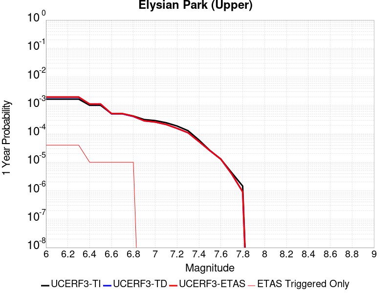 |  |

| Magnitude | 1 wk TI Prob | 1 wk TD Prob | 1 wk ETAS Prob | 1 wk ETAS/TD Gain | 1 wk ETAS Triggered Only | 1 mo TI Prob | 1 mo TD Prob | 1 mo ETAS Prob | 1 mo ETAS/TD Gain | 1 mo ETAS Triggered Only | 1 yr TI Prob | 1 yr TD Prob | 1 yr ETAS Prob | 1 yr ETAS/TD Gain | 1 yr ETAS Triggered Only | 10 yr TI Prob | 10 yr TD Prob | 10 yr ETAS Prob | 10 yr ETAS/TD Gain | 10 yr ETAS Triggered Only |
|-----|-----|-----|-----|-----|-----|-----|-----|-----|-----|-----|-----|-----|-----|-----|-----|-----|-----|-----|-----|-----|
| 6.0 | 3.1876025E-5 | 3.7035516E-5 | 5.7034773E-5 | 1.5400022 | 2.0E-5 | 1.3660437E-4 | 1.587167E-4 | 1.8871194E-4 | 1.1889861 | 3.0E-5 | 0.0016618895 | 0.0019311075 | 0.0019710301 | 1.0206735 | 4.0E-5 | 0.016495159 | 0.019189782 | 0.019248633 | 1.0030667 | 6.0E-5 |
| 6.1 | 3.1876025E-5 | 3.7035516E-5 | 5.7034773E-5 | 1.5400022 | 2.0E-5 | 1.3660437E-4 | 1.587167E-4 | 1.8871194E-4 | 1.1889861 | 3.0E-5 | 0.0016618895 | 0.0019311075 | 0.0019710301 | 1.0206735 | 4.0E-5 | 0.016495159 | 0.019189782 | 0.019248633 | 1.0030667 | 6.0E-5 |
| 6.2 | 3.1876025E-5 | 3.7035516E-5 | 5.7034773E-5 | 1.5400022 | 2.0E-5 | 1.3660437E-4 | 1.587167E-4 | 1.8871194E-4 | 1.1889861 | 3.0E-5 | 0.0016618895 | 0.0019311075 | 0.0019710301 | 1.0206735 | 4.0E-5 | 0.016495159 | 0.019189782 | 0.019248633 | 1.0030667 | 6.0E-5 |
| 6.3 | 3.1876025E-5 | 3.7035516E-5 | 5.7034773E-5 | 1.5400022 | 2.0E-5 | 1.3660437E-4 | 1.587167E-4 | 1.8871194E-4 | 1.1889861 | 3.0E-5 | 0.0016618895 | 0.0019311075 | 0.0019710301 | 1.0206735 | 4.0E-5 | 0.016495159 | 0.019189782 | 0.019248633 | 1.0030667 | 6.0E-5 |
| 6.4 | 1.9273462E-5 | 2.1202266E-5 | 2.1202266E-5 | 1.0 | 0.0 | 8.259794E-5 | 9.086466E-5 | 1.00863756E-4 | 1.1100438 | 1.0E-5 | 0.001005166 | 0.0011058892 | 0.0011158782 | 1.0090325 | 1.0E-5 | 0.010006315 | 0.011020724 | 0.011030613 | 1.0008974 | 1.0E-5 |
| 6.5 | 1.9273462E-5 | 2.1202266E-5 | 2.1202266E-5 | 1.0 | 0.0 | 8.259794E-5 | 9.086466E-5 | 1.00863756E-4 | 1.1100438 | 1.0E-5 | 0.001005166 | 0.0011058892 | 0.0011158782 | 1.0090325 | 1.0E-5 | 0.010006315 | 0.011020724 | 0.011030613 | 1.0008974 | 1.0E-5 |
| 6.6 | 9.813258E-6 | 9.665599E-6 | 9.665599E-6 | 1.0 | 0.0 | 4.205614E-5 | 4.1423376E-5 | 5.142296E-5 | 1.2413995 | 1.0E-5 | 5.119132E-4 | 5.0422014E-4 | 5.142151E-4 | 1.0198226 | 1.0E-5 | 0.005107356 | 0.0050314846 | 0.0050414344 | 1.0019774 | 1.0E-5 |
| 6.7 | 9.801478E-6 | 9.653168E-6 | 9.653168E-6 | 1.0 | 0.0 | 4.2005657E-5 | 4.1370105E-5 | 5.136969E-5 | 1.2417104 | 1.0E-5 | 5.112989E-4 | 5.035719E-4 | 5.1356683E-4 | 1.0198481 | 1.0E-5 | 0.0051012407 | 0.0050250315 | 0.005034981 | 1.0019801 | 1.0E-5 |
| 6.8 | 8.102489E-6 | 7.773004E-6 | 7.773004E-6 | 1.0 | 0.0 | 3.4724493E-5 | 3.3312477E-5 | 4.3312142E-5 | 1.3001778 | 1.0E-5 | 4.2268867E-4 | 4.055089E-4 | 4.1550485E-4 | 1.0246503 | 1.0E-5 | 0.004218856 | 0.0040481836 | 0.004058143 | 1.0024602 | 1.0E-5 |
| 6.9 | 6.08275E-6 | 5.4814514E-6 | 5.4814514E-6 | 1.0 | 0.0 | 2.6068668E-5 | 2.3491726E-5 | 2.3491726E-5 | 1.0 | 0.0 | 3.173398E-4 | 2.85975E-4 | 2.85975E-4 | 1.0 | 0.0 | 0.0031688702 | 0.0028561477 | 0.0028561477 | 1.0 | 0.0 |
| 7.0 | 5.5995934E-6 | 4.98278E-6 | 4.98278E-6 | 1.0 | 0.0 | 2.3998036E-5 | 2.13546E-5 | 2.13546E-5 | 1.0 | 0.0 | 2.9213692E-4 | 2.599619E-4 | 2.599619E-4 | 1.0 | 0.0 | 0.0029175316 | 0.0025966454 | 0.0025966454 | 1.0 | 0.0 |
| 7.1 | 4.709881E-6 | 4.0874015E-6 | 4.0874015E-6 | 1.0 | 0.0 | 2.0185047E-5 | 1.7517319E-5 | 1.7517319E-5 | 1.0 | 0.0 | 2.4572524E-4 | 2.132529E-4 | 2.132529E-4 | 1.0 | 0.0 | 0.002454537 | 0.002130524 | 0.002130524 | 1.0 | 0.0 |
| 7.2 | 3.6063436E-6 | 2.9779544E-6 | 2.9779544E-6 | 1.0 | 0.0 | 1.5455667E-5 | 1.27626E-5 | 1.27626E-5 | 1.0 | 0.0 | 1.881565E-4 | 1.5537368E-4 | 1.5537368E-4 | 1.0 | 0.0 | 0.0018799726 | 0.0015526618 | 0.0015526618 | 1.0 | 0.0 |
| 7.3 | 2.471135E-6 | 2.0954615E-6 | 2.0954615E-6 | 1.0 | 0.0 | 1.0590536E-5 | 8.980519E-6 | 8.980519E-6 | 1.0 | 0.0 | 1.2893214E-4 | 1.093324E-4 | 1.093324E-4 | 1.0 | 0.0 | 0.0012885736 | 0.0010927934 | 0.0010927934 | 1.0 | 0.0 |
| 7.4 | 1.163943E-6 | 1.0275091E-6 | 1.0275091E-6 | 1.0 | 0.0 | 4.988318E-6 | 4.4036033E-6 | 4.4036033E-6 | 1.0 | 0.0 | 6.0731076E-5 | 5.3612584E-5 | 5.3612584E-5 | 1.0 | 0.0 | 6.071448E-4 | 5.359995E-4 | 5.359995E-4 | 1.0 | 0.0 |
| 7.5 | 4.99459E-7 | 4.917604E-7 | 4.917604E-7 | 1.0 | 0.0 | 2.140537E-6 | 2.1075427E-6 | 2.1075427E-6 | 1.0 | 0.0 | 2.6060725E-5 | 2.5659048E-5 | 2.5659048E-5 | 1.0 | 0.0 | 2.605767E-4 | 2.5656243E-4 | 2.5656243E-4 | 1.0 | 0.0 |
| 7.6 | 2.4667852E-7 | 2.4778336E-7 | 2.4778336E-7 | 1.0 | 0.0 | 1.0571932E-6 | 1.0619283E-6 | 1.0619283E-6 | 1.0 | 0.0 | 1.2871251E-5 | 1.2928905E-5 | 1.2928905E-5 | 1.0 | 0.0 | 1.2870505E-4 | 1.2928189E-4 | 1.2928189E-4 | 1.0 | 0.0 |
| 7.7 | 8.2312795E-8 | 7.3864456E-8 | 7.3864456E-8 | 1.0 | 0.0 | 3.527691E-7 | 3.165619E-7 | 3.165619E-7 | 1.0 | 0.0 | 4.294955E-6 | 3.8541357E-6 | 3.8541357E-6 | 1.0 | 0.0 | 4.2948723E-5 | 3.8540802E-5 | 3.8540802E-5 | 1.0 | 0.0 |
| 7.8 | 2.7819295E-8 | 1.7566023E-8 | 1.7566023E-8 | 1.0 | 0.0 | 1.1922555E-7 | 7.5282955E-8 | 7.5282955E-8 | 1.0 | 0.0 | 1.45157E-6 | 9.165697E-7 | 9.165697E-7 | 1.0 | 0.0 | 1.45156055E-5 | 9.165675E-6 | 9.165675E-6 | 1.0 | 0.0 |

## Raymond
*[(top)](#table-of-contents)*

| 1 Week | 1 Month | 1 Year | 10 Year |
|-----|-----|-----|-----|
|  |  | 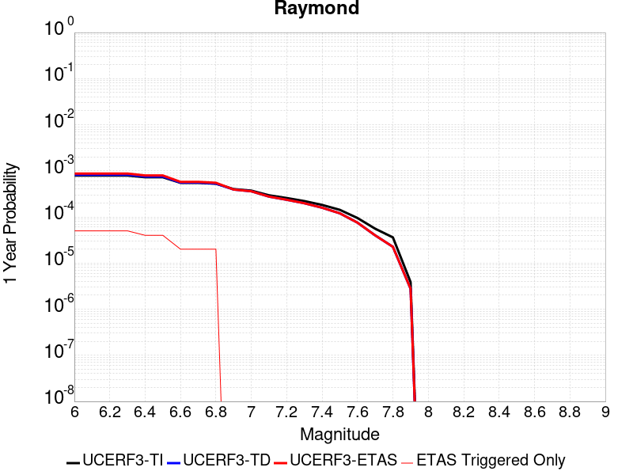 |  |

| Magnitude | 1 wk TI Prob | 1 wk TD Prob | 1 wk ETAS Prob | 1 wk ETAS/TD Gain | 1 wk ETAS Triggered Only | 1 mo TI Prob | 1 mo TD Prob | 1 mo ETAS Prob | 1 mo ETAS/TD Gain | 1 mo ETAS Triggered Only | 1 yr TI Prob | 1 yr TD Prob | 1 yr ETAS Prob | 1 yr ETAS/TD Gain | 1 yr ETAS Triggered Only | 10 yr TI Prob | 10 yr TD Prob | 10 yr ETAS Prob | 10 yr ETAS/TD Gain | 10 yr ETAS Triggered Only |
|-----|-----|-----|-----|-----|-----|-----|-----|-----|-----|-----|-----|-----|-----|-----|-----|-----|-----|-----|-----|-----|
| 6.0 | 1.5157413E-5 | 1.5810128E-5 | 3.580981E-5 | 2.264992 | 2.0E-5 | 6.4958724E-5 | 6.7756075E-5 | 9.775404E-5 | 1.4427347 | 3.0E-5 | 7.905855E-4 | 8.2464307E-4 | 8.746018E-4 | 1.0605823 | 5.0E-5 | 0.007877788 | 0.008218348 | 0.008277855 | 1.0072408 | 6.0E-5 |
| 6.1 | 1.5157413E-5 | 1.5810128E-5 | 3.580981E-5 | 2.264992 | 2.0E-5 | 6.4958724E-5 | 6.7756075E-5 | 9.775404E-5 | 1.4427347 | 3.0E-5 | 7.905855E-4 | 8.2464307E-4 | 8.746018E-4 | 1.0605823 | 5.0E-5 | 0.007877788 | 0.008218348 | 0.008277855 | 1.0072408 | 6.0E-5 |
| 6.2 | 1.5157413E-5 | 1.5810128E-5 | 3.580981E-5 | 2.264992 | 2.0E-5 | 6.4958724E-5 | 6.7756075E-5 | 9.775404E-5 | 1.4427347 | 3.0E-5 | 7.905855E-4 | 8.2464307E-4 | 8.746018E-4 | 1.0605823 | 5.0E-5 | 0.007877788 | 0.008218348 | 0.008277855 | 1.0072408 | 6.0E-5 |
| 6.3 | 1.5157413E-5 | 1.5810128E-5 | 3.580981E-5 | 2.264992 | 2.0E-5 | 6.4958724E-5 | 6.7756075E-5 | 9.775404E-5 | 1.4427347 | 3.0E-5 | 7.905855E-4 | 8.2464307E-4 | 8.746018E-4 | 1.0605823 | 5.0E-5 | 0.007877788 | 0.008218348 | 0.008277855 | 1.0072408 | 6.0E-5 |
| 6.4 | 1.3941944E-5 | 1.445469E-5 | 2.4454546E-5 | 1.6918069 | 1.0E-5 | 5.9749822E-5 | 6.1947336E-5 | 8.19461E-5 | 1.3228348 | 2.0E-5 | 7.2721124E-4 | 7.5397117E-4 | 7.9394097E-4 | 1.0530124 | 4.0E-5 | 0.007248361 | 0.0075164647 | 0.007566089 | 1.006602 | 5.0E-5 |
| 6.5 | 1.3941944E-5 | 1.445469E-5 | 2.4454546E-5 | 1.6918069 | 1.0E-5 | 5.9749822E-5 | 6.1947336E-5 | 8.19461E-5 | 1.3228348 | 2.0E-5 | 7.2721124E-4 | 7.5397117E-4 | 7.9394097E-4 | 1.0530124 | 4.0E-5 | 0.007248361 | 0.0075164647 | 0.007566089 | 1.006602 | 5.0E-5 |
| 6.6 | 1.0542609E-5 | 1.0671113E-5 | 2.0671006E-5 | 1.9370993 | 1.0E-5 | 4.5181827E-5 | 4.573257E-5 | 6.5731656E-5 | 1.4373051 | 2.0E-5 | 5.499499E-4 | 5.5665727E-4 | 5.766461E-4 | 1.0359087 | 2.0E-5 | 0.005485909 | 0.00555319 | 0.005573079 | 1.0035815 | 2.0E-5 |
| 6.7 | 1.0542609E-5 | 1.0671113E-5 | 2.0671006E-5 | 1.9370993 | 1.0E-5 | 4.5181827E-5 | 4.573257E-5 | 6.5731656E-5 | 1.4373051 | 2.0E-5 | 5.499499E-4 | 5.5665727E-4 | 5.766461E-4 | 1.0359087 | 2.0E-5 | 0.005485909 | 0.00555319 | 0.005573079 | 1.0035815 | 2.0E-5 |
| 6.8 | 1.0079132E-5 | 1.0176646E-5 | 2.0176545E-5 | 1.982632 | 1.0E-5 | 4.3195567E-5 | 4.3613498E-5 | 6.361263E-5 | 1.4585537 | 2.0E-5 | 5.257791E-4 | 5.3087034E-4 | 5.508597E-4 | 1.037654 | 2.0E-5 | 0.0052453685 | 0.005296571 | 0.005316465 | 1.003756 | 2.0E-5 |
| 6.9 | 7.721598E-6 | 7.5489047E-6 | 7.5489047E-6 | 1.0 | 0.0 | 3.3092143E-5 | 3.2352054E-5 | 3.2352054E-5 | 1.0 | 0.0 | 4.0282236E-4 | 3.9381627E-4 | 3.9381627E-4 | 1.0 | 0.0 | 0.0040209293 | 0.0039313175 | 0.0039313175 | 1.0 | 0.0 |
| 7.0 | 7.137566E-6 | 6.9113057E-6 | 6.9113057E-6 | 1.0 | 0.0 | 3.058921E-5 | 2.961955E-5 | 2.961955E-5 | 1.0 | 0.0 | 3.7236E-4 | 3.6055944E-4 | 3.6055944E-4 | 1.0 | 0.0 | 0.0037173668 | 0.0035998628 | 0.0035998628 | 1.0 | 0.0 |
| 7.1 | 5.654976E-6 | 5.29954E-6 | 5.29954E-6 | 1.0 | 0.0 | 2.4235387E-5 | 2.2712118E-5 | 2.2712118E-5 | 1.0 | 0.0 | 2.9502588E-4 | 2.7648517E-4 | 2.7648517E-4 | 1.0 | 0.0 | 0.0029463451 | 0.002761443 | 0.002761443 | 1.0 | 0.0 |
| 7.2 | 4.9358455E-6 | 4.5266574E-6 | 4.5266574E-6 | 1.0 | 0.0 | 2.1153453E-5 | 1.9399817E-5 | 1.9399817E-5 | 1.0 | 0.0 | 2.5751285E-4 | 2.3616731E-4 | 2.3616731E-4 | 1.0 | 0.0 | 0.0025721465 | 0.0023591854 | 0.0023591854 | 1.0 | 0.0 |
| 7.3 | 4.2368597E-6 | 3.8056164E-6 | 3.8056164E-6 | 1.0 | 0.0 | 1.8157843E-5 | 1.6309683E-5 | 1.6309683E-5 | 1.0 | 0.0 | 2.2104931E-4 | 1.9855241E-4 | 1.9855241E-4 | 1.0 | 0.0 | 0.0022082955 | 0.0019837688 | 0.0019837688 | 1.0 | 0.0 |
| 7.4 | 3.4999923E-6 | 3.043744E-6 | 3.043744E-6 | 1.0 | 0.0 | 1.49998805E-5 | 1.3044552E-5 | 1.3044552E-5 | 1.0 | 0.0 | 1.8260824E-4 | 1.5880594E-4 | 1.5880594E-4 | 1.0 | 0.0 | 0.0018245826 | 0.0015869403 | 0.0015869403 | 1.0 | 0.0 |
| 7.5 | 2.738017E-6 | 2.3020468E-6 | 2.3020468E-6 | 1.0 | 0.0 | 1.1734306E-5 | 9.865878E-6 | 9.865878E-6 | 1.0 | 0.0 | 1.428558E-4 | 1.2011051E-4 | 1.2011051E-4 | 1.0 | 0.0 | 0.0014276401 | 0.0012004703 | 0.0012004703 | 1.0 | 0.0 |
| 7.6 | 1.8186392E-6 | 1.442312E-6 | 1.442312E-6 | 1.0 | 0.0 | 7.794145E-6 | 6.181323E-6 | 6.181323E-6 | 1.0 | 0.0 | 9.488958E-5 | 7.5255055E-5 | 7.5255055E-5 | 1.0 | 0.0 | 9.4849075E-4 | 7.523072E-4 | 7.523072E-4 | 1.0 | 0.0 |
| 7.7 | 1.0660348E-6 | 7.6438056E-7 | 7.6438056E-7 | 1.0 | 0.0 | 4.5687125E-6 | 3.2759126E-6 | 3.2759126E-6 | 1.0 | 0.0 | 5.5622655E-5 | 3.9883522E-5 | 3.9883522E-5 | 1.0 | 0.0 | 5.5608735E-4 | 3.9877277E-4 | 3.9877277E-4 | 1.0 | 0.0 |
| 7.8 | 6.913602E-7 | 4.3204133E-7 | 4.3204133E-7 | 1.0 | 0.0 | 2.962969E-6 | 1.8516045E-6 | 1.8516045E-6 | 1.0 | 0.0 | 3.607355E-5 | 2.2543056E-5 | 2.2543056E-5 | 1.0 | 0.0 | 3.6067693E-4 | 2.2541556E-4 | 2.2541556E-4 | 1.0 | 0.0 |
| 7.9 | 7.425201E-8 | 5.3222113E-8 | 5.3222113E-8 | 1.0 | 0.0 | 3.1822285E-7 | 2.2809476E-7 | 2.2809476E-7 | 1.0 | 0.0 | 3.874356E-6 | 2.7770516E-6 | 2.7770516E-6 | 1.0 | 0.0 | 3.8742884E-5 | 2.7770298E-5 | 2.7770298E-5 | 1.0 | 0.0 |

## Newport-Inglewood alt 1
*[(top)](#table-of-contents)*

| 1 Week | 1 Month | 1 Year | 10 Year |
|-----|-----|-----|-----|
|  |  |  |  |

| Magnitude | 1 wk TI Prob | 1 wk TD Prob | 1 wk ETAS Prob | 1 wk ETAS/TD Gain | 1 wk ETAS Triggered Only | 1 mo TI Prob | 1 mo TD Prob | 1 mo ETAS Prob | 1 mo ETAS/TD Gain | 1 mo ETAS Triggered Only | 1 yr TI Prob | 1 yr TD Prob | 1 yr ETAS Prob | 1 yr ETAS/TD Gain | 1 yr ETAS Triggered Only | 10 yr TI Prob | 10 yr TD Prob | 10 yr ETAS Prob | 10 yr ETAS/TD Gain | 10 yr ETAS Triggered Only |
|-----|-----|-----|-----|-----|-----|-----|-----|-----|-----|-----|-----|-----|-----|-----|-----|-----|-----|-----|-----|-----|
| 6.0 | 2.9668912E-5 | 3.0404817E-5 | 5.0404207E-5 | 1.6577705 | 2.0E-5 | 1.2714628E-4 | 1.303026E-4 | 1.503E-4 | 1.1534688 | 2.0E-5 | 0.0015469068 | 0.0015857625 | 0.001615715 | 1.0188884 | 3.0E-5 | 0.015361829 | 0.015792042 | 0.015841253 | 1.0031161 | 5.0E-5 |
| 6.1 | 2.9668912E-5 | 3.0404817E-5 | 5.0404207E-5 | 1.6577705 | 2.0E-5 | 1.2714628E-4 | 1.303026E-4 | 1.503E-4 | 1.1534688 | 2.0E-5 | 0.0015469068 | 0.0015857625 | 0.001615715 | 1.0188884 | 3.0E-5 | 0.015361829 | 0.015792042 | 0.015841253 | 1.0031161 | 5.0E-5 |
| 6.2 | 2.9668912E-5 | 3.0404817E-5 | 5.0404207E-5 | 1.6577705 | 2.0E-5 | 1.2714628E-4 | 1.303026E-4 | 1.503E-4 | 1.1534688 | 2.0E-5 | 0.0015469068 | 0.0015857625 | 0.001615715 | 1.0188884 | 3.0E-5 | 0.015361829 | 0.015792042 | 0.015841253 | 1.0031161 | 5.0E-5 |
| 6.3 | 2.9668912E-5 | 3.0404817E-5 | 5.0404207E-5 | 1.6577705 | 2.0E-5 | 1.2714628E-4 | 1.303026E-4 | 1.503E-4 | 1.1534688 | 2.0E-5 | 0.0015469068 | 0.0015857625 | 0.001615715 | 1.0188884 | 3.0E-5 | 0.015361829 | 0.015792042 | 0.015841253 | 1.0031161 | 5.0E-5 |
| 6.4 | 1.275942E-5 | 1.0272503E-5 | 2.02724E-5 | 1.9734626 | 1.0E-5 | 5.4682085E-5 | 4.402429E-5 | 5.402385E-5 | 1.2271373 | 1.0E-5 | 6.65551E-4 | 5.358681E-4 | 5.558574E-4 | 1.0373026 | 2.0E-5 | 0.0066356123 | 0.005346184 | 0.005366077 | 1.003721 | 2.0E-5 |
| 6.5 | 1.275942E-5 | 1.0272503E-5 | 2.02724E-5 | 1.9734626 | 1.0E-5 | 5.4682085E-5 | 4.402429E-5 | 5.402385E-5 | 1.2271373 | 1.0E-5 | 6.65551E-4 | 5.358681E-4 | 5.558574E-4 | 1.0373026 | 2.0E-5 | 0.0066356123 | 0.005346184 | 0.005366077 | 1.003721 | 2.0E-5 |
| 6.6 | 1.1255358E-5 | 8.661884E-6 | 1.8661798E-5 | 2.1544733 | 1.0E-5 | 4.8236358E-5 | 3.712184E-5 | 4.712147E-5 | 1.2693732 | 1.0E-5 | 5.871194E-4 | 4.518664E-4 | 4.7185735E-4 | 1.0442408 | 2.0E-5 | 0.005855706 | 0.004509653 | 0.004529563 | 1.0044149 | 2.0E-5 |
| 6.7 | 1.0504745E-5 | 7.8997955E-6 | 7.8997955E-6 | 1.0 | 0.0 | 4.5019555E-5 | 3.3855835E-5 | 3.3855835E-5 | 1.0 | 0.0 | 5.4797524E-4 | 4.1211807E-4 | 4.2211395E-4 | 1.0242549 | 1.0E-5 | 0.0054662596 | 0.004113668 | 0.0041236267 | 1.0024209 | 1.0E-5 |
| 6.8 | 1.0476007E-5 | 7.881176E-6 | 7.881176E-6 | 1.0 | 0.0 | 4.4896402E-5 | 3.3776043E-5 | 3.3776043E-5 | 1.0 | 0.0 | 5.464766E-4 | 4.1114696E-4 | 4.2114285E-4 | 1.0243123 | 1.0E-5 | 0.005451347 | 0.0041039926 | 0.0041139517 | 1.0024266 | 1.0E-5 |
| 6.9 | 9.076797E-6 | 6.4896312E-6 | 6.4896312E-6 | 1.0 | 0.0 | 3.889998E-5 | 2.781241E-5 | 2.781241E-5 | 1.0 | 0.0 | 4.7350433E-4 | 3.385638E-4 | 3.4856042E-4 | 1.0295265 | 1.0E-5 | 0.004724967 | 0.0033805177 | 0.0033904838 | 1.0029482 | 1.0E-5 |
| 7.0 | 8.73795E-6 | 6.2120125E-6 | 6.2120125E-6 | 1.0 | 0.0 | 3.7447822E-5 | 2.6622642E-5 | 2.6622642E-5 | 1.0 | 0.0 | 4.5583185E-4 | 3.2408274E-4 | 3.340795E-4 | 1.0308464 | 1.0E-5 | 0.0045489795 | 0.0032361327 | 0.0032461004 | 1.0030801 | 1.0E-5 |
| 7.1 | 8.391299E-6 | 5.95579E-6 | 5.95579E-6 | 1.0 | 0.0 | 3.5962214E-5 | 2.5524565E-5 | 2.5524565E-5 | 1.0 | 0.0 | 4.37752E-4 | 3.1071753E-4 | 3.2071443E-4 | 1.0321735 | 1.0E-5 | 0.004368907 | 0.0031028606 | 0.0031128295 | 1.0032128 | 1.0E-5 |
| 7.2 | 7.796882E-6 | 5.4965344E-6 | 5.4965344E-6 | 1.0 | 0.0 | 3.341478E-5 | 2.3556364E-5 | 2.3556364E-5 | 1.0 | 0.0 | 4.06749E-4 | 2.867612E-4 | 2.9675834E-4 | 1.0348623 | 1.0E-5 | 0.0040600533 | 0.0028639357 | 0.002873907 | 1.0034817 | 1.0E-5 |
| 7.3 | 6.4738833E-6 | 4.6478162E-6 | 4.6478162E-6 | 1.0 | 0.0 | 2.774492E-5 | 1.9919062E-5 | 1.9919062E-5 | 1.0 | 0.0 | 3.3774204E-4 | 2.4248775E-4 | 2.524853E-4 | 1.0412292 | 1.0E-5 | 0.0033722918 | 0.0024222482 | 0.0024322239 | 1.0041184 | 1.0E-5 |
| 7.4 | 5.382145E-6 | 3.8857597E-6 | 3.8857597E-6 | 1.0 | 0.0 | 2.3066134E-5 | 1.665315E-5 | 1.665315E-5 | 1.0 | 0.0 | 2.8079396E-4 | 2.0273338E-4 | 2.1273135E-4 | 1.0493158 | 1.0E-5 | 0.0028043943 | 0.0020254988 | 0.0020354786 | 1.004927 | 1.0E-5 |
| 7.5 | 3.648244E-6 | 2.5737843E-6 | 2.5737843E-6 | 1.0 | 0.0 | 1.5635238E-5 | 1.1030458E-5 | 1.1030458E-5 | 1.0 | 0.0 | 1.9034238E-4 | 1.3428765E-4 | 1.4428631E-4 | 1.074457 | 1.0E-5 | 0.0019017943 | 0.0013420755 | 0.0013520621 | 1.0074412 | 1.0E-5 |
| 7.6 | 2.2906888E-6 | 1.5479842E-6 | 1.5479842E-6 | 1.0 | 0.0 | 9.817201E-6 | 6.634202E-6 | 6.634202E-6 | 1.0 | 0.0 | 1.1951787E-4 | 8.076848E-5 | 9.076767E-5 | 1.1238006 | 1.0E-5 | 0.0011945361 | 8.07398E-4 | 8.173899E-4 | 1.0123755 | 1.0E-5 |
| 7.7 | 6.0479874E-7 | 3.397512E-7 | 3.397512E-7 | 1.0 | 0.0 | 2.5919921E-6 | 1.4560758E-6 | 1.4560758E-6 | 1.0 | 0.0 | 3.1557047E-5 | 1.7727592E-5 | 2.7727416E-5 | 1.5640824 | 1.0E-5 | 3.1552566E-4 | 1.7726317E-4 | 1.872614E-4 | 1.0564033 | 1.0E-5 |
| 7.8 | 1.16056995E-8 | 9.782373E-9 | 9.782373E-9 | 1.0 | 0.0 | 4.9738713E-8 | 4.1924455E-8 | 4.1924455E-8 | 1.0 | 0.0 | 6.0556863E-7 | 5.1043025E-7 | 5.1043025E-7 | 1.0 | 0.0 | 6.05567E-6 | 5.1043025E-6 | 5.1043025E-6 | 1.0 | 0.0 |

## Oceanic - West Huasna
*[(top)](#table-of-contents)*

| 1 Week | 1 Month | 1 Year | 10 Year |
|-----|-----|-----|-----|
|  | 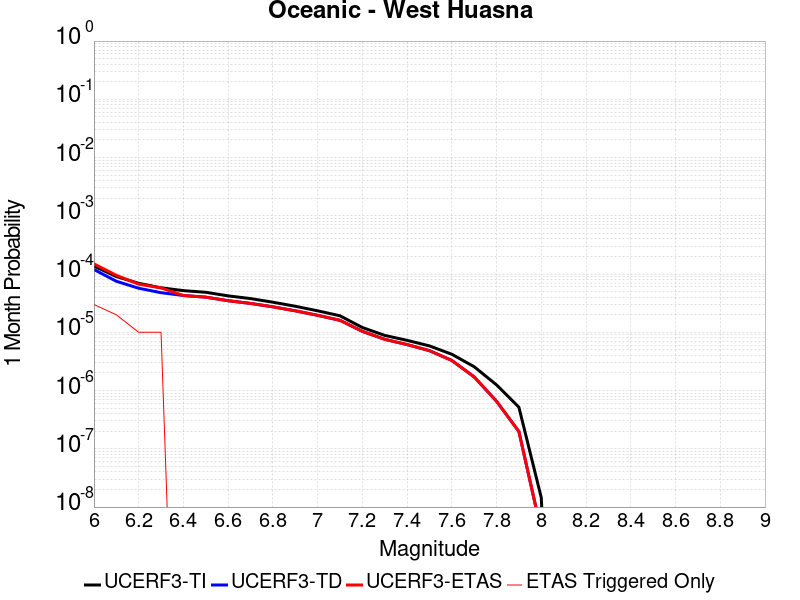 |  |  |

| Magnitude | 1 wk TI Prob | 1 wk TD Prob | 1 wk ETAS Prob | 1 wk ETAS/TD Gain | 1 wk ETAS Triggered Only | 1 mo TI Prob | 1 mo TD Prob | 1 mo ETAS Prob | 1 mo ETAS/TD Gain | 1 mo ETAS Triggered Only | 1 yr TI Prob | 1 yr TD Prob | 1 yr ETAS Prob | 1 yr ETAS/TD Gain | 1 yr ETAS Triggered Only | 10 yr TI Prob | 10 yr TD Prob | 10 yr ETAS Prob | 10 yr ETAS/TD Gain | 10 yr ETAS Triggered Only |
|-----|-----|-----|-----|-----|-----|-----|-----|-----|-----|-----|-----|-----|-----|-----|-----|-----|-----|-----|-----|-----|
| 6.0 | 3.195567E-5 | 2.7926868E-5 | 3.7926588E-5 | 1.3580681 | 1.0E-5 | 1.3694567E-4 | 1.1968133E-4 | 1.4967774E-4 | 1.2506356 | 3.0E-5 | 0.0016660384 | 0.0014561893 | 0.0014861457 | 1.0205717 | 3.0E-5 | 0.016536033 | 0.014471028 | 0.014510449 | 1.0027242 | 4.0E-5 |
| 6.1 | 2.1156782E-5 | 1.7573486E-5 | 1.7573486E-5 | 1.0 | 0.0 | 9.066878E-5 | 7.531282E-5 | 9.531131E-5 | 1.265539 | 2.0E-5 | 0.0011033333 | 9.165572E-4 | 9.365389E-4 | 1.0218008 | 2.0E-5 | 0.010978713 | 0.009128777 | 0.009158504 | 1.0032563 | 3.0E-5 |
| 6.2 | 1.6195117E-5 | 1.3327152E-5 | 1.3327152E-5 | 1.0 | 0.0 | 6.9405796E-5 | 5.7115132E-5 | 6.711456E-5 | 1.1750749 | 1.0E-5 | 8.44688E-4 | 6.9515745E-4 | 7.0515054E-4 | 1.0143752 | 1.0E-5 | 0.008414844 | 0.006930123 | 0.0069499845 | 1.0028659 | 2.0E-5 |
| 6.3 | 1.3559345E-5 | 1.1179142E-5 | 1.1179142E-5 | 1.0 | 0.0 | 5.811018E-5 | 4.7909736E-5 | 5.790926E-5 | 1.2087158 | 1.0E-5 | 7.072618E-4 | 5.831459E-4 | 5.931401E-4 | 1.0171384 | 1.0E-5 | 0.0070501505 | 0.0058162753 | 0.005826217 | 1.0017093 | 1.0E-5 |
| 6.4 | 1.2120619E-5 | 1.0000977E-5 | 1.0000977E-5 | 1.0 | 0.0 | 5.1944477E-5 | 4.2860633E-5 | 4.2860633E-5 | 1.0 | 0.0 | 6.322405E-4 | 5.2170374E-4 | 5.2170374E-4 | 1.0 | 0.0 | 0.006304447 | 0.0052048573 | 0.0052048573 | 1.0 | 0.0 |
| 6.5 | 1.13511915E-5 | 9.3674735E-6 | 9.3674735E-6 | 1.0 | 0.0 | 4.8647056E-5 | 4.01457E-5 | 4.01457E-5 | 1.0 | 0.0 | 5.9211696E-4 | 4.886647E-4 | 4.886647E-4 | 1.0 | 0.0 | 0.0059054173 | 0.0048759608 | 0.0048759608 | 1.0 | 0.0 |
| 6.6 | 9.850605E-6 | 8.135418E-6 | 8.135418E-6 | 1.0 | 0.0 | 4.2216197E-5 | 3.4865614E-5 | 3.4865614E-5 | 1.0 | 0.0 | 5.1386096E-4 | 4.2440637E-4 | 4.2440637E-4 | 1.0 | 0.0 | 0.0051267436 | 0.004235991 | 0.004235991 | 1.0 | 0.0 |
| 6.7 | 8.8558645E-6 | 7.318433E-6 | 7.318433E-6 | 1.0 | 0.0 | 3.7953152E-5 | 3.1364336E-5 | 3.1364336E-5 | 1.0 | 0.0 | 4.6198163E-4 | 3.8179406E-4 | 3.8179406E-4 | 1.0 | 0.0 | 0.004610224 | 0.0038114067 | 0.0038114067 | 1.0 | 0.0 |
| 6.8 | 7.67136E-6 | 6.391756E-6 | 6.391756E-6 | 1.0 | 0.0 | 3.2876844E-5 | 2.7392953E-5 | 2.7392953E-5 | 1.0 | 0.0 | 4.0020206E-4 | 3.3345833E-4 | 3.3345833E-4 | 1.0 | 0.0 | 0.003994821 | 0.0033296007 | 0.0033296007 | 1.0 | 0.0 |
| 6.9 | 6.534529E-6 | 5.4583297E-6 | 5.4583297E-6 | 1.0 | 0.0 | 2.8004823E-5 | 2.3392633E-5 | 2.3392633E-5 | 1.0 | 0.0 | 3.4090536E-4 | 2.847682E-4 | 2.847682E-4 | 1.0 | 0.0 | 0.0034038287 | 0.0028440498 | 0.0028440498 | 1.0 | 0.0 |
| 7.0 | 5.460525E-6 | 4.5699517E-6 | 4.5699517E-6 | 1.0 | 0.0 | 2.3402039E-5 | 1.958536E-5 | 1.958536E-5 | 1.0 | 0.0 | 2.8488258E-4 | 2.3842578E-4 | 2.3842578E-4 | 1.0 | 0.0 | 0.0028451765 | 0.0023817138 | 0.0023817138 | 1.0 | 0.0 |
| 7.1 | 4.4825083E-6 | 3.7524428E-6 | 3.7524428E-6 | 1.0 | 0.0 | 1.9210609E-5 | 1.60818E-5 | 1.60818E-5 | 1.0 | 0.0 | 2.3386406E-4 | 1.9577841E-4 | 1.9577841E-4 | 1.0 | 0.0 | 0.002336181 | 0.0019560715 | 0.0019560715 | 1.0 | 0.0 |
| 7.2 | 2.821708E-6 | 2.4249334E-6 | 2.4249334E-6 | 1.0 | 0.0 | 1.2092979E-5 | 1.039253E-5 | 1.039253E-5 | 1.0 | 0.0 | 1.4722206E-4 | 1.2652173E-4 | 1.2652173E-4 | 1.0 | 0.0 | 0.0014712457 | 0.0012644994 | 0.0012644994 | 1.0 | 0.0 |
| 7.3 | 2.0644757E-6 | 1.7687412E-6 | 1.7687412E-6 | 1.0 | 0.0 | 8.847723E-6 | 7.5802973E-6 | 7.5802973E-6 | 1.0 | 0.0 | 1.0771569E-4 | 9.228622E-5 | 9.228622E-5 | 1.0 | 0.0 | 0.001076635 | 9.2248066E-4 | 9.2248066E-4 | 1.0 | 0.0 |
| 7.4 | 1.6980367E-6 | 1.4379892E-6 | 1.4379892E-6 | 1.0 | 0.0 | 7.27728E-6 | 6.162796E-6 | 6.162796E-6 | 1.0 | 0.0 | 8.8597284E-5 | 7.5029464E-5 | 7.5029464E-5 | 1.0 | 0.0 | 8.8561967E-4 | 7.500429E-4 | 7.500429E-4 | 1.0 | 0.0 |
| 7.5 | 1.3637683E-6 | 1.1302635E-6 | 1.1302635E-6 | 1.0 | 0.0 | 5.844708E-6 | 4.8439774E-6 | 4.8439774E-6 | 1.0 | 0.0 | 7.1156996E-5 | 5.897383E-5 | 5.897383E-5 | 1.0 | 0.0 | 7.1134215E-4 | 5.895833E-4 | 5.895833E-4 | 1.0 | 0.0 |
| 7.6 | 9.802994E-7 | 7.677247E-7 | 7.677247E-7 | 1.0 | 0.0 | 4.2012766E-6 | 3.2902446E-6 | 3.2902446E-6 | 1.0 | 0.0 | 5.1149345E-5 | 4.0057992E-5 | 4.0057992E-5 | 1.0 | 0.0 | 5.113757E-4 | 4.0050913E-4 | 4.0050913E-4 | 1.0 | 0.0 |
| 7.7 | 5.986191E-7 | 4.0050548E-7 | 4.0050548E-7 | 1.0 | 0.0 | 2.5655079E-6 | 1.7164509E-6 | 1.7164509E-6 | 1.0 | 0.0 | 3.1234613E-5 | 2.089759E-5 | 2.089759E-5 | 1.0 | 0.0 | 3.123022E-4 | 2.089576E-4 | 2.089576E-4 | 1.0 | 0.0 |
| 7.8 | 2.9189815E-7 | 1.5285792E-7 | 1.5285792E-7 | 1.0 | 0.0 | 1.2509914E-6 | 6.5510517E-7 | 6.5510517E-7 | 1.0 | 0.0 | 1.5230714E-5 | 7.9758765E-6 | 7.9758765E-6 | 1.0 | 0.0 | 1.522967E-4 | 7.9757214E-5 | 7.9757214E-5 | 1.0 | 0.0 |
| 7.9 | 1.2057845E-7 | 4.621248E-8 | 4.621248E-8 | 1.0 | 0.0 | 5.1676466E-7 | 1.9805347E-7 | 1.9805347E-7 | 1.0 | 0.0 | 6.2915915E-6 | 2.4112983E-6 | 2.4112983E-6 | 1.0 | 0.0 | 6.2914136E-5 | 2.4114026E-5 | 2.4114026E-5 | 1.0 | 0.0 |
| 8.0 | 3.3806387E-9 | 9.011393E-10 | 9.011393E-10 | 1.0 | 0.0 | 1.4488451E-8 | 3.8620254E-9 | 3.8620254E-9 | 1.0 | 0.0 | 1.7639688E-7 | 4.702016E-8 | 4.702016E-8 | 1.0 | 0.0 | 1.7639674E-6 | 4.7129527E-7 | 4.7129527E-7 | 1.0 | 0.0 |

## San Jacinto (Anza) rev
*[(top)](#table-of-contents)*

| 1 Week | 1 Month | 1 Year | 10 Year |
|-----|-----|-----|-----|
|  | 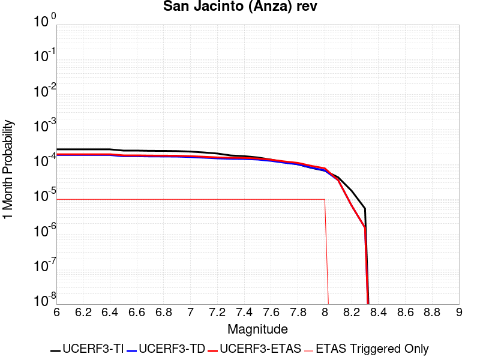 |  |  |

| Magnitude | 1 wk TI Prob | 1 wk TD Prob | 1 wk ETAS Prob | 1 wk ETAS/TD Gain | 1 wk ETAS Triggered Only | 1 mo TI Prob | 1 mo TD Prob | 1 mo ETAS Prob | 1 mo ETAS/TD Gain | 1 mo ETAS Triggered Only | 1 yr TI Prob | 1 yr TD Prob | 1 yr ETAS Prob | 1 yr ETAS/TD Gain | 1 yr ETAS Triggered Only | 10 yr TI Prob | 10 yr TD Prob | 10 yr ETAS Prob | 10 yr ETAS/TD Gain | 10 yr ETAS Triggered Only |
|-----|-----|-----|-----|-----|-----|-----|-----|-----|-----|-----|-----|-----|-----|-----|-----|-----|-----|-----|-----|-----|
| 6.0 | 6.3015636E-5 | 4.3302647E-5 | 5.3302214E-5 | 1.2309228 | 1.0E-5 | 2.7003905E-4 | 1.8556965E-4 | 1.9556779E-4 | 1.0538781 | 1.0E-5 | 0.0032827691 | 0.0022569813 | 0.0022869136 | 1.013262 | 3.0E-5 | 0.032346968 | 0.023296192 | 0.023345027 | 1.0020963 | 5.0E-5 |
| 6.1 | 6.3015636E-5 | 4.3302647E-5 | 5.3302214E-5 | 1.2309228 | 1.0E-5 | 2.7003905E-4 | 1.8556965E-4 | 1.9556779E-4 | 1.0538781 | 1.0E-5 | 0.0032827691 | 0.0022569813 | 0.0022869136 | 1.013262 | 3.0E-5 | 0.032346968 | 0.023296192 | 0.023345027 | 1.0020963 | 5.0E-5 |
| 6.2 | 6.3015636E-5 | 4.3302647E-5 | 5.3302214E-5 | 1.2309228 | 1.0E-5 | 2.7003905E-4 | 1.8556965E-4 | 1.9556779E-4 | 1.0538781 | 1.0E-5 | 0.0032827691 | 0.0022569813 | 0.0022869136 | 1.013262 | 3.0E-5 | 0.032346968 | 0.023296192 | 0.023345027 | 1.0020963 | 5.0E-5 |
| 6.3 | 6.3015636E-5 | 4.3302647E-5 | 5.3302214E-5 | 1.2309228 | 1.0E-5 | 2.7003905E-4 | 1.8556965E-4 | 1.9556779E-4 | 1.0538781 | 1.0E-5 | 0.0032827691 | 0.0022569813 | 0.0022869136 | 1.013262 | 3.0E-5 | 0.032346968 | 0.023296192 | 0.023345027 | 1.0020963 | 5.0E-5 |
| 6.4 | 6.3015636E-5 | 4.3302647E-5 | 5.3302214E-5 | 1.2309228 | 1.0E-5 | 2.7003905E-4 | 1.8556965E-4 | 1.9556779E-4 | 1.0538781 | 1.0E-5 | 0.0032827691 | 0.0022569813 | 0.0022869136 | 1.013262 | 3.0E-5 | 0.032346968 | 0.023296192 | 0.023345027 | 1.0020963 | 5.0E-5 |
| 6.5 | 5.811017E-5 | 4.0082516E-5 | 5.0082115E-5 | 1.2494754 | 1.0E-5 | 2.4901982E-4 | 1.7177092E-4 | 1.8176921E-4 | 1.058207 | 1.0E-5 | 0.0030276014 | 0.002089311 | 0.002119248 | 1.0143288 | 3.0E-5 | 0.02986684 | 0.021593736 | 0.021642657 | 1.0022655 | 5.0E-5 |
| 6.6 | 5.811017E-5 | 4.0082516E-5 | 5.0082115E-5 | 1.2494754 | 1.0E-5 | 2.4901982E-4 | 1.7177092E-4 | 1.8176921E-4 | 1.058207 | 1.0E-5 | 0.0030276014 | 0.002089311 | 0.002119248 | 1.0143288 | 3.0E-5 | 0.02986684 | 0.021593736 | 0.021642657 | 1.0022655 | 5.0E-5 |
| 6.7 | 5.712442E-5 | 3.9505223E-5 | 4.950483E-5 | 1.2531211 | 1.0E-5 | 2.4479596E-4 | 1.6929714E-4 | 1.7929544E-4 | 1.0590577 | 1.0E-5 | 0.0029763177 | 0.0020592497 | 0.002089188 | 1.0145384 | 3.0E-5 | 0.029367693 | 0.021285562 | 0.021334497 | 1.002299 | 5.0E-5 |
| 6.8 | 5.6967532E-5 | 3.9361643E-5 | 4.936125E-5 | 1.2540444 | 1.0E-5 | 2.4412372E-4 | 1.6868189E-4 | 1.786802E-4 | 1.0592732 | 1.0E-5 | 0.0029681553 | 0.002051773 | 0.0020817115 | 1.0145915 | 3.0E-5 | 0.029288229 | 0.021210281 | 0.02125922 | 1.0023073 | 5.0E-5 |
| 6.9 | 5.6211324E-5 | 3.9066435E-5 | 4.9066046E-5 | 1.2559642 | 1.0E-5 | 2.4088343E-4 | 1.6741687E-4 | 1.7741519E-4 | 1.0597211 | 1.0E-5 | 0.0029288116 | 0.0020364004 | 0.0020663391 | 1.0147018 | 3.0E-5 | 0.028905109 | 0.021049714 | 0.02109866 | 1.0023253 | 5.0E-5 |
| 7.0 | 5.4383527E-5 | 3.792697E-5 | 4.792659E-5 | 1.2636546 | 1.0E-5 | 2.3305144E-4 | 1.6253405E-4 | 1.7253243E-4 | 1.0615156 | 1.0E-5 | 0.0028337094 | 0.001977061 | 0.0020070015 | 1.015144 | 3.0E-5 | 0.027978465 | 0.020440677 | 0.020489654 | 1.0023961 | 5.0E-5 |
| 7.1 | 5.1393665E-5 | 3.6389913E-5 | 4.638955E-5 | 1.2747915 | 1.0E-5 | 2.2023996E-4 | 1.5594746E-4 | 1.6594591E-4 | 1.0641142 | 1.0E-5 | 0.0026781242 | 0.0018970112 | 0.0019269543 | 1.0157844 | 3.0E-5 | 0.026460782 | 0.019614287 | 0.019663306 | 1.0024991 | 5.0E-5 |
| 7.2 | 4.785222E-5 | 3.4741795E-5 | 4.474145E-5 | 1.2878277 | 1.0E-5 | 2.0506482E-4 | 1.4888494E-4 | 1.5888344E-4 | 1.067156 | 1.0E-5 | 0.0024938055 | 0.0018111705 | 0.0018411162 | 1.0165339 | 3.0E-5 | 0.024660049 | 0.018728992 | 0.018778056 | 1.0026196 | 5.0E-5 |
| 7.3 | 4.2143256E-5 | 3.383628E-5 | 4.3835942E-5 | 1.2955308 | 1.0E-5 | 1.8060145E-4 | 1.4500458E-4 | 1.5500313E-4 | 1.0689534 | 1.0E-5 | 0.002196605 | 0.0017640047 | 0.0017939517 | 1.0169767 | 3.0E-5 | 0.02175019 | 0.01823724 | 0.018286329 | 1.0026916 | 5.0E-5 |
| 7.4 | 4.0264713E-5 | 3.347446E-5 | 4.3474127E-5 | 1.2987251 | 1.0E-5 | 1.7255165E-4 | 1.4345412E-4 | 1.5345268E-4 | 1.0696987 | 1.0E-5 | 0.002098792 | 0.0017451581 | 0.0017751057 | 1.0171604 | 3.0E-5 | 0.020790804 | 0.018041821 | 0.018090919 | 1.0027213 | 5.0E-5 |
| 7.5 | 3.694492E-5 | 3.218847E-5 | 4.2188145E-5 | 1.3106602 | 1.0E-5 | 1.5832575E-4 | 1.379433E-4 | 1.4794192E-4 | 1.0724835 | 1.0E-5 | 0.0019259118 | 0.001678169 | 0.0017081186 | 1.0178466 | 3.0E-5 | 0.01909306 | 0.01735827 | 0.017407402 | 1.0028305 | 5.0E-5 |
| 7.6 | 3.200565E-5 | 2.9504106E-5 | 3.950381E-5 | 1.3389258 | 1.0E-5 | 1.3715986E-4 | 1.2644005E-4 | 1.3643879E-4 | 1.0790789 | 1.0E-5 | 0.001668642 | 0.0015383229 | 0.0015682767 | 1.0194718 | 3.0E-5 | 0.01656168 | 0.0159463 | 0.015995502 | 1.0030855 | 5.0E-5 |
| 7.7 | 2.731642E-5 | 2.6092788E-5 | 3.6092526E-5 | 1.3832377 | 1.0E-5 | 1.1706512E-4 | 1.1182144E-4 | 1.21820325E-4 | 1.0894183 | 1.0E-5 | 0.001424336 | 0.0013605768 | 0.0013905361 | 1.0220195 | 3.0E-5 | 0.014152412 | 0.014167004 | 0.014216296 | 1.0034794 | 5.0E-5 |
| 7.8 | 2.3466424E-5 | 2.3504817E-5 | 3.3504584E-5 | 1.4254347 | 1.0E-5 | 1.0056651E-4 | 1.0073105E-4 | 1.1073004E-4 | 1.0992643 | 1.0E-5 | 0.0012237094 | 0.0012257113 | 0.0012556746 | 1.0244455 | 3.0E-5 | 0.012169928 | 0.012808893 | 0.012858253 | 1.0038536 | 5.0E-5 |
| 7.9 | 1.8611925E-5 | 1.8908117E-5 | 2.8907927E-5 | 1.5288634 | 1.0E-5 | 7.9762955E-5 | 8.1032274E-5 | 9.103146E-5 | 1.1233976 | 1.0E-5 | 9.7068126E-4 | 9.861222E-4 | 0.0010160926 | 1.0303922 | 3.0E-5 | 0.0096645225 | 0.010393824 | 0.010443305 | 1.0047605 | 5.0E-5 |
| 8.0 | 1.5460775E-5 | 1.5740965E-5 | 2.5740806E-5 | 1.6352751 | 1.0E-5 | 6.6258784E-5 | 6.7459536E-5 | 7.745886E-5 | 1.148227 | 1.0E-5 | 8.0640207E-4 | 8.21011E-4 | 8.509864E-4 | 1.0365103 | 3.0E-5 | 0.008034821 | 0.0087028835 | 0.0087524485 | 1.0056952 | 5.0E-5 |
| 8.1 | 9.983884E-6 | 8.269952E-6 | 8.269952E-6 | 1.0 | 0.0 | 4.2787375E-5 | 3.544217E-5 | 3.544217E-5 | 1.0 | 0.0 | 5.2081177E-4 | 4.314235E-4 | 4.314235E-4 | 1.0 | 0.0 | 0.0051959283 | 0.004640022 | 0.004640022 | 1.0 | 0.0 |
| 8.2 | 4.1226E-6 | 1.5529788E-6 | 1.5529788E-6 | 1.0 | 0.0 | 1.7668166E-5 | 6.6556063E-6 | 6.6556063E-6 | 1.0 | 0.0 | 2.1508869E-4 | 8.102902E-5 | 8.102902E-5 | 1.0 | 0.0 | 0.0021488064 | 9.4050163E-4 | 9.4050163E-4 | 1.0 | 0.0 |
| 8.3 | 1.2750878E-6 | 3.612133E-7 | 3.612133E-7 | 1.0 | 0.0 | 5.4646503E-6 | 1.548056E-6 | 1.548056E-6 | 1.0 | 0.0 | 6.653009E-5 | 1.8847424E-5 | 1.8847424E-5 | 1.0 | 0.0 | 6.6510175E-4 | 2.2734253E-4 | 2.2734253E-4 | 1.0 | 0.0 |

## Malibu Coast (Extension) alt 1
*[(top)](#table-of-contents)*

| 1 Week | 1 Month | 1 Year | 10 Year |
|-----|-----|-----|-----|
|  | 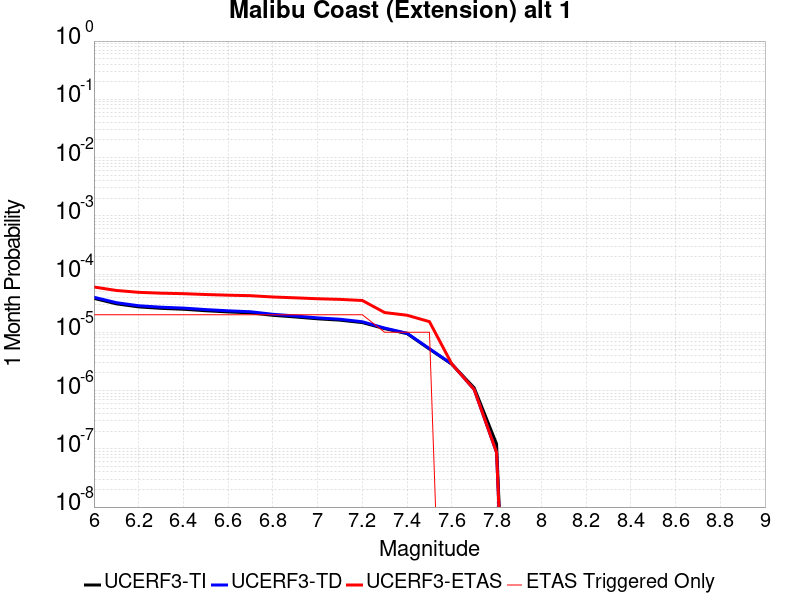 |  |  |

| Magnitude | 1 wk TI Prob | 1 wk TD Prob | 1 wk ETAS Prob | 1 wk ETAS/TD Gain | 1 wk ETAS Triggered Only | 1 mo TI Prob | 1 mo TD Prob | 1 mo ETAS Prob | 1 mo ETAS/TD Gain | 1 mo ETAS Triggered Only | 1 yr TI Prob | 1 yr TD Prob | 1 yr ETAS Prob | 1 yr ETAS/TD Gain | 1 yr ETAS Triggered Only | 10 yr TI Prob | 10 yr TD Prob | 10 yr ETAS Prob | 10 yr ETAS/TD Gain | 10 yr ETAS Triggered Only |
|-----|-----|-----|-----|-----|-----|-----|-----|-----|-----|-----|-----|-----|-----|-----|-----|-----|-----|-----|-----|-----|
| 6.0 | 8.930738E-6 | 9.329276E-6 | 2.9329089E-5 | 3.143769 | 2.0E-5 | 3.827403E-5 | 3.998201E-5 | 5.998121E-5 | 1.500205 | 2.0E-5 | 4.6588664E-4 | 4.8667393E-4 | 5.066642E-4 | 1.0410752 | 2.0E-5 | 0.0046491115 | 0.004856264 | 0.004906021 | 1.010246 | 5.0E-5 |
| 6.1 | 7.199952E-6 | 7.5302964E-6 | 2.7530146E-5 | 3.655918 | 2.0E-5 | 3.0856572E-5 | 3.2272303E-5 | 5.227166E-5 | 1.6197064 | 2.0E-5 | 3.75614E-4 | 3.9284505E-4 | 4.128372E-4 | 1.0508907 | 2.0E-5 | 0.0037497976 | 0.003921572 | 0.003971376 | 1.0127 | 5.0E-5 |
| 6.2 | 6.3721413E-6 | 6.6667917E-6 | 2.6666658E-5 | 3.9999237 | 2.0E-5 | 2.7308892E-5 | 2.8571652E-5 | 4.857108E-5 | 1.6999745 | 2.0E-5 | 3.3243504E-4 | 3.4780471E-4 | 3.6779774E-4 | 1.0574836 | 2.0E-5 | 0.0033193815 | 0.0034726437 | 0.0035125047 | 1.0114785 | 4.0E-5 |
| 6.3 | 6.016345E-6 | 6.295158E-6 | 2.6295033E-5 | 4.177025 | 2.0E-5 | 2.578408E-5 | 2.6978973E-5 | 4.697843E-5 | 1.7412981 | 2.0E-5 | 3.1387596E-4 | 3.2841982E-4 | 3.4841325E-4 | 1.0608777 | 2.0E-5 | 0.00313433 | 0.0032793807 | 0.0033192495 | 1.0121574 | 4.0E-5 |
| 6.4 | 5.8104883E-6 | 6.0795446E-6 | 2.6079422E-5 | 4.2897 | 2.0E-5 | 2.4901856E-5 | 2.6054933E-5 | 4.605441E-5 | 1.767589 | 2.0E-5 | 3.031379E-4 | 3.1717293E-4 | 3.371666E-4 | 1.063037 | 2.0E-5 | 0.0030272473 | 0.0031672374 | 0.0032071106 | 1.0125893 | 4.0E-5 |
| 6.5 | 5.476925E-6 | 5.7275133E-6 | 2.5727399E-5 | 4.491897 | 2.0E-5 | 2.3472323E-5 | 2.4546256E-5 | 4.4545766E-5 | 1.8147682 | 2.0E-5 | 2.8573806E-4 | 2.9880996E-4 | 3.18804E-4 | 1.0669122 | 2.0E-5 | 0.0028537093 | 0.002984114 | 0.0030239946 | 1.0133643 | 4.0E-5 |
| 6.6 | 5.222387E-6 | 5.45858E-6 | 2.545847E-5 | 4.6639366 | 2.0E-5 | 2.2381464E-5 | 2.3393704E-5 | 4.3393236E-5 | 1.8549109 | 2.0E-5 | 2.7246025E-4 | 2.8478142E-4 | 3.0477572E-4 | 1.0702093 | 2.0E-5 | 0.0027212645 | 0.0028441956 | 0.0028840818 | 1.0140238 | 4.0E-5 |
| 6.7 | 5.0337076E-6 | 5.259103E-6 | 2.5258998E-5 | 4.80291 | 2.0E-5 | 2.1572854E-5 | 2.253882E-5 | 4.253837E-5 | 1.8873379 | 2.0E-5 | 2.6261783E-4 | 2.7437587E-4 | 2.9437037E-4 | 1.0728728 | 2.0E-5 | 0.002623077 | 0.002740401 | 0.0027802915 | 1.0145564 | 4.0E-5 |
| 6.8 | 4.5675624E-6 | 4.7587164E-6 | 2.4758621E-5 | 5.202794 | 2.0E-5 | 1.9575122E-5 | 2.039434E-5 | 4.0393934E-5 | 1.9806442 | 2.0E-5 | 2.3830103E-4 | 2.48273E-4 | 2.6826802E-4 | 1.0805365 | 2.0E-5 | 0.0023804565 | 0.002479976 | 0.0025198767 | 1.0160892 | 4.0E-5 |
| 6.9 | 4.2802412E-6 | 4.4520207E-6 | 2.4451932E-5 | 5.4923224 | 2.0E-5 | 1.8343762E-5 | 1.907995E-5 | 3.907957E-5 | 2.0482008 | 2.0E-5 | 2.2331243E-4 | 2.3227377E-4 | 2.5226912E-4 | 1.0860853 | 2.0E-5 | 0.0022308815 | 0.0023203269 | 0.002360234 | 1.0171989 | 4.0E-5 |
| 7.0 | 3.9794063E-6 | 4.130099E-6 | 2.4130017E-5 | 5.8424788 | 2.0E-5 | 1.7054486E-5 | 1.7700306E-5 | 3.7699952E-5 | 2.129904 | 2.0E-5 | 2.0761859E-4 | 2.1548003E-4 | 2.3547572E-4 | 1.092796 | 2.0E-5 | 0.0020742472 | 0.0021527244 | 0.0021926383 | 1.0185411 | 4.0E-5 |
| 7.1 | 3.7730424E-6 | 3.911217E-6 | 2.391114E-5 | 6.1134777 | 2.0E-5 | 1.6170083E-5 | 1.6762251E-5 | 3.6761918E-5 | 2.1931372 | 2.0E-5 | 1.9685295E-4 | 2.0406142E-4 | 2.2405734E-4 | 1.0979897 | 2.0E-5 | 0.0019667868 | 0.0020387534 | 0.0020786717 | 1.0195799 | 4.0E-5 |
| 7.2 | 3.424985E-6 | 3.541337E-6 | 2.3541266E-5 | 6.6475644 | 2.0E-5 | 1.4678424E-5 | 1.5177071E-5 | 3.5176767E-5 | 2.3177574 | 2.0E-5 | 1.7869516E-4 | 1.8476529E-4 | 2.0476159E-4 | 1.1082255 | 2.0E-5 | 0.0017855153 | 0.0018461287 | 0.0018860549 | 1.021627 | 4.0E-5 |
| 7.3 | 2.6966375E-6 | 2.7596534E-6 | 1.2759626E-5 | 4.6236334 | 1.0E-5 | 1.15569665E-5 | 1.1827032E-5 | 2.1826914E-5 | 1.8455107 | 1.0E-5 | 1.4069698E-4 | 1.4398464E-4 | 1.539832E-4 | 1.0694418 | 1.0E-5 | 0.0014060794 | 0.0014389176 | 0.0014588889 | 1.0138793 | 2.0E-5 |
| 7.4 | 2.215957E-6 | 2.249378E-6 | 1.2249356E-5 | 5.4456635 | 1.0E-5 | 9.496924E-6 | 9.640156E-6 | 1.964006E-5 | 2.0373175 | 1.0E-5 | 1.1561892E-4 | 1.17362615E-4 | 1.2736145E-4 | 1.085196 | 1.0E-5 | 0.0011555878 | 0.0011730101 | 0.0011929866 | 1.0170301 | 2.0E-5 |
| 7.5 | 1.2040218E-6 | 1.2219067E-6 | 1.1221894E-5 | 9.183921 | 1.0E-5 | 5.160083E-6 | 5.2367322E-6 | 1.523668E-5 | 2.9095778 | 1.0E-5 | 6.2822204E-5 | 6.375537E-5 | 7.375473E-5 | 1.1568395 | 1.0E-5 | 6.280445E-4 | 6.3737266E-4 | 6.473663E-4 | 1.0156794 | 1.0E-5 |
| 7.6 | 6.6157446E-7 | 6.678975E-7 | 6.678975E-7 | 1.0 | 0.0 | 2.835316E-6 | 2.8624147E-6 | 2.8624147E-6 | 1.0 | 0.0 | 3.4519428E-5 | 3.484936E-5 | 3.484936E-5 | 1.0 | 0.0 | 3.4514067E-4 | 3.4844046E-4 | 3.4844046E-4 | 1.0 | 0.0 |
| 7.7 | 2.6012302E-7 | 2.4357593E-7 | 2.4357593E-7 | 1.0 | 0.0 | 1.1148124E-6 | 1.0438964E-6 | 1.0438964E-6 | 1.0 | 0.0 | 1.3572758E-5 | 1.2709375E-5 | 1.2709375E-5 | 1.0 | 0.0 | 1.3571928E-4 | 1.2708755E-4 | 1.2708755E-4 | 1.0 | 0.0 |
| 7.8 | 2.8323132E-8 | 2.0266649E-8 | 2.0266649E-8 | 1.0 | 0.0 | 1.2138484E-7 | 8.685707E-8 | 8.685707E-8 | 1.0 | 0.0 | 1.4778595E-6 | 1.0574844E-6 | 1.0574844E-6 | 1.0 | 0.0 | 1.4778497E-5 | 1.0574801E-5 | 1.0574801E-5 | 1.0 | 0.0 |

## San Jacinto (San Jacinto Valley) rev
*[(top)](#table-of-contents)*

| 1 Week | 1 Month | 1 Year | 10 Year |
|-----|-----|-----|-----|
|  |  |  |  |

| Magnitude | 1 wk TI Prob | 1 wk TD Prob | 1 wk ETAS Prob | 1 wk ETAS/TD Gain | 1 wk ETAS Triggered Only | 1 mo TI Prob | 1 mo TD Prob | 1 mo ETAS Prob | 1 mo ETAS/TD Gain | 1 mo ETAS Triggered Only | 1 yr TI Prob | 1 yr TD Prob | 1 yr ETAS Prob | 1 yr ETAS/TD Gain | 1 yr ETAS Triggered Only | 10 yr TI Prob | 10 yr TD Prob | 10 yr ETAS Prob | 10 yr ETAS/TD Gain | 10 yr ETAS Triggered Only |
|-----|-----|-----|-----|-----|-----|-----|-----|-----|-----|-----|-----|-----|-----|-----|-----|-----|-----|-----|-----|-----|
| 6.0 | 3.652694E-5 | 3.4402394E-5 | 4.4402048E-5 | 1.2906674 | 1.0E-5 | 1.5653463E-4 | 1.474305E-4 | 1.5742904E-4 | 1.0678185 | 1.0E-5 | 0.0019041431 | 0.00179349 | 0.0018234362 | 1.0166972 | 3.0E-5 | 0.018879099 | 0.018526595 | 0.018575668 | 1.0026488 | 5.0E-5 |
| 6.1 | 3.652694E-5 | 3.4402394E-5 | 4.4402048E-5 | 1.2906674 | 1.0E-5 | 1.5653463E-4 | 1.474305E-4 | 1.5742904E-4 | 1.0678185 | 1.0E-5 | 0.0019041431 | 0.00179349 | 0.0018234362 | 1.0166972 | 3.0E-5 | 0.018879099 | 0.018526595 | 0.018575668 | 1.0026488 | 5.0E-5 |
| 6.2 | 3.652694E-5 | 3.4402394E-5 | 4.4402048E-5 | 1.2906674 | 1.0E-5 | 1.5653463E-4 | 1.474305E-4 | 1.5742904E-4 | 1.0678185 | 1.0E-5 | 0.0019041431 | 0.00179349 | 0.0018234362 | 1.0166972 | 3.0E-5 | 0.018879099 | 0.018526595 | 0.018575668 | 1.0026488 | 5.0E-5 |
| 6.3 | 3.652694E-5 | 3.4402394E-5 | 4.4402048E-5 | 1.2906674 | 1.0E-5 | 1.5653463E-4 | 1.474305E-4 | 1.5742904E-4 | 1.0678185 | 1.0E-5 | 0.0019041431 | 0.00179349 | 0.0018234362 | 1.0166972 | 3.0E-5 | 0.018879099 | 0.018526595 | 0.018575668 | 1.0026488 | 5.0E-5 |
| 6.4 | 3.646941E-5 | 3.432397E-5 | 4.4323624E-5 | 1.2913316 | 1.0E-5 | 1.5628811E-4 | 1.4709444E-4 | 1.5709297E-4 | 1.0679735 | 1.0E-5 | 0.0019011468 | 0.0017894056 | 0.0018193519 | 1.0167353 | 3.0E-5 | 0.018849645 | 0.018486476 | 0.018535553 | 1.0026547 | 5.0E-5 |
| 6.5 | 3.646941E-5 | 3.432397E-5 | 4.4323624E-5 | 1.2913316 | 1.0E-5 | 1.5628811E-4 | 1.4709444E-4 | 1.5709297E-4 | 1.0679735 | 1.0E-5 | 0.0019011468 | 0.0017894056 | 0.0018193519 | 1.0167353 | 3.0E-5 | 0.018849645 | 0.018486476 | 0.018535553 | 1.0026547 | 5.0E-5 |
| 6.6 | 3.6442503E-5 | 3.4287354E-5 | 4.428701E-5 | 1.2916427 | 1.0E-5 | 1.561728E-4 | 1.4693754E-4 | 1.5693608E-4 | 1.0680461 | 1.0E-5 | 0.0018997455 | 0.0017874985 | 0.0018174448 | 1.0167532 | 3.0E-5 | 0.018835869 | 0.018467745 | 0.018516822 | 1.0026574 | 5.0E-5 |
| 6.7 | 3.6432113E-5 | 3.4272925E-5 | 4.4272583E-5 | 1.2917655 | 1.0E-5 | 1.5612828E-4 | 1.4687571E-4 | 1.5687424E-4 | 1.0680748 | 1.0E-5 | 0.0018992044 | 0.0017867472 | 0.0018166937 | 1.0167602 | 3.0E-5 | 0.018830549 | 0.018460369 | 0.018509446 | 1.0026585 | 5.0E-5 |
| 6.8 | 3.6409598E-5 | 3.424198E-5 | 4.424164E-5 | 1.2920291 | 1.0E-5 | 1.560318E-4 | 1.4674311E-4 | 1.5674165E-4 | 1.0681363 | 1.0E-5 | 0.0018980318 | 0.0017851355 | 0.0018150819 | 1.0167755 | 3.0E-5 | 0.018819023 | 0.018444523 | 0.0184936 | 1.0026609 | 5.0E-5 |
| 6.9 | 3.638078E-5 | 3.4202407E-5 | 4.4202065E-5 | 1.2923671 | 1.0E-5 | 1.5590832E-4 | 1.4657351E-4 | 1.5657204E-4 | 1.0682151 | 1.0E-5 | 0.0018965311 | 0.001783074 | 0.0018130206 | 1.0167949 | 3.0E-5 | 0.018804269 | 0.018424258 | 0.018473336 | 1.0026639 | 5.0E-5 |
| 7.0 | 3.6294874E-5 | 3.408442E-5 | 4.4084078E-5 | 1.2933792 | 1.0E-5 | 1.5554018E-4 | 1.4606792E-4 | 1.5606647E-4 | 1.0684513 | 1.0E-5 | 0.0018920569 | 0.001776929 | 0.0018068757 | 1.0168531 | 3.0E-5 | 0.018760284 | 0.018363839 | 0.018412922 | 1.0026728 | 5.0E-5 |
| 7.1 | 3.6260717E-5 | 3.4040702E-5 | 4.4040364E-5 | 1.293756 | 1.0E-5 | 1.5539382E-4 | 1.4588058E-4 | 1.5587913E-4 | 1.0685393 | 1.0E-5 | 0.001890278 | 0.0017746518 | 0.0018045986 | 1.0168747 | 3.0E-5 | 0.018742796 | 0.018341439 | 0.018390523 | 1.002676 | 5.0E-5 |
| 7.2 | 3.6210204E-5 | 3.397492E-5 | 4.397458E-5 | 1.2943248 | 1.0E-5 | 1.5517735E-4 | 1.455987E-4 | 1.5559724E-4 | 1.068672 | 1.0E-5 | 0.001887647 | 0.0017712255 | 0.0018011723 | 1.0169075 | 3.0E-5 | 0.01871693 | 0.01830772 | 0.018356804 | 1.0026811 | 5.0E-5 |
| 7.3 | 3.6119454E-5 | 3.386321E-5 | 4.386287E-5 | 1.2952957 | 1.0E-5 | 1.5478847E-4 | 1.4511998E-4 | 1.5511853E-4 | 1.0688986 | 1.0E-5 | 0.0018829206 | 0.0017654065 | 0.0017953535 | 1.0169632 | 3.0E-5 | 0.018670462 | 0.018250274 | 0.01829936 | 1.0026897 | 5.0E-5 |
| 7.4 | 3.607848E-5 | 3.381071E-5 | 4.381037E-5 | 1.2957543 | 1.0E-5 | 1.5461289E-4 | 1.44895E-4 | 1.5489355E-4 | 1.0690055 | 1.0E-5 | 0.0018807866 | 0.0017626719 | 0.001792619 | 1.0169896 | 3.0E-5 | 0.018649481 | 0.018223269 | 0.018272357 | 1.0026938 | 5.0E-5 |
| 7.5 | 3.5856774E-5 | 3.3620483E-5 | 4.3620144E-5 | 1.2974278 | 1.0E-5 | 1.5366284E-4 | 1.4407984E-4 | 1.540784E-4 | 1.069396 | 1.0E-5 | 0.0018692396 | 0.0017527633 | 0.0017827107 | 1.0170858 | 3.0E-5 | 0.018535944 | 0.018124366 | 0.01817346 | 1.0027087 | 5.0E-5 |
| 7.6 | 3.286655E-5 | 3.2143445E-5 | 4.2143125E-5 | 1.3110954 | 1.0E-5 | 1.4084904E-4 | 1.3775036E-4 | 1.4774899E-4 | 1.0725851 | 1.0E-5 | 0.001713488 | 0.0016758227 | 0.0017057724 | 1.0178716 | 3.0E-5 | 0.017003361 | 0.017344031 | 0.017393164 | 1.0028329 | 5.0E-5 |
| 7.7 | 2.8882527E-5 | 2.9236293E-5 | 3.9236E-5 | 1.3420306 | 1.0E-5 | 1.237764E-4 | 1.2529238E-4 | 1.3529113E-4 | 1.0798033 | 1.0E-5 | 0.0015059357 | 0.0015243685 | 0.0015543228 | 1.0196502 | 3.0E-5 | 0.014957713 | 0.015830461 | 0.015879668 | 1.0031085 | 5.0E-5 |
| 7.8 | 2.4950225E-5 | 2.6527203E-5 | 3.6526937E-5 | 1.3769615 | 1.0E-5 | 1.0692515E-4 | 1.1368306E-4 | 1.2368192E-4 | 1.0879538 | 1.0E-5 | 0.0013010362 | 0.0013832134 | 0.0014131719 | 1.0216587 | 3.0E-5 | 0.012934455 | 0.014411755 | 0.014461034 | 1.0034194 | 5.0E-5 |
| 7.9 | 1.9881603E-5 | 2.1507445E-5 | 3.1507232E-5 | 1.4649453 | 1.0E-5 | 8.520408E-5 | 9.217151E-5 | 1.0217059E-4 | 1.1084834 | 1.0E-5 | 0.001036866 | 0.0011216112 | 0.0011515776 | 1.0267172 | 3.0E-5 | 0.010320415 | 0.011777027 | 0.011826438 | 1.0041956 | 5.0E-5 |
| 8.0 | 1.563292E-5 | 1.5937347E-5 | 2.5937186E-5 | 1.627447 | 1.0E-5 | 6.6996516E-5 | 6.8301124E-5 | 7.830044E-5 | 1.1464005 | 1.0E-5 | 8.153773E-4 | 8.3124964E-4 | 8.612247E-4 | 1.0360602 | 3.0E-5 | 0.00812392 | 0.008810506 | 0.008860066 | 1.005625 | 5.0E-5 |
| 8.1 | 1.0045313E-5 | 8.301802E-6 | 8.301802E-6 | 1.0 | 0.0 | 4.305063E-5 | 3.5578672E-5 | 3.5578672E-5 | 1.0 | 0.0 | 5.2401534E-4 | 4.3308473E-4 | 4.3308473E-4 | 1.0 | 0.0 | 0.0052278144 | 0.0046591135 | 0.0046591135 | 1.0 | 0.0 |
| 8.2 | 4.1554413E-6 | 1.5655598E-6 | 1.5655598E-6 | 1.0 | 0.0 | 1.7808914E-5 | 6.709525E-6 | 6.709525E-6 | 1.0 | 0.0 | 2.1680194E-4 | 8.168544E-5 | 8.168544E-5 | 1.0 | 0.0 | 0.0021659054 | 9.482903E-4 | 9.482903E-4 | 1.0 | 0.0 |
| 8.3 | 1.2758221E-6 | 3.6149942E-7 | 3.6149942E-7 | 1.0 | 0.0 | 5.4677976E-6 | 1.5492824E-6 | 1.5492824E-6 | 1.0 | 0.0 | 6.65684E-5 | 1.8862354E-5 | 1.8862354E-5 | 1.0 | 0.0 | 6.6548464E-4 | 2.2751294E-4 | 2.2751294E-4 | 1.0 | 0.0 |

## Kern Canyon (Lake Isabella) 2011
*[(top)](#table-of-contents)*

| 1 Week | 1 Month | 1 Year | 10 Year |
|-----|-----|-----|-----|
|  |  |  |  |

| Magnitude | 1 wk TI Prob | 1 wk TD Prob | 1 wk ETAS Prob | 1 wk ETAS/TD Gain | 1 wk ETAS Triggered Only | 1 mo TI Prob | 1 mo TD Prob | 1 mo ETAS Prob | 1 mo ETAS/TD Gain | 1 mo ETAS Triggered Only | 1 yr TI Prob | 1 yr TD Prob | 1 yr ETAS Prob | 1 yr ETAS/TD Gain | 1 yr ETAS Triggered Only | 10 yr TI Prob | 10 yr TD Prob | 10 yr ETAS Prob | 10 yr ETAS/TD Gain | 10 yr ETAS Triggered Only |
|-----|-----|-----|-----|-----|-----|-----|-----|-----|-----|-----|-----|-----|-----|-----|-----|-----|-----|-----|-----|-----|
| 6.0 | 4.2387383E-6 | 4.001639E-6 | 4.001639E-6 | 1.0 | 0.0 | 1.8165894E-5 | 1.7149778E-5 | 1.7149778E-5 | 1.0 | 0.0 | 2.2114732E-4 | 2.087804E-4 | 2.2877623E-4 | 1.0957744 | 2.0E-5 | 0.0022092736 | 0.0020860266 | 0.0021359222 | 1.023919 | 5.0E-5 |
| 6.1 | 4.2387383E-6 | 4.001639E-6 | 4.001639E-6 | 1.0 | 0.0 | 1.8165894E-5 | 1.7149778E-5 | 1.7149778E-5 | 1.0 | 0.0 | 2.2114732E-4 | 2.087804E-4 | 2.2877623E-4 | 1.0957744 | 2.0E-5 | 0.0022092736 | 0.0020860266 | 0.0021359222 | 1.023919 | 5.0E-5 |
| 6.2 | 4.2387383E-6 | 4.001639E-6 | 4.001639E-6 | 1.0 | 0.0 | 1.8165894E-5 | 1.7149778E-5 | 1.7149778E-5 | 1.0 | 0.0 | 2.2114732E-4 | 2.087804E-4 | 2.2877623E-4 | 1.0957744 | 2.0E-5 | 0.0022092736 | 0.0020860266 | 0.0021359222 | 1.023919 | 5.0E-5 |
| 6.3 | 4.2387383E-6 | 4.001639E-6 | 4.001639E-6 | 1.0 | 0.0 | 1.8165894E-5 | 1.7149778E-5 | 1.7149778E-5 | 1.0 | 0.0 | 2.2114732E-4 | 2.087804E-4 | 2.2877623E-4 | 1.0957744 | 2.0E-5 | 0.0022092736 | 0.0020860266 | 0.0021359222 | 1.023919 | 5.0E-5 |
| 6.4 | 4.2387383E-6 | 4.001639E-6 | 4.001639E-6 | 1.0 | 0.0 | 1.8165894E-5 | 1.7149778E-5 | 1.7149778E-5 | 1.0 | 0.0 | 2.2114732E-4 | 2.087804E-4 | 2.2877623E-4 | 1.0957744 | 2.0E-5 | 0.0022092736 | 0.0020860266 | 0.0021359222 | 1.023919 | 5.0E-5 |
| 6.5 | 2.7857532E-6 | 2.517867E-6 | 2.517867E-6 | 1.0 | 0.0 | 1.1938888E-5 | 1.0790815E-5 | 1.0790815E-5 | 1.0 | 0.0 | 1.4534626E-4 | 1.3137059E-4 | 1.4136928E-4 | 1.0761105 | 1.0E-5 | 0.0014525123 | 0.001312962 | 0.0013529095 | 1.0304254 | 4.0E-5 |
| 6.6 | 2.2233348E-6 | 1.9441236E-6 | 1.9441236E-6 | 1.0 | 0.0 | 9.528543E-6 | 8.331932E-6 | 8.331932E-6 | 1.0 | 0.0 | 1.1600384E-4 | 1.01436635E-4 | 1.1143562E-4 | 1.0985737 | 1.0E-5 | 0.001159433 | 0.001013912 | 0.0010438815 | 1.0295584 | 3.0E-5 |
| 6.7 | 2.1635126E-6 | 1.8835036E-6 | 1.8835036E-6 | 1.0 | 0.0 | 9.272164E-6 | 8.072134E-6 | 8.072134E-6 | 1.0 | 0.0 | 1.1288274E-4 | 9.827388E-5 | 1.0827289E-4 | 1.1017464 | 1.0E-5 | 0.0011282542 | 9.823124E-4 | 0.0010122829 | 1.0305102 | 3.0E-5 |
| 6.8 | 1.8685711E-6 | 1.5831425E-6 | 1.5831425E-6 | 1.0 | 0.0 | 8.008137E-6 | 6.784879E-6 | 6.784879E-6 | 1.0 | 0.0 | 9.74947E-5 | 8.260282E-5 | 9.260199E-5 | 1.1210512 | 1.0E-5 | 9.745194E-4 | 8.2572614E-4 | 8.5570134E-4 | 1.0363016 | 3.0E-5 |
| 6.9 | 1.5815071E-6 | 1.3064928E-6 | 1.3064928E-6 | 1.0 | 0.0 | 6.77787E-6 | 5.599243E-6 | 5.599243E-6 | 1.0 | 0.0 | 8.251744E-5 | 6.816868E-5 | 7.8168E-5 | 1.1466849 | 1.0E-5 | 8.248681E-4 | 6.8148033E-4 | 7.0146675E-4 | 1.0293279 | 2.0E-5 |
| 7.0 | 1.3772564E-6 | 1.1210718E-6 | 1.1210718E-6 | 1.0 | 0.0 | 5.9025137E-6 | 4.8045845E-6 | 4.8045845E-6 | 1.0 | 0.0 | 7.186073E-5 | 5.8494268E-5 | 5.8494268E-5 | 1.0 | 0.0 | 7.18375E-4 | 5.847908E-4 | 5.947849E-4 | 1.0170901 | 1.0E-5 |
| 7.1 | 1.0916998E-6 | 8.763777E-7 | 8.763777E-7 | 1.0 | 0.0 | 4.678705E-6 | 3.7558991E-6 | 3.7558991E-6 | 1.0 | 0.0 | 5.6961744E-5 | 4.5727127E-5 | 4.5727127E-5 | 1.0 | 0.0 | 5.6947145E-4 | 4.571785E-4 | 4.571785E-4 | 1.0 | 0.0 |
| 7.2 | 7.6277024E-7 | 5.901454E-7 | 5.901454E-7 | 1.0 | 0.0 | 3.2690114E-6 | 2.5291922E-6 | 2.5291922E-6 | 1.0 | 0.0 | 3.9799485E-5 | 3.0792486E-5 | 3.0792486E-5 | 1.0 | 0.0 | 3.9792358E-4 | 3.0788282E-4 | 3.0788282E-4 | 1.0 | 0.0 |
| 7.3 | 5.3265916E-7 | 4.3824414E-7 | 4.3824414E-7 | 1.0 | 0.0 | 2.282823E-6 | 1.878188E-6 | 1.878188E-6 | 1.0 | 0.0 | 2.7793016E-5 | 2.2866701E-5 | 2.2866701E-5 | 1.0 | 0.0 | 2.778954E-4 | 2.2864387E-4 | 2.2864387E-4 | 1.0 | 0.0 |
| 7.4 | 3.4946007E-7 | 3.006571E-7 | 3.006571E-7 | 1.0 | 0.0 | 1.497685E-6 | 1.2885298E-6 | 1.2885298E-6 | 1.0 | 0.0 | 1.8234163E-5 | 1.568774E-5 | 1.568774E-5 | 1.0 | 0.0 | 1.8232666E-4 | 1.5686655E-4 | 1.5686655E-4 | 1.0 | 0.0 |
| 7.5 | 1.8317026E-7 | 1.4244812E-7 | 1.4244812E-7 | 1.0 | 0.0 | 7.850152E-7 | 6.104918E-7 | 6.104918E-7 | 1.0 | 0.0 | 9.557518E-6 | 7.432713E-6 | 7.432713E-6 | 1.0 | 0.0 | 9.5571064E-5 | 7.432472E-5 | 7.432472E-5 | 1.0 | 0.0 |
| 7.6 | 2.572245E-8 | 1.7352555E-8 | 1.7352555E-8 | 1.0 | 0.0 | 1.10239064E-7 | 7.436809E-8 | 7.436809E-8 | 1.0 | 0.0 | 1.3421597E-6 | 9.054312E-7 | 9.054312E-7 | 1.0 | 0.0 | 1.3421517E-5 | 9.05428E-6 | 9.05428E-6 | 1.0 | 0.0 |

## Big Pine (Central)
*[(top)](#table-of-contents)*

| 1 Week | 1 Month | 1 Year | 10 Year |
|-----|-----|-----|-----|
|  |  |  | 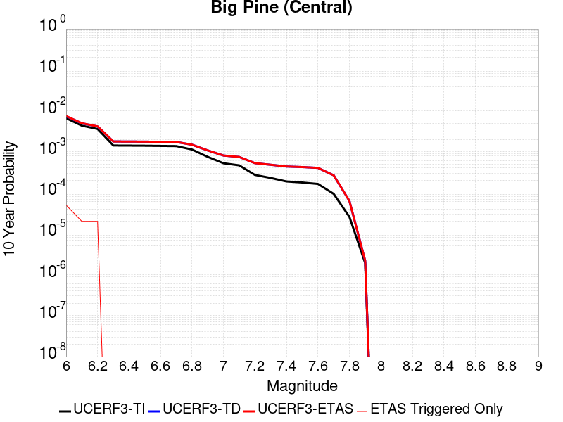 |

| Magnitude | 1 wk TI Prob | 1 wk TD Prob | 1 wk ETAS Prob | 1 wk ETAS/TD Gain | 1 wk ETAS Triggered Only | 1 mo TI Prob | 1 mo TD Prob | 1 mo ETAS Prob | 1 mo ETAS/TD Gain | 1 mo ETAS Triggered Only | 1 yr TI Prob | 1 yr TD Prob | 1 yr ETAS Prob | 1 yr ETAS/TD Gain | 1 yr ETAS Triggered Only | 10 yr TI Prob | 10 yr TD Prob | 10 yr ETAS Prob | 10 yr ETAS/TD Gain | 10 yr ETAS Triggered Only |
|-----|-----|-----|-----|-----|-----|-----|-----|-----|-----|-----|-----|-----|-----|-----|-----|-----|-----|-----|-----|-----|
| 6.0 | 1.2706755E-5 | 1.4250529E-5 | 3.4250243E-5 | 2.4034367 | 2.0E-5 | 5.4456385E-5 | 6.107247E-5 | 9.107064E-5 | 1.4911897 | 3.0E-5 | 6.628048E-4 | 7.433402E-4 | 7.8331045E-4 | 1.0537711 | 4.0E-5 | 0.006608314 | 0.0074135666 | 0.0074631963 | 1.0066944 | 5.0E-5 |
| 6.1 | 8.342579E-6 | 9.510762E-6 | 9.510762E-6 | 1.0 | 0.0 | 3.5753423E-5 | 4.0759893E-5 | 5.0759485E-5 | 1.2453293 | 1.0E-5 | 4.3521097E-4 | 4.961604E-4 | 5.061555E-4 | 1.0201448 | 1.0E-5 | 0.0043435963 | 0.0049540824 | 0.0049739834 | 1.0040171 | 2.0E-5 |
| 6.2 | 6.923899E-6 | 7.967147E-6 | 7.967147E-6 | 1.0 | 0.0 | 2.9673516E-5 | 3.4144578E-5 | 4.414424E-5 | 1.2928623 | 1.0E-5 | 3.6121515E-4 | 4.156502E-4 | 4.2564602E-4 | 1.0240487 | 1.0E-5 | 0.003606286 | 0.0041520367 | 0.0041719535 | 1.0047969 | 2.0E-5 |
| 6.3 | 2.728396E-6 | 3.4242908E-6 | 3.4242908E-6 | 1.0 | 0.0 | 1.1693074E-5 | 1.4675454E-5 | 1.4675454E-5 | 1.0 | 0.0 | 1.4235388E-4 | 1.7865987E-4 | 1.7865987E-4 | 1.0 | 0.0 | 0.0014226272 | 0.0017866704 | 0.0017866704 | 1.0 | 0.0 |
| 6.4 | 2.7136944E-6 | 3.408584E-6 | 3.408584E-6 | 1.0 | 0.0 | 1.1630066E-5 | 1.4608141E-5 | 1.4608141E-5 | 1.0 | 0.0 | 1.4158686E-4 | 1.7784047E-4 | 1.7784047E-4 | 1.0 | 0.0 | 0.0014149669 | 0.0017784894 | 0.0017784894 | 1.0 | 0.0 |
| 6.5 | 2.6971882E-6 | 3.3909291E-6 | 3.3909291E-6 | 1.0 | 0.0 | 1.1559327E-5 | 1.45324775E-5 | 1.45324775E-5 | 1.0 | 0.0 | 1.4072572E-4 | 1.7691942E-4 | 1.7691942E-4 | 1.0 | 0.0 | 0.0014063664 | 0.0017692937 | 0.0017692937 | 1.0 | 0.0 |
| 6.6 | 2.669092E-6 | 3.3609497E-6 | 3.3609497E-6 | 1.0 | 0.0 | 1.1438916E-5 | 1.4403995E-5 | 1.4403995E-5 | 1.0 | 0.0 | 1.3925991E-4 | 1.753554E-4 | 1.753554E-4 | 1.0 | 0.0 | 0.0013917267 | 0.0017536782 | 0.0017536782 | 1.0 | 0.0 |
| 6.7 | 2.6408059E-6 | 3.3309752E-6 | 3.3309752E-6 | 1.0 | 0.0 | 1.1317691E-5 | 1.4275535E-5 | 1.4275535E-5 | 1.0 | 0.0 | 1.3778417E-4 | 1.7379165E-4 | 1.7379165E-4 | 1.0 | 0.0 | 0.0013769877 | 0.0017380653 | 0.0017380653 | 1.0 | 0.0 |
| 6.8 | 2.1786943E-6 | 2.8544325E-6 | 2.8544325E-6 | 1.0 | 0.0 | 9.337228E-6 | 1.2233229E-5 | 1.2233229E-5 | 1.0 | 0.0 | 1.1367482E-4 | 1.4893012E-4 | 1.4893012E-4 | 1.0 | 0.0 | 0.0011361669 | 0.0014897975 | 0.0014897975 | 1.0 | 0.0 |
| 6.9 | 1.4411696E-6 | 2.068499E-6 | 2.068499E-6 | 1.0 | 0.0 | 6.1764263E-6 | 8.864968E-6 | 8.864968E-6 | 1.0 | 0.0 | 7.51954E-5 | 1.079259E-4 | 1.079259E-4 | 1.0 | 0.0 | 7.5169955E-4 | 0.0010801847 | 0.0010801847 | 1.0 | 0.0 |
| 7.0 | 1.0073411E-6 | 1.554261E-6 | 1.554261E-6 | 1.0 | 0.0 | 4.317169E-6 | 6.6611024E-6 | 6.6611024E-6 | 1.0 | 0.0 | 5.2560266E-5 | 8.1096056E-5 | 8.1096056E-5 | 1.0 | 0.0 | 5.2547833E-4 | 8.1210316E-4 | 8.1210316E-4 | 1.0 | 0.0 |
| 7.1 | 8.947104E-7 | 1.4302494E-6 | 1.4302494E-6 | 1.0 | 0.0 | 3.834468E-6 | 6.129627E-6 | 6.129627E-6 | 1.0 | 0.0 | 4.6683643E-5 | 7.46258E-5 | 7.46258E-5 | 1.0 | 0.0 | 4.6673836E-4 | 7.474457E-4 | 7.474457E-4 | 1.0 | 0.0 |
| 7.2 | 5.215166E-7 | 1.0111678E-6 | 1.0111678E-6 | 1.0 | 0.0 | 2.2350691E-6 | 4.3335694E-6 | 4.3335694E-6 | 1.0 | 0.0 | 2.7211627E-5 | 5.2759973E-5 | 5.2759973E-5 | 1.0 | 0.0 | 2.7208295E-4 | 5.2890263E-4 | 5.2890263E-4 | 1.0 | 0.0 |
| 7.3 | 4.4024807E-7 | 9.219589E-7 | 9.219589E-7 | 1.0 | 0.0 | 1.8867761E-6 | 3.9512465E-6 | 3.9512465E-6 | 1.0 | 0.0 | 2.2971257E-5 | 4.810541E-5 | 4.810541E-5 | 1.0 | 0.0 | 2.2968883E-4 | 4.8237795E-4 | 4.8237795E-4 | 1.0 | 0.0 |
| 7.4 | 3.6130905E-7 | 8.358523E-7 | 8.358523E-7 | 1.0 | 0.0 | 1.5484665E-6 | 3.5822195E-6 | 3.5822195E-6 | 1.0 | 0.0 | 1.8852415E-5 | 4.3612687E-5 | 4.3612687E-5 | 1.0 | 0.0 | 1.8850817E-4 | 4.374597E-4 | 4.374597E-4 | 1.0 | 0.0 |
| 7.5 | 3.408184E-7 | 8.108147E-7 | 8.108147E-7 | 1.0 | 0.0 | 1.4606494E-6 | 3.4749157E-6 | 3.4749157E-6 | 1.0 | 0.0 | 1.7783263E-5 | 4.2306317E-5 | 4.2306317E-5 | 1.0 | 0.0 | 1.778184E-4 | 4.2437963E-4 | 4.2437963E-4 | 1.0 | 0.0 |
| 7.6 | 3.1428627E-7 | 7.7316E-7 | 7.7316E-7 | 1.0 | 0.0 | 1.3469405E-6 | 3.3135389E-6 | 3.3135389E-6 | 1.0 | 0.0 | 1.6398877E-5 | 4.0341627E-5 | 4.0341627E-5 | 1.0 | 0.0 | 1.6397667E-4 | 4.0471106E-4 | 4.0471106E-4 | 1.0 | 0.0 |
| 7.7 | 1.7972785E-7 | 5.077752E-7 | 5.077752E-7 | 1.0 | 0.0 | 7.70262E-7 | 2.1761778E-6 | 2.1761778E-6 | 1.0 | 0.0 | 9.377899E-6 | 2.6494654E-5 | 2.6494654E-5 | 1.0 | 0.0 | 9.377503E-5 | 2.662899E-4 | 2.662899E-4 | 1.0 | 0.0 |
| 7.8 | 4.9230927E-8 | 1.198079E-7 | 1.198079E-7 | 1.0 | 0.0 | 2.1098968E-7 | 5.134623E-7 | 5.134623E-7 | 1.0 | 0.0 | 2.5687964E-6 | 6.2513873E-6 | 6.2513873E-6 | 1.0 | 0.0 | 2.5687666E-5 | 6.295415E-5 | 6.295415E-5 | 1.0 | 0.0 |
| 7.9 | 3.6805972E-9 | 4.105293E-9 | 4.105293E-9 | 1.0 | 0.0 | 1.5773987E-8 | 1.7594115E-8 | 1.7594115E-8 | 1.0 | 0.0 | 1.9204828E-7 | 2.1420831E-7 | 2.1420831E-7 | 1.0 | 0.0 | 1.920481E-6 | 2.1900614E-6 | 2.1900614E-6 | 1.0 | 0.0 |

## San Diego Trough south
*[(top)](#table-of-contents)*

| 1 Week | 1 Month | 1 Year | 10 Year |
|-----|-----|-----|-----|
|  |  |  |  |

| Magnitude | 1 wk TI Prob | 1 wk TD Prob | 1 wk ETAS Prob | 1 wk ETAS/TD Gain | 1 wk ETAS Triggered Only | 1 mo TI Prob | 1 mo TD Prob | 1 mo ETAS Prob | 1 mo ETAS/TD Gain | 1 mo ETAS Triggered Only | 1 yr TI Prob | 1 yr TD Prob | 1 yr ETAS Prob | 1 yr ETAS/TD Gain | 1 yr ETAS Triggered Only | 10 yr TI Prob | 10 yr TD Prob | 10 yr ETAS Prob | 10 yr ETAS/TD Gain | 10 yr ETAS Triggered Only |
|-----|-----|-----|-----|-----|-----|-----|-----|-----|-----|-----|-----|-----|-----|-----|-----|-----|-----|-----|-----|-----|
| 6.0 | 8.279495E-5 | 1.04241306E-4 | 1.4423714E-4 | 1.383685 | 4.0E-5 | 3.5478722E-4 | 4.4667677E-4 | 4.8665892E-4 | 1.0895102 | 4.0E-5 | 0.004310982 | 0.0054256152 | 0.005475344 | 1.0091655 | 5.0E-5 | 0.042283054 | 0.05299221 | 0.05303956 | 1.0008936 | 5.0E-5 |
| 6.1 | 4.6961468E-5 | 5.772944E-5 | 6.772886E-5 | 1.1732118 | 1.0E-5 | 2.0124791E-4 | 2.473894E-4 | 2.5738694E-4 | 1.0404121 | 1.0E-5 | 0.00244744 | 0.0030079768 | 0.0030179466 | 1.0033145 | 1.0E-5 | 0.024206603 | 0.029679462 | 0.029689165 | 1.000327 | 1.0E-5 |
| 6.2 | 3.5079658E-5 | 4.214154E-5 | 5.2141117E-5 | 1.2372856 | 1.0E-5 | 1.5033272E-4 | 1.8059435E-4 | 1.9059255E-4 | 1.0553627 | 1.0E-5 | 0.0018287642 | 0.0021965632 | 0.0022065411 | 1.0045426 | 1.0E-5 | 0.018137876 | 0.021751117 | 0.0217609 | 1.0004498 | 1.0E-5 |
| 6.3 | 3.5079658E-5 | 4.214154E-5 | 5.2141117E-5 | 1.2372856 | 1.0E-5 | 1.5033272E-4 | 1.8059435E-4 | 1.9059255E-4 | 1.0553627 | 1.0E-5 | 0.0018287642 | 0.0021965632 | 0.0022065411 | 1.0045426 | 1.0E-5 | 0.018137876 | 0.021751117 | 0.0217609 | 1.0004498 | 1.0E-5 |
| 6.4 | 2.7196904E-5 | 3.2087162E-5 | 3.2087162E-5 | 1.0 | 0.0 | 1.16552954E-4 | 1.3750927E-4 | 1.3750927E-4 | 1.0 | 0.0 | 0.0014181085 | 0.0016729041 | 0.0016729041 | 1.0 | 0.0 | 0.014090929 | 0.016604643 | 0.016604643 | 1.0 | 0.0 |
| 6.5 | 2.5584688E-5 | 3.010164E-5 | 3.010164E-5 | 1.0 | 0.0 | 1.0964406E-4 | 1.2900073E-4 | 1.2900073E-4 | 1.0 | 0.0 | 0.0013340989 | 0.0015694655 | 0.0015694655 | 1.0 | 0.0 | 0.013261181 | 0.015585314 | 0.015585314 | 1.0 | 0.0 |
| 6.6 | 2.2034688E-5 | 2.5742738E-5 | 2.5742738E-5 | 1.0 | 0.0 | 9.443096E-5 | 1.1032141E-4 | 1.1032141E-4 | 1.0 | 0.0 | 0.0011490905 | 0.0013423424 | 0.0013423424 | 1.0 | 0.0 | 0.011431668 | 0.013343317 | 0.013343317 | 1.0 | 0.0 |
| 6.7 | 1.9394853E-5 | 2.254176E-5 | 2.254176E-5 | 1.0 | 0.0 | 8.311815E-5 | 9.6603995E-5 | 9.6603995E-5 | 1.0 | 0.0 | 0.0010114936 | 0.0011755243 | 0.0011755243 | 1.0 | 0.0 | 0.01006902 | 0.011693766 | 0.011693766 | 1.0 | 0.0 |
| 6.8 | 1.7615313E-5 | 2.0403182E-5 | 2.0403182E-5 | 1.0 | 0.0 | 7.549201E-5 | 8.74393E-5 | 8.74393E-5 | 1.0 | 0.0 | 9.1872766E-4 | 0.0010640579 | 0.0010640579 | 1.0 | 0.0 | 0.009149387 | 0.010590198 | 0.010590198 | 1.0 | 0.0 |
| 6.9 | 1.5621423E-5 | 1.8026114E-5 | 1.8026114E-5 | 1.0 | 0.0 | 6.6947236E-5 | 7.725251E-5 | 7.725251E-5 | 1.0 | 0.0 | 8.147778E-4 | 9.40147E-4 | 9.40147E-4 | 1.0 | 0.0 | 0.008117969 | 0.009362142 | 0.009362142 | 1.0 | 0.0 |
| 7.0 | 1.3444376E-5 | 1.544809E-5 | 1.544809E-5 | 1.0 | 0.0 | 5.7617483E-5 | 6.620443E-5 | 6.620443E-5 | 1.0 | 0.0 | 7.0126704E-4 | 8.057436E-4 | 8.057436E-4 | 1.0 | 0.0 | 0.006990582 | 0.008028555 | 0.008028555 | 1.0 | 0.0 |
| 7.1 | 1.2268361E-5 | 1.407303E-5 | 1.407303E-5 | 1.0 | 0.0 | 5.2577634E-5 | 6.0311606E-5 | 6.0311606E-5 | 1.0 | 0.0 | 6.399447E-4 | 7.3404907E-4 | 7.3404907E-4 | 1.0 | 0.0 | 0.0063810493 | 0.0073165493 | 0.0073165493 | 1.0 | 0.0 |
| 7.2 | 1.0922655E-5 | 1.2513563E-5 | 1.2513563E-5 | 1.0 | 0.0 | 4.681054E-5 | 5.3628468E-5 | 5.3628468E-5 | 1.0 | 0.0 | 5.697693E-4 | 6.5273355E-4 | 6.5273355E-4 | 1.0 | 0.0 | 0.0056831064 | 0.0065084435 | 0.0065084435 | 1.0 | 0.0 |
| 7.3 | 6.1106753E-6 | 6.928925E-6 | 6.928925E-6 | 1.0 | 0.0 | 2.6188345E-5 | 2.9695057E-5 | 2.9695057E-5 | 1.0 | 0.0 | 3.1879646E-4 | 3.6147775E-4 | 3.6147775E-4 | 1.0 | 0.0 | 0.0031833951 | 0.003608943 | 0.003608943 | 1.0 | 0.0 |
| 7.4 | 4.933187E-6 | 5.5895525E-6 | 5.5895525E-6 | 1.0 | 0.0 | 2.114206E-5 | 2.3955008E-5 | 2.3955008E-5 | 1.0 | 0.0 | 2.5737417E-4 | 2.9161357E-4 | 2.9161357E-4 | 1.0 | 0.0 | 0.002570763 | 0.0029123505 | 0.0029123505 | 1.0 | 0.0 |
| 7.5 | 1.7489613E-6 | 1.969678E-6 | 1.969678E-6 | 1.0 | 0.0 | 7.495527E-6 | 8.4414505E-6 | 8.4414505E-6 | 1.0 | 0.0 | 9.125422E-5 | 1.02770035E-4 | 1.02770035E-4 | 1.0 | 0.0 | 9.1216754E-4 | 0.0010272472 | 0.0010272472 | 1.0 | 0.0 |
| 7.6 | 1.6988751E-7 | 1.7533823E-7 | 1.7533823E-7 | 1.0 | 0.0 | 7.2808916E-7 | 7.5144936E-7 | 7.5144936E-7 | 1.0 | 0.0 | 8.864449E-6 | 9.14886E-6 | 9.14886E-6 | 1.0 | 0.0 | 8.8640954E-5 | 9.1485024E-5 | 9.1485024E-5 | 1.0 | 0.0 |

## San Jacinto (Stepovers Combined)
*[(top)](#table-of-contents)*

| 1 Week | 1 Month | 1 Year | 10 Year |
|-----|-----|-----|-----|
|  |  |  |  |

| Magnitude | 1 wk TI Prob | 1 wk TD Prob | 1 wk ETAS Prob | 1 wk ETAS/TD Gain | 1 wk ETAS Triggered Only | 1 mo TI Prob | 1 mo TD Prob | 1 mo ETAS Prob | 1 mo ETAS/TD Gain | 1 mo ETAS Triggered Only | 1 yr TI Prob | 1 yr TD Prob | 1 yr ETAS Prob | 1 yr ETAS/TD Gain | 1 yr ETAS Triggered Only | 10 yr TI Prob | 10 yr TD Prob | 10 yr ETAS Prob | 10 yr ETAS/TD Gain | 10 yr ETAS Triggered Only |
|-----|-----|-----|-----|-----|-----|-----|-----|-----|-----|-----|-----|-----|-----|-----|-----|-----|-----|-----|-----|-----|
| 6.0 | 4.0667746E-5 | 3.5272755E-5 | 4.52724E-5 | 1.283495 | 1.0E-5 | 1.742787E-4 | 1.5116022E-4 | 1.6115869E-4 | 1.066145 | 1.0E-5 | 0.0021197782 | 0.0018388226 | 0.0018687674 | 1.0162848 | 3.0E-5 | 0.020996714 | 0.018986892 | 0.019035943 | 1.0025834 | 5.0E-5 |
| 6.1 | 4.0667746E-5 | 3.5272755E-5 | 4.52724E-5 | 1.283495 | 1.0E-5 | 1.742787E-4 | 1.5116022E-4 | 1.6115869E-4 | 1.066145 | 1.0E-5 | 0.0021197782 | 0.0018388226 | 0.0018687674 | 1.0162848 | 3.0E-5 | 0.020996714 | 0.018986892 | 0.019035943 | 1.0025834 | 5.0E-5 |
| 6.2 | 4.0667746E-5 | 3.5272755E-5 | 4.52724E-5 | 1.283495 | 1.0E-5 | 1.742787E-4 | 1.5116022E-4 | 1.6115869E-4 | 1.066145 | 1.0E-5 | 0.0021197782 | 0.0018388226 | 0.0018687674 | 1.0162848 | 3.0E-5 | 0.020996714 | 0.018986892 | 0.019035943 | 1.0025834 | 5.0E-5 |
| 6.3 | 4.0667746E-5 | 3.5272755E-5 | 4.52724E-5 | 1.283495 | 1.0E-5 | 1.742787E-4 | 1.5116022E-4 | 1.6115869E-4 | 1.066145 | 1.0E-5 | 0.0021197782 | 0.0018388226 | 0.0018687674 | 1.0162848 | 3.0E-5 | 0.020996714 | 0.018986892 | 0.019035943 | 1.0025834 | 5.0E-5 |
| 6.4 | 4.0577226E-5 | 3.5144654E-5 | 4.5144305E-5 | 1.2845283 | 1.0E-5 | 1.738908E-4 | 1.5061127E-4 | 1.6060976E-4 | 1.0663861 | 1.0E-5 | 0.0021150648 | 0.0018321523 | 0.0018620973 | 1.0163442 | 3.0E-5 | 0.020950472 | 0.018921461 | 0.018970514 | 1.0025924 | 5.0E-5 |
| 6.5 | 4.0577226E-5 | 3.5144654E-5 | 4.5144305E-5 | 1.2845283 | 1.0E-5 | 1.738908E-4 | 1.5061127E-4 | 1.6060976E-4 | 1.0663861 | 1.0E-5 | 0.0021150648 | 0.0018321523 | 0.0018620973 | 1.0163442 | 3.0E-5 | 0.020950472 | 0.018921461 | 0.018970514 | 1.0025924 | 5.0E-5 |
| 6.6 | 4.053861E-5 | 3.509E-5 | 4.508965E-5 | 1.2849715 | 1.0E-5 | 1.7372532E-4 | 1.5037706E-4 | 1.6037557E-4 | 1.0664895 | 1.0E-5 | 0.0021130538 | 0.0018293057 | 0.0018592507 | 1.0163697 | 3.0E-5 | 0.020930743 | 0.018893538 | 0.018942595 | 1.0025964 | 5.0E-5 |
| 6.7 | 4.0516545E-5 | 3.5059067E-5 | 4.5058718E-5 | 1.2852229 | 1.0E-5 | 1.7363077E-4 | 1.5024451E-4 | 1.6024301E-4 | 1.0665482 | 1.0E-5 | 0.002111905 | 0.001827695 | 0.0018576402 | 1.0163841 | 3.0E-5 | 0.020919468 | 0.018877735 | 0.018926792 | 1.0025986 | 5.0E-5 |
| 6.8 | 4.049434E-5 | 3.5030633E-5 | 4.503028E-5 | 1.2854545 | 1.0E-5 | 1.7353562E-4 | 1.5012265E-4 | 1.6012116E-4 | 1.0666022 | 1.0E-5 | 0.0021107488 | 0.0018262138 | 0.0018561591 | 1.0163975 | 3.0E-5 | 0.020908125 | 0.018863149 | 0.018912205 | 1.0026007 | 5.0E-5 |
| 6.9 | 4.046386E-5 | 3.499319E-5 | 4.499284E-5 | 1.2857599 | 1.0E-5 | 1.73405E-4 | 1.4996222E-4 | 1.5996072E-4 | 1.0666735 | 1.0E-5 | 0.0021091616 | 0.0018242638 | 0.0018542091 | 1.016415 | 3.0E-5 | 0.020892553 | 0.01884392 | 0.01889298 | 1.0026034 | 5.0E-5 |
| 7.0 | 4.036382E-5 | 3.487376E-5 | 4.487341E-5 | 1.2867385 | 1.0E-5 | 1.7297632E-4 | 1.4945042E-4 | 1.5944893E-4 | 1.0669018 | 1.0E-5 | 0.0021039525 | 0.0018180435 | 0.001847989 | 1.0164713 | 3.0E-5 | 0.02084144 | 0.018782536 | 0.018831596 | 1.002612 | 5.0E-5 |
| 7.1 | 4.0343282E-5 | 3.4852223E-5 | 4.4851873E-5 | 1.2869158 | 1.0E-5 | 1.7288832E-4 | 1.4935812E-4 | 1.5935664E-4 | 1.0669432 | 1.0E-5 | 0.002102883 | 0.0018169218 | 0.0018468673 | 1.0164814 | 3.0E-5 | 0.020830948 | 0.018771412 | 0.018820474 | 1.0026137 | 5.0E-5 |
| 7.2 | 4.0257353E-5 | 3.4756722E-5 | 4.4756376E-5 | 1.2877041 | 1.0E-5 | 1.725201E-4 | 1.489489E-4 | 1.589474E-4 | 1.0671271 | 1.0E-5 | 0.0020984085 | 0.0018119477 | 0.0018418933 | 1.0165268 | 3.0E-5 | 0.020787042 | 0.018722152 | 0.018771216 | 1.0026206 | 5.0E-5 |
| 7.3 | 3.9940667E-5 | 3.4584376E-5 | 4.458403E-5 | 1.2891378 | 1.0E-5 | 1.7116306E-4 | 1.4821035E-4 | 1.5820887E-4 | 1.0674616 | 1.0E-5 | 0.0020819185 | 0.0018029709 | 0.0018329169 | 1.0166092 | 3.0E-5 | 0.020625217 | 0.018630784 | 0.018679852 | 1.0026337 | 5.0E-5 |
| 7.4 | 3.9721202E-5 | 3.4469766E-5 | 4.4469423E-5 | 1.2900993 | 1.0E-5 | 1.7022261E-4 | 1.4771923E-4 | 1.5771775E-4 | 1.067686 | 1.0E-5 | 0.0020704903 | 0.0017970012 | 0.0018269473 | 1.0166645 | 3.0E-5 | 0.020513052 | 0.018569905 | 0.018618977 | 1.0026425 | 5.0E-5 |
| 7.5 | 3.7036873E-5 | 3.3537188E-5 | 4.353685E-5 | 1.2981665 | 1.0E-5 | 1.5871979E-4 | 1.437229E-4 | 1.5372146E-4 | 1.0695684 | 1.0E-5 | 0.0019307006 | 0.0017484248 | 0.0017783723 | 1.0171283 | 3.0E-5 | 0.019140124 | 0.018071463 | 0.01812056 | 1.0027168 | 5.0E-5 |
| 7.6 | 3.2940967E-5 | 3.1317984E-5 | 4.131767E-5 | 1.3192953 | 1.0E-5 | 1.4116794E-4 | 1.3421304E-4 | 1.442117E-4 | 1.0744984 | 1.0E-5 | 0.0017173645 | 0.0016328214 | 0.0016627724 | 1.0183431 | 3.0E-5 | 0.01704153 | 0.016904354 | 0.016953507 | 1.0029079 | 5.0E-5 |
| 7.7 | 2.8236149E-5 | 2.7883889E-5 | 3.7883612E-5 | 1.35862 | 1.0E-5 | 1.2100645E-4 | 1.19496915E-4 | 1.2949572E-4 | 1.0836742 | 1.0E-5 | 0.0014722579 | 0.001453905 | 0.0014838615 | 1.0206041 | 3.0E-5 | 0.014625421 | 0.015115095 | 0.01516434 | 1.003258 | 5.0E-5 |
| 7.8 | 2.4329287E-5 | 2.5207537E-5 | 3.5207286E-5 | 1.3966968 | 1.0E-5 | 1.042642E-4 | 1.0802783E-4 | 1.1802675E-4 | 1.0925587 | 1.0E-5 | 0.0012686774 | 0.0013144462 | 0.0013444067 | 1.0227933 | 3.0E-5 | 0.012614589 | 0.013712396 | 0.01376171 | 1.0035963 | 5.0E-5 |
| 7.9 | 1.9370926E-5 | 2.0421452E-5 | 3.0421248E-5 | 1.4896711 | 1.0E-5 | 8.301561E-5 | 8.7517576E-5 | 9.75167E-5 | 1.1142528 | 1.0E-5 | 0.0010102465 | 0.0010650064 | 0.0010949745 | 1.0281389 | 3.0E-5 | 0.0100566605 | 0.011199483 | 0.011248922 | 1.0044144 | 5.0E-5 |
| 8.0 | 1.5583017E-5 | 1.588647E-5 | 2.588631E-5 | 1.6294565 | 1.0E-5 | 6.6782646E-5 | 6.808309E-5 | 7.808241E-5 | 1.1468693 | 1.0E-5 | 8.127754E-4 | 8.285971E-4 | 8.5857225E-4 | 1.0361757 | 3.0E-5 | 0.008098091 | 0.008781809 | 0.008831371 | 1.0056436 | 5.0E-5 |
| 8.1 | 1.0024873E-5 | 8.292404E-6 | 8.292404E-6 | 1.0 | 0.0 | 4.2963035E-5 | 3.5538393E-5 | 3.5538393E-5 | 1.0 | 0.0 | 5.229494E-4 | 4.3259456E-4 | 4.3259456E-4 | 1.0 | 0.0 | 0.0052172043 | 0.0046534105 | 0.0046534105 | 1.0 | 0.0 |
| 8.2 | 4.142796E-6 | 1.5610041E-6 | 1.5610041E-6 | 1.0 | 0.0 | 1.775472E-5 | 6.69E-6 | 6.69E-6 | 1.0 | 0.0 | 2.1614227E-4 | 8.144774E-5 | 8.144774E-5 | 1.0 | 0.0 | 0.0021593217 | 9.454649E-4 | 9.454649E-4 | 1.0 | 0.0 |
| 8.3 | 1.2750878E-6 | 3.612133E-7 | 3.612133E-7 | 1.0 | 0.0 | 5.4646503E-6 | 1.548056E-6 | 1.548056E-6 | 1.0 | 0.0 | 6.653009E-5 | 1.8847424E-5 | 1.8847424E-5 | 1.0 | 0.0 | 6.6510175E-4 | 2.2734253E-4 | 2.2734253E-4 | 1.0 | 0.0 |

## San Cayetano
*[(top)](#table-of-contents)*

| 1 Week | 1 Month | 1 Year | 10 Year |
|-----|-----|-----|-----|
| 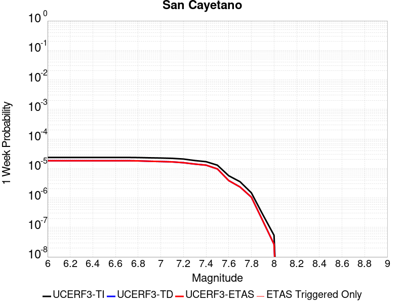 | 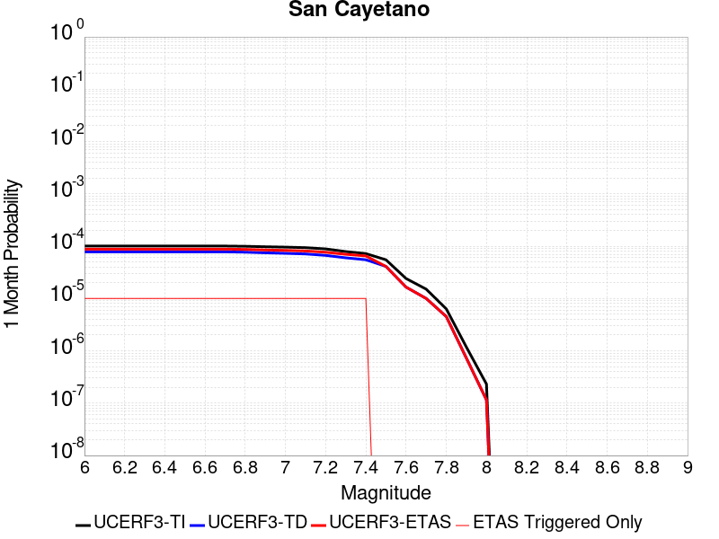 |  |  |

| Magnitude | 1 wk TI Prob | 1 wk TD Prob | 1 wk ETAS Prob | 1 wk ETAS/TD Gain | 1 wk ETAS Triggered Only | 1 mo TI Prob | 1 mo TD Prob | 1 mo ETAS Prob | 1 mo ETAS/TD Gain | 1 mo ETAS Triggered Only | 1 yr TI Prob | 1 yr TD Prob | 1 yr ETAS Prob | 1 yr ETAS/TD Gain | 1 yr ETAS Triggered Only | 10 yr TI Prob | 10 yr TD Prob | 10 yr ETAS Prob | 10 yr ETAS/TD Gain | 10 yr ETAS Triggered Only |
|-----|-----|-----|-----|-----|-----|-----|-----|-----|-----|-----|-----|-----|-----|-----|-----|-----|-----|-----|-----|-----|
| 6.0 | 2.3476267E-5 | 1.816928E-5 | 1.816928E-5 | 1.0 | 0.0 | 1.0060869E-4 | 7.786603E-5 | 8.786526E-5 | 1.1284157 | 1.0E-5 | 0.0012242225 | 9.476103E-4 | 9.775818E-4 | 1.0316286 | 3.0E-5 | 0.012175002 | 0.009436584 | 0.009486113 | 1.0052485 | 5.0E-5 |
| 6.1 | 2.3476267E-5 | 1.816928E-5 | 1.816928E-5 | 1.0 | 0.0 | 1.0060869E-4 | 7.786603E-5 | 8.786526E-5 | 1.1284157 | 1.0E-5 | 0.0012242225 | 9.476103E-4 | 9.775818E-4 | 1.0316286 | 3.0E-5 | 0.012175002 | 0.009436584 | 0.009486113 | 1.0052485 | 5.0E-5 |
| 6.2 | 2.3476267E-5 | 1.816928E-5 | 1.816928E-5 | 1.0 | 0.0 | 1.0060869E-4 | 7.786603E-5 | 8.786526E-5 | 1.1284157 | 1.0E-5 | 0.0012242225 | 9.476103E-4 | 9.775818E-4 | 1.0316286 | 3.0E-5 | 0.012175002 | 0.009436584 | 0.009486113 | 1.0052485 | 5.0E-5 |
| 6.3 | 2.3476267E-5 | 1.816928E-5 | 1.816928E-5 | 1.0 | 0.0 | 1.0060869E-4 | 7.786603E-5 | 8.786526E-5 | 1.1284157 | 1.0E-5 | 0.0012242225 | 9.476103E-4 | 9.775818E-4 | 1.0316286 | 3.0E-5 | 0.012175002 | 0.009436584 | 0.009486113 | 1.0052485 | 5.0E-5 |
| 6.4 | 2.3476267E-5 | 1.816928E-5 | 1.816928E-5 | 1.0 | 0.0 | 1.0060869E-4 | 7.786603E-5 | 8.786526E-5 | 1.1284157 | 1.0E-5 | 0.0012242225 | 9.476103E-4 | 9.775818E-4 | 1.0316286 | 3.0E-5 | 0.012175002 | 0.009436584 | 0.009486113 | 1.0052485 | 5.0E-5 |
| 6.5 | 2.3476267E-5 | 1.816928E-5 | 1.816928E-5 | 1.0 | 0.0 | 1.0060869E-4 | 7.786603E-5 | 8.786526E-5 | 1.1284157 | 1.0E-5 | 0.0012242225 | 9.476103E-4 | 9.775818E-4 | 1.0316286 | 3.0E-5 | 0.012175002 | 0.009436584 | 0.009486113 | 1.0052485 | 5.0E-5 |
| 6.6 | 2.3476267E-5 | 1.816928E-5 | 1.816928E-5 | 1.0 | 0.0 | 1.0060869E-4 | 7.786603E-5 | 8.786526E-5 | 1.1284157 | 1.0E-5 | 0.0012242225 | 9.476103E-4 | 9.775818E-4 | 1.0316286 | 3.0E-5 | 0.012175002 | 0.009436584 | 0.009486113 | 1.0052485 | 5.0E-5 |
| 6.7 | 2.3476267E-5 | 1.816928E-5 | 1.816928E-5 | 1.0 | 0.0 | 1.0060869E-4 | 7.786603E-5 | 8.786526E-5 | 1.1284157 | 1.0E-5 | 0.0012242225 | 9.476103E-4 | 9.775818E-4 | 1.0316286 | 3.0E-5 | 0.012175002 | 0.009436584 | 0.009486113 | 1.0052485 | 5.0E-5 |
| 6.8 | 2.3241924E-5 | 1.7936987E-5 | 1.7936987E-5 | 1.0 | 0.0 | 9.960445E-5 | 7.687056E-5 | 8.686979E-5 | 1.1300788 | 1.0E-5 | 0.0012120095 | 9.3550084E-4 | 9.654728E-4 | 1.0320383 | 3.0E-5 | 0.012054204 | 0.009316482 | 0.009366016 | 1.0053169 | 5.0E-5 |
| 6.9 | 2.2761007E-5 | 1.7432423E-5 | 1.7432423E-5 | 1.0 | 0.0 | 9.7543525E-5 | 7.470827E-5 | 8.470752E-5 | 1.133844 | 1.0E-5 | 0.0011869454 | 9.09197E-4 | 9.391697E-4 | 1.0329661 | 3.0E-5 | 0.011806256 | 0.009055603 | 0.009105151 | 1.0054715 | 5.0E-5 |
| 7.0 | 2.240283E-5 | 1.7066168E-5 | 1.7066168E-5 | 1.0 | 0.0 | 9.600859E-5 | 7.313869E-5 | 8.313796E-5 | 1.1367165 | 1.0E-5 | 0.0011682777 | 8.9010317E-4 | 9.200765E-4 | 1.033674 | 3.0E-5 | 0.011621549 | 0.008866196 | 0.008915752 | 1.0055894 | 5.0E-5 |
| 7.1 | 2.1871154E-5 | 1.6586018E-5 | 1.6586018E-5 | 1.0 | 0.0 | 9.373015E-5 | 7.108101E-5 | 8.10803E-5 | 1.1406746 | 1.0E-5 | 0.0011405671 | 8.6507114E-4 | 8.950452E-4 | 1.0346493 | 3.0E-5 | 0.011347309 | 0.008617838 | 0.008667408 | 1.005752 | 5.0E-5 |
| 7.2 | 2.0714133E-5 | 1.5564561E-5 | 1.5564561E-5 | 1.0 | 0.0 | 8.8771834E-5 | 6.670357E-5 | 7.6702905E-5 | 1.149907 | 1.0E-5 | 0.0010802611 | 8.1181666E-4 | 8.417923E-4 | 1.0369241 | 3.0E-5 | 0.010750249 | 0.008089285 | 0.008128962 | 1.0049049 | 4.0E-5 |
| 7.3 | 1.8408395E-5 | 1.3996864E-5 | 1.3996864E-5 | 1.0 | 0.0 | 7.8890735E-5 | 5.99852E-5 | 6.99846E-5 | 1.1666977 | 1.0E-5 | 9.600714E-4 | 7.300781E-4 | 7.500635E-4 | 1.0273744 | 2.0E-5 | 0.009559342 | 0.0072775153 | 0.007307297 | 1.0040923 | 3.0E-5 |
| 7.4 | 1.6856795E-5 | 1.28500815E-5 | 1.28500815E-5 | 1.0 | 0.0 | 7.2241404E-5 | 5.5070628E-5 | 6.507008E-5 | 1.181575 | 1.0E-5 | 8.7918417E-4 | 6.7028153E-4 | 6.902681E-4 | 1.0298182 | 2.0E-5 | 0.00875714 | 0.0066832784 | 0.006713078 | 1.0044588 | 3.0E-5 |
| 7.5 | 1.2822778E-5 | 9.577542E-6 | 9.577542E-6 | 1.0 | 0.0 | 5.495361E-5 | 4.1045972E-5 | 4.1045972E-5 | 1.0 | 0.0 | 6.688548E-4 | 4.996217E-4 | 4.996217E-4 | 1.0 | 0.0 | 0.006668452 | 0.0049851555 | 0.004995106 | 1.0019959 | 1.0E-5 |
| 7.6 | 5.6272684E-6 | 3.854903E-6 | 3.854903E-6 | 1.0 | 0.0 | 2.4116642E-5 | 1.652091E-5 | 1.652091E-5 | 1.0 | 0.0 | 2.9358055E-4 | 2.0112359E-4 | 2.0112359E-4 | 1.0 | 0.0 | 0.0029319301 | 0.0020094267 | 0.0020094267 | 1.0 | 0.0 |
| 7.7 | 3.5261346E-6 | 2.3407013E-6 | 2.3407013E-6 | 1.0 | 0.0 | 1.5111918E-5 | 1.0031539E-5 | 1.0031539E-5 | 1.0 | 0.0 | 1.8397206E-4 | 1.2212721E-4 | 1.2212721E-4 | 1.0 | 0.0 | 0.0018381984 | 0.0012206084 | 0.0012206084 | 1.0 | 0.0 |
| 7.8 | 1.4826929E-6 | 1.056428E-6 | 1.056428E-6 | 1.0 | 0.0 | 6.354383E-6 | 4.5275406E-6 | 4.5275406E-6 | 1.0 | 0.0 | 7.736187E-5 | 5.5121433E-5 | 5.5121433E-5 | 1.0 | 0.0 | 7.733494E-4 | 5.5107963E-4 | 5.5107963E-4 | 1.0 | 0.0 |
| 7.9 | 2.7568166E-7 | 1.6978244E-7 | 1.6978244E-7 | 1.0 | 0.0 | 1.1814923E-6 | 7.2763885E-7 | 7.2763885E-7 | 1.0 | 0.0 | 1.4384574E-5 | 8.858967E-6 | 8.858967E-6 | 1.0 | 0.0 | 1.4383643E-4 | 8.8586174E-5 | 8.8586174E-5 | 1.0 | 0.0 |
| 8.0 | 5.407832E-8 | 2.6887697E-8 | 2.6887697E-8 | 1.0 | 0.0 | 2.3176422E-7 | 1.15232986E-7 | 1.15232986E-7 | 1.0 | 0.0 | 2.8217257E-6 | 1.4029607E-6 | 1.4029607E-6 | 1.0 | 0.0 | 2.8216898E-5 | 1.4029522E-5 | 1.4029522E-5 | 1.0 | 0.0 |

## Whittier alt 1
*[(top)](#table-of-contents)*

| 1 Week | 1 Month | 1 Year | 10 Year |
|-----|-----|-----|-----|
|  |  |  |  |

| Magnitude | 1 wk TI Prob | 1 wk TD Prob | 1 wk ETAS Prob | 1 wk ETAS/TD Gain | 1 wk ETAS Triggered Only | 1 mo TI Prob | 1 mo TD Prob | 1 mo ETAS Prob | 1 mo ETAS/TD Gain | 1 mo ETAS Triggered Only | 1 yr TI Prob | 1 yr TD Prob | 1 yr ETAS Prob | 1 yr ETAS/TD Gain | 1 yr ETAS Triggered Only | 10 yr TI Prob | 10 yr TD Prob | 10 yr ETAS Prob | 10 yr ETAS/TD Gain | 10 yr ETAS Triggered Only |
|-----|-----|-----|-----|-----|-----|-----|-----|-----|-----|-----|-----|-----|-----|-----|-----|-----|-----|-----|-----|-----|
| 6.0 | 4.2554693E-5 | 4.725218E-5 | 4.725218E-5 | 1.0 | 0.0 | 1.8236451E-4 | 2.0249544E-4 | 2.1249341E-4 | 1.0493739 | 1.0E-5 | 0.002218027 | 0.0024629154 | 0.0024828662 | 1.0081005 | 2.0E-5 | 0.02196019 | 0.024390234 | 0.024439014 | 1.002 | 5.0E-5 |
| 6.1 | 4.2554693E-5 | 4.725218E-5 | 4.725218E-5 | 1.0 | 0.0 | 1.8236451E-4 | 2.0249544E-4 | 2.1249341E-4 | 1.0493739 | 1.0E-5 | 0.002218027 | 0.0024629154 | 0.0024828662 | 1.0081005 | 2.0E-5 | 0.02196019 | 0.024390234 | 0.024439014 | 1.002 | 5.0E-5 |
| 6.2 | 4.2554693E-5 | 4.725218E-5 | 4.725218E-5 | 1.0 | 0.0 | 1.8236451E-4 | 2.0249544E-4 | 2.1249341E-4 | 1.0493739 | 1.0E-5 | 0.002218027 | 0.0024629154 | 0.0024828662 | 1.0081005 | 2.0E-5 | 0.02196019 | 0.024390234 | 0.024439014 | 1.002 | 5.0E-5 |
| 6.3 | 1.9617712E-5 | 1.8268593E-5 | 1.8268593E-5 | 1.0 | 0.0 | 8.40732E-5 | 7.829172E-5 | 8.829094E-5 | 1.1277174 | 1.0E-5 | 0.0010231105 | 9.52804E-4 | 9.6279447E-4 | 1.0104853 | 1.0E-5 | 0.01018413 | 0.009490474 | 0.009510284 | 1.0020874 | 2.0E-5 |
| 6.4 | 1.5611336E-5 | 1.3604271E-5 | 1.3604271E-5 | 1.0 | 0.0 | 6.690401E-5 | 5.8302747E-5 | 5.8302747E-5 | 1.0 | 0.0 | 8.142519E-4 | 7.0961076E-4 | 7.0961076E-4 | 1.0 | 0.0 | 0.008112748 | 0.0070754145 | 0.007085344 | 1.0014033 | 1.0E-5 |
| 6.5 | 1.5150166E-5 | 1.3100925E-5 | 1.3100925E-5 | 1.0 | 0.0 | 6.492767E-5 | 5.6145647E-5 | 5.6145647E-5 | 1.0 | 0.0 | 7.9020765E-4 | 6.8336475E-4 | 6.8336475E-4 | 1.0 | 0.0 | 0.007874036 | 0.0068145846 | 0.0068245167 | 1.0014575 | 1.0E-5 |
| 6.6 | 1.295588E-5 | 1.0380725E-5 | 1.0380725E-5 | 1.0 | 0.0 | 5.552402E-5 | 4.4488075E-5 | 4.4488075E-5 | 1.0 | 0.0 | 6.7579525E-4 | 5.4150965E-4 | 5.4150965E-4 | 1.0 | 0.0 | 0.006737438 | 0.0054033357 | 0.0054132817 | 1.0018407 | 1.0E-5 |
| 6.7 | 1.2542085E-5 | 9.899369E-6 | 9.899369E-6 | 1.0 | 0.0 | 5.3750682E-5 | 4.242519E-5 | 4.242519E-5 | 1.0 | 0.0 | 6.542181E-4 | 5.164061E-4 | 5.164061E-4 | 1.0 | 0.0 | 0.006522954 | 0.0051534795 | 0.005163428 | 1.0019305 | 1.0E-5 |
| 6.8 | 1.2195878E-5 | 9.495415E-6 | 9.495415E-6 | 1.0 | 0.0 | 5.2267E-5 | 4.069401E-5 | 4.069401E-5 | 1.0 | 0.0 | 6.36165E-4 | 4.9533875E-4 | 4.9533875E-4 | 1.0 | 0.0 | 0.0063434686 | 0.004943688 | 0.0049536387 | 1.0020127 | 1.0E-5 |
| 6.9 | 1.1580298E-5 | 8.772933E-6 | 8.772933E-6 | 1.0 | 0.0 | 4.9628903E-5 | 3.7597754E-5 | 3.7597754E-5 | 1.0 | 0.0 | 6.040644E-4 | 4.5765814E-4 | 4.5765814E-4 | 1.0 | 0.0 | 0.00602425 | 0.0045684157 | 0.00457837 | 1.0021789 | 1.0E-5 |
| 7.0 | 1.0964795E-5 | 8.083994E-6 | 8.083994E-6 | 1.0 | 0.0 | 4.6991136E-5 | 3.4645236E-5 | 3.4645236E-5 | 1.0 | 0.0 | 5.7196687E-4 | 4.2172565E-4 | 4.2172565E-4 | 1.0 | 0.0 | 0.0057049696 | 0.004210462 | 0.0042204196 | 1.002365 | 1.0E-5 |
| 7.1 | 1.0230601E-5 | 7.3266697E-6 | 7.3266697E-6 | 1.0 | 0.0 | 4.3844695E-5 | 3.1399642E-5 | 3.1399642E-5 | 1.0 | 0.0 | 5.336784E-4 | 3.8222488E-4 | 3.8222488E-4 | 1.0 | 0.0 | 0.005323986 | 0.0038168381 | 0.0038168381 | 1.0 | 0.0 |
| 7.2 | 9.40865E-6 | 6.543289E-6 | 6.543289E-6 | 1.0 | 0.0 | 4.032216E-5 | 2.8042374E-5 | 2.8042374E-5 | 1.0 | 0.0 | 4.908117E-4 | 3.4136363E-4 | 3.4136363E-4 | 1.0 | 0.0 | 0.0048972913 | 0.003409485 | 0.003409485 | 1.0 | 0.0 |
| 7.3 | 8.237384E-6 | 5.5977525E-6 | 5.5977525E-6 | 1.0 | 0.0 | 3.5302593E-5 | 2.3990153E-5 | 2.3990153E-5 | 1.0 | 0.0 | 4.2972428E-4 | 2.92042E-4 | 2.92042E-4 | 1.0 | 0.0 | 0.0042889426 | 0.002916903 | 0.002916903 | 1.0 | 0.0 |
| 7.4 | 7.5316966E-6 | 5.027819E-6 | 5.027819E-6 | 1.0 | 0.0 | 3.2278298E-5 | 2.1547625E-5 | 2.1547625E-5 | 1.0 | 0.0 | 3.9291743E-4 | 2.6231175E-4 | 2.6231175E-4 | 1.0 | 0.0 | 0.0039222343 | 0.0026201333 | 0.0026201333 | 1.0 | 0.0 |
| 7.5 | 6.149649E-6 | 3.933841E-6 | 3.933841E-6 | 1.0 | 0.0 | 2.6355372E-5 | 1.6859214E-5 | 1.6859214E-5 | 1.0 | 0.0 | 3.208294E-4 | 2.052425E-4 | 2.052425E-4 | 1.0 | 0.0 | 0.003203666 | 0.0020506186 | 0.0020506186 | 1.0 | 0.0 |
| 7.6 | 5.457711E-6 | 3.3953788E-6 | 3.3953788E-6 | 1.0 | 0.0 | 2.338998E-5 | 1.4551547E-5 | 1.4551547E-5 | 1.0 | 0.0 | 2.8473578E-4 | 1.771515E-4 | 1.771515E-4 | 1.0 | 0.0 | 0.0028437122 | 0.0017701836 | 0.0017701836 | 1.0 | 0.0 |
| 7.7 | 4.1676276E-6 | 2.3331952E-6 | 2.3331952E-6 | 1.0 | 0.0 | 1.7861139E-5 | 9.999374E-6 | 9.999374E-6 | 1.0 | 0.0 | 2.1743766E-4 | 1.2173632E-4 | 1.2173632E-4 | 1.0 | 0.0 | 0.0021722503 | 0.0012167693 | 0.0012167693 | 1.0 | 0.0 |
| 7.8 | 2.2692414E-7 | 9.3854695E-8 | 9.3854695E-8 | 1.0 | 0.0 | 9.725317E-7 | 4.0223435E-7 | 4.0223435E-7 | 1.0 | 0.0 | 1.1840509E-5 | 4.8971956E-6 | 4.8971956E-6 | 1.0 | 0.0 | 1.1839878E-4 | 4.8971204E-5 | 4.8971204E-5 | 1.0 | 0.0 |
| 7.9 | 6.676829E-9 | 3.439853E-9 | 3.439853E-9 | 1.0 | 0.0 | 2.861498E-8 | 1.4742227E-8 | 1.4742227E-8 | 1.0 | 0.0 | 3.4838732E-7 | 1.7948659E-7 | 1.7948659E-7 | 1.0 | 0.0 | 3.4838679E-6 | 1.7948646E-6 | 1.7948646E-6 | 1.0 | 0.0 |

## Sheephole
*[(top)](#table-of-contents)*

| 1 Week | 1 Month | 1 Year | 10 Year |
|-----|-----|-----|-----|
|  |  |  |  |

| Magnitude | 1 wk TI Prob | 1 wk TD Prob | 1 wk ETAS Prob | 1 wk ETAS/TD Gain | 1 wk ETAS Triggered Only | 1 mo TI Prob | 1 mo TD Prob | 1 mo ETAS Prob | 1 mo ETAS/TD Gain | 1 mo ETAS Triggered Only | 1 yr TI Prob | 1 yr TD Prob | 1 yr ETAS Prob | 1 yr ETAS/TD Gain | 1 yr ETAS Triggered Only | 10 yr TI Prob | 10 yr TD Prob | 10 yr ETAS Prob | 10 yr ETAS/TD Gain | 10 yr ETAS Triggered Only |
|-----|-----|-----|-----|-----|-----|-----|-----|-----|-----|-----|-----|-----|-----|-----|-----|-----|-----|-----|-----|-----|
| 6.0 | 4.5579695E-6 | 4.7412627E-6 | 3.474112E-5 | 7.3273983 | 3.0E-5 | 1.9534009E-5 | 2.031957E-5 | 6.031876E-5 | 2.9685056 | 4.0E-5 | 2.3780059E-4 | 2.473682E-4 | 2.8735833E-4 | 1.1616622 | 4.0E-5 | 0.0023754628 | 0.002471473 | 0.0025213496 | 1.0201808 | 5.0E-5 |
| 6.1 | 4.5579695E-6 | 4.7412627E-6 | 3.474112E-5 | 7.3273983 | 3.0E-5 | 1.9534009E-5 | 2.031957E-5 | 6.031876E-5 | 2.9685056 | 4.0E-5 | 2.3780059E-4 | 2.473682E-4 | 2.8735833E-4 | 1.1616622 | 4.0E-5 | 0.0023754628 | 0.002471473 | 0.0025213496 | 1.0201808 | 5.0E-5 |
| 6.2 | 2.6677674E-6 | 2.7873941E-6 | 3.278731E-5 | 11.762711 | 3.0E-5 | 1.1433239E-5 | 1.1945926E-5 | 5.1945448E-5 | 4.3483815 | 4.0E-5 | 1.3919079E-4 | 1.4543302E-4 | 1.8542721E-4 | 1.2750007 | 4.0E-5 | 0.0013910364 | 0.0014534844 | 0.0014934263 | 1.0274801 | 4.0E-5 |
| 6.3 | 2.6677674E-6 | 2.7873941E-6 | 3.278731E-5 | 11.762711 | 3.0E-5 | 1.1433239E-5 | 1.1945926E-5 | 5.1945448E-5 | 4.3483815 | 4.0E-5 | 1.3919079E-4 | 1.4543302E-4 | 1.8542721E-4 | 1.2750007 | 4.0E-5 | 0.0013910364 | 0.0014534844 | 0.0014934263 | 1.0274801 | 4.0E-5 |
| 6.4 | 2.2159759E-6 | 2.3228788E-6 | 3.232281E-5 | 13.914979 | 3.0E-5 | 9.497005E-6 | 9.955161E-6 | 4.9954764E-5 | 5.0179763 | 4.0E-5 | 1.156199E-4 | 1.2119815E-4 | 1.6119331E-4 | 1.329998 | 4.0E-5 | 0.0011555976 | 0.0012113999 | 0.0012513514 | 1.0329796 | 4.0E-5 |
| 6.5 | 2.1986082E-6 | 2.304759E-6 | 3.230469E-5 | 14.016515 | 3.0E-5 | 9.4225725E-6 | 9.877506E-6 | 4.987711E-5 | 5.0495653 | 4.0E-5 | 1.1471378E-4 | 1.2025281E-4 | 1.6024799E-4 | 1.3325926 | 4.0E-5 | 0.0011465458 | 0.0012019566 | 0.0012419085 | 1.0332391 | 4.0E-5 |
| 6.6 | 1.5232331E-6 | 1.6018919E-6 | 3.1601845E-5 | 19.727827 | 3.0E-5 | 6.5281256E-6 | 6.865234E-6 | 4.686496E-5 | 6.8264184 | 4.0E-5 | 7.947703E-5 | 8.35812E-5 | 1.2357786E-4 | 1.4785365 | 4.0E-5 | 7.9448614E-4 | 8.3551643E-4 | 8.75483E-4 | 1.0478346 | 4.0E-5 |
| 6.7 | 1.3137362E-6 | 1.382819E-6 | 2.1382792E-5 | 15.463188 | 2.0E-5 | 5.6302856E-6 | 5.926355E-6 | 2.5926236E-5 | 4.374736 | 2.0E-5 | 6.854657E-5 | 7.215112E-5 | 9.2149676E-5 | 1.277176 | 2.0E-5 | 6.8525434E-4 | 7.212908E-4 | 7.412764E-4 | 1.027708 | 2.0E-5 |
| 6.8 | 1.2275751E-6 | 1.2922847E-6 | 2.1292259E-5 | 16.476446 | 2.0E-5 | 5.2610258E-6 | 5.5383516E-6 | 2.553824E-5 | 4.6111627 | 2.0E-5 | 6.4051106E-5 | 6.7427485E-5 | 8.742613E-5 | 1.296595 | 2.0E-5 | 6.4032647E-4 | 6.740836E-4 | 6.940701E-4 | 1.0296499 | 2.0E-5 |
| 6.9 | 1.1837088E-6 | 1.246102E-6 | 2.1246076E-5 | 17.05003 | 2.0E-5 | 5.0730278E-6 | 5.340427E-6 | 2.534032E-5 | 4.744999 | 2.0E-5 | 6.176237E-5 | 6.501789E-5 | 8.501659E-5 | 1.3075876 | 2.0E-5 | 6.17452E-4 | 6.5000186E-4 | 6.6998886E-4 | 1.0307492 | 2.0E-5 |
| 7.0 | 9.849371E-7 | 1.0366288E-6 | 2.1036609E-5 | 20.29329 | 2.0E-5 | 4.2211523E-6 | 4.442688E-6 | 2.44426E-5 | 5.501759 | 2.0E-5 | 5.1391315E-5 | 5.4088487E-5 | 7.40874E-5 | 1.3697444 | 2.0E-5 | 5.137943E-4 | 5.407633E-4 | 5.6075247E-4 | 1.0369648 | 2.0E-5 |
| 7.1 | 8.1643645E-7 | 8.591669E-7 | 2.085915E-5 | 24.278345 | 2.0E-5 | 3.4990085E-6 | 3.682139E-6 | 2.3682065E-5 | 6.4316053 | 2.0E-5 | 4.2599597E-5 | 4.482921E-5 | 6.482832E-5 | 1.4461176 | 2.0E-5 | 4.259143E-4 | 4.4821028E-4 | 4.6820132E-4 | 1.0446019 | 2.0E-5 |
| 7.2 | 5.7295756E-7 | 6.029502E-7 | 1.0602944E-5 | 17.585108 | 1.0E-5 | 2.45553E-6 | 2.58407E-6 | 1.2584044E-5 | 4.869854 | 1.0E-5 | 2.9895667E-5 | 3.1460666E-5 | 4.1460353E-5 | 1.3178473 | 1.0E-5 | 2.9891645E-4 | 3.145688E-4 | 3.2456568E-4 | 1.0317795 | 1.0E-5 |

## Rinconada 2011 CFM
*[(top)](#table-of-contents)*

| 1 Week | 1 Month | 1 Year | 10 Year |
|-----|-----|-----|-----|
|  |  |  |  |

| Magnitude | 1 wk TI Prob | 1 wk TD Prob | 1 wk ETAS Prob | 1 wk ETAS/TD Gain | 1 wk ETAS Triggered Only | 1 mo TI Prob | 1 mo TD Prob | 1 mo ETAS Prob | 1 mo ETAS/TD Gain | 1 mo ETAS Triggered Only | 1 yr TI Prob | 1 yr TD Prob | 1 yr ETAS Prob | 1 yr ETAS/TD Gain | 1 yr ETAS Triggered Only | 10 yr TI Prob | 10 yr TD Prob | 10 yr ETAS Prob | 10 yr ETAS/TD Gain | 10 yr ETAS Triggered Only |
|-----|-----|-----|-----|-----|-----|-----|-----|-----|-----|-----|-----|-----|-----|-----|-----|-----|-----|-----|-----|-----|
| 6.0 | 1.5752368E-5 | 1.6274716E-5 | 2.6274553E-5 | 1.6144401 | 1.0E-5 | 6.75084E-5 | 6.974694E-5 | 9.9744844E-5 | 1.4300964 | 3.0E-5 | 8.2160486E-4 | 8.488412E-4 | 8.888073E-4 | 1.047083 | 4.0E-5 | 0.008185739 | 0.00845637 | 0.008496032 | 1.0046902 | 4.0E-5 |
| 6.1 | 1.0966133E-5 | 1.1323029E-5 | 2.1322916E-5 | 1.8831459 | 1.0E-5 | 4.6996865E-5 | 4.852637E-5 | 6.85254E-5 | 1.412127 | 2.0E-5 | 5.720366E-4 | 5.906491E-4 | 6.106373E-4 | 1.033841 | 2.0E-5 | 0.0057056635 | 0.0058908886 | 0.005910771 | 1.003375 | 2.0E-5 |
| 6.2 | 1.0966133E-5 | 1.1323029E-5 | 2.1322916E-5 | 1.8831459 | 1.0E-5 | 4.6996865E-5 | 4.852637E-5 | 6.85254E-5 | 1.412127 | 2.0E-5 | 5.720366E-4 | 5.906491E-4 | 6.106373E-4 | 1.033841 | 2.0E-5 | 0.0057056635 | 0.0058908886 | 0.005910771 | 1.003375 | 2.0E-5 |
| 6.3 | 8.926149E-6 | 9.212771E-6 | 1.9212679E-5 | 2.0854397 | 1.0E-5 | 3.8254362E-5 | 3.948271E-5 | 5.948192E-5 | 1.5065309 | 2.0E-5 | 4.6564735E-4 | 4.805963E-4 | 5.005867E-4 | 1.041595 | 2.0E-5 | 0.0046467283 | 0.0047956146 | 0.0048155184 | 1.0041505 | 2.0E-5 |
| 6.4 | 7.676955E-6 | 7.920191E-6 | 1.7920112E-5 | 2.2625859 | 1.0E-5 | 3.290082E-5 | 3.3943234E-5 | 4.3942895E-5 | 1.2945995 | 1.0E-5 | 4.0049385E-4 | 4.1318068E-4 | 4.2317656E-4 | 1.0241925 | 1.0E-5 | 0.0039977287 | 0.004124151 | 0.0041341097 | 1.0024147 | 1.0E-5 |
| 6.5 | 6.1671026E-6 | 6.3589546E-6 | 1.6358892E-5 | 2.5725756 | 1.0E-5 | 2.6430173E-5 | 2.725238E-5 | 3.7252106E-5 | 1.3669305 | 1.0E-5 | 3.2173982E-4 | 3.317473E-4 | 3.4174396E-4 | 1.0301335 | 1.0E-5 | 0.003212744 | 0.0033125326 | 0.0033224993 | 1.0030088 | 1.0E-5 |
| 6.6 | 5.553456E-6 | 5.7248126E-6 | 1.5724756E-5 | 2.746772 | 1.0E-5 | 2.3800309E-5 | 2.453468E-5 | 3.4534434E-5 | 1.4075763 | 1.0E-5 | 2.897302E-4 | 2.9866883E-4 | 3.0866585E-4 | 1.033472 | 1.0E-5 | 0.0028935277 | 0.002982683 | 0.0029926533 | 1.0033426 | 1.0E-5 |
| 6.7 | 4.787857E-6 | 4.9333094E-6 | 1.493326E-5 | 3.027027 | 1.0E-5 | 2.0519226E-5 | 2.1142583E-5 | 3.1142372E-5 | 1.472969 | 1.0E-5 | 2.4979294E-4 | 2.573806E-4 | 2.6737803E-4 | 1.0388429 | 1.0E-5 | 0.0024951235 | 0.0025708308 | 0.002580805 | 1.0038798 | 1.0E-5 |
| 6.8 | 3.9955166E-6 | 4.1134763E-6 | 1.4113435E-5 | 3.4310238 | 1.0E-5 | 1.7123532E-5 | 1.7629065E-5 | 2.7628888E-5 | 1.5672351 | 1.0E-5 | 2.0845905E-4 | 2.1461274E-4 | 2.246106E-4 | 1.0465856 | 1.0E-5 | 0.002082636 | 0.0021440585 | 0.0021540371 | 1.004654 | 1.0E-5 |
| 6.9 | 3.4250072E-6 | 3.5224464E-6 | 1.3522411E-5 | 3.838926 | 1.0E-5 | 1.46785205E-5 | 1.5096111E-5 | 2.509596E-5 | 1.6624123 | 1.0E-5 | 1.7869633E-4 | 1.8377967E-4 | 1.9377783E-4 | 1.054403 | 1.0E-5 | 0.001785527 | 0.0018362794 | 0.001846261 | 1.0054358 | 1.0E-5 |
| 7.0 | 2.7712713E-6 | 2.8467E-6 | 1.2846672E-5 | 4.5128293 | 1.0E-5 | 1.1876823E-5 | 1.2200086E-5 | 2.2199963E-5 | 1.8196564 | 1.0E-5 | 1.4459073E-4 | 1.4852593E-4 | 1.5852445E-4 | 1.0673183 | 1.0E-5 | 0.0014449668 | 0.0014842682 | 0.0014942534 | 1.0067273 | 1.0E-5 |
| 7.1 | 2.227358E-6 | 2.2856984E-6 | 2.2856984E-6 | 1.0 | 0.0 | 9.545785E-6 | 9.795814E-6 | 9.795814E-6 | 1.0 | 0.0 | 1.16213734E-4 | 1.19257515E-4 | 1.19257515E-4 | 1.0 | 0.0 | 0.0011615298 | 0.0011919362 | 0.0011919362 | 1.0 | 0.0 |
| 7.2 | 1.581796E-6 | 1.6209011E-6 | 1.6209011E-6 | 1.0 | 0.0 | 6.779108E-6 | 6.9467005E-6 | 6.9467005E-6 | 1.0 | 0.0 | 8.253252E-5 | 8.457281E-5 | 8.457281E-5 | 1.0 | 0.0 | 8.250187E-4 | 8.454067E-4 | 8.454067E-4 | 1.0 | 0.0 |
| 7.3 | 1.0306567E-6 | 1.0546477E-6 | 1.0546477E-6 | 1.0 | 0.0 | 4.4170924E-6 | 4.519911E-6 | 4.519911E-6 | 1.0 | 0.0 | 5.3776774E-5 | 5.5028526E-5 | 5.5028526E-5 | 1.0 | 0.0 | 5.376376E-4 | 5.5014924E-4 | 5.5014924E-4 | 1.0 | 0.0 |
| 7.4 | 6.535541E-7 | 6.682742E-7 | 6.682742E-7 | 1.0 | 0.0 | 2.800943E-6 | 2.864029E-6 | 2.864029E-6 | 1.0 | 0.0 | 3.4100947E-5 | 3.4868997E-5 | 3.4868997E-5 | 1.0 | 0.0 | 3.4095717E-4 | 3.4863537E-4 | 3.4863537E-4 | 1.0 | 0.0 |
| 7.5 | 3.2656962E-7 | 3.3316687E-7 | 3.3316687E-7 | 1.0 | 0.0 | 1.3995833E-6 | 1.4278572E-6 | 1.4278572E-6 | 1.0 | 0.0 | 1.7039794E-5 | 1.7384024E-5 | 1.7384024E-5 | 1.0 | 0.0 | 1.7038487E-4 | 1.7382667E-4 | 1.7382667E-4 | 1.0 | 0.0 |
| 7.6 | 9.754343E-8 | 9.82099E-8 | 9.82099E-8 | 1.0 | 0.0 | 4.180432E-7 | 4.208995E-7 | 4.208995E-7 | 1.0 | 0.0 | 5.089664E-6 | 5.1244397E-6 | 5.1244397E-6 | 1.0 | 0.0 | 5.0895473E-5 | 5.1243223E-5 | 5.1243223E-5 | 1.0 | 0.0 |
| 7.7 | 6.0001453E-9 | 5.8490435E-9 | 5.8490435E-9 | 1.0 | 0.0 | 2.5714908E-8 | 2.506733E-8 | 2.506733E-8 | 1.0 | 0.0 | 3.1307894E-7 | 3.051947E-7 | 3.051947E-7 | 1.0 | 0.0 | 3.1307852E-6 | 3.051943E-6 | 3.051943E-6 | 1.0 | 0.0 |
| 7.8 | 7.400003E-11 | 7.4654505E-11 | 7.4654505E-11 | 1.0 | 0.0 | 3.171432E-10 | 3.1994773E-10 | 3.1994773E-10 | 1.0 | 0.0 | 3.861218E-9 | 3.895363E-9 | 3.895363E-9 | 1.0 | 0.0 | 3.861218E-8 | 3.895363E-8 | 3.895363E-8 | 1.0 | 0.0 |

## White Wolf
*[(top)](#table-of-contents)*

| 1 Week | 1 Month | 1 Year | 10 Year |
|-----|-----|-----|-----|
|  |  |  | 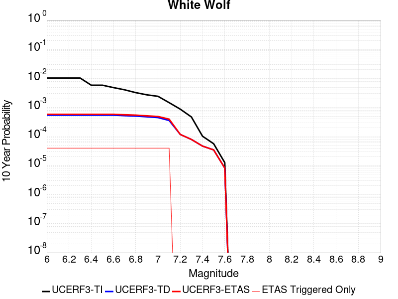 |

| Magnitude | 1 wk TI Prob | 1 wk TD Prob | 1 wk ETAS Prob | 1 wk ETAS/TD Gain | 1 wk ETAS Triggered Only | 1 mo TI Prob | 1 mo TD Prob | 1 mo ETAS Prob | 1 mo ETAS/TD Gain | 1 mo ETAS Triggered Only | 1 yr TI Prob | 1 yr TD Prob | 1 yr ETAS Prob | 1 yr ETAS/TD Gain | 1 yr ETAS Triggered Only | 10 yr TI Prob | 10 yr TD Prob | 10 yr ETAS Prob | 10 yr ETAS/TD Gain | 10 yr ETAS Triggered Only |
|-----|-----|-----|-----|-----|-----|-----|-----|-----|-----|-----|-----|-----|-----|-----|-----|-----|-----|-----|-----|-----|
| 6.0 | 2.0037822E-5 | 1.0469162E-6 | 2.1046895E-5 | 20.103706 | 2.0E-5 | 8.587355E-5 | 4.486776E-6 | 2.4486686E-5 | 5.4575233 | 2.0E-5 | 0.001045009 | 5.4625183E-5 | 8.462354E-5 | 1.5491673 | 3.0E-5 | 0.010401085 | 5.461226E-4 | 5.8610074E-4 | 1.0732037 | 4.0E-5 |
| 6.1 | 2.0037822E-5 | 1.0469162E-6 | 2.1046895E-5 | 20.103706 | 2.0E-5 | 8.587355E-5 | 4.486776E-6 | 2.4486686E-5 | 5.4575233 | 2.0E-5 | 0.001045009 | 5.4625183E-5 | 8.462354E-5 | 1.5491673 | 3.0E-5 | 0.010401085 | 5.461226E-4 | 5.8610074E-4 | 1.0732037 | 4.0E-5 |
| 6.2 | 2.0037822E-5 | 1.0469162E-6 | 2.1046895E-5 | 20.103706 | 2.0E-5 | 8.587355E-5 | 4.486776E-6 | 2.4486686E-5 | 5.4575233 | 2.0E-5 | 0.001045009 | 5.4625183E-5 | 8.462354E-5 | 1.5491673 | 3.0E-5 | 0.010401085 | 5.461226E-4 | 5.8610074E-4 | 1.0732037 | 4.0E-5 |
| 6.3 | 2.0037822E-5 | 1.0469162E-6 | 2.1046895E-5 | 20.103706 | 2.0E-5 | 8.587355E-5 | 4.486776E-6 | 2.4486686E-5 | 5.4575233 | 2.0E-5 | 0.001045009 | 5.4625183E-5 | 8.462354E-5 | 1.5491673 | 3.0E-5 | 0.010401085 | 5.461226E-4 | 5.8610074E-4 | 1.0732037 | 4.0E-5 |
| 6.4 | 1.132487E-5 | 1.0469162E-6 | 2.1046895E-5 | 20.103706 | 2.0E-5 | 4.8534253E-5 | 4.486776E-6 | 2.4486686E-5 | 5.4575233 | 2.0E-5 | 5.907443E-4 | 5.4625183E-5 | 8.462354E-5 | 1.5491673 | 3.0E-5 | 0.005891764 | 5.461226E-4 | 5.8610074E-4 | 1.0732037 | 4.0E-5 |
| 6.5 | 1.132487E-5 | 1.0469162E-6 | 2.1046895E-5 | 20.103706 | 2.0E-5 | 4.8534253E-5 | 4.486776E-6 | 2.4486686E-5 | 5.4575233 | 2.0E-5 | 5.907443E-4 | 5.4625183E-5 | 8.462354E-5 | 1.5491673 | 3.0E-5 | 0.005891764 | 5.461226E-4 | 5.8610074E-4 | 1.0732037 | 4.0E-5 |
| 6.6 | 9.347473E-6 | 1.0469162E-6 | 2.1046895E-5 | 20.103706 | 2.0E-5 | 4.0059982E-5 | 4.486776E-6 | 2.4486686E-5 | 5.4575233 | 2.0E-5 | 4.8762115E-4 | 5.4625183E-5 | 8.462354E-5 | 1.5491673 | 3.0E-5 | 0.0048655253 | 5.461226E-4 | 5.8610074E-4 | 1.0732037 | 4.0E-5 |
| 6.7 | 7.842647E-6 | 1.0048342E-6 | 2.1004815E-5 | 20.90376 | 2.0E-5 | 3.361091E-5 | 4.3064256E-6 | 2.4306339E-5 | 5.644203 | 2.0E-5 | 4.0913603E-4 | 5.2429517E-5 | 8.242795E-5 | 1.5721668 | 3.0E-5 | 0.004083836 | 5.2417646E-4 | 5.6415546E-4 | 1.0762702 | 4.0E-5 |
| 6.8 | 6.26597E-6 | 9.734822E-7 | 2.0973463E-5 | 21.544783 | 2.0E-5 | 2.685388E-5 | 4.17206E-6 | 2.4171977E-5 | 5.7937746 | 2.0E-5 | 3.2689696E-4 | 5.0793697E-5 | 8.0792175E-5 | 1.5905944 | 3.0E-5 | 0.003264165 | 5.078258E-4 | 5.4780545E-4 | 1.0787271 | 4.0E-5 |
| 6.9 | 5.258436E-6 | 9.183254E-7 | 2.0918307E-5 | 22.778753 | 2.0E-5 | 2.2535958E-5 | 3.9356746E-6 | 2.3935596E-5 | 6.0817013 | 2.0E-5 | 2.7434074E-4 | 4.7915833E-5 | 7.7914396E-5 | 1.6260679 | 3.0E-5 | 0.0027400232 | 4.790598E-4 | 5.190406E-4 | 1.0834569 | 4.0E-5 |
| 7.0 | 4.675028E-6 | 8.6611794E-7 | 2.08661E-5 | 24.091522 | 2.0E-5 | 2.003568E-5 | 3.7119291E-6 | 2.3711855E-5 | 6.388014 | 2.0E-5 | 2.4390711E-4 | 4.5191846E-5 | 7.519049E-5 | 1.6638066 | 3.0E-5 | 0.0024363957 | 4.518313E-4 | 4.9181323E-4 | 1.0884886 | 4.0E-5 |
| 7.1 | 2.8270078E-6 | 6.8741696E-7 | 2.0687403E-5 | 30.094402 | 2.0E-5 | 1.2115692E-5 | 2.9460696E-6 | 2.2946011E-5 | 7.788686 | 2.0E-5 | 1.4749856E-4 | 3.5867848E-5 | 6.586677E-5 | 1.8363737 | 3.0E-5 | 0.001474007 | 3.586247E-4 | 3.9861034E-4 | 1.1114972 | 4.0E-5 |
| 7.2 | 1.6881406E-6 | 2.2706382E-7 | 2.2706382E-7 | 1.0 | 0.0 | 7.2348685E-6 | 9.731303E-7 | 9.731303E-7 | 1.0 | 0.0 | 8.808096E-5 | 1.1847799E-5 | 1.1847799E-5 | 1.0 | 0.0 | 8.8046055E-4 | 1.1847183E-4 | 1.1847183E-4 | 1.0 | 0.0 |
| 7.3 | 9.086107E-7 | 1.5266386E-7 | 1.5266386E-7 | 1.0 | 0.0 | 3.8940398E-6 | 6.5427355E-7 | 6.5427355E-7 | 1.0 | 0.0 | 4.7408903E-5 | 7.965752E-6 | 7.965752E-6 | 1.0 | 0.0 | 4.739879E-4 | 7.965475E-5 | 7.965475E-5 | 1.0 | 0.0 |
| 7.4 | 1.9717383E-7 | 9.003913E-8 | 9.003913E-8 | 1.0 | 0.0 | 8.450304E-7 | 3.8588192E-7 | 3.8588192E-7 | 1.0 | 0.0 | 1.0288197E-5 | 4.6981027E-6 | 4.6981027E-6 | 1.0 | 0.0 | 1.028772E-4 | 4.6980065E-5 | 4.6980065E-5 | 1.0 | 0.0 |
| 7.5 | 1.086975E-7 | 6.6597195E-8 | 6.6597195E-8 | 1.0 | 0.0 | 4.6584634E-7 | 2.8541652E-7 | 2.8541652E-7 | 1.0 | 0.0 | 5.6716644E-6 | 3.474941E-6 | 3.474941E-6 | 1.0 | 0.0 | 5.6715195E-5 | 3.474889E-5 | 3.474889E-5 | 1.0 | 0.0 |
| 7.6 | 2.4217808E-8 | 1.5820765E-8 | 1.5820765E-8 | 1.0 | 0.0 | 1.03790605E-7 | 6.780328E-8 | 6.780328E-8 | 1.0 | 0.0 | 1.2636499E-6 | 8.255046E-7 | 8.255046E-7 | 1.0 | 0.0 | 1.2636427E-5 | 8.2550205E-6 | 8.2550205E-6 | 1.0 | 0.0 |

## San Andreas (Santa Cruz Mts) 2011 CFM
*[(top)](#table-of-contents)*

| 1 Week | 1 Month | 1 Year | 10 Year |
|-----|-----|-----|-----|
|  |  |  |  |

| Magnitude | 1 wk TI Prob | 1 wk TD Prob | 1 wk ETAS Prob | 1 wk ETAS/TD Gain | 1 wk ETAS Triggered Only | 1 mo TI Prob | 1 mo TD Prob | 1 mo ETAS Prob | 1 mo ETAS/TD Gain | 1 mo ETAS Triggered Only | 1 yr TI Prob | 1 yr TD Prob | 1 yr ETAS Prob | 1 yr ETAS/TD Gain | 1 yr ETAS Triggered Only | 10 yr TI Prob | 10 yr TD Prob | 10 yr ETAS Prob | 10 yr ETAS/TD Gain | 10 yr ETAS Triggered Only |
|-----|-----|-----|-----|-----|-----|-----|-----|-----|-----|-----|-----|-----|-----|-----|-----|-----|-----|-----|-----|-----|
| 6.0 | 1.7221631E-4 | 1.3793171E-4 | 1.4793033E-4 | 1.0724896 | 1.0E-5 | 7.378611E-4 | 5.9100403E-4 | 6.109922E-4 | 1.0338207 | 2.0E-5 | 0.008946515 | 0.007172124 | 0.0072019086 | 1.0041529 | 3.0E-5 | 0.08594794 | 0.0705551 | 0.07059228 | 1.0005269 | 4.0E-5 |
| 6.1 | 1.7221631E-4 | 1.3793171E-4 | 1.4793033E-4 | 1.0724896 | 1.0E-5 | 7.378611E-4 | 5.9100403E-4 | 6.109922E-4 | 1.0338207 | 2.0E-5 | 0.008946515 | 0.007172124 | 0.0072019086 | 1.0041529 | 3.0E-5 | 0.08594794 | 0.0705551 | 0.07059228 | 1.0005269 | 4.0E-5 |
| 6.2 | 1.7221631E-4 | 1.3793171E-4 | 1.4793033E-4 | 1.0724896 | 1.0E-5 | 7.378611E-4 | 5.9100403E-4 | 6.109922E-4 | 1.0338207 | 2.0E-5 | 0.008946515 | 0.007172124 | 0.0072019086 | 1.0041529 | 3.0E-5 | 0.08594794 | 0.0705551 | 0.07059228 | 1.0005269 | 4.0E-5 |
| 6.3 | 1.716926E-4 | 1.3712609E-4 | 1.4712471E-4 | 1.0729156 | 1.0E-5 | 7.3561794E-4 | 5.875529E-4 | 6.075411E-4 | 1.0340195 | 2.0E-5 | 0.008919428 | 0.0071303817 | 0.0071601677 | 1.0041773 | 3.0E-5 | 0.08569809 | 0.070167266 | 0.07020446 | 1.0005301 | 4.0E-5 |
| 6.4 | 1.6392978E-4 | 1.3588481E-4 | 1.4588344E-4 | 1.0735817 | 1.0E-5 | 7.02367E-4 | 5.822355E-4 | 6.0222385E-4 | 1.0343304 | 2.0E-5 | 0.008517839 | 0.007066063 | 0.007095851 | 1.0042156 | 3.0E-5 | 0.08198654 | 0.06940135 | 0.06943858 | 1.0005363 | 4.0E-5 |
| 6.5 | 1.5742714E-4 | 1.2648388E-4 | 1.364826E-4 | 1.0790515 | 1.0E-5 | 6.745133E-4 | 5.4196286E-4 | 5.61952E-4 | 1.0368829 | 2.0E-5 | 0.00818132 | 0.0065787593 | 0.0066085616 | 1.0045301 | 3.0E-5 | 0.078865945 | 0.06486309 | 0.0649005 | 1.0005767 | 4.0E-5 |
| 6.6 | 1.3038084E-4 | 1.1588213E-4 | 1.2588098E-4 | 1.0862846 | 1.0E-5 | 5.5865536E-4 | 4.9654447E-4 | 5.1653455E-4 | 1.0402584 | 2.0E-5 | 0.006780438 | 0.0060289134 | 0.0060587325 | 1.004946 | 3.0E-5 | 0.0657725 | 0.05932738 | 0.059365004 | 1.0006342 | 4.0E-5 |
| 6.7 | 1.2867592E-4 | 1.1314701E-4 | 1.2314587E-4 | 1.0883706 | 1.0E-5 | 5.5135164E-4 | 4.8482692E-4 | 5.0481723E-4 | 1.0412319 | 2.0E-5 | 0.0066920654 | 0.00588703 | 0.005916854 | 1.0050659 | 3.0E-5 | 0.06494093 | 0.058038417 | 0.058076095 | 1.0006492 | 4.0E-5 |
| 6.8 | 1.2801298E-4 | 1.1252261E-4 | 1.2252148E-4 | 1.088861 | 1.0E-5 | 5.485117E-4 | 4.8215193E-4 | 5.021423E-4 | 1.0414608 | 2.0E-5 | 0.0066577005 | 0.0058546383 | 0.0058844625 | 1.0050942 | 3.0E-5 | 0.06461738 | 0.057752274 | 0.057789963 | 1.0006527 | 4.0E-5 |
| 6.9 | 1.269149E-4 | 1.1094465E-4 | 1.2094354E-4 | 1.0901251 | 1.0E-5 | 5.4380763E-4 | 4.7539172E-4 | 4.9538224E-4 | 1.0420506 | 2.0E-5 | 0.006600777 | 0.005772772 | 0.005802599 | 1.0051668 | 3.0E-5 | 0.06408122 | 0.0570241 | 0.057061817 | 1.0006615 | 4.0E-5 |
| 7.0 | 1.2030331E-4 | 1.0824504E-4 | 1.1824395E-4 | 1.092373 | 1.0E-5 | 5.154837E-4 | 4.638261E-4 | 4.838168E-4 | 1.0430996 | 2.0E-5 | 0.006257969 | 0.0056326967 | 0.0056625274 | 1.005296 | 3.0E-5 | 0.06084648 | 0.055696685 | 0.05573446 | 1.0006782 | 4.0E-5 |
| 7.1 | 8.049617E-5 | 5.3926604E-5 | 6.392606E-5 | 1.1854272 | 1.0E-5 | 3.4493793E-4 | 2.3109373E-4 | 2.510891E-4 | 1.086525 | 2.0E-5 | 0.0041915346 | 0.0028099709 | 0.0028398866 | 1.0106462 | 3.0E-5 | 0.041133516 | 0.029618956 | 0.029657772 | 1.0013105 | 4.0E-5 |
| 7.2 | 7.093979E-5 | 4.2937932E-5 | 5.2937503E-5 | 1.2328843 | 1.0E-5 | 3.0399222E-4 | 1.8400686E-4 | 2.0400317E-4 | 1.1086715 | 2.0E-5 | 0.0036948253 | 0.0022380045 | 0.0022679374 | 1.0133748 | 3.0E-5 | 0.03633994 | 0.023941692 | 0.023980733 | 1.0016308 | 4.0E-5 |
| 7.3 | 6.193693E-5 | 2.8894141E-5 | 3.8893853E-5 | 1.3460809 | 1.0E-5 | 2.6541698E-4 | 1.2382616E-4 | 1.438237E-4 | 1.1614968 | 2.0E-5 | 0.0032266637 | 0.0015065427 | 0.0015364975 | 1.0198832 | 3.0E-5 | 0.031802133 | 0.016499156 | 0.016538497 | 1.0023844 | 4.0E-5 |
| 7.4 | 5.906492E-5 | 2.702346E-5 | 3.702319E-5 | 1.3700389 | 1.0E-5 | 2.5311083E-4 | 1.1580969E-4 | 1.3580738E-4 | 1.1726772 | 2.0E-5 | 0.0030772698 | 0.0014090725 | 0.0014390303 | 1.0212606 | 3.0E-5 | 0.030350044 | 0.015471023 | 0.015510404 | 1.0025455 | 4.0E-5 |
| 7.5 | 5.424296E-5 | 2.4678277E-5 | 3.467803E-5 | 1.4052047 | 1.0E-5 | 2.324491E-4 | 1.05759755E-4 | 1.2575764E-4 | 1.1890879 | 2.0E-5 | 0.002826395 | 0.0012868657 | 0.001316827 | 1.0232824 | 3.0E-5 | 0.027907165 | 0.014163188 | 0.014202621 | 1.0027843 | 4.0E-5 |
| 7.6 | 4.43084E-5 | 1.990431E-5 | 2.9904111E-5 | 1.5023937 | 1.0E-5 | 1.8987931E-4 | 8.53014E-5 | 1.0529969E-4 | 1.2344427 | 2.0E-5 | 0.0023093296 | 0.0010380499 | 0.0010680188 | 1.0288703 | 3.0E-5 | 0.022854783 | 0.011412679 | 0.011452223 | 1.0034648 | 4.0E-5 |
| 7.7 | 4.118098E-5 | 1.8936442E-5 | 2.8936252E-5 | 1.5280724 | 1.0E-5 | 1.7647797E-4 | 8.115366E-5 | 1.01152036E-4 | 1.2464261 | 2.0E-5 | 0.002146502 | 9.875982E-4 | 0.0010175685 | 1.0303468 | 3.0E-5 | 0.021258866 | 0.010870468 | 0.010910033 | 1.0036397 | 4.0E-5 |
| 7.8 | 3.5408906E-5 | 1.856446E-5 | 2.8564275E-5 | 1.5386536 | 1.0E-5 | 1.5174363E-4 | 7.955955E-5 | 9.9557954E-5 | 1.251364 | 2.0E-5 | 0.0018459131 | 9.682073E-4 | 9.981783E-4 | 1.0309551 | 3.0E-5 | 0.018306552 | 0.010652021 | 0.010691594 | 1.0037152 | 4.0E-5 |
| 7.9 | 2.5860836E-5 | 1.7315993E-5 | 2.731582E-5 | 1.5774908 | 1.0E-5 | 1.10827445E-4 | 7.420929E-5 | 9.4207804E-5 | 1.2694881 | 2.0E-5 | 0.001348489 | 9.031238E-4 | 9.3309674E-4 | 1.033188 | 3.0E-5 | 0.013403354 | 0.009907599 | 0.009947202 | 1.0039973 | 4.0E-5 |
| 8.0 | 1.9777332E-5 | 1.4839596E-5 | 2.4839448E-5 | 1.6738628 | 1.0E-5 | 8.4757245E-5 | 6.3596715E-5 | 8.359545E-5 | 1.3144616 | 2.0E-5 | 0.0010314309 | 7.740152E-4 | 8.03992E-4 | 1.038729 | 3.0E-5 | 0.010266567 | 0.008508967 | 0.008548628 | 1.004661 | 4.0E-5 |
| 8.1 | 1.468494E-5 | 1.2107374E-5 | 2.2107253E-5 | 1.825933 | 1.0E-5 | 6.293394E-5 | 5.1887713E-5 | 7.188667E-5 | 1.3854277 | 2.0E-5 | 7.6595135E-4 | 6.3155E-4 | 6.6153106E-4 | 1.0474721 | 3.0E-5 | 0.0076331664 | 0.006969149 | 0.00700887 | 1.0056996 | 4.0E-5 |
| 8.2 | 8.63836E-6 | 5.469061E-6 | 5.469061E-6 | 1.0 | 0.0 | 3.7021015E-5 | 2.3438623E-5 | 3.3438388E-5 | 1.4266362 | 1.0E-5 | 4.5063766E-4 | 2.8532793E-4 | 3.0532223E-4 | 1.0700748 | 2.0E-5 | 0.004497249 | 0.00324569 | 0.0032656249 | 1.006142 | 2.0E-5 |
| 8.3 | 1.983087E-6 | 7.6599065E-7 | 7.6599065E-7 | 1.0 | 0.0 | 8.498917E-6 | 3.282813E-6 | 3.282813E-6 | 1.0 | 0.0 | 1.034694E-4 | 3.9967534E-5 | 3.9967534E-5 | 1.0 | 0.0 | 0.0010342124 | 4.719687E-4 | 4.719687E-4 | 1.0 | 0.0 |

## Pine Mtn
*[(top)](#table-of-contents)*

| 1 Week | 1 Month | 1 Year | 10 Year |
|-----|-----|-----|-----|
| 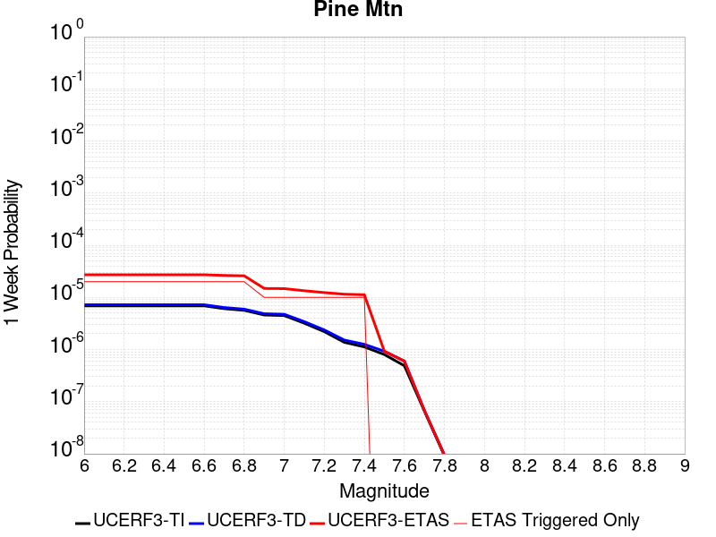 |  |  | 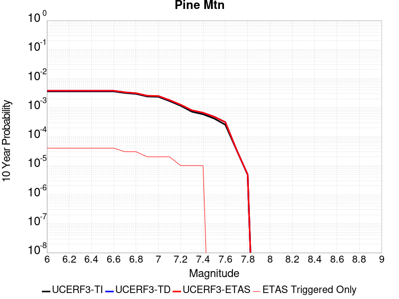 |

| Magnitude | 1 wk TI Prob | 1 wk TD Prob | 1 wk ETAS Prob | 1 wk ETAS/TD Gain | 1 wk ETAS Triggered Only | 1 mo TI Prob | 1 mo TD Prob | 1 mo ETAS Prob | 1 mo ETAS/TD Gain | 1 mo ETAS Triggered Only | 1 yr TI Prob | 1 yr TD Prob | 1 yr ETAS Prob | 1 yr ETAS/TD Gain | 1 yr ETAS Triggered Only | 10 yr TI Prob | 10 yr TD Prob | 10 yr ETAS Prob | 10 yr ETAS/TD Gain | 10 yr ETAS Triggered Only |
|-----|-----|-----|-----|-----|-----|-----|-----|-----|-----|-----|-----|-----|-----|-----|-----|-----|-----|-----|-----|-----|
| 6.0 | 6.894797E-6 | 7.225461E-6 | 2.7225316E-5 | 3.7679694 | 2.0E-5 | 2.9548795E-5 | 3.096591E-5 | 6.0964983E-5 | 1.9687773 | 3.0E-5 | 3.596972E-4 | 3.7694772E-4 | 4.0693642E-4 | 1.0795566 | 3.0E-5 | 0.0035911554 | 0.003763381 | 0.0038032304 | 1.0105888 | 4.0E-5 |
| 6.1 | 6.894797E-6 | 7.225461E-6 | 2.7225316E-5 | 3.7679694 | 2.0E-5 | 2.9548795E-5 | 3.096591E-5 | 6.0964983E-5 | 1.9687773 | 3.0E-5 | 3.596972E-4 | 3.7694772E-4 | 4.0693642E-4 | 1.0795566 | 3.0E-5 | 0.0035911554 | 0.003763381 | 0.0038032304 | 1.0105888 | 4.0E-5 |
| 6.2 | 6.894797E-6 | 7.225461E-6 | 2.7225316E-5 | 3.7679694 | 2.0E-5 | 2.9548795E-5 | 3.096591E-5 | 6.0964983E-5 | 1.9687773 | 3.0E-5 | 3.596972E-4 | 3.7694772E-4 | 4.0693642E-4 | 1.0795566 | 3.0E-5 | 0.0035911554 | 0.003763381 | 0.0038032304 | 1.0105888 | 4.0E-5 |
| 6.3 | 6.894797E-6 | 7.225461E-6 | 2.7225316E-5 | 3.7679694 | 2.0E-5 | 2.9548795E-5 | 3.096591E-5 | 6.0964983E-5 | 1.9687773 | 3.0E-5 | 3.596972E-4 | 3.7694772E-4 | 4.0693642E-4 | 1.0795566 | 3.0E-5 | 0.0035911554 | 0.003763381 | 0.0038032304 | 1.0105888 | 4.0E-5 |
| 6.4 | 6.894797E-6 | 7.225461E-6 | 2.7225316E-5 | 3.7679694 | 2.0E-5 | 2.9548795E-5 | 3.096591E-5 | 6.0964983E-5 | 1.9687773 | 3.0E-5 | 3.596972E-4 | 3.7694772E-4 | 4.0693642E-4 | 1.0795566 | 3.0E-5 | 0.0035911554 | 0.003763381 | 0.0038032304 | 1.0105888 | 4.0E-5 |
| 6.5 | 6.894797E-6 | 7.225461E-6 | 2.7225316E-5 | 3.7679694 | 2.0E-5 | 2.9548795E-5 | 3.096591E-5 | 6.0964983E-5 | 1.9687773 | 3.0E-5 | 3.596972E-4 | 3.7694772E-4 | 4.0693642E-4 | 1.0795566 | 3.0E-5 | 0.0035911554 | 0.003763381 | 0.0038032304 | 1.0105888 | 4.0E-5 |
| 6.6 | 6.894797E-6 | 7.225461E-6 | 2.7225316E-5 | 3.7679694 | 2.0E-5 | 2.9548795E-5 | 3.096591E-5 | 6.0964983E-5 | 1.9687773 | 3.0E-5 | 3.596972E-4 | 3.7694772E-4 | 4.0693642E-4 | 1.0795566 | 3.0E-5 | 0.0035911554 | 0.003763381 | 0.0038032304 | 1.0105888 | 4.0E-5 |
| 6.7 | 6.0867933E-6 | 6.3971133E-6 | 2.6396985E-5 | 4.12639 | 2.0E-5 | 2.6085996E-5 | 2.7415923E-5 | 5.74151E-5 | 2.0942247 | 3.0E-5 | 3.1755073E-4 | 3.3373994E-4 | 3.6372992E-4 | 1.0898603 | 3.0E-5 | 0.0031709734 | 0.0033326065 | 0.0033625064 | 1.0089719 | 3.0E-5 |
| 6.8 | 5.6530425E-6 | 5.9505956E-6 | 2.5950476E-5 | 4.360988 | 2.0E-5 | 2.42271E-5 | 2.5502315E-5 | 5.550155E-5 | 2.176334 | 3.0E-5 | 2.94925E-4 | 3.104485E-4 | 3.4043918E-4 | 1.0966043 | 3.0E-5 | 0.002945339 | 0.0031003528 | 0.00313026 | 1.0096463 | 3.0E-5 |
| 6.9 | 4.6015225E-6 | 4.863834E-6 | 1.48637855E-5 | 3.0559812 | 1.0E-5 | 1.9720663E-5 | 2.0844845E-5 | 4.084443E-5 | 1.9594499 | 2.0E-5 | 2.4007261E-4 | 2.5375787E-4 | 2.737528E-4 | 1.0787953 | 2.0E-5 | 0.0023981342 | 0.0025348254 | 0.0025547748 | 1.0078701 | 2.0E-5 |
| 7.0 | 4.4875965E-6 | 4.747473E-6 | 1.4747426E-5 | 3.1063738 | 1.0E-5 | 1.9232413E-5 | 2.0346162E-5 | 4.0345756E-5 | 1.9829663 | 2.0E-5 | 2.3412947E-4 | 2.4768783E-4 | 2.6768286E-4 | 1.0807269 | 2.0E-5 | 0.0023388295 | 0.0024742614 | 0.002494212 | 1.0080632 | 2.0E-5 |
| 7.1 | 3.203907E-6 | 3.4294096E-6 | 1.3429375E-5 | 3.9159439 | 1.0E-5 | 1.3730958E-5 | 1.4697391E-5 | 3.4697096E-5 | 2.3607657 | 2.0E-5 | 1.6716159E-4 | 1.789267E-4 | 1.9892312E-4 | 1.1117576 | 2.0E-5 | 0.0016703589 | 0.0017878925 | 0.0018078568 | 1.0111663 | 2.0E-5 |
| 7.2 | 2.2060601E-6 | 2.3784817E-6 | 1.23784575E-5 | 5.204353 | 1.0E-5 | 9.4545085E-6 | 1.0193455E-5 | 2.0193353E-5 | 1.9810116 | 1.0E-5 | 1.15102564E-4 | 1.240987E-4 | 1.3409746E-4 | 1.080571 | 1.0E-5 | 0.0011504296 | 0.0012403389 | 0.0012503265 | 1.0080523 | 1.0E-5 |
| 7.3 | 1.3765207E-6 | 1.5216481E-6 | 1.1521633E-5 | 7.5718117 | 1.0E-5 | 5.899361E-6 | 6.521333E-6 | 1.6521268E-5 | 2.533419 | 1.0E-5 | 7.182235E-5 | 7.939443E-5 | 8.939364E-5 | 1.1259434 | 1.0E-5 | 7.1799144E-4 | 7.936697E-4 | 8.036618E-4 | 1.0125897 | 1.0E-5 |
| 7.4 | 1.1245983E-6 | 1.2587075E-6 | 1.1258695E-5 | 8.944648 | 1.0E-5 | 4.819698E-6 | 5.39445E-6 | 1.5394397E-5 | 2.8537471 | 1.0E-5 | 5.8678244E-5 | 6.567554E-5 | 7.567488E-5 | 1.1522537 | 1.0E-5 | 5.866275E-4 | 6.5656955E-4 | 6.66563E-4 | 1.0152206 | 1.0E-5 |
| 7.5 | 8.031682E-7 | 9.276951E-7 | 9.276951E-7 | 1.0 | 0.0 | 3.4421448E-6 | 3.9758306E-6 | 3.9758306E-6 | 1.0 | 0.0 | 4.1907308E-5 | 4.840473E-5 | 4.840473E-5 | 1.0 | 0.0 | 4.1899405E-4 | 4.8394862E-4 | 4.8394862E-4 | 1.0 | 0.0 |
| 7.6 | 4.8953444E-7 | 6.003009E-7 | 6.003009E-7 | 1.0 | 0.0 | 2.098003E-6 | 2.5727159E-6 | 2.5727159E-6 | 1.0 | 0.0 | 2.5542888E-5 | 3.1322415E-5 | 3.1322415E-5 | 1.0 | 0.0 | 2.5539953E-4 | 3.1318486E-4 | 3.1318486E-4 | 1.0 | 0.0 |
| 7.7 | 6.634529E-8 | 6.788826E-8 | 6.788826E-8 | 1.0 | 0.0 | 2.843369E-7 | 2.9094966E-7 | 2.9094966E-7 | 1.0 | 0.0 | 3.4617963E-6 | 3.5423066E-6 | 3.5423066E-6 | 1.0 | 0.0 | 3.4617424E-5 | 3.542255E-5 | 3.542255E-5 | 1.0 | 0.0 |
| 7.8 | 9.235578E-9 | 9.488566E-9 | 9.488566E-9 | 1.0 | 0.0 | 3.9581046E-8 | 4.0665284E-8 | 4.0665284E-8 | 1.0 | 0.0 | 4.818991E-7 | 4.950997E-7 | 4.950997E-7 | 1.0 | 0.0 | 4.8189804E-6 | 4.950988E-6 | 4.950988E-6 | 1.0 | 0.0 |

## Likely 2011 CFM
*[(top)](#table-of-contents)*

| 1 Week | 1 Month | 1 Year | 10 Year |
|-----|-----|-----|-----|
|  |  |  |  |

| Magnitude | 1 wk TI Prob | 1 wk TD Prob | 1 wk ETAS Prob | 1 wk ETAS/TD Gain | 1 wk ETAS Triggered Only | 1 mo TI Prob | 1 mo TD Prob | 1 mo ETAS Prob | 1 mo ETAS/TD Gain | 1 mo ETAS Triggered Only | 1 yr TI Prob | 1 yr TD Prob | 1 yr ETAS Prob | 1 yr ETAS/TD Gain | 1 yr ETAS Triggered Only | 10 yr TI Prob | 10 yr TD Prob | 10 yr ETAS Prob | 10 yr ETAS/TD Gain | 10 yr ETAS Triggered Only |
|-----|-----|-----|-----|-----|-----|-----|-----|-----|-----|-----|-----|-----|-----|-----|-----|-----|-----|-----|-----|-----|
| 6.0 | 2.5315949E-5 | 2.7104748E-5 | 3.7104477E-5 | 1.368929 | 1.0E-5 | 1.0849241E-4 | 1.16158284E-4 | 1.3615596E-4 | 1.1721588 | 2.0E-5 | 0.0013200947 | 0.0014133542 | 0.0014433118 | 1.0211961 | 3.0E-5 | 0.013122803 | 0.01404831 | 0.014087749 | 1.0028073 | 4.0E-5 |
| 6.1 | 2.5315949E-5 | 2.7104748E-5 | 3.7104477E-5 | 1.368929 | 1.0E-5 | 1.0849241E-4 | 1.16158284E-4 | 1.3615596E-4 | 1.1721588 | 2.0E-5 | 0.0013200947 | 0.0014133542 | 0.0014433118 | 1.0211961 | 3.0E-5 | 0.013122803 | 0.01404831 | 0.014077889 | 1.0021055 | 3.0E-5 |
| 6.2 | 1.6375941E-5 | 1.7465842E-5 | 2.7465667E-5 | 1.5725361 | 1.0E-5 | 7.0180715E-5 | 7.485153E-5 | 8.4850784E-5 | 1.1335878 | 1.0E-5 | 8.5411523E-4 | 9.109487E-4 | 9.2093955E-4 | 1.0109676 | 1.0E-5 | 0.008508399 | 0.009073433 | 0.009083342 | 1.0010921 | 1.0E-5 |
| 6.3 | 1.1945543E-5 | 1.2712587E-5 | 2.271246E-5 | 1.7866119 | 1.0E-5 | 5.119418E-5 | 5.4481407E-5 | 6.448086E-5 | 1.1835389 | 1.0E-5 | 6.2311086E-4 | 6.631146E-4 | 6.73108E-4 | 1.0150703 | 1.0E-5 | 0.0062136655 | 0.0066119144 | 0.0066218483 | 1.0015024 | 1.0E-5 |
| 6.4 | 9.192729E-6 | 9.768488E-6 | 1.976839E-5 | 2.02369 | 1.0E-5 | 3.939681E-5 | 4.1864292E-5 | 5.1863874E-5 | 1.238857 | 1.0E-5 | 4.7955062E-4 | 5.0958124E-4 | 5.195762E-4 | 1.019614 | 1.0E-5 | 0.004785171 | 0.0050844094 | 0.005094358 | 1.0019568 | 1.0E-5 |
| 6.5 | 7.67906E-6 | 8.152622E-6 | 1.8152541E-5 | 2.2265892 | 1.0E-5 | 3.2909844E-5 | 3.4939352E-5 | 4.4939003E-5 | 1.2862003 | 1.0E-5 | 4.006037E-4 | 4.2530545E-4 | 4.3530122E-4 | 1.0235025 | 1.0E-5 | 0.0039988225 | 0.004245108 | 0.0042550657 | 1.0023457 | 1.0E-5 |
| 6.6 | 6.4884057E-6 | 6.8847507E-6 | 1.6884682E-5 | 2.4524755 | 1.0E-5 | 2.7807157E-5 | 2.9505749E-5 | 3.9505452E-5 | 1.338907 | 1.0E-5 | 3.3849955E-4 | 3.591747E-4 | 3.6917112E-4 | 1.0278316 | 1.0E-5 | 0.003379844 | 0.0035860867 | 0.003596051 | 1.0027785 | 1.0E-5 |
| 6.7 | 4.6060636E-6 | 4.884041E-6 | 1.4883993E-5 | 3.0474749 | 1.0E-5 | 1.9740122E-5 | 2.0931442E-5 | 3.0931235E-5 | 1.4777402 | 1.0E-5 | 2.403095E-4 | 2.5481134E-4 | 2.648088E-4 | 1.0392348 | 1.0E-5 | 0.002400498 | 0.0025452746 | 0.0025552493 | 1.0039189 | 1.0E-5 |
| 6.8 | 3.2795615E-6 | 3.4773732E-6 | 1.3477338E-5 | 3.875724 | 1.0E-5 | 1.4055187E-5 | 1.4902946E-5 | 2.4902796E-5 | 1.6709983 | 1.0E-5 | 1.7110848E-4 | 1.8142881E-4 | 1.91427E-4 | 1.0551081 | 1.0E-5 | 0.0017097679 | 0.0018128622 | 0.001822844 | 1.0055062 | 1.0E-5 |
| 6.9 | 2.3289967E-6 | 2.4705569E-6 | 1.2470532E-5 | 5.0476604 | 1.0E-5 | 9.981376E-6 | 1.058806E-5 | 2.0587955E-5 | 1.94445 | 1.0E-5 | 1.2151648E-4 | 1.2890245E-4 | 1.3890116E-4 | 1.077568 | 1.0E-5 | 0.0012145005 | 0.0012883197 | 0.0012983069 | 1.0077521 | 1.0E-5 |
| 7.0 | 1.211292E-6 | 1.2863958E-6 | 1.2863958E-6 | 1.0 | 0.0 | 5.1912407E-6 | 5.5131145E-6 | 5.5131145E-6 | 1.0 | 0.0 | 6.320152E-5 | 6.712041E-5 | 6.712041E-5 | 1.0 | 0.0 | 6.3183554E-4 | 6.710312E-4 | 6.710312E-4 | 1.0 | 0.0 |

## Great Valley 09 (Laguna Seca)
*[(top)](#table-of-contents)*

| 1 Week | 1 Month | 1 Year | 10 Year |
|-----|-----|-----|-----|
|  |  | 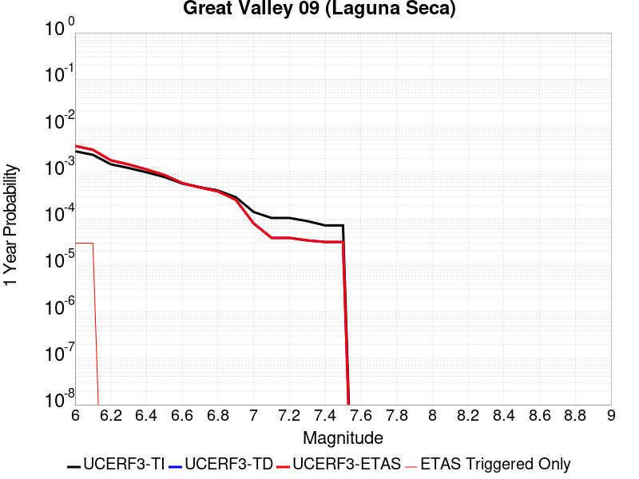 |  |

| Magnitude | 1 wk TI Prob | 1 wk TD Prob | 1 wk ETAS Prob | 1 wk ETAS/TD Gain | 1 wk ETAS Triggered Only | 1 mo TI Prob | 1 mo TD Prob | 1 mo ETAS Prob | 1 mo ETAS/TD Gain | 1 mo ETAS Triggered Only | 1 yr TI Prob | 1 yr TD Prob | 1 yr ETAS Prob | 1 yr ETAS/TD Gain | 1 yr ETAS Triggered Only | 10 yr TI Prob | 10 yr TD Prob | 10 yr ETAS Prob | 10 yr ETAS/TD Gain | 10 yr ETAS Triggered Only |
|-----|-----|-----|-----|-----|-----|-----|-----|-----|-----|-----|-----|-----|-----|-----|-----|-----|-----|-----|-----|-----|
| 6.0 | 5.4353277E-5 | 7.05022E-5 | 7.05022E-5 | 1.0 | 0.0 | 2.3292181E-4 | 3.0211566E-4 | 3.0211566E-4 | 1.0 | 0.0 | 0.0028321352 | 0.0036721937 | 0.0037020836 | 1.0081395 | 3.0E-5 | 0.02796312 | 0.03611547 | 0.036144387 | 1.0008006 | 3.0E-5 |
| 6.1 | 4.5578287E-5 | 5.822118E-5 | 5.822118E-5 | 1.0 | 0.0 | 1.953209E-4 | 2.4949326E-4 | 2.4949326E-4 | 1.0 | 0.0 | 0.0023754383 | 0.003033432 | 0.003063341 | 1.0098598 | 3.0E-5 | 0.023502063 | 0.029919548 | 0.02994865 | 1.0009727 | 3.0E-5 |
| 6.2 | 2.8536782E-5 | 3.4737273E-5 | 3.4737273E-5 | 1.0 | 0.0 | 1.2229476E-4 | 1.4886224E-4 | 1.4886224E-4 | 1.0 | 0.0 | 0.0014879217 | 0.001810813 | 0.001810813 | 1.0 | 0.0 | 0.014779986 | 0.017958116 | 0.017958116 | 1.0 | 0.0 |
| 6.3 | 2.3698774E-5 | 2.8213295E-5 | 2.8213295E-5 | 1.0 | 0.0 | 1.01562226E-4 | 1.20905075E-4 | 1.20905075E-4 | 1.0 | 0.0 | 0.0012358186 | 0.0014710218 | 0.0014710218 | 1.0 | 0.0 | 0.012289686 | 0.014611342 | 0.014611342 | 1.0 | 0.0 |
| 6.4 | 1.9191197E-5 | 2.2123184E-5 | 2.2123184E-5 | 1.0 | 0.0 | 8.2245395E-5 | 9.4806666E-5 | 9.4806666E-5 | 1.0 | 0.0 | 0.0010008777 | 0.0011536429 | 0.0011536429 | 1.0 | 0.0 | 0.009963818 | 0.011476948 | 0.011476948 | 1.0 | 0.0 |
| 6.5 | 1.5203241E-5 | 1.6802203E-5 | 1.6802203E-5 | 1.0 | 0.0 | 6.5155116E-5 | 7.200386E-5 | 7.200386E-5 | 1.0 | 0.0 | 7.9297484E-4 | 8.7626575E-4 | 8.7626575E-4 | 1.0 | 0.0 | 0.007901512 | 0.0087295165 | 0.0087295165 | 1.0 | 0.0 |
| 6.6 | 1.0984925E-5 | 1.1242595E-5 | 1.1242595E-5 | 1.0 | 0.0 | 4.70774E-5 | 4.8181686E-5 | 4.8181686E-5 | 1.0 | 0.0 | 5.730166E-4 | 5.8645656E-4 | 5.8645656E-4 | 1.0 | 0.0 | 0.005715413 | 0.0058494853 | 0.0058494853 | 1.0 | 0.0 |
| 6.7 | 9.134616E-6 | 9.019894E-6 | 9.019894E-6 | 1.0 | 0.0 | 3.9147766E-5 | 3.865613E-5 | 3.865613E-5 | 1.0 | 0.0 | 4.7651984E-4 | 4.7053912E-4 | 4.7053912E-4 | 1.0 | 0.0 | 0.004754993 | 0.0046956735 | 0.0046956735 | 1.0 | 0.0 |
| 6.8 | 7.785589E-6 | 7.4519444E-6 | 7.4519444E-6 | 1.0 | 0.0 | 3.3366385E-5 | 3.1936524E-5 | 3.1936524E-5 | 1.0 | 0.0 | 4.0616E-4 | 3.8875983E-4 | 3.8875983E-4 | 1.0 | 0.0 | 0.0040541845 | 0.0038810016 | 0.0038810016 | 1.0 | 0.0 |
| 6.9 | 5.579095E-6 | 4.898492E-6 | 4.898492E-6 | 1.0 | 0.0 | 2.3910188E-5 | 2.0993377E-5 | 2.0993377E-5 | 1.0 | 0.0 | 2.9106764E-4 | 2.5556577E-4 | 2.5556577E-4 | 1.0 | 0.0 | 0.002906867 | 0.002552856 | 0.002552856 | 1.0 | 0.0 |
| 7.0 | 2.6816688E-6 | 1.5216126E-6 | 1.5216126E-6 | 1.0 | 0.0 | 1.1492816E-5 | 6.521181E-6 | 6.521181E-6 | 1.0 | 0.0 | 1.3991605E-4 | 7.939258E-5 | 7.939258E-5 | 1.0 | 0.0 | 0.0013982799 | 7.9365086E-4 | 7.9365086E-4 | 1.0 | 0.0 |
| 7.1 | 1.9951021E-6 | 7.453827E-7 | 7.453827E-7 | 1.0 | 0.0 | 8.55041E-6 | 3.1944935E-6 | 3.1944935E-6 | 1.0 | 0.0 | 1.0409627E-4 | 3.8892307E-5 | 3.8892307E-5 | 1.0 | 0.0 | 0.0010404752 | 3.8885913E-4 | 3.8885913E-4 | 1.0 | 0.0 |
| 7.2 | 1.9951021E-6 | 7.453827E-7 | 7.453827E-7 | 1.0 | 0.0 | 8.55041E-6 | 3.1944935E-6 | 3.1944935E-6 | 1.0 | 0.0 | 1.0409627E-4 | 3.8892307E-5 | 3.8892307E-5 | 1.0 | 0.0 | 0.0010404752 | 3.8885913E-4 | 3.8885913E-4 | 1.0 | 0.0 |
| 7.3 | 1.7087556E-6 | 6.578881E-7 | 6.578881E-7 | 1.0 | 0.0 | 7.3232177E-6 | 2.8195177E-6 | 2.8195177E-6 | 1.0 | 0.0 | 8.915652E-5 | 3.4327128E-5 | 3.4327128E-5 | 1.0 | 0.0 | 8.9120766E-4 | 3.432223E-4 | 3.432223E-4 | 1.0 | 0.0 |
| 7.4 | 1.3804846E-6 | 6.073852E-7 | 6.073852E-7 | 1.0 | 0.0 | 5.916349E-6 | 2.6030768E-6 | 2.6030768E-6 | 1.0 | 0.0 | 7.2029165E-5 | 3.169204E-5 | 3.169204E-5 | 1.0 | 0.0 | 7.200583E-4 | 3.1687922E-4 | 3.1687922E-4 | 1.0 | 0.0 |
| 7.5 | 1.3804846E-6 | 6.073852E-7 | 6.073852E-7 | 1.0 | 0.0 | 5.916349E-6 | 2.6030768E-6 | 2.6030768E-6 | 1.0 | 0.0 | 7.2029165E-5 | 3.169204E-5 | 3.169204E-5 | 1.0 | 0.0 | 7.200583E-4 | 3.1687922E-4 | 3.1687922E-4 | 1.0 | 0.0 |

## San Andreas (North Coast) 2011 CFM
*[(top)](#table-of-contents)*

| 1 Week | 1 Month | 1 Year | 10 Year |
|-----|-----|-----|-----|
|  |  |  |  |

| Magnitude | 1 wk TI Prob | 1 wk TD Prob | 1 wk ETAS Prob | 1 wk ETAS/TD Gain | 1 wk ETAS Triggered Only | 1 mo TI Prob | 1 mo TD Prob | 1 mo ETAS Prob | 1 mo ETAS/TD Gain | 1 mo ETAS Triggered Only | 1 yr TI Prob | 1 yr TD Prob | 1 yr ETAS Prob | 1 yr ETAS/TD Gain | 1 yr ETAS Triggered Only | 10 yr TI Prob | 10 yr TD Prob | 10 yr ETAS Prob | 10 yr ETAS/TD Gain | 10 yr ETAS Triggered Only |
|-----|-----|-----|-----|-----|-----|-----|-----|-----|-----|-----|-----|-----|-----|-----|-----|-----|-----|-----|-----|-----|
| 6.0 | 1.5333705E-4 | 7.1106435E-5 | 8.1105725E-5 | 1.1406243 | 1.0E-5 | 6.5699324E-4 | 3.0470645E-4 | 3.2470035E-4 | 1.065617 | 2.0E-5 | 0.007969595 | 0.0037035241 | 0.003733413 | 1.0080703 | 3.0E-5 | 0.0768977 | 0.03935284 | 0.039391268 | 1.0009764 | 4.0E-5 |
| 6.1 | 1.5333705E-4 | 7.1106435E-5 | 8.1105725E-5 | 1.1406243 | 1.0E-5 | 6.5699324E-4 | 3.0470645E-4 | 3.2470035E-4 | 1.065617 | 2.0E-5 | 0.007969595 | 0.0037035241 | 0.003733413 | 1.0080703 | 3.0E-5 | 0.0768977 | 0.03935284 | 0.039391268 | 1.0009764 | 4.0E-5 |
| 6.2 | 1.3912938E-4 | 6.050204E-5 | 7.050143E-5 | 1.1652737 | 1.0E-5 | 5.961325E-4 | 2.5926883E-4 | 2.7926365E-4 | 1.0771201 | 2.0E-5 | 0.007233787 | 0.003152056 | 0.0031819614 | 1.0094876 | 3.0E-5 | 0.07002798 | 0.03369227 | 0.03373092 | 1.0011473 | 4.0E-5 |
| 6.3 | 1.3912938E-4 | 6.050204E-5 | 7.050143E-5 | 1.1652737 | 1.0E-5 | 5.961325E-4 | 2.5926883E-4 | 2.7926365E-4 | 1.0771201 | 2.0E-5 | 0.007233787 | 0.003152056 | 0.0031819614 | 1.0094876 | 3.0E-5 | 0.07002798 | 0.03369227 | 0.03373092 | 1.0011473 | 4.0E-5 |
| 6.4 | 1.2623647E-4 | 5.0442024E-5 | 6.0441518E-5 | 1.1982374 | 1.0E-5 | 5.4090127E-4 | 2.161623E-4 | 2.3615797E-4 | 1.0925031 | 2.0E-5 | 0.0065656058 | 0.0026286195 | 0.0026585408 | 1.0113828 | 3.0E-5 | 0.06374981 | 0.028303223 | 0.02834209 | 1.0013733 | 4.0E-5 |
| 6.5 | 1.1736096E-4 | 4.3523814E-5 | 5.3523378E-5 | 1.2297493 | 1.0E-5 | 5.028786E-4 | 1.8651738E-4 | 2.0651365E-4 | 1.1072086 | 2.0E-5 | 0.006105373 | 0.0022685004 | 0.0022984322 | 1.0131946 | 3.0E-5 | 0.05940335 | 0.024579322 | 0.024618339 | 1.0015874 | 4.0E-5 |
| 6.6 | 1.1586959E-4 | 4.2423668E-5 | 5.2423246E-5 | 1.2357075 | 1.0E-5 | 4.964894E-4 | 1.8180315E-4 | 2.0179951E-4 | 1.109989 | 2.0E-5 | 0.006028018 | 0.0022112224 | 0.002241156 | 1.0135372 | 3.0E-5 | 0.058671024 | 0.023984991 | 0.024024032 | 1.0016277 | 4.0E-5 |
| 6.7 | 1.13693764E-4 | 4.073593E-5 | 5.073552E-5 | 1.2454735 | 1.0E-5 | 4.87168E-4 | 1.7457096E-4 | 1.9456746E-4 | 1.1145465 | 2.0E-5 | 0.005915152 | 0.0021233456 | 0.0021532818 | 1.0140986 | 3.0E-5 | 0.057601593 | 0.023076393 | 0.02311547 | 1.0016934 | 4.0E-5 |
| 6.8 | 1.1204889E-4 | 3.9953447E-5 | 4.995305E-5 | 1.2502813 | 1.0E-5 | 4.8012115E-4 | 1.7121792E-4 | 1.912145E-4 | 1.1167902 | 2.0E-5 | 0.005829819 | 0.002082601 | 0.0021125386 | 1.0143751 | 3.0E-5 | 0.05679232 | 0.022636656 | 0.022675749 | 1.0017271 | 4.0E-5 |
| 6.9 | 1.1005794E-4 | 3.900957E-5 | 4.900918E-5 | 1.2563374 | 1.0E-5 | 4.7159163E-4 | 1.6717325E-4 | 1.871699E-4 | 1.1196164 | 2.0E-5 | 0.0057265228 | 0.0020334502 | 0.0020633892 | 1.0147233 | 3.0E-5 | 0.055811852 | 0.022102542 | 0.022141658 | 1.0017698 | 4.0E-5 |
| 7.0 | 1.0647948E-4 | 3.7166337E-5 | 4.7165966E-5 | 1.2690507 | 1.0E-5 | 4.562608E-4 | 1.5927466E-4 | 1.7927148E-4 | 1.1255492 | 2.0E-5 | 0.0055408357 | 0.0019374598 | 0.0019674017 | 1.0154542 | 3.0E-5 | 0.054047033 | 0.021062272 | 0.02109164 | 1.0013944 | 3.0E-5 |
| 7.1 | 1.04795035E-4 | 3.6215948E-5 | 4.6215588E-5 | 1.2761115 | 1.0E-5 | 4.4904428E-4 | 1.5520205E-4 | 1.7519896E-4 | 1.1288443 | 2.0E-5 | 0.0054534175 | 0.0018879628 | 0.0019179062 | 1.0158602 | 3.0E-5 | 0.053215165 | 0.020530313 | 0.020559696 | 1.0014312 | 3.0E-5 |
| 7.2 | 1.02724036E-4 | 3.5124547E-5 | 4.5124194E-5 | 1.2846912 | 1.0E-5 | 4.401716E-4 | 1.5052517E-4 | 1.7052217E-4 | 1.1328481 | 2.0E-5 | 0.0053459285 | 0.0018311188 | 0.0018610639 | 1.0163534 | 3.0E-5 | 0.052191395 | 0.019919246 | 0.019948648 | 1.001476 | 3.0E-5 |
| 7.3 | 1.00650694E-4 | 3.4592013E-5 | 4.4591667E-5 | 1.2890741 | 1.0E-5 | 4.312888E-4 | 1.4824314E-4 | 1.6824018E-4 | 1.1348935 | 2.0E-5 | 0.005238306 | 0.0018033815 | 0.0018333273 | 1.0166054 | 3.0E-5 | 0.051165357 | 0.019596443 | 0.019625854 | 1.0015008 | 3.0E-5 |
| 7.4 | 9.672919E-5 | 3.338123E-5 | 4.3380896E-5 | 1.2995596 | 1.0E-5 | 4.144878E-4 | 1.4305465E-4 | 1.630518E-4 | 1.1397867 | 2.0E-5 | 0.005034718 | 0.0017403142 | 0.001770262 | 1.0172082 | 3.0E-5 | 0.049221683 | 0.018869769 | 0.018899202 | 1.0015599 | 3.0E-5 |
| 7.5 | 8.7600405E-5 | 2.2700917E-5 | 3.270069E-5 | 1.4405009 | 1.0E-5 | 3.753763E-4 | 9.728602E-5 | 1.1728408E-4 | 1.2055594 | 2.0E-5 | 0.0045606326 | 0.0011838155 | 0.00121378 | 1.0253118 | 3.0E-5 | 0.04468165 | 0.013130207 | 0.013159813 | 1.0022548 | 3.0E-5 |
| 7.6 | 7.9562284E-5 | 1.9226305E-5 | 2.9226114E-5 | 1.5201107 | 1.0E-5 | 3.4093665E-4 | 8.239586E-5 | 1.0239421E-4 | 1.2427106 | 2.0E-5 | 0.0041430052 | 0.0010027094 | 0.0010326793 | 1.029889 | 3.0E-5 | 0.040666126 | 0.011221658 | 0.011251322 | 1.0026433 | 3.0E-5 |
| 7.7 | 6.3866544E-5 | 1.1941707E-5 | 2.1941587E-5 | 1.8373913 | 1.0E-5 | 2.7368503E-4 | 5.117774E-5 | 7.117672E-5 | 1.3907748 | 2.0E-5 | 0.0033270244 | 6.2291115E-4 | 6.5289246E-4 | 1.048131 | 3.0E-5 | 0.032776527 | 0.007210334 | 0.0072401175 | 1.0041307 | 3.0E-5 |
| 7.8 | 4.2543215E-5 | 9.076524E-6 | 1.9076433E-5 | 2.1017332 | 1.0E-5 | 1.8231533E-4 | 3.8898812E-5 | 5.8898033E-5 | 1.5141345 | 2.0E-5 | 0.0022174292 | 4.7349022E-4 | 5.03476E-4 | 1.0633293 | 3.0E-5 | 0.021954332 | 0.005490525 | 0.0055203605 | 1.0054339 | 3.0E-5 |
| 7.9 | 2.2636612E-5 | 7.81435E-6 | 1.7814273E-5 | 2.279687 | 1.0E-5 | 9.7010445E-5 | 3.3489643E-5 | 5.3488973E-5 | 1.5971795 | 2.0E-5 | 0.0011804621 | 4.076602E-4 | 4.3764798E-4 | 1.0735607 | 3.0E-5 | 0.011742111 | 0.0046832846 | 0.004713144 | 1.0063758 | 3.0E-5 |
| 8.0 | 1.5167874E-5 | 7.0494675E-6 | 1.7049397E-5 | 2.418537 | 1.0E-5 | 6.500356E-5 | 3.0211655E-5 | 5.021105E-5 | 1.6619762 | 2.0E-5 | 7.9113094E-4 | 3.677649E-4 | 3.9775387E-4 | 1.0815438 | 3.0E-5 | 0.007883203 | 0.004215588 | 0.0042454614 | 1.0070864 | 3.0E-5 |
| 8.1 | 1.0681047E-5 | 6.386992E-6 | 1.6386928E-5 | 2.5656722 | 1.0E-5 | 4.5775112E-5 | 2.7372536E-5 | 4.737199E-5 | 1.7306393 | 2.0E-5 | 5.5716943E-4 | 3.3320975E-4 | 3.6319977E-4 | 1.0900034 | 3.0E-5 | 0.0055577457 | 0.003817393 | 0.0038472784 | 1.0078287 | 3.0E-5 |
| 8.2 | 8.226114E-6 | 5.1150587E-6 | 5.1150587E-6 | 1.0 | 0.0 | 3.52543E-5 | 2.1921496E-5 | 3.1921278E-5 | 1.4561633 | 1.0E-5 | 4.2913653E-4 | 2.668616E-4 | 2.8685626E-4 | 1.0749252 | 2.0E-5 | 0.004283088 | 0.0030450926 | 0.0030650317 | 1.0065479 | 2.0E-5 |
| 8.3 | 1.983087E-6 | 7.6599065E-7 | 7.6599065E-7 | 1.0 | 0.0 | 8.498917E-6 | 3.282813E-6 | 3.282813E-6 | 1.0 | 0.0 | 1.034694E-4 | 3.9967534E-5 | 3.9967534E-5 | 1.0 | 0.0 | 0.0010342124 | 4.719687E-4 | 4.719687E-4 | 1.0 | 0.0 |

## Keddie Ridge 2011 CFM
*[(top)](#table-of-contents)*

| 1 Week | 1 Month | 1 Year | 10 Year |
|-----|-----|-----|-----|
|  |  |  |  |

| Magnitude | 1 wk TI Prob | 1 wk TD Prob | 1 wk ETAS Prob | 1 wk ETAS/TD Gain | 1 wk ETAS Triggered Only | 1 mo TI Prob | 1 mo TD Prob | 1 mo ETAS Prob | 1 mo ETAS/TD Gain | 1 mo ETAS Triggered Only | 1 yr TI Prob | 1 yr TD Prob | 1 yr ETAS Prob | 1 yr ETAS/TD Gain | 1 yr ETAS Triggered Only | 10 yr TI Prob | 10 yr TD Prob | 10 yr ETAS Prob | 10 yr ETAS/TD Gain | 10 yr ETAS Triggered Only |
|-----|-----|-----|-----|-----|-----|-----|-----|-----|-----|-----|-----|-----|-----|-----|-----|-----|-----|-----|-----|-----|
| 6.0 | 2.2591947E-5 | 2.5189187E-5 | 2.5189187E-5 | 1.0 | 0.0 | 9.6819036E-5 | 1.07949636E-4 | 1.17948555E-4 | 1.0926257 | 1.0E-5 | 0.0011781343 | 0.0013135736 | 0.0013335473 | 1.0152056 | 2.0E-5 | 0.011719079 | 0.013066036 | 0.013095644 | 1.002266 | 3.0E-5 |
| 6.1 | 2.2591947E-5 | 2.5189187E-5 | 2.5189187E-5 | 1.0 | 0.0 | 9.6819036E-5 | 1.07949636E-4 | 1.17948555E-4 | 1.0926257 | 1.0E-5 | 0.0011781343 | 0.0013135736 | 0.0013335473 | 1.0152056 | 2.0E-5 | 0.011719079 | 0.013066036 | 0.013095644 | 1.002266 | 3.0E-5 |
| 6.2 | 1.3775145E-5 | 1.5322817E-5 | 1.5322817E-5 | 1.0 | 0.0 | 5.9035E-5 | 6.566771E-5 | 7.566705E-5 | 1.1522719 | 1.0E-5 | 7.185141E-4 | 7.9923525E-4 | 8.192193E-4 | 1.0250039 | 2.0E-5 | 0.0071619535 | 0.007966028 | 0.007995788 | 1.003736 | 3.0E-5 |
| 6.3 | 9.705435E-6 | 1.0768351E-5 | 1.0768351E-5 | 1.0 | 0.0 | 4.1594063E-5 | 4.614933E-5 | 5.6148867E-5 | 1.2166779 | 1.0E-5 | 5.0629E-4 | 5.6173565E-4 | 5.7173E-4 | 1.017792 | 1.0E-5 | 0.005051381 | 0.0056043873 | 0.005624275 | 1.0035486 | 2.0E-5 |
| 6.4 | 7.2549733E-6 | 8.027269E-6 | 8.027269E-6 | 1.0 | 0.0 | 3.109237E-5 | 3.4402172E-5 | 4.440183E-5 | 1.2906693 | 1.0E-5 | 3.7848388E-4 | 4.187739E-4 | 4.2876974E-4 | 1.0238693 | 1.0E-5 | 0.003778399 | 0.0041806344 | 0.0041905926 | 1.002382 | 1.0E-5 |
| 6.5 | 5.983293E-6 | 6.613024E-6 | 6.613024E-6 | 1.0 | 0.0 | 2.5642432E-5 | 2.8341263E-5 | 3.834098E-5 | 1.3528324 | 1.0E-5 | 3.1215188E-4 | 3.4500696E-4 | 3.5500352E-4 | 1.0289749 | 1.0E-5 | 0.0031171376 | 0.0034453757 | 0.003455341 | 1.0028925 | 1.0E-5 |
| 6.6 | 4.0336154E-6 | 4.4578046E-6 | 4.4578046E-6 | 1.0 | 0.0 | 1.728681E-5 | 1.9104758E-5 | 2.9104567E-5 | 1.5234197 | 1.0E-5 | 2.1044657E-4 | 2.3257964E-4 | 2.4257731E-4 | 1.042986 | 1.0E-5 | 0.002102474 | 0.0023237579 | 0.0023337344 | 1.0042933 | 1.0E-5 |
| 6.7 | 1.5832104E-6 | 1.7816087E-6 | 1.7816087E-6 | 1.0 | 0.0 | 6.7851697E-6 | 7.635445E-6 | 1.763537E-5 | 2.3096714 | 1.0E-5 | 8.260631E-5 | 9.295785E-5 | 1.0295692E-4 | 1.1075656 | 1.0E-5 | 8.2575605E-4 | 9.2921633E-4 | 9.3920704E-4 | 1.0107517 | 1.0E-5 |
| 6.8 | 7.5177275E-7 | 8.5902946E-7 | 8.5902946E-7 | 1.0 | 0.0 | 3.221879E-6 | 3.6815507E-6 | 1.3681514E-5 | 3.7162368 | 1.0E-5 | 3.9225673E-5 | 4.4822125E-5 | 5.4821678E-5 | 1.2230941 | 1.0E-5 | 3.921875E-4 | 4.481474E-4 | 4.5814292E-4 | 1.022304 | 1.0E-5 |

## Elsinore (Stepovers Combined)
*[(top)](#table-of-contents)*

| 1 Week | 1 Month | 1 Year | 10 Year |
|-----|-----|-----|-----|
|  |  |  |  |

| Magnitude | 1 wk TI Prob | 1 wk TD Prob | 1 wk ETAS Prob | 1 wk ETAS/TD Gain | 1 wk ETAS Triggered Only | 1 mo TI Prob | 1 mo TD Prob | 1 mo ETAS Prob | 1 mo ETAS/TD Gain | 1 mo ETAS Triggered Only | 1 yr TI Prob | 1 yr TD Prob | 1 yr ETAS Prob | 1 yr ETAS/TD Gain | 1 yr ETAS Triggered Only | 10 yr TI Prob | 10 yr TD Prob | 10 yr ETAS Prob | 10 yr ETAS/TD Gain | 10 yr ETAS Triggered Only |
|-----|-----|-----|-----|-----|-----|-----|-----|-----|-----|-----|-----|-----|-----|-----|-----|-----|-----|-----|-----|-----|
| 6.0 | 2.144392E-5 | 1.9760193E-5 | 2.9759995E-5 | 1.506058 | 1.0E-5 | 9.189928E-5 | 8.468392E-5 | 9.468307E-5 | 1.1180762 | 1.0E-5 | 0.0011182994 | 0.0010305607 | 0.0010505401 | 1.0193869 | 2.0E-5 | 0.011126885 | 0.010264917 | 0.01029461 | 1.0028926 | 3.0E-5 |
| 6.1 | 2.144392E-5 | 1.9760193E-5 | 2.9759995E-5 | 1.506058 | 1.0E-5 | 9.189928E-5 | 8.468392E-5 | 9.468307E-5 | 1.1180762 | 1.0E-5 | 0.0011182994 | 0.0010305607 | 0.0010505401 | 1.0193869 | 2.0E-5 | 0.011126885 | 0.010264917 | 0.01029461 | 1.0028926 | 3.0E-5 |
| 6.2 | 2.144392E-5 | 1.9760193E-5 | 2.9759995E-5 | 1.506058 | 1.0E-5 | 9.189928E-5 | 8.468392E-5 | 9.468307E-5 | 1.1180762 | 1.0E-5 | 0.0011182994 | 0.0010305607 | 0.0010505401 | 1.0193869 | 2.0E-5 | 0.011126885 | 0.010264917 | 0.01029461 | 1.0028926 | 3.0E-5 |
| 6.3 | 1.9751555E-5 | 1.7741453E-5 | 2.7741275E-5 | 1.5636417 | 1.0E-5 | 8.4646774E-5 | 7.603267E-5 | 8.603191E-5 | 1.1315124 | 1.0E-5 | 0.0010300872 | 9.253213E-4 | 9.3531207E-4 | 1.010797 | 1.0E-5 | 0.010253254 | 0.009221276 | 0.009241092 | 1.0021489 | 2.0E-5 |
| 6.4 | 1.9751555E-5 | 1.7741453E-5 | 2.7741275E-5 | 1.5636417 | 1.0E-5 | 8.4646774E-5 | 7.603267E-5 | 8.603191E-5 | 1.1315124 | 1.0E-5 | 0.0010300872 | 9.253213E-4 | 9.3531207E-4 | 1.010797 | 1.0E-5 | 0.010253254 | 0.009221276 | 0.009241092 | 1.0021489 | 2.0E-5 |
| 6.5 | 1.9751555E-5 | 1.7741453E-5 | 2.7741275E-5 | 1.5636417 | 1.0E-5 | 8.4646774E-5 | 7.603267E-5 | 8.603191E-5 | 1.1315124 | 1.0E-5 | 0.0010300872 | 9.253213E-4 | 9.3531207E-4 | 1.010797 | 1.0E-5 | 0.010253254 | 0.009221276 | 0.009241092 | 1.0021489 | 2.0E-5 |
| 6.6 | 1.9188685E-5 | 1.7003393E-5 | 2.7003223E-5 | 1.588108 | 1.0E-5 | 8.2234634E-5 | 7.286974E-5 | 8.286901E-5 | 1.1372212 | 1.0E-5 | 0.0010007467 | 8.868442E-4 | 8.968353E-4 | 1.011266 | 1.0E-5 | 0.00996252 | 0.0088398475 | 0.008859671 | 1.0022424 | 2.0E-5 |
| 6.7 | 1.7608272E-5 | 1.4732616E-5 | 2.473247E-5 | 1.678756 | 1.0E-5 | 7.546184E-5 | 6.3138315E-5 | 7.313768E-5 | 1.1583724 | 1.0E-5 | 9.183606E-4 | 7.684476E-4 | 7.784399E-4 | 1.0130032 | 1.0E-5 | 0.009145746 | 0.00766491 | 0.0076847565 | 1.0025893 | 2.0E-5 |
| 6.8 | 1.697165E-5 | 1.3783365E-5 | 2.3783226E-5 | 1.7255023 | 1.0E-5 | 7.273361E-5 | 5.9070277E-5 | 6.906968E-5 | 1.1692799 | 1.0E-5 | 8.8517193E-4 | 7.18952E-4 | 7.289448E-4 | 1.0138991 | 1.0E-5 | 0.008816543 | 0.007172675 | 0.0071925316 | 1.0027684 | 2.0E-5 |
| 6.9 | 1.600365E-5 | 1.2846671E-5 | 2.2846543E-5 | 1.7784017 | 1.0E-5 | 6.858527E-5 | 5.5056043E-5 | 6.5055494E-5 | 1.1816231 | 1.0E-5 | 8.347058E-4 | 6.7010894E-4 | 6.8010227E-4 | 1.014913 | 1.0E-5 | 0.008315775 | 0.0066867657 | 0.006706632 | 1.0029709 | 2.0E-5 |
| 7.0 | 1.3314581E-5 | 1.0447548E-5 | 1.0447548E-5 | 1.0 | 0.0 | 5.7061243E-5 | 4.4774453E-5 | 4.4774453E-5 | 1.0 | 0.0 | 6.944992E-4 | 5.449953E-4 | 5.449953E-4 | 1.0 | 0.0 | 0.006923327 | 0.0054405155 | 0.0054405155 | 1.0 | 0.0 |
| 7.1 | 1.2865345E-5 | 9.937536E-6 | 9.937536E-6 | 1.0 | 0.0 | 5.5136024E-5 | 4.258876E-5 | 4.258876E-5 | 1.0 | 0.0 | 6.710743E-4 | 5.183973E-4 | 5.183973E-4 | 1.0 | 0.0 | 0.0066905143 | 0.0051752133 | 0.0051752133 | 1.0 | 0.0 |
| 7.2 | 1.1650051E-5 | 8.633809E-6 | 8.633809E-6 | 1.0 | 0.0 | 4.9927836E-5 | 3.7001522E-5 | 3.7001522E-5 | 1.0 | 0.0 | 6.0770183E-4 | 4.504022E-4 | 4.504022E-4 | 1.0 | 0.0 | 0.0060604266 | 0.0044963174 | 0.0044963174 | 1.0 | 0.0 |
| 7.3 | 1.0008533E-5 | 7.2010425E-6 | 7.2010425E-6 | 1.0 | 0.0 | 4.2893007E-5 | 3.0861254E-5 | 3.0861254E-5 | 1.0 | 0.0 | 5.220972E-4 | 3.7567242E-4 | 3.7567242E-4 | 1.0 | 0.0 | 0.005208723 | 0.003750761 | 0.003750761 | 1.0 | 0.0 |
| 7.4 | 9.116759E-6 | 6.410068E-6 | 6.410068E-6 | 1.0 | 0.0 | 3.907124E-5 | 2.747144E-5 | 2.747144E-5 | 1.0 | 0.0 | 4.7558855E-4 | 3.3441483E-4 | 3.3441483E-4 | 1.0 | 0.0 | 0.00474572 | 0.0033392678 | 0.0033392678 | 1.0 | 0.0 |
| 7.5 | 7.870524E-6 | 5.3825365E-6 | 5.3825365E-6 | 1.0 | 0.0 | 3.3730383E-5 | 2.3067816E-5 | 2.3067816E-5 | 1.0 | 0.0 | 4.1059E-4 | 2.8081573E-4 | 2.8081573E-4 | 1.0 | 0.0 | 0.0040983222 | 0.0028047354 | 0.0028047354 | 1.0 | 0.0 |
| 7.6 | 6.9774537E-6 | 4.6776067E-6 | 4.6776067E-6 | 1.0 | 0.0 | 2.990303E-5 | 2.0046738E-5 | 2.0046738E-5 | 1.0 | 0.0 | 3.640086E-4 | 2.4404288E-4 | 2.4404288E-4 | 1.0 | 0.0 | 0.003634129 | 0.0024378651 | 0.0024378651 | 1.0 | 0.0 |
| 7.7 | 4.1616954E-6 | 2.32834E-6 | 2.32834E-6 | 1.0 | 0.0 | 1.7835715E-5 | 9.978567E-6 | 9.978567E-6 | 1.0 | 0.0 | 2.171282E-4 | 1.2148302E-4 | 1.2148302E-4 | 1.0 | 0.0 | 0.0021691616 | 0.0012142392 | 0.0012142392 | 1.0 | 0.0 |
| 7.8 | 2.2692414E-7 | 9.3854695E-8 | 9.3854695E-8 | 1.0 | 0.0 | 9.725317E-7 | 4.0223435E-7 | 4.0223435E-7 | 1.0 | 0.0 | 1.1840509E-5 | 4.8971956E-6 | 4.8971956E-6 | 1.0 | 0.0 | 1.1839878E-4 | 4.8971204E-5 | 4.8971204E-5 | 1.0 | 0.0 |
| 7.9 | 6.676829E-9 | 3.439853E-9 | 3.439853E-9 | 1.0 | 0.0 | 2.861498E-8 | 1.4742227E-8 | 1.4742227E-8 | 1.0 | 0.0 | 3.4838732E-7 | 1.7948659E-7 | 1.7948659E-7 | 1.0 | 0.0 | 3.4838679E-6 | 1.7948646E-6 | 1.7948646E-6 | 1.0 | 0.0 |

## Oak Ridge (Onshore)
*[(top)](#table-of-contents)*

| 1 Week | 1 Month | 1 Year | 10 Year |
|-----|-----|-----|-----|
|  |  |  | 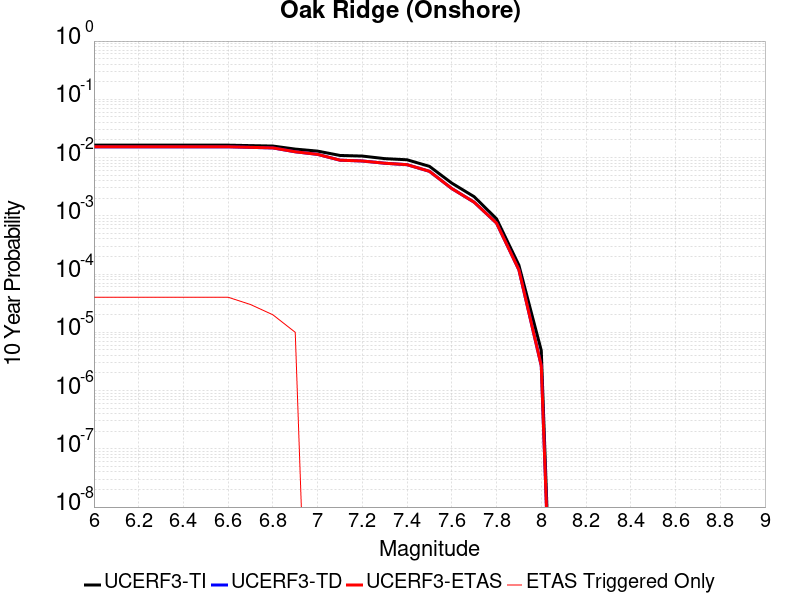 |

| Magnitude | 1 wk TI Prob | 1 wk TD Prob | 1 wk ETAS Prob | 1 wk ETAS/TD Gain | 1 wk ETAS Triggered Only | 1 mo TI Prob | 1 mo TD Prob | 1 mo ETAS Prob | 1 mo ETAS/TD Gain | 1 mo ETAS Triggered Only | 1 yr TI Prob | 1 yr TD Prob | 1 yr ETAS Prob | 1 yr ETAS/TD Gain | 1 yr ETAS Triggered Only | 10 yr TI Prob | 10 yr TD Prob | 10 yr ETAS Prob | 10 yr ETAS/TD Gain | 10 yr ETAS Triggered Only |
|-----|-----|-----|-----|-----|-----|-----|-----|-----|-----|-----|-----|-----|-----|-----|-----|-----|-----|-----|-----|-----|
| 6.0 | 3.155064E-5 | 2.9525974E-5 | 3.952568E-5 | 1.3386749 | 1.0E-5 | 1.3521002E-4 | 1.2653397E-4 | 1.365327E-4 | 1.0790201 | 1.0E-5 | 0.001644939 | 0.0015395004 | 0.0015594696 | 1.0129713 | 2.0E-5 | 0.01632816 | 0.015292859 | 0.015332247 | 1.0025756 | 4.0E-5 |
| 6.1 | 3.155064E-5 | 2.9525974E-5 | 3.952568E-5 | 1.3386749 | 1.0E-5 | 1.3521002E-4 | 1.2653397E-4 | 1.365327E-4 | 1.0790201 | 1.0E-5 | 0.001644939 | 0.0015395004 | 0.0015594696 | 1.0129713 | 2.0E-5 | 0.01632816 | 0.015292859 | 0.015332247 | 1.0025756 | 4.0E-5 |
| 6.2 | 3.155064E-5 | 2.9525974E-5 | 3.952568E-5 | 1.3386749 | 1.0E-5 | 1.3521002E-4 | 1.2653397E-4 | 1.365327E-4 | 1.0790201 | 1.0E-5 | 0.001644939 | 0.0015395004 | 0.0015594696 | 1.0129713 | 2.0E-5 | 0.01632816 | 0.015292859 | 0.015332247 | 1.0025756 | 4.0E-5 |
| 6.3 | 3.155064E-5 | 2.9525974E-5 | 3.952568E-5 | 1.3386749 | 1.0E-5 | 1.3521002E-4 | 1.2653397E-4 | 1.365327E-4 | 1.0790201 | 1.0E-5 | 0.001644939 | 0.0015395004 | 0.0015594696 | 1.0129713 | 2.0E-5 | 0.01632816 | 0.015292859 | 0.015332247 | 1.0025756 | 4.0E-5 |
| 6.4 | 3.155064E-5 | 2.9525974E-5 | 3.952568E-5 | 1.3386749 | 1.0E-5 | 1.3521002E-4 | 1.2653397E-4 | 1.365327E-4 | 1.0790201 | 1.0E-5 | 0.001644939 | 0.0015395004 | 0.0015594696 | 1.0129713 | 2.0E-5 | 0.01632816 | 0.015292859 | 0.015332247 | 1.0025756 | 4.0E-5 |
| 6.5 | 3.155064E-5 | 2.9525974E-5 | 3.952568E-5 | 1.3386749 | 1.0E-5 | 1.3521002E-4 | 1.2653397E-4 | 1.365327E-4 | 1.0790201 | 1.0E-5 | 0.001644939 | 0.0015395004 | 0.0015594696 | 1.0129713 | 2.0E-5 | 0.01632816 | 0.015292859 | 0.015332247 | 1.0025756 | 4.0E-5 |
| 6.6 | 3.155064E-5 | 2.9525974E-5 | 3.952568E-5 | 1.3386749 | 1.0E-5 | 1.3521002E-4 | 1.2653397E-4 | 1.365327E-4 | 1.0790201 | 1.0E-5 | 0.001644939 | 0.0015395004 | 0.0015594696 | 1.0129713 | 2.0E-5 | 0.01632816 | 0.015292859 | 0.015332247 | 1.0025756 | 4.0E-5 |
| 6.7 | 3.098897E-5 | 2.8864175E-5 | 3.8863887E-5 | 1.3464402 | 1.0E-5 | 1.328031E-4 | 1.2369796E-4 | 1.3369671E-4 | 1.0808321 | 1.0E-5 | 0.0016156785 | 0.0015050198 | 0.0015249897 | 1.0132688 | 2.0E-5 | 0.016039822 | 0.014952714 | 0.014982265 | 1.0019764 | 3.0E-5 |
| 6.8 | 3.0449872E-5 | 2.8239372E-5 | 2.8239372E-5 | 1.0 | 0.0 | 1.3049292E-4 | 1.2102048E-4 | 1.2102048E-4 | 1.0 | 0.0 | 0.0015875935 | 0.0014724657 | 0.0014824509 | 1.0067813 | 1.0E-5 | 0.015762992 | 0.014631462 | 0.014651169 | 1.001347 | 2.0E-5 |
| 6.9 | 2.697928E-5 | 2.4219773E-5 | 2.4219773E-5 | 1.0 | 0.0 | 1.15620365E-4 | 1.0379502E-4 | 1.0379502E-4 | 1.0 | 0.0 | 0.0014067689 | 0.0012629933 | 0.0012629933 | 1.0 | 0.0 | 0.0139789665 | 0.01256087 | 0.012570744 | 1.0007861 | 1.0E-5 |
| 7.0 | 2.4893961E-5 | 2.1862043E-5 | 2.1862043E-5 | 1.0 | 0.0 | 1.0668404E-4 | 9.3691204E-5 | 9.3691204E-5 | 1.0 | 0.0 | 0.0012981043 | 0.0011401111 | 0.0011401111 | 1.0 | 0.0 | 0.012905477 | 0.011344905 | 0.011344905 | 1.0 | 0.0 |
| 7.1 | 2.0945363E-5 | 1.7354487E-5 | 1.7354487E-5 | 1.0 | 0.0 | 8.976275E-5 | 7.437428E-5 | 7.437428E-5 | 1.0 | 0.0 | 0.0010923136 | 9.051354E-4 | 9.051354E-4 | 1.0 | 0.0 | 0.0108696 | 0.009015423 | 0.009015423 | 1.0 | 0.0 |
| 7.2 | 2.0439404E-5 | 1.6809423E-5 | 1.6809423E-5 | 1.0 | 0.0 | 8.7594504E-5 | 7.203843E-5 | 7.203843E-5 | 1.0 | 0.0 | 0.0010659413 | 8.767196E-4 | 8.767196E-4 | 1.0 | 0.0 | 0.010608427 | 0.008733526 | 0.008733526 | 1.0 | 0.0 |
| 7.3 | 1.8463334E-5 | 1.5381811E-5 | 1.5381811E-5 | 1.0 | 0.0 | 7.912617E-5 | 6.59204E-5 | 6.59204E-5 | 1.0 | 0.0 | 9.6293533E-4 | 8.0228975E-4 | 8.0228975E-4 | 1.0 | 0.0 | 0.009587734 | 0.007994797 | 0.007994797 | 1.0 | 0.0 |
| 7.4 | 1.763139E-5 | 1.451684E-5 | 1.451684E-5 | 1.0 | 0.0 | 7.556091E-5 | 6.221356E-5 | 6.221356E-5 | 1.0 | 0.0 | 9.1956573E-4 | 7.571909E-4 | 7.571909E-4 | 1.0 | 0.0 | 0.009157699 | 0.007546914 | 0.007546914 | 1.0 | 0.0 |
| 7.5 | 1.3594944E-5 | 1.1163356E-5 | 1.1163356E-5 | 1.0 | 0.0 | 5.8262744E-5 | 4.784209E-5 | 4.784209E-5 | 1.0 | 0.0 | 7.0911803E-4 | 5.8232434E-4 | 5.8232434E-4 | 1.0 | 0.0 | 0.007068595 | 0.0058082556 | 0.0058082556 | 1.0 | 0.0 |
| 7.6 | 6.9889534E-6 | 5.6367144E-6 | 5.6367144E-6 | 1.0 | 0.0 | 2.9952313E-5 | 2.4157125E-5 | 2.4157125E-5 | 1.0 | 0.0 | 3.646084E-4 | 2.9407372E-4 | 2.9407372E-4 | 1.0 | 0.0 | 0.0036401073 | 0.0029368899 | 0.0029368899 | 1.0 | 0.0 |
| 7.7 | 4.0824193E-6 | 3.2832586E-6 | 3.2832586E-6 | 1.0 | 0.0 | 1.7495966E-5 | 1.4071033E-5 | 1.4071033E-5 | 1.0 | 0.0 | 2.1299256E-4 | 1.713015E-4 | 1.713015E-4 | 1.0 | 0.0 | 0.0021278851 | 0.0017117079 | 0.0017117079 | 1.0 | 0.0 |
| 7.8 | 1.7023609E-6 | 1.4370495E-6 | 1.4370495E-6 | 1.0 | 0.0 | 7.295812E-6 | 6.1587693E-6 | 6.1587693E-6 | 1.0 | 0.0 | 8.882289E-5 | 7.498047E-5 | 7.498047E-5 | 1.0 | 0.0 | 8.8787393E-4 | 7.495545E-4 | 7.495545E-4 | 1.0 | 0.0 |
| 7.9 | 2.721225E-7 | 2.2616497E-7 | 2.2616497E-7 | 1.0 | 0.0 | 1.1662388E-6 | 9.692781E-7 | 9.692781E-7 | 1.0 | 0.0 | 1.4198865E-5 | 1.1800899E-5 | 1.1800899E-5 | 1.0 | 0.0 | 1.4197957E-4 | 1.1800301E-4 | 1.1800301E-4 | 1.0 | 0.0 |
| 8.0 | 9.364255E-9 | 5.1206666E-9 | 5.1206666E-9 | 1.0 | 0.0 | 4.0132523E-8 | 2.1945715E-8 | 2.1945715E-8 | 1.0 | 0.0 | 4.8861335E-7 | 2.6718905E-7 | 2.6718905E-7 | 1.0 | 0.0 | 4.8861225E-6 | 2.6718876E-6 | 2.6718876E-6 | 1.0 | 0.0 |

## Hosgri
*[(top)](#table-of-contents)*

| 1 Week | 1 Month | 1 Year | 10 Year |
|-----|-----|-----|-----|
| 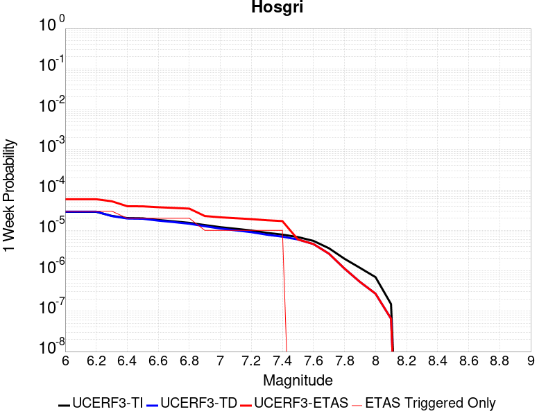 |  |  |  |

| Magnitude | 1 wk TI Prob | 1 wk TD Prob | 1 wk ETAS Prob | 1 wk ETAS/TD Gain | 1 wk ETAS Triggered Only | 1 mo TI Prob | 1 mo TD Prob | 1 mo ETAS Prob | 1 mo ETAS/TD Gain | 1 mo ETAS Triggered Only | 1 yr TI Prob | 1 yr TD Prob | 1 yr ETAS Prob | 1 yr ETAS/TD Gain | 1 yr ETAS Triggered Only | 10 yr TI Prob | 10 yr TD Prob | 10 yr ETAS Prob | 10 yr ETAS/TD Gain | 10 yr ETAS Triggered Only |
|-----|-----|-----|-----|-----|-----|-----|-----|-----|-----|-----|-----|-----|-----|-----|-----|-----|-----|-----|-----|-----|
| 6.0 | 2.883978E-5 | 2.9128416E-5 | 5.9127542E-5 | 2.0298922 | 3.0E-5 | 1.235932E-4 | 1.2483024E-4 | 1.548265E-4 | 1.2402964 | 3.0E-5 | 0.0015037085 | 0.001518776 | 0.0015587152 | 1.026297 | 4.0E-5 | 0.01493574 | 0.01508774 | 0.015127136 | 1.0026112 | 4.0E-5 |
| 6.1 | 2.883978E-5 | 2.9128416E-5 | 5.9127542E-5 | 2.0298922 | 3.0E-5 | 1.235932E-4 | 1.2483024E-4 | 1.548265E-4 | 1.2402964 | 3.0E-5 | 0.0015037085 | 0.001518776 | 0.0015587152 | 1.026297 | 4.0E-5 | 0.01493574 | 0.01508774 | 0.015127136 | 1.0026112 | 4.0E-5 |
| 6.2 | 2.883978E-5 | 2.9128416E-5 | 5.9127542E-5 | 2.0298922 | 3.0E-5 | 1.235932E-4 | 1.2483024E-4 | 1.548265E-4 | 1.2402964 | 3.0E-5 | 0.0015037085 | 0.001518776 | 0.0015587152 | 1.026297 | 4.0E-5 | 0.01493574 | 0.01508774 | 0.015127136 | 1.0026112 | 4.0E-5 |
| 6.3 | 2.2914428E-5 | 2.2641969E-5 | 5.264129E-5 | 2.324943 | 3.0E-5 | 9.8200995E-5 | 9.703343E-5 | 1.2703052E-4 | 1.3091418 | 3.0E-5 | 0.0011949413 | 0.0011807467 | 0.0012206994 | 1.0338368 | 4.0E-5 | 0.011885363 | 0.011746133 | 0.011785663 | 1.0033654 | 4.0E-5 |
| 6.4 | 2.0195741E-5 | 1.969656E-5 | 3.9696166E-5 | 2.0153856 | 2.0E-5 | 8.65503E-5 | 8.4411105E-5 | 1.0440942E-4 | 1.2369156 | 2.0E-5 | 0.0010532405 | 0.0010272227 | 0.0010472022 | 1.01945 | 2.0E-5 | 0.010482626 | 0.010225792 | 0.010245589 | 1.0019358 | 2.0E-5 |
| 6.5 | 1.9924333E-5 | 1.940898E-5 | 3.9408595E-5 | 2.0304308 | 2.0E-5 | 8.53872E-5 | 8.3178704E-5 | 1.03177044E-4 | 1.2404262 | 2.0E-5 | 0.0010390934 | 0.0010122322 | 0.0010322119 | 1.0197383 | 2.0E-5 | 0.010342481 | 0.010077253 | 0.010097052 | 1.0019647 | 2.0E-5 |
| 6.6 | 1.809694E-5 | 1.74583E-5 | 3.745795E-5 | 2.145567 | 2.0E-5 | 7.7556004E-5 | 7.4819145E-5 | 9.481765E-5 | 1.2672913 | 2.0E-5 | 9.438353E-4 | 9.105437E-4 | 9.3052554E-4 | 1.0219449 | 2.0E-5 | 0.009398366 | 0.009069073 | 0.009088892 | 1.0021853 | 2.0E-5 |
| 6.7 | 1.675989E-5 | 1.6042764E-5 | 3.6042446E-5 | 2.2466478 | 2.0E-5 | 7.182612E-5 | 6.87529E-5 | 8.875153E-5 | 1.2908769 | 2.0E-5 | 8.7413215E-4 | 8.3674624E-4 | 8.567295E-4 | 1.0238822 | 2.0E-5 | 0.008707017 | 0.0083368635 | 0.008356696 | 1.002379 | 2.0E-5 |
| 6.8 | 1.5401129E-5 | 1.4614083E-5 | 3.461379E-5 | 2.368523 | 2.0E-5 | 6.6003166E-5 | 6.2630286E-5 | 8.262903E-5 | 1.3193144 | 2.0E-5 | 8.032922E-4 | 7.622578E-4 | 7.8224257E-4 | 1.0262178 | 2.0E-5 | 0.008003947 | 0.007597296 | 0.0076171444 | 1.0026125 | 2.0E-5 |
| 6.9 | 1.356559E-5 | 1.2689968E-5 | 2.2689841E-5 | 1.788014 | 1.0E-5 | 5.8136946E-5 | 5.4384444E-5 | 6.43839E-5 | 1.1838661 | 1.0E-5 | 7.0758746E-4 | 6.619299E-4 | 6.719233E-4 | 1.0150974 | 1.0E-5 | 0.007053386 | 0.006600388 | 0.006610322 | 1.001505 | 1.0E-5 |
| 7.0 | 1.2030819E-5 | 1.1095962E-5 | 2.109585E-5 | 1.9012188 | 1.0E-5 | 5.155963E-5 | 4.7553254E-5 | 5.7552777E-5 | 1.2102805 | 1.0E-5 | 6.275577E-4 | 5.7880714E-4 | 5.888014E-4 | 1.0172669 | 1.0E-5 | 0.006257884 | 0.005773757 | 0.0057836995 | 1.001722 | 1.0E-5 |
| 7.1 | 1.0972698E-5 | 1.0022179E-5 | 2.0022078E-5 | 1.997777 | 1.0E-5 | 4.7025E-5 | 4.2951488E-5 | 5.2951058E-5 | 1.2328109 | 1.0E-5 | 5.72379E-4 | 5.22809E-4 | 5.3280377E-4 | 1.0191175 | 1.0E-5 | 0.0057090693 | 0.005216542 | 0.00522649 | 1.001907 | 1.0E-5 |
| 7.2 | 9.961926E-6 | 9.034746E-6 | 1.9034655E-5 | 2.106828 | 1.0E-5 | 4.2693267E-5 | 3.8719765E-5 | 4.8719376E-5 | 1.2582561 | 1.0E-5 | 5.1966653E-4 | 4.713112E-4 | 4.813065E-4 | 1.0212075 | 1.0E-5 | 0.00518453 | 0.0047038626 | 0.0047138156 | 1.002116 | 1.0E-5 |
| 7.3 | 8.700929E-6 | 7.8281E-6 | 1.7828022E-5 | 2.277439 | 1.0E-5 | 3.7289166E-5 | 3.354857E-5 | 4.3548236E-5 | 1.2980653 | 1.0E-5 | 4.53901E-4 | 4.0837732E-4 | 4.1837324E-4 | 1.0244771 | 1.0E-5 | 0.00452975 | 0.004077008 | 0.0040869676 | 1.0024428 | 1.0E-5 |
| 7.4 | 7.866285E-6 | 6.998739E-6 | 1.6998669E-5 | 2.428819 | 1.0E-5 | 3.3712215E-5 | 2.9994251E-5 | 3.999395E-5 | 1.3333873 | 1.0E-5 | 4.103689E-4 | 3.6511885E-4 | 3.751152E-4 | 1.0273783 | 1.0E-5 | 0.004096119 | 0.0036459267 | 0.0036558902 | 1.0027328 | 1.0E-5 |
| 7.5 | 6.8381305E-6 | 5.9596955E-6 | 5.9596955E-6 | 1.0 | 0.0 | 2.9305946E-5 | 2.5541302E-5 | 2.5541302E-5 | 1.0 | 0.0 | 3.5674145E-4 | 3.10921E-4 | 3.10921E-4 | 1.0 | 0.0 | 0.0035616932 | 0.0031055948 | 0.0031055948 | 1.0 | 0.0 |
| 7.6 | 5.503376E-6 | 4.5952443E-6 | 4.5952443E-6 | 1.0 | 0.0 | 2.3585684E-5 | 1.9693754E-5 | 1.9693754E-5 | 1.0 | 0.0 | 2.8711787E-4 | 2.397451E-4 | 2.397451E-4 | 1.0 | 0.0 | 0.002867472 | 0.0023955975 | 0.0023955975 | 1.0 | 0.0 |
| 7.7 | 3.6144982E-6 | 2.6522112E-6 | 2.6522112E-6 | 1.0 | 0.0 | 1.5490614E-5 | 1.1366569E-5 | 1.1366569E-5 | 1.0 | 0.0 | 1.8858191E-4 | 1.383792E-4 | 1.383792E-4 | 1.0 | 0.0 | 0.0018842196 | 0.0013836613 | 0.0013836613 | 1.0 | 0.0 |
| 7.8 | 1.9853494E-6 | 1.1361129E-6 | 1.1361129E-6 | 1.0 | 0.0 | 8.508612E-6 | 4.8690463E-6 | 4.8690463E-6 | 1.0 | 0.0 | 1.0358743E-4 | 5.9279027E-5 | 5.9279027E-5 | 1.0 | 0.0 | 0.0010353916 | 5.9336185E-4 | 5.9336185E-4 | 1.0 | 0.0 |
| 7.9 | 1.1818757E-6 | 5.2951856E-7 | 5.2951856E-7 | 1.0 | 0.0 | 5.0651715E-6 | 2.2693632E-6 | 2.2693632E-6 | 1.0 | 0.0 | 6.1666724E-5 | 2.7629147E-5 | 2.7629147E-5 | 1.0 | 0.0 | 6.1649614E-4 | 2.7694515E-4 | 2.7694515E-4 | 1.0 | 0.0 |
| 8.0 | 6.962958E-7 | 2.7139782E-7 | 2.7139782E-7 | 1.0 | 0.0 | 2.9841215E-6 | 1.163133E-6 | 1.163133E-6 | 1.0 | 0.0 | 3.6331072E-5 | 1.4161053E-5 | 1.4161053E-5 | 1.0 | 0.0 | 3.6325134E-4 | 1.4217179E-4 | 1.4217179E-4 | 1.0 | 0.0 |
| 8.1 | 1.5033264E-7 | 6.527624E-8 | 6.527624E-8 | 1.0 | 0.0 | 6.442826E-7 | 2.7975528E-7 | 2.7975528E-7 | 1.0 | 0.0 | 7.844113E-6 | 3.4060151E-6 | 3.4060151E-6 | 1.0 | 0.0 | 7.843835E-5 | 3.407693E-5 | 3.407693E-5 | 1.0 | 0.0 |

## Santa Cruz Catalina Ridge alt1
*[(top)](#table-of-contents)*

| 1 Week | 1 Month | 1 Year | 10 Year |
|-----|-----|-----|-----|
|  |  | 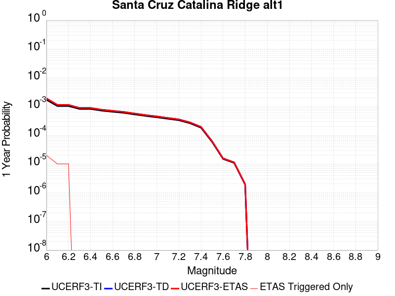 |  |

| Magnitude | 1 wk TI Prob | 1 wk TD Prob | 1 wk ETAS Prob | 1 wk ETAS/TD Gain | 1 wk ETAS Triggered Only | 1 mo TI Prob | 1 mo TD Prob | 1 mo ETAS Prob | 1 mo ETAS/TD Gain | 1 mo ETAS Triggered Only | 1 yr TI Prob | 1 yr TD Prob | 1 yr ETAS Prob | 1 yr ETAS/TD Gain | 1 yr ETAS Triggered Only | 10 yr TI Prob | 10 yr TD Prob | 10 yr ETAS Prob | 10 yr ETAS/TD Gain | 10 yr ETAS Triggered Only |
|-----|-----|-----|-----|-----|-----|-----|-----|-----|-----|-----|-----|-----|-----|-----|-----|-----|-----|-----|-----|-----|
| 6.0 | 3.2833184E-5 | 3.65584E-5 | 3.65584E-5 | 1.0 | 0.0 | 1.4070606E-4 | 1.5667039E-4 | 1.6666882E-4 | 1.0638182 | 1.0E-5 | 0.00171175 | 0.0019059596 | 0.0019259214 | 1.0104734 | 2.0E-5 | 0.016986247 | 0.018913029 | 0.018952273 | 1.002075 | 4.0E-5 |
| 6.1 | 1.9835548E-5 | 2.1659505E-5 | 2.1659505E-5 | 1.0 | 0.0 | 8.500672E-5 | 9.282326E-5 | 9.282326E-5 | 1.0 | 0.0 | 0.0010344655 | 0.0011295575 | 0.0011395462 | 1.0088431 | 1.0E-5 | 0.010296632 | 0.011240295 | 0.011269959 | 1.0026389 | 3.0E-5 |
| 6.2 | 1.9835548E-5 | 2.1659505E-5 | 2.1659505E-5 | 1.0 | 0.0 | 8.500672E-5 | 9.282326E-5 | 9.282326E-5 | 1.0 | 0.0 | 0.0010344655 | 0.0011295575 | 0.0011395462 | 1.0088431 | 1.0E-5 | 0.010296632 | 0.011240295 | 0.011269959 | 1.0026389 | 3.0E-5 |
| 6.3 | 1.5728183E-5 | 1.703395E-5 | 1.703395E-5 | 1.0 | 0.0 | 6.7404755E-5 | 7.300063E-5 | 7.300063E-5 | 1.0 | 0.0 | 8.2034385E-4 | 8.884264E-4 | 8.884264E-4 | 1.0 | 0.0 | 0.008173222 | 0.008849427 | 0.00886925 | 1.0022401 | 2.0E-5 |
| 6.4 | 1.5728183E-5 | 1.703395E-5 | 1.703395E-5 | 1.0 | 0.0 | 6.7404755E-5 | 7.300063E-5 | 7.300063E-5 | 1.0 | 0.0 | 8.2034385E-4 | 8.884264E-4 | 8.884264E-4 | 1.0 | 0.0 | 0.008173222 | 0.008849427 | 0.00886925 | 1.0022401 | 2.0E-5 |
| 6.5 | 1.3707734E-5 | 1.4794522E-5 | 1.4794522E-5 | 1.0 | 0.0 | 5.8746107E-5 | 6.3403575E-5 | 6.3403575E-5 | 1.0 | 0.0 | 7.1499916E-4 | 7.716686E-4 | 7.716686E-4 | 1.0 | 0.0 | 0.0071270303 | 0.0076902895 | 0.007710136 | 1.0025806 | 2.0E-5 |
| 6.6 | 1.2539813E-5 | 1.3510219E-5 | 1.3510219E-5 | 1.0 | 0.0 | 5.3740947E-5 | 5.789967E-5 | 5.789967E-5 | 1.0 | 0.0 | 6.540996E-4 | 7.0470315E-4 | 7.0470315E-4 | 1.0 | 0.0 | 0.0065217763 | 0.0070249885 | 0.007044848 | 1.0028269 | 2.0E-5 |
| 6.7 | 1.1504083E-5 | 1.2377375E-5 | 1.2377375E-5 | 1.0 | 0.0 | 4.930228E-5 | 5.3044827E-5 | 5.3044827E-5 | 1.0 | 0.0 | 6.0008996E-4 | 6.456314E-4 | 6.456314E-4 | 1.0 | 0.0 | 0.005984721 | 0.006437786 | 0.006457657 | 1.0030867 | 2.0E-5 |
| 6.8 | 1.012739E-5 | 1.0877071E-5 | 1.0877071E-5 | 1.0 | 0.0 | 4.340238E-5 | 4.6615194E-5 | 4.6615194E-5 | 1.0 | 0.0 | 5.282958E-4 | 5.673937E-4 | 5.673937E-4 | 1.0 | 0.0 | 0.0052704164 | 0.0056596193 | 0.0056795063 | 1.0035138 | 2.0E-5 |
| 6.9 | 8.9607865E-6 | 9.609117E-6 | 9.609117E-6 | 1.0 | 0.0 | 3.8402806E-5 | 4.1181287E-5 | 4.1181287E-5 | 1.0 | 0.0 | 4.6745385E-4 | 5.012679E-4 | 5.012679E-4 | 1.0 | 0.0 | 0.0046647177 | 0.005001492 | 0.005021392 | 1.0039788 | 2.0E-5 |
| 7.0 | 8.046829E-6 | 8.619746E-6 | 8.619746E-6 | 1.0 | 0.0 | 3.4485955E-5 | 3.694125E-5 | 3.694125E-5 | 1.0 | 0.0 | 4.1978562E-4 | 4.496677E-4 | 4.496677E-4 | 1.0 | 0.0 | 0.004189935 | 0.0044876686 | 0.004507579 | 1.0044366 | 2.0E-5 |
| 7.1 | 7.136131E-6 | 7.637656E-6 | 7.637656E-6 | 1.0 | 0.0 | 3.0583058E-5 | 3.2732405E-5 | 3.2732405E-5 | 1.0 | 0.0 | 3.7228514E-4 | 3.9844486E-4 | 3.9844486E-4 | 1.0 | 0.0 | 0.0037166206 | 0.003977381 | 0.0039973017 | 1.0050085 | 2.0E-5 |
| 7.2 | 6.362014E-6 | 6.8049585E-6 | 6.8049585E-6 | 1.0 | 0.0 | 2.726549E-5 | 2.9163786E-5 | 2.9163786E-5 | 1.0 | 0.0 | 3.3190678E-4 | 3.550119E-4 | 3.550119E-4 | 1.0 | 0.0 | 0.0033141149 | 0.003544516 | 0.003564445 | 1.0056225 | 2.0E-5 |
| 7.3 | 5.004101E-6 | 5.351715E-6 | 5.351715E-6 | 1.0 | 0.0 | 2.1445969E-5 | 2.2935723E-5 | 2.2935723E-5 | 1.0 | 0.0 | 2.6107338E-4 | 2.792072E-4 | 2.792072E-4 | 1.0 | 0.0 | 0.002607669 | 0.0027886187 | 0.0027886187 | 1.0 | 0.0 |
| 7.4 | 3.4901443E-6 | 3.7320526E-6 | 3.7320526E-6 | 1.0 | 0.0 | 1.4957676E-5 | 1.5994416E-5 | 1.5994416E-5 | 1.0 | 0.0 | 1.8209449E-4 | 1.9471499E-4 | 1.9471499E-4 | 1.0 | 0.0 | 0.0018194534 | 0.0019454823 | 0.0019454823 | 1.0 | 0.0 |
| 7.5 | 1.1215045E-6 | 1.189387E-6 | 1.189387E-6 | 1.0 | 0.0 | 4.806439E-6 | 5.097363E-6 | 5.097363E-6 | 1.0 | 0.0 | 5.851682E-5 | 6.205866E-5 | 6.205866E-5 | 1.0 | 0.0 | 5.850142E-4 | 6.2041637E-4 | 6.2041637E-4 | 1.0 | 0.0 |
| 7.6 | 2.8599047E-7 | 2.9951994E-7 | 2.9951994E-7 | 1.0 | 0.0 | 1.2256729E-6 | 1.2836562E-6 | 1.2836562E-6 | 1.0 | 0.0 | 1.4922465E-5 | 1.5628404E-5 | 1.5628404E-5 | 1.0 | 0.0 | 1.4921463E-4 | 1.5627318E-4 | 1.5627318E-4 | 1.0 | 0.0 |
| 7.7 | 2.0781519E-7 | 2.1744323E-7 | 2.1744323E-7 | 1.0 | 0.0 | 8.906362E-7 | 9.3189925E-7 | 9.3189925E-7 | 1.0 | 0.0 | 1.08434415E-5 | 1.13458145E-5 | 1.13458145E-5 | 1.0 | 0.0 | 1.0842913E-4 | 1.1345245E-4 | 1.1345245E-4 | 1.0 | 0.0 |
| 7.8 | 3.614776E-8 | 3.764102E-8 | 3.764102E-8 | 1.0 | 0.0 | 1.5491896E-7 | 1.6131864E-7 | 1.6131864E-7 | 1.0 | 0.0 | 1.8861368E-6 | 1.9640527E-6 | 1.9640527E-6 | 1.0 | 0.0 | 1.8861208E-5 | 1.9640367E-5 | 1.9640367E-5 | 1.0 | 0.0 |

## Hayward (So) 2011 CFM
*[(top)](#table-of-contents)*

| 1 Week | 1 Month | 1 Year | 10 Year |
|-----|-----|-----|-----|
|  |  |  |  |

| Magnitude | 1 wk TI Prob | 1 wk TD Prob | 1 wk ETAS Prob | 1 wk ETAS/TD Gain | 1 wk ETAS Triggered Only | 1 mo TI Prob | 1 mo TD Prob | 1 mo ETAS Prob | 1 mo ETAS/TD Gain | 1 mo ETAS Triggered Only | 1 yr TI Prob | 1 yr TD Prob | 1 yr ETAS Prob | 1 yr ETAS/TD Gain | 1 yr ETAS Triggered Only | 10 yr TI Prob | 10 yr TD Prob | 10 yr ETAS Prob | 10 yr ETAS/TD Gain | 10 yr ETAS Triggered Only |
|-----|-----|-----|-----|-----|-----|-----|-----|-----|-----|-----|-----|-----|-----|-----|-----|-----|-----|-----|-----|-----|
| 6.0 | 1.8091932E-4 | 3.570541E-4 | 3.6705052E-4 | 1.027997 | 1.0E-5 | 7.751381E-4 | 0.0015293444 | 0.0015493138 | 1.0130575 | 2.0E-5 | 0.00939654 | 0.018463207 | 0.018492654 | 1.0015949 | 3.0E-5 | 0.090090066 | 0.16673161 | 0.16676494 | 1.0001999 | 4.0E-5 |
| 6.1 | 1.8091932E-4 | 3.570541E-4 | 3.6705052E-4 | 1.027997 | 1.0E-5 | 7.751381E-4 | 0.0015293444 | 0.0015493138 | 1.0130575 | 2.0E-5 | 0.00939654 | 0.018463207 | 0.018492654 | 1.0015949 | 3.0E-5 | 0.090090066 | 0.16673161 | 0.16676494 | 1.0001999 | 4.0E-5 |
| 6.2 | 1.8091932E-4 | 3.570541E-4 | 3.6705052E-4 | 1.027997 | 1.0E-5 | 7.751381E-4 | 0.0015293444 | 0.0015493138 | 1.0130575 | 2.0E-5 | 0.00939654 | 0.018463207 | 0.018492654 | 1.0015949 | 3.0E-5 | 0.090090066 | 0.16673161 | 0.16676494 | 1.0001999 | 4.0E-5 |
| 6.3 | 1.7322872E-4 | 3.426234E-4 | 3.5261997E-4 | 1.0291766 | 1.0E-5 | 7.4219756E-4 | 0.0014675693 | 0.00148754 | 1.013608 | 2.0E-5 | 0.0089988755 | 0.017723544 | 0.017753012 | 1.0016626 | 3.0E-5 | 0.08643075 | 0.16066726 | 0.16070083 | 1.000209 | 4.0E-5 |
| 6.4 | 1.6334097E-4 | 3.234411E-4 | 3.3343787E-4 | 1.0309075 | 1.0E-5 | 6.998449E-4 | 0.0013854484 | 0.0014054207 | 1.0144157 | 2.0E-5 | 0.008487372 | 0.016739385 | 0.016768884 | 1.0017622 | 3.0E-5 | 0.081704415 | 0.15255594 | 0.15258984 | 1.0002222 | 4.0E-5 |
| 6.5 | 1.5600289E-4 | 3.1018828E-4 | 3.2018515E-4 | 1.0322285 | 1.0E-5 | 6.684125E-4 | 0.0013287093 | 0.0013486828 | 1.0150322 | 2.0E-5 | 0.008107598 | 0.016058935 | 0.016088452 | 1.0018381 | 3.0E-5 | 0.078181036 | 0.14683272 | 0.14686684 | 1.0002325 | 4.0E-5 |
| 6.6 | 1.4046066E-4 | 2.8032906E-4 | 2.9032625E-4 | 1.0356624 | 1.0E-5 | 6.018354E-4 | 0.0012008639 | 0.0012208399 | 1.0166347 | 2.0E-5 | 0.0073027555 | 0.014524006 | 0.014543716 | 1.0013571 | 2.0E-5 | 0.07067384 | 0.13391982 | 0.13394581 | 1.0001941 | 3.0E-5 |
| 6.7 | 1.14696966E-4 | 2.3271477E-4 | 2.3271477E-4 | 1.0 | 0.0 | 4.914658E-4 | 9.969729E-4 | 0.0010069628 | 1.0100204 | 1.0E-5 | 0.0059671924 | 0.012071652 | 0.012081532 | 1.0008184 | 1.0E-5 | 0.058094822 | 0.11274672 | 0.11276447 | 1.0001574 | 2.0E-5 |
| 6.8 | 9.3874296E-5 | 1.8861453E-4 | 1.8861453E-4 | 1.0 | 0.0 | 4.0225635E-4 | 8.0810126E-4 | 8.180932E-4 | 1.0123647 | 1.0E-5 | 0.0048864787 | 0.009794984 | 0.009804886 | 1.0010109 | 1.0E-5 | 0.047804173 | 0.09259856 | 0.09261671 | 1.000196 | 2.0E-5 |
| 6.9 | 5.551852E-5 | 1.072948E-4 | 1.072948E-4 | 1.0 | 0.0 | 2.3791482E-4 | 4.5975443E-4 | 4.6974982E-4 | 1.0217408 | 1.0E-5 | 0.0028927654 | 0.0055832625 | 0.0055932067 | 1.0017811 | 1.0E-5 | 0.028553981 | 0.054245494 | 0.05425495 | 1.0001744 | 1.0E-5 |
| 7.0 | 4.2662363E-5 | 8.2464416E-5 | 8.2464416E-5 | 1.0 | 0.0 | 1.8282588E-4 | 3.5337146E-4 | 3.6336793E-4 | 1.0282888 | 1.0E-5 | 0.0022236328 | 0.0042938837 | 0.004303841 | 1.0023189 | 1.0E-5 | 0.022015138 | 0.042064495 | 0.042074073 | 1.0002277 | 1.0E-5 |
| 7.1 | 3.305886E-5 | 6.3019055E-5 | 6.3019055E-5 | 1.0 | 0.0 | 1.4167312E-4 | 2.700538E-4 | 2.8005108E-4 | 1.0370196 | 1.0E-5 | 0.0017235056 | 0.0032829668 | 0.003292934 | 1.003036 | 1.0E-5 | 0.017101998 | 0.032452874 | 0.03246255 | 1.0002981 | 1.0E-5 |
| 7.2 | 2.9856887E-5 | 5.7013647E-5 | 5.7013647E-5 | 1.0 | 0.0 | 1.2795182E-4 | 2.4432142E-4 | 2.5431896E-4 | 1.0409197 | 1.0E-5 | 0.0015567001 | 0.0029705726 | 0.0029805428 | 1.0033563 | 1.0E-5 | 0.015458403 | 0.029453589 | 0.029463293 | 1.0003295 | 1.0E-5 |
| 7.3 | 2.4559737E-5 | 4.599088E-5 | 4.599088E-5 | 1.0 | 0.0 | 1.0525176E-4 | 1.9708896E-4 | 2.07087E-4 | 1.0507286 | 1.0E-5 | 0.0012806869 | 0.0023969305 | 0.0024069063 | 1.004162 | 1.0E-5 | 0.012733313 | 0.023857482 | 0.023867244 | 1.0004091 | 1.0E-5 |
| 7.4 | 1.9002231E-5 | 3.5049303E-5 | 3.5049303E-5 | 1.0 | 0.0 | 8.143559E-5 | 1.502027E-4 | 1.602012E-4 | 1.0665667 | 1.0E-5 | 9.910273E-4 | 0.0018271938 | 0.0018371756 | 1.0054629 | 1.0E-5 | 0.009866194 | 0.018258283 | 0.018268099 | 1.0005378 | 1.0E-5 |
| 7.5 | 1.2783333E-5 | 2.3330069E-5 | 2.3330069E-5 | 1.0 | 0.0 | 5.4784563E-5 | 9.998221E-5 | 9.998221E-5 | 1.0 | 0.0 | 6.667979E-4 | 0.0012166094 | 0.0012166094 | 1.0 | 0.0 | 0.006648007 | 0.012209582 | 0.012209582 | 1.0 | 0.0 |
| 7.6 | 4.8149627E-6 | 8.887544E-6 | 8.887544E-6 | 1.0 | 0.0 | 2.063539E-5 | 3.8088925E-5 | 3.8088925E-5 | 1.0 | 0.0 | 2.5120692E-4 | 4.636352E-4 | 4.636352E-4 | 1.0 | 0.0 | 0.0025092314 | 0.0046812436 | 0.0046812436 | 1.0 | 0.0 |
| 7.7 | 6.0838227E-7 | 1.2056693E-6 | 1.2056693E-6 | 1.0 | 0.0 | 2.6073499E-6 | 5.1671436E-6 | 5.1671436E-6 | 1.0 | 0.0 | 3.174402E-5 | 6.290816E-5 | 6.290816E-5 | 1.0 | 0.0 | 3.1739488E-4 | 6.5293367E-4 | 6.5293367E-4 | 1.0 | 0.0 |
| 7.8 | 4.5542808E-7 | 9.792182E-7 | 9.792182E-7 | 1.0 | 0.0 | 1.9518332E-6 | 4.1966427E-6 | 4.1966427E-6 | 1.0 | 0.0 | 2.376331E-5 | 5.1092928E-5 | 5.1092928E-5 | 1.0 | 0.0 | 2.3760769E-4 | 5.321372E-4 | 5.321372E-4 | 1.0 | 0.0 |
| 7.9 | 3.3016747E-7 | 7.386335E-7 | 7.386335E-7 | 1.0 | 0.0 | 1.4150027E-6 | 3.1655684E-6 | 3.1655684E-6 | 1.0 | 0.0 | 1.7227521E-5 | 3.8540114E-5 | 3.8540114E-5 | 1.0 | 0.0 | 1.7226185E-4 | 3.9930744E-4 | 3.9930744E-4 | 1.0 | 0.0 |
| 8.0 | 2.347038E-7 | 5.4714894E-7 | 5.4714894E-7 | 1.0 | 0.0 | 1.0058731E-6 | 2.344922E-6 | 2.344922E-6 | 1.0 | 0.0 | 1.2246436E-5 | 2.8549053E-5 | 2.8549053E-5 | 1.0 | 0.0 | 1.2245761E-4 | 2.9355253E-4 | 2.9355253E-4 | 1.0 | 0.0 |
| 8.1 | 1.18822804E-7 | 2.6058973E-7 | 2.6058973E-7 | 1.0 | 0.0 | 5.092405E-7 | 1.1168127E-6 | 1.1168127E-6 | 1.0 | 0.0 | 6.1999854E-6 | 1.359711E-5 | 1.359711E-5 | 1.0 | 0.0 | 6.199812E-5 | 1.3917852E-4 | 1.3917852E-4 | 1.0 | 0.0 |

## Channel Islands Western Deep Ramp
*[(top)](#table-of-contents)*

| 1 Week | 1 Month | 1 Year | 10 Year |
|-----|-----|-----|-----|
|  |  |  |  |

| Magnitude | 1 wk TI Prob | 1 wk TD Prob | 1 wk ETAS Prob | 1 wk ETAS/TD Gain | 1 wk ETAS Triggered Only | 1 mo TI Prob | 1 mo TD Prob | 1 mo ETAS Prob | 1 mo ETAS/TD Gain | 1 mo ETAS Triggered Only | 1 yr TI Prob | 1 yr TD Prob | 1 yr ETAS Prob | 1 yr ETAS/TD Gain | 1 yr ETAS Triggered Only | 10 yr TI Prob | 10 yr TD Prob | 10 yr ETAS Prob | 10 yr ETAS/TD Gain | 10 yr ETAS Triggered Only |
|-----|-----|-----|-----|-----|-----|-----|-----|-----|-----|-----|-----|-----|-----|-----|-----|-----|-----|-----|-----|-----|
| 6.0 | 6.0213506E-6 | 6.2548684E-6 | 1.6254806E-5 | 2.5987446 | 1.0E-5 | 2.5805533E-5 | 2.6806329E-5 | 3.680606E-5 | 1.3730363 | 1.0E-5 | 3.1413708E-4 | 3.2632265E-4 | 3.463161E-4 | 1.061269 | 2.0E-5 | 0.0031369338 | 0.0032588763 | 0.0032887785 | 1.0091757 | 3.0E-5 |
| 6.1 | 6.0213506E-6 | 6.2548684E-6 | 1.6254806E-5 | 2.5987446 | 1.0E-5 | 2.5805533E-5 | 2.6806329E-5 | 3.680606E-5 | 1.3730363 | 1.0E-5 | 3.1413708E-4 | 3.2632265E-4 | 3.463161E-4 | 1.061269 | 2.0E-5 | 0.0031369338 | 0.0032588763 | 0.0032887785 | 1.0091757 | 3.0E-5 |
| 6.2 | 6.0213506E-6 | 6.2548684E-6 | 1.6254806E-5 | 2.5987446 | 1.0E-5 | 2.5805533E-5 | 2.6806329E-5 | 3.680606E-5 | 1.3730363 | 1.0E-5 | 3.1413708E-4 | 3.2632265E-4 | 3.463161E-4 | 1.061269 | 2.0E-5 | 0.0031369338 | 0.0032588763 | 0.0032887785 | 1.0091757 | 3.0E-5 |
| 6.3 | 6.0213506E-6 | 6.2548684E-6 | 1.6254806E-5 | 2.5987446 | 1.0E-5 | 2.5805533E-5 | 2.6806329E-5 | 3.680606E-5 | 1.3730363 | 1.0E-5 | 3.1413708E-4 | 3.2632265E-4 | 3.463161E-4 | 1.061269 | 2.0E-5 | 0.0031369338 | 0.0032588763 | 0.0032887785 | 1.0091757 | 3.0E-5 |
| 6.4 | 6.0213506E-6 | 6.2548684E-6 | 1.6254806E-5 | 2.5987446 | 1.0E-5 | 2.5805533E-5 | 2.6806329E-5 | 3.680606E-5 | 1.3730363 | 1.0E-5 | 3.1413708E-4 | 3.2632265E-4 | 3.463161E-4 | 1.061269 | 2.0E-5 | 0.0031369338 | 0.0032588763 | 0.0032887785 | 1.0091757 | 3.0E-5 |
| 6.5 | 6.0213506E-6 | 6.2548684E-6 | 1.6254806E-5 | 2.5987446 | 1.0E-5 | 2.5805533E-5 | 2.6806329E-5 | 3.680606E-5 | 1.3730363 | 1.0E-5 | 3.1413708E-4 | 3.2632265E-4 | 3.463161E-4 | 1.061269 | 2.0E-5 | 0.0031369338 | 0.0032588763 | 0.0032887785 | 1.0091757 | 3.0E-5 |
| 6.6 | 6.0213506E-6 | 6.2548684E-6 | 1.6254806E-5 | 2.5987446 | 1.0E-5 | 2.5805533E-5 | 2.6806329E-5 | 3.680606E-5 | 1.3730363 | 1.0E-5 | 3.1413708E-4 | 3.2632265E-4 | 3.463161E-4 | 1.061269 | 2.0E-5 | 0.0031369338 | 0.0032588763 | 0.0032887785 | 1.0091757 | 3.0E-5 |
| 6.7 | 5.313309E-6 | 5.5252403E-6 | 1.5525186E-5 | 2.809866 | 1.0E-5 | 2.2771126E-5 | 2.367941E-5 | 3.3679175E-5 | 1.4222978 | 1.0E-5 | 2.772032E-4 | 2.8826276E-4 | 3.08257E-4 | 1.0693611 | 2.0E-5 | 0.0027685766 | 0.0028792918 | 0.0029092054 | 1.0103892 | 3.0E-5 |
| 6.8 | 5.313309E-6 | 5.5252403E-6 | 1.5525186E-5 | 2.809866 | 1.0E-5 | 2.2771126E-5 | 2.367941E-5 | 3.3679175E-5 | 1.4222978 | 1.0E-5 | 2.772032E-4 | 2.8826276E-4 | 3.08257E-4 | 1.0693611 | 2.0E-5 | 0.0027685766 | 0.0028792918 | 0.0029092054 | 1.0103892 | 3.0E-5 |
| 6.9 | 4.744377E-6 | 4.9394303E-6 | 1.4939381E-5 | 3.024515 | 1.0E-5 | 2.0332885E-5 | 2.1168837E-5 | 3.1168624E-5 | 1.4723825 | 1.0E-5 | 2.4752476E-4 | 2.5770385E-4 | 2.7769868E-4 | 1.0775884 | 2.0E-5 | 0.0024724922 | 0.0025744175 | 0.0026043402 | 1.0116231 | 3.0E-5 |
| 7.0 | 4.722209E-6 | 4.9164732E-6 | 1.4916424E-5 | 3.0339684 | 1.0E-5 | 2.0237881E-5 | 2.107045E-5 | 3.1070238E-5 | 1.4745883 | 1.0E-5 | 2.4636835E-4 | 2.5650626E-4 | 2.7650114E-4 | 1.0779508 | 2.0E-5 | 0.002460954 | 0.0025624693 | 0.0025923925 | 1.0116775 | 3.0E-5 |
| 7.1 | 4.611174E-6 | 4.801409E-6 | 1.48013605E-5 | 3.082712 | 1.0E-5 | 1.9762025E-5 | 2.0577325E-5 | 3.057712E-5 | 1.4859618 | 1.0E-5 | 2.4057609E-4 | 2.5050386E-4 | 2.7049886E-4 | 1.0798191 | 2.0E-5 | 0.002403158 | 0.002502582 | 0.0025325068 | 1.0119576 | 3.0E-5 |
| 7.2 | 4.043994E-6 | 4.2120264E-6 | 1.4211984E-5 | 3.374144 | 1.0E-5 | 1.7331287E-5 | 1.8051438E-5 | 2.8051258E-5 | 1.5539625 | 1.0E-5 | 2.10988E-4 | 2.1975765E-4 | 2.3975327E-4 | 1.0909894 | 2.0E-5 | 0.002107878 | 0.0021957543 | 0.0022256884 | 1.0136328 | 3.0E-5 |
| 7.3 | 2.1233036E-6 | 2.2297875E-6 | 1.2229765E-5 | 5.4847226 | 1.0E-5 | 9.099841E-6 | 9.556197E-6 | 1.9556102E-5 | 2.0464313 | 1.0E-5 | 1.1078493E-4 | 1.1634055E-4 | 1.2633938E-4 | 1.0859445 | 1.0E-5 | 0.0011072971 | 0.001162802 | 0.0011827787 | 1.0171798 | 2.0E-5 |
| 7.4 | 1.9051884E-6 | 2.0014973E-6 | 1.2001477E-5 | 5.9962497 | 1.0E-5 | 8.165067E-6 | 8.577817E-6 | 1.8577732E-5 | 2.1657877 | 1.0E-5 | 9.940516E-5 | 1.0442998E-4 | 1.14428934E-4 | 1.095748 | 1.0E-5 | 9.93607E-4 | 0.0010438144 | 0.0010637934 | 1.0191405 | 2.0E-5 |
| 7.5 | 1.2408497E-6 | 1.3038839E-6 | 1.130387E-5 | 8.669384 | 1.0E-5 | 5.317916E-6 | 5.588062E-6 | 1.5588006E-5 | 2.789519 | 1.0E-5 | 6.4743705E-5 | 6.8032554E-5 | 7.803187E-5 | 1.1469785 | 1.0E-5 | 6.4724847E-4 | 6.8011944E-4 | 6.9011265E-4 | 1.0146933 | 1.0E-5 |
| 7.6 | 6.5440025E-7 | 6.886718E-7 | 6.886718E-7 | 1.0 | 0.0 | 2.8045695E-6 | 2.9514472E-6 | 2.9514472E-6 | 1.0 | 0.0 | 3.4145098E-5 | 3.593329E-5 | 3.593329E-5 | 1.0 | 0.0 | 3.4139853E-4 | 3.5927625E-4 | 3.5927625E-4 | 1.0 | 0.0 |
| 7.7 | 3.985963E-7 | 4.1930787E-7 | 4.1930787E-7 | 1.0 | 0.0 | 1.7082689E-6 | 1.7970326E-6 | 1.7970326E-6 | 1.0 | 0.0 | 2.0797976E-5 | 2.1878664E-5 | 2.1878664E-5 | 1.0 | 0.0 | 2.0796029E-4 | 2.1876628E-4 | 2.1876628E-4 | 1.0 | 0.0 |
| 7.8 | 3.706329E-8 | 3.8591796E-8 | 3.8591796E-8 | 1.0 | 0.0 | 1.5884267E-7 | 1.653934E-7 | 1.653934E-7 | 1.0 | 0.0 | 1.9339077E-6 | 2.0136629E-6 | 2.0136629E-6 | 1.0 | 0.0 | 1.933891E-5 | 2.0136458E-5 | 2.0136458E-5 | 1.0 | 0.0 |

## Tin Mountain
*[(top)](#table-of-contents)*

| 1 Week | 1 Month | 1 Year | 10 Year |
|-----|-----|-----|-----|
|  |  |  |  |

| Magnitude | 1 wk TI Prob | 1 wk TD Prob | 1 wk ETAS Prob | 1 wk ETAS/TD Gain | 1 wk ETAS Triggered Only | 1 mo TI Prob | 1 mo TD Prob | 1 mo ETAS Prob | 1 mo ETAS/TD Gain | 1 mo ETAS Triggered Only | 1 yr TI Prob | 1 yr TD Prob | 1 yr ETAS Prob | 1 yr ETAS/TD Gain | 1 yr ETAS Triggered Only | 10 yr TI Prob | 10 yr TD Prob | 10 yr ETAS Prob | 10 yr ETAS/TD Gain | 10 yr ETAS Triggered Only |
|-----|-----|-----|-----|-----|-----|-----|-----|-----|-----|-----|-----|-----|-----|-----|-----|-----|-----|-----|-----|-----|
| 6.0 | 4.083776E-6 | 4.1815365E-6 | 1.4181494E-5 | 3.3914554 | 1.0E-5 | 1.750178E-5 | 1.792077E-5 | 2.792059E-5 | 1.5580018 | 1.0E-5 | 2.1306332E-4 | 2.1816725E-4 | 2.481607E-4 | 1.1374792 | 3.0E-5 | 0.0021285915 | 0.0021798965 | 0.0022198092 | 1.0183095 | 4.0E-5 |
| 6.1 | 4.083776E-6 | 4.1815365E-6 | 1.4181494E-5 | 3.3914554 | 1.0E-5 | 1.750178E-5 | 1.792077E-5 | 2.792059E-5 | 1.5580018 | 1.0E-5 | 2.1306332E-4 | 2.1816725E-4 | 2.481607E-4 | 1.1374792 | 3.0E-5 | 0.0021285915 | 0.0021798965 | 0.0022198092 | 1.0183095 | 4.0E-5 |
| 6.2 | 4.083776E-6 | 4.1815365E-6 | 1.4181494E-5 | 3.3914554 | 1.0E-5 | 1.750178E-5 | 1.792077E-5 | 2.792059E-5 | 1.5580018 | 1.0E-5 | 2.1306332E-4 | 2.1816725E-4 | 2.481607E-4 | 1.1374792 | 3.0E-5 | 0.0021285915 | 0.0021798965 | 0.0022198092 | 1.0183095 | 4.0E-5 |
| 6.3 | 4.083776E-6 | 4.1815365E-6 | 1.4181494E-5 | 3.3914554 | 1.0E-5 | 1.750178E-5 | 1.792077E-5 | 2.792059E-5 | 1.5580018 | 1.0E-5 | 2.1306332E-4 | 2.1816725E-4 | 2.481607E-4 | 1.1374792 | 3.0E-5 | 0.0021285915 | 0.0021798965 | 0.0022198092 | 1.0183095 | 4.0E-5 |
| 6.4 | 4.083776E-6 | 4.1815365E-6 | 1.4181494E-5 | 3.3914554 | 1.0E-5 | 1.750178E-5 | 1.792077E-5 | 2.792059E-5 | 1.5580018 | 1.0E-5 | 2.1306332E-4 | 2.1816725E-4 | 2.481607E-4 | 1.1374792 | 3.0E-5 | 0.0021285915 | 0.0021798965 | 0.0022198092 | 1.0183095 | 4.0E-5 |
| 6.5 | 2.3143427E-6 | 2.3731573E-6 | 1.2373133E-5 | 5.213786 | 1.0E-5 | 9.9185745E-6 | 1.0170638E-5 | 2.0170537E-5 | 1.9832125 | 1.0E-5 | 1.2075195E-4 | 1.2382126E-4 | 1.4381878E-4 | 1.1615032 | 2.0E-5 | 0.0012068636 | 0.0012375986 | 0.0012575738 | 1.0161403 | 2.0E-5 |
| 6.6 | 2.3143427E-6 | 2.3731573E-6 | 1.2373133E-5 | 5.213786 | 1.0E-5 | 9.9185745E-6 | 1.0170638E-5 | 2.0170537E-5 | 1.9832125 | 1.0E-5 | 1.2075195E-4 | 1.2382126E-4 | 1.4381878E-4 | 1.1615032 | 2.0E-5 | 0.0012068636 | 0.0012375986 | 0.0012575738 | 1.0161403 | 2.0E-5 |
| 6.7 | 1.7029532E-6 | 1.7497915E-6 | 1.7497915E-6 | 1.0 | 0.0 | 7.2983503E-6 | 7.499088E-6 | 7.499088E-6 | 1.0 | 0.0 | 8.885379E-5 | 9.1298105E-5 | 9.1298105E-5 | 1.0 | 0.0 | 8.881827E-4 | 9.1265864E-4 | 9.1265864E-4 | 1.0 | 0.0 |
| 6.8 | 1.2914646E-6 | 1.3299378E-6 | 1.3299378E-6 | 1.0 | 0.0 | 5.534837E-6 | 5.6997237E-6 | 5.6997237E-6 | 1.0 | 0.0 | 6.738455E-5 | 6.939237E-5 | 6.939237E-5 | 1.0 | 0.0 | 6.736412E-4 | 6.9375033E-4 | 6.9375033E-4 | 1.0 | 0.0 |
| 6.9 | 5.8708974E-7 | 6.1169936E-7 | 6.1169936E-7 | 1.0 | 0.0 | 2.5160964E-6 | 2.6215664E-6 | 2.6215664E-6 | 1.0 | 0.0 | 3.0633044E-5 | 3.1917145E-5 | 3.1917145E-5 | 1.0 | 0.0 | 3.0628822E-4 | 3.191297E-4 | 3.191297E-4 | 1.0 | 0.0 |
| 7.0 | 4.6248786E-7 | 4.832015E-7 | 4.832015E-7 | 1.0 | 0.0 | 1.9820893E-6 | 2.0708624E-6 | 2.0708624E-6 | 1.0 | 0.0 | 2.413167E-5 | 2.5212494E-5 | 2.5212494E-5 | 1.0 | 0.0 | 2.412905E-4 | 2.5210003E-4 | 2.5210003E-4 | 1.0 | 0.0 |
| 7.1 | 3.804606E-7 | 3.987147E-7 | 3.987147E-7 | 1.0 | 0.0 | 1.6305444E-6 | 1.7087764E-6 | 1.7087764E-6 | 1.0 | 0.0 | 1.9851697E-5 | 2.0804187E-5 | 2.0804187E-5 | 1.0 | 0.0 | 1.9849923E-4 | 2.0802575E-4 | 2.0802575E-4 | 1.0 | 0.0 |
| 7.2 | 3.5864858E-7 | 3.7616863E-7 | 3.7616863E-7 | 1.0 | 0.0 | 1.5370645E-6 | 1.6121504E-6 | 1.6121504E-6 | 1.0 | 0.0 | 1.87136E-5 | 1.9627789E-5 | 1.9627789E-5 | 1.0 | 0.0 | 1.8712023E-4 | 1.9626386E-4 | 1.9626386E-4 | 1.0 | 0.0 |
| 7.3 | 3.342063E-7 | 3.506347E-7 | 3.506347E-7 | 1.0 | 0.0 | 1.4323119E-6 | 1.5027196E-6 | 1.5027196E-6 | 1.0 | 0.0 | 1.7438259E-5 | 1.829549E-5 | 1.829549E-5 | 1.0 | 0.0 | 1.743689E-4 | 1.8294314E-4 | 1.8294314E-4 | 1.0 | 0.0 |
| 7.4 | 2.971242E-7 | 3.1165817E-7 | 3.1165817E-7 | 1.0 | 0.0 | 1.2733886E-6 | 1.3356774E-6 | 1.3356774E-6 | 1.0 | 0.0 | 1.5503398E-5 | 1.6261785E-5 | 1.6261785E-5 | 1.0 | 0.0 | 1.5502315E-4 | 1.6260923E-4 | 1.6260923E-4 | 1.0 | 0.0 |
| 7.5 | 1.4326713E-7 | 1.5012525E-7 | 1.5012525E-7 | 1.0 | 0.0 | 6.140018E-7 | 6.433939E-7 | 6.433939E-7 | 1.0 | 0.0 | 7.4754466E-6 | 7.8333205E-6 | 7.8333205E-6 | 1.0 | 0.0 | 7.475195E-5 | 7.833321E-5 | 7.833321E-5 | 1.0 | 0.0 |

## San Andreas (Peninsula) 2011 CFM
*[(top)](#table-of-contents)*

| 1 Week | 1 Month | 1 Year | 10 Year |
|-----|-----|-----|-----|
|  |  |  |  |

| Magnitude | 1 wk TI Prob | 1 wk TD Prob | 1 wk ETAS Prob | 1 wk ETAS/TD Gain | 1 wk ETAS Triggered Only | 1 mo TI Prob | 1 mo TD Prob | 1 mo ETAS Prob | 1 mo ETAS/TD Gain | 1 mo ETAS Triggered Only | 1 yr TI Prob | 1 yr TD Prob | 1 yr ETAS Prob | 1 yr ETAS/TD Gain | 1 yr ETAS Triggered Only | 10 yr TI Prob | 10 yr TD Prob | 10 yr ETAS Prob | 10 yr ETAS/TD Gain | 10 yr ETAS Triggered Only |
|-----|-----|-----|-----|-----|-----|-----|-----|-----|-----|-----|-----|-----|-----|-----|-----|-----|-----|-----|-----|-----|
| 6.0 | 8.6200685E-5 | 2.52136E-5 | 3.5213347E-5 | 1.3966013 | 1.0E-5 | 3.6937918E-4 | 1.0805382E-4 | 1.2805166E-4 | 1.1850729 | 2.0E-5 | 0.0044879215 | 0.001314763 | 0.0013447235 | 1.0227878 | 3.0E-5 | 0.043983612 | 0.014774441 | 0.01481385 | 1.0026674 | 4.0E-5 |
| 6.1 | 8.6200685E-5 | 2.52136E-5 | 3.5213347E-5 | 1.3966013 | 1.0E-5 | 3.6937918E-4 | 1.0805382E-4 | 1.2805166E-4 | 1.1850729 | 2.0E-5 | 0.0044879215 | 0.001314763 | 0.0013447235 | 1.0227878 | 3.0E-5 | 0.043983612 | 0.014774441 | 0.01481385 | 1.0026674 | 4.0E-5 |
| 6.2 | 8.6200685E-5 | 2.52136E-5 | 3.5213347E-5 | 1.3966013 | 1.0E-5 | 3.6937918E-4 | 1.0805382E-4 | 1.2805166E-4 | 1.1850729 | 2.0E-5 | 0.0044879215 | 0.001314763 | 0.0013447235 | 1.0227878 | 3.0E-5 | 0.043983612 | 0.014774441 | 0.01481385 | 1.0026674 | 4.0E-5 |
| 6.3 | 8.551163E-5 | 2.490552E-5 | 3.490527E-5 | 1.4015074 | 1.0E-5 | 3.6642692E-4 | 1.06733576E-4 | 1.2673145E-4 | 1.1873624 | 2.0E-5 | 0.004452125 | 0.0012987083 | 0.0013286694 | 1.0230699 | 3.0E-5 | 0.043639794 | 0.014601416 | 0.014640832 | 1.0026995 | 4.0E-5 |
| 6.4 | 8.551163E-5 | 2.490552E-5 | 3.490527E-5 | 1.4015074 | 1.0E-5 | 3.6642692E-4 | 1.06733576E-4 | 1.2673145E-4 | 1.1873624 | 2.0E-5 | 0.004452125 | 0.0012987083 | 0.0013286694 | 1.0230699 | 3.0E-5 | 0.043639794 | 0.014601416 | 0.014640832 | 1.0026995 | 4.0E-5 |
| 6.5 | 8.511146E-5 | 2.4726973E-5 | 3.4726723E-5 | 1.4044067 | 1.0E-5 | 3.647124E-4 | 1.05968444E-4 | 1.2596633E-4 | 1.1887155 | 2.0E-5 | 0.004431336 | 0.0012894038 | 0.0013193651 | 1.0232365 | 3.0E-5 | 0.04344007 | 0.0145011945 | 0.014540615 | 1.0027184 | 4.0E-5 |
| 6.6 | 8.4985084E-5 | 2.4657606E-5 | 3.4657358E-5 | 1.4055444 | 1.0E-5 | 3.6417096E-4 | 1.05671184E-4 | 1.2566907E-4 | 1.1892464 | 2.0E-5 | 0.0044247704 | 0.001285789 | 0.0013157504 | 1.023302 | 3.0E-5 | 0.043376986 | 0.014463263 | 0.014502684 | 1.0027256 | 4.0E-5 |
| 6.7 | 8.462618E-5 | 2.4486113E-5 | 3.4485867E-5 | 1.4083848 | 1.0E-5 | 3.6263323E-4 | 1.0493627E-4 | 1.2493417E-4 | 1.1905719 | 2.0E-5 | 0.004406125 | 0.0012768519 | 0.0013068136 | 1.0234653 | 3.0E-5 | 0.043197807 | 0.01436807 | 0.014407496 | 1.002744 | 4.0E-5 |
| 6.8 | 8.42337E-5 | 2.438192E-5 | 3.4381676E-5 | 1.41013 | 1.0E-5 | 3.6095164E-4 | 1.04489765E-4 | 1.2448768E-4 | 1.1913863 | 2.0E-5 | 0.004385734 | 0.0012714221 | 0.001301384 | 1.0235656 | 3.0E-5 | 0.043001823 | 0.014308756 | 0.014348184 | 1.0027555 | 4.0E-5 |
| 6.9 | 8.365989E-5 | 2.4186513E-5 | 3.4186272E-5 | 1.4134436 | 1.0E-5 | 3.5849313E-4 | 1.03652375E-4 | 1.236503E-4 | 1.1929326 | 2.0E-5 | 0.004355922 | 0.0012612387 | 0.0012912009 | 1.0237561 | 3.0E-5 | 0.04271523 | 0.014201242 | 0.014240673 | 1.0027766 | 4.0E-5 |
| 7.0 | 8.30936E-5 | 2.3948E-5 | 3.394776E-5 | 1.4175614 | 1.0E-5 | 3.560668E-4 | 1.02630256E-4 | 1.226282E-4 | 1.1948543 | 2.0E-5 | 0.004326499 | 0.0012488087 | 0.0012787712 | 1.0239929 | 3.0E-5 | 0.042432297 | 0.014072227 | 0.014111664 | 1.0028025 | 4.0E-5 |
| 7.1 | 8.041264E-5 | 2.3634402E-5 | 3.3634165E-5 | 1.423102 | 1.0E-5 | 3.4458007E-4 | 1.0128637E-4 | 1.2128435E-4 | 1.1974399 | 2.0E-5 | 0.0041871946 | 0.0012324656 | 0.0012624286 | 1.0243114 | 3.0E-5 | 0.041091725 | 0.013895032 | 0.013934476 | 1.0028387 | 4.0E-5 |
| 7.2 | 7.8427016E-5 | 2.3058019E-5 | 3.3057786E-5 | 1.4336786 | 1.0E-5 | 3.3607247E-4 | 9.8816345E-5 | 1.18814365E-4 | 1.2023757 | 2.0E-5 | 0.004084008 | 0.0012024266 | 0.0012323905 | 1.0249195 | 3.0E-5 | 0.040097635 | 0.013579085 | 0.013618541 | 1.0029057 | 4.0E-5 |
| 7.3 | 7.721087E-5 | 2.2842805E-5 | 3.2842578E-5 | 1.4377646 | 1.0E-5 | 3.3086175E-4 | 9.7894066E-5 | 1.1789211E-4 | 1.2042825 | 2.0E-5 | 0.004020803 | 0.0011912102 | 0.0012211745 | 1.0251545 | 3.0E-5 | 0.03948827 | 0.013462781 | 0.013502243 | 1.0029311 | 4.0E-5 |
| 7.4 | 7.3536525E-5 | 2.0960428E-5 | 3.096022E-5 | 1.4770795 | 1.0E-5 | 3.1511846E-4 | 8.982732E-5 | 1.0982552E-4 | 1.2226294 | 2.0E-5 | 0.0038298194 | 0.0010931002 | 0.0011230675 | 1.0274149 | 3.0E-5 | 0.037644852 | 0.012419564 | 0.012459067 | 1.0031807 | 4.0E-5 |
| 7.5 | 6.806207E-5 | 1.876674E-5 | 2.8766552E-5 | 1.5328476 | 1.0E-5 | 2.9166197E-4 | 8.042641E-5 | 1.00424804E-4 | 1.2486545 | 2.0E-5 | 0.0035452035 | 9.787527E-4 | 0.0010087234 | 1.0306213 | 3.0E-5 | 0.034891766 | 0.01117254 | 0.011212093 | 1.0035402 | 4.0E-5 |
| 7.6 | 5.6731416E-5 | 1.4177827E-5 | 2.4177685E-5 | 1.7053167 | 1.0E-5 | 2.43112E-4 | 6.07607E-5 | 8.0759484E-5 | 1.3291401 | 2.0E-5 | 0.0029558712 | 7.395106E-4 | 7.694884E-4 | 1.0405374 | 3.0E-5 | 0.02916862 | 0.008485565 | 0.008525225 | 1.0046738 | 4.0E-5 |
| 7.7 | 4.946994E-5 | 1.3246218E-5 | 2.3246086E-5 | 1.7549225 | 1.0E-5 | 2.1199681E-4 | 5.6768273E-5 | 7.676714E-5 | 1.3522894 | 2.0E-5 | 0.002578006 | 6.9093466E-4 | 7.2091393E-4 | 1.0433894 | 3.0E-5 | 0.02548303 | 0.0079078935 | 0.007947577 | 1.0050182 | 4.0E-5 |
| 7.8 | 3.9718198E-5 | 1.2982541E-5 | 2.298241E-5 | 1.7702552 | 1.0E-5 | 1.7020974E-4 | 5.5638273E-5 | 7.563716E-5 | 1.3594447 | 2.0E-5 | 0.0020703338 | 6.771856E-4 | 7.071653E-4 | 1.044271 | 3.0E-5 | 0.020511515 | 0.0077184658 | 0.0077581573 | 1.0051423 | 4.0E-5 |
| 7.9 | 2.4115114E-5 | 1.218559E-5 | 2.2185468E-5 | 1.8206314 | 1.0E-5 | 1.0334639E-4 | 5.2222913E-5 | 7.222187E-5 | 1.3829536 | 2.0E-5 | 0.001257516 | 6.3562865E-4 | 6.6560955E-4 | 1.0471674 | 3.0E-5 | 0.012504238 | 0.007159044 | 0.0071987575 | 1.0055473 | 4.0E-5 |
| 8.0 | 1.7756569E-5 | 1.1410005E-5 | 2.140989E-5 | 1.8764138 | 1.0E-5 | 7.6097356E-5 | 4.8899106E-5 | 6.889813E-5 | 1.4089855 | 2.0E-5 | 9.260915E-4 | 5.951841E-4 | 6.251663E-4 | 1.0503746 | 3.0E-5 | 0.009222416 | 0.006659493 | 0.0066992263 | 1.0059664 | 4.0E-5 |
| 8.1 | 1.3159258E-5 | 9.746194E-6 | 1.9746098E-5 | 2.0260315 | 1.0E-5 | 5.6395602E-5 | 4.1768737E-5 | 6.17679E-5 | 1.478807 | 2.0E-5 | 6.864001E-4 | 5.0841586E-4 | 5.384006E-4 | 1.0589768 | 3.0E-5 | 0.0068428386 | 0.005689538 | 0.00572931 | 1.0069904 | 4.0E-5 |
| 8.2 | 8.635426E-6 | 5.466912E-6 | 5.466912E-6 | 1.0 | 0.0 | 3.700844E-5 | 2.3429413E-5 | 3.342918E-5 | 1.426804 | 1.0E-5 | 4.5048463E-4 | 2.8521585E-4 | 3.0521015E-4 | 1.0701023 | 2.0E-5 | 0.004495725 | 0.0032445018 | 0.0032644367 | 1.0061443 | 2.0E-5 |
| 8.3 | 1.983087E-6 | 7.6599065E-7 | 7.6599065E-7 | 1.0 | 0.0 | 8.498917E-6 | 3.282813E-6 | 3.282813E-6 | 1.0 | 0.0 | 1.034694E-4 | 3.9967534E-5 | 3.9967534E-5 | 1.0 | 0.0 | 0.0010342124 | 4.719687E-4 | 4.719687E-4 | 1.0 | 0.0 |

## Mission Creek
*[(top)](#table-of-contents)*

| 1 Week | 1 Month | 1 Year | 10 Year |
|-----|-----|-----|-----|
|  |  |  | 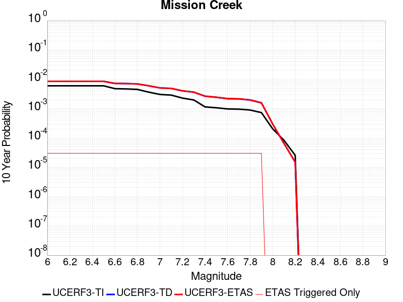 |

| Magnitude | 1 wk TI Prob | 1 wk TD Prob | 1 wk ETAS Prob | 1 wk ETAS/TD Gain | 1 wk ETAS Triggered Only | 1 mo TI Prob | 1 mo TD Prob | 1 mo ETAS Prob | 1 mo ETAS/TD Gain | 1 mo ETAS Triggered Only | 1 yr TI Prob | 1 yr TD Prob | 1 yr ETAS Prob | 1 yr ETAS/TD Gain | 1 yr ETAS Triggered Only | 10 yr TI Prob | 10 yr TD Prob | 10 yr ETAS Prob | 10 yr ETAS/TD Gain | 10 yr ETAS Triggered Only |
|-----|-----|-----|-----|-----|-----|-----|-----|-----|-----|-----|-----|-----|-----|-----|-----|-----|-----|-----|-----|-----|
| 6.0 | 1.1549387E-5 | 1.632237E-5 | 3.6322042E-5 | 2.2252922 | 2.0E-5 | 4.9496433E-5 | 6.9951224E-5 | 9.9949124E-5 | 1.4288403 | 3.0E-5 | 6.0245243E-4 | 8.513384E-4 | 8.813128E-4 | 1.0352086 | 3.0E-5 | 0.006008218 | 0.008509998 | 0.008539743 | 1.0034952 | 3.0E-5 |
| 6.1 | 1.1549387E-5 | 1.632237E-5 | 3.6322042E-5 | 2.2252922 | 2.0E-5 | 4.9496433E-5 | 6.9951224E-5 | 9.9949124E-5 | 1.4288403 | 3.0E-5 | 6.0245243E-4 | 8.513384E-4 | 8.813128E-4 | 1.0352086 | 3.0E-5 | 0.006008218 | 0.008509998 | 0.008539743 | 1.0034952 | 3.0E-5 |
| 6.2 | 1.1549387E-5 | 1.632237E-5 | 3.6322042E-5 | 2.2252922 | 2.0E-5 | 4.9496433E-5 | 6.9951224E-5 | 9.9949124E-5 | 1.4288403 | 3.0E-5 | 6.0245243E-4 | 8.513384E-4 | 8.813128E-4 | 1.0352086 | 3.0E-5 | 0.006008218 | 0.008509998 | 0.008539743 | 1.0034952 | 3.0E-5 |
| 6.3 | 1.1549387E-5 | 1.632237E-5 | 3.6322042E-5 | 2.2252922 | 2.0E-5 | 4.9496433E-5 | 6.9951224E-5 | 9.9949124E-5 | 1.4288403 | 3.0E-5 | 6.0245243E-4 | 8.513384E-4 | 8.813128E-4 | 1.0352086 | 3.0E-5 | 0.006008218 | 0.008509998 | 0.008539743 | 1.0034952 | 3.0E-5 |
| 6.4 | 1.1549387E-5 | 1.632237E-5 | 3.6322042E-5 | 2.2252922 | 2.0E-5 | 4.9496433E-5 | 6.9951224E-5 | 9.9949124E-5 | 1.4288403 | 3.0E-5 | 6.0245243E-4 | 8.513384E-4 | 8.813128E-4 | 1.0352086 | 3.0E-5 | 0.006008218 | 0.008509998 | 0.008539743 | 1.0034952 | 3.0E-5 |
| 6.5 | 1.1549387E-5 | 1.632237E-5 | 3.6322042E-5 | 2.2252922 | 2.0E-5 | 4.9496433E-5 | 6.9951224E-5 | 9.9949124E-5 | 1.4288403 | 3.0E-5 | 6.0245243E-4 | 8.513384E-4 | 8.813128E-4 | 1.0352086 | 3.0E-5 | 0.006008218 | 0.008509998 | 0.008539743 | 1.0034952 | 3.0E-5 |
| 6.6 | 9.202681E-6 | 1.3845646E-5 | 3.384537E-5 | 2.4444773 | 2.0E-5 | 3.9439463E-5 | 5.9337188E-5 | 8.933541E-5 | 1.5055552 | 3.0E-5 | 4.800697E-4 | 7.221998E-4 | 7.5217814E-4 | 1.0415097 | 3.0E-5 | 0.004790339 | 0.0072271815 | 0.0072569647 | 1.004121 | 3.0E-5 |
| 6.7 | 9.019164E-6 | 1.3651316E-5 | 3.3651042E-5 | 2.4650402 | 2.0E-5 | 3.8652986E-5 | 5.8504378E-5 | 8.8502624E-5 | 1.5127522 | 3.0E-5 | 4.7049852E-4 | 7.12067E-4 | 7.420457E-4 | 1.0421009 | 3.0E-5 | 0.004695036 | 0.007126506 | 0.007156292 | 1.0041796 | 3.0E-5 |
| 6.8 | 8.673558E-6 | 1.3273427E-5 | 3.327316E-5 | 2.5067499 | 2.0E-5 | 3.717186E-5 | 5.6884925E-5 | 8.688322E-5 | 1.5273505 | 3.0E-5 | 4.524734E-4 | 6.923627E-4 | 7.2234194E-4 | 1.0432999 | 3.0E-5 | 0.0045155324 | 0.006930694 | 0.006960486 | 1.0042986 | 3.0E-5 |
| 6.9 | 7.002255E-6 | 1.1477657E-5 | 3.1477426E-5 | 2.742496 | 2.0E-5 | 3.000932E-5 | 4.9189068E-5 | 7.9187594E-5 | 1.6098616 | 3.0E-5 | 3.653022E-4 | 5.9871917E-4 | 6.2870124E-4 | 1.050077 | 3.0E-5 | 0.0036470229 | 0.005999517 | 0.006029337 | 1.0049704 | 3.0E-5 |
| 7.0 | 5.84644E-6 | 9.67498E-6 | 2.9674786E-5 | 3.0671678 | 2.0E-5 | 2.5055931E-5 | 4.1463565E-5 | 7.1462324E-5 | 1.7234968 | 3.0E-5 | 3.0501327E-4 | 5.047066E-4 | 5.346914E-4 | 1.0594105 | 3.0E-5 | 0.0030459496 | 0.0050638523 | 0.0050937003 | 1.0058943 | 3.0E-5 |
| 7.1 | 5.54703E-6 | 9.329456E-6 | 2.9329269E-5 | 3.1437278 | 2.0E-5 | 2.377277E-5 | 3.9982795E-5 | 6.9981594E-5 | 1.7502928 | 3.0E-5 | 2.8939504E-4 | 4.8668624E-4 | 5.1667163E-4 | 1.0616113 | 3.0E-5 | 0.0028901845 | 0.004884446 | 0.0049142996 | 1.006112 | 3.0E-5 |
| 7.2 | 4.384709E-6 | 7.68157E-6 | 2.7681417E-5 | 3.603614 | 2.0E-5 | 1.8791474E-5 | 3.2920623E-5 | 6.291964E-5 | 1.9112529 | 3.0E-5 | 2.2876218E-4 | 4.0073853E-4 | 4.307265E-4 | 1.0748317 | 3.0E-5 | 0.0022852682 | 0.004028366 | 0.004058245 | 1.0074172 | 3.0E-5 |
| 7.3 | 3.7888456E-6 | 6.915452E-6 | 2.6915313E-5 | 3.892054 | 2.0E-5 | 1.623781E-5 | 2.9637333E-5 | 5.9636444E-5 | 2.0122068 | 3.0E-5 | 1.9767738E-4 | 3.6077813E-4 | 3.9076732E-4 | 1.0831236 | 3.0E-5 | 0.0019750162 | 0.0036301152 | 0.0036600062 | 1.0082341 | 3.0E-5 |
| 7.4 | 2.1982462E-6 | 5.0237763E-6 | 2.5023675E-5 | 4.9810486 | 2.0E-5 | 9.421021E-6 | 2.1530293E-5 | 5.152965E-5 | 2.3933556 | 3.0E-5 | 1.1469489E-4 | 2.621E-4 | 2.9209213E-4 | 1.1144302 | 3.0E-5 | 0.0011463572 | 0.0026458844 | 0.002675805 | 1.0113083 | 3.0E-5 |
| 7.5 | 2.051923E-6 | 4.615016E-6 | 2.4614923E-5 | 5.333659 | 2.0E-5 | 8.793926E-6 | 1.9778492E-5 | 4.9777896E-5 | 2.5167692 | 3.0E-5 | 1.0706078E-4 | 2.4077666E-4 | 2.7076944E-4 | 1.1245668 | 3.0E-5 | 0.0010700922 | 0.0024335422 | 0.002463469 | 1.0122977 | 3.0E-5 |
| 7.6 | 1.8733427E-6 | 4.1233748E-6 | 2.4123292E-5 | 5.8503757 | 2.0E-5 | 8.028587E-6 | 1.7671488E-5 | 4.7670957E-5 | 2.69762 | 3.0E-5 | 9.774366E-5 | 2.151292E-4 | 2.4512276E-4 | 1.1394211 | 3.0E-5 | 9.770069E-4 | 0.0021780801 | 0.002208015 | 1.0137436 | 3.0E-5 |
| 7.7 | 1.8411953E-6 | 4.0430496E-6 | 2.4042969E-5 | 5.946741 | 2.0E-5 | 7.890813E-6 | 1.732724E-5 | 4.732672E-5 | 2.7313478 | 3.0E-5 | 9.606641E-5 | 2.1093882E-4 | 2.409325E-4 | 1.1421913 | 3.0E-5 | 9.6024893E-4 | 0.0021363653 | 0.0021663012 | 1.0140126 | 3.0E-5 |
| 7.8 | 1.7194251E-6 | 3.7104276E-6 | 2.3710354E-5 | 6.3901944 | 2.0E-5 | 7.368944E-6 | 1.5901736E-5 | 4.590126E-5 | 2.8865564 | 3.0E-5 | 8.97132E-5 | 1.9358651E-4 | 2.235807E-4 | 1.1549395 | 3.0E-5 | 8.967699E-4 | 0.0019623525 | 0.0019922936 | 1.0152577 | 3.0E-5 |
| 7.9 | 1.4035052E-6 | 2.9500632E-6 | 2.2950004E-5 | 7.779496 | 2.0E-5 | 6.0150082E-6 | 1.2643067E-5 | 4.264269E-5 | 3.372812 | 3.0E-5 | 7.3230265E-5 | 1.5391852E-4 | 1.839139E-4 | 1.1948783 | 3.0E-5 | 7.3206134E-4 | 0.0015631086 | 0.0015930617 | 1.0191625 | 3.0E-5 |
| 8.0 | 3.9318823E-7 | 5.528522E-7 | 5.528522E-7 | 1.0 | 0.0 | 1.6850913E-6 | 2.3693647E-6 | 2.3693647E-6 | 1.0 | 0.0 | 2.0515794E-5 | 2.8846638E-5 | 2.8846638E-5 | 1.0 | 0.0 | 2.0513899E-4 | 2.9899E-4 | 2.9899E-4 | 1.0 | 0.0 |
| 8.1 | 1.596793E-7 | 1.1380002E-7 | 1.1380002E-7 | 1.0 | 0.0 | 6.8433974E-7 | 4.877143E-7 | 4.877143E-7 | 1.0 | 0.0 | 8.331805E-6 | 5.937906E-6 | 5.937906E-6 | 1.0 | 0.0 | 8.331492E-5 | 6.549966E-5 | 6.549966E-5 | 1.0 | 0.0 |
| 8.2 | 4.9003038E-8 | 2.5444924E-8 | 2.5444924E-8 | 1.0 | 0.0 | 2.10013E-7 | 1.0904967E-7 | 1.0904967E-7 | 1.0 | 0.0 | 2.5569052E-6 | 1.327679E-6 | 1.327679E-6 | 1.0 | 0.0 | 2.556876E-5 | 1.495635E-5 | 1.495635E-5 | 1.0 | 0.0 |

## Maacama 2011 CFM
*[(top)](#table-of-contents)*

| 1 Week | 1 Month | 1 Year | 10 Year |
|-----|-----|-----|-----|
| 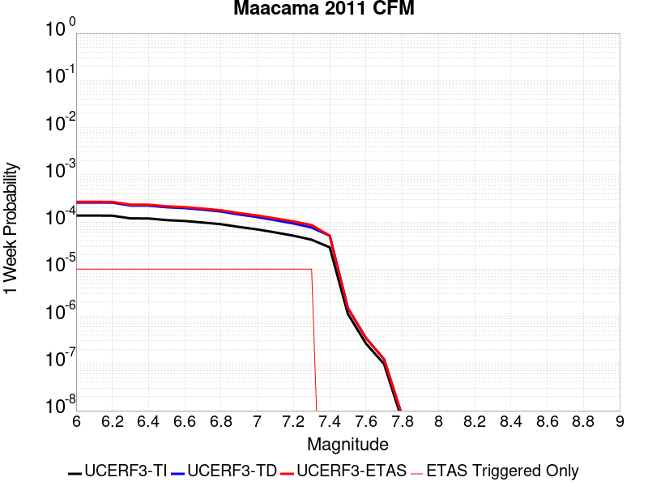 | 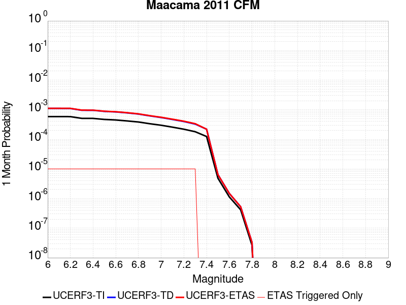 |  | 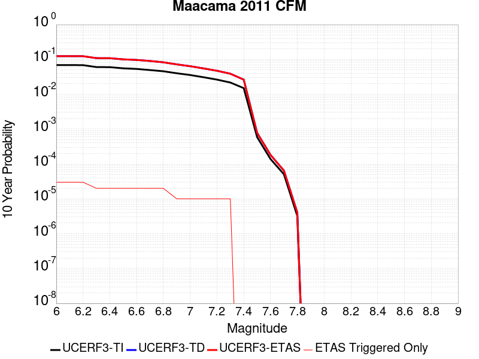 |

| Magnitude | 1 wk TI Prob | 1 wk TD Prob | 1 wk ETAS Prob | 1 wk ETAS/TD Gain | 1 wk ETAS Triggered Only | 1 mo TI Prob | 1 mo TD Prob | 1 mo ETAS Prob | 1 mo ETAS/TD Gain | 1 mo ETAS Triggered Only | 1 yr TI Prob | 1 yr TD Prob | 1 yr ETAS Prob | 1 yr ETAS/TD Gain | 1 yr ETAS Triggered Only | 10 yr TI Prob | 10 yr TD Prob | 10 yr ETAS Prob | 10 yr ETAS/TD Gain | 10 yr ETAS Triggered Only |
|-----|-----|-----|-----|-----|-----|-----|-----|-----|-----|-----|-----|-----|-----|-----|-----|-----|-----|-----|-----|-----|
| 6.0 | 1.368203E-4 | 2.5787868E-4 | 2.678761E-4 | 1.0387679 | 1.0E-5 | 5.862409E-4 | 0.0011047312 | 0.0011147201 | 1.009042 | 1.0E-5 | 0.0071141496 | 0.013350483 | 0.013370216 | 1.0014781 | 2.0E-5 | 0.06890667 | 0.124189645 | 0.124215916 | 1.0002116 | 3.0E-5 |
| 6.1 | 1.368203E-4 | 2.5787868E-4 | 2.678761E-4 | 1.0387679 | 1.0E-5 | 5.862409E-4 | 0.0011047312 | 0.0011147201 | 1.009042 | 1.0E-5 | 0.0071141496 | 0.013350483 | 0.013370216 | 1.0014781 | 2.0E-5 | 0.06890667 | 0.124189645 | 0.124215916 | 1.0002116 | 3.0E-5 |
| 6.2 | 1.360743E-4 | 2.566255E-4 | 2.6662293E-4 | 1.0389572 | 1.0E-5 | 5.8304524E-4 | 0.001099365 | 0.001109354 | 1.0090861 | 1.0E-5 | 0.007075496 | 0.013286048 | 0.013305781 | 1.0014853 | 2.0E-5 | 0.06854413 | 0.12362404 | 0.123650335 | 1.0002127 | 3.0E-5 |
| 6.3 | 1.1917239E-4 | 2.235362E-4 | 2.3353397E-4 | 1.0447255 | 1.0E-5 | 5.1063887E-4 | 9.5765886E-4 | 9.676493E-4 | 1.0104321 | 1.0E-5 | 0.0061993203 | 0.011587509 | 0.011597393 | 1.000853 | 1.0E-5 | 0.060292065 | 0.10884413 | 0.10886196 | 1.0001638 | 2.0E-5 |
| 6.4 | 1.1859289E-4 | 2.2257185E-4 | 2.3256961E-4 | 1.0449194 | 1.0E-5 | 5.0815626E-4 | 9.535289E-4 | 9.635194E-4 | 1.0104773 | 1.0E-5 | 0.006169266 | 0.0115378285 | 0.011547714 | 1.0008568 | 1.0E-5 | 0.06000784 | 0.108401 | 0.10841883 | 1.0001645 | 2.0E-5 |
| 6.5 | 1.09512424E-4 | 2.0515872E-4 | 2.1515667E-4 | 1.0487328 | 1.0E-5 | 4.6925453E-4 | 8.789523E-4 | 8.8894356E-4 | 1.0113672 | 1.0E-5 | 0.005698218 | 0.01063927 | 0.010649163 | 1.00093 | 1.0E-5 | 0.055543028 | 0.100493506 | 0.10051149 | 1.000179 | 2.0E-5 |
| 6.6 | 1.0502928E-4 | 1.9674368E-4 | 2.0674172E-4 | 1.0508176 | 1.0E-5 | 4.500478E-4 | 8.4291224E-4 | 8.529038E-4 | 1.0118536 | 1.0E-5 | 0.0054655746 | 0.01020536 | 0.010215258 | 1.0009699 | 1.0E-5 | 0.053330887 | 0.096646085 | 0.09666415 | 1.0001869 | 2.0E-5 |
| 6.7 | 9.739358E-5 | 1.825636E-4 | 1.9256177E-4 | 1.0547655 | 1.0E-5 | 4.173343E-4 | 7.821781E-4 | 7.921703E-4 | 1.0127748 | 1.0E-5 | 0.0050692135 | 0.009475501 | 0.009485407 | 1.0010453 | 1.0E-5 | 0.049551267 | 0.090118766 | 0.09013697 | 1.000202 | 2.0E-5 |
| 6.8 | 8.969524E-5 | 1.6657855E-4 | 1.7657688E-4 | 1.0600218 | 1.0E-5 | 3.8435153E-4 | 7.1370887E-4 | 7.237017E-4 | 1.0140014 | 1.0E-5 | 0.0046694432 | 0.008649083 | 0.008658996 | 1.0011462 | 1.0E-5 | 0.045725387 | 0.082651116 | 0.08266946 | 1.000222 | 2.0E-5 |
| 6.9 | 7.838291E-5 | 1.4417822E-4 | 1.5417679E-4 | 1.0693486 | 1.0E-5 | 3.358835E-4 | 6.177581E-4 | 6.277519E-4 | 1.0161775 | 1.0E-5 | 0.0040817154 | 0.007491799 | 0.007501724 | 1.0013248 | 1.0E-5 | 0.04007554 | 0.07205178 | 0.072061054 | 1.0001287 | 1.0E-5 |
| 7.0 | 6.961957E-5 | 1.270709E-4 | 1.3706963E-4 | 1.0786862 | 1.0E-5 | 2.9833548E-4 | 5.4447335E-4 | 5.544679E-4 | 1.0183563 | 1.0E-5 | 0.0036261857 | 0.006606736 | 0.00661667 | 1.0015036 | 1.0E-5 | 0.035675827 | 0.063870616 | 0.063879974 | 1.0001465 | 1.0E-5 |
| 7.1 | 5.999398E-5 | 1.0904674E-4 | 1.1904565E-4 | 1.0916938 | 1.0E-5 | 2.570917E-4 | 4.6726142E-4 | 4.7725672E-4 | 1.0213913 | 1.0E-5 | 0.0031255994 | 0.0056728474 | 0.0056827907 | 1.0017527 | 1.0E-5 | 0.030820016 | 0.055138282 | 0.055147734 | 1.0001713 | 1.0E-5 |
| 7.2 | 5.116532E-5 | 9.3055336E-5 | 1.0305441E-4 | 1.107453 | 1.0E-5 | 2.1926152E-4 | 3.9875024E-4 | 4.0874624E-4 | 1.0250684 | 1.0E-5 | 0.002666241 | 0.004843103 | 0.0048530544 | 1.0020548 | 1.0E-5 | 0.026344774 | 0.04730284 | 0.047312364 | 1.0002013 | 1.0E-5 |
| 7.3 | 4.2087835E-5 | 7.617328E-5 | 8.617252E-5 | 1.1312696 | 1.0E-5 | 1.8036396E-4 | 3.2641852E-4 | 3.3641525E-4 | 1.0306255 | 1.0E-5 | 0.0021937196 | 0.0039661685 | 0.003976129 | 1.0025114 | 1.0E-5 | 0.0217219 | 0.038904376 | 0.038913988 | 1.000247 | 1.0E-5 |
| 7.4 | 2.8991652E-5 | 5.1167233E-5 | 5.1167233E-5 | 1.0 | 0.0 | 1.2424402E-4 | 2.1927188E-4 | 2.1927188E-4 | 1.0 | 0.0 | 0.0015116213 | 0.0026660617 | 0.0026660617 | 1.0 | 0.0 | 0.015013801 | 0.026331667 | 0.026331667 | 1.0 | 0.0 |
| 7.5 | 1.1292299E-6 | 1.4950161E-6 | 1.4950161E-6 | 1.0 | 0.0 | 4.8395473E-6 | 6.4072037E-6 | 6.4072037E-6 | 1.0 | 0.0 | 5.8919897E-5 | 7.800615E-5 | 7.800615E-5 | 1.0 | 0.0 | 5.890428E-4 | 7.8048074E-4 | 7.8048074E-4 | 1.0 | 0.0 |
| 7.6 | 2.6535366E-7 | 3.4720597E-7 | 3.4720597E-7 | 1.0 | 0.0 | 1.1372296E-6 | 1.4880247E-6 | 1.4880247E-6 | 1.0 | 0.0 | 1.3845682E-5 | 1.8116552E-5 | 1.8116552E-5 | 1.0 | 0.0 | 1.3844819E-4 | 1.816747E-4 | 1.816747E-4 | 1.0 | 0.0 |
| 7.7 | 9.727789E-8 | 1.2302169E-7 | 1.2302169E-7 | 1.0 | 0.0 | 4.1690518E-7 | 5.2723567E-7 | 5.2723567E-7 | 1.0 | 0.0 | 5.0758085E-6 | 6.419076E-6 | 6.419076E-6 | 1.0 | 0.0 | 5.0756928E-5 | 6.45712E-5 | 6.45712E-5 | 1.0 | 0.0 |
| 7.8 | 6.1939325E-9 | 7.711523E-9 | 7.711523E-9 | 1.0 | 0.0 | 2.6545425E-8 | 3.3049385E-8 | 3.3049385E-8 | 1.0 | 0.0 | 3.231905E-7 | 4.0237617E-7 | 4.0237617E-7 | 1.0 | 0.0 | 3.2319003E-6 | 4.0598557E-6 | 4.0598557E-6 | 1.0 | 0.0 |

## Honey Lake 2011 CFM
*[(top)](#table-of-contents)*

| 1 Week | 1 Month | 1 Year | 10 Year |
|-----|-----|-----|-----|
|  |  | 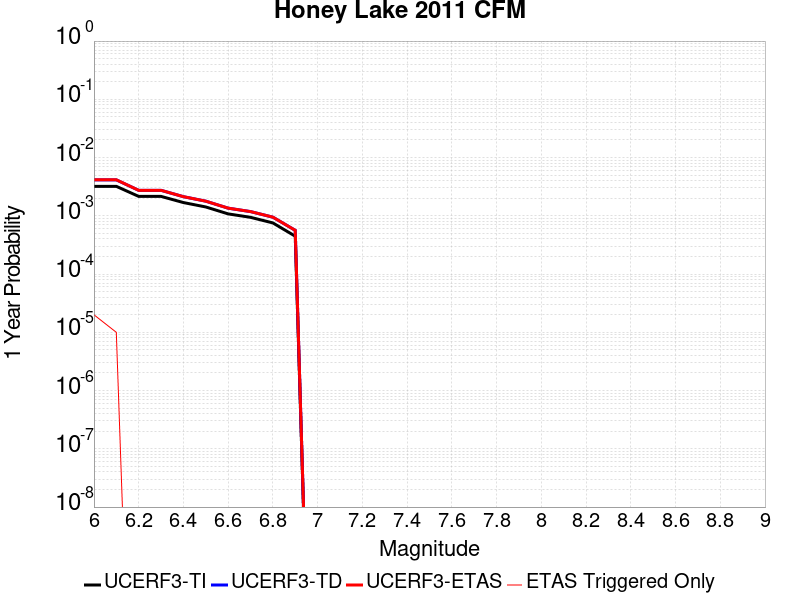 | 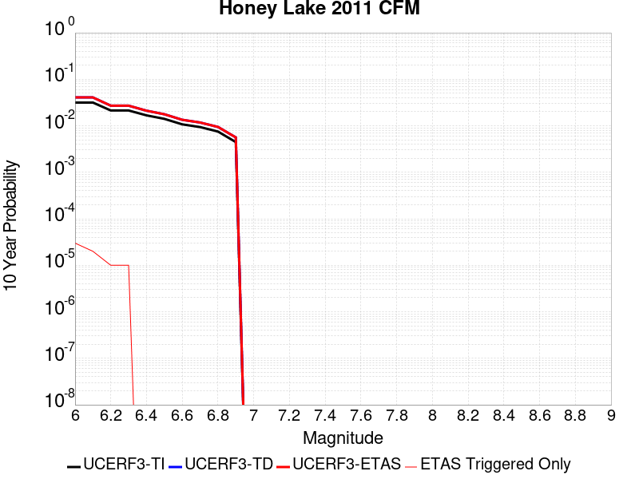 |

| Magnitude | 1 wk TI Prob | 1 wk TD Prob | 1 wk ETAS Prob | 1 wk ETAS/TD Gain | 1 wk ETAS Triggered Only | 1 mo TI Prob | 1 mo TD Prob | 1 mo ETAS Prob | 1 mo ETAS/TD Gain | 1 mo ETAS Triggered Only | 1 yr TI Prob | 1 yr TD Prob | 1 yr ETAS Prob | 1 yr ETAS/TD Gain | 1 yr ETAS Triggered Only | 10 yr TI Prob | 10 yr TD Prob | 10 yr ETAS Prob | 10 yr ETAS/TD Gain | 10 yr ETAS Triggered Only |
|-----|-----|-----|-----|-----|-----|-----|-----|-----|-----|-----|-----|-----|-----|-----|-----|-----|-----|-----|-----|-----|
| 6.0 | 6.155506E-5 | 7.954667E-5 | 9.9545075E-5 | 1.2514048 | 2.0E-5 | 2.6378073E-4 | 3.40873E-4 | 3.608662E-4 | 1.0586529 | 2.0E-5 | 0.0032068014 | 0.0041427943 | 0.0041627116 | 1.0048077 | 2.0E-5 | 0.03160919 | 0.040702924 | 0.040731702 | 1.000707 | 3.0E-5 |
| 6.1 | 6.155506E-5 | 7.954667E-5 | 8.954587E-5 | 1.1257024 | 1.0E-5 | 2.6378073E-4 | 3.40873E-4 | 3.508696E-4 | 1.0293264 | 1.0E-5 | 0.0032068014 | 0.0041427943 | 0.004152753 | 1.0024039 | 1.0E-5 | 0.03160919 | 0.040702924 | 0.04072211 | 1.0004714 | 2.0E-5 |
| 6.2 | 4.1335024E-5 | 5.257629E-5 | 5.257629E-5 | 1.0 | 0.0 | 1.7713808E-4 | 2.253086E-4 | 2.253086E-4 | 1.0 | 0.0 | 0.0021545228 | 0.0027398595 | 0.0027398595 | 1.0 | 0.0 | 0.021337535 | 0.027076708 | 0.027086439 | 1.0003593 | 1.0E-5 |
| 6.3 | 4.1335024E-5 | 5.257629E-5 | 5.257629E-5 | 1.0 | 0.0 | 1.7713808E-4 | 2.253086E-4 | 2.253086E-4 | 1.0 | 0.0 | 0.0021545228 | 0.0027398595 | 0.0027398595 | 1.0 | 0.0 | 0.021337535 | 0.027076708 | 0.027086439 | 1.0003593 | 1.0E-5 |
| 6.4 | 3.2393702E-5 | 4.0887444E-5 | 4.0887444E-5 | 1.0 | 0.0 | 1.3882275E-4 | 1.7522085E-4 | 1.7522085E-4 | 1.0 | 0.0 | 0.0016888566 | 0.002131335 | 0.002131335 | 1.0 | 0.0 | 0.016760793 | 0.02111982 | 0.02111982 | 1.0 | 0.0 |
| 6.5 | 2.7205504E-5 | 3.4211684E-5 | 3.4211684E-5 | 1.0 | 0.0 | 1.1658981E-4 | 1.4661385E-4 | 1.4661385E-4 | 1.0 | 0.0 | 0.0014185566 | 0.0017836588 | 0.0017836588 | 1.0 | 0.0 | 0.014095354 | 0.017702932 | 0.017702932 | 1.0 | 0.0 |
| 6.6 | 2.069265E-5 | 2.5955307E-5 | 2.5955307E-5 | 1.0 | 0.0 | 8.867977E-5 | 1.1123277E-4 | 1.1123277E-4 | 1.0 | 0.0 | 0.0010791414 | 0.0013535038 | 0.0013535038 | 1.0 | 0.0 | 0.010739161 | 0.013461002 | 0.013461002 | 1.0 | 0.0 |
| 6.7 | 1.8060919E-5 | 2.2656828E-5 | 2.2656828E-5 | 1.0 | 0.0 | 7.7401644E-5 | 9.709754E-5 | 9.709754E-5 | 1.0 | 0.0 | 9.419576E-4 | 0.0011816026 | 0.0011816026 | 1.0 | 0.0 | 0.009379748 | 0.011761238 | 0.011761238 | 1.0 | 0.0 |
| 6.8 | 1.4474663E-5 | 1.818127E-5 | 1.818127E-5 | 1.0 | 0.0 | 6.203279E-5 | 7.791784E-5 | 7.791784E-5 | 1.0 | 0.0 | 7.5498753E-4 | 9.483136E-4 | 9.483136E-4 | 1.0 | 0.0 | 0.007524277 | 0.009450192 | 0.009450192 | 1.0 | 0.0 |
| 6.9 | 8.564552E-6 | 1.0802308E-5 | 1.0802308E-5 | 1.0 | 0.0 | 3.6704707E-5 | 4.6295158E-5 | 4.6295158E-5 | 1.0 | 0.0 | 4.4678818E-4 | 5.635644E-4 | 5.635644E-4 | 1.0 | 0.0 | 0.0044589094 | 0.0056278477 | 0.0056278477 | 1.0 | 0.0 |

## Hayward (So) extension 2011 CFM
*[(top)](#table-of-contents)*

| 1 Week | 1 Month | 1 Year | 10 Year |
|-----|-----|-----|-----|
|  |  |  |  |

| Magnitude | 1 wk TI Prob | 1 wk TD Prob | 1 wk ETAS Prob | 1 wk ETAS/TD Gain | 1 wk ETAS Triggered Only | 1 mo TI Prob | 1 mo TD Prob | 1 mo ETAS Prob | 1 mo ETAS/TD Gain | 1 mo ETAS Triggered Only | 1 yr TI Prob | 1 yr TD Prob | 1 yr ETAS Prob | 1 yr ETAS/TD Gain | 1 yr ETAS Triggered Only | 10 yr TI Prob | 10 yr TD Prob | 10 yr ETAS Prob | 10 yr ETAS/TD Gain | 10 yr ETAS Triggered Only |
|-----|-----|-----|-----|-----|-----|-----|-----|-----|-----|-----|-----|-----|-----|-----|-----|-----|-----|-----|-----|-----|
| 6.0 | 1.1721256E-4 | 2.3697627E-4 | 2.469739E-4 | 1.0421883 | 1.0E-5 | 5.022428E-4 | 0.0010129517 | 0.0010329314 | 1.0197242 | 2.0E-5 | 0.0060976758 | 0.012248711 | 0.012268466 | 1.0016128 | 2.0E-5 | 0.0593305 | 0.112843215 | 0.112860955 | 1.0001572 | 2.0E-5 |
| 6.1 | 6.99169E-5 | 1.3822885E-4 | 1.4822747E-4 | 1.0723338 | 1.0E-5 | 2.9960944E-4 | 5.9128006E-4 | 6.112682E-4 | 1.0338049 | 2.0E-5 | 0.0036416445 | 0.0071720886 | 0.007191945 | 1.0027686 | 2.0E-5 | 0.035825435 | 0.067803554 | 0.067822196 | 1.000275 | 2.0E-5 |
| 6.2 | 6.99169E-5 | 1.3822885E-4 | 1.4822747E-4 | 1.0723338 | 1.0E-5 | 2.9960944E-4 | 5.9128006E-4 | 6.112682E-4 | 1.0338049 | 2.0E-5 | 0.0036416445 | 0.0071720886 | 0.007191945 | 1.0027686 | 2.0E-5 | 0.035825435 | 0.067803554 | 0.067822196 | 1.000275 | 2.0E-5 |
| 6.3 | 6.970908E-5 | 1.379104E-4 | 1.4790903E-4 | 1.0725008 | 1.0E-5 | 2.9871898E-4 | 5.899159E-4 | 6.099041E-4 | 1.0338831 | 2.0E-5 | 0.0036308395 | 0.007155625 | 0.007175482 | 1.002775 | 2.0E-5 | 0.035720866 | 0.067652516 | 0.067671165 | 1.0002756 | 2.0E-5 |
| 6.4 | 6.9517155E-5 | 1.375792E-4 | 1.4757783E-4 | 1.0726753 | 1.0E-5 | 2.9789665E-4 | 5.884971E-4 | 6.084853E-4 | 1.0339649 | 2.0E-5 | 0.0036208609 | 0.0071385372 | 0.0071583944 | 1.0027817 | 2.0E-5 | 0.03562429 | 0.06749655 | 0.0675152 | 1.0002763 | 2.0E-5 |
| 6.5 | 4.786248E-5 | 9.41498E-5 | 1.0414886E-4 | 1.1062037 | 1.0E-5 | 2.0510878E-4 | 4.034394E-4 | 4.234313E-4 | 1.0495538 | 2.0E-5 | 0.0024943394 | 0.004901227 | 0.004921129 | 1.0040606 | 2.0E-5 | 0.02466527 | 0.046901822 | 0.046920884 | 1.0004064 | 2.0E-5 |
| 6.6 | 4.4662214E-5 | 8.881654E-5 | 9.881565E-5 | 1.1125816 | 1.0E-5 | 1.9139545E-4 | 3.805894E-4 | 4.0058178E-4 | 1.05253 | 2.0E-5 | 0.0023277493 | 0.0046242937 | 0.004644201 | 1.004305 | 2.0E-5 | 0.02303517 | 0.044293344 | 0.04431246 | 1.0004315 | 2.0E-5 |
| 6.7 | 3.884542E-5 | 7.8648096E-5 | 7.8648096E-5 | 1.0 | 0.0 | 1.6646975E-4 | 3.370222E-4 | 3.4701882E-4 | 1.0296617 | 1.0E-5 | 0.002024885 | 0.0040959697 | 0.004105929 | 1.0024314 | 1.0E-5 | 0.020065336 | 0.039333146 | 0.03935236 | 1.0004885 | 2.0E-5 |
| 6.8 | 3.4221863E-5 | 6.855653E-5 | 6.855653E-5 | 1.0 | 0.0 | 1.4665688E-4 | 2.93783E-4 | 3.0378008E-4 | 1.0340288 | 1.0E-5 | 0.0017840851 | 0.0035713627 | 0.003581327 | 1.0027901 | 1.0E-5 | 0.017698295 | 0.034421004 | 0.034440313 | 1.000561 | 2.0E-5 |
| 6.9 | 1.6927712E-5 | 3.0061563E-5 | 3.0061563E-5 | 1.0 | 0.0 | 7.2545314E-5 | 1.2882923E-4 | 1.3882795E-4 | 1.0776122 | 1.0E-5 | 8.828813E-4 | 0.0015674243 | 0.0015774086 | 1.00637 | 1.0E-5 | 0.008793819 | 0.01546327 | 0.01548296 | 1.0012734 | 2.0E-5 |
| 7.0 | 1.2509653E-5 | 2.2462571E-5 | 2.2462571E-5 | 1.0 | 0.0 | 5.3611697E-5 | 9.6264856E-5 | 1.0626389E-4 | 1.10387 | 1.0E-5 | 6.525269E-4 | 0.0011714385 | 0.0011814268 | 1.0085266 | 1.0E-5 | 0.0065061417 | 0.01158231 | 0.011592194 | 1.0008534 | 1.0E-5 |
| 7.1 | 8.751583E-6 | 1.4925648E-5 | 1.4925648E-5 | 1.0 | 0.0 | 3.750624E-5 | 6.3965526E-5 | 7.396489E-5 | 1.1563241 | 1.0E-5 | 4.5654282E-4 | 7.785079E-4 | 7.8850007E-4 | 1.012835 | 1.0E-5 | 0.0045560603 | 0.007763496 | 0.0077734184 | 1.001278 | 1.0E-5 |
| 7.2 | 6.354379E-6 | 1.1498636E-5 | 1.1498636E-5 | 1.0 | 0.0 | 2.7232769E-5 | 4.9278966E-5 | 5.927847E-5 | 1.2029164 | 1.0E-5 | 3.3150852E-4 | 5.99811E-4 | 6.0980505E-4 | 1.0166619 | 1.0E-5 | 0.0033101442 | 0.0060003046 | 0.0060102446 | 1.0016565 | 1.0E-5 |
| 7.3 | 4.645554E-6 | 8.818172E-6 | 8.818172E-6 | 1.0 | 0.0 | 1.9909365E-5 | 3.779164E-5 | 4.779126E-5 | 1.2645987 | 1.0E-5 | 2.4236954E-4 | 4.6002E-4 | 4.7001542E-4 | 1.0217282 | 1.0E-5 | 0.0024210536 | 0.004610708 | 0.004620662 | 1.0021589 | 1.0E-5 |
| 7.4 | 4.23437E-6 | 7.992532E-6 | 7.992532E-6 | 1.0 | 0.0 | 1.8147173E-5 | 3.425328E-5 | 4.4252938E-5 | 1.2919328 | 1.0E-5 | 2.2091944E-4 | 4.1695772E-4 | 4.2695354E-4 | 1.0239732 | 1.0E-5 | 0.0022069993 | 0.004181972 | 0.00419193 | 1.0023812 | 1.0E-5 |
| 7.5 | 2.2187417E-6 | 3.9522306E-6 | 3.9522306E-6 | 1.0 | 0.0 | 9.508858E-6 | 1.6938036E-5 | 1.6938036E-5 | 1.0 | 0.0 | 1.157642E-4 | 2.0620368E-4 | 2.0620368E-4 | 1.0 | 0.0 | 0.0011570391 | 0.0020734754 | 0.0020734754 | 1.0 | 0.0 |
| 7.6 | 2.7952495E-8 | 3.878529E-8 | 3.878529E-8 | 1.0 | 0.0 | 1.1979641E-7 | 1.6622266E-7 | 1.6622266E-7 | 1.0 | 0.0 | 1.4585203E-6 | 2.0237592E-6 | 2.0237592E-6 | 1.0 | 0.0 | 1.4585107E-5 | 2.0328182E-5 | 2.0328182E-5 | 1.0 | 0.0 |
| 7.7 | 1.7192724E-8 | 2.3436517E-8 | 2.3436517E-8 | 1.0 | 0.0 | 7.36831E-8 | 1.0044221E-7 | 1.0044221E-7 | 1.0 | 0.0 | 8.9709135E-7 | 1.2228833E-6 | 1.2228833E-6 | 1.0 | 0.0 | 8.970877E-6 | 1.2296933E-5 | 1.2296933E-5 | 1.0 | 0.0 |

## Santa Ynez River
*[(top)](#table-of-contents)*

| 1 Week | 1 Month | 1 Year | 10 Year |
|-----|-----|-----|-----|
| 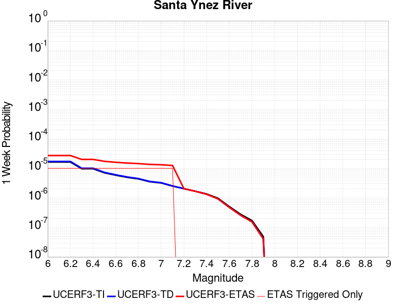 |  | 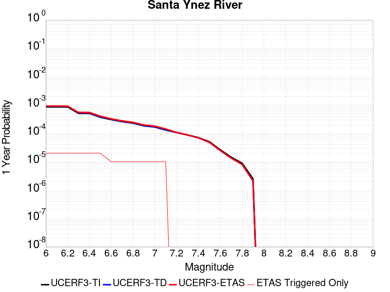 |  |

| Magnitude | 1 wk TI Prob | 1 wk TD Prob | 1 wk ETAS Prob | 1 wk ETAS/TD Gain | 1 wk ETAS Triggered Only | 1 mo TI Prob | 1 mo TD Prob | 1 mo ETAS Prob | 1 mo ETAS/TD Gain | 1 mo ETAS Triggered Only | 1 yr TI Prob | 1 yr TD Prob | 1 yr ETAS Prob | 1 yr ETAS/TD Gain | 1 yr ETAS Triggered Only | 10 yr TI Prob | 10 yr TD Prob | 10 yr ETAS Prob | 10 yr ETAS/TD Gain | 10 yr ETAS Triggered Only |
|-----|-----|-----|-----|-----|-----|-----|-----|-----|-----|-----|-----|-----|-----|-----|-----|-----|-----|-----|-----|-----|
| 6.0 | 1.6396456E-5 | 1.7209435E-5 | 2.7209264E-5 | 1.5810666 | 1.0E-5 | 7.026863E-5 | 7.375284E-5 | 8.37521E-5 | 1.135578 | 1.0E-5 | 8.551848E-4 | 8.976064E-4 | 9.175885E-4 | 1.0222615 | 2.0E-5 | 0.0085190125 | 0.008943358 | 0.00897309 | 1.0033244 | 3.0E-5 |
| 6.1 | 1.6396456E-5 | 1.7209435E-5 | 2.7209264E-5 | 1.5810666 | 1.0E-5 | 7.026863E-5 | 7.375284E-5 | 8.37521E-5 | 1.135578 | 1.0E-5 | 8.551848E-4 | 8.976064E-4 | 9.175885E-4 | 1.0222615 | 2.0E-5 | 0.0085190125 | 0.008943358 | 0.00897309 | 1.0033244 | 3.0E-5 |
| 6.2 | 1.6396456E-5 | 1.7209435E-5 | 2.7209264E-5 | 1.5810666 | 1.0E-5 | 7.026863E-5 | 7.375284E-5 | 8.37521E-5 | 1.135578 | 1.0E-5 | 8.551848E-4 | 8.976064E-4 | 9.175885E-4 | 1.0222615 | 2.0E-5 | 0.0085190125 | 0.008943358 | 0.00897309 | 1.0033244 | 3.0E-5 |
| 6.3 | 9.736976E-6 | 1.012233E-5 | 2.0122228E-5 | 1.9879048 | 1.0E-5 | 4.172923E-5 | 4.338072E-5 | 5.338029E-5 | 1.2305071 | 1.0E-5 | 5.0793495E-4 | 5.280373E-4 | 5.4802676E-4 | 1.0378561 | 2.0E-5 | 0.005067755 | 0.005268332 | 0.0052882265 | 1.0037763 | 2.0E-5 |
| 6.4 | 9.736976E-6 | 1.012233E-5 | 2.0122228E-5 | 1.9879048 | 1.0E-5 | 4.172923E-5 | 4.338072E-5 | 5.338029E-5 | 1.2305071 | 1.0E-5 | 5.0793495E-4 | 5.280373E-4 | 5.4802676E-4 | 1.0378561 | 2.0E-5 | 0.005067755 | 0.005268332 | 0.0052882265 | 1.0037763 | 2.0E-5 |
| 6.5 | 7.081964E-6 | 7.3298966E-6 | 1.7329823E-5 | 2.3642657 | 1.0E-5 | 3.035092E-5 | 3.1413474E-5 | 4.1413157E-5 | 1.3183248 | 1.0E-5 | 3.694598E-4 | 3.8239348E-4 | 4.0238583E-4 | 1.0522821 | 2.0E-5 | 0.0036884616 | 0.0038175168 | 0.0038374404 | 1.005219 | 2.0E-5 |
| 6.6 | 5.873247E-6 | 6.059743E-6 | 1.6059683E-5 | 2.650225 | 1.0E-5 | 2.5170815E-5 | 2.5970074E-5 | 3.5969813E-5 | 1.3850486 | 1.0E-5 | 3.064116E-4 | 3.1614062E-4 | 3.2613747E-4 | 1.0316215 | 1.0E-5 | 0.0030598943 | 0.0031569963 | 0.0031669647 | 1.0031576 | 1.0E-5 |
| 6.7 | 4.973277E-6 | 5.115901E-6 | 1.511585E-5 | 2.95468 | 1.0E-5 | 2.1313872E-5 | 2.1925109E-5 | 3.192489E-5 | 1.4560881 | 1.0E-5 | 2.5946548E-4 | 2.66906E-4 | 2.769033E-4 | 1.0374564 | 1.0E-5 | 0.0025916274 | 0.0026659032 | 0.0026758765 | 1.003741 | 1.0E-5 |
| 6.8 | 4.396492E-6 | 4.5109778E-6 | 1.45109325E-5 | 3.2168043 | 1.0E-5 | 1.884197E-5 | 1.9332621E-5 | 2.9332426E-5 | 1.5172504 | 1.0E-5 | 2.2937685E-4 | 2.3534958E-4 | 2.453472E-4 | 1.04248 | 1.0E-5 | 0.0022914023 | 0.0023510386 | 0.0023610152 | 1.0042435 | 1.0E-5 |
| 6.9 | 3.5255632E-6 | 3.6013332E-6 | 1.3601298E-5 | 3.7767394 | 1.0E-5 | 1.5109469E-5 | 1.5434196E-5 | 2.5434041E-5 | 1.647902 | 1.0E-5 | 1.8394225E-4 | 1.8789528E-4 | 1.978934E-4 | 1.0532111 | 1.0E-5 | 0.0018379007 | 0.0018773803 | 0.0018873615 | 1.0053166 | 1.0E-5 |
| 7.0 | 3.211603E-6 | 3.273654E-6 | 1.3273621E-5 | 4.0546803 | 1.0E-5 | 1.376394E-5 | 1.4029872E-5 | 2.402973E-5 | 1.7127548 | 1.0E-5 | 1.6756308E-4 | 1.7080043E-4 | 1.8079873E-4 | 1.0585378 | 1.0E-5 | 0.0016743679 | 0.0017067058 | 0.0017166887 | 1.0058492 | 1.0E-5 |
| 7.1 | 2.5094619E-6 | 2.5409204E-6 | 1.2540895E-5 | 4.9355717 | 1.0E-5 | 1.0754793E-5 | 1.0889614E-5 | 2.0889505E-5 | 1.9182962 | 1.0E-5 | 1.3093173E-4 | 1.3257304E-4 | 1.4257172E-4 | 1.0754201 | 1.0E-5 | 0.0013085462 | 0.0013249456 | 0.0013349323 | 1.0075375 | 1.0E-5 |
| 7.2 | 2.0515774E-6 | 2.0619375E-6 | 2.0619375E-6 | 1.0 | 0.0 | 8.792445E-6 | 8.836846E-6 | 8.836846E-6 | 1.0 | 0.0 | 1.0704277E-4 | 1.0758333E-4 | 1.0758333E-4 | 1.0 | 0.0 | 0.0010699122 | 0.0010753168 | 0.0010753168 | 1.0 | 0.0 |
| 7.3 | 1.6845745E-6 | 1.6773907E-6 | 1.6773907E-6 | 1.0 | 0.0 | 7.219585E-6 | 7.1887976E-6 | 7.1887976E-6 | 1.0 | 0.0 | 8.78949E-5 | 8.752012E-5 | 8.752012E-5 | 1.0 | 0.0 | 8.7860145E-4 | 8.7485946E-4 | 8.7485946E-4 | 1.0 | 0.0 |
| 7.4 | 1.3600285E-6 | 1.3333357E-6 | 1.3333357E-6 | 1.0 | 0.0 | 5.82868E-6 | 5.714284E-6 | 5.714284E-6 | 1.0 | 0.0 | 7.096187E-5 | 6.956921E-5 | 6.956921E-5 | 1.0 | 0.0 | 7.0939213E-4 | 6.954765E-4 | 6.954765E-4 | 1.0 | 0.0 |
| 7.5 | 9.735342E-7 | 9.290103E-7 | 9.290103E-7 | 1.0 | 0.0 | 4.172283E-6 | 3.9814668E-6 | 3.9814668E-6 | 1.0 | 0.0 | 5.079636E-5 | 4.8473295E-5 | 4.8473295E-5 | 1.0 | 0.0 | 5.0784746E-4 | 4.8462892E-4 | 4.8462892E-4 | 1.0 | 0.0 |
| 7.6 | 5.067187E-7 | 4.77857E-7 | 4.77857E-7 | 1.0 | 0.0 | 2.1716498E-6 | 2.047957E-6 | 2.047957E-6 | 1.0 | 0.0 | 2.6439517E-5 | 2.4933597E-5 | 2.4933597E-5 | 1.0 | 0.0 | 2.643637E-4 | 2.4930874E-4 | 2.4930874E-4 | 1.0 | 0.0 |
| 7.7 | 2.769089E-7 | 2.5759124E-7 | 2.5759124E-7 | 1.0 | 0.0 | 1.1867519E-6 | 1.1039621E-6 | 1.1039621E-6 | 1.0 | 0.0 | 1.4448608E-5 | 1.34406555E-5 | 1.34406555E-5 | 1.0 | 0.0 | 1.444767E-4 | 1.3439846E-4 | 1.3439846E-4 | 1.0 | 0.0 |
| 7.8 | 1.7044663E-7 | 1.5449015E-7 | 1.5449015E-7 | 1.0 | 0.0 | 7.3048534E-7 | 6.621005E-7 | 6.621005E-7 | 1.0 | 0.0 | 8.893623E-6 | 8.061043E-6 | 8.061043E-6 | 1.0 | 0.0 | 8.893267E-5 | 8.060753E-5 | 8.060753E-5 | 1.0 | 0.0 |
| 7.9 | 4.8344287E-8 | 4.0910923E-8 | 4.0910923E-8 | 1.0 | 0.0 | 2.0718979E-7 | 1.7533252E-7 | 1.7533252E-7 | 1.0 | 0.0 | 2.5225327E-6 | 2.1346711E-6 | 2.1346711E-6 | 1.0 | 0.0 | 2.5225041E-5 | 2.1346512E-5 | 2.1346512E-5 | 1.0 | 0.0 |

## Anaheim
*[(top)](#table-of-contents)*

| 1 Week | 1 Month | 1 Year | 10 Year |
|-----|-----|-----|-----|
| 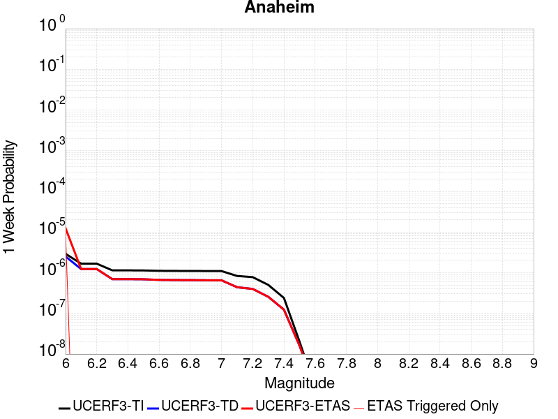 |  |  |  |

| Magnitude | 1 wk TI Prob | 1 wk TD Prob | 1 wk ETAS Prob | 1 wk ETAS/TD Gain | 1 wk ETAS Triggered Only | 1 mo TI Prob | 1 mo TD Prob | 1 mo ETAS Prob | 1 mo ETAS/TD Gain | 1 mo ETAS Triggered Only | 1 yr TI Prob | 1 yr TD Prob | 1 yr ETAS Prob | 1 yr ETAS/TD Gain | 1 yr ETAS Triggered Only | 10 yr TI Prob | 10 yr TD Prob | 10 yr ETAS Prob | 10 yr ETAS/TD Gain | 10 yr ETAS Triggered Only |
|-----|-----|-----|-----|-----|-----|-----|-----|-----|-----|-----|-----|-----|-----|-----|-----|-----|-----|-----|-----|-----|
| 6.0 | 2.9254998E-6 | 2.5122863E-6 | 1.25122615E-5 | 4.980428 | 1.0E-5 | 1.25377965E-5 | 1.0766909E-5 | 2.0766802E-5 | 1.9287616 | 1.0E-5 | 1.5263697E-4 | 1.3108159E-4 | 1.6107765E-4 | 1.2288351 | 3.0E-5 | 0.0015253217 | 0.0013102728 | 0.0013402336 | 1.022866 | 3.0E-5 |
| 6.1 | 1.6729715E-6 | 1.2337348E-6 | 1.2337348E-6 | 1.0 | 0.0 | 7.1698582E-6 | 5.287426E-6 | 5.287426E-6 | 1.0 | 0.0 | 8.7289525E-5 | 6.437293E-5 | 6.437293E-5 | 1.0 | 0.0 | 8.7255245E-4 | 6.435838E-4 | 6.435838E-4 | 1.0 | 0.0 |
| 6.2 | 1.6729715E-6 | 1.2337348E-6 | 1.2337348E-6 | 1.0 | 0.0 | 7.1698582E-6 | 5.287426E-6 | 5.287426E-6 | 1.0 | 0.0 | 8.7289525E-5 | 6.437293E-5 | 6.437293E-5 | 1.0 | 0.0 | 8.7255245E-4 | 6.435838E-4 | 6.435838E-4 | 1.0 | 0.0 |
| 6.3 | 1.1444064E-6 | 6.9596666E-7 | 6.9596666E-7 | 1.0 | 0.0 | 4.9045893E-6 | 2.9827113E-6 | 2.9827113E-6 | 1.0 | 0.0 | 5.971174E-5 | 3.631396E-5 | 3.631396E-5 | 1.0 | 0.0 | 5.96957E-4 | 3.6308577E-4 | 3.6308577E-4 | 1.0 | 0.0 |
| 6.4 | 1.1444064E-6 | 6.9596666E-7 | 6.9596666E-7 | 1.0 | 0.0 | 4.9045893E-6 | 2.9827113E-6 | 2.9827113E-6 | 1.0 | 0.0 | 5.971174E-5 | 3.631396E-5 | 3.631396E-5 | 1.0 | 0.0 | 5.96957E-4 | 3.6308577E-4 | 3.6308577E-4 | 1.0 | 0.0 |
| 6.5 | 1.1385318E-6 | 6.9003505E-7 | 6.9003505E-7 | 1.0 | 0.0 | 4.879413E-6 | 2.95729E-6 | 2.95729E-6 | 1.0 | 0.0 | 5.9405233E-5 | 3.6004465E-5 | 3.6004465E-5 | 1.0 | 0.0 | 5.938936E-4 | 3.5999183E-4 | 3.5999183E-4 | 1.0 | 0.0 |
| 6.6 | 1.1165511E-6 | 6.678222E-7 | 6.678222E-7 | 1.0 | 0.0 | 4.78521E-6 | 2.862092E-6 | 2.862092E-6 | 1.0 | 0.0 | 5.8258374E-5 | 3.484547E-5 | 3.484547E-5 | 1.0 | 0.0 | 5.8243104E-4 | 3.484055E-4 | 3.484055E-4 | 1.0 | 0.0 |
| 6.7 | 1.1098243E-6 | 6.610416E-7 | 6.610416E-7 | 1.0 | 0.0 | 4.7563813E-6 | 2.8330326E-6 | 2.8330326E-6 | 1.0 | 0.0 | 5.7907404E-5 | 3.449168E-5 | 3.449168E-5 | 1.0 | 0.0 | 5.7892315E-4 | 3.4486872E-4 | 3.4486872E-4 | 1.0 | 0.0 |
| 6.8 | 1.1077587E-6 | 6.589619E-7 | 6.589619E-7 | 1.0 | 0.0 | 4.7475287E-6 | 2.8241195E-6 | 2.8241195E-6 | 1.0 | 0.0 | 5.779963E-5 | 3.438317E-5 | 3.438317E-5 | 1.0 | 0.0 | 5.77846E-4 | 3.4378393E-4 | 3.4378393E-4 | 1.0 | 0.0 |
| 6.9 | 1.1024468E-6 | 6.5361957E-7 | 6.5361957E-7 | 1.0 | 0.0 | 4.7247636E-6 | 2.8012241E-6 | 2.8012241E-6 | 1.0 | 0.0 | 5.752248E-5 | 3.4104425E-5 | 3.4104425E-5 | 1.0 | 0.0 | 5.750759E-4 | 3.4099736E-4 | 3.4099736E-4 | 1.0 | 0.0 |
| 7.0 | 1.0993066E-6 | 6.510303E-7 | 6.510303E-7 | 1.0 | 0.0 | 4.7113053E-6 | 2.7901272E-6 | 2.7901272E-6 | 1.0 | 0.0 | 5.7358633E-5 | 3.3969325E-5 | 3.3969325E-5 | 1.0 | 0.0 | 5.734383E-4 | 3.3964674E-4 | 3.3964674E-4 | 1.0 | 0.0 |
| 7.1 | 8.334877E-7 | 4.4049145E-7 | 4.4049145E-7 | 1.0 | 0.0 | 3.5720855E-6 | 1.8878193E-6 | 1.8878193E-6 | 1.0 | 0.0 | 4.348927E-5 | 2.298398E-5 | 2.298398E-5 | 1.0 | 0.0 | 4.3480762E-4 | 2.2981827E-4 | 2.2981827E-4 | 1.0 | 0.0 |
| 7.2 | 7.794411E-7 | 3.997645E-7 | 3.997645E-7 | 1.0 | 0.0 | 3.3404576E-6 | 1.7132754E-6 | 1.7132754E-6 | 1.0 | 0.0 | 4.0669314E-5 | 2.0858948E-5 | 2.0858948E-5 | 1.0 | 0.0 | 4.066187E-4 | 2.0857195E-4 | 2.0857195E-4 | 1.0 | 0.0 |
| 7.3 | 5.01704E-7 | 2.5573388E-7 | 2.5573388E-7 | 1.0 | 0.0 | 2.150158E-6 | 1.0960019E-6 | 1.0960019E-6 | 1.0 | 0.0 | 2.617786E-5 | 1.3343754E-5 | 1.3343754E-5 | 1.0 | 0.0 | 2.6174777E-4 | 1.3343077E-4 | 1.3343077E-4 | 1.0 | 0.0 |
| 7.4 | 2.4008182E-7 | 1.2367859E-7 | 1.2367859E-7 | 1.0 | 0.0 | 1.0289217E-6 | 5.30051E-7 | 5.30051E-7 | 1.0 | 0.0 | 1.252705E-5 | 6.4533597E-6 | 6.4533597E-6 | 1.0 | 0.0 | 1.2526344E-4 | 6.453248E-5 | 6.453248E-5 | 1.0 | 0.0 |
| 7.5 | 2.0263876E-8 | 1.6120866E-8 | 1.6120866E-8 | 1.0 | 0.0 | 8.684518E-8 | 6.908943E-8 | 6.908943E-8 | 1.0 | 0.0 | 1.0573395E-6 | 8.4116357E-7 | 8.4116357E-7 | 1.0 | 0.0 | 1.0573345E-5 | 8.411613E-6 | 8.411613E-6 | 1.0 | 0.0 |
| 7.6 | 1.4871431E-9 | 1.508418E-9 | 1.508418E-9 | 1.0 | 0.0 | 6.37347E-9 | 6.4646484E-9 | 6.4646484E-9 | 1.0 | 0.0 | 7.7596994E-8 | 7.870709E-8 | 7.870709E-8 | 1.0 | 0.0 | 7.759697E-7 | 7.8707063E-7 | 7.8707063E-7 | 1.0 | 0.0 |
| 7.7 | 1.5093293E-10 | 1.5333512E-10 | 1.5333512E-10 | 1.0 | 0.0 | 6.4685546E-10 | 6.571509E-10 | 6.571509E-10 | 1.0 | 0.0 | 7.875465E-9 | 8.0008125E-9 | 8.0008125E-9 | 1.0 | 0.0 | 7.8754645E-8 | 8.000812E-8 | 8.000812E-8 | 1.0 | 0.0 |

## Robinson Creek
*[(top)](#table-of-contents)*

| 1 Week | 1 Month | 1 Year | 10 Year |
|-----|-----|-----|-----|
|  |  |  |  |

| Magnitude | 1 wk TI Prob | 1 wk TD Prob | 1 wk ETAS Prob | 1 wk ETAS/TD Gain | 1 wk ETAS Triggered Only | 1 mo TI Prob | 1 mo TD Prob | 1 mo ETAS Prob | 1 mo ETAS/TD Gain | 1 mo ETAS Triggered Only | 1 yr TI Prob | 1 yr TD Prob | 1 yr ETAS Prob | 1 yr ETAS/TD Gain | 1 yr ETAS Triggered Only | 10 yr TI Prob | 10 yr TD Prob | 10 yr ETAS Prob | 10 yr ETAS/TD Gain | 10 yr ETAS Triggered Only |
|-----|-----|-----|-----|-----|-----|-----|-----|-----|-----|-----|-----|-----|-----|-----|-----|-----|-----|-----|-----|-----|
| 6.0 | 1.3705327E-5 | 1.5285013E-5 | 1.5285013E-5 | 1.0 | 0.0 | 5.8735794E-5 | 6.55072E-5 | 7.550655E-5 | 1.152645 | 1.0E-5 | 7.1487366E-4 | 7.9755014E-4 | 8.075422E-4 | 1.0125284 | 1.0E-5 | 0.0071257832 | 0.007975501 | 0.008005262 | 1.0037315 | 3.0E-5 |
| 6.1 | 1.3705327E-5 | 1.5285013E-5 | 1.5285013E-5 | 1.0 | 0.0 | 5.8735794E-5 | 6.55072E-5 | 7.550655E-5 | 1.152645 | 1.0E-5 | 7.1487366E-4 | 7.9755014E-4 | 8.075422E-4 | 1.0125284 | 1.0E-5 | 0.0071257832 | 0.007975501 | 0.008005262 | 1.0037315 | 3.0E-5 |
| 6.2 | 1.3705327E-5 | 1.5285013E-5 | 1.5285013E-5 | 1.0 | 0.0 | 5.8735794E-5 | 6.55072E-5 | 7.550655E-5 | 1.152645 | 1.0E-5 | 7.1487366E-4 | 7.9755014E-4 | 8.075422E-4 | 1.0125284 | 1.0E-5 | 0.0071257832 | 0.007975501 | 0.008005262 | 1.0037315 | 3.0E-5 |
| 6.3 | 1.3705327E-5 | 1.5285013E-5 | 1.5285013E-5 | 1.0 | 0.0 | 5.8735794E-5 | 6.55072E-5 | 7.550655E-5 | 1.152645 | 1.0E-5 | 7.1487366E-4 | 7.9755014E-4 | 8.075422E-4 | 1.0125284 | 1.0E-5 | 0.0071257832 | 0.007975501 | 0.008005262 | 1.0037315 | 3.0E-5 |
| 6.4 | 1.3705327E-5 | 1.5285013E-5 | 1.5285013E-5 | 1.0 | 0.0 | 5.8735794E-5 | 6.55072E-5 | 7.550655E-5 | 1.152645 | 1.0E-5 | 7.1487366E-4 | 7.9755014E-4 | 8.075422E-4 | 1.0125284 | 1.0E-5 | 0.0071257832 | 0.007975501 | 0.008005262 | 1.0037315 | 3.0E-5 |

## Simi-Santa Rosa
*[(top)](#table-of-contents)*

| 1 Week | 1 Month | 1 Year | 10 Year |
|-----|-----|-----|-----|
| 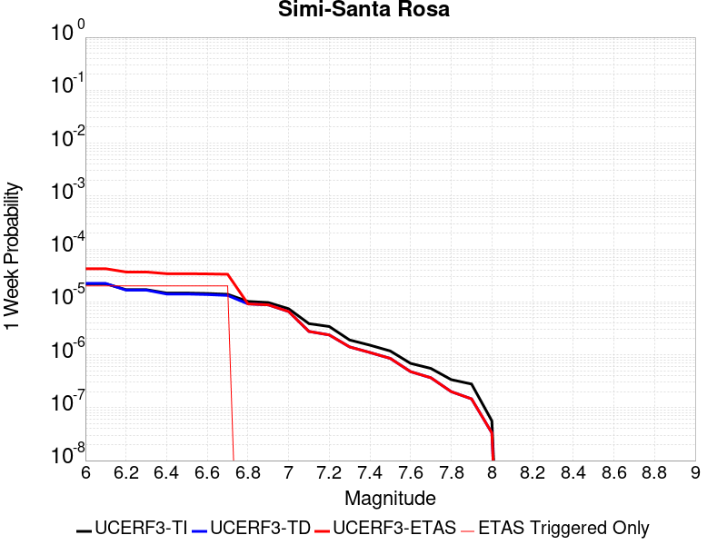 |  |  |  |

| Magnitude | 1 wk TI Prob | 1 wk TD Prob | 1 wk ETAS Prob | 1 wk ETAS/TD Gain | 1 wk ETAS Triggered Only | 1 mo TI Prob | 1 mo TD Prob | 1 mo ETAS Prob | 1 mo ETAS/TD Gain | 1 mo ETAS Triggered Only | 1 yr TI Prob | 1 yr TD Prob | 1 yr ETAS Prob | 1 yr ETAS/TD Gain | 1 yr ETAS Triggered Only | 10 yr TI Prob | 10 yr TD Prob | 10 yr ETAS Prob | 10 yr ETAS/TD Gain | 10 yr ETAS Triggered Only |
|-----|-----|-----|-----|-----|-----|-----|-----|-----|-----|-----|-----|-----|-----|-----|-----|-----|-----|-----|-----|-----|
| 6.0 | 2.198912E-5 | 2.2275442E-5 | 4.2274998E-5 | 1.8978298 | 2.0E-5 | 9.4235686E-5 | 9.5462936E-5 | 1.1546103E-4 | 1.2094854 | 2.0E-5 | 0.0011467156 | 0.0011616853 | 0.0011816622 | 1.0171964 | 2.0E-5 | 0.011408163 | 0.011560575 | 0.011590228 | 1.002565 | 3.0E-5 |
| 6.1 | 2.198912E-5 | 2.2275442E-5 | 4.2274998E-5 | 1.8978298 | 2.0E-5 | 9.4235686E-5 | 9.5462936E-5 | 1.1546103E-4 | 1.2094854 | 2.0E-5 | 0.0011467156 | 0.0011616853 | 0.0011816622 | 1.0171964 | 2.0E-5 | 0.011408163 | 0.011560575 | 0.011590228 | 1.002565 | 3.0E-5 |
| 6.2 | 1.69983E-5 | 1.6668559E-5 | 3.6668225E-5 | 2.1998436 | 2.0E-5 | 7.284782E-5 | 7.143489E-5 | 9.143346E-5 | 1.2799553 | 2.0E-5 | 8.865613E-4 | 8.6940196E-4 | 8.8938454E-4 | 1.0229843 | 2.0E-5 | 0.008830327 | 0.008662928 | 0.008692668 | 1.003433 | 3.0E-5 |
| 6.3 | 1.69983E-5 | 1.6668559E-5 | 3.6668225E-5 | 2.1998436 | 2.0E-5 | 7.284782E-5 | 7.143489E-5 | 9.143346E-5 | 1.2799553 | 2.0E-5 | 8.865613E-4 | 8.6940196E-4 | 8.8938454E-4 | 1.0229843 | 2.0E-5 | 0.008830327 | 0.008662928 | 0.008692668 | 1.003433 | 3.0E-5 |
| 6.4 | 1.4666188E-5 | 1.4052543E-5 | 3.405226E-5 | 2.42321 | 2.0E-5 | 6.285358E-5 | 6.0223934E-5 | 8.022273E-5 | 1.3320739 | 2.0E-5 | 7.6497364E-4 | 7.3300465E-4 | 7.5298996E-4 | 1.027265 | 2.0E-5 | 0.0076234564 | 0.007308344 | 0.007338125 | 1.0040749 | 3.0E-5 |
| 6.5 | 1.4666188E-5 | 1.4052543E-5 | 3.405226E-5 | 2.42321 | 2.0E-5 | 6.285358E-5 | 6.0223934E-5 | 8.022273E-5 | 1.3320739 | 2.0E-5 | 7.6497364E-4 | 7.3300465E-4 | 7.5298996E-4 | 1.027265 | 2.0E-5 | 0.0076234564 | 0.007308344 | 0.007338125 | 1.0040749 | 3.0E-5 |
| 6.6 | 1.4377586E-5 | 1.3729583E-5 | 3.372931E-5 | 2.4566886 | 2.0E-5 | 6.1616774E-5 | 5.883988E-5 | 7.8838704E-5 | 1.3398855 | 2.0E-5 | 7.4992597E-4 | 7.1616494E-4 | 7.361506E-4 | 1.0279065 | 2.0E-5 | 0.007474003 | 0.0071410383 | 0.0071708243 | 1.004171 | 3.0E-5 |
| 6.7 | 1.3881404E-5 | 1.320755E-5 | 3.3207285E-5 | 2.5142653 | 2.0E-5 | 5.9490372E-5 | 5.66027E-5 | 7.6601566E-5 | 1.35332 | 2.0E-5 | 7.240546E-4 | 6.8894465E-4 | 7.089309E-4 | 1.0290099 | 2.0E-5 | 0.007217 | 0.006870538 | 0.006900332 | 1.0043365 | 3.0E-5 |
| 6.8 | 1.0176516E-5 | 9.154151E-6 | 9.154151E-6 | 1.0 | 0.0 | 4.3612912E-5 | 3.9231574E-5 | 3.9231574E-5 | 1.0 | 0.0 | 5.308578E-4 | 4.7755634E-4 | 4.7755634E-4 | 1.0 | 0.0 | 0.0052959146 | 0.004766934 | 0.0047768867 | 1.0020878 | 1.0E-5 |
| 6.9 | 9.699797E-6 | 8.774719E-6 | 8.774719E-6 | 1.0 | 0.0 | 4.15699E-5 | 3.7605492E-5 | 3.7605492E-5 | 1.0 | 0.0 | 5.05996E-4 | 4.577671E-4 | 4.577671E-4 | 1.0 | 0.0 | 0.005048454 | 0.0045698597 | 0.004579814 | 1.0021782 | 1.0E-5 |
| 7.0 | 7.4049476E-6 | 6.559333E-6 | 6.559333E-6 | 1.0 | 0.0 | 3.1735104E-5 | 2.8111197E-5 | 2.8111197E-5 | 1.0 | 0.0 | 3.8630638E-4 | 3.422127E-4 | 3.422127E-4 | 1.0 | 0.0 | 0.0038563553 | 0.0034180996 | 0.0034180996 | 1.0 | 0.0 |
| 7.1 | 3.873439E-6 | 2.7595095E-6 | 2.7595095E-6 | 1.0 | 0.0 | 1.6600346E-5 | 1.1826417E-5 | 1.1826417E-5 | 1.0 | 0.0 | 2.0209046E-4 | 1.4397735E-4 | 1.4397735E-4 | 1.0 | 0.0 | 0.0020190678 | 0.0014388643 | 0.0014388643 | 1.0 | 0.0 |
| 7.2 | 3.417706E-6 | 2.3676484E-6 | 2.3676484E-6 | 1.0 | 0.0 | 1.4647229E-5 | 1.0147027E-5 | 1.0147027E-5 | 1.0 | 0.0 | 1.7831543E-4 | 1.2353327E-4 | 1.2353327E-4 | 1.0 | 0.0 | 0.0017817242 | 0.0012346683 | 0.0012346683 | 1.0 | 0.0 |
| 7.3 | 1.90225E-6 | 1.4073753E-6 | 1.4073753E-6 | 1.0 | 0.0 | 8.152474E-6 | 6.0315947E-6 | 6.0315947E-6 | 1.0 | 0.0 | 9.9251854E-5 | 7.343221E-5 | 7.343221E-5 | 1.0 | 0.0 | 9.920754E-4 | 7.340817E-4 | 7.340817E-4 | 1.0 | 0.0 |
| 7.4 | 1.5170556E-6 | 1.1024773E-6 | 1.1024773E-6 | 1.0 | 0.0 | 6.5016507E-6 | 4.724894E-6 | 4.724894E-6 | 1.0 | 0.0 | 7.915472E-5 | 5.7524077E-5 | 5.7524077E-5 | 1.0 | 0.0 | 7.9126534E-4 | 5.7509297E-4 | 5.7509297E-4 | 1.0 | 0.0 |
| 7.5 | 1.178732E-6 | 8.535102E-7 | 8.535102E-7 | 1.0 | 0.0 | 5.0516987E-6 | 3.6578958E-6 | 3.6578958E-6 | 1.0 | 0.0 | 6.1502695E-5 | 4.453398E-5 | 4.453398E-5 | 1.0 | 0.0 | 6.148568E-4 | 4.452515E-4 | 4.452515E-4 | 1.0 | 0.0 |
| 7.6 | 6.8722386E-7 | 4.793198E-7 | 4.793198E-7 | 1.0 | 0.0 | 2.9452417E-6 | 2.054226E-6 | 2.054226E-6 | 1.0 | 0.0 | 3.5857727E-5 | 2.5009915E-5 | 2.5009915E-5 | 1.0 | 0.0 | 3.5851944E-4 | 2.5007114E-4 | 2.5007114E-4 | 1.0 | 0.0 |
| 7.7 | 5.5126515E-7 | 3.6731157E-7 | 3.6731157E-7 | 1.0 | 0.0 | 2.3625628E-6 | 1.5741915E-6 | 1.5741915E-6 | 1.0 | 0.0 | 2.8763823E-5 | 1.9165615E-5 | 1.9165615E-5 | 1.0 | 0.0 | 2.87601E-4 | 1.9163972E-4 | 1.9163972E-4 | 1.0 | 0.0 |
| 7.8 | 3.3860243E-7 | 2.0075942E-7 | 2.0075942E-7 | 1.0 | 0.0 | 1.4511525E-6 | 8.6039717E-7 | 8.6039717E-7 | 1.0 | 0.0 | 1.7667637E-5 | 1.0475286E-5 | 1.0475286E-5 | 1.0 | 0.0 | 1.7666233E-4 | 1.04747975E-4 | 1.04747975E-4 | 1.0 | 0.0 |
| 7.9 | 2.7955386E-7 | 1.4649108E-7 | 1.4649108E-7 | 1.0 | 0.0 | 1.1980875E-6 | 6.278188E-7 | 6.278188E-7 | 1.0 | 0.0 | 1.4586617E-5 | 7.643667E-6 | 7.643667E-6 | 1.0 | 0.0 | 1.458566E-4 | 7.643409E-5 | 7.643409E-5 | 1.0 | 0.0 |
| 8.0 | 5.6259015E-8 | 3.3355324E-8 | 3.3355324E-8 | 1.0 | 0.0 | 2.4111003E-7 | 1.4295138E-7 | 1.4295138E-7 | 1.0 | 0.0 | 2.9355108E-6 | 1.7404317E-6 | 1.7404317E-6 | 1.0 | 0.0 | 2.935472E-5 | 1.7404194E-5 | 1.7404194E-5 | 1.0 | 0.0 |

## San Jacinto (Superstition Mtn)
*[(top)](#table-of-contents)*

| 1 Week | 1 Month | 1 Year | 10 Year |
|-----|-----|-----|-----|
|  |  | 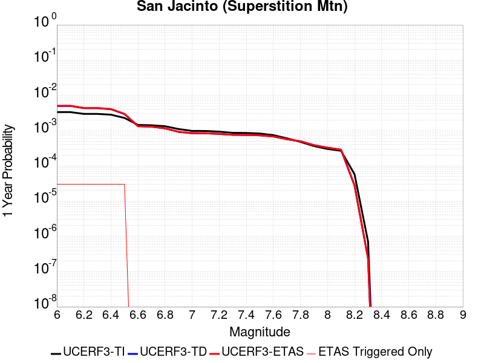 | 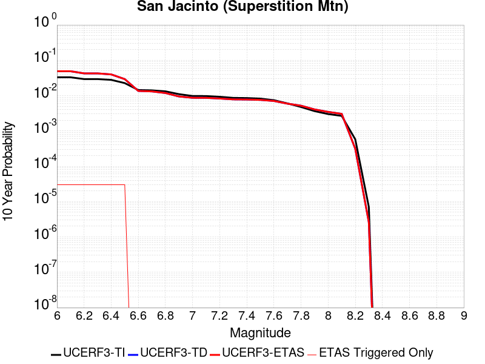 |

| Magnitude | 1 wk TI Prob | 1 wk TD Prob | 1 wk ETAS Prob | 1 wk ETAS/TD Gain | 1 wk ETAS Triggered Only | 1 mo TI Prob | 1 mo TD Prob | 1 mo ETAS Prob | 1 mo ETAS/TD Gain | 1 mo ETAS Triggered Only | 1 yr TI Prob | 1 yr TD Prob | 1 yr ETAS Prob | 1 yr ETAS/TD Gain | 1 yr ETAS Triggered Only | 10 yr TI Prob | 10 yr TD Prob | 10 yr ETAS Prob | 10 yr ETAS/TD Gain | 10 yr ETAS Triggered Only |
|-----|-----|-----|-----|-----|-----|-----|-----|-----|-----|-----|-----|-----|-----|-----|-----|-----|-----|-----|-----|-----|
| 6.0 | 6.4193904E-5 | 9.599367E-5 | 9.599367E-5 | 1.0 | 0.0 | 2.7508775E-4 | 4.1134638E-4 | 4.3133815E-4 | 1.0486008 | 2.0E-5 | 0.0033440501 | 0.0049980893 | 0.0050279396 | 1.0059723 | 3.0E-5 | 0.03294174 | 0.048823986 | 0.04885252 | 1.0005845 | 3.0E-5 |
| 6.1 | 6.4193904E-5 | 9.599367E-5 | 9.599367E-5 | 1.0 | 0.0 | 2.7508775E-4 | 4.1134638E-4 | 4.3133815E-4 | 1.0486008 | 2.0E-5 | 0.0033440501 | 0.0049980893 | 0.0050279396 | 1.0059723 | 3.0E-5 | 0.03294174 | 0.048823986 | 0.04885252 | 1.0005845 | 3.0E-5 |
| 6.2 | 5.7023593E-5 | 8.3144434E-5 | 8.3144434E-5 | 1.0 | 0.0 | 2.4436394E-4 | 3.5629404E-4 | 3.762869E-4 | 1.0561134 | 2.0E-5 | 0.002971072 | 0.0043308944 | 0.0043607643 | 1.006897 | 3.0E-5 | 0.029316625 | 0.04250403 | 0.042532753 | 1.0006758 | 3.0E-5 |
| 6.3 | 5.6940098E-5 | 8.298979E-5 | 8.298979E-5 | 1.0 | 0.0 | 2.4400617E-4 | 3.5563146E-4 | 3.7562437E-4 | 1.056218 | 2.0E-5 | 0.002966728 | 0.00432286 | 0.0043527302 | 1.0069098 | 3.0E-5 | 0.029274331 | 0.042427283 | 0.04245601 | 1.0006771 | 3.0E-5 |
| 6.4 | 5.4171585E-5 | 7.7483564E-5 | 7.7483564E-5 | 1.0 | 0.0 | 2.3214328E-4 | 3.3203943E-4 | 3.520328E-4 | 1.0602138 | 2.0E-5 | 0.0028226813 | 0.0040367353 | 0.004066614 | 1.0074017 | 3.0E-5 | 0.02787096 | 0.03971653 | 0.03974534 | 1.0007254 | 3.0E-5 |
| 6.5 | 4.375144E-5 | 5.642133E-5 | 5.642133E-5 | 1.0 | 0.0 | 1.874927E-4 | 2.4178992E-4 | 2.6178508E-4 | 1.0826964 | 2.0E-5 | 0.0022803338 | 0.002940994 | 0.0029709057 | 1.0101706 | 3.0E-5 | 0.022570757 | 0.029236801 | 0.029265925 | 1.0009961 | 3.0E-5 |
| 6.6 | 2.772192E-5 | 2.5488358E-5 | 2.5488358E-5 | 1.0 | 0.0 | 1.1880282E-4 | 1.09231354E-4 | 1.09231354E-4 | 1.0 | 0.0 | 0.0014454646 | 0.0013290998 | 0.0013290998 | 1.0 | 0.0 | 0.014360986 | 0.01354049 | 0.01354049 | 1.0 | 0.0 |
| 6.7 | 2.7124124E-5 | 2.4699386E-5 | 2.4699386E-5 | 1.0 | 0.0 | 1.1624106E-4 | 1.05850326E-4 | 1.05850326E-4 | 1.0 | 0.0 | 0.0014143161 | 0.001287985 | 0.001287985 | 1.0 | 0.0 | 0.014053487 | 0.013133943 | 0.013133943 | 1.0 | 0.0 |
| 6.8 | 2.5475807E-5 | 2.216446E-5 | 2.216446E-5 | 1.0 | 0.0 | 1.0917746E-4 | 9.4987154E-5 | 9.4987154E-5 | 1.0 | 0.0 | 0.001328425 | 0.001155867 | 0.001155867 | 1.0 | 0.0 | 0.0132051185 | 0.011822182 | 0.011822182 | 1.0 | 0.0 |
| 6.9 | 2.1162023E-5 | 1.7626244E-5 | 1.7626244E-5 | 1.0 | 0.0 | 9.069123E-5 | 7.5538876E-5 | 7.5538876E-5 | 1.0 | 0.0 | 0.0011036064 | 9.193016E-4 | 9.193016E-4 | 1.0 | 0.0 | 0.010981417 | 0.00944688 | 0.00944688 | 1.0 | 0.0 |
| 7.0 | 1.8754288E-5 | 1.6161559E-5 | 1.6161559E-5 | 1.0 | 0.0 | 8.037304E-5 | 6.9261994E-5 | 6.9261994E-5 | 1.0 | 0.0 | 9.781026E-4 | 8.4294105E-4 | 8.4294105E-4 | 1.0 | 0.0 | 0.009738087 | 0.008670042 | 0.008670042 | 1.0 | 0.0 |
| 7.1 | 1.8678527E-5 | 1.6086702E-5 | 1.6086702E-5 | 1.0 | 0.0 | 8.0048376E-5 | 6.89412E-5 | 6.89412E-5 | 1.0 | 0.0 | 9.7415317E-4 | 8.3903834E-4 | 8.3903834E-4 | 1.0 | 0.0 | 0.009698939 | 0.008630998 | 0.008630998 | 1.0 | 0.0 |
| 7.2 | 1.7804578E-5 | 1.5381282E-5 | 1.5381282E-5 | 1.0 | 0.0 | 7.6303106E-5 | 6.5918124E-5 | 6.5918124E-5 | 1.0 | 0.0 | 9.285943E-4 | 8.022599E-4 | 8.022599E-4 | 1.0 | 0.0 | 0.009247236 | 0.008262311 | 0.008262311 | 1.0 | 0.0 |
| 7.3 | 1.6583685E-5 | 1.4530388E-5 | 1.4530388E-5 | 1.0 | 0.0 | 7.1070994E-5 | 6.227162E-5 | 6.227162E-5 | 1.0 | 0.0 | 8.649459E-4 | 7.5789524E-4 | 7.5789524E-4 | 1.0 | 0.0 | 0.00861587 | 0.007817623 | 0.007817623 | 1.0 | 0.0 |
| 7.4 | 1.6387552E-5 | 1.4395274E-5 | 1.4395274E-5 | 1.0 | 0.0 | 7.023047E-5 | 6.169258E-5 | 6.169258E-5 | 1.0 | 0.0 | 8.5472054E-4 | 7.5085036E-4 | 7.5085036E-4 | 1.0 | 0.0 | 0.008514405 | 0.0077470057 | 0.0077470057 | 1.0 | 0.0 |
| 7.5 | 1.5790754E-5 | 1.4035962E-5 | 1.4035962E-5 | 1.0 | 0.0 | 6.767291E-5 | 6.0152746E-5 | 6.0152746E-5 | 1.0 | 0.0 | 8.236062E-4 | 7.321156E-4 | 7.321156E-4 | 1.0 | 0.0 | 0.008205604 | 0.007557569 | 0.007557569 | 1.0 | 0.0 |
| 7.6 | 1.4248672E-5 | 1.3054932E-5 | 1.3054932E-5 | 1.0 | 0.0 | 6.106431E-5 | 5.594852E-5 | 5.594852E-5 | 1.0 | 0.0 | 7.432043E-4 | 6.8096205E-4 | 6.8096205E-4 | 1.0 | 0.0 | 0.007407237 | 0.0070401574 | 0.0070401574 | 1.0 | 0.0 |
| 7.7 | 1.15449975E-5 | 1.090368E-5 | 1.090368E-5 | 1.0 | 0.0 | 4.947762E-5 | 4.6729223E-5 | 4.6729223E-5 | 1.0 | 0.0 | 6.022235E-4 | 5.687805E-4 | 5.687805E-4 | 1.0 | 0.0 | 0.006005941 | 0.0059101824 | 0.0059101824 | 1.0 | 0.0 |
| 7.8 | 9.1391985E-6 | 9.514299E-6 | 9.514299E-6 | 1.0 | 0.0 | 3.9167408E-5 | 4.0774932E-5 | 4.0774932E-5 | 1.0 | 0.0 | 4.767588E-4 | 4.963223E-4 | 4.963223E-4 | 1.0 | 0.0 | 0.0047573727 | 0.0051766867 | 0.0051766867 | 1.0 | 0.0 |
| 7.9 | 6.973017E-6 | 7.3821784E-6 | 7.3821784E-6 | 1.0 | 0.0 | 2.9884017E-5 | 3.1637526E-5 | 3.1637526E-5 | 1.0 | 0.0 | 3.6377716E-4 | 3.8511935E-4 | 3.8511935E-4 | 1.0 | 0.0 | 0.0036318225 | 0.0040517948 | 0.0040517948 | 1.0 | 0.0 |
| 8.0 | 5.7638235E-6 | 6.259972E-6 | 6.259972E-6 | 1.0 | 0.0 | 2.4701867E-5 | 2.6828178E-5 | 2.6828178E-5 | 1.0 | 0.0 | 3.0070372E-4 | 3.2658462E-4 | 3.2658462E-4 | 1.0 | 0.0 | 0.0030029714 | 0.0034534496 | 0.0034534496 | 1.0 | 0.0 |
| 8.1 | 5.1124434E-6 | 5.4956718E-6 | 5.4956718E-6 | 1.0 | 0.0 | 2.1910288E-5 | 2.355267E-5 | 2.355267E-5 | 1.0 | 0.0 | 2.6672508E-4 | 2.867165E-4 | 2.867165E-4 | 1.0 | 0.0 | 0.0026640517 | 0.003040336 | 0.003040336 | 1.0 | 0.0 |
| 8.2 | 1.1075938E-6 | 5.336568E-7 | 5.336568E-7 | 1.0 | 0.0 | 4.7468216E-6 | 2.2870988E-6 | 2.2870988E-6 | 1.0 | 0.0 | 5.779102E-5 | 2.7845093E-5 | 2.7845093E-5 | 1.0 | 0.0 | 5.777599E-4 | 3.1346595E-4 | 3.1346595E-4 | 1.0 | 0.0 |
| 8.3 | 1.3584393E-8 | 4.473836E-9 | 4.473836E-9 | 1.0 | 0.0 | 5.8218827E-8 | 1.9173582E-8 | 1.9173582E-8 | 1.0 | 0.0 | 7.0881396E-7 | 2.3343837E-7 | 2.3343837E-7 | 1.0 | 0.0 | 7.0881174E-6 | 2.6163038E-6 | 2.6163038E-6 | 1.0 | 0.0 |

## Gillem - Big Crack 2011 CFM
*[(top)](#table-of-contents)*

| 1 Week | 1 Month | 1 Year | 10 Year |
|-----|-----|-----|-----|
|  |  |  |  |

| Magnitude | 1 wk TI Prob | 1 wk TD Prob | 1 wk ETAS Prob | 1 wk ETAS/TD Gain | 1 wk ETAS Triggered Only | 1 mo TI Prob | 1 mo TD Prob | 1 mo ETAS Prob | 1 mo ETAS/TD Gain | 1 mo ETAS Triggered Only | 1 yr TI Prob | 1 yr TD Prob | 1 yr ETAS Prob | 1 yr ETAS/TD Gain | 1 yr ETAS Triggered Only | 10 yr TI Prob | 10 yr TD Prob | 10 yr ETAS Prob | 10 yr ETAS/TD Gain | 10 yr ETAS Triggered Only |
|-----|-----|-----|-----|-----|-----|-----|-----|-----|-----|-----|-----|-----|-----|-----|-----|-----|-----|-----|-----|-----|
| 6.0 | 2.196852E-5 | 2.3604485E-5 | 2.3604485E-5 | 1.0 | 0.0 | 9.4147406E-5 | 1.01158665E-4 | 1.1115765E-4 | 1.0988446 | 1.0E-5 | 0.0011456419 | 0.0012309998 | 0.0012509752 | 1.016227 | 2.0E-5 | 0.011397537 | 0.012250669 | 0.012280302 | 1.0024189 | 3.0E-5 |
| 6.1 | 9.992795E-6 | 1.071189E-5 | 1.071189E-5 | 1.0 | 0.0 | 4.2825563E-5 | 4.5907396E-5 | 5.5906938E-5 | 1.2178198 | 1.0E-5 | 5.2127644E-4 | 5.587975E-4 | 5.7878636E-4 | 1.0357711 | 2.0E-5 | 0.0052005537 | 0.0055757347 | 0.005595623 | 1.003567 | 2.0E-5 |
| 6.2 | 9.992795E-6 | 1.071189E-5 | 1.071189E-5 | 1.0 | 0.0 | 4.2825563E-5 | 4.5907396E-5 | 5.5906938E-5 | 1.2178198 | 1.0E-5 | 5.2127644E-4 | 5.587975E-4 | 5.7878636E-4 | 1.0357711 | 2.0E-5 | 0.0052005537 | 0.0055757347 | 0.005595623 | 1.003567 | 2.0E-5 |
| 6.3 | 4.6127884E-6 | 4.942657E-6 | 4.942657E-6 | 1.0 | 0.0 | 1.9768944E-5 | 2.1182668E-5 | 3.118246E-5 | 1.472074 | 1.0E-5 | 2.406603E-4 | 2.5787292E-4 | 2.6787035E-4 | 1.0387688 | 1.0E-5 | 0.0024039985 | 0.0025761751 | 0.0025861494 | 1.0038717 | 1.0E-5 |
| 6.4 | 4.6127884E-6 | 4.942657E-6 | 4.942657E-6 | 1.0 | 0.0 | 1.9768944E-5 | 2.1182668E-5 | 3.118246E-5 | 1.472074 | 1.0E-5 | 2.406603E-4 | 2.5787292E-4 | 2.6787035E-4 | 1.0387688 | 1.0E-5 | 0.0024039985 | 0.0025761751 | 0.0025861494 | 1.0038717 | 1.0E-5 |
| 6.5 | 2.716712E-6 | 2.9111113E-6 | 2.9111113E-6 | 1.0 | 0.0 | 1.1643E-5 | 1.24761455E-5 | 2.247602E-5 | 1.8015196 | 1.0E-5 | 1.417443E-4 | 1.5188892E-4 | 1.618874E-4 | 1.0658276 | 1.0E-5 | 0.0014165393 | 0.001518089 | 0.0015280738 | 1.0065773 | 1.0E-5 |
| 6.6 | 1.3818255E-6 | 1.4820689E-6 | 1.4820689E-6 | 1.0 | 0.0 | 5.922096E-6 | 6.3517155E-6 | 6.3517155E-6 | 1.0 | 0.0 | 7.209913E-5 | 7.7330624E-5 | 7.7330624E-5 | 1.0 | 0.0 | 7.2075747E-4 | 7.7315804E-4 | 7.7315804E-4 | 1.0 | 0.0 |

## San Gabriel
*[(top)](#table-of-contents)*

| 1 Week | 1 Month | 1 Year | 10 Year |
|-----|-----|-----|-----|
|  |  | 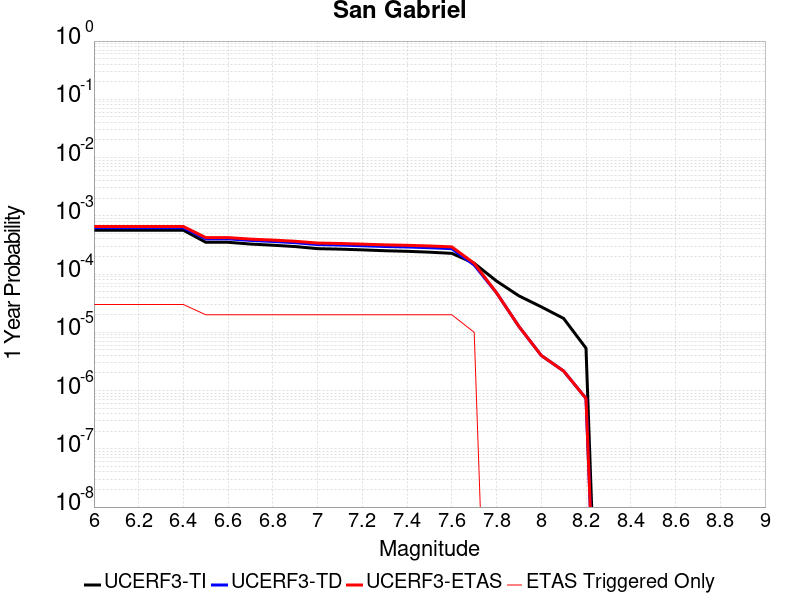 |  |

| Magnitude | 1 wk TI Prob | 1 wk TD Prob | 1 wk ETAS Prob | 1 wk ETAS/TD Gain | 1 wk ETAS Triggered Only | 1 mo TI Prob | 1 mo TD Prob | 1 mo ETAS Prob | 1 mo ETAS/TD Gain | 1 mo ETAS Triggered Only | 1 yr TI Prob | 1 yr TD Prob | 1 yr ETAS Prob | 1 yr ETAS/TD Gain | 1 yr ETAS Triggered Only | 10 yr TI Prob | 10 yr TD Prob | 10 yr ETAS Prob | 10 yr ETAS/TD Gain | 10 yr ETAS Triggered Only |
|-----|-----|-----|-----|-----|-----|-----|-----|-----|-----|-----|-----|-----|-----|-----|-----|-----|-----|-----|-----|-----|
| 6.0 | 1.083775E-5 | 1.19851875E-5 | 1.19851875E-5 | 1.0 | 0.0 | 4.6446676E-5 | 5.1364143E-5 | 5.1364143E-5 | 1.0 | 0.0 | 5.653415E-4 | 6.251903E-4 | 6.551716E-4 | 1.0479554 | 3.0E-5 | 0.0056390543 | 0.006246409 | 0.0062762215 | 1.0047728 | 3.0E-5 |
| 6.1 | 1.083775E-5 | 1.19851875E-5 | 1.19851875E-5 | 1.0 | 0.0 | 4.6446676E-5 | 5.1364143E-5 | 5.1364143E-5 | 1.0 | 0.0 | 5.653415E-4 | 6.251903E-4 | 6.551716E-4 | 1.0479554 | 3.0E-5 | 0.0056390543 | 0.006246409 | 0.0062762215 | 1.0047728 | 3.0E-5 |
| 6.2 | 1.083775E-5 | 1.19851875E-5 | 1.19851875E-5 | 1.0 | 0.0 | 4.6446676E-5 | 5.1364143E-5 | 5.1364143E-5 | 1.0 | 0.0 | 5.653415E-4 | 6.251903E-4 | 6.551716E-4 | 1.0479554 | 3.0E-5 | 0.0056390543 | 0.006246409 | 0.0062762215 | 1.0047728 | 3.0E-5 |
| 6.3 | 1.083775E-5 | 1.19851875E-5 | 1.19851875E-5 | 1.0 | 0.0 | 4.6446676E-5 | 5.1364143E-5 | 5.1364143E-5 | 1.0 | 0.0 | 5.653415E-4 | 6.251903E-4 | 6.551716E-4 | 1.0479554 | 3.0E-5 | 0.0056390543 | 0.006246409 | 0.0062762215 | 1.0047728 | 3.0E-5 |
| 6.4 | 1.083775E-5 | 1.19851875E-5 | 1.19851875E-5 | 1.0 | 0.0 | 4.6446676E-5 | 5.1364143E-5 | 5.1364143E-5 | 1.0 | 0.0 | 5.653415E-4 | 6.251903E-4 | 6.551716E-4 | 1.0479554 | 3.0E-5 | 0.0056390543 | 0.006246409 | 0.0062762215 | 1.0047728 | 3.0E-5 |
| 6.5 | 6.7317824E-6 | 7.716944E-6 | 7.716944E-6 | 1.0 | 0.0 | 2.8850178E-5 | 3.3072207E-5 | 3.3072207E-5 | 1.0 | 0.0 | 3.511943E-4 | 4.0258077E-4 | 4.2257272E-4 | 1.0496595 | 2.0E-5 | 0.003506398 | 0.0040296097 | 0.004049529 | 1.0049433 | 2.0E-5 |
| 6.6 | 6.7317824E-6 | 7.716944E-6 | 7.716944E-6 | 1.0 | 0.0 | 2.8850178E-5 | 3.3072207E-5 | 3.3072207E-5 | 1.0 | 0.0 | 3.511943E-4 | 4.0258077E-4 | 4.2257272E-4 | 1.0496595 | 2.0E-5 | 0.003506398 | 0.0040296097 | 0.004049529 | 1.0049433 | 2.0E-5 |
| 6.7 | 6.274881E-6 | 7.2458647E-6 | 7.2458647E-6 | 1.0 | 0.0 | 2.6892068E-5 | 3.1053343E-5 | 3.1053343E-5 | 1.0 | 0.0 | 3.2736175E-4 | 3.780098E-4 | 3.9800224E-4 | 1.0528886 | 2.0E-5 | 0.0032687993 | 0.0037847564 | 0.0038046807 | 1.0052644 | 2.0E-5 |
| 6.8 | 5.996209E-6 | 6.958585E-6 | 6.958585E-6 | 1.0 | 0.0 | 2.5697784E-5 | 2.9822171E-5 | 2.9822171E-5 | 1.0 | 0.0 | 3.128256E-4 | 3.6302538E-4 | 3.830181E-4 | 1.0550725 | 2.0E-5 | 0.003123856 | 0.0036354093 | 0.0036553366 | 1.0054815 | 2.0E-5 |
| 6.9 | 5.686331E-6 | 6.6236316E-6 | 6.6236316E-6 | 1.0 | 0.0 | 2.4369761E-5 | 2.8386688E-5 | 2.8386688E-5 | 1.0 | 0.0 | 2.9666146E-4 | 3.4555403E-4 | 3.655471E-4 | 1.0578581 | 2.0E-5 | 0.0029626573 | 0.0034612515 | 0.0034811823 | 1.0057583 | 2.0E-5 |
| 7.0 | 5.2329838E-6 | 6.147514E-6 | 6.147514E-6 | 1.0 | 0.0 | 2.242688E-5 | 2.6346226E-5 | 2.6346226E-5 | 1.0 | 0.0 | 2.7301308E-4 | 3.2071886E-4 | 3.4071246E-4 | 1.0623399 | 2.0E-5 | 0.002726779 | 0.0032136322 | 0.0032335678 | 1.0062035 | 2.0E-5 |
| 7.1 | 5.135671E-6 | 6.03764E-6 | 6.03764E-6 | 1.0 | 0.0 | 2.2009834E-5 | 2.5875348E-5 | 2.5875348E-5 | 1.0 | 0.0 | 2.6793676E-4 | 3.1498758E-4 | 3.3498128E-4 | 1.0634745 | 2.0E-5 | 0.0026761394 | 0.0031564834 | 0.0031764202 | 1.0063162 | 2.0E-5 |
| 7.2 | 4.989062E-6 | 5.87102E-6 | 5.87102E-6 | 1.0 | 0.0 | 2.1381518E-5 | 2.5161276E-5 | 2.5161276E-5 | 1.0 | 0.0 | 2.6028889E-4 | 3.0629625E-4 | 3.2629012E-4 | 1.0652763 | 2.0E-5 | 0.0025998424 | 0.003069813 | 0.0030897513 | 1.006495 | 2.0E-5 |
| 7.3 | 4.8219395E-6 | 5.702574E-6 | 5.702574E-6 | 1.0 | 0.0 | 2.0665291E-5 | 2.443938E-5 | 2.443938E-5 | 1.0 | 0.0 | 2.5157086E-4 | 2.9750957E-4 | 3.175036E-4 | 1.0672047 | 2.0E-5 | 0.0025128627 | 0.0029821852 | 0.0030021255 | 1.0066864 | 2.0E-5 |
| 7.4 | 4.7118383E-6 | 5.5911332E-6 | 5.5911332E-6 | 1.0 | 0.0 | 2.0193436E-5 | 2.3961782E-5 | 2.3961782E-5 | 1.0 | 0.0 | 2.4582737E-4 | 2.916964E-4 | 3.1169056E-4 | 1.0685444 | 2.0E-5 | 0.002455556 | 0.0029242067 | 0.0029441481 | 1.0068195 | 2.0E-5 |
| 7.5 | 4.5506545E-6 | 5.4365014E-6 | 5.4365014E-6 | 1.0 | 0.0 | 1.9502659E-5 | 2.3299088E-5 | 2.3299088E-5 | 1.0 | 0.0 | 2.37419E-4 | 2.8363022E-4 | 3.0362455E-4 | 1.0704943 | 2.0E-5 | 0.002371655 | 0.002843753 | 0.002863696 | 1.007013 | 2.0E-5 |
| 7.6 | 4.343636E-6 | 5.2293817E-6 | 5.2293817E-6 | 1.0 | 0.0 | 1.861545E-5 | 2.2411448E-5 | 2.2411448E-5 | 1.0 | 0.0 | 2.2661954E-4 | 2.7282597E-4 | 2.928205E-4 | 1.0732868 | 2.0E-5 | 0.0022638857 | 0.0027359722 | 0.0027559176 | 1.00729 | 2.0E-5 |
| 7.7 | 2.936235E-6 | 2.7440458E-6 | 2.7440458E-6 | 1.0 | 0.0 | 1.2583803E-5 | 1.1760143E-5 | 1.1760143E-5 | 1.0 | 0.0 | 1.5319703E-4 | 1.4317037E-4 | 1.5316893E-4 | 1.0698369 | 1.0E-5 | 0.0015309147 | 0.0014380751 | 0.0014480606 | 1.0069437 | 1.0E-5 |
| 7.8 | 1.4541639E-6 | 9.1237047E-7 | 9.1237047E-7 | 1.0 | 0.0 | 6.232116E-6 | 3.9101533E-6 | 3.9101533E-6 | 1.0 | 0.0 | 7.587337E-5 | 4.7605077E-5 | 4.7605077E-5 | 1.0 | 0.0 | 7.584747E-4 | 4.8085177E-4 | 4.8085177E-4 | 1.0 | 0.0 |
| 7.9 | 8.098958E-7 | 2.41753E-7 | 2.41753E-7 | 1.0 | 0.0 | 3.4709774E-6 | 1.0360839E-6 | 1.0360839E-6 | 1.0 | 0.0 | 4.225833E-5 | 1.2614248E-5 | 1.2614248E-5 | 1.0 | 0.0 | 4.2250296E-4 | 1.2921814E-4 | 1.2921814E-4 | 1.0 | 0.0 |
| 8.0 | 5.2473234E-7 | 7.6792055E-8 | 7.6792055E-8 | 1.0 | 0.0 | 2.248851E-6 | 3.2910876E-7 | 3.2910876E-7 | 1.0 | 0.0 | 2.7379416E-5 | 4.0068917E-6 | 4.0068917E-6 | 1.0 | 0.0 | 2.7376044E-4 | 4.21918E-5 | 4.21918E-5 | 1.0 | 0.0 |
| 8.1 | 3.3162388E-7 | 4.1496126E-8 | 4.1496126E-8 | 1.0 | 0.0 | 1.4212444E-6 | 1.7784053E-7 | 1.7784053E-7 | 1.0 | 0.0 | 1.7303513E-5 | 2.1652063E-6 | 2.1652063E-6 | 1.0 | 0.0 | 1.7302166E-4 | 2.2965523E-5 | 2.2965523E-5 | 1.0 | 0.0 |
| 8.2 | 1.0235345E-7 | 1.4043474E-8 | 1.4043474E-8 | 1.0 | 0.0 | 4.3865757E-7 | 6.0186316E-8 | 6.0186316E-8 | 1.0 | 0.0 | 5.340643E-6 | 7.327681E-7 | 7.327681E-7 | 1.0 | 0.0 | 5.3405143E-5 | 7.9273705E-6 | 7.9273705E-6 | 1.0 | 0.0 |

## Camp Rock 2011
*[(top)](#table-of-contents)*

| 1 Week | 1 Month | 1 Year | 10 Year |
|-----|-----|-----|-----|
|  |  |  |  |

| Magnitude | 1 wk TI Prob | 1 wk TD Prob | 1 wk ETAS Prob | 1 wk ETAS/TD Gain | 1 wk ETAS Triggered Only | 1 mo TI Prob | 1 mo TD Prob | 1 mo ETAS Prob | 1 mo ETAS/TD Gain | 1 mo ETAS Triggered Only | 1 yr TI Prob | 1 yr TD Prob | 1 yr ETAS Prob | 1 yr ETAS/TD Gain | 1 yr ETAS Triggered Only | 10 yr TI Prob | 10 yr TD Prob | 10 yr ETAS Prob | 10 yr ETAS/TD Gain | 10 yr ETAS Triggered Only |
|-----|-----|-----|-----|-----|-----|-----|-----|-----|-----|-----|-----|-----|-----|-----|-----|-----|-----|-----|-----|-----|
| 6.0 | 1.6710783E-5 | 4.25026E-6 | 2.4250176E-5 | 5.705574 | 2.0E-5 | 7.161568E-5 | 1.8215276E-5 | 3.8214912E-5 | 2.0979595 | 2.0E-5 | 8.7157206E-4 | 2.2174895E-4 | 2.4174452E-4 | 1.090172 | 2.0E-5 | 0.008681616 | 0.0022153298 | 0.0022452632 | 1.013512 | 3.0E-5 |
| 6.1 | 1.6710783E-5 | 4.25026E-6 | 2.4250176E-5 | 5.705574 | 2.0E-5 | 7.161568E-5 | 1.8215276E-5 | 3.8214912E-5 | 2.0979595 | 2.0E-5 | 8.7157206E-4 | 2.2174895E-4 | 2.4174452E-4 | 1.090172 | 2.0E-5 | 0.008681616 | 0.0022153298 | 0.0022452632 | 1.013512 | 3.0E-5 |
| 6.2 | 1.6710783E-5 | 4.25026E-6 | 2.4250176E-5 | 5.705574 | 2.0E-5 | 7.161568E-5 | 1.8215276E-5 | 3.8214912E-5 | 2.0979595 | 2.0E-5 | 8.7157206E-4 | 2.2174895E-4 | 2.4174452E-4 | 1.090172 | 2.0E-5 | 0.008681616 | 0.0022153298 | 0.0022452632 | 1.013512 | 3.0E-5 |
| 6.3 | 1.6710783E-5 | 4.25026E-6 | 2.4250176E-5 | 5.705574 | 2.0E-5 | 7.161568E-5 | 1.8215276E-5 | 3.8214912E-5 | 2.0979595 | 2.0E-5 | 8.7157206E-4 | 2.2174895E-4 | 2.4174452E-4 | 1.090172 | 2.0E-5 | 0.008681616 | 0.0022153298 | 0.0022452632 | 1.013512 | 3.0E-5 |
| 6.4 | 7.982846E-6 | 3.6820884E-6 | 1.3682052E-5 | 3.71584 | 1.0E-5 | 3.421175E-5 | 1.5780286E-5 | 2.5780128E-5 | 1.633692 | 1.0E-5 | 4.1644843E-4 | 1.9210839E-4 | 2.0210647E-4 | 1.0520439 | 1.0E-5 | 0.0041566887 | 0.001919458 | 0.0019394197 | 1.0103996 | 2.0E-5 |
| 6.5 | 7.982846E-6 | 3.6820884E-6 | 1.3682052E-5 | 3.71584 | 1.0E-5 | 3.421175E-5 | 1.5780286E-5 | 2.5780128E-5 | 1.633692 | 1.0E-5 | 4.1644843E-4 | 1.9210839E-4 | 2.0210647E-4 | 1.0520439 | 1.0E-5 | 0.0041566887 | 0.001919458 | 0.0019394197 | 1.0103996 | 2.0E-5 |
| 6.6 | 7.048869E-6 | 3.4243571E-6 | 1.3424323E-5 | 3.9202461 | 1.0E-5 | 3.0209088E-5 | 1.4675736E-5 | 2.467559E-5 | 1.6813868 | 1.0E-5 | 3.677336E-4 | 1.7866275E-4 | 1.8866097E-4 | 1.0559614 | 1.0E-5 | 0.0036712566 | 0.0017852228 | 0.0018051871 | 1.0111831 | 2.0E-5 |
| 6.7 | 6.987307E-6 | 3.3623348E-6 | 1.3362301E-5 | 3.974114 | 1.0E-5 | 2.9945259E-5 | 1.4409929E-5 | 2.4409785E-5 | 1.693956 | 1.0E-5 | 3.6452254E-4 | 1.7542706E-4 | 1.854253E-4 | 1.0569937 | 1.0E-5 | 0.0036392517 | 0.001752917 | 0.001772882 | 1.0113896 | 2.0E-5 |
| 6.8 | 6.3737602E-6 | 3.1179077E-6 | 1.3117877E-5 | 4.207269 | 1.0E-5 | 2.731583E-5 | 1.3362394E-5 | 2.3362261E-5 | 1.7483588 | 1.0E-5 | 3.3251947E-4 | 1.626753E-4 | 1.7267367E-4 | 1.0614622 | 1.0E-5 | 0.0033202237 | 0.0016255907 | 0.0016455583 | 1.0122832 | 2.0E-5 |
| 6.9 | 6.112211E-6 | 2.9331156E-6 | 1.29330865E-5 | 4.409334 | 1.0E-5 | 2.6194928E-5 | 1.2570436E-5 | 2.257031E-5 | 1.7955073 | 1.0E-5 | 3.1887658E-4 | 1.5303459E-4 | 1.6303307E-4 | 1.0653347 | 1.0E-5 | 0.003184194 | 0.0015293199 | 0.0015492893 | 1.0130577 | 2.0E-5 |
| 7.0 | 5.5140117E-6 | 2.641923E-6 | 1.2641896E-5 | 4.785112 | 1.0E-5 | 2.3631264E-5 | 1.132248E-5 | 2.1322367E-5 | 1.8831888 | 1.0E-5 | 2.8767265E-4 | 1.3784273E-4 | 1.4784135E-4 | 1.0725365 | 1.0E-5 | 0.0028730053 | 0.0013775975 | 0.0013975699 | 1.014498 | 2.0E-5 |
| 7.1 | 4.8151105E-6 | 2.1342705E-6 | 1.2134249E-5 | 5.685432 | 1.0E-5 | 2.0636026E-5 | 9.146843E-6 | 1.9146752E-5 | 2.0932634 | 1.0E-5 | 2.5121463E-4 | 1.1135734E-4 | 1.2135622E-4 | 1.0897909 | 1.0E-5 | 0.0025093083 | 0.0011130372 | 0.0011230261 | 1.0089744 | 1.0E-5 |
| 7.2 | 3.818335E-6 | 1.2937425E-6 | 1.129373E-5 | 8.729504 | 1.0E-5 | 1.6364189E-5 | 5.5445994E-6 | 1.5544543E-5 | 2.803547 | 1.0E-5 | 1.9921579E-4 | 6.750349E-5 | 7.750281E-5 | 1.1481305 | 1.0E-5 | 0.0019903728 | 6.748381E-4 | 6.848313E-4 | 1.0148084 | 1.0E-5 |
| 7.3 | 2.7166698E-6 | 7.3835776E-7 | 1.073835E-5 | 14.54356 | 1.0E-5 | 1.1642818E-5 | 3.1643867E-6 | 1.3164355E-5 | 4.16016 | 1.0E-5 | 1.4174209E-4 | 3.8525748E-5 | 4.8525362E-5 | 1.2595567 | 1.0E-5 | 0.0014165172 | 3.851927E-4 | 3.9518884E-4 | 1.025951 | 1.0E-5 |
| 7.4 | 2.0893426E-6 | 5.4618386E-7 | 1.0546179E-5 | 19.308844 | 1.0E-5 | 8.954295E-6 | 2.3407858E-6 | 1.2340763E-5 | 5.2720594 | 1.0E-5 | 1.0901308E-4 | 2.84987E-5 | 3.8498416E-5 | 1.3508832 | 1.0E-5 | 0.0010895962 | 2.84951E-4 | 2.9494814E-4 | 1.0350838 | 1.0E-5 |
| 7.5 | 1.1681728E-6 | 3.6030585E-7 | 1.0360302E-5 | 28.754189 | 1.0E-5 | 5.0064455E-6 | 1.544167E-6 | 1.1544152E-5 | 7.475973 | 1.0E-5 | 6.0951766E-5 | 1.8800076E-5 | 2.8799888E-5 | 1.5319028 | 1.0E-5 | 6.093505E-4 | 1.8798532E-4 | 1.9798345E-4 | 1.0531856 | 1.0E-5 |
| 7.6 | 1.3154387E-7 | 7.1197384E-8 | 7.1197384E-8 | 1.0 | 0.0 | 5.6375933E-7 | 3.051316E-7 | 3.051316E-7 | 1.0 | 0.0 | 6.863748E-6 | 3.7149728E-6 | 3.7149728E-6 | 1.0 | 0.0 | 6.863536E-5 | 3.7149264E-5 | 3.7149264E-5 | 1.0 | 0.0 |

## Cedar Mtn-Mahogany Mtn
*[(top)](#table-of-contents)*

| 1 Week | 1 Month | 1 Year | 10 Year |
|-----|-----|-----|-----|
|  |  |  | 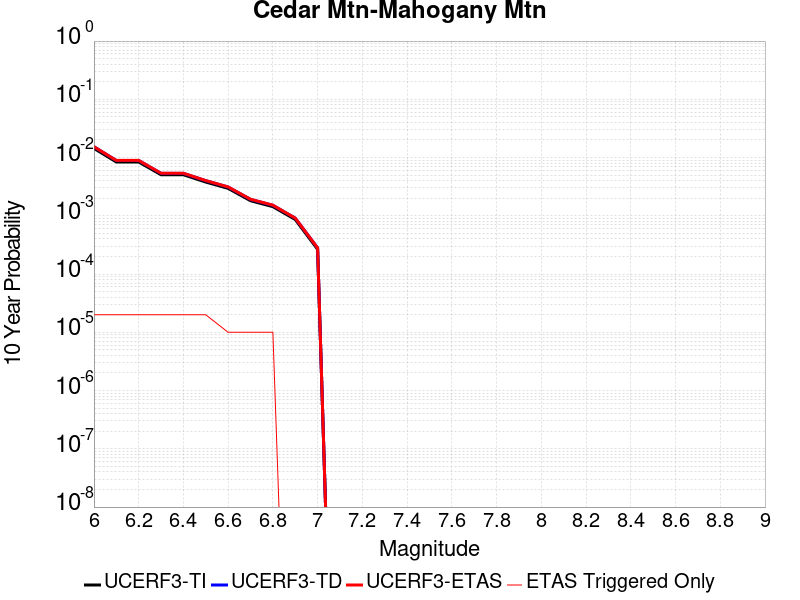 |

| Magnitude | 1 wk TI Prob | 1 wk TD Prob | 1 wk ETAS Prob | 1 wk ETAS/TD Gain | 1 wk ETAS Triggered Only | 1 mo TI Prob | 1 mo TD Prob | 1 mo ETAS Prob | 1 mo ETAS/TD Gain | 1 mo ETAS Triggered Only | 1 yr TI Prob | 1 yr TD Prob | 1 yr ETAS Prob | 1 yr ETAS/TD Gain | 1 yr ETAS Triggered Only | 10 yr TI Prob | 10 yr TD Prob | 10 yr ETAS Prob | 10 yr ETAS/TD Gain | 10 yr ETAS Triggered Only |
|-----|-----|-----|-----|-----|-----|-----|-----|-----|-----|-----|-----|-----|-----|-----|-----|-----|-----|-----|-----|-----|
| 6.0 | 2.7763876E-5 | 2.9588866E-5 | 2.9588866E-5 | 1.0 | 0.0 | 1.1898261E-4 | 1.2680366E-4 | 1.2680366E-4 | 1.0 | 0.0 | 0.0014476506 | 0.0015428112 | 0.0015527958 | 1.0064716 | 1.0E-5 | 0.0143825635 | 0.015328225 | 0.0153479185 | 1.0012848 | 2.0E-5 |
| 6.1 | 1.6162443E-5 | 1.7142966E-5 | 1.7142966E-5 | 1.0 | 0.0 | 6.926578E-5 | 7.346788E-5 | 7.346788E-5 | 1.0 | 0.0 | 8.4298453E-4 | 8.941221E-4 | 9.0411317E-4 | 1.0111742 | 1.0E-5 | 0.008397939 | 0.008907059 | 0.008926881 | 1.0022254 | 2.0E-5 |
| 6.2 | 1.6162443E-5 | 1.7142966E-5 | 1.7142966E-5 | 1.0 | 0.0 | 6.926578E-5 | 7.346788E-5 | 7.346788E-5 | 1.0 | 0.0 | 8.4298453E-4 | 8.941221E-4 | 9.0411317E-4 | 1.0111742 | 1.0E-5 | 0.008397939 | 0.008907059 | 0.008926881 | 1.0022254 | 2.0E-5 |
| 6.3 | 9.746053E-6 | 1.0303152E-5 | 1.0303152E-5 | 1.0 | 0.0 | 4.1768133E-5 | 4.415564E-5 | 4.415564E-5 | 1.0 | 0.0 | 5.0840835E-4 | 5.3746643E-4 | 5.4746104E-4 | 1.0185958 | 1.0E-5 | 0.0050724675 | 0.005362084 | 0.005381977 | 1.0037099 | 2.0E-5 |
| 6.4 | 9.746053E-6 | 1.0303152E-5 | 1.0303152E-5 | 1.0 | 0.0 | 4.1768133E-5 | 4.415564E-5 | 4.415564E-5 | 1.0 | 0.0 | 5.0840835E-4 | 5.3746643E-4 | 5.4746104E-4 | 1.0185958 | 1.0E-5 | 0.0050724675 | 0.005362084 | 0.005381977 | 1.0037099 | 2.0E-5 |
| 6.5 | 7.290083E-6 | 7.695325E-6 | 7.695325E-6 | 1.0 | 0.0 | 3.124284E-5 | 3.297956E-5 | 3.297956E-5 | 1.0 | 0.0 | 3.8031515E-4 | 4.014543E-4 | 4.1145028E-4 | 1.0248995 | 1.0E-5 | 0.0037966494 | 0.004007511 | 0.004027431 | 1.0049707 | 2.0E-5 |
| 6.6 | 5.67907E-6 | 5.9891527E-6 | 5.9891527E-6 | 1.0 | 0.0 | 2.4338644E-5 | 2.5667552E-5 | 2.5667552E-5 | 1.0 | 0.0 | 2.962827E-4 | 3.12459E-4 | 3.2245586E-4 | 1.0319942 | 1.0E-5 | 0.0029588798 | 0.003120333 | 0.0031303016 | 1.0031948 | 1.0E-5 |
| 6.7 | 3.4853963E-6 | 3.672631E-6 | 3.672631E-6 | 1.0 | 0.0 | 1.4937327E-5 | 1.5739755E-5 | 1.5739755E-5 | 1.0 | 0.0 | 1.8184677E-4 | 1.916153E-4 | 2.0161338E-4 | 1.0521779 | 1.0E-5 | 0.0018169804 | 0.0019145629 | 0.0019245436 | 1.0052131 | 1.0E-5 |
| 6.8 | 2.7535168E-6 | 2.9015764E-6 | 2.9015764E-6 | 1.0 | 0.0 | 1.1800733E-5 | 1.2435271E-5 | 1.2435271E-5 | 1.0 | 0.0 | 1.4366445E-4 | 1.5138938E-4 | 1.6138787E-4 | 1.0660448 | 1.0E-5 | 0.0014357162 | 0.0015129098 | 0.0015228946 | 1.0065998 | 1.0E-5 |
| 6.9 | 1.6594106E-6 | 1.7496985E-6 | 1.7496985E-6 | 1.0 | 0.0 | 7.1117406E-6 | 7.4986883E-6 | 7.4986883E-6 | 1.0 | 0.0 | 8.6582E-5 | 9.129302E-5 | 9.129302E-5 | 1.0 | 0.0 | 8.654827E-4 | 9.125856E-4 | 9.125856E-4 | 1.0 | 0.0 |
| 7.0 | 5.10215E-7 | 5.389254E-7 | 5.389254E-7 | 1.0 | 0.0 | 2.186634E-6 | 2.3096788E-6 | 2.3096788E-6 | 1.0 | 0.0 | 2.6621943E-5 | 2.8120105E-5 | 2.8120105E-5 | 1.0 | 0.0 | 2.6618753E-4 | 2.81178E-4 | 2.81178E-4 | 1.0 | 0.0 |

## Hosgri (Extension)
*[(top)](#table-of-contents)*

| 1 Week | 1 Month | 1 Year | 10 Year |
|-----|-----|-----|-----|
|  |  |  |  |

| Magnitude | 1 wk TI Prob | 1 wk TD Prob | 1 wk ETAS Prob | 1 wk ETAS/TD Gain | 1 wk ETAS Triggered Only | 1 mo TI Prob | 1 mo TD Prob | 1 mo ETAS Prob | 1 mo ETAS/TD Gain | 1 mo ETAS Triggered Only | 1 yr TI Prob | 1 yr TD Prob | 1 yr ETAS Prob | 1 yr ETAS/TD Gain | 1 yr ETAS Triggered Only | 10 yr TI Prob | 10 yr TD Prob | 10 yr ETAS Prob | 10 yr ETAS/TD Gain | 10 yr ETAS Triggered Only |
|-----|-----|-----|-----|-----|-----|-----|-----|-----|-----|-----|-----|-----|-----|-----|-----|-----|-----|-----|-----|-----|
| 6.0 | 1.1369135E-5 | 1.2083072E-5 | 2.2082952E-5 | 1.8275942 | 1.0E-5 | 4.8723956E-5 | 5.1783692E-5 | 7.1782655E-5 | 1.386202 | 2.0E-5 | 5.9305265E-4 | 6.3030684E-4 | 6.5029424E-4 | 1.0317106 | 2.0E-5 | 0.005914725 | 0.0062874397 | 0.006307314 | 1.003161 | 2.0E-5 |
| 6.1 | 6.934979E-6 | 7.324555E-6 | 1.7324483E-5 | 2.3652606 | 1.0E-5 | 2.9721E-5 | 3.1390595E-5 | 4.139028E-5 | 1.3185568 | 1.0E-5 | 3.617931E-4 | 3.8211764E-4 | 3.921138E-4 | 1.02616 | 1.0E-5 | 0.0036120464 | 0.0038150186 | 0.0038249805 | 1.0026112 | 1.0E-5 |
| 6.2 | 6.934979E-6 | 7.324555E-6 | 1.7324483E-5 | 2.3652606 | 1.0E-5 | 2.9721E-5 | 3.1390595E-5 | 4.139028E-5 | 1.3185568 | 1.0E-5 | 3.617931E-4 | 3.8211764E-4 | 3.921138E-4 | 1.02616 | 1.0E-5 | 0.0036120464 | 0.0038150186 | 0.0038249805 | 1.0026112 | 1.0E-5 |
| 6.3 | 4.5484676E-6 | 4.76933E-6 | 1.4769283E-5 | 3.0967205 | 1.0E-5 | 1.9493287E-5 | 2.043983E-5 | 3.0439625E-5 | 1.4892309 | 1.0E-5 | 2.3730492E-4 | 2.4882692E-4 | 2.5882444E-4 | 1.0401785 | 1.0E-5 | 0.0023705168 | 0.0024855258 | 0.002495501 | 1.0040133 | 1.0E-5 |
| 6.4 | 4.218095E-6 | 4.4168614E-6 | 1.4416817E-5 | 3.264041 | 1.0E-5 | 1.8077424E-5 | 1.8929271E-5 | 2.8929082E-5 | 1.5282724 | 1.0E-5 | 2.2007042E-4 | 2.3043984E-4 | 2.4043753E-4 | 1.0433853 | 1.0E-5 | 0.002198526 | 0.0023020422 | 0.0023120192 | 1.004334 | 1.0E-5 |
| 6.5 | 3.717374E-6 | 3.8838775E-6 | 1.3883839E-5 | 3.5747364 | 1.0E-5 | 1.5931506E-5 | 1.6645085E-5 | 2.6644919E-5 | 1.600768 | 1.0E-5 | 1.9394881E-4 | 2.0263524E-4 | 2.1263321E-4 | 1.0493398 | 1.0E-5 | 0.0019377962 | 0.0020245234 | 0.0020345033 | 1.0049294 | 1.0E-5 |
| 6.6 | 3.4605036E-6 | 3.608306E-6 | 1.360827E-5 | 3.7713735 | 1.0E-5 | 1.4830645E-5 | 1.5464078E-5 | 2.5463924E-5 | 1.64665 | 1.0E-5 | 1.8054814E-4 | 1.8825903E-4 | 1.9825714E-4 | 1.0531083 | 1.0E-5 | 0.0018040152 | 0.0018810101 | 0.0018909913 | 1.0053062 | 1.0E-5 |
| 6.7 | 3.123439E-6 | 3.2465687E-6 | 1.3246537E-5 | 4.080165 | 1.0E-5 | 1.33860985E-5 | 1.3913792E-5 | 2.3913653E-5 | 1.7187014 | 1.0E-5 | 1.6296357E-4 | 1.6938736E-4 | 1.7938566E-4 | 1.0590262 | 1.0E-5 | 0.001628441 | 0.0016925934 | 0.0017025765 | 1.0058981 | 1.0E-5 |
| 6.8 | 2.8290783E-6 | 2.9305404E-6 | 1.2930511E-5 | 4.41233 | 1.0E-5 | 1.2124565E-5 | 1.2559399E-5 | 2.2559274E-5 | 1.7962065 | 1.0E-5 | 1.4760658E-4 | 1.5290003E-4 | 1.628985E-4 | 1.0653923 | 1.0E-5 | 0.0014750857 | 0.001527957 | 0.0015379417 | 1.0065347 | 1.0E-5 |
| 6.9 | 2.454112E-6 | 2.5283196E-6 | 2.5283196E-6 | 1.0 | 0.0 | 1.0517581E-5 | 1.0835611E-5 | 1.0835611E-5 | 1.0 | 0.0 | 1.2804402E-4 | 1.3191563E-4 | 1.3191563E-4 | 1.0 | 0.0 | 0.0012797028 | 0.0013183793 | 0.0013183793 | 1.0 | 0.0 |
| 7.0 | 2.1008145E-6 | 2.1498704E-6 | 2.1498704E-6 | 1.0 | 0.0 | 9.003459E-6 | 9.213698E-6 | 9.213698E-6 | 1.0 | 0.0 | 1.096116E-4 | 1.1217103E-4 | 1.1217103E-4 | 1.0 | 0.0 | 0.0010955755 | 0.0011211479 | 0.0011211479 | 1.0 | 0.0 |
| 7.1 | 1.744384E-6 | 1.7686352E-6 | 1.7686352E-6 | 1.0 | 0.0 | 7.47591E-6 | 7.5798434E-6 | 7.5798434E-6 | 1.0 | 0.0 | 9.1015405E-5 | 9.22807E-5 | 9.22807E-5 | 1.0 | 0.0 | 9.097813E-4 | 9.2242553E-4 | 9.2242553E-4 | 1.0 | 0.0 |
| 7.2 | 1.5456587E-6 | 1.5562882E-6 | 1.5562882E-6 | 1.0 | 0.0 | 6.6242346E-6 | 6.66979E-6 | 6.66979E-6 | 1.0 | 0.0 | 8.064707E-5 | 8.120168E-5 | 8.120168E-5 | 1.0 | 0.0 | 8.0617814E-4 | 8.117213E-4 | 8.117213E-4 | 1.0 | 0.0 |
| 7.3 | 1.3775123E-6 | 1.3766082E-6 | 1.3766082E-6 | 1.0 | 0.0 | 5.9036106E-6 | 5.899736E-6 | 5.899736E-6 | 1.0 | 0.0 | 7.187409E-5 | 7.182693E-5 | 7.182693E-5 | 1.0 | 0.0 | 7.185085E-4 | 7.180382E-4 | 7.180382E-4 | 1.0 | 0.0 |
| 7.4 | 1.214491E-6 | 1.2023461E-6 | 1.2023461E-6 | 1.0 | 0.0 | 5.2049513E-6 | 5.1529014E-6 | 5.1529014E-6 | 1.0 | 0.0 | 6.336844E-5 | 6.2734776E-5 | 6.2734776E-5 | 1.0 | 0.0 | 6.335037E-4 | 6.271715E-4 | 6.271715E-4 | 1.0 | 0.0 |
| 7.5 | 1.0101123E-6 | 9.842246E-7 | 9.842246E-7 | 1.0 | 0.0 | 4.3290456E-6 | 4.2180986E-6 | 4.2180986E-6 | 1.0 | 0.0 | 5.2704854E-5 | 5.1354145E-5 | 5.1354145E-5 | 1.0 | 0.0 | 5.2692357E-4 | 5.1342335E-4 | 5.1342335E-4 | 1.0 | 0.0 |
| 7.6 | 8.1558215E-7 | 7.765966E-7 | 7.765966E-7 | 1.0 | 0.0 | 3.4953473E-6 | 3.328267E-6 | 3.328267E-6 | 1.0 | 0.0 | 4.255502E-5 | 4.0520903E-5 | 4.0520903E-5 | 1.0 | 0.0 | 4.2546875E-4 | 4.0513556E-4 | 4.0513556E-4 | 1.0 | 0.0 |
| 7.7 | 4.757816E-7 | 4.1308888E-7 | 4.1308888E-7 | 1.0 | 0.0 | 2.0390623E-6 | 1.7703798E-6 | 1.7703798E-6 | 1.0 | 0.0 | 2.4825302E-5 | 2.155416E-5 | 2.155416E-5 | 1.0 | 0.0 | 2.482253E-4 | 2.1552083E-4 | 2.1552083E-4 | 1.0 | 0.0 |
| 7.8 | 2.782787E-7 | 2.0047722E-7 | 2.0047722E-7 | 1.0 | 0.0 | 1.1926223E-6 | 8.5918776E-7 | 8.5918776E-7 | 1.0 | 0.0 | 1.452008E-5 | 1.04605615E-5 | 1.04605615E-5 | 1.0 | 0.0 | 1.4519131E-4 | 1.04600724E-4 | 1.04600724E-4 | 1.0 | 0.0 |
| 7.9 | 1.6948086E-7 | 9.244227E-8 | 9.244227E-8 | 1.0 | 0.0 | 7.2634634E-7 | 3.961811E-7 | 3.961811E-7 | 1.0 | 0.0 | 8.843231E-6 | 4.8234942E-6 | 4.8234942E-6 | 1.0 | 0.0 | 8.842879E-5 | 4.8233902E-5 | 4.8233902E-5 | 1.0 | 0.0 |
| 8.0 | 1.0225492E-7 | 4.4738776E-8 | 4.4738776E-8 | 1.0 | 0.0 | 4.382353E-7 | 1.917376E-7 | 1.917376E-7 | 1.0 | 0.0 | 5.335502E-6 | 2.3344028E-6 | 2.3344028E-6 | 1.0 | 0.0 | 5.335374E-5 | 2.3343786E-5 | 2.3343786E-5 | 1.0 | 0.0 |
| 8.1 | 1.43711345E-8 | 5.787707E-9 | 5.787707E-9 | 1.0 | 0.0 | 6.1590576E-8 | 2.480446E-8 | 2.480446E-8 | 1.0 | 0.0 | 7.4986497E-7 | 3.0199428E-7 | 3.0199428E-7 | 1.0 | 0.0 | 7.4986247E-6 | 3.0199392E-6 | 3.0199392E-6 | 1.0 | 0.0 |

## Johnson Valley (No) 2011 rev
*[(top)](#table-of-contents)*

| 1 Week | 1 Month | 1 Year | 10 Year |
|-----|-----|-----|-----|
|  |  | 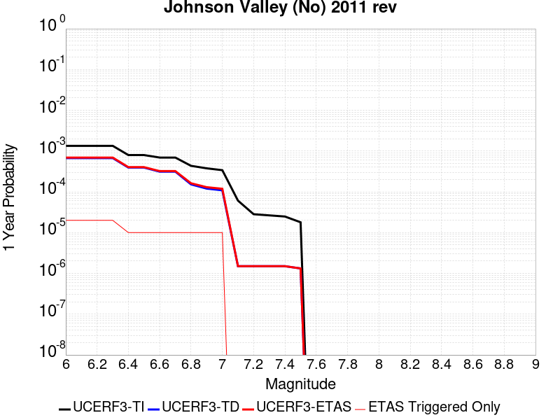 |  |

| Magnitude | 1 wk TI Prob | 1 wk TD Prob | 1 wk ETAS Prob | 1 wk ETAS/TD Gain | 1 wk ETAS Triggered Only | 1 mo TI Prob | 1 mo TD Prob | 1 mo ETAS Prob | 1 mo ETAS/TD Gain | 1 mo ETAS Triggered Only | 1 yr TI Prob | 1 yr TD Prob | 1 yr ETAS Prob | 1 yr ETAS/TD Gain | 1 yr ETAS Triggered Only | 10 yr TI Prob | 10 yr TD Prob | 10 yr ETAS Prob | 10 yr ETAS/TD Gain | 10 yr ETAS Triggered Only |
|-----|-----|-----|-----|-----|-----|-----|-----|-----|-----|-----|-----|-----|-----|-----|-----|-----|-----|-----|-----|-----|
| 6.0 | 2.577707E-5 | 1.2900938E-5 | 3.290068E-5 | 2.5502548 | 2.0E-5 | 1.1046848E-4 | 5.5288787E-5 | 7.528768E-5 | 1.361717 | 2.0E-5 | 0.0013441239 | 6.7297276E-4 | 6.929593E-4 | 1.0296988 | 2.0E-5 | 0.013360229 | 0.006713257 | 0.0067331227 | 1.0029591 | 2.0E-5 |
| 6.1 | 2.577707E-5 | 1.2900938E-5 | 3.290068E-5 | 2.5502548 | 2.0E-5 | 1.1046848E-4 | 5.5288787E-5 | 7.528768E-5 | 1.361717 | 2.0E-5 | 0.0013441239 | 6.7297276E-4 | 6.929593E-4 | 1.0296988 | 2.0E-5 | 0.013360229 | 0.006713257 | 0.0067331227 | 1.0029591 | 2.0E-5 |
| 6.2 | 2.577707E-5 | 1.2900938E-5 | 3.290068E-5 | 2.5502548 | 2.0E-5 | 1.1046848E-4 | 5.5288787E-5 | 7.528768E-5 | 1.361717 | 2.0E-5 | 0.0013441239 | 6.7297276E-4 | 6.929593E-4 | 1.0296988 | 2.0E-5 | 0.013360229 | 0.006713257 | 0.0067331227 | 1.0029591 | 2.0E-5 |
| 6.3 | 2.577707E-5 | 1.2900938E-5 | 3.290068E-5 | 2.5502548 | 2.0E-5 | 1.1046848E-4 | 5.5288787E-5 | 7.528768E-5 | 1.361717 | 2.0E-5 | 0.0013441239 | 6.7297276E-4 | 6.929593E-4 | 1.0296988 | 2.0E-5 | 0.013360229 | 0.006713257 | 0.0067331227 | 1.0029591 | 2.0E-5 |
| 6.4 | 1.5296591E-5 | 7.536742E-6 | 1.7536666E-5 | 2.3268232 | 1.0E-5 | 6.555518E-5 | 3.2300028E-5 | 4.2299707E-5 | 1.3095872 | 1.0E-5 | 7.97842E-4 | 3.9320064E-4 | 4.031967E-4 | 1.0254223 | 1.0E-5 | 0.007949836 | 0.0039268904 | 0.0039368514 | 1.0025365 | 1.0E-5 |
| 6.5 | 1.5296591E-5 | 7.536742E-6 | 1.7536666E-5 | 2.3268232 | 1.0E-5 | 6.555518E-5 | 3.2300028E-5 | 4.2299707E-5 | 1.3095872 | 1.0E-5 | 7.97842E-4 | 3.9320064E-4 | 4.031967E-4 | 1.0254223 | 1.0E-5 | 0.007949836 | 0.0039268904 | 0.0039368514 | 1.0025365 | 1.0E-5 |
| 6.6 | 1.3289383E-5 | 5.9917306E-6 | 1.599167E-5 | 2.668957 | 1.0E-5 | 5.6953253E-5 | 2.5678688E-5 | 3.5678433E-5 | 1.389418 | 1.0E-5 | 6.9318525E-4 | 3.1261015E-4 | 3.2260703E-4 | 1.0319787 | 1.0E-5 | 0.0069102696 | 0.0031233684 | 0.003133337 | 1.0031917 | 1.0E-5 |
| 6.7 | 1.3289383E-5 | 5.9917306E-6 | 1.599167E-5 | 2.668957 | 1.0E-5 | 5.6953253E-5 | 2.5678688E-5 | 3.5678433E-5 | 1.389418 | 1.0E-5 | 6.9318525E-4 | 3.1261015E-4 | 3.2260703E-4 | 1.0319787 | 1.0E-5 | 0.0069102696 | 0.0031233684 | 0.003133337 | 1.0031917 | 1.0E-5 |
| 6.8 | 8.330789E-6 | 2.9211888E-6 | 1.2921159E-5 | 4.423254 | 1.0E-5 | 3.570289E-5 | 1.2519352E-5 | 2.2519227E-5 | 1.7987534 | 1.0E-5 | 4.34596E-4 | 1.5241816E-4 | 1.6241663E-4 | 1.065599 | 1.0E-5 | 0.0043374705 | 0.0015236961 | 0.001533681 | 1.0065529 | 1.0E-5 |
| 6.9 | 7.2359003E-6 | 2.3013247E-6 | 1.23013015E-5 | 5.3453135 | 1.0E-5 | 3.1010633E-5 | 9.8628125E-6 | 1.9862713E-5 | 2.0138996 | 1.0E-5 | 3.7748902E-4 | 1.2007845E-4 | 1.3007726E-4 | 1.0832689 | 1.0E-5 | 0.0037684843 | 0.0012006586 | 0.0012106466 | 1.0083188 | 1.0E-5 |
| 7.0 | 6.5149957E-6 | 2.088482E-6 | 1.20884615E-5 | 5.7881565 | 1.0E-5 | 2.792111E-5 | 8.950637E-6 | 1.8950546E-5 | 2.117229 | 1.0E-5 | 3.398865E-4 | 1.0897385E-4 | 1.1897276E-4 | 1.0917552 | 1.0E-5 | 0.003393671 | 0.0010897239 | 0.001099713 | 1.0091666 | 1.0E-5 |
| 7.1 | 1.1662233E-6 | 2.8802024E-8 | 2.8802024E-8 | 1.0 | 0.0 | 4.9980904E-6 | 1.2343725E-7 | 1.2343725E-7 | 1.0 | 0.0 | 6.0850052E-5 | 1.5028476E-6 | 1.5028476E-6 | 1.0 | 0.0 | 6.083339E-4 | 1.50283895E-5 | 1.50283895E-5 | 1.0 | 0.0 |
| 7.2 | 5.413881E-7 | 2.8802024E-8 | 2.8802024E-8 | 1.0 | 0.0 | 2.3202326E-6 | 1.2343725E-7 | 1.2343725E-7 | 1.0 | 0.0 | 2.8248465E-5 | 1.5028476E-6 | 1.5028476E-6 | 1.0 | 0.0 | 2.8244875E-4 | 1.50283895E-5 | 1.50283895E-5 | 1.0 | 0.0 |
| 7.3 | 5.076821E-7 | 2.8802024E-8 | 2.8802024E-8 | 1.0 | 0.0 | 2.1757785E-6 | 1.2343723E-7 | 1.2343723E-7 | 1.0 | 0.0 | 2.648978E-5 | 1.5028475E-6 | 1.5028475E-6 | 1.0 | 0.0 | 2.6486625E-4 | 1.50283895E-5 | 1.50283895E-5 | 1.0 | 0.0 |
| 7.4 | 4.7568687E-7 | 2.8783948E-8 | 2.8783948E-8 | 1.0 | 0.0 | 2.0386565E-6 | 1.2335977E-7 | 1.2335977E-7 | 1.0 | 0.0 | 2.482036E-5 | 1.5019043E-6 | 1.5019043E-6 | 1.0 | 0.0 | 2.4817587E-4 | 1.5018958E-5 | 1.5018958E-5 | 1.0 | 0.0 |
| 7.5 | 3.435626E-7 | 2.5357679E-8 | 2.5357679E-8 | 1.0 | 0.0 | 1.4724103E-6 | 1.0867576E-7 | 1.0867576E-7 | 1.0 | 0.0 | 1.7926448E-5 | 1.3231268E-6 | 1.3231268E-6 | 1.0 | 0.0 | 1.7925001E-4 | 1.3231205E-5 | 1.3231205E-5 | 1.0 | 0.0 |

## Calaveras (Central) 2011 CFM
*[(top)](#table-of-contents)*

| 1 Week | 1 Month | 1 Year | 10 Year |
|-----|-----|-----|-----|
|  |  |  |  |

| Magnitude | 1 wk TI Prob | 1 wk TD Prob | 1 wk ETAS Prob | 1 wk ETAS/TD Gain | 1 wk ETAS Triggered Only | 1 mo TI Prob | 1 mo TD Prob | 1 mo ETAS Prob | 1 mo ETAS/TD Gain | 1 mo ETAS Triggered Only | 1 yr TI Prob | 1 yr TD Prob | 1 yr ETAS Prob | 1 yr ETAS/TD Gain | 1 yr ETAS Triggered Only | 10 yr TI Prob | 10 yr TD Prob | 10 yr ETAS Prob | 10 yr ETAS/TD Gain | 10 yr ETAS Triggered Only |
|-----|-----|-----|-----|-----|-----|-----|-----|-----|-----|-----|-----|-----|-----|-----|-----|-----|-----|-----|-----|-----|
| 6.0 | 1.5010907E-4 | 2.481574E-4 | 2.481574E-4 | 1.0 | 0.0 | 6.4316596E-4 | 0.0010621005 | 0.0010621005 | 1.0 | 0.0 | 0.0078024664 | 0.012850073 | 0.012850073 | 1.0 | 0.0 | 0.07534136 | 0.120401435 | 0.120419025 | 1.0001462 | 2.0E-5 |
| 6.1 | 1.4521465E-4 | 2.397987E-4 | 2.397987E-4 | 1.0 | 0.0 | 6.222001E-4 | 0.0010263061 | 0.0010263061 | 1.0 | 0.0 | 0.0075490056 | 0.012419341 | 0.012419341 | 1.0 | 0.0 | 0.07297657 | 0.11667323 | 0.1166909 | 1.0001514 | 2.0E-5 |
| 6.2 | 1.429998E-4 | 2.3911126E-4 | 2.3911126E-4 | 1.0 | 0.0 | 6.127123E-4 | 0.0010233623 | 0.0010233623 | 1.0 | 0.0 | 0.007434286 | 0.01238394 | 0.01238394 | 1.0 | 0.0 | 0.07190444 | 0.1163272 | 0.11634487 | 1.0001519 | 2.0E-5 |
| 6.3 | 1.3536277E-4 | 2.3242626E-4 | 2.3242626E-4 | 1.0 | 0.0 | 5.799972E-4 | 9.947343E-4 | 9.947343E-4 | 1.0 | 0.0 | 0.0070386264 | 0.012040132 | 0.012040132 | 1.0 | 0.0 | 0.0681982 | 0.11323977 | 0.11325751 | 1.0001566 | 2.0E-5 |
| 6.4 | 1.2993296E-4 | 2.2666177E-4 | 2.2666177E-4 | 1.0 | 0.0 | 5.5673666E-4 | 9.700479E-4 | 9.700479E-4 | 1.0 | 0.0 | 0.006757223 | 0.011742937 | 0.011742937 | 1.0 | 0.0 | 0.06555412 | 0.11051771 | 0.1105355 | 1.0001609 | 2.0E-5 |
| 6.5 | 1.0498927E-4 | 1.7981697E-4 | 1.7981697E-4 | 1.0 | 0.0 | 4.498764E-4 | 7.704157E-4 | 7.704157E-4 | 1.0 | 0.0 | 0.005463498 | 0.00933924 | 0.00933924 | 1.0 | 0.0 | 0.053311124 | 0.089199215 | 0.08921743 | 1.0002042 | 2.0E-5 |
| 6.6 | 1.0157505E-4 | 1.7469203E-4 | 1.7469203E-4 | 1.0 | 0.0 | 4.35249E-4 | 7.484645E-4 | 7.484645E-4 | 1.0 | 0.0 | 0.0052862884 | 0.009074297 | 0.009074297 | 1.0 | 0.0 | 0.05162293 | 0.08677671 | 0.08679497 | 1.0002105 | 2.0E-5 |
| 6.7 | 9.660386E-5 | 1.6728524E-4 | 1.6728524E-4 | 1.0 | 0.0 | 4.1395082E-4 | 7.1673887E-4 | 7.1673887E-4 | 1.0 | 0.0 | 0.0050282106 | 0.008691208 | 0.008691208 | 1.0 | 0.0 | 0.049159497 | 0.083266065 | 0.0832844 | 1.0002202 | 2.0E-5 |
| 6.8 | 9.089927E-5 | 1.5643016E-4 | 1.5643016E-4 | 1.0 | 0.0 | 3.8951015E-4 | 6.702439E-4 | 6.702439E-4 | 1.0 | 0.0 | 0.0047319788 | 0.008129478 | 0.008129478 | 1.0 | 0.0 | 0.046324775 | 0.078159414 | 0.078177854 | 1.0002359 | 2.0E-5 |
| 6.9 | 7.353187E-5 | 1.2295354E-4 | 1.2295354E-4 | 1.0 | 0.0 | 3.150985E-4 | 5.2683795E-4 | 5.2683795E-4 | 1.0 | 0.0 | 0.0038295772 | 0.006395508 | 0.006395508 | 1.0 | 0.0 | 0.037642512 | 0.062187865 | 0.062197242 | 1.0001508 | 1.0E-5 |
| 7.0 | 5.746064E-5 | 9.3887444E-5 | 9.3887444E-5 | 1.0 | 0.0 | 2.4623662E-4 | 4.0231308E-4 | 4.0231308E-4 | 1.0 | 0.0 | 0.0029938098 | 0.004887232 | 0.004887232 | 1.0 | 0.0 | 0.02953797 | 0.04798685 | 0.04798685 | 1.0 | 0.0 |
| 7.1 | 4.9557195E-5 | 8.052461E-5 | 8.052461E-5 | 1.0 | 0.0 | 2.123707E-4 | 3.4506017E-4 | 3.4506017E-4 | 1.0 | 0.0 | 0.0025825473 | 0.0041930773 | 0.0041930773 | 1.0 | 0.0 | 0.0255274 | 0.041373078 | 0.041373078 | 1.0 | 0.0 |
| 7.2 | 3.687595E-5 | 5.9524526E-5 | 5.9524526E-5 | 1.0 | 0.0 | 1.5803022E-4 | 2.5508032E-4 | 2.5508032E-4 | 1.0 | 0.0 | 0.0019223199 | 0.0031012094 | 0.0031012094 | 1.0 | 0.0 | 0.01905776 | 0.030883716 | 0.030883716 | 1.0 | 0.0 |
| 7.3 | 2.5846984E-5 | 4.247213E-5 | 4.247213E-5 | 1.0 | 0.0 | 1.1076809E-4 | 1.8201082E-4 | 1.8201082E-4 | 1.0 | 0.0 | 0.0013477671 | 0.002213747 | 0.002213747 | 1.0 | 0.0 | 0.013396223 | 0.02217554 | 0.02217554 | 1.0 | 0.0 |
| 7.4 | 1.7747854E-5 | 2.9936204E-5 | 2.9936204E-5 | 1.0 | 0.0 | 7.6060016E-5 | 1.2829172E-4 | 1.2829172E-4 | 1.0 | 0.0 | 9.2563726E-4 | 0.0015608355 | 0.0015608355 | 1.0 | 0.0 | 0.009217911 | 0.015709236 | 0.015709236 | 1.0 | 0.0 |
| 7.5 | 1.4883479E-5 | 2.6243379E-5 | 2.6243379E-5 | 1.0 | 0.0 | 6.378478E-5 | 1.1246678E-4 | 1.1246678E-4 | 1.0 | 0.0 | 7.76303E-4 | 0.0013684258 | 0.0013684258 | 1.0 | 0.0 | 0.0077359667 | 0.013802425 | 0.013802425 | 1.0 | 0.0 |
| 7.6 | 8.166975E-6 | 1.4963478E-5 | 1.4963478E-5 | 1.0 | 0.0 | 3.5000852E-5 | 6.412763E-5 | 6.412763E-5 | 1.0 | 0.0 | 4.2605202E-4 | 7.804755E-4 | 7.804755E-4 | 1.0 | 0.0 | 0.004252361 | 0.00793984 | 0.00793984 | 1.0 | 0.0 |
| 7.7 | 3.3858064E-6 | 6.253914E-6 | 6.253914E-6 | 1.0 | 0.0 | 1.4510518E-5 | 2.6802214E-5 | 2.6802214E-5 | 1.0 | 0.0 | 1.7665124E-4 | 3.2626814E-4 | 3.2626814E-4 | 1.0 | 0.0 | 0.0017651088 | 0.0033882293 | 0.0033882293 | 1.0 | 0.0 |
| 7.8 | 2.7721615E-6 | 5.3663807E-6 | 5.3663807E-6 | 1.0 | 0.0 | 1.1880637E-5 | 2.2998573E-5 | 2.2998573E-5 | 1.0 | 0.0 | 1.4463716E-4 | 2.799717E-4 | 2.799717E-4 | 1.0 | 0.0 | 0.0014454306 | 0.0029074624 | 0.0029074624 | 1.0 | 0.0 |
| 7.9 | 1.9736292E-6 | 4.1284193E-6 | 4.1284193E-6 | 1.0 | 0.0 | 8.4583835E-6 | 1.7693106E-5 | 1.7693106E-5 | 1.0 | 0.0 | 1.0297595E-4 | 2.1539231E-4 | 2.1539231E-4 | 1.0 | 0.0 | 0.0010292825 | 0.0022236116 | 0.0022236116 | 1.0 | 0.0 |
| 8.0 | 1.1767289E-6 | 2.5544743E-6 | 2.5544743E-6 | 1.0 | 0.0 | 5.0431145E-6 | 1.0947701E-5 | 1.0947701E-5 | 1.0 | 0.0 | 6.139818E-5 | 1.3328013E-4 | 1.3328013E-4 | 1.0 | 0.0 | 6.1381224E-4 | 0.0013660848 | 0.0013660848 | 1.0 | 0.0 |
| 8.1 | 7.5112825E-7 | 1.5409794E-6 | 1.5409794E-6 | 1.0 | 0.0 | 3.2191172E-6 | 6.6041807E-6 | 6.6041807E-6 | 1.0 | 0.0 | 3.9192048E-5 | 8.0402955E-5 | 8.0402955E-5 | 1.0 | 0.0 | 3.9185135E-4 | 8.235564E-4 | 8.235564E-4 | 1.0 | 0.0 |

## Ortigalita (South)
*[(top)](#table-of-contents)*

| 1 Week | 1 Month | 1 Year | 10 Year |
|-----|-----|-----|-----|
|  |  | 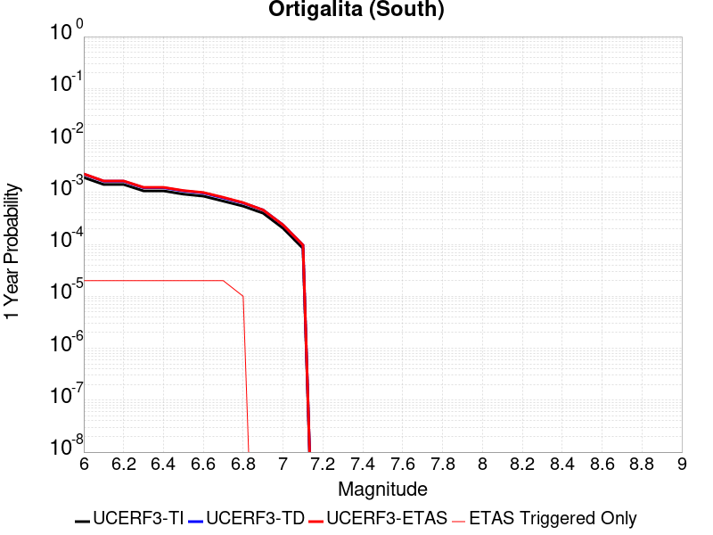 |  |

| Magnitude | 1 wk TI Prob | 1 wk TD Prob | 1 wk ETAS Prob | 1 wk ETAS/TD Gain | 1 wk ETAS Triggered Only | 1 mo TI Prob | 1 mo TD Prob | 1 mo ETAS Prob | 1 mo ETAS/TD Gain | 1 mo ETAS Triggered Only | 1 yr TI Prob | 1 yr TD Prob | 1 yr ETAS Prob | 1 yr ETAS/TD Gain | 1 yr ETAS Triggered Only | 10 yr TI Prob | 10 yr TD Prob | 10 yr ETAS Prob | 10 yr ETAS/TD Gain | 10 yr ETAS Triggered Only |
|-----|-----|-----|-----|-----|-----|-----|-----|-----|-----|-----|-----|-----|-----|-----|-----|-----|-----|-----|-----|-----|
| 6.0 | 3.72394E-5 | 4.325562E-5 | 5.3255186E-5 | 1.2311739 | 1.0E-5 | 1.5958765E-4 | 1.8536893E-4 | 1.9536707E-4 | 1.0539365 | 1.0E-5 | 0.0019412481 | 0.0022546875 | 0.0022746425 | 1.0088505 | 2.0E-5 | 0.019243775 | 0.022334497 | 0.02235405 | 1.0008755 | 2.0E-5 |
| 6.1 | 2.7299884E-5 | 3.149204E-5 | 4.1491727E-5 | 1.3175305 | 1.0E-5 | 1.16994255E-4 | 1.3495922E-4 | 1.4495787E-4 | 1.0740864 | 1.0E-5 | 0.0014234743 | 0.0016419457 | 0.0016619129 | 1.0121607 | 2.0E-5 | 0.014143906 | 0.01630407 | 0.016323743 | 1.0012066 | 2.0E-5 |
| 6.2 | 2.7299884E-5 | 3.149204E-5 | 4.1491727E-5 | 1.3175305 | 1.0E-5 | 1.16994255E-4 | 1.3495922E-4 | 1.4495787E-4 | 1.0740864 | 1.0E-5 | 0.0014234743 | 0.0016419457 | 0.0016619129 | 1.0121607 | 2.0E-5 | 0.014143906 | 0.01630407 | 0.016323743 | 1.0012066 | 2.0E-5 |
| 6.3 | 2.0546433E-5 | 2.363145E-5 | 3.3631215E-5 | 1.4231548 | 1.0E-5 | 8.805317E-5 | 1.0127382E-4 | 1.11272806E-4 | 1.0987322 | 1.0E-5 | 0.00107152 | 0.0012323303 | 0.0012523057 | 1.0162094 | 2.0E-5 | 0.010663681 | 0.01225703 | 0.012276785 | 1.0016117 | 2.0E-5 |
| 6.4 | 2.0546433E-5 | 2.363145E-5 | 3.3631215E-5 | 1.4231548 | 1.0E-5 | 8.805317E-5 | 1.0127382E-4 | 1.11272806E-4 | 1.0987322 | 1.0E-5 | 0.00107152 | 0.0012323303 | 0.0012523057 | 1.0162094 | 2.0E-5 | 0.010663681 | 0.01225703 | 0.012276785 | 1.0016117 | 2.0E-5 |
| 6.5 | 1.7779594E-5 | 2.0446974E-5 | 3.0446769E-5 | 1.4890599 | 1.0E-5 | 7.619603E-5 | 8.762702E-5 | 9.762614E-5 | 1.11411 | 1.0E-5 | 9.272918E-4 | 0.0010663504 | 0.0010863291 | 1.0187355 | 2.0E-5 | 0.009234319 | 0.010613803 | 0.010633591 | 1.0018643 | 2.0E-5 |
| 6.6 | 1.6272212E-5 | 1.8714967E-5 | 2.871478E-5 | 1.5343217 | 1.0E-5 | 6.973618E-5 | 8.0204605E-5 | 9.02038E-5 | 1.1246711 | 1.0E-5 | 8.487073E-4 | 9.760658E-4 | 9.960464E-4 | 1.0204704 | 2.0E-5 | 0.008454733 | 0.009719091 | 0.009738896 | 1.0020378 | 2.0E-5 |
| 6.7 | 1.3051484E-5 | 1.5038758E-5 | 2.5038607E-5 | 1.6649386 | 1.0E-5 | 5.593373E-5 | 6.445028E-5 | 7.4449636E-5 | 1.1551484 | 1.0E-5 | 6.807804E-4 | 7.844092E-4 | 8.043935E-4 | 1.0254769 | 2.0E-5 | 0.006786986 | 0.007817388 | 0.007837231 | 1.0025384 | 2.0E-5 |
| 6.8 | 1.04277415E-5 | 1.1987235E-5 | 1.1987235E-5 | 1.0 | 0.0 | 4.4689557E-5 | 5.1372896E-5 | 5.1372896E-5 | 1.0 | 0.0 | 5.439595E-4 | 6.2529295E-4 | 6.352867E-4 | 1.0159825 | 1.0E-5 | 0.0054262993 | 0.00623609 | 0.0062460275 | 1.0015936 | 1.0E-5 |
| 6.9 | 7.639968E-6 | 8.791503E-6 | 8.791503E-6 | 1.0 | 0.0 | 3.274231E-5 | 3.767736E-5 | 3.767736E-5 | 1.0 | 0.0 | 3.9856473E-4 | 4.586312E-4 | 4.586312E-4 | 1.0 | 0.0 | 0.003978506 | 0.004577433 | 0.004577433 | 1.0 | 0.0 |
| 7.0 | 3.919831E-6 | 4.5334014E-6 | 4.5334014E-6 | 1.0 | 0.0 | 1.679917E-5 | 1.942873E-5 | 1.942873E-5 | 1.0 | 0.0 | 2.045107E-4 | 2.3652123E-4 | 2.3652123E-4 | 1.0 | 0.0 | 0.0020432258 | 0.0023629034 | 0.0023629034 | 1.0 | 0.0 |
| 7.1 | 1.6017933E-6 | 1.8570418E-6 | 1.8570418E-6 | 1.0 | 0.0 | 6.8648105E-6 | 7.958732E-6 | 7.958732E-6 | 1.0 | 0.0 | 8.357586E-5 | 9.689432E-5 | 9.689432E-5 | 1.0 | 0.0 | 8.3544437E-4 | 9.686254E-4 | 9.686254E-4 | 1.0 | 0.0 |

## Owens Valley Keough Hot Springs
*[(top)](#table-of-contents)*

| 1 Week | 1 Month | 1 Year | 10 Year |
|-----|-----|-----|-----|
|  |  |  | 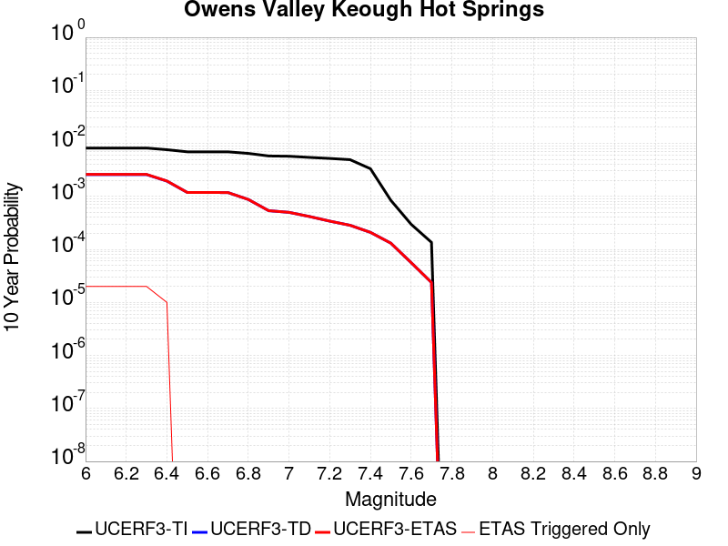 |

| Magnitude | 1 wk TI Prob | 1 wk TD Prob | 1 wk ETAS Prob | 1 wk ETAS/TD Gain | 1 wk ETAS Triggered Only | 1 mo TI Prob | 1 mo TD Prob | 1 mo ETAS Prob | 1 mo ETAS/TD Gain | 1 mo ETAS Triggered Only | 1 yr TI Prob | 1 yr TD Prob | 1 yr ETAS Prob | 1 yr ETAS/TD Gain | 1 yr ETAS Triggered Only | 10 yr TI Prob | 10 yr TD Prob | 10 yr ETAS Prob | 10 yr ETAS/TD Gain | 10 yr ETAS Triggered Only |
|-----|-----|-----|-----|-----|-----|-----|-----|-----|-----|-----|-----|-----|-----|-----|-----|-----|-----|-----|-----|-----|
| 6.0 | 1.5708529E-5 | 4.950656E-6 | 4.950656E-6 | 1.0 | 0.0 | 6.7320536E-5 | 2.1216953E-5 | 2.1216953E-5 | 1.0 | 0.0 | 8.193192E-4 | 2.582909E-4 | 2.582909E-4 | 1.0 | 0.0 | 0.008163051 | 0.0025805652 | 0.0026005134 | 1.0077302 | 2.0E-5 |
| 6.1 | 1.5708529E-5 | 4.950656E-6 | 4.950656E-6 | 1.0 | 0.0 | 6.7320536E-5 | 2.1216953E-5 | 2.1216953E-5 | 1.0 | 0.0 | 8.193192E-4 | 2.582909E-4 | 2.582909E-4 | 1.0 | 0.0 | 0.008163051 | 0.0025805652 | 0.0026005134 | 1.0077302 | 2.0E-5 |
| 6.2 | 1.5708529E-5 | 4.950656E-6 | 4.950656E-6 | 1.0 | 0.0 | 6.7320536E-5 | 2.1216953E-5 | 2.1216953E-5 | 1.0 | 0.0 | 8.193192E-4 | 2.582909E-4 | 2.582909E-4 | 1.0 | 0.0 | 0.008163051 | 0.0025805652 | 0.0026005134 | 1.0077302 | 2.0E-5 |
| 6.3 | 1.5708529E-5 | 4.950656E-6 | 4.950656E-6 | 1.0 | 0.0 | 6.7320536E-5 | 2.1216953E-5 | 2.1216953E-5 | 1.0 | 0.0 | 8.193192E-4 | 2.582909E-4 | 2.582909E-4 | 1.0 | 0.0 | 0.008163051 | 0.0025805652 | 0.0026005134 | 1.0077302 | 2.0E-5 |
| 6.4 | 1.4622509E-5 | 3.7265204E-6 | 3.7265204E-6 | 1.0 | 0.0 | 6.266639E-5 | 1.5970723E-5 | 1.5970723E-5 | 1.0 | 0.0 | 7.626962E-4 | 1.944295E-4 | 1.944295E-4 | 1.0 | 0.0 | 0.007600839 | 0.0019430731 | 0.0019530536 | 1.0051365 | 1.0E-5 |
| 6.5 | 1.3335527E-5 | 2.2777172E-6 | 2.2777172E-6 | 1.0 | 0.0 | 5.7151006E-5 | 9.761612E-6 | 9.761612E-6 | 1.0 | 0.0 | 6.955913E-4 | 1.18841825E-4 | 1.18841825E-4 | 1.0 | 0.0 | 0.0069341804 | 0.0011880046 | 0.0011880046 | 1.0 | 0.0 |
| 6.6 | 1.3332855E-5 | 2.2748663E-6 | 2.2748663E-6 | 1.0 | 0.0 | 5.7139558E-5 | 9.749395E-6 | 9.749395E-6 | 1.0 | 0.0 | 6.9545204E-4 | 1.186931E-4 | 1.186931E-4 | 1.0 | 0.0 | 0.0069327964 | 0.0011865189 | 0.0011865189 | 1.0 | 0.0 |
| 6.7 | 1.3318214E-5 | 2.2640966E-6 | 2.2640966E-6 | 1.0 | 0.0 | 5.707681E-5 | 9.703239E-6 | 9.703239E-6 | 1.0 | 0.0 | 6.946886E-4 | 1.1813121E-4 | 1.1813121E-4 | 1.0 | 0.0 | 0.0069252094 | 0.001180906 | 0.001180906 | 1.0 | 0.0 |
| 6.8 | 1.2441338E-5 | 1.6777863E-6 | 1.6777863E-6 | 1.0 | 0.0 | 5.331893E-5 | 7.1904947E-6 | 7.1904947E-6 | 1.0 | 0.0 | 6.489646E-4 | 8.7541055E-5 | 8.7541055E-5 | 1.0 | 0.0 | 0.0064707273 | 8.752499E-4 | 8.752499E-4 | 1.0 | 0.0 |
| 6.9 | 1.1130476E-5 | 1.0303868E-6 | 1.0303868E-6 | 1.0 | 0.0 | 4.7701167E-5 | 4.415936E-6 | 4.415936E-6 | 1.0 | 0.0 | 5.806069E-4 | 5.3762706E-5 | 5.3762706E-5 | 1.0 | 0.0 | 0.0057909233 | 5.37651E-4 | 5.37651E-4 | 1.0 | 0.0 |
| 7.0 | 1.0986073E-5 | 9.579413E-7 | 9.579413E-7 | 1.0 | 0.0 | 4.7082318E-5 | 4.1054564E-6 | 4.1054564E-6 | 1.0 | 0.0 | 5.730765E-4 | 4.99828E-5 | 4.99828E-5 | 1.0 | 0.0 | 0.0057160086 | 4.9986853E-4 | 4.9986853E-4 | 1.0 | 0.0 |
| 7.1 | 1.0451338E-5 | 8.0002656E-7 | 8.0002656E-7 | 1.0 | 0.0 | 4.4790682E-5 | 3.4286807E-6 | 3.4286807E-6 | 1.0 | 0.0 | 5.451901E-4 | 4.1743395E-5 | 4.1743395E-5 | 1.0 | 0.0 | 0.005438545 | 4.1750458E-4 | 4.1750458E-4 | 1.0 | 0.0 |
| 7.2 | 9.989061E-6 | 6.544956E-7 | 6.544956E-7 | 1.0 | 0.0 | 4.280956E-5 | 2.804978E-6 | 2.804978E-6 | 1.0 | 0.0 | 5.2108173E-4 | 3.4150078E-5 | 3.4150078E-5 | 1.0 | 0.0 | 0.0051986156 | 3.415851E-4 | 3.415851E-4 | 1.0 | 0.0 |
| 7.3 | 9.465365E-6 | 5.4600474E-7 | 5.4600474E-7 | 1.0 | 0.0 | 4.056522E-5 | 2.3400182E-6 | 2.3400182E-6 | 1.0 | 0.0 | 4.937696E-4 | 2.8489352E-5 | 2.8489352E-5 | 1.0 | 0.0 | 0.0049267393 | 2.8498896E-4 | 2.8498896E-4 | 1.0 | 0.0 |
| 7.4 | 6.3824805E-6 | 4.016335E-7 | 4.016335E-7 | 1.0 | 0.0 | 2.73532E-5 | 1.7212853E-6 | 1.7212853E-6 | 1.0 | 0.0 | 3.3297433E-4 | 2.095645E-5 | 2.095645E-5 | 1.0 | 0.0 | 0.0033247585 | 2.0963654E-4 | 2.0963654E-4 | 1.0 | 0.0 |
| 7.5 | 1.6192645E-6 | 2.516124E-7 | 2.516124E-7 | 1.0 | 0.0 | 6.9396865E-6 | 1.0783383E-6 | 1.0783383E-6 | 1.0 | 0.0 | 8.448741E-5 | 1.31286915E-5 | 1.31286915E-5 | 1.0 | 0.0 | 8.4455294E-4 | 1.3127929E-4 | 1.3127929E-4 | 1.0 | 0.0 |
| 7.6 | 5.7062545E-7 | 1.07924045E-7 | 1.07924045E-7 | 1.0 | 0.0 | 2.4455355E-6 | 4.6253152E-7 | 4.6253152E-7 | 1.0 | 0.0 | 2.9773988E-5 | 5.6313074E-6 | 5.6313074E-6 | 1.0 | 0.0 | 2.977E-4 | 5.6311732E-5 | 5.6311732E-5 | 1.0 | 0.0 |
| 7.7 | 2.5988817E-7 | 4.5457977E-8 | 4.5457977E-8 | 1.0 | 0.0 | 1.113806E-6 | 1.9481989E-7 | 1.9481989E-7 | 1.0 | 0.0 | 1.3560503E-5 | 2.3719301E-6 | 2.3719301E-6 | 1.0 | 0.0 | 1.3559677E-4 | 2.371909E-5 | 2.371909E-5 | 1.0 | 0.0 |

## Elsinore (Temecula) rev
*[(top)](#table-of-contents)*

| 1 Week | 1 Month | 1 Year | 10 Year |
|-----|-----|-----|-----|
| 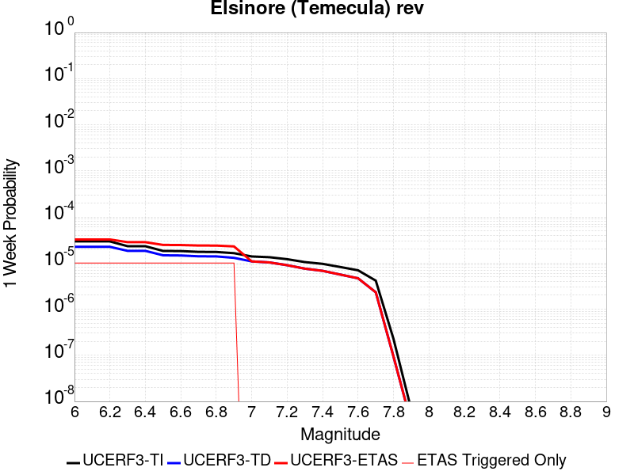 |  |  | 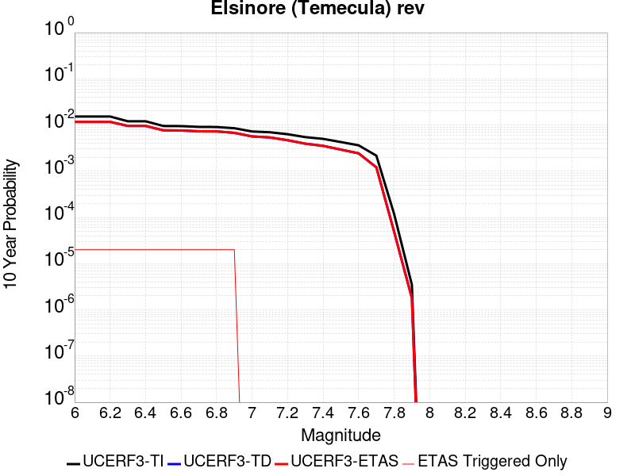 |

| Magnitude | 1 wk TI Prob | 1 wk TD Prob | 1 wk ETAS Prob | 1 wk ETAS/TD Gain | 1 wk ETAS Triggered Only | 1 mo TI Prob | 1 mo TD Prob | 1 mo ETAS Prob | 1 mo ETAS/TD Gain | 1 mo ETAS Triggered Only | 1 yr TI Prob | 1 yr TD Prob | 1 yr ETAS Prob | 1 yr ETAS/TD Gain | 1 yr ETAS Triggered Only | 10 yr TI Prob | 10 yr TD Prob | 10 yr ETAS Prob | 10 yr ETAS/TD Gain | 10 yr ETAS Triggered Only |
|-----|-----|-----|-----|-----|-----|-----|-----|-----|-----|-----|-----|-----|-----|-----|-----|-----|-----|-----|-----|-----|
| 6.0 | 2.9514995E-5 | 2.2517117E-5 | 3.251689E-5 | 1.4440966 | 1.0E-5 | 1.264867E-4 | 9.649849E-5 | 1.0649752E-4 | 1.1036186 | 1.0E-5 | 0.0015388876 | 0.0011742581 | 0.0011842463 | 1.0085061 | 1.0E-5 | 0.015282745 | 0.011696897 | 0.011716664 | 1.0016899 | 2.0E-5 |
| 6.1 | 2.9514995E-5 | 2.2517117E-5 | 3.251689E-5 | 1.4440966 | 1.0E-5 | 1.264867E-4 | 9.649849E-5 | 1.0649752E-4 | 1.1036186 | 1.0E-5 | 0.0015388876 | 0.0011742581 | 0.0011842463 | 1.0085061 | 1.0E-5 | 0.015282745 | 0.011696897 | 0.011716664 | 1.0016899 | 2.0E-5 |
| 6.2 | 2.9514995E-5 | 2.2517117E-5 | 3.251689E-5 | 1.4440966 | 1.0E-5 | 1.264867E-4 | 9.649849E-5 | 1.0649752E-4 | 1.1036186 | 1.0E-5 | 0.0015388876 | 0.0011742581 | 0.0011842463 | 1.0085061 | 1.0E-5 | 0.015282745 | 0.011696897 | 0.011716664 | 1.0016899 | 2.0E-5 |
| 6.3 | 2.3223649E-5 | 1.8406454E-5 | 2.840627E-5 | 1.5432777 | 1.0E-5 | 9.952613E-5 | 7.888251E-5 | 8.888173E-5 | 1.1267608 | 1.0E-5 | 0.001211057 | 9.599888E-4 | 9.6997916E-4 | 1.0104067 | 1.0E-5 | 0.012044783 | 0.009569948 | 0.009589756 | 1.0020698 | 2.0E-5 |
| 6.4 | 2.3223649E-5 | 1.8406454E-5 | 2.840627E-5 | 1.5432777 | 1.0E-5 | 9.952613E-5 | 7.888251E-5 | 8.888173E-5 | 1.1267608 | 1.0E-5 | 0.001211057 | 9.599888E-4 | 9.6997916E-4 | 1.0104067 | 1.0E-5 | 0.012044783 | 0.009569948 | 0.009589756 | 1.0020698 | 2.0E-5 |
| 6.5 | 1.8338875E-5 | 1.4750118E-5 | 2.474997E-5 | 1.6779507 | 1.0E-5 | 7.8592806E-5 | 6.321331E-5 | 7.321267E-5 | 1.1581845 | 1.0E-5 | 9.5644733E-4 | 7.69359E-4 | 7.7935134E-4 | 1.0129879 | 1.0E-5 | 0.009523412 | 0.0076739118 | 0.0076937582 | 1.0025862 | 2.0E-5 |
| 6.6 | 1.8223333E-5 | 1.4612673E-5 | 2.4612527E-5 | 1.6843275 | 1.0E-5 | 7.809766E-5 | 6.262429E-5 | 7.262366E-5 | 1.1596725 | 1.0E-5 | 9.504242E-4 | 7.6219277E-4 | 7.7218516E-4 | 1.01311 | 1.0E-5 | 0.009463696 | 0.0076027405 | 0.0076225884 | 1.0026107 | 2.0E-5 |
| 6.7 | 1.7512752E-5 | 1.402721E-5 | 2.402707E-5 | 1.7128901 | 1.0E-5 | 7.505249E-5 | 6.011528E-5 | 7.011468E-5 | 1.166337 | 1.0E-5 | 9.13381E-4 | 7.3166634E-4 | 7.41659E-4 | 1.0136575 | 1.0E-5 | 0.00909636 | 0.00729892 | 0.007318774 | 1.0027201 | 2.0E-5 |
| 6.8 | 1.7417142E-5 | 1.3951195E-5 | 2.3951055E-5 | 1.7167745 | 1.0E-5 | 7.4642754E-5 | 5.9789512E-5 | 6.978891E-5 | 1.1672434 | 1.0E-5 | 9.083966E-4 | 7.277028E-4 | 7.376955E-4 | 1.0137318 | 1.0E-5 | 0.009046922 | 0.0072594886 | 0.0072793434 | 1.002735 | 2.0E-5 |
| 6.9 | 1.6402591E-5 | 1.2988613E-5 | 2.2988483E-5 | 1.7698951 | 1.0E-5 | 7.0294926E-5 | 5.5664343E-5 | 6.5663786E-5 | 1.1796383 | 1.0E-5 | 8.5550465E-4 | 6.775103E-4 | 6.8750355E-4 | 1.0147499 | 1.0E-5 | 0.008522186 | 0.006760169 | 0.0067800335 | 1.0029385 | 2.0E-5 |
| 7.0 | 1.3912486E-5 | 1.0878233E-5 | 1.0878233E-5 | 1.0 | 0.0 | 5.9623577E-5 | 4.6620182E-5 | 4.6620182E-5 | 1.0 | 0.0 | 7.2567526E-4 | 5.674556E-4 | 5.674556E-4 | 1.0 | 0.0 | 0.0072331014 | 0.005663986 | 0.005663986 | 1.0 | 0.0 |
| 7.1 | 1.3405147E-5 | 1.03274215E-5 | 1.03274215E-5 | 1.0 | 0.0 | 5.7449364E-5 | 4.425964E-5 | 4.425964E-5 | 1.0 | 0.0 | 6.9922156E-4 | 5.3873047E-4 | 5.3873047E-4 | 1.0 | 0.0 | 0.0069702556 | 0.005377577 | 0.005377577 | 1.0 | 0.0 |
| 7.2 | 1.21402E-5 | 8.996737E-6 | 8.996737E-6 | 1.0 | 0.0 | 5.202839E-5 | 3.8556886E-5 | 3.8556886E-5 | 1.0 | 0.0 | 6.332616E-4 | 4.6933076E-4 | 4.6933076E-4 | 1.0 | 0.0 | 0.0063146 | 0.004684821 | 0.004684821 | 1.0 | 0.0 |
| 7.3 | 1.05047775E-5 | 7.571771E-6 | 7.571771E-6 | 1.0 | 0.0 | 4.5019697E-5 | 3.245005E-5 | 3.245005E-5 | 1.0 | 0.0 | 5.4797693E-4 | 3.950092E-4 | 3.950092E-4 | 1.0 | 0.0 | 0.005466277 | 0.00394346 | 0.00394346 | 1.0 | 0.0 |
| 7.4 | 9.624483E-6 | 6.7868696E-6 | 6.7868696E-6 | 1.0 | 0.0 | 4.124713E-5 | 2.9086266E-5 | 2.9086266E-5 | 1.0 | 0.0 | 5.0206814E-4 | 3.5406914E-4 | 3.5406914E-4 | 1.0 | 0.0 | 0.005009353 | 0.003535204 | 0.003535204 | 1.0 | 0.0 |
| 7.5 | 8.215151E-6 | 5.635538E-6 | 5.635538E-6 | 1.0 | 0.0 | 3.5207315E-5 | 2.4152088E-5 | 2.4152088E-5 | 1.0 | 0.0 | 4.2856473E-4 | 2.9401327E-4 | 2.9401327E-4 | 1.0 | 0.0 | 0.004277392 | 0.002936371 | 0.002936371 | 1.0 | 0.0 |
| 7.6 | 6.975058E-6 | 4.676045E-6 | 4.676045E-6 | 1.0 | 0.0 | 2.9892764E-5 | 2.0040046E-5 | 2.0040046E-5 | 1.0 | 0.0 | 3.6388362E-4 | 2.439614E-4 | 2.439614E-4 | 1.0 | 0.0 | 0.0036328835 | 0.002437052 | 0.002437052 | 1.0 | 0.0 |
| 7.7 | 4.159604E-6 | 2.3269924E-6 | 2.3269924E-6 | 1.0 | 0.0 | 1.7826753E-5 | 9.97279E-6 | 9.97279E-6 | 1.0 | 0.0 | 2.1701909E-4 | 1.21412704E-4 | 1.21412704E-4 | 1.0 | 0.0 | 0.0021680726 | 0.0012135367 | 0.0012135367 | 1.0 | 0.0 |
| 7.8 | 2.2692414E-7 | 9.3854695E-8 | 9.3854695E-8 | 1.0 | 0.0 | 9.725317E-7 | 4.0223435E-7 | 4.0223435E-7 | 1.0 | 0.0 | 1.1840509E-5 | 4.8971956E-6 | 4.8971956E-6 | 1.0 | 0.0 | 1.1839878E-4 | 4.8971204E-5 | 4.8971204E-5 | 1.0 | 0.0 |
| 7.9 | 6.676829E-9 | 3.439853E-9 | 3.439853E-9 | 1.0 | 0.0 | 2.861498E-8 | 1.4742227E-8 | 1.4742227E-8 | 1.0 | 0.0 | 3.4838732E-7 | 1.7948659E-7 | 1.7948659E-7 | 1.0 | 0.0 | 3.4838679E-6 | 1.7948646E-6 | 1.7948646E-6 | 1.0 | 0.0 |

## Mono Lake 2011 CFM
*[(top)](#table-of-contents)*

| 1 Week | 1 Month | 1 Year | 10 Year |
|-----|-----|-----|-----|
|  |  |  |  |

| Magnitude | 1 wk TI Prob | 1 wk TD Prob | 1 wk ETAS Prob | 1 wk ETAS/TD Gain | 1 wk ETAS Triggered Only | 1 mo TI Prob | 1 mo TD Prob | 1 mo ETAS Prob | 1 mo ETAS/TD Gain | 1 mo ETAS Triggered Only | 1 yr TI Prob | 1 yr TD Prob | 1 yr ETAS Prob | 1 yr ETAS/TD Gain | 1 yr ETAS Triggered Only | 10 yr TI Prob | 10 yr TD Prob | 10 yr ETAS Prob | 10 yr ETAS/TD Gain | 10 yr ETAS Triggered Only |
|-----|-----|-----|-----|-----|-----|-----|-----|-----|-----|-----|-----|-----|-----|-----|-----|-----|-----|-----|-----|-----|
| 6.0 | 2.0341662E-5 | 2.3828166E-5 | 2.3828166E-5 | 1.0 | 0.0 | 8.717564E-5 | 1.0211971E-4 | 1.0211971E-4 | 1.0 | 0.0 | 0.0010608466 | 0.0012431298 | 0.001263105 | 1.0160685 | 2.0E-5 | 0.010557966 | 0.012413835 | 0.012433587 | 1.0015911 | 2.0E-5 |
| 6.1 | 2.0341662E-5 | 2.3828166E-5 | 2.3828166E-5 | 1.0 | 0.0 | 8.717564E-5 | 1.0211971E-4 | 1.0211971E-4 | 1.0 | 0.0 | 0.0010608466 | 0.0012431298 | 0.001263105 | 1.0160685 | 2.0E-5 | 0.010557966 | 0.012413835 | 0.012433587 | 1.0015911 | 2.0E-5 |
| 6.2 | 2.0341662E-5 | 2.3828166E-5 | 2.3828166E-5 | 1.0 | 0.0 | 8.717564E-5 | 1.0211971E-4 | 1.0211971E-4 | 1.0 | 0.0 | 0.0010608466 | 0.0012431298 | 0.001263105 | 1.0160685 | 2.0E-5 | 0.010557966 | 0.012413835 | 0.012433587 | 1.0015911 | 2.0E-5 |
| 6.3 | 2.0341662E-5 | 2.3828166E-5 | 2.3828166E-5 | 1.0 | 0.0 | 8.717564E-5 | 1.0211971E-4 | 1.0211971E-4 | 1.0 | 0.0 | 0.0010608466 | 0.0012431298 | 0.001263105 | 1.0160685 | 2.0E-5 | 0.010557966 | 0.012413835 | 0.012433587 | 1.0015911 | 2.0E-5 |
| 6.4 | 1.749821E-5 | 2.0490985E-5 | 2.0490985E-5 | 1.0 | 0.0 | 7.499018E-5 | 8.781851E-5 | 8.781851E-5 | 1.0 | 0.0 | 9.1262296E-4 | 0.0010691903 | 0.001089169 | 1.0186857 | 2.0E-5 | 0.009088841 | 0.010691865 | 0.010711651 | 1.0018506 | 2.0E-5 |
| 6.5 | 1.749821E-5 | 2.0490985E-5 | 2.0490985E-5 | 1.0 | 0.0 | 7.499018E-5 | 8.781851E-5 | 8.781851E-5 | 1.0 | 0.0 | 9.1262296E-4 | 0.0010691903 | 0.001089169 | 1.0186857 | 2.0E-5 | 0.009088841 | 0.010691865 | 0.010711651 | 1.0018506 | 2.0E-5 |

## San Jacinto (Coyote Creek)
*[(top)](#table-of-contents)*

| 1 Week | 1 Month | 1 Year | 10 Year |
|-----|-----|-----|-----|
|  |  |  |  |

| Magnitude | 1 wk TI Prob | 1 wk TD Prob | 1 wk ETAS Prob | 1 wk ETAS/TD Gain | 1 wk ETAS Triggered Only | 1 mo TI Prob | 1 mo TD Prob | 1 mo ETAS Prob | 1 mo ETAS/TD Gain | 1 mo ETAS Triggered Only | 1 yr TI Prob | 1 yr TD Prob | 1 yr ETAS Prob | 1 yr ETAS/TD Gain | 1 yr ETAS Triggered Only | 10 yr TI Prob | 10 yr TD Prob | 10 yr ETAS Prob | 10 yr ETAS/TD Gain | 10 yr ETAS Triggered Only |
|-----|-----|-----|-----|-----|-----|-----|-----|-----|-----|-----|-----|-----|-----|-----|-----|-----|-----|-----|-----|-----|
| 6.0 | 2.7374346E-5 | 2.4145214E-5 | 2.4145214E-5 | 1.0 | 0.0 | 1.1731335E-4 | 1.034754E-4 | 1.034754E-4 | 1.0 | 0.0 | 0.0014273542 | 0.0012590875 | 0.0012790622 | 1.0158645 | 2.0E-5 | 0.01418221 | 0.012928318 | 0.0129480595 | 1.001527 | 2.0E-5 |
| 6.1 | 2.7374346E-5 | 2.4145214E-5 | 2.4145214E-5 | 1.0 | 0.0 | 1.1731335E-4 | 1.034754E-4 | 1.034754E-4 | 1.0 | 0.0 | 0.0014273542 | 0.0012590875 | 0.0012790622 | 1.0158645 | 2.0E-5 | 0.01418221 | 0.012928318 | 0.0129480595 | 1.001527 | 2.0E-5 |
| 6.2 | 2.7374346E-5 | 2.4145214E-5 | 2.4145214E-5 | 1.0 | 0.0 | 1.1731335E-4 | 1.034754E-4 | 1.034754E-4 | 1.0 | 0.0 | 0.0014273542 | 0.0012590875 | 0.0012790622 | 1.0158645 | 2.0E-5 | 0.01418221 | 0.012928318 | 0.0129480595 | 1.001527 | 2.0E-5 |
| 6.3 | 2.7374346E-5 | 2.4145214E-5 | 2.4145214E-5 | 1.0 | 0.0 | 1.1731335E-4 | 1.034754E-4 | 1.034754E-4 | 1.0 | 0.0 | 0.0014273542 | 0.0012590875 | 0.0012790622 | 1.0158645 | 2.0E-5 | 0.01418221 | 0.012928318 | 0.0129480595 | 1.001527 | 2.0E-5 |
| 6.4 | 2.7374346E-5 | 2.4145214E-5 | 2.4145214E-5 | 1.0 | 0.0 | 1.1731335E-4 | 1.034754E-4 | 1.034754E-4 | 1.0 | 0.0 | 0.0014273542 | 0.0012590875 | 0.0012790622 | 1.0158645 | 2.0E-5 | 0.01418221 | 0.012928318 | 0.0129480595 | 1.001527 | 2.0E-5 |
| 6.5 | 2.7282445E-5 | 2.4031293E-5 | 2.4031293E-5 | 1.0 | 0.0 | 1.16919524E-4 | 1.029872E-4 | 1.029872E-4 | 1.0 | 0.0 | 0.0014225657 | 0.0012531505 | 0.0012731255 | 1.0159398 | 2.0E-5 | 0.014134934 | 0.012869646 | 0.012889388 | 1.001534 | 2.0E-5 |
| 6.6 | 2.7282445E-5 | 2.4031293E-5 | 2.4031293E-5 | 1.0 | 0.0 | 1.16919524E-4 | 1.029872E-4 | 1.029872E-4 | 1.0 | 0.0 | 0.0014225657 | 0.0012531505 | 0.0012731255 | 1.0159398 | 2.0E-5 | 0.014134934 | 0.012869646 | 0.012889388 | 1.001534 | 2.0E-5 |
| 6.7 | 2.7216198E-5 | 2.3956412E-5 | 2.3956412E-5 | 1.0 | 0.0 | 1.1663563E-4 | 1.02666316E-4 | 1.02666316E-4 | 1.0 | 0.0 | 0.0014191137 | 0.0012492483 | 0.0012692233 | 1.0159897 | 2.0E-5 | 0.014100855 | 0.0128310565 | 0.0128508005 | 1.0015388 | 2.0E-5 |
| 6.8 | 2.7078617E-5 | 2.387363E-5 | 2.387363E-5 | 1.0 | 0.0 | 1.1604605E-4 | 1.0231156E-4 | 1.0231156E-4 | 1.0 | 0.0 | 0.001411945 | 0.0012449342 | 0.0012649092 | 1.0160451 | 2.0E-5 | 0.014030075 | 0.012788199 | 0.012807943 | 1.001544 | 2.0E-5 |
| 6.9 | 2.6982952E-5 | 2.3793142E-5 | 2.3793142E-5 | 1.0 | 0.0 | 1.15636096E-4 | 1.0196664E-4 | 1.0196664E-4 | 1.0 | 0.0 | 0.0014069602 | 0.0012407395 | 0.0012607146 | 1.0160995 | 2.0E-5 | 0.013980856 | 0.012746515 | 0.01276626 | 1.001549 | 2.0E-5 |
| 7.0 | 2.6449972E-5 | 2.3370165E-5 | 2.3370165E-5 | 1.0 | 0.0 | 1.1335209E-4 | 1.00154015E-4 | 1.00154015E-4 | 1.0 | 0.0 | 0.001379188 | 0.0012186957 | 0.0012386712 | 1.016391 | 2.0E-5 | 0.0137065975 | 0.0125278765 | 0.012547626 | 1.0015764 | 2.0E-5 |
| 7.1 | 2.6257849E-5 | 2.3196202E-5 | 2.3196202E-5 | 1.0 | 0.0 | 1.1252879E-4 | 9.940852E-5 | 9.940852E-5 | 1.0 | 0.0 | 0.0013691769 | 0.0012096294 | 0.0012296052 | 1.016514 | 2.0E-5 | 0.013607717 | 0.012437741 | 0.012457493 | 1.001588 | 2.0E-5 |
| 7.2 | 2.5270041E-5 | 2.2390966E-5 | 2.2390966E-5 | 1.0 | 0.0 | 1.0829568E-4 | 9.595777E-5 | 9.595777E-5 | 1.0 | 0.0 | 0.0013177024 | 0.0011676621 | 0.0011876387 | 1.0171082 | 2.0E-5 | 0.013099162 | 0.012018777 | 0.012038537 | 1.001644 | 2.0E-5 |
| 7.3 | 2.339701E-5 | 2.1122814E-5 | 2.1122814E-5 | 1.0 | 0.0 | 1.0026905E-4 | 9.0523215E-5 | 9.0523215E-5 | 1.0 | 0.0 | 0.001220092 | 0.0011015651 | 0.001121543 | 1.018136 | 2.0E-5 | 0.012134149 | 0.011357696 | 0.011377469 | 1.0017409 | 2.0E-5 |
| 7.4 | 2.296333E-5 | 2.0853171E-5 | 2.0853171E-5 | 1.0 | 0.0 | 9.841056E-5 | 8.936768E-5 | 8.936768E-5 | 1.0 | 0.0 | 0.0011974899 | 0.0010875105 | 0.0011074888 | 1.0183706 | 2.0E-5 | 0.011910575 | 0.01121681 | 0.011236585 | 1.001763 | 2.0E-5 |
| 7.5 | 2.2188895E-5 | 2.0376096E-5 | 2.0376096E-5 | 1.0 | 0.0 | 9.50918E-5 | 8.732321E-5 | 8.732321E-5 | 1.0 | 0.0 | 0.0011571277 | 0.0010626436 | 0.0010826223 | 1.018801 | 2.0E-5 | 0.011511209 | 0.010966429 | 0.010986209 | 1.0018038 | 2.0E-5 |
| 7.6 | 2.0013189E-5 | 1.8962366E-5 | 1.8962366E-5 | 1.0 | 0.0 | 8.5767984E-5 | 8.1264756E-5 | 8.1264756E-5 | 1.0 | 0.0 | 0.001043725 | 9.889511E-4 | 0.0010089313 | 1.0202035 | 2.0E-5 | 0.010388365 | 0.010224434 | 0.010244229 | 1.0019361 | 2.0E-5 |
| 7.7 | 1.7230794E-5 | 1.674371E-5 | 1.674371E-5 | 1.0 | 0.0 | 7.384417E-5 | 7.175679E-5 | 7.175679E-5 | 1.0 | 0.0 | 8.986819E-4 | 8.7328954E-4 | 8.9327205E-4 | 1.0228819 | 2.0E-5 | 0.008950562 | 0.009062956 | 0.009082775 | 1.0021868 | 2.0E-5 |
| 7.8 | 1.4478809E-5 | 1.4990978E-5 | 1.4990978E-5 | 1.0 | 0.0 | 6.205057E-5 | 6.424547E-5 | 6.424547E-5 | 1.0 | 0.0 | 7.552038E-4 | 7.819085E-4 | 8.018929E-4 | 1.0255585 | 2.0E-5 | 0.0075264242 | 0.008141387 | 0.008161224 | 1.0024366 | 2.0E-5 |
| 7.9 | 1.1114467E-5 | 1.1645102E-5 | 1.1645102E-5 | 1.0 | 0.0 | 4.7632562E-5 | 4.990663E-5 | 4.990663E-5 | 1.0 | 0.0 | 5.797721E-4 | 6.074444E-4 | 6.2743225E-4 | 1.0329049 | 2.0E-5 | 0.0057826187 | 0.0063803247 | 0.0064001973 | 1.0031146 | 2.0E-5 |
| 8.0 | 9.327402E-6 | 9.899186E-6 | 9.899186E-6 | 1.0 | 0.0 | 3.9973966E-5 | 4.2424395E-5 | 4.2424395E-5 | 1.0 | 0.0 | 4.8657437E-4 | 5.1639514E-4 | 5.363848E-4 | 1.03871 | 2.0E-5 | 0.0048551033 | 0.0054499684 | 0.0054698596 | 1.0036497 | 2.0E-5 |
| 8.1 | 7.0235833E-6 | 6.827495E-6 | 6.827495E-6 | 1.0 | 0.0 | 3.0100724E-5 | 2.9260367E-5 | 2.9260367E-5 | 1.0 | 0.0 | 3.664147E-4 | 3.5618723E-4 | 3.5618723E-4 | 1.0 | 0.0 | 0.003658111 | 0.0037876023 | 0.0037876023 | 1.0 | 0.0 |
| 8.2 | 2.0358202E-6 | 8.994527E-7 | 8.994527E-7 | 1.0 | 0.0 | 8.724915E-6 | 3.854792E-6 | 3.854792E-6 | 1.0 | 0.0 | 1.06220665E-4 | 4.69311E-5 | 4.69311E-5 | 1.0 | 0.0 | 0.001061699 | 5.3254166E-4 | 5.3254166E-4 | 1.0 | 0.0 |
| 8.3 | 2.0051264E-7 | 6.617272E-8 | 6.617272E-8 | 1.0 | 0.0 | 8.5933965E-7 | 2.8359733E-7 | 2.8359733E-7 | 1.0 | 0.0 | 1.046241E-5 | 3.4527925E-6 | 3.4527925E-6 | 1.0 | 0.0 | 1.0461917E-4 | 4.01389E-5 | 4.01389E-5 | 1.0 | 0.0 |

## Hat Creek-McArthur-Mayfield
*[(top)](#table-of-contents)*

| 1 Week | 1 Month | 1 Year | 10 Year |
|-----|-----|-----|-----|
|  |  |  |  |

| Magnitude | 1 wk TI Prob | 1 wk TD Prob | 1 wk ETAS Prob | 1 wk ETAS/TD Gain | 1 wk ETAS Triggered Only | 1 mo TI Prob | 1 mo TD Prob | 1 mo ETAS Prob | 1 mo ETAS/TD Gain | 1 mo ETAS Triggered Only | 1 yr TI Prob | 1 yr TD Prob | 1 yr ETAS Prob | 1 yr ETAS/TD Gain | 1 yr ETAS Triggered Only | 10 yr TI Prob | 10 yr TD Prob | 10 yr ETAS Prob | 10 yr ETAS/TD Gain | 10 yr ETAS Triggered Only |
|-----|-----|-----|-----|-----|-----|-----|-----|-----|-----|-----|-----|-----|-----|-----|-----|-----|-----|-----|-----|-----|
| 6.0 | 3.967457E-5 | 4.315831E-5 | 5.3157877E-5 | 1.231695 | 1.0E-5 | 1.7002279E-4 | 1.8495171E-4 | 2.0494802E-4 | 1.1081164 | 2.0E-5 | 0.002068062 | 0.002249576 | 0.002269531 | 1.0088706 | 2.0E-5 | 0.02048922 | 0.022280399 | 0.022299953 | 1.0008776 | 2.0E-5 |
| 6.1 | 2.5044013E-5 | 2.7071164E-5 | 3.7070895E-5 | 1.3693868 | 1.0E-5 | 1.0732707E-4 | 1.1601429E-4 | 1.3601198E-4 | 1.1723726 | 2.0E-5 | 0.0013059238 | 0.0014115906 | 0.0014315624 | 1.0141484 | 2.0E-5 | 0.01298276 | 0.01402966 | 0.01404938 | 1.0014056 | 2.0E-5 |
| 6.2 | 2.5044013E-5 | 2.7071164E-5 | 3.7070895E-5 | 1.3693868 | 1.0E-5 | 1.0732707E-4 | 1.1601429E-4 | 1.3601198E-4 | 1.1723726 | 2.0E-5 | 0.0013059238 | 0.0014115906 | 0.0014315624 | 1.0141484 | 2.0E-5 | 0.01298276 | 0.01402966 | 0.01404938 | 1.0014056 | 2.0E-5 |
| 6.3 | 1.6624012E-5 | 1.7891072E-5 | 1.7891072E-5 | 1.0 | 0.0 | 7.124382E-5 | 7.6673816E-5 | 7.6673816E-5 | 1.0 | 0.0 | 8.670483E-4 | 9.331125E-4 | 9.331125E-4 | 1.0 | 0.0 | 0.008636732 | 0.009292879 | 0.009292879 | 1.0 | 0.0 |
| 6.4 | 1.6624012E-5 | 1.7891072E-5 | 1.7891072E-5 | 1.0 | 0.0 | 7.124382E-5 | 7.6673816E-5 | 7.6673816E-5 | 1.0 | 0.0 | 8.670483E-4 | 9.331125E-4 | 9.331125E-4 | 1.0 | 0.0 | 0.008636732 | 0.009292879 | 0.009292879 | 1.0 | 0.0 |
| 6.5 | 1.3394842E-5 | 1.4392137E-5 | 1.4392137E-5 | 1.0 | 0.0 | 5.7405203E-5 | 6.167916E-5 | 6.167916E-5 | 1.0 | 0.0 | 6.986842E-4 | 7.506906E-4 | 7.506906E-4 | 1.0 | 0.0 | 0.006964916 | 0.0074821403 | 0.0074821403 | 1.0 | 0.0 |
| 6.6 | 1.1137514E-5 | 1.1954546E-5 | 1.1954546E-5 | 1.0 | 0.0 | 4.7731326E-5 | 5.1232782E-5 | 5.1232782E-5 | 1.0 | 0.0 | 5.809739E-4 | 6.2358467E-4 | 6.2358467E-4 | 1.0 | 0.0 | 0.005794574 | 0.00621877 | 0.00621877 | 1.0 | 0.0 |
| 6.7 | 7.0200663E-6 | 7.5242897E-6 | 7.5242897E-6 | 1.0 | 0.0 | 3.008565E-5 | 3.2246568E-5 | 3.2246568E-5 | 1.0 | 0.0 | 3.6623122E-4 | 3.925328E-4 | 3.925328E-4 | 1.0 | 0.0 | 0.0036562826 | 0.0039185574 | 0.0039185574 | 1.0 | 0.0 |
| 6.8 | 5.940172E-6 | 6.3654766E-6 | 6.3654766E-6 | 1.0 | 0.0 | 2.545763E-5 | 2.7280335E-5 | 2.7280335E-5 | 1.0 | 0.0 | 3.0990256E-4 | 3.3208873E-4 | 3.3208873E-4 | 1.0 | 0.0 | 0.0030947074 | 0.0033160534 | 0.0033160534 | 1.0 | 0.0 |
| 6.9 | 4.129831E-6 | 4.423547E-6 | 4.423547E-6 | 1.0 | 0.0 | 1.7699154E-5 | 1.8957926E-5 | 1.8957926E-5 | 1.0 | 0.0 | 2.154659E-4 | 2.3078908E-4 | 2.3078908E-4 | 1.0 | 0.0 | 0.002152571 | 0.0023055724 | 0.0023055724 | 1.0 | 0.0 |
| 7.0 | 2.6512955E-6 | 2.8374002E-6 | 2.8374002E-6 | 1.0 | 0.0 | 1.1362646E-5 | 1.2160232E-5 | 1.2160232E-5 | 1.0 | 0.0 | 1.3833142E-4 | 1.480412E-4 | 1.480412E-4 | 1.0 | 0.0 | 0.0013824535 | 0.0014794683 | 0.0014794683 | 1.0 | 0.0 |
| 7.1 | 1.2992575E-6 | 1.3909317E-6 | 1.3909317E-6 | 1.0 | 0.0 | 5.568235E-6 | 5.961124E-6 | 5.961124E-6 | 1.0 | 0.0 | 6.779115E-5 | 7.257448E-5 | 7.257448E-5 | 1.0 | 0.0 | 6.7770475E-4 | 7.2552945E-4 | 7.2552945E-4 | 1.0 | 0.0 |
| 7.2 | 4.968191E-7 | 5.3271475E-7 | 5.3271475E-7 | 1.0 | 0.0 | 2.1292228E-6 | 2.283062E-6 | 2.283062E-6 | 1.0 | 0.0 | 2.592298E-5 | 2.7796052E-5 | 2.7796052E-5 | 1.0 | 0.0 | 2.5919956E-4 | 2.7793812E-4 | 2.7793812E-4 | 1.0 | 0.0 |

## Newport-Inglewood (Offshore)
*[(top)](#table-of-contents)*

| 1 Week | 1 Month | 1 Year | 10 Year |
|-----|-----|-----|-----|
|  |  |  | 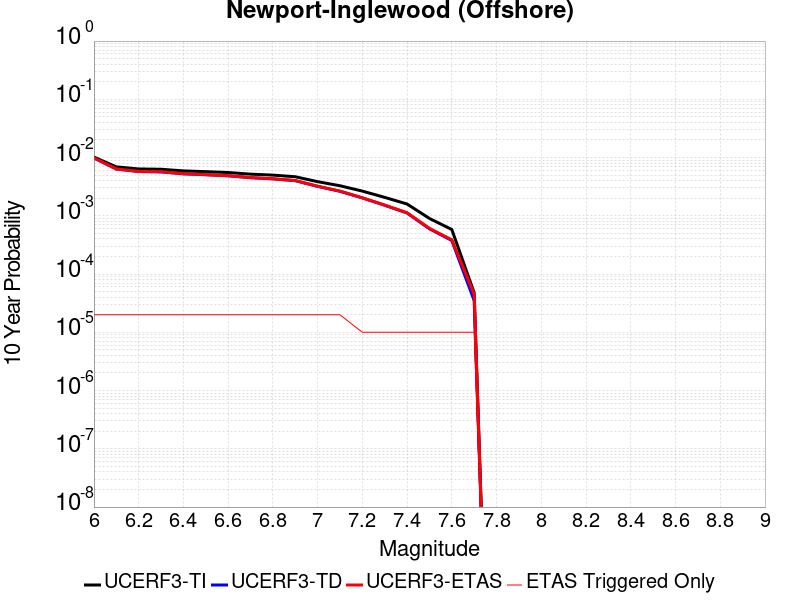 |

| Magnitude | 1 wk TI Prob | 1 wk TD Prob | 1 wk ETAS Prob | 1 wk ETAS/TD Gain | 1 wk ETAS Triggered Only | 1 mo TI Prob | 1 mo TD Prob | 1 mo ETAS Prob | 1 mo ETAS/TD Gain | 1 mo ETAS Triggered Only | 1 yr TI Prob | 1 yr TD Prob | 1 yr ETAS Prob | 1 yr ETAS/TD Gain | 1 yr ETAS Triggered Only | 10 yr TI Prob | 10 yr TD Prob | 10 yr ETAS Prob | 10 yr ETAS/TD Gain | 10 yr ETAS Triggered Only |
|-----|-----|-----|-----|-----|-----|-----|-----|-----|-----|-----|-----|-----|-----|-----|-----|-----|-----|-----|-----|-----|
| 6.0 | 1.9626508E-5 | 1.8965357E-5 | 2.8965167E-5 | 1.5272672 | 1.0E-5 | 8.411089E-5 | 8.1277634E-5 | 9.127682E-5 | 1.1230251 | 1.0E-5 | 0.001023569 | 9.891186E-4 | 0.0010090988 | 1.0202 | 2.0E-5 | 0.010188672 | 0.009848503 | 0.009868307 | 1.0020108 | 2.0E-5 |
| 6.1 | 1.331886E-5 | 1.2218092E-5 | 2.221797E-5 | 1.8184484 | 1.0E-5 | 5.707958E-5 | 5.2362207E-5 | 6.236169E-5 | 1.1909674 | 1.0E-5 | 6.947222E-4 | 6.3732493E-4 | 6.5731216E-4 | 1.0313612 | 2.0E-5 | 0.006925544 | 0.006355149 | 0.0063750218 | 1.0031271 | 2.0E-5 |
| 6.2 | 1.2250852E-5 | 1.1076029E-5 | 2.1075919E-5 | 1.9028406 | 1.0E-5 | 5.2502597E-5 | 4.7467838E-5 | 5.7467365E-5 | 1.2106589 | 1.0E-5 | 6.3903164E-4 | 5.777687E-4 | 5.977571E-4 | 1.034596 | 2.0E-5 | 0.006371971 | 0.0057627866 | 0.0057826713 | 1.0034505 | 2.0E-5 |
| 6.3 | 1.2106258E-5 | 1.0918891E-5 | 2.0918782E-5 | 1.915834 | 1.0E-5 | 5.1882926E-5 | 4.6794412E-5 | 5.6793946E-5 | 1.2136908 | 1.0E-5 | 6.3149154E-4 | 5.69574E-4 | 5.8956264E-4 | 1.0350939 | 2.0E-5 | 0.0062970007 | 0.005681259 | 0.0057011456 | 1.0035003 | 2.0E-5 |
| 6.4 | 1.1348758E-5 | 1.0109362E-5 | 2.010926E-5 | 1.9891721 | 1.0E-5 | 4.8636626E-5 | 4.3325123E-5 | 5.332469E-5 | 1.230803 | 1.0E-5 | 5.919901E-4 | 5.273565E-4 | 5.4734596E-4 | 1.037905 | 2.0E-5 | 0.005904155 | 0.0052611465 | 0.0052810414 | 1.0037814 | 2.0E-5 |
| 6.5 | 1.100837E-5 | 9.7433895E-6 | 1.9743291E-5 | 2.026327 | 1.0E-5 | 4.7177873E-5 | 4.1756717E-5 | 5.17563E-5 | 1.2394724 | 1.0E-5 | 5.7423924E-4 | 5.082702E-4 | 5.282601E-4 | 1.0393292 | 2.0E-5 | 0.005727576 | 0.0050711688 | 0.0050910674 | 1.0039239 | 2.0E-5 |
| 6.6 | 1.0634696E-5 | 9.345544E-6 | 1.934545E-5 | 2.0700188 | 1.0E-5 | 4.557647E-5 | 4.0051716E-5 | 5.0051316E-5 | 1.2496672 | 1.0E-5 | 5.5475225E-4 | 4.8752132E-4 | 5.0751155E-4 | 1.0410038 | 2.0E-5 | 0.0055336943 | 0.0048646047 | 0.0048845075 | 1.0040914 | 2.0E-5 |
| 6.7 | 9.9780855E-6 | 8.667911E-6 | 1.8667824E-5 | 2.1536705 | 1.0E-5 | 4.276252E-5 | 3.7147664E-5 | 4.7147292E-5 | 1.2691859 | 1.0E-5 | 5.205093E-4 | 4.5217964E-4 | 4.721706E-4 | 1.0442102 | 2.0E-5 | 0.0051929182 | 0.004512675 | 0.0045325845 | 1.0044119 | 2.0E-5 |
| 6.8 | 9.59546E-6 | 8.27295E-6 | 1.8272867E-5 | 2.2087486 | 1.0E-5 | 4.1122752E-5 | 3.5455025E-5 | 4.5454668E-5 | 1.2820375 | 1.0E-5 | 5.0055445E-4 | 4.315801E-4 | 4.5157145E-4 | 1.0463214 | 2.0E-5 | 0.004994285 | 0.004307495 | 0.004327409 | 1.004623 | 2.0E-5 |
| 6.9 | 9.000614E-6 | 7.70684E-6 | 1.7706763E-5 | 2.2975388 | 1.0E-5 | 3.857349E-5 | 3.30289E-5 | 4.302857E-5 | 1.3027551 | 1.0E-5 | 4.6953102E-4 | 4.0205332E-4 | 4.2204527E-4 | 1.0497247 | 2.0E-5 | 0.004685402 | 0.0040133307 | 0.0040332507 | 1.0049634 | 2.0E-5 |
| 7.0 | 7.4070194E-6 | 6.148904E-6 | 1.6148842E-5 | 2.626296 | 1.0E-5 | 3.1743984E-5 | 2.635218E-5 | 3.6351918E-5 | 1.3794652 | 1.0E-5 | 3.8641447E-4 | 3.207907E-4 | 3.4078432E-4 | 1.062326 | 2.0E-5 | 0.0038574322 | 0.0032032963 | 0.0032232322 | 1.0062236 | 2.0E-5 |
| 7.1 | 6.299615E-6 | 5.0565927E-6 | 1.5056542E-5 | 2.9776063 | 1.0E-5 | 2.699807E-5 | 2.1670932E-5 | 3.1670716E-5 | 1.4614376 | 1.0E-5 | 3.2865192E-4 | 2.638118E-4 | 2.8380653E-4 | 1.0757916 | 2.0E-5 | 0.003281663 | 0.002635001 | 0.0026549483 | 1.0075701 | 2.0E-5 |
| 7.2 | 5.096653E-6 | 3.892769E-6 | 3.892769E-6 | 1.0 | 0.0 | 2.1842614E-5 | 1.668319E-5 | 1.668319E-5 | 1.0 | 0.0 | 2.6590136E-4 | 2.0309901E-4 | 2.1309698E-4 | 1.0492271 | 1.0E-5 | 0.0026558342 | 0.0020291451 | 0.0020391247 | 1.0049182 | 1.0E-5 |
| 7.3 | 3.9753018E-6 | 2.9099103E-6 | 2.9099103E-6 | 1.0 | 0.0 | 1.7036897E-5 | 1.2470985E-5 | 1.2470985E-5 | 1.0 | 0.0 | 2.0740448E-4 | 1.5182374E-4 | 1.6182222E-4 | 1.0658559 | 1.0E-5 | 0.00207211 | 0.0015172083 | 0.0015271931 | 1.0065811 | 1.0E-5 |
| 7.4 | 3.0568392E-6 | 2.1449955E-6 | 2.1449955E-6 | 1.0 | 0.0 | 1.3100675E-5 | 9.192806E-6 | 9.192806E-6 | 1.0 | 0.0 | 1.5948903E-4 | 1.1191672E-4 | 1.21915604E-4 | 1.0893421 | 1.0E-5 | 0.0015937461 | 0.0011186098 | 0.0011285987 | 1.0089296 | 1.0E-5 |
| 7.5 | 1.7279019E-6 | 1.1469883E-6 | 1.1469883E-6 | 1.0 | 0.0 | 7.405273E-6 | 4.915655E-6 | 4.915655E-6 | 1.0 | 0.0 | 9.015547E-5 | 5.9846494E-5 | 6.98459E-5 | 1.1670842 | 1.0E-5 | 9.01189E-4 | 5.9830764E-4 | 6.0830166E-4 | 1.0167038 | 1.0E-5 |
| 7.6 | 1.1156416E-6 | 7.223012E-7 | 7.223012E-7 | 1.0 | 0.0 | 4.7813123E-6 | 3.095573E-6 | 3.095573E-6 | 1.0 | 0.0 | 5.821092E-5 | 3.7687976E-5 | 4.7687598E-5 | 1.2653266 | 1.0E-5 | 5.8195676E-4 | 3.7681818E-4 | 3.8681438E-4 | 1.026528 | 1.0E-5 |
| 7.7 | 9.117973E-8 | 6.734145E-8 | 6.734145E-8 | 1.0 | 0.0 | 3.907702E-7 | 2.886062E-7 | 2.886062E-7 | 1.0 | 0.0 | 4.757617E-6 | 3.513775E-6 | 1.351374E-5 | 3.845932 | 1.0E-5 | 4.7575148E-5 | 3.5137225E-5 | 4.5136872E-5 | 1.2845885 | 1.0E-5 |

## Reliz 2011 CFM
*[(top)](#table-of-contents)*

| 1 Week | 1 Month | 1 Year | 10 Year |
|-----|-----|-----|-----|
|  |  |  |  |

| Magnitude | 1 wk TI Prob | 1 wk TD Prob | 1 wk ETAS Prob | 1 wk ETAS/TD Gain | 1 wk ETAS Triggered Only | 1 mo TI Prob | 1 mo TD Prob | 1 mo ETAS Prob | 1 mo ETAS/TD Gain | 1 mo ETAS Triggered Only | 1 yr TI Prob | 1 yr TD Prob | 1 yr ETAS Prob | 1 yr ETAS/TD Gain | 1 yr ETAS Triggered Only | 10 yr TI Prob | 10 yr TD Prob | 10 yr ETAS Prob | 10 yr ETAS/TD Gain | 10 yr ETAS Triggered Only |
|-----|-----|-----|-----|-----|-----|-----|-----|-----|-----|-----|-----|-----|-----|-----|-----|-----|-----|-----|-----|-----|
| 6.0 | 1.6002472E-5 | 1.6282804E-5 | 1.6282804E-5 | 1.0 | 0.0 | 6.8580215E-5 | 6.9781694E-5 | 6.9781694E-5 | 1.0 | 0.0 | 8.3464425E-4 | 8.4928074E-4 | 8.5927226E-4 | 1.0117646 | 1.0E-5 | 0.008315164 | 0.008462547 | 0.008482378 | 1.0023433 | 2.0E-5 |
| 6.1 | 1.6002472E-5 | 1.6282804E-5 | 1.6282804E-5 | 1.0 | 0.0 | 6.8580215E-5 | 6.9781694E-5 | 6.9781694E-5 | 1.0 | 0.0 | 8.3464425E-4 | 8.4928074E-4 | 8.5927226E-4 | 1.0117646 | 1.0E-5 | 0.008315164 | 0.008462547 | 0.008482378 | 1.0023433 | 2.0E-5 |
| 6.2 | 1.6002472E-5 | 1.6282804E-5 | 1.6282804E-5 | 1.0 | 0.0 | 6.8580215E-5 | 6.9781694E-5 | 6.9781694E-5 | 1.0 | 0.0 | 8.3464425E-4 | 8.4928074E-4 | 8.5927226E-4 | 1.0117646 | 1.0E-5 | 0.008315164 | 0.008462547 | 0.008482378 | 1.0023433 | 2.0E-5 |
| 6.3 | 7.792404E-6 | 7.803802E-6 | 7.803802E-6 | 1.0 | 0.0 | 3.339559E-5 | 3.344444E-5 | 3.344444E-5 | 1.0 | 0.0 | 4.0651546E-4 | 4.0711078E-4 | 4.0711078E-4 | 1.0 | 0.0 | 0.0040577264 | 0.004063926 | 0.004063926 | 1.0 | 0.0 |
| 6.4 | 7.792404E-6 | 7.803802E-6 | 7.803802E-6 | 1.0 | 0.0 | 3.339559E-5 | 3.344444E-5 | 3.344444E-5 | 1.0 | 0.0 | 4.0651546E-4 | 4.0711078E-4 | 4.0711078E-4 | 1.0 | 0.0 | 0.0040577264 | 0.004063926 | 0.004063926 | 1.0 | 0.0 |
| 6.5 | 5.9659374E-6 | 5.928738E-6 | 5.928738E-6 | 1.0 | 0.0 | 2.5568053E-5 | 2.5408632E-5 | 2.5408632E-5 | 1.0 | 0.0 | 3.1124658E-4 | 3.093064E-4 | 3.093064E-4 | 1.0 | 0.0 | 0.00310811 | 0.0030889767 | 0.0030889767 | 1.0 | 0.0 |
| 6.6 | 5.2350692E-6 | 5.178986E-6 | 5.178986E-6 | 1.0 | 0.0 | 2.2435817E-5 | 2.2195467E-5 | 2.2195467E-5 | 1.0 | 0.0 | 2.7312184E-4 | 2.7019644E-4 | 2.7019644E-4 | 1.0 | 0.0 | 0.002727864 | 0.0026988892 | 0.0026988892 | 1.0 | 0.0 |
| 6.7 | 4.580206E-6 | 4.5061206E-6 | 4.5061206E-6 | 1.0 | 0.0 | 1.9629308E-5 | 1.9311801E-5 | 1.9311801E-5 | 1.0 | 0.0 | 2.389606E-4 | 2.350959E-4 | 2.350959E-4 | 1.0 | 0.0 | 0.002387038 | 0.0023486738 | 0.0023486738 | 1.0 | 0.0 |
| 6.8 | 4.0765017E-6 | 3.9882384E-6 | 3.9882384E-6 | 1.0 | 0.0 | 1.7470604E-5 | 1.7092338E-5 | 1.7092338E-5 | 1.0 | 0.0 | 2.1268385E-4 | 2.0807938E-4 | 2.0807938E-4 | 1.0 | 0.0 | 0.002124804 | 0.0020790435 | 0.0020790435 | 1.0 | 0.0 |
| 6.9 | 3.5752896E-6 | 3.4725176E-6 | 3.4725176E-6 | 1.0 | 0.0 | 1.532258E-5 | 1.4882134E-5 | 1.4882134E-5 | 1.0 | 0.0 | 1.8653645E-4 | 1.8117494E-4 | 1.8117494E-4 | 1.0 | 0.0 | 0.0018637994 | 0.0018104686 | 0.0018104686 | 1.0 | 0.0 |
| 7.0 | 3.0259848E-6 | 2.9079417E-6 | 2.9079417E-6 | 1.0 | 0.0 | 1.2968442E-5 | 1.2462548E-5 | 1.2462548E-5 | 1.0 | 0.0 | 1.5787935E-4 | 1.5172097E-4 | 1.5172097E-4 | 1.0 | 0.0 | 0.0015776722 | 0.001516369 | 0.001516369 | 1.0 | 0.0 |
| 7.1 | 2.5861116E-6 | 2.455167E-6 | 2.455167E-6 | 1.0 | 0.0 | 1.1083288E-5 | 1.05221025E-5 | 1.05221025E-5 | 1.0 | 0.0 | 1.3493067E-4 | 1.2809907E-4 | 1.2809907E-4 | 1.0 | 0.0 | 0.0013484878 | 0.001280447 | 0.001280447 | 1.0 | 0.0 |
| 7.2 | 2.1482588E-6 | 2.003237E-6 | 2.003237E-6 | 1.0 | 0.0 | 9.20679E-6 | 8.585273E-6 | 8.585273E-6 | 1.0 | 0.0 | 1.12086906E-4 | 1.0452068E-4 | 1.0452068E-4 | 1.0 | 0.0 | 0.0011203039 | 0.0010449095 | 0.0010449095 | 1.0 | 0.0 |
| 7.3 | 1.7194744E-6 | 1.5611241E-6 | 1.5611241E-6 | 1.0 | 0.0 | 7.3691554E-6 | 6.690515E-6 | 6.690515E-6 | 1.0 | 0.0 | 8.971577E-5 | 8.1453974E-5 | 8.1453974E-5 | 1.0 | 0.0 | 8.967956E-4 | 8.1443513E-4 | 8.1443513E-4 | 1.0 | 0.0 |
| 7.4 | 1.2755178E-6 | 1.10563E-6 | 1.10563E-6 | 1.0 | 0.0 | 5.4664933E-6 | 4.7384056E-6 | 4.7384056E-6 | 1.0 | 0.0 | 6.655252E-5 | 5.768856E-5 | 5.768856E-5 | 1.0 | 0.0 | 6.6532596E-4 | 5.7692965E-4 | 5.7692965E-4 | 1.0 | 0.0 |
| 7.5 | 8.8463224E-7 | 7.0580273E-7 | 7.0580273E-7 | 1.0 | 0.0 | 3.7912755E-6 | 3.0248652E-6 | 3.0248652E-6 | 1.0 | 0.0 | 4.6157802E-5 | 3.6827114E-5 | 3.6827114E-5 | 1.0 | 0.0 | 4.6148215E-4 | 3.684038E-4 | 3.684038E-4 | 1.0 | 0.0 |
| 7.6 | 5.291355E-7 | 3.500777E-7 | 3.500777E-7 | 1.0 | 0.0 | 2.2677216E-6 | 1.5003321E-6 | 1.5003321E-6 | 1.0 | 0.0 | 2.760916E-5 | 1.8266392E-5 | 1.8266392E-5 | 1.0 | 0.0 | 2.760573E-4 | 1.8284164E-4 | 1.8284164E-4 | 1.0 | 0.0 |
| 7.7 | 2.9663357E-7 | 1.351113E-7 | 1.351113E-7 | 1.0 | 0.0 | 1.2712861E-6 | 5.7904833E-7 | 5.7904833E-7 | 1.0 | 0.0 | 1.5477797E-5 | 7.049891E-6 | 7.049891E-6 | 1.0 | 0.0 | 1.547672E-4 | 7.068132E-5 | 7.068132E-5 | 1.0 | 0.0 |
| 7.8 | 1.2509386E-7 | 2.7157126E-8 | 2.7157126E-8 | 1.0 | 0.0 | 5.3611643E-7 | 1.1638769E-7 | 1.1638769E-7 | 1.0 | 0.0 | 6.527198E-6 | 1.4170191E-6 | 1.4170191E-6 | 1.0 | 0.0 | 6.527006E-5 | 1.4326506E-5 | 1.4326506E-5 | 1.0 | 0.0 |
| 7.9 | 6.213493E-8 | 1.1482114E-8 | 1.1482114E-8 | 1.0 | 0.0 | 2.6629255E-7 | 4.920906E-8 | 4.920906E-8 | 1.0 | 0.0 | 3.242107E-6 | 5.9912014E-7 | 5.9912014E-7 | 1.0 | 0.0 | 3.2420594E-5 | 6.1224223E-6 | 6.1224223E-6 | 1.0 | 0.0 |
| 8.0 | 5.92383E-9 | 1.677887E-9 | 1.677887E-9 | 1.0 | 0.0 | 2.5387841E-8 | 7.190944E-9 | 7.190944E-9 | 1.0 | 0.0 | 3.0909692E-7 | 8.754974E-8 | 8.754974E-8 | 1.0 | 0.0 | 3.090965E-6 | 9.003061E-7 | 9.003061E-7 | 1.0 | 0.0 |

## Pitas Point (Lower West)
*[(top)](#table-of-contents)*

| 1 Week | 1 Month | 1 Year | 10 Year |
|-----|-----|-----|-----|
|  |  |  | 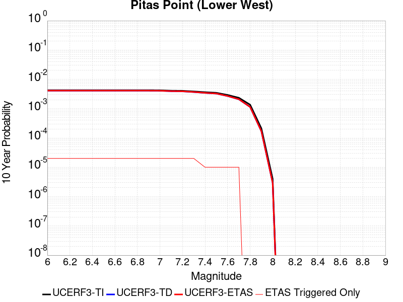 |

| Magnitude | 1 wk TI Prob | 1 wk TD Prob | 1 wk ETAS Prob | 1 wk ETAS/TD Gain | 1 wk ETAS Triggered Only | 1 mo TI Prob | 1 mo TD Prob | 1 mo ETAS Prob | 1 mo ETAS/TD Gain | 1 mo ETAS Triggered Only | 1 yr TI Prob | 1 yr TD Prob | 1 yr ETAS Prob | 1 yr ETAS/TD Gain | 1 yr ETAS Triggered Only | 10 yr TI Prob | 10 yr TD Prob | 10 yr ETAS Prob | 10 yr ETAS/TD Gain | 10 yr ETAS Triggered Only |
|-----|-----|-----|-----|-----|-----|-----|-----|-----|-----|-----|-----|-----|-----|-----|-----|-----|-----|-----|-----|-----|
| 6.0 | 8.151497E-6 | 7.855762E-6 | 1.7855684E-5 | 2.2729409 | 1.0E-5 | 3.493452E-5 | 3.3667122E-5 | 4.3666787E-5 | 1.2970157 | 1.0E-5 | 4.252448E-4 | 4.0982084E-4 | 4.1981676E-4 | 1.0243909 | 1.0E-5 | 0.0042443196 | 0.0040907315 | 0.0041106497 | 1.0048691 | 2.0E-5 |
| 6.1 | 8.151497E-6 | 7.855762E-6 | 1.7855684E-5 | 2.2729409 | 1.0E-5 | 3.493452E-5 | 3.3667122E-5 | 4.3666787E-5 | 1.2970157 | 1.0E-5 | 4.252448E-4 | 4.0982084E-4 | 4.1981676E-4 | 1.0243909 | 1.0E-5 | 0.0042443196 | 0.0040907315 | 0.0041106497 | 1.0048691 | 2.0E-5 |
| 6.2 | 8.151497E-6 | 7.855762E-6 | 1.7855684E-5 | 2.2729409 | 1.0E-5 | 3.493452E-5 | 3.3667122E-5 | 4.3666787E-5 | 1.2970157 | 1.0E-5 | 4.252448E-4 | 4.0982084E-4 | 4.1981676E-4 | 1.0243909 | 1.0E-5 | 0.0042443196 | 0.0040907315 | 0.0041106497 | 1.0048691 | 2.0E-5 |
| 6.3 | 8.151497E-6 | 7.855762E-6 | 1.7855684E-5 | 2.2729409 | 1.0E-5 | 3.493452E-5 | 3.3667122E-5 | 4.3666787E-5 | 1.2970157 | 1.0E-5 | 4.252448E-4 | 4.0982084E-4 | 4.1981676E-4 | 1.0243909 | 1.0E-5 | 0.0042443196 | 0.0040907315 | 0.0041106497 | 1.0048691 | 2.0E-5 |
| 6.4 | 8.151497E-6 | 7.855762E-6 | 1.7855684E-5 | 2.2729409 | 1.0E-5 | 3.493452E-5 | 3.3667122E-5 | 4.3666787E-5 | 1.2970157 | 1.0E-5 | 4.252448E-4 | 4.0982084E-4 | 4.1981676E-4 | 1.0243909 | 1.0E-5 | 0.0042443196 | 0.0040907315 | 0.0041106497 | 1.0048691 | 2.0E-5 |
| 6.5 | 8.151497E-6 | 7.855762E-6 | 1.7855684E-5 | 2.2729409 | 1.0E-5 | 3.493452E-5 | 3.3667122E-5 | 4.3666787E-5 | 1.2970157 | 1.0E-5 | 4.252448E-4 | 4.0982084E-4 | 4.1981676E-4 | 1.0243909 | 1.0E-5 | 0.0042443196 | 0.0040907315 | 0.0041106497 | 1.0048691 | 2.0E-5 |
| 6.6 | 8.151497E-6 | 7.855762E-6 | 1.7855684E-5 | 2.2729409 | 1.0E-5 | 3.493452E-5 | 3.3667122E-5 | 4.3666787E-5 | 1.2970157 | 1.0E-5 | 4.252448E-4 | 4.0982084E-4 | 4.1981676E-4 | 1.0243909 | 1.0E-5 | 0.0042443196 | 0.0040907315 | 0.0041106497 | 1.0048691 | 2.0E-5 |
| 6.7 | 8.151497E-6 | 7.855762E-6 | 1.7855684E-5 | 2.2729409 | 1.0E-5 | 3.493452E-5 | 3.3667122E-5 | 4.3666787E-5 | 1.2970157 | 1.0E-5 | 4.252448E-4 | 4.0982084E-4 | 4.1981676E-4 | 1.0243909 | 1.0E-5 | 0.0042443196 | 0.0040907315 | 0.0041106497 | 1.0048691 | 2.0E-5 |
| 6.8 | 8.151497E-6 | 7.855762E-6 | 1.7855684E-5 | 2.2729409 | 1.0E-5 | 3.493452E-5 | 3.3667122E-5 | 4.3666787E-5 | 1.2970157 | 1.0E-5 | 4.252448E-4 | 4.0982084E-4 | 4.1981676E-4 | 1.0243909 | 1.0E-5 | 0.0042443196 | 0.0040907315 | 0.0041106497 | 1.0048691 | 2.0E-5 |
| 6.9 | 8.151497E-6 | 7.855762E-6 | 1.7855684E-5 | 2.2729409 | 1.0E-5 | 3.493452E-5 | 3.3667122E-5 | 4.3666787E-5 | 1.2970157 | 1.0E-5 | 4.252448E-4 | 4.0982084E-4 | 4.1981676E-4 | 1.0243909 | 1.0E-5 | 0.0042443196 | 0.0040907315 | 0.0041106497 | 1.0048691 | 2.0E-5 |
| 7.0 | 8.103535E-6 | 7.805192E-6 | 1.7805114E-5 | 2.2811885 | 1.0E-5 | 3.4728975E-5 | 3.3450397E-5 | 4.3450065E-5 | 1.2989401 | 1.0E-5 | 4.2274324E-4 | 4.0718322E-4 | 4.1717917E-4 | 1.024549 | 1.0E-5 | 0.0042193993 | 0.004064452 | 0.0040843706 | 1.0049007 | 2.0E-5 |
| 7.1 | 7.853298E-6 | 7.540883E-6 | 1.7540808E-5 | 2.3260946 | 1.0E-5 | 3.3656554E-5 | 3.2317676E-5 | 4.231735E-5 | 1.3094182 | 1.0E-5 | 4.096915E-4 | 3.9339735E-4 | 4.033934E-4 | 1.0254096 | 1.0E-5 | 0.00408937 | 0.0039270855 | 0.003947007 | 1.0050728 | 2.0E-5 |
| 7.2 | 7.771102E-6 | 7.453165E-6 | 1.745309E-5 | 2.341702 | 1.0E-5 | 3.33043E-5 | 3.194175E-5 | 4.194143E-5 | 1.3130599 | 1.0E-5 | 4.0540437E-4 | 3.8882208E-4 | 3.988182E-4 | 1.0257087 | 1.0E-5 | 0.0040466557 | 0.0038814936 | 0.003901416 | 1.0051327 | 2.0E-5 |
| 7.3 | 7.3945344E-6 | 7.0492697E-6 | 1.7049199E-5 | 2.4185767 | 1.0E-5 | 3.1690477E-5 | 3.021081E-5 | 4.0210507E-5 | 1.3309973 | 1.0E-5 | 3.8576324E-4 | 3.6775516E-4 | 3.7775148E-4 | 1.027182 | 1.0E-5 | 0.0038509427 | 0.0036715334 | 0.00369146 | 1.0054274 | 2.0E-5 |
| 7.4 | 6.964645E-6 | 6.5901186E-6 | 1.6590053E-5 | 2.5174134 | 1.0E-5 | 2.9848137E-5 | 2.8243063E-5 | 3.824278E-5 | 1.3540592 | 1.0E-5 | 3.6334046E-4 | 3.4380553E-4 | 3.5380208E-4 | 1.0290762 | 1.0E-5 | 0.0036274698 | 0.0034327896 | 0.0034427552 | 1.0029031 | 1.0E-5 |
| 7.5 | 6.6525035E-6 | 6.259157E-6 | 1.6259095E-5 | 2.597649 | 1.0E-5 | 2.851042E-5 | 2.6824686E-5 | 3.682442E-5 | 1.3727809 | 1.0E-5 | 3.4705905E-4 | 3.265421E-4 | 3.3653883E-4 | 1.0306139 | 1.0E-5 | 0.0034651754 | 0.0032606742 | 0.0032706417 | 1.0030569 | 1.0E-5 |
| 7.6 | 5.613338E-6 | 5.151386E-6 | 1.5151335E-5 | 2.941215 | 1.0E-5 | 2.405694E-5 | 2.2077185E-5 | 3.2076965E-5 | 1.4529463 | 1.0E-5 | 2.928539E-4 | 2.6875688E-4 | 2.787542E-4 | 1.0371983 | 1.0E-5 | 0.0029246826 | 0.0026843501 | 0.0026943232 | 1.0037153 | 1.0E-5 |
| 7.7 | 4.494704E-6 | 3.996911E-6 | 1.3996871E-5 | 3.5019221 | 1.0E-5 | 1.9262876E-5 | 1.7129507E-5 | 2.7129336E-5 | 1.5837779 | 1.0E-5 | 2.3450027E-4 | 2.0853203E-4 | 2.1852994E-4 | 1.0479443 | 1.0E-5 | 0.0023425296 | 0.0020833875 | 0.0020933668 | 1.0047898 | 1.0E-5 |
| 7.8 | 2.6075882E-6 | 2.1836374E-6 | 2.1836374E-6 | 1.0 | 0.0 | 1.117533E-5 | 9.358413E-6 | 9.358413E-6 | 1.0 | 0.0 | 1.3605114E-4 | 1.1393277E-4 | 1.1393277E-4 | 1.0 | 0.0 | 0.0013596788 | 0.0011387484 | 0.0011387484 | 1.0 | 0.0 |
| 7.9 | 4.045984E-7 | 3.242375E-7 | 3.242375E-7 | 1.0 | 0.0 | 1.733992E-6 | 1.3895885E-6 | 1.3895885E-6 | 1.0 | 0.0 | 2.1111147E-5 | 1.6918111E-5 | 1.6918111E-5 | 1.0 | 0.0 | 2.1109142E-4 | 1.6916855E-4 | 1.6916855E-4 | 1.0 | 0.0 |
| 8.0 | 7.791402E-9 | 5.683497E-9 | 5.683497E-9 | 1.0 | 0.0 | 3.3391725E-8 | 2.4357844E-8 | 2.4357844E-8 | 1.0 | 0.0 | 4.0654416E-7 | 2.9655675E-7 | 2.9655675E-7 | 1.0 | 0.0 | 4.065434E-6 | 2.9655655E-6 | 2.9655655E-6 | 1.0 | 0.0 |

## South Klamath Lake West
*[(top)](#table-of-contents)*

| 1 Week | 1 Month | 1 Year | 10 Year |
|-----|-----|-----|-----|
| 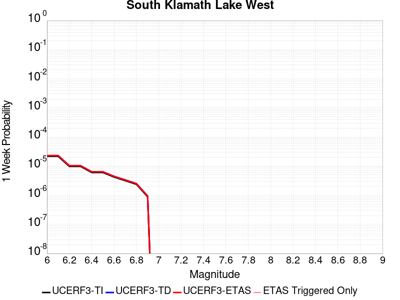 |  |  |  |

| Magnitude | 1 wk TI Prob | 1 wk TD Prob | 1 wk ETAS Prob | 1 wk ETAS/TD Gain | 1 wk ETAS Triggered Only | 1 mo TI Prob | 1 mo TD Prob | 1 mo ETAS Prob | 1 mo ETAS/TD Gain | 1 mo ETAS Triggered Only | 1 yr TI Prob | 1 yr TD Prob | 1 yr ETAS Prob | 1 yr ETAS/TD Gain | 1 yr ETAS Triggered Only | 10 yr TI Prob | 10 yr TD Prob | 10 yr ETAS Prob | 10 yr ETAS/TD Gain | 10 yr ETAS Triggered Only |
|-----|-----|-----|-----|-----|-----|-----|-----|-----|-----|-----|-----|-----|-----|-----|-----|-----|-----|-----|-----|-----|
| 6.0 | 2.174025E-5 | 2.3042025E-5 | 2.3042025E-5 | 1.0 | 0.0 | 9.3169176E-5 | 9.874817E-5 | 9.874817E-5 | 1.0 | 0.0 | 0.0011337444 | 0.0012016617 | 0.0012016617 | 1.0 | 0.0 | 0.011279777 | 0.0119582405 | 0.011978001 | 1.0016525 | 2.0E-5 |
| 6.1 | 2.174025E-5 | 2.3042025E-5 | 2.3042025E-5 | 1.0 | 0.0 | 9.3169176E-5 | 9.874817E-5 | 9.874817E-5 | 1.0 | 0.0 | 0.0011337444 | 0.0012016617 | 0.0012016617 | 1.0 | 0.0 | 0.011279777 | 0.0119582405 | 0.011978001 | 1.0016525 | 2.0E-5 |
| 6.2 | 9.834929E-6 | 1.0393841E-5 | 1.0393841E-5 | 1.0 | 0.0 | 4.2149015E-5 | 4.4544326E-5 | 4.4544326E-5 | 1.0 | 0.0 | 5.1304343E-4 | 5.422012E-4 | 5.422012E-4 | 1.0 | 0.0 | 0.0051186057 | 0.0054096854 | 0.0054196315 | 1.0018386 | 1.0E-5 |
| 6.3 | 9.834929E-6 | 1.0393841E-5 | 1.0393841E-5 | 1.0 | 0.0 | 4.2149015E-5 | 4.4544326E-5 | 4.4544326E-5 | 1.0 | 0.0 | 5.1304343E-4 | 5.422012E-4 | 5.422012E-4 | 1.0 | 0.0 | 0.0051186057 | 0.0054096854 | 0.0054196315 | 1.0018386 | 1.0E-5 |
| 6.4 | 6.066321E-6 | 6.40043E-6 | 6.40043E-6 | 1.0 | 0.0 | 2.5998259E-5 | 2.743014E-5 | 2.743014E-5 | 1.0 | 0.0 | 3.1648282E-4 | 3.3391351E-4 | 3.3391351E-4 | 1.0 | 0.0 | 0.0031603249 | 0.0033343881 | 0.0033343881 | 1.0 | 0.0 |
| 6.5 | 6.066321E-6 | 6.40043E-6 | 6.40043E-6 | 1.0 | 0.0 | 2.5998259E-5 | 2.743014E-5 | 2.743014E-5 | 1.0 | 0.0 | 3.1648282E-4 | 3.3391351E-4 | 3.3391351E-4 | 1.0 | 0.0 | 0.0031603249 | 0.0033343881 | 0.0033343881 | 1.0 | 0.0 |
| 6.6 | 4.2321803E-6 | 4.461291E-6 | 4.461291E-6 | 1.0 | 0.0 | 1.8137789E-5 | 1.9119685E-5 | 1.9119685E-5 | 1.0 | 0.0 | 2.208052E-4 | 2.3275832E-4 | 2.3275832E-4 | 1.0 | 0.0 | 0.0022058594 | 0.0023252473 | 0.0023252473 | 1.0 | 0.0 |
| 6.7 | 3.186646E-6 | 3.360305E-6 | 3.360305E-6 | 1.0 | 0.0 | 1.3656982E-5 | 1.4401232E-5 | 1.4401232E-5 | 1.0 | 0.0 | 1.6626107E-4 | 1.7532158E-4 | 1.7532158E-4 | 1.0 | 0.0 | 0.0016613674 | 0.0017518997 | 0.0017518997 | 1.0 | 0.0 |
| 6.8 | 2.380121E-6 | 2.510907E-6 | 2.510907E-6 | 1.0 | 0.0 | 1.0200479E-5 | 1.07609885E-5 | 1.07609885E-5 | 1.0 | 0.0 | 1.2418375E-4 | 1.3100762E-4 | 1.3100762E-4 | 1.0 | 0.0 | 0.0012411437 | 0.0013093497 | 0.0013093497 | 1.0 | 0.0 |
| 6.9 | 8.928287E-7 | 9.4302504E-7 | 9.4302504E-7 | 1.0 | 0.0 | 3.826403E-6 | 4.0415307E-6 | 4.0415307E-6 | 1.0 | 0.0 | 4.658546E-5 | 4.9204747E-5 | 4.9204747E-5 | 1.0 | 0.0 | 4.6575698E-4 | 4.9196015E-4 | 4.9196015E-4 | 1.0 | 0.0 |

## Los Alamos extension
*[(top)](#table-of-contents)*

| 1 Week | 1 Month | 1 Year | 10 Year |
|-----|-----|-----|-----|
|  | 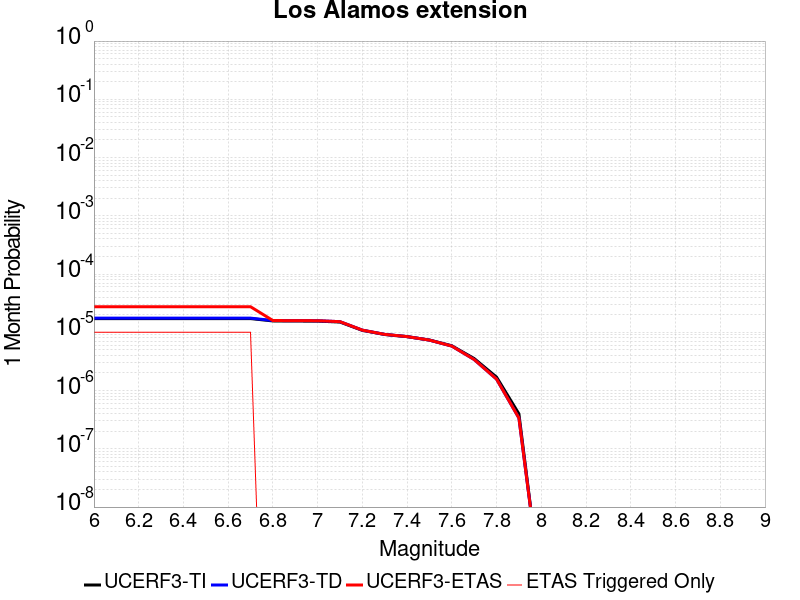 |  |  |

| Magnitude | 1 wk TI Prob | 1 wk TD Prob | 1 wk ETAS Prob | 1 wk ETAS/TD Gain | 1 wk ETAS Triggered Only | 1 mo TI Prob | 1 mo TD Prob | 1 mo ETAS Prob | 1 mo ETAS/TD Gain | 1 mo ETAS Triggered Only | 1 yr TI Prob | 1 yr TD Prob | 1 yr ETAS Prob | 1 yr ETAS/TD Gain | 1 yr ETAS Triggered Only | 10 yr TI Prob | 10 yr TD Prob | 10 yr ETAS Prob | 10 yr ETAS/TD Gain | 10 yr ETAS Triggered Only |
|-----|-----|-----|-----|-----|-----|-----|-----|-----|-----|-----|-----|-----|-----|-----|-----|-----|-----|-----|-----|-----|
| 6.0 | 4.0146506E-6 | 4.0861596E-6 | 1.4086118E-5 | 3.4472756 | 1.0E-5 | 1.7205533E-5 | 1.7512002E-5 | 2.7511827E-5 | 1.5710269 | 1.0E-5 | 2.0945723E-4 | 2.1318886E-4 | 2.2318673E-4 | 1.0468968 | 1.0E-5 | 0.0020925992 | 0.0021299527 | 0.00214991 | 1.0093699 | 2.0E-5 |
| 6.1 | 4.0146506E-6 | 4.0861596E-6 | 1.4086118E-5 | 3.4472756 | 1.0E-5 | 1.7205533E-5 | 1.7512002E-5 | 2.7511827E-5 | 1.5710269 | 1.0E-5 | 2.0945723E-4 | 2.1318886E-4 | 2.2318673E-4 | 1.0468968 | 1.0E-5 | 0.0020925992 | 0.0021299527 | 0.00214991 | 1.0093699 | 2.0E-5 |
| 6.2 | 4.0146506E-6 | 4.0861596E-6 | 1.4086118E-5 | 3.4472756 | 1.0E-5 | 1.7205533E-5 | 1.7512002E-5 | 2.7511827E-5 | 1.5710269 | 1.0E-5 | 2.0945723E-4 | 2.1318886E-4 | 2.2318673E-4 | 1.0468968 | 1.0E-5 | 0.0020925992 | 0.0021299527 | 0.00214991 | 1.0093699 | 2.0E-5 |
| 6.3 | 4.0146506E-6 | 4.0861596E-6 | 1.4086118E-5 | 3.4472756 | 1.0E-5 | 1.7205533E-5 | 1.7512002E-5 | 2.7511827E-5 | 1.5710269 | 1.0E-5 | 2.0945723E-4 | 2.1318886E-4 | 2.2318673E-4 | 1.0468968 | 1.0E-5 | 0.0020925992 | 0.0021299527 | 0.00214991 | 1.0093699 | 2.0E-5 |
| 6.4 | 4.0146506E-6 | 4.0861596E-6 | 1.4086118E-5 | 3.4472756 | 1.0E-5 | 1.7205533E-5 | 1.7512002E-5 | 2.7511827E-5 | 1.5710269 | 1.0E-5 | 2.0945723E-4 | 2.1318886E-4 | 2.2318673E-4 | 1.0468968 | 1.0E-5 | 0.0020925992 | 0.0021299527 | 0.00214991 | 1.0093699 | 2.0E-5 |
| 6.5 | 4.0146506E-6 | 4.0861596E-6 | 1.4086118E-5 | 3.4472756 | 1.0E-5 | 1.7205533E-5 | 1.7512002E-5 | 2.7511827E-5 | 1.5710269 | 1.0E-5 | 2.0945723E-4 | 2.1318886E-4 | 2.2318673E-4 | 1.0468968 | 1.0E-5 | 0.0020925992 | 0.0021299527 | 0.00214991 | 1.0093699 | 2.0E-5 |
| 6.6 | 4.0146506E-6 | 4.0861596E-6 | 1.4086118E-5 | 3.4472756 | 1.0E-5 | 1.7205533E-5 | 1.7512002E-5 | 2.7511827E-5 | 1.5710269 | 1.0E-5 | 2.0945723E-4 | 2.1318886E-4 | 2.2318673E-4 | 1.0468968 | 1.0E-5 | 0.0020925992 | 0.0021299527 | 0.00214991 | 1.0093699 | 2.0E-5 |
| 6.7 | 4.0146506E-6 | 4.0861596E-6 | 1.4086118E-5 | 3.4472756 | 1.0E-5 | 1.7205533E-5 | 1.7512002E-5 | 2.7511827E-5 | 1.5710269 | 1.0E-5 | 2.0945723E-4 | 2.1318886E-4 | 2.2318673E-4 | 1.0468968 | 1.0E-5 | 0.0020925992 | 0.0021299527 | 0.00214991 | 1.0093699 | 2.0E-5 |
| 6.8 | 3.6584688E-6 | 3.7188588E-6 | 3.7188588E-6 | 1.0 | 0.0 | 1.5679057E-5 | 1.5937874E-5 | 1.5937874E-5 | 1.0 | 0.0 | 1.9087581E-4 | 1.9402728E-4 | 1.9402728E-4 | 1.0 | 0.0 | 0.0019071194 | 0.0019386712 | 0.0019486519 | 1.0051482 | 1.0E-5 |
| 6.9 | 3.644631E-6 | 3.7045688E-6 | 3.7045688E-6 | 1.0 | 0.0 | 1.5619753E-5 | 1.5876632E-5 | 1.5876632E-5 | 1.0 | 0.0 | 1.901539E-4 | 1.9328178E-4 | 1.9328178E-4 | 1.0 | 0.0 | 0.0018999127 | 0.0019312293 | 0.0019412099 | 1.0051681 | 1.0E-5 |
| 7.0 | 3.6318522E-6 | 3.6913295E-6 | 3.6913295E-6 | 1.0 | 0.0 | 1.5564989E-5 | 1.5819893E-5 | 1.5819893E-5 | 1.0 | 0.0 | 1.8948725E-4 | 1.925911E-4 | 1.925911E-4 | 1.0 | 0.0 | 0.0018932576 | 0.0019243343 | 0.0019343151 | 1.0051866 | 1.0E-5 |
| 7.1 | 3.5001724E-6 | 3.5554E-6 | 3.5554E-6 | 1.0 | 0.0 | 1.5000653E-5 | 1.5237345E-5 | 1.5237345E-5 | 1.0 | 0.0 | 1.8261763E-4 | 1.854998E-4 | 1.854998E-4 | 1.0 | 0.0 | 0.0018246764 | 0.0018535402 | 0.0018635218 | 1.005385 | 1.0E-5 |
| 7.2 | 2.5204702E-6 | 2.5436943E-6 | 2.5436943E-6 | 1.0 | 0.0 | 1.080197E-5 | 1.0901502E-5 | 1.0901502E-5 | 1.0 | 0.0 | 1.3150605E-4 | 1.3271775E-4 | 1.3271775E-4 | 1.0 | 0.0 | 0.0013142825 | 0.0013263905 | 0.0013263905 | 1.0 | 0.0 |
| 7.3 | 2.1399692E-6 | 2.1501316E-6 | 2.1501316E-6 | 1.0 | 0.0 | 9.1712645E-6 | 9.2148175E-6 | 9.2148175E-6 | 1.0 | 0.0 | 1.1165442E-4 | 1.1218466E-4 | 1.1218466E-4 | 1.0 | 0.0 | 0.0011159834 | 0.0011212835 | 0.0011212835 | 1.0 | 0.0 |
| 7.4 | 1.9660122E-6 | 1.9702363E-6 | 1.9702363E-6 | 1.0 | 0.0 | 8.42574E-6 | 8.4438425E-6 | 8.4438425E-6 | 1.0 | 0.0 | 1.0257855E-4 | 1.0279897E-4 | 1.0279897E-4 | 1.0 | 0.0 | 0.0010253121 | 0.0010275173 | 0.0010275173 | 1.0 | 0.0 |
| 7.5 | 1.7204633E-6 | 1.7150983E-6 | 1.7150983E-6 | 1.0 | 0.0 | 7.373393E-6 | 7.3504007E-6 | 7.3504007E-6 | 1.0 | 0.0 | 8.976737E-5 | 8.948748E-5 | 8.948748E-5 | 1.0 | 0.0 | 8.9731114E-4 | 8.9451746E-4 | 8.9451746E-4 | 1.0 | 0.0 |
| 7.6 | 1.3717638E-6 | 1.3535827E-6 | 1.3535827E-6 | 1.0 | 0.0 | 5.878974E-6 | 5.8010555E-6 | 5.8010555E-6 | 1.0 | 0.0 | 7.157416E-5 | 7.062559E-5 | 7.062559E-5 | 1.0 | 0.0 | 7.1551115E-4 | 7.060341E-4 | 7.060341E-4 | 1.0 | 0.0 |
| 7.7 | 8.272564E-7 | 7.957636E-7 | 7.957636E-7 | 1.0 | 0.0 | 3.5453797E-6 | 3.410411E-6 | 3.410411E-6 | 1.0 | 0.0 | 4.3164142E-5 | 4.1520965E-5 | 4.1520965E-5 | 1.0 | 0.0 | 4.315576E-4 | 4.1513226E-4 | 4.1513226E-4 | 1.0 | 0.0 |
| 7.8 | 3.9708277E-7 | 3.6719027E-7 | 3.6719027E-7 | 1.0 | 0.0 | 1.7017821E-6 | 1.5736716E-6 | 1.5736716E-6 | 1.0 | 0.0 | 2.0719E-5 | 1.9159284E-5 | 1.9159284E-5 | 1.0 | 0.0 | 2.071707E-4 | 1.9157639E-4 | 1.9157639E-4 | 1.0 | 0.0 |
| 7.9 | 9.292528E-8 | 7.889087E-8 | 7.889087E-8 | 1.0 | 0.0 | 3.9825116E-7 | 3.381037E-7 | 3.381037E-7 | 1.0 | 0.0 | 4.848697E-6 | 4.116405E-6 | 4.116405E-6 | 1.0 | 0.0 | 4.8485912E-5 | 4.1163294E-5 | 4.1163294E-5 | 1.0 | 0.0 |
| 8.0 | 7.880441E-11 | 8.2353124E-11 | 8.2353124E-11 | 1.0 | 0.0 | 3.3773329E-10 | 3.52942E-10 | 3.52942E-10 | 1.0 | 0.0 | 4.1119033E-9 | 4.2970694E-9 | 4.2970694E-9 | 1.0 | 0.0 | 4.1119034E-8 | 4.2970694E-8 | 4.2970694E-8 | 1.0 | 0.0 |

## Point Reyes 2011 CFM
*[(top)](#table-of-contents)*

| 1 Week | 1 Month | 1 Year | 10 Year |
|-----|-----|-----|-----|
|  |  |  |  |

| Magnitude | 1 wk TI Prob | 1 wk TD Prob | 1 wk ETAS Prob | 1 wk ETAS/TD Gain | 1 wk ETAS Triggered Only | 1 mo TI Prob | 1 mo TD Prob | 1 mo ETAS Prob | 1 mo ETAS/TD Gain | 1 mo ETAS Triggered Only | 1 yr TI Prob | 1 yr TD Prob | 1 yr ETAS Prob | 1 yr ETAS/TD Gain | 1 yr ETAS Triggered Only | 10 yr TI Prob | 10 yr TD Prob | 10 yr ETAS Prob | 10 yr ETAS/TD Gain | 10 yr ETAS Triggered Only |
|-----|-----|-----|-----|-----|-----|-----|-----|-----|-----|-----|-----|-----|-----|-----|-----|-----|-----|-----|-----|-----|
| 6.0 | 8.8644965E-6 | 8.967163E-6 | 1.8967074E-5 | 2.1151698 | 1.0E-5 | 3.7990147E-5 | 3.843017E-5 | 4.8429785E-5 | 1.2602022 | 1.0E-5 | 4.624319E-4 | 4.6779314E-4 | 4.7778848E-4 | 1.021367 | 1.0E-5 | 0.0046147075 | 0.004668713 | 0.0046886196 | 1.0042639 | 2.0E-5 |
| 6.1 | 4.526405E-6 | 4.5392185E-6 | 4.5392185E-6 | 1.0 | 0.0 | 1.9398734E-5 | 1.9453653E-5 | 1.9453653E-5 | 1.0 | 0.0 | 2.36154E-4 | 2.3682354E-4 | 2.3682354E-4 | 1.0 | 0.0 | 0.002359032 | 0.0023658178 | 0.002375794 | 1.0042169 | 1.0E-5 |
| 6.2 | 4.526405E-6 | 4.5392185E-6 | 4.5392185E-6 | 1.0 | 0.0 | 1.9398734E-5 | 1.9453653E-5 | 1.9453653E-5 | 1.0 | 0.0 | 2.36154E-4 | 2.3682354E-4 | 2.3682354E-4 | 1.0 | 0.0 | 0.002359032 | 0.0023658178 | 0.002375794 | 1.0042169 | 1.0E-5 |
| 6.3 | 2.6842322E-6 | 2.660676E-6 | 2.660676E-6 | 1.0 | 0.0 | 1.1503801E-5 | 1.1402849E-5 | 1.1402849E-5 | 1.0 | 0.0 | 1.4004979E-4 | 1.3882104E-4 | 1.3882104E-4 | 1.0 | 0.0 | 0.0013996155 | 0.0013873649 | 0.001397351 | 1.0071979 | 1.0E-5 |
| 6.4 | 2.6842322E-6 | 2.660676E-6 | 2.660676E-6 | 1.0 | 0.0 | 1.1503801E-5 | 1.1402849E-5 | 1.1402849E-5 | 1.0 | 0.0 | 1.4004979E-4 | 1.3882104E-4 | 1.3882104E-4 | 1.0 | 0.0 | 0.0013996155 | 0.0013873649 | 0.001397351 | 1.0071979 | 1.0E-5 |
| 6.5 | 1.9281833E-6 | 1.8906262E-6 | 1.8906262E-6 | 1.0 | 0.0 | 8.263617E-6 | 8.102659E-6 | 8.102659E-6 | 1.0 | 0.0 | 1.0060489E-4 | 9.86455E-5 | 9.86455E-5 | 1.0 | 0.0 | 0.0010055936 | 9.860279E-4 | 9.960181E-4 | 1.0101317 | 1.0E-5 |
| 6.6 | 1.4726726E-6 | 1.4269577E-6 | 1.4269577E-6 | 1.0 | 0.0 | 6.3114385E-6 | 6.1155188E-6 | 6.1155188E-6 | 1.0 | 0.0 | 7.683905E-5 | 7.445395E-5 | 7.445395E-5 | 1.0 | 0.0 | 7.6812494E-4 | 7.4429717E-4 | 7.5428974E-4 | 1.0134255 | 1.0E-5 |
| 6.7 | 8.572307E-7 | 8.007212E-7 | 8.007212E-7 | 1.0 | 0.0 | 3.6738406E-6 | 3.431658E-6 | 3.431658E-6 | 1.0 | 0.0 | 4.472809E-5 | 4.1779647E-5 | 4.1779647E-5 | 1.0 | 0.0 | 4.471909E-4 | 4.1772184E-4 | 4.2771766E-4 | 1.0239294 | 1.0E-5 |
| 6.8 | 6.6745434E-7 | 6.0773E-7 | 6.0773E-7 | 1.0 | 0.0 | 2.8605155E-6 | 2.6045543E-6 | 2.6045543E-6 | 1.0 | 0.0 | 3.482622E-5 | 3.171E-5 | 3.171E-5 | 1.0 | 0.0 | 3.4820763E-4 | 3.1705803E-4 | 3.2705488E-4 | 1.03153 | 1.0E-5 |
| 6.9 | 4.291521E-7 | 3.6535937E-7 | 3.6535937E-7 | 1.0 | 0.0 | 1.839222E-6 | 1.565825E-6 | 1.565825E-6 | 1.0 | 0.0 | 2.2392298E-5 | 1.9063755E-5 | 1.9063755E-5 | 1.0 | 0.0 | 2.2390042E-4 | 1.9062385E-4 | 1.9062385E-4 | 1.0 | 0.0 |
| 7.0 | 2.6812808E-7 | 2.0187414E-7 | 2.0187414E-7 | 1.0 | 0.0 | 1.1491198E-6 | 8.651746E-7 | 8.651746E-7 | 1.0 | 0.0 | 1.3990444E-5 | 1.0533451E-5 | 1.0533451E-5 | 1.0 | 0.0 | 1.3989564E-4 | 1.0533186E-4 | 1.0533186E-4 | 1.0 | 0.0 |
| 7.1 | 1.9451231E-7 | 1.2725499E-7 | 1.2725499E-7 | 1.0 | 0.0 | 8.336239E-7 | 5.453784E-7 | 5.453784E-7 | 1.0 | 0.0 | 1.0149324E-5 | 6.6399616E-6 | 6.6399616E-6 | 1.0 | 0.0 | 1.014886E-4 | 6.639991E-5 | 6.639991E-5 | 1.0 | 0.0 |
| 7.2 | 1.6715143E-7 | 1.00428394E-7 | 1.00428394E-7 | 1.0 | 0.0 | 7.1636305E-7 | 4.3040734E-7 | 4.3040734E-7 | 1.0 | 0.0 | 8.721685E-6 | 5.2401965E-6 | 5.2401965E-6 | 1.0 | 0.0 | 8.721343E-5 | 5.2402997E-5 | 5.2402997E-5 | 1.0 | 0.0 |
| 7.3 | 1.5503173E-7 | 9.0131024E-8 | 9.0131024E-8 | 1.0 | 0.0 | 6.644215E-7 | 3.8627576E-7 | 3.8627576E-7 | 1.0 | 0.0 | 8.089301E-6 | 4.702897E-6 | 4.702897E-6 | 1.0 | 0.0 | 8.089007E-5 | 4.7030244E-5 | 4.7030244E-5 | 1.0 | 0.0 |
| 7.4 | 1.4251614E-7 | 8.097624E-8 | 8.097624E-8 | 1.0 | 0.0 | 6.1078333E-7 | 3.47041E-7 | 3.47041E-7 | 1.0 | 0.0 | 7.4362615E-6 | 4.225216E-6 | 4.225216E-6 | 1.0 | 0.0 | 7.436013E-5 | 4.2253625E-5 | 4.2253625E-5 | 1.0 | 0.0 |
| 7.5 | 1.2710186E-7 | 7.0296394E-8 | 7.0296394E-8 | 1.0 | 0.0 | 5.447221E-7 | 3.0127023E-7 | 3.0127023E-7 | 1.0 | 0.0 | 6.6319717E-6 | 3.667959E-6 | 3.667959E-6 | 1.0 | 0.0 | 6.6317734E-5 | 3.6681253E-5 | 3.6681253E-5 | 1.0 | 0.0 |
| 7.6 | 1.0144708E-7 | 5.4952274E-8 | 5.4952274E-8 | 1.0 | 0.0 | 4.347731E-7 | 2.3550973E-7 | 2.3550973E-7 | 1.0 | 0.0 | 5.2933497E-6 | 2.8673273E-6 | 2.8673273E-6 | 1.0 | 0.0 | 5.293224E-5 | 2.8675171E-5 | 2.8675171E-5 | 1.0 | 0.0 |
| 7.7 | 7.090527E-8 | 3.98231E-8 | 3.98231E-8 | 1.0 | 0.0 | 3.038797E-7 | 1.7067042E-7 | 1.7067042E-7 | 1.0 | 0.0 | 3.699729E-6 | 2.0779103E-6 | 2.0779103E-6 | 1.0 | 0.0 | 3.6996673E-5 | 2.0781177E-5 | 2.0781177E-5 | 1.0 | 0.0 |
| 7.8 | 3.8712045E-8 | 2.7440025E-8 | 2.7440025E-8 | 1.0 | 0.0 | 1.6590876E-7 | 1.176001E-7 | 1.176001E-7 | 1.0 | 0.0 | 2.0199373E-6 | 1.4317802E-6 | 1.4317802E-6 | 1.0 | 0.0 | 2.0199188E-5 | 1.4319979E-5 | 1.4319979E-5 | 1.0 | 0.0 |
| 7.9 | 1.7068782E-8 | 1.1833354E-8 | 1.1833354E-8 | 1.0 | 0.0 | 7.315192E-8 | 5.0714362E-8 | 5.0714362E-8 | 1.0 | 0.0 | 8.906242E-7 | 6.174472E-7 | 6.174472E-7 | 1.0 | 0.0 | 8.906207E-6 | 6.1767228E-6 | 6.1767228E-6 | 1.0 | 0.0 |
| 8.0 | 1.0172592E-8 | 7.0280843E-9 | 7.0280843E-9 | 1.0 | 0.0 | 4.359682E-8 | 3.0120354E-8 | 3.0120354E-8 | 1.0 | 0.0 | 5.3079117E-7 | 3.6671526E-7 | 3.6671526E-7 | 1.0 | 0.0 | 5.307899E-6 | 3.6694146E-6 | 3.6694146E-6 | 1.0 | 0.0 |
| 8.1 | 3.7861243E-9 | 3.5452439E-9 | 3.5452439E-9 | 1.0 | 0.0 | 1.6226247E-8 | 1.5193901E-8 | 1.5193901E-8 | 1.0 | 0.0 | 1.9755454E-7 | 1.8498575E-7 | 1.8498575E-7 | 1.0 | 0.0 | 1.9755437E-6 | 1.8518531E-6 | 1.8518531E-6 | 1.0 | 0.0 |

## Sierra Madre
*[(top)](#table-of-contents)*

| 1 Week | 1 Month | 1 Year | 10 Year |
|-----|-----|-----|-----|
|  |  |  |  |

| Magnitude | 1 wk TI Prob | 1 wk TD Prob | 1 wk ETAS Prob | 1 wk ETAS/TD Gain | 1 wk ETAS Triggered Only | 1 mo TI Prob | 1 mo TD Prob | 1 mo ETAS Prob | 1 mo ETAS/TD Gain | 1 mo ETAS Triggered Only | 1 yr TI Prob | 1 yr TD Prob | 1 yr ETAS Prob | 1 yr ETAS/TD Gain | 1 yr ETAS Triggered Only | 10 yr TI Prob | 10 yr TD Prob | 10 yr ETAS Prob | 10 yr ETAS/TD Gain | 10 yr ETAS Triggered Only |
|-----|-----|-----|-----|-----|-----|-----|-----|-----|-----|-----|-----|-----|-----|-----|-----|-----|-----|-----|-----|-----|
| 6.0 | 1.3379373E-5 | 1.10007395E-5 | 1.10007395E-5 | 1.0 | 0.0 | 5.7338908E-5 | 4.7145186E-5 | 4.7145186E-5 | 1.0 | 0.0 | 6.978776E-4 | 5.738429E-4 | 5.938315E-4 | 1.0348327 | 2.0E-5 | 0.0069569005 | 0.0057239756 | 0.005743861 | 1.0034741 | 2.0E-5 |
| 6.1 | 1.3379373E-5 | 1.10007395E-5 | 1.10007395E-5 | 1.0 | 0.0 | 5.7338908E-5 | 4.7145186E-5 | 4.7145186E-5 | 1.0 | 0.0 | 6.978776E-4 | 5.738429E-4 | 5.938315E-4 | 1.0348327 | 2.0E-5 | 0.0069569005 | 0.0057239756 | 0.005743861 | 1.0034741 | 2.0E-5 |
| 6.2 | 1.3379373E-5 | 1.10007395E-5 | 1.10007395E-5 | 1.0 | 0.0 | 5.7338908E-5 | 4.7145186E-5 | 4.7145186E-5 | 1.0 | 0.0 | 6.978776E-4 | 5.738429E-4 | 5.938315E-4 | 1.0348327 | 2.0E-5 | 0.0069569005 | 0.0057239756 | 0.005743861 | 1.0034741 | 2.0E-5 |
| 6.3 | 1.3379373E-5 | 1.10007395E-5 | 1.10007395E-5 | 1.0 | 0.0 | 5.7338908E-5 | 4.7145186E-5 | 4.7145186E-5 | 1.0 | 0.0 | 6.978776E-4 | 5.738429E-4 | 5.938315E-4 | 1.0348327 | 2.0E-5 | 0.0069569005 | 0.0057239756 | 0.005743861 | 1.0034741 | 2.0E-5 |
| 6.4 | 1.3379373E-5 | 1.10007395E-5 | 1.10007395E-5 | 1.0 | 0.0 | 5.7338908E-5 | 4.7145186E-5 | 4.7145186E-5 | 1.0 | 0.0 | 6.978776E-4 | 5.738429E-4 | 5.938315E-4 | 1.0348327 | 2.0E-5 | 0.0069569005 | 0.0057239756 | 0.005743861 | 1.0034741 | 2.0E-5 |
| 6.5 | 1.26563245E-5 | 1.0230196E-5 | 1.0230196E-5 | 1.0 | 0.0 | 5.4240263E-5 | 4.3842967E-5 | 4.3842967E-5 | 1.0 | 0.0 | 6.601751E-4 | 5.336584E-4 | 5.5364775E-4 | 1.0374571 | 2.0E-5 | 0.006582173 | 0.0053240913 | 0.005343985 | 1.0037365 | 2.0E-5 |
| 6.6 | 1.26563245E-5 | 1.0230196E-5 | 1.0230196E-5 | 1.0 | 0.0 | 5.4240263E-5 | 4.3842967E-5 | 4.3842967E-5 | 1.0 | 0.0 | 6.601751E-4 | 5.336584E-4 | 5.5364775E-4 | 1.0374571 | 2.0E-5 | 0.006582173 | 0.0053240913 | 0.005343985 | 1.0037365 | 2.0E-5 |
| 6.7 | 1.2502474E-5 | 1.006634E-5 | 1.006634E-5 | 1.0 | 0.0 | 5.3580934E-5 | 4.314075E-5 | 4.314075E-5 | 1.0 | 0.0 | 6.521526E-4 | 5.251131E-4 | 5.3510786E-4 | 1.0190336 | 1.0E-5 | 0.0065024206 | 0.0052390425 | 0.00524899 | 1.0018988 | 1.0E-5 |
| 6.8 | 1.2454966E-5 | 1.0018625E-5 | 1.0018625E-5 | 1.0 | 0.0 | 5.3377335E-5 | 4.2936266E-5 | 4.2936266E-5 | 1.0 | 0.0 | 6.4967526E-4 | 5.226247E-4 | 5.326195E-4 | 1.0191242 | 1.0E-5 | 0.006477792 | 0.0052142753 | 0.0052242232 | 1.0019078 | 1.0E-5 |
| 6.9 | 1.2225574E-5 | 9.792602E-6 | 9.792602E-6 | 1.0 | 0.0 | 5.2394265E-5 | 4.1967625E-5 | 4.1967625E-5 | 1.0 | 0.0 | 6.3771347E-4 | 5.108371E-4 | 5.20832E-4 | 1.0195657 | 1.0E-5 | 0.006358865 | 0.0050969445 | 0.005106894 | 1.0019519 | 1.0E-5 |
| 7.0 | 1.182946E-5 | 9.399144E-6 | 9.399144E-6 | 1.0 | 0.0 | 5.06967E-5 | 4.0281426E-5 | 4.0281426E-5 | 1.0 | 0.0 | 6.1705755E-4 | 4.9031706E-4 | 4.9031706E-4 | 1.0 | 0.0 | 0.006153469 | 0.004892664 | 0.004892664 | 1.0 | 0.0 |
| 7.1 | 1.14369095E-5 | 8.986159E-6 | 8.986159E-6 | 1.0 | 0.0 | 4.9014405E-5 | 3.8511545E-5 | 3.8511545E-5 | 1.0 | 0.0 | 5.9658696E-4 | 4.687782E-4 | 4.687782E-4 | 1.0 | 0.0 | 0.005949879 | 0.004678199 | 0.004678199 | 1.0 | 0.0 |
| 7.2 | 1.0836419E-5 | 8.3995565E-6 | 8.3995565E-6 | 1.0 | 0.0 | 4.644097E-5 | 3.5997607E-5 | 3.5997607E-5 | 1.0 | 0.0 | 5.652721E-4 | 4.3818366E-4 | 4.3818366E-4 | 1.0 | 0.0 | 0.0056383642 | 0.004373494 | 0.004373494 | 1.0 | 0.0 |
| 7.3 | 1.0403439E-5 | 8.02082E-6 | 8.02082E-6 | 1.0 | 0.0 | 4.4585406E-5 | 3.4374494E-5 | 3.4374494E-5 | 1.0 | 0.0 | 5.426921E-4 | 4.1843E-4 | 4.1843E-4 | 1.0 | 0.0 | 0.005413687 | 0.004176717 | 0.004176717 | 1.0 | 0.0 |
| 7.4 | 9.768864E-6 | 7.414448E-6 | 7.414448E-6 | 1.0 | 0.0 | 4.186589E-5 | 3.1775824E-5 | 3.1775824E-5 | 1.0 | 0.0 | 5.09598E-4 | 3.868029E-4 | 3.868029E-4 | 1.0 | 0.0 | 0.0050843097 | 0.0038615882 | 0.0038615882 | 1.0 | 0.0 |
| 7.5 | 8.687089E-6 | 6.4501564E-6 | 6.4501564E-6 | 1.0 | 0.0 | 3.722985E-5 | 2.764324E-5 | 2.764324E-5 | 1.0 | 0.0 | 4.5317915E-4 | 3.3650533E-4 | 3.3650533E-4 | 1.0 | 0.0 | 0.004522561 | 0.0033602451 | 0.0033602451 | 1.0 | 0.0 |
| 7.6 | 6.3506063E-6 | 4.4303215E-6 | 4.4303215E-6 | 1.0 | 0.0 | 2.72166E-5 | 1.8986955E-5 | 1.8986955E-5 | 1.0 | 0.0 | 3.3131172E-4 | 2.3114192E-4 | 2.3114192E-4 | 1.0 | 0.0 | 0.003308182 | 0.0023092402 | 0.0023092402 | 1.0 | 0.0 |
| 7.7 | 4.62223E-6 | 2.932967E-6 | 2.932967E-6 | 1.0 | 0.0 | 1.9809406E-5 | 1.2569798E-5 | 1.2569798E-5 | 1.0 | 0.0 | 2.4115283E-4 | 1.5302657E-4 | 1.5302657E-4 | 1.0 | 0.0 | 0.0024089129 | 0.001529413 | 0.001529413 | 1.0 | 0.0 |
| 7.8 | 3.2145008E-6 | 1.9494332E-6 | 1.9494332E-6 | 1.0 | 0.0 | 1.3776359E-5 | 8.3546865E-6 | 8.3546865E-6 | 1.0 | 0.0 | 1.6771426E-4 | 1.0171358E-4 | 1.0171358E-4 | 1.0 | 0.0 | 0.0016758774 | 0.0010168145 | 0.0010168145 | 1.0 | 0.0 |
| 7.9 | 1.0391769E-6 | 5.6026335E-7 | 5.6026335E-7 | 1.0 | 0.0 | 4.4536077E-6 | 2.4011265E-6 | 2.4011265E-6 | 1.0 | 0.0 | 5.4221324E-5 | 2.9233326E-5 | 2.9233326E-5 | 1.0 | 0.0 | 5.4208096E-4 | 2.9229524E-4 | 2.9229524E-4 | 1.0 | 0.0 |
| 8.0 | 1.210983E-7 | 6.613821E-8 | 6.613821E-8 | 1.0 | 0.0 | 5.1899264E-7 | 2.8344945E-7 | 2.8344945E-7 | 1.0 | 0.0 | 6.3187167E-6 | 3.4509917E-6 | 3.4509917E-6 | 1.0 | 0.0 | 6.318537E-5 | 3.45094E-5 | 3.45094E-5 | 1.0 | 0.0 |

## San Juan
*[(top)](#table-of-contents)*

| 1 Week | 1 Month | 1 Year | 10 Year |
|-----|-----|-----|-----|
|  |  |  |  |

| Magnitude | 1 wk TI Prob | 1 wk TD Prob | 1 wk ETAS Prob | 1 wk ETAS/TD Gain | 1 wk ETAS Triggered Only | 1 mo TI Prob | 1 mo TD Prob | 1 mo ETAS Prob | 1 mo ETAS/TD Gain | 1 mo ETAS Triggered Only | 1 yr TI Prob | 1 yr TD Prob | 1 yr ETAS Prob | 1 yr ETAS/TD Gain | 1 yr ETAS Triggered Only | 10 yr TI Prob | 10 yr TD Prob | 10 yr ETAS Prob | 10 yr ETAS/TD Gain | 10 yr ETAS Triggered Only |
|-----|-----|-----|-----|-----|-----|-----|-----|-----|-----|-----|-----|-----|-----|-----|-----|-----|-----|-----|-----|-----|
| 6.0 | 8.682808E-6 | 8.7491635E-6 | 8.7491635E-6 | 1.0 | 0.0 | 3.72115E-5 | 3.74959E-5 | 3.74959E-5 | 1.0 | 0.0 | 4.5295584E-4 | 4.564218E-4 | 4.7641268E-4 | 1.0437992 | 2.0E-5 | 0.004520337 | 0.004555385 | 0.004575294 | 1.0043705 | 2.0E-5 |
| 6.1 | 8.682808E-6 | 8.7491635E-6 | 8.7491635E-6 | 1.0 | 0.0 | 3.72115E-5 | 3.74959E-5 | 3.74959E-5 | 1.0 | 0.0 | 4.5295584E-4 | 4.564218E-4 | 4.7641268E-4 | 1.0437992 | 2.0E-5 | 0.004520337 | 0.004555385 | 0.004575294 | 1.0043705 | 2.0E-5 |
| 6.2 | 8.682808E-6 | 8.7491635E-6 | 8.7491635E-6 | 1.0 | 0.0 | 3.72115E-5 | 3.74959E-5 | 3.74959E-5 | 1.0 | 0.0 | 4.5295584E-4 | 4.564218E-4 | 4.7641268E-4 | 1.0437992 | 2.0E-5 | 0.004520337 | 0.004555385 | 0.004575294 | 1.0043705 | 2.0E-5 |
| 6.3 | 6.3054235E-6 | 6.2825848E-6 | 6.2825848E-6 | 1.0 | 0.0 | 2.7022963E-5 | 2.6925094E-5 | 2.6925094E-5 | 1.0 | 0.0 | 3.2895492E-4 | 3.2776513E-4 | 3.4775856E-4 | 1.0609993 | 2.0E-5 | 0.003284684 | 0.003273017 | 0.0032929515 | 1.0060905 | 2.0E-5 |
| 6.4 | 6.1490473E-6 | 6.1144656E-6 | 6.1144656E-6 | 1.0 | 0.0 | 2.6352795E-5 | 2.6204598E-5 | 2.6204598E-5 | 1.0 | 0.0 | 3.2079802E-4 | 3.1899565E-4 | 3.3898925E-4 | 1.0626768 | 2.0E-5 | 0.0032033534 | 0.0031855737 | 0.00320551 | 1.0062582 | 2.0E-5 |
| 6.5 | 5.204848E-6 | 5.137233E-6 | 5.137233E-6 | 1.0 | 0.0 | 2.23063E-5 | 2.2016533E-5 | 2.2016533E-5 | 1.0 | 0.0 | 2.7154534E-4 | 2.6801927E-4 | 2.780166E-4 | 1.0373007 | 1.0E-5 | 0.0027121378 | 0.0026771144 | 0.0026870877 | 1.0037254 | 1.0E-5 |
| 6.6 | 4.5179986E-6 | 4.4150297E-6 | 4.4150297E-6 | 1.0 | 0.0 | 1.9362706E-5 | 1.8921424E-5 | 1.8921424E-5 | 1.0 | 0.0 | 2.3571544E-4 | 2.3034477E-4 | 2.4034247E-4 | 1.0434031 | 1.0E-5 | 0.0023546559 | 0.0023011973 | 0.0023111743 | 1.0043355 | 1.0E-5 |
| 6.7 | 3.9442616E-6 | 3.819828E-6 | 3.819828E-6 | 1.0 | 0.0 | 1.6903869E-5 | 1.6370592E-5 | 1.6370592E-5 | 1.0 | 0.0 | 2.0578515E-4 | 1.992944E-4 | 2.0929241E-4 | 1.050167 | 1.0E-5 | 0.002055947 | 0.0019912818 | 0.0020012618 | 1.0050119 | 1.0E-5 |
| 6.8 | 3.4536245E-6 | 3.3163353E-6 | 3.3163353E-6 | 1.0 | 0.0 | 1.4801163E-5 | 1.4212792E-5 | 1.4212792E-5 | 1.0 | 0.0 | 1.8018926E-4 | 1.7302761E-4 | 1.7302761E-4 | 1.0 | 0.0 | 0.0018004322 | 0.0017290477 | 0.0017290477 | 1.0 | 0.0 |
| 6.9 | 3.059865E-6 | 2.9120315E-6 | 2.9120315E-6 | 1.0 | 0.0 | 1.3113641E-5 | 1.2480078E-5 | 1.2480078E-5 | 1.0 | 0.0 | 1.596469E-4 | 1.5193493E-4 | 1.5193493E-4 | 1.0 | 0.0 | 0.0015953224 | 0.0015184252 | 0.0015184252 | 1.0 | 0.0 |
| 7.0 | 2.6504351E-6 | 2.4920002E-6 | 2.4920002E-6 | 1.0 | 0.0 | 1.1358958E-5 | 1.0679961E-5 | 1.0679961E-5 | 1.0 | 0.0 | 1.3828653E-4 | 1.300213E-4 | 1.300213E-4 | 1.0 | 0.0 | 0.0013820052 | 0.0012995641 | 0.0012995641 | 1.0 | 0.0 |
| 7.1 | 2.2039317E-6 | 2.0338296E-6 | 2.0338296E-6 | 1.0 | 0.0 | 9.445387E-6 | 8.716386E-6 | 8.716386E-6 | 1.0 | 0.0 | 1.1499152E-4 | 1.0611736E-4 | 1.0611736E-4 | 1.0 | 0.0 | 0.0011493203 | 0.0010607769 | 0.0010607769 | 1.0 | 0.0 |
| 7.2 | 1.0786707E-6 | 8.7701903E-7 | 8.7701903E-7 | 1.0 | 0.0 | 4.622866E-6 | 3.7586476E-6 | 3.7586476E-6 | 1.0 | 0.0 | 5.628194E-5 | 4.5760586E-5 | 4.5760586E-5 | 1.0 | 0.0 | 5.6267687E-4 | 4.5757066E-4 | 4.5757066E-4 | 1.0 | 0.0 |
| 7.3 | 6.846433E-7 | 4.868805E-7 | 4.868805E-7 | 1.0 | 0.0 | 2.9341822E-6 | 2.086629E-6 | 2.086629E-6 | 1.0 | 0.0 | 3.5723086E-5 | 2.5404412E-5 | 2.5404412E-5 | 1.0 | 0.0 | 3.571734E-4 | 2.540486E-4 | 2.540486E-4 | 1.0 | 0.0 |
| 7.4 | 5.23043E-7 | 3.2628162E-7 | 3.2628162E-7 | 1.0 | 0.0 | 2.2416111E-6 | 1.398349E-6 | 1.398349E-6 | 1.0 | 0.0 | 2.7291273E-5 | 1.7024766E-5 | 1.7024766E-5 | 1.0 | 0.0 | 2.7287923E-4 | 1.7026656E-4 | 1.7026656E-4 | 1.0 | 0.0 |
| 7.5 | 4.648444E-7 | 2.7234944E-7 | 2.7234944E-7 | 1.0 | 0.0 | 1.9921886E-6 | 1.1672114E-6 | 1.1672114E-6 | 1.0 | 0.0 | 2.4254627E-5 | 1.42107065E-5 | 1.42107065E-5 | 1.0 | 0.0 | 2.425198E-4 | 1.421276E-4 | 1.421276E-4 | 1.0 | 0.0 |
| 7.6 | 3.9906567E-7 | 2.2083314E-7 | 2.2083314E-7 | 1.0 | 0.0 | 1.7102802E-6 | 9.464274E-7 | 9.464274E-7 | 1.0 | 0.0 | 2.0822463E-5 | 1.1522693E-5 | 1.1522693E-5 | 1.0 | 0.0 | 2.0820512E-4 | 1.15245566E-4 | 1.15245566E-4 | 1.0 | 0.0 |
| 7.7 | 1.8784601E-7 | 5.3666906E-8 | 5.3666906E-8 | 1.0 | 0.0 | 8.0505407E-7 | 2.30001E-7 | 2.30001E-7 | 1.0 | 0.0 | 9.80149E-6 | 2.8002585E-6 | 2.8002585E-6 | 1.0 | 0.0 | 9.801057E-5 | 2.8011282E-5 | 2.8011282E-5 | 1.0 | 0.0 |
| 7.8 | 1.00154914E-7 | 1.2415832E-8 | 1.2415832E-8 | 1.0 | 0.0 | 4.2923529E-7 | 5.3210716E-8 | 5.3210716E-8 | 1.0 | 0.0 | 5.225927E-6 | 6.4784024E-7 | 6.4784024E-7 | 1.0 | 0.0 | 5.225804E-5 | 6.484273E-6 | 6.484273E-6 | 1.0 | 0.0 |
| 7.9 | 6.171429E-8 | 4.2966155E-9 | 4.2966155E-9 | 1.0 | 0.0 | 2.6448978E-7 | 1.8414067E-8 | 1.8414067E-8 | 1.0 | 0.0 | 3.2201583E-6 | 2.2419121E-7 | 2.2419121E-7 | 1.0 | 0.0 | 3.2201115E-5 | 2.2472002E-6 | 2.2472002E-6 | 1.0 | 0.0 |
| 8.0 | 1.3974572E-8 | 3.3788217E-10 | 3.3788217E-10 | 1.0 | 0.0 | 5.989102E-8 | 1.448067E-9 | 1.448067E-9 | 1.0 | 0.0 | 7.2917294E-7 | 1.763022E-8 | 1.763022E-8 | 1.0 | 0.0 | 7.2917055E-6 | 1.8060365E-7 | 1.8060365E-7 | 1.0 | 0.0 |
| 8.1 | 1.8403477E-9 | 1.1302803E-10 | 1.1302803E-10 | 1.0 | 0.0 | 7.887204E-9 | 4.844063E-10 | 4.844063E-10 | 1.0 | 0.0 | 9.602671E-8 | 5.8976446E-9 | 5.8976446E-9 | 1.0 | 0.0 | 9.602667E-7 | 6.021993E-8 | 6.021993E-8 | 1.0 | 0.0 |

## San Gregorio (North) 2011 CFM
*[(top)](#table-of-contents)*

| 1 Week | 1 Month | 1 Year | 10 Year |
|-----|-----|-----|-----|
|  |  |  |  |

| Magnitude | 1 wk TI Prob | 1 wk TD Prob | 1 wk ETAS Prob | 1 wk ETAS/TD Gain | 1 wk ETAS Triggered Only | 1 mo TI Prob | 1 mo TD Prob | 1 mo ETAS Prob | 1 mo ETAS/TD Gain | 1 mo ETAS Triggered Only | 1 yr TI Prob | 1 yr TD Prob | 1 yr ETAS Prob | 1 yr ETAS/TD Gain | 1 yr ETAS Triggered Only | 10 yr TI Prob | 10 yr TD Prob | 10 yr ETAS Prob | 10 yr ETAS/TD Gain | 10 yr ETAS Triggered Only |
|-----|-----|-----|-----|-----|-----|-----|-----|-----|-----|-----|-----|-----|-----|-----|-----|-----|-----|-----|-----|-----|
| 6.0 | 5.0283932E-5 | 4.3057815E-5 | 5.305738E-5 | 1.2322359 | 1.0E-5 | 2.1548476E-4 | 1.8452053E-4 | 1.9451868E-4 | 1.0541846 | 1.0E-5 | 0.0026203706 | 0.002244237 | 0.0022542146 | 1.0044459 | 1.0E-5 | 0.02589687 | 0.022293162 | 0.022312716 | 1.0008771 | 2.0E-5 |
| 6.1 | 5.0283932E-5 | 4.3057815E-5 | 5.305738E-5 | 1.2322359 | 1.0E-5 | 2.1548476E-4 | 1.8452053E-4 | 1.9451868E-4 | 1.0541846 | 1.0E-5 | 0.0026203706 | 0.002244237 | 0.0022542146 | 1.0044459 | 1.0E-5 | 0.02589687 | 0.022293162 | 0.022312716 | 1.0008771 | 2.0E-5 |
| 6.2 | 4.2998647E-5 | 3.4441564E-5 | 4.4441218E-5 | 1.2903368 | 1.0E-5 | 1.842669E-4 | 1.475984E-4 | 1.5759692E-4 | 1.0677414 | 1.0E-5 | 0.0022411412 | 0.00179554 | 0.001805522 | 1.0055593 | 1.0E-5 | 0.022186736 | 0.017886506 | 0.017906148 | 1.0010982 | 2.0E-5 |
| 6.3 | 4.2998647E-5 | 3.4441564E-5 | 4.4441218E-5 | 1.2903368 | 1.0E-5 | 1.842669E-4 | 1.475984E-4 | 1.5759692E-4 | 1.0677414 | 1.0E-5 | 0.0022411412 | 0.00179554 | 0.001805522 | 1.0055593 | 1.0E-5 | 0.022186736 | 0.017886506 | 0.017906148 | 1.0010982 | 2.0E-5 |
| 6.4 | 4.1101295E-5 | 3.2326872E-5 | 4.232655E-5 | 1.3093302 | 1.0E-5 | 1.7613651E-4 | 1.3853642E-4 | 1.4853504E-4 | 1.0721732 | 1.0E-5 | 0.0021423528 | 0.0016853869 | 0.00169537 | 1.0059234 | 1.0E-5 | 0.02121817 | 0.016801886 | 0.01682155 | 1.0011704 | 2.0E-5 |
| 6.5 | 4.1032585E-5 | 3.2244905E-5 | 4.2244585E-5 | 1.3101165 | 1.0E-5 | 1.7584208E-4 | 1.3818518E-4 | 1.481838E-4 | 1.0723567 | 1.0E-5 | 0.0021387753 | 0.0016811171 | 0.0016911003 | 1.0059384 | 1.0E-5 | 0.021183075 | 0.016759839 | 0.016779503 | 1.0011734 | 2.0E-5 |
| 6.6 | 4.011629E-5 | 3.1266558E-5 | 4.1266245E-5 | 1.3198205 | 1.0E-5 | 1.7191563E-4 | 1.339927E-4 | 1.4399135E-4 | 1.074621 | 1.0E-5 | 0.0020910634 | 0.0016301516 | 0.0016401353 | 1.0061244 | 1.0E-5 | 0.020714961 | 0.01625741 | 0.016277086 | 1.0012102 | 2.0E-5 |
| 6.7 | 3.8583938E-5 | 2.9453593E-5 | 3.9453298E-5 | 1.3395071 | 1.0E-5 | 1.6534925E-4 | 1.2622366E-4 | 1.362224E-4 | 1.0792145 | 1.0E-5 | 0.0020112682 | 0.0015357039 | 0.0015456886 | 1.0065017 | 1.0E-5 | 0.019931622 | 0.015325955 | 0.015345648 | 1.001285 | 2.0E-5 |
| 6.8 | 3.44341E-5 | 2.4450854E-5 | 3.445061E-5 | 1.4089737 | 1.0E-5 | 1.4756636E-4 | 1.0478523E-4 | 1.14784176E-4 | 1.0954233 | 1.0E-5 | 0.0017951399 | 0.0012750238 | 0.0012850111 | 1.007833 | 1.0E-5 | 0.017807078 | 0.012751131 | 0.012770876 | 1.0015485 | 2.0E-5 |
| 6.9 | 3.221199E-5 | 2.1778029E-5 | 3.177781E-5 | 1.4591683 | 1.0E-5 | 1.3804408E-4 | 9.333112E-5 | 1.0333019E-4 | 1.1071354 | 1.0E-5 | 0.0016793909 | 0.0011357224 | 0.0011457109 | 1.008795 | 1.0E-5 | 0.01666756 | 0.011372583 | 0.011392356 | 1.0017387 | 2.0E-5 |
| 7.0 | 2.9186718E-5 | 1.8146875E-5 | 2.8146693E-5 | 1.5510491 | 1.0E-5 | 1.2507994E-4 | 7.7770026E-5 | 8.7769244E-5 | 1.1285743 | 1.0E-5 | 0.0015217843 | 9.464431E-4 | 9.5643365E-4 | 1.0105559 | 1.0E-5 | 0.015114053 | 0.009496798 | 0.009516608 | 1.0020859 | 2.0E-5 |
| 7.1 | 2.6840138E-5 | 1.5284508E-5 | 2.5284355E-5 | 1.6542472 | 1.0E-5 | 1.1502409E-4 | 6.55034E-5 | 7.550274E-5 | 1.1526538 | 1.0E-5 | 0.0013995186 | 7.9721404E-4 | 8.072061E-4 | 1.0125337 | 1.0E-5 | 0.013907375 | 0.008015723 | 0.008035562 | 1.0024751 | 2.0E-5 |
| 7.2 | 2.453002E-5 | 1.2606672E-5 | 2.2606546E-5 | 1.7932208 | 1.0E-5 | 1.05124425E-4 | 5.4027478E-5 | 6.4026935E-5 | 1.185081 | 1.0E-5 | 0.0012791384 | 6.575866E-4 | 6.6758E-4 | 1.0151972 | 1.0E-5 | 0.012718005 | 0.00662763 | 0.0066474974 | 1.0029976 | 2.0E-5 |
| 7.3 | 2.3330727E-5 | 1.1488677E-5 | 2.1488562E-5 | 1.8704122 | 1.0E-5 | 9.9985E-5 | 4.923626E-5 | 5.9235765E-5 | 1.2030923 | 1.0E-5 | 0.0012166376 | 5.9928704E-4 | 6.09281E-4 | 1.0166765 | 1.0E-5 | 0.012099981 | 0.006046564 | 0.0060565034 | 1.0016438 | 1.0E-5 |
| 7.4 | 2.2136466E-5 | 1.0368981E-5 | 2.0368878E-5 | 1.964405 | 1.0E-5 | 9.486712E-5 | 4.4437733E-5 | 5.443729E-5 | 1.225024 | 1.0E-5 | 0.0011543952 | 5.4089533E-4 | 5.5088993E-4 | 1.0184779 | 1.0E-5 | 0.011484168 | 0.005464249 | 0.0054741944 | 1.0018201 | 1.0E-5 |
| 7.5 | 2.0994974E-5 | 9.427217E-6 | 9.427217E-6 | 1.0 | 0.0 | 8.997535E-5 | 4.0401734E-5 | 4.0401734E-5 | 1.0 | 0.0 | 0.0010948994 | 4.9178035E-4 | 4.9178035E-4 | 1.0 | 0.0 | 0.010895205 | 0.004973358 | 0.004973358 | 1.0 | 0.0 |
| 7.6 | 1.7091823E-5 | 6.893766E-6 | 6.893766E-6 | 1.0 | 0.0 | 7.3248615E-5 | 2.9544377E-5 | 2.9544377E-5 | 1.0 | 0.0 | 8.9143694E-4 | 3.596435E-4 | 3.596435E-4 | 1.0 | 0.0 | 0.008878695 | 0.0036482841 | 0.0036482841 | 1.0 | 0.0 |
| 7.7 | 1.2772179E-5 | 4.0208706E-6 | 4.0208706E-6 | 1.0 | 0.0 | 5.473676E-5 | 1.7232189E-5 | 1.7232189E-5 | 1.0 | 0.0 | 6.6621625E-4 | 2.0978172E-4 | 2.0978172E-4 | 1.0 | 0.0 | 0.006642225 | 0.002136922 | 0.002136922 | 1.0 | 0.0 |
| 7.8 | 7.041923E-6 | 1.940626E-6 | 1.940626E-6 | 1.0 | 0.0 | 3.017932E-5 | 8.316942E-6 | 8.316942E-6 | 1.0 | 0.0 | 3.6737128E-4 | 1.0125406E-4 | 1.0125406E-4 | 1.0 | 0.0 | 0.0036676454 | 0.0010379003 | 0.0010379003 | 1.0 | 0.0 |
| 7.9 | 2.946768E-6 | 1.0033551E-6 | 1.0033551E-6 | 1.0 | 0.0 | 1.2628945E-5 | 4.300086E-6 | 4.300086E-6 | 1.0 | 0.0 | 1.5374656E-4 | 5.235229E-5 | 5.235229E-5 | 1.0 | 0.0 | 0.0015364023 | 5.3400313E-4 | 5.3400313E-4 | 1.0 | 0.0 |
| 8.0 | 1.1433375E-6 | 5.18146E-7 | 5.18146E-7 | 1.0 | 0.0 | 4.9000087E-6 | 2.2206239E-6 | 2.2206239E-6 | 1.0 | 0.0 | 5.965597E-5 | 2.703576E-5 | 2.703576E-5 | 1.0 | 0.0 | 5.963996E-4 | 2.7398416E-4 | 2.7398416E-4 | 1.0 | 0.0 |
| 8.1 | 2.6675295E-7 | 1.62899E-7 | 1.62899E-7 | 1.0 | 0.0 | 1.1432264E-6 | 6.9813836E-7 | 6.9813836E-7 | 1.0 | 0.0 | 1.3918692E-5 | 8.499802E-6 | 8.499802E-6 | 1.0 | 0.0 | 1.391782E-4 | 8.63795E-5 | 8.63795E-5 | 1.0 | 0.0 |
| 8.2 | 1.2704569E-8 | 9.431393E-9 | 9.431393E-9 | 1.0 | 0.0 | 5.444815E-8 | 4.042026E-8 | 4.042026E-8 | 1.0 | 0.0 | 6.629061E-7 | 4.9211656E-7 | 4.9211656E-7 | 1.0 | 0.0 | 6.629041E-6 | 5.1121438E-6 | 5.1121438E-6 | 1.0 | 0.0 |

## Round Valley
*[(top)](#table-of-contents)*

| 1 Week | 1 Month | 1 Year | 10 Year |
|-----|-----|-----|-----|
|  |  | 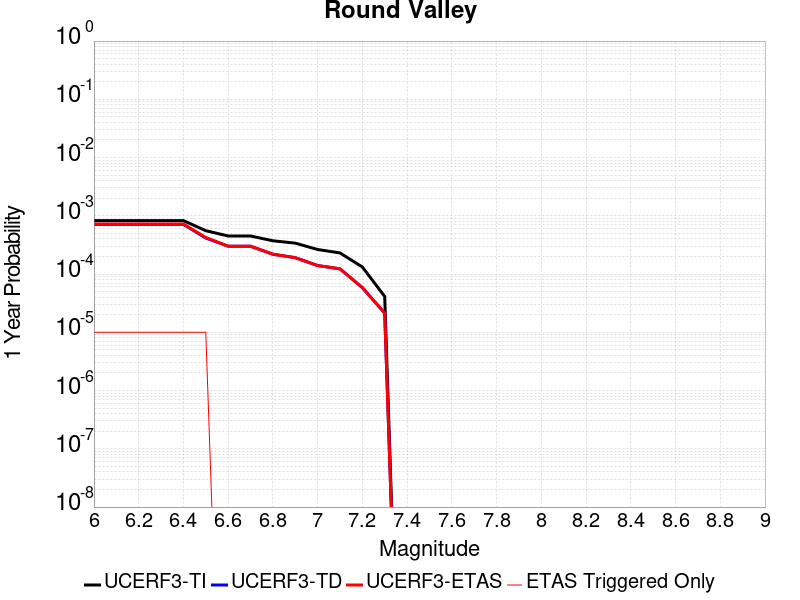 | 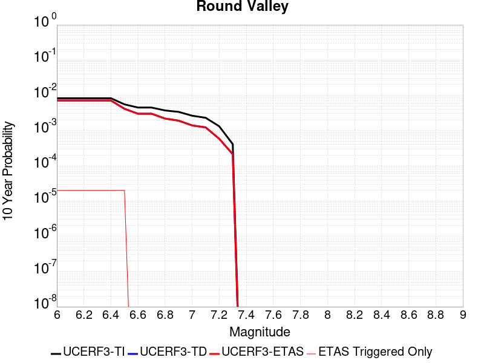 |

| Magnitude | 1 wk TI Prob | 1 wk TD Prob | 1 wk ETAS Prob | 1 wk ETAS/TD Gain | 1 wk ETAS Triggered Only | 1 mo TI Prob | 1 mo TD Prob | 1 mo ETAS Prob | 1 mo ETAS/TD Gain | 1 mo ETAS Triggered Only | 1 yr TI Prob | 1 yr TD Prob | 1 yr ETAS Prob | 1 yr ETAS/TD Gain | 1 yr ETAS Triggered Only | 10 yr TI Prob | 10 yr TD Prob | 10 yr ETAS Prob | 10 yr ETAS/TD Gain | 10 yr ETAS Triggered Only |
|-----|-----|-----|-----|-----|-----|-----|-----|-----|-----|-----|-----|-----|-----|-----|-----|-----|-----|-----|-----|-----|
| 6.0 | 1.588152E-5 | 1.3670716E-5 | 2.3670578E-5 | 1.7314806 | 1.0E-5 | 6.806188E-5 | 5.8587688E-5 | 6.85871E-5 | 1.1706743 | 1.0E-5 | 8.283384E-4 | 7.13111E-4 | 7.231039E-4 | 1.014013 | 1.0E-5 | 0.008252576 | 0.0071121147 | 0.007131973 | 1.0027921 | 2.0E-5 |
| 6.1 | 1.588152E-5 | 1.3670716E-5 | 2.3670578E-5 | 1.7314806 | 1.0E-5 | 6.806188E-5 | 5.8587688E-5 | 6.85871E-5 | 1.1706743 | 1.0E-5 | 8.283384E-4 | 7.13111E-4 | 7.231039E-4 | 1.014013 | 1.0E-5 | 0.008252576 | 0.0071121147 | 0.007131973 | 1.0027921 | 2.0E-5 |
| 6.2 | 1.588152E-5 | 1.3670716E-5 | 2.3670578E-5 | 1.7314806 | 1.0E-5 | 6.806188E-5 | 5.8587688E-5 | 6.85871E-5 | 1.1706743 | 1.0E-5 | 8.283384E-4 | 7.13111E-4 | 7.231039E-4 | 1.014013 | 1.0E-5 | 0.008252576 | 0.0071121147 | 0.007131973 | 1.0027921 | 2.0E-5 |
| 6.3 | 1.588152E-5 | 1.3670716E-5 | 2.3670578E-5 | 1.7314806 | 1.0E-5 | 6.806188E-5 | 5.8587688E-5 | 6.85871E-5 | 1.1706743 | 1.0E-5 | 8.283384E-4 | 7.13111E-4 | 7.231039E-4 | 1.014013 | 1.0E-5 | 0.008252576 | 0.0071121147 | 0.007131973 | 1.0027921 | 2.0E-5 |
| 6.4 | 1.588152E-5 | 1.3670716E-5 | 2.3670578E-5 | 1.7314806 | 1.0E-5 | 6.806188E-5 | 5.8587688E-5 | 6.85871E-5 | 1.1706743 | 1.0E-5 | 8.283384E-4 | 7.13111E-4 | 7.231039E-4 | 1.014013 | 1.0E-5 | 0.008252576 | 0.0071121147 | 0.007131973 | 1.0027921 | 2.0E-5 |
| 6.5 | 1.0646776E-5 | 7.953037E-6 | 1.7952958E-5 | 2.2573712 | 1.0E-5 | 4.5628243E-5 | 3.408405E-5 | 4.4083707E-5 | 1.2933824 | 1.0E-5 | 5.553823E-4 | 4.1490266E-4 | 4.2489852E-4 | 1.0240921 | 1.0E-5 | 0.005539963 | 0.0041421093 | 0.004162026 | 1.0048084 | 2.0E-5 |
| 6.6 | 8.632956E-6 | 5.768742E-6 | 5.768742E-6 | 1.0 | 0.0 | 3.6997862E-5 | 2.4722967E-5 | 2.4722967E-5 | 1.0 | 0.0 | 4.5035584E-4 | 3.009644E-4 | 3.009644E-4 | 1.0 | 0.0 | 0.0044944426 | 0.003005946 | 0.003005946 | 1.0 | 0.0 |
| 6.7 | 8.632956E-6 | 5.768742E-6 | 5.768742E-6 | 1.0 | 0.0 | 3.6997862E-5 | 2.4722967E-5 | 2.4722967E-5 | 1.0 | 0.0 | 4.5035584E-4 | 3.009644E-4 | 3.009644E-4 | 1.0 | 0.0 | 0.0044944426 | 0.003005946 | 0.003005946 | 1.0 | 0.0 |
| 6.8 | 7.143895E-6 | 4.2018346E-6 | 4.2018346E-6 | 1.0 | 0.0 | 3.0616335E-5 | 1.8007748E-5 | 1.8007748E-5 | 1.0 | 0.0 | 3.726901E-4 | 2.1922393E-4 | 2.1922393E-4 | 1.0 | 0.0 | 0.0037206567 | 0.0021902416 | 0.0021902416 | 1.0 | 0.0 |
| 6.9 | 6.5120694E-6 | 3.6644687E-6 | 3.6644687E-6 | 1.0 | 0.0 | 2.790857E-5 | 1.570478E-5 | 1.570478E-5 | 1.0 | 0.0 | 3.3973387E-4 | 1.9119044E-4 | 1.9119044E-4 | 1.0 | 0.0 | 0.0033921495 | 0.0019104085 | 0.0019104085 | 1.0 | 0.0 |
| 7.0 | 5.0614435E-6 | 2.6836676E-6 | 2.6836676E-6 | 1.0 | 0.0 | 2.169172E-5 | 1.1501388E-5 | 1.1501388E-5 | 1.0 | 0.0 | 2.6406467E-4 | 1.4002144E-4 | 1.4002144E-4 | 1.0 | 0.0 | 0.0026375111 | 0.0013994334 | 0.0013994334 | 1.0 | 0.0 |
| 7.1 | 4.41728E-6 | 2.3575074E-6 | 2.3575074E-6 | 1.0 | 0.0 | 1.8931061E-5 | 1.0103569E-5 | 1.0103569E-5 | 1.0 | 0.0 | 2.304613E-4 | 1.23005E-4 | 1.23005E-4 | 1.0 | 0.0 | 0.0023022245 | 0.0012294657 | 0.0012294657 | 1.0 | 0.0 |
| 7.2 | 2.535495E-6 | 1.1208391E-6 | 1.1208391E-6 | 1.0 | 0.0 | 1.0866362E-5 | 4.8035904E-6 | 4.8035904E-6 | 1.0 | 0.0 | 1.3228992E-4 | 5.8482667E-5 | 5.8482667E-5 | 1.0 | 0.0 | 0.0013221119 | 5.84724E-4 | 5.84724E-4 | 1.0 | 0.0 |
| 7.3 | 7.900015E-7 | 4.0889498E-7 | 4.0889498E-7 | 1.0 | 0.0 | 3.3857161E-6 | 1.752407E-6 | 1.752407E-6 | 1.0 | 0.0 | 4.1220315E-5 | 2.1335554E-5 | 2.1335554E-5 | 1.0 | 0.0 | 4.121267E-4 | 2.1335555E-4 | 2.1335555E-4 | 1.0 | 0.0 |

## Great Valley 08 (Quinto)
*[(top)](#table-of-contents)*

| 1 Week | 1 Month | 1 Year | 10 Year |
|-----|-----|-----|-----|
|  |  |  | 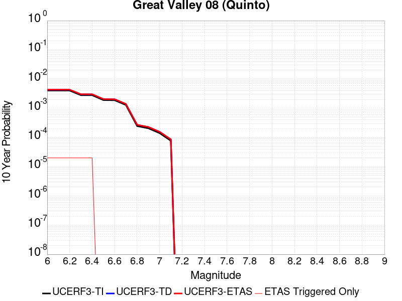 |

| Magnitude | 1 wk TI Prob | 1 wk TD Prob | 1 wk ETAS Prob | 1 wk ETAS/TD Gain | 1 wk ETAS Triggered Only | 1 mo TI Prob | 1 mo TD Prob | 1 mo ETAS Prob | 1 mo ETAS/TD Gain | 1 mo ETAS Triggered Only | 1 yr TI Prob | 1 yr TD Prob | 1 yr ETAS Prob | 1 yr ETAS/TD Gain | 1 yr ETAS Triggered Only | 10 yr TI Prob | 10 yr TD Prob | 10 yr ETAS Prob | 10 yr ETAS/TD Gain | 10 yr ETAS Triggered Only |
|-----|-----|-----|-----|-----|-----|-----|-----|-----|-----|-----|-----|-----|-----|-----|-----|-----|-----|-----|-----|-----|
| 6.0 | 7.737697E-6 | 8.253038E-6 | 8.253038E-6 | 1.0 | 0.0 | 3.3161137E-5 | 3.536979E-5 | 4.5369437E-5 | 1.2827171 | 1.0E-5 | 4.0366207E-4 | 4.3056096E-4 | 4.4055664E-4 | 1.0232155 | 1.0E-5 | 0.004029296 | 0.0042991205 | 0.0043190345 | 1.0046321 | 2.0E-5 |
| 6.1 | 7.737697E-6 | 8.253038E-6 | 8.253038E-6 | 1.0 | 0.0 | 3.3161137E-5 | 3.536979E-5 | 4.5369437E-5 | 1.2827171 | 1.0E-5 | 4.0366207E-4 | 4.3056096E-4 | 4.4055664E-4 | 1.0232155 | 1.0E-5 | 0.004029296 | 0.0042991205 | 0.0043190345 | 1.0046321 | 2.0E-5 |
| 6.2 | 7.737697E-6 | 8.253038E-6 | 8.253038E-6 | 1.0 | 0.0 | 3.3161137E-5 | 3.536979E-5 | 4.5369437E-5 | 1.2827171 | 1.0E-5 | 4.0366207E-4 | 4.3056096E-4 | 4.4055664E-4 | 1.0232155 | 1.0E-5 | 0.004029296 | 0.0042991205 | 0.0043190345 | 1.0046321 | 2.0E-5 |
| 6.3 | 5.374012E-6 | 5.7505736E-6 | 5.7505736E-6 | 1.0 | 0.0 | 2.3031276E-5 | 2.4645145E-5 | 3.4644898E-5 | 1.4057494 | 1.0E-5 | 2.803697E-4 | 3.0002446E-4 | 3.1002148E-4 | 1.0333207 | 1.0E-5 | 0.0028001624 | 0.0029972875 | 0.0030172276 | 1.0066527 | 2.0E-5 |
| 6.4 | 5.374012E-6 | 5.7505736E-6 | 5.7505736E-6 | 1.0 | 0.0 | 2.3031276E-5 | 2.4645145E-5 | 3.4644898E-5 | 1.4057494 | 1.0E-5 | 2.803697E-4 | 3.0002446E-4 | 3.1002148E-4 | 1.0333207 | 1.0E-5 | 0.0028001624 | 0.0029972875 | 0.0030172276 | 1.0066527 | 2.0E-5 |
| 6.5 | 3.65427E-6 | 3.941324E-6 | 3.941324E-6 | 1.0 | 0.0 | 1.5661062E-5 | 1.689132E-5 | 1.689132E-5 | 1.0 | 0.0 | 1.9065675E-4 | 2.0563944E-4 | 2.0563944E-4 | 1.0 | 0.0 | 0.0019049325 | 0.0020551833 | 0.0020551833 | 1.0 | 0.0 |
| 6.6 | 3.6143538E-6 | 3.8985104E-6 | 3.8985104E-6 | 1.0 | 0.0 | 1.5489995E-5 | 1.6707834E-5 | 1.6707834E-5 | 1.0 | 0.0 | 1.8857437E-4 | 2.0340596E-4 | 2.0340596E-4 | 1.0 | 0.0 | 0.0018841444 | 0.0020328893 | 0.0020328893 | 1.0 | 0.0 |
| 6.7 | 2.4821015E-6 | 2.6857067E-6 | 2.6857067E-6 | 1.0 | 0.0 | 1.0637535E-5 | 1.1510153E-5 | 1.1510153E-5 | 1.0 | 0.0 | 1.2950429E-4 | 1.4013276E-4 | 1.4013276E-4 | 1.0 | 0.0 | 0.0012942884 | 0.0014009989 | 0.0014009989 | 1.0 | 0.0 |
| 6.8 | 4.7110538E-7 | 5.193021E-7 | 5.193021E-7 | 1.0 | 0.0 | 2.0190216E-6 | 2.2255786E-6 | 2.2255786E-6 | 1.0 | 0.0 | 2.458131E-5 | 2.70961E-5 | 2.70961E-5 | 1.0 | 0.0 | 2.457859E-4 | 2.7092977E-4 | 2.7092977E-4 | 1.0 | 0.0 |
| 6.9 | 3.958685E-7 | 4.3703452E-7 | 4.3703452E-7 | 1.0 | 0.0 | 1.6965782E-6 | 1.8730038E-6 | 1.8730038E-6 | 1.0 | 0.0 | 2.0655643E-5 | 2.28036E-5 | 2.28036E-5 | 1.0 | 0.0 | 2.0653724E-4 | 2.2801422E-4 | 2.2801422E-4 | 1.0 | 0.0 |
| 7.0 | 2.70294E-7 | 2.9920008E-7 | 2.9920008E-7 | 1.0 | 0.0 | 1.1584025E-6 | 1.2822856E-6 | 1.2822856E-6 | 1.0 | 0.0 | 1.4103458E-5 | 1.5611728E-5 | 1.5611728E-5 | 1.0 | 0.0 | 1.4102564E-4 | 1.5610759E-4 | 1.5610759E-4 | 1.0 | 0.0 |
| 7.1 | 1.4828602E-7 | 1.6469107E-7 | 1.6469107E-7 | 1.0 | 0.0 | 6.3551136E-7 | 7.058187E-7 | 7.058187E-7 | 1.0 | 0.0 | 7.737323E-6 | 8.593317E-6 | 8.593317E-6 | 1.0 | 0.0 | 7.737054E-5 | 8.593065E-5 | 8.593065E-5 | 1.0 | 0.0 |

## San Luis Range 2011 CFM
*[(top)](#table-of-contents)*

| 1 Week | 1 Month | 1 Year | 10 Year |
|-----|-----|-----|-----|
|  |  |  |  |

| Magnitude | 1 wk TI Prob | 1 wk TD Prob | 1 wk ETAS Prob | 1 wk ETAS/TD Gain | 1 wk ETAS Triggered Only | 1 mo TI Prob | 1 mo TD Prob | 1 mo ETAS Prob | 1 mo ETAS/TD Gain | 1 mo ETAS Triggered Only | 1 yr TI Prob | 1 yr TD Prob | 1 yr ETAS Prob | 1 yr ETAS/TD Gain | 1 yr ETAS Triggered Only | 10 yr TI Prob | 10 yr TD Prob | 10 yr ETAS Prob | 10 yr ETAS/TD Gain | 10 yr ETAS Triggered Only |
|-----|-----|-----|-----|-----|-----|-----|-----|-----|-----|-----|-----|-----|-----|-----|-----|-----|-----|-----|-----|-----|
| 6.0 | 8.8368415E-6 | 8.965454E-6 | 1.8965364E-5 | 2.1153824 | 1.0E-5 | 3.787163E-5 | 3.842285E-5 | 5.8422083E-5 | 1.5205035 | 2.0E-5 | 4.609895E-4 | 4.677057E-4 | 4.8769635E-4 | 1.0427419 | 2.0E-5 | 0.0046003438 | 0.0046679964 | 0.004687903 | 1.0042645 | 2.0E-5 |
| 6.1 | 8.8368415E-6 | 8.965454E-6 | 1.8965364E-5 | 2.1153824 | 1.0E-5 | 3.787163E-5 | 3.842285E-5 | 5.8422083E-5 | 1.5205035 | 2.0E-5 | 4.609895E-4 | 4.677057E-4 | 4.8769635E-4 | 1.0427419 | 2.0E-5 | 0.0046003438 | 0.0046679964 | 0.004687903 | 1.0042645 | 2.0E-5 |
| 6.2 | 8.8368415E-6 | 8.965454E-6 | 1.8965364E-5 | 2.1153824 | 1.0E-5 | 3.787163E-5 | 3.842285E-5 | 5.8422083E-5 | 1.5205035 | 2.0E-5 | 4.609895E-4 | 4.677057E-4 | 4.8769635E-4 | 1.0427419 | 2.0E-5 | 0.0046003438 | 0.0046679964 | 0.004687903 | 1.0042645 | 2.0E-5 |
| 6.3 | 8.8368415E-6 | 8.965454E-6 | 1.8965364E-5 | 2.1153824 | 1.0E-5 | 3.787163E-5 | 3.842285E-5 | 5.8422083E-5 | 1.5205035 | 2.0E-5 | 4.609895E-4 | 4.677057E-4 | 4.8769635E-4 | 1.0427419 | 2.0E-5 | 0.0046003438 | 0.0046679964 | 0.004687903 | 1.0042645 | 2.0E-5 |
| 6.4 | 3.9094193E-6 | 3.9412025E-6 | 3.9412025E-6 | 1.0 | 0.0 | 1.6754546E-5 | 1.689076E-5 | 1.689076E-5 | 1.0 | 0.0 | 2.039675E-4 | 2.056259E-4 | 2.056259E-4 | 1.0 | 0.0 | 0.0020378039 | 0.0020543851 | 0.0020543851 | 1.0 | 0.0 |
| 6.5 | 3.9094193E-6 | 3.9412025E-6 | 3.9412025E-6 | 1.0 | 0.0 | 1.6754546E-5 | 1.689076E-5 | 1.689076E-5 | 1.0 | 0.0 | 2.039675E-4 | 2.056259E-4 | 2.056259E-4 | 1.0 | 0.0 | 0.0020378039 | 0.0020543851 | 0.0020543851 | 1.0 | 0.0 |
| 6.6 | 3.0587726E-6 | 3.0753883E-6 | 3.0753883E-6 | 1.0 | 0.0 | 1.3108959E-5 | 1.318017E-5 | 1.318017E-5 | 1.0 | 0.0 | 1.595899E-4 | 1.6045687E-4 | 1.6045687E-4 | 1.0 | 0.0 | 0.0015947534 | 0.0016034221 | 0.0016034221 | 1.0 | 0.0 |
| 6.7 | 2.6160574E-6 | 2.6251273E-6 | 2.6251273E-6 | 1.0 | 0.0 | 1.1211626E-5 | 1.1250498E-5 | 1.1250498E-5 | 1.0 | 0.0 | 1.3649299E-4 | 1.3696625E-4 | 1.3696625E-4 | 1.0 | 0.0 | 0.0013640919 | 0.0013688246 | 0.0013688246 | 1.0 | 0.0 |
| 6.8 | 2.5110312E-6 | 2.51814E-6 | 2.51814E-6 | 1.0 | 0.0 | 1.0761518E-5 | 1.0791985E-5 | 1.0791985E-5 | 1.0 | 0.0 | 1.310136E-4 | 1.3138456E-4 | 1.3138456E-4 | 1.0 | 0.0 | 0.0013093639 | 0.0013130746 | 0.0013130746 | 1.0 | 0.0 |
| 6.9 | 1.8564405E-6 | 1.852487E-6 | 1.852487E-6 | 1.0 | 0.0 | 7.95615E-6 | 7.939206E-6 | 7.939206E-6 | 1.0 | 0.0 | 9.686181E-5 | 9.665557E-5 | 9.665557E-5 | 1.0 | 0.0 | 9.68196E-4 | 9.661373E-4 | 9.661373E-4 | 1.0 | 0.0 |
| 7.0 | 1.546127E-6 | 1.5369537E-6 | 1.5369537E-6 | 1.0 | 0.0 | 6.626242E-6 | 6.586928E-6 | 6.586928E-6 | 1.0 | 0.0 | 8.06715E-5 | 8.0192905E-5 | 8.0192905E-5 | 1.0 | 0.0 | 8.0642226E-4 | 8.016404E-4 | 8.016404E-4 | 1.0 | 0.0 |
| 7.1 | 1.3368208E-6 | 1.3235326E-6 | 1.3235326E-6 | 1.0 | 0.0 | 5.7292195E-6 | 5.67227E-6 | 5.67227E-6 | 1.0 | 0.0 | 6.975101E-5 | 6.905771E-5 | 6.905771E-5 | 1.0 | 0.0 | 6.972912E-4 | 6.9036294E-4 | 6.9036294E-4 | 1.0 | 0.0 |
| 7.2 | 1.0623363E-6 | 1.0454368E-6 | 1.0454368E-6 | 1.0 | 0.0 | 4.5528623E-6 | 4.4804356E-6 | 4.4804356E-6 | 1.0 | 0.0 | 5.5429686E-5 | 5.4547938E-5 | 5.4547938E-5 | 1.0 | 0.0 | 5.5415864E-4 | 5.4534577E-4 | 5.4534577E-4 | 1.0 | 0.0 |
| 7.3 | 7.831679E-7 | 7.7273904E-7 | 7.7273904E-7 | 1.0 | 0.0 | 3.3564295E-6 | 3.3117344E-6 | 3.3117344E-6 | 1.0 | 0.0 | 4.086376E-5 | 4.0319625E-5 | 4.0319625E-5 | 1.0 | 0.0 | 4.0856248E-4 | 4.031232E-4 | 4.031232E-4 | 1.0 | 0.0 |
| 7.4 | 5.9558846E-7 | 5.910636E-7 | 5.910636E-7 | 1.0 | 0.0 | 2.5525194E-6 | 2.5331274E-6 | 2.5331274E-6 | 1.0 | 0.0 | 3.107648E-5 | 3.084039E-5 | 3.084039E-5 | 1.0 | 0.0 | 3.1072134E-4 | 3.083612E-4 | 3.083612E-4 | 1.0 | 0.0 |
| 7.5 | 4.1616502E-7 | 4.119631E-7 | 4.119631E-7 | 1.0 | 0.0 | 1.7835631E-6 | 1.7655549E-6 | 1.7655549E-6 | 1.0 | 0.0 | 2.1714664E-5 | 2.149542E-5 | 2.149542E-5 | 1.0 | 0.0 | 2.1712543E-4 | 2.1493346E-4 | 2.1493346E-4 | 1.0 | 0.0 |
| 7.6 | 2.3816014E-7 | 2.3376548E-7 | 2.3376548E-7 | 1.0 | 0.0 | 1.0206859E-6 | 1.0018516E-6 | 1.0018516E-6 | 1.0 | 0.0 | 1.242678E-5 | 1.2197475E-5 | 1.2197475E-5 | 1.0 | 0.0 | 1.2426086E-4 | 1.2196808E-4 | 1.2196808E-4 | 1.0 | 0.0 |
| 7.7 | 9.918777E-8 | 9.3867584E-8 | 9.3867584E-8 | 1.0 | 0.0 | 4.2509038E-7 | 4.0228957E-7 | 4.0228957E-7 | 1.0 | 0.0 | 5.1754632E-6 | 4.8978645E-6 | 4.8978645E-6 | 1.0 | 0.0 | 5.1753424E-5 | 4.897757E-5 | 4.897757E-5 | 1.0 | 0.0 |
| 7.8 | 3.4982556E-8 | 2.968655E-8 | 2.968655E-8 | 1.0 | 0.0 | 1.4992524E-7 | 1.2722806E-7 | 1.2722806E-7 | 1.0 | 0.0 | 1.8253382E-6 | 1.5490006E-6 | 1.5490006E-6 | 1.0 | 0.0 | 1.8253233E-5 | 1.5489897E-5 | 1.5489897E-5 | 1.0 | 0.0 |
| 7.9 | 1.6624908E-8 | 1.1477036E-8 | 1.1477036E-8 | 1.0 | 0.0 | 7.12496E-8 | 4.91873E-8 | 4.91873E-8 | 1.0 | 0.0 | 8.6746354E-7 | 5.988552E-7 | 5.988552E-7 | 1.0 | 0.0 | 8.674601E-6 | 5.988536E-6 | 5.988536E-6 | 1.0 | 0.0 |
| 8.0 | 6.3352315E-9 | 3.0888412E-9 | 3.0888412E-9 | 1.0 | 0.0 | 2.715099E-8 | 1.3237893E-8 | 1.3237893E-8 | 1.0 | 0.0 | 3.3056327E-7 | 1.6117131E-7 | 1.6117131E-7 | 1.0 | 0.0 | 3.3056278E-6 | 1.611712E-6 | 1.611712E-6 | 1.0 | 0.0 |

## Cleghorn
*[(top)](#table-of-contents)*

| 1 Week | 1 Month | 1 Year | 10 Year |
|-----|-----|-----|-----|
|  |  |  | 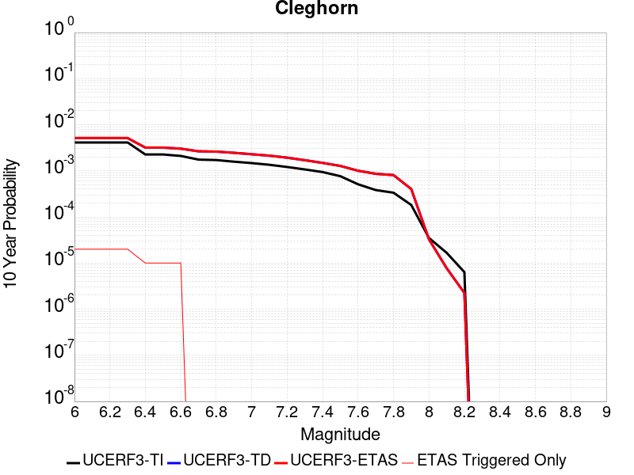 |

| Magnitude | 1 wk TI Prob | 1 wk TD Prob | 1 wk ETAS Prob | 1 wk ETAS/TD Gain | 1 wk ETAS Triggered Only | 1 mo TI Prob | 1 mo TD Prob | 1 mo ETAS Prob | 1 mo ETAS/TD Gain | 1 mo ETAS Triggered Only | 1 yr TI Prob | 1 yr TD Prob | 1 yr ETAS Prob | 1 yr ETAS/TD Gain | 1 yr ETAS Triggered Only | 10 yr TI Prob | 10 yr TD Prob | 10 yr ETAS Prob | 10 yr ETAS/TD Gain | 10 yr ETAS Triggered Only |
|-----|-----|-----|-----|-----|-----|-----|-----|-----|-----|-----|-----|-----|-----|-----|-----|-----|-----|-----|-----|-----|
| 6.0 | 7.9267165E-6 | 9.831582E-6 | 9.831582E-6 | 1.0 | 0.0 | 3.39712E-5 | 4.2134732E-5 | 4.2134732E-5 | 1.0 | 0.0 | 4.1352084E-4 | 5.128803E-4 | 5.128803E-4 | 1.0 | 0.0 | 0.004127522 | 0.0051320773 | 0.0051519745 | 1.003877 | 2.0E-5 |
| 6.1 | 7.9267165E-6 | 9.831582E-6 | 9.831582E-6 | 1.0 | 0.0 | 3.39712E-5 | 4.2134732E-5 | 4.2134732E-5 | 1.0 | 0.0 | 4.1352084E-4 | 5.128803E-4 | 5.128803E-4 | 1.0 | 0.0 | 0.004127522 | 0.0051320773 | 0.0051519745 | 1.003877 | 2.0E-5 |
| 6.2 | 7.9267165E-6 | 9.831582E-6 | 9.831582E-6 | 1.0 | 0.0 | 3.39712E-5 | 4.2134732E-5 | 4.2134732E-5 | 1.0 | 0.0 | 4.1352084E-4 | 5.128803E-4 | 5.128803E-4 | 1.0 | 0.0 | 0.004127522 | 0.0051320773 | 0.0051519745 | 1.003877 | 2.0E-5 |
| 6.3 | 7.9267165E-6 | 9.831582E-6 | 9.831582E-6 | 1.0 | 0.0 | 3.39712E-5 | 4.2134732E-5 | 4.2134732E-5 | 1.0 | 0.0 | 4.1352084E-4 | 5.128803E-4 | 5.128803E-4 | 1.0 | 0.0 | 0.004127522 | 0.0051320773 | 0.0051519745 | 1.003877 | 2.0E-5 |
| 6.4 | 4.3445207E-6 | 6.0914435E-6 | 6.0914435E-6 | 1.0 | 0.0 | 1.8619241E-5 | 2.610593E-5 | 2.610593E-5 | 1.0 | 0.0 | 2.2666567E-4 | 3.1779436E-4 | 3.1779436E-4 | 1.0 | 0.0 | 0.0022643462 | 0.0031875873 | 0.0031975554 | 1.0031272 | 1.0E-5 |
| 6.5 | 4.3445207E-6 | 6.0914435E-6 | 6.0914435E-6 | 1.0 | 0.0 | 1.8619241E-5 | 2.610593E-5 | 2.610593E-5 | 1.0 | 0.0 | 2.2666567E-4 | 3.1779436E-4 | 3.1779436E-4 | 1.0 | 0.0 | 0.0022643462 | 0.0031875873 | 0.0031975554 | 1.0031272 | 1.0E-5 |
| 6.6 | 4.040109E-6 | 5.773851E-6 | 5.773851E-6 | 1.0 | 0.0 | 1.7314638E-5 | 2.4744846E-5 | 2.4744846E-5 | 1.0 | 0.0 | 2.1078532E-4 | 3.012278E-4 | 3.012278E-4 | 1.0 | 0.0 | 0.002105855 | 0.003022377 | 0.0030323467 | 1.0032986 | 1.0E-5 |
| 6.7 | 3.3632055E-6 | 5.067348E-6 | 5.067348E-6 | 1.0 | 0.0 | 1.4413658E-5 | 2.1717027E-5 | 2.1717027E-5 | 1.0 | 0.0 | 1.7547216E-4 | 2.6437303E-4 | 2.6437303E-4 | 1.0 | 0.0 | 0.0017533366 | 0.0026547113 | 0.0026547113 | 1.0 | 0.0 |
| 6.8 | 3.2902772E-6 | 4.9892556E-6 | 4.9892556E-6 | 1.0 | 0.0 | 1.4101111E-5 | 2.1382351E-5 | 2.1382351E-5 | 1.0 | 0.0 | 1.716675E-4 | 2.6029933E-4 | 2.6029933E-4 | 1.0 | 0.0 | 0.0017153495 | 0.0026140702 | 0.0026140702 | 1.0 | 0.0 |
| 6.9 | 3.031547E-6 | 4.6910186E-6 | 4.6910186E-6 | 1.0 | 0.0 | 1.299228E-5 | 2.0104211E-5 | 2.0104211E-5 | 1.0 | 0.0 | 1.5816953E-4 | 2.4474156E-4 | 2.4474156E-4 | 1.0 | 0.0 | 0.00158057 | 0.0024588439 | 0.0024588439 | 1.0 | 0.0 |
| 7.0 | 2.8259715E-6 | 4.3705895E-6 | 4.3705895E-6 | 1.0 | 0.0 | 1.211125E-5 | 1.8730963E-5 | 1.8730963E-5 | 1.0 | 0.0 | 1.4744449E-4 | 2.2802586E-4 | 2.2802586E-4 | 1.0 | 0.0 | 0.001473467 | 0.0022920412 | 0.0022920412 | 1.0 | 0.0 |
| 7.1 | 2.5962665E-6 | 4.0658106E-6 | 4.0658106E-6 | 1.0 | 0.0 | 1.1126809E-5 | 1.7424789E-5 | 1.7424789E-5 | 1.0 | 0.0 | 1.3546048E-4 | 2.1212637E-4 | 2.1212637E-4 | 1.0 | 0.0 | 0.0013537793 | 0.002133366 | 0.002133366 | 1.0 | 0.0 |
| 7.2 | 2.3247253E-6 | 3.6763672E-6 | 3.6763672E-6 | 1.0 | 0.0 | 9.96307E-6 | 1.5755764E-5 | 1.5755764E-5 | 1.0 | 0.0 | 1.21293626E-4 | 1.9180974E-4 | 1.9180974E-4 | 1.0 | 0.0 | 0.0012122744 | 0.0019305905 | 0.0019305905 | 1.0 | 0.0 |
| 7.3 | 2.056928E-6 | 3.2350938E-6 | 3.2350938E-6 | 1.0 | 0.0 | 8.815376E-6 | 1.3864615E-5 | 1.3864615E-5 | 1.0 | 0.0 | 1.0732192E-4 | 1.6878877E-4 | 1.6878877E-4 | 1.0 | 0.0 | 0.001072701 | 0.0017008206 | 0.0017008206 | 1.0 | 0.0 |
| 7.4 | 1.8055999E-6 | 2.8255042E-6 | 2.8255042E-6 | 1.0 | 0.0 | 7.738263E-6 | 1.2109249E-5 | 1.2109249E-5 | 1.0 | 0.0 | 9.4209274E-5 | 1.4742027E-4 | 1.4742027E-4 | 1.0 | 0.0 | 9.4169343E-4 | 0.0014875771 | 0.0014875771 | 1.0 | 0.0 |
| 7.5 | 1.4683443E-6 | 2.4247483E-6 | 2.4247483E-6 | 1.0 | 0.0 | 6.292889E-6 | 1.0391738E-5 | 1.0391738E-5 | 1.0 | 0.0 | 7.661323E-5 | 1.2651215E-4 | 1.2651215E-4 | 1.0 | 0.0 | 7.658682E-4 | 0.0012787961 | 0.0012787961 | 1.0 | 0.0 |
| 7.6 | 9.804088E-7 | 1.900266E-6 | 1.900266E-6 | 1.0 | 0.0 | 4.201745E-6 | 8.143972E-6 | 8.143972E-6 | 1.0 | 0.0 | 5.1155046E-5 | 9.91484E-5 | 9.91484E-5 | 1.0 | 0.0 | 5.114327E-4 | 0.001005471 | 0.001005471 | 1.0 | 0.0 |
| 7.7 | 7.3434086E-7 | 1.6284146E-6 | 1.6284146E-6 | 1.0 | 0.0 | 3.1471714E-6 | 6.978901E-6 | 6.978901E-6 | 1.0 | 0.0 | 3.831614E-5 | 8.4964835E-5 | 8.4964835E-5 | 1.0 | 0.0 | 3.8309532E-4 | 8.6378685E-4 | 8.6378685E-4 | 1.0 | 0.0 |
| 7.8 | 6.434184E-7 | 1.5220047E-6 | 1.5220047E-6 | 1.0 | 0.0 | 2.7575045E-6 | 6.5228614E-6 | 6.5228614E-6 | 1.0 | 0.0 | 3.35721E-5 | 7.941297E-5 | 7.941297E-5 | 1.0 | 0.0 | 3.3567028E-4 | 8.079678E-4 | 8.079678E-4 | 1.0 | 0.0 |
| 7.9 | 3.4943926E-7 | 7.574459E-7 | 7.574459E-7 | 1.0 | 0.0 | 1.497596E-6 | 3.2461926E-6 | 3.2461926E-6 | 1.0 | 0.0 | 1.8233079E-5 | 3.952169E-5 | 3.952169E-5 | 1.0 | 0.0 | 1.8231584E-4 | 4.040099E-4 | 4.040099E-4 | 1.0 | 0.0 |
| 8.0 | 6.717524E-8 | 5.838828E-8 | 5.838828E-8 | 1.0 | 0.0 | 2.8789387E-7 | 2.5023547E-7 | 2.5023547E-7 | 1.0 | 0.0 | 3.505102E-6 | 3.0466126E-6 | 3.0466126E-6 | 1.0 | 0.0 | 3.5050467E-5 | 3.273506E-5 | 3.273506E-5 | 1.0 | 0.0 |
| 8.1 | 3.1984914E-8 | 1.2956093E-8 | 1.2956093E-8 | 1.0 | 0.0 | 1.370782E-7 | 5.552611E-8 | 5.552611E-8 | 1.0 | 0.0 | 1.6689258E-6 | 6.760302E-7 | 6.760302E-7 | 1.0 | 0.0 | 1.6689133E-5 | 7.74454E-6 | 7.74454E-6 | 1.0 | 0.0 |
| 8.2 | 1.21887656E-8 | 3.6495305E-9 | 3.6495305E-9 | 1.0 | 0.0 | 5.2237567E-8 | 1.5640845E-8 | 1.5640845E-8 | 1.0 | 0.0 | 6.359922E-7 | 1.9042727E-7 | 1.9042727E-7 | 1.0 | 0.0 | 6.3599036E-6 | 2.2470974E-6 | 2.2470974E-6 | 1.0 | 0.0 |

## San Andreas (Offshore) 2011 CFM
*[(top)](#table-of-contents)*

| 1 Week | 1 Month | 1 Year | 10 Year |
|-----|-----|-----|-----|
|  |  |  | 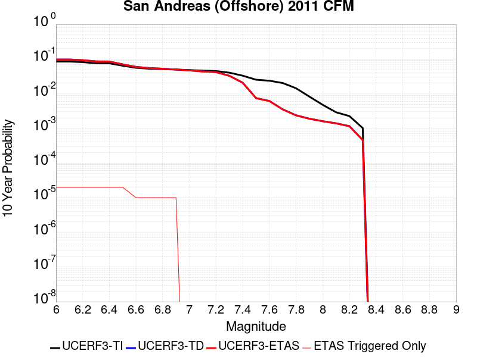 |

| Magnitude | 1 wk TI Prob | 1 wk TD Prob | 1 wk ETAS Prob | 1 wk ETAS/TD Gain | 1 wk ETAS Triggered Only | 1 mo TI Prob | 1 mo TD Prob | 1 mo ETAS Prob | 1 mo ETAS/TD Gain | 1 mo ETAS Triggered Only | 1 yr TI Prob | 1 yr TD Prob | 1 yr ETAS Prob | 1 yr ETAS/TD Gain | 1 yr ETAS Triggered Only | 10 yr TI Prob | 10 yr TD Prob | 10 yr ETAS Prob | 10 yr ETAS/TD Gain | 10 yr ETAS Triggered Only |
|-----|-----|-----|-----|-----|-----|-----|-----|-----|-----|-----|-----|-----|-----|-----|-----|-----|-----|-----|-----|-----|
| 6.0 | 1.7072787E-4 | 1.9226041E-4 | 1.9226041E-4 | 1.0 | 0.0 | 7.3148566E-4 | 8.237154E-4 | 8.237154E-4 | 1.0 | 0.0 | 0.008869528 | 0.0099831335 | 0.009993034 | 1.0009917 | 1.0E-5 | 0.085237645 | 0.09682738 | 0.09684545 | 1.0001866 | 2.0E-5 |
| 6.1 | 1.7072787E-4 | 1.9226041E-4 | 1.9226041E-4 | 1.0 | 0.0 | 7.3148566E-4 | 8.237154E-4 | 8.237154E-4 | 1.0 | 0.0 | 0.008869528 | 0.0099831335 | 0.009993034 | 1.0009917 | 1.0E-5 | 0.085237645 | 0.09682738 | 0.09684545 | 1.0001866 | 2.0E-5 |
| 6.2 | 1.6312556E-4 | 1.8407789E-4 | 1.8407789E-4 | 1.0 | 0.0 | 6.989222E-4 | 7.8866904E-4 | 7.8866904E-4 | 1.0 | 0.0 | 0.008476226 | 0.009560268 | 0.009570173 | 1.001036 | 1.0E-5 | 0.08160117 | 0.09284818 | 0.092866324 | 1.0001954 | 2.0E-5 |
| 6.3 | 1.5103363E-4 | 1.6880741E-4 | 1.6880741E-4 | 1.0 | 0.0 | 6.471264E-4 | 7.232619E-4 | 7.232619E-4 | 1.0 | 0.0 | 0.007850339 | 0.008770605 | 0.008780517 | 1.0011302 | 1.0E-5 | 0.075787395 | 0.085489064 | 0.085507356 | 1.000214 | 2.0E-5 |
| 6.4 | 1.5047993E-4 | 1.676667E-4 | 1.676667E-4 | 1.0 | 0.0 | 6.4475456E-4 | 7.1837584E-4 | 7.1837584E-4 | 1.0 | 0.0 | 0.007821669 | 0.008711592 | 0.008721505 | 1.0011379 | 1.0E-5 | 0.0755203 | 0.08496926 | 0.084987566 | 1.0002154 | 2.0E-5 |
| 6.5 | 1.2760791E-4 | 1.3735025E-4 | 1.3735025E-4 | 1.0 | 0.0 | 5.467764E-4 | 5.885125E-4 | 5.885125E-4 | 1.0 | 0.0 | 0.0066367025 | 0.0071418737 | 0.007151802 | 1.0013902 | 1.0E-5 | 0.064419635 | 0.07025001 | 0.07026861 | 1.0002646 | 2.0E-5 |
| 6.6 | 1.1063525E-4 | 1.15566356E-4 | 1.15566356E-4 | 1.0 | 0.0 | 4.740649E-4 | 4.9519143E-4 | 4.9519143E-4 | 1.0 | 0.0 | 0.0057564764 | 0.006012491 | 0.006012491 | 1.0 | 0.0 | 0.05609626 | 0.05948894 | 0.059498347 | 1.0001581 | 1.0E-5 |
| 6.7 | 1.0391049E-4 | 1.0645922E-4 | 1.0645922E-4 | 1.0 | 0.0 | 4.4525467E-4 | 4.5617504E-4 | 4.5617504E-4 | 1.0 | 0.0 | 0.0054075094 | 0.005539975 | 0.005539975 | 1.0 | 0.0 | 0.052778035 | 0.05498876 | 0.05499821 | 1.0001719 | 1.0E-5 |
| 6.8 | 1.0096706E-4 | 1.01582686E-4 | 1.01582686E-4 | 1.0 | 0.0 | 4.3264418E-4 | 4.3528268E-4 | 4.3528268E-4 | 1.0 | 0.0 | 0.0052547283 | 0.005286866 | 0.005286866 | 1.0 | 0.0 | 0.051321987 | 0.052687574 | 0.052697048 | 1.0001798 | 1.0E-5 |
| 6.9 | 9.800265E-5 | 9.588748E-5 | 9.588748E-5 | 1.0 | 0.0 | 4.1994374E-4 | 4.1088252E-4 | 4.1088252E-4 | 1.0 | 0.0 | 0.0051008356 | 0.0049911886 | 0.0049911886 | 1.0 | 0.0 | 0.049853306 | 0.05001504 | 0.05002454 | 1.0001899 | 1.0E-5 |
| 7.0 | 9.4642375E-5 | 9.002143E-5 | 9.002143E-5 | 1.0 | 0.0 | 4.0554712E-4 | 3.8574997E-4 | 3.8574997E-4 | 1.0 | 0.0 | 0.004926363 | 0.0046865544 | 0.0046865544 | 1.0 | 0.0 | 0.048185747 | 0.047196057 | 0.047196057 | 1.0 | 0.0 |
| 7.1 | 9.0996844E-5 | 8.354169E-5 | 8.354169E-5 | 1.0 | 0.0 | 3.8992817E-4 | 3.5798753E-4 | 3.5798753E-4 | 1.0 | 0.0 | 0.004737046 | 0.004349944 | 0.004349944 | 1.0 | 0.0 | 0.04637333 | 0.044047635 | 0.044047635 | 1.0 | 0.0 |
| 7.2 | 8.848287E-5 | 7.9818135E-5 | 7.9818135E-5 | 1.0 | 0.0 | 3.791572E-4 | 3.4203375E-4 | 3.4203375E-4 | 1.0 | 0.0 | 0.004606472 | 0.0041564633 | 0.0041564633 | 1.0 | 0.0 | 0.045121472 | 0.042191572 | 0.042191572 | 1.0 | 0.0 |
| 7.3 | 7.9280784E-5 | 6.1276216E-5 | 6.1276216E-5 | 1.0 | 0.0 | 3.3973053E-4 | 2.625865E-4 | 2.625865E-4 | 1.0 | 0.0 | 0.004128377 | 0.0031924061 | 0.0031924061 | 1.0 | 0.0 | 0.040525194 | 0.032904375 | 0.032904375 | 1.0 | 0.0 |
| 7.4 | 6.468038E-5 | 3.7933212E-5 | 3.7933212E-5 | 1.0 | 0.0 | 2.771722E-4 | 1.625611E-4 | 1.625611E-4 | 1.0 | 0.0 | 0.0033693502 | 0.0019774425 | 0.0019774425 | 1.0 | 0.0 | 0.0331872 | 0.02082181 | 0.02082181 | 1.0 | 0.0 |
| 7.5 | 4.930574E-5 | 1.2703362E-5 | 1.2703362E-5 | 1.0 | 0.0 | 2.1129321E-4 | 5.444185E-5 | 5.444185E-5 | 1.0 | 0.0 | 0.0025694598 | 6.6262955E-4 | 6.6262955E-4 | 1.0 | 0.0 | 0.02539953 | 0.007481418 | 0.007481418 | 1.0 | 0.0 |
| 7.6 | 4.612566E-5 | 1.0336213E-5 | 1.0336213E-5 | 1.0 | 0.0 | 1.9766642E-4 | 4.429731E-5 | 4.429731E-5 | 1.0 | 0.0 | 0.0024039324 | 5.391877E-4 | 5.391877E-4 | 1.0 | 0.0 | 0.023780935 | 0.006172099 | 0.006172099 | 1.0 | 0.0 |
| 7.7 | 3.9435414E-5 | 5.574925E-6 | 5.574925E-6 | 1.0 | 0.0 | 1.6899795E-4 | 2.3892318E-5 | 2.3892318E-5 | 1.0 | 0.0 | 0.0020556084 | 2.9085035E-4 | 2.9085035E-4 | 1.0 | 0.0 | 0.020366974 | 0.0035420412 | 0.0035420412 | 1.0 | 0.0 |
| 7.8 | 2.7787428E-5 | 3.7553348E-6 | 3.7553348E-6 | 1.0 | 0.0 | 1.1908354E-4 | 1.6094193E-5 | 1.6094193E-5 | 1.0 | 0.0 | 0.0014488777 | 1.9592921E-4 | 1.9592921E-4 | 1.0 | 0.0 | 0.014394675 | 0.0023877125 | 0.0023877125 | 1.0 | 0.0 |
| 7.9 | 1.590671E-5 | 3.04085E-6 | 3.04085E-6 | 1.0 | 0.0 | 6.816983E-5 | 1.303215E-5 | 1.303215E-5 | 1.0 | 0.0 | 8.2965166E-4 | 1.586549E-4 | 1.586549E-4 | 1.0 | 0.0 | 0.008265611 | 0.001904262 | 0.001904262 | 1.0 | 0.0 |
| 8.0 | 9.193638E-6 | 2.5920847E-6 | 2.5920847E-6 | 1.0 | 0.0 | 3.940071E-5 | 1.1108887E-5 | 1.1108887E-5 | 1.0 | 0.0 | 4.7959806E-4 | 1.3524233E-4 | 1.3524233E-4 | 1.0 | 0.0 | 0.0047856434 | 0.0016115032 | 0.0016115032 | 1.0 | 0.0 |
| 8.1 | 5.601576E-6 | 2.2343472E-6 | 2.2343472E-6 | 1.0 | 0.0 | 2.4006533E-5 | 9.575739E-6 | 9.575739E-6 | 1.0 | 0.0 | 2.9224035E-4 | 1.16578405E-4 | 1.16578405E-4 | 1.0 | 0.0 | 0.0029185633 | 0.0014020674 | 0.0014020674 | 1.0 | 0.0 |
| 8.2 | 4.3508785E-6 | 1.857566E-6 | 1.857566E-6 | 1.0 | 0.0 | 1.864649E-5 | 7.960973E-6 | 7.960973E-6 | 1.0 | 0.0 | 2.2699735E-4 | 9.692056E-5 | 9.692056E-5 | 1.0 | 0.0 | 0.0022676561 | 0.0011594221 | 0.0011594221 | 1.0 | 0.0 |
| 8.3 | 1.9573292E-6 | 7.514906E-7 | 7.514906E-7 | 1.0 | 0.0 | 8.388526E-6 | 3.22067E-6 | 3.22067E-6 | 1.0 | 0.0 | 1.0212552E-4 | 3.921097E-5 | 3.921097E-5 | 1.0 | 0.0 | 0.001020786 | 4.640846E-4 | 4.640846E-4 | 1.0 | 0.0 |

## Thirty Mile Bank
*[(top)](#table-of-contents)*

| 1 Week | 1 Month | 1 Year | 10 Year |
|-----|-----|-----|-----|
|  |  |  |  |

| Magnitude | 1 wk TI Prob | 1 wk TD Prob | 1 wk ETAS Prob | 1 wk ETAS/TD Gain | 1 wk ETAS Triggered Only | 1 mo TI Prob | 1 mo TD Prob | 1 mo ETAS Prob | 1 mo ETAS/TD Gain | 1 mo ETAS Triggered Only | 1 yr TI Prob | 1 yr TD Prob | 1 yr ETAS Prob | 1 yr ETAS/TD Gain | 1 yr ETAS Triggered Only | 10 yr TI Prob | 10 yr TD Prob | 10 yr ETAS Prob | 10 yr ETAS/TD Gain | 10 yr ETAS Triggered Only |
|-----|-----|-----|-----|-----|-----|-----|-----|-----|-----|-----|-----|-----|-----|-----|-----|-----|-----|-----|-----|-----|
| 6.0 | 6.5124755E-6 | 6.6592643E-6 | 1.6659198E-5 | 2.5016575 | 1.0E-5 | 2.791031E-5 | 2.8539416E-5 | 4.8538845E-5 | 1.7007651 | 2.0E-5 | 3.3975503E-4 | 3.4741635E-4 | 3.674094E-4 | 1.0575478 | 2.0E-5 | 0.0033923604 | 0.003469164 | 0.0034890946 | 1.005745 | 2.0E-5 |
| 6.1 | 6.5124755E-6 | 6.6592643E-6 | 1.6659198E-5 | 2.5016575 | 1.0E-5 | 2.791031E-5 | 2.8539416E-5 | 4.8538845E-5 | 1.7007651 | 2.0E-5 | 3.3975503E-4 | 3.4741635E-4 | 3.674094E-4 | 1.0575478 | 2.0E-5 | 0.0033923604 | 0.003469164 | 0.0034890946 | 1.005745 | 2.0E-5 |
| 6.2 | 6.5124755E-6 | 6.6592643E-6 | 1.6659198E-5 | 2.5016575 | 1.0E-5 | 2.791031E-5 | 2.8539416E-5 | 4.8538845E-5 | 1.7007651 | 2.0E-5 | 3.3975503E-4 | 3.4741635E-4 | 3.674094E-4 | 1.0575478 | 2.0E-5 | 0.0033923604 | 0.003469164 | 0.0034890946 | 1.005745 | 2.0E-5 |
| 6.3 | 6.5124755E-6 | 6.6592643E-6 | 1.6659198E-5 | 2.5016575 | 1.0E-5 | 2.791031E-5 | 2.8539416E-5 | 4.8538845E-5 | 1.7007651 | 2.0E-5 | 3.3975503E-4 | 3.4741635E-4 | 3.674094E-4 | 1.0575478 | 2.0E-5 | 0.0033923604 | 0.003469164 | 0.0034890946 | 1.005745 | 2.0E-5 |
| 6.4 | 6.5124755E-6 | 6.6592643E-6 | 1.6659198E-5 | 2.5016575 | 1.0E-5 | 2.791031E-5 | 2.8539416E-5 | 4.8538845E-5 | 1.7007651 | 2.0E-5 | 3.3975503E-4 | 3.4741635E-4 | 3.674094E-4 | 1.0575478 | 2.0E-5 | 0.0033923604 | 0.003469164 | 0.0034890946 | 1.005745 | 2.0E-5 |
| 6.5 | 6.5124755E-6 | 6.6592643E-6 | 1.6659198E-5 | 2.5016575 | 1.0E-5 | 2.791031E-5 | 2.8539416E-5 | 4.8538845E-5 | 1.7007651 | 2.0E-5 | 3.3975503E-4 | 3.4741635E-4 | 3.674094E-4 | 1.0575478 | 2.0E-5 | 0.0033923604 | 0.003469164 | 0.0034890946 | 1.005745 | 2.0E-5 |
| 6.6 | 6.5124755E-6 | 6.6592643E-6 | 1.6659198E-5 | 2.5016575 | 1.0E-5 | 2.791031E-5 | 2.8539416E-5 | 4.8538845E-5 | 1.7007651 | 2.0E-5 | 3.3975503E-4 | 3.4741635E-4 | 3.674094E-4 | 1.0575478 | 2.0E-5 | 0.0033923604 | 0.003469164 | 0.0034890946 | 1.005745 | 2.0E-5 |
| 6.7 | 3.5261137E-6 | 3.6098995E-6 | 3.6098995E-6 | 1.0 | 0.0 | 1.5111828E-5 | 1.547091E-5 | 1.547091E-5 | 1.0 | 0.0 | 1.8397097E-4 | 1.883427E-4 | 1.883427E-4 | 1.0 | 0.0 | 0.0018381875 | 0.0018818958 | 0.0018818958 | 1.0 | 0.0 |
| 6.8 | 3.370743E-6 | 3.4509355E-6 | 3.4509355E-6 | 1.0 | 0.0 | 1.4445961E-5 | 1.47896435E-5 | 1.47896435E-5 | 1.0 | 0.0 | 1.7586538E-4 | 1.8004965E-4 | 1.8004965E-4 | 1.0 | 0.0 | 0.0017572626 | 0.0017990996 | 0.0017990996 | 1.0 | 0.0 |
| 6.9 | 2.2756835E-6 | 2.333161E-6 | 2.333161E-6 | 1.0 | 0.0 | 9.752893E-6 | 9.999225E-6 | 9.999225E-6 | 1.0 | 0.0 | 1.18735006E-4 | 1.2173401E-4 | 1.2173401E-4 | 1.0 | 0.0 | 0.0011867158 | 0.0012166979 | 0.0012166979 | 1.0 | 0.0 |
| 7.0 | 2.1617404E-6 | 2.21598E-6 | 2.21598E-6 | 1.0 | 0.0 | 9.264569E-6 | 9.497024E-6 | 9.497024E-6 | 1.0 | 0.0 | 1.1279029E-4 | 1.1562037E-4 | 1.1562037E-4 | 1.0 | 0.0 | 0.0011273306 | 0.0011556263 | 0.0011556263 | 1.0 | 0.0 |
| 7.1 | 1.5900777E-6 | 1.6327014E-6 | 1.6327014E-6 | 1.0 | 0.0 | 6.814601E-6 | 6.997274E-6 | 6.997274E-6 | 1.0 | 0.0 | 8.296461E-5 | 8.518861E-5 | 8.518861E-5 | 1.0 | 0.0 | 8.293364E-4 | 8.5157226E-4 | 8.5157226E-4 | 1.0 | 0.0 |
| 7.2 | 1.2971728E-6 | 1.3328992E-6 | 1.3328992E-6 | 1.0 | 0.0 | 5.5593005E-6 | 5.712413E-6 | 5.712413E-6 | 1.0 | 0.0 | 6.768238E-5 | 6.954651E-5 | 6.954651E-5 | 1.0 | 0.0 | 6.7661767E-4 | 6.952578E-4 | 6.952578E-4 | 1.0 | 0.0 |
| 7.3 | 8.2454284E-7 | 8.448891E-7 | 8.448891E-7 | 1.0 | 0.0 | 3.5337503E-6 | 3.6209485E-6 | 3.6209485E-6 | 1.0 | 0.0 | 4.302256E-5 | 4.408422E-5 | 4.408422E-5 | 1.0 | 0.0 | 4.301423E-4 | 4.4076078E-4 | 4.4076078E-4 | 1.0 | 0.0 |
| 7.4 | 4.2619024E-7 | 4.3863466E-7 | 4.3863466E-7 | 1.0 | 0.0 | 1.8265283E-6 | 1.8798615E-6 | 1.8798615E-6 | 1.0 | 0.0 | 2.2237757E-5 | 2.2887078E-5 | 2.2887078E-5 | 1.0 | 0.0 | 2.223553E-4 | 2.288476E-4 | 2.288476E-4 | 1.0 | 0.0 |
| 7.5 | 2.993922E-7 | 3.086453E-7 | 3.086453E-7 | 1.0 | 0.0 | 1.2831089E-6 | 1.3227649E-6 | 1.3227649E-6 | 1.0 | 0.0 | 1.5621737E-5 | 1.6104546E-5 | 1.6104546E-5 | 1.0 | 0.0 | 1.562064E-4 | 1.6103406E-4 | 1.6103406E-4 | 1.0 | 0.0 |
| 7.6 | 1.6988751E-7 | 1.7533823E-7 | 1.7533823E-7 | 1.0 | 0.0 | 7.2808916E-7 | 7.5144936E-7 | 7.5144936E-7 | 1.0 | 0.0 | 8.864449E-6 | 9.14886E-6 | 9.14886E-6 | 1.0 | 0.0 | 8.8640954E-5 | 9.1485024E-5 | 9.1485024E-5 | 1.0 | 0.0 |

## Los Alamos 2011 CFM
*[(top)](#table-of-contents)*

| 1 Week | 1 Month | 1 Year | 10 Year |
|-----|-----|-----|-----|
|  | 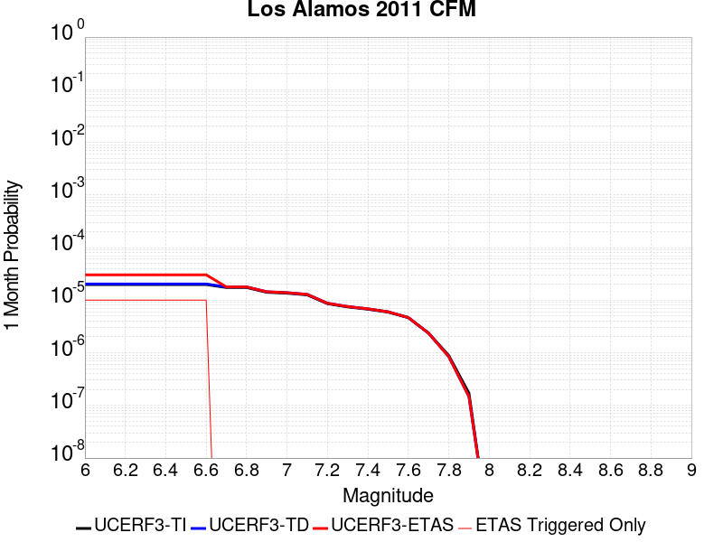 |  |  |

| Magnitude | 1 wk TI Prob | 1 wk TD Prob | 1 wk ETAS Prob | 1 wk ETAS/TD Gain | 1 wk ETAS Triggered Only | 1 mo TI Prob | 1 mo TD Prob | 1 mo ETAS Prob | 1 mo ETAS/TD Gain | 1 mo ETAS Triggered Only | 1 yr TI Prob | 1 yr TD Prob | 1 yr ETAS Prob | 1 yr ETAS/TD Gain | 1 yr ETAS Triggered Only | 10 yr TI Prob | 10 yr TD Prob | 10 yr ETAS Prob | 10 yr ETAS/TD Gain | 10 yr ETAS Triggered Only |
|-----|-----|-----|-----|-----|-----|-----|-----|-----|-----|-----|-----|-----|-----|-----|-----|-----|-----|-----|-----|-----|
| 6.0 | 4.6284417E-6 | 4.751731E-6 | 1.4751684E-5 | 3.1044862 | 1.0E-5 | 1.9836029E-5 | 2.0364414E-5 | 3.036421E-5 | 1.4910427 | 1.0E-5 | 2.4147688E-4 | 2.4791027E-4 | 2.579078E-4 | 1.0403272 | 1.0E-5 | 0.0024121467 | 0.0024765113 | 0.0024964618 | 1.0080559 | 2.0E-5 |
| 6.1 | 4.6284417E-6 | 4.751731E-6 | 1.4751684E-5 | 3.1044862 | 1.0E-5 | 1.9836029E-5 | 2.0364414E-5 | 3.036421E-5 | 1.4910427 | 1.0E-5 | 2.4147688E-4 | 2.4791027E-4 | 2.579078E-4 | 1.0403272 | 1.0E-5 | 0.0024121467 | 0.0024765113 | 0.0024964618 | 1.0080559 | 2.0E-5 |
| 6.2 | 4.6284417E-6 | 4.751731E-6 | 1.4751684E-5 | 3.1044862 | 1.0E-5 | 1.9836029E-5 | 2.0364414E-5 | 3.036421E-5 | 1.4910427 | 1.0E-5 | 2.4147688E-4 | 2.4791027E-4 | 2.579078E-4 | 1.0403272 | 1.0E-5 | 0.0024121467 | 0.0024765113 | 0.0024964618 | 1.0080559 | 2.0E-5 |
| 6.3 | 4.6284417E-6 | 4.751731E-6 | 1.4751684E-5 | 3.1044862 | 1.0E-5 | 1.9836029E-5 | 2.0364414E-5 | 3.036421E-5 | 1.4910427 | 1.0E-5 | 2.4147688E-4 | 2.4791027E-4 | 2.579078E-4 | 1.0403272 | 1.0E-5 | 0.0024121467 | 0.0024765113 | 0.0024964618 | 1.0080559 | 2.0E-5 |
| 6.4 | 4.6284417E-6 | 4.751731E-6 | 1.4751684E-5 | 3.1044862 | 1.0E-5 | 1.9836029E-5 | 2.0364414E-5 | 3.036421E-5 | 1.4910427 | 1.0E-5 | 2.4147688E-4 | 2.4791027E-4 | 2.579078E-4 | 1.0403272 | 1.0E-5 | 0.0024121467 | 0.0024765113 | 0.0024964618 | 1.0080559 | 2.0E-5 |
| 6.5 | 4.6284417E-6 | 4.751731E-6 | 1.4751684E-5 | 3.1044862 | 1.0E-5 | 1.9836029E-5 | 2.0364414E-5 | 3.036421E-5 | 1.4910427 | 1.0E-5 | 2.4147688E-4 | 2.4791027E-4 | 2.579078E-4 | 1.0403272 | 1.0E-5 | 0.0024121467 | 0.0024765113 | 0.0024964618 | 1.0080559 | 2.0E-5 |
| 6.6 | 4.6284417E-6 | 4.751731E-6 | 1.4751684E-5 | 3.1044862 | 1.0E-5 | 1.9836029E-5 | 2.0364414E-5 | 3.036421E-5 | 1.4910427 | 1.0E-5 | 2.4147688E-4 | 2.4791027E-4 | 2.579078E-4 | 1.0403272 | 1.0E-5 | 0.0024121467 | 0.0024765113 | 0.0024964618 | 1.0080559 | 2.0E-5 |
| 6.7 | 4.062321E-6 | 4.166349E-6 | 4.166349E-6 | 1.0 | 0.0 | 1.7409831E-5 | 1.7855667E-5 | 1.7855667E-5 | 1.0 | 0.0 | 2.1194408E-4 | 2.1737257E-4 | 2.1737257E-4 | 1.0 | 0.0 | 0.0021174205 | 0.0021717492 | 0.0021817274 | 1.0045946 | 1.0E-5 |
| 6.8 | 4.062321E-6 | 4.166349E-6 | 4.166349E-6 | 1.0 | 0.0 | 1.7409831E-5 | 1.7855667E-5 | 1.7855667E-5 | 1.0 | 0.0 | 2.1194408E-4 | 2.1737257E-4 | 2.1737257E-4 | 1.0 | 0.0 | 0.0021174205 | 0.0021717492 | 0.0021817274 | 1.0045946 | 1.0E-5 |
| 6.9 | 3.2936077E-6 | 3.372958E-6 | 3.372958E-6 | 1.0 | 0.0 | 1.4115385E-5 | 1.4455459E-5 | 1.4455459E-5 | 1.0 | 0.0 | 1.7184127E-4 | 1.7598194E-4 | 1.7598194E-4 | 1.0 | 0.0 | 0.0017170844 | 0.0017585184 | 0.0017685008 | 1.0056766 | 1.0E-5 |
| 7.0 | 3.1687898E-6 | 3.2448156E-6 | 3.2448156E-6 | 1.0 | 0.0 | 1.3580457E-5 | 1.3906283E-5 | 1.3906283E-5 | 1.0 | 0.0 | 1.6532952E-4 | 1.6929678E-4 | 1.6929678E-4 | 1.0 | 0.0 | 0.0016520657 | 0.0016917696 | 0.0017017527 | 1.005901 | 1.0E-5 |
| 7.1 | 2.9379228E-6 | 3.0073259E-6 | 3.0073259E-6 | 1.0 | 0.0 | 1.25910365E-5 | 1.288848E-5 | 1.288848E-5 | 1.0 | 0.0 | 1.5328509E-4 | 1.5690686E-4 | 1.5690686E-4 | 1.0 | 0.0 | 0.001531794 | 0.0015680499 | 0.0015780343 | 1.0063673 | 1.0E-5 |
| 7.2 | 2.0020686E-6 | 2.0416298E-6 | 2.0416298E-6 | 1.0 | 0.0 | 8.580266E-6 | 8.749813E-6 | 8.749813E-6 | 1.0 | 0.0 | 1.0445973E-4 | 1.0652381E-4 | 1.0652381E-4 | 1.0 | 0.0 | 0.0010441064 | 0.001064732 | 0.001064732 | 1.0 | 0.0 |
| 7.3 | 1.7364243E-6 | 1.7678802E-6 | 1.7678802E-6 | 1.0 | 0.0 | 7.441797E-6 | 7.576608E-6 | 7.576608E-6 | 1.0 | 0.0 | 9.0600115E-5 | 9.2241324E-5 | 9.2241324E-5 | 1.0 | 0.0 | 9.0563187E-4 | 9.2203356E-4 | 9.2203356E-4 | 1.0 | 0.0 |
| 7.4 | 1.5718434E-6 | 1.5983177E-6 | 1.5983177E-6 | 1.0 | 0.0 | 6.7364545E-6 | 6.849915E-6 | 6.849915E-6 | 1.0 | 0.0 | 8.201325E-5 | 8.339455E-5 | 8.339455E-5 | 1.0 | 0.0 | 8.198299E-4 | 8.3363557E-4 | 8.3363557E-4 | 1.0 | 0.0 |
| 7.5 | 1.3841119E-6 | 1.4042793E-6 | 1.4042793E-6 | 1.0 | 0.0 | 5.9318945E-6 | 6.0183256E-6 | 6.0183256E-6 | 1.0 | 0.0 | 7.221842E-5 | 7.327068E-5 | 7.327068E-5 | 1.0 | 0.0 | 7.2194956E-4 | 7.324681E-4 | 7.324681E-4 | 1.0 | 0.0 |
| 7.6 | 1.0843726E-6 | 1.093442E-6 | 1.093442E-6 | 1.0 | 0.0 | 4.647303E-6 | 4.6861724E-6 | 4.6861724E-6 | 1.0 | 0.0 | 5.6579443E-5 | 5.705268E-5 | 5.705268E-5 | 1.0 | 0.0 | 5.656504E-4 | 5.703829E-4 | 5.703829E-4 | 1.0 | 0.0 |
| 7.7 | 5.544814E-7 | 5.5018705E-7 | 5.5018705E-7 | 1.0 | 0.0 | 2.3763469E-6 | 2.3579425E-6 | 2.3579425E-6 | 1.0 | 0.0 | 2.8931638E-5 | 2.8707573E-5 | 2.8707573E-5 | 1.0 | 0.0 | 2.8927872E-4 | 2.870388E-4 | 2.870388E-4 | 1.0 | 0.0 |
| 7.8 | 2.0707465E-7 | 1.977846E-7 | 1.977846E-7 | 1.0 | 0.0 | 8.874625E-7 | 8.4764804E-7 | 8.4764804E-7 | 1.0 | 0.0 | 1.08048025E-5 | 1.0320066E-5 | 1.0320066E-5 | 1.0 | 0.0 | 1.0804277E-4 | 1.0319592E-4 | 1.0319592E-4 | 1.0 | 0.0 |
| 7.9 | 3.9821284E-8 | 3.433109E-8 | 3.433109E-8 | 1.0 | 0.0 | 1.7066264E-7 | 1.4713324E-7 | 1.4713324E-7 | 1.0 | 0.0 | 2.0778157E-6 | 1.7913457E-6 | 1.7913457E-6 | 1.0 | 0.0 | 2.0777963E-5 | 1.7913319E-5 | 1.7913319E-5 | 1.0 | 0.0 |
| 8.0 | 7.880441E-11 | 8.2353124E-11 | 8.2353124E-11 | 1.0 | 0.0 | 3.3773329E-10 | 3.52942E-10 | 3.52942E-10 | 1.0 | 0.0 | 4.1119033E-9 | 4.2970694E-9 | 4.2970694E-9 | 1.0 | 0.0 | 4.1119034E-8 | 4.2970694E-8 | 4.2970694E-8 | 1.0 | 0.0 |

## San Jacinto (Lytle Creek connector)
*[(top)](#table-of-contents)*

| 1 Week | 1 Month | 1 Year | 10 Year |
|-----|-----|-----|-----|
|  |  |  |  |

| Magnitude | 1 wk TI Prob | 1 wk TD Prob | 1 wk ETAS Prob | 1 wk ETAS/TD Gain | 1 wk ETAS Triggered Only | 1 mo TI Prob | 1 mo TD Prob | 1 mo ETAS Prob | 1 mo ETAS/TD Gain | 1 mo ETAS Triggered Only | 1 yr TI Prob | 1 yr TD Prob | 1 yr ETAS Prob | 1 yr ETAS/TD Gain | 1 yr ETAS Triggered Only | 10 yr TI Prob | 10 yr TD Prob | 10 yr ETAS Prob | 10 yr ETAS/TD Gain | 10 yr ETAS Triggered Only |
|-----|-----|-----|-----|-----|-----|-----|-----|-----|-----|-----|-----|-----|-----|-----|-----|-----|-----|-----|-----|-----|
| 6.0 | 6.693995E-6 | 6.660216E-6 | 1.666015E-5 | 2.5014427 | 1.0E-5 | 2.8688235E-5 | 2.854347E-5 | 3.8543185E-5 | 1.3503329 | 1.0E-5 | 3.492233E-4 | 3.4746144E-4 | 3.5745796E-4 | 1.0287702 | 1.0E-5 | 0.00348675 | 0.0035493854 | 0.0035693143 | 1.0056148 | 2.0E-5 |
| 6.1 | 6.693995E-6 | 6.660216E-6 | 1.666015E-5 | 2.5014427 | 1.0E-5 | 2.8688235E-5 | 2.854347E-5 | 3.8543185E-5 | 1.3503329 | 1.0E-5 | 3.492233E-4 | 3.4746144E-4 | 3.5745796E-4 | 1.0287702 | 1.0E-5 | 0.00348675 | 0.0035493854 | 0.0035693143 | 1.0056148 | 2.0E-5 |
| 6.2 | 6.693995E-6 | 6.660216E-6 | 1.666015E-5 | 2.5014427 | 1.0E-5 | 2.8688235E-5 | 2.854347E-5 | 3.8543185E-5 | 1.3503329 | 1.0E-5 | 3.492233E-4 | 3.4746144E-4 | 3.5745796E-4 | 1.0287702 | 1.0E-5 | 0.00348675 | 0.0035493854 | 0.0035693143 | 1.0056148 | 2.0E-5 |
| 6.3 | 6.693995E-6 | 6.660216E-6 | 1.666015E-5 | 2.5014427 | 1.0E-5 | 2.8688235E-5 | 2.854347E-5 | 3.8543185E-5 | 1.3503329 | 1.0E-5 | 3.492233E-4 | 3.4746144E-4 | 3.5745796E-4 | 1.0287702 | 1.0E-5 | 0.00348675 | 0.0035493854 | 0.0035693143 | 1.0056148 | 2.0E-5 |
| 6.4 | 6.693995E-6 | 6.660216E-6 | 1.666015E-5 | 2.5014427 | 1.0E-5 | 2.8688235E-5 | 2.854347E-5 | 3.8543185E-5 | 1.3503329 | 1.0E-5 | 3.492233E-4 | 3.4746144E-4 | 3.5745796E-4 | 1.0287702 | 1.0E-5 | 0.00348675 | 0.0035493854 | 0.0035693143 | 1.0056148 | 2.0E-5 |
| 6.5 | 6.6561875E-6 | 6.6204343E-6 | 1.6620368E-5 | 2.510465 | 1.0E-5 | 2.8526205E-5 | 2.837298E-5 | 3.83727E-5 | 1.352438 | 1.0E-5 | 3.472512E-4 | 3.4538636E-4 | 3.5538292E-4 | 1.0289431 | 1.0E-5 | 0.0034670907 | 0.003528701 | 0.0035486303 | 1.0056478 | 2.0E-5 |
| 6.6 | 6.6561875E-6 | 6.6204343E-6 | 1.6620368E-5 | 2.510465 | 1.0E-5 | 2.8526205E-5 | 2.837298E-5 | 3.83727E-5 | 1.352438 | 1.0E-5 | 3.472512E-4 | 3.4538636E-4 | 3.5538292E-4 | 1.0289431 | 1.0E-5 | 0.0034670907 | 0.003528701 | 0.0035486303 | 1.0056478 | 2.0E-5 |
| 6.7 | 6.5802237E-6 | 6.539611E-6 | 1.6539545E-5 | 2.5291328 | 1.0E-5 | 2.8200653E-5 | 2.8026603E-5 | 3.8026323E-5 | 1.3567939 | 1.0E-5 | 3.4328885E-4 | 3.4117055E-4 | 3.5116714E-4 | 1.0293008 | 1.0E-5 | 0.0034275902 | 0.0034866752 | 0.0035066055 | 1.0057161 | 2.0E-5 |
| 6.8 | 6.575632E-6 | 6.5341005E-6 | 1.6534035E-5 | 2.5304224 | 1.0E-5 | 2.8180975E-5 | 2.8002989E-5 | 3.800271E-5 | 1.3570948 | 1.0E-5 | 3.4304935E-4 | 3.4088313E-4 | 3.508797E-4 | 1.0293256 | 1.0E-5 | 0.0034252026 | 0.00348381 | 0.0035037403 | 1.0057209 | 2.0E-5 |
| 6.9 | 6.570433E-6 | 6.525495E-6 | 1.652543E-5 | 2.532441 | 1.0E-5 | 2.8158694E-5 | 2.7966107E-5 | 3.7965827E-5 | 1.3575656 | 1.0E-5 | 3.4277816E-4 | 3.4043423E-4 | 3.504308E-4 | 1.0293642 | 1.0E-5 | 0.0034224992 | 0.0034793352 | 0.0034992655 | 1.0057282 | 2.0E-5 |
| 7.0 | 6.5643826E-6 | 6.515616E-6 | 1.651555E-5 | 2.5347643 | 1.0E-5 | 2.8132765E-5 | 2.792377E-5 | 3.792349E-5 | 1.3581078 | 1.0E-5 | 3.424626E-4 | 3.3991894E-4 | 3.4991553E-4 | 1.0294088 | 1.0E-5 | 0.0034193532 | 0.0034741985 | 0.003494129 | 1.0057367 | 2.0E-5 |
| 7.1 | 6.557402E-6 | 6.5043278E-6 | 1.6504262E-5 | 2.537428 | 1.0E-5 | 2.8102848E-5 | 2.7875392E-5 | 3.7875114E-5 | 1.3587294 | 1.0E-5 | 3.4209844E-4 | 3.3933012E-4 | 3.4932673E-4 | 1.0294598 | 1.0E-5 | 0.0034157229 | 0.0034683298 | 0.0034882606 | 1.0057465 | 2.0E-5 |
| 7.2 | 6.546394E-6 | 6.4862943E-6 | 1.648623E-5 | 2.5417023 | 1.0E-5 | 2.8055672E-5 | 2.7798109E-5 | 3.7797832E-5 | 1.3597267 | 1.0E-5 | 3.4152428E-4 | 3.3838948E-4 | 3.483861E-4 | 1.0295417 | 1.0E-5 | 0.0034099987 | 0.0034589572 | 0.003478888 | 1.0057621 | 2.0E-5 |
| 7.3 | 6.5364216E-6 | 6.4670803E-6 | 1.6467016E-5 | 2.5462828 | 1.0E-5 | 2.8012933E-5 | 2.7715765E-5 | 3.7715487E-5 | 1.3607955 | 1.0E-5 | 3.4100408E-4 | 3.3738726E-4 | 3.4738387E-4 | 1.0296296 | 1.0E-5 | 0.003404813 | 0.0034489788 | 0.0034689098 | 1.0057788 | 2.0E-5 |
| 7.4 | 6.5269523E-6 | 6.4481674E-6 | 1.6448103E-5 | 2.5508182 | 1.0E-5 | 2.7972354E-5 | 2.7634711E-5 | 3.7634436E-5 | 1.3618537 | 1.0E-5 | 3.4051016E-4 | 3.3640073E-4 | 3.4639737E-4 | 1.0297165 | 1.0E-5 | 0.0033998888 | 0.003439161 | 0.0034590922 | 1.0057954 | 2.0E-5 |
| 7.5 | 6.5111835E-6 | 6.424442E-6 | 1.6424377E-5 | 2.5565455 | 1.0E-5 | 2.7904773E-5 | 2.7533031E-5 | 3.7532758E-5 | 1.36319 | 1.0E-5 | 3.3968766E-4 | 3.3516317E-4 | 3.4515982E-4 | 1.0298262 | 1.0E-5 | 0.0033916887 | 0.003426834 | 0.0034467655 | 1.0058163 | 2.0E-5 |
| 7.6 | 6.4768806E-6 | 6.383551E-6 | 1.6383487E-5 | 2.5665162 | 1.0E-5 | 2.7757764E-5 | 2.735779E-5 | 3.7357517E-5 | 1.3655167 | 1.0E-5 | 3.3789838E-4 | 3.3303024E-4 | 3.430269E-4 | 1.0300173 | 1.0E-5 | 0.0033738504 | 0.0034055663 | 0.003425498 | 1.0058527 | 2.0E-5 |
| 7.7 | 6.1655364E-6 | 6.1760365E-6 | 1.6175974E-5 | 2.6191514 | 1.0E-5 | 2.642346E-5 | 2.646846E-5 | 3.6468195E-5 | 1.3777982 | 1.0E-5 | 3.2165812E-4 | 3.2220592E-4 | 3.3220268E-4 | 1.031026 | 1.0E-5 | 0.0032119295 | 0.0032971818 | 0.0033171158 | 1.0060458 | 2.0E-5 |
| 7.8 | 5.5043524E-6 | 5.737097E-6 | 1.573704E-5 | 2.7430317 | 1.0E-5 | 2.3589868E-5 | 2.4587327E-5 | 3.458708E-5 | 1.4067036 | 1.0E-5 | 2.871688E-4 | 2.9930964E-4 | 3.0930663E-4 | 1.0334002 | 1.0E-5 | 0.0028679797 | 0.0030672832 | 0.0030872219 | 1.0065005 | 2.0E-5 |
| 7.9 | 3.889249E-6 | 4.076761E-6 | 4.076761E-6 | 1.0 | 0.0 | 1.6668104E-5 | 1.7471715E-5 | 1.7471715E-5 | 1.0 | 0.0 | 2.0291525E-4 | 2.1269741E-4 | 2.1269741E-4 | 1.0 | 0.0 | 0.0020273007 | 0.0021943315 | 0.0022043095 | 1.0045472 | 1.0E-5 |
| 8.0 | 2.668535E-6 | 2.5315155E-6 | 2.5315155E-6 | 1.0 | 0.0 | 1.1436528E-5 | 1.0849307E-5 | 1.0849307E-5 | 1.0 | 0.0 | 1.3923083E-4 | 1.3208234E-4 | 1.3208234E-4 | 1.0 | 0.0 | 0.0013914363 | 0.0013757964 | 0.0013757964 | 1.0 | 0.0 |
| 8.1 | 1.5911459E-6 | 1.218661E-6 | 1.218661E-6 | 1.0 | 0.0 | 6.8191785E-6 | 5.2228224E-6 | 5.2228224E-6 | 1.0 | 0.0 | 8.3020335E-5 | 6.3586034E-5 | 6.3586034E-5 | 1.0 | 0.0 | 8.298933E-4 | 6.6932244E-4 | 6.6932244E-4 | 1.0 | 0.0 |
| 8.2 | 6.1294963E-7 | 2.1812275E-7 | 2.1812275E-7 | 1.0 | 0.0 | 2.6269242E-6 | 9.3481145E-7 | 9.3481145E-7 | 1.0 | 0.0 | 3.1982334E-5 | 1.138127E-5 | 1.138127E-5 | 1.0 | 0.0 | 3.1977732E-4 | 1.2784546E-4 | 1.2784546E-4 | 1.0 | 0.0 |
| 8.3 | 1.762871E-7 | 4.7546838E-8 | 4.7546838E-8 | 1.0 | 0.0 | 7.5551594E-7 | 2.0377215E-7 | 2.0377215E-7 | 1.0 | 0.0 | 9.1983675E-6 | 2.480923E-6 | 2.480923E-6 | 1.0 | 0.0 | 9.197987E-5 | 2.868753E-5 | 2.868753E-5 | 1.0 | 0.0 |

## San Gabriel (Extension)
*[(top)](#table-of-contents)*

| 1 Week | 1 Month | 1 Year | 10 Year |
|-----|-----|-----|-----|
| 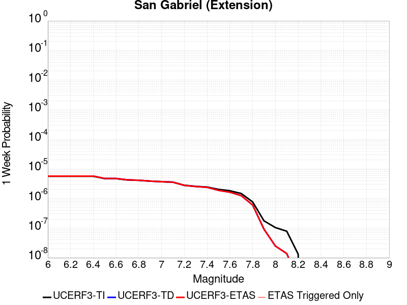 |  |  |  |

| Magnitude | 1 wk TI Prob | 1 wk TD Prob | 1 wk ETAS Prob | 1 wk ETAS/TD Gain | 1 wk ETAS Triggered Only | 1 mo TI Prob | 1 mo TD Prob | 1 mo ETAS Prob | 1 mo ETAS/TD Gain | 1 mo ETAS Triggered Only | 1 yr TI Prob | 1 yr TD Prob | 1 yr ETAS Prob | 1 yr ETAS/TD Gain | 1 yr ETAS Triggered Only | 10 yr TI Prob | 10 yr TD Prob | 10 yr ETAS Prob | 10 yr ETAS/TD Gain | 10 yr ETAS Triggered Only |
|-----|-----|-----|-----|-----|-----|-----|-----|-----|-----|-----|-----|-----|-----|-----|-----|-----|-----|-----|-----|-----|
| 6.0 | 5.6486106E-6 | 5.7168304E-6 | 5.7168304E-6 | 1.0 | 0.0 | 2.4208108E-5 | 2.450048E-5 | 2.450048E-5 | 1.0 | 0.0 | 2.9469383E-4 | 2.9825376E-4 | 3.182478E-4 | 1.067037 | 2.0E-5 | 0.0029430336 | 0.0029786653 | 0.0029986056 | 1.0066944 | 2.0E-5 |
| 6.1 | 5.6486106E-6 | 5.7168304E-6 | 5.7168304E-6 | 1.0 | 0.0 | 2.4208108E-5 | 2.450048E-5 | 2.450048E-5 | 1.0 | 0.0 | 2.9469383E-4 | 2.9825376E-4 | 3.182478E-4 | 1.067037 | 2.0E-5 | 0.0029430336 | 0.0029786653 | 0.0029986056 | 1.0066944 | 2.0E-5 |
| 6.2 | 5.6486106E-6 | 5.7168304E-6 | 5.7168304E-6 | 1.0 | 0.0 | 2.4208108E-5 | 2.450048E-5 | 2.450048E-5 | 1.0 | 0.0 | 2.9469383E-4 | 2.9825376E-4 | 3.182478E-4 | 1.067037 | 2.0E-5 | 0.0029430336 | 0.0029786653 | 0.0029986056 | 1.0066944 | 2.0E-5 |
| 6.3 | 5.6486106E-6 | 5.7168304E-6 | 5.7168304E-6 | 1.0 | 0.0 | 2.4208108E-5 | 2.450048E-5 | 2.450048E-5 | 1.0 | 0.0 | 2.9469383E-4 | 2.9825376E-4 | 3.182478E-4 | 1.067037 | 2.0E-5 | 0.0029430336 | 0.0029786653 | 0.0029986056 | 1.0066944 | 2.0E-5 |
| 6.4 | 5.6486106E-6 | 5.7168304E-6 | 5.7168304E-6 | 1.0 | 0.0 | 2.4208108E-5 | 2.450048E-5 | 2.450048E-5 | 1.0 | 0.0 | 2.9469383E-4 | 2.9825376E-4 | 3.182478E-4 | 1.067037 | 2.0E-5 | 0.0029430336 | 0.0029786653 | 0.0029986056 | 1.0066944 | 2.0E-5 |
| 6.5 | 4.7134554E-6 | 4.7542544E-6 | 4.7542544E-6 | 1.0 | 0.0 | 2.0200367E-5 | 2.0375222E-5 | 2.0375222E-5 | 1.0 | 0.0 | 2.459117E-4 | 2.4804095E-4 | 2.5803846E-4 | 1.040306 | 1.0E-5 | 0.0024563975 | 0.002477729 | 0.0024877044 | 1.0040259 | 1.0E-5 |
| 6.6 | 4.7134554E-6 | 4.7542544E-6 | 4.7542544E-6 | 1.0 | 0.0 | 2.0200367E-5 | 2.0375222E-5 | 2.0375222E-5 | 1.0 | 0.0 | 2.459117E-4 | 2.4804095E-4 | 2.5803846E-4 | 1.040306 | 1.0E-5 | 0.0024563975 | 0.002477729 | 0.0024877044 | 1.0040259 | 1.0E-5 |
| 6.7 | 4.2468837E-6 | 4.2740717E-6 | 4.2740717E-6 | 1.0 | 0.0 | 1.8200803E-5 | 1.8317325E-5 | 1.8317325E-5 | 1.0 | 0.0 | 2.2157225E-4 | 2.2299135E-4 | 2.3298911E-4 | 1.0448347 | 1.0E-5 | 0.0022135144 | 0.0022277518 | 0.0022377295 | 1.0044788 | 1.0E-5 |
| 6.8 | 4.1180615E-6 | 4.1414614E-6 | 4.1414614E-6 | 1.0 | 0.0 | 1.7648716E-5 | 1.7749004E-5 | 1.7749004E-5 | 1.0 | 0.0 | 2.1485193E-4 | 2.160734E-4 | 2.160734E-4 | 1.0 | 0.0 | 0.0021464431 | 0.0021587082 | 0.0021587082 | 1.0 | 0.0 |
| 6.9 | 3.863861E-6 | 3.8797766E-6 | 3.8797766E-6 | 1.0 | 0.0 | 1.65593E-5 | 1.6627511E-5 | 1.6627511E-5 | 1.0 | 0.0 | 2.0159081E-4 | 2.0242184E-4 | 2.0242184E-4 | 1.0 | 0.0 | 0.0020140803 | 0.002022446 | 0.002022446 | 1.0 | 0.0 |
| 7.0 | 3.6947372E-6 | 3.705676E-6 | 3.705676E-6 | 1.0 | 0.0 | 1.5834492E-5 | 1.5881375E-5 | 1.5881375E-5 | 1.0 | 0.0 | 1.9276788E-4 | 1.9333926E-4 | 1.9333926E-4 | 1.0 | 0.0 | 0.0019260074 | 0.0019317807 | 0.0019317807 | 1.0 | 0.0 |
| 7.1 | 3.5686835E-6 | 3.5728963E-6 | 3.5728963E-6 | 1.0 | 0.0 | 1.5294268E-5 | 1.5312327E-5 | 1.5312327E-5 | 1.0 | 0.0 | 1.861918E-4 | 1.8641229E-4 | 1.8641229E-4 | 1.0 | 0.0 | 0.0018603588 | 0.0018626289 | 0.0018626289 | 1.0 | 0.0 |
| 7.2 | 2.8023446E-6 | 2.7767885E-6 | 2.7767885E-6 | 1.0 | 0.0 | 1.2009994E-5 | 1.1900468E-5 | 1.1900468E-5 | 1.0 | 0.0 | 1.4621185E-4 | 1.4487868E-4 | 1.4487868E-4 | 1.0 | 0.0 | 0.001461157 | 0.0014478569 | 0.0014478569 | 1.0 | 0.0 |
| 7.3 | 2.5843012E-6 | 2.5459642E-6 | 2.5459642E-6 | 1.0 | 0.0 | 1.1075529E-5 | 1.0911231E-5 | 1.0911231E-5 | 1.0 | 0.0 | 1.3483623E-4 | 1.3283623E-4 | 1.3283623E-4 | 1.0 | 0.0 | 0.0013475444 | 0.0013275818 | 0.0013275818 | 1.0 | 0.0 |
| 7.4 | 2.4464468E-6 | 2.396665E-6 | 2.396665E-6 | 1.0 | 0.0 | 1.04847295E-5 | 1.0271382E-5 | 1.0271382E-5 | 1.0 | 0.0 | 1.276441E-4 | 1.25047E-4 | 1.25047E-4 | 1.0 | 0.0 | 0.0012757082 | 0.0012497796 | 0.0012497796 | 1.0 | 0.0 |
| 7.5 | 2.0420266E-6 | 1.8910426E-6 | 1.8910426E-6 | 1.0 | 0.0 | 8.751514E-6 | 8.104444E-6 | 8.104444E-6 | 1.0 | 0.0 | 1.0654447E-4 | 9.8667166E-5 | 9.8667166E-5 | 1.0 | 0.0 | 0.001064934 | 9.862408E-4 | 9.862408E-4 | 1.0 | 0.0 |
| 7.6 | 1.8326596E-6 | 1.6398341E-6 | 1.6398341E-6 | 1.0 | 0.0 | 7.854232E-6 | 7.0278415E-6 | 7.0278415E-6 | 1.0 | 0.0 | 9.562107E-5 | 8.5560634E-5 | 8.5560634E-5 | 1.0 | 0.0 | 9.5579936E-4 | 8.5528276E-4 | 8.5528276E-4 | 1.0 | 0.0 |
| 7.7 | 1.4786998E-6 | 1.2523838E-6 | 1.2523838E-6 | 1.0 | 0.0 | 6.3372695E-6 | 5.367348E-6 | 5.367348E-6 | 1.0 | 0.0 | 7.715353E-5 | 6.534551E-5 | 6.534551E-5 | 1.0 | 0.0 | 7.7126746E-4 | 6.532707E-4 | 6.532707E-4 | 1.0 | 0.0 |
| 7.8 | 7.6975533E-7 | 6.0693884E-7 | 6.0693884E-7 | 1.0 | 0.0 | 3.2989474E-6 | 2.601164E-6 | 2.601164E-6 | 1.0 | 0.0 | 4.0163945E-5 | 3.166871E-5 | 3.166871E-5 | 1.0 | 0.0 | 4.0156685E-4 | 3.1664805E-4 | 3.1664805E-4 | 1.0 | 0.0 |
| 7.9 | 1.7645915E-7 | 9.213256E-8 | 9.213256E-8 | 1.0 | 0.0 | 7.562533E-7 | 3.9485377E-7 | 3.9485377E-7 | 1.0 | 0.0 | 9.207345E-6 | 4.807334E-6 | 4.807334E-6 | 1.0 | 0.0 | 9.206964E-5 | 4.807699E-5 | 4.807699E-5 | 1.0 | 0.0 |
| 8.0 | 1.0463461E-7 | 2.4949307E-8 | 2.4949307E-8 | 1.0 | 0.0 | 4.4843398E-7 | 1.0692559E-7 | 1.0692559E-7 | 1.0 | 0.0 | 5.45967E-6 | 1.3018183E-6 | 1.3018183E-6 | 1.0 | 0.0 | 5.459536E-5 | 1.3022789E-5 | 1.3022789E-5 | 1.0 | 0.0 |
| 8.1 | 7.875717E-8 | 1.3866874E-8 | 1.3866874E-8 | 1.0 | 0.0 | 3.3753068E-7 | 5.942946E-8 | 5.942946E-8 | 1.0 | 0.0 | 4.109428E-6 | 7.235534E-7 | 7.235534E-7 | 1.0 | 0.0 | 4.109352E-5 | 7.2401926E-6 | 7.2401926E-6 | 1.0 | 0.0 |
| 8.2 | 1.33163E-8 | 1.7733891E-9 | 1.7733891E-9 | 1.0 | 0.0 | 5.7069855E-8 | 7.600239E-9 | 7.600239E-9 | 1.0 | 0.0 | 6.9482525E-7 | 9.25329E-8 | 9.25329E-8 | 1.0 | 0.0 | 6.9482307E-6 | 9.272953E-7 | 9.272953E-7 | 1.0 | 0.0 |

## Hunting Creek - Berryessa 2011 CFM
*[(top)](#table-of-contents)*

| 1 Week | 1 Month | 1 Year | 10 Year |
|-----|-----|-----|-----|
| 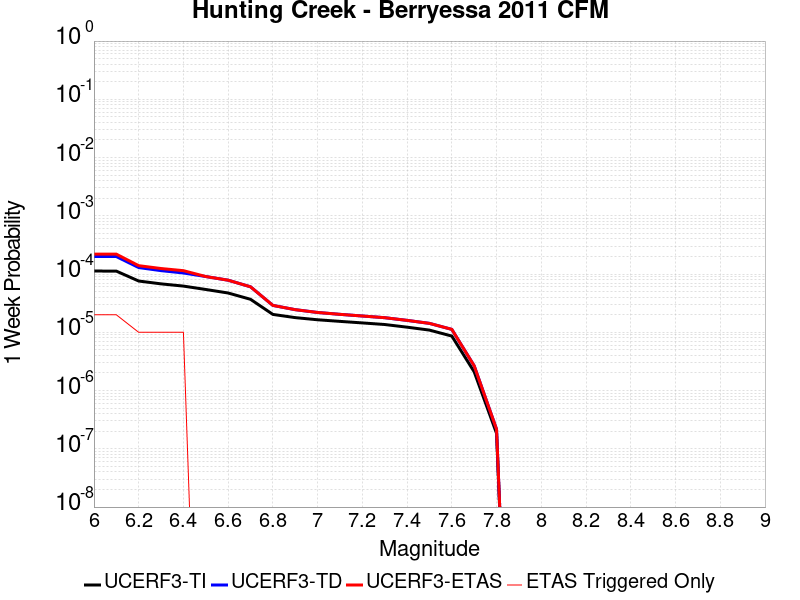 | 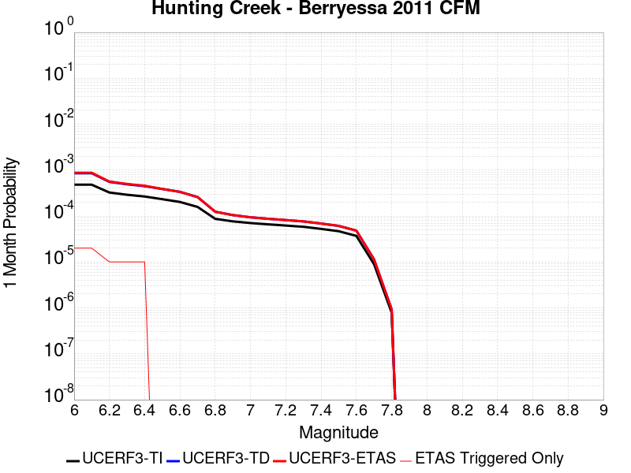 |  |  |

| Magnitude | 1 wk TI Prob | 1 wk TD Prob | 1 wk ETAS Prob | 1 wk ETAS/TD Gain | 1 wk ETAS Triggered Only | 1 mo TI Prob | 1 mo TD Prob | 1 mo ETAS Prob | 1 mo ETAS/TD Gain | 1 mo ETAS Triggered Only | 1 yr TI Prob | 1 yr TD Prob | 1 yr ETAS Prob | 1 yr ETAS/TD Gain | 1 yr ETAS Triggered Only | 10 yr TI Prob | 10 yr TD Prob | 10 yr ETAS Prob | 10 yr ETAS/TD Gain | 10 yr ETAS Triggered Only |
|-----|-----|-----|-----|-----|-----|-----|-----|-----|-----|-----|-----|-----|-----|-----|-----|-----|-----|-----|-----|-----|
| 6.0 | 1.1270982E-4 | 2.0012174E-4 | 2.2011774E-4 | 1.0999192 | 2.0E-5 | 4.8295266E-4 | 8.5739547E-4 | 8.7737833E-4 | 1.0233065 | 2.0E-5 | 0.0058641075 | 0.010386313 | 0.010406105 | 1.0019056 | 2.0E-5 | 0.057117578 | 0.09803703 | 0.098055065 | 1.000184 | 2.0E-5 |
| 6.1 | 1.1239393E-4 | 1.9960315E-4 | 2.1959915E-4 | 1.1001788 | 2.0E-5 | 4.8159933E-4 | 8.551744E-4 | 8.751573E-4 | 1.023367 | 2.0E-5 | 0.0058477195 | 0.010359551 | 0.010379344 | 1.0019106 | 2.0E-5 | 0.056962132 | 0.09779551 | 0.09781355 | 1.0001845 | 2.0E-5 |
| 6.2 | 7.596265E-5 | 1.2940196E-4 | 1.3940067E-4 | 1.0772686 | 1.0E-5 | 3.2551357E-4 | 5.5444165E-4 | 5.644361E-4 | 1.0180261 | 1.0E-5 | 0.0039559277 | 0.0067210156 | 0.0067309486 | 1.0014778 | 1.0E-5 | 0.038862433 | 0.0645915 | 0.064600855 | 1.0001448 | 1.0E-5 |
| 6.3 | 6.78794E-5 | 1.145119E-4 | 1.2451076E-4 | 1.0873171 | 1.0E-5 | 2.9087928E-4 | 4.906513E-4 | 5.0064636E-4 | 1.0203711 | 1.0E-5 | 0.003535705 | 0.005952679 | 0.0059626196 | 1.0016699 | 1.0E-5 | 0.034799766 | 0.057465393 | 0.057474818 | 1.000164 | 1.0E-5 |
| 6.4 | 6.2165134E-5 | 1.0436625E-4 | 1.14365204E-4 | 1.0958064 | 1.0E-5 | 2.6639478E-4 | 4.4721062E-4 | 4.5720616E-4 | 1.0223508 | 1.0E-5 | 0.0032385332 | 0.005427573 | 0.0054375185 | 1.0018325 | 1.0E-5 | 0.03191742 | 0.052550517 | 0.05255999 | 1.0001802 | 1.0E-5 |
| 6.5 | 5.4368087E-5 | 9.071415E-5 | 9.071415E-5 | 1.0 | 0.0 | 2.3298527E-4 | 3.8872007E-4 | 3.8872007E-4 | 1.0 | 0.0 | 0.0028329059 | 0.0047198683 | 0.0047198683 | 1.0 | 0.0 | 0.027970633 | 0.045880128 | 0.045880128 | 1.0 | 0.0 |
| 6.6 | 4.729947E-5 | 7.847572E-5 | 7.847572E-5 | 1.0 | 0.0 | 2.0269625E-4 | 3.362842E-4 | 3.362842E-4 | 1.0 | 0.0 | 0.002465034 | 0.0040849647 | 0.0040849647 | 1.0 | 0.0 | 0.02437869 | 0.03985155 | 0.03985155 | 1.0 | 0.0 |
| 6.7 | 3.6875328E-5 | 6.0451803E-5 | 6.0451803E-5 | 1.0 | 0.0 | 1.5802756E-4 | 2.59056E-4 | 2.59056E-4 | 1.0 | 0.0 | 0.0019222875 | 0.0031482063 | 0.0031482063 | 1.0 | 0.0 | 0.019057442 | 0.03089237 | 0.03089237 | 1.0 | 0.0 |
| 6.8 | 2.0292036E-5 | 2.8976308E-5 | 2.8976308E-5 | 1.0 | 0.0 | 8.6962966E-5 | 1.2417832E-4 | 1.2417832E-4 | 1.0 | 0.0 | 0.0010582599 | 0.0015108072 | 0.0015108072 | 1.0 | 0.0 | 0.010532344 | 0.014978523 | 0.014978523 | 1.0 | 0.0 |
| 6.9 | 1.7871042E-5 | 2.4472254E-5 | 2.4472254E-5 | 1.0 | 0.0 | 7.658793E-5 | 1.048769E-4 | 1.048769E-4 | 1.0 | 0.0 | 9.320591E-4 | 0.0012761299 | 0.0012761299 | 1.0 | 0.0 | 0.009281595 | 0.012679775 | 0.012679775 | 1.0 | 0.0 |
| 7.0 | 1.6415532E-5 | 2.1906277E-5 | 2.1906277E-5 | 1.0 | 0.0 | 7.035038E-5 | 9.3880684E-5 | 9.3880684E-5 | 1.0 | 0.0 | 8.561793E-4 | 0.0011424015 | 0.0011424015 | 1.0 | 0.0 | 0.008528882 | 0.01136452 | 0.01136452 | 1.0 | 0.0 |
| 7.1 | 1.5409885E-5 | 2.0346342E-5 | 2.0346342E-5 | 1.0 | 0.0 | 6.6040695E-5 | 8.7195716E-5 | 8.7195716E-5 | 1.0 | 0.0 | 8.0374884E-4 | 0.0010610938 | 0.0010610938 | 1.0 | 0.0 | 0.00800848 | 0.010560595 | 0.010560595 | 1.0 | 0.0 |
| 7.2 | 1.4497423E-5 | 1.9054964E-5 | 1.9054964E-5 | 1.0 | 0.0 | 6.213033E-5 | 8.166159E-5 | 8.166159E-5 | 1.0 | 0.0 | 7.5617427E-4 | 9.937795E-4 | 9.937795E-4 | 1.0 | 0.0 | 0.0075360634 | 0.009893929 | 0.009893929 | 1.0 | 0.0 |
| 7.3 | 1.3615175E-5 | 1.7826127E-5 | 1.7826127E-5 | 1.0 | 0.0 | 5.8349444E-5 | 7.639547E-5 | 7.639547E-5 | 1.0 | 0.0 | 7.101729E-4 | 9.297209E-4 | 9.297209E-4 | 1.0 | 0.0 | 0.0070790765 | 0.009258823 | 0.009258823 | 1.0 | 0.0 |
| 7.4 | 1.2252825E-5 | 1.602625E-5 | 1.602625E-5 | 1.0 | 0.0 | 5.251105E-5 | 6.868213E-5 | 6.868213E-5 | 1.0 | 0.0 | 6.391345E-4 | 8.35887E-4 | 8.35887E-4 | 1.0 | 0.0 | 0.0063729943 | 0.008327872 | 0.008327872 | 1.0 | 0.0 |
| 7.5 | 1.0913301E-5 | 1.4241117E-5 | 1.4241117E-5 | 1.0 | 0.0 | 4.6770452E-5 | 6.1031948E-5 | 6.1031948E-5 | 1.0 | 0.0 | 5.6928146E-4 | 7.4281334E-4 | 7.4281334E-4 | 1.0 | 0.0 | 0.0056782532 | 0.0074036797 | 0.0074036797 | 1.0 | 0.0 |
| 7.6 | 8.623192E-6 | 1.12346415E-5 | 1.12346415E-5 | 1.0 | 0.0 | 3.6956015E-5 | 4.814759E-5 | 4.814759E-5 | 1.0 | 0.0 | 4.4984656E-4 | 5.8604183E-4 | 5.8604183E-4 | 1.0 | 0.0 | 0.00448937 | 0.0058452785 | 0.0058452785 | 1.0 | 0.0 |
| 7.7 | 2.0993634E-6 | 2.662584E-6 | 2.662584E-6 | 1.0 | 0.0 | 8.997241E-6 | 1.1411025E-5 | 1.1411025E-5 | 1.0 | 0.0 | 1.09535904E-4 | 1.3892044E-4 | 1.3892044E-4 | 1.0 | 0.0 | 0.0010948193 | 0.0013883426 | 0.0013883426 | 1.0 | 0.0 |
| 7.8 | 1.8428308E-7 | 2.167437E-7 | 2.167437E-7 | 1.0 | 0.0 | 7.897844E-7 | 9.289013E-7 | 9.289013E-7 | 1.0 | 0.0 | 9.615583E-6 | 1.1309318E-5 | 1.1309318E-5 | 1.0 | 0.0 | 9.615166E-5 | 1.13086026E-4 | 1.13086026E-4 | 1.0 | 0.0 |

## San Gregorio (South) 2011 CFM
*[(top)](#table-of-contents)*

| 1 Week | 1 Month | 1 Year | 10 Year |
|-----|-----|-----|-----|
| 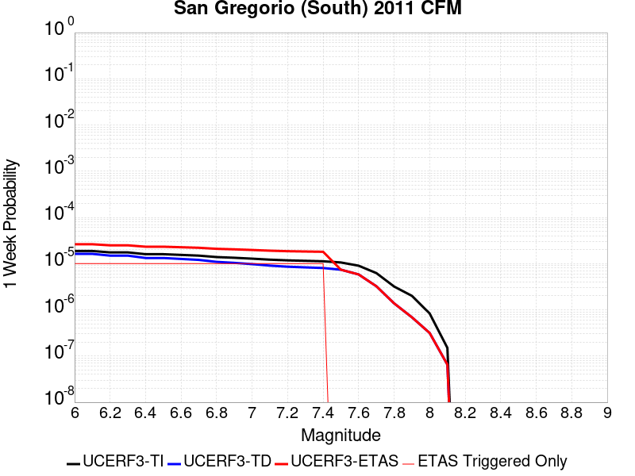 |  |  |  |

| Magnitude | 1 wk TI Prob | 1 wk TD Prob | 1 wk ETAS Prob | 1 wk ETAS/TD Gain | 1 wk ETAS Triggered Only | 1 mo TI Prob | 1 mo TD Prob | 1 mo ETAS Prob | 1 mo ETAS/TD Gain | 1 mo ETAS Triggered Only | 1 yr TI Prob | 1 yr TD Prob | 1 yr ETAS Prob | 1 yr ETAS/TD Gain | 1 yr ETAS Triggered Only | 10 yr TI Prob | 10 yr TD Prob | 10 yr ETAS Prob | 10 yr ETAS/TD Gain | 10 yr ETAS Triggered Only |
|-----|-----|-----|-----|-----|-----|-----|-----|-----|-----|-----|-----|-----|-----|-----|-----|-----|-----|-----|-----|-----|
| 6.0 | 1.8770423E-5 | 1.6279751E-5 | 2.627959E-5 | 1.61425 | 1.0E-5 | 8.044219E-5 | 6.976852E-5 | 8.976712E-5 | 1.2866422 | 2.0E-5 | 9.789435E-4 | 8.491044E-4 | 8.6908747E-4 | 1.0235342 | 2.0E-5 | 0.009746423 | 0.008471312 | 0.008491143 | 1.0023409 | 2.0E-5 |
| 6.1 | 1.8770423E-5 | 1.6279751E-5 | 2.627959E-5 | 1.61425 | 1.0E-5 | 8.044219E-5 | 6.976852E-5 | 8.976712E-5 | 1.2866422 | 2.0E-5 | 9.789435E-4 | 8.491044E-4 | 8.6908747E-4 | 1.0235342 | 2.0E-5 | 0.009746423 | 0.008471312 | 0.008491143 | 1.0023409 | 2.0E-5 |
| 6.2 | 1.7508692E-5 | 1.4899257E-5 | 2.4899107E-5 | 1.6711644 | 1.0E-5 | 7.5035096E-5 | 6.3852414E-5 | 8.385113E-5 | 1.3132023 | 2.0E-5 | 9.1316935E-4 | 7.7712885E-4 | 7.971133E-4 | 1.0257157 | 2.0E-5 | 0.00909426 | 0.00775674 | 0.0077765845 | 1.0025584 | 2.0E-5 |
| 6.3 | 1.7508692E-5 | 1.4899257E-5 | 2.4899107E-5 | 1.6711644 | 1.0E-5 | 7.5035096E-5 | 6.3852414E-5 | 8.385113E-5 | 1.3132023 | 2.0E-5 | 9.1316935E-4 | 7.7712885E-4 | 7.971133E-4 | 1.0257157 | 2.0E-5 | 0.00909426 | 0.00775674 | 0.0077765845 | 1.0025584 | 2.0E-5 |
| 6.4 | 1.6004591E-5 | 1.3249094E-5 | 2.3248962E-5 | 1.7547586 | 1.0E-5 | 6.85893E-5 | 5.6780602E-5 | 7.677946E-5 | 1.352213 | 2.0E-5 | 8.347548E-4 | 6.910856E-4 | 7.1107177E-4 | 1.0289199 | 2.0E-5 | 0.008316261 | 0.006901791 | 0.0069216527 | 1.0028778 | 2.0E-5 |
| 6.5 | 1.6004591E-5 | 1.3249094E-5 | 2.3248962E-5 | 1.7547586 | 1.0E-5 | 6.85893E-5 | 5.6780602E-5 | 7.677946E-5 | 1.352213 | 2.0E-5 | 8.347548E-4 | 6.910856E-4 | 7.1107177E-4 | 1.0289199 | 2.0E-5 | 0.008316261 | 0.006901791 | 0.0069216527 | 1.0028778 | 2.0E-5 |
| 6.6 | 1.5442201E-5 | 1.2633725E-5 | 2.26336E-5 | 1.7915221 | 1.0E-5 | 6.617918E-5 | 5.4143416E-5 | 7.4142336E-5 | 1.3693693 | 2.0E-5 | 8.0543366E-4 | 6.5899757E-4 | 6.789844E-4 | 1.0303291 | 2.0E-5 | 0.008025207 | 0.006582842 | 0.0066027106 | 1.0030183 | 2.0E-5 |
| 6.7 | 1.489921E-5 | 1.2042234E-5 | 2.2042113E-5 | 1.8304007 | 1.0E-5 | 6.3852196E-5 | 5.1608557E-5 | 7.160752E-5 | 1.3875127 | 2.0E-5 | 7.7712315E-4 | 6.2815374E-4 | 6.481412E-4 | 1.0318193 | 2.0E-5 | 0.0077441116 | 0.006276176 | 0.0062960503 | 1.0031667 | 2.0E-5 |
| 6.8 | 1.3876024E-5 | 1.0921184E-5 | 2.0921076E-5 | 1.9156415 | 1.0E-5 | 5.9467322E-5 | 4.6804238E-5 | 6.68033E-5 | 1.4272918 | 2.0E-5 | 7.237741E-4 | 5.69693E-4 | 5.8968156E-4 | 1.0350866 | 2.0E-5 | 0.0072142133 | 0.0056946846 | 0.0057145706 | 1.003492 | 2.0E-5 |
| 6.9 | 1.33922495E-5 | 1.0392687E-5 | 2.0392583E-5 | 1.962205 | 1.0E-5 | 5.7394092E-5 | 4.4539327E-5 | 6.4538435E-5 | 1.4490213 | 2.0E-5 | 6.9854903E-4 | 5.4213166E-4 | 5.621208E-4 | 1.0368714 | 2.0E-5 | 0.0069635725 | 0.005420442 | 0.005440334 | 1.0036697 | 2.0E-5 |
| 7.0 | 1.2807324E-5 | 9.752649E-6 | 1.9752551E-5 | 2.0253525 | 1.0E-5 | 5.4887376E-5 | 4.1796397E-5 | 5.1795978E-5 | 1.239245 | 1.0E-5 | 6.680489E-4 | 5.087525E-4 | 5.1874743E-4 | 1.0196459 | 1.0E-5 | 0.006660442 | 0.0050882204 | 0.0050981697 | 1.0019553 | 1.0E-5 |
| 7.1 | 1.2191438E-5 | 9.061537E-6 | 1.9061446E-5 | 2.1035557 | 1.0E-5 | 5.224797E-5 | 3.8834576E-5 | 4.883419E-5 | 1.2574924 | 1.0E-5 | 6.3593336E-4 | 4.727085E-4 | 4.8270376E-4 | 1.0211446 | 1.0E-5 | 0.0063411663 | 0.0047293645 | 0.004739317 | 1.0021044 | 1.0E-5 |
| 7.2 | 1.1769438E-5 | 8.581731E-6 | 1.8581646E-5 | 2.165256 | 1.0E-5 | 5.0439474E-5 | 3.677833E-5 | 4.677796E-5 | 1.2718892 | 1.0E-5 | 6.1392755E-4 | 4.4768423E-4 | 4.5767974E-4 | 1.0223272 | 1.0E-5 | 0.0061223423 | 0.004480157 | 0.0044901124 | 1.0022221 | 1.0E-5 |
| 7.3 | 1.150374E-5 | 8.29716E-6 | 1.8297078E-5 | 2.2052217 | 1.0E-5 | 4.9300812E-5 | 3.5558773E-5 | 4.555842E-5 | 1.2812146 | 1.0E-5 | 6.0007203E-4 | 4.3284212E-4 | 4.428378E-4 | 1.0230931 | 1.0E-5 | 0.0059845424 | 0.0043323063 | 0.004342263 | 1.0022982 | 1.0E-5 |
| 7.4 | 1.12514E-5 | 8.042902E-6 | 1.8042821E-5 | 2.2433224 | 1.0E-5 | 4.8219394E-5 | 3.4469125E-5 | 4.446878E-5 | 1.2901047 | 1.0E-5 | 5.8691297E-4 | 4.1958084E-4 | 4.2957664E-4 | 1.0238233 | 1.0E-5 | 0.005853653 | 0.0042001884 | 0.004210146 | 1.0023708 | 1.0E-5 |
| 7.5 | 1.059696E-5 | 7.3931915E-6 | 7.3931915E-6 | 1.0 | 0.0 | 4.5414752E-5 | 3.168472E-5 | 3.168472E-5 | 1.0 | 0.0 | 5.5278436E-4 | 3.8569325E-4 | 3.8569325E-4 | 1.0 | 0.0 | 0.0055141128 | 0.0038624762 | 0.0038624762 | 1.0 | 0.0 |
| 7.6 | 9.018592E-6 | 5.8369624E-6 | 5.8369624E-6 | 1.0 | 0.0 | 3.8650534E-5 | 2.5015313E-5 | 2.5015313E-5 | 1.0 | 0.0 | 4.7046866E-4 | 3.045189E-4 | 3.045189E-4 | 1.0 | 0.0 | 0.004694739 | 0.0030528754 | 0.0030528754 | 1.0 | 0.0 |
| 7.7 | 6.243489E-6 | 3.2395455E-6 | 3.2395455E-6 | 1.0 | 0.0 | 2.6757538E-5 | 1.3883692E-5 | 1.3883692E-5 | 1.0 | 0.0 | 3.257243E-4 | 1.6902086E-4 | 1.6902086E-4 | 1.0 | 0.0 | 0.003252473 | 0.001699108 | 0.001699108 | 1.0 | 0.0 |
| 7.8 | 3.1941963E-6 | 1.3809986E-6 | 1.3809986E-6 | 1.0 | 0.0 | 1.368934E-5 | 5.9185513E-6 | 5.9185513E-6 | 1.0 | 0.0 | 1.6665498E-4 | 7.2055984E-5 | 7.2055984E-5 | 1.0 | 0.0 | 0.0016653005 | 7.263174E-4 | 7.263174E-4 | 1.0 | 0.0 |
| 7.9 | 2.0098398E-6 | 6.9161155E-7 | 6.9161155E-7 | 1.0 | 0.0 | 8.6135715E-6 | 2.964046E-6 | 2.964046E-6 | 1.0 | 0.0 | 1.0486518E-4 | 3.608666E-5 | 3.608666E-5 | 1.0 | 0.0 | 0.0010481571 | 3.657225E-4 | 3.657225E-4 | 1.0 | 0.0 |
| 8.0 | 8.353119E-7 | 3.1623412E-7 | 3.1623412E-7 | 1.0 | 0.0 | 3.579903E-6 | 1.3552883E-6 | 1.3552883E-6 | 1.0 | 0.0 | 4.358445E-5 | 1.6500511E-5 | 1.6500511E-5 | 1.0 | 0.0 | 4.3575902E-4 | 1.6619264E-4 | 1.6619264E-4 | 1.0 | 0.0 |
| 8.1 | 1.5033264E-7 | 6.527624E-8 | 6.527624E-8 | 1.0 | 0.0 | 6.442826E-7 | 2.7975528E-7 | 2.7975528E-7 | 1.0 | 0.0 | 7.844113E-6 | 3.4060151E-6 | 3.4060151E-6 | 1.0 | 0.0 | 7.843835E-5 | 3.407693E-5 | 3.407693E-5 | 1.0 | 0.0 |

## Hayward (No) 2011 CFM
*[(top)](#table-of-contents)*

| 1 Week | 1 Month | 1 Year | 10 Year |
|-----|-----|-----|-----|
|  |  |  |  |

| Magnitude | 1 wk TI Prob | 1 wk TD Prob | 1 wk ETAS Prob | 1 wk ETAS/TD Gain | 1 wk ETAS Triggered Only | 1 mo TI Prob | 1 mo TD Prob | 1 mo ETAS Prob | 1 mo ETAS/TD Gain | 1 mo ETAS Triggered Only | 1 yr TI Prob | 1 yr TD Prob | 1 yr ETAS Prob | 1 yr ETAS/TD Gain | 1 yr ETAS Triggered Only | 10 yr TI Prob | 10 yr TD Prob | 10 yr ETAS Prob | 10 yr ETAS/TD Gain | 10 yr ETAS Triggered Only |
|-----|-----|-----|-----|-----|-----|-----|-----|-----|-----|-----|-----|-----|-----|-----|-----|-----|-----|-----|-----|-----|
| 6.0 | 9.3068506E-5 | 1.739599E-4 | 1.739599E-4 | 1.0 | 0.0 | 3.9880406E-4 | 7.453244E-4 | 7.553169E-4 | 1.013407 | 1.0E-5 | 0.0048446343 | 0.009036438 | 0.009046348 | 1.0010966 | 1.0E-5 | 0.047403704 | 0.08637534 | 0.08639361 | 1.0002116 | 2.0E-5 |
| 6.1 | 9.055486E-5 | 1.6947114E-4 | 1.6947114E-4 | 1.0 | 0.0 | 3.880345E-4 | 7.261021E-4 | 7.3609484E-4 | 1.0137621 | 1.0E-5 | 0.0047140904 | 0.008804537 | 0.008814449 | 1.0011258 | 1.0E-5 | 0.046153355 | 0.08426854 | 0.08428685 | 1.0002173 | 2.0E-5 |
| 6.2 | 9.006742E-5 | 1.6867711E-4 | 1.6867711E-4 | 1.0 | 0.0 | 3.859461E-4 | 7.22701E-4 | 7.326938E-4 | 1.013827 | 1.0E-5 | 0.0046887742 | 0.008763513 | 0.008773425 | 1.001131 | 1.0E-5 | 0.0459107 | 0.083892785 | 0.083911106 | 1.0002184 | 2.0E-5 |
| 6.3 | 8.8336754E-5 | 1.6547246E-4 | 1.6547246E-4 | 1.0 | 0.0 | 3.7853114E-4 | 7.089758E-4 | 7.189687E-4 | 1.0140948 | 1.0E-5 | 0.004598882 | 0.008597788 | 0.008607702 | 1.0011531 | 1.0E-5 | 0.04504866 | 0.08238599 | 0.082404345 | 1.0002228 | 2.0E-5 |
| 6.4 | 8.526157E-5 | 1.5974249E-4 | 1.5974249E-4 | 1.0 | 0.0 | 3.6535555E-4 | 6.8443175E-4 | 6.944249E-4 | 1.0146006 | 1.0E-5 | 0.0044391346 | 0.008301278 | 0.008311195 | 1.0011946 | 1.0E-5 | 0.043514993 | 0.079682834 | 0.079701245 | 1.000231 | 2.0E-5 |
| 6.5 | 8.152396E-5 | 1.530663E-4 | 1.530663E-4 | 1.0 | 0.0 | 3.493416E-4 | 6.558342E-4 | 6.6582765E-4 | 1.0152378 | 1.0E-5 | 0.0042449418 | 0.007955698 | 0.007965619 | 1.0012469 | 1.0E-5 | 0.04164765 | 0.07651369 | 0.07653216 | 1.0002414 | 2.0E-5 |
| 6.6 | 7.987405E-5 | 1.5010842E-4 | 1.5010842E-4 | 1.0 | 0.0 | 3.4227243E-4 | 6.4316386E-4 | 6.531574E-4 | 1.0155381 | 1.0E-5 | 0.0041592065 | 0.0078025614 | 0.0078124837 | 1.0012716 | 1.0E-5 | 0.04082218 | 0.07510622 | 0.07512471 | 1.0002463 | 2.0E-5 |
| 6.7 | 7.777665E-5 | 1.4650106E-4 | 1.4650106E-4 | 1.0 | 0.0 | 3.332859E-4 | 6.277113E-4 | 6.3770503E-4 | 1.0159209 | 1.0E-5 | 0.004050208 | 0.00761576 | 0.0076256837 | 1.0013031 | 1.0E-5 | 0.039771806 | 0.073382616 | 0.073401146 | 1.0002525 | 2.0E-5 |
| 6.8 | 7.3284005E-5 | 1.3800753E-4 | 1.3800753E-4 | 1.0 | 0.0 | 3.140365E-4 | 5.913274E-4 | 6.013215E-4 | 1.0169011 | 1.0E-5 | 0.0038166929 | 0.0071757827 | 0.007185711 | 1.0013835 | 1.0E-5 | 0.037518036 | 0.06929621 | 0.06931482 | 1.0002686 | 2.0E-5 |
| 6.9 | 6.458263E-5 | 1.2131439E-4 | 1.2131439E-4 | 1.0 | 0.0 | 2.7675333E-4 | 5.198157E-4 | 5.298105E-4 | 1.0192276 | 1.0E-5 | 0.0033642664 | 0.0063104923 | 0.0063204295 | 1.0015746 | 1.0E-5 | 0.033137884 | 0.061225023 | 0.0612438 | 1.0003066 | 2.0E-5 |
| 7.0 | 5.3853604E-5 | 1.00250414E-4 | 1.00250414E-4 | 1.0 | 0.0 | 2.3078074E-4 | 4.295742E-4 | 4.395699E-4 | 1.0232688 | 1.0E-5 | 0.0028061352 | 0.0052175885 | 0.005227536 | 1.0019066 | 1.0E-5 | 0.027709642 | 0.0509578 | 0.05096729 | 1.0001862 | 1.0E-5 |
| 7.1 | 4.4308683E-5 | 8.170626E-5 | 8.170626E-5 | 1.0 | 0.0 | 1.8988053E-4 | 3.501229E-4 | 3.6011942E-4 | 1.0285513 | 1.0E-5 | 0.0023093442 | 0.0042544557 | 0.0042644134 | 1.0023404 | 1.0E-5 | 0.022854926 | 0.04182473 | 0.041834313 | 1.0002291 | 1.0E-5 |
| 7.2 | 3.295973E-5 | 6.0771144E-5 | 6.0771144E-5 | 1.0 | 0.0 | 1.4124835E-4 | 2.604219E-4 | 2.704193E-4 | 1.0383892 | 1.0E-5 | 0.0017183421 | 0.0031660495 | 0.003176018 | 1.0031486 | 1.0E-5 | 0.017051157 | 0.031369876 | 0.031379562 | 1.0003088 | 1.0E-5 |
| 7.3 | 2.452256E-5 | 4.5180346E-5 | 4.5180346E-5 | 1.0 | 0.0 | 1.05092455E-4 | 1.9361576E-4 | 2.0361383E-4 | 1.0516387 | 1.0E-5 | 0.0012787496 | 0.0023547374 | 0.0023647137 | 1.0042368 | 1.0E-5 | 0.0127141625 | 0.02344111 | 0.023450876 | 1.0004166 | 1.0E-5 |
| 7.4 | 1.8829967E-5 | 3.4602548E-5 | 3.4602548E-5 | 1.0 | 0.0 | 8.069736E-5 | 1.4828827E-4 | 1.5828678E-4 | 1.0674262 | 1.0E-5 | 9.820475E-4 | 0.0018039243 | 0.0018139064 | 1.0055335 | 1.0E-5 | 0.009777189 | 0.0180195 | 0.01802932 | 1.0005449 | 1.0E-5 |
| 7.5 | 1.26374125E-5 | 2.2921116E-5 | 2.2921116E-5 | 1.0 | 0.0 | 5.4159216E-5 | 9.822969E-5 | 9.822969E-5 | 1.0 | 0.0 | 6.5918895E-4 | 0.0011952962 | 0.0011952962 | 1.0 | 0.0 | 0.00657237 | 0.011988836 | 0.011988836 | 1.0 | 0.0 |
| 7.6 | 4.666429E-6 | 8.4791645E-6 | 8.4791645E-6 | 1.0 | 0.0 | 1.9998828E-5 | 3.6338777E-5 | 3.6338777E-5 | 1.0 | 0.0 | 2.4345852E-4 | 4.4233602E-4 | 4.4233602E-4 | 1.0 | 0.0 | 0.0024319198 | 0.0044591012 | 0.0044591012 | 1.0 | 0.0 |
| 7.7 | 3.8399318E-7 | 7.133867E-7 | 7.133867E-7 | 1.0 | 0.0 | 1.6456839E-6 | 3.057368E-6 | 3.057368E-6 | 1.0 | 0.0 | 2.003602E-5 | 3.722282E-5 | 3.722282E-5 | 1.0 | 0.0 | 2.0034213E-4 | 3.8614936E-4 | 3.8614936E-4 | 1.0 | 0.0 |
| 7.8 | 2.5637698E-7 | 5.3662194E-7 | 5.3662194E-7 | 1.0 | 0.0 | 1.098758E-6 | 2.299806E-6 | 2.299806E-6 | 1.0 | 0.0 | 1.3377297E-5 | 2.7999782E-5 | 2.7999782E-5 | 1.0 | 0.0 | 1.3376492E-4 | 2.9244382E-4 | 2.9244382E-4 | 1.0 | 0.0 |
| 7.9 | 1.7141245E-7 | 3.7290573E-7 | 3.7290573E-7 | 1.0 | 0.0 | 7.3462456E-7 | 1.5981665E-6 | 1.5981665E-6 | 1.0 | 0.0 | 8.944017E-6 | 1.9457504E-5 | 1.9457504E-5 | 1.0 | 0.0 | 8.943657E-5 | 2.0245428E-4 | 2.0245428E-4 | 1.0 | 0.0 |
| 8.0 | 1.1808895E-7 | 2.7509762E-7 | 2.7509762E-7 | 1.0 | 0.0 | 5.060954E-7 | 1.1789892E-6 | 1.1789892E-6 | 1.0 | 0.0 | 6.161694E-6 | 1.43541E-5 | 1.43541E-5 | 1.0 | 0.0 | 6.161523E-5 | 1.4816441E-4 | 1.4816441E-4 | 1.0 | 0.0 |
| 8.1 | 5.138535E-8 | 1.1229867E-7 | 1.1229867E-7 | 1.0 | 0.0 | 2.2022292E-7 | 4.812799E-7 | 4.812799E-7 | 1.0 | 0.0 | 2.6812106E-6 | 5.8595674E-6 | 5.8595674E-6 | 1.0 | 0.0 | 2.6811784E-5 | 6.0158476E-5 | 6.0158476E-5 | 1.0 | 0.0 |

## San Jacinto (Clark) rev
*[(top)](#table-of-contents)*

| 1 Week | 1 Month | 1 Year | 10 Year |
|-----|-----|-----|-----|
|  |  |  | 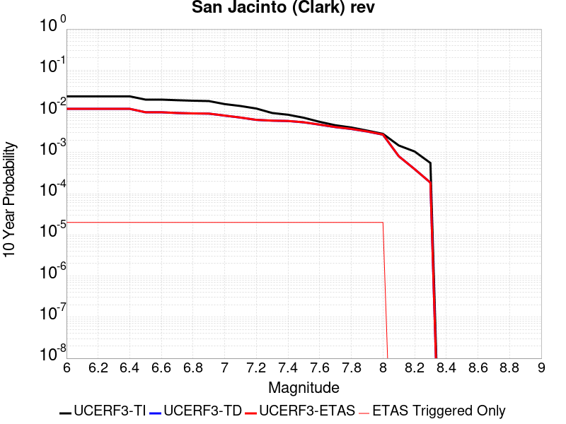 |

| Magnitude | 1 wk TI Prob | 1 wk TD Prob | 1 wk ETAS Prob | 1 wk ETAS/TD Gain | 1 wk ETAS Triggered Only | 1 mo TI Prob | 1 mo TD Prob | 1 mo ETAS Prob | 1 mo ETAS/TD Gain | 1 mo ETAS Triggered Only | 1 yr TI Prob | 1 yr TD Prob | 1 yr ETAS Prob | 1 yr ETAS/TD Gain | 1 yr ETAS Triggered Only | 10 yr TI Prob | 10 yr TD Prob | 10 yr ETAS Prob | 10 yr ETAS/TD Gain | 10 yr ETAS Triggered Only |
|-----|-----|-----|-----|-----|-----|-----|-----|-----|-----|-----|-----|-----|-----|-----|-----|-----|-----|-----|-----|-----|
| 6.0 | 4.482615E-5 | 2.1154196E-5 | 3.1153984E-5 | 1.4727095 | 1.0E-5 | 1.9209793E-4 | 9.065773E-5 | 1.0065683E-4 | 1.1102949 | 1.0E-5 | 0.0023362834 | 0.0011032083 | 0.0011131973 | 1.0090544 | 1.0E-5 | 0.02311874 | 0.011503847 | 0.0115236165 | 1.0017185 | 2.0E-5 |
| 6.1 | 4.482615E-5 | 2.1154196E-5 | 3.1153984E-5 | 1.4727095 | 1.0E-5 | 1.9209793E-4 | 9.065773E-5 | 1.0065683E-4 | 1.1102949 | 1.0E-5 | 0.0023362834 | 0.0011032083 | 0.0011131973 | 1.0090544 | 1.0E-5 | 0.02311874 | 0.011503847 | 0.0115236165 | 1.0017185 | 2.0E-5 |
| 6.2 | 4.482615E-5 | 2.1154196E-5 | 3.1153984E-5 | 1.4727095 | 1.0E-5 | 1.9209793E-4 | 9.065773E-5 | 1.0065683E-4 | 1.1102949 | 1.0E-5 | 0.0023362834 | 0.0011032083 | 0.0011131973 | 1.0090544 | 1.0E-5 | 0.02311874 | 0.011503847 | 0.0115236165 | 1.0017185 | 2.0E-5 |
| 6.3 | 4.482615E-5 | 2.1154196E-5 | 3.1153984E-5 | 1.4727095 | 1.0E-5 | 1.9209793E-4 | 9.065773E-5 | 1.0065683E-4 | 1.1102949 | 1.0E-5 | 0.0023362834 | 0.0011032083 | 0.0011131973 | 1.0090544 | 1.0E-5 | 0.02311874 | 0.011503847 | 0.0115236165 | 1.0017185 | 2.0E-5 |
| 6.4 | 4.482615E-5 | 2.1154196E-5 | 3.1153984E-5 | 1.4727095 | 1.0E-5 | 1.9209793E-4 | 9.065773E-5 | 1.0065683E-4 | 1.1102949 | 1.0E-5 | 0.0023362834 | 0.0011032083 | 0.0011131973 | 1.0090544 | 1.0E-5 | 0.02311874 | 0.011503847 | 0.0115236165 | 1.0017185 | 2.0E-5 |
| 6.5 | 3.7294863E-5 | 1.7356087E-5 | 2.7355914E-5 | 1.5761567 | 1.0E-5 | 1.5982533E-4 | 7.438113E-5 | 8.4380394E-5 | 1.1344327 | 1.0E-5 | 0.0019441366 | 9.052186E-4 | 9.1520953E-4 | 1.0110371 | 1.0E-5 | 0.01927216 | 0.0094941035 | 0.009513914 | 1.0020865 | 2.0E-5 |
| 6.6 | 3.7294863E-5 | 1.7356087E-5 | 2.7355914E-5 | 1.5761567 | 1.0E-5 | 1.5982533E-4 | 7.438113E-5 | 8.4380394E-5 | 1.1344327 | 1.0E-5 | 0.0019441366 | 9.052186E-4 | 9.1520953E-4 | 1.0110371 | 1.0E-5 | 0.01927216 | 0.0094941035 | 0.009513914 | 1.0020865 | 2.0E-5 |
| 6.7 | 3.6039248E-5 | 1.6604314E-5 | 2.6604146E-5 | 1.6022432 | 1.0E-5 | 1.5444479E-4 | 7.1159426E-5 | 8.115871E-5 | 1.1405195 | 1.0E-5 | 0.0018787434 | 8.6602574E-4 | 8.760171E-4 | 1.011537 | 1.0E-5 | 0.01862939 | 0.009096047 | 0.0091158645 | 1.0021788 | 2.0E-5 |
| 6.8 | 3.5031844E-5 | 1.6232942E-5 | 2.623278E-5 | 1.6160213 | 1.0E-5 | 1.5012783E-4 | 6.956792E-5 | 7.9567224E-5 | 1.1437345 | 1.0E-5 | 0.0018262739 | 8.4666436E-4 | 8.566559E-4 | 1.011801 | 1.0E-5 | 0.01811338 | 0.008895969 | 0.008915791 | 1.0022283 | 2.0E-5 |
| 6.9 | 3.435112E-5 | 1.6063195E-5 | 2.6063033E-5 | 1.6225312 | 1.0E-5 | 1.4721078E-4 | 6.884047E-5 | 7.883978E-5 | 1.1452534 | 1.0E-5 | 0.0017908178 | 8.3781447E-4 | 8.478061E-4 | 1.0119258 | 1.0E-5 | 0.017764548 | 0.008804181 | 0.008824004 | 1.0022516 | 2.0E-5 |
| 7.0 | 2.8959772E-5 | 1.4336745E-5 | 2.4336601E-5 | 1.6974984 | 1.0E-5 | 1.241074E-4 | 6.144176E-5 | 7.144115E-5 | 1.1627457 | 1.0E-5 | 0.0015099603 | 7.477995E-4 | 7.5779203E-4 | 1.0133625 | 1.0E-5 | 0.014997416 | 0.007868037 | 0.007887879 | 1.0025219 | 2.0E-5 |
| 7.1 | 2.6002877E-5 | 1.2829002E-5 | 2.2828874E-5 | 1.7794739 | 1.0E-5 | 1.11436144E-4 | 5.498029E-5 | 6.497974E-5 | 1.1818733 | 1.0E-5 | 0.0013558907 | 6.691816E-4 | 6.7917485E-4 | 1.0149336 | 1.0E-5 | 0.013476475 | 0.0070465137 | 0.007066373 | 1.0028182 | 2.0E-5 |
| 7.2 | 2.2544838E-5 | 1.1262543E-5 | 2.126243E-5 | 1.8878889 | 1.0E-5 | 9.661716E-5 | 4.8267157E-5 | 5.8266676E-5 | 1.2071702 | 1.0E-5 | 0.001175679 | 5.874956E-4 | 5.9748976E-4 | 1.0170114 | 1.0E-5 | 0.011694785 | 0.0061927503 | 0.006212626 | 1.0032096 | 2.0E-5 |
| 7.3 | 1.75334E-5 | 1.0811715E-5 | 2.0811607E-5 | 1.9249127 | 1.0E-5 | 7.514098E-5 | 4.6335106E-5 | 5.633464E-5 | 1.2158091 | 1.0E-5 | 9.144575E-4 | 5.6398526E-4 | 5.7397963E-4 | 1.0177209 | 1.0E-5 | 0.009107036 | 0.0059337732 | 0.0059536546 | 1.0033505 | 2.0E-5 |
| 7.4 | 1.5924552E-5 | 1.0611516E-5 | 2.0611411E-5 | 1.9423624 | 1.0E-5 | 6.82463E-5 | 4.547714E-5 | 5.547669E-5 | 1.2198807 | 1.0E-5 | 8.305819E-4 | 5.535449E-4 | 5.635394E-4 | 1.0180554 | 1.0E-5 | 0.008274844 | 0.0058210334 | 0.005840917 | 1.0034158 | 2.0E-5 |
| 7.5 | 1.3428931E-5 | 9.8519E-6 | 1.9851801E-5 | 2.0150228 | 1.0E-5 | 5.7551293E-5 | 4.2221753E-5 | 5.222133E-5 | 1.2368348 | 1.0E-5 | 7.004617E-4 | 5.1392964E-4 | 5.2392454E-4 | 1.0194479 | 1.0E-5 | 0.006982579 | 0.0054066023 | 0.0054264944 | 1.0036792 | 2.0E-5 |
| 7.6 | 1.0688787E-5 | 8.614839E-6 | 1.8614754E-5 | 2.1607778 | 1.0E-5 | 4.5808283E-5 | 3.692022E-5 | 4.6919853E-5 | 1.2708442 | 1.0E-5 | 5.5757316E-4 | 4.4941145E-4 | 4.5940696E-4 | 1.0222414 | 1.0E-5 | 0.005561762 | 0.0047416524 | 0.0047615576 | 1.004198 | 2.0E-5 |
| 7.7 | 8.81236E-6 | 7.4680274E-6 | 1.7467954E-5 | 2.3390317 | 1.0E-5 | 3.776671E-5 | 3.2005442E-5 | 4.2005122E-5 | 1.3124368 | 1.0E-5 | 4.597127E-4 | 3.8959677E-4 | 3.995929E-4 | 1.0256575 | 1.0E-5 | 0.0045876284 | 0.0041346536 | 0.004154571 | 1.0048171 | 2.0E-5 |
| 7.8 | 7.780431E-6 | 6.696579E-6 | 1.6696513E-5 | 2.4932897 | 1.0E-5 | 3.3344273E-5 | 2.8699309E-5 | 3.869902E-5 | 1.3484304 | 1.0E-5 | 4.0589093E-4 | 3.4935825E-4 | 3.5935477E-4 | 1.0286139 | 1.0E-5 | 0.0040515037 | 0.0037227906 | 0.0037427163 | 1.0053523 | 2.0E-5 |
| 7.9 | 6.5437994E-6 | 5.780382E-6 | 1.5780324E-5 | 2.7299795 | 1.0E-5 | 2.8044553E-5 | 2.477283E-5 | 3.4772584E-5 | 1.403658 | 1.0E-5 | 3.4138895E-4 | 3.0156763E-4 | 3.1156463E-4 | 1.0331501 | 1.0E-5 | 0.0034086495 | 0.0032344845 | 0.00325442 | 1.0061634 | 2.0E-5 |
| 8.0 | 5.4488164E-6 | 4.8133406E-6 | 1.4813292E-5 | 3.0775492 | 1.0E-5 | 2.3351862E-5 | 2.062844E-5 | 3.0628235E-5 | 1.4847577 | 1.0E-5 | 2.8427184E-4 | 2.5112246E-4 | 2.6111995E-4 | 1.0398113 | 1.0E-5 | 0.0028390845 | 0.002710839 | 0.0027307847 | 1.0073578 | 2.0E-5 |
| 8.1 | 2.8397242E-6 | 1.3670389E-6 | 1.3670389E-6 | 1.0 | 0.0 | 1.217019E-5 | 5.858725E-6 | 5.858725E-6 | 1.0 | 0.0 | 1.4816198E-4 | 7.132765E-5 | 7.132765E-5 | 1.0 | 0.0 | 0.0014806325 | 8.115382E-4 | 8.115382E-4 | 1.0 | 0.0 |
| 8.2 | 2.030244E-6 | 6.318974E-7 | 6.318974E-7 | 1.0 | 0.0 | 8.701017E-6 | 2.708129E-6 | 2.708129E-6 | 1.0 | 0.0 | 1.05929736E-4 | 3.2970976E-5 | 3.2970976E-5 | 1.0 | 0.0 | 0.0010587925 | 3.9486602E-4 | 3.9486602E-4 | 1.0 | 0.0 |
| 8.3 | 1.0659804E-6 | 2.9250086E-7 | 2.9250086E-7 | 1.0 | 0.0 | 4.568479E-6 | 1.2535745E-6 | 1.2535745E-6 | 1.0 | 0.0 | 5.5619817E-5 | 1.5262167E-5 | 1.5262167E-5 | 1.0 | 0.0 | 5.5605895E-4 | 1.8566217E-4 | 1.8566217E-4 | 1.0 | 0.0 |

## Clamshell-Sawpit
*[(top)](#table-of-contents)*

| 1 Week | 1 Month | 1 Year | 10 Year |
|-----|-----|-----|-----|
|  |  |  |  |

| Magnitude | 1 wk TI Prob | 1 wk TD Prob | 1 wk ETAS Prob | 1 wk ETAS/TD Gain | 1 wk ETAS Triggered Only | 1 mo TI Prob | 1 mo TD Prob | 1 mo ETAS Prob | 1 mo ETAS/TD Gain | 1 mo ETAS Triggered Only | 1 yr TI Prob | 1 yr TD Prob | 1 yr ETAS Prob | 1 yr ETAS/TD Gain | 1 yr ETAS Triggered Only | 10 yr TI Prob | 10 yr TD Prob | 10 yr ETAS Prob | 10 yr ETAS/TD Gain | 10 yr ETAS Triggered Only |
|-----|-----|-----|-----|-----|-----|-----|-----|-----|-----|-----|-----|-----|-----|-----|-----|-----|-----|-----|-----|-----|
| 6.0 | 3.202998E-6 | 3.0127644E-6 | 3.0127644E-6 | 1.0 | 0.0 | 1.3727062E-5 | 1.2911788E-5 | 1.2911788E-5 | 1.0 | 0.0 | 1.6711417E-4 | 1.5719049E-4 | 1.671889E-4 | 1.0636071 | 1.0E-5 | 0.0016698855 | 0.0015708724 | 0.0015908409 | 1.0127118 | 2.0E-5 |
| 6.1 | 3.202998E-6 | 3.0127644E-6 | 3.0127644E-6 | 1.0 | 0.0 | 1.3727062E-5 | 1.2911788E-5 | 1.2911788E-5 | 1.0 | 0.0 | 1.6711417E-4 | 1.5719049E-4 | 1.671889E-4 | 1.0636071 | 1.0E-5 | 0.0016698855 | 0.0015708724 | 0.0015908409 | 1.0127118 | 2.0E-5 |
| 6.2 | 3.202998E-6 | 3.0127644E-6 | 3.0127644E-6 | 1.0 | 0.0 | 1.3727062E-5 | 1.2911788E-5 | 1.2911788E-5 | 1.0 | 0.0 | 1.6711417E-4 | 1.5719049E-4 | 1.671889E-4 | 1.0636071 | 1.0E-5 | 0.0016698855 | 0.0015708724 | 0.0015908409 | 1.0127118 | 2.0E-5 |
| 6.3 | 3.202998E-6 | 3.0127644E-6 | 3.0127644E-6 | 1.0 | 0.0 | 1.3727062E-5 | 1.2911788E-5 | 1.2911788E-5 | 1.0 | 0.0 | 1.6711417E-4 | 1.5719049E-4 | 1.671889E-4 | 1.0636071 | 1.0E-5 | 0.0016698855 | 0.0015708724 | 0.0015908409 | 1.0127118 | 2.0E-5 |
| 6.4 | 3.202998E-6 | 3.0127644E-6 | 3.0127644E-6 | 1.0 | 0.0 | 1.3727062E-5 | 1.2911788E-5 | 1.2911788E-5 | 1.0 | 0.0 | 1.6711417E-4 | 1.5719049E-4 | 1.671889E-4 | 1.0636071 | 1.0E-5 | 0.0016698855 | 0.0015708724 | 0.0015908409 | 1.0127118 | 2.0E-5 |
| 6.5 | 2.5862723E-6 | 2.380775E-6 | 2.380775E-6 | 1.0 | 0.0 | 1.1083977E-5 | 1.0203283E-5 | 1.0203283E-5 | 1.0 | 0.0 | 1.3493907E-4 | 1.2421819E-4 | 1.2421819E-4 | 1.0 | 0.0 | 0.0013485716 | 0.0012415178 | 0.0012415178 | 1.0 | 0.0 |
| 6.6 | 2.5862723E-6 | 2.380775E-6 | 2.380775E-6 | 1.0 | 0.0 | 1.1083977E-5 | 1.0203283E-5 | 1.0203283E-5 | 1.0 | 0.0 | 1.3493907E-4 | 1.2421819E-4 | 1.2421819E-4 | 1.0 | 0.0 | 0.0013485716 | 0.0012415178 | 0.0012415178 | 1.0 | 0.0 |
| 6.7 | 2.5862723E-6 | 2.380775E-6 | 2.380775E-6 | 1.0 | 0.0 | 1.1083977E-5 | 1.0203283E-5 | 1.0203283E-5 | 1.0 | 0.0 | 1.3493907E-4 | 1.2421819E-4 | 1.2421819E-4 | 1.0 | 0.0 | 0.0013485716 | 0.0012415178 | 0.0012415178 | 1.0 | 0.0 |
| 6.8 | 2.4098806E-6 | 2.1977307E-6 | 2.1977307E-6 | 1.0 | 0.0 | 1.0328019E-5 | 9.4188135E-6 | 9.4188135E-6 | 1.0 | 0.0 | 1.2573638E-4 | 1.1466829E-4 | 1.1466829E-4 | 1.0 | 0.0 | 0.0012566525 | 0.0011461178 | 0.0011461178 | 1.0 | 0.0 |
| 6.9 | 2.0073985E-6 | 1.7784248E-6 | 1.7784248E-6 | 1.0 | 0.0 | 8.603109E-6 | 7.621799E-6 | 7.621799E-6 | 1.0 | 0.0 | 1.0473781E-4 | 9.279157E-5 | 9.279157E-5 | 1.0 | 0.0 | 0.0010468846 | 9.275401E-4 | 9.275401E-4 | 1.0 | 0.0 |
| 7.0 | 1.8166766E-6 | 1.5807095E-6 | 1.5807095E-6 | 1.0 | 0.0 | 7.785734E-6 | 6.7744522E-6 | 6.7744522E-6 | 1.0 | 0.0 | 9.478718E-5 | 8.247593E-5 | 8.247593E-5 | 1.0 | 0.0 | 9.4746763E-4 | 8.244633E-4 | 8.244633E-4 | 1.0 | 0.0 |
| 7.1 | 1.5471421E-6 | 1.3052961E-6 | 1.3052961E-6 | 1.0 | 0.0 | 6.6305925E-6 | 5.5941146E-6 | 5.5941146E-6 | 1.0 | 0.0 | 8.072447E-5 | 6.8106274E-5 | 6.8106274E-5 | 1.0 | 0.0 | 8.0695155E-4 | 6.808595E-4 | 6.808595E-4 | 1.0 | 0.0 |
| 7.2 | 1.3608037E-6 | 1.1153443E-6 | 1.1153443E-6 | 1.0 | 0.0 | 5.8320024E-6 | 4.7800386E-6 | 4.7800386E-6 | 1.0 | 0.0 | 7.1002316E-5 | 5.8195463E-5 | 5.8195463E-5 | 1.0 | 0.0 | 7.097964E-4 | 5.818069E-4 | 5.818069E-4 | 1.0 | 0.0 |
| 7.3 | 1.0749634E-6 | 8.384254E-7 | 8.384254E-7 | 1.0 | 0.0 | 4.6069777E-6 | 3.593247E-6 | 3.593247E-6 | 1.0 | 0.0 | 5.608851E-5 | 4.374693E-5 | 4.374693E-5 | 1.0 | 0.0 | 5.6074356E-4 | 4.37386E-4 | 4.37386E-4 | 1.0 | 0.0 |
| 7.4 | 8.416856E-7 | 6.200048E-7 | 6.200048E-7 | 1.0 | 0.0 | 3.607219E-6 | 2.6571608E-6 | 2.6571608E-6 | 1.0 | 0.0 | 4.3917007E-5 | 3.2350472E-5 | 3.2350472E-5 | 1.0 | 0.0 | 4.390833E-4 | 3.2345962E-4 | 3.2345962E-4 | 1.0 | 0.0 |
| 7.5 | 6.2779594E-7 | 4.496886E-7 | 4.496886E-7 | 1.0 | 0.0 | 2.6905511E-6 | 1.9272356E-6 | 1.9272356E-6 | 1.0 | 0.0 | 3.275697E-5 | 2.346386E-5 | 2.346386E-5 | 1.0 | 0.0 | 3.275214E-4 | 2.346157E-4 | 2.346157E-4 | 1.0 | 0.0 |
| 7.6 | 4.3822078E-7 | 3.0595405E-7 | 3.0595405E-7 | 1.0 | 0.0 | 1.8780877E-6 | 1.311231E-6 | 1.311231E-6 | 1.0 | 0.0 | 2.2865479E-5 | 1.5964137E-5 | 1.5964137E-5 | 1.0 | 0.0 | 2.2863125E-4 | 1.5963144E-4 | 1.5963144E-4 | 1.0 | 0.0 |
| 7.7 | 1.8704569E-7 | 1.12379205E-7 | 1.12379205E-7 | 1.0 | 0.0 | 8.0162414E-7 | 4.816251E-7 | 4.816251E-7 | 1.0 | 0.0 | 9.75973E-6 | 5.86377E-6 | 5.86377E-6 | 1.0 | 0.0 | 9.7593016E-5 | 5.863622E-5 | 5.863622E-5 | 1.0 | 0.0 |
| 7.8 | 3.5378733E-8 | 2.1838144E-8 | 2.1838144E-8 | 1.0 | 0.0 | 1.5162313E-7 | 9.359204E-8 | 9.359204E-8 | 1.0 | 0.0 | 1.84601E-6 | 1.1394826E-6 | 1.1394826E-6 | 1.0 | 0.0 | 1.8459947E-5 | 1.139477E-5 | 1.139477E-5 | 1.0 | 0.0 |
| 7.9 | 7.504945E-9 | 5.1920326E-9 | 5.1920326E-9 | 1.0 | 0.0 | 3.2164053E-8 | 2.225157E-8 | 2.225157E-8 | 1.0 | 0.0 | 3.9159727E-7 | 2.7091284E-7 | 2.7091284E-7 | 1.0 | 0.0 | 3.915966E-6 | 2.7091257E-6 | 2.7091257E-6 | 1.0 | 0.0 |
| 8.0 | 1.6554036E-10 | 1.4180768E-10 | 1.4180768E-10 | 1.0 | 0.0 | 7.0945894E-10 | 6.077475E-10 | 6.077475E-10 | 1.0 | 0.0 | 8.637662E-9 | 7.3993256E-9 | 7.3993256E-9 | 1.0 | 0.0 | 8.6376616E-8 | 7.3993256E-8 | 7.3993256E-8 | 1.0 | 0.0 |

## Rodgers Creek - Healdsburg 2011 CFM
*[(top)](#table-of-contents)*

| 1 Week | 1 Month | 1 Year | 10 Year |
|-----|-----|-----|-----|
|  | 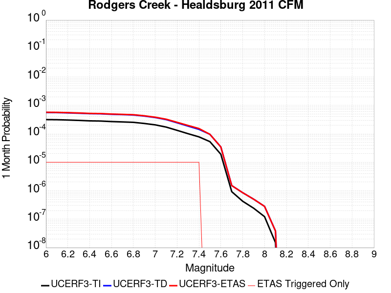 |  |  |

| Magnitude | 1 wk TI Prob | 1 wk TD Prob | 1 wk ETAS Prob | 1 wk ETAS/TD Gain | 1 wk ETAS Triggered Only | 1 mo TI Prob | 1 mo TD Prob | 1 mo ETAS Prob | 1 mo ETAS/TD Gain | 1 mo ETAS Triggered Only | 1 yr TI Prob | 1 yr TD Prob | 1 yr ETAS Prob | 1 yr ETAS/TD Gain | 1 yr ETAS Triggered Only | 10 yr TI Prob | 10 yr TD Prob | 10 yr ETAS Prob | 10 yr ETAS/TD Gain | 10 yr ETAS Triggered Only |
|-----|-----|-----|-----|-----|-----|-----|-----|-----|-----|-----|-----|-----|-----|-----|-----|-----|-----|-----|-----|-----|
| 6.0 | 7.390182E-5 | 1.3136698E-4 | 1.3136698E-4 | 1.0 | 0.0 | 3.1668364E-4 | 5.6287815E-4 | 5.728725E-4 | 1.0177559 | 1.0E-5 | 0.0038488081 | 0.0068315 | 0.0068414323 | 1.0014538 | 1.0E-5 | 0.037828278 | 0.06619178 | 0.066210456 | 1.0002822 | 2.0E-5 |
| 6.1 | 7.318768E-5 | 1.3034661E-4 | 1.3034661E-4 | 1.0 | 0.0 | 3.1362378E-4 | 5.585081E-4 | 5.685025E-4 | 1.0178949 | 1.0E-5 | 0.0038116854 | 0.0067786723 | 0.0067886044 | 1.0014652 | 1.0E-5 | 0.037469655 | 0.06569639 | 0.065715075 | 1.0002844 | 2.0E-5 |
| 6.2 | 7.1379836E-5 | 1.2727521E-4 | 1.2727521E-4 | 1.0 | 0.0 | 3.058777E-4 | 5.453505E-4 | 5.5534503E-4 | 1.0183269 | 1.0E-5 | 0.003717703 | 0.0066194604 | 0.0066293944 | 1.0015007 | 1.0E-5 | 0.0365612 | 0.06421462 | 0.06423333 | 1.0002915 | 2.0E-5 |
| 6.3 | 6.9255926E-5 | 1.2382054E-4 | 1.2382054E-4 | 1.0 | 0.0 | 2.9677735E-4 | 5.3055194E-4 | 5.4054667E-4 | 1.0188383 | 1.0E-5 | 0.0036072785 | 0.006440372 | 0.006450308 | 1.0015427 | 1.0E-5 | 0.035492823 | 0.06254096 | 0.06255971 | 1.0002998 | 2.0E-5 |
| 6.4 | 6.6757144E-5 | 1.1958744E-4 | 1.1958744E-4 | 1.0 | 0.0 | 2.8607066E-4 | 5.1241735E-4 | 5.2241224E-4 | 1.0195054 | 1.0E-5 | 0.0034773487 | 0.0062209065 | 0.006230844 | 1.0015975 | 1.0E-5 | 0.034234364 | 0.060490217 | 0.060509007 | 1.0003107 | 2.0E-5 |
| 6.5 | 6.5735134E-5 | 1.1808043E-4 | 1.1808043E-4 | 1.0 | 0.0 | 2.8169158E-4 | 5.0596124E-4 | 5.159562E-4 | 1.0197544 | 1.0E-5 | 0.003424202 | 0.0061427657 | 0.0061527044 | 1.0016179 | 1.0E-5 | 0.03371918 | 0.059755135 | 0.05977394 | 1.0003147 | 2.0E-5 |
| 6.6 | 6.289601E-5 | 1.1343802E-4 | 1.1343802E-4 | 1.0 | 0.0 | 2.6952647E-4 | 4.8607276E-4 | 4.960679E-4 | 1.020563 | 1.0E-5 | 0.0032765474 | 0.005901959 | 0.0059118997 | 1.0016843 | 1.0E-5 | 0.032286562 | 0.057494484 | 0.057513334 | 1.0003278 | 2.0E-5 |
| 6.7 | 6.115274E-5 | 1.1060895E-4 | 1.1060895E-4 | 1.0 | 0.0 | 2.6205686E-4 | 4.7395262E-4 | 4.8394786E-4 | 1.0210892 | 1.0E-5 | 0.0031858748 | 0.0057551847 | 0.005765127 | 1.0017276 | 1.0E-5 | 0.031405866 | 0.05611298 | 0.056131855 | 1.0003364 | 2.0E-5 |
| 6.8 | 5.9232367E-5 | 1.0728244E-4 | 1.0728244E-4 | 1.0 | 0.0 | 2.538283E-4 | 4.597012E-4 | 4.6969662E-4 | 1.0217433 | 1.0E-5 | 0.0030859804 | 0.0055825757 | 0.00559252 | 1.0017813 | 1.0E-5 | 0.030434765 | 0.054479737 | 0.054498646 | 1.0003471 | 2.0E-5 |
| 6.9 | 5.4030377E-5 | 9.8224424E-5 | 9.8224424E-5 | 1.0 | 0.0 | 2.315382E-4 | 4.2089424E-4 | 4.3089004E-4 | 1.023749 | 1.0E-5 | 0.0028153337 | 0.005112413 | 0.0051223617 | 1.001946 | 1.0E-5 | 0.027799325 | 0.05001516 | 0.050034158 | 1.0003799 | 2.0E-5 |
| 7.0 | 4.8260714E-5 | 8.740524E-5 | 8.740524E-5 | 1.0 | 0.0 | 2.0681522E-4 | 3.745404E-4 | 3.8453666E-4 | 1.0266894 | 1.0E-5 | 0.0025150678 | 0.004550549 | 0.0045605036 | 1.0021875 | 1.0E-5 | 0.024867928 | 0.044667665 | 0.044677217 | 1.0002139 | 1.0E-5 |
| 7.1 | 4.0294493E-5 | 7.389041E-5 | 7.389041E-5 | 1.0 | 0.0 | 1.7267925E-4 | 3.1663495E-4 | 3.266318E-4 | 1.0315721 | 1.0E-5 | 0.0021003427 | 0.0038482544 | 0.0038582159 | 1.0025886 | 1.0E-5 | 0.02080602 | 0.037923392 | 0.03793301 | 1.0002537 | 1.0E-5 |
| 7.2 | 3.096388E-5 | 5.697752E-5 | 5.697752E-5 | 1.0 | 0.0 | 1.326956E-4 | 2.4416664E-4 | 2.541642E-4 | 1.0409456 | 1.0E-5 | 0.0016143717 | 0.0029686983 | 0.0029786685 | 1.0033585 | 1.0E-5 | 0.01602694 | 0.029436996 | 0.0294467 | 1.0003297 | 1.0E-5 |
| 7.3 | 2.3615226E-5 | 4.3628002E-5 | 4.3628002E-5 | 1.0 | 0.0 | 1.0120418E-4 | 1.8696384E-4 | 1.9696196E-4 | 1.0534763 | 1.0E-5 | 0.0012314644 | 0.002273922 | 0.0022838993 | 1.0043877 | 1.0E-5 | 0.0122466255 | 0.022636993 | 0.022646766 | 1.0004318 | 1.0E-5 |
| 7.4 | 1.8251132E-5 | 3.3541033E-5 | 3.3541033E-5 | 1.0 | 0.0 | 7.821679E-5 | 1.4373941E-4 | 1.5373797E-4 | 1.0695603 | 1.0E-5 | 9.518733E-4 | 0.0017486324 | 0.0017586149 | 1.0057088 | 1.0E-5 | 0.009478063 | 0.017465532 | 0.017475357 | 1.0005625 | 1.0E-5 |
| 7.5 | 1.2411432E-5 | 2.246003E-5 | 2.246003E-5 | 1.0 | 0.0 | 5.3190768E-5 | 9.625375E-5 | 9.625375E-5 | 1.0 | 0.0 | 6.4740516E-4 | 0.0011712653 | 0.0011712653 | 1.0 | 0.0 | 0.006455223 | 0.011743283 | 0.011743283 | 1.0 | 0.0 |
| 7.6 | 4.4771446E-6 | 8.083989E-6 | 8.083989E-6 | 1.0 | 0.0 | 1.918762E-5 | 3.4645214E-5 | 3.4645214E-5 | 1.0 | 0.0 | 2.3358424E-4 | 4.2172507E-4 | 4.2172507E-4 | 1.0 | 0.0 | 0.0023333887 | 0.004246066 | 0.004246066 | 1.0 | 0.0 |
| 7.7 | 2.157941E-7 | 3.5349316E-7 | 3.5349316E-7 | 1.0 | 0.0 | 9.248315E-7 | 1.5149698E-6 | 1.5149698E-6 | 1.0 | 0.0 | 1.1259765E-5 | 1.8444602E-5 | 1.8444602E-5 | 1.0 | 0.0 | 1.1259195E-4 | 1.9069147E-4 | 1.9069147E-4 | 1.0 | 0.0 |
| 7.8 | 9.9623286E-8 | 1.989979E-7 | 1.989979E-7 | 1.0 | 0.0 | 4.269569E-7 | 8.528478E-7 | 8.528478E-7 | 1.0 | 0.0 | 5.1981874E-6 | 1.0383373E-5 | 1.0383373E-5 | 1.0 | 0.0 | 5.198066E-5 | 1.09018714E-4 | 1.09018714E-4 | 1.0 | 0.0 |
| 7.9 | 5.6745257E-8 | 1.1773924E-7 | 1.1773924E-7 | 1.0 | 0.0 | 2.4319394E-7 | 5.0459664E-7 | 5.0459664E-7 | 1.0 | 0.0 | 2.960882E-6 | 6.1434466E-6 | 6.1434466E-6 | 1.0 | 0.0 | 2.9608427E-5 | 6.470911E-5 | 6.470911E-5 | 1.0 | 0.0 |
| 8.0 | 2.8614323E-8 | 6.57845E-8 | 6.57845E-8 | 1.0 | 0.0 | 1.2263281E-7 | 2.8193355E-7 | 2.8193355E-7 | 1.0 | 0.0 | 1.4930534E-6 | 3.4325356E-6 | 3.4325356E-6 | 1.0 | 0.0 | 1.4930434E-5 | 3.582588E-5 | 3.582588E-5 | 1.0 | 0.0 |
| 8.1 | 3.5045191E-9 | 8.965783E-9 | 8.965783E-9 | 1.0 | 0.0 | 1.5019367E-8 | 3.8424783E-8 | 3.8424783E-8 | 1.0 | 0.0 | 1.8286079E-7 | 4.6782165E-7 | 4.6782165E-7 | 1.0 | 0.0 | 1.8286064E-6 | 4.8327956E-6 | 4.8327956E-6 | 1.0 | 0.0 |

## Almanor 2011 CFM
*[(top)](#table-of-contents)*

| 1 Week | 1 Month | 1 Year | 10 Year |
|-----|-----|-----|-----|
|  |  |  | 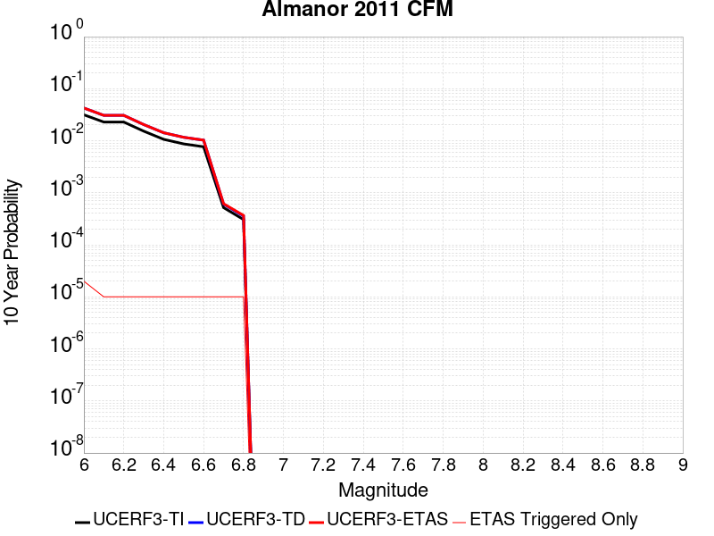 |

| Magnitude | 1 wk TI Prob | 1 wk TD Prob | 1 wk ETAS Prob | 1 wk ETAS/TD Gain | 1 wk ETAS Triggered Only | 1 mo TI Prob | 1 mo TD Prob | 1 mo ETAS Prob | 1 mo ETAS/TD Gain | 1 mo ETAS Triggered Only | 1 yr TI Prob | 1 yr TD Prob | 1 yr ETAS Prob | 1 yr ETAS/TD Gain | 1 yr ETAS Triggered Only | 10 yr TI Prob | 10 yr TD Prob | 10 yr ETAS Prob | 10 yr ETAS/TD Gain | 10 yr ETAS Triggered Only |
|-----|-----|-----|-----|-----|-----|-----|-----|-----|-----|-----|-----|-----|-----|-----|-----|-----|-----|-----|-----|-----|
| 6.0 | 6.1479834E-5 | 8.32787E-5 | 9.3277864E-5 | 1.1200687 | 1.0E-5 | 2.6345838E-4 | 3.5686578E-4 | 3.7685863E-4 | 1.0560235 | 2.0E-5 | 0.0032028882 | 0.0043366123 | 0.0043565254 | 1.004592 | 2.0E-5 | 0.031571172 | 0.04258577 | 0.04260492 | 1.0004497 | 2.0E-5 |
| 6.1 | 4.4387216E-5 | 5.9770442E-5 | 5.9770442E-5 | 1.0 | 0.0 | 1.9021705E-4 | 2.561381E-4 | 2.6613552E-4 | 1.0390314 | 1.0E-5 | 0.0023134327 | 0.003114426 | 0.003124395 | 1.0032009 | 1.0E-5 | 0.022894967 | 0.030755036 | 0.030764729 | 1.0003152 | 1.0E-5 |
| 6.2 | 4.4387216E-5 | 5.9770442E-5 | 5.9770442E-5 | 1.0 | 0.0 | 1.9021705E-4 | 2.561381E-4 | 2.6613552E-4 | 1.0390314 | 1.0E-5 | 0.0023134327 | 0.003114426 | 0.003124395 | 1.0032009 | 1.0E-5 | 0.022894967 | 0.030755036 | 0.030764729 | 1.0003152 | 1.0E-5 |
| 6.3 | 2.9523822E-5 | 3.954719E-5 | 3.954719E-5 | 1.0 | 0.0 | 1.2652454E-4 | 1.6947983E-4 | 1.7947814E-4 | 1.058994 | 1.0E-5 | 0.0015393476 | 0.0020618725 | 0.0020718519 | 1.00484 | 1.0E-5 | 0.015287281 | 0.020460794 | 0.02047059 | 1.0004787 | 1.0E-5 |
| 6.4 | 2.0512744E-5 | 2.7431617E-5 | 2.7431617E-5 | 1.0 | 0.0 | 8.79088E-5 | 1.175612E-4 | 1.2756002E-4 | 1.0850521 | 1.0E-5 | 0.001069764 | 0.0014307408 | 0.0014407266 | 1.0069793 | 1.0E-5 | 0.010646289 | 0.014244413 | 0.014254271 | 1.000692 | 1.0E-5 |
| 6.5 | 1.6750226E-5 | 2.23913E-5 | 2.23913E-5 | 1.0 | 0.0 | 7.178471E-5 | 9.596152E-5 | 1.0596056E-4 | 1.1041985 | 1.0E-5 | 8.7362836E-4 | 0.0011680633 | 0.0011780516 | 1.0085511 | 1.0E-5 | 0.008702018 | 0.011649038 | 0.011658922 | 1.0008484 | 1.0E-5 |
| 6.6 | 1.4745303E-5 | 1.9707952E-5 | 1.9707952E-5 | 1.0 | 0.0 | 6.319262E-5 | 8.446223E-5 | 9.4461386E-5 | 1.1183861 | 1.0E-5 | 7.690986E-4 | 0.0010281964 | 0.0010381861 | 1.0097158 | 1.0E-5 | 0.0076644225 | 0.010264971 | 0.010274868 | 1.0009642 | 1.0E-5 |
| 6.7 | 9.951145E-7 | 1.1616347E-6 | 1.1616347E-6 | 1.0 | 0.0 | 4.26477E-6 | 4.9784257E-6 | 1.4978376E-5 | 3.008657 | 1.0E-5 | 5.1922336E-5 | 6.0610826E-5 | 7.061022E-5 | 1.1649771 | 1.0E-5 | 5.1910203E-4 | 6.059602E-4 | 6.159541E-4 | 1.0164927 | 1.0E-5 |
| 6.8 | 5.866312E-7 | 6.849384E-7 | 6.849384E-7 | 1.0 | 0.0 | 2.5141312E-6 | 2.9354478E-6 | 1.2935418E-5 | 4.4066253 | 1.0E-5 | 3.0609117E-5 | 3.5738623E-5 | 4.5738263E-5 | 1.2797993 | 1.0E-5 | 3.06049E-4 | 3.5734157E-4 | 3.67338E-4 | 1.0279745 | 1.0E-5 |

## Greenville (So) 2011 CFM
*[(top)](#table-of-contents)*

| 1 Week | 1 Month | 1 Year | 10 Year |
|-----|-----|-----|-----|
| 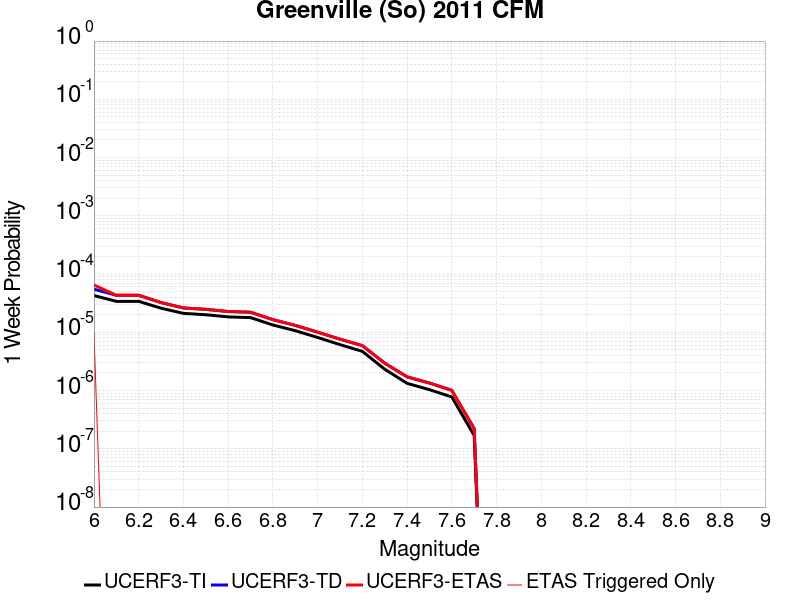 | 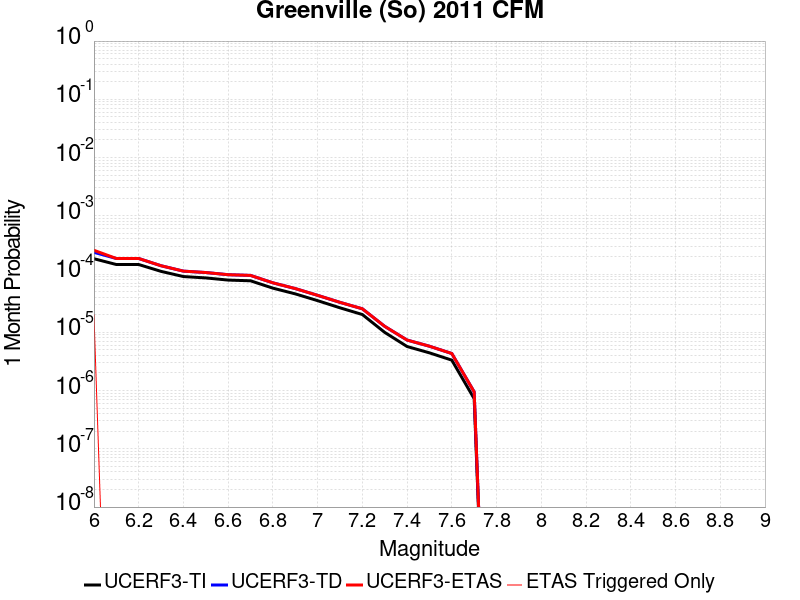 |  |  |

| Magnitude | 1 wk TI Prob | 1 wk TD Prob | 1 wk ETAS Prob | 1 wk ETAS/TD Gain | 1 wk ETAS Triggered Only | 1 mo TI Prob | 1 mo TD Prob | 1 mo ETAS Prob | 1 mo ETAS/TD Gain | 1 mo ETAS Triggered Only | 1 yr TI Prob | 1 yr TD Prob | 1 yr ETAS Prob | 1 yr ETAS/TD Gain | 1 yr ETAS Triggered Only | 10 yr TI Prob | 10 yr TD Prob | 10 yr ETAS Prob | 10 yr ETAS/TD Gain | 10 yr ETAS Triggered Only |
|-----|-----|-----|-----|-----|-----|-----|-----|-----|-----|-----|-----|-----|-----|-----|-----|-----|-----|-----|-----|-----|
| 6.0 | 4.279693E-5 | 5.5040087E-5 | 6.503954E-5 | 1.1816758 | 1.0E-5 | 1.8340252E-4 | 2.3586681E-4 | 2.558621E-4 | 1.0847737 | 2.0E-5 | 0.0022306389 | 0.0028682416 | 0.0028881843 | 1.0069529 | 2.0E-5 | 0.022083808 | 0.028338138 | 0.028357571 | 1.0006858 | 2.0E-5 |
| 6.1 | 3.4037297E-5 | 4.3192387E-5 | 4.3192387E-5 | 1.0 | 0.0 | 1.4586597E-4 | 1.8509831E-4 | 1.8509831E-4 | 1.0 | 0.0 | 0.0017744715 | 0.0022514379 | 0.0022514379 | 1.0 | 0.0 | 0.01760369 | 0.022302566 | 0.022302566 | 1.0 | 0.0 |
| 6.2 | 3.4037297E-5 | 4.3192387E-5 | 4.3192387E-5 | 1.0 | 0.0 | 1.4586597E-4 | 1.8509831E-4 | 1.8509831E-4 | 1.0 | 0.0 | 0.0017744715 | 0.0022514379 | 0.0022514379 | 1.0 | 0.0 | 0.01760369 | 0.022302566 | 0.022302566 | 1.0 | 0.0 |
| 6.3 | 2.5956324E-5 | 3.2428903E-5 | 3.2428903E-5 | 1.0 | 0.0 | 1.11236644E-4 | 1.3897405E-4 | 1.3897405E-4 | 1.0 | 0.0 | 0.0013534647 | 0.0016907708 | 0.0016907708 | 1.0 | 0.0 | 0.013452509 | 0.016785882 | 0.016785882 | 1.0 | 0.0 |
| 6.4 | 2.1145053E-5 | 2.6197677E-5 | 2.6197677E-5 | 1.0 | 0.0 | 9.061851E-5 | 1.1227112E-4 | 1.1227112E-4 | 1.0 | 0.0 | 0.0011027219 | 0.0013660751 | 0.0013660751 | 1.0 | 0.0 | 0.01097266 | 0.01358018 | 0.01358018 | 1.0 | 0.0 |
| 6.5 | 2.0030959E-5 | 2.479578E-5 | 2.479578E-5 | 1.0 | 0.0 | 8.584414E-5 | 1.06263484E-4 | 1.06263484E-4 | 1.0 | 0.0 | 0.0010446513 | 0.0012930221 | 0.0012930221 | 1.0 | 0.0 | 0.010397541 | 0.012858339 | 0.012858339 | 1.0 | 0.0 |
| 6.6 | 1.8395405E-5 | 2.2754466E-5 | 2.2754466E-5 | 1.0 | 0.0 | 7.8835066E-5 | 9.751565E-5 | 9.751565E-5 | 1.0 | 0.0 | 9.5939427E-4 | 0.0011866348 | 0.0011866348 | 1.0 | 0.0 | 0.009552629 | 0.011806041 | 0.011806041 | 1.0 | 0.0 |
| 6.7 | 1.7883482E-5 | 2.212551E-5 | 2.212551E-5 | 1.0 | 0.0 | 7.664124E-5 | 9.482033E-5 | 9.482033E-5 | 1.0 | 0.0 | 9.3270757E-4 | 0.0011538545 | 0.0011538545 | 1.0 | 0.0 | 0.009288026 | 0.011481688 | 0.011481688 | 1.0 | 0.0 |
| 6.8 | 1.3373564E-5 | 1.6505966E-5 | 1.6505966E-5 | 1.0 | 0.0 | 5.7314013E-5 | 7.073802E-5 | 7.073802E-5 | 1.0 | 0.0 | 6.975747E-4 | 8.609098E-4 | 8.609098E-4 | 1.0 | 0.0 | 0.0069538904 | 0.008577357 | 0.008577357 | 1.0 | 0.0 |
| 6.9 | 1.06692905E-5 | 1.3152582E-5 | 1.3152582E-5 | 1.0 | 0.0 | 4.5724726E-5 | 5.6367055E-5 | 5.6367055E-5 | 1.0 | 0.0 | 5.5655633E-4 | 6.86064E-4 | 6.86064E-4 | 1.0 | 0.0 | 0.005551645 | 0.006840693 | 0.006840693 | 1.0 | 0.0 |
| 7.0 | 8.157512E-6 | 1.0062639E-5 | 1.0062639E-5 | 1.0 | 0.0 | 3.4960296E-5 | 4.3124903E-5 | 4.3124903E-5 | 1.0 | 0.0 | 4.2555845E-4 | 5.2492286E-4 | 5.2492286E-4 | 1.0 | 0.0 | 0.004247444 | 0.0052373074 | 0.0052373074 | 1.0 | 0.0 |
| 7.1 | 6.1467113E-6 | 7.6274314E-6 | 7.6274314E-6 | 1.0 | 0.0 | 2.6342783E-5 | 3.268859E-5 | 3.268859E-5 | 1.0 | 0.0 | 3.206762E-4 | 3.9791173E-4 | 3.9791173E-4 | 1.0 | 0.0 | 0.0032021382 | 0.0039721807 | 0.0039721807 | 1.0 | 0.0 |
| 7.2 | 4.713467E-6 | 5.9141557E-6 | 5.9141557E-6 | 1.0 | 0.0 | 2.0200418E-5 | 2.5346139E-5 | 2.5346139E-5 | 1.0 | 0.0 | 2.4591232E-4 | 3.0854615E-4 | 3.0854615E-4 | 1.0 | 0.0 | 0.0024564038 | 0.0030813308 | 0.0030813308 | 1.0 | 0.0 |
| 7.3 | 2.3266216E-6 | 2.954009E-6 | 2.954009E-6 | 1.0 | 0.0 | 9.971197E-6 | 1.2659978E-5 | 1.2659978E-5 | 1.0 | 0.0 | 1.2139256E-4 | 1.5412449E-4 | 1.5412449E-4 | 1.0 | 0.0 | 0.0012132627 | 0.0015402455 | 0.0015402455 | 1.0 | 0.0 |
| 7.4 | 1.3314E-6 | 1.7179472E-6 | 1.7179472E-6 | 1.0 | 0.0 | 5.7059874E-6 | 7.36261E-6 | 7.36261E-6 | 1.0 | 0.0 | 6.946818E-5 | 8.963614E-5 | 8.963614E-5 | 1.0 | 0.0 | 6.9446466E-4 | 8.9603866E-4 | 8.9603866E-4 | 1.0 | 0.0 |
| 7.5 | 1.0362941E-6 | 1.3468821E-6 | 1.3468821E-6 | 1.0 | 0.0 | 4.4412527E-6 | 5.772339E-6 | 5.772339E-6 | 1.0 | 0.0 | 5.407091E-5 | 7.027601E-5 | 7.027601E-5 | 1.0 | 0.0 | 5.405776E-4 | 7.025681E-4 | 7.025681E-4 | 1.0 | 0.0 |
| 7.6 | 7.764784E-7 | 1.0088593E-6 | 1.0088593E-6 | 1.0 | 0.0 | 3.3277602E-6 | 4.323676E-6 | 4.323676E-6 | 1.0 | 0.0 | 4.0514726E-5 | 5.263952E-5 | 5.263952E-5 | 1.0 | 0.0 | 4.050734E-4 | 5.262919E-4 | 5.262919E-4 | 1.0 | 0.0 |
| 7.7 | 1.6927763E-7 | 2.2139248E-7 | 2.2139248E-7 | 1.0 | 0.0 | 7.2547533E-7 | 9.4882455E-7 | 9.4882455E-7 | 1.0 | 0.0 | 8.832627E-6 | 1.15518815E-5 | 1.15518815E-5 | 1.0 | 0.0 | 8.8322755E-5 | 1.15515526E-4 | 1.15515526E-4 | 1.0 | 0.0 |

## Malibu Coast alt 1
*[(top)](#table-of-contents)*

| 1 Week | 1 Month | 1 Year | 10 Year |
|-----|-----|-----|-----|
|  |  |  | 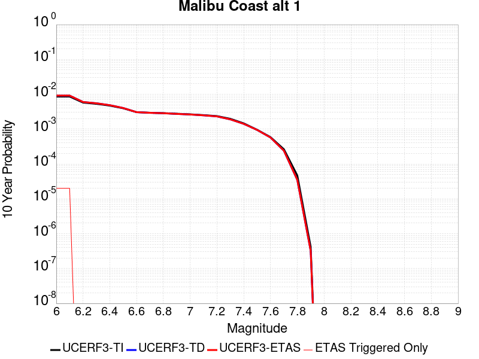 |

| Magnitude | 1 wk TI Prob | 1 wk TD Prob | 1 wk ETAS Prob | 1 wk ETAS/TD Gain | 1 wk ETAS Triggered Only | 1 mo TI Prob | 1 mo TD Prob | 1 mo ETAS Prob | 1 mo ETAS/TD Gain | 1 mo ETAS Triggered Only | 1 yr TI Prob | 1 yr TD Prob | 1 yr ETAS Prob | 1 yr ETAS/TD Gain | 1 yr ETAS Triggered Only | 10 yr TI Prob | 10 yr TD Prob | 10 yr ETAS Prob | 10 yr ETAS/TD Gain | 10 yr ETAS Triggered Only |
|-----|-----|-----|-----|-----|-----|-----|-----|-----|-----|-----|-----|-----|-----|-----|-----|-----|-----|-----|-----|-----|
| 6.0 | 1.6572556E-5 | 1.7598066E-5 | 1.7598066E-5 | 1.0 | 0.0 | 7.102331E-5 | 7.541821E-5 | 7.541821E-5 | 1.0 | 0.0 | 8.6436566E-4 | 9.178488E-4 | 9.278396E-4 | 1.010885 | 1.0E-5 | 0.0086101135 | 0.009142512 | 0.00916233 | 1.0021676 | 2.0E-5 |
| 6.1 | 1.6572556E-5 | 1.7598066E-5 | 1.7598066E-5 | 1.0 | 0.0 | 7.102331E-5 | 7.541821E-5 | 7.541821E-5 | 1.0 | 0.0 | 8.6436566E-4 | 9.178488E-4 | 9.278396E-4 | 1.010885 | 1.0E-5 | 0.0086101135 | 0.009142512 | 0.00916233 | 1.0021676 | 2.0E-5 |
| 6.2 | 1.1085717E-5 | 1.1557147E-5 | 1.1557147E-5 | 1.0 | 0.0 | 4.750935E-5 | 4.952971E-5 | 4.952971E-5 | 1.0 | 0.0 | 5.782728E-4 | 6.028609E-4 | 6.028609E-4 | 1.0 | 0.0 | 0.0057677035 | 0.0060126255 | 0.0060126255 | 1.0 | 0.0 |
| 6.3 | 1.0208568E-5 | 1.0592237E-5 | 1.0592237E-5 | 1.0 | 0.0 | 4.375027E-5 | 4.539453E-5 | 4.539453E-5 | 1.0 | 0.0 | 5.325294E-4 | 5.5254117E-4 | 5.5254117E-4 | 1.0 | 0.0 | 0.0053125503 | 0.0055119814 | 0.0055119814 | 1.0 | 0.0 |
| 6.4 | 9.0682315E-6 | 9.342637E-6 | 9.342637E-6 | 1.0 | 0.0 | 3.8863272E-5 | 4.003927E-5 | 4.003927E-5 | 1.0 | 0.0 | 4.730576E-4 | 4.8737114E-4 | 4.8737114E-4 | 1.0 | 0.0 | 0.0047205184 | 0.004863236 | 0.004863236 | 1.0 | 0.0 |
| 6.5 | 7.605796E-6 | 7.748587E-6 | 7.748587E-6 | 1.0 | 0.0 | 3.259586E-5 | 3.3207816E-5 | 3.3207816E-5 | 1.0 | 0.0 | 3.9678233E-4 | 4.0423148E-4 | 4.0423148E-4 | 1.0 | 0.0 | 0.0039607463 | 0.0040351 | 0.0040351 | 1.0 | 0.0 |
| 6.6 | 5.889873E-6 | 5.8795385E-6 | 5.8795385E-6 | 1.0 | 0.0 | 2.5242069E-5 | 2.519778E-5 | 2.519778E-5 | 1.0 | 0.0 | 3.0727885E-4 | 3.0673988E-4 | 3.0673988E-4 | 1.0 | 0.0 | 0.003068543 | 0.0030631777 | 0.0030631777 | 1.0 | 0.0 |
| 6.7 | 5.66586E-6 | 5.641641E-6 | 5.641641E-6 | 1.0 | 0.0 | 2.428203E-5 | 2.417824E-5 | 2.417824E-5 | 1.0 | 0.0 | 2.955936E-4 | 2.9433038E-4 | 2.9433038E-4 | 1.0 | 0.0 | 0.0029520073 | 0.0029394177 | 0.0029394177 | 1.0 | 0.0 |
| 6.8 | 5.521556E-6 | 5.489427E-6 | 5.489427E-6 | 1.0 | 0.0 | 2.3663597E-5 | 2.3525903E-5 | 2.3525903E-5 | 1.0 | 0.0 | 2.880662E-4 | 2.8639034E-4 | 2.8639034E-4 | 1.0 | 0.0 | 0.0028769306 | 0.002860224 | 0.002860224 | 1.0 | 0.0 |
| 6.9 | 5.29752E-6 | 5.2499317E-6 | 5.2499317E-6 | 1.0 | 0.0 | 2.270346E-5 | 2.2499513E-5 | 2.2499513E-5 | 1.0 | 0.0 | 2.7637955E-4 | 2.7389723E-4 | 2.7389723E-4 | 1.0 | 0.0 | 0.0027603607 | 0.0027356069 | 0.0027356069 | 1.0 | 0.0 |
| 7.0 | 5.106743E-6 | 5.0476788E-6 | 5.0476788E-6 | 1.0 | 0.0 | 2.1885859E-5 | 2.163273E-5 | 2.163273E-5 | 1.0 | 0.0 | 2.6642776E-4 | 2.6334674E-4 | 2.6334674E-4 | 1.0 | 0.0 | 0.0026610855 | 0.0026303562 | 0.0026303562 | 1.0 | 0.0 |
| 7.1 | 4.8469647E-6 | 4.770373E-6 | 4.770373E-6 | 1.0 | 0.0 | 2.0772539E-5 | 2.0444295E-5 | 2.0444295E-5 | 1.0 | 0.0 | 2.528763E-4 | 2.4888094E-4 | 2.4888094E-4 | 1.0 | 0.0 | 0.0025258875 | 0.00248603 | 0.00248603 | 1.0 | 0.0 |
| 7.2 | 4.545514E-6 | 4.4481935E-6 | 4.4481935E-6 | 1.0 | 0.0 | 1.9480629E-5 | 1.9063547E-5 | 1.9063547E-5 | 1.0 | 0.0 | 2.3715083E-4 | 2.3207403E-4 | 2.3207403E-4 | 1.0 | 0.0 | 0.0023689792 | 0.0023183243 | 0.0023183243 | 1.0 | 0.0 |
| 7.3 | 3.794097E-6 | 3.6519348E-6 | 3.6519348E-6 | 1.0 | 0.0 | 1.6260314E-5 | 1.5651056E-5 | 1.5651056E-5 | 1.0 | 0.0 | 1.9795135E-4 | 1.9053498E-4 | 1.9053498E-4 | 1.0 | 0.0 | 0.001977751 | 0.0019037209 | 0.0019037209 | 1.0 | 0.0 |
| 7.4 | 2.808217E-6 | 2.719077E-6 | 2.719077E-6 | 1.0 | 0.0 | 1.203516E-5 | 1.1653135E-5 | 1.1653135E-5 | 1.0 | 0.0 | 1.4651821E-4 | 1.418677E-4 | 1.418677E-4 | 1.0 | 0.0 | 0.0014642165 | 0.001417774 | 0.001417774 | 1.0 | 0.0 |
| 7.5 | 1.83809E-6 | 1.8190691E-6 | 1.8190691E-6 | 1.0 | 0.0 | 7.877505E-6 | 7.795988E-6 | 7.795988E-6 | 1.0 | 0.0 | 9.59044E-5 | 9.491203E-5 | 9.491203E-5 | 1.0 | 0.0 | 9.5863023E-4 | 9.48717E-4 | 9.48717E-4 | 1.0 | 0.0 |
| 7.6 | 1.1292672E-6 | 1.1001447E-6 | 1.1001447E-6 | 1.0 | 0.0 | 4.839708E-6 | 4.714897E-6 | 4.714897E-6 | 1.0 | 0.0 | 5.8921847E-5 | 5.7402376E-5 | 5.7402376E-5 | 1.0 | 0.0 | 5.890623E-4 | 5.738771E-4 | 5.738771E-4 | 1.0 | 0.0 |
| 7.7 | 5.065272E-7 | 4.609151E-7 | 4.609151E-7 | 1.0 | 0.0 | 2.170829E-6 | 1.975349E-6 | 1.975349E-6 | 1.0 | 0.0 | 2.6429525E-5 | 2.404962E-5 | 2.404962E-5 | 1.0 | 0.0 | 2.642638E-4 | 2.4047129E-4 | 2.4047129E-4 | 1.0 | 0.0 |
| 7.8 | 8.952991E-8 | 6.707874E-8 | 6.707874E-8 | 1.0 | 0.0 | 3.8369956E-7 | 2.8748025E-7 | 2.8748025E-7 | 1.0 | 0.0 | 4.671532E-6 | 3.5000667E-6 | 3.5000667E-6 | 1.0 | 0.0 | 4.671434E-5 | 3.5000136E-5 | 3.5000136E-5 | 1.0 | 0.0 |
| 7.9 | 8.007447E-10 | 6.1608785E-10 | 6.1608785E-10 | 1.0 | 0.0 | 3.4317629E-9 | 2.6403764E-9 | 2.6403764E-9 | 1.0 | 0.0 | 4.1781714E-8 | 3.2146584E-8 | 3.2146584E-8 | 1.0 | 0.0 | 4.1781706E-7 | 3.214658E-7 | 3.214658E-7 | 1.0 | 0.0 |

## Great Valley 07 (Orestimba)
*[(top)](#table-of-contents)*

| 1 Week | 1 Month | 1 Year | 10 Year |
|-----|-----|-----|-----|
|  |  | 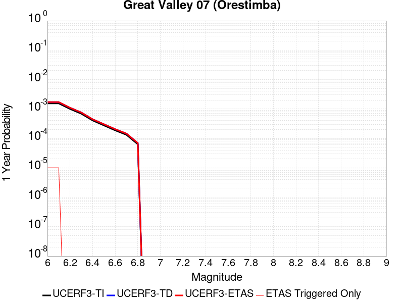 |  |

| Magnitude | 1 wk TI Prob | 1 wk TD Prob | 1 wk ETAS Prob | 1 wk ETAS/TD Gain | 1 wk ETAS Triggered Only | 1 mo TI Prob | 1 mo TD Prob | 1 mo ETAS Prob | 1 mo ETAS/TD Gain | 1 mo ETAS Triggered Only | 1 yr TI Prob | 1 yr TD Prob | 1 yr ETAS Prob | 1 yr ETAS/TD Gain | 1 yr ETAS Triggered Only | 10 yr TI Prob | 10 yr TD Prob | 10 yr ETAS Prob | 10 yr ETAS/TD Gain | 10 yr ETAS Triggered Only |
|-----|-----|-----|-----|-----|-----|-----|-----|-----|-----|-----|-----|-----|-----|-----|-----|-----|-----|-----|-----|-----|
| 6.0 | 2.9687902E-5 | 3.27575E-5 | 3.27575E-5 | 1.0 | 0.0 | 1.2722766E-4 | 1.4038214E-4 | 1.4038214E-4 | 1.0 | 0.0 | 0.0015478961 | 0.0017078844 | 0.0017178673 | 1.0058452 | 1.0E-5 | 0.015371585 | 0.016955135 | 0.016974797 | 1.0011595 | 2.0E-5 |
| 6.1 | 2.9687902E-5 | 3.27575E-5 | 3.27575E-5 | 1.0 | 0.0 | 1.2722766E-4 | 1.4038214E-4 | 1.4038214E-4 | 1.0 | 0.0 | 0.0015478961 | 0.0017078844 | 0.0017178673 | 1.0058452 | 1.0E-5 | 0.015371585 | 0.016955135 | 0.016974797 | 1.0011595 | 2.0E-5 |
| 6.2 | 1.9231524E-5 | 2.1159167E-5 | 2.1159167E-5 | 1.0 | 0.0 | 8.2418206E-5 | 9.067912E-5 | 9.067912E-5 | 1.0 | 0.0 | 0.0010029797 | 0.0011034822 | 0.0011034822 | 1.0 | 0.0 | 0.00998465 | 0.01098244 | 0.0109923305 | 1.0009005 | 1.0E-5 |
| 6.3 | 1.324766E-5 | 1.4548534E-5 | 1.4548534E-5 | 1.0 | 0.0 | 5.6774446E-5 | 6.234942E-5 | 6.234942E-5 | 1.0 | 0.0 | 6.910097E-4 | 7.5884897E-4 | 7.5884897E-4 | 1.0 | 0.0 | 0.006888649 | 0.0075635235 | 0.0075635235 | 1.0 | 0.0 |
| 6.4 | 7.818645E-6 | 8.57284E-6 | 8.57284E-6 | 1.0 | 0.0 | 3.3508048E-5 | 3.6740246E-5 | 3.6740246E-5 | 1.0 | 0.0 | 4.078841E-4 | 4.4722404E-4 | 4.4722404E-4 | 1.0 | 0.0 | 0.004071363 | 0.0044635804 | 0.0044635804 | 1.0 | 0.0 |
| 6.5 | 5.3076565E-6 | 5.8178007E-6 | 5.8178007E-6 | 1.0 | 0.0 | 2.27469E-5 | 2.4933206E-5 | 2.4933206E-5 | 1.0 | 0.0 | 2.7690834E-4 | 3.035216E-4 | 3.035216E-4 | 1.0 | 0.0 | 0.0027656353 | 0.00303128 | 0.00303128 | 1.0 | 0.0 |
| 6.6 | 3.6003578E-6 | 3.9484953E-6 | 3.9484953E-6 | 1.0 | 0.0 | 1.5430012E-5 | 1.6922022E-5 | 1.6922022E-5 | 1.0 | 0.0 | 1.8784421E-4 | 2.0600771E-4 | 2.0600771E-4 | 1.0 | 0.0 | 0.0018768552 | 0.0020583214 | 0.0020583214 | 1.0 | 0.0 |
| 6.7 | 2.5361826E-6 | 2.7834678E-6 | 2.7834678E-6 | 1.0 | 0.0 | 1.0869308E-5 | 1.1929101E-5 | 1.1929101E-5 | 1.0 | 0.0 | 1.3232579E-4 | 1.4522845E-4 | 1.4522845E-4 | 1.0 | 0.0 | 0.0013224703 | 0.0014514653 | 0.0014514653 | 1.0 | 0.0 |
| 6.8 | 1.2115831E-6 | 1.3313797E-6 | 1.3313797E-6 | 1.0 | 0.0 | 5.1924885E-6 | 5.7059065E-6 | 5.7059065E-6 | 1.0 | 0.0 | 6.3216714E-5 | 6.9468166E-5 | 6.9468166E-5 | 1.0 | 0.0 | 6.3198735E-4 | 6.945596E-4 | 6.945596E-4 | 1.0 | 0.0 |

## Big Lagoon - Bald Mtn 2011 CFM
*[(top)](#table-of-contents)*

| 1 Week | 1 Month | 1 Year | 10 Year |
|-----|-----|-----|-----|
|  | 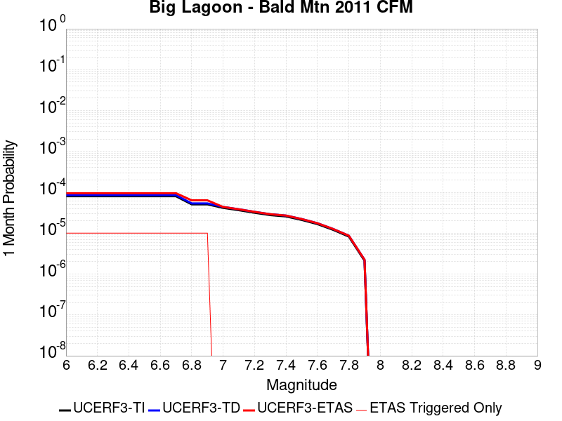 |  |  |

| Magnitude | 1 wk TI Prob | 1 wk TD Prob | 1 wk ETAS Prob | 1 wk ETAS/TD Gain | 1 wk ETAS Triggered Only | 1 mo TI Prob | 1 mo TD Prob | 1 mo ETAS Prob | 1 mo ETAS/TD Gain | 1 mo ETAS Triggered Only | 1 yr TI Prob | 1 yr TD Prob | 1 yr ETAS Prob | 1 yr ETAS/TD Gain | 1 yr ETAS Triggered Only | 10 yr TI Prob | 10 yr TD Prob | 10 yr ETAS Prob | 10 yr ETAS/TD Gain | 10 yr ETAS Triggered Only |
|-----|-----|-----|-----|-----|-----|-----|-----|-----|-----|-----|-----|-----|-----|-----|-----|-----|-----|-----|-----|-----|
| 6.0 | 1.8699735E-5 | 1.985018E-5 | 2.9849982E-5 | 1.5037638 | 1.0E-5 | 8.013926E-5 | 8.5069645E-5 | 9.506879E-5 | 1.1175407 | 1.0E-5 | 9.752587E-4 | 0.0010352687 | 0.0010452583 | 1.0096493 | 1.0E-5 | 0.009709897 | 0.010308274 | 0.010318171 | 1.0009601 | 1.0E-5 |
| 6.1 | 1.8699735E-5 | 1.985018E-5 | 2.9849982E-5 | 1.5037638 | 1.0E-5 | 8.013926E-5 | 8.5069645E-5 | 9.506879E-5 | 1.1175407 | 1.0E-5 | 9.752587E-4 | 0.0010352687 | 0.0010452583 | 1.0096493 | 1.0E-5 | 0.009709897 | 0.010308274 | 0.010318171 | 1.0009601 | 1.0E-5 |
| 6.2 | 1.8699735E-5 | 1.985018E-5 | 2.9849982E-5 | 1.5037638 | 1.0E-5 | 8.013926E-5 | 8.5069645E-5 | 9.506879E-5 | 1.1175407 | 1.0E-5 | 9.752587E-4 | 0.0010352687 | 0.0010452583 | 1.0096493 | 1.0E-5 | 0.009709897 | 0.010308274 | 0.010318171 | 1.0009601 | 1.0E-5 |
| 6.3 | 1.8699735E-5 | 1.985018E-5 | 2.9849982E-5 | 1.5037638 | 1.0E-5 | 8.013926E-5 | 8.5069645E-5 | 9.506879E-5 | 1.1175407 | 1.0E-5 | 9.752587E-4 | 0.0010352687 | 0.0010452583 | 1.0096493 | 1.0E-5 | 0.009709897 | 0.010308274 | 0.010318171 | 1.0009601 | 1.0E-5 |
| 6.4 | 1.8699735E-5 | 1.985018E-5 | 2.9849982E-5 | 1.5037638 | 1.0E-5 | 8.013926E-5 | 8.5069645E-5 | 9.506879E-5 | 1.1175407 | 1.0E-5 | 9.752587E-4 | 0.0010352687 | 0.0010452583 | 1.0096493 | 1.0E-5 | 0.009709897 | 0.010308274 | 0.010318171 | 1.0009601 | 1.0E-5 |
| 6.5 | 1.8699735E-5 | 1.985018E-5 | 2.9849982E-5 | 1.5037638 | 1.0E-5 | 8.013926E-5 | 8.5069645E-5 | 9.506879E-5 | 1.1175407 | 1.0E-5 | 9.752587E-4 | 0.0010352687 | 0.0010452583 | 1.0096493 | 1.0E-5 | 0.009709897 | 0.010308274 | 0.010318171 | 1.0009601 | 1.0E-5 |
| 6.6 | 1.8699735E-5 | 1.985018E-5 | 2.9849982E-5 | 1.5037638 | 1.0E-5 | 8.013926E-5 | 8.5069645E-5 | 9.506879E-5 | 1.1175407 | 1.0E-5 | 9.752587E-4 | 0.0010352687 | 0.0010452583 | 1.0096493 | 1.0E-5 | 0.009709897 | 0.010308274 | 0.010318171 | 1.0009601 | 1.0E-5 |
| 6.7 | 1.8699735E-5 | 1.985018E-5 | 2.9849982E-5 | 1.5037638 | 1.0E-5 | 8.013926E-5 | 8.5069645E-5 | 9.506879E-5 | 1.1175407 | 1.0E-5 | 9.752587E-4 | 0.0010352687 | 0.0010452583 | 1.0096493 | 1.0E-5 | 0.009709897 | 0.010308274 | 0.010318171 | 1.0009601 | 1.0E-5 |
| 6.8 | 1.18505095E-5 | 1.2499804E-5 | 2.2499678E-5 | 1.8000026 | 1.0E-5 | 5.078691E-5 | 5.3569514E-5 | 6.356898E-5 | 1.1866634 | 1.0E-5 | 6.181552E-4 | 6.520185E-4 | 6.6201197E-4 | 1.015327 | 1.0E-5 | 0.006164385 | 0.0065015587 | 0.0065114936 | 1.0015281 | 1.0E-5 |
| 6.9 | 1.18505095E-5 | 1.2499804E-5 | 2.2499678E-5 | 1.8000026 | 1.0E-5 | 5.078691E-5 | 5.3569514E-5 | 6.356898E-5 | 1.1866634 | 1.0E-5 | 6.181552E-4 | 6.520185E-4 | 6.6201197E-4 | 1.015327 | 1.0E-5 | 0.006164385 | 0.0065015587 | 0.0065114936 | 1.0015281 | 1.0E-5 |
| 7.0 | 9.719786E-6 | 1.0235487E-5 | 1.0235487E-5 | 1.0 | 0.0 | 4.1655563E-5 | 4.386565E-5 | 4.386565E-5 | 1.0 | 0.0 | 5.0703844E-4 | 5.3393573E-4 | 5.3393573E-4 | 1.0 | 0.0 | 0.005058831 | 0.0053267754 | 0.0053267754 | 1.0 | 0.0 |
| 7.1 | 8.523418E-6 | 8.969463E-6 | 8.969463E-6 | 1.0 | 0.0 | 3.652842E-5 | 3.844E-5 | 3.844E-5 | 1.0 | 0.0 | 4.4464276E-4 | 4.6790804E-4 | 4.6790804E-4 | 1.0 | 0.0 | 0.0044375416 | 0.004669392 | 0.004669392 | 1.0 | 0.0 |
| 7.2 | 7.378894E-6 | 7.761112E-6 | 7.761112E-6 | 1.0 | 0.0 | 3.162345E-5 | 3.326149E-5 | 3.326149E-5 | 1.0 | 0.0 | 3.8494746E-4 | 4.048843E-4 | 4.048843E-4 | 1.0 | 0.0 | 0.0038428132 | 0.0040415623 | 0.0040415623 | 1.0 | 0.0 |
| 7.3 | 6.4640294E-6 | 6.7924434E-6 | 6.7924434E-6 | 1.0 | 0.0 | 2.7702688E-5 | 2.9110151E-5 | 2.9110151E-5 | 1.0 | 0.0 | 3.3722803E-4 | 3.5435913E-4 | 3.5435913E-4 | 1.0 | 0.0 | 0.0033671674 | 0.0035380109 | 0.0035380109 | 1.0 | 0.0 |
| 7.4 | 5.9959093E-6 | 6.2988E-6 | 6.2988E-6 | 1.0 | 0.0 | 2.5696501E-5 | 2.6994581E-5 | 2.6994581E-5 | 1.0 | 0.0 | 3.1280998E-4 | 3.2861007E-4 | 3.2861007E-4 | 1.0 | 0.0 | 0.0031237002 | 0.0032813034 | 0.0032813034 | 1.0 | 0.0 |
| 7.5 | 4.929265E-6 | 5.176396E-6 | 5.176396E-6 | 1.0 | 0.0 | 2.112525E-5 | 2.2184367E-5 | 2.2184367E-5 | 1.0 | 0.0 | 2.5716957E-4 | 2.700616E-4 | 2.700616E-4 | 1.0 | 0.0 | 0.0025687215 | 0.002697375 | 0.002697375 | 1.0 | 0.0 |
| 7.6 | 3.8982403E-6 | 4.0889267E-6 | 4.0889267E-6 | 1.0 | 0.0 | 1.6706637E-5 | 1.7523857E-5 | 1.7523857E-5 | 1.0 | 0.0 | 2.0338432E-4 | 2.1333233E-4 | 2.1333233E-4 | 1.0 | 0.0 | 0.0020319829 | 0.002131303 | 0.002131303 | 1.0 | 0.0 |
| 7.7 | 2.820968E-6 | 2.9572116E-6 | 2.9572116E-6 | 1.0 | 0.0 | 1.2089806E-5 | 1.2673704E-5 | 1.2673704E-5 | 1.0 | 0.0 | 1.4718344E-4 | 1.5429159E-4 | 1.5429159E-4 | 1.0 | 0.0 | 0.00147086 | 0.0015418624 | 0.0015418624 | 1.0 | 0.0 |
| 7.8 | 1.9314455E-6 | 2.0260186E-6 | 2.0260186E-6 | 1.0 | 0.0 | 8.277597E-6 | 8.682909E-6 | 8.682909E-6 | 1.0 | 0.0 | 1.0077508E-4 | 1.0570941E-4 | 1.0570941E-4 | 1.0 | 0.0 | 0.0010072939 | 0.0010566041 | 0.0010566041 | 1.0 | 0.0 |
| 7.9 | 4.9586197E-7 | 5.2189216E-7 | 5.2189216E-7 | 1.0 | 0.0 | 2.125121E-6 | 2.2366787E-6 | 2.2366787E-6 | 1.0 | 0.0 | 2.5873042E-5 | 2.7231245E-5 | 2.7231245E-5 | 1.0 | 0.0 | 2.5870028E-4 | 2.7228118E-4 | 2.7228118E-4 | 1.0 | 0.0 |

## San Jacinto (Borrego)
*[(top)](#table-of-contents)*

| 1 Week | 1 Month | 1 Year | 10 Year |
|-----|-----|-----|-----|
|  |  |  |  |

| Magnitude | 1 wk TI Prob | 1 wk TD Prob | 1 wk ETAS Prob | 1 wk ETAS/TD Gain | 1 wk ETAS Triggered Only | 1 mo TI Prob | 1 mo TD Prob | 1 mo ETAS Prob | 1 mo ETAS/TD Gain | 1 mo ETAS Triggered Only | 1 yr TI Prob | 1 yr TD Prob | 1 yr ETAS Prob | 1 yr ETAS/TD Gain | 1 yr ETAS Triggered Only | 10 yr TI Prob | 10 yr TD Prob | 10 yr ETAS Prob | 10 yr ETAS/TD Gain | 10 yr ETAS Triggered Only |
|-----|-----|-----|-----|-----|-----|-----|-----|-----|-----|-----|-----|-----|-----|-----|-----|-----|-----|-----|-----|-----|
| 6.0 | 3.543992E-5 | 2.7926513E-5 | 2.7926513E-5 | 1.0 | 0.0 | 1.5187653E-4 | 1.1967963E-4 | 1.1967963E-4 | 1.0 | 0.0 | 0.0018475284 | 0.0014561379 | 0.0014661233 | 1.0068575 | 1.0E-5 | 0.018322436 | 0.014869647 | 0.014879499 | 1.0006626 | 1.0E-5 |
| 6.1 | 3.542281E-5 | 2.7926513E-5 | 2.7926513E-5 | 1.0 | 0.0 | 1.5180321E-4 | 1.1967963E-4 | 1.1967963E-4 | 1.0 | 0.0 | 0.0018466372 | 0.0014561379 | 0.0014661233 | 1.0068575 | 1.0E-5 | 0.018313672 | 0.014869647 | 0.014879499 | 1.0006626 | 1.0E-5 |
| 6.2 | 3.4688688E-5 | 2.7926511E-5 | 2.7926511E-5 | 1.0 | 0.0 | 1.4865733E-4 | 1.1967963E-4 | 1.1967963E-4 | 1.0 | 0.0 | 0.0018084005 | 0.0014561379 | 0.0014661233 | 1.0068575 | 1.0E-5 | 0.017937548 | 0.014869647 | 0.014879499 | 1.0006626 | 1.0E-5 |
| 6.3 | 3.2087122E-5 | 2.7771865E-5 | 2.7771865E-5 | 1.0 | 0.0 | 1.3750899E-4 | 1.1901691E-4 | 1.1901691E-4 | 1.0 | 0.0 | 0.0016728862 | 0.00144808 | 0.0014580655 | 1.0068957 | 1.0E-5 | 0.016603488 | 0.014790683 | 0.0148005355 | 1.0006661 | 1.0E-5 |
| 6.4 | 3.1828724E-5 | 2.7738852E-5 | 2.7738852E-5 | 1.0 | 0.0 | 1.364017E-4 | 1.1887544E-4 | 1.1887544E-4 | 1.0 | 0.0 | 0.0016594254 | 0.0014463598 | 0.0014563453 | 1.0069039 | 1.0E-5 | 0.016470885 | 0.014773762 | 0.014783614 | 1.0006669 | 1.0E-5 |
| 6.5 | 3.1563577E-5 | 2.747857E-5 | 2.747857E-5 | 1.0 | 0.0 | 1.3526545E-4 | 1.1776006E-4 | 1.1776006E-4 | 1.0 | 0.0 | 0.0016456128 | 0.0014327979 | 0.0014427836 | 1.0069693 | 1.0E-5 | 0.0163348 | 0.014640348 | 0.014650201 | 1.000673 | 1.0E-5 |
| 6.6 | 3.1467625E-5 | 2.7322796E-5 | 2.7322796E-5 | 1.0 | 0.0 | 1.3485427E-4 | 1.1709251E-4 | 1.1709251E-4 | 1.0 | 0.0 | 0.0016406142 | 0.0014246812 | 0.0014346669 | 1.0070091 | 1.0E-5 | 0.016285548 | 0.014560594 | 0.014570449 | 1.0006768 | 1.0E-5 |
| 6.7 | 3.1223695E-5 | 2.6940816E-5 | 2.6940816E-5 | 1.0 | 0.0 | 1.3380898E-4 | 1.15455594E-4 | 1.15455594E-4 | 1.0 | 0.0 | 0.0016279068 | 0.0014047775 | 0.0014147635 | 1.0071086 | 1.0E-5 | 0.01616033 | 0.014364966 | 0.014374822 | 1.0006862 | 1.0E-5 |
| 6.8 | 3.1015585E-5 | 2.6761822E-5 | 2.6761822E-5 | 1.0 | 0.0 | 1.3291716E-4 | 1.1468855E-4 | 1.1468855E-4 | 1.0 | 0.0 | 0.001617065 | 0.0013954508 | 0.0014054369 | 1.0071561 | 1.0E-5 | 0.016053487 | 0.014272246 | 0.014282103 | 1.0006907 | 1.0E-5 |
| 6.9 | 2.6641965E-5 | 2.2184247E-5 | 2.2184247E-5 | 1.0 | 0.0 | 1.1417485E-4 | 9.50719E-5 | 9.50719E-5 | 1.0 | 0.0 | 0.0013891924 | 0.0011568897 | 0.001166878 | 1.0086339 | 1.0E-5 | 0.0138054015 | 0.011882438 | 0.01189232 | 1.0008316 | 1.0E-5 |
| 7.0 | 2.3854353E-5 | 2.0479023E-5 | 2.0479023E-5 | 1.0 | 0.0 | 1.02228936E-4 | 8.77643E-5 | 8.77643E-5 | 1.0 | 0.0 | 0.0012439266 | 0.0010680092 | 0.0010779985 | 1.0093532 | 1.0E-5 | 0.012369866 | 0.0109828 | 0.010992691 | 1.0009005 | 1.0E-5 |
| 7.1 | 2.3672901E-5 | 2.031551E-5 | 2.031551E-5 | 1.0 | 0.0 | 1.0145135E-4 | 8.7063585E-5 | 8.7063585E-5 | 1.0 | 0.0 | 0.0012344702 | 0.0010594862 | 0.0010694757 | 1.0094285 | 1.0E-5 | 0.0122763505 | 0.010897976 | 0.010907867 | 1.0009077 | 1.0E-5 |
| 7.2 | 2.2717244E-5 | 1.9542893E-5 | 1.9542893E-5 | 1.0 | 0.0 | 9.735599E-5 | 8.375258E-5 | 8.375258E-5 | 1.0 | 0.0 | 0.0011846646 | 0.001019213 | 0.0010292028 | 1.0098015 | 1.0E-5 | 0.01178369 | 0.010495341 | 0.010505237 | 1.0009428 | 1.0E-5 |
| 7.3 | 2.1016205E-5 | 1.8384526E-5 | 1.8384526E-5 | 1.0 | 0.0 | 9.006634E-5 | 7.878846E-5 | 7.878846E-5 | 1.0 | 0.0 | 0.001096006 | 9.5882936E-4 | 9.688198E-4 | 1.0104194 | 1.0E-5 | 0.010906163 | 0.009890967 | 0.009900868 | 1.001001 | 1.0E-5 |
| 7.4 | 2.0683625E-5 | 1.8187047E-5 | 1.8187047E-5 | 1.0 | 0.0 | 8.86411E-5 | 7.794217E-5 | 7.794217E-5 | 1.0 | 0.0 | 0.001078671 | 9.485349E-4 | 9.5852534E-4 | 1.0105326 | 1.0E-5 | 0.010734501 | 0.009787692 | 0.0097975945 | 1.0010117 | 1.0E-5 |
| 7.5 | 1.9993966E-5 | 1.7782075E-5 | 1.7782075E-5 | 1.0 | 0.0 | 8.568561E-5 | 7.620667E-5 | 7.620667E-5 | 1.0 | 0.0 | 0.001042723 | 9.2742336E-4 | 9.3741406E-4 | 1.0107726 | 1.0E-5 | 0.010378438 | 0.009574614 | 0.009584519 | 1.0010344 | 1.0E-5 |
| 7.6 | 1.788966E-5 | 1.6435291E-5 | 1.6435291E-5 | 1.0 | 0.0 | 7.666772E-5 | 7.043507E-5 | 7.043507E-5 | 1.0 | 0.0 | 9.3302975E-4 | 8.572113E-4 | 8.6720276E-4 | 1.0116557 | 1.0E-5 | 0.00929122 | 0.008866487 | 0.008876398 | 1.0011178 | 1.0E-5 |
| 7.7 | 1.5125781E-5 | 1.4237377E-5 | 1.4237377E-5 | 1.0 | 0.0 | 6.4823165E-5 | 6.1015908E-5 | 6.1015908E-5 | 1.0 | 0.0 | 7.889362E-4 | 7.426163E-4 | 7.526089E-4 | 1.0134559 | 1.0E-5 | 0.007861412 | 0.0077142045 | 0.0077241273 | 1.0012863 | 1.0E-5 |
| 7.8 | 1.250089E-5 | 1.26304985E-5 | 1.26304985E-5 | 1.0 | 0.0 | 5.3574146E-5 | 5.412959E-5 | 5.412959E-5 | 1.0 | 0.0 | 6.5207E-4 | 6.588291E-4 | 6.688225E-4 | 1.0151684 | 1.0E-5 | 0.006501599 | 0.0068677636 | 0.0068776947 | 1.0014461 | 1.0E-5 |
| 7.9 | 9.561E-6 | 9.754616E-6 | 9.754616E-6 | 1.0 | 0.0 | 4.0975072E-5 | 4.1804833E-5 | 4.1804833E-5 | 1.0 | 0.0 | 4.987573E-4 | 5.088555E-4 | 5.1885046E-4 | 1.019642 | 1.0E-5 | 0.0049763937 | 0.0053523467 | 0.005362293 | 1.0018584 | 1.0E-5 |
| 8.0 | 8.01699E-6 | 8.293488E-6 | 8.293488E-6 | 1.0 | 0.0 | 3.4358076E-5 | 3.554304E-5 | 3.554304E-5 | 1.0 | 0.0 | 4.1822926E-4 | 4.3265108E-4 | 4.4264673E-4 | 1.0231034 | 1.0E-5 | 0.0041744304 | 0.004573375 | 0.0045833294 | 1.0021765 | 1.0E-5 |
| 8.1 | 6.541947E-6 | 6.4622354E-6 | 6.4622354E-6 | 1.0 | 0.0 | 2.8036617E-5 | 2.7695003E-5 | 2.7695003E-5 | 1.0 | 0.0 | 3.4129233E-4 | 3.37135E-4 | 3.37135E-4 | 1.0 | 0.0 | 0.0034076865 | 0.0035806994 | 0.0035806994 | 1.0 | 0.0 |
| 8.2 | 1.7968189E-6 | 7.9713476E-7 | 7.9713476E-7 | 1.0 | 0.0 | 7.70063E-6 | 3.4162877E-6 | 3.4162877E-6 | 1.0 | 0.0 | 9.3751136E-5 | 4.159253E-5 | 4.159253E-5 | 1.0 | 0.0 | 9.371159E-4 | 4.712058E-4 | 4.712058E-4 | 1.0 | 0.0 |
| 8.3 | 1.5167889E-7 | 4.897714E-8 | 4.897714E-8 | 1.0 | 0.0 | 6.500522E-7 | 2.09902E-7 | 2.09902E-7 | 1.0 | 0.0 | 7.9143565E-6 | 2.5555544E-6 | 2.5555544E-6 | 1.0 | 0.0 | 7.914075E-5 | 2.969505E-5 | 2.969505E-5 | 1.0 | 0.0 |

## Mission (connected) 2011 CFM
*[(top)](#table-of-contents)*

| 1 Week | 1 Month | 1 Year | 10 Year |
|-----|-----|-----|-----|
|  |  |  |  |

| Magnitude | 1 wk TI Prob | 1 wk TD Prob | 1 wk ETAS Prob | 1 wk ETAS/TD Gain | 1 wk ETAS Triggered Only | 1 mo TI Prob | 1 mo TD Prob | 1 mo ETAS Prob | 1 mo ETAS/TD Gain | 1 mo ETAS Triggered Only | 1 yr TI Prob | 1 yr TD Prob | 1 yr ETAS Prob | 1 yr ETAS/TD Gain | 1 yr ETAS Triggered Only | 10 yr TI Prob | 10 yr TD Prob | 10 yr ETAS Prob | 10 yr ETAS/TD Gain | 10 yr ETAS Triggered Only |
|-----|-----|-----|-----|-----|-----|-----|-----|-----|-----|-----|-----|-----|-----|-----|-----|-----|-----|-----|-----|-----|
| 6.0 | 1.8735573E-5 | 2.6882515E-5 | 3.6882248E-5 | 1.371979 | 1.0E-5 | 8.029284E-5 | 1.1520558E-4 | 1.2520443E-4 | 1.0867914 | 1.0E-5 | 9.771269E-4 | 0.0014016571 | 0.0014116431 | 1.0071244 | 1.0E-5 | 0.009728416 | 0.013937562 | 0.013947423 | 1.0007075 | 1.0E-5 |
| 6.1 | 1.7515964E-5 | 2.5523792E-5 | 2.5523792E-5 | 1.0 | 0.0 | 7.506625E-5 | 1.0938298E-4 | 1.0938298E-4 | 1.0 | 0.0 | 9.135484E-4 | 0.0013308554 | 0.0013308554 | 1.0 | 0.0 | 0.009098019 | 0.0132381655 | 0.0132381655 | 1.0 | 0.0 |
| 6.2 | 1.6486343E-5 | 2.4368448E-5 | 2.4368448E-5 | 1.0 | 0.0 | 7.065384E-5 | 1.0443191E-4 | 1.0443191E-4 | 1.0 | 0.0 | 8.5987104E-4 | 0.0012706495 | 0.0012706495 | 1.0 | 0.0 | 0.008565514 | 0.012643143 | 0.012643143 | 1.0 | 0.0 |
| 6.3 | 1.5229385E-5 | 2.2797909E-5 | 2.2797909E-5 | 1.0 | 0.0 | 6.526716E-5 | 9.7701544E-5 | 9.7701544E-5 | 1.0 | 0.0 | 7.9433795E-4 | 0.0011887997 | 0.0011887997 | 1.0 | 0.0 | 0.007915046 | 0.011836352 | 0.011836352 | 1.0 | 0.0 |
| 6.4 | 1.4435828E-5 | 2.1398E-5 | 2.1398E-5 | 1.0 | 0.0 | 6.186637E-5 | 9.1702364E-5 | 9.1702364E-5 | 1.0 | 0.0 | 7.529627E-4 | 0.0011158385 | 0.0011158385 | 1.0 | 0.0 | 0.007504165 | 0.011119362 | 0.011119362 | 1.0 | 0.0 |
| 6.5 | 1.30127955E-5 | 1.9037068E-5 | 1.9037068E-5 | 1.0 | 0.0 | 5.576793E-5 | 8.1584905E-5 | 8.1584905E-5 | 1.0 | 0.0 | 6.78763E-4 | 9.927875E-4 | 9.927875E-4 | 1.0 | 0.0 | 0.0067669353 | 0.009911527 | 0.009911527 | 1.0 | 0.0 |
| 6.6 | 1.1220718E-5 | 1.639339E-5 | 1.639339E-5 | 1.0 | 0.0 | 4.8087906E-5 | 7.0255504E-5 | 7.0255504E-5 | 1.0 | 0.0 | 5.8531296E-4 | 8.5502357E-4 | 8.5502357E-4 | 1.0 | 0.0 | 0.005837737 | 0.00854963 | 0.00854963 | 1.0 | 0.0 |
| 6.7 | 8.086152E-6 | 1.1750298E-5 | 1.1750298E-5 | 1.0 | 0.0 | 3.4654473E-5 | 5.035745E-5 | 5.035745E-5 | 1.0 | 0.0 | 4.2183654E-4 | 6.129302E-4 | 6.129302E-4 | 1.0 | 0.0 | 0.004210367 | 0.0061497535 | 0.0061497535 | 1.0 | 0.0 |
| 6.8 | 6.8361655E-6 | 1.0195406E-5 | 1.0195406E-5 | 1.0 | 0.0 | 2.9297524E-5 | 4.3693864E-5 | 4.3693864E-5 | 1.0 | 0.0 | 3.5663895E-4 | 5.3184363E-4 | 5.3184363E-4 | 1.0 | 0.0 | 0.0035606713 | 0.0053387266 | 0.0053387266 | 1.0 | 0.0 |
| 6.9 | 5.2517353E-6 | 7.8690955E-6 | 7.8690955E-6 | 1.0 | 0.0 | 2.2507242E-5 | 3.3724264E-5 | 3.3724264E-5 | 1.0 | 0.0 | 2.739912E-4 | 4.105158E-4 | 4.105158E-4 | 1.0 | 0.0 | 0.0027365363 | 0.004129868 | 0.004129868 | 1.0 | 0.0 |
| 7.0 | 4.4602784E-6 | 6.7016504E-6 | 6.7016504E-6 | 1.0 | 0.0 | 1.911534E-5 | 2.8721044E-5 | 2.8721044E-5 | 1.0 | 0.0 | 2.327044E-4 | 3.4962274E-4 | 3.4962274E-4 | 1.0 | 0.0 | 0.0023246086 | 0.0035221886 | 0.0035221886 | 1.0 | 0.0 |
| 7.1 | 4.1492594E-6 | 6.2504096E-6 | 6.2504096E-6 | 1.0 | 0.0 | 1.7782419E-5 | 2.6787196E-5 | 2.6787196E-5 | 1.0 | 0.0 | 2.1647944E-4 | 3.2608546E-4 | 3.2608546E-4 | 1.0 | 0.0 | 0.0021626868 | 0.0032870003 | 0.0032870003 | 1.0 | 0.0 |
| 7.2 | 2.213247E-6 | 3.3628444E-6 | 3.3628444E-6 | 1.0 | 0.0 | 9.485309E-6 | 1.441211E-5 | 1.441211E-5 | 1.0 | 0.0 | 1.15477524E-4 | 1.7545334E-4 | 1.7545334E-4 | 1.0 | 0.0 | 0.0011541754 | 0.0017818302 | 0.0017818302 | 1.0 | 0.0 |
| 7.3 | 1.7362703E-6 | 2.7384676E-6 | 2.7384676E-6 | 1.0 | 0.0 | 7.4411373E-6 | 1.1736238E-5 | 1.1736238E-5 | 1.0 | 0.0 | 9.0592075E-5 | 1.4287935E-4 | 1.4287935E-4 | 1.0 | 0.0 | 9.0555154E-4 | 0.0014532148 | 0.0014532148 | 1.0 | 0.0 |
| 7.4 | 1.1628409E-6 | 1.8493533E-6 | 1.8493533E-6 | 1.0 | 0.0 | 4.9835944E-6 | 7.925776E-6 | 7.925776E-6 | 1.0 | 0.0 | 6.0673574E-5 | 9.649206E-5 | 9.649206E-5 | 1.0 | 0.0 | 6.065701E-4 | 9.85306E-4 | 9.85306E-4 | 1.0 | 0.0 |
| 7.5 | 5.5610667E-7 | 9.343823E-7 | 9.343823E-7 | 1.0 | 0.0 | 2.3833122E-6 | 4.0044893E-6 | 4.0044893E-6 | 1.0 | 0.0 | 2.9016439E-5 | 4.8753573E-5 | 4.8753573E-5 | 1.0 | 0.0 | 2.901265E-4 | 5.0411286E-4 | 5.0411286E-4 | 1.0 | 0.0 |
| 7.6 | 4.4307663E-7 | 7.784628E-7 | 7.784628E-7 | 1.0 | 0.0 | 1.8988985E-6 | 3.3362649E-6 | 3.3362649E-6 | 1.0 | 0.0 | 2.3118844E-5 | 4.061827E-5 | 4.061827E-5 | 1.0 | 0.0 | 2.3116439E-4 | 4.2210697E-4 | 4.2210697E-4 | 1.0 | 0.0 |
| 7.7 | 3.639119E-7 | 6.3549425E-7 | 6.3549425E-7 | 1.0 | 0.0 | 1.5596215E-6 | 2.7235437E-6 | 2.7235437E-6 | 1.0 | 0.0 | 1.8988227E-5 | 3.315864E-5 | 3.315864E-5 | 1.0 | 0.0 | 1.8986604E-4 | 3.4690052E-4 | 3.4690052E-4 | 1.0 | 0.0 |
| 7.8 | 3.1152942E-7 | 5.474834E-7 | 5.474834E-7 | 1.0 | 0.0 | 1.3351254E-6 | 2.3463554E-6 | 2.3463554E-6 | 1.0 | 0.0 | 1.6255031E-5 | 2.8566503E-5 | 2.8566503E-5 | 1.0 | 0.0 | 1.6253842E-4 | 2.977112E-4 | 2.977112E-4 | 1.0 | 0.0 |
| 7.9 | 1.8035962E-7 | 3.7184682E-7 | 3.7184682E-7 | 1.0 | 0.0 | 7.729696E-7 | 1.5936282E-6 | 1.5936282E-6 | 1.0 | 0.0 | 9.410865E-6 | 1.9402252E-5 | 1.9402252E-5 | 1.0 | 0.0 | 9.410465E-5 | 2.0071324E-4 | 2.0071324E-4 | 1.0 | 0.0 |
| 8.0 | 9.279334E-8 | 1.9695527E-7 | 1.9695527E-7 | 1.0 | 0.0 | 3.976857E-7 | 8.4409373E-7 | 8.4409373E-7 | 1.0 | 0.0 | 4.841813E-6 | 1.0276794E-5 | 1.0276794E-5 | 1.0 | 0.0 | 4.841707E-5 | 1.05289524E-4 | 1.05289524E-4 | 1.0 | 0.0 |
| 8.1 | 5.9253985E-8 | 1.18509675E-7 | 1.18509675E-7 | 1.0 | 0.0 | 2.5394561E-7 | 5.078985E-7 | 5.078985E-7 | 1.0 | 0.0 | 3.0917836E-6 | 6.183647E-6 | 6.183647E-6 | 1.0 | 0.0 | 3.0917407E-5 | 6.322351E-5 | 6.322351E-5 | 1.0 | 0.0 |

## Monterey Bay-Tularcitos
*[(top)](#table-of-contents)*

| 1 Week | 1 Month | 1 Year | 10 Year |
|-----|-----|-----|-----|
|  |  |  |  |

| Magnitude | 1 wk TI Prob | 1 wk TD Prob | 1 wk ETAS Prob | 1 wk ETAS/TD Gain | 1 wk ETAS Triggered Only | 1 mo TI Prob | 1 mo TD Prob | 1 mo ETAS Prob | 1 mo ETAS/TD Gain | 1 mo ETAS Triggered Only | 1 yr TI Prob | 1 yr TD Prob | 1 yr ETAS Prob | 1 yr ETAS/TD Gain | 1 yr ETAS Triggered Only | 10 yr TI Prob | 10 yr TD Prob | 10 yr ETAS Prob | 10 yr ETAS/TD Gain | 10 yr ETAS Triggered Only |
|-----|-----|-----|-----|-----|-----|-----|-----|-----|-----|-----|-----|-----|-----|-----|-----|-----|-----|-----|-----|-----|
| 6.0 | 3.0131365E-5 | 3.279877E-5 | 3.279877E-5 | 1.0 | 0.0 | 1.2912804E-4 | 1.4055918E-4 | 1.4055918E-4 | 1.0 | 0.0 | 0.001571 | 0.0017100703 | 0.0017100703 | 1.0 | 0.0 | 0.015599402 | 0.016979916 | 0.016989747 | 1.0005789 | 1.0E-5 |
| 6.1 | 3.0131365E-5 | 3.279877E-5 | 3.279877E-5 | 1.0 | 0.0 | 1.2912804E-4 | 1.4055918E-4 | 1.4055918E-4 | 1.0 | 0.0 | 0.001571 | 0.0017100703 | 0.0017100703 | 1.0 | 0.0 | 0.015599402 | 0.016979916 | 0.016989747 | 1.0005789 | 1.0E-5 |
| 6.2 | 3.0131365E-5 | 3.279877E-5 | 3.279877E-5 | 1.0 | 0.0 | 1.2912804E-4 | 1.4055918E-4 | 1.4055918E-4 | 1.0 | 0.0 | 0.001571 | 0.0017100703 | 0.0017100703 | 1.0 | 0.0 | 0.015599402 | 0.016979916 | 0.016989747 | 1.0005789 | 1.0E-5 |
| 6.3 | 1.6998249E-5 | 1.8330798E-5 | 1.8330798E-5 | 1.0 | 0.0 | 7.28476E-5 | 7.85583E-5 | 7.85583E-5 | 1.0 | 0.0 | 8.865586E-4 | 9.5604634E-4 | 9.5604634E-4 | 1.0 | 0.0 | 0.0088303005 | 0.009521258 | 0.009531163 | 1.0010403 | 1.0E-5 |
| 6.4 | 1.6998249E-5 | 1.8330798E-5 | 1.8330798E-5 | 1.0 | 0.0 | 7.28476E-5 | 7.85583E-5 | 7.85583E-5 | 1.0 | 0.0 | 8.865586E-4 | 9.5604634E-4 | 9.5604634E-4 | 1.0 | 0.0 | 0.0088303005 | 0.009521258 | 0.009531163 | 1.0010403 | 1.0E-5 |
| 6.5 | 1.27470785E-5 | 1.3693312E-5 | 1.3693312E-5 | 1.0 | 0.0 | 5.4629192E-5 | 5.8684363E-5 | 5.8684363E-5 | 1.0 | 0.0 | 6.649074E-4 | 7.1425823E-4 | 7.1425823E-4 | 1.0 | 0.0 | 0.0066292146 | 0.007120678 | 0.007130607 | 1.0013944 | 1.0E-5 |
| 6.6 | 1.2739422E-5 | 1.36854E-5 | 1.36854E-5 | 1.0 | 0.0 | 5.4596385E-5 | 5.8650454E-5 | 5.8650454E-5 | 1.0 | 0.0 | 6.645082E-4 | 7.1384566E-4 | 7.1384566E-4 | 1.0 | 0.0 | 0.0066252467 | 0.007116579 | 0.007126508 | 1.0013952 | 1.0E-5 |
| 6.7 | 1.0160109E-5 | 1.0885755E-5 | 1.0885755E-5 | 1.0 | 0.0 | 4.35426E-5 | 4.665244E-5 | 4.665244E-5 | 1.0 | 0.0 | 5.300022E-4 | 5.6785246E-4 | 5.6785246E-4 | 1.0 | 0.0 | 0.005287399 | 0.0056647263 | 0.0056746695 | 1.0017554 | 1.0E-5 |
| 6.8 | 8.349859E-6 | 8.932587E-6 | 8.932587E-6 | 1.0 | 0.0 | 3.578462E-5 | 3.8281985E-5 | 3.8281985E-5 | 1.0 | 0.0 | 4.3559066E-4 | 4.6598914E-4 | 4.6598914E-4 | 1.0 | 0.0 | 0.004347378 | 0.004650685 | 0.0046606385 | 1.0021402 | 1.0E-5 |
| 6.9 | 5.193639E-6 | 5.53643E-6 | 5.53643E-6 | 1.0 | 0.0 | 2.2258262E-5 | 2.372736E-5 | 2.372736E-5 | 1.0 | 0.0 | 2.7096065E-4 | 2.8884556E-4 | 2.8884556E-4 | 1.0 | 0.0 | 0.0027063051 | 0.0028850222 | 0.0028850222 | 1.0 | 0.0 |
| 7.0 | 4.359381E-6 | 4.643366E-6 | 4.643366E-6 | 1.0 | 0.0 | 1.8682927E-5 | 1.9900004E-5 | 1.9900004E-5 | 1.0 | 0.0 | 2.274409E-4 | 2.422586E-4 | 2.422586E-4 | 1.0 | 0.0 | 0.0022720827 | 0.002420238 | 0.002420238 | 1.0 | 0.0 |
| 7.1 | 3.0398533E-6 | 3.2310427E-6 | 3.2310427E-6 | 1.0 | 0.0 | 1.3027877E-5 | 1.3847267E-5 | 1.3847267E-5 | 1.0 | 0.0 | 1.5860285E-4 | 1.6858005E-4 | 1.6858005E-4 | 1.0 | 0.0 | 0.001584897 | 0.0016847793 | 0.0016847793 | 1.0 | 0.0 |
| 7.2 | 1.642335E-6 | 1.7333153E-6 | 1.7333153E-6 | 1.0 | 0.0 | 7.0385595E-6 | 7.428485E-6 | 7.428485E-6 | 1.0 | 0.0 | 8.569109E-5 | 9.044012E-5 | 9.044012E-5 | 1.0 | 0.0 | 8.5658056E-4 | 9.042358E-4 | 9.042358E-4 | 1.0 | 0.0 |
| 7.3 | 3.356842E-7 | 3.2952389E-7 | 3.2952389E-7 | 1.0 | 0.0 | 1.4386458E-6 | 1.4122444E-6 | 1.4122444E-6 | 1.0 | 0.0 | 1.7515373E-5 | 1.7193941E-5 | 1.7193941E-5 | 1.0 | 0.0 | 1.7513991E-4 | 1.719262E-4 | 1.719262E-4 | 1.0 | 0.0 |
| 7.4 | 2.1973483E-7 | 2.1006413E-7 | 2.1006413E-7 | 1.0 | 0.0 | 9.417204E-7 | 9.0027453E-7 | 9.0027453E-7 | 1.0 | 0.0 | 1.1465385E-5 | 1.0960787E-5 | 1.0960787E-5 | 1.0 | 0.0 | 1.1464794E-4 | 1.096025E-4 | 1.096025E-4 | 1.0 | 0.0 |
| 7.5 | 1.1944135E-7 | 1.0696043E-7 | 1.0696043E-7 | 1.0 | 0.0 | 5.118914E-7 | 4.5840173E-7 | 4.5840173E-7 | 1.0 | 0.0 | 6.23226E-6 | 5.581027E-6 | 5.581027E-6 | 1.0 | 0.0 | 6.2320854E-5 | 5.5808883E-5 | 5.5808883E-5 | 1.0 | 0.0 |
| 7.6 | 4.636058E-8 | 3.336489E-8 | 3.336489E-8 | 1.0 | 0.0 | 1.9868818E-7 | 1.4299238E-7 | 1.4299238E-7 | 1.0 | 0.0 | 2.419026E-6 | 1.7409308E-6 | 1.7409308E-6 | 1.0 | 0.0 | 2.4189996E-5 | 1.7409173E-5 | 1.7409173E-5 | 1.0 | 0.0 |
| 7.7 | 1.8588572E-8 | 8.003744E-9 | 8.003744E-9 | 1.0 | 0.0 | 7.9665305E-8 | 3.430176E-8 | 3.430176E-8 | 1.0 | 0.0 | 9.699246E-7 | 4.1762385E-7 | 4.1762385E-7 | 1.0 | 0.0 | 9.699204E-6 | 4.176231E-6 | 4.176231E-6 | 1.0 | 0.0 |
| 7.8 | 2.7960154E-9 | 7.6099427E-10 | 7.6099427E-10 | 1.0 | 0.0 | 1.1982923E-8 | 3.2614043E-9 | 3.2614043E-9 | 1.0 | 0.0 | 1.4589209E-7 | 3.9707597E-8 | 3.9707597E-8 | 1.0 | 0.0 | 1.4589199E-6 | 3.9707595E-7 | 3.9707595E-7 | 1.0 | 0.0 |

## Morales (West)
*[(top)](#table-of-contents)*

| 1 Week | 1 Month | 1 Year | 10 Year |
|-----|-----|-----|-----|
| 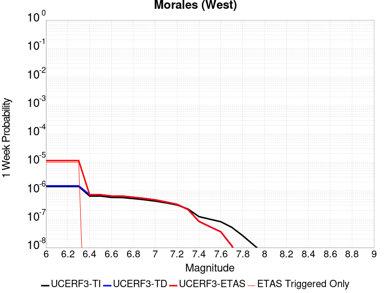 |  |  |  |

| Magnitude | 1 wk TI Prob | 1 wk TD Prob | 1 wk ETAS Prob | 1 wk ETAS/TD Gain | 1 wk ETAS Triggered Only | 1 mo TI Prob | 1 mo TD Prob | 1 mo ETAS Prob | 1 mo ETAS/TD Gain | 1 mo ETAS Triggered Only | 1 yr TI Prob | 1 yr TD Prob | 1 yr ETAS Prob | 1 yr ETAS/TD Gain | 1 yr ETAS Triggered Only | 10 yr TI Prob | 10 yr TD Prob | 10 yr ETAS Prob | 10 yr ETAS/TD Gain | 10 yr ETAS Triggered Only |
|-----|-----|-----|-----|-----|-----|-----|-----|-----|-----|-----|-----|-----|-----|-----|-----|-----|-----|-----|-----|-----|
| 6.0 | 1.4027072E-6 | 1.4791576E-6 | 1.1479143E-5 | 7.7605944 | 1.0E-5 | 6.0115885E-6 | 6.339236E-6 | 1.6339172E-5 | 2.5774672 | 1.0E-5 | 7.318863E-5 | 7.7178156E-5 | 8.717739E-5 | 1.1295604 | 1.0E-5 | 7.316453E-4 | 7.715821E-4 | 7.815744E-4 | 1.0129504 | 1.0E-5 |
| 6.1 | 1.4027072E-6 | 1.4791576E-6 | 1.1479143E-5 | 7.7605944 | 1.0E-5 | 6.0115885E-6 | 6.339236E-6 | 1.6339172E-5 | 2.5774672 | 1.0E-5 | 7.318863E-5 | 7.7178156E-5 | 8.717739E-5 | 1.1295604 | 1.0E-5 | 7.316453E-4 | 7.715821E-4 | 7.815744E-4 | 1.0129504 | 1.0E-5 |
| 6.2 | 1.4027072E-6 | 1.4791576E-6 | 1.1479143E-5 | 7.7605944 | 1.0E-5 | 6.0115885E-6 | 6.339236E-6 | 1.6339172E-5 | 2.5774672 | 1.0E-5 | 7.318863E-5 | 7.7178156E-5 | 8.717739E-5 | 1.1295604 | 1.0E-5 | 7.316453E-4 | 7.715821E-4 | 7.815744E-4 | 1.0129504 | 1.0E-5 |
| 6.3 | 1.4027072E-6 | 1.4791576E-6 | 1.1479143E-5 | 7.7605944 | 1.0E-5 | 6.0115885E-6 | 6.339236E-6 | 1.6339172E-5 | 2.5774672 | 1.0E-5 | 7.318863E-5 | 7.7178156E-5 | 8.717739E-5 | 1.1295604 | 1.0E-5 | 7.316453E-4 | 7.715821E-4 | 7.815744E-4 | 1.0129504 | 1.0E-5 |
| 6.4 | 6.504502E-7 | 7.2038824E-7 | 7.2038824E-7 | 1.0 | 0.0 | 2.7876408E-6 | 3.0873746E-6 | 3.0873746E-6 | 1.0 | 0.0 | 3.3939E-5 | 3.758815E-5 | 3.758815E-5 | 1.0 | 0.0 | 3.3933815E-4 | 3.758191E-4 | 3.758191E-4 | 1.0 | 0.0 |
| 6.5 | 6.504502E-7 | 7.2038824E-7 | 7.2038824E-7 | 1.0 | 0.0 | 2.7876408E-6 | 3.0873746E-6 | 3.0873746E-6 | 1.0 | 0.0 | 3.3939E-5 | 3.758815E-5 | 3.758815E-5 | 1.0 | 0.0 | 3.3933815E-4 | 3.758191E-4 | 3.758191E-4 | 1.0 | 0.0 |
| 6.6 | 5.8056526E-7 | 6.500143E-7 | 6.500143E-7 | 1.0 | 0.0 | 2.4881344E-6 | 2.7857725E-6 | 2.7857725E-6 | 1.0 | 0.0 | 3.0292615E-5 | 3.3916258E-5 | 3.3916258E-5 | 1.0 | 0.0 | 3.0288487E-4 | 3.3911143E-4 | 3.3911143E-4 | 1.0 | 0.0 |
| 6.7 | 5.741448E-7 | 6.435454E-7 | 6.435454E-7 | 1.0 | 0.0 | 2.4606184E-6 | 2.7580488E-6 | 2.7580488E-6 | 1.0 | 0.0 | 2.9957617E-5 | 3.3578734E-5 | 3.3578734E-5 | 1.0 | 0.0 | 2.9953578E-4 | 3.357372E-4 | 3.357372E-4 | 1.0 | 0.0 |
| 6.8 | 5.299428E-7 | 5.8909023E-7 | 5.8909023E-7 | 1.0 | 0.0 | 2.2711813E-6 | 2.52467E-6 | 2.52467E-6 | 1.0 | 0.0 | 2.7651282E-5 | 3.073743E-5 | 3.073743E-5 | 1.0 | 0.0 | 2.7647841E-4 | 3.0733226E-4 | 3.0733226E-4 | 1.0 | 0.0 |
| 6.9 | 4.82394E-7 | 5.3416807E-7 | 5.3416807E-7 | 1.0 | 0.0 | 2.0674013E-6 | 2.2892896E-6 | 2.2892896E-6 | 1.0 | 0.0 | 2.517032E-5 | 2.7871749E-5 | 2.7871749E-5 | 1.0 | 0.0 | 2.516747E-4 | 2.7868294E-4 | 2.7868294E-4 | 1.0 | 0.0 |
| 7.0 | 4.3264512E-7 | 4.759864E-7 | 4.759864E-7 | 1.0 | 0.0 | 1.8541921E-6 | 2.0399402E-6 | 2.0399402E-6 | 1.0 | 0.0 | 2.2574555E-5 | 2.4835992E-5 | 2.4835992E-5 | 1.0 | 0.0 | 2.2572262E-4 | 2.4833248E-4 | 2.4833248E-4 | 1.0 | 0.0 |
| 7.1 | 3.7388565E-7 | 4.000384E-7 | 4.000384E-7 | 1.0 | 0.0 | 1.6023661E-6 | 1.7144492E-6 | 1.7144492E-6 | 1.0 | 0.0 | 1.9508632E-5 | 2.0873222E-5 | 2.0873222E-5 | 1.0 | 0.0 | 1.950692E-4 | 2.0871284E-4 | 2.0871284E-4 | 1.0 | 0.0 |
| 7.2 | 3.1592543E-7 | 3.3199075E-7 | 3.3199075E-7 | 1.0 | 0.0 | 1.3539654E-6 | 1.4228168E-6 | 1.4228168E-6 | 1.0 | 0.0 | 1.6484404E-5 | 1.7322658E-5 | 1.7322658E-5 | 1.0 | 0.0 | 1.6483181E-4 | 1.7321325E-4 | 1.7321325E-4 | 1.0 | 0.0 |
| 7.3 | 2.2677783E-7 | 2.1793869E-7 | 2.1793869E-7 | 1.0 | 0.0 | 9.719047E-7 | 9.3402264E-7 | 9.3402264E-7 | 1.0 | 0.0 | 1.1832874E-5 | 1.1371666E-5 | 1.1371666E-5 | 1.0 | 0.0 | 1.18322445E-4 | 1.1371089E-4 | 1.1371089E-4 | 1.0 | 0.0 |
| 7.4 | 1.2295531E-7 | 8.350771E-8 | 8.350771E-8 | 1.0 | 0.0 | 5.269512E-7 | 3.5789014E-7 | 3.5789014E-7 | 1.0 | 0.0 | 6.4156125E-6 | 4.3573036E-6 | 4.3573036E-6 | 1.0 | 0.0 | 6.415427E-5 | 4.357219E-5 | 4.357219E-5 | 1.0 | 0.0 |
| 7.5 | 9.9632544E-8 | 5.443089E-8 | 5.443089E-8 | 1.0 | 0.0 | 4.2699656E-7 | 2.3327522E-7 | 2.3327522E-7 | 1.0 | 0.0 | 5.198671E-6 | 2.840122E-6 | 2.840122E-6 | 1.0 | 0.0 | 5.198549E-5 | 2.8400864E-5 | 2.8400864E-5 | 1.0 | 0.0 |
| 7.6 | 8.125894E-8 | 3.594956E-8 | 3.594956E-8 | 1.0 | 0.0 | 3.4825257E-7 | 1.5406955E-7 | 1.5406955E-7 | 1.0 | 0.0 | 4.2399665E-6 | 1.8757952E-6 | 1.8757952E-6 | 1.0 | 0.0 | 4.2398857E-5 | 1.8757797E-5 | 1.8757797E-5 | 1.0 | 0.0 |
| 7.7 | 5.1810765E-8 | 1.1642662E-8 | 1.1642662E-8 | 1.0 | 0.0 | 2.2204613E-7 | 4.9897128E-8 | 4.9897128E-8 | 1.0 | 0.0 | 2.7034082E-6 | 6.074974E-7 | 6.074974E-7 | 1.0 | 0.0 | 2.7033753E-5 | 6.0749603E-6 | 6.0749603E-6 | 1.0 | 0.0 |
| 7.8 | 2.6315043E-8 | 2.3383624E-9 | 2.3383624E-9 | 1.0 | 0.0 | 1.1277875E-7 | 1.0021558E-8 | 1.0021558E-8 | 1.0 | 0.0 | 1.3730804E-6 | 1.2201247E-7 | 1.2201247E-7 | 1.0 | 0.0 | 1.3730719E-5 | 1.2201268E-6 | 1.2201268E-6 | 1.0 | 0.0 |
| 7.9 | 1.24281545E-8 | 4.207228E-10 | 4.207228E-10 | 1.0 | 0.0 | 5.3263516E-8 | 1.8031033E-9 | 1.8031033E-9 | 1.0 | 0.0 | 6.4848314E-7 | 2.1952776E-8 | 2.1952776E-8 | 1.0 | 0.0 | 6.4848123E-6 | 2.195305E-7 | 2.195305E-7 | 1.0 | 0.0 |
| 8.0 | 5.954214E-9 | 1.8509339E-10 | 1.8509339E-10 | 1.0 | 0.0 | 2.551806E-8 | 7.9326146E-10 | 7.9326146E-10 | 1.0 | 0.0 | 3.1068234E-7 | 9.657958E-9 | 9.657958E-9 | 1.0 | 0.0 | 3.1068191E-6 | 9.658236E-8 | 9.658236E-8 | 1.0 | 0.0 |
| 8.1 | 1.2586262E-9 | 8.346668E-11 | 8.346668E-11 | 1.0 | 0.0 | 5.3941123E-9 | 3.5771386E-10 | 3.5771386E-10 | 1.0 | 0.0 | 6.567332E-8 | 4.355168E-9 | 4.355168E-9 | 1.0 | 0.0 | 6.56733E-7 | 4.3554458E-8 | 4.3554458E-8 | 1.0 | 0.0 |

## South Klamath Lake East
*[(top)](#table-of-contents)*

| 1 Week | 1 Month | 1 Year | 10 Year |
|-----|-----|-----|-----|
|  |  |  |  |

| Magnitude | 1 wk TI Prob | 1 wk TD Prob | 1 wk ETAS Prob | 1 wk ETAS/TD Gain | 1 wk ETAS Triggered Only | 1 mo TI Prob | 1 mo TD Prob | 1 mo ETAS Prob | 1 mo ETAS/TD Gain | 1 mo ETAS Triggered Only | 1 yr TI Prob | 1 yr TD Prob | 1 yr ETAS Prob | 1 yr ETAS/TD Gain | 1 yr ETAS Triggered Only | 10 yr TI Prob | 10 yr TD Prob | 10 yr ETAS Prob | 10 yr ETAS/TD Gain | 10 yr ETAS Triggered Only |
|-----|-----|-----|-----|-----|-----|-----|-----|-----|-----|-----|-----|-----|-----|-----|-----|-----|-----|-----|-----|-----|
| 6.0 | 2.3539369E-5 | 2.5047308E-5 | 2.5047308E-5 | 1.0 | 0.0 | 1.0087911E-4 | 1.0734166E-4 | 1.0734166E-4 | 1.0 | 0.0 | 0.0012275111 | 0.0013061843 | 0.0013061843 | 1.0 | 0.0 | 0.012207527 | 0.012993417 | 0.013003287 | 1.0007596 | 1.0E-5 |
| 6.1 | 2.3539369E-5 | 2.5047308E-5 | 2.5047308E-5 | 1.0 | 0.0 | 1.0087911E-4 | 1.0734166E-4 | 1.0734166E-4 | 1.0 | 0.0 | 0.0012275111 | 0.0013061843 | 0.0013061843 | 1.0 | 0.0 | 0.012207527 | 0.012993417 | 0.013003287 | 1.0007596 | 1.0E-5 |
| 6.2 | 2.3539369E-5 | 2.5047308E-5 | 2.5047308E-5 | 1.0 | 0.0 | 1.0087911E-4 | 1.0734166E-4 | 1.0734166E-4 | 1.0 | 0.0 | 0.0012275111 | 0.0013061843 | 0.0013061843 | 1.0 | 0.0 | 0.012207527 | 0.012993417 | 0.013003287 | 1.0007596 | 1.0E-5 |
| 6.3 | 9.807823E-6 | 1.0396044E-5 | 1.0396044E-5 | 1.0 | 0.0 | 4.2032847E-5 | 4.455376E-5 | 4.455376E-5 | 1.0 | 0.0 | 5.1162974E-4 | 5.4231536E-4 | 5.4231536E-4 | 1.0 | 0.0 | 0.005104534 | 0.005410756 | 0.005420702 | 1.0018382 | 1.0E-5 |
| 6.4 | 9.807823E-6 | 1.0396044E-5 | 1.0396044E-5 | 1.0 | 0.0 | 4.2032847E-5 | 4.455376E-5 | 4.455376E-5 | 1.0 | 0.0 | 5.1162974E-4 | 5.4231536E-4 | 5.4231536E-4 | 1.0 | 0.0 | 0.005104534 | 0.005410756 | 0.005420702 | 1.0018382 | 1.0E-5 |
| 6.5 | 6.191981E-6 | 6.5508398E-6 | 6.5508398E-6 | 1.0 | 0.0 | 2.653679E-5 | 2.8074743E-5 | 2.8074743E-5 | 1.0 | 0.0 | 3.2303753E-4 | 3.4175918E-4 | 3.4175918E-4 | 1.0 | 0.0 | 0.0032256835 | 0.003412614 | 0.00342258 | 1.0029203 | 1.0E-5 |
| 6.6 | 4.3693776E-6 | 4.6165574E-6 | 4.6165574E-6 | 1.0 | 0.0 | 1.8725768E-5 | 1.9785102E-5 | 1.9785102E-5 | 1.0 | 0.0 | 2.2796239E-4 | 2.4085813E-4 | 2.4085813E-4 | 1.0 | 0.0 | 0.0022772867 | 0.0024060833 | 0.0024060833 | 1.0 | 0.0 |
| 6.7 | 3.360834E-6 | 3.5512403E-6 | 3.5512403E-6 | 1.0 | 0.0 | 1.4403494E-5 | 1.5219517E-5 | 1.5219517E-5 | 1.0 | 0.0 | 1.7534842E-4 | 1.8528267E-4 | 1.8528267E-4 | 1.0 | 0.0 | 0.0017521014 | 0.0018513618 | 0.0018513618 | 1.0 | 0.0 |
| 6.8 | 2.57873E-6 | 2.7251708E-6 | 2.7251708E-6 | 1.0 | 0.0 | 1.1051653E-5 | 1.1679254E-5 | 1.1679254E-5 | 1.0 | 0.0 | 1.3454557E-4 | 1.4218627E-4 | 1.4218627E-4 | 1.0 | 0.0 | 0.0013446413 | 0.0014210136 | 0.0014210136 | 1.0 | 0.0 |
| 6.9 | 9.987825E-7 | 1.0566213E-6 | 1.0566213E-6 | 1.0 | 0.0 | 4.2804895E-6 | 4.528371E-6 | 4.528371E-6 | 1.0 | 0.0 | 5.211371E-5 | 5.5131848E-5 | 5.5131848E-5 | 1.0 | 0.0 | 5.210149E-4 | 5.5121386E-4 | 5.5121386E-4 | 1.0 | 0.0 |

## Elsinore (Coyote Mountains)
*[(top)](#table-of-contents)*

| 1 Week | 1 Month | 1 Year | 10 Year |
|-----|-----|-----|-----|
|  |  |  |  |

| Magnitude | 1 wk TI Prob | 1 wk TD Prob | 1 wk ETAS Prob | 1 wk ETAS/TD Gain | 1 wk ETAS Triggered Only | 1 mo TI Prob | 1 mo TD Prob | 1 mo ETAS Prob | 1 mo ETAS/TD Gain | 1 mo ETAS Triggered Only | 1 yr TI Prob | 1 yr TD Prob | 1 yr ETAS Prob | 1 yr ETAS/TD Gain | 1 yr ETAS Triggered Only | 10 yr TI Prob | 10 yr TD Prob | 10 yr ETAS Prob | 10 yr ETAS/TD Gain | 10 yr ETAS Triggered Only |
|-----|-----|-----|-----|-----|-----|-----|-----|-----|-----|-----|-----|-----|-----|-----|-----|-----|-----|-----|-----|-----|
| 6.0 | 4.20513E-5 | 4.8631882E-5 | 4.8631882E-5 | 1.0 | 0.0 | 1.8020741E-4 | 2.0840895E-4 | 2.0840895E-4 | 1.0 | 0.0 | 0.0021918174 | 0.002535 | 0.0025449747 | 1.0039347 | 1.0E-5 | 0.021703249 | 0.025111282 | 0.025121031 | 1.0003883 | 1.0E-5 |
| 6.1 | 4.20513E-5 | 4.8631882E-5 | 4.8631882E-5 | 1.0 | 0.0 | 1.8020741E-4 | 2.0840895E-4 | 2.0840895E-4 | 1.0 | 0.0 | 0.0021918174 | 0.002535 | 0.0025449747 | 1.0039347 | 1.0E-5 | 0.021703249 | 0.025111282 | 0.025121031 | 1.0003883 | 1.0E-5 |
| 6.2 | 2.3413893E-5 | 2.469566E-5 | 2.469566E-5 | 1.0 | 0.0 | 1.0034139E-4 | 1.0583479E-4 | 1.0583479E-4 | 1.0 | 0.0 | 0.0012209718 | 0.0012878707 | 0.0012978577 | 1.0077548 | 1.0E-5 | 0.012142851 | 0.01281264 | 0.012822512 | 1.0007704 | 1.0E-5 |
| 6.3 | 2.3413893E-5 | 2.469566E-5 | 2.469566E-5 | 1.0 | 0.0 | 1.0034139E-4 | 1.0583479E-4 | 1.0583479E-4 | 1.0 | 0.0 | 0.0012209718 | 0.0012878707 | 0.0012978577 | 1.0077548 | 1.0E-5 | 0.012142851 | 0.01281264 | 0.012822512 | 1.0007704 | 1.0E-5 |
| 6.4 | 1.6894814E-5 | 1.6568361E-5 | 1.6568361E-5 | 1.0 | 0.0 | 7.240433E-5 | 7.1005554E-5 | 7.1005554E-5 | 1.0 | 0.0 | 8.811662E-4 | 8.6418656E-4 | 8.6418656E-4 | 1.0 | 0.0 | 0.0087768035 | 0.00861194 | 0.00861194 | 1.0 | 0.0 |
| 6.5 | 1.6894814E-5 | 1.6568361E-5 | 1.6568361E-5 | 1.0 | 0.0 | 7.240433E-5 | 7.1005554E-5 | 7.1005554E-5 | 1.0 | 0.0 | 8.811662E-4 | 8.6418656E-4 | 8.6418656E-4 | 1.0 | 0.0 | 0.0087768035 | 0.00861194 | 0.00861194 | 1.0 | 0.0 |
| 6.6 | 1.1910969E-5 | 1.0530774E-5 | 1.0530774E-5 | 1.0 | 0.0 | 5.1046012E-5 | 4.5131183E-5 | 4.5131183E-5 | 1.0 | 0.0 | 6.21308E-4 | 5.4934516E-4 | 5.4934516E-4 | 1.0 | 0.0 | 0.0061957375 | 0.005481174 | 0.005481174 | 1.0 | 0.0 |
| 6.7 | 9.1486E-6 | 7.2028593E-6 | 7.2028593E-6 | 1.0 | 0.0 | 3.9207694E-5 | 3.0869054E-5 | 3.0869054E-5 | 1.0 | 0.0 | 4.7724912E-4 | 3.757697E-4 | 3.757697E-4 | 1.0 | 0.0 | 0.0047622547 | 0.0037517229 | 0.0037517229 | 1.0 | 0.0 |
| 6.8 | 7.90441E-6 | 5.7290276E-6 | 5.7290276E-6 | 1.0 | 0.0 | 3.3875604E-5 | 2.4552752E-5 | 2.4552752E-5 | 1.0 | 0.0 | 4.1235742E-4 | 2.9889002E-4 | 2.9889002E-4 | 1.0 | 0.0 | 0.0041159308 | 0.002985009 | 0.002985009 | 1.0 | 0.0 |
| 6.9 | 7.77015E-6 | 5.582982E-6 | 5.582982E-6 | 1.0 | 0.0 | 3.3300217E-5 | 2.3926852E-5 | 2.3926852E-5 | 1.0 | 0.0 | 4.0535472E-4 | 2.9127175E-4 | 2.9127175E-4 | 1.0 | 0.0 | 0.004046161 | 0.002909027 | 0.002909027 | 1.0 | 0.0 |
| 7.0 | 7.675798E-6 | 5.47984E-6 | 5.47984E-6 | 1.0 | 0.0 | 3.289586E-5 | 2.3484827E-5 | 2.3484827E-5 | 1.0 | 0.0 | 4.004335E-4 | 2.858915E-4 | 2.858915E-4 | 1.0 | 0.0 | 0.003997127 | 0.0028553635 | 0.0028553635 | 1.0 | 0.0 |
| 7.1 | 7.447814E-6 | 5.238714E-6 | 5.238714E-6 | 1.0 | 0.0 | 3.191881E-5 | 2.2451446E-5 | 2.2451446E-5 | 1.0 | 0.0 | 3.8854225E-4 | 2.7331332E-4 | 2.7331332E-4 | 1.0 | 0.0 | 0.003878636 | 0.0027298962 | 0.0027298962 | 1.0 | 0.0 |
| 7.2 | 7.128185E-6 | 4.905372E-6 | 4.905372E-6 | 1.0 | 0.0 | 3.0549007E-5 | 2.102286E-5 | 2.102286E-5 | 1.0 | 0.0 | 3.7187067E-4 | 2.5592445E-4 | 2.5592445E-4 | 1.0 | 0.0 | 0.00371249 | 0.0025564157 | 0.0025564157 | 1.0 | 0.0 |
| 7.3 | 7.0913875E-6 | 4.874047E-6 | 4.874047E-6 | 1.0 | 0.0 | 3.0391306E-5 | 2.0888614E-5 | 2.0888614E-5 | 1.0 | 0.0 | 3.6995133E-4 | 2.5429038E-4 | 2.5429038E-4 | 1.0 | 0.0 | 0.0036933604 | 0.0025401122 | 0.0025401122 | 1.0 | 0.0 |
| 7.4 | 7.051521E-6 | 4.837899E-6 | 4.837899E-6 | 1.0 | 0.0 | 3.0220453E-5 | 2.0733693E-5 | 2.0733693E-5 | 1.0 | 0.0 | 3.6787192E-4 | 2.5240466E-4 | 2.5240466E-4 | 1.0 | 0.0 | 0.0036726352 | 0.0025212981 | 0.0025212981 | 1.0 | 0.0 |
| 7.5 | 6.910666E-6 | 4.733448E-6 | 4.733448E-6 | 1.0 | 0.0 | 2.9616802E-5 | 2.0286056E-5 | 2.0286056E-5 | 1.0 | 0.0 | 3.605249E-4 | 2.4695593E-4 | 2.4695593E-4 | 1.0 | 0.0 | 0.0035994058 | 0.0024669329 | 0.0024669329 | 1.0 | 0.0 |
| 7.6 | 6.341753E-6 | 4.3065565E-6 | 4.3065565E-6 | 1.0 | 0.0 | 2.7178658E-5 | 1.8456547E-5 | 1.8456547E-5 | 1.0 | 0.0 | 3.3084993E-4 | 2.2468645E-4 | 2.2468645E-4 | 1.0 | 0.0 | 0.0033035777 | 0.002244708 | 0.002244708 | 1.0 | 0.0 |
| 7.7 | 3.9205916E-6 | 2.2439415E-6 | 2.2439415E-6 | 1.0 | 0.0 | 1.6802427E-5 | 9.616861E-6 | 9.616861E-6 | 1.0 | 0.0 | 2.0455034E-4 | 1.1707973E-4 | 1.1707973E-4 | 1.0 | 0.0 | 0.0020436216 | 0.0011702535 | 0.0011702535 | 1.0 | 0.0 |
| 7.8 | 2.0846227E-7 | 8.486417E-8 | 8.486417E-8 | 1.0 | 0.0 | 8.9340944E-7 | 3.6370355E-7 | 3.6370355E-7 | 1.0 | 0.0 | 1.0877206E-5 | 4.428085E-6 | 4.428085E-6 | 1.0 | 0.0 | 1.0876673E-4 | 4.4280296E-5 | 4.4280296E-5 | 1.0 | 0.0 |
| 7.9 | 4.4969806E-9 | 2.2691855E-9 | 2.2691855E-9 | 1.0 | 0.0 | 1.9272775E-8 | 9.72508E-9 | 9.72508E-9 | 1.0 | 0.0 | 2.3464601E-7 | 1.18402845E-7 | 1.18402845E-7 | 1.0 | 0.0 | 2.3464577E-6 | 1.184028E-6 | 1.184028E-6 | 1.0 | 0.0 |

## Pitas Point (Lower)-Montalvo
*[(top)](#table-of-contents)*

| 1 Week | 1 Month | 1 Year | 10 Year |
|-----|-----|-----|-----|
|  |  |  | 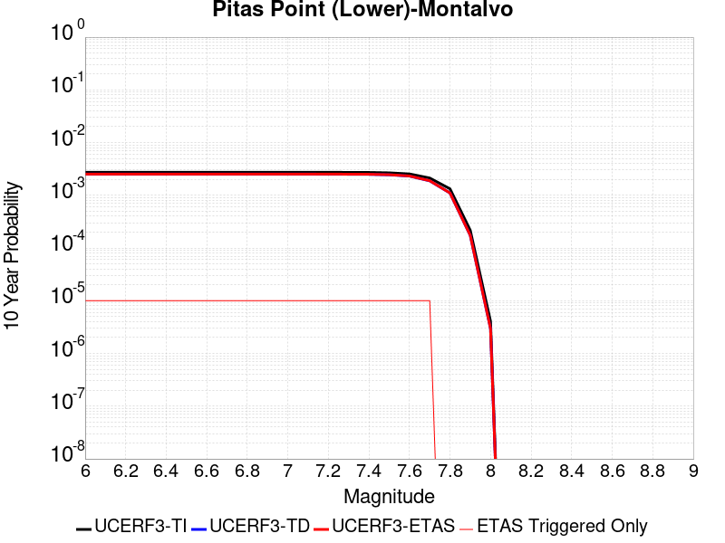 |

| Magnitude | 1 wk TI Prob | 1 wk TD Prob | 1 wk ETAS Prob | 1 wk ETAS/TD Gain | 1 wk ETAS Triggered Only | 1 mo TI Prob | 1 mo TD Prob | 1 mo ETAS Prob | 1 mo ETAS/TD Gain | 1 mo ETAS Triggered Only | 1 yr TI Prob | 1 yr TD Prob | 1 yr ETAS Prob | 1 yr ETAS/TD Gain | 1 yr ETAS Triggered Only | 10 yr TI Prob | 10 yr TD Prob | 10 yr ETAS Prob | 10 yr ETAS/TD Gain | 10 yr ETAS Triggered Only |
|-----|-----|-----|-----|-----|-----|-----|-----|-----|-----|-----|-----|-----|-----|-----|-----|-----|-----|-----|-----|-----|
| 6.0 | 5.2543637E-6 | 4.8378706E-6 | 1.4837822E-5 | 3.0670152 | 1.0E-5 | 2.2518509E-5 | 2.0733567E-5 | 3.073336E-5 | 1.4822997 | 1.0E-5 | 2.7412834E-4 | 2.5240227E-4 | 2.6239973E-4 | 1.0396093 | 1.0E-5 | 0.0027379042 | 0.0025211885 | 0.0025311632 | 1.0039564 | 1.0E-5 |
| 6.1 | 5.2543637E-6 | 4.8378706E-6 | 1.4837822E-5 | 3.0670152 | 1.0E-5 | 2.2518509E-5 | 2.0733567E-5 | 3.073336E-5 | 1.4822997 | 1.0E-5 | 2.7412834E-4 | 2.5240227E-4 | 2.6239973E-4 | 1.0396093 | 1.0E-5 | 0.0027379042 | 0.0025211885 | 0.0025311632 | 1.0039564 | 1.0E-5 |
| 6.2 | 5.2543637E-6 | 4.8378706E-6 | 1.4837822E-5 | 3.0670152 | 1.0E-5 | 2.2518509E-5 | 2.0733567E-5 | 3.073336E-5 | 1.4822997 | 1.0E-5 | 2.7412834E-4 | 2.5240227E-4 | 2.6239973E-4 | 1.0396093 | 1.0E-5 | 0.0027379042 | 0.0025211885 | 0.0025311632 | 1.0039564 | 1.0E-5 |
| 6.3 | 5.2543637E-6 | 4.8378706E-6 | 1.4837822E-5 | 3.0670152 | 1.0E-5 | 2.2518509E-5 | 2.0733567E-5 | 3.073336E-5 | 1.4822997 | 1.0E-5 | 2.7412834E-4 | 2.5240227E-4 | 2.6239973E-4 | 1.0396093 | 1.0E-5 | 0.0027379042 | 0.0025211885 | 0.0025311632 | 1.0039564 | 1.0E-5 |
| 6.4 | 5.2543637E-6 | 4.8378706E-6 | 1.4837822E-5 | 3.0670152 | 1.0E-5 | 2.2518509E-5 | 2.0733567E-5 | 3.073336E-5 | 1.4822997 | 1.0E-5 | 2.7412834E-4 | 2.5240227E-4 | 2.6239973E-4 | 1.0396093 | 1.0E-5 | 0.0027379042 | 0.0025211885 | 0.0025311632 | 1.0039564 | 1.0E-5 |
| 6.5 | 5.2543637E-6 | 4.8378706E-6 | 1.4837822E-5 | 3.0670152 | 1.0E-5 | 2.2518509E-5 | 2.0733567E-5 | 3.073336E-5 | 1.4822997 | 1.0E-5 | 2.7412834E-4 | 2.5240227E-4 | 2.6239973E-4 | 1.0396093 | 1.0E-5 | 0.0027379042 | 0.0025211885 | 0.0025311632 | 1.0039564 | 1.0E-5 |
| 6.6 | 5.2543637E-6 | 4.8378706E-6 | 1.4837822E-5 | 3.0670152 | 1.0E-5 | 2.2518509E-5 | 2.0733567E-5 | 3.073336E-5 | 1.4822997 | 1.0E-5 | 2.7412834E-4 | 2.5240227E-4 | 2.6239973E-4 | 1.0396093 | 1.0E-5 | 0.0027379042 | 0.0025211885 | 0.0025311632 | 1.0039564 | 1.0E-5 |
| 6.7 | 5.2543637E-6 | 4.8378706E-6 | 1.4837822E-5 | 3.0670152 | 1.0E-5 | 2.2518509E-5 | 2.0733567E-5 | 3.073336E-5 | 1.4822997 | 1.0E-5 | 2.7412834E-4 | 2.5240227E-4 | 2.6239973E-4 | 1.0396093 | 1.0E-5 | 0.0027379042 | 0.0025211885 | 0.0025311632 | 1.0039564 | 1.0E-5 |
| 6.8 | 5.2543637E-6 | 4.8378706E-6 | 1.4837822E-5 | 3.0670152 | 1.0E-5 | 2.2518509E-5 | 2.0733567E-5 | 3.073336E-5 | 1.4822997 | 1.0E-5 | 2.7412834E-4 | 2.5240227E-4 | 2.6239973E-4 | 1.0396093 | 1.0E-5 | 0.0027379042 | 0.0025211885 | 0.0025311632 | 1.0039564 | 1.0E-5 |
| 6.9 | 5.2543637E-6 | 4.8378706E-6 | 1.4837822E-5 | 3.0670152 | 1.0E-5 | 2.2518509E-5 | 2.0733567E-5 | 3.073336E-5 | 1.4822997 | 1.0E-5 | 2.7412834E-4 | 2.5240227E-4 | 2.6239973E-4 | 1.0396093 | 1.0E-5 | 0.0027379042 | 0.0025211885 | 0.0025311632 | 1.0039564 | 1.0E-5 |
| 7.0 | 5.2543637E-6 | 4.8378706E-6 | 1.4837822E-5 | 3.0670152 | 1.0E-5 | 2.2518509E-5 | 2.0733567E-5 | 3.073336E-5 | 1.4822997 | 1.0E-5 | 2.7412834E-4 | 2.5240227E-4 | 2.6239973E-4 | 1.0396093 | 1.0E-5 | 0.0027379042 | 0.0025211885 | 0.0025311632 | 1.0039564 | 1.0E-5 |
| 7.1 | 5.2543637E-6 | 4.8378706E-6 | 1.4837822E-5 | 3.0670152 | 1.0E-5 | 2.2518509E-5 | 2.0733567E-5 | 3.073336E-5 | 1.4822997 | 1.0E-5 | 2.7412834E-4 | 2.5240227E-4 | 2.6239973E-4 | 1.0396093 | 1.0E-5 | 0.0027379042 | 0.0025211885 | 0.0025311632 | 1.0039564 | 1.0E-5 |
| 7.2 | 5.2458695E-6 | 4.8290244E-6 | 1.48289755E-5 | 3.0708017 | 1.0E-5 | 2.2482105E-5 | 2.0695656E-5 | 3.069545E-5 | 1.4831831 | 1.0E-5 | 2.7368523E-4 | 2.519408E-4 | 2.6193826E-4 | 1.0396819 | 1.0E-5 | 0.0027334841 | 0.0025165842 | 0.002526559 | 1.0039636 | 1.0E-5 |
| 7.3 | 5.22665E-6 | 4.8089414E-6 | 1.4808894E-5 | 3.0794497 | 1.0E-5 | 2.2399736E-5 | 2.0609588E-5 | 3.0609383E-5 | 1.485201 | 1.0E-5 | 2.7268266E-4 | 2.5089315E-4 | 2.6089067E-4 | 1.0398476 | 1.0E-5 | 0.002723483 | 0.0025061315 | 0.0025161065 | 1.0039802 | 1.0E-5 |
| 7.4 | 5.210642E-6 | 4.792154E-6 | 1.4792106E-5 | 3.0867343 | 1.0E-5 | 2.233113E-5 | 2.0537642E-5 | 3.0537438E-5 | 1.4869008 | 1.0E-5 | 2.718476E-4 | 2.5001742E-4 | 2.6001493E-4 | 1.0399872 | 1.0E-5 | 0.002715153 | 0.0024973939 | 0.0025073688 | 1.0039942 | 1.0E-5 |
| 7.5 | 5.1226016E-6 | 4.7000403E-6 | 1.4699994E-5 | 3.1276312 | 1.0E-5 | 2.1953823E-5 | 2.0142877E-5 | 3.0142675E-5 | 1.4964434 | 1.0E-5 | 2.67255E-4 | 2.4521223E-4 | 2.5520977E-4 | 1.040771 | 1.0E-5 | 0.0026693381 | 0.0024494485 | 0.0024594238 | 1.0040725 | 1.0E-5 |
| 7.6 | 4.8796987E-6 | 4.4449403E-6 | 1.4444896E-5 | 3.249739 | 1.0E-5 | 2.0912828E-5 | 1.9049607E-5 | 2.9049417E-5 | 1.5249352 | 1.0E-5 | 2.5458392E-4 | 2.3190459E-4 | 2.4190226E-4 | 1.0431112 | 1.0E-5 | 0.0025429246 | 0.0023166565 | 0.0023266333 | 1.0043066 | 1.0E-5 |
| 7.7 | 4.0834398E-6 | 3.6091124E-6 | 1.3609077E-5 | 3.7707543 | 1.0E-5 | 1.7500339E-5 | 1.5467534E-5 | 2.546738E-5 | 1.6465055 | 1.0E-5 | 2.1304579E-4 | 1.8830119E-4 | 1.982993E-4 | 1.0530964 | 1.0E-5 | 0.0021284167 | 0.00188144 | 0.0018914213 | 1.005305 | 1.0E-5 |
| 7.8 | 2.5445438E-6 | 2.121228E-6 | 2.121228E-6 | 1.0 | 0.0 | 1.0905142E-5 | 9.090945E-6 | 9.090945E-6 | 1.0 | 0.0 | 1.3276201E-4 | 1.1067669E-4 | 1.1067669E-4 | 1.0 | 0.0 | 0.0013268272 | 0.0011062203 | 0.0011062203 | 1.0 | 0.0 |
| 7.9 | 4.1677114E-7 | 3.3293693E-7 | 3.3293693E-7 | 1.0 | 0.0 | 1.7861609E-6 | 1.4268718E-6 | 1.4268718E-6 | 1.0 | 0.0 | 2.1746291E-5 | 1.737203E-5 | 1.737203E-5 | 1.0 | 0.0 | 2.1744163E-4 | 1.7370703E-4 | 1.7370703E-4 | 1.0 | 0.0 |
| 8.0 | 7.791402E-9 | 5.683497E-9 | 5.683497E-9 | 1.0 | 0.0 | 3.3391725E-8 | 2.4357844E-8 | 2.4357844E-8 | 1.0 | 0.0 | 4.0654416E-7 | 2.9655675E-7 | 2.9655675E-7 | 1.0 | 0.0 | 4.065434E-6 | 2.9655655E-6 | 2.9655655E-6 | 1.0 | 0.0 |

## Cerro Prieto
*[(top)](#table-of-contents)*

| 1 Week | 1 Month | 1 Year | 10 Year |
|-----|-----|-----|-----|
|  |  | 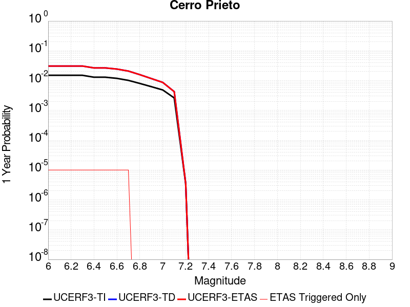 |  |

| Magnitude | 1 wk TI Prob | 1 wk TD Prob | 1 wk ETAS Prob | 1 wk ETAS/TD Gain | 1 wk ETAS Triggered Only | 1 mo TI Prob | 1 mo TD Prob | 1 mo ETAS Prob | 1 mo ETAS/TD Gain | 1 mo ETAS Triggered Only | 1 yr TI Prob | 1 yr TD Prob | 1 yr ETAS Prob | 1 yr ETAS/TD Gain | 1 yr ETAS Triggered Only | 10 yr TI Prob | 10 yr TD Prob | 10 yr ETAS Prob | 10 yr ETAS/TD Gain | 10 yr ETAS Triggered Only |
|-----|-----|-----|-----|-----|-----|-----|-----|-----|-----|-----|-----|-----|-----|-----|-----|-----|-----|-----|-----|-----|
| 6.0 | 2.9101528E-4 | 5.964804E-4 | 5.964804E-4 | 1.0 | 0.0 | 0.0012466122 | 0.002554082 | 0.002554082 | 1.0 | 0.0 | 0.015072231 | 0.03064807 | 0.030657765 | 1.0003163 | 1.0E-5 | 0.14089979 | 0.25397858 | 0.25398603 | 1.0000293 | 1.0E-5 |
| 6.1 | 2.9101528E-4 | 5.964804E-4 | 5.964804E-4 | 1.0 | 0.0 | 0.0012466122 | 0.002554082 | 0.002554082 | 1.0 | 0.0 | 0.015072231 | 0.03064807 | 0.030657765 | 1.0003163 | 1.0E-5 | 0.14089979 | 0.25397858 | 0.25398603 | 1.0000293 | 1.0E-5 |
| 6.2 | 2.9101528E-4 | 5.964804E-4 | 5.964804E-4 | 1.0 | 0.0 | 0.0012466122 | 0.002554082 | 0.002554082 | 1.0 | 0.0 | 0.015072231 | 0.03064807 | 0.030657765 | 1.0003163 | 1.0E-5 | 0.14089979 | 0.25397858 | 0.25398603 | 1.0000293 | 1.0E-5 |
| 6.3 | 2.9101528E-4 | 5.964804E-4 | 5.964804E-4 | 1.0 | 0.0 | 0.0012466122 | 0.002554082 | 0.002554082 | 1.0 | 0.0 | 0.015072231 | 0.03064807 | 0.030657765 | 1.0003163 | 1.0E-5 | 0.14089979 | 0.25397858 | 0.25398603 | 1.0000293 | 1.0E-5 |
| 6.4 | 2.508648E-4 | 5.1397446E-4 | 5.1397446E-4 | 1.0 | 0.0 | 0.0010746918 | 0.0022010866 | 0.0022010866 | 1.0 | 0.0 | 0.013006088 | 0.026471792 | 0.026481528 | 1.0003678 | 1.0E-5 | 0.12270685 | 0.22440416 | 0.2244119 | 1.0000346 | 1.0E-5 |
| 6.5 | 2.508648E-4 | 5.1397446E-4 | 5.1397446E-4 | 1.0 | 0.0 | 0.0010746918 | 0.0022010866 | 0.0022010866 | 1.0 | 0.0 | 0.013006088 | 0.026471792 | 0.026481528 | 1.0003678 | 1.0E-5 | 0.12270685 | 0.22440416 | 0.2244119 | 1.0000346 | 1.0E-5 |
| 6.6 | 2.294914E-4 | 4.7116808E-4 | 4.7116808E-4 | 1.0 | 0.0 | 9.831638E-4 | 0.0020179166 | 0.0020179166 | 1.0 | 0.0 | 0.011904482 | 0.02429866 | 0.024308417 | 1.0004015 | 1.0E-5 | 0.11286586 | 0.20858558 | 0.20859349 | 1.0000379 | 1.0E-5 |
| 6.7 | 1.9621674E-4 | 4.0419117E-4 | 4.0419117E-4 | 1.0 | 0.0 | 8.4065786E-4 | 0.0017312564 | 0.0017312564 | 1.0 | 0.0 | 0.010187071 | 0.020884845 | 0.020894635 | 1.0004689 | 1.0E-5 | 0.09732539 | 0.18290249 | 0.18291067 | 1.0000447 | 1.0E-5 |
| 6.8 | 1.5476145E-4 | 3.056516E-4 | 3.056516E-4 | 1.0 | 0.0 | 6.6309475E-4 | 0.00130938 | 0.00130938 | 1.0 | 0.0 | 0.008043335 | 0.015836509 | 0.015836509 | 1.0 | 0.0 | 0.07758363 | 0.14336355 | 0.14336355 | 1.0 | 0.0 |
| 6.9 | 1.20509176E-4 | 2.2582515E-4 | 2.2582515E-4 | 1.0 | 0.0 | 5.1636563E-4 | 9.6752634E-4 | 9.6752634E-4 | 1.0 | 0.0 | 0.006268645 | 0.011726342 | 0.011726342 | 1.0 | 0.0 | 0.060947374 | 0.109451205 | 0.109451205 | 1.0 | 0.0 |
| 7.0 | 9.3269155E-5 | 1.6716642E-4 | 1.6716642E-4 | 1.0 | 0.0 | 3.9966372E-4 | 7.162739E-4 | 7.162739E-4 | 1.0 | 0.0 | 0.0048550544 | 0.008693418 | 0.008693418 | 1.0 | 0.0 | 0.04750344 | 0.08315912 | 0.08315912 | 1.0 | 0.0 |
| 7.1 | 5.029709E-5 | 8.1718936E-5 | 8.1718936E-5 | 1.0 | 0.0 | 2.1554115E-4 | 3.5019626E-4 | 3.5019626E-4 | 1.0 | 0.0 | 0.0026210553 | 0.0042587193 | 0.0042587193 | 1.0 | 0.0 | 0.025903556 | 0.042365108 | 0.042365108 | 1.0 | 0.0 |
| 7.2 | 6.5445185E-8 | 6.814903E-8 | 6.814903E-8 | 1.0 | 0.0 | 2.8047933E-7 | 2.9206726E-7 | 2.9206726E-7 | 1.0 | 0.0 | 3.4148304E-6 | 3.555919E-6 | 3.555919E-6 | 1.0 | 0.0 | 3.414778E-5 | 3.5559187E-5 | 3.5559187E-5 | 1.0 | 0.0 |

## Greenville (No) 2011 CFM
*[(top)](#table-of-contents)*

| 1 Week | 1 Month | 1 Year | 10 Year |
|-----|-----|-----|-----|
|  |  |  | 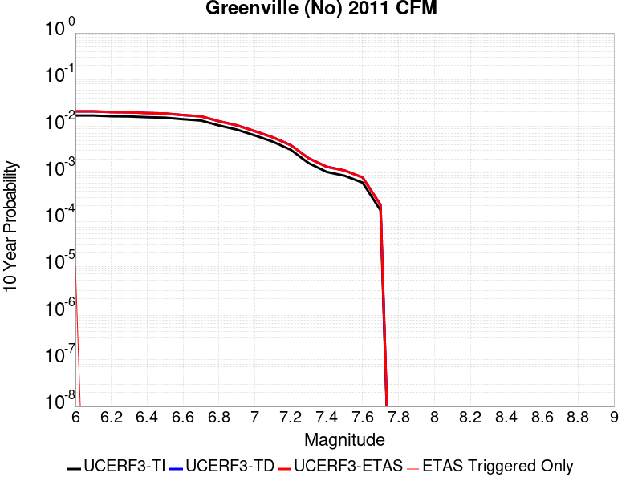 |

| Magnitude | 1 wk TI Prob | 1 wk TD Prob | 1 wk ETAS Prob | 1 wk ETAS/TD Gain | 1 wk ETAS Triggered Only | 1 mo TI Prob | 1 mo TD Prob | 1 mo ETAS Prob | 1 mo ETAS/TD Gain | 1 mo ETAS Triggered Only | 1 yr TI Prob | 1 yr TD Prob | 1 yr ETAS Prob | 1 yr ETAS/TD Gain | 1 yr ETAS Triggered Only | 10 yr TI Prob | 10 yr TD Prob | 10 yr ETAS Prob | 10 yr ETAS/TD Gain | 10 yr ETAS Triggered Only |
|-----|-----|-----|-----|-----|-----|-----|-----|-----|-----|-----|-----|-----|-----|-----|-----|-----|-----|-----|-----|-----|
| 6.0 | 3.286654E-5 | 4.036648E-5 | 4.036648E-5 | 1.0 | 0.0 | 1.4084899E-4 | 1.7298796E-4 | 1.8298623E-4 | 1.0577976 | 1.0E-5 | 0.0017134876 | 0.002104132 | 0.002114111 | 1.0047425 | 1.0E-5 | 0.017003356 | 0.020846982 | 0.020856773 | 1.0004697 | 1.0E-5 |
| 6.1 | 3.286654E-5 | 4.036648E-5 | 4.036648E-5 | 1.0 | 0.0 | 1.4084899E-4 | 1.7298796E-4 | 1.7298796E-4 | 1.0 | 0.0 | 0.0017134876 | 0.002104132 | 0.002104132 | 1.0 | 0.0 | 0.017003356 | 0.020846982 | 0.020846982 | 1.0 | 0.0 |
| 6.2 | 3.1697953E-5 | 3.8929385E-5 | 3.8929385E-5 | 1.0 | 0.0 | 1.358413E-4 | 1.6682976E-4 | 1.6682976E-4 | 1.0 | 0.0 | 0.0016526132 | 0.002029298 | 0.002029298 | 1.0 | 0.0 | 0.01640377 | 0.020112377 | 0.020112377 | 1.0 | 0.0 |
| 6.3 | 3.1363317E-5 | 3.851826E-5 | 3.851826E-5 | 1.0 | 0.0 | 1.344073E-4 | 1.6506804E-4 | 1.6506804E-4 | 1.0 | 0.0 | 0.0016351803 | 0.0020078886 | 0.0020078886 | 1.0 | 0.0 | 0.016232004 | 0.019902144 | 0.019902144 | 1.0 | 0.0 |
| 6.4 | 3.0228604E-5 | 3.7125395E-5 | 3.7125395E-5 | 1.0 | 0.0 | 1.2954473E-4 | 1.5909935E-4 | 1.5909935E-4 | 1.0 | 0.0 | 0.0015760659 | 0.0019353506 | 0.0019353506 | 1.0 | 0.0 | 0.015649348 | 0.019189484 | 0.019189484 | 1.0 | 0.0 |
| 6.5 | 2.9537814E-5 | 3.6280853E-5 | 3.6280853E-5 | 1.0 | 0.0 | 1.2658449E-4 | 1.554803E-4 | 1.554803E-4 | 1.0 | 0.0 | 0.0015400766 | 0.0018913659 | 0.0018913659 | 1.0 | 0.0 | 0.01529447 | 0.018757146 | 0.018757146 | 1.0 | 0.0 |
| 6.6 | 2.7345395E-5 | 3.3590182E-5 | 3.3590182E-5 | 1.0 | 0.0 | 1.1718928E-4 | 1.4395016E-4 | 1.4395016E-4 | 1.0 | 0.0 | 0.0014258457 | 0.0017512152 | 0.0017512152 | 1.0 | 0.0 | 0.014167317 | 0.01737797 | 0.01737797 | 1.0 | 0.0 |
| 6.7 | 2.5615784E-5 | 3.1567088E-5 | 3.1567088E-5 | 1.0 | 0.0 | 1.09777306E-4 | 1.3528067E-4 | 1.3528067E-4 | 1.0 | 0.0 | 0.0013357193 | 0.0016458282 | 0.0016458282 | 1.0 | 0.0 | 0.013277191 | 0.016340064 | 0.016340064 | 1.0 | 0.0 |
| 6.8 | 2.0059057E-5 | 2.4712073E-5 | 2.4712073E-5 | 1.0 | 0.0 | 8.596455E-5 | 1.0590468E-4 | 1.0590468E-4 | 1.0 | 0.0 | 0.0010461159 | 0.001288643 | 0.001288643 | 1.0 | 0.0 | 0.0104120495 | 0.012813724 | 0.012813724 | 1.0 | 0.0 |
| 6.9 | 1.6321746E-5 | 2.018467E-5 | 2.018467E-5 | 1.0 | 0.0 | 6.9948466E-5 | 8.650293E-5 | 8.650293E-5 | 1.0 | 0.0 | 8.5128983E-4 | 0.0010526767 | 0.0010526767 | 1.0 | 0.0 | 0.008480361 | 0.010478431 | 0.010478431 | 1.0 | 0.0 |
| 7.0 | 1.22527645E-5 | 1.5135633E-5 | 1.5135633E-5 | 1.0 | 0.0 | 5.2510793E-5 | 6.486541E-5 | 6.486541E-5 | 1.0 | 0.0 | 6.3913135E-4 | 7.894544E-4 | 7.894544E-4 | 1.0 | 0.0 | 0.0063729626 | 0.007867137 | 0.007867137 | 1.0 | 0.0 |
| 7.1 | 8.996482E-6 | 1.1164954E-5 | 1.1164954E-5 | 1.0 | 0.0 | 3.8555783E-5 | 4.7848935E-5 | 4.7848935E-5 | 1.0 | 0.0 | 4.6931554E-4 | 5.824063E-4 | 5.824063E-4 | 1.0 | 0.0 | 0.004683256 | 0.0058090906 | 0.0058090906 | 1.0 | 0.0 |
| 7.2 | 6.0273087E-6 | 7.569474E-6 | 7.569474E-6 | 1.0 | 0.0 | 2.5831067E-5 | 3.2440203E-5 | 3.2440203E-5 | 1.0 | 0.0 | 3.1444785E-4 | 3.9488857E-4 | 3.9488857E-4 | 1.0 | 0.0 | 0.0031400328 | 0.003942066 | 0.003942066 | 1.0 | 0.0 |
| 7.3 | 3.1209995E-6 | 3.9663746E-6 | 3.9663746E-6 | 1.0 | 0.0 | 1.3375643E-5 | 1.699864E-5 | 1.699864E-5 | 1.0 | 0.0 | 1.6283628E-4 | 2.0693893E-4 | 2.0693893E-4 | 1.0 | 0.0 | 0.0016271701 | 0.0020675526 | 0.0020675526 | 1.0 | 0.0 |
| 7.4 | 2.0254208E-6 | 2.6096043E-6 | 2.6096043E-6 | 1.0 | 0.0 | 8.680347E-6 | 1.1183971E-5 | 1.1183971E-5 | 1.0 | 0.0 | 1.0567809E-4 | 1.361564E-4 | 1.361564E-4 | 1.0 | 0.0 | 0.0010562785 | 0.0013607866 | 0.0013607866 | 1.0 | 0.0 |
| 7.5 | 1.6763418E-6 | 2.173353E-6 | 2.173353E-6 | 1.0 | 0.0 | 7.184302E-6 | 9.314337E-6 | 9.314337E-6 | 1.0 | 0.0 | 8.746537E-5 | 1.1339621E-4 | 1.1339621E-4 | 1.0 | 0.0 | 8.743095E-4 | 0.0011334305 | 0.0011334305 | 1.0 | 0.0 |
| 7.6 | 1.1935462E-6 | 1.5458467E-6 | 1.5458467E-6 | 1.0 | 0.0 | 5.115188E-6 | 6.6250404E-6 | 6.6250404E-6 | 1.0 | 0.0 | 6.2275634E-5 | 8.065693E-5 | 8.065693E-5 | 1.0 | 0.0 | 6.2258187E-4 | 8.0630725E-4 | 8.0630725E-4 | 1.0 | 0.0 |
| 7.7 | 3.0464201E-7 | 3.9846822E-7 | 3.9846822E-7 | 1.0 | 0.0 | 1.3056081E-6 | 1.7077199E-6 | 1.7077199E-6 | 1.0 | 0.0 | 1.589566E-5 | 2.0791296E-5 | 2.0791296E-5 | 1.0 | 0.0 | 1.5894524E-4 | 2.0789822E-4 | 2.0789822E-4 | 1.0 | 0.0 |

## Puente Hills
*[(top)](#table-of-contents)*

| 1 Week | 1 Month | 1 Year | 10 Year |
|-----|-----|-----|-----|
|  |  | 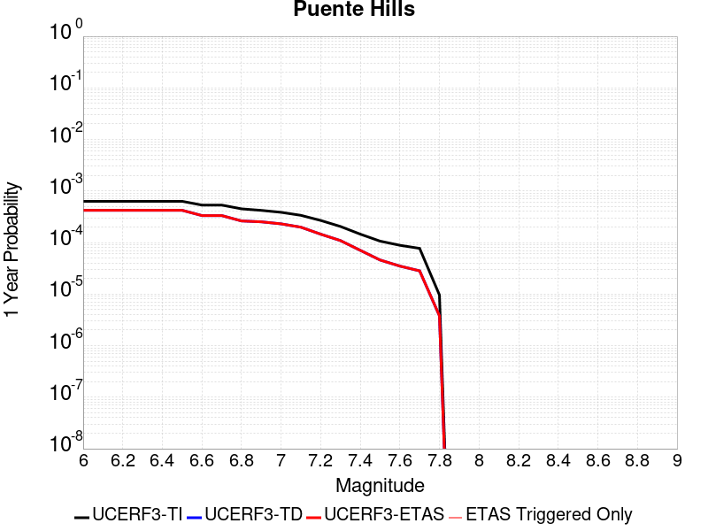 |  |

| Magnitude | 1 wk TI Prob | 1 wk TD Prob | 1 wk ETAS Prob | 1 wk ETAS/TD Gain | 1 wk ETAS Triggered Only | 1 mo TI Prob | 1 mo TD Prob | 1 mo ETAS Prob | 1 mo ETAS/TD Gain | 1 mo ETAS Triggered Only | 1 yr TI Prob | 1 yr TD Prob | 1 yr ETAS Prob | 1 yr ETAS/TD Gain | 1 yr ETAS Triggered Only | 10 yr TI Prob | 10 yr TD Prob | 10 yr ETAS Prob | 10 yr ETAS/TD Gain | 10 yr ETAS Triggered Only |
|-----|-----|-----|-----|-----|-----|-----|-----|-----|-----|-----|-----|-----|-----|-----|-----|-----|-----|-----|-----|-----|
| 6.0 | 1.2101656E-5 | 8.098625E-6 | 8.098625E-6 | 1.0 | 0.0 | 5.1863204E-5 | 3.4707962E-5 | 3.4707962E-5 | 1.0 | 0.0 | 6.312516E-4 | 4.2249315E-4 | 4.2249315E-4 | 1.0 | 0.0 | 0.0062946146 | 0.0042174594 | 0.004227417 | 1.002361 | 1.0E-5 |
| 6.1 | 1.2101656E-5 | 8.098625E-6 | 8.098625E-6 | 1.0 | 0.0 | 5.1863204E-5 | 3.4707962E-5 | 3.4707962E-5 | 1.0 | 0.0 | 6.312516E-4 | 4.2249315E-4 | 4.2249315E-4 | 1.0 | 0.0 | 0.0062946146 | 0.0042174594 | 0.004227417 | 1.002361 | 1.0E-5 |
| 6.2 | 1.2101656E-5 | 8.098625E-6 | 8.098625E-6 | 1.0 | 0.0 | 5.1863204E-5 | 3.4707962E-5 | 3.4707962E-5 | 1.0 | 0.0 | 6.312516E-4 | 4.2249315E-4 | 4.2249315E-4 | 1.0 | 0.0 | 0.0062946146 | 0.0042174594 | 0.004227417 | 1.002361 | 1.0E-5 |
| 6.3 | 1.2101656E-5 | 8.098625E-6 | 8.098625E-6 | 1.0 | 0.0 | 5.1863204E-5 | 3.4707962E-5 | 3.4707962E-5 | 1.0 | 0.0 | 6.312516E-4 | 4.2249315E-4 | 4.2249315E-4 | 1.0 | 0.0 | 0.0062946146 | 0.0042174594 | 0.004227417 | 1.002361 | 1.0E-5 |
| 6.4 | 1.2101656E-5 | 8.098625E-6 | 8.098625E-6 | 1.0 | 0.0 | 5.1863204E-5 | 3.4707962E-5 | 3.4707962E-5 | 1.0 | 0.0 | 6.312516E-4 | 4.2249315E-4 | 4.2249315E-4 | 1.0 | 0.0 | 0.0062946146 | 0.0042174594 | 0.004227417 | 1.002361 | 1.0E-5 |
| 6.5 | 1.2101656E-5 | 8.098625E-6 | 8.098625E-6 | 1.0 | 0.0 | 5.1863204E-5 | 3.4707962E-5 | 3.4707962E-5 | 1.0 | 0.0 | 6.312516E-4 | 4.2249315E-4 | 4.2249315E-4 | 1.0 | 0.0 | 0.0062946146 | 0.0042174594 | 0.004227417 | 1.002361 | 1.0E-5 |
| 6.6 | 1.0222488E-5 | 6.3991847E-6 | 6.3991847E-6 | 1.0 | 0.0 | 4.3809923E-5 | 2.7424803E-5 | 2.7424803E-5 | 1.0 | 0.0 | 5.332553E-4 | 3.3384826E-4 | 3.3384826E-4 | 1.0 | 0.0 | 0.0053197746 | 0.0033337125 | 0.0033337125 | 1.0 | 0.0 |
| 6.7 | 1.0222488E-5 | 6.3991847E-6 | 6.3991847E-6 | 1.0 | 0.0 | 4.3809923E-5 | 2.7424803E-5 | 2.7424803E-5 | 1.0 | 0.0 | 5.332553E-4 | 3.3384826E-4 | 3.3384826E-4 | 1.0 | 0.0 | 0.0053197746 | 0.0033337125 | 0.0033337125 | 1.0 | 0.0 |
| 6.8 | 8.6367845E-6 | 5.0282533E-6 | 5.0282533E-6 | 1.0 | 0.0 | 3.7014266E-5 | 2.1549482E-5 | 2.1549482E-5 | 1.0 | 0.0 | 4.505555E-4 | 2.623339E-4 | 2.623339E-4 | 1.0 | 0.0 | 0.004496431 | 0.0026202986 | 0.0026202986 | 1.0 | 0.0 |
| 6.9 | 8.066481E-6 | 4.836117E-6 | 4.836117E-6 | 1.0 | 0.0 | 3.4570177E-5 | 2.0726053E-5 | 2.0726053E-5 | 1.0 | 0.0 | 4.2081063E-4 | 2.52311E-4 | 2.52311E-4 | 1.0 | 0.0 | 0.0042001465 | 0.0025202993 | 0.0025202993 | 1.0 | 0.0 |
| 7.0 | 7.393828E-6 | 4.417296E-6 | 4.417296E-6 | 1.0 | 0.0 | 3.168745E-5 | 1.8931134E-5 | 1.8931134E-5 | 1.0 | 0.0 | 3.857264E-4 | 2.3046264E-4 | 2.3046264E-4 | 1.0 | 0.0 | 0.0038505755 | 0.0023022818 | 0.0023022818 | 1.0 | 0.0 |
| 7.1 | 6.4660953E-6 | 3.8044495E-6 | 3.8044495E-6 | 1.0 | 0.0 | 2.7711543E-5 | 1.6304684E-5 | 1.6304684E-5 | 1.0 | 0.0 | 3.373358E-4 | 1.984918E-4 | 1.984918E-4 | 1.0 | 0.0 | 0.0033682417 | 0.001983181 | 0.001983181 | 1.0 | 0.0 |
| 7.2 | 5.143232E-6 | 2.7865456E-6 | 2.7865456E-6 | 1.0 | 0.0 | 2.2042237E-5 | 1.1942284E-5 | 1.1942284E-5 | 1.0 | 0.0 | 2.6833118E-4 | 1.453877E-4 | 1.453877E-4 | 1.0 | 0.0 | 0.002680074 | 0.0014529356 | 0.0014529356 | 1.0 | 0.0 |
| 7.3 | 3.928255E-6 | 2.0913774E-6 | 2.0913774E-6 | 1.0 | 0.0 | 1.683527E-5 | 8.963015E-6 | 8.963015E-6 | 1.0 | 0.0 | 2.0495013E-4 | 1.0911931E-4 | 1.0911931E-4 | 1.0 | 0.0 | 0.002047612 | 0.001090664 | 0.001090664 | 1.0 | 0.0 |
| 7.4 | 2.7894434E-6 | 1.3546753E-6 | 1.3546753E-6 | 1.0 | 0.0 | 1.1954703E-5 | 5.8057385E-6 | 5.8057385E-6 | 1.0 | 0.0 | 1.4553878E-4 | 7.068262E-5 | 7.068262E-5 | 1.0 | 0.0 | 0.001454435 | 7.066058E-4 | 7.066058E-4 | 1.0 | 0.0 |
| 7.5 | 2.041735E-6 | 8.787305E-7 | 8.787305E-7 | 1.0 | 0.0 | 8.750263E-6 | 3.7659825E-6 | 3.7659825E-6 | 1.0 | 0.0 | 1.06529245E-4 | 4.5849905E-5 | 4.5849905E-5 | 1.0 | 0.0 | 0.0010647819 | 4.5840783E-4 | 4.5840783E-4 | 1.0 | 0.0 |
| 7.6 | 1.6959062E-6 | 6.6986263E-7 | 6.6986263E-7 | 1.0 | 0.0 | 7.268149E-6 | 2.8708366E-6 | 2.8708366E-6 | 1.0 | 0.0 | 8.848612E-5 | 3.4951907E-5 | 3.4951907E-5 | 1.0 | 0.0 | 8.84509E-4 | 3.4946698E-4 | 3.4946698E-4 | 1.0 | 0.0 |
| 7.7 | 1.4767965E-6 | 5.407607E-7 | 5.407607E-7 | 1.0 | 0.0 | 6.3291122E-6 | 2.317544E-6 | 2.317544E-6 | 1.0 | 0.0 | 7.705422E-5 | 2.8215758E-5 | 2.8215758E-5 | 1.0 | 0.0 | 7.702751E-4 | 2.8212433E-4 | 2.8212433E-4 | 1.0 | 0.0 |
| 7.8 | 1.8432911E-7 | 7.28201E-8 | 7.28201E-8 | 1.0 | 0.0 | 7.8998164E-7 | 3.1208612E-7 | 3.1208612E-7 | 1.0 | 0.0 | 9.617985E-6 | 3.7996451E-6 | 3.7996451E-6 | 1.0 | 0.0 | 9.617568E-5 | 3.7996128E-5 | 3.7996128E-5 | 1.0 | 0.0 |

## Redondo Canyon alt 1
*[(top)](#table-of-contents)*

| 1 Week | 1 Month | 1 Year | 10 Year |
|-----|-----|-----|-----|
|  |  |  |  |

| Magnitude | 1 wk TI Prob | 1 wk TD Prob | 1 wk ETAS Prob | 1 wk ETAS/TD Gain | 1 wk ETAS Triggered Only | 1 mo TI Prob | 1 mo TD Prob | 1 mo ETAS Prob | 1 mo ETAS/TD Gain | 1 mo ETAS Triggered Only | 1 yr TI Prob | 1 yr TD Prob | 1 yr ETAS Prob | 1 yr ETAS/TD Gain | 1 yr ETAS Triggered Only | 10 yr TI Prob | 10 yr TD Prob | 10 yr ETAS Prob | 10 yr ETAS/TD Gain | 10 yr ETAS Triggered Only |
|-----|-----|-----|-----|-----|-----|-----|-----|-----|-----|-----|-----|-----|-----|-----|-----|-----|-----|-----|-----|-----|
| 6.0 | 1.0346246E-5 | 1.09813445E-5 | 1.09813445E-5 | 1.0 | 0.0 | 4.43403E-5 | 4.7062502E-5 | 4.7062502E-5 | 1.0 | 0.0 | 5.3970946E-4 | 5.729142E-4 | 5.729142E-4 | 1.0 | 0.0 | 0.0053840056 | 0.005722111 | 0.005732054 | 1.0017376 | 1.0E-5 |
| 6.1 | 1.0346246E-5 | 1.09813445E-5 | 1.09813445E-5 | 1.0 | 0.0 | 4.43403E-5 | 4.7062502E-5 | 4.7062502E-5 | 1.0 | 0.0 | 5.3970946E-4 | 5.729142E-4 | 5.729142E-4 | 1.0 | 0.0 | 0.0053840056 | 0.005722111 | 0.005732054 | 1.0017376 | 1.0E-5 |
| 6.2 | 1.0346246E-5 | 1.09813445E-5 | 1.09813445E-5 | 1.0 | 0.0 | 4.43403E-5 | 4.7062502E-5 | 4.7062502E-5 | 1.0 | 0.0 | 5.3970946E-4 | 5.729142E-4 | 5.729142E-4 | 1.0 | 0.0 | 0.0053840056 | 0.005722111 | 0.005732054 | 1.0017376 | 1.0E-5 |
| 6.3 | 3.2052794E-6 | 3.2361174E-6 | 3.2361174E-6 | 1.0 | 0.0 | 1.373684E-5 | 1.3869023E-5 | 1.3869023E-5 | 1.0 | 0.0 | 1.6723319E-4 | 1.6884625E-4 | 1.6884625E-4 | 1.0 | 0.0 | 0.001671074 | 0.0016875692 | 0.0016875692 | 1.0 | 0.0 |
| 6.4 | 3.2052794E-6 | 3.2361174E-6 | 3.2361174E-6 | 1.0 | 0.0 | 1.373684E-5 | 1.3869023E-5 | 1.3869023E-5 | 1.0 | 0.0 | 1.6723319E-4 | 1.6884625E-4 | 1.6884625E-4 | 1.0 | 0.0 | 0.001671074 | 0.0016875692 | 0.0016875692 | 1.0 | 0.0 |
| 6.5 | 3.2052794E-6 | 3.2361174E-6 | 3.2361174E-6 | 1.0 | 0.0 | 1.373684E-5 | 1.3869023E-5 | 1.3869023E-5 | 1.0 | 0.0 | 1.6723319E-4 | 1.6884625E-4 | 1.6884625E-4 | 1.0 | 0.0 | 0.001671074 | 0.0016875692 | 0.0016875692 | 1.0 | 0.0 |
| 6.6 | 1.948328E-6 | 1.8288681E-6 | 1.8288681E-6 | 1.0 | 0.0 | 8.349951E-6 | 7.837991E-6 | 7.837991E-6 | 1.0 | 0.0 | 1.016559E-4 | 9.542486E-5 | 9.542486E-5 | 1.0 | 0.0 | 0.0010160941 | 9.539858E-4 | 9.539858E-4 | 1.0 | 0.0 |
| 6.7 | 1.948328E-6 | 1.8288681E-6 | 1.8288681E-6 | 1.0 | 0.0 | 8.349951E-6 | 7.837991E-6 | 7.837991E-6 | 1.0 | 0.0 | 1.016559E-4 | 9.542486E-5 | 9.542486E-5 | 1.0 | 0.0 | 0.0010160941 | 9.539858E-4 | 9.539858E-4 | 1.0 | 0.0 |
| 6.8 | 1.1278219E-6 | 9.033076E-7 | 9.033076E-7 | 1.0 | 0.0 | 4.8335132E-6 | 3.871315E-6 | 3.871315E-6 | 1.0 | 0.0 | 5.8846435E-5 | 4.7132668E-5 | 4.7132668E-5 | 1.0 | 0.0 | 5.8830855E-4 | 4.7126875E-4 | 4.7126875E-4 | 1.0 | 0.0 |
| 6.9 | 1.1278219E-6 | 9.033076E-7 | 9.033076E-7 | 1.0 | 0.0 | 4.8335132E-6 | 3.871315E-6 | 3.871315E-6 | 1.0 | 0.0 | 5.8846435E-5 | 4.7132668E-5 | 4.7132668E-5 | 1.0 | 0.0 | 5.8830855E-4 | 4.7126875E-4 | 4.7126875E-4 | 1.0 | 0.0 |
| 7.0 | 1.1278219E-6 | 9.033076E-7 | 9.033076E-7 | 1.0 | 0.0 | 4.8335132E-6 | 3.871315E-6 | 3.871315E-6 | 1.0 | 0.0 | 5.8846435E-5 | 4.7132668E-5 | 4.7132668E-5 | 1.0 | 0.0 | 5.8830855E-4 | 4.7126875E-4 | 4.7126875E-4 | 1.0 | 0.0 |
| 7.1 | 1.0545139E-6 | 8.5692716E-7 | 8.5692716E-7 | 1.0 | 0.0 | 4.5193374E-6 | 3.6725423E-6 | 3.6725423E-6 | 1.0 | 0.0 | 5.5021545E-5 | 4.471271E-5 | 4.471271E-5 | 1.0 | 0.0 | 5.500792E-4 | 4.470789E-4 | 4.470789E-4 | 1.0 | 0.0 |
| 7.2 | 1.0545139E-6 | 8.5692716E-7 | 8.5692716E-7 | 1.0 | 0.0 | 4.5193374E-6 | 3.6725423E-6 | 3.6725423E-6 | 1.0 | 0.0 | 5.5021545E-5 | 4.471271E-5 | 4.471271E-5 | 1.0 | 0.0 | 5.500792E-4 | 4.470789E-4 | 4.470789E-4 | 1.0 | 0.0 |
| 7.3 | 9.505161E-8 | 5.8957607E-8 | 5.8957607E-8 | 1.0 | 0.0 | 4.0736398E-7 | 2.5267545E-7 | 2.5267545E-7 | 1.0 | 0.0 | 4.959645E-6 | 3.0763204E-6 | 3.0763204E-6 | 1.0 | 0.0 | 4.9595343E-5 | 3.0762894E-5 | 3.0762894E-5 | 1.0 | 0.0 |
| 7.4 | 3.9520785E-8 | 2.6987191E-8 | 2.6987191E-8 | 1.0 | 0.0 | 1.6937479E-7 | 1.1565938E-7 | 1.1565938E-7 | 1.0 | 0.0 | 2.062136E-6 | 1.4081523E-6 | 1.4081523E-6 | 1.0 | 0.0 | 2.062117E-5 | 1.4081461E-5 | 1.4081461E-5 | 1.0 | 0.0 |
| 7.5 | 5.6133214E-9 | 3.7368215E-9 | 3.7368215E-9 | 1.0 | 0.0 | 2.4057092E-8 | 1.601495E-8 | 1.601495E-8 | 1.0 | 0.0 | 2.9289507E-7 | 1.9498201E-7 | 1.9498201E-7 | 1.0 | 0.0 | 2.9289467E-6 | 1.9498186E-6 | 1.9498186E-6 | 1.0 | 0.0 |
| 7.6 | 4.1064334E-9 | 2.5957634E-9 | 2.5957634E-9 | 1.0 | 0.0 | 1.7599E-8 | 1.11247E-8 | 1.11247E-8 | 1.0 | 0.0 | 2.142678E-7 | 1.3544322E-7 | 1.3544322E-7 | 1.0 | 0.0 | 2.1426758E-6 | 1.3544316E-6 | 1.3544316E-6 | 1.0 | 0.0 |
| 7.7 | 1.361975E-9 | 6.360824E-10 | 6.360824E-10 | 1.0 | 0.0 | 5.8370353E-9 | 2.7260674E-9 | 2.7260674E-9 | 1.0 | 0.0 | 7.1065905E-8 | 3.318987E-8 | 3.318987E-8 | 1.0 | 0.0 | 7.106588E-7 | 3.318987E-7 | 3.318987E-7 | 1.0 | 0.0 |
| 7.8 | 1.361975E-9 | 6.360824E-10 | 6.360824E-10 | 1.0 | 0.0 | 5.8370353E-9 | 2.7260674E-9 | 2.7260674E-9 | 1.0 | 0.0 | 7.1065905E-8 | 3.318987E-8 | 3.318987E-8 | 1.0 | 0.0 | 7.106588E-7 | 3.318987E-7 | 3.318987E-7 | 1.0 | 0.0 |

## Elmore Ranch
*[(top)](#table-of-contents)*

| 1 Week | 1 Month | 1 Year | 10 Year |
|-----|-----|-----|-----|
|  |  |  | 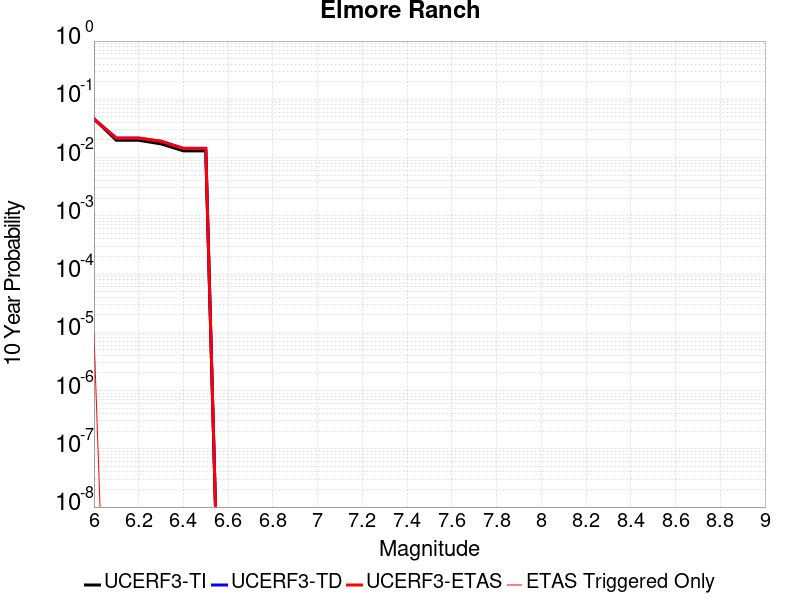 |

| Magnitude | 1 wk TI Prob | 1 wk TD Prob | 1 wk ETAS Prob | 1 wk ETAS/TD Gain | 1 wk ETAS Triggered Only | 1 mo TI Prob | 1 mo TD Prob | 1 mo ETAS Prob | 1 mo ETAS/TD Gain | 1 mo ETAS Triggered Only | 1 yr TI Prob | 1 yr TD Prob | 1 yr ETAS Prob | 1 yr ETAS/TD Gain | 1 yr ETAS Triggered Only | 10 yr TI Prob | 10 yr TD Prob | 10 yr ETAS Prob | 10 yr ETAS/TD Gain | 10 yr ETAS Triggered Only |
|-----|-----|-----|-----|-----|-----|-----|-----|-----|-----|-----|-----|-----|-----|-----|-----|-----|-----|-----|-----|-----|
| 6.0 | 9.102099E-5 | 8.952015E-5 | 8.952015E-5 | 1.0 | 0.0 | 3.9003167E-4 | 3.8361453E-4 | 3.8361453E-4 | 1.0 | 0.0 | 0.0047383 | 0.004662009 | 0.0046719625 | 1.002135 | 1.0E-5 | 0.046385348 | 0.045870975 | 0.045880515 | 1.000208 | 1.0E-5 |
| 6.1 | 3.8306698E-5 | 4.1498504E-5 | 4.1498504E-5 | 1.0 | 0.0 | 1.6416123E-4 | 1.7784268E-4 | 1.7784268E-4 | 1.0 | 0.0 | 0.0019968306 | 0.0021631396 | 0.0021631396 | 1.0 | 0.0 | 0.019789828 | 0.021628205 | 0.021628205 | 1.0 | 0.0 |
| 6.2 | 3.8306698E-5 | 4.1498504E-5 | 4.1498504E-5 | 1.0 | 0.0 | 1.6416123E-4 | 1.7784268E-4 | 1.7784268E-4 | 1.0 | 0.0 | 0.0019968306 | 0.0021631396 | 0.0021631396 | 1.0 | 0.0 | 0.019789828 | 0.021628205 | 0.021628205 | 1.0 | 0.0 |
| 6.3 | 3.3197924E-5 | 3.6554302E-5 | 3.6554302E-5 | 1.0 | 0.0 | 1.4226905E-4 | 1.5665586E-4 | 1.5665586E-4 | 1.0 | 0.0 | 0.0017307495 | 0.001905917 | 0.001905917 | 1.0 | 0.0 | 0.017173318 | 0.01908996 | 0.01908996 | 1.0 | 0.0 |
| 6.4 | 2.5148964E-5 | 2.7420487E-5 | 2.7420487E-5 | 1.0 | 0.0 | 1.0777682E-4 | 1.17514726E-4 | 1.17514726E-4 | 1.0 | 0.0 | 0.0013113929 | 0.0014304507 | 0.0014304507 | 1.0 | 0.0 | 0.01303681 | 0.014387194 | 0.014387194 | 1.0 | 0.0 |
| 6.5 | 2.5148964E-5 | 2.7420487E-5 | 2.7420487E-5 | 1.0 | 0.0 | 1.0777682E-4 | 1.17514726E-4 | 1.17514726E-4 | 1.0 | 0.0 | 0.0013113929 | 0.0014304507 | 0.0014304507 | 1.0 | 0.0 | 0.01303681 | 0.014387194 | 0.014387194 | 1.0 | 0.0 |

## Fontana (Seismicity)
*[(top)](#table-of-contents)*

| 1 Week | 1 Month | 1 Year | 10 Year |
|-----|-----|-----|-----|
|  |  |  |  |

| Magnitude | 1 wk TI Prob | 1 wk TD Prob | 1 wk ETAS Prob | 1 wk ETAS/TD Gain | 1 wk ETAS Triggered Only | 1 mo TI Prob | 1 mo TD Prob | 1 mo ETAS Prob | 1 mo ETAS/TD Gain | 1 mo ETAS Triggered Only | 1 yr TI Prob | 1 yr TD Prob | 1 yr ETAS Prob | 1 yr ETAS/TD Gain | 1 yr ETAS Triggered Only | 10 yr TI Prob | 10 yr TD Prob | 10 yr ETAS Prob | 10 yr ETAS/TD Gain | 10 yr ETAS Triggered Only |
|-----|-----|-----|-----|-----|-----|-----|-----|-----|-----|-----|-----|-----|-----|-----|-----|-----|-----|-----|-----|-----|
| 6.0 | 7.1789214E-6 | 7.5520006E-6 | 7.5520006E-6 | 1.0 | 0.0 | 3.076644E-5 | 3.2365548E-5 | 3.2365548E-5 | 1.0 | 0.0 | 3.7451705E-4 | 3.9402005E-4 | 4.0401611E-4 | 1.0253694 | 1.0E-5 | 0.003738865 | 0.003937214 | 0.0039471746 | 1.0025299 | 1.0E-5 |
| 6.1 | 7.1789214E-6 | 7.5520006E-6 | 7.5520006E-6 | 1.0 | 0.0 | 3.076644E-5 | 3.2365548E-5 | 3.2365548E-5 | 1.0 | 0.0 | 3.7451705E-4 | 3.9402005E-4 | 4.0401611E-4 | 1.0253694 | 1.0E-5 | 0.003738865 | 0.003937214 | 0.0039471746 | 1.0025299 | 1.0E-5 |
| 6.2 | 7.1789214E-6 | 7.5520006E-6 | 7.5520006E-6 | 1.0 | 0.0 | 3.076644E-5 | 3.2365548E-5 | 3.2365548E-5 | 1.0 | 0.0 | 3.7451705E-4 | 3.9402005E-4 | 4.0401611E-4 | 1.0253694 | 1.0E-5 | 0.003738865 | 0.003937214 | 0.0039471746 | 1.0025299 | 1.0E-5 |
| 6.3 | 7.1789214E-6 | 7.5520006E-6 | 7.5520006E-6 | 1.0 | 0.0 | 3.076644E-5 | 3.2365548E-5 | 3.2365548E-5 | 1.0 | 0.0 | 3.7451705E-4 | 3.9402005E-4 | 4.0401611E-4 | 1.0253694 | 1.0E-5 | 0.003738865 | 0.003937214 | 0.0039471746 | 1.0025299 | 1.0E-5 |
| 6.4 | 7.1789214E-6 | 7.5520006E-6 | 7.5520006E-6 | 1.0 | 0.0 | 3.076644E-5 | 3.2365548E-5 | 3.2365548E-5 | 1.0 | 0.0 | 3.7451705E-4 | 3.9402005E-4 | 4.0401611E-4 | 1.0253694 | 1.0E-5 | 0.003738865 | 0.003937214 | 0.0039471746 | 1.0025299 | 1.0E-5 |
| 6.5 | 5.2611317E-6 | 5.532726E-6 | 5.532726E-6 | 1.0 | 0.0 | 2.2547512E-5 | 2.3711682E-5 | 2.3711682E-5 | 1.0 | 0.0 | 2.744814E-4 | 2.8868974E-4 | 2.9868685E-4 | 1.0346292 | 1.0E-5 | 0.002741426 | 0.0028868972 | 0.0028968684 | 1.003454 | 1.0E-5 |
| 6.6 | 5.2611317E-6 | 5.532726E-6 | 5.532726E-6 | 1.0 | 0.0 | 2.2547512E-5 | 2.3711682E-5 | 2.3711682E-5 | 1.0 | 0.0 | 2.744814E-4 | 2.8868974E-4 | 2.9868685E-4 | 1.0346292 | 1.0E-5 | 0.002741426 | 0.0028868972 | 0.0028968684 | 1.003454 | 1.0E-5 |

## San Pedro Escarpment
*[(top)](#table-of-contents)*

| 1 Week | 1 Month | 1 Year | 10 Year |
|-----|-----|-----|-----|
|  |  |  |  |

| Magnitude | 1 wk TI Prob | 1 wk TD Prob | 1 wk ETAS Prob | 1 wk ETAS/TD Gain | 1 wk ETAS Triggered Only | 1 mo TI Prob | 1 mo TD Prob | 1 mo ETAS Prob | 1 mo ETAS/TD Gain | 1 mo ETAS Triggered Only | 1 yr TI Prob | 1 yr TD Prob | 1 yr ETAS Prob | 1 yr ETAS/TD Gain | 1 yr ETAS Triggered Only | 10 yr TI Prob | 10 yr TD Prob | 10 yr ETAS Prob | 10 yr ETAS/TD Gain | 10 yr ETAS Triggered Only |
|-----|-----|-----|-----|-----|-----|-----|-----|-----|-----|-----|-----|-----|-----|-----|-----|-----|-----|-----|-----|-----|
| 6.0 | 1.1740281E-6 | 1.0380262E-6 | 1.0380262E-6 | 1.0 | 0.0 | 5.031539E-6 | 4.4486765E-6 | 4.4486765E-6 | 1.0 | 0.0 | 6.125726E-5 | 5.416135E-5 | 6.416081E-5 | 1.1846235 | 1.0E-5 | 6.124038E-4 | 5.4148794E-4 | 5.514825E-4 | 1.0184577 | 1.0E-5 |
| 6.1 | 1.1740281E-6 | 1.0380262E-6 | 1.0380262E-6 | 1.0 | 0.0 | 5.031539E-6 | 4.4486765E-6 | 4.4486765E-6 | 1.0 | 0.0 | 6.125726E-5 | 5.416135E-5 | 6.416081E-5 | 1.1846235 | 1.0E-5 | 6.124038E-4 | 5.4148794E-4 | 5.514825E-4 | 1.0184577 | 1.0E-5 |
| 6.2 | 1.1740281E-6 | 1.0380262E-6 | 1.0380262E-6 | 1.0 | 0.0 | 5.031539E-6 | 4.4486765E-6 | 4.4486765E-6 | 1.0 | 0.0 | 6.125726E-5 | 5.416135E-5 | 6.416081E-5 | 1.1846235 | 1.0E-5 | 6.124038E-4 | 5.4148794E-4 | 5.514825E-4 | 1.0184577 | 1.0E-5 |
| 6.3 | 1.1740281E-6 | 1.0380262E-6 | 1.0380262E-6 | 1.0 | 0.0 | 5.031539E-6 | 4.4486765E-6 | 4.4486765E-6 | 1.0 | 0.0 | 6.125726E-5 | 5.416135E-5 | 6.416081E-5 | 1.1846235 | 1.0E-5 | 6.124038E-4 | 5.4148794E-4 | 5.514825E-4 | 1.0184577 | 1.0E-5 |
| 6.4 | 1.1740281E-6 | 1.0380262E-6 | 1.0380262E-6 | 1.0 | 0.0 | 5.031539E-6 | 4.4486765E-6 | 4.4486765E-6 | 1.0 | 0.0 | 6.125726E-5 | 5.416135E-5 | 6.416081E-5 | 1.1846235 | 1.0E-5 | 6.124038E-4 | 5.4148794E-4 | 5.514825E-4 | 1.0184577 | 1.0E-5 |
| 6.5 | 1.1740281E-6 | 1.0380262E-6 | 1.0380262E-6 | 1.0 | 0.0 | 5.031539E-6 | 4.4486765E-6 | 4.4486765E-6 | 1.0 | 0.0 | 6.125726E-5 | 5.416135E-5 | 6.416081E-5 | 1.1846235 | 1.0E-5 | 6.124038E-4 | 5.4148794E-4 | 5.514825E-4 | 1.0184577 | 1.0E-5 |
| 6.6 | 1.1740281E-6 | 1.0380262E-6 | 1.0380262E-6 | 1.0 | 0.0 | 5.031539E-6 | 4.4486765E-6 | 4.4486765E-6 | 1.0 | 0.0 | 6.125726E-5 | 5.416135E-5 | 6.416081E-5 | 1.1846235 | 1.0E-5 | 6.124038E-4 | 5.4148794E-4 | 5.514825E-4 | 1.0184577 | 1.0E-5 |
| 6.7 | 1.1740281E-6 | 1.0380262E-6 | 1.0380262E-6 | 1.0 | 0.0 | 5.031539E-6 | 4.4486765E-6 | 4.4486765E-6 | 1.0 | 0.0 | 6.125726E-5 | 5.416135E-5 | 6.416081E-5 | 1.1846235 | 1.0E-5 | 6.124038E-4 | 5.4148794E-4 | 5.514825E-4 | 1.0184577 | 1.0E-5 |
| 6.8 | 1.1740281E-6 | 1.0380262E-6 | 1.0380262E-6 | 1.0 | 0.0 | 5.031539E-6 | 4.4486765E-6 | 4.4486765E-6 | 1.0 | 0.0 | 6.125726E-5 | 5.416135E-5 | 6.416081E-5 | 1.1846235 | 1.0E-5 | 6.124038E-4 | 5.4148794E-4 | 5.514825E-4 | 1.0184577 | 1.0E-5 |
| 6.9 | 1.1740281E-6 | 1.0380262E-6 | 1.0380262E-6 | 1.0 | 0.0 | 5.031539E-6 | 4.4486765E-6 | 4.4486765E-6 | 1.0 | 0.0 | 6.125726E-5 | 5.416135E-5 | 6.416081E-5 | 1.1846235 | 1.0E-5 | 6.124038E-4 | 5.4148794E-4 | 5.514825E-4 | 1.0184577 | 1.0E-5 |
| 7.0 | 1.1740281E-6 | 1.0380262E-6 | 1.0380262E-6 | 1.0 | 0.0 | 5.031539E-6 | 4.4486765E-6 | 4.4486765E-6 | 1.0 | 0.0 | 6.125726E-5 | 5.416135E-5 | 6.416081E-5 | 1.1846235 | 1.0E-5 | 6.124038E-4 | 5.4148794E-4 | 5.514825E-4 | 1.0184577 | 1.0E-5 |
| 7.1 | 1.1740281E-6 | 1.0380262E-6 | 1.0380262E-6 | 1.0 | 0.0 | 5.031539E-6 | 4.4486765E-6 | 4.4486765E-6 | 1.0 | 0.0 | 6.125726E-5 | 5.416135E-5 | 6.416081E-5 | 1.1846235 | 1.0E-5 | 6.124038E-4 | 5.4148794E-4 | 5.514825E-4 | 1.0184577 | 1.0E-5 |
| 7.2 | 1.1722314E-6 | 1.0362135E-6 | 1.0362135E-6 | 1.0 | 0.0 | 5.023839E-6 | 4.4409076E-6 | 4.4409076E-6 | 1.0 | 0.0 | 6.116352E-5 | 5.406677E-5 | 6.406623E-5 | 1.1849465 | 1.0E-5 | 6.114669E-4 | 5.405426E-4 | 5.5053714E-4 | 1.01849 | 1.0E-5 |
| 7.3 | 1.1515234E-6 | 1.0152875E-6 | 1.0152875E-6 | 1.0 | 0.0 | 4.935091E-6 | 4.351225E-6 | 4.351225E-6 | 1.0 | 0.0 | 6.008308E-5 | 5.2974945E-5 | 6.297442E-5 | 1.1887585 | 1.0E-5 | 6.0066837E-4 | 5.296295E-4 | 5.3962425E-4 | 1.0188711 | 1.0E-5 |
| 7.4 | 1.1103637E-6 | 9.736466E-7 | 9.736466E-7 | 1.0 | 0.0 | 4.7586927E-6 | 4.172765E-6 | 4.172765E-6 | 1.0 | 0.0 | 5.793554E-5 | 5.0802293E-5 | 6.0801784E-5 | 1.1968315 | 1.0E-5 | 5.792044E-4 | 5.079131E-4 | 5.179081E-4 | 1.0196784 | 1.0E-5 |
| 7.5 | 1.0425391E-6 | 9.1189133E-7 | 9.1189133E-7 | 1.0 | 0.0 | 4.4680173E-6 | 3.9081E-6 | 3.9081E-6 | 1.0 | 0.0 | 5.439675E-5 | 4.7580146E-5 | 5.757967E-5 | 1.2101617 | 1.0E-5 | 5.438344E-4 | 4.7570592E-4 | 4.8570117E-4 | 1.0210114 | 1.0E-5 |
| 7.6 | 7.0184194E-7 | 5.886514E-7 | 5.886514E-7 | 1.0 | 0.0 | 3.0078907E-6 | 2.5227896E-6 | 2.5227896E-6 | 1.0 | 0.0 | 3.6620455E-5 | 3.071458E-5 | 4.0714272E-5 | 1.3255683 | 1.0E-5 | 3.661442E-4 | 3.071081E-4 | 3.17105E-4 | 1.0325519 | 1.0E-5 |
| 7.7 | 3.0871365E-7 | 2.2456044E-7 | 2.2456044E-7 | 1.0 | 0.0 | 1.3230577E-6 | 9.624015E-7 | 9.624015E-7 | 1.0 | 0.0 | 1.610811E-5 | 1.1717177E-5 | 2.171706E-5 | 1.8534379 | 1.0E-5 | 1.6106942E-4 | 1.171657E-4 | 1.2716453E-4 | 1.0853392 | 1.0E-5 |
| 7.8 | 5.7512665E-8 | 4.1053042E-8 | 4.1053042E-8 | 1.0 | 0.0 | 2.464828E-7 | 1.759416E-7 | 1.759416E-7 | 1.0 | 0.0 | 3.0009242E-6 | 2.142087E-6 | 2.142087E-6 | 1.0 | 0.0 | 3.0008836E-5 | 2.1420683E-5 | 2.1420683E-5 | 1.0 | 0.0 |
| 7.9 | 6.040053E-9 | 3.4534322E-9 | 3.4534322E-9 | 1.0 | 0.0 | 2.5885942E-8 | 1.4800423E-8 | 1.4800423E-8 | 1.0 | 0.0 | 3.151613E-7 | 1.8019513E-7 | 1.8019513E-7 | 1.0 | 0.0 | 3.1516086E-6 | 1.80195E-6 | 1.80195E-6 | 1.0 | 0.0 |

## Hollywood
*[(top)](#table-of-contents)*

| 1 Week | 1 Month | 1 Year | 10 Year |
|-----|-----|-----|-----|
|  |  |  |  |

| Magnitude | 1 wk TI Prob | 1 wk TD Prob | 1 wk ETAS Prob | 1 wk ETAS/TD Gain | 1 wk ETAS Triggered Only | 1 mo TI Prob | 1 mo TD Prob | 1 mo ETAS Prob | 1 mo ETAS/TD Gain | 1 mo ETAS Triggered Only | 1 yr TI Prob | 1 yr TD Prob | 1 yr ETAS Prob | 1 yr ETAS/TD Gain | 1 yr ETAS Triggered Only | 10 yr TI Prob | 10 yr TD Prob | 10 yr ETAS Prob | 10 yr ETAS/TD Gain | 10 yr ETAS Triggered Only |
|-----|-----|-----|-----|-----|-----|-----|-----|-----|-----|-----|-----|-----|-----|-----|-----|-----|-----|-----|-----|-----|
| 6.0 | 1.24487615E-5 | 1.2593226E-5 | 2.25931E-5 | 1.7940677 | 1.0E-5 | 5.3350745E-5 | 5.3969878E-5 | 6.396934E-5 | 1.1852785 | 1.0E-5 | 6.4935174E-4 | 6.568898E-4 | 6.6688325E-4 | 1.0152133 | 1.0E-5 | 0.0064745755 | 0.006549969 | 0.0065599033 | 1.0015167 | 1.0E-5 |
| 6.1 | 1.24487615E-5 | 1.2593226E-5 | 2.25931E-5 | 1.7940677 | 1.0E-5 | 5.3350745E-5 | 5.3969878E-5 | 6.396934E-5 | 1.1852785 | 1.0E-5 | 6.4935174E-4 | 6.568898E-4 | 6.6688325E-4 | 1.0152133 | 1.0E-5 | 0.0064745755 | 0.006549969 | 0.0065599033 | 1.0015167 | 1.0E-5 |
| 6.2 | 1.24487615E-5 | 1.2593226E-5 | 2.25931E-5 | 1.7940677 | 1.0E-5 | 5.3350745E-5 | 5.3969878E-5 | 6.396934E-5 | 1.1852785 | 1.0E-5 | 6.4935174E-4 | 6.568898E-4 | 6.6688325E-4 | 1.0152133 | 1.0E-5 | 0.0064745755 | 0.006549969 | 0.0065599033 | 1.0015167 | 1.0E-5 |
| 6.3 | 1.24487615E-5 | 1.2593226E-5 | 2.25931E-5 | 1.7940677 | 1.0E-5 | 5.3350745E-5 | 5.3969878E-5 | 6.396934E-5 | 1.1852785 | 1.0E-5 | 6.4935174E-4 | 6.568898E-4 | 6.6688325E-4 | 1.0152133 | 1.0E-5 | 0.0064745755 | 0.006549969 | 0.0065599033 | 1.0015167 | 1.0E-5 |
| 6.4 | 1.2431024E-5 | 1.2573839E-5 | 2.2573713E-5 | 1.795292 | 1.0E-5 | 5.327473E-5 | 5.3886797E-5 | 6.3886255E-5 | 1.1855642 | 1.0E-5 | 6.4842677E-4 | 6.558789E-4 | 6.6587236E-4 | 1.0152367 | 1.0E-5 | 0.0064653796 | 0.0065399194 | 0.006549854 | 1.0015191 | 1.0E-5 |
| 6.5 | 1.1242222E-5 | 1.13178E-5 | 2.1317686E-5 | 1.8835539 | 1.0E-5 | 4.8180063E-5 | 4.850397E-5 | 5.8503487E-5 | 1.2061586 | 1.0E-5 | 5.864344E-4 | 5.9037853E-4 | 6.003726E-4 | 1.0169283 | 1.0E-5 | 0.0058488925 | 0.005888388 | 0.005898329 | 1.0016882 | 1.0E-5 |
| 6.6 | 1.1234066E-5 | 1.13089145E-5 | 2.13088E-5 | 1.8842481 | 1.0E-5 | 4.8145106E-5 | 4.846589E-5 | 5.8465404E-5 | 1.2063206 | 1.0E-5 | 5.86009E-4 | 5.8991514E-4 | 5.999092E-4 | 1.0169415 | 1.0E-5 | 0.005844661 | 0.0058837784 | 0.00589372 | 1.0016896 | 1.0E-5 |
| 6.7 | 1.12294E-5 | 1.1303658E-5 | 2.1303544E-5 | 1.8846594 | 1.0E-5 | 4.812511E-5 | 4.8443362E-5 | 5.8442878E-5 | 1.2064166 | 1.0E-5 | 5.857657E-4 | 5.89641E-4 | 5.996351E-4 | 1.0169494 | 1.0E-5 | 0.0058422405 | 0.005881052 | 0.005890993 | 1.0016904 | 1.0E-5 |
| 6.8 | 1.0252819E-5 | 1.0218445E-5 | 2.0218342E-5 | 1.9786125 | 1.0E-5 | 4.3939912E-5 | 4.379261E-5 | 5.3792173E-5 | 1.2283391 | 1.0E-5 | 5.3483713E-4 | 5.330467E-4 | 5.430414E-4 | 1.0187501 | 1.0E-5 | 0.005335517 | 0.005317908 | 0.0053278543 | 1.0018704 | 1.0E-5 |
| 6.9 | 9.252289E-6 | 9.110306E-6 | 9.110306E-6 | 1.0 | 0.0 | 3.9652066E-5 | 3.9043593E-5 | 3.9043593E-5 | 1.0 | 0.0 | 4.8265693E-4 | 4.752537E-4 | 4.752537E-4 | 1.0 | 0.0 | 0.0048161 | 0.004742547 | 0.004742547 | 1.0 | 0.0 |
| 7.0 | 8.474604E-6 | 8.258257E-6 | 8.258257E-6 | 1.0 | 0.0 | 3.6319227E-5 | 3.539206E-5 | 3.539206E-5 | 1.0 | 0.0 | 4.4209688E-4 | 4.3081454E-4 | 4.3081454E-4 | 1.0 | 0.0 | 0.004412184 | 0.004299944 | 0.004299944 | 1.0 | 0.0 |
| 7.1 | 6.643643E-6 | 6.2683675E-6 | 6.2683675E-6 | 1.0 | 0.0 | 2.8472443E-5 | 2.6864158E-5 | 2.6864158E-5 | 1.0 | 0.0 | 3.4659685E-4 | 3.2702246E-4 | 3.2702246E-4 | 1.0 | 0.0 | 0.0034605677 | 0.0032654584 | 0.0032654584 | 1.0 | 0.0 |
| 7.2 | 5.549002E-6 | 5.108709E-6 | 5.108709E-6 | 1.0 | 0.0 | 2.378122E-5 | 2.1894284E-5 | 2.1894284E-5 | 1.0 | 0.0 | 2.8949787E-4 | 2.6653046E-4 | 2.6653046E-4 | 1.0 | 0.0 | 0.0028912104 | 0.0026621243 | 0.0026621243 | 1.0 | 0.0 |
| 7.3 | 4.3059727E-6 | 3.9598885E-6 | 3.9598885E-6 | 1.0 | 0.0 | 1.8454039E-5 | 1.6970842E-5 | 1.6970842E-5 | 1.0 | 0.0 | 2.2465475E-4 | 2.066005E-4 | 2.066005E-4 | 1.0 | 0.0 | 0.0022442779 | 0.0020640944 | 0.0020640944 | 1.0 | 0.0 |
| 7.4 | 2.8550733E-6 | 2.7012966E-6 | 2.7012966E-6 | 1.0 | 0.0 | 1.2235971E-5 | 1.1576934E-5 | 1.1576934E-5 | 1.0 | 0.0 | 1.4896276E-4 | 1.409401E-4 | 1.409401E-4 | 1.0 | 0.0 | 0.0014886294 | 0.0014085122 | 0.0014085122 | 1.0 | 0.0 |
| 7.5 | 1.9927045E-6 | 1.8976367E-6 | 1.8976367E-6 | 1.0 | 0.0 | 8.540134E-6 | 8.132703E-6 | 8.132703E-6 | 1.0 | 0.0 | 1.0397117E-4 | 9.90112E-5 | 9.90112E-5 | 1.0 | 0.0 | 0.0010392254 | 9.896745E-4 | 9.896745E-4 | 1.0 | 0.0 |
| 7.6 | 1.345084E-6 | 1.2216007E-6 | 1.2216007E-6 | 1.0 | 0.0 | 5.764633E-6 | 5.235421E-6 | 5.235421E-6 | 1.0 | 0.0 | 7.018215E-5 | 6.3739404E-5 | 6.3739404E-5 | 1.0 | 0.0 | 7.0159987E-4 | 6.3721323E-4 | 6.3721323E-4 | 1.0 | 0.0 |
| 7.7 | 7.6835164E-7 | 6.277697E-7 | 6.277697E-7 | 1.0 | 0.0 | 3.2929315E-6 | 2.6904388E-6 | 2.6904388E-6 | 1.0 | 0.0 | 4.00907E-5 | 3.2755615E-5 | 3.2755615E-5 | 1.0 | 0.0 | 4.0083472E-4 | 3.2750933E-4 | 3.2750933E-4 | 1.0 | 0.0 |
| 7.8 | 3.6562128E-7 | 2.453479E-7 | 2.453479E-7 | 1.0 | 0.0 | 1.5669474E-6 | 1.0514907E-6 | 1.0514907E-6 | 1.0 | 0.0 | 1.9077417E-5 | 1.2801827E-5 | 1.2801827E-5 | 1.0 | 0.0 | 1.907578E-4 | 1.2801126E-4 | 1.2801126E-4 | 1.0 | 0.0 |
| 7.9 | 7.5024424E-8 | 5.3816795E-8 | 5.3816795E-8 | 1.0 | 0.0 | 3.215332E-7 | 2.306434E-7 | 2.306434E-7 | 1.0 | 0.0 | 3.91466E-6 | 2.808081E-6 | 2.808081E-6 | 1.0 | 0.0 | 3.9145907E-5 | 2.8080585E-5 | 2.8080585E-5 | 1.0 | 0.0 |

## Great Valley 05 Pittsburg - Kirby Hills alt1
*[(top)](#table-of-contents)*

| 1 Week | 1 Month | 1 Year | 10 Year |
|-----|-----|-----|-----|
|  |  |  |  |

| Magnitude | 1 wk TI Prob | 1 wk TD Prob | 1 wk ETAS Prob | 1 wk ETAS/TD Gain | 1 wk ETAS Triggered Only | 1 mo TI Prob | 1 mo TD Prob | 1 mo ETAS Prob | 1 mo ETAS/TD Gain | 1 mo ETAS Triggered Only | 1 yr TI Prob | 1 yr TD Prob | 1 yr ETAS Prob | 1 yr ETAS/TD Gain | 1 yr ETAS Triggered Only | 10 yr TI Prob | 10 yr TD Prob | 10 yr ETAS Prob | 10 yr ETAS/TD Gain | 10 yr ETAS Triggered Only |
|-----|-----|-----|-----|-----|-----|-----|-----|-----|-----|-----|-----|-----|-----|-----|-----|-----|-----|-----|-----|-----|
| 6.0 | 4.187212E-5 | 5.3442072E-5 | 5.3442072E-5 | 1.0 | 0.0 | 1.794396E-4 | 2.290231E-4 | 2.3902081E-4 | 1.0436537 | 1.0E-5 | 0.002182488 | 0.0027857882 | 0.0027957603 | 1.0035796 | 1.0E-5 | 0.021611776 | 0.02760304 | 0.027612763 | 1.0003523 | 1.0E-5 |
| 6.1 | 4.187212E-5 | 5.3442072E-5 | 5.3442072E-5 | 1.0 | 0.0 | 1.794396E-4 | 2.290231E-4 | 2.3902081E-4 | 1.0436537 | 1.0E-5 | 0.002182488 | 0.0027857882 | 0.0027957603 | 1.0035796 | 1.0E-5 | 0.021611776 | 0.02760304 | 0.027612763 | 1.0003523 | 1.0E-5 |
| 6.2 | 1.7353306E-5 | 2.2154374E-5 | 2.2154374E-5 | 1.0 | 0.0 | 7.436919E-5 | 9.494618E-5 | 9.494618E-5 | 1.0 | 0.0 | 9.050688E-4 | 0.0011557543 | 0.0011557543 | 1.0 | 0.0 | 0.009013915 | 0.011535114 | 0.011535114 | 1.0 | 0.0 |
| 6.3 | 1.7353306E-5 | 2.2154374E-5 | 2.2154374E-5 | 1.0 | 0.0 | 7.436919E-5 | 9.494618E-5 | 9.494618E-5 | 1.0 | 0.0 | 9.050688E-4 | 0.0011557543 | 0.0011557543 | 1.0 | 0.0 | 0.009013915 | 0.011535114 | 0.011535114 | 1.0 | 0.0 |
| 6.4 | 1.4028824E-5 | 1.7900597E-5 | 1.7900597E-5 | 1.0 | 0.0 | 6.0122147E-5 | 7.671684E-5 | 7.671684E-5 | 1.0 | 0.0 | 7.3174125E-4 | 9.340275E-4 | 9.340275E-4 | 1.0 | 0.0 | 0.0072933645 | 0.009338138 | 0.009338138 | 1.0 | 0.0 |

## Russ 2011 CFM
*[(top)](#table-of-contents)*

| 1 Week | 1 Month | 1 Year | 10 Year |
|-----|-----|-----|-----|
|  |  |  |  |

| Magnitude | 1 wk TI Prob | 1 wk TD Prob | 1 wk ETAS Prob | 1 wk ETAS/TD Gain | 1 wk ETAS Triggered Only | 1 mo TI Prob | 1 mo TD Prob | 1 mo ETAS Prob | 1 mo ETAS/TD Gain | 1 mo ETAS Triggered Only | 1 yr TI Prob | 1 yr TD Prob | 1 yr ETAS Prob | 1 yr ETAS/TD Gain | 1 yr ETAS Triggered Only | 10 yr TI Prob | 10 yr TD Prob | 10 yr ETAS Prob | 10 yr ETAS/TD Gain | 10 yr ETAS Triggered Only |
|-----|-----|-----|-----|-----|-----|-----|-----|-----|-----|-----|-----|-----|-----|-----|-----|-----|-----|-----|-----|-----|
| 6.0 | 2.3806366E-5 | 2.6254156E-5 | 3.6253892E-5 | 1.3808821 | 1.0E-5 | 1.0202329E-4 | 1.1251331E-4 | 1.225122E-4 | 1.0888684 | 1.0E-5 | 0.0012414258 | 0.0013690525 | 0.0013790388 | 1.0072943 | 1.0E-5 | 0.012345135 | 0.013612664 | 0.013622528 | 1.0007246 | 1.0E-5 |
| 6.1 | 2.3806366E-5 | 2.6254156E-5 | 3.6253892E-5 | 1.3808821 | 1.0E-5 | 1.0202329E-4 | 1.1251331E-4 | 1.225122E-4 | 1.0888684 | 1.0E-5 | 0.0012414258 | 0.0013690525 | 0.0013790388 | 1.0072943 | 1.0E-5 | 0.012345135 | 0.013612664 | 0.013622528 | 1.0007246 | 1.0E-5 |
| 6.2 | 2.3806366E-5 | 2.6254156E-5 | 3.6253892E-5 | 1.3808821 | 1.0E-5 | 1.0202329E-4 | 1.1251331E-4 | 1.225122E-4 | 1.0888684 | 1.0E-5 | 0.0012414258 | 0.0013690525 | 0.0013790388 | 1.0072943 | 1.0E-5 | 0.012345135 | 0.013612664 | 0.013622528 | 1.0007246 | 1.0E-5 |
| 6.3 | 2.3806366E-5 | 2.6254156E-5 | 3.6253892E-5 | 1.3808821 | 1.0E-5 | 1.0202329E-4 | 1.1251331E-4 | 1.225122E-4 | 1.0888684 | 1.0E-5 | 0.0012414258 | 0.0013690525 | 0.0013790388 | 1.0072943 | 1.0E-5 | 0.012345135 | 0.013612664 | 0.013622528 | 1.0007246 | 1.0E-5 |
| 6.4 | 2.3806366E-5 | 2.6254156E-5 | 3.6253892E-5 | 1.3808821 | 1.0E-5 | 1.0202329E-4 | 1.1251331E-4 | 1.225122E-4 | 1.0888684 | 1.0E-5 | 0.0012414258 | 0.0013690525 | 0.0013790388 | 1.0072943 | 1.0E-5 | 0.012345135 | 0.013612664 | 0.013622528 | 1.0007246 | 1.0E-5 |
| 6.5 | 2.3806366E-5 | 2.6254156E-5 | 3.6253892E-5 | 1.3808821 | 1.0E-5 | 1.0202329E-4 | 1.1251331E-4 | 1.225122E-4 | 1.0888684 | 1.0E-5 | 0.0012414258 | 0.0013690525 | 0.0013790388 | 1.0072943 | 1.0E-5 | 0.012345135 | 0.013612664 | 0.013622528 | 1.0007246 | 1.0E-5 |
| 6.6 | 2.3806366E-5 | 2.6254156E-5 | 3.6253892E-5 | 1.3808821 | 1.0E-5 | 1.0202329E-4 | 1.1251331E-4 | 1.225122E-4 | 1.0888684 | 1.0E-5 | 0.0012414258 | 0.0013690525 | 0.0013790388 | 1.0072943 | 1.0E-5 | 0.012345135 | 0.013612664 | 0.013622528 | 1.0007246 | 1.0E-5 |
| 6.7 | 1.6515693E-5 | 1.8187944E-5 | 2.8187764E-5 | 1.5498047 | 1.0E-5 | 7.077962E-5 | 7.79462E-5 | 8.794542E-5 | 1.1282836 | 1.0E-5 | 8.6140115E-4 | 9.486156E-4 | 9.586061E-4 | 1.0105317 | 1.0E-5 | 0.008580698 | 0.009449055 | 0.009458961 | 1.0010483 | 1.0E-5 |
| 6.8 | 1.6515693E-5 | 1.8187944E-5 | 2.8187764E-5 | 1.5498047 | 1.0E-5 | 7.077962E-5 | 7.79462E-5 | 8.794542E-5 | 1.1282836 | 1.0E-5 | 8.6140115E-4 | 9.486156E-4 | 9.586061E-4 | 1.0105317 | 1.0E-5 | 0.008580698 | 0.009449055 | 0.009458961 | 1.0010483 | 1.0E-5 |
| 6.9 | 1.2971182E-5 | 1.4273831E-5 | 2.4273688E-5 | 1.7005727 | 1.0E-5 | 5.5589593E-5 | 6.117227E-5 | 7.1171664E-5 | 1.1634628 | 1.0E-5 | 6.765931E-4 | 7.4454385E-4 | 7.5453636E-4 | 1.013421 | 1.0E-5 | 0.0067453682 | 0.0074230675 | 0.0074329935 | 1.0013372 | 1.0E-5 |
| 7.0 | 1.0201805E-5 | 1.1221911E-5 | 2.12218E-5 | 1.8911037 | 1.0E-5 | 4.3721288E-5 | 4.8093138E-5 | 5.8092657E-5 | 1.2079198 | 1.0E-5 | 5.3217664E-4 | 5.853974E-4 | 5.9539155E-4 | 1.0170724 | 1.0E-5 | 0.00530904 | 0.005840605 | 0.005850547 | 1.0017022 | 1.0E-5 |
| 7.1 | 8.3744935E-6 | 9.2126675E-6 | 1.9212575E-5 | 2.085452 | 1.0E-5 | 3.5890193E-5 | 3.9482366E-5 | 4.9481972E-5 | 1.2532676 | 1.0E-5 | 4.368755E-4 | 4.8061032E-4 | 4.9060554E-4 | 1.0207969 | 1.0E-5 | 0.004360176 | 0.0047975346 | 0.0048074867 | 1.0020744 | 1.0E-5 |
| 7.2 | 6.649391E-6 | 7.3170095E-6 | 1.7316936E-5 | 2.3666687 | 1.0E-5 | 2.8497077E-5 | 3.135833E-5 | 4.1358013E-5 | 1.3188846 | 1.0E-5 | 3.4689668E-4 | 3.8173737E-4 | 3.9173354E-4 | 1.026186 | 1.0E-5 | 0.0034635565 | 0.0038124465 | 0.0038224084 | 1.002613 | 1.0E-5 |
| 7.3 | 4.9549312E-6 | 5.454593E-6 | 1.5454538E-5 | 2.8333073 | 1.0E-5 | 2.1235246E-5 | 2.33767E-5 | 3.3376466E-5 | 1.4277663 | 1.0E-5 | 2.5850846E-4 | 2.8458887E-4 | 2.9458603E-4 | 1.0351284 | 1.0E-5 | 0.0025820795 | 0.0028436882 | 0.00285366 | 1.0035065 | 1.0E-5 |

## Bullion Mountains
*[(top)](#table-of-contents)*

| 1 Week | 1 Month | 1 Year | 10 Year |
|-----|-----|-----|-----|
|  |  | 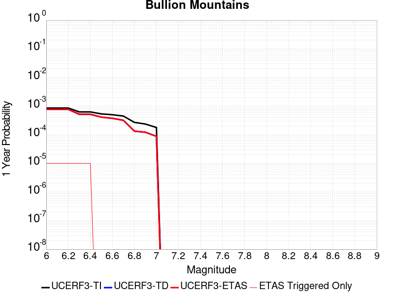 |  |

| Magnitude | 1 wk TI Prob | 1 wk TD Prob | 1 wk ETAS Prob | 1 wk ETAS/TD Gain | 1 wk ETAS Triggered Only | 1 mo TI Prob | 1 mo TD Prob | 1 mo ETAS Prob | 1 mo ETAS/TD Gain | 1 mo ETAS Triggered Only | 1 yr TI Prob | 1 yr TD Prob | 1 yr ETAS Prob | 1 yr ETAS/TD Gain | 1 yr ETAS Triggered Only | 10 yr TI Prob | 10 yr TD Prob | 10 yr ETAS Prob | 10 yr ETAS/TD Gain | 10 yr ETAS Triggered Only |
|-----|-----|-----|-----|-----|-----|-----|-----|-----|-----|-----|-----|-----|-----|-----|-----|-----|-----|-----|-----|-----|
| 6.0 | 1.6420427E-5 | 1.4692089E-5 | 2.4691943E-5 | 1.6806284 | 1.0E-5 | 7.037136E-5 | 6.296479E-5 | 7.296416E-5 | 1.158809 | 1.0E-5 | 8.5643446E-4 | 7.663651E-4 | 7.763574E-4 | 1.0130386 | 1.0E-5 | 0.008531413 | 0.007641016 | 0.0076509397 | 1.0012988 | 1.0E-5 |
| 6.1 | 1.6420427E-5 | 1.4692089E-5 | 2.4691943E-5 | 1.6806284 | 1.0E-5 | 7.037136E-5 | 6.296479E-5 | 7.296416E-5 | 1.158809 | 1.0E-5 | 8.5643446E-4 | 7.663651E-4 | 7.763574E-4 | 1.0130386 | 1.0E-5 | 0.008531413 | 0.007641016 | 0.0076509397 | 1.0012988 | 1.0E-5 |
| 6.2 | 1.6420427E-5 | 1.4692089E-5 | 2.4691943E-5 | 1.6806284 | 1.0E-5 | 7.037136E-5 | 6.296479E-5 | 7.296416E-5 | 1.158809 | 1.0E-5 | 8.5643446E-4 | 7.663651E-4 | 7.763574E-4 | 1.0130386 | 1.0E-5 | 0.008531413 | 0.007641016 | 0.0076509397 | 1.0012988 | 1.0E-5 |
| 6.3 | 1.2046778E-5 | 9.862335E-6 | 1.9862237E-5 | 2.0139487 | 1.0E-5 | 5.1628023E-5 | 4.2266598E-5 | 5.2266172E-5 | 1.2365835 | 1.0E-5 | 6.283899E-4 | 5.144975E-4 | 5.2449235E-4 | 1.0194265 | 1.0E-5 | 0.0062661595 | 0.005135345 | 0.0051452937 | 1.0019373 | 1.0E-5 |
| 6.4 | 1.2046778E-5 | 9.862335E-6 | 1.9862237E-5 | 2.0139487 | 1.0E-5 | 5.1628023E-5 | 4.2266598E-5 | 5.2266172E-5 | 1.2365835 | 1.0E-5 | 6.283899E-4 | 5.144975E-4 | 5.2449235E-4 | 1.0194265 | 1.0E-5 | 0.0062661595 | 0.005135345 | 0.0051452937 | 1.0019373 | 1.0E-5 |
| 6.5 | 1.0244343E-5 | 7.879458E-6 | 7.879458E-6 | 1.0 | 0.0 | 4.390359E-5 | 3.3768785E-5 | 3.3768785E-5 | 1.0 | 0.0 | 5.343951E-4 | 4.110781E-4 | 4.110781E-4 | 1.0 | 0.0 | 0.005331118 | 0.004105208 | 0.004105208 | 1.0 | 0.0 |
| 6.6 | 9.605408E-6 | 7.1774966E-6 | 7.1774966E-6 | 1.0 | 0.0 | 4.1165385E-5 | 3.076045E-5 | 3.076045E-5 | 1.0 | 0.0 | 5.010733E-4 | 3.744645E-4 | 3.744645E-4 | 1.0 | 0.0 | 0.00499945 | 0.003740332 | 0.003740332 | 1.0 | 0.0 |
| 6.7 | 8.60418E-6 | 6.1240044E-6 | 6.1240044E-6 | 1.0 | 0.0 | 3.687454E-5 | 2.624558E-5 | 2.624558E-5 | 1.0 | 0.0 | 4.48855E-4 | 3.1951256E-4 | 3.1951256E-4 | 1.0 | 0.0 | 0.004479495 | 0.0031924439 | 0.0031924439 | 1.0 | 0.0 |
| 6.8 | 5.187994E-6 | 2.5631666E-6 | 2.5631666E-6 | 1.0 | 0.0 | 2.223407E-5 | 1.0984976E-5 | 1.0984976E-5 | 1.0 | 0.0 | 2.7066618E-4 | 1.3373788E-4 | 1.3373788E-4 | 1.0 | 0.0 | 0.0027033675 | 0.0013369655 | 0.0013369655 | 1.0 | 0.0 |
| 6.9 | 4.5302368E-6 | 2.3443165E-6 | 2.3443165E-6 | 1.0 | 0.0 | 1.9415156E-5 | 1.0047055E-5 | 1.0047055E-5 | 1.0 | 0.0 | 2.3635388E-4 | 1.2232E-4 | 1.2232E-4 | 1.0 | 0.0 | 0.0023610266 | 0.0012229157 | 0.0012229157 | 1.0 | 0.0 |
| 7.0 | 3.431668E-6 | 1.6882402E-6 | 1.6882402E-6 | 1.0 | 0.0 | 1.4707065E-5 | 7.235315E-6 | 7.235315E-6 | 1.0 | 0.0 | 1.7904381E-4 | 8.808996E-5 | 8.808996E-5 | 1.0 | 0.0 | 0.0017889962 | 8.808996E-4 | 8.808996E-4 | 1.0 | 0.0 |

## Emerson-Copper Mtn 2011
*[(top)](#table-of-contents)*

| 1 Week | 1 Month | 1 Year | 10 Year |
|-----|-----|-----|-----|
|  |  |  |  |

| Magnitude | 1 wk TI Prob | 1 wk TD Prob | 1 wk ETAS Prob | 1 wk ETAS/TD Gain | 1 wk ETAS Triggered Only | 1 mo TI Prob | 1 mo TD Prob | 1 mo ETAS Prob | 1 mo ETAS/TD Gain | 1 mo ETAS Triggered Only | 1 yr TI Prob | 1 yr TD Prob | 1 yr ETAS Prob | 1 yr ETAS/TD Gain | 1 yr ETAS Triggered Only | 10 yr TI Prob | 10 yr TD Prob | 10 yr ETAS Prob | 10 yr ETAS/TD Gain | 10 yr ETAS Triggered Only |
|-----|-----|-----|-----|-----|-----|-----|-----|-----|-----|-----|-----|-----|-----|-----|-----|-----|-----|-----|-----|-----|
| 6.0 | 2.1364202E-5 | 9.968114E-6 | 1.9968014E-5 | 2.0031888 | 1.0E-5 | 9.1557646E-5 | 4.2719836E-5 | 5.271941E-5 | 1.2340733 | 1.0E-5 | 0.0011141442 | 5.199986E-4 | 5.299934E-4 | 1.0192208 | 1.0E-5 | 0.011085749 | 0.005188688 | 0.005198636 | 1.0019172 | 1.0E-5 |
| 6.1 | 2.1364202E-5 | 9.968114E-6 | 1.9968014E-5 | 2.0031888 | 1.0E-5 | 9.1557646E-5 | 4.2719836E-5 | 5.271941E-5 | 1.2340733 | 1.0E-5 | 0.0011141442 | 5.199986E-4 | 5.299934E-4 | 1.0192208 | 1.0E-5 | 0.011085749 | 0.005188688 | 0.005198636 | 1.0019172 | 1.0E-5 |
| 6.2 | 2.1364202E-5 | 9.968114E-6 | 1.9968014E-5 | 2.0031888 | 1.0E-5 | 9.1557646E-5 | 4.2719836E-5 | 5.271941E-5 | 1.2340733 | 1.0E-5 | 0.0011141442 | 5.199986E-4 | 5.299934E-4 | 1.0192208 | 1.0E-5 | 0.011085749 | 0.005188688 | 0.005198636 | 1.0019172 | 1.0E-5 |
| 6.3 | 1.7751237E-5 | 8.089227E-6 | 1.8089146E-5 | 2.236202 | 1.0E-5 | 7.607452E-5 | 3.466769E-5 | 4.4667344E-5 | 1.2884431 | 1.0E-5 | 9.258136E-4 | 4.2200365E-4 | 4.3199942E-4 | 1.0236865 | 1.0E-5 | 0.00921966 | 0.0042126453 | 0.004222603 | 1.0023638 | 1.0E-5 |
| 6.4 | 1.7751237E-5 | 8.089227E-6 | 1.8089146E-5 | 2.236202 | 1.0E-5 | 7.607452E-5 | 3.466769E-5 | 4.4667344E-5 | 1.2884431 | 1.0E-5 | 9.258136E-4 | 4.2200365E-4 | 4.3199942E-4 | 1.0236865 | 1.0E-5 | 0.00921966 | 0.0042126453 | 0.004222603 | 1.0023638 | 1.0E-5 |
| 6.5 | 1.5886664E-5 | 6.603819E-6 | 1.6603753E-5 | 2.5142653 | 1.0E-5 | 6.808392E-5 | 2.8301802E-5 | 3.8301518E-5 | 1.3533244 | 1.0E-5 | 8.286065E-4 | 3.4452465E-4 | 3.545212E-4 | 1.0290155 | 1.0E-5 | 0.008255237 | 0.0034403696 | 0.003450335 | 1.0028967 | 1.0E-5 |
| 6.6 | 1.5886664E-5 | 6.603819E-6 | 1.6603753E-5 | 2.5142653 | 1.0E-5 | 6.808392E-5 | 2.8301802E-5 | 3.8301518E-5 | 1.3533244 | 1.0E-5 | 8.286065E-4 | 3.4452465E-4 | 3.545212E-4 | 1.0290155 | 1.0E-5 | 0.008255237 | 0.0034403696 | 0.003450335 | 1.0028967 | 1.0E-5 |
| 6.7 | 1.428471E-5 | 5.470403E-6 | 1.5470348E-5 | 2.828009 | 1.0E-5 | 6.121875E-5 | 2.3444394E-5 | 3.344416E-5 | 1.4265312 | 1.0E-5 | 7.450834E-4 | 2.8540206E-4 | 2.953992E-4 | 1.0350283 | 1.0E-5 | 0.007425902 | 0.0028507432 | 0.0028607147 | 1.0034978 | 1.0E-5 |
| 6.8 | 1.3490684E-5 | 5.073699E-6 | 1.5073648E-5 | 2.9709387 | 1.0E-5 | 5.7815934E-5 | 2.1744265E-5 | 3.1744046E-5 | 1.4598814 | 1.0E-5 | 7.0368167E-4 | 2.6470813E-4 | 2.7470547E-4 | 1.0377674 | 1.0E-5 | 0.007014576 | 0.002644309 | 0.0026542826 | 1.0037717 | 1.0E-5 |
| 6.9 | 1.2235421E-5 | 4.289677E-6 | 1.4289634E-5 | 3.331168 | 1.0E-5 | 5.2436466E-5 | 1.838422E-5 | 2.8384036E-5 | 1.5439347 | 1.0E-5 | 6.38227E-4 | 2.238085E-4 | 2.3380626E-4 | 1.044671 | 1.0E-5 | 0.0063639707 | 0.0022361854 | 0.002246163 | 1.0044619 | 1.0E-5 |
| 7.0 | 1.1009851E-5 | 3.7189886E-6 | 1.3718952E-5 | 3.688893 | 1.0E-5 | 4.7184225E-5 | 1.5938444E-5 | 2.5938285E-5 | 1.6274039 | 1.0E-5 | 5.743165E-4 | 1.9403672E-4 | 2.0403478E-4 | 1.0515267 | 1.0E-5 | 0.005728345 | 0.0019390108 | 0.0019489914 | 1.0051472 | 1.0E-5 |
| 7.1 | 9.726373E-6 | 3.2117953E-6 | 1.3211763E-5 | 4.1135135 | 1.0E-5 | 4.168379E-5 | 1.3764783E-5 | 2.3764645E-5 | 1.7264817 | 1.0E-5 | 5.07382E-4 | 1.6757673E-4 | 1.7757504E-4 | 1.0596641 | 1.0E-5 | 0.0050622504 | 0.0016748349 | 0.0016848181 | 1.0059607 | 1.0E-5 |
| 7.2 | 3.9335127E-6 | 1.1524792E-6 | 1.1152468E-5 | 9.676936 | 1.0E-5 | 1.6857803E-5 | 4.9391874E-6 | 1.4939138E-5 | 3.0246146 | 1.0E-5 | 2.0522442E-4 | 6.0133007E-5 | 7.01324E-5 | 1.166288 | 1.0E-5 | 0.00205035 | 6.011733E-4 | 6.111673E-4 | 1.0166241 | 1.0E-5 |
| 7.3 | 2.661632E-6 | 6.911505E-7 | 1.0691144E-5 | 15.468619 | 1.0E-5 | 1.14069435E-5 | 2.9620703E-6 | 1.296204E-5 | 4.376007 | 1.0E-5 | 1.3887069E-4 | 3.6062618E-5 | 4.6062258E-5 | 1.2772855 | 1.0E-5 | 0.0013878393 | 3.605687E-4 | 3.705651E-4 | 1.0277239 | 1.0E-5 |
| 7.4 | 2.0893426E-6 | 5.4618386E-7 | 1.0546179E-5 | 19.308844 | 1.0E-5 | 8.954295E-6 | 2.3407858E-6 | 1.2340763E-5 | 5.2720594 | 1.0E-5 | 1.0901308E-4 | 2.84987E-5 | 3.8498416E-5 | 1.3508832 | 1.0E-5 | 0.0010895962 | 2.84951E-4 | 2.9494814E-4 | 1.0350838 | 1.0E-5 |
| 7.5 | 1.1681728E-6 | 3.6030585E-7 | 1.0360302E-5 | 28.754189 | 1.0E-5 | 5.0064455E-6 | 1.544167E-6 | 1.1544152E-5 | 7.475973 | 1.0E-5 | 6.0951766E-5 | 1.8800076E-5 | 2.8799888E-5 | 1.5319028 | 1.0E-5 | 6.093505E-4 | 1.8798532E-4 | 1.9798345E-4 | 1.0531856 | 1.0E-5 |
| 7.6 | 1.3154387E-7 | 7.1197384E-8 | 7.1197384E-8 | 1.0 | 0.0 | 5.6375933E-7 | 3.051316E-7 | 3.051316E-7 | 1.0 | 0.0 | 6.863748E-6 | 3.7149728E-6 | 3.7149728E-6 | 1.0 | 0.0 | 6.863536E-5 | 3.7149264E-5 | 3.7149264E-5 | 1.0 | 0.0 |

## Palos Verdes
*[(top)](#table-of-contents)*

| 1 Week | 1 Month | 1 Year | 10 Year |
|-----|-----|-----|-----|
| 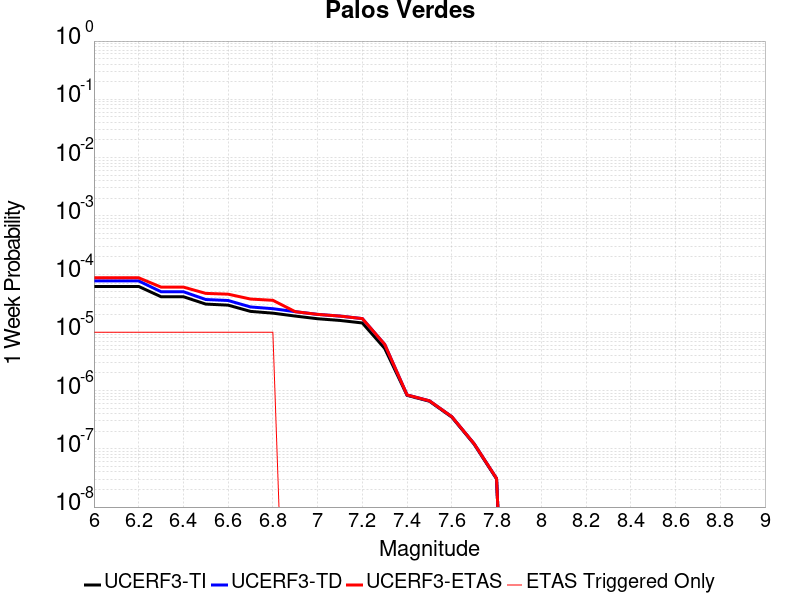 | 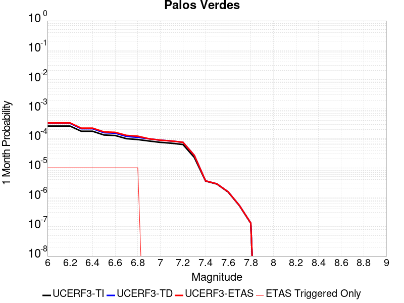 |  | 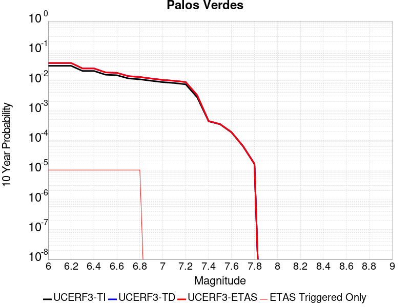 |

| Magnitude | 1 wk TI Prob | 1 wk TD Prob | 1 wk ETAS Prob | 1 wk ETAS/TD Gain | 1 wk ETAS Triggered Only | 1 mo TI Prob | 1 mo TD Prob | 1 mo ETAS Prob | 1 mo ETAS/TD Gain | 1 mo ETAS Triggered Only | 1 yr TI Prob | 1 yr TD Prob | 1 yr ETAS Prob | 1 yr ETAS/TD Gain | 1 yr ETAS Triggered Only | 10 yr TI Prob | 10 yr TD Prob | 10 yr ETAS Prob | 10 yr ETAS/TD Gain | 10 yr ETAS Triggered Only |
|-----|-----|-----|-----|-----|-----|-----|-----|-----|-----|-----|-----|-----|-----|-----|-----|-----|-----|-----|-----|-----|
| 6.0 | 6.126063E-5 | 7.622612E-5 | 8.622536E-5 | 1.1311786 | 1.0E-5 | 2.6251914E-4 | 3.2664582E-4 | 3.3664255E-4 | 1.0306042 | 1.0E-5 | 0.0031914865 | 0.003970174 | 0.0039801346 | 1.0025088 | 1.0E-5 | 0.031460393 | 0.039048895 | 0.039058506 | 1.000246 | 1.0E-5 |
| 6.1 | 6.126063E-5 | 7.622612E-5 | 8.622536E-5 | 1.1311786 | 1.0E-5 | 2.6251914E-4 | 3.2664582E-4 | 3.3664255E-4 | 1.0306042 | 1.0E-5 | 0.0031914865 | 0.003970174 | 0.0039801346 | 1.0025088 | 1.0E-5 | 0.031460393 | 0.039048895 | 0.039058506 | 1.000246 | 1.0E-5 |
| 6.2 | 6.126063E-5 | 7.622612E-5 | 8.622536E-5 | 1.1311786 | 1.0E-5 | 2.6251914E-4 | 3.2664582E-4 | 3.3664255E-4 | 1.0306042 | 1.0E-5 | 0.0031914865 | 0.003970174 | 0.0039801346 | 1.0025088 | 1.0E-5 | 0.031460393 | 0.039048895 | 0.039058506 | 1.000246 | 1.0E-5 |
| 6.3 | 4.0838047E-5 | 4.9749437E-5 | 5.9748938E-5 | 1.2009974 | 1.0E-5 | 1.7500846E-4 | 2.1319572E-4 | 2.2319358E-4 | 1.0468953 | 1.0E-5 | 0.0021286458 | 0.0025927818 | 0.0026027558 | 1.0038469 | 1.0E-5 | 0.021083709 | 0.025646681 | 0.025656424 | 1.0003799 | 1.0E-5 |
| 6.4 | 4.0838047E-5 | 4.9749437E-5 | 5.9748938E-5 | 1.2009974 | 1.0E-5 | 1.7500846E-4 | 2.1319572E-4 | 2.2319358E-4 | 1.0468953 | 1.0E-5 | 0.0021286458 | 0.0025927818 | 0.0026027558 | 1.0038469 | 1.0E-5 | 0.021083709 | 0.025646681 | 0.025656424 | 1.0003799 | 1.0E-5 |
| 6.5 | 3.0512005E-5 | 3.656162E-5 | 4.6561257E-5 | 1.2735008 | 1.0E-5 | 1.3075917E-4 | 1.5668393E-4 | 1.6668237E-4 | 1.0638127 | 1.0E-5 | 0.0015908304 | 0.0019060767 | 0.0019160575 | 1.0052364 | 1.0E-5 | 0.015794903 | 0.018909154 | 0.018918965 | 1.0005188 | 1.0E-5 |
| 6.6 | 2.9255087E-5 | 3.515442E-5 | 4.515407E-5 | 1.2844492 | 1.0E-5 | 1.2537291E-4 | 1.5065377E-4 | 1.6065226E-4 | 1.0663674 | 1.0E-5 | 0.0015253464 | 0.0018327828 | 0.0018427644 | 1.0054462 | 1.0E-5 | 0.015149189 | 0.018188225 | 0.018198043 | 1.0005398 | 1.0E-5 |
| 6.7 | 2.287198E-5 | 2.7248278E-5 | 3.7248006E-5 | 1.3669857 | 1.0E-5 | 9.801909E-5 | 1.16773626E-4 | 1.2677246E-4 | 1.0856258 | 1.0E-5 | 0.001192729 | 0.0014208833 | 0.0014308691 | 1.0070279 | 1.0E-5 | 0.011863477 | 0.014127217 | 0.014137076 | 1.0006979 | 1.0E-5 |
| 6.8 | 2.1325764E-5 | 2.5431877E-5 | 3.543162E-5 | 1.3931973 | 1.0E-5 | 9.139293E-5 | 1.0898971E-4 | 1.18988624E-4 | 1.0917418 | 1.0E-5 | 0.001112141 | 0.0013262323 | 0.001336219 | 1.0075302 | 1.0E-5 | 0.011065915 | 0.013192211 | 0.01320208 | 1.000748 | 1.0E-5 |
| 6.9 | 1.9009392E-5 | 2.2613547E-5 | 2.2613547E-5 | 1.0 | 0.0 | 8.1466285E-5 | 9.6912096E-5 | 9.6912096E-5 | 1.0 | 0.0 | 9.914007E-4 | 0.0011793535 | 0.0011793535 | 1.0 | 0.0 | 0.009869894 | 0.011739632 | 0.011739632 | 1.0 | 0.0 |
| 7.0 | 1.7098473E-5 | 2.0319356E-5 | 2.0319356E-5 | 1.0 | 0.0 | 7.3277115E-5 | 8.708052E-5 | 8.708052E-5 | 1.0 | 0.0 | 8.917837E-4 | 0.001059775 | 0.001059775 | 1.0 | 0.0 | 0.008882134 | 0.010555646 | 0.010555646 | 1.0 | 0.0 |
| 7.1 | 1.5982785E-5 | 1.899476E-5 | 1.899476E-5 | 1.0 | 0.0 | 6.849585E-5 | 8.1404054E-5 | 8.1404054E-5 | 1.0 | 0.0 | 8.336179E-4 | 9.907284E-4 | 9.907284E-4 | 1.0 | 0.0 | 0.008304977 | 0.009871479 | 0.009871479 | 1.0 | 0.0 |
| 7.2 | 1.4468002E-5 | 1.7197237E-5 | 1.7197237E-5 | 1.0 | 0.0 | 6.200425E-5 | 7.370083E-5 | 7.370083E-5 | 1.0 | 0.0 | 7.546402E-4 | 8.970222E-4 | 8.970222E-4 | 1.0 | 0.0 | 0.007520827 | 0.008942284 | 0.008942284 | 1.0 | 0.0 |
| 7.3 | 5.288233E-6 | 6.2036747E-6 | 6.2036747E-6 | 1.0 | 0.0 | 2.2663658E-5 | 2.6587102E-5 | 2.6587102E-5 | 1.0 | 0.0 | 2.7589512E-4 | 3.236848E-4 | 3.236848E-4 | 1.0 | 0.0 | 0.0027555283 | 0.0032355562 | 0.0032355562 | 1.0 | 0.0 |
| 7.4 | 8.279556E-7 | 8.408347E-7 | 8.408347E-7 | 1.0 | 0.0 | 3.5483763E-6 | 3.6035726E-6 | 3.6035726E-6 | 1.0 | 0.0 | 4.3200624E-5 | 4.3872686E-5 | 4.3872686E-5 | 1.0 | 0.0 | 4.3192226E-4 | 4.3864746E-4 | 4.3864746E-4 | 1.0 | 0.0 |
| 7.5 | 6.559831E-7 | 6.667229E-7 | 6.667229E-7 | 1.0 | 0.0 | 2.8113532E-6 | 2.857381E-6 | 2.857381E-6 | 1.0 | 0.0 | 3.4227687E-5 | 3.4788125E-5 | 3.4788125E-5 | 1.0 | 0.0 | 3.4222414E-4 | 3.4783344E-4 | 3.4783344E-4 | 1.0 | 0.0 |
| 7.6 | 3.5018968E-7 | 3.5620027E-7 | 3.5620027E-7 | 1.0 | 0.0 | 1.500812E-6 | 1.526572E-6 | 1.526572E-6 | 1.0 | 0.0 | 1.8272232E-5 | 1.8585903E-5 | 1.8585903E-5 | 1.0 | 0.0 | 1.8270731E-4 | 1.8584808E-4 | 1.8584808E-4 | 1.0 | 0.0 |
| 7.7 | 1.1986104E-7 | 1.2198376E-7 | 1.2198376E-7 | 1.0 | 0.0 | 5.1369005E-7 | 5.2278745E-7 | 5.2278745E-7 | 1.0 | 0.0 | 6.2541585E-6 | 6.364919E-6 | 6.364919E-6 | 1.0 | 0.0 | 6.2539824E-5 | 6.364741E-5 | 6.364741E-5 | 1.0 | 0.0 |
| 7.8 | 3.0445005E-8 | 3.1027582E-8 | 3.1027582E-8 | 1.0 | 0.0 | 1.3047858E-7 | 1.3297536E-7 | 1.3297536E-7 | 1.0 | 0.0 | 1.5885756E-6 | 1.6189739E-6 | 1.6189739E-6 | 1.0 | 0.0 | 1.5885644E-5 | 1.6189642E-5 | 1.6189642E-5 | 1.0 | 0.0 |

## Great Valley 01
*[(top)](#table-of-contents)*

| 1 Week | 1 Month | 1 Year | 10 Year |
|-----|-----|-----|-----|
|  |  |  |  |

| Magnitude | 1 wk TI Prob | 1 wk TD Prob | 1 wk ETAS Prob | 1 wk ETAS/TD Gain | 1 wk ETAS Triggered Only | 1 mo TI Prob | 1 mo TD Prob | 1 mo ETAS Prob | 1 mo ETAS/TD Gain | 1 mo ETAS Triggered Only | 1 yr TI Prob | 1 yr TD Prob | 1 yr ETAS Prob | 1 yr ETAS/TD Gain | 1 yr ETAS Triggered Only | 10 yr TI Prob | 10 yr TD Prob | 10 yr ETAS Prob | 10 yr ETAS/TD Gain | 10 yr ETAS Triggered Only |
|-----|-----|-----|-----|-----|-----|-----|-----|-----|-----|-----|-----|-----|-----|-----|-----|-----|-----|-----|-----|-----|
| 6.0 | 3.3398478E-6 | 3.3762976E-6 | 1.3376264E-5 | 3.9618142 | 1.0E-5 | 1.4313555E-5 | 1.4469774E-5 | 2.446963E-5 | 1.6910858 | 1.0E-5 | 1.742536E-4 | 1.7615648E-4 | 1.8615472E-4 | 1.0567577 | 1.0E-5 | 0.0017411702 | 0.0017602886 | 0.001770271 | 1.0056709 | 1.0E-5 |
| 6.1 | 1.7919616E-6 | 1.8120251E-6 | 1.8120251E-6 | 1.0 | 0.0 | 7.679812E-6 | 7.7658E-6 | 7.7658E-6 | 1.0 | 0.0 | 9.349771E-5 | 9.454471E-5 | 9.454471E-5 | 1.0 | 0.0 | 9.345838E-4 | 9.4506424E-4 | 9.4506424E-4 | 1.0 | 0.0 |
| 6.2 | 1.7919616E-6 | 1.8120251E-6 | 1.8120251E-6 | 1.0 | 0.0 | 7.679812E-6 | 7.7658E-6 | 7.7658E-6 | 1.0 | 0.0 | 9.349771E-5 | 9.454471E-5 | 9.454471E-5 | 1.0 | 0.0 | 9.345838E-4 | 9.4506424E-4 | 9.4506424E-4 | 1.0 | 0.0 |
| 6.3 | 1.1636545E-6 | 1.17745E-6 | 1.17745E-6 | 1.0 | 0.0 | 4.9870814E-6 | 5.046205E-6 | 5.046205E-6 | 1.0 | 0.0 | 6.0716022E-5 | 6.143586E-5 | 6.143586E-5 | 1.0 | 0.0 | 6.069944E-4 | 6.1419315E-4 | 6.1419315E-4 | 1.0 | 0.0 |
| 6.4 | 8.770928E-7 | 8.881815E-7 | 8.881815E-7 | 1.0 | 0.0 | 3.7589639E-6 | 3.8064866E-6 | 3.8064866E-6 | 1.0 | 0.0 | 4.5764424E-5 | 4.634301E-5 | 4.634301E-5 | 1.0 | 0.0 | 4.5755E-4 | 4.633356E-4 | 4.633356E-4 | 1.0 | 0.0 |
| 6.5 | 6.753308E-7 | 6.8452607E-7 | 6.8452607E-7 | 1.0 | 0.0 | 2.8942718E-6 | 2.93368E-6 | 2.93368E-6 | 1.0 | 0.0 | 3.523719E-5 | 3.5716977E-5 | 3.5716977E-5 | 1.0 | 0.0 | 3.52316E-4 | 3.5711337E-4 | 3.5711337E-4 | 1.0 | 0.0 |
| 6.6 | 5.2531993E-7 | 5.331276E-7 | 5.331276E-7 | 1.0 | 0.0 | 2.251369E-6 | 2.2848305E-6 | 2.2848305E-6 | 1.0 | 0.0 | 2.7410075E-5 | 2.7817463E-5 | 2.7817463E-5 | 1.0 | 0.0 | 2.7406693E-4 | 2.7814036E-4 | 2.7814036E-4 | 1.0 | 0.0 |
| 6.7 | 4.1404678E-7 | 4.208609E-7 | 4.208609E-7 | 1.0 | 0.0 | 1.774485E-6 | 1.8036884E-6 | 1.8036884E-6 | 1.0 | 0.0 | 2.160414E-5 | 2.1959688E-5 | 2.1959688E-5 | 1.0 | 0.0 | 2.160204E-4 | 2.1957551E-4 | 2.1957551E-4 | 1.0 | 0.0 |
| 6.8 | 3.1713054E-7 | 3.2302975E-7 | 3.2302975E-7 | 1.0 | 0.0 | 1.3591301E-6 | 1.3844125E-6 | 1.3844125E-6 | 1.0 | 0.0 | 1.6547285E-5 | 1.6855092E-5 | 1.6855092E-5 | 1.0 | 0.0 | 1.6546051E-4 | 1.6853833E-4 | 1.6853833E-4 | 1.0 | 0.0 |
| 6.9 | 2.528054E-7 | 2.580374E-7 | 2.580374E-7 | 1.0 | 0.0 | 1.0834511E-6 | 1.1058742E-6 | 1.1058742E-6 | 1.0 | 0.0 | 1.3190938E-5 | 1.3463935E-5 | 1.3463935E-5 | 1.0 | 0.0 | 1.3190156E-4 | 1.3463132E-4 | 1.3463132E-4 | 1.0 | 0.0 |
| 7.0 | 2.0667689E-7 | 2.1131233E-7 | 2.1131233E-7 | 1.0 | 0.0 | 8.857578E-7 | 9.0562395E-7 | 9.0562395E-7 | 1.0 | 0.0 | 1.0784048E-5 | 1.1025917E-5 | 1.1025917E-5 | 1.0 | 0.0 | 1.0783524E-4 | 1.1025378E-4 | 1.1025378E-4 | 1.0 | 0.0 |
| 7.1 | 1.5951586E-7 | 1.6338481E-7 | 1.6338481E-7 | 1.0 | 0.0 | 6.8363926E-7 | 7.002204E-7 | 7.002204E-7 | 1.0 | 0.0 | 8.323276E-6 | 8.525151E-6 | 8.525151E-6 | 1.0 | 0.0 | 8.322964E-5 | 8.5248306E-5 | 8.5248306E-5 | 1.0 | 0.0 |
| 7.2 | 1.02912296E-7 | 1.0566137E-7 | 1.0566137E-7 | 1.0 | 0.0 | 4.4105263E-7 | 4.5283437E-7 | 4.5283437E-7 | 1.0 | 0.0 | 5.3698027E-6 | 5.5132446E-6 | 5.5132446E-6 | 1.0 | 0.0 | 5.3696727E-5 | 5.5131113E-5 | 5.5131113E-5 | 1.0 | 0.0 |
| 7.3 | 6.581281E-8 | 6.77207E-8 | 6.77207E-8 | 1.0 | 0.0 | 2.8205488E-7 | 2.9023153E-7 | 2.9023153E-7 | 1.0 | 0.0 | 3.4340128E-6 | 3.5335634E-6 | 3.5335634E-6 | 1.0 | 0.0 | 3.4339595E-5 | 3.533509E-5 | 3.533509E-5 | 1.0 | 0.0 |
| 7.4 | 3.112171E-8 | 3.2068368E-8 | 3.2068368E-8 | 1.0 | 0.0 | 1.3337875E-7 | 1.3743585E-7 | 1.3743585E-7 | 1.0 | 0.0 | 1.6238852E-6 | 1.6732803E-6 | 1.6732803E-6 | 1.0 | 0.0 | 1.6238733E-5 | 1.6732685E-5 | 1.6732685E-5 | 1.0 | 0.0 |

## Walker Spring 2011 CFM
*[(top)](#table-of-contents)*

| 1 Week | 1 Month | 1 Year | 10 Year |
|-----|-----|-----|-----|
|  |  |  |  |

| Magnitude | 1 wk TI Prob | 1 wk TD Prob | 1 wk ETAS Prob | 1 wk ETAS/TD Gain | 1 wk ETAS Triggered Only | 1 mo TI Prob | 1 mo TD Prob | 1 mo ETAS Prob | 1 mo ETAS/TD Gain | 1 mo ETAS Triggered Only | 1 yr TI Prob | 1 yr TD Prob | 1 yr ETAS Prob | 1 yr ETAS/TD Gain | 1 yr ETAS Triggered Only | 10 yr TI Prob | 10 yr TD Prob | 10 yr ETAS Prob | 10 yr ETAS/TD Gain | 10 yr ETAS Triggered Only |
|-----|-----|-----|-----|-----|-----|-----|-----|-----|-----|-----|-----|-----|-----|-----|-----|-----|-----|-----|-----|-----|
| 6.0 | 8.791276E-6 | 9.264088E-6 | 9.264088E-6 | 1.0 | 0.0 | 3.767635E-5 | 3.970269E-5 | 3.970269E-5 | 1.0 | 0.0 | 4.58613E-4 | 4.832839E-4 | 4.832839E-4 | 1.0 | 0.0 | 0.004576677 | 0.0048234025 | 0.004833354 | 1.0020633 | 1.0E-5 |
| 6.1 | 8.791276E-6 | 9.264088E-6 | 9.264088E-6 | 1.0 | 0.0 | 3.767635E-5 | 3.970269E-5 | 3.970269E-5 | 1.0 | 0.0 | 4.58613E-4 | 4.832839E-4 | 4.832839E-4 | 1.0 | 0.0 | 0.004576677 | 0.0048234025 | 0.004833354 | 1.0020633 | 1.0E-5 |
| 6.2 | 5.654515E-6 | 5.99876E-6 | 5.99876E-6 | 1.0 | 0.0 | 2.4233412E-5 | 2.5708747E-5 | 2.5708747E-5 | 1.0 | 0.0 | 2.9500184E-4 | 3.1296405E-4 | 3.1296405E-4 | 1.0 | 0.0 | 0.0029461053 | 0.0031257276 | 0.0031356963 | 1.0031892 | 1.0E-5 |
| 6.3 | 4.591685E-6 | 4.8947268E-6 | 4.8947268E-6 | 1.0 | 0.0 | 1.96785E-5 | 2.0977257E-5 | 2.0977257E-5 | 1.0 | 0.0 | 2.395594E-4 | 2.5537255E-4 | 2.5537255E-4 | 1.0 | 0.0 | 0.002393013 | 0.0025512208 | 0.0025611953 | 1.0039097 | 1.0E-5 |
| 6.4 | 4.243283E-6 | 4.52266E-6 | 4.52266E-6 | 1.0 | 0.0 | 1.8185372E-5 | 1.938271E-5 | 1.938271E-5 | 1.0 | 0.0 | 2.2138441E-4 | 2.3596318E-4 | 2.3596318E-4 | 1.0 | 0.0 | 0.00221164 | 0.0023575418 | 0.0023575418 | 1.0 | 0.0 |
| 6.5 | 3.4445666E-6 | 3.6860924E-6 | 3.6860924E-6 | 1.0 | 0.0 | 1.4762345E-5 | 1.5797466E-5 | 1.5797466E-5 | 1.0 | 0.0 | 1.7971672E-4 | 1.923212E-4 | 1.923212E-4 | 1.0 | 0.0 | 0.0017957145 | 0.0019219425 | 0.0019219425 | 1.0 | 0.0 |
| 6.6 | 2.68766E-6 | 2.8794348E-6 | 2.8794348E-6 | 1.0 | 0.0 | 1.1518492E-5 | 1.2340398E-5 | 1.2340398E-5 | 1.0 | 0.0 | 1.4022861E-4 | 1.502378E-4 | 1.502378E-4 | 1.0 | 0.0 | 0.0014014016 | 0.0015017362 | 0.0015017362 | 1.0 | 0.0 |
| 6.7 | 5.880964E-7 | 6.1997474E-7 | 6.1997474E-7 | 1.0 | 0.0 | 2.5204106E-6 | 2.6570326E-6 | 2.6570326E-6 | 1.0 | 0.0 | 3.0685565E-5 | 3.2348988E-5 | 3.2348988E-5 | 1.0 | 0.0 | 3.068133E-4 | 3.2345214E-4 | 3.2345214E-4 | 1.0 | 0.0 |
| 6.8 | 1.6514163E-7 | 1.7409117E-7 | 1.7409117E-7 | 1.0 | 0.0 | 7.077497E-7 | 7.46105E-7 | 7.46105E-7 | 1.0 | 0.0 | 8.616818E-6 | 9.083828E-6 | 9.083828E-6 | 1.0 | 0.0 | 8.616484E-5 | 9.0838286E-5 | 9.0838286E-5 | 1.0 | 0.0 |

## Little Salmon (Offshore)
*[(top)](#table-of-contents)*

| 1 Week | 1 Month | 1 Year | 10 Year |
|-----|-----|-----|-----|
|  | 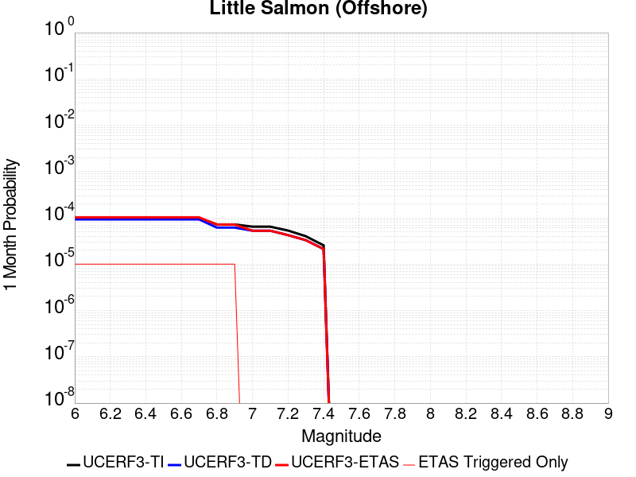 | 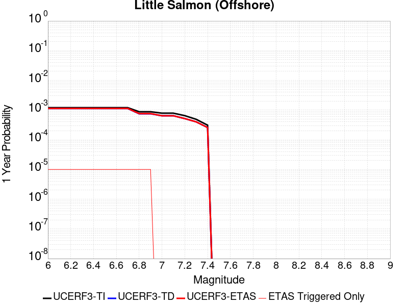 |  |

| Magnitude | 1 wk TI Prob | 1 wk TD Prob | 1 wk ETAS Prob | 1 wk ETAS/TD Gain | 1 wk ETAS Triggered Only | 1 mo TI Prob | 1 mo TD Prob | 1 mo ETAS Prob | 1 mo ETAS/TD Gain | 1 mo ETAS Triggered Only | 1 yr TI Prob | 1 yr TD Prob | 1 yr ETAS Prob | 1 yr ETAS/TD Gain | 1 yr ETAS Triggered Only | 10 yr TI Prob | 10 yr TD Prob | 10 yr ETAS Prob | 10 yr ETAS/TD Gain | 10 yr ETAS Triggered Only |
|-----|-----|-----|-----|-----|-----|-----|-----|-----|-----|-----|-----|-----|-----|-----|-----|-----|-----|-----|-----|-----|
| 6.0 | 2.3052053E-5 | 2.1605048E-5 | 3.160483E-5 | 1.4628448 | 1.0E-5 | 9.879077E-5 | 9.2590424E-5 | 1.02589496E-4 | 1.1079925 | 1.0E-5 | 0.0012021139 | 0.0011268203 | 0.001136809 | 1.0088645 | 1.0E-5 | 0.011956319 | 0.011244063 | 0.011253951 | 1.0008794 | 1.0E-5 |
| 6.1 | 2.3052053E-5 | 2.1605048E-5 | 3.160483E-5 | 1.4628448 | 1.0E-5 | 9.879077E-5 | 9.2590424E-5 | 1.02589496E-4 | 1.1079925 | 1.0E-5 | 0.0012021139 | 0.0011268203 | 0.001136809 | 1.0088645 | 1.0E-5 | 0.011956319 | 0.011244063 | 0.011253951 | 1.0008794 | 1.0E-5 |
| 6.2 | 2.3052053E-5 | 2.1605048E-5 | 3.160483E-5 | 1.4628448 | 1.0E-5 | 9.879077E-5 | 9.2590424E-5 | 1.02589496E-4 | 1.1079925 | 1.0E-5 | 0.0012021139 | 0.0011268203 | 0.001136809 | 1.0088645 | 1.0E-5 | 0.011956319 | 0.011244063 | 0.011253951 | 1.0008794 | 1.0E-5 |
| 6.3 | 2.3052053E-5 | 2.1605048E-5 | 3.160483E-5 | 1.4628448 | 1.0E-5 | 9.879077E-5 | 9.2590424E-5 | 1.02589496E-4 | 1.1079925 | 1.0E-5 | 0.0012021139 | 0.0011268203 | 0.001136809 | 1.0088645 | 1.0E-5 | 0.011956319 | 0.011244063 | 0.011253951 | 1.0008794 | 1.0E-5 |
| 6.4 | 2.3052053E-5 | 2.1605048E-5 | 3.160483E-5 | 1.4628448 | 1.0E-5 | 9.879077E-5 | 9.2590424E-5 | 1.02589496E-4 | 1.1079925 | 1.0E-5 | 0.0012021139 | 0.0011268203 | 0.001136809 | 1.0088645 | 1.0E-5 | 0.011956319 | 0.011244063 | 0.011253951 | 1.0008794 | 1.0E-5 |
| 6.5 | 2.3052053E-5 | 2.1605048E-5 | 3.160483E-5 | 1.4628448 | 1.0E-5 | 9.879077E-5 | 9.2590424E-5 | 1.02589496E-4 | 1.1079925 | 1.0E-5 | 0.0012021139 | 0.0011268203 | 0.001136809 | 1.0088645 | 1.0E-5 | 0.011956319 | 0.011244063 | 0.011253951 | 1.0008794 | 1.0E-5 |
| 6.6 | 2.3052053E-5 | 2.1605048E-5 | 3.160483E-5 | 1.4628448 | 1.0E-5 | 9.879077E-5 | 9.2590424E-5 | 1.02589496E-4 | 1.1079925 | 1.0E-5 | 0.0012021139 | 0.0011268203 | 0.001136809 | 1.0088645 | 1.0E-5 | 0.011956319 | 0.011244063 | 0.011253951 | 1.0008794 | 1.0E-5 |
| 6.7 | 2.3052053E-5 | 2.1605048E-5 | 3.160483E-5 | 1.4628448 | 1.0E-5 | 9.879077E-5 | 9.2590424E-5 | 1.02589496E-4 | 1.1079925 | 1.0E-5 | 0.0012021139 | 0.0011268203 | 0.001136809 | 1.0088645 | 1.0E-5 | 0.011956319 | 0.011244063 | 0.011253951 | 1.0008794 | 1.0E-5 |
| 6.8 | 1.683878E-5 | 1.43843135E-5 | 2.438417E-5 | 1.6951917 | 1.0E-5 | 7.21642E-5 | 6.1645886E-5 | 7.164527E-5 | 1.1622068 | 1.0E-5 | 8.78245E-4 | 7.5033115E-4 | 7.6032366E-4 | 1.0133175 | 1.0E-5 | 0.008747822 | 0.0075047268 | 0.0075146514 | 1.0013225 | 1.0E-5 |
| 6.9 | 1.683878E-5 | 1.43843135E-5 | 2.438417E-5 | 1.6951917 | 1.0E-5 | 7.21642E-5 | 6.1645886E-5 | 7.164527E-5 | 1.1622068 | 1.0E-5 | 8.78245E-4 | 7.5033115E-4 | 7.6032366E-4 | 1.0133175 | 1.0E-5 | 0.008747822 | 0.0075047268 | 0.0075146514 | 1.0013225 | 1.0E-5 |
| 7.0 | 1.5051273E-5 | 1.2332358E-5 | 1.2332358E-5 | 1.0 | 0.0 | 6.450386E-5 | 5.2852152E-5 | 5.2852152E-5 | 1.0 | 0.0 | 7.8505155E-4 | 6.433309E-4 | 6.433309E-4 | 1.0 | 0.0 | 0.00782284 | 0.0064409594 | 0.0064409594 | 1.0 | 0.0 |
| 7.1 | 1.5051273E-5 | 1.2332358E-5 | 1.2332358E-5 | 1.0 | 0.0 | 6.450386E-5 | 5.2852152E-5 | 5.2852152E-5 | 1.0 | 0.0 | 7.8505155E-4 | 6.433309E-4 | 6.433309E-4 | 1.0 | 0.0 | 0.00782284 | 0.0064409594 | 0.0064409594 | 1.0 | 0.0 |
| 7.2 | 1.24301405E-5 | 9.902131E-6 | 9.902131E-6 | 1.0 | 0.0 | 5.3270942E-5 | 4.2437237E-5 | 4.2437237E-5 | 1.0 | 0.0 | 6.483807E-4 | 5.165909E-4 | 5.165909E-4 | 1.0 | 0.0 | 0.006464922 | 0.0051793023 | 0.0051793023 | 1.0 | 0.0 |
| 7.3 | 9.3599865E-6 | 7.694645E-6 | 7.694645E-6 | 1.0 | 0.0 | 4.011361E-5 | 3.2976837E-5 | 3.2976837E-5 | 1.0 | 0.0 | 4.8827377E-4 | 4.014547E-4 | 4.014547E-4 | 1.0 | 0.0 | 0.004872023 | 0.0040239627 | 0.0040239627 | 1.0 | 0.0 |
| 7.4 | 5.941556E-6 | 4.9509595E-6 | 4.9509595E-6 | 1.0 | 0.0 | 2.5463563E-5 | 2.1218399E-5 | 2.1218399E-5 | 1.0 | 0.0 | 3.0997477E-4 | 2.5833398E-4 | 2.5833398E-4 | 1.0 | 0.0 | 0.0030954275 | 0.002591868 | 0.002591868 | 1.0 | 0.0 |

## Green Valley 2011 CFM
*[(top)](#table-of-contents)*

| 1 Week | 1 Month | 1 Year | 10 Year |
|-----|-----|-----|-----|
|  |  |  |  |

| Magnitude | 1 wk TI Prob | 1 wk TD Prob | 1 wk ETAS Prob | 1 wk ETAS/TD Gain | 1 wk ETAS Triggered Only | 1 mo TI Prob | 1 mo TD Prob | 1 mo ETAS Prob | 1 mo ETAS/TD Gain | 1 mo ETAS Triggered Only | 1 yr TI Prob | 1 yr TD Prob | 1 yr ETAS Prob | 1 yr ETAS/TD Gain | 1 yr ETAS Triggered Only | 10 yr TI Prob | 10 yr TD Prob | 10 yr ETAS Prob | 10 yr ETAS/TD Gain | 10 yr ETAS Triggered Only |
|-----|-----|-----|-----|-----|-----|-----|-----|-----|-----|-----|-----|-----|-----|-----|-----|-----|-----|-----|-----|-----|
| 6.0 | 9.9629346E-5 | 1.7305532E-4 | 1.8305359E-4 | 1.057775 | 1.0E-5 | 4.2691303E-4 | 7.4143766E-4 | 7.514302E-4 | 1.0134773 | 1.0E-5 | 0.0051852856 | 0.008986705 | 0.008996615 | 1.0011028 | 1.0E-5 | 0.050659515 | 0.085522056 | 0.085531205 | 1.0001069 | 1.0E-5 |
| 6.1 | 9.88615E-5 | 1.7152846E-4 | 1.8152675E-4 | 1.0582894 | 1.0E-5 | 4.2362334E-4 | 7.348976E-4 | 7.448903E-4 | 1.0135974 | 1.0E-5 | 0.0051454236 | 0.0089077335 | 0.008917645 | 1.0011126 | 1.0E-5 | 0.050279044 | 0.084809676 | 0.084818825 | 1.0001079 | 1.0E-5 |
| 6.2 | 9.696895E-5 | 1.6791887E-4 | 1.779172E-4 | 1.0595425 | 1.0E-5 | 4.15515E-4 | 7.194366E-4 | 7.294294E-4 | 1.0138898 | 1.0E-5 | 0.0050471667 | 0.008721114 | 0.008731027 | 1.0011367 | 1.0E-5 | 0.04934063 | 0.0831186 | 0.083127774 | 1.0001103 | 1.0E-5 |
| 6.3 | 9.275224E-5 | 1.5971228E-4 | 1.6971068E-4 | 1.0626026 | 1.0E-5 | 3.9744904E-4 | 6.842841E-4 | 6.9427723E-4 | 1.0146039 | 1.0E-5 | 0.0048282105 | 0.008296439 | 0.008306356 | 1.0011953 | 1.0E-5 | 0.047246475 | 0.07925707 | 0.07926627 | 1.0001162 | 1.0E-5 |
| 6.4 | 8.391499E-5 | 1.4367796E-4 | 1.5367652E-4 | 1.0695901 | 1.0E-5 | 3.595861E-4 | 6.156248E-4 | 6.256187E-4 | 1.0162337 | 1.0E-5 | 0.004369175 | 0.0074670846 | 0.0074770097 | 1.0013292 | 1.0E-5 | 0.04284265 | 0.071630865 | 0.07164015 | 1.0001296 | 1.0E-5 |
| 6.5 | 5.9519385E-5 | 9.9340905E-5 | 9.9340905E-5 | 1.0 | 0.0 | 2.5505814E-4 | 4.2568138E-4 | 4.2568138E-4 | 1.0 | 0.0 | 0.0031009112 | 0.005168295 | 0.005168295 | 1.0 | 0.0 | 0.030579966 | 0.050145864 | 0.050145864 | 1.0 | 0.0 |
| 6.6 | 4.5361558E-5 | 7.402609E-5 | 7.402609E-5 | 1.0 | 0.0 | 1.9439218E-4 | 3.1721895E-4 | 3.1721895E-4 | 1.0 | 0.0 | 0.0023641558 | 0.0038539418 | 0.0038539418 | 1.0 | 0.0 | 0.023391623 | 0.037665963 | 0.037665963 | 1.0 | 0.0 |
| 6.7 | 3.8808106E-5 | 6.2651976E-5 | 6.2651976E-5 | 1.0 | 0.0 | 1.6630985E-4 | 2.6848342E-4 | 2.6848342E-4 | 1.0 | 0.0 | 0.0020229418 | 0.0032626586 | 0.0032626586 | 1.0 | 0.0 | 0.020046256 | 0.032005914 | 0.032005914 | 1.0 | 0.0 |
| 6.8 | 2.2284667E-5 | 3.1285235E-5 | 3.1285235E-5 | 1.0 | 0.0 | 9.550222E-5 | 1.3407279E-4 | 1.3407279E-4 | 1.0 | 0.0 | 0.0011621192 | 0.0016311078 | 0.0016311078 | 1.0 | 0.0 | 0.011560607 | 0.016165998 | 0.016165998 | 1.0 | 0.0 |
| 6.9 | 1.8050168E-5 | 2.4448054E-5 | 2.4448054E-5 | 1.0 | 0.0 | 7.735557E-5 | 1.047732E-4 | 1.047732E-4 | 1.0 | 0.0 | 9.4139716E-4 | 0.0012748708 | 0.0012748708 | 1.0 | 0.0 | 0.009374191 | 0.012667833 | 0.012667833 | 1.0 | 0.0 |
| 7.0 | 1.4763166E-5 | 1.9582854E-5 | 1.9582854E-5 | 1.0 | 0.0 | 6.326917E-5 | 8.3923835E-5 | 8.3923835E-5 | 1.0 | 0.0 | 7.7002996E-4 | 0.0010212966 | 0.0010212966 | 1.0 | 0.0 | 0.007673672 | 0.010165343 | 0.010165343 | 1.0 | 0.0 |
| 7.1 | 1.2399713E-5 | 1.6303715E-5 | 1.6303715E-5 | 1.0 | 0.0 | 5.3140546E-5 | 6.98712E-5 | 6.98712E-5 | 1.0 | 0.0 | 6.467941E-4 | 8.503518E-4 | 8.503518E-4 | 1.0 | 0.0 | 0.006449148 | 0.008471259 | 0.008471259 | 1.0 | 0.0 |
| 7.2 | 1.0584195E-5 | 1.3921742E-5 | 1.3921742E-5 | 1.0 | 0.0 | 4.5360044E-5 | 5.9663253E-5 | 5.9663253E-5 | 1.0 | 0.0 | 5.521186E-4 | 7.261596E-4 | 7.261596E-4 | 1.0 | 0.0 | 0.0055074887 | 0.007238285 | 0.007238285 | 1.0 | 0.0 |
| 7.3 | 7.998173E-6 | 1.054402E-5 | 1.054402E-5 | 1.0 | 0.0 | 3.4277433E-5 | 4.518788E-5 | 4.518788E-5 | 1.0 | 0.0 | 4.1724785E-4 | 5.500247E-4 | 5.500247E-4 | 1.0 | 0.0 | 0.004164653 | 0.0054868995 | 0.0054868995 | 1.0 | 0.0 |
| 7.4 | 6.7571127E-6 | 8.932697E-6 | 8.932697E-6 | 1.0 | 0.0 | 2.8958733E-5 | 3.828243E-5 | 3.828243E-5 | 1.0 | 0.0 | 3.5251552E-4 | 4.6598984E-4 | 4.6598984E-4 | 1.0 | 0.0 | 0.0035195686 | 0.0046503306 | 0.0046503306 | 1.0 | 0.0 |
| 7.5 | 5.69878E-6 | 7.516314E-6 | 7.516314E-6 | 1.0 | 0.0 | 2.4423114E-5 | 3.221238E-5 | 3.221238E-5 | 1.0 | 0.0 | 2.9731085E-4 | 3.9211605E-4 | 3.9211605E-4 | 1.0 | 0.0 | 0.002969134 | 0.0039143935 | 0.0039143935 | 1.0 | 0.0 |
| 7.6 | 4.503664E-6 | 5.9356807E-6 | 5.9356807E-6 | 1.0 | 0.0 | 1.9301275E-5 | 2.5438389E-5 | 2.5438389E-5 | 1.0 | 0.0 | 2.3496768E-4 | 3.096692E-4 | 3.096692E-4 | 1.0 | 0.0 | 0.002347194 | 0.003092502 | 0.003092502 | 1.0 | 0.0 |
| 7.7 | 1.0873546E-6 | 1.4106979E-6 | 1.4106979E-6 | 1.0 | 0.0 | 4.6600826E-6 | 6.045834E-6 | 6.045834E-6 | 1.0 | 0.0 | 5.6735033E-5 | 7.360557E-5 | 7.360557E-5 | 1.0 | 0.0 | 5.672055E-4 | 7.35814E-4 | 7.35814E-4 | 1.0 | 0.0 |
| 7.8 | 4.9373917E-8 | 6.1777136E-8 | 6.1777136E-8 | 1.0 | 0.0 | 2.1160248E-7 | 2.6475914E-7 | 2.6475914E-7 | 1.0 | 0.0 | 2.5762572E-6 | 3.223439E-6 | 3.223439E-6 | 1.0 | 0.0 | 2.5762274E-5 | 3.2232296E-5 | 3.2232296E-5 | 1.0 | 0.0 |

## Elysian Park (Lower CFM)
*[(top)](#table-of-contents)*

| 1 Week | 1 Month | 1 Year | 10 Year |
|-----|-----|-----|-----|
|  |  |  |  |

| Magnitude | 1 wk TI Prob | 1 wk TD Prob | 1 wk ETAS Prob | 1 wk ETAS/TD Gain | 1 wk ETAS Triggered Only | 1 mo TI Prob | 1 mo TD Prob | 1 mo ETAS Prob | 1 mo ETAS/TD Gain | 1 mo ETAS Triggered Only | 1 yr TI Prob | 1 yr TD Prob | 1 yr ETAS Prob | 1 yr ETAS/TD Gain | 1 yr ETAS Triggered Only | 10 yr TI Prob | 10 yr TD Prob | 10 yr ETAS Prob | 10 yr ETAS/TD Gain | 10 yr ETAS Triggered Only |
|-----|-----|-----|-----|-----|-----|-----|-----|-----|-----|-----|-----|-----|-----|-----|-----|-----|-----|-----|-----|-----|
| 6.0 | 2.1766498E-6 | 2.10379E-6 | 2.10379E-6 | 1.0 | 0.0 | 9.328466E-6 | 9.016219E-6 | 9.016219E-6 | 1.0 | 0.0 | 1.1356815E-4 | 1.09768385E-4 | 1.09768385E-4 | 1.0 | 0.0 | 0.0011351013 | 0.0010972836 | 0.0011072726 | 1.0091034 | 1.0E-5 |
| 6.1 | 2.1766498E-6 | 2.10379E-6 | 2.10379E-6 | 1.0 | 0.0 | 9.328466E-6 | 9.016219E-6 | 9.016219E-6 | 1.0 | 0.0 | 1.1356815E-4 | 1.09768385E-4 | 1.09768385E-4 | 1.0 | 0.0 | 0.0011351013 | 0.0010972836 | 0.0011072726 | 1.0091034 | 1.0E-5 |
| 6.2 | 1.0031182E-6 | 9.1862177E-7 | 9.1862177E-7 | 1.0 | 0.0 | 4.299071E-6 | 3.9369447E-6 | 3.9369447E-6 | 1.0 | 0.0 | 5.2339932E-5 | 4.793135E-5 | 4.793135E-5 | 1.0 | 0.0 | 5.2327604E-4 | 4.7921992E-4 | 4.7921992E-4 | 1.0 | 0.0 |
| 6.3 | 1.0031182E-6 | 9.1862177E-7 | 9.1862177E-7 | 1.0 | 0.0 | 4.299071E-6 | 3.9369447E-6 | 3.9369447E-6 | 1.0 | 0.0 | 5.2339932E-5 | 4.793135E-5 | 4.793135E-5 | 1.0 | 0.0 | 5.2327604E-4 | 4.7921992E-4 | 4.7921992E-4 | 1.0 | 0.0 |
| 6.4 | 6.9606244E-7 | 6.091946E-7 | 6.091946E-7 | 1.0 | 0.0 | 2.9831212E-6 | 2.6108314E-6 | 2.6108314E-6 | 1.0 | 0.0 | 3.6318896E-5 | 3.178641E-5 | 3.178641E-5 | 1.0 | 0.0 | 3.6312963E-4 | 3.178189E-4 | 3.178189E-4 | 1.0 | 0.0 |
| 6.5 | 6.901879E-7 | 6.03263E-7 | 6.03263E-7 | 1.0 | 0.0 | 2.9579448E-6 | 2.5854101E-6 | 2.5854101E-6 | 1.0 | 0.0 | 3.6012385E-5 | 3.1476917E-5 | 3.1476917E-5 | 1.0 | 0.0 | 3.600655E-4 | 3.147248E-4 | 3.147248E-4 | 1.0 | 0.0 |
| 6.6 | 6.4198554E-7 | 5.5466126E-7 | 5.5466126E-7 | 1.0 | 0.0 | 2.7513638E-6 | 2.3771174E-6 | 2.3771174E-6 | 1.0 | 0.0 | 3.3497337E-5 | 2.8941022E-5 | 2.8941022E-5 | 1.0 | 0.0 | 3.349229E-4 | 2.893727E-4 | 2.893727E-4 | 1.0 | 0.0 |
| 6.7 | 6.138733E-7 | 5.26342E-7 | 5.26342E-7 | 1.0 | 0.0 | 2.6308828E-6 | 2.2557495E-6 | 2.2557495E-6 | 1.0 | 0.0 | 3.203053E-5 | 2.7463404E-5 | 2.7463404E-5 | 1.0 | 0.0 | 3.2025913E-4 | 2.7460023E-4 | 2.7460023E-4 | 1.0 | 0.0 |
| 6.8 | 5.84778E-7 | 5.00294E-7 | 5.00294E-7 | 1.0 | 0.0 | 2.506189E-6 | 2.1441151E-6 | 2.1441151E-6 | 1.0 | 0.0 | 3.0512423E-5 | 2.6104291E-5 | 2.6104291E-5 | 1.0 | 0.0 | 3.0508233E-4 | 2.6101235E-4 | 2.6101235E-4 | 1.0 | 0.0 |
| 6.9 | 5.322785E-7 | 4.5800772E-7 | 4.5800772E-7 | 1.0 | 0.0 | 2.2811914E-6 | 1.9628887E-6 | 1.9628887E-6 | 1.0 | 0.0 | 2.7773152E-5 | 2.3897908E-5 | 2.3897908E-5 | 1.0 | 0.0 | 2.7769682E-4 | 2.389535E-4 | 2.389535E-4 | 1.0 | 0.0 |
| 7.0 | 4.8147206E-7 | 4.1124116E-7 | 4.1124116E-7 | 1.0 | 0.0 | 2.06345E-6 | 1.7624608E-6 | 1.7624608E-6 | 1.0 | 0.0 | 2.5122214E-5 | 2.145775E-5 | 2.145775E-5 | 1.0 | 0.0 | 2.5119373E-4 | 2.1455686E-4 | 2.1455686E-4 | 1.0 | 0.0 |
| 7.1 | 4.1932955E-7 | 3.5455713E-7 | 3.5455713E-7 | 1.0 | 0.0 | 1.7971255E-6 | 1.5195296E-6 | 1.5195296E-6 | 1.0 | 0.0 | 2.1879783E-5 | 1.8500115E-5 | 1.8500115E-5 | 1.0 | 0.0 | 2.1877629E-4 | 1.8498581E-4 | 1.8498581E-4 | 1.0 | 0.0 |
| 7.2 | 3.426051E-7 | 2.7810324E-7 | 2.7810324E-7 | 1.0 | 0.0 | 1.4683067E-6 | 1.1918704E-6 | 1.1918704E-6 | 1.0 | 0.0 | 1.7876488E-5 | 1.4510925E-5 | 1.4510925E-5 | 1.0 | 0.0 | 1.787505E-4 | 1.4509981E-4 | 1.4509981E-4 | 1.0 | 0.0 |
| 7.3 | 2.7771645E-7 | 2.209654E-7 | 2.209654E-7 | 1.0 | 0.0 | 1.1902127E-6 | 9.469942E-7 | 9.469942E-7 | 1.0 | 0.0 | 1.4490744E-5 | 1.1529593E-5 | 1.1529593E-5 | 1.0 | 0.0 | 1.4489799E-4 | 1.1528997E-4 | 1.1528997E-4 | 1.0 | 0.0 |
| 7.4 | 2.2756493E-7 | 1.7839815E-7 | 1.7839815E-7 | 1.0 | 0.0 | 9.752779E-7 | 7.6456325E-7 | 7.6456325E-7 | 1.0 | 0.0 | 1.1873944E-5 | 9.308518E-6 | 9.308518E-6 | 1.0 | 0.0 | 1.18733085E-4 | 9.30813E-5 | 9.30813E-5 | 1.0 | 0.0 |
| 7.5 | 1.7874558E-7 | 1.3542729E-7 | 1.3542729E-7 | 1.0 | 0.0 | 7.660522E-7 | 5.804025E-7 | 5.804025E-7 | 1.0 | 0.0 | 9.326646E-6 | 7.0663777E-6 | 7.0663777E-6 | 1.0 | 0.0 | 9.326255E-5 | 7.066155E-5 | 7.066155E-5 | 1.0 | 0.0 |
| 7.6 | 1.3124549E-7 | 9.250854E-8 | 9.250854E-8 | 1.0 | 0.0 | 5.624805E-7 | 3.964651E-7 | 3.964651E-7 | 1.0 | 0.0 | 6.8481786E-6 | 4.826952E-6 | 4.826952E-6 | 1.0 | 0.0 | 6.8479676E-5 | 4.8268485E-5 | 4.8268485E-5 | 1.0 | 0.0 |
| 7.7 | 8.439993E-8 | 5.090022E-8 | 5.090022E-8 | 1.0 | 0.0 | 3.6171392E-7 | 2.1814377E-7 | 2.1814377E-7 | 1.0 | 0.0 | 4.403858E-6 | 2.6558973E-6 | 2.6558973E-6 | 1.0 | 0.0 | 4.4037708E-5 | 2.655867E-5 | 2.655867E-5 | 1.0 | 0.0 |
| 7.8 | 1.2591407E-8 | 7.227629E-9 | 7.227629E-9 | 1.0 | 0.0 | 5.3963173E-8 | 3.0975556E-8 | 3.0975556E-8 | 1.0 | 0.0 | 6.570014E-7 | 3.7712732E-7 | 3.7712732E-7 | 1.0 | 0.0 | 6.5699946E-6 | 3.771267E-6 | 3.771267E-6 | 1.0 | 0.0 |
| 7.9 | 2.8324232E-11 | 2.1406099E-11 | 2.1406099E-11 | 1.0 | 0.0 | 1.2138957E-10 | 9.174017E-11 | 9.174017E-11 | 1.0 | 0.0 | 1.4779177E-9 | 1.1169362E-9 | 1.1169362E-9 | 1.0 | 0.0 | 1.4779177E-8 | 1.1169361E-8 | 1.1169361E-8 | 1.0 | 0.0 |

## Great Valley 03 Mysterious Ridge
*[(top)](#table-of-contents)*

| 1 Week | 1 Month | 1 Year | 10 Year |
|-----|-----|-----|-----|
|  |  |  |  |

| Magnitude | 1 wk TI Prob | 1 wk TD Prob | 1 wk ETAS Prob | 1 wk ETAS/TD Gain | 1 wk ETAS Triggered Only | 1 mo TI Prob | 1 mo TD Prob | 1 mo ETAS Prob | 1 mo ETAS/TD Gain | 1 mo ETAS Triggered Only | 1 yr TI Prob | 1 yr TD Prob | 1 yr ETAS Prob | 1 yr ETAS/TD Gain | 1 yr ETAS Triggered Only | 10 yr TI Prob | 10 yr TD Prob | 10 yr ETAS Prob | 10 yr ETAS/TD Gain | 10 yr ETAS Triggered Only |
|-----|-----|-----|-----|-----|-----|-----|-----|-----|-----|-----|-----|-----|-----|-----|-----|-----|-----|-----|-----|-----|
| 6.0 | 3.1182444E-5 | 3.603423E-5 | 3.603423E-5 | 1.0 | 0.0 | 1.336322E-4 | 1.544242E-4 | 1.544242E-4 | 1.0 | 0.0 | 0.0016257578 | 0.0018786696 | 0.0018886508 | 1.0053129 | 1.0E-5 | 0.016139153 | 0.018646652 | 0.018656464 | 1.0005263 | 1.0E-5 |
| 6.1 | 3.1182444E-5 | 3.603423E-5 | 3.603423E-5 | 1.0 | 0.0 | 1.336322E-4 | 1.544242E-4 | 1.544242E-4 | 1.0 | 0.0 | 0.0016257578 | 0.0018786696 | 0.0018886508 | 1.0053129 | 1.0E-5 | 0.016139153 | 0.018646652 | 0.018656464 | 1.0005263 | 1.0E-5 |
| 6.2 | 3.1182444E-5 | 3.603423E-5 | 3.603423E-5 | 1.0 | 0.0 | 1.336322E-4 | 1.544242E-4 | 1.544242E-4 | 1.0 | 0.0 | 0.0016257578 | 0.0018786696 | 0.0018886508 | 1.0053129 | 1.0E-5 | 0.016139153 | 0.018646652 | 0.018656464 | 1.0005263 | 1.0E-5 |
| 6.3 | 2.106934E-5 | 2.3850307E-5 | 2.3850307E-5 | 1.0 | 0.0 | 9.0294045E-5 | 1.0221177E-4 | 1.0221177E-4 | 1.0 | 0.0 | 0.0010987755 | 0.0012437489 | 0.0012437489 | 1.0 | 0.0 | 0.010933585 | 0.012371127 | 0.012371127 | 1.0 | 0.0 |
| 6.4 | 2.106934E-5 | 2.3850307E-5 | 2.3850307E-5 | 1.0 | 0.0 | 9.0294045E-5 | 1.0221177E-4 | 1.0221177E-4 | 1.0 | 0.0 | 0.0010987755 | 0.0012437489 | 0.0012437489 | 1.0 | 0.0 | 0.010933585 | 0.012371127 | 0.012371127 | 1.0 | 0.0 |
| 6.5 | 1.9389783E-5 | 2.1884984E-5 | 2.1884984E-5 | 1.0 | 0.0 | 8.309642E-5 | 9.3789575E-5 | 9.3789575E-5 | 1.0 | 0.0 | 0.0010112294 | 0.0011413174 | 0.0011413174 | 1.0 | 0.0 | 0.010066401 | 0.011357434 | 0.011357434 | 1.0 | 0.0 |
| 6.6 | 1.9370193E-5 | 2.1864906E-5 | 2.1864906E-5 | 1.0 | 0.0 | 8.301247E-5 | 9.370353E-5 | 9.370353E-5 | 1.0 | 0.0 | 0.0010102082 | 0.001140271 | 0.001140271 | 1.0 | 0.0 | 0.010056281 | 0.011347076 | 0.011347076 | 1.0 | 0.0 |
| 6.7 | 1.6723505E-5 | 1.8799281E-5 | 1.8799281E-5 | 1.0 | 0.0 | 7.16702E-5 | 8.056597E-5 | 8.056597E-5 | 1.0 | 0.0 | 8.722353E-4 | 9.804688E-4 | 9.804688E-4 | 1.0 | 0.0 | 0.008688197 | 0.009763439 | 0.009763439 | 1.0 | 0.0 |
| 6.8 | 1.426937E-5 | 1.599721E-5 | 1.599721E-5 | 1.0 | 0.0 | 6.115301E-5 | 6.855775E-5 | 6.855775E-5 | 1.0 | 0.0 | 7.4428355E-4 | 8.343854E-4 | 8.343854E-4 | 1.0 | 0.0 | 0.007417957 | 0.008314005 | 0.008314005 | 1.0 | 0.0 |
| 6.9 | 1.2469891E-5 | 1.3956928E-5 | 1.3956928E-5 | 1.0 | 0.0 | 5.3441294E-5 | 5.9814105E-5 | 5.9814105E-5 | 1.0 | 0.0 | 6.504535E-4 | 7.280055E-4 | 7.280055E-4 | 1.0 | 0.0 | 0.006485529 | 0.00725743 | 0.00725743 | 1.0 | 0.0 |
| 7.0 | 8.7746275E-6 | 9.791734E-6 | 9.791734E-6 | 1.0 | 0.0 | 3.7605005E-5 | 4.196394E-5 | 4.196394E-5 | 1.0 | 0.0 | 4.5774475E-4 | 5.1079853E-4 | 5.1079853E-4 | 1.0 | 0.0 | 0.00456803 | 0.005096977 | 0.005096977 | 1.0 | 0.0 |
| 7.1 | 6.1067153E-6 | 6.813725E-6 | 6.813725E-6 | 1.0 | 0.0 | 2.6171374E-5 | 2.9201385E-5 | 2.9201385E-5 | 1.0 | 0.0 | 3.1858988E-4 | 3.5547445E-4 | 3.5547445E-4 | 1.0 | 0.0 | 0.0031813353 | 0.003549609 | 0.003549609 | 1.0 | 0.0 |
| 7.2 | 2.939283E-6 | 3.2741057E-6 | 3.2741057E-6 | 1.0 | 0.0 | 1.2596866E-5 | 1.4031816E-5 | 1.4031816E-5 | 1.0 | 0.0 | 1.5335606E-4 | 1.7082572E-4 | 1.7082572E-4 | 1.0 | 0.0 | 0.0015325027 | 0.001707116 | 0.001707116 | 1.0 | 0.0 |
| 7.3 | 7.2387763E-7 | 8.008505E-7 | 8.008505E-7 | 1.0 | 0.0 | 3.102329E-6 | 3.4322145E-6 | 3.4322145E-6 | 1.0 | 0.0 | 3.77702E-5 | 4.178687E-5 | 4.178687E-5 | 1.0 | 0.0 | 3.7763783E-4 | 4.1783508E-4 | 4.1783508E-4 | 1.0 | 0.0 |
| 7.4 | 3.112171E-8 | 3.2068368E-8 | 3.2068368E-8 | 1.0 | 0.0 | 1.3337875E-7 | 1.3743585E-7 | 1.3743585E-7 | 1.0 | 0.0 | 1.6238852E-6 | 1.6732803E-6 | 1.6732803E-6 | 1.0 | 0.0 | 1.6238733E-5 | 1.6732685E-5 | 1.6732685E-5 | 1.0 | 0.0 |

## Bartlett Springs 2011 CFM
*[(top)](#table-of-contents)*

| 1 Week | 1 Month | 1 Year | 10 Year |
|-----|-----|-----|-----|
| 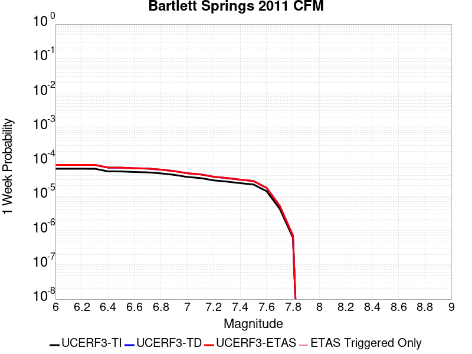 | 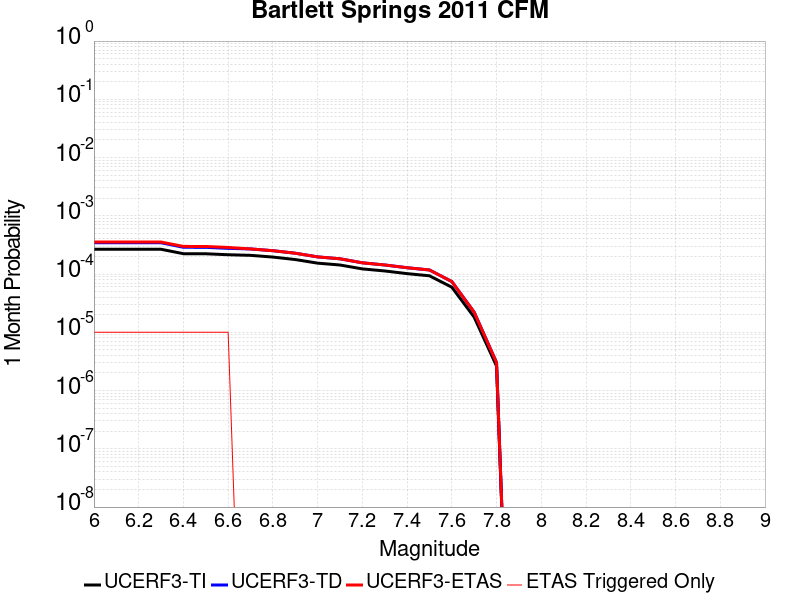 | 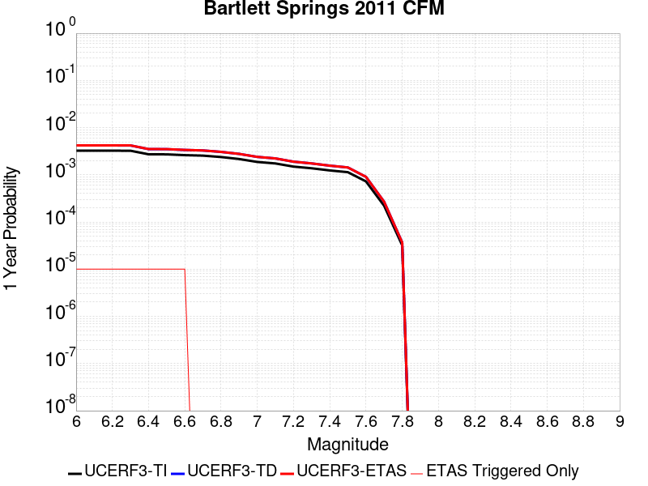 | 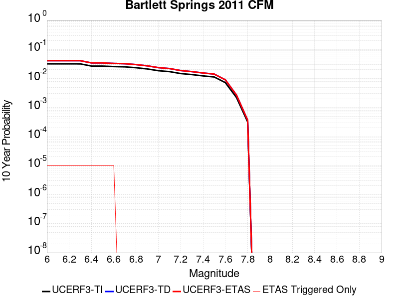 |

| Magnitude | 1 wk TI Prob | 1 wk TD Prob | 1 wk ETAS Prob | 1 wk ETAS/TD Gain | 1 wk ETAS Triggered Only | 1 mo TI Prob | 1 mo TD Prob | 1 mo ETAS Prob | 1 mo ETAS/TD Gain | 1 mo ETAS Triggered Only | 1 yr TI Prob | 1 yr TD Prob | 1 yr ETAS Prob | 1 yr ETAS/TD Gain | 1 yr ETAS Triggered Only | 10 yr TI Prob | 10 yr TD Prob | 10 yr ETAS Prob | 10 yr ETAS/TD Gain | 10 yr ETAS Triggered Only |
|-----|-----|-----|-----|-----|-----|-----|-----|-----|-----|-----|-----|-----|-----|-----|-----|-----|-----|-----|-----|-----|
| 6.0 | 6.2326144E-5 | 8.060613E-5 | 8.060613E-5 | 1.0 | 0.0 | 2.6708472E-4 | 3.454099E-4 | 3.5540646E-4 | 1.0289412 | 1.0E-5 | 0.003246908 | 0.0041973945 | 0.0042073526 | 1.0023724 | 1.0E-5 | 0.031998757 | 0.04119771 | 0.0412073 | 1.0002327 | 1.0E-5 |
| 6.1 | 6.227657E-5 | 8.054363E-5 | 8.054363E-5 | 1.0 | 0.0 | 2.668723E-4 | 3.4514212E-4 | 3.5513868E-4 | 1.0289636 | 1.0E-5 | 0.0032443295 | 0.004194147 | 0.004204105 | 1.0023743 | 1.0E-5 | 0.031973712 | 0.041166443 | 0.041176032 | 1.0002329 | 1.0E-5 |
| 6.2 | 6.22452E-5 | 8.050423E-5 | 8.050423E-5 | 1.0 | 0.0 | 2.6673786E-4 | 3.4497332E-4 | 3.5496987E-4 | 1.0289778 | 1.0E-5 | 0.0032426978 | 0.0041921 | 0.004202058 | 1.0023755 | 1.0E-5 | 0.03195787 | 0.041146737 | 0.041156325 | 1.000233 | 1.0E-5 |
| 6.3 | 6.219006E-5 | 8.043407E-5 | 8.043407E-5 | 1.0 | 0.0 | 2.6650162E-4 | 3.4467268E-4 | 3.5466923E-4 | 1.029003 | 1.0E-5 | 0.00323983 | 0.0041884542 | 0.0041984124 | 1.0023775 | 1.0E-5 | 0.031930014 | 0.041111637 | 0.041121226 | 1.0002333 | 1.0E-5 |
| 6.4 | 5.2175856E-5 | 6.725342E-5 | 6.725342E-5 | 1.0 | 0.0 | 2.2359163E-4 | 2.8819745E-4 | 2.9819456E-4 | 1.0346885 | 1.0E-5 | 0.0027188298 | 0.0035032115 | 0.0035131765 | 1.0028446 | 1.0E-5 | 0.026858058 | 0.034489222 | 0.034498878 | 1.0002799 | 1.0E-5 |
| 6.5 | 5.205166E-5 | 6.7096094E-5 | 6.7096094E-5 | 1.0 | 0.0 | 2.2305945E-4 | 2.8752335E-4 | 2.9752046E-4 | 1.0347698 | 1.0E-5 | 0.0027123666 | 0.0034950306 | 0.0035049957 | 1.0028512 | 1.0E-5 | 0.026794989 | 0.034409966 | 0.034419622 | 1.0002806 | 1.0E-5 |
| 6.6 | 5.0085426E-5 | 6.449277E-5 | 6.449277E-5 | 1.0 | 0.0 | 2.1463417E-4 | 2.763686E-4 | 2.8636586E-4 | 1.0361736 | 1.0E-5 | 0.0026100394 | 0.0033596456 | 0.003369612 | 1.0029665 | 1.0E-5 | 0.025795965 | 0.033097573 | 0.03310724 | 1.0002922 | 1.0E-5 |
| 6.7 | 4.8930866E-5 | 6.3017396E-5 | 6.3017396E-5 | 1.0 | 0.0 | 2.0968684E-4 | 2.7004688E-4 | 2.7004688E-4 | 1.0 | 0.0 | 0.0025499484 | 0.0032829174 | 0.0032829174 | 1.0 | 0.0 | 0.025208864 | 0.03235294 | 0.03235294 | 1.0 | 0.0 |
| 6.8 | 4.5679535E-5 | 5.8741858E-5 | 5.8741858E-5 | 1.0 | 0.0 | 1.9575475E-4 | 2.5172674E-4 | 2.5172674E-4 | 1.0 | 0.0 | 0.002380709 | 0.0030605064 | 0.0030605064 | 1.0 | 0.0 | 0.023553653 | 0.03019042 | 0.03019042 | 1.0 | 0.0 |
| 6.9 | 4.1439176E-5 | 5.3220094E-5 | 5.3220094E-5 | 1.0 | 0.0 | 1.7758438E-4 | 2.2806633E-4 | 2.2806633E-4 | 1.0 | 0.0 | 0.002159946 | 0.0027731995 | 0.0027731995 | 1.0 | 0.0 | 0.021390721 | 0.027390772 | 0.027390772 | 1.0 | 0.0 |
| 7.0 | 3.5920104E-5 | 4.600871E-5 | 4.600871E-5 | 1.0 | 0.0 | 1.5393422E-4 | 1.9716538E-4 | 1.9716538E-4 | 1.0 | 0.0 | 0.001872538 | 0.0023978627 | 0.0023978627 | 1.0 | 0.0 | 0.018568378 | 0.023723004 | 0.023723004 | 1.0 | 0.0 |
| 7.1 | 3.338812E-5 | 4.2689582E-5 | 4.2689582E-5 | 1.0 | 0.0 | 1.430841E-4 | 1.829426E-4 | 1.829426E-4 | 1.0 | 0.0 | 0.0017406568 | 0.0022250658 | 0.0022250658 | 1.0 | 0.0 | 0.017270854 | 0.02203054 | 0.02203054 | 1.0 | 0.0 |
| 7.2 | 2.8619615E-5 | 3.6401652E-5 | 3.6401652E-5 | 1.0 | 0.0 | 1.2264973E-4 | 1.5599781E-4 | 1.5599781E-4 | 1.0 | 0.0 | 0.0014922376 | 0.0018976285 | 0.0018976285 | 1.0 | 0.0 | 0.014822568 | 0.01881613 | 0.01881613 | 1.0 | 0.0 |
| 7.3 | 2.6376783E-5 | 3.342276E-5 | 3.342276E-5 | 1.0 | 0.0 | 1.13038455E-4 | 1.4323258E-4 | 1.4323258E-4 | 1.0 | 0.0 | 0.0013753743 | 0.001742471 | 0.001742471 | 1.0 | 0.0 | 0.01366893 | 0.01728972 | 0.01728972 | 1.0 | 0.0 |
| 7.4 | 2.3738676E-5 | 2.9978975E-5 | 2.9978975E-5 | 1.0 | 0.0 | 1.0173322E-4 | 1.2847505E-4 | 1.2847505E-4 | 1.0 | 0.0 | 0.0012378981 | 0.0015630693 | 0.0015630693 | 1.0 | 0.0 | 0.012310251 | 0.015522073 | 0.015522073 | 1.0 | 0.0 |
| 7.5 | 2.1789481E-5 | 2.7439388E-5 | 2.7439388E-5 | 1.0 | 0.0 | 9.338015E-5 | 1.1759212E-4 | 1.1759212E-4 | 1.0 | 0.0 | 0.0011363103 | 0.0014307518 | 0.0014307518 | 1.0 | 0.0 | 0.011305175 | 0.014216576 | 0.014216576 | 1.0 | 0.0 |
| 7.6 | 1.3895281E-5 | 1.7368426E-5 | 1.7368426E-5 | 1.0 | 0.0 | 5.9549846E-5 | 7.4434E-5 | 7.4434E-5 | 1.0 | 0.0 | 7.2477816E-4 | 9.0586004E-4 | 9.0586004E-4 | 1.0 | 0.0 | 0.0072241887 | 0.009022084 | 0.009022084 | 1.0 | 0.0 |
| 7.7 | 4.245981E-6 | 5.1624675E-6 | 5.1624675E-6 | 1.0 | 0.0 | 1.8196934E-5 | 2.2124674E-5 | 2.2124674E-5 | 1.0 | 0.0 | 2.2152514E-4 | 2.693348E-4 | 2.693348E-4 | 1.0 | 0.0 | 0.0022130446 | 0.0026901034 | 0.0026901034 | 1.0 | 0.0 |
| 7.8 | 6.145192E-7 | 7.047006E-7 | 7.047006E-7 | 1.0 | 0.0 | 2.633651E-6 | 3.020142E-6 | 3.020142E-6 | 1.0 | 0.0 | 3.206423E-5 | 3.676962E-5 | 3.676962E-5 | 1.0 | 0.0 | 3.2059604E-4 | 3.6763478E-4 | 3.6763478E-4 | 1.0 | 0.0 |

## Hartley Springs 2011 CFM
*[(top)](#table-of-contents)*

| 1 Week | 1 Month | 1 Year | 10 Year |
|-----|-----|-----|-----|
|  |  |  |  |

| Magnitude | 1 wk TI Prob | 1 wk TD Prob | 1 wk ETAS Prob | 1 wk ETAS/TD Gain | 1 wk ETAS Triggered Only | 1 mo TI Prob | 1 mo TD Prob | 1 mo ETAS Prob | 1 mo ETAS/TD Gain | 1 mo ETAS Triggered Only | 1 yr TI Prob | 1 yr TD Prob | 1 yr ETAS Prob | 1 yr ETAS/TD Gain | 1 yr ETAS Triggered Only | 10 yr TI Prob | 10 yr TD Prob | 10 yr ETAS Prob | 10 yr ETAS/TD Gain | 10 yr ETAS Triggered Only |
|-----|-----|-----|-----|-----|-----|-----|-----|-----|-----|-----|-----|-----|-----|-----|-----|-----|-----|-----|-----|-----|
| 6.0 | 1.4352418E-5 | 1.4434182E-5 | 1.4434182E-5 | 1.0 | 0.0 | 6.1508916E-5 | 6.1860235E-5 | 6.1860235E-5 | 1.0 | 0.0 | 7.486137E-4 | 7.5305253E-4 | 7.5305253E-4 | 1.0 | 0.0 | 0.007460968 | 0.0075211283 | 0.0075310534 | 1.0013196 | 1.0E-5 |
| 6.1 | 1.4352418E-5 | 1.4434182E-5 | 1.4434182E-5 | 1.0 | 0.0 | 6.1508916E-5 | 6.1860235E-5 | 6.1860235E-5 | 1.0 | 0.0 | 7.486137E-4 | 7.5305253E-4 | 7.5305253E-4 | 1.0 | 0.0 | 0.007460968 | 0.0075211283 | 0.0075310534 | 1.0013196 | 1.0E-5 |
| 6.2 | 1.4352418E-5 | 1.4434182E-5 | 1.4434182E-5 | 1.0 | 0.0 | 6.1508916E-5 | 6.1860235E-5 | 6.1860235E-5 | 1.0 | 0.0 | 7.486137E-4 | 7.5305253E-4 | 7.5305253E-4 | 1.0 | 0.0 | 0.007460968 | 0.0075211283 | 0.0075310534 | 1.0013196 | 1.0E-5 |
| 6.3 | 1.4352418E-5 | 1.4434182E-5 | 1.4434182E-5 | 1.0 | 0.0 | 6.1508916E-5 | 6.1860235E-5 | 6.1860235E-5 | 1.0 | 0.0 | 7.486137E-4 | 7.5305253E-4 | 7.5305253E-4 | 1.0 | 0.0 | 0.007460968 | 0.0075211283 | 0.0075310534 | 1.0013196 | 1.0E-5 |
| 6.4 | 1.4352418E-5 | 1.4434182E-5 | 1.4434182E-5 | 1.0 | 0.0 | 6.1508916E-5 | 6.1860235E-5 | 6.1860235E-5 | 1.0 | 0.0 | 7.486137E-4 | 7.5305253E-4 | 7.5305253E-4 | 1.0 | 0.0 | 0.007460968 | 0.0075211283 | 0.0075310534 | 1.0013196 | 1.0E-5 |
| 6.5 | 1.2279858E-5 | 1.2133106E-5 | 1.2133106E-5 | 1.0 | 0.0 | 5.26269E-5 | 5.1998883E-5 | 5.1998883E-5 | 1.0 | 0.0 | 6.4054417E-4 | 6.3306064E-4 | 6.3306064E-4 | 1.0 | 0.0 | 0.0063870098 | 0.006328085 | 0.0063380217 | 1.0015702 | 1.0E-5 |
| 6.6 | 1.2279858E-5 | 1.2133106E-5 | 1.2133106E-5 | 1.0 | 0.0 | 5.26269E-5 | 5.1998883E-5 | 5.1998883E-5 | 1.0 | 0.0 | 6.4054417E-4 | 6.3306064E-4 | 6.3306064E-4 | 1.0 | 0.0 | 0.0063870098 | 0.006328085 | 0.0063380217 | 1.0015702 | 1.0E-5 |
| 6.7 | 2.1282601E-6 | 8.8948315E-7 | 8.8948315E-7 | 1.0 | 0.0 | 9.121083E-6 | 3.8120663E-6 | 3.8120663E-6 | 1.0 | 0.0 | 1.11043526E-4 | 4.641118E-5 | 4.641118E-5 | 1.0 | 0.0 | 0.0011098806 | 4.6404017E-4 | 4.6404017E-4 | 1.0 | 0.0 |
| 6.8 | 2.00516E-6 | 8.517597E-7 | 8.517597E-7 | 1.0 | 0.0 | 8.593515E-6 | 3.650395E-6 | 3.650395E-6 | 1.0 | 0.0 | 1.04621024E-4 | 4.444291E-5 | 4.444291E-5 | 1.0 | 0.0 | 0.0010457177 | 4.4436535E-4 | 4.4436535E-4 | 1.0 | 0.0 |
| 6.9 | 2.00516E-6 | 8.517597E-7 | 8.517597E-7 | 1.0 | 0.0 | 8.593515E-6 | 3.650395E-6 | 3.650395E-6 | 1.0 | 0.0 | 1.04621024E-4 | 4.444291E-5 | 4.444291E-5 | 1.0 | 0.0 | 0.0010457177 | 4.4436535E-4 | 4.4436535E-4 | 1.0 | 0.0 |
| 7.0 | 1.8366732E-6 | 8.237307E-7 | 8.237307E-7 | 1.0 | 0.0 | 7.871433E-6 | 3.5302712E-6 | 3.5302712E-6 | 1.0 | 0.0 | 9.583048E-5 | 4.298046E-5 | 4.298046E-5 | 1.0 | 0.0 | 9.5789164E-4 | 4.2974652E-4 | 4.2974652E-4 | 1.0 | 0.0 |
| 7.1 | 1.5097997E-6 | 7.1902616E-7 | 7.1902616E-7 | 1.0 | 0.0 | 6.470554E-6 | 3.0815384E-6 | 3.0815384E-6 | 1.0 | 0.0 | 7.877615E-5 | 3.7517326E-5 | 3.7517326E-5 | 1.0 | 0.0 | 7.874823E-4 | 3.7513362E-4 | 3.7513362E-4 | 1.0 | 0.0 |
| 7.2 | 1.3490993E-6 | 6.405254E-7 | 6.405254E-7 | 1.0 | 0.0 | 5.7818415E-6 | 2.7451074E-6 | 2.7451074E-6 | 1.0 | 0.0 | 7.0391645E-5 | 3.3421402E-5 | 3.3421402E-5 | 1.0 | 0.0 | 7.0369354E-4 | 3.341867E-4 | 3.341867E-4 | 1.0 | 0.0 |
| 7.3 | 7.900015E-7 | 4.0889498E-7 | 4.0889498E-7 | 1.0 | 0.0 | 3.3857161E-6 | 1.752407E-6 | 1.752407E-6 | 1.0 | 0.0 | 4.1220315E-5 | 2.1335554E-5 | 2.1335554E-5 | 1.0 | 0.0 | 4.121267E-4 | 2.1335555E-4 | 2.1335555E-4 | 1.0 | 0.0 |

## Santa Susana East (connector)
*[(top)](#table-of-contents)*

| 1 Week | 1 Month | 1 Year | 10 Year |
|-----|-----|-----|-----|
|  |  |  |  |

| Magnitude | 1 wk TI Prob | 1 wk TD Prob | 1 wk ETAS Prob | 1 wk ETAS/TD Gain | 1 wk ETAS Triggered Only | 1 mo TI Prob | 1 mo TD Prob | 1 mo ETAS Prob | 1 mo ETAS/TD Gain | 1 mo ETAS Triggered Only | 1 yr TI Prob | 1 yr TD Prob | 1 yr ETAS Prob | 1 yr ETAS/TD Gain | 1 yr ETAS Triggered Only | 10 yr TI Prob | 10 yr TD Prob | 10 yr ETAS Prob | 10 yr ETAS/TD Gain | 10 yr ETAS Triggered Only |
|-----|-----|-----|-----|-----|-----|-----|-----|-----|-----|-----|-----|-----|-----|-----|-----|-----|-----|-----|-----|-----|
| 6.0 | 2.858397E-5 | 3.202091E-5 | 3.202091E-5 | 1.0 | 0.0 | 1.2249697E-4 | 1.3722685E-4 | 1.3722685E-4 | 1.0 | 0.0 | 0.0014903803 | 0.0016697381 | 0.0016797214 | 1.005979 | 1.0E-5 | 0.014804244 | 0.016599052 | 0.016608886 | 1.0005925 | 1.0E-5 |
| 6.1 | 2.858397E-5 | 3.202091E-5 | 3.202091E-5 | 1.0 | 0.0 | 1.2249697E-4 | 1.3722685E-4 | 1.3722685E-4 | 1.0 | 0.0 | 0.0014903803 | 0.0016697381 | 0.0016797214 | 1.005979 | 1.0E-5 | 0.014804244 | 0.016599052 | 0.016608886 | 1.0005925 | 1.0E-5 |
| 6.2 | 2.858397E-5 | 3.202091E-5 | 3.202091E-5 | 1.0 | 0.0 | 1.2249697E-4 | 1.3722685E-4 | 1.3722685E-4 | 1.0 | 0.0 | 0.0014903803 | 0.0016697381 | 0.0016797214 | 1.005979 | 1.0E-5 | 0.014804244 | 0.016599052 | 0.016608886 | 1.0005925 | 1.0E-5 |
| 6.3 | 1.943582E-5 | 2.036718E-5 | 2.036718E-5 | 1.0 | 0.0 | 8.329371E-5 | 8.7285625E-5 | 8.7285625E-5 | 1.0 | 0.0 | 0.001013629 | 0.0010622967 | 0.001072286 | 1.0094036 | 1.0E-5 | 0.010090181 | 0.010583619 | 0.010593513 | 1.0009348 | 1.0E-5 |
| 6.4 | 1.943582E-5 | 2.036718E-5 | 2.036718E-5 | 1.0 | 0.0 | 8.329371E-5 | 8.7285625E-5 | 8.7285625E-5 | 1.0 | 0.0 | 0.001013629 | 0.0010622967 | 0.001072286 | 1.0094036 | 1.0E-5 | 0.010090181 | 0.010583619 | 0.010593513 | 1.0009348 | 1.0E-5 |
| 6.5 | 1.943582E-5 | 2.036718E-5 | 2.036718E-5 | 1.0 | 0.0 | 8.329371E-5 | 8.7285625E-5 | 8.7285625E-5 | 1.0 | 0.0 | 0.001013629 | 0.0010622967 | 0.001072286 | 1.0094036 | 1.0E-5 | 0.010090181 | 0.010583619 | 0.010593513 | 1.0009348 | 1.0E-5 |
| 6.6 | 1.943582E-5 | 2.036718E-5 | 2.036718E-5 | 1.0 | 0.0 | 8.329371E-5 | 8.7285625E-5 | 8.7285625E-5 | 1.0 | 0.0 | 0.001013629 | 0.0010622967 | 0.001072286 | 1.0094036 | 1.0E-5 | 0.010090181 | 0.010583619 | 0.010593513 | 1.0009348 | 1.0E-5 |
| 6.7 | 1.9404439E-5 | 2.03546E-5 | 2.03546E-5 | 1.0 | 0.0 | 8.3159226E-5 | 8.723172E-5 | 8.723172E-5 | 1.0 | 0.0 | 0.0010119933 | 0.0010616409 | 0.0010716304 | 1.0094094 | 1.0E-5 | 0.010073971 | 0.010577125 | 0.010587019 | 1.0009354 | 1.0E-5 |
| 6.8 | 1.2217526E-5 | 1.1592998E-5 | 1.1592998E-5 | 1.0 | 0.0 | 5.2359774E-5 | 4.9683425E-5 | 4.9683425E-5 | 1.0 | 0.0 | 6.372938E-4 | 6.0474465E-4 | 6.147386E-4 | 1.0165259 | 1.0E-5 | 0.0063546924 | 0.006033037 | 0.0060429764 | 1.0016476 | 1.0E-5 |
| 6.9 | 1.2217526E-5 | 1.1592998E-5 | 1.1592998E-5 | 1.0 | 0.0 | 5.2359774E-5 | 4.9683425E-5 | 4.9683425E-5 | 1.0 | 0.0 | 6.372938E-4 | 6.0474465E-4 | 6.147386E-4 | 1.0165259 | 1.0E-5 | 0.0063546924 | 0.006033037 | 0.0060429764 | 1.0016476 | 1.0E-5 |
| 7.0 | 9.276017E-6 | 8.059113E-6 | 8.059113E-6 | 1.0 | 0.0 | 3.9753755E-5 | 3.4538618E-5 | 3.4538618E-5 | 1.0 | 0.0 | 4.8389446E-4 | 4.2042998E-4 | 4.2042998E-4 | 1.0 | 0.0 | 0.0048284214 | 0.0041970722 | 0.0041970722 | 1.0 | 0.0 |
| 7.1 | 9.130355E-6 | 7.942286E-6 | 7.942286E-6 | 1.0 | 0.0 | 3.9129503E-5 | 3.4037945E-5 | 3.4037945E-5 | 1.0 | 0.0 | 4.7629757E-4 | 4.1433662E-4 | 4.1433662E-4 | 1.0 | 0.0 | 0.00475278 | 0.004136367 | 0.004136367 | 1.0 | 0.0 |
| 7.2 | 8.851015E-6 | 7.741445E-6 | 7.741445E-6 | 1.0 | 0.0 | 3.7932372E-5 | 3.317722E-5 | 3.317722E-5 | 1.0 | 0.0 | 4.6172875E-4 | 4.038612E-4 | 4.038612E-4 | 1.0 | 0.0 | 0.0046077054 | 0.0040319953 | 0.0040319953 | 1.0 | 0.0 |
| 7.3 | 8.573006E-6 | 7.550166E-6 | 7.550166E-6 | 1.0 | 0.0 | 3.6740938E-5 | 3.2357475E-5 | 3.2357475E-5 | 1.0 | 0.0 | 4.472291E-4 | 3.9388443E-4 | 3.9388443E-4 | 1.0 | 0.0 | 0.004463301 | 0.0039325804 | 0.0039325804 | 1.0 | 0.0 |
| 7.4 | 7.852282E-6 | 6.817687E-6 | 6.817687E-6 | 1.0 | 0.0 | 3.36522E-5 | 2.9218349E-5 | 2.9218349E-5 | 1.0 | 0.0 | 4.096385E-4 | 3.5567835E-4 | 3.5567835E-4 | 1.0 | 0.0 | 0.0040888423 | 0.0035517553 | 0.0035517553 | 1.0 | 0.0 |
| 7.5 | 4.8869324E-6 | 4.279055E-6 | 4.279055E-6 | 1.0 | 0.0 | 2.0943828E-5 | 1.8338687E-5 | 1.8338687E-5 | 1.0 | 0.0 | 2.5496128E-4 | 2.232523E-4 | 2.232523E-4 | 1.0 | 0.0 | 0.0025466895 | 0.0022304445 | 0.0022304445 | 1.0 | 0.0 |
| 7.6 | 1.3894544E-6 | 1.1568179E-6 | 1.1568179E-6 | 1.0 | 0.0 | 5.954791E-6 | 4.957783E-6 | 4.957783E-6 | 1.0 | 0.0 | 7.249717E-5 | 6.0359558E-5 | 6.0359558E-5 | 1.0 | 0.0 | 7.247352E-4 | 6.0345343E-4 | 6.0345343E-4 | 1.0 | 0.0 |
| 7.7 | 2.9924632E-7 | 2.371928E-7 | 2.371928E-7 | 1.0 | 0.0 | 1.2824837E-6 | 1.0165402E-6 | 1.0165402E-6 | 1.0 | 0.0 | 1.5614127E-5 | 1.2376314E-5 | 1.2376314E-5 | 1.0 | 0.0 | 1.5613029E-4 | 1.2375697E-4 | 1.2375697E-4 | 1.0 | 0.0 |
| 7.8 | 4.8188564E-8 | 2.6323061E-8 | 2.6323061E-8 | 1.0 | 0.0 | 2.065224E-7 | 1.1281311E-7 | 1.1281311E-7 | 1.0 | 0.0 | 2.5144072E-6 | 1.3734989E-6 | 1.3734989E-6 | 1.0 | 0.0 | 2.5143789E-5 | 1.3734912E-5 | 1.3734912E-5 | 1.0 | 0.0 |
| 7.9 | 2.6127251E-9 | 2.7681102E-9 | 2.7681102E-9 | 1.0 | 0.0 | 1.1197393E-8 | 1.186333E-8 | 1.186333E-8 | 1.0 | 0.0 | 1.3632825E-7 | 1.4443603E-7 | 1.4443603E-7 | 1.0 | 0.0 | 1.3632817E-6 | 1.4443604E-6 | 1.4443604E-6 | 1.0 | 0.0 |

## East Huasna 2011 CFM
*[(top)](#table-of-contents)*

| 1 Week | 1 Month | 1 Year | 10 Year |
|-----|-----|-----|-----|
|  |  |  |  |

| Magnitude | 1 wk TI Prob | 1 wk TD Prob | 1 wk ETAS Prob | 1 wk ETAS/TD Gain | 1 wk ETAS Triggered Only | 1 mo TI Prob | 1 mo TD Prob | 1 mo ETAS Prob | 1 mo ETAS/TD Gain | 1 mo ETAS Triggered Only | 1 yr TI Prob | 1 yr TD Prob | 1 yr ETAS Prob | 1 yr ETAS/TD Gain | 1 yr ETAS Triggered Only | 10 yr TI Prob | 10 yr TD Prob | 10 yr ETAS Prob | 10 yr ETAS/TD Gain | 10 yr ETAS Triggered Only |
|-----|-----|-----|-----|-----|-----|-----|-----|-----|-----|-----|-----|-----|-----|-----|-----|-----|-----|-----|-----|-----|
| 6.0 | 1.4658423E-6 | 1.4715657E-6 | 1.1471551E-5 | 7.795473 | 1.0E-5 | 6.282166E-6 | 6.3066955E-6 | 1.6306632E-5 | 2.5856063 | 1.0E-5 | 7.6482684E-5 | 7.678138E-5 | 8.6780616E-5 | 1.13023 | 1.0E-5 | 7.645637E-4 | 7.6755555E-4 | 7.775479E-4 | 1.0130184 | 1.0E-5 |
| 6.1 | 1.4658423E-6 | 1.4715657E-6 | 1.1471551E-5 | 7.795473 | 1.0E-5 | 6.282166E-6 | 6.3066955E-6 | 1.6306632E-5 | 2.5856063 | 1.0E-5 | 7.6482684E-5 | 7.678138E-5 | 8.6780616E-5 | 1.13023 | 1.0E-5 | 7.645637E-4 | 7.6755555E-4 | 7.775479E-4 | 1.0130184 | 1.0E-5 |
| 6.2 | 1.4658423E-6 | 1.4715657E-6 | 1.1471551E-5 | 7.795473 | 1.0E-5 | 6.282166E-6 | 6.3066955E-6 | 1.6306632E-5 | 2.5856063 | 1.0E-5 | 7.6482684E-5 | 7.678138E-5 | 8.6780616E-5 | 1.13023 | 1.0E-5 | 7.645637E-4 | 7.6755555E-4 | 7.775479E-4 | 1.0130184 | 1.0E-5 |
| 6.3 | 1.4658423E-6 | 1.4715657E-6 | 1.1471551E-5 | 7.795473 | 1.0E-5 | 6.282166E-6 | 6.3066955E-6 | 1.6306632E-5 | 2.5856063 | 1.0E-5 | 7.6482684E-5 | 7.678138E-5 | 8.6780616E-5 | 1.13023 | 1.0E-5 | 7.645637E-4 | 7.6755555E-4 | 7.775479E-4 | 1.0130184 | 1.0E-5 |
| 6.4 | 1.0488257E-6 | 1.0527513E-6 | 1.1052741E-5 | 10.49891 | 1.0E-5 | 4.4949593E-6 | 4.5117836E-6 | 1.4511738E-5 | 3.2164085 | 1.0E-5 | 5.472476E-5 | 5.49296E-5 | 6.4929045E-5 | 1.1820412 | 1.0E-5 | 5.4711284E-4 | 5.491621E-4 | 5.5915664E-4 | 1.0181996 | 1.0E-5 |
| 6.5 | 1.0488257E-6 | 1.0527513E-6 | 1.1052741E-5 | 10.49891 | 1.0E-5 | 4.4949593E-6 | 4.5117836E-6 | 1.4511738E-5 | 3.2164085 | 1.0E-5 | 5.472476E-5 | 5.49296E-5 | 6.4929045E-5 | 1.1820412 | 1.0E-5 | 5.4711284E-4 | 5.491621E-4 | 5.5915664E-4 | 1.0181996 | 1.0E-5 |
| 6.6 | 8.463064E-7 | 8.49363E-7 | 1.0849354E-5 | 12.773519 | 1.0E-5 | 3.6270226E-6 | 3.6401223E-6 | 1.3640086E-5 | 3.7471504 | 1.0E-5 | 4.4158103E-5 | 4.4317596E-5 | 5.431715E-5 | 1.225634 | 1.0E-5 | 4.414933E-4 | 4.4308844E-4 | 4.53084E-4 | 1.0225588 | 1.0E-5 |
| 6.7 | 7.876149E-7 | 7.902531E-7 | 1.0790245E-5 | 13.654163 | 1.0E-5 | 3.375488E-6 | 3.3867946E-6 | 1.3386761E-5 | 3.9526343 | 1.0E-5 | 4.109579E-5 | 4.1233452E-5 | 5.1233037E-5 | 1.2425115 | 1.0E-5 | 4.108819E-4 | 4.1225864E-4 | 4.222545E-4 | 1.0242466 | 1.0E-5 |
| 6.8 | 6.9940785E-7 | 7.0165754E-7 | 1.070165E-5 | 15.251957 | 1.0E-5 | 2.9974588E-6 | 3.0071003E-6 | 1.300707E-5 | 4.325453 | 1.0E-5 | 3.649345E-5 | 3.6610836E-5 | 4.661047E-5 | 1.2731332 | 1.0E-5 | 3.6487455E-4 | 3.660485E-4 | 3.7604486E-4 | 1.0273088 | 1.0E-5 |
| 6.9 | 5.899658E-7 | 5.9155974E-7 | 1.0591554E-5 | 17.904453 | 1.0E-5 | 2.5284223E-6 | 2.5352535E-6 | 1.2535228E-5 | 4.944369 | 1.0E-5 | 3.0783107E-5 | 3.086628E-5 | 4.086597E-5 | 1.3239682 | 1.0E-5 | 3.0778843E-4 | 3.086202E-4 | 3.186171E-4 | 1.0323923 | 1.0E-5 |
| 7.0 | 4.793814E-7 | 4.8032706E-7 | 1.0480322E-5 | 21.819138 | 1.0E-5 | 2.05449E-6 | 2.058543E-6 | 1.2058523E-5 | 5.857795 | 1.0E-5 | 2.501313E-5 | 2.5062474E-5 | 3.5062225E-5 | 1.3989929 | 1.0E-5 | 2.5010316E-4 | 2.5059667E-4 | 2.6059416E-4 | 1.0398948 | 1.0E-5 |
| 7.1 | 4.1256908E-7 | 4.129939E-7 | 4.129939E-7 | 1.0 | 0.0 | 1.768152E-6 | 1.7699726E-6 | 1.7699726E-6 | 1.0 | 0.0 | 2.1527037E-5 | 2.1549205E-5 | 2.1549205E-5 | 1.0 | 0.0 | 2.1524953E-4 | 2.154713E-4 | 2.154713E-4 | 1.0 | 0.0 |
| 7.2 | 2.822599E-7 | 2.8161398E-7 | 2.8161398E-7 | 1.0 | 0.0 | 1.2096847E-6 | 1.2069165E-6 | 1.2069165E-6 | 1.0 | 0.0 | 1.47278115E-5 | 1.469411E-5 | 1.469411E-5 | 1.0 | 0.0 | 1.4726835E-4 | 1.4693146E-4 | 1.4693146E-4 | 1.0 | 0.0 |
| 7.3 | 1.5261652E-7 | 1.5075E-7 | 1.5075E-7 | 1.0 | 0.0 | 6.540707E-7 | 6.4607127E-7 | 6.4607127E-7 | 1.0 | 0.0 | 7.963281E-6 | 7.8658895E-6 | 7.8658895E-6 | 1.0 | 0.0 | 7.962996E-5 | 7.865613E-5 | 7.865613E-5 | 1.0 | 0.0 |
| 7.4 | 7.976414E-8 | 8.057865E-8 | 8.057865E-8 | 1.0 | 0.0 | 3.418463E-7 | 3.45337E-7 | 3.45337E-7 | 1.0 | 0.0 | 4.1619705E-6 | 4.2044703E-6 | 4.2044703E-6 | 1.0 | 0.0 | 4.161893E-5 | 4.2043914E-5 | 4.2043914E-5 | 1.0 | 0.0 |
| 7.5 | 4.2715055E-8 | 4.3202512E-8 | 4.3202512E-8 | 1.0 | 0.0 | 1.830645E-7 | 1.8515361E-7 | 1.8515361E-7 | 1.0 | 0.0 | 2.228808E-6 | 2.2542429E-6 | 2.2542429E-6 | 1.0 | 0.0 | 2.2287857E-5 | 2.2542203E-5 | 2.2542203E-5 | 1.0 | 0.0 |
| 7.6 | 2.1807532E-8 | 2.2057476E-8 | 2.2057476E-8 | 1.0 | 0.0 | 9.346085E-8 | 9.4532034E-8 | 9.4532034E-8 | 1.0 | 0.0 | 1.1378852E-6 | 1.1509269E-6 | 1.1509269E-6 | 1.0 | 0.0 | 1.1378794E-5 | 1.1509211E-5 | 1.1509211E-5 | 1.0 | 0.0 |
| 7.7 | 4.7196043E-9 | 4.767283E-9 | 4.767283E-9 | 1.0 | 0.0 | 2.0226874E-8 | 2.0431212E-8 | 2.0431212E-8 | 1.0 | 0.0 | 2.4626218E-7 | 2.4874998E-7 | 2.4874998E-7 | 1.0 | 0.0 | 2.462619E-6 | 2.487497E-6 | 2.487497E-6 | 1.0 | 0.0 |
| 7.8 | 7.400003E-11 | 7.4654505E-11 | 7.4654505E-11 | 1.0 | 0.0 | 3.171432E-10 | 3.1994773E-10 | 3.1994773E-10 | 1.0 | 0.0 | 3.861218E-9 | 3.895363E-9 | 3.895363E-9 | 1.0 | 0.0 | 3.861218E-8 | 3.895363E-8 | 3.895363E-8 | 1.0 | 0.0 |

## Goose Lake 2011 CFM
*[(top)](#table-of-contents)*

| 1 Week | 1 Month | 1 Year | 10 Year |
|-----|-----|-----|-----|
|  |  |  |  |

| Magnitude | 1 wk TI Prob | 1 wk TD Prob | 1 wk ETAS Prob | 1 wk ETAS/TD Gain | 1 wk ETAS Triggered Only | 1 mo TI Prob | 1 mo TD Prob | 1 mo ETAS Prob | 1 mo ETAS/TD Gain | 1 mo ETAS Triggered Only | 1 yr TI Prob | 1 yr TD Prob | 1 yr ETAS Prob | 1 yr ETAS/TD Gain | 1 yr ETAS Triggered Only | 10 yr TI Prob | 10 yr TD Prob | 10 yr ETAS Prob | 10 yr ETAS/TD Gain | 10 yr ETAS Triggered Only |
|-----|-----|-----|-----|-----|-----|-----|-----|-----|-----|-----|-----|-----|-----|-----|-----|-----|-----|-----|-----|-----|
| 6.0 | 3.780968E-6 | 3.8230223E-6 | 3.8230223E-6 | 1.0 | 0.0 | 1.6204049E-5 | 1.6384285E-5 | 1.6384285E-5 | 1.0 | 0.0 | 1.9726643E-4 | 1.994615E-4 | 2.0945951E-4 | 1.050125 | 1.0E-5 | 0.001970914 | 0.001992933 | 0.002002913 | 1.0050077 | 1.0E-5 |
| 6.1 | 2.2035124E-6 | 2.229801E-6 | 2.229801E-6 | 1.0 | 0.0 | 9.443591E-6 | 9.556257E-6 | 9.556257E-6 | 1.0 | 0.0 | 1.1496965E-4 | 1.163414E-4 | 1.163414E-4 | 1.0 | 0.0 | 0.0011491019 | 0.0011628233 | 0.0011628233 | 1.0 | 0.0 |
| 6.2 | 1.5624689E-6 | 1.5826923E-6 | 1.5826923E-6 | 1.0 | 0.0 | 6.6962784E-6 | 6.7829496E-6 | 6.7829496E-6 | 1.0 | 0.0 | 8.152414E-5 | 8.2579325E-5 | 8.2579325E-5 | 1.0 | 0.0 | 8.1494235E-4 | 8.2549086E-4 | 8.2549086E-4 | 1.0 | 0.0 |
| 6.3 | 1.5624689E-6 | 1.5826923E-6 | 1.5826923E-6 | 1.0 | 0.0 | 6.6962784E-6 | 6.7829496E-6 | 6.7829496E-6 | 1.0 | 0.0 | 8.152414E-5 | 8.2579325E-5 | 8.2579325E-5 | 1.0 | 0.0 | 8.1494235E-4 | 8.2549086E-4 | 8.2549086E-4 | 1.0 | 0.0 |
| 6.4 | 1.256464E-6 | 1.2738695E-6 | 1.2738695E-6 | 1.0 | 0.0 | 5.3848344E-6 | 5.4594293E-6 | 5.4594293E-6 | 1.0 | 0.0 | 6.5558386E-5 | 6.646655E-5 | 6.646655E-5 | 1.0 | 0.0 | 6.553905E-4 | 6.644687E-4 | 6.644687E-4 | 1.0 | 0.0 |
| 6.5 | 1.0910911E-6 | 1.1069404E-6 | 1.1069404E-6 | 1.0 | 0.0 | 4.6760965E-6 | 4.7440217E-6 | 4.7440217E-6 | 1.0 | 0.0 | 5.692999E-5 | 5.7756948E-5 | 5.7756948E-5 | 1.0 | 0.0 | 5.6915404E-4 | 5.7742064E-4 | 5.7742064E-4 | 1.0 | 0.0 |
| 6.6 | 9.546601E-7 | 9.691246E-7 | 9.691246E-7 | 1.0 | 0.0 | 4.091394E-6 | 4.1533845E-6 | 4.1533845E-6 | 1.0 | 0.0 | 4.9811584E-5 | 5.056629E-5 | 5.056629E-5 | 1.0 | 0.0 | 4.980042E-4 | 5.055487E-4 | 5.055487E-4 | 1.0 | 0.0 |
| 6.7 | 7.790316E-7 | 7.9159634E-7 | 7.9159634E-7 | 1.0 | 0.0 | 3.3387028E-6 | 3.3925514E-6 | 3.3925514E-6 | 1.0 | 0.0 | 4.0647945E-5 | 4.1303538E-5 | 4.1303538E-5 | 1.0 | 0.0 | 4.0640513E-4 | 4.129592E-4 | 4.129592E-4 | 1.0 | 0.0 |
| 6.8 | 6.3714384E-7 | 6.4787395E-7 | 6.4787395E-7 | 1.0 | 0.0 | 2.7306137E-6 | 2.7765998E-6 | 2.7765998E-6 | 1.0 | 0.0 | 3.3244716E-5 | 3.3804583E-5 | 3.3804583E-5 | 1.0 | 0.0 | 3.323974E-4 | 3.379949E-4 | 3.379949E-4 | 1.0 | 0.0 |
| 6.9 | 4.92586E-7 | 5.0139147E-7 | 5.0139147E-7 | 1.0 | 0.0 | 2.1110811E-6 | 2.1488188E-6 | 2.1488188E-6 | 1.0 | 0.0 | 2.5702111E-5 | 2.616156E-5 | 2.616156E-5 | 1.0 | 0.0 | 2.569914E-4 | 2.6158517E-4 | 2.6158517E-4 | 1.0 | 0.0 |
| 7.0 | 3.130245E-7 | 3.190354E-7 | 3.190354E-7 | 1.0 | 0.0 | 1.3415328E-6 | 1.3672939E-6 | 1.3672939E-6 | 1.0 | 0.0 | 1.6333039E-5 | 1.6646678E-5 | 1.6646678E-5 | 1.0 | 0.0 | 1.6331839E-4 | 1.6645451E-4 | 1.6645451E-4 | 1.0 | 0.0 |
| 7.1 | 1.7680084E-7 | 1.8023923E-7 | 1.8023923E-7 | 1.0 | 0.0 | 7.5771766E-7 | 7.724536E-7 | 7.724536E-7 | 1.0 | 0.0 | 9.225173E-6 | 9.404583E-6 | 9.404583E-6 | 1.0 | 0.0 | 9.22479E-5 | 9.4041956E-5 | 9.4041956E-5 | 1.0 | 0.0 |
| 7.2 | 4.8641045E-8 | 4.9402068E-8 | 4.9402068E-8 | 1.0 | 0.0 | 2.084616E-7 | 2.1172312E-7 | 2.1172312E-7 | 1.0 | 0.0 | 2.538017E-6 | 2.577726E-6 | 2.577726E-6 | 1.0 | 0.0 | 2.537988E-5 | 2.5776973E-5 | 2.5776973E-5 | 1.0 | 0.0 |
| 7.3 | 5.3911844E-9 | 5.4758145E-9 | 5.4758145E-9 | 1.0 | 0.0 | 2.3105075E-8 | 2.3467775E-8 | 2.3467775E-8 | 1.0 | 0.0 | 2.8130427E-7 | 2.8572015E-7 | 2.8572015E-7 | 1.0 | 0.0 | 2.8130391E-6 | 2.8571992E-6 | 2.8571992E-6 | 1.0 | 0.0 |

## Del Valle
*[(top)](#table-of-contents)*

| 1 Week | 1 Month | 1 Year | 10 Year |
|-----|-----|-----|-----|
|  | 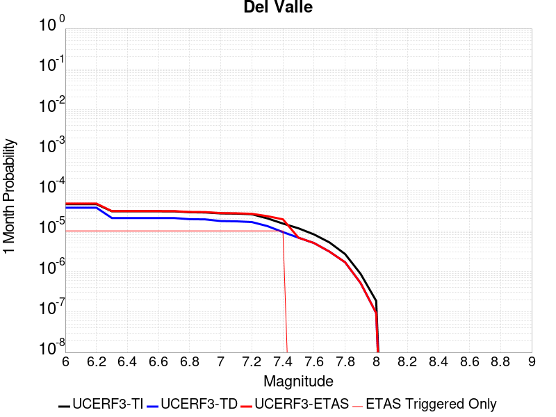 | 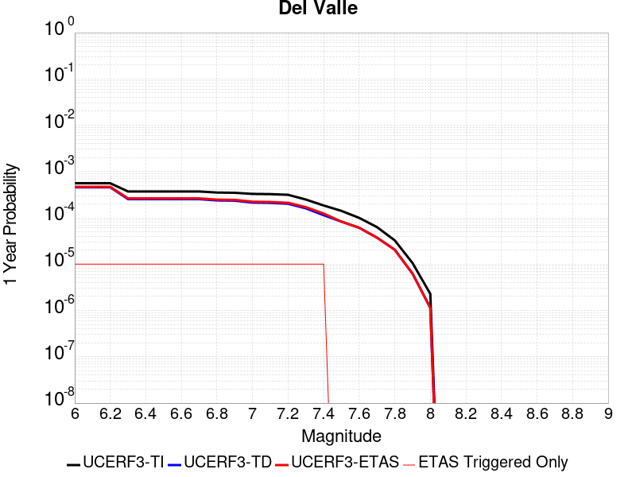 |  |

| Magnitude | 1 wk TI Prob | 1 wk TD Prob | 1 wk ETAS Prob | 1 wk ETAS/TD Gain | 1 wk ETAS Triggered Only | 1 mo TI Prob | 1 mo TD Prob | 1 mo ETAS Prob | 1 mo ETAS/TD Gain | 1 mo ETAS Triggered Only | 1 yr TI Prob | 1 yr TD Prob | 1 yr ETAS Prob | 1 yr ETAS/TD Gain | 1 yr ETAS Triggered Only | 10 yr TI Prob | 10 yr TD Prob | 10 yr ETAS Prob | 10 yr ETAS/TD Gain | 10 yr ETAS Triggered Only |
|-----|-----|-----|-----|-----|-----|-----|-----|-----|-----|-----|-----|-----|-----|-----|-----|-----|-----|-----|-----|-----|
| 6.0 | 1.0716125E-5 | 8.767882E-6 | 8.767882E-6 | 1.0 | 0.0 | 4.592544E-5 | 3.7576207E-5 | 4.757583E-5 | 1.2661159 | 1.0E-5 | 5.589988E-4 | 4.5741405E-4 | 4.6740947E-4 | 1.021852 | 1.0E-5 | 0.0055759475 | 0.00456668 | 0.0045766346 | 1.0021797 | 1.0E-5 |
| 6.1 | 1.0716125E-5 | 8.767882E-6 | 8.767882E-6 | 1.0 | 0.0 | 4.592544E-5 | 3.7576207E-5 | 4.757583E-5 | 1.2661159 | 1.0E-5 | 5.589988E-4 | 4.5741405E-4 | 4.6740947E-4 | 1.021852 | 1.0E-5 | 0.0055759475 | 0.00456668 | 0.0045766346 | 1.0021797 | 1.0E-5 |
| 6.2 | 1.0716125E-5 | 8.767882E-6 | 8.767882E-6 | 1.0 | 0.0 | 4.592544E-5 | 3.7576207E-5 | 4.757583E-5 | 1.2661159 | 1.0E-5 | 5.589988E-4 | 4.5741405E-4 | 4.6740947E-4 | 1.021852 | 1.0E-5 | 0.0055759475 | 0.00456668 | 0.0045766346 | 1.0021797 | 1.0E-5 |
| 6.3 | 7.1293784E-6 | 4.865823E-6 | 4.865823E-6 | 1.0 | 0.0 | 3.055412E-5 | 2.0853364E-5 | 3.0853156E-5 | 1.4795289 | 1.0E-5 | 3.7193293E-4 | 2.5386087E-4 | 2.6385832E-4 | 1.0393816 | 1.0E-5 | 0.0037131102 | 0.0025357946 | 0.0025457693 | 1.0039335 | 1.0E-5 |
| 6.4 | 7.1293784E-6 | 4.865823E-6 | 4.865823E-6 | 1.0 | 0.0 | 3.055412E-5 | 2.0853364E-5 | 3.0853156E-5 | 1.4795289 | 1.0E-5 | 3.7193293E-4 | 2.5386087E-4 | 2.6385832E-4 | 1.0393816 | 1.0E-5 | 0.0037131102 | 0.0025357946 | 0.0025457693 | 1.0039335 | 1.0E-5 |
| 6.5 | 7.1293784E-6 | 4.865823E-6 | 4.865823E-6 | 1.0 | 0.0 | 3.055412E-5 | 2.0853364E-5 | 3.0853156E-5 | 1.4795289 | 1.0E-5 | 3.7193293E-4 | 2.5386087E-4 | 2.6385832E-4 | 1.0393816 | 1.0E-5 | 0.0037131102 | 0.0025357946 | 0.0025457693 | 1.0039335 | 1.0E-5 |
| 6.6 | 7.1293784E-6 | 4.865823E-6 | 4.865823E-6 | 1.0 | 0.0 | 3.055412E-5 | 2.0853364E-5 | 3.0853156E-5 | 1.4795289 | 1.0E-5 | 3.7193293E-4 | 2.5386087E-4 | 2.6385832E-4 | 1.0393816 | 1.0E-5 | 0.0037131102 | 0.0025357946 | 0.0025457693 | 1.0039335 | 1.0E-5 |
| 6.7 | 7.12272E-6 | 4.8631987E-6 | 4.8631987E-6 | 1.0 | 0.0 | 3.0525585E-5 | 2.0842117E-5 | 3.0841908E-5 | 1.4797877 | 1.0E-5 | 3.7158563E-4 | 2.5372396E-4 | 2.6372142E-4 | 1.039403 | 1.0E-5 | 0.003709649 | 0.0025344288 | 0.0025444035 | 1.0039357 | 1.0E-5 |
| 6.8 | 6.7558703E-6 | 4.5594015E-6 | 4.5594015E-6 | 1.0 | 0.0 | 2.895341E-5 | 1.9540148E-5 | 2.9539953E-5 | 1.5117568 | 1.0E-5 | 3.5245073E-4 | 2.3787597E-4 | 2.478736E-4 | 1.0420287 | 1.0E-5 | 0.0035189227 | 0.0023762889 | 0.002386265 | 1.0041982 | 1.0E-5 |
| 6.9 | 6.6700386E-6 | 4.502539E-6 | 4.502539E-6 | 1.0 | 0.0 | 2.8585566E-5 | 1.9296456E-5 | 2.9296263E-5 | 1.5182198 | 1.0E-5 | 3.479737E-4 | 2.3490966E-4 | 2.449073E-4 | 1.0425595 | 1.0E-5 | 0.003474293 | 0.0023466884 | 0.002356665 | 1.0042514 | 1.0E-5 |
| 7.0 | 6.3181424E-6 | 4.0987034E-6 | 4.0987034E-6 | 1.0 | 0.0 | 2.7077473E-5 | 1.7565755E-5 | 2.756558E-5 | 1.5692794 | 1.0E-5 | 3.2961834E-4 | 2.1384252E-4 | 2.2384037E-4 | 1.0467534 | 1.0E-5 | 0.0032912986 | 0.002136422 | 0.0021464007 | 1.0046707 | 1.0E-5 |
| 7.1 | 6.248759E-6 | 4.033895E-6 | 4.033895E-6 | 1.0 | 0.0 | 2.678012E-5 | 1.7288008E-5 | 2.7287835E-5 | 1.5784256 | 1.0E-5 | 3.2599916E-4 | 2.104616E-4 | 2.204595E-4 | 1.0475047 | 1.0E-5 | 0.0032552136 | 0.0021026772 | 0.0021126561 | 1.0047458 | 1.0E-5 |
| 7.2 | 6.0411944E-6 | 3.869888E-6 | 3.869888E-6 | 1.0 | 0.0 | 2.5890577E-5 | 1.658513E-5 | 2.6584965E-5 | 1.6029397 | 1.0E-5 | 3.1517216E-4 | 2.0190567E-4 | 2.1190365E-4 | 1.0495181 | 1.0E-5 | 0.0031472554 | 0.0020172757 | 0.0020272555 | 1.0049472 | 1.0E-5 |
| 7.3 | 4.7691183E-6 | 3.0781202E-6 | 3.0781202E-6 | 1.0 | 0.0 | 2.0438918E-5 | 1.3191879E-5 | 2.3191747E-5 | 1.7580321 | 1.0E-5 | 2.488154E-4 | 1.605995E-4 | 1.705979E-4 | 1.0622567 | 1.0E-5 | 0.00248537 | 0.0016048603 | 0.0016148442 | 1.006221 | 1.0E-5 |
| 7.4 | 3.5524722E-6 | 2.1893363E-6 | 2.1893363E-6 | 1.0 | 0.0 | 1.5224792E-5 | 9.382837E-6 | 1.9382744E-5 | 2.0657659 | 1.0E-5 | 1.8534607E-4 | 1.1423013E-4 | 1.2422899E-4 | 1.0875325 | 1.0E-5 | 0.0018519156 | 0.0011417224 | 0.001151711 | 1.0087487 | 1.0E-5 |
| 7.5 | 2.7133442E-6 | 1.5916097E-6 | 1.5916097E-6 | 1.0 | 0.0 | 1.1628566E-5 | 6.821167E-6 | 6.821167E-6 | 1.0 | 0.0 | 1.415686E-4 | 8.304456E-5 | 8.304456E-5 | 1.0 | 0.0 | 0.0014147845 | 8.301372E-4 | 8.301372E-4 | 1.0 | 0.0 |
| 7.6 | 1.915338E-6 | 1.173914E-6 | 1.173914E-6 | 1.0 | 0.0 | 8.208566E-6 | 5.0310505E-6 | 5.0310505E-6 | 1.0 | 0.0 | 9.993471E-5 | 6.125133E-5 | 6.125133E-5 | 1.0 | 0.0 | 9.988978E-4 | 6.123454E-4 | 6.123454E-4 | 1.0 | 0.0 |
| 7.7 | 1.2120448E-6 | 7.180313E-7 | 7.180313E-7 | 1.0 | 0.0 | 5.194467E-6 | 3.0772733E-6 | 3.0772733E-6 | 1.0 | 0.0 | 6.3240805E-5 | 3.746516E-5 | 3.746516E-5 | 1.0 | 0.0 | 6.322281E-4 | 3.7458882E-4 | 3.7458882E-4 | 1.0 | 0.0 |
| 7.8 | 6.272381E-7 | 3.932549E-7 | 3.932549E-7 | 1.0 | 0.0 | 2.6881603E-6 | 1.6853771E-6 | 1.6853771E-6 | 1.0 | 0.0 | 3.272786E-5 | 2.0519275E-5 | 2.0519275E-5 | 1.0 | 0.0 | 3.272304E-4 | 2.0517396E-4 | 2.0517396E-4 | 1.0 | 0.0 |
| 7.9 | 2.0292627E-7 | 1.2004622E-7 | 1.2004622E-7 | 1.0 | 0.0 | 8.6968373E-7 | 5.1448376E-7 | 5.1448376E-7 | 1.0 | 0.0 | 1.0588348E-5 | 6.263822E-6 | 6.263822E-6 | 1.0 | 0.0 | 1.0587843E-4 | 6.263647E-5 | 6.263647E-5 | 1.0 | 0.0 |
| 8.0 | 4.374492E-8 | 2.189964E-8 | 2.189964E-8 | 1.0 | 0.0 | 1.8747821E-7 | 9.385559E-8 | 9.385559E-8 | 1.0 | 0.0 | 2.2825448E-6 | 1.1426913E-6 | 1.1426913E-6 | 1.0 | 0.0 | 2.2825214E-5 | 1.1426858E-5 | 1.1426858E-5 | 1.0 | 0.0 |

## San Jose
*[(top)](#table-of-contents)*

| 1 Week | 1 Month | 1 Year | 10 Year |
|-----|-----|-----|-----|
|  |  |  |  |

| Magnitude | 1 wk TI Prob | 1 wk TD Prob | 1 wk ETAS Prob | 1 wk ETAS/TD Gain | 1 wk ETAS Triggered Only | 1 mo TI Prob | 1 mo TD Prob | 1 mo ETAS Prob | 1 mo ETAS/TD Gain | 1 mo ETAS Triggered Only | 1 yr TI Prob | 1 yr TD Prob | 1 yr ETAS Prob | 1 yr ETAS/TD Gain | 1 yr ETAS Triggered Only | 10 yr TI Prob | 10 yr TD Prob | 10 yr ETAS Prob | 10 yr ETAS/TD Gain | 10 yr ETAS Triggered Only |
|-----|-----|-----|-----|-----|-----|-----|-----|-----|-----|-----|-----|-----|-----|-----|-----|-----|-----|-----|-----|-----|
| 6.0 | 5.0851277E-6 | 4.1256726E-6 | 1.4125631E-5 | 3.4238372 | 1.0E-5 | 2.1793223E-5 | 1.768135E-5 | 2.7681173E-5 | 1.5655577 | 1.0E-5 | 2.653002E-4 | 2.152518E-4 | 2.2524965E-4 | 1.0464473 | 1.0E-5 | 0.0026498367 | 0.0021507242 | 0.0021607026 | 1.0046396 | 1.0E-5 |
| 6.1 | 5.0851277E-6 | 4.1256726E-6 | 1.4125631E-5 | 3.4238372 | 1.0E-5 | 2.1793223E-5 | 1.768135E-5 | 2.7681173E-5 | 1.5655577 | 1.0E-5 | 2.653002E-4 | 2.152518E-4 | 2.2524965E-4 | 1.0464473 | 1.0E-5 | 0.0026498367 | 0.0021507242 | 0.0021607026 | 1.0046396 | 1.0E-5 |
| 6.2 | 5.0851277E-6 | 4.1256726E-6 | 1.4125631E-5 | 3.4238372 | 1.0E-5 | 2.1793223E-5 | 1.768135E-5 | 2.7681173E-5 | 1.5655577 | 1.0E-5 | 2.653002E-4 | 2.152518E-4 | 2.2524965E-4 | 1.0464473 | 1.0E-5 | 0.0026498367 | 0.0021507242 | 0.0021607026 | 1.0046396 | 1.0E-5 |
| 6.3 | 5.0851277E-6 | 4.1256726E-6 | 1.4125631E-5 | 3.4238372 | 1.0E-5 | 2.1793223E-5 | 1.768135E-5 | 2.7681173E-5 | 1.5655577 | 1.0E-5 | 2.653002E-4 | 2.152518E-4 | 2.2524965E-4 | 1.0464473 | 1.0E-5 | 0.0026498367 | 0.0021507242 | 0.0021607026 | 1.0046396 | 1.0E-5 |
| 6.4 | 4.3115124E-6 | 3.3237832E-6 | 1.332375E-5 | 4.00861 | 1.0E-5 | 1.8477778E-5 | 1.424472E-5 | 2.4244577E-5 | 1.7020046 | 1.0E-5 | 2.2494372E-4 | 1.7341787E-4 | 1.8341614E-4 | 1.0576541 | 1.0E-5 | 0.0022471617 | 0.0017330751 | 0.0017430579 | 1.0057601 | 1.0E-5 |
| 6.5 | 4.3115124E-6 | 3.3237832E-6 | 1.332375E-5 | 4.00861 | 1.0E-5 | 1.8477778E-5 | 1.424472E-5 | 2.4244577E-5 | 1.7020046 | 1.0E-5 | 2.2494372E-4 | 1.7341787E-4 | 1.8341614E-4 | 1.0576541 | 1.0E-5 | 0.0022471617 | 0.0017330751 | 0.0017430579 | 1.0057601 | 1.0E-5 |
| 6.6 | 3.110396E-6 | 2.0799866E-6 | 2.0799866E-6 | 1.0 | 0.0 | 1.33302E-5 | 8.9141995E-6 | 8.9141995E-6 | 1.0 | 0.0 | 1.622831E-4 | 1.0852526E-4 | 1.0852526E-4 | 1.0 | 0.0 | 0.0016216465 | 0.0010847825 | 0.0010847825 | 1.0 | 0.0 |
| 6.7 | 3.110396E-6 | 2.0799866E-6 | 2.0799866E-6 | 1.0 | 0.0 | 1.33302E-5 | 8.9141995E-6 | 8.9141995E-6 | 1.0 | 0.0 | 1.622831E-4 | 1.0852526E-4 | 1.0852526E-4 | 1.0 | 0.0 | 0.0016216465 | 0.0010847825 | 0.0010847825 | 1.0 | 0.0 |
| 6.8 | 2.856651E-6 | 1.902435E-6 | 1.902435E-6 | 1.0 | 0.0 | 1.2242733E-5 | 8.153269E-6 | 8.153269E-6 | 1.0 | 0.0 | 1.4904508E-4 | 9.926178E-5 | 9.926178E-5 | 1.0 | 0.0 | 0.0014894515 | 9.922314E-4 | 9.922314E-4 | 1.0 | 0.0 |
| 6.9 | 2.1618725E-6 | 1.4186642E-6 | 1.4186642E-6 | 1.0 | 0.0 | 9.265135E-6 | 6.0799757E-6 | 6.0799757E-6 | 1.0 | 0.0 | 1.12797185E-4 | 7.402128E-5 | 7.402128E-5 | 1.0 | 0.0 | 0.0011273995 | 7.4000744E-4 | 7.4000744E-4 | 1.0 | 0.0 |
| 7.0 | 1.9684312E-6 | 1.3256331E-6 | 1.3256331E-6 | 1.0 | 0.0 | 8.436106E-6 | 5.681273E-6 | 5.681273E-6 | 1.0 | 0.0 | 1.02704755E-4 | 6.9167385E-5 | 6.9167385E-5 | 1.0 | 0.0 | 0.001026573 | 6.914992E-4 | 6.914992E-4 | 1.0 | 0.0 |
| 7.1 | 1.6070337E-6 | 1.1155087E-6 | 1.1155087E-6 | 1.0 | 0.0 | 6.887269E-6 | 4.780743E-6 | 4.780743E-6 | 1.0 | 0.0 | 8.384928E-5 | 5.8204052E-5 | 5.8204052E-5 | 1.0 | 0.0 | 8.3817646E-4 | 5.819267E-4 | 5.819267E-4 | 1.0 | 0.0 |
| 7.2 | 1.0631658E-6 | 6.4037624E-7 | 6.4037624E-7 | 1.0 | 0.0 | 4.556417E-6 | 2.7444669E-6 | 2.7444669E-6 | 1.0 | 0.0 | 5.5472963E-5 | 3.3413387E-5 | 3.3413387E-5 | 1.0 | 0.0 | 5.545912E-4 | 3.3411747E-4 | 3.3411747E-4 | 1.0 | 0.0 |
| 7.3 | 7.060711E-7 | 4.5824706E-7 | 4.5824706E-7 | 1.0 | 0.0 | 3.0260155E-6 | 1.9639147E-6 | 1.9639147E-6 | 1.0 | 0.0 | 3.6841117E-5 | 2.3910407E-5 | 2.3910407E-5 | 1.0 | 0.0 | 3.6835007E-4 | 2.3911172E-4 | 2.3911172E-4 | 1.0 | 0.0 |
| 7.4 | 3.3677085E-7 | 2.3233133E-7 | 2.3233133E-7 | 1.0 | 0.0 | 1.4433028E-6 | 9.957054E-7 | 9.957054E-7 | 1.0 | 0.0 | 1.757207E-5 | 1.21226485E-5 | 1.21226485E-5 | 1.0 | 0.0 | 1.7570681E-4 | 1.2125263E-4 | 1.2125263E-4 | 1.0 | 0.0 |
| 7.5 | 3.129161E-7 | 1.9530925E-7 | 1.9530925E-7 | 1.0 | 0.0 | 1.3410682E-6 | 8.370394E-7 | 8.370394E-7 | 1.0 | 0.0 | 1.6327383E-5 | 1.0190909E-5 | 1.0190909E-5 | 1.0 | 0.0 | 1.6326184E-4 | 1.0193714E-4 | 1.0193714E-4 | 1.0 | 0.0 |
| 7.6 | 2.8008668E-7 | 1.4242323E-7 | 1.4242323E-7 | 1.0 | 0.0 | 1.2003709E-6 | 6.1038514E-7 | 6.1038514E-7 | 1.0 | 0.0 | 1.46144175E-5 | 7.4314153E-6 | 7.4314153E-6 | 1.0 | 0.0 | 1.4613457E-4 | 7.434427E-5 | 7.434427E-5 | 1.0 | 0.0 |
| 7.7 | 2.7852005E-7 | 1.4016913E-7 | 1.4016913E-7 | 1.0 | 0.0 | 1.1936568E-6 | 6.007248E-7 | 6.007248E-7 | 1.0 | 0.0 | 1.4532674E-5 | 7.3138012E-6 | 7.3138012E-6 | 1.0 | 0.0 | 1.4531724E-4 | 7.316821E-5 | 7.316821E-5 | 1.0 | 0.0 |
| 7.8 | 1.1810797E-7 | 7.5190094E-8 | 7.5190094E-8 | 1.0 | 0.0 | 5.0617695E-7 | 3.222432E-7 | 3.222432E-7 | 1.0 | 0.0 | 6.1626865E-6 | 3.9233046E-6 | 3.9233046E-6 | 1.0 | 0.0 | 6.162516E-5 | 3.9250725E-5 | 3.9250725E-5 | 1.0 | 0.0 |

## Calaveras (No) 2011 CFM
*[(top)](#table-of-contents)*

| 1 Week | 1 Month | 1 Year | 10 Year |
|-----|-----|-----|-----|
|  |  |  |  |

| Magnitude | 1 wk TI Prob | 1 wk TD Prob | 1 wk ETAS Prob | 1 wk ETAS/TD Gain | 1 wk ETAS Triggered Only | 1 mo TI Prob | 1 mo TD Prob | 1 mo ETAS Prob | 1 mo ETAS/TD Gain | 1 mo ETAS Triggered Only | 1 yr TI Prob | 1 yr TD Prob | 1 yr ETAS Prob | 1 yr ETAS/TD Gain | 1 yr ETAS Triggered Only | 10 yr TI Prob | 10 yr TD Prob | 10 yr ETAS Prob | 10 yr ETAS/TD Gain | 10 yr ETAS Triggered Only |
|-----|-----|-----|-----|-----|-----|-----|-----|-----|-----|-----|-----|-----|-----|-----|-----|-----|-----|-----|-----|-----|
| 6.0 | 4.8694856E-5 | 6.747121E-5 | 6.747121E-5 | 1.0 | 0.0 | 2.0867554E-4 | 2.8913133E-4 | 2.8913133E-4 | 1.0 | 0.0 | 0.0025376645 | 0.003514627 | 0.003514627 | 1.0 | 0.0 | 0.02508881 | 0.034771245 | 0.034780897 | 1.0002776 | 1.0E-5 |
| 6.1 | 4.8694856E-5 | 6.747121E-5 | 6.747121E-5 | 1.0 | 0.0 | 2.0867554E-4 | 2.8913133E-4 | 2.8913133E-4 | 1.0 | 0.0 | 0.0025376645 | 0.003514627 | 0.003514627 | 1.0 | 0.0 | 0.02508881 | 0.034771245 | 0.034780897 | 1.0002776 | 1.0E-5 |
| 6.2 | 4.7541962E-5 | 6.580218E-5 | 6.580218E-5 | 1.0 | 0.0 | 2.0373536E-4 | 2.8197994E-4 | 2.8197994E-4 | 1.0 | 0.0 | 0.0024776561 | 0.003427859 | 0.003427859 | 1.0 | 0.0 | 0.024502134 | 0.033932675 | 0.033942334 | 1.0002847 | 1.0E-5 |
| 6.3 | 4.6717287E-5 | 6.4635555E-5 | 6.4635555E-5 | 1.0 | 0.0 | 2.0020158E-4 | 2.7698115E-4 | 2.7698115E-4 | 1.0 | 0.0 | 0.0024347296 | 0.0033672103 | 0.0033672103 | 1.0 | 0.0 | 0.024082264 | 0.033345193 | 0.03335486 | 1.0002899 | 1.0E-5 |
| 6.4 | 4.6276386E-5 | 6.399742E-5 | 6.399742E-5 | 1.0 | 0.0 | 1.983123E-4 | 2.7424688E-4 | 2.7424688E-4 | 1.0 | 0.0 | 0.0024117786 | 0.0033340224 | 0.0033340224 | 1.0 | 0.0 | 0.02385771 | 0.033024073 | 0.03303374 | 1.0002928 | 1.0E-5 |
| 6.5 | 4.5720994E-5 | 6.319881E-5 | 6.319881E-5 | 1.0 | 0.0 | 1.9593239E-4 | 2.70825E-4 | 2.70825E-4 | 1.0 | 0.0 | 0.002382867 | 0.0032924965 | 0.0032924965 | 1.0 | 0.0 | 0.023574775 | 0.032622032 | 0.032631706 | 1.0002966 | 1.0E-5 |
| 6.6 | 4.549134E-5 | 6.28519E-5 | 6.28519E-5 | 1.0 | 0.0 | 1.949483E-4 | 2.6933852E-4 | 2.6933852E-4 | 1.0 | 0.0 | 0.0023709119 | 0.0032744533 | 0.0032744533 | 1.0 | 0.0 | 0.023457756 | 0.032447387 | 0.032457065 | 1.0002981 | 1.0E-5 |
| 6.7 | 3.701047E-5 | 5.0359427E-5 | 5.0359427E-5 | 1.0 | 0.0 | 1.5860666E-4 | 2.1580851E-4 | 2.1580851E-4 | 1.0 | 0.0 | 0.0019293258 | 0.002624346 | 0.002624346 | 1.0 | 0.0 | 0.019126613 | 0.026125323 | 0.026135063 | 1.0003728 | 1.0E-5 |
| 6.8 | 3.5523568E-5 | 4.8341022E-5 | 4.8341022E-5 | 1.0 | 0.0 | 1.5223498E-4 | 2.071596E-4 | 2.071596E-4 | 1.0 | 0.0 | 0.0018518851 | 0.0025192937 | 0.0025192937 | 1.0 | 0.0 | 0.018365284 | 0.025097553 | 0.025107302 | 1.0003885 | 1.0E-5 |
| 6.9 | 3.2946147E-5 | 4.466269E-5 | 4.466269E-5 | 1.0 | 0.0 | 1.4119013E-4 | 1.9139773E-4 | 1.9139773E-4 | 1.0 | 0.0 | 0.0017176344 | 0.0023278191 | 0.0023278191 | 1.0 | 0.0 | 0.017044188 | 0.023219598 | 0.023229366 | 1.0004207 | 1.0E-5 |
| 7.0 | 2.7682381E-5 | 3.702223E-5 | 3.702223E-5 | 1.0 | 0.0 | 1.1863338E-4 | 1.5865723E-4 | 1.5865723E-4 | 1.0 | 0.0 | 0.0014434044 | 0.0019299705 | 0.0019299705 | 1.0 | 0.0 | 0.01434065 | 0.01931092 | 0.01931092 | 1.0 | 0.0 |
| 7.1 | 2.471967E-5 | 3.328669E-5 | 3.328669E-5 | 1.0 | 0.0 | 1.05937135E-4 | 1.4264962E-4 | 1.4264962E-4 | 1.0 | 0.0 | 0.0012890215 | 0.0017354045 | 0.0017354045 | 1.0 | 0.0 | 0.0128157 | 0.017385952 | 0.017385952 | 1.0 | 0.0 |
| 7.2 | 1.9748062E-5 | 2.6774684E-5 | 2.6774684E-5 | 1.0 | 0.0 | 8.463181E-5 | 1.1474373E-4 | 1.1474373E-4 | 1.0 | 0.0 | 0.0010299052 | 0.0013961331 | 0.0013961331 | 1.0 | 0.0 | 0.01025145 | 0.014030739 | 0.014030739 | 1.0 | 0.0 |
| 7.3 | 1.1603734E-5 | 1.5783844E-5 | 1.5783844E-5 | 1.0 | 0.0 | 4.9729337E-5 | 6.764337E-5 | 6.764337E-5 | 1.0 | 0.0 | 6.052865E-4 | 8.232611E-4 | 8.232611E-4 | 1.0 | 0.0 | 0.0060364045 | 0.008308666 | 0.008308666 | 1.0 | 0.0 |
| 7.4 | 4.885381E-6 | 6.0349853E-6 | 6.0349853E-6 | 1.0 | 0.0 | 2.0937177E-5 | 2.5863968E-5 | 2.5863968E-5 | 1.0 | 0.0 | 2.5488032E-4 | 3.148485E-4 | 3.148485E-4 | 1.0 | 0.0 | 0.0025458818 | 0.0032010598 | 0.0032010598 | 1.0 | 0.0 |
| 7.5 | 3.0571264E-6 | 4.155299E-6 | 4.155299E-6 | 1.0 | 0.0 | 1.3101904E-5 | 1.7808303E-5 | 1.7808303E-5 | 1.0 | 0.0 | 1.5950401E-4 | 2.1679462E-4 | 2.1679462E-4 | 1.0 | 0.0 | 0.0015938957 | 0.002221121 | 0.002221121 | 1.0 | 0.0 |
| 7.6 | 1.764948E-6 | 2.7955498E-6 | 2.7955498E-6 | 1.0 | 0.0 | 7.564041E-6 | 1.1980874E-5 | 1.1980874E-5 | 1.0 | 0.0 | 9.208831E-5 | 1.4585744E-4 | 1.4585744E-4 | 1.0 | 0.0 | 9.205016E-4 | 0.0015123509 | 0.0015123509 | 1.0 | 0.0 |
| 7.7 | 1.3173734E-6 | 2.058471E-6 | 2.058471E-6 | 1.0 | 0.0 | 5.645874E-6 | 8.8219895E-6 | 8.8219895E-6 | 1.0 | 0.0 | 6.873634E-5 | 1.0740245E-4 | 1.0740245E-4 | 1.0 | 0.0 | 6.8715087E-4 | 0.0011261401 | 0.0011261401 | 1.0 | 0.0 |
| 7.8 | 9.4429885E-7 | 1.5489635E-6 | 1.5489635E-6 | 1.0 | 0.0 | 4.0469886E-6 | 6.638398E-6 | 6.638398E-6 | 1.0 | 0.0 | 4.9270973E-5 | 8.081952E-5 | 8.081952E-5 | 1.0 | 0.0 | 4.926005E-4 | 8.5014524E-4 | 8.5014524E-4 | 1.0 | 0.0 |
| 7.9 | 6.388233E-7 | 1.1148749E-6 | 1.1148749E-6 | 1.0 | 0.0 | 2.7378112E-6 | 4.7780263E-6 | 4.7780263E-6 | 1.0 | 0.0 | 3.3332344E-5 | 5.817093E-5 | 5.817093E-5 | 1.0 | 0.0 | 3.3327343E-4 | 6.0963054E-4 | 6.0963054E-4 | 1.0 | 0.0 |
| 8.0 | 3.087986E-7 | 5.7543696E-7 | 5.7543696E-7 | 1.0 | 0.0 | 1.323422E-6 | 2.466156E-6 | 2.466156E-6 | 1.0 | 0.0 | 1.6112543E-5 | 3.002504E-5 | 3.002504E-5 | 1.0 | 0.0 | 1.6111376E-4 | 3.110302E-4 | 3.110302E-4 | 1.0 | 0.0 |
| 8.1 | 1.6725647E-7 | 2.7410047E-7 | 2.7410047E-7 | 1.0 | 0.0 | 7.168133E-7 | 1.1747159E-6 | 1.1747159E-6 | 1.0 | 0.0 | 8.7271665E-6 | 1.4302073E-5 | 1.4302073E-5 | 1.0 | 0.0 | 8.726824E-5 | 1.48486E-4 | 1.48486E-4 | 1.0 | 0.0 |

## Santa Susana alt 1
*[(top)](#table-of-contents)*

| 1 Week | 1 Month | 1 Year | 10 Year |
|-----|-----|-----|-----|
|  |  |  | 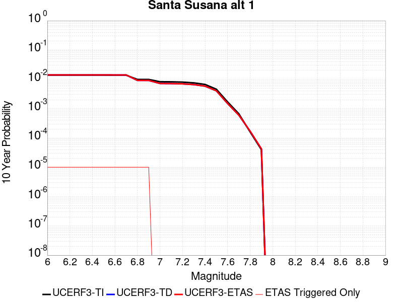 |

| Magnitude | 1 wk TI Prob | 1 wk TD Prob | 1 wk ETAS Prob | 1 wk ETAS/TD Gain | 1 wk ETAS Triggered Only | 1 mo TI Prob | 1 mo TD Prob | 1 mo ETAS Prob | 1 mo ETAS/TD Gain | 1 mo ETAS Triggered Only | 1 yr TI Prob | 1 yr TD Prob | 1 yr ETAS Prob | 1 yr ETAS/TD Gain | 1 yr ETAS Triggered Only | 10 yr TI Prob | 10 yr TD Prob | 10 yr ETAS Prob | 10 yr ETAS/TD Gain | 10 yr ETAS Triggered Only |
|-----|-----|-----|-----|-----|-----|-----|-----|-----|-----|-----|-----|-----|-----|-----|-----|-----|-----|-----|-----|-----|
| 6.0 | 2.674877E-5 | 2.7198023E-5 | 2.7198023E-5 | 1.0 | 0.0 | 1.1463255E-4 | 1.1655839E-4 | 1.1655839E-4 | 1.0 | 0.0 | 0.0013947578 | 0.0014182882 | 0.001428274 | 1.0070407 | 1.0E-5 | 0.013860362 | 0.014104128 | 0.014113987 | 1.000699 | 1.0E-5 |
| 6.1 | 2.674877E-5 | 2.7198023E-5 | 2.7198023E-5 | 1.0 | 0.0 | 1.1463255E-4 | 1.1655839E-4 | 1.1655839E-4 | 1.0 | 0.0 | 0.0013947578 | 0.0014182882 | 0.001428274 | 1.0070407 | 1.0E-5 | 0.013860362 | 0.014104128 | 0.014113987 | 1.000699 | 1.0E-5 |
| 6.2 | 2.674877E-5 | 2.7198023E-5 | 2.7198023E-5 | 1.0 | 0.0 | 1.1463255E-4 | 1.1655839E-4 | 1.1655839E-4 | 1.0 | 0.0 | 0.0013947578 | 0.0014182882 | 0.001428274 | 1.0070407 | 1.0E-5 | 0.013860362 | 0.014104128 | 0.014113987 | 1.000699 | 1.0E-5 |
| 6.3 | 2.674877E-5 | 2.7198023E-5 | 2.7198023E-5 | 1.0 | 0.0 | 1.1463255E-4 | 1.1655839E-4 | 1.1655839E-4 | 1.0 | 0.0 | 0.0013947578 | 0.0014182882 | 0.001428274 | 1.0070407 | 1.0E-5 | 0.013860362 | 0.014104128 | 0.014113987 | 1.000699 | 1.0E-5 |
| 6.4 | 2.674877E-5 | 2.7198023E-5 | 2.7198023E-5 | 1.0 | 0.0 | 1.1463255E-4 | 1.1655839E-4 | 1.1655839E-4 | 1.0 | 0.0 | 0.0013947578 | 0.0014182882 | 0.001428274 | 1.0070407 | 1.0E-5 | 0.013860362 | 0.014104128 | 0.014113987 | 1.000699 | 1.0E-5 |
| 6.5 | 2.674877E-5 | 2.7198023E-5 | 2.7198023E-5 | 1.0 | 0.0 | 1.1463255E-4 | 1.1655839E-4 | 1.1655839E-4 | 1.0 | 0.0 | 0.0013947578 | 0.0014182882 | 0.001428274 | 1.0070407 | 1.0E-5 | 0.013860362 | 0.014104128 | 0.014113987 | 1.000699 | 1.0E-5 |
| 6.6 | 2.6647976E-5 | 2.7074359E-5 | 2.7074359E-5 | 1.0 | 0.0 | 1.14200615E-4 | 1.1602845E-4 | 1.1602845E-4 | 1.0 | 0.0 | 0.0013895056 | 0.0014118447 | 0.0014218307 | 1.0070729 | 1.0E-5 | 0.013808494 | 0.014040513 | 0.014050373 | 1.0007023 | 1.0E-5 |
| 6.7 | 2.6647976E-5 | 2.7074359E-5 | 2.7074359E-5 | 1.0 | 0.0 | 1.14200615E-4 | 1.1602845E-4 | 1.1602845E-4 | 1.0 | 0.0 | 0.0013895056 | 0.0014118447 | 0.0014218307 | 1.0070729 | 1.0E-5 | 0.013808494 | 0.014040513 | 0.014050373 | 1.0007023 | 1.0E-5 |
| 6.8 | 1.9073179E-5 | 1.7637283E-5 | 1.7637283E-5 | 1.0 | 0.0 | 8.1739636E-5 | 7.558627E-5 | 7.558627E-5 | 1.0 | 0.0 | 9.947256E-4 | 9.198925E-4 | 9.298833E-4 | 1.0108608 | 1.0E-5 | 0.009902848 | 0.009163101 | 0.00917301 | 1.0010813 | 1.0E-5 |
| 6.9 | 1.9041876E-5 | 1.7619415E-5 | 1.7619415E-5 | 1.0 | 0.0 | 8.160549E-5 | 7.55097E-5 | 7.55097E-5 | 1.0 | 0.0 | 9.930939E-4 | 9.1896096E-4 | 9.289518E-4 | 1.0108719 | 1.0E-5 | 0.0098866755 | 0.0091538625 | 0.009163771 | 1.0010824 | 1.0E-5 |
| 7.0 | 1.5917482E-5 | 1.3863864E-5 | 1.3863864E-5 | 1.0 | 0.0 | 6.8215995E-5 | 5.9415237E-5 | 5.9415237E-5 | 1.0 | 0.0 | 8.302132E-4 | 7.231451E-4 | 7.231451E-4 | 1.0 | 0.0 | 0.008271185 | 0.0072088144 | 0.0072088144 | 1.0 | 0.0 |
| 7.1 | 1.577788E-5 | 1.3743872E-5 | 1.3743872E-5 | 1.0 | 0.0 | 6.761774E-5 | 5.8901005E-5 | 5.8901005E-5 | 1.0 | 0.0 | 8.2293496E-4 | 7.1688846E-4 | 7.1688846E-4 | 1.0 | 0.0 | 0.008198941 | 0.007146652 | 0.007146652 | 1.0 | 0.0 |
| 7.2 | 1.5416446E-5 | 1.3469944E-5 | 1.3469944E-5 | 1.0 | 0.0 | 6.606882E-5 | 5.772708E-5 | 5.772708E-5 | 1.0 | 0.0 | 8.0409093E-4 | 7.026052E-4 | 7.026052E-4 | 1.0 | 0.0 | 0.008011877 | 0.0070047234 | 0.0070047234 | 1.0 | 0.0 |
| 7.3 | 1.4534083E-5 | 1.2717879E-5 | 1.2717879E-5 | 1.0 | 0.0 | 6.228744E-5 | 5.4504082E-5 | 5.4504082E-5 | 1.0 | 0.0 | 7.580857E-4 | 6.633896E-4 | 6.633896E-4 | 1.0 | 0.0 | 0.007555048 | 0.0066149444 | 0.0066149444 | 1.0 | 0.0 |
| 7.4 | 1.2858995E-5 | 1.1229652E-5 | 1.1229652E-5 | 1.0 | 0.0 | 5.5108816E-5 | 4.8126214E-5 | 4.8126214E-5 | 1.0 | 0.0 | 6.7074323E-4 | 5.857831E-4 | 5.857831E-4 | 1.0 | 0.0 | 0.0066872234 | 0.005843165 | 0.005843165 | 1.0 | 0.0 |
| 7.5 | 8.827668E-6 | 7.805457E-6 | 7.805457E-6 | 1.0 | 0.0 | 3.7832317E-5 | 3.3451546E-5 | 3.3451546E-5 | 1.0 | 0.0 | 4.605111E-4 | 4.071989E-4 | 4.071989E-4 | 1.0 | 0.0 | 0.0045955796 | 0.0040647765 | 0.0040647765 | 1.0 | 0.0 |
| 7.6 | 3.2533426E-6 | 2.871988E-6 | 2.871988E-6 | 1.0 | 0.0 | 1.3942822E-5 | 1.2308465E-5 | 1.2308465E-5 | 1.0 | 0.0 | 1.6974064E-4 | 1.4984563E-4 | 1.4984563E-4 | 1.0 | 0.0 | 0.0016961104 | 0.0014974826 | 0.0014974826 | 1.0 | 0.0 |
| 7.7 | 1.2751709E-6 | 1.1491089E-6 | 1.1491089E-6 | 1.0 | 0.0 | 5.4650063E-6 | 4.9247437E-6 | 4.9247437E-6 | 1.0 | 0.0 | 6.653442E-5 | 5.9957198E-5 | 5.9957198E-5 | 1.0 | 0.0 | 6.6514505E-4 | 5.994191E-4 | 5.994191E-4 | 1.0 | 0.0 |
| 7.8 | 3.067544E-7 | 3.2400436E-7 | 3.2400436E-7 | 1.0 | 0.0 | 1.3146611E-6 | 1.3885895E-6 | 1.3885895E-6 | 1.0 | 0.0 | 1.600588E-5 | 1.6905957E-5 | 1.6905957E-5 | 1.0 | 0.0 | 1.6004729E-4 | 1.6904772E-4 | 1.6904772E-4 | 1.0 | 0.0 |
| 7.9 | 7.622999E-8 | 8.087964E-8 | 8.087964E-8 | 1.0 | 0.0 | 3.2669993E-7 | 3.4662696E-7 | 3.4662696E-7 | 1.0 | 0.0 | 3.977564E-6 | 4.2201773E-6 | 4.2201773E-6 | 1.0 | 0.0 | 3.977493E-5 | 4.220118E-5 | 4.220118E-5 | 1.0 | 0.0 |

## Calaveras (So) - Paicines extension 2011 CFM
*[(top)](#table-of-contents)*

| 1 Week | 1 Month | 1 Year | 10 Year |
|-----|-----|-----|-----|
|  |  |  |  |

| Magnitude | 1 wk TI Prob | 1 wk TD Prob | 1 wk ETAS Prob | 1 wk ETAS/TD Gain | 1 wk ETAS Triggered Only | 1 mo TI Prob | 1 mo TD Prob | 1 mo ETAS Prob | 1 mo ETAS/TD Gain | 1 mo ETAS Triggered Only | 1 yr TI Prob | 1 yr TD Prob | 1 yr ETAS Prob | 1 yr ETAS/TD Gain | 1 yr ETAS Triggered Only | 10 yr TI Prob | 10 yr TD Prob | 10 yr ETAS Prob | 10 yr ETAS/TD Gain | 10 yr ETAS Triggered Only |
|-----|-----|-----|-----|-----|-----|-----|-----|-----|-----|-----|-----|-----|-----|-----|-----|-----|-----|-----|-----|-----|
| 6.0 | 1.5183659E-4 | 3.0533716E-4 | 3.0533716E-4 | 1.0 | 0.0 | 6.5056595E-4 | 0.0013069661 | 0.0013069661 | 1.0 | 0.0 | 0.007891912 | 0.01569571 | 0.015705554 | 1.0006272 | 1.0E-5 | 0.076174594 | 0.13848671 | 0.13849534 | 1.0000622 | 1.0E-5 |
| 6.1 | 1.5024997E-4 | 3.0227835E-4 | 3.0227835E-4 | 1.0 | 0.0 | 6.437695E-4 | 0.00129387 | 0.00129387 | 1.0 | 0.0 | 0.0078097614 | 0.015539104 | 0.015548949 | 1.0006335 | 1.0E-5 | 0.075409345 | 0.13715632 | 0.13716495 | 1.000063 | 1.0E-5 |
| 6.2 | 1.2743923E-4 | 2.5306802E-4 | 2.5306802E-4 | 1.0 | 0.0 | 5.460538E-4 | 0.0010841049 | 0.0010841049 | 1.0 | 0.0 | 0.0066279583 | 0.013046704 | 0.013056573 | 1.0007565 | 1.0E-5 | 0.064337276 | 0.11725405 | 0.11726287 | 1.0000753 | 1.0E-5 |
| 6.3 | 1.1525114E-4 | 2.2595265E-4 | 2.2595265E-4 | 1.0 | 0.0 | 4.9383997E-4 | 9.6799526E-4 | 9.6799526E-4 | 1.0 | 0.0 | 0.0059959386 | 0.011667927 | 0.011667927 | 1.0 | 0.0 | 0.058367174 | 0.10637007 | 0.10637007 | 1.0 | 0.0 |
| 6.4 | 1.07200925E-4 | 2.0836305E-4 | 2.0836305E-4 | 1.0 | 0.0 | 4.5935164E-4 | 8.926636E-4 | 8.926636E-4 | 1.0 | 0.0 | 0.0055782744 | 0.010772766 | 0.010772766 | 1.0 | 0.0 | 0.0544031 | 0.09919256 | 0.09919256 | 1.0 | 0.0 |
| 6.5 | 9.69631E-5 | 1.8729115E-4 | 1.8729115E-4 | 1.0 | 0.0 | 4.1548995E-4 | 8.024135E-4 | 8.024135E-4 | 1.0 | 0.0 | 0.0050468626 | 0.009694662 | 0.009694662 | 1.0 | 0.0 | 0.04933773 | 0.090084255 | 0.090084255 | 1.0 | 0.0 |
| 6.6 | 8.0552316E-5 | 1.5070537E-4 | 1.5070537E-4 | 1.0 | 0.0 | 3.4517853E-4 | 6.456994E-4 | 6.456994E-4 | 1.0 | 0.0 | 0.0041944524 | 0.007826256 | 0.007826256 | 1.0 | 0.0 | 0.04116161 | 0.074854024 | 0.074854024 | 1.0 | 0.0 |
| 6.7 | 7.815757E-5 | 1.4610609E-4 | 1.4610609E-4 | 1.0 | 0.0 | 3.34918E-4 | 6.260017E-4 | 6.260017E-4 | 1.0 | 0.0 | 0.004070005 | 0.0075890915 | 0.0075890915 | 1.0 | 0.0 | 0.039962657 | 0.072703585 | 0.072703585 | 1.0 | 0.0 |
| 6.8 | 6.965264E-5 | 1.2721405E-4 | 1.2721405E-4 | 1.0 | 0.0 | 2.9847719E-4 | 5.450839E-4 | 5.450839E-4 | 1.0 | 0.0 | 0.0036279052 | 0.00661342 | 0.00661342 | 1.0 | 0.0 | 0.03569247 | 0.06379891 | 0.06379891 | 1.0 | 0.0 |
| 6.9 | 5.8000453E-5 | 1.01435086E-4 | 1.01435086E-4 | 1.0 | 0.0 | 2.4854968E-4 | 4.3464993E-4 | 4.3464993E-4 | 1.0 | 0.0 | 0.0030218933 | 0.0052791284 | 0.0052791284 | 1.0 | 0.0 | 0.029811295 | 0.051501602 | 0.051501602 | 1.0 | 0.0 |
| 7.0 | 4.9865852E-5 | 8.567692E-5 | 8.567692E-5 | 1.0 | 0.0 | 2.1369329E-4 | 3.671356E-4 | 3.671356E-4 | 1.0 | 0.0 | 0.0025986114 | 0.0044608037 | 0.0044608037 | 1.0 | 0.0 | 0.025684336 | 0.043781694 | 0.043781694 | 1.0 | 0.0 |
| 7.1 | 4.283875E-5 | 7.112159E-5 | 7.112159E-5 | 1.0 | 0.0 | 1.8358172E-4 | 3.047715E-4 | 3.047715E-4 | 1.0 | 0.0 | 0.0022328163 | 0.003704336 | 0.003704336 | 1.0 | 0.0 | 0.022105146 | 0.03673583 | 0.03673583 | 1.0 | 0.0 |
| 7.2 | 3.450115E-5 | 5.5776054E-5 | 5.5776054E-5 | 1.0 | 0.0 | 1.478537E-4 | 2.390185E-4 | 2.390185E-4 | 1.0 | 0.0 | 0.0017986323 | 0.0029061958 | 0.0029061958 | 1.0 | 0.0 | 0.017841442 | 0.029079199 | 0.029079199 | 1.0 | 0.0 |
| 7.3 | 2.5709045E-5 | 4.0588155E-5 | 4.0588155E-5 | 1.0 | 0.0 | 1.1017697E-4 | 1.7393773E-4 | 1.7393773E-4 | 1.0 | 0.0 | 0.0013405791 | 0.002115652 | 0.002115652 | 1.0 | 0.0 | 0.013325208 | 0.021297242 | 0.021297242 | 1.0 | 0.0 |
| 7.4 | 1.8003093E-5 | 2.8509934E-5 | 2.8509934E-5 | 1.0 | 0.0 | 7.715383E-5 | 1.2217973E-4 | 1.2217973E-4 | 1.0 | 0.0 | 9.3894306E-4 | 0.0014865254 | 0.0014865254 | 1.0 | 0.0 | 0.009349857 | 0.015052196 | 0.015052196 | 1.0 | 0.0 |
| 7.5 | 1.5595824E-5 | 2.5822499E-5 | 2.5822499E-5 | 1.0 | 0.0 | 6.683753E-5 | 1.1066317E-4 | 1.1066317E-4 | 1.0 | 0.0 | 8.134431E-4 | 0.0013464936 | 0.0013464936 | 1.0 | 0.0 | 0.008104719 | 0.01365213 | 0.01365213 | 1.0 | 0.0 |
| 7.6 | 1.1110309E-5 | 1.9222098E-5 | 1.9222098E-5 | 1.0 | 0.0 | 4.761474E-5 | 8.2377825E-5 | 8.2377825E-5 | 1.0 | 0.0 | 5.795553E-4 | 0.0010024898 | 0.0010024898 | 1.0 | 0.0 | 0.0057804612 | 0.010203943 | 0.010203943 | 1.0 | 0.0 |
| 7.7 | 6.2140443E-6 | 1.0437076E-5 | 1.0437076E-5 | 1.0 | 0.0 | 2.6631347E-5 | 4.4729557E-5 | 4.4729557E-5 | 1.0 | 0.0 | 3.241884E-4 | 5.444464E-4 | 5.444464E-4 | 1.0 | 0.0 | 0.0032371588 | 0.005619835 | 0.005619835 | 1.0 | 0.0 |
| 7.8 | 5.305533E-6 | 9.433038E-6 | 9.433038E-6 | 1.0 | 0.0 | 2.27378E-5 | 4.042668E-5 | 4.042668E-5 | 1.0 | 0.0 | 2.7679754E-4 | 4.920837E-4 | 4.920837E-4 | 1.0 | 0.0 | 0.0027645302 | 0.005074324 | 0.005074324 | 1.0 | 0.0 |
| 7.9 | 3.363505E-6 | 7.3848937E-6 | 7.3848937E-6 | 1.0 | 0.0 | 1.4414942E-5 | 3.164916E-5 | 3.164916E-5 | 1.0 | 0.0 | 1.7548777E-4 | 3.8526047E-4 | 3.8526047E-4 | 1.0 | 0.0 | 0.0017534926 | 0.003948527 | 0.003948527 | 1.0 | 0.0 |
| 8.0 | 2.0271132E-6 | 4.413104E-6 | 4.413104E-6 | 1.0 | 0.0 | 8.687599E-6 | 1.8913164E-5 | 1.8913164E-5 | 1.0 | 0.0 | 1.05766376E-4 | 2.302435E-4 | 2.302435E-4 | 1.0 | 0.0 | 0.0010571606 | 0.002351099 | 0.002351099 | 1.0 | 0.0 |
| 8.1 | 1.2206116E-6 | 2.3751331E-6 | 2.3751331E-6 | 1.0 | 0.0 | 5.2311816E-6 | 1.0179103E-5 | 1.0179103E-5 | 1.0 | 0.0 | 6.3687774E-5 | 1.2392356E-4 | 1.2392356E-4 | 1.0 | 0.0 | 6.366953E-4 | 0.0012705477 | 0.0012705477 | 1.0 | 0.0 |

