# Parent Section Magnitude-Probability Distributions

Only fault sections with at least one triggered aftershock are plotted. Sections are sorted by total supraseismogenic trigger rate (decreasing)

## Table Of Contents

* [Tank Canyon](#tank-canyon)
* [Garlock (Central)](#garlock-central)
* [Panamint Valley](#panamint-valley)
* [Little Lake](#little-lake)
* [Owl Lake](#owl-lake)
* [Ash Hill](#ash-hill)
* [Garlock (East)](#garlock-east)
* [Blackwater](#blackwater)
* [Gravel Hills-Harper Lk](#gravel-hills-harper-lk)
* [Hunter Mountain-Saline Valley](#hunter-mountain-saline-valley)
* [Goldstone Lake](#goldstone-lake)
* [Airport Lake](#airport-lake)
* [McLean Lake](#mclean-lake)
* [So Sierra Nevada](#so-sierra-nevada)
* [Garlock (West)](#garlock-west)
* [Coyote Canyon](#coyote-canyon)
* [Nelson Lake](#nelson-lake)
* [Lenwood-Lockhart-Old Woman Springs](#lenwood-lockhart-old-woman-springs)
* [San Andreas (Mojave S)](#san-andreas-mojave-s)
* [Paradise](#paradise)
* [Death Valley (So)](#death-valley-so)
* [Garlic Springs](#garlic-springs)
* [Bicycle Lake](#bicycle-lake)
* [Helendale-So Lockhart](#helendale-so-lockhart)
* [San Andreas (San Bernardino N)](#san-andreas-san-bernardino-n)
* [Cleghorn Lake](#cleghorn-lake)
* [San Andreas (Mojave N)](#san-andreas-mojave-n)
* [Death Valley (Black Mtns Frontal)](#death-valley-black-mtns-frontal)
* [Elsinore (Glen Ivy) rev](#elsinore-glen-ivy-rev)
* [Mission Ridge-Arroyo Parida-Santa Ana](#mission-ridge-arroyo-parida-santa-ana)
* [Towne Pass](#towne-pass)
* [San Andreas (San Bernardino S)](#san-andreas-san-bernardino-s)
* [Coyote Lake](#coyote-lake)
* [San Andreas (Coachella) rev](#san-andreas-coachella-rev)
* [Scodie Lineament](#scodie-lineament)
* [San Andreas (Big Bend)](#san-andreas-big-bend)
* [Red Pass](#red-pass)
* [San Andreas (Cholame) rev](#san-andreas-cholame-rev)
* [Imperial](#imperial)
* [San Diego Trough north alt1](#san-diego-trough-north-alt1)
* [Dry Mountain](#dry-mountain)
* [Calico-Hidalgo](#calico-hidalgo)
* [Owens Valley](#owens-valley)
* [Death Valley (No)](#death-valley-no)
* [Channel Islands Thrust](#channel-islands-thrust)
* [Sierra Nevada  (No Extension)](#sierra-nevada--no-extension)
* [San Andreas (Carrizo) rev](#san-andreas-carrizo-rev)
* [Brawley (Seismic Zone) alt 1](#brawley-seismic-zone-alt-1)
* [White Wolf (Extension)](#white-wolf-extension)
* [Lake Isabella (Seismicity)](#lake-isabella-seismicity)
* [Santa Ynez (East)](#santa-ynez-east)
* [Cleghorn Pass](#cleghorn-pass)
* [San Andreas (San Gorgonio Pass-Garnet HIll)](#san-andreas-san-gorgonio-pass-garnet-hill)
* [Hosgri](#hosgri)
* [Blue Cut](#blue-cut)
* [San Gregorio (North) 2011 CFM](#san-gregorio-north-2011-cfm)
* [Hosgri (Extension)](#hosgri-extension)
* [White Mountains](#white-mountains)
* [San Andreas (Parkfield)](#san-andreas-parkfield)
* [Hayward (No) 2011 CFM](#hayward-no-2011-cfm)
* [Hayward (So) extension 2011 CFM](#hayward-so-extension-2011-cfm)
* [Great Valley 08 (Quinto)](#great-valley-08-quinto)
* [Goose Lake 2011 CFM](#goose-lake-2011-cfm)
* [Pleito](#pleito)
* [Ludlow](#ludlow)
* [Manix-Afton Hills](#manix-afton-hills)
* [Santa Cruz Island](#santa-cruz-island)
* [Emerson-Copper Mtn 2011](#emerson-copper-mtn-2011)
* [Likely 2011 CFM](#likely-2011-cfm)
* [Cady](#cady)
* [Hayward (So) 2011 CFM](#hayward-so-2011-cfm)
* [White Wolf](#white-wolf)
* [Rodgers Creek - Healdsburg 2011 CFM](#rodgers-creek---healdsburg-2011-cfm)
* [Great Valley 01](#great-valley-01)
* [San Andreas (Creeping Section) 2011 CFM](#san-andreas-creeping-section-2011-cfm)
* [San Diego Trough south](#san-diego-trough-south)
* [Santa Ynez (West)](#santa-ynez-west)
* [Thirty Mile Bank](#thirty-mile-bank)
* [Death Valley (Fish Lake Valley)](#death-valley-fish-lake-valley)
* [Lost Hills](#lost-hills)
* [Big Pine (East)](#big-pine-east)
* [Camp Rock 2011](#camp-rock-2011)
* [Sheephole](#sheephole)

## Tank Canyon
*[(top)](#table-of-contents)*

| 1 Week | 1 Month | 1 Year | 10 Year |
|-----|-----|-----|-----|
|  |  |  |  |

| Magnitude | 1 wk TI Prob | 1 wk TD Prob | 1 wk ETAS Prob | 1 wk ETAS/TD Gain | 1 wk ETAS Triggered Only | 1 mo TI Prob | 1 mo TD Prob | 1 mo ETAS Prob | 1 mo ETAS/TD Gain | 1 mo ETAS Triggered Only | 1 yr TI Prob | 1 yr TD Prob | 1 yr ETAS Prob | 1 yr ETAS/TD Gain | 1 yr ETAS Triggered Only | 10 yr TI Prob | 10 yr TD Prob | 10 yr ETAS Prob | 10 yr ETAS/TD Gain | 10 yr ETAS Triggered Only |
|-----|-----|-----|-----|-----|-----|-----|-----|-----|-----|-----|-----|-----|-----|-----|-----|-----|-----|-----|-----|-----|
| 6.0 | 4.8284557E-5 | 5.7964822E-5 | 0.035785742 | 617.37 | 0.035729848 | 2.0691741E-4 | 2.4840087E-4 | 0.050054472 | 201.50684 | 0.049818445 | 0.0025163088 | 0.0030207601 | 0.08150482 | 26.98156 | 0.07872186 | 0.02488006 | 0.029863637 | 0.13497935 | 4.5198565 | 0.10835149 |
| 6.1 | 1.7796336E-5 | 2.0873314E-5 | 0.011930574 | 571.5706 | 0.01190995 | 7.626778E-5 | 8.945422E-5 | 0.01824324 | 203.9394 | 0.01815541 | 9.281647E-4 | 0.0010885983 | 0.03373276 | 30.987339 | 0.03267974 | 0.009242975 | 0.010836744 | 0.05781661 | 5.3352385 | 0.047494553 |
| 6.2 | 1.7796336E-5 | 2.0873314E-5 | 0.011930574 | 571.5706 | 0.01190995 | 7.626778E-5 | 8.945422E-5 | 0.01824324 | 203.9394 | 0.01815541 | 9.281647E-4 | 0.0010885983 | 0.03373276 | 30.987339 | 0.03267974 | 0.009242975 | 0.010836744 | 0.05781661 | 5.3352385 | 0.047494553 |
| 6.3 | 1.3515912E-5 | 1.5759564E-5 | 0.009165942 | 581.6114 | 0.009150327 | 5.792405E-5 | 6.753938E-5 | 0.01430042 | 211.73454 | 0.014233842 | 7.049971E-4 | 8.2200574E-4 | 0.025638191 | 31.189795 | 0.024836602 | 0.007027647 | 0.0081922645 | 0.044493724 | 5.4311876 | 0.03660131 |
| 6.4 | 1.0870146E-5 | 1.2618021E-5 | 0.006403242 | 507.468 | 0.0063907043 | 4.658551E-5 | 5.4076212E-5 | 0.0100753205 | 186.31706 | 0.010021786 | 5.67031E-4 | 6.581969E-4 | 0.019091953 | 29.006445 | 0.018445896 | 0.005655863 | 0.0065644905 | 0.03325811 | 5.0663657 | 0.026870007 |
| 6.5 | 7.964826E-6 | 9.196094E-6 | 0.0046569384 | 506.40396 | 0.004647785 | 3.4134522E-5 | 3.9411298E-5 | 0.0074465265 | 188.94397 | 0.0074074073 | 4.1550855E-4 | 4.7973756E-4 | 0.013400189 | 27.932331 | 0.012926652 | 0.0041473247 | 0.004788321 | 0.02343499 | 4.8941975 | 0.018736383 |
| 6.6 | 6.6317E-6 | 7.6122988E-6 | 0.0027672136 | 363.5188 | 0.0027596224 | 2.8421264E-5 | 3.2623782E-5 | 0.0046802573 | 143.46152 | 0.004647785 | 3.4597394E-4 | 3.9713128E-4 | 0.008817896 | 22.203983 | 0.008424111 | 0.0034543579 | 0.003965368 | 0.016840762 | 4.2469606 | 0.012926652 |
| 6.7 | 4.793663E-6 | 5.4307857E-6 | 0.0011673707 | 214.9543 | 0.0011619462 | 2.0544108E-5 | 2.3274613E-5 | 0.0024923529 | 107.08462 | 0.002469136 | 2.500958E-4 | 2.8333595E-4 | 0.0052202083 | 18.424095 | 0.004938272 | 0.0024981452 | 0.0028304397 | 0.010361713 | 3.660814 | 0.0075526508 |
| 6.8 | 4.382823E-6 | 4.9692567E-6 | 0.0010216672 | 205.59758 | 0.001016703 | 1.8783392E-5 | 2.1296666E-5 | 0.0023451396 | 110.11769 | 0.0023238924 | 2.286638E-4 | 2.5926033E-4 | 0.0047606346 | 18.362373 | 0.004502542 | 0.0022842865 | 0.002590253 | 0.009399005 | 3.6286051 | 0.0068264343 |
| 6.9 | 2.729601E-6 | 3.0735416E-6 | 8.745306E-4 | 284.53513 | 8.714597E-4 | 1.1698237E-5 | 1.3172262E-5 | 0.0014655859 | 111.26305 | 0.0014524328 | 1.4241673E-4 | 1.6036171E-4 | 0.0026291015 | 16.394821 | 0.002469136 | 0.001423255 | 0.0016026258 | 0.004647847 | 2.9001446 | 0.003050109 |
| 7.0 | 1.8987357E-6 | 2.126939E-6 | 5.8309885E-4 | 274.1493 | 5.809731E-4 | 8.137413E-6 | 9.115425E-6 | 0.0010258091 | 112.53552 | 0.001016703 | 9.90685E-5 | 1.1097535E-4 | 0.001563247 | 14.086434 | 0.0014524328 | 9.902435E-4 | 0.0011092679 | 0.0029953362 | 2.7002819 | 0.0018881627 |
| 7.1 | 1.4928986E-6 | 1.6641272E-6 | 2.9215022E-4 | 175.55762 | 2.9048655E-4 | 6.398121E-6 | 7.1319573E-6 | 2.9761644E-4 | 41.72998 | 2.9048655E-4 | 7.789434E-5 | 8.682871E-5 | 5.2252074E-4 | 6.017833 | 4.3572986E-4 | 7.786704E-4 | 8.6800574E-4 | 0.0014484746 | 1.6687385 | 5.809731E-4 |
| 7.2 | 1.069082E-6 | 1.1828573E-6 | 2.9166907E-4 | 246.58011 | 2.9048655E-4 | 4.581772E-6 | 5.0693816E-6 | 2.9555446E-4 | 58.30188 | 2.9048655E-4 | 5.5781646E-5 | 6.171851E-5 | 3.5218714E-4 | 5.706346 | 2.9048655E-4 | 5.576765E-4 | 6.170659E-4 | 9.073732E-4 | 1.470464 | 2.9048655E-4 |
| 7.3 | 8.776551E-7 | 9.770005E-7 | 2.9146328E-4 | 298.32462 | 2.9048655E-4 | 3.7613736E-6 | 4.1871413E-6 | 2.946725E-4 | 70.37558 | 2.9048655E-4 | 4.579376E-5 | 5.097777E-5 | 3.4144951E-4 | 6.698008 | 2.9048655E-4 | 4.5784327E-4 | 5.097118E-4 | 8.000503E-4 | 1.5696131 | 2.9048655E-4 |
| 7.4 | 7.55721E-7 | 8.510244E-7 | 2.9133735E-4 | 342.33722 | 2.9048655E-4 | 3.2388E-6 | 3.6472454E-6 | 2.9413274E-4 | 80.64518 | 2.9048655E-4 | 3.9431678E-5 | 4.4404827E-5 | 3.3487848E-4 | 7.5414886 | 2.9048655E-4 | 3.942468E-4 | 4.440104E-4 | 7.34368E-4 | 1.6539432 | 2.9048655E-4 |
| 7.5 | 5.587665E-7 | 6.305619E-7 | 6.305619E-7 | 1.0 | 0.0 | 2.3947114E-6 | 2.702408E-6 | 2.702408E-6 | 1.0 | 0.0 | 2.915522E-5 | 3.290182E-5 | 3.290182E-5 | 1.0 | 0.0 | 2.9151395E-4 | 3.290182E-4 | 3.290182E-4 | 1.0 | 0.0 |

## Garlock (Central)
*[(top)](#table-of-contents)*

| 1 Week | 1 Month | 1 Year | 10 Year |
|-----|-----|-----|-----|
|  |  |  |  |

| Magnitude | 1 wk TI Prob | 1 wk TD Prob | 1 wk ETAS Prob | 1 wk ETAS/TD Gain | 1 wk ETAS Triggered Only | 1 mo TI Prob | 1 mo TD Prob | 1 mo ETAS Prob | 1 mo ETAS/TD Gain | 1 mo ETAS Triggered Only | 1 yr TI Prob | 1 yr TD Prob | 1 yr ETAS Prob | 1 yr ETAS/TD Gain | 1 yr ETAS Triggered Only | 10 yr TI Prob | 10 yr TD Prob | 10 yr ETAS Prob | 10 yr ETAS/TD Gain | 10 yr ETAS Triggered Only |
|-----|-----|-----|-----|-----|-----|-----|-----|-----|-----|-----|-----|-----|-----|-----|-----|-----|-----|-----|-----|-----|
| 6.0 | 5.5131142E-5 | 7.024681E-5 | 0.011398427 | 162.26256 | 0.011328976 | 2.3625491E-4 | 3.010234E-4 | 0.0155469775 | 51.647076 | 0.015250545 | 0.0028726095 | 0.0036588663 | 0.027536323 | 7.5259166 | 0.02396514 | 0.028357591 | 0.036079824 | 0.0685605 | 1.900245 | 0.033696443 |
| 6.1 | 5.5131142E-5 | 7.024681E-5 | 0.011398427 | 162.26256 | 0.011328976 | 2.3625491E-4 | 3.010234E-4 | 0.0155469775 | 51.647076 | 0.015250545 | 0.0028726095 | 0.0036588663 | 0.027536323 | 7.5259166 | 0.02396514 | 0.028357591 | 0.036079824 | 0.0685605 | 1.900245 | 0.033696443 |
| 6.2 | 4.216245E-5 | 5.1661493E-5 | 0.007603922 | 147.18742 | 0.0075526508 | 1.806837E-4 | 2.2138779E-4 | 0.0099505335 | 44.94617 | 0.0097313 | 0.0021976046 | 0.0026920962 | 0.018336141 | 6.811102 | 0.015686275 | 0.021759989 | 0.026689773 | 0.04831889 | 1.8103896 | 0.022222223 |
| 6.3 | 4.216245E-5 | 5.1661493E-5 | 0.007603922 | 147.18742 | 0.0075526508 | 1.806837E-4 | 2.2138779E-4 | 0.0099505335 | 44.94617 | 0.0097313 | 0.0021976046 | 0.0026920962 | 0.018336141 | 6.811102 | 0.015686275 | 0.021759989 | 0.026689773 | 0.04831889 | 1.8103896 | 0.022222223 |
| 6.4 | 3.6858168E-5 | 4.411054E-5 | 0.005127401 | 116.239815 | 0.005083515 | 1.5795401E-4 | 1.8903162E-4 | 0.00686896 | 36.337624 | 0.006681191 | 0.0019213937 | 0.002299056 | 0.013601986 | 5.9163356 | 0.011328976 | 0.019048655 | 0.02284894 | 0.03945412 | 1.7267375 | 0.016993465 |
| 6.5 | 3.39199E-5 | 4.0018083E-5 | 0.004687617 | 117.137474 | 0.004647785 | 1.453629E-4 | 1.7149492E-4 | 0.00598023 | 34.871178 | 0.0058097313 | 0.0017683565 | 0.002085973 | 0.012086854 | 5.7943482 | 0.010021786 | 0.017543508 | 0.020759864 | 0.035409354 | 1.705664 | 0.014960058 |
| 6.6 | 3.3571985E-5 | 3.9472274E-5 | 0.0046870736 | 118.743454 | 0.004647785 | 1.4387199E-4 | 1.6915603E-4 | 0.0059779044 | 35.33959 | 0.0058097313 | 0.0017502342 | 0.0020575512 | 0.011913773 | 5.7902684 | 0.009876544 | 0.017365133 | 0.020481179 | 0.03499257 | 1.7085232 | 0.014814815 |
| 6.7 | 3.2580007E-5 | 3.8088703E-5 | 0.004540459 | 119.207504 | 0.004502542 | 1.3962112E-4 | 1.632272E-4 | 0.005826791 | 35.697426 | 0.005664488 | 0.0016985617 | 0.0019855013 | 0.01140757 | 5.7454357 | 0.009440813 | 0.016856372 | 0.019773813 | 0.033583827 | 1.6983991 | 0.014088598 |
| 6.8 | 3.2185937E-5 | 3.7515918E-5 | 0.004539889 | 121.01233 | 0.004502542 | 1.3793244E-4 | 1.6077272E-4 | 0.00582435 | 36.227226 | 0.005664488 | 0.0016780337 | 0.001955672 | 0.011378022 | 5.8179603 | 0.009440813 | 0.016654192 | 0.019480614 | 0.033152346 | 1.701812 | 0.0139433555 |
| 6.9 | 3.165394E-5 | 3.6720503E-5 | 0.004393859 | 119.65682 | 0.0043572984 | 1.3565269E-4 | 1.5736422E-4 | 0.0056757405 | 36.067543 | 0.005519245 | 0.0016503202 | 0.001914247 | 0.010902093 | 5.695238 | 0.009005084 | 0.01638118 | 0.019073246 | 0.032180764 | 1.6872201 | 0.013362382 |
| 7.0 | 3.0903822E-5 | 3.5625766E-5 | 0.004102293 | 115.149605 | 0.004066812 | 1.3243823E-4 | 1.5267303E-4 | 0.005380633 | 35.24285 | 0.0052287583 | 0.0016112428 | 0.0018572307 | 0.010265696 | 5.527421 | 0.008424111 | 0.015996104 | 0.018512413 | 0.0307721 | 1.6622413 | 0.012490923 |
| 7.1 | 3.0069863E-5 | 3.4392073E-5 | 0.0039558257 | 115.02145 | 0.003921569 | 1.2886449E-4 | 1.4738638E-4 | 0.005230152 | 35.485992 | 0.005083515 | 0.0015677959 | 0.0017929734 | 0.009767031 | 5.4473934 | 0.00798838 | 0.01556781 | 0.017880075 | 0.029577073 | 1.6541917 | 0.01190995 |
| 7.2 | 2.7957109E-5 | 3.128145E-5 | 0.00366225 | 117.074165 | 0.0036310821 | 1.1981068E-4 | 1.340566E-4 | 0.004635995 | 34.58237 | 0.004502542 | 0.0014577188 | 0.0016309366 | 0.008881257 | 5.4454947 | 0.0072621643 | 0.014481937 | 0.016283695 | 0.02699956 | 1.6580733 | 0.010893246 |
| 7.3 | 2.4519275E-5 | 2.6714795E-5 | 0.002641024 | 98.85998 | 0.0026143792 | 1.0507837E-4 | 1.1448703E-4 | 0.0031642467 | 27.638472 | 0.003050109 | 0.0012785783 | 0.001393003 | 0.0063243955 | 4.540116 | 0.004938272 | 0.012712469 | 0.013928054 | 0.021661952 | 1.5552748 | 0.007843138 |
| 7.4 | 2.3225532E-5 | 2.51994E-5 | 0.0022037937 | 87.454216 | 0.0021786492 | 9.95342E-5 | 1.0799304E-4 | 0.0027220899 | 25.20616 | 0.0026143792 | 0.0012111551 | 0.0013140367 | 0.005520557 | 4.20122 | 0.0042120554 | 0.012045753 | 0.013145725 | 0.020169089 | 1.5342698 | 0.007116921 |
| 7.5 | 2.097765E-5 | 2.2483688E-5 | 0.0017653638 | 78.51754 | 0.0017429194 | 8.9901114E-5 | 9.635517E-5 | 0.0022747945 | 23.608433 | 0.0021786492 | 0.0010939965 | 0.0011725046 | 0.004654256 | 3.969499 | 0.0034858389 | 0.010886264 | 0.011740365 | 0.017481888 | 1.4890412 | 0.0058097313 |
| 7.6 | 1.511254E-5 | 1.5991332E-5 | 8.874371E-4 | 55.49488 | 8.714597E-4 | 6.476642E-5 | 6.853253E-5 | 0.0010851658 | 15.834318 | 0.001016703 | 7.882459E-4 | 8.3407195E-4 | 0.0024304155 | 2.9139159 | 0.0015976761 | 0.007854558 | 0.008383559 | 0.01097602 | 1.3092316 | 0.0026143792 |
| 7.7 | 9.934069E-6 | 1.0678794E-5 | 1.5592053E-4 | 14.600949 | 1.4524328E-4 | 4.2573887E-5 | 4.5765457E-5 | 1.910021E-4 | 4.173499 | 1.4524328E-4 | 5.182138E-4 | 5.570524E-4 | 8.473771E-4 | 1.5211804 | 2.9048655E-4 | 0.00517007 | 0.005627684 | 0.0062053874 | 1.1026539 | 5.809731E-4 |
| 7.8 | 6.7562896E-6 | 8.428449E-6 | 1.5367051E-4 | 18.232359 | 1.4524328E-4 | 2.8955206E-5 | 3.6121426E-5 | 1.8135946E-4 | 5.020828 | 1.4524328E-4 | 3.5247262E-4 | 4.3968976E-4 | 7.3004863E-4 | 1.660372 | 2.9048655E-4 | 0.0035191406 | 0.004446654 | 0.0048804465 | 1.0975548 | 4.3572986E-4 |
| 7.9 | 3.975453E-6 | 5.37103E-6 | 5.37103E-6 | 1.0 | 0.0 | 1.7037546E-5 | 2.3018498E-5 | 2.3018498E-5 | 1.0 | 0.0 | 2.0741238E-4 | 2.8021427E-4 | 2.8021427E-4 | 1.0 | 0.0 | 0.002072189 | 0.0028336283 | 0.00297846 | 1.0511117 | 1.4524328E-4 |
| 8.0 | 1.6729537E-6 | 2.0775144E-6 | 2.0775144E-6 | 1.0 | 0.0 | 7.169782E-6 | 8.903603E-6 | 8.903603E-6 | 1.0 | 0.0 | 8.7288594E-5 | 1.0839601E-4 | 1.0839601E-4 | 1.0 | 0.0 | 8.7254314E-4 | 0.0010969337 | 0.0012420177 | 1.1322632 | 1.4524328E-4 |
| 8.1 | 3.6733252E-7 | 3.1489964E-7 | 3.1489964E-7 | 1.0 | 0.0 | 1.5742813E-6 | 1.3495693E-6 | 1.3495693E-6 | 1.0 | 0.0 | 1.9166706E-5 | 1.6430899E-5 | 1.6430899E-5 | 1.0 | 0.0 | 1.9165053E-4 | 1.6638759E-4 | 1.6638759E-4 | 1.0 | 0.0 |

## Panamint Valley
*[(top)](#table-of-contents)*

| 1 Week | 1 Month | 1 Year | 10 Year |
|-----|-----|-----|-----|
|  |  |  |  |

| Magnitude | 1 wk TI Prob | 1 wk TD Prob | 1 wk ETAS Prob | 1 wk ETAS/TD Gain | 1 wk ETAS Triggered Only | 1 mo TI Prob | 1 mo TD Prob | 1 mo ETAS Prob | 1 mo ETAS/TD Gain | 1 mo ETAS Triggered Only | 1 yr TI Prob | 1 yr TD Prob | 1 yr ETAS Prob | 1 yr ETAS/TD Gain | 1 yr ETAS Triggered Only | 10 yr TI Prob | 10 yr TD Prob | 10 yr ETAS Prob | 10 yr ETAS/TD Gain | 10 yr ETAS Triggered Only |
|-----|-----|-----|-----|-----|-----|-----|-----|-----|-----|-----|-----|-----|-----|-----|-----|-----|-----|-----|-----|-----|
| 6.0 | 3.0211835E-5 | 3.3984514E-5 | 0.0051173265 | 150.5782 | 0.005083515 | 1.2947287E-4 | 1.4563995E-4 | 0.0072615244 | 49.85943 | 0.007116921 | 0.0015751923 | 0.0017717537 | 0.014385531 | 8.119374 | 0.012636165 | 0.015640736 | 0.017583137 | 0.035990078 | 2.0468519 | 0.018736383 |
| 6.1 | 3.0211835E-5 | 3.3984514E-5 | 0.0051173265 | 150.5782 | 0.005083515 | 1.2947287E-4 | 1.4563995E-4 | 0.0072615244 | 49.85943 | 0.007116921 | 0.0015751923 | 0.0017717537 | 0.014385531 | 8.119374 | 0.012636165 | 0.015640736 | 0.017583137 | 0.035990078 | 2.0468519 | 0.018736383 |
| 6.2 | 3.0211835E-5 | 3.3984514E-5 | 0.0051173265 | 150.5782 | 0.005083515 | 1.2947287E-4 | 1.4563995E-4 | 0.0072615244 | 49.85943 | 0.007116921 | 0.0015751923 | 0.0017717537 | 0.014385531 | 8.119374 | 0.012636165 | 0.015640736 | 0.017583137 | 0.035990078 | 2.0468519 | 0.018736383 |
| 6.3 | 2.8573924E-5 | 3.210268E-5 | 0.0051154546 | 159.34665 | 0.005083515 | 1.2245393E-4 | 1.3757581E-4 | 0.0072535174 | 52.723785 | 0.007116921 | 0.001489857 | 0.0016737265 | 0.013998742 | 8.363817 | 0.012345679 | 0.01479908 | 0.016617801 | 0.03461434 | 2.0829675 | 0.018300654 |
| 6.4 | 2.8573924E-5 | 3.210268E-5 | 0.0051154546 | 159.34665 | 0.005083515 | 1.2245393E-4 | 1.3757581E-4 | 0.0072535174 | 52.723785 | 0.007116921 | 0.001489857 | 0.0016737265 | 0.013998742 | 8.363817 | 0.012345679 | 0.01479908 | 0.016617801 | 0.03461434 | 2.0829675 | 0.018300654 |
| 6.5 | 2.7468774E-5 | 3.0828433E-5 | 0.0049689477 | 161.18068 | 0.004938272 | 1.1771801E-4 | 1.3211532E-4 | 0.007102872 | 53.762665 | 0.0069716778 | 0.0014322745 | 0.0016073446 | 0.01378817 | 8.578229 | 0.012200436 | 0.014230782 | 0.015963677 | 0.03382926 | 2.1191397 | 0.01815541 |
| 6.6 | 2.6135967E-5 | 2.925248E-5 | 0.0045316624 | 154.9155 | 0.004502542 | 1.1200648E-4 | 1.253619E-4 | 0.006515265 | 51.971653 | 0.0063907043 | 0.0013628257 | 0.0015252391 | 0.012691914 | 8.321262 | 0.011183733 | 0.013544982 | 0.015154043 | 0.031889986 | 2.104388 | 0.016993465 |
| 6.7 | 2.4498746E-5 | 2.7341335E-5 | 0.004094042 | 149.73819 | 0.004066812 | 1.04990395E-4 | 1.1717203E-4 | 0.006071449 | 51.81654 | 0.005954975 | 0.0012775084 | 0.0014256609 | 0.011578196 | 8.121283 | 0.01016703 | 0.012701893 | 0.014171274 | 0.029348886 | 2.0710123 | 0.015395788 |
| 6.8 | 2.2244329E-5 | 2.4935423E-5 | 0.0038011665 | 152.44043 | 0.0037763254 | 9.532935E-5 | 1.0686185E-4 | 0.0057707448 | 54.001915 | 0.005664488 | 0.0011600169 | 0.0013002884 | 0.010293663 | 7.916446 | 0.009005084 | 0.011539802 | 0.0129325185 | 0.026695551 | 2.064219 | 0.0139433555 |
| 6.9 | 1.9902658E-5 | 2.2290267E-5 | 0.0035080514 | 157.38042 | 0.0034858389 | 8.529431E-5 | 9.552632E-5 | 0.0047428673 | 49.64985 | 0.004647785 | 0.0010379635 | 0.0011624309 | 0.007835856 | 6.7409215 | 0.006681191 | 0.010331288 | 0.011568608 | 0.021043766 | 1.8190407 | 0.009586057 |
| 7.0 | 1.8353881E-5 | 2.0566185E-5 | 0.0030706124 | 149.30392 | 0.003050109 | 7.865712E-5 | 8.813792E-5 | 0.004009361 | 45.489624 | 0.003921569 | 9.5722964E-4 | 0.0010725686 | 0.006440806 | 6.0050297 | 0.0053740013 | 0.009531168 | 0.010678849 | 0.018581923 | 1.740068 | 0.00798838 |
| 7.1 | 1.7667631E-5 | 1.9772613E-5 | 0.0024888597 | 125.87409 | 0.002469136 | 7.571623E-5 | 8.473711E-5 | 0.0029893566 | 35.278008 | 0.0029048657 | 9.2145515E-4 | 0.0010312037 | 0.005093822 | 4.939686 | 0.004066812 | 0.009176437 | 0.010269073 | 0.016450398 | 1.6019361 | 0.0062454613 |
| 7.2 | 1.6381597E-5 | 1.8158249E-5 | 0.0023420085 | 128.97766 | 0.0023238924 | 7.020495E-5 | 7.781885E-5 | 0.0028372265 | 36.459373 | 0.0027596224 | 8.544101E-4 | 9.4704994E-4 | 0.004719799 | 4.9836855 | 0.0037763254 | 0.008511325 | 0.009434792 | 0.014901964 | 1.5794692 | 0.005519245 |
| 7.3 | 1.4520491E-5 | 1.5966476E-5 | 0.00204934 | 128.35268 | 0.002033406 | 6.222919E-5 | 6.842605E-5 | 0.002537393 | 37.082264 | 0.002469136 | 7.57377E-4 | 8.327849E-4 | 0.004315721 | 5.1822753 | 0.0034858389 | 0.0075480095 | 0.00829975 | 0.013052998 | 1.5726976 | 0.0047930283 |
| 7.4 | 1.2852287E-5 | 1.4145411E-5 | 0.0020475227 | 144.74818 | 0.002033406 | 5.5080065E-5 | 6.062187E-5 | 0.002529608 | 41.727646 | 0.002469136 | 6.7039346E-4 | 7.378371E-4 | 0.0040759677 | 5.524211 | 0.0033405954 | 0.0066837464 | 0.0073567946 | 0.011970387 | 1.6271199 | 0.004647785 |
| 7.5 | 1.1637851E-5 | 1.2836797E-5 | 0.0017557339 | 136.7735 | 0.0017429194 | 4.987555E-5 | 5.5013777E-5 | 0.0022335432 | 40.59971 | 0.0021786492 | 6.070656E-4 | 6.6960254E-4 | 0.0035725231 | 5.335289 | 0.0029048657 | 0.006054099 | 0.0066787465 | 0.01086267 | 1.6264535 | 0.0042120554 |
| 7.6 | 3.0068115E-6 | 3.3330316E-6 | 4.3906143E-4 | 131.73035 | 4.3572986E-4 | 1.2886271E-5 | 1.4284384E-5 | 5.9524924E-4 | 41.671326 | 5.809731E-4 | 1.5687906E-4 | 1.7390578E-4 | 8.999959E-4 | 5.175193 | 7.262164E-4 | 0.0015676835 | 0.0017391363 | 0.0028990617 | 1.6669549 | 0.0011619462 |

## Little Lake
*[(top)](#table-of-contents)*

| 1 Week | 1 Month | 1 Year | 10 Year |
|-----|-----|-----|-----|
|  |  |  |  |

| Magnitude | 1 wk TI Prob | 1 wk TD Prob | 1 wk ETAS Prob | 1 wk ETAS/TD Gain | 1 wk ETAS Triggered Only | 1 mo TI Prob | 1 mo TD Prob | 1 mo ETAS Prob | 1 mo ETAS/TD Gain | 1 mo ETAS Triggered Only | 1 yr TI Prob | 1 yr TD Prob | 1 yr ETAS Prob | 1 yr ETAS/TD Gain | 1 yr ETAS Triggered Only | 10 yr TI Prob | 10 yr TD Prob | 10 yr ETAS Prob | 10 yr ETAS/TD Gain | 10 yr ETAS Triggered Only |
|-----|-----|-----|-----|-----|-----|-----|-----|-----|-----|-----|-----|-----|-----|-----|-----|-----|-----|-----|-----|-----|
| 6.0 | 2.8424427E-5 | 3.120572E-5 | 0.0072931433 | 233.71173 | 0.0072621643 | 1.2181328E-4 | 1.337327E-4 | 0.009863731 | 73.757065 | 0.0097313 | 0.0014820677 | 0.0016271127 | 0.016272815 | 10.001038 | 0.014669571 | 0.014722223 | 0.016165402 | 0.03374153 | 2.0872684 | 0.017864924 |
| 6.1 | 2.8424427E-5 | 3.120572E-5 | 0.0072931433 | 233.71173 | 0.0072621643 | 1.2181328E-4 | 1.337327E-4 | 0.009863731 | 73.757065 | 0.0097313 | 0.0014820677 | 0.0016271127 | 0.016272815 | 10.001038 | 0.014669571 | 0.014722223 | 0.016165402 | 0.03374153 | 2.0872684 | 0.017864924 |
| 6.2 | 2.8424427E-5 | 3.120572E-5 | 0.0072931433 | 233.71173 | 0.0072621643 | 1.2181328E-4 | 1.337327E-4 | 0.009863731 | 73.757065 | 0.0097313 | 0.0014820677 | 0.0016271127 | 0.016272815 | 10.001038 | 0.014669571 | 0.014722223 | 0.016165402 | 0.03374153 | 2.0872684 | 0.017864924 |
| 6.3 | 1.48860645E-5 | 1.6081389E-5 | 0.0035018642 | 217.7588 | 0.0034858389 | 6.379586E-5 | 6.8918576E-5 | 0.0042806836 | 62.112183 | 0.0042120554 | 7.7643775E-4 | 8.3878887E-4 | 0.007224133 | 8.612576 | 0.0063907043 | 0.007737305 | 0.008359048 | 0.015992595 | 1.9132077 | 0.007697894 |
| 6.4 | 1.48860645E-5 | 1.6081389E-5 | 0.0035018642 | 217.7588 | 0.0034858389 | 6.379586E-5 | 6.8918576E-5 | 0.0042806836 | 62.112183 | 0.0042120554 | 7.7643775E-4 | 8.3878887E-4 | 0.007224133 | 8.612576 | 0.0063907043 | 0.007737305 | 0.008359048 | 0.015992595 | 1.9132077 | 0.007697894 |
| 6.5 | 1.2797581E-5 | 1.3765565E-5 | 0.0029185913 | 212.02118 | 0.0029048657 | 5.4845623E-5 | 5.899409E-5 | 0.0036898619 | 62.5463 | 0.0036310821 | 6.675408E-4 | 7.18042E-4 | 0.0065236017 | 9.085264 | 0.0058097313 | 0.006655392 | 0.00715977 | 0.013793125 | 1.926476 | 0.006681191 |
| 6.6 | 9.661896E-6 | 1.0289038E-5 | 0.0024793993 | 240.97487 | 0.002469136 | 4.1407468E-5 | 4.409522E-5 | 0.0032393066 | 73.461624 | 0.0031953522 | 5.040193E-4 | 5.367433E-4 | 0.005762695 | 10.736407 | 0.0052287583 | 0.005028777 | 0.0053560743 | 0.011134689 | 2.0788898 | 0.0058097313 |
| 6.7 | 7.767871E-6 | 8.199687E-6 | 0.0017511048 | 213.55753 | 0.0017429194 | 3.329045E-5 | 3.5141118E-5 | 0.0025041902 | 71.26097 | 0.002469136 | 4.0523586E-4 | 4.2777284E-4 | 0.0046380265 | 10.842264 | 0.0042120554 | 0.004044977 | 0.004270846 | 0.009043404 | 2.1174736 | 0.0047930283 |
| 6.8 | 6.4235196E-6 | 6.7357446E-6 | 0.0011686742 | 173.50334 | 0.0011619462 | 2.752908E-5 | 2.8867229E-5 | 0.0016264973 | 56.34407 | 0.0015976761 | 3.35115E-4 | 3.5141467E-4 | 0.0034004517 | 9.676465 | 0.003050109 | 0.003346101 | 0.00350985 | 0.0071281875 | 2.0309095 | 0.0036310821 |
| 6.9 | 3.1283696E-6 | 3.1121804E-6 | 2.9359784E-4 | 94.33831 | 2.9048655E-4 | 1.3407229E-5 | 1.3337856E-5 | 4.490619E-4 | 33.66822 | 4.3572986E-4 | 1.6322079E-4 | 1.6237781E-4 | 0.0011789157 | 7.260325 | 0.001016703 | 0.0016310095 | 0.00162274 | 0.0027828007 | 1.7148777 | 0.0011619462 |
| 7.0 | 2.290603E-6 | 2.2286815E-6 | 2.927146E-4 | 131.3398 | 2.9048655E-4 | 9.816834E-6 | 9.551463E-6 | 3.0003526E-4 | 31.41249 | 2.9048655E-4 | 1.19513395E-4 | 1.162839E-4 | 8.4241584E-4 | 7.2444754 | 7.262164E-4 | 0.0011944914 | 0.0011623327 | 0.0018877051 | 1.624066 | 7.262164E-4 |
| 7.1 | 1.293693E-6 | 1.1776827E-6 | 1.1776827E-6 | 1.0 | 0.0 | 5.5443866E-6 | 5.0472063E-6 | 5.0472063E-6 | 1.0 | 0.0 | 6.750081E-5 | 6.14487E-5 | 3.519174E-4 | 5.7270117 | 2.9048655E-4 | 6.7480316E-4 | 6.143856E-4 | 9.046937E-4 | 1.4725177 | 2.9048655E-4 |
| 7.2 | 4.715842E-7 | 3.0917857E-7 | 3.0917857E-7 | 1.0 | 0.0 | 2.0210737E-6 | 1.3250503E-6 | 1.3250503E-6 | 1.0 | 0.0 | 2.4606294E-5 | 1.6132375E-5 | 1.6137332E-4 | 10.003073 | 1.4524328E-4 | 2.460357E-4 | 1.6131258E-4 | 3.0653243E-4 | 1.9002389 | 1.4524328E-4 |
| 7.3 | 3.9430947E-7 | 2.3097488E-7 | 2.3097488E-7 | 1.0 | 0.0 | 1.6898966E-6 | 9.89892E-7 | 9.89892E-7 | 1.0 | 0.0 | 2.0574296E-5 | 1.2051869E-5 | 1.572934E-4 | 13.051371 | 1.4524328E-4 | 2.0572392E-4 | 1.20512224E-4 | 2.65738E-4 | 2.205071 | 1.4524328E-4 |
| 7.4 | 3.547123E-7 | 1.9679135E-7 | 1.9679135E-7 | 1.0 | 0.0 | 1.5201948E-6 | 8.4339126E-7 | 8.4339126E-7 | 1.0 | 0.0 | 1.8508214E-5 | 1.0268241E-5 | 1.5551003E-4 | 15.144759 | 1.4524328E-4 | 1.8506673E-4 | 1.02677724E-4 | 2.479061E-4 | 2.4144096 | 1.4524328E-4 |
| 7.5 | 2.6354266E-7 | 1.4423138E-7 | 1.4423138E-7 | 1.0 | 0.0 | 1.129468E-6 | 6.181344E-7 | 6.181344E-7 | 1.0 | 0.0 | 1.3751187E-5 | 7.5257603E-6 | 1.5276796E-4 | 20.299337 | 1.4524328E-4 | 1.3750336E-4 | 7.5255106E-5 | 2.2048746E-4 | 2.929867 | 1.4524328E-4 |
| 7.6 | 1.269913E-7 | 7.572556E-8 | 7.572556E-8 | 1.0 | 0.0 | 5.4424834E-7 | 3.245381E-7 | 3.245381E-7 | 1.0 | 0.0 | 6.6262032E-6 | 3.9512443E-6 | 1.4919395E-4 | 37.758728 | 1.4524328E-4 | 6.626006E-5 | 3.9511775E-5 | 1.8474933E-4 | 4.675804 | 1.4524328E-4 |

## Owl Lake
*[(top)](#table-of-contents)*

| 1 Week | 1 Month | 1 Year | 10 Year |
|-----|-----|-----|-----|
| 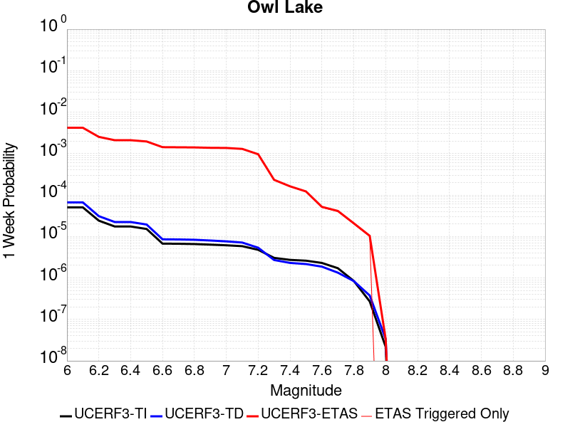 |  |  |  |

| Magnitude | 1 wk TI Prob | 1 wk TD Prob | 1 wk ETAS Prob | 1 wk ETAS/TD Gain | 1 wk ETAS Triggered Only | 1 mo TI Prob | 1 mo TD Prob | 1 mo ETAS Prob | 1 mo ETAS/TD Gain | 1 mo ETAS Triggered Only | 1 yr TI Prob | 1 yr TD Prob | 1 yr ETAS Prob | 1 yr ETAS/TD Gain | 1 yr ETAS Triggered Only | 10 yr TI Prob | 10 yr TD Prob | 10 yr ETAS Prob | 10 yr ETAS/TD Gain | 10 yr ETAS Triggered Only |
|-----|-----|-----|-----|-----|-----|-----|-----|-----|-----|-----|-----|-----|-----|-----|-----|-----|-----|-----|-----|-----|
| 6.0 | 5.0320643E-5 | 6.635816E-5 | 0.0044233673 | 66.65899 | 0.0043572984 | 2.1564208E-4 | 2.843674E-4 | 0.0062376484 | 21.935177 | 0.005954975 | 0.0026222812 | 0.0034577388 | 0.013734355 | 3.9720626 | 0.010312273 | 0.02591553 | 0.034140717 | 0.048169173 | 1.4109011 | 0.0145243285 |
| 6.1 | 5.0320643E-5 | 6.635816E-5 | 0.0044233673 | 66.65899 | 0.0043572984 | 2.1564208E-4 | 2.843674E-4 | 0.0062376484 | 21.935177 | 0.005954975 | 0.0026222812 | 0.0034577388 | 0.013734355 | 3.9720626 | 0.010312273 | 0.02591553 | 0.034140717 | 0.048169173 | 1.4109011 | 0.0145243285 |
| 6.2 | 2.4125871E-5 | 3.0981035E-5 | 0.002645279 | 85.38382 | 0.0026143792 | 1.0339249E-4 | 1.3277028E-4 | 0.0037633702 | 28.344975 | 0.0036310821 | 0.0012580766 | 0.001615439 | 0.008575854 | 5.3086834 | 0.0069716778 | 0.012509781 | 0.016070465 | 0.02535956 | 1.5780228 | 0.009440813 |
| 6.3 | 1.7433485E-5 | 2.2355514E-5 | 0.002055716 | 91.95566 | 0.002033406 | 7.471279E-5 | 9.580672E-5 | 0.0031456235 | 32.833015 | 0.003050109 | 9.0924866E-4 | 0.0011659743 | 0.0069689318 | 5.976917 | 0.0058097313 | 0.009055373 | 0.011628896 | 0.019093718 | 1.6419201 | 0.0075526508 |
| 6.4 | 1.7433485E-5 | 2.2355514E-5 | 0.002055716 | 91.95566 | 0.002033406 | 7.471279E-5 | 9.580672E-5 | 0.0031456235 | 32.833015 | 0.003050109 | 9.0924866E-4 | 0.0011659743 | 0.0069689318 | 5.976917 | 0.0058097313 | 0.009055373 | 0.011628896 | 0.019093718 | 1.6419201 | 0.0075526508 |
| 6.5 | 1.5182742E-5 | 1.9429144E-5 | 0.0020527956 | 105.65548 | 0.002033406 | 6.506727E-5 | 8.326596E-5 | 0.003133121 | 37.627872 | 0.003050109 | 7.919061E-4 | 0.0010134429 | 0.00667219 | 6.5836864 | 0.005664488 | 0.0078909 | 0.010118429 | 0.017450884 | 1.7246635 | 0.0074074073 |
| 6.6 | 6.7271576E-6 | 8.547361E-6 | 0.0016062098 | 187.9188 | 0.0015976761 | 2.8830356E-5 | 3.6631063E-5 | 0.0022152006 | 60.473278 | 0.0021786492 | 3.5095305E-4 | 4.458976E-4 | 0.0045108963 | 10.11644 | 0.004066812 | 0.0035039932 | 0.004467813 | 0.009239427 | 2.0679977 | 0.0047930283 |
| 6.7 | 6.682835E-6 | 8.479807E-6 | 0.0016061424 | 189.40788 | 0.0015976761 | 2.8640408E-5 | 3.6341557E-5 | 0.0022149116 | 60.94708 | 0.0021786492 | 3.4864116E-4 | 4.4237426E-4 | 0.004507387 | 10.18908 | 0.004066812 | 0.003480947 | 0.0044327388 | 0.009059922 | 2.0438654 | 0.004647785 |
| 6.8 | 6.5774975E-6 | 8.32628E-6 | 0.0016059891 | 192.88193 | 0.0015976761 | 2.8188972E-5 | 3.5683603E-5 | 0.002214255 | 62.052452 | 0.0021786492 | 3.4314668E-4 | 4.343669E-4 | 0.004354232 | 10.024319 | 0.003921569 | 0.0034261728 | 0.004352885 | 0.008835828 | 2.0298786 | 0.004502542 |
| 6.9 | 6.363419E-6 | 7.999454E-6 | 0.0014604207 | 182.56503 | 0.0014524328 | 2.727151E-5 | 3.428296E-5 | 0.0020676192 | 60.31041 | 0.002033406 | 3.3198006E-4 | 4.1732067E-4 | 0.0040468876 | 9.697309 | 0.0036310821 | 0.0033148455 | 0.0041828766 | 0.008377314 | 2.0027637 | 0.0042120554 |
| 7.0 | 6.1342453E-6 | 7.6316555E-6 | 0.0014600534 | 191.31541 | 0.0014524328 | 2.6289357E-5 | 3.2706717E-5 | 0.0020660462 | 63.168865 | 0.002033406 | 3.2002592E-4 | 3.9813702E-4 | 0.0040277736 | 10.116551 | 0.0036310821 | 0.0031956544 | 0.003991571 | 0.008042149 | 2.0147831 | 0.004066812 |
| 7.1 | 5.842926E-6 | 7.142211E-6 | 0.0014595647 | 204.35753 | 0.0014524328 | 2.504087E-5 | 3.0609146E-5 | 0.0020639529 | 67.42928 | 0.002033406 | 3.0482994E-4 | 3.7260808E-4 | 0.0037119589 | 9.9621 | 0.0033405954 | 0.0030441214 | 0.0037370329 | 0.007499246 | 2.006738 | 0.0037763254 |
| 7.2 | 4.77173E-6 | 5.358483E-6 | 0.0011672985 | 217.84122 | 0.0011619462 | 2.045011E-5 | 2.2964748E-5 | 0.0014753642 | 64.244736 | 0.0014524328 | 2.4895166E-4 | 2.79564E-4 | 0.0028932123 | 10.349015 | 0.0026143792 | 0.0024867293 | 0.002808645 | 0.005705352 | 2.031354 | 0.0029048657 |
| 7.3 | 3.0494948E-6 | 2.710463E-6 | 4.3843914E-4 | 161.75803 | 4.3572986E-4 | 1.3069198E-5 | 1.1616219E-5 | 4.47341E-4 | 38.510036 | 4.3572986E-4 | 1.5910587E-4 | 1.4141845E-4 | 0.0010127549 | 7.1614056 | 8.714597E-4 | 0.0015899199 | 0.0014232415 | 0.0022934608 | 1.6114348 | 8.714597E-4 |
| 7.4 | 2.7263884E-6 | 2.3056762E-6 | 2.9279158E-4 | 126.98729 | 2.9048655E-4 | 1.1684469E-5 | 9.881433E-6 | 3.0036512E-4 | 30.396921 | 2.9048655E-4 | 1.4224913E-4 | 1.20299905E-4 | 7.012031E-4 | 5.828792 | 5.809731E-4 | 0.0014215811 | 0.0012112238 | 0.0017914933 | 1.479077 | 5.809731E-4 |
| 7.5 | 2.6090431E-6 | 2.1656133E-6 | 1.4740859E-4 | 68.067825 | 1.4524328E-4 | 1.1181565E-5 | 9.281167E-6 | 1.545231E-4 | 16.649103 | 1.4524328E-4 | 1.3612706E-4 | 1.1299244E-4 | 4.0344617E-4 | 3.570559 | 2.9048655E-4 | 0.001360437 | 0.0011379806 | 0.0014281366 | 1.2549745 | 2.9048655E-4 |
| 7.6 | 2.3008756E-6 | 1.8727933E-6 | 1.471158E-4 | 78.554214 | 1.4524328E-4 | 9.860858E-6 | 8.0262325E-6 | 1.5326835E-4 | 19.095926 | 1.4524328E-4 | 1.20049335E-4 | 9.7715085E-5 | 3.8817327E-4 | 3.9725008 | 2.9048655E-4 | 0.001199845 | 9.849932E-4 | 0.0012751936 | 1.2946218 | 2.9048655E-4 |
| 7.7 | 1.7184348E-6 | 1.3419171E-6 | 1.4658501E-4 | 109.23551 | 1.4524328E-4 | 7.3646997E-6 | 5.7510606E-6 | 1.5099351E-4 | 26.254896 | 1.4524328E-4 | 8.966153E-5 | 7.0016955E-5 | 2.1525007E-4 | 3.0742562 | 1.4524328E-4 | 8.962536E-4 | 7.078345E-4 | 8.5297495E-4 | 1.2050486 | 1.4524328E-4 |
| 7.8 | 8.4612907E-7 | 8.4058576E-7 | 1.4608375E-4 | 173.78804 | 1.4524328E-4 | 3.6262625E-6 | 3.6025056E-6 | 1.4884527E-4 | 41.31715 | 1.4524328E-4 | 4.4148852E-5 | 4.3859643E-5 | 1.8909655E-4 | 4.311402 | 1.4524328E-4 | 4.414008E-4 | 4.4398365E-4 | 5.891624E-4 | 1.3269913 | 1.4524328E-4 |
| 7.9 | 2.716738E-7 | 3.768106E-7 | 3.768106E-7 | 1.0 | 0.0 | 1.1643157E-6 | 1.6149015E-6 | 1.6149015E-6 | 1.0 | 0.0 | 1.4175452E-5 | 1.966126E-5 | 1.966126E-5 | 1.0 | 0.0 | 1.4174548E-4 | 1.9836679E-4 | 1.9836679E-4 | 1.0 | 0.0 |
| 8.0 | 2.1995428E-8 | 3.384878E-8 | 3.384878E-8 | 1.0 | 0.0 | 9.426611E-8 | 1.4506621E-7 | 1.4506621E-7 | 1.0 | 0.0 | 1.1476893E-6 | 1.7661803E-6 | 1.7661803E-6 | 1.0 | 0.0 | 1.14768345E-5 | 1.7963059E-5 | 1.7963059E-5 | 1.0 | 0.0 |

## Ash Hill
*[(top)](#table-of-contents)*

| 1 Week | 1 Month | 1 Year | 10 Year |
|-----|-----|-----|-----|
|  |  |  |  |

| Magnitude | 1 wk TI Prob | 1 wk TD Prob | 1 wk ETAS Prob | 1 wk ETAS/TD Gain | 1 wk ETAS Triggered Only | 1 mo TI Prob | 1 mo TD Prob | 1 mo ETAS Prob | 1 mo ETAS/TD Gain | 1 mo ETAS Triggered Only | 1 yr TI Prob | 1 yr TD Prob | 1 yr ETAS Prob | 1 yr ETAS/TD Gain | 1 yr ETAS Triggered Only | 10 yr TI Prob | 10 yr TD Prob | 10 yr ETAS Prob | 10 yr ETAS/TD Gain | 10 yr ETAS Triggered Only |
|-----|-----|-----|-----|-----|-----|-----|-----|-----|-----|-----|-----|-----|-----|-----|-----|-----|-----|-----|-----|-----|
| 6.0 | 2.1545662E-5 | 2.3194447E-5 | 0.0032184725 | 138.76048 | 0.0031953522 | 9.2335285E-5 | 9.940143E-5 | 0.004601496 | 46.292046 | 0.004502542 | 0.0011236023 | 0.0012096206 | 0.008608067 | 7.1163373 | 0.0074074073 | 0.011179381 | 0.012038348 | 0.023374436 | 1.9416648 | 0.011474219 |
| 6.1 | 2.1545662E-5 | 2.3194447E-5 | 0.0032184725 | 138.76048 | 0.0031953522 | 9.2335285E-5 | 9.940143E-5 | 0.004601496 | 46.292046 | 0.004502542 | 0.0011236023 | 0.0012096206 | 0.008608067 | 7.1163373 | 0.0074074073 | 0.011179381 | 0.012038348 | 0.023374436 | 1.9416648 | 0.011474219 |
| 6.2 | 2.1545662E-5 | 2.3194447E-5 | 0.0032184725 | 138.76048 | 0.0031953522 | 9.2335285E-5 | 9.940143E-5 | 0.004601496 | 46.292046 | 0.004502542 | 0.0011236023 | 0.0012096206 | 0.008608067 | 7.1163373 | 0.0074074073 | 0.011179381 | 0.012038348 | 0.023374436 | 1.9416648 | 0.011474219 |
| 6.3 | 1.0025529E-5 | 1.0746934E-5 | 0.0011726808 | 109.1177 | 0.0011619462 | 4.2965847E-5 | 4.605755E-5 | 0.0022246065 | 48.30058 | 0.0021786492 | 5.229836E-4 | 5.6061964E-4 | 0.00447999 | 7.9911394 | 0.003921569 | 0.005217545 | 0.0055933665 | 0.011370602 | 2.0328727 | 0.0058097313 |
| 6.4 | 1.0025529E-5 | 1.0746934E-5 | 0.0011726808 | 109.1177 | 0.0011619462 | 4.2965847E-5 | 4.605755E-5 | 0.0022246065 | 48.30058 | 0.0021786492 | 5.229836E-4 | 5.6061964E-4 | 0.00447999 | 7.9911394 | 0.003921569 | 0.005217545 | 0.0055933665 | 0.011370602 | 2.0328727 | 0.0058097313 |
| 6.5 | 6.9617327E-6 | 7.456634E-6 | 0.001024152 | 137.34776 | 0.001016703 | 2.9835655E-5 | 3.195666E-5 | 0.001920059 | 60.083218 | 0.0018881627 | 3.6318856E-4 | 3.8901155E-4 | 0.0031475604 | 8.091175 | 0.0027596224 | 0.0036259557 | 0.0038841602 | 0.007790497 | 2.0057094 | 0.003921569 |
| 6.6 | 4.9919777E-6 | 5.3466883E-6 | 4.410742E-4 | 82.49484 | 4.3572986E-4 | 2.1394015E-5 | 2.2914215E-5 | 0.0013300738 | 58.045795 | 0.0013071896 | 2.60441E-4 | 2.7895154E-4 | 0.0023117904 | 8.287426 | 0.002033406 | 0.0026013597 | 0.0027866727 | 0.005828282 | 2.0914843 | 0.003050109 |
| 6.7 | 3.6630722E-6 | 3.924624E-6 | 4.3965277E-4 | 112.024185 | 4.3572986E-4 | 1.5698786E-5 | 1.681974E-5 | 0.0013239873 | 78.71628 | 0.0013071896 | 1.9111596E-4 | 2.0476682E-4 | 0.0019473294 | 9.509984 | 0.0017429194 | 0.0019095168 | 0.0020463446 | 0.0046553737 | 2.2749705 | 0.0026143792 |
| 6.8 | 2.5599613E-6 | 2.744925E-6 | 1.4798781E-4 | 53.913242 | 1.4524328E-4 | 1.0971216E-5 | 1.1763939E-5 | 7.379718E-4 | 62.73169 | 7.262164E-4 | 1.3356637E-4 | 1.4322149E-4 | 0.0010145564 | 7.0838275 | 8.714597E-4 | 0.0013348613 | 0.0014317769 | 0.0027370949 | 1.9116769 | 0.0013071896 |
| 6.9 | 1.7684905E-6 | 1.8968707E-6 | 1.4713987E-4 | 77.56979 | 1.4524328E-4 | 7.579223E-6 | 8.129446E-6 | 2.9861365E-4 | 36.73235 | 2.9048655E-4 | 9.2273134E-5 | 9.8976E-5 | 5.3466274E-4 | 5.4019427 | 4.3572986E-4 | 9.223483E-4 | 9.8976E-4 | 0.0017152576 | 1.7330035 | 7.262164E-4 |

## Garlock (East)
*[(top)](#table-of-contents)*

| 1 Week | 1 Month | 1 Year | 10 Year |
|-----|-----|-----|-----|
|  |  |  |  |

| Magnitude | 1 wk TI Prob | 1 wk TD Prob | 1 wk ETAS Prob | 1 wk ETAS/TD Gain | 1 wk ETAS Triggered Only | 1 mo TI Prob | 1 mo TD Prob | 1 mo ETAS Prob | 1 mo ETAS/TD Gain | 1 mo ETAS Triggered Only | 1 yr TI Prob | 1 yr TD Prob | 1 yr ETAS Prob | 1 yr ETAS/TD Gain | 1 yr ETAS Triggered Only | 10 yr TI Prob | 10 yr TD Prob | 10 yr ETAS Prob | 10 yr ETAS/TD Gain | 10 yr ETAS Triggered Only |
|-----|-----|-----|-----|-----|-----|-----|-----|-----|-----|-----|-----|-----|-----|-----|-----|-----|-----|-----|-----|-----|
| 6.0 | 4.5092507E-5 | 6.290325E-5 | 0.0023866496 | 37.941593 | 0.0023238924 | 1.9323928E-4 | 2.6956003E-4 | 0.003609255 | 13.38943 | 0.0033405954 | 0.0023501497 | 0.0032774 | 0.009357625 | 2.8551977 | 0.006100218 | 0.023254504 | 0.032351844 | 0.041627776 | 1.2867203 | 0.009586057 |
| 6.1 | 4.5092507E-5 | 6.290325E-5 | 0.0023866496 | 37.941593 | 0.0023238924 | 1.9323928E-4 | 2.6956003E-4 | 0.003609255 | 13.38943 | 0.0033405954 | 0.0023501497 | 0.0032774 | 0.009357625 | 2.8551977 | 0.006100218 | 0.023254504 | 0.032351844 | 0.041627776 | 1.2867203 | 0.009586057 |
| 6.2 | 2.6674514E-5 | 3.4509674E-5 | 0.001777369 | 51.503494 | 0.0017429194 | 1.1431433E-4 | 1.4789042E-4 | 0.002761883 | 18.6752 | 0.0026143792 | 0.0013908884 | 0.0017991117 | 0.005568643 | 3.095218 | 0.0037763254 | 0.01382215 | 0.017890299 | 0.024166672 | 1.3508254 | 0.0063907043 |
| 6.3 | 2.6674514E-5 | 3.4509674E-5 | 0.001777369 | 51.503494 | 0.0017429194 | 1.1431433E-4 | 1.4789042E-4 | 0.002761883 | 18.6752 | 0.0026143792 | 0.0013908884 | 0.0017991117 | 0.005568643 | 3.095218 | 0.0037763254 | 0.01382215 | 0.017890299 | 0.024166672 | 1.3508254 | 0.0063907043 |
| 6.4 | 2.5312667E-5 | 3.233893E-5 | 0.001775202 | 54.89365 | 0.0017429194 | 1.0847834E-4 | 1.3858822E-4 | 0.002752605 | 19.861753 | 0.0026143792 | 0.0013199237 | 0.0016860351 | 0.0054559936 | 3.2359905 | 0.0037763254 | 0.013121112 | 0.016778335 | 0.023061814 | 1.3744996 | 0.0063907043 |
| 6.5 | 2.5312667E-5 | 3.233893E-5 | 0.001775202 | 54.89365 | 0.0017429194 | 1.0847834E-4 | 1.3858822E-4 | 0.002752605 | 19.861753 | 0.0026143792 | 0.0013199237 | 0.0016860351 | 0.0054559936 | 3.2359905 | 0.0037763254 | 0.013121112 | 0.016778335 | 0.023061814 | 1.3744996 | 0.0063907043 |
| 6.6 | 2.246556E-5 | 2.8133776E-5 | 0.0017710042 | 62.94939 | 0.0017429194 | 9.627742E-5 | 1.20567885E-4 | 0.002589406 | 21.476748 | 0.002469136 | 0.0011715472 | 0.0014669491 | 0.0049476745 | 3.3727648 | 0.0034858389 | 0.011653901 | 0.01461866 | 0.020200342 | 1.3818189 | 0.005664488 |
| 6.7 | 2.2241198E-5 | 2.7803519E-5 | 0.0017706745 | 63.685265 | 0.0017429194 | 9.531594E-5 | 1.1915263E-4 | 0.0025879943 | 21.719992 | 0.002469136 | 0.0011598538 | 0.0014497414 | 0.0049305265 | 3.4009697 | 0.0034858389 | 0.011538187 | 0.014448853 | 0.020031497 | 1.3863727 | 0.005664488 |
| 6.8 | 1.9528685E-5 | 2.389819E-5 | 0.001766776 | 73.929276 | 0.0017429194 | 8.369167E-5 | 1.0241691E-4 | 0.002280843 | 22.27018 | 0.0021786492 | 0.0010184698 | 0.0012462323 | 0.004437602 | 3.5608149 | 0.0031953522 | 0.010138147 | 0.012436427 | 0.017313285 | 1.3921429 | 0.004938272 |
| 6.9 | 1.3318621E-5 | 1.5198884E-5 | 0.0014676097 | 96.56035 | 0.0014524328 | 5.7078556E-5 | 6.513648E-5 | 0.0015174747 | 23.296848 | 0.0014524328 | 6.9470983E-4 | 7.927538E-4 | 0.0031148042 | 3.9290936 | 0.0023238924 | 0.0069254204 | 0.007939888 | 0.01183032 | 1.4899857 | 0.003921569 |
| 7.0 | 1.1760853E-5 | 1.31077895E-5 | 0.0014655215 | 111.8054 | 0.0014524328 | 5.0402683E-5 | 5.6175057E-5 | 0.0015085263 | 26.854023 | 0.0014524328 | 6.134799E-4 | 6.8372174E-4 | 0.0030060255 | 4.3965626 | 0.0023238924 | 0.0061178906 | 0.00685652 | 0.010751201 | 1.5680258 | 0.003921569 |
| 7.1 | 1.0064758E-5 | 1.0902931E-5 | 0.0014633199 | 134.21346 | 0.0014524328 | 4.3133965E-5 | 4.672603E-5 | 0.001499091 | 32.08257 | 0.0014524328 | 5.2502943E-4 | 5.687444E-4 | 0.0027461546 | 4.828451 | 0.0021786492 | 0.005237907 | 0.0057129986 | 0.00946775 | 1.6572295 | 0.0037763254 |
| 7.2 | 9.768808E-6 | 1.0498807E-5 | 0.0014629164 | 139.3412 | 0.0014524328 | 4.186565E-5 | 4.499413E-5 | 0.0014973616 | 33.27904 | 0.0014524328 | 5.095951E-4 | 5.4766936E-4 | 0.0027251253 | 4.975859 | 0.0021786492 | 0.0050842804 | 0.0055032647 | 0.009258808 | 1.682421 | 0.0037763254 |
| 7.3 | 9.344516E-6 | 9.944468E-6 | 0.001317121 | 132.44762 | 0.0013071896 | 4.004731E-5 | 4.261847E-5 | 0.0013497523 | 31.670595 | 0.0013071896 | 4.8746695E-4 | 5.1875977E-4 | 0.0024059429 | 4.6378746 | 0.0018881627 | 0.0048639905 | 0.0052149445 | 0.008682605 | 1.6649467 | 0.0034858389 |
| 7.4 | 9.023491E-6 | 9.490661E-6 | 0.001026184 | 108.12566 | 0.001016703 | 3.867153E-5 | 4.0673647E-5 | 0.0010573353 | 25.995586 | 0.001016703 | 4.7072413E-4 | 4.950925E-4 | 0.0019468062 | 3.932207 | 0.0014524328 | 0.004697283 | 0.0049783974 | 0.008013322 | 1.6096188 | 0.003050109 |
| 7.5 | 7.081253E-6 | 7.087672E-6 | 7.3329895E-4 | 103.46118 | 7.262164E-4 | 3.0347876E-5 | 3.0375388E-5 | 7.5656973E-4 | 24.907328 | 7.262164E-4 | 3.6942272E-4 | 3.6975832E-4 | 0.0013860854 | 3.7486253 | 0.001016703 | 0.003688092 | 0.0037243143 | 0.005750147 | 1.5439479 | 0.002033406 |
| 7.6 | 6.116396E-6 | 5.959245E-6 | 2.9644408E-4 | 49.745243 | 2.9048655E-4 | 2.6212863E-5 | 2.5539372E-5 | 3.1601853E-4 | 12.373778 | 2.9048655E-4 | 3.1909486E-4 | 3.1089774E-4 | 7.464921E-4 | 2.4010856 | 4.3572986E-4 | 0.0031863707 | 0.0031357552 | 0.00414927 | 1.3232124 | 0.001016703 |
| 7.7 | 4.797145E-6 | 4.757281E-6 | 4.757281E-6 | 1.0 | 0.0 | 2.055903E-5 | 2.0388188E-5 | 2.0388188E-5 | 1.0 | 0.0 | 2.5027743E-4 | 2.4819805E-4 | 2.4819805E-4 | 1.0 | 0.0 | 0.0024999576 | 0.0025093474 | 0.002799105 | 1.1154714 | 2.9048655E-4 |
| 7.8 | 3.4028885E-6 | 3.978462E-6 | 3.978462E-6 | 1.0 | 0.0 | 1.4583726E-5 | 1.7050439E-5 | 1.7050439E-5 | 1.0 | 0.0 | 1.775424E-4 | 2.0756939E-4 | 2.0756939E-4 | 1.0 | 0.0 | 0.0017740062 | 0.0021012232 | 0.0022461612 | 1.068978 | 1.4524328E-4 |
| 7.9 | 2.5928412E-6 | 3.3724489E-6 | 3.3724489E-6 | 1.0 | 0.0 | 1.1112129E-5 | 1.4453272E-5 | 1.4453272E-5 | 1.0 | 0.0 | 1.3528178E-4 | 1.7595445E-4 | 1.7595445E-4 | 1.0 | 0.0 | 0.0013519945 | 0.0017812408 | 0.0019262254 | 1.0813953 | 1.4524328E-4 |
| 8.0 | 1.3743648E-6 | 1.6734747E-6 | 1.6734747E-6 | 1.0 | 0.0 | 5.8901214E-6 | 7.1720146E-6 | 7.1720146E-6 | 1.0 | 0.0 | 7.1709874E-5 | 8.731581E-5 | 8.731581E-5 | 1.0 | 0.0 | 7.1686733E-4 | 8.837234E-4 | 0.0010288383 | 1.1642085 | 1.4524328E-4 |
| 8.1 | 3.6733252E-7 | 3.1489964E-7 | 3.1489964E-7 | 1.0 | 0.0 | 1.5742813E-6 | 1.3495693E-6 | 1.3495693E-6 | 1.0 | 0.0 | 1.9166706E-5 | 1.6430899E-5 | 1.6430899E-5 | 1.0 | 0.0 | 1.9165053E-4 | 1.6638759E-4 | 1.6638759E-4 | 1.0 | 0.0 |

## Blackwater
*[(top)](#table-of-contents)*

| 1 Week | 1 Month | 1 Year | 10 Year |
|-----|-----|-----|-----|
|  |  |  |  |

| Magnitude | 1 wk TI Prob | 1 wk TD Prob | 1 wk ETAS Prob | 1 wk ETAS/TD Gain | 1 wk ETAS Triggered Only | 1 mo TI Prob | 1 mo TD Prob | 1 mo ETAS Prob | 1 mo ETAS/TD Gain | 1 mo ETAS Triggered Only | 1 yr TI Prob | 1 yr TD Prob | 1 yr ETAS Prob | 1 yr ETAS/TD Gain | 1 yr ETAS Triggered Only | 10 yr TI Prob | 10 yr TD Prob | 10 yr ETAS Prob | 10 yr ETAS/TD Gain | 10 yr ETAS Triggered Only |
|-----|-----|-----|-----|-----|-----|-----|-----|-----|-----|-----|-----|-----|-----|-----|-----|-----|-----|-----|-----|-----|
| 6.0 | 3.0708583E-5 | 3.3095846E-5 | 0.0026473885 | 79.991554 | 0.0026143792 | 1.3160157E-4 | 1.4183241E-4 | 0.0037723994 | 26.597584 | 0.0036310821 | 0.0016010714 | 0.0017255784 | 0.007380292 | 4.2769957 | 0.005664488 | 0.015895851 | 0.017135633 | 0.024844373 | 1.449866 | 0.007843138 |
| 6.1 | 3.0708583E-5 | 3.3095846E-5 | 0.0026473885 | 79.991554 | 0.0026143792 | 1.3160157E-4 | 1.4183241E-4 | 0.0037723994 | 26.597584 | 0.0036310821 | 0.0016010714 | 0.0017255784 | 0.007380292 | 4.2769957 | 0.005664488 | 0.015895851 | 0.017135633 | 0.024844373 | 1.449866 | 0.007843138 |
| 6.2 | 1.1707779E-5 | 1.2545122E-5 | 8.8399387E-4 | 70.46515 | 8.714597E-4 | 5.017523E-5 | 5.3763757E-5 | 0.0015061185 | 28.01364 | 0.0014524328 | 6.107122E-4 | 6.5438676E-4 | 0.0026864621 | 4.1053123 | 0.002033406 | 0.006090366 | 0.0065255696 | 0.00970007 | 1.486471 | 0.0031953522 |
| 6.3 | 1.1707779E-5 | 1.2545122E-5 | 8.8399387E-4 | 70.46515 | 8.714597E-4 | 5.017523E-5 | 5.3763757E-5 | 0.0015061185 | 28.01364 | 0.0014524328 | 6.107122E-4 | 6.5438676E-4 | 0.0026864621 | 4.1053123 | 0.002033406 | 0.006090366 | 0.0065255696 | 0.00970007 | 1.486471 | 0.0031953522 |
| 6.4 | 7.929244E-6 | 8.480098E-6 | 4.4420626E-4 | 52.382206 | 4.3572986E-4 | 3.3982033E-5 | 3.6342793E-5 | 6.172948E-4 | 16.985342 | 5.809731E-4 | 4.136527E-4 | 4.423877E-4 | 0.0014586409 | 3.2972002 | 0.001016703 | 0.0041288356 | 0.0044154758 | 0.0062953015 | 1.4257356 | 0.0018881627 |
| 6.5 | 5.8832115E-6 | 6.285991E-6 | 2.9677074E-4 | 47.21145 | 2.9048655E-4 | 2.521352E-5 | 2.6939697E-5 | 3.1741842E-4 | 11.782554 | 2.9048655E-4 | 3.0693135E-4 | 3.27944E-4 | 0.0010539222 | 3.2137263 | 7.262164E-4 | 0.0030650778 | 0.0032748538 | 0.004432995 | 1.3536466 | 0.0011619462 |
| 6.6 | 5.8832115E-6 | 6.285991E-6 | 2.9677074E-4 | 47.21145 | 2.9048655E-4 | 2.521352E-5 | 2.6939697E-5 | 3.1741842E-4 | 11.782554 | 2.9048655E-4 | 3.0693135E-4 | 3.27944E-4 | 0.0010539222 | 3.2137263 | 7.262164E-4 | 0.0030650778 | 0.0032748538 | 0.004432995 | 1.3536466 | 0.0011619462 |
| 6.7 | 3.0715053E-6 | 3.2814662E-6 | 1.4852427E-4 | 45.26156 | 1.4524328E-4 | 1.3163528E-5 | 1.4063357E-5 | 1.593046E-4 | 11.327637 | 1.4524328E-4 | 1.6025416E-4 | 1.7120909E-4 | 3.164275E-4 | 1.8481934 | 1.4524328E-4 | 0.0016013865 | 0.0017108864 | 0.002000876 | 1.1694967 | 2.9048655E-4 |
| 6.8 | 2.2722281E-6 | 2.4287538E-6 | 1.4767169E-4 | 60.801426 | 1.4524328E-4 | 9.738084E-6 | 1.0408908E-5 | 1.5565068E-4 | 14.953603 | 1.4524328E-4 | 1.1855473E-4 | 1.26722E-4 | 2.719469E-4 | 2.1460116 | 1.4524328E-4 | 0.001184915 | 0.0012665876 | 0.0015567063 | 1.2290553 | 2.9048655E-4 |
| 6.9 | 9.952399E-7 | 1.0653489E-6 | 1.0653489E-6 | 1.0 | 0.0 | 4.265307E-6 | 4.5657757E-6 | 4.5657757E-6 | 1.0 | 0.0 | 5.1928873E-5 | 5.5587418E-5 | 5.5587418E-5 | 1.0 | 0.0 | 5.191674E-4 | 5.557858E-4 | 5.557858E-4 | 1.0 | 0.0 |
| 7.0 | 4.7385504E-7 | 5.0755597E-7 | 5.0755597E-7 | 1.0 | 0.0 | 2.0308057E-6 | 2.1752398E-6 | 2.1752398E-6 | 1.0 | 0.0 | 2.4724779E-5 | 2.6483543E-5 | 2.6483543E-5 | 1.0 | 0.0 | 2.4722028E-4 | 2.6483546E-4 | 2.6483546E-4 | 1.0 | 0.0 |

## Gravel Hills-Harper Lk
*[(top)](#table-of-contents)*

| 1 Week | 1 Month | 1 Year | 10 Year |
|-----|-----|-----|-----|
|  |  |  |  |

| Magnitude | 1 wk TI Prob | 1 wk TD Prob | 1 wk ETAS Prob | 1 wk ETAS/TD Gain | 1 wk ETAS Triggered Only | 1 mo TI Prob | 1 mo TD Prob | 1 mo ETAS Prob | 1 mo ETAS/TD Gain | 1 mo ETAS Triggered Only | 1 yr TI Prob | 1 yr TD Prob | 1 yr ETAS Prob | 1 yr ETAS/TD Gain | 1 yr ETAS Triggered Only | 10 yr TI Prob | 10 yr TD Prob | 10 yr ETAS Prob | 10 yr ETAS/TD Gain | 10 yr ETAS Triggered Only |
|-----|-----|-----|-----|-----|-----|-----|-----|-----|-----|-----|-----|-----|-----|-----|-----|-----|-----|-----|-----|-----|
| 6.0 | 3.0679566E-5 | 3.1464646E-5 | 0.0020648066 | 65.62307 | 0.002033406 | 1.3147724E-4 | 1.3484273E-4 | 0.0033297641 | 24.693686 | 0.0031953522 | 0.0015995599 | 0.0016406906 | 0.0057008304 | 3.4746528 | 0.004066812 | 0.015880952 | 0.01630734 | 0.022165203 | 1.3592165 | 0.005954975 |
| 6.1 | 3.0679566E-5 | 3.1464646E-5 | 0.0020648066 | 65.62307 | 0.002033406 | 1.3147724E-4 | 1.3484273E-4 | 0.0033297641 | 24.693686 | 0.0031953522 | 0.0015995599 | 0.0016406906 | 0.0057008304 | 3.4746528 | 0.004066812 | 0.015880952 | 0.01630734 | 0.022165203 | 1.3592165 | 0.005954975 |
| 6.2 | 1.514536E-5 | 1.3635206E-5 | 5.946004E-4 | 43.60773 | 5.809731E-4 | 6.490707E-5 | 5.843536E-5 | 0.001075079 | 18.397747 | 0.001016703 | 7.8995706E-4 | 7.1123015E-4 | 0.0020174899 | 2.8366206 | 0.0013071896 | 0.007871548 | 0.0070907404 | 0.009109728 | 1.2847358 | 0.002033406 |
| 6.3 | 1.514536E-5 | 1.3635206E-5 | 5.946004E-4 | 43.60773 | 5.809731E-4 | 6.490707E-5 | 5.843536E-5 | 0.001075079 | 18.397747 | 0.001016703 | 7.8995706E-4 | 7.1123015E-4 | 0.0020174899 | 2.8366206 | 0.0013071896 | 0.007871548 | 0.0070907404 | 0.009109728 | 1.2847358 | 0.002033406 |
| 6.4 | 1.2532521E-5 | 1.06896905E-5 | 5.916566E-4 | 55.34834 | 5.809731E-4 | 5.37097E-5 | 4.581219E-5 | 7.7199534E-4 | 16.851309 | 7.262164E-4 | 6.537194E-4 | 5.576265E-4 | 0.0014286003 | 2.5619304 | 8.714597E-4 | 0.0065179965 | 0.005562863 | 0.00657391 | 1.1817495 | 0.001016703 |
| 6.5 | 1.1094058E-5 | 9.083664E-6 | 4.4480956E-4 | 48.96808 | 4.3572986E-4 | 4.7545094E-5 | 3.892943E-5 | 4.7464232E-4 | 12.192378 | 4.3572986E-4 | 5.787078E-4 | 4.7386673E-4 | 0.0010545646 | 2.2254455 | 5.809731E-4 | 0.0057720304 | 0.0047289706 | 0.005307196 | 1.1222731 | 5.809731E-4 |
| 6.6 | 9.688328E-6 | 7.5316952E-6 | 1.5277388E-4 | 20.28413 | 1.4524328E-4 | 4.1520743E-5 | 3.227831E-5 | 1.7751691E-4 | 5.4995728 | 1.4524328E-4 | 5.053978E-4 | 3.9292008E-4 | 6.832925E-4 | 1.7390114 | 2.9048655E-4 | 0.0050424994 | 0.0039225104 | 0.0042118574 | 1.0737658 | 2.9048655E-4 |
| 6.7 | 8.974824E-6 | 6.749413E-6 | 1.5199171E-4 | 22.519249 | 1.4524328E-4 | 3.8462964E-5 | 2.8925748E-5 | 1.7416483E-4 | 6.0211005 | 1.4524328E-4 | 4.6818596E-4 | 3.5211627E-4 | 4.973084E-4 | 1.4123415 | 1.4524328E-4 | 0.004672008 | 0.0035158044 | 0.003660537 | 1.0411663 | 1.4524328E-4 |
| 6.8 | 7.4780046E-6 | 5.1161933E-6 | 1.5035873E-4 | 29.38879 | 1.4524328E-4 | 3.20482E-5 | 2.1926366E-5 | 1.6716646E-4 | 7.623993 | 1.4524328E-4 | 3.9011694E-4 | 2.669222E-4 | 4.121267E-4 | 1.5439956 | 1.4524328E-4 | 0.0038943281 | 0.0026661542 | 0.0028110102 | 1.0543314 | 1.4524328E-4 |
| 6.9 | 6.3409307E-6 | 3.9074966E-6 | 1.4915022E-4 | 38.170273 | 1.4524328E-4 | 2.7175134E-5 | 1.6746313E-5 | 1.6198716E-4 | 9.673005 | 1.4524328E-4 | 3.3080703E-4 | 2.0386827E-4 | 3.4908194E-4 | 1.7122916 | 1.4524328E-4 | 0.0033031502 | 0.0020369107 | 0.002181858 | 1.0711604 | 1.4524328E-4 |
| 7.0 | 5.1239335E-6 | 2.6058565E-6 | 1.4784875E-4 | 56.73711 | 1.4524328E-4 | 2.195953E-5 | 1.116791E-5 | 1.5640957E-4 | 14.005268 | 1.4524328E-4 | 2.6732447E-4 | 1.3596108E-4 | 2.8118462E-4 | 2.0681257 | 1.4524328E-4 | 0.0026700313 | 0.0013588042 | 0.0015038501 | 1.1067452 | 1.4524328E-4 |
| 7.1 | 4.438899E-6 | 2.0984728E-6 | 1.4734144E-4 | 70.21366 | 1.4524328E-4 | 1.9023713E-5 | 8.993425E-6 | 1.542354E-4 | 17.149796 | 1.4524328E-4 | 2.315891E-4 | 1.0948967E-4 | 2.5471704E-4 | 2.3264027 | 1.4524328E-4 | 0.002313479 | 0.0010943791 | 0.0012394635 | 1.1325723 | 1.4524328E-4 |
| 7.2 | 3.50367E-6 | 1.2615716E-6 | 1.4650467E-4 | 116.1287 | 1.4524328E-4 | 1.5015643E-5 | 5.4067245E-6 | 1.5064923E-4 | 27.863306 | 1.4524328E-4 | 1.8280011E-4 | 6.582497E-5 | 2.110587E-4 | 3.2063622 | 1.4524328E-4 | 0.0018264982 | 6.580629E-4 | 8.0321066E-4 | 1.2205682 | 1.4524328E-4 |
| 7.3 | 2.561638E-6 | 7.1191585E-7 | 1.459551E-4 | 205.01733 | 1.4524328E-4 | 1.0978401E-5 | 3.0510646E-6 | 1.482939E-4 | 48.60399 | 1.4524328E-4 | 1.3365384E-4 | 3.71461E-5 | 1.8238398E-4 | 4.9099097 | 1.4524328E-4 | 0.0013357349 | 3.7140088E-4 | 5.165902E-4 | 1.3909235 | 1.4524328E-4 |
| 7.4 | 2.0368864E-6 | 5.304837E-7 | 1.457737E-4 | 274.79388 | 1.4524328E-4 | 8.729483E-6 | 2.2734996E-6 | 1.4751645E-4 | 64.885185 | 1.4524328E-4 | 1.06276275E-4 | 2.7679513E-5 | 1.7291878E-4 | 6.2471757 | 1.4524328E-4 | 0.0010622547 | 2.767612E-4 | 4.2196427E-4 | 1.5246512 | 1.4524328E-4 |
| 7.5 | 1.1681728E-6 | 3.6030585E-7 | 1.4560354E-4 | 404.11093 | 1.4524328E-4 | 5.0064455E-6 | 1.544167E-6 | 1.4678722E-4 | 95.059166 | 1.4524328E-4 | 6.0951766E-5 | 1.8800076E-5 | 1.6404063E-4 | 8.72553 | 1.4524328E-4 | 6.093505E-4 | 1.8798532E-4 | 3.3320131E-4 | 1.7724857 | 1.4524328E-4 |
| 7.6 | 1.3154387E-7 | 7.1197384E-8 | 7.1197384E-8 | 1.0 | 0.0 | 5.6375933E-7 | 3.051316E-7 | 3.051316E-7 | 1.0 | 0.0 | 6.863748E-6 | 3.7149728E-6 | 3.7149728E-6 | 1.0 | 0.0 | 6.863536E-5 | 3.7149264E-5 | 3.7149264E-5 | 1.0 | 0.0 |

## Hunter Mountain-Saline Valley
*[(top)](#table-of-contents)*

| 1 Week | 1 Month | 1 Year | 10 Year |
|-----|-----|-----|-----|
|  |  |  | 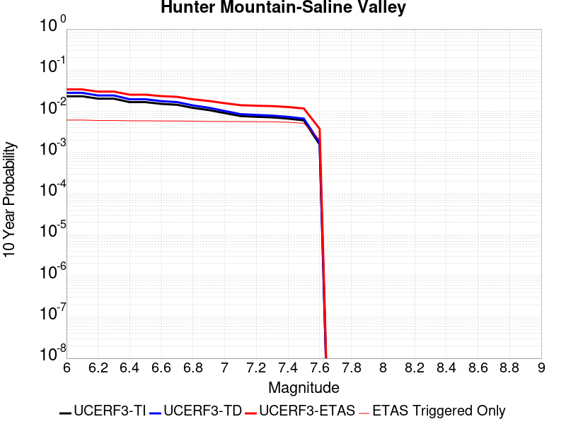 |

| Magnitude | 1 wk TI Prob | 1 wk TD Prob | 1 wk ETAS Prob | 1 wk ETAS/TD Gain | 1 wk ETAS Triggered Only | 1 mo TI Prob | 1 mo TD Prob | 1 mo ETAS Prob | 1 mo ETAS/TD Gain | 1 mo ETAS Triggered Only | 1 yr TI Prob | 1 yr TD Prob | 1 yr ETAS Prob | 1 yr ETAS/TD Gain | 1 yr ETAS Triggered Only | 10 yr TI Prob | 10 yr TD Prob | 10 yr ETAS Prob | 10 yr ETAS/TD Gain | 10 yr ETAS Triggered Only |
|-----|-----|-----|-----|-----|-----|-----|-----|-----|-----|-----|-----|-----|-----|-----|-----|-----|-----|-----|-----|-----|
| 6.0 | 4.5103672E-5 | 5.4570177E-5 | 0.002378336 | 43.583073 | 0.0023238924 | 1.9328714E-4 | 2.3385242E-4 | 0.0029928295 | 12.79794 | 0.0027596224 | 0.002350731 | 0.0028435152 | 0.006898763 | 2.4261389 | 0.004066812 | 0.023260195 | 0.028091887 | 0.033456087 | 1.1909518 | 0.005519245 |
| 6.1 | 4.5103672E-5 | 5.4570177E-5 | 0.002378336 | 43.583073 | 0.0023238924 | 1.9328714E-4 | 2.3385242E-4 | 0.0029928295 | 12.79794 | 0.0027596224 | 0.002350731 | 0.0028435152 | 0.006898763 | 2.4261389 | 0.004066812 | 0.023260195 | 0.028091887 | 0.033456087 | 1.1909518 | 0.005519245 |
| 6.2 | 3.9363465E-5 | 4.706337E-5 | 0.0023708465 | 50.37562 | 0.0023238924 | 1.6868966E-4 | 2.0168544E-4 | 0.0029607513 | 14.680044 | 0.0027596224 | 0.002051862 | 0.0024528175 | 0.0063647674 | 2.59488 | 0.003921569 | 0.020330196 | 0.024273481 | 0.02937532 | 1.2101816 | 0.0052287583 |
| 6.3 | 3.9363465E-5 | 4.706337E-5 | 0.0023708465 | 50.37562 | 0.0023238924 | 1.6868966E-4 | 2.0168544E-4 | 0.0029607513 | 14.680044 | 0.0027596224 | 0.002051862 | 0.0024528175 | 0.0063647674 | 2.59488 | 0.003921569 | 0.020330196 | 0.024273481 | 0.02937532 | 1.2101816 | 0.0052287583 |
| 6.4 | 3.2311684E-5 | 3.795099E-5 | 0.0023617554 | 62.23172 | 0.0023238924 | 1.384713E-4 | 1.6263737E-4 | 0.0029218108 | 17.965189 | 0.0027596224 | 0.0016845843 | 0.0019783843 | 0.005892195 | 2.978286 | 0.003921569 | 0.016718714 | 0.019616475 | 0.024742663 | 1.2613206 | 0.0052287583 |
| 6.5 | 3.2311684E-5 | 3.795099E-5 | 0.0023617554 | 62.23172 | 0.0023238924 | 1.384713E-4 | 1.6263737E-4 | 0.0029218108 | 17.965189 | 0.0027596224 | 0.0016845843 | 0.0019783843 | 0.005892195 | 2.978286 | 0.003921569 | 0.016718714 | 0.019616475 | 0.024742663 | 1.2613206 | 0.0052287583 |
| 6.6 | 2.9305844E-5 | 3.418183E-5 | 0.002357995 | 68.983864 | 0.0023238924 | 1.2559042E-4 | 1.4648569E-4 | 0.0029057038 | 19.836092 | 0.0027596224 | 0.0015279909 | 0.001782067 | 0.0055516628 | 3.115294 | 0.0037763254 | 0.015175272 | 0.01768569 | 0.022679301 | 1.282353 | 0.005083515 |
| 6.7 | 2.7826512E-5 | 3.2344276E-5 | 0.0023561616 | 72.84633 | 0.0023238924 | 1.19251024E-4 | 1.386113E-4 | 0.0028978512 | 20.906313 | 0.0027596224 | 0.0014509142 | 0.0016863465 | 0.0054563037 | 3.2355769 | 0.0037763254 | 0.014414776 | 0.016743187 | 0.021741588 | 1.2985334 | 0.005083515 |
| 6.8 | 2.3389874E-5 | 2.6866714E-5 | 0.0022054573 | 82.088844 | 0.0021786492 | 1.0023846E-4 | 1.15138246E-4 | 0.0027292164 | 23.703821 | 0.0026143792 | 0.00121972 | 0.001400954 | 0.005026949 | 3.5882328 | 0.0036310821 | 0.01213047 | 0.013927434 | 0.018796928 | 1.3496332 | 0.004938272 |
| 6.9 | 2.069209E-5 | 2.3570032E-5 | 0.0020569281 | 87.26878 | 0.002033406 | 8.867737E-5 | 1.01010715E-4 | 0.002569897 | 25.441828 | 0.002469136 | 0.0010791123 | 0.0012291478 | 0.0047107018 | 3.8324945 | 0.0034858389 | 0.010738871 | 0.012228523 | 0.01696294 | 1.3871617 | 0.0047930283 |
| 7.0 | 1.7462342E-5 | 1.9633546E-5 | 0.0020529996 | 104.56591 | 0.002033406 | 7.483646E-5 | 8.414118E-5 | 0.0025530693 | 30.342684 | 0.002469136 | 9.1075303E-4 | 0.0010239601 | 0.0045062294 | 4.4007864 | 0.0034858389 | 0.009070295 | 0.0101960525 | 0.014940211 | 1.4652936 | 0.0047930283 |
| 7.1 | 1.4807709E-5 | 1.6441749E-5 | 0.0020498142 | 124.6713 | 0.002033406 | 6.3460066E-5 | 7.046283E-5 | 0.0025394247 | 36.039207 | 0.002469136 | 7.723524E-4 | 8.575638E-4 | 0.004340413 | 5.06133 | 0.0034858389 | 0.007696735 | 0.008545532 | 0.013297601 | 1.5560882 | 0.0047930283 |
| 7.2 | 1.4180048E-5 | 1.5698337E-5 | 0.0020490724 | 130.528 | 0.002033406 | 6.077022E-5 | 6.727694E-5 | 0.0025362466 | 37.6986 | 0.002469136 | 7.396263E-4 | 8.188051E-4 | 0.0043017897 | 5.2537403 | 0.0034858389 | 0.0073716943 | 0.008160833 | 0.012914746 | 1.5825279 | 0.0047930283 |
| 7.3 | 1.3730402E-5 | 1.5172075E-5 | 0.0020485471 | 135.02089 | 0.002033406 | 5.8843252E-5 | 6.502165E-5 | 0.002533997 | 38.97159 | 0.002469136 | 7.161811E-4 | 7.9136714E-4 | 0.0042744474 | 5.4013453 | 0.0034858389 | 0.007138774 | 0.007888422 | 0.012643642 | 1.6028098 | 0.0047930283 |
| 7.4 | 1.2810095E-5 | 1.4109277E-5 | 0.0020474866 | 145.11633 | 0.002033406 | 5.489925E-5 | 6.0467017E-5 | 0.0025294535 | 41.831955 | 0.002469136 | 6.681934E-4 | 7.359531E-4 | 0.00407409 | 5.5358014 | 0.0033405954 | 0.006661878 | 0.007338053 | 0.011951732 | 1.6287334 | 0.004647785 |
| 7.5 | 1.1595659E-5 | 1.2800664E-5 | 0.0017556978 | 137.15677 | 0.0017429194 | 4.9694736E-5 | 5.4858923E-5 | 0.0022333886 | 40.711494 | 0.0021786492 | 6.0486543E-4 | 6.6771836E-4 | 0.0035706444 | 5.3475304 | 0.0029048657 | 0.006032217 | 0.0066599925 | 0.010843995 | 1.6282294 | 0.0042120554 |
| 7.6 | 2.997694E-6 | 3.3251579E-6 | 4.3905355E-4 | 132.03992 | 4.3572986E-4 | 1.28471975E-5 | 1.425064E-5 | 5.952155E-4 | 41.76763 | 5.809731E-4 | 1.564034E-4 | 1.73495E-4 | 8.9958543E-4 | 5.1850796 | 7.262164E-4 | 0.0015629337 | 0.001735031 | 0.0028949613 | 1.6685357 | 0.0011619462 |

## Goldstone Lake
*[(top)](#table-of-contents)*

| 1 Week | 1 Month | 1 Year | 10 Year |
|-----|-----|-----|-----|
|  |  |  |  |

| Magnitude | 1 wk TI Prob | 1 wk TD Prob | 1 wk ETAS Prob | 1 wk ETAS/TD Gain | 1 wk ETAS Triggered Only | 1 mo TI Prob | 1 mo TD Prob | 1 mo ETAS Prob | 1 mo ETAS/TD Gain | 1 mo ETAS Triggered Only | 1 yr TI Prob | 1 yr TD Prob | 1 yr ETAS Prob | 1 yr ETAS/TD Gain | 1 yr ETAS Triggered Only | 10 yr TI Prob | 10 yr TD Prob | 10 yr ETAS Prob | 10 yr ETAS/TD Gain | 10 yr ETAS Triggered Only |
|-----|-----|-----|-----|-----|-----|-----|-----|-----|-----|-----|-----|-----|-----|-----|-----|-----|-----|-----|-----|-----|
| 6.0 | 2.671352E-5 | 3.037609E-5 | 0.0017732425 | 58.376263 | 0.0017429194 | 1.1448149E-4 | 1.3017785E-4 | 0.0023085435 | 17.733765 | 0.0021786492 | 0.001392921 | 0.0015839594 | 0.005064277 | 3.1972263 | 0.0034858389 | 0.013842222 | 0.015746197 | 0.02017784 | 1.2814422 | 0.004502542 |
| 6.1 | 2.671352E-5 | 3.037609E-5 | 0.0017732425 | 58.376263 | 0.0017429194 | 1.1448149E-4 | 1.3017785E-4 | 0.0023085435 | 17.733765 | 0.0021786492 | 0.001392921 | 0.0015839594 | 0.005064277 | 3.1972263 | 0.0034858389 | 0.013842222 | 0.015746197 | 0.02017784 | 1.2814422 | 0.004502542 |
| 6.2 | 1.4197047E-5 | 1.6096245E-5 | 4.5181907E-4 | 28.069845 | 4.3572986E-4 | 6.0843064E-5 | 6.8982634E-5 | 7.9514895E-4 | 11.526798 | 7.262164E-4 | 7.4051257E-4 | 8.3963864E-4 | 0.0028713373 | 3.41973 | 0.002033406 | 0.007380498 | 0.0083743585 | 0.010966844 | 1.3095742 | 0.0026143792 |
| 6.3 | 1.4197047E-5 | 1.6096245E-5 | 4.5181907E-4 | 28.069845 | 4.3572986E-4 | 6.0843064E-5 | 6.8982634E-5 | 7.9514895E-4 | 11.526798 | 7.262164E-4 | 7.4051257E-4 | 8.3963864E-4 | 0.0028713373 | 3.41973 | 0.002033406 | 0.007380498 | 0.0083743585 | 0.010966844 | 1.3095742 | 0.0026143792 |
| 6.4 | 1.3238931E-5 | 1.500846E-5 | 4.5073178E-4 | 30.031847 | 4.3572986E-4 | 5.6737044E-5 | 6.4320935E-5 | 7.9049065E-4 | 12.289787 | 7.262164E-4 | 6.9055456E-4 | 7.82924E-4 | 0.002814738 | 3.595161 | 0.002033406 | 0.006884126 | 0.0078112837 | 0.010405241 | 1.3320782 | 0.0026143792 |
| 6.5 | 1.3238931E-5 | 1.500846E-5 | 4.5073178E-4 | 30.031847 | 4.3572986E-4 | 5.6737044E-5 | 6.4320935E-5 | 7.9049065E-4 | 12.289787 | 7.262164E-4 | 6.9055456E-4 | 7.82924E-4 | 0.002814738 | 3.595161 | 0.002033406 | 0.006884126 | 0.0078112837 | 0.010405241 | 1.3320782 | 0.0026143792 |
| 6.6 | 1.1328278E-5 | 1.2855166E-5 | 3.03338E-4 | 23.596584 | 2.9048655E-4 | 4.8548856E-5 | 5.5092944E-5 | 6.3603406E-4 | 11.544746 | 5.809731E-4 | 5.90922E-4 | 6.7064585E-4 | 0.0024123963 | 3.597124 | 0.0017429194 | 0.0058935313 | 0.0066956086 | 0.008859671 | 1.3232062 | 0.0021786492 |
| 6.7 | 8.651175E-6 | 9.824565E-6 | 3.0030828E-4 | 30.567083 | 2.9048655E-4 | 3.707594E-5 | 4.2105108E-5 | 6.2305375E-4 | 14.797582 | 5.809731E-4 | 4.5130608E-4 | 5.1259965E-4 | 0.0018191191 | 3.5488107 | 0.0013071896 | 0.0045039062 | 0.005123051 | 0.0068570413 | 1.3384683 | 0.0017429194 |
| 6.8 | 1.0215377E-6 | 1.1754702E-6 | 1.4641858E-4 | 124.561714 | 1.4524328E-4 | 4.378012E-6 | 5.0377203E-6 | 1.5028028E-4 | 29.831007 | 1.4524328E-4 | 5.3300988E-5 | 6.1332634E-5 | 2.0656701E-4 | 3.3679788 | 1.4524328E-4 | 5.3288206E-4 | 6.1316835E-4 | 7.5832254E-4 | 1.2367282 | 1.4524328E-4 |
| 6.9 | 7.9360774E-7 | 9.2833966E-7 | 1.4617149E-4 | 157.45476 | 1.4524328E-4 | 3.4011714E-6 | 3.9785928E-6 | 1.4922129E-4 | 37.50605 | 1.4524328E-4 | 4.1408475E-5 | 4.843836E-5 | 1.9367461E-4 | 3.9983723 | 1.4524328E-4 | 4.140076E-4 | 4.8428503E-4 | 6.29458E-4 | 1.2997676 | 1.4524328E-4 |
| 7.0 | 7.4382757E-7 | 8.7473285E-7 | 8.7473285E-7 | 1.0 | 0.0 | 3.1878285E-6 | 3.74885E-6 | 3.74885E-6 | 1.0 | 0.0 | 3.8811122E-5 | 4.564136E-5 | 4.564136E-5 | 1.0 | 0.0 | 3.8804344E-4 | 4.5632652E-4 | 4.5632652E-4 | 1.0 | 0.0 |
| 7.1 | 6.4709513E-7 | 7.7113E-7 | 7.7113E-7 | 1.0 | 0.0 | 2.773262E-6 | 3.3048389E-6 | 3.3048389E-6 | 1.0 | 0.0 | 3.376394E-5 | 4.0235733E-5 | 4.0235733E-5 | 1.0 | 0.0 | 3.375881E-4 | 4.0229043E-4 | 4.0229043E-4 | 1.0 | 0.0 |
| 7.2 | 6.356704E-7 | 7.5883594E-7 | 7.5883594E-7 | 1.0 | 0.0 | 2.7242988E-6 | 3.2521505E-6 | 3.2521505E-6 | 1.0 | 0.0 | 3.3167835E-5 | 3.959427E-5 | 3.959427E-5 | 1.0 | 0.0 | 3.3162883E-4 | 3.958781E-4 | 3.958781E-4 | 1.0 | 0.0 |
| 7.3 | 5.7695723E-7 | 6.8965653E-7 | 6.8965653E-7 | 1.0 | 0.0 | 2.4726714E-6 | 2.9556677E-6 | 2.9556677E-6 | 1.0 | 0.0 | 3.0104358E-5 | 3.5984718E-5 | 3.5984718E-5 | 1.0 | 0.0 | 3.0100282E-4 | 3.5979465E-4 | 3.5979465E-4 | 1.0 | 0.0 |
| 7.4 | 5.209647E-7 | 6.193514E-7 | 6.193514E-7 | 1.0 | 0.0 | 2.232704E-6 | 2.6543607E-6 | 2.6543607E-6 | 1.0 | 0.0 | 2.718283E-5 | 3.2316417E-5 | 3.2316417E-5 | 1.0 | 0.0 | 2.7179506E-4 | 3.2312275E-4 | 3.2312275E-4 | 1.0 | 0.0 |
| 7.5 | 4.512955E-7 | 5.348885E-7 | 5.348885E-7 | 1.0 | 0.0 | 1.934122E-6 | 2.2923775E-6 | 2.2923775E-6 | 1.0 | 0.0 | 2.3547682E-5 | 2.7909393E-5 | 2.7909393E-5 | 1.0 | 0.0 | 2.3545188E-4 | 2.7906417E-4 | 2.7906417E-4 | 1.0 | 0.0 |
| 7.6 | 2.21172E-7 | 2.603961E-7 | 2.603961E-7 | 1.0 | 0.0 | 9.478797E-7 | 1.1159829E-6 | 1.1159829E-6 | 1.0 | 0.0 | 1.1540374E-5 | 1.3587036E-5 | 1.3587036E-5 | 1.0 | 0.0 | 1.1539775E-4 | 1.3586486E-4 | 1.3586486E-4 | 1.0 | 0.0 |

## Airport Lake
*[(top)](#table-of-contents)*

| 1 Week | 1 Month | 1 Year | 10 Year |
|-----|-----|-----|-----|
|  |  |  |  |

| Magnitude | 1 wk TI Prob | 1 wk TD Prob | 1 wk ETAS Prob | 1 wk ETAS/TD Gain | 1 wk ETAS Triggered Only | 1 mo TI Prob | 1 mo TD Prob | 1 mo ETAS Prob | 1 mo ETAS/TD Gain | 1 mo ETAS Triggered Only | 1 yr TI Prob | 1 yr TD Prob | 1 yr ETAS Prob | 1 yr ETAS/TD Gain | 1 yr ETAS Triggered Only | 10 yr TI Prob | 10 yr TD Prob | 10 yr ETAS Prob | 10 yr ETAS/TD Gain | 10 yr ETAS Triggered Only |
|-----|-----|-----|-----|-----|-----|-----|-----|-----|-----|-----|-----|-----|-----|-----|-----|-----|-----|-----|-----|-----|
| 6.0 | 1.2387061E-5 | 1.3103157E-5 | 0.0023369652 | 178.35132 | 0.0023238924 | 5.3086325E-5 | 5.615534E-5 | 0.0028156228 | 50.139896 | 0.0027596224 | 6.461343E-4 | 6.8350515E-4 | 0.0046023936 | 6.7335167 | 0.003921569 | 0.0064425888 | 0.0068168393 | 0.011144435 | 1.634839 | 0.0043572984 |
| 6.1 | 1.2387061E-5 | 1.3103157E-5 | 0.0023369652 | 178.35132 | 0.0023238924 | 5.3086325E-5 | 5.615534E-5 | 0.0028156228 | 50.139896 | 0.0027596224 | 6.461343E-4 | 6.8350515E-4 | 0.0046023936 | 6.7335167 | 0.003921569 | 0.0064425888 | 0.0068168393 | 0.011144435 | 1.634839 | 0.0043572984 |
| 6.2 | 1.2387061E-5 | 1.3103157E-5 | 0.0023369652 | 178.35132 | 0.0023238924 | 5.3086325E-5 | 5.615534E-5 | 0.0028156228 | 50.139896 | 0.0027596224 | 6.461343E-4 | 6.8350515E-4 | 0.0046023936 | 6.7335167 | 0.003921569 | 0.0064425888 | 0.0068168393 | 0.011144435 | 1.634839 | 0.0043572984 |
| 6.3 | 1.2387061E-5 | 1.3103157E-5 | 0.0023369652 | 178.35132 | 0.0023238924 | 5.3086325E-5 | 5.615534E-5 | 0.0028156228 | 50.139896 | 0.0027596224 | 6.461343E-4 | 6.8350515E-4 | 0.0046023936 | 6.7335167 | 0.003921569 | 0.0064425888 | 0.0068168393 | 0.011144435 | 1.634839 | 0.0043572984 |
| 6.4 | 1.2387061E-5 | 1.3103157E-5 | 0.0023369652 | 178.35132 | 0.0023238924 | 5.3086325E-5 | 5.615534E-5 | 0.0028156228 | 50.139896 | 0.0027596224 | 6.461343E-4 | 6.8350515E-4 | 0.0046023936 | 6.7335167 | 0.003921569 | 0.0064425888 | 0.0068168393 | 0.011144435 | 1.634839 | 0.0043572984 |
| 6.5 | 6.9922594E-6 | 7.384925E-6 | 0.0018955336 | 256.6761 | 0.0018881627 | 2.996648E-5 | 3.1649324E-5 | 0.0022102296 | 69.83497 | 0.0021786492 | 3.6478083E-4 | 3.8526783E-4 | 0.0034342017 | 8.913803 | 0.003050109 | 0.003641826 | 0.0038465366 | 0.0070295976 | 1.8275136 | 0.0031953522 |
| 6.6 | 6.9922594E-6 | 7.384925E-6 | 0.0018955336 | 256.6761 | 0.0018881627 | 2.996648E-5 | 3.1649324E-5 | 0.0022102296 | 69.83497 | 0.0021786492 | 3.6478083E-4 | 3.8526783E-4 | 0.0034342017 | 8.913803 | 0.003050109 | 0.003641826 | 0.0038465366 | 0.0070295976 | 1.8275136 | 0.0031953522 |
| 6.7 | 5.477277E-6 | 5.7860684E-6 | 0.0017486954 | 302.22516 | 0.0017429194 | 2.3473833E-5 | 2.4797222E-5 | 0.0020581528 | 82.99933 | 0.002033406 | 2.8575645E-4 | 3.0186825E-4 | 0.0030606575 | 10.139051 | 0.0027596224 | 0.0028538927 | 0.003014966 | 0.0059110736 | 1.9605772 | 0.0029048657 |
| 6.8 | 3.9950432E-6 | 4.2190873E-6 | 0.0010209178 | 241.97598 | 0.001016703 | 1.7121502E-5 | 1.8081691E-5 | 0.0011800069 | 65.259766 | 0.0011619462 | 2.0843433E-4 | 2.2012512E-4 | 0.0019626608 | 8.916115 | 0.0017429194 | 0.0020823893 | 0.0021993418 | 0.0040833517 | 1.8566245 | 0.0018881627 |
| 6.9 | 2.95695E-6 | 3.1230243E-6 | 5.840943E-4 | 187.02843 | 5.809731E-4 | 1.2672582E-5 | 1.3384334E-5 | 7.39591E-4 | 55.25796 | 7.262164E-4 | 1.5427776E-4 | 1.6294434E-4 | 0.0013247012 | 8.129777 | 0.0011619462 | 0.001541707 | 0.0016284712 | 0.002933532 | 1.8014024 | 0.0013071896 |
| 7.0 | 1.456072E-6 | 1.540812E-6 | 2.9202693E-4 | 189.52794 | 2.9048655E-4 | 6.2402937E-6 | 6.603469E-6 | 2.9708812E-4 | 44.989704 | 2.9048655E-4 | 7.597293E-5 | 8.039528E-5 | 6.613217E-4 | 8.225878 | 5.809731E-4 | 7.594696E-4 | 8.0376083E-4 | 0.001384267 | 1.7222375 | 5.809731E-4 |
| 7.1 | 6.995192E-7 | 7.4089746E-7 | 7.4089746E-7 | 1.0 | 0.0 | 2.997936E-6 | 3.1752747E-6 | 3.1752747E-6 | 1.0 | 0.0 | 3.649926E-5 | 3.865897E-5 | 1.8389664E-4 | 4.7568946 | 1.4524328E-4 | 3.6493264E-4 | 3.865897E-4 | 5.317768E-4 | 1.3755587 | 1.4524328E-4 |

## McLean Lake
*[(top)](#table-of-contents)*

| 1 Week | 1 Month | 1 Year | 10 Year |
|-----|-----|-----|-----|
|  |  |  |  |

| Magnitude | 1 wk TI Prob | 1 wk TD Prob | 1 wk ETAS Prob | 1 wk ETAS/TD Gain | 1 wk ETAS Triggered Only | 1 mo TI Prob | 1 mo TD Prob | 1 mo ETAS Prob | 1 mo ETAS/TD Gain | 1 mo ETAS Triggered Only | 1 yr TI Prob | 1 yr TD Prob | 1 yr ETAS Prob | 1 yr ETAS/TD Gain | 1 yr ETAS Triggered Only | 10 yr TI Prob | 10 yr TD Prob | 10 yr ETAS Prob | 10 yr ETAS/TD Gain | 10 yr ETAS Triggered Only |
|-----|-----|-----|-----|-----|-----|-----|-----|-----|-----|-----|-----|-----|-----|-----|-----|-----|-----|-----|-----|-----|
| 6.0 | 1.7360222E-5 | 1.8501627E-5 | 7.447046E-4 | 40.250763 | 7.262164E-4 | 7.439883E-5 | 7.9290556E-5 | 0.0013863764 | 17.484762 | 0.0013071896 | 9.0542925E-4 | 9.6498354E-4 | 0.003867046 | 4.00737 | 0.0029048657 | 0.009017491 | 0.0096127745 | 0.013496646 | 1.4040323 | 0.003921569 |
| 6.1 | 9.062689E-6 | 9.592193E-6 | 5.9055974E-4 | 61.566704 | 5.809731E-4 | 3.8839516E-5 | 4.1108804E-5 | 9.125327E-4 | 22.197987 | 8.714597E-4 | 4.727685E-4 | 5.003936E-4 | 0.0022424408 | 4.4813538 | 0.0017429194 | 0.0047176396 | 0.004993552 | 0.0074503575 | 1.4919957 | 0.002469136 |
| 6.2 | 9.062689E-6 | 9.592193E-6 | 5.9055974E-4 | 61.566704 | 5.809731E-4 | 3.8839516E-5 | 4.1108804E-5 | 9.125327E-4 | 22.197987 | 8.714597E-4 | 4.727685E-4 | 5.003936E-4 | 0.0022424408 | 4.4813538 | 0.0017429194 | 0.0047176396 | 0.004993552 | 0.0074503575 | 1.4919957 | 0.002469136 |
| 6.3 | 7.2575485E-6 | 7.66771E-6 | 5.886364E-4 | 76.76822 | 5.809731E-4 | 3.110341E-5 | 3.2861237E-5 | 9.042923E-4 | 27.51851 | 8.714597E-4 | 3.786182E-4 | 4.0001926E-4 | 0.001851871 | 4.629455 | 0.0014524328 | 0.0037797375 | 0.0039936965 | 0.006163645 | 1.5433433 | 0.0021786492 |
| 6.4 | 7.2575485E-6 | 7.66771E-6 | 5.886364E-4 | 76.76822 | 5.809731E-4 | 3.110341E-5 | 3.2861237E-5 | 9.042923E-4 | 27.51851 | 8.714597E-4 | 3.786182E-4 | 4.0001926E-4 | 0.001851871 | 4.629455 | 0.0014524328 | 0.0037797375 | 0.0039936965 | 0.006163645 | 1.5433433 | 0.0021786492 |
| 6.5 | 6.06582E-6 | 6.4038773E-6 | 5.873733E-4 | 91.72151 | 5.809731E-4 | 2.5996113E-5 | 2.7444936E-5 | 8.988807E-4 | 32.75215 | 8.714597E-4 | 3.164567E-4 | 3.3409733E-4 | 0.0016408501 | 4.9112935 | 0.0013071896 | 0.0031600643 | 0.0033365893 | 0.0053632106 | 1.6073931 | 0.002033406 |
| 6.6 | 5.598744E-6 | 5.910262E-6 | 5.8687996E-4 | 99.29846 | 5.809731E-4 | 2.3994397E-5 | 2.5329486E-5 | 8.9676713E-4 | 35.40408 | 8.714597E-4 | 2.9209262E-4 | 3.0834923E-4 | 0.0016151357 | 5.2380075 | 0.0013071896 | 0.0029170897 | 0.003079843 | 0.0049621905 | 1.6111829 | 0.0018881627 |
| 6.7 | 5.246996E-6 | 5.539162E-6 | 5.8650906E-4 | 105.88408 | 5.809731E-4 | 2.2486933E-5 | 2.3739085E-5 | 8.951781E-4 | 37.709038 | 8.714597E-4 | 2.73744E-4 | 2.8899137E-4 | 0.0015958032 | 5.521975 | 0.0013071896 | 0.0027340704 | 0.0028867796 | 0.0047694915 | 1.6521841 | 0.0018881627 |
| 6.8 | 4.02324E-6 | 4.2469046E-6 | 5.8521755E-4 | 137.79861 | 5.809731E-4 | 1.7242342E-5 | 1.8200926E-5 | 8.896448E-4 | 48.879093 | 8.714597E-4 | 2.099053E-4 | 2.2157968E-4 | 0.0013832685 | 6.2427583 | 0.0011619462 | 0.0020970714 | 0.002214172 | 0.0036633888 | 1.6545187 | 0.0014524328 |
| 6.9 | 6.835972E-7 | 7.1399285E-7 | 7.1399285E-7 | 1.0 | 0.0 | 2.9296991E-6 | 3.0599674E-6 | 3.0599674E-6 | 1.0 | 0.0 | 3.56685E-5 | 3.7254784E-5 | 1.8249266E-4 | 4.8985023 | 1.4524328E-4 | 3.5662777E-4 | 3.7251666E-4 | 5.1770586E-4 | 1.3897521 | 1.4524328E-4 |

## So Sierra Nevada
*[(top)](#table-of-contents)*

| 1 Week | 1 Month | 1 Year | 10 Year |
|-----|-----|-----|-----|
|  |  |  |  |

| Magnitude | 1 wk TI Prob | 1 wk TD Prob | 1 wk ETAS Prob | 1 wk ETAS/TD Gain | 1 wk ETAS Triggered Only | 1 mo TI Prob | 1 mo TD Prob | 1 mo ETAS Prob | 1 mo ETAS/TD Gain | 1 mo ETAS Triggered Only | 1 yr TI Prob | 1 yr TD Prob | 1 yr ETAS Prob | 1 yr ETAS/TD Gain | 1 yr ETAS Triggered Only | 10 yr TI Prob | 10 yr TD Prob | 10 yr ETAS Prob | 10 yr ETAS/TD Gain | 10 yr ETAS Triggered Only |
|-----|-----|-----|-----|-----|-----|-----|-----|-----|-----|-----|-----|-----|-----|-----|-----|-----|-----|-----|-----|-----|
| 6.0 | 1.15488665E-5 | 1.1079643E-5 | 0.0016087381 | 145.19765 | 0.0015976761 | 4.9494203E-5 | 4.748339E-5 | 0.0019355564 | 40.76281 | 0.0018881627 | 6.024253E-4 | 5.7796965E-4 | 0.0031908378 | 5.52077 | 0.0026143792 | 0.006007948 | 0.005765934 | 0.00937608 | 1.6261163 | 0.0036310821 |
| 6.1 | 1.15488665E-5 | 1.1079643E-5 | 0.0016087381 | 145.19765 | 0.0015976761 | 4.9494203E-5 | 4.748339E-5 | 0.0019355564 | 40.76281 | 0.0018881627 | 6.024253E-4 | 5.7796965E-4 | 0.0031908378 | 5.52077 | 0.0026143792 | 0.006007948 | 0.005765934 | 0.00937608 | 1.6261163 | 0.0036310821 |
| 6.2 | 1.15488665E-5 | 1.1079643E-5 | 0.0016087381 | 145.19765 | 0.0015976761 | 4.9494203E-5 | 4.748339E-5 | 0.0019355564 | 40.76281 | 0.0018881627 | 6.024253E-4 | 5.7796965E-4 | 0.0031908378 | 5.52077 | 0.0026143792 | 0.006007948 | 0.005765934 | 0.00937608 | 1.6261163 | 0.0036310821 |
| 6.3 | 1.15488665E-5 | 1.1079643E-5 | 0.0016087381 | 145.19765 | 0.0015976761 | 4.9494203E-5 | 4.748339E-5 | 0.0019355564 | 40.76281 | 0.0018881627 | 6.024253E-4 | 5.7796965E-4 | 0.0031908378 | 5.52077 | 0.0026143792 | 0.006007948 | 0.005765934 | 0.00937608 | 1.6261163 | 0.0036310821 |
| 6.4 | 1.15488665E-5 | 1.1079643E-5 | 0.0016087381 | 145.19765 | 0.0015976761 | 4.9494203E-5 | 4.748339E-5 | 0.0019355564 | 40.76281 | 0.0018881627 | 6.024253E-4 | 5.7796965E-4 | 0.0031908378 | 5.52077 | 0.0026143792 | 0.006007948 | 0.005765934 | 0.00937608 | 1.6261163 | 0.0036310821 |
| 6.5 | 1.15488665E-5 | 1.1079643E-5 | 0.0016087381 | 145.19765 | 0.0015976761 | 4.9494203E-5 | 4.748339E-5 | 0.0019355564 | 40.76281 | 0.0018881627 | 6.024253E-4 | 5.7796965E-4 | 0.0031908378 | 5.52077 | 0.0026143792 | 0.006007948 | 0.005765934 | 0.00937608 | 1.6261163 | 0.0036310821 |
| 6.6 | 7.587044E-6 | 6.935635E-6 | 0.0010236315 | 147.59016 | 0.001016703 | 3.2515498E-5 | 2.9723828E-5 | 0.0011916355 | 40.090244 | 0.0011619462 | 3.9580427E-4 | 3.6183043E-4 | 0.00224931 | 6.216475 | 0.0018881627 | 0.003951 | 0.0036127048 | 0.0059282016 | 1.6409317 | 0.0023238924 |
| 6.7 | 7.587044E-6 | 6.935635E-6 | 0.0010236315 | 147.59016 | 0.001016703 | 3.2515498E-5 | 2.9723828E-5 | 0.0011916355 | 40.090244 | 0.0011619462 | 3.9580427E-4 | 3.6183043E-4 | 0.00224931 | 6.216475 | 0.0018881627 | 0.003951 | 0.0036127048 | 0.0059282016 | 1.6409317 | 0.0023238924 |
| 6.8 | 5.9026956E-6 | 5.1793927E-6 | 7.3139207E-4 | 141.21193 | 7.262164E-4 | 2.5297022E-5 | 2.2197215E-5 | 8.9363754E-4 | 40.258995 | 8.714597E-4 | 3.0794772E-4 | 2.7021873E-4 | 0.0017222591 | 6.373574 | 0.0014524328 | 0.0030752132 | 0.002699018 | 0.004292382 | 1.5903496 | 0.0015976761 |
| 6.9 | 5.0118915E-6 | 4.2524252E-6 | 5.852231E-4 | 137.62102 | 5.809731E-4 | 2.1479358E-5 | 1.8224557E-5 | 7.444277E-4 | 40.847507 | 7.262164E-4 | 2.614798E-4 | 2.2186211E-4 | 0.0013835506 | 6.236083 | 0.0011619462 | 0.0026117235 | 0.0022164788 | 0.0033758497 | 1.5230688 | 0.0011619462 |
| 7.0 | 4.4924795E-6 | 3.7139177E-6 | 5.846849E-4 | 157.43076 | 5.809731E-4 | 1.925334E-5 | 1.5916696E-5 | 7.4212154E-4 | 46.62535 | 7.262164E-4 | 2.3438422E-4 | 1.9376918E-4 | 0.0012102751 | 6.245963 | 0.001016703 | 0.0023413717 | 0.0019360651 | 0.0029508 | 1.5241221 | 0.001016703 |
| 7.1 | 3.9118436E-6 | 3.1119775E-6 | 4.3884048E-4 | 141.01659 | 4.3572986E-4 | 1.6764936E-5 | 1.3336982E-5 | 4.4906102E-4 | 33.670364 | 4.3572986E-4 | 2.0409399E-4 | 1.6236622E-4 | 8.8846474E-4 | 5.47198 | 7.262164E-4 | 0.0020390663 | 0.001622532 | 0.0023475701 | 1.4468559 | 7.262164E-4 |
| 7.2 | 3.4200818E-6 | 2.6054543E-6 | 2.9309126E-4 | 112.491425 | 2.9048655E-4 | 1.4657411E-5 | 1.11661875E-5 | 3.016495E-4 | 27.014547 | 2.9048655E-4 | 1.7843937E-4 | 1.3594035E-4 | 5.71611E-4 | 4.204866 | 4.3572986E-4 | 0.0017829615 | 0.0013586218 | 0.0017937596 | 1.3202789 | 4.3572986E-4 |
| 7.3 | 2.6593618E-6 | 1.8284203E-6 | 2.9231445E-4 | 159.87268 | 2.9048655E-4 | 1.13972155E-5 | 7.836065E-6 | 2.9832034E-4 | 38.070175 | 2.9048655E-4 | 1.3875226E-4 | 9.540021E-5 | 5.310885E-4 | 5.566953 | 4.3572986E-4 | 0.0013866565 | 9.5362146E-4 | 0.0013889358 | 1.4564855 | 4.3572986E-4 |
| 7.4 | 2.2577992E-6 | 1.436438E-6 | 1.4667951E-4 | 102.11336 | 1.4524328E-4 | 9.676246E-6 | 6.15615E-6 | 1.5139853E-4 | 24.593056 | 1.4524328E-4 | 1.1780193E-4 | 7.49488E-5 | 3.654136E-4 | 4.8755097 | 2.9048655E-4 | 0.001177395 | 7.492603E-4 | 0.0010395292 | 1.3874073 | 2.9048655E-4 |
| 7.5 | 1.489319E-6 | 7.353936E-7 | 7.353936E-7 | 1.0 | 0.0 | 6.3827797E-6 | 3.1516831E-6 | 3.1516831E-6 | 1.0 | 0.0 | 7.770758E-5 | 3.8371072E-5 | 1.8360878E-4 | 4.785084 | 1.4524328E-4 | 7.7680405E-4 | 3.836449E-4 | 5.2883243E-4 | 1.3784425 | 1.4524328E-4 |
| 7.6 | 1.0680322E-6 | 4.6596554E-7 | 4.6596554E-7 | 1.0 | 0.0 | 4.577273E-6 | 1.9969937E-6 | 1.9969937E-6 | 1.0 | 0.0 | 5.5726876E-5 | 2.4313129E-5 | 1.6955288E-4 | 6.9737167 | 1.4524328E-4 | 5.5712904E-4 | 2.4310495E-4 | 3.8831294E-4 | 1.5973057 | 1.4524328E-4 |
| 7.7 | 5.509146E-7 | 1.5580486E-7 | 1.5580486E-7 | 1.0 | 0.0 | 2.3610605E-6 | 6.677349E-7 | 6.677349E-7 | 1.0 | 0.0 | 2.8745531E-5 | 8.129644E-6 | 8.129644E-6 | 1.0 | 0.0 | 2.8741814E-4 | 8.1293576E-5 | 8.1293576E-5 | 1.0 | 0.0 |

## Garlock (West)
*[(top)](#table-of-contents)*

| 1 Week | 1 Month | 1 Year | 10 Year |
|-----|-----|-----|-----|
|  |  |  | 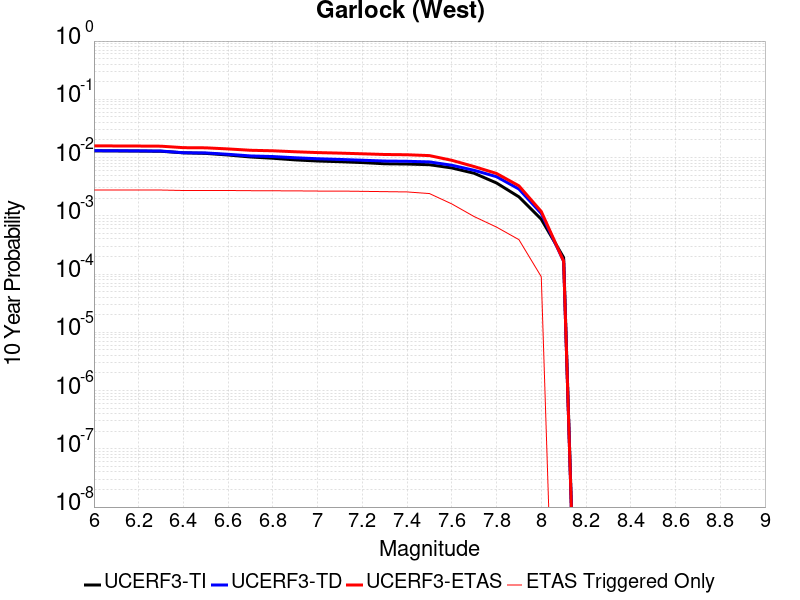 |

| Magnitude | 1 wk TI Prob | 1 wk TD Prob | 1 wk ETAS Prob | 1 wk ETAS/TD Gain | 1 wk ETAS Triggered Only | 1 mo TI Prob | 1 mo TD Prob | 1 mo ETAS Prob | 1 mo ETAS/TD Gain | 1 mo ETAS Triggered Only | 1 yr TI Prob | 1 yr TD Prob | 1 yr ETAS Prob | 1 yr ETAS/TD Gain | 1 yr ETAS Triggered Only | 10 yr TI Prob | 10 yr TD Prob | 10 yr ETAS Prob | 10 yr ETAS/TD Gain | 10 yr ETAS Triggered Only |
|-----|-----|-----|-----|-----|-----|-----|-----|-----|-----|-----|-----|-----|-----|-----|-----|-----|-----|-----|-----|-----|
| 6.0 | 2.5181727E-5 | 2.51973E-5 | 0.0011871143 | 47.11276 | 0.0011619462 | 1.0791722E-4 | 1.0798398E-4 | 0.0014150323 | 13.104095 | 0.0013071896 | 0.0013131002 | 0.0013139155 | 0.0033446497 | 2.5455592 | 0.002033406 | 0.013053683 | 0.013141977 | 0.016295336 | 1.2399455 | 0.0031953522 |
| 6.1 | 2.5077732E-5 | 2.5098372E-5 | 0.0011870154 | 47.29452 | 0.0011619462 | 1.0747157E-4 | 1.0756004E-4 | 0.001414609 | 13.151808 | 0.0013071896 | 0.001307681 | 0.0013087603 | 0.0033395048 | 2.5516553 | 0.002033406 | 0.013000126 | 0.013091032 | 0.016244555 | 1.2408917 | 0.0031953522 |
| 6.2 | 2.494612E-5 | 2.498005E-5 | 0.0011868973 | 47.513805 | 0.0011619462 | 1.0690756E-4 | 1.0705298E-4 | 0.0014141026 | 13.209371 | 0.0013071896 | 0.0013008224 | 0.0013025942 | 0.0033333516 | 2.5590098 | 0.002033406 | 0.012932341 | 0.013030097 | 0.016183814 | 1.2420332 | 0.0031953522 |
| 6.3 | 2.4733758E-5 | 2.479942E-5 | 0.0011867168 | 47.852608 | 0.0011619462 | 1.0599751E-4 | 1.06278916E-4 | 0.0014133295 | 13.298306 | 0.0013071896 | 0.0012897556 | 0.0012931811 | 0.0033239576 | 2.5703728 | 0.002033406 | 0.012822957 | 0.012937066 | 0.01609108 | 1.2437967 | 0.0031953522 |
| 6.4 | 2.3237335E-5 | 2.317873E-5 | 0.0010398581 | 44.862602 | 0.001016703 | 9.958477E-5 | 9.933365E-5 | 0.0012611644 | 12.696246 | 0.0011619462 | 0.0012117702 | 0.001208719 | 0.0030945993 | 2.5602305 | 0.0018881627 | 0.012051838 | 0.012101916 | 0.014971627 | 1.2371286 | 0.0029048657 |
| 6.5 | 2.2732203E-5 | 2.2993298E-5 | 0.0010396729 | 45.216347 | 0.001016703 | 9.742009E-5 | 9.8539E-5 | 0.0012603707 | 12.790578 | 0.0011619462 | 0.0011854442 | 0.0011990548 | 0.0030849534 | 2.5728211 | 0.0018881627 | 0.011791403 | 0.012006322 | 0.014876311 | 1.2390398 | 0.0029048657 |
| 6.6 | 2.1319436E-5 | 2.17735E-5 | 0.0010384544 | 47.693497 | 0.001016703 | 9.136581E-5 | 9.331167E-5 | 0.0012551495 | 13.451153 | 0.0011619462 | 0.001111811 | 0.0011354799 | 0.0030214984 | 2.6609883 | 0.0018881627 | 0.011062649 | 0.011377227 | 0.014249043 | 1.2524179 | 0.0029048657 |
| 6.7 | 1.970802E-5 | 2.0393396E-5 | 0.0010370756 | 50.853504 | 0.001016703 | 8.446021E-5 | 8.739735E-5 | 0.0012492421 | 14.29382 | 0.0011619462 | 0.001027818 | 0.001063545 | 0.0029496995 | 2.77346 | 0.0018881627 | 0.010230771 | 0.010664964 | 0.01353885 | 1.2694697 | 0.0029048657 |
| 6.8 | 1.8744462E-5 | 1.9901045E-5 | 0.0010365838 | 52.086903 | 0.001016703 | 8.033094E-5 | 8.5287415E-5 | 0.0012471345 | 14.622727 | 0.0011619462 | 9.775903E-4 | 0.0010378812 | 0.0029240842 | 2.8173592 | 0.0018881627 | 0.009733009 | 0.01041075 | 0.013285374 | 1.2761207 | 0.0029048657 |
| 6.9 | 1.7559682E-5 | 1.8953415E-5 | 0.0010356371 | 54.64119 | 0.001016703 | 7.5253614E-5 | 8.12264E-5 | 0.0012430783 | 15.30387 | 0.0011619462 | 9.158276E-4 | 9.884841E-4 | 0.0028747804 | 2.9082716 | 0.0018881627 | 0.0091206245 | 0.009921231 | 0.012797277 | 1.289888 | 0.0029048657 |
| 7.0 | 1.6794445E-5 | 1.8216237E-5 | 0.0010349007 | 56.81199 | 0.001016703 | 7.197421E-5 | 7.8067256E-5 | 0.0012399228 | 15.8827505 | 0.0011619462 | 8.759337E-4 | 9.5005584E-4 | 0.0028364246 | 2.9855347 | 0.0018881627 | 0.008724891 | 0.009540141 | 0.012417293 | 1.3015839 | 0.0029048657 |
| 7.1 | 1.6337795E-5 | 1.7717046E-5 | 0.001034402 | 58.384567 | 0.001016703 | 7.0017246E-5 | 7.5927994E-5 | 0.001237786 | 16.302105 | 0.0011619462 | 8.521265E-4 | 9.240326E-4 | 0.0028104505 | 3.0415058 | 0.0018881627 | 0.008488664 | 0.009281996 | 0.012159899 | 1.3100522 | 0.0029048657 |
| 7.2 | 1.5780008E-5 | 1.7165687E-5 | 0.0010338512 | 60.227783 | 0.001016703 | 6.762685E-5 | 7.356516E-5 | 0.0012354259 | 16.793629 | 0.0011619462 | 8.2304585E-4 | 8.9528906E-4 | 0.0027817613 | 3.1071095 | 0.0018881627 | 0.008200042 | 0.008996838 | 0.011875569 | 1.3199714 | 0.0029048657 |
| 7.3 | 1.5058865E-5 | 1.6618762E-5 | 0.0010333048 | 62.177006 | 0.001016703 | 6.45364E-5 | 7.122133E-5 | 0.0010878519 | 15.274243 | 0.001016703 | 7.854473E-4 | 8.667759E-4 | 0.0026081845 | 3.0090644 | 0.0017429194 | 0.00782677 | 0.008713539 | 0.011449114 | 1.3139455 | 0.0027596224 |
| 7.4 | 1.4887923E-5 | 1.6454731E-5 | 0.0010331409 | 62.78686 | 0.001016703 | 6.380382E-5 | 7.051838E-5 | 0.0010871496 | 15.416543 | 0.001016703 | 7.7653467E-4 | 8.582243E-4 | 0.002599648 | 3.029101 | 0.0017429194 | 0.0077382675 | 0.008628399 | 0.01136421 | 1.3170706 | 0.0027596224 |
| 7.5 | 1.4509299E-5 | 1.6046748E-5 | 8.8749244E-4 | 55.306686 | 8.714597E-4 | 6.218123E-5 | 6.876997E-5 | 9.4016973E-4 | 13.671225 | 8.714597E-4 | 7.567935E-4 | 8.36954E-4 | 0.002288171 | 2.7339272 | 0.0014524328 | 0.0075422134 | 0.008416704 | 0.010865058 | 1.2908922 | 0.002469136 |
| 7.6 | 1.2756717E-5 | 1.4050848E-5 | 4.4977458E-4 | 32.010494 | 4.3572986E-4 | 5.4670498E-5 | 6.0216535E-5 | 4.9592013E-4 | 8.235614 | 4.3572986E-4 | 6.6541E-4 | 7.328904E-4 | 0.0016037114 | 2.188201 | 8.714597E-4 | 0.006634211 | 0.0073816874 | 0.008823399 | 1.1953092 | 0.0014524328 |
| 7.7 | 1.0328985E-5 | 1.1460557E-5 | 1.5670217E-4 | 13.673173 | 1.4524328E-4 | 4.4266326E-5 | 4.911575E-5 | 1.943519E-4 | 3.957018 | 1.4524328E-4 | 5.388092E-4 | 5.978206E-4 | 8.881335E-4 | 1.4856188 | 2.9048655E-4 | 0.0053750467 | 0.006038511 | 0.0066159763 | 1.0956303 | 5.809731E-4 |
| 7.8 | 7.0306583E-6 | 8.899601E-6 | 1.5414158E-4 | 17.320057 | 1.4524328E-4 | 3.0131043E-5 | 3.814059E-5 | 1.8337833E-4 | 4.807957 | 1.4524328E-4 | 3.667837E-4 | 4.642629E-4 | 7.546146E-4 | 1.6254036 | 2.9048655E-4 | 0.003661789 | 0.0046952725 | 0.0051289564 | 1.0923661 | 4.3572986E-4 |
| 7.9 | 4.060633E-6 | 5.4653938E-6 | 5.4653938E-6 | 1.0 | 0.0 | 1.7402595E-5 | 2.3422906E-5 | 2.3422906E-5 | 1.0 | 0.0 | 2.11856E-4 | 2.851367E-4 | 2.851367E-4 | 1.0 | 0.0 | 0.0021165414 | 0.002884201 | 0.0030290254 | 1.050213 | 1.4524328E-4 |
| 8.0 | 1.6729537E-6 | 2.0775144E-6 | 2.0775144E-6 | 1.0 | 0.0 | 7.169782E-6 | 8.903603E-6 | 8.903603E-6 | 1.0 | 0.0 | 8.7288594E-5 | 1.0839601E-4 | 1.0839601E-4 | 1.0 | 0.0 | 8.7254314E-4 | 0.0010969337 | 0.0012420177 | 1.1322632 | 1.4524328E-4 |
| 8.1 | 3.6733252E-7 | 3.1489964E-7 | 3.1489964E-7 | 1.0 | 0.0 | 1.5742813E-6 | 1.3495693E-6 | 1.3495693E-6 | 1.0 | 0.0 | 1.9166706E-5 | 1.6430899E-5 | 1.6430899E-5 | 1.0 | 0.0 | 1.9165053E-4 | 1.6638759E-4 | 1.6638759E-4 | 1.0 | 0.0 |

## Coyote Canyon
*[(top)](#table-of-contents)*

| 1 Week | 1 Month | 1 Year | 10 Year |
|-----|-----|-----|-----|
|  |  |  |  |

| Magnitude | 1 wk TI Prob | 1 wk TD Prob | 1 wk ETAS Prob | 1 wk ETAS/TD Gain | 1 wk ETAS Triggered Only | 1 mo TI Prob | 1 mo TD Prob | 1 mo ETAS Prob | 1 mo ETAS/TD Gain | 1 mo ETAS Triggered Only | 1 yr TI Prob | 1 yr TD Prob | 1 yr ETAS Prob | 1 yr ETAS/TD Gain | 1 yr ETAS Triggered Only | 10 yr TI Prob | 10 yr TD Prob | 10 yr ETAS Prob | 10 yr ETAS/TD Gain | 10 yr ETAS Triggered Only |
|-----|-----|-----|-----|-----|-----|-----|-----|-----|-----|-----|-----|-----|-----|-----|-----|-----|-----|-----|-----|-----|
| 6.0 | 3.5090034E-5 | 4.0364324E-5 | 6.21314E-4 | 15.3926525 | 5.809731E-4 | 1.503772E-4 | 1.7297994E-4 | 0.0011895071 | 6.8765607 | 0.001016703 | 0.0018293047 | 0.0021042528 | 0.003988442 | 1.8954197 | 0.0018881627 | 0.018143194 | 0.020869201 | 0.023429021 | 1.1226602 | 0.0026143792 |
| 6.1 | 3.5090034E-5 | 4.0364324E-5 | 6.21314E-4 | 15.3926525 | 5.809731E-4 | 1.503772E-4 | 1.7297994E-4 | 0.0011895071 | 6.8765607 | 0.001016703 | 0.0018293047 | 0.0021042528 | 0.003988442 | 1.8954197 | 0.0018881627 | 0.018143194 | 0.020869201 | 0.023429021 | 1.1226602 | 0.0026143792 |
| 6.2 | 1.841879E-5 | 2.1059794E-5 | 6.020207E-4 | 28.586258 | 5.809731E-4 | 7.8935285E-5 | 9.0253714E-5 | 6.711744E-4 | 7.4365296 | 5.809731E-4 | 9.606133E-4 | 0.001098387 | 0.0019688895 | 1.792528 | 8.714597E-4 | 0.0095647145 | 0.010939667 | 0.012376211 | 1.1313151 | 0.0014524328 |
| 6.3 | 1.841879E-5 | 2.1059794E-5 | 6.020207E-4 | 28.586258 | 5.809731E-4 | 7.8935285E-5 | 9.0253714E-5 | 6.711744E-4 | 7.4365296 | 5.809731E-4 | 9.606133E-4 | 0.001098387 | 0.0019688895 | 1.792528 | 8.714597E-4 | 0.0095647145 | 0.010939667 | 0.012376211 | 1.1313151 | 0.0014524328 |
| 6.4 | 1.712201E-5 | 1.9565212E-5 | 6.00527E-4 | 30.69361 | 5.809731E-4 | 7.337798E-5 | 8.3848776E-5 | 6.647732E-4 | 7.9282393 | 5.809731E-4 | 8.930107E-4 | 0.0010204813 | 0.0018910517 | 1.8530978 | 8.714597E-4 | 0.008894307 | 0.010167871 | 0.011605535 | 1.141393 | 0.0014524328 |
| 6.5 | 1.4744935E-5 | 1.6836972E-5 | 5.978003E-4 | 35.505215 | 5.809731E-4 | 6.3191044E-5 | 7.215698E-5 | 6.530882E-4 | 9.050936 | 5.809731E-4 | 7.6907943E-4 | 8.7825063E-4 | 0.001748945 | 1.9913962 | 8.714597E-4 | 0.007664232 | 0.008756994 | 0.010052737 | 1.1479666 | 0.0013071896 |
| 6.6 | 1.2017839E-5 | 1.37240895E-5 | 4.4944795E-4 | 32.748837 | 4.3572986E-4 | 5.150401E-5 | 5.88167E-5 | 4.9452094E-4 | 8.407832 | 4.3572986E-4 | 6.268809E-4 | 7.159466E-4 | 0.0014416431 | 2.0136182 | 7.262164E-4 | 0.0062511545 | 0.0071450938 | 0.008154532 | 1.1412772 | 0.001016703 |
| 6.7 | 1.00956095E-5 | 1.1533517E-5 | 3.0201674E-4 | 26.186007 | 2.9048655E-4 | 4.326618E-5 | 4.942891E-5 | 3.399011E-4 | 6.876565 | 2.9048655E-4 | 5.266384E-4 | 6.017178E-4 | 0.0011823414 | 1.9649433 | 5.809731E-4 | 0.005253921 | 0.0060094125 | 0.006875635 | 1.1441443 | 8.714597E-4 |

## Nelson Lake
*[(top)](#table-of-contents)*

| 1 Week | 1 Month | 1 Year | 10 Year |
|-----|-----|-----|-----|
|  |  |  |  |

| Magnitude | 1 wk TI Prob | 1 wk TD Prob | 1 wk ETAS Prob | 1 wk ETAS/TD Gain | 1 wk ETAS Triggered Only | 1 mo TI Prob | 1 mo TD Prob | 1 mo ETAS Prob | 1 mo ETAS/TD Gain | 1 mo ETAS Triggered Only | 1 yr TI Prob | 1 yr TD Prob | 1 yr ETAS Prob | 1 yr ETAS/TD Gain | 1 yr ETAS Triggered Only | 10 yr TI Prob | 10 yr TD Prob | 10 yr ETAS Prob | 10 yr ETAS/TD Gain | 10 yr ETAS Triggered Only |
|-----|-----|-----|-----|-----|-----|-----|-----|-----|-----|-----|-----|-----|-----|-----|-----|-----|-----|-----|-----|-----|
| 6.0 | 9.913453E-6 | 1.0192255E-5 | 1.5543406E-4 | 15.250213 | 1.4524328E-4 | 4.2485535E-5 | 4.3680422E-5 | 9.151021E-4 | 20.949936 | 8.714597E-4 | 5.1713863E-4 | 5.316897E-4 | 0.0021285163 | 4.0033054 | 0.0015976761 | 0.0051593683 | 0.005305204 | 0.0076167677 | 1.4357163 | 0.0023238924 |
| 6.1 | 9.913453E-6 | 1.0192255E-5 | 1.5543406E-4 | 15.250213 | 1.4524328E-4 | 4.2485535E-5 | 4.3680422E-5 | 9.151021E-4 | 20.949936 | 8.714597E-4 | 5.1713863E-4 | 5.316897E-4 | 0.0021285163 | 4.0033054 | 0.0015976761 | 0.0051593683 | 0.005305204 | 0.0076167677 | 1.4357163 | 0.0023238924 |
| 6.2 | 4.5596407E-6 | 4.696313E-6 | 4.696313E-6 | 1.0 | 0.0 | 1.954117E-5 | 2.0126909E-5 | 6.0108834E-4 | 29.864912 | 5.809731E-4 | 2.3788778E-4 | 2.4501883E-4 | 0.001116265 | 4.555834 | 8.714597E-4 | 0.0023763329 | 0.0024476128 | 0.003606715 | 1.4735644 | 0.0011619462 |
| 6.3 | 4.5596407E-6 | 4.696313E-6 | 4.696313E-6 | 1.0 | 0.0 | 1.954117E-5 | 2.0126909E-5 | 6.0108834E-4 | 29.864912 | 5.809731E-4 | 2.3788778E-4 | 2.4501883E-4 | 0.001116265 | 4.555834 | 8.714597E-4 | 0.0023763329 | 0.0024476128 | 0.003606715 | 1.4735644 | 0.0011619462 |
| 6.4 | 3.4025713E-6 | 3.5098972E-6 | 3.5098972E-6 | 1.0 | 0.0 | 1.4582367E-5 | 1.5042335E-5 | 5.9600675E-4 | 39.621956 | 5.809731E-4 | 1.7752586E-4 | 1.8312587E-4 | 0.001054426 | 5.7579303 | 8.714597E-4 | 0.001773841 | 0.0018298327 | 0.0028446752 | 1.5546095 | 0.001016703 |
| 6.5 | 2.8352947E-6 | 2.927856E-6 | 2.927856E-6 | 1.0 | 0.0 | 1.2151207E-5 | 1.2547898E-5 | 4.4827227E-4 | 35.724888 | 4.3572986E-4 | 1.479309E-4 | 1.5276071E-4 | 8.788662E-4 | 5.7532215 | 7.262164E-4 | 0.0014783246 | 0.0015266308 | 0.00239676 | 1.569967 | 8.714597E-4 |
| 6.6 | 2.251518E-6 | 2.3290677E-6 | 2.3290677E-6 | 1.0 | 0.0 | 9.649328E-6 | 9.981683E-6 | 1.5522352E-4 | 15.550836 | 1.4524328E-4 | 1.1747423E-4 | 1.2152085E-4 | 4.119721E-4 | 3.3901353 | 2.9048655E-4 | 0.0011741214 | 0.0012146058 | 0.0016498063 | 1.358306 | 4.3572986E-4 |
| 6.7 | 1.8911853E-6 | 1.9591396E-6 | 1.9591396E-6 | 1.0 | 0.0 | 8.105055E-6 | 8.39629E-6 | 8.39629E-6 | 1.0 | 0.0 | 9.867457E-5 | 1.0222061E-4 | 2.4744903E-4 | 2.4207354 | 1.4524328E-4 | 9.863076E-4 | 0.0010217935 | 0.0013119832 | 1.2840004 | 2.9048655E-4 |
| 6.8 | 1.4874814E-6 | 1.5438305E-6 | 1.5438305E-6 | 1.0 | 0.0 | 6.374905E-6 | 6.6164025E-6 | 6.6164025E-6 | 1.0 | 0.0 | 7.76117E-5 | 8.055224E-5 | 2.2578382E-4 | 2.802949 | 1.4524328E-4 | 7.75846E-4 | 8.0528157E-4 | 9.504079E-4 | 1.1802181 | 1.4524328E-4 |
| 6.9 | 6.835972E-7 | 7.1399285E-7 | 7.1399285E-7 | 1.0 | 0.0 | 2.9296991E-6 | 3.0599674E-6 | 3.0599674E-6 | 1.0 | 0.0 | 3.56685E-5 | 3.7254784E-5 | 1.8249266E-4 | 4.8985023 | 1.4524328E-4 | 3.5662777E-4 | 3.7251666E-4 | 5.1770586E-4 | 1.3897521 | 1.4524328E-4 |

## Lenwood-Lockhart-Old Woman Springs
*[(top)](#table-of-contents)*

| 1 Week | 1 Month | 1 Year | 10 Year |
|-----|-----|-----|-----|
|  |  |  |  |

| Magnitude | 1 wk TI Prob | 1 wk TD Prob | 1 wk ETAS Prob | 1 wk ETAS/TD Gain | 1 wk ETAS Triggered Only | 1 mo TI Prob | 1 mo TD Prob | 1 mo ETAS Prob | 1 mo ETAS/TD Gain | 1 mo ETAS Triggered Only | 1 yr TI Prob | 1 yr TD Prob | 1 yr ETAS Prob | 1 yr ETAS/TD Gain | 1 yr ETAS Triggered Only | 10 yr TI Prob | 10 yr TD Prob | 10 yr ETAS Prob | 10 yr ETAS/TD Gain | 10 yr ETAS Triggered Only |
|-----|-----|-----|-----|-----|-----|-----|-----|-----|-----|-----|-----|-----|-----|-----|-----|-----|-----|-----|-----|-----|
| 6.0 | 3.744542E-5 | 4.396252E-5 | 6.249101E-4 | 14.214611 | 5.809731E-4 | 1.604705E-4 | 1.8839816E-4 | 9.1447774E-4 | 4.8539634 | 7.262164E-4 | 0.0019519776 | 0.0022915069 | 0.003595701 | 1.5691426 | 0.0013071896 | 0.019349206 | 0.022696787 | 0.024967935 | 1.1000648 | 0.0023238924 |
| 6.1 | 3.744542E-5 | 4.396252E-5 | 6.249101E-4 | 14.214611 | 5.809731E-4 | 1.604705E-4 | 1.8839816E-4 | 9.1447774E-4 | 4.8539634 | 7.262164E-4 | 0.0019519776 | 0.0022915069 | 0.003595701 | 1.5691426 | 0.0013071896 | 0.019349206 | 0.022696787 | 0.024967935 | 1.1000648 | 0.0023238924 |
| 6.2 | 3.744542E-5 | 4.396252E-5 | 6.249101E-4 | 14.214611 | 5.809731E-4 | 1.604705E-4 | 1.8839816E-4 | 9.1447774E-4 | 4.8539634 | 7.262164E-4 | 0.0019519776 | 0.0022915069 | 0.003595701 | 1.5691426 | 0.0013071896 | 0.019349206 | 0.022696787 | 0.024967935 | 1.1000648 | 0.0023238924 |
| 6.3 | 2.1079984E-5 | 2.5353434E-5 | 4.6107222E-4 | 18.185791 | 4.3572986E-4 | 9.0339665E-5 | 1.0865316E-4 | 5.443357E-4 | 5.0098467 | 4.3572986E-4 | 0.0010993304 | 0.0013220694 | 0.0020473257 | 1.5485766 | 7.262164E-4 | 0.010939079 | 0.0131442575 | 0.014004262 | 1.0654281 | 8.714597E-4 |
| 6.4 | 2.1079984E-5 | 2.5353434E-5 | 4.6107222E-4 | 18.185791 | 4.3572986E-4 | 9.0339665E-5 | 1.0865316E-4 | 5.443357E-4 | 5.0098467 | 4.3572986E-4 | 0.0010993304 | 0.0013220694 | 0.0020473257 | 1.5485766 | 7.262164E-4 | 0.010939079 | 0.0131442575 | 0.014004262 | 1.0654281 | 8.714597E-4 |
| 6.5 | 1.7397282E-5 | 2.066241E-5 | 4.5638325E-4 | 22.08761 | 4.3572986E-4 | 7.455765E-5 | 8.8550245E-5 | 5.2424154E-4 | 5.9202714 | 4.3572986E-4 | 9.073613E-4 | 0.0010775778 | 0.0015128381 | 1.4039247 | 4.3572986E-4 | 0.009036654 | 0.010724821 | 0.011155878 | 1.0401925 | 4.3572986E-4 |
| 6.6 | 1.52050325E-5 | 1.7679693E-5 | 4.5340185E-4 | 25.645344 | 4.3572986E-4 | 6.51628E-5 | 7.576796E-5 | 5.114648E-4 | 6.75041 | 4.3572986E-4 | 7.9306826E-4 | 9.220924E-4 | 0.0013574205 | 1.472109 | 4.3572986E-4 | 0.007902439 | 0.009183526 | 0.009615255 | 1.0470111 | 4.3572986E-4 |
| 6.7 | 1.332523E-5 | 1.5264002E-5 | 4.509872E-4 | 29.545803 | 4.3572986E-4 | 5.7106878E-5 | 6.5415545E-5 | 5.011169E-4 | 7.6605167 | 4.3572986E-4 | 6.950544E-4 | 7.961491E-4 | 0.0012315321 | 1.546861 | 4.3572986E-4 | 0.006928845 | 0.007933599 | 0.008365871 | 1.0544864 | 4.3572986E-4 |
| 6.8 | 1.1525329E-5 | 1.3030979E-5 | 4.4875513E-4 | 34.43756 | 4.3572986E-4 | 4.9393333E-5 | 5.584588E-5 | 4.915514E-4 | 8.801928 | 4.3572986E-4 | 6.011979E-4 | 6.797157E-4 | 0.0011151495 | 1.6406114 | 4.3572986E-4 | 0.00599574 | 0.006776819 | 0.007209596 | 1.0638614 | 4.3572986E-4 |
| 6.9 | 1.0253909E-5 | 1.15144385E-5 | 4.4723926E-4 | 38.841602 | 4.3572986E-4 | 4.3944583E-5 | 4.9346683E-5 | 4.8505503E-4 | 9.829536 | 4.3572986E-4 | 5.3489394E-4 | 6.0063385E-4 | 0.001036102 | 1.7250143 | 4.3572986E-4 | 0.0053360825 | 0.0059904843 | 0.0064236037 | 1.0723013 | 4.3572986E-4 |
| 7.0 | 8.104563E-6 | 8.991279E-6 | 4.447172E-4 | 49.460953 | 4.3572986E-4 | 3.4733377E-5 | 3.8533497E-5 | 4.7424657E-4 | 12.3073845 | 4.3572986E-4 | 4.2279682E-4 | 4.6904673E-4 | 9.045722E-4 | 1.9285332 | 4.3572986E-4 | 0.0042199334 | 0.0046808156 | 0.005114506 | 1.0926527 | 4.3572986E-4 |
| 7.1 | 6.7986157E-6 | 7.515816E-6 | 2.980002E-4 | 39.649746 | 2.9048655E-4 | 2.91366E-5 | 3.2210253E-5 | 3.2268747E-4 | 10.01816 | 2.9048655E-4 | 3.5468035E-4 | 3.920914E-4 | 6.824641E-4 | 1.7405739 | 2.9048655E-4 | 0.003541148 | 0.003914213 | 0.004203562 | 1.0739228 | 2.9048655E-4 |
| 7.2 | 5.6893327E-6 | 6.2800136E-6 | 1.5152238E-4 | 24.127716 | 1.4524328E-4 | 2.4382627E-5 | 2.6914078E-5 | 1.7215345E-4 | 6.396409 | 1.4524328E-4 | 2.9681803E-4 | 3.2763163E-4 | 4.7282732E-4 | 1.4431676 | 1.4524328E-4 | 0.002964219 | 0.0032716845 | 0.0034164526 | 1.0442488 | 1.4524328E-4 |
| 7.3 | 4.253348E-6 | 4.7069107E-6 | 1.4994951E-4 | 31.857311 | 1.4524328E-4 | 1.8228506E-5 | 2.0172329E-5 | 1.6541268E-4 | 8.19998 | 1.4524328E-4 | 2.2190946E-4 | 2.4557224E-4 | 3.9077987E-4 | 1.591303 | 1.4524328E-4 | 0.00221688 | 0.0024531898 | 0.0025980768 | 1.0590607 | 1.4524328E-4 |
| 7.4 | 2.5448119E-6 | 2.852045E-6 | 1.4809491E-4 | 51.92587 | 1.4524328E-4 | 1.0906291E-5 | 1.2223002E-5 | 1.5746451E-4 | 12.882638 | 1.4524328E-4 | 1.3277601E-4 | 1.4880655E-4 | 2.940282E-4 | 1.9759092 | 1.4524328E-4 | 0.001326967 | 0.0014872311 | 0.0016322584 | 1.097515 | 1.4524328E-4 |
| 7.5 | 4.3706837E-8 | 4.562909E-8 | 4.562909E-8 | 1.0 | 0.0 | 1.8731501E-7 | 1.9555324E-7 | 1.9555324E-7 | 1.0 | 0.0 | 2.2805577E-6 | 2.3808586E-6 | 2.3808586E-6 | 1.0 | 0.0 | 2.2805343E-5 | 2.3808387E-5 | 2.3808387E-5 | 1.0 | 0.0 |

## San Andreas (Mojave S)
*[(top)](#table-of-contents)*

| 1 Week | 1 Month | 1 Year | 10 Year |
|-----|-----|-----|-----|
|  |  |  | 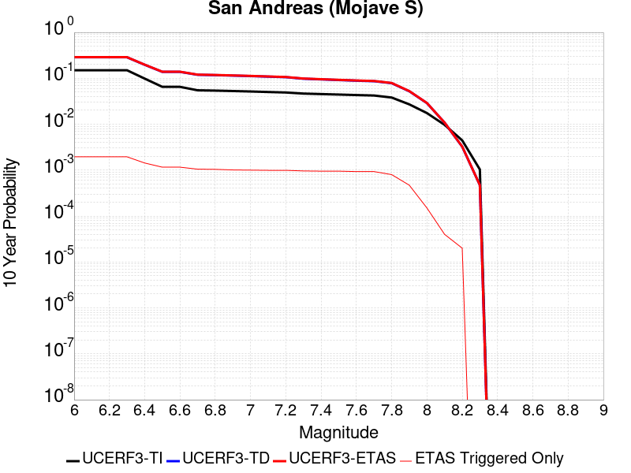 |

| Magnitude | 1 wk TI Prob | 1 wk TD Prob | 1 wk ETAS Prob | 1 wk ETAS/TD Gain | 1 wk ETAS Triggered Only | 1 mo TI Prob | 1 mo TD Prob | 1 mo ETAS Prob | 1 mo ETAS/TD Gain | 1 mo ETAS Triggered Only | 1 yr TI Prob | 1 yr TD Prob | 1 yr ETAS Prob | 1 yr ETAS/TD Gain | 1 yr ETAS Triggered Only | 10 yr TI Prob | 10 yr TD Prob | 10 yr ETAS Prob | 10 yr ETAS/TD Gain | 10 yr ETAS Triggered Only |
|-----|-----|-----|-----|-----|-----|-----|-----|-----|-----|-----|-----|-----|-----|-----|-----|-----|-----|-----|-----|-----|
| 6.0 | 3.1064058E-4 | 6.7460834E-4 | 9.648989E-4 | 1.4303099 | 2.9048655E-4 | 0.0013306376 | 0.0028881032 | 0.0033225748 | 1.1504349 | 4.3572986E-4 | 0.016080605 | 0.03462235 | 0.035323422 | 1.0202491 | 7.262164E-4 | 0.1496549 | 0.28660452 | 0.2877443 | 1.0039768 | 0.0015976761 |
| 6.1 | 3.1064058E-4 | 6.7460834E-4 | 9.648989E-4 | 1.4303099 | 2.9048655E-4 | 0.0013306376 | 0.0028881032 | 0.0033225748 | 1.1504349 | 4.3572986E-4 | 0.016080605 | 0.03462235 | 0.035323422 | 1.0202491 | 7.262164E-4 | 0.1496549 | 0.28660452 | 0.2877443 | 1.0039768 | 0.0015976761 |
| 6.2 | 3.1064058E-4 | 6.7460834E-4 | 9.648989E-4 | 1.4303099 | 2.9048655E-4 | 0.0013306376 | 0.0028881032 | 0.0033225748 | 1.1504349 | 4.3572986E-4 | 0.016080605 | 0.03462235 | 0.035323422 | 1.0202491 | 7.262164E-4 | 0.1496549 | 0.28660452 | 0.2877443 | 1.0039768 | 0.0015976761 |
| 6.3 | 3.1064058E-4 | 6.7460834E-4 | 9.648989E-4 | 1.4303099 | 2.9048655E-4 | 0.0013306376 | 0.0028881032 | 0.0033225748 | 1.1504349 | 4.3572986E-4 | 0.016080605 | 0.03462235 | 0.035323422 | 1.0202491 | 7.262164E-4 | 0.1496549 | 0.28660452 | 0.2877443 | 1.0039768 | 0.0015976761 |
| 6.4 | 1.9872203E-4 | 4.3179357E-4 | 7.221547E-4 | 1.6724536 | 2.9048655E-4 | 8.5138786E-4 | 0.0018492596 | 0.002139209 | 1.1567922 | 2.9048655E-4 | 0.010316478 | 0.02228844 | 0.022714458 | 1.0191139 | 4.3572986E-4 | 0.098504856 | 0.19699748 | 0.19769727 | 1.0035522 | 8.714597E-4 |
| 6.5 | 1.291105E-4 | 2.875267E-4 | 5.779297E-4 | 2.0100038 | 2.9048655E-4 | 5.5321335E-4 | 0.0012316781 | 0.0015218069 | 1.2355556 | 2.9048655E-4 | 0.006714592 | 0.0148934 | 0.01532264 | 1.0288209 | 4.3572986E-4 | 0.065152965 | 0.13803436 | 0.13878553 | 1.0054419 | 8.714597E-4 |
| 6.6 | 1.291105E-4 | 2.875267E-4 | 5.779297E-4 | 2.0100038 | 2.9048655E-4 | 5.5321335E-4 | 0.0012316781 | 0.0015218069 | 1.2355556 | 2.9048655E-4 | 0.006714592 | 0.0148934 | 0.01532264 | 1.0288209 | 4.3572986E-4 | 0.065152965 | 0.13803436 | 0.13878553 | 1.0054419 | 8.714597E-4 |
| 6.7 | 1.08001186E-4 | 2.4333889E-4 | 3.8854682E-4 | 1.5967313 | 1.4524328E-4 | 4.6278012E-4 | 0.0010424647 | 0.0011875565 | 1.1391816 | 1.4524328E-4 | 0.0056198016 | 0.012618446 | 0.012905267 | 1.0227304 | 2.9048655E-4 | 0.054797906 | 0.119176775 | 0.119816445 | 1.0053674 | 7.262164E-4 |
| 6.8 | 1.0624356E-4 | 2.3851555E-4 | 3.837242E-4 | 1.6088016 | 1.4524328E-4 | 4.5525006E-4 | 0.0010218095 | 0.0011669045 | 1.1419979 | 1.4524328E-4 | 0.0055285925 | 0.012369843 | 0.012656736 | 1.023193 | 2.9048655E-4 | 0.053930566 | 0.11712591 | 0.11776707 | 1.0054741 | 7.262164E-4 |
| 6.9 | 1.0393785E-4 | 2.3221898E-4 | 3.7742854E-4 | 1.625313 | 1.4524328E-4 | 4.4537184E-4 | 9.948451E-4 | 0.0011399438 | 1.1458507 | 1.4524328E-4 | 0.0054089287 | 0.012045221 | 0.012332208 | 1.0238259 | 2.9048655E-4 | 0.05279156 | 0.11442335 | 0.115066476 | 1.0056205 | 7.262164E-4 |
| 7.0 | 1.0155622E-4 | 2.2591476E-4 | 3.7112524E-4 | 1.6427666 | 1.4524328E-4 | 4.3516833E-4 | 9.6784724E-4 | 0.0011129499 | 1.1499232 | 1.4524328E-4 | 0.005285311 | 0.0117200995 | 0.0120071815 | 1.0244949 | 2.9048655E-4 | 0.05161361 | 0.111683756 | 0.112328865 | 1.0057762 | 7.262164E-4 |
| 7.1 | 9.885595E-5 | 2.1879886E-4 | 3.6401037E-4 | 1.6636758 | 1.4524328E-4 | 4.2359953E-4 | 9.3737274E-4 | 0.0010824798 | 1.154802 | 1.4524328E-4 | 0.0051451353 | 0.011352993 | 0.011640182 | 1.0252963 | 2.9048655E-4 | 0.05027629 | 0.1085682 | 0.1090861 | 1.0047703 | 5.809731E-4 |
| 7.2 | 9.6411415E-5 | 2.124288E-4 | 3.5764123E-4 | 1.6835816 | 1.4524328E-4 | 4.1312634E-4 | 9.1009185E-4 | 0.0010552029 | 1.1594466 | 1.4524328E-4 | 0.005018219 | 0.011024255 | 0.011311539 | 1.0260593 | 2.9048655E-4 | 0.049064007 | 0.105758004 | 0.10627753 | 1.0049125 | 5.809731E-4 |
| 7.3 | 9.1180635E-5 | 1.9471257E-4 | 3.399276E-4 | 1.7457916 | 1.4524328E-4 | 3.907156E-4 | 8.342157E-4 | 9.793378E-4 | 1.1739624 | 1.4524328E-4 | 0.004746591 | 0.01010939 | 0.01039694 | 1.0284438 | 2.9048655E-4 | 0.046464786 | 0.09795115 | 0.09847522 | 1.0053502 | 5.809731E-4 |
| 7.4 | 8.887388E-5 | 1.8719878E-4 | 3.3241487E-4 | 1.775732 | 1.4524328E-4 | 3.8083247E-4 | 8.020339E-4 | 9.471607E-4 | 1.1809485 | 1.4524328E-4 | 0.0046267817 | 0.00972114 | 0.010008803 | 1.0295914 | 2.9048655E-4 | 0.045316286 | 0.09458615 | 0.09511217 | 1.0055612 | 5.809731E-4 |
| 7.5 | 8.6750515E-5 | 1.8051457E-4 | 3.2573164E-4 | 1.8044617 | 1.4524328E-4 | 3.7173493E-4 | 7.7340455E-4 | 9.185355E-4 | 1.187652 | 1.4524328E-4 | 0.004516484 | 0.009375632 | 0.009663395 | 1.0306927 | 2.9048655E-4 | 0.04425787 | 0.091549896 | 0.09207768 | 1.005765 | 5.809731E-4 |
| 7.6 | 8.453092E-5 | 1.7439072E-4 | 3.1960866E-4 | 1.8327161 | 1.4524328E-4 | 3.6222505E-4 | 7.471748E-4 | 8.9230953E-4 | 1.1942447 | 1.4524328E-4 | 0.0044011753 | 0.009058985 | 0.00934684 | 1.0317756 | 2.9048655E-4 | 0.04315024 | 0.08870898 | 0.08923842 | 1.0059682 | 5.809731E-4 |
| 7.7 | 8.259102E-5 | 1.6961215E-4 | 3.148308E-4 | 1.8561807 | 1.4524328E-4 | 3.539135E-4 | 7.2670676E-4 | 8.718445E-4 | 1.1997198 | 1.4524328E-4 | 0.004300386 | 0.008811831 | 0.009099757 | 1.032675 | 2.9048655E-4 | 0.042181134 | 0.08645982 | 0.086990565 | 1.0061386 | 5.809731E-4 |
| 7.8 | 7.444844E-5 | 1.5283503E-4 | 2.980561E-4 | 1.950182 | 1.4524328E-4 | 3.1902574E-4 | 6.548429E-4 | 7.99991E-4 | 1.2216535 | 1.4524328E-4 | 0.0038772223 | 0.007943616 | 0.008231795 | 1.036278 | 2.9048655E-4 | 0.03810269 | 0.078290746 | 0.07869236 | 1.0051298 | 4.3572986E-4 |
| 7.9 | 5.2586525E-5 | 1.00064186E-4 | 1.00064186E-4 | 1.0 | 0.0 | 2.2535135E-4 | 4.2877605E-4 | 4.2877605E-4 | 1.0 | 0.0 | 0.0027402006 | 0.005207864 | 0.005207864 | 1.0 | 0.0 | 0.027066574 | 0.052200034 | 0.052337695 | 1.0026371 | 1.4524328E-4 |
| 8.0 | 3.379877E-5 | 5.4074168E-5 | 5.4074168E-5 | 1.0 | 0.0 | 1.4484383E-4 | 2.3172585E-4 | 2.3172585E-4 | 1.0 | 0.0 | 0.0017620471 | 0.002817614 | 0.002817614 | 1.0 | 0.0 | 0.017481409 | 0.028834904 | 0.028975958 | 1.0048919 | 1.4524328E-4 |
| 8.1 | 1.8668277E-5 | 1.9309397E-5 | 1.9309397E-5 | 1.0 | 0.0 | 8.000444E-5 | 8.275194E-5 | 8.275194E-5 | 1.0 | 0.0 | 9.736188E-4 | 0.0010070398 | 0.0010070398 | 1.0 | 0.0 | 0.009693642 | 0.010798888 | 0.010798888 | 1.0 | 0.0 |
| 8.2 | 8.541571E-6 | 5.460819E-6 | 5.460819E-6 | 1.0 | 0.0 | 3.660622E-5 | 2.3403301E-5 | 2.3403301E-5 | 1.0 | 0.0 | 4.455896E-4 | 2.84898E-4 | 2.84898E-4 | 1.0 | 0.0 | 0.0044469717 | 0.0032408056 | 0.0032408056 | 1.0 | 0.0 |
| 8.3 | 1.983087E-6 | 7.6599065E-7 | 7.6599065E-7 | 1.0 | 0.0 | 8.498917E-6 | 3.282813E-6 | 3.282813E-6 | 1.0 | 0.0 | 1.034694E-4 | 3.9967534E-5 | 3.9967534E-5 | 1.0 | 0.0 | 0.0010342124 | 4.719687E-4 | 4.719687E-4 | 1.0 | 0.0 |

## Paradise
*[(top)](#table-of-contents)*

| 1 Week | 1 Month | 1 Year | 10 Year |
|-----|-----|-----|-----|
|  |  |  |  |

| Magnitude | 1 wk TI Prob | 1 wk TD Prob | 1 wk ETAS Prob | 1 wk ETAS/TD Gain | 1 wk ETAS Triggered Only | 1 mo TI Prob | 1 mo TD Prob | 1 mo ETAS Prob | 1 mo ETAS/TD Gain | 1 mo ETAS Triggered Only | 1 yr TI Prob | 1 yr TD Prob | 1 yr ETAS Prob | 1 yr ETAS/TD Gain | 1 yr ETAS Triggered Only | 10 yr TI Prob | 10 yr TD Prob | 10 yr ETAS Prob | 10 yr ETAS/TD Gain | 10 yr ETAS Triggered Only |
|-----|-----|-----|-----|-----|-----|-----|-----|-----|-----|-----|-----|-----|-----|-----|-----|-----|-----|-----|-----|-----|
| 6.0 | 1.4851273E-5 | 1.6694692E-5 | 3.071764E-4 | 18.399645 | 2.9048655E-4 | 6.364676E-5 | 7.154685E-5 | 5.0724554E-4 | 7.089698 | 4.3572986E-4 | 7.7462377E-4 | 8.707584E-4 | 0.0015963424 | 1.8332783 | 7.262164E-4 | 0.0077192914 | 0.008675844 | 0.009971693 | 1.1493628 | 0.0013071896 |
| 6.1 | 1.4851273E-5 | 1.6694692E-5 | 3.071764E-4 | 18.399645 | 2.9048655E-4 | 6.364676E-5 | 7.154685E-5 | 5.0724554E-4 | 7.089698 | 4.3572986E-4 | 7.7462377E-4 | 8.707584E-4 | 0.0015963424 | 1.8332783 | 7.262164E-4 | 0.0077192914 | 0.008675844 | 0.009971693 | 1.1493628 | 0.0013071896 |
| 6.2 | 1.4851273E-5 | 1.6694692E-5 | 3.071764E-4 | 18.399645 | 2.9048655E-4 | 6.364676E-5 | 7.154685E-5 | 5.0724554E-4 | 7.089698 | 4.3572986E-4 | 7.7462377E-4 | 8.707584E-4 | 0.0015963424 | 1.8332783 | 7.262164E-4 | 0.0077192914 | 0.008675844 | 0.009971693 | 1.1493628 | 0.0013071896 |
| 6.3 | 1.0426831E-5 | 1.188862E-5 | 3.0237174E-4 | 25.43371 | 2.9048655E-4 | 4.4685654E-5 | 5.0950268E-5 | 3.4142204E-4 | 6.701084 | 2.9048655E-4 | 5.43912E-4 | 6.201489E-4 | 0.0010556085 | 1.7021856 | 4.3572986E-4 | 0.0054258266 | 0.0061847917 | 0.0066178264 | 1.0700161 | 4.3572986E-4 |
| 6.4 | 1.0426831E-5 | 1.188862E-5 | 3.0237174E-4 | 25.43371 | 2.9048655E-4 | 4.4685654E-5 | 5.0950268E-5 | 3.4142204E-4 | 6.701084 | 2.9048655E-4 | 5.43912E-4 | 6.201489E-4 | 0.0010556085 | 1.7021856 | 4.3572986E-4 | 0.0054258266 | 0.0061847917 | 0.0066178264 | 1.0700161 | 4.3572986E-4 |
| 6.5 | 9.25027E-6 | 1.06199595E-5 | 3.0110343E-4 | 28.352596 | 2.9048655E-4 | 3.964341E-5 | 4.551335E-5 | 3.359867E-4 | 7.3821573 | 2.9048655E-4 | 4.8255164E-4 | 5.53989E-4 | 8.4431464E-4 | 1.524064 | 2.9048655E-4 | 0.0048150513 | 0.0055265795 | 0.0058154603 | 1.0522712 | 2.9048655E-4 |
| 6.6 | 7.904275E-6 | 9.159525E-6 | 1.5440148E-4 | 16.85693 | 1.4524328E-4 | 3.3875025E-5 | 3.9254537E-5 | 1.8449212E-4 | 4.6998925 | 1.4524328E-4 | 4.1235037E-4 | 4.7782314E-4 | 6.22997E-4 | 1.3038235 | 1.4524328E-4 | 0.0041158604 | 0.0047683544 | 0.004912905 | 1.0303146 | 1.4524328E-4 |
| 6.7 | 7.2061953E-6 | 8.407248E-6 | 1.5364931E-4 | 18.275814 | 1.4524328E-4 | 3.088333E-5 | 3.6030586E-5 | 1.8126864E-4 | 5.0309653 | 1.4524328E-4 | 3.7593965E-4 | 4.3858777E-4 | 5.8376737E-4 | 1.3310161 | 1.4524328E-4 | 0.003753043 | 0.004377591 | 0.0045221983 | 1.0330336 | 1.4524328E-4 |
| 6.8 | 6.6948724E-6 | 7.842166E-6 | 1.5308431E-4 | 19.520668 | 1.4524328E-4 | 2.8691995E-5 | 3.360887E-5 | 1.7884727E-4 | 5.3214307 | 1.4524328E-4 | 3.4926904E-4 | 4.0911473E-4 | 5.542986E-4 | 1.3548732 | 1.4524328E-4 | 0.003487206 | 0.0040839734 | 0.004228623 | 1.035419 | 1.4524328E-4 |
| 6.9 | 6.0421025E-6 | 7.130621E-6 | 1.5237287E-4 | 21.368809 | 1.4524328E-4 | 2.5894467E-5 | 3.0559466E-5 | 1.7579831E-4 | 5.752663 | 1.4524328E-4 | 3.1521954E-4 | 3.7200135E-4 | 5.171906E-4 | 1.3902923 | 1.4524328E-4 | 0.0031477278 | 0.0037141247 | 0.0038588285 | 1.0389605 | 1.4524328E-4 |
| 7.0 | 4.134091E-6 | 5.0803087E-6 | 5.0803087E-6 | 1.0 | 0.0 | 1.7717413E-5 | 2.177258E-5 | 2.177258E-5 | 1.0 | 0.0 | 2.1568815E-4 | 2.6505045E-4 | 2.6505045E-4 | 1.0 | 0.0 | 0.0021547892 | 0.0026474963 | 0.0026474963 | 1.0 | 0.0 |
| 7.1 | 3.7674888E-6 | 4.6318696E-6 | 4.6318696E-6 | 1.0 | 0.0 | 1.6146281E-5 | 1.9850726E-5 | 1.9850726E-5 | 1.0 | 0.0 | 1.9656324E-4 | 2.4165731E-4 | 2.4165731E-4 | 1.0 | 0.0 | 0.0019638946 | 0.002414096 | 0.002414096 | 1.0 | 0.0 |
| 7.2 | 3.4065345E-6 | 4.156723E-6 | 4.156723E-6 | 1.0 | 0.0 | 1.4599351E-5 | 1.7814415E-5 | 1.7814415E-5 | 1.0 | 0.0 | 1.777326E-4 | 2.1687041E-4 | 2.1687041E-4 | 1.0 | 0.0 | 0.0017759053 | 0.002166736 | 0.002166736 | 1.0 | 0.0 |
| 7.3 | 2.9934936E-6 | 3.6293168E-6 | 3.6293168E-6 | 1.0 | 0.0 | 1.2829195E-5 | 1.555413E-5 | 1.555413E-5 | 1.0 | 0.0 | 1.5618425E-4 | 1.8935655E-4 | 1.8935655E-4 | 1.0 | 0.0 | 0.0015607453 | 0.0018920974 | 0.0018920974 | 1.0 | 0.0 |
| 7.4 | 2.4049796E-6 | 2.8889842E-6 | 2.8889842E-6 | 1.0 | 0.0 | 1.0307015E-5 | 1.238131E-5 | 1.238131E-5 | 1.0 | 0.0 | 1.2548068E-4 | 1.5073347E-4 | 1.5073347E-4 | 1.0 | 0.0 | 0.0012540985 | 0.0015064536 | 0.0015064536 | 1.0 | 0.0 |
| 7.5 | 1.2710091E-6 | 1.5134682E-6 | 1.5134682E-6 | 1.0 | 0.0 | 5.44717E-6 | 6.4862834E-6 | 6.4862834E-6 | 1.0 | 0.0 | 6.631728E-5 | 7.8968886E-5 | 7.8968886E-5 | 1.0 | 0.0 | 6.6297496E-4 | 7.8953087E-4 | 7.8953087E-4 | 1.0 | 0.0 |
| 7.6 | 2.21172E-7 | 2.603961E-7 | 2.603961E-7 | 1.0 | 0.0 | 9.478797E-7 | 1.1159829E-6 | 1.1159829E-6 | 1.0 | 0.0 | 1.1540374E-5 | 1.3587036E-5 | 1.3587036E-5 | 1.0 | 0.0 | 1.1539775E-4 | 1.3586486E-4 | 1.3586486E-4 | 1.0 | 0.0 |

## Death Valley (So)
*[(top)](#table-of-contents)*

| 1 Week | 1 Month | 1 Year | 10 Year |
|-----|-----|-----|-----|
|  |  |  |  |

| Magnitude | 1 wk TI Prob | 1 wk TD Prob | 1 wk ETAS Prob | 1 wk ETAS/TD Gain | 1 wk ETAS Triggered Only | 1 mo TI Prob | 1 mo TD Prob | 1 mo ETAS Prob | 1 mo ETAS/TD Gain | 1 mo ETAS Triggered Only | 1 yr TI Prob | 1 yr TD Prob | 1 yr ETAS Prob | 1 yr ETAS/TD Gain | 1 yr ETAS Triggered Only | 10 yr TI Prob | 10 yr TD Prob | 10 yr ETAS Prob | 10 yr ETAS/TD Gain | 10 yr ETAS Triggered Only |
|-----|-----|-----|-----|-----|-----|-----|-----|-----|-----|-----|-----|-----|-----|-----|-----|-----|-----|-----|-----|-----|
| 6.0 | 2.0684236E-5 | 2.5617775E-5 | 3.160969E-4 | 12.338967 | 2.9048655E-4 | 8.864371E-5 | 1.0978594E-4 | 6.906953E-4 | 6.2912908 | 5.809731E-4 | 0.0010787029 | 0.0013358411 | 0.002351186 | 1.760079 | 0.001016703 | 0.010734817 | 0.013281397 | 0.014427911 | 1.0863248 | 0.0011619462 |
| 6.1 | 2.0684236E-5 | 2.5617775E-5 | 3.160969E-4 | 12.338967 | 2.9048655E-4 | 8.864371E-5 | 1.0978594E-4 | 6.906953E-4 | 6.2912908 | 5.809731E-4 | 0.0010787029 | 0.0013358411 | 0.002351186 | 1.760079 | 0.001016703 | 0.010734817 | 0.013281397 | 0.014427911 | 1.0863248 | 0.0011619462 |
| 6.2 | 2.0684236E-5 | 2.5617775E-5 | 3.160969E-4 | 12.338967 | 2.9048655E-4 | 8.864371E-5 | 1.0978594E-4 | 6.906953E-4 | 6.2912908 | 5.809731E-4 | 0.0010787029 | 0.0013358411 | 0.002351186 | 1.760079 | 0.001016703 | 0.010734817 | 0.013281397 | 0.014427911 | 1.0863248 | 0.0011619462 |
| 6.3 | 2.0240292E-5 | 2.511786E-5 | 3.1559714E-4 | 12.564651 | 2.9048655E-4 | 8.6741224E-5 | 1.07643624E-4 | 6.885542E-4 | 6.3966093 | 5.809731E-4 | 0.0010555626 | 0.00130979 | 0.0023251614 | 1.7752169 | 0.001016703 | 0.010505628 | 0.013023956 | 0.01417077 | 1.0880542 | 0.0011619462 |
| 6.4 | 2.0240292E-5 | 2.511786E-5 | 3.1559714E-4 | 12.564651 | 2.9048655E-4 | 8.6741224E-5 | 1.07643624E-4 | 6.885542E-4 | 6.3966093 | 5.809731E-4 | 0.0010555626 | 0.00130979 | 0.0023251614 | 1.7752169 | 0.001016703 | 0.010505628 | 0.013023956 | 0.01417077 | 1.0880542 | 0.0011619462 |
| 6.5 | 1.9962767E-5 | 2.4807114E-5 | 3.1528648E-4 | 12.709518 | 2.9048655E-4 | 8.55519E-5 | 1.0631196E-4 | 6.8722334E-4 | 6.4642143 | 5.809731E-4 | 0.0010410968 | 0.0012935963 | 0.002308984 | 1.784934 | 0.001016703 | 0.010362327 | 0.012863902 | 0.014010902 | 1.0891641 | 0.0011619462 |
| 6.6 | 1.8937297E-5 | 2.3310964E-5 | 3.1379075E-4 | 13.46108 | 2.9048655E-4 | 8.115732E-5 | 9.990039E-5 | 6.808155E-4 | 6.8149433 | 5.809731E-4 | 9.876423E-4 | 0.0012156231 | 0.00223109 | 1.8353469 | 0.001016703 | 0.009832645 | 0.012092789 | 0.013240684 | 1.094924 | 0.0011619462 |
| 6.7 | 1.8621096E-5 | 2.2911607E-5 | 3.133915E-4 | 13.678287 | 2.9048655E-4 | 7.980225E-5 | 9.818898E-5 | 6.7910505E-4 | 6.916306 | 5.809731E-4 | 9.711593E-4 | 0.0011948098 | 0.002210298 | 1.8499162 | 0.001016703 | 0.009669261 | 0.011886904 | 0.0130350385 | 1.0965881 | 0.0011619462 |
| 6.8 | 1.7830353E-5 | 2.1805688E-5 | 3.122859E-4 | 14.321305 | 2.9048655E-4 | 7.641356E-5 | 9.344968E-5 | 6.743685E-4 | 7.216381 | 5.809731E-4 | 9.29938E-4 | 0.00113717 | 0.0020076388 | 1.7654692 | 8.714597E-4 | 0.009260561 | 0.011316354 | 0.012321552 | 1.088827 | 0.001016703 |
| 6.9 | 1.3135183E-5 | 1.5303925E-5 | 1.5303925E-5 | 1.0 | 0.0 | 5.6292425E-5 | 6.558664E-5 | 6.558664E-5 | 1.0 | 0.0 | 6.8514474E-4 | 7.982312E-4 | 0.0010884859 | 1.3636223 | 2.9048655E-4 | 0.006830362 | 0.007954649 | 0.008386913 | 1.0543411 | 4.3572986E-4 |
| 7.0 | 1.1507512E-5 | 1.3154199E-5 | 1.3154199E-5 | 1.0 | 0.0 | 4.9316975E-5 | 5.6373956E-5 | 5.6373956E-5 | 1.0 | 0.0 | 6.002687E-4 | 6.8614254E-4 | 9.764298E-4 | 1.4230714 | 2.9048655E-4 | 0.0059864987 | 0.0068409415 | 0.007273691 | 1.0632586 | 4.3572986E-4 |
| 7.1 | 9.715903E-6 | 1.0865278E-5 | 1.0865278E-5 | 1.0 | 0.0 | 4.1638916E-5 | 4.656467E-5 | 4.656467E-5 | 1.0 | 0.0 | 5.068359E-4 | 5.667817E-4 | 7.119426E-4 | 1.2561145 | 1.4524328E-4 | 0.0050568148 | 0.0056538144 | 0.005942659 | 1.0510883 | 2.9048655E-4 |
| 7.2 | 9.233269E-6 | 1.02863105E-5 | 1.02863105E-5 | 1.0 | 0.0 | 3.9570554E-5 | 4.4083466E-5 | 4.4083466E-5 | 1.0 | 0.0 | 4.81665E-4 | 5.3658825E-4 | 6.817536E-4 | 1.2705339 | 1.4524328E-4 | 0.0048062233 | 0.0053533576 | 0.0056422893 | 1.053972 | 2.9048655E-4 |
| 7.3 | 8.8041315E-6 | 9.808164E-6 | 9.808164E-6 | 1.0 | 0.0 | 3.7731446E-5 | 4.2034335E-5 | 4.2034335E-5 | 1.0 | 0.0 | 4.592835E-4 | 5.1165203E-4 | 5.1165203E-4 | 1.0 | 0.0 | 0.0045833546 | 0.005105167 | 0.005249669 | 1.028305 | 1.4524328E-4 |
| 7.4 | 8.708749E-6 | 9.707175E-6 | 9.707175E-6 | 1.0 | 0.0 | 3.7322676E-5 | 4.160154E-5 | 4.160154E-5 | 1.0 | 0.0 | 4.5430884E-4 | 5.0638523E-4 | 5.0638523E-4 | 1.0 | 0.0 | 0.004533812 | 0.0050527398 | 0.005197249 | 1.0286002 | 1.4524328E-4 |
| 7.5 | 8.612678E-6 | 9.604817E-6 | 9.604817E-6 | 1.0 | 0.0 | 3.6910955E-5 | 4.1162875E-5 | 4.1162875E-5 | 1.0 | 0.0 | 4.492982E-4 | 5.01047E-4 | 5.01047E-4 | 1.0 | 0.0 | 0.004483909 | 0.0049995985 | 0.005144116 | 1.0289057 | 1.4524328E-4 |
| 7.6 | 8.319024E-6 | 9.283916E-6 | 9.283916E-6 | 1.0 | 0.0 | 3.5652476E-5 | 3.978763E-5 | 3.978763E-5 | 1.0 | 0.0 | 4.3398244E-4 | 4.8431093E-4 | 4.8431093E-4 | 1.0 | 0.0 | 0.0043313587 | 0.0048329784 | 0.0049775196 | 1.0299073 | 1.4524328E-4 |
| 7.7 | 7.4718328E-6 | 8.34517E-6 | 8.34517E-6 | 1.0 | 0.0 | 3.2021748E-5 | 3.5764548E-5 | 3.5764548E-5 | 1.0 | 0.0 | 3.8979502E-4 | 4.353504E-4 | 4.353504E-4 | 1.0 | 0.0 | 0.00389112 | 0.0043453807 | 0.0044899927 | 1.0332795 | 1.4524328E-4 |
| 7.8 | 3.4586725E-7 | 3.6482615E-7 | 3.6482615E-7 | 1.0 | 0.0 | 1.4822873E-6 | 1.5635396E-6 | 1.5635396E-6 | 1.0 | 0.0 | 1.80467E-5 | 1.9035933E-5 | 1.9035933E-5 | 1.0 | 0.0 | 1.8045233E-4 | 1.9034347E-4 | 1.9034347E-4 | 1.0 | 0.0 |
| 7.9 | 2.5591178E-9 | 2.6696718E-9 | 2.6696718E-9 | 1.0 | 0.0 | 1.0967647E-8 | 1.14414505E-8 | 1.14414505E-8 | 1.0 | 0.0 | 1.335311E-7 | 1.3929966E-7 | 1.3929966E-7 | 1.0 | 0.0 | 1.3353102E-6 | 1.3929966E-6 | 1.3929966E-6 | 1.0 | 0.0 |

## Garlic Springs
*[(top)](#table-of-contents)*

| 1 Week | 1 Month | 1 Year | 10 Year |
|-----|-----|-----|-----|
| 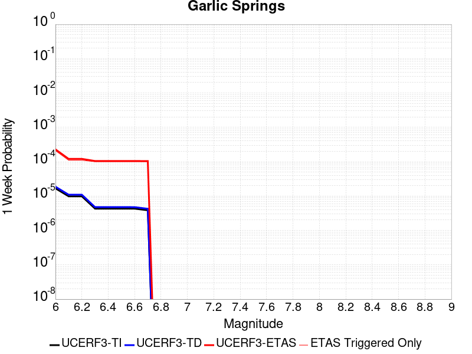 |  |  |  |

| Magnitude | 1 wk TI Prob | 1 wk TD Prob | 1 wk ETAS Prob | 1 wk ETAS/TD Gain | 1 wk ETAS Triggered Only | 1 mo TI Prob | 1 mo TD Prob | 1 mo ETAS Prob | 1 mo ETAS/TD Gain | 1 mo ETAS Triggered Only | 1 yr TI Prob | 1 yr TD Prob | 1 yr ETAS Prob | 1 yr ETAS/TD Gain | 1 yr ETAS Triggered Only | 10 yr TI Prob | 10 yr TD Prob | 10 yr ETAS Prob | 10 yr ETAS/TD Gain | 10 yr ETAS Triggered Only |
|-----|-----|-----|-----|-----|-----|-----|-----|-----|-----|-----|-----|-----|-----|-----|-----|-----|-----|-----|-----|-----|
| 6.0 | 1.6760017E-5 | 1.8776833E-5 | 4.5449848E-4 | 24.20528 | 4.3572986E-4 | 7.182667E-5 | 8.0470316E-5 | 5.161651E-4 | 6.414354 | 4.3572986E-4 | 8.7413884E-4 | 9.794032E-4 | 0.0019951104 | 2.0370674 | 0.001016703 | 0.008707083 | 0.009762413 | 0.01076919 | 1.103128 | 0.001016703 |
| 6.1 | 9.852767E-6 | 1.09735865E-5 | 3.0145695E-4 | 27.471142 | 2.9048655E-4 | 4.222546E-5 | 4.702921E-5 | 3.375021E-4 | 7.176436 | 2.9048655E-4 | 5.139737E-4 | 5.7250116E-4 | 0.0012983019 | 2.2677715 | 7.262164E-4 | 0.005127866 | 0.005717221 | 0.006439286 | 1.1262964 | 7.262164E-4 |
| 6.2 | 9.852767E-6 | 1.09735865E-5 | 3.0145695E-4 | 27.471142 | 2.9048655E-4 | 4.222546E-5 | 4.702921E-5 | 3.375021E-4 | 7.176436 | 2.9048655E-4 | 5.139737E-4 | 5.7250116E-4 | 0.0012983019 | 2.2677715 | 7.262164E-4 | 0.005127866 | 0.005717221 | 0.006439286 | 1.1262964 | 7.262164E-4 |
| 6.3 | 4.3167724E-6 | 4.7780286E-6 | 2.952632E-4 | 61.796032 | 2.9048655E-4 | 1.8500323E-5 | 2.0477235E-5 | 3.1095784E-4 | 15.185539 | 2.9048655E-4 | 2.2521814E-4 | 2.4930484E-4 | 6.8492605E-4 | 2.7473435 | 4.3572986E-4 | 0.0022499003 | 0.00249251 | 0.0029271538 | 1.17438 | 4.3572986E-4 |
| 6.4 | 4.3167724E-6 | 4.7780286E-6 | 2.952632E-4 | 61.796032 | 2.9048655E-4 | 1.8500323E-5 | 2.0477235E-5 | 3.1095784E-4 | 15.185539 | 2.9048655E-4 | 2.2521814E-4 | 2.4930484E-4 | 6.8492605E-4 | 2.7473435 | 4.3572986E-4 | 0.0022499003 | 0.00249251 | 0.0029271538 | 1.17438 | 4.3572986E-4 |
| 6.5 | 4.3167724E-6 | 4.7780286E-6 | 2.952632E-4 | 61.796032 | 2.9048655E-4 | 1.8500323E-5 | 2.0477235E-5 | 3.1095784E-4 | 15.185539 | 2.9048655E-4 | 2.2521814E-4 | 2.4930484E-4 | 6.8492605E-4 | 2.7473435 | 4.3572986E-4 | 0.0022499003 | 0.00249251 | 0.0029271538 | 1.17438 | 4.3572986E-4 |
| 6.6 | 4.301311E-6 | 4.760897E-6 | 2.9524608E-4 | 62.0148 | 2.9048655E-4 | 1.8434059E-5 | 2.0403815E-5 | 3.1088444E-4 | 15.236585 | 2.9048655E-4 | 2.2441156E-4 | 2.4841115E-4 | 6.8403274E-4 | 2.7536314 | 4.3572986E-4 | 0.0022418506 | 0.002483593 | 0.0029182408 | 1.1750076 | 4.3572986E-4 |
| 6.7 | 3.8599724E-6 | 4.27106E-6 | 2.9475638E-4 | 69.01247 | 2.9048655E-4 | 1.6542634E-5 | 1.8304541E-5 | 3.087858E-4 | 16.869354 | 2.9048655E-4 | 2.0138794E-4 | 2.228578E-4 | 6.584905E-4 | 2.9547565 | 4.3572986E-4 | 0.0020120554 | 0.002228578 | 0.0026633367 | 1.1950835 | 4.3572986E-4 |

## Bicycle Lake
*[(top)](#table-of-contents)*

| 1 Week | 1 Month | 1 Year | 10 Year |
|-----|-----|-----|-----|
|  | 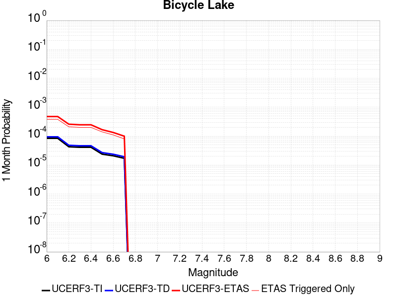 |  |  |

| Magnitude | 1 wk TI Prob | 1 wk TD Prob | 1 wk ETAS Prob | 1 wk ETAS/TD Gain | 1 wk ETAS Triggered Only | 1 mo TI Prob | 1 mo TD Prob | 1 mo ETAS Prob | 1 mo ETAS/TD Gain | 1 mo ETAS Triggered Only | 1 yr TI Prob | 1 yr TD Prob | 1 yr ETAS Prob | 1 yr ETAS/TD Gain | 1 yr ETAS Triggered Only | 10 yr TI Prob | 10 yr TD Prob | 10 yr ETAS Prob | 10 yr ETAS/TD Gain | 10 yr ETAS Triggered Only |
|-----|-----|-----|-----|-----|-----|-----|-----|-----|-----|-----|-----|-----|-----|-----|-----|-----|-----|-----|-----|-----|
| 6.0 | 1.9621975E-5 | 2.2097078E-5 | 4.578173E-4 | 20.718454 | 4.3572986E-4 | 8.4091465E-5 | 9.4699084E-5 | 5.303877E-4 | 5.6007686 | 4.3572986E-4 | 0.0010233327 | 0.0011524865 | 0.0017327901 | 1.5035231 | 5.809731E-4 | 0.01018633 | 0.011478408 | 0.012339865 | 1.0750502 | 8.714597E-4 |
| 6.1 | 1.9621975E-5 | 2.2097078E-5 | 4.578173E-4 | 20.718454 | 4.3572986E-4 | 8.4091465E-5 | 9.4699084E-5 | 5.303877E-4 | 5.6007686 | 4.3572986E-4 | 0.0010233327 | 0.0011524865 | 0.0017327901 | 1.5035231 | 5.809731E-4 | 0.01018633 | 0.011478408 | 0.012339865 | 1.0750502 | 8.714597E-4 |
| 6.2 | 9.9971285E-6 | 1.1255639E-5 | 4.469806E-4 | 39.7117 | 4.3572986E-4 | 4.2844134E-5 | 4.8237856E-5 | 4.8394667E-4 | 10.032508 | 4.3572986E-4 | 5.2150246E-4 | 5.871896E-4 | 0.0010226637 | 1.7416241 | 4.3572986E-4 | 0.0052028033 | 0.005861487 | 0.0064390544 | 1.098536 | 5.809731E-4 |
| 6.3 | 9.589428E-6 | 1.0798346E-5 | 4.4652348E-4 | 41.3511 | 4.3572986E-4 | 4.10969E-5 | 4.62781E-5 | 4.8198778E-4 | 10.4150305 | 4.3572986E-4 | 5.002399E-4 | 5.6334207E-4 | 9.988265E-4 | 1.7730372 | 4.3572986E-4 | 0.0049911533 | 0.0056242296 | 0.006201935 | 1.1027173 | 5.809731E-4 |
| 6.4 | 9.589428E-6 | 1.0798346E-5 | 4.4652348E-4 | 41.3511 | 4.3572986E-4 | 4.10969E-5 | 4.62781E-5 | 4.8198778E-4 | 10.4150305 | 4.3572986E-4 | 5.002399E-4 | 5.6334207E-4 | 9.988265E-4 | 1.7730372 | 4.3572986E-4 | 0.0049911533 | 0.0056242296 | 0.006201935 | 1.1027173 | 5.809731E-4 |
| 6.5 | 5.557707E-6 | 6.2856016E-6 | 4.420127E-4 | 70.321465 | 4.3572986E-4 | 2.3818526E-5 | 2.6938165E-5 | 4.626563E-4 | 17.174751 | 4.3572986E-4 | 2.8995197E-4 | 3.2794967E-4 | 7.6353666E-4 | 2.3282127 | 4.3572986E-4 | 0.0028957394 | 0.0032772934 | 0.0037115952 | 1.1325184 | 4.3572986E-4 |
| 6.6 | 4.8742945E-6 | 5.5132896E-6 | 4.4124073E-4 | 80.0322 | 4.3572986E-4 | 2.0889667E-5 | 2.3628318E-5 | 4.5934788E-4 | 19.440565 | 4.3572986E-4 | 2.54302E-4 | 2.87663E-4 | 7.232675E-4 | 2.5142875 | 4.3572986E-4 | 0.002540112 | 0.0028754752 | 0.003309952 | 1.1510974 | 4.3572986E-4 |
| 6.7 | 3.991108E-6 | 4.5159104E-6 | 2.9500117E-4 | 65.32485 | 2.9048655E-4 | 1.7104636E-5 | 1.9353902E-5 | 3.0983484E-4 | 16.00891 | 2.9048655E-4 | 2.0822904E-4 | 2.3563375E-4 | 5.2605185E-4 | 2.232498 | 2.9048655E-4 | 0.0020803404 | 0.0023563374 | 0.0026461396 | 1.1229883 | 2.9048655E-4 |

## Helendale-So Lockhart
*[(top)](#table-of-contents)*

| 1 Week | 1 Month | 1 Year | 10 Year |
|-----|-----|-----|-----|
|  |  |  |  |

| Magnitude | 1 wk TI Prob | 1 wk TD Prob | 1 wk ETAS Prob | 1 wk ETAS/TD Gain | 1 wk ETAS Triggered Only | 1 mo TI Prob | 1 mo TD Prob | 1 mo ETAS Prob | 1 mo ETAS/TD Gain | 1 mo ETAS Triggered Only | 1 yr TI Prob | 1 yr TD Prob | 1 yr ETAS Prob | 1 yr ETAS/TD Gain | 1 yr ETAS Triggered Only | 10 yr TI Prob | 10 yr TD Prob | 10 yr ETAS Prob | 10 yr ETAS/TD Gain | 10 yr ETAS Triggered Only |
|-----|-----|-----|-----|-----|-----|-----|-----|-----|-----|-----|-----|-----|-----|-----|-----|-----|-----|-----|-----|-----|
| 6.0 | 1.7296055E-5 | 1.8103729E-5 | 3.0858503E-4 | 17.045385 | 2.9048655E-4 | 7.412385E-5 | 7.7585224E-5 | 3.6804925E-4 | 4.7438064 | 2.9048655E-4 | 9.0208417E-4 | 9.4421144E-4 | 0.0013795298 | 1.4610392 | 4.3572986E-4 | 0.008984311 | 0.009404116 | 0.010267381 | 1.0917964 | 8.714597E-4 |
| 6.1 | 1.7296055E-5 | 1.8103729E-5 | 3.0858503E-4 | 17.045385 | 2.9048655E-4 | 7.412385E-5 | 7.7585224E-5 | 3.6804925E-4 | 4.7438064 | 2.9048655E-4 | 9.0208417E-4 | 9.4421144E-4 | 0.0013795298 | 1.4610392 | 4.3572986E-4 | 0.008984311 | 0.009404116 | 0.010267381 | 1.0917964 | 8.714597E-4 |
| 6.2 | 1.7296055E-5 | 1.8103729E-5 | 3.0858503E-4 | 17.045385 | 2.9048655E-4 | 7.412385E-5 | 7.7585224E-5 | 3.6804925E-4 | 4.7438064 | 2.9048655E-4 | 9.0208417E-4 | 9.4421144E-4 | 0.0013795298 | 1.4610392 | 4.3572986E-4 | 0.008984311 | 0.009404116 | 0.010267381 | 1.0917964 | 8.714597E-4 |
| 6.3 | 1.0669118E-5 | 1.1135425E-5 | 3.0161874E-4 | 27.086418 | 2.9048655E-4 | 4.5723988E-5 | 4.772239E-5 | 3.381951E-4 | 7.0867176 | 2.9048655E-4 | 5.5654737E-4 | 5.80868E-4 | 8.7118585E-4 | 1.4998 | 2.9048655E-4 | 0.0055515557 | 0.0057937936 | 0.0062269988 | 1.0747706 | 4.3572986E-4 |
| 6.4 | 1.0669118E-5 | 1.1135425E-5 | 3.0161874E-4 | 27.086418 | 2.9048655E-4 | 4.5723988E-5 | 4.772239E-5 | 3.381951E-4 | 7.0867176 | 2.9048655E-4 | 5.5654737E-4 | 5.80868E-4 | 8.7118585E-4 | 1.4998 | 2.9048655E-4 | 0.0055515557 | 0.0057937936 | 0.0062269988 | 1.0747706 | 4.3572986E-4 |
| 6.5 | 8.790038E-6 | 9.170197E-6 | 1.5441215E-4 | 16.838476 | 1.4524328E-4 | 3.767105E-5 | 3.930026E-5 | 1.8453783E-4 | 4.695588 | 1.4524328E-4 | 4.585485E-4 | 4.7837716E-4 | 6.2355096E-4 | 1.3034714 | 1.4524328E-4 | 0.0045760344 | 0.004773638 | 0.0050627384 | 1.0605618 | 2.9048655E-4 |
| 6.6 | 7.396949E-6 | 7.715537E-6 | 1.529577E-4 | 19.824635 | 1.4524328E-4 | 3.1700827E-5 | 3.3066175E-5 | 1.7830465E-4 | 5.3923583 | 1.4524328E-4 | 3.858892E-4 | 4.025073E-4 | 5.476921E-4 | 1.3607011 | 1.4524328E-4 | 0.003852198 | 0.00401789 | 0.004307209 | 1.0720078 | 2.9048655E-4 |
| 6.7 | 6.4600285E-6 | 6.738031E-6 | 1.5198033E-4 | 22.555601 | 1.4524328E-4 | 2.7685543E-5 | 2.887696E-5 | 1.7411605E-4 | 6.0295835 | 1.4524328E-4 | 3.3701936E-4 | 3.5152107E-4 | 4.9671327E-4 | 1.4130399 | 1.4524328E-4 | 0.0033650869 | 0.003509732 | 0.0036544655 | 1.0412377 | 1.4524328E-4 |
| 6.8 | 5.600104E-6 | 5.836009E-6 | 1.5107845E-4 | 25.887285 | 1.4524328E-4 | 2.4000226E-5 | 2.5011232E-5 | 1.7025089E-4 | 6.806977 | 1.4524328E-4 | 2.9216358E-4 | 3.044698E-4 | 4.4966885E-4 | 1.4768915 | 1.4524328E-4 | 0.0029177975 | 0.003040588 | 0.0031853898 | 1.0476229 | 1.4524328E-4 |
| 6.9 | 4.839122E-6 | 5.0395092E-6 | 1.5028207E-4 | 29.820772 | 1.4524328E-4 | 2.0738931E-5 | 2.159772E-5 | 1.6683787E-4 | 7.7247906 | 1.4524328E-4 | 2.5246723E-4 | 2.6292098E-4 | 4.0812607E-4 | 1.5522766 | 1.4524328E-4 | 0.002521806 | 0.002626147 | 0.0027710085 | 1.0551614 | 1.4524328E-4 |
| 7.0 | 3.6937633E-6 | 3.845208E-6 | 1.4908794E-4 | 38.772396 | 1.4524328E-4 | 1.5830317E-5 | 1.647936E-5 | 1.6172025E-4 | 9.813502 | 1.4524328E-4 | 1.9271708E-4 | 2.0061806E-4 | 3.458322E-4 | 1.7238339 | 1.4524328E-4 | 0.0019255003 | 0.002004401 | 0.002149353 | 1.072317 | 1.4524328E-4 |
| 7.1 | 2.7858857E-6 | 2.8978538E-6 | 1.4814071E-4 | 51.12084 | 1.4524328E-4 | 1.1939455E-5 | 1.2419316E-5 | 1.5766079E-4 | 12.694805 | 1.4524328E-4 | 1.4535317E-4 | 1.511949E-4 | 2.9641623E-4 | 1.960491 | 1.4524328E-4 | 0.0014525814 | 0.0015109418 | 0.0016559656 | 1.0959824 | 1.4524328E-4 |
| 7.2 | 2.1672065E-6 | 2.2540128E-6 | 2.2540128E-6 | 1.0 | 0.0 | 9.2879945E-6 | 9.66002E-6 | 9.66002E-6 | 1.0 | 0.0 | 1.1307546E-4 | 1.1760458E-4 | 1.1760458E-4 | 1.0 | 0.0 | 0.0011301794 | 0.0011754417 | 0.0011754417 | 1.0 | 0.0 |
| 7.3 | 1.4823496E-6 | 1.5422102E-6 | 1.5422102E-6 | 1.0 | 0.0 | 6.3529114E-6 | 6.6094562E-6 | 6.6094562E-6 | 1.0 | 0.0 | 7.734395E-5 | 8.046731E-5 | 8.046731E-5 | 1.0 | 0.0 | 7.731704E-4 | 8.0439687E-4 | 8.0439687E-4 | 1.0 | 0.0 |
| 7.4 | 4.2321457E-7 | 4.4108765E-7 | 4.4108765E-7 | 1.0 | 0.0 | 1.8137755E-6 | 1.8903745E-6 | 1.8903745E-6 | 1.0 | 0.0 | 2.2082493E-5 | 2.3015113E-5 | 2.3015113E-5 | 1.0 | 0.0 | 2.2080299E-4 | 2.3013182E-4 | 2.3013182E-4 | 1.0 | 0.0 |
| 7.5 | 5.6942316E-8 | 5.9415648E-8 | 5.9415648E-8 | 1.0 | 0.0 | 2.440385E-7 | 2.5463845E-7 | 2.5463845E-7 | 1.0 | 0.0 | 2.9711643E-6 | 3.1002196E-6 | 3.1002196E-6 | 1.0 | 0.0 | 2.9711247E-5 | 3.1001844E-5 | 3.1001844E-5 | 1.0 | 0.0 |

## San Andreas (San Bernardino N)
*[(top)](#table-of-contents)*

| 1 Week | 1 Month | 1 Year | 10 Year |
|-----|-----|-----|-----|
|  |  |  |  |

| Magnitude | 1 wk TI Prob | 1 wk TD Prob | 1 wk ETAS Prob | 1 wk ETAS/TD Gain | 1 wk ETAS Triggered Only | 1 mo TI Prob | 1 mo TD Prob | 1 mo ETAS Prob | 1 mo ETAS/TD Gain | 1 mo ETAS Triggered Only | 1 yr TI Prob | 1 yr TD Prob | 1 yr ETAS Prob | 1 yr ETAS/TD Gain | 1 yr ETAS Triggered Only | 10 yr TI Prob | 10 yr TD Prob | 10 yr ETAS Prob | 10 yr ETAS/TD Gain | 10 yr ETAS Triggered Only |
|-----|-----|-----|-----|-----|-----|-----|-----|-----|-----|-----|-----|-----|-----|-----|-----|-----|-----|-----|-----|-----|
| 6.0 | 1.4273766E-4 | 3.1606483E-4 | 3.1606483E-4 | 1.0 | 0.0 | 6.115894E-4 | 0.0013538664 | 0.0013538664 | 1.0 | 0.0 | 0.0074207084 | 0.016360244 | 0.016645977 | 1.0174651 | 2.9048655E-4 | 0.07177748 | 0.15026689 | 0.15076056 | 1.0032853 | 5.809731E-4 |
| 6.1 | 1.4273766E-4 | 3.1606483E-4 | 3.1606483E-4 | 1.0 | 0.0 | 6.115894E-4 | 0.0013538664 | 0.0013538664 | 1.0 | 0.0 | 0.0074207084 | 0.016360244 | 0.016645977 | 1.0174651 | 2.9048655E-4 | 0.07177748 | 0.15026689 | 0.15076056 | 1.0032853 | 5.809731E-4 |
| 6.2 | 1.4273766E-4 | 3.1606483E-4 | 3.1606483E-4 | 1.0 | 0.0 | 6.115894E-4 | 0.0013538664 | 0.0013538664 | 1.0 | 0.0 | 0.0074207084 | 0.016360244 | 0.016645977 | 1.0174651 | 2.9048655E-4 | 0.07177748 | 0.15026689 | 0.15076056 | 1.0032853 | 5.809731E-4 |
| 6.3 | 1.3730655E-4 | 3.0511338E-4 | 3.0511338E-4 | 1.0 | 0.0 | 5.883239E-4 | 0.0013069791 | 0.0013069791 | 1.0 | 0.0 | 0.0071393442 | 0.015797773 | 0.01608367 | 1.0180973 | 2.9048655E-4 | 0.06914291 | 0.14556676 | 0.14606316 | 1.0034101 | 5.809731E-4 |
| 6.4 | 1.3730655E-4 | 3.0511338E-4 | 3.0511338E-4 | 1.0 | 0.0 | 5.883239E-4 | 0.0013069791 | 0.0013069791 | 1.0 | 0.0 | 0.0071393442 | 0.015797773 | 0.01608367 | 1.0180973 | 2.9048655E-4 | 0.06914291 | 0.14556676 | 0.14606316 | 1.0034101 | 5.809731E-4 |
| 6.5 | 1.2942807E-4 | 2.8925808E-4 | 2.8925808E-4 | 1.0 | 0.0 | 5.545738E-4 | 0.0012390936 | 0.0012390936 | 1.0 | 0.0 | 0.0067310524 | 0.01498286 | 0.0152689945 | 1.0190974 | 2.9048655E-4 | 0.06530788 | 0.13870941 | 0.1392098 | 1.0036074 | 5.809731E-4 |
| 6.6 | 1.1125901E-4 | 2.536472E-4 | 2.536472E-4 | 1.0 | 0.0 | 4.767372E-4 | 0.0010866089 | 0.0010866089 | 1.0 | 0.0 | 0.005788839 | 0.013149847 | 0.013293181 | 1.0109 | 1.4524328E-4 | 0.056403454 | 0.122999296 | 0.12338143 | 1.0031068 | 4.3572986E-4 |
| 6.7 | 1.02209575E-4 | 2.3499702E-4 | 2.3499702E-4 | 1.0 | 0.0 | 4.3796748E-4 | 0.0010067427 | 0.0010067427 | 1.0 | 0.0 | 0.0053192247 | 0.012188629 | 0.012332102 | 1.0117711 | 1.4524328E-4 | 0.051936906 | 0.114790924 | 0.11517663 | 1.0033602 | 4.3572986E-4 |
| 6.8 | 9.610582E-5 | 2.2025521E-4 | 2.2025521E-4 | 1.0 | 0.0 | 4.1181705E-4 | 9.436101E-4 | 9.436101E-4 | 1.0 | 0.0 | 0.0050023515 | 0.011428202 | 0.0115717845 | 1.012564 | 1.4524328E-4 | 0.048912346 | 0.1081929 | 0.10858149 | 1.0035917 | 4.3572986E-4 |
| 6.9 | 9.3877505E-5 | 2.1481077E-4 | 2.1481077E-4 | 1.0 | 0.0 | 4.0227012E-4 | 9.2029345E-4 | 9.2029345E-4 | 1.0 | 0.0 | 0.0048866454 | 0.011147255 | 0.01129088 | 1.0128843 | 1.4524328E-4 | 0.04780577 | 0.10578323 | 0.10617287 | 1.0036833 | 4.3572986E-4 |
| 7.0 | 9.1019785E-5 | 2.0808022E-4 | 2.0808022E-4 | 1.0 | 0.0 | 3.900265E-4 | 8.914682E-4 | 8.914682E-4 | 1.0 | 0.0 | 0.0047382377 | 0.010799837 | 0.0109435115 | 1.0133034 | 1.4524328E-4 | 0.046384744 | 0.102753714 | 0.103144675 | 1.0038048 | 4.3572986E-4 |
| 7.1 | 8.771155E-5 | 1.9982594E-4 | 1.9982594E-4 | 1.0 | 0.0 | 3.758525E-4 | 8.5611636E-4 | 8.5611636E-4 | 1.0 | 0.0 | 0.0045664064 | 0.0103736 | 0.010517336 | 1.013856 | 1.4524328E-4 | 0.044737056 | 0.09906527 | 0.099326976 | 1.0026418 | 2.9048655E-4 |
| 7.2 | 8.0830236E-5 | 1.8388197E-4 | 1.8388197E-4 | 1.0 | 0.0 | 3.4636928E-4 | 7.8782777E-4 | 7.8782777E-4 | 1.0 | 0.0 | 0.0042088944 | 0.009549725 | 0.009693581 | 1.0150639 | 1.4524328E-4 | 0.041300658 | 0.09179615 | 0.09205997 | 1.002874 | 2.9048655E-4 |
| 7.3 | 7.7668235E-5 | 1.7331762E-4 | 1.7331762E-4 | 1.0 | 0.0 | 3.328214E-4 | 7.425784E-4 | 7.425784E-4 | 1.0 | 0.0 | 0.0040445733 | 0.009003494 | 0.00914743 | 1.0159867 | 1.4524328E-4 | 0.03971748 | 0.08706327 | 0.087328464 | 1.003046 | 2.9048655E-4 |
| 7.4 | 7.520177E-5 | 1.6551897E-4 | 1.6551897E-4 | 1.0 | 0.0 | 3.2225347E-4 | 7.0917426E-4 | 7.0917426E-4 | 1.0 | 0.0 | 0.0039163795 | 0.008600081 | 0.008744076 | 1.0167433 | 1.4524328E-4 | 0.038480744 | 0.08351955 | 0.08378577 | 1.0031875 | 2.9048655E-4 |
| 7.5 | 7.274697E-5 | 1.5839566E-4 | 1.5839566E-4 | 1.0 | 0.0 | 3.1173544E-4 | 6.78662E-4 | 6.78662E-4 | 1.0 | 0.0 | 0.003788775 | 0.008231463 | 0.008375511 | 1.0174997 | 1.4524328E-4 | 0.03724827 | 0.08023631 | 0.080503486 | 1.0033299 | 2.9048655E-4 |
| 7.6 | 7.1185845E-5 | 1.540943E-4 | 1.540943E-4 | 1.0 | 0.0 | 3.0504653E-4 | 6.6023704E-4 | 6.6023704E-4 | 1.0 | 0.0 | 0.0037076178 | 0.008008812 | 0.008152891 | 1.0179902 | 1.4524328E-4 | 0.036463667 | 0.07822598 | 0.07849374 | 1.003423 | 2.9048655E-4 |
| 7.7 | 6.709961E-5 | 1.4318313E-4 | 1.4318313E-4 | 1.0 | 0.0 | 2.8753807E-4 | 6.1349774E-4 | 6.1349774E-4 | 1.0 | 0.0 | 0.003495157 | 0.0074437927 | 0.0075879544 | 1.0193667 | 1.4524328E-4 | 0.034406938 | 0.07305469 | 0.07332396 | 1.0036858 | 2.9048655E-4 |
| 7.8 | 6.300812E-5 | 1.3202413E-4 | 1.3202413E-4 | 1.0 | 0.0 | 2.7000686E-4 | 5.65695E-4 | 5.65695E-4 | 1.0 | 0.0 | 0.0032823787 | 0.006865616 | 0.007009862 | 1.0210099 | 1.4524328E-4 | 0.032343175 | 0.06771354 | 0.06798436 | 1.0039995 | 2.9048655E-4 |
| 7.9 | 4.983037E-5 | 9.723488E-5 | 9.723488E-5 | 1.0 | 0.0 | 2.1354125E-4 | 4.1665437E-4 | 4.1665437E-4 | 1.0 | 0.0 | 0.0025967648 | 0.0050609782 | 0.0050609782 | 1.0 | 0.0 | 0.025666296 | 0.05064886 | 0.05078675 | 1.0027224 | 1.4524328E-4 |
| 8.0 | 3.2211527E-5 | 5.3304586E-5 | 5.3304586E-5 | 1.0 | 0.0 | 1.380421E-4 | 2.2842824E-4 | 2.2842824E-4 | 1.0 | 0.0 | 0.0016793669 | 0.0027775685 | 0.0027775685 | 1.0 | 0.0 | 0.016667323 | 0.028361378 | 0.028502503 | 1.0049759 | 1.4524328E-4 |
| 8.1 | 1.743376E-5 | 1.8824427E-5 | 1.8824427E-5 | 1.0 | 0.0 | 7.471398E-5 | 8.067362E-5 | 8.067362E-5 | 1.0 | 0.0 | 9.0926304E-4 | 9.817594E-4 | 9.817594E-4 | 1.0 | 0.0 | 0.009055517 | 0.010484105 | 0.010484105 | 1.0 | 0.0 |
| 8.2 | 7.831616E-6 | 5.1551065E-6 | 5.1551065E-6 | 1.0 | 0.0 | 3.3563636E-5 | 2.2093127E-5 | 2.2093127E-5 | 1.0 | 0.0 | 4.0856065E-4 | 2.6895068E-4 | 2.6895068E-4 | 1.0 | 0.0 | 0.004078103 | 0.0030418145 | 0.0030418145 | 1.0 | 0.0 |
| 8.3 | 1.983087E-6 | 7.6599065E-7 | 7.6599065E-7 | 1.0 | 0.0 | 8.498917E-6 | 3.282813E-6 | 3.282813E-6 | 1.0 | 0.0 | 1.034694E-4 | 3.9967534E-5 | 3.9967534E-5 | 1.0 | 0.0 | 0.0010342124 | 4.719687E-4 | 4.719687E-4 | 1.0 | 0.0 |

## Cleghorn Lake
*[(top)](#table-of-contents)*

| 1 Week | 1 Month | 1 Year | 10 Year |
|-----|-----|-----|-----|
|  |  |  |  |

| Magnitude | 1 wk TI Prob | 1 wk TD Prob | 1 wk ETAS Prob | 1 wk ETAS/TD Gain | 1 wk ETAS Triggered Only | 1 mo TI Prob | 1 mo TD Prob | 1 mo ETAS Prob | 1 mo ETAS/TD Gain | 1 mo ETAS Triggered Only | 1 yr TI Prob | 1 yr TD Prob | 1 yr ETAS Prob | 1 yr ETAS/TD Gain | 1 yr ETAS Triggered Only | 10 yr TI Prob | 10 yr TD Prob | 10 yr ETAS Prob | 10 yr ETAS/TD Gain | 10 yr ETAS Triggered Only |
|-----|-----|-----|-----|-----|-----|-----|-----|-----|-----|-----|-----|-----|-----|-----|-----|-----|-----|-----|-----|-----|
| 6.0 | 1.5467183E-5 | 1.6794203E-5 | 3.0727588E-4 | 18.296545 | 2.9048655E-4 | 6.6286244E-5 | 7.197348E-5 | 5.0767197E-4 | 7.0535975 | 4.3572986E-4 | 8.067362E-4 | 8.759797E-4 | 0.0013113279 | 1.4969842 | 4.3572986E-4 | 0.008038137 | 0.008730696 | 0.009162622 | 1.0494721 | 4.3572986E-4 |
| 6.1 | 1.5467183E-5 | 1.6794203E-5 | 3.0727588E-4 | 18.296545 | 2.9048655E-4 | 6.6286244E-5 | 7.197348E-5 | 5.0767197E-4 | 7.0535975 | 4.3572986E-4 | 8.067362E-4 | 8.759797E-4 | 0.0013113279 | 1.4969842 | 4.3572986E-4 | 0.008038137 | 0.008730696 | 0.009162622 | 1.0494721 | 4.3572986E-4 |
| 6.2 | 1.2624631E-5 | 1.3681544E-5 | 3.0416413E-4 | 22.23171 | 2.9048655E-4 | 5.410444E-5 | 5.863415E-5 | 4.9433846E-4 | 8.430897 | 4.3572986E-4 | 6.585225E-4 | 7.1368564E-4 | 0.0011491044 | 1.610099 | 4.3572986E-4 | 0.0065657445 | 0.0071187317 | 0.00755136 | 1.0607731 | 4.3572986E-4 |
| 6.3 | 1.2624631E-5 | 1.3681544E-5 | 3.0416413E-4 | 22.23171 | 2.9048655E-4 | 5.410444E-5 | 5.863415E-5 | 4.9433846E-4 | 8.430897 | 4.3572986E-4 | 6.585225E-4 | 7.1368564E-4 | 0.0011491044 | 1.610099 | 4.3572986E-4 | 0.0065657445 | 0.0071187317 | 0.00755136 | 1.0607731 | 4.3572986E-4 |
| 6.4 | 9.417684E-6 | 1.0170118E-5 | 1.0170118E-5 | 1.0 | 0.0 | 4.036088E-5 | 4.3585722E-5 | 1.8882267E-4 | 4.332214 | 1.4524328E-4 | 4.912829E-4 | 5.3056807E-4 | 6.7573425E-4 | 1.2736052 | 1.4524328E-4 | 0.004901982 | 0.005297049 | 0.005441523 | 1.0272744 | 1.4524328E-4 |
| 6.5 | 9.368219E-6 | 1.0117545E-5 | 1.0117545E-5 | 1.0 | 0.0 | 4.014889E-5 | 4.3360415E-5 | 1.885974E-4 | 4.3495293 | 1.4524328E-4 | 4.8870314E-4 | 5.2782625E-4 | 6.729929E-4 | 1.2750273 | 1.4524328E-4 | 0.004876298 | 0.0052697617 | 0.0054142396 | 1.0274163 | 1.4524328E-4 |
| 6.6 | 7.803798E-6 | 8.441831E-6 | 8.441831E-6 | 1.0 | 0.0 | 3.3444423E-5 | 3.6179E-5 | 1.8141702E-4 | 5.014429 | 1.4524328E-4 | 4.0710976E-4 | 4.4043022E-4 | 5.856095E-4 | 1.3296307 | 1.4524328E-4 | 0.0040636472 | 0.0043994905 | 0.0045440947 | 1.0328684 | 1.4524328E-4 |
| 6.7 | 2.3108669E-6 | 2.4438336E-6 | 2.4438336E-6 | 1.0 | 0.0 | 9.903678E-6 | 1.0473532E-5 | 1.0473532E-5 | 1.0 | 0.0 | 1.205706E-4 | 1.2750797E-4 | 1.2750797E-4 | 1.0 | 0.0 | 0.001205052 | 0.0012743667 | 0.0012743667 | 1.0 | 0.0 |
| 6.8 | 2.0882828E-6 | 2.2062823E-6 | 2.2062823E-6 | 1.0 | 0.0 | 8.949753E-6 | 9.455462E-6 | 9.455462E-6 | 1.0 | 0.0 | 1.08957785E-4 | 1.1511434E-4 | 1.1511434E-4 | 1.0 | 0.0 | 0.0010890438 | 0.0011505639 | 0.0011505639 | 1.0 | 0.0 |
| 6.9 | 1.876935E-6 | 1.981051E-6 | 1.981051E-6 | 1.0 | 0.0 | 8.043982E-6 | 8.490192E-6 | 8.490192E-6 | 1.0 | 0.0 | 9.7931086E-5 | 1.03363345E-4 | 1.03363345E-4 | 1.0 | 0.0 | 9.788794E-4 | 0.0010331686 | 0.0010331686 | 1.0 | 0.0 |
| 7.0 | 1.5357559E-6 | 1.6202807E-6 | 1.6202807E-6 | 1.0 | 0.0 | 6.5817944E-6 | 6.9440425E-6 | 6.9440425E-6 | 1.0 | 0.0 | 8.01304E-5 | 8.454057E-5 | 8.454057E-5 | 1.0 | 0.0 | 8.010151E-4 | 8.450965E-4 | 8.450965E-4 | 1.0 | 0.0 |
| 7.1 | 1.0905424E-6 | 1.1497619E-6 | 1.1497619E-6 | 1.0 | 0.0 | 4.6737446E-6 | 4.9275427E-6 | 4.9275427E-6 | 1.0 | 0.0 | 5.6901354E-5 | 5.999128E-5 | 5.999128E-5 | 1.0 | 0.0 | 5.6886784E-4 | 5.997606E-4 | 5.997606E-4 | 1.0 | 0.0 |
| 7.2 | 6.06668E-7 | 6.387277E-7 | 6.387277E-7 | 1.0 | 0.0 | 2.600003E-6 | 2.7374022E-6 | 2.7374022E-6 | 1.0 | 0.0 | 3.1654577E-5 | 3.3327433E-5 | 3.3327433E-5 | 1.0 | 0.0 | 3.1650066E-4 | 3.3323118E-4 | 3.3323118E-4 | 1.0 | 0.0 |

## San Andreas (Mojave N)
*[(top)](#table-of-contents)*

| 1 Week | 1 Month | 1 Year | 10 Year |
|-----|-----|-----|-----|
|  | 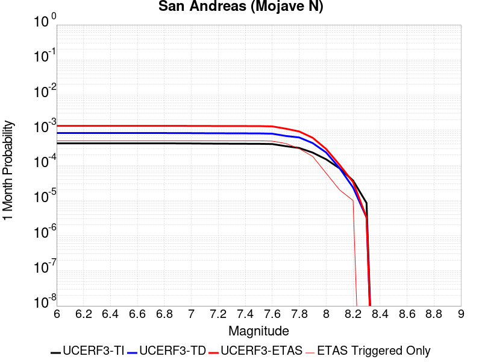 |  |  |

| Magnitude | 1 wk TI Prob | 1 wk TD Prob | 1 wk ETAS Prob | 1 wk ETAS/TD Gain | 1 wk ETAS Triggered Only | 1 mo TI Prob | 1 mo TD Prob | 1 mo ETAS Prob | 1 mo ETAS/TD Gain | 1 mo ETAS Triggered Only | 1 yr TI Prob | 1 yr TD Prob | 1 yr ETAS Prob | 1 yr ETAS/TD Gain | 1 yr ETAS Triggered Only | 10 yr TI Prob | 10 yr TD Prob | 10 yr ETAS Prob | 10 yr ETAS/TD Gain | 10 yr ETAS Triggered Only |
|-----|-----|-----|-----|-----|-----|-----|-----|-----|-----|-----|-----|-----|-----|-----|-----|-----|-----|-----|-----|-----|
| 6.0 | 9.877682E-5 | 1.9400702E-4 | 3.392221E-4 | 1.7485044 | 1.4524328E-4 | 4.2326056E-4 | 8.311939E-4 | 9.7631646E-4 | 1.1745954 | 1.4524328E-4 | 0.0051410277 | 0.010072956 | 0.010360517 | 1.0285478 | 2.9048655E-4 | 0.05023708 | 0.09831428 | 0.09883813 | 1.0053284 | 5.809731E-4 |
| 6.1 | 9.877682E-5 | 1.9400702E-4 | 3.392221E-4 | 1.7485044 | 1.4524328E-4 | 4.2326056E-4 | 8.311939E-4 | 9.7631646E-4 | 1.1745954 | 1.4524328E-4 | 0.0051410277 | 0.010072956 | 0.010360517 | 1.0285478 | 2.9048655E-4 | 0.05023708 | 0.09831428 | 0.09883813 | 1.0053284 | 5.809731E-4 |
| 6.2 | 9.877682E-5 | 1.9400702E-4 | 3.392221E-4 | 1.7485044 | 1.4524328E-4 | 4.2326056E-4 | 8.311939E-4 | 9.7631646E-4 | 1.1745954 | 1.4524328E-4 | 0.0051410277 | 0.010072956 | 0.010360517 | 1.0285478 | 2.9048655E-4 | 0.05023708 | 0.09831428 | 0.09883813 | 1.0053284 | 5.809731E-4 |
| 6.3 | 9.877682E-5 | 1.9400702E-4 | 3.392221E-4 | 1.7485044 | 1.4524328E-4 | 4.2326056E-4 | 8.311939E-4 | 9.7631646E-4 | 1.1745954 | 1.4524328E-4 | 0.0051410277 | 0.010072956 | 0.010360517 | 1.0285478 | 2.9048655E-4 | 0.05023708 | 0.09831428 | 0.09883813 | 1.0053284 | 5.809731E-4 |
| 6.4 | 9.877682E-5 | 1.9400702E-4 | 3.392221E-4 | 1.7485044 | 1.4524328E-4 | 4.2326056E-4 | 8.311939E-4 | 9.7631646E-4 | 1.1745954 | 1.4524328E-4 | 0.0051410277 | 0.010072956 | 0.010360517 | 1.0285478 | 2.9048655E-4 | 0.05023708 | 0.09831428 | 0.09883813 | 1.0053284 | 5.809731E-4 |
| 6.5 | 9.861474E-5 | 1.9374468E-4 | 3.3895983E-4 | 1.749518 | 1.4524328E-4 | 4.2256617E-4 | 8.300703E-4 | 9.7519305E-4 | 1.1748319 | 1.4524328E-4 | 0.0051326132 | 0.010059402 | 0.010346967 | 1.0285866 | 2.9048655E-4 | 0.050156746 | 0.098192066 | 0.098716 | 1.0053357 | 5.809731E-4 |
| 6.6 | 9.861474E-5 | 1.9374468E-4 | 3.3895983E-4 | 1.749518 | 1.4524328E-4 | 4.2256617E-4 | 8.300703E-4 | 9.7519305E-4 | 1.1748319 | 1.4524328E-4 | 0.0051326132 | 0.010059402 | 0.010346967 | 1.0285866 | 2.9048655E-4 | 0.050156746 | 0.098192066 | 0.098716 | 1.0053357 | 5.809731E-4 |
| 6.7 | 9.8552715E-5 | 1.9364421E-4 | 3.3885936E-4 | 1.749907 | 1.4524328E-4 | 4.223004E-4 | 8.2964E-4 | 9.747628E-4 | 1.1749226 | 1.4524328E-4 | 0.0051293927 | 0.010054212 | 0.010341778 | 1.0286015 | 2.9048655E-4 | 0.050125998 | 0.098145254 | 0.09866921 | 1.0053385 | 5.809731E-4 |
| 6.8 | 9.8464974E-5 | 1.9349584E-4 | 3.3871102E-4 | 1.7504822 | 1.4524328E-4 | 4.219245E-4 | 8.290045E-4 | 9.7412744E-4 | 1.1750568 | 1.4524328E-4 | 0.0051248376 | 0.010046546 | 0.010334115 | 1.0286236 | 2.9048655E-4 | 0.05008251 | 0.09807528 | 0.09859928 | 1.0053427 | 5.809731E-4 |
| 6.9 | 9.825824E-5 | 1.9317595E-4 | 3.3839117E-4 | 1.7517252 | 1.4524328E-4 | 4.2103877E-4 | 8.276344E-4 | 9.7275747E-4 | 1.1753469 | 1.4524328E-4 | 0.0051141046 | 0.010030019 | 0.010317592 | 1.0286713 | 2.9048655E-4 | 0.049980022 | 0.09792438 | 0.09844846 | 1.0053519 | 5.809731E-4 |
| 7.0 | 9.781462E-5 | 1.924896E-4 | 3.3770493E-4 | 1.7544061 | 1.4524328E-4 | 4.1913814E-4 | 8.246948E-4 | 9.698183E-4 | 1.1759723 | 1.4524328E-4 | 0.005091073 | 0.009994558 | 0.010282142 | 1.028774 | 2.9048655E-4 | 0.04976007 | 0.09760077 | 0.09812504 | 1.0053716 | 5.809731E-4 |
| 7.1 | 9.7121134E-5 | 1.9150671E-4 | 3.3672218E-4 | 1.7582787 | 1.4524328E-4 | 4.1616702E-4 | 8.204851E-4 | 9.656092E-4 | 1.176876 | 1.4524328E-4 | 0.005055068 | 0.009943774 | 0.010231372 | 1.0289224 | 2.9048655E-4 | 0.04941613 | 0.09713728 | 0.09766182 | 1.0054 | 5.809731E-4 |
| 7.2 | 9.663819E-5 | 1.9081456E-4 | 3.3603015E-4 | 1.7610297 | 1.4524328E-4 | 4.1409794E-4 | 8.175206E-4 | 9.6264516E-4 | 1.1775179 | 1.4524328E-4 | 0.0050299936 | 0.00990801 | 0.010195619 | 1.0290278 | 2.9048655E-4 | 0.049176537 | 0.09681055 | 0.09733528 | 1.0054202 | 5.809731E-4 |
| 7.3 | 9.6277574E-5 | 1.9033969E-4 | 3.3555532E-4 | 1.7629288 | 1.4524328E-4 | 4.125529E-4 | 8.154867E-4 | 9.6061156E-4 | 1.177961 | 1.4524328E-4 | 0.0050112694 | 0.009883473 | 0.010171088 | 1.0291007 | 2.9048655E-4 | 0.04899759 | 0.09658401 | 0.09710887 | 1.0054343 | 5.809731E-4 |
| 7.4 | 9.593308E-5 | 1.897375E-4 | 3.3495322E-4 | 1.7653507 | 1.4524328E-4 | 4.1107697E-4 | 8.129075E-4 | 9.5803273E-4 | 1.1785262 | 1.4524328E-4 | 0.0049933824 | 0.009852355 | 0.01013998 | 1.0291935 | 2.9048655E-4 | 0.04882661 | 0.09630218 | 0.09682721 | 1.0054518 | 5.809731E-4 |
| 7.5 | 9.561707E-5 | 1.8919831E-4 | 3.3441413E-4 | 1.7675322 | 1.4524328E-4 | 4.0972308E-4 | 8.1059814E-4 | 9.557237E-4 | 1.1790352 | 1.4524328E-4 | 0.0049769743 | 0.009824493 | 0.010112125 | 1.0292771 | 2.9048655E-4 | 0.048669744 | 0.09604836 | 0.09657353 | 1.0054678 | 5.809731E-4 |
| 7.6 | 9.418194E-5 | 1.8572104E-4 | 3.3093736E-4 | 1.7819055 | 1.4524328E-4 | 4.0357444E-4 | 7.957047E-4 | 9.408324E-4 | 1.1823889 | 1.4524328E-4 | 0.004902454 | 0.009644784 | 0.00993247 | 1.0298281 | 2.9048655E-4 | 0.047957025 | 0.094430685 | 0.0949568 | 1.0055714 | 5.809731E-4 |
| 7.7 | 8.202141E-5 | 1.6021315E-4 | 3.0543318E-4 | 1.9064175 | 1.4524328E-4 | 3.51473E-4 | 6.8644714E-4 | 8.3159073E-4 | 1.2114418 | 1.4524328E-4 | 0.00427079 | 0.008325525 | 0.008613593 | 1.0346006 | 2.9048655E-4 | 0.04189639 | 0.08223219 | 0.08276539 | 1.006484 | 5.809731E-4 |
| 7.8 | 7.2859846E-5 | 1.4516473E-4 | 2.903869E-4 | 2.000396 | 1.4524328E-4 | 3.1221908E-4 | 6.219862E-4 | 7.6713914E-4 | 1.2333701 | 1.4524328E-4 | 0.003794643 | 0.0075464295 | 0.007834724 | 1.0382028 | 2.9048655E-4 | 0.037304975 | 0.07472468 | 0.075127855 | 1.0053954 | 4.3572986E-4 |
| 7.9 | 5.3874453E-5 | 1.0045676E-4 | 1.0045676E-4 | 1.0 | 0.0 | 2.3087008E-4 | 4.3045796E-4 | 4.3045796E-4 | 1.0 | 0.0 | 0.0028072202 | 0.0052282433 | 0.0052282433 | 1.0 | 0.0 | 0.02772022 | 0.05242443 | 0.052562058 | 1.0026252 | 1.4524328E-4 |
| 8.0 | 3.468538E-5 | 5.4260272E-5 | 5.4260272E-5 | 1.0 | 0.0 | 1.4864317E-4 | 2.325233E-4 | 2.325233E-4 | 1.0 | 0.0 | 0.0018082283 | 0.002827298 | 0.002827298 | 1.0 | 0.0 | 0.017935853 | 0.028947512 | 0.02908855 | 1.0048722 | 1.4524328E-4 |
| 8.1 | 1.9152367E-5 | 1.940263E-5 | 1.940263E-5 | 1.0 | 0.0 | 8.207899E-5 | 8.3151484E-5 | 8.3151484E-5 | 1.0 | 0.0 | 9.988535E-4 | 0.0010118998 | 0.0010118998 | 1.0 | 0.0 | 0.009943757 | 0.01085625 | 0.01085625 | 1.0 | 0.0 |
| 8.2 | 8.643924E-6 | 5.4748625E-6 | 5.4748625E-6 | 1.0 | 0.0 | 3.704486E-5 | 2.3463486E-5 | 2.3463486E-5 | 1.0 | 0.0 | 4.5092785E-4 | 2.8563058E-4 | 2.8563058E-4 | 1.0 | 0.0 | 0.0045001395 | 0.0032487072 | 0.0032487072 | 1.0 | 0.0 |
| 8.3 | 1.983087E-6 | 7.6599065E-7 | 7.6599065E-7 | 1.0 | 0.0 | 8.498917E-6 | 3.282813E-6 | 3.282813E-6 | 1.0 | 0.0 | 1.034694E-4 | 3.9967534E-5 | 3.9967534E-5 | 1.0 | 0.0 | 0.0010342124 | 4.719687E-4 | 4.719687E-4 | 1.0 | 0.0 |

## Death Valley (Black Mtns Frontal)
*[(top)](#table-of-contents)*

| 1 Week | 1 Month | 1 Year | 10 Year |
|-----|-----|-----|-----|
|  |  |  |  |

| Magnitude | 1 wk TI Prob | 1 wk TD Prob | 1 wk ETAS Prob | 1 wk ETAS/TD Gain | 1 wk ETAS Triggered Only | 1 mo TI Prob | 1 mo TD Prob | 1 mo ETAS Prob | 1 mo ETAS/TD Gain | 1 mo ETAS Triggered Only | 1 yr TI Prob | 1 yr TD Prob | 1 yr ETAS Prob | 1 yr ETAS/TD Gain | 1 yr ETAS Triggered Only | 10 yr TI Prob | 10 yr TD Prob | 10 yr ETAS Prob | 10 yr ETAS/TD Gain | 10 yr ETAS Triggered Only |
|-----|-----|-----|-----|-----|-----|-----|-----|-----|-----|-----|-----|-----|-----|-----|-----|-----|-----|-----|-----|-----|
| 6.0 | 1.6707214E-5 | 1.867027E-5 | 3.0915142E-4 | 16.558487 | 2.9048655E-4 | 7.160038E-5 | 8.001302E-5 | 3.7047634E-4 | 4.6302004 | 2.9048655E-4 | 8.71386E-4 | 9.737309E-4 | 0.0014090365 | 1.4470491 | 4.3572986E-4 | 0.00867977 | 0.009695496 | 0.010270837 | 1.059341 | 5.809731E-4 |
| 6.1 | 1.6707214E-5 | 1.867027E-5 | 3.0915142E-4 | 16.558487 | 2.9048655E-4 | 7.160038E-5 | 8.001302E-5 | 3.7047634E-4 | 4.6302004 | 2.9048655E-4 | 8.71386E-4 | 9.737309E-4 | 0.0014090365 | 1.4470491 | 4.3572986E-4 | 0.00867977 | 0.009695496 | 0.010270837 | 1.059341 | 5.809731E-4 |
| 6.2 | 1.6707214E-5 | 1.867027E-5 | 3.0915142E-4 | 16.558487 | 2.9048655E-4 | 7.160038E-5 | 8.001302E-5 | 3.7047634E-4 | 4.6302004 | 2.9048655E-4 | 8.71386E-4 | 9.737309E-4 | 0.0014090365 | 1.4470491 | 4.3572986E-4 | 0.00867977 | 0.009695496 | 0.010270837 | 1.059341 | 5.809731E-4 |
| 6.3 | 1.6707214E-5 | 1.867027E-5 | 3.0915142E-4 | 16.558487 | 2.9048655E-4 | 7.160038E-5 | 8.001302E-5 | 3.7047634E-4 | 4.6302004 | 2.9048655E-4 | 8.71386E-4 | 9.737309E-4 | 0.0014090365 | 1.4470491 | 4.3572986E-4 | 0.00867977 | 0.009695496 | 0.010270837 | 1.059341 | 5.809731E-4 |
| 6.4 | 1.5515609E-5 | 1.7338214E-5 | 3.0781975E-4 | 17.753834 | 2.9048655E-4 | 6.649377E-5 | 7.4304546E-5 | 3.6476954E-4 | 4.9091144 | 2.9048655E-4 | 8.0926094E-4 | 9.042885E-4 | 0.0013396243 | 1.4814125 | 4.3572986E-4 | 0.008063202 | 0.009006773 | 0.009582513 | 1.063923 | 5.809731E-4 |
| 6.5 | 1.5515609E-5 | 1.7338214E-5 | 3.0781975E-4 | 17.753834 | 2.9048655E-4 | 6.649377E-5 | 7.4304546E-5 | 3.6476954E-4 | 4.9091144 | 2.9048655E-4 | 8.0926094E-4 | 9.042885E-4 | 0.0013396243 | 1.4814125 | 4.3572986E-4 | 0.008063202 | 0.009006773 | 0.009582513 | 1.063923 | 5.809731E-4 |
| 6.6 | 1.5041828E-5 | 1.6809145E-5 | 1.6204998E-4 | 9.640585 | 1.4524328E-4 | 6.4463384E-5 | 7.203723E-5 | 2.1727005E-4 | 3.01608 | 1.4524328E-4 | 7.8455906E-4 | 8.767063E-4 | 0.0011669382 | 1.331048 | 2.9048655E-4 | 0.00781795 | 0.008733132 | 0.009165057 | 1.0494581 | 4.3572986E-4 |
| 6.7 | 1.4634985E-5 | 1.6356016E-5 | 1.6356016E-5 | 1.0 | 0.0 | 6.271985E-5 | 7.009536E-5 | 7.009536E-5 | 1.0 | 0.0 | 7.6334673E-4 | 8.5308263E-4 | 9.98202E-4 | 1.1701118 | 1.4524328E-4 | 0.007607299 | 0.008498715 | 0.008786733 | 1.0338895 | 2.9048655E-4 |
| 6.8 | 1.4209158E-5 | 1.5882048E-5 | 1.5882048E-5 | 1.0 | 0.0 | 6.089497E-5 | 6.8064175E-5 | 6.8064175E-5 | 1.0 | 0.0 | 7.4114406E-4 | 8.2837185E-4 | 8.2837185E-4 | 1.0 | 0.0 | 0.007386771 | 0.008253456 | 0.008397501 | 1.0174526 | 1.4524328E-4 |
| 6.9 | 1.3780098E-5 | 1.5404594E-5 | 1.5404594E-5 | 1.0 | 0.0 | 5.9056227E-5 | 6.6018045E-5 | 6.6018045E-5 | 1.0 | 0.0 | 7.1877235E-4 | 8.0347876E-4 | 8.0347876E-4 | 1.0 | 0.0 | 0.0071645193 | 0.008006332 | 0.008150413 | 1.0179958 | 1.4524328E-4 |
| 7.0 | 1.3585064E-5 | 1.5188155E-5 | 1.5188155E-5 | 1.0 | 0.0 | 5.8220405E-5 | 6.50905E-5 | 6.50905E-5 | 1.0 | 0.0 | 7.086029E-4 | 7.9219416E-4 | 7.9219416E-4 | 1.0 | 0.0 | 0.007063476 | 0.007894293 | 0.00803839 | 1.0182533 | 1.4524328E-4 |
| 7.1 | 1.3398601E-5 | 1.49813395E-5 | 1.49813395E-5 | 1.0 | 0.0 | 5.742131E-5 | 6.420419E-5 | 6.420419E-5 | 1.0 | 0.0 | 6.9888023E-4 | 7.8141113E-4 | 7.8141113E-4 | 1.0 | 0.0 | 0.0069668638 | 0.007787224 | 0.007931337 | 1.0185063 | 1.4524328E-4 |
| 7.2 | 1.3126312E-5 | 1.4679561E-5 | 1.4679561E-5 | 1.0 | 0.0 | 5.6254412E-5 | 6.291092E-5 | 6.291092E-5 | 1.0 | 0.0 | 6.846822E-4 | 7.6567667E-4 | 7.6567667E-4 | 1.0 | 0.0 | 0.006825765 | 0.00763097 | 0.007775105 | 1.0188881 | 1.4524328E-4 |
| 7.3 | 1.2922429E-5 | 1.4453788E-5 | 1.4453788E-5 | 1.0 | 0.0 | 5.5380664E-5 | 6.194336E-5 | 6.194336E-5 | 1.0 | 0.0 | 6.74051E-4 | 7.53905E-4 | 7.53905E-4 | 1.0 | 0.0 | 0.006720101 | 0.007514055 | 0.007658207 | 1.0191844 | 1.4524328E-4 |
| 7.4 | 1.2768878E-5 | 1.4283772E-5 | 1.4283772E-5 | 1.0 | 0.0 | 5.4722615E-5 | 6.1214756E-5 | 6.1214756E-5 | 1.0 | 0.0 | 6.660441E-4 | 7.4504025E-4 | 7.4504025E-4 | 1.0 | 0.0 | 0.0066405144 | 0.0074260035 | 0.007570168 | 1.0194135 | 1.4524328E-4 |
| 7.5 | 1.2521929E-5 | 1.40120155E-5 | 1.40120155E-5 | 1.0 | 0.0 | 5.366431E-5 | 6.005014E-5 | 6.005014E-5 | 1.0 | 0.0 | 6.531671E-4 | 7.3087064E-4 | 7.3087064E-4 | 1.0 | 0.0 | 0.006512506 | 0.0072852457 | 0.0074294307 | 1.0197914 | 1.4524328E-4 |
| 7.6 | 1.1301089E-5 | 1.2648149E-5 | 1.2648149E-5 | 1.0 | 0.0 | 4.8432343E-5 | 5.4205255E-5 | 5.4205255E-5 | 1.0 | 0.0 | 5.895042E-4 | 6.5975444E-4 | 6.5975444E-4 | 1.0 | 0.0 | 0.0058794282 | 0.00657851 | 0.006722798 | 1.0219332 | 1.4524328E-4 |
| 7.7 | 9.189108E-6 | 1.0283358E-5 | 1.0283358E-5 | 1.0 | 0.0 | 3.93813E-5 | 4.407082E-5 | 4.407082E-5 | 1.0 | 0.0 | 4.7936183E-4 | 5.3643517E-4 | 5.3643517E-4 | 1.0 | 0.0 | 0.004783291 | 0.005351914 | 0.00549638 | 1.0269933 | 1.4524328E-4 |
| 7.8 | 3.4586725E-7 | 3.6482615E-7 | 3.6482615E-7 | 1.0 | 0.0 | 1.4822873E-6 | 1.5635396E-6 | 1.5635396E-6 | 1.0 | 0.0 | 1.80467E-5 | 1.9035933E-5 | 1.9035933E-5 | 1.0 | 0.0 | 1.8045233E-4 | 1.9034347E-4 | 1.9034347E-4 | 1.0 | 0.0 |
| 7.9 | 2.5591178E-9 | 2.6696718E-9 | 2.6696718E-9 | 1.0 | 0.0 | 1.0967647E-8 | 1.14414505E-8 | 1.14414505E-8 | 1.0 | 0.0 | 1.335311E-7 | 1.3929966E-7 | 1.3929966E-7 | 1.0 | 0.0 | 1.3353102E-6 | 1.3929966E-6 | 1.3929966E-6 | 1.0 | 0.0 |

## Elsinore (Glen Ivy) rev
*[(top)](#table-of-contents)*

| 1 Week | 1 Month | 1 Year | 10 Year |
|-----|-----|-----|-----|
|  |  |  |  |

| Magnitude | 1 wk TI Prob | 1 wk TD Prob | 1 wk ETAS Prob | 1 wk ETAS/TD Gain | 1 wk ETAS Triggered Only | 1 mo TI Prob | 1 mo TD Prob | 1 mo ETAS Prob | 1 mo ETAS/TD Gain | 1 mo ETAS Triggered Only | 1 yr TI Prob | 1 yr TD Prob | 1 yr ETAS Prob | 1 yr ETAS/TD Gain | 1 yr ETAS Triggered Only | 10 yr TI Prob | 10 yr TD Prob | 10 yr ETAS Prob | 10 yr ETAS/TD Gain | 10 yr ETAS Triggered Only |
|-----|-----|-----|-----|-----|-----|-----|-----|-----|-----|-----|-----|-----|-----|-----|-----|-----|-----|-----|-----|-----|
| 6.0 | 1.6204086E-4 | 2.9360707E-4 | 4.388077E-4 | 1.4945407 | 1.4524328E-4 | 6.94276E-4 | 0.0012578638 | 0.0014029244 | 1.115323 | 1.4524328E-4 | 0.008420097 | 0.015234485 | 0.015520546 | 1.0187773 | 2.9048655E-4 | 0.081081145 | 0.13969168 | 0.14006653 | 1.0026835 | 4.3572986E-4 |
| 6.1 | 1.6204086E-4 | 2.9360707E-4 | 4.388077E-4 | 1.4945407 | 1.4524328E-4 | 6.94276E-4 | 0.0012578638 | 0.0014029244 | 1.115323 | 1.4524328E-4 | 0.008420097 | 0.015234485 | 0.015520546 | 1.0187773 | 2.9048655E-4 | 0.081081145 | 0.13969168 | 0.14006653 | 1.0026835 | 4.3572986E-4 |
| 6.2 | 1.6204086E-4 | 2.9360707E-4 | 4.388077E-4 | 1.4945407 | 1.4524328E-4 | 6.94276E-4 | 0.0012578638 | 0.0014029244 | 1.115323 | 1.4524328E-4 | 0.008420097 | 0.015234485 | 0.015520546 | 1.0187773 | 2.9048655E-4 | 0.081081145 | 0.13969168 | 0.14006653 | 1.0026835 | 4.3572986E-4 |
| 6.3 | 1.0111737E-4 | 1.7703383E-4 | 3.222514E-4 | 1.8202815 | 1.4524328E-4 | 4.332882E-4 | 7.5861247E-4 | 9.0374553E-4 | 1.1913139 | 1.4524328E-4 | 0.005262531 | 0.009217682 | 0.009505491 | 1.0312235 | 2.9048655E-4 | 0.0513964 | 0.0870191 | 0.08741691 | 1.0045716 | 4.3572986E-4 |
| 6.4 | 1.0111737E-4 | 1.7703383E-4 | 3.222514E-4 | 1.8202815 | 1.4524328E-4 | 4.332882E-4 | 7.5861247E-4 | 9.0374553E-4 | 1.1913139 | 1.4524328E-4 | 0.005262531 | 0.009217682 | 0.009505491 | 1.0312235 | 2.9048655E-4 | 0.0513964 | 0.0870191 | 0.08741691 | 1.0045716 | 4.3572986E-4 |
| 6.5 | 3.6624708E-5 | 4.6391084E-5 | 1.9162762E-4 | 4.1306996 | 1.4524328E-4 | 1.569536E-4 | 1.9880582E-4 | 3.4402023E-4 | 1.7304333 | 1.4524328E-4 | 0.001909235 | 0.0024181372 | 0.002563029 | 1.0599189 | 1.4524328E-4 | 0.01892915 | 0.023739954 | 0.024023546 | 1.0119457 | 2.9048655E-4 |
| 6.6 | 2.5051324E-5 | 2.614772E-5 | 2.614772E-5 | 1.0 | 0.0 | 1.073584E-4 | 1.12057096E-4 | 1.12057096E-4 | 1.0 | 0.0 | 0.0013063047 | 0.0013634858 | 0.0013634858 | 1.0 | 0.0 | 0.012986525 | 0.013564618 | 0.013564618 | 1.0 | 0.0 |
| 6.7 | 2.2189772E-5 | 2.2072849E-5 | 2.2072849E-5 | 1.0 | 0.0 | 9.509556E-5 | 9.4594696E-5 | 9.4594696E-5 | 1.0 | 0.0 | 0.0011571734 | 0.0011511183 | 0.0011511183 | 1.0 | 0.0 | 0.011511663 | 0.011465415 | 0.011465415 | 1.0 | 0.0 |
| 6.8 | 1.6654378E-5 | 1.4437705E-5 | 1.4437705E-5 | 1.0 | 0.0 | 7.137396E-5 | 6.187444E-5 | 6.187444E-5 | 1.0 | 0.0 | 8.686314E-4 | 7.530661E-4 | 7.530661E-4 | 1.0 | 0.0 | 0.008652439 | 0.00751048 | 0.00751048 | 1.0 | 0.0 |
| 6.9 | 1.5042909E-5 | 1.2332022E-5 | 1.2332022E-5 | 1.0 | 0.0 | 6.446802E-5 | 5.285047E-5 | 5.285047E-5 | 1.0 | 0.0 | 7.8461546E-4 | 6.4326765E-4 | 6.4326765E-4 | 1.0 | 0.0 | 0.007818509 | 0.00641828 | 0.00641828 | 1.0 | 0.0 |
| 7.0 | 1.4361385E-5 | 1.1451324E-5 | 1.1451324E-5 | 1.0 | 0.0 | 6.154734E-5 | 4.9076196E-5 | 4.9076196E-5 | 1.0 | 0.0 | 7.490812E-4 | 5.973418E-4 | 5.973418E-4 | 1.0 | 0.0 | 0.007465612 | 0.0059613534 | 0.0059613534 | 1.0 | 0.0 |
| 7.1 | 1.3265571E-5 | 1.0244926E-5 | 1.0244926E-5 | 1.0 | 0.0 | 5.6851208E-5 | 4.39061E-5 | 4.39061E-5 | 1.0 | 0.0 | 6.919436E-4 | 5.344282E-4 | 5.344282E-4 | 1.0 | 0.0 | 0.006897931 | 0.0053347866 | 0.0053347866 | 1.0 | 0.0 |
| 7.2 | 1.1596403E-5 | 8.505067E-6 | 8.505067E-6 | 1.0 | 0.0 | 4.9697923E-5 | 3.6449786E-5 | 3.6449786E-5 | 1.0 | 0.0 | 6.049042E-4 | 4.436875E-4 | 4.436875E-4 | 1.0 | 0.0 | 0.006032603 | 0.0044294316 | 0.0044294316 | 1.0 | 0.0 |
| 7.3 | 1.0150827E-5 | 7.2387597E-6 | 7.2387597E-6 | 1.0 | 0.0 | 4.3502816E-5 | 3.1022897E-5 | 3.1022897E-5 | 1.0 | 0.0 | 5.2951806E-4 | 3.7763975E-4 | 3.7763975E-4 | 1.0 | 0.0 | 0.005282581 | 0.0037703665 | 0.0037703665 | 1.0 | 0.0 |
| 7.4 | 9.080705E-6 | 6.352519E-6 | 6.352519E-6 | 1.0 | 0.0 | 3.8916725E-5 | 2.7224805E-5 | 2.7224805E-5 | 1.0 | 0.0 | 4.7370812E-4 | 3.3141294E-4 | 3.3141294E-4 | 1.0 | 0.0 | 0.004726996 | 0.0033093381 | 0.0033093381 | 1.0 | 0.0 |
| 7.5 | 7.671649E-6 | 5.2256332E-6 | 5.2256332E-6 | 1.0 | 0.0 | 3.287808E-5 | 2.2395385E-5 | 2.2395385E-5 | 1.0 | 0.0 | 4.0021708E-4 | 2.7263095E-4 | 2.7263095E-4 | 1.0 | 0.0 | 0.0039949706 | 0.00272309 | 0.00272309 | 1.0 | 0.0 |
| 7.6 | 6.990086E-6 | 4.687545E-6 | 4.687545E-6 | 1.0 | 0.0 | 2.9957167E-5 | 2.008933E-5 | 2.008933E-5 | 1.0 | 0.0 | 3.6466747E-4 | 2.445613E-4 | 2.445613E-4 | 1.0 | 0.0 | 0.0036406964 | 0.002443038 | 0.002443038 | 1.0 | 0.0 |
| 7.7 | 4.163505E-6 | 2.3295343E-6 | 2.3295343E-6 | 1.0 | 0.0 | 1.7843471E-5 | 9.983683E-6 | 9.983683E-6 | 1.0 | 0.0 | 2.172226E-4 | 1.21545316E-4 | 1.21545316E-4 | 1.0 | 0.0 | 0.0021701038 | 0.0012148614 | 0.0012148614 | 1.0 | 0.0 |
| 7.8 | 2.2692414E-7 | 9.3854695E-8 | 9.3854695E-8 | 1.0 | 0.0 | 9.725317E-7 | 4.0223435E-7 | 4.0223435E-7 | 1.0 | 0.0 | 1.1840509E-5 | 4.8971956E-6 | 4.8971956E-6 | 1.0 | 0.0 | 1.1839878E-4 | 4.8971204E-5 | 4.8971204E-5 | 1.0 | 0.0 |
| 7.9 | 6.676829E-9 | 3.439853E-9 | 3.439853E-9 | 1.0 | 0.0 | 2.861498E-8 | 1.4742227E-8 | 1.4742227E-8 | 1.0 | 0.0 | 3.4838732E-7 | 1.7948659E-7 | 1.7948659E-7 | 1.0 | 0.0 | 3.4838679E-6 | 1.7948646E-6 | 1.7948646E-6 | 1.0 | 0.0 |

## Mission Ridge-Arroyo Parida-Santa Ana
*[(top)](#table-of-contents)*

| 1 Week | 1 Month | 1 Year | 10 Year |
|-----|-----|-----|-----|
|  |  |  |  |

| Magnitude | 1 wk TI Prob | 1 wk TD Prob | 1 wk ETAS Prob | 1 wk ETAS/TD Gain | 1 wk ETAS Triggered Only | 1 mo TI Prob | 1 mo TD Prob | 1 mo ETAS Prob | 1 mo ETAS/TD Gain | 1 mo ETAS Triggered Only | 1 yr TI Prob | 1 yr TD Prob | 1 yr ETAS Prob | 1 yr ETAS/TD Gain | 1 yr ETAS Triggered Only | 10 yr TI Prob | 10 yr TD Prob | 10 yr ETAS Prob | 10 yr ETAS/TD Gain | 10 yr ETAS Triggered Only |
|-----|-----|-----|-----|-----|-----|-----|-----|-----|-----|-----|-----|-----|-----|-----|-----|-----|-----|-----|-----|-----|
| 6.0 | 4.169034E-5 | 4.7138263E-5 | 1.923747E-4 | 4.0810733 | 1.4524328E-4 | 1.7866064E-4 | 2.0201034E-4 | 4.924382E-4 | 2.437688 | 2.9048655E-4 | 0.0021730233 | 0.00245745 | 0.002892109 | 1.176874 | 4.3572986E-4 | 0.021518968 | 0.024384614 | 0.02480972 | 1.0174333 | 4.3572986E-4 |
| 6.1 | 1.73813E-5 | 1.6854226E-5 | 1.6209506E-4 | 9.617473 | 1.4524328E-4 | 7.4489166E-5 | 7.223046E-5 | 2.1746325E-4 | 3.0106862 | 1.4524328E-4 | 9.065282E-4 | 8.790618E-4 | 0.0010241774 | 1.1650801 | 1.4524328E-4 | 0.009028391 | 0.008756988 | 0.008900959 | 1.0164407 | 1.4524328E-4 |
| 6.2 | 1.4622182E-5 | 1.367329E-5 | 1.5891458E-4 | 11.622264 | 1.4524328E-4 | 6.2664985E-5 | 5.8598518E-5 | 2.0383329E-4 | 3.4784718 | 1.4524328E-4 | 7.6267915E-4 | 7.132073E-4 | 8.58347E-4 | 1.2035028 | 1.4524328E-4 | 0.007600669 | 0.007109627 | 0.007253838 | 1.0202838 | 1.4524328E-4 |
| 6.3 | 1.3552434E-5 | 1.2482201E-5 | 1.5772367E-4 | 12.635886 | 1.4524328E-4 | 5.8080568E-5 | 5.3494066E-5 | 1.9872958E-4 | 3.7149837 | 1.4524328E-4 | 7.069015E-4 | 6.510988E-4 | 7.962475E-4 | 1.2229289 | 1.4524328E-4 | 0.00704657 | 0.006492275 | 0.0066365753 | 1.0222265 | 1.4524328E-4 |
| 6.4 | 1.30977305E-5 | 1.1979156E-5 | 1.572207E-4 | 13.124522 | 1.4524328E-4 | 5.613192E-5 | 5.1338247E-5 | 1.9657407E-4 | 3.8289986 | 1.4524328E-4 | 6.831918E-4 | 6.248669E-4 | 7.700194E-4 | 1.2322935 | 1.4524328E-4 | 0.006810953 | 0.0062314444 | 0.0063757827 | 1.0231628 | 1.4524328E-4 |
| 6.5 | 1.225205E-5 | 1.1048803E-5 | 1.5629048E-4 | 14.145468 | 1.4524328E-4 | 5.2507727E-5 | 4.7351168E-5 | 1.9258757E-4 | 4.0672193 | 1.4524328E-4 | 6.3909404E-4 | 5.7635066E-4 | 7.2151027E-4 | 1.2518598 | 1.4524328E-4 | 0.006372592 | 0.005748869 | 0.0058932775 | 1.0251194 | 1.4524328E-4 |
| 6.6 | 1.1352241E-5 | 1.0063535E-5 | 1.0063535E-5 | 1.0 | 0.0 | 4.8651553E-5 | 4.3128734E-5 | 4.3128734E-5 | 1.0 | 0.0 | 5.921717E-4 | 5.2496797E-4 | 5.2496797E-4 | 1.0 | 0.0 | 0.0059059616 | 0.0052375244 | 0.0052375244 | 1.0 | 0.0 |
| 6.7 | 1.0864116E-5 | 9.517027E-6 | 9.517027E-6 | 1.0 | 0.0 | 4.6559664E-5 | 4.0786632E-5 | 4.0786632E-5 | 1.0 | 0.0 | 5.667165E-4 | 4.964661E-4 | 4.964661E-4 | 1.0 | 0.0 | 0.005652734 | 0.004953804 | 0.004953804 | 1.0 | 0.0 |
| 6.8 | 1.0666365E-5 | 9.299779E-6 | 9.299779E-6 | 1.0 | 0.0 | 4.571219E-5 | 3.9855597E-5 | 3.9855597E-5 | 1.0 | 0.0 | 5.564038E-4 | 4.8513585E-4 | 4.8513585E-4 | 1.0 | 0.0 | 0.005550127 | 0.0048410003 | 0.0048410003 | 1.0 | 0.0 |
| 6.9 | 1.0038665E-5 | 8.592046E-6 | 8.592046E-6 | 1.0 | 0.0 | 4.302214E-5 | 3.682254E-5 | 3.682254E-5 | 1.0 | 0.0 | 5.236687E-4 | 4.4822405E-4 | 4.4822405E-4 | 1.0 | 0.0 | 0.005224364 | 0.004473411 | 0.004473411 | 1.0 | 0.0 |
| 7.0 | 9.5379955E-6 | 8.025073E-6 | 8.025073E-6 | 1.0 | 0.0 | 4.0876483E-5 | 3.4392728E-5 | 3.4392728E-5 | 1.0 | 0.0 | 4.975576E-4 | 4.1865272E-4 | 4.1865272E-4 | 1.0 | 0.0 | 0.00496445 | 0.0041788397 | 0.0041788397 | 1.0 | 0.0 |
| 7.1 | 9.207389E-6 | 7.652375E-6 | 7.652375E-6 | 1.0 | 0.0 | 3.945964E-5 | 3.279549E-5 | 3.279549E-5 | 1.0 | 0.0 | 4.803152E-4 | 3.9921363E-4 | 3.9921363E-4 | 1.0 | 0.0 | 0.004792784 | 0.003985161 | 0.003985161 | 1.0 | 0.0 |
| 7.2 | 7.638091E-6 | 5.9311183E-6 | 5.9311183E-6 | 1.0 | 0.0 | 3.2734264E-5 | 2.541883E-5 | 2.541883E-5 | 1.0 | 0.0 | 3.984668E-4 | 3.0943064E-4 | 3.0943064E-4 | 1.0 | 0.0 | 0.0039775306 | 0.0030900547 | 0.0030900547 | 1.0 | 0.0 |
| 7.3 | 7.2500147E-6 | 5.5961527E-6 | 5.5961527E-6 | 1.0 | 0.0 | 3.1071122E-5 | 2.3983293E-5 | 2.3983293E-5 | 1.0 | 0.0 | 3.7822526E-4 | 2.9195778E-4 | 2.9195778E-4 | 1.0 | 0.0 | 0.0037758215 | 0.0029157975 | 0.0029157975 | 1.0 | 0.0 |
| 7.4 | 6.3899715E-6 | 4.9184964E-6 | 4.9184964E-6 | 1.0 | 0.0 | 2.7385306E-5 | 2.10791E-5 | 2.10791E-5 | 1.0 | 0.0 | 3.3336508E-4 | 2.5660804E-4 | 2.5660804E-4 | 1.0 | 0.0 | 0.0033286542 | 0.0025631618 | 0.0025631618 | 1.0 | 0.0 |
| 7.5 | 5.379025E-6 | 4.0838527E-6 | 4.0838527E-6 | 1.0 | 0.0 | 2.305276E-5 | 1.7502109E-5 | 1.7502109E-5 | 1.0 | 0.0 | 2.806312E-4 | 2.1306744E-4 | 2.1306744E-4 | 1.0 | 0.0 | 0.0028027708 | 0.002128643 | 0.002128643 | 1.0 | 0.0 |
| 7.6 | 4.1270696E-6 | 3.0883439E-6 | 3.0883439E-6 | 1.0 | 0.0 | 1.768732E-5 | 1.3235693E-5 | 1.3235693E-5 | 1.0 | 0.0 | 2.1532185E-4 | 1.6113273E-4 | 1.6113273E-4 | 1.0 | 0.0 | 0.0021511333 | 0.001610167 | 0.001610167 | 1.0 | 0.0 |
| 7.7 | 2.5406805E-6 | 1.8282013E-6 | 1.8282013E-6 | 1.0 | 0.0 | 1.0888585E-5 | 7.835125E-6 | 7.835125E-6 | 1.0 | 0.0 | 1.3256045E-4 | 9.538854E-5 | 9.538854E-5 | 1.0 | 0.0 | 0.0013248142 | 9.534821E-4 | 9.534821E-4 | 1.0 | 0.0 |
| 7.8 | 4.8608285E-7 | 3.5098864E-7 | 3.5098864E-7 | 1.0 | 0.0 | 2.0832106E-6 | 1.5042363E-6 | 1.5042363E-6 | 1.0 | 0.0 | 2.5362791E-5 | 1.8313924E-5 | 1.8313924E-5 | 1.0 | 0.0 | 2.5359896E-4 | 1.8312426E-4 | 1.8312426E-4 | 1.0 | 0.0 |
| 7.9 | 2.0472514E-8 | 1.2688783E-8 | 1.2688783E-8 | 1.0 | 0.0 | 8.7739345E-8 | 5.43805E-8 | 5.43805E-8 | 1.0 | 0.0 | 1.068226E-6 | 6.6208236E-7 | 6.6208236E-7 | 1.0 | 0.0 | 1.0682209E-5 | 6.620805E-6 | 6.620805E-6 | 1.0 | 0.0 |
| 8.0 | 4.443582E-9 | 2.0321211E-9 | 2.0321211E-9 | 1.0 | 0.0 | 1.9043922E-8 | 8.70909E-9 | 8.70909E-9 | 1.0 | 0.0 | 2.3185973E-7 | 1.0603316E-7 | 1.0603316E-7 | 1.0 | 0.0 | 2.3185949E-6 | 1.0603312E-6 | 1.0603312E-6 | 1.0 | 0.0 |

## Towne Pass
*[(top)](#table-of-contents)*

| 1 Week | 1 Month | 1 Year | 10 Year |
|-----|-----|-----|-----|
|  |  |  |  |

| Magnitude | 1 wk TI Prob | 1 wk TD Prob | 1 wk ETAS Prob | 1 wk ETAS/TD Gain | 1 wk ETAS Triggered Only | 1 mo TI Prob | 1 mo TD Prob | 1 mo ETAS Prob | 1 mo ETAS/TD Gain | 1 mo ETAS Triggered Only | 1 yr TI Prob | 1 yr TD Prob | 1 yr ETAS Prob | 1 yr ETAS/TD Gain | 1 yr ETAS Triggered Only | 10 yr TI Prob | 10 yr TD Prob | 10 yr ETAS Prob | 10 yr ETAS/TD Gain | 10 yr ETAS Triggered Only |
|-----|-----|-----|-----|-----|-----|-----|-----|-----|-----|-----|-----|-----|-----|-----|-----|-----|-----|-----|-----|-----|
| 6.0 | 3.849728E-6 | 3.8945414E-6 | 1.4913725E-4 | 38.293922 | 1.4524328E-4 | 1.649873E-5 | 1.669081E-5 | 3.0717254E-4 | 18.403692 | 2.9048655E-4 | 2.0085352E-4 | 2.0319603E-4 | 4.9362355E-4 | 2.4292974 | 2.9048655E-4 | 0.0020067208 | 0.0020305314 | 0.0024653766 | 1.2141533 | 4.3572986E-4 |
| 6.1 | 3.849728E-6 | 3.8945414E-6 | 1.4913725E-4 | 38.293922 | 1.4524328E-4 | 1.649873E-5 | 1.669081E-5 | 3.0717254E-4 | 18.403692 | 2.9048655E-4 | 2.0085352E-4 | 2.0319603E-4 | 4.9362355E-4 | 2.4292974 | 2.9048655E-4 | 0.0020067208 | 0.0020305314 | 0.0024653766 | 1.2141533 | 4.3572986E-4 |
| 6.2 | 3.849728E-6 | 3.8945414E-6 | 1.4913725E-4 | 38.293922 | 1.4524328E-4 | 1.649873E-5 | 1.669081E-5 | 3.0717254E-4 | 18.403692 | 2.9048655E-4 | 2.0085352E-4 | 2.0319603E-4 | 4.9362355E-4 | 2.4292974 | 2.9048655E-4 | 0.0020067208 | 0.0020305314 | 0.0024653766 | 1.2141533 | 4.3572986E-4 |
| 6.3 | 3.849728E-6 | 3.8945414E-6 | 1.4913725E-4 | 38.293922 | 1.4524328E-4 | 1.649873E-5 | 1.669081E-5 | 3.0717254E-4 | 18.403692 | 2.9048655E-4 | 2.0085352E-4 | 2.0319603E-4 | 4.9362355E-4 | 2.4292974 | 2.9048655E-4 | 0.0020067208 | 0.0020305314 | 0.0024653766 | 1.2141533 | 4.3572986E-4 |
| 6.4 | 3.849728E-6 | 3.8945414E-6 | 1.4913725E-4 | 38.293922 | 1.4524328E-4 | 1.649873E-5 | 1.669081E-5 | 3.0717254E-4 | 18.403692 | 2.9048655E-4 | 2.0085352E-4 | 2.0319603E-4 | 4.9362355E-4 | 2.4292974 | 2.9048655E-4 | 0.0020067208 | 0.0020305314 | 0.0024653766 | 1.2141533 | 4.3572986E-4 |
| 6.5 | 1.1953545E-6 | 1.203052E-6 | 1.4644615E-4 | 121.72887 | 1.4524328E-4 | 5.1229376E-6 | 5.1559277E-6 | 1.5039847E-4 | 29.17001 | 1.4524328E-4 | 6.236998E-5 | 6.277173E-5 | 2.0800589E-4 | 3.3136873 | 1.4524328E-4 | 6.235248E-4 | 6.275517E-4 | 7.7270385E-4 | 1.231299 | 1.4524328E-4 |
| 6.6 | 1.1953545E-6 | 1.203052E-6 | 1.4644615E-4 | 121.72887 | 1.4524328E-4 | 5.1229376E-6 | 5.1559277E-6 | 1.5039847E-4 | 29.17001 | 1.4524328E-4 | 6.236998E-5 | 6.277173E-5 | 2.0800589E-4 | 3.3136873 | 1.4524328E-4 | 6.235248E-4 | 6.275517E-4 | 7.7270385E-4 | 1.231299 | 1.4524328E-4 |
| 6.7 | 8.375951E-7 | 8.4106705E-7 | 1.4608423E-4 | 173.68916 | 1.4524328E-4 | 3.5896885E-6 | 3.6045683E-6 | 1.4884732E-4 | 41.29408 | 1.4524328E-4 | 4.370358E-5 | 4.3884793E-5 | 1.891217E-4 | 4.309504 | 1.4524328E-4 | 4.3694986E-4 | 4.38767E-4 | 5.8394653E-4 | 1.3308808 | 1.4524328E-4 |
| 6.8 | 6.38041E-7 | 6.392156E-7 | 1.4588241E-4 | 228.22096 | 1.4524328E-4 | 2.7344586E-6 | 2.7394929E-6 | 1.4798238E-4 | 54.01816 | 1.4524328E-4 | 3.3291526E-5 | 3.3352855E-5 | 1.7859129E-4 | 5.354603 | 1.4524328E-4 | 3.3286537E-4 | 3.334823E-4 | 4.7867716E-4 | 1.43539 | 1.4524328E-4 |
| 6.9 | 5.3460053E-7 | 5.345333E-7 | 1.4577774E-4 | 272.71967 | 1.4524328E-4 | 2.2911431E-6 | 2.2908553E-6 | 1.475338E-4 | 64.40119 | 1.4524328E-4 | 2.789431E-5 | 2.789084E-5 | 1.7313007E-4 | 6.207417 | 1.4524328E-4 | 2.789081E-4 | 2.7887672E-4 | 4.2407948E-4 | 1.5206702 | 1.4524328E-4 |
| 7.0 | 3.557783E-7 | 3.5324226E-7 | 1.4559647E-4 | 412.17172 | 1.4524328E-4 | 1.5247632E-6 | 1.5138945E-6 | 1.4675695E-4 | 96.94001 | 1.4524328E-4 | 1.8563835E-5 | 1.843152E-5 | 1.6367213E-4 | 8.8800125 | 1.4524328E-4 | 1.8562283E-4 | 1.8430075E-4 | 3.2951726E-4 | 1.7879323 | 1.4524328E-4 |
| 7.1 | 3.037942E-7 | 3.0002218E-7 | 3.0002218E-7 | 1.0 | 0.0 | 1.3019744E-6 | 1.2858087E-6 | 1.2858087E-6 | 1.0 | 0.0 | 1.5851423E-5 | 1.5654618E-5 | 1.5654618E-5 | 1.0 | 0.0 | 1.5850292E-4 | 1.5653588E-4 | 1.5653588E-4 | 1.0 | 0.0 |
| 7.2 | 2.0808248E-7 | 2.0217689E-7 | 2.0217689E-7 | 1.0 | 0.0 | 8.917818E-7 | 8.6647213E-7 | 8.6647213E-7 | 1.0 | 0.0 | 1.0857389E-5 | 1.0549252E-5 | 1.0549252E-5 | 1.0 | 0.0 | 1.0856859E-4 | 1.0548797E-4 | 1.0548797E-4 | 1.0 | 0.0 |
| 7.3 | 1.1162073E-7 | 1.0636894E-7 | 1.0636894E-7 | 1.0 | 0.0 | 4.7837443E-7 | 4.558668E-7 | 4.558668E-7 | 1.0 | 0.0 | 5.8241935E-6 | 5.550166E-6 | 5.550166E-6 | 1.0 | 0.0 | 5.8240406E-5 | 5.5500474E-5 | 5.5500474E-5 | 1.0 | 0.0 |

## San Andreas (San Bernardino S)
*[(top)](#table-of-contents)*

| 1 Week | 1 Month | 1 Year | 10 Year |
|-----|-----|-----|-----|
|  |  |  |  |

| Magnitude | 1 wk TI Prob | 1 wk TD Prob | 1 wk ETAS Prob | 1 wk ETAS/TD Gain | 1 wk ETAS Triggered Only | 1 mo TI Prob | 1 mo TD Prob | 1 mo ETAS Prob | 1 mo ETAS/TD Gain | 1 mo ETAS Triggered Only | 1 yr TI Prob | 1 yr TD Prob | 1 yr ETAS Prob | 1 yr ETAS/TD Gain | 1 yr ETAS Triggered Only | 10 yr TI Prob | 10 yr TD Prob | 10 yr ETAS Prob | 10 yr ETAS/TD Gain | 10 yr ETAS Triggered Only |
|-----|-----|-----|-----|-----|-----|-----|-----|-----|-----|-----|-----|-----|-----|-----|-----|-----|-----|-----|-----|-----|
| 6.0 | 1.2336002E-4 | 3.0004102E-4 | 3.0004102E-4 | 1.0 | 0.0 | 5.2857865E-4 | 0.0012852824 | 0.0012852824 | 1.0 | 0.0 | 0.006416472 | 0.015540994 | 0.01568398 | 1.0092006 | 1.4524328E-4 | 0.06234337 | 0.14283717 | 0.14321066 | 1.0026149 | 4.3572986E-4 |
| 6.1 | 1.2336002E-4 | 3.0004102E-4 | 3.0004102E-4 | 1.0 | 0.0 | 5.2857865E-4 | 0.0012852824 | 0.0012852824 | 1.0 | 0.0 | 0.006416472 | 0.015540994 | 0.01568398 | 1.0092006 | 1.4524328E-4 | 0.06234337 | 0.14283717 | 0.14321066 | 1.0026149 | 4.3572986E-4 |
| 6.2 | 1.2336002E-4 | 3.0004102E-4 | 3.0004102E-4 | 1.0 | 0.0 | 5.2857865E-4 | 0.0012852824 | 0.0012852824 | 1.0 | 0.0 | 0.006416472 | 0.015540994 | 0.01568398 | 1.0092006 | 1.4524328E-4 | 0.06234337 | 0.14283717 | 0.14321066 | 1.0026149 | 4.3572986E-4 |
| 6.3 | 1.1712257E-4 | 2.8792414E-4 | 2.8792414E-4 | 1.0 | 0.0 | 5.018573E-4 | 0.0012334028 | 0.0012334028 | 1.0 | 0.0 | 0.006093008 | 0.014918125 | 0.0150612015 | 1.0095907 | 1.4524328E-4 | 0.059286322 | 0.13754563 | 0.13792142 | 1.0027322 | 4.3572986E-4 |
| 6.4 | 1.1712257E-4 | 2.8792414E-4 | 2.8792414E-4 | 1.0 | 0.0 | 5.018573E-4 | 0.0012334028 | 0.0012334028 | 1.0 | 0.0 | 0.006093008 | 0.014918125 | 0.0150612015 | 1.0095907 | 1.4524328E-4 | 0.059286322 | 0.13754563 | 0.13792142 | 1.0027322 | 4.3572986E-4 |
| 6.5 | 1.0689076E-4 | 2.680528E-4 | 2.680528E-4 | 1.0 | 0.0 | 4.5802278E-4 | 0.0011483167 | 0.0011483167 | 1.0 | 0.0 | 0.0055621783 | 0.01389575 | 0.014038975 | 1.0103071 | 1.4524328E-4 | 0.05425003 | 0.12879294 | 0.12917256 | 1.0029474 | 4.3572986E-4 |
| 6.6 | 9.7648895E-5 | 2.50501E-4 | 2.50501E-4 | 1.0 | 0.0 | 4.1842813E-4 | 0.0010731576 | 0.0010731576 | 1.0 | 0.0 | 0.005082469 | 0.012991785 | 0.013135142 | 1.0110344 | 1.4524328E-4 | 0.049677886 | 0.12095292 | 0.121335946 | 1.0031668 | 4.3572986E-4 |
| 6.7 | 8.757013E-5 | 2.3120902E-4 | 2.3120902E-4 | 1.0 | 0.0 | 3.7524657E-4 | 9.905418E-4 | 9.905418E-4 | 1.0 | 0.0 | 0.00455906 | 0.011997245 | 0.012140746 | 1.0119611 | 1.4524328E-4 | 0.04466656 | 0.11226123 | 0.11264804 | 1.0034456 | 4.3572986E-4 |
| 6.8 | 8.562978E-5 | 2.2680782E-4 | 2.2680782E-4 | 1.0 | 0.0 | 3.6693315E-4 | 9.7169366E-4 | 9.7169366E-4 | 1.0 | 0.0 | 0.004458263 | 0.011770263 | 0.011913797 | 1.0121946 | 1.4524328E-4 | 0.043698758 | 0.11027153 | 0.11065921 | 1.0035157 | 4.3572986E-4 |
| 6.9 | 6.124075E-5 | 1.7065753E-4 | 1.7065753E-4 | 1.0 | 0.0 | 2.6243398E-4 | 7.311852E-4 | 7.311852E-4 | 1.0 | 0.0 | 0.0031904527 | 0.008866051 | 0.009010007 | 1.0162367 | 1.4524328E-4 | 0.031450346 | 0.08418263 | 0.08458168 | 1.0047402 | 4.3572986E-4 |
| 7.0 | 5.8598747E-5 | 1.649477E-4 | 1.649477E-4 | 1.0 | 0.0 | 2.5111332E-4 | 7.06728E-4 | 7.06728E-4 | 1.0 | 0.0 | 0.0030530186 | 0.008570663 | 0.008714661 | 1.0168014 | 1.4524328E-4 | 0.03011414 | 0.081500374 | 0.08190059 | 1.0049106 | 4.3572986E-4 |
| 7.1 | 5.613814E-5 | 1.5913323E-4 | 1.5913323E-4 | 1.0 | 0.0 | 2.4056983E-4 | 6.818221E-4 | 6.818221E-4 | 1.0 | 0.0 | 0.0029250039 | 0.008269769 | 0.008413811 | 1.0174179 | 1.4524328E-4 | 0.028868021 | 0.07879931 | 0.0790669 | 1.0033959 | 2.9048655E-4 |
| 7.2 | 4.991222E-5 | 1.4519796E-4 | 1.4519796E-4 | 1.0 | 0.0 | 2.1389198E-4 | 6.2212895E-4 | 6.2212895E-4 | 1.0 | 0.0 | 0.002601025 | 0.007548217 | 0.007692364 | 1.0190969 | 1.4524328E-4 | 0.025707912 | 0.07225321 | 0.07252271 | 1.0037299 | 2.9048655E-4 |
| 7.3 | 4.7410045E-5 | 1.3714004E-4 | 1.3714004E-4 | 1.0 | 0.0 | 2.0317009E-4 | 5.8761094E-4 | 5.8761094E-4 | 1.0 | 0.0 | 0.0024707897 | 0.0071307817 | 0.007274989 | 1.0202233 | 1.4524328E-4 | 0.024434982 | 0.06853558 | 0.06880616 | 1.003948 | 2.9048655E-4 |
| 7.4 | 4.5556746E-5 | 1.3121912E-4 | 1.3121912E-4 | 1.0 | 0.0 | 1.952286E-4 | 5.622468E-4 | 5.622468E-4 | 1.0 | 0.0 | 0.002374317 | 0.0068239477 | 0.0069681997 | 1.0211391 | 1.4524328E-4 | 0.023491086 | 0.065788016 | 0.06605939 | 1.004125 | 2.9048655E-4 |
| 7.5 | 4.3084514E-5 | 1.2357246E-4 | 1.2357246E-4 | 1.0 | 0.0 | 1.8463485E-4 | 5.2948913E-4 | 5.2948913E-4 | 1.0 | 0.0 | 0.0022456115 | 0.0064275465 | 0.0065718563 | 1.0224518 | 1.4524328E-4 | 0.022230545 | 0.062188786 | 0.06246121 | 1.0043806 | 2.9048655E-4 |
| 7.6 | 3.408608E-5 | 9.83552E-5 | 9.83552E-5 | 1.0 | 0.0 | 1.4607502E-4 | 4.214543E-4 | 4.214543E-4 | 1.0 | 0.0 | 0.0017770125 | 0.0051191594 | 0.0052636587 | 1.0282272 | 1.4524328E-4 | 0.017628696 | 0.050020292 | 0.050296247 | 1.0055169 | 2.9048655E-4 |
| 7.7 | 2.8315713E-5 | 8.248679E-5 | 8.248679E-5 | 1.0 | 0.0 | 1.2134742E-4 | 3.5346695E-4 | 3.5346695E-4 | 1.0 | 0.0 | 0.0014764034 | 0.0042949775 | 0.004439597 | 1.0336717 | 1.4524328E-4 | 0.01466633 | 0.0422714 | 0.04254961 | 1.0065814 | 2.9048655E-4 |
| 7.8 | 2.6222975E-5 | 7.463088E-5 | 7.463088E-5 | 1.0 | 0.0 | 1.1237934E-4 | 3.1980744E-4 | 3.1980744E-4 | 1.0 | 0.0 | 0.0013673597 | 0.0038867102 | 0.004031389 | 1.0372239 | 1.4524328E-4 | 0.013589768 | 0.03843674 | 0.038716063 | 1.007267 | 2.9048655E-4 |
| 7.9 | 2.1469694E-5 | 5.787864E-5 | 5.787864E-5 | 1.0 | 0.0 | 9.200973E-5 | 2.4802773E-4 | 2.4802773E-4 | 1.0 | 0.0 | 0.0011196428 | 0.0030155594 | 0.0030155594 | 1.0 | 0.0 | 0.011140184 | 0.030152109 | 0.030292973 | 1.0046718 | 1.4524328E-4 |
| 8.0 | 1.2420249E-5 | 3.131896E-5 | 3.131896E-5 | 1.0 | 0.0 | 5.322855E-5 | 1.342172E-4 | 1.342172E-4 | 1.0 | 0.0 | 6.478649E-4 | 0.0016328706 | 0.0016328706 | 1.0 | 0.0 | 0.0064597935 | 0.016522504 | 0.016665347 | 1.0086454 | 1.4524328E-4 |
| 8.1 | 4.9197724E-6 | 7.822348E-6 | 7.822348E-6 | 1.0 | 0.0 | 2.1084568E-5 | 3.352392E-5 | 3.352392E-5 | 1.0 | 0.0 | 2.566744E-4 | 4.0807744E-4 | 4.0807744E-4 | 1.0 | 0.0 | 0.002563781 | 0.0043843705 | 0.0043843705 | 1.0 | 0.0 |
| 8.2 | 2.5634774E-6 | 2.9067196E-6 | 2.9067196E-6 | 1.0 | 0.0 | 1.0986286E-5 | 1.2457311E-5 | 1.2457311E-5 | 1.0 | 0.0 | 1.3374983E-4 | 1.5165724E-4 | 1.5165724E-4 | 1.0 | 0.0 | 0.0013366934 | 0.0017049741 | 0.0017049741 | 1.0 | 0.0 |
| 8.3 | 5.2850464E-7 | 3.2088764E-7 | 3.2088764E-7 | 1.0 | 0.0 | 2.2650179E-6 | 1.375232E-6 | 1.375232E-6 | 1.0 | 0.0 | 2.7576245E-5 | 1.6743334E-5 | 1.6743334E-5 | 1.0 | 0.0 | 2.7572823E-4 | 1.9870348E-4 | 1.9870348E-4 | 1.0 | 0.0 |

## Coyote Lake
*[(top)](#table-of-contents)*

| 1 Week | 1 Month | 1 Year | 10 Year |
|-----|-----|-----|-----|
|  |  |  |  |

| Magnitude | 1 wk TI Prob | 1 wk TD Prob | 1 wk ETAS Prob | 1 wk ETAS/TD Gain | 1 wk ETAS Triggered Only | 1 mo TI Prob | 1 mo TD Prob | 1 mo ETAS Prob | 1 mo ETAS/TD Gain | 1 mo ETAS Triggered Only | 1 yr TI Prob | 1 yr TD Prob | 1 yr ETAS Prob | 1 yr ETAS/TD Gain | 1 yr ETAS Triggered Only | 10 yr TI Prob | 10 yr TD Prob | 10 yr ETAS Prob | 10 yr ETAS/TD Gain | 10 yr ETAS Triggered Only |
|-----|-----|-----|-----|-----|-----|-----|-----|-----|-----|-----|-----|-----|-----|-----|-----|-----|-----|-----|-----|-----|
| 6.0 | 1.980352E-5 | 2.1706745E-5 | 3.12187E-4 | 14.382028 | 2.9048655E-4 | 8.486947E-5 | 9.302599E-5 | 3.8348555E-4 | 4.1223483 | 2.9048655E-4 | 0.0010327959 | 0.0011320751 | 0.0015673116 | 1.3844591 | 4.3572986E-4 | 0.010280091 | 0.011270258 | 0.011701077 | 1.0382262 | 4.3572986E-4 |
| 6.1 | 1.980352E-5 | 2.1706745E-5 | 3.12187E-4 | 14.382028 | 2.9048655E-4 | 8.486947E-5 | 9.302599E-5 | 3.8348555E-4 | 4.1223483 | 2.9048655E-4 | 0.0010327959 | 0.0011320751 | 0.0015673116 | 1.3844591 | 4.3572986E-4 | 0.010280091 | 0.011270258 | 0.011701077 | 1.0382262 | 4.3572986E-4 |
| 6.2 | 1.980352E-5 | 2.1706745E-5 | 3.12187E-4 | 14.382028 | 2.9048655E-4 | 8.486947E-5 | 9.302599E-5 | 3.8348555E-4 | 4.1223483 | 2.9048655E-4 | 0.0010327959 | 0.0011320751 | 0.0015673116 | 1.3844591 | 4.3572986E-4 | 0.010280091 | 0.011270258 | 0.011701077 | 1.0382262 | 4.3572986E-4 |
| 6.3 | 1.5344787E-5 | 1.682067E-5 | 3.0730234E-4 | 18.26933 | 2.9048655E-4 | 6.576172E-5 | 7.2086936E-5 | 3.6255256E-4 | 5.0293794 | 2.9048655E-4 | 8.003548E-4 | 8.773662E-4 | 0.0013127138 | 1.4961982 | 4.3572986E-4 | 0.007974784 | 0.00874507 | 0.009176988 | 1.0493901 | 4.3572986E-4 |
| 6.4 | 1.5344787E-5 | 1.682067E-5 | 3.0730234E-4 | 18.26933 | 2.9048655E-4 | 6.576172E-5 | 7.2086936E-5 | 3.6255256E-4 | 5.0293794 | 2.9048655E-4 | 8.003548E-4 | 8.773662E-4 | 0.0013127138 | 1.4961982 | 4.3572986E-4 | 0.007974784 | 0.00874507 | 0.009176988 | 1.0493901 | 4.3572986E-4 |
| 6.5 | 1.4189697E-5 | 1.5557987E-5 | 3.0604002E-4 | 19.670927 | 2.9048655E-4 | 6.081157E-5 | 6.6675726E-5 | 3.571429E-4 | 5.356416 | 2.9048655E-4 | 7.401293E-4 | 8.115349E-4 | 0.0012469111 | 1.536485 | 4.3572986E-4 | 0.0073766913 | 0.008091656 | 0.00852386 | 1.0534135 | 4.3572986E-4 |
| 6.6 | 1.3469301E-5 | 1.4771577E-5 | 3.0525384E-4 | 20.664946 | 2.9048655E-4 | 5.7724297E-5 | 6.330556E-5 | 3.5377374E-4 | 5.5883517 | 2.9048655E-4 | 7.025667E-4 | 7.7053264E-4 | 0.0012059268 | 1.565056 | 4.3572986E-4 | 0.0070034964 | 0.0076845144 | 0.008116895 | 1.0562665 | 4.3572986E-4 |
| 6.7 | 1.3027966E-5 | 1.4281745E-5 | 3.0476417E-4 | 21.33942 | 2.9048655E-4 | 5.5832945E-5 | 6.120638E-5 | 3.5167517E-4 | 5.745727 | 2.9048655E-4 | 6.7955407E-4 | 7.4499263E-4 | 0.0011803978 | 1.5844424 | 4.3572986E-4 | 0.006774798 | 0.0074308286 | 0.00786332 | 1.0582024 | 4.3572986E-4 |
| 6.8 | 5.695434E-6 | 6.2244176E-6 | 6.2244176E-6 | 1.0 | 0.0 | 2.4408775E-5 | 2.6675973E-5 | 2.6675973E-5 | 1.0 | 0.0 | 2.971363E-4 | 3.2476155E-4 | 3.2476155E-4 | 1.0 | 0.0 | 0.0029673933 | 0.0032458105 | 0.0032458105 | 1.0 | 0.0 |
| 6.9 | 4.385688E-6 | 4.7930553E-6 | 4.7930553E-6 | 1.0 | 0.0 | 1.879567E-5 | 2.0541665E-5 | 2.0541665E-5 | 1.0 | 0.0 | 2.2881327E-4 | 2.5009477E-4 | 2.5009477E-4 | 1.0 | 0.0 | 0.002285778 | 0.0025009478 | 0.0025009478 | 1.0 | 0.0 |

## San Andreas (Coachella) rev
*[(top)](#table-of-contents)*

| 1 Week | 1 Month | 1 Year | 10 Year |
|-----|-----|-----|-----|
|  |  |  |  |

| Magnitude | 1 wk TI Prob | 1 wk TD Prob | 1 wk ETAS Prob | 1 wk ETAS/TD Gain | 1 wk ETAS Triggered Only | 1 mo TI Prob | 1 mo TD Prob | 1 mo ETAS Prob | 1 mo ETAS/TD Gain | 1 mo ETAS Triggered Only | 1 yr TI Prob | 1 yr TD Prob | 1 yr ETAS Prob | 1 yr ETAS/TD Gain | 1 yr ETAS Triggered Only | 10 yr TI Prob | 10 yr TD Prob | 10 yr ETAS Prob | 10 yr ETAS/TD Gain | 10 yr ETAS Triggered Only |
|-----|-----|-----|-----|-----|-----|-----|-----|-----|-----|-----|-----|-----|-----|-----|-----|-----|-----|-----|-----|-----|
| 6.0 | 1.1925945E-4 | 3.2729402E-4 | 4.7248974E-4 | 1.4436249 | 1.4524328E-4 | 5.110118E-4 | 0.0014019393 | 0.001546979 | 1.1034565 | 1.4524328E-4 | 0.0062038354 | 0.016936364 | 0.017079147 | 1.0084306 | 1.4524328E-4 | 0.060334753 | 0.15265316 | 0.1528993 | 1.0016124 | 2.9048655E-4 |
| 6.1 | 1.1925945E-4 | 3.2729402E-4 | 4.7248974E-4 | 1.4436249 | 1.4524328E-4 | 5.110118E-4 | 0.0014019393 | 0.001546979 | 1.1034565 | 1.4524328E-4 | 0.0062038354 | 0.016936364 | 0.017079147 | 1.0084306 | 1.4524328E-4 | 0.060334753 | 0.15265316 | 0.1528993 | 1.0016124 | 2.9048655E-4 |
| 6.2 | 1.07432395E-4 | 3.0230157E-4 | 4.4750093E-4 | 1.4803131 | 1.4524328E-4 | 4.603433E-4 | 0.0012949388 | 0.0014399941 | 1.112017 | 1.4524328E-4 | 0.005590286 | 0.015653009 | 0.015795978 | 1.0091337 | 1.4524328E-4 | 0.05451731 | 0.14182423 | 0.14207353 | 1.0017577 | 2.9048655E-4 |
| 6.3 | 1.0718766E-4 | 3.0175463E-4 | 4.4695407E-4 | 1.4811839 | 1.4524328E-4 | 4.592948E-4 | 0.0012925972 | 0.0014376526 | 1.1122202 | 1.4524328E-4 | 0.005577586 | 0.015624908 | 0.015767882 | 1.0091504 | 1.4524328E-4 | 0.054396555 | 0.14159249 | 0.14184184 | 1.0017611 | 2.9048655E-4 |
| 6.4 | 1.0355944E-4 | 2.9383553E-4 | 4.3903614E-4 | 1.494156 | 1.4524328E-4 | 4.4375064E-4 | 0.0012586913 | 0.0014037518 | 1.115247 | 1.4524328E-4 | 0.0053892885 | 0.015217941 | 0.015360975 | 1.0093989 | 1.4524328E-4 | 0.052604496 | 0.13815255 | 0.13840291 | 1.0018122 | 2.9048655E-4 |
| 6.5 | 1.0227914E-4 | 2.9102986E-4 | 4.3623088E-4 | 1.4989214 | 1.4524328E-4 | 4.382655E-4 | 0.0012466786 | 0.0013917409 | 1.116359 | 1.4524328E-4 | 0.0053228354 | 0.01507372 | 0.015216774 | 1.0094903 | 1.4524328E-4 | 0.051971316 | 0.13693172 | 0.13718243 | 1.0018309 | 2.9048655E-4 |
| 6.6 | 1.0116757E-4 | 2.8868738E-4 | 4.3388872E-4 | 1.5029709 | 1.4524328E-4 | 4.3350324E-4 | 0.0012366489 | 0.0013817126 | 1.1173038 | 1.4524328E-4 | 0.0052651367 | 0.01495329 | 0.015096362 | 1.0095679 | 1.4524328E-4 | 0.051421247 | 0.1359099 | 0.13616091 | 1.0018469 | 2.9048655E-4 |
| 6.7 | 1.0050676E-4 | 2.8727303E-4 | 4.3247457E-4 | 1.505448 | 1.4524328E-4 | 4.3067214E-4 | 0.0012305931 | 0.0013756576 | 1.1178818 | 1.4524328E-4 | 0.005230834 | 0.014880571 | 0.015023652 | 1.0096153 | 1.4524328E-4 | 0.051094085 | 0.13529462 | 0.1355458 | 1.0018566 | 2.9048655E-4 |
| 6.8 | 9.976819E-5 | 2.853096E-4 | 4.3051143E-4 | 1.5089273 | 1.4524328E-4 | 4.2750788E-4 | 0.0012221863 | 0.0013672521 | 1.1186937 | 1.4524328E-4 | 0.0051924936 | 0.0147796115 | 0.014922708 | 1.009682 | 1.4524328E-4 | 0.050728295 | 0.13444631 | 0.13469774 | 1.0018702 | 2.9048655E-4 |
| 6.9 | 9.77719E-5 | 2.8027873E-4 | 4.2548132E-4 | 1.5180649 | 1.4524328E-4 | 4.1895514E-4 | 0.0012006456 | 0.0013457144 | 1.1208258 | 1.4524328E-4 | 0.0050888555 | 0.014520878 | 0.014664012 | 1.0098572 | 1.4524328E-4 | 0.049738888 | 0.1322748 | 0.13252687 | 1.0019056 | 2.9048655E-4 |
| 7.0 | 8.500761E-5 | 2.4762485E-4 | 3.9283218E-4 | 1.5864004 | 1.4524328E-4 | 3.6426744E-4 | 0.001060821 | 0.0012059102 | 1.1367707 | 1.4524328E-4 | 0.0044259406 | 0.012839786 | 0.012983164 | 1.0111667 | 1.4524328E-4 | 0.04338823 | 0.11813272 | 0.11838889 | 1.0021685 | 2.9048655E-4 |
| 7.1 | 8.319876E-5 | 2.4365232E-4 | 3.888602E-4 | 1.5959635 | 1.4524328E-4 | 3.5651738E-4 | 0.0010438096 | 0.0011889013 | 1.1390021 | 1.4524328E-4 | 0.004331963 | 0.012635092 | 0.012778501 | 1.01135 | 1.4524328E-4 | 0.042484846 | 0.116353 | 0.116609685 | 1.0022061 | 2.9048655E-4 |
| 7.2 | 7.563917E-5 | 2.2413683E-4 | 3.6934757E-4 | 1.6478664 | 1.4524328E-4 | 3.2412758E-4 | 9.602359E-4 | 0.0011053397 | 1.1511127 | 1.4524328E-4 | 0.0039391145 | 0.011628893 | 0.011772448 | 1.0123446 | 1.4524328E-4 | 0.03870018 | 0.10775925 | 0.108018436 | 1.0024052 | 2.9048655E-4 |
| 7.3 | 7.082985E-5 | 2.0729867E-4 | 3.5251185E-4 | 1.7005022 | 1.4524328E-4 | 3.0352117E-4 | 8.881233E-4 | 0.0010332376 | 1.1633943 | 1.4524328E-4 | 0.0036891096 | 0.010759917 | 0.010903598 | 1.0133533 | 1.4524328E-4 | 0.03628465 | 0.100282 | 0.10054336 | 1.0026062 | 2.9048655E-4 |
| 7.4 | 5.146215E-5 | 1.4273795E-4 | 2.879605E-4 | 2.0174067 | 1.4524328E-4 | 2.2053342E-4 | 6.115915E-4 | 7.56746E-4 | 1.2373389 | 1.4524328E-4 | 0.0026816884 | 0.0074208933 | 0.007565059 | 1.019427 | 1.4524328E-4 | 0.02649557 | 0.070849575 | 0.07111948 | 1.0038096 | 2.9048655E-4 |
| 7.5 | 4.0285166E-5 | 1.09416E-4 | 1.09416E-4 | 1.0 | 0.0 | 1.7263928E-4 | 4.6884175E-4 | 4.6884175E-4 | 1.0 | 0.0 | 0.002099857 | 0.0056932783 | 0.0056932783 | 1.0 | 0.0 | 0.020801254 | 0.055011146 | 0.0551484 | 1.002495 | 1.4524328E-4 |
| 7.6 | 3.1168736E-5 | 8.4389096E-5 | 8.4389096E-5 | 1.0 | 0.0 | 1.3357346E-4 | 3.6161754E-4 | 3.6161754E-4 | 1.0 | 0.0 | 0.0016250437 | 0.0043938323 | 0.0043938323 | 1.0 | 0.0 | 0.016132116 | 0.04281005 | 0.042949073 | 1.0032475 | 1.4524328E-4 |
| 7.7 | 2.2100989E-5 | 6.238755E-5 | 6.238755E-5 | 1.0 | 0.0 | 9.4715084E-5 | 2.6734784E-4 | 2.6734784E-4 | 1.0 | 0.0 | 0.001152546 | 0.0032501083 | 0.0032501083 | 1.0 | 0.0 | 0.011465867 | 0.0319002 | 0.03204081 | 1.0044078 | 1.4524328E-4 |
| 7.8 | 1.7484861E-5 | 5.179572E-5 | 5.179572E-5 | 1.0 | 0.0 | 7.493296E-5 | 2.2196278E-4 | 2.2196278E-4 | 1.0 | 0.0 | 9.1192697E-4 | 0.0026990508 | 0.0026990508 | 1.0 | 0.0 | 0.009081938 | 0.026640115 | 0.02678149 | 1.0053068 | 1.4524328E-4 |
| 7.9 | 1.3967285E-5 | 3.822255E-5 | 3.822255E-5 | 1.0 | 0.0 | 5.985842E-5 | 1.6380067E-4 | 1.6380067E-4 | 1.0 | 0.0 | 7.2853256E-4 | 0.00199245 | 0.00199245 | 1.0 | 0.0 | 0.0072614877 | 0.019909438 | 0.020051789 | 1.0071499 | 1.4524328E-4 |
| 8.0 | 1.1887396E-5 | 3.106521E-5 | 3.106521E-5 | 1.0 | 0.0 | 5.094499E-5 | 1.3312983E-4 | 1.3312983E-4 | 1.0 | 0.0 | 6.200787E-4 | 0.0016196516 | 0.0016196516 | 1.0 | 0.0 | 0.006183513 | 0.016279267 | 0.016422147 | 1.0087768 | 1.4524328E-4 |
| 8.1 | 5.100864E-6 | 8.973418E-6 | 8.973418E-6 | 1.0 | 0.0 | 2.1860664E-5 | 3.8456936E-5 | 3.8456936E-5 | 1.0 | 0.0 | 2.6612106E-4 | 4.6811273E-4 | 4.6811273E-4 | 1.0 | 0.0 | 0.002658026 | 0.004917731 | 0.004917731 | 1.0 | 0.0 |
| 8.2 | 2.3004484E-6 | 2.7864487E-6 | 2.7864487E-6 | 1.0 | 0.0 | 9.859027E-6 | 1.1941868E-5 | 1.1941868E-5 | 1.0 | 0.0 | 1.2002704E-4 | 1.4538258E-4 | 1.4538258E-4 | 1.0 | 0.0 | 0.0011996223 | 0.0015973912 | 0.0015973912 | 1.0 | 0.0 |
| 8.3 | 1.0424446E-7 | 5.8161504E-8 | 5.8161504E-8 | 1.0 | 0.0 | 4.4676187E-7 | 2.4926356E-7 | 2.4926356E-7 | 1.0 | 0.0 | 5.439312E-6 | 3.03478E-6 | 3.03478E-6 | 1.0 | 0.0 | 5.4391792E-5 | 3.190716E-5 | 3.190716E-5 | 1.0 | 0.0 |

## Scodie Lineament
*[(top)](#table-of-contents)*

| 1 Week | 1 Month | 1 Year | 10 Year |
|-----|-----|-----|-----|
|  |  | 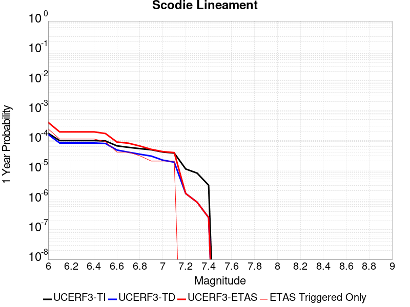 |  |

| Magnitude | 1 wk TI Prob | 1 wk TD Prob | 1 wk ETAS Prob | 1 wk ETAS/TD Gain | 1 wk ETAS Triggered Only | 1 mo TI Prob | 1 mo TD Prob | 1 mo ETAS Prob | 1 mo ETAS/TD Gain | 1 mo ETAS Triggered Only | 1 yr TI Prob | 1 yr TD Prob | 1 yr ETAS Prob | 1 yr ETAS/TD Gain | 1 yr ETAS Triggered Only | 10 yr TI Prob | 10 yr TD Prob | 10 yr ETAS Prob | 10 yr ETAS/TD Gain | 10 yr ETAS Triggered Only |
|-----|-----|-----|-----|-----|-----|-----|-----|-----|-----|-----|-----|-----|-----|-----|-----|-----|-----|-----|-----|-----|
| 6.0 | 3.2919327E-6 | 3.0133422E-6 | 2.9349903E-4 | 97.39983 | 2.9048655E-4 | 1.4108206E-5 | 1.2914278E-5 | 3.033971E-4 | 23.493153 | 2.9048655E-4 | 1.7175387E-4 | 1.5722317E-4 | 4.4766406E-4 | 2.8473163 | 2.9048655E-4 | 0.0017162118 | 0.0015714309 | 0.002006476 | 1.2768465 | 4.3572986E-4 |
| 6.1 | 1.8663811E-6 | 1.5490499E-6 | 1.5490499E-6 | 1.0 | 0.0 | 7.998751E-6 | 6.6387715E-6 | 6.6387715E-6 | 1.0 | 0.0 | 9.738045E-5 | 8.082454E-5 | 8.082454E-5 | 1.0 | 0.0 | 9.7337784E-4 | 8.080003E-4 | 8.080003E-4 | 1.0 | 0.0 |
| 6.2 | 1.8663811E-6 | 1.5490499E-6 | 1.5490499E-6 | 1.0 | 0.0 | 7.998751E-6 | 6.6387715E-6 | 6.6387715E-6 | 1.0 | 0.0 | 9.738045E-5 | 8.082454E-5 | 8.082454E-5 | 1.0 | 0.0 | 9.7337784E-4 | 8.080003E-4 | 8.080003E-4 | 1.0 | 0.0 |
| 6.3 | 1.8663811E-6 | 1.5490499E-6 | 1.5490499E-6 | 1.0 | 0.0 | 7.998751E-6 | 6.6387715E-6 | 6.6387715E-6 | 1.0 | 0.0 | 9.738045E-5 | 8.082454E-5 | 8.082454E-5 | 1.0 | 0.0 | 9.7337784E-4 | 8.080003E-4 | 8.080003E-4 | 1.0 | 0.0 |
| 6.4 | 1.8663811E-6 | 1.5490499E-6 | 1.5490499E-6 | 1.0 | 0.0 | 7.998751E-6 | 6.6387715E-6 | 6.6387715E-6 | 1.0 | 0.0 | 9.738045E-5 | 8.082454E-5 | 8.082454E-5 | 1.0 | 0.0 | 9.7337784E-4 | 8.080003E-4 | 8.080003E-4 | 1.0 | 0.0 |
| 6.5 | 1.8106311E-6 | 1.4909839E-6 | 1.4909839E-6 | 1.0 | 0.0 | 7.759824E-6 | 6.3899183E-6 | 6.3899183E-6 | 1.0 | 0.0 | 9.447177E-5 | 7.7794975E-5 | 7.7794975E-5 | 1.0 | 0.0 | 9.4431615E-4 | 7.7772606E-4 | 7.7772606E-4 | 1.0 | 0.0 |
| 6.6 | 1.2414679E-6 | 8.997558E-7 | 8.997558E-7 | 1.0 | 0.0 | 5.320566E-6 | 3.856091E-6 | 3.856091E-6 | 1.0 | 0.0 | 6.477596E-5 | 4.6946985E-5 | 4.6946985E-5 | 1.0 | 0.0 | 6.475708E-4 | 4.693793E-4 | 4.693793E-4 | 1.0 | 0.0 |
| 6.7 | 1.1062215E-6 | 7.594311E-7 | 7.594311E-7 | 1.0 | 0.0 | 4.7409408E-6 | 3.2547011E-6 | 3.2547011E-6 | 1.0 | 0.0 | 5.7719422E-5 | 3.9625334E-5 | 3.9625334E-5 | 1.0 | 0.0 | 5.770443E-4 | 3.961897E-4 | 3.961897E-4 | 1.0 | 0.0 |
| 6.8 | 1.0006736E-6 | 6.500397E-7 | 6.500397E-7 | 1.0 | 0.0 | 4.288594E-6 | 2.7858816E-6 | 2.7858816E-6 | 1.0 | 0.0 | 5.221238E-5 | 3.3917644E-5 | 3.3917644E-5 | 1.0 | 0.0 | 5.220012E-4 | 3.3913075E-4 | 3.3913075E-4 | 1.0 | 0.0 |
| 6.9 | 9.167364E-7 | 5.631625E-7 | 5.631625E-7 | 1.0 | 0.0 | 3.9288643E-6 | 2.4135516E-6 | 2.4135516E-6 | 1.0 | 0.0 | 4.7832873E-5 | 2.9384651E-5 | 2.9384651E-5 | 1.0 | 0.0 | 4.782258E-4 | 2.9381333E-4 | 2.9381333E-4 | 1.0 | 0.0 |
| 7.0 | 7.6987664E-7 | 4.113383E-7 | 4.113383E-7 | 1.0 | 0.0 | 3.2994672E-6 | 1.7628774E-6 | 1.7628774E-6 | 1.0 | 0.0 | 4.0170275E-5 | 2.1462862E-5 | 2.1462862E-5 | 1.0 | 0.0 | 4.0163012E-4 | 2.1461173E-4 | 2.1461173E-4 | 1.0 | 0.0 |
| 7.1 | 7.1038727E-7 | 3.5211494E-7 | 3.5211494E-7 | 1.0 | 0.0 | 3.0445133E-6 | 1.5090633E-6 | 1.5090633E-6 | 1.0 | 0.0 | 3.706632E-5 | 1.8372726E-5 | 1.8372726E-5 | 1.0 | 0.0 | 3.7060137E-4 | 1.8371557E-4 | 1.8371557E-4 | 1.0 | 0.0 |
| 7.2 | 2.0799602E-7 | 3.1186854E-8 | 3.1186854E-8 | 1.0 | 0.0 | 8.914113E-7 | 1.3365793E-7 | 1.3365793E-7 | 1.0 | 0.0 | 1.0852878E-5 | 1.6272843E-6 | 1.6272843E-6 | 1.0 | 0.0 | 1.08523476E-4 | 1.627273E-5 | 1.627273E-5 | 1.0 | 0.0 |
| 7.3 | 1.5048182E-7 | 1.5945696E-8 | 1.5945696E-8 | 1.0 | 0.0 | 6.449219E-7 | 6.83387E-8 | 6.83387E-8 | 1.0 | 0.0 | 7.851896E-6 | 8.320234E-7 | 8.320234E-7 | 1.0 | 0.0 | 7.851618E-5 | 8.320206E-6 | 8.320206E-6 | 1.0 | 0.0 |
| 7.4 | 5.9334678E-8 | 4.8683537E-9 | 4.8683537E-9 | 1.0 | 0.0 | 2.5429145E-7 | 2.0864372E-8 | 2.0864372E-8 | 1.0 | 0.0 | 3.095994E-6 | 2.5402372E-7 | 2.5402372E-7 | 1.0 | 0.0 | 3.095951E-5 | 2.5402353E-6 | 2.5402353E-6 | 1.0 | 0.0 |

## San Andreas (Big Bend)
*[(top)](#table-of-contents)*

| 1 Week | 1 Month | 1 Year | 10 Year |
|-----|-----|-----|-----|
|  |  |  |  |

| Magnitude | 1 wk TI Prob | 1 wk TD Prob | 1 wk ETAS Prob | 1 wk ETAS/TD Gain | 1 wk ETAS Triggered Only | 1 mo TI Prob | 1 mo TD Prob | 1 mo ETAS Prob | 1 mo ETAS/TD Gain | 1 mo ETAS Triggered Only | 1 yr TI Prob | 1 yr TD Prob | 1 yr ETAS Prob | 1 yr ETAS/TD Gain | 1 yr ETAS Triggered Only | 10 yr TI Prob | 10 yr TD Prob | 10 yr ETAS Prob | 10 yr ETAS/TD Gain | 10 yr ETAS Triggered Only |
|-----|-----|-----|-----|-----|-----|-----|-----|-----|-----|-----|-----|-----|-----|-----|-----|-----|-----|-----|-----|-----|
| 6.0 | 1.0179969E-4 | 2.0072258E-4 | 2.0072258E-4 | 1.0 | 0.0 | 4.362114E-4 | 8.599571E-4 | 8.599571E-4 | 1.0 | 0.0 | 0.0052979486 | 0.010419999 | 0.010851189 | 1.041381 | 4.3572986E-4 | 0.051734097 | 0.10144902 | 0.10184055 | 1.0038593 | 4.3572986E-4 |
| 6.1 | 1.0179969E-4 | 2.0072258E-4 | 2.0072258E-4 | 1.0 | 0.0 | 4.362114E-4 | 8.599571E-4 | 8.599571E-4 | 1.0 | 0.0 | 0.0052979486 | 0.010419999 | 0.010851189 | 1.041381 | 4.3572986E-4 | 0.051734097 | 0.10144902 | 0.10184055 | 1.0038593 | 4.3572986E-4 |
| 6.2 | 1.0179969E-4 | 2.0072258E-4 | 2.0072258E-4 | 1.0 | 0.0 | 4.362114E-4 | 8.599571E-4 | 8.599571E-4 | 1.0 | 0.0 | 0.0052979486 | 0.010419999 | 0.010851189 | 1.041381 | 4.3572986E-4 | 0.051734097 | 0.10144902 | 0.10184055 | 1.0038593 | 4.3572986E-4 |
| 6.3 | 1.0179969E-4 | 2.0072258E-4 | 2.0072258E-4 | 1.0 | 0.0 | 4.362114E-4 | 8.599571E-4 | 8.599571E-4 | 1.0 | 0.0 | 0.0052979486 | 0.010419999 | 0.010851189 | 1.041381 | 4.3572986E-4 | 0.051734097 | 0.10144902 | 0.10184055 | 1.0038593 | 4.3572986E-4 |
| 6.4 | 9.1639464E-5 | 1.8429532E-4 | 1.8429532E-4 | 1.0 | 0.0 | 3.9268145E-4 | 7.895982E-4 | 7.895982E-4 | 1.0 | 0.0 | 0.0047704205 | 0.009571102 | 0.0098588085 | 1.0300599 | 2.9048655E-4 | 0.046693064 | 0.09377527 | 0.09403852 | 1.0028073 | 2.9048655E-4 |
| 6.5 | 9.1639464E-5 | 1.8429532E-4 | 1.8429532E-4 | 1.0 | 0.0 | 3.9268145E-4 | 7.895982E-4 | 7.895982E-4 | 1.0 | 0.0 | 0.0047704205 | 0.009571102 | 0.0098588085 | 1.0300599 | 2.9048655E-4 | 0.046693064 | 0.09377527 | 0.09403852 | 1.0028073 | 2.9048655E-4 |
| 6.6 | 9.042622E-5 | 1.823659E-4 | 1.823659E-4 | 1.0 | 0.0 | 3.8748336E-4 | 7.8133424E-4 | 7.8133424E-4 | 1.0 | 0.0 | 0.0047074095 | 0.009471365 | 0.0097591 | 1.0303795 | 2.9048655E-4 | 0.046089325 | 0.092869274 | 0.09313279 | 1.0028374 | 2.9048655E-4 |
| 6.7 | 8.9836685E-5 | 1.8150927E-4 | 1.8150927E-4 | 1.0 | 0.0 | 3.8495753E-4 | 7.776651E-4 | 7.776651E-4 | 1.0 | 0.0 | 0.00467679 | 0.00942708 | 0.009570954 | 1.0152618 | 1.4524328E-4 | 0.045795817 | 0.09246355 | 0.09259536 | 1.0014256 | 1.4524328E-4 |
| 6.8 | 8.9471854E-5 | 1.8097709E-4 | 1.8097709E-4 | 1.0 | 0.0 | 3.8339442E-4 | 7.7538576E-4 | 7.7538576E-4 | 1.0 | 0.0 | 0.004657841 | 0.009399569 | 0.009399569 | 1.0 | 0.0 | 0.04561414 | 0.092210755 | 0.092210755 | 1.0 | 0.0 |
| 6.9 | 8.858234E-5 | 1.7979681E-4 | 1.7979681E-4 | 1.0 | 0.0 | 3.7958333E-4 | 7.703304E-4 | 7.703304E-4 | 1.0 | 0.0 | 0.004611638 | 0.009338548 | 0.009338548 | 1.0 | 0.0 | 0.04517103 | 0.09165087 | 0.09165087 | 1.0 | 0.0 |
| 7.0 | 8.7433385E-5 | 1.7818481E-4 | 1.7818481E-4 | 1.0 | 0.0 | 3.746607E-4 | 7.634259E-4 | 7.634259E-4 | 1.0 | 0.0 | 0.004551957 | 0.009255203 | 0.009255203 | 1.0 | 0.0 | 0.044598386 | 0.09088532 | 0.09088532 | 1.0 | 0.0 |
| 7.1 | 8.684964E-5 | 1.7730435E-4 | 1.7730435E-4 | 1.0 | 0.0 | 3.7215967E-4 | 7.596547E-4 | 7.596547E-4 | 1.0 | 0.0 | 0.0045216335 | 0.009209678 | 0.009209678 | 1.0 | 0.0 | 0.04430731 | 0.09046686 | 0.09046686 | 1.0 | 0.0 |
| 7.2 | 8.606521E-5 | 1.762105E-4 | 1.762105E-4 | 1.0 | 0.0 | 3.6879873E-4 | 7.549695E-4 | 7.549695E-4 | 1.0 | 0.0 | 0.0044808835 | 0.0091531165 | 0.0091531165 | 1.0 | 0.0 | 0.043916024 | 0.089947365 | 0.089947365 | 1.0 | 0.0 |
| 7.3 | 8.568266E-5 | 1.7563057E-4 | 1.7563057E-4 | 1.0 | 0.0 | 3.6715972E-4 | 7.524855E-4 | 7.524855E-4 | 1.0 | 0.0 | 0.0044610105 | 0.009123127 | 0.009123127 | 1.0 | 0.0 | 0.043725148 | 0.08966853 | 0.08966853 | 1.0 | 0.0 |
| 7.4 | 8.5432206E-5 | 1.7525644E-4 | 1.7525644E-4 | 1.0 | 0.0 | 3.6608664E-4 | 7.50883E-4 | 7.50883E-4 | 1.0 | 0.0 | 0.004447999 | 0.009103781 | 0.009103781 | 1.0 | 0.0 | 0.043600157 | 0.08948871 | 0.08948871 | 1.0 | 0.0 |
| 7.5 | 8.4791965E-5 | 1.7394972E-4 | 1.7394972E-4 | 1.0 | 0.0 | 3.633435E-4 | 7.4528606E-4 | 7.4528606E-4 | 1.0 | 0.0 | 0.0044147377 | 0.009036204 | 0.009036204 | 1.0 | 0.0 | 0.043280575 | 0.088866346 | 0.088866346 | 1.0 | 0.0 |
| 7.6 | 8.241105E-5 | 1.6840403E-4 | 1.6840403E-4 | 1.0 | 0.0 | 3.531424E-4 | 7.215321E-4 | 7.215321E-4 | 1.0 | 0.0 | 0.0042910352 | 0.008749358 | 0.008749358 | 1.0 | 0.0 | 0.042091176 | 0.086243294 | 0.086243294 | 1.0 | 0.0 |
| 7.7 | 7.00432E-5 | 1.42045E-4 | 1.42045E-4 | 1.0 | 0.0 | 3.001506E-4 | 6.0862233E-4 | 6.0862233E-4 | 1.0 | 0.0 | 0.0036482112 | 0.0073848404 | 0.0073848404 | 1.0 | 0.0 | 0.035888977 | 0.07351733 | 0.07351733 | 1.0 | 0.0 |
| 7.8 | 6.415362E-5 | 1.2968935E-4 | 1.2968935E-4 | 1.0 | 0.0 | 2.749151E-4 | 5.556931E-4 | 5.556931E-4 | 1.0 | 0.0 | 0.0033419547 | 0.0067446055 | 0.0067446055 | 1.0 | 0.0 | 0.03292141 | 0.06725231 | 0.06725231 | 1.0 | 0.0 |
| 7.9 | 4.939911E-5 | 9.3411545E-5 | 9.3411545E-5 | 1.0 | 0.0 | 2.116933E-4 | 4.0027377E-4 | 4.0027377E-4 | 1.0 | 0.0 | 0.0025743195 | 0.004862453 | 0.004862453 | 1.0 | 0.0 | 0.025447013 | 0.048914436 | 0.048914436 | 1.0 | 0.0 |
| 8.0 | 3.344983E-5 | 5.222685E-5 | 5.222685E-5 | 1.0 | 0.0 | 1.4334853E-4 | 2.2381016E-4 | 2.2381016E-4 | 1.0 | 0.0 | 0.0017438711 | 0.0027214854 | 0.0027214854 | 1.0 | 0.0 | 0.017302496 | 0.027922187 | 0.027922187 | 1.0 | 0.0 |
| 8.1 | 1.9104898E-5 | 1.9173063E-5 | 1.9173063E-5 | 1.0 | 0.0 | 8.1875565E-5 | 8.216769E-5 | 8.216769E-5 | 1.0 | 0.0 | 9.963791E-4 | 9.999331E-4 | 9.999331E-4 | 1.0 | 0.0 | 0.009919235 | 0.010749801 | 0.010749801 | 1.0 | 0.0 |
| 8.2 | 8.643924E-6 | 5.4748625E-6 | 5.4748625E-6 | 1.0 | 0.0 | 3.704486E-5 | 2.3463486E-5 | 2.3463486E-5 | 1.0 | 0.0 | 4.5092785E-4 | 2.8563058E-4 | 2.8563058E-4 | 1.0 | 0.0 | 0.0045001395 | 0.0032487072 | 0.0032487072 | 1.0 | 0.0 |
| 8.3 | 1.983087E-6 | 7.6599065E-7 | 7.6599065E-7 | 1.0 | 0.0 | 8.498917E-6 | 3.282813E-6 | 3.282813E-6 | 1.0 | 0.0 | 1.034694E-4 | 3.9967534E-5 | 3.9967534E-5 | 1.0 | 0.0 | 0.0010342124 | 4.719687E-4 | 4.719687E-4 | 1.0 | 0.0 |

## Red Pass
*[(top)](#table-of-contents)*

| 1 Week | 1 Month | 1 Year | 10 Year |
|-----|-----|-----|-----|
|  |  |  |  |

| Magnitude | 1 wk TI Prob | 1 wk TD Prob | 1 wk ETAS Prob | 1 wk ETAS/TD Gain | 1 wk ETAS Triggered Only | 1 mo TI Prob | 1 mo TD Prob | 1 mo ETAS Prob | 1 mo ETAS/TD Gain | 1 mo ETAS Triggered Only | 1 yr TI Prob | 1 yr TD Prob | 1 yr ETAS Prob | 1 yr ETAS/TD Gain | 1 yr ETAS Triggered Only | 10 yr TI Prob | 10 yr TD Prob | 10 yr ETAS Prob | 10 yr ETAS/TD Gain | 10 yr ETAS Triggered Only |
|-----|-----|-----|-----|-----|-----|-----|-----|-----|-----|-----|-----|-----|-----|-----|-----|-----|-----|-----|-----|-----|
| 6.0 | 8.258278E-6 | 8.551265E-6 | 2.9903534E-4 | 34.96972 | 2.9048655E-4 | 3.539214E-5 | 3.6647863E-5 | 3.271238E-4 | 8.926135 | 2.9048655E-4 | 4.308141E-4 | 4.4611428E-4 | 8.816497E-4 | 1.9762868 | 4.3572986E-4 | 0.0042997985 | 0.004453945 | 0.004887734 | 1.0973943 | 4.3572986E-4 |
| 6.1 | 3.649988E-6 | 3.7753161E-6 | 3.7753161E-6 | 1.0 | 0.0 | 1.5642712E-5 | 1.6179853E-5 | 1.6179853E-5 | 1.0 | 0.0 | 1.9043336E-4 | 1.9697666E-4 | 1.9697666E-4 | 1.0 | 0.0 | 0.0019027026 | 0.001968488 | 0.001968488 | 1.0 | 0.0 |
| 6.2 | 3.649988E-6 | 3.7753161E-6 | 3.7753161E-6 | 1.0 | 0.0 | 1.5642712E-5 | 1.6179853E-5 | 1.6179853E-5 | 1.0 | 0.0 | 1.9043336E-4 | 1.9697666E-4 | 1.9697666E-4 | 1.0 | 0.0 | 0.0019027026 | 0.001968488 | 0.001968488 | 1.0 | 0.0 |
| 6.3 | 1.3924937E-6 | 1.4411166E-6 | 1.4411166E-6 | 1.0 | 0.0 | 5.9678164E-6 | 6.1762075E-6 | 6.1762075E-6 | 1.0 | 0.0 | 7.265574E-5 | 7.519415E-5 | 7.519415E-5 | 1.0 | 0.0 | 7.263199E-4 | 7.518258E-4 | 7.518258E-4 | 1.0 | 0.0 |
| 6.4 | 1.3924937E-6 | 1.4411166E-6 | 1.4411166E-6 | 1.0 | 0.0 | 5.9678164E-6 | 6.1762075E-6 | 6.1762075E-6 | 1.0 | 0.0 | 7.265574E-5 | 7.519415E-5 | 7.519415E-5 | 1.0 | 0.0 | 7.263199E-4 | 7.518258E-4 | 7.518258E-4 | 1.0 | 0.0 |
| 6.5 | 9.876812E-7 | 1.0221912E-6 | 1.0221912E-6 | 1.0 | 0.0 | 4.2329125E-6 | 4.3808195E-6 | 4.3808195E-6 | 1.0 | 0.0 | 5.153449E-5 | 5.3336476E-5 | 5.3336476E-5 | 1.0 | 0.0 | 5.1522546E-4 | 5.333648E-4 | 5.333648E-4 | 1.0 | 0.0 |

## San Andreas (Cholame) rev
*[(top)](#table-of-contents)*

| 1 Week | 1 Month | 1 Year | 10 Year |
|-----|-----|-----|-----|
|  |  | 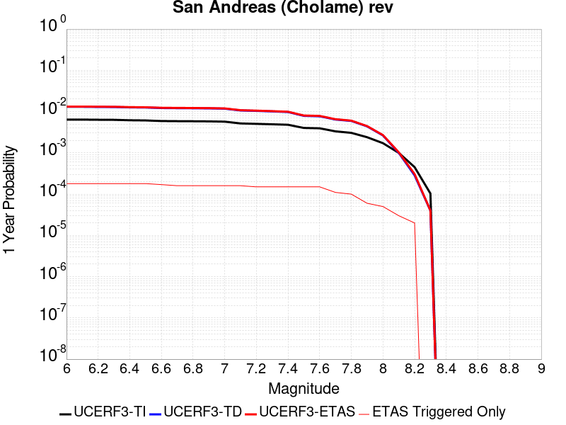 | 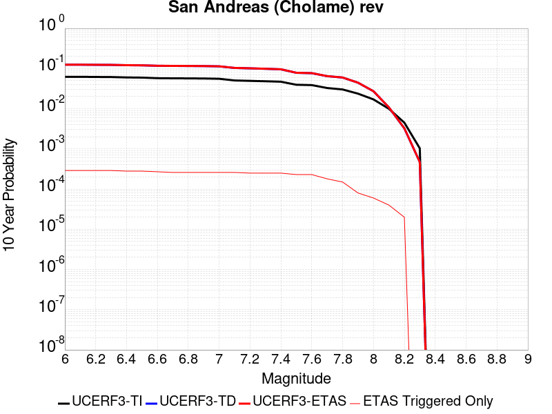 |

| Magnitude | 1 wk TI Prob | 1 wk TD Prob | 1 wk ETAS Prob | 1 wk ETAS/TD Gain | 1 wk ETAS Triggered Only | 1 mo TI Prob | 1 mo TD Prob | 1 mo ETAS Prob | 1 mo ETAS/TD Gain | 1 mo ETAS Triggered Only | 1 yr TI Prob | 1 yr TD Prob | 1 yr ETAS Prob | 1 yr ETAS/TD Gain | 1 yr ETAS Triggered Only | 10 yr TI Prob | 10 yr TD Prob | 10 yr ETAS Prob | 10 yr ETAS/TD Gain | 10 yr ETAS Triggered Only |
|-----|-----|-----|-----|-----|-----|-----|-----|-----|-----|-----|-----|-----|-----|-----|-----|-----|-----|-----|-----|-----|
| 6.0 | 1.2302514E-4 | 2.5204287E-4 | 2.5204287E-4 | 1.0 | 0.0 | 5.27144E-4 | 0.0010797381 | 0.0010797381 | 1.0 | 0.0 | 0.0063991086 | 0.0130670825 | 0.013210428 | 1.01097 | 1.4524328E-4 | 0.06217949 | 0.12439073 | 0.124645084 | 1.0020448 | 2.9048655E-4 |
| 6.1 | 1.2302514E-4 | 2.5204287E-4 | 2.5204287E-4 | 1.0 | 0.0 | 5.27144E-4 | 0.0010797381 | 0.0010797381 | 1.0 | 0.0 | 0.0063991086 | 0.0130670825 | 0.013210428 | 1.01097 | 1.4524328E-4 | 0.06217949 | 0.12439073 | 0.124645084 | 1.0020448 | 2.9048655E-4 |
| 6.2 | 1.2203569E-4 | 2.5021084E-4 | 2.5021084E-4 | 1.0 | 0.0 | 5.2290526E-4 | 0.0010718931 | 0.0010718931 | 1.0 | 0.0 | 0.006347804 | 0.01297271 | 0.013116069 | 1.0110508 | 1.4524328E-4 | 0.061695136 | 0.12357691 | 0.123831496 | 1.0020602 | 2.9048655E-4 |
| 6.3 | 1.2142645E-4 | 2.4907055E-4 | 2.4907055E-4 | 1.0 | 0.0 | 5.202953E-4 | 0.0010670102 | 0.0010670102 | 1.0 | 0.0 | 0.006316212 | 0.012913967 | 0.013057334 | 1.0111017 | 1.4524328E-4 | 0.06139677 | 0.12307103 | 0.123325765 | 1.0020698 | 2.9048655E-4 |
| 6.4 | 1.1865206E-4 | 2.44126E-4 | 2.44126E-4 | 1.0 | 0.0 | 5.0840975E-4 | 0.0010458364 | 0.0010458364 | 1.0 | 0.0 | 0.006172335 | 0.012659196 | 0.012802601 | 1.0113281 | 1.4524328E-4 | 0.060036868 | 0.1208638 | 0.12111918 | 1.002113 | 2.9048655E-4 |
| 6.5 | 1.17443946E-4 | 2.4205919E-4 | 2.4205919E-4 | 1.0 | 0.0 | 5.032341E-4 | 0.0010369857 | 0.0010369857 | 1.0 | 0.0 | 0.006109677 | 0.012552682 | 0.012696102 | 1.0114255 | 1.4524328E-4 | 0.059444077 | 0.11993805 | 0.1201937 | 1.0021315 | 2.9048655E-4 |
| 6.6 | 1.13579066E-4 | 2.3514954E-4 | 2.3514954E-4 | 1.0 | 0.0 | 4.866766E-4 | 0.001007396 | 0.001007396 | 1.0 | 0.0 | 0.0059092017 | 0.012196515 | 0.012339986 | 1.0117633 | 1.4524328E-4 | 0.057545185 | 0.11685214 | 0.11710869 | 1.0021955 | 2.9048655E-4 |
| 6.7 | 1.1271412E-4 | 2.3359268E-4 | 2.3359268E-4 | 1.0 | 0.0 | 4.829711E-4 | 0.0010007289 | 0.0010007289 | 1.0 | 0.0 | 0.005864331 | 0.012116249 | 0.012259732 | 1.0118423 | 1.4524328E-4 | 0.057119697 | 0.116155714 | 0.11641246 | 1.0022104 | 2.9048655E-4 |
| 6.8 | 1.1217975E-4 | 2.3247694E-4 | 2.3247694E-4 | 1.0 | 0.0 | 4.8068175E-4 | 9.959509E-4 | 9.959509E-4 | 1.0 | 0.0 | 0.005836608 | 0.012058721 | 0.012202213 | 1.0118995 | 1.4524328E-4 | 0.056856725 | 0.11565396 | 0.11591086 | 1.0022212 | 2.9048655E-4 |
| 6.9 | 1.1146753E-4 | 2.3096445E-4 | 2.3096445E-4 | 1.0 | 0.0 | 4.7763053E-4 | 9.894737E-4 | 9.894737E-4 | 1.0 | 0.0 | 0.0057996577 | 0.011980731 | 0.012124235 | 1.0119778 | 1.4524328E-4 | 0.056506127 | 0.11497439 | 0.11523148 | 1.002236 | 2.9048655E-4 |
| 7.0 | 1.0965793E-4 | 2.2719789E-4 | 2.2719789E-4 | 1.0 | 0.0 | 4.698779E-4 | 9.733434E-4 | 9.733434E-4 | 1.0 | 0.0 | 0.005705768 | 0.011786487 | 0.011930019 | 1.0121776 | 1.4524328E-4 | 0.055614736 | 0.11327597 | 0.11353355 | 1.0022739 | 2.9048655E-4 |
| 7.1 | 9.927982E-5 | 2.0538924E-4 | 2.0538924E-4 | 1.0 | 0.0 | 4.2541555E-4 | 8.7994366E-4 | 8.7994366E-4 | 1.0 | 0.0 | 0.0051671406 | 0.010660981 | 0.0108046755 | 1.0134785 | 1.4524328E-4 | 0.05048634 | 0.1033706 | 0.10363106 | 1.0025196 | 2.9048655E-4 |
| 7.2 | 9.696786E-5 | 2.0043184E-4 | 2.0043184E-4 | 1.0 | 0.0 | 4.1551032E-4 | 8.5871184E-4 | 8.5871184E-4 | 1.0 | 0.0 | 0.00504711 | 0.010404981 | 0.010404981 | 1.0 | 0.0 | 0.04934009 | 0.1011086 | 0.10123916 | 1.0012913 | 1.4524328E-4 |
| 7.3 | 9.4727984E-5 | 1.9472468E-4 | 1.9472468E-4 | 1.0 | 0.0 | 4.0591392E-4 | 8.3426846E-4 | 8.3426846E-4 | 1.0 | 0.0 | 0.0049308087 | 0.010110183 | 0.010110183 | 1.0 | 0.0 | 0.048228268 | 0.09847952 | 0.09861045 | 1.0013297 | 1.4524328E-4 |
| 7.4 | 9.220358E-5 | 1.8843076E-4 | 1.8843076E-4 | 1.0 | 0.0 | 3.9509835E-4 | 8.073114E-4 | 8.073114E-4 | 1.0 | 0.0 | 0.004799717 | 0.009784967 | 0.009784967 | 1.0 | 0.0 | 0.046973653 | 0.095557496 | 0.095688865 | 1.0013747 | 1.4524328E-4 |
| 7.5 | 7.71631E-5 | 1.5177966E-4 | 1.5177966E-4 | 1.0 | 0.0 | 3.306571E-4 | 6.503223E-4 | 6.503223E-4 | 1.0 | 0.0 | 0.0040183207 | 0.007889002 | 0.007889002 | 1.0 | 0.0 | 0.03946433 | 0.07828531 | 0.07828531 | 1.0 | 0.0 |
| 7.6 | 7.5634416E-5 | 1.483744E-4 | 1.483744E-4 | 1.0 | 0.0 | 3.241072E-4 | 6.3573546E-4 | 6.3573546E-4 | 1.0 | 0.0 | 0.0039388672 | 0.0077126776 | 0.0077126776 | 1.0 | 0.0 | 0.038697794 | 0.07664872 | 0.07664872 | 1.0 | 0.0 |
| 7.7 | 6.3783E-5 | 1.235872E-4 | 1.235872E-4 | 1.0 | 0.0 | 2.7332708E-4 | 5.29552E-4 | 5.29552E-4 | 1.0 | 0.0 | 0.0033226798 | 0.0064282627 | 0.0064282627 | 1.0 | 0.0 | 0.032734364 | 0.06454029 | 0.06454029 | 1.0 | 0.0 |
| 7.8 | 5.863422E-5 | 1.1416107E-4 | 1.1416107E-4 | 1.0 | 0.0 | 2.512653E-4 | 4.8917E-4 | 4.8917E-4 | 1.0 | 0.0 | 0.003054864 | 0.0059394026 | 0.0059394026 | 1.0 | 0.0 | 0.030132094 | 0.059659187 | 0.059659187 | 1.0 | 0.0 |
| 7.9 | 4.595283E-5 | 8.426331E-5 | 8.426331E-5 | 1.0 | 0.0 | 1.9692584E-4 | 3.610785E-4 | 3.610785E-4 | 1.0 | 0.0 | 0.0023949358 | 0.0043872762 | 0.0043872762 | 1.0 | 0.0 | 0.023692891 | 0.044362005 | 0.044362005 | 1.0 | 0.0 |
| 8.0 | 3.2950178E-5 | 5.0772942E-5 | 5.0772942E-5 | 1.0 | 0.0 | 1.412074E-4 | 2.1758018E-4 | 2.1758018E-4 | 1.0 | 0.0 | 0.0017178444 | 0.0026458222 | 0.0026458222 | 1.0 | 0.0 | 0.017046256 | 0.027180137 | 0.027180137 | 1.0 | 0.0 |
| 8.1 | 1.9177472E-5 | 1.9185145E-5 | 1.9185145E-5 | 1.0 | 0.0 | 8.218658E-5 | 8.221946E-5 | 8.221946E-5 | 1.0 | 0.0 | 0.0010001622 | 0.0010005629 | 0.0010005629 | 1.0 | 0.0 | 0.009956728 | 0.010758142 | 0.010758142 | 1.0 | 0.0 |
| 8.2 | 8.643924E-6 | 5.4748625E-6 | 5.4748625E-6 | 1.0 | 0.0 | 3.704486E-5 | 2.3463486E-5 | 2.3463486E-5 | 1.0 | 0.0 | 4.5092785E-4 | 2.8563058E-4 | 2.8563058E-4 | 1.0 | 0.0 | 0.0045001395 | 0.0032487072 | 0.0032487072 | 1.0 | 0.0 |
| 8.3 | 1.983087E-6 | 7.6599065E-7 | 7.6599065E-7 | 1.0 | 0.0 | 8.498917E-6 | 3.282813E-6 | 3.282813E-6 | 1.0 | 0.0 | 1.034694E-4 | 3.9967534E-5 | 3.9967534E-5 | 1.0 | 0.0 | 0.0010342124 | 4.719687E-4 | 4.719687E-4 | 1.0 | 0.0 |

## Imperial
*[(top)](#table-of-contents)*

| 1 Week | 1 Month | 1 Year | 10 Year |
|-----|-----|-----|-----|
|  |  |  |  |

| Magnitude | 1 wk TI Prob | 1 wk TD Prob | 1 wk ETAS Prob | 1 wk ETAS/TD Gain | 1 wk ETAS Triggered Only | 1 mo TI Prob | 1 mo TD Prob | 1 mo ETAS Prob | 1 mo ETAS/TD Gain | 1 mo ETAS Triggered Only | 1 yr TI Prob | 1 yr TD Prob | 1 yr ETAS Prob | 1 yr ETAS/TD Gain | 1 yr ETAS Triggered Only | 10 yr TI Prob | 10 yr TD Prob | 10 yr ETAS Prob | 10 yr ETAS/TD Gain | 10 yr ETAS Triggered Only |
|-----|-----|-----|-----|-----|-----|-----|-----|-----|-----|-----|-----|-----|-----|-----|-----|-----|-----|-----|-----|-----|
| 6.0 | 2.7496446E-4 | 5.0552754E-4 | 6.506974E-4 | 1.287165 | 1.4524328E-4 | 0.0011778869 | 0.002164787 | 0.0023097158 | 1.0669483 | 1.4524328E-4 | 0.0142467655 | 0.026038699 | 0.026321622 | 1.0108654 | 2.9048655E-4 | 0.13367249 | 0.2280438 | 0.22826803 | 1.0009834 | 2.9048655E-4 |
| 6.1 | 2.5356023E-4 | 4.8656776E-4 | 6.317404E-4 | 1.2983605 | 1.4524328E-4 | 0.001086234 | 0.0020836622 | 0.002228603 | 1.0695605 | 1.4524328E-4 | 0.013144928 | 0.025071215 | 0.025354419 | 1.0112959 | 2.9048655E-4 | 0.123940155 | 0.21947981 | 0.21970654 | 1.0010331 | 2.9048655E-4 |
| 6.2 | 2.4820742E-4 | 4.7752203E-4 | 6.2269595E-4 | 1.3040152 | 1.4524328E-4 | 0.0010633124 | 0.0020449557 | 0.002189902 | 1.0708799 | 1.4524328E-4 | 0.01286919 | 0.024611235 | 0.024894573 | 1.0115125 | 2.9048655E-4 | 0.12148927 | 0.21598552 | 0.21621327 | 1.0010544 | 2.9048655E-4 |
| 6.3 | 2.3205351E-4 | 4.5890483E-4 | 6.0408143E-4 | 1.3163545 | 1.4524328E-4 | 9.94136E-4 | 0.0019652895 | 0.0021102473 | 1.0737591 | 1.4524328E-4 | 0.012036599 | 0.02366133 | 0.023944944 | 1.0119864 | 2.9048655E-4 | 0.11405133 | 0.20793462 | 0.2081647 | 1.0011065 | 2.9048655E-4 |
| 6.4 | 2.0304754E-4 | 3.987652E-4 | 5.4395053E-4 | 1.3640873 | 1.4524328E-4 | 8.6991355E-4 | 0.0017078889 | 0.0018528842 | 1.0848973 | 1.4524328E-4 | 0.010539869 | 0.020595672 | 0.020880174 | 1.0138137 | 2.9048655E-4 | 0.100537635 | 0.1850669 | 0.18530363 | 1.0012791 | 2.9048655E-4 |
| 6.5 | 1.854992E-4 | 3.6988858E-4 | 5.1507814E-4 | 1.3925225 | 1.4524328E-4 | 7.9475436E-4 | 0.0015842861 | 0.0017292992 | 1.0915322 | 1.4524328E-4 | 0.009633281 | 0.01911948 | 0.019404413 | 1.0149027 | 2.9048655E-4 | 0.0922623 | 0.173298 | 0.17353815 | 1.0013857 | 2.9048655E-4 |
| 6.6 | 1.6586106E-4 | 3.403506E-4 | 4.8554447E-4 | 1.4266008 | 1.4524328E-4 | 7.106394E-4 | 0.0014578402 | 0.0016028718 | 1.0994838 | 1.4524328E-4 | 0.008617763 | 0.01760642 | 0.017891793 | 1.0162084 | 2.9048655E-4 | 0.08291132 | 0.16077545 | 0.16101924 | 1.0015163 | 2.9048655E-4 |
| 6.7 | 1.4224656E-4 | 3.076692E-4 | 4.5286777E-4 | 1.4719309 | 1.4524328E-4 | 6.094856E-4 | 0.001317924 | 0.0014629759 | 1.1100608 | 1.4524328E-4 | 0.0073952693 | 0.015929576 | 0.016215436 | 1.0179452 | 2.9048655E-4 | 0.07153955 | 0.14648417 | 0.14673209 | 1.0016925 | 2.9048655E-4 |
| 6.8 | 1.2317259E-4 | 2.779122E-4 | 4.231151E-4 | 1.5224777 | 1.4524328E-4 | 5.2777573E-4 | 0.0011905148 | 0.0013355851 | 1.1218551 | 1.4524328E-4 | 0.0064067547 | 0.0143995695 | 0.014542721 | 1.0099413 | 1.4524328E-4 | 0.06225166 | 0.13293684 | 0.13306277 | 1.0009474 | 1.4524328E-4 |
| 6.9 | 9.859898E-5 | 2.5014306E-4 | 3.9535E-4 | 1.5804956 | 1.4524328E-4 | 4.2249862E-4 | 0.0010716055 | 0.0012166931 | 1.1353928 | 1.4524328E-4 | 0.0051317946 | 0.012969712 | 0.013113071 | 1.0110534 | 1.4524328E-4 | 0.05014893 | 0.11940631 | 0.11953422 | 1.0010711 | 1.4524328E-4 |
| 7.0 | 7.3191884E-5 | 2.1266776E-4 | 3.5788014E-4 | 1.6828134 | 1.4524328E-4 | 3.136418E-4 | 9.1111806E-4 | 0.001056229 | 1.159267 | 1.4524328E-4 | 0.003811904 | 0.011037128 | 0.011180768 | 1.0130143 | 1.4524328E-4 | 0.037471764 | 0.10206493 | 0.102195345 | 1.0012778 | 1.4524328E-4 |
| 7.1 | 7.1760296E-5 | 2.0968143E-4 | 3.5489426E-4 | 1.6925403 | 1.4524328E-4 | 3.0750787E-4 | 8.983284E-4 | 0.0010434411 | 1.1615365 | 1.4524328E-4 | 0.003737482 | 0.010882978 | 0.01102664 | 1.0132006 | 1.4524328E-4 | 0.03675245 | 0.10070146 | 0.100832075 | 1.0012971 | 1.4524328E-4 |
| 7.2 | 6.46614E-5 | 1.9136685E-4 | 3.3658234E-4 | 1.758833 | 1.4524328E-4 | 2.7709085E-4 | 8.1988896E-4 | 9.650131E-4 | 1.1770047 | 1.4524328E-4 | 0.0033683628 | 0.0099370815 | 0.010080881 | 1.014471 | 1.4524328E-4 | 0.033177625 | 0.09250898 | 0.09264079 | 1.0014248 | 1.4524328E-4 |
| 7.3 | 6.088115E-5 | 1.78084E-4 | 3.233014E-4 | 1.8154434 | 1.4524328E-4 | 2.6089314E-4 | 7.6299673E-4 | 9.081292E-4 | 1.1902138 | 1.4524328E-4 | 0.0031717476 | 0.009250494 | 0.009394393 | 1.0155559 | 1.4524328E-4 | 0.031268585 | 0.08655989 | 0.086692564 | 1.0015327 | 1.4524328E-4 |
| 7.4 | 4.199346E-5 | 1.1510366E-4 | 2.6033024E-4 | 2.2617023 | 1.4524328E-4 | 1.7995955E-4 | 4.9320905E-4 | 6.383807E-4 | 1.294341 | 1.4524328E-4 | 0.0021888057 | 0.0059884563 | 0.00613283 | 1.0241086 | 1.4524328E-4 | 0.02167372 | 0.057439793 | 0.057576694 | 1.0023834 | 1.4524328E-4 |
| 7.5 | 3.130448E-5 | 8.33328E-5 | 8.33328E-5 | 1.0 | 0.0 | 1.3415517E-4 | 3.57092E-4 | 3.57092E-4 | 1.0 | 0.0 | 0.0016321153 | 0.004338988 | 0.004338988 | 1.0 | 0.0 | 0.016201803 | 0.04213201 | 0.04213201 | 1.0 | 0.0 |
| 7.6 | 2.3074248E-5 | 6.0844646E-5 | 6.0844646E-5 | 1.0 | 0.0 | 9.888588E-5 | 2.6073685E-4 | 2.6073685E-4 | 1.0 | 0.0 | 0.0012032706 | 0.0031698733 | 0.0031698733 | 1.0 | 0.0 | 0.011967761 | 0.031026395 | 0.031026395 | 1.0 | 0.0 |
| 7.7 | 1.45864815E-5 | 4.0124698E-5 | 4.0124698E-5 | 1.0 | 0.0 | 6.2511994E-5 | 1.7195169E-4 | 1.7195169E-4 | 1.0 | 0.0 | 7.608177E-4 | 0.0020915072 | 0.0020915072 | 1.0 | 0.0 | 0.007582182 | 0.020627763 | 0.020627763 | 1.0 | 0.0 |
| 7.8 | 1.0352979E-5 | 3.0960902E-5 | 3.0960902E-5 | 1.0 | 0.0 | 4.4369157E-5 | 1.3268284E-4 | 1.3268284E-4 | 1.0 | 0.0 | 5.400606E-4 | 0.0016142189 | 0.0016142189 | 1.0 | 0.0 | 0.0053875 | 0.016016833 | 0.016016833 | 1.0 | 0.0 |
| 7.9 | 8.137906E-6 | 2.2149103E-5 | 2.2149103E-5 | 1.0 | 0.0 | 3.4876273E-5 | 9.492128E-5 | 9.492128E-5 | 1.0 | 0.0 | 4.2453592E-4 | 0.0011550548 | 0.0011550548 | 1.0 | 0.0 | 0.004237258 | 0.011617903 | 0.011617903 | 1.0 | 0.0 |
| 8.0 | 6.93792E-6 | 1.8008766E-5 | 1.8008766E-5 | 1.0 | 0.0 | 2.9733603E-5 | 7.717814E-5 | 7.717814E-5 | 1.0 | 0.0 | 3.6194647E-4 | 9.3923963E-4 | 9.3923963E-4 | 1.0 | 0.0 | 0.0036135751 | 0.00950155 | 0.00950155 | 1.0 | 0.0 |
| 8.1 | 3.4286315E-6 | 6.379872E-6 | 6.379872E-6 | 1.0 | 0.0 | 1.4694053E-5 | 2.7342023E-5 | 2.7342023E-5 | 1.0 | 0.0 | 1.7888541E-4 | 3.328384E-4 | 3.328384E-4 | 1.0 | 0.0 | 0.0017874148 | 0.003486031 | 0.003486031 | 1.0 | 0.0 |
| 8.2 | 1.4906886E-6 | 1.9366646E-6 | 1.9366646E-6 | 1.0 | 0.0 | 6.3886496E-6 | 8.299965E-6 | 8.299965E-6 | 1.0 | 0.0 | 7.7779034E-5 | 1.0104742E-4 | 1.0104742E-4 | 1.0 | 0.0 | 7.775182E-4 | 0.0011075331 | 0.0011075331 | 1.0 | 0.0 |
| 8.3 | 2.5758007E-8 | 1.4500102E-8 | 1.4500102E-8 | 1.0 | 0.0 | 1.10391454E-7 | 6.214329E-8 | 6.214329E-8 | 1.0 | 0.0 | 1.3440151E-6 | 7.565946E-7 | 7.565946E-7 | 1.0 | 0.0 | 1.344007E-5 | 7.887763E-6 | 7.887763E-6 | 1.0 | 0.0 |

## San Diego Trough north alt1
*[(top)](#table-of-contents)*

| 1 Week | 1 Month | 1 Year | 10 Year |
|-----|-----|-----|-----|
|  |  |  | 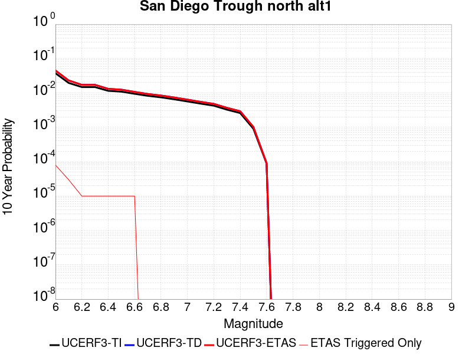 |

| Magnitude | 1 wk TI Prob | 1 wk TD Prob | 1 wk ETAS Prob | 1 wk ETAS/TD Gain | 1 wk ETAS Triggered Only | 1 mo TI Prob | 1 mo TD Prob | 1 mo ETAS Prob | 1 mo ETAS/TD Gain | 1 mo ETAS Triggered Only | 1 yr TI Prob | 1 yr TD Prob | 1 yr ETAS Prob | 1 yr ETAS/TD Gain | 1 yr ETAS Triggered Only | 10 yr TI Prob | 10 yr TD Prob | 10 yr ETAS Prob | 10 yr ETAS/TD Gain | 10 yr ETAS Triggered Only |
|-----|-----|-----|-----|-----|-----|-----|-----|-----|-----|-----|-----|-----|-----|-----|-----|-----|-----|-----|-----|-----|
| 6.0 | 7.329252E-5 | 8.821093E-5 | 2.334414E-4 | 2.6464 | 1.4524328E-4 | 3.14073E-4 | 3.7799572E-4 | 6.683725E-4 | 1.7682012 | 2.9048655E-4 | 0.0038171355 | 0.004593027 | 0.004882179 | 1.0629547 | 2.9048655E-4 | 0.03752231 | 0.045044992 | 0.045322392 | 1.0061584 | 2.9048655E-4 |
| 6.1 | 3.7940346E-5 | 4.4885E-5 | 4.4885E-5 | 1.0 | 0.0 | 1.6259136E-4 | 1.9235066E-4 | 1.9235066E-4 | 1.0 | 0.0 | 0.0019777524 | 0.0023394432 | 0.0023394432 | 1.0 | 0.0 | 0.019602431 | 0.023156688 | 0.023156688 | 1.0 | 0.0 |
| 6.2 | 2.8645263E-5 | 3.329678E-5 | 3.329678E-5 | 1.0 | 0.0 | 1.2275964E-4 | 1.4269284E-4 | 1.4269284E-4 | 1.0 | 0.0 | 0.0014935739 | 0.0017359189 | 0.0017359189 | 1.0 | 0.0 | 0.0148357535 | 0.017226247 | 0.017226247 | 1.0 | 0.0 |
| 6.3 | 2.8645263E-5 | 3.329678E-5 | 3.329678E-5 | 1.0 | 0.0 | 1.2275964E-4 | 1.4269284E-4 | 1.4269284E-4 | 1.0 | 0.0 | 0.0014935739 | 0.0017359189 | 0.0017359189 | 1.0 | 0.0 | 0.0148357535 | 0.017226247 | 0.017226247 | 1.0 | 0.0 |
| 6.4 | 2.2204576E-5 | 2.5448318E-5 | 2.5448318E-5 | 1.0 | 0.0 | 9.5159E-5 | 1.0905972E-4 | 1.0905972E-4 | 1.0 | 0.0 | 0.001157945 | 0.0013270034 | 0.0013270034 | 1.0 | 0.0 | 0.011519298 | 0.013191955 | 0.013191955 | 1.0 | 0.0 |
| 6.5 | 2.1004838E-5 | 2.4024694E-5 | 2.4024694E-5 | 1.0 | 0.0 | 9.0017624E-5 | 1.0295896E-4 | 1.0295896E-4 | 1.0 | 0.0 | 0.0010954136 | 0.0012528138 | 0.0012528138 | 1.0 | 0.0 | 0.010900296 | 0.012458589 | 0.012458589 | 1.0 | 0.0 |
| 6.6 | 1.820557E-5 | 2.0704787E-5 | 2.0704787E-5 | 1.0 | 0.0 | 7.802154E-5 | 8.873181E-5 | 8.873181E-5 | 1.0 | 0.0 | 9.4949827E-4 | 0.0010797799 | 0.0010797799 | 1.0 | 0.0 | 0.009454516 | 0.010746004 | 0.010746004 | 1.0 | 0.0 |
| 6.7 | 1.5884485E-5 | 1.7983646E-5 | 1.7983646E-5 | 1.0 | 0.0 | 6.807459E-5 | 7.707051E-5 | 7.707051E-5 | 1.0 | 0.0 | 8.284929E-4 | 9.3793223E-4 | 9.3793223E-4 | 1.0 | 0.0 | 0.008254109 | 0.009340104 | 0.009340104 | 1.0 | 0.0 |
| 6.8 | 1.4331171E-5 | 1.6201066E-5 | 1.6201066E-5 | 1.0 | 0.0 | 6.141786E-5 | 6.94313E-5 | 6.94313E-5 | 1.0 | 0.0 | 7.4750587E-4 | 8.450002E-4 | 8.450002E-4 | 1.0 | 0.0 | 0.0074499645 | 0.008418139 | 0.008418139 | 1.0 | 0.0 |
| 6.9 | 1.2574203E-5 | 1.4205835E-5 | 1.4205835E-5 | 1.0 | 0.0 | 5.3888325E-5 | 6.0880735E-5 | 6.0880735E-5 | 1.0 | 0.0 | 6.558929E-4 | 7.409723E-4 | 7.409723E-4 | 1.0 | 0.0 | 0.0065396037 | 0.007385203 | 0.007385203 | 1.0 | 0.0 |
| 7.0 | 1.0883844E-5 | 1.2289262E-5 | 1.2289262E-5 | 1.0 | 0.0 | 4.664421E-5 | 5.2667205E-5 | 5.2667205E-5 | 1.0 | 0.0 | 5.677453E-4 | 6.4103556E-4 | 6.4103556E-4 | 1.0 | 0.0 | 0.00566297 | 0.006391993 | 0.006391993 | 1.0 | 0.0 |
| 7.1 | 9.393088E-6 | 1.060702E-5 | 1.060702E-5 | 1.0 | 0.0 | 4.025547E-5 | 4.545787E-5 | 4.545787E-5 | 1.0 | 0.0 | 4.900001E-4 | 5.533098E-4 | 5.533098E-4 | 1.0 | 0.0 | 0.0048892107 | 0.005519418 | 0.005519418 | 1.0 | 0.0 |
| 7.2 | 8.190791E-6 | 9.258625E-6 | 9.258625E-6 | 1.0 | 0.0 | 3.510292E-5 | 3.9679224E-5 | 3.9679224E-5 | 1.0 | 0.0 | 4.2729423E-4 | 4.8298817E-4 | 4.8298817E-4 | 1.0 | 0.0 | 0.0042647356 | 0.004819465 | 0.004819465 | 1.0 | 0.0 |
| 7.3 | 6.268162E-6 | 7.089716E-6 | 7.089716E-6 | 1.0 | 0.0 | 2.6863276E-5 | 3.0384144E-5 | 3.0384144E-5 | 1.0 | 0.0 | 3.2701128E-4 | 3.6986457E-4 | 3.6986457E-4 | 1.0 | 0.0 | 0.003265305 | 0.003692536 | 0.003692536 | 1.0 | 0.0 |
| 7.4 | 4.985186E-6 | 5.6426816E-6 | 5.6426816E-6 | 1.0 | 0.0 | 2.1364907E-5 | 2.4182698E-5 | 2.4182698E-5 | 1.0 | 0.0 | 2.600867E-4 | 2.9438498E-4 | 2.9438498E-4 | 1.0 | 0.0 | 0.002597825 | 0.0029399914 | 0.0029399914 | 1.0 | 0.0 |
| 7.5 | 1.7489613E-6 | 1.969678E-6 | 1.969678E-6 | 1.0 | 0.0 | 7.495527E-6 | 8.4414505E-6 | 8.4414505E-6 | 1.0 | 0.0 | 9.125422E-5 | 1.02770035E-4 | 1.02770035E-4 | 1.0 | 0.0 | 9.1216754E-4 | 0.0010272472 | 0.0010272472 | 1.0 | 0.0 |
| 7.6 | 1.6988751E-7 | 1.7533823E-7 | 1.7533823E-7 | 1.0 | 0.0 | 7.2808916E-7 | 7.5144936E-7 | 7.5144936E-7 | 1.0 | 0.0 | 8.864449E-6 | 9.14886E-6 | 9.14886E-6 | 1.0 | 0.0 | 8.8640954E-5 | 9.1485024E-5 | 9.1485024E-5 | 1.0 | 0.0 |

## Dry Mountain
*[(top)](#table-of-contents)*

| 1 Week | 1 Month | 1 Year | 10 Year |
|-----|-----|-----|-----|
|  |  |  |  |

| Magnitude | 1 wk TI Prob | 1 wk TD Prob | 1 wk ETAS Prob | 1 wk ETAS/TD Gain | 1 wk ETAS Triggered Only | 1 mo TI Prob | 1 mo TD Prob | 1 mo ETAS Prob | 1 mo ETAS/TD Gain | 1 mo ETAS Triggered Only | 1 yr TI Prob | 1 yr TD Prob | 1 yr ETAS Prob | 1 yr ETAS/TD Gain | 1 yr ETAS Triggered Only | 10 yr TI Prob | 10 yr TD Prob | 10 yr ETAS Prob | 10 yr ETAS/TD Gain | 10 yr ETAS Triggered Only |
|-----|-----|-----|-----|-----|-----|-----|-----|-----|-----|-----|-----|-----|-----|-----|-----|-----|-----|-----|-----|-----|
| 6.0 | 6.222801E-6 | 6.439381E-6 | 6.439381E-6 | 1.0 | 0.0 | 2.6668875E-5 | 2.7597147E-5 | 2.7597147E-5 | 1.0 | 0.0 | 3.2464517E-4 | 3.3595937E-4 | 3.3595937E-4 | 1.0 | 0.0 | 0.0032417132 | 0.0033560768 | 0.0036455884 | 1.086265 | 2.9048655E-4 |
| 6.1 | 6.222801E-6 | 6.439381E-6 | 6.439381E-6 | 1.0 | 0.0 | 2.6668875E-5 | 2.7597147E-5 | 2.7597147E-5 | 1.0 | 0.0 | 3.2464517E-4 | 3.3595937E-4 | 3.3595937E-4 | 1.0 | 0.0 | 0.0032417132 | 0.0033560768 | 0.0036455884 | 1.086265 | 2.9048655E-4 |
| 6.2 | 6.222801E-6 | 6.439381E-6 | 6.439381E-6 | 1.0 | 0.0 | 2.6668875E-5 | 2.7597147E-5 | 2.7597147E-5 | 1.0 | 0.0 | 3.2464517E-4 | 3.3595937E-4 | 3.3595937E-4 | 1.0 | 0.0 | 0.0032417132 | 0.0033560768 | 0.0036455884 | 1.086265 | 2.9048655E-4 |
| 6.3 | 6.222801E-6 | 6.439381E-6 | 6.439381E-6 | 1.0 | 0.0 | 2.6668875E-5 | 2.7597147E-5 | 2.7597147E-5 | 1.0 | 0.0 | 3.2464517E-4 | 3.3595937E-4 | 3.3595937E-4 | 1.0 | 0.0 | 0.0032417132 | 0.0033560768 | 0.0036455884 | 1.086265 | 2.9048655E-4 |
| 6.4 | 6.222801E-6 | 6.439381E-6 | 6.439381E-6 | 1.0 | 0.0 | 2.6668875E-5 | 2.7597147E-5 | 2.7597147E-5 | 1.0 | 0.0 | 3.2464517E-4 | 3.3595937E-4 | 3.3595937E-4 | 1.0 | 0.0 | 0.0032417132 | 0.0033560768 | 0.0036455884 | 1.086265 | 2.9048655E-4 |
| 6.5 | 2.8528623E-6 | 2.9521684E-6 | 2.9521684E-6 | 1.0 | 0.0 | 1.22264955E-5 | 1.2652138E-5 | 1.2652138E-5 | 1.0 | 0.0 | 1.4884741E-4 | 1.540376E-4 | 1.540376E-4 | 1.0 | 0.0 | 0.0014874774 | 0.0015401616 | 0.0018302008 | 1.1883174 | 2.9048655E-4 |
| 6.6 | 2.8528623E-6 | 2.9521684E-6 | 2.9521684E-6 | 1.0 | 0.0 | 1.22264955E-5 | 1.2652138E-5 | 1.2652138E-5 | 1.0 | 0.0 | 1.4884741E-4 | 1.540376E-4 | 1.540376E-4 | 1.0 | 0.0 | 0.0014874774 | 0.0015401616 | 0.0018302008 | 1.1883174 | 2.9048655E-4 |
| 6.7 | 2.541E-6 | 2.6293578E-6 | 2.6293578E-6 | 1.0 | 0.0 | 1.0889954E-5 | 1.1268677E-5 | 1.1268677E-5 | 1.0 | 0.0 | 1.3257713E-4 | 1.3719614E-4 | 1.3719614E-4 | 1.0 | 0.0 | 0.0013249806 | 0.0013719613 | 0.0016620494 | 1.2114403 | 2.9048655E-4 |

## Calico-Hidalgo
*[(top)](#table-of-contents)*

| 1 Week | 1 Month | 1 Year | 10 Year |
|-----|-----|-----|-----|
|  |  | 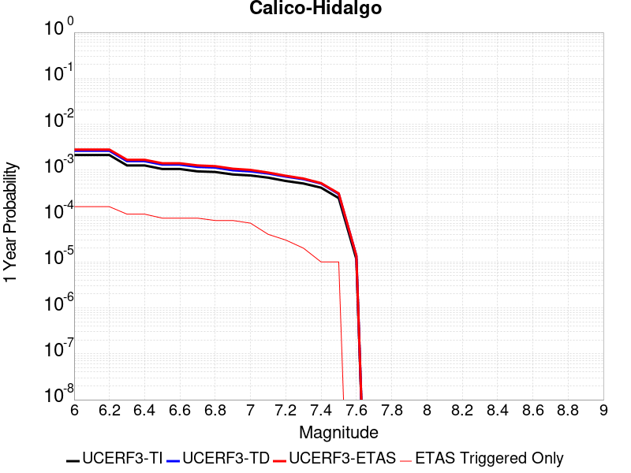 |  |

| Magnitude | 1 wk TI Prob | 1 wk TD Prob | 1 wk ETAS Prob | 1 wk ETAS/TD Gain | 1 wk ETAS Triggered Only | 1 mo TI Prob | 1 mo TD Prob | 1 mo ETAS Prob | 1 mo ETAS/TD Gain | 1 mo ETAS Triggered Only | 1 yr TI Prob | 1 yr TD Prob | 1 yr ETAS Prob | 1 yr ETAS/TD Gain | 1 yr ETAS Triggered Only | 10 yr TI Prob | 10 yr TD Prob | 10 yr ETAS Prob | 10 yr ETAS/TD Gain | 10 yr ETAS Triggered Only |
|-----|-----|-----|-----|-----|-----|-----|-----|-----|-----|-----|-----|-----|-----|-----|-----|-----|-----|-----|-----|-----|
| 6.0 | 4.0906612E-5 | 5.0703686E-5 | 5.0703686E-5 | 1.0 | 0.0 | 1.7530227E-4 | 2.172857E-4 | 2.172857E-4 | 1.0 | 0.0 | 0.0021322158 | 0.002642648 | 0.0027875076 | 1.054816 | 1.4524328E-4 | 0.02111873 | 0.026152607 | 0.026435496 | 1.0108169 | 2.9048655E-4 |
| 6.1 | 4.0906612E-5 | 5.0703686E-5 | 5.0703686E-5 | 1.0 | 0.0 | 1.7530227E-4 | 2.172857E-4 | 2.172857E-4 | 1.0 | 0.0 | 0.0021322158 | 0.002642648 | 0.0027875076 | 1.054816 | 1.4524328E-4 | 0.02111873 | 0.026152607 | 0.026435496 | 1.0108169 | 2.9048655E-4 |
| 6.2 | 4.0906612E-5 | 5.0703686E-5 | 5.0703686E-5 | 1.0 | 0.0 | 1.7530227E-4 | 2.172857E-4 | 2.172857E-4 | 1.0 | 0.0 | 0.0021322158 | 0.002642648 | 0.0027875076 | 1.054816 | 1.4524328E-4 | 0.02111873 | 0.026152607 | 0.026435496 | 1.0108169 | 2.9048655E-4 |
| 6.3 | 2.4242801E-5 | 3.0090669E-5 | 3.0090669E-5 | 1.0 | 0.0 | 1.0389358E-4 | 1.2895382E-4 | 1.2895382E-4 | 1.0 | 0.0 | 0.0012641704 | 0.0015689151 | 0.0017139305 | 1.0924304 | 1.4524328E-4 | 0.01257003 | 0.01558206 | 0.015868021 | 1.0183519 | 2.9048655E-4 |
| 6.4 | 2.4242801E-5 | 3.0090669E-5 | 3.0090669E-5 | 1.0 | 0.0 | 1.0389358E-4 | 1.2895382E-4 | 1.2895382E-4 | 1.0 | 0.0 | 0.0012641704 | 0.0015689151 | 0.0017139305 | 1.0924304 | 1.4524328E-4 | 0.01257003 | 0.01558206 | 0.015868021 | 1.0183519 | 2.9048655E-4 |
| 6.5 | 2.0286952E-5 | 2.5315738E-5 | 2.5315738E-5 | 1.0 | 0.0 | 8.694118E-5 | 1.0849161E-4 | 1.0849161E-4 | 1.0 | 0.0 | 0.0010579949 | 0.001320102 | 0.001320102 | 1.0 | 0.0 | 0.010529719 | 0.013124538 | 0.013267875 | 1.0109214 | 1.4524328E-4 |
| 6.6 | 2.0269223E-5 | 2.5296687E-5 | 2.5296687E-5 | 1.0 | 0.0 | 8.6865206E-5 | 1.08409964E-4 | 1.08409964E-4 | 1.0 | 0.0 | 0.0010570707 | 0.0013191093 | 0.0013191093 | 1.0 | 0.0 | 0.010520565 | 0.013114728 | 0.013258066 | 1.0109296 | 1.4524328E-4 |
| 6.7 | 1.799852E-5 | 2.25406E-5 | 2.25406E-5 | 1.0 | 0.0 | 7.713423E-5 | 9.659908E-5 | 9.659908E-5 | 1.0 | 0.0 | 9.3870464E-4 | 0.0011754738 | 0.0011754738 | 1.0 | 0.0 | 0.009347493 | 0.011694173 | 0.011837718 | 1.0122749 | 1.4524328E-4 |
| 6.8 | 1.7458793E-5 | 2.184212E-5 | 2.184212E-5 | 1.0 | 0.0 | 7.4821255E-5 | 9.3605806E-5 | 9.3605806E-5 | 1.0 | 0.0 | 9.10568E-4 | 0.0011390693 | 0.0011390693 | 1.0 | 0.0 | 0.009068459 | 0.011333893 | 0.01147749 | 1.0126697 | 1.4524328E-4 |
| 6.9 | 1.542884E-5 | 1.9025927E-5 | 1.9025927E-5 | 1.0 | 0.0 | 6.612192E-5 | 8.153721E-5 | 8.153721E-5 | 1.0 | 0.0 | 8.04737E-4 | 9.922766E-4 | 9.922766E-4 | 1.0 | 0.0 | 0.008018291 | 0.009879857 | 0.010023666 | 1.0145557 | 1.4524328E-4 |
| 7.0 | 1.468253E-5 | 1.8030598E-5 | 1.8030598E-5 | 1.0 | 0.0 | 6.292361E-5 | 7.7271776E-5 | 7.7271776E-5 | 1.0 | 0.0 | 7.658257E-4 | 9.4039086E-4 | 9.4039086E-4 | 1.0 | 0.0 | 0.0076319184 | 0.009365481 | 0.009509364 | 1.0153631 | 1.4524328E-4 |
| 7.1 | 1.3139281E-5 | 1.6200942E-5 | 1.6200942E-5 | 1.0 | 0.0 | 5.6309986E-5 | 6.943083E-5 | 6.943083E-5 | 1.0 | 0.0 | 6.853584E-4 | 8.4500515E-4 | 8.4500515E-4 | 1.0 | 0.0 | 0.0068324856 | 0.0084192185 | 0.008563239 | 1.0171062 | 1.4524328E-4 |
| 7.2 | 1.1127404E-5 | 1.3866597E-5 | 1.3866597E-5 | 1.0 | 0.0 | 4.7688E-5 | 5.942698E-5 | 5.942698E-5 | 1.0 | 0.0 | 5.8044674E-4 | 7.232942E-4 | 7.232942E-4 | 1.0 | 0.0 | 0.0057893298 | 0.0072105085 | 0.0073547047 | 1.0199981 | 1.4524328E-4 |
| 7.3 | 9.808154E-6 | 1.2176215E-5 | 1.2176215E-5 | 1.0 | 0.0 | 4.2034266E-5 | 5.2182797E-5 | 5.2182797E-5 | 1.0 | 0.0 | 5.11647E-4 | 6.3515105E-4 | 6.3515105E-4 | 1.0 | 0.0 | 0.0051047057 | 0.006334433 | 0.006334433 | 1.0 | 0.0 |
| 7.4 | 7.942452E-6 | 9.792144E-6 | 9.792144E-6 | 1.0 | 0.0 | 3.4038632E-5 | 4.1965708E-5 | 4.1965708E-5 | 1.0 | 0.0 | 4.1434157E-4 | 5.1082217E-4 | 5.1082217E-4 | 1.0 | 0.0 | 0.0041356985 | 0.005097421 | 0.005097421 | 1.0 | 0.0 |
| 7.5 | 4.7121216E-6 | 5.772836E-6 | 5.772836E-6 | 1.0 | 0.0 | 2.019465E-5 | 2.4740535E-5 | 2.4740535E-5 | 1.0 | 0.0 | 2.4584212E-4 | 3.0118204E-4 | 3.0118204E-4 | 1.0 | 0.0 | 0.0024557032 | 0.0030084911 | 0.0030084911 | 1.0 | 0.0 |
| 7.6 | 2.21172E-7 | 2.603961E-7 | 2.603961E-7 | 1.0 | 0.0 | 9.478797E-7 | 1.1159829E-6 | 1.1159829E-6 | 1.0 | 0.0 | 1.1540374E-5 | 1.3587036E-5 | 1.3587036E-5 | 1.0 | 0.0 | 1.1539775E-4 | 1.3586486E-4 | 1.3586486E-4 | 1.0 | 0.0 |

## Owens Valley
*[(top)](#table-of-contents)*

| 1 Week | 1 Month | 1 Year | 10 Year |
|-----|-----|-----|-----|
|  |  |  |  |

| Magnitude | 1 wk TI Prob | 1 wk TD Prob | 1 wk ETAS Prob | 1 wk ETAS/TD Gain | 1 wk ETAS Triggered Only | 1 mo TI Prob | 1 mo TD Prob | 1 mo ETAS Prob | 1 mo ETAS/TD Gain | 1 mo ETAS Triggered Only | 1 yr TI Prob | 1 yr TD Prob | 1 yr ETAS Prob | 1 yr ETAS/TD Gain | 1 yr ETAS Triggered Only | 10 yr TI Prob | 10 yr TD Prob | 10 yr ETAS Prob | 10 yr ETAS/TD Gain | 10 yr ETAS Triggered Only |
|-----|-----|-----|-----|-----|-----|-----|-----|-----|-----|-----|-----|-----|-----|-----|-----|-----|-----|-----|-----|-----|
| 6.0 | 4.83821E-5 | 3.626567E-6 | 1.4886932E-4 | 41.049656 | 1.4524328E-4 | 2.0733538E-4 | 1.5542342E-5 | 1.6078337E-4 | 10.344861 | 1.4524328E-4 | 0.002521386 | 1.8921259E-4 | 4.796442E-4 | 2.5349486 | 2.9048655E-4 | 0.024929691 | 0.001925011 | 0.0022149384 | 1.1506108 | 2.9048655E-4 |
| 6.1 | 4.83821E-5 | 3.626567E-6 | 1.4886932E-4 | 41.049656 | 1.4524328E-4 | 2.0733538E-4 | 1.5542342E-5 | 1.6078337E-4 | 10.344861 | 1.4524328E-4 | 0.002521386 | 1.8921259E-4 | 4.796442E-4 | 2.5349486 | 2.9048655E-4 | 0.024929691 | 0.001925011 | 0.0022149384 | 1.1506108 | 2.9048655E-4 |
| 6.2 | 4.83821E-5 | 3.626567E-6 | 1.4886932E-4 | 41.049656 | 1.4524328E-4 | 2.0733538E-4 | 1.5542342E-5 | 1.6078337E-4 | 10.344861 | 1.4524328E-4 | 0.002521386 | 1.8921259E-4 | 4.796442E-4 | 2.5349486 | 2.9048655E-4 | 0.024929691 | 0.001925011 | 0.0022149384 | 1.1506108 | 2.9048655E-4 |
| 6.3 | 3.953008E-5 | 3.1553948E-6 | 1.4839822E-4 | 47.03 | 1.4524328E-4 | 1.6940363E-4 | 1.3523055E-5 | 1.5876438E-4 | 11.740274 | 1.4524328E-4 | 0.002060538 | 1.6463149E-4 | 4.5507023E-4 | 2.764175 | 2.9048655E-4 | 0.020415364 | 0.0016592 | 0.0019492045 | 1.1747859 | 2.9048655E-4 |
| 6.4 | 3.953008E-5 | 3.1553948E-6 | 1.4839822E-4 | 47.03 | 1.4524328E-4 | 1.6940363E-4 | 1.3523055E-5 | 1.5876438E-4 | 11.740274 | 1.4524328E-4 | 0.002060538 | 1.6463149E-4 | 4.5507023E-4 | 2.764175 | 2.9048655E-4 | 0.020415364 | 0.0016592 | 0.0019492045 | 1.1747859 | 2.9048655E-4 |
| 6.5 | 3.457342E-5 | 2.9715961E-6 | 1.4821444E-4 | 49.87705 | 1.4524328E-4 | 1.4816338E-4 | 1.2735354E-5 | 1.5797678E-4 | 12.404586 | 1.4524328E-4 | 0.0018023965 | 1.550426E-4 | 4.4548413E-4 | 2.8733015 | 2.9048655E-4 | 0.017878477 | 0.001555719 | 0.0018457536 | 1.1864313 | 2.9048655E-4 |
| 6.6 | 3.1127765E-5 | 2.8744932E-6 | 1.4811735E-4 | 51.528164 | 1.4524328E-4 | 1.3339789E-4 | 1.2319203E-5 | 1.575607E-4 | 12.789845 | 1.4524328E-4 | 0.0016229092 | 1.4997667E-4 | 4.4041965E-4 | 2.936588 | 2.9048655E-4 | 0.016111081 | 0.0015012559 | 0.0017913063 | 1.1932052 | 2.9048655E-4 |
| 6.7 | 2.806885E-5 | 2.8104134E-6 | 1.4805328E-4 | 52.680252 | 1.4524328E-4 | 1.2028952E-4 | 1.20445775E-5 | 1.5728611E-4 | 13.058666 | 1.4524328E-4 | 0.001463541 | 1.4663354E-4 | 4.370775E-4 | 2.9807472 | 2.9048655E-4 | 0.014539397 | 0.0014657511 | 0.0017558119 | 1.1978923 | 2.9048655E-4 |
| 6.8 | 2.524524E-5 | 2.2353688E-6 | 1.4747832E-4 | 65.974945 | 1.4524328E-4 | 1.0818939E-4 | 9.580118E-6 | 1.54822E-4 | 16.160763 | 1.4524328E-4 | 0.0013164099 | 1.16632E-4 | 4.0708468E-4 | 3.4903345 | 2.9048655E-4 | 0.01308639 | 0.0011659812 | 0.001456129 | 1.2488444 | 2.9048655E-4 |
| 6.9 | 2.2704568E-5 | 1.6081682E-6 | 1.4685122E-4 | 91.31583 | 1.4524328E-4 | 9.730166E-5 | 6.8921313E-6 | 1.5213441E-4 | 22.073637 | 1.4524328E-4 | 0.0011840039 | 8.390849E-5 | 3.743707E-4 | 4.4616547 | 2.9048655E-4 | 0.011777153 | 8.3897985E-4 | 0.0011292227 | 1.3459474 | 2.9048655E-4 |
| 7.0 | 2.0871712E-5 | 1.5395453E-6 | 1.4678261E-4 | 95.34153 | 1.4524328E-4 | 8.944713E-5 | 6.598035E-6 | 1.5184036E-4 | 23.012968 | 1.4524328E-4 | 0.0010884746 | 8.032813E-5 | 3.7079136E-4 | 4.615959 | 2.9048655E-4 | 0.010831586 | 8.0316263E-4 | 0.0010934159 | 1.361388 | 2.9048655E-4 |
| 7.1 | 1.944928E-5 | 1.3864178E-6 | 1.4662949E-4 | 105.76141 | 1.4524328E-4 | 8.335139E-5 | 5.941777E-6 | 1.511842E-4 | 25.444273 | 1.4524328E-4 | 0.0010143308 | 7.233874E-5 | 3.628043E-4 | 5.0153522 | 2.9048655E-4 | 0.010097133 | 7.2330976E-4 | 0.0010135862 | 1.4013169 | 2.9048655E-4 |
| 7.2 | 1.7876306E-5 | 1.2489141E-6 | 1.4649202E-4 | 117.29551 | 1.4524328E-4 | 7.6610486E-5 | 5.352478E-6 | 1.5059498E-4 | 28.135563 | 1.4524328E-4 | 9.3233347E-4 | 6.516448E-5 | 3.556321E-4 | 5.4574533 | 2.9048655E-4 | 0.009284316 | 6.5159105E-4 | 9.418883E-4 | 1.4455206 | 2.9048655E-4 |
| 7.3 | 1.2618672E-5 | 1.1115209E-6 | 1.4635464E-4 | 131.67062 | 1.4524328E-4 | 5.40789E-5 | 4.763652E-6 | 1.5000625E-4 | 31.489756 | 1.4524328E-4 | 6.582117E-4 | 5.799593E-5 | 3.4846563E-4 | 6.00845 | 2.9048655E-4 | 0.0065626553 | 5.7994033E-4 | 8.7025843E-4 | 1.5006 | 2.9048655E-4 |
| 7.4 | 7.4874442E-6 | 8.5486437E-7 | 1.4609803E-4 | 170.902 | 1.4524328E-4 | 3.208865E-5 | 3.6636993E-6 | 1.4890645E-4 | 40.64374 | 1.4524328E-4 | 3.906093E-4 | 4.4604632E-5 | 3.3507825E-4 | 7.512185 | 2.9048655E-4 | 0.003899234 | 4.4604883E-4 | 7.3640584E-4 | 1.6509534 | 2.9048655E-4 |
| 7.5 | 2.4734156E-6 | 6.068616E-7 | 6.068616E-7 | 1.0 | 0.0 | 1.060031E-5 | 2.6008327E-6 | 2.6008327E-6 | 1.0 | 0.0 | 1.2905113E-4 | 3.166468E-5 | 1.7690337E-4 | 5.5867724 | 1.4524328E-4 | 0.0012897621 | 3.1660203E-4 | 4.6179933E-4 | 1.4586114 | 1.4524328E-4 |
| 7.6 | 1.1328841E-6 | 3.196531E-7 | 3.196531E-7 | 1.0 | 0.0 | 4.8552088E-6 | 1.3699412E-6 | 1.3699412E-6 | 1.0 | 0.0 | 5.9110564E-5 | 1.6678909E-5 | 1.6191977E-4 | 9.7080555 | 1.4524328E-4 | 5.9094845E-4 | 1.6677675E-4 | 3.119958E-4 | 1.8707392 | 1.4524328E-4 |
| 7.7 | 4.8613185E-7 | 8.964689E-8 | 8.964689E-8 | 1.0 | 0.0 | 2.0834207E-6 | 3.8420092E-7 | 3.8420092E-7 | 1.0 | 0.0 | 2.536535E-5 | 4.6776368E-6 | 4.6776368E-6 | 1.0 | 0.0 | 2.5362454E-4 | 4.677545E-5 | 4.677545E-5 | 1.0 | 0.0 |

## Death Valley (No)
*[(top)](#table-of-contents)*

| 1 Week | 1 Month | 1 Year | 10 Year |
|-----|-----|-----|-----|
|  |  |  |  |

| Magnitude | 1 wk TI Prob | 1 wk TD Prob | 1 wk ETAS Prob | 1 wk ETAS/TD Gain | 1 wk ETAS Triggered Only | 1 mo TI Prob | 1 mo TD Prob | 1 mo ETAS Prob | 1 mo ETAS/TD Gain | 1 mo ETAS Triggered Only | 1 yr TI Prob | 1 yr TD Prob | 1 yr ETAS Prob | 1 yr ETAS/TD Gain | 1 yr ETAS Triggered Only | 10 yr TI Prob | 10 yr TD Prob | 10 yr ETAS Prob | 10 yr ETAS/TD Gain | 10 yr ETAS Triggered Only |
|-----|-----|-----|-----|-----|-----|-----|-----|-----|-----|-----|-----|-----|-----|-----|-----|-----|-----|-----|-----|-----|
| 6.0 | 2.0074807E-5 | 2.2500084E-5 | 2.2500084E-5 | 1.0 | 0.0 | 8.603206E-5 | 9.642541E-5 | 9.642541E-5 | 1.0 | 0.0 | 0.001046937 | 0.0011733545 | 0.0013184274 | 1.1236395 | 1.4524328E-4 | 0.010420183 | 0.011672506 | 0.011959602 | 1.0245959 | 2.9048655E-4 |
| 6.1 | 2.0074807E-5 | 2.2500084E-5 | 2.2500084E-5 | 1.0 | 0.0 | 8.603206E-5 | 9.642541E-5 | 9.642541E-5 | 1.0 | 0.0 | 0.001046937 | 0.0011733545 | 0.0013184274 | 1.1236395 | 1.4524328E-4 | 0.010420183 | 0.011672506 | 0.011959602 | 1.0245959 | 2.9048655E-4 |
| 6.2 | 2.0074807E-5 | 2.2500084E-5 | 2.2500084E-5 | 1.0 | 0.0 | 8.603206E-5 | 9.642541E-5 | 9.642541E-5 | 1.0 | 0.0 | 0.001046937 | 0.0011733545 | 0.0013184274 | 1.1236395 | 1.4524328E-4 | 0.010420183 | 0.011672506 | 0.011959602 | 1.0245959 | 2.9048655E-4 |
| 6.3 | 1.9050609E-5 | 2.1336948E-5 | 2.1336948E-5 | 1.0 | 0.0 | 8.164292E-5 | 9.1440896E-5 | 9.1440896E-5 | 1.0 | 0.0 | 9.935491E-4 | 0.001112731 | 0.0012578127 | 1.1303834 | 1.4524328E-4 | 0.009891188 | 0.011072419 | 0.011359689 | 1.0259447 | 2.9048655E-4 |
| 6.4 | 1.9050609E-5 | 2.1336948E-5 | 2.1336948E-5 | 1.0 | 0.0 | 8.164292E-5 | 9.1440896E-5 | 9.1440896E-5 | 1.0 | 0.0 | 9.935491E-4 | 0.001112731 | 0.0012578127 | 1.1303834 | 1.4524328E-4 | 0.009891188 | 0.011072419 | 0.011359689 | 1.0259447 | 2.9048655E-4 |
| 6.5 | 1.8367004E-5 | 2.0561009E-5 | 2.0561009E-5 | 1.0 | 0.0 | 7.8713354E-5 | 8.811567E-5 | 8.811567E-5 | 1.0 | 0.0 | 9.5791375E-4 | 0.0010722869 | 0.0012173743 | 1.1353066 | 1.4524328E-4 | 0.009537951 | 0.0106719155 | 0.010959302 | 1.0269293 | 2.9048655E-4 |
| 6.6 | 1.779439E-5 | 1.9910927E-5 | 1.9910927E-5 | 1.0 | 0.0 | 7.625944E-5 | 8.53298E-5 | 8.53298E-5 | 1.0 | 0.0 | 9.280632E-4 | 0.0010384015 | 0.001183494 | 1.1397268 | 1.4524328E-4 | 0.009241969 | 0.010336253 | 0.010623736 | 1.0278132 | 2.9048655E-4 |
| 6.7 | 1.7025437E-5 | 1.9043426E-5 | 1.9043426E-5 | 1.0 | 0.0 | 7.296412E-5 | 8.161216E-5 | 8.161216E-5 | 1.0 | 0.0 | 8.87976E-4 | 9.931813E-4 | 0.0011382804 | 1.1460952 | 1.4524328E-4 | 0.008844362 | 0.009888145 | 0.01017576 | 1.0290867 | 2.9048655E-4 |
| 6.8 | 1.6545107E-5 | 1.8512545E-5 | 1.8512545E-5 | 1.0 | 0.0 | 7.090568E-5 | 7.93371E-5 | 7.93371E-5 | 1.0 | 0.0 | 8.629347E-4 | 9.655073E-4 | 0.0011106103 | 1.1502868 | 1.4524328E-4 | 0.008595915 | 0.009613829 | 0.009901523 | 1.029925 | 2.9048655E-4 |
| 6.9 | 1.615478E-5 | 1.8087594E-5 | 1.8087594E-5 | 1.0 | 0.0 | 6.9232934E-5 | 7.751599E-5 | 7.751599E-5 | 1.0 | 0.0 | 8.4258494E-4 | 9.433546E-4 | 0.0010884609 | 1.1538194 | 1.4524328E-4 | 0.008393973 | 0.009394196 | 0.009681953 | 1.0306314 | 2.9048655E-4 |
| 7.0 | 1.5894311E-5 | 1.780555E-5 | 1.780555E-5 | 1.0 | 0.0 | 6.81167E-5 | 7.6307304E-5 | 7.6307304E-5 | 1.0 | 0.0 | 8.2900526E-4 | 9.286515E-4 | 0.0010737599 | 1.1562572 | 1.4524328E-4 | 0.008259195 | 0.009248397 | 0.009536197 | 1.0311189 | 2.9048655E-4 |
| 7.1 | 1.5602263E-5 | 1.7483504E-5 | 1.7483504E-5 | 1.0 | 0.0 | 6.6865134E-5 | 7.492718E-5 | 7.492718E-5 | 1.0 | 0.0 | 8.137789E-4 | 9.118627E-4 | 0.0010569736 | 1.1591368 | 1.4524328E-4 | 0.008108052 | 0.009081894 | 0.009369742 | 1.0316948 | 2.9048655E-4 |
| 7.2 | 1.5323829E-5 | 1.717063E-5 | 1.717063E-5 | 1.0 | 0.0 | 6.56719E-5 | 7.358637E-5 | 7.358637E-5 | 1.0 | 0.0 | 7.99262E-4 | 8.9555193E-4 | 0.0010406651 | 1.1620377 | 1.4524328E-4 | 0.007963934 | 0.008920107 | 0.009208002 | 1.0322748 | 2.9048655E-4 |
| 7.3 | 1.4556212E-5 | 1.6302456E-5 | 1.6302456E-5 | 1.0 | 0.0 | 6.238227E-5 | 6.9865826E-5 | 6.9865826E-5 | 1.0 | 0.0 | 7.592395E-4 | 8.5029035E-4 | 8.5029035E-4 | 1.0 | 0.0 | 0.0075665074 | 0.008471014 | 0.008615027 | 1.0170007 | 1.4524328E-4 |
| 7.4 | 1.411725E-5 | 1.580796E-5 | 1.580796E-5 | 1.0 | 0.0 | 6.0501097E-5 | 6.7746674E-5 | 6.7746674E-5 | 1.0 | 0.0 | 7.363519E-4 | 8.245094E-4 | 8.245094E-4 | 1.0 | 0.0 | 0.0073391674 | 0.008215138 | 0.008359188 | 1.0175347 | 1.4524328E-4 |
| 7.5 | 1.3503312E-5 | 1.5126289E-5 | 1.5126289E-5 | 1.0 | 0.0 | 5.7870053E-5 | 6.482538E-5 | 6.482538E-5 | 1.0 | 0.0 | 7.043401E-4 | 7.8896893E-4 | 7.8896893E-4 | 1.0 | 0.0 | 0.007021119 | 0.007862304 | 0.008006406 | 1.0183281 | 1.4524328E-4 |
| 7.6 | 1.1279839E-5 | 1.2626327E-5 | 1.2626327E-5 | 1.0 | 0.0 | 4.834127E-5 | 5.4111737E-5 | 5.4111737E-5 | 1.0 | 0.0 | 5.88396E-4 | 6.5861654E-4 | 6.5861654E-4 | 1.0 | 0.0 | 0.005868405 | 0.006567199 | 0.006711488 | 1.0219712 | 1.4524328E-4 |
| 7.7 | 9.189108E-6 | 1.0283358E-5 | 1.0283358E-5 | 1.0 | 0.0 | 3.93813E-5 | 4.407082E-5 | 4.407082E-5 | 1.0 | 0.0 | 4.7936183E-4 | 5.3643517E-4 | 5.3643517E-4 | 1.0 | 0.0 | 0.004783291 | 0.005351914 | 0.00549638 | 1.0269933 | 1.4524328E-4 |
| 7.8 | 3.4586725E-7 | 3.6482615E-7 | 3.6482615E-7 | 1.0 | 0.0 | 1.4822873E-6 | 1.5635396E-6 | 1.5635396E-6 | 1.0 | 0.0 | 1.80467E-5 | 1.9035933E-5 | 1.9035933E-5 | 1.0 | 0.0 | 1.8045233E-4 | 1.9034347E-4 | 1.9034347E-4 | 1.0 | 0.0 |
| 7.9 | 2.5591178E-9 | 2.6696718E-9 | 2.6696718E-9 | 1.0 | 0.0 | 1.0967647E-8 | 1.14414505E-8 | 1.14414505E-8 | 1.0 | 0.0 | 1.335311E-7 | 1.3929966E-7 | 1.3929966E-7 | 1.0 | 0.0 | 1.3353102E-6 | 1.3929966E-6 | 1.3929966E-6 | 1.0 | 0.0 |

## Channel Islands Thrust
*[(top)](#table-of-contents)*

| 1 Week | 1 Month | 1 Year | 10 Year |
|-----|-----|-----|-----|
|  |  |  |  |

| Magnitude | 1 wk TI Prob | 1 wk TD Prob | 1 wk ETAS Prob | 1 wk ETAS/TD Gain | 1 wk ETAS Triggered Only | 1 mo TI Prob | 1 mo TD Prob | 1 mo ETAS Prob | 1 mo ETAS/TD Gain | 1 mo ETAS Triggered Only | 1 yr TI Prob | 1 yr TD Prob | 1 yr ETAS Prob | 1 yr ETAS/TD Gain | 1 yr ETAS Triggered Only | 10 yr TI Prob | 10 yr TD Prob | 10 yr ETAS Prob | 10 yr ETAS/TD Gain | 10 yr ETAS Triggered Only |
|-----|-----|-----|-----|-----|-----|-----|-----|-----|-----|-----|-----|-----|-----|-----|-----|-----|-----|-----|-----|-----|
| 6.0 | 2.2156251E-5 | 2.4092022E-5 | 2.4092022E-5 | 1.0 | 0.0 | 9.495191E-5 | 1.03248036E-4 | 2.484763E-4 | 2.4065962 | 1.4524328E-4 | 0.0011554264 | 0.0012564264 | 0.0014014873 | 1.115455 | 1.4524328E-4 | 0.011494373 | 0.0125038205 | 0.012790675 | 1.0229414 | 2.9048655E-4 |
| 6.1 | 2.2156251E-5 | 2.4092022E-5 | 2.4092022E-5 | 1.0 | 0.0 | 9.495191E-5 | 1.03248036E-4 | 2.484763E-4 | 2.4065962 | 1.4524328E-4 | 0.0011554264 | 0.0012564264 | 0.0014014873 | 1.115455 | 1.4524328E-4 | 0.011494373 | 0.0125038205 | 0.012790675 | 1.0229414 | 2.9048655E-4 |
| 6.2 | 2.2156251E-5 | 2.4092022E-5 | 2.4092022E-5 | 1.0 | 0.0 | 9.495191E-5 | 1.03248036E-4 | 2.484763E-4 | 2.4065962 | 1.4524328E-4 | 0.0011554264 | 0.0012564264 | 0.0014014873 | 1.115455 | 1.4524328E-4 | 0.011494373 | 0.0125038205 | 0.012790675 | 1.0229414 | 2.9048655E-4 |
| 6.3 | 2.2156251E-5 | 2.4092022E-5 | 2.4092022E-5 | 1.0 | 0.0 | 9.495191E-5 | 1.03248036E-4 | 2.484763E-4 | 2.4065962 | 1.4524328E-4 | 0.0011554264 | 0.0012564264 | 0.0014014873 | 1.115455 | 1.4524328E-4 | 0.011494373 | 0.0125038205 | 0.012790675 | 1.0229414 | 2.9048655E-4 |
| 6.4 | 2.2156251E-5 | 2.4092022E-5 | 2.4092022E-5 | 1.0 | 0.0 | 9.495191E-5 | 1.03248036E-4 | 2.484763E-4 | 2.4065962 | 1.4524328E-4 | 0.0011554264 | 0.0012564264 | 0.0014014873 | 1.115455 | 1.4524328E-4 | 0.011494373 | 0.0125038205 | 0.012790675 | 1.0229414 | 2.9048655E-4 |
| 6.5 | 2.2156251E-5 | 2.4092022E-5 | 2.4092022E-5 | 1.0 | 0.0 | 9.495191E-5 | 1.03248036E-4 | 2.484763E-4 | 2.4065962 | 1.4524328E-4 | 0.0011554264 | 0.0012564264 | 0.0014014873 | 1.115455 | 1.4524328E-4 | 0.011494373 | 0.0125038205 | 0.012790675 | 1.0229414 | 2.9048655E-4 |
| 6.6 | 2.2156251E-5 | 2.4092022E-5 | 2.4092022E-5 | 1.0 | 0.0 | 9.495191E-5 | 1.03248036E-4 | 2.484763E-4 | 2.4065962 | 1.4524328E-4 | 0.0011554264 | 0.0012564264 | 0.0014014873 | 1.115455 | 1.4524328E-4 | 0.011494373 | 0.0125038205 | 0.012790675 | 1.0229414 | 2.9048655E-4 |
| 6.7 | 1.0601296E-5 | 1.1379544E-5 | 1.1379544E-5 | 1.0 | 0.0 | 4.5433335E-5 | 4.876859E-5 | 1.940048E-4 | 3.9780686 | 1.4524328E-4 | 5.5301044E-4 | 5.936007E-4 | 7.387578E-4 | 1.2445365 | 1.4524328E-4 | 0.005516363 | 0.005920653 | 0.0060650366 | 1.0243864 | 1.4524328E-4 |
| 6.8 | 1.0246747E-5 | 1.0996669E-5 | 1.0996669E-5 | 1.0 | 0.0 | 4.391389E-5 | 4.7127756E-5 | 1.923642E-4 | 4.08176 | 1.4524328E-4 | 5.345204E-4 | 5.7363417E-4 | 7.187941E-4 | 1.2530532 | 1.4524328E-4 | 0.0053323656 | 0.005722025 | 0.005866437 | 1.0252379 | 1.4524328E-4 |
| 6.9 | 9.049551E-6 | 9.699645E-6 | 9.699645E-6 | 1.0 | 0.0 | 3.878322E-5 | 4.1569267E-5 | 4.1569267E-5 | 1.0 | 0.0 | 4.7208337E-4 | 5.059924E-4 | 5.059924E-4 | 1.0 | 0.0 | 0.0047108172 | 0.0050488203 | 0.0050488203 | 1.0 | 0.0 |
| 7.0 | 8.6542195E-6 | 9.274603E-6 | 9.274603E-6 | 1.0 | 0.0 | 3.7088983E-5 | 3.9747716E-5 | 3.9747716E-5 | 1.0 | 0.0 | 4.5146482E-4 | 4.8382508E-4 | 4.8382508E-4 | 1.0 | 0.0 | 0.004505487 | 0.004828129 | 0.004828129 | 1.0 | 0.0 |
| 7.1 | 8.391028E-6 | 8.992924E-6 | 8.992924E-6 | 1.0 | 0.0 | 3.5961057E-5 | 3.854056E-5 | 3.854056E-5 | 1.0 | 0.0 | 4.3773788E-4 | 4.6913436E-4 | 4.6913436E-4 | 1.0 | 0.0 | 0.004368766 | 0.0046818503 | 0.0046818503 | 1.0 | 0.0 |
| 7.2 | 5.965188E-6 | 6.3716952E-6 | 6.3716952E-6 | 1.0 | 0.0 | 2.556484E-5 | 2.7306982E-5 | 2.7306982E-5 | 1.0 | 0.0 | 3.1120746E-4 | 3.3241234E-4 | 3.3241234E-4 | 1.0 | 0.0 | 0.00310772 | 0.0033192092 | 0.0033192092 | 1.0 | 0.0 |
| 7.3 | 4.877518E-6 | 5.2060063E-6 | 5.2060063E-6 | 1.0 | 0.0 | 2.0903482E-5 | 2.2311267E-5 | 2.2311267E-5 | 1.0 | 0.0 | 2.5447016E-4 | 2.716063E-4 | 2.716063E-4 | 1.0 | 0.0 | 0.0025417898 | 0.0027127895 | 0.0027127895 | 1.0 | 0.0 |
| 7.4 | 3.8829853E-6 | 4.141863E-6 | 4.141863E-6 | 1.0 | 0.0 | 1.664126E-5 | 1.7750723E-5 | 1.7750723E-5 | 1.0 | 0.0 | 2.0258849E-4 | 2.1609402E-4 | 2.1609402E-4 | 1.0 | 0.0 | 0.002024039 | 0.0021588807 | 0.0021588807 | 1.0 | 0.0 |
| 7.5 | 1.3489616E-6 | 1.4277903E-6 | 1.4277903E-6 | 1.0 | 0.0 | 5.7812517E-6 | 6.119087E-6 | 6.119087E-6 | 1.0 | 0.0 | 7.038446E-5 | 7.449738E-5 | 7.449738E-5 | 1.0 | 0.0 | 7.036218E-4 | 7.44728E-4 | 7.44728E-4 | 1.0 | 0.0 |
| 7.6 | 6.058192E-7 | 6.353778E-7 | 6.353778E-7 | 1.0 | 0.0 | 2.5963652E-6 | 2.7230449E-6 | 2.7230449E-6 | 1.0 | 0.0 | 3.161029E-5 | 3.3152584E-5 | 3.3152584E-5 | 1.0 | 0.0 | 3.1605794E-4 | 3.31478E-4 | 3.31478E-4 | 1.0 | 0.0 |
| 7.7 | 2.2170494E-7 | 2.2607902E-7 | 2.2607902E-7 | 1.0 | 0.0 | 9.5016367E-7 | 9.689098E-7 | 9.689098E-7 | 1.0 | 0.0 | 1.1568181E-5 | 1.1796425E-5 | 1.1796425E-5 | 1.0 | 0.0 | 1.1567579E-4 | 1.1795909E-4 | 1.1795909E-4 | 1.0 | 0.0 |
| 7.8 | 2.1613102E-8 | 1.5466682E-8 | 1.5466682E-8 | 1.0 | 0.0 | 9.262757E-8 | 6.628578E-8 | 6.628578E-8 | 1.0 | 0.0 | 1.1277401E-6 | 8.070291E-7 | 8.070291E-7 | 1.0 | 0.0 | 1.1277344E-5 | 8.070269E-6 | 8.070269E-6 | 1.0 | 0.0 |

## Sierra Nevada  (No Extension)
*[(top)](#table-of-contents)*

| 1 Week | 1 Month | 1 Year | 10 Year |
|-----|-----|-----|-----|
|  |  |  |  |

| Magnitude | 1 wk TI Prob | 1 wk TD Prob | 1 wk ETAS Prob | 1 wk ETAS/TD Gain | 1 wk ETAS Triggered Only | 1 mo TI Prob | 1 mo TD Prob | 1 mo ETAS Prob | 1 mo ETAS/TD Gain | 1 mo ETAS Triggered Only | 1 yr TI Prob | 1 yr TD Prob | 1 yr ETAS Prob | 1 yr ETAS/TD Gain | 1 yr ETAS Triggered Only | 10 yr TI Prob | 10 yr TD Prob | 10 yr ETAS Prob | 10 yr ETAS/TD Gain | 10 yr ETAS Triggered Only |
|-----|-----|-----|-----|-----|-----|-----|-----|-----|-----|-----|-----|-----|-----|-----|-----|-----|-----|-----|-----|-----|
| 6.0 | 7.7690465E-6 | 6.976322E-6 | 1.5221859E-4 | 21.819319 | 1.4524328E-4 | 3.329549E-5 | 2.9898381E-5 | 1.7513732E-4 | 5.857753 | 1.4524328E-4 | 4.0529718E-4 | 3.6398784E-4 | 6.5436866E-4 | 1.7977762 | 2.9048655E-4 | 0.004045588 | 0.0036374326 | 0.0039268625 | 1.0795698 | 2.9048655E-4 |
| 6.1 | 7.7690465E-6 | 6.976322E-6 | 1.5221859E-4 | 21.819319 | 1.4524328E-4 | 3.329549E-5 | 2.9898381E-5 | 1.7513732E-4 | 5.857753 | 1.4524328E-4 | 4.0529718E-4 | 3.6398784E-4 | 6.5436866E-4 | 1.7977762 | 2.9048655E-4 | 0.004045588 | 0.0036374326 | 0.0039268625 | 1.0795698 | 2.9048655E-4 |
| 6.2 | 7.7690465E-6 | 6.976322E-6 | 1.5221859E-4 | 21.819319 | 1.4524328E-4 | 3.329549E-5 | 2.9898381E-5 | 1.7513732E-4 | 5.857753 | 1.4524328E-4 | 4.0529718E-4 | 3.6398784E-4 | 6.5436866E-4 | 1.7977762 | 2.9048655E-4 | 0.004045588 | 0.0036374326 | 0.0039268625 | 1.0795698 | 2.9048655E-4 |
| 6.3 | 7.7690465E-6 | 6.976322E-6 | 1.5221859E-4 | 21.819319 | 1.4524328E-4 | 3.329549E-5 | 2.9898381E-5 | 1.7513732E-4 | 5.857753 | 1.4524328E-4 | 4.0529718E-4 | 3.6398784E-4 | 6.5436866E-4 | 1.7977762 | 2.9048655E-4 | 0.004045588 | 0.0036374326 | 0.0039268625 | 1.0795698 | 2.9048655E-4 |
| 6.4 | 7.7690465E-6 | 6.976322E-6 | 1.5221859E-4 | 21.819319 | 1.4524328E-4 | 3.329549E-5 | 2.9898381E-5 | 1.7513732E-4 | 5.857753 | 1.4524328E-4 | 4.0529718E-4 | 3.6398784E-4 | 6.5436866E-4 | 1.7977762 | 2.9048655E-4 | 0.004045588 | 0.0036374326 | 0.0039268625 | 1.0795698 | 2.9048655E-4 |
| 6.5 | 7.7690465E-6 | 6.976322E-6 | 1.5221859E-4 | 21.819319 | 1.4524328E-4 | 3.329549E-5 | 2.9898381E-5 | 1.7513732E-4 | 5.857753 | 1.4524328E-4 | 4.0529718E-4 | 3.6398784E-4 | 6.5436866E-4 | 1.7977762 | 2.9048655E-4 | 0.004045588 | 0.0036374326 | 0.0039268625 | 1.0795698 | 2.9048655E-4 |
| 6.6 | 2.653E-6 | 1.614854E-6 | 1.468579E-4 | 90.94191 | 1.4524328E-4 | 1.136995E-5 | 6.9207845E-6 | 1.5216306E-4 | 21.98639 | 1.4524328E-4 | 1.3842035E-4 | 8.425733E-5 | 3.747194E-4 | 4.4473214 | 2.9048655E-4 | 0.0013833415 | 8.422573E-4 | 0.0011324992 | 1.3446001 | 2.9048655E-4 |
| 6.7 | 2.5902466E-6 | 1.5501876E-6 | 1.4679325E-4 | 94.69386 | 1.4524328E-4 | 1.11010095E-5 | 6.643644E-6 | 1.5188596E-4 | 22.861845 | 1.4524328E-4 | 1.351464E-4 | 8.0883394E-5 | 3.7134645E-4 | 4.5911336 | 2.9048655E-4 | 0.0013506424 | 8.0854254E-4 | 0.0010987943 | 1.3589814 | 2.9048655E-4 |
| 6.8 | 2.5853892E-6 | 1.5469877E-6 | 1.4679004E-4 | 94.88766 | 1.4524328E-4 | 1.1080193E-5 | 6.629931E-6 | 1.5187226E-4 | 22.907064 | 1.4524328E-4 | 1.34893E-4 | 8.071645E-5 | 3.7117957E-4 | 4.598562 | 2.9048655E-4 | 0.0013481114 | 8.068743E-4 | 0.0010971265 | 1.3597242 | 2.9048655E-4 |
| 6.9 | 2.458257E-6 | 1.4220619E-6 | 1.4666514E-4 | 103.135544 | 1.4524328E-4 | 1.0535345E-5 | 6.094537E-6 | 1.5133694E-4 | 24.831572 | 1.4524328E-4 | 1.2826028E-4 | 7.4198484E-5 | 3.646635E-4 | 4.914703 | 2.9048655E-4 | 0.0012818627 | 7.4173906E-4 | 0.0010320102 | 1.3913386 | 2.9048655E-4 |
| 7.0 | 2.4341468E-6 | 1.3990258E-6 | 1.4664211E-4 | 104.8173 | 1.4524328E-4 | 1.0432016E-5 | 5.9958115E-6 | 1.5123823E-4 | 25.22398 | 1.4524328E-4 | 1.270024E-4 | 7.2996576E-5 | 3.6346194E-4 | 4.979164 | 2.9048655E-4 | 0.0012692984 | 7.297279E-4 | 0.0010200025 | 1.3977847 | 2.9048655E-4 |
| 7.1 | 2.3652476E-6 | 1.3339754E-6 | 1.4657706E-4 | 109.87988 | 1.4524328E-4 | 1.0136736E-5 | 5.717025E-6 | 1.5095947E-4 | 26.40525 | 1.4524328E-4 | 1.2340778E-4 | 6.9602575E-5 | 3.6006892E-4 | 5.1732125 | 2.9048655E-4 | 0.0012333926 | 6.9580943E-4 | 9.860939E-4 | 1.4171896 | 2.9048655E-4 |
| 7.2 | 2.272158E-6 | 1.2502821E-6 | 1.4649339E-4 | 117.16826 | 1.4524328E-4 | 9.737784E-6 | 5.3583412E-6 | 1.5060084E-4 | 28.105871 | 1.4524328E-4 | 1.1855107E-4 | 6.5235865E-5 | 3.5570347E-4 | 5.4525757 | 2.9048655E-4 | 0.0011848784 | 6.5216864E-4 | 9.424658E-4 | 1.4451258 | 2.9048655E-4 |
| 7.3 | 2.1382127E-6 | 1.1419703E-6 | 1.463851E-4 | 128.18643 | 1.4524328E-4 | 9.163737E-6 | 4.8941492E-6 | 1.5013672E-4 | 30.676777 | 1.4524328E-4 | 1.1156279E-4 | 5.958465E-5 | 3.5005392E-4 | 5.874901 | 2.9048655E-4 | 0.001115068 | 5.956879E-4 | 8.8600145E-4 | 1.4873585 | 2.9048655E-4 |
| 7.4 | 1.9048055E-6 | 9.575242E-7 | 1.4620066E-4 | 152.68613 | 1.4524328E-4 | 8.163426E-6 | 4.1036687E-6 | 1.4934635E-4 | 36.393375 | 1.4524328E-4 | 9.9385186E-5 | 4.996103E-5 | 3.404331E-4 | 6.8139725 | 2.9048655E-4 | 9.934074E-4 | 4.994987E-4 | 7.898401E-4 | 1.5812657 | 2.9048655E-4 |
| 7.5 | 1.5373403E-6 | 7.560042E-7 | 7.560042E-7 | 1.0 | 0.0 | 6.5885843E-6 | 3.2400142E-6 | 3.2400142E-6 | 1.0 | 0.0 | 8.021306E-5 | 3.9446462E-5 | 1.8468402E-4 | 4.6818905 | 1.4524328E-4 | 8.0184115E-4 | 3.943951E-4 | 5.3958106E-4 | 1.3681233 | 1.4524328E-4 |
| 7.6 | 1.0680322E-6 | 4.6596554E-7 | 4.6596554E-7 | 1.0 | 0.0 | 4.577273E-6 | 1.9969937E-6 | 1.9969937E-6 | 1.0 | 0.0 | 5.5726876E-5 | 2.4313129E-5 | 1.6955288E-4 | 6.9737167 | 1.4524328E-4 | 5.5712904E-4 | 2.4310495E-4 | 3.8831294E-4 | 1.5973057 | 1.4524328E-4 |
| 7.7 | 5.509146E-7 | 1.5580486E-7 | 1.5580486E-7 | 1.0 | 0.0 | 2.3610605E-6 | 6.677349E-7 | 6.677349E-7 | 1.0 | 0.0 | 2.8745531E-5 | 8.129644E-6 | 8.129644E-6 | 1.0 | 0.0 | 2.8741814E-4 | 8.1293576E-5 | 8.1293576E-5 | 1.0 | 0.0 |

## San Andreas (Carrizo) rev
*[(top)](#table-of-contents)*

| 1 Week | 1 Month | 1 Year | 10 Year |
|-----|-----|-----|-----|
|  |  |  | 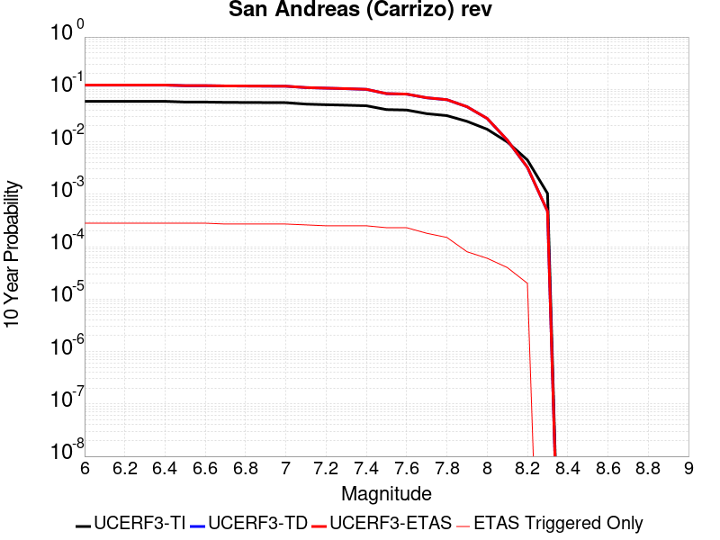 |

| Magnitude | 1 wk TI Prob | 1 wk TD Prob | 1 wk ETAS Prob | 1 wk ETAS/TD Gain | 1 wk ETAS Triggered Only | 1 mo TI Prob | 1 mo TD Prob | 1 mo ETAS Prob | 1 mo ETAS/TD Gain | 1 mo ETAS Triggered Only | 1 yr TI Prob | 1 yr TD Prob | 1 yr ETAS Prob | 1 yr ETAS/TD Gain | 1 yr ETAS Triggered Only | 10 yr TI Prob | 10 yr TD Prob | 10 yr ETAS Prob | 10 yr ETAS/TD Gain | 10 yr ETAS Triggered Only |
|-----|-----|-----|-----|-----|-----|-----|-----|-----|-----|-----|-----|-----|-----|-----|-----|-----|-----|-----|-----|-----|
| 6.0 | 1.1674632E-4 | 2.432302E-4 | 2.432302E-4 | 1.0 | 0.0 | 5.002454E-4 | 0.0010420004 | 0.0010420004 | 1.0 | 0.0 | 0.006073493 | 0.012613042 | 0.012756454 | 1.0113701 | 1.4524328E-4 | 0.0591016 | 0.12061418 | 0.12086963 | 1.0021179 | 2.9048655E-4 |
| 6.1 | 1.1674632E-4 | 2.432302E-4 | 2.432302E-4 | 1.0 | 0.0 | 5.002454E-4 | 0.0010420004 | 0.0010420004 | 1.0 | 0.0 | 0.006073493 | 0.012613042 | 0.012756454 | 1.0113701 | 1.4524328E-4 | 0.0591016 | 0.12061418 | 0.12086963 | 1.0021179 | 2.9048655E-4 |
| 6.2 | 1.1674632E-4 | 2.432302E-4 | 2.432302E-4 | 1.0 | 0.0 | 5.002454E-4 | 0.0010420004 | 0.0010420004 | 1.0 | 0.0 | 0.006073493 | 0.012613042 | 0.012756454 | 1.0113701 | 1.4524328E-4 | 0.0591016 | 0.12061418 | 0.12086963 | 1.0021179 | 2.9048655E-4 |
| 6.3 | 1.1674632E-4 | 2.432302E-4 | 2.432302E-4 | 1.0 | 0.0 | 5.002454E-4 | 0.0010420004 | 0.0010420004 | 1.0 | 0.0 | 0.006073493 | 0.012613042 | 0.012756454 | 1.0113701 | 1.4524328E-4 | 0.0591016 | 0.12061418 | 0.12086963 | 1.0021179 | 2.9048655E-4 |
| 6.4 | 1.1674632E-4 | 2.432302E-4 | 2.432302E-4 | 1.0 | 0.0 | 5.002454E-4 | 0.0010420004 | 0.0010420004 | 1.0 | 0.0 | 0.006073493 | 0.012613042 | 0.012756454 | 1.0113701 | 1.4524328E-4 | 0.0591016 | 0.12061418 | 0.12086963 | 1.0021179 | 2.9048655E-4 |
| 6.5 | 1.13136164E-4 | 2.3643032E-4 | 2.3643032E-4 | 1.0 | 0.0 | 4.847792E-4 | 0.0010128808 | 0.0010128808 | 1.0 | 0.0 | 0.0058862255 | 0.012262545 | 0.012406006 | 1.0116992 | 1.4524328E-4 | 0.057327334 | 0.117585555 | 0.11784188 | 1.00218 | 2.9048655E-4 |
| 6.6 | 1.13136164E-4 | 2.3643032E-4 | 2.3643032E-4 | 1.0 | 0.0 | 4.847792E-4 | 0.0010128808 | 0.0010128808 | 1.0 | 0.0 | 0.0058862255 | 0.012262545 | 0.012406006 | 1.0116992 | 1.4524328E-4 | 0.057327334 | 0.117585555 | 0.11784188 | 1.00218 | 2.9048655E-4 |
| 6.7 | 1.1149675E-4 | 2.3334254E-4 | 2.3334254E-4 | 1.0 | 0.0 | 4.777557E-4 | 9.996577E-4 | 9.996577E-4 | 1.0 | 0.0 | 0.0058011734 | 0.012103349 | 0.012246834 | 1.011855 | 1.4524328E-4 | 0.05652051 | 0.1162071 | 0.11646383 | 1.0022092 | 2.9048655E-4 |
| 6.8 | 1.1103589E-4 | 2.3236412E-4 | 2.3236412E-4 | 1.0 | 0.0 | 4.7578133E-4 | 9.954676E-4 | 9.954676E-4 | 1.0 | 0.0 | 0.005777263 | 0.012052901 | 0.012196394 | 1.0119052 | 1.4524328E-4 | 0.056293584 | 0.1157674 | 0.116024256 | 1.0022187 | 2.9048655E-4 |
| 6.9 | 1.1053259E-4 | 2.3128795E-4 | 2.3128795E-4 | 1.0 | 0.0 | 4.7362508E-4 | 9.90859E-4 | 9.90859E-4 | 1.0 | 0.0 | 0.0057511497 | 0.01199741 | 0.012140911 | 1.011961 | 1.4524328E-4 | 0.05604569 | 0.11528359 | 0.115540594 | 1.0022292 | 2.9048655E-4 |
| 7.0 | 1.1005377E-4 | 2.3029637E-4 | 2.3029637E-4 | 1.0 | 0.0 | 4.7157376E-4 | 9.866126E-4 | 9.866126E-4 | 1.0 | 0.0 | 0.0057263062 | 0.011946279 | 0.012089787 | 1.0120128 | 1.4524328E-4 | 0.055809796 | 0.11483591 | 0.11509304 | 1.0022391 | 2.9048655E-4 |
| 7.1 | 1.0308142E-4 | 2.1539345E-4 | 2.1539345E-4 | 1.0 | 0.0 | 4.417027E-4 | 9.227892E-4 | 9.227892E-4 | 1.0 | 0.0 | 0.0053644776 | 0.011177397 | 0.0113210175 | 1.0128491 | 1.4524328E-4 | 0.052368138 | 0.108092256 | 0.10835134 | 1.002397 | 2.9048655E-4 |
| 7.2 | 1.0027479E-4 | 2.094724E-4 | 2.094724E-4 | 1.0 | 0.0 | 4.296783E-4 | 8.9743105E-4 | 8.9743105E-4 | 1.0 | 0.0 | 0.0052187922 | 0.010871782 | 0.010871782 | 1.0 | 0.0 | 0.050979212 | 0.10539625 | 0.10552619 | 1.0012329 | 1.4524328E-4 |
| 7.3 | 9.816942E-5 | 2.0422463E-4 | 2.0422463E-4 | 1.0 | 0.0 | 4.2065824E-4 | 8.7495585E-4 | 8.7495585E-4 | 1.0 | 0.0 | 0.005109493 | 0.010600842 | 0.010600842 | 1.0 | 0.0 | 0.049935985 | 0.102979995 | 0.10311028 | 1.0012652 | 1.4524328E-4 |
| 7.4 | 9.5634205E-5 | 1.9791997E-4 | 1.9791997E-4 | 1.0 | 0.0 | 4.0979648E-4 | 8.479536E-4 | 8.479536E-4 | 1.0 | 0.0 | 0.0049778637 | 0.010275229 | 0.010275229 | 1.0 | 0.0 | 0.048678253 | 0.10006632 | 0.100197025 | 1.0013062 | 1.4524328E-4 |
| 7.5 | 8.052417E-5 | 1.611261E-4 | 1.611261E-4 | 1.0 | 0.0 | 3.4505792E-4 | 6.903579E-4 | 6.903579E-4 | 1.0 | 0.0 | 0.0041929903 | 0.008372796 | 0.008372796 | 1.0 | 0.0 | 0.04114753 | 0.08281049 | 0.08281049 | 1.0 | 0.0 |
| 7.6 | 7.897024E-5 | 1.5765853E-4 | 1.5765853E-4 | 1.0 | 0.0 | 3.384E-4 | 6.755046E-4 | 6.755046E-4 | 1.0 | 0.0 | 0.0041122385 | 0.008193332 | 0.008193332 | 1.0 | 0.0 | 0.040369697 | 0.08115171 | 0.08115171 | 1.0 | 0.0 |
| 7.7 | 6.707427E-5 | 1.3276102E-4 | 1.3276102E-4 | 1.0 | 0.0 | 2.8742946E-4 | 5.688518E-4 | 5.688518E-4 | 1.0 | 0.0 | 0.003493839 | 0.00690381 | 0.00690381 | 1.0 | 0.0 | 0.034394164 | 0.069048055 | 0.069048055 | 1.0 | 0.0 |
| 7.8 | 6.147705E-5 | 1.2197486E-4 | 1.2197486E-4 | 1.0 | 0.0 | 2.6344648E-4 | 5.226447E-4 | 5.226447E-4 | 1.0 | 0.0 | 0.0032027436 | 0.006344659 | 0.006344659 | 1.0 | 0.0 | 0.031569764 | 0.06351457 | 0.06351457 | 1.0 | 0.0 |
| 7.9 | 4.7636717E-5 | 8.87977E-5 | 8.87977E-5 | 1.0 | 0.0 | 2.0414138E-4 | 3.8050607E-4 | 3.8050607E-4 | 1.0 | 0.0 | 0.0024825884 | 0.0046228287 | 0.0046228287 | 1.0 | 0.0 | 0.024550365 | 0.046628095 | 0.046628095 | 1.0 | 0.0 |
| 8.0 | 3.3554235E-5 | 5.2136907E-5 | 5.2136907E-5 | 1.0 | 0.0 | 1.4379594E-4 | 2.2342477E-4 | 2.2342477E-4 | 1.0 | 0.0 | 0.0017493097 | 0.002716805 | 0.002716805 | 1.0 | 0.0 | 0.017356034 | 0.027880952 | 0.027880952 | 1.0 | 0.0 |
| 8.1 | 1.9175432E-5 | 1.9184976E-5 | 1.9184976E-5 | 1.0 | 0.0 | 8.217783E-5 | 8.2218736E-5 | 8.2218736E-5 | 1.0 | 0.0 | 0.0010000558 | 0.0010005541 | 0.0010005541 | 1.0 | 0.0 | 0.009955673 | 0.0107580265 | 0.0107580265 | 1.0 | 0.0 |
| 8.2 | 8.643924E-6 | 5.4748625E-6 | 5.4748625E-6 | 1.0 | 0.0 | 3.704486E-5 | 2.3463486E-5 | 2.3463486E-5 | 1.0 | 0.0 | 4.5092785E-4 | 2.8563058E-4 | 2.8563058E-4 | 1.0 | 0.0 | 0.0045001395 | 0.0032487072 | 0.0032487072 | 1.0 | 0.0 |
| 8.3 | 1.983087E-6 | 7.6599065E-7 | 7.6599065E-7 | 1.0 | 0.0 | 8.498917E-6 | 3.282813E-6 | 3.282813E-6 | 1.0 | 0.0 | 1.034694E-4 | 3.9967534E-5 | 3.9967534E-5 | 1.0 | 0.0 | 0.0010342124 | 4.719687E-4 | 4.719687E-4 | 1.0 | 0.0 |

## Brawley (Seismic Zone) alt 1
*[(top)](#table-of-contents)*

| 1 Week | 1 Month | 1 Year | 10 Year |
|-----|-----|-----|-----|
|  |  |  |  |

| Magnitude | 1 wk TI Prob | 1 wk TD Prob | 1 wk ETAS Prob | 1 wk ETAS/TD Gain | 1 wk ETAS Triggered Only | 1 mo TI Prob | 1 mo TD Prob | 1 mo ETAS Prob | 1 mo ETAS/TD Gain | 1 mo ETAS Triggered Only | 1 yr TI Prob | 1 yr TD Prob | 1 yr ETAS Prob | 1 yr ETAS/TD Gain | 1 yr ETAS Triggered Only | 10 yr TI Prob | 10 yr TD Prob | 10 yr ETAS Prob | 10 yr ETAS/TD Gain | 10 yr ETAS Triggered Only |
|-----|-----|-----|-----|-----|-----|-----|-----|-----|-----|-----|-----|-----|-----|-----|-----|-----|-----|-----|-----|-----|
| 6.0 | 2.2521618E-4 | 4.7632487E-4 | 6.2149897E-4 | 1.3047796 | 1.4524328E-4 | 9.6485513E-4 | 0.0020398323 | 0.0021847794 | 1.0710583 | 1.4524328E-4 | 0.011683988 | 0.024546238 | 0.024829593 | 1.0115438 | 2.9048655E-4 | 0.11088423 | 0.21350002 | 0.21372849 | 1.0010701 | 2.9048655E-4 |
| 6.1 | 2.2521618E-4 | 4.7632487E-4 | 6.2149897E-4 | 1.3047796 | 1.4524328E-4 | 9.6485513E-4 | 0.0020398323 | 0.0021847794 | 1.0710583 | 1.4524328E-4 | 0.011683988 | 0.024546238 | 0.024829593 | 1.0115438 | 2.9048655E-4 | 0.11088423 | 0.21350002 | 0.21372849 | 1.0010701 | 2.9048655E-4 |
| 6.2 | 2.198148E-4 | 4.6717093E-4 | 6.1234634E-4 | 1.3107544 | 1.4524328E-4 | 9.417233E-4 | 0.0020006616 | 0.0021456142 | 1.0724524 | 1.4524328E-4 | 0.011405343 | 0.024080504 | 0.024363995 | 1.0117726 | 2.9048655E-4 | 0.10837428 | 0.20993657 | 0.21016608 | 1.0010931 | 2.9048655E-4 |
| 6.3 | 2.1704129E-4 | 4.615278E-4 | 6.0670404E-4 | 1.3145558 | 1.4524328E-4 | 9.298453E-4 | 0.0019765133 | 0.0021214695 | 1.0733393 | 1.4524328E-4 | 0.011262234 | 0.02379366 | 0.024077235 | 1.0119181 | 2.9048655E-4 | 0.107082725 | 0.20782755 | 0.20805766 | 1.0011072 | 2.9048655E-4 |
| 6.4 | 1.876142E-4 | 4.00449E-4 | 5.4563413E-4 | 1.3625559 | 1.4524328E-4 | 8.038131E-4 | 0.0017150956 | 0.0018600898 | 1.08454 | 1.4524328E-4 | 0.00974259 | 0.020680401 | 0.02096488 | 1.013756 | 2.9048655E-4 | 0.093263686 | 0.18457815 | 0.18481502 | 1.0012833 | 2.9048655E-4 |
| 6.5 | 1.7390939E-4 | 3.7477075E-4 | 5.199596E-4 | 1.3874071 | 1.4524328E-4 | 7.45113E-4 | 0.0016051838 | 0.001750194 | 1.0903387 | 1.4524328E-4 | 0.009034078 | 0.019368723 | 0.019653583 | 1.0147072 | 2.9048655E-4 | 0.086755216 | 0.17440031 | 0.17464015 | 1.0013752 | 2.9048655E-4 |
| 6.6 | 1.591791E-4 | 3.4891962E-4 | 4.941122E-4 | 1.4161205 | 1.4524328E-4 | 6.8201777E-4 | 0.0014945229 | 0.0016395492 | 1.0970385 | 1.4524328E-4 | 0.008271996 | 0.018045569 | 0.018330814 | 1.0158069 | 2.9048655E-4 | 0.07970774 | 0.16380852 | 0.16405143 | 1.0014828 | 2.9048655E-4 |
| 6.7 | 1.4268003E-4 | 3.20582E-4 | 4.6577872E-4 | 1.452916 | 1.4524328E-4 | 6.1134255E-4 | 0.0013732077 | 0.0015182515 | 1.1056241 | 1.4524328E-4 | 0.007417723 | 0.016592601 | 0.01687827 | 1.0172166 | 2.9048655E-4 | 0.07174956 | 0.15193306 | 0.15217942 | 1.0016215 | 2.9048655E-4 |
| 6.8 | 1.239713E-4 | 2.9053655E-4 | 4.3573766E-4 | 1.4997687 | 1.4524328E-4 | 5.3119735E-4 | 0.0012445687 | 0.0013896312 | 1.1165564 | 1.4524328E-4 | 0.0064481674 | 0.015048777 | 0.015191834 | 1.0095062 | 1.4524328E-4 | 0.06264243 | 0.13837762 | 0.13850278 | 1.0009043 | 1.4524328E-4 |
| 6.9 | 1.0180238E-4 | 2.625439E-4 | 4.0774906E-4 | 1.55307 | 1.4524328E-4 | 4.3622297E-4 | 0.0011247073 | 0.0012697872 | 1.1289935 | 1.4524328E-4 | 0.005298089 | 0.013608336 | 0.013751603 | 1.0105278 | 1.4524328E-4 | 0.05173543 | 0.124961674 | 0.12508877 | 1.0010171 | 1.4524328E-4 |
| 7.0 | 7.6619996E-5 | 2.23993E-4 | 3.6920374E-4 | 1.6482825 | 1.4524328E-4 | 3.283301E-4 | 9.5962E-4 | 0.0011047239 | 1.1512097 | 1.4524328E-4 | 0.0039900932 | 0.011621496 | 0.011765051 | 1.0123526 | 1.4524328E-4 | 0.039192066 | 0.107266866 | 0.10739653 | 1.0012088 | 1.4524328E-4 |
| 7.1 | 7.5127435E-5 | 2.2082464E-4 | 3.6603585E-4 | 1.6575861 | 1.4524328E-4 | 3.2193496E-4 | 9.4605127E-4 | 0.0010911571 | 1.1533805 | 1.4524328E-4 | 0.0039125155 | 0.011458045 | 0.011601624 | 1.0125308 | 1.4524328E-4 | 0.038443442 | 0.10583085 | 0.10596072 | 1.0012271 | 1.4524328E-4 |
| 7.2 | 6.788582E-5 | 2.0210193E-4 | 3.4731586E-4 | 1.7185183 | 1.4524328E-4 | 2.9090676E-4 | 8.6586666E-4 | 0.0010109842 | 1.167598 | 1.4524328E-4 | 0.0035360386 | 0.0104916105 | 0.01063533 | 1.0136985 | 1.4524328E-4 | 0.034803 | 0.09750131 | 0.09763239 | 1.0013444 | 1.4524328E-4 |
| 7.3 | 6.399602E-5 | 1.8841137E-4 | 3.3362728E-4 | 1.7707386 | 1.4524328E-4 | 2.7423984E-4 | 8.072303E-4 | 9.523563E-4 | 1.1797827 | 1.4524328E-4 | 0.0033337586 | 0.009784332 | 0.009928153 | 1.0146992 | 1.4524328E-4 | 0.03284188 | 0.09139617 | 0.09152813 | 1.0014439 | 1.4524328E-4 |
| 7.4 | 4.506759E-5 | 1.2529209E-4 | 2.7051716E-4 | 2.1590922 | 1.4524328E-4 | 1.9313251E-4 | 5.368565E-4 | 6.820218E-4 | 1.2703987 | 1.4524328E-4 | 0.0023488526 | 0.0065168133 | 0.00666111 | 1.0221422 | 1.4524328E-4 | 0.023241805 | 0.062363707 | 0.062499892 | 1.0021837 | 1.4524328E-4 |
| 7.5 | 3.43289E-5 | 9.33541E-5 | 9.33541E-5 | 1.0 | 0.0 | 1.4711556E-4 | 4.00028E-4 | 4.00028E-4 | 1.0 | 0.0 | 0.0017896603 | 0.0048595266 | 0.0048595266 | 1.0 | 0.0 | 0.01775316 | 0.04705519 | 0.04705519 | 1.0 | 0.0 |
| 7.6 | 2.5980507E-5 | 7.053101E-5 | 7.053101E-5 | 1.0 | 0.0 | 1.1134028E-4 | 3.0224086E-4 | 3.0224086E-4 | 1.0 | 0.0 | 0.001354725 | 0.003673598 | 0.003673598 | 1.0 | 0.0 | 0.013464959 | 0.035840835 | 0.035840835 | 1.0 | 0.0 |
| 7.7 | 1.7292105E-5 | 4.9407296E-5 | 4.9407296E-5 | 1.0 | 0.0 | 7.4106916E-5 | 2.117284E-4 | 2.117284E-4 | 1.0 | 0.0 | 9.018782E-4 | 0.0025747516 | 0.0025747516 | 1.0 | 0.0 | 0.008982267 | 0.025290398 | 0.025290398 | 1.0 | 0.0 |
| 7.8 | 1.2927471E-5 | 3.9693266E-5 | 3.9693266E-5 | 1.0 | 0.0 | 5.5402274E-5 | 1.7010293E-4 | 1.7010293E-4 | 1.0 | 0.0 | 6.743139E-4 | 0.0020690386 | 0.0020690386 | 1.0 | 0.0 | 0.0067227143 | 0.020431727 | 0.020431727 | 1.0 | 0.0 |
| 7.9 | 1.0200774E-5 | 2.874569E-5 | 2.874569E-5 | 1.0 | 0.0 | 4.371687E-5 | 1.2319001E-4 | 1.2319001E-4 | 1.0 | 0.0 | 5.321229E-4 | 0.0014988075 | 0.0014988075 | 1.0 | 0.0 | 0.005308505 | 0.014991644 | 0.014991644 | 1.0 | 0.0 |
| 8.0 | 8.650396E-6 | 2.3277367E-5 | 2.3277367E-5 | 1.0 | 0.0 | 3.70726E-5 | 9.975634E-5 | 9.975634E-5 | 1.0 | 0.0 | 4.5126543E-4 | 0.0012138576 | 0.0012138576 | 1.0 | 0.0 | 0.0045035016 | 0.012211097 | 0.012211097 | 1.0 | 0.0 |
| 8.1 | 3.9368224E-6 | 7.3279825E-6 | 7.3279825E-6 | 1.0 | 0.0 | 1.6871985E-5 | 3.140526E-5 | 3.140526E-5 | 1.0 | 0.0 | 2.0539707E-4 | 3.8229208E-4 | 3.8229208E-4 | 1.0 | 0.0 | 0.0020520731 | 0.004001185 | 0.004001185 | 1.0 | 0.0 |
| 8.2 | 1.7101195E-6 | 2.217876E-6 | 2.217876E-6 | 1.0 | 0.0 | 7.329063E-6 | 9.505149E-6 | 9.505149E-6 | 1.0 | 0.0 | 8.922769E-5 | 1.1571907E-4 | 1.1571907E-4 | 1.0 | 0.0 | 8.9191867E-4 | 0.0012666774 | 0.0012666774 | 1.0 | 0.0 |
| 8.3 | 3.0346666E-8 | 1.721586E-8 | 1.721586E-8 | 1.0 | 0.0 | 1.3005713E-7 | 7.378226E-8 | 7.378226E-8 | 1.0 | 0.0 | 1.5834444E-6 | 8.9829894E-7 | 8.9829894E-7 | 1.0 | 0.0 | 1.5834332E-5 | 9.367729E-6 | 9.367729E-6 | 1.0 | 0.0 |

## White Wolf (Extension)
*[(top)](#table-of-contents)*

| 1 Week | 1 Month | 1 Year | 10 Year |
|-----|-----|-----|-----|
|  |  |  |  |

| Magnitude | 1 wk TI Prob | 1 wk TD Prob | 1 wk ETAS Prob | 1 wk ETAS/TD Gain | 1 wk ETAS Triggered Only | 1 mo TI Prob | 1 mo TD Prob | 1 mo ETAS Prob | 1 mo ETAS/TD Gain | 1 mo ETAS Triggered Only | 1 yr TI Prob | 1 yr TD Prob | 1 yr ETAS Prob | 1 yr ETAS/TD Gain | 1 yr ETAS Triggered Only | 10 yr TI Prob | 10 yr TD Prob | 10 yr ETAS Prob | 10 yr ETAS/TD Gain | 10 yr ETAS Triggered Only |
|-----|-----|-----|-----|-----|-----|-----|-----|-----|-----|-----|-----|-----|-----|-----|-----|-----|-----|-----|-----|-----|
| 6.0 | 8.222555E-6 | 6.0666657E-6 | 1.5130907E-4 | 24.94106 | 1.4524328E-4 | 3.5239045E-5 | 2.5999774E-5 | 1.7123928E-4 | 6.5861835 | 1.4524328E-4 | 4.289509E-4 | 3.1650788E-4 | 6.069025E-4 | 1.9174957 | 2.9048655E-4 | 0.0042812387 | 0.003161223 | 0.0034507914 | 1.0916001 | 2.9048655E-4 |
| 6.1 | 8.222555E-6 | 6.0666657E-6 | 1.5130907E-4 | 24.94106 | 1.4524328E-4 | 3.5239045E-5 | 2.5999774E-5 | 1.7123928E-4 | 6.5861835 | 1.4524328E-4 | 4.289509E-4 | 3.1650788E-4 | 6.069025E-4 | 1.9174957 | 2.9048655E-4 | 0.0042812387 | 0.003161223 | 0.0034507914 | 1.0916001 | 2.9048655E-4 |
| 6.2 | 8.222555E-6 | 6.0666657E-6 | 1.5130907E-4 | 24.94106 | 1.4524328E-4 | 3.5239045E-5 | 2.5999774E-5 | 1.7123928E-4 | 6.5861835 | 1.4524328E-4 | 4.289509E-4 | 3.1650788E-4 | 6.069025E-4 | 1.9174957 | 2.9048655E-4 | 0.0042812387 | 0.003161223 | 0.0034507914 | 1.0916001 | 2.9048655E-4 |
| 6.3 | 8.222555E-6 | 6.0666657E-6 | 1.5130907E-4 | 24.94106 | 1.4524328E-4 | 3.5239045E-5 | 2.5999774E-5 | 1.7123928E-4 | 6.5861835 | 1.4524328E-4 | 4.289509E-4 | 3.1650788E-4 | 6.069025E-4 | 1.9174957 | 2.9048655E-4 | 0.0042812387 | 0.003161223 | 0.0034507914 | 1.0916001 | 2.9048655E-4 |
| 6.4 | 5.821773E-6 | 3.5571766E-6 | 1.4879994E-4 | 41.830914 | 1.4524328E-4 | 2.4950215E-5 | 1.5244959E-5 | 1.6048603E-4 | 10.527154 | 1.4524328E-4 | 3.0372653E-4 | 1.8559267E-4 | 4.760253E-4 | 2.564893 | 2.9048655E-4 | 0.0030331176 | 0.001854485 | 0.0021444329 | 1.1563495 | 2.9048655E-4 |
| 6.5 | 5.766023E-6 | 3.4991106E-6 | 1.4874188E-4 | 42.508484 | 1.4524328E-4 | 2.4711293E-5 | 1.4996108E-5 | 1.602372E-4 | 10.685253 | 1.4524328E-4 | 3.0081844E-4 | 1.8256342E-4 | 4.7299697E-4 | 2.5908637 | 2.9048655E-4 | 0.0030041158 | 0.0018242426 | 0.0021141993 | 1.1589463 | 2.9048655E-4 |
| 6.6 | 4.643576E-6 | 2.332624E-6 | 1.4757557E-4 | 63.265903 | 1.4524328E-4 | 1.9900888E-5 | 9.996925E-6 | 1.5523875E-4 | 15.528651 | 1.4524328E-4 | 2.4226638E-4 | 1.2170619E-4 | 4.121574E-4 | 3.386495 | 2.9048655E-4 | 0.0024200242 | 0.0012164378 | 0.001506571 | 1.2385105 | 2.9048655E-4 |
| 6.7 | 3.9529173E-6 | 1.6483477E-6 | 1.468914E-4 | 89.11432 | 1.4524328E-4 | 1.6940963E-5 | 7.0643296E-6 | 1.5230659E-4 | 21.55995 | 1.4524328E-4 | 2.0623671E-4 | 8.6005006E-5 | 3.7646657E-4 | 4.3772635 | 2.9048655E-4 | 0.002060454 | 8.597357E-4 | 0.0011499726 | 1.3375884 | 2.9048655E-4 |
| 6.8 | 3.4377522E-6 | 1.2245237E-6 | 1.2245237E-6 | 1.0 | 0.0 | 1.473314E-5 | 5.2479486E-6 | 5.2479486E-6 | 1.0 | 0.0 | 1.7936122E-4 | 6.3891996E-5 | 2.09126E-4 | 3.2731173 | 1.4524328E-4 | 0.0017921652 | 6.387454E-4 | 7.8389584E-4 | 1.2272432 | 1.4524328E-4 |
| 6.9 | 3.1367306E-6 | 1.0033783E-6 | 1.0033783E-6 | 1.0 | 0.0 | 1.3443062E-5 | 4.3001864E-6 | 4.3001864E-6 | 1.0 | 0.0 | 1.63657E-4 | 5.235359E-5 | 1.9758927E-4 | 3.7741303 | 1.4524328E-4 | 0.0016353652 | 5.2342017E-4 | 6.6858745E-4 | 1.2773436 | 1.4524328E-4 |
| 7.0 | 2.8298145E-6 | 7.4286646E-7 | 7.4286646E-7 | 1.0 | 0.0 | 1.2127721E-5 | 3.1837099E-6 | 3.1837099E-6 | 1.0 | 0.0 | 1.47645E-4 | 3.8761027E-5 | 1.8399868E-4 | 4.747002 | 1.4524328E-4 | 0.0014754693 | 3.8754768E-4 | 5.327347E-4 | 1.37463 | 1.4524328E-4 |
| 7.1 | 2.4091064E-6 | 5.4227525E-7 | 5.4227525E-7 | 1.0 | 0.0 | 1.03247E-5 | 2.3240348E-6 | 2.3240348E-6 | 1.0 | 0.0 | 1.2569598E-4 | 2.8294799E-5 | 1.7353398E-4 | 6.13307 | 1.4524328E-4 | 0.001256249 | 2.8291598E-4 | 4.281182E-4 | 1.5132343 | 1.4524328E-4 |
| 7.2 | 1.3875518E-6 | 1.0743063E-7 | 1.0743063E-7 | 1.0 | 0.0 | 5.9466374E-6 | 4.6041689E-7 | 4.6041689E-7 | 1.0 | 0.0 | 7.23979E-5 | 5.6055624E-6 | 5.6055624E-6 | 1.0 | 0.0 | 7.2374323E-4 | 5.6054323E-5 | 5.6054323E-5 | 1.0 | 0.0 |
| 7.3 | 7.056077E-7 | 5.002034E-8 | 5.002034E-8 | 1.0 | 0.0 | 3.0240296E-6 | 2.1437286E-7 | 2.1437286E-7 | 1.0 | 0.0 | 3.681694E-5 | 2.609987E-6 | 2.609987E-6 | 1.0 | 0.0 | 3.681084E-4 | 2.609961E-5 | 2.609961E-5 | 1.0 | 0.0 |
| 7.4 | 5.9334678E-8 | 4.8683537E-9 | 4.8683537E-9 | 1.0 | 0.0 | 2.5429145E-7 | 2.0864372E-8 | 2.0864372E-8 | 1.0 | 0.0 | 3.095994E-6 | 2.5402372E-7 | 2.5402372E-7 | 1.0 | 0.0 | 3.095951E-5 | 2.5402353E-6 | 2.5402353E-6 | 1.0 | 0.0 |

## Lake Isabella (Seismicity)
*[(top)](#table-of-contents)*

| 1 Week | 1 Month | 1 Year | 10 Year |
|-----|-----|-----|-----|
|  |  |  |  |

| Magnitude | 1 wk TI Prob | 1 wk TD Prob | 1 wk ETAS Prob | 1 wk ETAS/TD Gain | 1 wk ETAS Triggered Only | 1 mo TI Prob | 1 mo TD Prob | 1 mo ETAS Prob | 1 mo ETAS/TD Gain | 1 mo ETAS Triggered Only | 1 yr TI Prob | 1 yr TD Prob | 1 yr ETAS Prob | 1 yr ETAS/TD Gain | 1 yr ETAS Triggered Only | 10 yr TI Prob | 10 yr TD Prob | 10 yr ETAS Prob | 10 yr ETAS/TD Gain | 10 yr ETAS Triggered Only |
|-----|-----|-----|-----|-----|-----|-----|-----|-----|-----|-----|-----|-----|-----|-----|-----|-----|-----|-----|-----|-----|
| 6.0 | 9.431637E-6 | 9.741651E-6 | 3.002254E-4 | 30.818735 | 2.9048655E-4 | 4.0420677E-5 | 4.1749343E-5 | 3.3222378E-4 | 7.9575815 | 2.9048655E-4 | 4.920106E-4 | 5.0819275E-4 | 7.985317E-4 | 1.5713166 | 2.9048655E-4 | 0.004909227 | 0.005071599 | 0.005360612 | 1.0569867 | 2.9048655E-4 |
| 6.1 | 9.431637E-6 | 9.741651E-6 | 3.002254E-4 | 30.818735 | 2.9048655E-4 | 4.0420677E-5 | 4.1749343E-5 | 3.3222378E-4 | 7.9575815 | 2.9048655E-4 | 4.920106E-4 | 5.0819275E-4 | 7.985317E-4 | 1.5713166 | 2.9048655E-4 | 0.004909227 | 0.005071599 | 0.005360612 | 1.0569867 | 2.9048655E-4 |
| 6.2 | 9.431637E-6 | 9.741651E-6 | 3.002254E-4 | 30.818735 | 2.9048655E-4 | 4.0420677E-5 | 4.1749343E-5 | 3.3222378E-4 | 7.9575815 | 2.9048655E-4 | 4.920106E-4 | 5.0819275E-4 | 7.985317E-4 | 1.5713166 | 2.9048655E-4 | 0.004909227 | 0.005071599 | 0.005360612 | 1.0569867 | 2.9048655E-4 |
| 6.3 | 9.431637E-6 | 9.741651E-6 | 3.002254E-4 | 30.818735 | 2.9048655E-4 | 4.0420677E-5 | 4.1749343E-5 | 3.3222378E-4 | 7.9575815 | 2.9048655E-4 | 4.920106E-4 | 5.0819275E-4 | 7.985317E-4 | 1.5713166 | 2.9048655E-4 | 0.004909227 | 0.005071599 | 0.005360612 | 1.0569867 | 2.9048655E-4 |
| 6.4 | 5.144063E-6 | 5.3000763E-6 | 1.5054259E-4 | 28.403854 | 1.4524328E-4 | 2.2045799E-5 | 2.2714434E-5 | 1.6795442E-4 | 7.394171 | 1.4524328E-4 | 2.6837454E-4 | 2.765166E-4 | 4.217197E-4 | 1.5251154 | 1.4524328E-4 | 0.0026805066 | 0.0027620657 | 0.0029069078 | 1.0524398 | 1.4524328E-4 |
| 6.5 | 5.144063E-6 | 5.3000763E-6 | 1.5054259E-4 | 28.403854 | 1.4524328E-4 | 2.2045799E-5 | 2.2714434E-5 | 1.6795442E-4 | 7.394171 | 1.4524328E-4 | 2.6837454E-4 | 2.765166E-4 | 4.217197E-4 | 1.5251154 | 1.4524328E-4 | 0.0026805066 | 0.0027620657 | 0.0029069078 | 1.0524398 | 1.4524328E-4 |
| 6.6 | 3.4009804E-6 | 3.498786E-6 | 1.4874156E-4 | 42.512333 | 1.4524328E-4 | 1.4575549E-5 | 1.4994721E-5 | 1.6023582E-4 | 10.68615 | 1.4524328E-4 | 1.7744285E-4 | 1.8254704E-4 | 3.277638E-4 | 1.7955033 | 1.4524328E-4 | 0.0017730123 | 0.0018241286 | 0.001969107 | 1.0794781 | 1.4524328E-4 |
| 6.7 | 3.3880428E-6 | 3.4856528E-6 | 1.4872843E-4 | 42.668743 | 1.4524328E-4 | 1.4520103E-5 | 1.4938435E-5 | 1.6017955E-4 | 10.722646 | 1.4524328E-4 | 1.767679E-4 | 1.8186188E-4 | 3.2707874E-4 | 1.7985009 | 1.4524328E-4 | 0.0017662736 | 0.0018172882 | 0.0019622676 | 1.0797778 | 1.4524328E-4 |
| 6.8 | 2.6582E-6 | 2.7337003E-6 | 2.7337003E-6 | 1.0 | 0.0 | 1.1392236E-5 | 1.1715813E-5 | 1.1715813E-5 | 1.0 | 0.0 | 1.3869164E-4 | 1.4263204E-4 | 1.4263204E-4 | 1.0 | 0.0 | 0.0013860512 | 0.0014255369 | 0.0014255369 | 1.0 | 0.0 |
| 6.9 | 2.406011E-6 | 2.4743288E-6 | 2.4743288E-6 | 1.0 | 0.0 | 1.0311434E-5 | 1.0604231E-5 | 1.0604231E-5 | 1.0 | 0.0 | 1.2553448E-4 | 1.2910018E-4 | 1.2910018E-4 | 1.0 | 0.0 | 0.0012546359 | 0.0012903814 | 0.0012903814 | 1.0 | 0.0 |
| 7.0 | 1.6953097E-6 | 1.7429371E-6 | 1.7429371E-6 | 1.0 | 0.0 | 7.265593E-6 | 7.469715E-6 | 7.469715E-6 | 1.0 | 0.0 | 8.8455E-5 | 9.094104E-5 | 9.094104E-5 | 1.0 | 0.0 | 8.84198E-4 | 9.09141E-4 | 9.09141E-4 | 1.0 | 0.0 |
| 7.1 | 3.5013824E-7 | 3.5714822E-7 | 3.5714822E-7 | 1.0 | 0.0 | 1.5005916E-6 | 1.5306344E-6 | 1.5306344E-6 | 1.0 | 0.0 | 1.826955E-5 | 1.8635317E-5 | 1.8635317E-5 | 1.0 | 0.0 | 1.8268047E-4 | 1.863378E-4 | 1.863378E-4 | 1.0 | 0.0 |
| 7.2 | 2.2321095E-7 | 2.2750574E-7 | 2.2750574E-7 | 1.0 | 0.0 | 9.56618E-7 | 9.750242E-7 | 9.750242E-7 | 1.0 | 0.0 | 1.1646762E-5 | 1.1870856E-5 | 1.1870856E-5 | 1.0 | 0.0 | 1.1646151E-4 | 1.1870232E-4 | 1.1870232E-4 | 1.0 | 0.0 |
| 7.3 | 1.5760406E-7 | 1.6060922E-7 | 1.6060922E-7 | 1.0 | 0.0 | 6.7544585E-7 | 6.8832503E-7 | 6.8832503E-7 | 1.0 | 0.0 | 8.223522E-6 | 8.380326E-6 | 8.380326E-6 | 1.0 | 0.0 | 8.2232174E-5 | 8.3800165E-5 | 8.3800165E-5 | 1.0 | 0.0 |
| 7.4 | 1.1216497E-7 | 1.1431706E-7 | 1.1431706E-7 | 1.0 | 0.0 | 4.8070694E-7 | 4.899302E-7 | 4.899302E-7 | 1.0 | 0.0 | 5.852591E-6 | 5.964884E-6 | 5.964884E-6 | 1.0 | 0.0 | 5.8524372E-5 | 5.9647282E-5 | 5.9647282E-5 | 1.0 | 0.0 |
| 7.5 | 4.885185E-8 | 4.9787737E-8 | 4.9787737E-8 | 1.0 | 0.0 | 2.0936506E-7 | 2.13376E-7 | 2.13376E-7 | 1.0 | 0.0 | 2.5490165E-6 | 2.59785E-6 | 2.59785E-6 | 1.0 | 0.0 | 2.5489873E-5 | 2.5978214E-5 | 2.5978214E-5 | 1.0 | 0.0 |
| 7.6 | 1.504641E-9 | 1.5317903E-9 | 1.5317903E-9 | 1.0 | 0.0 | 6.4484613E-9 | 6.5648154E-9 | 6.5648154E-9 | 1.0 | 0.0 | 7.851001E-8 | 7.992663E-8 | 7.992663E-8 | 1.0 | 0.0 | 7.8509987E-7 | 7.992663E-7 | 7.992663E-7 | 1.0 | 0.0 |

## Santa Ynez (East)
*[(top)](#table-of-contents)*

| 1 Week | 1 Month | 1 Year | 10 Year |
|-----|-----|-----|-----|
|  |  |  |  |

| Magnitude | 1 wk TI Prob | 1 wk TD Prob | 1 wk ETAS Prob | 1 wk ETAS/TD Gain | 1 wk ETAS Triggered Only | 1 mo TI Prob | 1 mo TD Prob | 1 mo ETAS Prob | 1 mo ETAS/TD Gain | 1 mo ETAS Triggered Only | 1 yr TI Prob | 1 yr TD Prob | 1 yr ETAS Prob | 1 yr ETAS/TD Gain | 1 yr ETAS Triggered Only | 10 yr TI Prob | 10 yr TD Prob | 10 yr ETAS Prob | 10 yr ETAS/TD Gain | 10 yr ETAS Triggered Only |
|-----|-----|-----|-----|-----|-----|-----|-----|-----|-----|-----|-----|-----|-----|-----|-----|-----|-----|-----|-----|-----|
| 6.0 | 3.2269712E-5 | 3.67505E-5 | 3.272264E-4 | 8.903997 | 2.9048655E-4 | 1.3829143E-4 | 1.5749598E-4 | 4.479368E-4 | 2.8441157 | 2.9048655E-4 | 0.0016823979 | 0.0019164166 | 0.0022063465 | 1.1512876 | 2.9048655E-4 | 0.016697178 | 0.019056441 | 0.019341392 | 1.014953 | 2.9048655E-4 |
| 6.1 | 3.2269712E-5 | 3.67505E-5 | 3.272264E-4 | 8.903997 | 2.9048655E-4 | 1.3829143E-4 | 1.5749598E-4 | 4.479368E-4 | 2.8441157 | 2.9048655E-4 | 0.0016823979 | 0.0019164166 | 0.0022063465 | 1.1512876 | 2.9048655E-4 | 0.016697178 | 0.019056441 | 0.019341392 | 1.014953 | 2.9048655E-4 |
| 6.2 | 3.2269712E-5 | 3.67505E-5 | 3.272264E-4 | 8.903997 | 2.9048655E-4 | 1.3829143E-4 | 1.5749598E-4 | 4.479368E-4 | 2.8441157 | 2.9048655E-4 | 0.0016823979 | 0.0019164166 | 0.0022063465 | 1.1512876 | 2.9048655E-4 | 0.016697178 | 0.019056441 | 0.019341392 | 1.014953 | 2.9048655E-4 |
| 6.3 | 3.2269712E-5 | 3.67505E-5 | 3.272264E-4 | 8.903997 | 2.9048655E-4 | 1.3829143E-4 | 1.5749598E-4 | 4.479368E-4 | 2.8441157 | 2.9048655E-4 | 0.0016823979 | 0.0019164166 | 0.0022063465 | 1.1512876 | 2.9048655E-4 | 0.016697178 | 0.019056441 | 0.019341392 | 1.014953 | 2.9048655E-4 |
| 6.4 | 1.4404779E-5 | 1.4849382E-5 | 1.4849382E-5 | 1.0 | 0.0 | 6.1733306E-5 | 6.363868E-5 | 6.363868E-5 | 1.0 | 0.0 | 7.513438E-4 | 7.745306E-4 | 7.745306E-4 | 1.0 | 0.0 | 0.0074880854 | 0.007718862 | 0.007718862 | 1.0 | 0.0 |
| 6.5 | 1.4404779E-5 | 1.4849382E-5 | 1.4849382E-5 | 1.0 | 0.0 | 6.1733306E-5 | 6.363868E-5 | 6.363868E-5 | 1.0 | 0.0 | 7.513438E-4 | 7.745306E-4 | 7.745306E-4 | 1.0 | 0.0 | 0.0074880854 | 0.007718862 | 0.007718862 | 1.0 | 0.0 |
| 6.6 | 1.280208E-5 | 1.3011947E-5 | 1.3011947E-5 | 1.0 | 0.0 | 5.4864904E-5 | 5.5764307E-5 | 5.5764307E-5 | 1.0 | 0.0 | 6.6777546E-4 | 6.787207E-4 | 6.787207E-4 | 1.0 | 0.0 | 0.006657724 | 0.0067666885 | 0.0067666885 | 1.0 | 0.0 |
| 6.7 | 1.2457027E-5 | 1.2628468E-5 | 1.2628468E-5 | 1.0 | 0.0 | 5.3386164E-5 | 5.412089E-5 | 5.412089E-5 | 1.0 | 0.0 | 6.497827E-4 | 6.587243E-4 | 6.587243E-4 | 1.0 | 0.0 | 0.00647886 | 0.006567915 | 0.006567915 | 1.0 | 0.0 |
| 6.8 | 1.2095134E-5 | 1.2230915E-5 | 1.2230915E-5 | 1.0 | 0.0 | 5.1835254E-5 | 5.241716E-5 | 5.241716E-5 | 1.0 | 0.0 | 6.309115E-4 | 6.379937E-4 | 6.379937E-4 | 1.0 | 0.0 | 0.0062912325 | 0.006361809 | 0.006361809 | 1.0 | 0.0 |
| 6.9 | 1.1104036E-5 | 1.1157347E-5 | 1.1157347E-5 | 1.0 | 0.0 | 4.758786E-5 | 4.781633E-5 | 4.781633E-5 | 1.0 | 0.0 | 5.7922816E-4 | 5.820096E-4 | 5.820096E-4 | 1.0 | 0.0 | 0.005777207 | 0.0058049993 | 0.0058049993 | 1.0 | 0.0 |
| 7.0 | 1.0577444E-5 | 1.058168E-5 | 1.058168E-5 | 1.0 | 0.0 | 4.5331115E-5 | 4.5349276E-5 | 4.5349276E-5 | 1.0 | 0.0 | 5.5176654E-4 | 5.519888E-4 | 5.519888E-4 | 1.0 | 0.0 | 0.0055039856 | 0.0055063153 | 0.0055063153 | 1.0 | 0.0 |
| 7.1 | 1.0021775E-5 | 9.980988E-6 | 9.980988E-6 | 1.0 | 0.0 | 4.294976E-5 | 4.2774966E-5 | 4.2774966E-5 | 1.0 | 0.0 | 5.2278786E-4 | 5.2066194E-4 | 5.2066194E-4 | 1.0 | 0.0 | 0.0052155964 | 0.0051945536 | 0.0051945536 | 1.0 | 0.0 |
| 7.2 | 8.874109E-6 | 8.748793E-6 | 8.748793E-6 | 1.0 | 0.0 | 3.8031343E-5 | 3.7494297E-5 | 3.7494297E-5 | 1.0 | 0.0 | 4.629332E-4 | 4.5639853E-4 | 4.5639853E-4 | 1.0 | 0.0 | 0.0046197 | 0.0045547304 | 0.0045547304 | 1.0 | 0.0 |
| 7.3 | 7.5504267E-6 | 7.5051175E-6 | 7.5051175E-6 | 1.0 | 0.0 | 3.235857E-5 | 3.21644E-5 | 3.21644E-5 | 1.0 | 0.0 | 3.9389438E-4 | 3.915322E-4 | 3.915322E-4 | 1.0 | 0.0 | 0.0039319694 | 0.003908531 | 0.003908531 | 1.0 | 0.0 |
| 7.4 | 6.309394E-6 | 6.1831556E-6 | 6.1831556E-6 | 1.0 | 0.0 | 2.703998E-5 | 2.6498974E-5 | 2.6498974E-5 | 1.0 | 0.0 | 3.2916202E-4 | 3.225782E-4 | 3.225782E-4 | 1.0 | 0.0 | 0.003286749 | 0.003221197 | 0.003221197 | 1.0 | 0.0 |
| 7.5 | 4.6103073E-6 | 4.4408903E-6 | 4.4408903E-6 | 1.0 | 0.0 | 1.975831E-5 | 1.9032252E-5 | 1.9032252E-5 | 1.0 | 0.0 | 2.4053088E-4 | 2.3169373E-4 | 2.3169373E-4 | 1.0 | 0.0 | 0.002402707 | 0.002314591 | 0.002314591 | 1.0 | 0.0 |
| 7.6 | 1.2858658E-6 | 1.3008173E-6 | 1.3008173E-6 | 1.0 | 0.0 | 5.5108417E-6 | 5.5749197E-6 | 5.5749197E-6 | 1.0 | 0.0 | 6.7092435E-5 | 6.78726E-5 | 6.78726E-5 | 1.0 | 0.0 | 6.707218E-4 | 6.785256E-4 | 6.785256E-4 | 1.0 | 0.0 |
| 7.7 | 5.3302307E-7 | 5.612138E-7 | 5.612138E-7 | 1.0 | 0.0 | 2.2843826E-6 | 2.4052001E-6 | 2.4052001E-6 | 1.0 | 0.0 | 2.7812002E-5 | 2.9282954E-5 | 2.9282954E-5 | 1.0 | 0.0 | 2.7808524E-4 | 2.9279452E-4 | 2.9279452E-4 | 1.0 | 0.0 |
| 7.8 | 4.613933E-8 | 4.80301E-8 | 4.80301E-8 | 1.0 | 0.0 | 1.9773998E-7 | 2.0584326E-7 | 2.0584326E-7 | 1.0 | 0.0 | 2.4074816E-6 | 2.5061388E-6 | 2.5061388E-6 | 1.0 | 0.0 | 2.4074554E-5 | 2.5061116E-5 | 2.5061116E-5 | 1.0 | 0.0 |

## Cleghorn Pass
*[(top)](#table-of-contents)*

| 1 Week | 1 Month | 1 Year | 10 Year |
|-----|-----|-----|-----|
|  |  |  |  |

| Magnitude | 1 wk TI Prob | 1 wk TD Prob | 1 wk ETAS Prob | 1 wk ETAS/TD Gain | 1 wk ETAS Triggered Only | 1 mo TI Prob | 1 mo TD Prob | 1 mo ETAS Prob | 1 mo ETAS/TD Gain | 1 mo ETAS Triggered Only | 1 yr TI Prob | 1 yr TD Prob | 1 yr ETAS Prob | 1 yr ETAS/TD Gain | 1 yr ETAS Triggered Only | 10 yr TI Prob | 10 yr TD Prob | 10 yr ETAS Prob | 10 yr ETAS/TD Gain | 10 yr ETAS Triggered Only |
|-----|-----|-----|-----|-----|-----|-----|-----|-----|-----|-----|-----|-----|-----|-----|-----|-----|-----|-----|-----|-----|
| 6.0 | 1.0522846E-5 | 1.1040642E-5 | 1.1040642E-5 | 1.0 | 0.0 | 4.509713E-5 | 4.7316473E-5 | 1.9255288E-4 | 4.069468 | 1.4524328E-4 | 5.4891926E-4 | 5.759784E-4 | 7.211381E-4 | 1.2520226 | 1.4524328E-4 | 0.0054756533 | 0.005750022 | 0.006038838 | 1.0502287 | 2.9048655E-4 |
| 6.1 | 1.0522846E-5 | 1.1040642E-5 | 1.1040642E-5 | 1.0 | 0.0 | 4.509713E-5 | 4.7316473E-5 | 1.9255288E-4 | 4.069468 | 1.4524328E-4 | 5.4891926E-4 | 5.759784E-4 | 7.211381E-4 | 1.2520226 | 1.4524328E-4 | 0.0054756533 | 0.005750022 | 0.006038838 | 1.0502287 | 2.9048655E-4 |
| 6.2 | 2.1045846E-6 | 2.2082024E-6 | 2.2082024E-6 | 1.0 | 0.0 | 9.019617E-6 | 9.463714E-6 | 1.5470562E-4 | 16.347242 | 1.4524328E-4 | 1.098083E-4 | 1.1521882E-4 | 2.6044538E-4 | 2.260441 | 1.4524328E-4 | 0.0010975406 | 0.0011520023 | 0.0012970782 | 1.1259338 | 1.4524328E-4 |
| 6.3 | 2.1045846E-6 | 2.2082024E-6 | 2.2082024E-6 | 1.0 | 0.0 | 9.019617E-6 | 9.463714E-6 | 1.5470562E-4 | 16.347242 | 1.4524328E-4 | 1.098083E-4 | 1.1521882E-4 | 2.6044538E-4 | 2.260441 | 1.4524328E-4 | 0.0010975406 | 0.0011520023 | 0.0012970782 | 1.1259338 | 1.4524328E-4 |
| 6.4 | 1.7259927E-6 | 1.810877E-6 | 1.810877E-6 | 1.0 | 0.0 | 7.3970905E-6 | 7.760902E-6 | 1.5300306E-4 | 19.714598 | 1.4524328E-4 | 9.005586E-5 | 9.4488976E-5 | 2.3971853E-4 | 2.537 | 1.4524328E-4 | 9.001937E-4 | 9.448898E-4 | 0.0010899958 | 1.1535692 | 1.4524328E-4 |

## San Andreas (San Gorgonio Pass-Garnet HIll)
*[(top)](#table-of-contents)*

| 1 Week | 1 Month | 1 Year | 10 Year |
|-----|-----|-----|-----|
|  |  |  |  |

| Magnitude | 1 wk TI Prob | 1 wk TD Prob | 1 wk ETAS Prob | 1 wk ETAS/TD Gain | 1 wk ETAS Triggered Only | 1 mo TI Prob | 1 mo TD Prob | 1 mo ETAS Prob | 1 mo ETAS/TD Gain | 1 mo ETAS Triggered Only | 1 yr TI Prob | 1 yr TD Prob | 1 yr ETAS Prob | 1 yr ETAS/TD Gain | 1 yr ETAS Triggered Only | 10 yr TI Prob | 10 yr TD Prob | 10 yr ETAS Prob | 10 yr ETAS/TD Gain | 10 yr ETAS Triggered Only |
|-----|-----|-----|-----|-----|-----|-----|-----|-----|-----|-----|-----|-----|-----|-----|-----|-----|-----|-----|-----|-----|
| 6.0 | 8.31567E-5 | 2.3382473E-4 | 3.7903406E-4 | 1.6210178 | 1.4524328E-4 | 3.5633717E-4 | 0.0010017233 | 0.0011468212 | 1.1448481 | 1.4524328E-4 | 0.004329778 | 0.012127888 | 0.012271371 | 1.0118307 | 1.4524328E-4 | 0.042463828 | 0.11257892 | 0.1128367 | 1.0022898 | 2.9048655E-4 |
| 6.1 | 8.31567E-5 | 2.3382473E-4 | 3.7903406E-4 | 1.6210178 | 1.4524328E-4 | 3.5633717E-4 | 0.0010017233 | 0.0011468212 | 1.1448481 | 1.4524328E-4 | 0.004329778 | 0.012127888 | 0.012271371 | 1.0118307 | 1.4524328E-4 | 0.042463828 | 0.11257892 | 0.1128367 | 1.0022898 | 2.9048655E-4 |
| 6.2 | 8.31567E-5 | 2.3382473E-4 | 3.7903406E-4 | 1.6210178 | 1.4524328E-4 | 3.5633717E-4 | 0.0010017233 | 0.0011468212 | 1.1448481 | 1.4524328E-4 | 0.004329778 | 0.012127888 | 0.012271371 | 1.0118307 | 1.4524328E-4 | 0.042463828 | 0.11257892 | 0.1128367 | 1.0022898 | 2.9048655E-4 |
| 6.3 | 8.31567E-5 | 2.3382473E-4 | 3.7903406E-4 | 1.6210178 | 1.4524328E-4 | 3.5633717E-4 | 0.0010017233 | 0.0011468212 | 1.1448481 | 1.4524328E-4 | 0.004329778 | 0.012127888 | 0.012271371 | 1.0118307 | 1.4524328E-4 | 0.042463828 | 0.11257892 | 0.1128367 | 1.0022898 | 2.9048655E-4 |
| 6.4 | 8.059055E-5 | 2.2940808E-4 | 3.7461804E-4 | 1.6329767 | 1.4524328E-4 | 3.4534236E-4 | 9.828096E-4 | 0.0011279101 | 1.1476386 | 1.4524328E-4 | 0.0041964394 | 0.011900152 | 0.012043667 | 1.0120599 | 1.4524328E-4 | 0.041180745 | 0.11056015 | 0.11081851 | 1.002337 | 2.9048655E-4 |
| 6.5 | 8.059055E-5 | 2.2940808E-4 | 3.7461804E-4 | 1.6329767 | 1.4524328E-4 | 3.4534236E-4 | 9.828096E-4 | 0.0011279101 | 1.1476386 | 1.4524328E-4 | 0.0041964394 | 0.011900152 | 0.012043667 | 1.0120599 | 1.4524328E-4 | 0.041180745 | 0.11056015 | 0.11081851 | 1.002337 | 2.9048655E-4 |
| 6.6 | 7.619237E-5 | 2.218517E-4 | 3.6706278E-4 | 1.6545411 | 1.4524328E-4 | 3.2649786E-4 | 9.5044886E-4 | 0.0010955541 | 1.1526703 | 1.4524328E-4 | 0.0039678677 | 0.01151087 | 0.011654441 | 1.0124726 | 1.4524328E-4 | 0.03897764 | 0.10709683 | 0.107356206 | 1.0024219 | 2.9048655E-4 |
| 6.7 | 7.440636E-5 | 2.1860997E-4 | 3.6382148E-4 | 1.6642493 | 1.4524328E-4 | 3.188454E-4 | 9.3656575E-4 | 0.001081673 | 1.1549355 | 1.4524328E-4 | 0.0038750346 | 0.011343609 | 0.011487204 | 1.0126587 | 1.4524328E-4 | 0.038081564 | 0.105605274 | 0.10586508 | 1.0024602 | 2.9048655E-4 |
| 6.8 | 7.3735864E-5 | 2.1708169E-4 | 3.6229345E-4 | 1.6689268 | 1.4524328E-4 | 3.1597257E-4 | 9.3002064E-4 | 0.0010751288 | 1.1560268 | 1.4524328E-4 | 0.0038401815 | 0.011264749 | 0.011408356 | 1.0127484 | 1.4524328E-4 | 0.03774495 | 0.10490683 | 0.10516684 | 1.0024785 | 2.9048655E-4 |
| 6.9 | 7.27575E-5 | 2.1477141E-4 | 3.599835E-4 | 1.6761239 | 1.4524328E-4 | 3.117806E-4 | 9.201265E-4 | 0.0010652362 | 1.1577061 | 1.4524328E-4 | 0.003789323 | 0.011145527 | 0.01128915 | 1.0128863 | 1.4524328E-4 | 0.037253562 | 0.103854746 | 0.10411506 | 1.0025066 | 2.9048655E-4 |
| 7.0 | 7.102591E-5 | 2.1061185E-4 | 3.5582454E-4 | 1.6894802 | 1.4524328E-4 | 3.0436125E-4 | 9.023122E-4 | 0.0010474244 | 1.1608226 | 1.4524328E-4 | 0.003699303 | 0.010930831 | 0.011074486 | 1.0131422 | 1.4524328E-4 | 0.03638325 | 0.10195695 | 0.102217816 | 1.0025586 | 2.9048655E-4 |
| 7.1 | 7.028513E-5 | 2.0896831E-4 | 3.5418125E-4 | 1.6949041 | 1.4524328E-4 | 3.0118722E-4 | 8.9527335E-4 | 0.0010403866 | 1.1620882 | 1.4524328E-4 | 0.0036607897 | 0.010845989 | 0.010989658 | 1.0132462 | 1.4524328E-4 | 0.036010686 | 0.101199985 | 0.101461075 | 1.0025799 | 2.9048655E-4 |
| 7.2 | 6.8498244E-5 | 2.0504706E-4 | 3.5026055E-4 | 1.7081959 | 1.4524328E-4 | 2.9353087E-4 | 8.784794E-4 | 0.0010235951 | 1.1651896 | 1.4524328E-4 | 0.003567883 | 0.010643536 | 0.010787234 | 1.0135009 | 1.4524328E-4 | 0.035111405 | 0.09939202 | 0.09965363 | 1.0026321 | 2.9048655E-4 |
| 7.3 | 6.622592E-5 | 1.9732013E-4 | 3.4253474E-4 | 1.7359341 | 1.4524328E-4 | 2.8379448E-4 | 8.453858E-4 | 9.905063E-4 | 1.1716619 | 1.4524328E-4 | 0.0034497243 | 0.0102444785 | 0.010388235 | 1.0140325 | 1.4524328E-4 | 0.033966612 | 0.095888525 | 0.09615116 | 1.002739 | 2.9048655E-4 |
| 7.4 | 5.1050705E-5 | 1.4689034E-4 | 2.9211227E-4 | 1.988642 | 1.4524328E-4 | 2.1877038E-4 | 6.29379E-4 | 7.7453087E-4 | 1.2306272 | 1.4524328E-4 | 0.002660276 | 0.0076359594 | 0.0077800937 | 1.0188757 | 1.4524328E-4 | 0.02628654 | 0.07286301 | 0.073132336 | 1.0036962 | 2.9048655E-4 |
| 7.5 | 3.9302922E-5 | 1.1129847E-4 | 1.1129847E-4 | 1.0 | 0.0 | 1.6843023E-4 | 4.7690657E-4 | 4.7690657E-4 | 1.0 | 0.0 | 0.0020487092 | 0.005790949 | 0.005790949 | 1.0 | 0.0 | 0.020299247 | 0.05600951 | 0.056146618 | 1.002448 | 1.4524328E-4 |
| 7.6 | 2.9851626E-5 | 8.4949745E-5 | 8.4949745E-5 | 1.0 | 0.0 | 1.2792926E-4 | 3.6401965E-4 | 3.6401965E-4 | 1.0 | 0.0 | 0.0015564259 | 0.0044229585 | 0.0044229585 | 1.0 | 0.0 | 0.0154556995 | 0.04319374 | 0.043332707 | 1.0032173 | 1.4524328E-4 |
| 7.7 | 2.1135214E-5 | 6.3529005E-5 | 6.3529005E-5 | 1.0 | 0.0 | 9.0576345E-5 | 2.7223877E-4 | 2.7223877E-4 | 1.0 | 0.0 | 0.0011022091 | 0.0033094748 | 0.0033094748 | 1.0 | 0.0 | 0.010967582 | 0.032582592 | 0.032723106 | 1.0043124 | 1.4524328E-4 |
| 7.8 | 1.883379E-5 | 5.564028E-5 | 5.564028E-5 | 1.0 | 0.0 | 8.0713755E-5 | 2.3843657E-4 | 2.3843657E-4 | 1.0 | 0.0 | 9.822468E-4 | 0.0028991038 | 0.0028991038 | 1.0 | 0.0 | 0.0097791655 | 0.028695205 | 0.028836282 | 1.0049163 | 1.4524328E-4 |
| 7.9 | 1.5156185E-5 | 4.1658426E-5 | 4.1658426E-5 | 1.0 | 0.0 | 6.495346E-5 | 1.785239E-4 | 1.785239E-4 | 1.0 | 0.0 | 7.9052144E-4 | 0.0021713632 | 0.0021713632 | 1.0 | 0.0 | 0.007877152 | 0.021759422 | 0.021901505 | 1.0065297 | 1.4524328E-4 |
| 8.0 | 1.1405907E-5 | 2.9974231E-5 | 2.9974231E-5 | 1.0 | 0.0 | 4.8881542E-5 | 1.2845467E-4 | 1.2845467E-4 | 1.0 | 0.0 | 5.9497025E-4 | 0.0015628147 | 0.0015628147 | 1.0 | 0.0 | 0.005933798 | 0.015772851 | 0.015915802 | 1.0090632 | 1.4524328E-4 |
| 8.1 | 4.3511436E-6 | 7.369219E-6 | 7.369219E-6 | 1.0 | 0.0 | 1.8647626E-5 | 3.1581985E-5 | 3.1581985E-5 | 1.0 | 0.0 | 2.2701119E-4 | 3.8444297E-4 | 3.8444297E-4 | 1.0 | 0.0 | 0.0022677942 | 0.0041163345 | 0.0041163345 | 1.0 | 0.0 |
| 8.2 | 2.3042528E-6 | 2.7329415E-6 | 2.7329415E-6 | 1.0 | 0.0 | 9.875332E-6 | 1.1712554E-5 | 1.1712554E-5 | 1.0 | 0.0 | 1.2022553E-4 | 1.4259106E-4 | 1.4259106E-4 | 1.0 | 0.0 | 0.0012016051 | 0.0015979785 | 0.0015979785 | 1.0 | 0.0 |
| 8.3 | 5.202968E-7 | 3.1598344E-7 | 3.1598344E-7 | 1.0 | 0.0 | 2.2298414E-6 | 1.3542141E-6 | 1.3542141E-6 | 1.0 | 0.0 | 2.714798E-5 | 1.6487444E-5 | 1.6487444E-5 | 1.0 | 0.0 | 2.7144665E-4 | 1.9563142E-4 | 1.9563142E-4 | 1.0 | 0.0 |

## Hosgri
*[(top)](#table-of-contents)*

| 1 Week | 1 Month | 1 Year | 10 Year |
|-----|-----|-----|-----|
|  |  |  |  |

| Magnitude | 1 wk TI Prob | 1 wk TD Prob | 1 wk ETAS Prob | 1 wk ETAS/TD Gain | 1 wk ETAS Triggered Only | 1 mo TI Prob | 1 mo TD Prob | 1 mo ETAS Prob | 1 mo ETAS/TD Gain | 1 mo ETAS Triggered Only | 1 yr TI Prob | 1 yr TD Prob | 1 yr ETAS Prob | 1 yr ETAS/TD Gain | 1 yr ETAS Triggered Only | 10 yr TI Prob | 10 yr TD Prob | 10 yr ETAS Prob | 10 yr ETAS/TD Gain | 10 yr ETAS Triggered Only |
|-----|-----|-----|-----|-----|-----|-----|-----|-----|-----|-----|-----|-----|-----|-----|-----|-----|-----|-----|-----|-----|
| 6.0 | 2.883978E-5 | 2.9128416E-5 | 1.7436747E-4 | 5.9861636 | 1.4524328E-4 | 1.235932E-4 | 1.2483024E-4 | 2.700554E-4 | 2.163381 | 1.4524328E-4 | 0.0015037085 | 0.001518776 | 0.0016637987 | 1.0954865 | 1.4524328E-4 | 0.01493574 | 0.01508774 | 0.015230792 | 1.0094813 | 1.4524328E-4 |
| 6.1 | 2.883978E-5 | 2.9128416E-5 | 1.7436747E-4 | 5.9861636 | 1.4524328E-4 | 1.235932E-4 | 1.2483024E-4 | 2.700554E-4 | 2.163381 | 1.4524328E-4 | 0.0015037085 | 0.001518776 | 0.0016637987 | 1.0954865 | 1.4524328E-4 | 0.01493574 | 0.01508774 | 0.015230792 | 1.0094813 | 1.4524328E-4 |
| 6.2 | 2.883978E-5 | 2.9128416E-5 | 1.7436747E-4 | 5.9861636 | 1.4524328E-4 | 1.235932E-4 | 1.2483024E-4 | 2.700554E-4 | 2.163381 | 1.4524328E-4 | 0.0015037085 | 0.001518776 | 0.0016637987 | 1.0954865 | 1.4524328E-4 | 0.01493574 | 0.01508774 | 0.015230792 | 1.0094813 | 1.4524328E-4 |
| 6.3 | 2.2914428E-5 | 2.2641969E-5 | 1.6788197E-4 | 7.414636 | 1.4524328E-4 | 9.8200995E-5 | 9.703343E-5 | 2.4226261E-4 | 2.4966924 | 1.4524328E-4 | 0.0011949413 | 0.0011807467 | 0.0013258185 | 1.1228645 | 1.4524328E-4 | 0.011885363 | 0.011746133 | 0.01188967 | 1.0122199 | 1.4524328E-4 |
| 6.4 | 2.0195741E-5 | 1.969656E-5 | 1.6493698E-4 | 8.373898 | 1.4524328E-4 | 8.65503E-5 | 8.4411105E-5 | 2.2964213E-4 | 2.7205203 | 1.4524328E-4 | 0.0010532405 | 0.0010272227 | 0.0011723167 | 1.141249 | 1.4524328E-4 | 0.010482626 | 0.010225792 | 0.01036955 | 1.0140584 | 1.4524328E-4 |
| 6.5 | 1.9924333E-5 | 1.940898E-5 | 1.6464945E-4 | 8.483157 | 1.4524328E-4 | 8.53872E-5 | 8.3178704E-5 | 2.284099E-4 | 2.746014 | 1.4524328E-4 | 0.0010390934 | 0.0010122322 | 0.0011573285 | 1.1433429 | 1.4524328E-4 | 0.010342481 | 0.010077253 | 0.010221032 | 1.0142677 | 1.4524328E-4 |
| 6.6 | 1.809694E-5 | 1.74583E-5 | 1.6269904E-4 | 9.319295 | 1.4524328E-4 | 7.7556004E-5 | 7.4819145E-5 | 2.2005156E-4 | 2.941113 | 1.4524328E-4 | 9.438353E-4 | 9.105437E-4 | 0.0010556548 | 1.1593674 | 1.4524328E-4 | 0.009398366 | 0.009069073 | 0.009213 | 1.01587 | 1.4524328E-4 |
| 6.7 | 1.675989E-5 | 1.6042764E-5 | 1.6128372E-4 | 10.053362 | 1.4524328E-4 | 7.182612E-5 | 6.87529E-5 | 2.139862E-4 | 3.1123953 | 1.4524328E-4 | 8.7413215E-4 | 8.3674624E-4 | 9.81868E-4 | 1.1734358 | 1.4524328E-4 | 0.008707017 | 0.0083368635 | 0.008480895 | 1.0172765 | 1.4524328E-4 |
| 6.8 | 1.5401129E-5 | 1.4614083E-5 | 1.5985525E-4 | 10.938438 | 1.4524328E-4 | 6.6003166E-5 | 6.2630286E-5 | 2.0786448E-4 | 3.3189132 | 1.4524328E-4 | 8.032922E-4 | 7.622578E-4 | 9.073904E-4 | 1.1903982 | 1.4524328E-4 | 0.008003947 | 0.007597296 | 0.007741436 | 1.0189725 | 1.4524328E-4 |
| 6.9 | 1.356559E-5 | 1.2689968E-5 | 1.2689968E-5 | 1.0 | 0.0 | 5.8136946E-5 | 5.4384444E-5 | 5.4384444E-5 | 1.0 | 0.0 | 7.0758746E-4 | 6.619299E-4 | 6.619299E-4 | 1.0 | 0.0 | 0.007053386 | 0.006600388 | 0.006600388 | 1.0 | 0.0 |
| 7.0 | 1.2030819E-5 | 1.1095962E-5 | 1.1095962E-5 | 1.0 | 0.0 | 5.155963E-5 | 4.7553254E-5 | 4.7553254E-5 | 1.0 | 0.0 | 6.275577E-4 | 5.7880714E-4 | 5.7880714E-4 | 1.0 | 0.0 | 0.006257884 | 0.005773757 | 0.005773757 | 1.0 | 0.0 |
| 7.1 | 1.0972698E-5 | 1.0022179E-5 | 1.0022179E-5 | 1.0 | 0.0 | 4.7025E-5 | 4.2951488E-5 | 4.2951488E-5 | 1.0 | 0.0 | 5.72379E-4 | 5.22809E-4 | 5.22809E-4 | 1.0 | 0.0 | 0.0057090693 | 0.005216542 | 0.005216542 | 1.0 | 0.0 |
| 7.2 | 9.961926E-6 | 9.034746E-6 | 9.034746E-6 | 1.0 | 0.0 | 4.2693267E-5 | 3.8719765E-5 | 3.8719765E-5 | 1.0 | 0.0 | 5.1966653E-4 | 4.713112E-4 | 4.713112E-4 | 1.0 | 0.0 | 0.00518453 | 0.0047038626 | 0.0047038626 | 1.0 | 0.0 |
| 7.3 | 8.700929E-6 | 7.8281E-6 | 7.8281E-6 | 1.0 | 0.0 | 3.7289166E-5 | 3.354857E-5 | 3.354857E-5 | 1.0 | 0.0 | 4.53901E-4 | 4.0837732E-4 | 4.0837732E-4 | 1.0 | 0.0 | 0.00452975 | 0.004077008 | 0.004077008 | 1.0 | 0.0 |
| 7.4 | 7.866285E-6 | 6.998739E-6 | 6.998739E-6 | 1.0 | 0.0 | 3.3712215E-5 | 2.9994251E-5 | 2.9994251E-5 | 1.0 | 0.0 | 4.103689E-4 | 3.6511885E-4 | 3.6511885E-4 | 1.0 | 0.0 | 0.004096119 | 0.0036459267 | 0.0036459267 | 1.0 | 0.0 |
| 7.5 | 6.8381305E-6 | 5.9596955E-6 | 5.9596955E-6 | 1.0 | 0.0 | 2.9305946E-5 | 2.5541302E-5 | 2.5541302E-5 | 1.0 | 0.0 | 3.5674145E-4 | 3.10921E-4 | 3.10921E-4 | 1.0 | 0.0 | 0.0035616932 | 0.0031055948 | 0.0031055948 | 1.0 | 0.0 |
| 7.6 | 5.503376E-6 | 4.5952443E-6 | 4.5952443E-6 | 1.0 | 0.0 | 2.3585684E-5 | 1.9693754E-5 | 1.9693754E-5 | 1.0 | 0.0 | 2.8711787E-4 | 2.397451E-4 | 2.397451E-4 | 1.0 | 0.0 | 0.002867472 | 0.0023955975 | 0.0023955975 | 1.0 | 0.0 |
| 7.7 | 3.6144982E-6 | 2.6522112E-6 | 2.6522112E-6 | 1.0 | 0.0 | 1.5490614E-5 | 1.1366569E-5 | 1.1366569E-5 | 1.0 | 0.0 | 1.8858191E-4 | 1.383792E-4 | 1.383792E-4 | 1.0 | 0.0 | 0.0018842196 | 0.0013836613 | 0.0013836613 | 1.0 | 0.0 |
| 7.8 | 1.9853494E-6 | 1.1361129E-6 | 1.1361129E-6 | 1.0 | 0.0 | 8.508612E-6 | 4.8690463E-6 | 4.8690463E-6 | 1.0 | 0.0 | 1.0358743E-4 | 5.9279027E-5 | 5.9279027E-5 | 1.0 | 0.0 | 0.0010353916 | 5.9336185E-4 | 5.9336185E-4 | 1.0 | 0.0 |
| 7.9 | 1.1818757E-6 | 5.2951856E-7 | 5.2951856E-7 | 1.0 | 0.0 | 5.0651715E-6 | 2.2693632E-6 | 2.2693632E-6 | 1.0 | 0.0 | 6.1666724E-5 | 2.7629147E-5 | 2.7629147E-5 | 1.0 | 0.0 | 6.1649614E-4 | 2.7694515E-4 | 2.7694515E-4 | 1.0 | 0.0 |
| 8.0 | 6.962958E-7 | 2.7139782E-7 | 2.7139782E-7 | 1.0 | 0.0 | 2.9841215E-6 | 1.163133E-6 | 1.163133E-6 | 1.0 | 0.0 | 3.6331072E-5 | 1.4161053E-5 | 1.4161053E-5 | 1.0 | 0.0 | 3.6325134E-4 | 1.4217179E-4 | 1.4217179E-4 | 1.0 | 0.0 |
| 8.1 | 1.5033264E-7 | 6.527624E-8 | 6.527624E-8 | 1.0 | 0.0 | 6.442826E-7 | 2.7975528E-7 | 2.7975528E-7 | 1.0 | 0.0 | 7.844113E-6 | 3.4060151E-6 | 3.4060151E-6 | 1.0 | 0.0 | 7.843835E-5 | 3.407693E-5 | 3.407693E-5 | 1.0 | 0.0 |

## Blue Cut
*[(top)](#table-of-contents)*

| 1 Week | 1 Month | 1 Year | 10 Year |
|-----|-----|-----|-----|
|  |  |  |  |

| Magnitude | 1 wk TI Prob | 1 wk TD Prob | 1 wk ETAS Prob | 1 wk ETAS/TD Gain | 1 wk ETAS Triggered Only | 1 mo TI Prob | 1 mo TD Prob | 1 mo ETAS Prob | 1 mo ETAS/TD Gain | 1 mo ETAS Triggered Only | 1 yr TI Prob | 1 yr TD Prob | 1 yr ETAS Prob | 1 yr ETAS/TD Gain | 1 yr ETAS Triggered Only | 10 yr TI Prob | 10 yr TD Prob | 10 yr ETAS Prob | 10 yr ETAS/TD Gain | 10 yr ETAS Triggered Only |
|-----|-----|-----|-----|-----|-----|-----|-----|-----|-----|-----|-----|-----|-----|-----|-----|-----|-----|-----|-----|-----|
| 6.0 | 2.1227985E-5 | 2.2719574E-5 | 2.2719574E-5 | 1.0 | 0.0 | 9.097391E-5 | 9.73663E-5 | 9.73663E-5 | 1.0 | 0.0 | 0.0011070445 | 0.0011848481 | 0.0013299193 | 1.1224387 | 1.4524328E-4 | 0.011015458 | 0.011791152 | 0.011934683 | 1.0121727 | 1.4524328E-4 |
| 6.1 | 2.1227985E-5 | 2.2719574E-5 | 2.2719574E-5 | 1.0 | 0.0 | 9.097391E-5 | 9.73663E-5 | 9.73663E-5 | 1.0 | 0.0 | 0.0011070445 | 0.0011848481 | 0.0013299193 | 1.1224387 | 1.4524328E-4 | 0.011015458 | 0.011791152 | 0.011934683 | 1.0121727 | 1.4524328E-4 |
| 6.2 | 2.1227985E-5 | 2.2719574E-5 | 2.2719574E-5 | 1.0 | 0.0 | 9.097391E-5 | 9.73663E-5 | 9.73663E-5 | 1.0 | 0.0 | 0.0011070445 | 0.0011848481 | 0.0013299193 | 1.1224387 | 1.4524328E-4 | 0.011015458 | 0.011791152 | 0.011934683 | 1.0121727 | 1.4524328E-4 |
| 6.3 | 1.1613981E-5 | 1.2353542E-5 | 1.2353542E-5 | 1.0 | 0.0 | 4.9773254E-5 | 5.2942745E-5 | 5.2942745E-5 | 1.0 | 0.0 | 6.0582085E-4 | 6.443998E-4 | 6.443998E-4 | 1.0 | 0.0 | 0.0060417196 | 0.0064265593 | 0.0064265593 | 1.0 | 0.0 |
| 6.4 | 1.1613981E-5 | 1.2353542E-5 | 1.2353542E-5 | 1.0 | 0.0 | 4.9773254E-5 | 5.2942745E-5 | 5.2942745E-5 | 1.0 | 0.0 | 6.0582085E-4 | 6.443998E-4 | 6.443998E-4 | 1.0 | 0.0 | 0.0060417196 | 0.0064265593 | 0.0064265593 | 1.0 | 0.0 |
| 6.5 | 8.931326E-6 | 9.4816E-6 | 9.4816E-6 | 1.0 | 0.0 | 3.8276554E-5 | 4.0634844E-5 | 4.0634844E-5 | 1.0 | 0.0 | 4.6591737E-4 | 4.946261E-4 | 4.946261E-4 | 1.0 | 0.0 | 0.0046494175 | 0.004936161 | 0.004936161 | 1.0 | 0.0 |
| 6.6 | 7.345353E-6 | 7.79028E-6 | 7.79028E-6 | 1.0 | 0.0 | 3.1479703E-5 | 3.338653E-5 | 3.338653E-5 | 1.0 | 0.0 | 3.83198E-4 | 4.064132E-4 | 4.064132E-4 | 1.0 | 0.0 | 0.0038253788 | 0.0040574907 | 0.0040574907 | 1.0 | 0.0 |
| 6.7 | 6.2775666E-6 | 6.655149E-6 | 6.655149E-6 | 1.0 | 0.0 | 2.690358E-5 | 2.8521798E-5 | 2.8521798E-5 | 1.0 | 0.0 | 3.2750185E-4 | 3.472051E-4 | 3.472051E-4 | 1.0 | 0.0 | 0.0032701963 | 0.003467367 | 0.003467367 | 1.0 | 0.0 |
| 6.8 | 5.5234095E-6 | 5.8551113E-6 | 5.8551113E-6 | 1.0 | 0.0 | 2.367154E-5 | 2.5093133E-5 | 2.5093133E-5 | 1.0 | 0.0 | 2.8816288E-4 | 3.0547334E-4 | 3.0547334E-4 | 1.0 | 0.0 | 0.002877895 | 0.0030512505 | 0.0030512505 | 1.0 | 0.0 |
| 6.9 | 4.7780054E-6 | 5.0654203E-6 | 5.0654203E-6 | 1.0 | 0.0 | 2.0477004E-5 | 2.1708804E-5 | 2.1708804E-5 | 1.0 | 0.0 | 2.4927902E-4 | 2.642797E-4 | 2.642797E-4 | 1.0 | 0.0 | 0.0024899957 | 0.002640346 | 0.002640346 | 1.0 | 0.0 |
| 7.0 | 3.883171E-6 | 4.118487E-6 | 4.118487E-6 | 1.0 | 0.0 | 1.6642054E-5 | 1.7650578E-5 | 1.7650578E-5 | 1.0 | 0.0 | 2.0259817E-4 | 2.1488148E-4 | 2.1488148E-4 | 1.0 | 0.0 | 0.0020241356 | 0.0021474129 | 0.0021474129 | 1.0 | 0.0 |
| 7.1 | 2.8358215E-6 | 3.0097158E-6 | 3.0097158E-6 | 1.0 | 0.0 | 1.2153464E-5 | 1.2898756E-5 | 1.2898756E-5 | 1.0 | 0.0 | 1.4795837E-4 | 1.5703762E-4 | 1.5703762E-4 | 1.0 | 0.0 | 0.001478599 | 0.0015699116 | 0.0015699116 | 1.0 | 0.0 |

## San Gregorio (North) 2011 CFM
*[(top)](#table-of-contents)*

| 1 Week | 1 Month | 1 Year | 10 Year |
|-----|-----|-----|-----|
|  | 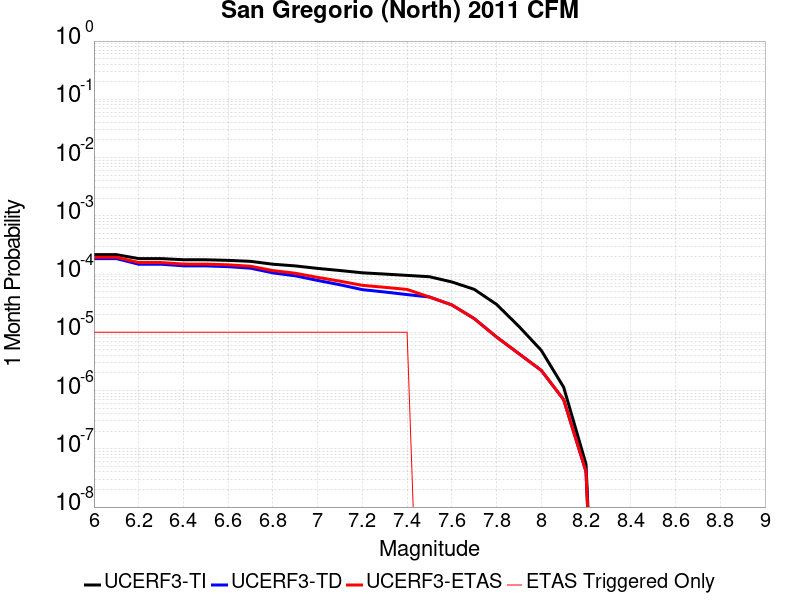 |  |  |

| Magnitude | 1 wk TI Prob | 1 wk TD Prob | 1 wk ETAS Prob | 1 wk ETAS/TD Gain | 1 wk ETAS Triggered Only | 1 mo TI Prob | 1 mo TD Prob | 1 mo ETAS Prob | 1 mo ETAS/TD Gain | 1 mo ETAS Triggered Only | 1 yr TI Prob | 1 yr TD Prob | 1 yr ETAS Prob | 1 yr ETAS/TD Gain | 1 yr ETAS Triggered Only | 10 yr TI Prob | 10 yr TD Prob | 10 yr ETAS Prob | 10 yr ETAS/TD Gain | 10 yr ETAS Triggered Only |
|-----|-----|-----|-----|-----|-----|-----|-----|-----|-----|-----|-----|-----|-----|-----|-----|-----|-----|-----|-----|-----|
| 6.0 | 5.0283932E-5 | 4.3057815E-5 | 4.3057815E-5 | 1.0 | 0.0 | 2.1548476E-4 | 1.8452053E-4 | 1.8452053E-4 | 1.0 | 0.0 | 0.0026203706 | 0.002244237 | 0.002244237 | 1.0 | 0.0 | 0.02589687 | 0.022293162 | 0.022435168 | 1.00637 | 1.4524328E-4 |
| 6.1 | 5.0283932E-5 | 4.3057815E-5 | 4.3057815E-5 | 1.0 | 0.0 | 2.1548476E-4 | 1.8452053E-4 | 1.8452053E-4 | 1.0 | 0.0 | 0.0026203706 | 0.002244237 | 0.002244237 | 1.0 | 0.0 | 0.02589687 | 0.022293162 | 0.022435168 | 1.00637 | 1.4524328E-4 |
| 6.2 | 4.2998647E-5 | 3.4441564E-5 | 3.4441564E-5 | 1.0 | 0.0 | 1.842669E-4 | 1.475984E-4 | 1.475984E-4 | 1.0 | 0.0 | 0.0022411412 | 0.00179554 | 0.00179554 | 1.0 | 0.0 | 0.022186736 | 0.017886506 | 0.018029151 | 1.007975 | 1.4524328E-4 |
| 6.3 | 4.2998647E-5 | 3.4441564E-5 | 3.4441564E-5 | 1.0 | 0.0 | 1.842669E-4 | 1.475984E-4 | 1.475984E-4 | 1.0 | 0.0 | 0.0022411412 | 0.00179554 | 0.00179554 | 1.0 | 0.0 | 0.022186736 | 0.017886506 | 0.018029151 | 1.007975 | 1.4524328E-4 |
| 6.4 | 4.1101295E-5 | 3.2326872E-5 | 3.2326872E-5 | 1.0 | 0.0 | 1.7613651E-4 | 1.3853642E-4 | 1.3853642E-4 | 1.0 | 0.0 | 0.0021423528 | 0.0016853869 | 0.0016853869 | 1.0 | 0.0 | 0.02121817 | 0.016801886 | 0.016944688 | 1.0084993 | 1.4524328E-4 |
| 6.5 | 4.1032585E-5 | 3.2244905E-5 | 3.2244905E-5 | 1.0 | 0.0 | 1.7584208E-4 | 1.3818518E-4 | 1.3818518E-4 | 1.0 | 0.0 | 0.0021387753 | 0.0016811171 | 0.0016811171 | 1.0 | 0.0 | 0.021183075 | 0.016759839 | 0.016902648 | 1.008521 | 1.4524328E-4 |
| 6.6 | 4.011629E-5 | 3.1266558E-5 | 3.1266558E-5 | 1.0 | 0.0 | 1.7191563E-4 | 1.339927E-4 | 1.339927E-4 | 1.0 | 0.0 | 0.0020910634 | 0.0016301516 | 0.0016301516 | 1.0 | 0.0 | 0.020714961 | 0.01625741 | 0.016400293 | 1.0087887 | 1.4524328E-4 |
| 6.7 | 3.8583938E-5 | 2.9453593E-5 | 2.9453593E-5 | 1.0 | 0.0 | 1.6534925E-4 | 1.2622366E-4 | 1.2622366E-4 | 1.0 | 0.0 | 0.0020112682 | 0.0015357039 | 0.0015357039 | 1.0 | 0.0 | 0.019931622 | 0.015325955 | 0.015468972 | 1.0093317 | 1.4524328E-4 |
| 6.8 | 3.44341E-5 | 2.4450854E-5 | 2.4450854E-5 | 1.0 | 0.0 | 1.4756636E-4 | 1.0478523E-4 | 1.0478523E-4 | 1.0 | 0.0 | 0.0017951399 | 0.0012750238 | 0.0012750238 | 1.0 | 0.0 | 0.017807078 | 0.012751131 | 0.012894523 | 1.0112454 | 1.4524328E-4 |
| 6.9 | 3.221199E-5 | 2.1778029E-5 | 2.1778029E-5 | 1.0 | 0.0 | 1.3804408E-4 | 9.333112E-5 | 9.333112E-5 | 1.0 | 0.0 | 0.0016793909 | 0.0011357224 | 0.0011357224 | 1.0 | 0.0 | 0.01666756 | 0.011372583 | 0.011516174 | 1.012626 | 1.4524328E-4 |
| 7.0 | 2.9186718E-5 | 1.8146875E-5 | 1.8146875E-5 | 1.0 | 0.0 | 1.2507994E-4 | 7.7770026E-5 | 7.7770026E-5 | 1.0 | 0.0 | 0.0015217843 | 9.464431E-4 | 9.464431E-4 | 1.0 | 0.0 | 0.015114053 | 0.009496798 | 0.009640662 | 1.0151486 | 1.4524328E-4 |
| 7.1 | 2.6840138E-5 | 1.5284508E-5 | 1.5284508E-5 | 1.0 | 0.0 | 1.1502409E-4 | 6.55034E-5 | 6.55034E-5 | 1.0 | 0.0 | 0.0013995186 | 7.9721404E-4 | 7.9721404E-4 | 1.0 | 0.0 | 0.013907375 | 0.008015723 | 0.008159801 | 1.0179746 | 1.4524328E-4 |
| 7.2 | 2.453002E-5 | 1.2606672E-5 | 1.2606672E-5 | 1.0 | 0.0 | 1.05124425E-4 | 5.4027478E-5 | 5.4027478E-5 | 1.0 | 0.0 | 0.0012791384 | 6.575866E-4 | 6.575866E-4 | 1.0 | 0.0 | 0.012718005 | 0.00662763 | 0.0067719105 | 1.0217695 | 1.4524328E-4 |
| 7.3 | 2.3330727E-5 | 1.1488677E-5 | 1.1488677E-5 | 1.0 | 0.0 | 9.9985E-5 | 4.923626E-5 | 4.923626E-5 | 1.0 | 0.0 | 0.0012166376 | 5.9928704E-4 | 5.9928704E-4 | 1.0 | 0.0 | 0.012099981 | 0.006046564 | 0.006046564 | 1.0 | 0.0 |
| 7.4 | 2.2136466E-5 | 1.0368981E-5 | 1.0368981E-5 | 1.0 | 0.0 | 9.486712E-5 | 4.4437733E-5 | 4.4437733E-5 | 1.0 | 0.0 | 0.0011543952 | 5.4089533E-4 | 5.4089533E-4 | 1.0 | 0.0 | 0.011484168 | 0.005464249 | 0.005464249 | 1.0 | 0.0 |
| 7.5 | 2.0994974E-5 | 9.427217E-6 | 9.427217E-6 | 1.0 | 0.0 | 8.997535E-5 | 4.0401734E-5 | 4.0401734E-5 | 1.0 | 0.0 | 0.0010948994 | 4.9178035E-4 | 4.9178035E-4 | 1.0 | 0.0 | 0.010895205 | 0.004973358 | 0.004973358 | 1.0 | 0.0 |
| 7.6 | 1.7091823E-5 | 6.893766E-6 | 6.893766E-6 | 1.0 | 0.0 | 7.3248615E-5 | 2.9544377E-5 | 2.9544377E-5 | 1.0 | 0.0 | 8.9143694E-4 | 3.596435E-4 | 3.596435E-4 | 1.0 | 0.0 | 0.008878695 | 0.0036482841 | 0.0036482841 | 1.0 | 0.0 |
| 7.7 | 1.2772179E-5 | 4.0208706E-6 | 4.0208706E-6 | 1.0 | 0.0 | 5.473676E-5 | 1.7232189E-5 | 1.7232189E-5 | 1.0 | 0.0 | 6.6621625E-4 | 2.0978172E-4 | 2.0978172E-4 | 1.0 | 0.0 | 0.006642225 | 0.002136922 | 0.002136922 | 1.0 | 0.0 |
| 7.8 | 7.041923E-6 | 1.940626E-6 | 1.940626E-6 | 1.0 | 0.0 | 3.017932E-5 | 8.316942E-6 | 8.316942E-6 | 1.0 | 0.0 | 3.6737128E-4 | 1.0125406E-4 | 1.0125406E-4 | 1.0 | 0.0 | 0.0036676454 | 0.0010379003 | 0.0010379003 | 1.0 | 0.0 |
| 7.9 | 2.946768E-6 | 1.0033551E-6 | 1.0033551E-6 | 1.0 | 0.0 | 1.2628945E-5 | 4.300086E-6 | 4.300086E-6 | 1.0 | 0.0 | 1.5374656E-4 | 5.235229E-5 | 5.235229E-5 | 1.0 | 0.0 | 0.0015364023 | 5.3400313E-4 | 5.3400313E-4 | 1.0 | 0.0 |
| 8.0 | 1.1433375E-6 | 5.18146E-7 | 5.18146E-7 | 1.0 | 0.0 | 4.9000087E-6 | 2.2206239E-6 | 2.2206239E-6 | 1.0 | 0.0 | 5.965597E-5 | 2.703576E-5 | 2.703576E-5 | 1.0 | 0.0 | 5.963996E-4 | 2.7398416E-4 | 2.7398416E-4 | 1.0 | 0.0 |
| 8.1 | 2.6675295E-7 | 1.62899E-7 | 1.62899E-7 | 1.0 | 0.0 | 1.1432264E-6 | 6.9813836E-7 | 6.9813836E-7 | 1.0 | 0.0 | 1.3918692E-5 | 8.499802E-6 | 8.499802E-6 | 1.0 | 0.0 | 1.391782E-4 | 8.63795E-5 | 8.63795E-5 | 1.0 | 0.0 |
| 8.2 | 1.2704569E-8 | 9.431393E-9 | 9.431393E-9 | 1.0 | 0.0 | 5.444815E-8 | 4.042026E-8 | 4.042026E-8 | 1.0 | 0.0 | 6.629061E-7 | 4.9211656E-7 | 4.9211656E-7 | 1.0 | 0.0 | 6.629041E-6 | 5.1121438E-6 | 5.1121438E-6 | 1.0 | 0.0 |

## Hosgri (Extension)
*[(top)](#table-of-contents)*

| 1 Week | 1 Month | 1 Year | 10 Year |
|-----|-----|-----|-----|
|  |  |  |  |

| Magnitude | 1 wk TI Prob | 1 wk TD Prob | 1 wk ETAS Prob | 1 wk ETAS/TD Gain | 1 wk ETAS Triggered Only | 1 mo TI Prob | 1 mo TD Prob | 1 mo ETAS Prob | 1 mo ETAS/TD Gain | 1 mo ETAS Triggered Only | 1 yr TI Prob | 1 yr TD Prob | 1 yr ETAS Prob | 1 yr ETAS/TD Gain | 1 yr ETAS Triggered Only | 10 yr TI Prob | 10 yr TD Prob | 10 yr ETAS Prob | 10 yr ETAS/TD Gain | 10 yr ETAS Triggered Only |
|-----|-----|-----|-----|-----|-----|-----|-----|-----|-----|-----|-----|-----|-----|-----|-----|-----|-----|-----|-----|-----|
| 6.0 | 1.1369135E-5 | 1.2083072E-5 | 1.573246E-4 | 13.020248 | 1.4524328E-4 | 4.8723956E-5 | 5.1783692E-5 | 1.9701946E-4 | 3.804662 | 1.4524328E-4 | 5.9305265E-4 | 6.3030684E-4 | 7.754586E-4 | 1.2302874 | 1.4524328E-4 | 0.005914725 | 0.0062874397 | 0.00643177 | 1.0229553 | 1.4524328E-4 |
| 6.1 | 6.934979E-6 | 7.324555E-6 | 1.5256678E-4 | 20.829494 | 1.4524328E-4 | 2.9721E-5 | 3.1390595E-5 | 1.7662931E-4 | 5.626823 | 1.4524328E-4 | 3.617931E-4 | 3.8211764E-4 | 5.273054E-4 | 1.3799558 | 1.4524328E-4 | 0.0036120464 | 0.0038150186 | 0.003959708 | 1.0379262 | 1.4524328E-4 |
| 6.2 | 6.934979E-6 | 7.324555E-6 | 1.5256678E-4 | 20.829494 | 1.4524328E-4 | 2.9721E-5 | 3.1390595E-5 | 1.7662931E-4 | 5.626823 | 1.4524328E-4 | 3.617931E-4 | 3.8211764E-4 | 5.273054E-4 | 1.3799558 | 1.4524328E-4 | 0.0036120464 | 0.0038150186 | 0.003959708 | 1.0379262 | 1.4524328E-4 |
| 6.3 | 4.5484676E-6 | 4.76933E-6 | 1.5001193E-4 | 31.453457 | 1.4524328E-4 | 1.9493287E-5 | 2.043983E-5 | 1.6568015E-4 | 8.10575 | 1.4524328E-4 | 2.3730492E-4 | 2.4882692E-4 | 3.9403405E-4 | 1.5835669 | 1.4524328E-4 | 0.0023705168 | 0.0024855258 | 0.002630408 | 1.0582904 | 1.4524328E-4 |
| 6.4 | 4.218095E-6 | 4.4168614E-6 | 1.496595E-4 | 33.883675 | 1.4524328E-4 | 1.8077424E-5 | 1.8929271E-5 | 1.641698E-4 | 8.672801 | 1.4524328E-4 | 2.2007042E-4 | 2.3043984E-4 | 3.7564963E-4 | 1.630142 | 1.4524328E-4 | 0.002198526 | 0.0023020422 | 0.002446951 | 1.062948 | 1.4524328E-4 |
| 6.5 | 3.717374E-6 | 3.8838775E-6 | 1.491266E-4 | 38.396317 | 1.4524328E-4 | 1.5931506E-5 | 1.6645085E-5 | 1.6188595E-4 | 9.725751 | 1.4524328E-4 | 1.9394881E-4 | 2.0263524E-4 | 3.478491E-4 | 1.7166269 | 1.4524328E-4 | 0.0019377962 | 0.0020245234 | 0.0021694729 | 1.0715967 | 1.4524328E-4 |
| 6.6 | 3.4605036E-6 | 3.608306E-6 | 1.4885106E-4 | 41.25234 | 1.4524328E-4 | 1.4830645E-5 | 1.5464078E-5 | 1.6070511E-4 | 10.392157 | 1.4524328E-4 | 1.8054814E-4 | 1.8825903E-4 | 3.3347498E-4 | 1.7713624 | 1.4524328E-4 | 0.0018040152 | 0.0018810101 | 0.0020259803 | 1.0770704 | 1.4524328E-4 |
| 6.7 | 3.123439E-6 | 3.2465687E-6 | 1.4848937E-4 | 45.737328 | 1.4524328E-4 | 1.33860985E-5 | 1.3913792E-5 | 1.5915505E-4 | 11.438654 | 1.4524328E-4 | 1.6296357E-4 | 1.6938736E-4 | 3.1460603E-4 | 1.8573171 | 1.4524328E-4 | 0.001628441 | 0.0016925934 | 0.0018375908 | 1.0856658 | 1.4524328E-4 |
| 6.8 | 2.8290783E-6 | 2.9305404E-6 | 1.4817339E-4 | 50.561802 | 1.4524328E-4 | 1.2124565E-5 | 1.2559399E-5 | 1.5780085E-4 | 12.564364 | 1.4524328E-4 | 1.4760658E-4 | 1.5290003E-4 | 2.981211E-4 | 1.949778 | 1.4524328E-4 | 0.0014750857 | 0.001527957 | 0.0016729784 | 1.0949119 | 1.4524328E-4 |
| 6.9 | 2.454112E-6 | 2.5283196E-6 | 2.5283196E-6 | 1.0 | 0.0 | 1.0517581E-5 | 1.0835611E-5 | 1.0835611E-5 | 1.0 | 0.0 | 1.2804402E-4 | 1.3191563E-4 | 1.3191563E-4 | 1.0 | 0.0 | 0.0012797028 | 0.0013183793 | 0.0013183793 | 1.0 | 0.0 |
| 7.0 | 2.1008145E-6 | 2.1498704E-6 | 2.1498704E-6 | 1.0 | 0.0 | 9.003459E-6 | 9.213698E-6 | 9.213698E-6 | 1.0 | 0.0 | 1.096116E-4 | 1.1217103E-4 | 1.1217103E-4 | 1.0 | 0.0 | 0.0010955755 | 0.0011211479 | 0.0011211479 | 1.0 | 0.0 |
| 7.1 | 1.744384E-6 | 1.7686352E-6 | 1.7686352E-6 | 1.0 | 0.0 | 7.47591E-6 | 7.5798434E-6 | 7.5798434E-6 | 1.0 | 0.0 | 9.1015405E-5 | 9.22807E-5 | 9.22807E-5 | 1.0 | 0.0 | 9.097813E-4 | 9.2242553E-4 | 9.2242553E-4 | 1.0 | 0.0 |
| 7.2 | 1.5456587E-6 | 1.5562882E-6 | 1.5562882E-6 | 1.0 | 0.0 | 6.6242346E-6 | 6.66979E-6 | 6.66979E-6 | 1.0 | 0.0 | 8.064707E-5 | 8.120168E-5 | 8.120168E-5 | 1.0 | 0.0 | 8.0617814E-4 | 8.117213E-4 | 8.117213E-4 | 1.0 | 0.0 |
| 7.3 | 1.3775123E-6 | 1.3766082E-6 | 1.3766082E-6 | 1.0 | 0.0 | 5.9036106E-6 | 5.899736E-6 | 5.899736E-6 | 1.0 | 0.0 | 7.187409E-5 | 7.182693E-5 | 7.182693E-5 | 1.0 | 0.0 | 7.185085E-4 | 7.180382E-4 | 7.180382E-4 | 1.0 | 0.0 |
| 7.4 | 1.214491E-6 | 1.2023461E-6 | 1.2023461E-6 | 1.0 | 0.0 | 5.2049513E-6 | 5.1529014E-6 | 5.1529014E-6 | 1.0 | 0.0 | 6.336844E-5 | 6.2734776E-5 | 6.2734776E-5 | 1.0 | 0.0 | 6.335037E-4 | 6.271715E-4 | 6.271715E-4 | 1.0 | 0.0 |
| 7.5 | 1.0101123E-6 | 9.842246E-7 | 9.842246E-7 | 1.0 | 0.0 | 4.3290456E-6 | 4.2180986E-6 | 4.2180986E-6 | 1.0 | 0.0 | 5.2704854E-5 | 5.1354145E-5 | 5.1354145E-5 | 1.0 | 0.0 | 5.2692357E-4 | 5.1342335E-4 | 5.1342335E-4 | 1.0 | 0.0 |
| 7.6 | 8.1558215E-7 | 7.765966E-7 | 7.765966E-7 | 1.0 | 0.0 | 3.4953473E-6 | 3.328267E-6 | 3.328267E-6 | 1.0 | 0.0 | 4.255502E-5 | 4.0520903E-5 | 4.0520903E-5 | 1.0 | 0.0 | 4.2546875E-4 | 4.0513556E-4 | 4.0513556E-4 | 1.0 | 0.0 |
| 7.7 | 4.757816E-7 | 4.1308888E-7 | 4.1308888E-7 | 1.0 | 0.0 | 2.0390623E-6 | 1.7703798E-6 | 1.7703798E-6 | 1.0 | 0.0 | 2.4825302E-5 | 2.155416E-5 | 2.155416E-5 | 1.0 | 0.0 | 2.482253E-4 | 2.1552083E-4 | 2.1552083E-4 | 1.0 | 0.0 |
| 7.8 | 2.782787E-7 | 2.0047722E-7 | 2.0047722E-7 | 1.0 | 0.0 | 1.1926223E-6 | 8.5918776E-7 | 8.5918776E-7 | 1.0 | 0.0 | 1.452008E-5 | 1.04605615E-5 | 1.04605615E-5 | 1.0 | 0.0 | 1.4519131E-4 | 1.04600724E-4 | 1.04600724E-4 | 1.0 | 0.0 |
| 7.9 | 1.6948086E-7 | 9.244227E-8 | 9.244227E-8 | 1.0 | 0.0 | 7.2634634E-7 | 3.961811E-7 | 3.961811E-7 | 1.0 | 0.0 | 8.843231E-6 | 4.8234942E-6 | 4.8234942E-6 | 1.0 | 0.0 | 8.842879E-5 | 4.8233902E-5 | 4.8233902E-5 | 1.0 | 0.0 |
| 8.0 | 1.0225492E-7 | 4.4738776E-8 | 4.4738776E-8 | 1.0 | 0.0 | 4.382353E-7 | 1.917376E-7 | 1.917376E-7 | 1.0 | 0.0 | 5.335502E-6 | 2.3344028E-6 | 2.3344028E-6 | 1.0 | 0.0 | 5.335374E-5 | 2.3343786E-5 | 2.3343786E-5 | 1.0 | 0.0 |
| 8.1 | 1.43711345E-8 | 5.787707E-9 | 5.787707E-9 | 1.0 | 0.0 | 6.1590576E-8 | 2.480446E-8 | 2.480446E-8 | 1.0 | 0.0 | 7.4986497E-7 | 3.0199428E-7 | 3.0199428E-7 | 1.0 | 0.0 | 7.4986247E-6 | 3.0199392E-6 | 3.0199392E-6 | 1.0 | 0.0 |

## White Mountains
*[(top)](#table-of-contents)*

| 1 Week | 1 Month | 1 Year | 10 Year |
|-----|-----|-----|-----|
| 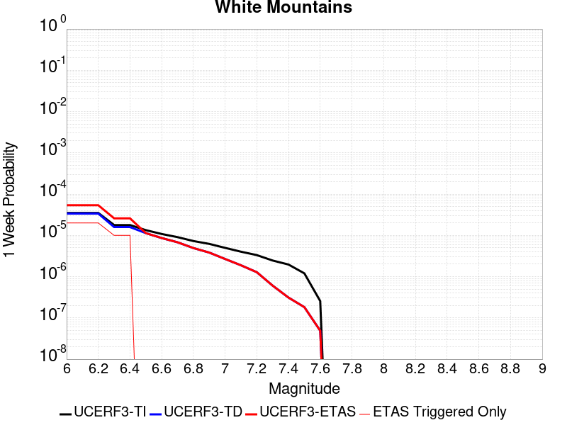 |  |  |  |

| Magnitude | 1 wk TI Prob | 1 wk TD Prob | 1 wk ETAS Prob | 1 wk ETAS/TD Gain | 1 wk ETAS Triggered Only | 1 mo TI Prob | 1 mo TD Prob | 1 mo ETAS Prob | 1 mo ETAS/TD Gain | 1 mo ETAS Triggered Only | 1 yr TI Prob | 1 yr TD Prob | 1 yr ETAS Prob | 1 yr ETAS/TD Gain | 1 yr ETAS Triggered Only | 10 yr TI Prob | 10 yr TD Prob | 10 yr ETAS Prob | 10 yr ETAS/TD Gain | 10 yr ETAS Triggered Only |
|-----|-----|-----|-----|-----|-----|-----|-----|-----|-----|-----|-----|-----|-----|-----|-----|-----|-----|-----|-----|-----|
| 6.0 | 3.503579E-5 | 3.378405E-5 | 3.378405E-5 | 1.0 | 0.0 | 1.5014476E-4 | 1.4478143E-4 | 1.4478143E-4 | 1.0 | 0.0 | 0.0018264796 | 0.0017614096 | 0.0017614096 | 1.0 | 0.0 | 0.018115403 | 0.017486818 | 0.017629523 | 1.0081606 | 1.4524328E-4 |
| 6.1 | 3.503579E-5 | 3.378405E-5 | 3.378405E-5 | 1.0 | 0.0 | 1.5014476E-4 | 1.4478143E-4 | 1.4478143E-4 | 1.0 | 0.0 | 0.0018264796 | 0.0017614096 | 0.0017614096 | 1.0 | 0.0 | 0.018115403 | 0.017486818 | 0.017629523 | 1.0081606 | 1.4524328E-4 |
| 6.2 | 3.503579E-5 | 3.378405E-5 | 3.378405E-5 | 1.0 | 0.0 | 1.5014476E-4 | 1.4478143E-4 | 1.4478143E-4 | 1.0 | 0.0 | 0.0018264796 | 0.0017614096 | 0.0017614096 | 1.0 | 0.0 | 0.018115403 | 0.017486818 | 0.017629523 | 1.0081606 | 1.4524328E-4 |
| 6.3 | 1.7818425E-5 | 1.5916074E-5 | 1.5916074E-5 | 1.0 | 0.0 | 7.636245E-5 | 6.821004E-5 | 6.821004E-5 | 1.0 | 0.0 | 9.293162E-4 | 8.301551E-4 | 8.301551E-4 | 1.0 | 0.0 | 0.009254395 | 0.008271999 | 0.008271999 | 1.0 | 0.0 |
| 6.4 | 1.7818425E-5 | 1.5916074E-5 | 1.5916074E-5 | 1.0 | 0.0 | 7.636245E-5 | 6.821004E-5 | 6.821004E-5 | 1.0 | 0.0 | 9.293162E-4 | 8.301551E-4 | 8.301551E-4 | 1.0 | 0.0 | 0.009254395 | 0.008271999 | 0.008271999 | 1.0 | 0.0 |
| 6.5 | 1.3397557E-5 | 1.13362685E-5 | 1.13362685E-5 | 1.0 | 0.0 | 5.741684E-5 | 4.858314E-5 | 4.858314E-5 | 1.0 | 0.0 | 6.988258E-4 | 5.913462E-4 | 5.913462E-4 | 1.0 | 0.0 | 0.006966323 | 0.005898432 | 0.005898432 | 1.0 | 0.0 |
| 6.6 | 1.0818695E-5 | 8.625366E-6 | 8.625366E-6 | 1.0 | 0.0 | 4.6365014E-5 | 3.6965357E-5 | 3.6965357E-5 | 1.0 | 0.0 | 5.6434784E-4 | 4.4996463E-4 | 4.4996463E-4 | 1.0 | 0.0 | 0.005629168 | 0.004490972 | 0.004490972 | 1.0 | 0.0 |
| 6.7 | 9.067908E-6 | 6.802442E-6 | 6.802442E-6 | 1.0 | 0.0 | 3.8861883E-5 | 2.9153016E-5 | 2.9153016E-5 | 1.0 | 0.0 | 4.7304068E-4 | 3.5488335E-4 | 3.5488335E-4 | 1.0 | 0.0 | 0.00472035 | 0.0035434833 | 0.0035434833 | 1.0 | 0.0 |
| 6.8 | 7.295947E-6 | 4.936391E-6 | 4.936391E-6 | 1.0 | 0.0 | 3.126797E-5 | 2.1155796E-5 | 2.1155796E-5 | 1.0 | 0.0 | 3.8062103E-4 | 2.575425E-4 | 2.575425E-4 | 1.0 | 0.0 | 0.0037996976 | 0.0025725532 | 0.0025725532 | 1.0 | 0.0 |
| 6.9 | 6.2243444E-6 | 3.832213E-6 | 3.832213E-6 | 1.0 | 0.0 | 2.6675489E-5 | 1.642367E-5 | 1.642367E-5 | 1.0 | 0.0 | 3.2472567E-4 | 1.9994036E-4 | 1.9994036E-4 | 1.0 | 0.0 | 0.0032425157 | 0.0019976576 | 0.0019976576 | 1.0 | 0.0 |
| 7.0 | 4.9878413E-6 | 2.6795342E-6 | 2.6795342E-6 | 1.0 | 0.0 | 2.1376287E-5 | 1.14836685E-5 | 1.14836685E-5 | 1.0 | 0.0 | 2.602252E-4 | 1.3980496E-4 | 1.3980496E-4 | 1.0 | 0.0 | 0.002599207 | 0.0013971963 | 0.0013971963 | 1.0 | 0.0 |
| 7.1 | 4.0252844E-6 | 1.8857575E-6 | 1.8857575E-6 | 1.0 | 0.0 | 1.7251105E-5 | 8.081794E-6 | 8.081794E-6 | 1.0 | 0.0 | 2.1001195E-4 | 9.8391516E-5 | 9.8391516E-5 | 1.0 | 0.0 | 0.0020981359 | 9.834924E-4 | 9.834924E-4 | 1.0 | 0.0 |
| 7.2 | 3.3284066E-6 | 1.281964E-6 | 1.281964E-6 | 1.0 | 0.0 | 1.4264522E-5 | 5.494121E-6 | 5.494121E-6 | 1.0 | 0.0 | 1.736567E-4 | 6.688897E-5 | 6.688897E-5 | 1.0 | 0.0 | 0.0017352107 | 6.6869846E-4 | 6.6869846E-4 | 1.0 | 0.0 |
| 7.3 | 2.458226E-6 | 6.05722E-7 | 6.05722E-7 | 1.0 | 0.0 | 1.0535211E-5 | 2.5959491E-6 | 2.5959491E-6 | 1.0 | 0.0 | 1.2825865E-4 | 3.1605257E-5 | 3.1605257E-5 | 1.0 | 0.0 | 0.0012818464 | 3.160114E-4 | 3.160114E-4 | 1.0 | 0.0 |
| 7.4 | 1.965953E-6 | 3.1089303E-7 | 3.1089303E-7 | 1.0 | 0.0 | 8.425486E-6 | 1.332398E-6 | 1.332398E-6 | 1.0 | 0.0 | 1.0257547E-4 | 1.6221828E-5 | 1.6221828E-5 | 1.0 | 0.0 | 0.0010252813 | 1.6220656E-4 | 1.6220656E-4 | 1.0 | 0.0 |
| 7.5 | 1.2014192E-6 | 1.8244253E-7 | 1.8244253E-7 | 1.0 | 0.0 | 5.148929E-6 | 7.8189635E-7 | 7.8189635E-7 | 1.0 | 0.0 | 6.2686406E-5 | 9.519547E-6 | 9.519547E-6 | 1.0 | 0.0 | 6.266873E-4 | 9.519148E-5 | 9.519148E-5 | 1.0 | 0.0 |
| 7.6 | 2.5612175E-7 | 4.8946475E-8 | 4.8946475E-8 | 1.0 | 0.0 | 1.0976642E-6 | 2.0977059E-7 | 2.0977059E-7 | 1.0 | 0.0 | 1.3363979E-5 | 2.5539543E-6 | 2.5539543E-6 | 1.0 | 0.0 | 1.3363175E-4 | 2.5539286E-5 | 2.5539286E-5 | 1.0 | 0.0 |

## San Andreas (Parkfield)
*[(top)](#table-of-contents)*

| 1 Week | 1 Month | 1 Year | 10 Year |
|-----|-----|-----|-----|
|  |  |  |  |

| Magnitude | 1 wk TI Prob | 1 wk TD Prob | 1 wk ETAS Prob | 1 wk ETAS/TD Gain | 1 wk ETAS Triggered Only | 1 mo TI Prob | 1 mo TD Prob | 1 mo ETAS Prob | 1 mo ETAS/TD Gain | 1 mo ETAS Triggered Only | 1 yr TI Prob | 1 yr TD Prob | 1 yr ETAS Prob | 1 yr ETAS/TD Gain | 1 yr ETAS Triggered Only | 10 yr TI Prob | 10 yr TD Prob | 10 yr ETAS Prob | 10 yr ETAS/TD Gain | 10 yr ETAS Triggered Only |
|-----|-----|-----|-----|-----|-----|-----|-----|-----|-----|-----|-----|-----|-----|-----|-----|-----|-----|-----|-----|-----|
| 6.0 | 5.556969E-4 | 7.7782426E-4 | 7.7782426E-4 | 1.0 | 0.0 | 0.0023793848 | 0.0033298214 | 0.0033298214 | 1.0 | 0.0 | 0.028586963 | 0.040191233 | 0.040191233 | 1.0 | 0.0 | 0.25176284 | 0.33716413 | 0.33726043 | 1.0002855 | 1.4524328E-4 |
| 6.1 | 1.925858E-4 | 3.0276453E-4 | 3.0276453E-4 | 1.0 | 0.0 | 8.2510663E-4 | 0.0012970108 | 0.0012970108 | 1.0 | 0.0 | 0.0099994885 | 0.015778083 | 0.015778083 | 1.0 | 0.0 | 0.095613256 | 0.1497237 | 0.14984718 | 1.0008248 | 1.4524328E-4 |
| 6.2 | 9.4306815E-5 | 1.8242796E-4 | 1.8242796E-4 | 1.0 | 0.0 | 4.0410945E-4 | 7.816011E-4 | 7.816011E-4 | 1.0 | 0.0 | 0.0049089384 | 0.009474681 | 0.009474681 | 1.0 | 0.0 | 0.048019063 | 0.09185409 | 0.09198599 | 1.001436 | 1.4524328E-4 |
| 6.3 | 9.283051E-5 | 1.7939322E-4 | 1.7939322E-4 | 1.0 | 0.0 | 3.9778434E-4 | 7.686027E-4 | 7.686027E-4 | 1.0 | 0.0 | 0.0048322747 | 0.009317789 | 0.009317789 | 1.0 | 0.0 | 0.047285385 | 0.09050704 | 0.09063913 | 1.0014595 | 1.4524328E-4 |
| 6.4 | 9.138826E-5 | 1.770153E-4 | 1.770153E-4 | 1.0 | 0.0 | 3.916052E-4 | 7.5841765E-4 | 7.5841765E-4 | 1.0 | 0.0 | 0.0047573745 | 0.00919484 | 0.00919484 | 1.0 | 0.0 | 0.046568092 | 0.08940927 | 0.08954153 | 1.0014793 | 1.4524328E-4 |
| 6.5 | 9.000255E-5 | 1.7459576E-4 | 1.7459576E-4 | 1.0 | 0.0 | 3.8566816E-4 | 7.480541E-4 | 7.480541E-4 | 1.0 | 0.0 | 0.0046854047 | 0.009069731 | 0.009069731 | 1.0 | 0.0 | 0.045878403 | 0.088295065 | 0.088427484 | 1.0014998 | 1.4524328E-4 |
| 6.6 | 8.8109264E-5 | 1.7140752E-4 | 1.7140752E-4 | 1.0 | 0.0 | 3.7755648E-4 | 7.3439797E-4 | 7.3439797E-4 | 1.0 | 0.0 | 0.0045870654 | 0.008904854 | 0.008904854 | 1.0 | 0.0 | 0.04493529 | 0.0868267 | 0.086959325 | 1.0015275 | 1.4524328E-4 |
| 6.7 | 8.738073E-5 | 1.7007832E-4 | 1.7007832E-4 | 1.0 | 0.0 | 3.7443507E-4 | 7.287046E-4 | 7.287046E-4 | 1.0 | 0.0 | 0.0045492216 | 0.008836143 | 0.008836143 | 1.0 | 0.0 | 0.04457213 | 0.08622707 | 0.086359784 | 1.0015392 | 1.4524328E-4 |
| 6.8 | 8.710195E-5 | 1.6953335E-4 | 1.6953335E-4 | 1.0 | 0.0 | 3.7324068E-4 | 7.263703E-4 | 7.263703E-4 | 1.0 | 0.0 | 0.0045347405 | 0.008807961 | 0.008807961 | 1.0 | 0.0 | 0.04443313 | 0.08597467 | 0.086107425 | 1.0015441 | 1.4524328E-4 |
| 6.9 | 8.6801556E-5 | 1.689429E-4 | 1.689429E-4 | 1.0 | 0.0 | 3.7195362E-4 | 7.2384125E-4 | 7.2384125E-4 | 1.0 | 0.0 | 0.0045191357 | 0.008777418 | 0.008777418 | 1.0 | 0.0 | 0.044283327 | 0.085700735 | 0.08583353 | 1.0015495 | 1.4524328E-4 |
| 7.0 | 8.5571606E-5 | 1.6647128E-4 | 1.6647128E-4 | 1.0 | 0.0 | 3.6668387E-4 | 7.132544E-4 | 7.132544E-4 | 1.0 | 0.0 | 0.004455241 | 0.008649553 | 0.008649553 | 1.0 | 0.0 | 0.043669727 | 0.08454914 | 0.0846821 | 1.0015726 | 1.4524328E-4 |
| 7.1 | 7.82589E-5 | 1.5128135E-4 | 1.5128135E-4 | 1.0 | 0.0 | 3.3535215E-4 | 6.481883E-4 | 6.481883E-4 | 1.0 | 0.0 | 0.0040752706 | 0.007863307 | 0.007863307 | 1.0 | 0.0 | 0.040013418 | 0.07746111 | 0.0775951 | 1.0017298 | 1.4524328E-4 |
| 7.2 | 7.690929E-5 | 1.4865391E-4 | 1.4865391E-4 | 1.0 | 0.0 | 3.2956956E-4 | 6.369334E-4 | 6.369334E-4 | 1.0 | 0.0 | 0.004005129 | 0.007727258 | 0.007727258 | 1.0 | 0.0 | 0.0393371 | 0.07623427 | 0.07636844 | 1.00176 | 1.4524328E-4 |
| 7.3 | 7.5543794E-5 | 1.4561978E-4 | 1.4561978E-4 | 1.0 | 0.0 | 3.2371894E-4 | 6.2393624E-4 | 6.2393624E-4 | 1.0 | 0.0 | 0.003934157 | 0.007570127 | 0.007570127 | 1.0 | 0.0 | 0.038652334 | 0.074797355 | 0.07493173 | 1.0017966 | 1.4524328E-4 |
| 7.4 | 7.4214564E-5 | 1.4262961E-4 | 1.4262961E-4 | 1.0 | 0.0 | 3.1802364E-4 | 6.111273E-4 | 6.111273E-4 | 1.0 | 0.0 | 0.003865065 | 0.00741525 | 0.00741525 | 1.0 | 0.0 | 0.03798529 | 0.07337123 | 0.07350582 | 1.0018343 | 1.4524328E-4 |
| 7.5 | 6.149578E-5 | 1.11907226E-4 | 1.11907226E-4 | 1.0 | 0.0 | 2.6352672E-4 | 4.7951436E-4 | 4.7951436E-4 | 1.0 | 0.0 | 0.0032037178 | 0.0058224914 | 0.0058224914 | 1.0 | 0.0 | 0.03157923 | 0.058557566 | 0.058557566 | 1.0 | 0.0 |
| 7.6 | 6.0643448E-5 | 1.10193796E-4 | 1.10193796E-4 | 1.0 | 0.0 | 2.598746E-4 | 4.7217376E-4 | 4.7217376E-4 | 1.0 | 0.0 | 0.0031593828 | 0.0057335934 | 0.0057335934 | 1.0 | 0.0 | 0.031148417 | 0.057718582 | 0.057718582 | 1.0 | 0.0 |
| 7.7 | 5.1652263E-5 | 9.174698E-5 | 9.174698E-5 | 1.0 | 0.0 | 2.2134806E-4 | 3.931421E-4 | 3.931421E-4 | 1.0 | 0.0 | 0.002691582 | 0.0047760103 | 0.0047760103 | 1.0 | 0.0 | 0.026592141 | 0.04853623 | 0.04853623 | 1.0 | 0.0 |
| 7.8 | 4.8090482E-5 | 8.559635E-5 | 8.559635E-5 | 1.0 | 0.0 | 2.060858E-4 | 3.6678996E-4 | 3.6678996E-4 | 1.0 | 0.0 | 0.0025062072 | 0.0044565317 | 0.0044565317 | 1.0 | 0.0 | 0.024781305 | 0.04530245 | 0.04530245 | 1.0 | 0.0 |
| 7.9 | 3.970278E-5 | 6.750426E-5 | 6.750426E-5 | 1.0 | 0.0 | 1.7014367E-4 | 2.892719E-4 | 2.892719E-4 | 1.0 | 0.0 | 0.002069531 | 0.0035162016 | 0.0035162016 | 1.0 | 0.0 | 0.020503636 | 0.035881363 | 0.035881363 | 1.0 | 0.0 |
| 8.0 | 2.8982335E-5 | 4.069796E-5 | 4.069796E-5 | 1.0 | 0.0 | 1.2420409E-4 | 1.7440817E-4 | 1.7440817E-4 | 1.0 | 0.0 | 0.0015111357 | 0.0021213528 | 0.0021213528 | 1.0 | 0.0 | 0.015009012 | 0.022010697 | 0.022010697 | 1.0 | 0.0 |
| 8.1 | 1.8836186E-5 | 1.8681134E-5 | 1.8681134E-5 | 1.0 | 0.0 | 8.0724014E-5 | 8.005955E-5 | 8.005955E-5 | 1.0 | 0.0 | 9.823717E-4 | 9.742898E-4 | 9.742898E-4 | 1.0 | 0.0 | 0.009780403 | 0.010488115 | 0.010488115 | 1.0 | 0.0 |
| 8.2 | 8.643924E-6 | 5.4748625E-6 | 5.4748625E-6 | 1.0 | 0.0 | 3.704486E-5 | 2.3463486E-5 | 2.3463486E-5 | 1.0 | 0.0 | 4.5092785E-4 | 2.8563058E-4 | 2.8563058E-4 | 1.0 | 0.0 | 0.0045001395 | 0.0032487072 | 0.0032487072 | 1.0 | 0.0 |
| 8.3 | 1.983087E-6 | 7.6599065E-7 | 7.6599065E-7 | 1.0 | 0.0 | 8.498917E-6 | 3.282813E-6 | 3.282813E-6 | 1.0 | 0.0 | 1.034694E-4 | 3.9967534E-5 | 3.9967534E-5 | 1.0 | 0.0 | 0.0010342124 | 4.719687E-4 | 4.719687E-4 | 1.0 | 0.0 |

## Hayward (No) 2011 CFM
*[(top)](#table-of-contents)*

| 1 Week | 1 Month | 1 Year | 10 Year |
|-----|-----|-----|-----|
|  |  |  |  |

| Magnitude | 1 wk TI Prob | 1 wk TD Prob | 1 wk ETAS Prob | 1 wk ETAS/TD Gain | 1 wk ETAS Triggered Only | 1 mo TI Prob | 1 mo TD Prob | 1 mo ETAS Prob | 1 mo ETAS/TD Gain | 1 mo ETAS Triggered Only | 1 yr TI Prob | 1 yr TD Prob | 1 yr ETAS Prob | 1 yr ETAS/TD Gain | 1 yr ETAS Triggered Only | 10 yr TI Prob | 10 yr TD Prob | 10 yr ETAS Prob | 10 yr ETAS/TD Gain | 10 yr ETAS Triggered Only |
|-----|-----|-----|-----|-----|-----|-----|-----|-----|-----|-----|-----|-----|-----|-----|-----|-----|-----|-----|-----|-----|
| 6.0 | 9.3068506E-5 | 1.739599E-4 | 1.739599E-4 | 1.0 | 0.0 | 3.9880406E-4 | 7.453244E-4 | 8.9045946E-4 | 1.1947273 | 1.4524328E-4 | 0.0048446343 | 0.009036438 | 0.009180369 | 1.0159278 | 1.4524328E-4 | 0.047403704 | 0.08637534 | 0.086508036 | 1.0015363 | 1.4524328E-4 |
| 6.1 | 9.055486E-5 | 1.6947114E-4 | 1.6947114E-4 | 1.0 | 0.0 | 3.880345E-4 | 7.261021E-4 | 8.712399E-4 | 1.1998862 | 1.4524328E-4 | 0.0047140904 | 0.008804537 | 0.008948502 | 1.0163512 | 1.4524328E-4 | 0.046153355 | 0.08426854 | 0.08440154 | 1.0015783 | 1.4524328E-4 |
| 6.2 | 9.006742E-5 | 1.6867711E-4 | 1.6867711E-4 | 1.0 | 0.0 | 3.859461E-4 | 7.22701E-4 | 8.678394E-4 | 1.2008276 | 1.4524328E-4 | 0.0046887742 | 0.008763513 | 0.008907483 | 1.0164284 | 1.4524328E-4 | 0.0459107 | 0.083892785 | 0.08402584 | 1.0015861 | 1.4524328E-4 |
| 6.3 | 8.8336754E-5 | 1.6547246E-4 | 1.6547246E-4 | 1.0 | 0.0 | 3.7853114E-4 | 7.089758E-4 | 8.541161E-4 | 1.2047182 | 1.4524328E-4 | 0.004598882 | 0.008597788 | 0.008741783 | 1.0167478 | 1.4524328E-4 | 0.04504866 | 0.08238599 | 0.08251927 | 1.0016177 | 1.4524328E-4 |
| 6.4 | 8.526157E-5 | 1.5974249E-4 | 1.5974249E-4 | 1.0 | 0.0 | 3.6535555E-4 | 6.8443175E-4 | 8.2957564E-4 | 1.2120647 | 1.4524328E-4 | 0.0044391346 | 0.008301278 | 0.008445316 | 1.0173513 | 1.4524328E-4 | 0.043514993 | 0.079682834 | 0.079816505 | 1.0016775 | 1.4524328E-4 |
| 6.5 | 8.152396E-5 | 1.530663E-4 | 1.530663E-4 | 1.0 | 0.0 | 3.493416E-4 | 6.558342E-4 | 8.0098223E-4 | 1.2213181 | 1.4524328E-4 | 0.0042449418 | 0.007955698 | 0.008099786 | 1.0181112 | 1.4524328E-4 | 0.04164765 | 0.07651369 | 0.07664782 | 1.001753 | 1.4524328E-4 |
| 6.6 | 7.987405E-5 | 1.5010842E-4 | 1.5010842E-4 | 1.0 | 0.0 | 3.4227243E-4 | 6.4316386E-4 | 7.8831374E-4 | 1.225681 | 1.4524328E-4 | 0.0041592065 | 0.0078025614 | 0.007946672 | 1.0184696 | 1.4524328E-4 | 0.04082218 | 0.07510622 | 0.07524055 | 1.0017886 | 1.4524328E-4 |
| 6.7 | 7.777665E-5 | 1.4650106E-4 | 1.4650106E-4 | 1.0 | 0.0 | 3.332859E-4 | 6.277113E-4 | 7.728634E-4 | 1.2312403 | 1.4524328E-4 | 0.004050208 | 0.00761576 | 0.007759897 | 1.0189261 | 1.4524328E-4 | 0.039771806 | 0.073382616 | 0.0735172 | 1.001834 | 1.4524328E-4 |
| 6.8 | 7.3284005E-5 | 1.3800753E-4 | 1.3800753E-4 | 1.0 | 0.0 | 3.140365E-4 | 5.913274E-4 | 7.3648477E-4 | 1.2454772 | 1.4524328E-4 | 0.0038166929 | 0.0071757827 | 0.007319984 | 1.0200955 | 1.4524328E-4 | 0.037518036 | 0.06929621 | 0.06943139 | 1.0019507 | 1.4524328E-4 |
| 6.9 | 6.458263E-5 | 1.2131439E-4 | 1.2131439E-4 | 1.0 | 0.0 | 2.7675333E-4 | 5.198157E-4 | 6.6498347E-4 | 1.2792678 | 1.4524328E-4 | 0.0033642664 | 0.0063104923 | 0.006454819 | 1.0228709 | 1.4524328E-4 | 0.033137884 | 0.061225023 | 0.061361372 | 1.0022271 | 1.4524328E-4 |
| 7.0 | 5.3853604E-5 | 1.00250414E-4 | 1.00250414E-4 | 1.0 | 0.0 | 2.3078074E-4 | 4.295742E-4 | 5.747551E-4 | 1.3379647 | 1.4524328E-4 | 0.0028061352 | 0.0052175885 | 0.005362074 | 1.027692 | 1.4524328E-4 | 0.027709642 | 0.0509578 | 0.051095642 | 1.002705 | 1.4524328E-4 |
| 7.1 | 4.4308683E-5 | 8.170626E-5 | 8.170626E-5 | 1.0 | 0.0 | 1.8988053E-4 | 3.501229E-4 | 4.9531535E-4 | 1.4146899 | 1.4524328E-4 | 0.0023093442 | 0.0042544557 | 0.004399081 | 1.0339938 | 1.4524328E-4 | 0.022854926 | 0.04182473 | 0.041963898 | 1.0033274 | 1.4524328E-4 |
| 7.2 | 3.295973E-5 | 6.0771144E-5 | 6.0771144E-5 | 1.0 | 0.0 | 1.4124835E-4 | 2.604219E-4 | 4.0562733E-4 | 1.5575777 | 1.4524328E-4 | 0.0017183421 | 0.0031660495 | 0.003310833 | 1.04573 | 1.4524328E-4 | 0.017051157 | 0.031369876 | 0.03151056 | 1.0044848 | 1.4524328E-4 |
| 7.3 | 2.452256E-5 | 4.5180346E-5 | 4.5180346E-5 | 1.0 | 0.0 | 1.05092455E-4 | 1.9361576E-4 | 3.3883093E-4 | 1.7500173 | 1.4524328E-4 | 0.0012787496 | 0.0023547374 | 0.0024996386 | 1.0615361 | 1.4524328E-4 | 0.0127141625 | 0.02344111 | 0.02358295 | 1.0060508 | 1.4524328E-4 |
| 7.4 | 1.8829967E-5 | 3.4602548E-5 | 3.4602548E-5 | 1.0 | 0.0 | 8.069736E-5 | 1.4828827E-4 | 2.9351E-4 | 1.9793205 | 1.4524328E-4 | 9.820475E-4 | 0.0018039243 | 0.0019489056 | 1.08037 | 1.4524328E-4 | 0.009777189 | 0.0180195 | 0.018162126 | 1.0079151 | 1.4524328E-4 |
| 7.5 | 1.26374125E-5 | 2.2921116E-5 | 2.2921116E-5 | 1.0 | 0.0 | 5.4159216E-5 | 9.822969E-5 | 9.822969E-5 | 1.0 | 0.0 | 6.5918895E-4 | 0.0011952962 | 0.0011952962 | 1.0 | 0.0 | 0.00657237 | 0.011988836 | 0.011988836 | 1.0 | 0.0 |
| 7.6 | 4.666429E-6 | 8.4791645E-6 | 8.4791645E-6 | 1.0 | 0.0 | 1.9998828E-5 | 3.6338777E-5 | 3.6338777E-5 | 1.0 | 0.0 | 2.4345852E-4 | 4.4233602E-4 | 4.4233602E-4 | 1.0 | 0.0 | 0.0024319198 | 0.0044591012 | 0.0044591012 | 1.0 | 0.0 |
| 7.7 | 3.8399318E-7 | 7.133867E-7 | 7.133867E-7 | 1.0 | 0.0 | 1.6456839E-6 | 3.057368E-6 | 3.057368E-6 | 1.0 | 0.0 | 2.003602E-5 | 3.722282E-5 | 3.722282E-5 | 1.0 | 0.0 | 2.0034213E-4 | 3.8614936E-4 | 3.8614936E-4 | 1.0 | 0.0 |
| 7.8 | 2.5637698E-7 | 5.3662194E-7 | 5.3662194E-7 | 1.0 | 0.0 | 1.098758E-6 | 2.299806E-6 | 2.299806E-6 | 1.0 | 0.0 | 1.3377297E-5 | 2.7999782E-5 | 2.7999782E-5 | 1.0 | 0.0 | 1.3376492E-4 | 2.9244382E-4 | 2.9244382E-4 | 1.0 | 0.0 |
| 7.9 | 1.7141245E-7 | 3.7290573E-7 | 3.7290573E-7 | 1.0 | 0.0 | 7.3462456E-7 | 1.5981665E-6 | 1.5981665E-6 | 1.0 | 0.0 | 8.944017E-6 | 1.9457504E-5 | 1.9457504E-5 | 1.0 | 0.0 | 8.943657E-5 | 2.0245428E-4 | 2.0245428E-4 | 1.0 | 0.0 |
| 8.0 | 1.1808895E-7 | 2.7509762E-7 | 2.7509762E-7 | 1.0 | 0.0 | 5.060954E-7 | 1.1789892E-6 | 1.1789892E-6 | 1.0 | 0.0 | 6.161694E-6 | 1.43541E-5 | 1.43541E-5 | 1.0 | 0.0 | 6.161523E-5 | 1.4816441E-4 | 1.4816441E-4 | 1.0 | 0.0 |
| 8.1 | 5.138535E-8 | 1.1229867E-7 | 1.1229867E-7 | 1.0 | 0.0 | 2.2022292E-7 | 4.812799E-7 | 4.812799E-7 | 1.0 | 0.0 | 2.6812106E-6 | 5.8595674E-6 | 5.8595674E-6 | 1.0 | 0.0 | 2.6811784E-5 | 6.0158476E-5 | 6.0158476E-5 | 1.0 | 0.0 |

## Hayward (So) extension 2011 CFM
*[(top)](#table-of-contents)*

| 1 Week | 1 Month | 1 Year | 10 Year |
|-----|-----|-----|-----|
|  | 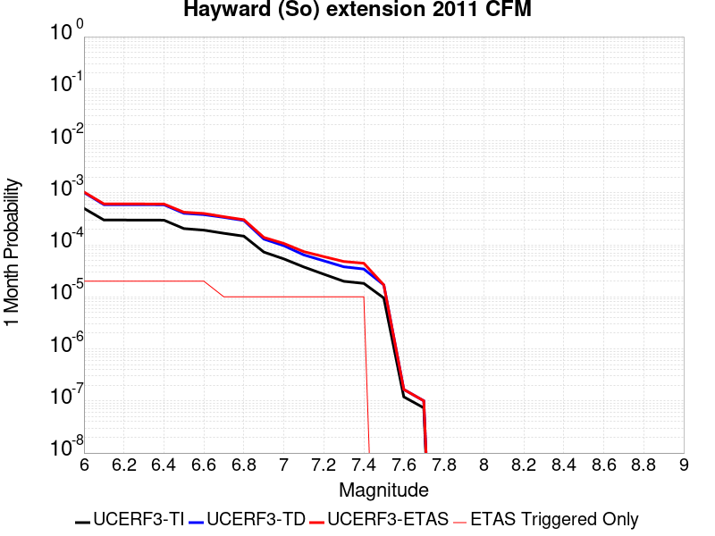 |  |  |

| Magnitude | 1 wk TI Prob | 1 wk TD Prob | 1 wk ETAS Prob | 1 wk ETAS/TD Gain | 1 wk ETAS Triggered Only | 1 mo TI Prob | 1 mo TD Prob | 1 mo ETAS Prob | 1 mo ETAS/TD Gain | 1 mo ETAS Triggered Only | 1 yr TI Prob | 1 yr TD Prob | 1 yr ETAS Prob | 1 yr ETAS/TD Gain | 1 yr ETAS Triggered Only | 10 yr TI Prob | 10 yr TD Prob | 10 yr ETAS Prob | 10 yr ETAS/TD Gain | 10 yr ETAS Triggered Only |
|-----|-----|-----|-----|-----|-----|-----|-----|-----|-----|-----|-----|-----|-----|-----|-----|-----|-----|-----|-----|-----|
| 6.0 | 1.1721256E-4 | 2.3697627E-4 | 2.3697627E-4 | 1.0 | 0.0 | 5.022428E-4 | 0.0010129517 | 0.0011580478 | 1.1432409 | 1.4524328E-4 | 0.0060976758 | 0.012248711 | 0.012392175 | 1.0117126 | 1.4524328E-4 | 0.0593305 | 0.112843215 | 0.112972066 | 1.0011419 | 1.4524328E-4 |
| 6.1 | 6.99169E-5 | 1.3822885E-4 | 1.3822885E-4 | 1.0 | 0.0 | 2.9960944E-4 | 5.9128006E-4 | 7.3643745E-4 | 1.2454969 | 1.4524328E-4 | 0.0036416445 | 0.0071720886 | 0.00731629 | 1.020106 | 1.4524328E-4 | 0.035825435 | 0.067803554 | 0.067938946 | 1.0019969 | 1.4524328E-4 |
| 6.2 | 6.99169E-5 | 1.3822885E-4 | 1.3822885E-4 | 1.0 | 0.0 | 2.9960944E-4 | 5.9128006E-4 | 7.3643745E-4 | 1.2454969 | 1.4524328E-4 | 0.0036416445 | 0.0071720886 | 0.00731629 | 1.020106 | 1.4524328E-4 | 0.035825435 | 0.067803554 | 0.067938946 | 1.0019969 | 1.4524328E-4 |
| 6.3 | 6.970908E-5 | 1.379104E-4 | 1.379104E-4 | 1.0 | 0.0 | 2.9871898E-4 | 5.899159E-4 | 7.350735E-4 | 1.2460649 | 1.4524328E-4 | 0.0036308395 | 0.007155625 | 0.007299829 | 1.0201526 | 1.4524328E-4 | 0.035720866 | 0.067652516 | 0.06778793 | 1.0020016 | 1.4524328E-4 |
| 6.4 | 6.9517155E-5 | 1.375792E-4 | 1.375792E-4 | 1.0 | 0.0 | 2.9789665E-4 | 5.884971E-4 | 7.336549E-4 | 1.2466584 | 1.4524328E-4 | 0.0036208609 | 0.0071385372 | 0.0072827437 | 1.0202011 | 1.4524328E-4 | 0.03562429 | 0.06749655 | 0.067632 | 1.0020066 | 1.4524328E-4 |
| 6.5 | 4.786248E-5 | 9.41498E-5 | 9.41498E-5 | 1.0 | 0.0 | 2.0510878E-4 | 4.034394E-4 | 5.486241E-4 | 1.3598675 | 1.4524328E-4 | 0.0024943394 | 0.004901227 | 0.0050457586 | 1.0294888 | 1.4524328E-4 | 0.02466527 | 0.046901822 | 0.047040254 | 1.0029515 | 1.4524328E-4 |
| 6.6 | 4.4662214E-5 | 8.881654E-5 | 8.881654E-5 | 1.0 | 0.0 | 1.9139545E-4 | 3.805894E-4 | 5.257774E-4 | 1.381482 | 1.4524328E-4 | 0.0023277493 | 0.0046242937 | 0.004768865 | 1.0312635 | 1.4524328E-4 | 0.02303517 | 0.044293344 | 0.044432156 | 1.0031339 | 1.4524328E-4 |
| 6.7 | 3.884542E-5 | 7.8648096E-5 | 7.8648096E-5 | 1.0 | 0.0 | 1.6646975E-4 | 3.370222E-4 | 4.8221654E-4 | 1.4308153 | 1.4524328E-4 | 0.002024885 | 0.0040959697 | 0.004240618 | 1.0353148 | 1.4524328E-4 | 0.020065336 | 0.039333146 | 0.039472677 | 1.0035474 | 1.4524328E-4 |
| 6.8 | 3.4221863E-5 | 6.855653E-5 | 6.855653E-5 | 1.0 | 0.0 | 1.4665688E-4 | 2.93783E-4 | 4.389836E-4 | 1.4942445 | 1.4524328E-4 | 0.0017840851 | 0.0035713627 | 0.0037160872 | 1.0405236 | 1.4524328E-4 | 0.017698295 | 0.034421004 | 0.034561247 | 1.0040743 | 1.4524328E-4 |
| 6.9 | 1.6927712E-5 | 3.0061563E-5 | 3.0061563E-5 | 1.0 | 0.0 | 7.2545314E-5 | 1.2882923E-4 | 2.740538E-4 | 2.127264 | 1.4524328E-4 | 8.828813E-4 | 0.0015674243 | 0.0017124399 | 1.0925184 | 1.4524328E-4 | 0.008793819 | 0.01546327 | 0.015606267 | 1.0092475 | 1.4524328E-4 |
| 7.0 | 1.2509653E-5 | 2.2462571E-5 | 2.2462571E-5 | 1.0 | 0.0 | 5.3611697E-5 | 9.6264856E-5 | 2.4149416E-4 | 2.508643 | 1.4524328E-4 | 6.525269E-4 | 0.0011714385 | 0.0013165117 | 1.1238419 | 1.4524328E-4 | 0.0065061417 | 0.01158231 | 0.011725872 | 1.0123949 | 1.4524328E-4 |
| 7.1 | 8.751583E-6 | 1.4925648E-5 | 1.4925648E-5 | 1.0 | 0.0 | 3.750624E-5 | 6.3965526E-5 | 2.0919953E-4 | 3.270504 | 1.4524328E-4 | 4.5654282E-4 | 7.785079E-4 | 9.236381E-4 | 1.186421 | 1.4524328E-4 | 0.0045560603 | 0.007763496 | 0.007907611 | 1.0185633 | 1.4524328E-4 |
| 7.2 | 6.354379E-6 | 1.1498636E-5 | 1.1498636E-5 | 1.0 | 0.0 | 2.7232769E-5 | 4.9278966E-5 | 1.9451509E-4 | 3.9472237 | 1.4524328E-4 | 3.3150852E-4 | 5.99811E-4 | 7.449672E-4 | 1.2420032 | 1.4524328E-4 | 0.0033101442 | 0.0060003046 | 0.0061446764 | 1.0240607 | 1.4524328E-4 |
| 7.3 | 4.645554E-6 | 8.818172E-6 | 8.818172E-6 | 1.0 | 0.0 | 1.9909365E-5 | 3.779164E-5 | 1.8302943E-4 | 4.8431196 | 1.4524328E-4 | 2.4236954E-4 | 4.6002E-4 | 6.0519646E-4 | 1.3155873 | 1.4524328E-4 | 0.0024210536 | 0.004610708 | 0.004755282 | 1.0313561 | 1.4524328E-4 |
| 7.4 | 4.23437E-6 | 7.992532E-6 | 7.992532E-6 | 1.0 | 0.0 | 1.8147173E-5 | 3.425328E-5 | 1.7949159E-4 | 5.2401285 | 1.4524328E-4 | 2.2091944E-4 | 4.1695772E-4 | 5.621404E-4 | 1.3481953 | 1.4524328E-4 | 0.0022069993 | 0.004181972 | 0.0043266076 | 1.0345856 | 1.4524328E-4 |
| 7.5 | 2.2187417E-6 | 3.9522306E-6 | 3.9522306E-6 | 1.0 | 0.0 | 9.508858E-6 | 1.6938036E-5 | 1.6938036E-5 | 1.0 | 0.0 | 1.157642E-4 | 2.0620368E-4 | 2.0620368E-4 | 1.0 | 0.0 | 0.0011570391 | 0.0020734754 | 0.0020734754 | 1.0 | 0.0 |
| 7.6 | 2.7952495E-8 | 3.878529E-8 | 3.878529E-8 | 1.0 | 0.0 | 1.1979641E-7 | 1.6622266E-7 | 1.6622266E-7 | 1.0 | 0.0 | 1.4585203E-6 | 2.0237592E-6 | 2.0237592E-6 | 1.0 | 0.0 | 1.4585107E-5 | 2.0328182E-5 | 2.0328182E-5 | 1.0 | 0.0 |
| 7.7 | 1.7192724E-8 | 2.3436517E-8 | 2.3436517E-8 | 1.0 | 0.0 | 7.36831E-8 | 1.0044221E-7 | 1.0044221E-7 | 1.0 | 0.0 | 8.9709135E-7 | 1.2228833E-6 | 1.2228833E-6 | 1.0 | 0.0 | 8.970877E-6 | 1.2296933E-5 | 1.2296933E-5 | 1.0 | 0.0 |

## Great Valley 08 (Quinto)
*[(top)](#table-of-contents)*

| 1 Week | 1 Month | 1 Year | 10 Year |
|-----|-----|-----|-----|
|  |  |  |  |

| Magnitude | 1 wk TI Prob | 1 wk TD Prob | 1 wk ETAS Prob | 1 wk ETAS/TD Gain | 1 wk ETAS Triggered Only | 1 mo TI Prob | 1 mo TD Prob | 1 mo ETAS Prob | 1 mo ETAS/TD Gain | 1 mo ETAS Triggered Only | 1 yr TI Prob | 1 yr TD Prob | 1 yr ETAS Prob | 1 yr ETAS/TD Gain | 1 yr ETAS Triggered Only | 10 yr TI Prob | 10 yr TD Prob | 10 yr ETAS Prob | 10 yr ETAS/TD Gain | 10 yr ETAS Triggered Only |
|-----|-----|-----|-----|-----|-----|-----|-----|-----|-----|-----|-----|-----|-----|-----|-----|-----|-----|-----|-----|-----|
| 6.0 | 7.737697E-6 | 8.253038E-6 | 8.253038E-6 | 1.0 | 0.0 | 3.3161137E-5 | 3.536979E-5 | 3.536979E-5 | 1.0 | 0.0 | 4.0366207E-4 | 4.3056096E-4 | 4.3056096E-4 | 1.0 | 0.0 | 0.004029296 | 0.0042991205 | 0.0044437395 | 1.0336392 | 1.4524328E-4 |
| 6.1 | 7.737697E-6 | 8.253038E-6 | 8.253038E-6 | 1.0 | 0.0 | 3.3161137E-5 | 3.536979E-5 | 3.536979E-5 | 1.0 | 0.0 | 4.0366207E-4 | 4.3056096E-4 | 4.3056096E-4 | 1.0 | 0.0 | 0.004029296 | 0.0042991205 | 0.0044437395 | 1.0336392 | 1.4524328E-4 |
| 6.2 | 7.737697E-6 | 8.253038E-6 | 8.253038E-6 | 1.0 | 0.0 | 3.3161137E-5 | 3.536979E-5 | 3.536979E-5 | 1.0 | 0.0 | 4.0366207E-4 | 4.3056096E-4 | 4.3056096E-4 | 1.0 | 0.0 | 0.004029296 | 0.0042991205 | 0.0044437395 | 1.0336392 | 1.4524328E-4 |
| 6.3 | 5.374012E-6 | 5.7505736E-6 | 5.7505736E-6 | 1.0 | 0.0 | 2.3031276E-5 | 2.4645145E-5 | 2.4645145E-5 | 1.0 | 0.0 | 2.803697E-4 | 3.0002446E-4 | 3.0002446E-4 | 1.0 | 0.0 | 0.0028001624 | 0.0029972875 | 0.0031420954 | 1.048313 | 1.4524328E-4 |
| 6.4 | 5.374012E-6 | 5.7505736E-6 | 5.7505736E-6 | 1.0 | 0.0 | 2.3031276E-5 | 2.4645145E-5 | 2.4645145E-5 | 1.0 | 0.0 | 2.803697E-4 | 3.0002446E-4 | 3.0002446E-4 | 1.0 | 0.0 | 0.0028001624 | 0.0029972875 | 0.0031420954 | 1.048313 | 1.4524328E-4 |
| 6.5 | 3.65427E-6 | 3.941324E-6 | 3.941324E-6 | 1.0 | 0.0 | 1.5661062E-5 | 1.689132E-5 | 1.689132E-5 | 1.0 | 0.0 | 1.9065675E-4 | 2.0563944E-4 | 2.0563944E-4 | 1.0 | 0.0 | 0.0019049325 | 0.0020551833 | 0.0020551833 | 1.0 | 0.0 |
| 6.6 | 3.6143538E-6 | 3.8985104E-6 | 3.8985104E-6 | 1.0 | 0.0 | 1.5489995E-5 | 1.6707834E-5 | 1.6707834E-5 | 1.0 | 0.0 | 1.8857437E-4 | 2.0340596E-4 | 2.0340596E-4 | 1.0 | 0.0 | 0.0018841444 | 0.0020328893 | 0.0020328893 | 1.0 | 0.0 |
| 6.7 | 2.4821015E-6 | 2.6857067E-6 | 2.6857067E-6 | 1.0 | 0.0 | 1.0637535E-5 | 1.1510153E-5 | 1.1510153E-5 | 1.0 | 0.0 | 1.2950429E-4 | 1.4013276E-4 | 1.4013276E-4 | 1.0 | 0.0 | 0.0012942884 | 0.0014009989 | 0.0014009989 | 1.0 | 0.0 |
| 6.8 | 4.7110538E-7 | 5.193021E-7 | 5.193021E-7 | 1.0 | 0.0 | 2.0190216E-6 | 2.2255786E-6 | 2.2255786E-6 | 1.0 | 0.0 | 2.458131E-5 | 2.70961E-5 | 2.70961E-5 | 1.0 | 0.0 | 2.457859E-4 | 2.7092977E-4 | 2.7092977E-4 | 1.0 | 0.0 |
| 6.9 | 3.958685E-7 | 4.3703452E-7 | 4.3703452E-7 | 1.0 | 0.0 | 1.6965782E-6 | 1.8730038E-6 | 1.8730038E-6 | 1.0 | 0.0 | 2.0655643E-5 | 2.28036E-5 | 2.28036E-5 | 1.0 | 0.0 | 2.0653724E-4 | 2.2801422E-4 | 2.2801422E-4 | 1.0 | 0.0 |
| 7.0 | 2.70294E-7 | 2.9920008E-7 | 2.9920008E-7 | 1.0 | 0.0 | 1.1584025E-6 | 1.2822856E-6 | 1.2822856E-6 | 1.0 | 0.0 | 1.4103458E-5 | 1.5611728E-5 | 1.5611728E-5 | 1.0 | 0.0 | 1.4102564E-4 | 1.5610759E-4 | 1.5610759E-4 | 1.0 | 0.0 |
| 7.1 | 1.4828602E-7 | 1.6469107E-7 | 1.6469107E-7 | 1.0 | 0.0 | 6.3551136E-7 | 7.058187E-7 | 7.058187E-7 | 1.0 | 0.0 | 7.737323E-6 | 8.593317E-6 | 8.593317E-6 | 1.0 | 0.0 | 7.737054E-5 | 8.593065E-5 | 8.593065E-5 | 1.0 | 0.0 |

## Goose Lake 2011 CFM
*[(top)](#table-of-contents)*

| 1 Week | 1 Month | 1 Year | 10 Year |
|-----|-----|-----|-----|
|  |  |  |  |

| Magnitude | 1 wk TI Prob | 1 wk TD Prob | 1 wk ETAS Prob | 1 wk ETAS/TD Gain | 1 wk ETAS Triggered Only | 1 mo TI Prob | 1 mo TD Prob | 1 mo ETAS Prob | 1 mo ETAS/TD Gain | 1 mo ETAS Triggered Only | 1 yr TI Prob | 1 yr TD Prob | 1 yr ETAS Prob | 1 yr ETAS/TD Gain | 1 yr ETAS Triggered Only | 10 yr TI Prob | 10 yr TD Prob | 10 yr ETAS Prob | 10 yr ETAS/TD Gain | 10 yr ETAS Triggered Only |
|-----|-----|-----|-----|-----|-----|-----|-----|-----|-----|-----|-----|-----|-----|-----|-----|-----|-----|-----|-----|-----|
| 6.0 | 3.780968E-6 | 3.8230223E-6 | 3.8230223E-6 | 1.0 | 0.0 | 1.6204049E-5 | 1.6384285E-5 | 1.6384285E-5 | 1.0 | 0.0 | 1.9726643E-4 | 1.994615E-4 | 3.4467582E-4 | 1.7280318 | 1.4524328E-4 | 0.001970914 | 0.001992933 | 0.0021378868 | 1.0727339 | 1.4524328E-4 |
| 6.1 | 2.2035124E-6 | 2.229801E-6 | 2.229801E-6 | 1.0 | 0.0 | 9.443591E-6 | 9.556257E-6 | 9.556257E-6 | 1.0 | 0.0 | 1.1496965E-4 | 1.163414E-4 | 1.163414E-4 | 1.0 | 0.0 | 0.0011491019 | 0.0011628233 | 0.0011628233 | 1.0 | 0.0 |
| 6.2 | 1.5624689E-6 | 1.5826923E-6 | 1.5826923E-6 | 1.0 | 0.0 | 6.6962784E-6 | 6.7829496E-6 | 6.7829496E-6 | 1.0 | 0.0 | 8.152414E-5 | 8.2579325E-5 | 8.2579325E-5 | 1.0 | 0.0 | 8.1494235E-4 | 8.2549086E-4 | 8.2549086E-4 | 1.0 | 0.0 |
| 6.3 | 1.5624689E-6 | 1.5826923E-6 | 1.5826923E-6 | 1.0 | 0.0 | 6.6962784E-6 | 6.7829496E-6 | 6.7829496E-6 | 1.0 | 0.0 | 8.152414E-5 | 8.2579325E-5 | 8.2579325E-5 | 1.0 | 0.0 | 8.1494235E-4 | 8.2549086E-4 | 8.2549086E-4 | 1.0 | 0.0 |
| 6.4 | 1.256464E-6 | 1.2738695E-6 | 1.2738695E-6 | 1.0 | 0.0 | 5.3848344E-6 | 5.4594293E-6 | 5.4594293E-6 | 1.0 | 0.0 | 6.5558386E-5 | 6.646655E-5 | 6.646655E-5 | 1.0 | 0.0 | 6.553905E-4 | 6.644687E-4 | 6.644687E-4 | 1.0 | 0.0 |
| 6.5 | 1.0910911E-6 | 1.1069404E-6 | 1.1069404E-6 | 1.0 | 0.0 | 4.6760965E-6 | 4.7440217E-6 | 4.7440217E-6 | 1.0 | 0.0 | 5.692999E-5 | 5.7756948E-5 | 5.7756948E-5 | 1.0 | 0.0 | 5.6915404E-4 | 5.7742064E-4 | 5.7742064E-4 | 1.0 | 0.0 |
| 6.6 | 9.546601E-7 | 9.691246E-7 | 9.691246E-7 | 1.0 | 0.0 | 4.091394E-6 | 4.1533845E-6 | 4.1533845E-6 | 1.0 | 0.0 | 4.9811584E-5 | 5.056629E-5 | 5.056629E-5 | 1.0 | 0.0 | 4.980042E-4 | 5.055487E-4 | 5.055487E-4 | 1.0 | 0.0 |
| 6.7 | 7.790316E-7 | 7.9159634E-7 | 7.9159634E-7 | 1.0 | 0.0 | 3.3387028E-6 | 3.3925514E-6 | 3.3925514E-6 | 1.0 | 0.0 | 4.0647945E-5 | 4.1303538E-5 | 4.1303538E-5 | 1.0 | 0.0 | 4.0640513E-4 | 4.129592E-4 | 4.129592E-4 | 1.0 | 0.0 |
| 6.8 | 6.3714384E-7 | 6.4787395E-7 | 6.4787395E-7 | 1.0 | 0.0 | 2.7306137E-6 | 2.7765998E-6 | 2.7765998E-6 | 1.0 | 0.0 | 3.3244716E-5 | 3.3804583E-5 | 3.3804583E-5 | 1.0 | 0.0 | 3.323974E-4 | 3.379949E-4 | 3.379949E-4 | 1.0 | 0.0 |
| 6.9 | 4.92586E-7 | 5.0139147E-7 | 5.0139147E-7 | 1.0 | 0.0 | 2.1110811E-6 | 2.1488188E-6 | 2.1488188E-6 | 1.0 | 0.0 | 2.5702111E-5 | 2.616156E-5 | 2.616156E-5 | 1.0 | 0.0 | 2.569914E-4 | 2.6158517E-4 | 2.6158517E-4 | 1.0 | 0.0 |
| 7.0 | 3.130245E-7 | 3.190354E-7 | 3.190354E-7 | 1.0 | 0.0 | 1.3415328E-6 | 1.3672939E-6 | 1.3672939E-6 | 1.0 | 0.0 | 1.6333039E-5 | 1.6646678E-5 | 1.6646678E-5 | 1.0 | 0.0 | 1.6331839E-4 | 1.6645451E-4 | 1.6645451E-4 | 1.0 | 0.0 |
| 7.1 | 1.7680084E-7 | 1.8023923E-7 | 1.8023923E-7 | 1.0 | 0.0 | 7.5771766E-7 | 7.724536E-7 | 7.724536E-7 | 1.0 | 0.0 | 9.225173E-6 | 9.404583E-6 | 9.404583E-6 | 1.0 | 0.0 | 9.22479E-5 | 9.4041956E-5 | 9.4041956E-5 | 1.0 | 0.0 |
| 7.2 | 4.8641045E-8 | 4.9402068E-8 | 4.9402068E-8 | 1.0 | 0.0 | 2.084616E-7 | 2.1172312E-7 | 2.1172312E-7 | 1.0 | 0.0 | 2.538017E-6 | 2.577726E-6 | 2.577726E-6 | 1.0 | 0.0 | 2.537988E-5 | 2.5776973E-5 | 2.5776973E-5 | 1.0 | 0.0 |
| 7.3 | 5.3911844E-9 | 5.4758145E-9 | 5.4758145E-9 | 1.0 | 0.0 | 2.3105075E-8 | 2.3467775E-8 | 2.3467775E-8 | 1.0 | 0.0 | 2.8130427E-7 | 2.8572015E-7 | 2.8572015E-7 | 1.0 | 0.0 | 2.8130391E-6 | 2.8571992E-6 | 2.8571992E-6 | 1.0 | 0.0 |

## Pleito
*[(top)](#table-of-contents)*

| 1 Week | 1 Month | 1 Year | 10 Year |
|-----|-----|-----|-----|
| 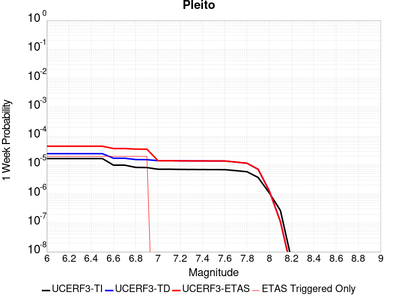 | 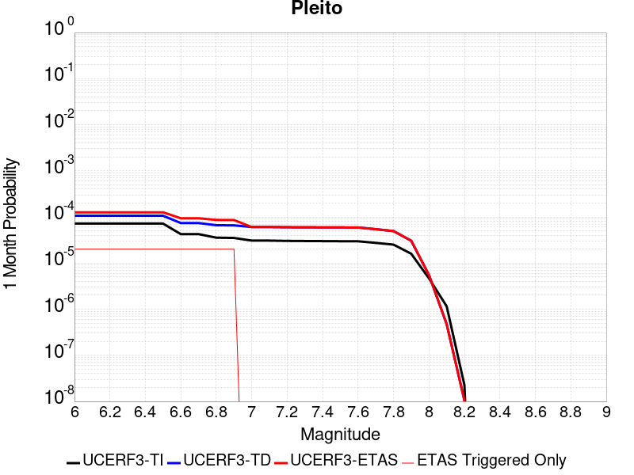 |  |  |

| Magnitude | 1 wk TI Prob | 1 wk TD Prob | 1 wk ETAS Prob | 1 wk ETAS/TD Gain | 1 wk ETAS Triggered Only | 1 mo TI Prob | 1 mo TD Prob | 1 mo ETAS Prob | 1 mo ETAS/TD Gain | 1 mo ETAS Triggered Only | 1 yr TI Prob | 1 yr TD Prob | 1 yr ETAS Prob | 1 yr ETAS/TD Gain | 1 yr ETAS Triggered Only | 10 yr TI Prob | 10 yr TD Prob | 10 yr ETAS Prob | 10 yr ETAS/TD Gain | 10 yr ETAS Triggered Only |
|-----|-----|-----|-----|-----|-----|-----|-----|-----|-----|-----|-----|-----|-----|-----|-----|-----|-----|-----|-----|-----|
| 6.0 | 1.6763008E-5 | 2.4763838E-5 | 2.4763838E-5 | 1.0 | 0.0 | 7.183948E-5 | 1.0612683E-4 | 1.0612683E-4 | 1.0 | 0.0 | 8.742947E-4 | 0.0012914003 | 0.0012914003 | 1.0 | 0.0 | 0.00870863 | 0.0129538905 | 0.013097252 | 1.011067 | 1.4524328E-4 |
| 6.1 | 1.6763008E-5 | 2.4763838E-5 | 2.4763838E-5 | 1.0 | 0.0 | 7.183948E-5 | 1.0612683E-4 | 1.0612683E-4 | 1.0 | 0.0 | 8.742947E-4 | 0.0012914003 | 0.0012914003 | 1.0 | 0.0 | 0.00870863 | 0.0129538905 | 0.013097252 | 1.011067 | 1.4524328E-4 |
| 6.2 | 1.6763008E-5 | 2.4763838E-5 | 2.4763838E-5 | 1.0 | 0.0 | 7.183948E-5 | 1.0612683E-4 | 1.0612683E-4 | 1.0 | 0.0 | 8.742947E-4 | 0.0012914003 | 0.0012914003 | 1.0 | 0.0 | 0.00870863 | 0.0129538905 | 0.013097252 | 1.011067 | 1.4524328E-4 |
| 6.3 | 1.6763008E-5 | 2.4763838E-5 | 2.4763838E-5 | 1.0 | 0.0 | 7.183948E-5 | 1.0612683E-4 | 1.0612683E-4 | 1.0 | 0.0 | 8.742947E-4 | 0.0012914003 | 0.0012914003 | 1.0 | 0.0 | 0.00870863 | 0.0129538905 | 0.013097252 | 1.011067 | 1.4524328E-4 |
| 6.4 | 1.6763008E-5 | 2.4763838E-5 | 2.4763838E-5 | 1.0 | 0.0 | 7.183948E-5 | 1.0612683E-4 | 1.0612683E-4 | 1.0 | 0.0 | 8.742947E-4 | 0.0012914003 | 0.0012914003 | 1.0 | 0.0 | 0.00870863 | 0.0129538905 | 0.013097252 | 1.011067 | 1.4524328E-4 |
| 6.5 | 1.6763008E-5 | 2.4763838E-5 | 2.4763838E-5 | 1.0 | 0.0 | 7.183948E-5 | 1.0612683E-4 | 1.0612683E-4 | 1.0 | 0.0 | 8.742947E-4 | 0.0012914003 | 0.0012914003 | 1.0 | 0.0 | 0.00870863 | 0.0129538905 | 0.013097252 | 1.011067 | 1.4524328E-4 |
| 6.6 | 9.910213E-6 | 1.7214623E-5 | 1.7214623E-5 | 1.0 | 0.0 | 4.247165E-5 | 7.377489E-5 | 7.377489E-5 | 1.0 | 0.0 | 5.169696E-4 | 8.978429E-4 | 8.978429E-4 | 1.0 | 0.0 | 0.0051576863 | 0.009050702 | 0.009050702 | 1.0 | 0.0 |
| 6.7 | 9.910213E-6 | 1.7214623E-5 | 1.7214623E-5 | 1.0 | 0.0 | 4.247165E-5 | 7.377489E-5 | 7.377489E-5 | 1.0 | 0.0 | 5.169696E-4 | 8.978429E-4 | 8.978429E-4 | 1.0 | 0.0 | 0.0051576863 | 0.009050702 | 0.009050702 | 1.0 | 0.0 |
| 6.8 | 8.300162E-6 | 1.5474232E-5 | 1.5474232E-5 | 1.0 | 0.0 | 3.557164E-5 | 6.631646E-5 | 6.631646E-5 | 1.0 | 0.0 | 4.3299864E-4 | 8.071053E-4 | 8.071053E-4 | 1.0 | 0.0 | 0.004321559 | 0.008150139 | 0.008150139 | 1.0 | 0.0 |
| 6.9 | 8.183114E-6 | 1.5345448E-5 | 1.5345448E-5 | 1.0 | 0.0 | 3.5070017E-5 | 6.576455E-5 | 6.576455E-5 | 1.0 | 0.0 | 4.2689382E-4 | 8.003907E-4 | 8.003907E-4 | 1.0 | 0.0 | 0.0042607468 | 0.008083483 | 0.008083483 | 1.0 | 0.0 |
| 7.0 | 7.1748823E-6 | 1.413244E-5 | 1.413244E-5 | 1.0 | 0.0 | 3.0749135E-5 | 6.0566195E-5 | 6.0566195E-5 | 1.0 | 0.0 | 3.743064E-4 | 7.371445E-4 | 7.371445E-4 | 1.0 | 0.0 | 0.0037367654 | 0.007454939 | 0.007454939 | 1.0 | 0.0 |
| 7.1 | 7.1671807E-6 | 1.412281E-5 | 1.412281E-5 | 1.0 | 0.0 | 3.0716128E-5 | 6.052493E-5 | 6.052493E-5 | 1.0 | 0.0 | 3.7390468E-4 | 7.366424E-4 | 7.366424E-4 | 1.0 | 0.0 | 0.0037327618 | 0.0074499524 | 0.0074499524 | 1.0 | 0.0 |
| 7.2 | 7.0649667E-6 | 1.39701015E-5 | 1.39701015E-5 | 1.0 | 0.0 | 3.0278077E-5 | 5.9870494E-5 | 5.9870494E-5 | 1.0 | 0.0 | 3.6857324E-4 | 7.2868E-4 | 7.2868E-4 | 1.0 | 0.0 | 0.0036796255 | 0.0073707094 | 0.0073707094 | 1.0 | 0.0 |
| 7.3 | 7.02082E-6 | 1.3913556E-5 | 1.3913556E-5 | 1.0 | 0.0 | 3.008888E-5 | 5.9628168E-5 | 5.9628168E-5 | 1.0 | 0.0 | 3.6627054E-4 | 7.2573166E-4 | 7.2573166E-4 | 1.0 | 0.0 | 0.0036566744 | 0.007341209 | 0.007341209 | 1.0 | 0.0 |
| 7.4 | 6.987146E-6 | 1.3873118E-5 | 1.3873118E-5 | 1.0 | 0.0 | 2.9944567E-5 | 5.945487E-5 | 5.945487E-5 | 1.0 | 0.0 | 3.6451413E-4 | 7.2362315E-4 | 7.2362315E-4 | 1.0 | 0.0 | 0.0036391679 | 0.007320144 | 0.007320144 | 1.0 | 0.0 |
| 7.5 | 6.9494554E-6 | 1.3830024E-5 | 1.3830024E-5 | 1.0 | 0.0 | 2.9783041E-5 | 5.9270187E-5 | 5.9270187E-5 | 1.0 | 0.0 | 3.625482E-4 | 7.2137616E-4 | 7.2137616E-4 | 1.0 | 0.0 | 0.0036195726 | 0.0072977724 | 0.0072977724 | 1.0 | 0.0 |
| 7.6 | 6.92694E-6 | 1.3789138E-5 | 1.3789138E-5 | 1.0 | 0.0 | 2.9686547E-5 | 5.909497E-5 | 5.909497E-5 | 1.0 | 0.0 | 3.6137376E-4 | 7.1924424E-4 | 7.1924424E-4 | 1.0 | 0.0 | 0.0036078666 | 0.0072765257 | 0.0072765257 | 1.0 | 0.0 |
| 7.7 | 6.395867E-6 | 1.2668219E-5 | 1.2668219E-5 | 1.0 | 0.0 | 2.741057E-5 | 5.429124E-5 | 5.429124E-5 | 1.0 | 0.0 | 3.336726E-4 | 6.6079566E-4 | 6.6079566E-4 | 1.0 | 0.0 | 0.0033317201 | 0.0066951844 | 0.0066951844 | 1.0 | 0.0 |
| 7.8 | 5.8664327E-6 | 1.153586E-5 | 1.153586E-5 | 1.0 | 0.0 | 2.5141611E-5 | 4.9438466E-5 | 4.9438466E-5 | 1.0 | 0.0 | 3.060561E-4 | 6.017473E-4 | 6.017473E-4 | 1.0 | 0.0 | 0.0030563495 | 0.0061006667 | 0.0061006667 | 1.0 | 0.0 |
| 7.9 | 3.7167474E-6 | 7.1140853E-6 | 7.1140853E-6 | 1.0 | 0.0 | 1.592882E-5 | 3.0488582E-5 | 3.0488582E-5 | 1.0 | 0.0 | 1.9391612E-4 | 3.7113542E-4 | 3.7113542E-4 | 1.0 | 0.0 | 0.0019374699 | 0.0037674906 | 0.0037674906 | 1.0 | 0.0 |
| 8.0 | 1.0903841E-6 | 1.2879392E-6 | 1.2879392E-6 | 1.0 | 0.0 | 4.6730665E-6 | 5.5197274E-6 | 5.5197274E-6 | 1.0 | 0.0 | 5.68931E-5 | 6.720063E-5 | 6.720063E-5 | 1.0 | 0.0 | 5.6878536E-4 | 6.941948E-4 | 6.941948E-4 | 1.0 | 0.0 |
| 8.1 | 2.6894583E-7 | 1.1060341E-7 | 1.1060341E-7 | 1.0 | 0.0 | 1.1526245E-6 | 4.740145E-7 | 4.740145E-7 | 1.0 | 0.0 | 1.4033113E-5 | 5.7711113E-6 | 5.7711113E-6 | 1.0 | 0.0 | 1.4032227E-4 | 6.456908E-5 | 6.456908E-5 | 1.0 | 0.0 |
| 8.2 | 5.2967013E-9 | 2.4578228E-9 | 2.4578228E-9 | 1.0 | 0.0 | 2.2700148E-8 | 1.0533527E-8 | 1.0533527E-8 | 1.0 | 0.0 | 2.7637427E-7 | 1.2824569E-7 | 1.2824569E-7 | 1.0 | 0.0 | 2.7637393E-6 | 1.4592787E-6 | 1.4592787E-6 | 1.0 | 0.0 |

## Ludlow
*[(top)](#table-of-contents)*

| 1 Week | 1 Month | 1 Year | 10 Year |
|-----|-----|-----|-----|
|  |  |  |  |

| Magnitude | 1 wk TI Prob | 1 wk TD Prob | 1 wk ETAS Prob | 1 wk ETAS/TD Gain | 1 wk ETAS Triggered Only | 1 mo TI Prob | 1 mo TD Prob | 1 mo ETAS Prob | 1 mo ETAS/TD Gain | 1 mo ETAS Triggered Only | 1 yr TI Prob | 1 yr TD Prob | 1 yr ETAS Prob | 1 yr ETAS/TD Gain | 1 yr ETAS Triggered Only | 10 yr TI Prob | 10 yr TD Prob | 10 yr ETAS Prob | 10 yr ETAS/TD Gain | 10 yr ETAS Triggered Only |
|-----|-----|-----|-----|-----|-----|-----|-----|-----|-----|-----|-----|-----|-----|-----|-----|-----|-----|-----|-----|-----|
| 6.0 | 2.2407607E-5 | 2.3657254E-5 | 2.3657254E-5 | 1.0 | 0.0 | 9.602906E-5 | 1.0138454E-4 | 1.0138454E-4 | 1.0 | 0.0 | 0.0011685267 | 0.001233702 | 0.001378766 | 1.1175843 | 1.4524328E-4 | 0.011624013 | 0.012273042 | 0.012416502 | 1.0116891 | 1.4524328E-4 |
| 6.1 | 2.2407607E-5 | 2.3657254E-5 | 2.3657254E-5 | 1.0 | 0.0 | 9.602906E-5 | 1.0138454E-4 | 1.0138454E-4 | 1.0 | 0.0 | 0.0011685267 | 0.001233702 | 0.001378766 | 1.1175843 | 1.4524328E-4 | 0.011624013 | 0.012273042 | 0.012416502 | 1.0116891 | 1.4524328E-4 |
| 6.2 | 1.0781252E-5 | 1.1365663E-5 | 1.1365663E-5 | 1.0 | 0.0 | 4.620455E-5 | 4.8709102E-5 | 4.8709102E-5 | 1.0 | 0.0 | 5.623952E-4 | 5.9287593E-4 | 7.3803315E-4 | 1.2448356 | 1.4524328E-4 | 0.00560974 | 0.0059133614 | 0.006057746 | 1.0244167 | 1.4524328E-4 |
| 6.3 | 1.0781252E-5 | 1.1365663E-5 | 1.1365663E-5 | 1.0 | 0.0 | 4.620455E-5 | 4.8709102E-5 | 4.8709102E-5 | 1.0 | 0.0 | 5.623952E-4 | 5.9287593E-4 | 7.3803315E-4 | 1.2448356 | 1.4524328E-4 | 0.00560974 | 0.0059133614 | 0.006057746 | 1.0244167 | 1.4524328E-4 |
| 6.4 | 7.814439E-6 | 8.237729E-6 | 8.237729E-6 | 1.0 | 0.0 | 3.3490025E-5 | 3.530408E-5 | 3.530408E-5 | 1.0 | 0.0 | 4.0766477E-4 | 4.2974384E-4 | 5.749247E-4 | 1.3378311 | 1.4524328E-4 | 0.0040691774 | 0.0042892746 | 0.004433895 | 1.0337167 | 1.4524328E-4 |
| 6.5 | 6.4986366E-6 | 6.85092E-6 | 6.85092E-6 | 1.0 | 0.0 | 2.7851002E-5 | 2.9360759E-5 | 2.9360759E-5 | 1.0 | 0.0 | 3.390332E-4 | 3.5740953E-4 | 5.026009E-4 | 1.4062325 | 1.4524328E-4 | 0.003385164 | 0.0035684432 | 0.0037131682 | 1.0405569 | 1.4524328E-4 |
| 6.6 | 5.582177E-6 | 5.8860055E-6 | 5.8860055E-6 | 1.0 | 0.0 | 2.3923398E-5 | 2.5225498E-5 | 2.5225498E-5 | 1.0 | 0.0 | 2.9122844E-4 | 3.0707786E-4 | 4.5227655E-4 | 1.47284 | 1.4524328E-4 | 0.0029084706 | 0.003066609 | 0.0032114068 | 1.0472176 | 1.4524328E-4 |
| 6.7 | 4.6858763E-6 | 4.940427E-6 | 4.940427E-6 | 1.0 | 0.0 | 2.0082172E-5 | 2.1173091E-5 | 2.1173091E-5 | 1.0 | 0.0 | 2.4447302E-4 | 2.5775246E-4 | 4.0295828E-4 | 1.5633539 | 1.4524328E-4 | 0.0024420423 | 0.0025745912 | 0.0027194608 | 1.0562688 | 1.4524328E-4 |
| 6.8 | 3.5584908E-6 | 3.7520183E-6 | 3.7520183E-6 | 1.0 | 0.0 | 1.5250586E-5 | 1.6079981E-5 | 1.6079981E-5 | 1.0 | 0.0 | 1.8566006E-4 | 1.957566E-4 | 1.957566E-4 | 1.0 | 0.0 | 0.0018550502 | 0.0019558826 | 0.0019558826 | 1.0 | 0.0 |
| 6.9 | 2.532834E-6 | 2.6710034E-6 | 2.6710034E-6 | 1.0 | 0.0 | 1.0854958E-5 | 1.1447109E-5 | 1.1447109E-5 | 1.0 | 0.0 | 1.3215111E-4 | 1.3935992E-4 | 1.3935992E-4 | 1.0 | 0.0 | 0.0013207254 | 0.0013927529 | 0.0013927529 | 1.0 | 0.0 |
| 7.0 | 1.7083285E-6 | 1.8019439E-6 | 1.8019439E-6 | 1.0 | 0.0 | 7.3213873E-6 | 7.722595E-6 | 7.722595E-6 | 1.0 | 0.0 | 8.913424E-5 | 9.40187E-5 | 9.40187E-5 | 1.0 | 0.0 | 8.9098496E-4 | 9.3980576E-4 | 9.3980576E-4 | 1.0 | 0.0 |
| 7.1 | 1.0905424E-6 | 1.1497619E-6 | 1.1497619E-6 | 1.0 | 0.0 | 4.6737446E-6 | 4.9275427E-6 | 4.9275427E-6 | 1.0 | 0.0 | 5.6901354E-5 | 5.999128E-5 | 5.999128E-5 | 1.0 | 0.0 | 5.6886784E-4 | 5.997606E-4 | 5.997606E-4 | 1.0 | 0.0 |
| 7.2 | 6.06668E-7 | 6.387277E-7 | 6.387277E-7 | 1.0 | 0.0 | 2.600003E-6 | 2.7374022E-6 | 2.7374022E-6 | 1.0 | 0.0 | 3.1654577E-5 | 3.3327433E-5 | 3.3327433E-5 | 1.0 | 0.0 | 3.1650066E-4 | 3.3323118E-4 | 3.3323118E-4 | 1.0 | 0.0 |

## Manix-Afton Hills
*[(top)](#table-of-contents)*

| 1 Week | 1 Month | 1 Year | 10 Year |
|-----|-----|-----|-----|
|  |  |  |  |

| Magnitude | 1 wk TI Prob | 1 wk TD Prob | 1 wk ETAS Prob | 1 wk ETAS/TD Gain | 1 wk ETAS Triggered Only | 1 mo TI Prob | 1 mo TD Prob | 1 mo ETAS Prob | 1 mo ETAS/TD Gain | 1 mo ETAS Triggered Only | 1 yr TI Prob | 1 yr TD Prob | 1 yr ETAS Prob | 1 yr ETAS/TD Gain | 1 yr ETAS Triggered Only | 10 yr TI Prob | 10 yr TD Prob | 10 yr ETAS Prob | 10 yr ETAS/TD Gain | 10 yr ETAS Triggered Only |
|-----|-----|-----|-----|-----|-----|-----|-----|-----|-----|-----|-----|-----|-----|-----|-----|-----|-----|-----|-----|-----|
| 6.0 | 1.3783202E-5 | 1.47110895E-5 | 1.47110895E-5 | 1.0 | 0.0 | 5.906953E-5 | 6.30461E-5 | 6.30461E-5 | 1.0 | 0.0 | 7.189342E-4 | 7.6733343E-4 | 9.124653E-4 | 1.1891379 | 1.4524328E-4 | 0.0071661277 | 0.007648596 | 0.0077927285 | 1.0188442 | 1.4524328E-4 |
| 6.1 | 1.3783202E-5 | 1.47110895E-5 | 1.47110895E-5 | 1.0 | 0.0 | 5.906953E-5 | 6.30461E-5 | 6.30461E-5 | 1.0 | 0.0 | 7.189342E-4 | 7.6733343E-4 | 9.124653E-4 | 1.1891379 | 1.4524328E-4 | 0.0071661277 | 0.007648596 | 0.0077927285 | 1.0188442 | 1.4524328E-4 |
| 6.2 | 1.3783202E-5 | 1.47110895E-5 | 1.47110895E-5 | 1.0 | 0.0 | 5.906953E-5 | 6.30461E-5 | 6.30461E-5 | 1.0 | 0.0 | 7.189342E-4 | 7.6733343E-4 | 9.124653E-4 | 1.1891379 | 1.4524328E-4 | 0.0071661277 | 0.007648596 | 0.0077927285 | 1.0188442 | 1.4524328E-4 |
| 6.3 | 1.10494875E-5 | 1.1793136E-5 | 1.1793136E-5 | 1.0 | 0.0 | 4.7354086E-5 | 5.054109E-5 | 5.054109E-5 | 1.0 | 0.0 | 5.763835E-4 | 6.151744E-4 | 6.151744E-4 | 1.0 | 0.0 | 0.005748908 | 0.0061357557 | 0.0061357557 | 1.0 | 0.0 |
| 6.4 | 1.10494875E-5 | 1.1793136E-5 | 1.1793136E-5 | 1.0 | 0.0 | 4.7354086E-5 | 5.054109E-5 | 5.054109E-5 | 1.0 | 0.0 | 5.763835E-4 | 6.151744E-4 | 6.151744E-4 | 1.0 | 0.0 | 0.005748908 | 0.0061357557 | 0.0061357557 | 1.0 | 0.0 |
| 6.5 | 9.788949E-6 | 1.045432E-5 | 1.045432E-5 | 1.0 | 0.0 | 4.1951964E-5 | 4.480351E-5 | 4.480351E-5 | 1.0 | 0.0 | 5.1064545E-4 | 5.453555E-4 | 5.453555E-4 | 1.0 | 0.0 | 0.0050947363 | 0.0054410985 | 0.0054410985 | 1.0 | 0.0 |
| 6.6 | 8.810006E-6 | 9.4136285E-6 | 9.4136285E-6 | 1.0 | 0.0 | 3.775662E-5 | 4.0343548E-5 | 4.0343548E-5 | 1.0 | 0.0 | 4.5958988E-4 | 4.9108086E-4 | 4.9108086E-4 | 1.0 | 0.0 | 0.0045864056 | 0.004900839 | 0.004900839 | 1.0 | 0.0 |
| 6.7 | 8.80128E-6 | 9.404108E-6 | 9.404108E-6 | 1.0 | 0.0 | 3.7719226E-5 | 4.0302748E-5 | 4.0302748E-5 | 1.0 | 0.0 | 4.591348E-4 | 4.9058435E-4 | 4.9058435E-4 | 1.0 | 0.0 | 0.004581874 | 0.0048958957 | 0.0048958957 | 1.0 | 0.0 |
| 6.8 | 6.8994877E-6 | 7.380076E-6 | 7.380076E-6 | 1.0 | 0.0 | 2.9568899E-5 | 3.162856E-5 | 3.162856E-5 | 1.0 | 0.0 | 3.5994186E-4 | 3.8501783E-4 | 3.8501783E-4 | 1.0 | 0.0 | 0.003593594 | 0.0038443129 | 0.0038443129 | 1.0 | 0.0 |
| 6.9 | 4.9328037E-6 | 5.2709615E-6 | 5.2709615E-6 | 1.0 | 0.0 | 2.1140417E-5 | 2.2589675E-5 | 2.2589675E-5 | 1.0 | 0.0 | 2.5735417E-4 | 2.7500073E-4 | 2.7500073E-4 | 1.0 | 0.0 | 0.0025705635 | 0.0027472095 | 0.0027472095 | 1.0 | 0.0 |
| 7.0 | 3.347973E-6 | 3.59003E-6 | 3.59003E-6 | 1.0 | 0.0 | 1.4348378E-5 | 1.5385775E-5 | 1.5385775E-5 | 1.0 | 0.0 | 1.746775E-4 | 1.8730981E-4 | 1.8730981E-4 | 1.0 | 0.0 | 0.0017454025 | 0.0018719219 | 0.0018719219 | 1.0 | 0.0 |
| 7.1 | 1.2073567E-6 | 1.293482E-6 | 1.293482E-6 | 1.0 | 0.0 | 5.1743755E-6 | 5.543492E-6 | 5.543492E-6 | 1.0 | 0.0 | 6.29962E-5 | 6.749156E-5 | 6.749156E-5 | 1.0 | 0.0 | 6.297835E-4 | 6.7487074E-4 | 6.7487074E-4 | 1.0 | 0.0 |

## Santa Cruz Island
*[(top)](#table-of-contents)*

| 1 Week | 1 Month | 1 Year | 10 Year |
|-----|-----|-----|-----|
|  | 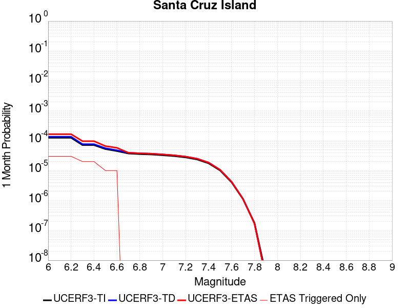 |  |  |

| Magnitude | 1 wk TI Prob | 1 wk TD Prob | 1 wk ETAS Prob | 1 wk ETAS/TD Gain | 1 wk ETAS Triggered Only | 1 mo TI Prob | 1 mo TD Prob | 1 mo ETAS Prob | 1 mo ETAS/TD Gain | 1 mo ETAS Triggered Only | 1 yr TI Prob | 1 yr TD Prob | 1 yr ETAS Prob | 1 yr ETAS/TD Gain | 1 yr ETAS Triggered Only | 10 yr TI Prob | 10 yr TD Prob | 10 yr ETAS Prob | 10 yr ETAS/TD Gain | 10 yr ETAS Triggered Only |
|-----|-----|-----|-----|-----|-----|-----|-----|-----|-----|-----|-----|-----|-----|-----|-----|-----|-----|-----|-----|-----|
| 6.0 | 2.9164563E-5 | 3.1599742E-5 | 3.1599742E-5 | 1.0 | 0.0 | 1.2498499E-4 | 1.3542121E-4 | 2.8064483E-4 | 2.0723846 | 1.4524328E-4 | 0.0015206301 | 0.0016476426 | 0.0017926465 | 1.088007 | 1.4524328E-4 | 0.015102667 | 0.016368 | 0.016510865 | 1.0087284 | 1.4524328E-4 |
| 6.1 | 2.9164563E-5 | 3.1599742E-5 | 3.1599742E-5 | 1.0 | 0.0 | 1.2498499E-4 | 1.3542121E-4 | 2.8064483E-4 | 2.0723846 | 1.4524328E-4 | 0.0015206301 | 0.0016476426 | 0.0017926465 | 1.088007 | 1.4524328E-4 | 0.015102667 | 0.016368 | 0.016510865 | 1.0087284 | 1.4524328E-4 |
| 6.2 | 2.9164563E-5 | 3.1599742E-5 | 3.1599742E-5 | 1.0 | 0.0 | 1.2498499E-4 | 1.3542121E-4 | 2.8064483E-4 | 2.0723846 | 1.4524328E-4 | 0.0015206301 | 0.0016476426 | 0.0017926465 | 1.088007 | 1.4524328E-4 | 0.015102667 | 0.016368 | 0.016510865 | 1.0087284 | 1.4524328E-4 |
| 6.3 | 1.6635553E-5 | 1.780436E-5 | 1.780436E-5 | 1.0 | 0.0 | 7.1293274E-5 | 7.630226E-5 | 2.2153447E-4 | 2.90338 | 1.4524328E-4 | 8.6765E-4 | 9.2860236E-4 | 0.0010737107 | 1.1562654 | 1.4524328E-4 | 0.008642701 | 0.009249094 | 0.0093929935 | 1.0155582 | 1.4524328E-4 |
| 6.4 | 1.6635553E-5 | 1.780436E-5 | 1.780436E-5 | 1.0 | 0.0 | 7.1293274E-5 | 7.630226E-5 | 2.2153447E-4 | 2.90338 | 1.4524328E-4 | 8.6765E-4 | 9.2860236E-4 | 0.0010737107 | 1.1562654 | 1.4524328E-4 | 0.008642701 | 0.009249094 | 0.0093929935 | 1.0155582 | 1.4524328E-4 |
| 6.5 | 1.2238748E-5 | 1.3042995E-5 | 1.3042995E-5 | 1.0 | 0.0 | 5.2450723E-5 | 5.5897377E-5 | 2.0113254E-4 | 3.5982466 | 1.4524328E-4 | 6.3840044E-4 | 6.8034173E-4 | 8.254862E-4 | 1.2133405 | 1.4524328E-4 | 0.0063656955 | 0.0067829876 | 0.0069272458 | 1.0212677 | 1.4524328E-4 |
| 6.6 | 1.0489767E-5 | 1.1156636E-5 | 1.1156636E-5 | 1.0 | 0.0 | 4.495537E-5 | 4.781329E-5 | 1.9304962E-4 | 4.0375724 | 1.4524328E-4 | 5.4719415E-4 | 5.819735E-4 | 7.271323E-4 | 1.249425 | 1.4524328E-4 | 0.005458487 | 0.0058047357 | 0.005949136 | 1.0248762 | 1.4524328E-4 |
| 6.7 | 8.699222E-6 | 9.236782E-6 | 9.236782E-6 | 1.0 | 0.0 | 3.7281847E-5 | 3.958561E-5 | 3.958561E-5 | 1.0 | 0.0 | 4.5381195E-4 | 4.8184878E-4 | 4.8184878E-4 | 1.0 | 0.0 | 0.0045288634 | 0.004808108 | 0.004808108 | 1.0 | 0.0 |
| 6.8 | 8.307732E-6 | 8.8169045E-6 | 8.8169045E-6 | 1.0 | 0.0 | 3.560408E-5 | 3.7786187E-5 | 3.7786187E-5 | 1.0 | 0.0 | 4.3339343E-4 | 4.5995016E-4 | 4.5995016E-4 | 1.0 | 0.0 | 0.004325492 | 0.0045900354 | 0.0045900354 | 1.0 | 0.0 |
| 6.9 | 8.073121E-6 | 8.564939E-6 | 8.564939E-6 | 1.0 | 0.0 | 3.459863E-5 | 3.6706366E-5 | 3.6706366E-5 | 1.0 | 0.0 | 4.2115687E-4 | 4.468088E-4 | 4.468088E-4 | 1.0 | 0.0 | 0.004203596 | 0.004459156 | 0.004459156 | 1.0 | 0.0 |
| 7.0 | 7.617019E-6 | 8.074664E-6 | 8.074664E-6 | 1.0 | 0.0 | 3.264396E-5 | 3.4605247E-5 | 3.4605247E-5 | 1.0 | 0.0 | 3.9736772E-4 | 4.212378E-4 | 4.212378E-4 | 1.0 | 0.0 | 0.003966579 | 0.0042044413 | 0.0042044413 | 1.0 | 0.0 |
| 7.1 | 7.1224836E-6 | 7.545788E-6 | 7.545788E-6 | 1.0 | 0.0 | 3.052457E-5 | 3.2338692E-5 | 3.2338692E-5 | 1.0 | 0.0 | 3.715733E-4 | 3.936528E-4 | 3.936528E-4 | 1.0 | 0.0 | 0.003709526 | 0.003929598 | 0.003929598 | 1.0 | 0.0 |
| 7.2 | 6.441115E-6 | 6.8273835E-6 | 6.8273835E-6 | 1.0 | 0.0 | 2.7604487E-5 | 2.9259887E-5 | 2.9259887E-5 | 1.0 | 0.0 | 3.360328E-4 | 3.5618112E-4 | 3.5618112E-4 | 1.0 | 0.0 | 0.0033552512 | 0.003556131 | 0.003556131 | 1.0 | 0.0 |
| 7.3 | 5.494274E-6 | 5.8199944E-6 | 5.8199944E-6 | 1.0 | 0.0 | 2.3546674E-5 | 2.4942596E-5 | 2.4942596E-5 | 1.0 | 0.0 | 2.8664304E-4 | 3.0363398E-4 | 3.0363398E-4 | 1.0 | 0.0 | 0.002862736 | 0.0030322142 | 0.0030322142 | 1.0 | 0.0 |
| 7.4 | 4.0802624E-6 | 4.312256E-6 | 4.312256E-6 | 1.0 | 0.0 | 1.7486722E-5 | 1.8480967E-5 | 1.8480967E-5 | 1.0 | 0.0 | 2.1288003E-4 | 2.2498262E-4 | 2.2498262E-4 | 1.0 | 0.0 | 0.0021267622 | 0.0022475575 | 0.0022475575 | 1.0 | 0.0 |
| 7.5 | 2.3584746E-6 | 2.4753094E-6 | 2.4753094E-6 | 1.0 | 0.0 | 1.0107709E-5 | 1.0608426E-5 | 1.0608426E-5 | 1.0 | 0.0 | 1.2305441E-4 | 1.2915E-4 | 1.2915E-4 | 1.0 | 0.0 | 0.0012298629 | 0.0012907543 | 0.0012907543 | 1.0 | 0.0 |
| 7.6 | 9.4981914E-7 | 9.86093E-7 | 9.86093E-7 | 1.0 | 0.0 | 4.0706473E-6 | 4.2261063E-6 | 4.2261063E-6 | 1.0 | 0.0 | 4.9559E-5 | 5.145164E-5 | 5.145164E-5 | 1.0 | 0.0 | 4.954795E-4 | 5.1439856E-4 | 5.1439856E-4 | 1.0 | 0.0 |
| 7.7 | 2.6013532E-7 | 2.6416603E-7 | 2.6416603E-7 | 1.0 | 0.0 | 1.1148652E-6 | 1.1321397E-6 | 1.1321397E-6 | 1.0 | 0.0 | 1.3573399E-5 | 1.3783714E-5 | 1.3783714E-5 | 1.0 | 0.0 | 1.357257E-4 | 1.3782867E-4 | 1.3782867E-4 | 1.0 | 0.0 |
| 7.8 | 4.1522263E-8 | 3.965679E-8 | 3.965679E-8 | 1.0 | 0.0 | 1.7795254E-7 | 1.6995766E-7 | 1.6995766E-7 | 1.0 | 0.0 | 2.16657E-6 | 2.0692328E-6 | 2.0692328E-6 | 1.0 | 0.0 | 2.1665488E-5 | 2.0692156E-5 | 2.0692156E-5 | 1.0 | 0.0 |
| 7.9 | 7.7242046E-10 | 5.9468175E-10 | 5.9468175E-10 | 1.0 | 0.0 | 3.3103735E-9 | 2.5486364E-9 | 2.5486364E-9 | 1.0 | 0.0 | 4.0303796E-8 | 3.1029646E-8 | 3.1029646E-8 | 1.0 | 0.0 | 4.030379E-7 | 3.1029643E-7 | 3.1029643E-7 | 1.0 | 0.0 |

## Emerson-Copper Mtn 2011
*[(top)](#table-of-contents)*

| 1 Week | 1 Month | 1 Year | 10 Year |
|-----|-----|-----|-----|
|  |  |  |  |

| Magnitude | 1 wk TI Prob | 1 wk TD Prob | 1 wk ETAS Prob | 1 wk ETAS/TD Gain | 1 wk ETAS Triggered Only | 1 mo TI Prob | 1 mo TD Prob | 1 mo ETAS Prob | 1 mo ETAS/TD Gain | 1 mo ETAS Triggered Only | 1 yr TI Prob | 1 yr TD Prob | 1 yr ETAS Prob | 1 yr ETAS/TD Gain | 1 yr ETAS Triggered Only | 10 yr TI Prob | 10 yr TD Prob | 10 yr ETAS Prob | 10 yr ETAS/TD Gain | 10 yr ETAS Triggered Only |
|-----|-----|-----|-----|-----|-----|-----|-----|-----|-----|-----|-----|-----|-----|-----|-----|-----|-----|-----|-----|-----|
| 6.0 | 2.1364202E-5 | 9.968114E-6 | 1.5520994E-4 | 15.570644 | 1.4524328E-4 | 9.1557646E-5 | 4.2719836E-5 | 1.8795692E-4 | 4.3997574 | 1.4524328E-4 | 0.0011141442 | 5.199986E-4 | 6.6516636E-4 | 1.2791696 | 1.4524328E-4 | 0.011085749 | 0.005188688 | 0.0053331777 | 1.027847 | 1.4524328E-4 |
| 6.1 | 2.1364202E-5 | 9.968114E-6 | 1.5520994E-4 | 15.570644 | 1.4524328E-4 | 9.1557646E-5 | 4.2719836E-5 | 1.8795692E-4 | 4.3997574 | 1.4524328E-4 | 0.0011141442 | 5.199986E-4 | 6.6516636E-4 | 1.2791696 | 1.4524328E-4 | 0.011085749 | 0.005188688 | 0.0053331777 | 1.027847 | 1.4524328E-4 |
| 6.2 | 2.1364202E-5 | 9.968114E-6 | 1.5520994E-4 | 15.570644 | 1.4524328E-4 | 9.1557646E-5 | 4.2719836E-5 | 1.8795692E-4 | 4.3997574 | 1.4524328E-4 | 0.0011141442 | 5.199986E-4 | 6.6516636E-4 | 1.2791696 | 1.4524328E-4 | 0.011085749 | 0.005188688 | 0.0053331777 | 1.027847 | 1.4524328E-4 |
| 6.3 | 1.7751237E-5 | 8.089227E-6 | 1.5333133E-4 | 18.955006 | 1.4524328E-4 | 7.607452E-5 | 3.466769E-5 | 1.7990594E-4 | 5.189441 | 1.4524328E-4 | 9.258136E-4 | 4.2200365E-4 | 5.6718563E-4 | 1.3440301 | 1.4524328E-4 | 0.00921966 | 0.0042126453 | 0.004357277 | 1.0343326 | 1.4524328E-4 |
| 6.4 | 1.7751237E-5 | 8.089227E-6 | 1.5333133E-4 | 18.955006 | 1.4524328E-4 | 7.607452E-5 | 3.466769E-5 | 1.7990594E-4 | 5.189441 | 1.4524328E-4 | 9.258136E-4 | 4.2200365E-4 | 5.6718563E-4 | 1.3440301 | 1.4524328E-4 | 0.00921966 | 0.0042126453 | 0.004357277 | 1.0343326 | 1.4524328E-4 |
| 6.5 | 1.5886664E-5 | 6.603819E-6 | 1.5184614E-4 | 22.993687 | 1.4524328E-4 | 6.808392E-5 | 2.8301802E-5 | 1.7354098E-4 | 6.1317997 | 1.4524328E-4 | 8.286065E-4 | 3.4452465E-4 | 4.897179E-4 | 1.4214306 | 1.4524328E-4 | 0.008255237 | 0.0034403696 | 0.0035851132 | 1.042072 | 1.4524328E-4 |
| 6.6 | 1.5886664E-5 | 6.603819E-6 | 1.5184614E-4 | 22.993687 | 1.4524328E-4 | 6.808392E-5 | 2.8301802E-5 | 1.7354098E-4 | 6.1317997 | 1.4524328E-4 | 8.286065E-4 | 3.4452465E-4 | 4.897179E-4 | 1.4214306 | 1.4524328E-4 | 0.008255237 | 0.0034403696 | 0.0035851132 | 1.042072 | 1.4524328E-4 |
| 6.7 | 1.428471E-5 | 5.470403E-6 | 1.5071289E-4 | 27.550602 | 1.4524328E-4 | 6.121875E-5 | 2.3444394E-5 | 1.6868427E-4 | 7.195079 | 1.4524328E-4 | 7.450834E-4 | 2.8540206E-4 | 4.306039E-4 | 1.5087624 | 1.4524328E-4 | 0.007425902 | 0.0028507432 | 0.0029955725 | 1.050804 | 1.4524328E-4 |
| 6.8 | 1.3490684E-5 | 5.073699E-6 | 1.5031625E-4 | 29.62656 | 1.4524328E-4 | 5.7815934E-5 | 2.1744265E-5 | 1.6698439E-4 | 7.679468 | 1.4524328E-4 | 7.0368167E-4 | 2.6470813E-4 | 4.0991296E-4 | 1.5485469 | 1.4524328E-4 | 0.007014576 | 0.002644309 | 0.0027891684 | 1.0547816 | 1.4524328E-4 |
| 6.9 | 1.2235421E-5 | 4.289677E-6 | 1.4953234E-4 | 34.858646 | 1.4524328E-4 | 5.2436466E-5 | 1.838422E-5 | 1.6362483E-4 | 8.900287 | 1.4524328E-4 | 6.38227E-4 | 2.238085E-4 | 3.6901928E-4 | 1.6488171 | 1.4524328E-4 | 0.0063639707 | 0.0022361854 | 0.0023811038 | 1.0648061 | 1.4524328E-4 |
| 7.0 | 1.1009851E-5 | 3.7189886E-6 | 1.4896173E-4 | 40.054367 | 1.4524328E-4 | 4.7184225E-5 | 1.5938444E-5 | 1.6117941E-4 | 10.112618 | 1.4524328E-4 | 5.743165E-4 | 1.9403672E-4 | 3.3925183E-4 | 1.7483898 | 1.4524328E-4 | 0.005728345 | 0.0019390108 | 0.0020839726 | 1.0747607 | 1.4524328E-4 |
| 7.1 | 9.726373E-6 | 3.2117953E-6 | 1.4845461E-4 | 46.22169 | 1.4524328E-4 | 4.168379E-5 | 1.3764783E-5 | 1.5900607E-4 | 11.551658 | 1.4524328E-4 | 5.07382E-4 | 1.6757673E-4 | 3.1279566E-4 | 1.8665818 | 1.4524328E-4 | 0.0050622504 | 0.0016748349 | 0.0018198348 | 1.0865757 | 1.4524328E-4 |
| 7.2 | 3.9335127E-6 | 1.1524792E-6 | 1.463956E-4 | 127.02667 | 1.4524328E-4 | 1.6857803E-5 | 4.9391874E-6 | 1.5018175E-4 | 30.406166 | 1.4524328E-4 | 2.0522442E-4 | 6.0133007E-5 | 2.0536756E-4 | 3.4152217 | 1.4524328E-4 | 0.00205035 | 6.011733E-4 | 7.4632926E-4 | 1.2414545 | 1.4524328E-4 |
| 7.3 | 2.661632E-6 | 6.911505E-7 | 1.4593433E-4 | 211.14697 | 1.4524328E-4 | 1.14069435E-5 | 2.9620703E-6 | 1.4820493E-4 | 50.034237 | 1.4524328E-4 | 1.3887069E-4 | 3.6062618E-5 | 1.8130067E-4 | 5.0273848 | 1.4524328E-4 | 0.0013878393 | 3.605687E-4 | 5.057596E-4 | 1.4026719 | 1.4524328E-4 |
| 7.4 | 2.0893426E-6 | 5.4618386E-7 | 1.4578938E-4 | 266.92365 | 1.4524328E-4 | 8.954295E-6 | 2.3407858E-6 | 1.4758373E-4 | 63.048794 | 1.4524328E-4 | 1.0901308E-4 | 2.84987E-5 | 1.7373785E-4 | 6.0963426 | 1.4524328E-4 | 0.0010895962 | 2.84951E-4 | 4.301529E-4 | 1.509568 | 1.4524328E-4 |
| 7.5 | 1.1681728E-6 | 3.6030585E-7 | 1.4560354E-4 | 404.11093 | 1.4524328E-4 | 5.0064455E-6 | 1.544167E-6 | 1.4678722E-4 | 95.059166 | 1.4524328E-4 | 6.0951766E-5 | 1.8800076E-5 | 1.6404063E-4 | 8.72553 | 1.4524328E-4 | 6.093505E-4 | 1.8798532E-4 | 3.3320131E-4 | 1.7724857 | 1.4524328E-4 |
| 7.6 | 1.3154387E-7 | 7.1197384E-8 | 7.1197384E-8 | 1.0 | 0.0 | 5.6375933E-7 | 3.051316E-7 | 3.051316E-7 | 1.0 | 0.0 | 6.863748E-6 | 3.7149728E-6 | 3.7149728E-6 | 1.0 | 0.0 | 6.863536E-5 | 3.7149264E-5 | 3.7149264E-5 | 1.0 | 0.0 |

## Likely 2011 CFM
*[(top)](#table-of-contents)*

| 1 Week | 1 Month | 1 Year | 10 Year |
|-----|-----|-----|-----|
|  |  |  |  |

| Magnitude | 1 wk TI Prob | 1 wk TD Prob | 1 wk ETAS Prob | 1 wk ETAS/TD Gain | 1 wk ETAS Triggered Only | 1 mo TI Prob | 1 mo TD Prob | 1 mo ETAS Prob | 1 mo ETAS/TD Gain | 1 mo ETAS Triggered Only | 1 yr TI Prob | 1 yr TD Prob | 1 yr ETAS Prob | 1 yr ETAS/TD Gain | 1 yr ETAS Triggered Only | 10 yr TI Prob | 10 yr TD Prob | 10 yr ETAS Prob | 10 yr ETAS/TD Gain | 10 yr ETAS Triggered Only |
|-----|-----|-----|-----|-----|-----|-----|-----|-----|-----|-----|-----|-----|-----|-----|-----|-----|-----|-----|-----|-----|
| 6.0 | 2.5315949E-5 | 2.7104748E-5 | 2.7104748E-5 | 1.0 | 0.0 | 1.0849241E-4 | 1.16158284E-4 | 1.16158284E-4 | 1.0 | 0.0 | 0.0013200947 | 0.0014133542 | 0.0015583922 | 1.1026198 | 1.4524328E-4 | 0.013122803 | 0.01404831 | 0.014191513 | 1.0101936 | 1.4524328E-4 |
| 6.1 | 2.5315949E-5 | 2.7104748E-5 | 2.7104748E-5 | 1.0 | 0.0 | 1.0849241E-4 | 1.16158284E-4 | 1.16158284E-4 | 1.0 | 0.0 | 0.0013200947 | 0.0014133542 | 0.0015583922 | 1.1026198 | 1.4524328E-4 | 0.013122803 | 0.01404831 | 0.014191513 | 1.0101936 | 1.4524328E-4 |
| 6.2 | 1.6375941E-5 | 1.7465842E-5 | 1.7465842E-5 | 1.0 | 0.0 | 7.0180715E-5 | 7.485153E-5 | 7.485153E-5 | 1.0 | 0.0 | 8.5411523E-4 | 9.109487E-4 | 9.109487E-4 | 1.0 | 0.0 | 0.008508399 | 0.009073433 | 0.009073433 | 1.0 | 0.0 |
| 6.3 | 1.1945543E-5 | 1.2712587E-5 | 1.2712587E-5 | 1.0 | 0.0 | 5.119418E-5 | 5.4481407E-5 | 5.4481407E-5 | 1.0 | 0.0 | 6.2311086E-4 | 6.631146E-4 | 6.631146E-4 | 1.0 | 0.0 | 0.0062136655 | 0.0066119144 | 0.0066119144 | 1.0 | 0.0 |
| 6.4 | 9.192729E-6 | 9.768488E-6 | 9.768488E-6 | 1.0 | 0.0 | 3.939681E-5 | 4.1864292E-5 | 4.1864292E-5 | 1.0 | 0.0 | 4.7955062E-4 | 5.0958124E-4 | 5.0958124E-4 | 1.0 | 0.0 | 0.004785171 | 0.0050844094 | 0.0050844094 | 1.0 | 0.0 |
| 6.5 | 7.67906E-6 | 8.152622E-6 | 8.152622E-6 | 1.0 | 0.0 | 3.2909844E-5 | 3.4939352E-5 | 3.4939352E-5 | 1.0 | 0.0 | 4.006037E-4 | 4.2530545E-4 | 4.2530545E-4 | 1.0 | 0.0 | 0.0039988225 | 0.004245108 | 0.004245108 | 1.0 | 0.0 |
| 6.6 | 6.4884057E-6 | 6.8847507E-6 | 6.8847507E-6 | 1.0 | 0.0 | 2.7807157E-5 | 2.9505749E-5 | 2.9505749E-5 | 1.0 | 0.0 | 3.3849955E-4 | 3.591747E-4 | 3.591747E-4 | 1.0 | 0.0 | 0.003379844 | 0.0035860867 | 0.0035860867 | 1.0 | 0.0 |
| 6.7 | 4.6060636E-6 | 4.884041E-6 | 4.884041E-6 | 1.0 | 0.0 | 1.9740122E-5 | 2.0931442E-5 | 2.0931442E-5 | 1.0 | 0.0 | 2.403095E-4 | 2.5481134E-4 | 2.5481134E-4 | 1.0 | 0.0 | 0.002400498 | 0.0025452746 | 0.0025452746 | 1.0 | 0.0 |
| 6.8 | 3.2795615E-6 | 3.4773732E-6 | 3.4773732E-6 | 1.0 | 0.0 | 1.4055187E-5 | 1.4902946E-5 | 1.4902946E-5 | 1.0 | 0.0 | 1.7110848E-4 | 1.8142881E-4 | 1.8142881E-4 | 1.0 | 0.0 | 0.0017097679 | 0.0018128622 | 0.0018128622 | 1.0 | 0.0 |
| 6.9 | 2.3289967E-6 | 2.4705569E-6 | 2.4705569E-6 | 1.0 | 0.0 | 9.981376E-6 | 1.058806E-5 | 1.058806E-5 | 1.0 | 0.0 | 1.2151648E-4 | 1.2890245E-4 | 1.2890245E-4 | 1.0 | 0.0 | 0.0012145005 | 0.0012883197 | 0.0012883197 | 1.0 | 0.0 |
| 7.0 | 1.211292E-6 | 1.2863958E-6 | 1.2863958E-6 | 1.0 | 0.0 | 5.1912407E-6 | 5.5131145E-6 | 5.5131145E-6 | 1.0 | 0.0 | 6.320152E-5 | 6.712041E-5 | 6.712041E-5 | 1.0 | 0.0 | 6.3183554E-4 | 6.710312E-4 | 6.710312E-4 | 1.0 | 0.0 |

## Cady
*[(top)](#table-of-contents)*

| 1 Week | 1 Month | 1 Year | 10 Year |
|-----|-----|-----|-----|
|  |  |  |  |

| Magnitude | 1 wk TI Prob | 1 wk TD Prob | 1 wk ETAS Prob | 1 wk ETAS/TD Gain | 1 wk ETAS Triggered Only | 1 mo TI Prob | 1 mo TD Prob | 1 mo ETAS Prob | 1 mo ETAS/TD Gain | 1 mo ETAS Triggered Only | 1 yr TI Prob | 1 yr TD Prob | 1 yr ETAS Prob | 1 yr ETAS/TD Gain | 1 yr ETAS Triggered Only | 10 yr TI Prob | 10 yr TD Prob | 10 yr ETAS Prob | 10 yr ETAS/TD Gain | 10 yr ETAS Triggered Only |
|-----|-----|-----|-----|-----|-----|-----|-----|-----|-----|-----|-----|-----|-----|-----|-----|-----|-----|-----|-----|-----|
| 6.0 | 1.9892565E-5 | 2.1858728E-5 | 2.1858728E-5 | 1.0 | 0.0 | 8.525106E-5 | 9.3677416E-5 | 9.3677416E-5 | 1.0 | 0.0 | 0.0010374374 | 0.0011400167 | 0.0011400167 | 1.0 | 0.0 | 0.010326075 | 0.011350701 | 0.011494295 | 1.0126507 | 1.4524328E-4 |
| 6.1 | 1.9892565E-5 | 2.1858728E-5 | 2.1858728E-5 | 1.0 | 0.0 | 8.525106E-5 | 9.3677416E-5 | 9.3677416E-5 | 1.0 | 0.0 | 0.0010374374 | 0.0011400167 | 0.0011400167 | 1.0 | 0.0 | 0.010326075 | 0.011350701 | 0.011494295 | 1.0126507 | 1.4524328E-4 |
| 6.2 | 1.9892565E-5 | 2.1858728E-5 | 2.1858728E-5 | 1.0 | 0.0 | 8.525106E-5 | 9.3677416E-5 | 9.3677416E-5 | 1.0 | 0.0 | 0.0010374374 | 0.0011400167 | 0.0011400167 | 1.0 | 0.0 | 0.010326075 | 0.011350701 | 0.011494295 | 1.0126507 | 1.4524328E-4 |
| 6.3 | 1.1117327E-5 | 1.2176583E-5 | 1.2176583E-5 | 1.0 | 0.0 | 4.764482E-5 | 5.2184492E-5 | 5.2184492E-5 | 1.0 | 0.0 | 5.7992124E-4 | 6.351925E-4 | 6.351925E-4 | 1.0 | 0.0 | 0.0057841022 | 0.0063368753 | 0.006481198 | 1.022775 | 1.4524328E-4 |
| 6.4 | 1.1117327E-5 | 1.2176583E-5 | 1.2176583E-5 | 1.0 | 0.0 | 4.764482E-5 | 5.2184492E-5 | 5.2184492E-5 | 1.0 | 0.0 | 5.7992124E-4 | 6.351925E-4 | 6.351925E-4 | 1.0 | 0.0 | 0.0057841022 | 0.0063368753 | 0.006481198 | 1.022775 | 1.4524328E-4 |
| 6.5 | 6.103093E-6 | 6.672021E-6 | 6.672021E-6 | 1.0 | 0.0 | 2.615585E-5 | 2.8594131E-5 | 2.8594131E-5 | 1.0 | 0.0 | 3.1840094E-4 | 3.480905E-4 | 3.480905E-4 | 1.0 | 0.0 | 0.0031794512 | 0.0034766865 | 0.0034766865 | 1.0 | 0.0 |
| 6.6 | 5.817237E-6 | 6.3656585E-6 | 6.3656585E-6 | 1.0 | 0.0 | 2.4930776E-5 | 2.728118E-5 | 2.728118E-5 | 1.0 | 0.0 | 3.034899E-4 | 3.3211018E-4 | 3.3211018E-4 | 1.0 | 0.0 | 0.0030307577 | 0.0033173605 | 0.0033173605 | 1.0 | 0.0 |
| 6.7 | 4.8846314E-6 | 5.3405684E-6 | 5.3405684E-6 | 1.0 | 0.0 | 2.0933967E-5 | 2.2888014E-5 | 2.2888014E-5 | 1.0 | 0.0 | 2.5484123E-4 | 2.7863772E-4 | 2.7863772E-4 | 1.0 | 0.0 | 0.0025454918 | 0.0027840391 | 0.0027840391 | 1.0 | 0.0 |
| 6.8 | 1.7788773E-6 | 1.9399079E-6 | 1.9399079E-6 | 1.0 | 0.0 | 7.6237375E-6 | 8.313874E-6 | 8.313874E-6 | 1.0 | 0.0 | 9.281505E-5 | 1.01218284E-4 | 1.01218284E-4 | 1.0 | 0.0 | 9.2776294E-4 | 0.0010118765 | 0.0010118765 | 1.0 | 0.0 |
| 6.9 | 7.5455404E-7 | 8.297092E-7 | 8.297092E-7 | 1.0 | 0.0 | 3.233799E-6 | 3.5558937E-6 | 3.5558937E-6 | 1.0 | 0.0 | 3.937079E-5 | 4.3292483E-5 | 4.3292483E-5 | 1.0 | 0.0 | 3.9363815E-4 | 4.3287344E-4 | 4.3287344E-4 | 1.0 | 0.0 |
| 7.0 | 6.8578805E-7 | 7.541816E-7 | 7.541816E-7 | 1.0 | 0.0 | 2.9390883E-6 | 3.2322048E-6 | 3.2322048E-6 | 1.0 | 0.0 | 3.578281E-5 | 3.9351715E-5 | 3.9351715E-5 | 1.0 | 0.0 | 3.577705E-4 | 3.9347992E-4 | 3.9347992E-4 | 1.0 | 0.0 |

## Hayward (So) 2011 CFM
*[(top)](#table-of-contents)*

| 1 Week | 1 Month | 1 Year | 10 Year |
|-----|-----|-----|-----|
|  | 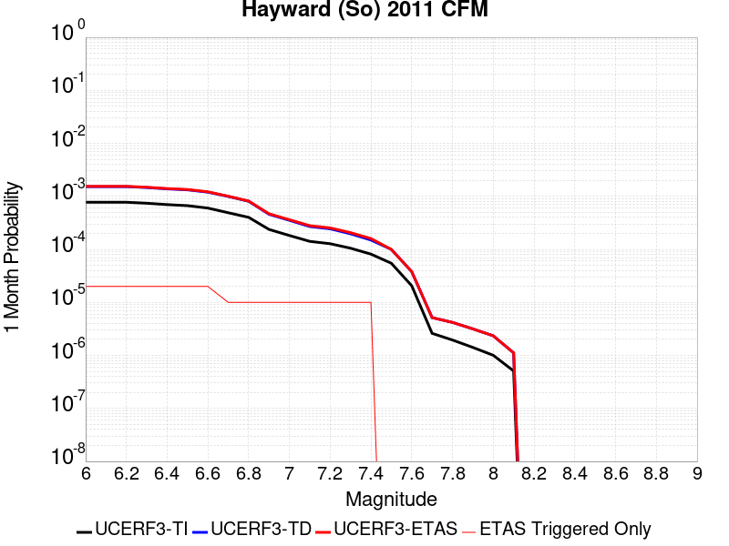 |  |  |

| Magnitude | 1 wk TI Prob | 1 wk TD Prob | 1 wk ETAS Prob | 1 wk ETAS/TD Gain | 1 wk ETAS Triggered Only | 1 mo TI Prob | 1 mo TD Prob | 1 mo ETAS Prob | 1 mo ETAS/TD Gain | 1 mo ETAS Triggered Only | 1 yr TI Prob | 1 yr TD Prob | 1 yr ETAS Prob | 1 yr ETAS/TD Gain | 1 yr ETAS Triggered Only | 10 yr TI Prob | 10 yr TD Prob | 10 yr ETAS Prob | 10 yr ETAS/TD Gain | 10 yr ETAS Triggered Only |
|-----|-----|-----|-----|-----|-----|-----|-----|-----|-----|-----|-----|-----|-----|-----|-----|-----|-----|-----|-----|-----|
| 6.0 | 1.8091932E-4 | 3.570541E-4 | 3.570541E-4 | 1.0 | 0.0 | 7.751381E-4 | 0.0015293444 | 0.0016743655 | 1.0948257 | 1.4524328E-4 | 0.00939654 | 0.018463207 | 0.01860577 | 1.0077214 | 1.4524328E-4 | 0.090090066 | 0.16673161 | 0.16685264 | 1.0007259 | 1.4524328E-4 |
| 6.1 | 1.8091932E-4 | 3.570541E-4 | 3.570541E-4 | 1.0 | 0.0 | 7.751381E-4 | 0.0015293444 | 0.0016743655 | 1.0948257 | 1.4524328E-4 | 0.00939654 | 0.018463207 | 0.01860577 | 1.0077214 | 1.4524328E-4 | 0.090090066 | 0.16673161 | 0.16685264 | 1.0007259 | 1.4524328E-4 |
| 6.2 | 1.8091932E-4 | 3.570541E-4 | 3.570541E-4 | 1.0 | 0.0 | 7.751381E-4 | 0.0015293444 | 0.0016743655 | 1.0948257 | 1.4524328E-4 | 0.00939654 | 0.018463207 | 0.01860577 | 1.0077214 | 1.4524328E-4 | 0.090090066 | 0.16673161 | 0.16685264 | 1.0007259 | 1.4524328E-4 |
| 6.3 | 1.7322872E-4 | 3.426234E-4 | 3.426234E-4 | 1.0 | 0.0 | 7.4219756E-4 | 0.0014675693 | 0.0016125994 | 1.0988233 | 1.4524328E-4 | 0.0089988755 | 0.017723544 | 0.017866213 | 1.0080497 | 1.4524328E-4 | 0.08643075 | 0.16066726 | 0.16078916 | 1.0007588 | 1.4524328E-4 |
| 6.4 | 1.6334097E-4 | 3.234411E-4 | 3.234411E-4 | 1.0 | 0.0 | 6.998449E-4 | 0.0013854484 | 0.0015304905 | 1.1046896 | 1.4524328E-4 | 0.008487372 | 0.016739385 | 0.016882198 | 1.0085315 | 1.4524328E-4 | 0.081704415 | 0.15255594 | 0.15267903 | 1.0008068 | 1.4524328E-4 |
| 6.5 | 1.5600289E-4 | 3.1018828E-4 | 3.1018828E-4 | 1.0 | 0.0 | 6.684125E-4 | 0.0013287093 | 0.0014737597 | 1.1091663 | 1.4524328E-4 | 0.008107598 | 0.016058935 | 0.016201844 | 1.0088991 | 1.4524328E-4 | 0.078181036 | 0.14683272 | 0.14695662 | 1.0008439 | 1.4524328E-4 |
| 6.6 | 1.4046066E-4 | 2.8032906E-4 | 2.8032906E-4 | 1.0 | 0.0 | 6.018354E-4 | 0.0012008639 | 0.0013459327 | 1.1208037 | 1.4524328E-4 | 0.0073027555 | 0.014524006 | 0.014667139 | 1.009855 | 1.4524328E-4 | 0.07067384 | 0.13391982 | 0.13404562 | 1.0009394 | 1.4524328E-4 |
| 6.7 | 1.14696966E-4 | 2.3271477E-4 | 2.3271477E-4 | 1.0 | 0.0 | 4.914658E-4 | 9.969729E-4 | 0.0011420713 | 1.145539 | 1.4524328E-4 | 0.0059671924 | 0.012071652 | 0.012215143 | 1.0118865 | 1.4524328E-4 | 0.058094822 | 0.11274672 | 0.11287559 | 1.001143 | 1.4524328E-4 |
| 6.8 | 9.3874296E-5 | 1.8861453E-4 | 1.8861453E-4 | 1.0 | 0.0 | 4.0225635E-4 | 8.0810126E-4 | 9.5322717E-4 | 1.1795888 | 1.4524328E-4 | 0.0048864787 | 0.009794984 | 0.009938804 | 1.0146831 | 1.4524328E-4 | 0.047804173 | 0.09259856 | 0.09273035 | 1.0014232 | 1.4524328E-4 |
| 6.9 | 5.551852E-5 | 1.072948E-4 | 1.072948E-4 | 1.0 | 0.0 | 2.3791482E-4 | 4.5975443E-4 | 6.049309E-4 | 1.3157697 | 1.4524328E-4 | 0.0028927654 | 0.0055832625 | 0.005727695 | 1.0258688 | 1.4524328E-4 | 0.028553981 | 0.054245494 | 0.054382857 | 1.0025322 | 1.4524328E-4 |
| 7.0 | 4.2662363E-5 | 8.2464416E-5 | 8.2464416E-5 | 1.0 | 0.0 | 1.8282588E-4 | 3.5337146E-4 | 4.985634E-4 | 1.4108763 | 1.4524328E-4 | 0.0022236328 | 0.0042938837 | 0.0044385036 | 1.0336803 | 1.4524328E-4 | 0.022015138 | 0.042064495 | 0.042203628 | 1.0033076 | 1.4524328E-4 |
| 7.1 | 3.305886E-5 | 6.3019055E-5 | 6.3019055E-5 | 1.0 | 0.0 | 1.4167312E-4 | 2.700538E-4 | 4.1525785E-4 | 1.5376856 | 1.4524328E-4 | 0.0017235056 | 0.0032829668 | 0.0034277332 | 1.0440962 | 1.4524328E-4 | 0.017101998 | 0.032452874 | 0.032593403 | 1.0043303 | 1.4524328E-4 |
| 7.2 | 2.9856887E-5 | 5.7013647E-5 | 5.7013647E-5 | 1.0 | 0.0 | 1.2795182E-4 | 2.4432142E-4 | 3.8952922E-4 | 1.594331 | 1.4524328E-4 | 0.0015567001 | 0.0029705726 | 0.0031153844 | 1.0487489 | 1.4524328E-4 | 0.015458403 | 0.029453589 | 0.029594554 | 1.004786 | 1.4524328E-4 |
| 7.3 | 2.4559737E-5 | 4.599088E-5 | 4.599088E-5 | 1.0 | 0.0 | 1.0525176E-4 | 1.9708896E-4 | 3.4230363E-4 | 1.7367975 | 1.4524328E-4 | 0.0012806869 | 0.0023969305 | 0.0025418256 | 1.0604503 | 1.4524328E-4 | 0.012733313 | 0.023857482 | 0.02399926 | 1.0059427 | 1.4524328E-4 |
| 7.4 | 1.9002231E-5 | 3.5049303E-5 | 3.5049303E-5 | 1.0 | 0.0 | 8.143559E-5 | 1.502027E-4 | 2.9542416E-4 | 1.9668366 | 1.4524328E-4 | 9.910273E-4 | 0.0018271938 | 0.0019721717 | 1.0793445 | 1.4524328E-4 | 0.009866194 | 0.018258283 | 0.018400874 | 1.0078096 | 1.4524328E-4 |
| 7.5 | 1.2783333E-5 | 2.3330069E-5 | 2.3330069E-5 | 1.0 | 0.0 | 5.4784563E-5 | 9.998221E-5 | 9.998221E-5 | 1.0 | 0.0 | 6.667979E-4 | 0.0012166094 | 0.0012166094 | 1.0 | 0.0 | 0.006648007 | 0.012209582 | 0.012209582 | 1.0 | 0.0 |
| 7.6 | 4.8149627E-6 | 8.887544E-6 | 8.887544E-6 | 1.0 | 0.0 | 2.063539E-5 | 3.8088925E-5 | 3.8088925E-5 | 1.0 | 0.0 | 2.5120692E-4 | 4.636352E-4 | 4.636352E-4 | 1.0 | 0.0 | 0.0025092314 | 0.0046812436 | 0.0046812436 | 1.0 | 0.0 |
| 7.7 | 6.0838227E-7 | 1.2056693E-6 | 1.2056693E-6 | 1.0 | 0.0 | 2.6073499E-6 | 5.1671436E-6 | 5.1671436E-6 | 1.0 | 0.0 | 3.174402E-5 | 6.290816E-5 | 6.290816E-5 | 1.0 | 0.0 | 3.1739488E-4 | 6.5293367E-4 | 6.5293367E-4 | 1.0 | 0.0 |
| 7.8 | 4.5542808E-7 | 9.792182E-7 | 9.792182E-7 | 1.0 | 0.0 | 1.9518332E-6 | 4.1966427E-6 | 4.1966427E-6 | 1.0 | 0.0 | 2.376331E-5 | 5.1092928E-5 | 5.1092928E-5 | 1.0 | 0.0 | 2.3760769E-4 | 5.321372E-4 | 5.321372E-4 | 1.0 | 0.0 |
| 7.9 | 3.3016747E-7 | 7.386335E-7 | 7.386335E-7 | 1.0 | 0.0 | 1.4150027E-6 | 3.1655684E-6 | 3.1655684E-6 | 1.0 | 0.0 | 1.7227521E-5 | 3.8540114E-5 | 3.8540114E-5 | 1.0 | 0.0 | 1.7226185E-4 | 3.9930744E-4 | 3.9930744E-4 | 1.0 | 0.0 |
| 8.0 | 2.347038E-7 | 5.4714894E-7 | 5.4714894E-7 | 1.0 | 0.0 | 1.0058731E-6 | 2.344922E-6 | 2.344922E-6 | 1.0 | 0.0 | 1.2246436E-5 | 2.8549053E-5 | 2.8549053E-5 | 1.0 | 0.0 | 1.2245761E-4 | 2.9355253E-4 | 2.9355253E-4 | 1.0 | 0.0 |
| 8.1 | 1.18822804E-7 | 2.6058973E-7 | 2.6058973E-7 | 1.0 | 0.0 | 5.092405E-7 | 1.1168127E-6 | 1.1168127E-6 | 1.0 | 0.0 | 6.1999854E-6 | 1.359711E-5 | 1.359711E-5 | 1.0 | 0.0 | 6.199812E-5 | 1.3917852E-4 | 1.3917852E-4 | 1.0 | 0.0 |

## White Wolf
*[(top)](#table-of-contents)*

| 1 Week | 1 Month | 1 Year | 10 Year |
|-----|-----|-----|-----|
|  |  | 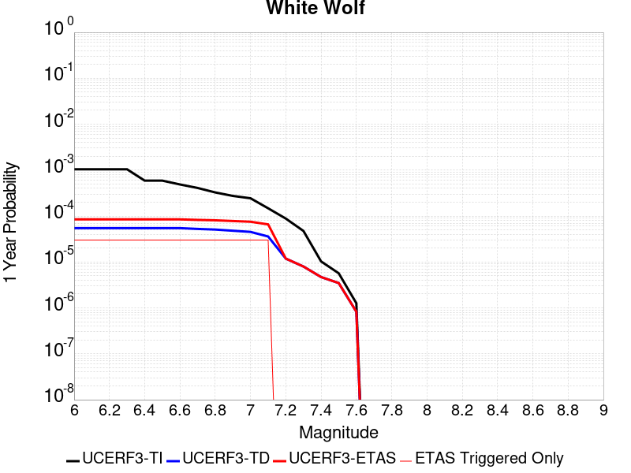 |  |

| Magnitude | 1 wk TI Prob | 1 wk TD Prob | 1 wk ETAS Prob | 1 wk ETAS/TD Gain | 1 wk ETAS Triggered Only | 1 mo TI Prob | 1 mo TD Prob | 1 mo ETAS Prob | 1 mo ETAS/TD Gain | 1 mo ETAS Triggered Only | 1 yr TI Prob | 1 yr TD Prob | 1 yr ETAS Prob | 1 yr ETAS/TD Gain | 1 yr ETAS Triggered Only | 10 yr TI Prob | 10 yr TD Prob | 10 yr ETAS Prob | 10 yr ETAS/TD Gain | 10 yr ETAS Triggered Only |
|-----|-----|-----|-----|-----|-----|-----|-----|-----|-----|-----|-----|-----|-----|-----|-----|-----|-----|-----|-----|-----|
| 6.0 | 2.0037822E-5 | 1.0469162E-6 | 1.0469162E-6 | 1.0 | 0.0 | 8.587355E-5 | 4.486776E-6 | 4.486776E-6 | 1.0 | 0.0 | 0.001045009 | 5.4625183E-5 | 1.9986053E-4 | 3.6587617 | 1.4524328E-4 | 0.010401085 | 5.461226E-4 | 6.912866E-4 | 1.2658083 | 1.4524328E-4 |
| 6.1 | 2.0037822E-5 | 1.0469162E-6 | 1.0469162E-6 | 1.0 | 0.0 | 8.587355E-5 | 4.486776E-6 | 4.486776E-6 | 1.0 | 0.0 | 0.001045009 | 5.4625183E-5 | 1.9986053E-4 | 3.6587617 | 1.4524328E-4 | 0.010401085 | 5.461226E-4 | 6.912866E-4 | 1.2658083 | 1.4524328E-4 |
| 6.2 | 2.0037822E-5 | 1.0469162E-6 | 1.0469162E-6 | 1.0 | 0.0 | 8.587355E-5 | 4.486776E-6 | 4.486776E-6 | 1.0 | 0.0 | 0.001045009 | 5.4625183E-5 | 1.9986053E-4 | 3.6587617 | 1.4524328E-4 | 0.010401085 | 5.461226E-4 | 6.912866E-4 | 1.2658083 | 1.4524328E-4 |
| 6.3 | 2.0037822E-5 | 1.0469162E-6 | 1.0469162E-6 | 1.0 | 0.0 | 8.587355E-5 | 4.486776E-6 | 4.486776E-6 | 1.0 | 0.0 | 0.001045009 | 5.4625183E-5 | 1.9986053E-4 | 3.6587617 | 1.4524328E-4 | 0.010401085 | 5.461226E-4 | 6.912866E-4 | 1.2658083 | 1.4524328E-4 |
| 6.4 | 1.132487E-5 | 1.0469162E-6 | 1.0469162E-6 | 1.0 | 0.0 | 4.8534253E-5 | 4.486776E-6 | 4.486776E-6 | 1.0 | 0.0 | 5.907443E-4 | 5.4625183E-5 | 1.9986053E-4 | 3.6587617 | 1.4524328E-4 | 0.005891764 | 5.461226E-4 | 6.912866E-4 | 1.2658083 | 1.4524328E-4 |
| 6.5 | 1.132487E-5 | 1.0469162E-6 | 1.0469162E-6 | 1.0 | 0.0 | 4.8534253E-5 | 4.486776E-6 | 4.486776E-6 | 1.0 | 0.0 | 5.907443E-4 | 5.4625183E-5 | 1.9986053E-4 | 3.6587617 | 1.4524328E-4 | 0.005891764 | 5.461226E-4 | 6.912866E-4 | 1.2658083 | 1.4524328E-4 |
| 6.6 | 9.347473E-6 | 1.0469162E-6 | 1.0469162E-6 | 1.0 | 0.0 | 4.0059982E-5 | 4.486776E-6 | 4.486776E-6 | 1.0 | 0.0 | 4.8762115E-4 | 5.4625183E-5 | 1.9986053E-4 | 3.6587617 | 1.4524328E-4 | 0.0048655253 | 5.461226E-4 | 6.912866E-4 | 1.2658083 | 1.4524328E-4 |
| 6.7 | 7.842647E-6 | 1.0048342E-6 | 1.0048342E-6 | 1.0 | 0.0 | 3.361091E-5 | 4.3064256E-6 | 4.3064256E-6 | 1.0 | 0.0 | 4.0913603E-4 | 5.2429517E-5 | 1.9766518E-4 | 3.7701125 | 1.4524328E-4 | 0.004083836 | 5.2417646E-4 | 6.693436E-4 | 1.2769433 | 1.4524328E-4 |
| 6.8 | 6.26597E-6 | 9.734822E-7 | 9.734822E-7 | 1.0 | 0.0 | 2.685388E-5 | 4.17206E-6 | 4.17206E-6 | 1.0 | 0.0 | 3.2689696E-4 | 5.0793697E-5 | 1.960296E-4 | 3.8593292 | 1.4524328E-4 | 0.003264165 | 5.078258E-4 | 6.529953E-4 | 1.2858648 | 1.4524328E-4 |
| 6.9 | 5.258436E-6 | 9.183254E-7 | 9.183254E-7 | 1.0 | 0.0 | 2.2535958E-5 | 3.9356746E-6 | 3.9356746E-6 | 1.0 | 0.0 | 2.7434074E-4 | 4.7915833E-5 | 1.9315215E-4 | 4.0310717 | 1.4524328E-4 | 0.0027400232 | 4.790598E-4 | 6.242335E-4 | 1.3030388 | 1.4524328E-4 |
| 7.0 | 4.675028E-6 | 8.6611794E-7 | 8.6611794E-7 | 1.0 | 0.0 | 2.003568E-5 | 3.7119291E-6 | 3.7119291E-6 | 1.0 | 0.0 | 2.4390711E-4 | 4.5191846E-5 | 1.9042856E-4 | 4.2137814 | 1.4524328E-4 | 0.0024363957 | 4.518313E-4 | 5.970089E-4 | 1.3213094 | 1.4524328E-4 |
| 7.1 | 2.8270078E-6 | 6.8741696E-7 | 6.8741696E-7 | 1.0 | 0.0 | 1.2115692E-5 | 2.9460696E-6 | 2.9460696E-6 | 1.0 | 0.0 | 1.4749856E-4 | 3.5867848E-5 | 1.8110592E-4 | 5.0492554 | 1.4524328E-4 | 0.001474007 | 3.586247E-4 | 5.038159E-4 | 1.4048555 | 1.4524328E-4 |
| 7.2 | 1.6881406E-6 | 2.2706382E-7 | 2.2706382E-7 | 1.0 | 0.0 | 7.2348685E-6 | 9.731303E-7 | 9.731303E-7 | 1.0 | 0.0 | 8.808096E-5 | 1.1847799E-5 | 1.1847799E-5 | 1.0 | 0.0 | 8.8046055E-4 | 1.1847183E-4 | 1.1847183E-4 | 1.0 | 0.0 |
| 7.3 | 9.086107E-7 | 1.5266386E-7 | 1.5266386E-7 | 1.0 | 0.0 | 3.8940398E-6 | 6.5427355E-7 | 6.5427355E-7 | 1.0 | 0.0 | 4.7408903E-5 | 7.965752E-6 | 7.965752E-6 | 1.0 | 0.0 | 4.739879E-4 | 7.965475E-5 | 7.965475E-5 | 1.0 | 0.0 |
| 7.4 | 1.9717383E-7 | 9.003913E-8 | 9.003913E-8 | 1.0 | 0.0 | 8.450304E-7 | 3.8588192E-7 | 3.8588192E-7 | 1.0 | 0.0 | 1.0288197E-5 | 4.6981027E-6 | 4.6981027E-6 | 1.0 | 0.0 | 1.028772E-4 | 4.6980065E-5 | 4.6980065E-5 | 1.0 | 0.0 |
| 7.5 | 1.086975E-7 | 6.6597195E-8 | 6.6597195E-8 | 1.0 | 0.0 | 4.6584634E-7 | 2.8541652E-7 | 2.8541652E-7 | 1.0 | 0.0 | 5.6716644E-6 | 3.474941E-6 | 3.474941E-6 | 1.0 | 0.0 | 5.6715195E-5 | 3.474889E-5 | 3.474889E-5 | 1.0 | 0.0 |
| 7.6 | 2.4217808E-8 | 1.5820765E-8 | 1.5820765E-8 | 1.0 | 0.0 | 1.03790605E-7 | 6.780328E-8 | 6.780328E-8 | 1.0 | 0.0 | 1.2636499E-6 | 8.255046E-7 | 8.255046E-7 | 1.0 | 0.0 | 1.2636427E-5 | 8.2550205E-6 | 8.2550205E-6 | 1.0 | 0.0 |

## Rodgers Creek - Healdsburg 2011 CFM
*[(top)](#table-of-contents)*

| 1 Week | 1 Month | 1 Year | 10 Year |
|-----|-----|-----|-----|
|  |  |  |  |

| Magnitude | 1 wk TI Prob | 1 wk TD Prob | 1 wk ETAS Prob | 1 wk ETAS/TD Gain | 1 wk ETAS Triggered Only | 1 mo TI Prob | 1 mo TD Prob | 1 mo ETAS Prob | 1 mo ETAS/TD Gain | 1 mo ETAS Triggered Only | 1 yr TI Prob | 1 yr TD Prob | 1 yr ETAS Prob | 1 yr ETAS/TD Gain | 1 yr ETAS Triggered Only | 10 yr TI Prob | 10 yr TD Prob | 10 yr ETAS Prob | 10 yr ETAS/TD Gain | 10 yr ETAS Triggered Only |
|-----|-----|-----|-----|-----|-----|-----|-----|-----|-----|-----|-----|-----|-----|-----|-----|-----|-----|-----|-----|-----|
| 6.0 | 7.390182E-5 | 1.3136698E-4 | 1.3136698E-4 | 1.0 | 0.0 | 3.1668364E-4 | 5.6287815E-4 | 7.080397E-4 | 1.2578915 | 1.4524328E-4 | 0.0038488081 | 0.0068315 | 0.0069757514 | 1.0211155 | 1.4524328E-4 | 0.037828278 | 0.06619178 | 0.06632741 | 1.0020491 | 1.4524328E-4 |
| 6.1 | 7.318768E-5 | 1.3034661E-4 | 1.3034661E-4 | 1.0 | 0.0 | 3.1362378E-4 | 5.585081E-4 | 7.0367026E-4 | 1.2599106 | 1.4524328E-4 | 0.0038116854 | 0.0067786723 | 0.006922931 | 1.0212812 | 1.4524328E-4 | 0.037469655 | 0.06569639 | 0.06583209 | 1.0020655 | 1.4524328E-4 |
| 6.2 | 7.1379836E-5 | 1.2727521E-4 | 1.2727521E-4 | 1.0 | 0.0 | 3.058777E-4 | 5.453505E-4 | 6.905146E-4 | 1.2661849 | 1.4524328E-4 | 0.003717703 | 0.0066194604 | 0.0067637423 | 1.0217966 | 1.4524328E-4 | 0.0365612 | 0.06421462 | 0.06435053 | 1.0021166 | 1.4524328E-4 |
| 6.3 | 6.9255926E-5 | 1.2382054E-4 | 1.2382054E-4 | 1.0 | 0.0 | 2.9677735E-4 | 5.3055194E-4 | 6.757182E-4 | 1.2736136 | 1.4524328E-4 | 0.0036072785 | 0.006440372 | 0.00658468 | 1.0224068 | 1.4524328E-4 | 0.035492823 | 0.06254096 | 0.06267712 | 1.0021771 | 1.4524328E-4 |
| 6.4 | 6.6757144E-5 | 1.1958744E-4 | 1.1958744E-4 | 1.0 | 0.0 | 2.8607066E-4 | 5.1241735E-4 | 6.575862E-4 | 1.283302 | 1.4524328E-4 | 0.0034773487 | 0.0062209065 | 0.006365246 | 1.0232024 | 1.4524328E-4 | 0.034234364 | 0.060490217 | 0.060626674 | 1.0022559 | 1.4524328E-4 |
| 6.5 | 6.5735134E-5 | 1.1808043E-4 | 1.1808043E-4 | 1.0 | 0.0 | 2.8169158E-4 | 5.0596124E-4 | 6.5113103E-4 | 1.2869188 | 1.4524328E-4 | 0.003424202 | 0.0061427657 | 0.006287117 | 1.0234994 | 1.4524328E-4 | 0.03371918 | 0.059755135 | 0.059891697 | 1.0022854 | 1.4524328E-4 |
| 6.6 | 6.289601E-5 | 1.1343802E-4 | 1.1343802E-4 | 1.0 | 0.0 | 2.6952647E-4 | 4.8607276E-4 | 6.3124544E-4 | 1.2986645 | 1.4524328E-4 | 0.0032765474 | 0.005901959 | 0.006046345 | 1.0244641 | 1.4524328E-4 | 0.032286562 | 0.057494484 | 0.057631377 | 1.002381 | 1.4524328E-4 |
| 6.7 | 6.115274E-5 | 1.1060895E-4 | 1.1060895E-4 | 1.0 | 0.0 | 2.6205686E-4 | 4.7395262E-4 | 6.1912707E-4 | 1.3063058 | 1.4524328E-4 | 0.0031858748 | 0.0057551847 | 0.0058995923 | 1.0250916 | 1.4524328E-4 | 0.031405866 | 0.05611298 | 0.056250073 | 1.0024432 | 1.4524328E-4 |
| 6.8 | 5.9232367E-5 | 1.0728244E-4 | 1.0728244E-4 | 1.0 | 0.0 | 2.538283E-4 | 4.597012E-4 | 6.048777E-4 | 1.3158063 | 1.4524328E-4 | 0.0030859804 | 0.0055825757 | 0.0057270085 | 1.025872 | 1.4524328E-4 | 0.030434765 | 0.054479737 | 0.05461707 | 1.0025208 | 1.4524328E-4 |
| 6.9 | 5.4030377E-5 | 9.8224424E-5 | 9.8224424E-5 | 1.0 | 0.0 | 2.315382E-4 | 4.2089424E-4 | 5.6607637E-4 | 1.3449373 | 1.4524328E-4 | 0.0028153337 | 0.005112413 | 0.0052569136 | 1.0282646 | 1.4524328E-4 | 0.027799325 | 0.05001516 | 0.050153136 | 1.0027587 | 1.4524328E-4 |
| 7.0 | 4.8260714E-5 | 8.740524E-5 | 8.740524E-5 | 1.0 | 0.0 | 2.0681522E-4 | 3.745404E-4 | 5.197293E-4 | 1.3876455 | 1.4524328E-4 | 0.0025150678 | 0.004550549 | 0.0046951314 | 1.0317725 | 1.4524328E-4 | 0.024867928 | 0.044667665 | 0.04480642 | 1.0031064 | 1.4524328E-4 |
| 7.1 | 4.0294493E-5 | 7.389041E-5 | 7.389041E-5 | 1.0 | 0.0 | 1.7267925E-4 | 3.1663495E-4 | 4.6183224E-4 | 1.4585637 | 1.4524328E-4 | 0.0021003427 | 0.0038482544 | 0.003992939 | 1.0375974 | 1.4524328E-4 | 0.02080602 | 0.037923392 | 0.038063124 | 1.0036846 | 1.4524328E-4 |
| 7.2 | 3.096388E-5 | 5.697752E-5 | 5.697752E-5 | 1.0 | 0.0 | 1.326956E-4 | 2.4416664E-4 | 3.8937444E-4 | 1.5947078 | 1.4524328E-4 | 0.0016143717 | 0.0029686983 | 0.0031135106 | 1.0487796 | 1.4524328E-4 | 0.01602694 | 0.029436996 | 0.029577963 | 1.0047888 | 1.4524328E-4 |
| 7.3 | 2.3615226E-5 | 4.3628002E-5 | 4.3628002E-5 | 1.0 | 0.0 | 1.0120418E-4 | 1.8696384E-4 | 3.3217994E-4 | 1.776707 | 1.4524328E-4 | 0.0012314644 | 0.002273922 | 0.002418835 | 1.0637282 | 1.4524328E-4 | 0.0122466255 | 0.022636993 | 0.022778949 | 1.006271 | 1.4524328E-4 |
| 7.4 | 1.8251132E-5 | 3.3541033E-5 | 3.3541033E-5 | 1.0 | 0.0 | 7.821679E-5 | 1.4373941E-4 | 2.8896183E-4 | 2.0103173 | 1.4524328E-4 | 9.518733E-4 | 0.0017486324 | 0.0018936218 | 1.0829158 | 1.4524328E-4 | 0.009478063 | 0.017465532 | 0.017608238 | 1.0081707 | 1.4524328E-4 |
| 7.5 | 1.2411432E-5 | 2.246003E-5 | 2.246003E-5 | 1.0 | 0.0 | 5.3190768E-5 | 9.625375E-5 | 9.625375E-5 | 1.0 | 0.0 | 6.4740516E-4 | 0.0011712653 | 0.0011712653 | 1.0 | 0.0 | 0.006455223 | 0.011743283 | 0.011743283 | 1.0 | 0.0 |
| 7.6 | 4.4771446E-6 | 8.083989E-6 | 8.083989E-6 | 1.0 | 0.0 | 1.918762E-5 | 3.4645214E-5 | 3.4645214E-5 | 1.0 | 0.0 | 2.3358424E-4 | 4.2172507E-4 | 4.2172507E-4 | 1.0 | 0.0 | 0.0023333887 | 0.004246066 | 0.004246066 | 1.0 | 0.0 |
| 7.7 | 2.157941E-7 | 3.5349316E-7 | 3.5349316E-7 | 1.0 | 0.0 | 9.248315E-7 | 1.5149698E-6 | 1.5149698E-6 | 1.0 | 0.0 | 1.1259765E-5 | 1.8444602E-5 | 1.8444602E-5 | 1.0 | 0.0 | 1.1259195E-4 | 1.9069147E-4 | 1.9069147E-4 | 1.0 | 0.0 |
| 7.8 | 9.9623286E-8 | 1.989979E-7 | 1.989979E-7 | 1.0 | 0.0 | 4.269569E-7 | 8.528478E-7 | 8.528478E-7 | 1.0 | 0.0 | 5.1981874E-6 | 1.0383373E-5 | 1.0383373E-5 | 1.0 | 0.0 | 5.198066E-5 | 1.09018714E-4 | 1.09018714E-4 | 1.0 | 0.0 |
| 7.9 | 5.6745257E-8 | 1.1773924E-7 | 1.1773924E-7 | 1.0 | 0.0 | 2.4319394E-7 | 5.0459664E-7 | 5.0459664E-7 | 1.0 | 0.0 | 2.960882E-6 | 6.1434466E-6 | 6.1434466E-6 | 1.0 | 0.0 | 2.9608427E-5 | 6.470911E-5 | 6.470911E-5 | 1.0 | 0.0 |
| 8.0 | 2.8614323E-8 | 6.57845E-8 | 6.57845E-8 | 1.0 | 0.0 | 1.2263281E-7 | 2.8193355E-7 | 2.8193355E-7 | 1.0 | 0.0 | 1.4930534E-6 | 3.4325356E-6 | 3.4325356E-6 | 1.0 | 0.0 | 1.4930434E-5 | 3.582588E-5 | 3.582588E-5 | 1.0 | 0.0 |
| 8.1 | 3.5045191E-9 | 8.965783E-9 | 8.965783E-9 | 1.0 | 0.0 | 1.5019367E-8 | 3.8424783E-8 | 3.8424783E-8 | 1.0 | 0.0 | 1.8286079E-7 | 4.6782165E-7 | 4.6782165E-7 | 1.0 | 0.0 | 1.8286064E-6 | 4.8327956E-6 | 4.8327956E-6 | 1.0 | 0.0 |

## Great Valley 01
*[(top)](#table-of-contents)*

| 1 Week | 1 Month | 1 Year | 10 Year |
|-----|-----|-----|-----|
|  |  |  |  |

| Magnitude | 1 wk TI Prob | 1 wk TD Prob | 1 wk ETAS Prob | 1 wk ETAS/TD Gain | 1 wk ETAS Triggered Only | 1 mo TI Prob | 1 mo TD Prob | 1 mo ETAS Prob | 1 mo ETAS/TD Gain | 1 mo ETAS Triggered Only | 1 yr TI Prob | 1 yr TD Prob | 1 yr ETAS Prob | 1 yr ETAS/TD Gain | 1 yr ETAS Triggered Only | 10 yr TI Prob | 10 yr TD Prob | 10 yr ETAS Prob | 10 yr ETAS/TD Gain | 10 yr ETAS Triggered Only |
|-----|-----|-----|-----|-----|-----|-----|-----|-----|-----|-----|-----|-----|-----|-----|-----|-----|-----|-----|-----|-----|
| 6.0 | 3.3398478E-6 | 3.3762976E-6 | 1.4861909E-4 | 44.01836 | 1.4524328E-4 | 1.4313555E-5 | 1.4469774E-5 | 1.5971095E-4 | 11.037557 | 1.4524328E-4 | 1.742536E-4 | 1.7615648E-4 | 3.213742E-4 | 1.8243676 | 1.4524328E-4 | 0.0017411702 | 0.0017602886 | 0.0019052762 | 1.0823659 | 1.4524328E-4 |
| 6.1 | 1.7919616E-6 | 1.8120251E-6 | 1.8120251E-6 | 1.0 | 0.0 | 7.679812E-6 | 7.7658E-6 | 7.7658E-6 | 1.0 | 0.0 | 9.349771E-5 | 9.454471E-5 | 9.454471E-5 | 1.0 | 0.0 | 9.345838E-4 | 9.4506424E-4 | 9.4506424E-4 | 1.0 | 0.0 |
| 6.2 | 1.7919616E-6 | 1.8120251E-6 | 1.8120251E-6 | 1.0 | 0.0 | 7.679812E-6 | 7.7658E-6 | 7.7658E-6 | 1.0 | 0.0 | 9.349771E-5 | 9.454471E-5 | 9.454471E-5 | 1.0 | 0.0 | 9.345838E-4 | 9.4506424E-4 | 9.4506424E-4 | 1.0 | 0.0 |
| 6.3 | 1.1636545E-6 | 1.17745E-6 | 1.17745E-6 | 1.0 | 0.0 | 4.9870814E-6 | 5.046205E-6 | 5.046205E-6 | 1.0 | 0.0 | 6.0716022E-5 | 6.143586E-5 | 6.143586E-5 | 1.0 | 0.0 | 6.069944E-4 | 6.1419315E-4 | 6.1419315E-4 | 1.0 | 0.0 |
| 6.4 | 8.770928E-7 | 8.881815E-7 | 8.881815E-7 | 1.0 | 0.0 | 3.7589639E-6 | 3.8064866E-6 | 3.8064866E-6 | 1.0 | 0.0 | 4.5764424E-5 | 4.634301E-5 | 4.634301E-5 | 1.0 | 0.0 | 4.5755E-4 | 4.633356E-4 | 4.633356E-4 | 1.0 | 0.0 |
| 6.5 | 6.753308E-7 | 6.8452607E-7 | 6.8452607E-7 | 1.0 | 0.0 | 2.8942718E-6 | 2.93368E-6 | 2.93368E-6 | 1.0 | 0.0 | 3.523719E-5 | 3.5716977E-5 | 3.5716977E-5 | 1.0 | 0.0 | 3.52316E-4 | 3.5711337E-4 | 3.5711337E-4 | 1.0 | 0.0 |
| 6.6 | 5.2531993E-7 | 5.331276E-7 | 5.331276E-7 | 1.0 | 0.0 | 2.251369E-6 | 2.2848305E-6 | 2.2848305E-6 | 1.0 | 0.0 | 2.7410075E-5 | 2.7817463E-5 | 2.7817463E-5 | 1.0 | 0.0 | 2.7406693E-4 | 2.7814036E-4 | 2.7814036E-4 | 1.0 | 0.0 |
| 6.7 | 4.1404678E-7 | 4.208609E-7 | 4.208609E-7 | 1.0 | 0.0 | 1.774485E-6 | 1.8036884E-6 | 1.8036884E-6 | 1.0 | 0.0 | 2.160414E-5 | 2.1959688E-5 | 2.1959688E-5 | 1.0 | 0.0 | 2.160204E-4 | 2.1957551E-4 | 2.1957551E-4 | 1.0 | 0.0 |
| 6.8 | 3.1713054E-7 | 3.2302975E-7 | 3.2302975E-7 | 1.0 | 0.0 | 1.3591301E-6 | 1.3844125E-6 | 1.3844125E-6 | 1.0 | 0.0 | 1.6547285E-5 | 1.6855092E-5 | 1.6855092E-5 | 1.0 | 0.0 | 1.6546051E-4 | 1.6853833E-4 | 1.6853833E-4 | 1.0 | 0.0 |
| 6.9 | 2.528054E-7 | 2.580374E-7 | 2.580374E-7 | 1.0 | 0.0 | 1.0834511E-6 | 1.1058742E-6 | 1.1058742E-6 | 1.0 | 0.0 | 1.3190938E-5 | 1.3463935E-5 | 1.3463935E-5 | 1.0 | 0.0 | 1.3190156E-4 | 1.3463132E-4 | 1.3463132E-4 | 1.0 | 0.0 |
| 7.0 | 2.0667689E-7 | 2.1131233E-7 | 2.1131233E-7 | 1.0 | 0.0 | 8.857578E-7 | 9.0562395E-7 | 9.0562395E-7 | 1.0 | 0.0 | 1.0784048E-5 | 1.1025917E-5 | 1.1025917E-5 | 1.0 | 0.0 | 1.0783524E-4 | 1.1025378E-4 | 1.1025378E-4 | 1.0 | 0.0 |
| 7.1 | 1.5951586E-7 | 1.6338481E-7 | 1.6338481E-7 | 1.0 | 0.0 | 6.8363926E-7 | 7.002204E-7 | 7.002204E-7 | 1.0 | 0.0 | 8.323276E-6 | 8.525151E-6 | 8.525151E-6 | 1.0 | 0.0 | 8.322964E-5 | 8.5248306E-5 | 8.5248306E-5 | 1.0 | 0.0 |
| 7.2 | 1.02912296E-7 | 1.0566137E-7 | 1.0566137E-7 | 1.0 | 0.0 | 4.4105263E-7 | 4.5283437E-7 | 4.5283437E-7 | 1.0 | 0.0 | 5.3698027E-6 | 5.5132446E-6 | 5.5132446E-6 | 1.0 | 0.0 | 5.3696727E-5 | 5.5131113E-5 | 5.5131113E-5 | 1.0 | 0.0 |
| 7.3 | 6.581281E-8 | 6.77207E-8 | 6.77207E-8 | 1.0 | 0.0 | 2.8205488E-7 | 2.9023153E-7 | 2.9023153E-7 | 1.0 | 0.0 | 3.4340128E-6 | 3.5335634E-6 | 3.5335634E-6 | 1.0 | 0.0 | 3.4339595E-5 | 3.533509E-5 | 3.533509E-5 | 1.0 | 0.0 |
| 7.4 | 3.112171E-8 | 3.2068368E-8 | 3.2068368E-8 | 1.0 | 0.0 | 1.3337875E-7 | 1.3743585E-7 | 1.3743585E-7 | 1.0 | 0.0 | 1.6238852E-6 | 1.6732803E-6 | 1.6732803E-6 | 1.0 | 0.0 | 1.6238733E-5 | 1.6732685E-5 | 1.6732685E-5 | 1.0 | 0.0 |

## San Andreas (Creeping Section) 2011 CFM
*[(top)](#table-of-contents)*

| 1 Week | 1 Month | 1 Year | 10 Year |
|-----|-----|-----|-----|
|  |  |  |  |

| Magnitude | 1 wk TI Prob | 1 wk TD Prob | 1 wk ETAS Prob | 1 wk ETAS/TD Gain | 1 wk ETAS Triggered Only | 1 mo TI Prob | 1 mo TD Prob | 1 mo ETAS Prob | 1 mo ETAS/TD Gain | 1 mo ETAS Triggered Only | 1 yr TI Prob | 1 yr TD Prob | 1 yr ETAS Prob | 1 yr ETAS/TD Gain | 1 yr ETAS Triggered Only | 10 yr TI Prob | 10 yr TD Prob | 10 yr ETAS Prob | 10 yr ETAS/TD Gain | 10 yr ETAS Triggered Only |
|-----|-----|-----|-----|-----|-----|-----|-----|-----|-----|-----|-----|-----|-----|-----|-----|-----|-----|-----|-----|-----|
| 6.0 | 5.986481E-4 | 0.001228691 | 0.001228691 | 1.0 | 0.0 | 0.0025631124 | 0.005246795 | 0.005246795 | 1.0 | 0.0 | 0.030762846 | 0.061203245 | 0.061203245 | 1.0 | 0.0 | 0.26835477 | 0.425928 | 0.42601138 | 1.0001957 | 1.4524328E-4 |
| 6.1 | 5.015945E-4 | 0.0010230356 | 0.0010230356 | 1.0 | 0.0 | 0.00214792 | 0.004369436 | 0.004369436 | 1.0 | 0.0 | 0.025839351 | 0.051246606 | 0.051246606 | 1.0 | 0.0 | 0.23032776 | 0.37284943 | 0.37294054 | 1.0002443 | 1.4524328E-4 |
| 6.2 | 4.073338E-4 | 8.1157376E-4 | 8.1157376E-4 | 1.0 | 0.0 | 0.0017445484 | 0.0034683137 | 0.0034683137 | 1.0 | 0.0 | 0.021034058 | 0.04093177 | 0.04093177 | 1.0 | 0.0 | 0.19150782 | 0.31302592 | 0.3131257 | 1.0003188 | 1.4524328E-4 |
| 6.3 | 3.464099E-4 | 6.7455834E-4 | 6.7455834E-4 | 1.0 | 0.0 | 0.0014837692 | 0.0028832308 | 0.0028832308 | 1.0 | 0.0 | 0.017915873 | 0.034187846 | 0.034187846 | 1.0 | 0.0 | 0.16538359 | 0.27130842 | 0.27141425 | 1.00039 | 1.4524328E-4 |
| 6.4 | 2.935057E-4 | 5.5516965E-4 | 5.5516965E-4 | 1.0 | 0.0 | 0.0012572751 | 0.0023727308 | 0.0023727308 | 1.0 | 0.0 | 0.015200248 | 0.02826279 | 0.02826279 | 1.0 | 0.0 | 0.14201577 | 0.23297668 | 0.23308808 | 1.0004781 | 1.4524328E-4 |
| 6.5 | 2.3409708E-4 | 4.2132285E-4 | 4.2132285E-4 | 1.0 | 0.0 | 0.0010028875 | 0.0018017791 | 0.0018017791 | 1.0 | 0.0 | 0.012141965 | 0.021586355 | 0.021586355 | 1.0 | 0.0 | 0.11499573 | 0.1868149 | 0.18693303 | 1.0006323 | 1.4524328E-4 |
| 6.6 | 1.5842178E-4 | 2.5068692E-4 | 2.5068692E-4 | 1.0 | 0.0 | 6.7877385E-4 | 0.0010739256 | 0.0010739256 | 1.0 | 0.0 | 0.0082328 | 0.012995283 | 0.012995283 | 1.0 | 0.0 | 0.07934396 | 0.12313759 | 0.12326495 | 1.0010343 | 1.4524328E-4 |
| 6.7 | 1.5616413E-4 | 2.4605254E-4 | 2.4605254E-4 | 1.0 | 0.0 | 6.691031E-4 | 0.0010540807 | 0.0010540807 | 1.0 | 0.0 | 0.0081159435 | 0.012757154 | 0.012757154 | 1.0 | 0.0 | 0.0782586 | 0.12116472 | 0.12129236 | 1.0010535 | 1.4524328E-4 |
| 6.8 | 1.5538467E-4 | 2.442914E-4 | 2.442914E-4 | 1.0 | 0.0 | 6.6576427E-4 | 0.001046539 | 0.001046539 | 1.0 | 0.0 | 0.008075596 | 0.012666538 | 0.012666538 | 1.0 | 0.0 | 0.07788358 | 0.12039561 | 0.12052336 | 1.0010611 | 1.4524328E-4 |
| 6.9 | 1.5153569E-4 | 2.3538464E-4 | 2.3538464E-4 | 1.0 | 0.0 | 6.49277E-4 | 0.0010084033 | 0.0010084033 | 1.0 | 0.0 | 0.007876333 | 0.012208726 | 0.012208726 | 1.0 | 0.0 | 0.07602952 | 0.11646574 | 0.11659407 | 1.0011019 | 1.4524328E-4 |
| 7.0 | 1.4588932E-4 | 2.2395732E-4 | 2.2395732E-4 | 1.0 | 0.0 | 6.250901E-4 | 9.59466E-4 | 9.59466E-4 | 1.0 | 0.0 | 0.0075839474 | 0.011619428 | 0.011619428 | 1.0 | 0.0 | 0.073302895 | 0.11131206 | 0.11144114 | 1.0011595 | 1.4524328E-4 |
| 7.1 | 1.1565079E-4 | 1.6281323E-4 | 1.6281323E-4 | 1.0 | 0.0 | 4.955521E-4 | 6.9758523E-4 | 6.9758523E-4 | 1.0 | 0.0 | 0.006016669 | 0.008460228 | 0.008460228 | 1.0 | 0.0 | 0.058563538 | 0.08366478 | 0.08379788 | 1.0015907 | 1.4524328E-4 |
| 7.2 | 1.0393792E-4 | 1.4615392E-4 | 1.4615392E-4 | 1.0 | 0.0 | 4.4537216E-4 | 6.262243E-4 | 6.262243E-4 | 1.0 | 0.0 | 0.005408933 | 0.0075977976 | 0.0075977976 | 1.0 | 0.0 | 0.052791595 | 0.07561503 | 0.0757493 | 1.0017756 | 1.4524328E-4 |
| 7.3 | 9.332884E-5 | 1.2780601E-4 | 1.2780601E-4 | 1.0 | 0.0 | 3.999194E-4 | 5.4762565E-4 | 5.4762565E-4 | 1.0 | 0.0 | 0.0048581534 | 0.0066470946 | 0.0066470946 | 1.0 | 0.0 | 0.047533102 | 0.06647954 | 0.06661513 | 1.0020396 | 1.4524328E-4 |
| 7.4 | 8.670252E-5 | 1.1702972E-4 | 1.1702972E-4 | 1.0 | 0.0 | 3.715293E-4 | 5.014601E-4 | 5.014601E-4 | 1.0 | 0.0 | 0.004513991 | 0.0060883067 | 0.0060883067 | 1.0 | 0.0 | 0.044233937 | 0.061148684 | 0.061285045 | 1.00223 | 1.4524328E-4 |
| 7.5 | 7.3036405E-5 | 9.005699E-5 | 9.005699E-5 | 1.0 | 0.0 | 3.129756E-4 | 3.859015E-4 | 3.859015E-4 | 1.0 | 0.0 | 0.0038038217 | 0.0046882504 | 0.0046882504 | 1.0 | 0.0 | 0.03739367 | 0.047875606 | 0.047875606 | 1.0 | 0.0 |
| 7.6 | 6.3935775E-5 | 8.280209E-5 | 8.280209E-5 | 1.0 | 0.0 | 2.7398168E-4 | 3.5481792E-4 | 3.5481792E-4 | 1.0 | 0.0 | 0.0033306254 | 0.00431137 | 0.00431137 | 1.0 | 0.0 | 0.032811474 | 0.043990135 | 0.043990135 | 1.0 | 0.0 |
| 7.7 | 5.5050095E-5 | 6.661729E-5 | 6.661729E-5 | 1.0 | 0.0 | 2.3590765E-4 | 2.8547147E-4 | 2.8547147E-4 | 1.0 | 0.0 | 0.0028683927 | 0.0034700802 | 0.0034700802 | 1.0 | 0.0 | 0.0283165 | 0.03579509 | 0.03579509 | 1.0 | 0.0 |
| 7.8 | 5.027131E-5 | 6.1627725E-5 | 6.1627725E-5 | 1.0 | 0.0 | 2.1543067E-4 | 2.640921E-4 | 2.640921E-4 | 1.0 | 0.0 | 0.0026197135 | 0.003210584 | 0.003210584 | 1.0 | 0.0 | 0.025890453 | 0.03312572 | 0.03312572 | 1.0 | 0.0 |
| 7.9 | 3.7271806E-5 | 5.0224386E-5 | 5.0224386E-5 | 1.0 | 0.0 | 1.5972654E-4 | 2.1522962E-4 | 2.1522962E-4 | 1.0 | 0.0 | 0.0019429359 | 0.0026172737 | 0.0026172737 | 1.0 | 0.0 | 0.019260362 | 0.027066687 | 0.027066687 | 1.0 | 0.0 |
| 8.0 | 2.7310243E-5 | 3.1428404E-5 | 3.1428404E-5 | 1.0 | 0.0 | 1.17038646E-4 | 1.3468621E-4 | 1.3468621E-4 | 1.0 | 0.0 | 0.0014240141 | 0.0016385721 | 0.0016385721 | 1.0 | 0.0 | 0.014149235 | 0.01721387 | 0.01721387 | 1.0 | 0.0 |
| 8.1 | 1.7940547E-5 | 1.7400796E-5 | 1.7400796E-5 | 1.0 | 0.0 | 7.688579E-5 | 7.457271E-5 | 7.457271E-5 | 1.0 | 0.0 | 9.3568244E-4 | 9.075451E-4 | 9.075451E-4 | 1.0 | 0.0 | 0.009317525 | 0.009799073 | 0.009799073 | 1.0 | 0.0 |
| 8.2 | 8.643924E-6 | 5.4748625E-6 | 5.4748625E-6 | 1.0 | 0.0 | 3.704486E-5 | 2.3463486E-5 | 2.3463486E-5 | 1.0 | 0.0 | 4.5092785E-4 | 2.8563058E-4 | 2.8563058E-4 | 1.0 | 0.0 | 0.0045001395 | 0.0032487072 | 0.0032487072 | 1.0 | 0.0 |
| 8.3 | 1.983087E-6 | 7.6599065E-7 | 7.6599065E-7 | 1.0 | 0.0 | 8.498917E-6 | 3.282813E-6 | 3.282813E-6 | 1.0 | 0.0 | 1.034694E-4 | 3.9967534E-5 | 3.9967534E-5 | 1.0 | 0.0 | 0.0010342124 | 4.719687E-4 | 4.719687E-4 | 1.0 | 0.0 |

## San Diego Trough south
*[(top)](#table-of-contents)*

| 1 Week | 1 Month | 1 Year | 10 Year |
|-----|-----|-----|-----|
|  |  |  |  |

| Magnitude | 1 wk TI Prob | 1 wk TD Prob | 1 wk ETAS Prob | 1 wk ETAS/TD Gain | 1 wk ETAS Triggered Only | 1 mo TI Prob | 1 mo TD Prob | 1 mo ETAS Prob | 1 mo ETAS/TD Gain | 1 mo ETAS Triggered Only | 1 yr TI Prob | 1 yr TD Prob | 1 yr ETAS Prob | 1 yr ETAS/TD Gain | 1 yr ETAS Triggered Only | 10 yr TI Prob | 10 yr TD Prob | 10 yr ETAS Prob | 10 yr ETAS/TD Gain | 10 yr ETAS Triggered Only |
|-----|-----|-----|-----|-----|-----|-----|-----|-----|-----|-----|-----|-----|-----|-----|-----|-----|-----|-----|-----|-----|
| 6.0 | 8.279495E-5 | 1.04241306E-4 | 2.4946945E-4 | 2.3931918 | 1.4524328E-4 | 3.5478722E-4 | 4.4667677E-4 | 5.918552E-4 | 1.3250189 | 1.4524328E-4 | 0.004310982 | 0.0054256152 | 0.005570071 | 1.0266247 | 1.4524328E-4 | 0.042283054 | 0.05299221 | 0.053129755 | 1.0025955 | 1.4524328E-4 |
| 6.1 | 4.6961468E-5 | 5.772944E-5 | 5.772944E-5 | 1.0 | 0.0 | 2.0124791E-4 | 2.473894E-4 | 2.473894E-4 | 1.0 | 0.0 | 0.00244744 | 0.0030079768 | 0.0030079768 | 1.0 | 0.0 | 0.024206603 | 0.029679462 | 0.029679462 | 1.0 | 0.0 |
| 6.2 | 3.5079658E-5 | 4.214154E-5 | 4.214154E-5 | 1.0 | 0.0 | 1.5033272E-4 | 1.8059435E-4 | 1.8059435E-4 | 1.0 | 0.0 | 0.0018287642 | 0.0021965632 | 0.0021965632 | 1.0 | 0.0 | 0.018137876 | 0.021751117 | 0.021751117 | 1.0 | 0.0 |
| 6.3 | 3.5079658E-5 | 4.214154E-5 | 4.214154E-5 | 1.0 | 0.0 | 1.5033272E-4 | 1.8059435E-4 | 1.8059435E-4 | 1.0 | 0.0 | 0.0018287642 | 0.0021965632 | 0.0021965632 | 1.0 | 0.0 | 0.018137876 | 0.021751117 | 0.021751117 | 1.0 | 0.0 |
| 6.4 | 2.7196904E-5 | 3.2087162E-5 | 3.2087162E-5 | 1.0 | 0.0 | 1.16552954E-4 | 1.3750927E-4 | 1.3750927E-4 | 1.0 | 0.0 | 0.0014181085 | 0.0016729041 | 0.0016729041 | 1.0 | 0.0 | 0.014090929 | 0.016604643 | 0.016604643 | 1.0 | 0.0 |
| 6.5 | 2.5584688E-5 | 3.010164E-5 | 3.010164E-5 | 1.0 | 0.0 | 1.0964406E-4 | 1.2900073E-4 | 1.2900073E-4 | 1.0 | 0.0 | 0.0013340989 | 0.0015694655 | 0.0015694655 | 1.0 | 0.0 | 0.013261181 | 0.015585314 | 0.015585314 | 1.0 | 0.0 |
| 6.6 | 2.2034688E-5 | 2.5742738E-5 | 2.5742738E-5 | 1.0 | 0.0 | 9.443096E-5 | 1.1032141E-4 | 1.1032141E-4 | 1.0 | 0.0 | 0.0011490905 | 0.0013423424 | 0.0013423424 | 1.0 | 0.0 | 0.011431668 | 0.013343317 | 0.013343317 | 1.0 | 0.0 |
| 6.7 | 1.9394853E-5 | 2.254176E-5 | 2.254176E-5 | 1.0 | 0.0 | 8.311815E-5 | 9.6603995E-5 | 9.6603995E-5 | 1.0 | 0.0 | 0.0010114936 | 0.0011755243 | 0.0011755243 | 1.0 | 0.0 | 0.01006902 | 0.011693766 | 0.011693766 | 1.0 | 0.0 |
| 6.8 | 1.7615313E-5 | 2.0403182E-5 | 2.0403182E-5 | 1.0 | 0.0 | 7.549201E-5 | 8.74393E-5 | 8.74393E-5 | 1.0 | 0.0 | 9.1872766E-4 | 0.0010640579 | 0.0010640579 | 1.0 | 0.0 | 0.009149387 | 0.010590198 | 0.010590198 | 1.0 | 0.0 |
| 6.9 | 1.5621423E-5 | 1.8026114E-5 | 1.8026114E-5 | 1.0 | 0.0 | 6.6947236E-5 | 7.725251E-5 | 7.725251E-5 | 1.0 | 0.0 | 8.147778E-4 | 9.40147E-4 | 9.40147E-4 | 1.0 | 0.0 | 0.008117969 | 0.009362142 | 0.009362142 | 1.0 | 0.0 |
| 7.0 | 1.3444376E-5 | 1.544809E-5 | 1.544809E-5 | 1.0 | 0.0 | 5.7617483E-5 | 6.620443E-5 | 6.620443E-5 | 1.0 | 0.0 | 7.0126704E-4 | 8.057436E-4 | 8.057436E-4 | 1.0 | 0.0 | 0.006990582 | 0.008028555 | 0.008028555 | 1.0 | 0.0 |
| 7.1 | 1.2268361E-5 | 1.407303E-5 | 1.407303E-5 | 1.0 | 0.0 | 5.2577634E-5 | 6.0311606E-5 | 6.0311606E-5 | 1.0 | 0.0 | 6.399447E-4 | 7.3404907E-4 | 7.3404907E-4 | 1.0 | 0.0 | 0.0063810493 | 0.0073165493 | 0.0073165493 | 1.0 | 0.0 |
| 7.2 | 1.0922655E-5 | 1.2513563E-5 | 1.2513563E-5 | 1.0 | 0.0 | 4.681054E-5 | 5.3628468E-5 | 5.3628468E-5 | 1.0 | 0.0 | 5.697693E-4 | 6.5273355E-4 | 6.5273355E-4 | 1.0 | 0.0 | 0.0056831064 | 0.0065084435 | 0.0065084435 | 1.0 | 0.0 |
| 7.3 | 6.1106753E-6 | 6.928925E-6 | 6.928925E-6 | 1.0 | 0.0 | 2.6188345E-5 | 2.9695057E-5 | 2.9695057E-5 | 1.0 | 0.0 | 3.1879646E-4 | 3.6147775E-4 | 3.6147775E-4 | 1.0 | 0.0 | 0.0031833951 | 0.003608943 | 0.003608943 | 1.0 | 0.0 |
| 7.4 | 4.933187E-6 | 5.5895525E-6 | 5.5895525E-6 | 1.0 | 0.0 | 2.114206E-5 | 2.3955008E-5 | 2.3955008E-5 | 1.0 | 0.0 | 2.5737417E-4 | 2.9161357E-4 | 2.9161357E-4 | 1.0 | 0.0 | 0.002570763 | 0.0029123505 | 0.0029123505 | 1.0 | 0.0 |
| 7.5 | 1.7489613E-6 | 1.969678E-6 | 1.969678E-6 | 1.0 | 0.0 | 7.495527E-6 | 8.4414505E-6 | 8.4414505E-6 | 1.0 | 0.0 | 9.125422E-5 | 1.02770035E-4 | 1.02770035E-4 | 1.0 | 0.0 | 9.1216754E-4 | 0.0010272472 | 0.0010272472 | 1.0 | 0.0 |
| 7.6 | 1.6988751E-7 | 1.7533823E-7 | 1.7533823E-7 | 1.0 | 0.0 | 7.2808916E-7 | 7.5144936E-7 | 7.5144936E-7 | 1.0 | 0.0 | 8.864449E-6 | 9.14886E-6 | 9.14886E-6 | 1.0 | 0.0 | 8.8640954E-5 | 9.1485024E-5 | 9.1485024E-5 | 1.0 | 0.0 |

## Santa Ynez (West)
*[(top)](#table-of-contents)*

| 1 Week | 1 Month | 1 Year | 10 Year |
|-----|-----|-----|-----|
|  |  |  |  |

| Magnitude | 1 wk TI Prob | 1 wk TD Prob | 1 wk ETAS Prob | 1 wk ETAS/TD Gain | 1 wk ETAS Triggered Only | 1 mo TI Prob | 1 mo TD Prob | 1 mo ETAS Prob | 1 mo ETAS/TD Gain | 1 mo ETAS Triggered Only | 1 yr TI Prob | 1 yr TD Prob | 1 yr ETAS Prob | 1 yr ETAS/TD Gain | 1 yr ETAS Triggered Only | 10 yr TI Prob | 10 yr TD Prob | 10 yr ETAS Prob | 10 yr ETAS/TD Gain | 10 yr ETAS Triggered Only |
|-----|-----|-----|-----|-----|-----|-----|-----|-----|-----|-----|-----|-----|-----|-----|-----|-----|-----|-----|-----|-----|
| 6.0 | 4.7352758E-5 | 5.4972126E-5 | 5.4972126E-5 | 1.0 | 0.0 | 2.0292461E-4 | 2.3557522E-4 | 2.3557522E-4 | 1.0 | 0.0 | 0.0024678076 | 0.0028645284 | 0.0030093556 | 1.0505588 | 1.4524328E-4 | 0.024405818 | 0.028304417 | 0.02844555 | 1.0049863 | 1.4524328E-4 |
| 6.1 | 4.7352758E-5 | 5.4972126E-5 | 5.4972126E-5 | 1.0 | 0.0 | 2.0292461E-4 | 2.3557522E-4 | 2.3557522E-4 | 1.0 | 0.0 | 0.0024678076 | 0.0028645284 | 0.0030093556 | 1.0505588 | 1.4524328E-4 | 0.024405818 | 0.028304417 | 0.02844555 | 1.0049863 | 1.4524328E-4 |
| 6.2 | 3.0415853E-5 | 3.392511E-5 | 3.392511E-5 | 1.0 | 0.0 | 1.3034715E-4 | 1.4538545E-4 | 1.4538545E-4 | 1.0 | 0.0 | 0.0015858212 | 0.0017686661 | 0.0019136525 | 1.081975 | 1.4524328E-4 | 0.015745522 | 0.017549807 | 0.0176925 | 1.0081308 | 1.4524328E-4 |
| 6.3 | 3.0415853E-5 | 3.392511E-5 | 3.392511E-5 | 1.0 | 0.0 | 1.3034715E-4 | 1.4538545E-4 | 1.4538545E-4 | 1.0 | 0.0 | 0.0015858212 | 0.0017686661 | 0.0019136525 | 1.081975 | 1.4524328E-4 | 0.015745522 | 0.017549807 | 0.0176925 | 1.0081308 | 1.4524328E-4 |
| 6.4 | 2.5452082E-5 | 2.7912422E-5 | 2.7912422E-5 | 1.0 | 0.0 | 1.09075794E-4 | 1.196193E-4 | 1.196193E-4 | 1.0 | 0.0 | 0.0013271887 | 0.0014554089 | 0.0014554089 | 1.0 | 0.0 | 0.013192902 | 0.014460951 | 0.014460951 | 1.0 | 0.0 |
| 6.5 | 2.3143784E-5 | 2.5128256E-5 | 2.5128256E-5 | 1.0 | 0.0 | 9.9183875E-5 | 1.0768817E-4 | 1.0768817E-4 | 1.0 | 0.0 | 0.0012068948 | 0.0013103267 | 0.0013103267 | 1.0 | 0.0 | 0.012003611 | 0.01302768 | 0.01302768 | 1.0 | 0.0 |
| 6.6 | 1.9118515E-5 | 2.035434E-5 | 2.035434E-5 | 1.0 | 0.0 | 8.193392E-5 | 8.7230015E-5 | 8.7230015E-5 | 1.0 | 0.0 | 9.97089E-4 | 0.001061516 | 0.001061516 | 1.0 | 0.0 | 0.00992627 | 0.010565365 | 0.010565365 | 1.0 | 0.0 |
| 6.7 | 1.722807E-5 | 1.8146347E-5 | 1.8146347E-5 | 1.0 | 0.0 | 7.3832496E-5 | 7.776777E-5 | 7.776777E-5 | 1.0 | 0.0 | 8.985399E-4 | 9.464169E-4 | 9.464169E-4 | 1.0 | 0.0 | 0.008949154 | 0.0094245095 | 0.0094245095 | 1.0 | 0.0 |
| 6.8 | 1.5317364E-5 | 1.5926486E-5 | 1.5926486E-5 | 1.0 | 0.0 | 6.56442E-5 | 6.82546E-5 | 6.82546E-5 | 1.0 | 0.0 | 7.98925E-4 | 8.306873E-4 | 8.306873E-4 | 1.0 | 0.0 | 0.007960589 | 0.00827631 | 0.00827631 | 1.0 | 0.0 |
| 6.9 | 1.3071226E-5 | 1.3329624E-5 | 1.3329624E-5 | 1.0 | 0.0 | 5.6018336E-5 | 5.7125722E-5 | 5.7125722E-5 | 1.0 | 0.0 | 6.8180985E-4 | 6.9528597E-4 | 6.9528597E-4 | 1.0 | 0.0 | 0.0067972173 | 0.006931367 | 0.006931367 | 1.0 | 0.0 |
| 7.0 | 1.1836986E-5 | 1.19327815E-5 | 1.19327815E-5 | 1.0 | 0.0 | 5.0728955E-5 | 5.11395E-5 | 5.11395E-5 | 1.0 | 0.0 | 6.1745E-4 | 6.2244723E-4 | 6.2244723E-4 | 1.0 | 0.0 | 0.006157372 | 0.006207231 | 0.006207231 | 1.0 | 0.0 |
| 7.1 | 1.0597169E-5 | 1.0542201E-5 | 1.0542201E-5 | 1.0 | 0.0 | 4.541565E-5 | 4.5180084E-5 | 4.5180084E-5 | 1.0 | 0.0 | 5.5279525E-4 | 5.4992986E-4 | 5.4992986E-4 | 1.0 | 0.0 | 0.0055142213 | 0.005485821 | 0.005485821 | 1.0 | 0.0 |
| 7.2 | 9.59113E-6 | 9.459144E-6 | 9.459144E-6 | 1.0 | 0.0 | 4.11042E-5 | 4.0538565E-5 | 4.0538565E-5 | 1.0 | 0.0 | 5.0032866E-4 | 4.934463E-4 | 4.934463E-4 | 1.0 | 0.0 | 0.004992037 | 0.0049236254 | 0.0049236254 | 1.0 | 0.0 |
| 7.3 | 8.586084E-6 | 8.379583E-6 | 8.379583E-6 | 1.0 | 0.0 | 3.679698E-5 | 3.5912013E-5 | 3.5912013E-5 | 1.0 | 0.0 | 4.4791115E-4 | 4.3714207E-4 | 4.3714207E-4 | 1.0 | 0.0 | 0.004470094 | 0.004362933 | 0.004362933 | 1.0 | 0.0 |
| 7.4 | 7.2622997E-6 | 6.9515427E-6 | 6.9515427E-6 | 1.0 | 0.0 | 3.112377E-5 | 2.979199E-5 | 2.979199E-5 | 1.0 | 0.0 | 3.78866E-4 | 3.626581E-4 | 3.626581E-4 | 1.0 | 0.0 | 0.0037822074 | 0.0036207628 | 0.0036207628 | 1.0 | 0.0 |
| 7.5 | 5.627296E-6 | 5.251588E-6 | 5.251588E-6 | 1.0 | 0.0 | 2.411676E-5 | 2.2506614E-5 | 2.2506614E-5 | 1.0 | 0.0 | 2.9358198E-4 | 2.739843E-4 | 2.739843E-4 | 1.0 | 0.0 | 0.0029319443 | 0.002736537 | 0.002736537 | 1.0 | 0.0 |
| 7.6 | 2.265244E-6 | 2.0608625E-6 | 2.0608625E-6 | 1.0 | 0.0 | 9.708152E-6 | 8.832238E-6 | 8.832238E-6 | 1.0 | 0.0 | 1.18190335E-4 | 1.0752728E-4 | 1.0752728E-4 | 1.0 | 0.0 | 0.001181275 | 0.0010747612 | 0.0010747612 | 1.0 | 0.0 |
| 7.7 | 1.3099874E-6 | 1.1016252E-6 | 1.1016252E-6 | 1.0 | 0.0 | 5.61422E-6 | 4.7212425E-6 | 4.7212425E-6 | 1.0 | 0.0 | 6.8350986E-5 | 5.7479636E-5 | 5.7479636E-5 | 1.0 | 0.0 | 6.832996E-4 | 5.7465007E-4 | 5.7465007E-4 | 1.0 | 0.0 |
| 7.8 | 7.903951E-7 | 6.0711415E-7 | 6.0711415E-7 | 1.0 | 0.0 | 3.3874032E-6 | 2.6019152E-6 | 2.6019152E-6 | 1.0 | 0.0 | 4.1240855E-5 | 3.167787E-5 | 3.167787E-5 | 1.0 | 0.0 | 4.12332E-4 | 3.167349E-4 | 3.167349E-4 | 1.0 | 0.0 |
| 7.9 | 7.0753297E-9 | 5.0899476E-9 | 5.0899476E-9 | 1.0 | 0.0 | 3.032284E-8 | 2.181406E-8 | 2.181406E-8 | 1.0 | 0.0 | 3.6918053E-7 | 2.6558615E-7 | 2.6558615E-7 | 1.0 | 0.0 | 3.691799E-6 | 2.6558594E-6 | 2.6558594E-6 | 1.0 | 0.0 |

## Thirty Mile Bank
*[(top)](#table-of-contents)*

| 1 Week | 1 Month | 1 Year | 10 Year |
|-----|-----|-----|-----|
|  |  |  |  |

| Magnitude | 1 wk TI Prob | 1 wk TD Prob | 1 wk ETAS Prob | 1 wk ETAS/TD Gain | 1 wk ETAS Triggered Only | 1 mo TI Prob | 1 mo TD Prob | 1 mo ETAS Prob | 1 mo ETAS/TD Gain | 1 mo ETAS Triggered Only | 1 yr TI Prob | 1 yr TD Prob | 1 yr ETAS Prob | 1 yr ETAS/TD Gain | 1 yr ETAS Triggered Only | 10 yr TI Prob | 10 yr TD Prob | 10 yr ETAS Prob | 10 yr ETAS/TD Gain | 10 yr ETAS Triggered Only |
|-----|-----|-----|-----|-----|-----|-----|-----|-----|-----|-----|-----|-----|-----|-----|-----|-----|-----|-----|-----|-----|
| 6.0 | 6.5124755E-6 | 6.6592643E-6 | 6.6592643E-6 | 1.0 | 0.0 | 2.791031E-5 | 2.8539416E-5 | 1.7377855E-4 | 6.0890718 | 1.4524328E-4 | 3.3975503E-4 | 3.4741635E-4 | 4.9260916E-4 | 1.4179217 | 1.4524328E-4 | 0.0033923604 | 0.003469164 | 0.0036139034 | 1.0417217 | 1.4524328E-4 |
| 6.1 | 6.5124755E-6 | 6.6592643E-6 | 6.6592643E-6 | 1.0 | 0.0 | 2.791031E-5 | 2.8539416E-5 | 1.7377855E-4 | 6.0890718 | 1.4524328E-4 | 3.3975503E-4 | 3.4741635E-4 | 4.9260916E-4 | 1.4179217 | 1.4524328E-4 | 0.0033923604 | 0.003469164 | 0.0036139034 | 1.0417217 | 1.4524328E-4 |
| 6.2 | 6.5124755E-6 | 6.6592643E-6 | 6.6592643E-6 | 1.0 | 0.0 | 2.791031E-5 | 2.8539416E-5 | 1.7377855E-4 | 6.0890718 | 1.4524328E-4 | 3.3975503E-4 | 3.4741635E-4 | 4.9260916E-4 | 1.4179217 | 1.4524328E-4 | 0.0033923604 | 0.003469164 | 0.0036139034 | 1.0417217 | 1.4524328E-4 |
| 6.3 | 6.5124755E-6 | 6.6592643E-6 | 6.6592643E-6 | 1.0 | 0.0 | 2.791031E-5 | 2.8539416E-5 | 1.7377855E-4 | 6.0890718 | 1.4524328E-4 | 3.3975503E-4 | 3.4741635E-4 | 4.9260916E-4 | 1.4179217 | 1.4524328E-4 | 0.0033923604 | 0.003469164 | 0.0036139034 | 1.0417217 | 1.4524328E-4 |
| 6.4 | 6.5124755E-6 | 6.6592643E-6 | 6.6592643E-6 | 1.0 | 0.0 | 2.791031E-5 | 2.8539416E-5 | 1.7377855E-4 | 6.0890718 | 1.4524328E-4 | 3.3975503E-4 | 3.4741635E-4 | 4.9260916E-4 | 1.4179217 | 1.4524328E-4 | 0.0033923604 | 0.003469164 | 0.0036139034 | 1.0417217 | 1.4524328E-4 |
| 6.5 | 6.5124755E-6 | 6.6592643E-6 | 6.6592643E-6 | 1.0 | 0.0 | 2.791031E-5 | 2.8539416E-5 | 1.7377855E-4 | 6.0890718 | 1.4524328E-4 | 3.3975503E-4 | 3.4741635E-4 | 4.9260916E-4 | 1.4179217 | 1.4524328E-4 | 0.0033923604 | 0.003469164 | 0.0036139034 | 1.0417217 | 1.4524328E-4 |
| 6.6 | 6.5124755E-6 | 6.6592643E-6 | 6.6592643E-6 | 1.0 | 0.0 | 2.791031E-5 | 2.8539416E-5 | 1.7377855E-4 | 6.0890718 | 1.4524328E-4 | 3.3975503E-4 | 3.4741635E-4 | 4.9260916E-4 | 1.4179217 | 1.4524328E-4 | 0.0033923604 | 0.003469164 | 0.0036139034 | 1.0417217 | 1.4524328E-4 |
| 6.7 | 3.5261137E-6 | 3.6098995E-6 | 3.6098995E-6 | 1.0 | 0.0 | 1.5111828E-5 | 1.547091E-5 | 1.547091E-5 | 1.0 | 0.0 | 1.8397097E-4 | 1.883427E-4 | 1.883427E-4 | 1.0 | 0.0 | 0.0018381875 | 0.0018818958 | 0.0018818958 | 1.0 | 0.0 |
| 6.8 | 3.370743E-6 | 3.4509355E-6 | 3.4509355E-6 | 1.0 | 0.0 | 1.4445961E-5 | 1.47896435E-5 | 1.47896435E-5 | 1.0 | 0.0 | 1.7586538E-4 | 1.8004965E-4 | 1.8004965E-4 | 1.0 | 0.0 | 0.0017572626 | 0.0017990996 | 0.0017990996 | 1.0 | 0.0 |
| 6.9 | 2.2756835E-6 | 2.333161E-6 | 2.333161E-6 | 1.0 | 0.0 | 9.752893E-6 | 9.999225E-6 | 9.999225E-6 | 1.0 | 0.0 | 1.18735006E-4 | 1.2173401E-4 | 1.2173401E-4 | 1.0 | 0.0 | 0.0011867158 | 0.0012166979 | 0.0012166979 | 1.0 | 0.0 |
| 7.0 | 2.1617404E-6 | 2.21598E-6 | 2.21598E-6 | 1.0 | 0.0 | 9.264569E-6 | 9.497024E-6 | 9.497024E-6 | 1.0 | 0.0 | 1.1279029E-4 | 1.1562037E-4 | 1.1562037E-4 | 1.0 | 0.0 | 0.0011273306 | 0.0011556263 | 0.0011556263 | 1.0 | 0.0 |
| 7.1 | 1.5900777E-6 | 1.6327014E-6 | 1.6327014E-6 | 1.0 | 0.0 | 6.814601E-6 | 6.997274E-6 | 6.997274E-6 | 1.0 | 0.0 | 8.296461E-5 | 8.518861E-5 | 8.518861E-5 | 1.0 | 0.0 | 8.293364E-4 | 8.5157226E-4 | 8.5157226E-4 | 1.0 | 0.0 |
| 7.2 | 1.2971728E-6 | 1.3328992E-6 | 1.3328992E-6 | 1.0 | 0.0 | 5.5593005E-6 | 5.712413E-6 | 5.712413E-6 | 1.0 | 0.0 | 6.768238E-5 | 6.954651E-5 | 6.954651E-5 | 1.0 | 0.0 | 6.7661767E-4 | 6.952578E-4 | 6.952578E-4 | 1.0 | 0.0 |
| 7.3 | 8.2454284E-7 | 8.448891E-7 | 8.448891E-7 | 1.0 | 0.0 | 3.5337503E-6 | 3.6209485E-6 | 3.6209485E-6 | 1.0 | 0.0 | 4.302256E-5 | 4.408422E-5 | 4.408422E-5 | 1.0 | 0.0 | 4.301423E-4 | 4.4076078E-4 | 4.4076078E-4 | 1.0 | 0.0 |
| 7.4 | 4.2619024E-7 | 4.3863466E-7 | 4.3863466E-7 | 1.0 | 0.0 | 1.8265283E-6 | 1.8798615E-6 | 1.8798615E-6 | 1.0 | 0.0 | 2.2237757E-5 | 2.2887078E-5 | 2.2887078E-5 | 1.0 | 0.0 | 2.223553E-4 | 2.288476E-4 | 2.288476E-4 | 1.0 | 0.0 |
| 7.5 | 2.993922E-7 | 3.086453E-7 | 3.086453E-7 | 1.0 | 0.0 | 1.2831089E-6 | 1.3227649E-6 | 1.3227649E-6 | 1.0 | 0.0 | 1.5621737E-5 | 1.6104546E-5 | 1.6104546E-5 | 1.0 | 0.0 | 1.562064E-4 | 1.6103406E-4 | 1.6103406E-4 | 1.0 | 0.0 |
| 7.6 | 1.6988751E-7 | 1.7533823E-7 | 1.7533823E-7 | 1.0 | 0.0 | 7.2808916E-7 | 7.5144936E-7 | 7.5144936E-7 | 1.0 | 0.0 | 8.864449E-6 | 9.14886E-6 | 9.14886E-6 | 1.0 | 0.0 | 8.8640954E-5 | 9.1485024E-5 | 9.1485024E-5 | 1.0 | 0.0 |

## Death Valley (Fish Lake Valley)
*[(top)](#table-of-contents)*

| 1 Week | 1 Month | 1 Year | 10 Year |
|-----|-----|-----|-----|
|  |  |  |  |

| Magnitude | 1 wk TI Prob | 1 wk TD Prob | 1 wk ETAS Prob | 1 wk ETAS/TD Gain | 1 wk ETAS Triggered Only | 1 mo TI Prob | 1 mo TD Prob | 1 mo ETAS Prob | 1 mo ETAS/TD Gain | 1 mo ETAS Triggered Only | 1 yr TI Prob | 1 yr TD Prob | 1 yr ETAS Prob | 1 yr ETAS/TD Gain | 1 yr ETAS Triggered Only | 10 yr TI Prob | 10 yr TD Prob | 10 yr ETAS Prob | 10 yr ETAS/TD Gain | 10 yr ETAS Triggered Only |
|-----|-----|-----|-----|-----|-----|-----|-----|-----|-----|-----|-----|-----|-----|-----|-----|-----|-----|-----|-----|-----|
| 6.0 | 3.872328E-5 | 4.7267473E-5 | 4.7267473E-5 | 1.0 | 0.0 | 1.6594635E-4 | 2.0256084E-4 | 2.0256084E-4 | 1.0 | 0.0 | 0.0020185246 | 0.002463534 | 0.002463534 | 1.0 | 0.0 | 0.02000288 | 0.024388181 | 0.024529882 | 1.0058103 | 1.4524328E-4 |
| 6.1 | 3.872328E-5 | 4.7267473E-5 | 4.7267473E-5 | 1.0 | 0.0 | 1.6594635E-4 | 2.0256084E-4 | 2.0256084E-4 | 1.0 | 0.0 | 0.0020185246 | 0.002463534 | 0.002463534 | 1.0 | 0.0 | 0.02000288 | 0.024388181 | 0.024529882 | 1.0058103 | 1.4524328E-4 |
| 6.2 | 3.872328E-5 | 4.7267473E-5 | 4.7267473E-5 | 1.0 | 0.0 | 1.6594635E-4 | 2.0256084E-4 | 2.0256084E-4 | 1.0 | 0.0 | 0.0020185246 | 0.002463534 | 0.002463534 | 1.0 | 0.0 | 0.02000288 | 0.024388181 | 0.024529882 | 1.0058103 | 1.4524328E-4 |
| 6.3 | 2.8356371E-5 | 3.3609853E-5 | 3.3609853E-5 | 1.0 | 0.0 | 1.2152165E-4 | 1.4403471E-4 | 1.4403471E-4 | 1.0 | 0.0 | 0.0014785219 | 0.0017522911 | 0.0017522911 | 1.0 | 0.0 | 0.014687235 | 0.017391782 | 0.0175345 | 1.008206 | 1.4524328E-4 |
| 6.4 | 2.8356371E-5 | 3.3609853E-5 | 3.3609853E-5 | 1.0 | 0.0 | 1.2152165E-4 | 1.4403471E-4 | 1.4403471E-4 | 1.0 | 0.0 | 0.0014785219 | 0.0017522911 | 0.0017522911 | 1.0 | 0.0 | 0.014687235 | 0.017391782 | 0.0175345 | 1.008206 | 1.4524328E-4 |
| 6.5 | 2.4448687E-5 | 2.8607552E-5 | 2.8607552E-5 | 1.0 | 0.0 | 1.0477588E-4 | 1.2259831E-4 | 1.2259831E-4 | 1.0 | 0.0 | 0.0012748998 | 0.0014916632 | 0.0014916632 | 1.0 | 0.0 | 0.012676105 | 0.014821377 | 0.014964467 | 1.0096543 | 1.4524328E-4 |
| 6.6 | 2.1298161E-5 | 2.4660083E-5 | 2.4660083E-5 | 1.0 | 0.0 | 9.127464E-5 | 1.0568198E-4 | 1.0568198E-4 | 1.0 | 0.0 | 0.0011107022 | 0.0012859525 | 0.0012859525 | 1.0 | 0.0 | 0.011051672 | 0.012788526 | 0.012931911 | 1.0112121 | 1.4524328E-4 |
| 6.7 | 1.8959729E-5 | 2.1781025E-5 | 2.1781025E-5 | 1.0 | 0.0 | 8.125345E-5 | 9.334405E-5 | 9.334405E-5 | 1.0 | 0.0 | 9.888117E-4 | 0.001135897 | 0.001135897 | 1.0 | 0.0 | 0.009844234 | 0.01130357 | 0.011447172 | 1.0127041 | 1.4524328E-4 |
| 6.8 | 1.6691629E-5 | 1.9018353E-5 | 1.9018353E-5 | 1.0 | 0.0 | 7.153359E-5 | 8.150477E-5 | 8.150477E-5 | 1.0 | 0.0 | 8.7057345E-4 | 9.918857E-4 | 9.918857E-4 | 1.0 | 0.0 | 0.008671708 | 0.009876343 | 0.010020153 | 1.0145609 | 1.4524328E-4 |
| 6.9 | 1.450505E-5 | 1.638954E-5 | 1.638954E-5 | 1.0 | 0.0 | 6.216302E-5 | 7.0239046E-5 | 7.0239046E-5 | 1.0 | 0.0 | 7.5657194E-4 | 8.5483363E-4 | 8.5483363E-4 | 1.0 | 0.0 | 0.007540013 | 0.008516385 | 0.008660392 | 1.0169094 | 1.4524328E-4 |
| 7.0 | 1.2940855E-5 | 1.4537972E-5 | 1.4537972E-5 | 1.0 | 0.0 | 5.545963E-5 | 6.230414E-5 | 6.230414E-5 | 1.0 | 0.0 | 6.750118E-4 | 7.5829466E-4 | 7.5829466E-4 | 1.0 | 0.0 | 0.006729651 | 0.0075576897 | 0.0077018356 | 1.0190727 | 1.4524328E-4 |
| 7.1 | 1.2544658E-5 | 1.4078208E-5 | 1.4078208E-5 | 1.0 | 0.0 | 5.3761712E-5 | 6.0333812E-5 | 6.0333812E-5 | 1.0 | 0.0 | 6.5435225E-4 | 7.343222E-4 | 7.343222E-4 | 1.0 | 0.0 | 0.006524288 | 0.007319551 | 0.007463731 | 1.0196979 | 1.4524328E-4 |
| 7.2 | 1.2489416E-5 | 1.4015674E-5 | 1.4015674E-5 | 1.0 | 0.0 | 5.3524967E-5 | 6.0065824E-5 | 6.0065824E-5 | 1.0 | 0.0 | 6.514716E-4 | 7.310616E-4 | 7.310616E-4 | 1.0 | 0.0 | 0.006495651 | 0.0072871596 | 0.0074313446 | 1.0197861 | 1.4524328E-4 |
| 7.3 | 1.2368307E-5 | 1.3879812E-5 | 1.3879812E-5 | 1.0 | 0.0 | 5.3005948E-5 | 5.9483587E-5 | 5.9483587E-5 | 1.0 | 0.0 | 6.451563E-4 | 7.2397763E-4 | 7.2397763E-4 | 1.0 | 0.0 | 0.0064328653 | 0.007216782 | 0.007360977 | 1.0199805 | 1.4524328E-4 |
| 7.4 | 1.2161707E-5 | 1.36478675E-5 | 1.36478675E-5 | 1.0 | 0.0 | 5.212056E-5 | 5.8489582E-5 | 5.8489582E-5 | 1.0 | 0.0 | 6.3438306E-4 | 7.118836E-4 | 7.118836E-4 | 1.0 | 0.0 | 0.006325751 | 0.0070966207 | 0.0072408332 | 1.0203212 | 1.4524328E-4 |
| 7.5 | 1.1707948E-5 | 1.3145515E-5 | 1.3145515E-5 | 1.0 | 0.0 | 5.0175953E-5 | 5.6336736E-5 | 5.6336736E-5 | 1.0 | 0.0 | 6.10721E-4 | 6.856895E-4 | 6.856895E-4 | 1.0 | 0.0 | 0.0060904534 | 0.006836321 | 0.0069805714 | 1.0211006 | 1.4524328E-4 |
| 7.6 | 1.0319538E-5 | 1.1579622E-5 | 1.1579622E-5 | 1.0 | 0.0 | 4.4225842E-5 | 4.9626036E-5 | 4.9626036E-5 | 1.0 | 0.0 | 5.383166E-4 | 6.040347E-4 | 6.040347E-4 | 1.0 | 0.0 | 0.0053701443 | 0.0060244603 | 0.006168829 | 1.0239637 | 1.4524328E-4 |
| 7.7 | 8.937764E-6 | 1.0022779E-5 | 1.0022779E-5 | 1.0 | 0.0 | 3.830414E-5 | 4.295409E-5 | 4.295409E-5 | 1.0 | 0.0 | 4.6625308E-4 | 5.228456E-4 | 5.228456E-4 | 1.0 | 0.0 | 0.0046527605 | 0.005216664 | 0.00536115 | 1.027697 | 1.4524328E-4 |
| 7.8 | 3.108007E-7 | 3.284654E-7 | 3.284654E-7 | 1.0 | 0.0 | 1.3320023E-6 | 1.407708E-6 | 1.407708E-6 | 1.0 | 0.0 | 1.6217007E-5 | 1.7138715E-5 | 1.7138715E-5 | 1.0 | 0.0 | 1.6215823E-4 | 1.7137431E-4 | 1.7137431E-4 | 1.0 | 0.0 |
| 7.9 | 2.5591178E-9 | 2.6696718E-9 | 2.6696718E-9 | 1.0 | 0.0 | 1.0967647E-8 | 1.14414505E-8 | 1.14414505E-8 | 1.0 | 0.0 | 1.335311E-7 | 1.3929966E-7 | 1.3929966E-7 | 1.0 | 0.0 | 1.3353102E-6 | 1.3929966E-6 | 1.3929966E-6 | 1.0 | 0.0 |

## Lost Hills
*[(top)](#table-of-contents)*

| 1 Week | 1 Month | 1 Year | 10 Year |
|-----|-----|-----|-----|
|  |  |  |  |

| Magnitude | 1 wk TI Prob | 1 wk TD Prob | 1 wk ETAS Prob | 1 wk ETAS/TD Gain | 1 wk ETAS Triggered Only | 1 mo TI Prob | 1 mo TD Prob | 1 mo ETAS Prob | 1 mo ETAS/TD Gain | 1 mo ETAS Triggered Only | 1 yr TI Prob | 1 yr TD Prob | 1 yr ETAS Prob | 1 yr ETAS/TD Gain | 1 yr ETAS Triggered Only | 10 yr TI Prob | 10 yr TD Prob | 10 yr ETAS Prob | 10 yr ETAS/TD Gain | 10 yr ETAS Triggered Only |
|-----|-----|-----|-----|-----|-----|-----|-----|-----|-----|-----|-----|-----|-----|-----|-----|-----|-----|-----|-----|-----|
| 6.0 | 2.233523E-5 | 2.5106583E-5 | 2.5106583E-5 | 1.0 | 0.0 | 9.571891E-5 | 1.0759615E-4 | 1.0759615E-4 | 1.0 | 0.0 | 0.0011647546 | 0.001309364 | 0.001309364 | 1.0 | 0.0 | 0.011586686 | 0.013033091 | 0.013176441 | 1.010999 | 1.4524328E-4 |
| 6.1 | 2.233523E-5 | 2.5106583E-5 | 2.5106583E-5 | 1.0 | 0.0 | 9.571891E-5 | 1.0759615E-4 | 1.0759615E-4 | 1.0 | 0.0 | 0.0011647546 | 0.001309364 | 0.001309364 | 1.0 | 0.0 | 0.011586686 | 0.013033091 | 0.013176441 | 1.010999 | 1.4524328E-4 |
| 6.2 | 2.233523E-5 | 2.5106583E-5 | 2.5106583E-5 | 1.0 | 0.0 | 9.571891E-5 | 1.0759615E-4 | 1.0759615E-4 | 1.0 | 0.0 | 0.0011647546 | 0.001309364 | 0.001309364 | 1.0 | 0.0 | 0.011586686 | 0.013033091 | 0.013176441 | 1.010999 | 1.4524328E-4 |
| 6.3 | 2.233523E-5 | 2.5106583E-5 | 2.5106583E-5 | 1.0 | 0.0 | 9.571891E-5 | 1.0759615E-4 | 1.0759615E-4 | 1.0 | 0.0 | 0.0011647546 | 0.001309364 | 0.001309364 | 1.0 | 0.0 | 0.011586686 | 0.013033091 | 0.013176441 | 1.010999 | 1.4524328E-4 |
| 6.4 | 1.2288092E-5 | 1.3781108E-5 | 1.3781108E-5 | 1.0 | 0.0 | 5.2662188E-5 | 5.906108E-5 | 5.906108E-5 | 1.0 | 0.0 | 6.409735E-4 | 7.189252E-4 | 7.189252E-4 | 1.0 | 0.0 | 0.006391279 | 0.0071752006 | 0.0071752006 | 1.0 | 0.0 |
| 6.5 | 1.2288092E-5 | 1.3781108E-5 | 1.3781108E-5 | 1.0 | 0.0 | 5.2662188E-5 | 5.906108E-5 | 5.906108E-5 | 1.0 | 0.0 | 6.409735E-4 | 7.189252E-4 | 7.189252E-4 | 1.0 | 0.0 | 0.006391279 | 0.0071752006 | 0.0071752006 | 1.0 | 0.0 |
| 6.6 | 8.58281E-6 | 9.63377E-6 | 9.63377E-6 | 1.0 | 0.0 | 3.6782953E-5 | 4.12874E-5 | 4.12874E-5 | 1.0 | 0.0 | 4.4774043E-4 | 5.026414E-4 | 5.026414E-4 | 1.0 | 0.0 | 0.0044683935 | 0.005023205 | 0.005023205 | 1.0 | 0.0 |
| 6.7 | 7.205685E-6 | 8.088302E-6 | 8.088302E-6 | 1.0 | 0.0 | 3.088114E-5 | 3.466415E-5 | 3.466415E-5 | 1.0 | 0.0 | 3.7591302E-4 | 4.2203604E-4 | 4.2203604E-4 | 1.0 | 0.0 | 0.0037527776 | 0.0042203604 | 0.0042203604 | 1.0 | 0.0 |

## Big Pine (East)
*[(top)](#table-of-contents)*

| 1 Week | 1 Month | 1 Year | 10 Year |
|-----|-----|-----|-----|
|  |  |  |  |

| Magnitude | 1 wk TI Prob | 1 wk TD Prob | 1 wk ETAS Prob | 1 wk ETAS/TD Gain | 1 wk ETAS Triggered Only | 1 mo TI Prob | 1 mo TD Prob | 1 mo ETAS Prob | 1 mo ETAS/TD Gain | 1 mo ETAS Triggered Only | 1 yr TI Prob | 1 yr TD Prob | 1 yr ETAS Prob | 1 yr ETAS/TD Gain | 1 yr ETAS Triggered Only | 10 yr TI Prob | 10 yr TD Prob | 10 yr ETAS Prob | 10 yr ETAS/TD Gain | 10 yr ETAS Triggered Only |
|-----|-----|-----|-----|-----|-----|-----|-----|-----|-----|-----|-----|-----|-----|-----|-----|-----|-----|-----|-----|-----|
| 6.0 | 9.916913E-6 | 1.2816984E-5 | 1.2816984E-5 | 1.0 | 0.0 | 4.250036E-5 | 5.49289E-5 | 5.49289E-5 | 1.0 | 0.0 | 5.173191E-4 | 6.685763E-4 | 8.1372244E-4 | 1.2170974 | 1.4524328E-4 | 0.0051611643 | 0.006670441 | 0.0068147155 | 1.021629 | 1.4524328E-4 |
| 6.1 | 9.916913E-6 | 1.2816984E-5 | 1.2816984E-5 | 1.0 | 0.0 | 4.250036E-5 | 5.49289E-5 | 5.49289E-5 | 1.0 | 0.0 | 5.173191E-4 | 6.685763E-4 | 8.1372244E-4 | 1.2170974 | 1.4524328E-4 | 0.0051611643 | 0.006670441 | 0.0068147155 | 1.021629 | 1.4524328E-4 |
| 6.2 | 9.916913E-6 | 1.2816984E-5 | 1.2816984E-5 | 1.0 | 0.0 | 4.250036E-5 | 5.49289E-5 | 5.49289E-5 | 1.0 | 0.0 | 5.173191E-4 | 6.685763E-4 | 8.1372244E-4 | 1.2170974 | 1.4524328E-4 | 0.0051611643 | 0.006670441 | 0.0068147155 | 1.021629 | 1.4524328E-4 |
| 6.3 | 5.479711E-6 | 8.112951E-6 | 8.112951E-6 | 1.0 | 0.0 | 2.3484265E-5 | 3.4769346E-5 | 3.4769346E-5 | 1.0 | 0.0 | 2.858834E-4 | 4.2323777E-4 | 5.684196E-4 | 1.3430266 | 1.4524328E-4 | 0.0028551589 | 0.004227244 | 0.004371873 | 1.0342137 | 1.4524328E-4 |
| 6.4 | 5.465009E-6 | 8.097245E-6 | 8.097245E-6 | 1.0 | 0.0 | 2.3421257E-5 | 3.4702036E-5 | 3.4702036E-5 | 1.0 | 0.0 | 2.851165E-4 | 4.2241855E-4 | 5.676005E-4 | 1.3436921 | 1.4524328E-4 | 0.0028475097 | 0.0042190826 | 0.0043637133 | 1.0342801 | 1.4524328E-4 |
| 6.5 | 4.826767E-6 | 7.422301E-6 | 7.422301E-6 | 1.0 | 0.0 | 2.068598E-5 | 3.180949E-5 | 3.180949E-5 | 1.0 | 0.0 | 2.518227E-4 | 3.872145E-4 | 5.3240155E-4 | 1.3749526 | 1.4524328E-4 | 0.0025153751 | 0.003868283 | 0.004012964 | 1.037402 | 1.4524328E-4 |
| 6.6 | 4.3146847E-6 | 6.8822374E-6 | 6.8822374E-6 | 1.0 | 0.0 | 1.8491375E-5 | 2.9494982E-5 | 2.9494982E-5 | 1.0 | 0.0 | 2.2510924E-4 | 3.590447E-4 | 5.0423585E-4 | 1.4043818 | 1.4524328E-4 | 0.0022488134 | 0.0035874986 | 0.0037322207 | 1.0403407 | 1.4524328E-4 |
| 6.7 | 3.6968106E-6 | 5.9954727E-6 | 5.9954727E-6 | 1.0 | 0.0 | 1.5843378E-5 | 2.5694639E-5 | 2.5694639E-5 | 1.0 | 0.0 | 1.9287605E-4 | 3.1278885E-4 | 3.1278885E-4 | 1.0 | 0.0 | 0.0019270873 | 0.0031262483 | 0.0031262483 | 1.0 | 0.0 |
| 6.8 | 3.4671132E-6 | 5.702177E-6 | 5.702177E-6 | 1.0 | 0.0 | 1.4858972E-5 | 2.4437682E-5 | 2.4437682E-5 | 1.0 | 0.0 | 1.8089297E-4 | 2.974896E-4 | 2.974896E-4 | 1.0 | 0.0 | 0.0018074579 | 0.002973667 | 0.002973667 | 1.0 | 0.0 |
| 6.9 | 2.7686972E-6 | 4.825223E-6 | 4.825223E-6 | 1.0 | 0.0 | 1.1865792E-5 | 2.0679368E-5 | 2.0679368E-5 | 1.0 | 0.0 | 1.4445644E-4 | 2.5174298E-4 | 2.5174298E-4 | 1.0 | 0.0 | 0.0014436257 | 0.0025172636 | 0.0025172636 | 1.0 | 0.0 |
| 7.0 | 2.1472624E-6 | 3.9850406E-6 | 3.9850406E-6 | 1.0 | 0.0 | 9.20252E-6 | 1.7078637E-5 | 1.7078637E-5 | 1.0 | 0.0 | 1.12034926E-4 | 2.079131E-4 | 2.079131E-4 | 1.0 | 0.0 | 0.0011197845 | 0.0020798394 | 0.0020798394 | 1.0 | 0.0 |
| 7.1 | 1.7018335E-6 | 3.344876E-6 | 3.344876E-6 | 1.0 | 0.0 | 7.293552E-6 | 1.4335106E-5 | 1.4335106E-5 | 1.0 | 0.0 | 8.879537E-5 | 1.7451629E-4 | 1.7451629E-4 | 1.0 | 0.0 | 8.87599E-4 | 0.0017464145 | 0.0017464145 | 1.0 | 0.0 |
| 7.2 | 1.25603E-6 | 2.794484E-6 | 2.794484E-6 | 1.0 | 0.0 | 5.3829745E-6 | 1.1976307E-5 | 1.1976307E-5 | 1.0 | 0.0 | 6.553574E-5 | 1.4580201E-4 | 1.4580201E-4 | 1.0 | 0.0 | 6.551642E-4 | 0.001459661 | 0.001459661 | 1.0 | 0.0 |
| 7.3 | 1.112297E-6 | 2.610332E-6 | 2.610332E-6 | 1.0 | 0.0 | 4.7669787E-6 | 1.118709E-5 | 1.118709E-5 | 1.0 | 0.0 | 5.803642E-5 | 1.3619453E-4 | 1.3619453E-4 | 1.0 | 0.0 | 5.802127E-4 | 0.0013635408 | 0.0013635408 | 1.0 | 0.0 |
| 7.4 | 1.0137181E-6 | 2.4834917E-6 | 2.4834917E-6 | 1.0 | 0.0 | 4.3444993E-6 | 1.0643494E-5 | 1.0643494E-5 | 1.0 | 0.0 | 5.2892992E-5 | 1.2957705E-4 | 1.2957705E-4 | 1.0 | 0.0 | 5.288041E-4 | 0.0012972289 | 0.0012972289 | 1.0 | 0.0 |
| 7.5 | 9.598608E-7 | 2.4071483E-6 | 2.4071483E-6 | 1.0 | 0.0 | 4.1136827E-6 | 1.031631E-5 | 1.031631E-5 | 1.0 | 0.0 | 5.0082934E-5 | 1.2559404E-4 | 1.2559404E-4 | 1.0 | 0.0 | 5.007165E-4 | 0.0012572526 | 0.0012572526 | 1.0 | 0.0 |
| 7.6 | 7.929459E-7 | 2.0448588E-6 | 2.0448588E-6 | 1.0 | 0.0 | 3.3983351E-6 | 8.763653E-6 | 8.763653E-6 | 1.0 | 0.0 | 4.1373947E-5 | 1.06692416E-4 | 1.06692416E-4 | 1.0 | 0.0 | 4.1366243E-4 | 0.0010685222 | 0.0010685222 | 1.0 | 0.0 |
| 7.7 | 4.155788E-7 | 1.1605589E-6 | 1.1605589E-6 | 1.0 | 0.0 | 1.7810507E-6 | 4.9738146E-6 | 4.9738146E-6 | 1.0 | 0.0 | 2.1684076E-5 | 6.0554554E-5 | 6.0554554E-5 | 1.0 | 0.0 | 2.1681961E-4 | 6.0857297E-4 | 6.0857297E-4 | 1.0 | 0.0 |
| 7.8 | 1.14666925E-7 | 2.592015E-7 | 2.592015E-7 | 1.0 | 0.0 | 4.914296E-7 | 1.1108631E-6 | 1.1108631E-6 | 1.0 | 0.0 | 5.9831386E-6 | 1.3524678E-5 | 1.3524678E-5 | 1.0 | 0.0 | 5.9829777E-5 | 1.3634123E-4 | 1.3634123E-4 | 1.0 | 0.0 |
| 7.9 | 2.9231824E-8 | 4.1463963E-8 | 4.1463963E-8 | 1.0 | 0.0 | 1.2527924E-7 | 1.7770269E-7 | 1.7770269E-7 | 1.0 | 0.0 | 1.5252737E-6 | 2.1635283E-6 | 2.1635283E-6 | 1.0 | 0.0 | 1.5252632E-5 | 2.1967755E-5 | 2.1967755E-5 | 1.0 | 0.0 |

## Camp Rock 2011
*[(top)](#table-of-contents)*

| 1 Week | 1 Month | 1 Year | 10 Year |
|-----|-----|-----|-----|
| 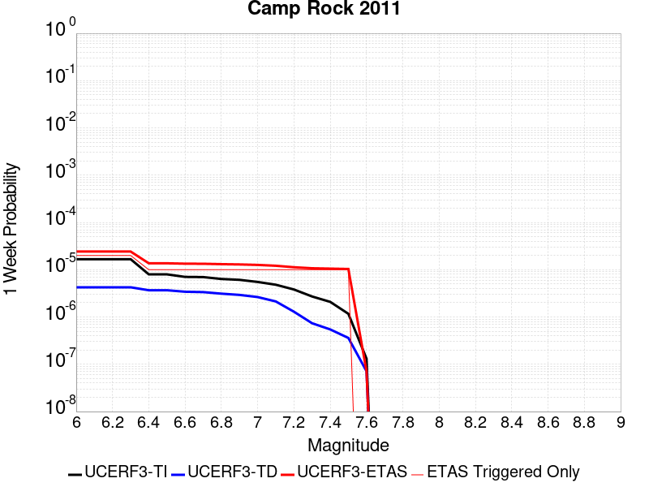 |  |  |  |

| Magnitude | 1 wk TI Prob | 1 wk TD Prob | 1 wk ETAS Prob | 1 wk ETAS/TD Gain | 1 wk ETAS Triggered Only | 1 mo TI Prob | 1 mo TD Prob | 1 mo ETAS Prob | 1 mo ETAS/TD Gain | 1 mo ETAS Triggered Only | 1 yr TI Prob | 1 yr TD Prob | 1 yr ETAS Prob | 1 yr ETAS/TD Gain | 1 yr ETAS Triggered Only | 10 yr TI Prob | 10 yr TD Prob | 10 yr ETAS Prob | 10 yr ETAS/TD Gain | 10 yr ETAS Triggered Only |
|-----|-----|-----|-----|-----|-----|-----|-----|-----|-----|-----|-----|-----|-----|-----|-----|-----|-----|-----|-----|-----|
| 6.0 | 1.6710783E-5 | 4.25026E-6 | 1.4949293E-4 | 35.172653 | 1.4524328E-4 | 7.161568E-5 | 1.8215276E-5 | 1.6345592E-4 | 8.973562 | 1.4524328E-4 | 8.7157206E-4 | 2.2174895E-4 | 3.6696004E-4 | 1.6548445 | 1.4524328E-4 | 0.008681616 | 0.0022153298 | 0.0023602513 | 1.0654175 | 1.4524328E-4 |
| 6.1 | 1.6710783E-5 | 4.25026E-6 | 1.4949293E-4 | 35.172653 | 1.4524328E-4 | 7.161568E-5 | 1.8215276E-5 | 1.6345592E-4 | 8.973562 | 1.4524328E-4 | 8.7157206E-4 | 2.2174895E-4 | 3.6696004E-4 | 1.6548445 | 1.4524328E-4 | 0.008681616 | 0.0022153298 | 0.0023602513 | 1.0654175 | 1.4524328E-4 |
| 6.2 | 1.6710783E-5 | 4.25026E-6 | 1.4949293E-4 | 35.172653 | 1.4524328E-4 | 7.161568E-5 | 1.8215276E-5 | 1.6345592E-4 | 8.973562 | 1.4524328E-4 | 8.7157206E-4 | 2.2174895E-4 | 3.6696004E-4 | 1.6548445 | 1.4524328E-4 | 0.008681616 | 0.0022153298 | 0.0023602513 | 1.0654175 | 1.4524328E-4 |
| 6.3 | 1.6710783E-5 | 4.25026E-6 | 1.4949293E-4 | 35.172653 | 1.4524328E-4 | 7.161568E-5 | 1.8215276E-5 | 1.6345592E-4 | 8.973562 | 1.4524328E-4 | 8.7157206E-4 | 2.2174895E-4 | 3.6696004E-4 | 1.6548445 | 1.4524328E-4 | 0.008681616 | 0.0022153298 | 0.0023602513 | 1.0654175 | 1.4524328E-4 |
| 6.4 | 7.982846E-6 | 3.6820884E-6 | 1.4892484E-4 | 40.44575 | 1.4524328E-4 | 3.421175E-5 | 1.5780286E-5 | 1.6102128E-4 | 10.203952 | 1.4524328E-4 | 4.1644843E-4 | 1.9210839E-4 | 3.3732376E-4 | 1.7559034 | 1.4524328E-4 | 0.0041566887 | 0.001919458 | 0.0020644225 | 1.0755236 | 1.4524328E-4 |
| 6.5 | 7.982846E-6 | 3.6820884E-6 | 1.4892484E-4 | 40.44575 | 1.4524328E-4 | 3.421175E-5 | 1.5780286E-5 | 1.6102128E-4 | 10.203952 | 1.4524328E-4 | 4.1644843E-4 | 1.9210839E-4 | 3.3732376E-4 | 1.7559034 | 1.4524328E-4 | 0.0041566887 | 0.001919458 | 0.0020644225 | 1.0755236 | 1.4524328E-4 |
| 6.6 | 7.048869E-6 | 3.4243571E-6 | 1.4866714E-4 | 43.41461 | 1.4524328E-4 | 3.0209088E-5 | 1.4675736E-5 | 1.5991689E-4 | 10.896687 | 1.4524328E-4 | 3.677336E-4 | 1.7866275E-4 | 3.238801E-4 | 1.8128014 | 1.4524328E-4 | 0.0036712566 | 0.0017852228 | 0.0019302068 | 1.0812134 | 1.4524328E-4 |
| 6.7 | 6.987307E-6 | 3.3623348E-6 | 1.4860513E-4 | 44.197006 | 1.4524328E-4 | 2.9945259E-5 | 1.4409929E-5 | 1.5965111E-4 | 11.079245 | 1.4524328E-4 | 3.6452254E-4 | 1.7542706E-4 | 3.2064487E-4 | 1.8277959 | 1.4524328E-4 | 0.0036392517 | 0.001752917 | 0.0018979056 | 1.0827128 | 1.4524328E-4 |
| 6.8 | 6.3737602E-6 | 3.1179077E-6 | 1.4836073E-4 | 47.583427 | 1.4524328E-4 | 2.731583E-5 | 1.3362394E-5 | 1.5860374E-4 | 11.86941 | 1.4524328E-4 | 3.3251947E-4 | 1.626753E-4 | 3.0789495E-4 | 1.8926964 | 1.4524328E-4 | 0.0033202237 | 0.0016255907 | 0.0017705979 | 1.0892028 | 1.4524328E-4 |
| 6.9 | 6.112211E-6 | 2.9331156E-6 | 1.4817597E-4 | 50.518288 | 1.4524328E-4 | 2.6194928E-5 | 1.2570436E-5 | 1.578119E-4 | 12.55421 | 1.4524328E-4 | 3.1887658E-4 | 1.5303459E-4 | 2.9825565E-4 | 1.9489427 | 1.4524328E-4 | 0.003184194 | 0.0015293199 | 0.001674341 | 1.0948272 | 1.4524328E-4 |
| 7.0 | 5.5140117E-6 | 2.641923E-6 | 1.4788483E-4 | 55.976204 | 1.4524328E-4 | 2.3631264E-5 | 1.132248E-5 | 1.5656411E-4 | 13.8277235 | 1.4524328E-4 | 2.8767265E-4 | 1.3784273E-4 | 2.8306598E-4 | 2.0535433 | 1.4524328E-4 | 0.0028730053 | 0.0013775975 | 0.0015226407 | 1.1052871 | 1.4524328E-4 |
| 7.1 | 4.8151105E-6 | 2.1342705E-6 | 1.4737724E-4 | 69.05275 | 1.4524328E-4 | 2.0636026E-5 | 9.146843E-6 | 1.5438879E-4 | 16.878918 | 1.4524328E-4 | 2.5121463E-4 | 1.1135734E-4 | 2.5658443E-4 | 2.304154 | 1.4524328E-4 | 0.0025093083 | 0.0011130372 | 0.0012581189 | 1.1303475 | 1.4524328E-4 |
| 7.2 | 3.818335E-6 | 1.2937425E-6 | 1.4653684E-4 | 113.26585 | 1.4524328E-4 | 1.6364189E-5 | 5.5445994E-6 | 1.5078708E-4 | 27.195307 | 1.4524328E-4 | 1.9921579E-4 | 6.750349E-5 | 2.1273697E-4 | 3.151496 | 1.4524328E-4 | 0.0019903728 | 6.748381E-4 | 8.199833E-4 | 1.2150816 | 1.4524328E-4 |
| 7.3 | 2.7166698E-6 | 7.3835776E-7 | 1.4598154E-4 | 197.7111 | 1.4524328E-4 | 1.1642818E-5 | 3.1643867E-6 | 1.4840721E-4 | 46.8992 | 1.4524328E-4 | 1.4174209E-4 | 3.8525748E-5 | 1.8376343E-4 | 4.7698865 | 1.4524328E-4 | 0.0014165172 | 3.851927E-4 | 5.3038E-4 | 1.3769213 | 1.4524328E-4 |
| 7.4 | 2.0893426E-6 | 5.4618386E-7 | 1.4578938E-4 | 266.92365 | 1.4524328E-4 | 8.954295E-6 | 2.3407858E-6 | 1.4758373E-4 | 63.048794 | 1.4524328E-4 | 1.0901308E-4 | 2.84987E-5 | 1.7373785E-4 | 6.0963426 | 1.4524328E-4 | 0.0010895962 | 2.84951E-4 | 4.301529E-4 | 1.509568 | 1.4524328E-4 |
| 7.5 | 1.1681728E-6 | 3.6030585E-7 | 1.4560354E-4 | 404.11093 | 1.4524328E-4 | 5.0064455E-6 | 1.544167E-6 | 1.4678722E-4 | 95.059166 | 1.4524328E-4 | 6.0951766E-5 | 1.8800076E-5 | 1.6404063E-4 | 8.72553 | 1.4524328E-4 | 6.093505E-4 | 1.8798532E-4 | 3.3320131E-4 | 1.7724857 | 1.4524328E-4 |
| 7.6 | 1.3154387E-7 | 7.1197384E-8 | 7.1197384E-8 | 1.0 | 0.0 | 5.6375933E-7 | 3.051316E-7 | 3.051316E-7 | 1.0 | 0.0 | 6.863748E-6 | 3.7149728E-6 | 3.7149728E-6 | 1.0 | 0.0 | 6.863536E-5 | 3.7149264E-5 | 3.7149264E-5 | 1.0 | 0.0 |

## Sheephole
*[(top)](#table-of-contents)*

| 1 Week | 1 Month | 1 Year | 10 Year |
|-----|-----|-----|-----|
|  |  |  |  |

| Magnitude | 1 wk TI Prob | 1 wk TD Prob | 1 wk ETAS Prob | 1 wk ETAS/TD Gain | 1 wk ETAS Triggered Only | 1 mo TI Prob | 1 mo TD Prob | 1 mo ETAS Prob | 1 mo ETAS/TD Gain | 1 mo ETAS Triggered Only | 1 yr TI Prob | 1 yr TD Prob | 1 yr ETAS Prob | 1 yr ETAS/TD Gain | 1 yr ETAS Triggered Only | 10 yr TI Prob | 10 yr TD Prob | 10 yr ETAS Prob | 10 yr ETAS/TD Gain | 10 yr ETAS Triggered Only |
|-----|-----|-----|-----|-----|-----|-----|-----|-----|-----|-----|-----|-----|-----|-----|-----|-----|-----|-----|-----|-----|
| 6.0 | 4.5579695E-6 | 4.7412627E-6 | 4.7412627E-6 | 1.0 | 0.0 | 1.9534009E-5 | 2.031957E-5 | 1.655599E-4 | 8.147805 | 1.4524328E-4 | 2.3780059E-4 | 2.473682E-4 | 3.9257557E-4 | 1.587009 | 1.4524328E-4 | 0.0023754628 | 0.002471473 | 0.0026163575 | 1.0586226 | 1.4524328E-4 |
| 6.1 | 4.5579695E-6 | 4.7412627E-6 | 4.7412627E-6 | 1.0 | 0.0 | 1.9534009E-5 | 2.031957E-5 | 1.655599E-4 | 8.147805 | 1.4524328E-4 | 2.3780059E-4 | 2.473682E-4 | 3.9257557E-4 | 1.587009 | 1.4524328E-4 | 0.0023754628 | 0.002471473 | 0.0026163575 | 1.0586226 | 1.4524328E-4 |
| 6.2 | 2.6677674E-6 | 2.7873941E-6 | 2.7873941E-6 | 1.0 | 0.0 | 1.1433239E-5 | 1.1945926E-5 | 1.5718747E-4 | 13.158249 | 1.4524328E-4 | 1.3919079E-4 | 1.4543302E-4 | 2.9065518E-4 | 1.99855 | 1.4524328E-4 | 0.0013910364 | 0.0014534844 | 0.0015985166 | 1.0997825 | 1.4524328E-4 |
| 6.3 | 2.6677674E-6 | 2.7873941E-6 | 2.7873941E-6 | 1.0 | 0.0 | 1.1433239E-5 | 1.1945926E-5 | 1.5718747E-4 | 13.158249 | 1.4524328E-4 | 1.3919079E-4 | 1.4543302E-4 | 2.9065518E-4 | 1.99855 | 1.4524328E-4 | 0.0013910364 | 0.0014534844 | 0.0015985166 | 1.0997825 | 1.4524328E-4 |
| 6.4 | 2.2159759E-6 | 2.3228788E-6 | 2.3228788E-6 | 1.0 | 0.0 | 9.497005E-6 | 9.955161E-6 | 1.5519699E-4 | 15.5896015 | 1.4524328E-4 | 1.156199E-4 | 1.2119815E-4 | 2.6642383E-4 | 2.19825 | 1.4524328E-4 | 0.0011555976 | 0.0012113999 | 0.0013564673 | 1.1197518 | 1.4524328E-4 |
| 6.5 | 2.1986082E-6 | 2.304759E-6 | 2.304759E-6 | 1.0 | 0.0 | 9.4225725E-6 | 9.877506E-6 | 1.5511936E-4 | 15.704304 | 1.4524328E-4 | 1.1471378E-4 | 1.2025281E-4 | 2.6547862E-4 | 2.207671 | 1.4524328E-4 | 0.0011465458 | 0.0012019566 | 0.0013470254 | 1.1206938 | 1.4524328E-4 |
| 6.6 | 1.5232331E-6 | 1.6018919E-6 | 1.6018919E-6 | 1.0 | 0.0 | 6.5281256E-6 | 6.865234E-6 | 1.5210752E-4 | 22.156204 | 1.4524328E-4 | 7.947703E-5 | 8.35812E-5 | 2.2881235E-4 | 2.7376053 | 1.4524328E-4 | 7.9448614E-4 | 8.3551643E-4 | 9.806383E-4 | 1.1736913 | 1.4524328E-4 |
| 6.7 | 1.3137362E-6 | 1.382819E-6 | 1.382819E-6 | 1.0 | 0.0 | 5.6302856E-6 | 5.926355E-6 | 5.926355E-6 | 1.0 | 0.0 | 6.854657E-5 | 7.215112E-5 | 7.215112E-5 | 1.0 | 0.0 | 6.8525434E-4 | 7.212908E-4 | 7.212908E-4 | 1.0 | 0.0 |
| 6.8 | 1.2275751E-6 | 1.2922847E-6 | 1.2922847E-6 | 1.0 | 0.0 | 5.2610258E-6 | 5.5383516E-6 | 5.5383516E-6 | 1.0 | 0.0 | 6.4051106E-5 | 6.7427485E-5 | 6.7427485E-5 | 1.0 | 0.0 | 6.4032647E-4 | 6.740836E-4 | 6.740836E-4 | 1.0 | 0.0 |
| 6.9 | 1.1837088E-6 | 1.246102E-6 | 1.246102E-6 | 1.0 | 0.0 | 5.0730278E-6 | 5.340427E-6 | 5.340427E-6 | 1.0 | 0.0 | 6.176237E-5 | 6.501789E-5 | 6.501789E-5 | 1.0 | 0.0 | 6.17452E-4 | 6.5000186E-4 | 6.5000186E-4 | 1.0 | 0.0 |
| 7.0 | 9.849371E-7 | 1.0366288E-6 | 1.0366288E-6 | 1.0 | 0.0 | 4.2211523E-6 | 4.442688E-6 | 4.442688E-6 | 1.0 | 0.0 | 5.1391315E-5 | 5.4088487E-5 | 5.4088487E-5 | 1.0 | 0.0 | 5.137943E-4 | 5.407633E-4 | 5.407633E-4 | 1.0 | 0.0 |
| 7.1 | 8.1643645E-7 | 8.591669E-7 | 8.591669E-7 | 1.0 | 0.0 | 3.4990085E-6 | 3.682139E-6 | 3.682139E-6 | 1.0 | 0.0 | 4.2599597E-5 | 4.482921E-5 | 4.482921E-5 | 1.0 | 0.0 | 4.259143E-4 | 4.4821028E-4 | 4.4821028E-4 | 1.0 | 0.0 |
| 7.2 | 5.7295756E-7 | 6.029502E-7 | 6.029502E-7 | 1.0 | 0.0 | 2.45553E-6 | 2.58407E-6 | 2.58407E-6 | 1.0 | 0.0 | 2.9895667E-5 | 3.1460666E-5 | 3.1460666E-5 | 1.0 | 0.0 | 2.9891645E-4 | 3.145688E-4 | 3.145688E-4 | 1.0 | 0.0 |

