# Parent Section Magnitude-Probability Distributions

Only fault sections with at least one triggered aftershock are plotted. Sections are sorted by total supraseismogenic trigger rate (decreasing)

## Table Of Contents

* [Tank Canyon](#tank-canyon)
* [Garlock (Central)](#garlock-central)
* [Panamint Valley](#panamint-valley)
* [Owl Lake](#owl-lake)
* [Little Lake](#little-lake)
* [Garlock (East)](#garlock-east)
* [Ash Hill](#ash-hill)
* [Blackwater](#blackwater)
* [Gravel Hills-Harper Lk](#gravel-hills-harper-lk)
* [McLean Lake](#mclean-lake)
* [Goldstone Lake](#goldstone-lake)
* [Hunter Mountain-Saline Valley](#hunter-mountain-saline-valley)
* [So Sierra Nevada](#so-sierra-nevada)
* [Airport Lake](#airport-lake)
* [Garlock (West)](#garlock-west)
* [Lenwood-Lockhart-Old Woman Springs](#lenwood-lockhart-old-woman-springs)
* [Nelson Lake](#nelson-lake)
* [Coyote Canyon](#coyote-canyon)
* [Paradise](#paradise)
* [Garlic Springs](#garlic-springs)
* [Death Valley (So)](#death-valley-so)
* [Bicycle Lake](#bicycle-lake)
* [San Andreas (Mojave S)](#san-andreas-mojave-s)
* [Cleghorn Lake](#cleghorn-lake)
* [Helendale-So Lockhart](#helendale-so-lockhart)
* [Coyote Lake](#coyote-lake)
* [Mission Ridge-Arroyo Parida-Santa Ana](#mission-ridge-arroyo-parida-santa-ana)
* [Elsinore (Glen Ivy) rev](#elsinore-glen-ivy-rev)
* [Death Valley (Black Mtns Frontal)](#death-valley-black-mtns-frontal)
* [Calico-Hidalgo](#calico-hidalgo)
* [Cleghorn Pass](#cleghorn-pass)
* [San Andreas (Cholame) rev](#san-andreas-cholame-rev)
* [Channel Islands Thrust](#channel-islands-thrust)
* [Santa Ynez (East)](#santa-ynez-east)
* [Towne Pass](#towne-pass)
* [San Andreas (Carrizo) rev](#san-andreas-carrizo-rev)
* [San Andreas (Coachella) rev](#san-andreas-coachella-rev)
* [Death Valley (No)](#death-valley-no)
* [Brawley (Seismic Zone) alt 1](#brawley-seismic-zone-alt-1)
* [Santa Cruz Island](#santa-cruz-island)
* [San Diego Trough north alt1](#san-diego-trough-north-alt1)
* [San Andreas (Big Bend)](#san-andreas-big-bend)
* [San Andreas (San Gorgonio Pass-Garnet HIll)](#san-andreas-san-gorgonio-pass-garnet-hill)
* [Camp Rock 2011](#camp-rock-2011)
* [San Andreas (Mojave N)](#san-andreas-mojave-n)
* [Thirty Mile Bank](#thirty-mile-bank)
* [Owens Valley](#owens-valley)
* [Blue Cut](#blue-cut)
* [Dry Mountain](#dry-mountain)
* [Sierra Nevada  (No Extension)](#sierra-nevada--no-extension)
* [Big Pine (East)](#big-pine-east)
* [San Andreas (San Bernardino N)](#san-andreas-san-bernardino-n)
* [Ludlow](#ludlow)
* [Sheephole](#sheephole)
* [San Gregorio (North) 2011 CFM](#san-gregorio-north-2011-cfm)
* [Death Valley (Fish Lake Valley)](#death-valley-fish-lake-valley)
* [Likely 2011 CFM](#likely-2011-cfm)
* [Lake Isabella (Seismicity)](#lake-isabella-seismicity)
* [San Andreas (Creeping Section) 2011 CFM](#san-andreas-creeping-section-2011-cfm)
* [San Andreas (Parkfield)](#san-andreas-parkfield)
* [Imperial](#imperial)
* [Red Pass](#red-pass)
* [Emerson-Copper Mtn 2011](#emerson-copper-mtn-2011)
* [White Wolf (Extension)](#white-wolf-extension)
* [Goose Lake 2011 CFM](#goose-lake-2011-cfm)
* [San Andreas (San Bernardino S)](#san-andreas-san-bernardino-s)
* [White Mountains](#white-mountains)
* [Great Valley 01](#great-valley-01)
* [Lost Hills](#lost-hills)

## Tank Canyon
*[(top)](#table-of-contents)*

| 1 Week | 1 Month | 1 Year | 10 Year |
|-----|-----|-----|-----|
|  |  |  |  |

| Magnitude | 1 wk TI Prob | 1 wk TD Prob | 1 wk ETAS Prob | 1 wk ETAS/TD Gain | 1 wk ETAS Triggered Only | 1 mo TI Prob | 1 mo TD Prob | 1 mo ETAS Prob | 1 mo ETAS/TD Gain | 1 mo ETAS Triggered Only | 1 yr TI Prob | 1 yr TD Prob | 1 yr ETAS Prob | 1 yr ETAS/TD Gain | 1 yr ETAS Triggered Only | 10 yr TI Prob | 10 yr TD Prob | 10 yr ETAS Prob | 10 yr ETAS/TD Gain | 10 yr ETAS Triggered Only |
|-----|-----|-----|-----|-----|-----|-----|-----|-----|-----|-----|-----|-----|-----|-----|-----|-----|-----|-----|-----|-----|
| 6.0 | 4.8284557E-5 | 5.7964822E-5 | 0.03757969 | 648.3189 | 0.0375239 | 2.0691741E-4 | 2.4840087E-4 | 0.05042714 | 203.0071 | 0.050191205 | 0.0025163088 | 0.0030207601 | 0.08379895 | 27.741014 | 0.08102295 | 0.02488006 | 0.029863637 | 0.13397244 | 4.4861393 | 0.10731357 |
| 6.1 | 1.7796336E-5 | 2.0873314E-5 | 0.013404915 | 642.2035 | 0.013384321 | 7.626778E-5 | 8.945422E-5 | 0.020403124 | 228.08455 | 0.020315487 | 9.281647E-4 | 0.0010885983 | 0.037377924 | 34.33583 | 0.03632887 | 0.009242975 | 0.010836744 | 0.059774794 | 5.5159364 | 0.049474187 |
| 6.2 | 1.7796336E-5 | 2.0873314E-5 | 0.013404915 | 642.2035 | 0.013384321 | 7.626778E-5 | 8.945422E-5 | 0.020403124 | 228.08455 | 0.020315487 | 9.281647E-4 | 0.0010885983 | 0.037377924 | 34.33583 | 0.03632887 | 0.009242975 | 0.010836744 | 0.059774794 | 5.5159364 | 0.049474187 |
| 6.3 | 1.3515912E-5 | 1.5759564E-5 | 0.010531846 | 668.2828 | 0.010516252 | 5.792405E-5 | 6.753938E-5 | 0.016079843 | 238.081 | 0.016013384 | 7.049971E-4 | 8.2200574E-4 | 0.028523881 | 34.700344 | 0.027724665 | 0.007027647 | 0.0081922645 | 0.046593998 | 5.68756 | 0.038718928 |
| 6.4 | 1.0870146E-5 | 1.2618021E-5 | 0.007421702 | 588.18274 | 0.0074091777 | 4.658551E-5 | 5.4076212E-5 | 0.011047745 | 204.29955 | 0.010994264 | 5.67031E-4 | 6.581969E-4 | 0.020960312 | 31.845049 | 0.020315487 | 0.005655863 | 0.0065644905 | 0.034344595 | 5.231875 | 0.027963672 |
| 6.5 | 7.964826E-6 | 9.196094E-6 | 0.0059842844 | 650.742 | 0.0059751435 | 3.4134522E-5 | 3.9411298E-5 | 0.008882275 | 225.37384 | 0.008843212 | 4.1550855E-4 | 4.7973756E-4 | 0.016724331 | 34.861416 | 0.01625239 | 0.0041473247 | 0.004788321 | 0.026195837 | 5.4707775 | 0.021510515 |
| 6.6 | 6.6317E-6 | 7.6122988E-6 | 0.0033536672 | 440.55905 | 0.0033460802 | 2.8421264E-5 | 3.2623782E-5 | 0.0050515807 | 154.8435 | 0.0050191204 | 3.4597394E-4 | 3.9713128E-4 | 0.010670297 | 26.868437 | 0.010277247 | 0.0034543579 | 0.003965368 | 0.018248847 | 4.6020565 | 0.014340344 |
| 6.7 | 4.793663E-6 | 5.4307857E-6 | 0.0014394574 | 265.05508 | 0.0014340344 | 2.0544108E-5 | 2.3274613E-5 | 0.0021742762 | 93.41836 | 0.0021510515 | 2.500958E-4 | 2.8333595E-4 | 0.00577891 | 20.395966 | 0.005497132 | 0.0024981452 | 0.0028304397 | 0.011171963 | 3.947077 | 0.008365201 |
| 6.8 | 4.382823E-6 | 4.9692567E-6 | 0.001199992 | 241.48318 | 0.0011950287 | 1.8783392E-5 | 2.1296666E-5 | 0.0019333018 | 90.77956 | 0.0019120459 | 2.286638E-4 | 2.5926033E-4 | 0.0050381357 | 19.43273 | 0.0047801146 | 0.0022842865 | 0.002590253 | 0.009741852 | 3.7609658 | 0.007170172 |
| 6.9 | 2.729601E-6 | 3.0735416E-6 | 9.5909357E-4 | 312.04834 | 9.5602294E-4 | 1.1698237E-5 | 1.3172262E-5 | 0.0012081852 | 91.721924 | 0.0011950287 | 1.4241673E-4 | 1.6036171E-4 | 0.0027890033 | 17.391953 | 0.002629063 | 0.001423255 | 0.0016026258 | 0.004943344 | 3.0845275 | 0.0033460802 |
| 7.0 | 1.8987357E-6 | 2.126939E-6 | 7.191426E-4 | 338.11154 | 7.170172E-4 | 8.137413E-6 | 9.115425E-6 | 9.6512964E-4 | 105.87873 | 9.5602294E-4 | 9.90685E-5 | 1.1097535E-4 | 0.0017838299 | 16.074108 | 0.0016730401 | 9.902435E-4 | 0.0011092679 | 0.0032579335 | 2.9370122 | 0.0021510515 |
| 7.1 | 1.4928986E-6 | 1.6641272E-6 | 4.796748E-4 | 288.24408 | 4.7801147E-4 | 6.398121E-6 | 7.1319573E-6 | 4.8514002E-4 | 68.0234 | 4.7801147E-4 | 7.789434E-5 | 8.682871E-5 | 8.0378365E-4 | 9.257118 | 7.170172E-4 | 7.786704E-4 | 8.6800574E-4 | 0.0018231989 | 2.1004455 | 9.5602294E-4 |
| 7.2 | 1.069082E-6 | 1.1828573E-6 | 4.7919375E-4 | 405.11545 | 4.7801147E-4 | 4.581772E-6 | 5.0693816E-6 | 4.8307842E-4 | 95.293365 | 4.7801147E-4 | 5.5781646E-5 | 6.171851E-5 | 5.397005E-4 | 8.744549 | 4.7801147E-4 | 5.576765E-4 | 6.170659E-4 | 0.0010947824 | 1.7741742 | 4.7801147E-4 |
| 7.3 | 8.776551E-7 | 9.770005E-7 | 4.7898802E-4 | 490.26382 | 4.7801147E-4 | 3.7613736E-6 | 4.1871413E-6 | 4.821966E-4 | 115.1613 | 4.7801147E-4 | 4.579376E-5 | 5.097777E-5 | 5.2896485E-4 | 10.376383 | 4.7801147E-4 | 4.5784327E-4 | 5.097118E-4 | 9.874796E-4 | 1.9373294 | 4.7801147E-4 |
| 7.4 | 7.55721E-7 | 8.510244E-7 | 4.788621E-4 | 562.689 | 4.7801147E-4 | 3.2388E-6 | 3.6472454E-6 | 4.8165699E-4 | 132.06047 | 4.7801147E-4 | 3.9431678E-5 | 4.4404827E-5 | 5.223951E-4 | 11.764376 | 4.7801147E-4 | 3.942468E-4 | 4.440104E-4 | 9.2180964E-4 | 2.0760992 | 4.7801147E-4 |
| 7.5 | 5.587665E-7 | 6.305619E-7 | 6.305619E-7 | 1.0 | 0.0 | 2.3947114E-6 | 2.702408E-6 | 2.702408E-6 | 1.0 | 0.0 | 2.915522E-5 | 3.290182E-5 | 3.290182E-5 | 1.0 | 0.0 | 2.9151395E-4 | 3.290182E-4 | 3.290182E-4 | 1.0 | 0.0 |

## Garlock (Central)
*[(top)](#table-of-contents)*

| 1 Week | 1 Month | 1 Year | 10 Year |
|-----|-----|-----|-----|
|  |  |  |  |

| Magnitude | 1 wk TI Prob | 1 wk TD Prob | 1 wk ETAS Prob | 1 wk ETAS/TD Gain | 1 wk ETAS Triggered Only | 1 mo TI Prob | 1 mo TD Prob | 1 mo ETAS Prob | 1 mo ETAS/TD Gain | 1 mo ETAS Triggered Only | 1 yr TI Prob | 1 yr TD Prob | 1 yr ETAS Prob | 1 yr ETAS/TD Gain | 1 yr ETAS Triggered Only | 10 yr TI Prob | 10 yr TD Prob | 10 yr ETAS Prob | 10 yr ETAS/TD Gain | 10 yr ETAS Triggered Only |
|-----|-----|-----|-----|-----|-----|-----|-----|-----|-----|-----|-----|-----|-----|-----|-----|-----|-----|-----|-----|-----|
| 6.0 | 5.5131142E-5 | 7.024681E-5 | 0.011780705 | 167.70448 | 0.011711281 | 2.3625491E-4 | 3.010234E-4 | 0.016070653 | 53.386726 | 0.015774379 | 0.0028726095 | 0.0036588663 | 0.028662648 | 7.8337507 | 0.025095602 | 0.028357591 | 0.036079824 | 0.0706372 | 1.957803 | 0.03585086 |
| 6.1 | 5.5131142E-5 | 7.024681E-5 | 0.011780705 | 167.70448 | 0.011711281 | 2.3625491E-4 | 3.010234E-4 | 0.016070653 | 53.386726 | 0.015774379 | 0.0028726095 | 0.0036588663 | 0.028662648 | 7.8337507 | 0.025095602 | 0.028357591 | 0.036079824 | 0.0706372 | 1.957803 | 0.03585086 |
| 6.2 | 4.216245E-5 | 5.1661493E-5 | 0.008655423 | 167.5411 | 0.008604206 | 1.806837E-4 | 2.2138779E-4 | 0.01145217 | 51.729008 | 0.011233269 | 0.0021976046 | 0.0026920962 | 0.020807631 | 7.729156 | 0.018164435 | 0.021759989 | 0.026689773 | 0.052046087 | 1.9500386 | 0.026051626 |
| 6.3 | 4.216245E-5 | 5.1661493E-5 | 0.008655423 | 167.5411 | 0.008604206 | 1.806837E-4 | 2.2138779E-4 | 0.01145217 | 51.729008 | 0.011233269 | 0.0021976046 | 0.0026920962 | 0.020807631 | 7.729156 | 0.018164435 | 0.021759989 | 0.026689773 | 0.052046087 | 1.9500386 | 0.026051626 |
| 6.4 | 3.6858168E-5 | 4.411054E-5 | 0.005779995 | 131.03433 | 0.0057361377 | 1.5795401E-4 | 1.8903162E-4 | 0.00807473 | 42.716293 | 0.007887189 | 0.0019213937 | 0.002299056 | 0.015652606 | 6.808275 | 0.013384321 | 0.019048655 | 0.02284894 | 0.042933784 | 1.8790275 | 0.020554494 |
| 6.5 | 3.39199E-5 | 4.0018083E-5 | 0.0052979337 | 132.38849 | 0.005258126 | 1.453629E-4 | 1.7149492E-4 | 0.0068625077 | 40.01581 | 0.0066921604 | 0.0017683565 | 0.002085973 | 0.013534318 | 6.4882517 | 0.0114722755 | 0.017543508 | 0.020759864 | 0.03807912 | 1.8342664 | 0.017686425 |
| 6.6 | 3.3571985E-5 | 3.9472274E-5 | 0.0052973907 | 134.20537 | 0.005258126 | 1.4387199E-4 | 1.6915603E-4 | 0.0068601845 | 40.555363 | 0.0066921604 | 0.0017502342 | 0.0020575512 | 0.013267708 | 6.4483004 | 0.011233269 | 0.017365133 | 0.020481179 | 0.037571255 | 1.8344283 | 0.01744742 |
| 6.7 | 3.2580007E-5 | 3.8088703E-5 | 0.005057018 | 132.7695 | 0.0050191204 | 1.3962112E-4 | 1.632272E-4 | 0.0066153286 | 40.528347 | 0.006453155 | 0.0016985617 | 0.0019855013 | 0.012719405 | 6.4061427 | 0.010755258 | 0.016856372 | 0.019773813 | 0.036173392 | 1.8293583 | 0.016730402 |
| 6.8 | 3.2185937E-5 | 3.7515918E-5 | 0.0050564483 | 134.7814 | 0.0050191204 | 1.3793244E-4 | 1.6077272E-4 | 0.00661289 | 41.131916 | 0.006453155 | 0.0016780337 | 0.001955672 | 0.012689897 | 6.4887652 | 0.010755258 | 0.016654192 | 0.019480614 | 0.03565075 | 1.8300627 | 0.016491396 |
| 6.9 | 3.165394E-5 | 3.6720503E-5 | 0.0048166597 | 131.17085 | 0.0047801146 | 1.3565269E-4 | 1.5736422E-4 | 0.0063705356 | 40.482746 | 0.0062141493 | 0.0016503202 | 0.001914247 | 0.011933273 | 6.233925 | 0.010038241 | 0.01638118 | 0.019073246 | 0.034546755 | 1.8112677 | 0.015774379 |
| 7.0 | 3.0903822E-5 | 3.5625766E-5 | 0.0043375758 | 121.7539 | 0.004302103 | 1.3243823E-4 | 1.5267303E-4 | 0.005887935 | 38.56565 | 0.0057361377 | 0.0016112428 | 0.0018572307 | 0.010922581 | 5.8811116 | 0.009082218 | 0.015996104 | 0.018512413 | 0.032587282 | 1.7602936 | 0.014340344 |
| 7.1 | 3.0069863E-5 | 3.4392073E-5 | 0.00409735 | 119.13647 | 0.0040630973 | 1.2886449E-4 | 1.4738638E-4 | 0.005643708 | 38.291924 | 0.005497132 | 0.0015677959 | 0.0017929734 | 0.010143176 | 5.6571813 | 0.008365201 | 0.01556781 | 0.017880075 | 0.031025084 | 1.7351763 | 0.013384321 |
| 7.2 | 2.7957109E-5 | 3.128145E-5 | 0.0038552536 | 123.24407 | 0.0038240917 | 1.1981068E-4 | 1.340566E-4 | 0.0049135303 | 36.65266 | 0.0047801146 | 0.0014577188 | 0.0016309366 | 0.009028031 | 5.535488 | 0.0074091777 | 0.014481937 | 0.016283695 | 0.028039386 | 1.7219303 | 0.011950287 |
| 7.3 | 2.4519275E-5 | 2.6714795E-5 | 0.0024167083 | 90.463295 | 0.0023900573 | 1.0507837E-4 | 1.1448703E-4 | 0.0029822276 | 26.048605 | 0.0028680689 | 0.0012785783 | 0.001393003 | 0.005927786 | 4.2554007 | 0.004541109 | 0.012712469 | 0.013928054 | 0.021941066 | 1.5753146 | 0.008126195 |
| 7.4 | 2.3225532E-5 | 2.51994E-5 | 0.0016981974 | 67.39039 | 0.0016730401 | 9.95342E-5 | 1.0799304E-4 | 0.0022588123 | 20.916277 | 0.0021510515 | 0.0012111551 | 0.0013140367 | 0.0048944117 | 3.7247148 | 0.003585086 | 0.012045753 | 0.013145725 | 0.020221641 | 1.5382674 | 0.007170172 |
| 7.5 | 2.097765E-5 | 2.2483688E-5 | 0.0012174855 | 54.149723 | 0.0011950287 | 8.9901114E-5 | 9.635517E-5 | 0.0017692341 | 18.36159 | 0.0016730401 | 0.0010939965 | 0.0011725046 | 0.0040372107 | 3.4432364 | 0.0028680689 | 0.010886264 | 0.011740365 | 0.017172959 | 1.4627278 | 0.005497132 |
| 7.6 | 1.511254E-5 | 1.5991332E-5 | 7.329971E-4 | 45.837147 | 7.170172E-4 | 6.476642E-5 | 6.853253E-5 | 7.8550057E-4 | 11.4617195 | 7.170172E-4 | 7.882459E-4 | 8.3407195E-4 | 0.002028104 | 2.4315696 | 0.0011950287 | 0.007854558 | 0.008383559 | 0.0107535785 | 1.2826986 | 0.0023900573 |
| 7.7 | 9.934069E-6 | 1.0678794E-5 | 1.0678794E-5 | 1.0 | 0.0 | 4.2573887E-5 | 4.5765457E-5 | 4.5765457E-5 | 1.0 | 0.0 | 5.182138E-4 | 5.570524E-4 | 5.570524E-4 | 1.0 | 0.0 | 0.00517007 | 0.005627684 | 0.0058653443 | 1.0422306 | 2.3900573E-4 |
| 7.8 | 6.7562896E-6 | 8.428449E-6 | 8.428449E-6 | 1.0 | 0.0 | 2.8955206E-5 | 3.6121426E-5 | 3.6121426E-5 | 1.0 | 0.0 | 3.5247262E-4 | 4.3968976E-4 | 4.3968976E-4 | 1.0 | 0.0 | 0.0035191406 | 0.004446654 | 0.0046845973 | 1.0535105 | 2.3900573E-4 |
| 7.9 | 3.975453E-6 | 5.37103E-6 | 5.37103E-6 | 1.0 | 0.0 | 1.7037546E-5 | 2.3018498E-5 | 2.3018498E-5 | 1.0 | 0.0 | 2.0741238E-4 | 2.8021427E-4 | 2.8021427E-4 | 1.0 | 0.0 | 0.002072189 | 0.0028336283 | 0.0030719568 | 1.0841072 | 2.3900573E-4 |
| 8.0 | 1.6729537E-6 | 2.0775144E-6 | 2.0775144E-6 | 1.0 | 0.0 | 7.169782E-6 | 8.903603E-6 | 8.903603E-6 | 1.0 | 0.0 | 8.7288594E-5 | 1.0839601E-4 | 1.0839601E-4 | 1.0 | 0.0 | 8.7254314E-4 | 0.0010969337 | 0.0013356773 | 1.2176462 | 2.3900573E-4 |
| 8.1 | 3.6733252E-7 | 3.1489964E-7 | 3.1489964E-7 | 1.0 | 0.0 | 1.5742813E-6 | 1.3495693E-6 | 1.3495693E-6 | 1.0 | 0.0 | 1.9166706E-5 | 1.6430899E-5 | 1.6430899E-5 | 1.0 | 0.0 | 1.9165053E-4 | 1.6638759E-4 | 1.6638759E-4 | 1.0 | 0.0 |

## Panamint Valley
*[(top)](#table-of-contents)*

| 1 Week | 1 Month | 1 Year | 10 Year |
|-----|-----|-----|-----|
|  |  |  |  |

| Magnitude | 1 wk TI Prob | 1 wk TD Prob | 1 wk ETAS Prob | 1 wk ETAS/TD Gain | 1 wk ETAS Triggered Only | 1 mo TI Prob | 1 mo TD Prob | 1 mo ETAS Prob | 1 mo ETAS/TD Gain | 1 mo ETAS Triggered Only | 1 yr TI Prob | 1 yr TD Prob | 1 yr ETAS Prob | 1 yr ETAS/TD Gain | 1 yr ETAS Triggered Only | 10 yr TI Prob | 10 yr TD Prob | 10 yr ETAS Prob | 10 yr ETAS/TD Gain | 10 yr ETAS Triggered Only |
|-----|-----|-----|-----|-----|-----|-----|-----|-----|-----|-----|-----|-----|-----|-----|-----|-----|-----|-----|-----|-----|
| 6.0 | 3.0211835E-5 | 3.3984514E-5 | 0.0055309297 | 162.74854 | 0.005497132 | 1.2947287E-4 | 1.4563995E-4 | 0.0073147677 | 50.22501 | 0.007170172 | 0.0015751923 | 0.0017717537 | 0.015132361 | 8.5408945 | 0.013384321 | 0.015640736 | 0.017583137 | 0.036367398 | 2.0683112 | 0.019120459 |
| 6.1 | 3.0211835E-5 | 3.3984514E-5 | 0.0055309297 | 162.74854 | 0.005497132 | 1.2947287E-4 | 1.4563995E-4 | 0.0073147677 | 50.22501 | 0.007170172 | 0.0015751923 | 0.0017717537 | 0.015132361 | 8.5408945 | 0.013384321 | 0.015640736 | 0.017583137 | 0.036367398 | 2.0683112 | 0.019120459 |
| 6.2 | 3.0211835E-5 | 3.3984514E-5 | 0.0055309297 | 162.74854 | 0.005497132 | 1.2947287E-4 | 1.4563995E-4 | 0.0073147677 | 50.22501 | 0.007170172 | 0.0015751923 | 0.0017717537 | 0.015132361 | 8.5408945 | 0.013384321 | 0.015640736 | 0.017583137 | 0.036367398 | 2.0683112 | 0.019120459 |
| 6.3 | 2.8573924E-5 | 3.210268E-5 | 0.005529058 | 172.23042 | 0.005497132 | 1.2245393E-4 | 1.3757581E-4 | 0.0073067616 | 53.110798 | 0.007170172 | 0.001489857 | 0.0016737265 | 0.0145584345 | 8.698216 | 0.01290631 | 0.01479908 | 0.016617801 | 0.034715418 | 2.08905 | 0.018403443 |
| 6.4 | 2.8573924E-5 | 3.210268E-5 | 0.005529058 | 172.23042 | 0.005497132 | 1.2245393E-4 | 1.3757581E-4 | 0.0073067616 | 53.110798 | 0.007170172 | 0.001489857 | 0.0016737265 | 0.0145584345 | 8.698216 | 0.01290631 | 0.01479908 | 0.016617801 | 0.034715418 | 2.08905 | 0.018403443 |
| 6.5 | 2.7468774E-5 | 3.0828433E-5 | 0.0052887923 | 171.55566 | 0.005258126 | 1.1771801E-4 | 1.3211532E-4 | 0.0070623658 | 53.45607 | 0.006931166 | 0.0014322745 | 0.0016073446 | 0.014254288 | 8.868221 | 0.012667304 | 0.014230782 | 0.015963677 | 0.03383814 | 2.119696 | 0.018164435 |
| 6.6 | 2.6135967E-5 | 2.925248E-5 | 0.005048226 | 172.5743 | 0.0050191204 | 1.1200648E-4 | 1.253619E-4 | 0.006577708 | 52.469753 | 0.006453155 | 0.0013628257 | 0.0015252391 | 0.013218658 | 8.666614 | 0.011711281 | 0.013544982 | 0.015154043 | 0.03210168 | 2.1183574 | 0.017208412 |
| 6.7 | 2.4498746E-5 | 2.7341335E-5 | 0.004329327 | 158.34366 | 0.004302103 | 1.04990395E-4 | 1.1717203E-4 | 0.005852638 | 49.9491 | 0.0057361377 | 0.0012775084 | 0.0014256609 | 0.011926921 | 8.365889 | 0.010516252 | 0.012701893 | 0.014171274 | 0.02972211 | 2.0973492 | 0.015774379 |
| 6.8 | 2.2244329E-5 | 2.4935423E-5 | 0.0038489318 | 154.35599 | 0.0038240917 | 9.532935E-5 | 1.0686185E-4 | 0.005364426 | 50.19964 | 0.005258126 | 0.0011600169 | 0.0013002884 | 0.010370697 | 7.9756904 | 0.009082218 | 0.011539802 | 0.0129325185 | 0.026615577 | 2.058035 | 0.013862332 |
| 6.9 | 1.9902658E-5 | 2.2290267E-5 | 0.003368296 | 151.11063 | 0.0033460802 | 8.529431E-5 | 9.552632E-5 | 0.0043972186 | 46.031487 | 0.004302103 | 0.0010379635 | 0.0011624309 | 0.0076080845 | 6.5449777 | 0.006453155 | 0.010331288 | 0.011568608 | 0.021018239 | 1.8168339 | 0.009560229 |
| 7.0 | 1.8353881E-5 | 2.0566185E-5 | 0.0028885761 | 140.45268 | 0.0028680689 | 7.865712E-5 | 8.813792E-5 | 0.003672908 | 41.67228 | 0.003585086 | 9.5722964E-4 | 0.0010725686 | 0.0060863057 | 5.6745143 | 0.0050191204 | 0.009531168 | 0.010678849 | 0.018481812 | 1.7306932 | 0.007887189 |
| 7.1 | 1.7667631E-5 | 1.9772613E-5 | 0.0021707816 | 109.7873 | 0.0021510515 | 7.571623E-5 | 8.473711E-5 | 0.0027135774 | 32.023483 | 0.002629063 | 9.2145515E-4 | 0.0010312037 | 0.0046125925 | 4.473018 | 0.003585086 | 0.009176437 | 0.010269073 | 0.016419409 | 1.5989183 | 0.0062141493 |
| 7.2 | 1.6381597E-5 | 1.8158249E-5 | 0.0021691709 | 119.45924 | 0.0021510515 | 7.020495E-5 | 7.781885E-5 | 0.0027066774 | 34.781773 | 0.002629063 | 8.544101E-4 | 9.4704994E-4 | 0.0042899614 | 4.529815 | 0.0033460802 | 0.008511325 | 0.009434792 | 0.014880059 | 1.5771476 | 0.005497132 |
| 7.3 | 1.4520491E-5 | 1.5966476E-5 | 0.0016889799 | 105.78289 | 0.0016730401 | 6.222919E-5 | 6.842605E-5 | 0.0022193305 | 32.434 | 0.0021510515 | 7.57377E-4 | 8.327849E-4 | 0.0036984652 | 4.441081 | 0.0028680689 | 0.0075480095 | 0.00829975 | 0.012566147 | 1.5140392 | 0.004302103 |
| 7.4 | 1.2852287E-5 | 1.4145411E-5 | 0.0016871619 | 119.272736 | 0.0016730401 | 5.5080065E-5 | 6.062187E-5 | 0.002211543 | 36.480946 | 0.0021510515 | 6.7039346E-4 | 7.378371E-4 | 0.0033649604 | 4.5605736 | 0.002629063 | 0.0066837464 | 0.0073567946 | 0.011390001 | 1.5482287 | 0.0040630973 |
| 7.5 | 1.1637851E-5 | 1.2836797E-5 | 0.0012078502 | 94.09279 | 0.0011950287 | 4.987555E-5 | 5.5013777E-5 | 0.0017279619 | 31.409622 | 0.0016730401 | 6.070656E-4 | 6.6960254E-4 | 0.0028192138 | 4.2102795 | 0.0021510515 | 0.006054099 | 0.0066787465 | 0.010239889 | 1.5332052 | 0.003585086 |
| 7.6 | 3.0068115E-6 | 3.3330316E-6 | 2.4233798E-4 | 72.70798 | 2.3900573E-4 | 1.2886271E-5 | 1.4284384E-5 | 2.532867E-4 | 17.73172 | 2.3900573E-4 | 1.5687906E-4 | 1.7390578E-4 | 4.1286994E-4 | 2.3741014 | 2.3900573E-4 | 0.0015676835 | 0.0017391363 | 0.0024549065 | 1.4115665 | 7.170172E-4 |

## Owl Lake
*[(top)](#table-of-contents)*

| 1 Week | 1 Month | 1 Year | 10 Year |
|-----|-----|-----|-----|
|  |  |  |  |

| Magnitude | 1 wk TI Prob | 1 wk TD Prob | 1 wk ETAS Prob | 1 wk ETAS/TD Gain | 1 wk ETAS Triggered Only | 1 mo TI Prob | 1 mo TD Prob | 1 mo ETAS Prob | 1 mo ETAS/TD Gain | 1 mo ETAS Triggered Only | 1 yr TI Prob | 1 yr TD Prob | 1 yr ETAS Prob | 1 yr ETAS/TD Gain | 1 yr ETAS Triggered Only | 10 yr TI Prob | 10 yr TD Prob | 10 yr ETAS Prob | 10 yr ETAS/TD Gain | 10 yr ETAS Triggered Only |
|-----|-----|-----|-----|-----|-----|-----|-----|-----|-----|-----|-----|-----|-----|-----|-----|-----|-----|-----|-----|-----|
| 6.0 | 5.0320643E-5 | 6.635816E-5 | 0.0048461556 | 73.0303 | 0.0047801146 | 2.1564208E-4 | 2.843674E-4 | 0.0064967494 | 22.846325 | 0.0062141493 | 0.0026222812 | 0.0034577388 | 0.014890346 | 4.3063827 | 0.0114722755 | 0.02591553 | 0.034140717 | 0.049838237 | 1.4597889 | 0.01625239 |
| 6.1 | 5.0320643E-5 | 6.635816E-5 | 0.0048461556 | 73.0303 | 0.0047801146 | 2.1564208E-4 | 2.843674E-4 | 0.0064967494 | 22.846325 | 0.0062141493 | 0.0026222812 | 0.0034577388 | 0.014890346 | 4.3063827 | 0.0114722755 | 0.02591553 | 0.034140717 | 0.049838237 | 1.4597889 | 0.01625239 |
| 6.2 | 2.4125871E-5 | 3.0981035E-5 | 0.0031379594 | 101.28645 | 0.0031070746 | 1.0339249E-4 | 1.3277028E-4 | 0.0041953283 | 31.5984 | 0.0040630973 | 0.0012580766 | 0.001615439 | 0.009967126 | 6.169918 | 0.008365201 | 0.012509781 | 0.016070465 | 0.02712321 | 1.6877676 | 0.011233269 |
| 6.3 | 1.7433485E-5 | 2.2355514E-5 | 0.0024123595 | 107.90893 | 0.0023900573 | 7.471279E-5 | 9.580672E-5 | 0.0036805493 | 38.4164 | 0.003585086 | 9.0924866E-4 | 0.0011659743 | 0.008327786 | 7.142341 | 0.007170172 | 0.009055373 | 0.011628896 | 0.021077951 | 1.8125496 | 0.009560229 |
| 6.4 | 1.7433485E-5 | 2.2355514E-5 | 0.0024123595 | 107.90893 | 0.0023900573 | 7.471279E-5 | 9.580672E-5 | 0.0036805493 | 38.4164 | 0.003585086 | 9.0924866E-4 | 0.0011659743 | 0.008327786 | 7.142341 | 0.007170172 | 0.009055373 | 0.011628896 | 0.021077951 | 1.8125496 | 0.009560229 |
| 6.5 | 1.5182742E-5 | 1.9429144E-5 | 0.00240944 | 124.011635 | 0.0023900573 | 6.506727E-5 | 8.326596E-5 | 0.0036680535 | 44.052258 | 0.003585086 | 7.919061E-4 | 0.0010134429 | 0.007937585 | 7.8322964 | 0.006931166 | 0.0078909 | 0.010118429 | 0.019345336 | 1.9118913 | 0.009321224 |
| 6.6 | 6.7271576E-6 | 8.547361E-6 | 0.0019205769 | 224.69823 | 0.0019120459 | 2.8830356E-5 | 3.6631063E-5 | 0.002665598 | 72.768776 | 0.002629063 | 3.5095305E-4 | 4.458976E-4 | 0.0057016793 | 12.78697 | 0.005258126 | 0.0035039932 | 0.004467813 | 0.010654198 | 2.3846564 | 0.0062141493 |
| 6.7 | 6.682835E-6 | 8.479807E-6 | 0.0019205095 | 226.48033 | 0.0019120459 | 2.8640408E-5 | 3.6341557E-5 | 0.002665309 | 73.34053 | 0.002629063 | 3.4864116E-4 | 4.4237426E-4 | 0.0056981742 | 12.88089 | 0.005258126 | 0.003480947 | 0.0044327388 | 0.010381396 | 2.3419824 | 0.0059751435 |
| 6.8 | 6.5774975E-6 | 8.32628E-6 | 0.0019203563 | 230.63794 | 0.0019120459 | 2.8188972E-5 | 3.5683603E-5 | 0.002664653 | 74.67443 | 0.002629063 | 3.4314668E-4 | 4.343669E-4 | 0.005451307 | 12.550006 | 0.0050191204 | 0.0034261728 | 0.004352885 | 0.010064053 | 2.3120422 | 0.0057361377 |
| 6.9 | 6.363419E-6 | 7.999454E-6 | 0.0016810262 | 210.14261 | 0.0016730401 | 2.727151E-5 | 3.428296E-5 | 0.0024242583 | 70.71322 | 0.0023900573 | 3.3198006E-4 | 4.1732067E-4 | 0.0049565346 | 11.877041 | 0.004541109 | 0.0033148455 | 0.0041828766 | 0.009419009 | 2.2518017 | 0.005258126 |
| 7.0 | 6.1342453E-6 | 7.6316555E-6 | 0.001680659 | 220.22208 | 0.0016730401 | 2.6289357E-5 | 3.2706717E-5 | 0.002422686 | 74.073044 | 0.0023900573 | 3.2002592E-4 | 3.9813702E-4 | 0.004937438 | 12.401354 | 0.004541109 | 0.0031956544 | 0.003991571 | 0.008990657 | 2.252411 | 0.0050191204 |
| 7.1 | 5.842926E-6 | 7.142211E-6 | 0.0016801704 | 235.24513 | 0.0016730401 | 2.504087E-5 | 3.0609146E-5 | 0.0024205933 | 79.08072 | 0.0023900573 | 3.0482994E-4 | 3.7260808E-4 | 0.0044341916 | 11.900417 | 0.0040630973 | 0.0030441214 | 0.0037370329 | 0.008261172 | 2.2106233 | 0.004541109 |
| 7.2 | 4.77173E-6 | 5.358483E-6 | 0.0014393852 | 268.61804 | 0.0014340344 | 2.045011E-5 | 2.2964748E-5 | 0.0016959665 | 73.85086 | 0.0016730401 | 2.4895166E-4 | 2.79564E-4 | 0.00338577 | 12.110894 | 0.0031070746 | 0.0024867293 | 0.002808645 | 0.0061453274 | 2.1880043 | 0.0033460802 |
| 7.3 | 3.0494948E-6 | 2.710463E-6 | 2.4171555E-4 | 89.178696 | 2.3900573E-4 | 1.3069198E-5 | 1.1616219E-5 | 2.5061917E-4 | 21.574936 | 2.3900573E-4 | 1.5910587E-4 | 1.4141845E-4 | 8.5833424E-4 | 6.0694647 | 7.170172E-4 | 0.0015899199 | 0.0014232415 | 0.0021392382 | 1.5030746 | 7.170172E-4 |
| 7.4 | 2.7263884E-6 | 2.3056762E-6 | 2.3056762E-6 | 1.0 | 0.0 | 1.1684469E-5 | 9.881433E-6 | 9.881433E-6 | 1.0 | 0.0 | 1.4224913E-4 | 1.20299905E-4 | 3.592769E-4 | 2.98651 | 2.3900573E-4 | 0.0014215811 | 0.0012112238 | 0.00144994 | 1.1970868 | 2.3900573E-4 |
| 7.5 | 2.6090431E-6 | 2.1656133E-6 | 2.1656133E-6 | 1.0 | 0.0 | 1.1181565E-5 | 9.281167E-6 | 9.281167E-6 | 1.0 | 0.0 | 1.3612706E-4 | 1.1299244E-4 | 3.519712E-4 | 3.1149974 | 2.3900573E-4 | 0.001360437 | 0.0011379806 | 0.0013767143 | 1.2097871 | 2.3900573E-4 |
| 7.6 | 2.3008756E-6 | 1.8727933E-6 | 1.8727933E-6 | 1.0 | 0.0 | 9.860858E-6 | 8.0262325E-6 | 8.0262325E-6 | 1.0 | 0.0 | 1.20049335E-4 | 9.7715085E-5 | 3.3669747E-4 | 3.4457061 | 2.3900573E-4 | 0.001199845 | 9.849932E-4 | 0.0012237635 | 1.242408 | 2.3900573E-4 |
| 7.7 | 1.7184348E-6 | 1.3419171E-6 | 1.3419171E-6 | 1.0 | 0.0 | 7.3646997E-6 | 5.7510606E-6 | 5.7510606E-6 | 1.0 | 0.0 | 8.966153E-5 | 7.0016955E-5 | 7.0016955E-5 | 1.0 | 0.0 | 8.962536E-4 | 7.078345E-4 | 7.078345E-4 | 1.0 | 0.0 |
| 7.8 | 8.4612907E-7 | 8.4058576E-7 | 8.4058576E-7 | 1.0 | 0.0 | 3.6262625E-6 | 3.6025056E-6 | 3.6025056E-6 | 1.0 | 0.0 | 4.4148852E-5 | 4.3859643E-5 | 4.3859643E-5 | 1.0 | 0.0 | 4.414008E-4 | 4.4398365E-4 | 4.4398365E-4 | 1.0 | 0.0 |
| 7.9 | 2.716738E-7 | 3.768106E-7 | 3.768106E-7 | 1.0 | 0.0 | 1.1643157E-6 | 1.6149015E-6 | 1.6149015E-6 | 1.0 | 0.0 | 1.4175452E-5 | 1.966126E-5 | 1.966126E-5 | 1.0 | 0.0 | 1.4174548E-4 | 1.9836679E-4 | 1.9836679E-4 | 1.0 | 0.0 |
| 8.0 | 2.1995428E-8 | 3.384878E-8 | 3.384878E-8 | 1.0 | 0.0 | 9.426611E-8 | 1.4506621E-7 | 1.4506621E-7 | 1.0 | 0.0 | 1.1476893E-6 | 1.7661803E-6 | 1.7661803E-6 | 1.0 | 0.0 | 1.14768345E-5 | 1.7963059E-5 | 1.7963059E-5 | 1.0 | 0.0 |

## Little Lake
*[(top)](#table-of-contents)*

| 1 Week | 1 Month | 1 Year | 10 Year |
|-----|-----|-----|-----|
|  |  |  |  |

| Magnitude | 1 wk TI Prob | 1 wk TD Prob | 1 wk ETAS Prob | 1 wk ETAS/TD Gain | 1 wk ETAS Triggered Only | 1 mo TI Prob | 1 mo TD Prob | 1 mo ETAS Prob | 1 mo ETAS/TD Gain | 1 mo ETAS Triggered Only | 1 yr TI Prob | 1 yr TD Prob | 1 yr ETAS Prob | 1 yr ETAS/TD Gain | 1 yr ETAS Triggered Only | 10 yr TI Prob | 10 yr TD Prob | 10 yr ETAS Prob | 10 yr ETAS/TD Gain | 10 yr ETAS Triggered Only |
|-----|-----|-----|-----|-----|-----|-----|-----|-----|-----|-----|-----|-----|-----|-----|-----|-----|-----|-----|-----|-----|
| 6.0 | 2.8424427E-5 | 3.120572E-5 | 0.006962156 | 223.1051 | 0.006931166 | 1.2181328E-4 | 1.337327E-4 | 0.009692684 | 72.478035 | 0.009560229 | 0.0014820677 | 0.0016271127 | 0.015944123 | 9.799028 | 0.014340344 | 0.014722223 | 0.016165402 | 0.032625347 | 2.018221 | 0.016730402 |
| 6.1 | 2.8424427E-5 | 3.120572E-5 | 0.006962156 | 223.1051 | 0.006931166 | 1.2181328E-4 | 1.337327E-4 | 0.009692684 | 72.478035 | 0.009560229 | 0.0014820677 | 0.0016271127 | 0.015944123 | 9.799028 | 0.014340344 | 0.014722223 | 0.016165402 | 0.032625347 | 2.018221 | 0.016730402 |
| 6.2 | 2.8424427E-5 | 3.120572E-5 | 0.006962156 | 223.1051 | 0.006931166 | 1.2181328E-4 | 1.337327E-4 | 0.009692684 | 72.478035 | 0.009560229 | 0.0014820677 | 0.0016271127 | 0.015944123 | 9.799028 | 0.014340344 | 0.014722223 | 0.016165402 | 0.032625347 | 2.018221 | 0.016730402 |
| 6.3 | 1.48860645E-5 | 1.6081389E-5 | 0.0036011098 | 223.93027 | 0.003585086 | 6.379586E-5 | 6.8918576E-5 | 0.0043707252 | 63.418682 | 0.004302103 | 7.7643775E-4 | 8.3878887E-4 | 0.007286531 | 8.686967 | 0.006453155 | 0.007737305 | 0.008359048 | 0.0159433 | 1.9073105 | 0.0076481835 |
| 6.4 | 1.48860645E-5 | 1.6081389E-5 | 0.0036011098 | 223.93027 | 0.003585086 | 6.379586E-5 | 6.8918576E-5 | 0.0043707252 | 63.418682 | 0.004302103 | 7.7643775E-4 | 8.3878887E-4 | 0.007286531 | 8.686967 | 0.006453155 | 0.007737305 | 0.008359048 | 0.0159433 | 1.9073105 | 0.0076481835 |
| 6.5 | 1.2797581E-5 | 1.3765565E-5 | 0.002881795 | 209.3481 | 0.0028680689 | 5.4845623E-5 | 5.899409E-5 | 0.0036438687 | 61.766674 | 0.003585086 | 6.675408E-4 | 7.18042E-4 | 0.0064500608 | 8.982846 | 0.0057361377 | 0.006655392 | 0.00715977 | 0.013566722 | 1.8948544 | 0.006453155 |
| 6.6 | 9.661896E-6 | 1.0289038E-5 | 0.002639325 | 256.51816 | 0.002629063 | 4.1407468E-5 | 4.409522E-5 | 0.003390028 | 76.879715 | 0.0033460802 | 5.040193E-4 | 5.367433E-4 | 0.0057920474 | 10.791093 | 0.005258126 | 0.005028777 | 0.0053560743 | 0.011061489 | 2.0652232 | 0.0057361377 |
| 6.7 | 7.767871E-6 | 8.199687E-6 | 0.0019202299 | 234.18333 | 0.0019120459 | 3.329045E-5 | 3.5141118E-5 | 0.0026641118 | 75.81181 | 0.002629063 | 4.0523586E-4 | 4.2777284E-4 | 0.004728036 | 11.052678 | 0.004302103 | 0.004044977 | 0.004270846 | 0.009030545 | 2.1144629 | 0.0047801146 |
| 6.8 | 6.4235196E-6 | 6.7357446E-6 | 0.0012017564 | 178.41478 | 0.0011950287 | 2.752908E-5 | 2.8867229E-5 | 0.0017018591 | 58.95471 | 0.0016730401 | 3.35115E-4 | 3.5141467E-4 | 0.0034573975 | 9.838511 | 0.0031070746 | 0.003346101 | 0.00350985 | 0.007082353 | 2.0178506 | 0.003585086 |
| 6.9 | 3.1283696E-6 | 3.1121804E-6 | 2.4211717E-4 | 77.79664 | 2.3900573E-4 | 1.3407229E-5 | 1.3337856E-5 | 2.523404E-4 | 18.919113 | 2.3900573E-4 | 1.6322079E-4 | 1.6237781E-4 | 8.792786E-4 | 5.415017 | 7.170172E-4 | 0.0016310095 | 0.00162274 | 0.0025772115 | 1.5881852 | 9.5602294E-4 |
| 7.0 | 2.290603E-6 | 2.2286815E-6 | 2.4123388E-4 | 108.24062 | 2.3900573E-4 | 9.816834E-6 | 9.551463E-6 | 2.4855492E-4 | 26.022705 | 2.3900573E-4 | 1.19513395E-4 | 1.162839E-4 | 5.942398E-4 | 5.11025 | 4.7801147E-4 | 0.0011944914 | 0.0011623327 | 0.0016397886 | 1.4107739 | 4.7801147E-4 |
| 7.1 | 1.293693E-6 | 1.1776827E-6 | 1.1776827E-6 | 1.0 | 0.0 | 5.5443866E-6 | 5.0472063E-6 | 5.0472063E-6 | 1.0 | 0.0 | 6.750081E-5 | 6.14487E-5 | 3.0043974E-4 | 4.8892775 | 2.3900573E-4 | 6.7480316E-4 | 6.143856E-4 | 8.5324445E-4 | 1.3887769 | 2.3900573E-4 |
| 7.2 | 4.715842E-7 | 3.0917857E-7 | 3.0917857E-7 | 1.0 | 0.0 | 2.0210737E-6 | 1.3250503E-6 | 1.3250503E-6 | 1.0 | 0.0 | 2.4606294E-5 | 1.6132375E-5 | 1.6132375E-5 | 1.0 | 0.0 | 2.460357E-4 | 1.6131258E-4 | 1.6131258E-4 | 1.0 | 0.0 |
| 7.3 | 3.9430947E-7 | 2.3097488E-7 | 2.3097488E-7 | 1.0 | 0.0 | 1.6898966E-6 | 9.89892E-7 | 9.89892E-7 | 1.0 | 0.0 | 2.0574296E-5 | 1.2051869E-5 | 1.2051869E-5 | 1.0 | 0.0 | 2.0572392E-4 | 1.20512224E-4 | 1.20512224E-4 | 1.0 | 0.0 |
| 7.4 | 3.547123E-7 | 1.9679135E-7 | 1.9679135E-7 | 1.0 | 0.0 | 1.5201948E-6 | 8.4339126E-7 | 8.4339126E-7 | 1.0 | 0.0 | 1.8508214E-5 | 1.0268241E-5 | 1.0268241E-5 | 1.0 | 0.0 | 1.8506673E-4 | 1.02677724E-4 | 1.02677724E-4 | 1.0 | 0.0 |
| 7.5 | 2.6354266E-7 | 1.4423138E-7 | 1.4423138E-7 | 1.0 | 0.0 | 1.129468E-6 | 6.181344E-7 | 6.181344E-7 | 1.0 | 0.0 | 1.3751187E-5 | 7.5257603E-6 | 7.5257603E-6 | 1.0 | 0.0 | 1.3750336E-4 | 7.5255106E-5 | 7.5255106E-5 | 1.0 | 0.0 |
| 7.6 | 1.269913E-7 | 7.572556E-8 | 7.572556E-8 | 1.0 | 0.0 | 5.4424834E-7 | 3.245381E-7 | 3.245381E-7 | 1.0 | 0.0 | 6.6262032E-6 | 3.9512443E-6 | 3.9512443E-6 | 1.0 | 0.0 | 6.626006E-5 | 3.9511775E-5 | 3.9511775E-5 | 1.0 | 0.0 |

## Garlock (East)
*[(top)](#table-of-contents)*

| 1 Week | 1 Month | 1 Year | 10 Year |
|-----|-----|-----|-----|
|  |  |  |  |

| Magnitude | 1 wk TI Prob | 1 wk TD Prob | 1 wk ETAS Prob | 1 wk ETAS/TD Gain | 1 wk ETAS Triggered Only | 1 mo TI Prob | 1 mo TD Prob | 1 mo ETAS Prob | 1 mo ETAS/TD Gain | 1 mo ETAS Triggered Only | 1 yr TI Prob | 1 yr TD Prob | 1 yr ETAS Prob | 1 yr ETAS/TD Gain | 1 yr ETAS Triggered Only | 10 yr TI Prob | 10 yr TD Prob | 10 yr ETAS Prob | 10 yr ETAS/TD Gain | 10 yr ETAS Triggered Only |
|-----|-----|-----|-----|-----|-----|-----|-----|-----|-----|-----|-----|-----|-----|-----|-----|-----|-----|-----|-----|-----|
| 6.0 | 4.5092507E-5 | 6.290325E-5 | 0.0029307916 | 46.592056 | 0.0028680689 | 1.9323928E-4 | 2.6956003E-4 | 0.004092621 | 15.182596 | 0.0038240917 | 0.0023501497 | 0.0032774 | 0.010424073 | 3.180592 | 0.007170172 | 0.023254504 | 0.032351844 | 0.042990424 | 1.3288399 | 0.010994264 |
| 6.1 | 4.5092507E-5 | 6.290325E-5 | 0.0029307916 | 46.592056 | 0.0028680689 | 1.9323928E-4 | 2.6956003E-4 | 0.004092621 | 15.182596 | 0.0038240917 | 0.0023501497 | 0.0032774 | 0.010424073 | 3.180592 | 0.007170172 | 0.023254504 | 0.032351844 | 0.042990424 | 1.3288399 | 0.010994264 |
| 6.2 | 2.6674514E-5 | 3.4509674E-5 | 0.0019464896 | 56.40417 | 0.0019120459 | 1.1431433E-4 | 1.4789042E-4 | 0.0030155352 | 20.390335 | 0.0028680689 | 0.0013908884 | 0.0017991117 | 0.006093475 | 3.3869352 | 0.004302103 | 0.01382215 | 0.017890299 | 0.025166925 | 1.4067358 | 0.0074091777 |
| 6.3 | 2.6674514E-5 | 3.4509674E-5 | 0.0019464896 | 56.40417 | 0.0019120459 | 1.1431433E-4 | 1.4789042E-4 | 0.0030155352 | 20.390335 | 0.0028680689 | 0.0013908884 | 0.0017991117 | 0.006093475 | 3.3869352 | 0.004302103 | 0.01382215 | 0.017890299 | 0.025166925 | 1.4067358 | 0.0074091777 |
| 6.4 | 2.5312667E-5 | 3.233893E-5 | 0.001944323 | 60.123295 | 0.0019120459 | 1.0847834E-4 | 1.3858822E-4 | 0.0030062597 | 21.692028 | 0.0028680689 | 0.0013199237 | 0.0016860351 | 0.0059808847 | 3.5473075 | 0.004302103 | 0.013121112 | 0.016778335 | 0.0240632 | 1.4341828 | 0.0074091777 |
| 6.5 | 2.5312667E-5 | 3.233893E-5 | 0.001944323 | 60.123295 | 0.0019120459 | 1.0847834E-4 | 1.3858822E-4 | 0.0030062597 | 21.692028 | 0.0028680689 | 0.0013199237 | 0.0016860351 | 0.0059808847 | 3.5473075 | 0.004302103 | 0.013121112 | 0.016778335 | 0.0240632 | 1.4341828 | 0.0074091777 |
| 6.6 | 2.246556E-5 | 2.8133776E-5 | 0.0019401258 | 68.96073 | 0.0019120459 | 9.627742E-5 | 1.20567885E-4 | 0.002749314 | 22.803038 | 0.002629063 | 0.0011715472 | 0.0014669491 | 0.005285431 | 3.6030092 | 0.0038240917 | 0.011653901 | 0.01461866 | 0.021212991 | 1.4510899 | 0.0066921604 |
| 6.7 | 2.2241198E-5 | 2.7803519E-5 | 0.0019397963 | 69.76801 | 0.0019120459 | 9.531594E-5 | 1.1915263E-4 | 0.0027479024 | 23.062038 | 0.002629063 | 0.0011598538 | 0.0014497414 | 0.0052682892 | 3.633951 | 0.0038240917 | 0.011538187 | 0.014448853 | 0.02104432 | 1.4564699 | 0.0066921604 |
| 6.8 | 1.9528685E-5 | 2.389819E-5 | 0.0019358984 | 81.006065 | 0.0019120459 | 8.369167E-5 | 1.0241691E-4 | 0.0024922295 | 24.33416 | 0.0023900573 | 0.0010184698 | 0.0012462323 | 0.0048268503 | 3.8731549 | 0.003585086 | 0.010138147 | 0.012436427 | 0.018101228 | 1.4555006 | 0.0057361377 |
| 6.9 | 1.3318621E-5 | 1.5198884E-5 | 0.0016882136 | 111.07484 | 0.0016730401 | 5.7078556E-5 | 6.513648E-5 | 0.0017380677 | 26.683474 | 0.0016730401 | 6.9470983E-4 | 7.927538E-4 | 0.0034197327 | 4.3137383 | 0.002629063 | 0.0069254204 | 0.007939888 | 0.012682049 | 1.597258 | 0.0047801146 |
| 7.0 | 1.1760853E-5 | 1.31077895E-5 | 0.001686126 | 128.63542 | 0.0016730401 | 5.0402683E-5 | 5.6175057E-5 | 0.0017291212 | 30.780943 | 0.0016730401 | 6.134799E-4 | 6.8372174E-4 | 0.0033109873 | 4.8425946 | 0.002629063 | 0.0061178906 | 0.00685652 | 0.01160386 | 1.6923833 | 0.0047801146 |
| 7.1 | 1.0064758E-5 | 1.0902931E-5 | 0.0016839248 | 154.44699 | 0.0016730401 | 4.3133965E-5 | 4.672603E-5 | 0.001719688 | 36.803642 | 0.0016730401 | 5.2502943E-4 | 5.687444E-4 | 0.0029574425 | 5.19995 | 0.0023900573 | 0.005237907 | 0.0057129986 | 0.0102281645 | 1.790332 | 0.004541109 |
| 7.2 | 9.768808E-6 | 1.0498807E-5 | 0.0016835214 | 160.35359 | 0.0016730401 | 4.186565E-5 | 4.499413E-5 | 0.001717959 | 38.181847 | 0.0016730401 | 5.095951E-4 | 5.4766936E-4 | 0.0029364177 | 5.361662 | 0.0023900573 | 0.0050842804 | 0.0055032647 | 0.010019382 | 1.8206253 | 0.004541109 |
| 7.3 | 9.344516E-6 | 9.944468E-6 | 0.001682968 | 169.23662 | 0.0016730401 | 4.004731E-5 | 4.261847E-5 | 0.0017155873 | 40.25455 | 0.0016730401 | 4.8746695E-4 | 5.1875977E-4 | 0.0029075772 | 5.6048627 | 0.0023900573 | 0.0048639905 | 0.0052149445 | 0.009732372 | 1.8662465 | 0.004541109 |
| 7.4 | 9.023491E-6 | 9.490661E-6 | 0.001204508 | 126.91508 | 0.0011950287 | 3.867153E-5 | 4.0673647E-5 | 0.0012356538 | 30.379713 | 0.0011950287 | 4.7072413E-4 | 4.950925E-4 | 0.0024061918 | 4.8600855 | 0.0019120459 | 0.004697283 | 0.0049783974 | 0.009021267 | 1.8120825 | 0.0040630973 |
| 7.5 | 7.081253E-6 | 7.087672E-6 | 7.240998E-4 | 102.16328 | 7.170172E-4 | 3.0347876E-5 | 3.0375388E-5 | 7.473708E-4 | 24.604486 | 7.170172E-4 | 3.6942272E-4 | 3.6975832E-4 | 0.0015643451 | 4.2307234 | 0.0011950287 | 0.003688092 | 0.0037243143 | 0.0061054705 | 1.6393542 | 0.0023900573 |
| 7.6 | 6.116396E-6 | 5.959245E-6 | 4.8396786E-4 | 81.21295 | 4.7801147E-4 | 2.6212863E-5 | 2.5539372E-5 | 5.0353864E-4 | 19.716171 | 4.7801147E-4 | 3.1909486E-4 | 3.1089774E-4 | 0.001027692 | 3.305563 | 7.170172E-4 | 0.0031863707 | 0.0031357552 | 0.004565293 | 1.455883 | 0.0014340344 |
| 7.7 | 4.797145E-6 | 4.757281E-6 | 4.757281E-6 | 1.0 | 0.0 | 2.055903E-5 | 2.0388188E-5 | 2.0388188E-5 | 1.0 | 0.0 | 2.5027743E-4 | 2.4819805E-4 | 2.4819805E-4 | 1.0 | 0.0 | 0.0024999576 | 0.0025093474 | 0.0027477534 | 1.0950072 | 2.3900573E-4 |
| 7.8 | 3.4028885E-6 | 3.978462E-6 | 3.978462E-6 | 1.0 | 0.0 | 1.4583726E-5 | 1.7050439E-5 | 1.7050439E-5 | 1.0 | 0.0 | 1.775424E-4 | 2.0756939E-4 | 2.0756939E-4 | 1.0 | 0.0 | 0.0017740062 | 0.0021012232 | 0.0023397268 | 1.113507 | 2.3900573E-4 |
| 7.9 | 2.5928412E-6 | 3.3724489E-6 | 3.3724489E-6 | 1.0 | 0.0 | 1.1112129E-5 | 1.4453272E-5 | 1.4453272E-5 | 1.0 | 0.0 | 1.3528178E-4 | 1.7595445E-4 | 1.7595445E-4 | 1.0 | 0.0 | 0.0013519945 | 0.0017812408 | 0.0020198207 | 1.1339403 | 2.3900573E-4 |
| 8.0 | 1.3743648E-6 | 1.6734747E-6 | 1.6734747E-6 | 1.0 | 0.0 | 5.8901214E-6 | 7.1720146E-6 | 7.1720146E-6 | 1.0 | 0.0 | 7.1709874E-5 | 8.731581E-5 | 8.731581E-5 | 1.0 | 0.0 | 7.1686733E-4 | 8.837234E-4 | 0.0011225179 | 1.2702141 | 2.3900573E-4 |
| 8.1 | 3.6733252E-7 | 3.1489964E-7 | 3.1489964E-7 | 1.0 | 0.0 | 1.5742813E-6 | 1.3495693E-6 | 1.3495693E-6 | 1.0 | 0.0 | 1.9166706E-5 | 1.6430899E-5 | 1.6430899E-5 | 1.0 | 0.0 | 1.9165053E-4 | 1.6638759E-4 | 1.6638759E-4 | 1.0 | 0.0 |

## Ash Hill
*[(top)](#table-of-contents)*

| 1 Week | 1 Month | 1 Year | 10 Year |
|-----|-----|-----|-----|
|  |  |  |  |

| Magnitude | 1 wk TI Prob | 1 wk TD Prob | 1 wk ETAS Prob | 1 wk ETAS/TD Gain | 1 wk ETAS Triggered Only | 1 mo TI Prob | 1 mo TD Prob | 1 mo ETAS Prob | 1 mo ETAS/TD Gain | 1 mo ETAS Triggered Only | 1 yr TI Prob | 1 yr TD Prob | 1 yr ETAS Prob | 1 yr ETAS/TD Gain | 1 yr ETAS Triggered Only | 10 yr TI Prob | 10 yr TD Prob | 10 yr ETAS Prob | 10 yr ETAS/TD Gain | 10 yr ETAS Triggered Only |
|-----|-----|-----|-----|-----|-----|-----|-----|-----|-----|-----|-----|-----|-----|-----|-----|-----|-----|-----|-----|-----|
| 6.0 | 2.1545662E-5 | 2.3194447E-5 | 0.0016961958 | 73.129395 | 0.0016730401 | 9.2335285E-5 | 9.940143E-5 | 0.0032061671 | 32.254738 | 0.0031070746 | 0.0011236023 | 0.0012096206 | 0.0076549696 | 6.3284054 | 0.006453155 | 0.011179381 | 0.012038348 | 0.022191875 | 1.8434317 | 0.010277247 |
| 6.1 | 2.1545662E-5 | 2.3194447E-5 | 0.0016961958 | 73.129395 | 0.0016730401 | 9.2335285E-5 | 9.940143E-5 | 0.0032061671 | 32.254738 | 0.0031070746 | 0.0011236023 | 0.0012096206 | 0.0076549696 | 6.3284054 | 0.006453155 | 0.011179381 | 0.012038348 | 0.022191875 | 1.8434317 | 0.010277247 |
| 6.2 | 2.1545662E-5 | 2.3194447E-5 | 0.0016961958 | 73.129395 | 0.0016730401 | 9.2335285E-5 | 9.940143E-5 | 0.0032061671 | 32.254738 | 0.0031070746 | 0.0011236023 | 0.0012096206 | 0.0076549696 | 6.3284054 | 0.006453155 | 0.011179381 | 0.012038348 | 0.022191875 | 1.8434317 | 0.010277247 |
| 6.3 | 1.0025529E-5 | 1.0746934E-5 | 9.6675963E-4 | 89.95678 | 9.5602294E-4 | 4.2965847E-5 | 4.605755E-5 | 0.0021970102 | 47.70141 | 0.0021510515 | 5.229836E-4 | 5.6061964E-4 | 0.004860311 | 8.669534 | 0.004302103 | 0.005217545 | 0.0055933665 | 0.0115350885 | 2.0622802 | 0.0059751435 |
| 6.4 | 1.0025529E-5 | 1.0746934E-5 | 9.6675963E-4 | 89.95678 | 9.5602294E-4 | 4.2965847E-5 | 4.605755E-5 | 0.0021970102 | 47.70141 | 0.0021510515 | 5.229836E-4 | 5.6061964E-4 | 0.004860311 | 8.669534 | 0.004302103 | 0.005217545 | 0.0055933665 | 0.0115350885 | 2.0622802 | 0.0059751435 |
| 6.5 | 6.9617327E-6 | 7.456634E-6 | 9.6347247E-4 | 129.2101 | 9.5602294E-4 | 2.9835655E-5 | 3.195666E-5 | 0.0019439415 | 60.830555 | 0.0019120459 | 3.6318856E-4 | 3.8901155E-4 | 0.0032559647 | 8.369841 | 0.0028680689 | 0.0036259557 | 0.0038841602 | 0.007931476 | 2.0420053 | 0.0040630973 |
| 6.6 | 4.9919777E-6 | 5.3466883E-6 | 4.833556E-4 | 90.4028 | 4.7801147E-4 | 2.1394015E-5 | 2.2914215E-5 | 0.0014569158 | 63.58131 | 0.0014340344 | 2.60441E-4 | 2.7895154E-4 | 0.0026683423 | 9.565612 | 0.0023900573 | 0.0026013597 | 0.0027866727 | 0.006361768 | 2.2829263 | 0.003585086 |
| 6.7 | 3.6630722E-6 | 3.924624E-6 | 4.8193423E-4 | 122.79756 | 4.7801147E-4 | 1.5698786E-5 | 1.681974E-5 | 0.00145083 | 86.257576 | 0.0014340344 | 1.9111596E-4 | 2.0476682E-4 | 0.0021164212 | 10.335762 | 0.0019120459 | 0.0019095168 | 0.0020463446 | 0.005147061 | 2.5152466 | 0.0031070746 |
| 6.8 | 2.5599613E-6 | 2.744925E-6 | 2.744925E-6 | 1.0 | 0.0 | 1.0971216E-5 | 1.1763939E-5 | 9.6777565E-4 | 82.26629 | 9.5602294E-4 | 1.3356637E-4 | 1.4322149E-4 | 0.001338079 | 9.342725 | 0.0011950287 | 0.0013348613 | 0.0014317769 | 0.0031024215 | 2.1668332 | 0.0016730401 |
| 6.9 | 1.7684905E-6 | 1.8968707E-6 | 1.8968707E-6 | 1.0 | 0.0 | 7.579223E-6 | 8.129446E-6 | 2.4713323E-4 | 30.399765 | 2.3900573E-4 | 9.2273134E-5 | 9.8976E-5 | 5.769402E-4 | 5.829091 | 4.7801147E-4 | 9.223483E-4 | 9.8976E-4 | 0.0019448368 | 1.9649578 | 9.5602294E-4 |

## Blackwater
*[(top)](#table-of-contents)*

| 1 Week | 1 Month | 1 Year | 10 Year |
|-----|-----|-----|-----|
|  |  |  |  |

| Magnitude | 1 wk TI Prob | 1 wk TD Prob | 1 wk ETAS Prob | 1 wk ETAS/TD Gain | 1 wk ETAS Triggered Only | 1 mo TI Prob | 1 mo TD Prob | 1 mo ETAS Prob | 1 mo ETAS/TD Gain | 1 mo ETAS Triggered Only | 1 yr TI Prob | 1 yr TD Prob | 1 yr ETAS Prob | 1 yr ETAS/TD Gain | 1 yr ETAS Triggered Only | 10 yr TI Prob | 10 yr TD Prob | 10 yr ETAS Prob | 10 yr ETAS/TD Gain | 10 yr ETAS Triggered Only |
|-----|-----|-----|-----|-----|-----|-----|-----|-----|-----|-----|-----|-----|-----|-----|-----|-----|-----|-----|-----|-----|
| 6.0 | 3.0708583E-5 | 3.3095846E-5 | 0.0033790653 | 102.09937 | 0.0033460802 | 1.3160157E-4 | 1.4183241E-4 | 0.0046822974 | 33.012886 | 0.004541109 | 0.0016010714 | 0.0017255784 | 0.008406191 | 4.8715205 | 0.0066921604 | 0.015895851 | 0.017135633 | 0.025592402 | 1.4935194 | 0.008604206 |
| 6.1 | 3.0708583E-5 | 3.3095846E-5 | 0.0033790653 | 102.09937 | 0.0033460802 | 1.3160157E-4 | 1.4183241E-4 | 0.0046822974 | 33.012886 | 0.004541109 | 0.0016010714 | 0.0017255784 | 0.008406191 | 4.8715205 | 0.0066921604 | 0.015895851 | 0.017135633 | 0.025592402 | 1.4935194 | 0.008604206 |
| 6.2 | 1.1707779E-5 | 1.2545122E-5 | 0.0012075588 | 96.25724 | 0.0011950287 | 5.017523E-5 | 5.3763757E-5 | 0.0022046997 | 41.007175 | 0.0021510515 | 6.107122E-4 | 6.5438676E-4 | 0.0035205788 | 5.3799663 | 0.0028680689 | 0.006090366 | 0.0065255696 | 0.010562153 | 1.6185795 | 0.0040630973 |
| 6.3 | 1.1707779E-5 | 1.2545122E-5 | 0.0012075588 | 96.25724 | 0.0011950287 | 5.017523E-5 | 5.3763757E-5 | 0.0022046997 | 41.007175 | 0.0021510515 | 6.107122E-4 | 6.5438676E-4 | 0.0035205788 | 5.3799663 | 0.0028680689 | 0.006090366 | 0.0065255696 | 0.010562153 | 1.6185795 | 0.0040630973 |
| 6.4 | 7.929244E-6 | 8.480098E-6 | 7.254912E-4 | 85.55222 | 7.170172E-4 | 3.3982033E-5 | 3.6342793E-5 | 9.92331E-4 | 27.304752 | 9.5602294E-4 | 4.136527E-4 | 4.423877E-4 | 0.0021146878 | 4.780168 | 0.0016730401 | 0.0041288356 | 0.0044154758 | 0.0070329304 | 1.5927911 | 0.002629063 |
| 6.5 | 5.8832115E-6 | 6.285991E-6 | 4.8429446E-4 | 77.04346 | 4.7801147E-4 | 2.521352E-5 | 2.6939697E-5 | 5.049383E-4 | 18.74328 | 4.7801147E-4 | 3.0693135E-4 | 3.27944E-4 | 0.0015225807 | 4.6428075 | 0.0011950287 | 0.0030650778 | 0.0032748538 | 0.004704192 | 1.4364586 | 0.0014340344 |
| 6.6 | 5.8832115E-6 | 6.285991E-6 | 4.8429446E-4 | 77.04346 | 4.7801147E-4 | 2.521352E-5 | 2.6939697E-5 | 5.049383E-4 | 18.74328 | 4.7801147E-4 | 3.0693135E-4 | 3.27944E-4 | 0.0015225807 | 4.6428075 | 0.0011950287 | 0.0030650778 | 0.0032748538 | 0.004704192 | 1.4364586 | 0.0014340344 |
| 6.7 | 3.0715053E-6 | 3.2814662E-6 | 2.4228642E-4 | 73.83481 | 2.3900573E-4 | 1.3163528E-5 | 1.4063357E-5 | 2.5306572E-4 | 17.994688 | 2.3900573E-4 | 1.6025416E-4 | 1.7120909E-4 | 4.101739E-4 | 2.3957484 | 2.3900573E-4 | 0.0016013865 | 0.0017108864 | 0.0019494832 | 1.1394581 | 2.3900573E-4 |
| 6.8 | 2.2722281E-6 | 2.4287538E-6 | 2.4143391E-4 | 99.4065 | 2.3900573E-4 | 9.738084E-6 | 1.0408908E-5 | 2.4941214E-4 | 23.961414 | 2.3900573E-4 | 1.1855473E-4 | 1.26722E-4 | 3.6569746E-4 | 2.8858244 | 2.3900573E-4 | 0.001184915 | 0.0012665876 | 0.0015052906 | 1.1884615 | 2.3900573E-4 |
| 6.9 | 9.952399E-7 | 1.0653489E-6 | 1.0653489E-6 | 1.0 | 0.0 | 4.265307E-6 | 4.5657757E-6 | 4.5657757E-6 | 1.0 | 0.0 | 5.1928873E-5 | 5.5587418E-5 | 5.5587418E-5 | 1.0 | 0.0 | 5.191674E-4 | 5.557858E-4 | 5.557858E-4 | 1.0 | 0.0 |
| 7.0 | 4.7385504E-7 | 5.0755597E-7 | 5.0755597E-7 | 1.0 | 0.0 | 2.0308057E-6 | 2.1752398E-6 | 2.1752398E-6 | 1.0 | 0.0 | 2.4724779E-5 | 2.6483543E-5 | 2.6483543E-5 | 1.0 | 0.0 | 2.4722028E-4 | 2.6483546E-4 | 2.6483546E-4 | 1.0 | 0.0 |

## Gravel Hills-Harper Lk
*[(top)](#table-of-contents)*

| 1 Week | 1 Month | 1 Year | 10 Year |
|-----|-----|-----|-----|
|  |  |  |  |

| Magnitude | 1 wk TI Prob | 1 wk TD Prob | 1 wk ETAS Prob | 1 wk ETAS/TD Gain | 1 wk ETAS Triggered Only | 1 mo TI Prob | 1 mo TD Prob | 1 mo ETAS Prob | 1 mo ETAS/TD Gain | 1 mo ETAS Triggered Only | 1 yr TI Prob | 1 yr TD Prob | 1 yr ETAS Prob | 1 yr ETAS/TD Gain | 1 yr ETAS Triggered Only | 10 yr TI Prob | 10 yr TD Prob | 10 yr ETAS Prob | 10 yr ETAS/TD Gain | 10 yr ETAS Triggered Only |
|-----|-----|-----|-----|-----|-----|-----|-----|-----|-----|-----|-----|-----|-----|-----|-----|-----|-----|-----|-----|-----|
| 6.0 | 3.0679566E-5 | 3.1464646E-5 | 0.0024214468 | 76.9577 | 0.0023900573 | 1.3147724E-4 | 1.3484273E-4 | 0.0037194453 | 27.58358 | 0.003585086 | 0.0015995599 | 0.0016406906 | 0.0064129625 | 3.9086971 | 0.0047801146 | 0.015880952 | 0.01630734 | 0.02265526 | 1.3892678 | 0.006453155 |
| 6.1 | 3.0679566E-5 | 3.1464646E-5 | 0.0024214468 | 76.9577 | 0.0023900573 | 1.3147724E-4 | 1.3484273E-4 | 0.0037194453 | 27.58358 | 0.003585086 | 0.0015995599 | 0.0016406906 | 0.0064129625 | 3.9086971 | 0.0047801146 | 0.015880952 | 0.01630734 | 0.02265526 | 1.3892678 | 0.006453155 |
| 6.2 | 1.514536E-5 | 1.3635206E-5 | 7.3064264E-4 | 53.585007 | 7.170172E-4 | 6.490707E-5 | 5.843536E-5 | 0.0012533942 | 21.449244 | 0.0011950287 | 7.8995706E-4 | 7.1123015E-4 | 0.0021442447 | 3.0148394 | 0.0014340344 | 0.007871548 | 0.0070907404 | 0.009226539 | 1.3012096 | 0.0021510515 |
| 6.3 | 1.514536E-5 | 1.3635206E-5 | 7.3064264E-4 | 53.585007 | 7.170172E-4 | 6.490707E-5 | 5.843536E-5 | 0.0012533942 | 21.449244 | 0.0011950287 | 7.8995706E-4 | 7.1123015E-4 | 0.0021442447 | 3.0148394 | 0.0014340344 | 0.007871548 | 0.0070907404 | 0.009226539 | 1.3012096 | 0.0021510515 |
| 6.4 | 1.2532521E-5 | 1.06896905E-5 | 7.2769925E-4 | 68.07486 | 7.170172E-4 | 5.37097E-5 | 4.581219E-5 | 7.6279655E-4 | 16.650515 | 7.170172E-4 | 6.537194E-4 | 5.576265E-4 | 0.0015131163 | 2.7134943 | 9.5602294E-4 | 0.0065179965 | 0.005562863 | 0.0067512435 | 1.2136276 | 0.0011950287 |
| 6.5 | 1.1094058E-5 | 9.083664E-6 | 4.870908E-4 | 53.622726 | 4.7801147E-4 | 4.7545094E-5 | 3.892943E-5 | 5.169223E-4 | 13.278445 | 4.7801147E-4 | 5.787078E-4 | 4.7386673E-4 | 0.0011905442 | 2.512403 | 7.170172E-4 | 0.0057720304 | 0.0047289706 | 0.005442597 | 1.1509053 | 7.170172E-4 |
| 6.6 | 9.688328E-6 | 7.5316952E-6 | 2.4653564E-4 | 32.733086 | 2.3900573E-4 | 4.1520743E-5 | 3.227831E-5 | 2.7127634E-4 | 8.404292 | 2.3900573E-4 | 5.053978E-4 | 3.9292008E-4 | 8.7074377E-4 | 2.2160835 | 4.7801147E-4 | 0.0050424994 | 0.0039225104 | 0.0043986468 | 1.1213857 | 4.7801147E-4 |
| 6.7 | 8.974824E-6 | 6.749413E-6 | 2.4575353E-4 | 36.4111 | 2.3900573E-4 | 3.8462964E-5 | 2.8925748E-5 | 2.6792457E-4 | 9.262494 | 2.3900573E-4 | 4.6818596E-4 | 3.5211627E-4 | 5.9103785E-4 | 1.6785303 | 2.3900573E-4 | 0.004672008 | 0.0035158044 | 0.00375397 | 1.0677414 | 2.3900573E-4 |
| 6.8 | 7.4780046E-6 | 5.1161933E-6 | 2.441207E-4 | 47.7153 | 2.3900573E-4 | 3.20482E-5 | 2.1926366E-5 | 2.6092687E-4 | 11.900142 | 2.3900573E-4 | 3.9011694E-4 | 2.669222E-4 | 5.0586415E-4 | 1.8951745 | 2.3900573E-4 | 0.0038943281 | 0.0026661542 | 0.0029045227 | 1.0894054 | 2.3900573E-4 |
| 6.9 | 6.3409307E-6 | 3.9074966E-6 | 2.429123E-4 | 62.165707 | 2.3900573E-4 | 2.7175134E-5 | 1.6746313E-5 | 2.5574805E-4 | 15.271902 | 2.3900573E-4 | 3.3080703E-4 | 2.0386827E-4 | 4.428253E-4 | 2.1721148 | 2.3900573E-4 | 0.0033031502 | 0.0020369107 | 0.0022754297 | 1.1170983 | 2.3900573E-4 |
| 7.0 | 5.1239335E-6 | 2.6058565E-6 | 2.4161096E-4 | 92.71845 | 2.3900573E-4 | 2.195953E-5 | 1.116791E-5 | 2.5017097E-4 | 22.400877 | 2.3900573E-4 | 2.6732447E-4 | 1.3596108E-4 | 3.7493432E-4 | 2.7576592 | 2.3900573E-4 | 0.0026700313 | 0.0013588042 | 0.0015974852 | 1.1756551 | 2.3900573E-4 |
| 7.1 | 4.438899E-6 | 2.0984728E-6 | 2.4110371E-4 | 114.894844 | 2.3900573E-4 | 1.9023713E-5 | 8.993425E-6 | 2.47997E-4 | 27.575369 | 2.3900573E-4 | 2.315891E-4 | 1.0948967E-4 | 3.4846924E-4 | 3.1826677 | 2.3900573E-4 | 0.002313479 | 0.0010943791 | 0.0013331233 | 1.2181549 | 2.3900573E-4 |
| 7.2 | 3.50367E-6 | 1.2615716E-6 | 2.40267E-4 | 190.45055 | 2.3900573E-4 | 1.5015643E-5 | 5.4067245E-6 | 2.4441117E-4 | 45.205032 | 2.3900573E-4 | 1.8280011E-4 | 6.582497E-5 | 3.0481498E-4 | 4.630689 | 2.3900573E-4 | 0.0018264982 | 6.580629E-4 | 8.9691137E-4 | 1.3629569 | 2.3900573E-4 |
| 7.3 | 2.561638E-6 | 7.1191585E-7 | 2.3971748E-4 | 336.72165 | 2.3900573E-4 | 1.0978401E-5 | 3.0510646E-6 | 2.4205608E-4 | 79.33495 | 2.3900573E-4 | 1.3365384E-4 | 3.71461E-5 | 2.7614296E-4 | 7.4339695 | 2.3900573E-4 | 0.0013357349 | 3.7140088E-4 | 6.1031786E-4 | 1.643286 | 2.3900573E-4 |
| 7.4 | 2.0368864E-6 | 5.304837E-7 | 2.395361E-4 | 451.5428 | 2.3900573E-4 | 8.729483E-6 | 2.2734996E-6 | 2.4127869E-4 | 106.12656 | 2.3900573E-4 | 1.06276275E-4 | 2.7679513E-5 | 2.6667863E-4 | 9.634513 | 2.3900573E-4 | 0.0010622547 | 2.767612E-4 | 5.157008E-4 | 1.863342 | 2.3900573E-4 |
| 7.5 | 1.1681728E-6 | 3.6030585E-7 | 2.3936595E-4 | 664.341 | 2.3900573E-4 | 5.0064455E-6 | 1.544167E-6 | 2.4054953E-4 | 155.77948 | 2.3900573E-4 | 6.0951766E-5 | 1.8800076E-5 | 2.5780132E-4 | 13.712781 | 2.3900573E-4 | 6.093505E-4 | 1.8798532E-4 | 4.2694612E-4 | 2.2711673 | 2.3900573E-4 |
| 7.6 | 1.3154387E-7 | 7.1197384E-8 | 7.1197384E-8 | 1.0 | 0.0 | 5.6375933E-7 | 3.051316E-7 | 3.051316E-7 | 1.0 | 0.0 | 6.863748E-6 | 3.7149728E-6 | 3.7149728E-6 | 1.0 | 0.0 | 6.863536E-5 | 3.7149264E-5 | 3.7149264E-5 | 1.0 | 0.0 |

## McLean Lake
*[(top)](#table-of-contents)*

| 1 Week | 1 Month | 1 Year | 10 Year |
|-----|-----|-----|-----|
|  |  |  |  |

| Magnitude | 1 wk TI Prob | 1 wk TD Prob | 1 wk ETAS Prob | 1 wk ETAS/TD Gain | 1 wk ETAS Triggered Only | 1 mo TI Prob | 1 mo TD Prob | 1 mo ETAS Prob | 1 mo ETAS/TD Gain | 1 mo ETAS Triggered Only | 1 yr TI Prob | 1 yr TD Prob | 1 yr ETAS Prob | 1 yr ETAS/TD Gain | 1 yr ETAS Triggered Only | 10 yr TI Prob | 10 yr TD Prob | 10 yr ETAS Prob | 10 yr ETAS/TD Gain | 10 yr ETAS Triggered Only |
|-----|-----|-----|-----|-----|-----|-----|-----|-----|-----|-----|-----|-----|-----|-----|-----|-----|-----|-----|-----|-----|
| 6.0 | 1.7360222E-5 | 1.8501627E-5 | 9.745069E-4 | 52.671413 | 9.5602294E-4 | 7.439883E-5 | 7.9290556E-5 | 0.0015132113 | 19.084383 | 0.0014340344 | 9.0542925E-4 | 9.6498354E-4 | 0.004785385 | 4.959033 | 0.0038240917 | 0.009017491 | 0.0096127745 | 0.014583647 | 1.5171112 | 0.0050191204 |
| 6.1 | 9.062689E-6 | 9.592193E-6 | 9.6560596E-4 | 100.66582 | 9.5602294E-4 | 3.8839516E-5 | 4.1108804E-5 | 0.0012360883 | 30.068703 | 0.0011950287 | 4.727685E-4 | 5.003936E-4 | 0.002889255 | 5.7739644 | 0.0023900573 | 0.0047176396 | 0.004993552 | 0.008560736 | 1.714358 | 0.003585086 |
| 6.2 | 9.062689E-6 | 9.592193E-6 | 9.6560596E-4 | 100.66582 | 9.5602294E-4 | 3.8839516E-5 | 4.1108804E-5 | 0.0012360883 | 30.068703 | 0.0011950287 | 4.727685E-4 | 5.003936E-4 | 0.002889255 | 5.7739644 | 0.0023900573 | 0.0047176396 | 0.004993552 | 0.008560736 | 1.714358 | 0.003585086 |
| 6.3 | 7.2575485E-6 | 7.66771E-6 | 9.636833E-4 | 125.68073 | 9.5602294E-4 | 3.110341E-5 | 3.2861237E-5 | 0.0012278507 | 37.36471 | 0.0011950287 | 3.786182E-4 | 4.0001926E-4 | 0.0023113003 | 5.7779727 | 0.0019120459 | 0.0037797375 | 0.0039936965 | 0.0070883627 | 1.7748876 | 0.0031070746 |
| 6.4 | 7.2575485E-6 | 7.66771E-6 | 9.636833E-4 | 125.68073 | 9.5602294E-4 | 3.110341E-5 | 3.2861237E-5 | 0.0012278507 | 37.36471 | 0.0011950287 | 3.786182E-4 | 4.0001926E-4 | 0.0023113003 | 5.7779727 | 0.0019120459 | 0.0037797375 | 0.0039936965 | 0.0070883627 | 1.7748876 | 0.0031070746 |
| 6.5 | 6.06582E-6 | 6.4038773E-6 | 9.624207E-4 | 150.28719 | 9.5602294E-4 | 2.5996113E-5 | 2.7444936E-5 | 0.0012224409 | 44.54158 | 0.0011950287 | 3.164567E-4 | 3.3409733E-4 | 0.0020065785 | 6.00597 | 0.0016730401 | 0.0031600643 | 0.0033365893 | 0.0061950884 | 1.8567129 | 0.0028680689 |
| 6.6 | 5.598744E-6 | 5.910262E-6 | 9.619276E-4 | 162.75548 | 9.5602294E-4 | 2.3994397E-5 | 2.5329486E-5 | 0.0012203279 | 48.178158 | 0.0011950287 | 2.9209262E-4 | 3.0834923E-4 | 0.0019808735 | 6.4241233 | 0.0016730401 | 0.0029170897 | 0.003079843 | 0.005700809 | 1.8510064 | 0.002629063 |
| 6.7 | 5.246996E-6 | 5.539162E-6 | 9.615568E-4 | 173.59247 | 9.5602294E-4 | 2.2486933E-5 | 2.3739085E-5 | 0.0012187394 | 51.338936 | 0.0011950287 | 2.73744E-4 | 2.8899137E-4 | 0.001961548 | 6.7875657 | 0.0016730401 | 0.0027340704 | 0.0028867796 | 0.0055082534 | 1.9080962 | 0.002629063 |
| 6.8 | 4.02324E-6 | 4.2469046E-6 | 9.602658E-4 | 226.10959 | 9.5602294E-4 | 1.7242342E-5 | 1.8200926E-5 | 0.0012132078 | 66.65638 | 0.0011950287 | 2.099053E-4 | 2.2157968E-4 | 0.0016552963 | 7.4704337 | 0.0014340344 | 0.0020970714 | 0.002214172 | 0.0041219844 | 1.8616369 | 0.0019120459 |
| 6.9 | 6.835972E-7 | 7.1399285E-7 | 7.1399285E-7 | 1.0 | 0.0 | 2.9296991E-6 | 3.0599674E-6 | 3.0599674E-6 | 1.0 | 0.0 | 3.56685E-5 | 3.7254784E-5 | 3.7254784E-5 | 1.0 | 0.0 | 3.5662777E-4 | 3.7251666E-4 | 3.7251666E-4 | 1.0 | 0.0 |

## Goldstone Lake
*[(top)](#table-of-contents)*

| 1 Week | 1 Month | 1 Year | 10 Year |
|-----|-----|-----|-----|
|  |  |  |  |

| Magnitude | 1 wk TI Prob | 1 wk TD Prob | 1 wk ETAS Prob | 1 wk ETAS/TD Gain | 1 wk ETAS Triggered Only | 1 mo TI Prob | 1 mo TD Prob | 1 mo ETAS Prob | 1 mo ETAS/TD Gain | 1 mo ETAS Triggered Only | 1 yr TI Prob | 1 yr TD Prob | 1 yr ETAS Prob | 1 yr ETAS/TD Gain | 1 yr ETAS Triggered Only | 10 yr TI Prob | 10 yr TD Prob | 10 yr ETAS Prob | 10 yr ETAS/TD Gain | 10 yr ETAS Triggered Only |
|-----|-----|-----|-----|-----|-----|-----|-----|-----|-----|-----|-----|-----|-----|-----|-----|-----|-----|-----|-----|-----|
| 6.0 | 2.671352E-5 | 3.037609E-5 | 0.0014643669 | 48.207882 | 0.0014340344 | 1.1448149E-4 | 1.3017785E-4 | 0.0022809494 | 17.521793 | 0.0021510515 | 0.001392921 | 0.0015839594 | 0.005401994 | 3.410437 | 0.0038240917 | 0.013842222 | 0.015746197 | 0.020451043 | 1.2987926 | 0.0047801146 |
| 6.1 | 2.671352E-5 | 3.037609E-5 | 0.0014643669 | 48.207882 | 0.0014340344 | 1.1448149E-4 | 1.3017785E-4 | 0.0022809494 | 17.521793 | 0.0021510515 | 0.001392921 | 0.0015839594 | 0.005401994 | 3.410437 | 0.0038240917 | 0.013842222 | 0.015746197 | 0.020451043 | 1.2987926 | 0.0047801146 |
| 6.2 | 1.4197047E-5 | 1.6096245E-5 | 4.9410004E-4 | 30.696602 | 4.7801147E-4 | 6.0843064E-5 | 6.8982634E-5 | 0.0010249396 | 14.857937 | 9.5602294E-4 | 7.4051257E-4 | 8.3963864E-4 | 0.0032276893 | 3.844141 | 0.0023900573 | 0.007380498 | 0.0083743585 | 0.011455414 | 1.3679153 | 0.0031070746 |
| 6.3 | 1.4197047E-5 | 1.6096245E-5 | 4.9410004E-4 | 30.696602 | 4.7801147E-4 | 6.0843064E-5 | 6.8982634E-5 | 0.0010249396 | 14.857937 | 9.5602294E-4 | 7.4051257E-4 | 8.3963864E-4 | 0.0032276893 | 3.844141 | 0.0023900573 | 0.007380498 | 0.0083743585 | 0.011455414 | 1.3679153 | 0.0031070746 |
| 6.4 | 1.3238931E-5 | 1.500846E-5 | 4.930128E-4 | 32.84899 | 4.7801147E-4 | 5.6737044E-5 | 6.4320935E-5 | 0.0010202824 | 15.862369 | 9.5602294E-4 | 6.9055456E-4 | 7.82924E-4 | 0.00317111 | 4.050342 | 0.0023900573 | 0.006884126 | 0.0078112837 | 0.010894088 | 1.3946604 | 0.0031070746 |
| 6.5 | 1.3238931E-5 | 1.500846E-5 | 4.930128E-4 | 32.84899 | 4.7801147E-4 | 5.6737044E-5 | 6.4320935E-5 | 0.0010202824 | 15.862369 | 9.5602294E-4 | 6.9055456E-4 | 7.82924E-4 | 0.00317111 | 4.050342 | 0.0023900573 | 0.006884126 | 0.0078112837 | 0.010894088 | 1.3946604 | 0.0031070746 |
| 6.6 | 1.1328278E-5 | 1.2855166E-5 | 2.5185783E-4 | 19.591955 | 2.3900573E-4 | 4.8548856E-5 | 5.5092944E-5 | 7.7207066E-4 | 14.013967 | 7.170172E-4 | 5.90922E-4 | 6.7064585E-4 | 0.0028202548 | 4.205282 | 0.0021510515 | 0.0058935313 | 0.0066956086 | 0.009307069 | 1.3900257 | 0.002629063 |
| 6.7 | 8.651175E-6 | 9.824565E-6 | 2.4882794E-4 | 25.327124 | 2.3900573E-4 | 3.707594E-5 | 4.2105108E-5 | 7.590921E-4 | 18.028505 | 7.170172E-4 | 4.5130608E-4 | 5.1259965E-4 | 0.0021847822 | 4.2621613 | 0.0016730401 | 0.0045039062 | 0.005123051 | 0.007263083 | 1.417726 | 0.0021510515 |
| 6.8 | 1.0215377E-6 | 1.1754702E-6 | 1.1754702E-6 | 1.0 | 0.0 | 4.378012E-6 | 5.0377203E-6 | 5.0377203E-6 | 1.0 | 0.0 | 5.3300988E-5 | 6.1332634E-5 | 6.1332634E-5 | 1.0 | 0.0 | 5.3288206E-4 | 6.1316835E-4 | 6.1316835E-4 | 1.0 | 0.0 |
| 6.9 | 7.9360774E-7 | 9.2833966E-7 | 9.2833966E-7 | 1.0 | 0.0 | 3.4011714E-6 | 3.9785928E-6 | 3.9785928E-6 | 1.0 | 0.0 | 4.1408475E-5 | 4.843836E-5 | 4.843836E-5 | 1.0 | 0.0 | 4.140076E-4 | 4.8428503E-4 | 4.8428503E-4 | 1.0 | 0.0 |
| 7.0 | 7.4382757E-7 | 8.7473285E-7 | 8.7473285E-7 | 1.0 | 0.0 | 3.1878285E-6 | 3.74885E-6 | 3.74885E-6 | 1.0 | 0.0 | 3.8811122E-5 | 4.564136E-5 | 4.564136E-5 | 1.0 | 0.0 | 3.8804344E-4 | 4.5632652E-4 | 4.5632652E-4 | 1.0 | 0.0 |
| 7.1 | 6.4709513E-7 | 7.7113E-7 | 7.7113E-7 | 1.0 | 0.0 | 2.773262E-6 | 3.3048389E-6 | 3.3048389E-6 | 1.0 | 0.0 | 3.376394E-5 | 4.0235733E-5 | 4.0235733E-5 | 1.0 | 0.0 | 3.375881E-4 | 4.0229043E-4 | 4.0229043E-4 | 1.0 | 0.0 |
| 7.2 | 6.356704E-7 | 7.5883594E-7 | 7.5883594E-7 | 1.0 | 0.0 | 2.7242988E-6 | 3.2521505E-6 | 3.2521505E-6 | 1.0 | 0.0 | 3.3167835E-5 | 3.959427E-5 | 3.959427E-5 | 1.0 | 0.0 | 3.3162883E-4 | 3.958781E-4 | 3.958781E-4 | 1.0 | 0.0 |
| 7.3 | 5.7695723E-7 | 6.8965653E-7 | 6.8965653E-7 | 1.0 | 0.0 | 2.4726714E-6 | 2.9556677E-6 | 2.9556677E-6 | 1.0 | 0.0 | 3.0104358E-5 | 3.5984718E-5 | 3.5984718E-5 | 1.0 | 0.0 | 3.0100282E-4 | 3.5979465E-4 | 3.5979465E-4 | 1.0 | 0.0 |
| 7.4 | 5.209647E-7 | 6.193514E-7 | 6.193514E-7 | 1.0 | 0.0 | 2.232704E-6 | 2.6543607E-6 | 2.6543607E-6 | 1.0 | 0.0 | 2.718283E-5 | 3.2316417E-5 | 3.2316417E-5 | 1.0 | 0.0 | 2.7179506E-4 | 3.2312275E-4 | 3.2312275E-4 | 1.0 | 0.0 |
| 7.5 | 4.512955E-7 | 5.348885E-7 | 5.348885E-7 | 1.0 | 0.0 | 1.934122E-6 | 2.2923775E-6 | 2.2923775E-6 | 1.0 | 0.0 | 2.3547682E-5 | 2.7909393E-5 | 2.7909393E-5 | 1.0 | 0.0 | 2.3545188E-4 | 2.7906417E-4 | 2.7906417E-4 | 1.0 | 0.0 |
| 7.6 | 2.21172E-7 | 2.603961E-7 | 2.603961E-7 | 1.0 | 0.0 | 9.478797E-7 | 1.1159829E-6 | 1.1159829E-6 | 1.0 | 0.0 | 1.1540374E-5 | 1.3587036E-5 | 1.3587036E-5 | 1.0 | 0.0 | 1.1539775E-4 | 1.3586486E-4 | 1.3586486E-4 | 1.0 | 0.0 |

## Hunter Mountain-Saline Valley
*[(top)](#table-of-contents)*

| 1 Week | 1 Month | 1 Year | 10 Year |
|-----|-----|-----|-----|
|  |  |  |  |

| Magnitude | 1 wk TI Prob | 1 wk TD Prob | 1 wk ETAS Prob | 1 wk ETAS/TD Gain | 1 wk ETAS Triggered Only | 1 mo TI Prob | 1 mo TD Prob | 1 mo ETAS Prob | 1 mo ETAS/TD Gain | 1 mo ETAS Triggered Only | 1 yr TI Prob | 1 yr TD Prob | 1 yr ETAS Prob | 1 yr ETAS/TD Gain | 1 yr ETAS Triggered Only | 10 yr TI Prob | 10 yr TD Prob | 10 yr ETAS Prob | 10 yr ETAS/TD Gain | 10 yr ETAS Triggered Only |
|-----|-----|-----|-----|-----|-----|-----|-----|-----|-----|-----|-----|-----|-----|-----|-----|-----|-----|-----|-----|-----|
| 6.0 | 4.5103672E-5 | 5.4570177E-5 | 0.001727519 | 31.656834 | 0.0016730401 | 1.9328714E-4 | 2.3385242E-4 | 0.002384401 | 10.196178 | 0.0021510515 | 0.002350731 | 0.0028435152 | 0.0059417547 | 2.0895808 | 0.0031070746 | 0.023260195 | 0.028091887 | 0.03273772 | 1.1653799 | 0.0047801146 |
| 6.1 | 4.5103672E-5 | 5.4570177E-5 | 0.001727519 | 31.656834 | 0.0016730401 | 1.9328714E-4 | 2.3385242E-4 | 0.002384401 | 10.196178 | 0.0021510515 | 0.002350731 | 0.0028435152 | 0.0059417547 | 2.0895808 | 0.0031070746 | 0.023260195 | 0.028091887 | 0.03273772 | 1.1653799 | 0.0047801146 |
| 6.2 | 3.9363465E-5 | 4.706337E-5 | 0.0017200247 | 36.546997 | 0.0016730401 | 1.6868966E-4 | 2.0168544E-4 | 0.0023523031 | 11.663228 | 0.0021510515 | 0.002051862 | 0.0024528175 | 0.0053138514 | 2.1664276 | 0.0028680689 | 0.020330196 | 0.024273481 | 0.028471157 | 1.1729326 | 0.004302103 |
| 6.3 | 3.9363465E-5 | 4.706337E-5 | 0.0017200247 | 36.546997 | 0.0016730401 | 1.6868966E-4 | 2.0168544E-4 | 0.0023523031 | 11.663228 | 0.0021510515 | 0.002051862 | 0.0024528175 | 0.0053138514 | 2.1664276 | 0.0028680689 | 0.020330196 | 0.024273481 | 0.028471157 | 1.1729326 | 0.004302103 |
| 6.4 | 3.2311684E-5 | 3.795099E-5 | 0.0017109277 | 45.082558 | 0.0016730401 | 1.384713E-4 | 1.6263737E-4 | 0.0023133392 | 14.223909 | 0.0021510515 | 0.0016845843 | 0.0019783843 | 0.004840779 | 2.4468346 | 0.0028680689 | 0.016718714 | 0.019616475 | 0.023834186 | 1.2150086 | 0.004302103 |
| 6.5 | 3.2311684E-5 | 3.795099E-5 | 0.0017109277 | 45.082558 | 0.0016730401 | 1.384713E-4 | 1.6263737E-4 | 0.0023133392 | 14.223909 | 0.0021510515 | 0.0016845843 | 0.0019783843 | 0.004840779 | 2.4468346 | 0.0028680689 | 0.016718714 | 0.019616475 | 0.023834186 | 1.2150086 | 0.004302103 |
| 6.6 | 2.9305844E-5 | 3.418183E-5 | 0.0017071648 | 49.94363 | 0.0016730401 | 1.2559042E-4 | 1.4648569E-4 | 0.0022972221 | 15.682229 | 0.0021510515 | 0.0015279909 | 0.001782067 | 0.004645025 | 2.6065376 | 0.0028680689 | 0.015175272 | 0.01768569 | 0.021911709 | 1.2389512 | 0.004302103 |
| 6.7 | 2.7826512E-5 | 3.2344276E-5 | 0.0017053303 | 52.72433 | 0.0016730401 | 1.19251024E-4 | 1.386113E-4 | 0.0022893648 | 16.516438 | 0.0021510515 | 0.0014509142 | 0.0016863465 | 0.0045495788 | 2.697891 | 0.0028680689 | 0.014414776 | 0.016743187 | 0.02097326 | 1.2526444 | 0.004302103 |
| 6.8 | 2.3389874E-5 | 2.6866714E-5 | 0.001699862 | 63.270184 | 0.0016730401 | 1.0023846E-4 | 1.15138246E-4 | 0.0022659423 | 19.680187 | 0.0021510515 | 0.00121972 | 0.001400954 | 0.004265005 | 3.0443575 | 0.0028680689 | 0.01213047 | 0.013927434 | 0.01816962 | 1.3045921 | 0.004302103 |
| 6.9 | 2.069209E-5 | 2.3570032E-5 | 0.0016965708 | 71.979996 | 0.0016730401 | 8.867737E-5 | 1.01010715E-4 | 0.002251845 | 22.29313 | 0.0021510515 | 0.0010791123 | 0.0012291478 | 0.0040936912 | 3.330512 | 0.0028680689 | 0.010738871 | 0.012228523 | 0.016478019 | 1.3475068 | 0.004302103 |
| 7.0 | 1.7462342E-5 | 1.9633546E-5 | 0.0016926408 | 86.21168 | 0.0016730401 | 7.483646E-5 | 8.414118E-5 | 0.002235012 | 26.56264 | 0.0021510515 | 9.1075303E-4 | 0.0010239601 | 0.003889092 | 3.7980895 | 0.0028680689 | 0.009070295 | 0.0101960525 | 0.014454291 | 1.417636 | 0.004302103 |
| 7.1 | 1.4807709E-5 | 1.6441749E-5 | 0.0016894544 | 102.75393 | 0.0016730401 | 6.3460066E-5 | 7.046283E-5 | 0.002221363 | 31.525314 | 0.0021510515 | 7.723524E-4 | 8.575638E-4 | 0.0037231732 | 4.34157 | 0.0028680689 | 0.007696735 | 0.008545532 | 0.012810871 | 1.499131 | 0.004302103 |
| 7.2 | 1.4180048E-5 | 1.5698337E-5 | 0.0016887123 | 107.572685 | 0.0016730401 | 6.077022E-5 | 6.727694E-5 | 0.0022181838 | 32.97094 | 0.0021510515 | 7.396263E-4 | 8.188051E-4 | 0.0036845256 | 4.499881 | 0.0028680689 | 0.0073716943 | 0.008160833 | 0.012427827 | 1.5228626 | 0.004302103 |
| 7.3 | 1.3730402E-5 | 1.5172075E-5 | 0.0016881869 | 111.26934 | 0.0016730401 | 5.8843252E-5 | 6.502165E-5 | 0.0022159335 | 34.079933 | 0.0021510515 | 7.161811E-4 | 7.9136714E-4 | 0.0036571664 | 4.621327 | 0.0028680689 | 0.007138774 | 0.007888422 | 0.012156589 | 1.5410671 | 0.004302103 |
| 7.4 | 1.2810095E-5 | 1.4109277E-5 | 0.0016871258 | 119.57564 | 0.0016730401 | 5.489925E-5 | 6.0467017E-5 | 0.0022113887 | 36.571815 | 0.0021510515 | 6.681934E-4 | 7.359531E-4 | 0.0033630813 | 4.569695 | 0.002629063 | 0.006661878 | 0.007338053 | 0.011371335 | 1.5496392 | 0.0040630973 |
| 7.5 | 1.1595659E-5 | 1.2800664E-5 | 0.0012078141 | 94.355576 | 0.0011950287 | 4.9694736E-5 | 5.4858923E-5 | 0.0017278073 | 31.495464 | 0.0016730401 | 6.0486543E-4 | 6.6771836E-4 | 0.0028173337 | 4.219344 | 0.0021510515 | 0.006032217 | 0.0066599925 | 0.010221202 | 1.5347167 | 0.003585086 |
| 7.6 | 2.997694E-6 | 3.3251579E-6 | 2.423301E-4 | 72.87777 | 2.3900573E-4 | 1.28471975E-5 | 1.425064E-5 | 2.5325298E-4 | 17.77134 | 2.3900573E-4 | 1.564034E-4 | 1.73495E-4 | 4.1245928E-4 | 2.3773553 | 2.3900573E-4 | 0.0015629337 | 0.001735031 | 0.0024508042 | 1.412542 | 7.170172E-4 |

## So Sierra Nevada
*[(top)](#table-of-contents)*

| 1 Week | 1 Month | 1 Year | 10 Year |
|-----|-----|-----|-----|
|  |  |  |  |

| Magnitude | 1 wk TI Prob | 1 wk TD Prob | 1 wk ETAS Prob | 1 wk ETAS/TD Gain | 1 wk ETAS Triggered Only | 1 mo TI Prob | 1 mo TD Prob | 1 mo ETAS Prob | 1 mo ETAS/TD Gain | 1 mo ETAS Triggered Only | 1 yr TI Prob | 1 yr TD Prob | 1 yr ETAS Prob | 1 yr ETAS/TD Gain | 1 yr ETAS Triggered Only | 10 yr TI Prob | 10 yr TD Prob | 10 yr ETAS Prob | 10 yr ETAS/TD Gain | 10 yr ETAS Triggered Only |
|-----|-----|-----|-----|-----|-----|-----|-----|-----|-----|-----|-----|-----|-----|-----|-----|-----|-----|-----|-----|-----|
| 6.0 | 1.15488665E-5 | 1.1079643E-5 | 0.0024011105 | 216.71371 | 0.0023900573 | 4.9494203E-5 | 4.748339E-5 | 0.0026764215 | 56.36543 | 0.002629063 | 6.024253E-4 | 5.7796965E-4 | 0.003922116 | 6.786024 | 0.0033460802 | 0.006007948 | 0.005765934 | 0.010043232 | 1.7418221 | 0.004302103 |
| 6.1 | 1.15488665E-5 | 1.1079643E-5 | 0.0024011105 | 216.71371 | 0.0023900573 | 4.9494203E-5 | 4.748339E-5 | 0.0026764215 | 56.36543 | 0.002629063 | 6.024253E-4 | 5.7796965E-4 | 0.003922116 | 6.786024 | 0.0033460802 | 0.006007948 | 0.005765934 | 0.010043232 | 1.7418221 | 0.004302103 |
| 6.2 | 1.15488665E-5 | 1.1079643E-5 | 0.0024011105 | 216.71371 | 0.0023900573 | 4.9494203E-5 | 4.748339E-5 | 0.0026764215 | 56.36543 | 0.002629063 | 6.024253E-4 | 5.7796965E-4 | 0.003922116 | 6.786024 | 0.0033460802 | 0.006007948 | 0.005765934 | 0.010043232 | 1.7418221 | 0.004302103 |
| 6.3 | 1.15488665E-5 | 1.1079643E-5 | 0.0024011105 | 216.71371 | 0.0023900573 | 4.9494203E-5 | 4.748339E-5 | 0.0026764215 | 56.36543 | 0.002629063 | 6.024253E-4 | 5.7796965E-4 | 0.003922116 | 6.786024 | 0.0033460802 | 0.006007948 | 0.005765934 | 0.010043232 | 1.7418221 | 0.004302103 |
| 6.4 | 1.15488665E-5 | 1.1079643E-5 | 0.0024011105 | 216.71371 | 0.0023900573 | 4.9494203E-5 | 4.748339E-5 | 0.0026764215 | 56.36543 | 0.002629063 | 6.024253E-4 | 5.7796965E-4 | 0.003922116 | 6.786024 | 0.0033460802 | 0.006007948 | 0.005765934 | 0.010043232 | 1.7418221 | 0.004302103 |
| 6.5 | 1.15488665E-5 | 1.1079643E-5 | 0.0024011105 | 216.71371 | 0.0023900573 | 4.9494203E-5 | 4.748339E-5 | 0.0026764215 | 56.36543 | 0.002629063 | 6.024253E-4 | 5.7796965E-4 | 0.003922116 | 6.786024 | 0.0033460802 | 0.006007948 | 0.005765934 | 0.010043232 | 1.7418221 | 0.004302103 |
| 6.6 | 7.587044E-6 | 6.935635E-6 | 0.0014409601 | 207.76181 | 0.0014340344 | 3.2515498E-5 | 2.9723828E-5 | 0.0014637156 | 49.243847 | 0.0014340344 | 3.9580427E-4 | 3.6183043E-4 | 0.0025121036 | 6.942765 | 0.0021510515 | 0.003951 | 0.0036127048 | 0.00623227 | 1.725098 | 0.002629063 |
| 6.7 | 7.587044E-6 | 6.935635E-6 | 0.0014409601 | 207.76181 | 0.0014340344 | 3.2515498E-5 | 2.9723828E-5 | 0.0014637156 | 49.243847 | 0.0014340344 | 3.9580427E-4 | 3.6183043E-4 | 0.0025121036 | 6.942765 | 0.0021510515 | 0.003951 | 0.0036127048 | 0.00623227 | 1.725098 | 0.002629063 |
| 6.8 | 5.9026956E-6 | 5.1793927E-6 | 9.6119737E-4 | 185.5811 | 9.5602294E-4 | 2.5297022E-5 | 2.2197215E-5 | 9.78199E-4 | 44.068542 | 9.5602294E-4 | 3.0794772E-4 | 2.7021873E-4 | 0.0017038657 | 6.3055053 | 0.0014340344 | 0.0030752132 | 0.002699018 | 0.0043675425 | 1.618197 | 0.0016730401 |
| 6.9 | 5.0118915E-6 | 4.2524252E-6 | 7.212666E-4 | 169.61299 | 7.170172E-4 | 2.1479358E-5 | 1.8224557E-5 | 7.352287E-4 | 40.342747 | 7.170172E-4 | 2.614798E-4 | 2.2186211E-4 | 0.0014166257 | 6.3851624 | 0.0011950287 | 0.0026117235 | 0.0022164788 | 0.0034088588 | 1.5379614 | 0.0011950287 |
| 7.0 | 4.4924795E-6 | 3.7139177E-6 | 7.207285E-4 | 194.06151 | 7.170172E-4 | 1.925334E-5 | 1.5916696E-5 | 7.329225E-4 | 46.0474 | 7.170172E-4 | 2.3438422E-4 | 1.9376918E-4 | 0.0011496069 | 5.9328675 | 9.5602294E-4 | 0.0023413717 | 0.0019360651 | 0.0028902371 | 1.4928409 | 9.5602294E-4 |
| 7.1 | 3.9118436E-6 | 3.1119775E-6 | 4.8112197E-4 | 154.60329 | 4.7801147E-4 | 1.6764936E-5 | 1.3336982E-5 | 4.913421E-4 | 36.840576 | 4.7801147E-4 | 2.0409399E-4 | 1.6236622E-4 | 8.79267E-4 | 5.415332 | 7.170172E-4 | 0.0020390663 | 0.001622532 | 0.002338386 | 1.4411955 | 7.170172E-4 |
| 7.2 | 3.4200818E-6 | 2.6054543E-6 | 2.4161057E-4 | 92.732605 | 2.3900573E-4 | 1.4657411E-5 | 1.11661875E-5 | 2.5016925E-4 | 22.404179 | 2.3900573E-4 | 1.7843937E-4 | 1.3594035E-4 | 3.749136E-4 | 2.7579272 | 2.3900573E-4 | 0.0017829615 | 0.0013586218 | 0.0015973027 | 1.1756787 | 2.3900573E-4 |
| 7.3 | 2.6593618E-6 | 1.8284203E-6 | 2.4083372E-4 | 131.71683 | 2.3900573E-4 | 1.13972155E-5 | 7.836065E-6 | 2.4683992E-4 | 31.500496 | 2.3900573E-4 | 1.3875226E-4 | 9.540021E-5 | 3.3438313E-4 | 3.5050569 | 2.3900573E-4 | 0.0013866565 | 9.5362146E-4 | 0.0011923993 | 1.2503905 | 2.3900573E-4 |
| 7.4 | 2.2577992E-6 | 1.436438E-6 | 2.4044183E-4 | 167.38754 | 2.3900573E-4 | 9.676246E-6 | 6.15615E-6 | 2.4516042E-4 | 39.823658 | 2.3900573E-4 | 1.1780193E-4 | 7.49488E-5 | 3.1393662E-4 | 4.188681 | 2.3900573E-4 | 0.001177395 | 7.492603E-4 | 9.880869E-4 | 1.3187499 | 2.3900573E-4 |
| 7.5 | 1.489319E-6 | 7.353936E-7 | 7.353936E-7 | 1.0 | 0.0 | 6.3827797E-6 | 3.1516831E-6 | 3.1516831E-6 | 1.0 | 0.0 | 7.770758E-5 | 3.8371072E-5 | 3.8371072E-5 | 1.0 | 0.0 | 7.7680405E-4 | 3.836449E-4 | 3.836449E-4 | 1.0 | 0.0 |
| 7.6 | 1.0680322E-6 | 4.6596554E-7 | 4.6596554E-7 | 1.0 | 0.0 | 4.577273E-6 | 1.9969937E-6 | 1.9969937E-6 | 1.0 | 0.0 | 5.5726876E-5 | 2.4313129E-5 | 2.4313129E-5 | 1.0 | 0.0 | 5.5712904E-4 | 2.4310495E-4 | 2.4310495E-4 | 1.0 | 0.0 |
| 7.7 | 5.509146E-7 | 1.5580486E-7 | 1.5580486E-7 | 1.0 | 0.0 | 2.3610605E-6 | 6.677349E-7 | 6.677349E-7 | 1.0 | 0.0 | 2.8745531E-5 | 8.129644E-6 | 8.129644E-6 | 1.0 | 0.0 | 2.8741814E-4 | 8.1293576E-5 | 8.1293576E-5 | 1.0 | 0.0 |

## Airport Lake
*[(top)](#table-of-contents)*

| 1 Week | 1 Month | 1 Year | 10 Year |
|-----|-----|-----|-----|
|  |  |  |  |

| Magnitude | 1 wk TI Prob | 1 wk TD Prob | 1 wk ETAS Prob | 1 wk ETAS/TD Gain | 1 wk ETAS Triggered Only | 1 mo TI Prob | 1 mo TD Prob | 1 mo ETAS Prob | 1 mo ETAS/TD Gain | 1 mo ETAS Triggered Only | 1 yr TI Prob | 1 yr TD Prob | 1 yr ETAS Prob | 1 yr ETAS/TD Gain | 1 yr ETAS Triggered Only | 10 yr TI Prob | 10 yr TD Prob | 10 yr ETAS Prob | 10 yr ETAS/TD Gain | 10 yr ETAS Triggered Only |
|-----|-----|-----|-----|-----|-----|-----|-----|-----|-----|-----|-----|-----|-----|-----|-----|-----|-----|-----|-----|-----|
| 6.0 | 1.2387061E-5 | 1.3103157E-5 | 0.0021641266 | 165.1607 | 0.0021510515 | 5.3086325E-5 | 5.615534E-5 | 0.0024460785 | 43.559143 | 0.0023900573 | 6.461343E-4 | 6.8350515E-4 | 0.004266141 | 6.2415633 | 0.003585086 | 0.0064425888 | 0.0068168393 | 0.0110896155 | 1.6267973 | 0.004302103 |
| 6.1 | 1.2387061E-5 | 1.3103157E-5 | 0.0021641266 | 165.1607 | 0.0021510515 | 5.3086325E-5 | 5.615534E-5 | 0.0024460785 | 43.559143 | 0.0023900573 | 6.461343E-4 | 6.8350515E-4 | 0.004266141 | 6.2415633 | 0.003585086 | 0.0064425888 | 0.0068168393 | 0.0110896155 | 1.6267973 | 0.004302103 |
| 6.2 | 1.2387061E-5 | 1.3103157E-5 | 0.0021641266 | 165.1607 | 0.0021510515 | 5.3086325E-5 | 5.615534E-5 | 0.0024460785 | 43.559143 | 0.0023900573 | 6.461343E-4 | 6.8350515E-4 | 0.004266141 | 6.2415633 | 0.003585086 | 0.0064425888 | 0.0068168393 | 0.0110896155 | 1.6267973 | 0.004302103 |
| 6.3 | 1.2387061E-5 | 1.3103157E-5 | 0.0021641266 | 165.1607 | 0.0021510515 | 5.3086325E-5 | 5.615534E-5 | 0.0024460785 | 43.559143 | 0.0023900573 | 6.461343E-4 | 6.8350515E-4 | 0.004266141 | 6.2415633 | 0.003585086 | 0.0064425888 | 0.0068168393 | 0.0110896155 | 1.6267973 | 0.004302103 |
| 6.4 | 1.2387061E-5 | 1.3103157E-5 | 0.0021641266 | 165.1607 | 0.0021510515 | 5.3086325E-5 | 5.615534E-5 | 0.0024460785 | 43.559143 | 0.0023900573 | 6.461343E-4 | 6.8350515E-4 | 0.004266141 | 6.2415633 | 0.003585086 | 0.0064425888 | 0.0068168393 | 0.0110896155 | 1.6267973 | 0.004302103 |
| 6.5 | 6.9922594E-6 | 7.384925E-6 | 0.0019194167 | 259.9101 | 0.0019120459 | 2.996648E-5 | 3.1649324E-5 | 0.0019436347 | 61.411568 | 0.0019120459 | 3.6478083E-4 | 3.8526783E-4 | 0.0032522317 | 8.441483 | 0.0028680689 | 0.003641826 | 0.0038465366 | 0.00694166 | 1.804652 | 0.0031070746 |
| 6.6 | 6.9922594E-6 | 7.384925E-6 | 0.0019194167 | 259.9101 | 0.0019120459 | 2.996648E-5 | 3.1649324E-5 | 0.0019436347 | 61.411568 | 0.0019120459 | 3.6478083E-4 | 3.8526783E-4 | 0.0032522317 | 8.441483 | 0.0028680689 | 0.003641826 | 0.0038465366 | 0.00694166 | 1.804652 | 0.0031070746 |
| 6.7 | 5.477277E-6 | 5.7860684E-6 | 0.0016788165 | 290.14807 | 0.0016730401 | 2.3473833E-5 | 2.4797222E-5 | 0.0016977959 | 68.46718 | 0.0016730401 | 2.8575645E-4 | 3.0186825E-4 | 0.0026912042 | 8.915161 | 0.0023900573 | 0.0028538927 | 0.003014966 | 0.0056361025 | 1.8693752 | 0.002629063 |
| 6.8 | 3.9950432E-6 | 4.2190873E-6 | 9.60238E-4 | 227.59378 | 9.5602294E-4 | 1.7121502E-5 | 1.8081691E-5 | 9.7408734E-4 | 53.87147 | 9.5602294E-4 | 2.0843433E-4 | 2.2012512E-4 | 0.0016538439 | 7.5131993 | 0.0014340344 | 0.0020823893 | 0.0021993418 | 0.0038687023 | 1.7590274 | 0.0016730401 |
| 6.9 | 2.95695E-6 | 3.1230243E-6 | 4.81133E-4 | 154.05997 | 4.7801147E-4 | 1.2672582E-5 | 1.3384334E-5 | 4.913894E-4 | 36.71377 | 4.7801147E-4 | 1.5427776E-4 | 1.6294434E-4 | 0.0011188115 | 6.8662186 | 9.5602294E-4 | 0.001541707 | 0.0016284712 | 0.0028215537 | 1.7326397 | 0.0011950287 |
| 7.0 | 1.456072E-6 | 1.540812E-6 | 2.4054619E-4 | 156.1165 | 2.3900573E-4 | 6.2402937E-6 | 6.603469E-6 | 2.4560763E-4 | 37.19373 | 2.3900573E-4 | 7.597293E-5 | 8.039528E-5 | 5.5836834E-4 | 6.9452877 | 4.7801147E-4 | 7.594696E-4 | 8.0376083E-4 | 0.0012813881 | 1.5942405 | 4.7801147E-4 |
| 7.1 | 6.995192E-7 | 7.4089746E-7 | 7.4089746E-7 | 1.0 | 0.0 | 2.997936E-6 | 3.1752747E-6 | 3.1752747E-6 | 1.0 | 0.0 | 3.649926E-5 | 3.865897E-5 | 2.7765546E-4 | 7.182174 | 2.3900573E-4 | 3.6493264E-4 | 3.865897E-4 | 6.25503E-4 | 1.6180023 | 2.3900573E-4 |

## Garlock (West)
*[(top)](#table-of-contents)*

| 1 Week | 1 Month | 1 Year | 10 Year |
|-----|-----|-----|-----|
|  |  |  |  |

| Magnitude | 1 wk TI Prob | 1 wk TD Prob | 1 wk ETAS Prob | 1 wk ETAS/TD Gain | 1 wk ETAS Triggered Only | 1 mo TI Prob | 1 mo TD Prob | 1 mo ETAS Prob | 1 mo ETAS/TD Gain | 1 mo ETAS Triggered Only | 1 yr TI Prob | 1 yr TD Prob | 1 yr ETAS Prob | 1 yr ETAS/TD Gain | 1 yr ETAS Triggered Only | 10 yr TI Prob | 10 yr TD Prob | 10 yr ETAS Prob | 10 yr ETAS/TD Gain | 10 yr ETAS Triggered Only |
|-----|-----|-----|-----|-----|-----|-----|-----|-----|-----|-----|-----|-----|-----|-----|-----|-----|-----|-----|-----|-----|
| 6.0 | 2.5181727E-5 | 2.51973E-5 | 9.811962E-4 | 38.94053 | 9.5602294E-4 | 1.0791722E-4 | 1.0798398E-4 | 0.0013028836 | 12.065527 | 0.0011950287 | 0.0013131002 | 0.0013139155 | 0.003223449 | 2.4533155 | 0.0019120459 | 0.013053683 | 0.013141977 | 0.016444083 | 1.2512641 | 0.0033460802 |
| 6.1 | 2.5077732E-5 | 2.5098372E-5 | 9.810973E-4 | 39.090076 | 9.5602294E-4 | 1.0747157E-4 | 1.0756004E-4 | 0.0013024602 | 12.109146 | 0.0011950287 | 0.001307681 | 0.0013087603 | 0.0032183037 | 2.4590476 | 0.0019120459 | 0.013000126 | 0.013091032 | 0.01639331 | 1.2522548 | 0.0033460802 |
| 6.2 | 2.494612E-5 | 2.498005E-5 | 9.809791E-4 | 39.2705 | 9.5602294E-4 | 1.0690756E-4 | 1.0705298E-4 | 0.0013019537 | 12.16177 | 0.0011950287 | 0.0013008224 | 0.0013025942 | 0.0032121495 | 2.4659634 | 0.0019120459 | 0.012932341 | 0.013030097 | 0.016332578 | 1.2534502 | 0.0033460802 |
| 6.3 | 2.4733758E-5 | 2.479942E-5 | 9.807986E-4 | 39.54926 | 9.5602294E-4 | 1.0599751E-4 | 1.06278916E-4 | 0.0013011806 | 12.243073 | 0.0011950287 | 0.0012897556 | 0.0012931811 | 0.0032027543 | 2.4766479 | 0.0019120459 | 0.012822957 | 0.012937066 | 0.016239857 | 1.2552968 | 0.0033460802 |
| 6.4 | 2.3237335E-5 | 2.317873E-5 | 7.401793E-4 | 31.933558 | 7.170172E-4 | 9.958477E-5 | 9.933365E-5 | 0.0010552616 | 10.623405 | 9.5602294E-4 | 0.0012117702 | 0.001208719 | 0.002879737 | 2.3824701 | 0.0016730401 | 0.012051838 | 0.012101916 | 0.014935276 | 1.2341249 | 0.0028680689 |
| 6.5 | 2.2732203E-5 | 2.2993298E-5 | 7.39994E-4 | 32.18303 | 7.170172E-4 | 9.742009E-5 | 9.8539E-5 | 0.0010544677 | 10.701019 | 9.5602294E-4 | 0.0011854442 | 0.0011990548 | 0.002870089 | 2.3936262 | 0.0016730401 | 0.011791403 | 0.012006322 | 0.014839957 | 1.2360119 | 0.0028680689 |
| 6.6 | 2.1319436E-5 | 2.17735E-5 | 7.3877507E-4 | 33.93001 | 7.170172E-4 | 9.136581E-5 | 9.331167E-5 | 0.0010492454 | 11.244525 | 9.5602294E-4 | 0.001111811 | 0.0011354799 | 0.0028066202 | 2.4717484 | 0.0016730401 | 0.011062649 | 0.011377227 | 0.014212664 | 1.2492205 | 0.0028680689 |
| 6.7 | 1.970802E-5 | 2.0393396E-5 | 7.37396E-4 | 36.15857 | 7.170172E-4 | 8.446021E-5 | 8.739735E-5 | 0.0010433367 | 11.937853 | 9.5602294E-4 | 0.001027818 | 0.001063545 | 0.002734806 | 2.571406 | 0.0016730401 | 0.010230771 | 0.010664964 | 0.013502445 | 1.2660563 | 0.0028680689 |
| 6.8 | 1.8744462E-5 | 1.9901045E-5 | 7.36904E-4 | 37.028408 | 7.170172E-4 | 8.033094E-5 | 8.5287415E-5 | 0.0010412288 | 12.20847 | 9.5602294E-4 | 9.775903E-4 | 0.0010378812 | 0.002709185 | 2.6103034 | 0.0016730401 | 0.009733009 | 0.01041075 | 0.0132489605 | 1.272623 | 0.0028680689 |
| 6.9 | 1.7559682E-5 | 1.8953415E-5 | 7.3595706E-4 | 38.829784 | 7.170172E-4 | 7.5253614E-5 | 8.12264E-5 | 0.0010371717 | 12.768899 | 9.5602294E-4 | 9.158276E-4 | 9.884841E-4 | 0.0026598705 | 2.690858 | 0.0016730401 | 0.0091206245 | 0.009921231 | 0.012760845 | 1.2862159 | 0.0028680689 |
| 7.0 | 1.6794445E-5 | 1.8216237E-5 | 7.352204E-4 | 40.360718 | 7.170172E-4 | 7.197421E-5 | 7.8067256E-5 | 0.0010340156 | 13.245189 | 9.5602294E-4 | 8.759337E-4 | 9.5005584E-4 | 0.0026215066 | 2.7593184 | 0.0016730401 | 0.008724891 | 0.009540141 | 0.012380848 | 1.2977637 | 0.0028680689 |
| 7.1 | 1.6337795E-5 | 1.7717046E-5 | 7.3472154E-4 | 41.469757 | 7.170172E-4 | 7.0017246E-5 | 7.5927994E-5 | 0.0010318784 | 13.590223 | 9.5602294E-4 | 8.521265E-4 | 9.240326E-4 | 0.0025955269 | 2.8089125 | 0.0016730401 | 0.008488664 | 0.009281996 | 0.012123443 | 1.3061246 | 0.0028680689 |
| 7.2 | 1.5780008E-5 | 1.7165687E-5 | 7.341706E-4 | 42.76966 | 7.170172E-4 | 6.762685E-5 | 7.356516E-5 | 0.0010295177 | 13.9946375 | 9.5602294E-4 | 8.2304585E-4 | 8.9528906E-4 | 0.0025668314 | 2.867042 | 0.0016730401 | 0.008200042 | 0.008996838 | 0.011839103 | 1.3159182 | 0.0028680689 |
| 7.3 | 1.5058865E-5 | 1.6618762E-5 | 7.3362404E-4 | 44.144325 | 7.170172E-4 | 6.45364E-5 | 7.122133E-5 | 7.881875E-4 | 11.066733 | 7.170172E-4 | 7.854473E-4 | 8.667759E-4 | 0.0022995672 | 2.6530125 | 0.0014340344 | 0.00782677 | 0.008713539 | 0.011319693 | 1.2990925 | 0.002629063 |
| 7.4 | 1.4887923E-5 | 1.6454731E-5 | 7.334601E-4 | 44.57442 | 7.170172E-4 | 6.380382E-5 | 7.051838E-5 | 7.8748504E-4 | 11.167089 | 7.170172E-4 | 7.7653467E-4 | 8.582243E-4 | 0.002291028 | 2.669498 | 0.0014340344 | 0.0077382675 | 0.008628399 | 0.011234777 | 1.3020698 | 0.002629063 |
| 7.5 | 1.4509299E-5 | 1.6046748E-5 | 7.3305244E-4 | 45.682304 | 7.170172E-4 | 6.218123E-5 | 6.876997E-5 | 7.857379E-4 | 11.425595 | 7.170172E-4 | 7.567935E-4 | 8.36954E-4 | 0.0022697882 | 2.711963 | 0.0014340344 | 0.0075422134 | 0.008416704 | 0.01102364 | 1.3097335 | 0.002629063 |
| 7.6 | 1.2756717E-5 | 1.4050848E-5 | 4.920556E-4 | 35.019638 | 4.7801147E-4 | 5.4670498E-5 | 6.0216535E-5 | 5.381992E-4 | 8.937732 | 4.7801147E-4 | 6.6541E-4 | 7.328904E-4 | 0.0016882126 | 2.3034995 | 9.5602294E-4 | 0.006634211 | 0.0073816874 | 0.009042378 | 1.2249744 | 0.0016730401 |
| 7.7 | 1.0328985E-5 | 1.1460557E-5 | 1.1460557E-5 | 1.0 | 0.0 | 4.4266326E-5 | 4.911575E-5 | 4.911575E-5 | 1.0 | 0.0 | 5.388092E-4 | 5.978206E-4 | 5.978206E-4 | 1.0 | 0.0 | 0.0053750467 | 0.006038511 | 0.006276074 | 1.0393412 | 2.3900573E-4 |
| 7.8 | 7.0306583E-6 | 8.899601E-6 | 8.899601E-6 | 1.0 | 0.0 | 3.0131043E-5 | 3.814059E-5 | 3.814059E-5 | 1.0 | 0.0 | 3.667837E-4 | 4.642629E-4 | 4.642629E-4 | 1.0 | 0.0 | 0.003661789 | 0.0046952725 | 0.004933156 | 1.0506644 | 2.3900573E-4 |
| 7.9 | 4.060633E-6 | 5.4653938E-6 | 5.4653938E-6 | 1.0 | 0.0 | 1.7402595E-5 | 2.3422906E-5 | 2.3422906E-5 | 1.0 | 0.0 | 2.11856E-4 | 2.851367E-4 | 2.851367E-4 | 1.0 | 0.0 | 0.0021165414 | 0.002884201 | 0.0031225174 | 1.0826283 | 2.3900573E-4 |
| 8.0 | 1.6729537E-6 | 2.0775144E-6 | 2.0775144E-6 | 1.0 | 0.0 | 7.169782E-6 | 8.903603E-6 | 8.903603E-6 | 1.0 | 0.0 | 8.7288594E-5 | 1.0839601E-4 | 1.0839601E-4 | 1.0 | 0.0 | 8.7254314E-4 | 0.0010969337 | 0.0013356773 | 1.2176462 | 2.3900573E-4 |
| 8.1 | 3.6733252E-7 | 3.1489964E-7 | 3.1489964E-7 | 1.0 | 0.0 | 1.5742813E-6 | 1.3495693E-6 | 1.3495693E-6 | 1.0 | 0.0 | 1.9166706E-5 | 1.6430899E-5 | 1.6430899E-5 | 1.0 | 0.0 | 1.9165053E-4 | 1.6638759E-4 | 1.6638759E-4 | 1.0 | 0.0 |

## Lenwood-Lockhart-Old Woman Springs
*[(top)](#table-of-contents)*

| 1 Week | 1 Month | 1 Year | 10 Year |
|-----|-----|-----|-----|
|  |  |  |  |

| Magnitude | 1 wk TI Prob | 1 wk TD Prob | 1 wk ETAS Prob | 1 wk ETAS/TD Gain | 1 wk ETAS Triggered Only | 1 mo TI Prob | 1 mo TD Prob | 1 mo ETAS Prob | 1 mo ETAS/TD Gain | 1 mo ETAS Triggered Only | 1 yr TI Prob | 1 yr TD Prob | 1 yr ETAS Prob | 1 yr ETAS/TD Gain | 1 yr ETAS Triggered Only | 10 yr TI Prob | 10 yr TD Prob | 10 yr ETAS Prob | 10 yr ETAS/TD Gain | 10 yr ETAS Triggered Only |
|-----|-----|-----|-----|-----|-----|-----|-----|-----|-----|-----|-----|-----|-----|-----|-----|-----|-----|-----|-----|-----|
| 6.0 | 3.744542E-5 | 4.396252E-5 | 7.609482E-4 | 17.309021 | 7.170172E-4 | 1.604705E-4 | 1.8839816E-4 | 0.001144241 | 6.0735254 | 9.5602294E-4 | 0.0019519776 | 0.0022915069 | 0.0039607133 | 1.7284318 | 0.0016730401 | 0.019349206 | 0.022696787 | 0.025499761 | 1.1234964 | 0.0028680689 |
| 6.1 | 3.744542E-5 | 4.396252E-5 | 7.609482E-4 | 17.309021 | 7.170172E-4 | 1.604705E-4 | 1.8839816E-4 | 0.001144241 | 6.0735254 | 9.5602294E-4 | 0.0019519776 | 0.0022915069 | 0.0039607133 | 1.7284318 | 0.0016730401 | 0.019349206 | 0.022696787 | 0.025499761 | 1.1234964 | 0.0028680689 |
| 6.2 | 3.744542E-5 | 4.396252E-5 | 7.609482E-4 | 17.309021 | 7.170172E-4 | 1.604705E-4 | 1.8839816E-4 | 0.001144241 | 6.0735254 | 9.5602294E-4 | 0.0019519776 | 0.0022915069 | 0.0039607133 | 1.7284318 | 0.0016730401 | 0.019349206 | 0.022696787 | 0.025499761 | 1.1234964 | 0.0028680689 |
| 6.3 | 2.1079984E-5 | 2.5353434E-5 | 5.033528E-4 | 19.853436 | 4.7801147E-4 | 9.0339665E-5 | 1.0865316E-4 | 5.866127E-4 | 5.3989472 | 4.7801147E-4 | 0.0010993304 | 0.0013220694 | 0.0020381387 | 1.5416275 | 7.170172E-4 | 0.010939079 | 0.0131442575 | 0.014087714 | 1.0717771 | 9.5602294E-4 |
| 6.4 | 2.1079984E-5 | 2.5353434E-5 | 5.033528E-4 | 19.853436 | 4.7801147E-4 | 9.0339665E-5 | 1.0865316E-4 | 5.866127E-4 | 5.3989472 | 4.7801147E-4 | 0.0010993304 | 0.0013220694 | 0.0020381387 | 1.5416275 | 7.170172E-4 | 0.010939079 | 0.0131442575 | 0.014087714 | 1.0717771 | 9.5602294E-4 |
| 6.5 | 1.7397282E-5 | 2.066241E-5 | 4.98664E-4 | 24.133875 | 4.7801147E-4 | 7.455765E-5 | 8.8550245E-5 | 5.665194E-4 | 6.3977165 | 4.7801147E-4 | 9.073613E-4 | 0.0010775778 | 0.0015550741 | 1.4431201 | 4.7801147E-4 | 0.009036654 | 0.010724821 | 0.011197706 | 1.0440925 | 4.7801147E-4 |
| 6.6 | 1.52050325E-5 | 1.7679693E-5 | 4.956827E-4 | 28.036839 | 4.7801147E-4 | 6.51628E-5 | 7.576796E-5 | 5.537432E-4 | 7.3084087 | 4.7801147E-4 | 7.9306826E-4 | 9.220924E-4 | 0.0013996632 | 1.5179206 | 4.7801147E-4 | 0.007902439 | 0.009183526 | 0.009657148 | 1.0515729 | 4.7801147E-4 |
| 6.7 | 1.332523E-5 | 1.5264002E-5 | 4.932682E-4 | 32.31578 | 4.7801147E-4 | 5.7106878E-5 | 6.5415545E-5 | 5.4339576E-4 | 8.3068285 | 4.7801147E-4 | 6.950544E-4 | 7.961491E-4 | 0.00127378 | 1.5999265 | 4.7801147E-4 | 0.006928845 | 0.007933599 | 0.008407818 | 1.0597736 | 4.7801147E-4 |
| 6.8 | 1.1525329E-5 | 1.3030979E-5 | 4.910362E-4 | 37.68222 | 4.7801147E-4 | 4.9393333E-5 | 5.584588E-5 | 5.3383067E-4 | 9.558998 | 4.7801147E-4 | 6.011979E-4 | 6.797157E-4 | 0.0011574023 | 1.702774 | 4.7801147E-4 | 0.00599574 | 0.006776819 | 0.007251591 | 1.0700582 | 4.7801147E-4 |
| 6.9 | 1.0253909E-5 | 1.15144385E-5 | 4.8952043E-4 | 42.513615 | 4.7801147E-4 | 4.3944583E-5 | 4.9346683E-5 | 5.273346E-4 | 10.686322 | 4.7801147E-4 | 5.3489394E-4 | 6.0063385E-4 | 0.0010783583 | 1.795367 | 4.7801147E-4 | 0.0053360825 | 0.0059904843 | 0.0064656325 | 1.0793171 | 4.7801147E-4 |
| 7.0 | 8.104563E-6 | 8.991279E-6 | 4.8699844E-4 | 54.163425 | 4.7801147E-4 | 3.4733377E-5 | 3.8533497E-5 | 5.165266E-4 | 13.404612 | 4.7801147E-4 | 4.2279682E-4 | 4.6904673E-4 | 9.46834E-4 | 2.0186346 | 4.7801147E-4 | 0.0042199334 | 0.0046808156 | 0.0051565897 | 1.1016434 | 4.7801147E-4 |
| 7.1 | 6.7986157E-6 | 7.515816E-6 | 4.855237E-4 | 64.600266 | 4.7801147E-4 | 2.91366E-5 | 3.2210253E-5 | 5.1020633E-4 | 15.839873 | 4.7801147E-4 | 3.5468035E-4 | 3.920914E-4 | 8.699155E-4 | 2.2186546 | 4.7801147E-4 | 0.003541148 | 0.003914213 | 0.004390353 | 1.121644 | 4.7801147E-4 |
| 7.2 | 5.6893327E-6 | 6.2800136E-6 | 2.4528426E-4 | 39.057915 | 2.3900573E-4 | 2.4382627E-5 | 2.6914078E-5 | 2.6591338E-4 | 9.880085 | 2.3900573E-4 | 2.9681803E-4 | 3.2763163E-4 | 5.66559E-4 | 1.7292563 | 2.3900573E-4 | 0.002964219 | 0.0032716845 | 0.0035099084 | 1.0728137 | 2.3900573E-4 |
| 7.3 | 4.253348E-6 | 4.7069107E-6 | 2.4371152E-4 | 51.777386 | 2.3900573E-4 | 1.8228506E-5 | 2.0172329E-5 | 2.5917325E-4 | 12.847959 | 2.3900573E-4 | 2.2190946E-4 | 2.4557224E-4 | 4.845193E-4 | 1.9730214 | 2.3900573E-4 | 0.00221688 | 0.0024531898 | 0.002691609 | 1.0971875 | 2.3900573E-4 |
| 7.4 | 2.5448119E-6 | 2.852045E-6 | 2.418571E-4 | 84.80129 | 2.3900573E-4 | 1.0906291E-5 | 1.2223002E-5 | 2.512258E-4 | 20.553528 | 2.3900573E-4 | 1.3277601E-4 | 1.4880655E-4 | 3.877767E-4 | 2.6059117 | 2.3900573E-4 | 0.001326967 | 0.0014872311 | 0.0017258815 | 1.1604662 | 2.3900573E-4 |
| 7.5 | 4.3706837E-8 | 4.562909E-8 | 4.562909E-8 | 1.0 | 0.0 | 1.8731501E-7 | 1.9555324E-7 | 1.9555324E-7 | 1.0 | 0.0 | 2.2805577E-6 | 2.3808586E-6 | 2.3808586E-6 | 1.0 | 0.0 | 2.2805343E-5 | 2.3808387E-5 | 2.3808387E-5 | 1.0 | 0.0 |

## Nelson Lake
*[(top)](#table-of-contents)*

| 1 Week | 1 Month | 1 Year | 10 Year |
|-----|-----|-----|-----|
|  |  |  |  |

| Magnitude | 1 wk TI Prob | 1 wk TD Prob | 1 wk ETAS Prob | 1 wk ETAS/TD Gain | 1 wk ETAS Triggered Only | 1 mo TI Prob | 1 mo TD Prob | 1 mo ETAS Prob | 1 mo ETAS/TD Gain | 1 mo ETAS Triggered Only | 1 yr TI Prob | 1 yr TD Prob | 1 yr ETAS Prob | 1 yr ETAS/TD Gain | 1 yr ETAS Triggered Only | 10 yr TI Prob | 10 yr TD Prob | 10 yr ETAS Prob | 10 yr ETAS/TD Gain | 10 yr ETAS Triggered Only |
|-----|-----|-----|-----|-----|-----|-----|-----|-----|-----|-----|-----|-----|-----|-----|-----|-----|-----|-----|-----|-----|
| 6.0 | 9.913453E-6 | 1.0192255E-5 | 1.0192255E-5 | 1.0 | 0.0 | 4.2485535E-5 | 4.3680422E-5 | 5.21671E-4 | 11.942903 | 4.7801147E-4 | 5.1713863E-4 | 5.316897E-4 | 0.001726083 | 3.2464104 | 0.0011950287 | 0.0051593683 | 0.005305204 | 0.0074448436 | 1.4033096 | 0.0021510515 |
| 6.1 | 9.913453E-6 | 1.0192255E-5 | 1.0192255E-5 | 1.0 | 0.0 | 4.2485535E-5 | 4.3680422E-5 | 5.21671E-4 | 11.942903 | 4.7801147E-4 | 5.1713863E-4 | 5.316897E-4 | 0.001726083 | 3.2464104 | 0.0011950287 | 0.0051593683 | 0.005305204 | 0.0074448436 | 1.4033096 | 0.0021510515 |
| 6.2 | 4.5596407E-6 | 4.696313E-6 | 4.696313E-6 | 1.0 | 0.0 | 1.954117E-5 | 2.0126909E-5 | 4.9812876E-4 | 24.749393 | 4.7801147E-4 | 2.3788778E-4 | 2.4501883E-4 | 9.6186035E-4 | 3.925659 | 7.170172E-4 | 0.0023763329 | 0.0024476128 | 0.0036397167 | 1.4870476 | 0.0011950287 |
| 6.3 | 4.5596407E-6 | 4.696313E-6 | 4.696313E-6 | 1.0 | 0.0 | 1.954117E-5 | 2.0126909E-5 | 4.9812876E-4 | 24.749393 | 4.7801147E-4 | 2.3788778E-4 | 2.4501883E-4 | 9.6186035E-4 | 3.925659 | 7.170172E-4 | 0.0023763329 | 0.0024476128 | 0.0036397167 | 1.4870476 | 0.0011950287 |
| 6.4 | 3.4025713E-6 | 3.5098972E-6 | 3.5098972E-6 | 1.0 | 0.0 | 1.4582367E-5 | 1.5042335E-5 | 4.930466E-4 | 32.777267 | 4.7801147E-4 | 1.7752586E-4 | 1.8312587E-4 | 9.000118E-4 | 4.9147167 | 7.170172E-4 | 0.001773841 | 0.0018298327 | 0.0027841062 | 1.5215087 | 9.5602294E-4 |
| 6.5 | 2.8352947E-6 | 2.927856E-6 | 2.927856E-6 | 1.0 | 0.0 | 1.2151207E-5 | 1.2547898E-5 | 2.5155063E-4 | 20.047232 | 2.3900573E-4 | 1.479309E-4 | 1.5276071E-4 | 6.3069916E-4 | 4.128674 | 4.7801147E-4 | 0.0014783246 | 0.0015266308 | 0.0022425535 | 1.4689559 | 7.170172E-4 |
| 6.6 | 2.251518E-6 | 2.3290677E-6 | 2.3290677E-6 | 1.0 | 0.0 | 9.649328E-6 | 9.981683E-6 | 9.981683E-6 | 1.0 | 0.0 | 1.1747423E-4 | 1.2152085E-4 | 1.2152085E-4 | 1.0 | 0.0 | 0.0011741214 | 0.0012146058 | 0.0014533212 | 1.1965374 | 2.3900573E-4 |
| 6.7 | 1.8911853E-6 | 1.9591396E-6 | 1.9591396E-6 | 1.0 | 0.0 | 8.105055E-6 | 8.39629E-6 | 8.39629E-6 | 1.0 | 0.0 | 9.867457E-5 | 1.0222061E-4 | 1.0222061E-4 | 1.0 | 0.0 | 9.863076E-4 | 0.0010217935 | 0.001260555 | 1.233669 | 2.3900573E-4 |
| 6.8 | 1.4874814E-6 | 1.5438305E-6 | 1.5438305E-6 | 1.0 | 0.0 | 6.374905E-6 | 6.6164025E-6 | 6.6164025E-6 | 1.0 | 0.0 | 7.76117E-5 | 8.055224E-5 | 8.055224E-5 | 1.0 | 0.0 | 7.75846E-4 | 8.0528157E-4 | 8.0528157E-4 | 1.0 | 0.0 |
| 6.9 | 6.835972E-7 | 7.1399285E-7 | 7.1399285E-7 | 1.0 | 0.0 | 2.9296991E-6 | 3.0599674E-6 | 3.0599674E-6 | 1.0 | 0.0 | 3.56685E-5 | 3.7254784E-5 | 3.7254784E-5 | 1.0 | 0.0 | 3.5662777E-4 | 3.7251666E-4 | 3.7251666E-4 | 1.0 | 0.0 |

## Coyote Canyon
*[(top)](#table-of-contents)*

| 1 Week | 1 Month | 1 Year | 10 Year |
|-----|-----|-----|-----|
|  | 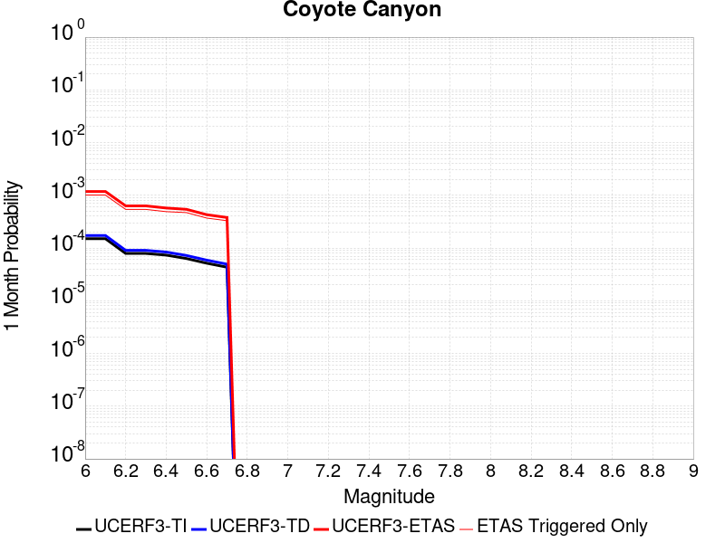 |  |  |

| Magnitude | 1 wk TI Prob | 1 wk TD Prob | 1 wk ETAS Prob | 1 wk ETAS/TD Gain | 1 wk ETAS Triggered Only | 1 mo TI Prob | 1 mo TD Prob | 1 mo ETAS Prob | 1 mo ETAS/TD Gain | 1 mo ETAS Triggered Only | 1 yr TI Prob | 1 yr TD Prob | 1 yr ETAS Prob | 1 yr ETAS/TD Gain | 1 yr ETAS Triggered Only | 10 yr TI Prob | 10 yr TD Prob | 10 yr ETAS Prob | 10 yr ETAS/TD Gain | 10 yr ETAS Triggered Only |
|-----|-----|-----|-----|-----|-----|-----|-----|-----|-----|-----|-----|-----|-----|-----|-----|-----|-----|-----|-----|-----|
| 6.0 | 3.5090034E-5 | 4.0364324E-5 | 9.963487E-4 | 24.683893 | 9.5602294E-4 | 1.503772E-4 | 1.7297994E-4 | 0.0013678019 | 7.907286 | 0.0011950287 | 0.0018293047 | 0.0021042528 | 0.004250778 | 2.0200891 | 0.0021510515 | 0.018143194 | 0.020869201 | 0.023443399 | 1.1233491 | 0.002629063 |
| 6.1 | 3.5090034E-5 | 4.0364324E-5 | 9.963487E-4 | 24.683893 | 9.5602294E-4 | 1.503772E-4 | 1.7297994E-4 | 0.0013678019 | 7.907286 | 0.0011950287 | 0.0018293047 | 0.0021042528 | 0.004250778 | 2.0200891 | 0.0021510515 | 0.018143194 | 0.020869201 | 0.023443399 | 1.1233491 | 0.002629063 |
| 6.2 | 1.841879E-5 | 2.1059794E-5 | 9.770626E-4 | 46.39469 | 9.5602294E-4 | 7.8935285E-5 | 9.0253714E-5 | 0.0010461904 | 11.5916605 | 9.5602294E-4 | 9.606133E-4 | 0.001098387 | 0.0025308463 | 2.3041482 | 0.0014340344 | 0.0095647145 | 0.010939667 | 0.012830796 | 1.172869 | 0.0019120459 |
| 6.3 | 1.841879E-5 | 2.1059794E-5 | 9.770626E-4 | 46.39469 | 9.5602294E-4 | 7.8935285E-5 | 9.0253714E-5 | 0.0010461904 | 11.5916605 | 9.5602294E-4 | 9.606133E-4 | 0.001098387 | 0.0025308463 | 2.3041482 | 0.0014340344 | 0.0095647145 | 0.010939667 | 0.012830796 | 1.172869 | 0.0019120459 |
| 6.4 | 1.712201E-5 | 1.9565212E-5 | 9.755695E-4 | 49.862453 | 9.5602294E-4 | 7.337798E-5 | 8.3848776E-5 | 0.0010397916 | 12.400796 | 9.5602294E-4 | 8.930107E-4 | 0.0010204813 | 0.0024530524 | 2.4038188 | 0.0014340344 | 0.008894307 | 0.010167871 | 0.012060475 | 1.1861358 | 0.0019120459 |
| 6.5 | 1.4744935E-5 | 1.6836972E-5 | 9.7284385E-4 | 57.780212 | 9.5602294E-4 | 6.3191044E-5 | 7.215698E-5 | 0.001028111 | 14.248253 | 9.5602294E-4 | 7.6907943E-4 | 8.7825063E-4 | 0.0023110255 | 2.6313965 | 0.0014340344 | 0.007664232 | 0.008756994 | 0.010415384 | 1.1893789 | 0.0016730401 |
| 6.6 | 1.2017839E-5 | 1.37240895E-5 | 7.3073147E-4 | 53.244442 | 7.170172E-4 | 5.150401E-5 | 5.88167E-5 | 7.7579176E-4 | 13.189991 | 7.170172E-4 | 6.268809E-4 | 7.159466E-4 | 0.0019101197 | 2.667964 | 0.0011950287 | 0.0062511545 | 0.0071450938 | 0.008568882 | 1.199268 | 0.0014340344 |
| 6.7 | 1.00956095E-5 | 1.1533517E-5 | 4.8953947E-4 | 42.444946 | 4.7801147E-4 | 4.326618E-5 | 4.942891E-5 | 5.2741676E-4 | 10.670208 | 4.7801147E-4 | 5.266384E-4 | 6.017178E-4 | 0.0015571655 | 2.5878668 | 9.5602294E-4 | 0.005253921 | 0.0060094125 | 0.00719726 | 1.1976645 | 0.0011950287 |

## Paradise
*[(top)](#table-of-contents)*

| 1 Week | 1 Month | 1 Year | 10 Year |
|-----|-----|-----|-----|
|  | 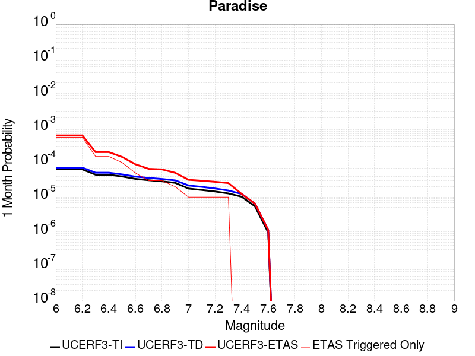 |  |  |

| Magnitude | 1 wk TI Prob | 1 wk TD Prob | 1 wk ETAS Prob | 1 wk ETAS/TD Gain | 1 wk ETAS Triggered Only | 1 mo TI Prob | 1 mo TD Prob | 1 mo ETAS Prob | 1 mo ETAS/TD Gain | 1 mo ETAS Triggered Only | 1 yr TI Prob | 1 yr TD Prob | 1 yr ETAS Prob | 1 yr ETAS/TD Gain | 1 yr ETAS Triggered Only | 10 yr TI Prob | 10 yr TD Prob | 10 yr ETAS Prob | 10 yr ETAS/TD Gain | 10 yr ETAS Triggered Only |
|-----|-----|-----|-----|-----|-----|-----|-----|-----|-----|-----|-----|-----|-----|-----|-----|-----|-----|-----|-----|-----|
| 6.0 | 1.4851273E-5 | 1.6694692E-5 | 2.5569645E-4 | 15.316032 | 2.3900573E-4 | 6.364676E-5 | 7.154685E-5 | 5.4952415E-4 | 7.6806197 | 4.7801147E-4 | 7.7462377E-4 | 8.707584E-4 | 0.0015871512 | 1.8227229 | 7.170172E-4 | 0.0077192914 | 0.008675844 | 0.010097438 | 1.1638564 | 0.0014340344 |
| 6.1 | 1.4851273E-5 | 1.6694692E-5 | 2.5569645E-4 | 15.316032 | 2.3900573E-4 | 6.364676E-5 | 7.154685E-5 | 5.4952415E-4 | 7.6806197 | 4.7801147E-4 | 7.7462377E-4 | 8.707584E-4 | 0.0015871512 | 1.8227229 | 7.170172E-4 | 0.0077192914 | 0.008675844 | 0.010097438 | 1.1638564 | 0.0014340344 |
| 6.2 | 1.4851273E-5 | 1.6694692E-5 | 2.5569645E-4 | 15.316032 | 2.3900573E-4 | 6.364676E-5 | 7.154685E-5 | 5.4952415E-4 | 7.6806197 | 4.7801147E-4 | 7.7462377E-4 | 8.707584E-4 | 0.0015871512 | 1.8227229 | 7.170172E-4 | 0.0077192914 | 0.008675844 | 0.010097438 | 1.1638564 | 0.0014340344 |
| 6.3 | 1.0426831E-5 | 1.188862E-5 | 2.5089152E-4 | 21.103502 | 2.3900573E-4 | 4.4685654E-5 | 5.0950268E-5 | 2.8994383E-4 | 5.6907225 | 2.3900573E-4 | 5.43912E-4 | 6.201489E-4 | 8.590064E-4 | 1.3851615 | 2.3900573E-4 | 0.0054258266 | 0.0061847917 | 0.006422319 | 1.0384051 | 2.3900573E-4 |
| 6.4 | 1.0426831E-5 | 1.188862E-5 | 2.5089152E-4 | 21.103502 | 2.3900573E-4 | 4.4685654E-5 | 5.0950268E-5 | 2.8994383E-4 | 5.6907225 | 2.3900573E-4 | 5.43912E-4 | 6.201489E-4 | 8.590064E-4 | 1.3851615 | 2.3900573E-4 | 0.0054258266 | 0.0061847917 | 0.006422319 | 1.0384051 | 2.3900573E-4 |
| 6.5 | 9.25027E-6 | 1.06199595E-5 | 2.4962315E-4 | 23.505095 | 2.3900573E-4 | 3.964341E-5 | 4.551335E-5 | 2.845082E-4 | 6.251094 | 2.3900573E-4 | 4.8255164E-4 | 5.53989E-4 | 7.928623E-4 | 1.4311879 | 2.3900573E-4 | 0.0048150513 | 0.0055265795 | 0.005764264 | 1.0430076 | 2.3900573E-4 |
| 6.6 | 7.904275E-6 | 9.159525E-6 | 9.159525E-6 | 1.0 | 0.0 | 3.3875025E-5 | 3.9254537E-5 | 3.9254537E-5 | 1.0 | 0.0 | 4.1235037E-4 | 4.7782314E-4 | 4.7782314E-4 | 1.0 | 0.0 | 0.0041158604 | 0.0047683544 | 0.0047683544 | 1.0 | 0.0 |
| 6.7 | 7.2061953E-6 | 8.407248E-6 | 8.407248E-6 | 1.0 | 0.0 | 3.088333E-5 | 3.6030586E-5 | 3.6030586E-5 | 1.0 | 0.0 | 3.7593965E-4 | 4.3858777E-4 | 4.3858777E-4 | 1.0 | 0.0 | 0.003753043 | 0.004377591 | 0.004377591 | 1.0 | 0.0 |
| 6.8 | 6.6948724E-6 | 7.842166E-6 | 7.842166E-6 | 1.0 | 0.0 | 2.8691995E-5 | 3.360887E-5 | 3.360887E-5 | 1.0 | 0.0 | 3.4926904E-4 | 4.0911473E-4 | 4.0911473E-4 | 1.0 | 0.0 | 0.003487206 | 0.0040839734 | 0.0040839734 | 1.0 | 0.0 |
| 6.9 | 6.0421025E-6 | 7.130621E-6 | 7.130621E-6 | 1.0 | 0.0 | 2.5894467E-5 | 3.0559466E-5 | 3.0559466E-5 | 1.0 | 0.0 | 3.1521954E-4 | 3.7200135E-4 | 3.7200135E-4 | 1.0 | 0.0 | 0.0031477278 | 0.0037141247 | 0.0037141247 | 1.0 | 0.0 |
| 7.0 | 4.134091E-6 | 5.0803087E-6 | 5.0803087E-6 | 1.0 | 0.0 | 1.7717413E-5 | 2.177258E-5 | 2.177258E-5 | 1.0 | 0.0 | 2.1568815E-4 | 2.6505045E-4 | 2.6505045E-4 | 1.0 | 0.0 | 0.0021547892 | 0.0026474963 | 0.0026474963 | 1.0 | 0.0 |
| 7.1 | 3.7674888E-6 | 4.6318696E-6 | 4.6318696E-6 | 1.0 | 0.0 | 1.6146281E-5 | 1.9850726E-5 | 1.9850726E-5 | 1.0 | 0.0 | 1.9656324E-4 | 2.4165731E-4 | 2.4165731E-4 | 1.0 | 0.0 | 0.0019638946 | 0.002414096 | 0.002414096 | 1.0 | 0.0 |
| 7.2 | 3.4065345E-6 | 4.156723E-6 | 4.156723E-6 | 1.0 | 0.0 | 1.4599351E-5 | 1.7814415E-5 | 1.7814415E-5 | 1.0 | 0.0 | 1.777326E-4 | 2.1687041E-4 | 2.1687041E-4 | 1.0 | 0.0 | 0.0017759053 | 0.002166736 | 0.002166736 | 1.0 | 0.0 |
| 7.3 | 2.9934936E-6 | 3.6293168E-6 | 3.6293168E-6 | 1.0 | 0.0 | 1.2829195E-5 | 1.555413E-5 | 1.555413E-5 | 1.0 | 0.0 | 1.5618425E-4 | 1.8935655E-4 | 1.8935655E-4 | 1.0 | 0.0 | 0.0015607453 | 0.0018920974 | 0.0018920974 | 1.0 | 0.0 |
| 7.4 | 2.4049796E-6 | 2.8889842E-6 | 2.8889842E-6 | 1.0 | 0.0 | 1.0307015E-5 | 1.238131E-5 | 1.238131E-5 | 1.0 | 0.0 | 1.2548068E-4 | 1.5073347E-4 | 1.5073347E-4 | 1.0 | 0.0 | 0.0012540985 | 0.0015064536 | 0.0015064536 | 1.0 | 0.0 |
| 7.5 | 1.2710091E-6 | 1.5134682E-6 | 1.5134682E-6 | 1.0 | 0.0 | 5.44717E-6 | 6.4862834E-6 | 6.4862834E-6 | 1.0 | 0.0 | 6.631728E-5 | 7.8968886E-5 | 7.8968886E-5 | 1.0 | 0.0 | 6.6297496E-4 | 7.8953087E-4 | 7.8953087E-4 | 1.0 | 0.0 |
| 7.6 | 2.21172E-7 | 2.603961E-7 | 2.603961E-7 | 1.0 | 0.0 | 9.478797E-7 | 1.1159829E-6 | 1.1159829E-6 | 1.0 | 0.0 | 1.1540374E-5 | 1.3587036E-5 | 1.3587036E-5 | 1.0 | 0.0 | 1.1539775E-4 | 1.3586486E-4 | 1.3586486E-4 | 1.0 | 0.0 |

## Garlic Springs
*[(top)](#table-of-contents)*

| 1 Week | 1 Month | 1 Year | 10 Year |
|-----|-----|-----|-----|
|  |  |  |  |

| Magnitude | 1 wk TI Prob | 1 wk TD Prob | 1 wk ETAS Prob | 1 wk ETAS/TD Gain | 1 wk ETAS Triggered Only | 1 mo TI Prob | 1 mo TD Prob | 1 mo ETAS Prob | 1 mo ETAS/TD Gain | 1 mo ETAS Triggered Only | 1 yr TI Prob | 1 yr TD Prob | 1 yr ETAS Prob | 1 yr ETAS/TD Gain | 1 yr ETAS Triggered Only | 10 yr TI Prob | 10 yr TD Prob | 10 yr ETAS Prob | 10 yr ETAS/TD Gain | 10 yr ETAS Triggered Only |
|-----|-----|-----|-----|-----|-----|-----|-----|-----|-----|-----|-----|-----|-----|-----|-----|-----|-----|-----|-----|-----|
| 6.0 | 1.6760017E-5 | 1.8776833E-5 | 7.357806E-4 | 39.185555 | 7.170172E-4 | 7.182667E-5 | 8.0470316E-5 | 7.974298E-4 | 9.909615 | 7.170172E-4 | 8.7413884E-4 | 9.794032E-4 | 0.002412033 | 2.462758 | 0.0014340344 | 0.008707083 | 0.009762413 | 0.011182448 | 1.1454594 | 0.0014340344 |
| 6.1 | 9.852767E-6 | 1.09735865E-5 | 4.889798E-4 | 44.559708 | 4.7801147E-4 | 4.222546E-5 | 4.702921E-5 | 5.250182E-4 | 11.163662 | 4.7801147E-4 | 5.139737E-4 | 5.7250116E-4 | 0.0015279768 | 2.6689496 | 9.5602294E-4 | 0.005127866 | 0.005717221 | 0.0066677784 | 1.166262 | 9.5602294E-4 |
| 6.2 | 9.852767E-6 | 1.09735865E-5 | 4.889798E-4 | 44.559708 | 4.7801147E-4 | 4.222546E-5 | 4.702921E-5 | 5.250182E-4 | 11.163662 | 4.7801147E-4 | 5.139737E-4 | 5.7250116E-4 | 0.0015279768 | 2.6689496 | 9.5602294E-4 | 0.005127866 | 0.005717221 | 0.0066677784 | 1.166262 | 9.5602294E-4 |
| 6.3 | 4.3167724E-6 | 4.7780286E-6 | 4.827872E-4 | 101.04318 | 4.7801147E-4 | 1.8500323E-5 | 2.0477235E-5 | 4.9847894E-4 | 24.343079 | 4.7801147E-4 | 2.2521814E-4 | 2.4930484E-4 | 9.6614327E-4 | 3.875349 | 7.170172E-4 | 0.0022499003 | 0.00249251 | 0.00320774 | 1.2869518 | 7.170172E-4 |
| 6.4 | 4.3167724E-6 | 4.7780286E-6 | 4.827872E-4 | 101.04318 | 4.7801147E-4 | 1.8500323E-5 | 2.0477235E-5 | 4.9847894E-4 | 24.343079 | 4.7801147E-4 | 2.2521814E-4 | 2.4930484E-4 | 9.6614327E-4 | 3.875349 | 7.170172E-4 | 0.0022499003 | 0.00249251 | 0.00320774 | 1.2869518 | 7.170172E-4 |
| 6.5 | 4.3167724E-6 | 4.7780286E-6 | 4.827872E-4 | 101.04318 | 4.7801147E-4 | 1.8500323E-5 | 2.0477235E-5 | 4.9847894E-4 | 24.343079 | 4.7801147E-4 | 2.2521814E-4 | 2.4930484E-4 | 9.6614327E-4 | 3.875349 | 7.170172E-4 | 0.0022499003 | 0.00249251 | 0.00320774 | 1.2869518 | 7.170172E-4 |
| 6.6 | 4.301311E-6 | 4.760897E-6 | 4.827701E-4 | 101.403175 | 4.7801147E-4 | 1.8434059E-5 | 2.0403815E-5 | 4.9840554E-4 | 24.427076 | 4.7801147E-4 | 2.2441156E-4 | 2.4841115E-4 | 9.6525025E-4 | 3.8856962 | 7.170172E-4 | 0.0022418506 | 0.002483593 | 0.0031988295 | 1.2879845 | 7.170172E-4 |
| 6.7 | 3.8599724E-6 | 4.27106E-6 | 4.8228048E-4 | 112.91822 | 4.7801147E-4 | 1.6542634E-5 | 1.8304541E-5 | 4.963073E-4 | 27.113886 | 4.7801147E-4 | 2.0138794E-4 | 2.228578E-4 | 9.397152E-4 | 4.2166586 | 7.170172E-4 | 0.0020120554 | 0.002228578 | 0.0029439973 | 1.3210205 | 7.170172E-4 |

## Death Valley (So)
*[(top)](#table-of-contents)*

| 1 Week | 1 Month | 1 Year | 10 Year |
|-----|-----|-----|-----|
|  |  |  | 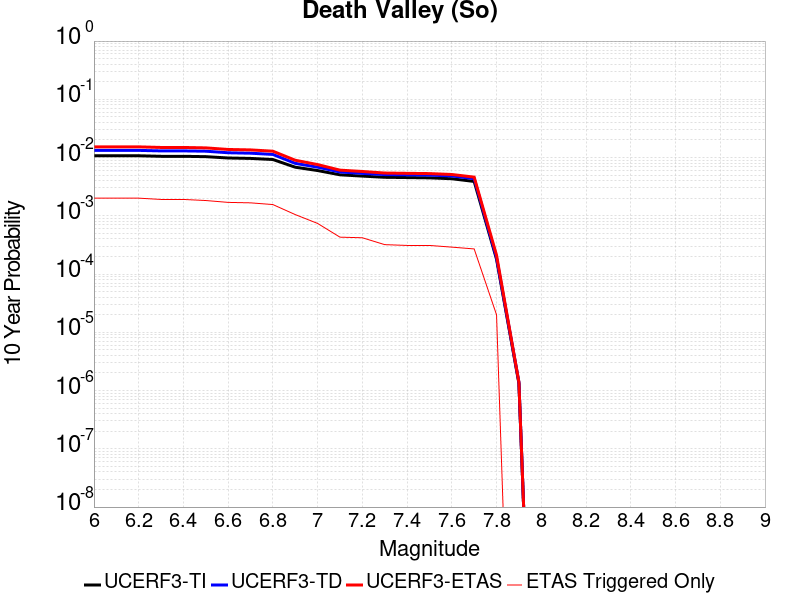 |

| Magnitude | 1 wk TI Prob | 1 wk TD Prob | 1 wk ETAS Prob | 1 wk ETAS/TD Gain | 1 wk ETAS Triggered Only | 1 mo TI Prob | 1 mo TD Prob | 1 mo ETAS Prob | 1 mo ETAS/TD Gain | 1 mo ETAS Triggered Only | 1 yr TI Prob | 1 yr TD Prob | 1 yr ETAS Prob | 1 yr ETAS/TD Gain | 1 yr ETAS Triggered Only | 10 yr TI Prob | 10 yr TD Prob | 10 yr ETAS Prob | 10 yr ETAS/TD Gain | 10 yr ETAS Triggered Only |
|-----|-----|-----|-----|-----|-----|-----|-----|-----|-----|-----|-----|-----|-----|-----|-----|-----|-----|-----|-----|-----|
| 6.0 | 2.0684236E-5 | 2.5617775E-5 | 2.6461738E-4 | 10.329444 | 2.3900573E-4 | 8.864371E-5 | 1.0978594E-4 | 8.2672446E-4 | 7.53033 | 7.170172E-4 | 0.0010787029 | 0.0013358411 | 0.0025292735 | 1.8933939 | 0.0011950287 | 0.010734817 | 0.013281397 | 0.014696385 | 1.1065391 | 0.0014340344 |
| 6.1 | 2.0684236E-5 | 2.5617775E-5 | 2.6461738E-4 | 10.329444 | 2.3900573E-4 | 8.864371E-5 | 1.0978594E-4 | 8.2672446E-4 | 7.53033 | 7.170172E-4 | 0.0010787029 | 0.0013358411 | 0.0025292735 | 1.8933939 | 0.0011950287 | 0.010734817 | 0.013281397 | 0.014696385 | 1.1065391 | 0.0014340344 |
| 6.2 | 2.0684236E-5 | 2.5617775E-5 | 2.6461738E-4 | 10.329444 | 2.3900573E-4 | 8.864371E-5 | 1.0978594E-4 | 8.2672446E-4 | 7.53033 | 7.170172E-4 | 0.0010787029 | 0.0013358411 | 0.0025292735 | 1.8933939 | 0.0011950287 | 0.010734817 | 0.013281397 | 0.014696385 | 1.1065391 | 0.0014340344 |
| 6.3 | 2.0240292E-5 | 2.511786E-5 | 2.6411758E-4 | 10.515131 | 2.3900573E-4 | 8.6741224E-5 | 1.07643624E-4 | 8.2458364E-4 | 7.6603107 | 7.170172E-4 | 0.0010555626 | 0.00130979 | 0.0025032535 | 1.9111869 | 0.0011950287 | 0.010505628 | 0.013023956 | 0.014439314 | 1.1086735 | 0.0014340344 |
| 6.4 | 2.0240292E-5 | 2.511786E-5 | 2.6411758E-4 | 10.515131 | 2.3900573E-4 | 8.6741224E-5 | 1.07643624E-4 | 8.2458364E-4 | 7.6603107 | 7.170172E-4 | 0.0010555626 | 0.00130979 | 0.0025032535 | 1.9111869 | 0.0011950287 | 0.010505628 | 0.013023956 | 0.014439314 | 1.1086735 | 0.0014340344 |
| 6.5 | 1.9962767E-5 | 2.4807114E-5 | 2.6380693E-4 | 10.634325 | 2.3900573E-4 | 8.55519E-5 | 1.0631196E-4 | 8.2325295E-4 | 7.7437468 | 7.170172E-4 | 0.0010410968 | 0.0012935963 | 0.002487079 | 1.9226084 | 0.0011950287 | 0.010362327 | 0.012863902 | 0.014279489 | 1.1100434 | 0.0014340344 |
| 6.6 | 1.8937297E-5 | 2.3310964E-5 | 2.6231114E-4 | 11.252693 | 2.3900573E-4 | 8.115732E-5 | 9.990039E-5 | 8.16846E-4 | 8.176604 | 7.170172E-4 | 9.876423E-4 | 0.0012156231 | 0.002409199 | 1.9818635 | 0.0011950287 | 0.009832645 | 0.012092789 | 0.013509481 | 1.1171519 | 0.0014340344 |
| 6.7 | 1.8621096E-5 | 2.2911607E-5 | 2.6191186E-4 | 11.431406 | 2.3900573E-4 | 7.980225E-5 | 9.818898E-5 | 8.151358E-4 | 8.301703 | 7.170172E-4 | 9.711593E-4 | 0.0011948098 | 0.0023884107 | 1.9989882 | 0.0011950287 | 0.009669261 | 0.011886904 | 0.013303892 | 1.1192058 | 0.0014340344 |
| 6.8 | 1.7830353E-5 | 2.1805688E-5 | 2.608062E-4 | 11.960467 | 2.3900573E-4 | 7.641356E-5 | 9.344968E-5 | 8.103999E-4 | 8.672046 | 7.170172E-4 | 9.29938E-4 | 0.00113717 | 0.0020921058 | 1.8397475 | 9.5602294E-4 | 0.009260561 | 0.011316354 | 0.01249786 | 1.1044068 | 0.0011950287 |
| 6.9 | 1.3135183E-5 | 1.5303925E-5 | 1.5303925E-5 | 1.0 | 0.0 | 5.6292425E-5 | 6.558664E-5 | 6.558664E-5 | 1.0 | 0.0 | 6.8514474E-4 | 7.982312E-4 | 0.0010370462 | 1.2991802 | 2.3900573E-4 | 0.006830362 | 0.007954649 | 0.008428858 | 1.0596141 | 4.7801147E-4 |
| 7.0 | 1.1507512E-5 | 1.3154199E-5 | 1.3154199E-5 | 1.0 | 0.0 | 4.9316975E-5 | 5.6373956E-5 | 5.6373956E-5 | 1.0 | 0.0 | 6.002687E-4 | 6.8614254E-4 | 9.249843E-4 | 1.3480935 | 2.3900573E-4 | 0.0059864987 | 0.0068409415 | 0.007315683 | 1.0693971 | 4.7801147E-4 |
| 7.1 | 9.715903E-6 | 1.0865278E-5 | 1.0865278E-5 | 1.0 | 0.0 | 4.1638916E-5 | 4.656467E-5 | 4.656467E-5 | 1.0 | 0.0 | 5.068359E-4 | 5.667817E-4 | 5.667817E-4 | 1.0 | 0.0 | 0.0050568148 | 0.0056538144 | 0.005891469 | 1.0420344 | 2.3900573E-4 |
| 7.2 | 9.233269E-6 | 1.02863105E-5 | 1.02863105E-5 | 1.0 | 0.0 | 3.9570554E-5 | 4.4083466E-5 | 4.4083466E-5 | 1.0 | 0.0 | 4.81665E-4 | 5.3658825E-4 | 5.3658825E-4 | 1.0 | 0.0 | 0.0048062233 | 0.0053533576 | 0.005591084 | 1.0444069 | 2.3900573E-4 |
| 7.3 | 8.8041315E-6 | 9.808164E-6 | 9.808164E-6 | 1.0 | 0.0 | 3.7731446E-5 | 4.2034335E-5 | 4.2034335E-5 | 1.0 | 0.0 | 4.592835E-4 | 5.1165203E-4 | 5.1165203E-4 | 1.0 | 0.0 | 0.0045833546 | 0.005105167 | 0.005342953 | 1.0465775 | 2.3900573E-4 |
| 7.4 | 8.708749E-6 | 9.707175E-6 | 9.707175E-6 | 1.0 | 0.0 | 3.7322676E-5 | 4.160154E-5 | 4.160154E-5 | 1.0 | 0.0 | 4.5430884E-4 | 5.0638523E-4 | 5.0638523E-4 | 1.0 | 0.0 | 0.004533812 | 0.0050527398 | 0.0052905376 | 1.0470632 | 2.3900573E-4 |
| 7.5 | 8.612678E-6 | 9.604817E-6 | 9.604817E-6 | 1.0 | 0.0 | 3.6910955E-5 | 4.1162875E-5 | 4.1162875E-5 | 1.0 | 0.0 | 4.492982E-4 | 5.01047E-4 | 5.01047E-4 | 1.0 | 0.0 | 0.004483909 | 0.0049995985 | 0.0052374094 | 1.0475659 | 2.3900573E-4 |
| 7.6 | 8.319024E-6 | 9.283916E-6 | 9.283916E-6 | 1.0 | 0.0 | 3.5652476E-5 | 3.978763E-5 | 3.978763E-5 | 1.0 | 0.0 | 4.3398244E-4 | 4.8431093E-4 | 4.8431093E-4 | 1.0 | 0.0 | 0.0043313587 | 0.0048329784 | 0.005070829 | 1.0492141 | 2.3900573E-4 |
| 7.7 | 7.4718328E-6 | 8.34517E-6 | 8.34517E-6 | 1.0 | 0.0 | 3.2021748E-5 | 3.5764548E-5 | 3.5764548E-5 | 1.0 | 0.0 | 3.8979502E-4 | 4.353504E-4 | 4.353504E-4 | 1.0 | 0.0 | 0.00389112 | 0.0043453807 | 0.0045833476 | 1.0547632 | 2.3900573E-4 |
| 7.8 | 3.4586725E-7 | 3.6482615E-7 | 3.6482615E-7 | 1.0 | 0.0 | 1.4822873E-6 | 1.5635396E-6 | 1.5635396E-6 | 1.0 | 0.0 | 1.80467E-5 | 1.9035933E-5 | 1.9035933E-5 | 1.0 | 0.0 | 1.8045233E-4 | 1.9034347E-4 | 1.9034347E-4 | 1.0 | 0.0 |
| 7.9 | 2.5591178E-9 | 2.6696718E-9 | 2.6696718E-9 | 1.0 | 0.0 | 1.0967647E-8 | 1.14414505E-8 | 1.14414505E-8 | 1.0 | 0.0 | 1.335311E-7 | 1.3929966E-7 | 1.3929966E-7 | 1.0 | 0.0 | 1.3353102E-6 | 1.3929966E-6 | 1.3929966E-6 | 1.0 | 0.0 |

## Bicycle Lake
*[(top)](#table-of-contents)*

| 1 Week | 1 Month | 1 Year | 10 Year |
|-----|-----|-----|-----|
|  |  |  |  |

| Magnitude | 1 wk TI Prob | 1 wk TD Prob | 1 wk ETAS Prob | 1 wk ETAS/TD Gain | 1 wk ETAS Triggered Only | 1 mo TI Prob | 1 mo TD Prob | 1 mo ETAS Prob | 1 mo ETAS/TD Gain | 1 mo ETAS Triggered Only | 1 yr TI Prob | 1 yr TD Prob | 1 yr ETAS Prob | 1 yr ETAS/TD Gain | 1 yr ETAS Triggered Only | 10 yr TI Prob | 10 yr TD Prob | 10 yr ETAS Prob | 10 yr ETAS/TD Gain | 10 yr ETAS Triggered Only |
|-----|-----|-----|-----|-----|-----|-----|-----|-----|-----|-----|-----|-----|-----|-----|-----|-----|-----|-----|-----|-----|
| 6.0 | 1.9621975E-5 | 2.2097078E-5 | 7.3909847E-4 | 33.447792 | 7.170172E-4 | 8.4091465E-5 | 9.4699084E-5 | 8.116484E-4 | 8.570815 | 7.170172E-4 | 0.0010233327 | 0.0011524865 | 0.0021074077 | 1.8285747 | 9.5602294E-4 | 0.01018633 | 0.011478408 | 0.012659719 | 1.102916 | 0.0011950287 |
| 6.1 | 1.9621975E-5 | 2.2097078E-5 | 7.3909847E-4 | 33.447792 | 7.170172E-4 | 8.4091465E-5 | 9.4699084E-5 | 8.116484E-4 | 8.570815 | 7.170172E-4 | 0.0010233327 | 0.0011524865 | 0.0021074077 | 1.8285747 | 9.5602294E-4 | 0.01018633 | 0.011478408 | 0.012659719 | 1.102916 | 0.0011950287 |
| 6.2 | 9.9971285E-6 | 1.1255639E-5 | 7.282648E-4 | 64.70221 | 7.170172E-4 | 4.2844134E-5 | 4.8237856E-5 | 7.652205E-4 | 15.863484 | 7.170172E-4 | 5.2150246E-4 | 5.871896E-4 | 0.0013037858 | 2.220383 | 7.170172E-4 | 0.0052028033 | 0.005861487 | 0.006574301 | 1.1216098 | 7.170172E-4 |
| 6.3 | 9.589428E-6 | 1.0798346E-5 | 7.278078E-4 | 67.39993 | 7.170172E-4 | 4.10969E-5 | 4.62781E-5 | 7.632621E-4 | 16.492945 | 7.170172E-4 | 5.002399E-4 | 5.6334207E-4 | 0.0012799554 | 2.272075 | 7.170172E-4 | 0.0049911533 | 0.0056242296 | 0.0063372143 | 1.1267701 | 7.170172E-4 |
| 6.4 | 9.589428E-6 | 1.0798346E-5 | 7.278078E-4 | 67.39993 | 7.170172E-4 | 4.10969E-5 | 4.62781E-5 | 7.632621E-4 | 16.492945 | 7.170172E-4 | 5.002399E-4 | 5.6334207E-4 | 0.0012799554 | 2.272075 | 7.170172E-4 | 0.0049911533 | 0.0056242296 | 0.0063372143 | 1.1267701 | 7.170172E-4 |
| 6.5 | 5.557707E-6 | 6.2856016E-6 | 7.232983E-4 | 115.07225 | 7.170172E-4 | 2.3818526E-5 | 2.6938165E-5 | 7.4393605E-4 | 27.616434 | 7.170172E-4 | 2.8995197E-4 | 3.2794967E-4 | 0.0010447317 | 3.1856465 | 7.170172E-4 | 0.0028957394 | 0.0032772934 | 0.0039919605 | 1.2180663 | 7.170172E-4 |
| 6.6 | 4.8742945E-6 | 5.5132896E-6 | 7.225266E-4 | 131.0518 | 7.170172E-4 | 2.0889667E-5 | 2.3628318E-5 | 7.406286E-4 | 31.344955 | 7.170172E-4 | 2.54302E-4 | 2.87663E-4 | 0.001004474 | 3.4918427 | 7.170172E-4 | 0.002540112 | 0.0028754752 | 0.0035904306 | 1.2486391 | 7.170172E-4 |
| 6.7 | 3.991108E-6 | 4.5159104E-6 | 4.825252E-4 | 106.850044 | 4.7801147E-4 | 1.7104636E-5 | 1.9353902E-5 | 4.973561E-4 | 25.697977 | 4.7801147E-4 | 2.0822904E-4 | 2.3563375E-4 | 7.1353256E-4 | 3.0281425 | 4.7801147E-4 | 0.0020803404 | 0.0023563374 | 0.0028332225 | 1.202384 | 4.7801147E-4 |

## San Andreas (Mojave S)
*[(top)](#table-of-contents)*

| 1 Week | 1 Month | 1 Year | 10 Year |
|-----|-----|-----|-----|
| 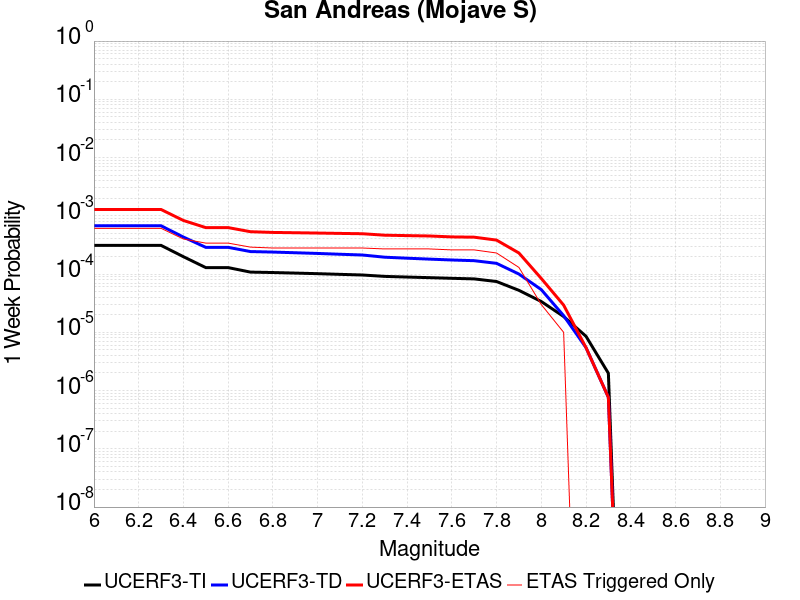 |  |  |  |

| Magnitude | 1 wk TI Prob | 1 wk TD Prob | 1 wk ETAS Prob | 1 wk ETAS/TD Gain | 1 wk ETAS Triggered Only | 1 mo TI Prob | 1 mo TD Prob | 1 mo ETAS Prob | 1 mo ETAS/TD Gain | 1 mo ETAS Triggered Only | 1 yr TI Prob | 1 yr TD Prob | 1 yr ETAS Prob | 1 yr ETAS/TD Gain | 1 yr ETAS Triggered Only | 10 yr TI Prob | 10 yr TD Prob | 10 yr ETAS Prob | 10 yr ETAS/TD Gain | 10 yr ETAS Triggered Only |
|-----|-----|-----|-----|-----|-----|-----|-----|-----|-----|-----|-----|-----|-----|-----|-----|-----|-----|-----|-----|-----|
| 6.0 | 3.1064058E-4 | 6.7460834E-4 | 9.134528E-4 | 1.3540492 | 2.3900573E-4 | 0.0013306376 | 0.0028881032 | 0.0031264187 | 1.0825163 | 2.3900573E-4 | 0.016080605 | 0.03462235 | 0.03485308 | 1.0066642 | 2.3900573E-4 | 0.1496549 | 0.28660452 | 0.28728655 | 1.0023797 | 9.5602294E-4 |
| 6.1 | 3.1064058E-4 | 6.7460834E-4 | 9.134528E-4 | 1.3540492 | 2.3900573E-4 | 0.0013306376 | 0.0028881032 | 0.0031264187 | 1.0825163 | 2.3900573E-4 | 0.016080605 | 0.03462235 | 0.03485308 | 1.0066642 | 2.3900573E-4 | 0.1496549 | 0.28660452 | 0.28728655 | 1.0023797 | 9.5602294E-4 |
| 6.2 | 3.1064058E-4 | 6.7460834E-4 | 9.134528E-4 | 1.3540492 | 2.3900573E-4 | 0.0013306376 | 0.0028881032 | 0.0031264187 | 1.0825163 | 2.3900573E-4 | 0.016080605 | 0.03462235 | 0.03485308 | 1.0066642 | 2.3900573E-4 | 0.1496549 | 0.28660452 | 0.28728655 | 1.0023797 | 9.5602294E-4 |
| 6.3 | 3.1064058E-4 | 6.7460834E-4 | 9.134528E-4 | 1.3540492 | 2.3900573E-4 | 0.0013306376 | 0.0028881032 | 0.0031264187 | 1.0825163 | 2.3900573E-4 | 0.016080605 | 0.03462235 | 0.03485308 | 1.0066642 | 2.3900573E-4 | 0.1496549 | 0.28660452 | 0.28728655 | 1.0023797 | 9.5602294E-4 |
| 6.4 | 1.9872203E-4 | 4.3179357E-4 | 6.706961E-4 | 1.5532795 | 2.3900573E-4 | 8.5138786E-4 | 0.0018492596 | 0.0020878233 | 1.129005 | 2.3900573E-4 | 0.010316478 | 0.02228844 | 0.022522118 | 1.0104843 | 2.3900573E-4 | 0.098504856 | 0.19699748 | 0.19738132 | 1.0019485 | 4.7801147E-4 |
| 6.5 | 1.291105E-4 | 2.875267E-4 | 5.2646373E-4 | 1.8310081 | 2.3900573E-4 | 5.5321335E-4 | 0.0012316781 | 0.0014703894 | 1.1938099 | 2.3900573E-4 | 0.006714592 | 0.0148934 | 0.015128846 | 1.0158087 | 2.3900573E-4 | 0.065152965 | 0.13803436 | 0.13844639 | 1.002985 | 4.7801147E-4 |
| 6.6 | 1.291105E-4 | 2.875267E-4 | 5.2646373E-4 | 1.8310081 | 2.3900573E-4 | 5.5321335E-4 | 0.0012316781 | 0.0014703894 | 1.1938099 | 2.3900573E-4 | 0.006714592 | 0.0148934 | 0.015128846 | 1.0158087 | 2.3900573E-4 | 0.065152965 | 0.13803436 | 0.13844639 | 1.002985 | 4.7801147E-4 |
| 6.7 | 1.08001186E-4 | 2.4333889E-4 | 2.4333889E-4 | 1.0 | 0.0 | 4.6278012E-4 | 0.0010424647 | 0.0010424647 | 1.0 | 0.0 | 0.0056198016 | 0.012618446 | 0.012618446 | 1.0 | 0.0 | 0.054797906 | 0.119176775 | 0.1193873 | 1.0017664 | 2.3900573E-4 |
| 6.8 | 1.0624356E-4 | 2.3851555E-4 | 2.3851555E-4 | 1.0 | 0.0 | 4.5525006E-4 | 0.0010218095 | 0.0010218095 | 1.0 | 0.0 | 0.0055285925 | 0.012369843 | 0.012369843 | 1.0 | 0.0 | 0.053930566 | 0.11712591 | 0.11733693 | 1.0018016 | 2.3900573E-4 |
| 6.9 | 1.0393785E-4 | 2.3221898E-4 | 2.3221898E-4 | 1.0 | 0.0 | 4.4537184E-4 | 9.948451E-4 | 9.948451E-4 | 1.0 | 0.0 | 0.0054089287 | 0.012045221 | 0.012045221 | 1.0 | 0.0 | 0.05279156 | 0.11442335 | 0.11463501 | 1.0018498 | 2.3900573E-4 |
| 7.0 | 1.0155622E-4 | 2.2591476E-4 | 2.2591476E-4 | 1.0 | 0.0 | 4.3516833E-4 | 9.6784724E-4 | 9.6784724E-4 | 1.0 | 0.0 | 0.005285311 | 0.0117200995 | 0.0117200995 | 1.0 | 0.0 | 0.05161361 | 0.111683756 | 0.11189607 | 1.001901 | 2.3900573E-4 |
| 7.1 | 9.885595E-5 | 2.1879886E-4 | 2.1879886E-4 | 1.0 | 0.0 | 4.2359953E-4 | 9.3737274E-4 | 9.3737274E-4 | 1.0 | 0.0 | 0.0051451353 | 0.011352993 | 0.011352993 | 1.0 | 0.0 | 0.05027629 | 0.1085682 | 0.108781256 | 1.0019624 | 2.3900573E-4 |
| 7.2 | 9.6411415E-5 | 2.124288E-4 | 2.124288E-4 | 1.0 | 0.0 | 4.1312634E-4 | 9.1009185E-4 | 9.1009185E-4 | 1.0 | 0.0 | 0.005018219 | 0.011024255 | 0.011024255 | 1.0 | 0.0 | 0.049064007 | 0.105758004 | 0.10597173 | 1.002021 | 2.3900573E-4 |
| 7.3 | 9.1180635E-5 | 1.9471257E-4 | 1.9471257E-4 | 1.0 | 0.0 | 3.907156E-4 | 8.342157E-4 | 8.342157E-4 | 1.0 | 0.0 | 0.004746591 | 0.01010939 | 0.01010939 | 1.0 | 0.0 | 0.046464786 | 0.09795115 | 0.09816675 | 1.0022011 | 2.3900573E-4 |
| 7.4 | 8.887388E-5 | 1.8719878E-4 | 1.8719878E-4 | 1.0 | 0.0 | 3.8083247E-4 | 8.020339E-4 | 8.020339E-4 | 1.0 | 0.0 | 0.0046267817 | 0.00972114 | 0.00972114 | 1.0 | 0.0 | 0.045316286 | 0.09458615 | 0.09480254 | 1.0022879 | 2.3900573E-4 |
| 7.5 | 8.6750515E-5 | 1.8051457E-4 | 1.8051457E-4 | 1.0 | 0.0 | 3.7173493E-4 | 7.7340455E-4 | 7.7340455E-4 | 1.0 | 0.0 | 0.004516484 | 0.009375632 | 0.009375632 | 1.0 | 0.0 | 0.04425787 | 0.091549896 | 0.09176702 | 1.0023717 | 2.3900573E-4 |
| 7.6 | 8.453092E-5 | 1.7439072E-4 | 1.7439072E-4 | 1.0 | 0.0 | 3.6222505E-4 | 7.471748E-4 | 7.471748E-4 | 1.0 | 0.0 | 0.0044011753 | 0.009058985 | 0.009058985 | 1.0 | 0.0 | 0.04315024 | 0.08870898 | 0.088926785 | 1.0024552 | 2.3900573E-4 |
| 7.7 | 8.259102E-5 | 1.6961215E-4 | 1.6961215E-4 | 1.0 | 0.0 | 3.539135E-4 | 7.2670676E-4 | 7.2670676E-4 | 1.0 | 0.0 | 0.004300386 | 0.008811831 | 0.008811831 | 1.0 | 0.0 | 0.042181134 | 0.08645982 | 0.08667816 | 1.0025253 | 2.3900573E-4 |
| 7.8 | 7.444844E-5 | 1.5283503E-4 | 1.5283503E-4 | 1.0 | 0.0 | 3.1902574E-4 | 6.548429E-4 | 6.548429E-4 | 1.0 | 0.0 | 0.0038772223 | 0.007943616 | 0.007943616 | 1.0 | 0.0 | 0.03810269 | 0.078290746 | 0.07851104 | 1.0028138 | 2.3900573E-4 |
| 7.9 | 5.2586525E-5 | 1.00064186E-4 | 1.00064186E-4 | 1.0 | 0.0 | 2.2535135E-4 | 4.2877605E-4 | 4.2877605E-4 | 1.0 | 0.0 | 0.0027402006 | 0.005207864 | 0.005207864 | 1.0 | 0.0 | 0.027066574 | 0.052200034 | 0.052426565 | 1.0043397 | 2.3900573E-4 |
| 8.0 | 3.379877E-5 | 5.4074168E-5 | 5.4074168E-5 | 1.0 | 0.0 | 1.4484383E-4 | 2.3172585E-4 | 2.3172585E-4 | 1.0 | 0.0 | 0.0017620471 | 0.002817614 | 0.002817614 | 1.0 | 0.0 | 0.017481409 | 0.028834904 | 0.029067017 | 1.0080497 | 2.3900573E-4 |
| 8.1 | 1.8668277E-5 | 1.9309397E-5 | 1.9309397E-5 | 1.0 | 0.0 | 8.000444E-5 | 8.275194E-5 | 8.275194E-5 | 1.0 | 0.0 | 9.736188E-4 | 0.0010070398 | 0.0010070398 | 1.0 | 0.0 | 0.009693642 | 0.010798888 | 0.010798888 | 1.0 | 0.0 |
| 8.2 | 8.541571E-6 | 5.460819E-6 | 5.460819E-6 | 1.0 | 0.0 | 3.660622E-5 | 2.3403301E-5 | 2.3403301E-5 | 1.0 | 0.0 | 4.455896E-4 | 2.84898E-4 | 2.84898E-4 | 1.0 | 0.0 | 0.0044469717 | 0.0032408056 | 0.0032408056 | 1.0 | 0.0 |
| 8.3 | 1.983087E-6 | 7.6599065E-7 | 7.6599065E-7 | 1.0 | 0.0 | 8.498917E-6 | 3.282813E-6 | 3.282813E-6 | 1.0 | 0.0 | 1.034694E-4 | 3.9967534E-5 | 3.9967534E-5 | 1.0 | 0.0 | 0.0010342124 | 4.719687E-4 | 4.719687E-4 | 1.0 | 0.0 |

## Cleghorn Lake
*[(top)](#table-of-contents)*

| 1 Week | 1 Month | 1 Year | 10 Year |
|-----|-----|-----|-----|
|  |  |  |  |

| Magnitude | 1 wk TI Prob | 1 wk TD Prob | 1 wk ETAS Prob | 1 wk ETAS/TD Gain | 1 wk ETAS Triggered Only | 1 mo TI Prob | 1 mo TD Prob | 1 mo ETAS Prob | 1 mo ETAS/TD Gain | 1 mo ETAS Triggered Only | 1 yr TI Prob | 1 yr TD Prob | 1 yr ETAS Prob | 1 yr ETAS/TD Gain | 1 yr ETAS Triggered Only | 10 yr TI Prob | 10 yr TD Prob | 10 yr ETAS Prob | 10 yr ETAS/TD Gain | 10 yr ETAS Triggered Only |
|-----|-----|-----|-----|-----|-----|-----|-----|-----|-----|-----|-----|-----|-----|-----|-----|-----|-----|-----|-----|-----|
| 6.0 | 1.5467183E-5 | 1.6794203E-5 | 2.5579592E-4 | 15.231203 | 2.3900573E-4 | 6.6286244E-5 | 7.197348E-5 | 5.499506E-4 | 7.641016 | 4.7801147E-4 | 8.067362E-4 | 8.759797E-4 | 0.0013535725 | 1.5452098 | 4.7801147E-4 | 0.008038137 | 0.008730696 | 0.009204534 | 1.0542727 | 4.7801147E-4 |
| 6.1 | 1.5467183E-5 | 1.6794203E-5 | 2.5579592E-4 | 15.231203 | 2.3900573E-4 | 6.6286244E-5 | 7.197348E-5 | 5.499506E-4 | 7.641016 | 4.7801147E-4 | 8.067362E-4 | 8.759797E-4 | 0.0013535725 | 1.5452098 | 4.7801147E-4 | 0.008038137 | 0.008730696 | 0.009204534 | 1.0542727 | 4.7801147E-4 |
| 6.2 | 1.2624631E-5 | 1.3681544E-5 | 2.52684E-4 | 18.468967 | 2.3900573E-4 | 5.410444E-5 | 5.863415E-5 | 5.366176E-4 | 9.151964 | 4.7801147E-4 | 6.585225E-4 | 7.1368564E-4 | 0.001191356 | 1.6693008 | 4.7801147E-4 | 0.0065657445 | 0.0071187317 | 0.0075933402 | 1.0666704 | 4.7801147E-4 |
| 6.3 | 1.2624631E-5 | 1.3681544E-5 | 2.52684E-4 | 18.468967 | 2.3900573E-4 | 5.410444E-5 | 5.863415E-5 | 5.366176E-4 | 9.151964 | 4.7801147E-4 | 6.585225E-4 | 7.1368564E-4 | 0.001191356 | 1.6693008 | 4.7801147E-4 | 0.0065657445 | 0.0071187317 | 0.0075933402 | 1.0666704 | 4.7801147E-4 |
| 6.4 | 9.417684E-6 | 1.0170118E-5 | 1.0170118E-5 | 1.0 | 0.0 | 4.036088E-5 | 4.3585722E-5 | 2.8258105E-4 | 6.48334 | 2.3900573E-4 | 4.912829E-4 | 5.3056807E-4 | 7.6944695E-4 | 1.4502324 | 2.3900573E-4 | 0.004901982 | 0.005297049 | 0.0055347886 | 1.0448816 | 2.3900573E-4 |
| 6.5 | 9.368219E-6 | 1.0117545E-5 | 1.0117545E-5 | 1.0 | 0.0 | 4.014889E-5 | 4.3360415E-5 | 2.823558E-4 | 6.511833 | 2.3900573E-4 | 4.8870314E-4 | 5.2782625E-4 | 7.6670584E-4 | 1.4525723 | 2.3900573E-4 | 0.004876298 | 0.0052697617 | 0.005507508 | 1.0451152 | 2.3900573E-4 |
| 6.6 | 7.803798E-6 | 8.441831E-6 | 8.441831E-6 | 1.0 | 0.0 | 3.3444423E-5 | 3.6179E-5 | 2.7517608E-4 | 7.605962 | 2.3900573E-4 | 4.0710976E-4 | 4.4043022E-4 | 6.7933067E-4 | 1.5424253 | 2.3900573E-4 | 0.0040636472 | 0.0043994905 | 0.004637445 | 1.0540868 | 2.3900573E-4 |
| 6.7 | 2.3108669E-6 | 2.4438336E-6 | 2.4438336E-6 | 1.0 | 0.0 | 9.903678E-6 | 1.0473532E-5 | 1.0473532E-5 | 1.0 | 0.0 | 1.205706E-4 | 1.2750797E-4 | 1.2750797E-4 | 1.0 | 0.0 | 0.001205052 | 0.0012743667 | 0.0012743667 | 1.0 | 0.0 |
| 6.8 | 2.0882828E-6 | 2.2062823E-6 | 2.2062823E-6 | 1.0 | 0.0 | 8.949753E-6 | 9.455462E-6 | 9.455462E-6 | 1.0 | 0.0 | 1.08957785E-4 | 1.1511434E-4 | 1.1511434E-4 | 1.0 | 0.0 | 0.0010890438 | 0.0011505639 | 0.0011505639 | 1.0 | 0.0 |
| 6.9 | 1.876935E-6 | 1.981051E-6 | 1.981051E-6 | 1.0 | 0.0 | 8.043982E-6 | 8.490192E-6 | 8.490192E-6 | 1.0 | 0.0 | 9.7931086E-5 | 1.03363345E-4 | 1.03363345E-4 | 1.0 | 0.0 | 9.788794E-4 | 0.0010331686 | 0.0010331686 | 1.0 | 0.0 |
| 7.0 | 1.5357559E-6 | 1.6202807E-6 | 1.6202807E-6 | 1.0 | 0.0 | 6.5817944E-6 | 6.9440425E-6 | 6.9440425E-6 | 1.0 | 0.0 | 8.01304E-5 | 8.454057E-5 | 8.454057E-5 | 1.0 | 0.0 | 8.010151E-4 | 8.450965E-4 | 8.450965E-4 | 1.0 | 0.0 |
| 7.1 | 1.0905424E-6 | 1.1497619E-6 | 1.1497619E-6 | 1.0 | 0.0 | 4.6737446E-6 | 4.9275427E-6 | 4.9275427E-6 | 1.0 | 0.0 | 5.6901354E-5 | 5.999128E-5 | 5.999128E-5 | 1.0 | 0.0 | 5.6886784E-4 | 5.997606E-4 | 5.997606E-4 | 1.0 | 0.0 |
| 7.2 | 6.06668E-7 | 6.387277E-7 | 6.387277E-7 | 1.0 | 0.0 | 2.600003E-6 | 2.7374022E-6 | 2.7374022E-6 | 1.0 | 0.0 | 3.1654577E-5 | 3.3327433E-5 | 3.3327433E-5 | 1.0 | 0.0 | 3.1650066E-4 | 3.3323118E-4 | 3.3323118E-4 | 1.0 | 0.0 |

## Helendale-So Lockhart
*[(top)](#table-of-contents)*

| 1 Week | 1 Month | 1 Year | 10 Year |
|-----|-----|-----|-----|
|  |  |  |  |

| Magnitude | 1 wk TI Prob | 1 wk TD Prob | 1 wk ETAS Prob | 1 wk ETAS/TD Gain | 1 wk ETAS Triggered Only | 1 mo TI Prob | 1 mo TD Prob | 1 mo ETAS Prob | 1 mo ETAS/TD Gain | 1 mo ETAS Triggered Only | 1 yr TI Prob | 1 yr TD Prob | 1 yr ETAS Prob | 1 yr ETAS/TD Gain | 1 yr ETAS Triggered Only | 10 yr TI Prob | 10 yr TD Prob | 10 yr ETAS Prob | 10 yr ETAS/TD Gain | 10 yr ETAS Triggered Only |
|-----|-----|-----|-----|-----|-----|-----|-----|-----|-----|-----|-----|-----|-----|-----|-----|-----|-----|-----|-----|-----|
| 6.0 | 1.7296055E-5 | 1.8103729E-5 | 2.5710513E-4 | 14.201777 | 2.3900573E-4 | 7.412385E-5 | 7.7585224E-5 | 3.165724E-4 | 4.0803185 | 2.3900573E-4 | 9.0208417E-4 | 9.4421144E-4 | 0.0011829915 | 1.2528883 | 2.3900573E-4 | 0.008984311 | 0.009404116 | 0.01011439 | 1.075528 | 7.170172E-4 |
| 6.1 | 1.7296055E-5 | 1.8103729E-5 | 2.5710513E-4 | 14.201777 | 2.3900573E-4 | 7.412385E-5 | 7.7585224E-5 | 3.165724E-4 | 4.0803185 | 2.3900573E-4 | 9.0208417E-4 | 9.4421144E-4 | 0.0011829915 | 1.2528883 | 2.3900573E-4 | 0.008984311 | 0.009404116 | 0.01011439 | 1.075528 | 7.170172E-4 |
| 6.2 | 1.7296055E-5 | 1.8103729E-5 | 2.5710513E-4 | 14.201777 | 2.3900573E-4 | 7.412385E-5 | 7.7585224E-5 | 3.165724E-4 | 4.0803185 | 2.3900573E-4 | 9.0208417E-4 | 9.4421144E-4 | 0.0011829915 | 1.2528883 | 2.3900573E-4 | 0.008984311 | 0.009404116 | 0.01011439 | 1.075528 | 7.170172E-4 |
| 6.3 | 1.0669118E-5 | 1.1135425E-5 | 2.501385E-4 | 22.46331 | 2.3900573E-4 | 4.5723988E-5 | 4.772239E-5 | 2.8671673E-4 | 6.008013 | 2.3900573E-4 | 5.5654737E-4 | 5.80868E-4 | 8.197349E-4 | 1.4112241 | 2.3900573E-4 | 0.0055515557 | 0.0057937936 | 0.0062690354 | 1.082026 | 4.7801147E-4 |
| 6.4 | 1.0669118E-5 | 1.1135425E-5 | 2.501385E-4 | 22.46331 | 2.3900573E-4 | 4.5723988E-5 | 4.772239E-5 | 2.8671673E-4 | 6.008013 | 2.3900573E-4 | 5.5654737E-4 | 5.80868E-4 | 8.197349E-4 | 1.4112241 | 2.3900573E-4 | 0.0055515557 | 0.0057937936 | 0.0062690354 | 1.082026 | 4.7801147E-4 |
| 6.5 | 8.790038E-6 | 9.170197E-6 | 2.4817375E-4 | 27.063076 | 2.3900573E-4 | 3.767105E-5 | 3.930026E-5 | 2.782966E-4 | 7.0812917 | 2.3900573E-4 | 4.585485E-4 | 4.7837716E-4 | 7.1726856E-4 | 1.4993788 | 2.3900573E-4 | 0.0045760344 | 0.004773638 | 0.005249368 | 1.0996577 | 4.7801147E-4 |
| 6.6 | 7.396949E-6 | 7.715537E-6 | 2.4671943E-4 | 31.976961 | 2.3900573E-4 | 3.1700827E-5 | 3.3066175E-5 | 2.72064E-4 | 8.227865 | 2.3900573E-4 | 3.858892E-4 | 4.025073E-4 | 6.414168E-4 | 1.5935533 | 2.3900573E-4 | 0.003852198 | 0.00401789 | 0.0044939807 | 1.1184927 | 4.7801147E-4 |
| 6.7 | 6.4600285E-6 | 6.738031E-6 | 2.4574215E-4 | 36.470917 | 2.3900573E-4 | 2.7685543E-5 | 2.887696E-5 | 2.678758E-4 | 9.276454 | 2.3900573E-4 | 3.3701936E-4 | 3.5152107E-4 | 5.904428E-4 | 1.6796796 | 2.3900573E-4 | 0.0033650869 | 0.003509732 | 0.0037478989 | 1.067859 | 2.3900573E-4 |
| 6.8 | 5.600104E-6 | 5.836009E-6 | 2.4484034E-4 | 41.953384 | 2.3900573E-4 | 2.4000226E-5 | 2.5011232E-5 | 2.64011E-4 | 10.555697 | 2.3900573E-4 | 2.9216358E-4 | 3.044698E-4 | 5.4340274E-4 | 1.7847509 | 2.3900573E-4 | 0.0029177975 | 0.003040588 | 0.003278867 | 1.078366 | 2.3900573E-4 |
| 6.9 | 4.839122E-6 | 5.0395092E-6 | 2.4404404E-4 | 48.42615 | 2.3900573E-4 | 2.0738931E-5 | 2.159772E-5 | 2.605983E-4 | 12.0660095 | 2.3900573E-4 | 2.5246723E-4 | 2.6292098E-4 | 5.018639E-4 | 1.9088012 | 2.3900573E-4 | 0.002521806 | 0.002626147 | 0.002864525 | 1.0907711 | 2.3900573E-4 |
| 7.0 | 3.6937633E-6 | 3.845208E-6 | 2.4285003E-4 | 63.156536 | 2.3900573E-4 | 1.5830317E-5 | 1.647936E-5 | 2.5548117E-4 | 15.503099 | 2.3900573E-4 | 1.9271708E-4 | 2.0061806E-4 | 4.3957584E-4 | 2.191108 | 2.3900573E-4 | 0.0019255003 | 0.002004401 | 0.0022429277 | 1.1190015 | 2.3900573E-4 |
| 7.1 | 2.7858857E-6 | 2.8978538E-6 | 2.419029E-4 | 83.47657 | 2.3900573E-4 | 1.1939455E-5 | 1.2419316E-5 | 2.5142208E-4 | 20.24444 | 2.3900573E-4 | 1.4535317E-4 | 1.511949E-4 | 3.901645E-4 | 2.5805402 | 2.3900573E-4 | 0.0014525814 | 0.0015109418 | 0.0017495863 | 1.1579443 | 2.3900573E-4 |
| 7.2 | 2.1672065E-6 | 2.2540128E-6 | 2.2540128E-6 | 1.0 | 0.0 | 9.2879945E-6 | 9.66002E-6 | 9.66002E-6 | 1.0 | 0.0 | 1.1307546E-4 | 1.1760458E-4 | 1.1760458E-4 | 1.0 | 0.0 | 0.0011301794 | 0.0011754417 | 0.0011754417 | 1.0 | 0.0 |
| 7.3 | 1.4823496E-6 | 1.5422102E-6 | 1.5422102E-6 | 1.0 | 0.0 | 6.3529114E-6 | 6.6094562E-6 | 6.6094562E-6 | 1.0 | 0.0 | 7.734395E-5 | 8.046731E-5 | 8.046731E-5 | 1.0 | 0.0 | 7.731704E-4 | 8.0439687E-4 | 8.0439687E-4 | 1.0 | 0.0 |
| 7.4 | 4.2321457E-7 | 4.4108765E-7 | 4.4108765E-7 | 1.0 | 0.0 | 1.8137755E-6 | 1.8903745E-6 | 1.8903745E-6 | 1.0 | 0.0 | 2.2082493E-5 | 2.3015113E-5 | 2.3015113E-5 | 1.0 | 0.0 | 2.2080299E-4 | 2.3013182E-4 | 2.3013182E-4 | 1.0 | 0.0 |
| 7.5 | 5.6942316E-8 | 5.9415648E-8 | 5.9415648E-8 | 1.0 | 0.0 | 2.440385E-7 | 2.5463845E-7 | 2.5463845E-7 | 1.0 | 0.0 | 2.9711643E-6 | 3.1002196E-6 | 3.1002196E-6 | 1.0 | 0.0 | 2.9711247E-5 | 3.1001844E-5 | 3.1001844E-5 | 1.0 | 0.0 |

## Coyote Lake
*[(top)](#table-of-contents)*

| 1 Week | 1 Month | 1 Year | 10 Year |
|-----|-----|-----|-----|
|  |  |  |  |

| Magnitude | 1 wk TI Prob | 1 wk TD Prob | 1 wk ETAS Prob | 1 wk ETAS/TD Gain | 1 wk ETAS Triggered Only | 1 mo TI Prob | 1 mo TD Prob | 1 mo ETAS Prob | 1 mo ETAS/TD Gain | 1 mo ETAS Triggered Only | 1 yr TI Prob | 1 yr TD Prob | 1 yr ETAS Prob | 1 yr ETAS/TD Gain | 1 yr ETAS Triggered Only | 10 yr TI Prob | 10 yr TD Prob | 10 yr ETAS Prob | 10 yr ETAS/TD Gain | 10 yr ETAS Triggered Only |
|-----|-----|-----|-----|-----|-----|-----|-----|-----|-----|-----|-----|-----|-----|-----|-----|-----|-----|-----|-----|-----|
| 6.0 | 1.980352E-5 | 2.1706745E-5 | 4.997078E-4 | 23.020855 | 4.7801147E-4 | 8.486947E-5 | 9.302599E-5 | 5.70993E-4 | 6.137994 | 4.7801147E-4 | 0.0010327959 | 0.0011320751 | 0.0018482805 | 1.6326485 | 7.170172E-4 | 0.010280091 | 0.011270258 | 0.011979194 | 1.0629033 | 7.170172E-4 |
| 6.1 | 1.980352E-5 | 2.1706745E-5 | 4.997078E-4 | 23.020855 | 4.7801147E-4 | 8.486947E-5 | 9.302599E-5 | 5.70993E-4 | 6.137994 | 4.7801147E-4 | 0.0010327959 | 0.0011320751 | 0.0018482805 | 1.6326485 | 7.170172E-4 | 0.010280091 | 0.011270258 | 0.011979194 | 1.0629033 | 7.170172E-4 |
| 6.2 | 1.980352E-5 | 2.1706745E-5 | 4.997078E-4 | 23.020855 | 4.7801147E-4 | 8.486947E-5 | 9.302599E-5 | 5.70993E-4 | 6.137994 | 4.7801147E-4 | 0.0010327959 | 0.0011320751 | 0.0018482805 | 1.6326485 | 7.170172E-4 | 0.010280091 | 0.011270258 | 0.011979194 | 1.0629033 | 7.170172E-4 |
| 6.3 | 1.5344787E-5 | 1.682067E-5 | 4.948241E-4 | 29.417624 | 4.7801147E-4 | 6.576172E-5 | 7.2086936E-5 | 5.5006397E-4 | 7.6305637 | 4.7801147E-4 | 8.003548E-4 | 8.773662E-4 | 0.0015937544 | 1.8165212 | 7.170172E-4 | 0.007974784 | 0.00874507 | 0.009455816 | 1.081274 | 7.170172E-4 |
| 6.4 | 1.5344787E-5 | 1.682067E-5 | 4.948241E-4 | 29.417624 | 4.7801147E-4 | 6.576172E-5 | 7.2086936E-5 | 5.5006397E-4 | 7.6305637 | 4.7801147E-4 | 8.003548E-4 | 8.773662E-4 | 0.0015937544 | 1.8165212 | 7.170172E-4 | 0.007974784 | 0.00874507 | 0.009455816 | 1.081274 | 7.170172E-4 |
| 6.5 | 1.4189697E-5 | 1.5557987E-5 | 4.93562E-4 | 31.72403 | 4.7801147E-4 | 6.081157E-5 | 6.6675726E-5 | 5.446553E-4 | 8.16872 | 4.7801147E-4 | 7.401293E-4 | 8.115349E-4 | 0.0015279702 | 1.8828152 | 7.170172E-4 | 0.0073766913 | 0.008091656 | 0.008802871 | 1.0878949 | 7.170172E-4 |
| 6.6 | 1.3469301E-5 | 1.4771577E-5 | 4.92776E-4 | 33.35974 | 4.7801147E-4 | 5.7724297E-5 | 6.330556E-5 | 5.412868E-4 | 8.550383 | 4.7801147E-4 | 7.025667E-4 | 7.7053264E-4 | 0.0014869974 | 1.9298304 | 7.170172E-4 | 0.0070034964 | 0.0076845144 | 0.008396021 | 1.0925897 | 7.170172E-4 |
| 6.7 | 1.3027966E-5 | 1.4281745E-5 | 4.922864E-4 | 34.469624 | 4.7801147E-4 | 5.5832945E-5 | 6.120638E-5 | 5.391886E-4 | 8.809353 | 4.7801147E-4 | 6.7955407E-4 | 7.4499263E-4 | 0.0014614756 | 1.9617317 | 7.170172E-4 | 0.006774798 | 0.0074308286 | 0.008142518 | 1.0957752 | 7.170172E-4 |
| 6.8 | 5.695434E-6 | 6.2244176E-6 | 6.2244176E-6 | 1.0 | 0.0 | 2.4408775E-5 | 2.6675973E-5 | 2.6675973E-5 | 1.0 | 0.0 | 2.971363E-4 | 3.2476155E-4 | 3.2476155E-4 | 1.0 | 0.0 | 0.0029673933 | 0.0032458105 | 0.0032458105 | 1.0 | 0.0 |
| 6.9 | 4.385688E-6 | 4.7930553E-6 | 4.7930553E-6 | 1.0 | 0.0 | 1.879567E-5 | 2.0541665E-5 | 2.0541665E-5 | 1.0 | 0.0 | 2.2881327E-4 | 2.5009477E-4 | 2.5009477E-4 | 1.0 | 0.0 | 0.002285778 | 0.0025009478 | 0.0025009478 | 1.0 | 0.0 |

## Mission Ridge-Arroyo Parida-Santa Ana
*[(top)](#table-of-contents)*

| 1 Week | 1 Month | 1 Year | 10 Year |
|-----|-----|-----|-----|
|  |  |  |  |

| Magnitude | 1 wk TI Prob | 1 wk TD Prob | 1 wk ETAS Prob | 1 wk ETAS/TD Gain | 1 wk ETAS Triggered Only | 1 mo TI Prob | 1 mo TD Prob | 1 mo ETAS Prob | 1 mo ETAS/TD Gain | 1 mo ETAS Triggered Only | 1 yr TI Prob | 1 yr TD Prob | 1 yr ETAS Prob | 1 yr ETAS/TD Gain | 1 yr ETAS Triggered Only | 10 yr TI Prob | 10 yr TD Prob | 10 yr ETAS Prob | 10 yr ETAS/TD Gain | 10 yr ETAS Triggered Only |
|-----|-----|-----|-----|-----|-----|-----|-----|-----|-----|-----|-----|-----|-----|-----|-----|-----|-----|-----|-----|-----|
| 6.0 | 4.169034E-5 | 4.7138263E-5 | 4.7138263E-5 | 1.0 | 0.0 | 1.7866064E-4 | 2.0201034E-4 | 4.409678E-4 | 2.182897 | 2.3900573E-4 | 0.0021730233 | 0.00245745 | 0.0029342868 | 1.1940372 | 4.7801147E-4 | 0.021518968 | 0.024384614 | 0.02485097 | 1.019125 | 4.7801147E-4 |
| 6.1 | 1.73813E-5 | 1.6854226E-5 | 1.6854226E-5 | 1.0 | 0.0 | 7.4489166E-5 | 7.223046E-5 | 7.223046E-5 | 1.0 | 0.0 | 9.065282E-4 | 8.790618E-4 | 8.790618E-4 | 1.0 | 0.0 | 0.009028391 | 0.008756988 | 0.008756988 | 1.0 | 0.0 |
| 6.2 | 1.4622182E-5 | 1.367329E-5 | 1.367329E-5 | 1.0 | 0.0 | 6.2664985E-5 | 5.8598518E-5 | 5.8598518E-5 | 1.0 | 0.0 | 7.6267915E-4 | 7.132073E-4 | 7.132073E-4 | 1.0 | 0.0 | 0.007600669 | 0.007109627 | 0.007109627 | 1.0 | 0.0 |
| 6.3 | 1.3552434E-5 | 1.2482201E-5 | 1.2482201E-5 | 1.0 | 0.0 | 5.8080568E-5 | 5.3494066E-5 | 5.3494066E-5 | 1.0 | 0.0 | 7.069015E-4 | 6.510988E-4 | 6.510988E-4 | 1.0 | 0.0 | 0.00704657 | 0.006492275 | 0.006492275 | 1.0 | 0.0 |
| 6.4 | 1.30977305E-5 | 1.1979156E-5 | 1.1979156E-5 | 1.0 | 0.0 | 5.613192E-5 | 5.1338247E-5 | 5.1338247E-5 | 1.0 | 0.0 | 6.831918E-4 | 6.248669E-4 | 6.248669E-4 | 1.0 | 0.0 | 0.006810953 | 0.0062314444 | 0.0062314444 | 1.0 | 0.0 |
| 6.5 | 1.225205E-5 | 1.1048803E-5 | 1.1048803E-5 | 1.0 | 0.0 | 5.2507727E-5 | 4.7351168E-5 | 4.7351168E-5 | 1.0 | 0.0 | 6.3909404E-4 | 5.7635066E-4 | 5.7635066E-4 | 1.0 | 0.0 | 0.006372592 | 0.005748869 | 0.005748869 | 1.0 | 0.0 |
| 6.6 | 1.1352241E-5 | 1.0063535E-5 | 1.0063535E-5 | 1.0 | 0.0 | 4.8651553E-5 | 4.3128734E-5 | 4.3128734E-5 | 1.0 | 0.0 | 5.921717E-4 | 5.2496797E-4 | 5.2496797E-4 | 1.0 | 0.0 | 0.0059059616 | 0.0052375244 | 0.0052375244 | 1.0 | 0.0 |
| 6.7 | 1.0864116E-5 | 9.517027E-6 | 9.517027E-6 | 1.0 | 0.0 | 4.6559664E-5 | 4.0786632E-5 | 4.0786632E-5 | 1.0 | 0.0 | 5.667165E-4 | 4.964661E-4 | 4.964661E-4 | 1.0 | 0.0 | 0.005652734 | 0.004953804 | 0.004953804 | 1.0 | 0.0 |
| 6.8 | 1.0666365E-5 | 9.299779E-6 | 9.299779E-6 | 1.0 | 0.0 | 4.571219E-5 | 3.9855597E-5 | 3.9855597E-5 | 1.0 | 0.0 | 5.564038E-4 | 4.8513585E-4 | 4.8513585E-4 | 1.0 | 0.0 | 0.005550127 | 0.0048410003 | 0.0048410003 | 1.0 | 0.0 |
| 6.9 | 1.0038665E-5 | 8.592046E-6 | 8.592046E-6 | 1.0 | 0.0 | 4.302214E-5 | 3.682254E-5 | 3.682254E-5 | 1.0 | 0.0 | 5.236687E-4 | 4.4822405E-4 | 4.4822405E-4 | 1.0 | 0.0 | 0.005224364 | 0.004473411 | 0.004473411 | 1.0 | 0.0 |
| 7.0 | 9.5379955E-6 | 8.025073E-6 | 8.025073E-6 | 1.0 | 0.0 | 4.0876483E-5 | 3.4392728E-5 | 3.4392728E-5 | 1.0 | 0.0 | 4.975576E-4 | 4.1865272E-4 | 4.1865272E-4 | 1.0 | 0.0 | 0.00496445 | 0.0041788397 | 0.0041788397 | 1.0 | 0.0 |
| 7.1 | 9.207389E-6 | 7.652375E-6 | 7.652375E-6 | 1.0 | 0.0 | 3.945964E-5 | 3.279549E-5 | 3.279549E-5 | 1.0 | 0.0 | 4.803152E-4 | 3.9921363E-4 | 3.9921363E-4 | 1.0 | 0.0 | 0.004792784 | 0.003985161 | 0.003985161 | 1.0 | 0.0 |
| 7.2 | 7.638091E-6 | 5.9311183E-6 | 5.9311183E-6 | 1.0 | 0.0 | 3.2734264E-5 | 2.541883E-5 | 2.541883E-5 | 1.0 | 0.0 | 3.984668E-4 | 3.0943064E-4 | 3.0943064E-4 | 1.0 | 0.0 | 0.0039775306 | 0.0030900547 | 0.0030900547 | 1.0 | 0.0 |
| 7.3 | 7.2500147E-6 | 5.5961527E-6 | 5.5961527E-6 | 1.0 | 0.0 | 3.1071122E-5 | 2.3983293E-5 | 2.3983293E-5 | 1.0 | 0.0 | 3.7822526E-4 | 2.9195778E-4 | 2.9195778E-4 | 1.0 | 0.0 | 0.0037758215 | 0.0029157975 | 0.0029157975 | 1.0 | 0.0 |
| 7.4 | 6.3899715E-6 | 4.9184964E-6 | 4.9184964E-6 | 1.0 | 0.0 | 2.7385306E-5 | 2.10791E-5 | 2.10791E-5 | 1.0 | 0.0 | 3.3336508E-4 | 2.5660804E-4 | 2.5660804E-4 | 1.0 | 0.0 | 0.0033286542 | 0.0025631618 | 0.0025631618 | 1.0 | 0.0 |
| 7.5 | 5.379025E-6 | 4.0838527E-6 | 4.0838527E-6 | 1.0 | 0.0 | 2.305276E-5 | 1.7502109E-5 | 1.7502109E-5 | 1.0 | 0.0 | 2.806312E-4 | 2.1306744E-4 | 2.1306744E-4 | 1.0 | 0.0 | 0.0028027708 | 0.002128643 | 0.002128643 | 1.0 | 0.0 |
| 7.6 | 4.1270696E-6 | 3.0883439E-6 | 3.0883439E-6 | 1.0 | 0.0 | 1.768732E-5 | 1.3235693E-5 | 1.3235693E-5 | 1.0 | 0.0 | 2.1532185E-4 | 1.6113273E-4 | 1.6113273E-4 | 1.0 | 0.0 | 0.0021511333 | 0.001610167 | 0.001610167 | 1.0 | 0.0 |
| 7.7 | 2.5406805E-6 | 1.8282013E-6 | 1.8282013E-6 | 1.0 | 0.0 | 1.0888585E-5 | 7.835125E-6 | 7.835125E-6 | 1.0 | 0.0 | 1.3256045E-4 | 9.538854E-5 | 9.538854E-5 | 1.0 | 0.0 | 0.0013248142 | 9.534821E-4 | 9.534821E-4 | 1.0 | 0.0 |
| 7.8 | 4.8608285E-7 | 3.5098864E-7 | 3.5098864E-7 | 1.0 | 0.0 | 2.0832106E-6 | 1.5042363E-6 | 1.5042363E-6 | 1.0 | 0.0 | 2.5362791E-5 | 1.8313924E-5 | 1.8313924E-5 | 1.0 | 0.0 | 2.5359896E-4 | 1.8312426E-4 | 1.8312426E-4 | 1.0 | 0.0 |
| 7.9 | 2.0472514E-8 | 1.2688783E-8 | 1.2688783E-8 | 1.0 | 0.0 | 8.7739345E-8 | 5.43805E-8 | 5.43805E-8 | 1.0 | 0.0 | 1.068226E-6 | 6.6208236E-7 | 6.6208236E-7 | 1.0 | 0.0 | 1.0682209E-5 | 6.620805E-6 | 6.620805E-6 | 1.0 | 0.0 |
| 8.0 | 4.443582E-9 | 2.0321211E-9 | 2.0321211E-9 | 1.0 | 0.0 | 1.9043922E-8 | 8.70909E-9 | 8.70909E-9 | 1.0 | 0.0 | 2.3185973E-7 | 1.0603316E-7 | 1.0603316E-7 | 1.0 | 0.0 | 2.3185949E-6 | 1.0603312E-6 | 1.0603312E-6 | 1.0 | 0.0 |

## Elsinore (Glen Ivy) rev
*[(top)](#table-of-contents)*

| 1 Week | 1 Month | 1 Year | 10 Year |
|-----|-----|-----|-----|
|  | 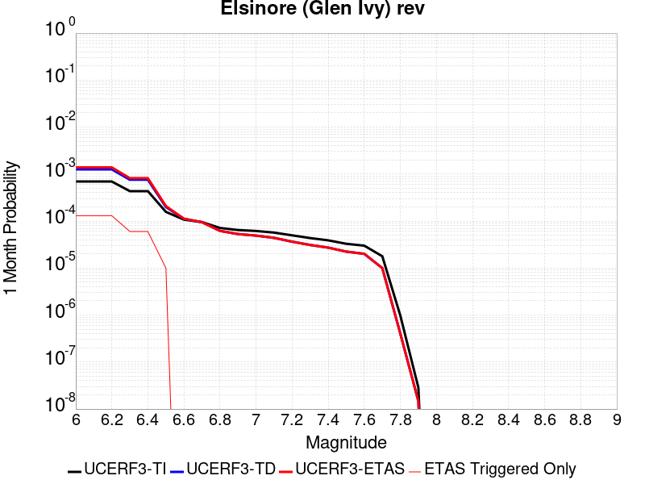 |  |  |

| Magnitude | 1 wk TI Prob | 1 wk TD Prob | 1 wk ETAS Prob | 1 wk ETAS/TD Gain | 1 wk ETAS Triggered Only | 1 mo TI Prob | 1 mo TD Prob | 1 mo ETAS Prob | 1 mo ETAS/TD Gain | 1 mo ETAS Triggered Only | 1 yr TI Prob | 1 yr TD Prob | 1 yr ETAS Prob | 1 yr ETAS/TD Gain | 1 yr ETAS Triggered Only | 10 yr TI Prob | 10 yr TD Prob | 10 yr ETAS Prob | 10 yr ETAS/TD Gain | 10 yr ETAS Triggered Only |
|-----|-----|-----|-----|-----|-----|-----|-----|-----|-----|-----|-----|-----|-----|-----|-----|-----|-----|-----|-----|-----|
| 6.0 | 1.6204086E-4 | 2.9360707E-4 | 2.9360707E-4 | 1.0 | 0.0 | 6.94276E-4 | 0.0012578638 | 0.0012578638 | 1.0 | 0.0 | 0.008420097 | 0.015234485 | 0.015469849 | 1.0154494 | 2.3900573E-4 | 0.081081145 | 0.13969168 | 0.14010291 | 1.0029439 | 4.7801147E-4 |
| 6.1 | 1.6204086E-4 | 2.9360707E-4 | 2.9360707E-4 | 1.0 | 0.0 | 6.94276E-4 | 0.0012578638 | 0.0012578638 | 1.0 | 0.0 | 0.008420097 | 0.015234485 | 0.015469849 | 1.0154494 | 2.3900573E-4 | 0.081081145 | 0.13969168 | 0.14010291 | 1.0029439 | 4.7801147E-4 |
| 6.2 | 1.6204086E-4 | 2.9360707E-4 | 2.9360707E-4 | 1.0 | 0.0 | 6.94276E-4 | 0.0012578638 | 0.0012578638 | 1.0 | 0.0 | 0.008420097 | 0.015234485 | 0.015469849 | 1.0154494 | 2.3900573E-4 | 0.081081145 | 0.13969168 | 0.14010291 | 1.0029439 | 4.7801147E-4 |
| 6.3 | 1.0111737E-4 | 1.7703383E-4 | 1.7703383E-4 | 1.0 | 0.0 | 4.332882E-4 | 7.5861247E-4 | 7.5861247E-4 | 1.0 | 0.0 | 0.005262531 | 0.009217682 | 0.009454485 | 1.0256901 | 2.3900573E-4 | 0.0513964 | 0.0870191 | 0.08745551 | 1.0050151 | 4.7801147E-4 |
| 6.4 | 1.0111737E-4 | 1.7703383E-4 | 1.7703383E-4 | 1.0 | 0.0 | 4.332882E-4 | 7.5861247E-4 | 7.5861247E-4 | 1.0 | 0.0 | 0.005262531 | 0.009217682 | 0.009454485 | 1.0256901 | 2.3900573E-4 | 0.0513964 | 0.0870191 | 0.08745551 | 1.0050151 | 4.7801147E-4 |
| 6.5 | 3.6624708E-5 | 4.6391084E-5 | 4.6391084E-5 | 1.0 | 0.0 | 1.569536E-4 | 1.9880582E-4 | 1.9880582E-4 | 1.0 | 0.0 | 0.001909235 | 0.0024181372 | 0.0024181372 | 1.0 | 0.0 | 0.01892915 | 0.023739954 | 0.023973286 | 1.0098287 | 2.3900573E-4 |
| 6.6 | 2.5051324E-5 | 2.614772E-5 | 2.614772E-5 | 1.0 | 0.0 | 1.073584E-4 | 1.12057096E-4 | 1.12057096E-4 | 1.0 | 0.0 | 0.0013063047 | 0.0013634858 | 0.0013634858 | 1.0 | 0.0 | 0.012986525 | 0.013564618 | 0.013564618 | 1.0 | 0.0 |
| 6.7 | 2.2189772E-5 | 2.2072849E-5 | 2.2072849E-5 | 1.0 | 0.0 | 9.509556E-5 | 9.4594696E-5 | 9.4594696E-5 | 1.0 | 0.0 | 0.0011571734 | 0.0011511183 | 0.0011511183 | 1.0 | 0.0 | 0.011511663 | 0.011465415 | 0.011465415 | 1.0 | 0.0 |
| 6.8 | 1.6654378E-5 | 1.4437705E-5 | 1.4437705E-5 | 1.0 | 0.0 | 7.137396E-5 | 6.187444E-5 | 6.187444E-5 | 1.0 | 0.0 | 8.686314E-4 | 7.530661E-4 | 7.530661E-4 | 1.0 | 0.0 | 0.008652439 | 0.00751048 | 0.00751048 | 1.0 | 0.0 |
| 6.9 | 1.5042909E-5 | 1.2332022E-5 | 1.2332022E-5 | 1.0 | 0.0 | 6.446802E-5 | 5.285047E-5 | 5.285047E-5 | 1.0 | 0.0 | 7.8461546E-4 | 6.4326765E-4 | 6.4326765E-4 | 1.0 | 0.0 | 0.007818509 | 0.00641828 | 0.00641828 | 1.0 | 0.0 |
| 7.0 | 1.4361385E-5 | 1.1451324E-5 | 1.1451324E-5 | 1.0 | 0.0 | 6.154734E-5 | 4.9076196E-5 | 4.9076196E-5 | 1.0 | 0.0 | 7.490812E-4 | 5.973418E-4 | 5.973418E-4 | 1.0 | 0.0 | 0.007465612 | 0.0059613534 | 0.0059613534 | 1.0 | 0.0 |
| 7.1 | 1.3265571E-5 | 1.0244926E-5 | 1.0244926E-5 | 1.0 | 0.0 | 5.6851208E-5 | 4.39061E-5 | 4.39061E-5 | 1.0 | 0.0 | 6.919436E-4 | 5.344282E-4 | 5.344282E-4 | 1.0 | 0.0 | 0.006897931 | 0.0053347866 | 0.0053347866 | 1.0 | 0.0 |
| 7.2 | 1.1596403E-5 | 8.505067E-6 | 8.505067E-6 | 1.0 | 0.0 | 4.9697923E-5 | 3.6449786E-5 | 3.6449786E-5 | 1.0 | 0.0 | 6.049042E-4 | 4.436875E-4 | 4.436875E-4 | 1.0 | 0.0 | 0.006032603 | 0.0044294316 | 0.0044294316 | 1.0 | 0.0 |
| 7.3 | 1.0150827E-5 | 7.2387597E-6 | 7.2387597E-6 | 1.0 | 0.0 | 4.3502816E-5 | 3.1022897E-5 | 3.1022897E-5 | 1.0 | 0.0 | 5.2951806E-4 | 3.7763975E-4 | 3.7763975E-4 | 1.0 | 0.0 | 0.005282581 | 0.0037703665 | 0.0037703665 | 1.0 | 0.0 |
| 7.4 | 9.080705E-6 | 6.352519E-6 | 6.352519E-6 | 1.0 | 0.0 | 3.8916725E-5 | 2.7224805E-5 | 2.7224805E-5 | 1.0 | 0.0 | 4.7370812E-4 | 3.3141294E-4 | 3.3141294E-4 | 1.0 | 0.0 | 0.004726996 | 0.0033093381 | 0.0033093381 | 1.0 | 0.0 |
| 7.5 | 7.671649E-6 | 5.2256332E-6 | 5.2256332E-6 | 1.0 | 0.0 | 3.287808E-5 | 2.2395385E-5 | 2.2395385E-5 | 1.0 | 0.0 | 4.0021708E-4 | 2.7263095E-4 | 2.7263095E-4 | 1.0 | 0.0 | 0.0039949706 | 0.00272309 | 0.00272309 | 1.0 | 0.0 |
| 7.6 | 6.990086E-6 | 4.687545E-6 | 4.687545E-6 | 1.0 | 0.0 | 2.9957167E-5 | 2.008933E-5 | 2.008933E-5 | 1.0 | 0.0 | 3.6466747E-4 | 2.445613E-4 | 2.445613E-4 | 1.0 | 0.0 | 0.0036406964 | 0.002443038 | 0.002443038 | 1.0 | 0.0 |
| 7.7 | 4.163505E-6 | 2.3295343E-6 | 2.3295343E-6 | 1.0 | 0.0 | 1.7843471E-5 | 9.983683E-6 | 9.983683E-6 | 1.0 | 0.0 | 2.172226E-4 | 1.21545316E-4 | 1.21545316E-4 | 1.0 | 0.0 | 0.0021701038 | 0.0012148614 | 0.0012148614 | 1.0 | 0.0 |
| 7.8 | 2.2692414E-7 | 9.3854695E-8 | 9.3854695E-8 | 1.0 | 0.0 | 9.725317E-7 | 4.0223435E-7 | 4.0223435E-7 | 1.0 | 0.0 | 1.1840509E-5 | 4.8971956E-6 | 4.8971956E-6 | 1.0 | 0.0 | 1.1839878E-4 | 4.8971204E-5 | 4.8971204E-5 | 1.0 | 0.0 |
| 7.9 | 6.676829E-9 | 3.439853E-9 | 3.439853E-9 | 1.0 | 0.0 | 2.861498E-8 | 1.4742227E-8 | 1.4742227E-8 | 1.0 | 0.0 | 3.4838732E-7 | 1.7948659E-7 | 1.7948659E-7 | 1.0 | 0.0 | 3.4838679E-6 | 1.7948646E-6 | 1.7948646E-6 | 1.0 | 0.0 |

## Death Valley (Black Mtns Frontal)
*[(top)](#table-of-contents)*

| 1 Week | 1 Month | 1 Year | 10 Year |
|-----|-----|-----|-----|
|  |  |  |  |

| Magnitude | 1 wk TI Prob | 1 wk TD Prob | 1 wk ETAS Prob | 1 wk ETAS/TD Gain | 1 wk ETAS Triggered Only | 1 mo TI Prob | 1 mo TD Prob | 1 mo ETAS Prob | 1 mo ETAS/TD Gain | 1 mo ETAS Triggered Only | 1 yr TI Prob | 1 yr TD Prob | 1 yr ETAS Prob | 1 yr ETAS/TD Gain | 1 yr ETAS Triggered Only | 10 yr TI Prob | 10 yr TD Prob | 10 yr ETAS Prob | 10 yr ETAS/TD Gain | 10 yr ETAS Triggered Only |
|-----|-----|-----|-----|-----|-----|-----|-----|-----|-----|-----|-----|-----|-----|-----|-----|-----|-----|-----|-----|-----|
| 6.0 | 1.6707214E-5 | 1.867027E-5 | 1.867027E-5 | 1.0 | 0.0 | 7.160038E-5 | 8.001302E-5 | 8.001302E-5 | 1.0 | 0.0 | 8.71386E-4 | 9.737309E-4 | 0.0012125039 | 1.2452146 | 2.3900573E-4 | 0.00867977 | 0.009695496 | 0.010168874 | 1.0488244 | 4.7801147E-4 |
| 6.1 | 1.6707214E-5 | 1.867027E-5 | 1.867027E-5 | 1.0 | 0.0 | 7.160038E-5 | 8.001302E-5 | 8.001302E-5 | 1.0 | 0.0 | 8.71386E-4 | 9.737309E-4 | 0.0012125039 | 1.2452146 | 2.3900573E-4 | 0.00867977 | 0.009695496 | 0.010168874 | 1.0488244 | 4.7801147E-4 |
| 6.2 | 1.6707214E-5 | 1.867027E-5 | 1.867027E-5 | 1.0 | 0.0 | 7.160038E-5 | 8.001302E-5 | 8.001302E-5 | 1.0 | 0.0 | 8.71386E-4 | 9.737309E-4 | 0.0012125039 | 1.2452146 | 2.3900573E-4 | 0.00867977 | 0.009695496 | 0.010168874 | 1.0488244 | 4.7801147E-4 |
| 6.3 | 1.6707214E-5 | 1.867027E-5 | 1.867027E-5 | 1.0 | 0.0 | 7.160038E-5 | 8.001302E-5 | 8.001302E-5 | 1.0 | 0.0 | 8.71386E-4 | 9.737309E-4 | 0.0012125039 | 1.2452146 | 2.3900573E-4 | 0.00867977 | 0.009695496 | 0.010168874 | 1.0488244 | 4.7801147E-4 |
| 6.4 | 1.5515609E-5 | 1.7338214E-5 | 1.7338214E-5 | 1.0 | 0.0 | 6.649377E-5 | 7.4304546E-5 | 7.4304546E-5 | 1.0 | 0.0 | 8.0926094E-4 | 9.042885E-4 | 0.0011430781 | 1.2640635 | 2.3900573E-4 | 0.008063202 | 0.009006773 | 0.009480479 | 1.0525944 | 4.7801147E-4 |
| 6.5 | 1.5515609E-5 | 1.7338214E-5 | 1.7338214E-5 | 1.0 | 0.0 | 6.649377E-5 | 7.4304546E-5 | 7.4304546E-5 | 1.0 | 0.0 | 8.0926094E-4 | 9.042885E-4 | 0.0011430781 | 1.2640635 | 2.3900573E-4 | 0.008063202 | 0.009006773 | 0.009480479 | 1.0525944 | 4.7801147E-4 |
| 6.6 | 1.5041828E-5 | 1.6809145E-5 | 1.6809145E-5 | 1.0 | 0.0 | 6.4463384E-5 | 7.203723E-5 | 7.203723E-5 | 1.0 | 0.0 | 7.8455906E-4 | 8.767063E-4 | 0.0011155026 | 1.2723788 | 2.3900573E-4 | 0.00781795 | 0.008733132 | 0.009206969 | 1.0542574 | 4.7801147E-4 |
| 6.7 | 1.4634985E-5 | 1.6356016E-5 | 1.6356016E-5 | 1.0 | 0.0 | 6.271985E-5 | 7.009536E-5 | 7.009536E-5 | 1.0 | 0.0 | 7.6334673E-4 | 8.5308263E-4 | 0.0010918844 | 1.2799281 | 2.3900573E-4 | 0.007607299 | 0.008498715 | 0.008972664 | 1.0557672 | 4.7801147E-4 |
| 6.8 | 1.4209158E-5 | 1.5882048E-5 | 1.5882048E-5 | 1.0 | 0.0 | 6.089497E-5 | 6.8064175E-5 | 6.8064175E-5 | 1.0 | 0.0 | 7.4114406E-4 | 8.2837185E-4 | 8.2837185E-4 | 1.0 | 0.0 | 0.007386771 | 0.008253456 | 0.00849049 | 1.0287193 | 2.3900573E-4 |
| 6.9 | 1.3780098E-5 | 1.5404594E-5 | 1.5404594E-5 | 1.0 | 0.0 | 5.9056227E-5 | 6.6018045E-5 | 6.6018045E-5 | 1.0 | 0.0 | 7.1877235E-4 | 8.0347876E-4 | 8.0347876E-4 | 1.0 | 0.0 | 0.0071645193 | 0.008006332 | 0.008243425 | 1.0296131 | 2.3900573E-4 |
| 7.0 | 1.3585064E-5 | 1.5188155E-5 | 1.5188155E-5 | 1.0 | 0.0 | 5.8220405E-5 | 6.50905E-5 | 6.50905E-5 | 1.0 | 0.0 | 7.086029E-4 | 7.9219416E-4 | 7.9219416E-4 | 1.0 | 0.0 | 0.007063476 | 0.007894293 | 0.008131413 | 1.0300368 | 2.3900573E-4 |
| 7.1 | 1.3398601E-5 | 1.49813395E-5 | 1.49813395E-5 | 1.0 | 0.0 | 5.742131E-5 | 6.420419E-5 | 6.420419E-5 | 1.0 | 0.0 | 6.9888023E-4 | 7.8141113E-4 | 7.8141113E-4 | 1.0 | 0.0 | 0.0069668638 | 0.007787224 | 0.008024368 | 1.0304531 | 2.3900573E-4 |
| 7.2 | 1.3126312E-5 | 1.4679561E-5 | 1.4679561E-5 | 1.0 | 0.0 | 5.6254412E-5 | 6.291092E-5 | 6.291092E-5 | 1.0 | 0.0 | 6.846822E-4 | 7.6567667E-4 | 7.6567667E-4 | 1.0 | 0.0 | 0.006825765 | 0.00763097 | 0.007868152 | 1.0310814 | 2.3900573E-4 |
| 7.3 | 1.2922429E-5 | 1.4453788E-5 | 1.4453788E-5 | 1.0 | 0.0 | 5.5380664E-5 | 6.194336E-5 | 6.194336E-5 | 1.0 | 0.0 | 6.74051E-4 | 7.53905E-4 | 7.53905E-4 | 1.0 | 0.0 | 0.006720101 | 0.007514055 | 0.0077512646 | 1.0315688 | 2.3900573E-4 |
| 7.4 | 1.2768878E-5 | 1.4283772E-5 | 1.4283772E-5 | 1.0 | 0.0 | 5.4722615E-5 | 6.1214756E-5 | 6.1214756E-5 | 1.0 | 0.0 | 6.660441E-4 | 7.4504025E-4 | 7.4504025E-4 | 1.0 | 0.0 | 0.0066405144 | 0.0074260035 | 0.0076632346 | 1.031946 | 2.3900573E-4 |
| 7.5 | 1.2521929E-5 | 1.40120155E-5 | 1.40120155E-5 | 1.0 | 0.0 | 5.366431E-5 | 6.005014E-5 | 6.005014E-5 | 1.0 | 0.0 | 6.531671E-4 | 7.3087064E-4 | 7.3087064E-4 | 1.0 | 0.0 | 0.006512506 | 0.0072852457 | 0.0075225104 | 1.0325679 | 2.3900573E-4 |
| 7.6 | 1.1301089E-5 | 1.2648149E-5 | 1.2648149E-5 | 1.0 | 0.0 | 4.8432343E-5 | 5.4205255E-5 | 5.4205255E-5 | 1.0 | 0.0 | 5.895042E-4 | 6.5975444E-4 | 6.5975444E-4 | 1.0 | 0.0 | 0.0058794282 | 0.00657851 | 0.006815944 | 1.0360923 | 2.3900573E-4 |
| 7.7 | 9.189108E-6 | 1.0283358E-5 | 1.0283358E-5 | 1.0 | 0.0 | 3.93813E-5 | 4.407082E-5 | 4.407082E-5 | 1.0 | 0.0 | 4.7936183E-4 | 5.3643517E-4 | 5.3643517E-4 | 1.0 | 0.0 | 0.004783291 | 0.005351914 | 0.0055896407 | 1.0444189 | 2.3900573E-4 |
| 7.8 | 3.4586725E-7 | 3.6482615E-7 | 3.6482615E-7 | 1.0 | 0.0 | 1.4822873E-6 | 1.5635396E-6 | 1.5635396E-6 | 1.0 | 0.0 | 1.80467E-5 | 1.9035933E-5 | 1.9035933E-5 | 1.0 | 0.0 | 1.8045233E-4 | 1.9034347E-4 | 1.9034347E-4 | 1.0 | 0.0 |
| 7.9 | 2.5591178E-9 | 2.6696718E-9 | 2.6696718E-9 | 1.0 | 0.0 | 1.0967647E-8 | 1.14414505E-8 | 1.14414505E-8 | 1.0 | 0.0 | 1.335311E-7 | 1.3929966E-7 | 1.3929966E-7 | 1.0 | 0.0 | 1.3353102E-6 | 1.3929966E-6 | 1.3929966E-6 | 1.0 | 0.0 |

## Calico-Hidalgo
*[(top)](#table-of-contents)*

| 1 Week | 1 Month | 1 Year | 10 Year |
|-----|-----|-----|-----|
|  |  |  |  |

| Magnitude | 1 wk TI Prob | 1 wk TD Prob | 1 wk ETAS Prob | 1 wk ETAS/TD Gain | 1 wk ETAS Triggered Only | 1 mo TI Prob | 1 mo TD Prob | 1 mo ETAS Prob | 1 mo ETAS/TD Gain | 1 mo ETAS Triggered Only | 1 yr TI Prob | 1 yr TD Prob | 1 yr ETAS Prob | 1 yr ETAS/TD Gain | 1 yr ETAS Triggered Only | 10 yr TI Prob | 10 yr TD Prob | 10 yr ETAS Prob | 10 yr ETAS/TD Gain | 10 yr ETAS Triggered Only |
|-----|-----|-----|-----|-----|-----|-----|-----|-----|-----|-----|-----|-----|-----|-----|-----|-----|-----|-----|-----|-----|
| 6.0 | 4.0906612E-5 | 5.0703686E-5 | 5.0703686E-5 | 1.0 | 0.0 | 1.7530227E-4 | 2.172857E-4 | 2.172857E-4 | 1.0 | 0.0 | 0.0021322158 | 0.002642648 | 0.0028810222 | 1.0902028 | 2.3900573E-4 | 0.02111873 | 0.026152607 | 0.026618117 | 1.0177997 | 4.7801147E-4 |
| 6.1 | 4.0906612E-5 | 5.0703686E-5 | 5.0703686E-5 | 1.0 | 0.0 | 1.7530227E-4 | 2.172857E-4 | 2.172857E-4 | 1.0 | 0.0 | 0.0021322158 | 0.002642648 | 0.0028810222 | 1.0902028 | 2.3900573E-4 | 0.02111873 | 0.026152607 | 0.026618117 | 1.0177997 | 4.7801147E-4 |
| 6.2 | 4.0906612E-5 | 5.0703686E-5 | 5.0703686E-5 | 1.0 | 0.0 | 1.7530227E-4 | 2.172857E-4 | 2.172857E-4 | 1.0 | 0.0 | 0.0021322158 | 0.002642648 | 0.0028810222 | 1.0902028 | 2.3900573E-4 | 0.02111873 | 0.026152607 | 0.026618117 | 1.0177997 | 4.7801147E-4 |
| 6.3 | 2.4242801E-5 | 3.0090669E-5 | 3.0090669E-5 | 1.0 | 0.0 | 1.0389358E-4 | 1.2895382E-4 | 1.2895382E-4 | 1.0 | 0.0 | 0.0012641704 | 0.0015689151 | 0.0018075459 | 1.1520993 | 2.3900573E-4 | 0.01257003 | 0.01558206 | 0.016052624 | 1.030199 | 4.7801147E-4 |
| 6.4 | 2.4242801E-5 | 3.0090669E-5 | 3.0090669E-5 | 1.0 | 0.0 | 1.0389358E-4 | 1.2895382E-4 | 1.2895382E-4 | 1.0 | 0.0 | 0.0012641704 | 0.0015689151 | 0.0018075459 | 1.1520993 | 2.3900573E-4 | 0.01257003 | 0.01558206 | 0.016052624 | 1.030199 | 4.7801147E-4 |
| 6.5 | 2.0286952E-5 | 2.5315738E-5 | 2.5315738E-5 | 1.0 | 0.0 | 8.694118E-5 | 1.0849161E-4 | 1.0849161E-4 | 1.0 | 0.0 | 0.0010579949 | 0.001320102 | 0.001320102 | 1.0 | 0.0 | 0.010529719 | 0.013124538 | 0.013360406 | 1.0179716 | 2.3900573E-4 |
| 6.6 | 2.0269223E-5 | 2.5296687E-5 | 2.5296687E-5 | 1.0 | 0.0 | 8.6865206E-5 | 1.08409964E-4 | 1.08409964E-4 | 1.0 | 0.0 | 0.0010570707 | 0.0013191093 | 0.0013191093 | 1.0 | 0.0 | 0.010520565 | 0.013114728 | 0.0133505985 | 1.0179852 | 2.3900573E-4 |
| 6.7 | 1.799852E-5 | 2.25406E-5 | 2.25406E-5 | 1.0 | 0.0 | 7.713423E-5 | 9.659908E-5 | 9.659908E-5 | 1.0 | 0.0 | 9.3870464E-4 | 0.0011754738 | 0.0011754738 | 1.0 | 0.0 | 0.009347493 | 0.011694173 | 0.011930385 | 1.0201991 | 2.3900573E-4 |
| 6.8 | 1.7458793E-5 | 2.184212E-5 | 2.184212E-5 | 1.0 | 0.0 | 7.4821255E-5 | 9.3605806E-5 | 9.3605806E-5 | 1.0 | 0.0 | 9.10568E-4 | 0.0011390693 | 0.0011390693 | 1.0 | 0.0 | 0.009068459 | 0.011333893 | 0.01157019 | 1.0208488 | 2.3900573E-4 |
| 6.9 | 1.542884E-5 | 1.9025927E-5 | 1.9025927E-5 | 1.0 | 0.0 | 6.612192E-5 | 8.153721E-5 | 8.153721E-5 | 1.0 | 0.0 | 8.04737E-4 | 9.922766E-4 | 9.922766E-4 | 1.0 | 0.0 | 0.008018291 | 0.009879857 | 0.010116502 | 1.0239522 | 2.3900573E-4 |
| 7.0 | 1.468253E-5 | 1.8030598E-5 | 1.8030598E-5 | 1.0 | 0.0 | 6.292361E-5 | 7.7271776E-5 | 7.7271776E-5 | 1.0 | 0.0 | 7.658257E-4 | 9.4039086E-4 | 9.4039086E-4 | 1.0 | 0.0 | 0.0076319184 | 0.009365481 | 0.009602249 | 1.0252808 | 2.3900573E-4 |
| 7.1 | 1.3139281E-5 | 1.6200942E-5 | 1.6200942E-5 | 1.0 | 0.0 | 5.6309986E-5 | 6.943083E-5 | 6.943083E-5 | 1.0 | 0.0 | 6.853584E-4 | 8.4500515E-4 | 8.4500515E-4 | 1.0 | 0.0 | 0.0068324856 | 0.0084192185 | 0.008656212 | 1.0281491 | 2.3900573E-4 |
| 7.2 | 1.1127404E-5 | 1.3866597E-5 | 1.3866597E-5 | 1.0 | 0.0 | 4.7688E-5 | 5.942698E-5 | 5.942698E-5 | 1.0 | 0.0 | 5.8044674E-4 | 7.232942E-4 | 7.232942E-4 | 1.0 | 0.0 | 0.0057893298 | 0.0072105085 | 0.007447791 | 1.0329078 | 2.3900573E-4 |
| 7.3 | 9.808154E-6 | 1.2176215E-5 | 1.2176215E-5 | 1.0 | 0.0 | 4.2034266E-5 | 5.2182797E-5 | 5.2182797E-5 | 1.0 | 0.0 | 5.11647E-4 | 6.3515105E-4 | 6.3515105E-4 | 1.0 | 0.0 | 0.0051047057 | 0.006334433 | 0.006334433 | 1.0 | 0.0 |
| 7.4 | 7.942452E-6 | 9.792144E-6 | 9.792144E-6 | 1.0 | 0.0 | 3.4038632E-5 | 4.1965708E-5 | 4.1965708E-5 | 1.0 | 0.0 | 4.1434157E-4 | 5.1082217E-4 | 5.1082217E-4 | 1.0 | 0.0 | 0.0041356985 | 0.005097421 | 0.005097421 | 1.0 | 0.0 |
| 7.5 | 4.7121216E-6 | 5.772836E-6 | 5.772836E-6 | 1.0 | 0.0 | 2.019465E-5 | 2.4740535E-5 | 2.4740535E-5 | 1.0 | 0.0 | 2.4584212E-4 | 3.0118204E-4 | 3.0118204E-4 | 1.0 | 0.0 | 0.0024557032 | 0.0030084911 | 0.0030084911 | 1.0 | 0.0 |
| 7.6 | 2.21172E-7 | 2.603961E-7 | 2.603961E-7 | 1.0 | 0.0 | 9.478797E-7 | 1.1159829E-6 | 1.1159829E-6 | 1.0 | 0.0 | 1.1540374E-5 | 1.3587036E-5 | 1.3587036E-5 | 1.0 | 0.0 | 1.1539775E-4 | 1.3586486E-4 | 1.3586486E-4 | 1.0 | 0.0 |

## Cleghorn Pass
*[(top)](#table-of-contents)*

| 1 Week | 1 Month | 1 Year | 10 Year |
|-----|-----|-----|-----|
|  |  |  |  |

| Magnitude | 1 wk TI Prob | 1 wk TD Prob | 1 wk ETAS Prob | 1 wk ETAS/TD Gain | 1 wk ETAS Triggered Only | 1 mo TI Prob | 1 mo TD Prob | 1 mo ETAS Prob | 1 mo ETAS/TD Gain | 1 mo ETAS Triggered Only | 1 yr TI Prob | 1 yr TD Prob | 1 yr ETAS Prob | 1 yr ETAS/TD Gain | 1 yr ETAS Triggered Only | 10 yr TI Prob | 10 yr TD Prob | 10 yr ETAS Prob | 10 yr ETAS/TD Gain | 10 yr ETAS Triggered Only |
|-----|-----|-----|-----|-----|-----|-----|-----|-----|-----|-----|-----|-----|-----|-----|-----|-----|-----|-----|-----|-----|
| 6.0 | 1.0522846E-5 | 1.1040642E-5 | 1.1040642E-5 | 1.0 | 0.0 | 4.509713E-5 | 4.7316473E-5 | 2.863109E-4 | 6.050977 | 2.3900573E-4 | 5.4891926E-4 | 5.759784E-4 | 8.1484654E-4 | 1.4147171 | 2.3900573E-4 | 0.0054756533 | 0.005750022 | 0.0062252847 | 1.0826541 | 4.7801147E-4 |
| 6.1 | 1.0522846E-5 | 1.1040642E-5 | 1.1040642E-5 | 1.0 | 0.0 | 4.509713E-5 | 4.7316473E-5 | 2.863109E-4 | 6.050977 | 2.3900573E-4 | 5.4891926E-4 | 5.759784E-4 | 8.1484654E-4 | 1.4147171 | 2.3900573E-4 | 0.0054756533 | 0.005750022 | 0.0062252847 | 1.0826541 | 4.7801147E-4 |
| 6.2 | 2.1045846E-6 | 2.2082024E-6 | 2.2082024E-6 | 1.0 | 0.0 | 9.019617E-6 | 9.463714E-6 | 2.484672E-4 | 26.254723 | 2.3900573E-4 | 1.098083E-4 | 1.1521882E-4 | 3.5419702E-4 | 3.0741246 | 2.3900573E-4 | 0.0010975406 | 0.0011520023 | 0.0013907327 | 1.2072308 | 2.3900573E-4 |
| 6.3 | 2.1045846E-6 | 2.2082024E-6 | 2.2082024E-6 | 1.0 | 0.0 | 9.019617E-6 | 9.463714E-6 | 2.484672E-4 | 26.254723 | 2.3900573E-4 | 1.098083E-4 | 1.1521882E-4 | 3.5419702E-4 | 3.0741246 | 2.3900573E-4 | 0.0010975406 | 0.0011520023 | 0.0013907327 | 1.2072308 | 2.3900573E-4 |
| 6.4 | 1.7259927E-6 | 1.810877E-6 | 1.810877E-6 | 1.0 | 0.0 | 7.3970905E-6 | 7.760902E-6 | 2.4676477E-4 | 31.79589 | 2.3900573E-4 | 9.005586E-5 | 9.4488976E-5 | 3.3347213E-4 | 3.5292172 | 2.3900573E-4 | 9.001937E-4 | 9.448898E-4 | 0.0011836697 | 1.2527066 | 2.3900573E-4 |

## San Andreas (Cholame) rev
*[(top)](#table-of-contents)*

| 1 Week | 1 Month | 1 Year | 10 Year |
|-----|-----|-----|-----|
|  |  |  |  |

| Magnitude | 1 wk TI Prob | 1 wk TD Prob | 1 wk ETAS Prob | 1 wk ETAS/TD Gain | 1 wk ETAS Triggered Only | 1 mo TI Prob | 1 mo TD Prob | 1 mo ETAS Prob | 1 mo ETAS/TD Gain | 1 mo ETAS Triggered Only | 1 yr TI Prob | 1 yr TD Prob | 1 yr ETAS Prob | 1 yr ETAS/TD Gain | 1 yr ETAS Triggered Only | 10 yr TI Prob | 10 yr TD Prob | 10 yr ETAS Prob | 10 yr ETAS/TD Gain | 10 yr ETAS Triggered Only |
|-----|-----|-----|-----|-----|-----|-----|-----|-----|-----|-----|-----|-----|-----|-----|-----|-----|-----|-----|-----|-----|
| 6.0 | 1.2302514E-4 | 2.5204287E-4 | 2.5204287E-4 | 1.0 | 0.0 | 5.27144E-4 | 0.0010797381 | 0.0010797381 | 1.0 | 0.0 | 0.0063991086 | 0.0130670825 | 0.013302965 | 1.0180516 | 2.3900573E-4 | 0.06217949 | 0.12439073 | 0.12480928 | 1.0033648 | 4.7801147E-4 |
| 6.1 | 1.2302514E-4 | 2.5204287E-4 | 2.5204287E-4 | 1.0 | 0.0 | 5.27144E-4 | 0.0010797381 | 0.0010797381 | 1.0 | 0.0 | 0.0063991086 | 0.0130670825 | 0.013302965 | 1.0180516 | 2.3900573E-4 | 0.06217949 | 0.12439073 | 0.12480928 | 1.0033648 | 4.7801147E-4 |
| 6.2 | 1.2203569E-4 | 2.5021084E-4 | 2.5021084E-4 | 1.0 | 0.0 | 5.2290526E-4 | 0.0010718931 | 0.0010718931 | 1.0 | 0.0 | 0.006347804 | 0.01297271 | 0.013208615 | 1.0181848 | 2.3900573E-4 | 0.061695136 | 0.12357691 | 0.12399585 | 1.0033901 | 4.7801147E-4 |
| 6.3 | 1.2142645E-4 | 2.4907055E-4 | 2.4907055E-4 | 1.0 | 0.0 | 5.202953E-4 | 0.0010670102 | 0.0010670102 | 1.0 | 0.0 | 0.006316212 | 0.012913967 | 0.013149886 | 1.0182686 | 2.3900573E-4 | 0.06139677 | 0.12307103 | 0.123490214 | 1.003406 | 4.7801147E-4 |
| 6.4 | 1.1865206E-4 | 2.44126E-4 | 2.44126E-4 | 1.0 | 0.0 | 5.0840975E-4 | 0.0010458364 | 0.0010458364 | 1.0 | 0.0 | 0.006172335 | 0.012659196 | 0.012895176 | 1.018641 | 2.3900573E-4 | 0.060036868 | 0.1208638 | 0.121284045 | 1.003477 | 4.7801147E-4 |
| 6.5 | 1.17443946E-4 | 2.4205919E-4 | 2.4205919E-4 | 1.0 | 0.0 | 5.032341E-4 | 0.0010369857 | 0.0010369857 | 1.0 | 0.0 | 0.006109677 | 0.012552682 | 0.012788688 | 1.0188012 | 2.3900573E-4 | 0.059444077 | 0.11993805 | 0.120358735 | 1.0035075 | 4.7801147E-4 |
| 6.6 | 1.13579066E-4 | 2.3514954E-4 | 2.3514954E-4 | 1.0 | 0.0 | 4.866766E-4 | 0.001007396 | 0.001007396 | 1.0 | 0.0 | 0.0059092017 | 0.012196515 | 0.012432605 | 1.0193572 | 2.3900573E-4 | 0.057545185 | 0.11685214 | 0.1172743 | 1.0036128 | 4.7801147E-4 |
| 6.7 | 1.1271412E-4 | 2.3359268E-4 | 2.3359268E-4 | 1.0 | 0.0 | 4.829711E-4 | 0.0010007289 | 0.0010007289 | 1.0 | 0.0 | 0.005864331 | 0.012116249 | 0.012352359 | 1.019487 | 2.3900573E-4 | 0.057119697 | 0.116155714 | 0.1165782 | 1.0036372 | 4.7801147E-4 |
| 6.8 | 1.1217975E-4 | 2.3247694E-4 | 2.3247694E-4 | 1.0 | 0.0 | 4.8068175E-4 | 9.959509E-4 | 9.959509E-4 | 1.0 | 0.0 | 0.005836608 | 0.012058721 | 0.012294845 | 1.0195812 | 2.3900573E-4 | 0.056856725 | 0.11565396 | 0.11607669 | 1.0036551 | 4.7801147E-4 |
| 6.9 | 1.1146753E-4 | 2.3096445E-4 | 2.3096445E-4 | 1.0 | 0.0 | 4.7763053E-4 | 9.894737E-4 | 9.894737E-4 | 1.0 | 0.0 | 0.0057996577 | 0.011980731 | 0.0122168735 | 1.0197102 | 2.3900573E-4 | 0.056506127 | 0.11497439 | 0.115397446 | 1.0036795 | 4.7801147E-4 |
| 7.0 | 1.0965793E-4 | 2.2719789E-4 | 2.2719789E-4 | 1.0 | 0.0 | 4.698779E-4 | 9.733434E-4 | 9.733434E-4 | 1.0 | 0.0 | 0.005705768 | 0.011786487 | 0.012022676 | 1.020039 | 2.3900573E-4 | 0.055614736 | 0.11327597 | 0.11369983 | 1.0037419 | 4.7801147E-4 |
| 7.1 | 9.927982E-5 | 2.0538924E-4 | 2.0538924E-4 | 1.0 | 0.0 | 4.2541555E-4 | 8.7994366E-4 | 8.7994366E-4 | 1.0 | 0.0 | 0.0051671406 | 0.010660981 | 0.010897439 | 1.0221797 | 2.3900573E-4 | 0.05048634 | 0.1033706 | 0.1037992 | 1.0041462 | 4.7801147E-4 |
| 7.2 | 9.696786E-5 | 2.0043184E-4 | 2.0043184E-4 | 1.0 | 0.0 | 4.1551032E-4 | 8.5871184E-4 | 8.5871184E-4 | 1.0 | 0.0 | 0.00504711 | 0.010404981 | 0.010404981 | 1.0 | 0.0 | 0.04934009 | 0.1011086 | 0.10132344 | 1.0021248 | 2.3900573E-4 |
| 7.3 | 9.4727984E-5 | 1.9472468E-4 | 1.9472468E-4 | 1.0 | 0.0 | 4.0591392E-4 | 8.3426846E-4 | 8.3426846E-4 | 1.0 | 0.0 | 0.0049308087 | 0.010110183 | 0.010110183 | 1.0 | 0.0 | 0.048228268 | 0.09847952 | 0.09869499 | 1.002188 | 2.3900573E-4 |
| 7.4 | 9.220358E-5 | 1.8843076E-4 | 1.8843076E-4 | 1.0 | 0.0 | 3.9509835E-4 | 8.073114E-4 | 8.073114E-4 | 1.0 | 0.0 | 0.004799717 | 0.009784967 | 0.009784967 | 1.0 | 0.0 | 0.046973653 | 0.095557496 | 0.09577367 | 1.0022621 | 2.3900573E-4 |
| 7.5 | 7.71631E-5 | 1.5177966E-4 | 1.5177966E-4 | 1.0 | 0.0 | 3.306571E-4 | 6.503223E-4 | 6.503223E-4 | 1.0 | 0.0 | 0.0040183207 | 0.007889002 | 0.007889002 | 1.0 | 0.0 | 0.03946433 | 0.07828531 | 0.07828531 | 1.0 | 0.0 |
| 7.6 | 7.5634416E-5 | 1.483744E-4 | 1.483744E-4 | 1.0 | 0.0 | 3.241072E-4 | 6.3573546E-4 | 6.3573546E-4 | 1.0 | 0.0 | 0.0039388672 | 0.0077126776 | 0.0077126776 | 1.0 | 0.0 | 0.038697794 | 0.07664872 | 0.07664872 | 1.0 | 0.0 |
| 7.7 | 6.3783E-5 | 1.235872E-4 | 1.235872E-4 | 1.0 | 0.0 | 2.7332708E-4 | 5.29552E-4 | 5.29552E-4 | 1.0 | 0.0 | 0.0033226798 | 0.0064282627 | 0.0064282627 | 1.0 | 0.0 | 0.032734364 | 0.06454029 | 0.06454029 | 1.0 | 0.0 |
| 7.8 | 5.863422E-5 | 1.1416107E-4 | 1.1416107E-4 | 1.0 | 0.0 | 2.512653E-4 | 4.8917E-4 | 4.8917E-4 | 1.0 | 0.0 | 0.003054864 | 0.0059394026 | 0.0059394026 | 1.0 | 0.0 | 0.030132094 | 0.059659187 | 0.059659187 | 1.0 | 0.0 |
| 7.9 | 4.595283E-5 | 8.426331E-5 | 8.426331E-5 | 1.0 | 0.0 | 1.9692584E-4 | 3.610785E-4 | 3.610785E-4 | 1.0 | 0.0 | 0.0023949358 | 0.0043872762 | 0.0043872762 | 1.0 | 0.0 | 0.023692891 | 0.044362005 | 0.044362005 | 1.0 | 0.0 |
| 8.0 | 3.2950178E-5 | 5.0772942E-5 | 5.0772942E-5 | 1.0 | 0.0 | 1.412074E-4 | 2.1758018E-4 | 2.1758018E-4 | 1.0 | 0.0 | 0.0017178444 | 0.0026458222 | 0.0026458222 | 1.0 | 0.0 | 0.017046256 | 0.027180137 | 0.027180137 | 1.0 | 0.0 |
| 8.1 | 1.9177472E-5 | 1.9185145E-5 | 1.9185145E-5 | 1.0 | 0.0 | 8.218658E-5 | 8.221946E-5 | 8.221946E-5 | 1.0 | 0.0 | 0.0010001622 | 0.0010005629 | 0.0010005629 | 1.0 | 0.0 | 0.009956728 | 0.010758142 | 0.010758142 | 1.0 | 0.0 |
| 8.2 | 8.643924E-6 | 5.4748625E-6 | 5.4748625E-6 | 1.0 | 0.0 | 3.704486E-5 | 2.3463486E-5 | 2.3463486E-5 | 1.0 | 0.0 | 4.5092785E-4 | 2.8563058E-4 | 2.8563058E-4 | 1.0 | 0.0 | 0.0045001395 | 0.0032487072 | 0.0032487072 | 1.0 | 0.0 |
| 8.3 | 1.983087E-6 | 7.6599065E-7 | 7.6599065E-7 | 1.0 | 0.0 | 8.498917E-6 | 3.282813E-6 | 3.282813E-6 | 1.0 | 0.0 | 1.034694E-4 | 3.9967534E-5 | 3.9967534E-5 | 1.0 | 0.0 | 0.0010342124 | 4.719687E-4 | 4.719687E-4 | 1.0 | 0.0 |

## Channel Islands Thrust
*[(top)](#table-of-contents)*

| 1 Week | 1 Month | 1 Year | 10 Year |
|-----|-----|-----|-----|
|  |  |  |  |

| Magnitude | 1 wk TI Prob | 1 wk TD Prob | 1 wk ETAS Prob | 1 wk ETAS/TD Gain | 1 wk ETAS Triggered Only | 1 mo TI Prob | 1 mo TD Prob | 1 mo ETAS Prob | 1 mo ETAS/TD Gain | 1 mo ETAS Triggered Only | 1 yr TI Prob | 1 yr TD Prob | 1 yr ETAS Prob | 1 yr ETAS/TD Gain | 1 yr ETAS Triggered Only | 10 yr TI Prob | 10 yr TD Prob | 10 yr ETAS Prob | 10 yr ETAS/TD Gain | 10 yr ETAS Triggered Only |
|-----|-----|-----|-----|-----|-----|-----|-----|-----|-----|-----|-----|-----|-----|-----|-----|-----|-----|-----|-----|-----|
| 6.0 | 2.2156251E-5 | 2.4092022E-5 | 2.4092022E-5 | 1.0 | 0.0 | 9.495191E-5 | 1.03248036E-4 | 3.422291E-4 | 3.3146305 | 2.3900573E-4 | 0.0011554264 | 0.0012564264 | 0.001495132 | 1.1899875 | 2.3900573E-4 | 0.011494373 | 0.0125038205 | 0.012975855 | 1.0377512 | 4.7801147E-4 |
| 6.1 | 2.2156251E-5 | 2.4092022E-5 | 2.4092022E-5 | 1.0 | 0.0 | 9.495191E-5 | 1.03248036E-4 | 3.422291E-4 | 3.3146305 | 2.3900573E-4 | 0.0011554264 | 0.0012564264 | 0.001495132 | 1.1899875 | 2.3900573E-4 | 0.011494373 | 0.0125038205 | 0.012975855 | 1.0377512 | 4.7801147E-4 |
| 6.2 | 2.2156251E-5 | 2.4092022E-5 | 2.4092022E-5 | 1.0 | 0.0 | 9.495191E-5 | 1.03248036E-4 | 3.422291E-4 | 3.3146305 | 2.3900573E-4 | 0.0011554264 | 0.0012564264 | 0.001495132 | 1.1899875 | 2.3900573E-4 | 0.011494373 | 0.0125038205 | 0.012975855 | 1.0377512 | 4.7801147E-4 |
| 6.3 | 2.2156251E-5 | 2.4092022E-5 | 2.4092022E-5 | 1.0 | 0.0 | 9.495191E-5 | 1.03248036E-4 | 3.422291E-4 | 3.3146305 | 2.3900573E-4 | 0.0011554264 | 0.0012564264 | 0.001495132 | 1.1899875 | 2.3900573E-4 | 0.011494373 | 0.0125038205 | 0.012975855 | 1.0377512 | 4.7801147E-4 |
| 6.4 | 2.2156251E-5 | 2.4092022E-5 | 2.4092022E-5 | 1.0 | 0.0 | 9.495191E-5 | 1.03248036E-4 | 3.422291E-4 | 3.3146305 | 2.3900573E-4 | 0.0011554264 | 0.0012564264 | 0.001495132 | 1.1899875 | 2.3900573E-4 | 0.011494373 | 0.0125038205 | 0.012975855 | 1.0377512 | 4.7801147E-4 |
| 6.5 | 2.2156251E-5 | 2.4092022E-5 | 2.4092022E-5 | 1.0 | 0.0 | 9.495191E-5 | 1.03248036E-4 | 3.422291E-4 | 3.3146305 | 2.3900573E-4 | 0.0011554264 | 0.0012564264 | 0.001495132 | 1.1899875 | 2.3900573E-4 | 0.011494373 | 0.0125038205 | 0.012975855 | 1.0377512 | 4.7801147E-4 |
| 6.6 | 2.2156251E-5 | 2.4092022E-5 | 2.4092022E-5 | 1.0 | 0.0 | 9.495191E-5 | 1.03248036E-4 | 3.422291E-4 | 3.3146305 | 2.3900573E-4 | 0.0011554264 | 0.0012564264 | 0.001495132 | 1.1899875 | 2.3900573E-4 | 0.011494373 | 0.0125038205 | 0.012975855 | 1.0377512 | 4.7801147E-4 |
| 6.7 | 1.0601296E-5 | 1.1379544E-5 | 1.1379544E-5 | 1.0 | 0.0 | 4.5433335E-5 | 4.876859E-5 | 2.8776267E-4 | 5.900574 | 2.3900573E-4 | 5.5301044E-4 | 5.936007E-4 | 8.3246455E-4 | 1.4023982 | 2.3900573E-4 | 0.005516363 | 0.005920653 | 0.006158244 | 1.0401292 | 2.3900573E-4 |
| 6.8 | 1.0246747E-5 | 1.0996669E-5 | 1.0996669E-5 | 1.0 | 0.0 | 4.391389E-5 | 4.7127756E-5 | 2.8612223E-4 | 6.071204 | 2.3900573E-4 | 5.345204E-4 | 5.7363417E-4 | 8.125028E-4 | 1.4164128 | 2.3900573E-4 | 0.0053323656 | 0.005722025 | 0.005959663 | 1.0415304 | 2.3900573E-4 |
| 6.9 | 9.049551E-6 | 9.699645E-6 | 9.699645E-6 | 1.0 | 0.0 | 3.878322E-5 | 4.1569267E-5 | 4.1569267E-5 | 1.0 | 0.0 | 4.7208337E-4 | 5.059924E-4 | 5.059924E-4 | 1.0 | 0.0 | 0.0047108172 | 0.0050488203 | 0.0050488203 | 1.0 | 0.0 |
| 7.0 | 8.6542195E-6 | 9.274603E-6 | 9.274603E-6 | 1.0 | 0.0 | 3.7088983E-5 | 3.9747716E-5 | 3.9747716E-5 | 1.0 | 0.0 | 4.5146482E-4 | 4.8382508E-4 | 4.8382508E-4 | 1.0 | 0.0 | 0.004505487 | 0.004828129 | 0.004828129 | 1.0 | 0.0 |
| 7.1 | 8.391028E-6 | 8.992924E-6 | 8.992924E-6 | 1.0 | 0.0 | 3.5961057E-5 | 3.854056E-5 | 3.854056E-5 | 1.0 | 0.0 | 4.3773788E-4 | 4.6913436E-4 | 4.6913436E-4 | 1.0 | 0.0 | 0.004368766 | 0.0046818503 | 0.0046818503 | 1.0 | 0.0 |
| 7.2 | 5.965188E-6 | 6.3716952E-6 | 6.3716952E-6 | 1.0 | 0.0 | 2.556484E-5 | 2.7306982E-5 | 2.7306982E-5 | 1.0 | 0.0 | 3.1120746E-4 | 3.3241234E-4 | 3.3241234E-4 | 1.0 | 0.0 | 0.00310772 | 0.0033192092 | 0.0033192092 | 1.0 | 0.0 |
| 7.3 | 4.877518E-6 | 5.2060063E-6 | 5.2060063E-6 | 1.0 | 0.0 | 2.0903482E-5 | 2.2311267E-5 | 2.2311267E-5 | 1.0 | 0.0 | 2.5447016E-4 | 2.716063E-4 | 2.716063E-4 | 1.0 | 0.0 | 0.0025417898 | 0.0027127895 | 0.0027127895 | 1.0 | 0.0 |
| 7.4 | 3.8829853E-6 | 4.141863E-6 | 4.141863E-6 | 1.0 | 0.0 | 1.664126E-5 | 1.7750723E-5 | 1.7750723E-5 | 1.0 | 0.0 | 2.0258849E-4 | 2.1609402E-4 | 2.1609402E-4 | 1.0 | 0.0 | 0.002024039 | 0.0021588807 | 0.0021588807 | 1.0 | 0.0 |
| 7.5 | 1.3489616E-6 | 1.4277903E-6 | 1.4277903E-6 | 1.0 | 0.0 | 5.7812517E-6 | 6.119087E-6 | 6.119087E-6 | 1.0 | 0.0 | 7.038446E-5 | 7.449738E-5 | 7.449738E-5 | 1.0 | 0.0 | 7.036218E-4 | 7.44728E-4 | 7.44728E-4 | 1.0 | 0.0 |
| 7.6 | 6.058192E-7 | 6.353778E-7 | 6.353778E-7 | 1.0 | 0.0 | 2.5963652E-6 | 2.7230449E-6 | 2.7230449E-6 | 1.0 | 0.0 | 3.161029E-5 | 3.3152584E-5 | 3.3152584E-5 | 1.0 | 0.0 | 3.1605794E-4 | 3.31478E-4 | 3.31478E-4 | 1.0 | 0.0 |
| 7.7 | 2.2170494E-7 | 2.2607902E-7 | 2.2607902E-7 | 1.0 | 0.0 | 9.5016367E-7 | 9.689098E-7 | 9.689098E-7 | 1.0 | 0.0 | 1.1568181E-5 | 1.1796425E-5 | 1.1796425E-5 | 1.0 | 0.0 | 1.1567579E-4 | 1.1795909E-4 | 1.1795909E-4 | 1.0 | 0.0 |
| 7.8 | 2.1613102E-8 | 1.5466682E-8 | 1.5466682E-8 | 1.0 | 0.0 | 9.262757E-8 | 6.628578E-8 | 6.628578E-8 | 1.0 | 0.0 | 1.1277401E-6 | 8.070291E-7 | 8.070291E-7 | 1.0 | 0.0 | 1.1277344E-5 | 8.070269E-6 | 8.070269E-6 | 1.0 | 0.0 |

## Santa Ynez (East)
*[(top)](#table-of-contents)*

| 1 Week | 1 Month | 1 Year | 10 Year |
|-----|-----|-----|-----|
|  |  |  |  |

| Magnitude | 1 wk TI Prob | 1 wk TD Prob | 1 wk ETAS Prob | 1 wk ETAS/TD Gain | 1 wk ETAS Triggered Only | 1 mo TI Prob | 1 mo TD Prob | 1 mo ETAS Prob | 1 mo ETAS/TD Gain | 1 mo ETAS Triggered Only | 1 yr TI Prob | 1 yr TD Prob | 1 yr ETAS Prob | 1 yr ETAS/TD Gain | 1 yr ETAS Triggered Only | 10 yr TI Prob | 10 yr TD Prob | 10 yr ETAS Prob | 10 yr ETAS/TD Gain | 10 yr ETAS Triggered Only |
|-----|-----|-----|-----|-----|-----|-----|-----|-----|-----|-----|-----|-----|-----|-----|-----|-----|-----|-----|-----|-----|
| 6.0 | 3.2269712E-5 | 3.67505E-5 | 5.1474443E-4 | 14.006459 | 4.7801147E-4 | 1.3829143E-4 | 1.5749598E-4 | 6.3543214E-4 | 4.034593 | 4.7801147E-4 | 0.0016823979 | 0.0019164166 | 0.002393512 | 1.2489518 | 4.7801147E-4 | 0.016697178 | 0.019056441 | 0.019525344 | 1.024606 | 4.7801147E-4 |
| 6.1 | 3.2269712E-5 | 3.67505E-5 | 5.1474443E-4 | 14.006459 | 4.7801147E-4 | 1.3829143E-4 | 1.5749598E-4 | 6.3543214E-4 | 4.034593 | 4.7801147E-4 | 0.0016823979 | 0.0019164166 | 0.002393512 | 1.2489518 | 4.7801147E-4 | 0.016697178 | 0.019056441 | 0.019525344 | 1.024606 | 4.7801147E-4 |
| 6.2 | 3.2269712E-5 | 3.67505E-5 | 5.1474443E-4 | 14.006459 | 4.7801147E-4 | 1.3829143E-4 | 1.5749598E-4 | 6.3543214E-4 | 4.034593 | 4.7801147E-4 | 0.0016823979 | 0.0019164166 | 0.002393512 | 1.2489518 | 4.7801147E-4 | 0.016697178 | 0.019056441 | 0.019525344 | 1.024606 | 4.7801147E-4 |
| 6.3 | 3.2269712E-5 | 3.67505E-5 | 5.1474443E-4 | 14.006459 | 4.7801147E-4 | 1.3829143E-4 | 1.5749598E-4 | 6.3543214E-4 | 4.034593 | 4.7801147E-4 | 0.0016823979 | 0.0019164166 | 0.002393512 | 1.2489518 | 4.7801147E-4 | 0.016697178 | 0.019056441 | 0.019525344 | 1.024606 | 4.7801147E-4 |
| 6.4 | 1.4404779E-5 | 1.4849382E-5 | 1.4849382E-5 | 1.0 | 0.0 | 6.1733306E-5 | 6.363868E-5 | 6.363868E-5 | 1.0 | 0.0 | 7.513438E-4 | 7.745306E-4 | 7.745306E-4 | 1.0 | 0.0 | 0.0074880854 | 0.007718862 | 0.007718862 | 1.0 | 0.0 |
| 6.5 | 1.4404779E-5 | 1.4849382E-5 | 1.4849382E-5 | 1.0 | 0.0 | 6.1733306E-5 | 6.363868E-5 | 6.363868E-5 | 1.0 | 0.0 | 7.513438E-4 | 7.745306E-4 | 7.745306E-4 | 1.0 | 0.0 | 0.0074880854 | 0.007718862 | 0.007718862 | 1.0 | 0.0 |
| 6.6 | 1.280208E-5 | 1.3011947E-5 | 1.3011947E-5 | 1.0 | 0.0 | 5.4864904E-5 | 5.5764307E-5 | 5.5764307E-5 | 1.0 | 0.0 | 6.6777546E-4 | 6.787207E-4 | 6.787207E-4 | 1.0 | 0.0 | 0.006657724 | 0.0067666885 | 0.0067666885 | 1.0 | 0.0 |
| 6.7 | 1.2457027E-5 | 1.2628468E-5 | 1.2628468E-5 | 1.0 | 0.0 | 5.3386164E-5 | 5.412089E-5 | 5.412089E-5 | 1.0 | 0.0 | 6.497827E-4 | 6.587243E-4 | 6.587243E-4 | 1.0 | 0.0 | 0.00647886 | 0.006567915 | 0.006567915 | 1.0 | 0.0 |
| 6.8 | 1.2095134E-5 | 1.2230915E-5 | 1.2230915E-5 | 1.0 | 0.0 | 5.1835254E-5 | 5.241716E-5 | 5.241716E-5 | 1.0 | 0.0 | 6.309115E-4 | 6.379937E-4 | 6.379937E-4 | 1.0 | 0.0 | 0.0062912325 | 0.006361809 | 0.006361809 | 1.0 | 0.0 |
| 6.9 | 1.1104036E-5 | 1.1157347E-5 | 1.1157347E-5 | 1.0 | 0.0 | 4.758786E-5 | 4.781633E-5 | 4.781633E-5 | 1.0 | 0.0 | 5.7922816E-4 | 5.820096E-4 | 5.820096E-4 | 1.0 | 0.0 | 0.005777207 | 0.0058049993 | 0.0058049993 | 1.0 | 0.0 |
| 7.0 | 1.0577444E-5 | 1.058168E-5 | 1.058168E-5 | 1.0 | 0.0 | 4.5331115E-5 | 4.5349276E-5 | 4.5349276E-5 | 1.0 | 0.0 | 5.5176654E-4 | 5.519888E-4 | 5.519888E-4 | 1.0 | 0.0 | 0.0055039856 | 0.0055063153 | 0.0055063153 | 1.0 | 0.0 |
| 7.1 | 1.0021775E-5 | 9.980988E-6 | 9.980988E-6 | 1.0 | 0.0 | 4.294976E-5 | 4.2774966E-5 | 4.2774966E-5 | 1.0 | 0.0 | 5.2278786E-4 | 5.2066194E-4 | 5.2066194E-4 | 1.0 | 0.0 | 0.0052155964 | 0.0051945536 | 0.0051945536 | 1.0 | 0.0 |
| 7.2 | 8.874109E-6 | 8.748793E-6 | 8.748793E-6 | 1.0 | 0.0 | 3.8031343E-5 | 3.7494297E-5 | 3.7494297E-5 | 1.0 | 0.0 | 4.629332E-4 | 4.5639853E-4 | 4.5639853E-4 | 1.0 | 0.0 | 0.0046197 | 0.0045547304 | 0.0045547304 | 1.0 | 0.0 |
| 7.3 | 7.5504267E-6 | 7.5051175E-6 | 7.5051175E-6 | 1.0 | 0.0 | 3.235857E-5 | 3.21644E-5 | 3.21644E-5 | 1.0 | 0.0 | 3.9389438E-4 | 3.915322E-4 | 3.915322E-4 | 1.0 | 0.0 | 0.0039319694 | 0.003908531 | 0.003908531 | 1.0 | 0.0 |
| 7.4 | 6.309394E-6 | 6.1831556E-6 | 6.1831556E-6 | 1.0 | 0.0 | 2.703998E-5 | 2.6498974E-5 | 2.6498974E-5 | 1.0 | 0.0 | 3.2916202E-4 | 3.225782E-4 | 3.225782E-4 | 1.0 | 0.0 | 0.003286749 | 0.003221197 | 0.003221197 | 1.0 | 0.0 |
| 7.5 | 4.6103073E-6 | 4.4408903E-6 | 4.4408903E-6 | 1.0 | 0.0 | 1.975831E-5 | 1.9032252E-5 | 1.9032252E-5 | 1.0 | 0.0 | 2.4053088E-4 | 2.3169373E-4 | 2.3169373E-4 | 1.0 | 0.0 | 0.002402707 | 0.002314591 | 0.002314591 | 1.0 | 0.0 |
| 7.6 | 1.2858658E-6 | 1.3008173E-6 | 1.3008173E-6 | 1.0 | 0.0 | 5.5108417E-6 | 5.5749197E-6 | 5.5749197E-6 | 1.0 | 0.0 | 6.7092435E-5 | 6.78726E-5 | 6.78726E-5 | 1.0 | 0.0 | 6.707218E-4 | 6.785256E-4 | 6.785256E-4 | 1.0 | 0.0 |
| 7.7 | 5.3302307E-7 | 5.612138E-7 | 5.612138E-7 | 1.0 | 0.0 | 2.2843826E-6 | 2.4052001E-6 | 2.4052001E-6 | 1.0 | 0.0 | 2.7812002E-5 | 2.9282954E-5 | 2.9282954E-5 | 1.0 | 0.0 | 2.7808524E-4 | 2.9279452E-4 | 2.9279452E-4 | 1.0 | 0.0 |
| 7.8 | 4.613933E-8 | 4.80301E-8 | 4.80301E-8 | 1.0 | 0.0 | 1.9773998E-7 | 2.0584326E-7 | 2.0584326E-7 | 1.0 | 0.0 | 2.4074816E-6 | 2.5061388E-6 | 2.5061388E-6 | 1.0 | 0.0 | 2.4074554E-5 | 2.5061116E-5 | 2.5061116E-5 | 1.0 | 0.0 |

## Towne Pass
*[(top)](#table-of-contents)*

| 1 Week | 1 Month | 1 Year | 10 Year |
|-----|-----|-----|-----|
|  |  |  |  |

| Magnitude | 1 wk TI Prob | 1 wk TD Prob | 1 wk ETAS Prob | 1 wk ETAS/TD Gain | 1 wk ETAS Triggered Only | 1 mo TI Prob | 1 mo TD Prob | 1 mo ETAS Prob | 1 mo ETAS/TD Gain | 1 mo ETAS Triggered Only | 1 yr TI Prob | 1 yr TD Prob | 1 yr ETAS Prob | 1 yr ETAS/TD Gain | 1 yr ETAS Triggered Only | 10 yr TI Prob | 10 yr TD Prob | 10 yr ETAS Prob | 10 yr ETAS/TD Gain | 10 yr ETAS Triggered Only |
|-----|-----|-----|-----|-----|-----|-----|-----|-----|-----|-----|-----|-----|-----|-----|-----|-----|-----|-----|-----|-----|
| 6.0 | 3.849728E-6 | 3.8945414E-6 | 2.4289935E-4 | 62.36918 | 2.3900573E-4 | 1.649873E-5 | 1.669081E-5 | 2.5569255E-4 | 15.319363 | 2.3900573E-4 | 2.0085352E-4 | 2.0319603E-4 | 4.421532E-4 | 2.1759932 | 2.3900573E-4 | 0.0020067208 | 0.0020305314 | 0.0025075723 | 1.234934 | 4.7801147E-4 |
| 6.1 | 3.849728E-6 | 3.8945414E-6 | 2.4289935E-4 | 62.36918 | 2.3900573E-4 | 1.649873E-5 | 1.669081E-5 | 2.5569255E-4 | 15.319363 | 2.3900573E-4 | 2.0085352E-4 | 2.0319603E-4 | 4.421532E-4 | 2.1759932 | 2.3900573E-4 | 0.0020067208 | 0.0020305314 | 0.0025075723 | 1.234934 | 4.7801147E-4 |
| 6.2 | 3.849728E-6 | 3.8945414E-6 | 2.4289935E-4 | 62.36918 | 2.3900573E-4 | 1.649873E-5 | 1.669081E-5 | 2.5569255E-4 | 15.319363 | 2.3900573E-4 | 2.0085352E-4 | 2.0319603E-4 | 4.421532E-4 | 2.1759932 | 2.3900573E-4 | 0.0020067208 | 0.0020305314 | 0.0025075723 | 1.234934 | 4.7801147E-4 |
| 6.3 | 3.849728E-6 | 3.8945414E-6 | 2.4289935E-4 | 62.36918 | 2.3900573E-4 | 1.649873E-5 | 1.669081E-5 | 2.5569255E-4 | 15.319363 | 2.3900573E-4 | 2.0085352E-4 | 2.0319603E-4 | 4.421532E-4 | 2.1759932 | 2.3900573E-4 | 0.0020067208 | 0.0020305314 | 0.0025075723 | 1.234934 | 4.7801147E-4 |
| 6.4 | 3.849728E-6 | 3.8945414E-6 | 2.4289935E-4 | 62.36918 | 2.3900573E-4 | 1.649873E-5 | 1.669081E-5 | 2.5569255E-4 | 15.319363 | 2.3900573E-4 | 2.0085352E-4 | 2.0319603E-4 | 4.421532E-4 | 2.1759932 | 2.3900573E-4 | 0.0020067208 | 0.0020305314 | 0.0025075723 | 1.234934 | 4.7801147E-4 |
| 6.5 | 1.1953545E-6 | 1.203052E-6 | 2.402085E-4 | 199.66592 | 2.3900573E-4 | 5.1229376E-6 | 5.1559277E-6 | 2.4416044E-4 | 47.355286 | 2.3900573E-4 | 6.236998E-5 | 6.277173E-5 | 3.0176245E-4 | 4.8072987 | 2.3900573E-4 | 6.235248E-4 | 6.275517E-4 | 8.6640747E-4 | 1.3806152 | 2.3900573E-4 |
| 6.6 | 1.1953545E-6 | 1.203052E-6 | 2.402085E-4 | 199.66592 | 2.3900573E-4 | 5.1229376E-6 | 5.1559277E-6 | 2.4416044E-4 | 47.355286 | 2.3900573E-4 | 6.236998E-5 | 6.277173E-5 | 3.0176245E-4 | 4.8072987 | 2.3900573E-4 | 6.235248E-4 | 6.275517E-4 | 8.6640747E-4 | 1.3806152 | 2.3900573E-4 |
| 6.7 | 8.375951E-7 | 8.4106705E-7 | 2.398466E-4 | 285.16943 | 2.3900573E-4 | 3.5896885E-6 | 3.6045683E-6 | 2.4260944E-4 | 67.3061 | 2.3900573E-4 | 4.370358E-5 | 4.3884793E-5 | 2.8288004E-4 | 6.4459696 | 2.3900573E-4 | 4.3694986E-4 | 4.38767E-4 | 6.7766785E-4 | 1.5444824 | 2.3900573E-4 |
| 6.8 | 6.38041E-7 | 6.392156E-7 | 2.396448E-4 | 374.90448 | 2.3900573E-4 | 2.7344586E-6 | 2.7394929E-6 | 2.4174458E-4 | 88.24428 | 2.3900573E-4 | 3.3291526E-5 | 3.3352855E-5 | 2.7235062E-4 | 8.165736 | 2.3900573E-4 | 3.3286537E-4 | 3.334823E-4 | 5.724083E-4 | 1.716458 | 2.3900573E-4 |
| 6.9 | 5.3460053E-7 | 5.345333E-7 | 2.3954014E-4 | 448.1295 | 2.3900573E-4 | 2.2911431E-6 | 2.2908553E-6 | 2.4129605E-4 | 105.33012 | 2.3900573E-4 | 2.789431E-5 | 2.789084E-5 | 2.668899E-4 | 9.569089 | 2.3900573E-4 | 2.789081E-4 | 2.7887672E-4 | 5.178158E-4 | 1.8567911 | 2.3900573E-4 |
| 7.0 | 3.557783E-7 | 3.5324226E-7 | 2.393589E-4 | 677.60547 | 2.3900573E-4 | 1.5247632E-6 | 1.5138945E-6 | 2.4051926E-4 | 158.87451 | 2.3900573E-4 | 1.8563835E-5 | 1.843152E-5 | 2.5743284E-4 | 13.96699 | 2.3900573E-4 | 1.8562283E-4 | 1.8430075E-4 | 4.2326242E-4 | 2.2965856 | 2.3900573E-4 |
| 7.1 | 3.037942E-7 | 3.0002218E-7 | 3.0002218E-7 | 1.0 | 0.0 | 1.3019744E-6 | 1.2858087E-6 | 1.2858087E-6 | 1.0 | 0.0 | 1.5851423E-5 | 1.5654618E-5 | 1.5654618E-5 | 1.0 | 0.0 | 1.5850292E-4 | 1.5653588E-4 | 1.5653588E-4 | 1.0 | 0.0 |
| 7.2 | 2.0808248E-7 | 2.0217689E-7 | 2.0217689E-7 | 1.0 | 0.0 | 8.917818E-7 | 8.6647213E-7 | 8.6647213E-7 | 1.0 | 0.0 | 1.0857389E-5 | 1.0549252E-5 | 1.0549252E-5 | 1.0 | 0.0 | 1.0856859E-4 | 1.0548797E-4 | 1.0548797E-4 | 1.0 | 0.0 |
| 7.3 | 1.1162073E-7 | 1.0636894E-7 | 1.0636894E-7 | 1.0 | 0.0 | 4.7837443E-7 | 4.558668E-7 | 4.558668E-7 | 1.0 | 0.0 | 5.8241935E-6 | 5.550166E-6 | 5.550166E-6 | 1.0 | 0.0 | 5.8240406E-5 | 5.5500474E-5 | 5.5500474E-5 | 1.0 | 0.0 |

## San Andreas (Carrizo) rev
*[(top)](#table-of-contents)*

| 1 Week | 1 Month | 1 Year | 10 Year |
|-----|-----|-----|-----|
|  |  |  |  |

| Magnitude | 1 wk TI Prob | 1 wk TD Prob | 1 wk ETAS Prob | 1 wk ETAS/TD Gain | 1 wk ETAS Triggered Only | 1 mo TI Prob | 1 mo TD Prob | 1 mo ETAS Prob | 1 mo ETAS/TD Gain | 1 mo ETAS Triggered Only | 1 yr TI Prob | 1 yr TD Prob | 1 yr ETAS Prob | 1 yr ETAS/TD Gain | 1 yr ETAS Triggered Only | 10 yr TI Prob | 10 yr TD Prob | 10 yr ETAS Prob | 10 yr ETAS/TD Gain | 10 yr ETAS Triggered Only |
|-----|-----|-----|-----|-----|-----|-----|-----|-----|-----|-----|-----|-----|-----|-----|-----|-----|-----|-----|-----|-----|
| 6.0 | 1.1674632E-4 | 2.432302E-4 | 2.432302E-4 | 1.0 | 0.0 | 5.002454E-4 | 0.0010420004 | 0.0010420004 | 1.0 | 0.0 | 0.006073493 | 0.012613042 | 0.012849034 | 1.0187101 | 2.3900573E-4 | 0.0591016 | 0.12061418 | 0.12103453 | 1.0034851 | 4.7801147E-4 |
| 6.1 | 1.1674632E-4 | 2.432302E-4 | 2.432302E-4 | 1.0 | 0.0 | 5.002454E-4 | 0.0010420004 | 0.0010420004 | 1.0 | 0.0 | 0.006073493 | 0.012613042 | 0.012849034 | 1.0187101 | 2.3900573E-4 | 0.0591016 | 0.12061418 | 0.12103453 | 1.0034851 | 4.7801147E-4 |
| 6.2 | 1.1674632E-4 | 2.432302E-4 | 2.432302E-4 | 1.0 | 0.0 | 5.002454E-4 | 0.0010420004 | 0.0010420004 | 1.0 | 0.0 | 0.006073493 | 0.012613042 | 0.012849034 | 1.0187101 | 2.3900573E-4 | 0.0591016 | 0.12061418 | 0.12103453 | 1.0034851 | 4.7801147E-4 |
| 6.3 | 1.1674632E-4 | 2.432302E-4 | 2.432302E-4 | 1.0 | 0.0 | 5.002454E-4 | 0.0010420004 | 0.0010420004 | 1.0 | 0.0 | 0.006073493 | 0.012613042 | 0.012849034 | 1.0187101 | 2.3900573E-4 | 0.0591016 | 0.12061418 | 0.12103453 | 1.0034851 | 4.7801147E-4 |
| 6.4 | 1.1674632E-4 | 2.432302E-4 | 2.432302E-4 | 1.0 | 0.0 | 5.002454E-4 | 0.0010420004 | 0.0010420004 | 1.0 | 0.0 | 0.006073493 | 0.012613042 | 0.012849034 | 1.0187101 | 2.3900573E-4 | 0.0591016 | 0.12061418 | 0.12103453 | 1.0034851 | 4.7801147E-4 |
| 6.5 | 1.13136164E-4 | 2.3643032E-4 | 2.3643032E-4 | 1.0 | 0.0 | 4.847792E-4 | 0.0010128808 | 0.0010128808 | 1.0 | 0.0 | 0.0058862255 | 0.012262545 | 0.012498619 | 1.0192517 | 2.3900573E-4 | 0.057327334 | 0.117585555 | 0.118007354 | 1.0035872 | 4.7801147E-4 |
| 6.6 | 1.13136164E-4 | 2.3643032E-4 | 2.3643032E-4 | 1.0 | 0.0 | 4.847792E-4 | 0.0010128808 | 0.0010128808 | 1.0 | 0.0 | 0.0058862255 | 0.012262545 | 0.012498619 | 1.0192517 | 2.3900573E-4 | 0.057327334 | 0.117585555 | 0.118007354 | 1.0035872 | 4.7801147E-4 |
| 6.7 | 1.1149675E-4 | 2.3334254E-4 | 2.3334254E-4 | 1.0 | 0.0 | 4.777557E-4 | 9.996577E-4 | 9.996577E-4 | 1.0 | 0.0 | 0.0058011734 | 0.012103349 | 0.012339462 | 1.0195081 | 2.3900573E-4 | 0.05652051 | 0.1162071 | 0.11662956 | 1.0036354 | 4.7801147E-4 |
| 6.8 | 1.1103589E-4 | 2.3236412E-4 | 2.3236412E-4 | 1.0 | 0.0 | 4.7578133E-4 | 9.954676E-4 | 9.954676E-4 | 1.0 | 0.0 | 0.005777263 | 0.012052901 | 0.012289027 | 1.0195907 | 2.3900573E-4 | 0.056293584 | 0.1157674 | 0.11619007 | 1.003651 | 4.7801147E-4 |
| 6.9 | 1.1053259E-4 | 2.3128795E-4 | 2.3128795E-4 | 1.0 | 0.0 | 4.7362508E-4 | 9.90859E-4 | 9.90859E-4 | 1.0 | 0.0 | 0.0057511497 | 0.01199741 | 0.012233549 | 1.0196824 | 2.3900573E-4 | 0.05604569 | 0.11528359 | 0.115706496 | 1.0036684 | 4.7801147E-4 |
| 7.0 | 1.1005377E-4 | 2.3029637E-4 | 2.3029637E-4 | 1.0 | 0.0 | 4.7157376E-4 | 9.866126E-4 | 9.866126E-4 | 1.0 | 0.0 | 0.0057263062 | 0.011946279 | 0.012182429 | 1.0197678 | 2.3900573E-4 | 0.055809796 | 0.11483591 | 0.11525903 | 1.0036845 | 4.7801147E-4 |
| 7.1 | 1.0308142E-4 | 2.1539345E-4 | 2.1539345E-4 | 1.0 | 0.0 | 4.417027E-4 | 9.227892E-4 | 9.227892E-4 | 1.0 | 0.0 | 0.0053644776 | 0.011177397 | 0.011413732 | 1.0211439 | 2.3900573E-4 | 0.052368138 | 0.108092256 | 0.1085186 | 1.0039443 | 4.7801147E-4 |
| 7.2 | 1.0027479E-4 | 2.094724E-4 | 2.094724E-4 | 1.0 | 0.0 | 4.296783E-4 | 8.9743105E-4 | 8.9743105E-4 | 1.0 | 0.0 | 0.0052187922 | 0.010871782 | 0.010871782 | 1.0 | 0.0 | 0.050979212 | 0.10539625 | 0.105610065 | 1.0020287 | 2.3900573E-4 |
| 7.3 | 9.816942E-5 | 2.0422463E-4 | 2.0422463E-4 | 1.0 | 0.0 | 4.2065824E-4 | 8.7495585E-4 | 8.7495585E-4 | 1.0 | 0.0 | 0.005109493 | 0.010600842 | 0.010600842 | 1.0 | 0.0 | 0.049935985 | 0.102979995 | 0.10319439 | 1.0020819 | 2.3900573E-4 |
| 7.4 | 9.5634205E-5 | 1.9791997E-4 | 1.9791997E-4 | 1.0 | 0.0 | 4.0979648E-4 | 8.479536E-4 | 8.479536E-4 | 1.0 | 0.0 | 0.0049778637 | 0.010275229 | 0.010275229 | 1.0 | 0.0 | 0.048678253 | 0.10006632 | 0.10028141 | 1.0021495 | 2.3900573E-4 |
| 7.5 | 8.052417E-5 | 1.611261E-4 | 1.611261E-4 | 1.0 | 0.0 | 3.4505792E-4 | 6.903579E-4 | 6.903579E-4 | 1.0 | 0.0 | 0.0041929903 | 0.008372796 | 0.008372796 | 1.0 | 0.0 | 0.04114753 | 0.08281049 | 0.08281049 | 1.0 | 0.0 |
| 7.6 | 7.897024E-5 | 1.5765853E-4 | 1.5765853E-4 | 1.0 | 0.0 | 3.384E-4 | 6.755046E-4 | 6.755046E-4 | 1.0 | 0.0 | 0.0041122385 | 0.008193332 | 0.008193332 | 1.0 | 0.0 | 0.040369697 | 0.08115171 | 0.08115171 | 1.0 | 0.0 |
| 7.7 | 6.707427E-5 | 1.3276102E-4 | 1.3276102E-4 | 1.0 | 0.0 | 2.8742946E-4 | 5.688518E-4 | 5.688518E-4 | 1.0 | 0.0 | 0.003493839 | 0.00690381 | 0.00690381 | 1.0 | 0.0 | 0.034394164 | 0.069048055 | 0.069048055 | 1.0 | 0.0 |
| 7.8 | 6.147705E-5 | 1.2197486E-4 | 1.2197486E-4 | 1.0 | 0.0 | 2.6344648E-4 | 5.226447E-4 | 5.226447E-4 | 1.0 | 0.0 | 0.0032027436 | 0.006344659 | 0.006344659 | 1.0 | 0.0 | 0.031569764 | 0.06351457 | 0.06351457 | 1.0 | 0.0 |
| 7.9 | 4.7636717E-5 | 8.87977E-5 | 8.87977E-5 | 1.0 | 0.0 | 2.0414138E-4 | 3.8050607E-4 | 3.8050607E-4 | 1.0 | 0.0 | 0.0024825884 | 0.0046228287 | 0.0046228287 | 1.0 | 0.0 | 0.024550365 | 0.046628095 | 0.046628095 | 1.0 | 0.0 |
| 8.0 | 3.3554235E-5 | 5.2136907E-5 | 5.2136907E-5 | 1.0 | 0.0 | 1.4379594E-4 | 2.2342477E-4 | 2.2342477E-4 | 1.0 | 0.0 | 0.0017493097 | 0.002716805 | 0.002716805 | 1.0 | 0.0 | 0.017356034 | 0.027880952 | 0.027880952 | 1.0 | 0.0 |
| 8.1 | 1.9175432E-5 | 1.9184976E-5 | 1.9184976E-5 | 1.0 | 0.0 | 8.217783E-5 | 8.2218736E-5 | 8.2218736E-5 | 1.0 | 0.0 | 0.0010000558 | 0.0010005541 | 0.0010005541 | 1.0 | 0.0 | 0.009955673 | 0.0107580265 | 0.0107580265 | 1.0 | 0.0 |
| 8.2 | 8.643924E-6 | 5.4748625E-6 | 5.4748625E-6 | 1.0 | 0.0 | 3.704486E-5 | 2.3463486E-5 | 2.3463486E-5 | 1.0 | 0.0 | 4.5092785E-4 | 2.8563058E-4 | 2.8563058E-4 | 1.0 | 0.0 | 0.0045001395 | 0.0032487072 | 0.0032487072 | 1.0 | 0.0 |
| 8.3 | 1.983087E-6 | 7.6599065E-7 | 7.6599065E-7 | 1.0 | 0.0 | 8.498917E-6 | 3.282813E-6 | 3.282813E-6 | 1.0 | 0.0 | 1.034694E-4 | 3.9967534E-5 | 3.9967534E-5 | 1.0 | 0.0 | 0.0010342124 | 4.719687E-4 | 4.719687E-4 | 1.0 | 0.0 |

## San Andreas (Coachella) rev
*[(top)](#table-of-contents)*

| 1 Week | 1 Month | 1 Year | 10 Year |
|-----|-----|-----|-----|
| 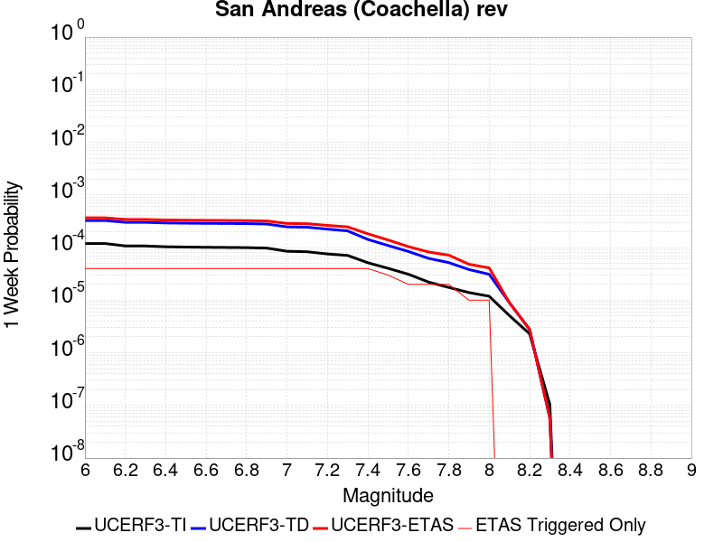 |  |  |  |

| Magnitude | 1 wk TI Prob | 1 wk TD Prob | 1 wk ETAS Prob | 1 wk ETAS/TD Gain | 1 wk ETAS Triggered Only | 1 mo TI Prob | 1 mo TD Prob | 1 mo ETAS Prob | 1 mo ETAS/TD Gain | 1 mo ETAS Triggered Only | 1 yr TI Prob | 1 yr TD Prob | 1 yr ETAS Prob | 1 yr ETAS/TD Gain | 1 yr ETAS Triggered Only | 10 yr TI Prob | 10 yr TD Prob | 10 yr ETAS Prob | 10 yr ETAS/TD Gain | 10 yr ETAS Triggered Only |
|-----|-----|-----|-----|-----|-----|-----|-----|-----|-----|-----|-----|-----|-----|-----|-----|-----|-----|-----|-----|-----|
| 6.0 | 1.1925945E-4 | 3.2729402E-4 | 3.2729402E-4 | 1.0 | 0.0 | 5.110118E-4 | 0.0014019393 | 0.0014019393 | 1.0 | 0.0 | 0.0062038354 | 0.016936364 | 0.016936364 | 1.0 | 0.0 | 0.060334753 | 0.15265316 | 0.15285568 | 1.0013267 | 2.3900573E-4 |
| 6.1 | 1.1925945E-4 | 3.2729402E-4 | 3.2729402E-4 | 1.0 | 0.0 | 5.110118E-4 | 0.0014019393 | 0.0014019393 | 1.0 | 0.0 | 0.0062038354 | 0.016936364 | 0.016936364 | 1.0 | 0.0 | 0.060334753 | 0.15265316 | 0.15285568 | 1.0013267 | 2.3900573E-4 |
| 6.2 | 1.07432395E-4 | 3.0230157E-4 | 3.0230157E-4 | 1.0 | 0.0 | 4.603433E-4 | 0.0012949388 | 0.0012949388 | 1.0 | 0.0 | 0.005590286 | 0.015653009 | 0.015653009 | 1.0 | 0.0 | 0.05451731 | 0.14182423 | 0.14202935 | 1.0014462 | 2.3900573E-4 |
| 6.3 | 1.0718766E-4 | 3.0175463E-4 | 3.0175463E-4 | 1.0 | 0.0 | 4.592948E-4 | 0.0012925972 | 0.0012925972 | 1.0 | 0.0 | 0.005577586 | 0.015624908 | 0.015624908 | 1.0 | 0.0 | 0.054396555 | 0.14159249 | 0.14179766 | 1.001449 | 2.3900573E-4 |
| 6.4 | 1.0355944E-4 | 2.9383553E-4 | 2.9383553E-4 | 1.0 | 0.0 | 4.4375064E-4 | 0.0012586913 | 0.0012586913 | 1.0 | 0.0 | 0.0053892885 | 0.015217941 | 0.015217941 | 1.0 | 0.0 | 0.052604496 | 0.13815255 | 0.13835855 | 1.001491 | 2.3900573E-4 |
| 6.5 | 1.0227914E-4 | 2.9102986E-4 | 2.9102986E-4 | 1.0 | 0.0 | 4.382655E-4 | 0.0012466786 | 0.0012466786 | 1.0 | 0.0 | 0.0053228354 | 0.01507372 | 0.01507372 | 1.0 | 0.0 | 0.051971316 | 0.13693172 | 0.137138 | 1.0015064 | 2.3900573E-4 |
| 6.6 | 1.0116757E-4 | 2.8868738E-4 | 2.8868738E-4 | 1.0 | 0.0 | 4.3350324E-4 | 0.0012366489 | 0.0012366489 | 1.0 | 0.0 | 0.0052651367 | 0.01495329 | 0.01495329 | 1.0 | 0.0 | 0.051421247 | 0.1359099 | 0.13611642 | 1.0015196 | 2.3900573E-4 |
| 6.7 | 1.0050676E-4 | 2.8727303E-4 | 2.8727303E-4 | 1.0 | 0.0 | 4.3067214E-4 | 0.0012305931 | 0.0012305931 | 1.0 | 0.0 | 0.005230834 | 0.014880571 | 0.014880571 | 1.0 | 0.0 | 0.051094085 | 0.13529462 | 0.1355013 | 1.0015275 | 2.3900573E-4 |
| 6.8 | 9.976819E-5 | 2.853096E-4 | 2.853096E-4 | 1.0 | 0.0 | 4.2750788E-4 | 0.0012221863 | 0.0012221863 | 1.0 | 0.0 | 0.0051924936 | 0.0147796115 | 0.0147796115 | 1.0 | 0.0 | 0.050728295 | 0.13444631 | 0.13465318 | 1.0015388 | 2.3900573E-4 |
| 6.9 | 9.77719E-5 | 2.8027873E-4 | 2.8027873E-4 | 1.0 | 0.0 | 4.1895514E-4 | 0.0012006456 | 0.0012006456 | 1.0 | 0.0 | 0.0050888555 | 0.014520878 | 0.014520878 | 1.0 | 0.0 | 0.049738888 | 0.1322748 | 0.1324822 | 1.0015678 | 2.3900573E-4 |
| 7.0 | 8.500761E-5 | 2.4762485E-4 | 2.4762485E-4 | 1.0 | 0.0 | 3.6426744E-4 | 0.001060821 | 0.001060821 | 1.0 | 0.0 | 0.0044259406 | 0.012839786 | 0.012839786 | 1.0 | 0.0 | 0.04338823 | 0.11813272 | 0.118343495 | 1.0017842 | 2.3900573E-4 |
| 7.1 | 8.319876E-5 | 2.4365232E-4 | 2.4365232E-4 | 1.0 | 0.0 | 3.5651738E-4 | 0.0010438096 | 0.0010438096 | 1.0 | 0.0 | 0.004331963 | 0.012635092 | 0.012635092 | 1.0 | 0.0 | 0.042484846 | 0.116353 | 0.1165642 | 1.0018151 | 2.3900573E-4 |
| 7.2 | 7.563917E-5 | 2.2413683E-4 | 2.2413683E-4 | 1.0 | 0.0 | 3.2412758E-4 | 9.602359E-4 | 9.602359E-4 | 1.0 | 0.0 | 0.0039391145 | 0.011628893 | 0.011628893 | 1.0 | 0.0 | 0.03870018 | 0.10775925 | 0.1079725 | 1.001979 | 2.3900573E-4 |
| 7.3 | 7.082985E-5 | 2.0729867E-4 | 2.0729867E-4 | 1.0 | 0.0 | 3.0352117E-4 | 8.881233E-4 | 8.881233E-4 | 1.0 | 0.0 | 0.0036891096 | 0.010759917 | 0.010759917 | 1.0 | 0.0 | 0.03628465 | 0.100282 | 0.10049704 | 1.0021443 | 2.3900573E-4 |
| 7.4 | 5.146215E-5 | 1.4273795E-4 | 1.4273795E-4 | 1.0 | 0.0 | 2.2053342E-4 | 6.115915E-4 | 6.115915E-4 | 1.0 | 0.0 | 0.0026816884 | 0.0074208933 | 0.0074208933 | 1.0 | 0.0 | 0.02649557 | 0.070849575 | 0.07107165 | 1.0031344 | 2.3900573E-4 |
| 7.5 | 4.0285166E-5 | 1.09416E-4 | 1.09416E-4 | 1.0 | 0.0 | 1.7263928E-4 | 4.6884175E-4 | 4.6884175E-4 | 1.0 | 0.0 | 0.002099857 | 0.0056932783 | 0.0056932783 | 1.0 | 0.0 | 0.020801254 | 0.055011146 | 0.055237006 | 1.0041057 | 2.3900573E-4 |
| 7.6 | 3.1168736E-5 | 8.4389096E-5 | 8.4389096E-5 | 1.0 | 0.0 | 1.3357346E-4 | 3.6161754E-4 | 3.6161754E-4 | 1.0 | 0.0 | 0.0016250437 | 0.0043938323 | 0.0043938323 | 1.0 | 0.0 | 0.016132116 | 0.04281005 | 0.043038823 | 1.0053439 | 2.3900573E-4 |
| 7.7 | 2.2100989E-5 | 6.238755E-5 | 6.238755E-5 | 1.0 | 0.0 | 9.4715084E-5 | 2.6734784E-4 | 2.6734784E-4 | 1.0 | 0.0 | 0.001152546 | 0.0032501083 | 0.0032501083 | 1.0 | 0.0 | 0.011465867 | 0.0319002 | 0.032131582 | 1.0072533 | 2.3900573E-4 |
| 7.8 | 1.7484861E-5 | 5.179572E-5 | 5.179572E-5 | 1.0 | 0.0 | 7.493296E-5 | 2.2196278E-4 | 2.2196278E-4 | 1.0 | 0.0 | 9.1192697E-4 | 0.0026990508 | 0.0026990508 | 1.0 | 0.0 | 0.009081938 | 0.026640115 | 0.026872754 | 1.0087327 | 2.3900573E-4 |
| 7.9 | 1.3967285E-5 | 3.822255E-5 | 3.822255E-5 | 1.0 | 0.0 | 5.985842E-5 | 1.6380067E-4 | 1.6380067E-4 | 1.0 | 0.0 | 7.2853256E-4 | 0.00199245 | 0.00199245 | 1.0 | 0.0 | 0.0072614877 | 0.019909438 | 0.020143684 | 1.0117656 | 2.3900573E-4 |
| 8.0 | 1.1887396E-5 | 3.106521E-5 | 3.106521E-5 | 1.0 | 0.0 | 5.094499E-5 | 1.3312983E-4 | 1.3312983E-4 | 1.0 | 0.0 | 6.200787E-4 | 0.0016196516 | 0.0016196516 | 1.0 | 0.0 | 0.006183513 | 0.016279267 | 0.016514383 | 1.0144426 | 2.3900573E-4 |
| 8.1 | 5.100864E-6 | 8.973418E-6 | 8.973418E-6 | 1.0 | 0.0 | 2.1860664E-5 | 3.8456936E-5 | 3.8456936E-5 | 1.0 | 0.0 | 2.6612106E-4 | 4.6811273E-4 | 4.6811273E-4 | 1.0 | 0.0 | 0.002658026 | 0.004917731 | 0.004917731 | 1.0 | 0.0 |
| 8.2 | 2.3004484E-6 | 2.7864487E-6 | 2.7864487E-6 | 1.0 | 0.0 | 9.859027E-6 | 1.1941868E-5 | 1.1941868E-5 | 1.0 | 0.0 | 1.2002704E-4 | 1.4538258E-4 | 1.4538258E-4 | 1.0 | 0.0 | 0.0011996223 | 0.0015973912 | 0.0015973912 | 1.0 | 0.0 |
| 8.3 | 1.0424446E-7 | 5.8161504E-8 | 5.8161504E-8 | 1.0 | 0.0 | 4.4676187E-7 | 2.4926356E-7 | 2.4926356E-7 | 1.0 | 0.0 | 5.439312E-6 | 3.03478E-6 | 3.03478E-6 | 1.0 | 0.0 | 5.4391792E-5 | 3.190716E-5 | 3.190716E-5 | 1.0 | 0.0 |

## Death Valley (No)
*[(top)](#table-of-contents)*

| 1 Week | 1 Month | 1 Year | 10 Year |
|-----|-----|-----|-----|
|  |  |  |  |

| Magnitude | 1 wk TI Prob | 1 wk TD Prob | 1 wk ETAS Prob | 1 wk ETAS/TD Gain | 1 wk ETAS Triggered Only | 1 mo TI Prob | 1 mo TD Prob | 1 mo ETAS Prob | 1 mo ETAS/TD Gain | 1 mo ETAS Triggered Only | 1 yr TI Prob | 1 yr TD Prob | 1 yr ETAS Prob | 1 yr ETAS/TD Gain | 1 yr ETAS Triggered Only | 10 yr TI Prob | 10 yr TD Prob | 10 yr ETAS Prob | 10 yr ETAS/TD Gain | 10 yr ETAS Triggered Only |
|-----|-----|-----|-----|-----|-----|-----|-----|-----|-----|-----|-----|-----|-----|-----|-----|-----|-----|-----|-----|-----|
| 6.0 | 2.0074807E-5 | 2.2500084E-5 | 2.2500084E-5 | 1.0 | 0.0 | 8.603206E-5 | 9.642541E-5 | 9.642541E-5 | 1.0 | 0.0 | 0.001046937 | 0.0011733545 | 0.0014120798 | 1.2034554 | 2.3900573E-4 | 0.010420183 | 0.011672506 | 0.012144938 | 1.0404739 | 4.7801147E-4 |
| 6.1 | 2.0074807E-5 | 2.2500084E-5 | 2.2500084E-5 | 1.0 | 0.0 | 8.603206E-5 | 9.642541E-5 | 9.642541E-5 | 1.0 | 0.0 | 0.001046937 | 0.0011733545 | 0.0014120798 | 1.2034554 | 2.3900573E-4 | 0.010420183 | 0.011672506 | 0.012144938 | 1.0404739 | 4.7801147E-4 |
| 6.2 | 2.0074807E-5 | 2.2500084E-5 | 2.2500084E-5 | 1.0 | 0.0 | 8.603206E-5 | 9.642541E-5 | 9.642541E-5 | 1.0 | 0.0 | 0.001046937 | 0.0011733545 | 0.0014120798 | 1.2034554 | 2.3900573E-4 | 0.010420183 | 0.011672506 | 0.012144938 | 1.0404739 | 4.7801147E-4 |
| 6.3 | 1.9050609E-5 | 2.1336948E-5 | 2.1336948E-5 | 1.0 | 0.0 | 8.164292E-5 | 9.1440896E-5 | 9.1440896E-5 | 1.0 | 0.0 | 9.935491E-4 | 0.001112731 | 0.0013514708 | 1.214553 | 2.3900573E-4 | 0.009891188 | 0.011072419 | 0.0115451375 | 1.0426934 | 4.7801147E-4 |
| 6.4 | 1.9050609E-5 | 2.1336948E-5 | 2.1336948E-5 | 1.0 | 0.0 | 8.164292E-5 | 9.1440896E-5 | 9.1440896E-5 | 1.0 | 0.0 | 9.935491E-4 | 0.001112731 | 0.0013514708 | 1.214553 | 2.3900573E-4 | 0.009891188 | 0.011072419 | 0.0115451375 | 1.0426934 | 4.7801147E-4 |
| 6.5 | 1.8367004E-5 | 2.0561009E-5 | 2.0561009E-5 | 1.0 | 0.0 | 7.8713354E-5 | 8.811567E-5 | 8.811567E-5 | 1.0 | 0.0 | 9.5791375E-4 | 0.0010722869 | 0.0013110363 | 1.2226545 | 2.3900573E-4 | 0.009537951 | 0.0106719155 | 0.011144825 | 1.0443135 | 4.7801147E-4 |
| 6.6 | 1.779439E-5 | 1.9910927E-5 | 1.9910927E-5 | 1.0 | 0.0 | 7.625944E-5 | 8.53298E-5 | 8.53298E-5 | 1.0 | 0.0 | 9.280632E-4 | 0.0010384015 | 0.0012771591 | 1.229928 | 2.3900573E-4 | 0.009241969 | 0.010336253 | 0.010809323 | 1.0457681 | 4.7801147E-4 |
| 6.7 | 1.7025437E-5 | 1.9043426E-5 | 1.9043426E-5 | 1.0 | 0.0 | 7.296412E-5 | 8.161216E-5 | 8.161216E-5 | 1.0 | 0.0 | 8.87976E-4 | 9.931813E-4 | 0.0012319497 | 1.2404076 | 2.3900573E-4 | 0.008844362 | 0.009888145 | 0.01036143 | 1.0478638 | 4.7801147E-4 |
| 6.8 | 1.6545107E-5 | 1.8512545E-5 | 1.8512545E-5 | 1.0 | 0.0 | 7.090568E-5 | 7.93371E-5 | 7.93371E-5 | 1.0 | 0.0 | 8.629347E-4 | 9.655073E-4 | 0.0012042823 | 1.2473052 | 2.3900573E-4 | 0.008595915 | 0.009613829 | 0.010087245 | 1.0492432 | 4.7801147E-4 |
| 6.9 | 1.615478E-5 | 1.8087594E-5 | 1.8087594E-5 | 1.0 | 0.0 | 6.9232934E-5 | 7.751599E-5 | 7.751599E-5 | 1.0 | 0.0 | 8.4258494E-4 | 9.433546E-4 | 0.001182135 | 1.2531183 | 2.3900573E-4 | 0.008393973 | 0.009394196 | 0.009867717 | 1.0504057 | 4.7801147E-4 |
| 7.0 | 1.5894311E-5 | 1.780555E-5 | 1.780555E-5 | 1.0 | 0.0 | 6.81167E-5 | 7.6307304E-5 | 7.6307304E-5 | 1.0 | 0.0 | 8.2900526E-4 | 9.286515E-4 | 0.0011674353 | 1.2571295 | 2.3900573E-4 | 0.008259195 | 0.009248397 | 0.009721988 | 1.0512079 | 4.7801147E-4 |
| 7.1 | 1.5602263E-5 | 1.7483504E-5 | 1.7483504E-5 | 1.0 | 0.0 | 6.6865134E-5 | 7.492718E-5 | 7.492718E-5 | 1.0 | 0.0 | 8.137789E-4 | 9.118627E-4 | 0.0011506506 | 1.2618681 | 2.3900573E-4 | 0.008108052 | 0.009081894 | 0.009555564 | 1.0521555 | 4.7801147E-4 |
| 7.2 | 1.5323829E-5 | 1.717063E-5 | 1.717063E-5 | 1.0 | 0.0 | 6.56719E-5 | 7.358637E-5 | 7.358637E-5 | 1.0 | 0.0 | 7.99262E-4 | 8.9555193E-4 | 0.0011343436 | 1.266642 | 2.3900573E-4 | 0.007963934 | 0.008920107 | 0.009393854 | 1.0531101 | 4.7801147E-4 |
| 7.3 | 1.4556212E-5 | 1.6302456E-5 | 1.6302456E-5 | 1.0 | 0.0 | 6.238227E-5 | 6.9865826E-5 | 6.9865826E-5 | 1.0 | 0.0 | 7.592395E-4 | 8.5029035E-4 | 8.5029035E-4 | 1.0 | 0.0 | 0.0075665074 | 0.008471014 | 0.0087079955 | 1.0279756 | 2.3900573E-4 |
| 7.4 | 1.411725E-5 | 1.580796E-5 | 1.580796E-5 | 1.0 | 0.0 | 6.0501097E-5 | 6.7746674E-5 | 6.7746674E-5 | 1.0 | 0.0 | 7.363519E-4 | 8.245094E-4 | 8.245094E-4 | 1.0 | 0.0 | 0.0073391674 | 0.008215138 | 0.008452181 | 1.0288544 | 2.3900573E-4 |
| 7.5 | 1.3503312E-5 | 1.5126289E-5 | 1.5126289E-5 | 1.0 | 0.0 | 5.7870053E-5 | 6.482538E-5 | 6.482538E-5 | 1.0 | 0.0 | 7.043401E-4 | 7.8896893E-4 | 7.8896893E-4 | 1.0 | 0.0 | 0.007021119 | 0.007862304 | 0.008099431 | 1.03016 | 2.3900573E-4 |
| 7.6 | 1.1279839E-5 | 1.2626327E-5 | 1.2626327E-5 | 1.0 | 0.0 | 4.834127E-5 | 5.4111737E-5 | 5.4111737E-5 | 1.0 | 0.0 | 5.88396E-4 | 6.5861654E-4 | 6.5861654E-4 | 1.0 | 0.0 | 0.005868405 | 0.006567199 | 0.006804635 | 1.0361549 | 2.3900573E-4 |
| 7.7 | 9.189108E-6 | 1.0283358E-5 | 1.0283358E-5 | 1.0 | 0.0 | 3.93813E-5 | 4.407082E-5 | 4.407082E-5 | 1.0 | 0.0 | 4.7936183E-4 | 5.3643517E-4 | 5.3643517E-4 | 1.0 | 0.0 | 0.004783291 | 0.005351914 | 0.0055896407 | 1.0444189 | 2.3900573E-4 |
| 7.8 | 3.4586725E-7 | 3.6482615E-7 | 3.6482615E-7 | 1.0 | 0.0 | 1.4822873E-6 | 1.5635396E-6 | 1.5635396E-6 | 1.0 | 0.0 | 1.80467E-5 | 1.9035933E-5 | 1.9035933E-5 | 1.0 | 0.0 | 1.8045233E-4 | 1.9034347E-4 | 1.9034347E-4 | 1.0 | 0.0 |
| 7.9 | 2.5591178E-9 | 2.6696718E-9 | 2.6696718E-9 | 1.0 | 0.0 | 1.0967647E-8 | 1.14414505E-8 | 1.14414505E-8 | 1.0 | 0.0 | 1.335311E-7 | 1.3929966E-7 | 1.3929966E-7 | 1.0 | 0.0 | 1.3353102E-6 | 1.3929966E-6 | 1.3929966E-6 | 1.0 | 0.0 |

## Brawley (Seismic Zone) alt 1
*[(top)](#table-of-contents)*

| 1 Week | 1 Month | 1 Year | 10 Year |
|-----|-----|-----|-----|
| 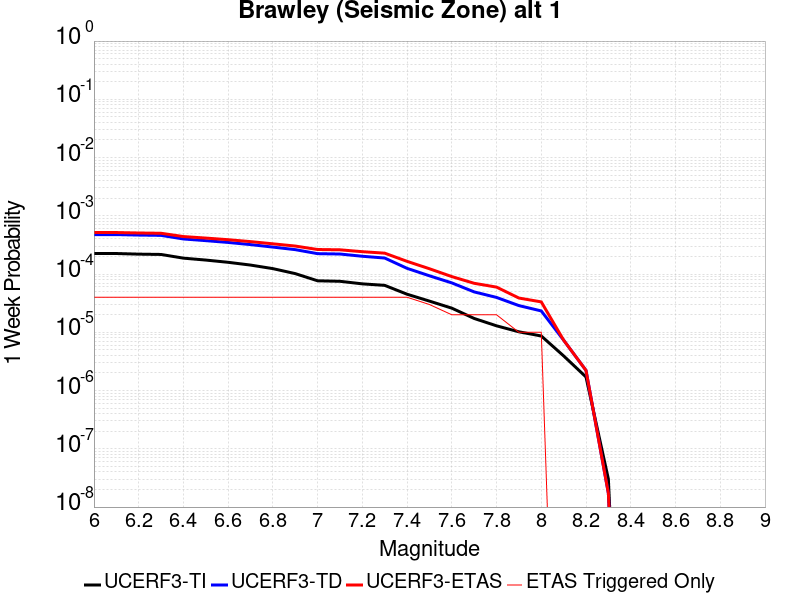 |  |  |  |

| Magnitude | 1 wk TI Prob | 1 wk TD Prob | 1 wk ETAS Prob | 1 wk ETAS/TD Gain | 1 wk ETAS Triggered Only | 1 mo TI Prob | 1 mo TD Prob | 1 mo ETAS Prob | 1 mo ETAS/TD Gain | 1 mo ETAS Triggered Only | 1 yr TI Prob | 1 yr TD Prob | 1 yr ETAS Prob | 1 yr ETAS/TD Gain | 1 yr ETAS Triggered Only | 10 yr TI Prob | 10 yr TD Prob | 10 yr ETAS Prob | 10 yr ETAS/TD Gain | 10 yr ETAS Triggered Only |
|-----|-----|-----|-----|-----|-----|-----|-----|-----|-----|-----|-----|-----|-----|-----|-----|-----|-----|-----|-----|-----|
| 6.0 | 2.2521618E-4 | 4.7632487E-4 | 4.7632487E-4 | 1.0 | 0.0 | 9.6485513E-4 | 0.0020398323 | 0.0020398323 | 1.0 | 0.0 | 0.011683988 | 0.024546238 | 0.024779376 | 1.009498 | 2.3900573E-4 | 0.11088423 | 0.21350002 | 0.213688 | 1.0008805 | 2.3900573E-4 |
| 6.1 | 2.2521618E-4 | 4.7632487E-4 | 4.7632487E-4 | 1.0 | 0.0 | 9.6485513E-4 | 0.0020398323 | 0.0020398323 | 1.0 | 0.0 | 0.011683988 | 0.024546238 | 0.024779376 | 1.009498 | 2.3900573E-4 | 0.11088423 | 0.21350002 | 0.213688 | 1.0008805 | 2.3900573E-4 |
| 6.2 | 2.198148E-4 | 4.6717093E-4 | 4.6717093E-4 | 1.0 | 0.0 | 9.417233E-4 | 0.0020006616 | 0.0020006616 | 1.0 | 0.0 | 0.011405343 | 0.024080504 | 0.024313753 | 1.0096862 | 2.3900573E-4 | 0.10837428 | 0.20993657 | 0.2101254 | 1.0008994 | 2.3900573E-4 |
| 6.3 | 2.1704129E-4 | 4.615278E-4 | 4.615278E-4 | 1.0 | 0.0 | 9.298453E-4 | 0.0019765133 | 0.0019765133 | 1.0 | 0.0 | 0.011262234 | 0.02379366 | 0.02402698 | 1.0098059 | 2.3900573E-4 | 0.107082725 | 0.20782755 | 0.20801689 | 1.000911 | 2.3900573E-4 |
| 6.4 | 1.876142E-4 | 4.00449E-4 | 4.00449E-4 | 1.0 | 0.0 | 8.038131E-4 | 0.0017150956 | 0.0017150956 | 1.0 | 0.0 | 0.00974259 | 0.020680401 | 0.020914463 | 1.0113181 | 2.3900573E-4 | 0.093263686 | 0.18457815 | 0.18477304 | 1.0010558 | 2.3900573E-4 |
| 6.5 | 1.7390939E-4 | 3.7477075E-4 | 3.7477075E-4 | 1.0 | 0.0 | 7.45113E-4 | 0.0016051838 | 0.0016051838 | 1.0 | 0.0 | 0.009034078 | 0.019368723 | 0.0196031 | 1.0121008 | 2.3900573E-4 | 0.086755216 | 0.17440031 | 0.17459764 | 1.0011314 | 2.3900573E-4 |
| 6.6 | 1.591791E-4 | 3.4891962E-4 | 3.4891962E-4 | 1.0 | 0.0 | 6.8201777E-4 | 0.0014945229 | 0.0014945229 | 1.0 | 0.0 | 0.008271996 | 0.018045569 | 0.018280262 | 1.0130056 | 2.3900573E-4 | 0.07970774 | 0.16380852 | 0.16400838 | 1.0012201 | 2.3900573E-4 |
| 6.7 | 1.4268003E-4 | 3.20582E-4 | 3.20582E-4 | 1.0 | 0.0 | 6.1134255E-4 | 0.0013732077 | 0.0013732077 | 1.0 | 0.0 | 0.007417723 | 0.016592601 | 0.016827643 | 1.0141654 | 2.3900573E-4 | 0.07174956 | 0.15193306 | 0.15213576 | 1.0013341 | 2.3900573E-4 |
| 6.8 | 1.239713E-4 | 2.9053655E-4 | 2.9053655E-4 | 1.0 | 0.0 | 5.3119735E-4 | 0.0012445687 | 0.0012445687 | 1.0 | 0.0 | 0.0064481674 | 0.015048777 | 0.015048777 | 1.0 | 0.0 | 0.06264243 | 0.13837762 | 0.13837762 | 1.0 | 0.0 |
| 6.9 | 1.0180238E-4 | 2.625439E-4 | 2.625439E-4 | 1.0 | 0.0 | 4.3622297E-4 | 0.0011247073 | 0.0011247073 | 1.0 | 0.0 | 0.005298089 | 0.013608336 | 0.013608336 | 1.0 | 0.0 | 0.05173543 | 0.124961674 | 0.124961674 | 1.0 | 0.0 |
| 7.0 | 7.6619996E-5 | 2.23993E-4 | 2.23993E-4 | 1.0 | 0.0 | 3.283301E-4 | 9.5962E-4 | 9.5962E-4 | 1.0 | 0.0 | 0.0039900932 | 0.011621496 | 0.011621496 | 1.0 | 0.0 | 0.039192066 | 0.107266866 | 0.107266866 | 1.0 | 0.0 |
| 7.1 | 7.5127435E-5 | 2.2082464E-4 | 2.2082464E-4 | 1.0 | 0.0 | 3.2193496E-4 | 9.4605127E-4 | 9.4605127E-4 | 1.0 | 0.0 | 0.0039125155 | 0.011458045 | 0.011458045 | 1.0 | 0.0 | 0.038443442 | 0.10583085 | 0.10583085 | 1.0 | 0.0 |
| 7.2 | 6.788582E-5 | 2.0210193E-4 | 2.0210193E-4 | 1.0 | 0.0 | 2.9090676E-4 | 8.6586666E-4 | 8.6586666E-4 | 1.0 | 0.0 | 0.0035360386 | 0.0104916105 | 0.0104916105 | 1.0 | 0.0 | 0.034803 | 0.09750131 | 0.09750131 | 1.0 | 0.0 |
| 7.3 | 6.399602E-5 | 1.8841137E-4 | 1.8841137E-4 | 1.0 | 0.0 | 2.7423984E-4 | 8.072303E-4 | 8.072303E-4 | 1.0 | 0.0 | 0.0033337586 | 0.009784332 | 0.009784332 | 1.0 | 0.0 | 0.03284188 | 0.09139617 | 0.09139617 | 1.0 | 0.0 |
| 7.4 | 4.506759E-5 | 1.2529209E-4 | 1.2529209E-4 | 1.0 | 0.0 | 1.9313251E-4 | 5.368565E-4 | 5.368565E-4 | 1.0 | 0.0 | 0.0023488526 | 0.0065168133 | 0.0065168133 | 1.0 | 0.0 | 0.023241805 | 0.062363707 | 0.062363707 | 1.0 | 0.0 |
| 7.5 | 3.43289E-5 | 9.33541E-5 | 9.33541E-5 | 1.0 | 0.0 | 1.4711556E-4 | 4.00028E-4 | 4.00028E-4 | 1.0 | 0.0 | 0.0017896603 | 0.0048595266 | 0.0048595266 | 1.0 | 0.0 | 0.01775316 | 0.04705519 | 0.04705519 | 1.0 | 0.0 |
| 7.6 | 2.5980507E-5 | 7.053101E-5 | 7.053101E-5 | 1.0 | 0.0 | 1.1134028E-4 | 3.0224086E-4 | 3.0224086E-4 | 1.0 | 0.0 | 0.001354725 | 0.003673598 | 0.003673598 | 1.0 | 0.0 | 0.013464959 | 0.035840835 | 0.035840835 | 1.0 | 0.0 |
| 7.7 | 1.7292105E-5 | 4.9407296E-5 | 4.9407296E-5 | 1.0 | 0.0 | 7.4106916E-5 | 2.117284E-4 | 2.117284E-4 | 1.0 | 0.0 | 9.018782E-4 | 0.0025747516 | 0.0025747516 | 1.0 | 0.0 | 0.008982267 | 0.025290398 | 0.025290398 | 1.0 | 0.0 |
| 7.8 | 1.2927471E-5 | 3.9693266E-5 | 3.9693266E-5 | 1.0 | 0.0 | 5.5402274E-5 | 1.7010293E-4 | 1.7010293E-4 | 1.0 | 0.0 | 6.743139E-4 | 0.0020690386 | 0.0020690386 | 1.0 | 0.0 | 0.0067227143 | 0.020431727 | 0.020431727 | 1.0 | 0.0 |
| 7.9 | 1.0200774E-5 | 2.874569E-5 | 2.874569E-5 | 1.0 | 0.0 | 4.371687E-5 | 1.2319001E-4 | 1.2319001E-4 | 1.0 | 0.0 | 5.321229E-4 | 0.0014988075 | 0.0014988075 | 1.0 | 0.0 | 0.005308505 | 0.014991644 | 0.014991644 | 1.0 | 0.0 |
| 8.0 | 8.650396E-6 | 2.3277367E-5 | 2.3277367E-5 | 1.0 | 0.0 | 3.70726E-5 | 9.975634E-5 | 9.975634E-5 | 1.0 | 0.0 | 4.5126543E-4 | 0.0012138576 | 0.0012138576 | 1.0 | 0.0 | 0.0045035016 | 0.012211097 | 0.012211097 | 1.0 | 0.0 |
| 8.1 | 3.9368224E-6 | 7.3279825E-6 | 7.3279825E-6 | 1.0 | 0.0 | 1.6871985E-5 | 3.140526E-5 | 3.140526E-5 | 1.0 | 0.0 | 2.0539707E-4 | 3.8229208E-4 | 3.8229208E-4 | 1.0 | 0.0 | 0.0020520731 | 0.004001185 | 0.004001185 | 1.0 | 0.0 |
| 8.2 | 1.7101195E-6 | 2.217876E-6 | 2.217876E-6 | 1.0 | 0.0 | 7.329063E-6 | 9.505149E-6 | 9.505149E-6 | 1.0 | 0.0 | 8.922769E-5 | 1.1571907E-4 | 1.1571907E-4 | 1.0 | 0.0 | 8.9191867E-4 | 0.0012666774 | 0.0012666774 | 1.0 | 0.0 |
| 8.3 | 3.0346666E-8 | 1.721586E-8 | 1.721586E-8 | 1.0 | 0.0 | 1.3005713E-7 | 7.378226E-8 | 7.378226E-8 | 1.0 | 0.0 | 1.5834444E-6 | 8.9829894E-7 | 8.9829894E-7 | 1.0 | 0.0 | 1.5834332E-5 | 9.367729E-6 | 9.367729E-6 | 1.0 | 0.0 |

## Santa Cruz Island
*[(top)](#table-of-contents)*

| 1 Week | 1 Month | 1 Year | 10 Year |
|-----|-----|-----|-----|
|  |  | 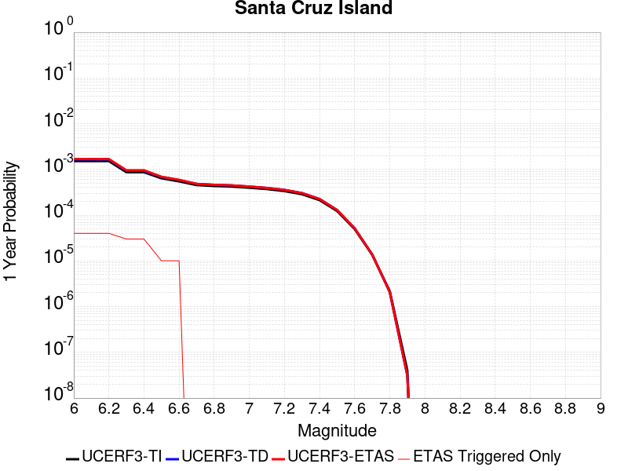 |  |

| Magnitude | 1 wk TI Prob | 1 wk TD Prob | 1 wk ETAS Prob | 1 wk ETAS/TD Gain | 1 wk ETAS Triggered Only | 1 mo TI Prob | 1 mo TD Prob | 1 mo ETAS Prob | 1 mo ETAS/TD Gain | 1 mo ETAS Triggered Only | 1 yr TI Prob | 1 yr TD Prob | 1 yr ETAS Prob | 1 yr ETAS/TD Gain | 1 yr ETAS Triggered Only | 10 yr TI Prob | 10 yr TD Prob | 10 yr ETAS Prob | 10 yr ETAS/TD Gain | 10 yr ETAS Triggered Only |
|-----|-----|-----|-----|-----|-----|-----|-----|-----|-----|-----|-----|-----|-----|-----|-----|-----|-----|-----|-----|-----|
| 6.0 | 2.9164563E-5 | 3.1599742E-5 | 3.1599742E-5 | 1.0 | 0.0 | 1.2498499E-4 | 1.3542121E-4 | 3.7439459E-4 | 2.7646673 | 2.3900573E-4 | 0.0015206301 | 0.0016476426 | 0.0018862545 | 1.1448202 | 2.3900573E-4 | 0.015102667 | 0.016368 | 0.016603094 | 1.014363 | 2.3900573E-4 |
| 6.1 | 2.9164563E-5 | 3.1599742E-5 | 3.1599742E-5 | 1.0 | 0.0 | 1.2498499E-4 | 1.3542121E-4 | 3.7439459E-4 | 2.7646673 | 2.3900573E-4 | 0.0015206301 | 0.0016476426 | 0.0018862545 | 1.1448202 | 2.3900573E-4 | 0.015102667 | 0.016368 | 0.016603094 | 1.014363 | 2.3900573E-4 |
| 6.2 | 2.9164563E-5 | 3.1599742E-5 | 3.1599742E-5 | 1.0 | 0.0 | 1.2498499E-4 | 1.3542121E-4 | 3.7439459E-4 | 2.7646673 | 2.3900573E-4 | 0.0015206301 | 0.0016476426 | 0.0018862545 | 1.1448202 | 2.3900573E-4 | 0.015102667 | 0.016368 | 0.016603094 | 1.014363 | 2.3900573E-4 |
| 6.3 | 1.6635553E-5 | 1.780436E-5 | 1.780436E-5 | 1.0 | 0.0 | 7.1293274E-5 | 7.630226E-5 | 3.1528977E-4 | 4.1321154 | 2.3900573E-4 | 8.6765E-4 | 9.2860236E-4 | 0.0011673862 | 1.2571433 | 2.3900573E-4 | 0.008642701 | 0.009249094 | 0.009485888 | 1.025602 | 2.3900573E-4 |
| 6.4 | 1.6635553E-5 | 1.780436E-5 | 1.780436E-5 | 1.0 | 0.0 | 7.1293274E-5 | 7.630226E-5 | 3.1528977E-4 | 4.1321154 | 2.3900573E-4 | 8.6765E-4 | 9.2860236E-4 | 0.0011673862 | 1.2571433 | 2.3900573E-4 | 0.008642701 | 0.009249094 | 0.009485888 | 1.025602 | 2.3900573E-4 |
| 6.5 | 1.2238748E-5 | 1.3042995E-5 | 1.3042995E-5 | 1.0 | 0.0 | 5.2450723E-5 | 5.5897377E-5 | 2.9488976E-4 | 5.275556 | 2.3900573E-4 | 6.3840044E-4 | 6.8034173E-4 | 9.191849E-4 | 1.3510635 | 2.3900573E-4 | 0.0063656955 | 0.0067829876 | 0.0070203724 | 1.0349971 | 2.3900573E-4 |
| 6.6 | 1.0489767E-5 | 1.1156636E-5 | 1.1156636E-5 | 1.0 | 0.0 | 4.495537E-5 | 4.781329E-5 | 2.868076E-4 | 5.9984913 | 2.3900573E-4 | 5.4719415E-4 | 5.819735E-4 | 8.208402E-4 | 1.4104425 | 2.3900573E-4 | 0.005458487 | 0.0058047357 | 0.0060423543 | 1.0409353 | 2.3900573E-4 |
| 6.7 | 8.699222E-6 | 9.236782E-6 | 9.236782E-6 | 1.0 | 0.0 | 3.7281847E-5 | 3.958561E-5 | 3.958561E-5 | 1.0 | 0.0 | 4.5381195E-4 | 4.8184878E-4 | 4.8184878E-4 | 1.0 | 0.0 | 0.0045288634 | 0.004808108 | 0.004808108 | 1.0 | 0.0 |
| 6.8 | 8.307732E-6 | 8.8169045E-6 | 8.8169045E-6 | 1.0 | 0.0 | 3.560408E-5 | 3.7786187E-5 | 3.7786187E-5 | 1.0 | 0.0 | 4.3339343E-4 | 4.5995016E-4 | 4.5995016E-4 | 1.0 | 0.0 | 0.004325492 | 0.0045900354 | 0.0045900354 | 1.0 | 0.0 |
| 6.9 | 8.073121E-6 | 8.564939E-6 | 8.564939E-6 | 1.0 | 0.0 | 3.459863E-5 | 3.6706366E-5 | 3.6706366E-5 | 1.0 | 0.0 | 4.2115687E-4 | 4.468088E-4 | 4.468088E-4 | 1.0 | 0.0 | 0.004203596 | 0.004459156 | 0.004459156 | 1.0 | 0.0 |
| 7.0 | 7.617019E-6 | 8.074664E-6 | 8.074664E-6 | 1.0 | 0.0 | 3.264396E-5 | 3.4605247E-5 | 3.4605247E-5 | 1.0 | 0.0 | 3.9736772E-4 | 4.212378E-4 | 4.212378E-4 | 1.0 | 0.0 | 0.003966579 | 0.0042044413 | 0.0042044413 | 1.0 | 0.0 |
| 7.1 | 7.1224836E-6 | 7.545788E-6 | 7.545788E-6 | 1.0 | 0.0 | 3.052457E-5 | 3.2338692E-5 | 3.2338692E-5 | 1.0 | 0.0 | 3.715733E-4 | 3.936528E-4 | 3.936528E-4 | 1.0 | 0.0 | 0.003709526 | 0.003929598 | 0.003929598 | 1.0 | 0.0 |
| 7.2 | 6.441115E-6 | 6.8273835E-6 | 6.8273835E-6 | 1.0 | 0.0 | 2.7604487E-5 | 2.9259887E-5 | 2.9259887E-5 | 1.0 | 0.0 | 3.360328E-4 | 3.5618112E-4 | 3.5618112E-4 | 1.0 | 0.0 | 0.0033552512 | 0.003556131 | 0.003556131 | 1.0 | 0.0 |
| 7.3 | 5.494274E-6 | 5.8199944E-6 | 5.8199944E-6 | 1.0 | 0.0 | 2.3546674E-5 | 2.4942596E-5 | 2.4942596E-5 | 1.0 | 0.0 | 2.8664304E-4 | 3.0363398E-4 | 3.0363398E-4 | 1.0 | 0.0 | 0.002862736 | 0.0030322142 | 0.0030322142 | 1.0 | 0.0 |
| 7.4 | 4.0802624E-6 | 4.312256E-6 | 4.312256E-6 | 1.0 | 0.0 | 1.7486722E-5 | 1.8480967E-5 | 1.8480967E-5 | 1.0 | 0.0 | 2.1288003E-4 | 2.2498262E-4 | 2.2498262E-4 | 1.0 | 0.0 | 0.0021267622 | 0.0022475575 | 0.0022475575 | 1.0 | 0.0 |
| 7.5 | 2.3584746E-6 | 2.4753094E-6 | 2.4753094E-6 | 1.0 | 0.0 | 1.0107709E-5 | 1.0608426E-5 | 1.0608426E-5 | 1.0 | 0.0 | 1.2305441E-4 | 1.2915E-4 | 1.2915E-4 | 1.0 | 0.0 | 0.0012298629 | 0.0012907543 | 0.0012907543 | 1.0 | 0.0 |
| 7.6 | 9.4981914E-7 | 9.86093E-7 | 9.86093E-7 | 1.0 | 0.0 | 4.0706473E-6 | 4.2261063E-6 | 4.2261063E-6 | 1.0 | 0.0 | 4.9559E-5 | 5.145164E-5 | 5.145164E-5 | 1.0 | 0.0 | 4.954795E-4 | 5.1439856E-4 | 5.1439856E-4 | 1.0 | 0.0 |
| 7.7 | 2.6013532E-7 | 2.6416603E-7 | 2.6416603E-7 | 1.0 | 0.0 | 1.1148652E-6 | 1.1321397E-6 | 1.1321397E-6 | 1.0 | 0.0 | 1.3573399E-5 | 1.3783714E-5 | 1.3783714E-5 | 1.0 | 0.0 | 1.357257E-4 | 1.3782867E-4 | 1.3782867E-4 | 1.0 | 0.0 |
| 7.8 | 4.1522263E-8 | 3.965679E-8 | 3.965679E-8 | 1.0 | 0.0 | 1.7795254E-7 | 1.6995766E-7 | 1.6995766E-7 | 1.0 | 0.0 | 2.16657E-6 | 2.0692328E-6 | 2.0692328E-6 | 1.0 | 0.0 | 2.1665488E-5 | 2.0692156E-5 | 2.0692156E-5 | 1.0 | 0.0 |
| 7.9 | 7.7242046E-10 | 5.9468175E-10 | 5.9468175E-10 | 1.0 | 0.0 | 3.3103735E-9 | 2.5486364E-9 | 2.5486364E-9 | 1.0 | 0.0 | 4.0303796E-8 | 3.1029646E-8 | 3.1029646E-8 | 1.0 | 0.0 | 4.030379E-7 | 3.1029643E-7 | 3.1029643E-7 | 1.0 | 0.0 |

## San Diego Trough north alt1
*[(top)](#table-of-contents)*

| 1 Week | 1 Month | 1 Year | 10 Year |
|-----|-----|-----|-----|
|  | 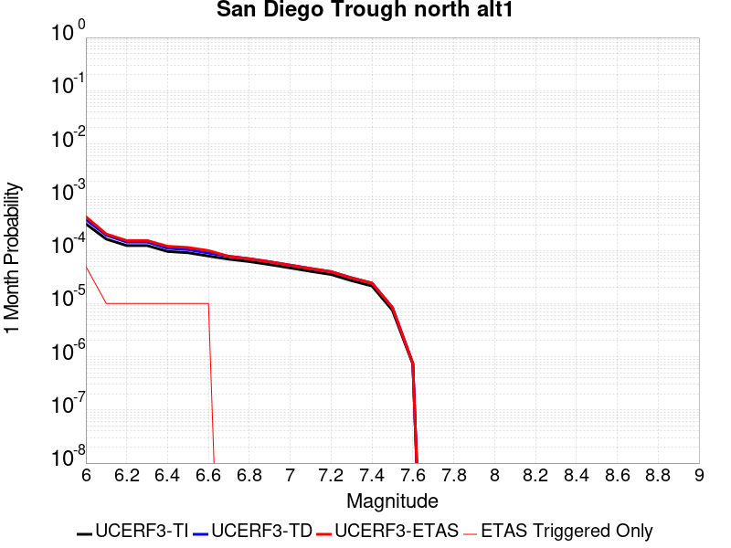 |  |  |

| Magnitude | 1 wk TI Prob | 1 wk TD Prob | 1 wk ETAS Prob | 1 wk ETAS/TD Gain | 1 wk ETAS Triggered Only | 1 mo TI Prob | 1 mo TD Prob | 1 mo ETAS Prob | 1 mo ETAS/TD Gain | 1 mo ETAS Triggered Only | 1 yr TI Prob | 1 yr TD Prob | 1 yr ETAS Prob | 1 yr ETAS/TD Gain | 1 yr ETAS Triggered Only | 10 yr TI Prob | 10 yr TD Prob | 10 yr ETAS Prob | 10 yr ETAS/TD Gain | 10 yr ETAS Triggered Only |
|-----|-----|-----|-----|-----|-----|-----|-----|-----|-----|-----|-----|-----|-----|-----|-----|-----|-----|-----|-----|-----|
| 6.0 | 7.329252E-5 | 8.821093E-5 | 8.821093E-5 | 1.0 | 0.0 | 3.14073E-4 | 3.7799572E-4 | 6.169111E-4 | 1.6320585 | 2.3900573E-4 | 0.0038171355 | 0.004593027 | 0.004830935 | 1.0517976 | 2.3900573E-4 | 0.03752231 | 0.045044992 | 0.04527323 | 1.0050669 | 2.3900573E-4 |
| 6.1 | 3.7940346E-5 | 4.4885E-5 | 4.4885E-5 | 1.0 | 0.0 | 1.6259136E-4 | 1.9235066E-4 | 1.9235066E-4 | 1.0 | 0.0 | 0.0019777524 | 0.0023394432 | 0.0023394432 | 1.0 | 0.0 | 0.019602431 | 0.023156688 | 0.023156688 | 1.0 | 0.0 |
| 6.2 | 2.8645263E-5 | 3.329678E-5 | 3.329678E-5 | 1.0 | 0.0 | 1.2275964E-4 | 1.4269284E-4 | 1.4269284E-4 | 1.0 | 0.0 | 0.0014935739 | 0.0017359189 | 0.0017359189 | 1.0 | 0.0 | 0.0148357535 | 0.017226247 | 0.017226247 | 1.0 | 0.0 |
| 6.3 | 2.8645263E-5 | 3.329678E-5 | 3.329678E-5 | 1.0 | 0.0 | 1.2275964E-4 | 1.4269284E-4 | 1.4269284E-4 | 1.0 | 0.0 | 0.0014935739 | 0.0017359189 | 0.0017359189 | 1.0 | 0.0 | 0.0148357535 | 0.017226247 | 0.017226247 | 1.0 | 0.0 |
| 6.4 | 2.2204576E-5 | 2.5448318E-5 | 2.5448318E-5 | 1.0 | 0.0 | 9.5159E-5 | 1.0905972E-4 | 1.0905972E-4 | 1.0 | 0.0 | 0.001157945 | 0.0013270034 | 0.0013270034 | 1.0 | 0.0 | 0.011519298 | 0.013191955 | 0.013191955 | 1.0 | 0.0 |
| 6.5 | 2.1004838E-5 | 2.4024694E-5 | 2.4024694E-5 | 1.0 | 0.0 | 9.0017624E-5 | 1.0295896E-4 | 1.0295896E-4 | 1.0 | 0.0 | 0.0010954136 | 0.0012528138 | 0.0012528138 | 1.0 | 0.0 | 0.010900296 | 0.012458589 | 0.012458589 | 1.0 | 0.0 |
| 6.6 | 1.820557E-5 | 2.0704787E-5 | 2.0704787E-5 | 1.0 | 0.0 | 7.802154E-5 | 8.873181E-5 | 8.873181E-5 | 1.0 | 0.0 | 9.4949827E-4 | 0.0010797799 | 0.0010797799 | 1.0 | 0.0 | 0.009454516 | 0.010746004 | 0.010746004 | 1.0 | 0.0 |
| 6.7 | 1.5884485E-5 | 1.7983646E-5 | 1.7983646E-5 | 1.0 | 0.0 | 6.807459E-5 | 7.707051E-5 | 7.707051E-5 | 1.0 | 0.0 | 8.284929E-4 | 9.3793223E-4 | 9.3793223E-4 | 1.0 | 0.0 | 0.008254109 | 0.009340104 | 0.009340104 | 1.0 | 0.0 |
| 6.8 | 1.4331171E-5 | 1.6201066E-5 | 1.6201066E-5 | 1.0 | 0.0 | 6.141786E-5 | 6.94313E-5 | 6.94313E-5 | 1.0 | 0.0 | 7.4750587E-4 | 8.450002E-4 | 8.450002E-4 | 1.0 | 0.0 | 0.0074499645 | 0.008418139 | 0.008418139 | 1.0 | 0.0 |
| 6.9 | 1.2574203E-5 | 1.4205835E-5 | 1.4205835E-5 | 1.0 | 0.0 | 5.3888325E-5 | 6.0880735E-5 | 6.0880735E-5 | 1.0 | 0.0 | 6.558929E-4 | 7.409723E-4 | 7.409723E-4 | 1.0 | 0.0 | 0.0065396037 | 0.007385203 | 0.007385203 | 1.0 | 0.0 |
| 7.0 | 1.0883844E-5 | 1.2289262E-5 | 1.2289262E-5 | 1.0 | 0.0 | 4.664421E-5 | 5.2667205E-5 | 5.2667205E-5 | 1.0 | 0.0 | 5.677453E-4 | 6.4103556E-4 | 6.4103556E-4 | 1.0 | 0.0 | 0.00566297 | 0.006391993 | 0.006391993 | 1.0 | 0.0 |
| 7.1 | 9.393088E-6 | 1.060702E-5 | 1.060702E-5 | 1.0 | 0.0 | 4.025547E-5 | 4.545787E-5 | 4.545787E-5 | 1.0 | 0.0 | 4.900001E-4 | 5.533098E-4 | 5.533098E-4 | 1.0 | 0.0 | 0.0048892107 | 0.005519418 | 0.005519418 | 1.0 | 0.0 |
| 7.2 | 8.190791E-6 | 9.258625E-6 | 9.258625E-6 | 1.0 | 0.0 | 3.510292E-5 | 3.9679224E-5 | 3.9679224E-5 | 1.0 | 0.0 | 4.2729423E-4 | 4.8298817E-4 | 4.8298817E-4 | 1.0 | 0.0 | 0.0042647356 | 0.004819465 | 0.004819465 | 1.0 | 0.0 |
| 7.3 | 6.268162E-6 | 7.089716E-6 | 7.089716E-6 | 1.0 | 0.0 | 2.6863276E-5 | 3.0384144E-5 | 3.0384144E-5 | 1.0 | 0.0 | 3.2701128E-4 | 3.6986457E-4 | 3.6986457E-4 | 1.0 | 0.0 | 0.003265305 | 0.003692536 | 0.003692536 | 1.0 | 0.0 |
| 7.4 | 4.985186E-6 | 5.6426816E-6 | 5.6426816E-6 | 1.0 | 0.0 | 2.1364907E-5 | 2.4182698E-5 | 2.4182698E-5 | 1.0 | 0.0 | 2.600867E-4 | 2.9438498E-4 | 2.9438498E-4 | 1.0 | 0.0 | 0.002597825 | 0.0029399914 | 0.0029399914 | 1.0 | 0.0 |
| 7.5 | 1.7489613E-6 | 1.969678E-6 | 1.969678E-6 | 1.0 | 0.0 | 7.495527E-6 | 8.4414505E-6 | 8.4414505E-6 | 1.0 | 0.0 | 9.125422E-5 | 1.02770035E-4 | 1.02770035E-4 | 1.0 | 0.0 | 9.1216754E-4 | 0.0010272472 | 0.0010272472 | 1.0 | 0.0 |
| 7.6 | 1.6988751E-7 | 1.7533823E-7 | 1.7533823E-7 | 1.0 | 0.0 | 7.2808916E-7 | 7.5144936E-7 | 7.5144936E-7 | 1.0 | 0.0 | 8.864449E-6 | 9.14886E-6 | 9.14886E-6 | 1.0 | 0.0 | 8.8640954E-5 | 9.1485024E-5 | 9.1485024E-5 | 1.0 | 0.0 |

## San Andreas (Big Bend)
*[(top)](#table-of-contents)*

| 1 Week | 1 Month | 1 Year | 10 Year |
|-----|-----|-----|-----|
|  |  |  |  |

| Magnitude | 1 wk TI Prob | 1 wk TD Prob | 1 wk ETAS Prob | 1 wk ETAS/TD Gain | 1 wk ETAS Triggered Only | 1 mo TI Prob | 1 mo TD Prob | 1 mo ETAS Prob | 1 mo ETAS/TD Gain | 1 mo ETAS Triggered Only | 1 yr TI Prob | 1 yr TD Prob | 1 yr ETAS Prob | 1 yr ETAS/TD Gain | 1 yr ETAS Triggered Only | 10 yr TI Prob | 10 yr TD Prob | 10 yr ETAS Prob | 10 yr ETAS/TD Gain | 10 yr ETAS Triggered Only |
|-----|-----|-----|-----|-----|-----|-----|-----|-----|-----|-----|-----|-----|-----|-----|-----|-----|-----|-----|-----|-----|
| 6.0 | 1.0179969E-4 | 2.0072258E-4 | 2.0072258E-4 | 1.0 | 0.0 | 4.362114E-4 | 8.599571E-4 | 8.599571E-4 | 1.0 | 0.0 | 0.0052979486 | 0.010419999 | 0.010656514 | 1.0226982 | 2.3900573E-4 | 0.051734097 | 0.10144902 | 0.10166378 | 1.0021169 | 2.3900573E-4 |
| 6.1 | 1.0179969E-4 | 2.0072258E-4 | 2.0072258E-4 | 1.0 | 0.0 | 4.362114E-4 | 8.599571E-4 | 8.599571E-4 | 1.0 | 0.0 | 0.0052979486 | 0.010419999 | 0.010656514 | 1.0226982 | 2.3900573E-4 | 0.051734097 | 0.10144902 | 0.10166378 | 1.0021169 | 2.3900573E-4 |
| 6.2 | 1.0179969E-4 | 2.0072258E-4 | 2.0072258E-4 | 1.0 | 0.0 | 4.362114E-4 | 8.599571E-4 | 8.599571E-4 | 1.0 | 0.0 | 0.0052979486 | 0.010419999 | 0.010656514 | 1.0226982 | 2.3900573E-4 | 0.051734097 | 0.10144902 | 0.10166378 | 1.0021169 | 2.3900573E-4 |
| 6.3 | 1.0179969E-4 | 2.0072258E-4 | 2.0072258E-4 | 1.0 | 0.0 | 4.362114E-4 | 8.599571E-4 | 8.599571E-4 | 1.0 | 0.0 | 0.0052979486 | 0.010419999 | 0.010656514 | 1.0226982 | 2.3900573E-4 | 0.051734097 | 0.10144902 | 0.10166378 | 1.0021169 | 2.3900573E-4 |
| 6.4 | 9.1639464E-5 | 1.8429532E-4 | 1.8429532E-4 | 1.0 | 0.0 | 3.9268145E-4 | 7.895982E-4 | 7.895982E-4 | 1.0 | 0.0 | 0.0047704205 | 0.009571102 | 0.00980782 | 1.0247326 | 2.3900573E-4 | 0.046693064 | 0.09377527 | 0.09399187 | 1.0023097 | 2.3900573E-4 |
| 6.5 | 9.1639464E-5 | 1.8429532E-4 | 1.8429532E-4 | 1.0 | 0.0 | 3.9268145E-4 | 7.895982E-4 | 7.895982E-4 | 1.0 | 0.0 | 0.0047704205 | 0.009571102 | 0.00980782 | 1.0247326 | 2.3900573E-4 | 0.046693064 | 0.09377527 | 0.09399187 | 1.0023097 | 2.3900573E-4 |
| 6.6 | 9.042622E-5 | 1.823659E-4 | 1.823659E-4 | 1.0 | 0.0 | 3.8748336E-4 | 7.8133424E-4 | 7.8133424E-4 | 1.0 | 0.0 | 0.0047074095 | 0.009471365 | 0.009708107 | 1.0249956 | 2.3900573E-4 | 0.046089325 | 0.092869274 | 0.093086086 | 1.0023346 | 2.3900573E-4 |
| 6.7 | 8.9836685E-5 | 1.8150927E-4 | 1.8150927E-4 | 1.0 | 0.0 | 3.8495753E-4 | 7.776651E-4 | 7.776651E-4 | 1.0 | 0.0 | 0.00467679 | 0.00942708 | 0.00942708 | 1.0 | 0.0 | 0.045795817 | 0.09246355 | 0.09246355 | 1.0 | 0.0 |
| 6.8 | 8.9471854E-5 | 1.8097709E-4 | 1.8097709E-4 | 1.0 | 0.0 | 3.8339442E-4 | 7.7538576E-4 | 7.7538576E-4 | 1.0 | 0.0 | 0.004657841 | 0.009399569 | 0.009399569 | 1.0 | 0.0 | 0.04561414 | 0.092210755 | 0.092210755 | 1.0 | 0.0 |
| 6.9 | 8.858234E-5 | 1.7979681E-4 | 1.7979681E-4 | 1.0 | 0.0 | 3.7958333E-4 | 7.703304E-4 | 7.703304E-4 | 1.0 | 0.0 | 0.004611638 | 0.009338548 | 0.009338548 | 1.0 | 0.0 | 0.04517103 | 0.09165087 | 0.09165087 | 1.0 | 0.0 |
| 7.0 | 8.7433385E-5 | 1.7818481E-4 | 1.7818481E-4 | 1.0 | 0.0 | 3.746607E-4 | 7.634259E-4 | 7.634259E-4 | 1.0 | 0.0 | 0.004551957 | 0.009255203 | 0.009255203 | 1.0 | 0.0 | 0.044598386 | 0.09088532 | 0.09088532 | 1.0 | 0.0 |
| 7.1 | 8.684964E-5 | 1.7730435E-4 | 1.7730435E-4 | 1.0 | 0.0 | 3.7215967E-4 | 7.596547E-4 | 7.596547E-4 | 1.0 | 0.0 | 0.0045216335 | 0.009209678 | 0.009209678 | 1.0 | 0.0 | 0.04430731 | 0.09046686 | 0.09046686 | 1.0 | 0.0 |
| 7.2 | 8.606521E-5 | 1.762105E-4 | 1.762105E-4 | 1.0 | 0.0 | 3.6879873E-4 | 7.549695E-4 | 7.549695E-4 | 1.0 | 0.0 | 0.0044808835 | 0.0091531165 | 0.0091531165 | 1.0 | 0.0 | 0.043916024 | 0.089947365 | 0.089947365 | 1.0 | 0.0 |
| 7.3 | 8.568266E-5 | 1.7563057E-4 | 1.7563057E-4 | 1.0 | 0.0 | 3.6715972E-4 | 7.524855E-4 | 7.524855E-4 | 1.0 | 0.0 | 0.0044610105 | 0.009123127 | 0.009123127 | 1.0 | 0.0 | 0.043725148 | 0.08966853 | 0.08966853 | 1.0 | 0.0 |
| 7.4 | 8.5432206E-5 | 1.7525644E-4 | 1.7525644E-4 | 1.0 | 0.0 | 3.6608664E-4 | 7.50883E-4 | 7.50883E-4 | 1.0 | 0.0 | 0.004447999 | 0.009103781 | 0.009103781 | 1.0 | 0.0 | 0.043600157 | 0.08948871 | 0.08948871 | 1.0 | 0.0 |
| 7.5 | 8.4791965E-5 | 1.7394972E-4 | 1.7394972E-4 | 1.0 | 0.0 | 3.633435E-4 | 7.4528606E-4 | 7.4528606E-4 | 1.0 | 0.0 | 0.0044147377 | 0.009036204 | 0.009036204 | 1.0 | 0.0 | 0.043280575 | 0.088866346 | 0.088866346 | 1.0 | 0.0 |
| 7.6 | 8.241105E-5 | 1.6840403E-4 | 1.6840403E-4 | 1.0 | 0.0 | 3.531424E-4 | 7.215321E-4 | 7.215321E-4 | 1.0 | 0.0 | 0.0042910352 | 0.008749358 | 0.008749358 | 1.0 | 0.0 | 0.042091176 | 0.086243294 | 0.086243294 | 1.0 | 0.0 |
| 7.7 | 7.00432E-5 | 1.42045E-4 | 1.42045E-4 | 1.0 | 0.0 | 3.001506E-4 | 6.0862233E-4 | 6.0862233E-4 | 1.0 | 0.0 | 0.0036482112 | 0.0073848404 | 0.0073848404 | 1.0 | 0.0 | 0.035888977 | 0.07351733 | 0.07351733 | 1.0 | 0.0 |
| 7.8 | 6.415362E-5 | 1.2968935E-4 | 1.2968935E-4 | 1.0 | 0.0 | 2.749151E-4 | 5.556931E-4 | 5.556931E-4 | 1.0 | 0.0 | 0.0033419547 | 0.0067446055 | 0.0067446055 | 1.0 | 0.0 | 0.03292141 | 0.06725231 | 0.06725231 | 1.0 | 0.0 |
| 7.9 | 4.939911E-5 | 9.3411545E-5 | 9.3411545E-5 | 1.0 | 0.0 | 2.116933E-4 | 4.0027377E-4 | 4.0027377E-4 | 1.0 | 0.0 | 0.0025743195 | 0.004862453 | 0.004862453 | 1.0 | 0.0 | 0.025447013 | 0.048914436 | 0.048914436 | 1.0 | 0.0 |
| 8.0 | 3.344983E-5 | 5.222685E-5 | 5.222685E-5 | 1.0 | 0.0 | 1.4334853E-4 | 2.2381016E-4 | 2.2381016E-4 | 1.0 | 0.0 | 0.0017438711 | 0.0027214854 | 0.0027214854 | 1.0 | 0.0 | 0.017302496 | 0.027922187 | 0.027922187 | 1.0 | 0.0 |
| 8.1 | 1.9104898E-5 | 1.9173063E-5 | 1.9173063E-5 | 1.0 | 0.0 | 8.1875565E-5 | 8.216769E-5 | 8.216769E-5 | 1.0 | 0.0 | 9.963791E-4 | 9.999331E-4 | 9.999331E-4 | 1.0 | 0.0 | 0.009919235 | 0.010749801 | 0.010749801 | 1.0 | 0.0 |
| 8.2 | 8.643924E-6 | 5.4748625E-6 | 5.4748625E-6 | 1.0 | 0.0 | 3.704486E-5 | 2.3463486E-5 | 2.3463486E-5 | 1.0 | 0.0 | 4.5092785E-4 | 2.8563058E-4 | 2.8563058E-4 | 1.0 | 0.0 | 0.0045001395 | 0.0032487072 | 0.0032487072 | 1.0 | 0.0 |
| 8.3 | 1.983087E-6 | 7.6599065E-7 | 7.6599065E-7 | 1.0 | 0.0 | 8.498917E-6 | 3.282813E-6 | 3.282813E-6 | 1.0 | 0.0 | 1.034694E-4 | 3.9967534E-5 | 3.9967534E-5 | 1.0 | 0.0 | 0.0010342124 | 4.719687E-4 | 4.719687E-4 | 1.0 | 0.0 |

## San Andreas (San Gorgonio Pass-Garnet HIll)
*[(top)](#table-of-contents)*

| 1 Week | 1 Month | 1 Year | 10 Year |
|-----|-----|-----|-----|
|  |  | 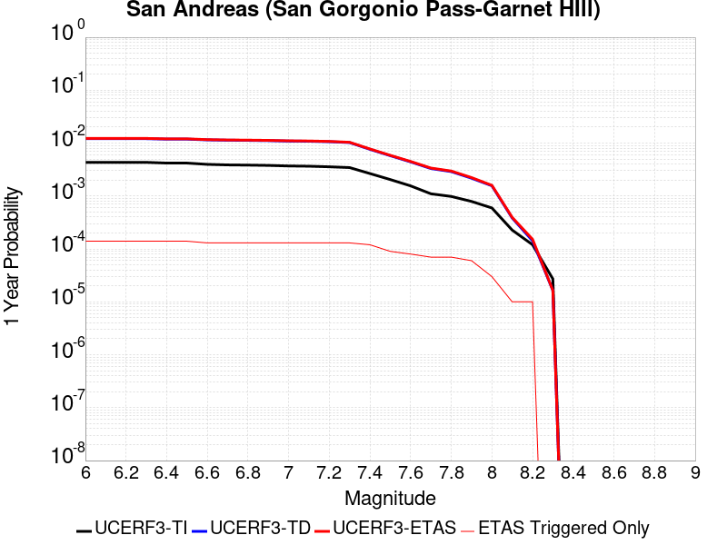 |  |

| Magnitude | 1 wk TI Prob | 1 wk TD Prob | 1 wk ETAS Prob | 1 wk ETAS/TD Gain | 1 wk ETAS Triggered Only | 1 mo TI Prob | 1 mo TD Prob | 1 mo ETAS Prob | 1 mo ETAS/TD Gain | 1 mo ETAS Triggered Only | 1 yr TI Prob | 1 yr TD Prob | 1 yr ETAS Prob | 1 yr ETAS/TD Gain | 1 yr ETAS Triggered Only | 10 yr TI Prob | 10 yr TD Prob | 10 yr ETAS Prob | 10 yr ETAS/TD Gain | 10 yr ETAS Triggered Only |
|-----|-----|-----|-----|-----|-----|-----|-----|-----|-----|-----|-----|-----|-----|-----|-----|-----|-----|-----|-----|-----|
| 6.0 | 8.31567E-5 | 2.3382473E-4 | 2.3382473E-4 | 1.0 | 0.0 | 3.5633717E-4 | 0.0010017233 | 0.0010017233 | 1.0 | 0.0 | 0.004329778 | 0.012127888 | 0.012127888 | 1.0 | 0.0 | 0.042463828 | 0.11257892 | 0.11279102 | 1.001884 | 2.3900573E-4 |
| 6.1 | 8.31567E-5 | 2.3382473E-4 | 2.3382473E-4 | 1.0 | 0.0 | 3.5633717E-4 | 0.0010017233 | 0.0010017233 | 1.0 | 0.0 | 0.004329778 | 0.012127888 | 0.012127888 | 1.0 | 0.0 | 0.042463828 | 0.11257892 | 0.11279102 | 1.001884 | 2.3900573E-4 |
| 6.2 | 8.31567E-5 | 2.3382473E-4 | 2.3382473E-4 | 1.0 | 0.0 | 3.5633717E-4 | 0.0010017233 | 0.0010017233 | 1.0 | 0.0 | 0.004329778 | 0.012127888 | 0.012127888 | 1.0 | 0.0 | 0.042463828 | 0.11257892 | 0.11279102 | 1.001884 | 2.3900573E-4 |
| 6.3 | 8.31567E-5 | 2.3382473E-4 | 2.3382473E-4 | 1.0 | 0.0 | 3.5633717E-4 | 0.0010017233 | 0.0010017233 | 1.0 | 0.0 | 0.004329778 | 0.012127888 | 0.012127888 | 1.0 | 0.0 | 0.042463828 | 0.11257892 | 0.11279102 | 1.001884 | 2.3900573E-4 |
| 6.4 | 8.059055E-5 | 2.2940808E-4 | 2.2940808E-4 | 1.0 | 0.0 | 3.4534236E-4 | 9.828096E-4 | 9.828096E-4 | 1.0 | 0.0 | 0.0041964394 | 0.011900152 | 0.011900152 | 1.0 | 0.0 | 0.041180745 | 0.11056015 | 0.11077273 | 1.0019227 | 2.3900573E-4 |
| 6.5 | 8.059055E-5 | 2.2940808E-4 | 2.2940808E-4 | 1.0 | 0.0 | 3.4534236E-4 | 9.828096E-4 | 9.828096E-4 | 1.0 | 0.0 | 0.0041964394 | 0.011900152 | 0.011900152 | 1.0 | 0.0 | 0.041180745 | 0.11056015 | 0.11077273 | 1.0019227 | 2.3900573E-4 |
| 6.6 | 7.619237E-5 | 2.218517E-4 | 2.218517E-4 | 1.0 | 0.0 | 3.2649786E-4 | 9.5044886E-4 | 9.5044886E-4 | 1.0 | 0.0 | 0.0039678677 | 0.01151087 | 0.01151087 | 1.0 | 0.0 | 0.03897764 | 0.10709683 | 0.107310236 | 1.0019927 | 2.3900573E-4 |
| 6.7 | 7.440636E-5 | 2.1860997E-4 | 2.1860997E-4 | 1.0 | 0.0 | 3.188454E-4 | 9.3656575E-4 | 9.3656575E-4 | 1.0 | 0.0 | 0.0038750346 | 0.011343609 | 0.011343609 | 1.0 | 0.0 | 0.038081564 | 0.105605274 | 0.10581904 | 1.0020242 | 2.3900573E-4 |
| 6.8 | 7.3735864E-5 | 2.1708169E-4 | 2.1708169E-4 | 1.0 | 0.0 | 3.1597257E-4 | 9.3002064E-4 | 9.3002064E-4 | 1.0 | 0.0 | 0.0038401815 | 0.011264749 | 0.011264749 | 1.0 | 0.0 | 0.03774495 | 0.10490683 | 0.105120756 | 1.0020393 | 2.3900573E-4 |
| 6.9 | 7.27575E-5 | 2.1477141E-4 | 2.1477141E-4 | 1.0 | 0.0 | 3.117806E-4 | 9.201265E-4 | 9.201265E-4 | 1.0 | 0.0 | 0.003789323 | 0.011145527 | 0.011145527 | 1.0 | 0.0 | 0.037253562 | 0.103854746 | 0.10406893 | 1.0020623 | 2.3900573E-4 |
| 7.0 | 7.102591E-5 | 2.1061185E-4 | 2.1061185E-4 | 1.0 | 0.0 | 3.0436125E-4 | 9.023122E-4 | 9.023122E-4 | 1.0 | 0.0 | 0.003699303 | 0.010930831 | 0.010930831 | 1.0 | 0.0 | 0.03638325 | 0.10195695 | 0.102171585 | 1.0021052 | 2.3900573E-4 |
| 7.1 | 7.028513E-5 | 2.0896831E-4 | 2.0896831E-4 | 1.0 | 0.0 | 3.0118722E-4 | 8.9527335E-4 | 8.9527335E-4 | 1.0 | 0.0 | 0.0036607897 | 0.010845989 | 0.010845989 | 1.0 | 0.0 | 0.036010686 | 0.101199985 | 0.10141481 | 1.0021228 | 2.3900573E-4 |
| 7.2 | 6.8498244E-5 | 2.0504706E-4 | 2.0504706E-4 | 1.0 | 0.0 | 2.9353087E-4 | 8.784794E-4 | 8.784794E-4 | 1.0 | 0.0 | 0.003567883 | 0.010643536 | 0.010643536 | 1.0 | 0.0 | 0.035111405 | 0.09939202 | 0.09960727 | 1.0021657 | 2.3900573E-4 |
| 7.3 | 6.622592E-5 | 1.9732013E-4 | 1.9732013E-4 | 1.0 | 0.0 | 2.8379448E-4 | 8.453858E-4 | 8.453858E-4 | 1.0 | 0.0 | 0.0034497243 | 0.0102444785 | 0.0102444785 | 1.0 | 0.0 | 0.033966612 | 0.095888525 | 0.096104614 | 1.0022535 | 2.3900573E-4 |
| 7.4 | 5.1050705E-5 | 1.4689034E-4 | 1.4689034E-4 | 1.0 | 0.0 | 2.1877038E-4 | 6.29379E-4 | 6.29379E-4 | 1.0 | 0.0 | 0.002660276 | 0.0076359594 | 0.0076359594 | 1.0 | 0.0 | 0.02628654 | 0.07286301 | 0.07308461 | 1.0030411 | 2.3900573E-4 |
| 7.5 | 3.9302922E-5 | 1.1129847E-4 | 1.1129847E-4 | 1.0 | 0.0 | 1.6843023E-4 | 4.7690657E-4 | 4.7690657E-4 | 1.0 | 0.0 | 0.0020487092 | 0.005790949 | 0.005790949 | 1.0 | 0.0 | 0.020299247 | 0.05600951 | 0.05623513 | 1.0040282 | 2.3900573E-4 |
| 7.6 | 2.9851626E-5 | 8.4949745E-5 | 8.4949745E-5 | 1.0 | 0.0 | 1.2792926E-4 | 3.6401965E-4 | 3.6401965E-4 | 1.0 | 0.0 | 0.0015564259 | 0.0044229585 | 0.0044229585 | 1.0 | 0.0 | 0.0154556995 | 0.04319374 | 0.04342242 | 1.0052943 | 2.3900573E-4 |
| 7.7 | 2.1135214E-5 | 6.3529005E-5 | 6.3529005E-5 | 1.0 | 0.0 | 9.0576345E-5 | 2.7223877E-4 | 2.7223877E-4 | 1.0 | 0.0 | 0.0011022091 | 0.0033094748 | 0.0033094748 | 1.0 | 0.0 | 0.010967582 | 0.032582592 | 0.032813814 | 1.0070964 | 2.3900573E-4 |
| 7.8 | 1.883379E-5 | 5.564028E-5 | 5.564028E-5 | 1.0 | 0.0 | 8.0713755E-5 | 2.3843657E-4 | 2.3843657E-4 | 1.0 | 0.0 | 9.822468E-4 | 0.0028991038 | 0.0028991038 | 1.0 | 0.0 | 0.0097791655 | 0.028695205 | 0.028927354 | 1.0080901 | 2.3900573E-4 |
| 7.9 | 1.5156185E-5 | 4.1658426E-5 | 4.1658426E-5 | 1.0 | 0.0 | 6.495346E-5 | 1.785239E-4 | 1.785239E-4 | 1.0 | 0.0 | 7.9052144E-4 | 0.0021713632 | 0.0021713632 | 1.0 | 0.0 | 0.007877152 | 0.021759422 | 0.021993227 | 1.010745 | 2.3900573E-4 |
| 8.0 | 1.1405907E-5 | 2.9974231E-5 | 2.9974231E-5 | 1.0 | 0.0 | 4.8881542E-5 | 1.2845467E-4 | 1.2845467E-4 | 1.0 | 0.0 | 5.9497025E-4 | 0.0015628147 | 0.0015628147 | 1.0 | 0.0 | 0.005933798 | 0.015772851 | 0.016008087 | 1.014914 | 2.3900573E-4 |
| 8.1 | 4.3511436E-6 | 7.369219E-6 | 7.369219E-6 | 1.0 | 0.0 | 1.8647626E-5 | 3.1581985E-5 | 3.1581985E-5 | 1.0 | 0.0 | 2.2701119E-4 | 3.8444297E-4 | 3.8444297E-4 | 1.0 | 0.0 | 0.0022677942 | 0.0041163345 | 0.0041163345 | 1.0 | 0.0 |
| 8.2 | 2.3042528E-6 | 2.7329415E-6 | 2.7329415E-6 | 1.0 | 0.0 | 9.875332E-6 | 1.1712554E-5 | 1.1712554E-5 | 1.0 | 0.0 | 1.2022553E-4 | 1.4259106E-4 | 1.4259106E-4 | 1.0 | 0.0 | 0.0012016051 | 0.0015979785 | 0.0015979785 | 1.0 | 0.0 |
| 8.3 | 5.202968E-7 | 3.1598344E-7 | 3.1598344E-7 | 1.0 | 0.0 | 2.2298414E-6 | 1.3542141E-6 | 1.3542141E-6 | 1.0 | 0.0 | 2.714798E-5 | 1.6487444E-5 | 1.6487444E-5 | 1.0 | 0.0 | 2.7144665E-4 | 1.9563142E-4 | 1.9563142E-4 | 1.0 | 0.0 |

## Camp Rock 2011
*[(top)](#table-of-contents)*

| 1 Week | 1 Month | 1 Year | 10 Year |
|-----|-----|-----|-----|
|  |  | 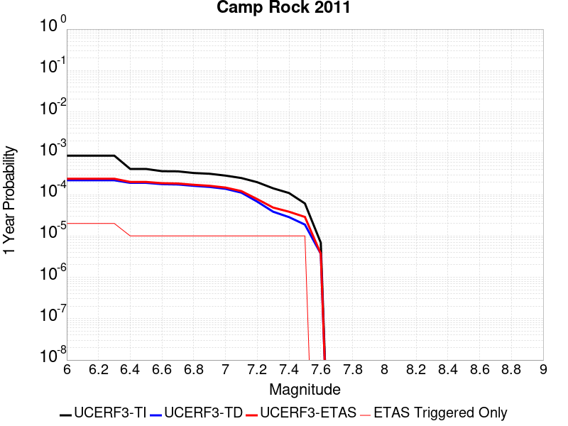 | 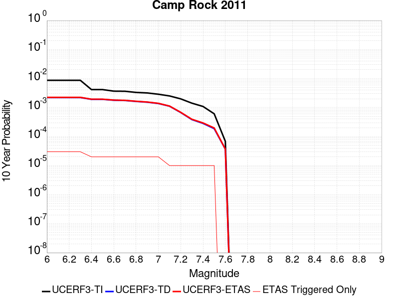 |

| Magnitude | 1 wk TI Prob | 1 wk TD Prob | 1 wk ETAS Prob | 1 wk ETAS/TD Gain | 1 wk ETAS Triggered Only | 1 mo TI Prob | 1 mo TD Prob | 1 mo ETAS Prob | 1 mo ETAS/TD Gain | 1 mo ETAS Triggered Only | 1 yr TI Prob | 1 yr TD Prob | 1 yr ETAS Prob | 1 yr ETAS/TD Gain | 1 yr ETAS Triggered Only | 10 yr TI Prob | 10 yr TD Prob | 10 yr ETAS Prob | 10 yr ETAS/TD Gain | 10 yr ETAS Triggered Only |
|-----|-----|-----|-----|-----|-----|-----|-----|-----|-----|-----|-----|-----|-----|-----|-----|-----|-----|-----|-----|-----|
| 6.0 | 1.6710783E-5 | 4.25026E-6 | 2.4325498E-4 | 57.23296 | 2.3900573E-4 | 7.161568E-5 | 1.8215276E-5 | 2.5721666E-4 | 14.120931 | 2.3900573E-4 | 8.7157206E-4 | 2.2174895E-4 | 4.607017E-4 | 2.0775824 | 2.3900573E-4 | 0.008681616 | 0.0022153298 | 0.0024538059 | 1.1076483 | 2.3900573E-4 |
| 6.1 | 1.6710783E-5 | 4.25026E-6 | 2.4325498E-4 | 57.23296 | 2.3900573E-4 | 7.161568E-5 | 1.8215276E-5 | 2.5721666E-4 | 14.120931 | 2.3900573E-4 | 8.7157206E-4 | 2.2174895E-4 | 4.607017E-4 | 2.0775824 | 2.3900573E-4 | 0.008681616 | 0.0022153298 | 0.0024538059 | 1.1076483 | 2.3900573E-4 |
| 6.2 | 1.6710783E-5 | 4.25026E-6 | 2.4325498E-4 | 57.23296 | 2.3900573E-4 | 7.161568E-5 | 1.8215276E-5 | 2.5721666E-4 | 14.120931 | 2.3900573E-4 | 8.7157206E-4 | 2.2174895E-4 | 4.607017E-4 | 2.0775824 | 2.3900573E-4 | 0.008681616 | 0.0022153298 | 0.0024538059 | 1.1076483 | 2.3900573E-4 |
| 6.3 | 1.6710783E-5 | 4.25026E-6 | 2.4325498E-4 | 57.23296 | 2.3900573E-4 | 7.161568E-5 | 1.8215276E-5 | 2.5721666E-4 | 14.120931 | 2.3900573E-4 | 8.7157206E-4 | 2.2174895E-4 | 4.607017E-4 | 2.0775824 | 2.3900573E-4 | 0.008681616 | 0.0022153298 | 0.0024538059 | 1.1076483 | 2.3900573E-4 |
| 6.4 | 7.982846E-6 | 3.6820884E-6 | 2.4268695E-4 | 65.91013 | 2.3900573E-4 | 3.421175E-5 | 1.5780286E-5 | 2.5478224E-4 | 16.145605 | 2.3900573E-4 | 4.1644843E-4 | 1.9210839E-4 | 4.310682E-4 | 2.2438803 | 2.3900573E-4 | 0.0041566887 | 0.001919458 | 0.002158005 | 1.1242783 | 2.3900573E-4 |
| 6.5 | 7.982846E-6 | 3.6820884E-6 | 2.4268695E-4 | 65.91013 | 2.3900573E-4 | 3.421175E-5 | 1.5780286E-5 | 2.5478224E-4 | 16.145605 | 2.3900573E-4 | 4.1644843E-4 | 1.9210839E-4 | 4.310682E-4 | 2.2438803 | 2.3900573E-4 | 0.0041566887 | 0.001919458 | 0.002158005 | 1.1242783 | 2.3900573E-4 |
| 6.6 | 7.048869E-6 | 3.4243571E-6 | 2.4242928E-4 | 70.795555 | 2.3900573E-4 | 3.0209088E-5 | 1.4675736E-5 | 2.5367795E-4 | 17.285536 | 2.3900573E-4 | 3.677336E-4 | 1.7866275E-4 | 4.176258E-4 | 2.337509 | 2.3900573E-4 | 0.0036712566 | 0.0017852228 | 0.002023802 | 1.133641 | 2.3900573E-4 |
| 6.7 | 6.987307E-6 | 3.3623348E-6 | 2.4236727E-4 | 72.08303 | 2.3900573E-4 | 2.9945259E-5 | 1.4409929E-5 | 2.5341223E-4 | 17.585947 | 2.3900573E-4 | 3.6452254E-4 | 1.7542706E-4 | 4.1439087E-4 | 2.3621833 | 2.3900573E-4 | 0.0036392517 | 0.001752917 | 0.0019915036 | 1.1361084 | 2.3900573E-4 |
| 6.8 | 6.3737602E-6 | 3.1179077E-6 | 2.421229E-4 | 77.65557 | 2.3900573E-4 | 2.731583E-5 | 1.3362394E-5 | 2.5236493E-4 | 18.886206 | 2.3900573E-4 | 3.3251947E-4 | 1.626753E-4 | 4.0164214E-4 | 2.4689806 | 2.3900573E-4 | 0.0033202237 | 0.0016255907 | 0.0018642079 | 1.146788 | 2.3900573E-4 |
| 6.9 | 6.112211E-6 | 2.9331156E-6 | 2.4193815E-4 | 82.48504 | 2.3900573E-4 | 2.6194928E-5 | 1.2570436E-5 | 2.5157316E-4 | 20.013083 | 2.3900573E-4 | 3.1887658E-4 | 1.5303459E-4 | 3.9200374E-4 | 2.5615368 | 2.3900573E-4 | 0.003184194 | 0.0015293199 | 0.00176796 | 1.1560434 | 2.3900573E-4 |
| 7.0 | 5.5140117E-6 | 2.641923E-6 | 2.4164702E-4 | 91.46634 | 2.3900573E-4 | 2.3631264E-5 | 1.132248E-5 | 2.503255E-4 | 22.108719 | 2.3900573E-4 | 2.8767265E-4 | 1.3784273E-4 | 3.768155E-4 | 2.7336628 | 2.3900573E-4 | 0.0028730053 | 0.0013775975 | 0.001616274 | 1.1732556 | 2.3900573E-4 |
| 7.1 | 4.8151105E-6 | 2.1342705E-6 | 2.411395E-4 | 112.98451 | 2.3900573E-4 | 2.0636026E-5 | 9.146843E-6 | 2.481504E-4 | 27.129623 | 2.3900573E-4 | 2.5121463E-4 | 1.1135734E-4 | 3.5033646E-4 | 3.1460564 | 2.3900573E-4 | 0.0025093083 | 0.0011130372 | 0.001351777 | 1.2144939 | 2.3900573E-4 |
| 7.2 | 3.818335E-6 | 1.2937425E-6 | 2.4029917E-4 | 185.73958 | 2.3900573E-4 | 1.6364189E-5 | 5.5445994E-6 | 2.44549E-4 | 44.105804 | 2.3900573E-4 | 1.9921579E-4 | 6.750349E-5 | 3.0649308E-4 | 4.540404 | 2.3900573E-4 | 0.0019903728 | 6.748381E-4 | 9.136825E-4 | 1.3539286 | 2.3900573E-4 |
| 7.3 | 2.7166698E-6 | 7.3835776E-7 | 2.3974392E-4 | 324.69885 | 2.3900573E-4 | 1.1642818E-5 | 3.1643867E-6 | 2.4216936E-4 | 76.52964 | 2.3900573E-4 | 1.4174209E-4 | 3.8525748E-5 | 2.7752228E-4 | 7.203553 | 2.3900573E-4 | 0.0014165172 | 3.851927E-4 | 6.241064E-4 | 1.6202446 | 2.3900573E-4 |
| 7.4 | 2.0893426E-6 | 5.4618386E-7 | 2.395518E-4 | 438.59186 | 2.3900573E-4 | 8.954295E-6 | 2.3407858E-6 | 2.4134596E-4 | 103.104675 | 2.3900573E-4 | 1.0901308E-4 | 2.84987E-5 | 2.674976E-4 | 9.38631 | 2.3900573E-4 | 0.0010895962 | 2.84951E-4 | 5.238886E-4 | 1.8385218 | 2.3900573E-4 |
| 7.5 | 1.1681728E-6 | 3.6030585E-7 | 2.3936595E-4 | 664.341 | 2.3900573E-4 | 5.0064455E-6 | 1.544167E-6 | 2.4054953E-4 | 155.77948 | 2.3900573E-4 | 6.0951766E-5 | 1.8800076E-5 | 2.5780132E-4 | 13.712781 | 2.3900573E-4 | 6.093505E-4 | 1.8798532E-4 | 4.2694612E-4 | 2.2711673 | 2.3900573E-4 |
| 7.6 | 1.3154387E-7 | 7.1197384E-8 | 7.1197384E-8 | 1.0 | 0.0 | 5.6375933E-7 | 3.051316E-7 | 3.051316E-7 | 1.0 | 0.0 | 6.863748E-6 | 3.7149728E-6 | 3.7149728E-6 | 1.0 | 0.0 | 6.863536E-5 | 3.7149264E-5 | 3.7149264E-5 | 1.0 | 0.0 |

## San Andreas (Mojave N)
*[(top)](#table-of-contents)*

| 1 Week | 1 Month | 1 Year | 10 Year |
|-----|-----|-----|-----|
| 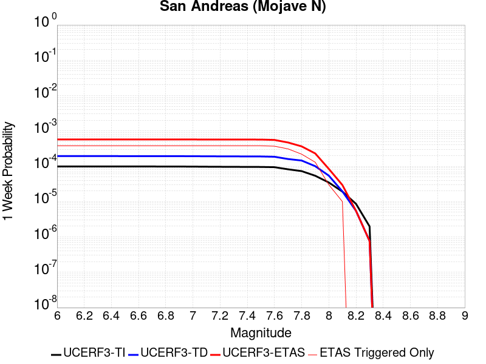 |  |  |  |

| Magnitude | 1 wk TI Prob | 1 wk TD Prob | 1 wk ETAS Prob | 1 wk ETAS/TD Gain | 1 wk ETAS Triggered Only | 1 mo TI Prob | 1 mo TD Prob | 1 mo ETAS Prob | 1 mo ETAS/TD Gain | 1 mo ETAS Triggered Only | 1 yr TI Prob | 1 yr TD Prob | 1 yr ETAS Prob | 1 yr ETAS/TD Gain | 1 yr ETAS Triggered Only | 10 yr TI Prob | 10 yr TD Prob | 10 yr ETAS Prob | 10 yr ETAS/TD Gain | 10 yr ETAS Triggered Only |
|-----|-----|-----|-----|-----|-----|-----|-----|-----|-----|-----|-----|-----|-----|-----|-----|-----|-----|-----|-----|-----|
| 6.0 | 9.877682E-5 | 1.9400702E-4 | 1.9400702E-4 | 1.0 | 0.0 | 4.2326056E-4 | 8.311939E-4 | 8.311939E-4 | 1.0 | 0.0 | 0.0051410277 | 0.010072956 | 0.010072956 | 1.0 | 0.0 | 0.05023708 | 0.09831428 | 0.098529786 | 1.002192 | 2.3900573E-4 |
| 6.1 | 9.877682E-5 | 1.9400702E-4 | 1.9400702E-4 | 1.0 | 0.0 | 4.2326056E-4 | 8.311939E-4 | 8.311939E-4 | 1.0 | 0.0 | 0.0051410277 | 0.010072956 | 0.010072956 | 1.0 | 0.0 | 0.05023708 | 0.09831428 | 0.098529786 | 1.002192 | 2.3900573E-4 |
| 6.2 | 9.877682E-5 | 1.9400702E-4 | 1.9400702E-4 | 1.0 | 0.0 | 4.2326056E-4 | 8.311939E-4 | 8.311939E-4 | 1.0 | 0.0 | 0.0051410277 | 0.010072956 | 0.010072956 | 1.0 | 0.0 | 0.05023708 | 0.09831428 | 0.098529786 | 1.002192 | 2.3900573E-4 |
| 6.3 | 9.877682E-5 | 1.9400702E-4 | 1.9400702E-4 | 1.0 | 0.0 | 4.2326056E-4 | 8.311939E-4 | 8.311939E-4 | 1.0 | 0.0 | 0.0051410277 | 0.010072956 | 0.010072956 | 1.0 | 0.0 | 0.05023708 | 0.09831428 | 0.098529786 | 1.002192 | 2.3900573E-4 |
| 6.4 | 9.877682E-5 | 1.9400702E-4 | 1.9400702E-4 | 1.0 | 0.0 | 4.2326056E-4 | 8.311939E-4 | 8.311939E-4 | 1.0 | 0.0 | 0.0051410277 | 0.010072956 | 0.010072956 | 1.0 | 0.0 | 0.05023708 | 0.09831428 | 0.098529786 | 1.002192 | 2.3900573E-4 |
| 6.5 | 9.861474E-5 | 1.9374468E-4 | 1.9374468E-4 | 1.0 | 0.0 | 4.2256617E-4 | 8.300703E-4 | 8.300703E-4 | 1.0 | 0.0 | 0.0051326132 | 0.010059402 | 0.010059402 | 1.0 | 0.0 | 0.050156746 | 0.098192066 | 0.098407604 | 1.002195 | 2.3900573E-4 |
| 6.6 | 9.861474E-5 | 1.9374468E-4 | 1.9374468E-4 | 1.0 | 0.0 | 4.2256617E-4 | 8.300703E-4 | 8.300703E-4 | 1.0 | 0.0 | 0.0051326132 | 0.010059402 | 0.010059402 | 1.0 | 0.0 | 0.050156746 | 0.098192066 | 0.098407604 | 1.002195 | 2.3900573E-4 |
| 6.7 | 9.8552715E-5 | 1.9364421E-4 | 1.9364421E-4 | 1.0 | 0.0 | 4.223004E-4 | 8.2964E-4 | 8.2964E-4 | 1.0 | 0.0 | 0.0051293927 | 0.010054212 | 0.010054212 | 1.0 | 0.0 | 0.050125998 | 0.098145254 | 0.09836081 | 1.0021962 | 2.3900573E-4 |
| 6.8 | 9.8464974E-5 | 1.9349584E-4 | 1.9349584E-4 | 1.0 | 0.0 | 4.219245E-4 | 8.290045E-4 | 8.290045E-4 | 1.0 | 0.0 | 0.0051248376 | 0.010046546 | 0.010046546 | 1.0 | 0.0 | 0.05008251 | 0.09807528 | 0.098290846 | 1.002198 | 2.3900573E-4 |
| 6.9 | 9.825824E-5 | 1.9317595E-4 | 1.9317595E-4 | 1.0 | 0.0 | 4.2103877E-4 | 8.276344E-4 | 8.276344E-4 | 1.0 | 0.0 | 0.0051141046 | 0.010030019 | 0.010030019 | 1.0 | 0.0 | 0.049980022 | 0.09792438 | 0.09813998 | 1.0022017 | 2.3900573E-4 |
| 7.0 | 9.781462E-5 | 1.924896E-4 | 1.924896E-4 | 1.0 | 0.0 | 4.1913814E-4 | 8.246948E-4 | 8.246948E-4 | 1.0 | 0.0 | 0.005091073 | 0.009994558 | 0.009994558 | 1.0 | 0.0 | 0.04976007 | 0.09760077 | 0.09781645 | 1.0022098 | 2.3900573E-4 |
| 7.1 | 9.7121134E-5 | 1.9150671E-4 | 1.9150671E-4 | 1.0 | 0.0 | 4.1616702E-4 | 8.204851E-4 | 8.204851E-4 | 1.0 | 0.0 | 0.005055068 | 0.009943774 | 0.009943774 | 1.0 | 0.0 | 0.04941613 | 0.09713728 | 0.09735307 | 1.0022215 | 2.3900573E-4 |
| 7.2 | 9.663819E-5 | 1.9081456E-4 | 1.9081456E-4 | 1.0 | 0.0 | 4.1409794E-4 | 8.175206E-4 | 8.175206E-4 | 1.0 | 0.0 | 0.0050299936 | 0.00990801 | 0.00990801 | 1.0 | 0.0 | 0.049176537 | 0.09681055 | 0.097026415 | 1.0022298 | 2.3900573E-4 |
| 7.3 | 9.6277574E-5 | 1.9033969E-4 | 1.9033969E-4 | 1.0 | 0.0 | 4.125529E-4 | 8.154867E-4 | 8.154867E-4 | 1.0 | 0.0 | 0.0050112694 | 0.009883473 | 0.009883473 | 1.0 | 0.0 | 0.04899759 | 0.09658401 | 0.096799925 | 1.0022355 | 2.3900573E-4 |
| 7.4 | 9.593308E-5 | 1.897375E-4 | 1.897375E-4 | 1.0 | 0.0 | 4.1107697E-4 | 8.129075E-4 | 8.129075E-4 | 1.0 | 0.0 | 0.0049933824 | 0.009852355 | 0.009852355 | 1.0 | 0.0 | 0.04882661 | 0.09630218 | 0.096518174 | 1.0022428 | 2.3900573E-4 |
| 7.5 | 9.561707E-5 | 1.8919831E-4 | 1.8919831E-4 | 1.0 | 0.0 | 4.0972308E-4 | 8.1059814E-4 | 8.1059814E-4 | 1.0 | 0.0 | 0.0049769743 | 0.009824493 | 0.009824493 | 1.0 | 0.0 | 0.048669744 | 0.09604836 | 0.096264414 | 1.0022494 | 2.3900573E-4 |
| 7.6 | 9.418194E-5 | 1.8572104E-4 | 1.8572104E-4 | 1.0 | 0.0 | 4.0357444E-4 | 7.957047E-4 | 7.957047E-4 | 1.0 | 0.0 | 0.004902454 | 0.009644784 | 0.009644784 | 1.0 | 0.0 | 0.047957025 | 0.094430685 | 0.094647124 | 1.002292 | 2.3900573E-4 |
| 7.7 | 8.202141E-5 | 1.6021315E-4 | 1.6021315E-4 | 1.0 | 0.0 | 3.51473E-4 | 6.8644714E-4 | 6.8644714E-4 | 1.0 | 0.0 | 0.00427079 | 0.008325525 | 0.008325525 | 1.0 | 0.0 | 0.04189639 | 0.08223219 | 0.082451545 | 1.0026674 | 2.3900573E-4 |
| 7.8 | 7.2859846E-5 | 1.4516473E-4 | 1.4516473E-4 | 1.0 | 0.0 | 3.1221908E-4 | 6.219862E-4 | 6.219862E-4 | 1.0 | 0.0 | 0.003794643 | 0.0075464295 | 0.0075464295 | 1.0 | 0.0 | 0.037304975 | 0.07472468 | 0.07494583 | 1.0029595 | 2.3900573E-4 |
| 7.9 | 5.3874453E-5 | 1.0045676E-4 | 1.0045676E-4 | 1.0 | 0.0 | 2.3087008E-4 | 4.3045796E-4 | 4.3045796E-4 | 1.0 | 0.0 | 0.0028072202 | 0.0052282433 | 0.0052282433 | 1.0 | 0.0 | 0.02772022 | 0.05242443 | 0.052650906 | 1.00432 | 2.3900573E-4 |
| 8.0 | 3.468538E-5 | 5.4260272E-5 | 5.4260272E-5 | 1.0 | 0.0 | 1.4864317E-4 | 2.325233E-4 | 2.325233E-4 | 1.0 | 0.0 | 0.0018082283 | 0.002827298 | 0.002827298 | 1.0 | 0.0 | 0.017935853 | 0.028947512 | 0.0291796 | 1.0080175 | 2.3900573E-4 |
| 8.1 | 1.9152367E-5 | 1.940263E-5 | 1.940263E-5 | 1.0 | 0.0 | 8.207899E-5 | 8.3151484E-5 | 8.3151484E-5 | 1.0 | 0.0 | 9.988535E-4 | 0.0010118998 | 0.0010118998 | 1.0 | 0.0 | 0.009943757 | 0.01085625 | 0.01085625 | 1.0 | 0.0 |
| 8.2 | 8.643924E-6 | 5.4748625E-6 | 5.4748625E-6 | 1.0 | 0.0 | 3.704486E-5 | 2.3463486E-5 | 2.3463486E-5 | 1.0 | 0.0 | 4.5092785E-4 | 2.8563058E-4 | 2.8563058E-4 | 1.0 | 0.0 | 0.0045001395 | 0.0032487072 | 0.0032487072 | 1.0 | 0.0 |
| 8.3 | 1.983087E-6 | 7.6599065E-7 | 7.6599065E-7 | 1.0 | 0.0 | 8.498917E-6 | 3.282813E-6 | 3.282813E-6 | 1.0 | 0.0 | 1.034694E-4 | 3.9967534E-5 | 3.9967534E-5 | 1.0 | 0.0 | 0.0010342124 | 4.719687E-4 | 4.719687E-4 | 1.0 | 0.0 |

## Thirty Mile Bank
*[(top)](#table-of-contents)*

| 1 Week | 1 Month | 1 Year | 10 Year |
|-----|-----|-----|-----|
|  |  |  |  |

| Magnitude | 1 wk TI Prob | 1 wk TD Prob | 1 wk ETAS Prob | 1 wk ETAS/TD Gain | 1 wk ETAS Triggered Only | 1 mo TI Prob | 1 mo TD Prob | 1 mo ETAS Prob | 1 mo ETAS/TD Gain | 1 mo ETAS Triggered Only | 1 yr TI Prob | 1 yr TD Prob | 1 yr ETAS Prob | 1 yr ETAS/TD Gain | 1 yr ETAS Triggered Only | 10 yr TI Prob | 10 yr TD Prob | 10 yr ETAS Prob | 10 yr ETAS/TD Gain | 10 yr ETAS Triggered Only |
|-----|-----|-----|-----|-----|-----|-----|-----|-----|-----|-----|-----|-----|-----|-----|-----|-----|-----|-----|-----|-----|
| 6.0 | 6.5124755E-6 | 6.6592643E-6 | 6.6592643E-6 | 1.0 | 0.0 | 2.791031E-5 | 2.8539416E-5 | 2.6753833E-4 | 9.374345 | 2.3900573E-4 | 3.3975503E-4 | 3.4741635E-4 | 5.8633904E-4 | 1.6877129 | 2.3900573E-4 | 0.0033923604 | 0.003469164 | 0.0037073407 | 1.0686554 | 2.3900573E-4 |
| 6.1 | 6.5124755E-6 | 6.6592643E-6 | 6.6592643E-6 | 1.0 | 0.0 | 2.791031E-5 | 2.8539416E-5 | 2.6753833E-4 | 9.374345 | 2.3900573E-4 | 3.3975503E-4 | 3.4741635E-4 | 5.8633904E-4 | 1.6877129 | 2.3900573E-4 | 0.0033923604 | 0.003469164 | 0.0037073407 | 1.0686554 | 2.3900573E-4 |
| 6.2 | 6.5124755E-6 | 6.6592643E-6 | 6.6592643E-6 | 1.0 | 0.0 | 2.791031E-5 | 2.8539416E-5 | 2.6753833E-4 | 9.374345 | 2.3900573E-4 | 3.3975503E-4 | 3.4741635E-4 | 5.8633904E-4 | 1.6877129 | 2.3900573E-4 | 0.0033923604 | 0.003469164 | 0.0037073407 | 1.0686554 | 2.3900573E-4 |
| 6.3 | 6.5124755E-6 | 6.6592643E-6 | 6.6592643E-6 | 1.0 | 0.0 | 2.791031E-5 | 2.8539416E-5 | 2.6753833E-4 | 9.374345 | 2.3900573E-4 | 3.3975503E-4 | 3.4741635E-4 | 5.8633904E-4 | 1.6877129 | 2.3900573E-4 | 0.0033923604 | 0.003469164 | 0.0037073407 | 1.0686554 | 2.3900573E-4 |
| 6.4 | 6.5124755E-6 | 6.6592643E-6 | 6.6592643E-6 | 1.0 | 0.0 | 2.791031E-5 | 2.8539416E-5 | 2.6753833E-4 | 9.374345 | 2.3900573E-4 | 3.3975503E-4 | 3.4741635E-4 | 5.8633904E-4 | 1.6877129 | 2.3900573E-4 | 0.0033923604 | 0.003469164 | 0.0037073407 | 1.0686554 | 2.3900573E-4 |
| 6.5 | 6.5124755E-6 | 6.6592643E-6 | 6.6592643E-6 | 1.0 | 0.0 | 2.791031E-5 | 2.8539416E-5 | 2.6753833E-4 | 9.374345 | 2.3900573E-4 | 3.3975503E-4 | 3.4741635E-4 | 5.8633904E-4 | 1.6877129 | 2.3900573E-4 | 0.0033923604 | 0.003469164 | 0.0037073407 | 1.0686554 | 2.3900573E-4 |
| 6.6 | 6.5124755E-6 | 6.6592643E-6 | 6.6592643E-6 | 1.0 | 0.0 | 2.791031E-5 | 2.8539416E-5 | 2.6753833E-4 | 9.374345 | 2.3900573E-4 | 3.3975503E-4 | 3.4741635E-4 | 5.8633904E-4 | 1.6877129 | 2.3900573E-4 | 0.0033923604 | 0.003469164 | 0.0037073407 | 1.0686554 | 2.3900573E-4 |
| 6.7 | 3.5261137E-6 | 3.6098995E-6 | 3.6098995E-6 | 1.0 | 0.0 | 1.5111828E-5 | 1.547091E-5 | 1.547091E-5 | 1.0 | 0.0 | 1.8397097E-4 | 1.883427E-4 | 1.883427E-4 | 1.0 | 0.0 | 0.0018381875 | 0.0018818958 | 0.0018818958 | 1.0 | 0.0 |
| 6.8 | 3.370743E-6 | 3.4509355E-6 | 3.4509355E-6 | 1.0 | 0.0 | 1.4445961E-5 | 1.47896435E-5 | 1.47896435E-5 | 1.0 | 0.0 | 1.7586538E-4 | 1.8004965E-4 | 1.8004965E-4 | 1.0 | 0.0 | 0.0017572626 | 0.0017990996 | 0.0017990996 | 1.0 | 0.0 |
| 6.9 | 2.2756835E-6 | 2.333161E-6 | 2.333161E-6 | 1.0 | 0.0 | 9.752893E-6 | 9.999225E-6 | 9.999225E-6 | 1.0 | 0.0 | 1.18735006E-4 | 1.2173401E-4 | 1.2173401E-4 | 1.0 | 0.0 | 0.0011867158 | 0.0012166979 | 0.0012166979 | 1.0 | 0.0 |
| 7.0 | 2.1617404E-6 | 2.21598E-6 | 2.21598E-6 | 1.0 | 0.0 | 9.264569E-6 | 9.497024E-6 | 9.497024E-6 | 1.0 | 0.0 | 1.1279029E-4 | 1.1562037E-4 | 1.1562037E-4 | 1.0 | 0.0 | 0.0011273306 | 0.0011556263 | 0.0011556263 | 1.0 | 0.0 |
| 7.1 | 1.5900777E-6 | 1.6327014E-6 | 1.6327014E-6 | 1.0 | 0.0 | 6.814601E-6 | 6.997274E-6 | 6.997274E-6 | 1.0 | 0.0 | 8.296461E-5 | 8.518861E-5 | 8.518861E-5 | 1.0 | 0.0 | 8.293364E-4 | 8.5157226E-4 | 8.5157226E-4 | 1.0 | 0.0 |
| 7.2 | 1.2971728E-6 | 1.3328992E-6 | 1.3328992E-6 | 1.0 | 0.0 | 5.5593005E-6 | 5.712413E-6 | 5.712413E-6 | 1.0 | 0.0 | 6.768238E-5 | 6.954651E-5 | 6.954651E-5 | 1.0 | 0.0 | 6.7661767E-4 | 6.952578E-4 | 6.952578E-4 | 1.0 | 0.0 |
| 7.3 | 8.2454284E-7 | 8.448891E-7 | 8.448891E-7 | 1.0 | 0.0 | 3.5337503E-6 | 3.6209485E-6 | 3.6209485E-6 | 1.0 | 0.0 | 4.302256E-5 | 4.408422E-5 | 4.408422E-5 | 1.0 | 0.0 | 4.301423E-4 | 4.4076078E-4 | 4.4076078E-4 | 1.0 | 0.0 |
| 7.4 | 4.2619024E-7 | 4.3863466E-7 | 4.3863466E-7 | 1.0 | 0.0 | 1.8265283E-6 | 1.8798615E-6 | 1.8798615E-6 | 1.0 | 0.0 | 2.2237757E-5 | 2.2887078E-5 | 2.2887078E-5 | 1.0 | 0.0 | 2.223553E-4 | 2.288476E-4 | 2.288476E-4 | 1.0 | 0.0 |
| 7.5 | 2.993922E-7 | 3.086453E-7 | 3.086453E-7 | 1.0 | 0.0 | 1.2831089E-6 | 1.3227649E-6 | 1.3227649E-6 | 1.0 | 0.0 | 1.5621737E-5 | 1.6104546E-5 | 1.6104546E-5 | 1.0 | 0.0 | 1.562064E-4 | 1.6103406E-4 | 1.6103406E-4 | 1.0 | 0.0 |
| 7.6 | 1.6988751E-7 | 1.7533823E-7 | 1.7533823E-7 | 1.0 | 0.0 | 7.2808916E-7 | 7.5144936E-7 | 7.5144936E-7 | 1.0 | 0.0 | 8.864449E-6 | 9.14886E-6 | 9.14886E-6 | 1.0 | 0.0 | 8.8640954E-5 | 9.1485024E-5 | 9.1485024E-5 | 1.0 | 0.0 |

## Owens Valley
*[(top)](#table-of-contents)*

| 1 Week | 1 Month | 1 Year | 10 Year |
|-----|-----|-----|-----|
|  |  |  |  |

| Magnitude | 1 wk TI Prob | 1 wk TD Prob | 1 wk ETAS Prob | 1 wk ETAS/TD Gain | 1 wk ETAS Triggered Only | 1 mo TI Prob | 1 mo TD Prob | 1 mo ETAS Prob | 1 mo ETAS/TD Gain | 1 mo ETAS Triggered Only | 1 yr TI Prob | 1 yr TD Prob | 1 yr ETAS Prob | 1 yr ETAS/TD Gain | 1 yr ETAS Triggered Only | 10 yr TI Prob | 10 yr TD Prob | 10 yr ETAS Prob | 10 yr ETAS/TD Gain | 10 yr ETAS Triggered Only |
|-----|-----|-----|-----|-----|-----|-----|-----|-----|-----|-----|-----|-----|-----|-----|-----|-----|-----|-----|-----|-----|
| 6.0 | 4.83821E-5 | 3.626567E-6 | 2.4263143E-4 | 66.90389 | 2.3900573E-4 | 2.0733538E-4 | 1.5542342E-5 | 2.5454437E-4 | 16.377478 | 2.3900573E-4 | 0.002521386 | 1.8921259E-4 | 4.281731E-4 | 2.2629209 | 2.3900573E-4 | 0.024929691 | 0.001925011 | 0.0021635566 | 1.1239191 | 2.3900573E-4 |
| 6.1 | 4.83821E-5 | 3.626567E-6 | 2.4263143E-4 | 66.90389 | 2.3900573E-4 | 2.0733538E-4 | 1.5542342E-5 | 2.5454437E-4 | 16.377478 | 2.3900573E-4 | 0.002521386 | 1.8921259E-4 | 4.281731E-4 | 2.2629209 | 2.3900573E-4 | 0.024929691 | 0.001925011 | 0.0021635566 | 1.1239191 | 2.3900573E-4 |
| 6.2 | 4.83821E-5 | 3.626567E-6 | 2.4263143E-4 | 66.90389 | 2.3900573E-4 | 2.0733538E-4 | 1.5542342E-5 | 2.5454437E-4 | 16.377478 | 2.3900573E-4 | 0.002521386 | 1.8921259E-4 | 4.281731E-4 | 2.2629209 | 2.3900573E-4 | 0.024929691 | 0.001925011 | 0.0021635566 | 1.1239191 | 2.3900573E-4 |
| 6.3 | 3.953008E-5 | 3.1553948E-6 | 2.4216037E-4 | 76.74487 | 2.3900573E-4 | 1.6940363E-4 | 1.3523055E-5 | 2.5252555E-4 | 18.673706 | 2.3900573E-4 | 0.002060538 | 1.6463149E-4 | 4.0359786E-4 | 2.451523 | 2.3900573E-4 | 0.020415364 | 0.0016592 | 0.0018978091 | 1.1438098 | 2.3900573E-4 |
| 6.4 | 3.953008E-5 | 3.1553948E-6 | 2.4216037E-4 | 76.74487 | 2.3900573E-4 | 1.6940363E-4 | 1.3523055E-5 | 2.5252555E-4 | 18.673706 | 2.3900573E-4 | 0.002060538 | 1.6463149E-4 | 4.0359786E-4 | 2.451523 | 2.3900573E-4 | 0.020415364 | 0.0016592 | 0.0018978091 | 1.1438098 | 2.3900573E-4 |
| 6.5 | 3.457342E-5 | 2.9715961E-6 | 2.4197662E-4 | 81.42985 | 2.3900573E-4 | 1.4816338E-4 | 1.2735354E-5 | 2.5173803E-4 | 19.766867 | 2.3900573E-4 | 0.0018023965 | 1.550426E-4 | 3.940113E-4 | 2.5413098 | 2.3900573E-4 | 0.017878477 | 0.001555719 | 0.0017943529 | 1.1533914 | 2.3900573E-4 |
| 6.6 | 3.1127765E-5 | 2.8744932E-6 | 2.4187955E-4 | 84.14684 | 2.3900573E-4 | 1.3339789E-4 | 1.2319203E-5 | 2.51322E-4 | 20.400833 | 2.3900573E-4 | 0.0016229092 | 1.4997667E-4 | 3.8894656E-4 | 2.5933805 | 2.3900573E-4 | 0.016111081 | 0.0015012559 | 0.0017399028 | 1.1589649 | 2.3900573E-4 |
| 6.7 | 2.806885E-5 | 2.8104134E-6 | 2.4181548E-4 | 86.04267 | 2.3900573E-4 | 1.2028952E-4 | 1.20445775E-5 | 2.5104743E-4 | 20.843193 | 2.3900573E-4 | 0.001463541 | 1.4663354E-4 | 3.8560425E-4 | 2.6297138 | 2.3900573E-4 | 0.014539397 | 0.0014657511 | 0.0017044065 | 1.1628213 | 2.3900573E-4 |
| 6.8 | 2.524524E-5 | 2.2353688E-6 | 2.4124057E-4 | 107.91981 | 2.3900573E-4 | 1.0818939E-4 | 9.580118E-6 | 2.4858356E-4 | 25.94786 | 2.3900573E-4 | 0.0013164099 | 1.16632E-4 | 3.5560987E-4 | 3.0489905 | 2.3900573E-4 | 0.01308639 | 0.0011659812 | 0.0014047083 | 1.2047435 | 2.3900573E-4 |
| 6.9 | 2.2704568E-5 | 1.6081682E-6 | 2.4061352E-4 | 149.61961 | 2.3900573E-4 | 9.730166E-5 | 6.8921313E-6 | 2.4589623E-4 | 35.67782 | 2.3900573E-4 | 0.0011840039 | 8.390849E-5 | 3.2289416E-4 | 3.8481705 | 2.3900573E-4 | 0.011777153 | 8.3897985E-4 | 0.001077785 | 1.2846376 | 2.3900573E-4 |
| 7.0 | 2.0871712E-5 | 1.5395453E-6 | 2.4054492E-4 | 156.24413 | 2.3900573E-4 | 8.944713E-5 | 6.598035E-6 | 2.456022E-4 | 37.223537 | 2.3900573E-4 | 0.0010884746 | 8.032813E-5 | 3.1931465E-4 | 3.975129 | 2.3900573E-4 | 0.010831586 | 8.0316263E-4 | 0.0010419764 | 1.2973417 | 2.3900573E-4 |
| 7.1 | 1.944928E-5 | 1.3864178E-6 | 2.4039182E-4 | 173.39061 | 2.3900573E-4 | 8.335139E-5 | 5.941777E-6 | 2.449461E-4 | 41.224384 | 2.3900573E-4 | 0.0010143308 | 7.233874E-5 | 3.113272E-4 | 4.3037405 | 2.3900573E-4 | 0.010097133 | 7.2330976E-4 | 9.621426E-4 | 1.3301945 | 2.3900573E-4 |
| 7.2 | 1.7876306E-5 | 1.2489141E-6 | 2.4025435E-4 | 192.37059 | 2.3900573E-4 | 7.6610486E-5 | 5.352478E-6 | 2.4435692E-4 | 45.653046 | 2.3900573E-4 | 9.3233347E-4 | 6.516448E-5 | 3.0415464E-4 | 4.667491 | 2.3900573E-4 | 0.009284316 | 6.5159105E-4 | 8.9044106E-4 | 1.3665643 | 2.3900573E-4 |
| 7.3 | 1.2618672E-5 | 1.1115209E-6 | 2.4011699E-4 | 216.02562 | 2.3900573E-4 | 5.40789E-5 | 4.763652E-6 | 2.4376826E-4 | 51.172554 | 2.3900573E-4 | 6.582117E-4 | 5.799593E-5 | 2.969878E-4 | 5.1208386 | 2.3900573E-4 | 0.0065626553 | 5.7994033E-4 | 8.1880746E-4 | 1.4118823 | 2.3900573E-4 |
| 7.4 | 7.4874442E-6 | 8.5486437E-7 | 2.398604E-4 | 280.58298 | 2.3900573E-4 | 3.208865E-5 | 3.6636993E-6 | 2.4266855E-4 | 66.23594 | 2.3900573E-4 | 3.906093E-4 | 4.4604632E-5 | 2.8359971E-4 | 6.3580775 | 2.3900573E-4 | 0.003899234 | 4.4604883E-4 | 6.8494794E-4 | 1.5355896 | 2.3900573E-4 |
| 7.5 | 2.4734156E-6 | 6.068616E-7 | 6.068616E-7 | 1.0 | 0.0 | 1.060031E-5 | 2.6008327E-6 | 2.6008327E-6 | 1.0 | 0.0 | 1.2905113E-4 | 3.166468E-5 | 3.166468E-5 | 1.0 | 0.0 | 0.0012897621 | 3.1660203E-4 | 3.1660203E-4 | 1.0 | 0.0 |
| 7.6 | 1.1328841E-6 | 3.196531E-7 | 3.196531E-7 | 1.0 | 0.0 | 4.8552088E-6 | 1.3699412E-6 | 1.3699412E-6 | 1.0 | 0.0 | 5.9110564E-5 | 1.6678909E-5 | 1.6678909E-5 | 1.0 | 0.0 | 5.9094845E-4 | 1.6677675E-4 | 1.6677675E-4 | 1.0 | 0.0 |
| 7.7 | 4.8613185E-7 | 8.964689E-8 | 8.964689E-8 | 1.0 | 0.0 | 2.0834207E-6 | 3.8420092E-7 | 3.8420092E-7 | 1.0 | 0.0 | 2.536535E-5 | 4.6776368E-6 | 4.6776368E-6 | 1.0 | 0.0 | 2.5362454E-4 | 4.677545E-5 | 4.677545E-5 | 1.0 | 0.0 |

## Blue Cut
*[(top)](#table-of-contents)*

| 1 Week | 1 Month | 1 Year | 10 Year |
|-----|-----|-----|-----|
|  |  |  |  |

| Magnitude | 1 wk TI Prob | 1 wk TD Prob | 1 wk ETAS Prob | 1 wk ETAS/TD Gain | 1 wk ETAS Triggered Only | 1 mo TI Prob | 1 mo TD Prob | 1 mo ETAS Prob | 1 mo ETAS/TD Gain | 1 mo ETAS Triggered Only | 1 yr TI Prob | 1 yr TD Prob | 1 yr ETAS Prob | 1 yr ETAS/TD Gain | 1 yr ETAS Triggered Only | 10 yr TI Prob | 10 yr TD Prob | 10 yr ETAS Prob | 10 yr ETAS/TD Gain | 10 yr ETAS Triggered Only |
|-----|-----|-----|-----|-----|-----|-----|-----|-----|-----|-----|-----|-----|-----|-----|-----|-----|-----|-----|-----|-----|
| 6.0 | 2.1227985E-5 | 2.2719574E-5 | 2.2719574E-5 | 1.0 | 0.0 | 9.097391E-5 | 9.73663E-5 | 9.73663E-5 | 1.0 | 0.0 | 0.0011070445 | 0.0011848481 | 0.0014235707 | 1.2014794 | 2.3900573E-4 | 0.011015458 | 0.011791152 | 0.012027339 | 1.020031 | 2.3900573E-4 |
| 6.1 | 2.1227985E-5 | 2.2719574E-5 | 2.2719574E-5 | 1.0 | 0.0 | 9.097391E-5 | 9.73663E-5 | 9.73663E-5 | 1.0 | 0.0 | 0.0011070445 | 0.0011848481 | 0.0014235707 | 1.2014794 | 2.3900573E-4 | 0.011015458 | 0.011791152 | 0.012027339 | 1.020031 | 2.3900573E-4 |
| 6.2 | 2.1227985E-5 | 2.2719574E-5 | 2.2719574E-5 | 1.0 | 0.0 | 9.097391E-5 | 9.73663E-5 | 9.73663E-5 | 1.0 | 0.0 | 0.0011070445 | 0.0011848481 | 0.0014235707 | 1.2014794 | 2.3900573E-4 | 0.011015458 | 0.011791152 | 0.012027339 | 1.020031 | 2.3900573E-4 |
| 6.3 | 1.1613981E-5 | 1.2353542E-5 | 1.2353542E-5 | 1.0 | 0.0 | 4.9773254E-5 | 5.2942745E-5 | 5.2942745E-5 | 1.0 | 0.0 | 6.0582085E-4 | 6.443998E-4 | 6.443998E-4 | 1.0 | 0.0 | 0.0060417196 | 0.0064265593 | 0.0064265593 | 1.0 | 0.0 |
| 6.4 | 1.1613981E-5 | 1.2353542E-5 | 1.2353542E-5 | 1.0 | 0.0 | 4.9773254E-5 | 5.2942745E-5 | 5.2942745E-5 | 1.0 | 0.0 | 6.0582085E-4 | 6.443998E-4 | 6.443998E-4 | 1.0 | 0.0 | 0.0060417196 | 0.0064265593 | 0.0064265593 | 1.0 | 0.0 |
| 6.5 | 8.931326E-6 | 9.4816E-6 | 9.4816E-6 | 1.0 | 0.0 | 3.8276554E-5 | 4.0634844E-5 | 4.0634844E-5 | 1.0 | 0.0 | 4.6591737E-4 | 4.946261E-4 | 4.946261E-4 | 1.0 | 0.0 | 0.0046494175 | 0.004936161 | 0.004936161 | 1.0 | 0.0 |
| 6.6 | 7.345353E-6 | 7.79028E-6 | 7.79028E-6 | 1.0 | 0.0 | 3.1479703E-5 | 3.338653E-5 | 3.338653E-5 | 1.0 | 0.0 | 3.83198E-4 | 4.064132E-4 | 4.064132E-4 | 1.0 | 0.0 | 0.0038253788 | 0.0040574907 | 0.0040574907 | 1.0 | 0.0 |
| 6.7 | 6.2775666E-6 | 6.655149E-6 | 6.655149E-6 | 1.0 | 0.0 | 2.690358E-5 | 2.8521798E-5 | 2.8521798E-5 | 1.0 | 0.0 | 3.2750185E-4 | 3.472051E-4 | 3.472051E-4 | 1.0 | 0.0 | 0.0032701963 | 0.003467367 | 0.003467367 | 1.0 | 0.0 |
| 6.8 | 5.5234095E-6 | 5.8551113E-6 | 5.8551113E-6 | 1.0 | 0.0 | 2.367154E-5 | 2.5093133E-5 | 2.5093133E-5 | 1.0 | 0.0 | 2.8816288E-4 | 3.0547334E-4 | 3.0547334E-4 | 1.0 | 0.0 | 0.002877895 | 0.0030512505 | 0.0030512505 | 1.0 | 0.0 |
| 6.9 | 4.7780054E-6 | 5.0654203E-6 | 5.0654203E-6 | 1.0 | 0.0 | 2.0477004E-5 | 2.1708804E-5 | 2.1708804E-5 | 1.0 | 0.0 | 2.4927902E-4 | 2.642797E-4 | 2.642797E-4 | 1.0 | 0.0 | 0.0024899957 | 0.002640346 | 0.002640346 | 1.0 | 0.0 |
| 7.0 | 3.883171E-6 | 4.118487E-6 | 4.118487E-6 | 1.0 | 0.0 | 1.6642054E-5 | 1.7650578E-5 | 1.7650578E-5 | 1.0 | 0.0 | 2.0259817E-4 | 2.1488148E-4 | 2.1488148E-4 | 1.0 | 0.0 | 0.0020241356 | 0.0021474129 | 0.0021474129 | 1.0 | 0.0 |
| 7.1 | 2.8358215E-6 | 3.0097158E-6 | 3.0097158E-6 | 1.0 | 0.0 | 1.2153464E-5 | 1.2898756E-5 | 1.2898756E-5 | 1.0 | 0.0 | 1.4795837E-4 | 1.5703762E-4 | 1.5703762E-4 | 1.0 | 0.0 | 0.001478599 | 0.0015699116 | 0.0015699116 | 1.0 | 0.0 |

## Dry Mountain
*[(top)](#table-of-contents)*

| 1 Week | 1 Month | 1 Year | 10 Year |
|-----|-----|-----|-----|
|  |  |  |  |

| Magnitude | 1 wk TI Prob | 1 wk TD Prob | 1 wk ETAS Prob | 1 wk ETAS/TD Gain | 1 wk ETAS Triggered Only | 1 mo TI Prob | 1 mo TD Prob | 1 mo ETAS Prob | 1 mo ETAS/TD Gain | 1 mo ETAS Triggered Only | 1 yr TI Prob | 1 yr TD Prob | 1 yr ETAS Prob | 1 yr ETAS/TD Gain | 1 yr ETAS Triggered Only | 10 yr TI Prob | 10 yr TD Prob | 10 yr ETAS Prob | 10 yr ETAS/TD Gain | 10 yr ETAS Triggered Only |
|-----|-----|-----|-----|-----|-----|-----|-----|-----|-----|-----|-----|-----|-----|-----|-----|-----|-----|-----|-----|-----|
| 6.0 | 6.222801E-6 | 6.439381E-6 | 6.439381E-6 | 1.0 | 0.0 | 2.6668875E-5 | 2.7597147E-5 | 2.7597147E-5 | 1.0 | 0.0 | 3.2464517E-4 | 3.3595937E-4 | 3.3595937E-4 | 1.0 | 0.0 | 0.0032417132 | 0.0033560768 | 0.0035942805 | 1.0709769 | 2.3900573E-4 |
| 6.1 | 6.222801E-6 | 6.439381E-6 | 6.439381E-6 | 1.0 | 0.0 | 2.6668875E-5 | 2.7597147E-5 | 2.7597147E-5 | 1.0 | 0.0 | 3.2464517E-4 | 3.3595937E-4 | 3.3595937E-4 | 1.0 | 0.0 | 0.0032417132 | 0.0033560768 | 0.0035942805 | 1.0709769 | 2.3900573E-4 |
| 6.2 | 6.222801E-6 | 6.439381E-6 | 6.439381E-6 | 1.0 | 0.0 | 2.6668875E-5 | 2.7597147E-5 | 2.7597147E-5 | 1.0 | 0.0 | 3.2464517E-4 | 3.3595937E-4 | 3.3595937E-4 | 1.0 | 0.0 | 0.0032417132 | 0.0033560768 | 0.0035942805 | 1.0709769 | 2.3900573E-4 |
| 6.3 | 6.222801E-6 | 6.439381E-6 | 6.439381E-6 | 1.0 | 0.0 | 2.6668875E-5 | 2.7597147E-5 | 2.7597147E-5 | 1.0 | 0.0 | 3.2464517E-4 | 3.3595937E-4 | 3.3595937E-4 | 1.0 | 0.0 | 0.0032417132 | 0.0033560768 | 0.0035942805 | 1.0709769 | 2.3900573E-4 |
| 6.4 | 6.222801E-6 | 6.439381E-6 | 6.439381E-6 | 1.0 | 0.0 | 2.6668875E-5 | 2.7597147E-5 | 2.7597147E-5 | 1.0 | 0.0 | 3.2464517E-4 | 3.3595937E-4 | 3.3595937E-4 | 1.0 | 0.0 | 0.0032417132 | 0.0033560768 | 0.0035942805 | 1.0709769 | 2.3900573E-4 |
| 6.5 | 2.8528623E-6 | 2.9521684E-6 | 2.9521684E-6 | 1.0 | 0.0 | 1.22264955E-5 | 1.2652138E-5 | 1.2652138E-5 | 1.0 | 0.0 | 1.4884741E-4 | 1.540376E-4 | 1.540376E-4 | 1.0 | 0.0 | 0.0014874774 | 0.0015401616 | 0.0017787992 | 1.1549432 | 2.3900573E-4 |
| 6.6 | 2.8528623E-6 | 2.9521684E-6 | 2.9521684E-6 | 1.0 | 0.0 | 1.22264955E-5 | 1.2652138E-5 | 1.2652138E-5 | 1.0 | 0.0 | 1.4884741E-4 | 1.540376E-4 | 1.540376E-4 | 1.0 | 0.0 | 0.0014874774 | 0.0015401616 | 0.0017787992 | 1.1549432 | 2.3900573E-4 |
| 6.7 | 2.541E-6 | 2.6293578E-6 | 2.6293578E-6 | 1.0 | 0.0 | 1.0889954E-5 | 1.1268677E-5 | 1.1268677E-5 | 1.0 | 0.0 | 1.3257713E-4 | 1.3719614E-4 | 1.3719614E-4 | 1.0 | 0.0 | 0.0013249806 | 0.0013719613 | 0.0016106392 | 1.1739683 | 2.3900573E-4 |

## Sierra Nevada  (No Extension)
*[(top)](#table-of-contents)*

| 1 Week | 1 Month | 1 Year | 10 Year |
|-----|-----|-----|-----|
|  |  |  |  |

| Magnitude | 1 wk TI Prob | 1 wk TD Prob | 1 wk ETAS Prob | 1 wk ETAS/TD Gain | 1 wk ETAS Triggered Only | 1 mo TI Prob | 1 mo TD Prob | 1 mo ETAS Prob | 1 mo ETAS/TD Gain | 1 mo ETAS Triggered Only | 1 yr TI Prob | 1 yr TD Prob | 1 yr ETAS Prob | 1 yr ETAS/TD Gain | 1 yr ETAS Triggered Only | 10 yr TI Prob | 10 yr TD Prob | 10 yr ETAS Prob | 10 yr ETAS/TD Gain | 10 yr ETAS Triggered Only |
|-----|-----|-----|-----|-----|-----|-----|-----|-----|-----|-----|-----|-----|-----|-----|-----|-----|-----|-----|-----|-----|
| 6.0 | 7.7690465E-6 | 6.976322E-6 | 2.459804E-4 | 35.259323 | 2.3900573E-4 | 3.329549E-5 | 2.9898381E-5 | 2.6889698E-4 | 8.993696 | 2.3900573E-4 | 4.0529718E-4 | 3.6398784E-4 | 6.0290657E-4 | 1.6563921 | 2.3900573E-4 | 0.004045588 | 0.0036374326 | 0.003875569 | 1.0654683 | 2.3900573E-4 |
| 6.1 | 7.7690465E-6 | 6.976322E-6 | 2.459804E-4 | 35.259323 | 2.3900573E-4 | 3.329549E-5 | 2.9898381E-5 | 2.6889698E-4 | 8.993696 | 2.3900573E-4 | 4.0529718E-4 | 3.6398784E-4 | 6.0290657E-4 | 1.6563921 | 2.3900573E-4 | 0.004045588 | 0.0036374326 | 0.003875569 | 1.0654683 | 2.3900573E-4 |
| 6.2 | 7.7690465E-6 | 6.976322E-6 | 2.459804E-4 | 35.259323 | 2.3900573E-4 | 3.329549E-5 | 2.9898381E-5 | 2.6889698E-4 | 8.993696 | 2.3900573E-4 | 4.0529718E-4 | 3.6398784E-4 | 6.0290657E-4 | 1.6563921 | 2.3900573E-4 | 0.004045588 | 0.0036374326 | 0.003875569 | 1.0654683 | 2.3900573E-4 |
| 6.3 | 7.7690465E-6 | 6.976322E-6 | 2.459804E-4 | 35.259323 | 2.3900573E-4 | 3.329549E-5 | 2.9898381E-5 | 2.6889698E-4 | 8.993696 | 2.3900573E-4 | 4.0529718E-4 | 3.6398784E-4 | 6.0290657E-4 | 1.6563921 | 2.3900573E-4 | 0.004045588 | 0.0036374326 | 0.003875569 | 1.0654683 | 2.3900573E-4 |
| 6.4 | 7.7690465E-6 | 6.976322E-6 | 2.459804E-4 | 35.259323 | 2.3900573E-4 | 3.329549E-5 | 2.9898381E-5 | 2.6889698E-4 | 8.993696 | 2.3900573E-4 | 4.0529718E-4 | 3.6398784E-4 | 6.0290657E-4 | 1.6563921 | 2.3900573E-4 | 0.004045588 | 0.0036374326 | 0.003875569 | 1.0654683 | 2.3900573E-4 |
| 6.5 | 7.7690465E-6 | 6.976322E-6 | 2.459804E-4 | 35.259323 | 2.3900573E-4 | 3.329549E-5 | 2.9898381E-5 | 2.6889698E-4 | 8.993696 | 2.3900573E-4 | 4.0529718E-4 | 3.6398784E-4 | 6.0290657E-4 | 1.6563921 | 2.3900573E-4 | 0.004045588 | 0.0036374326 | 0.003875569 | 1.0654683 | 2.3900573E-4 |
| 6.6 | 2.653E-6 | 1.614854E-6 | 2.4062021E-4 | 149.0043 | 2.3900573E-4 | 1.136995E-5 | 6.9207845E-6 | 2.4592486E-4 | 35.53425 | 2.3900573E-4 | 1.3842035E-4 | 8.425733E-5 | 3.2324292E-4 | 3.8363776 | 2.3900573E-4 | 0.0013833415 | 8.422573E-4 | 0.0010810617 | 1.283529 | 2.3900573E-4 |
| 6.7 | 2.5902466E-6 | 1.5501876E-6 | 2.4055556E-4 | 155.17836 | 2.3900573E-4 | 1.11010095E-5 | 6.643644E-6 | 2.456478E-4 | 36.974857 | 2.3900573E-4 | 1.351464E-4 | 8.0883394E-5 | 3.198698E-4 | 3.954703 | 2.3900573E-4 | 0.0013506424 | 8.0854254E-4 | 0.001047355 | 1.2953616 | 2.3900573E-4 |
| 6.8 | 2.5853892E-6 | 1.5469877E-6 | 2.4055236E-4 | 155.49725 | 2.3900573E-4 | 1.1080193E-5 | 6.629931E-6 | 2.456341E-4 | 37.049267 | 2.3900573E-4 | 1.34893E-4 | 8.071645E-5 | 3.197029E-4 | 3.9608147 | 2.3900573E-4 | 0.0013481114 | 8.068743E-4 | 0.0010456871 | 1.2959728 | 2.3900573E-4 |
| 6.9 | 2.458257E-6 | 1.4220619E-6 | 2.4042746E-4 | 169.06961 | 2.3900573E-4 | 1.0535345E-5 | 6.094537E-6 | 2.450988E-4 | 40.21615 | 2.3900573E-4 | 1.2826028E-4 | 7.4198484E-5 | 3.131865E-4 | 4.220928 | 2.3900573E-4 | 0.0012818627 | 7.4173906E-4 | 9.805675E-4 | 1.3219844 | 2.3900573E-4 |
| 7.0 | 2.4341468E-6 | 1.3990258E-6 | 2.4040442E-4 | 171.83702 | 2.3900573E-4 | 1.0432016E-5 | 5.9958115E-6 | 2.4500012E-4 | 40.861877 | 2.3900573E-4 | 1.270024E-4 | 7.2996576E-5 | 3.1198486E-4 | 4.273966 | 2.3900573E-4 | 0.0012692984 | 7.297279E-4 | 9.6855924E-4 | 1.3272882 | 2.3900573E-4 |
| 7.1 | 2.3652476E-6 | 1.3339754E-6 | 2.4033939E-4 | 180.16779 | 2.3900573E-4 | 1.0136736E-5 | 5.717025E-6 | 2.447214E-4 | 42.80572 | 2.3900573E-4 | 1.2340778E-4 | 6.9602575E-5 | 3.0859167E-4 | 4.4336243 | 2.3900573E-4 | 0.0012333926 | 6.9580943E-4 | 9.346489E-4 | 1.3432541 | 2.3900573E-4 |
| 7.2 | 2.272158E-6 | 1.2502821E-6 | 2.4025571E-4 | 192.16121 | 2.3900573E-4 | 9.737784E-6 | 5.3583412E-6 | 2.443628E-4 | 45.604187 | 2.3900573E-4 | 1.1855107E-4 | 6.5235865E-5 | 3.04226E-4 | 4.663478 | 2.3900573E-4 | 0.0011848784 | 6.5216864E-4 | 8.9101854E-4 | 1.3662394 | 2.3900573E-4 |
| 7.3 | 2.1382127E-6 | 1.1419703E-6 | 2.4014743E-4 | 210.29219 | 2.3900573E-4 | 9.163737E-6 | 4.8941492E-6 | 2.4389871E-4 | 49.83475 | 2.3900573E-4 | 1.1156279E-4 | 5.958465E-5 | 2.9857614E-4 | 5.0109577 | 2.3900573E-4 | 0.001115068 | 5.956879E-4 | 8.345513E-4 | 1.4009874 | 2.3900573E-4 |
| 7.4 | 1.9048055E-6 | 9.575242E-7 | 2.3996303E-4 | 250.60779 | 2.3900573E-4 | 8.163426E-6 | 4.1036687E-6 | 2.4310843E-4 | 59.241726 | 2.3900573E-4 | 9.9385186E-5 | 4.996103E-5 | 2.8895482E-4 | 5.783604 | 2.3900573E-4 | 9.934074E-4 | 4.994987E-4 | 7.38385E-4 | 1.4782522 | 2.3900573E-4 |
| 7.5 | 1.5373403E-6 | 7.560042E-7 | 7.560042E-7 | 1.0 | 0.0 | 6.5885843E-6 | 3.2400142E-6 | 3.2400142E-6 | 1.0 | 0.0 | 8.021306E-5 | 3.9446462E-5 | 3.9446462E-5 | 1.0 | 0.0 | 8.0184115E-4 | 3.943951E-4 | 3.943951E-4 | 1.0 | 0.0 |
| 7.6 | 1.0680322E-6 | 4.6596554E-7 | 4.6596554E-7 | 1.0 | 0.0 | 4.577273E-6 | 1.9969937E-6 | 1.9969937E-6 | 1.0 | 0.0 | 5.5726876E-5 | 2.4313129E-5 | 2.4313129E-5 | 1.0 | 0.0 | 5.5712904E-4 | 2.4310495E-4 | 2.4310495E-4 | 1.0 | 0.0 |
| 7.7 | 5.509146E-7 | 1.5580486E-7 | 1.5580486E-7 | 1.0 | 0.0 | 2.3610605E-6 | 6.677349E-7 | 6.677349E-7 | 1.0 | 0.0 | 2.8745531E-5 | 8.129644E-6 | 8.129644E-6 | 1.0 | 0.0 | 2.8741814E-4 | 8.1293576E-5 | 8.1293576E-5 | 1.0 | 0.0 |

## Big Pine (East)
*[(top)](#table-of-contents)*

| 1 Week | 1 Month | 1 Year | 10 Year |
|-----|-----|-----|-----|
|  |  | 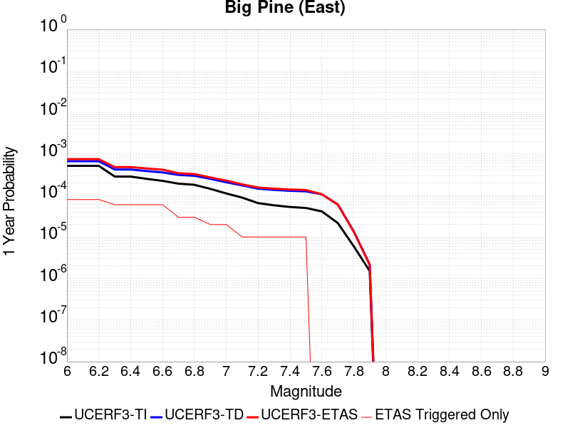 |  |

| Magnitude | 1 wk TI Prob | 1 wk TD Prob | 1 wk ETAS Prob | 1 wk ETAS/TD Gain | 1 wk ETAS Triggered Only | 1 mo TI Prob | 1 mo TD Prob | 1 mo ETAS Prob | 1 mo ETAS/TD Gain | 1 mo ETAS Triggered Only | 1 yr TI Prob | 1 yr TD Prob | 1 yr ETAS Prob | 1 yr ETAS/TD Gain | 1 yr ETAS Triggered Only | 10 yr TI Prob | 10 yr TD Prob | 10 yr ETAS Prob | 10 yr ETAS/TD Gain | 10 yr ETAS Triggered Only |
|-----|-----|-----|-----|-----|-----|-----|-----|-----|-----|-----|-----|-----|-----|-----|-----|-----|-----|-----|-----|-----|
| 6.0 | 9.916913E-6 | 1.2816984E-5 | 1.2816984E-5 | 1.0 | 0.0 | 4.250036E-5 | 5.49289E-5 | 5.49289E-5 | 1.0 | 0.0 | 5.173191E-4 | 6.685763E-4 | 9.074222E-4 | 1.3572456 | 2.3900573E-4 | 0.0051611643 | 0.006670441 | 0.0069078524 | 1.0355916 | 2.3900573E-4 |
| 6.1 | 9.916913E-6 | 1.2816984E-5 | 1.2816984E-5 | 1.0 | 0.0 | 4.250036E-5 | 5.49289E-5 | 5.49289E-5 | 1.0 | 0.0 | 5.173191E-4 | 6.685763E-4 | 9.074222E-4 | 1.3572456 | 2.3900573E-4 | 0.0051611643 | 0.006670441 | 0.0069078524 | 1.0355916 | 2.3900573E-4 |
| 6.2 | 9.916913E-6 | 1.2816984E-5 | 1.2816984E-5 | 1.0 | 0.0 | 4.250036E-5 | 5.49289E-5 | 5.49289E-5 | 1.0 | 0.0 | 5.173191E-4 | 6.685763E-4 | 9.074222E-4 | 1.3572456 | 2.3900573E-4 | 0.0051611643 | 0.006670441 | 0.0069078524 | 1.0355916 | 2.3900573E-4 |
| 6.3 | 5.479711E-6 | 8.112951E-6 | 8.112951E-6 | 1.0 | 0.0 | 2.3484265E-5 | 3.4769346E-5 | 3.4769346E-5 | 1.0 | 0.0 | 2.858834E-4 | 4.2323777E-4 | 6.6214235E-4 | 1.564469 | 2.3900573E-4 | 0.0028551589 | 0.004227244 | 0.004465239 | 1.0563004 | 2.3900573E-4 |
| 6.4 | 5.465009E-6 | 8.097245E-6 | 8.097245E-6 | 1.0 | 0.0 | 2.3421257E-5 | 3.4702036E-5 | 3.4702036E-5 | 1.0 | 0.0 | 2.851165E-4 | 4.2241855E-4 | 6.613233E-4 | 1.5655642 | 2.3900573E-4 | 0.0028475097 | 0.0042190826 | 0.00445708 | 1.0564097 | 2.3900573E-4 |
| 6.5 | 4.826767E-6 | 7.422301E-6 | 7.422301E-6 | 1.0 | 0.0 | 2.068598E-5 | 3.180949E-5 | 3.180949E-5 | 1.0 | 0.0 | 2.518227E-4 | 3.872145E-4 | 6.261277E-4 | 1.6170048 | 2.3900573E-4 | 0.0025153751 | 0.003868283 | 0.004106364 | 1.061547 | 2.3900573E-4 |
| 6.6 | 4.3146847E-6 | 6.8822374E-6 | 6.8822374E-6 | 1.0 | 0.0 | 1.8491375E-5 | 2.9494982E-5 | 2.9494982E-5 | 1.0 | 0.0 | 2.2510924E-4 | 3.590447E-4 | 5.979646E-4 | 1.6654322 | 2.3900573E-4 | 0.0022488134 | 0.0035874986 | 0.0038256468 | 1.0663829 | 2.3900573E-4 |
| 6.7 | 3.6968106E-6 | 5.9954727E-6 | 5.9954727E-6 | 1.0 | 0.0 | 1.5843378E-5 | 2.5694639E-5 | 2.5694639E-5 | 1.0 | 0.0 | 1.9287605E-4 | 3.1278885E-4 | 3.1278885E-4 | 1.0 | 0.0 | 0.0019270873 | 0.0031262483 | 0.0031262483 | 1.0 | 0.0 |
| 6.8 | 3.4671132E-6 | 5.702177E-6 | 5.702177E-6 | 1.0 | 0.0 | 1.4858972E-5 | 2.4437682E-5 | 2.4437682E-5 | 1.0 | 0.0 | 1.8089297E-4 | 2.974896E-4 | 2.974896E-4 | 1.0 | 0.0 | 0.0018074579 | 0.002973667 | 0.002973667 | 1.0 | 0.0 |
| 6.9 | 2.7686972E-6 | 4.825223E-6 | 4.825223E-6 | 1.0 | 0.0 | 1.1865792E-5 | 2.0679368E-5 | 2.0679368E-5 | 1.0 | 0.0 | 1.4445644E-4 | 2.5174298E-4 | 2.5174298E-4 | 1.0 | 0.0 | 0.0014436257 | 0.0025172636 | 0.0025172636 | 1.0 | 0.0 |
| 7.0 | 2.1472624E-6 | 3.9850406E-6 | 3.9850406E-6 | 1.0 | 0.0 | 9.20252E-6 | 1.7078637E-5 | 1.7078637E-5 | 1.0 | 0.0 | 1.12034926E-4 | 2.079131E-4 | 2.079131E-4 | 1.0 | 0.0 | 0.0011197845 | 0.0020798394 | 0.0020798394 | 1.0 | 0.0 |
| 7.1 | 1.7018335E-6 | 3.344876E-6 | 3.344876E-6 | 1.0 | 0.0 | 7.293552E-6 | 1.4335106E-5 | 1.4335106E-5 | 1.0 | 0.0 | 8.879537E-5 | 1.7451629E-4 | 1.7451629E-4 | 1.0 | 0.0 | 8.87599E-4 | 0.0017464145 | 0.0017464145 | 1.0 | 0.0 |
| 7.2 | 1.25603E-6 | 2.794484E-6 | 2.794484E-6 | 1.0 | 0.0 | 5.3829745E-6 | 1.1976307E-5 | 1.1976307E-5 | 1.0 | 0.0 | 6.553574E-5 | 1.4580201E-4 | 1.4580201E-4 | 1.0 | 0.0 | 6.551642E-4 | 0.001459661 | 0.001459661 | 1.0 | 0.0 |
| 7.3 | 1.112297E-6 | 2.610332E-6 | 2.610332E-6 | 1.0 | 0.0 | 4.7669787E-6 | 1.118709E-5 | 1.118709E-5 | 1.0 | 0.0 | 5.803642E-5 | 1.3619453E-4 | 1.3619453E-4 | 1.0 | 0.0 | 5.802127E-4 | 0.0013635408 | 0.0013635408 | 1.0 | 0.0 |
| 7.4 | 1.0137181E-6 | 2.4834917E-6 | 2.4834917E-6 | 1.0 | 0.0 | 4.3444993E-6 | 1.0643494E-5 | 1.0643494E-5 | 1.0 | 0.0 | 5.2892992E-5 | 1.2957705E-4 | 1.2957705E-4 | 1.0 | 0.0 | 5.288041E-4 | 0.0012972289 | 0.0012972289 | 1.0 | 0.0 |
| 7.5 | 9.598608E-7 | 2.4071483E-6 | 2.4071483E-6 | 1.0 | 0.0 | 4.1136827E-6 | 1.031631E-5 | 1.031631E-5 | 1.0 | 0.0 | 5.0082934E-5 | 1.2559404E-4 | 1.2559404E-4 | 1.0 | 0.0 | 5.007165E-4 | 0.0012572526 | 0.0012572526 | 1.0 | 0.0 |
| 7.6 | 7.929459E-7 | 2.0448588E-6 | 2.0448588E-6 | 1.0 | 0.0 | 3.3983351E-6 | 8.763653E-6 | 8.763653E-6 | 1.0 | 0.0 | 4.1373947E-5 | 1.06692416E-4 | 1.06692416E-4 | 1.0 | 0.0 | 4.1366243E-4 | 0.0010685222 | 0.0010685222 | 1.0 | 0.0 |
| 7.7 | 4.155788E-7 | 1.1605589E-6 | 1.1605589E-6 | 1.0 | 0.0 | 1.7810507E-6 | 4.9738146E-6 | 4.9738146E-6 | 1.0 | 0.0 | 2.1684076E-5 | 6.0554554E-5 | 6.0554554E-5 | 1.0 | 0.0 | 2.1681961E-4 | 6.0857297E-4 | 6.0857297E-4 | 1.0 | 0.0 |
| 7.8 | 1.14666925E-7 | 2.592015E-7 | 2.592015E-7 | 1.0 | 0.0 | 4.914296E-7 | 1.1108631E-6 | 1.1108631E-6 | 1.0 | 0.0 | 5.9831386E-6 | 1.3524678E-5 | 1.3524678E-5 | 1.0 | 0.0 | 5.9829777E-5 | 1.3634123E-4 | 1.3634123E-4 | 1.0 | 0.0 |
| 7.9 | 2.9231824E-8 | 4.1463963E-8 | 4.1463963E-8 | 1.0 | 0.0 | 1.2527924E-7 | 1.7770269E-7 | 1.7770269E-7 | 1.0 | 0.0 | 1.5252737E-6 | 2.1635283E-6 | 2.1635283E-6 | 1.0 | 0.0 | 1.5252632E-5 | 2.1967755E-5 | 2.1967755E-5 | 1.0 | 0.0 |

## San Andreas (San Bernardino N)
*[(top)](#table-of-contents)*

| 1 Week | 1 Month | 1 Year | 10 Year |
|-----|-----|-----|-----|
|  | 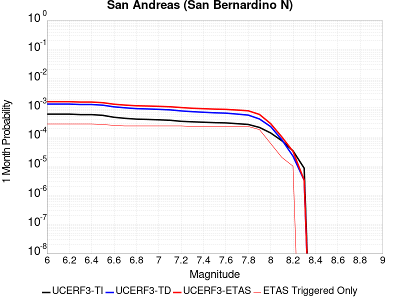 | 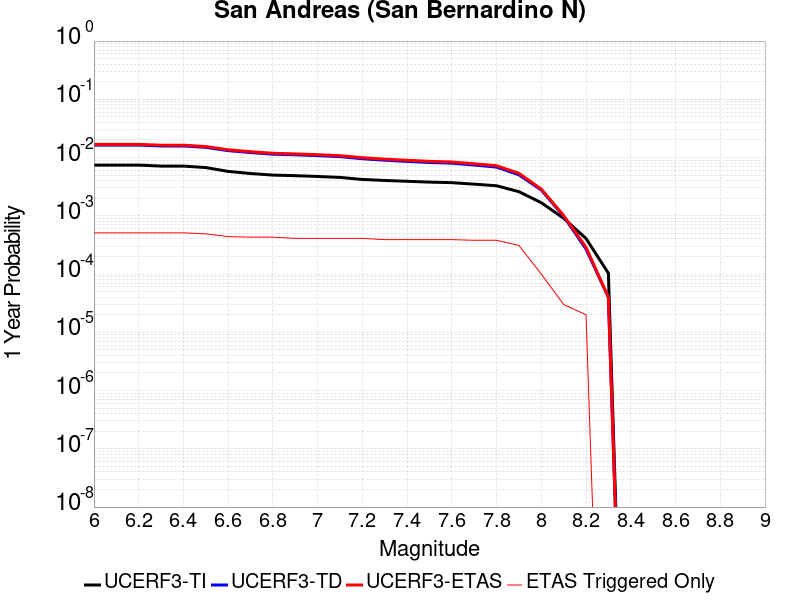 |  |

| Magnitude | 1 wk TI Prob | 1 wk TD Prob | 1 wk ETAS Prob | 1 wk ETAS/TD Gain | 1 wk ETAS Triggered Only | 1 mo TI Prob | 1 mo TD Prob | 1 mo ETAS Prob | 1 mo ETAS/TD Gain | 1 mo ETAS Triggered Only | 1 yr TI Prob | 1 yr TD Prob | 1 yr ETAS Prob | 1 yr ETAS/TD Gain | 1 yr ETAS Triggered Only | 10 yr TI Prob | 10 yr TD Prob | 10 yr ETAS Prob | 10 yr ETAS/TD Gain | 10 yr ETAS Triggered Only |
|-----|-----|-----|-----|-----|-----|-----|-----|-----|-----|-----|-----|-----|-----|-----|-----|-----|-----|-----|-----|-----|
| 6.0 | 1.4273766E-4 | 3.1606483E-4 | 3.1606483E-4 | 1.0 | 0.0 | 6.115894E-4 | 0.0013538664 | 0.0013538664 | 1.0 | 0.0 | 0.0074207084 | 0.016360244 | 0.016360244 | 1.0 | 0.0 | 0.07177748 | 0.15026689 | 0.15046997 | 1.0013516 | 2.3900573E-4 |
| 6.1 | 1.4273766E-4 | 3.1606483E-4 | 3.1606483E-4 | 1.0 | 0.0 | 6.115894E-4 | 0.0013538664 | 0.0013538664 | 1.0 | 0.0 | 0.0074207084 | 0.016360244 | 0.016360244 | 1.0 | 0.0 | 0.07177748 | 0.15026689 | 0.15046997 | 1.0013516 | 2.3900573E-4 |
| 6.2 | 1.4273766E-4 | 3.1606483E-4 | 3.1606483E-4 | 1.0 | 0.0 | 6.115894E-4 | 0.0013538664 | 0.0013538664 | 1.0 | 0.0 | 0.0074207084 | 0.016360244 | 0.016360244 | 1.0 | 0.0 | 0.07177748 | 0.15026689 | 0.15046997 | 1.0013516 | 2.3900573E-4 |
| 6.3 | 1.3730655E-4 | 3.0511338E-4 | 3.0511338E-4 | 1.0 | 0.0 | 5.883239E-4 | 0.0013069791 | 0.0013069791 | 1.0 | 0.0 | 0.0071393442 | 0.015797773 | 0.015797773 | 1.0 | 0.0 | 0.06914291 | 0.14556676 | 0.14577098 | 1.0014029 | 2.3900573E-4 |
| 6.4 | 1.3730655E-4 | 3.0511338E-4 | 3.0511338E-4 | 1.0 | 0.0 | 5.883239E-4 | 0.0013069791 | 0.0013069791 | 1.0 | 0.0 | 0.0071393442 | 0.015797773 | 0.015797773 | 1.0 | 0.0 | 0.06914291 | 0.14556676 | 0.14577098 | 1.0014029 | 2.3900573E-4 |
| 6.5 | 1.2942807E-4 | 2.8925808E-4 | 2.8925808E-4 | 1.0 | 0.0 | 5.545738E-4 | 0.0012390936 | 0.0012390936 | 1.0 | 0.0 | 0.0067310524 | 0.01498286 | 0.01498286 | 1.0 | 0.0 | 0.06530788 | 0.13870941 | 0.13891527 | 1.001484 | 2.3900573E-4 |
| 6.6 | 1.1125901E-4 | 2.536472E-4 | 2.536472E-4 | 1.0 | 0.0 | 4.767372E-4 | 0.0010866089 | 0.0010866089 | 1.0 | 0.0 | 0.005788839 | 0.013149847 | 0.013149847 | 1.0 | 0.0 | 0.056403454 | 0.122999296 | 0.1232089 | 1.0017041 | 2.3900573E-4 |
| 6.7 | 1.02209575E-4 | 2.3499702E-4 | 2.3499702E-4 | 1.0 | 0.0 | 4.3796748E-4 | 0.0010067427 | 0.0010067427 | 1.0 | 0.0 | 0.0053192247 | 0.012188629 | 0.012188629 | 1.0 | 0.0 | 0.051936906 | 0.114790924 | 0.11500249 | 1.0018431 | 2.3900573E-4 |
| 6.8 | 9.610582E-5 | 2.2025521E-4 | 2.2025521E-4 | 1.0 | 0.0 | 4.1181705E-4 | 9.436101E-4 | 9.436101E-4 | 1.0 | 0.0 | 0.0050023515 | 0.011428202 | 0.011428202 | 1.0 | 0.0 | 0.048912346 | 0.1081929 | 0.108406045 | 1.00197 | 2.3900573E-4 |
| 6.9 | 9.3877505E-5 | 2.1481077E-4 | 2.1481077E-4 | 1.0 | 0.0 | 4.0227012E-4 | 9.2029345E-4 | 9.2029345E-4 | 1.0 | 0.0 | 0.0048866454 | 0.011147255 | 0.011147255 | 1.0 | 0.0 | 0.04780577 | 0.10578323 | 0.10599695 | 1.0020204 | 2.3900573E-4 |
| 7.0 | 9.1019785E-5 | 2.0808022E-4 | 2.0808022E-4 | 1.0 | 0.0 | 3.900265E-4 | 8.914682E-4 | 8.914682E-4 | 1.0 | 0.0 | 0.0047382377 | 0.010799837 | 0.010799837 | 1.0 | 0.0 | 0.046384744 | 0.102753714 | 0.102968164 | 1.002087 | 2.3900573E-4 |
| 7.1 | 8.771155E-5 | 1.9982594E-4 | 1.9982594E-4 | 1.0 | 0.0 | 3.758525E-4 | 8.5611636E-4 | 8.5611636E-4 | 1.0 | 0.0 | 0.0045664064 | 0.0103736 | 0.0103736 | 1.0 | 0.0 | 0.044737056 | 0.09906527 | 0.099280596 | 1.0021737 | 2.3900573E-4 |
| 7.2 | 8.0830236E-5 | 1.8388197E-4 | 1.8388197E-4 | 1.0 | 0.0 | 3.4636928E-4 | 7.8782777E-4 | 7.8782777E-4 | 1.0 | 0.0 | 0.0042088944 | 0.009549725 | 0.009549725 | 1.0 | 0.0 | 0.041300658 | 0.09179615 | 0.09201322 | 1.0023646 | 2.3900573E-4 |
| 7.3 | 7.7668235E-5 | 1.7331762E-4 | 1.7331762E-4 | 1.0 | 0.0 | 3.328214E-4 | 7.425784E-4 | 7.425784E-4 | 1.0 | 0.0 | 0.0040445733 | 0.009003494 | 0.009003494 | 1.0 | 0.0 | 0.03971748 | 0.08706327 | 0.08728146 | 1.0025061 | 2.3900573E-4 |
| 7.4 | 7.520177E-5 | 1.6551897E-4 | 1.6551897E-4 | 1.0 | 0.0 | 3.2225347E-4 | 7.0917426E-4 | 7.0917426E-4 | 1.0 | 0.0 | 0.0039163795 | 0.008600081 | 0.008600081 | 1.0 | 0.0 | 0.038480744 | 0.08351955 | 0.083738595 | 1.0026227 | 2.3900573E-4 |
| 7.5 | 7.274697E-5 | 1.5839566E-4 | 1.5839566E-4 | 1.0 | 0.0 | 3.1173544E-4 | 6.78662E-4 | 6.78662E-4 | 1.0 | 0.0 | 0.003788775 | 0.008231463 | 0.008231463 | 1.0 | 0.0 | 0.03724827 | 0.08023631 | 0.08045614 | 1.0027398 | 2.3900573E-4 |
| 7.6 | 7.1185845E-5 | 1.540943E-4 | 1.540943E-4 | 1.0 | 0.0 | 3.0504653E-4 | 6.6023704E-4 | 6.6023704E-4 | 1.0 | 0.0 | 0.0037076178 | 0.008008812 | 0.008008812 | 1.0 | 0.0 | 0.036463667 | 0.07822598 | 0.078446284 | 1.0028163 | 2.3900573E-4 |
| 7.7 | 6.709961E-5 | 1.4318313E-4 | 1.4318313E-4 | 1.0 | 0.0 | 2.8753807E-4 | 6.1349774E-4 | 6.1349774E-4 | 1.0 | 0.0 | 0.003495157 | 0.0074437927 | 0.0074437927 | 1.0 | 0.0 | 0.034406938 | 0.07305469 | 0.073276244 | 1.0030326 | 2.3900573E-4 |
| 7.8 | 6.300812E-5 | 1.3202413E-4 | 1.3202413E-4 | 1.0 | 0.0 | 2.7000686E-4 | 5.65695E-4 | 5.65695E-4 | 1.0 | 0.0 | 0.0032823787 | 0.006865616 | 0.006865616 | 1.0 | 0.0 | 0.032343175 | 0.06771354 | 0.06793636 | 1.0032907 | 2.3900573E-4 |
| 7.9 | 4.983037E-5 | 9.723488E-5 | 9.723488E-5 | 1.0 | 0.0 | 2.1354125E-4 | 4.1665437E-4 | 4.1665437E-4 | 1.0 | 0.0 | 0.0025967648 | 0.0050609782 | 0.0050609782 | 1.0 | 0.0 | 0.025666296 | 0.05064886 | 0.05087576 | 1.0044799 | 2.3900573E-4 |
| 8.0 | 3.2211527E-5 | 5.3304586E-5 | 5.3304586E-5 | 1.0 | 0.0 | 1.380421E-4 | 2.2842824E-4 | 2.2842824E-4 | 1.0 | 0.0 | 0.0016793669 | 0.0027775685 | 0.0027775685 | 1.0 | 0.0 | 0.016667323 | 0.028361378 | 0.028593605 | 1.0081881 | 2.3900573E-4 |
| 8.1 | 1.743376E-5 | 1.8824427E-5 | 1.8824427E-5 | 1.0 | 0.0 | 7.471398E-5 | 8.067362E-5 | 8.067362E-5 | 1.0 | 0.0 | 9.0926304E-4 | 9.817594E-4 | 9.817594E-4 | 1.0 | 0.0 | 0.009055517 | 0.010484105 | 0.010484105 | 1.0 | 0.0 |
| 8.2 | 7.831616E-6 | 5.1551065E-6 | 5.1551065E-6 | 1.0 | 0.0 | 3.3563636E-5 | 2.2093127E-5 | 2.2093127E-5 | 1.0 | 0.0 | 4.0856065E-4 | 2.6895068E-4 | 2.6895068E-4 | 1.0 | 0.0 | 0.004078103 | 0.0030418145 | 0.0030418145 | 1.0 | 0.0 |
| 8.3 | 1.983087E-6 | 7.6599065E-7 | 7.6599065E-7 | 1.0 | 0.0 | 8.498917E-6 | 3.282813E-6 | 3.282813E-6 | 1.0 | 0.0 | 1.034694E-4 | 3.9967534E-5 | 3.9967534E-5 | 1.0 | 0.0 | 0.0010342124 | 4.719687E-4 | 4.719687E-4 | 1.0 | 0.0 |

## Ludlow
*[(top)](#table-of-contents)*

| 1 Week | 1 Month | 1 Year | 10 Year |
|-----|-----|-----|-----|
|  | 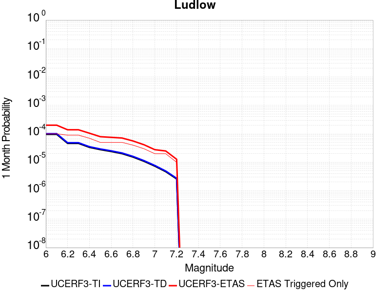 |  |  |

| Magnitude | 1 wk TI Prob | 1 wk TD Prob | 1 wk ETAS Prob | 1 wk ETAS/TD Gain | 1 wk ETAS Triggered Only | 1 mo TI Prob | 1 mo TD Prob | 1 mo ETAS Prob | 1 mo ETAS/TD Gain | 1 mo ETAS Triggered Only | 1 yr TI Prob | 1 yr TD Prob | 1 yr ETAS Prob | 1 yr ETAS/TD Gain | 1 yr ETAS Triggered Only | 10 yr TI Prob | 10 yr TD Prob | 10 yr ETAS Prob | 10 yr ETAS/TD Gain | 10 yr ETAS Triggered Only |
|-----|-----|-----|-----|-----|-----|-----|-----|-----|-----|-----|-----|-----|-----|-----|-----|-----|-----|-----|-----|-----|
| 6.0 | 2.2407607E-5 | 2.3657254E-5 | 2.3657254E-5 | 1.0 | 0.0 | 9.602906E-5 | 1.0138454E-4 | 1.0138454E-4 | 1.0 | 0.0 | 0.0011685267 | 0.001233702 | 0.0014724128 | 1.1934916 | 2.3900573E-4 | 0.011624013 | 0.012273042 | 0.012509114 | 1.019235 | 2.3900573E-4 |
| 6.1 | 2.2407607E-5 | 2.3657254E-5 | 2.3657254E-5 | 1.0 | 0.0 | 9.602906E-5 | 1.0138454E-4 | 1.0138454E-4 | 1.0 | 0.0 | 0.0011685267 | 0.001233702 | 0.0014724128 | 1.1934916 | 2.3900573E-4 | 0.011624013 | 0.012273042 | 0.012509114 | 1.019235 | 2.3900573E-4 |
| 6.2 | 1.0781252E-5 | 1.1365663E-5 | 1.1365663E-5 | 1.0 | 0.0 | 4.620455E-5 | 4.8709102E-5 | 4.8709102E-5 | 1.0 | 0.0 | 5.623952E-4 | 5.9287593E-4 | 8.3174E-4 | 1.4028904 | 2.3900573E-4 | 0.00560974 | 0.0059133614 | 0.0061509535 | 1.0401789 | 2.3900573E-4 |
| 6.3 | 1.0781252E-5 | 1.1365663E-5 | 1.1365663E-5 | 1.0 | 0.0 | 4.620455E-5 | 4.8709102E-5 | 4.8709102E-5 | 1.0 | 0.0 | 5.623952E-4 | 5.9287593E-4 | 8.3174E-4 | 1.4028904 | 2.3900573E-4 | 0.00560974 | 0.0059133614 | 0.0061509535 | 1.0401789 | 2.3900573E-4 |
| 6.4 | 7.814439E-6 | 8.237729E-6 | 8.237729E-6 | 1.0 | 0.0 | 3.3490025E-5 | 3.530408E-5 | 3.530408E-5 | 1.0 | 0.0 | 4.0766477E-4 | 4.2974384E-4 | 6.686468E-4 | 1.5559196 | 2.3900573E-4 | 0.0040691774 | 0.0042892746 | 0.004527255 | 1.0554827 | 2.3900573E-4 |
| 6.5 | 6.4986366E-6 | 6.85092E-6 | 6.85092E-6 | 1.0 | 0.0 | 2.7851002E-5 | 2.9360759E-5 | 2.9360759E-5 | 1.0 | 0.0 | 3.390332E-4 | 3.5740953E-4 | 5.9632986E-4 | 1.6684778 | 2.3900573E-4 | 0.003385164 | 0.0035684432 | 0.0038065962 | 1.0667386 | 2.3900573E-4 |
| 6.6 | 5.582177E-6 | 5.8860055E-6 | 5.8860055E-6 | 1.0 | 0.0 | 2.3923398E-5 | 2.5225498E-5 | 2.5225498E-5 | 1.0 | 0.0 | 2.9122844E-4 | 3.0707786E-4 | 5.460102E-4 | 1.7780839 | 2.3900573E-4 | 0.0029084706 | 0.003066609 | 0.0033048817 | 1.0776991 | 2.3900573E-4 |
| 6.7 | 4.6858763E-6 | 4.940427E-6 | 4.940427E-6 | 1.0 | 0.0 | 2.0082172E-5 | 2.1173091E-5 | 2.1173091E-5 | 1.0 | 0.0 | 2.4447302E-4 | 2.5775246E-4 | 4.9669656E-4 | 1.9270295 | 2.3900573E-4 | 0.0024420423 | 0.0025745912 | 0.0028129816 | 1.0925934 | 2.3900573E-4 |
| 6.8 | 3.5584908E-6 | 3.7520183E-6 | 3.7520183E-6 | 1.0 | 0.0 | 1.5250586E-5 | 1.6079981E-5 | 1.6079981E-5 | 1.0 | 0.0 | 1.8566006E-4 | 1.957566E-4 | 1.957566E-4 | 1.0 | 0.0 | 0.0018550502 | 0.0019558826 | 0.0019558826 | 1.0 | 0.0 |
| 6.9 | 2.532834E-6 | 2.6710034E-6 | 2.6710034E-6 | 1.0 | 0.0 | 1.0854958E-5 | 1.1447109E-5 | 1.1447109E-5 | 1.0 | 0.0 | 1.3215111E-4 | 1.3935992E-4 | 1.3935992E-4 | 1.0 | 0.0 | 0.0013207254 | 0.0013927529 | 0.0013927529 | 1.0 | 0.0 |
| 7.0 | 1.7083285E-6 | 1.8019439E-6 | 1.8019439E-6 | 1.0 | 0.0 | 7.3213873E-6 | 7.722595E-6 | 7.722595E-6 | 1.0 | 0.0 | 8.913424E-5 | 9.40187E-5 | 9.40187E-5 | 1.0 | 0.0 | 8.9098496E-4 | 9.3980576E-4 | 9.3980576E-4 | 1.0 | 0.0 |
| 7.1 | 1.0905424E-6 | 1.1497619E-6 | 1.1497619E-6 | 1.0 | 0.0 | 4.6737446E-6 | 4.9275427E-6 | 4.9275427E-6 | 1.0 | 0.0 | 5.6901354E-5 | 5.999128E-5 | 5.999128E-5 | 1.0 | 0.0 | 5.6886784E-4 | 5.997606E-4 | 5.997606E-4 | 1.0 | 0.0 |
| 7.2 | 6.06668E-7 | 6.387277E-7 | 6.387277E-7 | 1.0 | 0.0 | 2.600003E-6 | 2.7374022E-6 | 2.7374022E-6 | 1.0 | 0.0 | 3.1654577E-5 | 3.3327433E-5 | 3.3327433E-5 | 1.0 | 0.0 | 3.1650066E-4 | 3.3323118E-4 | 3.3323118E-4 | 1.0 | 0.0 |

## Sheephole
*[(top)](#table-of-contents)*

| 1 Week | 1 Month | 1 Year | 10 Year |
|-----|-----|-----|-----|
|  |  |  | 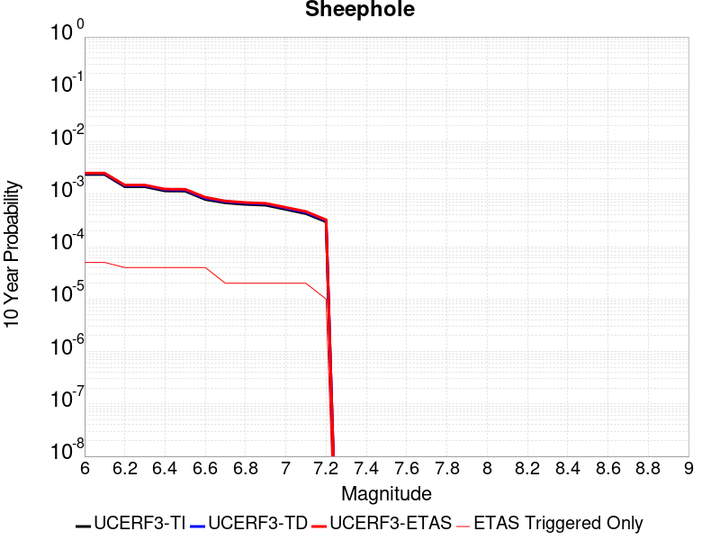 |

| Magnitude | 1 wk TI Prob | 1 wk TD Prob | 1 wk ETAS Prob | 1 wk ETAS/TD Gain | 1 wk ETAS Triggered Only | 1 mo TI Prob | 1 mo TD Prob | 1 mo ETAS Prob | 1 mo ETAS/TD Gain | 1 mo ETAS Triggered Only | 1 yr TI Prob | 1 yr TD Prob | 1 yr ETAS Prob | 1 yr ETAS/TD Gain | 1 yr ETAS Triggered Only | 10 yr TI Prob | 10 yr TD Prob | 10 yr ETAS Prob | 10 yr ETAS/TD Gain | 10 yr ETAS Triggered Only |
|-----|-----|-----|-----|-----|-----|-----|-----|-----|-----|-----|-----|-----|-----|-----|-----|-----|-----|-----|-----|-----|
| 6.0 | 4.5579695E-6 | 4.7412627E-6 | 4.7412627E-6 | 1.0 | 0.0 | 1.9534009E-5 | 2.031957E-5 | 2.5932046E-4 | 12.762103 | 2.3900573E-4 | 2.3780059E-4 | 2.473682E-4 | 4.8631482E-4 | 1.9659551 | 2.3900573E-4 | 0.0023754628 | 0.002471473 | 0.0027098882 | 1.0964668 | 2.3900573E-4 |
| 6.1 | 4.5579695E-6 | 4.7412627E-6 | 4.7412627E-6 | 1.0 | 0.0 | 1.9534009E-5 | 2.031957E-5 | 2.5932046E-4 | 12.762103 | 2.3900573E-4 | 2.3780059E-4 | 2.473682E-4 | 4.8631482E-4 | 1.9659551 | 2.3900573E-4 | 0.0023754628 | 0.002471473 | 0.0027098882 | 1.0964668 | 2.3900573E-4 |
| 6.2 | 2.6677674E-6 | 2.7873941E-6 | 2.7873941E-6 | 1.0 | 0.0 | 1.1433239E-5 | 1.1945926E-5 | 2.509488E-4 | 21.007061 | 2.3900573E-4 | 1.3919079E-4 | 1.4543302E-4 | 3.84404E-4 | 2.6431684 | 2.3900573E-4 | 0.0013910364 | 0.0014534844 | 0.0016921428 | 1.1641974 | 2.3900573E-4 |
| 6.3 | 2.6677674E-6 | 2.7873941E-6 | 2.7873941E-6 | 1.0 | 0.0 | 1.1433239E-5 | 1.1945926E-5 | 2.509488E-4 | 21.007061 | 2.3900573E-4 | 1.3919079E-4 | 1.4543302E-4 | 3.84404E-4 | 2.6431684 | 2.3900573E-4 | 0.0013910364 | 0.0014534844 | 0.0016921428 | 1.1641974 | 2.3900573E-4 |
| 6.4 | 2.2159759E-6 | 2.3228788E-6 | 2.3228788E-6 | 1.0 | 0.0 | 9.497005E-6 | 9.955161E-6 | 2.4895853E-4 | 25.007984 | 2.3900573E-4 | 1.156199E-4 | 1.2119815E-4 | 3.6017492E-4 | 2.9717855 | 2.3900573E-4 | 0.0011555976 | 0.0012113999 | 0.001450116 | 1.1970581 | 2.3900573E-4 |
| 6.5 | 2.1986082E-6 | 2.304759E-6 | 2.304759E-6 | 1.0 | 0.0 | 9.4225725E-6 | 9.877506E-6 | 2.4888088E-4 | 25.196733 | 2.3900573E-4 | 1.1471378E-4 | 1.2025281E-4 | 3.592298E-4 | 2.9872882 | 2.3900573E-4 | 0.0011465458 | 0.0012019566 | 0.0014406751 | 1.1986082 | 2.3900573E-4 |
| 6.6 | 1.5232331E-6 | 1.6018919E-6 | 1.6018919E-6 | 1.0 | 0.0 | 6.5281256E-6 | 6.865234E-6 | 2.4586933E-4 | 35.813686 | 2.3900573E-4 | 7.947703E-5 | 8.35812E-5 | 3.2256695E-4 | 3.8593242 | 2.3900573E-4 | 7.9448614E-4 | 8.3551643E-4 | 0.0010743225 | 1.2858185 | 2.3900573E-4 |
| 6.7 | 1.3137362E-6 | 1.382819E-6 | 1.382819E-6 | 1.0 | 0.0 | 5.6302856E-6 | 5.926355E-6 | 5.926355E-6 | 1.0 | 0.0 | 6.854657E-5 | 7.215112E-5 | 7.215112E-5 | 1.0 | 0.0 | 6.8525434E-4 | 7.212908E-4 | 7.212908E-4 | 1.0 | 0.0 |
| 6.8 | 1.2275751E-6 | 1.2922847E-6 | 1.2922847E-6 | 1.0 | 0.0 | 5.2610258E-6 | 5.5383516E-6 | 5.5383516E-6 | 1.0 | 0.0 | 6.4051106E-5 | 6.7427485E-5 | 6.7427485E-5 | 1.0 | 0.0 | 6.4032647E-4 | 6.740836E-4 | 6.740836E-4 | 1.0 | 0.0 |
| 6.9 | 1.1837088E-6 | 1.246102E-6 | 1.246102E-6 | 1.0 | 0.0 | 5.0730278E-6 | 5.340427E-6 | 5.340427E-6 | 1.0 | 0.0 | 6.176237E-5 | 6.501789E-5 | 6.501789E-5 | 1.0 | 0.0 | 6.17452E-4 | 6.5000186E-4 | 6.5000186E-4 | 1.0 | 0.0 |
| 7.0 | 9.849371E-7 | 1.0366288E-6 | 1.0366288E-6 | 1.0 | 0.0 | 4.2211523E-6 | 4.442688E-6 | 4.442688E-6 | 1.0 | 0.0 | 5.1391315E-5 | 5.4088487E-5 | 5.4088487E-5 | 1.0 | 0.0 | 5.137943E-4 | 5.407633E-4 | 5.407633E-4 | 1.0 | 0.0 |
| 7.1 | 8.1643645E-7 | 8.591669E-7 | 8.591669E-7 | 1.0 | 0.0 | 3.4990085E-6 | 3.682139E-6 | 3.682139E-6 | 1.0 | 0.0 | 4.2599597E-5 | 4.482921E-5 | 4.482921E-5 | 1.0 | 0.0 | 4.259143E-4 | 4.4821028E-4 | 4.4821028E-4 | 1.0 | 0.0 |
| 7.2 | 5.7295756E-7 | 6.029502E-7 | 6.029502E-7 | 1.0 | 0.0 | 2.45553E-6 | 2.58407E-6 | 2.58407E-6 | 1.0 | 0.0 | 2.9895667E-5 | 3.1460666E-5 | 3.1460666E-5 | 1.0 | 0.0 | 2.9891645E-4 | 3.145688E-4 | 3.145688E-4 | 1.0 | 0.0 |

## San Gregorio (North) 2011 CFM
*[(top)](#table-of-contents)*

| 1 Week | 1 Month | 1 Year | 10 Year |
|-----|-----|-----|-----|
|  |  |  |  |

| Magnitude | 1 wk TI Prob | 1 wk TD Prob | 1 wk ETAS Prob | 1 wk ETAS/TD Gain | 1 wk ETAS Triggered Only | 1 mo TI Prob | 1 mo TD Prob | 1 mo ETAS Prob | 1 mo ETAS/TD Gain | 1 mo ETAS Triggered Only | 1 yr TI Prob | 1 yr TD Prob | 1 yr ETAS Prob | 1 yr ETAS/TD Gain | 1 yr ETAS Triggered Only | 10 yr TI Prob | 10 yr TD Prob | 10 yr ETAS Prob | 10 yr ETAS/TD Gain | 10 yr ETAS Triggered Only |
|-----|-----|-----|-----|-----|-----|-----|-----|-----|-----|-----|-----|-----|-----|-----|-----|-----|-----|-----|-----|-----|
| 6.0 | 5.0283932E-5 | 4.3057815E-5 | 4.3057815E-5 | 1.0 | 0.0 | 2.1548476E-4 | 1.8452053E-4 | 1.8452053E-4 | 1.0 | 0.0 | 0.0026203706 | 0.002244237 | 0.002244237 | 1.0 | 0.0 | 0.02589687 | 0.022293162 | 0.02252684 | 1.0104821 | 2.3900573E-4 |
| 6.1 | 5.0283932E-5 | 4.3057815E-5 | 4.3057815E-5 | 1.0 | 0.0 | 2.1548476E-4 | 1.8452053E-4 | 1.8452053E-4 | 1.0 | 0.0 | 0.0026203706 | 0.002244237 | 0.002244237 | 1.0 | 0.0 | 0.02589687 | 0.022293162 | 0.02252684 | 1.0104821 | 2.3900573E-4 |
| 6.2 | 4.2998647E-5 | 3.4441564E-5 | 3.4441564E-5 | 1.0 | 0.0 | 1.842669E-4 | 1.475984E-4 | 1.475984E-4 | 1.0 | 0.0 | 0.0022411412 | 0.00179554 | 0.00179554 | 1.0 | 0.0 | 0.022186736 | 0.017886506 | 0.018121237 | 1.0131234 | 2.3900573E-4 |
| 6.3 | 4.2998647E-5 | 3.4441564E-5 | 3.4441564E-5 | 1.0 | 0.0 | 1.842669E-4 | 1.475984E-4 | 1.475984E-4 | 1.0 | 0.0 | 0.0022411412 | 0.00179554 | 0.00179554 | 1.0 | 0.0 | 0.022186736 | 0.017886506 | 0.018121237 | 1.0131234 | 2.3900573E-4 |
| 6.4 | 4.1101295E-5 | 3.2326872E-5 | 3.2326872E-5 | 1.0 | 0.0 | 1.7613651E-4 | 1.3853642E-4 | 1.3853642E-4 | 1.0 | 0.0 | 0.0021423528 | 0.0016853869 | 0.0016853869 | 1.0 | 0.0 | 0.02121817 | 0.016801886 | 0.017036876 | 1.0139859 | 2.3900573E-4 |
| 6.5 | 4.1032585E-5 | 3.2244905E-5 | 3.2244905E-5 | 1.0 | 0.0 | 1.7584208E-4 | 1.3818518E-4 | 1.3818518E-4 | 1.0 | 0.0 | 0.0021387753 | 0.0016811171 | 0.0016811171 | 1.0 | 0.0 | 0.021183075 | 0.016759839 | 0.01699484 | 1.0140216 | 2.3900573E-4 |
| 6.6 | 4.011629E-5 | 3.1266558E-5 | 3.1266558E-5 | 1.0 | 0.0 | 1.7191563E-4 | 1.339927E-4 | 1.339927E-4 | 1.0 | 0.0 | 0.0020910634 | 0.0016301516 | 0.0016301516 | 1.0 | 0.0 | 0.020714961 | 0.01625741 | 0.01649253 | 1.0144624 | 2.3900573E-4 |
| 6.7 | 3.8583938E-5 | 2.9453593E-5 | 2.9453593E-5 | 1.0 | 0.0 | 1.6534925E-4 | 1.2622366E-4 | 1.2622366E-4 | 1.0 | 0.0 | 0.0020112682 | 0.0015357039 | 0.0015357039 | 1.0 | 0.0 | 0.019931622 | 0.015325955 | 0.015561298 | 1.0153558 | 2.3900573E-4 |
| 6.8 | 3.44341E-5 | 2.4450854E-5 | 2.4450854E-5 | 1.0 | 0.0 | 1.4756636E-4 | 1.0478523E-4 | 1.0478523E-4 | 1.0 | 0.0 | 0.0017951399 | 0.0012750238 | 0.0012750238 | 1.0 | 0.0 | 0.017807078 | 0.012751131 | 0.01298709 | 1.0185049 | 2.3900573E-4 |
| 6.9 | 3.221199E-5 | 2.1778029E-5 | 2.1778029E-5 | 1.0 | 0.0 | 1.3804408E-4 | 9.333112E-5 | 9.333112E-5 | 1.0 | 0.0 | 0.0016793909 | 0.0011357224 | 0.0011357224 | 1.0 | 0.0 | 0.01666756 | 0.011372583 | 0.011608871 | 1.020777 | 2.3900573E-4 |
| 7.0 | 2.9186718E-5 | 1.8146875E-5 | 1.8146875E-5 | 1.0 | 0.0 | 1.2507994E-4 | 7.7770026E-5 | 7.7770026E-5 | 1.0 | 0.0 | 0.0015217843 | 9.464431E-4 | 9.464431E-4 | 1.0 | 0.0 | 0.015114053 | 0.009496798 | 0.009733534 | 1.024928 | 2.3900573E-4 |
| 7.1 | 2.6840138E-5 | 1.5284508E-5 | 1.5284508E-5 | 1.0 | 0.0 | 1.1502409E-4 | 6.55034E-5 | 6.55034E-5 | 1.0 | 0.0 | 0.0013995186 | 7.9721404E-4 | 7.9721404E-4 | 1.0 | 0.0 | 0.013907375 | 0.008015723 | 0.008252813 | 1.0295781 | 2.3900573E-4 |
| 7.2 | 2.453002E-5 | 1.2606672E-5 | 1.2606672E-5 | 1.0 | 0.0 | 1.05124425E-4 | 5.4027478E-5 | 5.4027478E-5 | 1.0 | 0.0 | 0.0012791384 | 6.575866E-4 | 6.575866E-4 | 1.0 | 0.0 | 0.012718005 | 0.00662763 | 0.0068650516 | 1.035823 | 2.3900573E-4 |
| 7.3 | 2.3330727E-5 | 1.1488677E-5 | 1.1488677E-5 | 1.0 | 0.0 | 9.9985E-5 | 4.923626E-5 | 4.923626E-5 | 1.0 | 0.0 | 0.0012166376 | 5.9928704E-4 | 5.9928704E-4 | 1.0 | 0.0 | 0.012099981 | 0.006046564 | 0.006046564 | 1.0 | 0.0 |
| 7.4 | 2.2136466E-5 | 1.0368981E-5 | 1.0368981E-5 | 1.0 | 0.0 | 9.486712E-5 | 4.4437733E-5 | 4.4437733E-5 | 1.0 | 0.0 | 0.0011543952 | 5.4089533E-4 | 5.4089533E-4 | 1.0 | 0.0 | 0.011484168 | 0.005464249 | 0.005464249 | 1.0 | 0.0 |
| 7.5 | 2.0994974E-5 | 9.427217E-6 | 9.427217E-6 | 1.0 | 0.0 | 8.997535E-5 | 4.0401734E-5 | 4.0401734E-5 | 1.0 | 0.0 | 0.0010948994 | 4.9178035E-4 | 4.9178035E-4 | 1.0 | 0.0 | 0.010895205 | 0.004973358 | 0.004973358 | 1.0 | 0.0 |
| 7.6 | 1.7091823E-5 | 6.893766E-6 | 6.893766E-6 | 1.0 | 0.0 | 7.3248615E-5 | 2.9544377E-5 | 2.9544377E-5 | 1.0 | 0.0 | 8.9143694E-4 | 3.596435E-4 | 3.596435E-4 | 1.0 | 0.0 | 0.008878695 | 0.0036482841 | 0.0036482841 | 1.0 | 0.0 |
| 7.7 | 1.2772179E-5 | 4.0208706E-6 | 4.0208706E-6 | 1.0 | 0.0 | 5.473676E-5 | 1.7232189E-5 | 1.7232189E-5 | 1.0 | 0.0 | 6.6621625E-4 | 2.0978172E-4 | 2.0978172E-4 | 1.0 | 0.0 | 0.006642225 | 0.002136922 | 0.002136922 | 1.0 | 0.0 |
| 7.8 | 7.041923E-6 | 1.940626E-6 | 1.940626E-6 | 1.0 | 0.0 | 3.017932E-5 | 8.316942E-6 | 8.316942E-6 | 1.0 | 0.0 | 3.6737128E-4 | 1.0125406E-4 | 1.0125406E-4 | 1.0 | 0.0 | 0.0036676454 | 0.0010379003 | 0.0010379003 | 1.0 | 0.0 |
| 7.9 | 2.946768E-6 | 1.0033551E-6 | 1.0033551E-6 | 1.0 | 0.0 | 1.2628945E-5 | 4.300086E-6 | 4.300086E-6 | 1.0 | 0.0 | 1.5374656E-4 | 5.235229E-5 | 5.235229E-5 | 1.0 | 0.0 | 0.0015364023 | 5.3400313E-4 | 5.3400313E-4 | 1.0 | 0.0 |
| 8.0 | 1.1433375E-6 | 5.18146E-7 | 5.18146E-7 | 1.0 | 0.0 | 4.9000087E-6 | 2.2206239E-6 | 2.2206239E-6 | 1.0 | 0.0 | 5.965597E-5 | 2.703576E-5 | 2.703576E-5 | 1.0 | 0.0 | 5.963996E-4 | 2.7398416E-4 | 2.7398416E-4 | 1.0 | 0.0 |
| 8.1 | 2.6675295E-7 | 1.62899E-7 | 1.62899E-7 | 1.0 | 0.0 | 1.1432264E-6 | 6.9813836E-7 | 6.9813836E-7 | 1.0 | 0.0 | 1.3918692E-5 | 8.499802E-6 | 8.499802E-6 | 1.0 | 0.0 | 1.391782E-4 | 8.63795E-5 | 8.63795E-5 | 1.0 | 0.0 |
| 8.2 | 1.2704569E-8 | 9.431393E-9 | 9.431393E-9 | 1.0 | 0.0 | 5.444815E-8 | 4.042026E-8 | 4.042026E-8 | 1.0 | 0.0 | 6.629061E-7 | 4.9211656E-7 | 4.9211656E-7 | 1.0 | 0.0 | 6.629041E-6 | 5.1121438E-6 | 5.1121438E-6 | 1.0 | 0.0 |

## Death Valley (Fish Lake Valley)
*[(top)](#table-of-contents)*

| 1 Week | 1 Month | 1 Year | 10 Year |
|-----|-----|-----|-----|
|  |  |  |  |

| Magnitude | 1 wk TI Prob | 1 wk TD Prob | 1 wk ETAS Prob | 1 wk ETAS/TD Gain | 1 wk ETAS Triggered Only | 1 mo TI Prob | 1 mo TD Prob | 1 mo ETAS Prob | 1 mo ETAS/TD Gain | 1 mo ETAS Triggered Only | 1 yr TI Prob | 1 yr TD Prob | 1 yr ETAS Prob | 1 yr ETAS/TD Gain | 1 yr ETAS Triggered Only | 10 yr TI Prob | 10 yr TD Prob | 10 yr ETAS Prob | 10 yr ETAS/TD Gain | 10 yr ETAS Triggered Only |
|-----|-----|-----|-----|-----|-----|-----|-----|-----|-----|-----|-----|-----|-----|-----|-----|-----|-----|-----|-----|-----|
| 6.0 | 3.872328E-5 | 4.7267473E-5 | 4.7267473E-5 | 1.0 | 0.0 | 1.6594635E-4 | 2.0256084E-4 | 2.0256084E-4 | 1.0 | 0.0 | 0.0020185246 | 0.002463534 | 0.002463534 | 1.0 | 0.0 | 0.02000288 | 0.024388181 | 0.024621358 | 1.0095611 | 2.3900573E-4 |
| 6.1 | 3.872328E-5 | 4.7267473E-5 | 4.7267473E-5 | 1.0 | 0.0 | 1.6594635E-4 | 2.0256084E-4 | 2.0256084E-4 | 1.0 | 0.0 | 0.0020185246 | 0.002463534 | 0.002463534 | 1.0 | 0.0 | 0.02000288 | 0.024388181 | 0.024621358 | 1.0095611 | 2.3900573E-4 |
| 6.2 | 3.872328E-5 | 4.7267473E-5 | 4.7267473E-5 | 1.0 | 0.0 | 1.6594635E-4 | 2.0256084E-4 | 2.0256084E-4 | 1.0 | 0.0 | 0.0020185246 | 0.002463534 | 0.002463534 | 1.0 | 0.0 | 0.02000288 | 0.024388181 | 0.024621358 | 1.0095611 | 2.3900573E-4 |
| 6.3 | 2.8356371E-5 | 3.3609853E-5 | 3.3609853E-5 | 1.0 | 0.0 | 1.2152165E-4 | 1.4403471E-4 | 1.4403471E-4 | 1.0 | 0.0 | 0.0014785219 | 0.0017522911 | 0.0017522911 | 1.0 | 0.0 | 0.014687235 | 0.017391782 | 0.017626632 | 1.0135034 | 2.3900573E-4 |
| 6.4 | 2.8356371E-5 | 3.3609853E-5 | 3.3609853E-5 | 1.0 | 0.0 | 1.2152165E-4 | 1.4403471E-4 | 1.4403471E-4 | 1.0 | 0.0 | 0.0014785219 | 0.0017522911 | 0.0017522911 | 1.0 | 0.0 | 0.014687235 | 0.017391782 | 0.017626632 | 1.0135034 | 2.3900573E-4 |
| 6.5 | 2.4448687E-5 | 2.8607552E-5 | 2.8607552E-5 | 1.0 | 0.0 | 1.0477588E-4 | 1.2259831E-4 | 1.2259831E-4 | 1.0 | 0.0 | 0.0012748998 | 0.0014916632 | 0.0014916632 | 1.0 | 0.0 | 0.012676105 | 0.014821377 | 0.01505684 | 1.0158868 | 2.3900573E-4 |
| 6.6 | 2.1298161E-5 | 2.4660083E-5 | 2.4660083E-5 | 1.0 | 0.0 | 9.127464E-5 | 1.0568198E-4 | 1.0568198E-4 | 1.0 | 0.0 | 0.0011107022 | 0.0012859525 | 0.0012859525 | 1.0 | 0.0 | 0.011051672 | 0.012788526 | 0.0130244745 | 1.01845 | 2.3900573E-4 |
| 6.7 | 1.8959729E-5 | 2.1781025E-5 | 2.1781025E-5 | 1.0 | 0.0 | 8.125345E-5 | 9.334405E-5 | 9.334405E-5 | 1.0 | 0.0 | 9.888117E-4 | 0.001135897 | 0.001135897 | 1.0 | 0.0 | 0.009844234 | 0.01130357 | 0.011539874 | 1.0209053 | 2.3900573E-4 |
| 6.8 | 1.6691629E-5 | 1.9018353E-5 | 1.9018353E-5 | 1.0 | 0.0 | 7.153359E-5 | 8.150477E-5 | 8.150477E-5 | 1.0 | 0.0 | 8.7057345E-4 | 9.918857E-4 | 9.918857E-4 | 1.0 | 0.0 | 0.008671708 | 0.009876343 | 0.010112989 | 1.0239608 | 2.3900573E-4 |
| 6.9 | 1.450505E-5 | 1.638954E-5 | 1.638954E-5 | 1.0 | 0.0 | 6.216302E-5 | 7.0239046E-5 | 7.0239046E-5 | 1.0 | 0.0 | 7.5657194E-4 | 8.5483363E-4 | 8.5483363E-4 | 1.0 | 0.0 | 0.007540013 | 0.008516385 | 0.008753356 | 1.0278252 | 2.3900573E-4 |
| 7.0 | 1.2940855E-5 | 1.4537972E-5 | 1.4537972E-5 | 1.0 | 0.0 | 5.545963E-5 | 6.230414E-5 | 6.230414E-5 | 1.0 | 0.0 | 6.750118E-4 | 7.5829466E-4 | 7.5829466E-4 | 1.0 | 0.0 | 0.006729651 | 0.0075576897 | 0.007794889 | 1.0313852 | 2.3900573E-4 |
| 7.1 | 1.2544658E-5 | 1.4078208E-5 | 1.4078208E-5 | 1.0 | 0.0 | 5.3761712E-5 | 6.0333812E-5 | 6.0333812E-5 | 1.0 | 0.0 | 6.5435225E-4 | 7.343222E-4 | 7.343222E-4 | 1.0 | 0.0 | 0.006524288 | 0.007319551 | 0.0075568072 | 1.0324141 | 2.3900573E-4 |
| 7.2 | 1.2489416E-5 | 1.4015674E-5 | 1.4015674E-5 | 1.0 | 0.0 | 5.3524967E-5 | 6.0065824E-5 | 6.0065824E-5 | 1.0 | 0.0 | 6.514716E-4 | 7.310616E-4 | 7.310616E-4 | 1.0 | 0.0 | 0.006495651 | 0.0072871596 | 0.0075244238 | 1.0325592 | 2.3900573E-4 |
| 7.3 | 1.2368307E-5 | 1.3879812E-5 | 1.3879812E-5 | 1.0 | 0.0 | 5.3005948E-5 | 5.9483587E-5 | 5.9483587E-5 | 1.0 | 0.0 | 6.451563E-4 | 7.2397763E-4 | 7.2397763E-4 | 1.0 | 0.0 | 0.0064328653 | 0.007216782 | 0.007454063 | 1.032879 | 2.3900573E-4 |
| 7.4 | 1.2161707E-5 | 1.36478675E-5 | 1.36478675E-5 | 1.0 | 0.0 | 5.212056E-5 | 5.8489582E-5 | 5.8489582E-5 | 1.0 | 0.0 | 6.3438306E-4 | 7.118836E-4 | 7.118836E-4 | 1.0 | 0.0 | 0.006325751 | 0.0070966207 | 0.00733393 | 1.0334398 | 2.3900573E-4 |
| 7.5 | 1.1707948E-5 | 1.3145515E-5 | 1.3145515E-5 | 1.0 | 0.0 | 5.0175953E-5 | 5.6336736E-5 | 5.6336736E-5 | 1.0 | 0.0 | 6.10721E-4 | 6.856895E-4 | 6.856895E-4 | 1.0 | 0.0 | 0.0060904534 | 0.006836321 | 0.007073693 | 1.0347222 | 2.3900573E-4 |
| 7.6 | 1.0319538E-5 | 1.1579622E-5 | 1.1579622E-5 | 1.0 | 0.0 | 4.4225842E-5 | 4.9626036E-5 | 4.9626036E-5 | 1.0 | 0.0 | 5.383166E-4 | 6.040347E-4 | 6.040347E-4 | 1.0 | 0.0 | 0.0053701443 | 0.0060244603 | 0.0062620263 | 1.0394336 | 2.3900573E-4 |
| 7.7 | 8.937764E-6 | 1.0022779E-5 | 1.0022779E-5 | 1.0 | 0.0 | 3.830414E-5 | 4.295409E-5 | 4.295409E-5 | 1.0 | 0.0 | 4.6625308E-4 | 5.228456E-4 | 5.228456E-4 | 1.0 | 0.0 | 0.0046527605 | 0.005216664 | 0.0054544234 | 1.0455768 | 2.3900573E-4 |
| 7.8 | 3.108007E-7 | 3.284654E-7 | 3.284654E-7 | 1.0 | 0.0 | 1.3320023E-6 | 1.407708E-6 | 1.407708E-6 | 1.0 | 0.0 | 1.6217007E-5 | 1.7138715E-5 | 1.7138715E-5 | 1.0 | 0.0 | 1.6215823E-4 | 1.7137431E-4 | 1.7137431E-4 | 1.0 | 0.0 |
| 7.9 | 2.5591178E-9 | 2.6696718E-9 | 2.6696718E-9 | 1.0 | 0.0 | 1.0967647E-8 | 1.14414505E-8 | 1.14414505E-8 | 1.0 | 0.0 | 1.335311E-7 | 1.3929966E-7 | 1.3929966E-7 | 1.0 | 0.0 | 1.3353102E-6 | 1.3929966E-6 | 1.3929966E-6 | 1.0 | 0.0 |

## Likely 2011 CFM
*[(top)](#table-of-contents)*

| 1 Week | 1 Month | 1 Year | 10 Year |
|-----|-----|-----|-----|
|  |  |  | 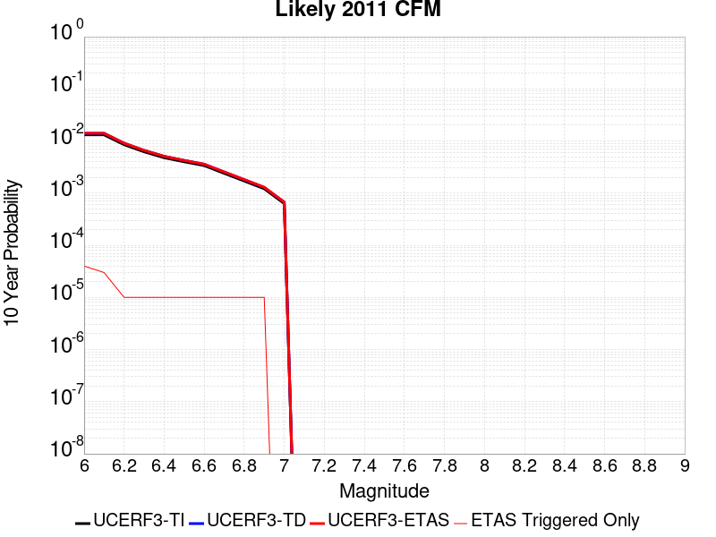 |

| Magnitude | 1 wk TI Prob | 1 wk TD Prob | 1 wk ETAS Prob | 1 wk ETAS/TD Gain | 1 wk ETAS Triggered Only | 1 mo TI Prob | 1 mo TD Prob | 1 mo ETAS Prob | 1 mo ETAS/TD Gain | 1 mo ETAS Triggered Only | 1 yr TI Prob | 1 yr TD Prob | 1 yr ETAS Prob | 1 yr ETAS/TD Gain | 1 yr ETAS Triggered Only | 10 yr TI Prob | 10 yr TD Prob | 10 yr ETAS Prob | 10 yr ETAS/TD Gain | 10 yr ETAS Triggered Only |
|-----|-----|-----|-----|-----|-----|-----|-----|-----|-----|-----|-----|-----|-----|-----|-----|-----|-----|-----|-----|-----|
| 6.0 | 2.5315949E-5 | 2.7104748E-5 | 2.7104748E-5 | 1.0 | 0.0 | 1.0849241E-4 | 1.16158284E-4 | 1.16158284E-4 | 1.0 | 0.0 | 0.0013200947 | 0.0014133542 | 0.0016520221 | 1.1688663 | 2.3900573E-4 | 0.013122803 | 0.01404831 | 0.014283959 | 1.0167742 | 2.3900573E-4 |
| 6.1 | 2.5315949E-5 | 2.7104748E-5 | 2.7104748E-5 | 1.0 | 0.0 | 1.0849241E-4 | 1.16158284E-4 | 1.16158284E-4 | 1.0 | 0.0 | 0.0013200947 | 0.0014133542 | 0.0016520221 | 1.1688663 | 2.3900573E-4 | 0.013122803 | 0.01404831 | 0.014283959 | 1.0167742 | 2.3900573E-4 |
| 6.2 | 1.6375941E-5 | 1.7465842E-5 | 1.7465842E-5 | 1.0 | 0.0 | 7.0180715E-5 | 7.485153E-5 | 7.485153E-5 | 1.0 | 0.0 | 8.5411523E-4 | 9.109487E-4 | 9.109487E-4 | 1.0 | 0.0 | 0.008508399 | 0.009073433 | 0.009073433 | 1.0 | 0.0 |
| 6.3 | 1.1945543E-5 | 1.2712587E-5 | 1.2712587E-5 | 1.0 | 0.0 | 5.119418E-5 | 5.4481407E-5 | 5.4481407E-5 | 1.0 | 0.0 | 6.2311086E-4 | 6.631146E-4 | 6.631146E-4 | 1.0 | 0.0 | 0.0062136655 | 0.0066119144 | 0.0066119144 | 1.0 | 0.0 |
| 6.4 | 9.192729E-6 | 9.768488E-6 | 9.768488E-6 | 1.0 | 0.0 | 3.939681E-5 | 4.1864292E-5 | 4.1864292E-5 | 1.0 | 0.0 | 4.7955062E-4 | 5.0958124E-4 | 5.0958124E-4 | 1.0 | 0.0 | 0.004785171 | 0.0050844094 | 0.0050844094 | 1.0 | 0.0 |
| 6.5 | 7.67906E-6 | 8.152622E-6 | 8.152622E-6 | 1.0 | 0.0 | 3.2909844E-5 | 3.4939352E-5 | 3.4939352E-5 | 1.0 | 0.0 | 4.006037E-4 | 4.2530545E-4 | 4.2530545E-4 | 1.0 | 0.0 | 0.0039988225 | 0.004245108 | 0.004245108 | 1.0 | 0.0 |
| 6.6 | 6.4884057E-6 | 6.8847507E-6 | 6.8847507E-6 | 1.0 | 0.0 | 2.7807157E-5 | 2.9505749E-5 | 2.9505749E-5 | 1.0 | 0.0 | 3.3849955E-4 | 3.591747E-4 | 3.591747E-4 | 1.0 | 0.0 | 0.003379844 | 0.0035860867 | 0.0035860867 | 1.0 | 0.0 |
| 6.7 | 4.6060636E-6 | 4.884041E-6 | 4.884041E-6 | 1.0 | 0.0 | 1.9740122E-5 | 2.0931442E-5 | 2.0931442E-5 | 1.0 | 0.0 | 2.403095E-4 | 2.5481134E-4 | 2.5481134E-4 | 1.0 | 0.0 | 0.002400498 | 0.0025452746 | 0.0025452746 | 1.0 | 0.0 |
| 6.8 | 3.2795615E-6 | 3.4773732E-6 | 3.4773732E-6 | 1.0 | 0.0 | 1.4055187E-5 | 1.4902946E-5 | 1.4902946E-5 | 1.0 | 0.0 | 1.7110848E-4 | 1.8142881E-4 | 1.8142881E-4 | 1.0 | 0.0 | 0.0017097679 | 0.0018128622 | 0.0018128622 | 1.0 | 0.0 |
| 6.9 | 2.3289967E-6 | 2.4705569E-6 | 2.4705569E-6 | 1.0 | 0.0 | 9.981376E-6 | 1.058806E-5 | 1.058806E-5 | 1.0 | 0.0 | 1.2151648E-4 | 1.2890245E-4 | 1.2890245E-4 | 1.0 | 0.0 | 0.0012145005 | 0.0012883197 | 0.0012883197 | 1.0 | 0.0 |
| 7.0 | 1.211292E-6 | 1.2863958E-6 | 1.2863958E-6 | 1.0 | 0.0 | 5.1912407E-6 | 5.5131145E-6 | 5.5131145E-6 | 1.0 | 0.0 | 6.320152E-5 | 6.712041E-5 | 6.712041E-5 | 1.0 | 0.0 | 6.3183554E-4 | 6.710312E-4 | 6.710312E-4 | 1.0 | 0.0 |

## Lake Isabella (Seismicity)
*[(top)](#table-of-contents)*

| 1 Week | 1 Month | 1 Year | 10 Year |
|-----|-----|-----|-----|
|  |  |  |  |

| Magnitude | 1 wk TI Prob | 1 wk TD Prob | 1 wk ETAS Prob | 1 wk ETAS/TD Gain | 1 wk ETAS Triggered Only | 1 mo TI Prob | 1 mo TD Prob | 1 mo ETAS Prob | 1 mo ETAS/TD Gain | 1 mo ETAS Triggered Only | 1 yr TI Prob | 1 yr TD Prob | 1 yr ETAS Prob | 1 yr ETAS/TD Gain | 1 yr ETAS Triggered Only | 10 yr TI Prob | 10 yr TD Prob | 10 yr ETAS Prob | 10 yr ETAS/TD Gain | 10 yr ETAS Triggered Only |
|-----|-----|-----|-----|-----|-----|-----|-----|-----|-----|-----|-----|-----|-----|-----|-----|-----|-----|-----|-----|-----|
| 6.0 | 9.431637E-6 | 9.741651E-6 | 2.4874505E-4 | 25.534178 | 2.3900573E-4 | 4.0420677E-5 | 4.1749343E-5 | 2.807451E-4 | 6.7245398 | 2.3900573E-4 | 4.920106E-4 | 5.0819275E-4 | 7.4707705E-4 | 1.4700663 | 2.3900573E-4 | 0.004909227 | 0.005071599 | 0.005309392 | 1.0468873 | 2.3900573E-4 |
| 6.1 | 9.431637E-6 | 9.741651E-6 | 2.4874505E-4 | 25.534178 | 2.3900573E-4 | 4.0420677E-5 | 4.1749343E-5 | 2.807451E-4 | 6.7245398 | 2.3900573E-4 | 4.920106E-4 | 5.0819275E-4 | 7.4707705E-4 | 1.4700663 | 2.3900573E-4 | 0.004909227 | 0.005071599 | 0.005309392 | 1.0468873 | 2.3900573E-4 |
| 6.2 | 9.431637E-6 | 9.741651E-6 | 2.4874505E-4 | 25.534178 | 2.3900573E-4 | 4.0420677E-5 | 4.1749343E-5 | 2.807451E-4 | 6.7245398 | 2.3900573E-4 | 4.920106E-4 | 5.0819275E-4 | 7.4707705E-4 | 1.4700663 | 2.3900573E-4 | 0.004909227 | 0.005071599 | 0.005309392 | 1.0468873 | 2.3900573E-4 |
| 6.3 | 9.431637E-6 | 9.741651E-6 | 2.4874505E-4 | 25.534178 | 2.3900573E-4 | 4.0420677E-5 | 4.1749343E-5 | 2.807451E-4 | 6.7245398 | 2.3900573E-4 | 4.920106E-4 | 5.0819275E-4 | 7.4707705E-4 | 1.4700663 | 2.3900573E-4 | 0.004909227 | 0.005071599 | 0.005309392 | 1.0468873 | 2.3900573E-4 |
| 6.4 | 5.144063E-6 | 5.3000763E-6 | 5.3000763E-6 | 1.0 | 0.0 | 2.2045799E-5 | 2.2714434E-5 | 2.2714434E-5 | 1.0 | 0.0 | 2.6837454E-4 | 2.765166E-4 | 2.765166E-4 | 1.0 | 0.0 | 0.0026805066 | 0.0027620657 | 0.0027620657 | 1.0 | 0.0 |
| 6.5 | 5.144063E-6 | 5.3000763E-6 | 5.3000763E-6 | 1.0 | 0.0 | 2.2045799E-5 | 2.2714434E-5 | 2.2714434E-5 | 1.0 | 0.0 | 2.6837454E-4 | 2.765166E-4 | 2.765166E-4 | 1.0 | 0.0 | 0.0026805066 | 0.0027620657 | 0.0027620657 | 1.0 | 0.0 |
| 6.6 | 3.4009804E-6 | 3.498786E-6 | 3.498786E-6 | 1.0 | 0.0 | 1.4575549E-5 | 1.4994721E-5 | 1.4994721E-5 | 1.0 | 0.0 | 1.7744285E-4 | 1.8254704E-4 | 1.8254704E-4 | 1.0 | 0.0 | 0.0017730123 | 0.0018241286 | 0.0018241286 | 1.0 | 0.0 |
| 6.7 | 3.3880428E-6 | 3.4856528E-6 | 3.4856528E-6 | 1.0 | 0.0 | 1.4520103E-5 | 1.4938435E-5 | 1.4938435E-5 | 1.0 | 0.0 | 1.767679E-4 | 1.8186188E-4 | 1.8186188E-4 | 1.0 | 0.0 | 0.0017662736 | 0.0018172882 | 0.0018172882 | 1.0 | 0.0 |
| 6.8 | 2.6582E-6 | 2.7337003E-6 | 2.7337003E-6 | 1.0 | 0.0 | 1.1392236E-5 | 1.1715813E-5 | 1.1715813E-5 | 1.0 | 0.0 | 1.3869164E-4 | 1.4263204E-4 | 1.4263204E-4 | 1.0 | 0.0 | 0.0013860512 | 0.0014255369 | 0.0014255369 | 1.0 | 0.0 |
| 6.9 | 2.406011E-6 | 2.4743288E-6 | 2.4743288E-6 | 1.0 | 0.0 | 1.0311434E-5 | 1.0604231E-5 | 1.0604231E-5 | 1.0 | 0.0 | 1.2553448E-4 | 1.2910018E-4 | 1.2910018E-4 | 1.0 | 0.0 | 0.0012546359 | 0.0012903814 | 0.0012903814 | 1.0 | 0.0 |
| 7.0 | 1.6953097E-6 | 1.7429371E-6 | 1.7429371E-6 | 1.0 | 0.0 | 7.265593E-6 | 7.469715E-6 | 7.469715E-6 | 1.0 | 0.0 | 8.8455E-5 | 9.094104E-5 | 9.094104E-5 | 1.0 | 0.0 | 8.84198E-4 | 9.09141E-4 | 9.09141E-4 | 1.0 | 0.0 |
| 7.1 | 3.5013824E-7 | 3.5714822E-7 | 3.5714822E-7 | 1.0 | 0.0 | 1.5005916E-6 | 1.5306344E-6 | 1.5306344E-6 | 1.0 | 0.0 | 1.826955E-5 | 1.8635317E-5 | 1.8635317E-5 | 1.0 | 0.0 | 1.8268047E-4 | 1.863378E-4 | 1.863378E-4 | 1.0 | 0.0 |
| 7.2 | 2.2321095E-7 | 2.2750574E-7 | 2.2750574E-7 | 1.0 | 0.0 | 9.56618E-7 | 9.750242E-7 | 9.750242E-7 | 1.0 | 0.0 | 1.1646762E-5 | 1.1870856E-5 | 1.1870856E-5 | 1.0 | 0.0 | 1.1646151E-4 | 1.1870232E-4 | 1.1870232E-4 | 1.0 | 0.0 |
| 7.3 | 1.5760406E-7 | 1.6060922E-7 | 1.6060922E-7 | 1.0 | 0.0 | 6.7544585E-7 | 6.8832503E-7 | 6.8832503E-7 | 1.0 | 0.0 | 8.223522E-6 | 8.380326E-6 | 8.380326E-6 | 1.0 | 0.0 | 8.2232174E-5 | 8.3800165E-5 | 8.3800165E-5 | 1.0 | 0.0 |
| 7.4 | 1.1216497E-7 | 1.1431706E-7 | 1.1431706E-7 | 1.0 | 0.0 | 4.8070694E-7 | 4.899302E-7 | 4.899302E-7 | 1.0 | 0.0 | 5.852591E-6 | 5.964884E-6 | 5.964884E-6 | 1.0 | 0.0 | 5.8524372E-5 | 5.9647282E-5 | 5.9647282E-5 | 1.0 | 0.0 |
| 7.5 | 4.885185E-8 | 4.9787737E-8 | 4.9787737E-8 | 1.0 | 0.0 | 2.0936506E-7 | 2.13376E-7 | 2.13376E-7 | 1.0 | 0.0 | 2.5490165E-6 | 2.59785E-6 | 2.59785E-6 | 1.0 | 0.0 | 2.5489873E-5 | 2.5978214E-5 | 2.5978214E-5 | 1.0 | 0.0 |
| 7.6 | 1.504641E-9 | 1.5317903E-9 | 1.5317903E-9 | 1.0 | 0.0 | 6.4484613E-9 | 6.5648154E-9 | 6.5648154E-9 | 1.0 | 0.0 | 7.851001E-8 | 7.992663E-8 | 7.992663E-8 | 1.0 | 0.0 | 7.8509987E-7 | 7.992663E-7 | 7.992663E-7 | 1.0 | 0.0 |

## San Andreas (Creeping Section) 2011 CFM
*[(top)](#table-of-contents)*

| 1 Week | 1 Month | 1 Year | 10 Year |
|-----|-----|-----|-----|
|  |  |  |  |

| Magnitude | 1 wk TI Prob | 1 wk TD Prob | 1 wk ETAS Prob | 1 wk ETAS/TD Gain | 1 wk ETAS Triggered Only | 1 mo TI Prob | 1 mo TD Prob | 1 mo ETAS Prob | 1 mo ETAS/TD Gain | 1 mo ETAS Triggered Only | 1 yr TI Prob | 1 yr TD Prob | 1 yr ETAS Prob | 1 yr ETAS/TD Gain | 1 yr ETAS Triggered Only | 10 yr TI Prob | 10 yr TD Prob | 10 yr ETAS Prob | 10 yr ETAS/TD Gain | 10 yr ETAS Triggered Only |
|-----|-----|-----|-----|-----|-----|-----|-----|-----|-----|-----|-----|-----|-----|-----|-----|-----|-----|-----|-----|-----|
| 6.0 | 5.986481E-4 | 0.001228691 | 0.001228691 | 1.0 | 0.0 | 0.0025631124 | 0.005246795 | 0.005246795 | 1.0 | 0.0 | 0.030762846 | 0.061203245 | 0.061203245 | 1.0 | 0.0 | 0.26835477 | 0.425928 | 0.4260652 | 1.0003221 | 2.3900573E-4 |
| 6.1 | 5.015945E-4 | 0.0010230356 | 0.0010230356 | 1.0 | 0.0 | 0.00214792 | 0.004369436 | 0.004369436 | 1.0 | 0.0 | 0.025839351 | 0.051246606 | 0.051246606 | 1.0 | 0.0 | 0.23032776 | 0.37284943 | 0.37299934 | 1.000402 | 2.3900573E-4 |
| 6.2 | 4.073338E-4 | 8.1157376E-4 | 8.1157376E-4 | 1.0 | 0.0 | 0.0017445484 | 0.0034683137 | 0.0034683137 | 1.0 | 0.0 | 0.021034058 | 0.04093177 | 0.04093177 | 1.0 | 0.0 | 0.19150782 | 0.31302592 | 0.3131901 | 1.0005245 | 2.3900573E-4 |
| 6.3 | 3.464099E-4 | 6.7455834E-4 | 6.7455834E-4 | 1.0 | 0.0 | 0.0014837692 | 0.0028832308 | 0.0028832308 | 1.0 | 0.0 | 0.017915873 | 0.034187846 | 0.034187846 | 1.0 | 0.0 | 0.16538359 | 0.27130842 | 0.2714826 | 1.000642 | 2.3900573E-4 |
| 6.4 | 2.935057E-4 | 5.5516965E-4 | 5.5516965E-4 | 1.0 | 0.0 | 0.0012572751 | 0.0023727308 | 0.0023727308 | 1.0 | 0.0 | 0.015200248 | 0.02826279 | 0.02826279 | 1.0 | 0.0 | 0.14201577 | 0.23297668 | 0.23315999 | 1.0007869 | 2.3900573E-4 |
| 6.5 | 2.3409708E-4 | 4.2132285E-4 | 4.2132285E-4 | 1.0 | 0.0 | 0.0010028875 | 0.0018017791 | 0.0018017791 | 1.0 | 0.0 | 0.012141965 | 0.021586355 | 0.021586355 | 1.0 | 0.0 | 0.11499573 | 0.1868149 | 0.18700926 | 1.0010403 | 2.3900573E-4 |
| 6.6 | 1.5842178E-4 | 2.5068692E-4 | 2.5068692E-4 | 1.0 | 0.0 | 6.7877385E-4 | 0.0010739256 | 0.0010739256 | 1.0 | 0.0 | 0.0082328 | 0.012995283 | 0.012995283 | 1.0 | 0.0 | 0.07934396 | 0.12313759 | 0.12334717 | 1.001702 | 2.3900573E-4 |
| 6.7 | 1.5616413E-4 | 2.4605254E-4 | 2.4605254E-4 | 1.0 | 0.0 | 6.691031E-4 | 0.0010540807 | 0.0010540807 | 1.0 | 0.0 | 0.0081159435 | 0.012757154 | 0.012757154 | 1.0 | 0.0 | 0.0782586 | 0.12116472 | 0.12137476 | 1.0017335 | 2.3900573E-4 |
| 6.8 | 1.5538467E-4 | 2.442914E-4 | 2.442914E-4 | 1.0 | 0.0 | 6.6576427E-4 | 0.001046539 | 0.001046539 | 1.0 | 0.0 | 0.008075596 | 0.012666538 | 0.012666538 | 1.0 | 0.0 | 0.07788358 | 0.12039561 | 0.120605834 | 1.0017462 | 2.3900573E-4 |
| 6.9 | 1.5153569E-4 | 2.3538464E-4 | 2.3538464E-4 | 1.0 | 0.0 | 6.49277E-4 | 0.0010084033 | 0.0010084033 | 1.0 | 0.0 | 0.007876333 | 0.012208726 | 0.012208726 | 1.0 | 0.0 | 0.07602952 | 0.11646574 | 0.11667691 | 1.0018132 | 2.3900573E-4 |
| 7.0 | 1.4588932E-4 | 2.2395732E-4 | 2.2395732E-4 | 1.0 | 0.0 | 6.250901E-4 | 9.59466E-4 | 9.59466E-4 | 1.0 | 0.0 | 0.0075839474 | 0.011619428 | 0.011619428 | 1.0 | 0.0 | 0.073302895 | 0.11131206 | 0.11152446 | 1.0019082 | 2.3900573E-4 |
| 7.1 | 1.1565079E-4 | 1.6281323E-4 | 1.6281323E-4 | 1.0 | 0.0 | 4.955521E-4 | 6.9758523E-4 | 6.9758523E-4 | 1.0 | 0.0 | 0.006016669 | 0.008460228 | 0.008460228 | 1.0 | 0.0 | 0.058563538 | 0.08366478 | 0.08388379 | 1.0026177 | 2.3900573E-4 |
| 7.2 | 1.0393792E-4 | 1.4615392E-4 | 1.4615392E-4 | 1.0 | 0.0 | 4.4537216E-4 | 6.262243E-4 | 6.262243E-4 | 1.0 | 0.0 | 0.005408933 | 0.0075977976 | 0.0075977976 | 1.0 | 0.0 | 0.052791595 | 0.07561503 | 0.07583597 | 1.0029218 | 2.3900573E-4 |
| 7.3 | 9.332884E-5 | 1.2780601E-4 | 1.2780601E-4 | 1.0 | 0.0 | 3.999194E-4 | 5.4762565E-4 | 5.4762565E-4 | 1.0 | 0.0 | 0.0048581534 | 0.0066470946 | 0.0066470946 | 1.0 | 0.0 | 0.047533102 | 0.06647954 | 0.06670266 | 1.0033562 | 2.3900573E-4 |
| 7.4 | 8.670252E-5 | 1.1702972E-4 | 1.1702972E-4 | 1.0 | 0.0 | 3.715293E-4 | 5.014601E-4 | 5.014601E-4 | 1.0 | 0.0 | 0.004513991 | 0.0060883067 | 0.0060883067 | 1.0 | 0.0 | 0.044233937 | 0.061148684 | 0.061373074 | 1.0036696 | 2.3900573E-4 |
| 7.5 | 7.3036405E-5 | 9.005699E-5 | 9.005699E-5 | 1.0 | 0.0 | 3.129756E-4 | 3.859015E-4 | 3.859015E-4 | 1.0 | 0.0 | 0.0038038217 | 0.0046882504 | 0.0046882504 | 1.0 | 0.0 | 0.03739367 | 0.047875606 | 0.047875606 | 1.0 | 0.0 |
| 7.6 | 6.3935775E-5 | 8.280209E-5 | 8.280209E-5 | 1.0 | 0.0 | 2.7398168E-4 | 3.5481792E-4 | 3.5481792E-4 | 1.0 | 0.0 | 0.0033306254 | 0.00431137 | 0.00431137 | 1.0 | 0.0 | 0.032811474 | 0.043990135 | 0.043990135 | 1.0 | 0.0 |
| 7.7 | 5.5050095E-5 | 6.661729E-5 | 6.661729E-5 | 1.0 | 0.0 | 2.3590765E-4 | 2.8547147E-4 | 2.8547147E-4 | 1.0 | 0.0 | 0.0028683927 | 0.0034700802 | 0.0034700802 | 1.0 | 0.0 | 0.0283165 | 0.03579509 | 0.03579509 | 1.0 | 0.0 |
| 7.8 | 5.027131E-5 | 6.1627725E-5 | 6.1627725E-5 | 1.0 | 0.0 | 2.1543067E-4 | 2.640921E-4 | 2.640921E-4 | 1.0 | 0.0 | 0.0026197135 | 0.003210584 | 0.003210584 | 1.0 | 0.0 | 0.025890453 | 0.03312572 | 0.03312572 | 1.0 | 0.0 |
| 7.9 | 3.7271806E-5 | 5.0224386E-5 | 5.0224386E-5 | 1.0 | 0.0 | 1.5972654E-4 | 2.1522962E-4 | 2.1522962E-4 | 1.0 | 0.0 | 0.0019429359 | 0.0026172737 | 0.0026172737 | 1.0 | 0.0 | 0.019260362 | 0.027066687 | 0.027066687 | 1.0 | 0.0 |
| 8.0 | 2.7310243E-5 | 3.1428404E-5 | 3.1428404E-5 | 1.0 | 0.0 | 1.17038646E-4 | 1.3468621E-4 | 1.3468621E-4 | 1.0 | 0.0 | 0.0014240141 | 0.0016385721 | 0.0016385721 | 1.0 | 0.0 | 0.014149235 | 0.01721387 | 0.01721387 | 1.0 | 0.0 |
| 8.1 | 1.7940547E-5 | 1.7400796E-5 | 1.7400796E-5 | 1.0 | 0.0 | 7.688579E-5 | 7.457271E-5 | 7.457271E-5 | 1.0 | 0.0 | 9.3568244E-4 | 9.075451E-4 | 9.075451E-4 | 1.0 | 0.0 | 0.009317525 | 0.009799073 | 0.009799073 | 1.0 | 0.0 |
| 8.2 | 8.643924E-6 | 5.4748625E-6 | 5.4748625E-6 | 1.0 | 0.0 | 3.704486E-5 | 2.3463486E-5 | 2.3463486E-5 | 1.0 | 0.0 | 4.5092785E-4 | 2.8563058E-4 | 2.8563058E-4 | 1.0 | 0.0 | 0.0045001395 | 0.0032487072 | 0.0032487072 | 1.0 | 0.0 |
| 8.3 | 1.983087E-6 | 7.6599065E-7 | 7.6599065E-7 | 1.0 | 0.0 | 8.498917E-6 | 3.282813E-6 | 3.282813E-6 | 1.0 | 0.0 | 1.034694E-4 | 3.9967534E-5 | 3.9967534E-5 | 1.0 | 0.0 | 0.0010342124 | 4.719687E-4 | 4.719687E-4 | 1.0 | 0.0 |

## San Andreas (Parkfield)
*[(top)](#table-of-contents)*

| 1 Week | 1 Month | 1 Year | 10 Year |
|-----|-----|-----|-----|
|  |  |  |  |

| Magnitude | 1 wk TI Prob | 1 wk TD Prob | 1 wk ETAS Prob | 1 wk ETAS/TD Gain | 1 wk ETAS Triggered Only | 1 mo TI Prob | 1 mo TD Prob | 1 mo ETAS Prob | 1 mo ETAS/TD Gain | 1 mo ETAS Triggered Only | 1 yr TI Prob | 1 yr TD Prob | 1 yr ETAS Prob | 1 yr ETAS/TD Gain | 1 yr ETAS Triggered Only | 10 yr TI Prob | 10 yr TD Prob | 10 yr ETAS Prob | 10 yr ETAS/TD Gain | 10 yr ETAS Triggered Only |
|-----|-----|-----|-----|-----|-----|-----|-----|-----|-----|-----|-----|-----|-----|-----|-----|-----|-----|-----|-----|-----|
| 6.0 | 5.556969E-4 | 7.7782426E-4 | 7.7782426E-4 | 1.0 | 0.0 | 0.0023793848 | 0.0033298214 | 0.0033298214 | 1.0 | 0.0 | 0.028586963 | 0.040191233 | 0.040191233 | 1.0 | 0.0 | 0.25176284 | 0.33716413 | 0.33732256 | 1.0004699 | 2.3900573E-4 |
| 6.1 | 1.925858E-4 | 3.0276453E-4 | 3.0276453E-4 | 1.0 | 0.0 | 8.2510663E-4 | 0.0012970108 | 0.0012970108 | 1.0 | 0.0 | 0.0099994885 | 0.015778083 | 0.015778083 | 1.0 | 0.0 | 0.095613256 | 0.1497237 | 0.14992692 | 1.0013573 | 2.3900573E-4 |
| 6.2 | 9.4306815E-5 | 1.8242796E-4 | 1.8242796E-4 | 1.0 | 0.0 | 4.0410945E-4 | 7.816011E-4 | 7.816011E-4 | 1.0 | 0.0 | 0.0049089384 | 0.009474681 | 0.009474681 | 1.0 | 0.0 | 0.048019063 | 0.09185409 | 0.09207114 | 1.002363 | 2.3900573E-4 |
| 6.3 | 9.283051E-5 | 1.7939322E-4 | 1.7939322E-4 | 1.0 | 0.0 | 3.9778434E-4 | 7.686027E-4 | 7.686027E-4 | 1.0 | 0.0 | 0.0048322747 | 0.009317789 | 0.009317789 | 1.0 | 0.0 | 0.047285385 | 0.09050704 | 0.09072441 | 1.0024017 | 2.3900573E-4 |
| 6.4 | 9.138826E-5 | 1.770153E-4 | 1.770153E-4 | 1.0 | 0.0 | 3.916052E-4 | 7.5841765E-4 | 7.5841765E-4 | 1.0 | 0.0 | 0.0047573745 | 0.00919484 | 0.00919484 | 1.0 | 0.0 | 0.046568092 | 0.08940927 | 0.08962691 | 1.0024341 | 2.3900573E-4 |
| 6.5 | 9.000255E-5 | 1.7459576E-4 | 1.7459576E-4 | 1.0 | 0.0 | 3.8566816E-4 | 7.480541E-4 | 7.480541E-4 | 1.0 | 0.0 | 0.0046854047 | 0.009069731 | 0.009069731 | 1.0 | 0.0 | 0.045878403 | 0.088295065 | 0.088512965 | 1.0024679 | 2.3900573E-4 |
| 6.6 | 8.8109264E-5 | 1.7140752E-4 | 1.7140752E-4 | 1.0 | 0.0 | 3.7755648E-4 | 7.3439797E-4 | 7.3439797E-4 | 1.0 | 0.0 | 0.0045870654 | 0.008904854 | 0.008904854 | 1.0 | 0.0 | 0.04493529 | 0.0868267 | 0.08704495 | 1.0025136 | 2.3900573E-4 |
| 6.7 | 8.738073E-5 | 1.7007832E-4 | 1.7007832E-4 | 1.0 | 0.0 | 3.7443507E-4 | 7.287046E-4 | 7.287046E-4 | 1.0 | 0.0 | 0.0045492216 | 0.008836143 | 0.008836143 | 1.0 | 0.0 | 0.04457213 | 0.08622707 | 0.086445466 | 1.0025328 | 2.3900573E-4 |
| 6.8 | 8.710195E-5 | 1.6953335E-4 | 1.6953335E-4 | 1.0 | 0.0 | 3.7324068E-4 | 7.263703E-4 | 7.263703E-4 | 1.0 | 0.0 | 0.0045347405 | 0.008807961 | 0.008807961 | 1.0 | 0.0 | 0.04443313 | 0.08597467 | 0.08619313 | 1.002541 | 2.3900573E-4 |
| 6.9 | 8.6801556E-5 | 1.689429E-4 | 1.689429E-4 | 1.0 | 0.0 | 3.7195362E-4 | 7.2384125E-4 | 7.2384125E-4 | 1.0 | 0.0 | 0.0045191357 | 0.008777418 | 0.008777418 | 1.0 | 0.0 | 0.044283327 | 0.085700735 | 0.08591925 | 1.0025499 | 2.3900573E-4 |
| 7.0 | 8.5571606E-5 | 1.6647128E-4 | 1.6647128E-4 | 1.0 | 0.0 | 3.6668387E-4 | 7.132544E-4 | 7.132544E-4 | 1.0 | 0.0 | 0.004455241 | 0.008649553 | 0.008649553 | 1.0 | 0.0 | 0.043669727 | 0.08454914 | 0.08476794 | 1.0025878 | 2.3900573E-4 |
| 7.1 | 7.82589E-5 | 1.5128135E-4 | 1.5128135E-4 | 1.0 | 0.0 | 3.3535215E-4 | 6.481883E-4 | 6.481883E-4 | 1.0 | 0.0 | 0.0040752706 | 0.007863307 | 0.007863307 | 1.0 | 0.0 | 0.040013418 | 0.07746111 | 0.0776816 | 1.0028465 | 2.3900573E-4 |
| 7.2 | 7.690929E-5 | 1.4865391E-4 | 1.4865391E-4 | 1.0 | 0.0 | 3.2956956E-4 | 6.369334E-4 | 6.369334E-4 | 1.0 | 0.0 | 0.004005129 | 0.007727258 | 0.007727258 | 1.0 | 0.0 | 0.0393371 | 0.07623427 | 0.07645506 | 1.0028962 | 2.3900573E-4 |
| 7.3 | 7.5543794E-5 | 1.4561978E-4 | 1.4561978E-4 | 1.0 | 0.0 | 3.2371894E-4 | 6.2393624E-4 | 6.2393624E-4 | 1.0 | 0.0 | 0.003934157 | 0.007570127 | 0.007570127 | 1.0 | 0.0 | 0.038652334 | 0.074797355 | 0.07501848 | 1.0029564 | 2.3900573E-4 |
| 7.4 | 7.4214564E-5 | 1.4262961E-4 | 1.4262961E-4 | 1.0 | 0.0 | 3.1802364E-4 | 6.111273E-4 | 6.111273E-4 | 1.0 | 0.0 | 0.003865065 | 0.00741525 | 0.00741525 | 1.0 | 0.0 | 0.03798529 | 0.07337123 | 0.0735927 | 1.0030185 | 2.3900573E-4 |
| 7.5 | 6.149578E-5 | 1.11907226E-4 | 1.11907226E-4 | 1.0 | 0.0 | 2.6352672E-4 | 4.7951436E-4 | 4.7951436E-4 | 1.0 | 0.0 | 0.0032037178 | 0.0058224914 | 0.0058224914 | 1.0 | 0.0 | 0.03157923 | 0.058557566 | 0.058557566 | 1.0 | 0.0 |
| 7.6 | 6.0643448E-5 | 1.10193796E-4 | 1.10193796E-4 | 1.0 | 0.0 | 2.598746E-4 | 4.7217376E-4 | 4.7217376E-4 | 1.0 | 0.0 | 0.0031593828 | 0.0057335934 | 0.0057335934 | 1.0 | 0.0 | 0.031148417 | 0.057718582 | 0.057718582 | 1.0 | 0.0 |
| 7.7 | 5.1652263E-5 | 9.174698E-5 | 9.174698E-5 | 1.0 | 0.0 | 2.2134806E-4 | 3.931421E-4 | 3.931421E-4 | 1.0 | 0.0 | 0.002691582 | 0.0047760103 | 0.0047760103 | 1.0 | 0.0 | 0.026592141 | 0.04853623 | 0.04853623 | 1.0 | 0.0 |
| 7.8 | 4.8090482E-5 | 8.559635E-5 | 8.559635E-5 | 1.0 | 0.0 | 2.060858E-4 | 3.6678996E-4 | 3.6678996E-4 | 1.0 | 0.0 | 0.0025062072 | 0.0044565317 | 0.0044565317 | 1.0 | 0.0 | 0.024781305 | 0.04530245 | 0.04530245 | 1.0 | 0.0 |
| 7.9 | 3.970278E-5 | 6.750426E-5 | 6.750426E-5 | 1.0 | 0.0 | 1.7014367E-4 | 2.892719E-4 | 2.892719E-4 | 1.0 | 0.0 | 0.002069531 | 0.0035162016 | 0.0035162016 | 1.0 | 0.0 | 0.020503636 | 0.035881363 | 0.035881363 | 1.0 | 0.0 |
| 8.0 | 2.8982335E-5 | 4.069796E-5 | 4.069796E-5 | 1.0 | 0.0 | 1.2420409E-4 | 1.7440817E-4 | 1.7440817E-4 | 1.0 | 0.0 | 0.0015111357 | 0.0021213528 | 0.0021213528 | 1.0 | 0.0 | 0.015009012 | 0.022010697 | 0.022010697 | 1.0 | 0.0 |
| 8.1 | 1.8836186E-5 | 1.8681134E-5 | 1.8681134E-5 | 1.0 | 0.0 | 8.0724014E-5 | 8.005955E-5 | 8.005955E-5 | 1.0 | 0.0 | 9.823717E-4 | 9.742898E-4 | 9.742898E-4 | 1.0 | 0.0 | 0.009780403 | 0.010488115 | 0.010488115 | 1.0 | 0.0 |
| 8.2 | 8.643924E-6 | 5.4748625E-6 | 5.4748625E-6 | 1.0 | 0.0 | 3.704486E-5 | 2.3463486E-5 | 2.3463486E-5 | 1.0 | 0.0 | 4.5092785E-4 | 2.8563058E-4 | 2.8563058E-4 | 1.0 | 0.0 | 0.0045001395 | 0.0032487072 | 0.0032487072 | 1.0 | 0.0 |
| 8.3 | 1.983087E-6 | 7.6599065E-7 | 7.6599065E-7 | 1.0 | 0.0 | 8.498917E-6 | 3.282813E-6 | 3.282813E-6 | 1.0 | 0.0 | 1.034694E-4 | 3.9967534E-5 | 3.9967534E-5 | 1.0 | 0.0 | 0.0010342124 | 4.719687E-4 | 4.719687E-4 | 1.0 | 0.0 |

## Imperial
*[(top)](#table-of-contents)*

| 1 Week | 1 Month | 1 Year | 10 Year |
|-----|-----|-----|-----|
|  |  |  | 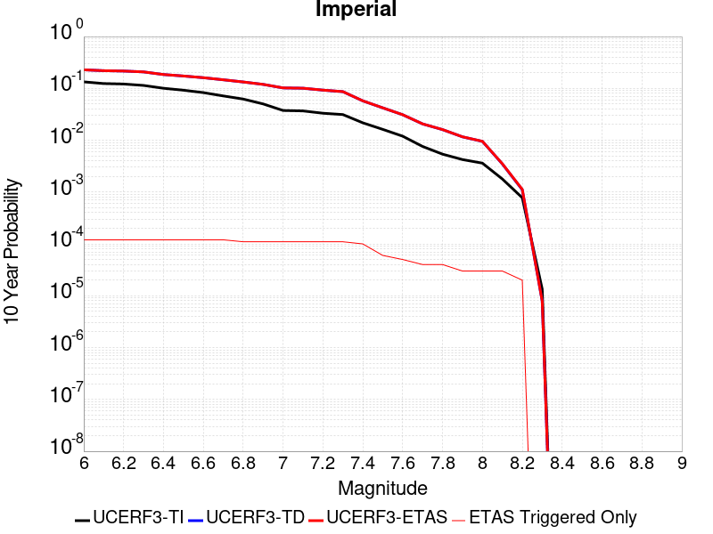 |

| Magnitude | 1 wk TI Prob | 1 wk TD Prob | 1 wk ETAS Prob | 1 wk ETAS/TD Gain | 1 wk ETAS Triggered Only | 1 mo TI Prob | 1 mo TD Prob | 1 mo ETAS Prob | 1 mo ETAS/TD Gain | 1 mo ETAS Triggered Only | 1 yr TI Prob | 1 yr TD Prob | 1 yr ETAS Prob | 1 yr ETAS/TD Gain | 1 yr ETAS Triggered Only | 10 yr TI Prob | 10 yr TD Prob | 10 yr ETAS Prob | 10 yr ETAS/TD Gain | 10 yr ETAS Triggered Only |
|-----|-----|-----|-----|-----|-----|-----|-----|-----|-----|-----|-----|-----|-----|-----|-----|-----|-----|-----|-----|-----|
| 6.0 | 2.7496446E-4 | 5.0552754E-4 | 5.0552754E-4 | 1.0 | 0.0 | 0.0011778869 | 0.002164787 | 0.002164787 | 1.0 | 0.0 | 0.0142467655 | 0.026038699 | 0.026271481 | 1.0089399 | 2.3900573E-4 | 0.13367249 | 0.2280438 | 0.22822829 | 1.0008091 | 2.3900573E-4 |
| 6.1 | 2.5356023E-4 | 4.8656776E-4 | 4.8656776E-4 | 1.0 | 0.0 | 0.001086234 | 0.0020836622 | 0.0020836622 | 1.0 | 0.0 | 0.013144928 | 0.025071215 | 0.025304228 | 1.009294 | 2.3900573E-4 | 0.123940155 | 0.21947981 | 0.21966636 | 1.00085 | 2.3900573E-4 |
| 6.2 | 2.4820742E-4 | 4.7752203E-4 | 4.7752203E-4 | 1.0 | 0.0 | 0.0010633124 | 0.0020449557 | 0.0020449557 | 1.0 | 0.0 | 0.01286919 | 0.024611235 | 0.024844358 | 1.0094723 | 2.3900573E-4 | 0.12148927 | 0.21598552 | 0.2161729 | 1.0008676 | 2.3900573E-4 |
| 6.3 | 2.3205351E-4 | 4.5890483E-4 | 4.5890483E-4 | 1.0 | 0.0 | 9.94136E-4 | 0.0019652895 | 0.0019652895 | 1.0 | 0.0 | 0.012036599 | 0.02366133 | 0.02389468 | 1.0098621 | 2.3900573E-4 | 0.11405133 | 0.20793462 | 0.20812392 | 1.0009104 | 2.3900573E-4 |
| 6.4 | 2.0304754E-4 | 3.987652E-4 | 3.987652E-4 | 1.0 | 0.0 | 8.6991355E-4 | 0.0017078889 | 0.0017078889 | 1.0 | 0.0 | 0.010539869 | 0.020595672 | 0.020829754 | 1.0113657 | 2.3900573E-4 | 0.100537635 | 0.1850669 | 0.18526167 | 1.0010525 | 2.3900573E-4 |
| 6.5 | 1.854992E-4 | 3.6988858E-4 | 3.6988858E-4 | 1.0 | 0.0 | 7.9475436E-4 | 0.0015842861 | 0.0015842861 | 1.0 | 0.0 | 0.009633281 | 0.01911948 | 0.019353917 | 1.0122616 | 2.3900573E-4 | 0.0922623 | 0.173298 | 0.17349559 | 1.0011401 | 2.3900573E-4 |
| 6.6 | 1.6586106E-4 | 3.403506E-4 | 3.403506E-4 | 1.0 | 0.0 | 7.106394E-4 | 0.0014578402 | 0.0014578402 | 1.0 | 0.0 | 0.008617763 | 0.01760642 | 0.017841218 | 1.013336 | 2.3900573E-4 | 0.08291132 | 0.16077545 | 0.16097602 | 1.0012475 | 2.3900573E-4 |
| 6.7 | 1.4224656E-4 | 3.076692E-4 | 3.076692E-4 | 1.0 | 0.0 | 6.094856E-4 | 0.001317924 | 0.001317924 | 1.0 | 0.0 | 0.0073952693 | 0.015929576 | 0.016164776 | 1.0147649 | 2.3900573E-4 | 0.07153955 | 0.14648417 | 0.14668816 | 1.0013926 | 2.3900573E-4 |
| 6.8 | 1.2317259E-4 | 2.779122E-4 | 2.779122E-4 | 1.0 | 0.0 | 5.2777573E-4 | 0.0011905148 | 0.0011905148 | 1.0 | 0.0 | 0.0064067547 | 0.0143995695 | 0.0143995695 | 1.0 | 0.0 | 0.06225166 | 0.13293684 | 0.13293684 | 1.0 | 0.0 |
| 6.9 | 9.859898E-5 | 2.5014306E-4 | 2.5014306E-4 | 1.0 | 0.0 | 4.2249862E-4 | 0.0010716055 | 0.0010716055 | 1.0 | 0.0 | 0.0051317946 | 0.012969712 | 0.012969712 | 1.0 | 0.0 | 0.05014893 | 0.11940631 | 0.11940631 | 1.0 | 0.0 |
| 7.0 | 7.3191884E-5 | 2.1266776E-4 | 2.1266776E-4 | 1.0 | 0.0 | 3.136418E-4 | 9.1111806E-4 | 9.1111806E-4 | 1.0 | 0.0 | 0.003811904 | 0.011037128 | 0.011037128 | 1.0 | 0.0 | 0.037471764 | 0.10206493 | 0.10206493 | 1.0 | 0.0 |
| 7.1 | 7.1760296E-5 | 2.0968143E-4 | 2.0968143E-4 | 1.0 | 0.0 | 3.0750787E-4 | 8.983284E-4 | 8.983284E-4 | 1.0 | 0.0 | 0.003737482 | 0.010882978 | 0.010882978 | 1.0 | 0.0 | 0.03675245 | 0.10070146 | 0.10070146 | 1.0 | 0.0 |
| 7.2 | 6.46614E-5 | 1.9136685E-4 | 1.9136685E-4 | 1.0 | 0.0 | 2.7709085E-4 | 8.1988896E-4 | 8.1988896E-4 | 1.0 | 0.0 | 0.0033683628 | 0.0099370815 | 0.0099370815 | 1.0 | 0.0 | 0.033177625 | 0.09250898 | 0.09250898 | 1.0 | 0.0 |
| 7.3 | 6.088115E-5 | 1.78084E-4 | 1.78084E-4 | 1.0 | 0.0 | 2.6089314E-4 | 7.6299673E-4 | 7.6299673E-4 | 1.0 | 0.0 | 0.0031717476 | 0.009250494 | 0.009250494 | 1.0 | 0.0 | 0.031268585 | 0.08655989 | 0.08655989 | 1.0 | 0.0 |
| 7.4 | 4.199346E-5 | 1.1510366E-4 | 1.1510366E-4 | 1.0 | 0.0 | 1.7995955E-4 | 4.9320905E-4 | 4.9320905E-4 | 1.0 | 0.0 | 0.0021888057 | 0.0059884563 | 0.0059884563 | 1.0 | 0.0 | 0.02167372 | 0.057439793 | 0.057439793 | 1.0 | 0.0 |
| 7.5 | 3.130448E-5 | 8.33328E-5 | 8.33328E-5 | 1.0 | 0.0 | 1.3415517E-4 | 3.57092E-4 | 3.57092E-4 | 1.0 | 0.0 | 0.0016321153 | 0.004338988 | 0.004338988 | 1.0 | 0.0 | 0.016201803 | 0.04213201 | 0.04213201 | 1.0 | 0.0 |
| 7.6 | 2.3074248E-5 | 6.0844646E-5 | 6.0844646E-5 | 1.0 | 0.0 | 9.888588E-5 | 2.6073685E-4 | 2.6073685E-4 | 1.0 | 0.0 | 0.0012032706 | 0.0031698733 | 0.0031698733 | 1.0 | 0.0 | 0.011967761 | 0.031026395 | 0.031026395 | 1.0 | 0.0 |
| 7.7 | 1.45864815E-5 | 4.0124698E-5 | 4.0124698E-5 | 1.0 | 0.0 | 6.2511994E-5 | 1.7195169E-4 | 1.7195169E-4 | 1.0 | 0.0 | 7.608177E-4 | 0.0020915072 | 0.0020915072 | 1.0 | 0.0 | 0.007582182 | 0.020627763 | 0.020627763 | 1.0 | 0.0 |
| 7.8 | 1.0352979E-5 | 3.0960902E-5 | 3.0960902E-5 | 1.0 | 0.0 | 4.4369157E-5 | 1.3268284E-4 | 1.3268284E-4 | 1.0 | 0.0 | 5.400606E-4 | 0.0016142189 | 0.0016142189 | 1.0 | 0.0 | 0.0053875 | 0.016016833 | 0.016016833 | 1.0 | 0.0 |
| 7.9 | 8.137906E-6 | 2.2149103E-5 | 2.2149103E-5 | 1.0 | 0.0 | 3.4876273E-5 | 9.492128E-5 | 9.492128E-5 | 1.0 | 0.0 | 4.2453592E-4 | 0.0011550548 | 0.0011550548 | 1.0 | 0.0 | 0.004237258 | 0.011617903 | 0.011617903 | 1.0 | 0.0 |
| 8.0 | 6.93792E-6 | 1.8008766E-5 | 1.8008766E-5 | 1.0 | 0.0 | 2.9733603E-5 | 7.717814E-5 | 7.717814E-5 | 1.0 | 0.0 | 3.6194647E-4 | 9.3923963E-4 | 9.3923963E-4 | 1.0 | 0.0 | 0.0036135751 | 0.00950155 | 0.00950155 | 1.0 | 0.0 |
| 8.1 | 3.4286315E-6 | 6.379872E-6 | 6.379872E-6 | 1.0 | 0.0 | 1.4694053E-5 | 2.7342023E-5 | 2.7342023E-5 | 1.0 | 0.0 | 1.7888541E-4 | 3.328384E-4 | 3.328384E-4 | 1.0 | 0.0 | 0.0017874148 | 0.003486031 | 0.003486031 | 1.0 | 0.0 |
| 8.2 | 1.4906886E-6 | 1.9366646E-6 | 1.9366646E-6 | 1.0 | 0.0 | 6.3886496E-6 | 8.299965E-6 | 8.299965E-6 | 1.0 | 0.0 | 7.7779034E-5 | 1.0104742E-4 | 1.0104742E-4 | 1.0 | 0.0 | 7.775182E-4 | 0.0011075331 | 0.0011075331 | 1.0 | 0.0 |
| 8.3 | 2.5758007E-8 | 1.4500102E-8 | 1.4500102E-8 | 1.0 | 0.0 | 1.10391454E-7 | 6.214329E-8 | 6.214329E-8 | 1.0 | 0.0 | 1.3440151E-6 | 7.565946E-7 | 7.565946E-7 | 1.0 | 0.0 | 1.344007E-5 | 7.887763E-6 | 7.887763E-6 | 1.0 | 0.0 |

## Red Pass
*[(top)](#table-of-contents)*

| 1 Week | 1 Month | 1 Year | 10 Year |
|-----|-----|-----|-----|
|  | 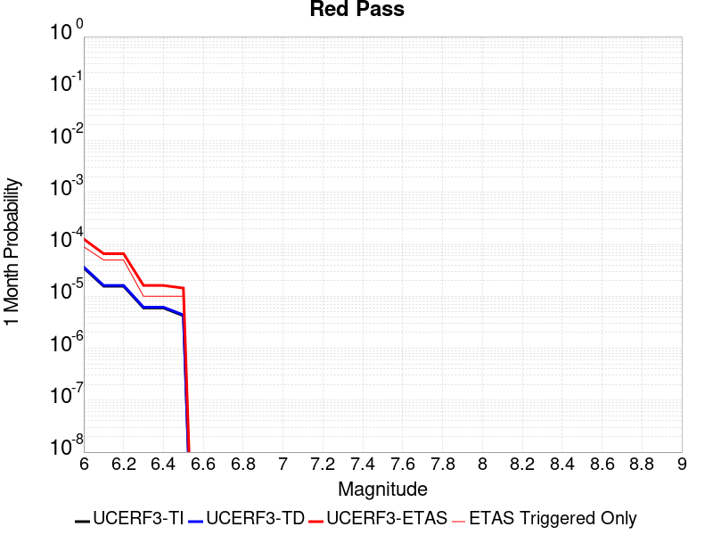 |  |  |

| Magnitude | 1 wk TI Prob | 1 wk TD Prob | 1 wk ETAS Prob | 1 wk ETAS/TD Gain | 1 wk ETAS Triggered Only | 1 mo TI Prob | 1 mo TD Prob | 1 mo ETAS Prob | 1 mo ETAS/TD Gain | 1 mo ETAS Triggered Only | 1 yr TI Prob | 1 yr TD Prob | 1 yr ETAS Prob | 1 yr ETAS/TD Gain | 1 yr ETAS Triggered Only | 10 yr TI Prob | 10 yr TD Prob | 10 yr ETAS Prob | 10 yr ETAS/TD Gain | 10 yr ETAS Triggered Only |
|-----|-----|-----|-----|-----|-----|-----|-----|-----|-----|-----|-----|-----|-----|-----|-----|-----|-----|-----|-----|-----|
| 6.0 | 8.258278E-6 | 8.551265E-6 | 2.4755497E-4 | 28.949512 | 2.3900573E-4 | 3.539214E-5 | 3.6647863E-5 | 2.7564485E-4 | 7.5214434 | 2.3900573E-4 | 4.308141E-4 | 4.4611428E-4 | 6.8501337E-4 | 1.535511 | 2.3900573E-4 | 0.0042997985 | 0.004453945 | 0.0046918862 | 1.0534226 | 2.3900573E-4 |
| 6.1 | 3.649988E-6 | 3.7753161E-6 | 3.7753161E-6 | 1.0 | 0.0 | 1.5642712E-5 | 1.6179853E-5 | 1.6179853E-5 | 1.0 | 0.0 | 1.9043336E-4 | 1.9697666E-4 | 1.9697666E-4 | 1.0 | 0.0 | 0.0019027026 | 0.001968488 | 0.001968488 | 1.0 | 0.0 |
| 6.2 | 3.649988E-6 | 3.7753161E-6 | 3.7753161E-6 | 1.0 | 0.0 | 1.5642712E-5 | 1.6179853E-5 | 1.6179853E-5 | 1.0 | 0.0 | 1.9043336E-4 | 1.9697666E-4 | 1.9697666E-4 | 1.0 | 0.0 | 0.0019027026 | 0.001968488 | 0.001968488 | 1.0 | 0.0 |
| 6.3 | 1.3924937E-6 | 1.4411166E-6 | 1.4411166E-6 | 1.0 | 0.0 | 5.9678164E-6 | 6.1762075E-6 | 6.1762075E-6 | 1.0 | 0.0 | 7.265574E-5 | 7.519415E-5 | 7.519415E-5 | 1.0 | 0.0 | 7.263199E-4 | 7.518258E-4 | 7.518258E-4 | 1.0 | 0.0 |
| 6.4 | 1.3924937E-6 | 1.4411166E-6 | 1.4411166E-6 | 1.0 | 0.0 | 5.9678164E-6 | 6.1762075E-6 | 6.1762075E-6 | 1.0 | 0.0 | 7.265574E-5 | 7.519415E-5 | 7.519415E-5 | 1.0 | 0.0 | 7.263199E-4 | 7.518258E-4 | 7.518258E-4 | 1.0 | 0.0 |
| 6.5 | 9.876812E-7 | 1.0221912E-6 | 1.0221912E-6 | 1.0 | 0.0 | 4.2329125E-6 | 4.3808195E-6 | 4.3808195E-6 | 1.0 | 0.0 | 5.153449E-5 | 5.3336476E-5 | 5.3336476E-5 | 1.0 | 0.0 | 5.1522546E-4 | 5.333648E-4 | 5.333648E-4 | 1.0 | 0.0 |

## Emerson-Copper Mtn 2011
*[(top)](#table-of-contents)*

| 1 Week | 1 Month | 1 Year | 10 Year |
|-----|-----|-----|-----|
|  | 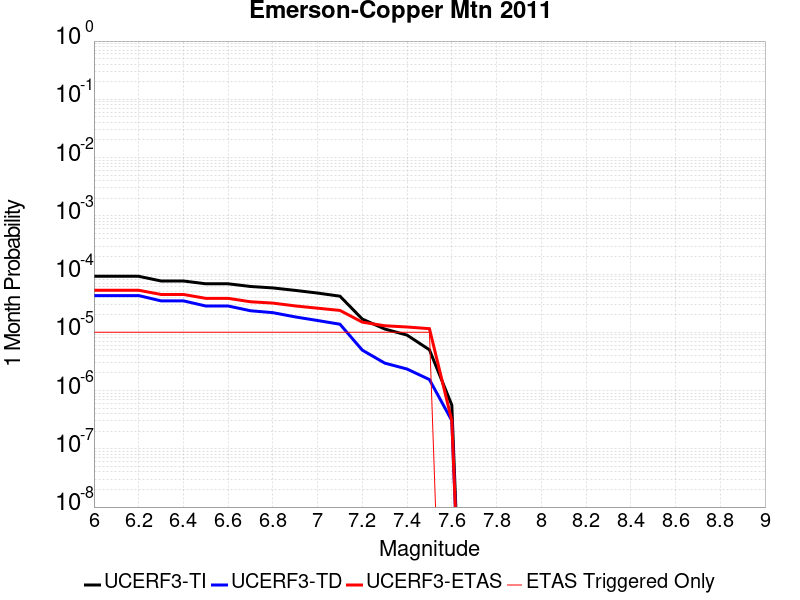 |  |  |

| Magnitude | 1 wk TI Prob | 1 wk TD Prob | 1 wk ETAS Prob | 1 wk ETAS/TD Gain | 1 wk ETAS Triggered Only | 1 mo TI Prob | 1 mo TD Prob | 1 mo ETAS Prob | 1 mo ETAS/TD Gain | 1 mo ETAS Triggered Only | 1 yr TI Prob | 1 yr TD Prob | 1 yr ETAS Prob | 1 yr ETAS/TD Gain | 1 yr ETAS Triggered Only | 10 yr TI Prob | 10 yr TD Prob | 10 yr ETAS Prob | 10 yr ETAS/TD Gain | 10 yr ETAS Triggered Only |
|-----|-----|-----|-----|-----|-----|-----|-----|-----|-----|-----|-----|-----|-----|-----|-----|-----|-----|-----|-----|-----|
| 6.0 | 2.1364202E-5 | 9.968114E-6 | 2.4897145E-4 | 24.97679 | 2.3900573E-4 | 9.1557646E-5 | 4.2719836E-5 | 2.8171536E-4 | 6.594486 | 2.3900573E-4 | 0.0011141442 | 5.199986E-4 | 7.5888005E-4 | 1.4593886 | 2.3900573E-4 | 0.011085749 | 0.005188688 | 0.0054264534 | 1.0458238 | 2.3900573E-4 |
| 6.1 | 2.1364202E-5 | 9.968114E-6 | 2.4897145E-4 | 24.97679 | 2.3900573E-4 | 9.1557646E-5 | 4.2719836E-5 | 2.8171536E-4 | 6.594486 | 2.3900573E-4 | 0.0011141442 | 5.199986E-4 | 7.5888005E-4 | 1.4593886 | 2.3900573E-4 | 0.011085749 | 0.005188688 | 0.0054264534 | 1.0458238 | 2.3900573E-4 |
| 6.2 | 2.1364202E-5 | 9.968114E-6 | 2.4897145E-4 | 24.97679 | 2.3900573E-4 | 9.1557646E-5 | 4.2719836E-5 | 2.8171536E-4 | 6.594486 | 2.3900573E-4 | 0.0011141442 | 5.199986E-4 | 7.5888005E-4 | 1.4593886 | 2.3900573E-4 | 0.011085749 | 0.005188688 | 0.0054264534 | 1.0458238 | 2.3900573E-4 |
| 6.3 | 1.7751237E-5 | 8.089227E-6 | 2.4709303E-4 | 30.54594 | 2.3900573E-4 | 7.607452E-5 | 3.466769E-5 | 2.7366515E-4 | 7.893954 | 2.3900573E-4 | 9.258136E-4 | 4.2200365E-4 | 6.609085E-4 | 1.5661204 | 2.3900573E-4 | 0.00921966 | 0.0042126453 | 0.0044506444 | 1.0564963 | 2.3900573E-4 |
| 6.4 | 1.7751237E-5 | 8.089227E-6 | 2.4709303E-4 | 30.54594 | 2.3900573E-4 | 7.607452E-5 | 3.466769E-5 | 2.7366515E-4 | 7.893954 | 2.3900573E-4 | 9.258136E-4 | 4.2200365E-4 | 6.609085E-4 | 1.5661204 | 2.3900573E-4 | 0.00921966 | 0.0042126453 | 0.0044506444 | 1.0564963 | 2.3900573E-4 |
| 6.5 | 1.5886664E-5 | 6.603819E-6 | 2.4560798E-4 | 37.19181 | 2.3900573E-4 | 6.808392E-5 | 2.8301802E-5 | 2.6730078E-4 | 9.444656 | 2.3900573E-4 | 8.286065E-4 | 3.4452465E-4 | 5.8344804E-4 | 1.693487 | 2.3900573E-4 | 0.008255237 | 0.0034403696 | 0.003678553 | 1.069232 | 2.3900573E-4 |
| 6.6 | 1.5886664E-5 | 6.603819E-6 | 2.4560798E-4 | 37.19181 | 2.3900573E-4 | 6.808392E-5 | 2.8301802E-5 | 2.6730078E-4 | 9.444656 | 2.3900573E-4 | 8.286065E-4 | 3.4452465E-4 | 5.8344804E-4 | 1.693487 | 2.3900573E-4 | 0.008255237 | 0.0034403696 | 0.003678553 | 1.069232 | 2.3900573E-4 |
| 6.7 | 1.428471E-5 | 5.470403E-6 | 2.4447482E-4 | 44.690464 | 2.3900573E-4 | 6.121875E-5 | 2.3444394E-5 | 2.6244452E-4 | 11.19434 | 2.3900573E-4 | 7.450834E-4 | 2.8540206E-4 | 5.2433956E-4 | 1.8371962 | 2.3900573E-4 | 0.007425902 | 0.0028507432 | 0.0030890675 | 1.0836008 | 2.3900573E-4 |
| 6.8 | 1.3490684E-5 | 5.073699E-6 | 2.4407823E-4 | 48.106564 | 2.3900573E-4 | 5.7815934E-5 | 2.1744265E-5 | 2.607448E-4 | 11.991429 | 2.3900573E-4 | 7.0368167E-4 | 2.6470813E-4 | 5.036506E-4 | 1.902664 | 2.3900573E-4 | 0.007014576 | 0.002644309 | 0.0028826827 | 1.090146 | 2.3900573E-4 |
| 6.9 | 1.2235421E-5 | 4.289677E-6 | 2.4329439E-4 | 56.716248 | 2.3900573E-4 | 5.2436466E-5 | 1.838422E-5 | 2.5738557E-4 | 14.000352 | 2.3900573E-4 | 6.38227E-4 | 2.238085E-4 | 4.6276074E-4 | 2.067664 | 2.3900573E-4 | 0.0063639707 | 0.0022361854 | 0.0024746566 | 1.106642 | 2.3900573E-4 |
| 7.0 | 1.1009851E-5 | 3.7189886E-6 | 2.4272384E-4 | 65.26609 | 2.3900573E-4 | 4.7184225E-5 | 1.5938444E-5 | 2.5494036E-4 | 15.995311 | 2.3900573E-4 | 5.743165E-4 | 1.9403672E-4 | 4.3299608E-4 | 2.2315161 | 2.3900573E-4 | 0.005728345 | 0.0019390108 | 0.002177553 | 1.1230227 | 2.3900573E-4 |
| 7.1 | 9.726373E-6 | 3.2117953E-6 | 2.4221676E-4 | 75.41476 | 2.3900573E-4 | 4.168379E-5 | 1.3764783E-5 | 2.5276723E-4 | 18.363327 | 2.3900573E-4 | 5.07382E-4 | 1.6757673E-4 | 4.0654241E-4 | 2.4260075 | 2.3900573E-4 | 0.0050622504 | 0.0016748349 | 0.0019134403 | 1.1424651 | 2.3900573E-4 |
| 7.2 | 3.9335127E-6 | 1.1524792E-6 | 2.4015794E-4 | 208.38376 | 2.3900573E-4 | 1.6857803E-5 | 4.9391874E-6 | 2.4394374E-4 | 49.38945 | 2.3900573E-4 | 2.0522442E-4 | 6.0133007E-5 | 2.9912437E-4 | 4.974379 | 2.3900573E-4 | 0.00205035 | 6.011733E-4 | 8.400354E-4 | 1.3973265 | 2.3900573E-4 |
| 7.3 | 2.661632E-6 | 6.911505E-7 | 2.3969672E-4 | 346.8083 | 2.3900573E-4 | 1.14069435E-5 | 2.9620703E-6 | 2.419671E-4 | 81.68851 | 2.3900573E-4 | 1.3887069E-4 | 3.6062618E-5 | 2.7505975E-4 | 7.627281 | 2.3900573E-4 | 0.0013878393 | 3.605687E-4 | 5.9948827E-4 | 1.6626186 | 2.3900573E-4 |
| 7.4 | 2.0893426E-6 | 5.4618386E-7 | 2.395518E-4 | 438.59186 | 2.3900573E-4 | 8.954295E-6 | 2.3407858E-6 | 2.4134596E-4 | 103.104675 | 2.3900573E-4 | 1.0901308E-4 | 2.84987E-5 | 2.674976E-4 | 9.38631 | 2.3900573E-4 | 0.0010895962 | 2.84951E-4 | 5.238886E-4 | 1.8385218 | 2.3900573E-4 |
| 7.5 | 1.1681728E-6 | 3.6030585E-7 | 2.3936595E-4 | 664.341 | 2.3900573E-4 | 5.0064455E-6 | 1.544167E-6 | 2.4054953E-4 | 155.77948 | 2.3900573E-4 | 6.0951766E-5 | 1.8800076E-5 | 2.5780132E-4 | 13.712781 | 2.3900573E-4 | 6.093505E-4 | 1.8798532E-4 | 4.2694612E-4 | 2.2711673 | 2.3900573E-4 |
| 7.6 | 1.3154387E-7 | 7.1197384E-8 | 7.1197384E-8 | 1.0 | 0.0 | 5.6375933E-7 | 3.051316E-7 | 3.051316E-7 | 1.0 | 0.0 | 6.863748E-6 | 3.7149728E-6 | 3.7149728E-6 | 1.0 | 0.0 | 6.863536E-5 | 3.7149264E-5 | 3.7149264E-5 | 1.0 | 0.0 |

## White Wolf (Extension)
*[(top)](#table-of-contents)*

| 1 Week | 1 Month | 1 Year | 10 Year |
|-----|-----|-----|-----|
|  |  |  |  |

| Magnitude | 1 wk TI Prob | 1 wk TD Prob | 1 wk ETAS Prob | 1 wk ETAS/TD Gain | 1 wk ETAS Triggered Only | 1 mo TI Prob | 1 mo TD Prob | 1 mo ETAS Prob | 1 mo ETAS/TD Gain | 1 mo ETAS Triggered Only | 1 yr TI Prob | 1 yr TD Prob | 1 yr ETAS Prob | 1 yr ETAS/TD Gain | 1 yr ETAS Triggered Only | 10 yr TI Prob | 10 yr TD Prob | 10 yr ETAS Prob | 10 yr ETAS/TD Gain | 10 yr ETAS Triggered Only |
|-----|-----|-----|-----|-----|-----|-----|-----|-----|-----|-----|-----|-----|-----|-----|-----|-----|-----|-----|-----|-----|
| 6.0 | 8.222555E-6 | 6.0666657E-6 | 2.4507096E-4 | 40.396317 | 2.3900573E-4 | 3.5239045E-5 | 2.5999774E-5 | 2.6499928E-4 | 10.192369 | 2.3900573E-4 | 4.289509E-4 | 3.1650788E-4 | 5.55438E-4 | 1.7548946 | 2.3900573E-4 | 0.0042812387 | 0.003161223 | 0.0033994731 | 1.0753665 | 2.3900573E-4 |
| 6.1 | 8.222555E-6 | 6.0666657E-6 | 2.4507096E-4 | 40.396317 | 2.3900573E-4 | 3.5239045E-5 | 2.5999774E-5 | 2.6499928E-4 | 10.192369 | 2.3900573E-4 | 4.289509E-4 | 3.1650788E-4 | 5.55438E-4 | 1.7548946 | 2.3900573E-4 | 0.0042812387 | 0.003161223 | 0.0033994731 | 1.0753665 | 2.3900573E-4 |
| 6.2 | 8.222555E-6 | 6.0666657E-6 | 2.4507096E-4 | 40.396317 | 2.3900573E-4 | 3.5239045E-5 | 2.5999774E-5 | 2.6499928E-4 | 10.192369 | 2.3900573E-4 | 4.289509E-4 | 3.1650788E-4 | 5.55438E-4 | 1.7548946 | 2.3900573E-4 | 0.0042812387 | 0.003161223 | 0.0033994731 | 1.0753665 | 2.3900573E-4 |
| 6.3 | 8.222555E-6 | 6.0666657E-6 | 2.4507096E-4 | 40.396317 | 2.3900573E-4 | 3.5239045E-5 | 2.5999774E-5 | 2.6499928E-4 | 10.192369 | 2.3900573E-4 | 4.289509E-4 | 3.1650788E-4 | 5.55438E-4 | 1.7548946 | 2.3900573E-4 | 0.0042812387 | 0.003161223 | 0.0033994731 | 1.0753665 | 2.3900573E-4 |
| 6.4 | 5.821773E-6 | 3.5571766E-6 | 2.4256206E-4 | 68.18949 | 2.3900573E-4 | 2.4950215E-5 | 1.5244959E-5 | 2.5424705E-4 | 16.67745 | 2.3900573E-4 | 3.0372653E-4 | 1.8559267E-4 | 4.2455405E-4 | 2.2875583 | 2.3900573E-4 | 0.0030331176 | 0.001854485 | 0.0020930476 | 1.1286409 | 2.3900573E-4 |
| 6.5 | 5.766023E-6 | 3.4991106E-6 | 2.4250401E-4 | 69.304474 | 2.3900573E-4 | 2.4711293E-5 | 1.4996108E-5 | 2.5399827E-4 | 16.937613 | 2.3900573E-4 | 3.0081844E-4 | 1.8256342E-4 | 4.2152553E-4 | 2.3089266 | 2.3900573E-4 | 0.0030041158 | 0.0018242426 | 0.0020628122 | 1.1307774 | 2.3900573E-4 |
| 6.6 | 4.643576E-6 | 2.332624E-6 | 2.4133781E-4 | 103.46194 | 2.3900573E-4 | 1.9900888E-5 | 9.996925E-6 | 2.4900027E-4 | 24.907688 | 2.3900573E-4 | 2.4226638E-4 | 1.2170619E-4 | 3.6068284E-4 | 2.963554 | 2.3900573E-4 | 0.0024200242 | 0.0012164378 | 0.0014551528 | 1.196241 | 2.3900573E-4 |
| 6.7 | 3.9529173E-6 | 1.6483477E-6 | 2.406537E-4 | 145.99692 | 2.3900573E-4 | 1.6940963E-5 | 7.0643296E-6 | 2.4606838E-4 | 34.832516 | 2.3900573E-4 | 2.0623671E-4 | 8.6005006E-5 | 3.249902E-4 | 3.7787356 | 2.3900573E-4 | 0.002060454 | 8.597357E-4 | 0.001098536 | 1.27776 | 2.3900573E-4 |
| 6.8 | 3.4377522E-6 | 1.2245237E-6 | 1.2245237E-6 | 1.0 | 0.0 | 1.473314E-5 | 5.2479486E-6 | 5.2479486E-6 | 1.0 | 0.0 | 1.7936122E-4 | 6.3891996E-5 | 6.3891996E-5 | 1.0 | 0.0 | 0.0017921652 | 6.387454E-4 | 6.387454E-4 | 1.0 | 0.0 |
| 6.9 | 3.1367306E-6 | 1.0033783E-6 | 1.0033783E-6 | 1.0 | 0.0 | 1.3443062E-5 | 4.3001864E-6 | 4.3001864E-6 | 1.0 | 0.0 | 1.63657E-4 | 5.235359E-5 | 5.235359E-5 | 1.0 | 0.0 | 0.0016353652 | 5.2342017E-4 | 5.2342017E-4 | 1.0 | 0.0 |
| 7.0 | 2.8298145E-6 | 7.4286646E-7 | 7.4286646E-7 | 1.0 | 0.0 | 1.2127721E-5 | 3.1837099E-6 | 3.1837099E-6 | 1.0 | 0.0 | 1.47645E-4 | 3.8761027E-5 | 3.8761027E-5 | 1.0 | 0.0 | 0.0014754693 | 3.8754768E-4 | 3.8754768E-4 | 1.0 | 0.0 |
| 7.1 | 2.4091064E-6 | 5.4227525E-7 | 5.4227525E-7 | 1.0 | 0.0 | 1.03247E-5 | 2.3240348E-6 | 2.3240348E-6 | 1.0 | 0.0 | 1.2569598E-4 | 2.8294799E-5 | 2.8294799E-5 | 1.0 | 0.0 | 0.001256249 | 2.8291598E-4 | 2.8291598E-4 | 1.0 | 0.0 |
| 7.2 | 1.3875518E-6 | 1.0743063E-7 | 1.0743063E-7 | 1.0 | 0.0 | 5.9466374E-6 | 4.6041689E-7 | 4.6041689E-7 | 1.0 | 0.0 | 7.23979E-5 | 5.6055624E-6 | 5.6055624E-6 | 1.0 | 0.0 | 7.2374323E-4 | 5.6054323E-5 | 5.6054323E-5 | 1.0 | 0.0 |
| 7.3 | 7.056077E-7 | 5.002034E-8 | 5.002034E-8 | 1.0 | 0.0 | 3.0240296E-6 | 2.1437286E-7 | 2.1437286E-7 | 1.0 | 0.0 | 3.681694E-5 | 2.609987E-6 | 2.609987E-6 | 1.0 | 0.0 | 3.681084E-4 | 2.609961E-5 | 2.609961E-5 | 1.0 | 0.0 |
| 7.4 | 5.9334678E-8 | 4.8683537E-9 | 4.8683537E-9 | 1.0 | 0.0 | 2.5429145E-7 | 2.0864372E-8 | 2.0864372E-8 | 1.0 | 0.0 | 3.095994E-6 | 2.5402372E-7 | 2.5402372E-7 | 1.0 | 0.0 | 3.095951E-5 | 2.5402353E-6 | 2.5402353E-6 | 1.0 | 0.0 |

## Goose Lake 2011 CFM
*[(top)](#table-of-contents)*

| 1 Week | 1 Month | 1 Year | 10 Year |
|-----|-----|-----|-----|
|  |  |  |  |

| Magnitude | 1 wk TI Prob | 1 wk TD Prob | 1 wk ETAS Prob | 1 wk ETAS/TD Gain | 1 wk ETAS Triggered Only | 1 mo TI Prob | 1 mo TD Prob | 1 mo ETAS Prob | 1 mo ETAS/TD Gain | 1 mo ETAS Triggered Only | 1 yr TI Prob | 1 yr TD Prob | 1 yr ETAS Prob | 1 yr ETAS/TD Gain | 1 yr ETAS Triggered Only | 10 yr TI Prob | 10 yr TD Prob | 10 yr ETAS Prob | 10 yr ETAS/TD Gain | 10 yr ETAS Triggered Only |
|-----|-----|-----|-----|-----|-----|-----|-----|-----|-----|-----|-----|-----|-----|-----|-----|-----|-----|-----|-----|-----|
| 6.0 | 3.780968E-6 | 3.8230223E-6 | 3.8230223E-6 | 1.0 | 0.0 | 1.6204049E-5 | 1.6384285E-5 | 1.6384285E-5 | 1.0 | 0.0 | 1.9726643E-4 | 1.994615E-4 | 4.3841958E-4 | 2.198016 | 2.3900573E-4 | 0.001970914 | 0.001992933 | 0.0022314624 | 1.1196877 | 2.3900573E-4 |
| 6.1 | 2.2035124E-6 | 2.229801E-6 | 2.229801E-6 | 1.0 | 0.0 | 9.443591E-6 | 9.556257E-6 | 9.556257E-6 | 1.0 | 0.0 | 1.1496965E-4 | 1.163414E-4 | 1.163414E-4 | 1.0 | 0.0 | 0.0011491019 | 0.0011628233 | 0.0011628233 | 1.0 | 0.0 |
| 6.2 | 1.5624689E-6 | 1.5826923E-6 | 1.5826923E-6 | 1.0 | 0.0 | 6.6962784E-6 | 6.7829496E-6 | 6.7829496E-6 | 1.0 | 0.0 | 8.152414E-5 | 8.2579325E-5 | 8.2579325E-5 | 1.0 | 0.0 | 8.1494235E-4 | 8.2549086E-4 | 8.2549086E-4 | 1.0 | 0.0 |
| 6.3 | 1.5624689E-6 | 1.5826923E-6 | 1.5826923E-6 | 1.0 | 0.0 | 6.6962784E-6 | 6.7829496E-6 | 6.7829496E-6 | 1.0 | 0.0 | 8.152414E-5 | 8.2579325E-5 | 8.2579325E-5 | 1.0 | 0.0 | 8.1494235E-4 | 8.2549086E-4 | 8.2549086E-4 | 1.0 | 0.0 |
| 6.4 | 1.256464E-6 | 1.2738695E-6 | 1.2738695E-6 | 1.0 | 0.0 | 5.3848344E-6 | 5.4594293E-6 | 5.4594293E-6 | 1.0 | 0.0 | 6.5558386E-5 | 6.646655E-5 | 6.646655E-5 | 1.0 | 0.0 | 6.553905E-4 | 6.644687E-4 | 6.644687E-4 | 1.0 | 0.0 |
| 6.5 | 1.0910911E-6 | 1.1069404E-6 | 1.1069404E-6 | 1.0 | 0.0 | 4.6760965E-6 | 4.7440217E-6 | 4.7440217E-6 | 1.0 | 0.0 | 5.692999E-5 | 5.7756948E-5 | 5.7756948E-5 | 1.0 | 0.0 | 5.6915404E-4 | 5.7742064E-4 | 5.7742064E-4 | 1.0 | 0.0 |
| 6.6 | 9.546601E-7 | 9.691246E-7 | 9.691246E-7 | 1.0 | 0.0 | 4.091394E-6 | 4.1533845E-6 | 4.1533845E-6 | 1.0 | 0.0 | 4.9811584E-5 | 5.056629E-5 | 5.056629E-5 | 1.0 | 0.0 | 4.980042E-4 | 5.055487E-4 | 5.055487E-4 | 1.0 | 0.0 |
| 6.7 | 7.790316E-7 | 7.9159634E-7 | 7.9159634E-7 | 1.0 | 0.0 | 3.3387028E-6 | 3.3925514E-6 | 3.3925514E-6 | 1.0 | 0.0 | 4.0647945E-5 | 4.1303538E-5 | 4.1303538E-5 | 1.0 | 0.0 | 4.0640513E-4 | 4.129592E-4 | 4.129592E-4 | 1.0 | 0.0 |
| 6.8 | 6.3714384E-7 | 6.4787395E-7 | 6.4787395E-7 | 1.0 | 0.0 | 2.7306137E-6 | 2.7765998E-6 | 2.7765998E-6 | 1.0 | 0.0 | 3.3244716E-5 | 3.3804583E-5 | 3.3804583E-5 | 1.0 | 0.0 | 3.323974E-4 | 3.379949E-4 | 3.379949E-4 | 1.0 | 0.0 |
| 6.9 | 4.92586E-7 | 5.0139147E-7 | 5.0139147E-7 | 1.0 | 0.0 | 2.1110811E-6 | 2.1488188E-6 | 2.1488188E-6 | 1.0 | 0.0 | 2.5702111E-5 | 2.616156E-5 | 2.616156E-5 | 1.0 | 0.0 | 2.569914E-4 | 2.6158517E-4 | 2.6158517E-4 | 1.0 | 0.0 |
| 7.0 | 3.130245E-7 | 3.190354E-7 | 3.190354E-7 | 1.0 | 0.0 | 1.3415328E-6 | 1.3672939E-6 | 1.3672939E-6 | 1.0 | 0.0 | 1.6333039E-5 | 1.6646678E-5 | 1.6646678E-5 | 1.0 | 0.0 | 1.6331839E-4 | 1.6645451E-4 | 1.6645451E-4 | 1.0 | 0.0 |
| 7.1 | 1.7680084E-7 | 1.8023923E-7 | 1.8023923E-7 | 1.0 | 0.0 | 7.5771766E-7 | 7.724536E-7 | 7.724536E-7 | 1.0 | 0.0 | 9.225173E-6 | 9.404583E-6 | 9.404583E-6 | 1.0 | 0.0 | 9.22479E-5 | 9.4041956E-5 | 9.4041956E-5 | 1.0 | 0.0 |
| 7.2 | 4.8641045E-8 | 4.9402068E-8 | 4.9402068E-8 | 1.0 | 0.0 | 2.084616E-7 | 2.1172312E-7 | 2.1172312E-7 | 1.0 | 0.0 | 2.538017E-6 | 2.577726E-6 | 2.577726E-6 | 1.0 | 0.0 | 2.537988E-5 | 2.5776973E-5 | 2.5776973E-5 | 1.0 | 0.0 |
| 7.3 | 5.3911844E-9 | 5.4758145E-9 | 5.4758145E-9 | 1.0 | 0.0 | 2.3105075E-8 | 2.3467775E-8 | 2.3467775E-8 | 1.0 | 0.0 | 2.8130427E-7 | 2.8572015E-7 | 2.8572015E-7 | 1.0 | 0.0 | 2.8130391E-6 | 2.8571992E-6 | 2.8571992E-6 | 1.0 | 0.0 |

## San Andreas (San Bernardino S)
*[(top)](#table-of-contents)*

| 1 Week | 1 Month | 1 Year | 10 Year |
|-----|-----|-----|-----|
|  |  |  |  |

| Magnitude | 1 wk TI Prob | 1 wk TD Prob | 1 wk ETAS Prob | 1 wk ETAS/TD Gain | 1 wk ETAS Triggered Only | 1 mo TI Prob | 1 mo TD Prob | 1 mo ETAS Prob | 1 mo ETAS/TD Gain | 1 mo ETAS Triggered Only | 1 yr TI Prob | 1 yr TD Prob | 1 yr ETAS Prob | 1 yr ETAS/TD Gain | 1 yr ETAS Triggered Only | 10 yr TI Prob | 10 yr TD Prob | 10 yr ETAS Prob | 10 yr ETAS/TD Gain | 10 yr ETAS Triggered Only |
|-----|-----|-----|-----|-----|-----|-----|-----|-----|-----|-----|-----|-----|-----|-----|-----|-----|-----|-----|-----|-----|
| 6.0 | 1.2336002E-4 | 3.0004102E-4 | 3.0004102E-4 | 1.0 | 0.0 | 5.2857865E-4 | 0.0012852824 | 0.0012852824 | 1.0 | 0.0 | 0.006416472 | 0.015540994 | 0.015540994 | 1.0 | 0.0 | 0.06234337 | 0.14283717 | 0.14304204 | 1.0014343 | 2.3900573E-4 |
| 6.1 | 1.2336002E-4 | 3.0004102E-4 | 3.0004102E-4 | 1.0 | 0.0 | 5.2857865E-4 | 0.0012852824 | 0.0012852824 | 1.0 | 0.0 | 0.006416472 | 0.015540994 | 0.015540994 | 1.0 | 0.0 | 0.06234337 | 0.14283717 | 0.14304204 | 1.0014343 | 2.3900573E-4 |
| 6.2 | 1.2336002E-4 | 3.0004102E-4 | 3.0004102E-4 | 1.0 | 0.0 | 5.2857865E-4 | 0.0012852824 | 0.0012852824 | 1.0 | 0.0 | 0.006416472 | 0.015540994 | 0.015540994 | 1.0 | 0.0 | 0.06234337 | 0.14283717 | 0.14304204 | 1.0014343 | 2.3900573E-4 |
| 6.3 | 1.1712257E-4 | 2.8792414E-4 | 2.8792414E-4 | 1.0 | 0.0 | 5.018573E-4 | 0.0012334028 | 0.0012334028 | 1.0 | 0.0 | 0.006093008 | 0.014918125 | 0.014918125 | 1.0 | 0.0 | 0.059286322 | 0.13754563 | 0.13775176 | 1.0014987 | 2.3900573E-4 |
| 6.4 | 1.1712257E-4 | 2.8792414E-4 | 2.8792414E-4 | 1.0 | 0.0 | 5.018573E-4 | 0.0012334028 | 0.0012334028 | 1.0 | 0.0 | 0.006093008 | 0.014918125 | 0.014918125 | 1.0 | 0.0 | 0.059286322 | 0.13754563 | 0.13775176 | 1.0014987 | 2.3900573E-4 |
| 6.5 | 1.0689076E-4 | 2.680528E-4 | 2.680528E-4 | 1.0 | 0.0 | 4.5802278E-4 | 0.0011483167 | 0.0011483167 | 1.0 | 0.0 | 0.0055621783 | 0.01389575 | 0.01389575 | 1.0 | 0.0 | 0.05425003 | 0.12879294 | 0.12900117 | 1.0016167 | 2.3900573E-4 |
| 6.6 | 9.7648895E-5 | 2.50501E-4 | 2.50501E-4 | 1.0 | 0.0 | 4.1842813E-4 | 0.0010731576 | 0.0010731576 | 1.0 | 0.0 | 0.005082469 | 0.012991785 | 0.012991785 | 1.0 | 0.0 | 0.049677886 | 0.12095292 | 0.12116301 | 1.001737 | 2.3900573E-4 |
| 6.7 | 8.757013E-5 | 2.3120902E-4 | 2.3120902E-4 | 1.0 | 0.0 | 3.7524657E-4 | 9.905418E-4 | 9.905418E-4 | 1.0 | 0.0 | 0.00455906 | 0.011997245 | 0.011997245 | 1.0 | 0.0 | 0.04466656 | 0.11226123 | 0.112473406 | 1.0018901 | 2.3900573E-4 |
| 6.8 | 8.562978E-5 | 2.2680782E-4 | 2.2680782E-4 | 1.0 | 0.0 | 3.6693315E-4 | 9.7169366E-4 | 9.7169366E-4 | 1.0 | 0.0 | 0.004458263 | 0.011770263 | 0.011770263 | 1.0 | 0.0 | 0.043698758 | 0.11027153 | 0.11048418 | 1.0019284 | 2.3900573E-4 |
| 6.9 | 6.124075E-5 | 1.7065753E-4 | 1.7065753E-4 | 1.0 | 0.0 | 2.6243398E-4 | 7.311852E-4 | 7.311852E-4 | 1.0 | 0.0 | 0.0031904527 | 0.008866051 | 0.008866051 | 1.0 | 0.0 | 0.031450346 | 0.08418263 | 0.08440152 | 1.0026001 | 2.3900573E-4 |
| 7.0 | 5.8598747E-5 | 1.649477E-4 | 1.649477E-4 | 1.0 | 0.0 | 2.5111332E-4 | 7.06728E-4 | 7.06728E-4 | 1.0 | 0.0 | 0.0030530186 | 0.008570663 | 0.008570663 | 1.0 | 0.0 | 0.03011414 | 0.081500374 | 0.0817199 | 1.0026935 | 2.3900573E-4 |
| 7.1 | 5.613814E-5 | 1.5913323E-4 | 1.5913323E-4 | 1.0 | 0.0 | 2.4056983E-4 | 6.818221E-4 | 6.818221E-4 | 1.0 | 0.0 | 0.0029250039 | 0.008269769 | 0.008269769 | 1.0 | 0.0 | 0.028868021 | 0.07879931 | 0.07901948 | 1.0027941 | 2.3900573E-4 |
| 7.2 | 4.991222E-5 | 1.4519796E-4 | 1.4519796E-4 | 1.0 | 0.0 | 2.1389198E-4 | 6.2212895E-4 | 6.2212895E-4 | 1.0 | 0.0 | 0.002601025 | 0.007548217 | 0.007548217 | 1.0 | 0.0 | 0.025707912 | 0.07225321 | 0.07247495 | 1.0030689 | 2.3900573E-4 |
| 7.3 | 4.7410045E-5 | 1.3714004E-4 | 1.3714004E-4 | 1.0 | 0.0 | 2.0317009E-4 | 5.8761094E-4 | 5.8761094E-4 | 1.0 | 0.0 | 0.0024707897 | 0.0071307817 | 0.0071307817 | 1.0 | 0.0 | 0.024434982 | 0.06853558 | 0.068758205 | 1.0032483 | 2.3900573E-4 |
| 7.4 | 4.5556746E-5 | 1.3121912E-4 | 1.3121912E-4 | 1.0 | 0.0 | 1.952286E-4 | 5.622468E-4 | 5.622468E-4 | 1.0 | 0.0 | 0.002374317 | 0.0068239477 | 0.0068239477 | 1.0 | 0.0 | 0.023491086 | 0.065788016 | 0.066011295 | 1.003394 | 2.3900573E-4 |
| 7.5 | 4.3084514E-5 | 1.2357246E-4 | 1.2357246E-4 | 1.0 | 0.0 | 1.8463485E-4 | 5.2948913E-4 | 5.2948913E-4 | 1.0 | 0.0 | 0.0022456115 | 0.0064275465 | 0.0064275465 | 1.0 | 0.0 | 0.022230545 | 0.062188786 | 0.06241293 | 1.0036042 | 2.3900573E-4 |
| 7.6 | 3.408608E-5 | 9.83552E-5 | 9.83552E-5 | 1.0 | 0.0 | 1.4607502E-4 | 4.214543E-4 | 4.214543E-4 | 1.0 | 0.0 | 0.0017770125 | 0.0051191594 | 0.0051191594 | 1.0 | 0.0 | 0.017628696 | 0.050020292 | 0.05024734 | 1.0045391 | 2.3900573E-4 |
| 7.7 | 2.8315713E-5 | 8.248679E-5 | 8.248679E-5 | 1.0 | 0.0 | 1.2134742E-4 | 3.5346695E-4 | 3.5346695E-4 | 1.0 | 0.0 | 0.0014764034 | 0.0042949775 | 0.0042949775 | 1.0 | 0.0 | 0.01466633 | 0.0422714 | 0.042500306 | 1.0054151 | 2.3900573E-4 |
| 7.8 | 2.6222975E-5 | 7.463088E-5 | 7.463088E-5 | 1.0 | 0.0 | 1.1237934E-4 | 3.1980744E-4 | 3.1980744E-4 | 1.0 | 0.0 | 0.0013673597 | 0.0038867102 | 0.0038867102 | 1.0 | 0.0 | 0.013589768 | 0.03843674 | 0.03866656 | 1.0059792 | 2.3900573E-4 |
| 7.9 | 2.1469694E-5 | 5.787864E-5 | 5.787864E-5 | 1.0 | 0.0 | 9.200973E-5 | 2.4802773E-4 | 2.4802773E-4 | 1.0 | 0.0 | 0.0011196428 | 0.0030155594 | 0.0030155594 | 1.0 | 0.0 | 0.011140184 | 0.030152109 | 0.030383907 | 1.0076877 | 2.3900573E-4 |
| 8.0 | 1.2420249E-5 | 3.131896E-5 | 3.131896E-5 | 1.0 | 0.0 | 5.322855E-5 | 1.342172E-4 | 1.342172E-4 | 1.0 | 0.0 | 6.478649E-4 | 0.0016328706 | 0.0016328706 | 1.0 | 0.0 | 0.0064597935 | 0.016522504 | 0.01675756 | 1.0142264 | 2.3900573E-4 |
| 8.1 | 4.9197724E-6 | 7.822348E-6 | 7.822348E-6 | 1.0 | 0.0 | 2.1084568E-5 | 3.352392E-5 | 3.352392E-5 | 1.0 | 0.0 | 2.566744E-4 | 4.0807744E-4 | 4.0807744E-4 | 1.0 | 0.0 | 0.002563781 | 0.0043843705 | 0.0043843705 | 1.0 | 0.0 |
| 8.2 | 2.5634774E-6 | 2.9067196E-6 | 2.9067196E-6 | 1.0 | 0.0 | 1.0986286E-5 | 1.2457311E-5 | 1.2457311E-5 | 1.0 | 0.0 | 1.3374983E-4 | 1.5165724E-4 | 1.5165724E-4 | 1.0 | 0.0 | 0.0013366934 | 0.0017049741 | 0.0017049741 | 1.0 | 0.0 |
| 8.3 | 5.2850464E-7 | 3.2088764E-7 | 3.2088764E-7 | 1.0 | 0.0 | 2.2650179E-6 | 1.375232E-6 | 1.375232E-6 | 1.0 | 0.0 | 2.7576245E-5 | 1.6743334E-5 | 1.6743334E-5 | 1.0 | 0.0 | 2.7572823E-4 | 1.9870348E-4 | 1.9870348E-4 | 1.0 | 0.0 |

## White Mountains
*[(top)](#table-of-contents)*

| 1 Week | 1 Month | 1 Year | 10 Year |
|-----|-----|-----|-----|
|  |  |  |  |

| Magnitude | 1 wk TI Prob | 1 wk TD Prob | 1 wk ETAS Prob | 1 wk ETAS/TD Gain | 1 wk ETAS Triggered Only | 1 mo TI Prob | 1 mo TD Prob | 1 mo ETAS Prob | 1 mo ETAS/TD Gain | 1 mo ETAS Triggered Only | 1 yr TI Prob | 1 yr TD Prob | 1 yr ETAS Prob | 1 yr ETAS/TD Gain | 1 yr ETAS Triggered Only | 10 yr TI Prob | 10 yr TD Prob | 10 yr ETAS Prob | 10 yr ETAS/TD Gain | 10 yr ETAS Triggered Only |
|-----|-----|-----|-----|-----|-----|-----|-----|-----|-----|-----|-----|-----|-----|-----|-----|-----|-----|-----|-----|-----|
| 6.0 | 3.503579E-5 | 3.378405E-5 | 3.378405E-5 | 1.0 | 0.0 | 1.5014476E-4 | 1.4478143E-4 | 1.4478143E-4 | 1.0 | 0.0 | 0.0018264796 | 0.0017614096 | 0.0017614096 | 1.0 | 0.0 | 0.018115403 | 0.017486818 | 0.017721646 | 1.0134288 | 2.3900573E-4 |
| 6.1 | 3.503579E-5 | 3.378405E-5 | 3.378405E-5 | 1.0 | 0.0 | 1.5014476E-4 | 1.4478143E-4 | 1.4478143E-4 | 1.0 | 0.0 | 0.0018264796 | 0.0017614096 | 0.0017614096 | 1.0 | 0.0 | 0.018115403 | 0.017486818 | 0.017721646 | 1.0134288 | 2.3900573E-4 |
| 6.2 | 3.503579E-5 | 3.378405E-5 | 3.378405E-5 | 1.0 | 0.0 | 1.5014476E-4 | 1.4478143E-4 | 1.4478143E-4 | 1.0 | 0.0 | 0.0018264796 | 0.0017614096 | 0.0017614096 | 1.0 | 0.0 | 0.018115403 | 0.017486818 | 0.017721646 | 1.0134288 | 2.3900573E-4 |
| 6.3 | 1.7818425E-5 | 1.5916074E-5 | 1.5916074E-5 | 1.0 | 0.0 | 7.636245E-5 | 6.821004E-5 | 6.821004E-5 | 1.0 | 0.0 | 9.293162E-4 | 8.301551E-4 | 8.301551E-4 | 1.0 | 0.0 | 0.009254395 | 0.008271999 | 0.008271999 | 1.0 | 0.0 |
| 6.4 | 1.7818425E-5 | 1.5916074E-5 | 1.5916074E-5 | 1.0 | 0.0 | 7.636245E-5 | 6.821004E-5 | 6.821004E-5 | 1.0 | 0.0 | 9.293162E-4 | 8.301551E-4 | 8.301551E-4 | 1.0 | 0.0 | 0.009254395 | 0.008271999 | 0.008271999 | 1.0 | 0.0 |
| 6.5 | 1.3397557E-5 | 1.13362685E-5 | 1.13362685E-5 | 1.0 | 0.0 | 5.741684E-5 | 4.858314E-5 | 4.858314E-5 | 1.0 | 0.0 | 6.988258E-4 | 5.913462E-4 | 5.913462E-4 | 1.0 | 0.0 | 0.006966323 | 0.005898432 | 0.005898432 | 1.0 | 0.0 |
| 6.6 | 1.0818695E-5 | 8.625366E-6 | 8.625366E-6 | 1.0 | 0.0 | 4.6365014E-5 | 3.6965357E-5 | 3.6965357E-5 | 1.0 | 0.0 | 5.6434784E-4 | 4.4996463E-4 | 4.4996463E-4 | 1.0 | 0.0 | 0.005629168 | 0.004490972 | 0.004490972 | 1.0 | 0.0 |
| 6.7 | 9.067908E-6 | 6.802442E-6 | 6.802442E-6 | 1.0 | 0.0 | 3.8861883E-5 | 2.9153016E-5 | 2.9153016E-5 | 1.0 | 0.0 | 4.7304068E-4 | 3.5488335E-4 | 3.5488335E-4 | 1.0 | 0.0 | 0.00472035 | 0.0035434833 | 0.0035434833 | 1.0 | 0.0 |
| 6.8 | 7.295947E-6 | 4.936391E-6 | 4.936391E-6 | 1.0 | 0.0 | 3.126797E-5 | 2.1155796E-5 | 2.1155796E-5 | 1.0 | 0.0 | 3.8062103E-4 | 2.575425E-4 | 2.575425E-4 | 1.0 | 0.0 | 0.0037996976 | 0.0025725532 | 0.0025725532 | 1.0 | 0.0 |
| 6.9 | 6.2243444E-6 | 3.832213E-6 | 3.832213E-6 | 1.0 | 0.0 | 2.6675489E-5 | 1.642367E-5 | 1.642367E-5 | 1.0 | 0.0 | 3.2472567E-4 | 1.9994036E-4 | 1.9994036E-4 | 1.0 | 0.0 | 0.0032425157 | 0.0019976576 | 0.0019976576 | 1.0 | 0.0 |
| 7.0 | 4.9878413E-6 | 2.6795342E-6 | 2.6795342E-6 | 1.0 | 0.0 | 2.1376287E-5 | 1.14836685E-5 | 1.14836685E-5 | 1.0 | 0.0 | 2.602252E-4 | 1.3980496E-4 | 1.3980496E-4 | 1.0 | 0.0 | 0.002599207 | 0.0013971963 | 0.0013971963 | 1.0 | 0.0 |
| 7.1 | 4.0252844E-6 | 1.8857575E-6 | 1.8857575E-6 | 1.0 | 0.0 | 1.7251105E-5 | 8.081794E-6 | 8.081794E-6 | 1.0 | 0.0 | 2.1001195E-4 | 9.8391516E-5 | 9.8391516E-5 | 1.0 | 0.0 | 0.0020981359 | 9.834924E-4 | 9.834924E-4 | 1.0 | 0.0 |
| 7.2 | 3.3284066E-6 | 1.281964E-6 | 1.281964E-6 | 1.0 | 0.0 | 1.4264522E-5 | 5.494121E-6 | 5.494121E-6 | 1.0 | 0.0 | 1.736567E-4 | 6.688897E-5 | 6.688897E-5 | 1.0 | 0.0 | 0.0017352107 | 6.6869846E-4 | 6.6869846E-4 | 1.0 | 0.0 |
| 7.3 | 2.458226E-6 | 6.05722E-7 | 6.05722E-7 | 1.0 | 0.0 | 1.0535211E-5 | 2.5959491E-6 | 2.5959491E-6 | 1.0 | 0.0 | 1.2825865E-4 | 3.1605257E-5 | 3.1605257E-5 | 1.0 | 0.0 | 0.0012818464 | 3.160114E-4 | 3.160114E-4 | 1.0 | 0.0 |
| 7.4 | 1.965953E-6 | 3.1089303E-7 | 3.1089303E-7 | 1.0 | 0.0 | 8.425486E-6 | 1.332398E-6 | 1.332398E-6 | 1.0 | 0.0 | 1.0257547E-4 | 1.6221828E-5 | 1.6221828E-5 | 1.0 | 0.0 | 0.0010252813 | 1.6220656E-4 | 1.6220656E-4 | 1.0 | 0.0 |
| 7.5 | 1.2014192E-6 | 1.8244253E-7 | 1.8244253E-7 | 1.0 | 0.0 | 5.148929E-6 | 7.8189635E-7 | 7.8189635E-7 | 1.0 | 0.0 | 6.2686406E-5 | 9.519547E-6 | 9.519547E-6 | 1.0 | 0.0 | 6.266873E-4 | 9.519148E-5 | 9.519148E-5 | 1.0 | 0.0 |
| 7.6 | 2.5612175E-7 | 4.8946475E-8 | 4.8946475E-8 | 1.0 | 0.0 | 1.0976642E-6 | 2.0977059E-7 | 2.0977059E-7 | 1.0 | 0.0 | 1.3363979E-5 | 2.5539543E-6 | 2.5539543E-6 | 1.0 | 0.0 | 1.3363175E-4 | 2.5539286E-5 | 2.5539286E-5 | 1.0 | 0.0 |

## Great Valley 01
*[(top)](#table-of-contents)*

| 1 Week | 1 Month | 1 Year | 10 Year |
|-----|-----|-----|-----|
| 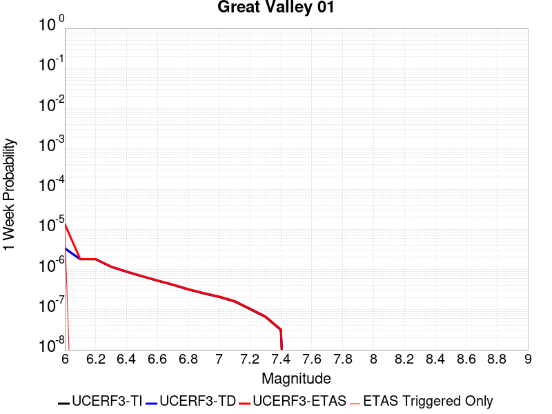 |  |  |  |

| Magnitude | 1 wk TI Prob | 1 wk TD Prob | 1 wk ETAS Prob | 1 wk ETAS/TD Gain | 1 wk ETAS Triggered Only | 1 mo TI Prob | 1 mo TD Prob | 1 mo ETAS Prob | 1 mo ETAS/TD Gain | 1 mo ETAS Triggered Only | 1 yr TI Prob | 1 yr TD Prob | 1 yr ETAS Prob | 1 yr ETAS/TD Gain | 1 yr ETAS Triggered Only | 10 yr TI Prob | 10 yr TD Prob | 10 yr ETAS Prob | 10 yr ETAS/TD Gain | 10 yr ETAS Triggered Only |
|-----|-----|-----|-----|-----|-----|-----|-----|-----|-----|-----|-----|-----|-----|-----|-----|-----|-----|-----|-----|-----|
| 6.0 | 3.3398478E-6 | 3.3762976E-6 | 2.4238123E-4 | 71.789055 | 2.3900573E-4 | 1.4313555E-5 | 1.4469774E-5 | 2.5347204E-4 | 17.517347 | 2.3900573E-4 | 1.742536E-4 | 1.7615648E-4 | 4.151201E-4 | 2.3565419 | 2.3900573E-4 | 0.0017411702 | 0.0017602886 | 0.0019988737 | 1.1355375 | 2.3900573E-4 |
| 6.1 | 1.7919616E-6 | 1.8120251E-6 | 1.8120251E-6 | 1.0 | 0.0 | 7.679812E-6 | 7.7658E-6 | 7.7658E-6 | 1.0 | 0.0 | 9.349771E-5 | 9.454471E-5 | 9.454471E-5 | 1.0 | 0.0 | 9.345838E-4 | 9.4506424E-4 | 9.4506424E-4 | 1.0 | 0.0 |
| 6.2 | 1.7919616E-6 | 1.8120251E-6 | 1.8120251E-6 | 1.0 | 0.0 | 7.679812E-6 | 7.7658E-6 | 7.7658E-6 | 1.0 | 0.0 | 9.349771E-5 | 9.454471E-5 | 9.454471E-5 | 1.0 | 0.0 | 9.345838E-4 | 9.4506424E-4 | 9.4506424E-4 | 1.0 | 0.0 |
| 6.3 | 1.1636545E-6 | 1.17745E-6 | 1.17745E-6 | 1.0 | 0.0 | 4.9870814E-6 | 5.046205E-6 | 5.046205E-6 | 1.0 | 0.0 | 6.0716022E-5 | 6.143586E-5 | 6.143586E-5 | 1.0 | 0.0 | 6.069944E-4 | 6.1419315E-4 | 6.1419315E-4 | 1.0 | 0.0 |
| 6.4 | 8.770928E-7 | 8.881815E-7 | 8.881815E-7 | 1.0 | 0.0 | 3.7589639E-6 | 3.8064866E-6 | 3.8064866E-6 | 1.0 | 0.0 | 4.5764424E-5 | 4.634301E-5 | 4.634301E-5 | 1.0 | 0.0 | 4.5755E-4 | 4.633356E-4 | 4.633356E-4 | 1.0 | 0.0 |
| 6.5 | 6.753308E-7 | 6.8452607E-7 | 6.8452607E-7 | 1.0 | 0.0 | 2.8942718E-6 | 2.93368E-6 | 2.93368E-6 | 1.0 | 0.0 | 3.523719E-5 | 3.5716977E-5 | 3.5716977E-5 | 1.0 | 0.0 | 3.52316E-4 | 3.5711337E-4 | 3.5711337E-4 | 1.0 | 0.0 |
| 6.6 | 5.2531993E-7 | 5.331276E-7 | 5.331276E-7 | 1.0 | 0.0 | 2.251369E-6 | 2.2848305E-6 | 2.2848305E-6 | 1.0 | 0.0 | 2.7410075E-5 | 2.7817463E-5 | 2.7817463E-5 | 1.0 | 0.0 | 2.7406693E-4 | 2.7814036E-4 | 2.7814036E-4 | 1.0 | 0.0 |
| 6.7 | 4.1404678E-7 | 4.208609E-7 | 4.208609E-7 | 1.0 | 0.0 | 1.774485E-6 | 1.8036884E-6 | 1.8036884E-6 | 1.0 | 0.0 | 2.160414E-5 | 2.1959688E-5 | 2.1959688E-5 | 1.0 | 0.0 | 2.160204E-4 | 2.1957551E-4 | 2.1957551E-4 | 1.0 | 0.0 |
| 6.8 | 3.1713054E-7 | 3.2302975E-7 | 3.2302975E-7 | 1.0 | 0.0 | 1.3591301E-6 | 1.3844125E-6 | 1.3844125E-6 | 1.0 | 0.0 | 1.6547285E-5 | 1.6855092E-5 | 1.6855092E-5 | 1.0 | 0.0 | 1.6546051E-4 | 1.6853833E-4 | 1.6853833E-4 | 1.0 | 0.0 |
| 6.9 | 2.528054E-7 | 2.580374E-7 | 2.580374E-7 | 1.0 | 0.0 | 1.0834511E-6 | 1.1058742E-6 | 1.1058742E-6 | 1.0 | 0.0 | 1.3190938E-5 | 1.3463935E-5 | 1.3463935E-5 | 1.0 | 0.0 | 1.3190156E-4 | 1.3463132E-4 | 1.3463132E-4 | 1.0 | 0.0 |
| 7.0 | 2.0667689E-7 | 2.1131233E-7 | 2.1131233E-7 | 1.0 | 0.0 | 8.857578E-7 | 9.0562395E-7 | 9.0562395E-7 | 1.0 | 0.0 | 1.0784048E-5 | 1.1025917E-5 | 1.1025917E-5 | 1.0 | 0.0 | 1.0783524E-4 | 1.1025378E-4 | 1.1025378E-4 | 1.0 | 0.0 |
| 7.1 | 1.5951586E-7 | 1.6338481E-7 | 1.6338481E-7 | 1.0 | 0.0 | 6.8363926E-7 | 7.002204E-7 | 7.002204E-7 | 1.0 | 0.0 | 8.323276E-6 | 8.525151E-6 | 8.525151E-6 | 1.0 | 0.0 | 8.322964E-5 | 8.5248306E-5 | 8.5248306E-5 | 1.0 | 0.0 |
| 7.2 | 1.02912296E-7 | 1.0566137E-7 | 1.0566137E-7 | 1.0 | 0.0 | 4.4105263E-7 | 4.5283437E-7 | 4.5283437E-7 | 1.0 | 0.0 | 5.3698027E-6 | 5.5132446E-6 | 5.5132446E-6 | 1.0 | 0.0 | 5.3696727E-5 | 5.5131113E-5 | 5.5131113E-5 | 1.0 | 0.0 |
| 7.3 | 6.581281E-8 | 6.77207E-8 | 6.77207E-8 | 1.0 | 0.0 | 2.8205488E-7 | 2.9023153E-7 | 2.9023153E-7 | 1.0 | 0.0 | 3.4340128E-6 | 3.5335634E-6 | 3.5335634E-6 | 1.0 | 0.0 | 3.4339595E-5 | 3.533509E-5 | 3.533509E-5 | 1.0 | 0.0 |
| 7.4 | 3.112171E-8 | 3.2068368E-8 | 3.2068368E-8 | 1.0 | 0.0 | 1.3337875E-7 | 1.3743585E-7 | 1.3743585E-7 | 1.0 | 0.0 | 1.6238852E-6 | 1.6732803E-6 | 1.6732803E-6 | 1.0 | 0.0 | 1.6238733E-5 | 1.6732685E-5 | 1.6732685E-5 | 1.0 | 0.0 |

## Lost Hills
*[(top)](#table-of-contents)*

| 1 Week | 1 Month | 1 Year | 10 Year |
|-----|-----|-----|-----|
| 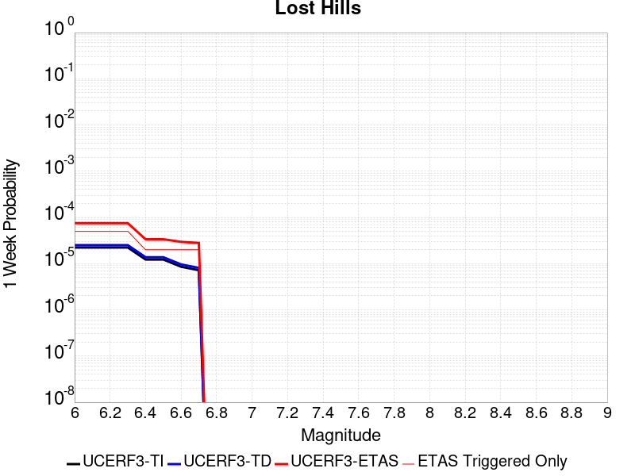 |  |  |  |

| Magnitude | 1 wk TI Prob | 1 wk TD Prob | 1 wk ETAS Prob | 1 wk ETAS/TD Gain | 1 wk ETAS Triggered Only | 1 mo TI Prob | 1 mo TD Prob | 1 mo ETAS Prob | 1 mo ETAS/TD Gain | 1 mo ETAS Triggered Only | 1 yr TI Prob | 1 yr TD Prob | 1 yr ETAS Prob | 1 yr ETAS/TD Gain | 1 yr ETAS Triggered Only | 10 yr TI Prob | 10 yr TD Prob | 10 yr ETAS Prob | 10 yr ETAS/TD Gain | 10 yr ETAS Triggered Only |
|-----|-----|-----|-----|-----|-----|-----|-----|-----|-----|-----|-----|-----|-----|-----|-----|-----|-----|-----|-----|-----|
| 6.0 | 2.233523E-5 | 2.5106583E-5 | 2.5106583E-5 | 1.0 | 0.0 | 9.571891E-5 | 1.0759615E-4 | 1.0759615E-4 | 1.0 | 0.0 | 0.0011647546 | 0.001309364 | 0.001309364 | 1.0 | 0.0 | 0.011586686 | 0.013033091 | 0.013268981 | 1.0180994 | 2.3900573E-4 |
| 6.1 | 2.233523E-5 | 2.5106583E-5 | 2.5106583E-5 | 1.0 | 0.0 | 9.571891E-5 | 1.0759615E-4 | 1.0759615E-4 | 1.0 | 0.0 | 0.0011647546 | 0.001309364 | 0.001309364 | 1.0 | 0.0 | 0.011586686 | 0.013033091 | 0.013268981 | 1.0180994 | 2.3900573E-4 |
| 6.2 | 2.233523E-5 | 2.5106583E-5 | 2.5106583E-5 | 1.0 | 0.0 | 9.571891E-5 | 1.0759615E-4 | 1.0759615E-4 | 1.0 | 0.0 | 0.0011647546 | 0.001309364 | 0.001309364 | 1.0 | 0.0 | 0.011586686 | 0.013033091 | 0.013268981 | 1.0180994 | 2.3900573E-4 |
| 6.3 | 2.233523E-5 | 2.5106583E-5 | 2.5106583E-5 | 1.0 | 0.0 | 9.571891E-5 | 1.0759615E-4 | 1.0759615E-4 | 1.0 | 0.0 | 0.0011647546 | 0.001309364 | 0.001309364 | 1.0 | 0.0 | 0.011586686 | 0.013033091 | 0.013268981 | 1.0180994 | 2.3900573E-4 |
| 6.4 | 1.2288092E-5 | 1.3781108E-5 | 1.3781108E-5 | 1.0 | 0.0 | 5.2662188E-5 | 5.906108E-5 | 5.906108E-5 | 1.0 | 0.0 | 6.409735E-4 | 7.189252E-4 | 7.189252E-4 | 1.0 | 0.0 | 0.006391279 | 0.0071752006 | 0.0071752006 | 1.0 | 0.0 |
| 6.5 | 1.2288092E-5 | 1.3781108E-5 | 1.3781108E-5 | 1.0 | 0.0 | 5.2662188E-5 | 5.906108E-5 | 5.906108E-5 | 1.0 | 0.0 | 6.409735E-4 | 7.189252E-4 | 7.189252E-4 | 1.0 | 0.0 | 0.006391279 | 0.0071752006 | 0.0071752006 | 1.0 | 0.0 |
| 6.6 | 8.58281E-6 | 9.63377E-6 | 9.63377E-6 | 1.0 | 0.0 | 3.6782953E-5 | 4.12874E-5 | 4.12874E-5 | 1.0 | 0.0 | 4.4774043E-4 | 5.026414E-4 | 5.026414E-4 | 1.0 | 0.0 | 0.0044683935 | 0.005023205 | 0.005023205 | 1.0 | 0.0 |
| 6.7 | 7.205685E-6 | 8.088302E-6 | 8.088302E-6 | 1.0 | 0.0 | 3.088114E-5 | 3.466415E-5 | 3.466415E-5 | 1.0 | 0.0 | 3.7591302E-4 | 4.2203604E-4 | 4.2203604E-4 | 1.0 | 0.0 | 0.0037527776 | 0.0042203604 | 0.0042203604 | 1.0 | 0.0 |

