# Parent Section Magnitude-Probability Distributions

Only fault sections with at least one triggered aftershock are plotted. Sections are sorted by total supraseismogenic trigger rate (decreasing)

## Table Of Contents

* [Tank Canyon](#tank-canyon)
* [Garlock (Central)](#garlock-central)
* [Panamint Valley](#panamint-valley)
* [Owl Lake](#owl-lake)
* [Little Lake](#little-lake)
* [Ash Hill](#ash-hill)
* [Garlock (East)](#garlock-east)
* [Blackwater](#blackwater)
* [Gravel Hills-Harper Lk](#gravel-hills-harper-lk)
* [Hunter Mountain-Saline Valley](#hunter-mountain-saline-valley)
* [Airport Lake](#airport-lake)
* [Goldstone Lake](#goldstone-lake)
* [So Sierra Nevada](#so-sierra-nevada)
* [McLean Lake](#mclean-lake)
* [Garlock (West)](#garlock-west)
* [Lenwood-Lockhart-Old Woman Springs](#lenwood-lockhart-old-woman-springs)
* [Coyote Canyon](#coyote-canyon)
* [Nelson Lake](#nelson-lake)
* [San Andreas (Mojave S)](#san-andreas-mojave-s)
* [Paradise](#paradise)
* [Death Valley (So)](#death-valley-so)
* [Bicycle Lake](#bicycle-lake)
* [San Andreas (San Bernardino N)](#san-andreas-san-bernardino-n)
* [Helendale-So Lockhart](#helendale-so-lockhart)
* [San Andreas (Mojave N)](#san-andreas-mojave-n)
* [Garlic Springs](#garlic-springs)
* [Towne Pass](#towne-pass)
* [Death Valley (Black Mtns Frontal)](#death-valley-black-mtns-frontal)
* [Elsinore (Glen Ivy) rev](#elsinore-glen-ivy-rev)
* [Cleghorn Lake](#cleghorn-lake)
* [San Andreas (San Bernardino S)](#san-andreas-san-bernardino-s)
* [Coyote Lake](#coyote-lake)
* [Mission Ridge-Arroyo Parida-Santa Ana](#mission-ridge-arroyo-parida-santa-ana)
* [Dry Mountain](#dry-mountain)
* [Santa Cruz Island](#santa-cruz-island)
* [Cady](#cady)
* [Channel Islands Thrust](#channel-islands-thrust)
* [San Andreas (Coachella) rev](#san-andreas-coachella-rev)
* [Scodie Lineament](#scodie-lineament)
* [San Andreas (Big Bend)](#san-andreas-big-bend)
* [White Wolf (Extension)](#white-wolf-extension)
* [Lake Isabella (Seismicity)](#lake-isabella-seismicity)
* [Red Pass](#red-pass)
* [San Andreas (Cholame) rev](#san-andreas-cholame-rev)
* [Imperial](#imperial)
* [San Diego Trough north alt1](#san-diego-trough-north-alt1)
* [San Andreas (Parkfield)](#san-andreas-parkfield)
* [Ludlow](#ludlow)
* [Calico-Hidalgo](#calico-hidalgo)
* [San Jacinto (San Bernardino)](#san-jacinto-san-bernardino)
* [Owens Valley](#owens-valley)
* [Death Valley (No)](#death-valley-no)
* [Sierra Nevada  (No Extension)](#sierra-nevada--no-extension)
* [San Andreas (Carrizo) rev](#san-andreas-carrizo-rev)
* [Brawley (Seismic Zone) alt 1](#brawley-seismic-zone-alt-1)
* [Santa Ynez (East)](#santa-ynez-east)
* [Cleghorn Pass](#cleghorn-pass)
* [San Andreas (San Gorgonio Pass-Garnet HIll)](#san-andreas-san-gorgonio-pass-garnet-hill)
* [Hosgri](#hosgri)
* [Malibu Coast (Extension) alt 1](#malibu-coast-extension-alt-1)
* [Blue Cut](#blue-cut)
* [San Gregorio (North) 2011 CFM](#san-gregorio-north-2011-cfm)
* [Hosgri (Extension)](#hosgri-extension)
* [White Mountains](#white-mountains)
* [San Jacinto (Borrego)](#san-jacinto-borrego)
* [Hayward (No) 2011 CFM](#hayward-no-2011-cfm)
* [Hayward (So) extension 2011 CFM](#hayward-so-extension-2011-cfm)
* [Great Valley 08 (Quinto)](#great-valley-08-quinto)
* [Goose Lake 2011 CFM](#goose-lake-2011-cfm)
* [Pleito](#pleito)
* [Manix-Afton Hills](#manix-afton-hills)
* [San Jacinto (Stepovers Combined)](#san-jacinto-stepovers-combined)
* [Emerson-Copper Mtn 2011](#emerson-copper-mtn-2011)
* [Elsinore (Coyote Mountains)](#elsinore-coyote-mountains)
* [San Jacinto (Anza) rev](#san-jacinto-anza-rev)
* [Likely 2011 CFM](#likely-2011-cfm)
* [Hayward (So) 2011 CFM](#hayward-so-2011-cfm)
* [White Wolf](#white-wolf)
* [Channel Islands Western Deep Ramp](#channel-islands-western-deep-ramp)
* [Rodgers Creek - Healdsburg 2011 CFM](#rodgers-creek---healdsburg-2011-cfm)
* [Great Valley 01](#great-valley-01)
* [San Jacinto (San Jacinto Valley) rev](#san-jacinto-san-jacinto-valley-rev)
* [San Andreas (Creeping Section) 2011 CFM](#san-andreas-creeping-section-2011-cfm)
* [San Diego Trough south](#san-diego-trough-south)
* [Santa Ynez (West)](#santa-ynez-west)
* [Thirty Mile Bank](#thirty-mile-bank)
* [San Jacinto (Coyote Creek)](#san-jacinto-coyote-creek)
* [San Pedro Basin](#san-pedro-basin)
* [Death Valley (Fish Lake Valley)](#death-valley-fish-lake-valley)
* [Lost Hills](#lost-hills)
* [Kern Canyon (South Kern) 2011](#kern-canyon-south-kern-2011)
* [Big Pine (East)](#big-pine-east)
* [San Clemente](#san-clemente)
* [Camp Rock 2011](#camp-rock-2011)
* [Sheephole](#sheephole)

## Tank Canyon
*[(top)](#table-of-contents)*

| 1 Week | 1 Month | 1 Year | 10 Year |
|-----|-----|-----|-----|
|  |  |  |  |

| Magnitude | 1 wk TI Prob | 1 wk TD Prob | 1 wk ETAS Prob | 1 wk ETAS/TD Gain | 1 wk ETAS Triggered Only | 1 mo TI Prob | 1 mo TD Prob | 1 mo ETAS Prob | 1 mo ETAS/TD Gain | 1 mo ETAS Triggered Only | 1 yr TI Prob | 1 yr TD Prob | 1 yr ETAS Prob | 1 yr ETAS/TD Gain | 1 yr ETAS Triggered Only | 10 yr TI Prob | 10 yr TD Prob | 10 yr ETAS Prob | 10 yr ETAS/TD Gain | 10 yr ETAS Triggered Only |
|-----|-----|-----|-----|-----|-----|-----|-----|-----|-----|-----|-----|-----|-----|-----|-----|-----|-----|-----|-----|-----|
| 6.0 | 4.8284557E-5 | 5.7964822E-5 | 0.03717151 | 641.27704 | 0.037115697 | 2.0691741E-4 | 2.4840087E-4 | 0.05130772 | 206.55211 | 0.051072005 | 0.0025163088 | 0.0030207601 | 0.0832792 | 27.568954 | 0.080501616 | 0.02488006 | 0.029863637 | 0.13533457 | 4.531751 | 0.108717635 |
| 6.1 | 1.7796336E-5 | 2.0873314E-5 | 0.013370109 | 640.53595 | 0.013349514 | 7.626778E-5 | 8.945422E-5 | 0.019606316 | 219.17711 | 0.019518608 | 9.281647E-4 | 0.0010885983 | 0.03503219 | 32.18101 | 0.033980582 | 0.009242975 | 0.010836744 | 0.0575539 | 5.3109956 | 0.047228966 |
| 6.2 | 1.7796336E-5 | 2.0873314E-5 | 0.013370109 | 640.53595 | 0.013349514 | 7.626778E-5 | 8.945422E-5 | 0.019606316 | 219.17711 | 0.019518608 | 9.281647E-4 | 0.0010885983 | 0.03503219 | 32.18101 | 0.033980582 | 0.009242975 | 0.010836744 | 0.0575539 | 5.3109956 | 0.047228966 |
| 6.3 | 1.3515912E-5 | 1.5759564E-5 | 0.010634524 | 674.7981 | 0.010618932 | 5.792405E-5 | 6.753938E-5 | 0.015539795 | 230.08496 | 0.015473301 | 7.049971E-4 | 8.2200574E-4 | 0.026387542 | 32.10141 | 0.02558657 | 0.007027647 | 0.0081922645 | 0.04359964 | 5.3220496 | 0.035699837 |
| 6.4 | 1.0870146E-5 | 1.2618021E-5 | 0.008204262 | 650.20197 | 0.008191748 | 4.658551E-5 | 5.4076212E-5 | 0.011683706 | 216.06 | 0.0116302585 | 5.67031E-4 | 6.581969E-4 | 0.01986076 | 30.174496 | 0.019215211 | 0.005655863 | 0.0065644905 | 0.03328919 | 5.0711007 | 0.026901295 |
| 6.5 | 7.964826E-6 | 9.196094E-6 | 0.0051669157 | 561.8598 | 0.005157767 | 3.4134522E-5 | 3.9411298E-5 | 0.007522935 | 190.8827 | 0.0074838186 | 4.1550855E-4 | 4.7973756E-4 | 0.013115259 | 27.338404 | 0.012641585 | 0.0041473247 | 0.004788321 | 0.022603093 | 4.7204633 | 0.017900486 |
| 6.6 | 6.6317E-6 | 7.6122988E-6 | 0.0030415698 | 399.55997 | 0.0030339805 | 2.8421264E-5 | 3.2623782E-5 | 0.004785705 | 146.69376 | 0.004753236 | 3.4597394E-4 | 3.9713128E-4 | 0.0086867185 | 21.873669 | 0.00829288 | 0.0034543579 | 0.003965368 | 0.016153898 | 4.0737453 | 0.012237055 |
| 6.7 | 4.793663E-6 | 5.4307857E-6 | 0.0014212807 | 261.70813 | 0.0014158576 | 2.0544108E-5 | 2.3274613E-5 | 0.0025515328 | 109.6273 | 0.002528317 | 2.500958E-4 | 2.8333595E-4 | 0.0053385375 | 18.841724 | 0.005056634 | 0.0024981452 | 0.0028304397 | 0.010192229 | 3.600935 | 0.0073826862 |
| 6.8 | 4.382823E-6 | 4.9692567E-6 | 0.0012185555 | 245.21886 | 0.0012135922 | 1.8783392E-5 | 2.1296666E-5 | 0.002347299 | 110.219086 | 0.0023260517 | 2.286638E-4 | 2.5926033E-4 | 0.0048090513 | 18.549122 | 0.004550971 | 0.0022842865 | 0.002590253 | 0.009247721 | 3.5702 | 0.006674757 |
| 6.9 | 2.729601E-6 | 3.0735416E-6 | 7.110002E-4 | 231.32927 | 7.079288E-4 | 1.1698237E-5 | 1.3172262E-5 | 0.0011256172 | 85.4536 | 0.0011124596 | 1.4241673E-4 | 1.6036171E-4 | 0.0021826911 | 13.611049 | 0.0020226538 | 0.001423255 | 0.0016026258 | 0.0044298028 | 2.7640905 | 0.0028317152 |
| 7.0 | 1.8987357E-6 | 2.126939E-6 | 5.077893E-4 | 238.74182 | 5.0566345E-4 | 8.137413E-6 | 9.115425E-6 | 8.1816956E-4 | 89.7566 | 8.090615E-4 | 9.90685E-5 | 1.1097535E-4 | 0.0014255544 | 12.845685 | 0.0013147249 | 9.902435E-4 | 0.0011092679 | 0.0028266164 | 2.5481818 | 0.0017192557 |
| 7.1 | 1.4928986E-6 | 1.6641272E-6 | 3.050617E-4 | 183.31633 | 3.0339806E-4 | 6.398121E-6 | 7.1319573E-6 | 3.1052786E-4 | 43.54034 | 3.0339806E-4 | 7.789434E-5 | 8.682871E-5 | 5.924482E-4 | 6.8231835 | 5.0566345E-4 | 7.786704E-4 | 8.6800574E-4 | 0.00157532 | 1.8148729 | 7.079288E-4 |
| 7.2 | 1.069082E-6 | 1.1828573E-6 | 2.0344798E-4 | 171.99707 | 2.0226538E-4 | 4.581772E-6 | 5.0693816E-6 | 2.0733372E-4 | 40.899216 | 2.0226538E-4 | 5.5781646E-5 | 6.171851E-5 | 3.6509783E-4 | 5.915533 | 3.0339806E-4 | 5.576765E-4 | 6.170659E-4 | 9.2027674E-4 | 1.4913751 | 3.0339806E-4 |
| 7.3 | 8.776551E-7 | 9.770005E-7 | 2.0324218E-4 | 208.02669 | 2.0226538E-4 | 3.7613736E-6 | 4.1871413E-6 | 2.0645166E-4 | 49.306114 | 2.0226538E-4 | 4.579376E-5 | 5.097777E-5 | 2.5323284E-4 | 4.967515 | 2.0226538E-4 | 4.5784327E-4 | 5.097118E-4 | 7.1187405E-4 | 1.3966208 | 2.0226538E-4 |
| 7.4 | 7.55721E-7 | 8.510244E-7 | 2.0311623E-4 | 238.6726 | 2.0226538E-4 | 3.2388E-6 | 3.6472454E-6 | 2.0591189E-4 | 56.45682 | 2.0226538E-4 | 3.9431678E-5 | 4.4404827E-5 | 2.4666122E-4 | 5.554829 | 2.0226538E-4 | 3.942468E-4 | 4.440104E-4 | 6.4618594E-4 | 1.4553397 | 2.0226538E-4 |
| 7.5 | 5.587665E-7 | 6.305619E-7 | 6.305619E-7 | 1.0 | 0.0 | 2.3947114E-6 | 2.702408E-6 | 2.702408E-6 | 1.0 | 0.0 | 2.915522E-5 | 3.290182E-5 | 3.290182E-5 | 1.0 | 0.0 | 2.9151395E-4 | 3.290182E-4 | 3.290182E-4 | 1.0 | 0.0 |

## Garlock (Central)
*[(top)](#table-of-contents)*

| 1 Week | 1 Month | 1 Year | 10 Year |
|-----|-----|-----|-----|
|  |  |  |  |

| Magnitude | 1 wk TI Prob | 1 wk TD Prob | 1 wk ETAS Prob | 1 wk ETAS/TD Gain | 1 wk ETAS Triggered Only | 1 mo TI Prob | 1 mo TD Prob | 1 mo ETAS Prob | 1 mo ETAS/TD Gain | 1 mo ETAS Triggered Only | 1 yr TI Prob | 1 yr TD Prob | 1 yr ETAS Prob | 1 yr ETAS/TD Gain | 1 yr ETAS Triggered Only | 10 yr TI Prob | 10 yr TD Prob | 10 yr ETAS Prob | 10 yr ETAS/TD Gain | 10 yr ETAS Triggered Only |
|-----|-----|-----|-----|-----|-----|-----|-----|-----|-----|-----|-----|-----|-----|-----|-----|-----|-----|-----|-----|-----|
| 6.0 | 5.5131142E-5 | 7.024681E-5 | 0.010789558 | 153.595 | 0.010720065 | 2.3625491E-4 | 3.010234E-4 | 0.014859746 | 49.364094 | 0.014563107 | 0.0028726095 | 0.0036588663 | 0.027136564 | 7.4166594 | 0.023563916 | 0.028357591 | 0.036079824 | 0.06727465 | 1.8646058 | 0.03236246 |
| 6.1 | 5.5131142E-5 | 7.024681E-5 | 0.010789558 | 153.595 | 0.010720065 | 2.3625491E-4 | 3.010234E-4 | 0.014859746 | 49.364094 | 0.014563107 | 0.0028726095 | 0.0036588663 | 0.027136564 | 7.4166594 | 0.023563916 | 0.028357591 | 0.036079824 | 0.06727465 | 1.8646058 | 0.03236246 |
| 6.2 | 4.216245E-5 | 5.1661493E-5 | 0.0071305837 | 138.02512 | 0.007079288 | 1.806837E-4 | 2.2138779E-4 | 0.009422425 | 42.560726 | 0.0092030745 | 0.0021976046 | 0.0026920962 | 0.018224603 | 6.7696695 | 0.015574434 | 0.021759989 | 0.026689773 | 0.047360804 | 1.7744925 | 0.021237863 |
| 6.3 | 4.216245E-5 | 5.1661493E-5 | 0.0071305837 | 138.02512 | 0.007079288 | 1.806837E-4 | 2.2138779E-4 | 0.009422425 | 42.560726 | 0.0092030745 | 0.0021976046 | 0.0026920962 | 0.018224603 | 6.7696695 | 0.015574434 | 0.021759989 | 0.026689773 | 0.047360804 | 1.7744925 | 0.021237863 |
| 6.4 | 3.6858168E-5 | 4.411054E-5 | 0.00520165 | 117.92306 | 0.005157767 | 1.5795401E-4 | 1.8903162E-4 | 0.007064754 | 37.373398 | 0.006877023 | 0.0019213937 | 0.002299056 | 0.014104377 | 6.1348557 | 0.011832524 | 0.019048655 | 0.02284894 | 0.0393522 | 1.7222768 | 0.016889159 |
| 6.5 | 3.39199E-5 | 4.0018083E-5 | 0.004894193 | 122.29953 | 0.004854369 | 1.453629E-4 | 1.7149492E-4 | 0.006339531 | 36.96629 | 0.006169094 | 0.0017683565 | 0.002085973 | 0.012581833 | 6.031637 | 0.010517799 | 0.017543508 | 0.020759864 | 0.035515808 | 1.710792 | 0.01506877 |
| 6.6 | 3.3571985E-5 | 3.9472274E-5 | 0.0048936494 | 123.97689 | 0.004854369 | 1.4387199E-4 | 1.6915603E-4 | 0.0063372063 | 37.463673 | 0.006169094 | 0.0017502342 | 0.0020575512 | 0.012452785 | 6.052236 | 0.010416667 | 0.017365133 | 0.020481179 | 0.03514226 | 1.715832 | 0.014967637 |
| 6.7 | 3.2580007E-5 | 3.8088703E-5 | 0.004791144 | 125.78911 | 0.004753236 | 1.3962112E-4 | 1.632272E-4 | 0.006129082 | 37.54939 | 0.0059668287 | 0.0016985617 | 0.0019855013 | 0.011977758 | 6.032612 | 0.010012136 | 0.016856372 | 0.019773813 | 0.03385069 | 1.7118946 | 0.014360841 |
| 6.8 | 3.2185937E-5 | 3.7515918E-5 | 0.004790574 | 127.69443 | 0.004753236 | 1.3793244E-4 | 1.6077272E-4 | 0.0060255253 | 37.47853 | 0.005865696 | 0.0016780337 | 0.001955672 | 0.011847293 | 6.057914 | 0.0099110035 | 0.016654192 | 0.019480614 | 0.033363372 | 1.7126448 | 0.014158576 |
| 6.9 | 3.165394E-5 | 3.6720503E-5 | 0.004587524 | 124.93086 | 0.004550971 | 1.3565269E-4 | 1.5736422E-4 | 0.005819903 | 36.98365 | 0.0056634303 | 0.0016503202 | 0.001914247 | 0.011402522 | 5.956661 | 0.009506472 | 0.01638118 | 0.019073246 | 0.03236655 | 1.6969607 | 0.01355178 |
| 7.0 | 3.0903822E-5 | 3.5625766E-5 | 0.0042830473 | 120.223305 | 0.0042475727 | 1.3243823E-4 | 1.5267303E-4 | 0.005511887 | 36.10256 | 0.0053600324 | 0.0016112428 | 0.0018572307 | 0.010841323 | 5.8373594 | 0.009000809 | 0.015996104 | 0.018512413 | 0.031118494 | 1.6809528 | 0.012843851 |
| 7.1 | 3.0069863E-5 | 3.4392073E-5 | 0.00418069 | 121.55969 | 0.00414644 | 1.2886449E-4 | 1.4738638E-4 | 0.005405511 | 36.67578 | 0.0052588996 | 0.0015677959 | 0.0017929734 | 0.01047479 | 5.842134 | 0.008697411 | 0.01556781 | 0.017880075 | 0.02989833 | 1.6721591 | 0.012237055 |
| 7.2 | 2.7957109E-5 | 3.128145E-5 | 0.003773074 | 120.61696 | 0.0037419093 | 1.1981068E-4 | 1.340566E-4 | 0.0047855363 | 35.697884 | 0.0046521034 | 0.0014577188 | 0.0016309366 | 0.009506421 | 5.8288107 | 0.00788835 | 0.014481937 | 0.016283695 | 0.027227141 | 1.6720493 | 0.011124595 |
| 7.3 | 2.4519275E-5 | 2.6714795E-5 | 0.0026560945 | 99.424095 | 0.0026294498 | 1.0507837E-4 | 1.1448703E-4 | 0.0032492413 | 28.380867 | 0.0031351133 | 0.0012785783 | 0.001393003 | 0.0070485445 | 5.059963 | 0.0056634303 | 0.012712469 | 0.013928054 | 0.021905983 | 1.5727956 | 0.008090615 |
| 7.4 | 2.3225532E-5 | 2.51994E-5 | 0.0021489323 | 85.27712 | 0.0021237864 | 9.95342E-5 | 1.0799304E-4 | 0.002737159 | 25.345697 | 0.0026294498 | 0.0012111551 | 0.0013140367 | 0.006162027 | 4.6893873 | 0.004854369 | 0.012045753 | 0.013145725 | 0.020231754 | 1.5390368 | 0.0071804207 |
| 7.5 | 2.097765E-5 | 2.2483688E-5 | 0.0018428311 | 81.96303 | 0.0018203884 | 8.9901114E-5 | 9.635517E-5 | 0.0023210598 | 24.088587 | 0.0022249192 | 0.0010939965 | 0.0011725046 | 0.005213069 | 4.4460964 | 0.0040453076 | 0.010886264 | 0.011740365 | 0.017637141 | 1.5022651 | 0.0059668287 |
| 7.6 | 1.511254E-5 | 1.5991332E-5 | 0.001027302 | 64.24117 | 0.0010113269 | 6.476642E-5 | 6.853253E-5 | 0.0012820415 | 18.707052 | 0.0012135922 | 7.882459E-4 | 8.3407195E-4 | 0.0031581835 | 3.7864642 | 0.0023260517 | 0.007854558 | 0.008383559 | 0.011692958 | 1.3947488 | 0.0033373786 |
| 7.7 | 9.934069E-6 | 1.0678794E-5 | 2.12942E-4 | 19.940643 | 2.0226538E-4 | 4.2573887E-5 | 4.5765457E-5 | 2.4802156E-4 | 5.4194055 | 2.0226538E-4 | 5.182138E-4 | 5.570524E-4 | 0.0011635105 | 2.0886912 | 6.067961E-4 | 0.00517007 | 0.005627684 | 0.006432192 | 1.1429555 | 8.090615E-4 |
| 7.8 | 6.7562896E-6 | 8.428449E-6 | 2.1069212E-4 | 24.997732 | 2.0226538E-4 | 2.8955206E-5 | 3.6121426E-5 | 2.3837949E-4 | 6.5993934 | 2.0226538E-4 | 3.5247262E-4 | 4.3968976E-4 | 0.001046219 | 2.3794484 | 6.067961E-4 | 0.0035191406 | 0.004446654 | 0.0051514353 | 1.1584969 | 7.079288E-4 |
| 7.9 | 3.975453E-6 | 5.37103E-6 | 1.06503176E-4 | 19.82919 | 1.0113269E-4 | 1.7037546E-5 | 2.3018498E-5 | 1.2414885E-4 | 5.3934383 | 1.0113269E-4 | 2.0741238E-4 | 2.8021427E-4 | 5.835273E-4 | 2.0824325 | 3.0339806E-4 | 0.002072189 | 0.0028336283 | 0.0032370128 | 1.1423562 | 4.0453076E-4 |
| 8.0 | 1.6729537E-6 | 2.0775144E-6 | 2.0775144E-6 | 1.0 | 0.0 | 7.169782E-6 | 8.903603E-6 | 8.903603E-6 | 1.0 | 0.0 | 8.7288594E-5 | 1.0839601E-4 | 2.0951773E-4 | 1.9328916 | 1.0113269E-4 | 8.7254314E-4 | 0.0010969337 | 0.0012989773 | 1.1841893 | 2.0226538E-4 |
| 8.1 | 3.6733252E-7 | 3.1489964E-7 | 3.1489964E-7 | 1.0 | 0.0 | 1.5742813E-6 | 1.3495693E-6 | 1.3495693E-6 | 1.0 | 0.0 | 1.9166706E-5 | 1.6430899E-5 | 1.6430899E-5 | 1.0 | 0.0 | 1.9165053E-4 | 1.6638759E-4 | 1.6638759E-4 | 1.0 | 0.0 |

## Panamint Valley
*[(top)](#table-of-contents)*

| 1 Week | 1 Month | 1 Year | 10 Year |
|-----|-----|-----|-----|
|  |  |  |  |

| Magnitude | 1 wk TI Prob | 1 wk TD Prob | 1 wk ETAS Prob | 1 wk ETAS/TD Gain | 1 wk ETAS Triggered Only | 1 mo TI Prob | 1 mo TD Prob | 1 mo ETAS Prob | 1 mo ETAS/TD Gain | 1 mo ETAS Triggered Only | 1 yr TI Prob | 1 yr TD Prob | 1 yr ETAS Prob | 1 yr ETAS/TD Gain | 1 yr ETAS Triggered Only | 10 yr TI Prob | 10 yr TD Prob | 10 yr ETAS Prob | 10 yr ETAS/TD Gain | 10 yr ETAS Triggered Only |
|-----|-----|-----|-----|-----|-----|-----|-----|-----|-----|-----|-----|-----|-----|-----|-----|-----|-----|-----|-----|-----|
| 6.0 | 3.0211835E-5 | 3.3984514E-5 | 0.0052927053 | 155.73875 | 0.0052588996 | 1.2947287E-4 | 1.4563995E-4 | 0.007122779 | 48.90677 | 0.006978155 | 0.0015751923 | 0.0017717537 | 0.014996663 | 8.464305 | 0.013248382 | 0.015640736 | 0.017583137 | 0.03616242 | 2.0566535 | 0.018911812 |
| 6.1 | 3.0211835E-5 | 3.3984514E-5 | 0.0052927053 | 155.73875 | 0.0052588996 | 1.2947287E-4 | 1.4563995E-4 | 0.007122779 | 48.90677 | 0.006978155 | 0.0015751923 | 0.0017717537 | 0.014996663 | 8.464305 | 0.013248382 | 0.015640736 | 0.017583137 | 0.03616242 | 2.0566535 | 0.018911812 |
| 6.2 | 3.0211835E-5 | 3.3984514E-5 | 0.0052927053 | 155.73875 | 0.0052588996 | 1.2947287E-4 | 1.4563995E-4 | 0.007122779 | 48.90677 | 0.006978155 | 0.0015751923 | 0.0017717537 | 0.014996663 | 8.464305 | 0.013248382 | 0.015640736 | 0.017583137 | 0.03616242 | 2.0566535 | 0.018911812 |
| 6.3 | 2.8573924E-5 | 3.210268E-5 | 0.0051897042 | 161.65953 | 0.005157767 | 1.2245393E-4 | 1.3757581E-4 | 0.0070136525 | 50.98027 | 0.006877023 | 0.001489857 | 0.0016737265 | 0.014597044 | 8.721284 | 0.012944984 | 0.01479908 | 0.016617801 | 0.03481753 | 2.0951948 | 0.018507281 |
| 6.4 | 2.8573924E-5 | 3.210268E-5 | 0.0051897042 | 161.65953 | 0.005157767 | 1.2245393E-4 | 1.3757581E-4 | 0.0070136525 | 50.98027 | 0.006877023 | 0.001489857 | 0.0016737265 | 0.014597044 | 8.721284 | 0.012944984 | 0.01479908 | 0.016617801 | 0.03481753 | 2.0951948 | 0.018507281 |
| 6.5 | 2.7468774E-5 | 3.0828433E-5 | 0.004986177 | 161.73956 | 0.0049555018 | 1.1771801E-4 | 1.3211532E-4 | 0.006805991 | 51.51553 | 0.006674757 | 0.0014322745 | 0.0016073446 | 0.014228611 | 8.852246 | 0.012641585 | 0.014230782 | 0.015963677 | 0.03377744 | 2.1158936 | 0.01810275 |
| 6.6 | 2.6135967E-5 | 2.925248E-5 | 0.0045800903 | 156.571 | 0.004550971 | 1.1200648E-4 | 1.253619E-4 | 0.0062936824 | 50.20411 | 0.006169094 | 0.0013628257 | 0.0015252391 | 0.013238737 | 8.679779 | 0.011731392 | 0.013544982 | 0.015154043 | 0.03178726 | 2.0976093 | 0.016889159 |
| 6.7 | 2.4498746E-5 | 2.7341335E-5 | 0.004072538 | 148.95169 | 0.0040453076 | 1.04990395E-4 | 1.1717203E-4 | 0.005779939 | 49.32866 | 0.0056634303 | 0.0012775084 | 0.0014256609 | 0.012029454 | 8.437808 | 0.010618932 | 0.012701893 | 0.014171274 | 0.0293256 | 2.0693693 | 0.015372168 |
| 6.8 | 2.2244329E-5 | 2.4935423E-5 | 0.0037667516 | 151.06026 | 0.0037419093 | 9.532935E-5 | 1.0686185E-4 | 0.0054663215 | 51.15316 | 0.0053600324 | 0.0011600169 | 0.0013002884 | 0.010592397 | 8.146192 | 0.009304207 | 0.011539802 | 0.0129325185 | 0.026608514 | 2.057489 | 0.013855178 |
| 6.9 | 1.9902658E-5 | 2.2290267E-5 | 0.0031573337 | 141.6463 | 0.0031351133 | 8.529431E-5 | 9.552632E-5 | 0.0041404474 | 43.343525 | 0.0040453076 | 0.0010379635 | 0.0011624309 | 0.007728414 | 6.6484933 | 0.0065736244 | 0.010331288 | 0.011568608 | 0.021065066 | 1.8208817 | 0.009607606 |
| 7.0 | 1.8353881E-5 | 2.0566185E-5 | 0.0027510927 | 133.76776 | 0.0027305826 | 7.865712E-5 | 8.813792E-5 | 0.0035263463 | 40.00941 | 0.0034385114 | 9.5722964E-4 | 0.0010725686 | 0.006527876 | 6.0862083 | 0.005461165 | 0.009531168 | 0.010678849 | 0.018583013 | 1.74017 | 0.007989482 |
| 7.1 | 1.7667631E-5 | 1.9772613E-5 | 0.0023457785 | 118.63776 | 0.0023260517 | 7.571623E-5 | 8.473711E-5 | 0.0028150883 | 33.22143 | 0.0027305826 | 9.2145515E-4 | 0.0010312037 | 0.0054764533 | 5.3107386 | 0.0044498383 | 0.009176437 | 0.010269073 | 0.016875286 | 1.6433116 | 0.006674757 |
| 7.2 | 1.6381597E-5 | 1.8158249E-5 | 0.0020407753 | 112.38832 | 0.0020226538 | 7.020495E-5 | 7.781885E-5 | 0.0025048144 | 32.18776 | 0.0024271845 | 8.544101E-4 | 9.4704994E-4 | 0.0049885265 | 5.2674375 | 0.0040453076 | 0.008511325 | 0.009434792 | 0.015245146 | 1.6158434 | 0.005865696 |
| 7.3 | 1.4520491E-5 | 1.5966476E-5 | 0.0017351947 | 108.677376 | 0.0017192557 | 6.222919E-5 | 6.842605E-5 | 0.0021920672 | 32.035564 | 0.0021237864 | 7.57377E-4 | 8.327849E-4 | 0.0044705295 | 5.3681684 | 0.0036407767 | 0.0075480095 | 0.00829975 | 0.013314416 | 1.6041948 | 0.005056634 |
| 7.4 | 1.2852287E-5 | 1.4145411E-5 | 0.0016322455 | 115.390465 | 0.001618123 | 5.5080065E-5 | 6.062187E-5 | 0.002083153 | 34.36306 | 0.0020226538 | 6.7039346E-4 | 7.378371E-4 | 0.0040727532 | 5.519854 | 0.0033373786 | 0.0066837464 | 0.0073567946 | 0.012075062 | 1.6413484 | 0.004753236 |
| 7.5 | 1.1637851E-5 | 1.2836797E-5 | 0.0014286762 | 111.29537 | 0.0014158576 | 4.987555E-5 | 5.5013777E-5 | 0.0018753019 | 34.08786 | 0.0018203884 | 6.070656E-4 | 6.6960254E-4 | 0.0037015516 | 5.527983 | 0.0030339805 | 0.006054099 | 0.0066787465 | 0.010998408 | 1.6467773 | 0.0043487055 |
| 7.6 | 3.0068115E-6 | 3.3330316E-6 | 4.0786242E-4 | 122.369804 | 4.0453076E-4 | 1.2886271E-5 | 1.4284384E-5 | 6.2107184E-4 | 43.479076 | 6.067961E-4 | 1.5687906E-4 | 1.7390578E-4 | 0.0011850568 | 6.814361 | 0.0010113269 | 0.0015676835 | 0.0017391363 | 0.003354445 | 1.9287995 | 0.001618123 |

## Owl Lake
*[(top)](#table-of-contents)*

| 1 Week | 1 Month | 1 Year | 10 Year |
|-----|-----|-----|-----|
|  |  |  |  |

| Magnitude | 1 wk TI Prob | 1 wk TD Prob | 1 wk ETAS Prob | 1 wk ETAS/TD Gain | 1 wk ETAS Triggered Only | 1 mo TI Prob | 1 mo TD Prob | 1 mo ETAS Prob | 1 mo ETAS/TD Gain | 1 mo ETAS Triggered Only | 1 yr TI Prob | 1 yr TD Prob | 1 yr ETAS Prob | 1 yr ETAS/TD Gain | 1 yr ETAS Triggered Only | 10 yr TI Prob | 10 yr TD Prob | 10 yr ETAS Prob | 10 yr ETAS/TD Gain | 10 yr ETAS Triggered Only |
|-----|-----|-----|-----|-----|-----|-----|-----|-----|-----|-----|-----|-----|-----|-----|-----|-----|-----|-----|-----|-----|
| 6.0 | 5.0320643E-5 | 6.635816E-5 | 0.004414775 | 66.5295 | 0.0043487055 | 2.1564208E-4 | 2.843674E-4 | 0.006047291 | 21.26577 | 0.005764563 | 0.0026222812 | 0.0034577388 | 0.01393917 | 4.0312967 | 0.010517799 | 0.02591553 | 0.034140717 | 0.04889039 | 1.4320258 | 0.015271036 |
| 6.1 | 5.0320643E-5 | 6.635816E-5 | 0.004414775 | 66.5295 | 0.0043487055 | 2.1564208E-4 | 2.843674E-4 | 0.006047291 | 21.26577 | 0.005764563 | 0.0026222812 | 0.0034577388 | 0.01393917 | 4.0312967 | 0.010517799 | 0.02591553 | 0.034140717 | 0.04889039 | 1.4320258 | 0.015271036 |
| 6.2 | 2.4125871E-5 | 3.0981035E-5 | 0.00255922 | 82.60601 | 0.002528317 | 1.0339249E-4 | 1.3277028E-4 | 0.003570825 | 26.894762 | 0.0034385114 | 0.0012580766 | 0.001615439 | 0.008279414 | 5.125179 | 0.006674757 | 0.012509781 | 0.016070465 | 0.025324656 | 1.575851 | 0.00940534 |
| 6.3 | 1.7433485E-5 | 2.2355514E-5 | 0.0021460943 | 95.99844 | 0.0021237864 | 7.471279E-5 | 9.580672E-5 | 0.0031294967 | 32.66469 | 0.0030339805 | 9.0924866E-4 | 0.0011659743 | 0.006822801 | 5.8515882 | 0.0056634303 | 0.009055373 | 0.011628896 | 0.019425513 | 1.670452 | 0.00788835 |
| 6.4 | 1.7433485E-5 | 2.2355514E-5 | 0.0021460943 | 95.99844 | 0.0021237864 | 7.471279E-5 | 9.580672E-5 | 0.0031294967 | 32.66469 | 0.0030339805 | 9.0924866E-4 | 0.0011659743 | 0.006822801 | 5.8515882 | 0.0056634303 | 0.009055373 | 0.011628896 | 0.019425513 | 1.670452 | 0.00788835 |
| 6.5 | 1.5182742E-5 | 1.9429144E-5 | 0.0021431742 | 110.30718 | 0.0021237864 | 6.506727E-5 | 8.326596E-5 | 0.003116994 | 37.434193 | 0.0030339805 | 7.919061E-4 | 0.0010134429 | 0.006267013 | 6.1838837 | 0.0052588996 | 0.0078909 | 0.010118429 | 0.017526522 | 1.7321389 | 0.0074838186 |
| 6.6 | 6.7271576E-6 | 8.547361E-6 | 0.0015255247 | 178.47903 | 0.0015169902 | 2.8830356E-5 | 3.6631063E-5 | 0.0020592108 | 56.214874 | 0.0020226538 | 3.5095305E-4 | 4.458976E-4 | 0.0041861385 | 9.388116 | 0.0037419093 | 0.0035039932 | 0.004467813 | 0.009199812 | 2.0591311 | 0.004753236 |
| 6.7 | 6.682835E-6 | 8.479807E-6 | 0.0015254572 | 179.89291 | 0.0015169902 | 2.8640408E-5 | 3.6341557E-5 | 0.0020589218 | 56.65475 | 0.0020226538 | 3.4864116E-4 | 4.4237426E-4 | 0.0041826284 | 9.454954 | 0.0037419093 | 0.003480947 | 0.0044327388 | 0.009064221 | 2.0448353 | 0.0046521034 |
| 6.8 | 6.5774975E-6 | 8.32628E-6 | 0.0015253039 | 183.19151 | 0.0015169902 | 2.8188972E-5 | 3.5683603E-5 | 0.0020582653 | 57.680977 | 0.0020226538 | 3.4314668E-4 | 4.343669E-4 | 0.004073562 | 9.3781595 | 0.0036407767 | 0.0034261728 | 0.004352885 | 0.008884046 | 2.0409558 | 0.004550971 |
| 6.9 | 6.363419E-6 | 7.999454E-6 | 0.0014238458 | 177.99286 | 0.0014158576 | 2.727151E-5 | 3.428296E-5 | 0.001955738 | 57.046947 | 0.001921521 | 3.3198006E-4 | 4.1732067E-4 | 0.003854397 | 9.236056 | 0.0034385114 | 0.0033148455 | 0.0041828766 | 0.008513392 | 2.035296 | 0.0043487055 |
| 7.0 | 6.1342453E-6 | 7.6316555E-6 | 0.0014234785 | 186.52289 | 0.0014158576 | 2.6289357E-5 | 3.2706717E-5 | 0.0019541648 | 59.748123 | 0.001921521 | 3.2002592E-4 | 3.9813702E-4 | 0.0038352793 | 9.633064 | 0.0034385114 | 0.0031956544 | 0.003991571 | 0.008222189 | 2.0598881 | 0.0042475727 |
| 7.1 | 5.842926E-6 | 7.142211E-6 | 0.0014229896 | 199.23657 | 0.0014158576 | 2.504087E-5 | 3.0609146E-5 | 0.0019520713 | 63.774117 | 0.001921521 | 3.0482994E-4 | 3.7260808E-4 | 0.0036076482 | 9.682153 | 0.003236246 | 0.0030441214 | 0.0037370329 | 0.007666468 | 2.0514853 | 0.003944175 |
| 7.2 | 4.77173E-6 | 5.358483E-6 | 0.0011178121 | 208.60606 | 0.0011124596 | 2.045011E-5 | 2.2964748E-5 | 0.0014387899 | 62.652103 | 0.0014158576 | 2.4895166E-4 | 2.79564E-4 | 0.0028071743 | 10.041258 | 0.002528317 | 0.0024867293 | 0.002808645 | 0.005834104 | 2.0771954 | 0.0030339805 |
| 7.3 | 3.0494948E-6 | 2.710463E-6 | 3.061077E-4 | 112.93558 | 3.0339806E-4 | 1.3069198E-5 | 1.1616219E-5 | 3.1501075E-4 | 27.118183 | 3.0339806E-4 | 1.5910587E-4 | 1.4141845E-4 | 9.503655E-4 | 6.7202373 | 8.090615E-4 | 0.0015899199 | 0.0014232415 | 0.0023321402 | 1.6386118 | 9.101942E-4 |
| 7.4 | 2.7263884E-6 | 2.3056762E-6 | 2.0457058E-4 | 88.72476 | 2.0226538E-4 | 1.1684469E-5 | 9.881433E-6 | 2.121448E-4 | 21.469032 | 2.0226538E-4 | 1.4224913E-4 | 1.20299905E-4 | 7.27023E-4 | 6.0434213 | 6.067961E-4 | 0.0014215811 | 0.0012112238 | 0.001817285 | 1.5003709 | 6.067961E-4 |
| 7.5 | 2.6090431E-6 | 2.1656133E-6 | 1.0329808E-4 | 47.699226 | 1.0113269E-4 | 1.1181565E-5 | 9.281167E-6 | 1.1041291E-4 | 11.896447 | 1.0113269E-4 | 1.3612706E-4 | 1.1299244E-4 | 4.1635623E-4 | 3.6848147 | 3.0339806E-4 | 0.001360437 | 0.0011379806 | 0.0014410334 | 1.2663075 | 3.0339806E-4 |
| 7.6 | 2.3008756E-6 | 1.8727933E-6 | 1.0300529E-4 | 55.000885 | 1.0113269E-4 | 9.860858E-6 | 8.0262325E-6 | 1.0915811E-4 | 13.600167 | 1.0113269E-4 | 1.20049335E-4 | 9.7715085E-5 | 4.010835E-4 | 4.104622 | 3.0339806E-4 | 0.001199845 | 9.849932E-4 | 0.0012880923 | 1.3077171 | 3.0339806E-4 |
| 7.7 | 1.7184348E-6 | 1.3419171E-6 | 1.0247447E-4 | 76.364235 | 1.0113269E-4 | 7.3646997E-6 | 5.7510606E-6 | 1.0688316E-4 | 18.584948 | 1.0113269E-4 | 8.966153E-5 | 7.0016955E-5 | 2.7226817E-4 | 3.8886032 | 2.0226538E-4 | 8.962536E-4 | 7.078345E-4 | 9.099567E-4 | 1.2855501 | 2.0226538E-4 |
| 7.8 | 8.4612907E-7 | 8.4058576E-7 | 1.01973186E-4 | 121.31206 | 1.0113269E-4 | 3.6262625E-6 | 3.6025056E-6 | 1.0473483E-4 | 29.072773 | 1.0113269E-4 | 4.4148852E-5 | 4.3859643E-5 | 2.4611613E-4 | 5.611449 | 2.0226538E-4 | 4.414008E-4 | 4.4398365E-4 | 6.461592E-4 | 1.4553672 | 2.0226538E-4 |
| 7.9 | 2.716738E-7 | 3.768106E-7 | 3.768106E-7 | 1.0 | 0.0 | 1.1643157E-6 | 1.6149015E-6 | 1.6149015E-6 | 1.0 | 0.0 | 1.4175452E-5 | 1.966126E-5 | 1.966126E-5 | 1.0 | 0.0 | 1.4174548E-4 | 1.9836679E-4 | 1.9836679E-4 | 1.0 | 0.0 |
| 8.0 | 2.1995428E-8 | 3.384878E-8 | 3.384878E-8 | 1.0 | 0.0 | 9.426611E-8 | 1.4506621E-7 | 1.4506621E-7 | 1.0 | 0.0 | 1.1476893E-6 | 1.7661803E-6 | 1.7661803E-6 | 1.0 | 0.0 | 1.14768345E-5 | 1.7963059E-5 | 1.7963059E-5 | 1.0 | 0.0 |

## Little Lake
*[(top)](#table-of-contents)*

| 1 Week | 1 Month | 1 Year | 10 Year |
|-----|-----|-----|-----|
|  |  |  |  |

| Magnitude | 1 wk TI Prob | 1 wk TD Prob | 1 wk ETAS Prob | 1 wk ETAS/TD Gain | 1 wk ETAS Triggered Only | 1 mo TI Prob | 1 mo TD Prob | 1 mo ETAS Prob | 1 mo ETAS/TD Gain | 1 mo ETAS Triggered Only | 1 yr TI Prob | 1 yr TD Prob | 1 yr ETAS Prob | 1 yr ETAS/TD Gain | 1 yr ETAS Triggered Only | 10 yr TI Prob | 10 yr TD Prob | 10 yr ETAS Prob | 10 yr ETAS/TD Gain | 10 yr ETAS Triggered Only |
|-----|-----|-----|-----|-----|-----|-----|-----|-----|-----|-----|-----|-----|-----|-----|-----|-----|-----|-----|-----|-----|
| 6.0 | 2.8424427E-5 | 3.120572E-5 | 0.007110273 | 227.85158 | 0.007079288 | 1.2181328E-4 | 1.337327E-4 | 0.009436696 | 70.56386 | 0.009304207 | 0.0014820677 | 0.0016271127 | 0.014853938 | 9.129016 | 0.013248382 | 0.014722223 | 0.016165402 | 0.032483045 | 2.009418 | 0.01658576 |
| 6.1 | 2.8424427E-5 | 3.120572E-5 | 0.007110273 | 227.85158 | 0.007079288 | 1.2181328E-4 | 1.337327E-4 | 0.009436696 | 70.56386 | 0.009304207 | 0.0014820677 | 0.0016271127 | 0.014853938 | 9.129016 | 0.013248382 | 0.014722223 | 0.016165402 | 0.032483045 | 2.009418 | 0.01658576 |
| 6.2 | 2.8424427E-5 | 3.120572E-5 | 0.007110273 | 227.85158 | 0.007079288 | 1.2181328E-4 | 1.337327E-4 | 0.009436696 | 70.56386 | 0.009304207 | 0.0014820677 | 0.0016271127 | 0.014853938 | 9.129016 | 0.013248382 | 0.014722223 | 0.016165402 | 0.032483045 | 2.009418 | 0.01658576 |
| 6.3 | 1.48860645E-5 | 1.6081389E-5 | 0.0036567994 | 227.39326 | 0.0036407767 | 6.379586E-5 | 6.8918576E-5 | 0.0043161986 | 62.627506 | 0.0042475727 | 7.7643775E-4 | 8.3878887E-4 | 0.007002708 | 8.348595 | 0.006169094 | 0.007737305 | 0.008359048 | 0.015880596 | 1.8998092 | 0.0075849514 |
| 6.4 | 1.48860645E-5 | 1.6081389E-5 | 0.0036567994 | 227.39326 | 0.0036407767 | 6.379586E-5 | 6.8918576E-5 | 0.0043161986 | 62.627506 | 0.0042475727 | 7.7643775E-4 | 8.3878887E-4 | 0.007002708 | 8.348595 | 0.006169094 | 0.007737305 | 0.008359048 | 0.015880596 | 1.8998092 | 0.0075849514 |
| 6.5 | 1.2797581E-5 | 1.3765565E-5 | 0.003249967 | 236.09398 | 0.003236246 | 5.4845623E-5 | 5.899409E-5 | 0.0039018095 | 66.13899 | 0.003843042 | 6.675408E-4 | 7.18042E-4 | 0.006478466 | 9.022405 | 0.005764563 | 0.006655392 | 0.00715977 | 0.0138871465 | 1.9396079 | 0.00677589 |
| 6.6 | 9.661896E-6 | 1.0289038E-5 | 0.0026397118 | 256.55576 | 0.0026294498 | 4.1407468E-5 | 4.409522E-5 | 0.0032801984 | 74.38898 | 0.003236246 | 5.040193E-4 | 5.367433E-4 | 0.0055906633 | 10.415897 | 0.005056634 | 0.005028777 | 0.0053560743 | 0.011190353 | 2.0892825 | 0.005865696 |
| 6.7 | 7.767871E-6 | 8.199687E-6 | 0.002030837 | 247.67249 | 0.0020226538 | 3.329045E-5 | 3.5141118E-5 | 0.0026644985 | 75.822815 | 0.0026294498 | 4.0523586E-4 | 4.2777284E-4 | 0.0043702605 | 10.2163105 | 0.003944175 | 0.004044977 | 0.004270846 | 0.0089030815 | 2.0846176 | 0.0046521034 |
| 6.8 | 6.4235196E-6 | 6.7357446E-6 | 0.0014225838 | 211.19919 | 0.0014158576 | 2.752908E-5 | 2.8867229E-5 | 0.001849203 | 64.0589 | 0.0018203884 | 3.35115E-4 | 3.5141467E-4 | 0.003283232 | 9.342899 | 0.002932848 | 0.003346101 | 0.00350985 | 0.007137848 | 2.0336618 | 0.0036407767 |
| 6.9 | 3.1283696E-6 | 3.1121804E-6 | 4.0764167E-4 | 130.98265 | 4.0453076E-4 | 1.3407229E-5 | 1.3337856E-5 | 6.2012585E-4 | 46.493668 | 6.067961E-4 | 1.6322079E-4 | 1.6237781E-4 | 0.0012746567 | 7.849944 | 0.0011124596 | 0.0016310095 | 0.00162274 | 0.0030363 | 1.8710946 | 0.0014158576 |
| 7.0 | 2.290603E-6 | 2.2286815E-6 | 3.0562608E-4 | 137.13312 | 3.0339806E-4 | 9.816834E-6 | 9.551463E-6 | 4.1407836E-4 | 43.352345 | 4.0453076E-4 | 1.19513395E-4 | 1.162839E-4 | 9.252513E-4 | 7.9568305 | 8.090615E-4 | 0.0011944914 | 0.0011623327 | 0.001970454 | 1.695258 | 8.090615E-4 |
| 7.1 | 1.293693E-6 | 1.1776827E-6 | 1.1776827E-6 | 1.0 | 0.0 | 5.5443866E-6 | 5.0472063E-6 | 5.0472063E-6 | 1.0 | 0.0 | 6.750081E-5 | 6.14487E-5 | 2.6370163E-4 | 4.2914114 | 2.0226538E-4 | 6.7480316E-4 | 6.143856E-4 | 8.1652665E-4 | 1.3290135 | 2.0226538E-4 |
| 7.2 | 4.715842E-7 | 3.0917857E-7 | 3.0917857E-7 | 1.0 | 0.0 | 2.0210737E-6 | 1.3250503E-6 | 1.3250503E-6 | 1.0 | 0.0 | 2.4606294E-5 | 1.6132375E-5 | 1.1726343E-4 | 7.2688265 | 1.0113269E-4 | 2.460357E-4 | 1.6131258E-4 | 2.6242895E-4 | 1.626835 | 1.0113269E-4 |
| 7.3 | 3.9430947E-7 | 2.3097488E-7 | 2.3097488E-7 | 1.0 | 0.0 | 1.6898966E-6 | 9.89892E-7 | 9.89892E-7 | 1.0 | 0.0 | 2.0574296E-5 | 1.2051869E-5 | 1.13183334E-4 | 9.391352 | 1.0113269E-4 | 2.0572392E-4 | 1.20512224E-4 | 2.2163273E-4 | 1.8390892 | 1.0113269E-4 |
| 7.4 | 3.547123E-7 | 1.9679135E-7 | 1.9679135E-7 | 1.0 | 0.0 | 1.5201948E-6 | 8.4339126E-7 | 8.4339126E-7 | 1.0 | 0.0 | 1.8508214E-5 | 1.0268241E-5 | 1.1139989E-4 | 10.848975 | 1.0113269E-4 | 1.8506673E-4 | 1.02677724E-4 | 2.0380002E-4 | 1.9848514 | 1.0113269E-4 |
| 7.5 | 2.6354266E-7 | 1.4423138E-7 | 1.4423138E-7 | 1.0 | 0.0 | 1.129468E-6 | 6.181344E-7 | 6.181344E-7 | 1.0 | 0.0 | 1.3751187E-5 | 7.5257603E-6 | 1.0865769E-4 | 14.438101 | 1.0113269E-4 | 1.3750336E-4 | 7.5255106E-5 | 1.7638018E-4 | 2.3437636 | 1.0113269E-4 |
| 7.6 | 1.269913E-7 | 7.572556E-8 | 7.572556E-8 | 1.0 | 0.0 | 5.4424834E-7 | 3.245381E-7 | 3.245381E-7 | 1.0 | 0.0 | 6.6262032E-6 | 3.9512443E-6 | 1.05083534E-4 | 26.595047 | 1.0113269E-4 | 6.626006E-5 | 3.9511775E-5 | 1.4064046E-4 | 3.5594568 | 1.0113269E-4 |

## Ash Hill
*[(top)](#table-of-contents)*

| 1 Week | 1 Month | 1 Year | 10 Year |
|-----|-----|-----|-----|
|  |  |  |  |

| Magnitude | 1 wk TI Prob | 1 wk TD Prob | 1 wk ETAS Prob | 1 wk ETAS/TD Gain | 1 wk ETAS Triggered Only | 1 mo TI Prob | 1 mo TD Prob | 1 mo ETAS Prob | 1 mo ETAS/TD Gain | 1 mo ETAS Triggered Only | 1 yr TI Prob | 1 yr TD Prob | 1 yr ETAS Prob | 1 yr ETAS/TD Gain | 1 yr ETAS Triggered Only | 10 yr TI Prob | 10 yr TD Prob | 10 yr ETAS Prob | 10 yr ETAS/TD Gain | 10 yr ETAS Triggered Only |
|-----|-----|-----|-----|-----|-----|-----|-----|-----|-----|-----|-----|-----|-----|-----|-----|-----|-----|-----|-----|-----|
| 6.0 | 2.1545662E-5 | 2.3194447E-5 | 0.0032593654 | 140.52353 | 0.003236246 | 9.2335285E-5 | 9.940143E-5 | 0.004852165 | 48.813835 | 0.004753236 | 0.0011236023 | 0.0012096206 | 0.0086843865 | 7.1794305 | 0.0074838186 | 0.011179381 | 0.012038348 | 0.023228852 | 1.9295714 | 0.011326861 |
| 6.1 | 2.1545662E-5 | 2.3194447E-5 | 0.0032593654 | 140.52353 | 0.003236246 | 9.2335285E-5 | 9.940143E-5 | 0.004852165 | 48.813835 | 0.004753236 | 0.0011236023 | 0.0012096206 | 0.0086843865 | 7.1794305 | 0.0074838186 | 0.011179381 | 0.012038348 | 0.023228852 | 1.9295714 | 0.011326861 |
| 6.2 | 2.1545662E-5 | 2.3194447E-5 | 0.0032593654 | 140.52353 | 0.003236246 | 9.2335285E-5 | 9.940143E-5 | 0.004852165 | 48.813835 | 0.004753236 | 0.0011236023 | 0.0012096206 | 0.0086843865 | 7.1794305 | 0.0074838186 | 0.011179381 | 0.012038348 | 0.023228852 | 1.9295714 | 0.011326861 |
| 6.3 | 1.0025529E-5 | 1.0746934E-5 | 0.0014265893 | 132.74384 | 0.0014158576 | 4.2965847E-5 | 4.605755E-5 | 0.0024731301 | 53.69652 | 0.0024271845 | 5.229836E-4 | 5.6061964E-4 | 0.0044015073 | 7.851147 | 0.003843042 | 0.005217545 | 0.0055933665 | 0.011426253 | 2.0428221 | 0.005865696 |
| 6.4 | 1.0025529E-5 | 1.0746934E-5 | 0.0014265893 | 132.74384 | 0.0014158576 | 4.2965847E-5 | 4.605755E-5 | 0.0024731301 | 53.69652 | 0.0024271845 | 5.229836E-4 | 5.6061964E-4 | 0.0044015073 | 7.851147 | 0.003843042 | 0.005217545 | 0.0055933665 | 0.011426253 | 2.0428221 | 0.005865696 |
| 6.5 | 6.9617327E-6 | 7.456634E-6 | 0.0012210398 | 163.75214 | 0.0012135922 | 2.9835655E-5 | 3.195666E-5 | 0.0020545458 | 64.291626 | 0.0020226538 | 3.6318856E-4 | 3.8901155E-4 | 0.0030174386 | 7.756681 | 0.0026294498 | 0.0036259557 | 0.0038841602 | 0.007813015 | 2.0115068 | 0.003944175 |
| 6.6 | 4.9919777E-6 | 5.3466883E-6 | 6.121396E-4 | 114.48948 | 6.067961E-4 | 2.1394015E-5 | 2.2914215E-5 | 0.001337609 | 58.374638 | 0.0013147249 | 2.60441E-4 | 2.7895154E-4 | 0.002098832 | 7.524002 | 0.0018203884 | 0.0026013597 | 0.0027866727 | 0.005711348 | 2.0495224 | 0.002932848 |
| 6.7 | 3.6630722E-6 | 3.924624E-6 | 5.0958607E-4 | 129.84329 | 5.0566345E-4 | 1.5698786E-5 | 1.681974E-5 | 0.0012303916 | 73.15164 | 0.0012135922 | 1.9111596E-4 | 2.0476682E-4 | 0.0017214465 | 8.406862 | 0.0015169902 | 0.0019095168 | 0.0020463446 | 0.0042667105 | 2.0850403 | 0.0022249192 |
| 6.8 | 2.5599613E-6 | 2.744925E-6 | 2.0500974E-4 | 74.68683 | 2.0226538E-4 | 1.0971216E-5 | 1.1763939E-5 | 7.196844E-4 | 61.17716 | 7.079288E-4 | 1.3356637E-4 | 1.4322149E-4 | 9.521671E-4 | 6.648214 | 8.090615E-4 | 0.0013348613 | 0.0014317769 | 0.0026436315 | 1.8463991 | 0.0012135922 |
| 6.9 | 1.7684905E-6 | 1.8968707E-6 | 1.03029364E-4 | 54.315437 | 1.0113269E-4 | 7.579223E-6 | 8.129446E-6 | 3.1152504E-4 | 38.320576 | 3.0339806E-4 | 9.2273134E-5 | 9.8976E-5 | 5.034667E-4 | 5.0867553 | 4.0453076E-4 | 9.223483E-4 | 9.8976E-4 | 0.0016969881 | 1.714545 | 7.079288E-4 |

## Garlock (East)
*[(top)](#table-of-contents)*

| 1 Week | 1 Month | 1 Year | 10 Year |
|-----|-----|-----|-----|
| 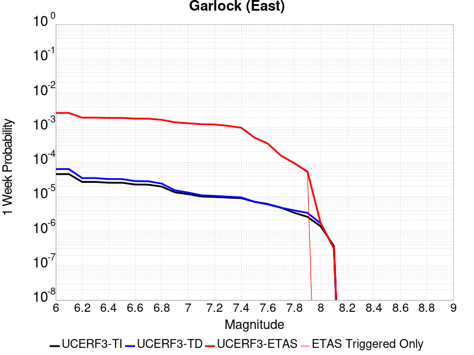 |  |  |  |

| Magnitude | 1 wk TI Prob | 1 wk TD Prob | 1 wk ETAS Prob | 1 wk ETAS/TD Gain | 1 wk ETAS Triggered Only | 1 mo TI Prob | 1 mo TD Prob | 1 mo ETAS Prob | 1 mo ETAS/TD Gain | 1 mo ETAS Triggered Only | 1 yr TI Prob | 1 yr TD Prob | 1 yr ETAS Prob | 1 yr ETAS/TD Gain | 1 yr ETAS Triggered Only | 10 yr TI Prob | 10 yr TD Prob | 10 yr ETAS Prob | 10 yr ETAS/TD Gain | 10 yr ETAS Triggered Only |
|-----|-----|-----|-----|-----|-----|-----|-----|-----|-----|-----|-----|-----|-----|-----|-----|-----|-----|-----|-----|-----|
| 6.0 | 4.5092507E-5 | 6.290325E-5 | 0.002793314 | 44.406513 | 0.0027305826 | 1.9323928E-4 | 2.6956003E-4 | 0.004010461 | 14.877803 | 0.0037419093 | 0.0023501497 | 0.0032774 | 0.009527077 | 2.9069006 | 0.0062702266 | 0.023254504 | 0.032351844 | 0.04194221 | 1.2964395 | 0.0099110035 |
| 6.1 | 4.5092507E-5 | 6.290325E-5 | 0.002793314 | 44.406513 | 0.0027305826 | 1.9323928E-4 | 2.6956003E-4 | 0.004010461 | 14.877803 | 0.0037419093 | 0.0023501497 | 0.0032774 | 0.009527077 | 2.9069006 | 0.0062702266 | 0.023254504 | 0.032351844 | 0.04194221 | 1.2964395 | 0.0099110035 |
| 6.2 | 2.6674514E-5 | 3.4509674E-5 | 0.0020570937 | 59.609184 | 0.0020226538 | 1.1431433E-4 | 1.4789042E-4 | 0.0029791868 | 20.144558 | 0.0028317152 | 0.0013908884 | 0.0017991117 | 0.005837141 | 3.2444572 | 0.0040453076 | 0.01382215 | 0.017890299 | 0.024147673 | 1.3497635 | 0.0063713593 |
| 6.3 | 2.6674514E-5 | 3.4509674E-5 | 0.0020570937 | 59.609184 | 0.0020226538 | 1.1431433E-4 | 1.4789042E-4 | 0.0029791868 | 20.144558 | 0.0028317152 | 0.0013908884 | 0.0017991117 | 0.005837141 | 3.2444572 | 0.0040453076 | 0.01382215 | 0.017890299 | 0.024147673 | 1.3497635 | 0.0063713593 |
| 6.4 | 2.5312667E-5 | 3.233893E-5 | 0.0020549272 | 63.543453 | 0.0020226538 | 1.0847834E-4 | 1.3858822E-4 | 0.002969911 | 21.42975 | 0.0028317152 | 0.0013199237 | 0.0016860351 | 0.005724522 | 3.3952568 | 0.0040453076 | 0.013121112 | 0.016778335 | 0.023042794 | 1.3733659 | 0.0063713593 |
| 6.5 | 2.5312667E-5 | 3.233893E-5 | 0.0020549272 | 63.543453 | 0.0020226538 | 1.0847834E-4 | 1.3858822E-4 | 0.002969911 | 21.42975 | 0.0028317152 | 0.0013199237 | 0.0016860351 | 0.005724522 | 3.3952568 | 0.0040453076 | 0.013121112 | 0.016778335 | 0.023042794 | 1.3733659 | 0.0063713593 |
| 6.6 | 2.246556E-5 | 2.8133776E-5 | 0.0019496008 | 69.297516 | 0.001921521 | 9.627742E-5 | 1.20567885E-4 | 0.0026485801 | 21.967543 | 0.002528317 | 0.0011715472 | 0.0014669491 | 0.005102385 | 3.478229 | 0.0036407767 | 0.011653901 | 0.01461866 | 0.020199299 | 1.3817476 | 0.0056634303 |
| 6.7 | 2.2241198E-5 | 2.7803519E-5 | 0.0019492712 | 70.108795 | 0.001921521 | 9.531594E-5 | 1.1915263E-4 | 0.0026471685 | 22.21662 | 0.002528317 | 0.0011598538 | 0.0014497414 | 0.00508524 | 3.5076876 | 0.0036407767 | 0.011538187 | 0.014448853 | 0.020030454 | 1.3863006 | 0.0056634303 |
| 6.8 | 1.9528685E-5 | 2.389819E-5 | 0.001844243 | 77.17082 | 0.0018203884 | 8.369167E-5 | 1.0241691E-4 | 0.002327108 | 22.721914 | 0.0022249192 | 0.0010184698 | 0.0012462323 | 0.004579452 | 3.6746376 | 0.0033373786 | 0.010138147 | 0.012436427 | 0.017230425 | 1.3854803 | 0.004854369 |
| 6.9 | 1.3318621E-5 | 1.5198884E-5 | 0.0015321661 | 100.8078 | 0.0015169902 | 5.7078556E-5 | 6.513648E-5 | 0.001683154 | 25.84042 | 0.001618123 | 6.9470983E-4 | 7.927538E-4 | 0.0033190667 | 4.1867557 | 0.002528317 | 0.0069254204 | 0.007939888 | 0.011752416 | 1.4801742 | 0.003843042 |
| 7.0 | 1.1760853E-5 | 1.31077895E-5 | 0.0015300782 | 116.73045 | 0.0015169902 | 5.0402683E-5 | 5.6175057E-5 | 0.0016742072 | 29.803389 | 0.001618123 | 6.134799E-4 | 6.8372174E-4 | 0.0032103101 | 4.6953464 | 0.002528317 | 0.0061178906 | 0.00685652 | 0.010572773 | 1.5420028 | 0.0037419093 |
| 7.1 | 1.0064758E-5 | 1.0902931E-5 | 0.0015278767 | 140.13449 | 0.0015169902 | 4.3133965E-5 | 4.672603E-5 | 0.0016647734 | 35.628395 | 0.001618123 | 5.2502943E-4 | 5.687444E-4 | 0.0029945485 | 5.265192 | 0.0024271845 | 0.005237907 | 0.0057129986 | 0.0092324205 | 1.6160376 | 0.003539644 |
| 7.2 | 9.768808E-6 | 1.0498807E-5 | 0.0015274732 | 145.49017 | 0.0015169902 | 4.186565E-5 | 4.499413E-5 | 0.0016630443 | 36.96136 | 0.001618123 | 5.095951E-4 | 5.4766936E-4 | 0.0029735246 | 5.4294157 | 0.0024271845 | 0.0050842804 | 0.0055032647 | 0.009023429 | 1.6396502 | 0.003539644 |
| 7.3 | 9.344516E-6 | 9.944468E-6 | 0.001425788 | 143.375 | 0.0014158576 | 4.004731E-5 | 4.261847E-5 | 0.0015595441 | 36.59315 | 0.0015169902 | 4.8746695E-4 | 5.1875977E-4 | 0.0027425247 | 5.286695 | 0.0022249192 | 0.0048639905 | 0.0052149445 | 0.008534919 | 1.636627 | 0.0033373786 |
| 7.4 | 9.023491E-6 | 9.490661E-6 | 0.0011219396 | 118.21512 | 0.0011124596 | 3.867153E-5 | 4.0673647E-5 | 0.0012542165 | 30.836098 | 0.0012135922 | 4.7072413E-4 | 4.950925E-4 | 0.0023145797 | 4.675045 | 0.0018203884 | 0.004697283 | 0.0049783974 | 0.007896644 | 1.586182 | 0.002932848 |
| 7.5 | 7.081253E-6 | 7.087672E-6 | 9.172754E-4 | 129.41843 | 9.101942E-4 | 3.0347876E-5 | 3.0375388E-5 | 9.405419E-4 | 30.963947 | 9.101942E-4 | 3.6942272E-4 | 3.6975832E-4 | 0.0016839971 | 4.5543184 | 0.0013147249 | 0.003688092 | 0.0037243143 | 0.005739435 | 1.5410717 | 0.0020226538 |
| 7.6 | 6.116396E-6 | 5.959245E-6 | 5.1161967E-4 | 85.8531 | 5.0566345E-4 | 2.6212863E-5 | 2.5539372E-5 | 5.311899E-4 | 20.798862 | 5.0566345E-4 | 3.1909486E-4 | 3.1089774E-4 | 0.0011197077 | 3.6015306 | 8.090615E-4 | 0.0031863707 | 0.0031357552 | 0.004345542 | 1.3858039 | 0.0012135922 |
| 7.7 | 4.797145E-6 | 4.757281E-6 | 1.05889485E-4 | 22.258404 | 1.0113269E-4 | 2.055903E-5 | 2.0388188E-5 | 1.2151881E-4 | 5.9602556 | 1.0113269E-4 | 2.5027743E-4 | 2.4819805E-4 | 4.504132E-4 | 1.8147331 | 2.0226538E-4 | 0.0024999576 | 0.0025093474 | 0.002912863 | 1.160805 | 4.0453076E-4 |
| 7.8 | 3.4028885E-6 | 3.978462E-6 | 1.0511075E-4 | 26.419947 | 1.0113269E-4 | 1.4583726E-5 | 1.7050439E-5 | 1.181814E-4 | 6.931282 | 1.0113269E-4 | 1.775424E-4 | 2.0756939E-4 | 4.097928E-4 | 1.9742447 | 2.0226538E-4 | 0.0017740062 | 0.0021012232 | 0.0024039836 | 1.1440878 | 3.0339806E-4 |
| 7.9 | 2.5928412E-6 | 3.3724489E-6 | 1.045048E-4 | 30.987806 | 1.0113269E-4 | 1.1112129E-5 | 1.4453272E-5 | 1.15584495E-4 | 7.997116 | 1.0113269E-4 | 1.3528178E-4 | 1.7595445E-4 | 3.7818422E-4 | 2.1493304 | 2.0226538E-4 | 0.0013519945 | 0.0017812408 | 0.0020840985 | 1.1700262 | 3.0339806E-4 |
| 8.0 | 1.3743648E-6 | 1.6734747E-6 | 1.6734747E-6 | 1.0 | 0.0 | 5.8901214E-6 | 7.1720146E-6 | 7.1720146E-6 | 1.0 | 0.0 | 7.1709874E-5 | 8.731581E-5 | 8.731581E-5 | 1.0 | 0.0 | 7.1686733E-4 | 8.837234E-4 | 9.847666E-4 | 1.1143382 | 1.0113269E-4 |
| 8.1 | 3.6733252E-7 | 3.1489964E-7 | 3.1489964E-7 | 1.0 | 0.0 | 1.5742813E-6 | 1.3495693E-6 | 1.3495693E-6 | 1.0 | 0.0 | 1.9166706E-5 | 1.6430899E-5 | 1.6430899E-5 | 1.0 | 0.0 | 1.9165053E-4 | 1.6638759E-4 | 1.6638759E-4 | 1.0 | 0.0 |

## Blackwater
*[(top)](#table-of-contents)*

| 1 Week | 1 Month | 1 Year | 10 Year |
|-----|-----|-----|-----|
| 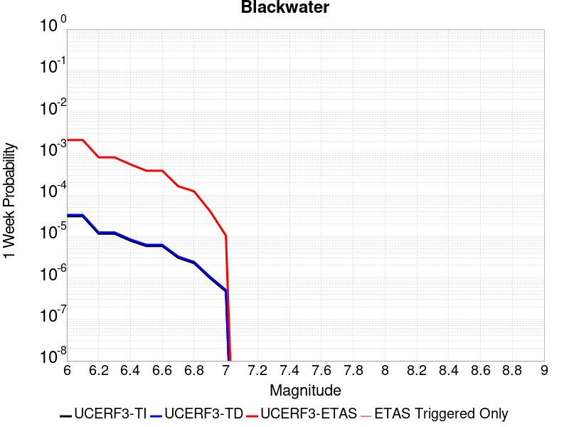 |  |  |  |

| Magnitude | 1 wk TI Prob | 1 wk TD Prob | 1 wk ETAS Prob | 1 wk ETAS/TD Gain | 1 wk ETAS Triggered Only | 1 mo TI Prob | 1 mo TD Prob | 1 mo ETAS Prob | 1 mo ETAS/TD Gain | 1 mo ETAS Triggered Only | 1 yr TI Prob | 1 yr TD Prob | 1 yr ETAS Prob | 1 yr ETAS/TD Gain | 1 yr ETAS Triggered Only | 10 yr TI Prob | 10 yr TD Prob | 10 yr ETAS Prob | 10 yr ETAS/TD Gain | 10 yr ETAS Triggered Only |
|-----|-----|-----|-----|-----|-----|-----|-----|-----|-----|-----|-----|-----|-----|-----|-----|-----|-----|-----|-----|-----|
| 6.0 | 3.0708583E-5 | 3.3095846E-5 | 0.0022579413 | 68.224304 | 0.0022249192 | 1.3160157E-4 | 1.4183241E-4 | 0.0035798561 | 25.240044 | 0.0034385114 | 0.0016010714 | 0.0017255784 | 0.0068744454 | 3.9838498 | 0.005157767 | 0.015895851 | 0.017135633 | 0.024292413 | 1.4176548 | 0.0072815535 |
| 6.1 | 3.0708583E-5 | 3.3095846E-5 | 0.0022579413 | 68.224304 | 0.0022249192 | 1.3160157E-4 | 1.4183241E-4 | 0.0035798561 | 25.240044 | 0.0034385114 | 0.0016010714 | 0.0017255784 | 0.0068744454 | 3.9838498 | 0.005157767 | 0.015895851 | 0.017135633 | 0.024292413 | 1.4176548 | 0.0072815535 |
| 6.2 | 1.1707779E-5 | 1.2545122E-5 | 8.215965E-4 | 65.49131 | 8.090615E-4 | 5.017523E-5 | 5.3763757E-5 | 0.001368418 | 25.452425 | 0.0013147249 | 6.107122E-4 | 6.5438676E-4 | 0.002473584 | 3.780003 | 0.0018203884 | 0.006090366 | 0.0065255696 | 0.009338806 | 1.4311098 | 0.0028317152 |
| 6.3 | 1.1707779E-5 | 1.2545122E-5 | 8.215965E-4 | 65.49131 | 8.090615E-4 | 5.017523E-5 | 5.3763757E-5 | 0.001368418 | 25.452425 | 0.0013147249 | 6.107122E-4 | 6.5438676E-4 | 0.002473584 | 3.780003 | 0.0018203884 | 0.006090366 | 0.0065255696 | 0.009338806 | 1.4311098 | 0.0028317152 |
| 6.4 | 7.929244E-6 | 8.480098E-6 | 4.1300742E-4 | 48.70314 | 4.0453076E-4 | 3.3982033E-5 | 3.6342793E-5 | 6.4311683E-4 | 17.695856 | 6.067961E-4 | 4.136527E-4 | 4.423877E-4 | 0.0014532672 | 3.2850533 | 0.0010113269 | 0.0041288356 | 0.0044154758 | 0.0061271405 | 1.3876512 | 0.0017192557 |
| 6.5 | 5.8832115E-6 | 6.285991E-6 | 3.0968213E-4 | 49.265446 | 3.0339806E-4 | 2.521352E-5 | 2.6939697E-5 | 4.3145954E-4 | 16.015753 | 4.0453076E-4 | 3.0693135E-4 | 3.27944E-4 | 0.0011367402 | 3.466263 | 8.090615E-4 | 0.0030650778 | 0.0032748538 | 0.004484472 | 1.3693655 | 0.0012135922 |
| 6.6 | 5.8832115E-6 | 6.285991E-6 | 3.0968213E-4 | 49.265446 | 3.0339806E-4 | 2.521352E-5 | 2.6939697E-5 | 4.3145954E-4 | 16.015753 | 4.0453076E-4 | 3.0693135E-4 | 3.27944E-4 | 0.0011367402 | 3.466263 | 8.090615E-4 | 0.0030650778 | 0.0032748538 | 0.004484472 | 1.3693655 | 0.0012135922 |
| 6.7 | 3.0715053E-6 | 3.2814662E-6 | 2.0554618E-4 | 62.638515 | 2.0226538E-4 | 1.3163528E-5 | 1.4063357E-5 | 2.1632589E-4 | 15.3822365 | 2.0226538E-4 | 1.6025416E-4 | 1.7120909E-4 | 4.7455519E-4 | 2.7717874 | 3.0339806E-4 | 0.0016013865 | 0.0017108864 | 0.002114725 | 1.2360406 | 4.0453076E-4 |
| 6.8 | 2.2722281E-6 | 2.4287538E-6 | 1.0356119E-4 | 42.639645 | 1.0113269E-4 | 9.738084E-6 | 1.0408908E-5 | 1.1154054E-4 | 10.715874 | 1.0113269E-4 | 1.1855473E-4 | 1.26722E-4 | 3.2896173E-4 | 2.5959322 | 2.0226538E-4 | 0.001184915 | 0.0012665876 | 0.0015696014 | 1.2392364 | 3.0339806E-4 |
| 6.9 | 9.952399E-7 | 1.0653489E-6 | 1.0653489E-6 | 1.0 | 0.0 | 4.265307E-6 | 4.5657757E-6 | 4.5657757E-6 | 1.0 | 0.0 | 5.1928873E-5 | 5.5587418E-5 | 5.5587418E-5 | 1.0 | 0.0 | 5.191674E-4 | 5.557858E-4 | 5.557858E-4 | 1.0 | 0.0 |
| 7.0 | 4.7385504E-7 | 5.0755597E-7 | 5.0755597E-7 | 1.0 | 0.0 | 2.0308057E-6 | 2.1752398E-6 | 2.1752398E-6 | 1.0 | 0.0 | 2.4724779E-5 | 2.6483543E-5 | 2.6483543E-5 | 1.0 | 0.0 | 2.4722028E-4 | 2.6483546E-4 | 2.6483546E-4 | 1.0 | 0.0 |

## Gravel Hills-Harper Lk
*[(top)](#table-of-contents)*

| 1 Week | 1 Month | 1 Year | 10 Year |
|-----|-----|-----|-----|
|  |  |  |  |

| Magnitude | 1 wk TI Prob | 1 wk TD Prob | 1 wk ETAS Prob | 1 wk ETAS/TD Gain | 1 wk ETAS Triggered Only | 1 mo TI Prob | 1 mo TD Prob | 1 mo ETAS Prob | 1 mo ETAS/TD Gain | 1 mo ETAS Triggered Only | 1 yr TI Prob | 1 yr TD Prob | 1 yr ETAS Prob | 1 yr ETAS/TD Gain | 1 yr ETAS Triggered Only | 10 yr TI Prob | 10 yr TD Prob | 10 yr ETAS Prob | 10 yr ETAS/TD Gain | 10 yr ETAS Triggered Only |
|-----|-----|-----|-----|-----|-----|-----|-----|-----|-----|-----|-----|-----|-----|-----|-----|-----|-----|-----|-----|-----|
| 6.0 | 3.0679566E-5 | 3.1464646E-5 | 0.0017506662 | 55.639153 | 0.0017192557 | 1.3147724E-4 | 1.3484273E-4 | 0.002865057 | 21.247396 | 0.0027305826 | 0.0015995599 | 0.0016406906 | 0.0053764605 | 3.2769496 | 0.0037419093 | 0.015880952 | 0.01630734 | 0.021679446 | 1.3294289 | 0.005461165 |
| 6.1 | 3.0679566E-5 | 3.1464646E-5 | 0.0017506662 | 55.639153 | 0.0017192557 | 1.3147724E-4 | 1.3484273E-4 | 0.002865057 | 21.247396 | 0.0027305826 | 0.0015995599 | 0.0016406906 | 0.0053764605 | 3.2769496 | 0.0037419093 | 0.015880952 | 0.01630734 | 0.021679446 | 1.3294289 | 0.005461165 |
| 6.2 | 1.514536E-5 | 1.3635206E-5 | 5.1929173E-4 | 38.084625 | 5.0566345E-4 | 6.490707E-5 | 5.843536E-5 | 8.6744956E-4 | 14.844601 | 8.090615E-4 | 7.8995706E-4 | 7.1123015E-4 | 0.0018228985 | 2.563022 | 0.0011124596 | 0.007871548 | 0.0070907404 | 0.00869739 | 1.2265841 | 0.001618123 |
| 6.3 | 1.514536E-5 | 1.3635206E-5 | 5.1929173E-4 | 38.084625 | 5.0566345E-4 | 6.490707E-5 | 5.843536E-5 | 8.6744956E-4 | 14.844601 | 8.090615E-4 | 7.8995706E-4 | 7.1123015E-4 | 0.0018228985 | 2.563022 | 0.0011124596 | 0.007871548 | 0.0070907404 | 0.00869739 | 1.2265841 | 0.001618123 |
| 6.4 | 1.2532521E-5 | 1.06896905E-5 | 5.163477E-4 | 48.303337 | 5.0566345E-4 | 5.37097E-5 | 4.581219E-5 | 6.525805E-4 | 14.244692 | 6.067961E-4 | 6.537194E-4 | 5.576265E-4 | 0.0013662368 | 2.450093 | 8.090615E-4 | 0.0065179965 | 0.005562863 | 0.006467994 | 1.1627096 | 9.101942E-4 |
| 6.5 | 1.1094058E-5 | 9.083664E-6 | 4.1361075E-4 | 45.533474 | 4.0453076E-4 | 4.7545094E-5 | 3.892943E-5 | 4.434444E-4 | 11.390983 | 4.0453076E-4 | 5.787078E-4 | 4.7386673E-4 | 9.792906E-4 | 2.0665948 | 5.0566345E-4 | 0.0057720304 | 0.0047289706 | 0.0052322424 | 1.1064231 | 5.0566345E-4 |
| 6.6 | 9.688328E-6 | 7.5316952E-6 | 1.0866362E-4 | 14.427512 | 1.0113269E-4 | 4.1520743E-5 | 3.227831E-5 | 1.3340772E-4 | 4.133046 | 1.0113269E-4 | 5.053978E-4 | 3.9292008E-4 | 5.95106E-4 | 1.5145726 | 2.0226538E-4 | 0.0050424994 | 0.0039225104 | 0.0041239825 | 1.051363 | 2.0226538E-4 |
| 6.7 | 8.974824E-6 | 6.749413E-6 | 1.0788142E-4 | 15.983822 | 1.0113269E-4 | 3.8462964E-5 | 2.8925748E-5 | 1.300555E-4 | 4.496185 | 1.0113269E-4 | 4.6818596E-4 | 3.5211627E-4 | 4.5321335E-4 | 1.2871127 | 1.0113269E-4 | 0.004672008 | 0.0035158044 | 0.0036165817 | 1.028664 | 1.0113269E-4 |
| 6.8 | 7.4780046E-6 | 5.1161933E-6 | 1.06248364E-4 | 20.767075 | 1.0113269E-4 | 3.20482E-5 | 2.1926366E-5 | 1.2305683E-4 | 5.6122766 | 1.0113269E-4 | 3.9011694E-4 | 2.669222E-4 | 3.680279E-4 | 1.3787833 | 1.0113269E-4 | 0.0038943281 | 0.0026661542 | 0.002767017 | 1.037831 | 1.0113269E-4 |
| 6.9 | 6.3409307E-6 | 3.9074966E-6 | 1.05039784E-4 | 26.881605 | 1.0113269E-4 | 2.7175134E-5 | 1.6746313E-5 | 1.178773E-4 | 7.0390005 | 1.0113269E-4 | 3.3080703E-4 | 2.0386827E-4 | 3.0498035E-4 | 1.4959676 | 1.0113269E-4 | 0.0033031502 | 0.0020369107 | 0.0021378375 | 1.0495489 | 1.0113269E-4 |
| 7.0 | 5.1239335E-6 | 2.6058565E-6 | 1.0373828E-4 | 39.809666 | 1.0113269E-4 | 2.195953E-5 | 1.116791E-5 | 1.12299465E-4 | 10.05555 | 1.0113269E-4 | 2.6732447E-4 | 1.3596108E-4 | 2.3708E-4 | 1.7437345 | 1.0113269E-4 | 0.0026700313 | 0.0013588042 | 0.0014597995 | 1.0743266 | 1.0113269E-4 |
| 7.1 | 4.438899E-6 | 2.0984728E-6 | 1.03230945E-4 | 49.19337 | 1.0113269E-4 | 1.9023713E-5 | 8.993425E-6 | 1.101252E-4 | 12.245079 | 1.0113269E-4 | 2.315891E-4 | 1.0948967E-4 | 2.1061128E-4 | 1.9235722 | 1.0113269E-4 | 0.002313479 | 0.0010943791 | 0.0011954012 | 1.0923098 | 1.0113269E-4 |
| 7.2 | 3.50367E-6 | 1.2615716E-6 | 1.0239413E-4 | 81.16395 | 1.0113269E-4 | 1.5015643E-5 | 5.4067245E-6 | 1.06538864E-4 | 19.70488 | 1.0113269E-4 | 1.8280011E-4 | 6.582497E-5 | 1.66951E-4 | 2.5362868 | 1.0113269E-4 | 0.0018264982 | 6.580629E-4 | 7.5912906E-4 | 1.1535813 | 1.0113269E-4 |
| 7.3 | 2.561638E-6 | 7.1191585E-7 | 1.0184453E-4 | 143.05698 | 1.0113269E-4 | 1.0978401E-5 | 3.0510646E-6 | 1.0418344E-4 | 34.146587 | 1.0113269E-4 | 1.3365384E-4 | 3.71461E-5 | 1.3827502E-4 | 3.7224643 | 1.0113269E-4 | 0.0013357349 | 3.7140088E-4 | 4.72496E-4 | 1.2721995 | 1.0113269E-4 |
| 7.4 | 2.0368864E-6 | 5.304837E-7 | 1.01663114E-4 | 191.64229 | 1.0113269E-4 | 8.729483E-6 | 2.2734996E-6 | 1.0340595E-4 | 45.483162 | 1.0113269E-4 | 1.06276275E-4 | 2.7679513E-5 | 1.288094E-4 | 4.6536007 | 1.0113269E-4 | 0.0010622547 | 2.767612E-4 | 3.778659E-4 | 1.3653139 | 1.0113269E-4 |
| 7.5 | 1.1681728E-6 | 3.6030585E-7 | 1.0149296E-4 | 281.68555 | 1.0113269E-4 | 5.0064455E-6 | 1.544167E-6 | 1.026767E-4 | 66.493256 | 1.0113269E-4 | 6.0951766E-5 | 1.8800076E-5 | 1.1993086E-4 | 6.3792753 | 1.0113269E-4 | 6.093505E-4 | 1.8798532E-4 | 2.89099E-4 | 1.5378807 | 1.0113269E-4 |
| 7.6 | 1.3154387E-7 | 7.1197384E-8 | 7.1197384E-8 | 1.0 | 0.0 | 5.6375933E-7 | 3.051316E-7 | 3.051316E-7 | 1.0 | 0.0 | 6.863748E-6 | 3.7149728E-6 | 3.7149728E-6 | 1.0 | 0.0 | 6.863536E-5 | 3.7149264E-5 | 3.7149264E-5 | 1.0 | 0.0 |

## Hunter Mountain-Saline Valley
*[(top)](#table-of-contents)*

| 1 Week | 1 Month | 1 Year | 10 Year |
|-----|-----|-----|-----|
|  |  |  |  |

| Magnitude | 1 wk TI Prob | 1 wk TD Prob | 1 wk ETAS Prob | 1 wk ETAS/TD Gain | 1 wk ETAS Triggered Only | 1 mo TI Prob | 1 mo TD Prob | 1 mo ETAS Prob | 1 mo ETAS/TD Gain | 1 mo ETAS Triggered Only | 1 yr TI Prob | 1 yr TD Prob | 1 yr ETAS Prob | 1 yr ETAS/TD Gain | 1 yr ETAS Triggered Only | 10 yr TI Prob | 10 yr TD Prob | 10 yr ETAS Prob | 10 yr ETAS/TD Gain | 10 yr ETAS Triggered Only |
|-----|-----|-----|-----|-----|-----|-----|-----|-----|-----|-----|-----|-----|-----|-----|-----|-----|-----|-----|-----|-----|
| 6.0 | 4.5103672E-5 | 5.4570177E-5 | 0.0018748592 | 34.356846 | 0.0018203884 | 1.9328714E-4 | 2.3385242E-4 | 0.0025593603 | 10.944339 | 0.0023260517 | 0.002350731 | 0.0028435152 | 0.006776475 | 2.383133 | 0.003944175 | 0.023260195 | 0.028091887 | 0.033399638 | 1.1889424 | 0.005461165 |
| 6.1 | 4.5103672E-5 | 5.4570177E-5 | 0.0018748592 | 34.356846 | 0.0018203884 | 1.9328714E-4 | 2.3385242E-4 | 0.0025593603 | 10.944339 | 0.0023260517 | 0.002350731 | 0.0028435152 | 0.006776475 | 2.383133 | 0.003944175 | 0.023260195 | 0.028091887 | 0.033399638 | 1.1889424 | 0.005461165 |
| 6.2 | 3.9363465E-5 | 4.706337E-5 | 0.001867366 | 39.677696 | 0.0018203884 | 1.6868966E-4 | 2.0168544E-4 | 0.0024261558 | 12.029405 | 0.0022249192 | 0.002051862 | 0.0024528175 | 0.006185549 | 2.5218136 | 0.0037419093 | 0.020330196 | 0.024273481 | 0.029306052 | 1.207328 | 0.005157767 |
| 6.3 | 3.9363465E-5 | 4.706337E-5 | 0.001867366 | 39.677696 | 0.0018203884 | 1.6868966E-4 | 2.0168544E-4 | 0.0024261558 | 12.029405 | 0.0022249192 | 0.002051862 | 0.0024528175 | 0.006185549 | 2.5218136 | 0.0037419093 | 0.020330196 | 0.024273481 | 0.029306052 | 1.207328 | 0.005157767 |
| 6.4 | 3.2311684E-5 | 3.795099E-5 | 0.0018582703 | 48.965 | 0.0018203884 | 1.384713E-4 | 1.6263737E-4 | 0.0023871947 | 14.6780205 | 0.0022249192 | 0.0016845843 | 0.0019783843 | 0.005712891 | 2.8876545 | 0.0037419093 | 0.016718714 | 0.019616475 | 0.024673065 | 1.2577726 | 0.005157767 |
| 6.5 | 3.2311684E-5 | 3.795099E-5 | 0.0018582703 | 48.965 | 0.0018203884 | 1.384713E-4 | 1.6263737E-4 | 0.0023871947 | 14.6780205 | 0.0022249192 | 0.0016845843 | 0.0019783843 | 0.005712891 | 2.8876545 | 0.0037419093 | 0.016718714 | 0.019616475 | 0.024673065 | 1.2577726 | 0.005157767 |
| 6.6 | 2.9305844E-5 | 3.418183E-5 | 0.001854508 | 54.2542 | 0.0018203884 | 1.2559042E-4 | 1.4648569E-4 | 0.0023710788 | 16.186419 | 0.0022249192 | 0.0015279909 | 0.001782067 | 0.0054163556 | 3.039367 | 0.0036407767 | 0.015175272 | 0.01768569 | 0.022652896 | 1.2808601 | 0.005056634 |
| 6.7 | 2.7826512E-5 | 3.2344276E-5 | 0.0018526737 | 57.279804 | 0.0018203884 | 1.19251024E-4 | 1.386113E-4 | 0.002363222 | 17.049274 | 0.0022249192 | 0.0014509142 | 0.0016863465 | 0.0053209835 | 3.1553323 | 0.0036407767 | 0.014414776 | 0.016743187 | 0.021715157 | 1.2969549 | 0.005056634 |
| 6.8 | 2.3389874E-5 | 2.6866714E-5 | 0.0017460762 | 64.99031 | 0.0017192557 | 1.0023846E-4 | 1.15138246E-4 | 0.0022386801 | 19.44341 | 0.0021237864 | 0.00121972 | 0.001400954 | 0.004935639 | 3.5230558 | 0.003539644 | 0.01213047 | 0.013927434 | 0.018813917 | 1.3508532 | 0.0049555018 |
| 6.9 | 2.069209E-5 | 2.3570032E-5 | 0.0016416549 | 69.65009 | 0.001618123 | 8.867737E-5 | 1.01010715E-4 | 0.0021234602 | 21.022127 | 0.0020226538 | 0.0010791123 | 0.0012291478 | 0.0046634325 | 3.7940373 | 0.0034385114 | 0.010738871 | 0.012228523 | 0.01702353 | 1.3921167 | 0.004854369 |
| 7.0 | 1.7462342E-5 | 1.9633546E-5 | 0.0016377248 | 83.41462 | 0.001618123 | 7.483646E-5 | 8.414118E-5 | 0.0021066247 | 25.036785 | 0.0020226538 | 9.1075303E-4 | 0.0010239601 | 0.0044589504 | 4.354614 | 0.0034385114 | 0.009070295 | 0.0101960525 | 0.015000926 | 1.4712484 | 0.004854369 |
| 7.1 | 1.4807709E-5 | 1.6441749E-5 | 0.0016345382 | 99.41388 | 0.001618123 | 6.3460066E-5 | 7.046283E-5 | 0.002092974 | 29.703236 | 0.0020226538 | 7.723524E-4 | 8.575638E-4 | 0.0042931265 | 5.006189 | 0.0034385114 | 0.007696735 | 0.008545532 | 0.013358418 | 1.563205 | 0.004854369 |
| 7.2 | 1.4180048E-5 | 1.5698337E-5 | 0.0016337959 | 104.07446 | 0.001618123 | 6.077022E-5 | 6.727694E-5 | 0.0020897945 | 31.062569 | 0.0020226538 | 7.396263E-4 | 8.188051E-4 | 0.004254501 | 5.195987 | 0.0034385114 | 0.0073716943 | 0.008160833 | 0.012975587 | 1.589983 | 0.004854369 |
| 7.3 | 1.3730402E-5 | 1.5172075E-5 | 0.0016332705 | 107.64977 | 0.001618123 | 5.8843252E-5 | 6.502165E-5 | 0.002087544 | 32.105366 | 0.0020226538 | 7.161811E-4 | 7.9136714E-4 | 0.004227157 | 5.341588 | 0.0034385114 | 0.007138774 | 0.007888422 | 0.012704498 | 1.6105245 | 0.004854369 |
| 7.4 | 1.2810095E-5 | 1.4109277E-5 | 0.0016322094 | 115.68342 | 0.001618123 | 5.489925E-5 | 6.0467017E-5 | 0.0020829984 | 34.448505 | 0.0020226538 | 6.681934E-4 | 7.359531E-4 | 0.0040708757 | 5.5314336 | 0.0033373786 | 0.006661878 | 0.007338053 | 0.01205641 | 1.6429985 | 0.004753236 |
| 7.5 | 1.1595659E-5 | 1.2800664E-5 | 0.0014286401 | 111.60672 | 0.0014158576 | 4.9694736E-5 | 5.4858923E-5 | 0.0018751475 | 34.181267 | 0.0018203884 | 6.0486543E-4 | 6.6771836E-4 | 0.003699673 | 5.5407686 | 0.0030339805 | 0.006032217 | 0.0066599925 | 0.010979735 | 1.6486108 | 0.0043487055 |
| 7.6 | 2.997694E-6 | 3.3251579E-6 | 4.0785456E-4 | 122.657196 | 4.0453076E-4 | 1.28471975E-5 | 1.425064E-5 | 6.210381E-4 | 43.579666 | 6.067961E-4 | 1.564034E-4 | 1.73495E-4 | 0.0011846464 | 6.82813 | 0.0010113269 | 0.0015629337 | 0.001735031 | 0.0033503466 | 1.931001 | 0.001618123 |

## Airport Lake
*[(top)](#table-of-contents)*

| 1 Week | 1 Month | 1 Year | 10 Year |
|-----|-----|-----|-----|
|  |  |  |  |

| Magnitude | 1 wk TI Prob | 1 wk TD Prob | 1 wk ETAS Prob | 1 wk ETAS/TD Gain | 1 wk ETAS Triggered Only | 1 mo TI Prob | 1 mo TD Prob | 1 mo ETAS Prob | 1 mo ETAS/TD Gain | 1 mo ETAS Triggered Only | 1 yr TI Prob | 1 yr TD Prob | 1 yr ETAS Prob | 1 yr ETAS/TD Gain | 1 yr ETAS Triggered Only | 10 yr TI Prob | 10 yr TD Prob | 10 yr ETAS Prob | 10 yr ETAS/TD Gain | 10 yr ETAS Triggered Only |
|-----|-----|-----|-----|-----|-----|-----|-----|-----|-----|-----|-----|-----|-----|-----|-----|-----|-----|-----|-----|-----|
| 6.0 | 1.2387061E-5 | 1.3103157E-5 | 0.0024402558 | 186.23419 | 0.0024271845 | 5.3086325E-5 | 5.615534E-5 | 0.0029888386 | 53.22448 | 0.002932848 | 6.461343E-4 | 6.8350515E-4 | 0.0045239204 | 6.618707 | 0.003843042 | 0.0064425888 | 0.0068168393 | 0.011537674 | 1.6925254 | 0.004753236 |
| 6.1 | 1.2387061E-5 | 1.3103157E-5 | 0.0024402558 | 186.23419 | 0.0024271845 | 5.3086325E-5 | 5.615534E-5 | 0.0029888386 | 53.22448 | 0.002932848 | 6.461343E-4 | 6.8350515E-4 | 0.0045239204 | 6.618707 | 0.003843042 | 0.0064425888 | 0.0068168393 | 0.011537674 | 1.6925254 | 0.004753236 |
| 6.2 | 1.2387061E-5 | 1.3103157E-5 | 0.0024402558 | 186.23419 | 0.0024271845 | 5.3086325E-5 | 5.615534E-5 | 0.0029888386 | 53.22448 | 0.002932848 | 6.461343E-4 | 6.8350515E-4 | 0.0045239204 | 6.618707 | 0.003843042 | 0.0064425888 | 0.0068168393 | 0.011537674 | 1.6925254 | 0.004753236 |
| 6.3 | 1.2387061E-5 | 1.3103157E-5 | 0.0024402558 | 186.23419 | 0.0024271845 | 5.3086325E-5 | 5.615534E-5 | 0.0029888386 | 53.22448 | 0.002932848 | 6.461343E-4 | 6.8350515E-4 | 0.0045239204 | 6.618707 | 0.003843042 | 0.0064425888 | 0.0068168393 | 0.011537674 | 1.6925254 | 0.004753236 |
| 6.4 | 1.2387061E-5 | 1.3103157E-5 | 0.0024402558 | 186.23419 | 0.0024271845 | 5.3086325E-5 | 5.615534E-5 | 0.0029888386 | 53.22448 | 0.002932848 | 6.461343E-4 | 6.8350515E-4 | 0.0045239204 | 6.618707 | 0.003843042 | 0.0064425888 | 0.0068168393 | 0.011537674 | 1.6925254 | 0.004753236 |
| 6.5 | 6.9922594E-6 | 7.384925E-6 | 0.0018277598 | 247.49876 | 0.0018203884 | 2.996648E-5 | 3.1649324E-5 | 0.002054239 | 64.90625 | 0.0020226538 | 3.6478083E-4 | 3.8526783E-4 | 0.0031147983 | 8.084761 | 0.0027305826 | 0.003641826 | 0.0038465366 | 0.007171078 | 1.8642948 | 0.0033373786 |
| 6.6 | 6.9922594E-6 | 7.384925E-6 | 0.0018277598 | 247.49876 | 0.0018203884 | 2.996648E-5 | 3.1649324E-5 | 0.002054239 | 64.90625 | 0.0020226538 | 3.6478083E-4 | 3.8526783E-4 | 0.0031147983 | 8.084761 | 0.0027305826 | 0.003641826 | 0.0038465366 | 0.007171078 | 1.8642948 | 0.0033373786 |
| 6.7 | 5.477277E-6 | 5.7860684E-6 | 0.0016238997 | 280.65683 | 0.001618123 | 2.3473833E-5 | 2.4797222E-5 | 0.0018451405 | 74.40916 | 0.0018203884 | 2.8575645E-4 | 3.0186825E-4 | 0.00272832 | 9.0381155 | 0.0024271845 | 0.0028538927 | 0.003014966 | 0.006039799 | 2.0032728 | 0.0030339805 |
| 6.8 | 3.9950432E-6 | 4.2190873E-6 | 0.0011166739 | 264.67194 | 0.0011124596 | 1.7121502E-5 | 1.8081691E-5 | 0.001231652 | 68.11597 | 0.0012135922 | 2.0843433E-4 | 2.2012512E-4 | 0.0019390023 | 8.808638 | 0.0017192557 | 0.0020823893 | 0.0021993418 | 0.004318457 | 1.9635226 | 0.0021237864 |
| 6.9 | 2.95695E-6 | 3.1230243E-6 | 8.1218197E-4 | 260.06265 | 8.090615E-4 | 1.2672582E-5 | 1.3384334E-5 | 9.2356635E-4 | 69.00353 | 9.101942E-4 | 1.5427776E-4 | 1.6294434E-4 | 0.001477455 | 9.067237 | 0.0013147249 | 0.001541707 | 0.0016284712 | 0.003243959 | 1.9920274 | 0.001618123 |
| 7.0 | 1.456072E-6 | 1.540812E-6 | 3.049384E-4 | 197.9076 | 3.0339806E-4 | 6.2402937E-6 | 6.603469E-6 | 3.0999954E-4 | 46.94495 | 3.0339806E-4 | 7.597293E-5 | 8.039528E-5 | 6.871426E-4 | 8.547052 | 6.067961E-4 | 7.594696E-4 | 8.0376083E-4 | 0.0014100692 | 1.7543393 | 6.067961E-4 |
| 7.1 | 6.995192E-7 | 7.4089746E-7 | 7.4089746E-7 | 1.0 | 0.0 | 2.997936E-6 | 3.1752747E-6 | 3.1752747E-6 | 1.0 | 0.0 | 3.649926E-5 | 3.865897E-5 | 1.3978775E-4 | 3.61592 | 1.0113269E-4 | 3.6493264E-4 | 3.865897E-4 | 4.8768328E-4 | 1.261501 | 1.0113269E-4 |

## Goldstone Lake
*[(top)](#table-of-contents)*

| 1 Week | 1 Month | 1 Year | 10 Year |
|-----|-----|-----|-----|
|  |  |  |  |

| Magnitude | 1 wk TI Prob | 1 wk TD Prob | 1 wk ETAS Prob | 1 wk ETAS/TD Gain | 1 wk ETAS Triggered Only | 1 mo TI Prob | 1 mo TD Prob | 1 mo ETAS Prob | 1 mo ETAS/TD Gain | 1 mo ETAS Triggered Only | 1 yr TI Prob | 1 yr TD Prob | 1 yr ETAS Prob | 1 yr ETAS/TD Gain | 1 yr ETAS Triggered Only | 10 yr TI Prob | 10 yr TD Prob | 10 yr ETAS Prob | 10 yr ETAS/TD Gain | 10 yr ETAS Triggered Only |
|-----|-----|-----|-----|-----|-----|-----|-----|-----|-----|-----|-----|-----|-----|-----|-----|-----|-----|-----|-----|-----|
| 6.0 | 2.671352E-5 | 3.037609E-5 | 0.0012439315 | 40.951008 | 0.0012135922 | 1.1448149E-4 | 1.3017785E-4 | 0.0017480901 | 13.428476 | 0.001618123 | 0.001392921 | 0.0015839594 | 0.004512162 | 2.84866 | 0.002932848 | 0.013842222 | 0.015746197 | 0.019827345 | 1.2591832 | 0.00414644 |
| 6.1 | 2.671352E-5 | 3.037609E-5 | 0.0012439315 | 40.951008 | 0.0012135922 | 1.1448149E-4 | 1.3017785E-4 | 0.0017480901 | 13.428476 | 0.001618123 | 0.001392921 | 0.0015839594 | 0.004512162 | 2.84866 | 0.002932848 | 0.013842222 | 0.015746197 | 0.019827345 | 1.2591832 | 0.00414644 |
| 6.2 | 1.4197047E-5 | 1.6096245E-5 | 3.1948942E-4 | 19.848694 | 3.0339806E-4 | 6.0843064E-5 | 6.8982634E-5 | 5.746112E-4 | 8.329795 | 5.0566345E-4 | 7.4051257E-4 | 8.3963864E-4 | 0.0025574507 | 3.0458946 | 0.0017192557 | 0.007380498 | 0.0083743585 | 0.010781217 | 1.2874081 | 0.0024271845 |
| 6.3 | 1.4197047E-5 | 1.6096245E-5 | 3.1948942E-4 | 19.848694 | 3.0339806E-4 | 6.0843064E-5 | 6.8982634E-5 | 5.746112E-4 | 8.329795 | 5.0566345E-4 | 7.4051257E-4 | 8.3963864E-4 | 0.0025574507 | 3.0458946 | 0.0017192557 | 0.007380498 | 0.0083743585 | 0.010781217 | 1.2874081 | 0.0024271845 |
| 6.4 | 1.3238931E-5 | 1.500846E-5 | 3.1840196E-4 | 21.214832 | 3.0339806E-4 | 5.6737044E-5 | 6.4320935E-5 | 5.6995184E-4 | 8.861063 | 5.0566345E-4 | 6.9055456E-4 | 7.82924E-4 | 0.0025008337 | 3.1942227 | 0.0017192557 | 0.006884126 | 0.0078112837 | 0.010119166 | 1.295455 | 0.0023260517 |
| 6.5 | 1.3238931E-5 | 1.500846E-5 | 3.1840196E-4 | 21.214832 | 3.0339806E-4 | 5.6737044E-5 | 6.4320935E-5 | 5.6995184E-4 | 8.861063 | 5.0566345E-4 | 6.9055456E-4 | 7.82924E-4 | 0.0025008337 | 3.1942227 | 0.0017192557 | 0.006884126 | 0.0078112837 | 0.010119166 | 1.295455 | 0.0023260517 |
| 6.6 | 1.1328278E-5 | 1.2855166E-5 | 2.1511794E-4 | 16.733969 | 2.0226538E-4 | 4.8548856E-5 | 5.5092944E-5 | 4.596014E-4 | 8.342292 | 4.0453076E-4 | 5.90922E-4 | 6.7064585E-4 | 0.0021866187 | 3.2604673 | 0.0015169902 | 0.0058935313 | 0.0066956086 | 0.008604264 | 1.2850608 | 0.001921521 |
| 6.7 | 8.651175E-6 | 9.824565E-6 | 2.1208795E-4 | 21.587517 | 2.0226538E-4 | 3.707594E-5 | 4.2105108E-5 | 4.4661883E-4 | 10.607236 | 4.0453076E-4 | 4.5130608E-4 | 5.1259965E-4 | 0.001624489 | 3.1691184 | 0.0011124596 | 0.0045039062 | 0.005123051 | 0.0065316553 | 1.2749541 | 0.0014158576 |
| 6.8 | 1.0215377E-6 | 1.1754702E-6 | 1.0230804E-4 | 87.03584 | 1.0113269E-4 | 4.378012E-6 | 5.0377203E-6 | 1.061699E-4 | 21.074987 | 1.0113269E-4 | 5.3300988E-5 | 6.1332634E-5 | 1.6245912E-4 | 2.6488202 | 1.0113269E-4 | 5.3288206E-4 | 6.1316835E-4 | 7.14239E-4 | 1.1648335 | 1.0113269E-4 |
| 6.9 | 7.9360774E-7 | 9.2833966E-7 | 1.02060934E-4 | 109.93922 | 1.0113269E-4 | 3.4011714E-6 | 3.9785928E-6 | 1.0511088E-4 | 26.41911 | 1.0113269E-4 | 4.1408475E-5 | 4.843836E-5 | 1.4956614E-4 | 3.0877624 | 1.0113269E-4 | 4.140076E-4 | 4.8428503E-4 | 5.853687E-4 | 1.2087277 | 1.0113269E-4 |
| 7.0 | 7.4382757E-7 | 8.7473285E-7 | 8.7473285E-7 | 1.0 | 0.0 | 3.1878285E-6 | 3.74885E-6 | 3.74885E-6 | 1.0 | 0.0 | 3.8811122E-5 | 4.564136E-5 | 4.564136E-5 | 1.0 | 0.0 | 3.8804344E-4 | 4.5632652E-4 | 4.5632652E-4 | 1.0 | 0.0 |
| 7.1 | 6.4709513E-7 | 7.7113E-7 | 7.7113E-7 | 1.0 | 0.0 | 2.773262E-6 | 3.3048389E-6 | 3.3048389E-6 | 1.0 | 0.0 | 3.376394E-5 | 4.0235733E-5 | 4.0235733E-5 | 1.0 | 0.0 | 3.375881E-4 | 4.0229043E-4 | 4.0229043E-4 | 1.0 | 0.0 |
| 7.2 | 6.356704E-7 | 7.5883594E-7 | 7.5883594E-7 | 1.0 | 0.0 | 2.7242988E-6 | 3.2521505E-6 | 3.2521505E-6 | 1.0 | 0.0 | 3.3167835E-5 | 3.959427E-5 | 3.959427E-5 | 1.0 | 0.0 | 3.3162883E-4 | 3.958781E-4 | 3.958781E-4 | 1.0 | 0.0 |
| 7.3 | 5.7695723E-7 | 6.8965653E-7 | 6.8965653E-7 | 1.0 | 0.0 | 2.4726714E-6 | 2.9556677E-6 | 2.9556677E-6 | 1.0 | 0.0 | 3.0104358E-5 | 3.5984718E-5 | 3.5984718E-5 | 1.0 | 0.0 | 3.0100282E-4 | 3.5979465E-4 | 3.5979465E-4 | 1.0 | 0.0 |
| 7.4 | 5.209647E-7 | 6.193514E-7 | 6.193514E-7 | 1.0 | 0.0 | 2.232704E-6 | 2.6543607E-6 | 2.6543607E-6 | 1.0 | 0.0 | 2.718283E-5 | 3.2316417E-5 | 3.2316417E-5 | 1.0 | 0.0 | 2.7179506E-4 | 3.2312275E-4 | 3.2312275E-4 | 1.0 | 0.0 |
| 7.5 | 4.512955E-7 | 5.348885E-7 | 5.348885E-7 | 1.0 | 0.0 | 1.934122E-6 | 2.2923775E-6 | 2.2923775E-6 | 1.0 | 0.0 | 2.3547682E-5 | 2.7909393E-5 | 2.7909393E-5 | 1.0 | 0.0 | 2.3545188E-4 | 2.7906417E-4 | 2.7906417E-4 | 1.0 | 0.0 |
| 7.6 | 2.21172E-7 | 2.603961E-7 | 2.603961E-7 | 1.0 | 0.0 | 9.478797E-7 | 1.1159829E-6 | 1.1159829E-6 | 1.0 | 0.0 | 1.1540374E-5 | 1.3587036E-5 | 1.3587036E-5 | 1.0 | 0.0 | 1.1539775E-4 | 1.3586486E-4 | 1.3586486E-4 | 1.0 | 0.0 |

## So Sierra Nevada
*[(top)](#table-of-contents)*

| 1 Week | 1 Month | 1 Year | 10 Year |
|-----|-----|-----|-----|
|  |  |  |  |

| Magnitude | 1 wk TI Prob | 1 wk TD Prob | 1 wk ETAS Prob | 1 wk ETAS/TD Gain | 1 wk ETAS Triggered Only | 1 mo TI Prob | 1 mo TD Prob | 1 mo ETAS Prob | 1 mo ETAS/TD Gain | 1 mo ETAS Triggered Only | 1 yr TI Prob | 1 yr TD Prob | 1 yr ETAS Prob | 1 yr ETAS/TD Gain | 1 yr ETAS Triggered Only | 10 yr TI Prob | 10 yr TD Prob | 10 yr ETAS Prob | 10 yr ETAS/TD Gain | 10 yr ETAS Triggered Only |
|-----|-----|-----|-----|-----|-----|-----|-----|-----|-----|-----|-----|-----|-----|-----|-----|-----|-----|-----|-----|-----|
| 6.0 | 1.15488665E-5 | 1.1079643E-5 | 0.0017303162 | 156.17076 | 0.0017192557 | 4.9494203E-5 | 4.748339E-5 | 0.002272297 | 47.854565 | 0.0022249192 | 6.024253E-4 | 5.7796965E-4 | 0.0035091224 | 6.0714645 | 0.002932848 | 0.006007948 | 0.005765934 | 0.009486268 | 1.6452266 | 0.0037419093 |
| 6.1 | 1.15488665E-5 | 1.1079643E-5 | 0.0017303162 | 156.17076 | 0.0017192557 | 4.9494203E-5 | 4.748339E-5 | 0.002272297 | 47.854565 | 0.0022249192 | 6.024253E-4 | 5.7796965E-4 | 0.0035091224 | 6.0714645 | 0.002932848 | 0.006007948 | 0.005765934 | 0.009486268 | 1.6452266 | 0.0037419093 |
| 6.2 | 1.15488665E-5 | 1.1079643E-5 | 0.0017303162 | 156.17076 | 0.0017192557 | 4.9494203E-5 | 4.748339E-5 | 0.002272297 | 47.854565 | 0.0022249192 | 6.024253E-4 | 5.7796965E-4 | 0.0035091224 | 6.0714645 | 0.002932848 | 0.006007948 | 0.005765934 | 0.009486268 | 1.6452266 | 0.0037419093 |
| 6.3 | 1.15488665E-5 | 1.1079643E-5 | 0.0017303162 | 156.17076 | 0.0017192557 | 4.9494203E-5 | 4.748339E-5 | 0.002272297 | 47.854565 | 0.0022249192 | 6.024253E-4 | 5.7796965E-4 | 0.0035091224 | 6.0714645 | 0.002932848 | 0.006007948 | 0.005765934 | 0.009486268 | 1.6452266 | 0.0037419093 |
| 6.4 | 1.15488665E-5 | 1.1079643E-5 | 0.0017303162 | 156.17076 | 0.0017192557 | 4.9494203E-5 | 4.748339E-5 | 0.002272297 | 47.854565 | 0.0022249192 | 6.024253E-4 | 5.7796965E-4 | 0.0035091224 | 6.0714645 | 0.002932848 | 0.006007948 | 0.005765934 | 0.009486268 | 1.6452266 | 0.0037419093 |
| 6.5 | 1.15488665E-5 | 1.1079643E-5 | 0.0017303162 | 156.17076 | 0.0017192557 | 4.9494203E-5 | 4.748339E-5 | 0.002272297 | 47.854565 | 0.0022249192 | 6.024253E-4 | 5.7796965E-4 | 0.0035091224 | 6.0714645 | 0.002932848 | 0.006007948 | 0.005765934 | 0.009486268 | 1.6452266 | 0.0037419093 |
| 6.6 | 7.587044E-6 | 6.935635E-6 | 0.0011193875 | 161.39653 | 0.0011124596 | 3.2515498E-5 | 2.9723828E-5 | 0.0013444097 | 45.23003 | 0.0013147249 | 3.9580427E-4 | 3.6183043E-4 | 0.00218156 | 6.0292335 | 0.0018203884 | 0.003951 | 0.0036127048 | 0.0058295857 | 1.6136347 | 0.0022249192 |
| 6.7 | 7.587044E-6 | 6.935635E-6 | 0.0011193875 | 161.39653 | 0.0011124596 | 3.2515498E-5 | 2.9723828E-5 | 0.0013444097 | 45.23003 | 0.0013147249 | 3.9580427E-4 | 3.6183043E-4 | 0.00218156 | 6.0292335 | 0.0018203884 | 0.003951 | 0.0036127048 | 0.0058295857 | 1.6136347 | 0.0022249192 |
| 6.8 | 5.9026956E-6 | 5.1793927E-6 | 6.1197235E-4 | 118.155235 | 6.067961E-4 | 2.5297022E-5 | 2.2197215E-5 | 8.3124073E-4 | 37.447975 | 8.090615E-4 | 3.0794772E-4 | 2.7021873E-4 | 0.001483483 | 5.489934 | 0.0012135922 | 0.0030752132 | 0.002699018 | 0.0041110544 | 1.5231667 | 0.0014158576 |
| 6.9 | 5.0118915E-6 | 4.2524252E-6 | 5.099137E-4 | 119.91126 | 5.0566345E-4 | 2.1479358E-5 | 1.8224557E-5 | 7.2614045E-4 | 39.844067 | 7.079288E-4 | 2.614798E-4 | 2.2186211E-4 | 0.0012329646 | 5.5573463 | 0.0010113269 | 0.0026117235 | 0.0022164788 | 0.0033264726 | 1.5007915 | 0.0011124596 |
| 7.0 | 4.4924795E-6 | 3.7139177E-6 | 5.093755E-4 | 137.15314 | 5.0566345E-4 | 1.925334E-5 | 1.5916696E-5 | 7.238342E-4 | 45.47641 | 7.079288E-4 | 2.3438422E-4 | 1.9376918E-4 | 0.001103787 | 5.696401 | 9.101942E-4 | 0.0023413717 | 0.0019360651 | 0.002945434 | 1.5213506 | 0.0010113269 |
| 7.1 | 3.9118436E-6 | 3.1119775E-6 | 4.0764146E-4 | 130.99113 | 4.0453076E-4 | 1.6764936E-5 | 1.3336982E-5 | 4.1786232E-4 | 31.3311 | 4.0453076E-4 | 2.0409399E-4 | 1.6236622E-4 | 7.6906383E-4 | 4.7366 | 6.067961E-4 | 0.0020390663 | 0.001622532 | 0.0023293123 | 1.4356033 | 7.079288E-4 |
| 7.2 | 3.4200818E-6 | 2.6054543E-6 | 3.060027E-4 | 117.446976 | 3.0339806E-4 | 1.4657411E-5 | 1.11661875E-5 | 3.1456086E-4 | 28.170837 | 3.0339806E-4 | 1.7843937E-4 | 1.3594035E-4 | 5.404161E-4 | 3.9753911 | 4.0453076E-4 | 0.0017829615 | 0.0013586218 | 0.0018635981 | 1.3716829 | 5.0566345E-4 |
| 7.3 | 2.6593618E-6 | 1.8284203E-6 | 3.0522593E-4 | 166.93423 | 3.0339806E-4 | 1.13972155E-5 | 7.836065E-6 | 3.1123174E-4 | 39.71786 | 3.0339806E-4 | 1.3875226E-4 | 9.540021E-5 | 4.9989234E-4 | 5.23995 | 4.0453076E-4 | 0.0013866565 | 9.5362146E-4 | 0.0014588027 | 1.5297502 | 5.0566345E-4 |
| 7.4 | 2.2577992E-6 | 1.436438E-6 | 1.0256898E-4 | 71.40508 | 1.0113269E-4 | 9.676246E-6 | 6.15615E-6 | 1.07288215E-4 | 17.42781 | 1.0113269E-4 | 1.1780193E-4 | 7.49488E-5 | 2.7719903E-4 | 3.6985116 | 2.0226538E-4 | 0.001177395 | 7.492603E-4 | 0.0010524311 | 1.4046267 | 3.0339806E-4 |
| 7.5 | 1.489319E-6 | 7.353936E-7 | 7.353936E-7 | 1.0 | 0.0 | 6.3827797E-6 | 3.1516831E-6 | 3.1516831E-6 | 1.0 | 0.0 | 7.770758E-5 | 3.8371072E-5 | 1.3949987E-4 | 3.635548 | 1.0113269E-4 | 7.7680405E-4 | 3.836449E-4 | 4.8473876E-4 | 1.263509 | 1.0113269E-4 |
| 7.6 | 1.0680322E-6 | 4.6596554E-7 | 4.6596554E-7 | 1.0 | 0.0 | 4.577273E-6 | 1.9969937E-6 | 1.9969937E-6 | 1.0 | 0.0 | 5.5726876E-5 | 2.4313129E-5 | 1.2544336E-4 | 5.1594906 | 1.0113269E-4 | 5.5712904E-4 | 2.4310495E-4 | 3.4421307E-4 | 1.4159031 | 1.0113269E-4 |
| 7.7 | 5.509146E-7 | 1.5580486E-7 | 1.5580486E-7 | 1.0 | 0.0 | 2.3610605E-6 | 6.677349E-7 | 6.677349E-7 | 1.0 | 0.0 | 2.8745531E-5 | 8.129644E-6 | 8.129644E-6 | 1.0 | 0.0 | 2.8741814E-4 | 8.1293576E-5 | 8.1293576E-5 | 1.0 | 0.0 |

## McLean Lake
*[(top)](#table-of-contents)*

| 1 Week | 1 Month | 1 Year | 10 Year |
|-----|-----|-----|-----|
|  |  |  |  |

| Magnitude | 1 wk TI Prob | 1 wk TD Prob | 1 wk ETAS Prob | 1 wk ETAS/TD Gain | 1 wk ETAS Triggered Only | 1 mo TI Prob | 1 mo TD Prob | 1 mo ETAS Prob | 1 mo ETAS/TD Gain | 1 mo ETAS Triggered Only | 1 yr TI Prob | 1 yr TD Prob | 1 yr ETAS Prob | 1 yr ETAS/TD Gain | 1 yr ETAS Triggered Only | 10 yr TI Prob | 10 yr TD Prob | 10 yr ETAS Prob | 10 yr ETAS/TD Gain | 10 yr ETAS Triggered Only |
|-----|-----|-----|-----|-----|-----|-----|-----|-----|-----|-----|-----|-----|-----|-----|-----|-----|-----|-----|-----|-----|
| 6.0 | 1.7360222E-5 | 1.8501627E-5 | 6.2528654E-4 | 33.7963 | 6.067961E-4 | 7.439883E-5 | 7.9290556E-5 | 0.0010905372 | 13.753684 | 0.0010113269 | 9.0542925E-4 | 9.6498354E-4 | 0.0033898258 | 3.5128326 | 0.0024271845 | 0.009017491 | 0.0096127745 | 0.013018232 | 1.3542638 | 0.0034385114 |
| 6.1 | 9.062689E-6 | 9.592193E-6 | 4.1411904E-4 | 43.17251 | 4.0453076E-4 | 3.8839516E-5 | 4.1108804E-5 | 6.4787996E-4 | 15.760127 | 6.067961E-4 | 4.727685E-4 | 5.003936E-4 | 0.002016625 | 4.030077 | 0.0015169902 | 0.0047176396 | 0.004993552 | 0.0072073606 | 1.4433335 | 0.0022249192 |
| 6.2 | 9.062689E-6 | 9.592193E-6 | 4.1411904E-4 | 43.17251 | 4.0453076E-4 | 3.8839516E-5 | 4.1108804E-5 | 6.4787996E-4 | 15.760127 | 6.067961E-4 | 4.727685E-4 | 5.003936E-4 | 0.002016625 | 4.030077 | 0.0015169902 | 0.0047176396 | 0.004993552 | 0.0072073606 | 1.4433335 | 0.0022249192 |
| 6.3 | 7.2575485E-6 | 7.66771E-6 | 4.1219534E-4 | 53.7573 | 4.0453076E-4 | 3.110341E-5 | 3.2861237E-5 | 6.396374E-4 | 19.4648 | 6.067961E-4 | 3.786182E-4 | 4.0001926E-4 | 0.001613126 | 4.032621 | 0.0012135922 | 0.0037797375 | 0.0039936965 | 0.005907544 | 1.4792169 | 0.001921521 |
| 6.4 | 7.2575485E-6 | 7.66771E-6 | 4.1219534E-4 | 53.7573 | 4.0453076E-4 | 3.110341E-5 | 3.2861237E-5 | 6.396374E-4 | 19.4648 | 6.067961E-4 | 3.786182E-4 | 4.0001926E-4 | 0.001613126 | 4.032621 | 0.0012135922 | 0.0037797375 | 0.0039936965 | 0.005907544 | 1.4792169 | 0.001921521 |
| 6.5 | 6.06582E-6 | 6.4038773E-6 | 4.1093203E-4 | 64.16926 | 4.0453076E-4 | 2.5996113E-5 | 2.7444936E-5 | 6.342244E-4 | 23.108978 | 6.067961E-4 | 3.164567E-4 | 3.3409733E-4 | 0.0014461852 | 4.3286343 | 0.0011124596 | 0.0031600643 | 0.0033365893 | 0.0051509035 | 1.5437632 | 0.0018203884 |
| 6.6 | 5.598744E-6 | 5.910262E-6 | 4.104386E-4 | 69.445076 | 4.0453076E-4 | 2.3994397E-5 | 2.5329486E-5 | 6.321102E-4 | 24.955511 | 6.067961E-4 | 2.9209262E-4 | 3.0834923E-4 | 0.0014204658 | 4.6066785 | 0.0011124596 | 0.0029170897 | 0.003079843 | 0.0047938037 | 1.556509 | 0.0017192557 |
| 6.7 | 5.246996E-6 | 5.539162E-6 | 4.1006767E-4 | 74.03063 | 4.0453076E-4 | 2.2486933E-5 | 2.3739085E-5 | 6.305208E-4 | 26.56045 | 6.067961E-4 | 2.73744E-4 | 2.8899137E-4 | 0.0014011294 | 4.8483434 | 0.0011124596 | 0.0027340704 | 0.0028867796 | 0.0045002312 | 1.5589106 | 0.001618123 |
| 6.8 | 4.02324E-6 | 4.2469046E-6 | 4.0877593E-4 | 96.25268 | 4.0453076E-4 | 1.7242342E-5 | 1.8200926E-5 | 6.24986E-4 | 34.338142 | 6.067961E-4 | 2.099053E-4 | 2.2157968E-4 | 0.0010304619 | 4.650525 | 8.090615E-4 | 0.0020970714 | 0.002214172 | 0.0033241683 | 1.5013144 | 0.0011124596 |
| 6.9 | 6.835972E-7 | 7.1399285E-7 | 7.1399285E-7 | 1.0 | 0.0 | 2.9296991E-6 | 3.0599674E-6 | 3.0599674E-6 | 1.0 | 0.0 | 3.56685E-5 | 3.7254784E-5 | 1.3838371E-4 | 3.7145216 | 1.0113269E-4 | 3.5662777E-4 | 3.7251666E-4 | 5.747067E-4 | 1.5427678 | 2.0226538E-4 |

## Garlock (West)
*[(top)](#table-of-contents)*

| 1 Week | 1 Month | 1 Year | 10 Year |
|-----|-----|-----|-----|
| 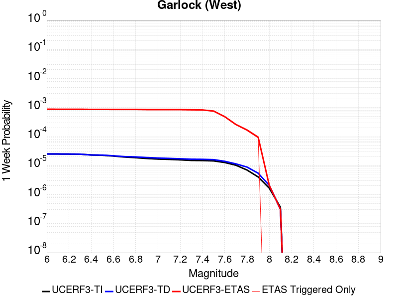 |  |  |  |

| Magnitude | 1 wk TI Prob | 1 wk TD Prob | 1 wk ETAS Prob | 1 wk ETAS/TD Gain | 1 wk ETAS Triggered Only | 1 mo TI Prob | 1 mo TD Prob | 1 mo ETAS Prob | 1 mo ETAS/TD Gain | 1 mo ETAS Triggered Only | 1 yr TI Prob | 1 yr TD Prob | 1 yr ETAS Prob | 1 yr ETAS/TD Gain | 1 yr ETAS Triggered Only | 10 yr TI Prob | 10 yr TD Prob | 10 yr ETAS Prob | 10 yr ETAS/TD Gain | 10 yr ETAS Triggered Only |
|-----|-----|-----|-----|-----|-----|-----|-----|-----|-----|-----|-----|-----|-----|-----|-----|-----|-----|-----|-----|-----|
| 6.0 | 2.5181727E-5 | 2.51973E-5 | 0.0012387589 | 49.16237 | 0.0012135922 | 1.0791722E-4 | 1.0798398E-4 | 0.001422567 | 13.17387 | 0.0013147249 | 0.0013131002 | 0.0013139155 | 0.003636911 | 2.7679946 | 0.0023260517 | 0.013053683 | 0.013141977 | 0.016235888 | 1.2354221 | 0.0031351133 |
| 6.1 | 2.5077732E-5 | 2.5098372E-5 | 0.0012386602 | 49.35221 | 0.0012135922 | 1.0747157E-4 | 1.0756004E-4 | 0.0014221435 | 13.221858 | 0.0013147249 | 0.001307681 | 0.0013087603 | 0.0036317678 | 2.7749681 | 0.0023260517 | 0.013000126 | 0.013091032 | 0.016185103 | 1.2363504 | 0.0031351133 |
| 6.2 | 2.494612E-5 | 2.498005E-5 | 0.0012385419 | 49.581245 | 0.0012135922 | 1.0690756E-4 | 1.0705298E-4 | 0.0014216371 | 13.279753 | 0.0013147249 | 0.0013008224 | 0.0013025942 | 0.0036256162 | 2.783381 | 0.0023260517 | 0.012932341 | 0.013030097 | 0.016124358 | 1.2374704 | 0.0031351133 |
| 6.3 | 2.4733758E-5 | 2.479942E-5 | 0.0012383616 | 49.935104 | 0.0012135922 | 1.0599751E-4 | 1.06278916E-4 | 0.0014208641 | 13.369201 | 0.0013147249 | 0.0012897556 | 0.0012931811 | 0.003616225 | 2.7963793 | 0.0023260517 | 0.012822957 | 0.012937066 | 0.016031621 | 1.2392006 | 0.0031351133 |
| 6.4 | 2.3237335E-5 | 2.317873E-5 | 0.0011356125 | 48.993732 | 0.0011124596 | 9.958477E-5 | 9.933365E-5 | 0.0013128053 | 13.216119 | 0.0012135922 | 0.0012117702 | 0.001208719 | 0.0034309488 | 2.8384998 | 0.0022249192 | 0.012051838 | 0.012101916 | 0.01499927 | 1.2394129 | 0.002932848 |
| 6.5 | 2.2732203E-5 | 2.2993298E-5 | 0.0011354273 | 49.38079 | 0.0011124596 | 9.742009E-5 | 9.8539E-5 | 0.0013120116 | 13.314644 | 0.0012135922 | 0.0011854442 | 0.0011990548 | 0.0034213061 | 2.8533359 | 0.0022249192 | 0.011791403 | 0.012006322 | 0.014903957 | 1.2413424 | 0.002932848 |
| 6.6 | 2.1319436E-5 | 2.17735E-5 | 0.0011342089 | 52.09125 | 0.0011124596 | 9.136581E-5 | 9.331167E-5 | 0.0013067906 | 14.004579 | 0.0012135922 | 0.001111811 | 0.0011354799 | 0.0033578726 | 2.957228 | 0.0022249192 | 0.011062649 | 0.011377227 | 0.014276707 | 1.2548494 | 0.002932848 |
| 6.7 | 1.970802E-5 | 2.0393396E-5 | 0.0011328303 | 55.548878 | 0.0011124596 | 8.446021E-5 | 8.739735E-5 | 0.0013008835 | 14.884702 | 0.0012135922 | 0.001027818 | 0.001063545 | 0.003286098 | 3.0897589 | 0.0022249192 | 0.010230771 | 0.010664964 | 0.013566533 | 1.2720655 | 0.002932848 |
| 6.8 | 1.8744462E-5 | 1.9901045E-5 | 0.0011323384 | 56.89844 | 0.0011124596 | 8.033094E-5 | 8.5287415E-5 | 0.0012987761 | 15.228228 | 0.0012135922 | 9.775903E-4 | 0.0010378812 | 0.0032604912 | 3.1414876 | 0.0022249192 | 0.009733009 | 0.01041075 | 0.013313065 | 1.2787806 | 0.002932848 |
| 6.9 | 1.7559682E-5 | 1.8953415E-5 | 0.0011313919 | 59.693302 | 0.0011124596 | 7.5253614E-5 | 8.12264E-5 | 0.0012947201 | 15.939646 | 0.0012135922 | 9.158276E-4 | 9.884841E-4 | 0.003211204 | 3.2486145 | 0.0022249192 | 0.0091206245 | 0.009921231 | 0.0128249815 | 1.2926805 | 0.002932848 |
| 7.0 | 1.6794445E-5 | 1.8216237E-5 | 0.0011306555 | 62.068554 | 0.0011124596 | 7.197421E-5 | 7.8067256E-5 | 0.0012915648 | 16.544256 | 0.0012135922 | 8.759337E-4 | 9.5005584E-4 | 0.0031728612 | 3.3396575 | 0.0022249192 | 0.008724891 | 0.009540141 | 0.012445008 | 1.304489 | 0.002932848 |
| 7.1 | 1.6337795E-5 | 1.7717046E-5 | 0.0011301569 | 63.78924 | 0.0011124596 | 7.0017246E-5 | 7.5927994E-5 | 0.0012894281 | 16.982248 | 0.0012135922 | 8.521265E-4 | 9.240326E-4 | 0.0031468957 | 3.4056113 | 0.0022249192 | 0.008488664 | 0.009281996 | 0.012187622 | 1.3130388 | 0.002932848 |
| 7.2 | 1.5780008E-5 | 1.7165687E-5 | 0.0011296062 | 65.80606 | 0.0011124596 | 6.762685E-5 | 7.356516E-5 | 0.0012870681 | 17.49562 | 0.0012135922 | 8.2304585E-4 | 8.9528906E-4 | 0.0031182163 | 3.4829154 | 0.0022249192 | 0.008200042 | 0.008996838 | 0.0119033 | 1.3230537 | 0.002932848 |
| 7.3 | 1.5058865E-5 | 1.6618762E-5 | 0.0011290598 | 67.938866 | 0.0011124596 | 6.45364E-5 | 7.122133E-5 | 0.0011836017 | 16.61864 | 0.0011124596 | 7.854473E-4 | 8.667759E-4 | 0.0029887215 | 3.44809 | 0.0021237864 | 0.00782677 | 0.008713539 | 0.011520579 | 1.3221471 | 0.0028317152 |
| 7.4 | 1.4887923E-5 | 1.6454731E-5 | 0.001128896 | 68.60616 | 0.0011124596 | 6.380382E-5 | 7.051838E-5 | 0.0011828995 | 16.774343 | 0.0011124596 | 7.7653467E-4 | 8.582243E-4 | 0.002980188 | 3.4725049 | 0.0021237864 | 0.0077382675 | 0.008628399 | 0.011435681 | 1.3253537 | 0.0028317152 |
| 7.5 | 1.4509299E-5 | 1.6046748E-5 | 0.0010273574 | 64.02277 | 0.0010113269 | 6.218123E-5 | 6.876997E-5 | 0.0010800273 | 15.704926 | 0.0010113269 | 7.567935E-4 | 8.36954E-4 | 0.0026558188 | 3.1731956 | 0.0018203884 | 0.0075422134 | 0.008416704 | 0.010923741 | 1.2978644 | 0.002528317 |
| 7.6 | 1.2756717E-5 | 1.4050848E-5 | 6.2083843E-4 | 44.18512 | 6.067961E-4 | 5.4670498E-5 | 6.0216535E-5 | 6.669761E-4 | 11.076295 | 6.067961E-4 | 6.6541E-4 | 7.328904E-4 | 0.0020466517 | 2.7925756 | 0.0013147249 | 0.006634211 | 0.0073816874 | 0.009088253 | 1.231189 | 0.0017192557 |
| 7.7 | 1.0328985E-5 | 1.1460557E-5 | 2.1372362E-4 | 18.648623 | 2.0226538E-4 | 4.4266326E-5 | 4.911575E-5 | 2.5137118E-4 | 5.117934 | 2.0226538E-4 | 5.388092E-4 | 5.978206E-4 | 0.001204254 | 2.014407 | 6.067961E-4 | 0.0053750467 | 0.006038511 | 0.0068426873 | 1.1331745 | 8.090615E-4 |
| 7.8 | 7.0306583E-6 | 8.899601E-6 | 2.1116318E-4 | 23.727262 | 2.0226538E-4 | 3.0131043E-5 | 3.814059E-5 | 2.4039825E-4 | 6.3029504 | 2.0226538E-4 | 3.667837E-4 | 4.642629E-4 | 0.0010707773 | 2.306403 | 6.067961E-4 | 0.003661789 | 0.0046952725 | 0.005399877 | 1.1500669 | 7.079288E-4 |
| 7.9 | 4.060633E-6 | 5.4653938E-6 | 1.0659753E-4 | 19.50409 | 1.0113269E-4 | 1.7402595E-5 | 2.3422906E-5 | 1.2455322E-4 | 5.3175817 | 1.0113269E-4 | 2.11856E-4 | 2.851367E-4 | 5.8844825E-4 | 2.063741 | 3.0339806E-4 | 0.0021165414 | 0.002884201 | 0.003287565 | 1.1398529 | 4.0453076E-4 |
| 8.0 | 1.6729537E-6 | 2.0775144E-6 | 2.0775144E-6 | 1.0 | 0.0 | 7.169782E-6 | 8.903603E-6 | 8.903603E-6 | 1.0 | 0.0 | 8.7288594E-5 | 1.0839601E-4 | 2.0951773E-4 | 1.9328916 | 1.0113269E-4 | 8.7254314E-4 | 0.0010969337 | 0.0012989773 | 1.1841893 | 2.0226538E-4 |
| 8.1 | 3.6733252E-7 | 3.1489964E-7 | 3.1489964E-7 | 1.0 | 0.0 | 1.5742813E-6 | 1.3495693E-6 | 1.3495693E-6 | 1.0 | 0.0 | 1.9166706E-5 | 1.6430899E-5 | 1.6430899E-5 | 1.0 | 0.0 | 1.9165053E-4 | 1.6638759E-4 | 1.6638759E-4 | 1.0 | 0.0 |

## Lenwood-Lockhart-Old Woman Springs
*[(top)](#table-of-contents)*

| 1 Week | 1 Month | 1 Year | 10 Year |
|-----|-----|-----|-----|
|  |  |  |  |

| Magnitude | 1 wk TI Prob | 1 wk TD Prob | 1 wk ETAS Prob | 1 wk ETAS/TD Gain | 1 wk ETAS Triggered Only | 1 mo TI Prob | 1 mo TD Prob | 1 mo ETAS Prob | 1 mo ETAS/TD Gain | 1 mo ETAS Triggered Only | 1 yr TI Prob | 1 yr TD Prob | 1 yr ETAS Prob | 1 yr ETAS/TD Gain | 1 yr ETAS Triggered Only | 10 yr TI Prob | 10 yr TD Prob | 10 yr ETAS Prob | 10 yr ETAS/TD Gain | 10 yr ETAS Triggered Only |
|-----|-----|-----|-----|-----|-----|-----|-----|-----|-----|-----|-----|-----|-----|-----|-----|-----|-----|-----|-----|-----|
| 6.0 | 3.744542E-5 | 4.396252E-5 | 8.5298845E-4 | 19.402628 | 8.090615E-4 | 1.604705E-4 | 1.8839816E-4 | 0.0011995345 | 6.3670177 | 0.0010113269 | 0.0019519776 | 0.0022915069 | 0.003905922 | 1.7045212 | 0.001618123 | 0.019349206 | 0.022696787 | 0.025365395 | 1.1175765 | 0.0027305826 |
| 6.1 | 3.744542E-5 | 4.396252E-5 | 8.5298845E-4 | 19.402628 | 8.090615E-4 | 1.604705E-4 | 1.8839816E-4 | 0.0011995345 | 6.3670177 | 0.0010113269 | 0.0019519776 | 0.0022915069 | 0.003905922 | 1.7045212 | 0.001618123 | 0.019349206 | 0.022696787 | 0.025365395 | 1.1175765 | 0.0027305826 |
| 6.2 | 3.744542E-5 | 4.396252E-5 | 8.5298845E-4 | 19.402628 | 8.090615E-4 | 1.604705E-4 | 1.8839816E-4 | 0.0011995345 | 6.3670177 | 0.0010113269 | 0.0019519776 | 0.0022915069 | 0.003905922 | 1.7045212 | 0.001618123 | 0.019349206 | 0.022696787 | 0.025365395 | 1.1175765 | 0.0027305826 |
| 6.3 | 2.1079984E-5 | 2.5353434E-5 | 3.287438E-4 | 12.966441 | 3.0339806E-4 | 9.0339665E-5 | 1.0865316E-4 | 4.1201824E-4 | 3.7920504 | 3.0339806E-4 | 0.0010993304 | 0.0013220694 | 0.0018270643 | 1.381973 | 5.0566345E-4 | 0.010939079 | 0.0131442575 | 0.013942685 | 1.0607435 | 8.090615E-4 |
| 6.4 | 2.1079984E-5 | 2.5353434E-5 | 3.287438E-4 | 12.966441 | 3.0339806E-4 | 9.0339665E-5 | 1.0865316E-4 | 4.1201824E-4 | 3.7920504 | 3.0339806E-4 | 0.0010993304 | 0.0013220694 | 0.0018270643 | 1.381973 | 5.0566345E-4 | 0.010939079 | 0.0131442575 | 0.013942685 | 1.0607435 | 8.090615E-4 |
| 6.5 | 1.7397282E-5 | 2.066241E-5 | 3.240542E-4 | 15.683272 | 3.0339806E-4 | 7.455765E-5 | 8.8550245E-5 | 3.9192144E-4 | 4.425978 | 3.0339806E-4 | 9.073613E-4 | 0.0010775778 | 0.0013806489 | 1.2812521 | 3.0339806E-4 | 0.009036654 | 0.010724821 | 0.011125013 | 1.0373145 | 4.0453076E-4 |
| 6.6 | 1.52050325E-5 | 1.7679693E-5 | 3.2107238E-4 | 18.160517 | 3.0339806E-4 | 6.51628E-5 | 7.576796E-5 | 3.7914302E-4 | 5.004002 | 3.0339806E-4 | 7.9306826E-4 | 9.220924E-4 | 0.0012252107 | 1.3287288 | 3.0339806E-4 | 0.007902439 | 0.009183526 | 0.009584342 | 1.043645 | 4.0453076E-4 |
| 6.7 | 1.332523E-5 | 1.5264002E-5 | 3.1865743E-4 | 20.8764 | 3.0339806E-4 | 5.7106878E-5 | 6.5415545E-5 | 3.6879376E-4 | 5.637708 | 3.0339806E-4 | 6.950544E-4 | 7.961491E-4 | 0.0010993056 | 1.3807786 | 3.0339806E-4 | 0.006928845 | 0.007933599 | 0.00833492 | 1.050585 | 4.0453076E-4 |
| 6.8 | 1.1525329E-5 | 1.3030979E-5 | 3.1642508E-4 | 24.282526 | 3.0339806E-4 | 4.9393333E-5 | 5.584588E-5 | 3.59227E-4 | 6.432471 | 3.0339806E-4 | 6.011979E-4 | 6.797157E-4 | 9.829076E-4 | 1.4460568 | 3.0339806E-4 | 0.00599574 | 0.006776819 | 0.0071786083 | 1.0592887 | 4.0453076E-4 |
| 6.9 | 1.0253909E-5 | 1.15144385E-5 | 3.14909E-4 | 27.349054 | 3.0339806E-4 | 4.3944583E-5 | 4.9346683E-5 | 3.5272978E-4 | 7.1479936 | 3.0339806E-4 | 5.3489394E-4 | 6.0063385E-4 | 9.0384966E-4 | 1.5048264 | 3.0339806E-4 | 0.0053360825 | 0.0059904843 | 0.0063925916 | 1.0671244 | 4.0453076E-4 |
| 7.0 | 8.104563E-6 | 8.991279E-6 | 3.123866E-4 | 34.74329 | 3.0339806E-4 | 3.4733377E-5 | 3.8533497E-5 | 3.4191986E-4 | 8.873315 | 3.0339806E-4 | 4.2279682E-4 | 4.6904673E-4 | 7.723025E-4 | 1.6465364 | 3.0339806E-4 | 0.0042199334 | 0.0046808156 | 0.0049827937 | 1.0645139 | 3.0339806E-4 |
| 7.1 | 6.7986157E-6 | 7.515816E-6 | 2.0977967E-4 | 27.911762 | 2.0226538E-4 | 2.91366E-5 | 3.2210253E-5 | 2.3446912E-4 | 7.279331 | 2.0226538E-4 | 3.5468035E-4 | 3.920914E-4 | 5.9427746E-4 | 1.5156605 | 2.0226538E-4 | 0.003541148 | 0.003914213 | 0.0041156863 | 1.0514723 | 2.0226538E-4 |
| 7.2 | 5.6893327E-6 | 6.2800136E-6 | 1.0741207E-4 | 17.103794 | 1.0113269E-4 | 2.4382627E-5 | 2.6914078E-5 | 1.2804405E-4 | 4.7575116 | 1.0113269E-4 | 2.9681803E-4 | 3.2763163E-4 | 4.2873117E-4 | 1.308577 | 1.0113269E-4 | 0.002964219 | 0.0032716845 | 0.0033724864 | 1.0308104 | 1.0113269E-4 |
| 7.3 | 4.253348E-6 | 4.7069107E-6 | 1.0583912E-4 | 22.4859 | 1.0113269E-4 | 1.8228506E-5 | 2.0172329E-5 | 1.21302975E-4 | 6.013335 | 1.0113269E-4 | 2.2190946E-4 | 2.4557224E-4 | 3.4668008E-4 | 1.4117235 | 1.0113269E-4 | 0.00221688 | 0.0024531898 | 0.0025540744 | 1.0411239 | 1.0113269E-4 |
| 7.4 | 2.5448119E-6 | 2.852045E-6 | 1.0398444E-4 | 36.459606 | 1.0113269E-4 | 1.0906291E-5 | 1.2223002E-5 | 1.1335445E-4 | 9.273864 | 1.0113269E-4 | 1.3277601E-4 | 1.4880655E-4 | 2.4992417E-4 | 1.6795242 | 1.0113269E-4 | 0.001326967 | 0.0014872311 | 0.0015882135 | 1.0678995 | 1.0113269E-4 |
| 7.5 | 4.3706837E-8 | 4.562909E-8 | 4.562909E-8 | 1.0 | 0.0 | 1.8731501E-7 | 1.9555324E-7 | 1.9555324E-7 | 1.0 | 0.0 | 2.2805577E-6 | 2.3808586E-6 | 2.3808586E-6 | 1.0 | 0.0 | 2.2805343E-5 | 2.3808387E-5 | 2.3808387E-5 | 1.0 | 0.0 |

## Coyote Canyon
*[(top)](#table-of-contents)*

| 1 Week | 1 Month | 1 Year | 10 Year |
|-----|-----|-----|-----|
|  |  |  |  |

| Magnitude | 1 wk TI Prob | 1 wk TD Prob | 1 wk ETAS Prob | 1 wk ETAS/TD Gain | 1 wk ETAS Triggered Only | 1 mo TI Prob | 1 mo TD Prob | 1 mo ETAS Prob | 1 mo ETAS/TD Gain | 1 mo ETAS Triggered Only | 1 yr TI Prob | 1 yr TD Prob | 1 yr ETAS Prob | 1 yr ETAS/TD Gain | 1 yr ETAS Triggered Only | 10 yr TI Prob | 10 yr TD Prob | 10 yr ETAS Prob | 10 yr ETAS/TD Gain | 10 yr ETAS Triggered Only |
|-----|-----|-----|-----|-----|-----|-----|-----|-----|-----|-----|-----|-----|-----|-----|-----|-----|-----|-----|-----|-----|
| 6.0 | 3.5090034E-5 | 4.0364324E-5 | 5.4600736E-4 | 13.5269785 | 5.0566345E-4 | 1.503772E-4 | 1.7297994E-4 | 9.819014E-4 | 5.676389 | 8.090615E-4 | 0.0018293047 | 0.0021042528 | 0.0039208108 | 1.8632792 | 0.0018203884 | 0.018143194 | 0.020869201 | 0.023245733 | 1.1138774 | 0.0024271845 |
| 6.1 | 3.5090034E-5 | 4.0364324E-5 | 5.4600736E-4 | 13.5269785 | 5.0566345E-4 | 1.503772E-4 | 1.7297994E-4 | 9.819014E-4 | 5.676389 | 8.090615E-4 | 0.0018293047 | 0.0021042528 | 0.0039208108 | 1.8632792 | 0.0018203884 | 0.018143194 | 0.020869201 | 0.023245733 | 1.1138774 | 0.0024271845 |
| 6.2 | 1.841879E-5 | 2.1059794E-5 | 5.2671257E-4 | 25.01034 | 5.0566345E-4 | 7.8935285E-5 | 9.0253714E-5 | 5.958715E-4 | 6.602183 | 5.0566345E-4 | 9.606133E-4 | 0.001098387 | 0.002108603 | 1.9197268 | 0.0010113269 | 0.0095647145 | 0.010939667 | 0.012440062 | 1.1371518 | 0.0015169902 |
| 6.3 | 1.841879E-5 | 2.1059794E-5 | 5.2671257E-4 | 25.01034 | 5.0566345E-4 | 7.8935285E-5 | 9.0253714E-5 | 5.958715E-4 | 6.602183 | 5.0566345E-4 | 9.606133E-4 | 0.001098387 | 0.002108603 | 1.9197268 | 0.0010113269 | 0.0095647145 | 0.010939667 | 0.012440062 | 1.1371518 | 0.0015169902 |
| 6.4 | 1.712201E-5 | 1.9565212E-5 | 5.252187E-4 | 26.844522 | 5.0566345E-4 | 7.337798E-5 | 8.3848776E-5 | 5.894698E-4 | 7.0301538 | 5.0566345E-4 | 8.930107E-4 | 0.0010204813 | 0.002030776 | 1.9900179 | 0.0010113269 | 0.008894307 | 0.010167871 | 0.0116694365 | 1.1476775 | 0.0015169902 |
| 6.5 | 1.4744935E-5 | 1.6836972E-5 | 5.224919E-4 | 31.032415 | 5.0566345E-4 | 6.3191044E-5 | 7.215698E-5 | 5.777839E-4 | 8.0073185 | 5.0566345E-4 | 7.6907943E-4 | 8.7825063E-4 | 0.0018886894 | 2.150513 | 0.0010113269 | 0.007664232 | 0.008756994 | 0.010060206 | 1.1488196 | 0.0013147249 |
| 6.6 | 1.2017839E-5 | 1.37240895E-5 | 4.1824928E-4 | 30.47556 | 4.0453076E-4 | 5.150401E-5 | 5.88167E-5 | 4.6332364E-4 | 7.8774166 | 4.0453076E-4 | 6.268809E-4 | 7.159466E-4 | 0.0015244288 | 2.1292493 | 8.090615E-4 | 0.0062511545 | 0.0071450938 | 0.0081491945 | 1.1405301 | 0.0010113269 |
| 6.7 | 1.00956095E-5 | 1.1533517E-5 | 2.1379655E-4 | 18.53698 | 2.0226538E-4 | 4.326618E-5 | 4.942891E-5 | 2.5168428E-4 | 5.0918436 | 2.0226538E-4 | 5.266384E-4 | 6.017178E-4 | 0.001107077 | 1.8398608 | 5.0566345E-4 | 0.005253921 | 0.0060094125 | 0.006713087 | 1.1170954 | 7.079288E-4 |

## Nelson Lake
*[(top)](#table-of-contents)*

| 1 Week | 1 Month | 1 Year | 10 Year |
|-----|-----|-----|-----|
|  |  |  |  |

| Magnitude | 1 wk TI Prob | 1 wk TD Prob | 1 wk ETAS Prob | 1 wk ETAS/TD Gain | 1 wk ETAS Triggered Only | 1 mo TI Prob | 1 mo TD Prob | 1 mo ETAS Prob | 1 mo ETAS/TD Gain | 1 mo ETAS Triggered Only | 1 yr TI Prob | 1 yr TD Prob | 1 yr ETAS Prob | 1 yr ETAS/TD Gain | 1 yr ETAS Triggered Only | 10 yr TI Prob | 10 yr TD Prob | 10 yr ETAS Prob | 10 yr ETAS/TD Gain | 10 yr ETAS Triggered Only |
|-----|-----|-----|-----|-----|-----|-----|-----|-----|-----|-----|-----|-----|-----|-----|-----|-----|-----|-----|-----|-----|
| 6.0 | 9.913453E-6 | 1.0192255E-5 | 2.1245556E-4 | 20.844805 | 2.0226538E-4 | 4.2485535E-5 | 4.3680422E-5 | 8.5270655E-4 | 19.521482 | 8.090615E-4 | 5.1713863E-4 | 5.316897E-4 | 0.0020478733 | 3.8516326 | 0.0015169902 | 0.0051593683 | 0.005305204 | 0.007417723 | 1.3981975 | 0.0021237864 |
| 6.1 | 9.913453E-6 | 1.0192255E-5 | 2.1245556E-4 | 20.844805 | 2.0226538E-4 | 4.2485535E-5 | 4.3680422E-5 | 8.5270655E-4 | 19.521482 | 8.090615E-4 | 5.1713863E-4 | 5.316897E-4 | 0.0020478733 | 3.8516326 | 0.0015169902 | 0.0051593683 | 0.005305204 | 0.007417723 | 1.3981975 | 0.0021237864 |
| 6.2 | 4.5596407E-6 | 4.696313E-6 | 4.696313E-6 | 1.0 | 0.0 | 1.954117E-5 | 2.0126909E-5 | 4.246495E-4 | 21.098597 | 4.0453076E-4 | 2.3788778E-4 | 2.4501883E-4 | 8.5166626E-4 | 3.4759219 | 6.067961E-4 | 0.0023763329 | 0.0024476128 | 0.0033555792 | 1.37096 | 9.101942E-4 |
| 6.3 | 4.5596407E-6 | 4.696313E-6 | 4.696313E-6 | 1.0 | 0.0 | 1.954117E-5 | 2.0126909E-5 | 4.246495E-4 | 21.098597 | 4.0453076E-4 | 2.3788778E-4 | 2.4501883E-4 | 8.5166626E-4 | 3.4759219 | 6.067961E-4 | 0.0023763329 | 0.0024476128 | 0.0033555792 | 1.37096 | 9.101942E-4 |
| 6.4 | 3.4025713E-6 | 3.5098972E-6 | 3.5098972E-6 | 1.0 | 0.0 | 1.4582367E-5 | 1.5042335E-5 | 4.19567E-4 | 27.892412 | 4.0453076E-4 | 1.7752586E-4 | 1.8312587E-4 | 7.8981085E-4 | 4.3129396 | 6.067961E-4 | 0.001773841 | 0.0018298327 | 0.0026374138 | 1.4413415 | 8.090615E-4 |
| 6.5 | 2.8352947E-6 | 2.927856E-6 | 2.927856E-6 | 1.0 | 0.0 | 1.2151207E-5 | 1.2547898E-5 | 3.1594216E-4 | 25.17889 | 3.0339806E-4 | 1.479309E-4 | 1.5276071E-4 | 6.5834686E-4 | 4.3096614 | 5.0566345E-4 | 0.0014783246 | 0.0015266308 | 0.002233479 | 1.4630117 | 7.079288E-4 |
| 6.6 | 2.251518E-6 | 2.3290677E-6 | 2.3290677E-6 | 1.0 | 0.0 | 9.649328E-6 | 9.981683E-6 | 1.1111336E-4 | 11.131725 | 1.0113269E-4 | 1.1747423E-4 | 1.2152085E-4 | 3.2376163E-4 | 2.6642478 | 2.0226538E-4 | 0.0011741214 | 0.0012146058 | 0.0016186452 | 1.3326507 | 4.0453076E-4 |
| 6.7 | 1.8911853E-6 | 1.9591396E-6 | 1.9591396E-6 | 1.0 | 0.0 | 8.105055E-6 | 8.39629E-6 | 8.39629E-6 | 1.0 | 0.0 | 9.867457E-5 | 1.0222061E-4 | 2.0334296E-4 | 1.9892559 | 1.0113269E-4 | 9.863076E-4 | 0.0010217935 | 0.0013248815 | 1.2966236 | 3.0339806E-4 |
| 6.8 | 1.4874814E-6 | 1.5438305E-6 | 1.5438305E-6 | 1.0 | 0.0 | 6.374905E-6 | 6.6164025E-6 | 6.6164025E-6 | 1.0 | 0.0 | 7.76117E-5 | 8.055224E-5 | 1.8167678E-4 | 2.2553906 | 1.0113269E-4 | 7.75846E-4 | 8.0528157E-4 | 0.001007384 | 1.2509712 | 2.0226538E-4 |
| 6.9 | 6.835972E-7 | 7.1399285E-7 | 7.1399285E-7 | 1.0 | 0.0 | 2.9296991E-6 | 3.0599674E-6 | 3.0599674E-6 | 1.0 | 0.0 | 3.56685E-5 | 3.7254784E-5 | 1.3838371E-4 | 3.7145216 | 1.0113269E-4 | 3.5662777E-4 | 3.7251666E-4 | 5.747067E-4 | 1.5427678 | 2.0226538E-4 |

## San Andreas (Mojave S)
*[(top)](#table-of-contents)*

| 1 Week | 1 Month | 1 Year | 10 Year |
|-----|-----|-----|-----|
|  |  |  |  |

| Magnitude | 1 wk TI Prob | 1 wk TD Prob | 1 wk ETAS Prob | 1 wk ETAS/TD Gain | 1 wk ETAS Triggered Only | 1 mo TI Prob | 1 mo TD Prob | 1 mo ETAS Prob | 1 mo ETAS/TD Gain | 1 mo ETAS Triggered Only | 1 yr TI Prob | 1 yr TD Prob | 1 yr ETAS Prob | 1 yr ETAS/TD Gain | 1 yr ETAS Triggered Only | 10 yr TI Prob | 10 yr TD Prob | 10 yr ETAS Prob | 10 yr ETAS/TD Gain | 10 yr ETAS Triggered Only |
|-----|-----|-----|-----|-----|-----|-----|-----|-----|-----|-----|-----|-----|-----|-----|-----|-----|-----|-----|-----|-----|
| 6.0 | 3.1064058E-4 | 6.7460834E-4 | 0.0010788662 | 1.5992483 | 4.0453076E-4 | 0.0013306376 | 0.0028881032 | 0.003493147 | 1.2094952 | 6.067961E-4 | 0.016080605 | 0.03462235 | 0.03569629 | 1.0310189 | 0.0011124596 | 0.1496549 | 0.28660452 | 0.2879032 | 1.0045311 | 0.0018203884 |
| 6.1 | 3.1064058E-4 | 6.7460834E-4 | 0.0010788662 | 1.5992483 | 4.0453076E-4 | 0.0013306376 | 0.0028881032 | 0.003493147 | 1.2094952 | 6.067961E-4 | 0.016080605 | 0.03462235 | 0.03569629 | 1.0310189 | 0.0011124596 | 0.1496549 | 0.28660452 | 0.2879032 | 1.0045311 | 0.0018203884 |
| 6.2 | 3.1064058E-4 | 6.7460834E-4 | 0.0010788662 | 1.5992483 | 4.0453076E-4 | 0.0013306376 | 0.0028881032 | 0.003493147 | 1.2094952 | 6.067961E-4 | 0.016080605 | 0.03462235 | 0.03569629 | 1.0310189 | 0.0011124596 | 0.1496549 | 0.28660452 | 0.2879032 | 1.0045311 | 0.0018203884 |
| 6.3 | 3.1064058E-4 | 6.7460834E-4 | 0.0010788662 | 1.5992483 | 4.0453076E-4 | 0.0013306376 | 0.0028881032 | 0.003493147 | 1.2094952 | 6.067961E-4 | 0.016080605 | 0.03462235 | 0.03569629 | 1.0310189 | 0.0011124596 | 0.1496549 | 0.28660452 | 0.2879032 | 1.0045311 | 0.0018203884 |
| 6.4 | 1.9872203E-4 | 4.3179357E-4 | 7.350606E-4 | 1.7023427 | 3.0339806E-4 | 8.5138786E-4 | 0.0018492596 | 0.0022530423 | 1.2183483 | 4.0453076E-4 | 0.010316478 | 0.02228844 | 0.023079468 | 1.0354905 | 8.090615E-4 | 0.098504856 | 0.19699748 | 0.197972 | 1.0049468 | 0.0012135922 |
| 6.5 | 1.291105E-4 | 2.875267E-4 | 5.908375E-4 | 2.054896 | 3.0339806E-4 | 5.5321335E-4 | 0.0012316781 | 0.0015347025 | 1.2460257 | 3.0339806E-4 | 0.006714592 | 0.0148934 | 0.015590785 | 1.0468252 | 7.079288E-4 | 0.065152965 | 0.13803436 | 0.13899326 | 1.0069468 | 0.0011124596 |
| 6.6 | 1.291105E-4 | 2.875267E-4 | 5.908375E-4 | 2.054896 | 3.0339806E-4 | 5.5321335E-4 | 0.0012316781 | 0.0015347025 | 1.2460257 | 3.0339806E-4 | 0.006714592 | 0.0148934 | 0.015590785 | 1.0468252 | 7.079288E-4 | 0.065152965 | 0.13803436 | 0.13899326 | 1.0069468 | 0.0011124596 |
| 6.7 | 1.08001186E-4 | 2.4333889E-4 | 4.4555505E-4 | 1.8310063 | 2.0226538E-4 | 4.6278012E-4 | 0.0010424647 | 0.0012445193 | 1.1938238 | 2.0226538E-4 | 0.0056198016 | 0.012618446 | 0.013217585 | 1.0474812 | 6.067961E-4 | 0.054797906 | 0.119176775 | 0.120067574 | 1.0074747 | 0.0010113269 |
| 6.8 | 1.0624356E-4 | 2.3851555E-4 | 4.407327E-4 | 1.8478153 | 2.0226538E-4 | 4.5525006E-4 | 0.0010218095 | 0.0012238682 | 1.1977459 | 2.0226538E-4 | 0.0055285925 | 0.012369843 | 0.012969133 | 1.0484477 | 6.067961E-4 | 0.053930566 | 0.11712591 | 0.11801879 | 1.0076232 | 0.0010113269 |
| 6.9 | 1.0393785E-4 | 2.3221898E-4 | 4.344374E-4 | 1.8708091 | 2.0226538E-4 | 4.4537184E-4 | 9.948451E-4 | 0.0011969092 | 1.2031112 | 2.0226538E-4 | 0.0054089287 | 0.012045221 | 0.012644708 | 1.0497698 | 6.067961E-4 | 0.05279156 | 0.11442335 | 0.1152294 | 1.0070444 | 9.101942E-4 |
| 7.0 | 1.0155622E-4 | 2.2591476E-4 | 4.2813443E-4 | 1.895115 | 2.0226538E-4 | 4.3516833E-4 | 9.6784724E-4 | 0.0011699168 | 1.2087826 | 2.0226538E-4 | 0.005285311 | 0.0117200995 | 0.012319785 | 1.0511671 | 6.067961E-4 | 0.05161361 | 0.111683756 | 0.11249229 | 1.0072396 | 9.101942E-4 |
| 7.1 | 9.885595E-5 | 2.1879886E-4 | 4.2101997E-4 | 1.924233 | 2.0226538E-4 | 4.2359953E-4 | 9.3737274E-4 | 0.0011394485 | 1.2155768 | 2.0226538E-4 | 0.0051451353 | 0.011352993 | 0.0119529 | 1.0528413 | 6.067961E-4 | 0.05027629 | 0.1085682 | 0.10928942 | 1.006643 | 8.090615E-4 |
| 7.2 | 9.6411415E-5 | 2.124288E-4 | 4.146512E-4 | 1.9519538 | 2.0226538E-4 | 4.1312634E-4 | 9.1009185E-4 | 0.0011121731 | 1.222045 | 2.0226538E-4 | 0.005018219 | 0.011024255 | 0.011624362 | 1.0544351 | 6.067961E-4 | 0.049064007 | 0.105758004 | 0.1064815 | 1.0068411 | 8.090615E-4 |
| 7.3 | 9.1180635E-5 | 1.9471257E-4 | 3.9693856E-4 | 2.038587 | 2.0226538E-4 | 3.907156E-4 | 8.342157E-4 | 0.0010363123 | 1.2422595 | 2.0226538E-4 | 0.004746591 | 0.01010939 | 0.010710051 | 1.0594162 | 6.067961E-4 | 0.046464786 | 0.09795115 | 0.098680966 | 1.0074508 | 8.090615E-4 |
| 7.4 | 8.887388E-5 | 1.8719878E-4 | 3.8942628E-4 | 2.0802822 | 2.0226538E-4 | 3.8083247E-4 | 8.020339E-4 | 0.0010041371 | 1.2519883 | 2.0226538E-4 | 0.0046267817 | 0.00972114 | 0.010322037 | 1.0618135 | 6.067961E-4 | 0.045316286 | 0.09458615 | 0.09531868 | 1.0077447 | 8.090615E-4 |
| 7.5 | 8.6750515E-5 | 1.8051457E-4 | 3.8274343E-4 | 2.120291 | 2.0226538E-4 | 3.7173493E-4 | 7.7340455E-4 | 9.755135E-4 | 1.2613237 | 2.0226538E-4 | 0.004516484 | 0.009375632 | 0.009976739 | 1.0641137 | 6.067961E-4 | 0.04425787 | 0.091549896 | 0.09228489 | 1.0080283 | 8.090615E-4 |
| 7.6 | 8.453092E-5 | 1.7439072E-4 | 3.7662082E-4 | 2.159638 | 2.0226538E-4 | 3.6222505E-4 | 7.471748E-4 | 9.49289E-4 | 1.2705046 | 2.0226538E-4 | 0.0044011753 | 0.009058985 | 0.009660284 | 1.066376 | 6.067961E-4 | 0.04315024 | 0.08870898 | 0.08944627 | 1.0083114 | 8.090615E-4 |
| 7.7 | 8.259102E-5 | 1.6961215E-4 | 3.7184323E-4 | 2.1923146 | 2.0226538E-4 | 3.539135E-4 | 7.2670676E-4 | 9.288252E-4 | 1.2781292 | 2.0226538E-4 | 0.004300386 | 0.008811831 | 0.00941328 | 1.0682547 | 6.067961E-4 | 0.042181134 | 0.08645982 | 0.087198935 | 1.0085486 | 8.090615E-4 |
| 7.8 | 7.444844E-5 | 1.5283503E-4 | 3.550695E-4 | 2.3232207 | 2.0226538E-4 | 3.1902574E-4 | 6.548429E-4 | 8.569758E-4 | 1.308674 | 2.0226538E-4 | 0.0038772223 | 0.007943616 | 0.008545592 | 1.0757811 | 6.067961E-4 | 0.03810269 | 0.078290746 | 0.07894325 | 1.0083344 | 7.079288E-4 |
| 7.9 | 5.2586525E-5 | 1.00064186E-4 | 2.0118675E-4 | 2.010577 | 1.0113269E-4 | 2.2535135E-4 | 4.2877605E-4 | 5.298654E-4 | 1.2357625 | 1.0113269E-4 | 0.0027402006 | 0.005207864 | 0.005509682 | 1.0579543 | 3.0339806E-4 | 0.027066574 | 0.052200034 | 0.05258345 | 1.0073451 | 4.0453076E-4 |
| 8.0 | 3.379877E-5 | 5.4074168E-5 | 5.4074168E-5 | 1.0 | 0.0 | 1.4484383E-4 | 2.3172585E-4 | 2.3172585E-4 | 1.0 | 0.0 | 0.0017620471 | 0.002817614 | 0.0029184618 | 1.0357919 | 1.0113269E-4 | 0.017481409 | 0.028834904 | 0.029031336 | 1.0068123 | 2.0226538E-4 |
| 8.1 | 1.8668277E-5 | 1.9309397E-5 | 1.9309397E-5 | 1.0 | 0.0 | 8.000444E-5 | 8.275194E-5 | 8.275194E-5 | 1.0 | 0.0 | 9.736188E-4 | 0.0010070398 | 0.0010070398 | 1.0 | 0.0 | 0.009693642 | 0.010798888 | 0.010798888 | 1.0 | 0.0 |
| 8.2 | 8.541571E-6 | 5.460819E-6 | 5.460819E-6 | 1.0 | 0.0 | 3.660622E-5 | 2.3403301E-5 | 2.3403301E-5 | 1.0 | 0.0 | 4.455896E-4 | 2.84898E-4 | 2.84898E-4 | 1.0 | 0.0 | 0.0044469717 | 0.0032408056 | 0.0032408056 | 1.0 | 0.0 |
| 8.3 | 1.983087E-6 | 7.6599065E-7 | 7.6599065E-7 | 1.0 | 0.0 | 8.498917E-6 | 3.282813E-6 | 3.282813E-6 | 1.0 | 0.0 | 1.034694E-4 | 3.9967534E-5 | 3.9967534E-5 | 1.0 | 0.0 | 0.0010342124 | 4.719687E-4 | 4.719687E-4 | 1.0 | 0.0 |

## Paradise
*[(top)](#table-of-contents)*

| 1 Week | 1 Month | 1 Year | 10 Year |
|-----|-----|-----|-----|
|  |  |  |  |

| Magnitude | 1 wk TI Prob | 1 wk TD Prob | 1 wk ETAS Prob | 1 wk ETAS/TD Gain | 1 wk ETAS Triggered Only | 1 mo TI Prob | 1 mo TD Prob | 1 mo ETAS Prob | 1 mo ETAS/TD Gain | 1 mo ETAS Triggered Only | 1 yr TI Prob | 1 yr TD Prob | 1 yr ETAS Prob | 1 yr ETAS/TD Gain | 1 yr ETAS Triggered Only | 10 yr TI Prob | 10 yr TD Prob | 10 yr ETAS Prob | 10 yr ETAS/TD Gain | 10 yr ETAS Triggered Only |
|-----|-----|-----|-----|-----|-----|-----|-----|-----|-----|-----|-----|-----|-----|-----|-----|-----|-----|-----|-----|-----|
| 6.0 | 1.4851273E-5 | 1.6694692E-5 | 2.1895669E-4 | 13.115348 | 2.0226538E-4 | 6.364676E-5 | 7.154685E-5 | 3.749232E-4 | 5.2402477 | 3.0339806E-4 | 7.7462377E-4 | 8.707584E-4 | 0.0014770261 | 1.6962526 | 6.067961E-4 | 0.0077192914 | 0.008675844 | 0.009979163 | 1.1502239 | 0.0013147249 |
| 6.1 | 1.4851273E-5 | 1.6694692E-5 | 2.1895669E-4 | 13.115348 | 2.0226538E-4 | 6.364676E-5 | 7.154685E-5 | 3.749232E-4 | 5.2402477 | 3.0339806E-4 | 7.7462377E-4 | 8.707584E-4 | 0.0014770261 | 1.6962526 | 6.067961E-4 | 0.0077192914 | 0.008675844 | 0.009979163 | 1.1502239 | 0.0013147249 |
| 6.2 | 1.4851273E-5 | 1.6694692E-5 | 2.1895669E-4 | 13.115348 | 2.0226538E-4 | 6.364676E-5 | 7.154685E-5 | 3.749232E-4 | 5.2402477 | 3.0339806E-4 | 7.7462377E-4 | 8.707584E-4 | 0.0014770261 | 1.6962526 | 6.067961E-4 | 0.0077192914 | 0.008675844 | 0.009979163 | 1.1502239 | 0.0013147249 |
| 6.3 | 1.0426831E-5 | 1.188862E-5 | 2.1415159E-4 | 18.013157 | 2.0226538E-4 | 4.4685654E-5 | 5.0950268E-5 | 2.5320533E-4 | 4.9696565 | 2.0226538E-4 | 5.43912E-4 | 6.201489E-4 | 0.0010244288 | 1.6519078 | 4.0453076E-4 | 0.0054258266 | 0.0061847917 | 0.0066873278 | 1.0812535 | 5.0566345E-4 |
| 6.4 | 1.0426831E-5 | 1.188862E-5 | 2.1415159E-4 | 18.013157 | 2.0226538E-4 | 4.4685654E-5 | 5.0950268E-5 | 2.5320533E-4 | 4.9696565 | 2.0226538E-4 | 5.43912E-4 | 6.201489E-4 | 0.0010244288 | 1.6519078 | 4.0453076E-4 | 0.0054258266 | 0.0061847917 | 0.0066873278 | 1.0812535 | 5.0566345E-4 |
| 6.5 | 9.25027E-6 | 1.06199595E-5 | 2.1288318E-4 | 20.045574 | 2.0226538E-4 | 3.964341E-5 | 4.551335E-5 | 2.4776952E-4 | 5.4438868 | 2.0226538E-4 | 4.8255164E-4 | 5.53989E-4 | 8.57219E-4 | 1.5473574 | 3.0339806E-4 | 0.0048150513 | 0.0055265795 | 0.0059288745 | 1.0727928 | 4.0453076E-4 |
| 6.6 | 7.904275E-6 | 9.159525E-6 | 1.1029129E-4 | 12.041158 | 1.0113269E-4 | 3.3875025E-5 | 3.9254537E-5 | 1.4038326E-4 | 3.5762298 | 1.0113269E-4 | 4.1235037E-4 | 4.7782314E-4 | 5.789075E-4 | 1.2115518 | 1.0113269E-4 | 0.0041158604 | 0.0047683544 | 0.004969655 | 1.0422161 | 2.0226538E-4 |
| 6.7 | 7.2061953E-6 | 8.407248E-6 | 1.0953908E-4 | 13.029124 | 1.0113269E-4 | 3.088333E-5 | 3.6030586E-5 | 1.3715963E-4 | 3.8067553 | 1.0113269E-4 | 3.7593965E-4 | 4.3858777E-4 | 5.396761E-4 | 1.2304859 | 1.0113269E-4 | 0.003753043 | 0.004377591 | 0.004478281 | 1.0230012 | 1.0113269E-4 |
| 6.8 | 6.6948724E-6 | 7.842166E-6 | 1.0897406E-4 | 13.895913 | 1.0113269E-4 | 2.8691995E-5 | 3.360887E-5 | 1.3473816E-4 | 4.009006 | 1.0113269E-4 | 3.4926904E-4 | 4.0911473E-4 | 5.1020604E-4 | 1.2470977 | 1.0113269E-4 | 0.003487206 | 0.0040839734 | 0.0041846926 | 1.0246621 | 1.0113269E-4 |
| 6.9 | 6.0421025E-6 | 7.130621E-6 | 1.0826258E-4 | 15.182772 | 1.0113269E-4 | 2.5894467E-5 | 3.0559466E-5 | 1.3168906E-4 | 4.3092723 | 1.0113269E-4 | 3.1521954E-4 | 3.7200135E-4 | 4.730964E-4 | 1.27176 | 1.0113269E-4 | 0.0031477278 | 0.0037141247 | 0.0038148817 | 1.0271281 | 1.0113269E-4 |
| 7.0 | 4.134091E-6 | 5.0803087E-6 | 5.0803087E-6 | 1.0 | 0.0 | 1.7717413E-5 | 2.177258E-5 | 2.177258E-5 | 1.0 | 0.0 | 2.1568815E-4 | 2.6505045E-4 | 2.6505045E-4 | 1.0 | 0.0 | 0.0021547892 | 0.0026474963 | 0.0026474963 | 1.0 | 0.0 |
| 7.1 | 3.7674888E-6 | 4.6318696E-6 | 4.6318696E-6 | 1.0 | 0.0 | 1.6146281E-5 | 1.9850726E-5 | 1.9850726E-5 | 1.0 | 0.0 | 1.9656324E-4 | 2.4165731E-4 | 2.4165731E-4 | 1.0 | 0.0 | 0.0019638946 | 0.002414096 | 0.002414096 | 1.0 | 0.0 |
| 7.2 | 3.4065345E-6 | 4.156723E-6 | 4.156723E-6 | 1.0 | 0.0 | 1.4599351E-5 | 1.7814415E-5 | 1.7814415E-5 | 1.0 | 0.0 | 1.777326E-4 | 2.1687041E-4 | 2.1687041E-4 | 1.0 | 0.0 | 0.0017759053 | 0.002166736 | 0.002166736 | 1.0 | 0.0 |
| 7.3 | 2.9934936E-6 | 3.6293168E-6 | 3.6293168E-6 | 1.0 | 0.0 | 1.2829195E-5 | 1.555413E-5 | 1.555413E-5 | 1.0 | 0.0 | 1.5618425E-4 | 1.8935655E-4 | 1.8935655E-4 | 1.0 | 0.0 | 0.0015607453 | 0.0018920974 | 0.0018920974 | 1.0 | 0.0 |
| 7.4 | 2.4049796E-6 | 2.8889842E-6 | 2.8889842E-6 | 1.0 | 0.0 | 1.0307015E-5 | 1.238131E-5 | 1.238131E-5 | 1.0 | 0.0 | 1.2548068E-4 | 1.5073347E-4 | 1.5073347E-4 | 1.0 | 0.0 | 0.0012540985 | 0.0015064536 | 0.0015064536 | 1.0 | 0.0 |
| 7.5 | 1.2710091E-6 | 1.5134682E-6 | 1.5134682E-6 | 1.0 | 0.0 | 5.44717E-6 | 6.4862834E-6 | 6.4862834E-6 | 1.0 | 0.0 | 6.631728E-5 | 7.8968886E-5 | 7.8968886E-5 | 1.0 | 0.0 | 6.6297496E-4 | 7.8953087E-4 | 7.8953087E-4 | 1.0 | 0.0 |
| 7.6 | 2.21172E-7 | 2.603961E-7 | 2.603961E-7 | 1.0 | 0.0 | 9.478797E-7 | 1.1159829E-6 | 1.1159829E-6 | 1.0 | 0.0 | 1.1540374E-5 | 1.3587036E-5 | 1.3587036E-5 | 1.0 | 0.0 | 1.1539775E-4 | 1.3586486E-4 | 1.3586486E-4 | 1.0 | 0.0 |

## Death Valley (So)
*[(top)](#table-of-contents)*

| 1 Week | 1 Month | 1 Year | 10 Year |
|-----|-----|-----|-----|
|  |  |  |  |

| Magnitude | 1 wk TI Prob | 1 wk TD Prob | 1 wk ETAS Prob | 1 wk ETAS/TD Gain | 1 wk ETAS Triggered Only | 1 mo TI Prob | 1 mo TD Prob | 1 mo ETAS Prob | 1 mo ETAS/TD Gain | 1 mo ETAS Triggered Only | 1 yr TI Prob | 1 yr TD Prob | 1 yr ETAS Prob | 1 yr ETAS/TD Gain | 1 yr ETAS Triggered Only | 10 yr TI Prob | 10 yr TD Prob | 10 yr ETAS Prob | 10 yr ETAS/TD Gain | 10 yr ETAS Triggered Only |
|-----|-----|-----|-----|-----|-----|-----|-----|-----|-----|-----|-----|-----|-----|-----|-----|-----|-----|-----|-----|-----|
| 6.0 | 2.0684236E-5 | 2.5617775E-5 | 3.2900806E-4 | 12.842959 | 3.0339806E-4 | 8.864371E-5 | 1.0978594E-4 | 6.1539386E-4 | 5.6053977 | 5.0566345E-4 | 0.0010787029 | 0.0013358411 | 0.002143822 | 1.6048479 | 8.090615E-4 | 0.010734817 | 0.013281397 | 0.014279292 | 1.0751348 | 0.0010113269 |
| 6.1 | 2.0684236E-5 | 2.5617775E-5 | 3.2900806E-4 | 12.842959 | 3.0339806E-4 | 8.864371E-5 | 1.0978594E-4 | 6.1539386E-4 | 5.6053977 | 5.0566345E-4 | 0.0010787029 | 0.0013358411 | 0.002143822 | 1.6048479 | 8.090615E-4 | 0.010734817 | 0.013281397 | 0.014279292 | 1.0751348 | 0.0010113269 |
| 6.2 | 2.0684236E-5 | 2.5617775E-5 | 3.2900806E-4 | 12.842959 | 3.0339806E-4 | 8.864371E-5 | 1.0978594E-4 | 6.1539386E-4 | 5.6053977 | 5.0566345E-4 | 0.0010787029 | 0.0013358411 | 0.002143822 | 1.6048479 | 8.090615E-4 | 0.010734817 | 0.013281397 | 0.014279292 | 1.0751348 | 0.0010113269 |
| 6.3 | 2.0240292E-5 | 2.511786E-5 | 3.285083E-4 | 13.078673 | 3.0339806E-4 | 8.6741224E-5 | 1.07643624E-4 | 6.1325263E-4 | 5.697064 | 5.0566345E-4 | 0.0010555626 | 0.00130979 | 0.0021177917 | 1.6168941 | 8.090615E-4 | 0.010505628 | 0.013023956 | 0.014022112 | 1.07664 | 0.0010113269 |
| 6.4 | 2.0240292E-5 | 2.511786E-5 | 3.285083E-4 | 13.078673 | 3.0339806E-4 | 8.6741224E-5 | 1.07643624E-4 | 6.1325263E-4 | 5.697064 | 5.0566345E-4 | 0.0010555626 | 0.00130979 | 0.0021177917 | 1.6168941 | 8.090615E-4 | 0.010505628 | 0.013023956 | 0.014022112 | 1.07664 | 0.0010113269 |
| 6.5 | 1.9962767E-5 | 2.4807114E-5 | 3.2819764E-4 | 13.229981 | 3.0339806E-4 | 8.55519E-5 | 1.0631196E-4 | 6.1192166E-4 | 5.7559056 | 5.0566345E-4 | 0.0010410968 | 0.0012935963 | 0.002101611 | 1.6246268 | 8.090615E-4 | 0.010362327 | 0.012863902 | 0.01386222 | 1.0776061 | 0.0010113269 |
| 6.6 | 1.8937297E-5 | 2.3310964E-5 | 3.2670196E-4 | 14.014948 | 3.0339806E-4 | 8.115732E-5 | 9.990039E-5 | 6.055133E-4 | 6.0611706 | 5.0566345E-4 | 9.876423E-4 | 0.0012156231 | 0.002023701 | 1.6647438 | 8.090615E-4 | 0.009832645 | 0.012092789 | 0.0130918855 | 1.0826192 | 0.0010113269 |
| 6.7 | 1.8621096E-5 | 2.2911607E-5 | 3.2630272E-4 | 14.241809 | 3.0339806E-4 | 7.980225E-5 | 9.818898E-5 | 6.038028E-4 | 6.149394 | 5.0566345E-4 | 9.711593E-4 | 0.0011948098 | 0.0020029047 | 1.6763376 | 8.090615E-4 | 0.009669261 | 0.011886904 | 0.012886209 | 1.0840677 | 0.0010113269 |
| 6.8 | 1.7830353E-5 | 2.1805688E-5 | 3.2519712E-4 | 14.913408 | 3.0339806E-4 | 7.641356E-5 | 9.344968E-5 | 5.9906585E-4 | 6.4105716 | 5.0566345E-4 | 9.29938E-4 | 0.00113717 | 0.0018442938 | 1.6218276 | 7.079288E-4 | 0.009260561 | 0.011316354 | 0.012216249 | 1.0795215 | 9.101942E-4 |
| 6.9 | 1.3135183E-5 | 1.5303925E-5 | 1.5303925E-5 | 1.0 | 0.0 | 5.6292425E-5 | 6.558664E-5 | 6.558664E-5 | 1.0 | 0.0 | 6.8514474E-4 | 7.982312E-4 | 0.0010003351 | 1.2531897 | 2.0226538E-4 | 0.006830362 | 0.007954649 | 0.008355961 | 1.0504501 | 4.0453076E-4 |
| 7.0 | 1.1507512E-5 | 1.3154199E-5 | 1.3154199E-5 | 1.0 | 0.0 | 4.9316975E-5 | 5.6373956E-5 | 5.6373956E-5 | 1.0 | 0.0 | 6.002687E-4 | 6.8614254E-4 | 8.882691E-4 | 1.2945839 | 2.0226538E-4 | 0.0059864987 | 0.0068409415 | 0.007142264 | 1.0440469 | 3.0339806E-4 |
| 7.1 | 9.715903E-6 | 1.0865278E-5 | 1.0865278E-5 | 1.0 | 0.0 | 4.1638916E-5 | 4.656467E-5 | 4.656467E-5 | 1.0 | 0.0 | 5.068359E-4 | 5.667817E-4 | 6.67857E-4 | 1.1783321 | 1.0113269E-4 | 0.0050568148 | 0.0056538144 | 0.0058549363 | 1.0355728 | 2.0226538E-4 |
| 7.2 | 9.233269E-6 | 1.02863105E-5 | 1.02863105E-5 | 1.0 | 0.0 | 3.9570554E-5 | 4.4083466E-5 | 4.4083466E-5 | 1.0 | 0.0 | 4.81665E-4 | 5.3658825E-4 | 6.376667E-4 | 1.1883724 | 1.0113269E-4 | 0.0048062233 | 0.0053533576 | 0.00555454 | 1.0375806 | 2.0226538E-4 |
| 7.3 | 8.8041315E-6 | 9.808164E-6 | 9.808164E-6 | 1.0 | 0.0 | 3.7731446E-5 | 4.2034335E-5 | 4.2034335E-5 | 1.0 | 0.0 | 4.592835E-4 | 5.1165203E-4 | 5.1165203E-4 | 1.0 | 0.0 | 0.0045833546 | 0.005105167 | 0.0052057835 | 1.0197088 | 1.0113269E-4 |
| 7.4 | 8.708749E-6 | 9.707175E-6 | 9.707175E-6 | 1.0 | 0.0 | 3.7322676E-5 | 4.160154E-5 | 4.160154E-5 | 1.0 | 0.0 | 4.5430884E-4 | 5.0638523E-4 | 5.0638523E-4 | 1.0 | 0.0 | 0.004533812 | 0.0050527398 | 0.0051533612 | 1.0199143 | 1.0113269E-4 |
| 7.5 | 8.612678E-6 | 9.604817E-6 | 9.604817E-6 | 1.0 | 0.0 | 3.6910955E-5 | 4.1162875E-5 | 4.1162875E-5 | 1.0 | 0.0 | 4.492982E-4 | 5.01047E-4 | 5.01047E-4 | 1.0 | 0.0 | 0.004483909 | 0.0049995985 | 0.0051002256 | 1.020127 | 1.0113269E-4 |
| 7.6 | 8.319024E-6 | 9.283916E-6 | 9.283916E-6 | 1.0 | 0.0 | 3.5652476E-5 | 3.978763E-5 | 3.978763E-5 | 1.0 | 0.0 | 4.3398244E-4 | 4.8431093E-4 | 4.8431093E-4 | 1.0 | 0.0 | 0.0043313587 | 0.0048329784 | 0.004933622 | 1.0208244 | 1.0113269E-4 |
| 7.7 | 7.4718328E-6 | 8.34517E-6 | 8.34517E-6 | 1.0 | 0.0 | 3.2021748E-5 | 3.5764548E-5 | 3.5764548E-5 | 1.0 | 0.0 | 3.8979502E-4 | 4.353504E-4 | 4.353504E-4 | 1.0 | 0.0 | 0.00389112 | 0.0043453807 | 0.004446074 | 1.0231725 | 1.0113269E-4 |
| 7.8 | 3.4586725E-7 | 3.6482615E-7 | 3.6482615E-7 | 1.0 | 0.0 | 1.4822873E-6 | 1.5635396E-6 | 1.5635396E-6 | 1.0 | 0.0 | 1.80467E-5 | 1.9035933E-5 | 1.9035933E-5 | 1.0 | 0.0 | 1.8045233E-4 | 1.9034347E-4 | 1.9034347E-4 | 1.0 | 0.0 |
| 7.9 | 2.5591178E-9 | 2.6696718E-9 | 2.6696718E-9 | 1.0 | 0.0 | 1.0967647E-8 | 1.14414505E-8 | 1.14414505E-8 | 1.0 | 0.0 | 1.335311E-7 | 1.3929966E-7 | 1.3929966E-7 | 1.0 | 0.0 | 1.3353102E-6 | 1.3929966E-6 | 1.3929966E-6 | 1.0 | 0.0 |

## Bicycle Lake
*[(top)](#table-of-contents)*

| 1 Week | 1 Month | 1 Year | 10 Year |
|-----|-----|-----|-----|
| 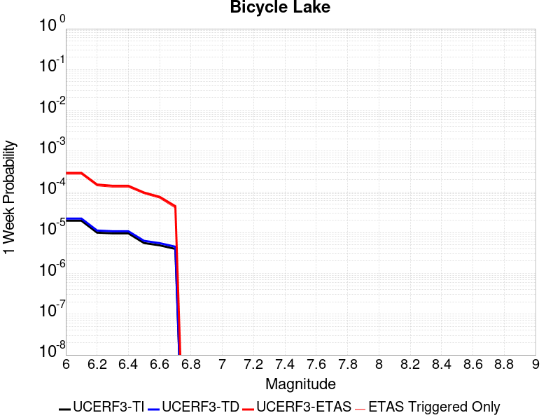 |  |  |  |

| Magnitude | 1 wk TI Prob | 1 wk TD Prob | 1 wk ETAS Prob | 1 wk ETAS/TD Gain | 1 wk ETAS Triggered Only | 1 mo TI Prob | 1 mo TD Prob | 1 mo ETAS Prob | 1 mo ETAS/TD Gain | 1 mo ETAS Triggered Only | 1 yr TI Prob | 1 yr TD Prob | 1 yr ETAS Prob | 1 yr ETAS/TD Gain | 1 yr ETAS Triggered Only | 10 yr TI Prob | 10 yr TD Prob | 10 yr ETAS Prob | 10 yr ETAS/TD Gain | 10 yr ETAS Triggered Only |
|-----|-----|-----|-----|-----|-----|-----|-----|-----|-----|-----|-----|-----|-----|-----|-----|-----|-----|-----|-----|-----|
| 6.0 | 1.9621975E-5 | 2.2097078E-5 | 4.2661888E-4 | 19.306574 | 4.0453076E-4 | 8.4091465E-5 | 9.4699084E-5 | 4.991915E-4 | 5.2713447 | 4.0453076E-4 | 0.0010233327 | 0.0011524865 | 0.0018595995 | 1.6135541 | 7.079288E-4 | 0.01018633 | 0.011478408 | 0.012478126 | 1.0870956 | 0.0010113269 |
| 6.1 | 1.9621975E-5 | 2.2097078E-5 | 4.2661888E-4 | 19.306574 | 4.0453076E-4 | 8.4091465E-5 | 9.4699084E-5 | 4.991915E-4 | 5.2713447 | 4.0453076E-4 | 0.0010233327 | 0.0011524865 | 0.0018595995 | 1.6135541 | 7.079288E-4 | 0.01018633 | 0.011478408 | 0.012478126 | 1.0870956 | 0.0010113269 |
| 6.2 | 9.9971285E-6 | 1.1255639E-5 | 4.1578183E-4 | 36.93987 | 4.0453076E-4 | 4.2844134E-5 | 4.8237856E-5 | 4.5274908E-4 | 9.385763 | 4.0453076E-4 | 5.2150246E-4 | 5.871896E-4 | 0.0011936295 | 2.0327835 | 6.067961E-4 | 0.0052028033 | 0.005861487 | 0.006565266 | 1.1200684 | 7.079288E-4 |
| 6.3 | 9.589428E-6 | 1.0798346E-5 | 4.1532473E-4 | 38.461884 | 4.0453076E-4 | 4.10969E-5 | 4.62781E-5 | 4.5079013E-4 | 9.740896 | 4.0453076E-4 | 5.002399E-4 | 5.6334207E-4 | 0.0011697963 | 2.0765295 | 6.067961E-4 | 0.0049911533 | 0.0056242296 | 0.0063281767 | 1.1251633 | 7.079288E-4 |
| 6.4 | 9.589428E-6 | 1.0798346E-5 | 4.1532473E-4 | 38.461884 | 4.0453076E-4 | 4.10969E-5 | 4.62781E-5 | 4.5079013E-4 | 9.740896 | 4.0453076E-4 | 5.002399E-4 | 5.6334207E-4 | 0.0011697963 | 2.0765295 | 6.067961E-4 | 0.0049911533 | 0.0056242296 | 0.0063281767 | 1.1251633 | 7.079288E-4 |
| 6.5 | 5.557707E-6 | 6.2856016E-6 | 4.108138E-4 | 65.35792 | 4.0453076E-4 | 2.3818526E-5 | 2.6938165E-5 | 4.31458E-4 | 16.016607 | 4.0453076E-4 | 2.8995197E-4 | 3.2794967E-4 | 8.3344727E-4 | 2.5413876 | 5.0566345E-4 | 0.0028957394 | 0.0032772934 | 0.0037812996 | 1.1537874 | 5.0566345E-4 |
| 6.6 | 4.8742945E-6 | 5.5132896E-6 | 4.100418E-4 | 74.373344 | 4.0453076E-4 | 2.0889667E-5 | 2.3628318E-5 | 4.281495E-4 | 18.120186 | 4.0453076E-4 | 2.54302E-4 | 2.87663E-4 | 7.9318095E-4 | 2.757327 | 5.0566345E-4 | 0.002540112 | 0.0028754752 | 0.0033796846 | 1.1753482 | 5.0566345E-4 |
| 6.7 | 3.991108E-6 | 4.5159104E-6 | 2.0678037E-4 | 45.7893 | 2.0226538E-4 | 1.7104636E-5 | 1.9353902E-5 | 2.2161535E-4 | 11.450682 | 2.0226538E-4 | 2.0822904E-4 | 2.3563375E-4 | 5.3896033E-4 | 2.2872798 | 3.0339806E-4 | 0.0020803404 | 0.0023563374 | 0.0026590207 | 1.1284549 | 3.0339806E-4 |

## San Andreas (San Bernardino N)
*[(top)](#table-of-contents)*

| 1 Week | 1 Month | 1 Year | 10 Year |
|-----|-----|-----|-----|
|  |  |  | 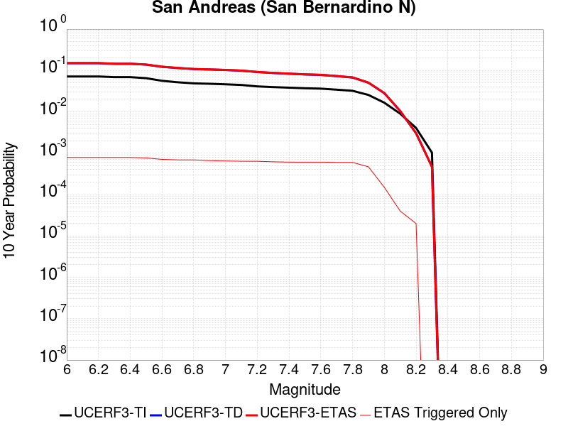 |

| Magnitude | 1 wk TI Prob | 1 wk TD Prob | 1 wk ETAS Prob | 1 wk ETAS/TD Gain | 1 wk ETAS Triggered Only | 1 mo TI Prob | 1 mo TD Prob | 1 mo ETAS Prob | 1 mo ETAS/TD Gain | 1 mo ETAS Triggered Only | 1 yr TI Prob | 1 yr TD Prob | 1 yr ETAS Prob | 1 yr ETAS/TD Gain | 1 yr ETAS Triggered Only | 10 yr TI Prob | 10 yr TD Prob | 10 yr ETAS Prob | 10 yr ETAS/TD Gain | 10 yr ETAS Triggered Only |
|-----|-----|-----|-----|-----|-----|-----|-----|-----|-----|-----|-----|-----|-----|-----|-----|-----|-----|-----|-----|-----|
| 6.0 | 1.4273766E-4 | 3.1606483E-4 | 4.1716557E-4 | 1.3198733 | 1.0113269E-4 | 6.115894E-4 | 0.0013538664 | 0.0014548622 | 1.0745981 | 1.0113269E-4 | 0.0074207084 | 0.016360244 | 0.016857633 | 1.0304024 | 5.0566345E-4 | 0.07177748 | 0.15026689 | 0.15095437 | 1.0045751 | 8.090615E-4 |
| 6.1 | 1.4273766E-4 | 3.1606483E-4 | 4.1716557E-4 | 1.3198733 | 1.0113269E-4 | 6.115894E-4 | 0.0013538664 | 0.0014548622 | 1.0745981 | 1.0113269E-4 | 0.0074207084 | 0.016360244 | 0.016857633 | 1.0304024 | 5.0566345E-4 | 0.07177748 | 0.15026689 | 0.15095437 | 1.0045751 | 8.090615E-4 |
| 6.2 | 1.4273766E-4 | 3.1606483E-4 | 4.1716557E-4 | 1.3198733 | 1.0113269E-4 | 6.115894E-4 | 0.0013538664 | 0.0014548622 | 1.0745981 | 1.0113269E-4 | 0.0074207084 | 0.016360244 | 0.016857633 | 1.0304024 | 5.0566345E-4 | 0.07177748 | 0.15026689 | 0.15095437 | 1.0045751 | 8.090615E-4 |
| 6.3 | 1.3730655E-4 | 3.0511338E-4 | 4.062152E-4 | 1.3313582 | 1.0113269E-4 | 5.883239E-4 | 0.0013069791 | 0.0014079796 | 1.0772778 | 1.0113269E-4 | 0.0071393442 | 0.015797773 | 0.016295448 | 1.0315028 | 5.0566345E-4 | 0.06914291 | 0.14556676 | 0.14625806 | 1.004749 | 8.090615E-4 |
| 6.4 | 1.3730655E-4 | 3.0511338E-4 | 4.062152E-4 | 1.3313582 | 1.0113269E-4 | 5.883239E-4 | 0.0013069791 | 0.0014079796 | 1.0772778 | 1.0113269E-4 | 0.0071393442 | 0.015797773 | 0.016295448 | 1.0315028 | 5.0566345E-4 | 0.06914291 | 0.14556676 | 0.14625806 | 1.004749 | 8.090615E-4 |
| 6.5 | 1.2942807E-4 | 2.8925808E-4 | 3.903615E-4 | 1.3495268 | 1.0113269E-4 | 5.545738E-4 | 0.0012390936 | 0.001340101 | 1.0815171 | 1.0113269E-4 | 0.0067310524 | 0.01498286 | 0.015480947 | 1.0332438 | 5.0566345E-4 | 0.06530788 | 0.13870941 | 0.13940625 | 1.0050237 | 8.090615E-4 |
| 6.6 | 1.1125901E-4 | 2.536472E-4 | 3.5475421E-4 | 1.3986129 | 1.0113269E-4 | 4.767372E-4 | 0.0010866089 | 0.0011876316 | 1.0929707 | 1.0113269E-4 | 0.005788839 | 0.013149847 | 0.013549059 | 1.0303587 | 4.0453076E-4 | 0.056403454 | 0.122999296 | 0.123620145 | 1.0050477 | 7.079288E-4 |
| 6.7 | 1.02209575E-4 | 2.3499702E-4 | 3.3610594E-4 | 1.4302562 | 1.0113269E-4 | 4.3796748E-4 | 0.0010067427 | 0.0011077736 | 1.1003542 | 1.0113269E-4 | 0.0053192247 | 0.012188629 | 0.01258823 | 1.0327847 | 4.0453076E-4 | 0.051936906 | 0.114790924 | 0.115417585 | 1.0054592 | 7.079288E-4 |
| 6.8 | 9.610582E-5 | 2.2025521E-4 | 3.2136563E-4 | 1.4590603 | 1.0113269E-4 | 4.1181705E-4 | 9.436101E-4 | 0.0010446473 | 1.1070752 | 1.0113269E-4 | 0.0050023515 | 0.011428202 | 0.011828109 | 1.034993 | 4.0453076E-4 | 0.048912346 | 0.1081929 | 0.10882424 | 1.0058353 | 7.079288E-4 |
| 6.9 | 9.3877505E-5 | 2.1481077E-4 | 3.1592173E-4 | 1.4706978 | 1.0113269E-4 | 4.0227012E-4 | 9.2029345E-4 | 0.001021333 | 1.1097907 | 1.0113269E-4 | 0.0048866454 | 0.011147255 | 0.011547277 | 1.0358852 | 4.0453076E-4 | 0.04780577 | 0.10578323 | 0.106325835 | 1.0051295 | 6.067961E-4 |
| 7.0 | 9.1019785E-5 | 2.0808022E-4 | 3.0919188E-4 | 1.4859263 | 1.0113269E-4 | 3.900265E-4 | 8.914682E-4 | 9.925107E-4 | 1.113344 | 1.0113269E-4 | 0.0047382377 | 0.010799837 | 0.011199999 | 1.0370526 | 4.0453076E-4 | 0.046384744 | 0.102753714 | 0.10329816 | 1.0052985 | 6.067961E-4 |
| 7.1 | 8.771155E-5 | 1.9982594E-4 | 3.0093844E-4 | 1.5060028 | 1.0113269E-4 | 3.758525E-4 | 8.5611636E-4 | 9.5716247E-4 | 1.1180285 | 1.0113269E-4 | 0.0045664064 | 0.0103736 | 0.0107739335 | 1.0385916 | 4.0453076E-4 | 0.044737056 | 0.09906527 | 0.09952083 | 1.0045987 | 5.0566345E-4 |
| 7.2 | 8.0830236E-5 | 1.8388197E-4 | 2.8499606E-4 | 1.5498857 | 1.0113269E-4 | 3.4636928E-4 | 7.8782777E-4 | 8.8888075E-4 | 1.1282679 | 1.0113269E-4 | 0.0042088944 | 0.009549725 | 0.009950392 | 1.041956 | 4.0453076E-4 | 0.041300658 | 0.09179615 | 0.0922554 | 1.0050029 | 5.0566345E-4 |
| 7.3 | 7.7668235E-5 | 1.7331762E-4 | 2.7443276E-4 | 1.5834095 | 1.0113269E-4 | 3.328214E-4 | 7.425784E-4 | 8.4363605E-4 | 1.1360902 | 1.0113269E-4 | 0.0040445733 | 0.009003494 | 0.009404383 | 1.0445259 | 4.0453076E-4 | 0.03971748 | 0.08706327 | 0.087524906 | 1.0053023 | 5.0566345E-4 |
| 7.4 | 7.520177E-5 | 1.6551897E-4 | 2.6663492E-4 | 1.6109024 | 1.0113269E-4 | 3.2225347E-4 | 7.0917426E-4 | 8.102352E-4 | 1.1425052 | 1.0113269E-4 | 0.0039163795 | 0.008600081 | 0.009001133 | 1.0466335 | 4.0453076E-4 | 0.038480744 | 0.08351955 | 0.08398298 | 1.0055487 | 5.0566345E-4 |
| 7.5 | 7.274697E-5 | 1.5839566E-4 | 2.5951234E-4 | 1.6383803 | 1.0113269E-4 | 3.1173544E-4 | 6.78662E-4 | 7.79726E-4 | 1.1489166 | 1.0113269E-4 | 0.003788775 | 0.008231463 | 0.008632664 | 1.0487399 | 4.0453076E-4 | 0.03724827 | 0.08023631 | 0.0807014 | 1.0057966 | 5.0566345E-4 |
| 7.6 | 7.1185845E-5 | 1.540943E-4 | 2.552114E-4 | 1.6562027 | 1.0113269E-4 | 3.0504653E-4 | 6.6023704E-4 | 7.61303E-4 | 1.1530752 | 1.0113269E-4 | 0.0037076178 | 0.008008812 | 0.008410102 | 1.0501062 | 4.0453076E-4 | 0.036463667 | 0.07822598 | 0.078692086 | 1.0059584 | 5.0566345E-4 |
| 7.7 | 6.709961E-5 | 1.4318313E-4 | 2.4430134E-4 | 1.7062159 | 1.0113269E-4 | 2.8753807E-4 | 6.1349774E-4 | 7.1456836E-4 | 1.164745 | 1.0113269E-4 | 0.003495157 | 0.0074437927 | 0.007845312 | 1.0539402 | 4.0453076E-4 | 0.034406938 | 0.07305469 | 0.07352342 | 1.0064161 | 5.0566345E-4 |
| 7.8 | 6.300812E-5 | 1.3202413E-4 | 2.3314347E-4 | 1.7659155 | 1.0113269E-4 | 2.7000686E-4 | 5.65695E-4 | 6.667705E-4 | 1.1786748 | 1.0113269E-4 | 0.0032823787 | 0.006865616 | 0.0072673694 | 1.0585167 | 4.0453076E-4 | 0.032343175 | 0.06771354 | 0.06818496 | 1.0069621 | 5.0566345E-4 |
| 7.9 | 4.983037E-5 | 9.723488E-5 | 1.9835774E-4 | 2.0399854 | 1.0113269E-4 | 2.1354125E-4 | 4.1665437E-4 | 5.177449E-4 | 1.2426245 | 1.0113269E-4 | 0.0025967648 | 0.0050609782 | 0.005362841 | 1.059645 | 3.0339806E-4 | 0.025666296 | 0.05064886 | 0.0510329 | 1.0075824 | 4.0453076E-4 |
| 8.0 | 3.2211527E-5 | 5.3304586E-5 | 5.3304586E-5 | 1.0 | 0.0 | 1.380421E-4 | 2.2842824E-4 | 2.2842824E-4 | 1.0 | 0.0 | 0.0016793669 | 0.0027775685 | 0.0028784205 | 1.0363094 | 1.0113269E-4 | 0.016667323 | 0.028361378 | 0.028557908 | 1.0069294 | 2.0226538E-4 |
| 8.1 | 1.743376E-5 | 1.8824427E-5 | 1.8824427E-5 | 1.0 | 0.0 | 7.471398E-5 | 8.067362E-5 | 8.067362E-5 | 1.0 | 0.0 | 9.0926304E-4 | 9.817594E-4 | 9.817594E-4 | 1.0 | 0.0 | 0.009055517 | 0.010484105 | 0.010484105 | 1.0 | 0.0 |
| 8.2 | 7.831616E-6 | 5.1551065E-6 | 5.1551065E-6 | 1.0 | 0.0 | 3.3563636E-5 | 2.2093127E-5 | 2.2093127E-5 | 1.0 | 0.0 | 4.0856065E-4 | 2.6895068E-4 | 2.6895068E-4 | 1.0 | 0.0 | 0.004078103 | 0.0030418145 | 0.0030418145 | 1.0 | 0.0 |
| 8.3 | 1.983087E-6 | 7.6599065E-7 | 7.6599065E-7 | 1.0 | 0.0 | 8.498917E-6 | 3.282813E-6 | 3.282813E-6 | 1.0 | 0.0 | 1.034694E-4 | 3.9967534E-5 | 3.9967534E-5 | 1.0 | 0.0 | 0.0010342124 | 4.719687E-4 | 4.719687E-4 | 1.0 | 0.0 |

## Helendale-So Lockhart
*[(top)](#table-of-contents)*

| 1 Week | 1 Month | 1 Year | 10 Year |
|-----|-----|-----|-----|
|  |  |  |  |

| Magnitude | 1 wk TI Prob | 1 wk TD Prob | 1 wk ETAS Prob | 1 wk ETAS/TD Gain | 1 wk ETAS Triggered Only | 1 mo TI Prob | 1 mo TD Prob | 1 mo ETAS Prob | 1 mo ETAS/TD Gain | 1 mo ETAS Triggered Only | 1 yr TI Prob | 1 yr TD Prob | 1 yr ETAS Prob | 1 yr ETAS/TD Gain | 1 yr ETAS Triggered Only | 10 yr TI Prob | 10 yr TD Prob | 10 yr ETAS Prob | 10 yr ETAS/TD Gain | 10 yr ETAS Triggered Only |
|-----|-----|-----|-----|-----|-----|-----|-----|-----|-----|-----|-----|-----|-----|-----|-----|-----|-----|-----|-----|-----|
| 6.0 | 1.7296055E-5 | 1.8103729E-5 | 3.214963E-4 | 17.758568 | 3.0339806E-4 | 7.412385E-5 | 7.7585224E-5 | 3.8095974E-4 | 4.91021 | 3.0339806E-4 | 9.0208417E-4 | 9.4421144E-4 | 0.0013483602 | 1.4280279 | 4.0453076E-4 | 0.008984311 | 0.009404116 | 0.010305751 | 1.0958766 | 9.101942E-4 |
| 6.1 | 1.7296055E-5 | 1.8103729E-5 | 3.214963E-4 | 17.758568 | 3.0339806E-4 | 7.412385E-5 | 7.7585224E-5 | 3.8095974E-4 | 4.91021 | 3.0339806E-4 | 9.0208417E-4 | 9.4421144E-4 | 0.0013483602 | 1.4280279 | 4.0453076E-4 | 0.008984311 | 0.009404116 | 0.010305751 | 1.0958766 | 9.101942E-4 |
| 6.2 | 1.7296055E-5 | 1.8103729E-5 | 3.214963E-4 | 17.758568 | 3.0339806E-4 | 7.412385E-5 | 7.7585224E-5 | 3.8095974E-4 | 4.91021 | 3.0339806E-4 | 9.0208417E-4 | 9.4421144E-4 | 0.0013483602 | 1.4280279 | 4.0453076E-4 | 0.008984311 | 0.009404116 | 0.010305751 | 1.0958766 | 9.101942E-4 |
| 6.3 | 1.0669118E-5 | 1.1135425E-5 | 2.1339854E-4 | 19.163935 | 2.0226538E-4 | 4.5723988E-5 | 4.772239E-5 | 2.499781E-4 | 5.2381725 | 2.0226538E-4 | 5.5654737E-4 | 5.80868E-4 | 7.8301586E-4 | 1.3480101 | 2.0226538E-4 | 0.0055515557 | 0.0057937936 | 0.0061959806 | 1.0694169 | 4.0453076E-4 |
| 6.4 | 1.0669118E-5 | 1.1135425E-5 | 2.1339854E-4 | 19.163935 | 2.0226538E-4 | 4.5723988E-5 | 4.772239E-5 | 2.499781E-4 | 5.2381725 | 2.0226538E-4 | 5.5654737E-4 | 5.80868E-4 | 7.8301586E-4 | 1.3480101 | 2.0226538E-4 | 0.0055515557 | 0.0057937936 | 0.0061959806 | 1.0694169 | 4.0453076E-4 |
| 6.5 | 8.790038E-6 | 9.170197E-6 | 1.1030195E-4 | 12.028309 | 1.0113269E-4 | 3.767105E-5 | 3.930026E-5 | 1.4042897E-4 | 3.5732327 | 1.0113269E-4 | 4.585485E-4 | 4.7837716E-4 | 5.7946146E-4 | 1.2113067 | 1.0113269E-4 | 0.0045760344 | 0.004773638 | 0.005075588 | 1.0632536 | 3.0339806E-4 |
| 6.6 | 7.396949E-6 | 7.715537E-6 | 1.08847446E-4 | 14.107566 | 1.0113269E-4 | 3.1700827E-5 | 3.3066175E-5 | 1.3419552E-4 | 4.0583925 | 1.0113269E-4 | 3.858892E-4 | 4.025073E-4 | 5.035993E-4 | 1.2511556 | 1.0113269E-4 | 0.003852198 | 0.00401789 | 0.0043200688 | 1.0752084 | 3.0339806E-4 |
| 6.7 | 6.4600285E-6 | 6.738031E-6 | 1.0787004E-4 | 16.009132 | 1.0113269E-4 | 2.7685543E-5 | 2.887696E-5 | 1.3000672E-4 | 4.502092 | 1.0113269E-4 | 3.3701936E-4 | 3.5152107E-4 | 4.526182E-4 | 1.2875991 | 1.0113269E-4 | 0.0033650869 | 0.003509732 | 0.0037112874 | 1.0574276 | 2.0226538E-4 |
| 6.8 | 5.600104E-6 | 5.836009E-6 | 1.069681E-4 | 18.328981 | 1.0113269E-4 | 2.4000226E-5 | 2.5011232E-5 | 1.2614139E-4 | 5.04339 | 1.0113269E-4 | 2.9216358E-4 | 3.044698E-4 | 4.0557169E-4 | 1.3320589 | 1.0113269E-4 | 0.0029177975 | 0.003040588 | 0.0032422384 | 1.0663196 | 2.0226538E-4 |
| 6.9 | 4.839122E-6 | 5.0395092E-6 | 1.0617168E-4 | 21.067862 | 1.0113269E-4 | 2.0738931E-5 | 2.159772E-5 | 1.2272822E-4 | 5.6824617 | 1.0113269E-4 | 2.5246723E-4 | 2.6292098E-4 | 3.6402707E-4 | 1.3845494 | 1.0113269E-4 | 0.002521806 | 0.002626147 | 0.002827881 | 1.0768175 | 2.0226538E-4 |
| 7.0 | 3.6937633E-6 | 3.845208E-6 | 1.049775E-4 | 27.300865 | 1.0113269E-4 | 1.5830317E-5 | 1.647936E-5 | 1.1761038E-4 | 7.136829 | 1.0113269E-4 | 1.9271708E-4 | 2.0061806E-4 | 3.0173044E-4 | 1.5040045 | 1.0113269E-4 | 0.0019255003 | 0.002004401 | 0.0021053308 | 1.0503542 | 1.0113269E-4 |
| 7.1 | 2.7858857E-6 | 2.8978538E-6 | 1.04030245E-4 | 35.899067 | 1.0113269E-4 | 1.1939455E-5 | 1.2419316E-5 | 1.1355075E-4 | 9.143076 | 1.0113269E-4 | 1.4535317E-4 | 1.511949E-4 | 2.5231228E-4 | 1.6687884 | 1.0113269E-4 | 0.0014525814 | 0.0015109418 | 0.0016119216 | 1.0668324 | 1.0113269E-4 |
| 7.2 | 2.1672065E-6 | 2.2540128E-6 | 2.2540128E-6 | 1.0 | 0.0 | 9.2879945E-6 | 9.66002E-6 | 9.66002E-6 | 1.0 | 0.0 | 1.1307546E-4 | 1.1760458E-4 | 1.1760458E-4 | 1.0 | 0.0 | 0.0011301794 | 0.0011754417 | 0.0011754417 | 1.0 | 0.0 |
| 7.3 | 1.4823496E-6 | 1.5422102E-6 | 1.5422102E-6 | 1.0 | 0.0 | 6.3529114E-6 | 6.6094562E-6 | 6.6094562E-6 | 1.0 | 0.0 | 7.734395E-5 | 8.046731E-5 | 8.046731E-5 | 1.0 | 0.0 | 7.731704E-4 | 8.0439687E-4 | 8.0439687E-4 | 1.0 | 0.0 |
| 7.4 | 4.2321457E-7 | 4.4108765E-7 | 4.4108765E-7 | 1.0 | 0.0 | 1.8137755E-6 | 1.8903745E-6 | 1.8903745E-6 | 1.0 | 0.0 | 2.2082493E-5 | 2.3015113E-5 | 2.3015113E-5 | 1.0 | 0.0 | 2.2080299E-4 | 2.3013182E-4 | 2.3013182E-4 | 1.0 | 0.0 |
| 7.5 | 5.6942316E-8 | 5.9415648E-8 | 5.9415648E-8 | 1.0 | 0.0 | 2.440385E-7 | 2.5463845E-7 | 2.5463845E-7 | 1.0 | 0.0 | 2.9711643E-6 | 3.1002196E-6 | 3.1002196E-6 | 1.0 | 0.0 | 2.9711247E-5 | 3.1001844E-5 | 3.1001844E-5 | 1.0 | 0.0 |

## San Andreas (Mojave N)
*[(top)](#table-of-contents)*

| 1 Week | 1 Month | 1 Year | 10 Year |
|-----|-----|-----|-----|
|  |  |  |  |

| Magnitude | 1 wk TI Prob | 1 wk TD Prob | 1 wk ETAS Prob | 1 wk ETAS/TD Gain | 1 wk ETAS Triggered Only | 1 mo TI Prob | 1 mo TD Prob | 1 mo ETAS Prob | 1 mo ETAS/TD Gain | 1 mo ETAS Triggered Only | 1 yr TI Prob | 1 yr TD Prob | 1 yr ETAS Prob | 1 yr ETAS/TD Gain | 1 yr ETAS Triggered Only | 10 yr TI Prob | 10 yr TD Prob | 10 yr ETAS Prob | 10 yr ETAS/TD Gain | 10 yr ETAS Triggered Only |
|-----|-----|-----|-----|-----|-----|-----|-----|-----|-----|-----|-----|-----|-----|-----|-----|-----|-----|-----|-----|-----|
| 6.0 | 9.877682E-5 | 1.9400702E-4 | 3.9623314E-4 | 2.042365 | 2.0226538E-4 | 4.2326056E-4 | 8.311939E-4 | 0.0010332911 | 1.2431409 | 2.0226538E-4 | 0.0051410277 | 0.010072956 | 0.01067364 | 1.0596334 | 6.067961E-4 | 0.05023708 | 0.09831428 | 0.099043794 | 1.0074203 | 8.090615E-4 |
| 6.1 | 9.877682E-5 | 1.9400702E-4 | 3.9623314E-4 | 2.042365 | 2.0226538E-4 | 4.2326056E-4 | 8.311939E-4 | 0.0010332911 | 1.2431409 | 2.0226538E-4 | 0.0051410277 | 0.010072956 | 0.01067364 | 1.0596334 | 6.067961E-4 | 0.05023708 | 0.09831428 | 0.099043794 | 1.0074203 | 8.090615E-4 |
| 6.2 | 9.877682E-5 | 1.9400702E-4 | 3.9623314E-4 | 2.042365 | 2.0226538E-4 | 4.2326056E-4 | 8.311939E-4 | 0.0010332911 | 1.2431409 | 2.0226538E-4 | 0.0051410277 | 0.010072956 | 0.01067364 | 1.0596334 | 6.067961E-4 | 0.05023708 | 0.09831428 | 0.099043794 | 1.0074203 | 8.090615E-4 |
| 6.3 | 9.877682E-5 | 1.9400702E-4 | 3.9623314E-4 | 2.042365 | 2.0226538E-4 | 4.2326056E-4 | 8.311939E-4 | 0.0010332911 | 1.2431409 | 2.0226538E-4 | 0.0051410277 | 0.010072956 | 0.01067364 | 1.0596334 | 6.067961E-4 | 0.05023708 | 0.09831428 | 0.099043794 | 1.0074203 | 8.090615E-4 |
| 6.4 | 9.877682E-5 | 1.9400702E-4 | 3.9623314E-4 | 2.042365 | 2.0226538E-4 | 4.2326056E-4 | 8.311939E-4 | 0.0010332911 | 1.2431409 | 2.0226538E-4 | 0.0051410277 | 0.010072956 | 0.01067364 | 1.0596334 | 6.067961E-4 | 0.05023708 | 0.09831428 | 0.099043794 | 1.0074203 | 8.090615E-4 |
| 6.5 | 9.861474E-5 | 1.9374468E-4 | 3.9597086E-4 | 2.0437768 | 2.0226538E-4 | 4.2256617E-4 | 8.300703E-4 | 0.0010321678 | 1.2434703 | 2.0226538E-4 | 0.0051326132 | 0.010059402 | 0.010660095 | 1.0597144 | 6.067961E-4 | 0.050156746 | 0.098192066 | 0.09892169 | 1.0074306 | 8.090615E-4 |
| 6.6 | 9.861474E-5 | 1.9374468E-4 | 3.9597086E-4 | 2.0437768 | 2.0226538E-4 | 4.2256617E-4 | 8.300703E-4 | 0.0010321678 | 1.2434703 | 2.0226538E-4 | 0.0051326132 | 0.010059402 | 0.010660095 | 1.0597144 | 6.067961E-4 | 0.050156746 | 0.098192066 | 0.09892169 | 1.0074306 | 8.090615E-4 |
| 6.7 | 9.8552715E-5 | 1.9364421E-4 | 3.9587042E-4 | 2.0443184 | 2.0226538E-4 | 4.223004E-4 | 8.2964E-4 | 0.0010317375 | 1.2435967 | 2.0226538E-4 | 0.0051293927 | 0.010054212 | 0.010654908 | 1.0597457 | 6.067961E-4 | 0.050125998 | 0.098145254 | 0.09887491 | 1.0074345 | 8.090615E-4 |
| 6.8 | 9.8464974E-5 | 1.9349584E-4 | 3.9572208E-4 | 2.0451193 | 2.0226538E-4 | 4.219245E-4 | 8.290045E-4 | 0.0010311023 | 1.2437836 | 2.0226538E-4 | 0.0051248376 | 0.010046546 | 0.010647247 | 1.0597917 | 6.067961E-4 | 0.05008251 | 0.09807528 | 0.098804995 | 1.0074403 | 8.090615E-4 |
| 6.9 | 9.825824E-5 | 1.9317595E-4 | 3.9540225E-4 | 2.0468504 | 2.0226538E-4 | 4.2103877E-4 | 8.276344E-4 | 0.0010297324 | 1.2441875 | 2.0226538E-4 | 0.0051141046 | 0.010030019 | 0.010630729 | 1.0598912 | 6.067961E-4 | 0.049980022 | 0.09792438 | 0.09865422 | 1.0074531 | 8.090615E-4 |
| 7.0 | 9.781462E-5 | 1.924896E-4 | 3.9471604E-4 | 2.0505836 | 2.0226538E-4 | 4.1913814E-4 | 8.246948E-4 | 0.0010267934 | 1.2450587 | 2.0226538E-4 | 0.005091073 | 0.009994558 | 0.01059529 | 1.0601058 | 6.067961E-4 | 0.04976007 | 0.09760077 | 0.09833087 | 1.0074804 | 8.090615E-4 |
| 7.1 | 9.7121134E-5 | 1.9150671E-4 | 3.9373335E-4 | 2.0559766 | 2.0226538E-4 | 4.1616702E-4 | 8.204851E-4 | 0.0010225845 | 1.246317 | 2.0226538E-4 | 0.005055068 | 0.009943774 | 0.010544537 | 1.0604159 | 6.067961E-4 | 0.04941613 | 0.09713728 | 0.09786776 | 1.00752 | 8.090615E-4 |
| 7.2 | 9.663819E-5 | 1.9081456E-4 | 3.9304135E-4 | 2.0598078 | 2.0226538E-4 | 4.1409794E-4 | 8.175206E-4 | 0.0010196207 | 1.2472109 | 2.0226538E-4 | 0.0050299936 | 0.00990801 | 0.010508794 | 1.0606362 | 6.067961E-4 | 0.049176537 | 0.09681055 | 0.09754128 | 1.0075481 | 8.090615E-4 |
| 7.3 | 9.6277574E-5 | 1.9033969E-4 | 3.9256658E-4 | 2.0624523 | 2.0226538E-4 | 4.125529E-4 | 8.154867E-4 | 0.0010175871 | 1.247828 | 2.0226538E-4 | 0.0050112694 | 0.009883473 | 0.010484272 | 1.0607883 | 6.067961E-4 | 0.04899759 | 0.09658401 | 0.097314924 | 1.0075676 | 8.090615E-4 |
| 7.4 | 9.593308E-5 | 1.897375E-4 | 3.919645E-4 | 2.0658252 | 2.0226538E-4 | 4.1107697E-4 | 8.129075E-4 | 0.0010150084 | 1.2486149 | 2.0226538E-4 | 0.0049933824 | 0.009852355 | 0.010453173 | 1.0609821 | 6.067961E-4 | 0.04882661 | 0.09630218 | 0.09703333 | 1.0075922 | 8.090615E-4 |
| 7.5 | 9.561707E-5 | 1.8919831E-4 | 3.9142542E-4 | 2.0688632 | 2.0226538E-4 | 4.0972308E-4 | 8.1059814E-4 | 0.0010126996 | 1.2493238 | 2.0226538E-4 | 0.0049769743 | 0.009824493 | 0.010425327 | 1.0611569 | 6.067961E-4 | 0.048669744 | 0.09604836 | 0.09677972 | 1.0076144 | 8.090615E-4 |
| 7.6 | 9.418194E-5 | 1.8572104E-4 | 3.8794885E-4 | 2.0888793 | 2.0226538E-4 | 4.0357444E-4 | 7.957047E-4 | 9.978091E-4 | 1.2539942 | 2.0226538E-4 | 0.004902454 | 0.009644784 | 0.010245728 | 1.0623076 | 6.067961E-4 | 0.047957025 | 0.094430685 | 0.095163345 | 1.0077587 | 8.090615E-4 |
| 7.7 | 8.202141E-5 | 1.6021315E-4 | 3.6244612E-4 | 2.2622745 | 2.0226538E-4 | 3.51473E-4 | 6.8644714E-4 | 8.885737E-4 | 1.2944531 | 2.0226538E-4 | 0.00427079 | 0.008325525 | 0.008927269 | 1.0722771 | 6.067961E-4 | 0.04189639 | 0.08223219 | 0.082974724 | 1.0090296 | 8.090615E-4 |
| 7.8 | 7.2859846E-5 | 1.4516473E-4 | 3.4740072E-4 | 2.3931484 | 2.0226538E-4 | 3.1221908E-4 | 6.219862E-4 | 8.241258E-4 | 1.3249904 | 2.0226538E-4 | 0.003794643 | 0.0075464295 | 0.008148647 | 1.0798016 | 6.067961E-4 | 0.037304975 | 0.07472468 | 0.07537971 | 1.0087659 | 7.079288E-4 |
| 7.9 | 5.3874453E-5 | 1.0045676E-4 | 2.0157929E-4 | 2.0066273 | 1.0113269E-4 | 2.3087008E-4 | 4.3045796E-4 | 5.315471E-4 | 1.234841 | 1.0113269E-4 | 0.0028072202 | 0.0052282433 | 0.0055300547 | 1.0577272 | 3.0339806E-4 | 0.02772022 | 0.05242443 | 0.052807752 | 1.0073119 | 4.0453076E-4 |
| 8.0 | 3.468538E-5 | 5.4260272E-5 | 5.4260272E-5 | 1.0 | 0.0 | 1.4864317E-4 | 2.325233E-4 | 2.325233E-4 | 1.0 | 0.0 | 0.0018082283 | 0.002827298 | 0.0029281445 | 1.035669 | 1.0113269E-4 | 0.017935853 | 0.028947512 | 0.029143922 | 1.006785 | 2.0226538E-4 |
| 8.1 | 1.9152367E-5 | 1.940263E-5 | 1.940263E-5 | 1.0 | 0.0 | 8.207899E-5 | 8.3151484E-5 | 8.3151484E-5 | 1.0 | 0.0 | 9.988535E-4 | 0.0010118998 | 0.0010118998 | 1.0 | 0.0 | 0.009943757 | 0.01085625 | 0.01085625 | 1.0 | 0.0 |
| 8.2 | 8.643924E-6 | 5.4748625E-6 | 5.4748625E-6 | 1.0 | 0.0 | 3.704486E-5 | 2.3463486E-5 | 2.3463486E-5 | 1.0 | 0.0 | 4.5092785E-4 | 2.8563058E-4 | 2.8563058E-4 | 1.0 | 0.0 | 0.0045001395 | 0.0032487072 | 0.0032487072 | 1.0 | 0.0 |
| 8.3 | 1.983087E-6 | 7.6599065E-7 | 7.6599065E-7 | 1.0 | 0.0 | 8.498917E-6 | 3.282813E-6 | 3.282813E-6 | 1.0 | 0.0 | 1.034694E-4 | 3.9967534E-5 | 3.9967534E-5 | 1.0 | 0.0 | 0.0010342124 | 4.719687E-4 | 4.719687E-4 | 1.0 | 0.0 |

## Garlic Springs
*[(top)](#table-of-contents)*

| 1 Week | 1 Month | 1 Year | 10 Year |
|-----|-----|-----|-----|
|  |  |  |  |

| Magnitude | 1 wk TI Prob | 1 wk TD Prob | 1 wk ETAS Prob | 1 wk ETAS/TD Gain | 1 wk ETAS Triggered Only | 1 mo TI Prob | 1 mo TD Prob | 1 mo ETAS Prob | 1 mo ETAS/TD Gain | 1 mo ETAS Triggered Only | 1 yr TI Prob | 1 yr TD Prob | 1 yr ETAS Prob | 1 yr ETAS/TD Gain | 1 yr ETAS Triggered Only | 10 yr TI Prob | 10 yr TD Prob | 10 yr ETAS Prob | 10 yr ETAS/TD Gain | 10 yr ETAS Triggered Only |
|-----|-----|-----|-----|-----|-----|-----|-----|-----|-----|-----|-----|-----|-----|-----|-----|-----|-----|-----|-----|-----|
| 6.0 | 1.6760017E-5 | 1.8776833E-5 | 4.233E-4 | 22.543737 | 4.0453076E-4 | 7.182667E-5 | 8.0470316E-5 | 4.849685E-4 | 6.0266757 | 4.0453076E-4 | 8.7413884E-4 | 9.794032E-4 | 0.0017876723 | 1.825267 | 8.090615E-4 | 0.008707083 | 0.009762413 | 0.010563576 | 1.082066 | 8.090615E-4 |
| 6.1 | 9.852767E-6 | 1.09735865E-5 | 3.143683E-4 | 28.647726 | 3.0339806E-4 | 4.222546E-5 | 4.702921E-5 | 3.50413E-4 | 7.450965 | 3.0339806E-4 | 5.139737E-4 | 5.7250116E-4 | 0.0011789498 | 2.0592968 | 6.067961E-4 | 0.005127866 | 0.005717221 | 0.0063205482 | 1.105528 | 6.067961E-4 |
| 6.2 | 9.852767E-6 | 1.09735865E-5 | 3.143683E-4 | 28.647726 | 3.0339806E-4 | 4.222546E-5 | 4.702921E-5 | 3.50413E-4 | 7.450965 | 3.0339806E-4 | 5.139737E-4 | 5.7250116E-4 | 0.0011789498 | 2.0592968 | 6.067961E-4 | 0.005127866 | 0.005717221 | 0.0063205482 | 1.105528 | 6.067961E-4 |
| 6.3 | 4.3167724E-6 | 4.7780286E-6 | 3.0817464E-4 | 64.49828 | 3.0339806E-4 | 1.8500323E-5 | 2.0477235E-5 | 3.2386908E-4 | 15.816055 | 3.0339806E-4 | 2.2521814E-4 | 2.4930484E-4 | 6.537347E-4 | 2.6222305 | 4.0453076E-4 | 0.0022499003 | 0.00249251 | 0.0028960323 | 1.161894 | 4.0453076E-4 |
| 6.4 | 4.3167724E-6 | 4.7780286E-6 | 3.0817464E-4 | 64.49828 | 3.0339806E-4 | 1.8500323E-5 | 2.0477235E-5 | 3.2386908E-4 | 15.816055 | 3.0339806E-4 | 2.2521814E-4 | 2.4930484E-4 | 6.537347E-4 | 2.6222305 | 4.0453076E-4 | 0.0022499003 | 0.00249251 | 0.0028960323 | 1.161894 | 4.0453076E-4 |
| 6.5 | 4.3167724E-6 | 4.7780286E-6 | 3.0817464E-4 | 64.49828 | 3.0339806E-4 | 1.8500323E-5 | 2.0477235E-5 | 3.2386908E-4 | 15.816055 | 3.0339806E-4 | 2.2521814E-4 | 2.4930484E-4 | 6.537347E-4 | 2.6222305 | 4.0453076E-4 | 0.0022499003 | 0.00249251 | 0.0028960323 | 1.161894 | 4.0453076E-4 |
| 6.6 | 4.301311E-6 | 4.760897E-6 | 3.081575E-4 | 64.726776 | 3.0339806E-4 | 1.8434059E-5 | 2.0403815E-5 | 3.2379568E-4 | 15.8693695 | 3.0339806E-4 | 2.2441156E-4 | 2.4841115E-4 | 6.528414E-4 | 2.628068 | 4.0453076E-4 | 0.0022418506 | 0.002483593 | 0.002887119 | 1.1624767 | 4.0453076E-4 |
| 6.7 | 3.8599724E-6 | 4.27106E-6 | 3.0766783E-4 | 72.03548 | 3.0339806E-4 | 1.6542634E-5 | 1.8304541E-5 | 3.2169704E-4 | 17.57471 | 3.0339806E-4 | 2.0138794E-4 | 2.228578E-4 | 6.272984E-4 | 2.8147922 | 4.0453076E-4 | 0.0020120554 | 0.002228578 | 0.0026322072 | 1.1811152 | 4.0453076E-4 |

## Towne Pass
*[(top)](#table-of-contents)*

| 1 Week | 1 Month | 1 Year | 10 Year |
|-----|-----|-----|-----|
|  |  |  |  |

| Magnitude | 1 wk TI Prob | 1 wk TD Prob | 1 wk ETAS Prob | 1 wk ETAS/TD Gain | 1 wk ETAS Triggered Only | 1 mo TI Prob | 1 mo TD Prob | 1 mo ETAS Prob | 1 mo ETAS/TD Gain | 1 mo ETAS Triggered Only | 1 yr TI Prob | 1 yr TD Prob | 1 yr ETAS Prob | 1 yr ETAS/TD Gain | 1 yr ETAS Triggered Only | 10 yr TI Prob | 10 yr TD Prob | 10 yr ETAS Prob | 10 yr ETAS/TD Gain | 10 yr ETAS Triggered Only |
|-----|-----|-----|-----|-----|-----|-----|-----|-----|-----|-----|-----|-----|-----|-----|-----|-----|-----|-----|-----|-----|
| 6.0 | 3.849728E-6 | 3.8945414E-6 | 1.0502683E-4 | 26.967703 | 1.0113269E-4 | 1.649873E-5 | 1.669081E-5 | 3.200838E-4 | 19.177248 | 3.0339806E-4 | 2.0085352E-4 | 2.0319603E-4 | 7.0875674E-4 | 3.488044 | 5.0566345E-4 | 0.0020067208 | 0.0020305314 | 0.0027370227 | 1.3479342 | 7.079288E-4 |
| 6.1 | 3.849728E-6 | 3.8945414E-6 | 1.0502683E-4 | 26.967703 | 1.0113269E-4 | 1.649873E-5 | 1.669081E-5 | 3.200838E-4 | 19.177248 | 3.0339806E-4 | 2.0085352E-4 | 2.0319603E-4 | 7.0875674E-4 | 3.488044 | 5.0566345E-4 | 0.0020067208 | 0.0020305314 | 0.0027370227 | 1.3479342 | 7.079288E-4 |
| 6.2 | 3.849728E-6 | 3.8945414E-6 | 1.0502683E-4 | 26.967703 | 1.0113269E-4 | 1.649873E-5 | 1.669081E-5 | 3.200838E-4 | 19.177248 | 3.0339806E-4 | 2.0085352E-4 | 2.0319603E-4 | 7.0875674E-4 | 3.488044 | 5.0566345E-4 | 0.0020067208 | 0.0020305314 | 0.0027370227 | 1.3479342 | 7.079288E-4 |
| 6.3 | 3.849728E-6 | 3.8945414E-6 | 1.0502683E-4 | 26.967703 | 1.0113269E-4 | 1.649873E-5 | 1.669081E-5 | 3.200838E-4 | 19.177248 | 3.0339806E-4 | 2.0085352E-4 | 2.0319603E-4 | 7.0875674E-4 | 3.488044 | 5.0566345E-4 | 0.0020067208 | 0.0020305314 | 0.0027370227 | 1.3479342 | 7.079288E-4 |
| 6.4 | 3.849728E-6 | 3.8945414E-6 | 1.0502683E-4 | 26.967703 | 1.0113269E-4 | 1.649873E-5 | 1.669081E-5 | 3.200838E-4 | 19.177248 | 3.0339806E-4 | 2.0085352E-4 | 2.0319603E-4 | 7.0875674E-4 | 3.488044 | 5.0566345E-4 | 0.0020067208 | 0.0020305314 | 0.0027370227 | 1.3479342 | 7.079288E-4 |
| 6.5 | 1.1953545E-6 | 1.203052E-6 | 1.02335616E-4 | 85.06333 | 1.0113269E-4 | 5.1229376E-6 | 5.1559277E-6 | 1.0628809E-4 | 20.614737 | 1.0113269E-4 | 6.236998E-5 | 6.277173E-5 | 1.6389808E-4 | 2.6110172 | 1.0113269E-4 | 6.235248E-4 | 6.275517E-4 | 7.286209E-4 | 1.1610532 | 1.0113269E-4 |
| 6.6 | 1.1953545E-6 | 1.203052E-6 | 1.02335616E-4 | 85.06333 | 1.0113269E-4 | 5.1229376E-6 | 5.1559277E-6 | 1.0628809E-4 | 20.614737 | 1.0113269E-4 | 6.236998E-5 | 6.277173E-5 | 1.6389808E-4 | 2.6110172 | 1.0113269E-4 | 6.235248E-4 | 6.275517E-4 | 7.286209E-4 | 1.1610532 | 1.0113269E-4 |
| 6.7 | 8.375951E-7 | 8.4106705E-7 | 1.0197367E-4 | 121.24321 | 1.0113269E-4 | 3.5896885E-6 | 3.6045683E-6 | 1.0473689E-4 | 29.056707 | 1.0113269E-4 | 4.370358E-5 | 4.3884793E-5 | 1.4501304E-4 | 3.3044028 | 1.0113269E-4 | 4.3694986E-4 | 4.38767E-4 | 5.3985533E-4 | 1.2303917 | 1.0113269E-4 |
| 6.8 | 6.38041E-7 | 6.392156E-7 | 1.0177184E-4 | 159.21362 | 1.0113269E-4 | 2.7344586E-6 | 2.7394929E-6 | 1.03871906E-4 | 37.91647 | 1.0113269E-4 | 3.3291526E-5 | 3.3352855E-5 | 1.3448216E-4 | 4.0321035 | 1.0113269E-4 | 3.3286537E-4 | 3.334823E-4 | 4.3458128E-4 | 1.3031614 | 1.0113269E-4 |
| 6.9 | 5.3460053E-7 | 5.345333E-7 | 1.0166717E-4 | 190.198 | 1.0113269E-4 | 2.2911431E-6 | 2.2908553E-6 | 1.0342331E-4 | 45.146156 | 1.0113269E-4 | 2.789431E-5 | 2.789084E-5 | 1.290207E-4 | 4.625917 | 1.0113269E-4 | 2.789081E-4 | 2.7887672E-4 | 3.7998118E-4 | 1.3625419 | 1.0113269E-4 |
| 7.0 | 3.557783E-7 | 3.5324226E-7 | 1.0148589E-4 | 287.29828 | 1.0113269E-4 | 1.5247632E-6 | 1.5138945E-6 | 1.0264643E-4 | 67.80289 | 1.0113269E-4 | 1.8563835E-5 | 1.843152E-5 | 1.1956234E-4 | 6.486841 | 1.0113269E-4 | 1.8562283E-4 | 1.8430075E-4 | 2.854148E-4 | 1.5486361 | 1.0113269E-4 |
| 7.1 | 3.037942E-7 | 3.0002218E-7 | 3.0002218E-7 | 1.0 | 0.0 | 1.3019744E-6 | 1.2858087E-6 | 1.2858087E-6 | 1.0 | 0.0 | 1.5851423E-5 | 1.5654618E-5 | 1.5654618E-5 | 1.0 | 0.0 | 1.5850292E-4 | 1.5653588E-4 | 1.5653588E-4 | 1.0 | 0.0 |
| 7.2 | 2.0808248E-7 | 2.0217689E-7 | 2.0217689E-7 | 1.0 | 0.0 | 8.917818E-7 | 8.6647213E-7 | 8.6647213E-7 | 1.0 | 0.0 | 1.0857389E-5 | 1.0549252E-5 | 1.0549252E-5 | 1.0 | 0.0 | 1.0856859E-4 | 1.0548797E-4 | 1.0548797E-4 | 1.0 | 0.0 |
| 7.3 | 1.1162073E-7 | 1.0636894E-7 | 1.0636894E-7 | 1.0 | 0.0 | 4.7837443E-7 | 4.558668E-7 | 4.558668E-7 | 1.0 | 0.0 | 5.8241935E-6 | 5.550166E-6 | 5.550166E-6 | 1.0 | 0.0 | 5.8240406E-5 | 5.5500474E-5 | 5.5500474E-5 | 1.0 | 0.0 |

## Death Valley (Black Mtns Frontal)
*[(top)](#table-of-contents)*

| 1 Week | 1 Month | 1 Year | 10 Year |
|-----|-----|-----|-----|
| 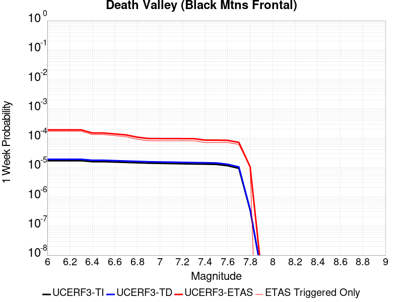 |  |  |  |

| Magnitude | 1 wk TI Prob | 1 wk TD Prob | 1 wk ETAS Prob | 1 wk ETAS/TD Gain | 1 wk ETAS Triggered Only | 1 mo TI Prob | 1 mo TD Prob | 1 mo ETAS Prob | 1 mo ETAS/TD Gain | 1 mo ETAS Triggered Only | 1 yr TI Prob | 1 yr TD Prob | 1 yr ETAS Prob | 1 yr ETAS/TD Gain | 1 yr ETAS Triggered Only | 10 yr TI Prob | 10 yr TD Prob | 10 yr ETAS Prob | 10 yr ETAS/TD Gain | 10 yr ETAS Triggered Only |
|-----|-----|-----|-----|-----|-----|-----|-----|-----|-----|-----|-----|-----|-----|-----|-----|-----|-----|-----|-----|-----|
| 6.0 | 1.6707214E-5 | 1.867027E-5 | 2.2093186E-4 | 11.833352 | 2.0226538E-4 | 7.160038E-5 | 8.001302E-5 | 3.833868E-4 | 4.791555 | 3.0339806E-4 | 8.71386E-4 | 9.737309E-4 | 0.001478902 | 1.5187994 | 5.0566345E-4 | 0.00867977 | 0.009695496 | 0.01029641 | 1.0619786 | 6.067961E-4 |
| 6.1 | 1.6707214E-5 | 1.867027E-5 | 2.2093186E-4 | 11.833352 | 2.0226538E-4 | 7.160038E-5 | 8.001302E-5 | 3.833868E-4 | 4.791555 | 3.0339806E-4 | 8.71386E-4 | 9.737309E-4 | 0.001478902 | 1.5187994 | 5.0566345E-4 | 0.00867977 | 0.009695496 | 0.01029641 | 1.0619786 | 6.067961E-4 |
| 6.2 | 1.6707214E-5 | 1.867027E-5 | 2.2093186E-4 | 11.833352 | 2.0226538E-4 | 7.160038E-5 | 8.001302E-5 | 3.833868E-4 | 4.791555 | 3.0339806E-4 | 8.71386E-4 | 9.737309E-4 | 0.001478902 | 1.5187994 | 5.0566345E-4 | 0.00867977 | 0.009695496 | 0.01029641 | 1.0619786 | 6.067961E-4 |
| 6.3 | 1.6707214E-5 | 1.867027E-5 | 2.2093186E-4 | 11.833352 | 2.0226538E-4 | 7.160038E-5 | 8.001302E-5 | 3.833868E-4 | 4.791555 | 3.0339806E-4 | 8.71386E-4 | 9.737309E-4 | 0.001478902 | 1.5187994 | 5.0566345E-4 | 0.00867977 | 0.009695496 | 0.01029641 | 1.0619786 | 6.067961E-4 |
| 6.4 | 1.5515609E-5 | 1.7338214E-5 | 2.1960007E-4 | 12.665669 | 2.0226538E-4 | 6.649377E-5 | 7.4304546E-5 | 2.765549E-4 | 3.7219107 | 2.0226538E-4 | 8.0926094E-4 | 9.042885E-4 | 0.0013084534 | 1.4469424 | 4.0453076E-4 | 0.008063202 | 0.009006773 | 0.0095078815 | 1.0556369 | 5.0566345E-4 |
| 6.5 | 1.5515609E-5 | 1.7338214E-5 | 2.1960007E-4 | 12.665669 | 2.0226538E-4 | 6.649377E-5 | 7.4304546E-5 | 2.765549E-4 | 3.7219107 | 2.0226538E-4 | 8.0926094E-4 | 9.042885E-4 | 0.0013084534 | 1.4469424 | 4.0453076E-4 | 0.008063202 | 0.009006773 | 0.0095078815 | 1.0556369 | 5.0566345E-4 |
| 6.6 | 1.5041828E-5 | 1.6809145E-5 | 1.1794013E-4 | 7.0164266 | 1.0113269E-4 | 6.4463384E-5 | 7.203723E-5 | 1.7316264E-4 | 2.4037936 | 1.0113269E-4 | 7.8455906E-4 | 8.767063E-4 | 0.0011798384 | 1.3457624 | 3.0339806E-4 | 0.00781795 | 0.008733132 | 0.009134131 | 1.0459168 | 4.0453076E-4 |
| 6.7 | 1.4634985E-5 | 1.6356016E-5 | 1.6356016E-5 | 1.0 | 0.0 | 6.271985E-5 | 7.009536E-5 | 7.009536E-5 | 1.0 | 0.0 | 7.6334673E-4 | 8.5308263E-4 | 0.0010551754 | 1.2368971 | 2.0226538E-4 | 0.007607299 | 0.008498715 | 0.008799535 | 1.0353959 | 3.0339806E-4 |
| 6.8 | 1.4209158E-5 | 1.5882048E-5 | 1.5882048E-5 | 1.0 | 0.0 | 6.089497E-5 | 6.8064175E-5 | 6.8064175E-5 | 1.0 | 0.0 | 7.4114406E-4 | 8.2837185E-4 | 9.2942076E-4 | 1.121985 | 1.0113269E-4 | 0.007386771 | 0.008253456 | 0.008454053 | 1.0243045 | 2.0226538E-4 |
| 6.9 | 1.3780098E-5 | 1.5404594E-5 | 1.5404594E-5 | 1.0 | 0.0 | 5.9056227E-5 | 6.6018045E-5 | 6.6018045E-5 | 1.0 | 0.0 | 7.1877235E-4 | 8.0347876E-4 | 8.0347876E-4 | 1.0 | 0.0 | 0.0071645193 | 0.008006332 | 0.008106655 | 1.0125304 | 1.0113269E-4 |
| 7.0 | 1.3585064E-5 | 1.5188155E-5 | 1.5188155E-5 | 1.0 | 0.0 | 5.8220405E-5 | 6.50905E-5 | 6.50905E-5 | 1.0 | 0.0 | 7.086029E-4 | 7.9219416E-4 | 7.9219416E-4 | 1.0 | 0.0 | 0.007063476 | 0.007894293 | 0.0079946285 | 1.0127097 | 1.0113269E-4 |
| 7.1 | 1.3398601E-5 | 1.49813395E-5 | 1.49813395E-5 | 1.0 | 0.0 | 5.742131E-5 | 6.420419E-5 | 6.420419E-5 | 1.0 | 0.0 | 6.9888023E-4 | 7.8141113E-4 | 7.8141113E-4 | 1.0 | 0.0 | 0.0069668638 | 0.007787224 | 0.007887569 | 1.0128858 | 1.0113269E-4 |
| 7.2 | 1.3126312E-5 | 1.4679561E-5 | 1.4679561E-5 | 1.0 | 0.0 | 5.6254412E-5 | 6.291092E-5 | 6.291092E-5 | 1.0 | 0.0 | 6.846822E-4 | 7.6567667E-4 | 7.6567667E-4 | 1.0 | 0.0 | 0.006825765 | 0.00763097 | 0.007731331 | 1.0131518 | 1.0113269E-4 |
| 7.3 | 1.2922429E-5 | 1.4453788E-5 | 1.4453788E-5 | 1.0 | 0.0 | 5.5380664E-5 | 6.194336E-5 | 6.194336E-5 | 1.0 | 0.0 | 6.74051E-4 | 7.53905E-4 | 7.53905E-4 | 1.0 | 0.0 | 0.006720101 | 0.007514055 | 0.0076144277 | 1.013358 | 1.0113269E-4 |
| 7.4 | 1.2768878E-5 | 1.4283772E-5 | 1.4283772E-5 | 1.0 | 0.0 | 5.4722615E-5 | 6.1214756E-5 | 6.1214756E-5 | 1.0 | 0.0 | 6.660441E-4 | 7.4504025E-4 | 7.4504025E-4 | 1.0 | 0.0 | 0.0066405144 | 0.0074260035 | 0.007526385 | 1.0135176 | 1.0113269E-4 |
| 7.5 | 1.2521929E-5 | 1.40120155E-5 | 1.40120155E-5 | 1.0 | 0.0 | 5.366431E-5 | 6.005014E-5 | 6.005014E-5 | 1.0 | 0.0 | 6.531671E-4 | 7.3087064E-4 | 7.3087064E-4 | 1.0 | 0.0 | 0.006512506 | 0.0072852457 | 0.007385642 | 1.0137807 | 1.0113269E-4 |
| 7.6 | 1.1301089E-5 | 1.2648149E-5 | 1.2648149E-5 | 1.0 | 0.0 | 4.8432343E-5 | 5.4205255E-5 | 5.4205255E-5 | 1.0 | 0.0 | 5.895042E-4 | 6.5975444E-4 | 6.5975444E-4 | 1.0 | 0.0 | 0.0058794282 | 0.00657851 | 0.0066789775 | 1.015272 | 1.0113269E-4 |
| 7.7 | 9.189108E-6 | 1.0283358E-5 | 1.0283358E-5 | 1.0 | 0.0 | 3.93813E-5 | 4.407082E-5 | 4.407082E-5 | 1.0 | 0.0 | 4.7936183E-4 | 5.3643517E-4 | 5.3643517E-4 | 1.0 | 0.0 | 0.004783291 | 0.005351914 | 0.0054525053 | 1.0187954 | 1.0113269E-4 |
| 7.8 | 3.4586725E-7 | 3.6482615E-7 | 3.6482615E-7 | 1.0 | 0.0 | 1.4822873E-6 | 1.5635396E-6 | 1.5635396E-6 | 1.0 | 0.0 | 1.80467E-5 | 1.9035933E-5 | 1.9035933E-5 | 1.0 | 0.0 | 1.8045233E-4 | 1.9034347E-4 | 1.9034347E-4 | 1.0 | 0.0 |
| 7.9 | 2.5591178E-9 | 2.6696718E-9 | 2.6696718E-9 | 1.0 | 0.0 | 1.0967647E-8 | 1.14414505E-8 | 1.14414505E-8 | 1.0 | 0.0 | 1.335311E-7 | 1.3929966E-7 | 1.3929966E-7 | 1.0 | 0.0 | 1.3353102E-6 | 1.3929966E-6 | 1.3929966E-6 | 1.0 | 0.0 |

## Elsinore (Glen Ivy) rev
*[(top)](#table-of-contents)*

| 1 Week | 1 Month | 1 Year | 10 Year |
|-----|-----|-----|-----|
|  |  |  |  |

| Magnitude | 1 wk TI Prob | 1 wk TD Prob | 1 wk ETAS Prob | 1 wk ETAS/TD Gain | 1 wk ETAS Triggered Only | 1 mo TI Prob | 1 mo TD Prob | 1 mo ETAS Prob | 1 mo ETAS/TD Gain | 1 mo ETAS Triggered Only | 1 yr TI Prob | 1 yr TD Prob | 1 yr ETAS Prob | 1 yr ETAS/TD Gain | 1 yr ETAS Triggered Only | 10 yr TI Prob | 10 yr TD Prob | 10 yr ETAS Prob | 10 yr ETAS/TD Gain | 10 yr ETAS Triggered Only |
|-----|-----|-----|-----|-----|-----|-----|-----|-----|-----|-----|-----|-----|-----|-----|-----|-----|-----|-----|-----|-----|
| 6.0 | 1.6204086E-4 | 2.9360707E-4 | 3.9471005E-4 | 1.344348 | 1.0113269E-4 | 6.94276E-4 | 0.0012578638 | 0.0014598748 | 1.1605984 | 2.0226538E-4 | 0.008420097 | 0.015234485 | 0.015533261 | 1.0196118 | 3.0339806E-4 | 0.081081145 | 0.13969168 | 0.1401267 | 1.0031142 | 5.0566345E-4 |
| 6.1 | 1.6204086E-4 | 2.9360707E-4 | 3.9471005E-4 | 1.344348 | 1.0113269E-4 | 6.94276E-4 | 0.0012578638 | 0.0014598748 | 1.1605984 | 2.0226538E-4 | 0.008420097 | 0.015234485 | 0.015533261 | 1.0196118 | 3.0339806E-4 | 0.081081145 | 0.13969168 | 0.1401267 | 1.0031142 | 5.0566345E-4 |
| 6.2 | 1.6204086E-4 | 2.9360707E-4 | 3.9471005E-4 | 1.344348 | 1.0113269E-4 | 6.94276E-4 | 0.0012578638 | 0.0014598748 | 1.1605984 | 2.0226538E-4 | 0.008420097 | 0.015234485 | 0.015533261 | 1.0196118 | 3.0339806E-4 | 0.081081145 | 0.13969168 | 0.1401267 | 1.0031142 | 5.0566345E-4 |
| 6.3 | 1.0111737E-4 | 1.7703383E-4 | 2.781486E-4 | 1.5711608 | 1.0113269E-4 | 4.332882E-4 | 7.5861247E-4 | 9.6072437E-4 | 1.2664232 | 2.0226538E-4 | 0.005262531 | 0.009217682 | 0.009518283 | 1.0326114 | 3.0339806E-4 | 0.0513964 | 0.0870191 | 0.08748076 | 1.0053053 | 5.0566345E-4 |
| 6.4 | 1.0111737E-4 | 1.7703383E-4 | 2.781486E-4 | 1.5711608 | 1.0113269E-4 | 4.332882E-4 | 7.5861247E-4 | 9.6072437E-4 | 1.2664232 | 2.0226538E-4 | 0.005262531 | 0.009217682 | 0.009518283 | 1.0326114 | 3.0339806E-4 | 0.0513964 | 0.0870191 | 0.08748076 | 1.0053053 | 5.0566345E-4 |
| 6.5 | 3.6624708E-5 | 4.6391084E-5 | 1.4751908E-4 | 3.1799016 | 1.0113269E-4 | 1.569536E-4 | 1.9880582E-4 | 2.999184E-4 | 1.5085996 | 1.0113269E-4 | 0.001909235 | 0.0024181372 | 0.0025190252 | 1.0417215 | 1.0113269E-4 | 0.01892915 | 0.023739954 | 0.023937419 | 1.0083178 | 2.0226538E-4 |
| 6.6 | 2.5051324E-5 | 2.614772E-5 | 2.614772E-5 | 1.0 | 0.0 | 1.073584E-4 | 1.12057096E-4 | 1.12057096E-4 | 1.0 | 0.0 | 0.0013063047 | 0.0013634858 | 0.0013634858 | 1.0 | 0.0 | 0.012986525 | 0.013564618 | 0.013564618 | 1.0 | 0.0 |
| 6.7 | 2.2189772E-5 | 2.2072849E-5 | 2.2072849E-5 | 1.0 | 0.0 | 9.509556E-5 | 9.4594696E-5 | 9.4594696E-5 | 1.0 | 0.0 | 0.0011571734 | 0.0011511183 | 0.0011511183 | 1.0 | 0.0 | 0.011511663 | 0.011465415 | 0.011465415 | 1.0 | 0.0 |
| 6.8 | 1.6654378E-5 | 1.4437705E-5 | 1.4437705E-5 | 1.0 | 0.0 | 7.137396E-5 | 6.187444E-5 | 6.187444E-5 | 1.0 | 0.0 | 8.686314E-4 | 7.530661E-4 | 7.530661E-4 | 1.0 | 0.0 | 0.008652439 | 0.00751048 | 0.00751048 | 1.0 | 0.0 |
| 6.9 | 1.5042909E-5 | 1.2332022E-5 | 1.2332022E-5 | 1.0 | 0.0 | 6.446802E-5 | 5.285047E-5 | 5.285047E-5 | 1.0 | 0.0 | 7.8461546E-4 | 6.4326765E-4 | 6.4326765E-4 | 1.0 | 0.0 | 0.007818509 | 0.00641828 | 0.00641828 | 1.0 | 0.0 |
| 7.0 | 1.4361385E-5 | 1.1451324E-5 | 1.1451324E-5 | 1.0 | 0.0 | 6.154734E-5 | 4.9076196E-5 | 4.9076196E-5 | 1.0 | 0.0 | 7.490812E-4 | 5.973418E-4 | 5.973418E-4 | 1.0 | 0.0 | 0.007465612 | 0.0059613534 | 0.0059613534 | 1.0 | 0.0 |
| 7.1 | 1.3265571E-5 | 1.0244926E-5 | 1.0244926E-5 | 1.0 | 0.0 | 5.6851208E-5 | 4.39061E-5 | 4.39061E-5 | 1.0 | 0.0 | 6.919436E-4 | 5.344282E-4 | 5.344282E-4 | 1.0 | 0.0 | 0.006897931 | 0.0053347866 | 0.0053347866 | 1.0 | 0.0 |
| 7.2 | 1.1596403E-5 | 8.505067E-6 | 8.505067E-6 | 1.0 | 0.0 | 4.9697923E-5 | 3.6449786E-5 | 3.6449786E-5 | 1.0 | 0.0 | 6.049042E-4 | 4.436875E-4 | 4.436875E-4 | 1.0 | 0.0 | 0.006032603 | 0.0044294316 | 0.0044294316 | 1.0 | 0.0 |
| 7.3 | 1.0150827E-5 | 7.2387597E-6 | 7.2387597E-6 | 1.0 | 0.0 | 4.3502816E-5 | 3.1022897E-5 | 3.1022897E-5 | 1.0 | 0.0 | 5.2951806E-4 | 3.7763975E-4 | 3.7763975E-4 | 1.0 | 0.0 | 0.005282581 | 0.0037703665 | 0.0037703665 | 1.0 | 0.0 |
| 7.4 | 9.080705E-6 | 6.352519E-6 | 6.352519E-6 | 1.0 | 0.0 | 3.8916725E-5 | 2.7224805E-5 | 2.7224805E-5 | 1.0 | 0.0 | 4.7370812E-4 | 3.3141294E-4 | 3.3141294E-4 | 1.0 | 0.0 | 0.004726996 | 0.0033093381 | 0.0033093381 | 1.0 | 0.0 |
| 7.5 | 7.671649E-6 | 5.2256332E-6 | 5.2256332E-6 | 1.0 | 0.0 | 3.287808E-5 | 2.2395385E-5 | 2.2395385E-5 | 1.0 | 0.0 | 4.0021708E-4 | 2.7263095E-4 | 2.7263095E-4 | 1.0 | 0.0 | 0.0039949706 | 0.00272309 | 0.00272309 | 1.0 | 0.0 |
| 7.6 | 6.990086E-6 | 4.687545E-6 | 4.687545E-6 | 1.0 | 0.0 | 2.9957167E-5 | 2.008933E-5 | 2.008933E-5 | 1.0 | 0.0 | 3.6466747E-4 | 2.445613E-4 | 2.445613E-4 | 1.0 | 0.0 | 0.0036406964 | 0.002443038 | 0.002443038 | 1.0 | 0.0 |
| 7.7 | 4.163505E-6 | 2.3295343E-6 | 2.3295343E-6 | 1.0 | 0.0 | 1.7843471E-5 | 9.983683E-6 | 9.983683E-6 | 1.0 | 0.0 | 2.172226E-4 | 1.21545316E-4 | 1.21545316E-4 | 1.0 | 0.0 | 0.0021701038 | 0.0012148614 | 0.0012148614 | 1.0 | 0.0 |
| 7.8 | 2.2692414E-7 | 9.3854695E-8 | 9.3854695E-8 | 1.0 | 0.0 | 9.725317E-7 | 4.0223435E-7 | 4.0223435E-7 | 1.0 | 0.0 | 1.1840509E-5 | 4.8971956E-6 | 4.8971956E-6 | 1.0 | 0.0 | 1.1839878E-4 | 4.8971204E-5 | 4.8971204E-5 | 1.0 | 0.0 |
| 7.9 | 6.676829E-9 | 3.439853E-9 | 3.439853E-9 | 1.0 | 0.0 | 2.861498E-8 | 1.4742227E-8 | 1.4742227E-8 | 1.0 | 0.0 | 3.4838732E-7 | 1.7948659E-7 | 1.7948659E-7 | 1.0 | 0.0 | 3.4838679E-6 | 1.7948646E-6 | 1.7948646E-6 | 1.0 | 0.0 |

## Cleghorn Lake
*[(top)](#table-of-contents)*

| 1 Week | 1 Month | 1 Year | 10 Year |
|-----|-----|-----|-----|
|  |  | 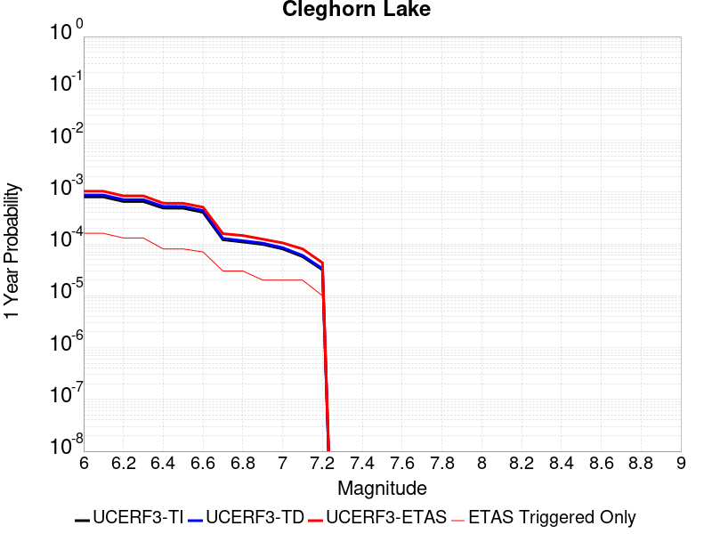 |  |

| Magnitude | 1 wk TI Prob | 1 wk TD Prob | 1 wk ETAS Prob | 1 wk ETAS/TD Gain | 1 wk ETAS Triggered Only | 1 mo TI Prob | 1 mo TD Prob | 1 mo ETAS Prob | 1 mo ETAS/TD Gain | 1 mo ETAS Triggered Only | 1 yr TI Prob | 1 yr TD Prob | 1 yr ETAS Prob | 1 yr ETAS/TD Gain | 1 yr ETAS Triggered Only | 10 yr TI Prob | 10 yr TD Prob | 10 yr ETAS Prob | 10 yr ETAS/TD Gain | 10 yr ETAS Triggered Only |
|-----|-----|-----|-----|-----|-----|-----|-----|-----|-----|-----|-----|-----|-----|-----|-----|-----|-----|-----|-----|-----|
| 6.0 | 1.5467183E-5 | 1.6794203E-5 | 2.1905618E-4 | 13.043558 | 2.0226538E-4 | 6.6286244E-5 | 7.197348E-5 | 3.7534971E-4 | 5.2151113 | 3.0339806E-4 | 8.067362E-4 | 8.759797E-4 | 0.001179112 | 1.3460494 | 3.0339806E-4 | 0.008038137 | 0.008730696 | 0.009031445 | 1.0344473 | 3.0339806E-4 |
| 6.1 | 1.5467183E-5 | 1.6794203E-5 | 2.1905618E-4 | 13.043558 | 2.0226538E-4 | 6.6286244E-5 | 7.197348E-5 | 3.7534971E-4 | 5.2151113 | 3.0339806E-4 | 8.067362E-4 | 8.759797E-4 | 0.001179112 | 1.3460494 | 3.0339806E-4 | 0.008038137 | 0.008730696 | 0.009031445 | 1.0344473 | 3.0339806E-4 |
| 6.2 | 1.2624631E-5 | 1.3681544E-5 | 2.1594415E-4 | 15.783609 | 2.0226538E-4 | 5.410444E-5 | 5.863415E-5 | 3.6201443E-4 | 6.174123 | 3.0339806E-4 | 6.585225E-4 | 7.1368564E-4 | 0.0010168671 | 1.424811 | 3.0339806E-4 | 0.0065657445 | 0.0071187317 | 0.00741997 | 1.0423163 | 3.0339806E-4 |
| 6.3 | 1.2624631E-5 | 1.3681544E-5 | 2.1594415E-4 | 15.783609 | 2.0226538E-4 | 5.410444E-5 | 5.863415E-5 | 3.6201443E-4 | 6.174123 | 3.0339806E-4 | 6.585225E-4 | 7.1368564E-4 | 0.0010168671 | 1.424811 | 3.0339806E-4 | 0.0065657445 | 0.0071187317 | 0.00741997 | 1.0423163 | 3.0339806E-4 |
| 6.4 | 9.417684E-6 | 1.0170118E-5 | 1.0170118E-5 | 1.0 | 0.0 | 4.036088E-5 | 4.3585722E-5 | 1.44714E-4 | 3.3202157 | 1.0113269E-4 | 4.912829E-4 | 5.3056807E-4 | 6.3164707E-4 | 1.190511 | 1.0113269E-4 | 0.004901982 | 0.005297049 | 0.005397646 | 1.0189911 | 1.0113269E-4 |
| 6.5 | 9.368219E-6 | 1.0117545E-5 | 1.0117545E-5 | 1.0 | 0.0 | 4.014889E-5 | 4.3360415E-5 | 1.4448872E-4 | 3.3322725 | 1.0113269E-4 | 4.8870314E-4 | 5.2782625E-4 | 6.2890555E-4 | 1.1915011 | 1.0113269E-4 | 0.004876298 | 0.0052697617 | 0.0053703613 | 1.01909 | 1.0113269E-4 |
| 6.6 | 7.803798E-6 | 8.441831E-6 | 8.441831E-6 | 1.0 | 0.0 | 3.3444423E-5 | 3.6179E-5 | 1.3730803E-4 | 3.795241 | 1.0113269E-4 | 4.0710976E-4 | 4.4043022E-4 | 5.415183E-4 | 1.2295214 | 1.0113269E-4 | 0.0040636472 | 0.0043994905 | 0.004500178 | 1.0228863 | 1.0113269E-4 |
| 6.7 | 2.3108669E-6 | 2.4438336E-6 | 2.4438336E-6 | 1.0 | 0.0 | 9.903678E-6 | 1.0473532E-5 | 1.0473532E-5 | 1.0 | 0.0 | 1.205706E-4 | 1.2750797E-4 | 1.2750797E-4 | 1.0 | 0.0 | 0.001205052 | 0.0012743667 | 0.0012743667 | 1.0 | 0.0 |
| 6.8 | 2.0882828E-6 | 2.2062823E-6 | 2.2062823E-6 | 1.0 | 0.0 | 8.949753E-6 | 9.455462E-6 | 9.455462E-6 | 1.0 | 0.0 | 1.08957785E-4 | 1.1511434E-4 | 1.1511434E-4 | 1.0 | 0.0 | 0.0010890438 | 0.0011505639 | 0.0011505639 | 1.0 | 0.0 |
| 6.9 | 1.876935E-6 | 1.981051E-6 | 1.981051E-6 | 1.0 | 0.0 | 8.043982E-6 | 8.490192E-6 | 8.490192E-6 | 1.0 | 0.0 | 9.7931086E-5 | 1.03363345E-4 | 1.03363345E-4 | 1.0 | 0.0 | 9.788794E-4 | 0.0010331686 | 0.0010331686 | 1.0 | 0.0 |
| 7.0 | 1.5357559E-6 | 1.6202807E-6 | 1.6202807E-6 | 1.0 | 0.0 | 6.5817944E-6 | 6.9440425E-6 | 6.9440425E-6 | 1.0 | 0.0 | 8.01304E-5 | 8.454057E-5 | 8.454057E-5 | 1.0 | 0.0 | 8.010151E-4 | 8.450965E-4 | 8.450965E-4 | 1.0 | 0.0 |
| 7.1 | 1.0905424E-6 | 1.1497619E-6 | 1.1497619E-6 | 1.0 | 0.0 | 4.6737446E-6 | 4.9275427E-6 | 4.9275427E-6 | 1.0 | 0.0 | 5.6901354E-5 | 5.999128E-5 | 5.999128E-5 | 1.0 | 0.0 | 5.6886784E-4 | 5.997606E-4 | 5.997606E-4 | 1.0 | 0.0 |
| 7.2 | 6.06668E-7 | 6.387277E-7 | 6.387277E-7 | 1.0 | 0.0 | 2.600003E-6 | 2.7374022E-6 | 2.7374022E-6 | 1.0 | 0.0 | 3.1654577E-5 | 3.3327433E-5 | 3.3327433E-5 | 1.0 | 0.0 | 3.1650066E-4 | 3.3323118E-4 | 3.3323118E-4 | 1.0 | 0.0 |

## San Andreas (San Bernardino S)
*[(top)](#table-of-contents)*

| 1 Week | 1 Month | 1 Year | 10 Year |
|-----|-----|-----|-----|
|  |  |  |  |

| Magnitude | 1 wk TI Prob | 1 wk TD Prob | 1 wk ETAS Prob | 1 wk ETAS/TD Gain | 1 wk ETAS Triggered Only | 1 mo TI Prob | 1 mo TD Prob | 1 mo ETAS Prob | 1 mo ETAS/TD Gain | 1 mo ETAS Triggered Only | 1 yr TI Prob | 1 yr TD Prob | 1 yr ETAS Prob | 1 yr ETAS/TD Gain | 1 yr ETAS Triggered Only | 10 yr TI Prob | 10 yr TD Prob | 10 yr ETAS Prob | 10 yr ETAS/TD Gain | 10 yr ETAS Triggered Only |
|-----|-----|-----|-----|-----|-----|-----|-----|-----|-----|-----|-----|-----|-----|-----|-----|-----|-----|-----|-----|-----|
| 6.0 | 1.2336002E-4 | 3.0004102E-4 | 3.0004102E-4 | 1.0 | 0.0 | 5.2857865E-4 | 0.0012852824 | 0.0012852824 | 1.0 | 0.0 | 0.006416472 | 0.015540994 | 0.015740115 | 1.0128127 | 2.0226538E-4 | 0.06234337 | 0.14283717 | 0.14318392 | 1.0024276 | 4.0453076E-4 |
| 6.1 | 1.2336002E-4 | 3.0004102E-4 | 3.0004102E-4 | 1.0 | 0.0 | 5.2857865E-4 | 0.0012852824 | 0.0012852824 | 1.0 | 0.0 | 0.006416472 | 0.015540994 | 0.015740115 | 1.0128127 | 2.0226538E-4 | 0.06234337 | 0.14283717 | 0.14318392 | 1.0024276 | 4.0453076E-4 |
| 6.2 | 1.2336002E-4 | 3.0004102E-4 | 3.0004102E-4 | 1.0 | 0.0 | 5.2857865E-4 | 0.0012852824 | 0.0012852824 | 1.0 | 0.0 | 0.006416472 | 0.015540994 | 0.015740115 | 1.0128127 | 2.0226538E-4 | 0.06234337 | 0.14283717 | 0.14318392 | 1.0024276 | 4.0453076E-4 |
| 6.3 | 1.1712257E-4 | 2.8792414E-4 | 2.8792414E-4 | 1.0 | 0.0 | 5.018573E-4 | 0.0012334028 | 0.0012334028 | 1.0 | 0.0 | 0.006093008 | 0.014918125 | 0.015117373 | 1.0133561 | 2.0226538E-4 | 0.059286322 | 0.13754563 | 0.13789451 | 1.0025365 | 4.0453076E-4 |
| 6.4 | 1.1712257E-4 | 2.8792414E-4 | 2.8792414E-4 | 1.0 | 0.0 | 5.018573E-4 | 0.0012334028 | 0.0012334028 | 1.0 | 0.0 | 0.006093008 | 0.014918125 | 0.015117373 | 1.0133561 | 2.0226538E-4 | 0.059286322 | 0.13754563 | 0.13789451 | 1.0025365 | 4.0453076E-4 |
| 6.5 | 1.0689076E-4 | 2.680528E-4 | 2.680528E-4 | 1.0 | 0.0 | 4.5802278E-4 | 0.0011483167 | 0.0011483167 | 1.0 | 0.0 | 0.0055621783 | 0.01389575 | 0.014095205 | 1.0143536 | 2.0226538E-4 | 0.05425003 | 0.12879294 | 0.12914538 | 1.0027364 | 4.0453076E-4 |
| 6.6 | 9.7648895E-5 | 2.50501E-4 | 2.50501E-4 | 1.0 | 0.0 | 4.1842813E-4 | 0.0010731576 | 0.0010731576 | 1.0 | 0.0 | 0.005082469 | 0.012991785 | 0.013191422 | 1.0153664 | 2.0226538E-4 | 0.049677886 | 0.12095292 | 0.12130852 | 1.00294 | 4.0453076E-4 |
| 6.7 | 8.757013E-5 | 2.3120902E-4 | 2.3120902E-4 | 1.0 | 0.0 | 3.7524657E-4 | 9.905418E-4 | 9.905418E-4 | 1.0 | 0.0 | 0.00455906 | 0.011997245 | 0.012197084 | 1.016657 | 2.0226538E-4 | 0.04466656 | 0.11226123 | 0.112620346 | 1.003199 | 4.0453076E-4 |
| 6.8 | 8.562978E-5 | 2.2680782E-4 | 2.2680782E-4 | 1.0 | 0.0 | 3.6693315E-4 | 9.7169366E-4 | 9.7169366E-4 | 1.0 | 0.0 | 0.004458263 | 0.011770263 | 0.011970148 | 1.0169822 | 2.0226538E-4 | 0.043698758 | 0.11027153 | 0.11063145 | 1.003264 | 4.0453076E-4 |
| 6.9 | 6.124075E-5 | 1.7065753E-4 | 1.7065753E-4 | 1.0 | 0.0 | 2.6243398E-4 | 7.311852E-4 | 7.311852E-4 | 1.0 | 0.0 | 0.0031904527 | 0.008866051 | 0.009066523 | 1.0226113 | 2.0226538E-4 | 0.031450346 | 0.08418263 | 0.08455311 | 1.0044008 | 4.0453076E-4 |
| 7.0 | 5.8598747E-5 | 1.649477E-4 | 1.649477E-4 | 1.0 | 0.0 | 2.5111332E-4 | 7.06728E-4 | 7.06728E-4 | 1.0 | 0.0 | 0.0030530186 | 0.008570663 | 0.008771195 | 1.0233974 | 2.0226538E-4 | 0.03011414 | 0.081500374 | 0.081871934 | 1.004559 | 4.0453076E-4 |
| 7.1 | 5.613814E-5 | 1.5913323E-4 | 1.5913323E-4 | 1.0 | 0.0 | 2.4056983E-4 | 6.818221E-4 | 6.818221E-4 | 1.0 | 0.0 | 0.0029250039 | 0.008269769 | 0.008470361 | 1.0242561 | 2.0226538E-4 | 0.028868021 | 0.07879931 | 0.0790788 | 1.0035468 | 3.0339806E-4 |
| 7.2 | 4.991222E-5 | 1.4519796E-4 | 1.4519796E-4 | 1.0 | 0.0 | 2.1389198E-4 | 6.2212895E-4 | 6.2212895E-4 | 1.0 | 0.0 | 0.002601025 | 0.007548217 | 0.007748956 | 1.0265942 | 2.0226538E-4 | 0.025707912 | 0.07225321 | 0.07253469 | 1.0038956 | 3.0339806E-4 |
| 7.3 | 4.7410045E-5 | 1.3714004E-4 | 1.3714004E-4 | 1.0 | 0.0 | 2.0317009E-4 | 5.8761094E-4 | 5.8761094E-4 | 1.0 | 0.0 | 0.0024707897 | 0.0071307817 | 0.0073316046 | 1.0281628 | 2.0226538E-4 | 0.024434982 | 0.06853558 | 0.06881818 | 1.0041234 | 3.0339806E-4 |
| 7.4 | 4.5556746E-5 | 1.3121912E-4 | 1.3121912E-4 | 1.0 | 0.0 | 1.952286E-4 | 5.622468E-4 | 5.622468E-4 | 1.0 | 0.0 | 0.002374317 | 0.0068239477 | 0.0070248325 | 1.0294383 | 2.0226538E-4 | 0.023491086 | 0.065788016 | 0.06607145 | 1.0043083 | 3.0339806E-4 |
| 7.5 | 4.3084514E-5 | 1.2357246E-4 | 1.2357246E-4 | 1.0 | 0.0 | 1.8463485E-4 | 5.2948913E-4 | 5.2948913E-4 | 1.0 | 0.0 | 0.0022456115 | 0.0064275465 | 0.006628512 | 1.0312662 | 2.0226538E-4 | 0.022230545 | 0.062188786 | 0.062473316 | 1.0045753 | 3.0339806E-4 |
| 7.6 | 3.408608E-5 | 9.83552E-5 | 9.83552E-5 | 1.0 | 0.0 | 1.4607502E-4 | 4.214543E-4 | 4.214543E-4 | 1.0 | 0.0 | 0.0017770125 | 0.0051191594 | 0.0053203893 | 1.0393091 | 2.0226538E-4 | 0.017628696 | 0.050020292 | 0.050308514 | 1.0057621 | 3.0339806E-4 |
| 7.7 | 2.8315713E-5 | 8.248679E-5 | 8.248679E-5 | 1.0 | 0.0 | 1.2134742E-4 | 3.5346695E-4 | 3.5346695E-4 | 1.0 | 0.0 | 0.0014764034 | 0.0042949775 | 0.004496374 | 1.0468912 | 2.0226538E-4 | 0.01466633 | 0.0422714 | 0.042561974 | 1.006874 | 3.0339806E-4 |
| 7.8 | 2.6222975E-5 | 7.463088E-5 | 7.463088E-5 | 1.0 | 0.0 | 1.1237934E-4 | 3.1980744E-4 | 3.1980744E-4 | 1.0 | 0.0 | 0.0013673597 | 0.0038867102 | 0.0040881895 | 1.051838 | 2.0226538E-4 | 0.013589768 | 0.03843674 | 0.03872848 | 1.00759 | 3.0339806E-4 |
| 7.9 | 2.1469694E-5 | 5.787864E-5 | 5.787864E-5 | 1.0 | 0.0 | 9.200973E-5 | 2.4802773E-4 | 2.4802773E-4 | 1.0 | 0.0 | 0.0011196428 | 0.0030155594 | 0.0031163872 | 1.0334358 | 1.0113269E-4 | 0.011140184 | 0.030152109 | 0.030348275 | 1.0065058 | 2.0226538E-4 |
| 8.0 | 1.2420249E-5 | 3.131896E-5 | 3.131896E-5 | 1.0 | 0.0 | 5.322855E-5 | 1.342172E-4 | 1.342172E-4 | 1.0 | 0.0 | 6.478649E-4 | 0.0016328706 | 0.0016328706 | 1.0 | 0.0 | 0.0064597935 | 0.016522504 | 0.016621966 | 1.0060198 | 1.0113269E-4 |
| 8.1 | 4.9197724E-6 | 7.822348E-6 | 7.822348E-6 | 1.0 | 0.0 | 2.1084568E-5 | 3.352392E-5 | 3.352392E-5 | 1.0 | 0.0 | 2.566744E-4 | 4.0807744E-4 | 4.0807744E-4 | 1.0 | 0.0 | 0.002563781 | 0.0043843705 | 0.0043843705 | 1.0 | 0.0 |
| 8.2 | 2.5634774E-6 | 2.9067196E-6 | 2.9067196E-6 | 1.0 | 0.0 | 1.0986286E-5 | 1.2457311E-5 | 1.2457311E-5 | 1.0 | 0.0 | 1.3374983E-4 | 1.5165724E-4 | 1.5165724E-4 | 1.0 | 0.0 | 0.0013366934 | 0.0017049741 | 0.0017049741 | 1.0 | 0.0 |
| 8.3 | 5.2850464E-7 | 3.2088764E-7 | 3.2088764E-7 | 1.0 | 0.0 | 2.2650179E-6 | 1.375232E-6 | 1.375232E-6 | 1.0 | 0.0 | 2.7576245E-5 | 1.6743334E-5 | 1.6743334E-5 | 1.0 | 0.0 | 2.7572823E-4 | 1.9870348E-4 | 1.9870348E-4 | 1.0 | 0.0 |

## Coyote Lake
*[(top)](#table-of-contents)*

| 1 Week | 1 Month | 1 Year | 10 Year |
|-----|-----|-----|-----|
|  |  |  |  |

| Magnitude | 1 wk TI Prob | 1 wk TD Prob | 1 wk ETAS Prob | 1 wk ETAS/TD Gain | 1 wk ETAS Triggered Only | 1 mo TI Prob | 1 mo TD Prob | 1 mo ETAS Prob | 1 mo ETAS/TD Gain | 1 mo ETAS Triggered Only | 1 yr TI Prob | 1 yr TD Prob | 1 yr ETAS Prob | 1 yr ETAS/TD Gain | 1 yr ETAS Triggered Only | 10 yr TI Prob | 10 yr TD Prob | 10 yr ETAS Prob | 10 yr ETAS/TD Gain | 10 yr ETAS Triggered Only |
|-----|-----|-----|-----|-----|-----|-----|-----|-----|-----|-----|-----|-----|-----|-----|-----|-----|-----|-----|-----|-----|
| 6.0 | 1.980352E-5 | 2.1706745E-5 | 3.2509823E-4 | 14.97683 | 3.0339806E-4 | 8.486947E-5 | 9.302599E-5 | 3.9639583E-4 | 4.26113 | 3.0339806E-4 | 0.0010327959 | 0.0011320751 | 0.0015361479 | 1.3569311 | 4.0453076E-4 | 0.010280091 | 0.011270258 | 0.01167023 | 1.0354891 | 4.0453076E-4 |
| 6.1 | 1.980352E-5 | 2.1706745E-5 | 3.2509823E-4 | 14.97683 | 3.0339806E-4 | 8.486947E-5 | 9.302599E-5 | 3.9639583E-4 | 4.26113 | 3.0339806E-4 | 0.0010327959 | 0.0011320751 | 0.0015361479 | 1.3569311 | 4.0453076E-4 | 0.010280091 | 0.011270258 | 0.01167023 | 1.0354891 | 4.0453076E-4 |
| 6.2 | 1.980352E-5 | 2.1706745E-5 | 3.2509823E-4 | 14.97683 | 3.0339806E-4 | 8.486947E-5 | 9.302599E-5 | 3.9639583E-4 | 4.26113 | 3.0339806E-4 | 0.0010327959 | 0.0011320751 | 0.0015361479 | 1.3569311 | 4.0453076E-4 | 0.010280091 | 0.011270258 | 0.01167023 | 1.0354891 | 4.0453076E-4 |
| 6.3 | 1.5344787E-5 | 1.682067E-5 | 3.202136E-4 | 19.036913 | 3.0339806E-4 | 6.576172E-5 | 7.2086936E-5 | 3.7546313E-4 | 5.2084765 | 3.0339806E-4 | 8.003548E-4 | 8.773662E-4 | 0.0012815421 | 1.4606694 | 4.0453076E-4 | 0.007974784 | 0.00874507 | 0.009146063 | 1.0458536 | 4.0453076E-4 |
| 6.4 | 1.5344787E-5 | 1.682067E-5 | 3.202136E-4 | 19.036913 | 3.0339806E-4 | 6.576172E-5 | 7.2086936E-5 | 3.7546313E-4 | 5.2084765 | 3.0339806E-4 | 8.003548E-4 | 8.773662E-4 | 0.0012815421 | 1.4606694 | 4.0453076E-4 | 0.007974784 | 0.00874507 | 0.009146063 | 1.0458536 | 4.0453076E-4 |
| 6.5 | 1.4189697E-5 | 1.5557987E-5 | 3.1895132E-4 | 20.500809 | 3.0339806E-4 | 6.081157E-5 | 6.6675726E-5 | 3.7005355E-4 | 5.5500493 | 3.0339806E-4 | 7.401293E-4 | 8.115349E-4 | 0.0012157373 | 1.4980716 | 4.0453076E-4 | 0.0073766913 | 0.008091656 | 0.008492913 | 1.049589 | 4.0453076E-4 |
| 6.6 | 1.3469301E-5 | 1.4771577E-5 | 3.1816514E-4 | 21.539011 | 3.0339806E-4 | 5.7724297E-5 | 6.330556E-5 | 3.6668443E-4 | 5.792294 | 3.0339806E-4 | 7.025667E-4 | 7.7053264E-4 | 0.0011747517 | 1.5245969 | 4.0453076E-4 | 0.0070034964 | 0.0076845144 | 0.008085936 | 1.0522377 | 4.0453076E-4 |
| 6.7 | 1.3027966E-5 | 1.4281745E-5 | 3.1767547E-4 | 22.243464 | 3.0339806E-4 | 5.5832945E-5 | 6.120638E-5 | 3.6458587E-4 | 5.9566646 | 3.0339806E-4 | 6.7955407E-4 | 7.4499263E-4 | 0.001149222 | 1.5425951 | 4.0453076E-4 | 0.006774798 | 0.0074308286 | 0.007832354 | 1.054035 | 4.0453076E-4 |
| 6.8 | 5.695434E-6 | 6.2244176E-6 | 6.2244176E-6 | 1.0 | 0.0 | 2.4408775E-5 | 2.6675973E-5 | 2.6675973E-5 | 1.0 | 0.0 | 2.971363E-4 | 3.2476155E-4 | 3.2476155E-4 | 1.0 | 0.0 | 0.0029673933 | 0.0032458105 | 0.0032458105 | 1.0 | 0.0 |
| 6.9 | 4.385688E-6 | 4.7930553E-6 | 4.7930553E-6 | 1.0 | 0.0 | 1.879567E-5 | 2.0541665E-5 | 2.0541665E-5 | 1.0 | 0.0 | 2.2881327E-4 | 2.5009477E-4 | 2.5009477E-4 | 1.0 | 0.0 | 0.002285778 | 0.0025009478 | 0.0025009478 | 1.0 | 0.0 |

## Mission Ridge-Arroyo Parida-Santa Ana
*[(top)](#table-of-contents)*

| 1 Week | 1 Month | 1 Year | 10 Year |
|-----|-----|-----|-----|
|  |  |  |  |

| Magnitude | 1 wk TI Prob | 1 wk TD Prob | 1 wk ETAS Prob | 1 wk ETAS/TD Gain | 1 wk ETAS Triggered Only | 1 mo TI Prob | 1 mo TD Prob | 1 mo ETAS Prob | 1 mo ETAS/TD Gain | 1 mo ETAS Triggered Only | 1 yr TI Prob | 1 yr TD Prob | 1 yr ETAS Prob | 1 yr ETAS/TD Gain | 1 yr ETAS Triggered Only | 10 yr TI Prob | 10 yr TD Prob | 10 yr ETAS Prob | 10 yr ETAS/TD Gain | 10 yr ETAS Triggered Only |
|-----|-----|-----|-----|-----|-----|-----|-----|-----|-----|-----|-----|-----|-----|-----|-----|-----|-----|-----|-----|-----|
| 6.0 | 4.169034E-5 | 4.7138263E-5 | 1.4826618E-4 | 3.1453466 | 1.0113269E-4 | 1.7866064E-4 | 2.0201034E-4 | 4.0423486E-4 | 2.0010602 | 2.0226538E-4 | 0.0021730233 | 0.00245745 | 0.0027601025 | 1.1231571 | 3.0339806E-4 | 0.021518968 | 0.024384614 | 0.024680614 | 1.0121388 | 3.0339806E-4 |
| 6.1 | 1.73813E-5 | 1.6854226E-5 | 1.17985204E-4 | 7.000334 | 1.0113269E-4 | 7.4489166E-5 | 7.223046E-5 | 1.7335585E-4 | 2.400038 | 1.0113269E-4 | 9.065282E-4 | 8.790618E-4 | 9.801056E-4 | 1.114945 | 1.0113269E-4 | 0.009028391 | 0.008756988 | 0.008857235 | 1.0114477 | 1.0113269E-4 |
| 6.2 | 1.4622182E-5 | 1.367329E-5 | 1.1480459E-4 | 8.396267 | 1.0113269E-4 | 6.2664985E-5 | 5.8598518E-5 | 1.5972528E-4 | 2.7257562 | 1.0113269E-4 | 7.6267915E-4 | 7.132073E-4 | 8.1426784E-4 | 1.1416987 | 1.0113269E-4 | 0.007600669 | 0.007109627 | 0.007210041 | 1.0141237 | 1.0113269E-4 |
| 6.3 | 1.3552434E-5 | 1.2482201E-5 | 1.1361363E-4 | 9.102051 | 1.0113269E-4 | 5.8080568E-5 | 5.3494066E-5 | 1.5462135E-4 | 2.890439 | 1.0113269E-4 | 7.069015E-4 | 6.510988E-4 | 7.521656E-4 | 1.155225 | 1.0113269E-4 | 0.00704657 | 0.006492275 | 0.006592751 | 1.0154762 | 1.0113269E-4 |
| 6.4 | 1.30977305E-5 | 1.1979156E-5 | 1.1311063E-4 | 9.442287 | 1.0113269E-4 | 5.613192E-5 | 5.1338247E-5 | 1.5246574E-4 | 2.9698277 | 1.0113269E-4 | 6.831918E-4 | 6.248669E-4 | 7.259364E-4 | 1.1617457 | 1.0113269E-4 | 0.006810953 | 0.0062314444 | 0.0063319467 | 1.0161283 | 1.0113269E-4 |
| 6.5 | 1.225205E-5 | 1.1048803E-5 | 1.1218037E-4 | 10.15317 | 1.0113269E-4 | 5.2507727E-5 | 4.7351168E-5 | 1.4847907E-4 | 3.1357002 | 1.0113269E-4 | 6.3909404E-4 | 5.7635066E-4 | 6.7742507E-4 | 1.1753696 | 1.0113269E-4 | 0.006372592 | 0.005748869 | 0.0058494206 | 1.0174906 | 1.0113269E-4 |
| 6.6 | 1.1352241E-5 | 1.0063535E-5 | 1.0063535E-5 | 1.0 | 0.0 | 4.8651553E-5 | 4.3128734E-5 | 4.3128734E-5 | 1.0 | 0.0 | 5.921717E-4 | 5.2496797E-4 | 5.2496797E-4 | 1.0 | 0.0 | 0.0059059616 | 0.0052375244 | 0.0052375244 | 1.0 | 0.0 |
| 6.7 | 1.0864116E-5 | 9.517027E-6 | 9.517027E-6 | 1.0 | 0.0 | 4.6559664E-5 | 4.0786632E-5 | 4.0786632E-5 | 1.0 | 0.0 | 5.667165E-4 | 4.964661E-4 | 4.964661E-4 | 1.0 | 0.0 | 0.005652734 | 0.004953804 | 0.004953804 | 1.0 | 0.0 |
| 6.8 | 1.0666365E-5 | 9.299779E-6 | 9.299779E-6 | 1.0 | 0.0 | 4.571219E-5 | 3.9855597E-5 | 3.9855597E-5 | 1.0 | 0.0 | 5.564038E-4 | 4.8513585E-4 | 4.8513585E-4 | 1.0 | 0.0 | 0.005550127 | 0.0048410003 | 0.0048410003 | 1.0 | 0.0 |
| 6.9 | 1.0038665E-5 | 8.592046E-6 | 8.592046E-6 | 1.0 | 0.0 | 4.302214E-5 | 3.682254E-5 | 3.682254E-5 | 1.0 | 0.0 | 5.236687E-4 | 4.4822405E-4 | 4.4822405E-4 | 1.0 | 0.0 | 0.005224364 | 0.004473411 | 0.004473411 | 1.0 | 0.0 |
| 7.0 | 9.5379955E-6 | 8.025073E-6 | 8.025073E-6 | 1.0 | 0.0 | 4.0876483E-5 | 3.4392728E-5 | 3.4392728E-5 | 1.0 | 0.0 | 4.975576E-4 | 4.1865272E-4 | 4.1865272E-4 | 1.0 | 0.0 | 0.00496445 | 0.0041788397 | 0.0041788397 | 1.0 | 0.0 |
| 7.1 | 9.207389E-6 | 7.652375E-6 | 7.652375E-6 | 1.0 | 0.0 | 3.945964E-5 | 3.279549E-5 | 3.279549E-5 | 1.0 | 0.0 | 4.803152E-4 | 3.9921363E-4 | 3.9921363E-4 | 1.0 | 0.0 | 0.004792784 | 0.003985161 | 0.003985161 | 1.0 | 0.0 |
| 7.2 | 7.638091E-6 | 5.9311183E-6 | 5.9311183E-6 | 1.0 | 0.0 | 3.2734264E-5 | 2.541883E-5 | 2.541883E-5 | 1.0 | 0.0 | 3.984668E-4 | 3.0943064E-4 | 3.0943064E-4 | 1.0 | 0.0 | 0.0039775306 | 0.0030900547 | 0.0030900547 | 1.0 | 0.0 |
| 7.3 | 7.2500147E-6 | 5.5961527E-6 | 5.5961527E-6 | 1.0 | 0.0 | 3.1071122E-5 | 2.3983293E-5 | 2.3983293E-5 | 1.0 | 0.0 | 3.7822526E-4 | 2.9195778E-4 | 2.9195778E-4 | 1.0 | 0.0 | 0.0037758215 | 0.0029157975 | 0.0029157975 | 1.0 | 0.0 |
| 7.4 | 6.3899715E-6 | 4.9184964E-6 | 4.9184964E-6 | 1.0 | 0.0 | 2.7385306E-5 | 2.10791E-5 | 2.10791E-5 | 1.0 | 0.0 | 3.3336508E-4 | 2.5660804E-4 | 2.5660804E-4 | 1.0 | 0.0 | 0.0033286542 | 0.0025631618 | 0.0025631618 | 1.0 | 0.0 |
| 7.5 | 5.379025E-6 | 4.0838527E-6 | 4.0838527E-6 | 1.0 | 0.0 | 2.305276E-5 | 1.7502109E-5 | 1.7502109E-5 | 1.0 | 0.0 | 2.806312E-4 | 2.1306744E-4 | 2.1306744E-4 | 1.0 | 0.0 | 0.0028027708 | 0.002128643 | 0.002128643 | 1.0 | 0.0 |
| 7.6 | 4.1270696E-6 | 3.0883439E-6 | 3.0883439E-6 | 1.0 | 0.0 | 1.768732E-5 | 1.3235693E-5 | 1.3235693E-5 | 1.0 | 0.0 | 2.1532185E-4 | 1.6113273E-4 | 1.6113273E-4 | 1.0 | 0.0 | 0.0021511333 | 0.001610167 | 0.001610167 | 1.0 | 0.0 |
| 7.7 | 2.5406805E-6 | 1.8282013E-6 | 1.8282013E-6 | 1.0 | 0.0 | 1.0888585E-5 | 7.835125E-6 | 7.835125E-6 | 1.0 | 0.0 | 1.3256045E-4 | 9.538854E-5 | 9.538854E-5 | 1.0 | 0.0 | 0.0013248142 | 9.534821E-4 | 9.534821E-4 | 1.0 | 0.0 |
| 7.8 | 4.8608285E-7 | 3.5098864E-7 | 3.5098864E-7 | 1.0 | 0.0 | 2.0832106E-6 | 1.5042363E-6 | 1.5042363E-6 | 1.0 | 0.0 | 2.5362791E-5 | 1.8313924E-5 | 1.8313924E-5 | 1.0 | 0.0 | 2.5359896E-4 | 1.8312426E-4 | 1.8312426E-4 | 1.0 | 0.0 |
| 7.9 | 2.0472514E-8 | 1.2688783E-8 | 1.2688783E-8 | 1.0 | 0.0 | 8.7739345E-8 | 5.43805E-8 | 5.43805E-8 | 1.0 | 0.0 | 1.068226E-6 | 6.6208236E-7 | 6.6208236E-7 | 1.0 | 0.0 | 1.0682209E-5 | 6.620805E-6 | 6.620805E-6 | 1.0 | 0.0 |
| 8.0 | 4.443582E-9 | 2.0321211E-9 | 2.0321211E-9 | 1.0 | 0.0 | 1.9043922E-8 | 8.70909E-9 | 8.70909E-9 | 1.0 | 0.0 | 2.3185973E-7 | 1.0603316E-7 | 1.0603316E-7 | 1.0 | 0.0 | 2.3185949E-6 | 1.0603312E-6 | 1.0603312E-6 | 1.0 | 0.0 |

## Dry Mountain
*[(top)](#table-of-contents)*

| 1 Week | 1 Month | 1 Year | 10 Year |
|-----|-----|-----|-----|
|  |  |  |  |

| Magnitude | 1 wk TI Prob | 1 wk TD Prob | 1 wk ETAS Prob | 1 wk ETAS/TD Gain | 1 wk ETAS Triggered Only | 1 mo TI Prob | 1 mo TD Prob | 1 mo ETAS Prob | 1 mo ETAS/TD Gain | 1 mo ETAS Triggered Only | 1 yr TI Prob | 1 yr TD Prob | 1 yr ETAS Prob | 1 yr ETAS/TD Gain | 1 yr ETAS Triggered Only | 10 yr TI Prob | 10 yr TD Prob | 10 yr ETAS Prob | 10 yr ETAS/TD Gain | 10 yr ETAS Triggered Only |
|-----|-----|-----|-----|-----|-----|-----|-----|-----|-----|-----|-----|-----|-----|-----|-----|-----|-----|-----|-----|-----|
| 6.0 | 6.222801E-6 | 6.439381E-6 | 6.439381E-6 | 1.0 | 0.0 | 2.6668875E-5 | 2.7597147E-5 | 2.7597147E-5 | 1.0 | 0.0 | 3.2464517E-4 | 3.3595937E-4 | 4.3705807E-4 | 1.3009254 | 1.0113269E-4 | 0.0032417132 | 0.0033560768 | 0.0036584567 | 1.0900992 | 3.0339806E-4 |
| 6.1 | 6.222801E-6 | 6.439381E-6 | 6.439381E-6 | 1.0 | 0.0 | 2.6668875E-5 | 2.7597147E-5 | 2.7597147E-5 | 1.0 | 0.0 | 3.2464517E-4 | 3.3595937E-4 | 4.3705807E-4 | 1.3009254 | 1.0113269E-4 | 0.0032417132 | 0.0033560768 | 0.0036584567 | 1.0900992 | 3.0339806E-4 |
| 6.2 | 6.222801E-6 | 6.439381E-6 | 6.439381E-6 | 1.0 | 0.0 | 2.6668875E-5 | 2.7597147E-5 | 2.7597147E-5 | 1.0 | 0.0 | 3.2464517E-4 | 3.3595937E-4 | 4.3705807E-4 | 1.3009254 | 1.0113269E-4 | 0.0032417132 | 0.0033560768 | 0.0036584567 | 1.0900992 | 3.0339806E-4 |
| 6.3 | 6.222801E-6 | 6.439381E-6 | 6.439381E-6 | 1.0 | 0.0 | 2.6668875E-5 | 2.7597147E-5 | 2.7597147E-5 | 1.0 | 0.0 | 3.2464517E-4 | 3.3595937E-4 | 4.3705807E-4 | 1.3009254 | 1.0113269E-4 | 0.0032417132 | 0.0033560768 | 0.0036584567 | 1.0900992 | 3.0339806E-4 |
| 6.4 | 6.222801E-6 | 6.439381E-6 | 6.439381E-6 | 1.0 | 0.0 | 2.6668875E-5 | 2.7597147E-5 | 2.7597147E-5 | 1.0 | 0.0 | 3.2464517E-4 | 3.3595937E-4 | 4.3705807E-4 | 1.3009254 | 1.0113269E-4 | 0.0032417132 | 0.0033560768 | 0.0036584567 | 1.0900992 | 3.0339806E-4 |
| 6.5 | 2.8528623E-6 | 2.9521684E-6 | 2.9521684E-6 | 1.0 | 0.0 | 1.22264955E-5 | 1.2652138E-5 | 1.2652138E-5 | 1.0 | 0.0 | 1.4884741E-4 | 1.540376E-4 | 2.551547E-4 | 1.6564443 | 1.0113269E-4 | 0.0014874774 | 0.0015401616 | 0.0018430924 | 1.1966877 | 3.0339806E-4 |
| 6.6 | 2.8528623E-6 | 2.9521684E-6 | 2.9521684E-6 | 1.0 | 0.0 | 1.22264955E-5 | 1.2652138E-5 | 1.2652138E-5 | 1.0 | 0.0 | 1.4884741E-4 | 1.540376E-4 | 2.551547E-4 | 1.6564443 | 1.0113269E-4 | 0.0014874774 | 0.0015401616 | 0.0018430924 | 1.1966877 | 3.0339806E-4 |
| 6.7 | 2.541E-6 | 2.6293578E-6 | 2.6293578E-6 | 1.0 | 0.0 | 1.0889954E-5 | 1.1268677E-5 | 1.1268677E-5 | 1.0 | 0.0 | 1.3257713E-4 | 1.3719614E-4 | 2.3831495E-4 | 1.7370384 | 1.0113269E-4 | 0.0013249806 | 0.0013719613 | 0.0016749431 | 1.2208384 | 3.0339806E-4 |

## Santa Cruz Island
*[(top)](#table-of-contents)*

| 1 Week | 1 Month | 1 Year | 10 Year |
|-----|-----|-----|-----|
| 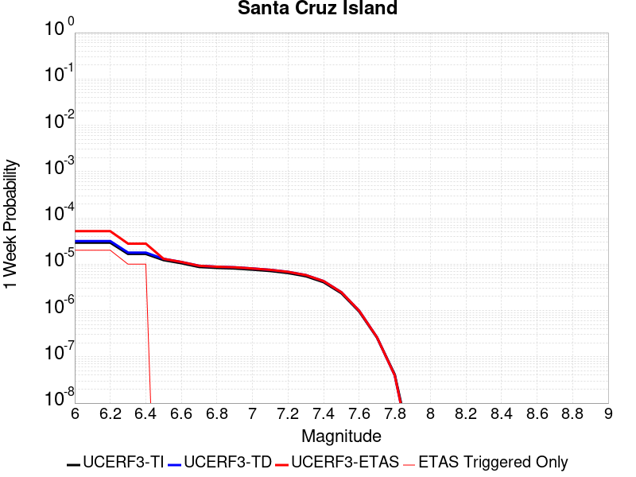 |  |  |  |

| Magnitude | 1 wk TI Prob | 1 wk TD Prob | 1 wk ETAS Prob | 1 wk ETAS/TD Gain | 1 wk ETAS Triggered Only | 1 mo TI Prob | 1 mo TD Prob | 1 mo ETAS Prob | 1 mo ETAS/TD Gain | 1 mo ETAS Triggered Only | 1 yr TI Prob | 1 yr TD Prob | 1 yr ETAS Prob | 1 yr ETAS/TD Gain | 1 yr ETAS Triggered Only | 10 yr TI Prob | 10 yr TD Prob | 10 yr ETAS Prob | 10 yr ETAS/TD Gain | 10 yr ETAS Triggered Only |
|-----|-----|-----|-----|-----|-----|-----|-----|-----|-----|-----|-----|-----|-----|-----|-----|-----|-----|-----|-----|-----|
| 6.0 | 2.9164563E-5 | 3.1599742E-5 | 1.3272924E-4 | 4.2003264 | 1.0113269E-4 | 1.2498499E-4 | 1.3542121E-4 | 3.376592E-4 | 2.4933996 | 2.0226538E-4 | 0.0015206301 | 0.0016476426 | 0.0018495746 | 1.1225582 | 2.0226538E-4 | 0.015102667 | 0.016368 | 0.016566955 | 1.012155 | 2.0226538E-4 |
| 6.1 | 2.9164563E-5 | 3.1599742E-5 | 1.3272924E-4 | 4.2003264 | 1.0113269E-4 | 1.2498499E-4 | 1.3542121E-4 | 3.376592E-4 | 2.4933996 | 2.0226538E-4 | 0.0015206301 | 0.0016476426 | 0.0018495746 | 1.1225582 | 2.0226538E-4 | 0.015102667 | 0.016368 | 0.016566955 | 1.012155 | 2.0226538E-4 |
| 6.2 | 2.9164563E-5 | 3.1599742E-5 | 1.3272924E-4 | 4.2003264 | 1.0113269E-4 | 1.2498499E-4 | 1.3542121E-4 | 3.376592E-4 | 2.4933996 | 2.0226538E-4 | 0.0015206301 | 0.0016476426 | 0.0018495746 | 1.1225582 | 2.0226538E-4 | 0.015102667 | 0.016368 | 0.016566955 | 1.012155 | 2.0226538E-4 |
| 6.3 | 1.6635553E-5 | 1.780436E-5 | 1.780436E-5 | 1.0 | 0.0 | 7.1293274E-5 | 7.630226E-5 | 1.7742724E-4 | 2.3253207 | 1.0113269E-4 | 8.6765E-4 | 9.2860236E-4 | 0.00113068 | 1.2176148 | 2.0226538E-4 | 0.008642701 | 0.009249094 | 0.0094494885 | 1.0216664 | 2.0226538E-4 |
| 6.4 | 1.6635553E-5 | 1.780436E-5 | 1.780436E-5 | 1.0 | 0.0 | 7.1293274E-5 | 7.630226E-5 | 1.7742724E-4 | 2.3253207 | 1.0113269E-4 | 8.6765E-4 | 9.2860236E-4 | 0.00113068 | 1.2176148 | 2.0226538E-4 | 0.008642701 | 0.009249094 | 0.0094494885 | 1.0216664 | 2.0226538E-4 |
| 6.5 | 1.2238748E-5 | 1.3042995E-5 | 1.3042995E-5 | 1.0 | 0.0 | 5.2450723E-5 | 5.5897377E-5 | 1.570244E-4 | 2.8091552 | 1.0113269E-4 | 6.3840044E-4 | 6.8034173E-4 | 7.814056E-4 | 1.1485487 | 1.0113269E-4 | 0.0063656955 | 0.0067829876 | 0.0068834345 | 1.0148087 | 1.0113269E-4 |
| 6.6 | 1.0489767E-5 | 1.1156636E-5 | 1.1156636E-5 | 1.0 | 0.0 | 4.495537E-5 | 4.781329E-5 | 1.4894114E-4 | 3.1150575 | 1.0113269E-4 | 5.4719415E-4 | 5.819735E-4 | 6.8304734E-4 | 1.1736742 | 1.0113269E-4 | 0.005458487 | 0.0058047357 | 0.0059052813 | 1.0173213 | 1.0113269E-4 |
| 6.7 | 8.699222E-6 | 9.236782E-6 | 9.236782E-6 | 1.0 | 0.0 | 3.7281847E-5 | 3.958561E-5 | 3.958561E-5 | 1.0 | 0.0 | 4.5381195E-4 | 4.8184878E-4 | 4.8184878E-4 | 1.0 | 0.0 | 0.0045288634 | 0.004808108 | 0.004808108 | 1.0 | 0.0 |
| 6.8 | 8.307732E-6 | 8.8169045E-6 | 8.8169045E-6 | 1.0 | 0.0 | 3.560408E-5 | 3.7786187E-5 | 3.7786187E-5 | 1.0 | 0.0 | 4.3339343E-4 | 4.5995016E-4 | 4.5995016E-4 | 1.0 | 0.0 | 0.004325492 | 0.0045900354 | 0.0045900354 | 1.0 | 0.0 |
| 6.9 | 8.073121E-6 | 8.564939E-6 | 8.564939E-6 | 1.0 | 0.0 | 3.459863E-5 | 3.6706366E-5 | 3.6706366E-5 | 1.0 | 0.0 | 4.2115687E-4 | 4.468088E-4 | 4.468088E-4 | 1.0 | 0.0 | 0.004203596 | 0.004459156 | 0.004459156 | 1.0 | 0.0 |
| 7.0 | 7.617019E-6 | 8.074664E-6 | 8.074664E-6 | 1.0 | 0.0 | 3.264396E-5 | 3.4605247E-5 | 3.4605247E-5 | 1.0 | 0.0 | 3.9736772E-4 | 4.212378E-4 | 4.212378E-4 | 1.0 | 0.0 | 0.003966579 | 0.0042044413 | 0.0042044413 | 1.0 | 0.0 |
| 7.1 | 7.1224836E-6 | 7.545788E-6 | 7.545788E-6 | 1.0 | 0.0 | 3.052457E-5 | 3.2338692E-5 | 3.2338692E-5 | 1.0 | 0.0 | 3.715733E-4 | 3.936528E-4 | 3.936528E-4 | 1.0 | 0.0 | 0.003709526 | 0.003929598 | 0.003929598 | 1.0 | 0.0 |
| 7.2 | 6.441115E-6 | 6.8273835E-6 | 6.8273835E-6 | 1.0 | 0.0 | 2.7604487E-5 | 2.9259887E-5 | 2.9259887E-5 | 1.0 | 0.0 | 3.360328E-4 | 3.5618112E-4 | 3.5618112E-4 | 1.0 | 0.0 | 0.0033552512 | 0.003556131 | 0.003556131 | 1.0 | 0.0 |
| 7.3 | 5.494274E-6 | 5.8199944E-6 | 5.8199944E-6 | 1.0 | 0.0 | 2.3546674E-5 | 2.4942596E-5 | 2.4942596E-5 | 1.0 | 0.0 | 2.8664304E-4 | 3.0363398E-4 | 3.0363398E-4 | 1.0 | 0.0 | 0.002862736 | 0.0030322142 | 0.0030322142 | 1.0 | 0.0 |
| 7.4 | 4.0802624E-6 | 4.312256E-6 | 4.312256E-6 | 1.0 | 0.0 | 1.7486722E-5 | 1.8480967E-5 | 1.8480967E-5 | 1.0 | 0.0 | 2.1288003E-4 | 2.2498262E-4 | 2.2498262E-4 | 1.0 | 0.0 | 0.0021267622 | 0.0022475575 | 0.0022475575 | 1.0 | 0.0 |
| 7.5 | 2.3584746E-6 | 2.4753094E-6 | 2.4753094E-6 | 1.0 | 0.0 | 1.0107709E-5 | 1.0608426E-5 | 1.0608426E-5 | 1.0 | 0.0 | 1.2305441E-4 | 1.2915E-4 | 1.2915E-4 | 1.0 | 0.0 | 0.0012298629 | 0.0012907543 | 0.0012907543 | 1.0 | 0.0 |
| 7.6 | 9.4981914E-7 | 9.86093E-7 | 9.86093E-7 | 1.0 | 0.0 | 4.0706473E-6 | 4.2261063E-6 | 4.2261063E-6 | 1.0 | 0.0 | 4.9559E-5 | 5.145164E-5 | 5.145164E-5 | 1.0 | 0.0 | 4.954795E-4 | 5.1439856E-4 | 5.1439856E-4 | 1.0 | 0.0 |
| 7.7 | 2.6013532E-7 | 2.6416603E-7 | 2.6416603E-7 | 1.0 | 0.0 | 1.1148652E-6 | 1.1321397E-6 | 1.1321397E-6 | 1.0 | 0.0 | 1.3573399E-5 | 1.3783714E-5 | 1.3783714E-5 | 1.0 | 0.0 | 1.357257E-4 | 1.3782867E-4 | 1.3782867E-4 | 1.0 | 0.0 |
| 7.8 | 4.1522263E-8 | 3.965679E-8 | 3.965679E-8 | 1.0 | 0.0 | 1.7795254E-7 | 1.6995766E-7 | 1.6995766E-7 | 1.0 | 0.0 | 2.16657E-6 | 2.0692328E-6 | 2.0692328E-6 | 1.0 | 0.0 | 2.1665488E-5 | 2.0692156E-5 | 2.0692156E-5 | 1.0 | 0.0 |
| 7.9 | 7.7242046E-10 | 5.9468175E-10 | 5.9468175E-10 | 1.0 | 0.0 | 3.3103735E-9 | 2.5486364E-9 | 2.5486364E-9 | 1.0 | 0.0 | 4.0303796E-8 | 3.1029646E-8 | 3.1029646E-8 | 1.0 | 0.0 | 4.030379E-7 | 3.1029643E-7 | 3.1029643E-7 | 1.0 | 0.0 |

## Cady
*[(top)](#table-of-contents)*

| 1 Week | 1 Month | 1 Year | 10 Year |
|-----|-----|-----|-----|
|  |  |  |  |

| Magnitude | 1 wk TI Prob | 1 wk TD Prob | 1 wk ETAS Prob | 1 wk ETAS/TD Gain | 1 wk ETAS Triggered Only | 1 mo TI Prob | 1 mo TD Prob | 1 mo ETAS Prob | 1 mo ETAS/TD Gain | 1 mo ETAS Triggered Only | 1 yr TI Prob | 1 yr TD Prob | 1 yr ETAS Prob | 1 yr ETAS/TD Gain | 1 yr ETAS Triggered Only | 10 yr TI Prob | 10 yr TD Prob | 10 yr ETAS Prob | 10 yr ETAS/TD Gain | 10 yr ETAS Triggered Only |
|-----|-----|-----|-----|-----|-----|-----|-----|-----|-----|-----|-----|-----|-----|-----|-----|-----|-----|-----|-----|-----|
| 6.0 | 1.9892565E-5 | 2.1858728E-5 | 1.2298921E-4 | 5.626549 | 1.0113269E-4 | 8.525106E-5 | 9.3677416E-5 | 1.9480062E-4 | 2.0794833 | 1.0113269E-4 | 0.0010374374 | 0.0011400167 | 0.0012410341 | 1.0886104 | 1.0113269E-4 | 0.010326075 | 0.011350701 | 0.0116506545 | 1.0264261 | 3.0339806E-4 |
| 6.1 | 1.9892565E-5 | 2.1858728E-5 | 1.2298921E-4 | 5.626549 | 1.0113269E-4 | 8.525106E-5 | 9.3677416E-5 | 1.9480062E-4 | 2.0794833 | 1.0113269E-4 | 0.0010374374 | 0.0011400167 | 0.0012410341 | 1.0886104 | 1.0113269E-4 | 0.010326075 | 0.011350701 | 0.0116506545 | 1.0264261 | 3.0339806E-4 |
| 6.2 | 1.9892565E-5 | 2.1858728E-5 | 1.2298921E-4 | 5.626549 | 1.0113269E-4 | 8.525106E-5 | 9.3677416E-5 | 1.9480062E-4 | 2.0794833 | 1.0113269E-4 | 0.0010374374 | 0.0011400167 | 0.0012410341 | 1.0886104 | 1.0113269E-4 | 0.010326075 | 0.011350701 | 0.0116506545 | 1.0264261 | 3.0339806E-4 |
| 6.3 | 1.1117327E-5 | 1.2176583E-5 | 1.2176583E-5 | 1.0 | 0.0 | 4.764482E-5 | 5.2184492E-5 | 5.2184492E-5 | 1.0 | 0.0 | 5.7992124E-4 | 6.351925E-4 | 6.351925E-4 | 1.0 | 0.0 | 0.0057841022 | 0.0063368753 | 0.006537859 | 1.0317165 | 2.0226538E-4 |
| 6.4 | 1.1117327E-5 | 1.2176583E-5 | 1.2176583E-5 | 1.0 | 0.0 | 4.764482E-5 | 5.2184492E-5 | 5.2184492E-5 | 1.0 | 0.0 | 5.7992124E-4 | 6.351925E-4 | 6.351925E-4 | 1.0 | 0.0 | 0.0057841022 | 0.0063368753 | 0.006537859 | 1.0317165 | 2.0226538E-4 |
| 6.5 | 6.103093E-6 | 6.672021E-6 | 6.672021E-6 | 1.0 | 0.0 | 2.615585E-5 | 2.8594131E-5 | 2.8594131E-5 | 1.0 | 0.0 | 3.1840094E-4 | 3.480905E-4 | 3.480905E-4 | 1.0 | 0.0 | 0.0031794512 | 0.0034766865 | 0.0035774678 | 1.0289876 | 1.0113269E-4 |
| 6.6 | 5.817237E-6 | 6.3656585E-6 | 6.3656585E-6 | 1.0 | 0.0 | 2.4930776E-5 | 2.728118E-5 | 2.728118E-5 | 1.0 | 0.0 | 3.034899E-4 | 3.3211018E-4 | 3.3211018E-4 | 1.0 | 0.0 | 0.0030307577 | 0.0033173605 | 0.0034181578 | 1.0303848 | 1.0113269E-4 |
| 6.7 | 4.8846314E-6 | 5.3405684E-6 | 5.3405684E-6 | 1.0 | 0.0 | 2.0933967E-5 | 2.2888014E-5 | 2.2888014E-5 | 1.0 | 0.0 | 2.5484123E-4 | 2.7863772E-4 | 2.7863772E-4 | 1.0 | 0.0 | 0.0025454918 | 0.0027840391 | 0.0027840391 | 1.0 | 0.0 |
| 6.8 | 1.7788773E-6 | 1.9399079E-6 | 1.9399079E-6 | 1.0 | 0.0 | 7.6237375E-6 | 8.313874E-6 | 8.313874E-6 | 1.0 | 0.0 | 9.281505E-5 | 1.01218284E-4 | 1.01218284E-4 | 1.0 | 0.0 | 9.2776294E-4 | 0.0010118765 | 0.0010118765 | 1.0 | 0.0 |
| 6.9 | 7.5455404E-7 | 8.297092E-7 | 8.297092E-7 | 1.0 | 0.0 | 3.233799E-6 | 3.5558937E-6 | 3.5558937E-6 | 1.0 | 0.0 | 3.937079E-5 | 4.3292483E-5 | 4.3292483E-5 | 1.0 | 0.0 | 3.9363815E-4 | 4.3287344E-4 | 4.3287344E-4 | 1.0 | 0.0 |
| 7.0 | 6.8578805E-7 | 7.541816E-7 | 7.541816E-7 | 1.0 | 0.0 | 2.9390883E-6 | 3.2322048E-6 | 3.2322048E-6 | 1.0 | 0.0 | 3.578281E-5 | 3.9351715E-5 | 3.9351715E-5 | 1.0 | 0.0 | 3.577705E-4 | 3.9347992E-4 | 3.9347992E-4 | 1.0 | 0.0 |

## Channel Islands Thrust
*[(top)](#table-of-contents)*

| 1 Week | 1 Month | 1 Year | 10 Year |
|-----|-----|-----|-----|
|  |  |  |  |

| Magnitude | 1 wk TI Prob | 1 wk TD Prob | 1 wk ETAS Prob | 1 wk ETAS/TD Gain | 1 wk ETAS Triggered Only | 1 mo TI Prob | 1 mo TD Prob | 1 mo ETAS Prob | 1 mo ETAS/TD Gain | 1 mo ETAS Triggered Only | 1 yr TI Prob | 1 yr TD Prob | 1 yr ETAS Prob | 1 yr ETAS/TD Gain | 1 yr ETAS Triggered Only | 10 yr TI Prob | 10 yr TD Prob | 10 yr ETAS Prob | 10 yr ETAS/TD Gain | 10 yr ETAS Triggered Only |
|-----|-----|-----|-----|-----|-----|-----|-----|-----|-----|-----|-----|-----|-----|-----|-----|-----|-----|-----|-----|-----|
| 6.0 | 2.2156251E-5 | 2.4092022E-5 | 1.2522227E-4 | 5.1976657 | 1.0113269E-4 | 9.495191E-5 | 1.03248036E-4 | 3.0549252E-4 | 2.9588215 | 2.0226538E-4 | 0.0011554264 | 0.0012564264 | 0.0014584378 | 1.1607823 | 2.0226538E-4 | 0.011494373 | 0.0125038205 | 0.012803425 | 1.0239611 | 3.0339806E-4 |
| 6.1 | 2.2156251E-5 | 2.4092022E-5 | 1.2522227E-4 | 5.1976657 | 1.0113269E-4 | 9.495191E-5 | 1.03248036E-4 | 3.0549252E-4 | 2.9588215 | 2.0226538E-4 | 0.0011554264 | 0.0012564264 | 0.0014584378 | 1.1607823 | 2.0226538E-4 | 0.011494373 | 0.0125038205 | 0.012803425 | 1.0239611 | 3.0339806E-4 |
| 6.2 | 2.2156251E-5 | 2.4092022E-5 | 1.2522227E-4 | 5.1976657 | 1.0113269E-4 | 9.495191E-5 | 1.03248036E-4 | 3.0549252E-4 | 2.9588215 | 2.0226538E-4 | 0.0011554264 | 0.0012564264 | 0.0014584378 | 1.1607823 | 2.0226538E-4 | 0.011494373 | 0.0125038205 | 0.012803425 | 1.0239611 | 3.0339806E-4 |
| 6.3 | 2.2156251E-5 | 2.4092022E-5 | 1.2522227E-4 | 5.1976657 | 1.0113269E-4 | 9.495191E-5 | 1.03248036E-4 | 3.0549252E-4 | 2.9588215 | 2.0226538E-4 | 0.0011554264 | 0.0012564264 | 0.0014584378 | 1.1607823 | 2.0226538E-4 | 0.011494373 | 0.0125038205 | 0.012803425 | 1.0239611 | 3.0339806E-4 |
| 6.4 | 2.2156251E-5 | 2.4092022E-5 | 1.2522227E-4 | 5.1976657 | 1.0113269E-4 | 9.495191E-5 | 1.03248036E-4 | 3.0549252E-4 | 2.9588215 | 2.0226538E-4 | 0.0011554264 | 0.0012564264 | 0.0014584378 | 1.1607823 | 2.0226538E-4 | 0.011494373 | 0.0125038205 | 0.012803425 | 1.0239611 | 3.0339806E-4 |
| 6.5 | 2.2156251E-5 | 2.4092022E-5 | 1.2522227E-4 | 5.1976657 | 1.0113269E-4 | 9.495191E-5 | 1.03248036E-4 | 3.0549252E-4 | 2.9588215 | 2.0226538E-4 | 0.0011554264 | 0.0012564264 | 0.0014584378 | 1.1607823 | 2.0226538E-4 | 0.011494373 | 0.0125038205 | 0.012803425 | 1.0239611 | 3.0339806E-4 |
| 6.6 | 2.2156251E-5 | 2.4092022E-5 | 1.2522227E-4 | 5.1976657 | 1.0113269E-4 | 9.495191E-5 | 1.03248036E-4 | 3.0549252E-4 | 2.9588215 | 2.0226538E-4 | 0.0011554264 | 0.0012564264 | 0.0014584378 | 1.1607823 | 2.0226538E-4 | 0.011494373 | 0.0125038205 | 0.012803425 | 1.0239611 | 3.0339806E-4 |
| 6.7 | 1.0601296E-5 | 1.1379544E-5 | 1.1251108E-4 | 9.887135 | 1.0113269E-4 | 4.5433335E-5 | 4.876859E-5 | 2.510241E-4 | 5.1472497 | 2.0226538E-4 | 5.5301044E-4 | 5.936007E-4 | 7.95746E-4 | 1.3405409 | 2.0226538E-4 | 0.005516363 | 0.005920653 | 0.006121721 | 1.0339605 | 2.0226538E-4 |
| 6.8 | 1.0246747E-5 | 1.0996669E-5 | 1.1212824E-4 | 10.196565 | 1.0113269E-4 | 4.391389E-5 | 4.7127756E-5 | 2.493836E-4 | 5.2916503 | 2.0226538E-4 | 5.345204E-4 | 5.7363417E-4 | 7.757835E-4 | 1.3524011 | 2.0226538E-4 | 0.0053323656 | 0.005722025 | 0.005923133 | 1.0351464 | 2.0226538E-4 |
| 6.9 | 9.049551E-6 | 9.699645E-6 | 1.1083135E-4 | 11.4263315 | 1.0113269E-4 | 3.878322E-5 | 4.1569267E-5 | 1.4269774E-4 | 3.4327705 | 1.0113269E-4 | 4.7208337E-4 | 5.059924E-4 | 6.070739E-4 | 1.1997689 | 1.0113269E-4 | 0.0047108172 | 0.0050488203 | 0.0051494422 | 1.0199298 | 1.0113269E-4 |
| 7.0 | 8.6542195E-6 | 9.274603E-6 | 1.1040635E-4 | 11.90416 | 1.0113269E-4 | 3.7088983E-5 | 3.9747716E-5 | 1.4087638E-4 | 3.5442636 | 1.0113269E-4 | 4.5146482E-4 | 4.8382508E-4 | 5.849088E-4 | 1.2089262 | 1.0113269E-4 | 0.004505487 | 0.004828129 | 0.0049287737 | 1.0208454 | 1.0113269E-4 |
| 7.1 | 8.391028E-6 | 8.992924E-6 | 1.101247E-4 | 12.245705 | 1.0113269E-4 | 3.5961057E-5 | 3.854056E-5 | 1.3966936E-4 | 3.6239574 | 1.0113269E-4 | 4.3773788E-4 | 4.6913436E-4 | 5.702196E-4 | 1.2154719 | 1.0113269E-4 | 0.004368766 | 0.0046818503 | 0.0047825095 | 1.0214999 | 1.0113269E-4 |
| 7.2 | 5.965188E-6 | 6.3716952E-6 | 1.07503736E-4 | 16.872078 | 1.0113269E-4 | 2.556484E-5 | 2.7306982E-5 | 1.284369E-4 | 4.7034454 | 1.0113269E-4 | 3.1120746E-4 | 3.3241234E-4 | 4.3351142E-4 | 1.3041376 | 1.0113269E-4 | 0.00310772 | 0.0033192092 | 0.0034200063 | 1.0303677 | 1.0113269E-4 |
| 7.3 | 4.877518E-6 | 5.2060063E-6 | 1.06338164E-4 | 20.426054 | 1.0113269E-4 | 2.0903482E-5 | 2.2311267E-5 | 1.234417E-4 | 5.5327063 | 1.0113269E-4 | 2.5447016E-4 | 2.716063E-4 | 3.7271148E-4 | 1.3722492 | 1.0113269E-4 | 0.0025417898 | 0.0027127895 | 0.002813648 | 1.0371789 | 1.0113269E-4 |
| 7.4 | 3.8829853E-6 | 4.141863E-6 | 1.0527413E-4 | 25.417097 | 1.0113269E-4 | 1.664126E-5 | 1.7750723E-5 | 1.1888161E-4 | 6.6972833 | 1.0113269E-4 | 2.0258849E-4 | 2.1609402E-4 | 3.1720486E-4 | 1.4679021 | 1.0113269E-4 | 0.002024039 | 0.0021588807 | 0.002259795 | 1.0467439 | 1.0113269E-4 |
| 7.5 | 1.3489616E-6 | 1.4277903E-6 | 1.02560334E-4 | 71.83151 | 1.0113269E-4 | 5.7812517E-6 | 6.119087E-6 | 1.0725115E-4 | 17.527313 | 1.0113269E-4 | 7.038446E-5 | 7.449738E-5 | 1.7562252E-4 | 2.3574324 | 1.0113269E-4 | 7.036218E-4 | 7.44728E-4 | 8.4578537E-4 | 1.135697 | 1.0113269E-4 |
| 7.6 | 6.058192E-7 | 6.353778E-7 | 6.353778E-7 | 1.0 | 0.0 | 2.5963652E-6 | 2.7230449E-6 | 2.7230449E-6 | 1.0 | 0.0 | 3.161029E-5 | 3.3152584E-5 | 3.3152584E-5 | 1.0 | 0.0 | 3.1605794E-4 | 3.31478E-4 | 3.31478E-4 | 1.0 | 0.0 |
| 7.7 | 2.2170494E-7 | 2.2607902E-7 | 2.2607902E-7 | 1.0 | 0.0 | 9.5016367E-7 | 9.689098E-7 | 9.689098E-7 | 1.0 | 0.0 | 1.1568181E-5 | 1.1796425E-5 | 1.1796425E-5 | 1.0 | 0.0 | 1.1567579E-4 | 1.1795909E-4 | 1.1795909E-4 | 1.0 | 0.0 |
| 7.8 | 2.1613102E-8 | 1.5466682E-8 | 1.5466682E-8 | 1.0 | 0.0 | 9.262757E-8 | 6.628578E-8 | 6.628578E-8 | 1.0 | 0.0 | 1.1277401E-6 | 8.070291E-7 | 8.070291E-7 | 1.0 | 0.0 | 1.1277344E-5 | 8.070269E-6 | 8.070269E-6 | 1.0 | 0.0 |

## San Andreas (Coachella) rev
*[(top)](#table-of-contents)*

| 1 Week | 1 Month | 1 Year | 10 Year |
|-----|-----|-----|-----|
|  |  |  |  |

| Magnitude | 1 wk TI Prob | 1 wk TD Prob | 1 wk ETAS Prob | 1 wk ETAS/TD Gain | 1 wk ETAS Triggered Only | 1 mo TI Prob | 1 mo TD Prob | 1 mo ETAS Prob | 1 mo ETAS/TD Gain | 1 mo ETAS Triggered Only | 1 yr TI Prob | 1 yr TD Prob | 1 yr ETAS Prob | 1 yr ETAS/TD Gain | 1 yr ETAS Triggered Only | 10 yr TI Prob | 10 yr TD Prob | 10 yr ETAS Prob | 10 yr ETAS/TD Gain | 10 yr ETAS Triggered Only |
|-----|-----|-----|-----|-----|-----|-----|-----|-----|-----|-----|-----|-----|-----|-----|-----|-----|-----|-----|-----|-----|
| 6.0 | 1.1925945E-4 | 3.2729402E-4 | 4.283936E-4 | 1.3088953 | 1.0113269E-4 | 5.110118E-4 | 0.0014019393 | 0.0015029302 | 1.0720366 | 1.0113269E-4 | 0.0062038354 | 0.016936364 | 0.017035784 | 1.0058702 | 1.0113269E-4 | 0.060334753 | 0.15265316 | 0.15282455 | 1.0011227 | 2.0226538E-4 |
| 6.1 | 1.1925945E-4 | 3.2729402E-4 | 4.283936E-4 | 1.3088953 | 1.0113269E-4 | 5.110118E-4 | 0.0014019393 | 0.0015029302 | 1.0720366 | 1.0113269E-4 | 0.0062038354 | 0.016936364 | 0.017035784 | 1.0058702 | 1.0113269E-4 | 0.060334753 | 0.15265316 | 0.15282455 | 1.0011227 | 2.0226538E-4 |
| 6.2 | 1.07432395E-4 | 3.0230157E-4 | 4.0340368E-4 | 1.3344413 | 1.0113269E-4 | 4.603433E-4 | 0.0012949388 | 0.0013959405 | 1.0779973 | 1.0113269E-4 | 0.005590286 | 0.015653009 | 0.015752558 | 1.0063598 | 1.0113269E-4 | 0.05451731 | 0.14182423 | 0.14199781 | 1.0012239 | 2.0226538E-4 |
| 6.3 | 1.0718766E-4 | 3.0175463E-4 | 4.028568E-4 | 1.3350476 | 1.0113269E-4 | 4.592948E-4 | 0.0012925972 | 0.0013935991 | 1.0781388 | 1.0113269E-4 | 0.005577586 | 0.015624908 | 0.01572446 | 1.0063714 | 1.0113269E-4 | 0.054396555 | 0.14159249 | 0.14176612 | 1.0012262 | 2.0226538E-4 |
| 6.4 | 1.0355944E-4 | 2.9383553E-4 | 3.9493848E-4 | 1.3440801 | 1.0113269E-4 | 4.4375064E-4 | 0.0012586913 | 0.0013596967 | 1.0802463 | 1.0113269E-4 | 0.0053892885 | 0.015217941 | 0.015317535 | 1.0065445 | 1.0113269E-4 | 0.052604496 | 0.13815255 | 0.13832688 | 1.0012618 | 2.0226538E-4 |
| 6.5 | 1.0227914E-4 | 2.9102986E-4 | 3.9213314E-4 | 1.3473982 | 1.0113269E-4 | 4.382655E-4 | 0.0012466786 | 0.0013476852 | 1.0810206 | 1.0113269E-4 | 0.0053228354 | 0.01507372 | 0.015173328 | 1.0066081 | 1.0113269E-4 | 0.051971316 | 0.13693172 | 0.13710628 | 1.0012748 | 2.0226538E-4 |
| 6.6 | 1.0116757E-4 | 2.8868738E-4 | 3.8979086E-4 | 1.3502179 | 1.0113269E-4 | 4.3350324E-4 | 0.0012366489 | 0.0013376565 | 1.0816785 | 1.0113269E-4 | 0.0052651367 | 0.01495329 | 0.015052911 | 1.0066621 | 1.0113269E-4 | 0.051421247 | 0.1359099 | 0.13608468 | 1.0012859 | 2.0226538E-4 |
| 6.7 | 1.0050676E-4 | 2.8727303E-4 | 3.8837665E-4 | 1.3519427 | 1.0113269E-4 | 4.3067214E-4 | 0.0012305931 | 0.0013316013 | 1.082081 | 1.0113269E-4 | 0.005230834 | 0.014880571 | 0.014980198 | 1.0066952 | 1.0113269E-4 | 0.051094085 | 0.13529462 | 0.13546953 | 1.0012927 | 2.0226538E-4 |
| 6.8 | 9.976819E-5 | 2.853096E-4 | 3.8641342E-4 | 1.3543653 | 1.0113269E-4 | 4.2750788E-4 | 0.0012221863 | 0.0013231954 | 1.0826463 | 1.0113269E-4 | 0.0051924936 | 0.0147796115 | 0.014879249 | 1.0067416 | 1.0113269E-4 | 0.050728295 | 0.13444631 | 0.13462138 | 1.0013021 | 2.0226538E-4 |
| 6.9 | 9.77719E-5 | 2.8027873E-4 | 3.8138308E-4 | 1.3607278 | 1.0113269E-4 | 4.1895514E-4 | 0.0012006456 | 0.0013016568 | 1.0841308 | 1.0113269E-4 | 0.0050888555 | 0.014520878 | 0.014620542 | 1.0068635 | 1.0113269E-4 | 0.049738888 | 0.1322748 | 0.13245033 | 1.0013269 | 2.0226538E-4 |
| 7.0 | 8.500761E-5 | 2.4762485E-4 | 3.487325E-4 | 1.4083097 | 1.0113269E-4 | 3.6426744E-4 | 0.001060821 | 0.0011618463 | 1.0952332 | 1.0113269E-4 | 0.0044259406 | 0.012839786 | 0.01293962 | 1.0077754 | 1.0113269E-4 | 0.04338823 | 0.11813272 | 0.11831109 | 1.0015099 | 2.0226538E-4 |
| 7.1 | 8.319876E-5 | 2.4365232E-4 | 3.4476037E-4 | 1.4149685 | 1.0113269E-4 | 3.5651738E-4 | 0.0010438096 | 0.0011448367 | 1.096787 | 1.0113269E-4 | 0.004331963 | 0.012635092 | 0.012734948 | 1.007903 | 1.0113269E-4 | 0.042484846 | 0.116353 | 0.11653173 | 1.0015361 | 2.0226538E-4 |
| 7.2 | 7.563917E-5 | 2.2413683E-4 | 3.2524686E-4 | 1.4511085 | 1.0113269E-4 | 3.2412758E-4 | 9.602359E-4 | 0.0010612714 | 1.1052195 | 1.0113269E-4 | 0.0039391145 | 0.011628893 | 0.01172885 | 1.0085956 | 1.0113269E-4 | 0.03870018 | 0.10775925 | 0.10793972 | 1.0016748 | 2.0226538E-4 |
| 7.3 | 7.082985E-5 | 2.0729867E-4 | 3.0841038E-4 | 1.4877586 | 1.0113269E-4 | 3.0352117E-4 | 8.881233E-4 | 9.891661E-4 | 1.1137712 | 1.0113269E-4 | 0.0036891096 | 0.010759917 | 0.010859962 | 1.0092978 | 1.0113269E-4 | 0.03628465 | 0.100282 | 0.10046398 | 1.0018147 | 2.0226538E-4 |
| 7.4 | 5.146215E-5 | 1.4273795E-4 | 2.438562E-4 | 1.7084188 | 1.0113269E-4 | 2.2053342E-4 | 6.115915E-4 | 7.1266235E-4 | 1.1652588 | 1.0113269E-4 | 0.0026816884 | 0.0074208933 | 0.0075212754 | 1.0135269 | 1.0113269E-4 | 0.02649557 | 0.070849575 | 0.07103751 | 1.0026526 | 2.0226538E-4 |
| 7.5 | 4.0285166E-5 | 1.09416E-4 | 1.09416E-4 | 1.0 | 0.0 | 1.7263928E-4 | 4.6884175E-4 | 4.6884175E-4 | 1.0 | 0.0 | 0.002099857 | 0.0056932783 | 0.0056932783 | 1.0 | 0.0 | 0.020801254 | 0.055011146 | 0.055106718 | 1.0017372 | 1.0113269E-4 |
| 7.6 | 3.1168736E-5 | 8.4389096E-5 | 8.4389096E-5 | 1.0 | 0.0 | 1.3357346E-4 | 3.6161754E-4 | 3.6161754E-4 | 1.0 | 0.0 | 0.0016250437 | 0.0043938323 | 0.0043938323 | 1.0 | 0.0 | 0.016132116 | 0.04281005 | 0.04290685 | 1.0022613 | 1.0113269E-4 |
| 7.7 | 2.2100989E-5 | 6.238755E-5 | 6.238755E-5 | 1.0 | 0.0 | 9.4715084E-5 | 2.6734784E-4 | 2.6734784E-4 | 1.0 | 0.0 | 0.001152546 | 0.0032501083 | 0.0032501083 | 1.0 | 0.0 | 0.011465867 | 0.0319002 | 0.031998105 | 1.0030692 | 1.0113269E-4 |
| 7.8 | 1.7484861E-5 | 5.179572E-5 | 5.179572E-5 | 1.0 | 0.0 | 7.493296E-5 | 2.2196278E-4 | 2.2196278E-4 | 1.0 | 0.0 | 9.1192697E-4 | 0.0026990508 | 0.0026990508 | 1.0 | 0.0 | 0.009081938 | 0.026640115 | 0.026738554 | 1.0036951 | 1.0113269E-4 |
| 7.9 | 1.3967285E-5 | 3.822255E-5 | 3.822255E-5 | 1.0 | 0.0 | 5.985842E-5 | 1.6380067E-4 | 1.6380067E-4 | 1.0 | 0.0 | 7.2853256E-4 | 0.00199245 | 0.00199245 | 1.0 | 0.0 | 0.0072614877 | 0.019909438 | 0.020008557 | 1.0049785 | 1.0113269E-4 |
| 8.0 | 1.1887396E-5 | 3.106521E-5 | 3.106521E-5 | 1.0 | 0.0 | 5.094499E-5 | 1.3312983E-4 | 1.3312983E-4 | 1.0 | 0.0 | 6.200787E-4 | 0.0016196516 | 0.0016196516 | 1.0 | 0.0 | 0.006183513 | 0.016279267 | 0.016378755 | 1.0061113 | 1.0113269E-4 |
| 8.1 | 5.100864E-6 | 8.973418E-6 | 8.973418E-6 | 1.0 | 0.0 | 2.1860664E-5 | 3.8456936E-5 | 3.8456936E-5 | 1.0 | 0.0 | 2.6612106E-4 | 4.6811273E-4 | 4.6811273E-4 | 1.0 | 0.0 | 0.002658026 | 0.004917731 | 0.004917731 | 1.0 | 0.0 |
| 8.2 | 2.3004484E-6 | 2.7864487E-6 | 2.7864487E-6 | 1.0 | 0.0 | 9.859027E-6 | 1.1941868E-5 | 1.1941868E-5 | 1.0 | 0.0 | 1.2002704E-4 | 1.4538258E-4 | 1.4538258E-4 | 1.0 | 0.0 | 0.0011996223 | 0.0015973912 | 0.0015973912 | 1.0 | 0.0 |
| 8.3 | 1.0424446E-7 | 5.8161504E-8 | 5.8161504E-8 | 1.0 | 0.0 | 4.4676187E-7 | 2.4926356E-7 | 2.4926356E-7 | 1.0 | 0.0 | 5.439312E-6 | 3.03478E-6 | 3.03478E-6 | 1.0 | 0.0 | 5.4391792E-5 | 3.190716E-5 | 3.190716E-5 | 1.0 | 0.0 |

## Scodie Lineament
*[(top)](#table-of-contents)*

| 1 Week | 1 Month | 1 Year | 10 Year |
|-----|-----|-----|-----|
|  |  |  |  |

| Magnitude | 1 wk TI Prob | 1 wk TD Prob | 1 wk ETAS Prob | 1 wk ETAS/TD Gain | 1 wk ETAS Triggered Only | 1 mo TI Prob | 1 mo TD Prob | 1 mo ETAS Prob | 1 mo ETAS/TD Gain | 1 mo ETAS Triggered Only | 1 yr TI Prob | 1 yr TD Prob | 1 yr ETAS Prob | 1 yr ETAS/TD Gain | 1 yr ETAS Triggered Only | 10 yr TI Prob | 10 yr TD Prob | 10 yr ETAS Prob | 10 yr ETAS/TD Gain | 10 yr ETAS Triggered Only |
|-----|-----|-----|-----|-----|-----|-----|-----|-----|-----|-----|-----|-----|-----|-----|-----|-----|-----|-----|-----|-----|
| 6.0 | 3.2919327E-6 | 3.0133422E-6 | 2.052781E-4 | 68.12306 | 2.0226538E-4 | 1.4108206E-5 | 1.2914278E-5 | 2.1517703E-4 | 16.66195 | 2.0226538E-4 | 1.7175387E-4 | 1.5722317E-4 | 3.5945672E-4 | 2.2862835 | 2.0226538E-4 | 0.0017162118 | 0.0015714309 | 0.0018743522 | 1.1927679 | 3.0339806E-4 |
| 6.1 | 1.8663811E-6 | 1.5490499E-6 | 1.5490499E-6 | 1.0 | 0.0 | 7.998751E-6 | 6.6387715E-6 | 6.6387715E-6 | 1.0 | 0.0 | 9.738045E-5 | 8.082454E-5 | 8.082454E-5 | 1.0 | 0.0 | 9.7337784E-4 | 8.080003E-4 | 8.080003E-4 | 1.0 | 0.0 |
| 6.2 | 1.8663811E-6 | 1.5490499E-6 | 1.5490499E-6 | 1.0 | 0.0 | 7.998751E-6 | 6.6387715E-6 | 6.6387715E-6 | 1.0 | 0.0 | 9.738045E-5 | 8.082454E-5 | 8.082454E-5 | 1.0 | 0.0 | 9.7337784E-4 | 8.080003E-4 | 8.080003E-4 | 1.0 | 0.0 |
| 6.3 | 1.8663811E-6 | 1.5490499E-6 | 1.5490499E-6 | 1.0 | 0.0 | 7.998751E-6 | 6.6387715E-6 | 6.6387715E-6 | 1.0 | 0.0 | 9.738045E-5 | 8.082454E-5 | 8.082454E-5 | 1.0 | 0.0 | 9.7337784E-4 | 8.080003E-4 | 8.080003E-4 | 1.0 | 0.0 |
| 6.4 | 1.8663811E-6 | 1.5490499E-6 | 1.5490499E-6 | 1.0 | 0.0 | 7.998751E-6 | 6.6387715E-6 | 6.6387715E-6 | 1.0 | 0.0 | 9.738045E-5 | 8.082454E-5 | 8.082454E-5 | 1.0 | 0.0 | 9.7337784E-4 | 8.080003E-4 | 8.080003E-4 | 1.0 | 0.0 |
| 6.5 | 1.8106311E-6 | 1.4909839E-6 | 1.4909839E-6 | 1.0 | 0.0 | 7.759824E-6 | 6.3899183E-6 | 6.3899183E-6 | 1.0 | 0.0 | 9.447177E-5 | 7.7794975E-5 | 7.7794975E-5 | 1.0 | 0.0 | 9.4431615E-4 | 7.7772606E-4 | 7.7772606E-4 | 1.0 | 0.0 |
| 6.6 | 1.2414679E-6 | 8.997558E-7 | 8.997558E-7 | 1.0 | 0.0 | 5.320566E-6 | 3.856091E-6 | 3.856091E-6 | 1.0 | 0.0 | 6.477596E-5 | 4.6946985E-5 | 4.6946985E-5 | 1.0 | 0.0 | 6.475708E-4 | 4.693793E-4 | 4.693793E-4 | 1.0 | 0.0 |
| 6.7 | 1.1062215E-6 | 7.594311E-7 | 7.594311E-7 | 1.0 | 0.0 | 4.7409408E-6 | 3.2547011E-6 | 3.2547011E-6 | 1.0 | 0.0 | 5.7719422E-5 | 3.9625334E-5 | 3.9625334E-5 | 1.0 | 0.0 | 5.770443E-4 | 3.961897E-4 | 3.961897E-4 | 1.0 | 0.0 |
| 6.8 | 1.0006736E-6 | 6.500397E-7 | 6.500397E-7 | 1.0 | 0.0 | 4.288594E-6 | 2.7858816E-6 | 2.7858816E-6 | 1.0 | 0.0 | 5.221238E-5 | 3.3917644E-5 | 3.3917644E-5 | 1.0 | 0.0 | 5.220012E-4 | 3.3913075E-4 | 3.3913075E-4 | 1.0 | 0.0 |
| 6.9 | 9.167364E-7 | 5.631625E-7 | 5.631625E-7 | 1.0 | 0.0 | 3.9288643E-6 | 2.4135516E-6 | 2.4135516E-6 | 1.0 | 0.0 | 4.7832873E-5 | 2.9384651E-5 | 2.9384651E-5 | 1.0 | 0.0 | 4.782258E-4 | 2.9381333E-4 | 2.9381333E-4 | 1.0 | 0.0 |
| 7.0 | 7.6987664E-7 | 4.113383E-7 | 4.113383E-7 | 1.0 | 0.0 | 3.2994672E-6 | 1.7628774E-6 | 1.7628774E-6 | 1.0 | 0.0 | 4.0170275E-5 | 2.1462862E-5 | 2.1462862E-5 | 1.0 | 0.0 | 4.0163012E-4 | 2.1461173E-4 | 2.1461173E-4 | 1.0 | 0.0 |
| 7.1 | 7.1038727E-7 | 3.5211494E-7 | 3.5211494E-7 | 1.0 | 0.0 | 3.0445133E-6 | 1.5090633E-6 | 1.5090633E-6 | 1.0 | 0.0 | 3.706632E-5 | 1.8372726E-5 | 1.8372726E-5 | 1.0 | 0.0 | 3.7060137E-4 | 1.8371557E-4 | 1.8371557E-4 | 1.0 | 0.0 |
| 7.2 | 2.0799602E-7 | 3.1186854E-8 | 3.1186854E-8 | 1.0 | 0.0 | 8.914113E-7 | 1.3365793E-7 | 1.3365793E-7 | 1.0 | 0.0 | 1.0852878E-5 | 1.6272843E-6 | 1.6272843E-6 | 1.0 | 0.0 | 1.08523476E-4 | 1.627273E-5 | 1.627273E-5 | 1.0 | 0.0 |
| 7.3 | 1.5048182E-7 | 1.5945696E-8 | 1.5945696E-8 | 1.0 | 0.0 | 6.449219E-7 | 6.83387E-8 | 6.83387E-8 | 1.0 | 0.0 | 7.851896E-6 | 8.320234E-7 | 8.320234E-7 | 1.0 | 0.0 | 7.851618E-5 | 8.320206E-6 | 8.320206E-6 | 1.0 | 0.0 |
| 7.4 | 5.9334678E-8 | 4.8683537E-9 | 4.8683537E-9 | 1.0 | 0.0 | 2.5429145E-7 | 2.0864372E-8 | 2.0864372E-8 | 1.0 | 0.0 | 3.095994E-6 | 2.5402372E-7 | 2.5402372E-7 | 1.0 | 0.0 | 3.095951E-5 | 2.5402353E-6 | 2.5402353E-6 | 1.0 | 0.0 |

## San Andreas (Big Bend)
*[(top)](#table-of-contents)*

| 1 Week | 1 Month | 1 Year | 10 Year |
|-----|-----|-----|-----|
|  |  |  |  |

| Magnitude | 1 wk TI Prob | 1 wk TD Prob | 1 wk ETAS Prob | 1 wk ETAS/TD Gain | 1 wk ETAS Triggered Only | 1 mo TI Prob | 1 mo TD Prob | 1 mo ETAS Prob | 1 mo ETAS/TD Gain | 1 mo ETAS Triggered Only | 1 yr TI Prob | 1 yr TD Prob | 1 yr ETAS Prob | 1 yr ETAS/TD Gain | 1 yr ETAS Triggered Only | 10 yr TI Prob | 10 yr TD Prob | 10 yr ETAS Prob | 10 yr ETAS/TD Gain | 10 yr ETAS Triggered Only |
|-----|-----|-----|-----|-----|-----|-----|-----|-----|-----|-----|-----|-----|-----|-----|-----|-----|-----|-----|-----|-----|
| 6.0 | 1.0179969E-4 | 2.0072258E-4 | 2.0072258E-4 | 1.0 | 0.0 | 4.362114E-4 | 8.599571E-4 | 8.599571E-4 | 1.0 | 0.0 | 0.0052979486 | 0.010419999 | 0.010720235 | 1.0288135 | 3.0339806E-4 | 0.051734097 | 0.10144902 | 0.101721644 | 1.0026872 | 3.0339806E-4 |
| 6.1 | 1.0179969E-4 | 2.0072258E-4 | 2.0072258E-4 | 1.0 | 0.0 | 4.362114E-4 | 8.599571E-4 | 8.599571E-4 | 1.0 | 0.0 | 0.0052979486 | 0.010419999 | 0.010720235 | 1.0288135 | 3.0339806E-4 | 0.051734097 | 0.10144902 | 0.101721644 | 1.0026872 | 3.0339806E-4 |
| 6.2 | 1.0179969E-4 | 2.0072258E-4 | 2.0072258E-4 | 1.0 | 0.0 | 4.362114E-4 | 8.599571E-4 | 8.599571E-4 | 1.0 | 0.0 | 0.0052979486 | 0.010419999 | 0.010720235 | 1.0288135 | 3.0339806E-4 | 0.051734097 | 0.10144902 | 0.101721644 | 1.0026872 | 3.0339806E-4 |
| 6.3 | 1.0179969E-4 | 2.0072258E-4 | 2.0072258E-4 | 1.0 | 0.0 | 4.362114E-4 | 8.599571E-4 | 8.599571E-4 | 1.0 | 0.0 | 0.0052979486 | 0.010419999 | 0.010720235 | 1.0288135 | 3.0339806E-4 | 0.051734097 | 0.10144902 | 0.101721644 | 1.0026872 | 3.0339806E-4 |
| 6.4 | 9.1639464E-5 | 1.8429532E-4 | 1.8429532E-4 | 1.0 | 0.0 | 3.9268145E-4 | 7.895982E-4 | 7.895982E-4 | 1.0 | 0.0 | 0.0047704205 | 0.009571102 | 0.009771432 | 1.0209306 | 2.0226538E-4 | 0.046693064 | 0.09377527 | 0.09395857 | 1.0019547 | 2.0226538E-4 |
| 6.5 | 9.1639464E-5 | 1.8429532E-4 | 1.8429532E-4 | 1.0 | 0.0 | 3.9268145E-4 | 7.895982E-4 | 7.895982E-4 | 1.0 | 0.0 | 0.0047704205 | 0.009571102 | 0.009771432 | 1.0209306 | 2.0226538E-4 | 0.046693064 | 0.09377527 | 0.09395857 | 1.0019547 | 2.0226538E-4 |
| 6.6 | 9.042622E-5 | 1.823659E-4 | 1.823659E-4 | 1.0 | 0.0 | 3.8748336E-4 | 7.8133424E-4 | 7.8133424E-4 | 1.0 | 0.0 | 0.0047074095 | 0.009471365 | 0.009671715 | 1.0211532 | 2.0226538E-4 | 0.046089325 | 0.092869274 | 0.09305276 | 1.0019757 | 2.0226538E-4 |
| 6.7 | 8.9836685E-5 | 1.8150927E-4 | 1.8150927E-4 | 1.0 | 0.0 | 3.8495753E-4 | 7.776651E-4 | 7.776651E-4 | 1.0 | 0.0 | 0.00467679 | 0.00942708 | 0.0095272595 | 1.0106268 | 1.0113269E-4 | 0.045795817 | 0.09246355 | 0.09255533 | 1.0009927 | 1.0113269E-4 |
| 6.8 | 8.9471854E-5 | 1.8097709E-4 | 1.8097709E-4 | 1.0 | 0.0 | 3.8339442E-4 | 7.7538576E-4 | 7.7538576E-4 | 1.0 | 0.0 | 0.004657841 | 0.009399569 | 0.009399569 | 1.0 | 0.0 | 0.04561414 | 0.092210755 | 0.092210755 | 1.0 | 0.0 |
| 6.9 | 8.858234E-5 | 1.7979681E-4 | 1.7979681E-4 | 1.0 | 0.0 | 3.7958333E-4 | 7.703304E-4 | 7.703304E-4 | 1.0 | 0.0 | 0.004611638 | 0.009338548 | 0.009338548 | 1.0 | 0.0 | 0.04517103 | 0.09165087 | 0.09165087 | 1.0 | 0.0 |
| 7.0 | 8.7433385E-5 | 1.7818481E-4 | 1.7818481E-4 | 1.0 | 0.0 | 3.746607E-4 | 7.634259E-4 | 7.634259E-4 | 1.0 | 0.0 | 0.004551957 | 0.009255203 | 0.009255203 | 1.0 | 0.0 | 0.044598386 | 0.09088532 | 0.09088532 | 1.0 | 0.0 |
| 7.1 | 8.684964E-5 | 1.7730435E-4 | 1.7730435E-4 | 1.0 | 0.0 | 3.7215967E-4 | 7.596547E-4 | 7.596547E-4 | 1.0 | 0.0 | 0.0045216335 | 0.009209678 | 0.009209678 | 1.0 | 0.0 | 0.04430731 | 0.09046686 | 0.09046686 | 1.0 | 0.0 |
| 7.2 | 8.606521E-5 | 1.762105E-4 | 1.762105E-4 | 1.0 | 0.0 | 3.6879873E-4 | 7.549695E-4 | 7.549695E-4 | 1.0 | 0.0 | 0.0044808835 | 0.0091531165 | 0.0091531165 | 1.0 | 0.0 | 0.043916024 | 0.089947365 | 0.089947365 | 1.0 | 0.0 |
| 7.3 | 8.568266E-5 | 1.7563057E-4 | 1.7563057E-4 | 1.0 | 0.0 | 3.6715972E-4 | 7.524855E-4 | 7.524855E-4 | 1.0 | 0.0 | 0.0044610105 | 0.009123127 | 0.009123127 | 1.0 | 0.0 | 0.043725148 | 0.08966853 | 0.08966853 | 1.0 | 0.0 |
| 7.4 | 8.5432206E-5 | 1.7525644E-4 | 1.7525644E-4 | 1.0 | 0.0 | 3.6608664E-4 | 7.50883E-4 | 7.50883E-4 | 1.0 | 0.0 | 0.004447999 | 0.009103781 | 0.009103781 | 1.0 | 0.0 | 0.043600157 | 0.08948871 | 0.08948871 | 1.0 | 0.0 |
| 7.5 | 8.4791965E-5 | 1.7394972E-4 | 1.7394972E-4 | 1.0 | 0.0 | 3.633435E-4 | 7.4528606E-4 | 7.4528606E-4 | 1.0 | 0.0 | 0.0044147377 | 0.009036204 | 0.009036204 | 1.0 | 0.0 | 0.043280575 | 0.088866346 | 0.088866346 | 1.0 | 0.0 |
| 7.6 | 8.241105E-5 | 1.6840403E-4 | 1.6840403E-4 | 1.0 | 0.0 | 3.531424E-4 | 7.215321E-4 | 7.215321E-4 | 1.0 | 0.0 | 0.0042910352 | 0.008749358 | 0.008749358 | 1.0 | 0.0 | 0.042091176 | 0.086243294 | 0.086243294 | 1.0 | 0.0 |
| 7.7 | 7.00432E-5 | 1.42045E-4 | 1.42045E-4 | 1.0 | 0.0 | 3.001506E-4 | 6.0862233E-4 | 6.0862233E-4 | 1.0 | 0.0 | 0.0036482112 | 0.0073848404 | 0.0073848404 | 1.0 | 0.0 | 0.035888977 | 0.07351733 | 0.07351733 | 1.0 | 0.0 |
| 7.8 | 6.415362E-5 | 1.2968935E-4 | 1.2968935E-4 | 1.0 | 0.0 | 2.749151E-4 | 5.556931E-4 | 5.556931E-4 | 1.0 | 0.0 | 0.0033419547 | 0.0067446055 | 0.0067446055 | 1.0 | 0.0 | 0.03292141 | 0.06725231 | 0.06725231 | 1.0 | 0.0 |
| 7.9 | 4.939911E-5 | 9.3411545E-5 | 9.3411545E-5 | 1.0 | 0.0 | 2.116933E-4 | 4.0027377E-4 | 4.0027377E-4 | 1.0 | 0.0 | 0.0025743195 | 0.004862453 | 0.004862453 | 1.0 | 0.0 | 0.025447013 | 0.048914436 | 0.048914436 | 1.0 | 0.0 |
| 8.0 | 3.344983E-5 | 5.222685E-5 | 5.222685E-5 | 1.0 | 0.0 | 1.4334853E-4 | 2.2381016E-4 | 2.2381016E-4 | 1.0 | 0.0 | 0.0017438711 | 0.0027214854 | 0.0027214854 | 1.0 | 0.0 | 0.017302496 | 0.027922187 | 0.027922187 | 1.0 | 0.0 |
| 8.1 | 1.9104898E-5 | 1.9173063E-5 | 1.9173063E-5 | 1.0 | 0.0 | 8.1875565E-5 | 8.216769E-5 | 8.216769E-5 | 1.0 | 0.0 | 9.963791E-4 | 9.999331E-4 | 9.999331E-4 | 1.0 | 0.0 | 0.009919235 | 0.010749801 | 0.010749801 | 1.0 | 0.0 |
| 8.2 | 8.643924E-6 | 5.4748625E-6 | 5.4748625E-6 | 1.0 | 0.0 | 3.704486E-5 | 2.3463486E-5 | 2.3463486E-5 | 1.0 | 0.0 | 4.5092785E-4 | 2.8563058E-4 | 2.8563058E-4 | 1.0 | 0.0 | 0.0045001395 | 0.0032487072 | 0.0032487072 | 1.0 | 0.0 |
| 8.3 | 1.983087E-6 | 7.6599065E-7 | 7.6599065E-7 | 1.0 | 0.0 | 8.498917E-6 | 3.282813E-6 | 3.282813E-6 | 1.0 | 0.0 | 1.034694E-4 | 3.9967534E-5 | 3.9967534E-5 | 1.0 | 0.0 | 0.0010342124 | 4.719687E-4 | 4.719687E-4 | 1.0 | 0.0 |

## White Wolf (Extension)
*[(top)](#table-of-contents)*

| 1 Week | 1 Month | 1 Year | 10 Year |
|-----|-----|-----|-----|
|  |  |  |  |

| Magnitude | 1 wk TI Prob | 1 wk TD Prob | 1 wk ETAS Prob | 1 wk ETAS/TD Gain | 1 wk ETAS Triggered Only | 1 mo TI Prob | 1 mo TD Prob | 1 mo ETAS Prob | 1 mo ETAS/TD Gain | 1 mo ETAS Triggered Only | 1 yr TI Prob | 1 yr TD Prob | 1 yr ETAS Prob | 1 yr ETAS/TD Gain | 1 yr ETAS Triggered Only | 10 yr TI Prob | 10 yr TD Prob | 10 yr ETAS Prob | 10 yr ETAS/TD Gain | 10 yr ETAS Triggered Only |
|-----|-----|-----|-----|-----|-----|-----|-----|-----|-----|-----|-----|-----|-----|-----|-----|-----|-----|-----|-----|-----|
| 6.0 | 8.222555E-6 | 6.0666657E-6 | 2.083308E-4 | 34.34025 | 2.0226538E-4 | 3.5239045E-5 | 2.5999774E-5 | 2.2825989E-4 | 8.779303 | 2.0226538E-4 | 4.289509E-4 | 3.1650788E-4 | 6.198099E-4 | 1.9582764 | 3.0339806E-4 | 0.0042812387 | 0.003161223 | 0.003463662 | 1.0956715 | 3.0339806E-4 |
| 6.1 | 8.222555E-6 | 6.0666657E-6 | 2.083308E-4 | 34.34025 | 2.0226538E-4 | 3.5239045E-5 | 2.5999774E-5 | 2.2825989E-4 | 8.779303 | 2.0226538E-4 | 4.289509E-4 | 3.1650788E-4 | 6.198099E-4 | 1.9582764 | 3.0339806E-4 | 0.0042812387 | 0.003161223 | 0.003463662 | 1.0956715 | 3.0339806E-4 |
| 6.2 | 8.222555E-6 | 6.0666657E-6 | 2.083308E-4 | 34.34025 | 2.0226538E-4 | 3.5239045E-5 | 2.5999774E-5 | 2.2825989E-4 | 8.779303 | 2.0226538E-4 | 4.289509E-4 | 3.1650788E-4 | 6.198099E-4 | 1.9582764 | 3.0339806E-4 | 0.0042812387 | 0.003161223 | 0.003463662 | 1.0956715 | 3.0339806E-4 |
| 6.3 | 8.222555E-6 | 6.0666657E-6 | 2.083308E-4 | 34.34025 | 2.0226538E-4 | 3.5239045E-5 | 2.5999774E-5 | 2.2825989E-4 | 8.779303 | 2.0226538E-4 | 4.289509E-4 | 3.1650788E-4 | 6.198099E-4 | 1.9582764 | 3.0339806E-4 | 0.0042812387 | 0.003161223 | 0.003463662 | 1.0956715 | 3.0339806E-4 |
| 6.4 | 5.821773E-6 | 3.5571766E-6 | 1.04689505E-4 | 29.430506 | 1.0113269E-4 | 2.4950215E-5 | 1.5244959E-5 | 1.16376104E-4 | 7.6337433 | 1.0113269E-4 | 3.0372653E-4 | 1.8559267E-4 | 3.878205E-4 | 2.0896327 | 2.0226538E-4 | 0.0030331176 | 0.001854485 | 0.0020563754 | 1.108866 | 2.0226538E-4 |
| 6.5 | 5.766023E-6 | 3.4991106E-6 | 1.0463144E-4 | 29.902296 | 1.0113269E-4 | 2.4711293E-5 | 1.4996108E-5 | 1.1612728E-4 | 7.743828 | 1.0113269E-4 | 3.0081844E-4 | 1.8256342E-4 | 3.8479187E-4 | 2.107716 | 2.0226538E-4 | 0.0030041158 | 0.0018242426 | 0.002026139 | 1.1106741 | 2.0226538E-4 |
| 6.6 | 4.643576E-6 | 2.332624E-6 | 1.0346508E-4 | 44.355656 | 1.0113269E-4 | 1.9900888E-5 | 9.996925E-6 | 1.111286E-4 | 11.116279 | 1.0113269E-4 | 2.4226638E-4 | 1.2170619E-4 | 3.2394694E-4 | 2.6617131 | 2.0226538E-4 | 0.0024200242 | 0.0012164378 | 0.0014184571 | 1.1660745 | 2.0226538E-4 |
| 6.7 | 3.9529173E-6 | 1.6483477E-6 | 1.0278087E-4 | 62.353874 | 1.0113269E-4 | 1.6940963E-5 | 7.0643296E-6 | 1.081963E-4 | 15.315863 | 1.0113269E-4 | 2.0623671E-4 | 8.6005006E-5 | 2.8825298E-4 | 3.3515837 | 2.0226538E-4 | 0.002060454 | 8.597357E-4 | 0.0010618272 | 1.2350624 | 2.0226538E-4 |
| 6.8 | 3.4377522E-6 | 1.2245237E-6 | 1.2245237E-6 | 1.0 | 0.0 | 1.473314E-5 | 5.2479486E-6 | 5.2479486E-6 | 1.0 | 0.0 | 1.7936122E-4 | 6.3891996E-5 | 1.6501822E-4 | 2.5827684 | 1.0113269E-4 | 0.0017921652 | 6.387454E-4 | 7.3981343E-4 | 1.1582291 | 1.0113269E-4 |
| 6.9 | 3.1367306E-6 | 1.0033783E-6 | 1.0033783E-6 | 1.0 | 0.0 | 1.3443062E-5 | 4.3001864E-6 | 4.3001864E-6 | 1.0 | 0.0 | 1.63657E-4 | 5.235359E-5 | 1.5348099E-4 | 2.931623 | 1.0113269E-4 | 0.0016353652 | 5.2342017E-4 | 6.244999E-4 | 1.1931139 | 1.0113269E-4 |
| 7.0 | 2.8298145E-6 | 7.4286646E-7 | 7.4286646E-7 | 1.0 | 0.0 | 1.2127721E-5 | 3.1837099E-6 | 3.1837099E-6 | 1.0 | 0.0 | 1.47645E-4 | 3.8761027E-5 | 1.3988979E-4 | 3.6090322 | 1.0113269E-4 | 0.0014754693 | 3.8754768E-4 | 4.8864115E-4 | 1.2608544 | 1.0113269E-4 |
| 7.1 | 2.4091064E-6 | 5.4227525E-7 | 5.4227525E-7 | 1.0 | 0.0 | 1.03247E-5 | 2.3240348E-6 | 2.3240348E-6 | 1.0 | 0.0 | 1.2569598E-4 | 2.8294799E-5 | 1.2942462E-4 | 4.574149 | 1.0113269E-4 | 0.001256249 | 2.8291598E-4 | 3.8402007E-4 | 1.3573643 | 1.0113269E-4 |
| 7.2 | 1.3875518E-6 | 1.0743063E-7 | 1.0743063E-7 | 1.0 | 0.0 | 5.9466374E-6 | 4.6041689E-7 | 4.6041689E-7 | 1.0 | 0.0 | 7.23979E-5 | 5.6055624E-6 | 5.6055624E-6 | 1.0 | 0.0 | 7.2374323E-4 | 5.6054323E-5 | 5.6054323E-5 | 1.0 | 0.0 |
| 7.3 | 7.056077E-7 | 5.002034E-8 | 5.002034E-8 | 1.0 | 0.0 | 3.0240296E-6 | 2.1437286E-7 | 2.1437286E-7 | 1.0 | 0.0 | 3.681694E-5 | 2.609987E-6 | 2.609987E-6 | 1.0 | 0.0 | 3.681084E-4 | 2.609961E-5 | 2.609961E-5 | 1.0 | 0.0 |
| 7.4 | 5.9334678E-8 | 4.8683537E-9 | 4.8683537E-9 | 1.0 | 0.0 | 2.5429145E-7 | 2.0864372E-8 | 2.0864372E-8 | 1.0 | 0.0 | 3.095994E-6 | 2.5402372E-7 | 2.5402372E-7 | 1.0 | 0.0 | 3.095951E-5 | 2.5402353E-6 | 2.5402353E-6 | 1.0 | 0.0 |

## Lake Isabella (Seismicity)
*[(top)](#table-of-contents)*

| 1 Week | 1 Month | 1 Year | 10 Year |
|-----|-----|-----|-----|
|  |  |  |  |

| Magnitude | 1 wk TI Prob | 1 wk TD Prob | 1 wk ETAS Prob | 1 wk ETAS/TD Gain | 1 wk ETAS Triggered Only | 1 mo TI Prob | 1 mo TD Prob | 1 mo ETAS Prob | 1 mo ETAS/TD Gain | 1 mo ETAS Triggered Only | 1 yr TI Prob | 1 yr TD Prob | 1 yr ETAS Prob | 1 yr ETAS/TD Gain | 1 yr ETAS Triggered Only | 10 yr TI Prob | 10 yr TD Prob | 10 yr ETAS Prob | 10 yr ETAS/TD Gain | 10 yr ETAS Triggered Only |
|-----|-----|-----|-----|-----|-----|-----|-----|-----|-----|-----|-----|-----|-----|-----|-----|-----|-----|-----|-----|-----|
| 6.0 | 9.431637E-6 | 9.741651E-6 | 2.1200505E-4 | 21.762743 | 2.0226538E-4 | 4.0420677E-5 | 4.1749343E-5 | 2.4400627E-4 | 5.844554 | 2.0226538E-4 | 4.920106E-4 | 5.0819275E-4 | 7.1035535E-4 | 1.3978069 | 2.0226538E-4 | 0.004909227 | 0.005071599 | 0.0053734584 | 1.0595195 | 3.0339806E-4 |
| 6.1 | 9.431637E-6 | 9.741651E-6 | 2.1200505E-4 | 21.762743 | 2.0226538E-4 | 4.0420677E-5 | 4.1749343E-5 | 2.4400627E-4 | 5.844554 | 2.0226538E-4 | 4.920106E-4 | 5.0819275E-4 | 7.1035535E-4 | 1.3978069 | 2.0226538E-4 | 0.004909227 | 0.005071599 | 0.0053734584 | 1.0595195 | 3.0339806E-4 |
| 6.2 | 9.431637E-6 | 9.741651E-6 | 2.1200505E-4 | 21.762743 | 2.0226538E-4 | 4.0420677E-5 | 4.1749343E-5 | 2.4400627E-4 | 5.844554 | 2.0226538E-4 | 4.920106E-4 | 5.0819275E-4 | 7.1035535E-4 | 1.3978069 | 2.0226538E-4 | 0.004909227 | 0.005071599 | 0.0053734584 | 1.0595195 | 3.0339806E-4 |
| 6.3 | 9.431637E-6 | 9.741651E-6 | 2.1200505E-4 | 21.762743 | 2.0226538E-4 | 4.0420677E-5 | 4.1749343E-5 | 2.4400627E-4 | 5.844554 | 2.0226538E-4 | 4.920106E-4 | 5.0819275E-4 | 7.1035535E-4 | 1.3978069 | 2.0226538E-4 | 0.004909227 | 0.005071599 | 0.0053734584 | 1.0595195 | 3.0339806E-4 |
| 6.4 | 5.144063E-6 | 5.3000763E-6 | 1.0643223E-4 | 20.081264 | 1.0113269E-4 | 2.2045799E-5 | 2.2714434E-5 | 1.2384482E-4 | 5.4522524 | 1.0113269E-4 | 2.6837454E-4 | 2.765166E-4 | 3.776213E-4 | 1.3656371 | 1.0113269E-4 | 0.0026805066 | 0.0027620657 | 0.0028629191 | 1.0365137 | 1.0113269E-4 |
| 6.5 | 5.144063E-6 | 5.3000763E-6 | 1.0643223E-4 | 20.081264 | 1.0113269E-4 | 2.2045799E-5 | 2.2714434E-5 | 1.2384482E-4 | 5.4522524 | 1.0113269E-4 | 2.6837454E-4 | 2.765166E-4 | 3.776213E-4 | 1.3656371 | 1.0113269E-4 | 0.0026805066 | 0.0027620657 | 0.0028629191 | 1.0365137 | 1.0113269E-4 |
| 6.6 | 3.4009804E-6 | 3.498786E-6 | 1.04631115E-4 | 29.904976 | 1.0113269E-4 | 1.4575549E-5 | 1.4994721E-5 | 1.1612589E-4 | 7.7444515 | 1.0113269E-4 | 1.7744285E-4 | 1.8254704E-4 | 2.8366127E-4 | 1.5539078 | 1.0113269E-4 | 0.0017730123 | 0.0018241286 | 0.0019250768 | 1.0553405 | 1.0113269E-4 |
| 6.7 | 3.3880428E-6 | 3.4856528E-6 | 1.0461799E-4 | 30.013885 | 1.0113269E-4 | 1.4520103E-5 | 1.4938435E-5 | 1.1606961E-4 | 7.769864 | 1.0113269E-4 | 1.767679E-4 | 1.8186188E-4 | 2.8297617E-4 | 1.555995 | 1.0113269E-4 | 0.0017662736 | 0.0018172882 | 0.0019182371 | 1.0555491 | 1.0113269E-4 |
| 6.8 | 2.6582E-6 | 2.7337003E-6 | 2.7337003E-6 | 1.0 | 0.0 | 1.1392236E-5 | 1.1715813E-5 | 1.1715813E-5 | 1.0 | 0.0 | 1.3869164E-4 | 1.4263204E-4 | 1.4263204E-4 | 1.0 | 0.0 | 0.0013860512 | 0.0014255369 | 0.0014255369 | 1.0 | 0.0 |
| 6.9 | 2.406011E-6 | 2.4743288E-6 | 2.4743288E-6 | 1.0 | 0.0 | 1.0311434E-5 | 1.0604231E-5 | 1.0604231E-5 | 1.0 | 0.0 | 1.2553448E-4 | 1.2910018E-4 | 1.2910018E-4 | 1.0 | 0.0 | 0.0012546359 | 0.0012903814 | 0.0012903814 | 1.0 | 0.0 |
| 7.0 | 1.6953097E-6 | 1.7429371E-6 | 1.7429371E-6 | 1.0 | 0.0 | 7.265593E-6 | 7.469715E-6 | 7.469715E-6 | 1.0 | 0.0 | 8.8455E-5 | 9.094104E-5 | 9.094104E-5 | 1.0 | 0.0 | 8.84198E-4 | 9.09141E-4 | 9.09141E-4 | 1.0 | 0.0 |
| 7.1 | 3.5013824E-7 | 3.5714822E-7 | 3.5714822E-7 | 1.0 | 0.0 | 1.5005916E-6 | 1.5306344E-6 | 1.5306344E-6 | 1.0 | 0.0 | 1.826955E-5 | 1.8635317E-5 | 1.8635317E-5 | 1.0 | 0.0 | 1.8268047E-4 | 1.863378E-4 | 1.863378E-4 | 1.0 | 0.0 |
| 7.2 | 2.2321095E-7 | 2.2750574E-7 | 2.2750574E-7 | 1.0 | 0.0 | 9.56618E-7 | 9.750242E-7 | 9.750242E-7 | 1.0 | 0.0 | 1.1646762E-5 | 1.1870856E-5 | 1.1870856E-5 | 1.0 | 0.0 | 1.1646151E-4 | 1.1870232E-4 | 1.1870232E-4 | 1.0 | 0.0 |
| 7.3 | 1.5760406E-7 | 1.6060922E-7 | 1.6060922E-7 | 1.0 | 0.0 | 6.7544585E-7 | 6.8832503E-7 | 6.8832503E-7 | 1.0 | 0.0 | 8.223522E-6 | 8.380326E-6 | 8.380326E-6 | 1.0 | 0.0 | 8.2232174E-5 | 8.3800165E-5 | 8.3800165E-5 | 1.0 | 0.0 |
| 7.4 | 1.1216497E-7 | 1.1431706E-7 | 1.1431706E-7 | 1.0 | 0.0 | 4.8070694E-7 | 4.899302E-7 | 4.899302E-7 | 1.0 | 0.0 | 5.852591E-6 | 5.964884E-6 | 5.964884E-6 | 1.0 | 0.0 | 5.8524372E-5 | 5.9647282E-5 | 5.9647282E-5 | 1.0 | 0.0 |
| 7.5 | 4.885185E-8 | 4.9787737E-8 | 4.9787737E-8 | 1.0 | 0.0 | 2.0936506E-7 | 2.13376E-7 | 2.13376E-7 | 1.0 | 0.0 | 2.5490165E-6 | 2.59785E-6 | 2.59785E-6 | 1.0 | 0.0 | 2.5489873E-5 | 2.5978214E-5 | 2.5978214E-5 | 1.0 | 0.0 |
| 7.6 | 1.504641E-9 | 1.5317903E-9 | 1.5317903E-9 | 1.0 | 0.0 | 6.4484613E-9 | 6.5648154E-9 | 6.5648154E-9 | 1.0 | 0.0 | 7.851001E-8 | 7.992663E-8 | 7.992663E-8 | 1.0 | 0.0 | 7.8509987E-7 | 7.992663E-7 | 7.992663E-7 | 1.0 | 0.0 |

## Red Pass
*[(top)](#table-of-contents)*

| 1 Week | 1 Month | 1 Year | 10 Year |
|-----|-----|-----|-----|
|  |  |  |  |

| Magnitude | 1 wk TI Prob | 1 wk TD Prob | 1 wk ETAS Prob | 1 wk ETAS/TD Gain | 1 wk ETAS Triggered Only | 1 mo TI Prob | 1 mo TD Prob | 1 mo ETAS Prob | 1 mo ETAS/TD Gain | 1 mo ETAS Triggered Only | 1 yr TI Prob | 1 yr TD Prob | 1 yr ETAS Prob | 1 yr ETAS/TD Gain | 1 yr ETAS Triggered Only | 10 yr TI Prob | 10 yr TD Prob | 10 yr ETAS Prob | 10 yr ETAS/TD Gain | 10 yr ETAS Triggered Only |
|-----|-----|-----|-----|-----|-----|-----|-----|-----|-----|-----|-----|-----|-----|-----|-----|-----|-----|-----|-----|-----|
| 6.0 | 8.258278E-6 | 8.551265E-6 | 2.108149E-4 | 24.653067 | 2.0226538E-4 | 3.539214E-5 | 3.6647863E-5 | 2.3890582E-4 | 6.518956 | 2.0226538E-4 | 4.308141E-4 | 4.4611428E-4 | 7.4937695E-4 | 1.679787 | 3.0339806E-4 | 0.0042997985 | 0.004453945 | 0.0047559915 | 1.0678155 | 3.0339806E-4 |
| 6.1 | 3.649988E-6 | 3.7753161E-6 | 3.7753161E-6 | 1.0 | 0.0 | 1.5642712E-5 | 1.6179853E-5 | 1.6179853E-5 | 1.0 | 0.0 | 1.9043336E-4 | 1.9697666E-4 | 1.9697666E-4 | 1.0 | 0.0 | 0.0019027026 | 0.001968488 | 0.001968488 | 1.0 | 0.0 |
| 6.2 | 3.649988E-6 | 3.7753161E-6 | 3.7753161E-6 | 1.0 | 0.0 | 1.5642712E-5 | 1.6179853E-5 | 1.6179853E-5 | 1.0 | 0.0 | 1.9043336E-4 | 1.9697666E-4 | 1.9697666E-4 | 1.0 | 0.0 | 0.0019027026 | 0.001968488 | 0.001968488 | 1.0 | 0.0 |
| 6.3 | 1.3924937E-6 | 1.4411166E-6 | 1.4411166E-6 | 1.0 | 0.0 | 5.9678164E-6 | 6.1762075E-6 | 6.1762075E-6 | 1.0 | 0.0 | 7.265574E-5 | 7.519415E-5 | 7.519415E-5 | 1.0 | 0.0 | 7.263199E-4 | 7.518258E-4 | 7.518258E-4 | 1.0 | 0.0 |
| 6.4 | 1.3924937E-6 | 1.4411166E-6 | 1.4411166E-6 | 1.0 | 0.0 | 5.9678164E-6 | 6.1762075E-6 | 6.1762075E-6 | 1.0 | 0.0 | 7.265574E-5 | 7.519415E-5 | 7.519415E-5 | 1.0 | 0.0 | 7.263199E-4 | 7.518258E-4 | 7.518258E-4 | 1.0 | 0.0 |
| 6.5 | 9.876812E-7 | 1.0221912E-6 | 1.0221912E-6 | 1.0 | 0.0 | 4.2329125E-6 | 4.3808195E-6 | 4.3808195E-6 | 1.0 | 0.0 | 5.153449E-5 | 5.3336476E-5 | 5.3336476E-5 | 1.0 | 0.0 | 5.1522546E-4 | 5.333648E-4 | 5.333648E-4 | 1.0 | 0.0 |

## San Andreas (Cholame) rev
*[(top)](#table-of-contents)*

| 1 Week | 1 Month | 1 Year | 10 Year |
|-----|-----|-----|-----|
|  |  |  |  |

| Magnitude | 1 wk TI Prob | 1 wk TD Prob | 1 wk ETAS Prob | 1 wk ETAS/TD Gain | 1 wk ETAS Triggered Only | 1 mo TI Prob | 1 mo TD Prob | 1 mo ETAS Prob | 1 mo ETAS/TD Gain | 1 mo ETAS Triggered Only | 1 yr TI Prob | 1 yr TD Prob | 1 yr ETAS Prob | 1 yr ETAS/TD Gain | 1 yr ETAS Triggered Only | 10 yr TI Prob | 10 yr TD Prob | 10 yr ETAS Prob | 10 yr ETAS/TD Gain | 10 yr ETAS Triggered Only |
|-----|-----|-----|-----|-----|-----|-----|-----|-----|-----|-----|-----|-----|-----|-----|-----|-----|-----|-----|-----|-----|
| 6.0 | 1.2302514E-4 | 2.5204287E-4 | 2.5204287E-4 | 1.0 | 0.0 | 5.27144E-4 | 0.0010797381 | 0.0010797381 | 1.0 | 0.0 | 0.0063991086 | 0.0130670825 | 0.013166894 | 1.0076383 | 1.0113269E-4 | 0.06217949 | 0.12439073 | 0.12456784 | 1.0014238 | 2.0226538E-4 |
| 6.1 | 1.2302514E-4 | 2.5204287E-4 | 2.5204287E-4 | 1.0 | 0.0 | 5.27144E-4 | 0.0010797381 | 0.0010797381 | 1.0 | 0.0 | 0.0063991086 | 0.0130670825 | 0.013166894 | 1.0076383 | 1.0113269E-4 | 0.06217949 | 0.12439073 | 0.12456784 | 1.0014238 | 2.0226538E-4 |
| 6.2 | 1.2203569E-4 | 2.5021084E-4 | 2.5021084E-4 | 1.0 | 0.0 | 5.2290526E-4 | 0.0010718931 | 0.0010718931 | 1.0 | 0.0 | 0.006347804 | 0.01297271 | 0.013072531 | 1.0076947 | 1.0113269E-4 | 0.061695136 | 0.12357691 | 0.12375417 | 1.0014344 | 2.0226538E-4 |
| 6.3 | 1.2142645E-4 | 2.4907055E-4 | 2.4907055E-4 | 1.0 | 0.0 | 5.202953E-4 | 0.0010670102 | 0.0010670102 | 1.0 | 0.0 | 0.006316212 | 0.012913967 | 0.013013793 | 1.0077301 | 1.0113269E-4 | 0.06139677 | 0.12307103 | 0.123248406 | 1.0014412 | 2.0226538E-4 |
| 6.4 | 1.1865206E-4 | 2.44126E-4 | 2.44126E-4 | 1.0 | 0.0 | 5.0840975E-4 | 0.0010458364 | 0.0010458364 | 1.0 | 0.0 | 0.006172335 | 0.012659196 | 0.0127590485 | 1.0078877 | 1.0113269E-4 | 0.060036868 | 0.1208638 | 0.121041626 | 1.0014713 | 2.0226538E-4 |
| 6.5 | 1.17443946E-4 | 2.4205919E-4 | 2.4205919E-4 | 1.0 | 0.0 | 5.032341E-4 | 0.0010369857 | 0.0010369857 | 1.0 | 0.0 | 0.006109677 | 0.012552682 | 0.012652545 | 1.0079556 | 1.0113269E-4 | 0.059444077 | 0.11993805 | 0.12011606 | 1.0014842 | 2.0226538E-4 |
| 6.6 | 1.13579066E-4 | 2.3514954E-4 | 2.3514954E-4 | 1.0 | 0.0 | 4.866766E-4 | 0.001007396 | 0.001007396 | 1.0 | 0.0 | 0.0059092017 | 0.012196515 | 0.012296414 | 1.0081908 | 1.0113269E-4 | 0.057545185 | 0.11685214 | 0.11703078 | 1.0015287 | 2.0226538E-4 |
| 6.7 | 1.1271412E-4 | 2.3359268E-4 | 2.3359268E-4 | 1.0 | 0.0 | 4.829711E-4 | 0.0010007289 | 0.0010007289 | 1.0 | 0.0 | 0.005864331 | 0.012116249 | 0.012216156 | 1.0082457 | 1.0113269E-4 | 0.057119697 | 0.116155714 | 0.11633448 | 1.0015391 | 2.0226538E-4 |
| 6.8 | 1.1217975E-4 | 2.3247694E-4 | 2.3247694E-4 | 1.0 | 0.0 | 4.8068175E-4 | 9.959509E-4 | 9.959509E-4 | 1.0 | 0.0 | 0.005836608 | 0.012058721 | 0.012158634 | 1.0082855 | 1.0113269E-4 | 0.056856725 | 0.11565396 | 0.115832835 | 1.0015466 | 2.0226538E-4 |
| 6.9 | 1.1146753E-4 | 2.3096445E-4 | 2.3096445E-4 | 1.0 | 0.0 | 4.7763053E-4 | 9.894737E-4 | 9.894737E-4 | 1.0 | 0.0 | 0.0057996577 | 0.011980731 | 0.012080653 | 1.0083401 | 1.0113269E-4 | 0.056506127 | 0.11497439 | 0.1151534 | 1.001557 | 2.0226538E-4 |
| 7.0 | 1.0965793E-4 | 2.2719789E-4 | 2.2719789E-4 | 1.0 | 0.0 | 4.698779E-4 | 9.733434E-4 | 9.733434E-4 | 1.0 | 0.0 | 0.005705768 | 0.011786487 | 0.011886427 | 1.0084792 | 1.0113269E-4 | 0.055614736 | 0.11327597 | 0.11345532 | 1.0015833 | 2.0226538E-4 |
| 7.1 | 9.927982E-5 | 2.0538924E-4 | 2.0538924E-4 | 1.0 | 0.0 | 4.2541555E-4 | 8.7994366E-4 | 8.7994366E-4 | 1.0 | 0.0 | 0.0051671406 | 0.010660981 | 0.010761036 | 1.0093851 | 1.0113269E-4 | 0.05048634 | 0.1033706 | 0.103551954 | 1.0017544 | 2.0226538E-4 |
| 7.2 | 9.696786E-5 | 2.0043184E-4 | 2.0043184E-4 | 1.0 | 0.0 | 4.1551032E-4 | 8.5871184E-4 | 8.5871184E-4 | 1.0 | 0.0 | 0.00504711 | 0.010404981 | 0.010404981 | 1.0 | 0.0 | 0.04934009 | 0.1011086 | 0.10119951 | 1.0008991 | 1.0113269E-4 |
| 7.3 | 9.4727984E-5 | 1.9472468E-4 | 1.9472468E-4 | 1.0 | 0.0 | 4.0591392E-4 | 8.3426846E-4 | 8.3426846E-4 | 1.0 | 0.0 | 0.0049308087 | 0.010110183 | 0.010110183 | 1.0 | 0.0 | 0.048228268 | 0.09847952 | 0.09857069 | 1.0009258 | 1.0113269E-4 |
| 7.4 | 9.220358E-5 | 1.8843076E-4 | 1.8843076E-4 | 1.0 | 0.0 | 3.9509835E-4 | 8.073114E-4 | 8.073114E-4 | 1.0 | 0.0 | 0.004799717 | 0.009784967 | 0.009784967 | 1.0 | 0.0 | 0.046973653 | 0.095557496 | 0.09564897 | 1.0009573 | 1.0113269E-4 |
| 7.5 | 7.71631E-5 | 1.5177966E-4 | 1.5177966E-4 | 1.0 | 0.0 | 3.306571E-4 | 6.503223E-4 | 6.503223E-4 | 1.0 | 0.0 | 0.0040183207 | 0.007889002 | 0.007889002 | 1.0 | 0.0 | 0.03946433 | 0.07828531 | 0.07828531 | 1.0 | 0.0 |
| 7.6 | 7.5634416E-5 | 1.483744E-4 | 1.483744E-4 | 1.0 | 0.0 | 3.241072E-4 | 6.3573546E-4 | 6.3573546E-4 | 1.0 | 0.0 | 0.0039388672 | 0.0077126776 | 0.0077126776 | 1.0 | 0.0 | 0.038697794 | 0.07664872 | 0.07664872 | 1.0 | 0.0 |
| 7.7 | 6.3783E-5 | 1.235872E-4 | 1.235872E-4 | 1.0 | 0.0 | 2.7332708E-4 | 5.29552E-4 | 5.29552E-4 | 1.0 | 0.0 | 0.0033226798 | 0.0064282627 | 0.0064282627 | 1.0 | 0.0 | 0.032734364 | 0.06454029 | 0.06454029 | 1.0 | 0.0 |
| 7.8 | 5.863422E-5 | 1.1416107E-4 | 1.1416107E-4 | 1.0 | 0.0 | 2.512653E-4 | 4.8917E-4 | 4.8917E-4 | 1.0 | 0.0 | 0.003054864 | 0.0059394026 | 0.0059394026 | 1.0 | 0.0 | 0.030132094 | 0.059659187 | 0.059659187 | 1.0 | 0.0 |
| 7.9 | 4.595283E-5 | 8.426331E-5 | 8.426331E-5 | 1.0 | 0.0 | 1.9692584E-4 | 3.610785E-4 | 3.610785E-4 | 1.0 | 0.0 | 0.0023949358 | 0.0043872762 | 0.0043872762 | 1.0 | 0.0 | 0.023692891 | 0.044362005 | 0.044362005 | 1.0 | 0.0 |
| 8.0 | 3.2950178E-5 | 5.0772942E-5 | 5.0772942E-5 | 1.0 | 0.0 | 1.412074E-4 | 2.1758018E-4 | 2.1758018E-4 | 1.0 | 0.0 | 0.0017178444 | 0.0026458222 | 0.0026458222 | 1.0 | 0.0 | 0.017046256 | 0.027180137 | 0.027180137 | 1.0 | 0.0 |
| 8.1 | 1.9177472E-5 | 1.9185145E-5 | 1.9185145E-5 | 1.0 | 0.0 | 8.218658E-5 | 8.221946E-5 | 8.221946E-5 | 1.0 | 0.0 | 0.0010001622 | 0.0010005629 | 0.0010005629 | 1.0 | 0.0 | 0.009956728 | 0.010758142 | 0.010758142 | 1.0 | 0.0 |
| 8.2 | 8.643924E-6 | 5.4748625E-6 | 5.4748625E-6 | 1.0 | 0.0 | 3.704486E-5 | 2.3463486E-5 | 2.3463486E-5 | 1.0 | 0.0 | 4.5092785E-4 | 2.8563058E-4 | 2.8563058E-4 | 1.0 | 0.0 | 0.0045001395 | 0.0032487072 | 0.0032487072 | 1.0 | 0.0 |
| 8.3 | 1.983087E-6 | 7.6599065E-7 | 7.6599065E-7 | 1.0 | 0.0 | 8.498917E-6 | 3.282813E-6 | 3.282813E-6 | 1.0 | 0.0 | 1.034694E-4 | 3.9967534E-5 | 3.9967534E-5 | 1.0 | 0.0 | 0.0010342124 | 4.719687E-4 | 4.719687E-4 | 1.0 | 0.0 |

## Imperial
*[(top)](#table-of-contents)*

| 1 Week | 1 Month | 1 Year | 10 Year |
|-----|-----|-----|-----|
|  |  |  |  |

| Magnitude | 1 wk TI Prob | 1 wk TD Prob | 1 wk ETAS Prob | 1 wk ETAS/TD Gain | 1 wk ETAS Triggered Only | 1 mo TI Prob | 1 mo TD Prob | 1 mo ETAS Prob | 1 mo ETAS/TD Gain | 1 mo ETAS Triggered Only | 1 yr TI Prob | 1 yr TD Prob | 1 yr ETAS Prob | 1 yr ETAS/TD Gain | 1 yr ETAS Triggered Only | 10 yr TI Prob | 10 yr TD Prob | 10 yr ETAS Prob | 10 yr ETAS/TD Gain | 10 yr ETAS Triggered Only |
|-----|-----|-----|-----|-----|-----|-----|-----|-----|-----|-----|-----|-----|-----|-----|-----|-----|-----|-----|-----|-----|
| 6.0 | 2.7496446E-4 | 5.0552754E-4 | 6.066091E-4 | 1.1999526 | 1.0113269E-4 | 0.0011778869 | 0.002164787 | 0.0022657008 | 1.0466161 | 1.0113269E-4 | 0.0142467655 | 0.026038699 | 0.026235698 | 1.0075656 | 2.0226538E-4 | 0.13367249 | 0.2280438 | 0.22819993 | 1.0006847 | 2.0226538E-4 |
| 6.1 | 2.5356023E-4 | 4.8656776E-4 | 5.876513E-4 | 1.2077479 | 1.0113269E-4 | 0.001086234 | 0.0020836622 | 0.0021845843 | 1.0484349 | 1.0113269E-4 | 0.013144928 | 0.025071215 | 0.02526841 | 1.0078653 | 2.0226538E-4 | 0.123940155 | 0.21947981 | 0.21963768 | 1.0007193 | 2.0226538E-4 |
| 6.2 | 2.4820742E-4 | 4.7752203E-4 | 5.7860644E-4 | 1.2116853 | 1.0113269E-4 | 0.0010633124 | 0.0020449557 | 0.0021458815 | 1.0493536 | 1.0113269E-4 | 0.01286919 | 0.024611235 | 0.024808522 | 1.0080161 | 2.0226538E-4 | 0.12148927 | 0.21598552 | 0.2161441 | 1.0007342 | 2.0226538E-4 |
| 6.3 | 2.3205351E-4 | 4.5890483E-4 | 5.599911E-4 | 1.2202772 | 1.0113269E-4 | 9.94136E-4 | 0.0019652895 | 0.0020662234 | 1.0513583 | 1.0113269E-4 | 0.012036599 | 0.02366133 | 0.02385881 | 1.0083461 | 2.0226538E-4 | 0.11405133 | 0.20793462 | 0.20809482 | 1.0007704 | 2.0226538E-4 |
| 6.4 | 2.0304754E-4 | 3.987652E-4 | 4.9985753E-4 | 1.2535135 | 1.0113269E-4 | 8.6991355E-4 | 0.0017078889 | 0.0018088489 | 1.0591139 | 1.0113269E-4 | 0.010539869 | 0.020595672 | 0.020793771 | 1.0096185 | 2.0226538E-4 | 0.100537635 | 0.1850669 | 0.18523173 | 1.0008906 | 2.0226538E-4 |
| 6.5 | 1.854992E-4 | 3.6988858E-4 | 4.7098385E-4 | 1.2733128 | 1.0113269E-4 | 7.9475436E-4 | 0.0015842861 | 0.0016852586 | 1.0637337 | 1.0113269E-4 | 0.009633281 | 0.01911948 | 0.01931788 | 1.0103768 | 2.0226538E-4 | 0.0922623 | 0.173298 | 0.17346522 | 1.0009649 | 2.0226538E-4 |
| 6.6 | 1.6586106E-4 | 3.403506E-4 | 4.4144888E-4 | 1.2970415 | 1.0113269E-4 | 7.106394E-4 | 0.0014578402 | 0.0015588255 | 1.0692705 | 1.0113269E-4 | 0.008617763 | 0.01760642 | 0.017805124 | 1.0112859 | 2.0226538E-4 | 0.08291132 | 0.16077545 | 0.16094519 | 1.0010558 | 2.0226538E-4 |
| 6.7 | 1.4224656E-4 | 3.076692E-4 | 4.0877075E-4 | 1.3286048 | 1.0113269E-4 | 6.094856E-4 | 0.001317924 | 0.0014189235 | 1.0766352 | 1.0113269E-4 | 0.0073952693 | 0.015929576 | 0.01612862 | 1.0124952 | 2.0226538E-4 | 0.07153955 | 0.14648417 | 0.1466568 | 1.0011785 | 2.0226538E-4 |
| 6.8 | 1.2317259E-4 | 2.779122E-4 | 3.7901677E-4 | 1.3638004 | 1.0113269E-4 | 5.2777573E-4 | 0.0011905148 | 0.0012915271 | 1.0848476 | 1.0113269E-4 | 0.0064067547 | 0.0143995695 | 0.014499246 | 1.0069221 | 1.0113269E-4 | 0.06225166 | 0.13293684 | 0.13302451 | 1.0006596 | 1.0113269E-4 |
| 6.9 | 9.859898E-5 | 2.5014306E-4 | 3.5125043E-4 | 1.4041983 | 1.0113269E-4 | 4.2249862E-4 | 0.0010716055 | 0.0011726298 | 1.0942738 | 1.0113269E-4 | 0.0051317946 | 0.012969712 | 0.013069533 | 1.0076965 | 1.0113269E-4 | 0.05014893 | 0.11940631 | 0.11949537 | 1.0007458 | 1.0113269E-4 |
| 7.0 | 7.3191884E-5 | 2.1266776E-4 | 3.1377893E-4 | 1.4754419 | 1.0113269E-4 | 3.136418E-4 | 9.1111806E-4 | 0.0010121586 | 1.1108973 | 1.0113269E-4 | 0.003811904 | 0.011037128 | 0.011137144 | 1.0090618 | 1.0113269E-4 | 0.037471764 | 0.10206493 | 0.10215574 | 1.0008898 | 1.0113269E-4 |
| 7.1 | 7.1760296E-5 | 2.0968143E-4 | 3.107929E-4 | 1.4822148 | 1.0113269E-4 | 3.0750787E-4 | 8.983284E-4 | 9.993702E-4 | 1.1124777 | 1.0113269E-4 | 0.003737482 | 0.010882978 | 0.01098301 | 1.0091916 | 1.0113269E-4 | 0.03675245 | 0.10070146 | 0.10079241 | 1.0009031 | 1.0113269E-4 |
| 7.2 | 6.46614E-5 | 1.9136685E-4 | 2.924802E-4 | 1.5283743 | 1.0113269E-4 | 2.7709085E-4 | 8.1988896E-4 | 9.209387E-4 | 1.1232481 | 1.0113269E-4 | 0.0033683628 | 0.0099370815 | 0.010037209 | 1.0100762 | 1.0113269E-4 | 0.033177625 | 0.09250898 | 0.092600755 | 1.0009921 | 1.0113269E-4 |
| 7.3 | 6.088115E-5 | 1.78084E-4 | 2.7919866E-4 | 1.567792 | 1.0113269E-4 | 2.6089314E-4 | 7.6299673E-4 | 8.640523E-4 | 1.1324456 | 1.0113269E-4 | 0.0031717476 | 0.009250494 | 0.009350691 | 1.0108316 | 1.0113269E-4 | 0.031268585 | 0.08655989 | 0.08665227 | 1.0010673 | 1.0113269E-4 |
| 7.4 | 4.199346E-5 | 1.1510366E-4 | 2.1622471E-4 | 1.8785216 | 1.0113269E-4 | 1.7995955E-4 | 4.9320905E-4 | 5.9429184E-4 | 1.2049493 | 1.0113269E-4 | 0.0021888057 | 0.0059884563 | 0.0060889833 | 1.0167868 | 1.0113269E-4 | 0.02167372 | 0.057439793 | 0.05753512 | 1.0016595 | 1.0113269E-4 |
| 7.5 | 3.130448E-5 | 8.33328E-5 | 8.33328E-5 | 1.0 | 0.0 | 1.3415517E-4 | 3.57092E-4 | 3.57092E-4 | 1.0 | 0.0 | 0.0016321153 | 0.004338988 | 0.004338988 | 1.0 | 0.0 | 0.016201803 | 0.04213201 | 0.04213201 | 1.0 | 0.0 |
| 7.6 | 2.3074248E-5 | 6.0844646E-5 | 6.0844646E-5 | 1.0 | 0.0 | 9.888588E-5 | 2.6073685E-4 | 2.6073685E-4 | 1.0 | 0.0 | 0.0012032706 | 0.0031698733 | 0.0031698733 | 1.0 | 0.0 | 0.011967761 | 0.031026395 | 0.031026395 | 1.0 | 0.0 |
| 7.7 | 1.45864815E-5 | 4.0124698E-5 | 4.0124698E-5 | 1.0 | 0.0 | 6.2511994E-5 | 1.7195169E-4 | 1.7195169E-4 | 1.0 | 0.0 | 7.608177E-4 | 0.0020915072 | 0.0020915072 | 1.0 | 0.0 | 0.007582182 | 0.020627763 | 0.020627763 | 1.0 | 0.0 |
| 7.8 | 1.0352979E-5 | 3.0960902E-5 | 3.0960902E-5 | 1.0 | 0.0 | 4.4369157E-5 | 1.3268284E-4 | 1.3268284E-4 | 1.0 | 0.0 | 5.400606E-4 | 0.0016142189 | 0.0016142189 | 1.0 | 0.0 | 0.0053875 | 0.016016833 | 0.016016833 | 1.0 | 0.0 |
| 7.9 | 8.137906E-6 | 2.2149103E-5 | 2.2149103E-5 | 1.0 | 0.0 | 3.4876273E-5 | 9.492128E-5 | 9.492128E-5 | 1.0 | 0.0 | 4.2453592E-4 | 0.0011550548 | 0.0011550548 | 1.0 | 0.0 | 0.004237258 | 0.011617903 | 0.011617903 | 1.0 | 0.0 |
| 8.0 | 6.93792E-6 | 1.8008766E-5 | 1.8008766E-5 | 1.0 | 0.0 | 2.9733603E-5 | 7.717814E-5 | 7.717814E-5 | 1.0 | 0.0 | 3.6194647E-4 | 9.3923963E-4 | 9.3923963E-4 | 1.0 | 0.0 | 0.0036135751 | 0.00950155 | 0.00950155 | 1.0 | 0.0 |
| 8.1 | 3.4286315E-6 | 6.379872E-6 | 6.379872E-6 | 1.0 | 0.0 | 1.4694053E-5 | 2.7342023E-5 | 2.7342023E-5 | 1.0 | 0.0 | 1.7888541E-4 | 3.328384E-4 | 3.328384E-4 | 1.0 | 0.0 | 0.0017874148 | 0.003486031 | 0.003486031 | 1.0 | 0.0 |
| 8.2 | 1.4906886E-6 | 1.9366646E-6 | 1.9366646E-6 | 1.0 | 0.0 | 6.3886496E-6 | 8.299965E-6 | 8.299965E-6 | 1.0 | 0.0 | 7.7779034E-5 | 1.0104742E-4 | 1.0104742E-4 | 1.0 | 0.0 | 7.775182E-4 | 0.0011075331 | 0.0011075331 | 1.0 | 0.0 |
| 8.3 | 2.5758007E-8 | 1.4500102E-8 | 1.4500102E-8 | 1.0 | 0.0 | 1.10391454E-7 | 6.214329E-8 | 6.214329E-8 | 1.0 | 0.0 | 1.3440151E-6 | 7.565946E-7 | 7.565946E-7 | 1.0 | 0.0 | 1.344007E-5 | 7.887763E-6 | 7.887763E-6 | 1.0 | 0.0 |

## San Diego Trough north alt1
*[(top)](#table-of-contents)*

| 1 Week | 1 Month | 1 Year | 10 Year |
|-----|-----|-----|-----|
|  |  |  |  |

| Magnitude | 1 wk TI Prob | 1 wk TD Prob | 1 wk ETAS Prob | 1 wk ETAS/TD Gain | 1 wk ETAS Triggered Only | 1 mo TI Prob | 1 mo TD Prob | 1 mo ETAS Prob | 1 mo ETAS/TD Gain | 1 mo ETAS Triggered Only | 1 yr TI Prob | 1 yr TD Prob | 1 yr ETAS Prob | 1 yr ETAS/TD Gain | 1 yr ETAS Triggered Only | 10 yr TI Prob | 10 yr TD Prob | 10 yr ETAS Prob | 10 yr ETAS/TD Gain | 10 yr ETAS Triggered Only |
|-----|-----|-----|-----|-----|-----|-----|-----|-----|-----|-----|-----|-----|-----|-----|-----|-----|-----|-----|-----|-----|
| 6.0 | 7.329252E-5 | 8.821093E-5 | 1.8933469E-4 | 2.146386 | 1.0113269E-4 | 3.14073E-4 | 3.7799572E-4 | 5.801846E-4 | 1.5348973 | 2.0226538E-4 | 0.0038171355 | 0.004593027 | 0.0047943634 | 1.0438353 | 2.0226538E-4 | 0.03752231 | 0.045044992 | 0.045238145 | 1.0042881 | 2.0226538E-4 |
| 6.1 | 3.7940346E-5 | 4.4885E-5 | 4.4885E-5 | 1.0 | 0.0 | 1.6259136E-4 | 1.9235066E-4 | 1.9235066E-4 | 1.0 | 0.0 | 0.0019777524 | 0.0023394432 | 0.0023394432 | 1.0 | 0.0 | 0.019602431 | 0.023156688 | 0.023156688 | 1.0 | 0.0 |
| 6.2 | 2.8645263E-5 | 3.329678E-5 | 3.329678E-5 | 1.0 | 0.0 | 1.2275964E-4 | 1.4269284E-4 | 1.4269284E-4 | 1.0 | 0.0 | 0.0014935739 | 0.0017359189 | 0.0017359189 | 1.0 | 0.0 | 0.0148357535 | 0.017226247 | 0.017226247 | 1.0 | 0.0 |
| 6.3 | 2.8645263E-5 | 3.329678E-5 | 3.329678E-5 | 1.0 | 0.0 | 1.2275964E-4 | 1.4269284E-4 | 1.4269284E-4 | 1.0 | 0.0 | 0.0014935739 | 0.0017359189 | 0.0017359189 | 1.0 | 0.0 | 0.0148357535 | 0.017226247 | 0.017226247 | 1.0 | 0.0 |
| 6.4 | 2.2204576E-5 | 2.5448318E-5 | 2.5448318E-5 | 1.0 | 0.0 | 9.5159E-5 | 1.0905972E-4 | 1.0905972E-4 | 1.0 | 0.0 | 0.001157945 | 0.0013270034 | 0.0013270034 | 1.0 | 0.0 | 0.011519298 | 0.013191955 | 0.013191955 | 1.0 | 0.0 |
| 6.5 | 2.1004838E-5 | 2.4024694E-5 | 2.4024694E-5 | 1.0 | 0.0 | 9.0017624E-5 | 1.0295896E-4 | 1.0295896E-4 | 1.0 | 0.0 | 0.0010954136 | 0.0012528138 | 0.0012528138 | 1.0 | 0.0 | 0.010900296 | 0.012458589 | 0.012458589 | 1.0 | 0.0 |
| 6.6 | 1.820557E-5 | 2.0704787E-5 | 2.0704787E-5 | 1.0 | 0.0 | 7.802154E-5 | 8.873181E-5 | 8.873181E-5 | 1.0 | 0.0 | 9.4949827E-4 | 0.0010797799 | 0.0010797799 | 1.0 | 0.0 | 0.009454516 | 0.010746004 | 0.010746004 | 1.0 | 0.0 |
| 6.7 | 1.5884485E-5 | 1.7983646E-5 | 1.7983646E-5 | 1.0 | 0.0 | 6.807459E-5 | 7.707051E-5 | 7.707051E-5 | 1.0 | 0.0 | 8.284929E-4 | 9.3793223E-4 | 9.3793223E-4 | 1.0 | 0.0 | 0.008254109 | 0.009340104 | 0.009340104 | 1.0 | 0.0 |
| 6.8 | 1.4331171E-5 | 1.6201066E-5 | 1.6201066E-5 | 1.0 | 0.0 | 6.141786E-5 | 6.94313E-5 | 6.94313E-5 | 1.0 | 0.0 | 7.4750587E-4 | 8.450002E-4 | 8.450002E-4 | 1.0 | 0.0 | 0.0074499645 | 0.008418139 | 0.008418139 | 1.0 | 0.0 |
| 6.9 | 1.2574203E-5 | 1.4205835E-5 | 1.4205835E-5 | 1.0 | 0.0 | 5.3888325E-5 | 6.0880735E-5 | 6.0880735E-5 | 1.0 | 0.0 | 6.558929E-4 | 7.409723E-4 | 7.409723E-4 | 1.0 | 0.0 | 0.0065396037 | 0.007385203 | 0.007385203 | 1.0 | 0.0 |
| 7.0 | 1.0883844E-5 | 1.2289262E-5 | 1.2289262E-5 | 1.0 | 0.0 | 4.664421E-5 | 5.2667205E-5 | 5.2667205E-5 | 1.0 | 0.0 | 5.677453E-4 | 6.4103556E-4 | 6.4103556E-4 | 1.0 | 0.0 | 0.00566297 | 0.006391993 | 0.006391993 | 1.0 | 0.0 |
| 7.1 | 9.393088E-6 | 1.060702E-5 | 1.060702E-5 | 1.0 | 0.0 | 4.025547E-5 | 4.545787E-5 | 4.545787E-5 | 1.0 | 0.0 | 4.900001E-4 | 5.533098E-4 | 5.533098E-4 | 1.0 | 0.0 | 0.0048892107 | 0.005519418 | 0.005519418 | 1.0 | 0.0 |
| 7.2 | 8.190791E-6 | 9.258625E-6 | 9.258625E-6 | 1.0 | 0.0 | 3.510292E-5 | 3.9679224E-5 | 3.9679224E-5 | 1.0 | 0.0 | 4.2729423E-4 | 4.8298817E-4 | 4.8298817E-4 | 1.0 | 0.0 | 0.0042647356 | 0.004819465 | 0.004819465 | 1.0 | 0.0 |
| 7.3 | 6.268162E-6 | 7.089716E-6 | 7.089716E-6 | 1.0 | 0.0 | 2.6863276E-5 | 3.0384144E-5 | 3.0384144E-5 | 1.0 | 0.0 | 3.2701128E-4 | 3.6986457E-4 | 3.6986457E-4 | 1.0 | 0.0 | 0.003265305 | 0.003692536 | 0.003692536 | 1.0 | 0.0 |
| 7.4 | 4.985186E-6 | 5.6426816E-6 | 5.6426816E-6 | 1.0 | 0.0 | 2.1364907E-5 | 2.4182698E-5 | 2.4182698E-5 | 1.0 | 0.0 | 2.600867E-4 | 2.9438498E-4 | 2.9438498E-4 | 1.0 | 0.0 | 0.002597825 | 0.0029399914 | 0.0029399914 | 1.0 | 0.0 |
| 7.5 | 1.7489613E-6 | 1.969678E-6 | 1.969678E-6 | 1.0 | 0.0 | 7.495527E-6 | 8.4414505E-6 | 8.4414505E-6 | 1.0 | 0.0 | 9.125422E-5 | 1.02770035E-4 | 1.02770035E-4 | 1.0 | 0.0 | 9.1216754E-4 | 0.0010272472 | 0.0010272472 | 1.0 | 0.0 |
| 7.6 | 1.6988751E-7 | 1.7533823E-7 | 1.7533823E-7 | 1.0 | 0.0 | 7.2808916E-7 | 7.5144936E-7 | 7.5144936E-7 | 1.0 | 0.0 | 8.864449E-6 | 9.14886E-6 | 9.14886E-6 | 1.0 | 0.0 | 8.8640954E-5 | 9.1485024E-5 | 9.1485024E-5 | 1.0 | 0.0 |

## San Andreas (Parkfield)
*[(top)](#table-of-contents)*

| 1 Week | 1 Month | 1 Year | 10 Year |
|-----|-----|-----|-----|
|  |  |  |  |

| Magnitude | 1 wk TI Prob | 1 wk TD Prob | 1 wk ETAS Prob | 1 wk ETAS/TD Gain | 1 wk ETAS Triggered Only | 1 mo TI Prob | 1 mo TD Prob | 1 mo ETAS Prob | 1 mo ETAS/TD Gain | 1 mo ETAS Triggered Only | 1 yr TI Prob | 1 yr TD Prob | 1 yr ETAS Prob | 1 yr ETAS/TD Gain | 1 yr ETAS Triggered Only | 10 yr TI Prob | 10 yr TD Prob | 10 yr ETAS Prob | 10 yr ETAS/TD Gain | 10 yr ETAS Triggered Only |
|-----|-----|-----|-----|-----|-----|-----|-----|-----|-----|-----|-----|-----|-----|-----|-----|-----|-----|-----|-----|-----|
| 6.0 | 5.556969E-4 | 7.7782426E-4 | 7.7782426E-4 | 1.0 | 0.0 | 0.0023793848 | 0.0033298214 | 0.0033298214 | 1.0 | 0.0 | 0.028586963 | 0.040191233 | 0.040191233 | 1.0 | 0.0 | 0.25176284 | 0.33716413 | 0.3372982 | 1.0003977 | 2.0226538E-4 |
| 6.1 | 1.925858E-4 | 3.0276453E-4 | 3.0276453E-4 | 1.0 | 0.0 | 8.2510663E-4 | 0.0012970108 | 0.0012970108 | 1.0 | 0.0 | 0.0099994885 | 0.015778083 | 0.015778083 | 1.0 | 0.0 | 0.095613256 | 0.1497237 | 0.14980967 | 1.0005744 | 1.0113269E-4 |
| 6.2 | 9.4306815E-5 | 1.8242796E-4 | 1.8242796E-4 | 1.0 | 0.0 | 4.0410945E-4 | 7.816011E-4 | 7.816011E-4 | 1.0 | 0.0 | 0.0049089384 | 0.009474681 | 0.009474681 | 1.0 | 0.0 | 0.048019063 | 0.09185409 | 0.09194593 | 1.0009999 | 1.0113269E-4 |
| 6.3 | 9.283051E-5 | 1.7939322E-4 | 1.7939322E-4 | 1.0 | 0.0 | 3.9778434E-4 | 7.686027E-4 | 7.686027E-4 | 1.0 | 0.0 | 0.0048322747 | 0.009317789 | 0.009317789 | 1.0 | 0.0 | 0.047285385 | 0.09050704 | 0.090599015 | 1.0010163 | 1.0113269E-4 |
| 6.4 | 9.138826E-5 | 1.770153E-4 | 1.770153E-4 | 1.0 | 0.0 | 3.916052E-4 | 7.5841765E-4 | 7.5841765E-4 | 1.0 | 0.0 | 0.0047573745 | 0.00919484 | 0.00919484 | 1.0 | 0.0 | 0.046568092 | 0.08940927 | 0.089501366 | 1.00103 | 1.0113269E-4 |
| 6.5 | 9.000255E-5 | 1.7459576E-4 | 1.7459576E-4 | 1.0 | 0.0 | 3.8566816E-4 | 7.480541E-4 | 7.480541E-4 | 1.0 | 0.0 | 0.0046854047 | 0.009069731 | 0.009069731 | 1.0 | 0.0 | 0.045878403 | 0.088295065 | 0.088387266 | 1.0010443 | 1.0113269E-4 |
| 6.6 | 8.8109264E-5 | 1.7140752E-4 | 1.7140752E-4 | 1.0 | 0.0 | 3.7755648E-4 | 7.3439797E-4 | 7.3439797E-4 | 1.0 | 0.0 | 0.0045870654 | 0.008904854 | 0.008904854 | 1.0 | 0.0 | 0.04493529 | 0.0868267 | 0.08691905 | 1.0010636 | 1.0113269E-4 |
| 6.7 | 8.738073E-5 | 1.7007832E-4 | 1.7007832E-4 | 1.0 | 0.0 | 3.7443507E-4 | 7.287046E-4 | 7.287046E-4 | 1.0 | 0.0 | 0.0045492216 | 0.008836143 | 0.008836143 | 1.0 | 0.0 | 0.04457213 | 0.08622707 | 0.08631948 | 1.0010717 | 1.0113269E-4 |
| 6.8 | 8.710195E-5 | 1.6953335E-4 | 1.6953335E-4 | 1.0 | 0.0 | 3.7324068E-4 | 7.263703E-4 | 7.263703E-4 | 1.0 | 0.0 | 0.0045347405 | 0.008807961 | 0.008807961 | 1.0 | 0.0 | 0.04443313 | 0.08597467 | 0.08606711 | 1.0010751 | 1.0113269E-4 |
| 6.9 | 8.6801556E-5 | 1.689429E-4 | 1.689429E-4 | 1.0 | 0.0 | 3.7195362E-4 | 7.2384125E-4 | 7.2384125E-4 | 1.0 | 0.0 | 0.0045191357 | 0.008777418 | 0.008777418 | 1.0 | 0.0 | 0.044283327 | 0.085700735 | 0.0857932 | 1.001079 | 1.0113269E-4 |
| 7.0 | 8.5571606E-5 | 1.6647128E-4 | 1.6647128E-4 | 1.0 | 0.0 | 3.6668387E-4 | 7.132544E-4 | 7.132544E-4 | 1.0 | 0.0 | 0.004455241 | 0.008649553 | 0.008649553 | 1.0 | 0.0 | 0.043669727 | 0.08454914 | 0.08464172 | 1.001095 | 1.0113269E-4 |
| 7.1 | 7.82589E-5 | 1.5128135E-4 | 1.5128135E-4 | 1.0 | 0.0 | 3.3535215E-4 | 6.481883E-4 | 6.481883E-4 | 1.0 | 0.0 | 0.0040752706 | 0.007863307 | 0.007863307 | 1.0 | 0.0 | 0.040013418 | 0.07746111 | 0.077554405 | 1.0012045 | 1.0113269E-4 |
| 7.2 | 7.690929E-5 | 1.4865391E-4 | 1.4865391E-4 | 1.0 | 0.0 | 3.2956956E-4 | 6.369334E-4 | 6.369334E-4 | 1.0 | 0.0 | 0.004005129 | 0.007727258 | 0.007727258 | 1.0 | 0.0 | 0.0393371 | 0.07623427 | 0.0763277 | 1.0012255 | 1.0113269E-4 |
| 7.3 | 7.5543794E-5 | 1.4561978E-4 | 1.4561978E-4 | 1.0 | 0.0 | 3.2371894E-4 | 6.2393624E-4 | 6.2393624E-4 | 1.0 | 0.0 | 0.003934157 | 0.007570127 | 0.007570127 | 1.0 | 0.0 | 0.038652334 | 0.074797355 | 0.07489092 | 1.001251 | 1.0113269E-4 |
| 7.4 | 7.4214564E-5 | 1.4262961E-4 | 1.4262961E-4 | 1.0 | 0.0 | 3.1802364E-4 | 6.111273E-4 | 6.111273E-4 | 1.0 | 0.0 | 0.003865065 | 0.00741525 | 0.00741525 | 1.0 | 0.0 | 0.03798529 | 0.07337123 | 0.073464945 | 1.0012772 | 1.0113269E-4 |
| 7.5 | 6.149578E-5 | 1.11907226E-4 | 1.11907226E-4 | 1.0 | 0.0 | 2.6352672E-4 | 4.7951436E-4 | 4.7951436E-4 | 1.0 | 0.0 | 0.0032037178 | 0.0058224914 | 0.0058224914 | 1.0 | 0.0 | 0.03157923 | 0.058557566 | 0.058557566 | 1.0 | 0.0 |
| 7.6 | 6.0643448E-5 | 1.10193796E-4 | 1.10193796E-4 | 1.0 | 0.0 | 2.598746E-4 | 4.7217376E-4 | 4.7217376E-4 | 1.0 | 0.0 | 0.0031593828 | 0.0057335934 | 0.0057335934 | 1.0 | 0.0 | 0.031148417 | 0.057718582 | 0.057718582 | 1.0 | 0.0 |
| 7.7 | 5.1652263E-5 | 9.174698E-5 | 9.174698E-5 | 1.0 | 0.0 | 2.2134806E-4 | 3.931421E-4 | 3.931421E-4 | 1.0 | 0.0 | 0.002691582 | 0.0047760103 | 0.0047760103 | 1.0 | 0.0 | 0.026592141 | 0.04853623 | 0.04853623 | 1.0 | 0.0 |
| 7.8 | 4.8090482E-5 | 8.559635E-5 | 8.559635E-5 | 1.0 | 0.0 | 2.060858E-4 | 3.6678996E-4 | 3.6678996E-4 | 1.0 | 0.0 | 0.0025062072 | 0.0044565317 | 0.0044565317 | 1.0 | 0.0 | 0.024781305 | 0.04530245 | 0.04530245 | 1.0 | 0.0 |
| 7.9 | 3.970278E-5 | 6.750426E-5 | 6.750426E-5 | 1.0 | 0.0 | 1.7014367E-4 | 2.892719E-4 | 2.892719E-4 | 1.0 | 0.0 | 0.002069531 | 0.0035162016 | 0.0035162016 | 1.0 | 0.0 | 0.020503636 | 0.035881363 | 0.035881363 | 1.0 | 0.0 |
| 8.0 | 2.8982335E-5 | 4.069796E-5 | 4.069796E-5 | 1.0 | 0.0 | 1.2420409E-4 | 1.7440817E-4 | 1.7440817E-4 | 1.0 | 0.0 | 0.0015111357 | 0.0021213528 | 0.0021213528 | 1.0 | 0.0 | 0.015009012 | 0.022010697 | 0.022010697 | 1.0 | 0.0 |
| 8.1 | 1.8836186E-5 | 1.8681134E-5 | 1.8681134E-5 | 1.0 | 0.0 | 8.0724014E-5 | 8.005955E-5 | 8.005955E-5 | 1.0 | 0.0 | 9.823717E-4 | 9.742898E-4 | 9.742898E-4 | 1.0 | 0.0 | 0.009780403 | 0.010488115 | 0.010488115 | 1.0 | 0.0 |
| 8.2 | 8.643924E-6 | 5.4748625E-6 | 5.4748625E-6 | 1.0 | 0.0 | 3.704486E-5 | 2.3463486E-5 | 2.3463486E-5 | 1.0 | 0.0 | 4.5092785E-4 | 2.8563058E-4 | 2.8563058E-4 | 1.0 | 0.0 | 0.0045001395 | 0.0032487072 | 0.0032487072 | 1.0 | 0.0 |
| 8.3 | 1.983087E-6 | 7.6599065E-7 | 7.6599065E-7 | 1.0 | 0.0 | 8.498917E-6 | 3.282813E-6 | 3.282813E-6 | 1.0 | 0.0 | 1.034694E-4 | 3.9967534E-5 | 3.9967534E-5 | 1.0 | 0.0 | 0.0010342124 | 4.719687E-4 | 4.719687E-4 | 1.0 | 0.0 |

## Ludlow
*[(top)](#table-of-contents)*

| 1 Week | 1 Month | 1 Year | 10 Year |
|-----|-----|-----|-----|
|  |  |  |  |

| Magnitude | 1 wk TI Prob | 1 wk TD Prob | 1 wk ETAS Prob | 1 wk ETAS/TD Gain | 1 wk ETAS Triggered Only | 1 mo TI Prob | 1 mo TD Prob | 1 mo ETAS Prob | 1 mo ETAS/TD Gain | 1 mo ETAS Triggered Only | 1 yr TI Prob | 1 yr TD Prob | 1 yr ETAS Prob | 1 yr ETAS/TD Gain | 1 yr ETAS Triggered Only | 10 yr TI Prob | 10 yr TD Prob | 10 yr ETAS Prob | 10 yr ETAS/TD Gain | 10 yr ETAS Triggered Only |
|-----|-----|-----|-----|-----|-----|-----|-----|-----|-----|-----|-----|-----|-----|-----|-----|-----|-----|-----|-----|-----|
| 6.0 | 2.2407607E-5 | 2.3657254E-5 | 2.3657254E-5 | 1.0 | 0.0 | 9.602906E-5 | 1.0138454E-4 | 1.0138454E-4 | 1.0 | 0.0 | 0.0011685267 | 0.001233702 | 0.0013347098 | 1.0818739 | 1.0113269E-4 | 0.011624013 | 0.012273042 | 0.012472825 | 1.0162781 | 2.0226538E-4 |
| 6.1 | 2.2407607E-5 | 2.3657254E-5 | 2.3657254E-5 | 1.0 | 0.0 | 9.602906E-5 | 1.0138454E-4 | 1.0138454E-4 | 1.0 | 0.0 | 0.0011685267 | 0.001233702 | 0.0013347098 | 1.0818739 | 1.0113269E-4 | 0.011624013 | 0.012273042 | 0.012472825 | 1.0162781 | 2.0226538E-4 |
| 6.2 | 1.0781252E-5 | 1.1365663E-5 | 1.1365663E-5 | 1.0 | 0.0 | 4.620455E-5 | 4.8709102E-5 | 4.8709102E-5 | 1.0 | 0.0 | 5.623952E-4 | 5.9287593E-4 | 6.939487E-4 | 1.1704787 | 1.0113269E-4 | 0.00560974 | 0.0059133614 | 0.0061144307 | 1.0340025 | 2.0226538E-4 |
| 6.3 | 1.0781252E-5 | 1.1365663E-5 | 1.1365663E-5 | 1.0 | 0.0 | 4.620455E-5 | 4.8709102E-5 | 4.8709102E-5 | 1.0 | 0.0 | 5.623952E-4 | 5.9287593E-4 | 6.939487E-4 | 1.1704787 | 1.0113269E-4 | 0.00560974 | 0.0059133614 | 0.0061144307 | 1.0340025 | 2.0226538E-4 |
| 6.4 | 7.814439E-6 | 8.237729E-6 | 8.237729E-6 | 1.0 | 0.0 | 3.3490025E-5 | 3.530408E-5 | 3.530408E-5 | 1.0 | 0.0 | 4.0766477E-4 | 4.2974384E-4 | 5.3083303E-4 | 1.2352314 | 1.0113269E-4 | 0.0040691774 | 0.0042892746 | 0.004490672 | 1.0469538 | 2.0226538E-4 |
| 6.5 | 6.4986366E-6 | 6.85092E-6 | 6.85092E-6 | 1.0 | 0.0 | 2.7851002E-5 | 2.9360759E-5 | 2.9360759E-5 | 1.0 | 0.0 | 3.390332E-4 | 3.5740953E-4 | 4.5850608E-4 | 1.2828591 | 1.0113269E-4 | 0.003385164 | 0.0035684432 | 0.0036692151 | 1.0282397 | 1.0113269E-4 |
| 6.6 | 5.582177E-6 | 5.8860055E-6 | 5.8860055E-6 | 1.0 | 0.0 | 2.3923398E-5 | 2.5225498E-5 | 2.5225498E-5 | 1.0 | 0.0 | 2.9122844E-4 | 3.0707786E-4 | 4.081795E-4 | 1.3292377 | 1.0113269E-4 | 0.0029084706 | 0.003066609 | 0.0031674313 | 1.0328776 | 1.0113269E-4 |
| 6.7 | 4.6858763E-6 | 4.940427E-6 | 4.940427E-6 | 1.0 | 0.0 | 2.0082172E-5 | 2.1173091E-5 | 2.1173091E-5 | 1.0 | 0.0 | 2.4447302E-4 | 2.5775246E-4 | 3.5885908E-4 | 1.3922625 | 1.0113269E-4 | 0.0024420423 | 0.0025745912 | 0.0026754637 | 1.0391799 | 1.0113269E-4 |
| 6.8 | 3.5584908E-6 | 3.7520183E-6 | 3.7520183E-6 | 1.0 | 0.0 | 1.5250586E-5 | 1.6079981E-5 | 1.6079981E-5 | 1.0 | 0.0 | 1.8566006E-4 | 1.957566E-4 | 1.957566E-4 | 1.0 | 0.0 | 0.0018550502 | 0.0019558826 | 0.0019558826 | 1.0 | 0.0 |
| 6.9 | 2.532834E-6 | 2.6710034E-6 | 2.6710034E-6 | 1.0 | 0.0 | 1.0854958E-5 | 1.1447109E-5 | 1.1447109E-5 | 1.0 | 0.0 | 1.3215111E-4 | 1.3935992E-4 | 1.3935992E-4 | 1.0 | 0.0 | 0.0013207254 | 0.0013927529 | 0.0013927529 | 1.0 | 0.0 |
| 7.0 | 1.7083285E-6 | 1.8019439E-6 | 1.8019439E-6 | 1.0 | 0.0 | 7.3213873E-6 | 7.722595E-6 | 7.722595E-6 | 1.0 | 0.0 | 8.913424E-5 | 9.40187E-5 | 9.40187E-5 | 1.0 | 0.0 | 8.9098496E-4 | 9.3980576E-4 | 9.3980576E-4 | 1.0 | 0.0 |
| 7.1 | 1.0905424E-6 | 1.1497619E-6 | 1.1497619E-6 | 1.0 | 0.0 | 4.6737446E-6 | 4.9275427E-6 | 4.9275427E-6 | 1.0 | 0.0 | 5.6901354E-5 | 5.999128E-5 | 5.999128E-5 | 1.0 | 0.0 | 5.6886784E-4 | 5.997606E-4 | 5.997606E-4 | 1.0 | 0.0 |
| 7.2 | 6.06668E-7 | 6.387277E-7 | 6.387277E-7 | 1.0 | 0.0 | 2.600003E-6 | 2.7374022E-6 | 2.7374022E-6 | 1.0 | 0.0 | 3.1654577E-5 | 3.3327433E-5 | 3.3327433E-5 | 1.0 | 0.0 | 3.1650066E-4 | 3.3323118E-4 | 3.3323118E-4 | 1.0 | 0.0 |

## Calico-Hidalgo
*[(top)](#table-of-contents)*

| 1 Week | 1 Month | 1 Year | 10 Year |
|-----|-----|-----|-----|
|  |  |  |  |

| Magnitude | 1 wk TI Prob | 1 wk TD Prob | 1 wk ETAS Prob | 1 wk ETAS/TD Gain | 1 wk ETAS Triggered Only | 1 mo TI Prob | 1 mo TD Prob | 1 mo ETAS Prob | 1 mo ETAS/TD Gain | 1 mo ETAS Triggered Only | 1 yr TI Prob | 1 yr TD Prob | 1 yr ETAS Prob | 1 yr ETAS/TD Gain | 1 yr ETAS Triggered Only | 10 yr TI Prob | 10 yr TD Prob | 10 yr ETAS Prob | 10 yr ETAS/TD Gain | 10 yr ETAS Triggered Only |
|-----|-----|-----|-----|-----|-----|-----|-----|-----|-----|-----|-----|-----|-----|-----|-----|-----|-----|-----|-----|-----|
| 6.0 | 4.0906612E-5 | 5.0703686E-5 | 5.0703686E-5 | 1.0 | 0.0 | 1.7530227E-4 | 2.172857E-4 | 2.172857E-4 | 1.0 | 0.0 | 0.0021322158 | 0.002642648 | 0.0027435136 | 1.0381683 | 1.0113269E-4 | 0.02111873 | 0.026152607 | 0.026349582 | 1.0075318 | 2.0226538E-4 |
| 6.1 | 4.0906612E-5 | 5.0703686E-5 | 5.0703686E-5 | 1.0 | 0.0 | 1.7530227E-4 | 2.172857E-4 | 2.172857E-4 | 1.0 | 0.0 | 0.0021322158 | 0.002642648 | 0.0027435136 | 1.0381683 | 1.0113269E-4 | 0.02111873 | 0.026152607 | 0.026349582 | 1.0075318 | 2.0226538E-4 |
| 6.2 | 4.0906612E-5 | 5.0703686E-5 | 5.0703686E-5 | 1.0 | 0.0 | 1.7530227E-4 | 2.172857E-4 | 2.172857E-4 | 1.0 | 0.0 | 0.0021322158 | 0.002642648 | 0.0027435136 | 1.0381683 | 1.0113269E-4 | 0.02111873 | 0.026152607 | 0.026349582 | 1.0075318 | 2.0226538E-4 |
| 6.3 | 2.4242801E-5 | 3.0090669E-5 | 3.0090669E-5 | 1.0 | 0.0 | 1.0389358E-4 | 1.2895382E-4 | 1.2895382E-4 | 1.0 | 0.0 | 0.0012641704 | 0.0015689151 | 0.0016698891 | 1.0643592 | 1.0113269E-4 | 0.01257003 | 0.01558206 | 0.015781173 | 1.0127784 | 2.0226538E-4 |
| 6.4 | 2.4242801E-5 | 3.0090669E-5 | 3.0090669E-5 | 1.0 | 0.0 | 1.0389358E-4 | 1.2895382E-4 | 1.2895382E-4 | 1.0 | 0.0 | 0.0012641704 | 0.0015689151 | 0.0016698891 | 1.0643592 | 1.0113269E-4 | 0.01257003 | 0.01558206 | 0.015781173 | 1.0127784 | 2.0226538E-4 |
| 6.5 | 2.0286952E-5 | 2.5315738E-5 | 2.5315738E-5 | 1.0 | 0.0 | 8.694118E-5 | 1.0849161E-4 | 1.0849161E-4 | 1.0 | 0.0 | 0.0010579949 | 0.001320102 | 0.001320102 | 1.0 | 0.0 | 0.010529719 | 0.013124538 | 0.013224343 | 1.0076045 | 1.0113269E-4 |
| 6.6 | 2.0269223E-5 | 2.5296687E-5 | 2.5296687E-5 | 1.0 | 0.0 | 8.6865206E-5 | 1.08409964E-4 | 1.08409964E-4 | 1.0 | 0.0 | 0.0010570707 | 0.0013191093 | 0.0013191093 | 1.0 | 0.0 | 0.010520565 | 0.013114728 | 0.013214534 | 1.0076102 | 1.0113269E-4 |
| 6.7 | 1.799852E-5 | 2.25406E-5 | 2.25406E-5 | 1.0 | 0.0 | 7.713423E-5 | 9.659908E-5 | 9.659908E-5 | 1.0 | 0.0 | 9.3870464E-4 | 0.0011754738 | 0.0011754738 | 1.0 | 0.0 | 0.009347493 | 0.011694173 | 0.011794124 | 1.008547 | 1.0113269E-4 |
| 6.8 | 1.7458793E-5 | 2.184212E-5 | 2.184212E-5 | 1.0 | 0.0 | 7.4821255E-5 | 9.3605806E-5 | 9.3605806E-5 | 1.0 | 0.0 | 9.10568E-4 | 0.0011390693 | 0.0011390693 | 1.0 | 0.0 | 0.009068459 | 0.011333893 | 0.01143388 | 1.0088218 | 1.0113269E-4 |
| 6.9 | 1.542884E-5 | 1.9025927E-5 | 1.9025927E-5 | 1.0 | 0.0 | 6.612192E-5 | 8.153721E-5 | 8.153721E-5 | 1.0 | 0.0 | 8.04737E-4 | 9.922766E-4 | 9.922766E-4 | 1.0 | 0.0 | 0.008018291 | 0.009879857 | 0.009979991 | 1.0101352 | 1.0113269E-4 |
| 7.0 | 1.468253E-5 | 1.8030598E-5 | 1.8030598E-5 | 1.0 | 0.0 | 6.292361E-5 | 7.7271776E-5 | 7.7271776E-5 | 1.0 | 0.0 | 7.658257E-4 | 9.4039086E-4 | 9.4039086E-4 | 1.0 | 0.0 | 0.0076319184 | 0.009365481 | 0.0094656665 | 1.0106974 | 1.0113269E-4 |
| 7.1 | 1.3139281E-5 | 1.6200942E-5 | 1.6200942E-5 | 1.0 | 0.0 | 5.6309986E-5 | 6.943083E-5 | 6.943083E-5 | 1.0 | 0.0 | 6.853584E-4 | 8.4500515E-4 | 8.4500515E-4 | 1.0 | 0.0 | 0.0068324856 | 0.0084192185 | 0.0085195 | 1.011911 | 1.0113269E-4 |
| 7.2 | 1.1127404E-5 | 1.3866597E-5 | 1.3866597E-5 | 1.0 | 0.0 | 4.7688E-5 | 5.942698E-5 | 5.942698E-5 | 1.0 | 0.0 | 5.8044674E-4 | 7.232942E-4 | 7.232942E-4 | 1.0 | 0.0 | 0.0057893298 | 0.0072105085 | 0.007310912 | 1.0139246 | 1.0113269E-4 |
| 7.3 | 9.808154E-6 | 1.2176215E-5 | 1.2176215E-5 | 1.0 | 0.0 | 4.2034266E-5 | 5.2182797E-5 | 5.2182797E-5 | 1.0 | 0.0 | 5.11647E-4 | 6.3515105E-4 | 6.3515105E-4 | 1.0 | 0.0 | 0.0051047057 | 0.006334433 | 0.006334433 | 1.0 | 0.0 |
| 7.4 | 7.942452E-6 | 9.792144E-6 | 9.792144E-6 | 1.0 | 0.0 | 3.4038632E-5 | 4.1965708E-5 | 4.1965708E-5 | 1.0 | 0.0 | 4.1434157E-4 | 5.1082217E-4 | 5.1082217E-4 | 1.0 | 0.0 | 0.0041356985 | 0.005097421 | 0.005097421 | 1.0 | 0.0 |
| 7.5 | 4.7121216E-6 | 5.772836E-6 | 5.772836E-6 | 1.0 | 0.0 | 2.019465E-5 | 2.4740535E-5 | 2.4740535E-5 | 1.0 | 0.0 | 2.4584212E-4 | 3.0118204E-4 | 3.0118204E-4 | 1.0 | 0.0 | 0.0024557032 | 0.0030084911 | 0.0030084911 | 1.0 | 0.0 |
| 7.6 | 2.21172E-7 | 2.603961E-7 | 2.603961E-7 | 1.0 | 0.0 | 9.478797E-7 | 1.1159829E-6 | 1.1159829E-6 | 1.0 | 0.0 | 1.1540374E-5 | 1.3587036E-5 | 1.3587036E-5 | 1.0 | 0.0 | 1.1539775E-4 | 1.3586486E-4 | 1.3586486E-4 | 1.0 | 0.0 |

## San Jacinto (San Bernardino)
*[(top)](#table-of-contents)*

| 1 Week | 1 Month | 1 Year | 10 Year |
|-----|-----|-----|-----|
| 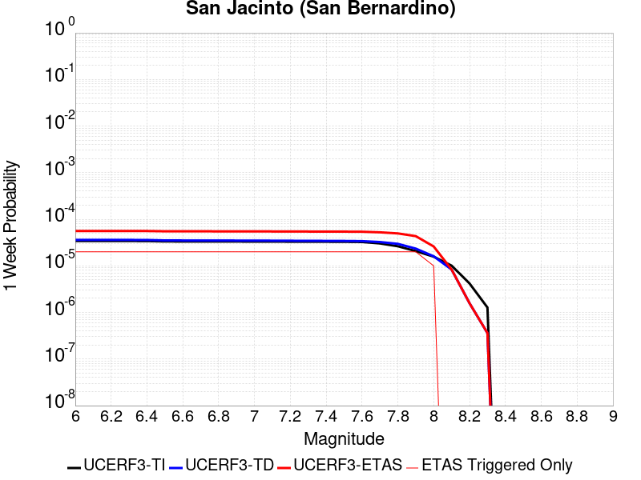 |  |  |  |

| Magnitude | 1 wk TI Prob | 1 wk TD Prob | 1 wk ETAS Prob | 1 wk ETAS/TD Gain | 1 wk ETAS Triggered Only | 1 mo TI Prob | 1 mo TD Prob | 1 mo ETAS Prob | 1 mo ETAS/TD Gain | 1 mo ETAS Triggered Only | 1 yr TI Prob | 1 yr TD Prob | 1 yr ETAS Prob | 1 yr ETAS/TD Gain | 1 yr ETAS Triggered Only | 10 yr TI Prob | 10 yr TD Prob | 10 yr ETAS Prob | 10 yr ETAS/TD Gain | 10 yr ETAS Triggered Only |
|-----|-----|-----|-----|-----|-----|-----|-----|-----|-----|-----|-----|-----|-----|-----|-----|-----|-----|-----|-----|-----|
| 6.0 | 3.409352E-5 | 3.5986508E-5 | 1.3711555E-4 | 3.8101933 | 1.0113269E-4 | 1.461069E-4 | 1.542188E-4 | 2.5533588E-4 | 1.6556729 | 1.0113269E-4 | 0.0017774 | 0.0018759987 | 0.0020778847 | 1.1076151 | 2.0226538E-4 | 0.01763251 | 0.019349935 | 0.019548286 | 1.0102508 | 2.0226538E-4 |
| 6.1 | 3.409352E-5 | 3.5986508E-5 | 1.3711555E-4 | 3.8101933 | 1.0113269E-4 | 1.461069E-4 | 1.542188E-4 | 2.5533588E-4 | 1.6556729 | 1.0113269E-4 | 0.0017774 | 0.0018759987 | 0.0020778847 | 1.1076151 | 2.0226538E-4 | 0.01763251 | 0.019349935 | 0.019548286 | 1.0102508 | 2.0226538E-4 |
| 6.2 | 3.409352E-5 | 3.5986508E-5 | 1.3711555E-4 | 3.8101933 | 1.0113269E-4 | 1.461069E-4 | 1.542188E-4 | 2.5533588E-4 | 1.6556729 | 1.0113269E-4 | 0.0017774 | 0.0018759987 | 0.0020778847 | 1.1076151 | 2.0226538E-4 | 0.01763251 | 0.019349935 | 0.019548286 | 1.0102508 | 2.0226538E-4 |
| 6.3 | 3.409352E-5 | 3.5986508E-5 | 1.3711555E-4 | 3.8101933 | 1.0113269E-4 | 1.461069E-4 | 1.542188E-4 | 2.5533588E-4 | 1.6556729 | 1.0113269E-4 | 0.0017774 | 0.0018759987 | 0.0020778847 | 1.1076151 | 2.0226538E-4 | 0.01763251 | 0.019349935 | 0.019548286 | 1.0102508 | 2.0226538E-4 |
| 6.4 | 3.400795E-5 | 3.5879173E-5 | 1.3700823E-4 | 3.8186007 | 1.0113269E-4 | 1.4574021E-4 | 1.5375883E-4 | 2.5487598E-4 | 1.6576346 | 1.0113269E-4 | 0.0017729428 | 0.0018704084 | 0.0020722954 | 1.1079375 | 2.0226538E-4 | 0.017588645 | 0.019295016 | 0.019493379 | 1.0102805 | 2.0226538E-4 |
| 6.5 | 3.341482E-5 | 3.5139812E-5 | 1.3626894E-4 | 3.8779078 | 1.0113269E-4 | 1.4319851E-4 | 1.5059051E-4 | 2.5170797E-4 | 1.671473 | 1.0113269E-4 | 0.0017420477 | 0.0018318989 | 0.0020337938 | 1.1102107 | 2.0226538E-4 | 0.017284546 | 0.018916558 | 0.019114997 | 1.0104902 | 2.0226538E-4 |
| 6.6 | 3.3364955E-5 | 3.5077028E-5 | 1.3620617E-4 | 3.8830588 | 1.0113269E-4 | 1.4298483E-4 | 1.5032147E-4 | 2.5143896E-4 | 1.6726749 | 1.0113269E-4 | 0.0017394501 | 0.001828629 | 0.0020305244 | 1.1104081 | 2.0226538E-4 | 0.017258976 | 0.018884424 | 0.019082868 | 1.0105084 | 2.0226538E-4 |
| 6.7 | 3.335922E-5 | 3.5066805E-5 | 1.3619594E-4 | 3.8838995 | 1.0113269E-4 | 1.4296026E-4 | 1.5027766E-4 | 2.5139513E-4 | 1.6728711 | 1.0113269E-4 | 0.0017391514 | 0.0018280965 | 0.002029992 | 1.1104404 | 2.0226538E-4 | 0.017256035 | 0.018879214 | 0.019077662 | 1.0105114 | 2.0226538E-4 |
| 6.8 | 3.327683E-5 | 3.496087E-5 | 1.3609002E-4 | 3.8926382 | 1.0113269E-4 | 1.4260718E-4 | 1.498237E-4 | 2.5094123E-4 | 1.6749102 | 1.0113269E-4 | 0.0017348597 | 0.0018225788 | 0.0020244755 | 1.1107754 | 2.0226538E-4 | 0.017213784 | 0.018824987 | 0.019023445 | 1.0105423 | 2.0226538E-4 |
| 6.9 | 3.3235785E-5 | 3.4901823E-5 | 1.3603098E-4 | 3.8975322 | 1.0113269E-4 | 1.4243131E-4 | 1.4957068E-4 | 2.5068823E-4 | 1.676052 | 1.0113269E-4 | 0.0017327217 | 0.0018195034 | 0.0020214007 | 1.1109629 | 2.0226538E-4 | 0.017192734 | 0.018794855 | 0.01899332 | 1.0105594 | 2.0226538E-4 |
| 7.0 | 3.3197095E-5 | 3.4841752E-5 | 1.3597091E-4 | 3.9025278 | 1.0113269E-4 | 1.422655E-4 | 1.4931326E-4 | 2.5043084E-4 | 1.6772177 | 1.0113269E-4 | 0.0017307063 | 0.0018163746 | 0.0020182726 | 1.1111543 | 2.0226538E-4 | 0.017172894 | 0.018764233 | 0.018962704 | 1.0105771 | 2.0226538E-4 |
| 7.1 | 3.3129716E-5 | 3.4721965E-5 | 1.3585114E-4 | 3.9125419 | 1.0113269E-4 | 1.4197677E-4 | 1.4879994E-4 | 2.499176E-4 | 1.6795542 | 1.0113269E-4 | 0.0017271966 | 0.0018101353 | 0.0020120346 | 1.1115382 | 2.0226538E-4 | 0.017138338 | 0.018703312 | 0.018901795 | 1.0106121 | 2.0226538E-4 |
| 7.2 | 3.3034008E-5 | 3.458941E-5 | 1.357186E-4 | 3.9237037 | 1.0113269E-4 | 1.4156665E-4 | 1.4823192E-4 | 2.4934963E-4 | 1.6821587 | 1.0113269E-4 | 0.0017222111 | 0.0018032312 | 0.002005132 | 1.111966 | 2.0226538E-4 | 0.017089253 | 0.018635705 | 0.018834202 | 1.0106514 | 2.0226538E-4 |
| 7.3 | 3.2956614E-5 | 3.445717E-5 | 1.3558636E-4 | 3.9349248 | 1.0113269E-4 | 1.4123498E-4 | 1.4766524E-4 | 2.4878298E-4 | 1.684777 | 1.0113269E-4 | 0.0017181796 | 0.0017963431 | 0.0019982453 | 1.1123961 | 2.0226538E-4 | 0.017049557 | 0.018568452 | 0.018766962 | 1.0106907 | 2.0226538E-4 |
| 7.4 | 3.2915937E-5 | 3.4378863E-5 | 1.3550807E-4 | 3.9416099 | 1.0113269E-4 | 1.4106068E-4 | 1.4732967E-4 | 2.4844747E-4 | 1.6863369 | 1.0113269E-4 | 0.0017160608 | 0.0017922645 | 0.0019941675 | 1.1126524 | 2.0226538E-4 | 0.017028693 | 0.018528719 | 0.018727235 | 1.010714 | 2.0226538E-4 |
| 7.5 | 3.281791E-5 | 3.4243778E-5 | 1.35373E-4 | 3.9532144 | 1.0113269E-4 | 1.406406E-4 | 1.4675081E-4 | 2.4786865E-4 | 1.6890446 | 1.0113269E-4 | 0.0017109542 | 0.0017852283 | 0.0019871325 | 1.1130972 | 2.0226538E-4 | 0.016978411 | 0.018459605 | 0.018658137 | 1.010755 | 2.0226538E-4 |
| 7.6 | 3.2521442E-5 | 3.396873E-5 | 1.3509799E-4 | 3.9771278 | 1.0113269E-4 | 1.3937015E-4 | 1.4557215E-4 | 2.4669012E-4 | 1.6946243 | 1.0113269E-4 | 0.0016955109 | 0.0017709016 | 0.0019728087 | 1.1140138 | 2.0226538E-4 | 0.016826328 | 0.018317232 | 0.018515794 | 1.01084 | 2.0226538E-4 |
| 7.7 | 3.0287873E-5 | 3.245276E-5 | 1.3358217E-4 | 4.1162033 | 1.0113269E-4 | 1.297987E-4 | 1.3907586E-4 | 2.4019448E-4 | 1.7270753 | 1.0113269E-4 | 0.0015791537 | 0.0016919347 | 0.0018938578 | 1.1193446 | 2.0226538E-4 | 0.01567979 | 0.01752809 | 0.01772681 | 1.0113373 | 2.0226538E-4 |
| 7.8 | 2.6316151E-5 | 2.9663592E-5 | 1.3079328E-4 | 4.4092193 | 1.0113269E-4 | 1.1277862E-4 | 1.2712348E-4 | 2.2824331E-4 | 1.7954457 | 1.0113269E-4 | 0.0013722149 | 0.0015466306 | 0.0017485832 | 1.1305758 | 2.0226538E-4 | 0.013637724 | 0.016069634 | 0.016268648 | 1.0123845 | 2.0226538E-4 |
| 7.9 | 2.0761147E-5 | 2.34181E-5 | 1.2454842E-4 | 5.3184676 | 1.0113269E-4 | 8.897331E-5 | 1.0035944E-4 | 2.0148198E-4 | 2.0076036 | 1.0113269E-4 | 0.0010827117 | 0.0012211921 | 0.0014232104 | 1.1654272 | 2.0226538E-4 | 0.010774517 | 0.012793174 | 0.012992851 | 1.0156082 | 2.0226538E-4 |
| 8.0 | 1.5738568E-5 | 1.6033575E-5 | 1.6033575E-5 | 1.0 | 0.0 | 6.744926E-5 | 6.871352E-5 | 6.871352E-5 | 1.0 | 0.0 | 8.2088535E-4 | 8.3626667E-4 | 9.3731476E-4 | 1.1208324 | 1.0113269E-4 | 0.008178596 | 0.008865921 | 0.008966156 | 1.0113058 | 1.0113269E-4 |
| 8.1 | 1.0105832E-5 | 8.3304985E-6 | 8.3304985E-6 | 1.0 | 0.0 | 4.3309992E-5 | 3.570165E-5 | 3.570165E-5 | 1.0 | 0.0 | 5.2717153E-4 | 4.345814E-4 | 4.345814E-4 | 1.0 | 0.0 | 0.005259227 | 0.004677232 | 0.004677232 | 1.0 | 0.0 |
| 8.2 | 4.189207E-6 | 1.5784357E-6 | 1.5784357E-6 | 1.0 | 0.0 | 1.7953622E-5 | 6.7647065E-6 | 6.7647065E-6 | 1.0 | 0.0 | 2.1856341E-4 | 8.235722E-5 | 8.235722E-5 | 1.0 | 0.0 | 0.0021834858 | 9.565867E-4 | 9.565867E-4 | 1.0 | 0.0 |
| 8.3 | 1.2758221E-6 | 3.6149942E-7 | 3.6149942E-7 | 1.0 | 0.0 | 5.4677976E-6 | 1.5492824E-6 | 1.5492824E-6 | 1.0 | 0.0 | 6.65684E-5 | 1.8862354E-5 | 1.8862354E-5 | 1.0 | 0.0 | 6.6548464E-4 | 2.2751294E-4 | 2.2751294E-4 | 1.0 | 0.0 |

## Owens Valley
*[(top)](#table-of-contents)*

| 1 Week | 1 Month | 1 Year | 10 Year |
|-----|-----|-----|-----|
|  |  |  |  |

| Magnitude | 1 wk TI Prob | 1 wk TD Prob | 1 wk ETAS Prob | 1 wk ETAS/TD Gain | 1 wk ETAS Triggered Only | 1 mo TI Prob | 1 mo TD Prob | 1 mo ETAS Prob | 1 mo ETAS/TD Gain | 1 mo ETAS Triggered Only | 1 yr TI Prob | 1 yr TD Prob | 1 yr ETAS Prob | 1 yr ETAS/TD Gain | 1 yr ETAS Triggered Only | 10 yr TI Prob | 10 yr TD Prob | 10 yr ETAS Prob | 10 yr ETAS/TD Gain | 10 yr ETAS Triggered Only |
|-----|-----|-----|-----|-----|-----|-----|-----|-----|-----|-----|-----|-----|-----|-----|-----|-----|-----|-----|-----|-----|
| 6.0 | 4.83821E-5 | 3.626567E-6 | 1.0475889E-4 | 28.886517 | 1.0113269E-4 | 2.0733538E-4 | 1.5542342E-5 | 1.1667346E-4 | 7.5068126 | 1.0113269E-4 | 0.002521386 | 1.8921259E-4 | 3.9143968E-4 | 2.0687826 | 2.0226538E-4 | 0.024929691 | 0.001925011 | 0.002126887 | 1.1048701 | 2.0226538E-4 |
| 6.1 | 4.83821E-5 | 3.626567E-6 | 1.0475889E-4 | 28.886517 | 1.0113269E-4 | 2.0733538E-4 | 1.5542342E-5 | 1.1667346E-4 | 7.5068126 | 1.0113269E-4 | 0.002521386 | 1.8921259E-4 | 3.9143968E-4 | 2.0687826 | 2.0226538E-4 | 0.024929691 | 0.001925011 | 0.002126887 | 1.1048701 | 2.0226538E-4 |
| 6.2 | 4.83821E-5 | 3.626567E-6 | 1.0475889E-4 | 28.886517 | 1.0113269E-4 | 2.0733538E-4 | 1.5542342E-5 | 1.1667346E-4 | 7.5068126 | 1.0113269E-4 | 0.002521386 | 1.8921259E-4 | 3.9143968E-4 | 2.0687826 | 2.0226538E-4 | 0.024929691 | 0.001925011 | 0.002126887 | 1.1048701 | 2.0226538E-4 |
| 6.3 | 3.953008E-5 | 3.1553948E-6 | 1.0428776E-4 | 33.05062 | 1.0113269E-4 | 1.6940363E-4 | 1.3523055E-5 | 1.1465437E-4 | 8.478437 | 1.0113269E-4 | 0.002060538 | 1.6463149E-4 | 3.6686356E-4 | 2.2283924 | 2.0226538E-4 | 0.020415364 | 0.0016592 | 0.0018611297 | 1.1217031 | 2.0226538E-4 |
| 6.4 | 3.953008E-5 | 3.1553948E-6 | 1.0428776E-4 | 33.05062 | 1.0113269E-4 | 1.6940363E-4 | 1.3523055E-5 | 1.1465437E-4 | 8.478437 | 1.0113269E-4 | 0.002060538 | 1.6463149E-4 | 3.6686356E-4 | 2.2283924 | 2.0226538E-4 | 0.020415364 | 0.0016592 | 0.0018611297 | 1.1217031 | 2.0226538E-4 |
| 6.5 | 3.457342E-5 | 2.9715961E-6 | 1.0410398E-4 | 35.033016 | 1.0113269E-4 | 1.4816338E-4 | 1.2735354E-5 | 1.1386675E-4 | 8.940996 | 1.0113269E-4 | 0.0018023965 | 1.550426E-4 | 3.572766E-4 | 2.304377 | 2.0226538E-4 | 0.017878477 | 0.001555719 | 0.0017576696 | 1.1298118 | 2.0226538E-4 |
| 6.6 | 3.1127765E-5 | 2.8744932E-6 | 1.0400689E-4 | 36.182686 | 1.0113269E-4 | 1.3339789E-4 | 1.2319203E-5 | 1.13450646E-4 | 9.209252 | 1.0113269E-4 | 0.0016229092 | 1.4997667E-4 | 3.522117E-4 | 2.3484435 | 2.0226538E-4 | 0.016111081 | 0.0015012559 | 0.0017032176 | 1.1345285 | 2.0226538E-4 |
| 6.7 | 2.806885E-5 | 2.8104134E-6 | 1.0394282E-4 | 36.984886 | 1.0113269E-4 | 1.2028952E-4 | 1.20445775E-5 | 1.13176044E-4 | 9.396432 | 1.0113269E-4 | 0.001463541 | 1.4663354E-4 | 3.4886925E-4 | 2.3791914 | 2.0226538E-4 | 0.014539397 | 0.0014657511 | 0.0016677199 | 1.1377921 | 2.0226538E-4 |
| 6.8 | 2.524524E-5 | 2.2353688E-6 | 1.0336783E-4 | 46.24196 | 1.0113269E-4 | 1.0818939E-4 | 9.580118E-6 | 1.1071184E-4 | 11.5564165 | 1.0113269E-4 | 0.0013164099 | 1.16632E-4 | 3.188738E-4 | 2.7340162 | 2.0226538E-4 | 0.01308639 | 0.0011659812 | 0.0013680106 | 1.17327 | 2.0226538E-4 |
| 6.9 | 2.2704568E-5 | 1.6081682E-6 | 1.0274069E-4 | 63.88678 | 1.0113269E-4 | 9.730166E-5 | 6.8921313E-6 | 1.0802412E-4 | 15.673543 | 1.0113269E-4 | 0.0011840039 | 8.390849E-5 | 2.861569E-4 | 3.4103448 | 2.0226538E-4 | 0.011777153 | 8.3897985E-4 | 0.0010410756 | 1.2408826 | 2.0226538E-4 |
| 7.0 | 2.0871712E-5 | 1.5395453E-6 | 1.0267208E-4 | 66.68987 | 1.0113269E-4 | 8.944713E-5 | 6.598035E-6 | 1.07730055E-4 | 16.327597 | 1.0113269E-4 | 0.0010884746 | 8.032813E-5 | 2.8257724E-4 | 3.517787 | 2.0226538E-4 | 0.010831586 | 8.0316263E-4 | 0.0010052655 | 1.2516339 | 2.0226538E-4 |
| 7.1 | 1.944928E-5 | 1.3864178E-6 | 1.0251896E-4 | 73.94522 | 1.0113269E-4 | 8.335139E-5 | 5.941777E-6 | 1.07073865E-4 | 18.020512 | 1.0113269E-4 | 0.0010143308 | 7.233874E-5 | 2.745895E-4 | 3.7958841 | 2.0226538E-4 | 0.010097133 | 7.2330976E-4 | 9.254288E-4 | 1.2794363 | 2.0226538E-4 |
| 7.2 | 1.7876306E-5 | 1.2489141E-6 | 1.0238148E-4 | 81.976395 | 1.0113269E-4 | 7.6610486E-5 | 5.352478E-6 | 1.0648462E-4 | 19.894453 | 1.0113269E-4 | 9.3233347E-4 | 6.516448E-5 | 2.6741668E-4 | 4.1037183 | 2.0226538E-4 | 0.009284316 | 6.5159105E-4 | 8.537246E-4 | 1.3102154 | 2.0226538E-4 |
| 7.3 | 1.2618672E-5 | 1.1115209E-6 | 1.0224409E-4 | 91.98576 | 1.0113269E-4 | 5.40789E-5 | 4.763652E-6 | 1.0589586E-4 | 22.229973 | 1.0113269E-4 | 6.582117E-4 | 5.799593E-5 | 2.6024957E-4 | 4.4873767 | 2.0226538E-4 | 0.0065626553 | 5.7994033E-4 | 7.8208843E-4 | 1.348567 | 2.0226538E-4 |
| 7.4 | 7.4874442E-6 | 8.5486437E-7 | 1.0198746E-4 | 119.302505 | 1.0113269E-4 | 3.208865E-5 | 3.6636993E-6 | 1.0479602E-4 | 28.60388 | 1.0113269E-4 | 3.906093E-4 | 4.4604632E-5 | 2.46861E-4 | 5.534425 | 2.0226538E-4 | 0.003899234 | 4.4604883E-4 | 6.4822397E-4 | 1.4532579 | 2.0226538E-4 |
| 7.5 | 2.4734156E-6 | 6.068616E-7 | 6.068616E-7 | 1.0 | 0.0 | 1.060031E-5 | 2.6008327E-6 | 2.6008327E-6 | 1.0 | 0.0 | 1.2905113E-4 | 3.166468E-5 | 1.3279417E-4 | 4.193763 | 1.0113269E-4 | 0.0012897621 | 3.1660203E-4 | 4.177027E-4 | 1.3193305 | 1.0113269E-4 |
| 7.6 | 1.1328841E-6 | 3.196531E-7 | 3.196531E-7 | 1.0 | 0.0 | 4.8552088E-6 | 1.3699412E-6 | 1.3699412E-6 | 1.0 | 0.0 | 5.9110564E-5 | 1.6678909E-5 | 1.17809905E-4 | 7.0634065 | 1.0113269E-4 | 5.9094845E-4 | 1.6677675E-4 | 2.6789258E-4 | 1.6062945 | 1.0113269E-4 |
| 7.7 | 4.8613185E-7 | 8.964689E-8 | 8.964689E-8 | 1.0 | 0.0 | 2.0834207E-6 | 3.8420092E-7 | 3.8420092E-7 | 1.0 | 0.0 | 2.536535E-5 | 4.6776368E-6 | 4.6776368E-6 | 1.0 | 0.0 | 2.5362454E-4 | 4.677545E-5 | 4.677545E-5 | 1.0 | 0.0 |

## Death Valley (No)
*[(top)](#table-of-contents)*

| 1 Week | 1 Month | 1 Year | 10 Year |
|-----|-----|-----|-----|
|  |  |  |  |

| Magnitude | 1 wk TI Prob | 1 wk TD Prob | 1 wk ETAS Prob | 1 wk ETAS/TD Gain | 1 wk ETAS Triggered Only | 1 mo TI Prob | 1 mo TD Prob | 1 mo ETAS Prob | 1 mo ETAS/TD Gain | 1 mo ETAS Triggered Only | 1 yr TI Prob | 1 yr TD Prob | 1 yr ETAS Prob | 1 yr ETAS/TD Gain | 1 yr ETAS Triggered Only | 10 yr TI Prob | 10 yr TD Prob | 10 yr ETAS Prob | 10 yr ETAS/TD Gain | 10 yr ETAS Triggered Only |
|-----|-----|-----|-----|-----|-----|-----|-----|-----|-----|-----|-----|-----|-----|-----|-----|-----|-----|-----|-----|-----|
| 6.0 | 2.0074807E-5 | 2.2500084E-5 | 2.2500084E-5 | 1.0 | 0.0 | 8.603206E-5 | 9.642541E-5 | 9.642541E-5 | 1.0 | 0.0 | 0.001046937 | 0.0011733545 | 0.0012743685 | 1.08609 | 1.0113269E-4 | 0.010420183 | 0.011672506 | 0.011872411 | 1.0171261 | 2.0226538E-4 |
| 6.1 | 2.0074807E-5 | 2.2500084E-5 | 2.2500084E-5 | 1.0 | 0.0 | 8.603206E-5 | 9.642541E-5 | 9.642541E-5 | 1.0 | 0.0 | 0.001046937 | 0.0011733545 | 0.0012743685 | 1.08609 | 1.0113269E-4 | 0.010420183 | 0.011672506 | 0.011872411 | 1.0171261 | 2.0226538E-4 |
| 6.2 | 2.0074807E-5 | 2.2500084E-5 | 2.2500084E-5 | 1.0 | 0.0 | 8.603206E-5 | 9.642541E-5 | 9.642541E-5 | 1.0 | 0.0 | 0.001046937 | 0.0011733545 | 0.0012743685 | 1.08609 | 1.0113269E-4 | 0.010420183 | 0.011672506 | 0.011872411 | 1.0171261 | 2.0226538E-4 |
| 6.3 | 1.9050609E-5 | 2.1336948E-5 | 2.1336948E-5 | 1.0 | 0.0 | 8.164292E-5 | 9.1440896E-5 | 9.1440896E-5 | 1.0 | 0.0 | 9.935491E-4 | 0.001112731 | 0.0012137512 | 1.0907857 | 1.0113269E-4 | 0.009891188 | 0.011072419 | 0.011272444 | 1.0180652 | 2.0226538E-4 |
| 6.4 | 1.9050609E-5 | 2.1336948E-5 | 2.1336948E-5 | 1.0 | 0.0 | 8.164292E-5 | 9.1440896E-5 | 9.1440896E-5 | 1.0 | 0.0 | 9.935491E-4 | 0.001112731 | 0.0012137512 | 1.0907857 | 1.0113269E-4 | 0.009891188 | 0.011072419 | 0.011272444 | 1.0180652 | 2.0226538E-4 |
| 6.5 | 1.8367004E-5 | 2.0561009E-5 | 2.0561009E-5 | 1.0 | 0.0 | 7.8713354E-5 | 8.811567E-5 | 8.811567E-5 | 1.0 | 0.0 | 9.5791375E-4 | 0.0010722869 | 0.001173311 | 1.0942138 | 1.0113269E-4 | 0.009537951 | 0.0106719155 | 0.010872022 | 1.0187508 | 2.0226538E-4 |
| 6.6 | 1.779439E-5 | 1.9910927E-5 | 1.9910927E-5 | 1.0 | 0.0 | 7.625944E-5 | 8.53298E-5 | 8.53298E-5 | 1.0 | 0.0 | 9.280632E-4 | 0.0010384015 | 0.0011394292 | 1.0972915 | 1.0113269E-4 | 0.009241969 | 0.010336253 | 0.010536428 | 1.0193663 | 2.0226538E-4 |
| 6.7 | 1.7025437E-5 | 1.9043426E-5 | 1.9043426E-5 | 1.0 | 0.0 | 7.296412E-5 | 8.161216E-5 | 8.161216E-5 | 1.0 | 0.0 | 8.87976E-4 | 9.931813E-4 | 0.0010942136 | 1.1017259 | 1.0113269E-4 | 0.008844362 | 0.009888145 | 0.01008841 | 1.0202531 | 2.0226538E-4 |
| 6.8 | 1.6545107E-5 | 1.8512545E-5 | 1.8512545E-5 | 1.0 | 0.0 | 7.090568E-5 | 7.93371E-5 | 7.93371E-5 | 1.0 | 0.0 | 8.629347E-4 | 9.655073E-4 | 0.0010665423 | 1.1046445 | 1.0113269E-4 | 0.008595915 | 0.009613829 | 0.00981415 | 1.0208367 | 2.0226538E-4 |
| 6.9 | 1.615478E-5 | 1.8087594E-5 | 1.8087594E-5 | 1.0 | 0.0 | 6.9232934E-5 | 7.751599E-5 | 7.751599E-5 | 1.0 | 0.0 | 8.4258494E-4 | 9.433546E-4 | 0.0010443919 | 1.1071042 | 1.0113269E-4 | 0.008393973 | 0.009394196 | 0.009594561 | 1.0213286 | 2.0226538E-4 |
| 7.0 | 1.5894311E-5 | 1.780555E-5 | 1.780555E-5 | 1.0 | 0.0 | 6.81167E-5 | 7.6307304E-5 | 7.6307304E-5 | 1.0 | 0.0 | 8.2900526E-4 | 9.286515E-4 | 0.0010296903 | 1.1088016 | 1.0113269E-4 | 0.008259195 | 0.009248397 | 0.009448792 | 1.0216681 | 2.0226538E-4 |
| 7.1 | 1.5602263E-5 | 1.7483504E-5 | 1.7483504E-5 | 1.0 | 0.0 | 6.6865134E-5 | 7.492718E-5 | 7.492718E-5 | 1.0 | 0.0 | 8.137789E-4 | 9.118627E-4 | 0.0010129032 | 1.1108067 | 1.0113269E-4 | 0.008108052 | 0.009081894 | 0.009282323 | 1.022069 | 2.0226538E-4 |
| 7.2 | 1.5323829E-5 | 1.717063E-5 | 1.717063E-5 | 1.0 | 0.0 | 6.56719E-5 | 7.358637E-5 | 7.358637E-5 | 1.0 | 0.0 | 7.99262E-4 | 8.9555193E-4 | 9.96594E-4 | 1.1128266 | 1.0113269E-4 | 0.007963934 | 0.008920107 | 0.009120568 | 1.022473 | 2.0226538E-4 |
| 7.3 | 1.4556212E-5 | 1.6302456E-5 | 1.6302456E-5 | 1.0 | 0.0 | 6.238227E-5 | 6.9865826E-5 | 6.9865826E-5 | 1.0 | 0.0 | 7.592395E-4 | 8.5029035E-4 | 8.5029035E-4 | 1.0 | 0.0 | 0.0075665074 | 0.008471014 | 0.00857129 | 1.0118376 | 1.0113269E-4 |
| 7.4 | 1.411725E-5 | 1.580796E-5 | 1.580796E-5 | 1.0 | 0.0 | 6.0501097E-5 | 6.7746674E-5 | 6.7746674E-5 | 1.0 | 0.0 | 7.363519E-4 | 8.245094E-4 | 8.245094E-4 | 1.0 | 0.0 | 0.0073391674 | 0.008215138 | 0.00831544 | 1.0122094 | 1.0113269E-4 |
| 7.5 | 1.3503312E-5 | 1.5126289E-5 | 1.5126289E-5 | 1.0 | 0.0 | 5.7870053E-5 | 6.482538E-5 | 6.482538E-5 | 1.0 | 0.0 | 7.043401E-4 | 7.8896893E-4 | 7.8896893E-4 | 1.0 | 0.0 | 0.007021119 | 0.007862304 | 0.007962642 | 1.0127618 | 1.0113269E-4 |
| 7.6 | 1.1279839E-5 | 1.2626327E-5 | 1.2626327E-5 | 1.0 | 0.0 | 4.834127E-5 | 5.4111737E-5 | 5.4111737E-5 | 1.0 | 0.0 | 5.88396E-4 | 6.5861654E-4 | 6.5861654E-4 | 1.0 | 0.0 | 0.005868405 | 0.006567199 | 0.006667667 | 1.0152985 | 1.0113269E-4 |
| 7.7 | 9.189108E-6 | 1.0283358E-5 | 1.0283358E-5 | 1.0 | 0.0 | 3.93813E-5 | 4.407082E-5 | 4.407082E-5 | 1.0 | 0.0 | 4.7936183E-4 | 5.3643517E-4 | 5.3643517E-4 | 1.0 | 0.0 | 0.004783291 | 0.005351914 | 0.0054525053 | 1.0187954 | 1.0113269E-4 |
| 7.8 | 3.4586725E-7 | 3.6482615E-7 | 3.6482615E-7 | 1.0 | 0.0 | 1.4822873E-6 | 1.5635396E-6 | 1.5635396E-6 | 1.0 | 0.0 | 1.80467E-5 | 1.9035933E-5 | 1.9035933E-5 | 1.0 | 0.0 | 1.8045233E-4 | 1.9034347E-4 | 1.9034347E-4 | 1.0 | 0.0 |
| 7.9 | 2.5591178E-9 | 2.6696718E-9 | 2.6696718E-9 | 1.0 | 0.0 | 1.0967647E-8 | 1.14414505E-8 | 1.14414505E-8 | 1.0 | 0.0 | 1.335311E-7 | 1.3929966E-7 | 1.3929966E-7 | 1.0 | 0.0 | 1.3353102E-6 | 1.3929966E-6 | 1.3929966E-6 | 1.0 | 0.0 |

## Sierra Nevada  (No Extension)
*[(top)](#table-of-contents)*

| 1 Week | 1 Month | 1 Year | 10 Year |
|-----|-----|-----|-----|
|  |  |  | 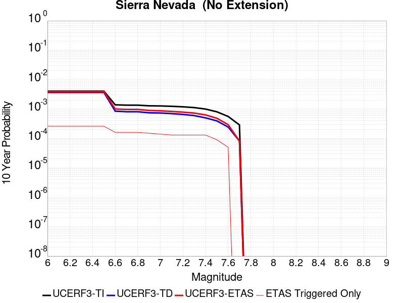 |

| Magnitude | 1 wk TI Prob | 1 wk TD Prob | 1 wk ETAS Prob | 1 wk ETAS/TD Gain | 1 wk ETAS Triggered Only | 1 mo TI Prob | 1 mo TD Prob | 1 mo ETAS Prob | 1 mo ETAS/TD Gain | 1 mo ETAS Triggered Only | 1 yr TI Prob | 1 yr TD Prob | 1 yr ETAS Prob | 1 yr ETAS/TD Gain | 1 yr ETAS Triggered Only | 10 yr TI Prob | 10 yr TD Prob | 10 yr ETAS Prob | 10 yr ETAS/TD Gain | 10 yr ETAS Triggered Only |
|-----|-----|-----|-----|-----|-----|-----|-----|-----|-----|-----|-----|-----|-----|-----|-----|-----|-----|-----|-----|-----|
| 6.0 | 7.7690465E-6 | 6.976322E-6 | 1.081083E-4 | 15.496462 | 1.0113269E-4 | 3.329549E-5 | 2.9898381E-5 | 1.3102805E-4 | 4.3824463 | 1.0113269E-4 | 4.0529718E-4 | 3.6398784E-4 | 5.661796E-4 | 1.5554904 | 2.0226538E-4 | 0.004045588 | 0.0036374326 | 0.0038389624 | 1.0554043 | 2.0226538E-4 |
| 6.1 | 7.7690465E-6 | 6.976322E-6 | 1.081083E-4 | 15.496462 | 1.0113269E-4 | 3.329549E-5 | 2.9898381E-5 | 1.3102805E-4 | 4.3824463 | 1.0113269E-4 | 4.0529718E-4 | 3.6398784E-4 | 5.661796E-4 | 1.5554904 | 2.0226538E-4 | 0.004045588 | 0.0036374326 | 0.0038389624 | 1.0554043 | 2.0226538E-4 |
| 6.2 | 7.7690465E-6 | 6.976322E-6 | 1.081083E-4 | 15.496462 | 1.0113269E-4 | 3.329549E-5 | 2.9898381E-5 | 1.3102805E-4 | 4.3824463 | 1.0113269E-4 | 4.0529718E-4 | 3.6398784E-4 | 5.661796E-4 | 1.5554904 | 2.0226538E-4 | 0.004045588 | 0.0036374326 | 0.0038389624 | 1.0554043 | 2.0226538E-4 |
| 6.3 | 7.7690465E-6 | 6.976322E-6 | 1.081083E-4 | 15.496462 | 1.0113269E-4 | 3.329549E-5 | 2.9898381E-5 | 1.3102805E-4 | 4.3824463 | 1.0113269E-4 | 4.0529718E-4 | 3.6398784E-4 | 5.661796E-4 | 1.5554904 | 2.0226538E-4 | 0.004045588 | 0.0036374326 | 0.0038389624 | 1.0554043 | 2.0226538E-4 |
| 6.4 | 7.7690465E-6 | 6.976322E-6 | 1.081083E-4 | 15.496462 | 1.0113269E-4 | 3.329549E-5 | 2.9898381E-5 | 1.3102805E-4 | 4.3824463 | 1.0113269E-4 | 4.0529718E-4 | 3.6398784E-4 | 5.661796E-4 | 1.5554904 | 2.0226538E-4 | 0.004045588 | 0.0036374326 | 0.0038389624 | 1.0554043 | 2.0226538E-4 |
| 6.5 | 7.7690465E-6 | 6.976322E-6 | 1.081083E-4 | 15.496462 | 1.0113269E-4 | 3.329549E-5 | 2.9898381E-5 | 1.3102805E-4 | 4.3824463 | 1.0113269E-4 | 4.0529718E-4 | 3.6398784E-4 | 5.661796E-4 | 1.5554904 | 2.0226538E-4 | 0.004045588 | 0.0036374326 | 0.0038389624 | 1.0554043 | 2.0226538E-4 |
| 6.6 | 2.653E-6 | 1.614854E-6 | 1.0274738E-4 | 63.62642 | 1.0113269E-4 | 1.136995E-5 | 6.9207845E-6 | 1.0805277E-4 | 15.612792 | 1.0113269E-4 | 1.3842035E-4 | 8.425733E-5 | 2.8650564E-4 | 3.4003649 | 2.0226538E-4 | 0.0013833415 | 8.422573E-4 | 0.0010443523 | 1.2399445 | 2.0226538E-4 |
| 6.7 | 2.5902466E-6 | 1.5501876E-6 | 1.02682716E-4 | 66.2389 | 1.0113269E-4 | 1.11010095E-5 | 6.643644E-6 | 1.0777566E-4 | 16.22237 | 1.0113269E-4 | 1.351464E-4 | 8.0883394E-5 | 2.831324E-4 | 3.5005012 | 2.0226538E-4 | 0.0013506424 | 8.0854254E-4 | 0.0010106444 | 1.2499582 | 2.0226538E-4 |
| 6.8 | 2.5853892E-6 | 1.5469877E-6 | 1.02679514E-4 | 66.37384 | 1.0113269E-4 | 1.1080193E-5 | 6.629931E-6 | 1.07761945E-4 | 16.253857 | 1.0113269E-4 | 1.34893E-4 | 8.071645E-5 | 2.8296548E-4 | 3.5056732 | 2.0226538E-4 | 0.0013481114 | 8.068743E-4 | 0.0010089765 | 1.2504754 | 2.0226538E-4 |
| 6.9 | 2.458257E-6 | 1.4220619E-6 | 1.025546E-4 | 72.11683 | 1.0113269E-4 | 1.0535345E-5 | 6.094537E-6 | 1.0722661E-4 | 17.59389 | 1.0113269E-4 | 1.2826028E-4 | 7.4198484E-5 | 2.7644885E-4 | 3.725802 | 2.0226538E-4 | 0.0012818627 | 7.4173906E-4 | 9.438544E-4 | 1.2724885 | 2.0226538E-4 |
| 7.0 | 2.4341468E-6 | 1.3990258E-6 | 1.0253157E-4 | 73.287834 | 1.0113269E-4 | 1.0432016E-5 | 5.9958115E-6 | 1.0712789E-4 | 17.867123 | 1.0113269E-4 | 1.270024E-4 | 7.2996576E-5 | 2.7524718E-4 | 3.7706861 | 2.0226538E-4 | 0.0012692984 | 7.297279E-4 | 9.318457E-4 | 1.276977 | 2.0226538E-4 |
| 7.1 | 2.3652476E-6 | 1.3339754E-6 | 1.02466525E-4 | 76.812904 | 1.0113269E-4 | 1.0136736E-5 | 5.717025E-6 | 1.0684913E-4 | 18.689638 | 1.0113269E-4 | 1.2340778E-4 | 6.9602575E-5 | 2.7185387E-4 | 3.905802 | 2.0226538E-4 | 0.0012333926 | 6.9580943E-4 | 8.979341E-4 | 1.2904885 | 2.0226538E-4 |
| 7.2 | 2.272158E-6 | 1.2502821E-6 | 1.02382844E-4 | 81.887794 | 1.0113269E-4 | 9.737784E-6 | 5.3583412E-6 | 1.06490486E-4 | 19.87378 | 1.0113269E-4 | 1.1855107E-4 | 6.5235865E-5 | 2.6748804E-4 | 4.100322 | 2.0226538E-4 | 0.0011848784 | 6.5216864E-4 | 8.5430214E-4 | 1.3099405 | 2.0226538E-4 |
| 7.3 | 2.1382127E-6 | 1.1419703E-6 | 1.0227454E-4 | 89.55972 | 1.0113269E-4 | 9.163737E-6 | 4.8941492E-6 | 1.0602634E-4 | 21.663897 | 1.0113269E-4 | 1.1156279E-4 | 5.958465E-5 | 2.6183797E-4 | 4.3943863 | 2.0226538E-4 | 0.001115068 | 5.956879E-4 | 7.978328E-4 | 1.339347 | 2.0226538E-4 |
| 7.4 | 1.9048055E-6 | 9.575242E-7 | 1.0209011E-4 | 106.61883 | 1.0113269E-4 | 8.163426E-6 | 4.1036687E-6 | 1.0523594E-4 | 25.644354 | 1.0113269E-4 | 9.9385186E-5 | 4.996103E-5 | 2.522163E-4 | 5.0482607 | 2.0226538E-4 | 9.934074E-4 | 4.994987E-4 | 7.01663E-4 | 1.4047345 | 2.0226538E-4 |
| 7.5 | 1.5373403E-6 | 7.560042E-7 | 7.560042E-7 | 1.0 | 0.0 | 6.5885843E-6 | 3.2400142E-6 | 3.2400142E-6 | 1.0 | 0.0 | 8.021306E-5 | 3.9446462E-5 | 1.4057515E-4 | 3.563695 | 1.0113269E-4 | 8.0184115E-4 | 3.943951E-4 | 4.954879E-4 | 1.2563237 | 1.0113269E-4 |
| 7.6 | 1.0680322E-6 | 4.6596554E-7 | 4.6596554E-7 | 1.0 | 0.0 | 4.577273E-6 | 1.9969937E-6 | 1.9969937E-6 | 1.0 | 0.0 | 5.5726876E-5 | 2.4313129E-5 | 1.2544336E-4 | 5.1594906 | 1.0113269E-4 | 5.5712904E-4 | 2.4310495E-4 | 3.4421307E-4 | 1.4159031 | 1.0113269E-4 |
| 7.7 | 5.509146E-7 | 1.5580486E-7 | 1.5580486E-7 | 1.0 | 0.0 | 2.3610605E-6 | 6.677349E-7 | 6.677349E-7 | 1.0 | 0.0 | 2.8745531E-5 | 8.129644E-6 | 8.129644E-6 | 1.0 | 0.0 | 2.8741814E-4 | 8.1293576E-5 | 8.1293576E-5 | 1.0 | 0.0 |

## San Andreas (Carrizo) rev
*[(top)](#table-of-contents)*

| 1 Week | 1 Month | 1 Year | 10 Year |
|-----|-----|-----|-----|
|  |  |  |  |

| Magnitude | 1 wk TI Prob | 1 wk TD Prob | 1 wk ETAS Prob | 1 wk ETAS/TD Gain | 1 wk ETAS Triggered Only | 1 mo TI Prob | 1 mo TD Prob | 1 mo ETAS Prob | 1 mo ETAS/TD Gain | 1 mo ETAS Triggered Only | 1 yr TI Prob | 1 yr TD Prob | 1 yr ETAS Prob | 1 yr ETAS/TD Gain | 1 yr ETAS Triggered Only | 10 yr TI Prob | 10 yr TD Prob | 10 yr ETAS Prob | 10 yr ETAS/TD Gain | 10 yr ETAS Triggered Only |
|-----|-----|-----|-----|-----|-----|-----|-----|-----|-----|-----|-----|-----|-----|-----|-----|-----|-----|-----|-----|-----|
| 6.0 | 1.1674632E-4 | 2.432302E-4 | 2.432302E-4 | 1.0 | 0.0 | 5.002454E-4 | 0.0010420004 | 0.0010420004 | 1.0 | 0.0 | 0.006073493 | 0.012613042 | 0.0127129 | 1.0079169 | 1.0113269E-4 | 0.0591016 | 0.12061418 | 0.120792046 | 1.0014747 | 2.0226538E-4 |
| 6.1 | 1.1674632E-4 | 2.432302E-4 | 2.432302E-4 | 1.0 | 0.0 | 5.002454E-4 | 0.0010420004 | 0.0010420004 | 1.0 | 0.0 | 0.006073493 | 0.012613042 | 0.0127129 | 1.0079169 | 1.0113269E-4 | 0.0591016 | 0.12061418 | 0.120792046 | 1.0014747 | 2.0226538E-4 |
| 6.2 | 1.1674632E-4 | 2.432302E-4 | 2.432302E-4 | 1.0 | 0.0 | 5.002454E-4 | 0.0010420004 | 0.0010420004 | 1.0 | 0.0 | 0.006073493 | 0.012613042 | 0.0127129 | 1.0079169 | 1.0113269E-4 | 0.0591016 | 0.12061418 | 0.120792046 | 1.0014747 | 2.0226538E-4 |
| 6.3 | 1.1674632E-4 | 2.432302E-4 | 2.432302E-4 | 1.0 | 0.0 | 5.002454E-4 | 0.0010420004 | 0.0010420004 | 1.0 | 0.0 | 0.006073493 | 0.012613042 | 0.0127129 | 1.0079169 | 1.0113269E-4 | 0.0591016 | 0.12061418 | 0.120792046 | 1.0014747 | 2.0226538E-4 |
| 6.4 | 1.1674632E-4 | 2.432302E-4 | 2.432302E-4 | 1.0 | 0.0 | 5.002454E-4 | 0.0010420004 | 0.0010420004 | 1.0 | 0.0 | 0.006073493 | 0.012613042 | 0.0127129 | 1.0079169 | 1.0113269E-4 | 0.0591016 | 0.12061418 | 0.120792046 | 1.0014747 | 2.0226538E-4 |
| 6.5 | 1.13136164E-4 | 2.3643032E-4 | 2.3643032E-4 | 1.0 | 0.0 | 4.847792E-4 | 0.0010128808 | 0.0010128808 | 1.0 | 0.0 | 0.0058862255 | 0.012262545 | 0.012362436 | 1.0081462 | 1.0113269E-4 | 0.057327334 | 0.117585555 | 0.11776403 | 1.0015179 | 2.0226538E-4 |
| 6.6 | 1.13136164E-4 | 2.3643032E-4 | 2.3643032E-4 | 1.0 | 0.0 | 4.847792E-4 | 0.0010128808 | 0.0010128808 | 1.0 | 0.0 | 0.0058862255 | 0.012262545 | 0.012362436 | 1.0081462 | 1.0113269E-4 | 0.057327334 | 0.117585555 | 0.11776403 | 1.0015179 | 2.0226538E-4 |
| 6.7 | 1.1149675E-4 | 2.3334254E-4 | 2.3334254E-4 | 1.0 | 0.0 | 4.777557E-4 | 9.996577E-4 | 9.996577E-4 | 1.0 | 0.0 | 0.0058011734 | 0.012103349 | 0.0122032575 | 1.0082546 | 1.0113269E-4 | 0.05652051 | 0.1162071 | 0.11638586 | 1.0015383 | 2.0226538E-4 |
| 6.8 | 1.1103589E-4 | 2.3236412E-4 | 2.3236412E-4 | 1.0 | 0.0 | 4.7578133E-4 | 9.954676E-4 | 9.954676E-4 | 1.0 | 0.0 | 0.005777263 | 0.012052901 | 0.012152815 | 1.0082896 | 1.0113269E-4 | 0.056293584 | 0.1157674 | 0.11594625 | 1.001545 | 2.0226538E-4 |
| 6.9 | 1.1053259E-4 | 2.3128795E-4 | 2.3128795E-4 | 1.0 | 0.0 | 4.7362508E-4 | 9.90859E-4 | 9.90859E-4 | 1.0 | 0.0 | 0.0057511497 | 0.01199741 | 0.01209733 | 1.0083284 | 1.0113269E-4 | 0.05604569 | 0.11528359 | 0.11546254 | 1.0015522 | 2.0226538E-4 |
| 7.0 | 1.1005377E-4 | 2.3029637E-4 | 2.3029637E-4 | 1.0 | 0.0 | 4.7157376E-4 | 9.866126E-4 | 9.866126E-4 | 1.0 | 0.0 | 0.0057263062 | 0.011946279 | 0.012046203 | 1.0083644 | 1.0113269E-4 | 0.055809796 | 0.11483591 | 0.11501495 | 1.001559 | 2.0226538E-4 |
| 7.1 | 1.0308142E-4 | 2.1539345E-4 | 2.1539345E-4 | 1.0 | 0.0 | 4.417027E-4 | 9.227892E-4 | 9.227892E-4 | 1.0 | 0.0 | 0.0053644776 | 0.011177397 | 0.0112774 | 1.0089468 | 1.0113269E-4 | 0.052368138 | 0.108092256 | 0.10827266 | 1.0016689 | 2.0226538E-4 |
| 7.2 | 1.0027479E-4 | 2.094724E-4 | 2.094724E-4 | 1.0 | 0.0 | 4.296783E-4 | 8.9743105E-4 | 8.9743105E-4 | 1.0 | 0.0 | 0.0052187922 | 0.010871782 | 0.010871782 | 1.0 | 0.0 | 0.050979212 | 0.10539625 | 0.10548672 | 1.0008584 | 1.0113269E-4 |
| 7.3 | 9.816942E-5 | 2.0422463E-4 | 2.0422463E-4 | 1.0 | 0.0 | 4.2065824E-4 | 8.7495585E-4 | 8.7495585E-4 | 1.0 | 0.0 | 0.005109493 | 0.010600842 | 0.010600842 | 1.0 | 0.0 | 0.049935985 | 0.102979995 | 0.10307071 | 1.000881 | 1.0113269E-4 |
| 7.4 | 9.5634205E-5 | 1.9791997E-4 | 1.9791997E-4 | 1.0 | 0.0 | 4.0979648E-4 | 8.479536E-4 | 8.479536E-4 | 1.0 | 0.0 | 0.0049778637 | 0.010275229 | 0.010275229 | 1.0 | 0.0 | 0.048678253 | 0.10006632 | 0.10015733 | 1.0009096 | 1.0113269E-4 |
| 7.5 | 8.052417E-5 | 1.611261E-4 | 1.611261E-4 | 1.0 | 0.0 | 3.4505792E-4 | 6.903579E-4 | 6.903579E-4 | 1.0 | 0.0 | 0.0041929903 | 0.008372796 | 0.008372796 | 1.0 | 0.0 | 0.04114753 | 0.08281049 | 0.08281049 | 1.0 | 0.0 |
| 7.6 | 7.897024E-5 | 1.5765853E-4 | 1.5765853E-4 | 1.0 | 0.0 | 3.384E-4 | 6.755046E-4 | 6.755046E-4 | 1.0 | 0.0 | 0.0041122385 | 0.008193332 | 0.008193332 | 1.0 | 0.0 | 0.040369697 | 0.08115171 | 0.08115171 | 1.0 | 0.0 |
| 7.7 | 6.707427E-5 | 1.3276102E-4 | 1.3276102E-4 | 1.0 | 0.0 | 2.8742946E-4 | 5.688518E-4 | 5.688518E-4 | 1.0 | 0.0 | 0.003493839 | 0.00690381 | 0.00690381 | 1.0 | 0.0 | 0.034394164 | 0.069048055 | 0.069048055 | 1.0 | 0.0 |
| 7.8 | 6.147705E-5 | 1.2197486E-4 | 1.2197486E-4 | 1.0 | 0.0 | 2.6344648E-4 | 5.226447E-4 | 5.226447E-4 | 1.0 | 0.0 | 0.0032027436 | 0.006344659 | 0.006344659 | 1.0 | 0.0 | 0.031569764 | 0.06351457 | 0.06351457 | 1.0 | 0.0 |
| 7.9 | 4.7636717E-5 | 8.87977E-5 | 8.87977E-5 | 1.0 | 0.0 | 2.0414138E-4 | 3.8050607E-4 | 3.8050607E-4 | 1.0 | 0.0 | 0.0024825884 | 0.0046228287 | 0.0046228287 | 1.0 | 0.0 | 0.024550365 | 0.046628095 | 0.046628095 | 1.0 | 0.0 |
| 8.0 | 3.3554235E-5 | 5.2136907E-5 | 5.2136907E-5 | 1.0 | 0.0 | 1.4379594E-4 | 2.2342477E-4 | 2.2342477E-4 | 1.0 | 0.0 | 0.0017493097 | 0.002716805 | 0.002716805 | 1.0 | 0.0 | 0.017356034 | 0.027880952 | 0.027880952 | 1.0 | 0.0 |
| 8.1 | 1.9175432E-5 | 1.9184976E-5 | 1.9184976E-5 | 1.0 | 0.0 | 8.217783E-5 | 8.2218736E-5 | 8.2218736E-5 | 1.0 | 0.0 | 0.0010000558 | 0.0010005541 | 0.0010005541 | 1.0 | 0.0 | 0.009955673 | 0.0107580265 | 0.0107580265 | 1.0 | 0.0 |
| 8.2 | 8.643924E-6 | 5.4748625E-6 | 5.4748625E-6 | 1.0 | 0.0 | 3.704486E-5 | 2.3463486E-5 | 2.3463486E-5 | 1.0 | 0.0 | 4.5092785E-4 | 2.8563058E-4 | 2.8563058E-4 | 1.0 | 0.0 | 0.0045001395 | 0.0032487072 | 0.0032487072 | 1.0 | 0.0 |
| 8.3 | 1.983087E-6 | 7.6599065E-7 | 7.6599065E-7 | 1.0 | 0.0 | 8.498917E-6 | 3.282813E-6 | 3.282813E-6 | 1.0 | 0.0 | 1.034694E-4 | 3.9967534E-5 | 3.9967534E-5 | 1.0 | 0.0 | 0.0010342124 | 4.719687E-4 | 4.719687E-4 | 1.0 | 0.0 |

## Brawley (Seismic Zone) alt 1
*[(top)](#table-of-contents)*

| 1 Week | 1 Month | 1 Year | 10 Year |
|-----|-----|-----|-----|
|  |  |  |  |

| Magnitude | 1 wk TI Prob | 1 wk TD Prob | 1 wk ETAS Prob | 1 wk ETAS/TD Gain | 1 wk ETAS Triggered Only | 1 mo TI Prob | 1 mo TD Prob | 1 mo ETAS Prob | 1 mo ETAS/TD Gain | 1 mo ETAS Triggered Only | 1 yr TI Prob | 1 yr TD Prob | 1 yr ETAS Prob | 1 yr ETAS/TD Gain | 1 yr ETAS Triggered Only | 10 yr TI Prob | 10 yr TD Prob | 10 yr ETAS Prob | 10 yr ETAS/TD Gain | 10 yr ETAS Triggered Only |
|-----|-----|-----|-----|-----|-----|-----|-----|-----|-----|-----|-----|-----|-----|-----|-----|-----|-----|-----|-----|-----|
| 6.0 | 2.2521618E-4 | 4.7632487E-4 | 5.774094E-4 | 1.2122176 | 1.0113269E-4 | 9.6485513E-4 | 0.0020398323 | 0.0021407588 | 1.0494778 | 1.0113269E-4 | 0.011683988 | 0.024546238 | 0.024743536 | 1.0080379 | 2.0226538E-4 | 0.11088423 | 0.21350002 | 0.21365911 | 1.000745 | 2.0226538E-4 |
| 6.1 | 2.2521618E-4 | 4.7632487E-4 | 5.774094E-4 | 1.2122176 | 1.0113269E-4 | 9.6485513E-4 | 0.0020398323 | 0.0021407588 | 1.0494778 | 1.0113269E-4 | 0.011683988 | 0.024546238 | 0.024743536 | 1.0080379 | 2.0226538E-4 | 0.11088423 | 0.21350002 | 0.21365911 | 1.000745 | 2.0226538E-4 |
| 6.2 | 2.198148E-4 | 4.6717093E-4 | 5.6825636E-4 | 1.2163779 | 1.0113269E-4 | 9.417233E-4 | 0.0020006616 | 0.0021015918 | 1.0504485 | 1.0113269E-4 | 0.011405343 | 0.024080504 | 0.024277898 | 1.0081973 | 2.0226538E-4 | 0.10837428 | 0.20993657 | 0.21009637 | 1.0007612 | 2.0226538E-4 |
| 6.3 | 2.1704129E-4 | 4.615278E-4 | 5.626138E-4 | 1.2190248 | 1.0113269E-4 | 9.298453E-4 | 0.0019765133 | 0.002077446 | 1.051066 | 1.0113269E-4 | 0.011262234 | 0.02379366 | 0.023991114 | 1.0082985 | 2.0226538E-4 | 0.107082725 | 0.20782755 | 0.20798777 | 1.0007709 | 2.0226538E-4 |
| 6.4 | 1.876142E-4 | 4.00449E-4 | 5.015412E-4 | 1.2524471 | 1.0113269E-4 | 8.038131E-4 | 0.0017150956 | 0.0018160548 | 1.0588651 | 1.0113269E-4 | 0.00974259 | 0.020680401 | 0.020878484 | 1.0095782 | 2.0226538E-4 | 0.093263686 | 0.18457815 | 0.18474309 | 1.0008936 | 2.0226538E-4 |
| 6.5 | 1.7390939E-4 | 3.7477075E-4 | 4.7586553E-4 | 1.269751 | 1.0113269E-4 | 7.45113E-4 | 0.0016051838 | 0.0017061542 | 1.0629027 | 1.0113269E-4 | 0.009034078 | 0.019368723 | 0.01956707 | 1.0102407 | 2.0226538E-4 | 0.086755216 | 0.17440031 | 0.17456731 | 1.0009575 | 2.0226538E-4 |
| 6.6 | 1.591791E-4 | 3.4891962E-4 | 4.5001702E-4 | 1.2897441 | 1.0113269E-4 | 6.8201777E-4 | 0.0014945229 | 0.0015955045 | 1.0675677 | 1.0113269E-4 | 0.008271996 | 0.018045569 | 0.018244185 | 1.0110064 | 2.0226538E-4 | 0.07970774 | 0.16380852 | 0.16397765 | 1.0010325 | 2.0226538E-4 |
| 6.7 | 1.4268003E-4 | 3.20582E-4 | 4.2168229E-4 | 1.3153647 | 1.0113269E-4 | 6.1134255E-4 | 0.0013732077 | 0.0014742014 | 1.0735459 | 1.0113269E-4 | 0.007417723 | 0.016592601 | 0.016791511 | 1.0119878 | 2.0226538E-4 | 0.07174956 | 0.15193306 | 0.1521046 | 1.001129 | 2.0226538E-4 |
| 6.8 | 1.239713E-4 | 2.9053655E-4 | 3.9163986E-4 | 1.3479882 | 1.0113269E-4 | 5.3119735E-4 | 0.0012445687 | 0.0013455756 | 1.081158 | 1.0113269E-4 | 0.0064481674 | 0.015048777 | 0.015148388 | 1.0066192 | 1.0113269E-4 | 0.06264243 | 0.13837762 | 0.13846476 | 1.0006297 | 1.0113269E-4 |
| 6.9 | 1.0180238E-4 | 2.625439E-4 | 3.6365003E-4 | 1.3851018 | 1.0113269E-4 | 4.3622297E-4 | 0.0011247073 | 0.0012257262 | 1.089818 | 1.0113269E-4 | 0.005298089 | 0.013608336 | 0.013708092 | 1.0073305 | 1.0113269E-4 | 0.05173543 | 0.124961674 | 0.12505017 | 1.0007082 | 1.0113269E-4 |
| 7.0 | 7.6619996E-5 | 2.23993E-4 | 3.2510303E-4 | 1.4513981 | 1.0113269E-4 | 3.283301E-4 | 9.5962E-4 | 0.0010606557 | 1.1052871 | 1.0113269E-4 | 0.0039900932 | 0.011621496 | 0.011721453 | 1.0086011 | 1.0113269E-4 | 0.039192066 | 0.107266866 | 0.10735715 | 1.0008417 | 1.0113269E-4 |
| 7.1 | 7.5127435E-5 | 2.2082464E-4 | 3.21935E-4 | 1.4578762 | 1.0113269E-4 | 3.2193496E-4 | 9.4605127E-4 | 0.0010470883 | 1.1067986 | 1.0113269E-4 | 0.0039125155 | 0.011458045 | 0.011558019 | 1.0087252 | 1.0113269E-4 | 0.038443442 | 0.10583085 | 0.105921276 | 1.0008545 | 1.0113269E-4 |
| 7.2 | 6.788582E-5 | 2.0210193E-4 | 3.0321418E-4 | 1.5003031 | 1.0113269E-4 | 2.9090676E-4 | 8.6586666E-4 | 9.669118E-4 | 1.1166983 | 1.0113269E-4 | 0.0035360386 | 0.0104916105 | 0.010591682 | 1.0095383 | 1.0113269E-4 | 0.034803 | 0.09750131 | 0.097592585 | 1.0009362 | 1.0113269E-4 |
| 7.3 | 6.399602E-5 | 1.8841137E-4 | 2.89525E-4 | 1.5366641 | 1.0113269E-4 | 2.7423984E-4 | 8.072303E-4 | 9.0828136E-4 | 1.1251824 | 1.0113269E-4 | 0.0033337586 | 0.009784332 | 0.009884474 | 1.0102351 | 1.0113269E-4 | 0.03284188 | 0.09139617 | 0.091488056 | 1.0010054 | 1.0113269E-4 |
| 7.4 | 4.506759E-5 | 1.2529209E-4 | 2.264121E-4 | 1.8070742 | 1.0113269E-4 | 1.9313251E-4 | 5.368565E-4 | 6.3793483E-4 | 1.1882782 | 1.0113269E-4 | 0.0023488526 | 0.0065168133 | 0.006617287 | 1.0154176 | 1.0113269E-4 | 0.023241805 | 0.062363707 | 0.06245853 | 1.0015205 | 1.0113269E-4 |
| 7.5 | 3.43289E-5 | 9.33541E-5 | 9.33541E-5 | 1.0 | 0.0 | 1.4711556E-4 | 4.00028E-4 | 4.00028E-4 | 1.0 | 0.0 | 0.0017896603 | 0.0048595266 | 0.0048595266 | 1.0 | 0.0 | 0.01775316 | 0.04705519 | 0.04705519 | 1.0 | 0.0 |
| 7.6 | 2.5980507E-5 | 7.053101E-5 | 7.053101E-5 | 1.0 | 0.0 | 1.1134028E-4 | 3.0224086E-4 | 3.0224086E-4 | 1.0 | 0.0 | 0.001354725 | 0.003673598 | 0.003673598 | 1.0 | 0.0 | 0.013464959 | 0.035840835 | 0.035840835 | 1.0 | 0.0 |
| 7.7 | 1.7292105E-5 | 4.9407296E-5 | 4.9407296E-5 | 1.0 | 0.0 | 7.4106916E-5 | 2.117284E-4 | 2.117284E-4 | 1.0 | 0.0 | 9.018782E-4 | 0.0025747516 | 0.0025747516 | 1.0 | 0.0 | 0.008982267 | 0.025290398 | 0.025290398 | 1.0 | 0.0 |
| 7.8 | 1.2927471E-5 | 3.9693266E-5 | 3.9693266E-5 | 1.0 | 0.0 | 5.5402274E-5 | 1.7010293E-4 | 1.7010293E-4 | 1.0 | 0.0 | 6.743139E-4 | 0.0020690386 | 0.0020690386 | 1.0 | 0.0 | 0.0067227143 | 0.020431727 | 0.020431727 | 1.0 | 0.0 |
| 7.9 | 1.0200774E-5 | 2.874569E-5 | 2.874569E-5 | 1.0 | 0.0 | 4.371687E-5 | 1.2319001E-4 | 1.2319001E-4 | 1.0 | 0.0 | 5.321229E-4 | 0.0014988075 | 0.0014988075 | 1.0 | 0.0 | 0.005308505 | 0.014991644 | 0.014991644 | 1.0 | 0.0 |
| 8.0 | 8.650396E-6 | 2.3277367E-5 | 2.3277367E-5 | 1.0 | 0.0 | 3.70726E-5 | 9.975634E-5 | 9.975634E-5 | 1.0 | 0.0 | 4.5126543E-4 | 0.0012138576 | 0.0012138576 | 1.0 | 0.0 | 0.0045035016 | 0.012211097 | 0.012211097 | 1.0 | 0.0 |
| 8.1 | 3.9368224E-6 | 7.3279825E-6 | 7.3279825E-6 | 1.0 | 0.0 | 1.6871985E-5 | 3.140526E-5 | 3.140526E-5 | 1.0 | 0.0 | 2.0539707E-4 | 3.8229208E-4 | 3.8229208E-4 | 1.0 | 0.0 | 0.0020520731 | 0.004001185 | 0.004001185 | 1.0 | 0.0 |
| 8.2 | 1.7101195E-6 | 2.217876E-6 | 2.217876E-6 | 1.0 | 0.0 | 7.329063E-6 | 9.505149E-6 | 9.505149E-6 | 1.0 | 0.0 | 8.922769E-5 | 1.1571907E-4 | 1.1571907E-4 | 1.0 | 0.0 | 8.9191867E-4 | 0.0012666774 | 0.0012666774 | 1.0 | 0.0 |
| 8.3 | 3.0346666E-8 | 1.721586E-8 | 1.721586E-8 | 1.0 | 0.0 | 1.3005713E-7 | 7.378226E-8 | 7.378226E-8 | 1.0 | 0.0 | 1.5834444E-6 | 8.9829894E-7 | 8.9829894E-7 | 1.0 | 0.0 | 1.5834332E-5 | 9.367729E-6 | 9.367729E-6 | 1.0 | 0.0 |

## Santa Ynez (East)
*[(top)](#table-of-contents)*

| 1 Week | 1 Month | 1 Year | 10 Year |
|-----|-----|-----|-----|
|  |  |  |  |

| Magnitude | 1 wk TI Prob | 1 wk TD Prob | 1 wk ETAS Prob | 1 wk ETAS/TD Gain | 1 wk ETAS Triggered Only | 1 mo TI Prob | 1 mo TD Prob | 1 mo ETAS Prob | 1 mo ETAS/TD Gain | 1 mo ETAS Triggered Only | 1 yr TI Prob | 1 yr TD Prob | 1 yr ETAS Prob | 1 yr ETAS/TD Gain | 1 yr ETAS Triggered Only | 10 yr TI Prob | 10 yr TD Prob | 10 yr ETAS Prob | 10 yr ETAS/TD Gain | 10 yr ETAS Triggered Only |
|-----|-----|-----|-----|-----|-----|-----|-----|-----|-----|-----|-----|-----|-----|-----|-----|-----|-----|-----|-----|-----|
| 6.0 | 3.2269712E-5 | 3.67505E-5 | 2.3900844E-4 | 6.503542 | 2.0226538E-4 | 1.3829143E-4 | 1.5749598E-4 | 3.5972949E-4 | 2.2840552 | 2.0226538E-4 | 0.0016823979 | 0.0019164166 | 0.0021182944 | 1.1053413 | 2.0226538E-4 | 0.016697178 | 0.019056441 | 0.019254852 | 1.0104117 | 2.0226538E-4 |
| 6.1 | 3.2269712E-5 | 3.67505E-5 | 2.3900844E-4 | 6.503542 | 2.0226538E-4 | 1.3829143E-4 | 1.5749598E-4 | 3.5972949E-4 | 2.2840552 | 2.0226538E-4 | 0.0016823979 | 0.0019164166 | 0.0021182944 | 1.1053413 | 2.0226538E-4 | 0.016697178 | 0.019056441 | 0.019254852 | 1.0104117 | 2.0226538E-4 |
| 6.2 | 3.2269712E-5 | 3.67505E-5 | 2.3900844E-4 | 6.503542 | 2.0226538E-4 | 1.3829143E-4 | 1.5749598E-4 | 3.5972949E-4 | 2.2840552 | 2.0226538E-4 | 0.0016823979 | 0.0019164166 | 0.0021182944 | 1.1053413 | 2.0226538E-4 | 0.016697178 | 0.019056441 | 0.019254852 | 1.0104117 | 2.0226538E-4 |
| 6.3 | 3.2269712E-5 | 3.67505E-5 | 2.3900844E-4 | 6.503542 | 2.0226538E-4 | 1.3829143E-4 | 1.5749598E-4 | 3.5972949E-4 | 2.2840552 | 2.0226538E-4 | 0.0016823979 | 0.0019164166 | 0.0021182944 | 1.1053413 | 2.0226538E-4 | 0.016697178 | 0.019056441 | 0.019254852 | 1.0104117 | 2.0226538E-4 |
| 6.4 | 1.4404779E-5 | 1.4849382E-5 | 1.4849382E-5 | 1.0 | 0.0 | 6.1733306E-5 | 6.363868E-5 | 6.363868E-5 | 1.0 | 0.0 | 7.513438E-4 | 7.745306E-4 | 7.745306E-4 | 1.0 | 0.0 | 0.0074880854 | 0.007718862 | 0.007718862 | 1.0 | 0.0 |
| 6.5 | 1.4404779E-5 | 1.4849382E-5 | 1.4849382E-5 | 1.0 | 0.0 | 6.1733306E-5 | 6.363868E-5 | 6.363868E-5 | 1.0 | 0.0 | 7.513438E-4 | 7.745306E-4 | 7.745306E-4 | 1.0 | 0.0 | 0.0074880854 | 0.007718862 | 0.007718862 | 1.0 | 0.0 |
| 6.6 | 1.280208E-5 | 1.3011947E-5 | 1.3011947E-5 | 1.0 | 0.0 | 5.4864904E-5 | 5.5764307E-5 | 5.5764307E-5 | 1.0 | 0.0 | 6.6777546E-4 | 6.787207E-4 | 6.787207E-4 | 1.0 | 0.0 | 0.006657724 | 0.0067666885 | 0.0067666885 | 1.0 | 0.0 |
| 6.7 | 1.2457027E-5 | 1.2628468E-5 | 1.2628468E-5 | 1.0 | 0.0 | 5.3386164E-5 | 5.412089E-5 | 5.412089E-5 | 1.0 | 0.0 | 6.497827E-4 | 6.587243E-4 | 6.587243E-4 | 1.0 | 0.0 | 0.00647886 | 0.006567915 | 0.006567915 | 1.0 | 0.0 |
| 6.8 | 1.2095134E-5 | 1.2230915E-5 | 1.2230915E-5 | 1.0 | 0.0 | 5.1835254E-5 | 5.241716E-5 | 5.241716E-5 | 1.0 | 0.0 | 6.309115E-4 | 6.379937E-4 | 6.379937E-4 | 1.0 | 0.0 | 0.0062912325 | 0.006361809 | 0.006361809 | 1.0 | 0.0 |
| 6.9 | 1.1104036E-5 | 1.1157347E-5 | 1.1157347E-5 | 1.0 | 0.0 | 4.758786E-5 | 4.781633E-5 | 4.781633E-5 | 1.0 | 0.0 | 5.7922816E-4 | 5.820096E-4 | 5.820096E-4 | 1.0 | 0.0 | 0.005777207 | 0.0058049993 | 0.0058049993 | 1.0 | 0.0 |
| 7.0 | 1.0577444E-5 | 1.058168E-5 | 1.058168E-5 | 1.0 | 0.0 | 4.5331115E-5 | 4.5349276E-5 | 4.5349276E-5 | 1.0 | 0.0 | 5.5176654E-4 | 5.519888E-4 | 5.519888E-4 | 1.0 | 0.0 | 0.0055039856 | 0.0055063153 | 0.0055063153 | 1.0 | 0.0 |
| 7.1 | 1.0021775E-5 | 9.980988E-6 | 9.980988E-6 | 1.0 | 0.0 | 4.294976E-5 | 4.2774966E-5 | 4.2774966E-5 | 1.0 | 0.0 | 5.2278786E-4 | 5.2066194E-4 | 5.2066194E-4 | 1.0 | 0.0 | 0.0052155964 | 0.0051945536 | 0.0051945536 | 1.0 | 0.0 |
| 7.2 | 8.874109E-6 | 8.748793E-6 | 8.748793E-6 | 1.0 | 0.0 | 3.8031343E-5 | 3.7494297E-5 | 3.7494297E-5 | 1.0 | 0.0 | 4.629332E-4 | 4.5639853E-4 | 4.5639853E-4 | 1.0 | 0.0 | 0.0046197 | 0.0045547304 | 0.0045547304 | 1.0 | 0.0 |
| 7.3 | 7.5504267E-6 | 7.5051175E-6 | 7.5051175E-6 | 1.0 | 0.0 | 3.235857E-5 | 3.21644E-5 | 3.21644E-5 | 1.0 | 0.0 | 3.9389438E-4 | 3.915322E-4 | 3.915322E-4 | 1.0 | 0.0 | 0.0039319694 | 0.003908531 | 0.003908531 | 1.0 | 0.0 |
| 7.4 | 6.309394E-6 | 6.1831556E-6 | 6.1831556E-6 | 1.0 | 0.0 | 2.703998E-5 | 2.6498974E-5 | 2.6498974E-5 | 1.0 | 0.0 | 3.2916202E-4 | 3.225782E-4 | 3.225782E-4 | 1.0 | 0.0 | 0.003286749 | 0.003221197 | 0.003221197 | 1.0 | 0.0 |
| 7.5 | 4.6103073E-6 | 4.4408903E-6 | 4.4408903E-6 | 1.0 | 0.0 | 1.975831E-5 | 1.9032252E-5 | 1.9032252E-5 | 1.0 | 0.0 | 2.4053088E-4 | 2.3169373E-4 | 2.3169373E-4 | 1.0 | 0.0 | 0.002402707 | 0.002314591 | 0.002314591 | 1.0 | 0.0 |
| 7.6 | 1.2858658E-6 | 1.3008173E-6 | 1.3008173E-6 | 1.0 | 0.0 | 5.5108417E-6 | 5.5749197E-6 | 5.5749197E-6 | 1.0 | 0.0 | 6.7092435E-5 | 6.78726E-5 | 6.78726E-5 | 1.0 | 0.0 | 6.707218E-4 | 6.785256E-4 | 6.785256E-4 | 1.0 | 0.0 |
| 7.7 | 5.3302307E-7 | 5.612138E-7 | 5.612138E-7 | 1.0 | 0.0 | 2.2843826E-6 | 2.4052001E-6 | 2.4052001E-6 | 1.0 | 0.0 | 2.7812002E-5 | 2.9282954E-5 | 2.9282954E-5 | 1.0 | 0.0 | 2.7808524E-4 | 2.9279452E-4 | 2.9279452E-4 | 1.0 | 0.0 |
| 7.8 | 4.613933E-8 | 4.80301E-8 | 4.80301E-8 | 1.0 | 0.0 | 1.9773998E-7 | 2.0584326E-7 | 2.0584326E-7 | 1.0 | 0.0 | 2.4074816E-6 | 2.5061388E-6 | 2.5061388E-6 | 1.0 | 0.0 | 2.4074554E-5 | 2.5061116E-5 | 2.5061116E-5 | 1.0 | 0.0 |

## Cleghorn Pass
*[(top)](#table-of-contents)*

| 1 Week | 1 Month | 1 Year | 10 Year |
|-----|-----|-----|-----|
|  |  |  |  |

| Magnitude | 1 wk TI Prob | 1 wk TD Prob | 1 wk ETAS Prob | 1 wk ETAS/TD Gain | 1 wk ETAS Triggered Only | 1 mo TI Prob | 1 mo TD Prob | 1 mo ETAS Prob | 1 mo ETAS/TD Gain | 1 mo ETAS Triggered Only | 1 yr TI Prob | 1 yr TD Prob | 1 yr ETAS Prob | 1 yr ETAS/TD Gain | 1 yr ETAS Triggered Only | 10 yr TI Prob | 10 yr TD Prob | 10 yr ETAS Prob | 10 yr ETAS/TD Gain | 10 yr ETAS Triggered Only |
|-----|-----|-----|-----|-----|-----|-----|-----|-----|-----|-----|-----|-----|-----|-----|-----|-----|-----|-----|-----|-----|
| 6.0 | 1.0522846E-5 | 1.1040642E-5 | 1.1040642E-5 | 1.0 | 0.0 | 4.509713E-5 | 4.7316473E-5 | 1.4844438E-4 | 3.1372662 | 1.0113269E-4 | 5.4891926E-4 | 5.759784E-4 | 6.770529E-4 | 1.175483 | 1.0113269E-4 | 0.0054756533 | 0.005750022 | 0.0059511242 | 1.0349742 | 2.0226538E-4 |
| 6.1 | 1.0522846E-5 | 1.1040642E-5 | 1.1040642E-5 | 1.0 | 0.0 | 4.509713E-5 | 4.7316473E-5 | 1.4844438E-4 | 3.1372662 | 1.0113269E-4 | 5.4891926E-4 | 5.759784E-4 | 6.770529E-4 | 1.175483 | 1.0113269E-4 | 0.0054756533 | 0.005750022 | 0.0059511242 | 1.0349742 | 2.0226538E-4 |
| 6.2 | 2.1045846E-6 | 2.2082024E-6 | 2.2082024E-6 | 1.0 | 0.0 | 9.019617E-6 | 9.463714E-6 | 1.1059544E-4 | 11.686262 | 1.0113269E-4 | 1.098083E-4 | 1.1521882E-4 | 2.1633986E-4 | 1.8776433 | 1.0113269E-4 | 0.0010975406 | 0.0011520023 | 0.0012530184 | 1.0876875 | 1.0113269E-4 |
| 6.3 | 2.1045846E-6 | 2.2082024E-6 | 2.2082024E-6 | 1.0 | 0.0 | 9.019617E-6 | 9.463714E-6 | 1.1059544E-4 | 11.686262 | 1.0113269E-4 | 1.098083E-4 | 1.1521882E-4 | 2.1633986E-4 | 1.8776433 | 1.0113269E-4 | 0.0010975406 | 0.0011520023 | 0.0012530184 | 1.0876875 | 1.0113269E-4 |
| 6.4 | 1.7259927E-6 | 1.810877E-6 | 1.810877E-6 | 1.0 | 0.0 | 7.3970905E-6 | 7.760902E-6 | 1.08892804E-4 | 14.030947 | 1.0113269E-4 | 9.005586E-5 | 9.4488976E-5 | 1.9561211E-4 | 2.070211 | 1.0113269E-4 | 9.001937E-4 | 9.448898E-4 | 0.0010459269 | 1.10693 | 1.0113269E-4 |

## San Andreas (San Gorgonio Pass-Garnet HIll)
*[(top)](#table-of-contents)*

| 1 Week | 1 Month | 1 Year | 10 Year |
|-----|-----|-----|-----|
|  |  |  |  |

| Magnitude | 1 wk TI Prob | 1 wk TD Prob | 1 wk ETAS Prob | 1 wk ETAS/TD Gain | 1 wk ETAS Triggered Only | 1 mo TI Prob | 1 mo TD Prob | 1 mo ETAS Prob | 1 mo ETAS/TD Gain | 1 mo ETAS Triggered Only | 1 yr TI Prob | 1 yr TD Prob | 1 yr ETAS Prob | 1 yr ETAS/TD Gain | 1 yr ETAS Triggered Only | 10 yr TI Prob | 10 yr TD Prob | 10 yr ETAS Prob | 10 yr ETAS/TD Gain | 10 yr ETAS Triggered Only |
|-----|-----|-----|-----|-----|-----|-----|-----|-----|-----|-----|-----|-----|-----|-----|-----|-----|-----|-----|-----|-----|
| 6.0 | 8.31567E-5 | 2.3382473E-4 | 3.3493378E-4 | 1.4324138 | 1.0113269E-4 | 3.5633717E-4 | 0.0010017233 | 0.0011027547 | 1.1008576 | 1.0113269E-4 | 0.004329778 | 0.012127888 | 0.012227795 | 1.0082377 | 1.0113269E-4 | 0.042463828 | 0.11257892 | 0.11275841 | 1.0015944 | 2.0226538E-4 |
| 6.1 | 8.31567E-5 | 2.3382473E-4 | 3.3493378E-4 | 1.4324138 | 1.0113269E-4 | 3.5633717E-4 | 0.0010017233 | 0.0011027547 | 1.1008576 | 1.0113269E-4 | 0.004329778 | 0.012127888 | 0.012227795 | 1.0082377 | 1.0113269E-4 | 0.042463828 | 0.11257892 | 0.11275841 | 1.0015944 | 2.0226538E-4 |
| 6.2 | 8.31567E-5 | 2.3382473E-4 | 3.3493378E-4 | 1.4324138 | 1.0113269E-4 | 3.5633717E-4 | 0.0010017233 | 0.0011027547 | 1.1008576 | 1.0113269E-4 | 0.004329778 | 0.012127888 | 0.012227795 | 1.0082377 | 1.0113269E-4 | 0.042463828 | 0.11257892 | 0.11275841 | 1.0015944 | 2.0226538E-4 |
| 6.3 | 8.31567E-5 | 2.3382473E-4 | 3.3493378E-4 | 1.4324138 | 1.0113269E-4 | 3.5633717E-4 | 0.0010017233 | 0.0011027547 | 1.1008576 | 1.0113269E-4 | 0.004329778 | 0.012127888 | 0.012227795 | 1.0082377 | 1.0113269E-4 | 0.042463828 | 0.11257892 | 0.11275841 | 1.0015944 | 2.0226538E-4 |
| 6.4 | 8.059055E-5 | 2.2940808E-4 | 3.3051756E-4 | 1.4407407 | 1.0113269E-4 | 3.4534236E-4 | 9.828096E-4 | 0.0010838428 | 1.1028005 | 1.0113269E-4 | 0.0041964394 | 0.011900152 | 0.012000081 | 1.0083973 | 1.0113269E-4 | 0.041180745 | 0.11056015 | 0.11074005 | 1.0016272 | 2.0226538E-4 |
| 6.5 | 8.059055E-5 | 2.2940808E-4 | 3.3051756E-4 | 1.4407407 | 1.0113269E-4 | 3.4534236E-4 | 9.828096E-4 | 0.0010838428 | 1.1028005 | 1.0113269E-4 | 0.0041964394 | 0.011900152 | 0.012000081 | 1.0083973 | 1.0113269E-4 | 0.041180745 | 0.11056015 | 0.11074005 | 1.0016272 | 2.0226538E-4 |
| 6.6 | 7.619237E-5 | 2.218517E-4 | 3.2296195E-4 | 1.4557561 | 1.0113269E-4 | 3.2649786E-4 | 9.5044886E-4 | 0.0010514854 | 1.106304 | 1.0113269E-4 | 0.0039678677 | 0.01151087 | 0.011610839 | 1.0086848 | 1.0113269E-4 | 0.03897764 | 0.10709683 | 0.10727743 | 1.0016863 | 2.0226538E-4 |
| 6.7 | 7.440636E-5 | 2.1860997E-4 | 3.1972054E-4 | 1.4625158 | 1.0113269E-4 | 3.188454E-4 | 9.3656575E-4 | 0.0010376037 | 1.1078813 | 1.0113269E-4 | 0.0038750346 | 0.011343609 | 0.011443594 | 1.0088142 | 1.0113269E-4 | 0.038081564 | 0.105605274 | 0.10578618 | 1.001713 | 2.0226538E-4 |
| 6.8 | 7.3735864E-5 | 2.1708169E-4 | 3.181924E-4 | 1.4657727 | 1.0113269E-4 | 3.1597257E-4 | 9.3002064E-4 | 0.0010310593 | 1.1086413 | 1.0113269E-4 | 0.0038401815 | 0.011264749 | 0.011364742 | 1.0088767 | 1.0113269E-4 | 0.03774495 | 0.10490683 | 0.10508788 | 1.0017258 | 2.0226538E-4 |
| 6.9 | 7.27575E-5 | 2.1477141E-4 | 3.1588238E-4 | 1.4707841 | 1.0113269E-4 | 3.117806E-4 | 9.201265E-4 | 0.0010211661 | 1.1098106 | 1.0113269E-4 | 0.003789323 | 0.011145527 | 0.011245532 | 1.0089726 | 1.0113269E-4 | 0.037253562 | 0.103854746 | 0.104036 | 1.0017453 | 2.0226538E-4 |
| 7.0 | 7.102591E-5 | 2.1061185E-4 | 3.1172324E-4 | 1.4800841 | 1.0113269E-4 | 3.0436125E-4 | 9.023122E-4 | 0.0010033536 | 1.1119806 | 1.0113269E-4 | 0.003699303 | 0.010930831 | 0.011030858 | 1.009151 | 1.0113269E-4 | 0.03638325 | 0.10195695 | 0.10213859 | 1.0017816 | 2.0226538E-4 |
| 7.1 | 7.028513E-5 | 2.0896831E-4 | 3.1007986E-4 | 1.4838607 | 1.0113269E-4 | 3.0118722E-4 | 8.9527335E-4 | 9.963155E-4 | 1.1128618 | 1.0113269E-4 | 0.0036607897 | 0.010845989 | 0.010946025 | 1.0092233 | 1.0113269E-4 | 0.036010686 | 0.101199985 | 0.10138178 | 1.0017964 | 2.0226538E-4 |
| 7.2 | 6.8498244E-5 | 2.0504706E-4 | 3.0615903E-4 | 1.4931158 | 1.0113269E-4 | 2.9353087E-4 | 8.784794E-4 | 9.795232E-4 | 1.1150213 | 1.0113269E-4 | 0.003567883 | 0.010643536 | 0.010743592 | 1.0094006 | 1.0113269E-4 | 0.035111405 | 0.09939202 | 0.09957418 | 1.0018327 | 2.0226538E-4 |
| 7.3 | 6.622592E-5 | 1.9732013E-4 | 2.9843286E-4 | 1.5124298 | 1.0113269E-4 | 2.8379448E-4 | 8.453858E-4 | 9.46433E-4 | 1.1195279 | 1.0113269E-4 | 0.0034497243 | 0.0102444785 | 0.010344575 | 1.0097708 | 1.0113269E-4 | 0.033966612 | 0.095888525 | 0.0960714 | 1.0019071 | 2.0226538E-4 |
| 7.4 | 5.1050705E-5 | 1.4689034E-4 | 2.4800817E-4 | 1.68839 | 1.0113269E-4 | 2.1877038E-4 | 6.29379E-4 | 7.3044805E-4 | 1.1605853 | 1.0113269E-4 | 0.002660276 | 0.0076359594 | 0.00773632 | 1.0131432 | 1.0113269E-4 | 0.02628654 | 0.07286301 | 0.07305054 | 1.0025737 | 2.0226538E-4 |
| 7.5 | 3.9302922E-5 | 1.1129847E-4 | 1.1129847E-4 | 1.0 | 0.0 | 1.6843023E-4 | 4.7690657E-4 | 4.7690657E-4 | 1.0 | 0.0 | 0.0020487092 | 0.005790949 | 0.005790949 | 1.0 | 0.0 | 0.020299247 | 0.05600951 | 0.05610498 | 1.0017045 | 1.0113269E-4 |
| 7.6 | 2.9851626E-5 | 8.4949745E-5 | 8.4949745E-5 | 1.0 | 0.0 | 1.2792926E-4 | 3.6401965E-4 | 3.6401965E-4 | 1.0 | 0.0 | 0.0015564259 | 0.0044229585 | 0.0044229585 | 1.0 | 0.0 | 0.0154556995 | 0.04319374 | 0.043290503 | 1.0022403 | 1.0113269E-4 |
| 7.7 | 2.1135214E-5 | 6.3529005E-5 | 6.3529005E-5 | 1.0 | 0.0 | 9.0576345E-5 | 2.7223877E-4 | 2.7223877E-4 | 1.0 | 0.0 | 0.0011022091 | 0.0033094748 | 0.0033094748 | 1.0 | 0.0 | 0.010967582 | 0.032582592 | 0.03268043 | 1.0030028 | 1.0113269E-4 |
| 7.8 | 1.883379E-5 | 5.564028E-5 | 5.564028E-5 | 1.0 | 0.0 | 8.0713755E-5 | 2.3843657E-4 | 2.3843657E-4 | 1.0 | 0.0 | 9.822468E-4 | 0.0028991038 | 0.0028991038 | 1.0 | 0.0 | 0.0097791655 | 0.028695205 | 0.028793437 | 1.0034232 | 1.0113269E-4 |
| 7.9 | 1.5156185E-5 | 4.1658426E-5 | 4.1658426E-5 | 1.0 | 0.0 | 6.495346E-5 | 1.785239E-4 | 1.785239E-4 | 1.0 | 0.0 | 7.9052144E-4 | 0.0021713632 | 0.0021713632 | 1.0 | 0.0 | 0.007877152 | 0.021759422 | 0.021858355 | 1.0045466 | 1.0113269E-4 |
| 8.0 | 1.1405907E-5 | 2.9974231E-5 | 2.9974231E-5 | 1.0 | 0.0 | 4.8881542E-5 | 1.2845467E-4 | 1.2845467E-4 | 1.0 | 0.0 | 5.9497025E-4 | 0.0015628147 | 0.0015628147 | 1.0 | 0.0 | 0.005933798 | 0.015772851 | 0.015872387 | 1.0063107 | 1.0113269E-4 |
| 8.1 | 4.3511436E-6 | 7.369219E-6 | 7.369219E-6 | 1.0 | 0.0 | 1.8647626E-5 | 3.1581985E-5 | 3.1581985E-5 | 1.0 | 0.0 | 2.2701119E-4 | 3.8444297E-4 | 3.8444297E-4 | 1.0 | 0.0 | 0.0022677942 | 0.0041163345 | 0.0041163345 | 1.0 | 0.0 |
| 8.2 | 2.3042528E-6 | 2.7329415E-6 | 2.7329415E-6 | 1.0 | 0.0 | 9.875332E-6 | 1.1712554E-5 | 1.1712554E-5 | 1.0 | 0.0 | 1.2022553E-4 | 1.4259106E-4 | 1.4259106E-4 | 1.0 | 0.0 | 0.0012016051 | 0.0015979785 | 0.0015979785 | 1.0 | 0.0 |
| 8.3 | 5.202968E-7 | 3.1598344E-7 | 3.1598344E-7 | 1.0 | 0.0 | 2.2298414E-6 | 1.3542141E-6 | 1.3542141E-6 | 1.0 | 0.0 | 2.714798E-5 | 1.6487444E-5 | 1.6487444E-5 | 1.0 | 0.0 | 2.7144665E-4 | 1.9563142E-4 | 1.9563142E-4 | 1.0 | 0.0 |

## Hosgri
*[(top)](#table-of-contents)*

| 1 Week | 1 Month | 1 Year | 10 Year |
|-----|-----|-----|-----|
|  |  |  |  |

| Magnitude | 1 wk TI Prob | 1 wk TD Prob | 1 wk ETAS Prob | 1 wk ETAS/TD Gain | 1 wk ETAS Triggered Only | 1 mo TI Prob | 1 mo TD Prob | 1 mo ETAS Prob | 1 mo ETAS/TD Gain | 1 mo ETAS Triggered Only | 1 yr TI Prob | 1 yr TD Prob | 1 yr ETAS Prob | 1 yr ETAS/TD Gain | 1 yr ETAS Triggered Only | 10 yr TI Prob | 10 yr TD Prob | 10 yr ETAS Prob | 10 yr ETAS/TD Gain | 10 yr ETAS Triggered Only |
|-----|-----|-----|-----|-----|-----|-----|-----|-----|-----|-----|-----|-----|-----|-----|-----|-----|-----|-----|-----|-----|
| 6.0 | 2.883978E-5 | 2.9128416E-5 | 1.3025815E-4 | 4.4718585 | 1.0113269E-4 | 1.235932E-4 | 1.2483024E-4 | 2.2595031E-4 | 1.8100606 | 1.0113269E-4 | 0.0015037085 | 0.001518776 | 0.001619755 | 1.0664872 | 1.0113269E-4 | 0.01493574 | 0.01508774 | 0.015187346 | 1.0066018 | 1.0113269E-4 |
| 6.1 | 2.883978E-5 | 2.9128416E-5 | 1.3025815E-4 | 4.4718585 | 1.0113269E-4 | 1.235932E-4 | 1.2483024E-4 | 2.2595031E-4 | 1.8100606 | 1.0113269E-4 | 0.0015037085 | 0.001518776 | 0.001619755 | 1.0664872 | 1.0113269E-4 | 0.01493574 | 0.01508774 | 0.015187346 | 1.0066018 | 1.0113269E-4 |
| 6.2 | 2.883978E-5 | 2.9128416E-5 | 1.3025815E-4 | 4.4718585 | 1.0113269E-4 | 1.235932E-4 | 1.2483024E-4 | 2.2595031E-4 | 1.8100606 | 1.0113269E-4 | 0.0015037085 | 0.001518776 | 0.001619755 | 1.0664872 | 1.0113269E-4 | 0.01493574 | 0.01508774 | 0.015187346 | 1.0066018 | 1.0113269E-4 |
| 6.3 | 2.2914428E-5 | 2.2641969E-5 | 1.2377236E-4 | 5.4665017 | 1.0113269E-4 | 9.8200995E-5 | 9.703343E-5 | 1.981563E-4 | 2.0421448 | 1.0113269E-4 | 0.0011949413 | 0.0011807467 | 0.0012817599 | 1.0855503 | 1.0113269E-4 | 0.011885363 | 0.011746133 | 0.011846078 | 1.0085087 | 1.0113269E-4 |
| 6.4 | 2.0195741E-5 | 1.969656E-5 | 1.2082725E-4 | 6.134434 | 1.0113269E-4 | 8.65503E-5 | 8.4411105E-5 | 1.8553526E-4 | 2.1979957 | 1.0113269E-4 | 0.0010532405 | 0.0010272227 | 0.0011282514 | 1.0983514 | 1.0113269E-4 | 0.010482626 | 0.010225792 | 0.010325891 | 1.0097889 | 1.0113269E-4 |
| 6.5 | 1.9924333E-5 | 1.940898E-5 | 1.20539706E-4 | 6.2105117 | 1.0113269E-4 | 8.53872E-5 | 8.3178704E-5 | 1.8430297E-4 | 2.215747 | 1.0113269E-4 | 0.0010390934 | 0.0010122322 | 0.0011132625 | 1.0998094 | 1.0113269E-4 | 0.010342481 | 0.010077253 | 0.010177366 | 1.0099347 | 1.0113269E-4 |
| 6.6 | 1.809694E-5 | 1.74583E-5 | 1.1858922E-4 | 6.7927127 | 1.0113269E-4 | 7.7556004E-5 | 7.4819145E-5 | 1.7594427E-4 | 2.3515942 | 1.0113269E-4 | 9.438353E-4 | 9.105437E-4 | 0.0010115843 | 1.1109673 | 1.0113269E-4 | 0.009398366 | 0.009069073 | 0.009169289 | 1.0110502 | 1.0113269E-4 |
| 6.7 | 1.675989E-5 | 1.6042764E-5 | 1.17173826E-4 | 7.3038425 | 1.0113269E-4 | 7.182612E-5 | 6.87529E-5 | 1.6987864E-4 | 2.4708576 | 1.0113269E-4 | 8.7413215E-4 | 8.3674624E-4 | 9.377943E-4 | 1.1207631 | 1.0113269E-4 | 0.008707017 | 0.0083368635 | 0.008437153 | 1.0120296 | 1.0113269E-4 |
| 6.8 | 1.5401129E-5 | 1.4614083E-5 | 1.1574529E-4 | 7.9201202 | 1.0113269E-4 | 6.6003166E-5 | 6.2630286E-5 | 1.6375663E-4 | 2.6146557 | 1.0113269E-4 | 8.032922E-4 | 7.622578E-4 | 8.633134E-4 | 1.1325741 | 1.0113269E-4 | 0.008003947 | 0.007597296 | 0.0076976605 | 1.0132105 | 1.0113269E-4 |
| 6.9 | 1.356559E-5 | 1.2689968E-5 | 1.2689968E-5 | 1.0 | 0.0 | 5.8136946E-5 | 5.4384444E-5 | 5.4384444E-5 | 1.0 | 0.0 | 7.0758746E-4 | 6.619299E-4 | 6.619299E-4 | 1.0 | 0.0 | 0.007053386 | 0.006600388 | 0.006600388 | 1.0 | 0.0 |
| 7.0 | 1.2030819E-5 | 1.1095962E-5 | 1.1095962E-5 | 1.0 | 0.0 | 5.155963E-5 | 4.7553254E-5 | 4.7553254E-5 | 1.0 | 0.0 | 6.275577E-4 | 5.7880714E-4 | 5.7880714E-4 | 1.0 | 0.0 | 0.006257884 | 0.005773757 | 0.005773757 | 1.0 | 0.0 |
| 7.1 | 1.0972698E-5 | 1.0022179E-5 | 1.0022179E-5 | 1.0 | 0.0 | 4.7025E-5 | 4.2951488E-5 | 4.2951488E-5 | 1.0 | 0.0 | 5.72379E-4 | 5.22809E-4 | 5.22809E-4 | 1.0 | 0.0 | 0.0057090693 | 0.005216542 | 0.005216542 | 1.0 | 0.0 |
| 7.2 | 9.961926E-6 | 9.034746E-6 | 9.034746E-6 | 1.0 | 0.0 | 4.2693267E-5 | 3.8719765E-5 | 3.8719765E-5 | 1.0 | 0.0 | 5.1966653E-4 | 4.713112E-4 | 4.713112E-4 | 1.0 | 0.0 | 0.00518453 | 0.0047038626 | 0.0047038626 | 1.0 | 0.0 |
| 7.3 | 8.700929E-6 | 7.8281E-6 | 7.8281E-6 | 1.0 | 0.0 | 3.7289166E-5 | 3.354857E-5 | 3.354857E-5 | 1.0 | 0.0 | 4.53901E-4 | 4.0837732E-4 | 4.0837732E-4 | 1.0 | 0.0 | 0.00452975 | 0.004077008 | 0.004077008 | 1.0 | 0.0 |
| 7.4 | 7.866285E-6 | 6.998739E-6 | 6.998739E-6 | 1.0 | 0.0 | 3.3712215E-5 | 2.9994251E-5 | 2.9994251E-5 | 1.0 | 0.0 | 4.103689E-4 | 3.6511885E-4 | 3.6511885E-4 | 1.0 | 0.0 | 0.004096119 | 0.0036459267 | 0.0036459267 | 1.0 | 0.0 |
| 7.5 | 6.8381305E-6 | 5.9596955E-6 | 5.9596955E-6 | 1.0 | 0.0 | 2.9305946E-5 | 2.5541302E-5 | 2.5541302E-5 | 1.0 | 0.0 | 3.5674145E-4 | 3.10921E-4 | 3.10921E-4 | 1.0 | 0.0 | 0.0035616932 | 0.0031055948 | 0.0031055948 | 1.0 | 0.0 |
| 7.6 | 5.503376E-6 | 4.5952443E-6 | 4.5952443E-6 | 1.0 | 0.0 | 2.3585684E-5 | 1.9693754E-5 | 1.9693754E-5 | 1.0 | 0.0 | 2.8711787E-4 | 2.397451E-4 | 2.397451E-4 | 1.0 | 0.0 | 0.002867472 | 0.0023955975 | 0.0023955975 | 1.0 | 0.0 |
| 7.7 | 3.6144982E-6 | 2.6522112E-6 | 2.6522112E-6 | 1.0 | 0.0 | 1.5490614E-5 | 1.1366569E-5 | 1.1366569E-5 | 1.0 | 0.0 | 1.8858191E-4 | 1.383792E-4 | 1.383792E-4 | 1.0 | 0.0 | 0.0018842196 | 0.0013836613 | 0.0013836613 | 1.0 | 0.0 |
| 7.8 | 1.9853494E-6 | 1.1361129E-6 | 1.1361129E-6 | 1.0 | 0.0 | 8.508612E-6 | 4.8690463E-6 | 4.8690463E-6 | 1.0 | 0.0 | 1.0358743E-4 | 5.9279027E-5 | 5.9279027E-5 | 1.0 | 0.0 | 0.0010353916 | 5.9336185E-4 | 5.9336185E-4 | 1.0 | 0.0 |
| 7.9 | 1.1818757E-6 | 5.2951856E-7 | 5.2951856E-7 | 1.0 | 0.0 | 5.0651715E-6 | 2.2693632E-6 | 2.2693632E-6 | 1.0 | 0.0 | 6.1666724E-5 | 2.7629147E-5 | 2.7629147E-5 | 1.0 | 0.0 | 6.1649614E-4 | 2.7694515E-4 | 2.7694515E-4 | 1.0 | 0.0 |
| 8.0 | 6.962958E-7 | 2.7139782E-7 | 2.7139782E-7 | 1.0 | 0.0 | 2.9841215E-6 | 1.163133E-6 | 1.163133E-6 | 1.0 | 0.0 | 3.6331072E-5 | 1.4161053E-5 | 1.4161053E-5 | 1.0 | 0.0 | 3.6325134E-4 | 1.4217179E-4 | 1.4217179E-4 | 1.0 | 0.0 |
| 8.1 | 1.5033264E-7 | 6.527624E-8 | 6.527624E-8 | 1.0 | 0.0 | 6.442826E-7 | 2.7975528E-7 | 2.7975528E-7 | 1.0 | 0.0 | 7.844113E-6 | 3.4060151E-6 | 3.4060151E-6 | 1.0 | 0.0 | 7.843835E-5 | 3.407693E-5 | 3.407693E-5 | 1.0 | 0.0 |

## Malibu Coast (Extension) alt 1
*[(top)](#table-of-contents)*

| 1 Week | 1 Month | 1 Year | 10 Year |
|-----|-----|-----|-----|
| 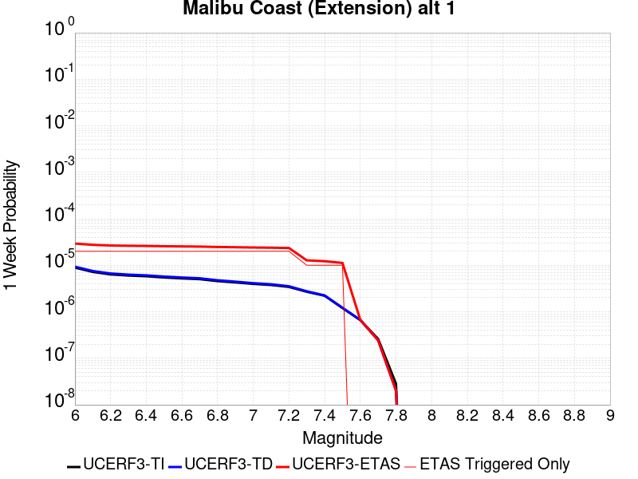 |  |  |  |

| Magnitude | 1 wk TI Prob | 1 wk TD Prob | 1 wk ETAS Prob | 1 wk ETAS/TD Gain | 1 wk ETAS Triggered Only | 1 mo TI Prob | 1 mo TD Prob | 1 mo ETAS Prob | 1 mo ETAS/TD Gain | 1 mo ETAS Triggered Only | 1 yr TI Prob | 1 yr TD Prob | 1 yr ETAS Prob | 1 yr ETAS/TD Gain | 1 yr ETAS Triggered Only | 10 yr TI Prob | 10 yr TD Prob | 10 yr ETAS Prob | 10 yr ETAS/TD Gain | 10 yr ETAS Triggered Only |
|-----|-----|-----|-----|-----|-----|-----|-----|-----|-----|-----|-----|-----|-----|-----|-----|-----|-----|-----|-----|-----|
| 6.0 | 8.930738E-6 | 9.329276E-6 | 1.1046102E-4 | 11.840257 | 1.0113269E-4 | 3.827403E-5 | 3.998201E-5 | 1.4111065E-4 | 3.5293539 | 1.0113269E-4 | 4.6588664E-4 | 4.8667393E-4 | 5.877574E-4 | 1.2077026 | 1.0113269E-4 | 0.0046491115 | 0.004856264 | 0.0049569057 | 1.020724 | 1.0113269E-4 |
| 6.1 | 7.199952E-6 | 7.5302964E-6 | 1.0866222E-4 | 14.430006 | 1.0113269E-4 | 3.0856572E-5 | 3.2272303E-5 | 1.3340173E-4 | 4.133629 | 1.0113269E-4 | 3.75614E-4 | 3.9284505E-4 | 4.93938E-4 | 1.2573354 | 1.0113269E-4 | 0.0037497976 | 0.003921572 | 0.004022308 | 1.0256877 | 1.0113269E-4 |
| 6.2 | 6.3721413E-6 | 6.6667917E-6 | 1.07798805E-4 | 16.169518 | 1.0113269E-4 | 2.7308892E-5 | 2.8571652E-5 | 1.2970145E-4 | 4.539515 | 1.0113269E-4 | 3.3243504E-4 | 3.4780471E-4 | 4.4890222E-4 | 1.2906733 | 1.0113269E-4 | 0.0033193815 | 0.0034726437 | 0.003573425 | 1.0290215 | 1.0113269E-4 |
| 6.3 | 6.016345E-6 | 6.295158E-6 | 1.0742721E-4 | 17.065052 | 1.0113269E-4 | 2.578408E-5 | 2.6978973E-5 | 1.2810894E-4 | 4.748473 | 1.0113269E-4 | 3.1387596E-4 | 3.2841982E-4 | 4.2951928E-4 | 1.307836 | 1.0113269E-4 | 0.00313433 | 0.0032793807 | 0.0033801817 | 1.0307379 | 1.0113269E-4 |
| 6.4 | 5.8104883E-6 | 6.0795446E-6 | 1.07211614E-4 | 17.63481 | 1.0113269E-4 | 2.4901856E-5 | 2.6054933E-5 | 1.2718499E-4 | 4.881417 | 1.0113269E-4 | 3.031379E-4 | 3.1717293E-4 | 4.1827356E-4 | 1.3187555 | 1.0113269E-4 | 0.0030272473 | 0.0031672374 | 0.0032680498 | 1.0318297 | 1.0113269E-4 |
| 6.5 | 5.476925E-6 | 5.7275133E-6 | 1.0685962E-4 | 18.657246 | 1.0113269E-4 | 2.3472323E-5 | 2.4546256E-5 | 1.2567647E-4 | 5.119985 | 1.0113269E-4 | 2.8573806E-4 | 2.9880996E-4 | 3.9991245E-4 | 1.3383504 | 1.0113269E-4 | 0.0028537093 | 0.002984114 | 0.0030849448 | 1.0337893 | 1.0113269E-4 |
| 6.6 | 5.222387E-6 | 5.45858E-6 | 1.0659071E-4 | 19.52719 | 1.0113269E-4 | 2.2381464E-5 | 2.3393704E-5 | 1.2452403E-4 | 5.3229713 | 1.0113269E-4 | 2.7246025E-4 | 2.8478142E-4 | 3.858853E-4 | 1.3550228 | 1.0113269E-4 | 0.0027212645 | 0.0028441956 | 0.0029450406 | 1.0354564 | 1.0113269E-4 |
| 6.7 | 5.0337076E-6 | 5.259103E-6 | 1.0639126E-4 | 20.229925 | 1.0113269E-4 | 2.1572854E-5 | 2.253882E-5 | 1.2366923E-4 | 5.4869432 | 1.0113269E-4 | 2.6261783E-4 | 2.7437587E-4 | 3.754808E-4 | 1.3684907 | 1.0113269E-4 | 0.002623077 | 0.002740401 | 0.0028412568 | 1.0368032 | 1.0113269E-4 |
| 6.8 | 4.5675624E-6 | 4.7587164E-6 | 1.0589092E-4 | 22.251991 | 1.0113269E-4 | 1.9575122E-5 | 2.039434E-5 | 1.21524965E-4 | 5.9587593 | 1.0113269E-4 | 2.3830103E-4 | 2.48273E-4 | 3.4938057E-4 | 1.4072436 | 1.0113269E-4 | 0.0023804565 | 0.002479976 | 0.0025808578 | 1.0406786 | 1.0113269E-4 |
| 6.9 | 4.2802412E-6 | 4.4520207E-6 | 1.0558426E-4 | 23.71603 | 1.0113269E-4 | 1.8343762E-5 | 1.907995E-5 | 1.2021071E-4 | 6.3003683 | 1.0113269E-4 | 2.2331243E-4 | 2.3227377E-4 | 3.3338298E-4 | 1.4353018 | 1.0113269E-4 | 0.0022308815 | 0.0023203269 | 0.0024212247 | 1.0434844 | 1.0113269E-4 |
| 7.0 | 3.9794063E-6 | 4.130099E-6 | 1.0526237E-4 | 25.486645 | 1.0113269E-4 | 1.7054486E-5 | 1.7700306E-5 | 1.188312E-4 | 6.7135115 | 1.0113269E-4 | 2.0761859E-4 | 2.1548003E-4 | 3.1659091E-4 | 1.4692355 | 1.0113269E-4 | 0.0020742472 | 0.0021527244 | 0.0022536395 | 1.0468777 | 1.0113269E-4 |
| 7.1 | 3.7730424E-6 | 3.911217E-6 | 1.0504351E-4 | 26.856987 | 1.0113269E-4 | 1.6170083E-5 | 1.6762251E-5 | 1.1789324E-4 | 7.033258 | 1.0113269E-4 | 1.9685295E-4 | 2.0406142E-4 | 3.0517348E-4 | 1.4954981 | 1.0113269E-4 | 0.0019667868 | 0.0020387534 | 0.0021396799 | 1.049504 | 1.0113269E-4 |
| 7.2 | 3.424985E-6 | 3.541337E-6 | 1.04673665E-4 | 29.557669 | 1.0113269E-4 | 1.4678424E-5 | 1.5177071E-5 | 1.1630822E-4 | 7.663417 | 1.0113269E-4 | 1.7869516E-4 | 1.8476529E-4 | 2.858793E-4 | 1.5472565 | 1.0113269E-4 | 0.0017855153 | 0.0018461287 | 0.0019470748 | 1.0546799 | 1.0113269E-4 |
| 7.3 | 2.6966375E-6 | 2.7596534E-6 | 1.0389206E-4 | 37.646782 | 1.0113269E-4 | 1.15569665E-5 | 1.1827032E-5 | 1.1295852E-4 | 9.550877 | 1.0113269E-4 | 1.4069698E-4 | 1.4398464E-4 | 2.4510277E-4 | 1.7022841 | 1.0113269E-4 | 0.0014060794 | 0.0014389176 | 0.0015399049 | 1.0701827 | 1.0113269E-4 |
| 7.4 | 2.215957E-6 | 2.249378E-6 | 1.0338183E-4 | 45.960186 | 1.0113269E-4 | 9.496924E-6 | 9.640156E-6 | 1.1077187E-4 | 11.490671 | 1.0113269E-4 | 1.1561892E-4 | 1.17362615E-4 | 2.1848343E-4 | 1.86161 | 1.0113269E-4 | 0.0011555878 | 0.0011730101 | 0.0012740241 | 1.0861152 | 1.0113269E-4 |
| 7.5 | 1.2040218E-6 | 1.2219067E-6 | 1.0235447E-4 | 83.7662 | 1.0113269E-4 | 5.160083E-6 | 5.2367322E-6 | 1.0636889E-4 | 20.312073 | 1.0113269E-4 | 6.2822204E-5 | 6.375537E-5 | 1.6488161E-4 | 2.5861604 | 1.0113269E-4 | 6.280445E-4 | 6.3737266E-4 | 7.384409E-4 | 1.15857 | 1.0113269E-4 |
| 7.6 | 6.6157446E-7 | 6.678975E-7 | 6.678975E-7 | 1.0 | 0.0 | 2.835316E-6 | 2.8624147E-6 | 2.8624147E-6 | 1.0 | 0.0 | 3.4519428E-5 | 3.484936E-5 | 3.484936E-5 | 1.0 | 0.0 | 3.4514067E-4 | 3.4844046E-4 | 3.4844046E-4 | 1.0 | 0.0 |
| 7.7 | 2.6012302E-7 | 2.4357593E-7 | 2.4357593E-7 | 1.0 | 0.0 | 1.1148124E-6 | 1.0438964E-6 | 1.0438964E-6 | 1.0 | 0.0 | 1.3572758E-5 | 1.2709375E-5 | 1.2709375E-5 | 1.0 | 0.0 | 1.3571928E-4 | 1.2708755E-4 | 1.2708755E-4 | 1.0 | 0.0 |
| 7.8 | 2.8323132E-8 | 2.0266649E-8 | 2.0266649E-8 | 1.0 | 0.0 | 1.2138484E-7 | 8.685707E-8 | 8.685707E-8 | 1.0 | 0.0 | 1.4778595E-6 | 1.0574844E-6 | 1.0574844E-6 | 1.0 | 0.0 | 1.4778497E-5 | 1.0574801E-5 | 1.0574801E-5 | 1.0 | 0.0 |

## Blue Cut
*[(top)](#table-of-contents)*

| 1 Week | 1 Month | 1 Year | 10 Year |
|-----|-----|-----|-----|
| 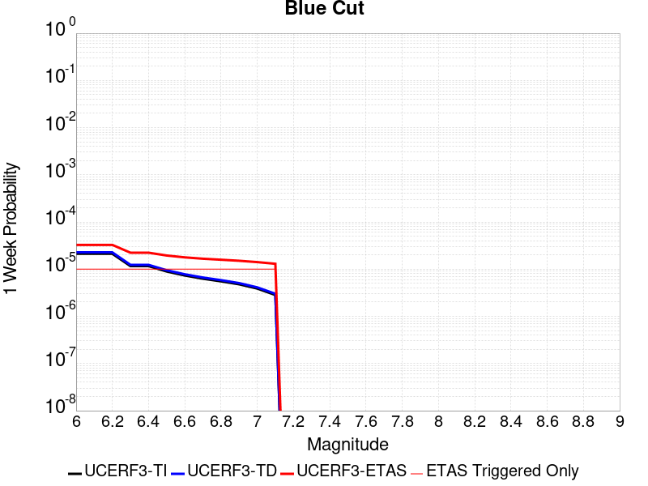 |  |  |  |

| Magnitude | 1 wk TI Prob | 1 wk TD Prob | 1 wk ETAS Prob | 1 wk ETAS/TD Gain | 1 wk ETAS Triggered Only | 1 mo TI Prob | 1 mo TD Prob | 1 mo ETAS Prob | 1 mo ETAS/TD Gain | 1 mo ETAS Triggered Only | 1 yr TI Prob | 1 yr TD Prob | 1 yr ETAS Prob | 1 yr ETAS/TD Gain | 1 yr ETAS Triggered Only | 10 yr TI Prob | 10 yr TD Prob | 10 yr ETAS Prob | 10 yr ETAS/TD Gain | 10 yr ETAS Triggered Only |
|-----|-----|-----|-----|-----|-----|-----|-----|-----|-----|-----|-----|-----|-----|-----|-----|-----|-----|-----|-----|-----|
| 6.0 | 2.1227985E-5 | 2.2719574E-5 | 2.2719574E-5 | 1.0 | 0.0 | 9.097391E-5 | 9.73663E-5 | 9.73663E-5 | 1.0 | 0.0 | 0.0011070445 | 0.0011848481 | 0.001285861 | 1.0852538 | 1.0113269E-4 | 0.011015458 | 0.011791152 | 0.011891092 | 1.0084759 | 1.0113269E-4 |
| 6.1 | 2.1227985E-5 | 2.2719574E-5 | 2.2719574E-5 | 1.0 | 0.0 | 9.097391E-5 | 9.73663E-5 | 9.73663E-5 | 1.0 | 0.0 | 0.0011070445 | 0.0011848481 | 0.001285861 | 1.0852538 | 1.0113269E-4 | 0.011015458 | 0.011791152 | 0.011891092 | 1.0084759 | 1.0113269E-4 |
| 6.2 | 2.1227985E-5 | 2.2719574E-5 | 2.2719574E-5 | 1.0 | 0.0 | 9.097391E-5 | 9.73663E-5 | 9.73663E-5 | 1.0 | 0.0 | 0.0011070445 | 0.0011848481 | 0.001285861 | 1.0852538 | 1.0113269E-4 | 0.011015458 | 0.011791152 | 0.011891092 | 1.0084759 | 1.0113269E-4 |
| 6.3 | 1.1613981E-5 | 1.2353542E-5 | 1.2353542E-5 | 1.0 | 0.0 | 4.9773254E-5 | 5.2942745E-5 | 5.2942745E-5 | 1.0 | 0.0 | 6.0582085E-4 | 6.443998E-4 | 6.443998E-4 | 1.0 | 0.0 | 0.0060417196 | 0.0064265593 | 0.0064265593 | 1.0 | 0.0 |
| 6.4 | 1.1613981E-5 | 1.2353542E-5 | 1.2353542E-5 | 1.0 | 0.0 | 4.9773254E-5 | 5.2942745E-5 | 5.2942745E-5 | 1.0 | 0.0 | 6.0582085E-4 | 6.443998E-4 | 6.443998E-4 | 1.0 | 0.0 | 0.0060417196 | 0.0064265593 | 0.0064265593 | 1.0 | 0.0 |
| 6.5 | 8.931326E-6 | 9.4816E-6 | 9.4816E-6 | 1.0 | 0.0 | 3.8276554E-5 | 4.0634844E-5 | 4.0634844E-5 | 1.0 | 0.0 | 4.6591737E-4 | 4.946261E-4 | 4.946261E-4 | 1.0 | 0.0 | 0.0046494175 | 0.004936161 | 0.004936161 | 1.0 | 0.0 |
| 6.6 | 7.345353E-6 | 7.79028E-6 | 7.79028E-6 | 1.0 | 0.0 | 3.1479703E-5 | 3.338653E-5 | 3.338653E-5 | 1.0 | 0.0 | 3.83198E-4 | 4.064132E-4 | 4.064132E-4 | 1.0 | 0.0 | 0.0038253788 | 0.0040574907 | 0.0040574907 | 1.0 | 0.0 |
| 6.7 | 6.2775666E-6 | 6.655149E-6 | 6.655149E-6 | 1.0 | 0.0 | 2.690358E-5 | 2.8521798E-5 | 2.8521798E-5 | 1.0 | 0.0 | 3.2750185E-4 | 3.472051E-4 | 3.472051E-4 | 1.0 | 0.0 | 0.0032701963 | 0.003467367 | 0.003467367 | 1.0 | 0.0 |
| 6.8 | 5.5234095E-6 | 5.8551113E-6 | 5.8551113E-6 | 1.0 | 0.0 | 2.367154E-5 | 2.5093133E-5 | 2.5093133E-5 | 1.0 | 0.0 | 2.8816288E-4 | 3.0547334E-4 | 3.0547334E-4 | 1.0 | 0.0 | 0.002877895 | 0.0030512505 | 0.0030512505 | 1.0 | 0.0 |
| 6.9 | 4.7780054E-6 | 5.0654203E-6 | 5.0654203E-6 | 1.0 | 0.0 | 2.0477004E-5 | 2.1708804E-5 | 2.1708804E-5 | 1.0 | 0.0 | 2.4927902E-4 | 2.642797E-4 | 2.642797E-4 | 1.0 | 0.0 | 0.0024899957 | 0.002640346 | 0.002640346 | 1.0 | 0.0 |
| 7.0 | 3.883171E-6 | 4.118487E-6 | 4.118487E-6 | 1.0 | 0.0 | 1.6642054E-5 | 1.7650578E-5 | 1.7650578E-5 | 1.0 | 0.0 | 2.0259817E-4 | 2.1488148E-4 | 2.1488148E-4 | 1.0 | 0.0 | 0.0020241356 | 0.0021474129 | 0.0021474129 | 1.0 | 0.0 |
| 7.1 | 2.8358215E-6 | 3.0097158E-6 | 3.0097158E-6 | 1.0 | 0.0 | 1.2153464E-5 | 1.2898756E-5 | 1.2898756E-5 | 1.0 | 0.0 | 1.4795837E-4 | 1.5703762E-4 | 1.5703762E-4 | 1.0 | 0.0 | 0.001478599 | 0.0015699116 | 0.0015699116 | 1.0 | 0.0 |

## San Gregorio (North) 2011 CFM
*[(top)](#table-of-contents)*

| 1 Week | 1 Month | 1 Year | 10 Year |
|-----|-----|-----|-----|
|  |  |  |  |

| Magnitude | 1 wk TI Prob | 1 wk TD Prob | 1 wk ETAS Prob | 1 wk ETAS/TD Gain | 1 wk ETAS Triggered Only | 1 mo TI Prob | 1 mo TD Prob | 1 mo ETAS Prob | 1 mo ETAS/TD Gain | 1 mo ETAS Triggered Only | 1 yr TI Prob | 1 yr TD Prob | 1 yr ETAS Prob | 1 yr ETAS/TD Gain | 1 yr ETAS Triggered Only | 10 yr TI Prob | 10 yr TD Prob | 10 yr ETAS Prob | 10 yr ETAS/TD Gain | 10 yr ETAS Triggered Only |
|-----|-----|-----|-----|-----|-----|-----|-----|-----|-----|-----|-----|-----|-----|-----|-----|-----|-----|-----|-----|-----|
| 6.0 | 5.0283932E-5 | 4.3057815E-5 | 4.3057815E-5 | 1.0 | 0.0 | 2.1548476E-4 | 1.8452053E-4 | 1.8452053E-4 | 1.0 | 0.0 | 0.0026203706 | 0.002244237 | 0.002244237 | 1.0 | 0.0 | 0.02589687 | 0.022293162 | 0.02239204 | 1.0044353 | 1.0113269E-4 |
| 6.1 | 5.0283932E-5 | 4.3057815E-5 | 4.3057815E-5 | 1.0 | 0.0 | 2.1548476E-4 | 1.8452053E-4 | 1.8452053E-4 | 1.0 | 0.0 | 0.0026203706 | 0.002244237 | 0.002244237 | 1.0 | 0.0 | 0.02589687 | 0.022293162 | 0.02239204 | 1.0044353 | 1.0113269E-4 |
| 6.2 | 4.2998647E-5 | 3.4441564E-5 | 3.4441564E-5 | 1.0 | 0.0 | 1.842669E-4 | 1.475984E-4 | 1.475984E-4 | 1.0 | 0.0 | 0.0022411412 | 0.00179554 | 0.00179554 | 1.0 | 0.0 | 0.022186736 | 0.017886506 | 0.01798583 | 1.005553 | 1.0113269E-4 |
| 6.3 | 4.2998647E-5 | 3.4441564E-5 | 3.4441564E-5 | 1.0 | 0.0 | 1.842669E-4 | 1.475984E-4 | 1.475984E-4 | 1.0 | 0.0 | 0.0022411412 | 0.00179554 | 0.00179554 | 1.0 | 0.0 | 0.022186736 | 0.017886506 | 0.01798583 | 1.005553 | 1.0113269E-4 |
| 6.4 | 4.1101295E-5 | 3.2326872E-5 | 3.2326872E-5 | 1.0 | 0.0 | 1.7613651E-4 | 1.3853642E-4 | 1.3853642E-4 | 1.0 | 0.0 | 0.0021423528 | 0.0016853869 | 0.0016853869 | 1.0 | 0.0 | 0.02121817 | 0.016801886 | 0.016901318 | 1.005918 | 1.0113269E-4 |
| 6.5 | 4.1032585E-5 | 3.2244905E-5 | 3.2244905E-5 | 1.0 | 0.0 | 1.7584208E-4 | 1.3818518E-4 | 1.3818518E-4 | 1.0 | 0.0 | 0.0021387753 | 0.0016811171 | 0.0016811171 | 1.0 | 0.0 | 0.021183075 | 0.016759839 | 0.016859276 | 1.005933 | 1.0113269E-4 |
| 6.6 | 4.011629E-5 | 3.1266558E-5 | 3.1266558E-5 | 1.0 | 0.0 | 1.7191563E-4 | 1.339927E-4 | 1.339927E-4 | 1.0 | 0.0 | 0.0020910634 | 0.0016301516 | 0.0016301516 | 1.0 | 0.0 | 0.020714961 | 0.01625741 | 0.0163569 | 1.0061196 | 1.0113269E-4 |
| 6.7 | 3.8583938E-5 | 2.9453593E-5 | 2.9453593E-5 | 1.0 | 0.0 | 1.6534925E-4 | 1.2622366E-4 | 1.2622366E-4 | 1.0 | 0.0 | 0.0020112682 | 0.0015357039 | 0.0015357039 | 1.0 | 0.0 | 0.019931622 | 0.015325955 | 0.015425538 | 1.0064976 | 1.0113269E-4 |
| 6.8 | 3.44341E-5 | 2.4450854E-5 | 2.4450854E-5 | 1.0 | 0.0 | 1.4756636E-4 | 1.0478523E-4 | 1.0478523E-4 | 1.0 | 0.0 | 0.0017951399 | 0.0012750238 | 0.0012750238 | 1.0 | 0.0 | 0.017807078 | 0.012751131 | 0.012850975 | 1.0078301 | 1.0113269E-4 |
| 6.9 | 3.221199E-5 | 2.1778029E-5 | 2.1778029E-5 | 1.0 | 0.0 | 1.3804408E-4 | 9.333112E-5 | 9.333112E-5 | 1.0 | 0.0 | 0.0016793909 | 0.0011357224 | 0.0011357224 | 1.0 | 0.0 | 0.01666756 | 0.011372583 | 0.011472566 | 1.0087916 | 1.0113269E-4 |
| 7.0 | 2.9186718E-5 | 1.8146875E-5 | 1.8146875E-5 | 1.0 | 0.0 | 1.2507994E-4 | 7.7770026E-5 | 7.7770026E-5 | 1.0 | 0.0 | 0.0015217843 | 9.464431E-4 | 9.464431E-4 | 1.0 | 0.0 | 0.015114053 | 0.009496798 | 0.009596971 | 1.010548 | 1.0113269E-4 |
| 7.1 | 2.6840138E-5 | 1.5284508E-5 | 1.5284508E-5 | 1.0 | 0.0 | 1.1502409E-4 | 6.55034E-5 | 6.55034E-5 | 1.0 | 0.0 | 0.0013995186 | 7.9721404E-4 | 7.9721404E-4 | 1.0 | 0.0 | 0.013907375 | 0.008015723 | 0.008116045 | 1.0125157 | 1.0113269E-4 |
| 7.2 | 2.453002E-5 | 1.2606672E-5 | 1.2606672E-5 | 1.0 | 0.0 | 1.05124425E-4 | 5.4027478E-5 | 5.4027478E-5 | 1.0 | 0.0 | 0.0012791384 | 6.575866E-4 | 6.575866E-4 | 1.0 | 0.0 | 0.012718005 | 0.00662763 | 0.006728092 | 1.0151582 | 1.0113269E-4 |
| 7.3 | 2.3330727E-5 | 1.1488677E-5 | 1.1488677E-5 | 1.0 | 0.0 | 9.9985E-5 | 4.923626E-5 | 4.923626E-5 | 1.0 | 0.0 | 0.0012166376 | 5.9928704E-4 | 5.9928704E-4 | 1.0 | 0.0 | 0.012099981 | 0.006046564 | 0.006046564 | 1.0 | 0.0 |
| 7.4 | 2.2136466E-5 | 1.0368981E-5 | 1.0368981E-5 | 1.0 | 0.0 | 9.486712E-5 | 4.4437733E-5 | 4.4437733E-5 | 1.0 | 0.0 | 0.0011543952 | 5.4089533E-4 | 5.4089533E-4 | 1.0 | 0.0 | 0.011484168 | 0.005464249 | 0.005464249 | 1.0 | 0.0 |
| 7.5 | 2.0994974E-5 | 9.427217E-6 | 9.427217E-6 | 1.0 | 0.0 | 8.997535E-5 | 4.0401734E-5 | 4.0401734E-5 | 1.0 | 0.0 | 0.0010948994 | 4.9178035E-4 | 4.9178035E-4 | 1.0 | 0.0 | 0.010895205 | 0.004973358 | 0.004973358 | 1.0 | 0.0 |
| 7.6 | 1.7091823E-5 | 6.893766E-6 | 6.893766E-6 | 1.0 | 0.0 | 7.3248615E-5 | 2.9544377E-5 | 2.9544377E-5 | 1.0 | 0.0 | 8.9143694E-4 | 3.596435E-4 | 3.596435E-4 | 1.0 | 0.0 | 0.008878695 | 0.0036482841 | 0.0036482841 | 1.0 | 0.0 |
| 7.7 | 1.2772179E-5 | 4.0208706E-6 | 4.0208706E-6 | 1.0 | 0.0 | 5.473676E-5 | 1.7232189E-5 | 1.7232189E-5 | 1.0 | 0.0 | 6.6621625E-4 | 2.0978172E-4 | 2.0978172E-4 | 1.0 | 0.0 | 0.006642225 | 0.002136922 | 0.002136922 | 1.0 | 0.0 |
| 7.8 | 7.041923E-6 | 1.940626E-6 | 1.940626E-6 | 1.0 | 0.0 | 3.017932E-5 | 8.316942E-6 | 8.316942E-6 | 1.0 | 0.0 | 3.6737128E-4 | 1.0125406E-4 | 1.0125406E-4 | 1.0 | 0.0 | 0.0036676454 | 0.0010379003 | 0.0010379003 | 1.0 | 0.0 |
| 7.9 | 2.946768E-6 | 1.0033551E-6 | 1.0033551E-6 | 1.0 | 0.0 | 1.2628945E-5 | 4.300086E-6 | 4.300086E-6 | 1.0 | 0.0 | 1.5374656E-4 | 5.235229E-5 | 5.235229E-5 | 1.0 | 0.0 | 0.0015364023 | 5.3400313E-4 | 5.3400313E-4 | 1.0 | 0.0 |
| 8.0 | 1.1433375E-6 | 5.18146E-7 | 5.18146E-7 | 1.0 | 0.0 | 4.9000087E-6 | 2.2206239E-6 | 2.2206239E-6 | 1.0 | 0.0 | 5.965597E-5 | 2.703576E-5 | 2.703576E-5 | 1.0 | 0.0 | 5.963996E-4 | 2.7398416E-4 | 2.7398416E-4 | 1.0 | 0.0 |
| 8.1 | 2.6675295E-7 | 1.62899E-7 | 1.62899E-7 | 1.0 | 0.0 | 1.1432264E-6 | 6.9813836E-7 | 6.9813836E-7 | 1.0 | 0.0 | 1.3918692E-5 | 8.499802E-6 | 8.499802E-6 | 1.0 | 0.0 | 1.391782E-4 | 8.63795E-5 | 8.63795E-5 | 1.0 | 0.0 |
| 8.2 | 1.2704569E-8 | 9.431393E-9 | 9.431393E-9 | 1.0 | 0.0 | 5.444815E-8 | 4.042026E-8 | 4.042026E-8 | 1.0 | 0.0 | 6.629061E-7 | 4.9211656E-7 | 4.9211656E-7 | 1.0 | 0.0 | 6.629041E-6 | 5.1121438E-6 | 5.1121438E-6 | 1.0 | 0.0 |

## Hosgri (Extension)
*[(top)](#table-of-contents)*

| 1 Week | 1 Month | 1 Year | 10 Year |
|-----|-----|-----|-----|
|  |  |  |  |

| Magnitude | 1 wk TI Prob | 1 wk TD Prob | 1 wk ETAS Prob | 1 wk ETAS/TD Gain | 1 wk ETAS Triggered Only | 1 mo TI Prob | 1 mo TD Prob | 1 mo ETAS Prob | 1 mo ETAS/TD Gain | 1 mo ETAS Triggered Only | 1 yr TI Prob | 1 yr TD Prob | 1 yr ETAS Prob | 1 yr ETAS/TD Gain | 1 yr ETAS Triggered Only | 10 yr TI Prob | 10 yr TD Prob | 10 yr ETAS Prob | 10 yr ETAS/TD Gain | 10 yr ETAS Triggered Only |
|-----|-----|-----|-----|-----|-----|-----|-----|-----|-----|-----|-----|-----|-----|-----|-----|-----|-----|-----|-----|-----|
| 6.0 | 1.1369135E-5 | 1.2083072E-5 | 1.1321453E-4 | 9.369681 | 1.0113269E-4 | 4.8723956E-5 | 5.1783692E-5 | 1.5291115E-4 | 2.952882 | 1.0113269E-4 | 5.9305265E-4 | 6.3030684E-4 | 7.3137577E-4 | 1.1603488 | 1.0113269E-4 | 0.005914725 | 0.0062874397 | 0.0063879364 | 1.0159837 | 1.0113269E-4 |
| 6.1 | 6.934979E-6 | 7.324555E-6 | 1.084565E-4 | 14.807248 | 1.0113269E-4 | 2.9721E-5 | 3.1390595E-5 | 1.325201E-4 | 4.22165 | 1.0113269E-4 | 3.617931E-4 | 3.8211764E-4 | 4.8321165E-4 | 1.2645626 | 1.0113269E-4 | 0.0036120464 | 0.0038150186 | 0.0039157653 | 1.026408 | 1.0113269E-4 |
| 6.2 | 6.934979E-6 | 7.324555E-6 | 1.084565E-4 | 14.807248 | 1.0113269E-4 | 2.9721E-5 | 3.1390595E-5 | 1.325201E-4 | 4.22165 | 1.0113269E-4 | 3.617931E-4 | 3.8211764E-4 | 4.8321165E-4 | 1.2645626 | 1.0113269E-4 | 0.0036120464 | 0.0038150186 | 0.0039157653 | 1.026408 | 1.0113269E-4 |
| 6.3 | 4.5484676E-6 | 4.76933E-6 | 1.05901534E-4 | 22.204697 | 1.0113269E-4 | 1.9493287E-5 | 2.043983E-5 | 1.2157045E-4 | 5.9477234 | 1.0113269E-4 | 2.3730492E-4 | 2.4882692E-4 | 3.4993445E-4 | 1.4063368 | 1.0113269E-4 | 0.0023705168 | 0.0024855258 | 0.0025864071 | 1.0405875 | 1.0113269E-4 |
| 6.4 | 4.218095E-6 | 4.4168614E-6 | 1.055491E-4 | 23.896854 | 1.0113269E-4 | 1.8077424E-5 | 1.8929271E-5 | 1.20060045E-4 | 6.3425603 | 1.0113269E-4 | 2.2007042E-4 | 2.3043984E-4 | 3.315492E-4 | 1.438767 | 1.0113269E-4 | 0.002198526 | 0.0023020422 | 0.0024029422 | 1.0438306 | 1.0113269E-4 |
| 6.5 | 3.717374E-6 | 3.8838775E-6 | 1.0501617E-4 | 27.039001 | 1.0113269E-4 | 1.5931506E-5 | 1.6645085E-5 | 1.17776086E-4 | 7.075728 | 1.0113269E-4 | 1.9394881E-4 | 2.0263524E-4 | 3.0374742E-4 | 1.4989862 | 1.0113269E-4 | 0.0019377962 | 0.0020245234 | 0.0021254516 | 1.0498527 | 1.0113269E-4 |
| 6.6 | 3.4605036E-6 | 3.608306E-6 | 1.04740626E-4 | 29.027645 | 1.0113269E-4 | 1.4830645E-5 | 1.5464078E-5 | 1.165952E-4 | 7.539745 | 1.0113269E-4 | 1.8054814E-4 | 1.8825903E-4 | 2.8937266E-4 | 1.5370985 | 1.0113269E-4 | 0.0018040152 | 0.0018810101 | 0.0019819527 | 1.053664 | 1.0113269E-4 |
| 6.7 | 3.123439E-6 | 3.2465687E-6 | 1.0437892E-4 | 32.150536 | 1.0113269E-4 | 1.33860985E-5 | 1.3913792E-5 | 1.1504507E-4 | 8.268419 | 1.0113269E-4 | 1.6296357E-4 | 1.6938736E-4 | 2.705029E-4 | 1.5969486 | 1.0113269E-4 | 0.001628441 | 0.0016925934 | 0.001793555 | 1.059649 | 1.0113269E-4 |
| 6.8 | 2.8290783E-6 | 2.9305404E-6 | 1.0406293E-4 | 35.50981 | 1.0113269E-4 | 1.2124565E-5 | 1.2559399E-5 | 1.1369082E-4 | 9.05225 | 1.0113269E-4 | 1.4760658E-4 | 1.5290003E-4 | 2.5401724E-4 | 1.661329 | 1.0113269E-4 | 0.0014750857 | 0.001527957 | 0.0016289352 | 1.066087 | 1.0113269E-4 |
| 6.9 | 2.454112E-6 | 2.5283196E-6 | 2.5283196E-6 | 1.0 | 0.0 | 1.0517581E-5 | 1.0835611E-5 | 1.0835611E-5 | 1.0 | 0.0 | 1.2804402E-4 | 1.3191563E-4 | 1.3191563E-4 | 1.0 | 0.0 | 0.0012797028 | 0.0013183793 | 0.0013183793 | 1.0 | 0.0 |
| 7.0 | 2.1008145E-6 | 2.1498704E-6 | 2.1498704E-6 | 1.0 | 0.0 | 9.003459E-6 | 9.213698E-6 | 9.213698E-6 | 1.0 | 0.0 | 1.096116E-4 | 1.1217103E-4 | 1.1217103E-4 | 1.0 | 0.0 | 0.0010955755 | 0.0011211479 | 0.0011211479 | 1.0 | 0.0 |
| 7.1 | 1.744384E-6 | 1.7686352E-6 | 1.7686352E-6 | 1.0 | 0.0 | 7.47591E-6 | 7.5798434E-6 | 7.5798434E-6 | 1.0 | 0.0 | 9.1015405E-5 | 9.22807E-5 | 9.22807E-5 | 1.0 | 0.0 | 9.097813E-4 | 9.2242553E-4 | 9.2242553E-4 | 1.0 | 0.0 |
| 7.2 | 1.5456587E-6 | 1.5562882E-6 | 1.5562882E-6 | 1.0 | 0.0 | 6.6242346E-6 | 6.66979E-6 | 6.66979E-6 | 1.0 | 0.0 | 8.064707E-5 | 8.120168E-5 | 8.120168E-5 | 1.0 | 0.0 | 8.0617814E-4 | 8.117213E-4 | 8.117213E-4 | 1.0 | 0.0 |
| 7.3 | 1.3775123E-6 | 1.3766082E-6 | 1.3766082E-6 | 1.0 | 0.0 | 5.9036106E-6 | 5.899736E-6 | 5.899736E-6 | 1.0 | 0.0 | 7.187409E-5 | 7.182693E-5 | 7.182693E-5 | 1.0 | 0.0 | 7.185085E-4 | 7.180382E-4 | 7.180382E-4 | 1.0 | 0.0 |
| 7.4 | 1.214491E-6 | 1.2023461E-6 | 1.2023461E-6 | 1.0 | 0.0 | 5.2049513E-6 | 5.1529014E-6 | 5.1529014E-6 | 1.0 | 0.0 | 6.336844E-5 | 6.2734776E-5 | 6.2734776E-5 | 1.0 | 0.0 | 6.335037E-4 | 6.271715E-4 | 6.271715E-4 | 1.0 | 0.0 |
| 7.5 | 1.0101123E-6 | 9.842246E-7 | 9.842246E-7 | 1.0 | 0.0 | 4.3290456E-6 | 4.2180986E-6 | 4.2180986E-6 | 1.0 | 0.0 | 5.2704854E-5 | 5.1354145E-5 | 5.1354145E-5 | 1.0 | 0.0 | 5.2692357E-4 | 5.1342335E-4 | 5.1342335E-4 | 1.0 | 0.0 |
| 7.6 | 8.1558215E-7 | 7.765966E-7 | 7.765966E-7 | 1.0 | 0.0 | 3.4953473E-6 | 3.328267E-6 | 3.328267E-6 | 1.0 | 0.0 | 4.255502E-5 | 4.0520903E-5 | 4.0520903E-5 | 1.0 | 0.0 | 4.2546875E-4 | 4.0513556E-4 | 4.0513556E-4 | 1.0 | 0.0 |
| 7.7 | 4.757816E-7 | 4.1308888E-7 | 4.1308888E-7 | 1.0 | 0.0 | 2.0390623E-6 | 1.7703798E-6 | 1.7703798E-6 | 1.0 | 0.0 | 2.4825302E-5 | 2.155416E-5 | 2.155416E-5 | 1.0 | 0.0 | 2.482253E-4 | 2.1552083E-4 | 2.1552083E-4 | 1.0 | 0.0 |
| 7.8 | 2.782787E-7 | 2.0047722E-7 | 2.0047722E-7 | 1.0 | 0.0 | 1.1926223E-6 | 8.5918776E-7 | 8.5918776E-7 | 1.0 | 0.0 | 1.452008E-5 | 1.04605615E-5 | 1.04605615E-5 | 1.0 | 0.0 | 1.4519131E-4 | 1.04600724E-4 | 1.04600724E-4 | 1.0 | 0.0 |
| 7.9 | 1.6948086E-7 | 9.244227E-8 | 9.244227E-8 | 1.0 | 0.0 | 7.2634634E-7 | 3.961811E-7 | 3.961811E-7 | 1.0 | 0.0 | 8.843231E-6 | 4.8234942E-6 | 4.8234942E-6 | 1.0 | 0.0 | 8.842879E-5 | 4.8233902E-5 | 4.8233902E-5 | 1.0 | 0.0 |
| 8.0 | 1.0225492E-7 | 4.4738776E-8 | 4.4738776E-8 | 1.0 | 0.0 | 4.382353E-7 | 1.917376E-7 | 1.917376E-7 | 1.0 | 0.0 | 5.335502E-6 | 2.3344028E-6 | 2.3344028E-6 | 1.0 | 0.0 | 5.335374E-5 | 2.3343786E-5 | 2.3343786E-5 | 1.0 | 0.0 |
| 8.1 | 1.43711345E-8 | 5.787707E-9 | 5.787707E-9 | 1.0 | 0.0 | 6.1590576E-8 | 2.480446E-8 | 2.480446E-8 | 1.0 | 0.0 | 7.4986497E-7 | 3.0199428E-7 | 3.0199428E-7 | 1.0 | 0.0 | 7.4986247E-6 | 3.0199392E-6 | 3.0199392E-6 | 1.0 | 0.0 |

## White Mountains
*[(top)](#table-of-contents)*

| 1 Week | 1 Month | 1 Year | 10 Year |
|-----|-----|-----|-----|
|  | 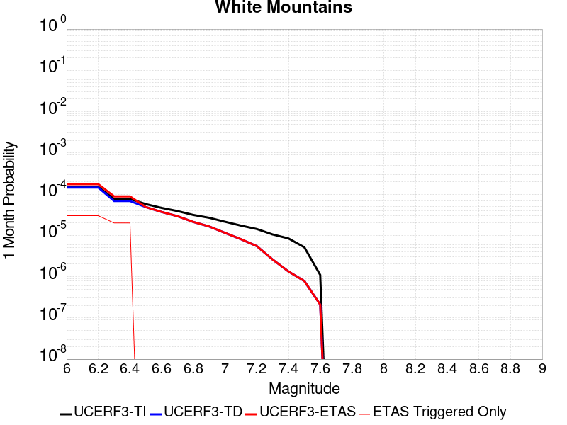 |  |  |

| Magnitude | 1 wk TI Prob | 1 wk TD Prob | 1 wk ETAS Prob | 1 wk ETAS/TD Gain | 1 wk ETAS Triggered Only | 1 mo TI Prob | 1 mo TD Prob | 1 mo ETAS Prob | 1 mo ETAS/TD Gain | 1 mo ETAS Triggered Only | 1 yr TI Prob | 1 yr TD Prob | 1 yr ETAS Prob | 1 yr ETAS/TD Gain | 1 yr ETAS Triggered Only | 10 yr TI Prob | 10 yr TD Prob | 10 yr ETAS Prob | 10 yr ETAS/TD Gain | 10 yr ETAS Triggered Only |
|-----|-----|-----|-----|-----|-----|-----|-----|-----|-----|-----|-----|-----|-----|-----|-----|-----|-----|-----|-----|-----|
| 6.0 | 3.503579E-5 | 3.378405E-5 | 3.378405E-5 | 1.0 | 0.0 | 1.5014476E-4 | 1.4478143E-4 | 1.4478143E-4 | 1.0 | 0.0 | 0.0018264796 | 0.0017614096 | 0.0017614096 | 1.0 | 0.0 | 0.018115403 | 0.017486818 | 0.017586183 | 1.0056822 | 1.0113269E-4 |
| 6.1 | 3.503579E-5 | 3.378405E-5 | 3.378405E-5 | 1.0 | 0.0 | 1.5014476E-4 | 1.4478143E-4 | 1.4478143E-4 | 1.0 | 0.0 | 0.0018264796 | 0.0017614096 | 0.0017614096 | 1.0 | 0.0 | 0.018115403 | 0.017486818 | 0.017586183 | 1.0056822 | 1.0113269E-4 |
| 6.2 | 3.503579E-5 | 3.378405E-5 | 3.378405E-5 | 1.0 | 0.0 | 1.5014476E-4 | 1.4478143E-4 | 1.4478143E-4 | 1.0 | 0.0 | 0.0018264796 | 0.0017614096 | 0.0017614096 | 1.0 | 0.0 | 0.018115403 | 0.017486818 | 0.017586183 | 1.0056822 | 1.0113269E-4 |
| 6.3 | 1.7818425E-5 | 1.5916074E-5 | 1.5916074E-5 | 1.0 | 0.0 | 7.636245E-5 | 6.821004E-5 | 6.821004E-5 | 1.0 | 0.0 | 9.293162E-4 | 8.301551E-4 | 8.301551E-4 | 1.0 | 0.0 | 0.009254395 | 0.008271999 | 0.008271999 | 1.0 | 0.0 |
| 6.4 | 1.7818425E-5 | 1.5916074E-5 | 1.5916074E-5 | 1.0 | 0.0 | 7.636245E-5 | 6.821004E-5 | 6.821004E-5 | 1.0 | 0.0 | 9.293162E-4 | 8.301551E-4 | 8.301551E-4 | 1.0 | 0.0 | 0.009254395 | 0.008271999 | 0.008271999 | 1.0 | 0.0 |
| 6.5 | 1.3397557E-5 | 1.13362685E-5 | 1.13362685E-5 | 1.0 | 0.0 | 5.741684E-5 | 4.858314E-5 | 4.858314E-5 | 1.0 | 0.0 | 6.988258E-4 | 5.913462E-4 | 5.913462E-4 | 1.0 | 0.0 | 0.006966323 | 0.005898432 | 0.005898432 | 1.0 | 0.0 |
| 6.6 | 1.0818695E-5 | 8.625366E-6 | 8.625366E-6 | 1.0 | 0.0 | 4.6365014E-5 | 3.6965357E-5 | 3.6965357E-5 | 1.0 | 0.0 | 5.6434784E-4 | 4.4996463E-4 | 4.4996463E-4 | 1.0 | 0.0 | 0.005629168 | 0.004490972 | 0.004490972 | 1.0 | 0.0 |
| 6.7 | 9.067908E-6 | 6.802442E-6 | 6.802442E-6 | 1.0 | 0.0 | 3.8861883E-5 | 2.9153016E-5 | 2.9153016E-5 | 1.0 | 0.0 | 4.7304068E-4 | 3.5488335E-4 | 3.5488335E-4 | 1.0 | 0.0 | 0.00472035 | 0.0035434833 | 0.0035434833 | 1.0 | 0.0 |
| 6.8 | 7.295947E-6 | 4.936391E-6 | 4.936391E-6 | 1.0 | 0.0 | 3.126797E-5 | 2.1155796E-5 | 2.1155796E-5 | 1.0 | 0.0 | 3.8062103E-4 | 2.575425E-4 | 2.575425E-4 | 1.0 | 0.0 | 0.0037996976 | 0.0025725532 | 0.0025725532 | 1.0 | 0.0 |
| 6.9 | 6.2243444E-6 | 3.832213E-6 | 3.832213E-6 | 1.0 | 0.0 | 2.6675489E-5 | 1.642367E-5 | 1.642367E-5 | 1.0 | 0.0 | 3.2472567E-4 | 1.9994036E-4 | 1.9994036E-4 | 1.0 | 0.0 | 0.0032425157 | 0.0019976576 | 0.0019976576 | 1.0 | 0.0 |
| 7.0 | 4.9878413E-6 | 2.6795342E-6 | 2.6795342E-6 | 1.0 | 0.0 | 2.1376287E-5 | 1.14836685E-5 | 1.14836685E-5 | 1.0 | 0.0 | 2.602252E-4 | 1.3980496E-4 | 1.3980496E-4 | 1.0 | 0.0 | 0.002599207 | 0.0013971963 | 0.0013971963 | 1.0 | 0.0 |
| 7.1 | 4.0252844E-6 | 1.8857575E-6 | 1.8857575E-6 | 1.0 | 0.0 | 1.7251105E-5 | 8.081794E-6 | 8.081794E-6 | 1.0 | 0.0 | 2.1001195E-4 | 9.8391516E-5 | 9.8391516E-5 | 1.0 | 0.0 | 0.0020981359 | 9.834924E-4 | 9.834924E-4 | 1.0 | 0.0 |
| 7.2 | 3.3284066E-6 | 1.281964E-6 | 1.281964E-6 | 1.0 | 0.0 | 1.4264522E-5 | 5.494121E-6 | 5.494121E-6 | 1.0 | 0.0 | 1.736567E-4 | 6.688897E-5 | 6.688897E-5 | 1.0 | 0.0 | 0.0017352107 | 6.6869846E-4 | 6.6869846E-4 | 1.0 | 0.0 |
| 7.3 | 2.458226E-6 | 6.05722E-7 | 6.05722E-7 | 1.0 | 0.0 | 1.0535211E-5 | 2.5959491E-6 | 2.5959491E-6 | 1.0 | 0.0 | 1.2825865E-4 | 3.1605257E-5 | 3.1605257E-5 | 1.0 | 0.0 | 0.0012818464 | 3.160114E-4 | 3.160114E-4 | 1.0 | 0.0 |
| 7.4 | 1.965953E-6 | 3.1089303E-7 | 3.1089303E-7 | 1.0 | 0.0 | 8.425486E-6 | 1.332398E-6 | 1.332398E-6 | 1.0 | 0.0 | 1.0257547E-4 | 1.6221828E-5 | 1.6221828E-5 | 1.0 | 0.0 | 0.0010252813 | 1.6220656E-4 | 1.6220656E-4 | 1.0 | 0.0 |
| 7.5 | 1.2014192E-6 | 1.8244253E-7 | 1.8244253E-7 | 1.0 | 0.0 | 5.148929E-6 | 7.8189635E-7 | 7.8189635E-7 | 1.0 | 0.0 | 6.2686406E-5 | 9.519547E-6 | 9.519547E-6 | 1.0 | 0.0 | 6.266873E-4 | 9.519148E-5 | 9.519148E-5 | 1.0 | 0.0 |
| 7.6 | 2.5612175E-7 | 4.8946475E-8 | 4.8946475E-8 | 1.0 | 0.0 | 1.0976642E-6 | 2.0977059E-7 | 2.0977059E-7 | 1.0 | 0.0 | 1.3363979E-5 | 2.5539543E-6 | 2.5539543E-6 | 1.0 | 0.0 | 1.3363175E-4 | 2.5539286E-5 | 2.5539286E-5 | 1.0 | 0.0 |

## San Jacinto (Borrego)
*[(top)](#table-of-contents)*

| 1 Week | 1 Month | 1 Year | 10 Year |
|-----|-----|-----|-----|
|  |  |  | 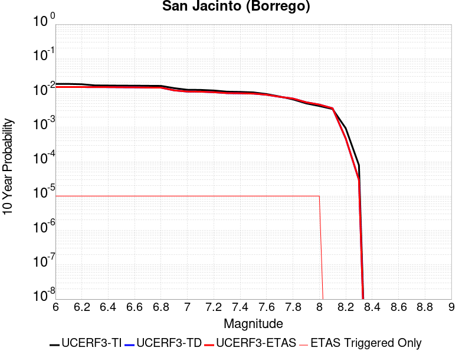 |

| Magnitude | 1 wk TI Prob | 1 wk TD Prob | 1 wk ETAS Prob | 1 wk ETAS/TD Gain | 1 wk ETAS Triggered Only | 1 mo TI Prob | 1 mo TD Prob | 1 mo ETAS Prob | 1 mo ETAS/TD Gain | 1 mo ETAS Triggered Only | 1 yr TI Prob | 1 yr TD Prob | 1 yr ETAS Prob | 1 yr ETAS/TD Gain | 1 yr ETAS Triggered Only | 10 yr TI Prob | 10 yr TD Prob | 10 yr ETAS Prob | 10 yr ETAS/TD Gain | 10 yr ETAS Triggered Only |
|-----|-----|-----|-----|-----|-----|-----|-----|-----|-----|-----|-----|-----|-----|-----|-----|-----|-----|-----|-----|-----|
| 6.0 | 3.543992E-5 | 2.7926513E-5 | 2.7926513E-5 | 1.0 | 0.0 | 1.5187653E-4 | 1.1967963E-4 | 1.1967963E-4 | 1.0 | 0.0 | 0.0018475284 | 0.0014561379 | 0.0015571233 | 1.0693516 | 1.0113269E-4 | 0.018322436 | 0.014869647 | 0.014969276 | 1.0067002 | 1.0113269E-4 |
| 6.1 | 3.542281E-5 | 2.7926513E-5 | 2.7926513E-5 | 1.0 | 0.0 | 1.5180321E-4 | 1.1967963E-4 | 1.1967963E-4 | 1.0 | 0.0 | 0.0018466372 | 0.0014561379 | 0.0015571233 | 1.0693516 | 1.0113269E-4 | 0.018313672 | 0.014869647 | 0.014969276 | 1.0067002 | 1.0113269E-4 |
| 6.2 | 3.4688688E-5 | 2.7926511E-5 | 2.7926511E-5 | 1.0 | 0.0 | 1.4865733E-4 | 1.1967963E-4 | 1.1967963E-4 | 1.0 | 0.0 | 0.0018084005 | 0.0014561379 | 0.0015571233 | 1.0693516 | 1.0113269E-4 | 0.017937548 | 0.014869647 | 0.014969276 | 1.0067002 | 1.0113269E-4 |
| 6.3 | 3.2087122E-5 | 2.7771865E-5 | 2.7771865E-5 | 1.0 | 0.0 | 1.3750899E-4 | 1.1901691E-4 | 1.1901691E-4 | 1.0 | 0.0 | 0.0016728862 | 0.00144808 | 0.0015490662 | 1.069738 | 1.0113269E-4 | 0.016603488 | 0.014790683 | 0.01489032 | 1.0067365 | 1.0113269E-4 |
| 6.4 | 3.1828724E-5 | 2.7738852E-5 | 2.7738852E-5 | 1.0 | 0.0 | 1.364017E-4 | 1.1887544E-4 | 1.1887544E-4 | 1.0 | 0.0 | 0.0016594254 | 0.0014463598 | 0.0015473462 | 1.0698211 | 1.0113269E-4 | 0.016470885 | 0.014773762 | 0.0148734 | 1.0067443 | 1.0113269E-4 |
| 6.5 | 3.1563577E-5 | 2.747857E-5 | 2.747857E-5 | 1.0 | 0.0 | 1.3526545E-4 | 1.1776006E-4 | 1.1776006E-4 | 1.0 | 0.0 | 0.0016456128 | 0.0014327979 | 0.0015337857 | 1.070483 | 1.0113269E-4 | 0.0163348 | 0.014640348 | 0.01474 | 1.0068067 | 1.0113269E-4 |
| 6.6 | 3.1467625E-5 | 2.7322796E-5 | 2.7322796E-5 | 1.0 | 0.0 | 1.3485427E-4 | 1.1709251E-4 | 1.1709251E-4 | 1.0 | 0.0 | 0.0016406142 | 0.0014246812 | 0.0015256698 | 1.0708851 | 1.0113269E-4 | 0.016285548 | 0.014560594 | 0.014660255 | 1.0068445 | 1.0113269E-4 |
| 6.7 | 3.1223695E-5 | 2.6940816E-5 | 2.6940816E-5 | 1.0 | 0.0 | 1.3380898E-4 | 1.15455594E-4 | 1.15455594E-4 | 1.0 | 0.0 | 0.0016279068 | 0.0014047775 | 0.0015057682 | 1.0718908 | 1.0113269E-4 | 0.01616033 | 0.014364966 | 0.014464646 | 1.006939 | 1.0113269E-4 |
| 6.8 | 3.1015585E-5 | 2.6761822E-5 | 2.6761822E-5 | 1.0 | 0.0 | 1.3291716E-4 | 1.1468855E-4 | 1.1468855E-4 | 1.0 | 0.0 | 0.001617065 | 0.0013954508 | 0.0014964424 | 1.072372 | 1.0113269E-4 | 0.016053487 | 0.014272246 | 0.014371935 | 1.0069848 | 1.0113269E-4 |
| 6.9 | 2.6641965E-5 | 2.2184247E-5 | 2.2184247E-5 | 1.0 | 0.0 | 1.1417485E-4 | 9.50719E-5 | 9.50719E-5 | 1.0 | 0.0 | 0.0013891924 | 0.0011568897 | 0.0012579054 | 1.0873166 | 1.0113269E-4 | 0.0138054015 | 0.011882438 | 0.011982369 | 1.00841 | 1.0113269E-4 |
| 7.0 | 2.3854353E-5 | 2.0479023E-5 | 2.0479023E-5 | 1.0 | 0.0 | 1.02228936E-4 | 8.77643E-5 | 8.77643E-5 | 1.0 | 0.0 | 0.0012439266 | 0.0010680092 | 0.0011690338 | 1.0945916 | 1.0113269E-4 | 0.012369866 | 0.0109828 | 0.011082822 | 1.0091071 | 1.0113269E-4 |
| 7.1 | 2.3672901E-5 | 2.031551E-5 | 2.031551E-5 | 1.0 | 0.0 | 1.0145135E-4 | 8.7063585E-5 | 8.7063585E-5 | 1.0 | 0.0 | 0.0012344702 | 0.0010594862 | 0.0011605117 | 1.0953534 | 1.0113269E-4 | 0.0122763505 | 0.010897976 | 0.010998007 | 1.0091789 | 1.0113269E-4 |
| 7.2 | 2.2717244E-5 | 1.9542893E-5 | 1.9542893E-5 | 1.0 | 0.0 | 9.735599E-5 | 8.375258E-5 | 8.375258E-5 | 1.0 | 0.0 | 0.0011846646 | 0.001019213 | 0.0011202425 | 1.0991251 | 1.0113269E-4 | 0.01178369 | 0.010495341 | 0.010595413 | 1.0095348 | 1.0113269E-4 |
| 7.3 | 2.1016205E-5 | 1.8384526E-5 | 1.8384526E-5 | 1.0 | 0.0 | 9.006634E-5 | 7.878846E-5 | 7.878846E-5 | 1.0 | 0.0 | 0.001096006 | 9.5882936E-4 | 0.0010598651 | 1.105374 | 1.0113269E-4 | 0.010906163 | 0.009890967 | 0.009991099 | 1.0101236 | 1.0113269E-4 |
| 7.4 | 2.0683625E-5 | 1.8187047E-5 | 1.8187047E-5 | 1.0 | 0.0 | 8.86411E-5 | 7.794217E-5 | 7.794217E-5 | 1.0 | 0.0 | 0.001078671 | 9.485349E-4 | 0.0010495716 | 1.1065187 | 1.0113269E-4 | 0.010734501 | 0.009787692 | 0.009887835 | 1.0102315 | 1.0113269E-4 |
| 7.5 | 1.9993966E-5 | 1.7782075E-5 | 1.7782075E-5 | 1.0 | 0.0 | 8.568561E-5 | 7.620667E-5 | 7.620667E-5 | 1.0 | 0.0 | 0.001042723 | 9.2742336E-4 | 0.0010284622 | 1.1089458 | 1.0113269E-4 | 0.010378438 | 0.009574614 | 0.009674779 | 1.0104614 | 1.0113269E-4 |
| 7.6 | 1.788966E-5 | 1.6435291E-5 | 1.6435291E-5 | 1.0 | 0.0 | 7.666772E-5 | 7.043507E-5 | 7.043507E-5 | 1.0 | 0.0 | 9.3302975E-4 | 8.572113E-4 | 9.582573E-4 | 1.1178776 | 1.0113269E-4 | 0.00929122 | 0.008866487 | 0.0089667225 | 1.0113051 | 1.0113269E-4 |
| 7.7 | 1.5125781E-5 | 1.4237377E-5 | 1.4237377E-5 | 1.0 | 0.0 | 6.4823165E-5 | 6.1015908E-5 | 6.1015908E-5 | 1.0 | 0.0 | 7.889362E-4 | 7.426163E-4 | 8.436739E-4 | 1.1360831 | 1.0113269E-4 | 0.007861412 | 0.0077142045 | 0.007814556 | 1.0130088 | 1.0113269E-4 |
| 7.8 | 1.250089E-5 | 1.26304985E-5 | 1.26304985E-5 | 1.0 | 0.0 | 5.3574146E-5 | 5.412959E-5 | 5.412959E-5 | 1.0 | 0.0 | 6.5207E-4 | 6.588291E-4 | 7.5989513E-4 | 1.1534026 | 1.0113269E-4 | 0.006501599 | 0.0068677636 | 0.0069682016 | 1.0146246 | 1.0113269E-4 |
| 7.9 | 9.561E-6 | 9.754616E-6 | 9.754616E-6 | 1.0 | 0.0 | 4.0975072E-5 | 4.1804833E-5 | 4.1804833E-5 | 1.0 | 0.0 | 4.987573E-4 | 5.088555E-4 | 6.099368E-4 | 1.1986443 | 1.0113269E-4 | 0.0049763937 | 0.0053523467 | 0.005452938 | 1.018794 | 1.0113269E-4 |
| 8.0 | 8.01699E-6 | 8.293488E-6 | 8.293488E-6 | 1.0 | 0.0 | 3.4358076E-5 | 3.554304E-5 | 3.554304E-5 | 1.0 | 0.0 | 4.1822926E-4 | 4.3265108E-4 | 5.3374E-4 | 1.23365 | 1.0113269E-4 | 0.0041744304 | 0.004573375 | 0.0046740454 | 1.0220122 | 1.0113269E-4 |
| 8.1 | 6.541947E-6 | 6.4622354E-6 | 6.4622354E-6 | 1.0 | 0.0 | 2.8036617E-5 | 2.7695003E-5 | 2.7695003E-5 | 1.0 | 0.0 | 3.4129233E-4 | 3.37135E-4 | 3.37135E-4 | 1.0 | 0.0 | 0.0034076865 | 0.0035806994 | 0.0035806994 | 1.0 | 0.0 |
| 8.2 | 1.7968189E-6 | 7.9713476E-7 | 7.9713476E-7 | 1.0 | 0.0 | 7.70063E-6 | 3.4162877E-6 | 3.4162877E-6 | 1.0 | 0.0 | 9.3751136E-5 | 4.159253E-5 | 4.159253E-5 | 1.0 | 0.0 | 9.371159E-4 | 4.712058E-4 | 4.712058E-4 | 1.0 | 0.0 |
| 8.3 | 1.5167889E-7 | 4.897714E-8 | 4.897714E-8 | 1.0 | 0.0 | 6.500522E-7 | 2.09902E-7 | 2.09902E-7 | 1.0 | 0.0 | 7.9143565E-6 | 2.5555544E-6 | 2.5555544E-6 | 1.0 | 0.0 | 7.914075E-5 | 2.969505E-5 | 2.969505E-5 | 1.0 | 0.0 |

## Hayward (No) 2011 CFM
*[(top)](#table-of-contents)*

| 1 Week | 1 Month | 1 Year | 10 Year |
|-----|-----|-----|-----|
|  |  |  |  |

| Magnitude | 1 wk TI Prob | 1 wk TD Prob | 1 wk ETAS Prob | 1 wk ETAS/TD Gain | 1 wk ETAS Triggered Only | 1 mo TI Prob | 1 mo TD Prob | 1 mo ETAS Prob | 1 mo ETAS/TD Gain | 1 mo ETAS Triggered Only | 1 yr TI Prob | 1 yr TD Prob | 1 yr ETAS Prob | 1 yr ETAS/TD Gain | 1 yr ETAS Triggered Only | 10 yr TI Prob | 10 yr TD Prob | 10 yr ETAS Prob | 10 yr ETAS/TD Gain | 10 yr ETAS Triggered Only |
|-----|-----|-----|-----|-----|-----|-----|-----|-----|-----|-----|-----|-----|-----|-----|-----|-----|-----|-----|-----|-----|
| 6.0 | 9.3068506E-5 | 1.739599E-4 | 1.739599E-4 | 1.0 | 0.0 | 3.9880406E-4 | 7.453244E-4 | 8.463817E-4 | 1.1355884 | 1.0113269E-4 | 0.0048446343 | 0.009036438 | 0.009136657 | 1.0110905 | 1.0113269E-4 | 0.047403704 | 0.08637534 | 0.086467735 | 1.0010697 | 1.0113269E-4 |
| 6.1 | 9.055486E-5 | 1.6947114E-4 | 1.6947114E-4 | 1.0 | 0.0 | 3.880345E-4 | 7.261021E-4 | 8.2716136E-4 | 1.1391805 | 1.0113269E-4 | 0.0047140904 | 0.008804537 | 0.00890478 | 1.0113853 | 1.0113269E-4 | 0.046153355 | 0.08426854 | 0.08436115 | 1.001099 | 1.0113269E-4 |
| 6.2 | 9.006742E-5 | 1.6867711E-4 | 1.6867711E-4 | 1.0 | 0.0 | 3.859461E-4 | 7.22701E-4 | 8.2376064E-4 | 1.139836 | 1.0113269E-4 | 0.0046887742 | 0.008763513 | 0.008863759 | 1.0114391 | 1.0113269E-4 | 0.0459107 | 0.083892785 | 0.08398543 | 1.0011044 | 1.0113269E-4 |
| 6.3 | 8.8336754E-5 | 1.6547246E-4 | 1.6547246E-4 | 1.0 | 0.0 | 3.7853114E-4 | 7.089758E-4 | 8.100368E-4 | 1.142545 | 1.0113269E-4 | 0.004598882 | 0.008597788 | 0.008698052 | 1.0116615 | 1.0113269E-4 | 0.04504866 | 0.08238599 | 0.08247879 | 1.0011264 | 1.0113269E-4 |
| 6.4 | 8.526157E-5 | 1.5974249E-4 | 1.5974249E-4 | 1.0 | 0.0 | 3.6535555E-4 | 6.8443175E-4 | 7.854952E-4 | 1.1476604 | 1.0113269E-4 | 0.0044391346 | 0.008301278 | 0.008401571 | 1.0120816 | 1.0113269E-4 | 0.043514993 | 0.079682834 | 0.07977591 | 1.001168 | 1.0113269E-4 |
| 6.5 | 8.152396E-5 | 1.530663E-4 | 1.530663E-4 | 1.0 | 0.0 | 3.493416E-4 | 6.558342E-4 | 7.569006E-4 | 1.1541035 | 1.0113269E-4 | 0.0042449418 | 0.007955698 | 0.008056027 | 1.0126108 | 1.0113269E-4 | 0.04164765 | 0.07651369 | 0.076607086 | 1.0012206 | 1.0113269E-4 |
| 6.6 | 7.987405E-5 | 1.5010842E-4 | 1.5010842E-4 | 1.0 | 0.0 | 3.4227243E-4 | 6.4316386E-4 | 7.442315E-4 | 1.1571413 | 1.0113269E-4 | 0.0041592065 | 0.0078025614 | 0.007902905 | 1.0128603 | 1.0113269E-4 | 0.04082218 | 0.07510622 | 0.07519975 | 1.0012454 | 1.0113269E-4 |
| 6.7 | 7.777665E-5 | 1.4650106E-4 | 1.4650106E-4 | 1.0 | 0.0 | 3.332859E-4 | 6.277113E-4 | 7.2878046E-4 | 1.1610123 | 1.0113269E-4 | 0.004050208 | 0.00761576 | 0.007716122 | 1.0131782 | 1.0113269E-4 | 0.039771806 | 0.073382616 | 0.07347633 | 1.001277 | 1.0113269E-4 |
| 6.8 | 7.3284005E-5 | 1.3800753E-4 | 1.3800753E-4 | 1.0 | 0.0 | 3.140365E-4 | 5.913274E-4 | 6.9240027E-4 | 1.1709254 | 1.0113269E-4 | 0.0038166929 | 0.0071757827 | 0.00727619 | 1.0139924 | 1.0113269E-4 | 0.037518036 | 0.06929621 | 0.069390334 | 1.0013583 | 1.0113269E-4 |
| 6.9 | 6.458263E-5 | 1.2131439E-4 | 1.2131439E-4 | 1.0 | 0.0 | 2.7675333E-4 | 5.198157E-4 | 6.208958E-4 | 1.1944537 | 1.0113269E-4 | 0.0033642664 | 0.0063104923 | 0.0064109867 | 1.0159249 | 1.0113269E-4 | 0.033137884 | 0.061225023 | 0.061319962 | 1.0015507 | 1.0113269E-4 |
| 7.0 | 5.3853604E-5 | 1.00250414E-4 | 1.00250414E-4 | 1.0 | 0.0 | 2.3078074E-4 | 4.295742E-4 | 5.3066347E-4 | 1.2353243 | 1.0113269E-4 | 0.0028061352 | 0.0052175885 | 0.005318193 | 1.0192819 | 1.0113269E-4 | 0.027709642 | 0.0509578 | 0.051053777 | 1.0018835 | 1.0113269E-4 |
| 7.1 | 4.4308683E-5 | 8.170626E-5 | 8.170626E-5 | 1.0 | 0.0 | 1.8988053E-4 | 3.501229E-4 | 4.5122017E-4 | 1.2887479 | 1.0113269E-4 | 0.0023093442 | 0.0042544557 | 0.004355158 | 1.0236698 | 1.0113269E-4 | 0.022854926 | 0.04182473 | 0.041921634 | 1.0023168 | 1.0113269E-4 |
| 7.2 | 3.295973E-5 | 6.0771144E-5 | 6.0771144E-5 | 1.0 | 0.0 | 1.4124835E-4 | 2.604219E-4 | 3.6152825E-4 | 1.3882406 | 1.0113269E-4 | 0.0017183421 | 0.0031660495 | 0.003266862 | 1.0318418 | 1.0113269E-4 | 0.017051157 | 0.031369876 | 0.031467836 | 1.0031227 | 1.0113269E-4 |
| 7.3 | 2.452256E-5 | 4.5180346E-5 | 4.5180346E-5 | 1.0 | 0.0 | 1.05092455E-4 | 1.9361576E-4 | 2.9472887E-4 | 1.5222359 | 1.0113269E-4 | 0.0012787496 | 0.0023547374 | 0.0024556317 | 1.0428475 | 1.0113269E-4 | 0.0127141625 | 0.02344111 | 0.023539873 | 1.0042132 | 1.0113269E-4 |
| 7.4 | 1.8829967E-5 | 3.4602548E-5 | 3.4602548E-5 | 1.0 | 0.0 | 8.069736E-5 | 1.4828827E-4 | 2.4940594E-4 | 1.6818994 | 1.0113269E-4 | 9.820475E-4 | 0.0018039243 | 0.0019048747 | 1.0559615 | 1.0113269E-4 | 0.009777189 | 0.0180195 | 0.01811881 | 1.0055113 | 1.0113269E-4 |
| 7.5 | 1.26374125E-5 | 2.2921116E-5 | 2.2921116E-5 | 1.0 | 0.0 | 5.4159216E-5 | 9.822969E-5 | 9.822969E-5 | 1.0 | 0.0 | 6.5918895E-4 | 0.0011952962 | 0.0011952962 | 1.0 | 0.0 | 0.00657237 | 0.011988836 | 0.011988836 | 1.0 | 0.0 |
| 7.6 | 4.666429E-6 | 8.4791645E-6 | 8.4791645E-6 | 1.0 | 0.0 | 1.9998828E-5 | 3.6338777E-5 | 3.6338777E-5 | 1.0 | 0.0 | 2.4345852E-4 | 4.4233602E-4 | 4.4233602E-4 | 1.0 | 0.0 | 0.0024319198 | 0.0044591012 | 0.0044591012 | 1.0 | 0.0 |
| 7.7 | 3.8399318E-7 | 7.133867E-7 | 7.133867E-7 | 1.0 | 0.0 | 1.6456839E-6 | 3.057368E-6 | 3.057368E-6 | 1.0 | 0.0 | 2.003602E-5 | 3.722282E-5 | 3.722282E-5 | 1.0 | 0.0 | 2.0034213E-4 | 3.8614936E-4 | 3.8614936E-4 | 1.0 | 0.0 |
| 7.8 | 2.5637698E-7 | 5.3662194E-7 | 5.3662194E-7 | 1.0 | 0.0 | 1.098758E-6 | 2.299806E-6 | 2.299806E-6 | 1.0 | 0.0 | 1.3377297E-5 | 2.7999782E-5 | 2.7999782E-5 | 1.0 | 0.0 | 1.3376492E-4 | 2.9244382E-4 | 2.9244382E-4 | 1.0 | 0.0 |
| 7.9 | 1.7141245E-7 | 3.7290573E-7 | 3.7290573E-7 | 1.0 | 0.0 | 7.3462456E-7 | 1.5981665E-6 | 1.5981665E-6 | 1.0 | 0.0 | 8.944017E-6 | 1.9457504E-5 | 1.9457504E-5 | 1.0 | 0.0 | 8.943657E-5 | 2.0245428E-4 | 2.0245428E-4 | 1.0 | 0.0 |
| 8.0 | 1.1808895E-7 | 2.7509762E-7 | 2.7509762E-7 | 1.0 | 0.0 | 5.060954E-7 | 1.1789892E-6 | 1.1789892E-6 | 1.0 | 0.0 | 6.161694E-6 | 1.43541E-5 | 1.43541E-5 | 1.0 | 0.0 | 6.161523E-5 | 1.4816441E-4 | 1.4816441E-4 | 1.0 | 0.0 |
| 8.1 | 5.138535E-8 | 1.1229867E-7 | 1.1229867E-7 | 1.0 | 0.0 | 2.2022292E-7 | 4.812799E-7 | 4.812799E-7 | 1.0 | 0.0 | 2.6812106E-6 | 5.8595674E-6 | 5.8595674E-6 | 1.0 | 0.0 | 2.6811784E-5 | 6.0158476E-5 | 6.0158476E-5 | 1.0 | 0.0 |

## Hayward (So) extension 2011 CFM
*[(top)](#table-of-contents)*

| 1 Week | 1 Month | 1 Year | 10 Year |
|-----|-----|-----|-----|
|  |  |  | 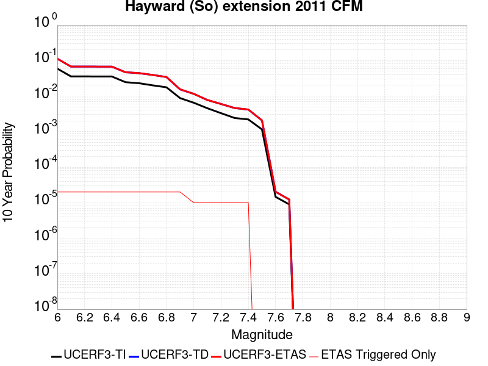 |

| Magnitude | 1 wk TI Prob | 1 wk TD Prob | 1 wk ETAS Prob | 1 wk ETAS/TD Gain | 1 wk ETAS Triggered Only | 1 mo TI Prob | 1 mo TD Prob | 1 mo ETAS Prob | 1 mo ETAS/TD Gain | 1 mo ETAS Triggered Only | 1 yr TI Prob | 1 yr TD Prob | 1 yr ETAS Prob | 1 yr ETAS/TD Gain | 1 yr ETAS Triggered Only | 10 yr TI Prob | 10 yr TD Prob | 10 yr ETAS Prob | 10 yr ETAS/TD Gain | 10 yr ETAS Triggered Only |
|-----|-----|-----|-----|-----|-----|-----|-----|-----|-----|-----|-----|-----|-----|-----|-----|-----|-----|-----|-----|-----|
| 6.0 | 1.1721256E-4 | 2.3697627E-4 | 2.3697627E-4 | 1.0 | 0.0 | 5.022428E-4 | 0.0010129517 | 0.0011139819 | 1.0997385 | 1.0113269E-4 | 0.0060976758 | 0.012248711 | 0.012348605 | 1.0081555 | 1.0113269E-4 | 0.0593305 | 0.112843215 | 0.112932935 | 1.0007951 | 1.0113269E-4 |
| 6.1 | 6.99169E-5 | 1.3822885E-4 | 1.3822885E-4 | 1.0 | 0.0 | 2.9960944E-4 | 5.9128006E-4 | 6.9235294E-4 | 1.1709391 | 1.0113269E-4 | 0.0036416445 | 0.0071720886 | 0.007272496 | 1.0139997 | 1.0113269E-4 | 0.035825435 | 0.067803554 | 0.06789783 | 1.0013905 | 1.0113269E-4 |
| 6.2 | 6.99169E-5 | 1.3822885E-4 | 1.3822885E-4 | 1.0 | 0.0 | 2.9960944E-4 | 5.9128006E-4 | 6.9235294E-4 | 1.1709391 | 1.0113269E-4 | 0.0036416445 | 0.0071720886 | 0.007272496 | 1.0139997 | 1.0113269E-4 | 0.035825435 | 0.067803554 | 0.06789783 | 1.0013905 | 1.0113269E-4 |
| 6.3 | 6.970908E-5 | 1.379104E-4 | 1.379104E-4 | 1.0 | 0.0 | 2.9871898E-4 | 5.899159E-4 | 6.909889E-4 | 1.1713346 | 1.0113269E-4 | 0.0036308395 | 0.007155625 | 0.0072560343 | 1.0140321 | 1.0113269E-4 | 0.035720866 | 0.067652516 | 0.0677468 | 1.0013938 | 1.0113269E-4 |
| 6.4 | 6.9517155E-5 | 1.375792E-4 | 1.375792E-4 | 1.0 | 0.0 | 2.9789665E-4 | 5.884971E-4 | 6.8957027E-4 | 1.1717479 | 1.0113269E-4 | 0.0036208609 | 0.0071385372 | 0.0072389483 | 1.014066 | 1.0113269E-4 | 0.03562429 | 0.06749655 | 0.06759086 | 1.0013973 | 1.0113269E-4 |
| 6.5 | 4.786248E-5 | 9.41498E-5 | 9.41498E-5 | 1.0 | 0.0 | 2.0510878E-4 | 4.034394E-4 | 5.0453126E-4 | 1.2505752 | 1.0113269E-4 | 0.0024943394 | 0.004901227 | 0.0050018644 | 1.020533 | 1.0113269E-4 | 0.02466527 | 0.046901822 | 0.04699821 | 1.0020552 | 1.0113269E-4 |
| 6.6 | 4.4662214E-5 | 8.881654E-5 | 8.881654E-5 | 1.0 | 0.0 | 1.9139545E-4 | 3.805894E-4 | 4.816836E-4 | 1.2656254 | 1.0113269E-4 | 0.0023277493 | 0.0046242937 | 0.0047249584 | 1.0217687 | 1.0113269E-4 | 0.02303517 | 0.044293344 | 0.044389997 | 1.0021821 | 1.0113269E-4 |
| 6.7 | 3.884542E-5 | 7.8648096E-5 | 7.8648096E-5 | 1.0 | 0.0 | 1.6646975E-4 | 3.370222E-4 | 4.381208E-4 | 1.2999761 | 1.0113269E-4 | 0.002024885 | 0.0040959697 | 0.0041966885 | 1.0245897 | 1.0113269E-4 | 0.020065336 | 0.039333146 | 0.0394303 | 1.00247 | 1.0113269E-4 |
| 6.8 | 3.4221863E-5 | 6.855653E-5 | 6.855653E-5 | 1.0 | 0.0 | 1.4665688E-4 | 2.93783E-4 | 3.9488598E-4 | 1.3441417 | 1.0113269E-4 | 0.0017840851 | 0.0035713627 | 0.0036721341 | 1.0282166 | 1.0113269E-4 | 0.017698295 | 0.034421004 | 0.034518655 | 1.002837 | 1.0113269E-4 |
| 6.9 | 1.6927712E-5 | 3.0061563E-5 | 3.0061563E-5 | 1.0 | 0.0 | 7.2545314E-5 | 1.2882923E-4 | 2.2994888E-4 | 1.7849123 | 1.0113269E-4 | 8.828813E-4 | 0.0015674243 | 0.0016683985 | 1.0644205 | 1.0113269E-4 | 0.008793819 | 0.01546327 | 0.015562839 | 1.0064391 | 1.0113269E-4 |
| 7.0 | 1.2509653E-5 | 2.2462571E-5 | 2.2462571E-5 | 1.0 | 0.0 | 5.3611697E-5 | 9.6264856E-5 | 1.9738781E-4 | 2.0504658 | 1.0113269E-4 | 6.525269E-4 | 0.0011714385 | 0.0012724526 | 1.0862309 | 1.0113269E-4 | 0.0065061417 | 0.01158231 | 0.011682272 | 1.0086305 | 1.0113269E-4 |
| 7.1 | 8.751583E-6 | 1.4925648E-5 | 1.4925648E-5 | 1.0 | 0.0 | 3.750624E-5 | 6.3965526E-5 | 1.6509174E-4 | 2.5809486 | 1.0113269E-4 | 4.5654282E-4 | 7.785079E-4 | 8.795618E-4 | 1.1298046 | 1.0113269E-4 | 0.0045560603 | 0.007763496 | 0.007863844 | 1.0129255 | 1.0113269E-4 |
| 7.2 | 6.354379E-6 | 1.1498636E-5 | 1.1498636E-5 | 1.0 | 0.0 | 2.7232769E-5 | 4.9278966E-5 | 1.5040666E-4 | 3.0521474 | 1.0113269E-4 | 3.3150852E-4 | 5.99811E-4 | 7.0088304E-4 | 1.1685064 | 1.0113269E-4 | 0.0033101442 | 0.0060003046 | 0.0061008306 | 1.0167534 | 1.0113269E-4 |
| 7.3 | 4.645554E-6 | 8.818172E-6 | 8.818172E-6 | 1.0 | 0.0 | 1.9909365E-5 | 3.779164E-5 | 1.389205E-4 | 3.6759586 | 1.0113269E-4 | 2.4236954E-4 | 4.6002E-4 | 5.611062E-4 | 1.219743 | 1.0113269E-4 | 0.0024210536 | 0.004610708 | 0.0047113746 | 1.0218332 | 1.0113269E-4 |
| 7.4 | 4.23437E-6 | 7.992532E-6 | 7.992532E-6 | 1.0 | 0.0 | 1.8147173E-5 | 3.425328E-5 | 1.353825E-4 | 3.9523952 | 1.0113269E-4 | 2.2091944E-4 | 4.1695772E-4 | 5.1804824E-4 | 1.2424479 | 1.0113269E-4 | 0.0022069993 | 0.004181972 | 0.0042826817 | 1.0240818 | 1.0113269E-4 |
| 7.5 | 2.2187417E-6 | 3.9522306E-6 | 3.9522306E-6 | 1.0 | 0.0 | 9.508858E-6 | 1.6938036E-5 | 1.6938036E-5 | 1.0 | 0.0 | 1.157642E-4 | 2.0620368E-4 | 2.0620368E-4 | 1.0 | 0.0 | 0.0011570391 | 0.0020734754 | 0.0020734754 | 1.0 | 0.0 |
| 7.6 | 2.7952495E-8 | 3.878529E-8 | 3.878529E-8 | 1.0 | 0.0 | 1.1979641E-7 | 1.6622266E-7 | 1.6622266E-7 | 1.0 | 0.0 | 1.4585203E-6 | 2.0237592E-6 | 2.0237592E-6 | 1.0 | 0.0 | 1.4585107E-5 | 2.0328182E-5 | 2.0328182E-5 | 1.0 | 0.0 |
| 7.7 | 1.7192724E-8 | 2.3436517E-8 | 2.3436517E-8 | 1.0 | 0.0 | 7.36831E-8 | 1.0044221E-7 | 1.0044221E-7 | 1.0 | 0.0 | 8.9709135E-7 | 1.2228833E-6 | 1.2228833E-6 | 1.0 | 0.0 | 8.970877E-6 | 1.2296933E-5 | 1.2296933E-5 | 1.0 | 0.0 |

## Great Valley 08 (Quinto)
*[(top)](#table-of-contents)*

| 1 Week | 1 Month | 1 Year | 10 Year |
|-----|-----|-----|-----|
|  | 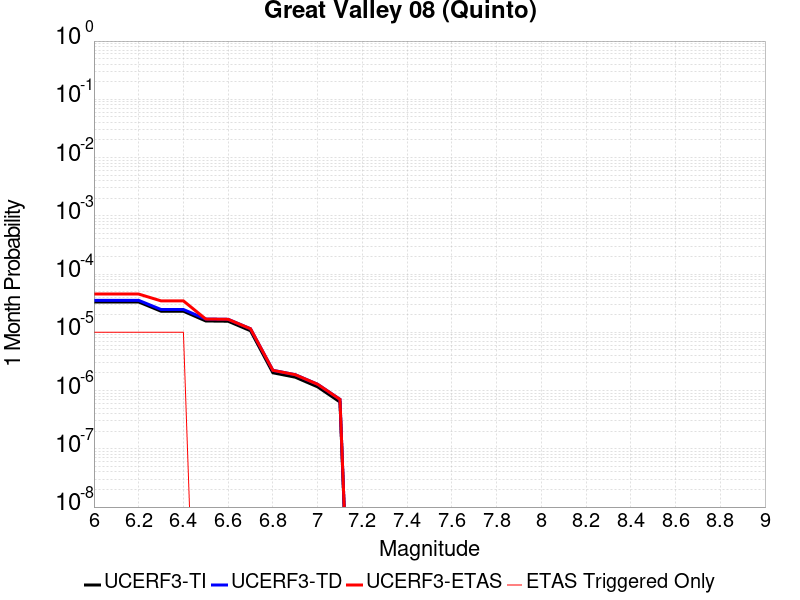 |  |  |

| Magnitude | 1 wk TI Prob | 1 wk TD Prob | 1 wk ETAS Prob | 1 wk ETAS/TD Gain | 1 wk ETAS Triggered Only | 1 mo TI Prob | 1 mo TD Prob | 1 mo ETAS Prob | 1 mo ETAS/TD Gain | 1 mo ETAS Triggered Only | 1 yr TI Prob | 1 yr TD Prob | 1 yr ETAS Prob | 1 yr ETAS/TD Gain | 1 yr ETAS Triggered Only | 10 yr TI Prob | 10 yr TD Prob | 10 yr ETAS Prob | 10 yr ETAS/TD Gain | 10 yr ETAS Triggered Only |
|-----|-----|-----|-----|-----|-----|-----|-----|-----|-----|-----|-----|-----|-----|-----|-----|-----|-----|-----|-----|-----|
| 6.0 | 7.737697E-6 | 8.253038E-6 | 8.253038E-6 | 1.0 | 0.0 | 3.3161137E-5 | 3.536979E-5 | 3.536979E-5 | 1.0 | 0.0 | 4.0366207E-4 | 4.3056096E-4 | 4.3056096E-4 | 1.0 | 0.0 | 0.004029296 | 0.0042991205 | 0.0043998184 | 1.023423 | 1.0113269E-4 |
| 6.1 | 7.737697E-6 | 8.253038E-6 | 8.253038E-6 | 1.0 | 0.0 | 3.3161137E-5 | 3.536979E-5 | 3.536979E-5 | 1.0 | 0.0 | 4.0366207E-4 | 4.3056096E-4 | 4.3056096E-4 | 1.0 | 0.0 | 0.004029296 | 0.0042991205 | 0.0043998184 | 1.023423 | 1.0113269E-4 |
| 6.2 | 7.737697E-6 | 8.253038E-6 | 8.253038E-6 | 1.0 | 0.0 | 3.3161137E-5 | 3.536979E-5 | 3.536979E-5 | 1.0 | 0.0 | 4.0366207E-4 | 4.3056096E-4 | 4.3056096E-4 | 1.0 | 0.0 | 0.004029296 | 0.0042991205 | 0.0043998184 | 1.023423 | 1.0113269E-4 |
| 6.3 | 5.374012E-6 | 5.7505736E-6 | 5.7505736E-6 | 1.0 | 0.0 | 2.3031276E-5 | 2.4645145E-5 | 2.4645145E-5 | 1.0 | 0.0 | 2.803697E-4 | 3.0002446E-4 | 3.0002446E-4 | 1.0 | 0.0 | 0.0028001624 | 0.0029972875 | 0.003098117 | 1.0336403 | 1.0113269E-4 |
| 6.4 | 5.374012E-6 | 5.7505736E-6 | 5.7505736E-6 | 1.0 | 0.0 | 2.3031276E-5 | 2.4645145E-5 | 2.4645145E-5 | 1.0 | 0.0 | 2.803697E-4 | 3.0002446E-4 | 3.0002446E-4 | 1.0 | 0.0 | 0.0028001624 | 0.0029972875 | 0.003098117 | 1.0336403 | 1.0113269E-4 |
| 6.5 | 3.65427E-6 | 3.941324E-6 | 3.941324E-6 | 1.0 | 0.0 | 1.5661062E-5 | 1.689132E-5 | 1.689132E-5 | 1.0 | 0.0 | 1.9065675E-4 | 2.0563944E-4 | 2.0563944E-4 | 1.0 | 0.0 | 0.0019049325 | 0.0020551833 | 0.0020551833 | 1.0 | 0.0 |
| 6.6 | 3.6143538E-6 | 3.8985104E-6 | 3.8985104E-6 | 1.0 | 0.0 | 1.5489995E-5 | 1.6707834E-5 | 1.6707834E-5 | 1.0 | 0.0 | 1.8857437E-4 | 2.0340596E-4 | 2.0340596E-4 | 1.0 | 0.0 | 0.0018841444 | 0.0020328893 | 0.0020328893 | 1.0 | 0.0 |
| 6.7 | 2.4821015E-6 | 2.6857067E-6 | 2.6857067E-6 | 1.0 | 0.0 | 1.0637535E-5 | 1.1510153E-5 | 1.1510153E-5 | 1.0 | 0.0 | 1.2950429E-4 | 1.4013276E-4 | 1.4013276E-4 | 1.0 | 0.0 | 0.0012942884 | 0.0014009989 | 0.0014009989 | 1.0 | 0.0 |
| 6.8 | 4.7110538E-7 | 5.193021E-7 | 5.193021E-7 | 1.0 | 0.0 | 2.0190216E-6 | 2.2255786E-6 | 2.2255786E-6 | 1.0 | 0.0 | 2.458131E-5 | 2.70961E-5 | 2.70961E-5 | 1.0 | 0.0 | 2.457859E-4 | 2.7092977E-4 | 2.7092977E-4 | 1.0 | 0.0 |
| 6.9 | 3.958685E-7 | 4.3703452E-7 | 4.3703452E-7 | 1.0 | 0.0 | 1.6965782E-6 | 1.8730038E-6 | 1.8730038E-6 | 1.0 | 0.0 | 2.0655643E-5 | 2.28036E-5 | 2.28036E-5 | 1.0 | 0.0 | 2.0653724E-4 | 2.2801422E-4 | 2.2801422E-4 | 1.0 | 0.0 |
| 7.0 | 2.70294E-7 | 2.9920008E-7 | 2.9920008E-7 | 1.0 | 0.0 | 1.1584025E-6 | 1.2822856E-6 | 1.2822856E-6 | 1.0 | 0.0 | 1.4103458E-5 | 1.5611728E-5 | 1.5611728E-5 | 1.0 | 0.0 | 1.4102564E-4 | 1.5610759E-4 | 1.5610759E-4 | 1.0 | 0.0 |
| 7.1 | 1.4828602E-7 | 1.6469107E-7 | 1.6469107E-7 | 1.0 | 0.0 | 6.3551136E-7 | 7.058187E-7 | 7.058187E-7 | 1.0 | 0.0 | 7.737323E-6 | 8.593317E-6 | 8.593317E-6 | 1.0 | 0.0 | 7.737054E-5 | 8.593065E-5 | 8.593065E-5 | 1.0 | 0.0 |

## Goose Lake 2011 CFM
*[(top)](#table-of-contents)*

| 1 Week | 1 Month | 1 Year | 10 Year |
|-----|-----|-----|-----|
|  |  |  |  |

| Magnitude | 1 wk TI Prob | 1 wk TD Prob | 1 wk ETAS Prob | 1 wk ETAS/TD Gain | 1 wk ETAS Triggered Only | 1 mo TI Prob | 1 mo TD Prob | 1 mo ETAS Prob | 1 mo ETAS/TD Gain | 1 mo ETAS Triggered Only | 1 yr TI Prob | 1 yr TD Prob | 1 yr ETAS Prob | 1 yr ETAS/TD Gain | 1 yr ETAS Triggered Only | 10 yr TI Prob | 10 yr TD Prob | 10 yr ETAS Prob | 10 yr ETAS/TD Gain | 10 yr ETAS Triggered Only |
|-----|-----|-----|-----|-----|-----|-----|-----|-----|-----|-----|-----|-----|-----|-----|-----|-----|-----|-----|-----|-----|
| 6.0 | 3.780968E-6 | 3.8230223E-6 | 3.8230223E-6 | 1.0 | 0.0 | 1.6204049E-5 | 1.6384285E-5 | 1.6384285E-5 | 1.0 | 0.0 | 1.9726643E-4 | 1.994615E-4 | 3.00574E-4 | 1.5069275 | 1.0113269E-4 | 0.001970914 | 0.001992933 | 0.0020938641 | 1.0506445 | 1.0113269E-4 |
| 6.1 | 2.2035124E-6 | 2.229801E-6 | 2.229801E-6 | 1.0 | 0.0 | 9.443591E-6 | 9.556257E-6 | 9.556257E-6 | 1.0 | 0.0 | 1.1496965E-4 | 1.163414E-4 | 1.163414E-4 | 1.0 | 0.0 | 0.0011491019 | 0.0011628233 | 0.0011628233 | 1.0 | 0.0 |
| 6.2 | 1.5624689E-6 | 1.5826923E-6 | 1.5826923E-6 | 1.0 | 0.0 | 6.6962784E-6 | 6.7829496E-6 | 6.7829496E-6 | 1.0 | 0.0 | 8.152414E-5 | 8.2579325E-5 | 8.2579325E-5 | 1.0 | 0.0 | 8.1494235E-4 | 8.2549086E-4 | 8.2549086E-4 | 1.0 | 0.0 |
| 6.3 | 1.5624689E-6 | 1.5826923E-6 | 1.5826923E-6 | 1.0 | 0.0 | 6.6962784E-6 | 6.7829496E-6 | 6.7829496E-6 | 1.0 | 0.0 | 8.152414E-5 | 8.2579325E-5 | 8.2579325E-5 | 1.0 | 0.0 | 8.1494235E-4 | 8.2549086E-4 | 8.2549086E-4 | 1.0 | 0.0 |
| 6.4 | 1.256464E-6 | 1.2738695E-6 | 1.2738695E-6 | 1.0 | 0.0 | 5.3848344E-6 | 5.4594293E-6 | 5.4594293E-6 | 1.0 | 0.0 | 6.5558386E-5 | 6.646655E-5 | 6.646655E-5 | 1.0 | 0.0 | 6.553905E-4 | 6.644687E-4 | 6.644687E-4 | 1.0 | 0.0 |
| 6.5 | 1.0910911E-6 | 1.1069404E-6 | 1.1069404E-6 | 1.0 | 0.0 | 4.6760965E-6 | 4.7440217E-6 | 4.7440217E-6 | 1.0 | 0.0 | 5.692999E-5 | 5.7756948E-5 | 5.7756948E-5 | 1.0 | 0.0 | 5.6915404E-4 | 5.7742064E-4 | 5.7742064E-4 | 1.0 | 0.0 |
| 6.6 | 9.546601E-7 | 9.691246E-7 | 9.691246E-7 | 1.0 | 0.0 | 4.091394E-6 | 4.1533845E-6 | 4.1533845E-6 | 1.0 | 0.0 | 4.9811584E-5 | 5.056629E-5 | 5.056629E-5 | 1.0 | 0.0 | 4.980042E-4 | 5.055487E-4 | 5.055487E-4 | 1.0 | 0.0 |
| 6.7 | 7.790316E-7 | 7.9159634E-7 | 7.9159634E-7 | 1.0 | 0.0 | 3.3387028E-6 | 3.3925514E-6 | 3.3925514E-6 | 1.0 | 0.0 | 4.0647945E-5 | 4.1303538E-5 | 4.1303538E-5 | 1.0 | 0.0 | 4.0640513E-4 | 4.129592E-4 | 4.129592E-4 | 1.0 | 0.0 |
| 6.8 | 6.3714384E-7 | 6.4787395E-7 | 6.4787395E-7 | 1.0 | 0.0 | 2.7306137E-6 | 2.7765998E-6 | 2.7765998E-6 | 1.0 | 0.0 | 3.3244716E-5 | 3.3804583E-5 | 3.3804583E-5 | 1.0 | 0.0 | 3.323974E-4 | 3.379949E-4 | 3.379949E-4 | 1.0 | 0.0 |
| 6.9 | 4.92586E-7 | 5.0139147E-7 | 5.0139147E-7 | 1.0 | 0.0 | 2.1110811E-6 | 2.1488188E-6 | 2.1488188E-6 | 1.0 | 0.0 | 2.5702111E-5 | 2.616156E-5 | 2.616156E-5 | 1.0 | 0.0 | 2.569914E-4 | 2.6158517E-4 | 2.6158517E-4 | 1.0 | 0.0 |
| 7.0 | 3.130245E-7 | 3.190354E-7 | 3.190354E-7 | 1.0 | 0.0 | 1.3415328E-6 | 1.3672939E-6 | 1.3672939E-6 | 1.0 | 0.0 | 1.6333039E-5 | 1.6646678E-5 | 1.6646678E-5 | 1.0 | 0.0 | 1.6331839E-4 | 1.6645451E-4 | 1.6645451E-4 | 1.0 | 0.0 |
| 7.1 | 1.7680084E-7 | 1.8023923E-7 | 1.8023923E-7 | 1.0 | 0.0 | 7.5771766E-7 | 7.724536E-7 | 7.724536E-7 | 1.0 | 0.0 | 9.225173E-6 | 9.404583E-6 | 9.404583E-6 | 1.0 | 0.0 | 9.22479E-5 | 9.4041956E-5 | 9.4041956E-5 | 1.0 | 0.0 |
| 7.2 | 4.8641045E-8 | 4.9402068E-8 | 4.9402068E-8 | 1.0 | 0.0 | 2.084616E-7 | 2.1172312E-7 | 2.1172312E-7 | 1.0 | 0.0 | 2.538017E-6 | 2.577726E-6 | 2.577726E-6 | 1.0 | 0.0 | 2.537988E-5 | 2.5776973E-5 | 2.5776973E-5 | 1.0 | 0.0 |
| 7.3 | 5.3911844E-9 | 5.4758145E-9 | 5.4758145E-9 | 1.0 | 0.0 | 2.3105075E-8 | 2.3467775E-8 | 2.3467775E-8 | 1.0 | 0.0 | 2.8130427E-7 | 2.8572015E-7 | 2.8572015E-7 | 1.0 | 0.0 | 2.8130391E-6 | 2.8571992E-6 | 2.8571992E-6 | 1.0 | 0.0 |

## Pleito
*[(top)](#table-of-contents)*

| 1 Week | 1 Month | 1 Year | 10 Year |
|-----|-----|-----|-----|
|  |  |  |  |

| Magnitude | 1 wk TI Prob | 1 wk TD Prob | 1 wk ETAS Prob | 1 wk ETAS/TD Gain | 1 wk ETAS Triggered Only | 1 mo TI Prob | 1 mo TD Prob | 1 mo ETAS Prob | 1 mo ETAS/TD Gain | 1 mo ETAS Triggered Only | 1 yr TI Prob | 1 yr TD Prob | 1 yr ETAS Prob | 1 yr ETAS/TD Gain | 1 yr ETAS Triggered Only | 10 yr TI Prob | 10 yr TD Prob | 10 yr ETAS Prob | 10 yr ETAS/TD Gain | 10 yr ETAS Triggered Only |
|-----|-----|-----|-----|-----|-----|-----|-----|-----|-----|-----|-----|-----|-----|-----|-----|-----|-----|-----|-----|-----|
| 6.0 | 1.6763008E-5 | 2.4763838E-5 | 2.4763838E-5 | 1.0 | 0.0 | 7.183948E-5 | 1.0612683E-4 | 1.0612683E-4 | 1.0 | 0.0 | 8.742947E-4 | 0.0012914003 | 0.0012914003 | 1.0 | 0.0 | 0.00870863 | 0.0129538905 | 0.013053712 | 1.007706 | 1.0113269E-4 |
| 6.1 | 1.6763008E-5 | 2.4763838E-5 | 2.4763838E-5 | 1.0 | 0.0 | 7.183948E-5 | 1.0612683E-4 | 1.0612683E-4 | 1.0 | 0.0 | 8.742947E-4 | 0.0012914003 | 0.0012914003 | 1.0 | 0.0 | 0.00870863 | 0.0129538905 | 0.013053712 | 1.007706 | 1.0113269E-4 |
| 6.2 | 1.6763008E-5 | 2.4763838E-5 | 2.4763838E-5 | 1.0 | 0.0 | 7.183948E-5 | 1.0612683E-4 | 1.0612683E-4 | 1.0 | 0.0 | 8.742947E-4 | 0.0012914003 | 0.0012914003 | 1.0 | 0.0 | 0.00870863 | 0.0129538905 | 0.013053712 | 1.007706 | 1.0113269E-4 |
| 6.3 | 1.6763008E-5 | 2.4763838E-5 | 2.4763838E-5 | 1.0 | 0.0 | 7.183948E-5 | 1.0612683E-4 | 1.0612683E-4 | 1.0 | 0.0 | 8.742947E-4 | 0.0012914003 | 0.0012914003 | 1.0 | 0.0 | 0.00870863 | 0.0129538905 | 0.013053712 | 1.007706 | 1.0113269E-4 |
| 6.4 | 1.6763008E-5 | 2.4763838E-5 | 2.4763838E-5 | 1.0 | 0.0 | 7.183948E-5 | 1.0612683E-4 | 1.0612683E-4 | 1.0 | 0.0 | 8.742947E-4 | 0.0012914003 | 0.0012914003 | 1.0 | 0.0 | 0.00870863 | 0.0129538905 | 0.013053712 | 1.007706 | 1.0113269E-4 |
| 6.5 | 1.6763008E-5 | 2.4763838E-5 | 2.4763838E-5 | 1.0 | 0.0 | 7.183948E-5 | 1.0612683E-4 | 1.0612683E-4 | 1.0 | 0.0 | 8.742947E-4 | 0.0012914003 | 0.0012914003 | 1.0 | 0.0 | 0.00870863 | 0.0129538905 | 0.013053712 | 1.007706 | 1.0113269E-4 |
| 6.6 | 9.910213E-6 | 1.7214623E-5 | 1.7214623E-5 | 1.0 | 0.0 | 4.247165E-5 | 7.377489E-5 | 7.377489E-5 | 1.0 | 0.0 | 5.169696E-4 | 8.978429E-4 | 8.978429E-4 | 1.0 | 0.0 | 0.0051576863 | 0.009050702 | 0.009050702 | 1.0 | 0.0 |
| 6.7 | 9.910213E-6 | 1.7214623E-5 | 1.7214623E-5 | 1.0 | 0.0 | 4.247165E-5 | 7.377489E-5 | 7.377489E-5 | 1.0 | 0.0 | 5.169696E-4 | 8.978429E-4 | 8.978429E-4 | 1.0 | 0.0 | 0.0051576863 | 0.009050702 | 0.009050702 | 1.0 | 0.0 |
| 6.8 | 8.300162E-6 | 1.5474232E-5 | 1.5474232E-5 | 1.0 | 0.0 | 3.557164E-5 | 6.631646E-5 | 6.631646E-5 | 1.0 | 0.0 | 4.3299864E-4 | 8.071053E-4 | 8.071053E-4 | 1.0 | 0.0 | 0.004321559 | 0.008150139 | 0.008150139 | 1.0 | 0.0 |
| 6.9 | 8.183114E-6 | 1.5345448E-5 | 1.5345448E-5 | 1.0 | 0.0 | 3.5070017E-5 | 6.576455E-5 | 6.576455E-5 | 1.0 | 0.0 | 4.2689382E-4 | 8.003907E-4 | 8.003907E-4 | 1.0 | 0.0 | 0.0042607468 | 0.008083483 | 0.008083483 | 1.0 | 0.0 |
| 7.0 | 7.1748823E-6 | 1.413244E-5 | 1.413244E-5 | 1.0 | 0.0 | 3.0749135E-5 | 6.0566195E-5 | 6.0566195E-5 | 1.0 | 0.0 | 3.743064E-4 | 7.371445E-4 | 7.371445E-4 | 1.0 | 0.0 | 0.0037367654 | 0.007454939 | 0.007454939 | 1.0 | 0.0 |
| 7.1 | 7.1671807E-6 | 1.412281E-5 | 1.412281E-5 | 1.0 | 0.0 | 3.0716128E-5 | 6.052493E-5 | 6.052493E-5 | 1.0 | 0.0 | 3.7390468E-4 | 7.366424E-4 | 7.366424E-4 | 1.0 | 0.0 | 0.0037327618 | 0.0074499524 | 0.0074499524 | 1.0 | 0.0 |
| 7.2 | 7.0649667E-6 | 1.39701015E-5 | 1.39701015E-5 | 1.0 | 0.0 | 3.0278077E-5 | 5.9870494E-5 | 5.9870494E-5 | 1.0 | 0.0 | 3.6857324E-4 | 7.2868E-4 | 7.2868E-4 | 1.0 | 0.0 | 0.0036796255 | 0.0073707094 | 0.0073707094 | 1.0 | 0.0 |
| 7.3 | 7.02082E-6 | 1.3913556E-5 | 1.3913556E-5 | 1.0 | 0.0 | 3.008888E-5 | 5.9628168E-5 | 5.9628168E-5 | 1.0 | 0.0 | 3.6627054E-4 | 7.2573166E-4 | 7.2573166E-4 | 1.0 | 0.0 | 0.0036566744 | 0.007341209 | 0.007341209 | 1.0 | 0.0 |
| 7.4 | 6.987146E-6 | 1.3873118E-5 | 1.3873118E-5 | 1.0 | 0.0 | 2.9944567E-5 | 5.945487E-5 | 5.945487E-5 | 1.0 | 0.0 | 3.6451413E-4 | 7.2362315E-4 | 7.2362315E-4 | 1.0 | 0.0 | 0.0036391679 | 0.007320144 | 0.007320144 | 1.0 | 0.0 |
| 7.5 | 6.9494554E-6 | 1.3830024E-5 | 1.3830024E-5 | 1.0 | 0.0 | 2.9783041E-5 | 5.9270187E-5 | 5.9270187E-5 | 1.0 | 0.0 | 3.625482E-4 | 7.2137616E-4 | 7.2137616E-4 | 1.0 | 0.0 | 0.0036195726 | 0.0072977724 | 0.0072977724 | 1.0 | 0.0 |
| 7.6 | 6.92694E-6 | 1.3789138E-5 | 1.3789138E-5 | 1.0 | 0.0 | 2.9686547E-5 | 5.909497E-5 | 5.909497E-5 | 1.0 | 0.0 | 3.6137376E-4 | 7.1924424E-4 | 7.1924424E-4 | 1.0 | 0.0 | 0.0036078666 | 0.0072765257 | 0.0072765257 | 1.0 | 0.0 |
| 7.7 | 6.395867E-6 | 1.2668219E-5 | 1.2668219E-5 | 1.0 | 0.0 | 2.741057E-5 | 5.429124E-5 | 5.429124E-5 | 1.0 | 0.0 | 3.336726E-4 | 6.6079566E-4 | 6.6079566E-4 | 1.0 | 0.0 | 0.0033317201 | 0.0066951844 | 0.0066951844 | 1.0 | 0.0 |
| 7.8 | 5.8664327E-6 | 1.153586E-5 | 1.153586E-5 | 1.0 | 0.0 | 2.5141611E-5 | 4.9438466E-5 | 4.9438466E-5 | 1.0 | 0.0 | 3.060561E-4 | 6.017473E-4 | 6.017473E-4 | 1.0 | 0.0 | 0.0030563495 | 0.0061006667 | 0.0061006667 | 1.0 | 0.0 |
| 7.9 | 3.7167474E-6 | 7.1140853E-6 | 7.1140853E-6 | 1.0 | 0.0 | 1.592882E-5 | 3.0488582E-5 | 3.0488582E-5 | 1.0 | 0.0 | 1.9391612E-4 | 3.7113542E-4 | 3.7113542E-4 | 1.0 | 0.0 | 0.0019374699 | 0.0037674906 | 0.0037674906 | 1.0 | 0.0 |
| 8.0 | 1.0903841E-6 | 1.2879392E-6 | 1.2879392E-6 | 1.0 | 0.0 | 4.6730665E-6 | 5.5197274E-6 | 5.5197274E-6 | 1.0 | 0.0 | 5.68931E-5 | 6.720063E-5 | 6.720063E-5 | 1.0 | 0.0 | 5.6878536E-4 | 6.941948E-4 | 6.941948E-4 | 1.0 | 0.0 |
| 8.1 | 2.6894583E-7 | 1.1060341E-7 | 1.1060341E-7 | 1.0 | 0.0 | 1.1526245E-6 | 4.740145E-7 | 4.740145E-7 | 1.0 | 0.0 | 1.4033113E-5 | 5.7711113E-6 | 5.7711113E-6 | 1.0 | 0.0 | 1.4032227E-4 | 6.456908E-5 | 6.456908E-5 | 1.0 | 0.0 |
| 8.2 | 5.2967013E-9 | 2.4578228E-9 | 2.4578228E-9 | 1.0 | 0.0 | 2.2700148E-8 | 1.0533527E-8 | 1.0533527E-8 | 1.0 | 0.0 | 2.7637427E-7 | 1.2824569E-7 | 1.2824569E-7 | 1.0 | 0.0 | 2.7637393E-6 | 1.4592787E-6 | 1.4592787E-6 | 1.0 | 0.0 |

## Manix-Afton Hills
*[(top)](#table-of-contents)*

| 1 Week | 1 Month | 1 Year | 10 Year |
|-----|-----|-----|-----|
|  |  |  |  |

| Magnitude | 1 wk TI Prob | 1 wk TD Prob | 1 wk ETAS Prob | 1 wk ETAS/TD Gain | 1 wk ETAS Triggered Only | 1 mo TI Prob | 1 mo TD Prob | 1 mo ETAS Prob | 1 mo ETAS/TD Gain | 1 mo ETAS Triggered Only | 1 yr TI Prob | 1 yr TD Prob | 1 yr ETAS Prob | 1 yr ETAS/TD Gain | 1 yr ETAS Triggered Only | 10 yr TI Prob | 10 yr TD Prob | 10 yr ETAS Prob | 10 yr ETAS/TD Gain | 10 yr ETAS Triggered Only |
|-----|-----|-----|-----|-----|-----|-----|-----|-----|-----|-----|-----|-----|-----|-----|-----|-----|-----|-----|-----|-----|
| 6.0 | 1.3783202E-5 | 1.47110895E-5 | 1.47110895E-5 | 1.0 | 0.0 | 5.906953E-5 | 6.30461E-5 | 6.30461E-5 | 1.0 | 0.0 | 7.189342E-4 | 7.6733343E-4 | 8.683885E-4 | 1.1316965 | 1.0113269E-4 | 0.0071661277 | 0.007648596 | 0.007748955 | 1.0131212 | 1.0113269E-4 |
| 6.1 | 1.3783202E-5 | 1.47110895E-5 | 1.47110895E-5 | 1.0 | 0.0 | 5.906953E-5 | 6.30461E-5 | 6.30461E-5 | 1.0 | 0.0 | 7.189342E-4 | 7.6733343E-4 | 8.683885E-4 | 1.1316965 | 1.0113269E-4 | 0.0071661277 | 0.007648596 | 0.007748955 | 1.0131212 | 1.0113269E-4 |
| 6.2 | 1.3783202E-5 | 1.47110895E-5 | 1.47110895E-5 | 1.0 | 0.0 | 5.906953E-5 | 6.30461E-5 | 6.30461E-5 | 1.0 | 0.0 | 7.189342E-4 | 7.6733343E-4 | 8.683885E-4 | 1.1316965 | 1.0113269E-4 | 0.0071661277 | 0.007648596 | 0.007748955 | 1.0131212 | 1.0113269E-4 |
| 6.3 | 1.10494875E-5 | 1.1793136E-5 | 1.1793136E-5 | 1.0 | 0.0 | 4.7354086E-5 | 5.054109E-5 | 5.054109E-5 | 1.0 | 0.0 | 5.763835E-4 | 6.151744E-4 | 6.151744E-4 | 1.0 | 0.0 | 0.005748908 | 0.0061357557 | 0.0061357557 | 1.0 | 0.0 |
| 6.4 | 1.10494875E-5 | 1.1793136E-5 | 1.1793136E-5 | 1.0 | 0.0 | 4.7354086E-5 | 5.054109E-5 | 5.054109E-5 | 1.0 | 0.0 | 5.763835E-4 | 6.151744E-4 | 6.151744E-4 | 1.0 | 0.0 | 0.005748908 | 0.0061357557 | 0.0061357557 | 1.0 | 0.0 |
| 6.5 | 9.788949E-6 | 1.045432E-5 | 1.045432E-5 | 1.0 | 0.0 | 4.1951964E-5 | 4.480351E-5 | 4.480351E-5 | 1.0 | 0.0 | 5.1064545E-4 | 5.453555E-4 | 5.453555E-4 | 1.0 | 0.0 | 0.0050947363 | 0.0054410985 | 0.0054410985 | 1.0 | 0.0 |
| 6.6 | 8.810006E-6 | 9.4136285E-6 | 9.4136285E-6 | 1.0 | 0.0 | 3.775662E-5 | 4.0343548E-5 | 4.0343548E-5 | 1.0 | 0.0 | 4.5958988E-4 | 4.9108086E-4 | 4.9108086E-4 | 1.0 | 0.0 | 0.0045864056 | 0.004900839 | 0.004900839 | 1.0 | 0.0 |
| 6.7 | 8.80128E-6 | 9.404108E-6 | 9.404108E-6 | 1.0 | 0.0 | 3.7719226E-5 | 4.0302748E-5 | 4.0302748E-5 | 1.0 | 0.0 | 4.591348E-4 | 4.9058435E-4 | 4.9058435E-4 | 1.0 | 0.0 | 0.004581874 | 0.0048958957 | 0.0048958957 | 1.0 | 0.0 |
| 6.8 | 6.8994877E-6 | 7.380076E-6 | 7.380076E-6 | 1.0 | 0.0 | 2.9568899E-5 | 3.162856E-5 | 3.162856E-5 | 1.0 | 0.0 | 3.5994186E-4 | 3.8501783E-4 | 3.8501783E-4 | 1.0 | 0.0 | 0.003593594 | 0.0038443129 | 0.0038443129 | 1.0 | 0.0 |
| 6.9 | 4.9328037E-6 | 5.2709615E-6 | 5.2709615E-6 | 1.0 | 0.0 | 2.1140417E-5 | 2.2589675E-5 | 2.2589675E-5 | 1.0 | 0.0 | 2.5735417E-4 | 2.7500073E-4 | 2.7500073E-4 | 1.0 | 0.0 | 0.0025705635 | 0.0027472095 | 0.0027472095 | 1.0 | 0.0 |
| 7.0 | 3.347973E-6 | 3.59003E-6 | 3.59003E-6 | 1.0 | 0.0 | 1.4348378E-5 | 1.5385775E-5 | 1.5385775E-5 | 1.0 | 0.0 | 1.746775E-4 | 1.8730981E-4 | 1.8730981E-4 | 1.0 | 0.0 | 0.0017454025 | 0.0018719219 | 0.0018719219 | 1.0 | 0.0 |
| 7.1 | 1.2073567E-6 | 1.293482E-6 | 1.293482E-6 | 1.0 | 0.0 | 5.1743755E-6 | 5.543492E-6 | 5.543492E-6 | 1.0 | 0.0 | 6.29962E-5 | 6.749156E-5 | 6.749156E-5 | 1.0 | 0.0 | 6.297835E-4 | 6.7487074E-4 | 6.7487074E-4 | 1.0 | 0.0 |

## San Jacinto (Stepovers Combined)
*[(top)](#table-of-contents)*

| 1 Week | 1 Month | 1 Year | 10 Year |
|-----|-----|-----|-----|
|  |  |  |  |

| Magnitude | 1 wk TI Prob | 1 wk TD Prob | 1 wk ETAS Prob | 1 wk ETAS/TD Gain | 1 wk ETAS Triggered Only | 1 mo TI Prob | 1 mo TD Prob | 1 mo ETAS Prob | 1 mo ETAS/TD Gain | 1 mo ETAS Triggered Only | 1 yr TI Prob | 1 yr TD Prob | 1 yr ETAS Prob | 1 yr ETAS/TD Gain | 1 yr ETAS Triggered Only | 10 yr TI Prob | 10 yr TD Prob | 10 yr ETAS Prob | 10 yr ETAS/TD Gain | 10 yr ETAS Triggered Only |
|-----|-----|-----|-----|-----|-----|-----|-----|-----|-----|-----|-----|-----|-----|-----|-----|-----|-----|-----|-----|-----|
| 6.0 | 4.0667746E-5 | 3.5272755E-5 | 3.5272755E-5 | 1.0 | 0.0 | 1.742787E-4 | 1.5116022E-4 | 1.5116022E-4 | 1.0 | 0.0 | 0.0021197782 | 0.0018388226 | 0.0019397694 | 1.0548974 | 1.0113269E-4 | 0.020996714 | 0.018986892 | 0.019086104 | 1.0052253 | 1.0113269E-4 |
| 6.1 | 4.0667746E-5 | 3.5272755E-5 | 3.5272755E-5 | 1.0 | 0.0 | 1.742787E-4 | 1.5116022E-4 | 1.5116022E-4 | 1.0 | 0.0 | 0.0021197782 | 0.0018388226 | 0.0019397694 | 1.0548974 | 1.0113269E-4 | 0.020996714 | 0.018986892 | 0.019086104 | 1.0052253 | 1.0113269E-4 |
| 6.2 | 4.0667746E-5 | 3.5272755E-5 | 3.5272755E-5 | 1.0 | 0.0 | 1.742787E-4 | 1.5116022E-4 | 1.5116022E-4 | 1.0 | 0.0 | 0.0021197782 | 0.0018388226 | 0.0019397694 | 1.0548974 | 1.0113269E-4 | 0.020996714 | 0.018986892 | 0.019086104 | 1.0052253 | 1.0113269E-4 |
| 6.3 | 4.0667746E-5 | 3.5272755E-5 | 3.5272755E-5 | 1.0 | 0.0 | 1.742787E-4 | 1.5116022E-4 | 1.5116022E-4 | 1.0 | 0.0 | 0.0021197782 | 0.0018388226 | 0.0019397694 | 1.0548974 | 1.0113269E-4 | 0.020996714 | 0.018986892 | 0.019086104 | 1.0052253 | 1.0113269E-4 |
| 6.4 | 4.0577226E-5 | 3.5144654E-5 | 3.5144654E-5 | 1.0 | 0.0 | 1.738908E-4 | 1.5061127E-4 | 1.5061127E-4 | 1.0 | 0.0 | 0.0021150648 | 0.0018321523 | 0.0019330997 | 1.0550977 | 1.0113269E-4 | 0.020950472 | 0.018921461 | 0.01902068 | 1.0052438 | 1.0113269E-4 |
| 6.5 | 4.0577226E-5 | 3.5144654E-5 | 3.5144654E-5 | 1.0 | 0.0 | 1.738908E-4 | 1.5061127E-4 | 1.5061127E-4 | 1.0 | 0.0 | 0.0021150648 | 0.0018321523 | 0.0019330997 | 1.0550977 | 1.0113269E-4 | 0.020950472 | 0.018921461 | 0.01902068 | 1.0052438 | 1.0113269E-4 |
| 6.6 | 4.053861E-5 | 3.509E-5 | 3.509E-5 | 1.0 | 0.0 | 1.7372532E-4 | 1.5037706E-4 | 1.5037706E-4 | 1.0 | 0.0 | 0.0021130538 | 0.0018293057 | 0.0019302533 | 1.0551836 | 1.0113269E-4 | 0.020930743 | 0.018893538 | 0.018992761 | 1.0052516 | 1.0113269E-4 |
| 6.7 | 4.0516545E-5 | 3.5059067E-5 | 3.5059067E-5 | 1.0 | 0.0 | 1.7363077E-4 | 1.5024451E-4 | 1.5024451E-4 | 1.0 | 0.0 | 0.002111905 | 0.001827695 | 0.0019286429 | 1.0552323 | 1.0113269E-4 | 0.020919468 | 0.018877735 | 0.018976958 | 1.005256 | 1.0113269E-4 |
| 6.8 | 4.049434E-5 | 3.5030633E-5 | 3.5030633E-5 | 1.0 | 0.0 | 1.7353562E-4 | 1.5012265E-4 | 1.5012265E-4 | 1.0 | 0.0 | 0.0021107488 | 0.0018262138 | 0.0019271618 | 1.0552772 | 1.0113269E-4 | 0.020908125 | 0.018863149 | 0.018962374 | 1.0052602 | 1.0113269E-4 |
| 6.9 | 4.046386E-5 | 3.499319E-5 | 3.499319E-5 | 1.0 | 0.0 | 1.73405E-4 | 1.4996222E-4 | 1.4996222E-4 | 1.0 | 0.0 | 0.0021091616 | 0.0018242638 | 0.001925212 | 1.0553364 | 1.0113269E-4 | 0.020892553 | 0.01884392 | 0.018943148 | 1.0052657 | 1.0113269E-4 |
| 7.0 | 4.036382E-5 | 3.487376E-5 | 3.487376E-5 | 1.0 | 0.0 | 1.7297632E-4 | 1.4945042E-4 | 1.4945042E-4 | 1.0 | 0.0 | 0.0021039525 | 0.0018180435 | 0.0019189924 | 1.055526 | 1.0113269E-4 | 0.02084144 | 0.018782536 | 0.01888177 | 1.0052832 | 1.0113269E-4 |
| 7.1 | 4.0343282E-5 | 3.4852223E-5 | 3.4852223E-5 | 1.0 | 0.0 | 1.7288832E-4 | 1.4935812E-4 | 1.4935812E-4 | 1.0 | 0.0 | 0.002102883 | 0.0018169218 | 0.0019178707 | 1.0555605 | 1.0113269E-4 | 0.020830948 | 0.018771412 | 0.018870646 | 1.0052865 | 1.0113269E-4 |
| 7.2 | 4.0257353E-5 | 3.4756722E-5 | 3.4756722E-5 | 1.0 | 0.0 | 1.725201E-4 | 1.489489E-4 | 1.489489E-4 | 1.0 | 0.0 | 0.0020984085 | 0.0018119477 | 0.0019128971 | 1.0557132 | 1.0113269E-4 | 0.020787042 | 0.018722152 | 0.01882139 | 1.0053006 | 1.0113269E-4 |
| 7.3 | 3.9940667E-5 | 3.4584376E-5 | 3.4584376E-5 | 1.0 | 0.0 | 1.7116306E-4 | 1.4821035E-4 | 1.4821035E-4 | 1.0 | 0.0 | 0.0020819185 | 0.0018029709 | 0.0019039212 | 1.055991 | 1.0113269E-4 | 0.020625217 | 0.018630784 | 0.018730033 | 1.0053271 | 1.0113269E-4 |
| 7.4 | 3.9721202E-5 | 3.4469766E-5 | 3.4469766E-5 | 1.0 | 0.0 | 1.7022261E-4 | 1.4771923E-4 | 1.4771923E-4 | 1.0 | 0.0 | 0.0020704903 | 0.0017970012 | 0.0018979522 | 1.0561775 | 1.0113269E-4 | 0.020513052 | 0.018569905 | 0.01866916 | 1.0053449 | 1.0113269E-4 |
| 7.5 | 3.7036873E-5 | 3.3537188E-5 | 3.3537188E-5 | 1.0 | 0.0 | 1.5871979E-4 | 1.437229E-4 | 1.437229E-4 | 1.0 | 0.0 | 0.0019307006 | 0.0017484248 | 0.0018493807 | 1.057741 | 1.0113269E-4 | 0.019140124 | 0.018071463 | 0.018170768 | 1.0054952 | 1.0113269E-4 |
| 7.6 | 3.2940967E-5 | 3.1317984E-5 | 3.1317984E-5 | 1.0 | 0.0 | 1.4116794E-4 | 1.3421304E-4 | 1.3421304E-4 | 1.0 | 0.0 | 0.0017173645 | 0.0016328214 | 0.0017337889 | 1.0618362 | 1.0113269E-4 | 0.01704153 | 0.016904354 | 0.017003777 | 1.0058815 | 1.0113269E-4 |
| 7.7 | 2.8236149E-5 | 2.7883889E-5 | 2.7883889E-5 | 1.0 | 0.0 | 1.2100645E-4 | 1.19496915E-4 | 1.19496915E-4 | 1.0 | 0.0 | 0.0014722579 | 0.001453905 | 0.0015548907 | 1.0694582 | 1.0113269E-4 | 0.014625421 | 0.015115095 | 0.015214699 | 1.0065897 | 1.0113269E-4 |
| 7.8 | 2.4329287E-5 | 2.5207537E-5 | 2.5207537E-5 | 1.0 | 0.0 | 1.042642E-4 | 1.0802783E-4 | 1.0802783E-4 | 1.0 | 0.0 | 0.0012686774 | 0.0013144462 | 0.0014154459 | 1.0768383 | 1.0113269E-4 | 0.012614589 | 0.013712396 | 0.0138121415 | 1.0072742 | 1.0113269E-4 |
| 7.9 | 1.9370926E-5 | 2.0421452E-5 | 2.0421452E-5 | 1.0 | 0.0 | 8.301561E-5 | 8.7517576E-5 | 8.7517576E-5 | 1.0 | 0.0 | 0.0010102465 | 0.0010650064 | 0.0011660313 | 1.0948585 | 1.0113269E-4 | 0.0100566605 | 0.011199483 | 0.011299483 | 1.008929 | 1.0113269E-4 |
| 8.0 | 1.5583017E-5 | 1.588647E-5 | 1.588647E-5 | 1.0 | 0.0 | 6.6782646E-5 | 6.808309E-5 | 6.808309E-5 | 1.0 | 0.0 | 8.127754E-4 | 8.285971E-4 | 9.2964596E-4 | 1.1219518 | 1.0113269E-4 | 0.008098091 | 0.008781809 | 0.008882054 | 1.011415 | 1.0113269E-4 |
| 8.1 | 1.0024873E-5 | 8.292404E-6 | 8.292404E-6 | 1.0 | 0.0 | 4.2963035E-5 | 3.5538393E-5 | 3.5538393E-5 | 1.0 | 0.0 | 5.229494E-4 | 4.3259456E-4 | 4.3259456E-4 | 1.0 | 0.0 | 0.0052172043 | 0.0046534105 | 0.0046534105 | 1.0 | 0.0 |
| 8.2 | 4.142796E-6 | 1.5610041E-6 | 1.5610041E-6 | 1.0 | 0.0 | 1.775472E-5 | 6.69E-6 | 6.69E-6 | 1.0 | 0.0 | 2.1614227E-4 | 8.144774E-5 | 8.144774E-5 | 1.0 | 0.0 | 0.0021593217 | 9.454649E-4 | 9.454649E-4 | 1.0 | 0.0 |
| 8.3 | 1.2750878E-6 | 3.612133E-7 | 3.612133E-7 | 1.0 | 0.0 | 5.4646503E-6 | 1.548056E-6 | 1.548056E-6 | 1.0 | 0.0 | 6.653009E-5 | 1.8847424E-5 | 1.8847424E-5 | 1.0 | 0.0 | 6.6510175E-4 | 2.2734253E-4 | 2.2734253E-4 | 1.0 | 0.0 |

## Emerson-Copper Mtn 2011
*[(top)](#table-of-contents)*

| 1 Week | 1 Month | 1 Year | 10 Year |
|-----|-----|-----|-----|
|  |  |  |  |

| Magnitude | 1 wk TI Prob | 1 wk TD Prob | 1 wk ETAS Prob | 1 wk ETAS/TD Gain | 1 wk ETAS Triggered Only | 1 mo TI Prob | 1 mo TD Prob | 1 mo ETAS Prob | 1 mo ETAS/TD Gain | 1 mo ETAS Triggered Only | 1 yr TI Prob | 1 yr TD Prob | 1 yr ETAS Prob | 1 yr ETAS/TD Gain | 1 yr ETAS Triggered Only | 10 yr TI Prob | 10 yr TD Prob | 10 yr ETAS Prob | 10 yr ETAS/TD Gain | 10 yr ETAS Triggered Only |
|-----|-----|-----|-----|-----|-----|-----|-----|-----|-----|-----|-----|-----|-----|-----|-----|-----|-----|-----|-----|-----|
| 6.0 | 2.1364202E-5 | 9.968114E-6 | 1.1109979E-4 | 11.145518 | 1.0113269E-4 | 9.1557646E-5 | 4.2719836E-5 | 1.438482E-4 | 3.3672462 | 1.0113269E-4 | 0.0011141442 | 5.199986E-4 | 6.210787E-4 | 1.1943853 | 1.0113269E-4 | 0.011085749 | 0.005188688 | 0.005289296 | 1.0193899 | 1.0113269E-4 |
| 6.1 | 2.1364202E-5 | 9.968114E-6 | 1.1109979E-4 | 11.145518 | 1.0113269E-4 | 9.1557646E-5 | 4.2719836E-5 | 1.438482E-4 | 3.3672462 | 1.0113269E-4 | 0.0011141442 | 5.199986E-4 | 6.210787E-4 | 1.1943853 | 1.0113269E-4 | 0.011085749 | 0.005188688 | 0.005289296 | 1.0193899 | 1.0113269E-4 |
| 6.2 | 2.1364202E-5 | 9.968114E-6 | 1.1109979E-4 | 11.145518 | 1.0113269E-4 | 9.1557646E-5 | 4.2719836E-5 | 1.438482E-4 | 3.3672462 | 1.0113269E-4 | 0.0011141442 | 5.199986E-4 | 6.210787E-4 | 1.1943853 | 1.0113269E-4 | 0.011085749 | 0.005188688 | 0.005289296 | 1.0193899 | 1.0113269E-4 |
| 6.3 | 1.7751237E-5 | 8.089227E-6 | 1.09221095E-4 | 13.502044 | 1.0113269E-4 | 7.607452E-5 | 3.466769E-5 | 1.3579687E-4 | 3.9171019 | 1.0113269E-4 | 9.258136E-4 | 4.2200365E-4 | 5.230937E-4 | 1.2395477 | 1.0113269E-4 | 0.00921966 | 0.0042126453 | 0.004313352 | 1.0239058 | 1.0113269E-4 |
| 6.4 | 1.7751237E-5 | 8.089227E-6 | 1.09221095E-4 | 13.502044 | 1.0113269E-4 | 7.607452E-5 | 3.466769E-5 | 1.3579687E-4 | 3.9171019 | 1.0113269E-4 | 9.258136E-4 | 4.2200365E-4 | 5.230937E-4 | 1.2395477 | 1.0113269E-4 | 0.00921966 | 0.0042126453 | 0.004313352 | 1.0239058 | 1.0113269E-4 |
| 6.5 | 1.5886664E-5 | 6.603819E-6 | 1.0773584E-4 | 16.31417 | 1.0113269E-4 | 6.808392E-5 | 2.8301802E-5 | 1.2943163E-4 | 4.5732646 | 1.0113269E-4 | 8.286065E-4 | 3.4452465E-4 | 4.4562249E-4 | 1.2934415 | 1.0113269E-4 | 0.008255237 | 0.0034403696 | 0.0035411543 | 1.0292947 | 1.0113269E-4 |
| 6.6 | 1.5886664E-5 | 6.603819E-6 | 1.0773584E-4 | 16.31417 | 1.0113269E-4 | 6.808392E-5 | 2.8301802E-5 | 1.2943163E-4 | 4.5732646 | 1.0113269E-4 | 8.286065E-4 | 3.4452465E-4 | 4.4562249E-4 | 1.2934415 | 1.0113269E-4 | 0.008255237 | 0.0034403696 | 0.0035411543 | 1.0292947 | 1.0113269E-4 |
| 6.7 | 1.428471E-5 | 5.470403E-6 | 1.06602536E-4 | 19.487146 | 1.0113269E-4 | 6.121875E-5 | 2.3444394E-5 | 1.2457471E-4 | 5.3136244 | 1.0113269E-4 | 7.450834E-4 | 2.8540206E-4 | 3.8650588E-4 | 1.3542506 | 1.0113269E-4 | 0.007425902 | 0.0028507432 | 0.0029515876 | 1.0353748 | 1.0113269E-4 |
| 6.8 | 1.3490684E-5 | 5.073699E-6 | 1.0620587E-4 | 20.932632 | 1.0113269E-4 | 5.7815934E-5 | 2.1744265E-5 | 1.2287476E-4 | 5.650904 | 1.0113269E-4 | 7.0368167E-4 | 2.6470813E-4 | 3.6581405E-4 | 1.3819524 | 1.0113269E-4 | 0.007014576 | 0.002644309 | 0.0027451743 | 1.0381442 | 1.0113269E-4 |
| 6.9 | 1.2235421E-5 | 4.289677E-6 | 1.0542193E-4 | 24.575727 | 1.0113269E-4 | 5.2436466E-5 | 1.838422E-5 | 1.1951505E-4 | 6.500958 | 1.0113269E-4 | 6.38227E-4 | 2.238085E-4 | 3.2491857E-4 | 1.4517704 | 1.0113269E-4 | 0.0063639707 | 0.0022361854 | 0.0023370918 | 1.0451244 | 1.0113269E-4 |
| 7.0 | 1.1009851E-5 | 3.7189886E-6 | 1.048513E-4 | 28.193499 | 1.0113269E-4 | 4.7184225E-5 | 1.5938444E-5 | 1.1706952E-4 | 7.3451033 | 1.0113269E-4 | 5.743165E-4 | 1.9403672E-4 | 2.9514977E-4 | 1.5211027 | 1.0113269E-4 | 0.005728345 | 0.0019390108 | 0.0020399473 | 1.0520557 | 1.0113269E-4 |
| 7.1 | 9.726373E-6 | 3.2117953E-6 | 1.0434416E-4 | 32.487797 | 1.0113269E-4 | 4.168379E-5 | 1.3764783E-5 | 1.1489608E-4 | 8.347104 | 1.0113269E-4 | 5.07382E-4 | 1.6757673E-4 | 2.6869247E-4 | 1.6033996 | 1.0113269E-4 | 0.0050622504 | 0.0016748349 | 0.0017757982 | 1.0602826 | 1.0113269E-4 |
| 7.2 | 3.9335127E-6 | 1.1524792E-6 | 1.0228505E-4 | 88.75219 | 1.0113269E-4 | 1.6857803E-5 | 4.9391874E-6 | 1.0607138E-4 | 21.475471 | 1.0113269E-4 | 2.0522442E-4 | 6.0133007E-5 | 1.6125961E-4 | 2.6817155 | 1.0113269E-4 | 0.00205035 | 6.011733E-4 | 7.022452E-4 | 1.1681243 | 1.0113269E-4 |
| 7.3 | 2.661632E-6 | 6.911505E-7 | 1.0182377E-4 | 147.32503 | 1.0113269E-4 | 1.14069435E-5 | 2.9620703E-6 | 1.04094455E-4 | 35.142467 | 1.0113269E-4 | 1.3887069E-4 | 3.6062618E-5 | 1.3719166E-4 | 3.8042622 | 1.0113269E-4 | 0.0013878393 | 3.605687E-4 | 4.6166492E-4 | 1.2803799 | 1.0113269E-4 |
| 7.4 | 2.0893426E-6 | 5.4618386E-7 | 1.01678816E-4 | 186.16225 | 1.0113269E-4 | 8.954295E-6 | 2.3407858E-6 | 1.03473234E-4 | 44.204487 | 1.0113269E-4 | 1.0901308E-4 | 2.84987E-5 | 1.296285E-4 | 4.548576 | 1.0113269E-4 | 0.0010895962 | 2.84951E-4 | 3.8605486E-4 | 1.3548114 | 1.0113269E-4 |
| 7.5 | 1.1681728E-6 | 3.6030585E-7 | 1.0149296E-4 | 281.68555 | 1.0113269E-4 | 5.0064455E-6 | 1.544167E-6 | 1.026767E-4 | 66.493256 | 1.0113269E-4 | 6.0951766E-5 | 1.8800076E-5 | 1.1993086E-4 | 6.3792753 | 1.0113269E-4 | 6.093505E-4 | 1.8798532E-4 | 2.89099E-4 | 1.5378807 | 1.0113269E-4 |
| 7.6 | 1.3154387E-7 | 7.1197384E-8 | 7.1197384E-8 | 1.0 | 0.0 | 5.6375933E-7 | 3.051316E-7 | 3.051316E-7 | 1.0 | 0.0 | 6.863748E-6 | 3.7149728E-6 | 3.7149728E-6 | 1.0 | 0.0 | 6.863536E-5 | 3.7149264E-5 | 3.7149264E-5 | 1.0 | 0.0 |

## Elsinore (Coyote Mountains)
*[(top)](#table-of-contents)*

| 1 Week | 1 Month | 1 Year | 10 Year |
|-----|-----|-----|-----|
|  |  |  |  |

| Magnitude | 1 wk TI Prob | 1 wk TD Prob | 1 wk ETAS Prob | 1 wk ETAS/TD Gain | 1 wk ETAS Triggered Only | 1 mo TI Prob | 1 mo TD Prob | 1 mo ETAS Prob | 1 mo ETAS/TD Gain | 1 mo ETAS Triggered Only | 1 yr TI Prob | 1 yr TD Prob | 1 yr ETAS Prob | 1 yr ETAS/TD Gain | 1 yr ETAS Triggered Only | 10 yr TI Prob | 10 yr TD Prob | 10 yr ETAS Prob | 10 yr ETAS/TD Gain | 10 yr ETAS Triggered Only |
|-----|-----|-----|-----|-----|-----|-----|-----|-----|-----|-----|-----|-----|-----|-----|-----|-----|-----|-----|-----|-----|
| 6.0 | 4.20513E-5 | 4.8631882E-5 | 4.8631882E-5 | 1.0 | 0.0 | 1.8020741E-4 | 2.0840895E-4 | 2.0840895E-4 | 1.0 | 0.0 | 0.0021918174 | 0.002535 | 0.0026358764 | 1.0397934 | 1.0113269E-4 | 0.021703249 | 0.025111282 | 0.025209876 | 1.0039263 | 1.0113269E-4 |
| 6.1 | 4.20513E-5 | 4.8631882E-5 | 4.8631882E-5 | 1.0 | 0.0 | 1.8020741E-4 | 2.0840895E-4 | 2.0840895E-4 | 1.0 | 0.0 | 0.0021918174 | 0.002535 | 0.0026358764 | 1.0397934 | 1.0113269E-4 | 0.021703249 | 0.025111282 | 0.025209876 | 1.0039263 | 1.0113269E-4 |
| 6.2 | 2.3413893E-5 | 2.469566E-5 | 2.469566E-5 | 1.0 | 0.0 | 1.0034139E-4 | 1.0583479E-4 | 1.0583479E-4 | 1.0 | 0.0 | 0.0012209718 | 0.0012878707 | 0.0013888731 | 1.0784259 | 1.0113269E-4 | 0.012142851 | 0.01281264 | 0.012912476 | 1.0077921 | 1.0113269E-4 |
| 6.3 | 2.3413893E-5 | 2.469566E-5 | 2.469566E-5 | 1.0 | 0.0 | 1.0034139E-4 | 1.0583479E-4 | 1.0583479E-4 | 1.0 | 0.0 | 0.0012209718 | 0.0012878707 | 0.0013888731 | 1.0784259 | 1.0113269E-4 | 0.012142851 | 0.01281264 | 0.012912476 | 1.0077921 | 1.0113269E-4 |
| 6.4 | 1.6894814E-5 | 1.6568361E-5 | 1.6568361E-5 | 1.0 | 0.0 | 7.240433E-5 | 7.1005554E-5 | 7.1005554E-5 | 1.0 | 0.0 | 8.811662E-4 | 8.6418656E-4 | 8.6418656E-4 | 1.0 | 0.0 | 0.0087768035 | 0.00861194 | 0.00861194 | 1.0 | 0.0 |
| 6.5 | 1.6894814E-5 | 1.6568361E-5 | 1.6568361E-5 | 1.0 | 0.0 | 7.240433E-5 | 7.1005554E-5 | 7.1005554E-5 | 1.0 | 0.0 | 8.811662E-4 | 8.6418656E-4 | 8.6418656E-4 | 1.0 | 0.0 | 0.0087768035 | 0.00861194 | 0.00861194 | 1.0 | 0.0 |
| 6.6 | 1.1910969E-5 | 1.0530774E-5 | 1.0530774E-5 | 1.0 | 0.0 | 5.1046012E-5 | 4.5131183E-5 | 4.5131183E-5 | 1.0 | 0.0 | 6.21308E-4 | 5.4934516E-4 | 5.4934516E-4 | 1.0 | 0.0 | 0.0061957375 | 0.005481174 | 0.005481174 | 1.0 | 0.0 |
| 6.7 | 9.1486E-6 | 7.2028593E-6 | 7.2028593E-6 | 1.0 | 0.0 | 3.9207694E-5 | 3.0869054E-5 | 3.0869054E-5 | 1.0 | 0.0 | 4.7724912E-4 | 3.757697E-4 | 3.757697E-4 | 1.0 | 0.0 | 0.0047622547 | 0.0037517229 | 0.0037517229 | 1.0 | 0.0 |
| 6.8 | 7.90441E-6 | 5.7290276E-6 | 5.7290276E-6 | 1.0 | 0.0 | 3.3875604E-5 | 2.4552752E-5 | 2.4552752E-5 | 1.0 | 0.0 | 4.1235742E-4 | 2.9889002E-4 | 2.9889002E-4 | 1.0 | 0.0 | 0.0041159308 | 0.002985009 | 0.002985009 | 1.0 | 0.0 |
| 6.9 | 7.77015E-6 | 5.582982E-6 | 5.582982E-6 | 1.0 | 0.0 | 3.3300217E-5 | 2.3926852E-5 | 2.3926852E-5 | 1.0 | 0.0 | 4.0535472E-4 | 2.9127175E-4 | 2.9127175E-4 | 1.0 | 0.0 | 0.004046161 | 0.002909027 | 0.002909027 | 1.0 | 0.0 |
| 7.0 | 7.675798E-6 | 5.47984E-6 | 5.47984E-6 | 1.0 | 0.0 | 3.289586E-5 | 2.3484827E-5 | 2.3484827E-5 | 1.0 | 0.0 | 4.004335E-4 | 2.858915E-4 | 2.858915E-4 | 1.0 | 0.0 | 0.003997127 | 0.0028553635 | 0.0028553635 | 1.0 | 0.0 |
| 7.1 | 7.447814E-6 | 5.238714E-6 | 5.238714E-6 | 1.0 | 0.0 | 3.191881E-5 | 2.2451446E-5 | 2.2451446E-5 | 1.0 | 0.0 | 3.8854225E-4 | 2.7331332E-4 | 2.7331332E-4 | 1.0 | 0.0 | 0.003878636 | 0.0027298962 | 0.0027298962 | 1.0 | 0.0 |
| 7.2 | 7.128185E-6 | 4.905372E-6 | 4.905372E-6 | 1.0 | 0.0 | 3.0549007E-5 | 2.102286E-5 | 2.102286E-5 | 1.0 | 0.0 | 3.7187067E-4 | 2.5592445E-4 | 2.5592445E-4 | 1.0 | 0.0 | 0.00371249 | 0.0025564157 | 0.0025564157 | 1.0 | 0.0 |
| 7.3 | 7.0913875E-6 | 4.874047E-6 | 4.874047E-6 | 1.0 | 0.0 | 3.0391306E-5 | 2.0888614E-5 | 2.0888614E-5 | 1.0 | 0.0 | 3.6995133E-4 | 2.5429038E-4 | 2.5429038E-4 | 1.0 | 0.0 | 0.0036933604 | 0.0025401122 | 0.0025401122 | 1.0 | 0.0 |
| 7.4 | 7.051521E-6 | 4.837899E-6 | 4.837899E-6 | 1.0 | 0.0 | 3.0220453E-5 | 2.0733693E-5 | 2.0733693E-5 | 1.0 | 0.0 | 3.6787192E-4 | 2.5240466E-4 | 2.5240466E-4 | 1.0 | 0.0 | 0.0036726352 | 0.0025212981 | 0.0025212981 | 1.0 | 0.0 |
| 7.5 | 6.910666E-6 | 4.733448E-6 | 4.733448E-6 | 1.0 | 0.0 | 2.9616802E-5 | 2.0286056E-5 | 2.0286056E-5 | 1.0 | 0.0 | 3.605249E-4 | 2.4695593E-4 | 2.4695593E-4 | 1.0 | 0.0 | 0.0035994058 | 0.0024669329 | 0.0024669329 | 1.0 | 0.0 |
| 7.6 | 6.341753E-6 | 4.3065565E-6 | 4.3065565E-6 | 1.0 | 0.0 | 2.7178658E-5 | 1.8456547E-5 | 1.8456547E-5 | 1.0 | 0.0 | 3.3084993E-4 | 2.2468645E-4 | 2.2468645E-4 | 1.0 | 0.0 | 0.0033035777 | 0.002244708 | 0.002244708 | 1.0 | 0.0 |
| 7.7 | 3.9205916E-6 | 2.2439415E-6 | 2.2439415E-6 | 1.0 | 0.0 | 1.6802427E-5 | 9.616861E-6 | 9.616861E-6 | 1.0 | 0.0 | 2.0455034E-4 | 1.1707973E-4 | 1.1707973E-4 | 1.0 | 0.0 | 0.0020436216 | 0.0011702535 | 0.0011702535 | 1.0 | 0.0 |
| 7.8 | 2.0846227E-7 | 8.486417E-8 | 8.486417E-8 | 1.0 | 0.0 | 8.9340944E-7 | 3.6370355E-7 | 3.6370355E-7 | 1.0 | 0.0 | 1.0877206E-5 | 4.428085E-6 | 4.428085E-6 | 1.0 | 0.0 | 1.0876673E-4 | 4.4280296E-5 | 4.4280296E-5 | 1.0 | 0.0 |
| 7.9 | 4.4969806E-9 | 2.2691855E-9 | 2.2691855E-9 | 1.0 | 0.0 | 1.9272775E-8 | 9.72508E-9 | 9.72508E-9 | 1.0 | 0.0 | 2.3464601E-7 | 1.18402845E-7 | 1.18402845E-7 | 1.0 | 0.0 | 2.3464577E-6 | 1.184028E-6 | 1.184028E-6 | 1.0 | 0.0 |

## San Jacinto (Anza) rev
*[(top)](#table-of-contents)*

| 1 Week | 1 Month | 1 Year | 10 Year |
|-----|-----|-----|-----|
|  |  |  | 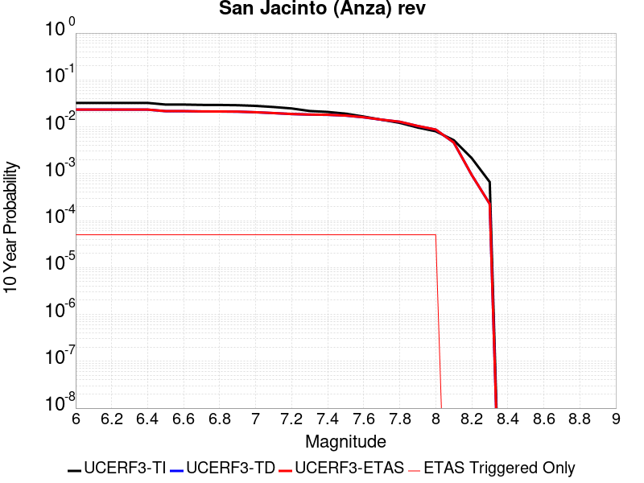 |

| Magnitude | 1 wk TI Prob | 1 wk TD Prob | 1 wk ETAS Prob | 1 wk ETAS/TD Gain | 1 wk ETAS Triggered Only | 1 mo TI Prob | 1 mo TD Prob | 1 mo ETAS Prob | 1 mo ETAS/TD Gain | 1 mo ETAS Triggered Only | 1 yr TI Prob | 1 yr TD Prob | 1 yr ETAS Prob | 1 yr ETAS/TD Gain | 1 yr ETAS Triggered Only | 10 yr TI Prob | 10 yr TD Prob | 10 yr ETAS Prob | 10 yr ETAS/TD Gain | 10 yr ETAS Triggered Only |
|-----|-----|-----|-----|-----|-----|-----|-----|-----|-----|-----|-----|-----|-----|-----|-----|-----|-----|-----|-----|-----|
| 6.0 | 6.3015636E-5 | 4.3302647E-5 | 4.3302647E-5 | 1.0 | 0.0 | 2.7003905E-4 | 1.8556965E-4 | 1.8556965E-4 | 1.0 | 0.0 | 0.0032827691 | 0.0022569813 | 0.0023578857 | 1.0447077 | 1.0113269E-4 | 0.032346968 | 0.023296192 | 0.023394968 | 1.00424 | 1.0113269E-4 |
| 6.1 | 6.3015636E-5 | 4.3302647E-5 | 4.3302647E-5 | 1.0 | 0.0 | 2.7003905E-4 | 1.8556965E-4 | 1.8556965E-4 | 1.0 | 0.0 | 0.0032827691 | 0.0022569813 | 0.0023578857 | 1.0447077 | 1.0113269E-4 | 0.032346968 | 0.023296192 | 0.023394968 | 1.00424 | 1.0113269E-4 |
| 6.2 | 6.3015636E-5 | 4.3302647E-5 | 4.3302647E-5 | 1.0 | 0.0 | 2.7003905E-4 | 1.8556965E-4 | 1.8556965E-4 | 1.0 | 0.0 | 0.0032827691 | 0.0022569813 | 0.0023578857 | 1.0447077 | 1.0113269E-4 | 0.032346968 | 0.023296192 | 0.023394968 | 1.00424 | 1.0113269E-4 |
| 6.3 | 6.3015636E-5 | 4.3302647E-5 | 4.3302647E-5 | 1.0 | 0.0 | 2.7003905E-4 | 1.8556965E-4 | 1.8556965E-4 | 1.0 | 0.0 | 0.0032827691 | 0.0022569813 | 0.0023578857 | 1.0447077 | 1.0113269E-4 | 0.032346968 | 0.023296192 | 0.023394968 | 1.00424 | 1.0113269E-4 |
| 6.4 | 6.3015636E-5 | 4.3302647E-5 | 4.3302647E-5 | 1.0 | 0.0 | 2.7003905E-4 | 1.8556965E-4 | 1.8556965E-4 | 1.0 | 0.0 | 0.0032827691 | 0.0022569813 | 0.0023578857 | 1.0447077 | 1.0113269E-4 | 0.032346968 | 0.023296192 | 0.023394968 | 1.00424 | 1.0113269E-4 |
| 6.5 | 5.811017E-5 | 4.0082516E-5 | 4.0082516E-5 | 1.0 | 0.0 | 2.4901982E-4 | 1.7177092E-4 | 1.7177092E-4 | 1.0 | 0.0 | 0.0030276014 | 0.002089311 | 0.0021902323 | 1.0483037 | 1.0113269E-4 | 0.02986684 | 0.021593736 | 0.021692686 | 1.0045823 | 1.0113269E-4 |
| 6.6 | 5.811017E-5 | 4.0082516E-5 | 4.0082516E-5 | 1.0 | 0.0 | 2.4901982E-4 | 1.7177092E-4 | 1.7177092E-4 | 1.0 | 0.0 | 0.0030276014 | 0.002089311 | 0.0021902323 | 1.0483037 | 1.0113269E-4 | 0.02986684 | 0.021593736 | 0.021692686 | 1.0045823 | 1.0113269E-4 |
| 6.7 | 5.712442E-5 | 3.9505223E-5 | 3.9505223E-5 | 1.0 | 0.0 | 2.4479596E-4 | 1.6929714E-4 | 1.6929714E-4 | 1.0 | 0.0 | 0.0029763177 | 0.0020592497 | 0.002160174 | 1.0490103 | 1.0113269E-4 | 0.029367693 | 0.021285562 | 0.021384543 | 1.0046501 | 1.0113269E-4 |
| 6.8 | 5.6967532E-5 | 3.9361643E-5 | 3.9361643E-5 | 1.0 | 0.0 | 2.4412372E-4 | 1.6868189E-4 | 1.6868189E-4 | 1.0 | 0.0 | 0.0029681553 | 0.002051773 | 0.002152698 | 1.0491892 | 1.0113269E-4 | 0.029288229 | 0.021210281 | 0.02130927 | 1.0046669 | 1.0113269E-4 |
| 6.9 | 5.6211324E-5 | 3.9066435E-5 | 3.9066435E-5 | 1.0 | 0.0 | 2.4088343E-4 | 1.6741687E-4 | 1.6741687E-4 | 1.0 | 0.0 | 0.0029288116 | 0.0020364004 | 0.002137327 | 1.0495614 | 1.0113269E-4 | 0.028905109 | 0.021049714 | 0.021148717 | 1.0047033 | 1.0113269E-4 |
| 7.0 | 5.4383527E-5 | 3.792697E-5 | 3.792697E-5 | 1.0 | 0.0 | 2.3305144E-4 | 1.6253405E-4 | 1.6253405E-4 | 1.0 | 0.0 | 0.0028337094 | 0.001977061 | 0.0020779937 | 1.0510519 | 1.0113269E-4 | 0.027978465 | 0.020440677 | 0.020539742 | 1.0048465 | 1.0113269E-4 |
| 7.1 | 5.1393665E-5 | 3.6389913E-5 | 3.6389913E-5 | 1.0 | 0.0 | 2.2023996E-4 | 1.5594746E-4 | 1.5594746E-4 | 1.0 | 0.0 | 0.0026781242 | 0.0018970112 | 0.0019979521 | 1.0532105 | 1.0113269E-4 | 0.026460782 | 0.019614287 | 0.019713435 | 1.005055 | 1.0113269E-4 |
| 7.2 | 4.785222E-5 | 3.4741795E-5 | 3.4741795E-5 | 1.0 | 0.0 | 2.0506482E-4 | 1.4888494E-4 | 1.4888494E-4 | 1.0 | 0.0 | 0.0024938055 | 0.0018111705 | 0.00191212 | 1.0557371 | 1.0113269E-4 | 0.024660049 | 0.018728992 | 0.01882823 | 1.0052986 | 1.0113269E-4 |
| 7.3 | 4.2143256E-5 | 3.383628E-5 | 3.383628E-5 | 1.0 | 0.0 | 1.8060145E-4 | 1.4500458E-4 | 1.4500458E-4 | 1.0 | 0.0 | 0.002196605 | 0.0017640047 | 0.0018649589 | 1.0572301 | 1.0113269E-4 | 0.02175019 | 0.01823724 | 0.018336529 | 1.0054443 | 1.0113269E-4 |
| 7.4 | 4.0264713E-5 | 3.347446E-5 | 3.347446E-5 | 1.0 | 0.0 | 1.7255165E-4 | 1.4345412E-4 | 1.4345412E-4 | 1.0 | 0.0 | 0.002098792 | 0.0017451581 | 0.0018461143 | 1.0578493 | 1.0113269E-4 | 0.020790804 | 0.018041821 | 0.018141128 | 1.0055044 | 1.0113269E-4 |
| 7.5 | 3.694492E-5 | 3.218847E-5 | 3.218847E-5 | 1.0 | 0.0 | 1.5832575E-4 | 1.379433E-4 | 1.379433E-4 | 1.0 | 0.0 | 0.0019259118 | 0.001678169 | 0.0017791319 | 1.0601625 | 1.0113269E-4 | 0.01909306 | 0.01735827 | 0.017457647 | 1.005725 | 1.0113269E-4 |
| 7.6 | 3.200565E-5 | 2.9504106E-5 | 2.9504106E-5 | 1.0 | 0.0 | 1.3715986E-4 | 1.2644005E-4 | 1.2644005E-4 | 1.0 | 0.0 | 0.001668642 | 0.0015383229 | 0.0016393 | 1.065641 | 1.0113269E-4 | 0.01656168 | 0.0159463 | 0.01604582 | 1.006241 | 1.0113269E-4 |
| 7.7 | 2.731642E-5 | 2.6092788E-5 | 2.6092788E-5 | 1.0 | 0.0 | 1.1706512E-4 | 1.1182144E-4 | 1.1182144E-4 | 1.0 | 0.0 | 0.001424336 | 0.0013605768 | 0.0014615719 | 1.0742296 | 1.0113269E-4 | 0.014152412 | 0.014167004 | 0.014266704 | 1.0070375 | 1.0113269E-4 |
| 7.8 | 2.3466424E-5 | 2.3504817E-5 | 2.3504817E-5 | 1.0 | 0.0 | 1.0056651E-4 | 1.0073105E-4 | 1.0073105E-4 | 1.0 | 0.0 | 0.0012237094 | 0.0012257113 | 0.0013267201 | 1.0824082 | 1.0113269E-4 | 0.012169928 | 0.012808893 | 0.012908731 | 1.0077944 | 1.0113269E-4 |
| 7.9 | 1.8611925E-5 | 1.8908117E-5 | 1.8908117E-5 | 1.0 | 0.0 | 7.9762955E-5 | 8.1032274E-5 | 8.1032274E-5 | 1.0 | 0.0 | 9.7068126E-4 | 9.861222E-4 | 0.0010871551 | 1.1024548 | 1.0113269E-4 | 0.0096645225 | 0.010393824 | 0.010493906 | 1.0096289 | 1.0113269E-4 |
| 8.0 | 1.5460775E-5 | 1.5740965E-5 | 1.5740965E-5 | 1.0 | 0.0 | 6.6258784E-5 | 6.7459536E-5 | 6.7459536E-5 | 1.0 | 0.0 | 8.0640207E-4 | 8.21011E-4 | 9.220607E-4 | 1.1230795 | 1.0113269E-4 | 0.008034821 | 0.0087028835 | 0.008803136 | 1.0115194 | 1.0113269E-4 |
| 8.1 | 9.983884E-6 | 8.269952E-6 | 8.269952E-6 | 1.0 | 0.0 | 4.2787375E-5 | 3.544217E-5 | 3.544217E-5 | 1.0 | 0.0 | 5.2081177E-4 | 4.314235E-4 | 4.314235E-4 | 1.0 | 0.0 | 0.0051959283 | 0.004640022 | 0.004640022 | 1.0 | 0.0 |
| 8.2 | 4.1226E-6 | 1.5529788E-6 | 1.5529788E-6 | 1.0 | 0.0 | 1.7668166E-5 | 6.6556063E-6 | 6.6556063E-6 | 1.0 | 0.0 | 2.1508869E-4 | 8.102902E-5 | 8.102902E-5 | 1.0 | 0.0 | 0.0021488064 | 9.4050163E-4 | 9.4050163E-4 | 1.0 | 0.0 |
| 8.3 | 1.2750878E-6 | 3.612133E-7 | 3.612133E-7 | 1.0 | 0.0 | 5.4646503E-6 | 1.548056E-6 | 1.548056E-6 | 1.0 | 0.0 | 6.653009E-5 | 1.8847424E-5 | 1.8847424E-5 | 1.0 | 0.0 | 6.6510175E-4 | 2.2734253E-4 | 2.2734253E-4 | 1.0 | 0.0 |

## Likely 2011 CFM
*[(top)](#table-of-contents)*

| 1 Week | 1 Month | 1 Year | 10 Year |
|-----|-----|-----|-----|
|  |  |  |  |

| Magnitude | 1 wk TI Prob | 1 wk TD Prob | 1 wk ETAS Prob | 1 wk ETAS/TD Gain | 1 wk ETAS Triggered Only | 1 mo TI Prob | 1 mo TD Prob | 1 mo ETAS Prob | 1 mo ETAS/TD Gain | 1 mo ETAS Triggered Only | 1 yr TI Prob | 1 yr TD Prob | 1 yr ETAS Prob | 1 yr ETAS/TD Gain | 1 yr ETAS Triggered Only | 10 yr TI Prob | 10 yr TD Prob | 10 yr ETAS Prob | 10 yr ETAS/TD Gain | 10 yr ETAS Triggered Only |
|-----|-----|-----|-----|-----|-----|-----|-----|-----|-----|-----|-----|-----|-----|-----|-----|-----|-----|-----|-----|-----|
| 6.0 | 2.5315949E-5 | 2.7104748E-5 | 2.7104748E-5 | 1.0 | 0.0 | 1.0849241E-4 | 1.16158284E-4 | 1.16158284E-4 | 1.0 | 0.0 | 0.0013200947 | 0.0014133542 | 0.0015143439 | 1.0714539 | 1.0113269E-4 | 0.013122803 | 0.01404831 | 0.014148022 | 1.0070978 | 1.0113269E-4 |
| 6.1 | 2.5315949E-5 | 2.7104748E-5 | 2.7104748E-5 | 1.0 | 0.0 | 1.0849241E-4 | 1.16158284E-4 | 1.16158284E-4 | 1.0 | 0.0 | 0.0013200947 | 0.0014133542 | 0.0015143439 | 1.0714539 | 1.0113269E-4 | 0.013122803 | 0.01404831 | 0.014148022 | 1.0070978 | 1.0113269E-4 |
| 6.2 | 1.6375941E-5 | 1.7465842E-5 | 1.7465842E-5 | 1.0 | 0.0 | 7.0180715E-5 | 7.485153E-5 | 7.485153E-5 | 1.0 | 0.0 | 8.5411523E-4 | 9.109487E-4 | 9.109487E-4 | 1.0 | 0.0 | 0.008508399 | 0.009073433 | 0.009073433 | 1.0 | 0.0 |
| 6.3 | 1.1945543E-5 | 1.2712587E-5 | 1.2712587E-5 | 1.0 | 0.0 | 5.119418E-5 | 5.4481407E-5 | 5.4481407E-5 | 1.0 | 0.0 | 6.2311086E-4 | 6.631146E-4 | 6.631146E-4 | 1.0 | 0.0 | 0.0062136655 | 0.0066119144 | 0.0066119144 | 1.0 | 0.0 |
| 6.4 | 9.192729E-6 | 9.768488E-6 | 9.768488E-6 | 1.0 | 0.0 | 3.939681E-5 | 4.1864292E-5 | 4.1864292E-5 | 1.0 | 0.0 | 4.7955062E-4 | 5.0958124E-4 | 5.0958124E-4 | 1.0 | 0.0 | 0.004785171 | 0.0050844094 | 0.0050844094 | 1.0 | 0.0 |
| 6.5 | 7.67906E-6 | 8.152622E-6 | 8.152622E-6 | 1.0 | 0.0 | 3.2909844E-5 | 3.4939352E-5 | 3.4939352E-5 | 1.0 | 0.0 | 4.006037E-4 | 4.2530545E-4 | 4.2530545E-4 | 1.0 | 0.0 | 0.0039988225 | 0.004245108 | 0.004245108 | 1.0 | 0.0 |
| 6.6 | 6.4884057E-6 | 6.8847507E-6 | 6.8847507E-6 | 1.0 | 0.0 | 2.7807157E-5 | 2.9505749E-5 | 2.9505749E-5 | 1.0 | 0.0 | 3.3849955E-4 | 3.591747E-4 | 3.591747E-4 | 1.0 | 0.0 | 0.003379844 | 0.0035860867 | 0.0035860867 | 1.0 | 0.0 |
| 6.7 | 4.6060636E-6 | 4.884041E-6 | 4.884041E-6 | 1.0 | 0.0 | 1.9740122E-5 | 2.0931442E-5 | 2.0931442E-5 | 1.0 | 0.0 | 2.403095E-4 | 2.5481134E-4 | 2.5481134E-4 | 1.0 | 0.0 | 0.002400498 | 0.0025452746 | 0.0025452746 | 1.0 | 0.0 |
| 6.8 | 3.2795615E-6 | 3.4773732E-6 | 3.4773732E-6 | 1.0 | 0.0 | 1.4055187E-5 | 1.4902946E-5 | 1.4902946E-5 | 1.0 | 0.0 | 1.7110848E-4 | 1.8142881E-4 | 1.8142881E-4 | 1.0 | 0.0 | 0.0017097679 | 0.0018128622 | 0.0018128622 | 1.0 | 0.0 |
| 6.9 | 2.3289967E-6 | 2.4705569E-6 | 2.4705569E-6 | 1.0 | 0.0 | 9.981376E-6 | 1.058806E-5 | 1.058806E-5 | 1.0 | 0.0 | 1.2151648E-4 | 1.2890245E-4 | 1.2890245E-4 | 1.0 | 0.0 | 0.0012145005 | 0.0012883197 | 0.0012883197 | 1.0 | 0.0 |
| 7.0 | 1.211292E-6 | 1.2863958E-6 | 1.2863958E-6 | 1.0 | 0.0 | 5.1912407E-6 | 5.5131145E-6 | 5.5131145E-6 | 1.0 | 0.0 | 6.320152E-5 | 6.712041E-5 | 6.712041E-5 | 1.0 | 0.0 | 6.3183554E-4 | 6.710312E-4 | 6.710312E-4 | 1.0 | 0.0 |

## Hayward (So) 2011 CFM
*[(top)](#table-of-contents)*

| 1 Week | 1 Month | 1 Year | 10 Year |
|-----|-----|-----|-----|
| 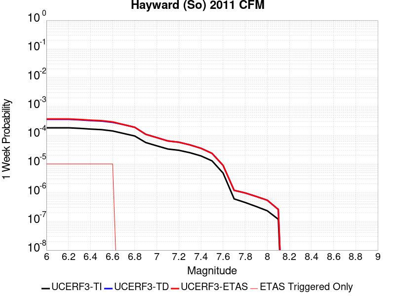 |  |  |  |

| Magnitude | 1 wk TI Prob | 1 wk TD Prob | 1 wk ETAS Prob | 1 wk ETAS/TD Gain | 1 wk ETAS Triggered Only | 1 mo TI Prob | 1 mo TD Prob | 1 mo ETAS Prob | 1 mo ETAS/TD Gain | 1 mo ETAS Triggered Only | 1 yr TI Prob | 1 yr TD Prob | 1 yr ETAS Prob | 1 yr ETAS/TD Gain | 1 yr ETAS Triggered Only | 10 yr TI Prob | 10 yr TD Prob | 10 yr ETAS Prob | 10 yr ETAS/TD Gain | 10 yr ETAS Triggered Only |
|-----|-----|-----|-----|-----|-----|-----|-----|-----|-----|-----|-----|-----|-----|-----|-----|-----|-----|-----|-----|-----|
| 6.0 | 1.8091932E-4 | 3.570541E-4 | 3.570541E-4 | 1.0 | 0.0 | 7.751381E-4 | 0.0015293444 | 0.0016303223 | 1.066027 | 1.0113269E-4 | 0.00939654 | 0.018463207 | 0.018562473 | 1.0053763 | 1.0113269E-4 | 0.090090066 | 0.16673161 | 0.16681588 | 1.0005054 | 1.0113269E-4 |
| 6.1 | 1.8091932E-4 | 3.570541E-4 | 3.570541E-4 | 1.0 | 0.0 | 7.751381E-4 | 0.0015293444 | 0.0016303223 | 1.066027 | 1.0113269E-4 | 0.00939654 | 0.018463207 | 0.018562473 | 1.0053763 | 1.0113269E-4 | 0.090090066 | 0.16673161 | 0.16681588 | 1.0005054 | 1.0113269E-4 |
| 6.2 | 1.8091932E-4 | 3.570541E-4 | 3.570541E-4 | 1.0 | 0.0 | 7.751381E-4 | 0.0015293444 | 0.0016303223 | 1.066027 | 1.0113269E-4 | 0.00939654 | 0.018463207 | 0.018562473 | 1.0053763 | 1.0113269E-4 | 0.090090066 | 0.16673161 | 0.16681588 | 1.0005054 | 1.0113269E-4 |
| 6.3 | 1.7322872E-4 | 3.426234E-4 | 3.426234E-4 | 1.0 | 0.0 | 7.4219756E-4 | 0.0014675693 | 0.0015685535 | 1.0688106 | 1.0113269E-4 | 0.0089988755 | 0.017723544 | 0.017822884 | 1.005605 | 1.0113269E-4 | 0.08643075 | 0.16066726 | 0.16075213 | 1.0005283 | 1.0113269E-4 |
| 6.4 | 1.6334097E-4 | 3.234411E-4 | 3.234411E-4 | 1.0 | 0.0 | 6.998449E-4 | 0.0013854484 | 0.001486441 | 1.0728952 | 1.0113269E-4 | 0.008487372 | 0.016739385 | 0.016838824 | 1.0059404 | 1.0113269E-4 | 0.081704415 | 0.15255594 | 0.15264164 | 1.0005618 | 1.0113269E-4 |
| 6.5 | 1.5600289E-4 | 3.1018828E-4 | 3.1018828E-4 | 1.0 | 0.0 | 6.684125E-4 | 0.0013287093 | 0.0014297076 | 1.0760124 | 1.0113269E-4 | 0.008107598 | 0.016058935 | 0.016158443 | 1.0061965 | 1.0113269E-4 | 0.078181036 | 0.14683272 | 0.146919 | 1.0005876 | 1.0113269E-4 |
| 6.6 | 1.4046066E-4 | 2.8032906E-4 | 2.8032906E-4 | 1.0 | 0.0 | 6.018354E-4 | 0.0012008639 | 0.0013018751 | 1.0841155 | 1.0113269E-4 | 0.0073027555 | 0.014524006 | 0.01462367 | 1.006862 | 1.0113269E-4 | 0.07067384 | 0.13391982 | 0.13400741 | 1.000654 | 1.0113269E-4 |
| 6.7 | 1.14696966E-4 | 2.3271477E-4 | 2.3271477E-4 | 1.0 | 0.0 | 4.914658E-4 | 9.969729E-4 | 0.0010980048 | 1.1013386 | 1.0113269E-4 | 0.0059671924 | 0.012071652 | 0.012171565 | 1.0082766 | 1.0113269E-4 | 0.058094822 | 0.11274672 | 0.11283646 | 1.0007958 | 1.0113269E-4 |
| 6.8 | 9.3874296E-5 | 1.8861453E-4 | 1.8861453E-4 | 1.0 | 0.0 | 4.0225635E-4 | 8.0810126E-4 | 9.091522E-4 | 1.1250474 | 1.0113269E-4 | 0.0048864787 | 0.009794984 | 0.009895126 | 1.0102239 | 1.0113269E-4 | 0.047804173 | 0.09259856 | 0.092690326 | 1.000991 | 1.0113269E-4 |
| 6.9 | 5.551852E-5 | 1.072948E-4 | 1.072948E-4 | 1.0 | 0.0 | 2.3791482E-4 | 4.5975443E-4 | 5.608406E-4 | 1.21987 | 1.0113269E-4 | 0.0028927654 | 0.0055832625 | 0.0056838305 | 1.0180124 | 1.0113269E-4 | 0.028553981 | 0.054245494 | 0.05434114 | 1.0017632 | 1.0113269E-4 |
| 7.0 | 4.2662363E-5 | 8.2464416E-5 | 8.2464416E-5 | 1.0 | 0.0 | 1.8282588E-4 | 3.5337146E-4 | 4.5446842E-4 | 1.2860925 | 1.0113269E-4 | 0.0022236328 | 0.0042938837 | 0.004394582 | 1.0234516 | 1.0113269E-4 | 0.022015138 | 0.042064495 | 0.04216137 | 1.0023031 | 1.0113269E-4 |
| 7.1 | 3.305886E-5 | 6.3019055E-5 | 6.3019055E-5 | 1.0 | 0.0 | 1.4167312E-4 | 2.700538E-4 | 3.7115917E-4 | 1.3743898 | 1.0113269E-4 | 0.0017235056 | 0.0032829668 | 0.0033837676 | 1.0307041 | 1.0113269E-4 | 0.017101998 | 0.032452874 | 0.032550726 | 1.0030152 | 1.0113269E-4 |
| 7.2 | 2.9856887E-5 | 5.7013647E-5 | 5.7013647E-5 | 1.0 | 0.0 | 1.2795182E-4 | 2.4432142E-4 | 3.454294E-4 | 1.4138318 | 1.0113269E-4 | 0.0015567001 | 0.0029705726 | 0.0030714048 | 1.0339438 | 1.0113269E-4 | 0.015458403 | 0.029453589 | 0.029551743 | 1.0033325 | 1.0113269E-4 |
| 7.3 | 2.4559737E-5 | 4.599088E-5 | 4.599088E-5 | 1.0 | 0.0 | 1.0525176E-4 | 1.9708896E-4 | 2.9820172E-4 | 1.513031 | 1.0113269E-4 | 0.0012806869 | 0.0023969305 | 0.0024978206 | 1.0420915 | 1.0113269E-4 | 0.012733313 | 0.023857482 | 0.023956202 | 1.0041379 | 1.0113269E-4 |
| 7.4 | 1.9002231E-5 | 3.5049303E-5 | 3.5049303E-5 | 1.0 | 0.0 | 8.143559E-5 | 1.502027E-4 | 2.513202E-4 | 1.6732069 | 1.0113269E-4 | 9.910273E-4 | 0.0018271938 | 0.0019281417 | 1.0552475 | 1.0113269E-4 | 0.009866194 | 0.018258283 | 0.01835757 | 1.0054379 | 1.0113269E-4 |
| 7.5 | 1.2783333E-5 | 2.3330069E-5 | 2.3330069E-5 | 1.0 | 0.0 | 5.4784563E-5 | 9.998221E-5 | 9.998221E-5 | 1.0 | 0.0 | 6.667979E-4 | 0.0012166094 | 0.0012166094 | 1.0 | 0.0 | 0.006648007 | 0.012209582 | 0.012209582 | 1.0 | 0.0 |
| 7.6 | 4.8149627E-6 | 8.887544E-6 | 8.887544E-6 | 1.0 | 0.0 | 2.063539E-5 | 3.8088925E-5 | 3.8088925E-5 | 1.0 | 0.0 | 2.5120692E-4 | 4.636352E-4 | 4.636352E-4 | 1.0 | 0.0 | 0.0025092314 | 0.0046812436 | 0.0046812436 | 1.0 | 0.0 |
| 7.7 | 6.0838227E-7 | 1.2056693E-6 | 1.2056693E-6 | 1.0 | 0.0 | 2.6073499E-6 | 5.1671436E-6 | 5.1671436E-6 | 1.0 | 0.0 | 3.174402E-5 | 6.290816E-5 | 6.290816E-5 | 1.0 | 0.0 | 3.1739488E-4 | 6.5293367E-4 | 6.5293367E-4 | 1.0 | 0.0 |
| 7.8 | 4.5542808E-7 | 9.792182E-7 | 9.792182E-7 | 1.0 | 0.0 | 1.9518332E-6 | 4.1966427E-6 | 4.1966427E-6 | 1.0 | 0.0 | 2.376331E-5 | 5.1092928E-5 | 5.1092928E-5 | 1.0 | 0.0 | 2.3760769E-4 | 5.321372E-4 | 5.321372E-4 | 1.0 | 0.0 |
| 7.9 | 3.3016747E-7 | 7.386335E-7 | 7.386335E-7 | 1.0 | 0.0 | 1.4150027E-6 | 3.1655684E-6 | 3.1655684E-6 | 1.0 | 0.0 | 1.7227521E-5 | 3.8540114E-5 | 3.8540114E-5 | 1.0 | 0.0 | 1.7226185E-4 | 3.9930744E-4 | 3.9930744E-4 | 1.0 | 0.0 |
| 8.0 | 2.347038E-7 | 5.4714894E-7 | 5.4714894E-7 | 1.0 | 0.0 | 1.0058731E-6 | 2.344922E-6 | 2.344922E-6 | 1.0 | 0.0 | 1.2246436E-5 | 2.8549053E-5 | 2.8549053E-5 | 1.0 | 0.0 | 1.2245761E-4 | 2.9355253E-4 | 2.9355253E-4 | 1.0 | 0.0 |
| 8.1 | 1.18822804E-7 | 2.6058973E-7 | 2.6058973E-7 | 1.0 | 0.0 | 5.092405E-7 | 1.1168127E-6 | 1.1168127E-6 | 1.0 | 0.0 | 6.1999854E-6 | 1.359711E-5 | 1.359711E-5 | 1.0 | 0.0 | 6.199812E-5 | 1.3917852E-4 | 1.3917852E-4 | 1.0 | 0.0 |

## White Wolf
*[(top)](#table-of-contents)*

| 1 Week | 1 Month | 1 Year | 10 Year |
|-----|-----|-----|-----|
|  |  |  |  |

| Magnitude | 1 wk TI Prob | 1 wk TD Prob | 1 wk ETAS Prob | 1 wk ETAS/TD Gain | 1 wk ETAS Triggered Only | 1 mo TI Prob | 1 mo TD Prob | 1 mo ETAS Prob | 1 mo ETAS/TD Gain | 1 mo ETAS Triggered Only | 1 yr TI Prob | 1 yr TD Prob | 1 yr ETAS Prob | 1 yr ETAS/TD Gain | 1 yr ETAS Triggered Only | 10 yr TI Prob | 10 yr TD Prob | 10 yr ETAS Prob | 10 yr ETAS/TD Gain | 10 yr ETAS Triggered Only |
|-----|-----|-----|-----|-----|-----|-----|-----|-----|-----|-----|-----|-----|-----|-----|-----|-----|-----|-----|-----|-----|
| 6.0 | 2.0037822E-5 | 1.0469162E-6 | 1.0469162E-6 | 1.0 | 0.0 | 8.587355E-5 | 4.486776E-6 | 4.486776E-6 | 1.0 | 0.0 | 0.001045009 | 5.4625183E-5 | 1.5575235E-4 | 2.851292 | 1.0113269E-4 | 0.010401085 | 5.461226E-4 | 6.4720004E-4 | 1.185082 | 1.0113269E-4 |
| 6.1 | 2.0037822E-5 | 1.0469162E-6 | 1.0469162E-6 | 1.0 | 0.0 | 8.587355E-5 | 4.486776E-6 | 4.486776E-6 | 1.0 | 0.0 | 0.001045009 | 5.4625183E-5 | 1.5575235E-4 | 2.851292 | 1.0113269E-4 | 0.010401085 | 5.461226E-4 | 6.4720004E-4 | 1.185082 | 1.0113269E-4 |
| 6.2 | 2.0037822E-5 | 1.0469162E-6 | 1.0469162E-6 | 1.0 | 0.0 | 8.587355E-5 | 4.486776E-6 | 4.486776E-6 | 1.0 | 0.0 | 0.001045009 | 5.4625183E-5 | 1.5575235E-4 | 2.851292 | 1.0113269E-4 | 0.010401085 | 5.461226E-4 | 6.4720004E-4 | 1.185082 | 1.0113269E-4 |
| 6.3 | 2.0037822E-5 | 1.0469162E-6 | 1.0469162E-6 | 1.0 | 0.0 | 8.587355E-5 | 4.486776E-6 | 4.486776E-6 | 1.0 | 0.0 | 0.001045009 | 5.4625183E-5 | 1.5575235E-4 | 2.851292 | 1.0113269E-4 | 0.010401085 | 5.461226E-4 | 6.4720004E-4 | 1.185082 | 1.0113269E-4 |
| 6.4 | 1.132487E-5 | 1.0469162E-6 | 1.0469162E-6 | 1.0 | 0.0 | 4.8534253E-5 | 4.486776E-6 | 4.486776E-6 | 1.0 | 0.0 | 5.907443E-4 | 5.4625183E-5 | 1.5575235E-4 | 2.851292 | 1.0113269E-4 | 0.005891764 | 5.461226E-4 | 6.4720004E-4 | 1.185082 | 1.0113269E-4 |
| 6.5 | 1.132487E-5 | 1.0469162E-6 | 1.0469162E-6 | 1.0 | 0.0 | 4.8534253E-5 | 4.486776E-6 | 4.486776E-6 | 1.0 | 0.0 | 5.907443E-4 | 5.4625183E-5 | 1.5575235E-4 | 2.851292 | 1.0113269E-4 | 0.005891764 | 5.461226E-4 | 6.4720004E-4 | 1.185082 | 1.0113269E-4 |
| 6.6 | 9.347473E-6 | 1.0469162E-6 | 1.0469162E-6 | 1.0 | 0.0 | 4.0059982E-5 | 4.486776E-6 | 4.486776E-6 | 1.0 | 0.0 | 4.8762115E-4 | 5.4625183E-5 | 1.5575235E-4 | 2.851292 | 1.0113269E-4 | 0.0048655253 | 5.461226E-4 | 6.4720004E-4 | 1.185082 | 1.0113269E-4 |
| 6.7 | 7.842647E-6 | 1.0048342E-6 | 1.0048342E-6 | 1.0 | 0.0 | 3.361091E-5 | 4.3064256E-6 | 4.3064256E-6 | 1.0 | 0.0 | 4.0913603E-4 | 5.2429517E-5 | 1.535569E-4 | 2.9288254 | 1.0113269E-4 | 0.004083836 | 5.2417646E-4 | 6.252561E-4 | 1.1928352 | 1.0113269E-4 |
| 6.8 | 6.26597E-6 | 9.734822E-7 | 9.734822E-7 | 1.0 | 0.0 | 2.685388E-5 | 4.17206E-6 | 4.17206E-6 | 1.0 | 0.0 | 3.2689696E-4 | 5.0793697E-5 | 1.5192125E-4 | 2.9909468 | 1.0113269E-4 | 0.003264165 | 5.078258E-4 | 6.0890714E-4 | 1.1990472 | 1.0113269E-4 |
| 6.9 | 5.258436E-6 | 9.183254E-7 | 9.183254E-7 | 1.0 | 0.0 | 2.2535958E-5 | 3.9356746E-6 | 3.9356746E-6 | 1.0 | 0.0 | 2.7434074E-4 | 4.7915833E-5 | 1.4904367E-4 | 3.1105309 | 1.0113269E-4 | 0.0027400232 | 4.790598E-4 | 5.8014406E-4 | 1.2110054 | 1.0113269E-4 |
| 7.0 | 4.675028E-6 | 8.6611794E-7 | 8.6611794E-7 | 1.0 | 0.0 | 2.003568E-5 | 3.7119291E-6 | 3.7119291E-6 | 1.0 | 0.0 | 2.4390711E-4 | 4.5191846E-5 | 1.4631996E-4 | 3.2377512 | 1.0113269E-4 | 0.0024363957 | 4.518313E-4 | 5.529183E-4 | 1.2237273 | 1.0113269E-4 |
| 7.1 | 2.8270078E-6 | 6.8741696E-7 | 6.8741696E-7 | 1.0 | 0.0 | 1.2115692E-5 | 2.9460696E-6 | 2.9460696E-6 | 1.0 | 0.0 | 1.4749856E-4 | 3.5867848E-5 | 1.3699691E-4 | 3.8194904 | 1.0113269E-4 | 0.001474007 | 3.586247E-4 | 4.597211E-4 | 1.2819003 | 1.0113269E-4 |
| 7.2 | 1.6881406E-6 | 2.2706382E-7 | 2.2706382E-7 | 1.0 | 0.0 | 7.2348685E-6 | 9.731303E-7 | 9.731303E-7 | 1.0 | 0.0 | 8.808096E-5 | 1.1847799E-5 | 1.1847799E-5 | 1.0 | 0.0 | 8.8046055E-4 | 1.1847183E-4 | 1.1847183E-4 | 1.0 | 0.0 |
| 7.3 | 9.086107E-7 | 1.5266386E-7 | 1.5266386E-7 | 1.0 | 0.0 | 3.8940398E-6 | 6.5427355E-7 | 6.5427355E-7 | 1.0 | 0.0 | 4.7408903E-5 | 7.965752E-6 | 7.965752E-6 | 1.0 | 0.0 | 4.739879E-4 | 7.965475E-5 | 7.965475E-5 | 1.0 | 0.0 |
| 7.4 | 1.9717383E-7 | 9.003913E-8 | 9.003913E-8 | 1.0 | 0.0 | 8.450304E-7 | 3.8588192E-7 | 3.8588192E-7 | 1.0 | 0.0 | 1.0288197E-5 | 4.6981027E-6 | 4.6981027E-6 | 1.0 | 0.0 | 1.028772E-4 | 4.6980065E-5 | 4.6980065E-5 | 1.0 | 0.0 |
| 7.5 | 1.086975E-7 | 6.6597195E-8 | 6.6597195E-8 | 1.0 | 0.0 | 4.6584634E-7 | 2.8541652E-7 | 2.8541652E-7 | 1.0 | 0.0 | 5.6716644E-6 | 3.474941E-6 | 3.474941E-6 | 1.0 | 0.0 | 5.6715195E-5 | 3.474889E-5 | 3.474889E-5 | 1.0 | 0.0 |
| 7.6 | 2.4217808E-8 | 1.5820765E-8 | 1.5820765E-8 | 1.0 | 0.0 | 1.03790605E-7 | 6.780328E-8 | 6.780328E-8 | 1.0 | 0.0 | 1.2636499E-6 | 8.255046E-7 | 8.255046E-7 | 1.0 | 0.0 | 1.2636427E-5 | 8.2550205E-6 | 8.2550205E-6 | 1.0 | 0.0 |

## Channel Islands Western Deep Ramp
*[(top)](#table-of-contents)*

| 1 Week | 1 Month | 1 Year | 10 Year |
|-----|-----|-----|-----|
|  |  |  |  |

| Magnitude | 1 wk TI Prob | 1 wk TD Prob | 1 wk ETAS Prob | 1 wk ETAS/TD Gain | 1 wk ETAS Triggered Only | 1 mo TI Prob | 1 mo TD Prob | 1 mo ETAS Prob | 1 mo ETAS/TD Gain | 1 mo ETAS Triggered Only | 1 yr TI Prob | 1 yr TD Prob | 1 yr ETAS Prob | 1 yr ETAS/TD Gain | 1 yr ETAS Triggered Only | 10 yr TI Prob | 10 yr TD Prob | 10 yr ETAS Prob | 10 yr ETAS/TD Gain | 10 yr ETAS Triggered Only |
|-----|-----|-----|-----|-----|-----|-----|-----|-----|-----|-----|-----|-----|-----|-----|-----|-----|-----|-----|-----|-----|
| 6.0 | 6.0213506E-6 | 6.2548684E-6 | 1.0738692E-4 | 17.168535 | 1.0113269E-4 | 2.5805533E-5 | 2.6806329E-5 | 1.279363E-4 | 4.772616 | 1.0113269E-4 | 3.1413708E-4 | 3.2632265E-4 | 4.2742232E-4 | 1.309815 | 1.0113269E-4 | 0.0031369338 | 0.0032588763 | 0.0033596794 | 1.0309318 | 1.0113269E-4 |
| 6.1 | 6.0213506E-6 | 6.2548684E-6 | 1.0738692E-4 | 17.168535 | 1.0113269E-4 | 2.5805533E-5 | 2.6806329E-5 | 1.279363E-4 | 4.772616 | 1.0113269E-4 | 3.1413708E-4 | 3.2632265E-4 | 4.2742232E-4 | 1.309815 | 1.0113269E-4 | 0.0031369338 | 0.0032588763 | 0.0033596794 | 1.0309318 | 1.0113269E-4 |
| 6.2 | 6.0213506E-6 | 6.2548684E-6 | 1.0738692E-4 | 17.168535 | 1.0113269E-4 | 2.5805533E-5 | 2.6806329E-5 | 1.279363E-4 | 4.772616 | 1.0113269E-4 | 3.1413708E-4 | 3.2632265E-4 | 4.2742232E-4 | 1.309815 | 1.0113269E-4 | 0.0031369338 | 0.0032588763 | 0.0033596794 | 1.0309318 | 1.0113269E-4 |
| 6.3 | 6.0213506E-6 | 6.2548684E-6 | 1.0738692E-4 | 17.168535 | 1.0113269E-4 | 2.5805533E-5 | 2.6806329E-5 | 1.279363E-4 | 4.772616 | 1.0113269E-4 | 3.1413708E-4 | 3.2632265E-4 | 4.2742232E-4 | 1.309815 | 1.0113269E-4 | 0.0031369338 | 0.0032588763 | 0.0033596794 | 1.0309318 | 1.0113269E-4 |
| 6.4 | 6.0213506E-6 | 6.2548684E-6 | 1.0738692E-4 | 17.168535 | 1.0113269E-4 | 2.5805533E-5 | 2.6806329E-5 | 1.279363E-4 | 4.772616 | 1.0113269E-4 | 3.1413708E-4 | 3.2632265E-4 | 4.2742232E-4 | 1.309815 | 1.0113269E-4 | 0.0031369338 | 0.0032588763 | 0.0033596794 | 1.0309318 | 1.0113269E-4 |
| 6.5 | 6.0213506E-6 | 6.2548684E-6 | 1.0738692E-4 | 17.168535 | 1.0113269E-4 | 2.5805533E-5 | 2.6806329E-5 | 1.279363E-4 | 4.772616 | 1.0113269E-4 | 3.1413708E-4 | 3.2632265E-4 | 4.2742232E-4 | 1.309815 | 1.0113269E-4 | 0.0031369338 | 0.0032588763 | 0.0033596794 | 1.0309318 | 1.0113269E-4 |
| 6.6 | 6.0213506E-6 | 6.2548684E-6 | 1.0738692E-4 | 17.168535 | 1.0113269E-4 | 2.5805533E-5 | 2.6806329E-5 | 1.279363E-4 | 4.772616 | 1.0113269E-4 | 3.1413708E-4 | 3.2632265E-4 | 4.2742232E-4 | 1.309815 | 1.0113269E-4 | 0.0031369338 | 0.0032588763 | 0.0033596794 | 1.0309318 | 1.0113269E-4 |
| 6.7 | 5.313309E-6 | 5.5252403E-6 | 1.0665737E-4 | 19.303661 | 1.0113269E-4 | 2.2771126E-5 | 2.367941E-5 | 1.248097E-4 | 5.270811 | 1.0113269E-4 | 2.772032E-4 | 2.8826276E-4 | 3.893663E-4 | 1.3507339 | 1.0113269E-4 | 0.0027685766 | 0.0028792918 | 0.002980133 | 1.035023 | 1.0113269E-4 |
| 6.8 | 5.313309E-6 | 5.5252403E-6 | 1.0665737E-4 | 19.303661 | 1.0113269E-4 | 2.2771126E-5 | 2.367941E-5 | 1.248097E-4 | 5.270811 | 1.0113269E-4 | 2.772032E-4 | 2.8826276E-4 | 3.893663E-4 | 1.3507339 | 1.0113269E-4 | 0.0027685766 | 0.0028792918 | 0.002980133 | 1.035023 | 1.0113269E-4 |
| 6.9 | 4.744377E-6 | 4.9394303E-6 | 1.0607162E-4 | 21.474463 | 1.0113269E-4 | 2.0332885E-5 | 2.1168837E-5 | 1.2229939E-4 | 5.7773314 | 1.0113269E-4 | 2.4752476E-4 | 2.5770385E-4 | 3.5881047E-4 | 1.3923365 | 1.0113269E-4 | 0.0024724922 | 0.0025744175 | 0.0026752898 | 1.0391825 | 1.0113269E-4 |
| 7.0 | 4.722209E-6 | 4.9164732E-6 | 1.0604866E-4 | 21.570068 | 1.0113269E-4 | 2.0237881E-5 | 2.107045E-5 | 1.22201E-4 | 5.799639 | 1.0113269E-4 | 2.4636835E-4 | 2.5650626E-4 | 3.57613E-4 | 1.3941687 | 1.0113269E-4 | 0.002460954 | 0.0025624693 | 0.0026633427 | 1.0393658 | 1.0113269E-4 |
| 7.1 | 4.611174E-6 | 4.801409E-6 | 1.0593361E-4 | 22.063026 | 1.0113269E-4 | 1.9762025E-5 | 2.0577325E-5 | 1.2170793E-4 | 5.9146624 | 1.0113269E-4 | 2.4057609E-4 | 2.5050386E-4 | 3.5161123E-4 | 1.403616 | 1.0113269E-4 | 0.002403158 | 0.002502582 | 0.0026034615 | 1.0403103 | 1.0113269E-4 |
| 7.2 | 4.043994E-6 | 4.2120264E-6 | 1.0534429E-4 | 25.010357 | 1.0113269E-4 | 1.7331287E-5 | 1.8051438E-5 | 1.19182296E-4 | 6.6023717 | 1.0113269E-4 | 2.10988E-4 | 2.1975765E-4 | 3.2086813E-4 | 1.4600998 | 1.0113269E-4 | 0.002107878 | 0.0021957543 | 0.0022966648 | 1.0459572 | 1.0113269E-4 |
| 7.3 | 2.1233036E-6 | 2.2297875E-6 | 1.0336225E-4 | 46.3552 | 1.0113269E-4 | 9.099841E-6 | 9.556197E-6 | 1.1068791E-4 | 11.582841 | 1.0113269E-4 | 1.1078493E-4 | 1.1634055E-4 | 2.1746146E-4 | 1.8691804 | 1.0113269E-4 | 0.0011072971 | 0.001162802 | 0.0012638171 | 1.0868721 | 1.0113269E-4 |
| 7.4 | 1.9051884E-6 | 2.0014973E-6 | 1.0313398E-4 | 51.528416 | 1.0113269E-4 | 8.165067E-6 | 8.577817E-6 | 1.0970964E-4 | 12.789925 | 1.0113269E-4 | 9.940516E-5 | 1.0442998E-4 | 2.055521E-4 | 1.9683247 | 1.0113269E-4 | 9.93607E-4 | 0.0010438144 | 0.0011448414 | 1.0967865 | 1.0113269E-4 |
| 7.5 | 1.2408497E-6 | 1.3038839E-6 | 1.0243644E-4 | 78.562546 | 1.0113269E-4 | 5.317916E-6 | 5.588062E-6 | 1.0672018E-4 | 19.097887 | 1.0113269E-4 | 6.4743705E-5 | 6.8032554E-5 | 1.6915836E-4 | 2.4864326 | 1.0113269E-4 | 6.4724847E-4 | 6.8011944E-4 | 7.8118336E-4 | 1.1485972 | 1.0113269E-4 |
| 7.6 | 6.5440025E-7 | 6.886718E-7 | 6.886718E-7 | 1.0 | 0.0 | 2.8045695E-6 | 2.9514472E-6 | 2.9514472E-6 | 1.0 | 0.0 | 3.4145098E-5 | 3.593329E-5 | 3.593329E-5 | 1.0 | 0.0 | 3.4139853E-4 | 3.5927625E-4 | 3.5927625E-4 | 1.0 | 0.0 |
| 7.7 | 3.985963E-7 | 4.1930787E-7 | 4.1930787E-7 | 1.0 | 0.0 | 1.7082689E-6 | 1.7970326E-6 | 1.7970326E-6 | 1.0 | 0.0 | 2.0797976E-5 | 2.1878664E-5 | 2.1878664E-5 | 1.0 | 0.0 | 2.0796029E-4 | 2.1876628E-4 | 2.1876628E-4 | 1.0 | 0.0 |
| 7.8 | 3.706329E-8 | 3.8591796E-8 | 3.8591796E-8 | 1.0 | 0.0 | 1.5884267E-7 | 1.653934E-7 | 1.653934E-7 | 1.0 | 0.0 | 1.9339077E-6 | 2.0136629E-6 | 2.0136629E-6 | 1.0 | 0.0 | 1.933891E-5 | 2.0136458E-5 | 2.0136458E-5 | 1.0 | 0.0 |

## Rodgers Creek - Healdsburg 2011 CFM
*[(top)](#table-of-contents)*

| 1 Week | 1 Month | 1 Year | 10 Year |
|-----|-----|-----|-----|
|  |  |  |  |

| Magnitude | 1 wk TI Prob | 1 wk TD Prob | 1 wk ETAS Prob | 1 wk ETAS/TD Gain | 1 wk ETAS Triggered Only | 1 mo TI Prob | 1 mo TD Prob | 1 mo ETAS Prob | 1 mo ETAS/TD Gain | 1 mo ETAS Triggered Only | 1 yr TI Prob | 1 yr TD Prob | 1 yr ETAS Prob | 1 yr ETAS/TD Gain | 1 yr ETAS Triggered Only | 10 yr TI Prob | 10 yr TD Prob | 10 yr ETAS Prob | 10 yr ETAS/TD Gain | 10 yr ETAS Triggered Only |
|-----|-----|-----|-----|-----|-----|-----|-----|-----|-----|-----|-----|-----|-----|-----|-----|-----|-----|-----|-----|-----|
| 6.0 | 7.390182E-5 | 1.3136698E-4 | 1.3136698E-4 | 1.0 | 0.0 | 3.1668364E-4 | 5.6287815E-4 | 6.639539E-4 | 1.1795695 | 1.0113269E-4 | 0.0038488081 | 0.0068315 | 0.0069319424 | 1.0147028 | 1.0113269E-4 | 0.037828278 | 0.06619178 | 0.06628621 | 1.0014267 | 1.0113269E-4 |
| 6.1 | 7.318768E-5 | 1.3034661E-4 | 1.3034661E-4 | 1.0 | 0.0 | 3.1362378E-4 | 5.585081E-4 | 6.595843E-4 | 1.1809753 | 1.0113269E-4 | 0.0038116854 | 0.0067786723 | 0.006879119 | 1.0148181 | 1.0113269E-4 | 0.037469655 | 0.06569639 | 0.06579088 | 1.0014383 | 1.0113269E-4 |
| 6.2 | 7.1379836E-5 | 1.2727521E-4 | 1.2727521E-4 | 1.0 | 0.0 | 3.058777E-4 | 5.453505E-4 | 6.4642803E-4 | 1.1853442 | 1.0113269E-4 | 0.003717703 | 0.0066194604 | 0.0067199236 | 1.015177 | 1.0113269E-4 | 0.0365612 | 0.06421462 | 0.064309254 | 1.0014738 | 1.0113269E-4 |
| 6.3 | 6.9255926E-5 | 1.2382054E-4 | 1.2382054E-4 | 1.0 | 0.0 | 2.9677735E-4 | 5.3055194E-4 | 6.31631E-4 | 1.1905167 | 1.0113269E-4 | 0.0036072785 | 0.006440372 | 0.0065408535 | 1.0156018 | 1.0113269E-4 | 0.035492823 | 0.06254096 | 0.062635764 | 1.001516 | 1.0113269E-4 |
| 6.4 | 6.6757144E-5 | 1.1958744E-4 | 1.1958744E-4 | 1.0 | 0.0 | 2.8607066E-4 | 5.1241735E-4 | 6.134982E-4 | 1.1972628 | 1.0113269E-4 | 0.0034773487 | 0.0062209065 | 0.00632141 | 1.0161557 | 1.0113269E-4 | 0.034234364 | 0.060490217 | 0.06058523 | 1.0015707 | 1.0113269E-4 |
| 6.5 | 6.5735134E-5 | 1.1808043E-4 | 1.1808043E-4 | 1.0 | 0.0 | 2.8169158E-4 | 5.0596124E-4 | 6.070428E-4 | 1.1997812 | 1.0113269E-4 | 0.003424202 | 0.0061427657 | 0.0062432773 | 1.0163625 | 1.0113269E-4 | 0.03371918 | 0.059755135 | 0.059850223 | 1.0015913 | 1.0113269E-4 |
| 6.6 | 6.289601E-5 | 1.1343802E-4 | 1.1343802E-4 | 1.0 | 0.0 | 2.6952647E-4 | 4.8607276E-4 | 5.871563E-4 | 1.2079597 | 1.0113269E-4 | 0.0032765474 | 0.005901959 | 0.0060024946 | 1.0170343 | 1.0113269E-4 | 0.032286562 | 0.057494484 | 0.057589803 | 1.0016578 | 1.0113269E-4 |
| 6.7 | 6.115274E-5 | 1.1060895E-4 | 1.1060895E-4 | 1.0 | 0.0 | 2.6205686E-4 | 4.7395262E-4 | 5.750374E-4 | 1.2132803 | 1.0113269E-4 | 0.0031858748 | 0.0057551847 | 0.0058557354 | 1.0174713 | 1.0113269E-4 | 0.031405866 | 0.05611298 | 0.056208435 | 1.0017011 | 1.0113269E-4 |
| 6.8 | 5.9232367E-5 | 1.0728244E-4 | 1.0728244E-4 | 1.0 | 0.0 | 2.538283E-4 | 4.597012E-4 | 5.607874E-4 | 1.2198955 | 1.0113269E-4 | 0.0030859804 | 0.0055825757 | 0.005683144 | 1.0180147 | 1.0113269E-4 | 0.030434765 | 0.054479737 | 0.05457536 | 1.0017552 | 1.0113269E-4 |
| 6.9 | 5.4030377E-5 | 9.8224424E-5 | 9.8224424E-5 | 1.0 | 0.0 | 2.315382E-4 | 4.2089424E-4 | 5.2198436E-4 | 1.2401794 | 1.0113269E-4 | 0.0028153337 | 0.005112413 | 0.0052130288 | 1.0196806 | 1.0113269E-4 | 0.027799325 | 0.05001516 | 0.050111234 | 1.0019209 | 1.0113269E-4 |
| 7.0 | 4.8260714E-5 | 8.740524E-5 | 8.740524E-5 | 1.0 | 0.0 | 2.0681522E-4 | 3.745404E-4 | 4.756352E-4 | 1.269917 | 1.0113269E-4 | 0.0025150678 | 0.004550549 | 0.0046512214 | 1.0221231 | 1.0113269E-4 | 0.024867928 | 0.044667665 | 0.04476428 | 1.0021629 | 1.0113269E-4 |
| 7.1 | 4.0294493E-5 | 7.389041E-5 | 7.389041E-5 | 1.0 | 0.0 | 1.7267925E-4 | 3.1663495E-4 | 4.1773563E-4 | 1.3192972 | 1.0113269E-4 | 0.0021003427 | 0.0038482544 | 0.0039489977 | 1.026179 | 1.0113269E-4 | 0.02080602 | 0.037923392 | 0.03802069 | 1.0025656 | 1.0113269E-4 |
| 7.2 | 3.096388E-5 | 5.697752E-5 | 5.697752E-5 | 1.0 | 0.0 | 1.326956E-4 | 2.4416664E-4 | 3.4527463E-4 | 1.4140942 | 1.0113269E-4 | 0.0016143717 | 0.0029686983 | 0.0030695307 | 1.0339652 | 1.0113269E-4 | 0.01602694 | 0.029436996 | 0.029535152 | 1.0033344 | 1.0113269E-4 |
| 7.3 | 2.3615226E-5 | 4.3628002E-5 | 4.3628002E-5 | 1.0 | 0.0 | 1.0120418E-4 | 1.8696384E-4 | 2.880776E-4 | 1.54082 | 1.0113269E-4 | 0.0012314644 | 0.002273922 | 0.0023748248 | 1.0443739 | 1.0113269E-4 | 0.0122466255 | 0.022636993 | 0.022735836 | 1.0043664 | 1.0113269E-4 |
| 7.4 | 1.8251132E-5 | 3.3541033E-5 | 3.3541033E-5 | 1.0 | 0.0 | 7.821679E-5 | 1.4373941E-4 | 2.4485757E-4 | 1.7034824 | 1.0113269E-4 | 9.518733E-4 | 0.0017486324 | 0.0018495882 | 1.0577341 | 1.0113269E-4 | 0.009478063 | 0.017465532 | 0.017564898 | 1.0056893 | 1.0113269E-4 |
| 7.5 | 1.2411432E-5 | 2.246003E-5 | 2.246003E-5 | 1.0 | 0.0 | 5.3190768E-5 | 9.625375E-5 | 9.625375E-5 | 1.0 | 0.0 | 6.4740516E-4 | 0.0011712653 | 0.0011712653 | 1.0 | 0.0 | 0.006455223 | 0.011743283 | 0.011743283 | 1.0 | 0.0 |
| 7.6 | 4.4771446E-6 | 8.083989E-6 | 8.083989E-6 | 1.0 | 0.0 | 1.918762E-5 | 3.4645214E-5 | 3.4645214E-5 | 1.0 | 0.0 | 2.3358424E-4 | 4.2172507E-4 | 4.2172507E-4 | 1.0 | 0.0 | 0.0023333887 | 0.004246066 | 0.004246066 | 1.0 | 0.0 |
| 7.7 | 2.157941E-7 | 3.5349316E-7 | 3.5349316E-7 | 1.0 | 0.0 | 9.248315E-7 | 1.5149698E-6 | 1.5149698E-6 | 1.0 | 0.0 | 1.1259765E-5 | 1.8444602E-5 | 1.8444602E-5 | 1.0 | 0.0 | 1.1259195E-4 | 1.9069147E-4 | 1.9069147E-4 | 1.0 | 0.0 |
| 7.8 | 9.9623286E-8 | 1.989979E-7 | 1.989979E-7 | 1.0 | 0.0 | 4.269569E-7 | 8.528478E-7 | 8.528478E-7 | 1.0 | 0.0 | 5.1981874E-6 | 1.0383373E-5 | 1.0383373E-5 | 1.0 | 0.0 | 5.198066E-5 | 1.09018714E-4 | 1.09018714E-4 | 1.0 | 0.0 |
| 7.9 | 5.6745257E-8 | 1.1773924E-7 | 1.1773924E-7 | 1.0 | 0.0 | 2.4319394E-7 | 5.0459664E-7 | 5.0459664E-7 | 1.0 | 0.0 | 2.960882E-6 | 6.1434466E-6 | 6.1434466E-6 | 1.0 | 0.0 | 2.9608427E-5 | 6.470911E-5 | 6.470911E-5 | 1.0 | 0.0 |
| 8.0 | 2.8614323E-8 | 6.57845E-8 | 6.57845E-8 | 1.0 | 0.0 | 1.2263281E-7 | 2.8193355E-7 | 2.8193355E-7 | 1.0 | 0.0 | 1.4930534E-6 | 3.4325356E-6 | 3.4325356E-6 | 1.0 | 0.0 | 1.4930434E-5 | 3.582588E-5 | 3.582588E-5 | 1.0 | 0.0 |
| 8.1 | 3.5045191E-9 | 8.965783E-9 | 8.965783E-9 | 1.0 | 0.0 | 1.5019367E-8 | 3.8424783E-8 | 3.8424783E-8 | 1.0 | 0.0 | 1.8286079E-7 | 4.6782165E-7 | 4.6782165E-7 | 1.0 | 0.0 | 1.8286064E-6 | 4.8327956E-6 | 4.8327956E-6 | 1.0 | 0.0 |

## Great Valley 01
*[(top)](#table-of-contents)*

| 1 Week | 1 Month | 1 Year | 10 Year |
|-----|-----|-----|-----|
|  |  |  |  |

| Magnitude | 1 wk TI Prob | 1 wk TD Prob | 1 wk ETAS Prob | 1 wk ETAS/TD Gain | 1 wk ETAS Triggered Only | 1 mo TI Prob | 1 mo TD Prob | 1 mo ETAS Prob | 1 mo ETAS/TD Gain | 1 mo ETAS Triggered Only | 1 yr TI Prob | 1 yr TD Prob | 1 yr ETAS Prob | 1 yr ETAS/TD Gain | 1 yr ETAS Triggered Only | 10 yr TI Prob | 10 yr TD Prob | 10 yr ETAS Prob | 10 yr ETAS/TD Gain | 10 yr ETAS Triggered Only |
|-----|-----|-----|-----|-----|-----|-----|-----|-----|-----|-----|-----|-----|-----|-----|-----|-----|-----|-----|-----|-----|
| 6.0 | 3.3398478E-6 | 3.3762976E-6 | 1.0450864E-4 | 30.95362 | 1.0113269E-4 | 1.4313555E-5 | 1.4469774E-5 | 1.15601E-4 | 7.989136 | 1.0113269E-4 | 1.742536E-4 | 1.7615648E-4 | 2.7727135E-4 | 1.574006 | 1.0113269E-4 | 0.0017411702 | 0.0017602886 | 0.0018612433 | 1.0573512 | 1.0113269E-4 |
| 6.1 | 1.7919616E-6 | 1.8120251E-6 | 1.8120251E-6 | 1.0 | 0.0 | 7.679812E-6 | 7.7658E-6 | 7.7658E-6 | 1.0 | 0.0 | 9.349771E-5 | 9.454471E-5 | 9.454471E-5 | 1.0 | 0.0 | 9.345838E-4 | 9.4506424E-4 | 9.4506424E-4 | 1.0 | 0.0 |
| 6.2 | 1.7919616E-6 | 1.8120251E-6 | 1.8120251E-6 | 1.0 | 0.0 | 7.679812E-6 | 7.7658E-6 | 7.7658E-6 | 1.0 | 0.0 | 9.349771E-5 | 9.454471E-5 | 9.454471E-5 | 1.0 | 0.0 | 9.345838E-4 | 9.4506424E-4 | 9.4506424E-4 | 1.0 | 0.0 |
| 6.3 | 1.1636545E-6 | 1.17745E-6 | 1.17745E-6 | 1.0 | 0.0 | 4.9870814E-6 | 5.046205E-6 | 5.046205E-6 | 1.0 | 0.0 | 6.0716022E-5 | 6.143586E-5 | 6.143586E-5 | 1.0 | 0.0 | 6.069944E-4 | 6.1419315E-4 | 6.1419315E-4 | 1.0 | 0.0 |
| 6.4 | 8.770928E-7 | 8.881815E-7 | 8.881815E-7 | 1.0 | 0.0 | 3.7589639E-6 | 3.8064866E-6 | 3.8064866E-6 | 1.0 | 0.0 | 4.5764424E-5 | 4.634301E-5 | 4.634301E-5 | 1.0 | 0.0 | 4.5755E-4 | 4.633356E-4 | 4.633356E-4 | 1.0 | 0.0 |
| 6.5 | 6.753308E-7 | 6.8452607E-7 | 6.8452607E-7 | 1.0 | 0.0 | 2.8942718E-6 | 2.93368E-6 | 2.93368E-6 | 1.0 | 0.0 | 3.523719E-5 | 3.5716977E-5 | 3.5716977E-5 | 1.0 | 0.0 | 3.52316E-4 | 3.5711337E-4 | 3.5711337E-4 | 1.0 | 0.0 |
| 6.6 | 5.2531993E-7 | 5.331276E-7 | 5.331276E-7 | 1.0 | 0.0 | 2.251369E-6 | 2.2848305E-6 | 2.2848305E-6 | 1.0 | 0.0 | 2.7410075E-5 | 2.7817463E-5 | 2.7817463E-5 | 1.0 | 0.0 | 2.7406693E-4 | 2.7814036E-4 | 2.7814036E-4 | 1.0 | 0.0 |
| 6.7 | 4.1404678E-7 | 4.208609E-7 | 4.208609E-7 | 1.0 | 0.0 | 1.774485E-6 | 1.8036884E-6 | 1.8036884E-6 | 1.0 | 0.0 | 2.160414E-5 | 2.1959688E-5 | 2.1959688E-5 | 1.0 | 0.0 | 2.160204E-4 | 2.1957551E-4 | 2.1957551E-4 | 1.0 | 0.0 |
| 6.8 | 3.1713054E-7 | 3.2302975E-7 | 3.2302975E-7 | 1.0 | 0.0 | 1.3591301E-6 | 1.3844125E-6 | 1.3844125E-6 | 1.0 | 0.0 | 1.6547285E-5 | 1.6855092E-5 | 1.6855092E-5 | 1.0 | 0.0 | 1.6546051E-4 | 1.6853833E-4 | 1.6853833E-4 | 1.0 | 0.0 |
| 6.9 | 2.528054E-7 | 2.580374E-7 | 2.580374E-7 | 1.0 | 0.0 | 1.0834511E-6 | 1.1058742E-6 | 1.1058742E-6 | 1.0 | 0.0 | 1.3190938E-5 | 1.3463935E-5 | 1.3463935E-5 | 1.0 | 0.0 | 1.3190156E-4 | 1.3463132E-4 | 1.3463132E-4 | 1.0 | 0.0 |
| 7.0 | 2.0667689E-7 | 2.1131233E-7 | 2.1131233E-7 | 1.0 | 0.0 | 8.857578E-7 | 9.0562395E-7 | 9.0562395E-7 | 1.0 | 0.0 | 1.0784048E-5 | 1.1025917E-5 | 1.1025917E-5 | 1.0 | 0.0 | 1.0783524E-4 | 1.1025378E-4 | 1.1025378E-4 | 1.0 | 0.0 |
| 7.1 | 1.5951586E-7 | 1.6338481E-7 | 1.6338481E-7 | 1.0 | 0.0 | 6.8363926E-7 | 7.002204E-7 | 7.002204E-7 | 1.0 | 0.0 | 8.323276E-6 | 8.525151E-6 | 8.525151E-6 | 1.0 | 0.0 | 8.322964E-5 | 8.5248306E-5 | 8.5248306E-5 | 1.0 | 0.0 |
| 7.2 | 1.02912296E-7 | 1.0566137E-7 | 1.0566137E-7 | 1.0 | 0.0 | 4.4105263E-7 | 4.5283437E-7 | 4.5283437E-7 | 1.0 | 0.0 | 5.3698027E-6 | 5.5132446E-6 | 5.5132446E-6 | 1.0 | 0.0 | 5.3696727E-5 | 5.5131113E-5 | 5.5131113E-5 | 1.0 | 0.0 |
| 7.3 | 6.581281E-8 | 6.77207E-8 | 6.77207E-8 | 1.0 | 0.0 | 2.8205488E-7 | 2.9023153E-7 | 2.9023153E-7 | 1.0 | 0.0 | 3.4340128E-6 | 3.5335634E-6 | 3.5335634E-6 | 1.0 | 0.0 | 3.4339595E-5 | 3.533509E-5 | 3.533509E-5 | 1.0 | 0.0 |
| 7.4 | 3.112171E-8 | 3.2068368E-8 | 3.2068368E-8 | 1.0 | 0.0 | 1.3337875E-7 | 1.3743585E-7 | 1.3743585E-7 | 1.0 | 0.0 | 1.6238852E-6 | 1.6732803E-6 | 1.6732803E-6 | 1.0 | 0.0 | 1.6238733E-5 | 1.6732685E-5 | 1.6732685E-5 | 1.0 | 0.0 |

## San Jacinto (San Jacinto Valley) rev
*[(top)](#table-of-contents)*

| 1 Week | 1 Month | 1 Year | 10 Year |
|-----|-----|-----|-----|
|  | 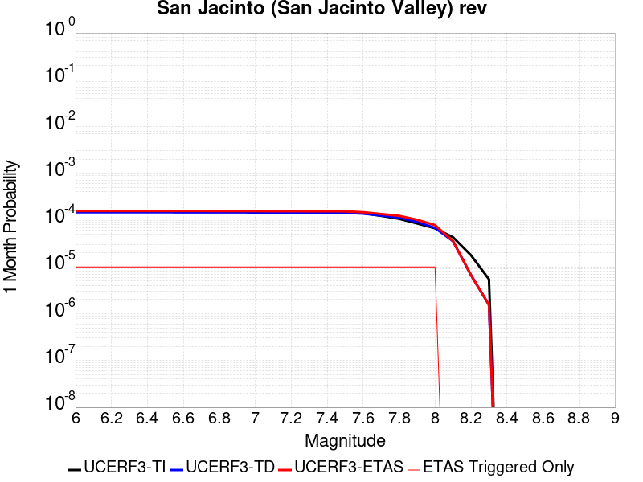 | 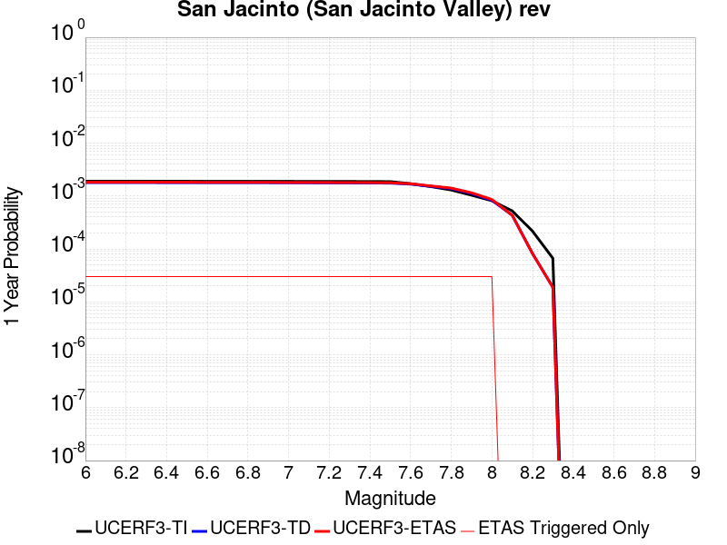 | 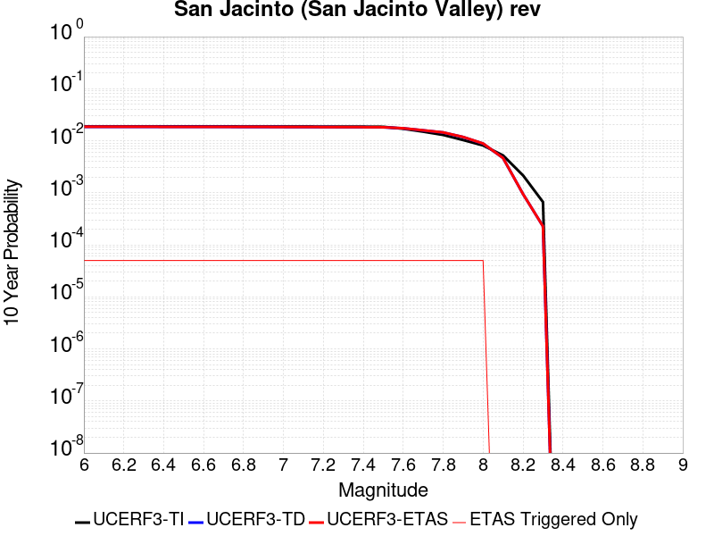 |

| Magnitude | 1 wk TI Prob | 1 wk TD Prob | 1 wk ETAS Prob | 1 wk ETAS/TD Gain | 1 wk ETAS Triggered Only | 1 mo TI Prob | 1 mo TD Prob | 1 mo ETAS Prob | 1 mo ETAS/TD Gain | 1 mo ETAS Triggered Only | 1 yr TI Prob | 1 yr TD Prob | 1 yr ETAS Prob | 1 yr ETAS/TD Gain | 1 yr ETAS Triggered Only | 10 yr TI Prob | 10 yr TD Prob | 10 yr ETAS Prob | 10 yr ETAS/TD Gain | 10 yr ETAS Triggered Only |
|-----|-----|-----|-----|-----|-----|-----|-----|-----|-----|-----|-----|-----|-----|-----|-----|-----|-----|-----|-----|-----|
| 6.0 | 3.652694E-5 | 3.4402394E-5 | 3.4402394E-5 | 1.0 | 0.0 | 1.5653463E-4 | 1.474305E-4 | 1.474305E-4 | 1.0 | 0.0 | 0.0019041431 | 0.00179349 | 0.0018944413 | 1.0562876 | 1.0113269E-4 | 0.018879099 | 0.018526595 | 0.018625854 | 1.0053576 | 1.0113269E-4 |
| 6.1 | 3.652694E-5 | 3.4402394E-5 | 3.4402394E-5 | 1.0 | 0.0 | 1.5653463E-4 | 1.474305E-4 | 1.474305E-4 | 1.0 | 0.0 | 0.0019041431 | 0.00179349 | 0.0018944413 | 1.0562876 | 1.0113269E-4 | 0.018879099 | 0.018526595 | 0.018625854 | 1.0053576 | 1.0113269E-4 |
| 6.2 | 3.652694E-5 | 3.4402394E-5 | 3.4402394E-5 | 1.0 | 0.0 | 1.5653463E-4 | 1.474305E-4 | 1.474305E-4 | 1.0 | 0.0 | 0.0019041431 | 0.00179349 | 0.0018944413 | 1.0562876 | 1.0113269E-4 | 0.018879099 | 0.018526595 | 0.018625854 | 1.0053576 | 1.0113269E-4 |
| 6.3 | 3.652694E-5 | 3.4402394E-5 | 3.4402394E-5 | 1.0 | 0.0 | 1.5653463E-4 | 1.474305E-4 | 1.474305E-4 | 1.0 | 0.0 | 0.0019041431 | 0.00179349 | 0.0018944413 | 1.0562876 | 1.0113269E-4 | 0.018879099 | 0.018526595 | 0.018625854 | 1.0053576 | 1.0113269E-4 |
| 6.4 | 3.646941E-5 | 3.432397E-5 | 3.432397E-5 | 1.0 | 0.0 | 1.5628811E-4 | 1.4709444E-4 | 1.4709444E-4 | 1.0 | 0.0 | 0.0019011468 | 0.0017894056 | 0.0018903574 | 1.0564164 | 1.0113269E-4 | 0.018849645 | 0.018486476 | 0.01858574 | 1.0053695 | 1.0113269E-4 |
| 6.5 | 3.646941E-5 | 3.432397E-5 | 3.432397E-5 | 1.0 | 0.0 | 1.5628811E-4 | 1.4709444E-4 | 1.4709444E-4 | 1.0 | 0.0 | 0.0019011468 | 0.0017894056 | 0.0018903574 | 1.0564164 | 1.0113269E-4 | 0.018849645 | 0.018486476 | 0.01858574 | 1.0053695 | 1.0113269E-4 |
| 6.6 | 3.6442503E-5 | 3.4287354E-5 | 3.4287354E-5 | 1.0 | 0.0 | 1.561728E-4 | 1.4693754E-4 | 1.4693754E-4 | 1.0 | 0.0 | 0.0018997455 | 0.0017874985 | 0.0018884504 | 1.0564766 | 1.0113269E-4 | 0.018835869 | 0.018467745 | 0.01856701 | 1.005375 | 1.0113269E-4 |
| 6.7 | 3.6432113E-5 | 3.4272925E-5 | 3.4272925E-5 | 1.0 | 0.0 | 1.5612828E-4 | 1.4687571E-4 | 1.4687571E-4 | 1.0 | 0.0 | 0.0018992044 | 0.0017867472 | 0.0018876992 | 1.0565004 | 1.0113269E-4 | 0.018830549 | 0.018460369 | 0.018559635 | 1.0053773 | 1.0113269E-4 |
| 6.8 | 3.6409598E-5 | 3.424198E-5 | 3.424198E-5 | 1.0 | 0.0 | 1.560318E-4 | 1.4674311E-4 | 1.4674311E-4 | 1.0 | 0.0 | 0.0018980318 | 0.0017851355 | 0.0018860876 | 1.0565516 | 1.0113269E-4 | 0.018819023 | 0.018444523 | 0.018543791 | 1.005382 | 1.0113269E-4 |
| 6.9 | 3.638078E-5 | 3.4202407E-5 | 3.4202407E-5 | 1.0 | 0.0 | 1.5590832E-4 | 1.4657351E-4 | 1.4657351E-4 | 1.0 | 0.0 | 0.0018965311 | 0.001783074 | 0.0018840265 | 1.056617 | 1.0113269E-4 | 0.018804269 | 0.018424258 | 0.018523527 | 1.005388 | 1.0113269E-4 |
| 7.0 | 3.6294874E-5 | 3.408442E-5 | 3.408442E-5 | 1.0 | 0.0 | 1.5554018E-4 | 1.4606792E-4 | 1.4606792E-4 | 1.0 | 0.0 | 0.0018920569 | 0.001776929 | 0.0018778819 | 1.0568131 | 1.0113269E-4 | 0.018760284 | 0.018363839 | 0.018463114 | 1.005406 | 1.0113269E-4 |
| 7.1 | 3.6260717E-5 | 3.4040702E-5 | 3.4040702E-5 | 1.0 | 0.0 | 1.5539382E-4 | 1.4588058E-4 | 1.4588058E-4 | 1.0 | 0.0 | 0.001890278 | 0.0017746518 | 0.0018756051 | 1.0568862 | 1.0113269E-4 | 0.018742796 | 0.018341439 | 0.018440718 | 1.0054128 | 1.0113269E-4 |
| 7.2 | 3.6210204E-5 | 3.397492E-5 | 3.397492E-5 | 1.0 | 0.0 | 1.5517735E-4 | 1.455987E-4 | 1.455987E-4 | 1.0 | 0.0 | 0.001887647 | 0.0017712255 | 0.001872179 | 1.0569965 | 1.0113269E-4 | 0.01871693 | 0.01830772 | 0.018407 | 1.005423 | 1.0113269E-4 |
| 7.3 | 3.6119454E-5 | 3.386321E-5 | 3.386321E-5 | 1.0 | 0.0 | 1.5478847E-4 | 1.4511998E-4 | 1.4511998E-4 | 1.0 | 0.0 | 0.0018829206 | 0.0017654065 | 0.0018663607 | 1.0571847 | 1.0113269E-4 | 0.018670462 | 0.018250274 | 0.01834956 | 1.0054404 | 1.0113269E-4 |
| 7.4 | 3.607848E-5 | 3.381071E-5 | 3.381071E-5 | 1.0 | 0.0 | 1.5461289E-4 | 1.44895E-4 | 1.44895E-4 | 1.0 | 0.0 | 0.0018807866 | 0.0017626719 | 0.0018636263 | 1.0572735 | 1.0113269E-4 | 0.018649481 | 0.018223269 | 0.018322557 | 1.0054485 | 1.0113269E-4 |
| 7.5 | 3.5856774E-5 | 3.3620483E-5 | 3.3620483E-5 | 1.0 | 0.0 | 1.5366284E-4 | 1.4407984E-4 | 1.4407984E-4 | 1.0 | 0.0 | 0.0018692396 | 0.0017527633 | 0.0018537187 | 1.0575979 | 1.0113269E-4 | 0.018535944 | 0.018124366 | 0.018223666 | 1.0054787 | 1.0113269E-4 |
| 7.6 | 3.286655E-5 | 3.2143445E-5 | 3.2143445E-5 | 1.0 | 0.0 | 1.4084904E-4 | 1.3775036E-4 | 1.3775036E-4 | 1.0 | 0.0 | 0.001713488 | 0.0016758227 | 0.0017767858 | 1.060247 | 1.0113269E-4 | 0.017003361 | 0.017344031 | 0.01744341 | 1.0057298 | 1.0113269E-4 |
| 7.7 | 2.8882527E-5 | 2.9236293E-5 | 2.9236293E-5 | 1.0 | 0.0 | 1.237764E-4 | 1.2529238E-4 | 1.2529238E-4 | 1.0 | 0.0 | 0.0015059357 | 0.0015243685 | 0.0016253471 | 1.0662428 | 1.0113269E-4 | 0.014957713 | 0.015830461 | 0.015929991 | 1.0062873 | 1.0113269E-4 |
| 7.8 | 2.4950225E-5 | 2.6527203E-5 | 2.6527203E-5 | 1.0 | 0.0 | 1.0692515E-4 | 1.1368306E-4 | 1.1368306E-4 | 1.0 | 0.0 | 0.0013010362 | 0.0013832134 | 0.0014842062 | 1.0730132 | 1.0113269E-4 | 0.012934455 | 0.014411755 | 0.01451143 | 1.0069163 | 1.0113269E-4 |
| 7.9 | 1.9881603E-5 | 2.1507445E-5 | 2.1507445E-5 | 1.0 | 0.0 | 8.520408E-5 | 9.217151E-5 | 9.217151E-5 | 1.0 | 0.0 | 0.001036866 | 0.0011216112 | 0.0012226305 | 1.0900662 | 1.0113269E-4 | 0.010320415 | 0.011777027 | 0.011876969 | 1.0084862 | 1.0113269E-4 |
| 8.0 | 1.563292E-5 | 1.5937347E-5 | 1.5937347E-5 | 1.0 | 0.0 | 6.6996516E-5 | 6.8301124E-5 | 6.8301124E-5 | 1.0 | 0.0 | 8.153773E-4 | 8.3124964E-4 | 9.3229825E-4 | 1.1215622 | 1.0113269E-4 | 0.00812392 | 0.008810506 | 0.008910748 | 1.0113776 | 1.0113269E-4 |
| 8.1 | 1.0045313E-5 | 8.301802E-6 | 8.301802E-6 | 1.0 | 0.0 | 4.305063E-5 | 3.5578672E-5 | 3.5578672E-5 | 1.0 | 0.0 | 5.2401534E-4 | 4.3308473E-4 | 4.3308473E-4 | 1.0 | 0.0 | 0.0052278144 | 0.0046591135 | 0.0046591135 | 1.0 | 0.0 |
| 8.2 | 4.1554413E-6 | 1.5655598E-6 | 1.5655598E-6 | 1.0 | 0.0 | 1.7808914E-5 | 6.709525E-6 | 6.709525E-6 | 1.0 | 0.0 | 2.1680194E-4 | 8.168544E-5 | 8.168544E-5 | 1.0 | 0.0 | 0.0021659054 | 9.482903E-4 | 9.482903E-4 | 1.0 | 0.0 |
| 8.3 | 1.2758221E-6 | 3.6149942E-7 | 3.6149942E-7 | 1.0 | 0.0 | 5.4677976E-6 | 1.5492824E-6 | 1.5492824E-6 | 1.0 | 0.0 | 6.65684E-5 | 1.8862354E-5 | 1.8862354E-5 | 1.0 | 0.0 | 6.6548464E-4 | 2.2751294E-4 | 2.2751294E-4 | 1.0 | 0.0 |

## San Andreas (Creeping Section) 2011 CFM
*[(top)](#table-of-contents)*

| 1 Week | 1 Month | 1 Year | 10 Year |
|-----|-----|-----|-----|
|  |  |  |  |

| Magnitude | 1 wk TI Prob | 1 wk TD Prob | 1 wk ETAS Prob | 1 wk ETAS/TD Gain | 1 wk ETAS Triggered Only | 1 mo TI Prob | 1 mo TD Prob | 1 mo ETAS Prob | 1 mo ETAS/TD Gain | 1 mo ETAS Triggered Only | 1 yr TI Prob | 1 yr TD Prob | 1 yr ETAS Prob | 1 yr ETAS/TD Gain | 1 yr ETAS Triggered Only | 10 yr TI Prob | 10 yr TD Prob | 10 yr ETAS Prob | 10 yr ETAS/TD Gain | 10 yr ETAS Triggered Only |
|-----|-----|-----|-----|-----|-----|-----|-----|-----|-----|-----|-----|-----|-----|-----|-----|-----|-----|-----|-----|-----|
| 6.0 | 5.986481E-4 | 0.001228691 | 0.001228691 | 1.0 | 0.0 | 0.0025631124 | 0.005246795 | 0.005246795 | 1.0 | 0.0 | 0.030762846 | 0.061203245 | 0.061203245 | 1.0 | 0.0 | 0.26835477 | 0.425928 | 0.42598605 | 1.0001363 | 1.0113269E-4 |
| 6.1 | 5.015945E-4 | 0.0010230356 | 0.0010230356 | 1.0 | 0.0 | 0.00214792 | 0.004369436 | 0.004369436 | 1.0 | 0.0 | 0.025839351 | 0.051246606 | 0.051246606 | 1.0 | 0.0 | 0.23032776 | 0.37284943 | 0.37291288 | 1.0001701 | 1.0113269E-4 |
| 6.2 | 4.073338E-4 | 8.1157376E-4 | 8.1157376E-4 | 1.0 | 0.0 | 0.0017445484 | 0.0034683137 | 0.0034683137 | 1.0 | 0.0 | 0.021034058 | 0.04093177 | 0.04093177 | 1.0 | 0.0 | 0.19150782 | 0.31302592 | 0.3130954 | 1.000222 | 1.0113269E-4 |
| 6.3 | 3.464099E-4 | 6.7455834E-4 | 6.7455834E-4 | 1.0 | 0.0 | 0.0014837692 | 0.0028832308 | 0.0028832308 | 1.0 | 0.0 | 0.017915873 | 0.034187846 | 0.034187846 | 1.0 | 0.0 | 0.16538359 | 0.27130842 | 0.27138212 | 1.0002717 | 1.0113269E-4 |
| 6.4 | 2.935057E-4 | 5.5516965E-4 | 5.5516965E-4 | 1.0 | 0.0 | 0.0012572751 | 0.0023727308 | 0.0023727308 | 1.0 | 0.0 | 0.015200248 | 0.02826279 | 0.02826279 | 1.0 | 0.0 | 0.14201577 | 0.23297668 | 0.23305425 | 1.000333 | 1.0113269E-4 |
| 6.5 | 2.3409708E-4 | 4.2132285E-4 | 4.2132285E-4 | 1.0 | 0.0 | 0.0010028875 | 0.0018017791 | 0.0018017791 | 1.0 | 0.0 | 0.012141965 | 0.021586355 | 0.021586355 | 1.0 | 0.0 | 0.11499573 | 0.1868149 | 0.18689714 | 1.0004402 | 1.0113269E-4 |
| 6.6 | 1.5842178E-4 | 2.5068692E-4 | 2.5068692E-4 | 1.0 | 0.0 | 6.7877385E-4 | 0.0010739256 | 0.0010739256 | 1.0 | 0.0 | 0.0082328 | 0.012995283 | 0.012995283 | 1.0 | 0.0 | 0.07934396 | 0.12313759 | 0.12322627 | 1.0007201 | 1.0113269E-4 |
| 6.7 | 1.5616413E-4 | 2.4605254E-4 | 2.4605254E-4 | 1.0 | 0.0 | 6.691031E-4 | 0.0010540807 | 0.0010540807 | 1.0 | 0.0 | 0.0081159435 | 0.012757154 | 0.012757154 | 1.0 | 0.0 | 0.0782586 | 0.12116472 | 0.121253595 | 1.0007335 | 1.0113269E-4 |
| 6.8 | 1.5538467E-4 | 2.442914E-4 | 2.442914E-4 | 1.0 | 0.0 | 6.6576427E-4 | 0.001046539 | 0.001046539 | 1.0 | 0.0 | 0.008075596 | 0.012666538 | 0.012666538 | 1.0 | 0.0 | 0.07788358 | 0.12039561 | 0.12048456 | 1.0007389 | 1.0113269E-4 |
| 6.9 | 1.5153569E-4 | 2.3538464E-4 | 2.3538464E-4 | 1.0 | 0.0 | 6.49277E-4 | 0.0010084033 | 0.0010084033 | 1.0 | 0.0 | 0.007876333 | 0.012208726 | 0.012208726 | 1.0 | 0.0 | 0.07602952 | 0.11646574 | 0.116555095 | 1.0007672 | 1.0113269E-4 |
| 7.0 | 1.4588932E-4 | 2.2395732E-4 | 2.2395732E-4 | 1.0 | 0.0 | 6.250901E-4 | 9.59466E-4 | 9.59466E-4 | 1.0 | 0.0 | 0.0075839474 | 0.011619428 | 0.011619428 | 1.0 | 0.0 | 0.073302895 | 0.11131206 | 0.11140194 | 1.0008074 | 1.0113269E-4 |
| 7.1 | 1.1565079E-4 | 1.6281323E-4 | 1.6281323E-4 | 1.0 | 0.0 | 4.955521E-4 | 6.9758523E-4 | 6.9758523E-4 | 1.0 | 0.0 | 0.006016669 | 0.008460228 | 0.008460228 | 1.0 | 0.0 | 0.058563538 | 0.08366478 | 0.08375746 | 1.0011077 | 1.0113269E-4 |
| 7.2 | 1.0393792E-4 | 1.4615392E-4 | 1.4615392E-4 | 1.0 | 0.0 | 4.4537216E-4 | 6.262243E-4 | 6.262243E-4 | 1.0 | 0.0 | 0.005408933 | 0.0075977976 | 0.0075977976 | 1.0 | 0.0 | 0.052791595 | 0.07561503 | 0.07570852 | 1.0012363 | 1.0113269E-4 |
| 7.3 | 9.332884E-5 | 1.2780601E-4 | 1.2780601E-4 | 1.0 | 0.0 | 3.999194E-4 | 5.4762565E-4 | 5.4762565E-4 | 1.0 | 0.0 | 0.0048581534 | 0.0066470946 | 0.0066470946 | 1.0 | 0.0 | 0.047533102 | 0.06647954 | 0.066573955 | 1.0014201 | 1.0113269E-4 |
| 7.4 | 8.670252E-5 | 1.1702972E-4 | 1.1702972E-4 | 1.0 | 0.0 | 3.715293E-4 | 5.014601E-4 | 5.014601E-4 | 1.0 | 0.0 | 0.004513991 | 0.0060883067 | 0.0060883067 | 1.0 | 0.0 | 0.044233937 | 0.061148684 | 0.06124363 | 1.0015527 | 1.0113269E-4 |
| 7.5 | 7.3036405E-5 | 9.005699E-5 | 9.005699E-5 | 1.0 | 0.0 | 3.129756E-4 | 3.859015E-4 | 3.859015E-4 | 1.0 | 0.0 | 0.0038038217 | 0.0046882504 | 0.0046882504 | 1.0 | 0.0 | 0.03739367 | 0.047875606 | 0.047875606 | 1.0 | 0.0 |
| 7.6 | 6.3935775E-5 | 8.280209E-5 | 8.280209E-5 | 1.0 | 0.0 | 2.7398168E-4 | 3.5481792E-4 | 3.5481792E-4 | 1.0 | 0.0 | 0.0033306254 | 0.00431137 | 0.00431137 | 1.0 | 0.0 | 0.032811474 | 0.043990135 | 0.043990135 | 1.0 | 0.0 |
| 7.7 | 5.5050095E-5 | 6.661729E-5 | 6.661729E-5 | 1.0 | 0.0 | 2.3590765E-4 | 2.8547147E-4 | 2.8547147E-4 | 1.0 | 0.0 | 0.0028683927 | 0.0034700802 | 0.0034700802 | 1.0 | 0.0 | 0.0283165 | 0.03579509 | 0.03579509 | 1.0 | 0.0 |
| 7.8 | 5.027131E-5 | 6.1627725E-5 | 6.1627725E-5 | 1.0 | 0.0 | 2.1543067E-4 | 2.640921E-4 | 2.640921E-4 | 1.0 | 0.0 | 0.0026197135 | 0.003210584 | 0.003210584 | 1.0 | 0.0 | 0.025890453 | 0.03312572 | 0.03312572 | 1.0 | 0.0 |
| 7.9 | 3.7271806E-5 | 5.0224386E-5 | 5.0224386E-5 | 1.0 | 0.0 | 1.5972654E-4 | 2.1522962E-4 | 2.1522962E-4 | 1.0 | 0.0 | 0.0019429359 | 0.0026172737 | 0.0026172737 | 1.0 | 0.0 | 0.019260362 | 0.027066687 | 0.027066687 | 1.0 | 0.0 |
| 8.0 | 2.7310243E-5 | 3.1428404E-5 | 3.1428404E-5 | 1.0 | 0.0 | 1.17038646E-4 | 1.3468621E-4 | 1.3468621E-4 | 1.0 | 0.0 | 0.0014240141 | 0.0016385721 | 0.0016385721 | 1.0 | 0.0 | 0.014149235 | 0.01721387 | 0.01721387 | 1.0 | 0.0 |
| 8.1 | 1.7940547E-5 | 1.7400796E-5 | 1.7400796E-5 | 1.0 | 0.0 | 7.688579E-5 | 7.457271E-5 | 7.457271E-5 | 1.0 | 0.0 | 9.3568244E-4 | 9.075451E-4 | 9.075451E-4 | 1.0 | 0.0 | 0.009317525 | 0.009799073 | 0.009799073 | 1.0 | 0.0 |
| 8.2 | 8.643924E-6 | 5.4748625E-6 | 5.4748625E-6 | 1.0 | 0.0 | 3.704486E-5 | 2.3463486E-5 | 2.3463486E-5 | 1.0 | 0.0 | 4.5092785E-4 | 2.8563058E-4 | 2.8563058E-4 | 1.0 | 0.0 | 0.0045001395 | 0.0032487072 | 0.0032487072 | 1.0 | 0.0 |
| 8.3 | 1.983087E-6 | 7.6599065E-7 | 7.6599065E-7 | 1.0 | 0.0 | 8.498917E-6 | 3.282813E-6 | 3.282813E-6 | 1.0 | 0.0 | 1.034694E-4 | 3.9967534E-5 | 3.9967534E-5 | 1.0 | 0.0 | 0.0010342124 | 4.719687E-4 | 4.719687E-4 | 1.0 | 0.0 |

## San Diego Trough south
*[(top)](#table-of-contents)*

| 1 Week | 1 Month | 1 Year | 10 Year |
|-----|-----|-----|-----|
|  |  |  |  |

| Magnitude | 1 wk TI Prob | 1 wk TD Prob | 1 wk ETAS Prob | 1 wk ETAS/TD Gain | 1 wk ETAS Triggered Only | 1 mo TI Prob | 1 mo TD Prob | 1 mo ETAS Prob | 1 mo ETAS/TD Gain | 1 mo ETAS Triggered Only | 1 yr TI Prob | 1 yr TD Prob | 1 yr ETAS Prob | 1 yr ETAS/TD Gain | 1 yr ETAS Triggered Only | 10 yr TI Prob | 10 yr TD Prob | 10 yr ETAS Prob | 10 yr ETAS/TD Gain | 10 yr ETAS Triggered Only |
|-----|-----|-----|-----|-----|-----|-----|-----|-----|-----|-----|-----|-----|-----|-----|-----|-----|-----|-----|-----|-----|
| 6.0 | 8.279495E-5 | 1.04241306E-4 | 2.0536345E-4 | 1.9700775 | 1.0113269E-4 | 3.5478722E-4 | 4.4667677E-4 | 5.477643E-4 | 1.2263103 | 1.0113269E-4 | 0.004310982 | 0.0054256152 | 0.0055261995 | 1.0185387 | 1.0113269E-4 | 0.042283054 | 0.05299221 | 0.053087983 | 1.0018073 | 1.0113269E-4 |
| 6.1 | 4.6961468E-5 | 5.772944E-5 | 5.772944E-5 | 1.0 | 0.0 | 2.0124791E-4 | 2.473894E-4 | 2.473894E-4 | 1.0 | 0.0 | 0.00244744 | 0.0030079768 | 0.0030079768 | 1.0 | 0.0 | 0.024206603 | 0.029679462 | 0.029679462 | 1.0 | 0.0 |
| 6.2 | 3.5079658E-5 | 4.214154E-5 | 4.214154E-5 | 1.0 | 0.0 | 1.5033272E-4 | 1.8059435E-4 | 1.8059435E-4 | 1.0 | 0.0 | 0.0018287642 | 0.0021965632 | 0.0021965632 | 1.0 | 0.0 | 0.018137876 | 0.021751117 | 0.021751117 | 1.0 | 0.0 |
| 6.3 | 3.5079658E-5 | 4.214154E-5 | 4.214154E-5 | 1.0 | 0.0 | 1.5033272E-4 | 1.8059435E-4 | 1.8059435E-4 | 1.0 | 0.0 | 0.0018287642 | 0.0021965632 | 0.0021965632 | 1.0 | 0.0 | 0.018137876 | 0.021751117 | 0.021751117 | 1.0 | 0.0 |
| 6.4 | 2.7196904E-5 | 3.2087162E-5 | 3.2087162E-5 | 1.0 | 0.0 | 1.16552954E-4 | 1.3750927E-4 | 1.3750927E-4 | 1.0 | 0.0 | 0.0014181085 | 0.0016729041 | 0.0016729041 | 1.0 | 0.0 | 0.014090929 | 0.016604643 | 0.016604643 | 1.0 | 0.0 |
| 6.5 | 2.5584688E-5 | 3.010164E-5 | 3.010164E-5 | 1.0 | 0.0 | 1.0964406E-4 | 1.2900073E-4 | 1.2900073E-4 | 1.0 | 0.0 | 0.0013340989 | 0.0015694655 | 0.0015694655 | 1.0 | 0.0 | 0.013261181 | 0.015585314 | 0.015585314 | 1.0 | 0.0 |
| 6.6 | 2.2034688E-5 | 2.5742738E-5 | 2.5742738E-5 | 1.0 | 0.0 | 9.443096E-5 | 1.1032141E-4 | 1.1032141E-4 | 1.0 | 0.0 | 0.0011490905 | 0.0013423424 | 0.0013423424 | 1.0 | 0.0 | 0.011431668 | 0.013343317 | 0.013343317 | 1.0 | 0.0 |
| 6.7 | 1.9394853E-5 | 2.254176E-5 | 2.254176E-5 | 1.0 | 0.0 | 8.311815E-5 | 9.6603995E-5 | 9.6603995E-5 | 1.0 | 0.0 | 0.0010114936 | 0.0011755243 | 0.0011755243 | 1.0 | 0.0 | 0.01006902 | 0.011693766 | 0.011693766 | 1.0 | 0.0 |
| 6.8 | 1.7615313E-5 | 2.0403182E-5 | 2.0403182E-5 | 1.0 | 0.0 | 7.549201E-5 | 8.74393E-5 | 8.74393E-5 | 1.0 | 0.0 | 9.1872766E-4 | 0.0010640579 | 0.0010640579 | 1.0 | 0.0 | 0.009149387 | 0.010590198 | 0.010590198 | 1.0 | 0.0 |
| 6.9 | 1.5621423E-5 | 1.8026114E-5 | 1.8026114E-5 | 1.0 | 0.0 | 6.6947236E-5 | 7.725251E-5 | 7.725251E-5 | 1.0 | 0.0 | 8.147778E-4 | 9.40147E-4 | 9.40147E-4 | 1.0 | 0.0 | 0.008117969 | 0.009362142 | 0.009362142 | 1.0 | 0.0 |
| 7.0 | 1.3444376E-5 | 1.544809E-5 | 1.544809E-5 | 1.0 | 0.0 | 5.7617483E-5 | 6.620443E-5 | 6.620443E-5 | 1.0 | 0.0 | 7.0126704E-4 | 8.057436E-4 | 8.057436E-4 | 1.0 | 0.0 | 0.006990582 | 0.008028555 | 0.008028555 | 1.0 | 0.0 |
| 7.1 | 1.2268361E-5 | 1.407303E-5 | 1.407303E-5 | 1.0 | 0.0 | 5.2577634E-5 | 6.0311606E-5 | 6.0311606E-5 | 1.0 | 0.0 | 6.399447E-4 | 7.3404907E-4 | 7.3404907E-4 | 1.0 | 0.0 | 0.0063810493 | 0.0073165493 | 0.0073165493 | 1.0 | 0.0 |
| 7.2 | 1.0922655E-5 | 1.2513563E-5 | 1.2513563E-5 | 1.0 | 0.0 | 4.681054E-5 | 5.3628468E-5 | 5.3628468E-5 | 1.0 | 0.0 | 5.697693E-4 | 6.5273355E-4 | 6.5273355E-4 | 1.0 | 0.0 | 0.0056831064 | 0.0065084435 | 0.0065084435 | 1.0 | 0.0 |
| 7.3 | 6.1106753E-6 | 6.928925E-6 | 6.928925E-6 | 1.0 | 0.0 | 2.6188345E-5 | 2.9695057E-5 | 2.9695057E-5 | 1.0 | 0.0 | 3.1879646E-4 | 3.6147775E-4 | 3.6147775E-4 | 1.0 | 0.0 | 0.0031833951 | 0.003608943 | 0.003608943 | 1.0 | 0.0 |
| 7.4 | 4.933187E-6 | 5.5895525E-6 | 5.5895525E-6 | 1.0 | 0.0 | 2.114206E-5 | 2.3955008E-5 | 2.3955008E-5 | 1.0 | 0.0 | 2.5737417E-4 | 2.9161357E-4 | 2.9161357E-4 | 1.0 | 0.0 | 0.002570763 | 0.0029123505 | 0.0029123505 | 1.0 | 0.0 |
| 7.5 | 1.7489613E-6 | 1.969678E-6 | 1.969678E-6 | 1.0 | 0.0 | 7.495527E-6 | 8.4414505E-6 | 8.4414505E-6 | 1.0 | 0.0 | 9.125422E-5 | 1.02770035E-4 | 1.02770035E-4 | 1.0 | 0.0 | 9.1216754E-4 | 0.0010272472 | 0.0010272472 | 1.0 | 0.0 |
| 7.6 | 1.6988751E-7 | 1.7533823E-7 | 1.7533823E-7 | 1.0 | 0.0 | 7.2808916E-7 | 7.5144936E-7 | 7.5144936E-7 | 1.0 | 0.0 | 8.864449E-6 | 9.14886E-6 | 9.14886E-6 | 1.0 | 0.0 | 8.8640954E-5 | 9.1485024E-5 | 9.1485024E-5 | 1.0 | 0.0 |

## Santa Ynez (West)
*[(top)](#table-of-contents)*

| 1 Week | 1 Month | 1 Year | 10 Year |
|-----|-----|-----|-----|
|  |  |  |  |

| Magnitude | 1 wk TI Prob | 1 wk TD Prob | 1 wk ETAS Prob | 1 wk ETAS/TD Gain | 1 wk ETAS Triggered Only | 1 mo TI Prob | 1 mo TD Prob | 1 mo ETAS Prob | 1 mo ETAS/TD Gain | 1 mo ETAS Triggered Only | 1 yr TI Prob | 1 yr TD Prob | 1 yr ETAS Prob | 1 yr ETAS/TD Gain | 1 yr ETAS Triggered Only | 10 yr TI Prob | 10 yr TD Prob | 10 yr ETAS Prob | 10 yr ETAS/TD Gain | 10 yr ETAS Triggered Only |
|-----|-----|-----|-----|-----|-----|-----|-----|-----|-----|-----|-----|-----|-----|-----|-----|-----|-----|-----|-----|-----|
| 6.0 | 4.7352758E-5 | 5.4972126E-5 | 5.4972126E-5 | 1.0 | 0.0 | 2.0292461E-4 | 2.3557522E-4 | 2.3557522E-4 | 1.0 | 0.0 | 0.0024678076 | 0.0028645284 | 0.0029653714 | 1.035204 | 1.0113269E-4 | 0.024405818 | 0.028304417 | 0.028402688 | 1.0034719 | 1.0113269E-4 |
| 6.1 | 4.7352758E-5 | 5.4972126E-5 | 5.4972126E-5 | 1.0 | 0.0 | 2.0292461E-4 | 2.3557522E-4 | 2.3557522E-4 | 1.0 | 0.0 | 0.0024678076 | 0.0028645284 | 0.0029653714 | 1.035204 | 1.0113269E-4 | 0.024405818 | 0.028304417 | 0.028402688 | 1.0034719 | 1.0113269E-4 |
| 6.2 | 3.0415853E-5 | 3.392511E-5 | 3.392511E-5 | 1.0 | 0.0 | 1.3034715E-4 | 1.4538545E-4 | 1.4538545E-4 | 1.0 | 0.0 | 0.0015858212 | 0.0017686661 | 0.0018696199 | 1.0570791 | 1.0113269E-4 | 0.015745522 | 0.017549807 | 0.017649164 | 1.0056615 | 1.0113269E-4 |
| 6.3 | 3.0415853E-5 | 3.392511E-5 | 3.392511E-5 | 1.0 | 0.0 | 1.3034715E-4 | 1.4538545E-4 | 1.4538545E-4 | 1.0 | 0.0 | 0.0015858212 | 0.0017686661 | 0.0018696199 | 1.0570791 | 1.0113269E-4 | 0.015745522 | 0.017549807 | 0.017649164 | 1.0056615 | 1.0113269E-4 |
| 6.4 | 2.5452082E-5 | 2.7912422E-5 | 2.7912422E-5 | 1.0 | 0.0 | 1.09075794E-4 | 1.196193E-4 | 1.196193E-4 | 1.0 | 0.0 | 0.0013271887 | 0.0014554089 | 0.0014554089 | 1.0 | 0.0 | 0.013192902 | 0.014460951 | 0.014460951 | 1.0 | 0.0 |
| 6.5 | 2.3143784E-5 | 2.5128256E-5 | 2.5128256E-5 | 1.0 | 0.0 | 9.9183875E-5 | 1.0768817E-4 | 1.0768817E-4 | 1.0 | 0.0 | 0.0012068948 | 0.0013103267 | 0.0013103267 | 1.0 | 0.0 | 0.012003611 | 0.01302768 | 0.01302768 | 1.0 | 0.0 |
| 6.6 | 1.9118515E-5 | 2.035434E-5 | 2.035434E-5 | 1.0 | 0.0 | 8.193392E-5 | 8.7230015E-5 | 8.7230015E-5 | 1.0 | 0.0 | 9.97089E-4 | 0.001061516 | 0.001061516 | 1.0 | 0.0 | 0.00992627 | 0.010565365 | 0.010565365 | 1.0 | 0.0 |
| 6.7 | 1.722807E-5 | 1.8146347E-5 | 1.8146347E-5 | 1.0 | 0.0 | 7.3832496E-5 | 7.776777E-5 | 7.776777E-5 | 1.0 | 0.0 | 8.985399E-4 | 9.464169E-4 | 9.464169E-4 | 1.0 | 0.0 | 0.008949154 | 0.0094245095 | 0.0094245095 | 1.0 | 0.0 |
| 6.8 | 1.5317364E-5 | 1.5926486E-5 | 1.5926486E-5 | 1.0 | 0.0 | 6.56442E-5 | 6.82546E-5 | 6.82546E-5 | 1.0 | 0.0 | 7.98925E-4 | 8.306873E-4 | 8.306873E-4 | 1.0 | 0.0 | 0.007960589 | 0.00827631 | 0.00827631 | 1.0 | 0.0 |
| 6.9 | 1.3071226E-5 | 1.3329624E-5 | 1.3329624E-5 | 1.0 | 0.0 | 5.6018336E-5 | 5.7125722E-5 | 5.7125722E-5 | 1.0 | 0.0 | 6.8180985E-4 | 6.9528597E-4 | 6.9528597E-4 | 1.0 | 0.0 | 0.0067972173 | 0.006931367 | 0.006931367 | 1.0 | 0.0 |
| 7.0 | 1.1836986E-5 | 1.19327815E-5 | 1.19327815E-5 | 1.0 | 0.0 | 5.0728955E-5 | 5.11395E-5 | 5.11395E-5 | 1.0 | 0.0 | 6.1745E-4 | 6.2244723E-4 | 6.2244723E-4 | 1.0 | 0.0 | 0.006157372 | 0.006207231 | 0.006207231 | 1.0 | 0.0 |
| 7.1 | 1.0597169E-5 | 1.0542201E-5 | 1.0542201E-5 | 1.0 | 0.0 | 4.541565E-5 | 4.5180084E-5 | 4.5180084E-5 | 1.0 | 0.0 | 5.5279525E-4 | 5.4992986E-4 | 5.4992986E-4 | 1.0 | 0.0 | 0.0055142213 | 0.005485821 | 0.005485821 | 1.0 | 0.0 |
| 7.2 | 9.59113E-6 | 9.459144E-6 | 9.459144E-6 | 1.0 | 0.0 | 4.11042E-5 | 4.0538565E-5 | 4.0538565E-5 | 1.0 | 0.0 | 5.0032866E-4 | 4.934463E-4 | 4.934463E-4 | 1.0 | 0.0 | 0.004992037 | 0.0049236254 | 0.0049236254 | 1.0 | 0.0 |
| 7.3 | 8.586084E-6 | 8.379583E-6 | 8.379583E-6 | 1.0 | 0.0 | 3.679698E-5 | 3.5912013E-5 | 3.5912013E-5 | 1.0 | 0.0 | 4.4791115E-4 | 4.3714207E-4 | 4.3714207E-4 | 1.0 | 0.0 | 0.004470094 | 0.004362933 | 0.004362933 | 1.0 | 0.0 |
| 7.4 | 7.2622997E-6 | 6.9515427E-6 | 6.9515427E-6 | 1.0 | 0.0 | 3.112377E-5 | 2.979199E-5 | 2.979199E-5 | 1.0 | 0.0 | 3.78866E-4 | 3.626581E-4 | 3.626581E-4 | 1.0 | 0.0 | 0.0037822074 | 0.0036207628 | 0.0036207628 | 1.0 | 0.0 |
| 7.5 | 5.627296E-6 | 5.251588E-6 | 5.251588E-6 | 1.0 | 0.0 | 2.411676E-5 | 2.2506614E-5 | 2.2506614E-5 | 1.0 | 0.0 | 2.9358198E-4 | 2.739843E-4 | 2.739843E-4 | 1.0 | 0.0 | 0.0029319443 | 0.002736537 | 0.002736537 | 1.0 | 0.0 |
| 7.6 | 2.265244E-6 | 2.0608625E-6 | 2.0608625E-6 | 1.0 | 0.0 | 9.708152E-6 | 8.832238E-6 | 8.832238E-6 | 1.0 | 0.0 | 1.18190335E-4 | 1.0752728E-4 | 1.0752728E-4 | 1.0 | 0.0 | 0.001181275 | 0.0010747612 | 0.0010747612 | 1.0 | 0.0 |
| 7.7 | 1.3099874E-6 | 1.1016252E-6 | 1.1016252E-6 | 1.0 | 0.0 | 5.61422E-6 | 4.7212425E-6 | 4.7212425E-6 | 1.0 | 0.0 | 6.8350986E-5 | 5.7479636E-5 | 5.7479636E-5 | 1.0 | 0.0 | 6.832996E-4 | 5.7465007E-4 | 5.7465007E-4 | 1.0 | 0.0 |
| 7.8 | 7.903951E-7 | 6.0711415E-7 | 6.0711415E-7 | 1.0 | 0.0 | 3.3874032E-6 | 2.6019152E-6 | 2.6019152E-6 | 1.0 | 0.0 | 4.1240855E-5 | 3.167787E-5 | 3.167787E-5 | 1.0 | 0.0 | 4.12332E-4 | 3.167349E-4 | 3.167349E-4 | 1.0 | 0.0 |
| 7.9 | 7.0753297E-9 | 5.0899476E-9 | 5.0899476E-9 | 1.0 | 0.0 | 3.032284E-8 | 2.181406E-8 | 2.181406E-8 | 1.0 | 0.0 | 3.6918053E-7 | 2.6558615E-7 | 2.6558615E-7 | 1.0 | 0.0 | 3.691799E-6 | 2.6558594E-6 | 2.6558594E-6 | 1.0 | 0.0 |

## Thirty Mile Bank
*[(top)](#table-of-contents)*

| 1 Week | 1 Month | 1 Year | 10 Year |
|-----|-----|-----|-----|
|  |  | 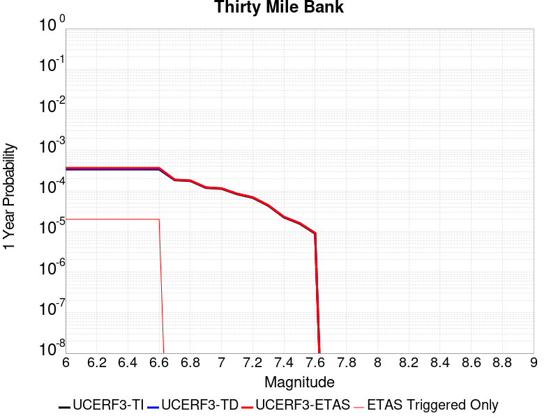 |  |

| Magnitude | 1 wk TI Prob | 1 wk TD Prob | 1 wk ETAS Prob | 1 wk ETAS/TD Gain | 1 wk ETAS Triggered Only | 1 mo TI Prob | 1 mo TD Prob | 1 mo ETAS Prob | 1 mo ETAS/TD Gain | 1 mo ETAS Triggered Only | 1 yr TI Prob | 1 yr TD Prob | 1 yr ETAS Prob | 1 yr ETAS/TD Gain | 1 yr ETAS Triggered Only | 10 yr TI Prob | 10 yr TD Prob | 10 yr ETAS Prob | 10 yr ETAS/TD Gain | 10 yr ETAS Triggered Only |
|-----|-----|-----|-----|-----|-----|-----|-----|-----|-----|-----|-----|-----|-----|-----|-----|-----|-----|-----|-----|-----|
| 6.0 | 6.5124755E-6 | 6.6592643E-6 | 6.6592643E-6 | 1.0 | 0.0 | 2.791031E-5 | 2.8539416E-5 | 1.2966922E-4 | 4.5435133 | 1.0113269E-4 | 3.3975503E-4 | 3.4741635E-4 | 4.4851392E-4 | 1.2909982 | 1.0113269E-4 | 0.0033923604 | 0.003469164 | 0.003569946 | 1.0290507 | 1.0113269E-4 |
| 6.1 | 6.5124755E-6 | 6.6592643E-6 | 6.6592643E-6 | 1.0 | 0.0 | 2.791031E-5 | 2.8539416E-5 | 1.2966922E-4 | 4.5435133 | 1.0113269E-4 | 3.3975503E-4 | 3.4741635E-4 | 4.4851392E-4 | 1.2909982 | 1.0113269E-4 | 0.0033923604 | 0.003469164 | 0.003569946 | 1.0290507 | 1.0113269E-4 |
| 6.2 | 6.5124755E-6 | 6.6592643E-6 | 6.6592643E-6 | 1.0 | 0.0 | 2.791031E-5 | 2.8539416E-5 | 1.2966922E-4 | 4.5435133 | 1.0113269E-4 | 3.3975503E-4 | 3.4741635E-4 | 4.4851392E-4 | 1.2909982 | 1.0113269E-4 | 0.0033923604 | 0.003469164 | 0.003569946 | 1.0290507 | 1.0113269E-4 |
| 6.3 | 6.5124755E-6 | 6.6592643E-6 | 6.6592643E-6 | 1.0 | 0.0 | 2.791031E-5 | 2.8539416E-5 | 1.2966922E-4 | 4.5435133 | 1.0113269E-4 | 3.3975503E-4 | 3.4741635E-4 | 4.4851392E-4 | 1.2909982 | 1.0113269E-4 | 0.0033923604 | 0.003469164 | 0.003569946 | 1.0290507 | 1.0113269E-4 |
| 6.4 | 6.5124755E-6 | 6.6592643E-6 | 6.6592643E-6 | 1.0 | 0.0 | 2.791031E-5 | 2.8539416E-5 | 1.2966922E-4 | 4.5435133 | 1.0113269E-4 | 3.3975503E-4 | 3.4741635E-4 | 4.4851392E-4 | 1.2909982 | 1.0113269E-4 | 0.0033923604 | 0.003469164 | 0.003569946 | 1.0290507 | 1.0113269E-4 |
| 6.5 | 6.5124755E-6 | 6.6592643E-6 | 6.6592643E-6 | 1.0 | 0.0 | 2.791031E-5 | 2.8539416E-5 | 1.2966922E-4 | 4.5435133 | 1.0113269E-4 | 3.3975503E-4 | 3.4741635E-4 | 4.4851392E-4 | 1.2909982 | 1.0113269E-4 | 0.0033923604 | 0.003469164 | 0.003569946 | 1.0290507 | 1.0113269E-4 |
| 6.6 | 6.5124755E-6 | 6.6592643E-6 | 6.6592643E-6 | 1.0 | 0.0 | 2.791031E-5 | 2.8539416E-5 | 1.2966922E-4 | 4.5435133 | 1.0113269E-4 | 3.3975503E-4 | 3.4741635E-4 | 4.4851392E-4 | 1.2909982 | 1.0113269E-4 | 0.0033923604 | 0.003469164 | 0.003569946 | 1.0290507 | 1.0113269E-4 |
| 6.7 | 3.5261137E-6 | 3.6098995E-6 | 3.6098995E-6 | 1.0 | 0.0 | 1.5111828E-5 | 1.547091E-5 | 1.547091E-5 | 1.0 | 0.0 | 1.8397097E-4 | 1.883427E-4 | 1.883427E-4 | 1.0 | 0.0 | 0.0018381875 | 0.0018818958 | 0.0018818958 | 1.0 | 0.0 |
| 6.8 | 3.370743E-6 | 3.4509355E-6 | 3.4509355E-6 | 1.0 | 0.0 | 1.4445961E-5 | 1.47896435E-5 | 1.47896435E-5 | 1.0 | 0.0 | 1.7586538E-4 | 1.8004965E-4 | 1.8004965E-4 | 1.0 | 0.0 | 0.0017572626 | 0.0017990996 | 0.0017990996 | 1.0 | 0.0 |
| 6.9 | 2.2756835E-6 | 2.333161E-6 | 2.333161E-6 | 1.0 | 0.0 | 9.752893E-6 | 9.999225E-6 | 9.999225E-6 | 1.0 | 0.0 | 1.18735006E-4 | 1.2173401E-4 | 1.2173401E-4 | 1.0 | 0.0 | 0.0011867158 | 0.0012166979 | 0.0012166979 | 1.0 | 0.0 |
| 7.0 | 2.1617404E-6 | 2.21598E-6 | 2.21598E-6 | 1.0 | 0.0 | 9.264569E-6 | 9.497024E-6 | 9.497024E-6 | 1.0 | 0.0 | 1.1279029E-4 | 1.1562037E-4 | 1.1562037E-4 | 1.0 | 0.0 | 0.0011273306 | 0.0011556263 | 0.0011556263 | 1.0 | 0.0 |
| 7.1 | 1.5900777E-6 | 1.6327014E-6 | 1.6327014E-6 | 1.0 | 0.0 | 6.814601E-6 | 6.997274E-6 | 6.997274E-6 | 1.0 | 0.0 | 8.296461E-5 | 8.518861E-5 | 8.518861E-5 | 1.0 | 0.0 | 8.293364E-4 | 8.5157226E-4 | 8.5157226E-4 | 1.0 | 0.0 |
| 7.2 | 1.2971728E-6 | 1.3328992E-6 | 1.3328992E-6 | 1.0 | 0.0 | 5.5593005E-6 | 5.712413E-6 | 5.712413E-6 | 1.0 | 0.0 | 6.768238E-5 | 6.954651E-5 | 6.954651E-5 | 1.0 | 0.0 | 6.7661767E-4 | 6.952578E-4 | 6.952578E-4 | 1.0 | 0.0 |
| 7.3 | 8.2454284E-7 | 8.448891E-7 | 8.448891E-7 | 1.0 | 0.0 | 3.5337503E-6 | 3.6209485E-6 | 3.6209485E-6 | 1.0 | 0.0 | 4.302256E-5 | 4.408422E-5 | 4.408422E-5 | 1.0 | 0.0 | 4.301423E-4 | 4.4076078E-4 | 4.4076078E-4 | 1.0 | 0.0 |
| 7.4 | 4.2619024E-7 | 4.3863466E-7 | 4.3863466E-7 | 1.0 | 0.0 | 1.8265283E-6 | 1.8798615E-6 | 1.8798615E-6 | 1.0 | 0.0 | 2.2237757E-5 | 2.2887078E-5 | 2.2887078E-5 | 1.0 | 0.0 | 2.223553E-4 | 2.288476E-4 | 2.288476E-4 | 1.0 | 0.0 |
| 7.5 | 2.993922E-7 | 3.086453E-7 | 3.086453E-7 | 1.0 | 0.0 | 1.2831089E-6 | 1.3227649E-6 | 1.3227649E-6 | 1.0 | 0.0 | 1.5621737E-5 | 1.6104546E-5 | 1.6104546E-5 | 1.0 | 0.0 | 1.562064E-4 | 1.6103406E-4 | 1.6103406E-4 | 1.0 | 0.0 |
| 7.6 | 1.6988751E-7 | 1.7533823E-7 | 1.7533823E-7 | 1.0 | 0.0 | 7.2808916E-7 | 7.5144936E-7 | 7.5144936E-7 | 1.0 | 0.0 | 8.864449E-6 | 9.14886E-6 | 9.14886E-6 | 1.0 | 0.0 | 8.8640954E-5 | 9.1485024E-5 | 9.1485024E-5 | 1.0 | 0.0 |

## San Jacinto (Coyote Creek)
*[(top)](#table-of-contents)*

| 1 Week | 1 Month | 1 Year | 10 Year |
|-----|-----|-----|-----|
|  |  |  |  |

| Magnitude | 1 wk TI Prob | 1 wk TD Prob | 1 wk ETAS Prob | 1 wk ETAS/TD Gain | 1 wk ETAS Triggered Only | 1 mo TI Prob | 1 mo TD Prob | 1 mo ETAS Prob | 1 mo ETAS/TD Gain | 1 mo ETAS Triggered Only | 1 yr TI Prob | 1 yr TD Prob | 1 yr ETAS Prob | 1 yr ETAS/TD Gain | 1 yr ETAS Triggered Only | 10 yr TI Prob | 10 yr TD Prob | 10 yr ETAS Prob | 10 yr ETAS/TD Gain | 10 yr ETAS Triggered Only |
|-----|-----|-----|-----|-----|-----|-----|-----|-----|-----|-----|-----|-----|-----|-----|-----|-----|-----|-----|-----|-----|
| 6.0 | 2.7374346E-5 | 2.4145214E-5 | 2.4145214E-5 | 1.0 | 0.0 | 1.1731335E-4 | 1.034754E-4 | 1.034754E-4 | 1.0 | 0.0 | 0.0014273542 | 0.0012590875 | 0.0013600928 | 1.080221 | 1.0113269E-4 | 0.01418221 | 0.012928318 | 0.013028143 | 1.0077214 | 1.0113269E-4 |
| 6.1 | 2.7374346E-5 | 2.4145214E-5 | 2.4145214E-5 | 1.0 | 0.0 | 1.1731335E-4 | 1.034754E-4 | 1.034754E-4 | 1.0 | 0.0 | 0.0014273542 | 0.0012590875 | 0.0013600928 | 1.080221 | 1.0113269E-4 | 0.01418221 | 0.012928318 | 0.013028143 | 1.0077214 | 1.0113269E-4 |
| 6.2 | 2.7374346E-5 | 2.4145214E-5 | 2.4145214E-5 | 1.0 | 0.0 | 1.1731335E-4 | 1.034754E-4 | 1.034754E-4 | 1.0 | 0.0 | 0.0014273542 | 0.0012590875 | 0.0013600928 | 1.080221 | 1.0113269E-4 | 0.01418221 | 0.012928318 | 0.013028143 | 1.0077214 | 1.0113269E-4 |
| 6.3 | 2.7374346E-5 | 2.4145214E-5 | 2.4145214E-5 | 1.0 | 0.0 | 1.1731335E-4 | 1.034754E-4 | 1.034754E-4 | 1.0 | 0.0 | 0.0014273542 | 0.0012590875 | 0.0013600928 | 1.080221 | 1.0113269E-4 | 0.01418221 | 0.012928318 | 0.013028143 | 1.0077214 | 1.0113269E-4 |
| 6.4 | 2.7374346E-5 | 2.4145214E-5 | 2.4145214E-5 | 1.0 | 0.0 | 1.1731335E-4 | 1.034754E-4 | 1.034754E-4 | 1.0 | 0.0 | 0.0014273542 | 0.0012590875 | 0.0013600928 | 1.080221 | 1.0113269E-4 | 0.01418221 | 0.012928318 | 0.013028143 | 1.0077214 | 1.0113269E-4 |
| 6.5 | 2.7282445E-5 | 2.4031293E-5 | 2.4031293E-5 | 1.0 | 0.0 | 1.16919524E-4 | 1.029872E-4 | 1.029872E-4 | 1.0 | 0.0 | 0.0014225657 | 0.0012531505 | 0.0013541565 | 1.0806016 | 1.0113269E-4 | 0.014134934 | 0.012869646 | 0.012969477 | 1.0077571 | 1.0113269E-4 |
| 6.6 | 2.7282445E-5 | 2.4031293E-5 | 2.4031293E-5 | 1.0 | 0.0 | 1.16919524E-4 | 1.029872E-4 | 1.029872E-4 | 1.0 | 0.0 | 0.0014225657 | 0.0012531505 | 0.0013541565 | 1.0806016 | 1.0113269E-4 | 0.014134934 | 0.012869646 | 0.012969477 | 1.0077571 | 1.0113269E-4 |
| 6.7 | 2.7216198E-5 | 2.3956412E-5 | 2.3956412E-5 | 1.0 | 0.0 | 1.1663563E-4 | 1.02666316E-4 | 1.02666316E-4 | 1.0 | 0.0 | 0.0014191137 | 0.0012492483 | 0.0013502546 | 1.0808537 | 1.0113269E-4 | 0.014100855 | 0.0128310565 | 0.0129308915 | 1.0077808 | 1.0113269E-4 |
| 6.8 | 2.7078617E-5 | 2.387363E-5 | 2.387363E-5 | 1.0 | 0.0 | 1.1604605E-4 | 1.0231156E-4 | 1.0231156E-4 | 1.0 | 0.0 | 0.001411945 | 0.0012449342 | 0.0013459409 | 1.0811342 | 1.0113269E-4 | 0.014030075 | 0.012788199 | 0.0128880385 | 1.0078071 | 1.0113269E-4 |
| 6.9 | 2.6982952E-5 | 2.3793142E-5 | 2.3793142E-5 | 1.0 | 0.0 | 1.15636096E-4 | 1.0196664E-4 | 1.0196664E-4 | 1.0 | 0.0 | 0.0014069602 | 0.0012407395 | 0.0013417467 | 1.0814089 | 1.0113269E-4 | 0.013980856 | 0.012746515 | 0.012846358 | 1.007833 | 1.0113269E-4 |
| 7.0 | 2.6449972E-5 | 2.3370165E-5 | 2.3370165E-5 | 1.0 | 0.0 | 1.1335209E-4 | 1.00154015E-4 | 1.00154015E-4 | 1.0 | 0.0 | 0.001379188 | 0.0012186957 | 0.001319705 | 1.0828832 | 1.0113269E-4 | 0.0137065975 | 0.0125278765 | 0.012627742 | 1.0079715 | 1.0113269E-4 |
| 7.1 | 2.6257849E-5 | 2.3196202E-5 | 2.3196202E-5 | 1.0 | 0.0 | 1.1252879E-4 | 9.940852E-5 | 9.940852E-5 | 1.0 | 0.0 | 0.0013691769 | 0.0012096294 | 0.0013106397 | 1.0835052 | 1.0113269E-4 | 0.013607717 | 0.012437741 | 0.012537616 | 1.0080299 | 1.0113269E-4 |
| 7.2 | 2.5270041E-5 | 2.2390966E-5 | 2.2390966E-5 | 1.0 | 0.0 | 1.0829568E-4 | 9.595777E-5 | 9.595777E-5 | 1.0 | 0.0 | 0.0013177024 | 0.0011676621 | 0.0012686766 | 1.0865102 | 1.0113269E-4 | 0.013099162 | 0.012018777 | 0.012118694 | 1.0083134 | 1.0113269E-4 |
| 7.3 | 2.339701E-5 | 2.1122814E-5 | 2.1122814E-5 | 1.0 | 0.0 | 1.0026905E-4 | 9.0523215E-5 | 9.0523215E-5 | 1.0 | 0.0 | 0.001220092 | 0.0011015651 | 0.0012025863 | 1.0917071 | 1.0113269E-4 | 0.012134149 | 0.011357696 | 0.01145768 | 1.0088032 | 1.0113269E-4 |
| 7.4 | 2.296333E-5 | 2.0853171E-5 | 2.0853171E-5 | 1.0 | 0.0 | 9.841056E-5 | 8.936768E-5 | 8.936768E-5 | 1.0 | 0.0 | 0.0011974899 | 0.0010875105 | 0.0011885331 | 1.0928936 | 1.0113269E-4 | 0.011910575 | 0.01121681 | 0.011316808 | 1.0089151 | 1.0113269E-4 |
| 7.5 | 2.2188895E-5 | 2.0376096E-5 | 2.0376096E-5 | 1.0 | 0.0 | 9.50918E-5 | 8.732321E-5 | 8.732321E-5 | 1.0 | 0.0 | 0.0011571277 | 0.0010626436 | 0.0011636688 | 1.0950698 | 1.0113269E-4 | 0.011511209 | 0.010966429 | 0.011066452 | 1.009121 | 1.0113269E-4 |
| 7.6 | 2.0013189E-5 | 1.8962366E-5 | 1.8962366E-5 | 1.0 | 0.0 | 8.5767984E-5 | 8.1264756E-5 | 8.1264756E-5 | 1.0 | 0.0 | 0.001043725 | 9.889511E-4 | 0.0010899837 | 1.1021614 | 1.0113269E-4 | 0.010388365 | 0.010224434 | 0.010324532 | 1.0097902 | 1.0113269E-4 |
| 7.7 | 1.7230794E-5 | 1.674371E-5 | 1.674371E-5 | 1.0 | 0.0 | 7.384417E-5 | 7.175679E-5 | 7.175679E-5 | 1.0 | 0.0 | 8.986819E-4 | 8.7328954E-4 | 9.743339E-4 | 1.1157055 | 1.0113269E-4 | 0.008950562 | 0.009062956 | 0.009163172 | 1.0110577 | 1.0113269E-4 |
| 7.8 | 1.4478809E-5 | 1.4990978E-5 | 1.4990978E-5 | 1.0 | 0.0 | 6.205057E-5 | 6.424547E-5 | 6.424547E-5 | 1.0 | 0.0 | 7.552038E-4 | 7.819085E-4 | 8.8296214E-4 | 1.1292397 | 1.0113269E-4 | 0.0075264242 | 0.008141387 | 0.008241696 | 1.0123209 | 1.0113269E-4 |
| 7.9 | 1.1114467E-5 | 1.1645102E-5 | 1.1645102E-5 | 1.0 | 0.0 | 4.7632562E-5 | 4.990663E-5 | 4.990663E-5 | 1.0 | 0.0 | 5.797721E-4 | 6.074444E-4 | 7.0851564E-4 | 1.1663877 | 1.0113269E-4 | 0.0057826187 | 0.0063803247 | 0.006480812 | 1.0157496 | 1.0113269E-4 |
| 8.0 | 9.327402E-6 | 9.899186E-6 | 9.899186E-6 | 1.0 | 0.0 | 3.9973966E-5 | 4.2424395E-5 | 4.2424395E-5 | 1.0 | 0.0 | 4.8657437E-4 | 5.1639514E-4 | 6.174756E-4 | 1.1957425 | 1.0113269E-4 | 0.0048551033 | 0.0054499684 | 0.00555055 | 1.0184554 | 1.0113269E-4 |
| 8.1 | 7.0235833E-6 | 6.827495E-6 | 6.827495E-6 | 1.0 | 0.0 | 3.0100724E-5 | 2.9260367E-5 | 2.9260367E-5 | 1.0 | 0.0 | 3.664147E-4 | 3.5618723E-4 | 3.5618723E-4 | 1.0 | 0.0 | 0.003658111 | 0.0037876023 | 0.0037876023 | 1.0 | 0.0 |
| 8.2 | 2.0358202E-6 | 8.994527E-7 | 8.994527E-7 | 1.0 | 0.0 | 8.724915E-6 | 3.854792E-6 | 3.854792E-6 | 1.0 | 0.0 | 1.06220665E-4 | 4.69311E-5 | 4.69311E-5 | 1.0 | 0.0 | 0.001061699 | 5.3254166E-4 | 5.3254166E-4 | 1.0 | 0.0 |
| 8.3 | 2.0051264E-7 | 6.617272E-8 | 6.617272E-8 | 1.0 | 0.0 | 8.5933965E-7 | 2.8359733E-7 | 2.8359733E-7 | 1.0 | 0.0 | 1.046241E-5 | 3.4527925E-6 | 3.4527925E-6 | 1.0 | 0.0 | 1.0461917E-4 | 4.01389E-5 | 4.01389E-5 | 1.0 | 0.0 |

## San Pedro Basin
*[(top)](#table-of-contents)*

| 1 Week | 1 Month | 1 Year | 10 Year |
|-----|-----|-----|-----|
|  |  |  |  |

| Magnitude | 1 wk TI Prob | 1 wk TD Prob | 1 wk ETAS Prob | 1 wk ETAS/TD Gain | 1 wk ETAS Triggered Only | 1 mo TI Prob | 1 mo TD Prob | 1 mo ETAS Prob | 1 mo ETAS/TD Gain | 1 mo ETAS Triggered Only | 1 yr TI Prob | 1 yr TD Prob | 1 yr ETAS Prob | 1 yr ETAS/TD Gain | 1 yr ETAS Triggered Only | 10 yr TI Prob | 10 yr TD Prob | 10 yr ETAS Prob | 10 yr ETAS/TD Gain | 10 yr ETAS Triggered Only |
|-----|-----|-----|-----|-----|-----|-----|-----|-----|-----|-----|-----|-----|-----|-----|-----|-----|-----|-----|-----|-----|
| 6.0 | 5.3449043E-5 | 6.336954E-5 | 6.336954E-5 | 1.0 | 0.0 | 2.2904722E-4 | 2.715589E-4 | 2.715589E-4 | 1.0 | 0.0 | 0.0027850836 | 0.0033018254 | 0.0033018254 | 1.0 | 0.0 | 0.027504366 | 0.03258945 | 0.032687288 | 1.003002 | 1.0113269E-4 |
| 6.1 | 5.3449043E-5 | 6.336954E-5 | 6.336954E-5 | 1.0 | 0.0 | 2.2904722E-4 | 2.715589E-4 | 2.715589E-4 | 1.0 | 0.0 | 0.0027850836 | 0.0033018254 | 0.0033018254 | 1.0 | 0.0 | 0.027504366 | 0.03258945 | 0.032687288 | 1.003002 | 1.0113269E-4 |
| 6.2 | 2.3189454E-5 | 2.6642796E-5 | 2.6642796E-5 | 1.0 | 0.0 | 9.9379584E-5 | 1.14178685E-4 | 1.14178685E-4 | 1.0 | 0.0 | 0.0012092749 | 0.0013892864 | 0.0013892864 | 1.0 | 0.0 | 0.012027155 | 0.013810883 | 0.013810883 | 1.0 | 0.0 |
| 6.3 | 2.3189454E-5 | 2.6642796E-5 | 2.6642796E-5 | 1.0 | 0.0 | 9.9379584E-5 | 1.14178685E-4 | 1.14178685E-4 | 1.0 | 0.0 | 0.0012092749 | 0.0013892864 | 0.0013892864 | 1.0 | 0.0 | 0.012027155 | 0.013810883 | 0.013810883 | 1.0 | 0.0 |
| 6.4 | 1.966056E-5 | 2.2463413E-5 | 2.2463413E-5 | 1.0 | 0.0 | 8.425682E-5 | 9.626844E-5 | 9.626844E-5 | 1.0 | 0.0 | 0.001025344 | 0.0011714783 | 0.0011714783 | 1.0 | 0.0 | 0.010206259 | 0.011657117 | 0.011657117 | 1.0 | 0.0 |
| 6.5 | 1.7342953E-5 | 1.9745148E-5 | 1.9745148E-5 | 1.0 | 0.0 | 7.4324824E-5 | 8.4619525E-5 | 8.4619525E-5 | 1.0 | 0.0 | 9.04529E-4 | 0.0010297928 | 0.0010297928 | 1.0 | 0.0 | 0.009008561 | 0.010253931 | 0.010253931 | 1.0 | 0.0 |
| 6.6 | 1.439804E-5 | 1.6322716E-5 | 1.6322716E-5 | 1.0 | 0.0 | 6.170443E-5 | 6.99528E-5 | 6.99528E-5 | 1.0 | 0.0 | 7.509924E-4 | 8.513747E-4 | 8.513747E-4 | 1.0 | 0.0 | 0.0074845953 | 0.008484332 | 0.008484332 | 1.0 | 0.0 |
| 6.7 | 1.2634884E-5 | 1.4285297E-5 | 1.4285297E-5 | 1.0 | 0.0 | 5.414838E-5 | 6.1221435E-5 | 6.1221435E-5 | 1.0 | 0.0 | 6.590571E-4 | 7.4514654E-4 | 7.4514654E-4 | 1.0 | 0.0 | 0.006571059 | 0.007429501 | 0.007429501 | 1.0 | 0.0 |
| 6.8 | 1.146091E-5 | 1.2933192E-5 | 1.2933192E-5 | 1.0 | 0.0 | 4.911726E-5 | 5.5426954E-5 | 5.5426954E-5 | 1.0 | 0.0 | 5.9783855E-4 | 6.7464396E-4 | 6.7464396E-4 | 1.0 | 0.0 | 0.0059623276 | 0.006728899 | 0.006728899 | 1.0 | 0.0 |
| 6.9 | 9.109035E-6 | 1.0235011E-5 | 1.0235011E-5 | 1.0 | 0.0 | 3.9038136E-5 | 4.3863754E-5 | 4.3863754E-5 | 1.0 | 0.0 | 4.7518566E-4 | 5.3393835E-4 | 5.3393835E-4 | 1.0 | 0.0 | 0.0047417083 | 0.005329309 | 0.005329309 | 1.0 | 0.0 |
| 7.0 | 5.9351028E-6 | 6.583964E-6 | 6.583964E-6 | 1.0 | 0.0 | 2.5435906E-5 | 2.8216817E-5 | 2.8216817E-5 | 1.0 | 0.0 | 3.0963816E-4 | 3.435092E-4 | 3.435092E-4 | 1.0 | 0.0 | 0.0030920706 | 0.0034320992 | 0.0034320992 | 1.0 | 0.0 |
| 7.1 | 2.1557585E-6 | 2.209648E-6 | 2.209648E-6 | 1.0 | 0.0 | 9.238933E-6 | 9.469887E-6 | 9.469887E-6 | 1.0 | 0.0 | 1.1247819E-4 | 1.1528993E-4 | 1.1528993E-4 | 1.0 | 0.0 | 0.0011242128 | 0.0011523166 | 0.0011523166 | 1.0 | 0.0 |
| 7.2 | 2.1251979E-6 | 2.1779945E-6 | 2.1779945E-6 | 1.0 | 0.0 | 9.107958E-6 | 9.334229E-6 | 9.334229E-6 | 1.0 | 0.0 | 1.1088375E-4 | 1.1363847E-4 | 1.1363847E-4 | 1.0 | 0.0 | 0.0011082845 | 0.0011358189 | 0.0011358189 | 1.0 | 0.0 |
| 7.3 | 1.7145798E-6 | 1.7442874E-6 | 1.7442874E-6 | 1.0 | 0.0 | 7.3481783E-6 | 7.4754967E-6 | 7.4754967E-6 | 1.0 | 0.0 | 8.94604E-5 | 9.1010465E-5 | 9.1010465E-5 | 1.0 | 0.0 | 8.9424395E-4 | 9.0974104E-4 | 9.0974104E-4 | 1.0 | 0.0 |
| 7.4 | 1.4467993E-6 | 1.4641868E-6 | 1.4641868E-6 | 1.0 | 0.0 | 6.200554E-6 | 6.2750714E-6 | 6.2750714E-6 | 1.0 | 0.0 | 7.548913E-5 | 7.639639E-5 | 7.639639E-5 | 1.0 | 0.0 | 7.546349E-4 | 7.6370855E-4 | 7.6370855E-4 | 1.0 | 0.0 |
| 7.5 | 1.2803735E-6 | 1.2931497E-6 | 1.2931497E-6 | 1.0 | 0.0 | 5.487303E-6 | 5.5420587E-6 | 5.5420587E-6 | 1.0 | 0.0 | 6.680587E-5 | 6.7472545E-5 | 6.7472545E-5 | 1.0 | 0.0 | 6.678579E-4 | 6.7452766E-4 | 6.7452766E-4 | 1.0 | 0.0 |
| 7.6 | 6.755009E-7 | 6.769465E-7 | 6.769465E-7 | 1.0 | 0.0 | 2.8950008E-6 | 2.9011965E-6 | 2.9011965E-6 | 1.0 | 0.0 | 3.5246063E-5 | 3.5321555E-5 | 3.5321555E-5 | 1.0 | 0.0 | 3.5240475E-4 | 3.5316512E-4 | 3.5316512E-4 | 1.0 | 0.0 |
| 7.7 | 6.211885E-8 | 4.569953E-8 | 4.569953E-8 | 1.0 | 0.0 | 2.6622362E-7 | 1.9585512E-7 | 1.9585512E-7 | 1.0 | 0.0 | 3.2412677E-6 | 2.3845337E-6 | 2.3845337E-6 | 1.0 | 0.0 | 3.2412205E-5 | 2.3845101E-5 | 2.3845101E-5 | 1.0 | 0.0 |
| 7.8 | 2.6580573E-9 | 1.5138163E-9 | 1.5138163E-9 | 1.0 | 0.0 | 1.1391674E-8 | 6.487784E-9 | 6.487784E-9 | 1.0 | 0.0 | 1.3869362E-7 | 7.898877E-8 | 7.898877E-8 | 1.0 | 0.0 | 1.3869354E-6 | 7.898877E-7 | 7.898877E-7 | 1.0 | 0.0 |

## Death Valley (Fish Lake Valley)
*[(top)](#table-of-contents)*

| 1 Week | 1 Month | 1 Year | 10 Year |
|-----|-----|-----|-----|
|  |  |  |  |

| Magnitude | 1 wk TI Prob | 1 wk TD Prob | 1 wk ETAS Prob | 1 wk ETAS/TD Gain | 1 wk ETAS Triggered Only | 1 mo TI Prob | 1 mo TD Prob | 1 mo ETAS Prob | 1 mo ETAS/TD Gain | 1 mo ETAS Triggered Only | 1 yr TI Prob | 1 yr TD Prob | 1 yr ETAS Prob | 1 yr ETAS/TD Gain | 1 yr ETAS Triggered Only | 10 yr TI Prob | 10 yr TD Prob | 10 yr ETAS Prob | 10 yr ETAS/TD Gain | 10 yr ETAS Triggered Only |
|-----|-----|-----|-----|-----|-----|-----|-----|-----|-----|-----|-----|-----|-----|-----|-----|-----|-----|-----|-----|-----|
| 6.0 | 3.872328E-5 | 4.7267473E-5 | 4.7267473E-5 | 1.0 | 0.0 | 1.6594635E-4 | 2.0256084E-4 | 2.0256084E-4 | 1.0 | 0.0 | 0.0020185246 | 0.002463534 | 0.002463534 | 1.0 | 0.0 | 0.02000288 | 0.024388181 | 0.024486847 | 1.0040456 | 1.0113269E-4 |
| 6.1 | 3.872328E-5 | 4.7267473E-5 | 4.7267473E-5 | 1.0 | 0.0 | 1.6594635E-4 | 2.0256084E-4 | 2.0256084E-4 | 1.0 | 0.0 | 0.0020185246 | 0.002463534 | 0.002463534 | 1.0 | 0.0 | 0.02000288 | 0.024388181 | 0.024486847 | 1.0040456 | 1.0113269E-4 |
| 6.2 | 3.872328E-5 | 4.7267473E-5 | 4.7267473E-5 | 1.0 | 0.0 | 1.6594635E-4 | 2.0256084E-4 | 2.0256084E-4 | 1.0 | 0.0 | 0.0020185246 | 0.002463534 | 0.002463534 | 1.0 | 0.0 | 0.02000288 | 0.024388181 | 0.024486847 | 1.0040456 | 1.0113269E-4 |
| 6.3 | 2.8356371E-5 | 3.3609853E-5 | 3.3609853E-5 | 1.0 | 0.0 | 1.2152165E-4 | 1.4403471E-4 | 1.4403471E-4 | 1.0 | 0.0 | 0.0014785219 | 0.0017522911 | 0.0017522911 | 1.0 | 0.0 | 0.014687235 | 0.017391782 | 0.017491156 | 1.0057138 | 1.0113269E-4 |
| 6.4 | 2.8356371E-5 | 3.3609853E-5 | 3.3609853E-5 | 1.0 | 0.0 | 1.2152165E-4 | 1.4403471E-4 | 1.4403471E-4 | 1.0 | 0.0 | 0.0014785219 | 0.0017522911 | 0.0017522911 | 1.0 | 0.0 | 0.014687235 | 0.017391782 | 0.017491156 | 1.0057138 | 1.0113269E-4 |
| 6.5 | 2.4448687E-5 | 2.8607552E-5 | 2.8607552E-5 | 1.0 | 0.0 | 1.0477588E-4 | 1.2259831E-4 | 1.2259831E-4 | 1.0 | 0.0 | 0.0012748998 | 0.0014916632 | 0.0014916632 | 1.0 | 0.0 | 0.012676105 | 0.014821377 | 0.0149210105 | 1.0067223 | 1.0113269E-4 |
| 6.6 | 2.1298161E-5 | 2.4660083E-5 | 2.4660083E-5 | 1.0 | 0.0 | 9.127464E-5 | 1.0568198E-4 | 1.0568198E-4 | 1.0 | 0.0 | 0.0011107022 | 0.0012859525 | 0.0012859525 | 1.0 | 0.0 | 0.011051672 | 0.012788526 | 0.0128883645 | 1.0078069 | 1.0113269E-4 |
| 6.7 | 1.8959729E-5 | 2.1781025E-5 | 2.1781025E-5 | 1.0 | 0.0 | 8.125345E-5 | 9.334405E-5 | 9.334405E-5 | 1.0 | 0.0 | 9.888117E-4 | 0.001135897 | 0.001135897 | 1.0 | 0.0 | 0.009844234 | 0.01130357 | 0.01140356 | 1.0088458 | 1.0113269E-4 |
| 6.8 | 1.6691629E-5 | 1.9018353E-5 | 1.9018353E-5 | 1.0 | 0.0 | 7.153359E-5 | 8.150477E-5 | 8.150477E-5 | 1.0 | 0.0 | 8.7057345E-4 | 9.918857E-4 | 9.918857E-4 | 1.0 | 0.0 | 0.008671708 | 0.009876343 | 0.009976477 | 1.0101388 | 1.0113269E-4 |
| 6.9 | 1.450505E-5 | 1.638954E-5 | 1.638954E-5 | 1.0 | 0.0 | 6.216302E-5 | 7.0239046E-5 | 7.0239046E-5 | 1.0 | 0.0 | 7.5657194E-4 | 8.5483363E-4 | 8.5483363E-4 | 1.0 | 0.0 | 0.007540013 | 0.008516385 | 0.008616657 | 1.011774 | 1.0113269E-4 |
| 7.0 | 1.2940855E-5 | 1.4537972E-5 | 1.4537972E-5 | 1.0 | 0.0 | 5.545963E-5 | 6.230414E-5 | 6.230414E-5 | 1.0 | 0.0 | 6.750118E-4 | 7.5829466E-4 | 7.5829466E-4 | 1.0 | 0.0 | 0.006729651 | 0.0075576897 | 0.0076580583 | 1.0132803 | 1.0113269E-4 |
| 7.1 | 1.2544658E-5 | 1.4078208E-5 | 1.4078208E-5 | 1.0 | 0.0 | 5.3761712E-5 | 6.0333812E-5 | 6.0333812E-5 | 1.0 | 0.0 | 6.5435225E-4 | 7.343222E-4 | 7.343222E-4 | 1.0 | 0.0 | 0.006524288 | 0.007319551 | 0.0074199433 | 1.0137156 | 1.0113269E-4 |
| 7.2 | 1.2489416E-5 | 1.4015674E-5 | 1.4015674E-5 | 1.0 | 0.0 | 5.3524967E-5 | 6.0065824E-5 | 6.0065824E-5 | 1.0 | 0.0 | 6.514716E-4 | 7.310616E-4 | 7.310616E-4 | 1.0 | 0.0 | 0.006495651 | 0.0072871596 | 0.007387555 | 1.013777 | 1.0113269E-4 |
| 7.3 | 1.2368307E-5 | 1.3879812E-5 | 1.3879812E-5 | 1.0 | 0.0 | 5.3005948E-5 | 5.9483587E-5 | 5.9483587E-5 | 1.0 | 0.0 | 6.451563E-4 | 7.2397763E-4 | 7.2397763E-4 | 1.0 | 0.0 | 0.0064328653 | 0.007216782 | 0.0073171845 | 1.0139124 | 1.0113269E-4 |
| 7.4 | 1.2161707E-5 | 1.36478675E-5 | 1.36478675E-5 | 1.0 | 0.0 | 5.212056E-5 | 5.8489582E-5 | 5.8489582E-5 | 1.0 | 0.0 | 6.3438306E-4 | 7.118836E-4 | 7.118836E-4 | 1.0 | 0.0 | 0.006325751 | 0.0070966207 | 0.0071970355 | 1.0141497 | 1.0113269E-4 |
| 7.5 | 1.1707948E-5 | 1.3145515E-5 | 1.3145515E-5 | 1.0 | 0.0 | 5.0175953E-5 | 5.6336736E-5 | 5.6336736E-5 | 1.0 | 0.0 | 6.10721E-4 | 6.856895E-4 | 6.856895E-4 | 1.0 | 0.0 | 0.0060904534 | 0.006836321 | 0.0069367625 | 1.0146923 | 1.0113269E-4 |
| 7.6 | 1.0319538E-5 | 1.1579622E-5 | 1.1579622E-5 | 1.0 | 0.0 | 4.4225842E-5 | 4.9626036E-5 | 4.9626036E-5 | 1.0 | 0.0 | 5.383166E-4 | 6.040347E-4 | 6.040347E-4 | 1.0 | 0.0 | 0.0053701443 | 0.0060244603 | 0.006124984 | 1.0166858 | 1.0113269E-4 |
| 7.7 | 8.937764E-6 | 1.0022779E-5 | 1.0022779E-5 | 1.0 | 0.0 | 3.830414E-5 | 4.295409E-5 | 4.295409E-5 | 1.0 | 0.0 | 4.6625308E-4 | 5.228456E-4 | 5.228456E-4 | 1.0 | 0.0 | 0.0046527605 | 0.005216664 | 0.0053172694 | 1.0192853 | 1.0113269E-4 |
| 7.8 | 3.108007E-7 | 3.284654E-7 | 3.284654E-7 | 1.0 | 0.0 | 1.3320023E-6 | 1.407708E-6 | 1.407708E-6 | 1.0 | 0.0 | 1.6217007E-5 | 1.7138715E-5 | 1.7138715E-5 | 1.0 | 0.0 | 1.6215823E-4 | 1.7137431E-4 | 1.7137431E-4 | 1.0 | 0.0 |
| 7.9 | 2.5591178E-9 | 2.6696718E-9 | 2.6696718E-9 | 1.0 | 0.0 | 1.0967647E-8 | 1.14414505E-8 | 1.14414505E-8 | 1.0 | 0.0 | 1.335311E-7 | 1.3929966E-7 | 1.3929966E-7 | 1.0 | 0.0 | 1.3353102E-6 | 1.3929966E-6 | 1.3929966E-6 | 1.0 | 0.0 |

## Lost Hills
*[(top)](#table-of-contents)*

| 1 Week | 1 Month | 1 Year | 10 Year |
|-----|-----|-----|-----|
|  | 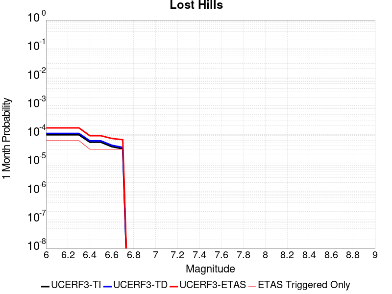 |  |  |

| Magnitude | 1 wk TI Prob | 1 wk TD Prob | 1 wk ETAS Prob | 1 wk ETAS/TD Gain | 1 wk ETAS Triggered Only | 1 mo TI Prob | 1 mo TD Prob | 1 mo ETAS Prob | 1 mo ETAS/TD Gain | 1 mo ETAS Triggered Only | 1 yr TI Prob | 1 yr TD Prob | 1 yr ETAS Prob | 1 yr ETAS/TD Gain | 1 yr ETAS Triggered Only | 10 yr TI Prob | 10 yr TD Prob | 10 yr ETAS Prob | 10 yr ETAS/TD Gain | 10 yr ETAS Triggered Only |
|-----|-----|-----|-----|-----|-----|-----|-----|-----|-----|-----|-----|-----|-----|-----|-----|-----|-----|-----|-----|-----|
| 6.0 | 2.233523E-5 | 2.5106583E-5 | 2.5106583E-5 | 1.0 | 0.0 | 9.571891E-5 | 1.0759615E-4 | 1.0759615E-4 | 1.0 | 0.0 | 0.0011647546 | 0.001309364 | 0.001309364 | 1.0 | 0.0 | 0.011586686 | 0.013033091 | 0.013132906 | 1.0076586 | 1.0113269E-4 |
| 6.1 | 2.233523E-5 | 2.5106583E-5 | 2.5106583E-5 | 1.0 | 0.0 | 9.571891E-5 | 1.0759615E-4 | 1.0759615E-4 | 1.0 | 0.0 | 0.0011647546 | 0.001309364 | 0.001309364 | 1.0 | 0.0 | 0.011586686 | 0.013033091 | 0.013132906 | 1.0076586 | 1.0113269E-4 |
| 6.2 | 2.233523E-5 | 2.5106583E-5 | 2.5106583E-5 | 1.0 | 0.0 | 9.571891E-5 | 1.0759615E-4 | 1.0759615E-4 | 1.0 | 0.0 | 0.0011647546 | 0.001309364 | 0.001309364 | 1.0 | 0.0 | 0.011586686 | 0.013033091 | 0.013132906 | 1.0076586 | 1.0113269E-4 |
| 6.3 | 2.233523E-5 | 2.5106583E-5 | 2.5106583E-5 | 1.0 | 0.0 | 9.571891E-5 | 1.0759615E-4 | 1.0759615E-4 | 1.0 | 0.0 | 0.0011647546 | 0.001309364 | 0.001309364 | 1.0 | 0.0 | 0.011586686 | 0.013033091 | 0.013132906 | 1.0076586 | 1.0113269E-4 |
| 6.4 | 1.2288092E-5 | 1.3781108E-5 | 1.3781108E-5 | 1.0 | 0.0 | 5.2662188E-5 | 5.906108E-5 | 5.906108E-5 | 1.0 | 0.0 | 6.409735E-4 | 7.189252E-4 | 7.189252E-4 | 1.0 | 0.0 | 0.006391279 | 0.0071752006 | 0.0071752006 | 1.0 | 0.0 |
| 6.5 | 1.2288092E-5 | 1.3781108E-5 | 1.3781108E-5 | 1.0 | 0.0 | 5.2662188E-5 | 5.906108E-5 | 5.906108E-5 | 1.0 | 0.0 | 6.409735E-4 | 7.189252E-4 | 7.189252E-4 | 1.0 | 0.0 | 0.006391279 | 0.0071752006 | 0.0071752006 | 1.0 | 0.0 |
| 6.6 | 8.58281E-6 | 9.63377E-6 | 9.63377E-6 | 1.0 | 0.0 | 3.6782953E-5 | 4.12874E-5 | 4.12874E-5 | 1.0 | 0.0 | 4.4774043E-4 | 5.026414E-4 | 5.026414E-4 | 1.0 | 0.0 | 0.0044683935 | 0.005023205 | 0.005023205 | 1.0 | 0.0 |
| 6.7 | 7.205685E-6 | 8.088302E-6 | 8.088302E-6 | 1.0 | 0.0 | 3.088114E-5 | 3.466415E-5 | 3.466415E-5 | 1.0 | 0.0 | 3.7591302E-4 | 4.2203604E-4 | 4.2203604E-4 | 1.0 | 0.0 | 0.0037527776 | 0.0042203604 | 0.0042203604 | 1.0 | 0.0 |

## Kern Canyon (South Kern) 2011
*[(top)](#table-of-contents)*

| 1 Week | 1 Month | 1 Year | 10 Year |
|-----|-----|-----|-----|
|  |  | 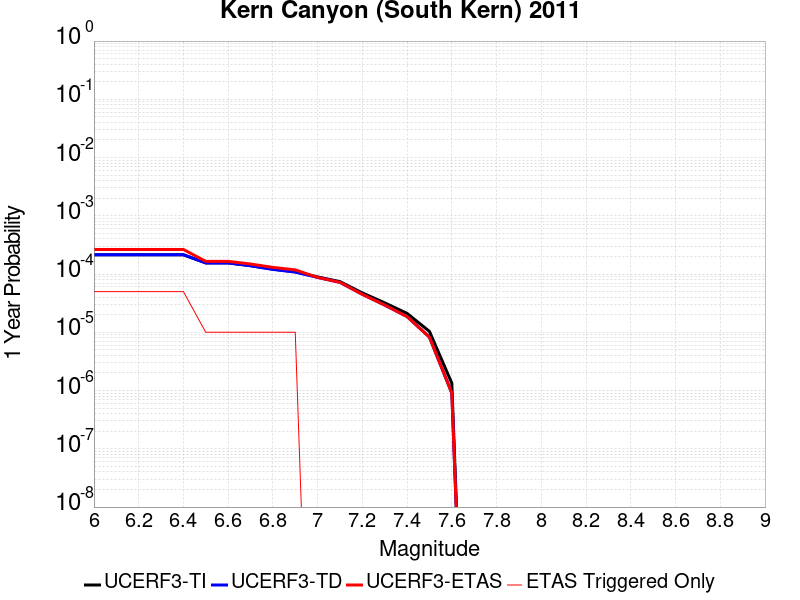 |  |

| Magnitude | 1 wk TI Prob | 1 wk TD Prob | 1 wk ETAS Prob | 1 wk ETAS/TD Gain | 1 wk ETAS Triggered Only | 1 mo TI Prob | 1 mo TD Prob | 1 mo ETAS Prob | 1 mo ETAS/TD Gain | 1 mo ETAS Triggered Only | 1 yr TI Prob | 1 yr TD Prob | 1 yr ETAS Prob | 1 yr ETAS/TD Gain | 1 yr ETAS Triggered Only | 10 yr TI Prob | 10 yr TD Prob | 10 yr ETAS Prob | 10 yr ETAS/TD Gain | 10 yr ETAS Triggered Only |
|-----|-----|-----|-----|-----|-----|-----|-----|-----|-----|-----|-----|-----|-----|-----|-----|-----|-----|-----|-----|-----|
| 6.0 | 4.105075E-6 | 4.1137264E-6 | 1.05246E-4 | 25.584103 | 1.0113269E-4 | 1.7593058E-5 | 1.763014E-5 | 1.1876105E-4 | 6.7362504 | 1.0113269E-4 | 2.1417443E-4 | 2.1462646E-4 | 3.1573744E-4 | 1.4711021 | 1.0113269E-4 | 0.0021396813 | 0.0021442557 | 0.0022451715 | 1.0470634 | 1.0113269E-4 |
| 6.1 | 4.105075E-6 | 4.1137264E-6 | 1.05246E-4 | 25.584103 | 1.0113269E-4 | 1.7593058E-5 | 1.763014E-5 | 1.1876105E-4 | 6.7362504 | 1.0113269E-4 | 2.1417443E-4 | 2.1462646E-4 | 3.1573744E-4 | 1.4711021 | 1.0113269E-4 | 0.0021396813 | 0.0021442557 | 0.0022451715 | 1.0470634 | 1.0113269E-4 |
| 6.2 | 4.105075E-6 | 4.1137264E-6 | 1.05246E-4 | 25.584103 | 1.0113269E-4 | 1.7593058E-5 | 1.763014E-5 | 1.1876105E-4 | 6.7362504 | 1.0113269E-4 | 2.1417443E-4 | 2.1462646E-4 | 3.1573744E-4 | 1.4711021 | 1.0113269E-4 | 0.0021396813 | 0.0021442557 | 0.0022451715 | 1.0470634 | 1.0113269E-4 |
| 6.3 | 4.105075E-6 | 4.1137264E-6 | 1.05246E-4 | 25.584103 | 1.0113269E-4 | 1.7593058E-5 | 1.763014E-5 | 1.1876105E-4 | 6.7362504 | 1.0113269E-4 | 2.1417443E-4 | 2.1462646E-4 | 3.1573744E-4 | 1.4711021 | 1.0113269E-4 | 0.0021396813 | 0.0021442557 | 0.0022451715 | 1.0470634 | 1.0113269E-4 |
| 6.4 | 4.105075E-6 | 4.1137264E-6 | 1.05246E-4 | 25.584103 | 1.0113269E-4 | 1.7593058E-5 | 1.763014E-5 | 1.1876105E-4 | 6.7362504 | 1.0113269E-4 | 2.1417443E-4 | 2.1462646E-4 | 3.1573744E-4 | 1.4711021 | 1.0113269E-4 | 0.0021396813 | 0.0021442557 | 0.0022451715 | 1.0470634 | 1.0113269E-4 |
| 6.5 | 2.9849807E-6 | 2.9731548E-6 | 2.9731548E-6 | 1.0 | 0.0 | 1.2792712E-5 | 1.274203E-5 | 1.274203E-5 | 1.0 | 0.0 | 1.5574014E-4 | 1.5512333E-4 | 1.5512333E-4 | 1.0 | 0.0 | 0.0015563103 | 0.0015501656 | 0.0015501656 | 1.0 | 0.0 |
| 6.6 | 2.9849807E-6 | 2.9731548E-6 | 2.9731548E-6 | 1.0 | 0.0 | 1.2792712E-5 | 1.274203E-5 | 1.274203E-5 | 1.0 | 0.0 | 1.5574014E-4 | 1.5512333E-4 | 1.5512333E-4 | 1.0 | 0.0 | 0.0015563103 | 0.0015501656 | 0.0015501656 | 1.0 | 0.0 |
| 6.7 | 2.6756725E-6 | 2.6582206E-6 | 2.6582206E-6 | 1.0 | 0.0 | 1.1467117E-5 | 1.1392325E-5 | 1.1392325E-5 | 1.0 | 0.0 | 1.396032E-4 | 1.3869285E-4 | 1.3869285E-4 | 1.0 | 0.0 | 0.0013951553 | 0.0013860738 | 0.0013860738 | 1.0 | 0.0 |
| 6.8 | 2.3283721E-6 | 2.3047787E-6 | 2.3047787E-6 | 1.0 | 0.0 | 9.9787E-6 | 9.877586E-6 | 9.877586E-6 | 1.0 | 0.0 | 1.214839E-4 | 1.20253055E-4 | 1.20253055E-4 | 1.0 | 0.0 | 0.001214175 | 0.0012018873 | 0.0012018873 | 1.0 | 0.0 |
| 6.9 | 2.0972677E-6 | 2.0696411E-6 | 2.0696411E-6 | 1.0 | 0.0 | 8.988259E-6 | 8.869861E-6 | 8.869861E-6 | 1.0 | 0.0 | 1.0942656E-4 | 1.0798526E-4 | 1.0798526E-4 | 1.0 | 0.0 | 0.0010937268 | 0.0010793337 | 0.0010793337 | 1.0 | 0.0 |
| 7.0 | 1.7132242E-6 | 1.6787036E-6 | 1.6787036E-6 | 1.0 | 0.0 | 7.3423685E-6 | 7.194424E-6 | 7.194424E-6 | 1.0 | 0.0 | 8.938967E-5 | 8.758863E-5 | 8.758863E-5 | 1.0 | 0.0 | 8.935372E-4 | 8.7554497E-4 | 8.7554497E-4 | 1.0 | 0.0 |
| 7.1 | 1.4215541E-6 | 1.3815752E-6 | 1.3815752E-6 | 1.0 | 0.0 | 6.0923603E-6 | 5.9210233E-6 | 5.9210233E-6 | 1.0 | 0.0 | 7.417196E-5 | 7.20861E-5 | 7.20861E-5 | 1.0 | 0.0 | 7.414721E-4 | 7.206299E-4 | 7.206299E-4 | 1.0 | 0.0 |
| 7.2 | 9.097853E-7 | 8.6037755E-7 | 8.6037755E-7 | 1.0 | 0.0 | 3.899074E-6 | 3.6873273E-6 | 3.6873273E-6 | 1.0 | 0.0 | 4.7470192E-5 | 4.4892295E-5 | 4.4892295E-5 | 1.0 | 0.0 | 4.7460053E-4 | 4.4883334E-4 | 4.4883334E-4 | 1.0 | 0.0 |
| 7.3 | 6.144169E-7 | 5.628206E-7 | 5.628206E-7 | 1.0 | 0.0 | 2.6332125E-6 | 2.4120861E-6 | 2.4120861E-6 | 1.0 | 0.0 | 3.205889E-5 | 2.9366758E-5 | 2.9366758E-5 | 1.0 | 0.0 | 3.2054266E-4 | 2.936293E-4 | 2.936293E-4 | 1.0 | 0.0 |
| 7.4 | 4.049844E-7 | 3.5728314E-7 | 3.5728314E-7 | 1.0 | 0.0 | 1.7356463E-6 | 1.5312125E-6 | 1.5312125E-6 | 1.0 | 0.0 | 2.1131287E-5 | 1.8642357E-5 | 1.8642357E-5 | 1.0 | 0.0 | 2.1129279E-4 | 1.8640817E-4 | 1.8640817E-4 | 1.0 | 0.0 |
| 7.5 | 1.9871162E-7 | 1.583044E-7 | 1.583044E-7 | 1.0 | 0.0 | 8.5162094E-7 | 6.7844724E-7 | 6.7844724E-7 | 1.0 | 0.0 | 1.0368436E-5 | 8.260065E-6 | 8.260065E-6 | 1.0 | 0.0 | 1.0367952E-4 | 8.259767E-5 | 8.259767E-5 | 1.0 | 0.0 |
| 7.6 | 2.572245E-8 | 1.7352555E-8 | 1.7352555E-8 | 1.0 | 0.0 | 1.10239064E-7 | 7.436809E-8 | 7.436809E-8 | 1.0 | 0.0 | 1.3421597E-6 | 9.054312E-7 | 9.054312E-7 | 1.0 | 0.0 | 1.3421517E-5 | 9.05428E-6 | 9.05428E-6 | 1.0 | 0.0 |

## Big Pine (East)
*[(top)](#table-of-contents)*

| 1 Week | 1 Month | 1 Year | 10 Year |
|-----|-----|-----|-----|
|  |  |  |  |

| Magnitude | 1 wk TI Prob | 1 wk TD Prob | 1 wk ETAS Prob | 1 wk ETAS/TD Gain | 1 wk ETAS Triggered Only | 1 mo TI Prob | 1 mo TD Prob | 1 mo ETAS Prob | 1 mo ETAS/TD Gain | 1 mo ETAS Triggered Only | 1 yr TI Prob | 1 yr TD Prob | 1 yr ETAS Prob | 1 yr ETAS/TD Gain | 1 yr ETAS Triggered Only | 10 yr TI Prob | 10 yr TD Prob | 10 yr ETAS Prob | 10 yr ETAS/TD Gain | 10 yr ETAS Triggered Only |
|-----|-----|-----|-----|-----|-----|-----|-----|-----|-----|-----|-----|-----|-----|-----|-----|-----|-----|-----|-----|-----|
| 6.0 | 9.916913E-6 | 1.2816984E-5 | 1.2816984E-5 | 1.0 | 0.0 | 4.250036E-5 | 5.49289E-5 | 5.49289E-5 | 1.0 | 0.0 | 5.173191E-4 | 6.685763E-4 | 7.6964137E-4 | 1.1511647 | 1.0113269E-4 | 0.0051611643 | 0.006670441 | 0.006770899 | 1.0150602 | 1.0113269E-4 |
| 6.1 | 9.916913E-6 | 1.2816984E-5 | 1.2816984E-5 | 1.0 | 0.0 | 4.250036E-5 | 5.49289E-5 | 5.49289E-5 | 1.0 | 0.0 | 5.173191E-4 | 6.685763E-4 | 7.6964137E-4 | 1.1511647 | 1.0113269E-4 | 0.0051611643 | 0.006670441 | 0.006770899 | 1.0150602 | 1.0113269E-4 |
| 6.2 | 9.916913E-6 | 1.2816984E-5 | 1.2816984E-5 | 1.0 | 0.0 | 4.250036E-5 | 5.49289E-5 | 5.49289E-5 | 1.0 | 0.0 | 5.173191E-4 | 6.685763E-4 | 7.6964137E-4 | 1.1511647 | 1.0113269E-4 | 0.0051611643 | 0.006670441 | 0.006770899 | 1.0150602 | 1.0113269E-4 |
| 6.3 | 5.479711E-6 | 8.112951E-6 | 8.112951E-6 | 1.0 | 0.0 | 2.3484265E-5 | 3.4769346E-5 | 3.4769346E-5 | 1.0 | 0.0 | 2.858834E-4 | 4.2323777E-4 | 5.243276E-4 | 1.2388489 | 1.0113269E-4 | 0.0028551589 | 0.004227244 | 0.0043279487 | 1.0238229 | 1.0113269E-4 |
| 6.4 | 5.465009E-6 | 8.097245E-6 | 8.097245E-6 | 1.0 | 0.0 | 2.3421257E-5 | 3.4702036E-5 | 3.4702036E-5 | 1.0 | 0.0 | 2.851165E-4 | 4.2241855E-4 | 5.235085E-4 | 1.2393123 | 1.0113269E-4 | 0.0028475097 | 0.0042190826 | 0.004319789 | 1.0238692 | 1.0113269E-4 |
| 6.5 | 4.826767E-6 | 7.422301E-6 | 7.422301E-6 | 1.0 | 0.0 | 2.068598E-5 | 3.180949E-5 | 3.180949E-5 | 1.0 | 0.0 | 2.518227E-4 | 3.872145E-4 | 4.88308E-4 | 1.2610788 | 1.0113269E-4 | 0.0025153751 | 0.003868283 | 0.0039690244 | 1.0260429 | 1.0113269E-4 |
| 6.6 | 4.3146847E-6 | 6.8822374E-6 | 6.8822374E-6 | 1.0 | 0.0 | 1.8491375E-5 | 2.9494982E-5 | 2.9494982E-5 | 1.0 | 0.0 | 2.2510924E-4 | 3.590447E-4 | 4.6014108E-4 | 1.2815704 | 1.0113269E-4 | 0.0022488134 | 0.0035874986 | 0.0036882684 | 1.0280892 | 1.0113269E-4 |
| 6.7 | 3.6968106E-6 | 5.9954727E-6 | 5.9954727E-6 | 1.0 | 0.0 | 1.5843378E-5 | 2.5694639E-5 | 2.5694639E-5 | 1.0 | 0.0 | 1.9287605E-4 | 3.1278885E-4 | 3.1278885E-4 | 1.0 | 0.0 | 0.0019270873 | 0.0031262483 | 0.0031262483 | 1.0 | 0.0 |
| 6.8 | 3.4671132E-6 | 5.702177E-6 | 5.702177E-6 | 1.0 | 0.0 | 1.4858972E-5 | 2.4437682E-5 | 2.4437682E-5 | 1.0 | 0.0 | 1.8089297E-4 | 2.974896E-4 | 2.974896E-4 | 1.0 | 0.0 | 0.0018074579 | 0.002973667 | 0.002973667 | 1.0 | 0.0 |
| 6.9 | 2.7686972E-6 | 4.825223E-6 | 4.825223E-6 | 1.0 | 0.0 | 1.1865792E-5 | 2.0679368E-5 | 2.0679368E-5 | 1.0 | 0.0 | 1.4445644E-4 | 2.5174298E-4 | 2.5174298E-4 | 1.0 | 0.0 | 0.0014436257 | 0.0025172636 | 0.0025172636 | 1.0 | 0.0 |
| 7.0 | 2.1472624E-6 | 3.9850406E-6 | 3.9850406E-6 | 1.0 | 0.0 | 9.20252E-6 | 1.7078637E-5 | 1.7078637E-5 | 1.0 | 0.0 | 1.12034926E-4 | 2.079131E-4 | 2.079131E-4 | 1.0 | 0.0 | 0.0011197845 | 0.0020798394 | 0.0020798394 | 1.0 | 0.0 |
| 7.1 | 1.7018335E-6 | 3.344876E-6 | 3.344876E-6 | 1.0 | 0.0 | 7.293552E-6 | 1.4335106E-5 | 1.4335106E-5 | 1.0 | 0.0 | 8.879537E-5 | 1.7451629E-4 | 1.7451629E-4 | 1.0 | 0.0 | 8.87599E-4 | 0.0017464145 | 0.0017464145 | 1.0 | 0.0 |
| 7.2 | 1.25603E-6 | 2.794484E-6 | 2.794484E-6 | 1.0 | 0.0 | 5.3829745E-6 | 1.1976307E-5 | 1.1976307E-5 | 1.0 | 0.0 | 6.553574E-5 | 1.4580201E-4 | 1.4580201E-4 | 1.0 | 0.0 | 6.551642E-4 | 0.001459661 | 0.001459661 | 1.0 | 0.0 |
| 7.3 | 1.112297E-6 | 2.610332E-6 | 2.610332E-6 | 1.0 | 0.0 | 4.7669787E-6 | 1.118709E-5 | 1.118709E-5 | 1.0 | 0.0 | 5.803642E-5 | 1.3619453E-4 | 1.3619453E-4 | 1.0 | 0.0 | 5.802127E-4 | 0.0013635408 | 0.0013635408 | 1.0 | 0.0 |
| 7.4 | 1.0137181E-6 | 2.4834917E-6 | 2.4834917E-6 | 1.0 | 0.0 | 4.3444993E-6 | 1.0643494E-5 | 1.0643494E-5 | 1.0 | 0.0 | 5.2892992E-5 | 1.2957705E-4 | 1.2957705E-4 | 1.0 | 0.0 | 5.288041E-4 | 0.0012972289 | 0.0012972289 | 1.0 | 0.0 |
| 7.5 | 9.598608E-7 | 2.4071483E-6 | 2.4071483E-6 | 1.0 | 0.0 | 4.1136827E-6 | 1.031631E-5 | 1.031631E-5 | 1.0 | 0.0 | 5.0082934E-5 | 1.2559404E-4 | 1.2559404E-4 | 1.0 | 0.0 | 5.007165E-4 | 0.0012572526 | 0.0012572526 | 1.0 | 0.0 |
| 7.6 | 7.929459E-7 | 2.0448588E-6 | 2.0448588E-6 | 1.0 | 0.0 | 3.3983351E-6 | 8.763653E-6 | 8.763653E-6 | 1.0 | 0.0 | 4.1373947E-5 | 1.06692416E-4 | 1.06692416E-4 | 1.0 | 0.0 | 4.1366243E-4 | 0.0010685222 | 0.0010685222 | 1.0 | 0.0 |
| 7.7 | 4.155788E-7 | 1.1605589E-6 | 1.1605589E-6 | 1.0 | 0.0 | 1.7810507E-6 | 4.9738146E-6 | 4.9738146E-6 | 1.0 | 0.0 | 2.1684076E-5 | 6.0554554E-5 | 6.0554554E-5 | 1.0 | 0.0 | 2.1681961E-4 | 6.0857297E-4 | 6.0857297E-4 | 1.0 | 0.0 |
| 7.8 | 1.14666925E-7 | 2.592015E-7 | 2.592015E-7 | 1.0 | 0.0 | 4.914296E-7 | 1.1108631E-6 | 1.1108631E-6 | 1.0 | 0.0 | 5.9831386E-6 | 1.3524678E-5 | 1.3524678E-5 | 1.0 | 0.0 | 5.9829777E-5 | 1.3634123E-4 | 1.3634123E-4 | 1.0 | 0.0 |
| 7.9 | 2.9231824E-8 | 4.1463963E-8 | 4.1463963E-8 | 1.0 | 0.0 | 1.2527924E-7 | 1.7770269E-7 | 1.7770269E-7 | 1.0 | 0.0 | 1.5252737E-6 | 2.1635283E-6 | 2.1635283E-6 | 1.0 | 0.0 | 1.5252632E-5 | 2.1967755E-5 | 2.1967755E-5 | 1.0 | 0.0 |

## San Clemente
*[(top)](#table-of-contents)*

| 1 Week | 1 Month | 1 Year | 10 Year |
|-----|-----|-----|-----|
|  |  |  | 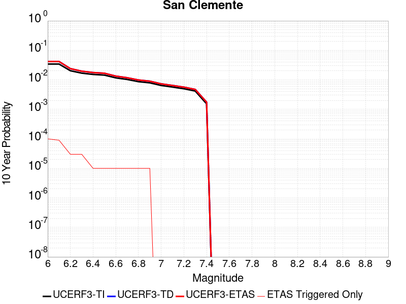 |

| Magnitude | 1 wk TI Prob | 1 wk TD Prob | 1 wk ETAS Prob | 1 wk ETAS/TD Gain | 1 wk ETAS Triggered Only | 1 mo TI Prob | 1 mo TD Prob | 1 mo ETAS Prob | 1 mo ETAS/TD Gain | 1 mo ETAS Triggered Only | 1 yr TI Prob | 1 yr TD Prob | 1 yr ETAS Prob | 1 yr ETAS/TD Gain | 1 yr ETAS Triggered Only | 10 yr TI Prob | 10 yr TD Prob | 10 yr ETAS Prob | 10 yr ETAS/TD Gain | 10 yr ETAS Triggered Only |
|-----|-----|-----|-----|-----|-----|-----|-----|-----|-----|-----|-----|-----|-----|-----|-----|-----|-----|-----|-----|-----|
| 6.0 | 6.681379E-5 | 8.163422E-5 | 1.8275865E-4 | 2.2387505 | 1.0113269E-4 | 2.8631336E-4 | 3.498173E-4 | 4.509146E-4 | 1.2890003 | 1.0113269E-4 | 0.003480294 | 0.0042512873 | 0.0043519903 | 1.0236876 | 1.0113269E-4 | 0.03426291 | 0.041755714 | 0.041852623 | 1.0023209 | 1.0113269E-4 |
| 6.1 | 6.681379E-5 | 8.163422E-5 | 1.8275865E-4 | 2.2387505 | 1.0113269E-4 | 2.8631336E-4 | 3.498173E-4 | 4.509146E-4 | 1.2890003 | 1.0113269E-4 | 0.003480294 | 0.0042512873 | 0.0043519903 | 1.0236876 | 1.0113269E-4 | 0.03426291 | 0.041755714 | 0.041852623 | 1.0023209 | 1.0113269E-4 |
| 6.2 | 3.9400576E-5 | 4.6451984E-5 | 4.6451984E-5 | 1.0 | 0.0 | 1.6884868E-4 | 1.9906509E-4 | 1.9906509E-4 | 1.0 | 0.0 | 0.0020537945 | 0.002420985 | 0.002420985 | 1.0 | 0.0 | 0.020349167 | 0.02395286 | 0.02395286 | 1.0 | 0.0 |
| 6.3 | 3.2590255E-5 | 3.7929087E-5 | 3.7929087E-5 | 1.0 | 0.0 | 1.3966505E-4 | 1.6254328E-4 | 1.6254328E-4 | 1.0 | 0.0 | 0.0016990956 | 0.0019771985 | 0.0019771985 | 1.0 | 0.0 | 0.01686163 | 0.019599866 | 0.019599866 | 1.0 | 0.0 |
| 6.4 | 2.9454652E-5 | 3.4097775E-5 | 3.4097775E-5 | 1.0 | 0.0 | 1.2622811E-4 | 1.4612528E-4 | 1.4612528E-4 | 1.0 | 0.0 | 0.0015357438 | 0.0017776482 | 0.0017776482 | 1.0 | 0.0 | 0.015251739 | 0.017637458 | 0.017637458 | 1.0 | 0.0 |
| 6.5 | 2.790836E-5 | 3.2247463E-5 | 3.2247463E-5 | 1.0 | 0.0 | 1.1960178E-4 | 1.3819622E-4 | 1.3819622E-4 | 1.0 | 0.0 | 0.001455179 | 0.0016812651 | 0.0016812651 | 1.0 | 0.0 | 0.014456868 | 0.016688475 | 0.016688475 | 1.0 | 0.0 |
| 6.6 | 2.2492153E-5 | 2.5762707E-5 | 2.5762707E-5 | 1.0 | 0.0 | 9.639138E-5 | 1.1040701E-4 | 1.1040701E-4 | 1.0 | 0.0 | 0.0011729331 | 0.0013433908 | 0.0013433908 | 1.0 | 0.0 | 0.011667615 | 0.013354415 | 0.013354415 | 1.0 | 0.0 |
| 6.7 | 1.9862755E-5 | 2.2666423E-5 | 2.2666423E-5 | 1.0 | 0.0 | 8.512331E-5 | 9.713826E-5 | 9.713826E-5 | 1.0 | 0.0 | 0.0010358836 | 0.0011820279 | 0.0011820279 | 1.0 | 0.0 | 0.010310682 | 0.011758701 | 0.011758701 | 1.0 | 0.0 |
| 6.8 | 1.6697575E-5 | 1.897771E-5 | 1.897771E-5 | 1.0 | 0.0 | 7.155907E-5 | 8.133056E-5 | 8.133056E-5 | 1.0 | 0.0 | 8.7088346E-4 | 9.897591E-4 | 9.897591E-4 | 1.0 | 0.0 | 0.008674784 | 0.0098545365 | 0.0098545365 | 1.0 | 0.0 |
| 6.9 | 1.5218415E-5 | 1.72694E-5 | 1.72694E-5 | 1.0 | 0.0 | 6.522015E-5 | 7.4009666E-5 | 7.4009666E-5 | 1.0 | 0.0 | 7.93766E-4 | 9.00704E-4 | 9.00704E-4 | 1.0 | 0.0 | 0.007909367 | 0.008971481 | 0.008971481 | 1.0 | 0.0 |
| 7.0 | 1.2392958E-5 | 1.4033016E-5 | 1.4033016E-5 | 1.0 | 0.0 | 5.3111595E-5 | 6.014015E-5 | 6.014015E-5 | 1.0 | 0.0 | 6.4644177E-4 | 7.319679E-4 | 7.319679E-4 | 1.0 | 0.0 | 0.0064456454 | 0.0072963564 | 0.0072963564 | 1.0 | 0.0 |
| 7.1 | 1.0934128E-5 | 1.2375138E-5 | 1.2375138E-5 | 1.0 | 0.0 | 4.6859706E-5 | 5.303527E-5 | 5.303527E-5 | 1.0 | 0.0 | 5.7036756E-4 | 6.455204E-4 | 6.455204E-4 | 1.0 | 0.0 | 0.0056890585 | 0.0064371997 | 0.0064371997 | 1.0 | 0.0 |
| 7.2 | 9.5798805E-6 | 1.0844935E-5 | 1.0844935E-5 | 1.0 | 0.0 | 4.1055984E-5 | 4.6477508E-5 | 4.6477508E-5 | 1.0 | 0.0 | 4.9974193E-4 | 5.657239E-4 | 5.657239E-4 | 1.0 | 0.0 | 0.0049861963 | 0.0056435615 | 0.0056435615 | 1.0 | 0.0 |
| 7.3 | 8.0167365E-6 | 9.083918E-6 | 9.083918E-6 | 1.0 | 0.0 | 3.4356988E-5 | 3.8930535E-5 | 3.8930535E-5 | 1.0 | 0.0 | 4.1821605E-4 | 4.7388324E-4 | 4.7388324E-4 | 1.0 | 0.0 | 0.0041742986 | 0.0047294297 | 0.0047294297 | 1.0 | 0.0 |
| 7.4 | 2.9581017E-6 | 3.3623792E-6 | 3.3623792E-6 | 1.0 | 0.0 | 1.2677518E-5 | 1.4410146E-5 | 1.4410146E-5 | 1.0 | 0.0 | 1.5433785E-4 | 1.7543444E-4 | 1.7543444E-4 | 1.0 | 0.0 | 0.001542307 | 0.0017534546 | 0.0017534546 | 1.0 | 0.0 |

## Camp Rock 2011
*[(top)](#table-of-contents)*

| 1 Week | 1 Month | 1 Year | 10 Year |
|-----|-----|-----|-----|
|  |  |  |  |

| Magnitude | 1 wk TI Prob | 1 wk TD Prob | 1 wk ETAS Prob | 1 wk ETAS/TD Gain | 1 wk ETAS Triggered Only | 1 mo TI Prob | 1 mo TD Prob | 1 mo ETAS Prob | 1 mo ETAS/TD Gain | 1 mo ETAS Triggered Only | 1 yr TI Prob | 1 yr TD Prob | 1 yr ETAS Prob | 1 yr ETAS/TD Gain | 1 yr ETAS Triggered Only | 10 yr TI Prob | 10 yr TD Prob | 10 yr ETAS Prob | 10 yr ETAS/TD Gain | 10 yr ETAS Triggered Only |
|-----|-----|-----|-----|-----|-----|-----|-----|-----|-----|-----|-----|-----|-----|-----|-----|-----|-----|-----|-----|-----|
| 6.0 | 1.6710783E-5 | 4.25026E-6 | 1.0538252E-4 | 24.794369 | 1.0113269E-4 | 7.161568E-5 | 1.8215276E-5 | 1.1934612E-4 | 6.5519795 | 1.0113269E-4 | 8.7157206E-4 | 2.2174895E-4 | 3.228592E-4 | 1.4559672 | 1.0113269E-4 | 0.008681616 | 0.0022153298 | 0.0023162384 | 1.0455502 | 1.0113269E-4 |
| 6.1 | 1.6710783E-5 | 4.25026E-6 | 1.0538252E-4 | 24.794369 | 1.0113269E-4 | 7.161568E-5 | 1.8215276E-5 | 1.1934612E-4 | 6.5519795 | 1.0113269E-4 | 8.7157206E-4 | 2.2174895E-4 | 3.228592E-4 | 1.4559672 | 1.0113269E-4 | 0.008681616 | 0.0022153298 | 0.0023162384 | 1.0455502 | 1.0113269E-4 |
| 6.2 | 1.6710783E-5 | 4.25026E-6 | 1.0538252E-4 | 24.794369 | 1.0113269E-4 | 7.161568E-5 | 1.8215276E-5 | 1.1934612E-4 | 6.5519795 | 1.0113269E-4 | 8.7157206E-4 | 2.2174895E-4 | 3.228592E-4 | 1.4559672 | 1.0113269E-4 | 0.008681616 | 0.0022153298 | 0.0023162384 | 1.0455502 | 1.0113269E-4 |
| 6.3 | 1.6710783E-5 | 4.25026E-6 | 1.0538252E-4 | 24.794369 | 1.0113269E-4 | 7.161568E-5 | 1.8215276E-5 | 1.1934612E-4 | 6.5519795 | 1.0113269E-4 | 8.7157206E-4 | 2.2174895E-4 | 3.228592E-4 | 1.4559672 | 1.0113269E-4 | 0.008681616 | 0.0022153298 | 0.0023162384 | 1.0455502 | 1.0113269E-4 |
| 6.4 | 7.982846E-6 | 3.6820884E-6 | 1.04814404E-4 | 28.466019 | 1.0113269E-4 | 3.421175E-5 | 1.5780286E-5 | 1.16911375E-4 | 7.408698 | 1.0113269E-4 | 4.1644843E-4 | 1.9210839E-4 | 2.9322164E-4 | 1.5263344 | 1.0113269E-4 | 0.0041566887 | 0.001919458 | 0.0020203965 | 1.052587 | 1.0113269E-4 |
| 6.5 | 7.982846E-6 | 3.6820884E-6 | 1.04814404E-4 | 28.466019 | 1.0113269E-4 | 3.421175E-5 | 1.5780286E-5 | 1.16911375E-4 | 7.408698 | 1.0113269E-4 | 4.1644843E-4 | 1.9210839E-4 | 2.9322164E-4 | 1.5263344 | 1.0113269E-4 | 0.0041566887 | 0.001919458 | 0.0020203965 | 1.052587 | 1.0113269E-4 |
| 6.6 | 7.048869E-6 | 3.4243571E-6 | 1.045567E-4 | 30.533234 | 1.0113269E-4 | 3.0209088E-5 | 1.4675736E-5 | 1.15806935E-4 | 7.891048 | 1.0113269E-4 | 3.677336E-4 | 1.7866275E-4 | 2.7977736E-4 | 1.5659524 | 1.0113269E-4 | 0.0036712566 | 0.0017852228 | 0.0018861749 | 1.0565487 | 1.0113269E-4 |
| 6.7 | 6.987307E-6 | 3.3623348E-6 | 1.04494684E-4 | 31.078012 | 1.0113269E-4 | 2.9945259E-5 | 1.4409929E-5 | 1.1554116E-4 | 8.018164 | 1.0113269E-4 | 3.6452254E-4 | 1.7542706E-4 | 2.76542E-4 | 1.5763931 | 1.0113269E-4 | 0.0036392517 | 0.001752917 | 0.0018538723 | 1.0575927 | 1.0113269E-4 |
| 6.8 | 6.3737602E-6 | 3.1179077E-6 | 1.0425028E-4 | 33.435974 | 1.0113269E-4 | 2.731583E-5 | 1.3362394E-5 | 1.1449373E-4 | 8.568355 | 1.0113269E-4 | 3.3251947E-4 | 1.626753E-4 | 2.6379153E-4 | 1.6215832 | 1.0113269E-4 | 0.0033202237 | 0.0016255907 | 0.001726559 | 1.0621117 | 1.0113269E-4 |
| 6.9 | 6.112211E-6 | 2.9331156E-6 | 1.04065504E-4 | 35.47951 | 1.0113269E-4 | 2.6194928E-5 | 1.2570436E-5 | 1.1370185E-4 | 9.045179 | 1.0113269E-4 | 3.1887658E-4 | 1.5303459E-4 | 2.541518E-4 | 1.6607474 | 1.0113269E-4 | 0.003184194 | 0.0015293199 | 0.0016302979 | 1.0660281 | 1.0113269E-4 |
| 7.0 | 5.5140117E-6 | 2.641923E-6 | 1.0377434E-4 | 39.27985 | 1.0113269E-4 | 2.3631264E-5 | 1.132248E-5 | 1.1245402E-4 | 9.931926 | 1.0113269E-4 | 2.8767265E-4 | 1.3784273E-4 | 2.3896147E-4 | 1.7335806 | 1.0113269E-4 | 0.0028730053 | 0.0013775975 | 0.0014785909 | 1.0733112 | 1.0113269E-4 |
| 7.1 | 4.8151105E-6 | 2.1342705E-6 | 1.0326674E-4 | 48.385033 | 1.0113269E-4 | 2.0636026E-5 | 9.146843E-6 | 1.10278605E-4 | 12.056467 | 1.0113269E-4 | 2.5121463E-4 | 1.1135734E-4 | 2.1247876E-4 | 1.9080805 | 1.0113269E-4 | 0.0025093083 | 0.0011130372 | 0.0012140574 | 1.0907608 | 1.0113269E-4 |
| 7.2 | 3.818335E-6 | 1.2937425E-6 | 1.024263E-4 | 79.17055 | 1.0113269E-4 | 1.6364189E-5 | 5.5445994E-6 | 1.0667672E-4 | 19.239754 | 1.0113269E-4 | 1.9921579E-4 | 6.750349E-5 | 1.6862934E-4 | 2.4980834 | 1.0113269E-4 | 0.0019903728 | 6.748381E-4 | 7.759025E-4 | 1.1497611 | 1.0113269E-4 |
| 7.3 | 2.7166698E-6 | 7.3835776E-7 | 1.01870966E-4 | 137.96967 | 1.0113269E-4 | 1.1642818E-5 | 3.1643867E-6 | 1.04296756E-4 | 32.95955 | 1.0113269E-4 | 1.4174209E-4 | 3.8525748E-5 | 1.3965454E-4 | 3.6249664 | 1.0113269E-4 | 0.0014165172 | 3.851927E-4 | 4.8628642E-4 | 1.2624497 | 1.0113269E-4 |
| 7.4 | 2.0893426E-6 | 5.4618386E-7 | 1.01678816E-4 | 186.16225 | 1.0113269E-4 | 8.954295E-6 | 2.3407858E-6 | 1.03473234E-4 | 44.204487 | 1.0113269E-4 | 1.0901308E-4 | 2.84987E-5 | 1.296285E-4 | 4.548576 | 1.0113269E-4 | 0.0010895962 | 2.84951E-4 | 3.8605486E-4 | 1.3548114 | 1.0113269E-4 |
| 7.5 | 1.1681728E-6 | 3.6030585E-7 | 1.0149296E-4 | 281.68555 | 1.0113269E-4 | 5.0064455E-6 | 1.544167E-6 | 1.026767E-4 | 66.493256 | 1.0113269E-4 | 6.0951766E-5 | 1.8800076E-5 | 1.1993086E-4 | 6.3792753 | 1.0113269E-4 | 6.093505E-4 | 1.8798532E-4 | 2.89099E-4 | 1.5378807 | 1.0113269E-4 |
| 7.6 | 1.3154387E-7 | 7.1197384E-8 | 7.1197384E-8 | 1.0 | 0.0 | 5.6375933E-7 | 3.051316E-7 | 3.051316E-7 | 1.0 | 0.0 | 6.863748E-6 | 3.7149728E-6 | 3.7149728E-6 | 1.0 | 0.0 | 6.863536E-5 | 3.7149264E-5 | 3.7149264E-5 | 1.0 | 0.0 |

## Sheephole
*[(top)](#table-of-contents)*

| 1 Week | 1 Month | 1 Year | 10 Year |
|-----|-----|-----|-----|
| 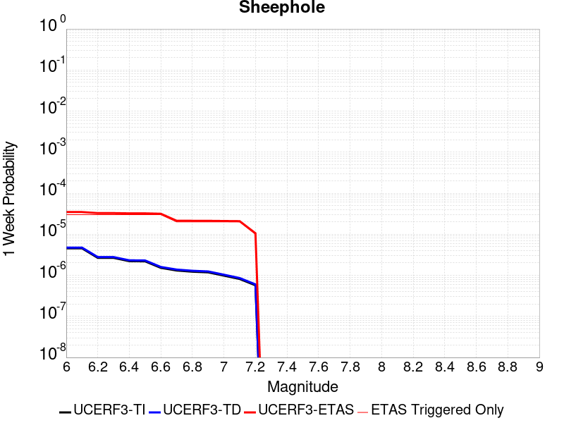 |  |  |  |

| Magnitude | 1 wk TI Prob | 1 wk TD Prob | 1 wk ETAS Prob | 1 wk ETAS/TD Gain | 1 wk ETAS Triggered Only | 1 mo TI Prob | 1 mo TD Prob | 1 mo ETAS Prob | 1 mo ETAS/TD Gain | 1 mo ETAS Triggered Only | 1 yr TI Prob | 1 yr TD Prob | 1 yr ETAS Prob | 1 yr ETAS/TD Gain | 1 yr ETAS Triggered Only | 10 yr TI Prob | 10 yr TD Prob | 10 yr ETAS Prob | 10 yr ETAS/TD Gain | 10 yr ETAS Triggered Only |
|-----|-----|-----|-----|-----|-----|-----|-----|-----|-----|-----|-----|-----|-----|-----|-----|-----|-----|-----|-----|-----|
| 6.0 | 4.5579695E-6 | 4.7412627E-6 | 4.7412627E-6 | 1.0 | 0.0 | 1.9534009E-5 | 2.031957E-5 | 1.21450204E-4 | 5.9770064 | 1.0113269E-4 | 2.3780059E-4 | 2.473682E-4 | 3.4847588E-4 | 1.4087335 | 1.0113269E-4 | 0.0023754628 | 0.002471473 | 0.0025723558 | 1.0408188 | 1.0113269E-4 |
| 6.1 | 4.5579695E-6 | 4.7412627E-6 | 4.7412627E-6 | 1.0 | 0.0 | 1.9534009E-5 | 2.031957E-5 | 1.21450204E-4 | 5.9770064 | 1.0113269E-4 | 2.3780059E-4 | 2.473682E-4 | 3.4847588E-4 | 1.4087335 | 1.0113269E-4 | 0.0023754628 | 0.002471473 | 0.0025723558 | 1.0408188 | 1.0113269E-4 |
| 6.2 | 2.6677674E-6 | 2.7873941E-6 | 2.7873941E-6 | 1.0 | 0.0 | 1.1433239E-5 | 1.1945926E-5 | 1.130774E-4 | 9.465771 | 1.0113269E-4 | 1.3919079E-4 | 1.4543302E-4 | 2.46551E-4 | 1.695289 | 1.0113269E-4 | 0.0013910364 | 0.0014534844 | 0.00155447 | 1.0694784 | 1.0113269E-4 |
| 6.3 | 2.6677674E-6 | 2.7873941E-6 | 2.7873941E-6 | 1.0 | 0.0 | 1.1433239E-5 | 1.1945926E-5 | 1.130774E-4 | 9.465771 | 1.0113269E-4 | 1.3919079E-4 | 1.4543302E-4 | 2.46551E-4 | 1.695289 | 1.0113269E-4 | 0.0013910364 | 0.0014534844 | 0.00155447 | 1.0694784 | 1.0113269E-4 |
| 6.4 | 2.2159759E-6 | 2.3228788E-6 | 2.3228788E-6 | 1.0 | 0.0 | 9.497005E-6 | 9.955161E-6 | 1.1108684E-4 | 11.158718 | 1.0113269E-4 | 1.156199E-4 | 1.2119815E-4 | 2.2231859E-4 | 1.8343397 | 1.0113269E-4 | 0.0011555976 | 0.0012113999 | 0.0013124101 | 1.083383 | 1.0113269E-4 |
| 6.5 | 2.1986082E-6 | 2.304759E-6 | 2.304759E-6 | 1.0 | 0.0 | 9.4225725E-6 | 9.877506E-6 | 1.1100919E-4 | 11.238585 | 1.0113269E-4 | 1.1471378E-4 | 1.2025281E-4 | 2.2137332E-4 | 1.8408995 | 1.0113269E-4 | 0.0011465458 | 0.0012019566 | 0.0013029678 | 1.0840389 | 1.0113269E-4 |
| 6.6 | 1.5232331E-6 | 1.6018919E-6 | 1.6018919E-6 | 1.0 | 0.0 | 6.5281256E-6 | 6.865234E-6 | 1.0799723E-4 | 15.731034 | 1.0113269E-4 | 7.947703E-5 | 8.35812E-5 | 1.8470544E-4 | 2.209892 | 1.0113269E-4 | 7.9448614E-4 | 8.3551643E-4 | 9.365646E-4 | 1.120941 | 1.0113269E-4 |
| 6.7 | 1.3137362E-6 | 1.382819E-6 | 1.382819E-6 | 1.0 | 0.0 | 5.6302856E-6 | 5.926355E-6 | 5.926355E-6 | 1.0 | 0.0 | 6.854657E-5 | 7.215112E-5 | 7.215112E-5 | 1.0 | 0.0 | 6.8525434E-4 | 7.212908E-4 | 7.212908E-4 | 1.0 | 0.0 |
| 6.8 | 1.2275751E-6 | 1.2922847E-6 | 1.2922847E-6 | 1.0 | 0.0 | 5.2610258E-6 | 5.5383516E-6 | 5.5383516E-6 | 1.0 | 0.0 | 6.4051106E-5 | 6.7427485E-5 | 6.7427485E-5 | 1.0 | 0.0 | 6.4032647E-4 | 6.740836E-4 | 6.740836E-4 | 1.0 | 0.0 |
| 6.9 | 1.1837088E-6 | 1.246102E-6 | 1.246102E-6 | 1.0 | 0.0 | 5.0730278E-6 | 5.340427E-6 | 5.340427E-6 | 1.0 | 0.0 | 6.176237E-5 | 6.501789E-5 | 6.501789E-5 | 1.0 | 0.0 | 6.17452E-4 | 6.5000186E-4 | 6.5000186E-4 | 1.0 | 0.0 |
| 7.0 | 9.849371E-7 | 1.0366288E-6 | 1.0366288E-6 | 1.0 | 0.0 | 4.2211523E-6 | 4.442688E-6 | 4.442688E-6 | 1.0 | 0.0 | 5.1391315E-5 | 5.4088487E-5 | 5.4088487E-5 | 1.0 | 0.0 | 5.137943E-4 | 5.407633E-4 | 5.407633E-4 | 1.0 | 0.0 |
| 7.1 | 8.1643645E-7 | 8.591669E-7 | 8.591669E-7 | 1.0 | 0.0 | 3.4990085E-6 | 3.682139E-6 | 3.682139E-6 | 1.0 | 0.0 | 4.2599597E-5 | 4.482921E-5 | 4.482921E-5 | 1.0 | 0.0 | 4.259143E-4 | 4.4821028E-4 | 4.4821028E-4 | 1.0 | 0.0 |
| 7.2 | 5.7295756E-7 | 6.029502E-7 | 6.029502E-7 | 1.0 | 0.0 | 2.45553E-6 | 2.58407E-6 | 2.58407E-6 | 1.0 | 0.0 | 2.9895667E-5 | 3.1460666E-5 | 3.1460666E-5 | 1.0 | 0.0 | 2.9891645E-4 | 3.145688E-4 | 3.145688E-4 | 1.0 | 0.0 |

