# Parent Section Magnitude-Probability Distributions

Only fault sections with at least one triggered aftershock are plotted. Sections are sorted by total supraseismogenic trigger rate (decreasing)

## Table Of Contents

* [Tank Canyon](#tank-canyon)
* [Garlock (Central)](#garlock-central)
* [Panamint Valley](#panamint-valley)
* [Little Lake](#little-lake)
* [Owl Lake](#owl-lake)
* [Ash Hill](#ash-hill)
* [Garlock (East)](#garlock-east)
* [Blackwater](#blackwater)
* [Gravel Hills-Harper Lk](#gravel-hills-harper-lk)
* [Hunter Mountain-Saline Valley](#hunter-mountain-saline-valley)
* [Goldstone Lake](#goldstone-lake)
* [Airport Lake](#airport-lake)
* [McLean Lake](#mclean-lake)
* [So Sierra Nevada](#so-sierra-nevada)
* [Garlock (West)](#garlock-west)
* [Lenwood-Lockhart-Old Woman Springs](#lenwood-lockhart-old-woman-springs)
* [Nelson Lake](#nelson-lake)
* [Coyote Canyon](#coyote-canyon)
* [San Andreas (Mojave S)](#san-andreas-mojave-s)
* [Paradise](#paradise)
* [Death Valley (So)](#death-valley-so)
* [San Andreas (San Bernardino N)](#san-andreas-san-bernardino-n)
* [San Andreas (Mojave N)](#san-andreas-mojave-n)
* [Helendale-So Lockhart](#helendale-so-lockhart)
* [Bicycle Lake](#bicycle-lake)
* [Garlic Springs](#garlic-springs)
* [Towne Pass](#towne-pass)
* [Death Valley (Black Mtns Frontal)](#death-valley-black-mtns-frontal)
* [Elsinore (Glen Ivy) rev](#elsinore-glen-ivy-rev)
* [Cleghorn Lake](#cleghorn-lake)
* [San Andreas (San Bernardino S)](#san-andreas-san-bernardino-s)
* [Mission Ridge-Arroyo Parida-Santa Ana](#mission-ridge-arroyo-parida-santa-ana)
* [Cady](#cady)
* [Coyote Lake](#coyote-lake)
* [San Andreas (Coachella) rev](#san-andreas-coachella-rev)
* [Scodie Lineament](#scodie-lineament)
* [San Andreas (Big Bend)](#san-andreas-big-bend)
* [White Wolf (Extension)](#white-wolf-extension)
* [Lake Isabella (Seismicity)](#lake-isabella-seismicity)
* [Red Pass](#red-pass)
* [San Andreas (Cholame) rev](#san-andreas-cholame-rev)
* [Imperial](#imperial)
* [San Diego Trough north alt1](#san-diego-trough-north-alt1)
* [San Andreas (Parkfield)](#san-andreas-parkfield)
* [Dry Mountain](#dry-mountain)
* [Ludlow](#ludlow)
* [Calico-Hidalgo](#calico-hidalgo)
* [San Jacinto (San Bernardino)](#san-jacinto-san-bernardino)
* [Owens Valley](#owens-valley)
* [Death Valley (No)](#death-valley-no)
* [Channel Islands Thrust](#channel-islands-thrust)
* [Sierra Nevada  (No Extension)](#sierra-nevada--no-extension)
* [San Andreas (Carrizo) rev](#san-andreas-carrizo-rev)
* [Brawley (Seismic Zone) alt 1](#brawley-seismic-zone-alt-1)
* [Santa Ynez (East)](#santa-ynez-east)
* [Cleghorn Pass](#cleghorn-pass)
* [San Andreas (San Gorgonio Pass-Garnet HIll)](#san-andreas-san-gorgonio-pass-garnet-hill)
* [Hosgri](#hosgri)
* [Blue Cut](#blue-cut)
* [San Gregorio (North) 2011 CFM](#san-gregorio-north-2011-cfm)
* [Hosgri (Extension)](#hosgri-extension)
* [White Mountains](#white-mountains)
* [San Jacinto (Borrego)](#san-jacinto-borrego)
* [Hayward (No) 2011 CFM](#hayward-no-2011-cfm)
* [Hayward (So) extension 2011 CFM](#hayward-so-extension-2011-cfm)
* [Great Valley 08 (Quinto)](#great-valley-08-quinto)
* [Goose Lake 2011 CFM](#goose-lake-2011-cfm)
* [Pleito](#pleito)
* [Manix-Afton Hills](#manix-afton-hills)
* [Santa Cruz Island](#santa-cruz-island)
* [San Jacinto (Stepovers Combined)](#san-jacinto-stepovers-combined)
* [Emerson-Copper Mtn 2011](#emerson-copper-mtn-2011)
* [Elsinore (Coyote Mountains)](#elsinore-coyote-mountains)
* [San Jacinto (Anza) rev](#san-jacinto-anza-rev)
* [Likely 2011 CFM](#likely-2011-cfm)
* [Hayward (So) 2011 CFM](#hayward-so-2011-cfm)
* [White Wolf](#white-wolf)
* [Rodgers Creek - Healdsburg 2011 CFM](#rodgers-creek---healdsburg-2011-cfm)
* [Great Valley 01](#great-valley-01)
* [San Jacinto (San Jacinto Valley) rev](#san-jacinto-san-jacinto-valley-rev)
* [San Andreas (Creeping Section) 2011 CFM](#san-andreas-creeping-section-2011-cfm)
* [San Diego Trough south](#san-diego-trough-south)
* [Santa Ynez (West)](#santa-ynez-west)
* [Thirty Mile Bank](#thirty-mile-bank)
* [San Jacinto (Coyote Creek)](#san-jacinto-coyote-creek)
* [Death Valley (Fish Lake Valley)](#death-valley-fish-lake-valley)
* [Lost Hills](#lost-hills)
* [Kern Canyon (South Kern) 2011](#kern-canyon-south-kern-2011)
* [Big Pine (East)](#big-pine-east)
* [San Clemente](#san-clemente)
* [Camp Rock 2011](#camp-rock-2011)
* [Sheephole](#sheephole)

## Tank Canyon
*[(top)](#table-of-contents)*

| 1 Week | 1 Month | 1 Year | 10 Year |
|-----|-----|-----|-----|
|  |  |  |  |

| Magnitude | 1 wk TI Prob | 1 wk TD Prob | 1 wk ETAS Prob | 1 wk ETAS/TD Gain | 1 wk ETAS Triggered Only | 1 mo TI Prob | 1 mo TD Prob | 1 mo ETAS Prob | 1 mo ETAS/TD Gain | 1 mo ETAS Triggered Only | 1 yr TI Prob | 1 yr TD Prob | 1 yr ETAS Prob | 1 yr ETAS/TD Gain | 1 yr ETAS Triggered Only | 10 yr TI Prob | 10 yr TD Prob | 10 yr ETAS Prob | 10 yr ETAS/TD Gain | 10 yr ETAS Triggered Only |
|-----|-----|-----|-----|-----|-----|-----|-----|-----|-----|-----|-----|-----|-----|-----|-----|-----|-----|-----|-----|-----|
| 6.0 | 4.8284557E-5 | 5.7964822E-5 | 0.035944387 | 620.1069 | 0.0358885 | 2.0691741E-4 | 2.4840087E-4 | 0.050294038 | 202.47127 | 0.05005807 | 0.0025163088 | 0.0030207601 | 0.08141274 | 26.951077 | 0.0786295 | 0.02488006 | 0.029863637 | 0.13375048 | 4.4787073 | 0.10708479 |
| 6.1 | 1.7796336E-5 | 2.0873314E-5 | 0.012448024 | 596.36066 | 0.01242741 | 7.626778E-5 | 8.945422E-5 | 0.018786969 | 210.0177 | 0.018699188 | 9.281647E-4 | 0.0010885983 | 0.03415361 | 31.373936 | 0.033101045 | 0.009242975 | 0.010836744 | 0.057250444 | 5.2829933 | 0.046922185 |
| 6.2 | 1.7796336E-5 | 2.0873314E-5 | 0.012448024 | 596.36066 | 0.01242741 | 7.626778E-5 | 8.945422E-5 | 0.018786969 | 210.0177 | 0.018699188 | 9.281647E-4 | 0.0010885983 | 0.03415361 | 31.373936 | 0.033101045 | 0.009242975 | 0.010836744 | 0.057250444 | 5.2829933 | 0.046922185 |
| 6.3 | 1.3515912E-5 | 1.5759564E-5 | 0.010003988 | 634.7883 | 0.009988385 | 5.792405E-5 | 6.753938E-5 | 0.0150491055 | 222.81972 | 0.014982578 | 7.049971E-4 | 8.2200574E-4 | 0.025772443 | 31.353119 | 0.024970964 | 0.007027647 | 0.0081922645 | 0.043556374 | 5.316768 | 0.035656214 |
| 6.4 | 1.0870146E-5 | 1.2618021E-5 | 0.007329599 | 580.8834 | 0.007317073 | 4.658551E-5 | 5.4076212E-5 | 0.010854886 | 200.73311 | 0.010801394 | 5.67031E-4 | 6.581969E-4 | 0.018880805 | 28.68565 | 0.01823461 | 0.005655863 | 0.0065644905 | 0.03264073 | 4.972317 | 0.026248548 |
| 6.5 | 7.964826E-6 | 9.196094E-6 | 0.004771057 | 518.8134 | 0.004761905 | 3.4134522E-5 | 3.9411298E-5 | 0.007356196 | 186.65196 | 0.007317073 | 4.1550855E-4 | 4.7973756E-4 | 0.012785098 | 26.65019 | 0.012311266 | 0.0041473247 | 0.004788321 | 0.022704443 | 4.741629 | 0.018002324 |
| 6.6 | 6.6317E-6 | 7.6122988E-6 | 0.0027950476 | 367.17523 | 0.0027874564 | 2.8421264E-5 | 3.2623782E-5 | 0.004678233 | 143.39948 | 0.0046457606 | 3.4597394E-4 | 3.9713128E-4 | 0.008407886 | 21.171553 | 0.008013938 | 0.0034543579 | 0.003965368 | 0.016227815 | 4.092386 | 0.012311266 |
| 6.7 | 4.793663E-6 | 5.4307857E-6 | 0.0010507213 | 193.475 | 0.0010452962 | 2.0544108E-5 | 2.3274613E-5 | 0.002346101 | 100.80086 | 0.0023228803 | 2.500958E-4 | 2.8333595E-4 | 0.0048116692 | 16.982206 | 0.004529617 | 0.0024981452 | 0.0028304397 | 0.009895172 | 3.495984 | 0.007084785 |
| 6.8 | 4.382823E-6 | 4.9692567E-6 | 9.341168E-4 | 187.97917 | 9.291521E-4 | 1.8783392E-5 | 2.1296666E-5 | 0.002227986 | 104.61666 | 0.0022067362 | 2.286638E-4 | 2.5926033E-4 | 0.004439361 | 17.123178 | 0.004181185 | 0.0022842865 | 0.002590253 | 0.009077471 | 3.5044727 | 0.006504065 |
| 6.9 | 2.729601E-6 | 3.0735416E-6 | 6.9993554E-4 | 227.72931 | 6.968641E-4 | 1.1698237E-5 | 1.3172262E-5 | 0.0011745972 | 89.17201 | 0.0011614402 | 1.4241673E-4 | 1.6036171E-4 | 0.0022506188 | 14.034639 | 0.0020905924 | 0.001423255 | 0.0016026258 | 0.004617531 | 2.8812282 | 0.0030197445 |
| 7.0 | 1.8987357E-6 | 2.126939E-6 | 4.66702E-4 | 219.42426 | 4.6457606E-4 | 8.137413E-6 | 9.115425E-6 | 8.2211616E-4 | 90.18955 | 8.130081E-4 | 9.90685E-5 | 1.1097535E-4 | 0.0013884178 | 12.511046 | 0.0012775842 | 9.902435E-4 | 0.0011092679 | 0.0028494957 | 2.5688074 | 0.0017421603 |
| 7.1 | 1.4928986E-6 | 1.6641272E-6 | 2.3395178E-4 | 140.58528 | 2.3228803E-4 | 6.398121E-6 | 7.1319573E-6 | 2.3941834E-4 | 33.569794 | 2.3228803E-4 | 7.789434E-5 | 8.682871E-5 | 4.3523053E-4 | 5.0125184 | 3.4843205E-4 | 7.786704E-4 | 8.6800574E-4 | 0.0014482217 | 1.6684473 | 5.807201E-4 |
| 7.2 | 1.069082E-6 | 1.1828573E-6 | 2.3347062E-4 | 197.37852 | 2.3228803E-4 | 4.581772E-6 | 5.0693816E-6 | 2.3735625E-4 | 46.821537 | 2.3228803E-4 | 5.5781646E-5 | 6.171851E-5 | 2.939922E-4 | 4.763437 | 2.3228803E-4 | 5.576765E-4 | 6.170659E-4 | 8.492106E-4 | 1.3762074 | 2.3228803E-4 |
| 7.3 | 8.776551E-7 | 9.770005E-7 | 2.3326481E-4 | 238.75609 | 2.3228803E-4 | 3.7613736E-6 | 4.1871413E-6 | 2.3647421E-4 | 56.47629 | 2.3228803E-4 | 4.579376E-5 | 5.097777E-5 | 2.8325396E-4 | 5.5564213 | 2.3228803E-4 | 4.5784327E-4 | 5.097118E-4 | 7.4188143E-4 | 1.455492 | 2.3228803E-4 |
| 7.4 | 7.55721E-7 | 8.510244E-7 | 2.3313887E-4 | 273.95084 | 2.3228803E-4 | 3.2388E-6 | 3.6472454E-6 | 2.3593444E-4 | 64.68839 | 2.3228803E-4 | 3.9431678E-5 | 4.4404827E-5 | 2.7668255E-4 | 6.2309117 | 2.3228803E-4 | 3.942468E-4 | 4.440104E-4 | 6.761953E-4 | 1.5229267 | 2.3228803E-4 |
| 7.5 | 5.587665E-7 | 6.305619E-7 | 6.305619E-7 | 1.0 | 0.0 | 2.3947114E-6 | 2.702408E-6 | 2.702408E-6 | 1.0 | 0.0 | 2.915522E-5 | 3.290182E-5 | 3.290182E-5 | 1.0 | 0.0 | 2.9151395E-4 | 3.290182E-4 | 3.290182E-4 | 1.0 | 0.0 |

## Garlock (Central)
*[(top)](#table-of-contents)*

| 1 Week | 1 Month | 1 Year | 10 Year |
|-----|-----|-----|-----|
|  |  |  |  |

| Magnitude | 1 wk TI Prob | 1 wk TD Prob | 1 wk ETAS Prob | 1 wk ETAS/TD Gain | 1 wk ETAS Triggered Only | 1 mo TI Prob | 1 mo TD Prob | 1 mo ETAS Prob | 1 mo ETAS/TD Gain | 1 mo ETAS Triggered Only | 1 yr TI Prob | 1 yr TD Prob | 1 yr ETAS Prob | 1 yr ETAS/TD Gain | 1 yr ETAS Triggered Only | 10 yr TI Prob | 10 yr TD Prob | 10 yr ETAS Prob | 10 yr ETAS/TD Gain | 10 yr ETAS Triggered Only |
|-----|-----|-----|-----|-----|-----|-----|-----|-----|-----|-----|-----|-----|-----|-----|-----|-----|-----|-----|-----|-----|
| 6.0 | 5.5131142E-5 | 7.024681E-5 | 0.010987017 | 156.40593 | 0.010917538 | 2.3625491E-4 | 3.010234E-4 | 0.015162983 | 50.371445 | 0.014866434 | 0.0028726095 | 0.0036588663 | 0.027381275 | 7.4835405 | 0.023809524 | 0.028357591 | 0.036079824 | 0.06765073 | 1.8750293 | 0.032752614 |
| 6.1 | 5.5131142E-5 | 7.024681E-5 | 0.010987017 | 156.40593 | 0.010917538 | 2.3625491E-4 | 3.010234E-4 | 0.015162983 | 50.371445 | 0.014866434 | 0.0028726095 | 0.0036588663 | 0.027381275 | 7.4835405 | 0.023809524 | 0.028357591 | 0.036079824 | 0.06765073 | 1.8750293 | 0.032752614 |
| 6.2 | 4.216245E-5 | 5.1661493E-5 | 0.0071360804 | 138.13152 | 0.007084785 | 1.806837E-4 | 2.2138779E-4 | 0.009510852 | 42.960148 | 0.009291521 | 0.0021976046 | 0.0026920962 | 0.018097665 | 6.722518 | 0.015447155 | 0.021759989 | 0.026689773 | 0.047376856 | 1.7750939 | 0.021254355 |
| 6.3 | 4.216245E-5 | 5.1661493E-5 | 0.0071360804 | 138.13152 | 0.007084785 | 1.806837E-4 | 2.2138779E-4 | 0.009510852 | 42.960148 | 0.009291521 | 0.0021976046 | 0.0026920962 | 0.018097665 | 6.722518 | 0.015447155 | 0.021759989 | 0.026689773 | 0.047376856 | 1.7750939 | 0.021254355 |
| 6.4 | 3.6858168E-5 | 4.411054E-5 | 0.005154222 | 116.84785 | 0.005110337 | 1.5795401E-4 | 1.8903162E-4 | 0.0070402334 | 37.243683 | 0.006852497 | 0.0019213937 | 0.002299056 | 0.014002632 | 6.090601 | 0.011730546 | 0.019048655 | 0.02284894 | 0.039305028 | 1.7202122 | 0.016840883 |
| 6.5 | 3.39199E-5 | 4.0018083E-5 | 0.0048017325 | 119.98906 | 0.004761905 | 1.453629E-4 | 1.7149492E-4 | 0.006209948 | 36.210682 | 0.006039489 | 0.0017683565 | 0.002085973 | 0.01251713 | 6.0006194 | 0.010452962 | 0.017543508 | 0.020759864 | 0.035431407 | 1.7067263 | 0.014982578 |
| 6.6 | 3.3571985E-5 | 3.9472274E-5 | 0.004801189 | 121.634476 | 0.004761905 | 1.4387199E-4 | 1.6915603E-4 | 0.0062076235 | 36.697617 | 0.006039489 | 0.0017502342 | 0.0020575512 | 0.0123731 | 6.013508 | 0.010336817 | 0.017365133 | 0.020481179 | 0.03504313 | 1.7109919 | 0.014866434 |
| 6.7 | 3.2580007E-5 | 3.8088703E-5 | 0.0046836725 | 122.9675 | 0.0046457606 | 1.3962112E-4 | 1.632272E-4 | 0.0060856054 | 37.283035 | 0.0059233448 | 0.0016985617 | 0.0019855013 | 0.011954055 | 6.0206738 | 0.009988385 | 0.016856372 | 0.019773813 | 0.033777043 | 1.7081705 | 0.014285714 |
| 6.8 | 3.2185937E-5 | 3.7515918E-5 | 0.0046831025 | 124.829735 | 0.0046457606 | 1.3793244E-4 | 1.6077272E-4 | 0.00596704 | 37.114754 | 0.005807201 | 0.0016780337 | 0.001955672 | 0.011808607 | 6.0381327 | 0.009872242 | 0.016654192 | 0.019480614 | 0.03326027 | 1.7073523 | 0.014053427 |
| 6.9 | 3.165394E-5 | 3.6720503E-5 | 0.004450031 | 121.18655 | 0.0044134725 | 1.3565269E-4 | 1.5736422E-4 | 0.0057313996 | 36.421238 | 0.0055749128 | 0.0016503202 | 0.001914247 | 0.0113039045 | 5.9051437 | 0.009407666 | 0.01638118 | 0.019073246 | 0.032288983 | 1.692894 | 0.013472706 |
| 7.0 | 3.0903822E-5 | 3.5625766E-5 | 0.0042166617 | 118.359886 | 0.004181185 | 1.3243823E-4 | 1.5267303E-4 | 0.0054944823 | 35.988556 | 0.005342625 | 0.0016112428 | 0.0018572307 | 0.0107837105 | 5.806339 | 0.008943089 | 0.015996104 | 0.018512413 | 0.031051744 | 1.6773472 | 0.012775842 |
| 7.1 | 3.0069863E-5 | 3.4392073E-5 | 0.004099293 | 119.19296 | 0.0040650405 | 1.2886449E-4 | 1.4738638E-4 | 0.005373097 | 36.455856 | 0.005226481 | 0.0015677959 | 0.0017929734 | 0.010372221 | 5.7849274 | 0.008594657 | 0.01556781 | 0.017880075 | 0.029857147 | 1.6698558 | 0.0121951215 |
| 7.2 | 2.7957109E-5 | 3.128145E-5 | 0.0037477738 | 119.808174 | 0.0037166085 | 1.1981068E-4 | 1.340566E-4 | 0.0047791945 | 35.650574 | 0.0046457606 | 0.0014577188 | 0.0016309366 | 0.009515849 | 5.8345914 | 0.007897793 | 0.014481937 | 0.016283695 | 0.027366214 | 1.6805899 | 0.01126597 |
| 7.3 | 2.4519275E-5 | 2.6714795E-5 | 0.0026979558 | 100.99107 | 0.0026713125 | 1.0507837E-4 | 1.1448703E-4 | 0.0032500166 | 28.387638 | 0.0031358886 | 0.0012785783 | 0.001393003 | 0.007076132 | 5.0797677 | 0.005691057 | 0.012712469 | 0.013928054 | 0.022173952 | 1.5920352 | 0.00836237 |
| 7.4 | 2.3225532E-5 | 2.51994E-5 | 0.002115739 | 83.9599 | 0.0020905924 | 9.95342E-5 | 1.0799304E-4 | 0.0026628855 | 24.657936 | 0.0025551685 | 0.0012111551 | 0.0013140367 | 0.006069684 | 4.6191134 | 0.004761905 | 0.012045753 | 0.013145725 | 0.020481227 | 1.5580143 | 0.007433217 |
| 7.5 | 2.097765E-5 | 2.2483688E-5 | 0.0017646048 | 78.48378 | 0.0017421603 | 8.9901114E-5 | 9.635517E-5 | 0.002186746 | 22.694641 | 0.0020905924 | 0.0010939965 | 0.0011725046 | 0.005116771 | 4.3639665 | 0.0039488967 | 0.010886264 | 0.011740365 | 0.01782373 | 1.518158 | 0.006155633 |
| 7.6 | 1.511254E-5 | 1.5991332E-5 | 0.0010612708 | 66.36537 | 0.0010452962 | 6.476642E-5 | 6.853253E-5 | 0.0012298931 | 17.946123 | 0.0011614402 | 7.882459E-4 | 8.3407195E-4 | 0.003271062 | 3.9217985 | 0.0024390244 | 0.007854558 | 0.008383559 | 0.011953838 | 1.4258668 | 0.0036004647 |
| 7.7 | 9.934069E-6 | 1.0678794E-5 | 2.4296435E-4 | 22.75204 | 2.3228803E-4 | 4.2573887E-5 | 4.5765457E-5 | 2.7804286E-4 | 6.075387 | 2.3228803E-4 | 5.182138E-4 | 5.570524E-4 | 0.0012535283 | 2.250288 | 6.968641E-4 | 0.00517007 | 0.005627684 | 0.006551607 | 1.1641747 | 9.291521E-4 |
| 7.8 | 6.7562896E-6 | 8.428449E-6 | 2.4071452E-4 | 28.559765 | 2.3228803E-4 | 2.8955206E-5 | 3.6121426E-5 | 2.6840108E-4 | 7.430523 | 2.3228803E-4 | 3.5247262E-4 | 4.3968976E-4 | 0.0011362474 | 2.5842028 | 6.968641E-4 | 0.0035191406 | 0.004446654 | 0.0052560475 | 1.1820229 | 8.130081E-4 |
| 7.9 | 3.975453E-6 | 5.37103E-6 | 1.2151442E-4 | 22.624044 | 1.16144016E-4 | 1.7037546E-5 | 2.3018498E-5 | 1.3915985E-4 | 6.0455656 | 1.16144016E-4 | 2.0741238E-4 | 2.8021427E-4 | 6.285487E-4 | 2.2431002 | 3.4843205E-4 | 0.002072189 | 0.0028336283 | 0.003296888 | 1.1634864 | 4.6457606E-4 |
| 8.0 | 1.6729537E-6 | 2.0775144E-6 | 2.0775144E-6 | 1.0 | 0.0 | 7.169782E-6 | 8.903603E-6 | 8.903603E-6 | 1.0 | 0.0 | 8.7288594E-5 | 1.0839601E-4 | 2.2452744E-4 | 2.0713625 | 1.16144016E-4 | 8.7254314E-4 | 0.0010969337 | 0.001328967 | 1.2115289 | 2.3228803E-4 |
| 8.1 | 3.6733252E-7 | 3.1489964E-7 | 3.1489964E-7 | 1.0 | 0.0 | 1.5742813E-6 | 1.3495693E-6 | 1.3495693E-6 | 1.0 | 0.0 | 1.9166706E-5 | 1.6430899E-5 | 1.6430899E-5 | 1.0 | 0.0 | 1.9165053E-4 | 1.6638759E-4 | 1.6638759E-4 | 1.0 | 0.0 |

## Panamint Valley
*[(top)](#table-of-contents)*

| 1 Week | 1 Month | 1 Year | 10 Year |
|-----|-----|-----|-----|
|  |  |  |  |

| Magnitude | 1 wk TI Prob | 1 wk TD Prob | 1 wk ETAS Prob | 1 wk ETAS/TD Gain | 1 wk ETAS Triggered Only | 1 mo TI Prob | 1 mo TD Prob | 1 mo ETAS Prob | 1 mo ETAS/TD Gain | 1 mo ETAS Triggered Only | 1 yr TI Prob | 1 yr TD Prob | 1 yr ETAS Prob | 1 yr ETAS/TD Gain | 1 yr ETAS Triggered Only | 10 yr TI Prob | 10 yr TD Prob | 10 yr ETAS Prob | 10 yr ETAS/TD Gain | 10 yr ETAS Triggered Only |
|-----|-----|-----|-----|-----|-----|-----|-----|-----|-----|-----|-----|-----|-----|-----|-----|-----|-----|-----|-----|-----|
| 6.0 | 3.0211835E-5 | 3.3984514E-5 | 0.0049118674 | 144.53253 | 0.004878049 | 1.2947287E-4 | 1.4563995E-4 | 0.006881012 | 47.246735 | 0.006736353 | 0.0015751923 | 0.0017717537 | 0.01452496 | 8.19807 | 0.012775842 | 0.015640736 | 0.017583137 | 0.036181737 | 2.0577521 | 0.018931475 |
| 6.1 | 3.0211835E-5 | 3.3984514E-5 | 0.0049118674 | 144.53253 | 0.004878049 | 1.2947287E-4 | 1.4563995E-4 | 0.006881012 | 47.246735 | 0.006736353 | 0.0015751923 | 0.0017717537 | 0.01452496 | 8.19807 | 0.012775842 | 0.015640736 | 0.017583137 | 0.036181737 | 2.0577521 | 0.018931475 |
| 6.2 | 3.0211835E-5 | 3.3984514E-5 | 0.0049118674 | 144.53253 | 0.004878049 | 1.2947287E-4 | 1.4563995E-4 | 0.006881012 | 47.246735 | 0.006736353 | 0.0015751923 | 0.0017717537 | 0.01452496 | 8.19807 | 0.012775842 | 0.015640736 | 0.017583137 | 0.036181737 | 2.0577521 | 0.018931475 |
| 6.3 | 2.8573924E-5 | 3.210268E-5 | 0.0047938544 | 149.3288 | 0.004761905 | 1.2245393E-4 | 1.3757581E-4 | 0.0067568743 | 49.113823 | 0.006620209 | 0.001489857 | 0.0016737265 | 0.014080336 | 8.412567 | 0.01242741 | 0.01479908 | 0.016617801 | 0.03477782 | 2.0928051 | 0.0184669 |
| 6.4 | 2.8573924E-5 | 3.210268E-5 | 0.0047938544 | 149.3288 | 0.004761905 | 1.2245393E-4 | 1.3757581E-4 | 0.0067568743 | 49.113823 | 0.006620209 | 0.001489857 | 0.0016737265 | 0.014080336 | 8.412567 | 0.01242741 | 0.01479908 | 0.016617801 | 0.03477782 | 2.0928051 | 0.0184669 |
| 6.5 | 2.7468774E-5 | 3.0828433E-5 | 0.0045603057 | 147.92531 | 0.004529617 | 1.1771801E-4 | 1.3211532E-4 | 0.0065191924 | 49.34471 | 0.006387921 | 0.0014322745 | 0.0016073446 | 0.013666907 | 8.502787 | 0.012078978 | 0.014230782 | 0.015963677 | 0.033678617 | 2.109703 | 0.018002324 |
| 6.6 | 2.6135967E-5 | 2.925248E-5 | 0.0042103147 | 143.93018 | 0.004181185 | 1.1200648E-4 | 1.253619E-4 | 0.006047964 | 48.244038 | 0.0059233448 | 0.0013628257 | 0.0015252391 | 0.012658059 | 8.299066 | 0.0111498255 | 0.013544982 | 0.015154043 | 0.031625334 | 2.0869238 | 0.01672474 |
| 6.7 | 2.4498746E-5 | 2.7341335E-5 | 0.0037438483 | 136.92998 | 0.0037166085 | 1.04990395E-4 | 1.1717203E-4 | 0.005575301 | 47.582188 | 0.005458769 | 0.0012775084 | 0.0014256609 | 0.011515785 | 8.077506 | 0.01010453 | 0.012701893 | 0.014171274 | 0.029170528 | 2.0584264 | 0.015214866 |
| 6.8 | 2.2244329E-5 | 2.4935423E-5 | 0.0035091692 | 140.73027 | 0.0034843206 | 9.532935E-5 | 1.0686185E-4 | 0.0053327843 | 49.903538 | 0.005226481 | 0.0011600169 | 0.0013002884 | 0.010115756 | 7.7796254 | 0.008826945 | 0.011539802 | 0.0129325185 | 0.026460273 | 2.0460262 | 0.013704994 |
| 6.9 | 1.9902658E-5 | 2.2290267E-5 | 0.0031581088 | 141.68108 | 0.0031358886 | 8.529431E-5 | 9.552632E-5 | 0.004160179 | 43.55008 | 0.0040650405 | 0.0010379635 | 0.0011624309 | 0.0076589356 | 6.588723 | 0.006504065 | 0.010331288 | 0.011568608 | 0.02121184 | 1.833569 | 0.009756098 |
| 7.0 | 1.8353881E-5 | 2.0566185E-5 | 0.0028079653 | 136.53311 | 0.0027874564 | 7.865712E-5 | 8.813792E-5 | 0.0035721513 | 40.52911 | 0.0034843206 | 9.5722964E-4 | 0.0010725686 | 0.006409463 | 5.975807 | 0.005342625 | 0.009531168 | 0.010678849 | 0.018607207 | 1.7424356 | 0.008013938 |
| 7.1 | 1.7667631E-5 | 1.9772613E-5 | 0.0023426071 | 118.47737 | 0.0023228803 | 7.571623E-5 | 8.473711E-5 | 0.002755823 | 32.522034 | 0.0026713125 | 9.2145515E-4 | 0.0010312037 | 0.0052080764 | 5.050483 | 0.004181185 | 0.009176437 | 0.010269073 | 0.016706347 | 1.6268604 | 0.006504065 |
| 7.2 | 1.6381597E-5 | 1.8158249E-5 | 0.0022248544 | 122.525826 | 0.0022067362 | 7.020495E-5 | 7.781885E-5 | 0.0026327884 | 33.83227 | 0.0025551685 | 8.544101E-4 | 9.4704994E-4 | 0.0048922068 | 5.165733 | 0.0039488967 | 0.008511325 | 0.009434792 | 0.015187203 | 1.609702 | 0.005807201 |
| 7.3 | 1.4520491E-5 | 1.5966476E-5 | 0.001874241 | 117.386024 | 0.0018583043 | 6.222919E-5 | 6.842605E-5 | 0.0022750115 | 33.247738 | 0.0022067362 | 7.57377E-4 | 8.327849E-4 | 0.004430251 | 5.3198023 | 0.0036004647 | 0.0075480095 | 0.00829975 | 0.013252493 | 1.5967338 | 0.0049941926 |
| 7.4 | 1.2852287E-5 | 1.4145411E-5 | 0.001756281 | 124.15907 | 0.0017421603 | 5.5080065E-5 | 6.062187E-5 | 0.0021510874 | 35.48369 | 0.0020905924 | 6.7039346E-4 | 7.378371E-4 | 0.00398747 | 5.4042687 | 0.0032520324 | 0.0066837464 | 0.0073567946 | 0.011968377 | 1.6268468 | 0.0046457606 |
| 7.5 | 1.1637851E-5 | 1.2836797E-5 | 0.0015226897 | 118.61912 | 0.0015098723 | 4.987555E-5 | 5.5013777E-5 | 0.0019132158 | 34.77703 | 0.0018583043 | 6.070656E-4 | 6.6960254E-4 | 0.0035712589 | 5.3334007 | 0.0029036005 | 0.006054099 | 0.0066787465 | 0.010947375 | 1.6391361 | 0.0042973286 |
| 7.6 | 3.0068115E-6 | 3.3330316E-6 | 4.6790755E-4 | 140.38498 | 4.6457606E-4 | 1.2886271E-5 | 1.4284384E-5 | 5.949962E-4 | 41.65361 | 5.807201E-4 | 1.5687906E-4 | 1.7390578E-4 | 0.0012190201 | 7.009659 | 0.0010452962 | 0.0015676835 | 0.0017391363 | 0.0034782668 | 1.9999967 | 0.0017421603 |

## Little Lake
*[(top)](#table-of-contents)*

| 1 Week | 1 Month | 1 Year | 10 Year |
|-----|-----|-----|-----|
|  |  | 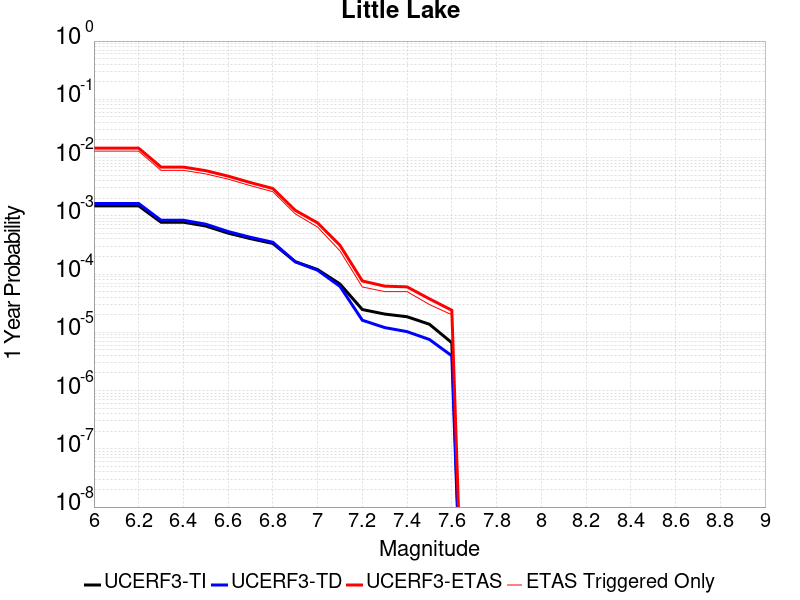 |  |

| Magnitude | 1 wk TI Prob | 1 wk TD Prob | 1 wk ETAS Prob | 1 wk ETAS/TD Gain | 1 wk ETAS Triggered Only | 1 mo TI Prob | 1 mo TD Prob | 1 mo ETAS Prob | 1 mo ETAS/TD Gain | 1 mo ETAS Triggered Only | 1 yr TI Prob | 1 yr TD Prob | 1 yr ETAS Prob | 1 yr ETAS/TD Gain | 1 yr ETAS Triggered Only | 10 yr TI Prob | 10 yr TD Prob | 10 yr ETAS Prob | 10 yr ETAS/TD Gain | 10 yr ETAS Triggered Only |
|-----|-----|-----|-----|-----|-----|-----|-----|-----|-----|-----|-----|-----|-----|-----|-----|-----|-----|-----|-----|-----|
| 6.0 | 2.8424427E-5 | 3.120572E-5 | 0.0075803315 | 242.9148 | 0.0075493613 | 1.2181328E-4 | 1.337327E-4 | 0.010004654 | 74.81083 | 0.009872242 | 0.0014820677 | 0.0016271127 | 0.015425762 | 9.480451 | 0.013821138 | 0.014722223 | 0.016165402 | 0.032734044 | 2.0249448 | 0.016840883 |
| 6.1 | 2.8424427E-5 | 3.120572E-5 | 0.0075803315 | 242.9148 | 0.0075493613 | 1.2181328E-4 | 1.337327E-4 | 0.010004654 | 74.81083 | 0.009872242 | 0.0014820677 | 0.0016271127 | 0.015425762 | 9.480451 | 0.013821138 | 0.014722223 | 0.016165402 | 0.032734044 | 2.0249448 | 0.016840883 |
| 6.2 | 2.8424427E-5 | 3.120572E-5 | 0.0075803315 | 242.9148 | 0.0075493613 | 1.2181328E-4 | 1.337327E-4 | 0.010004654 | 74.81083 | 0.009872242 | 0.0014820677 | 0.0016271127 | 0.015425762 | 9.480451 | 0.013821138 | 0.014722223 | 0.016165402 | 0.032734044 | 2.0249448 | 0.016840883 |
| 6.3 | 1.48860645E-5 | 1.6081389E-5 | 0.0038487723 | 239.33084 | 0.0038327526 | 6.379586E-5 | 6.8918576E-5 | 0.004598223 | 66.71964 | 0.004529617 | 7.7643775E-4 | 8.3878887E-4 | 0.0071053053 | 8.47091 | 0.006271777 | 0.007737305 | 0.008359048 | 0.015845304 | 1.8955871 | 0.0075493613 |
| 6.4 | 1.48860645E-5 | 1.6081389E-5 | 0.0038487723 | 239.33084 | 0.0038327526 | 6.379586E-5 | 6.8918576E-5 | 0.004598223 | 66.71964 | 0.004529617 | 7.7643775E-4 | 8.3878887E-4 | 0.0071053053 | 8.47091 | 0.006271777 | 0.007737305 | 0.008359048 | 0.015845304 | 1.8955871 | 0.0075493613 |
| 6.5 | 1.2797581E-5 | 1.3765565E-5 | 0.0033818958 | 245.67795 | 0.0033681765 | 5.4845623E-5 | 5.899409E-5 | 0.004123795 | 69.90183 | 0.0040650405 | 6.675408E-4 | 7.18042E-4 | 0.006521073 | 9.081743 | 0.005807201 | 0.006655392 | 0.00715977 | 0.013847892 | 1.9341253 | 0.006736353 |
| 6.6 | 9.661896E-6 | 1.0289038E-5 | 0.002681574 | 260.62436 | 0.0026713125 | 4.1407468E-5 | 4.409522E-5 | 0.0034121233 | 77.38079 | 0.0033681765 | 5.040193E-4 | 5.367433E-4 | 0.0055282554 | 10.299626 | 0.0049941926 | 0.005028777 | 0.0053560743 | 0.011016649 | 2.0568514 | 0.005691057 |
| 6.7 | 7.767871E-6 | 8.199687E-6 | 0.0019826319 | 241.79361 | 0.0019744483 | 3.329045E-5 | 3.5141118E-5 | 0.0027063596 | 77.014046 | 0.0026713125 | 4.0523586E-4 | 4.2777284E-4 | 0.0044910745 | 10.498737 | 0.0040650405 | 0.004044977 | 0.004270846 | 0.009012413 | 2.1102173 | 0.004761905 |
| 6.8 | 6.4235196E-6 | 6.7357446E-6 | 0.0014004546 | 207.91385 | 0.0013937282 | 2.752908E-5 | 2.8867229E-5 | 0.0018871179 | 65.37232 | 0.0018583043 | 3.35115E-4 | 3.5141467E-4 | 0.003370098 | 9.590089 | 0.0030197445 | 0.003346101 | 0.00350985 | 0.0072134137 | 2.0551915 | 0.0037166085 |
| 6.9 | 3.1283696E-6 | 3.1121804E-6 | 3.5154316E-4 | 112.95719 | 3.4843205E-4 | 1.3407229E-5 | 1.3337856E-5 | 5.940502E-4 | 44.538654 | 5.807201E-4 | 1.6322079E-4 | 1.6237781E-4 | 0.0012075042 | 7.436387 | 0.0010452962 | 0.0016310095 | 0.00162274 | 0.0030142067 | 1.8574797 | 0.0013937282 |
| 7.0 | 2.290603E-6 | 2.2286815E-6 | 3.5065998E-4 | 157.33965 | 3.4843205E-4 | 9.816834E-6 | 9.551463E-6 | 4.741231E-4 | 49.63879 | 4.6457606E-4 | 1.19513395E-4 | 1.162839E-4 | 9.291975E-4 | 7.9907665 | 8.130081E-4 | 0.0011944914 | 0.0011623327 | 0.001974396 | 1.6986495 | 8.130081E-4 |
| 7.1 | 1.293693E-6 | 1.1776827E-6 | 1.1776827E-6 | 1.0 | 0.0 | 5.5443866E-6 | 5.0472063E-6 | 5.0472063E-6 | 1.0 | 0.0 | 6.750081E-5 | 6.14487E-5 | 2.9372246E-4 | 4.779962 | 2.3228803E-4 | 6.7480316E-4 | 6.143856E-4 | 8.465309E-4 | 1.3778496 | 2.3228803E-4 |
| 7.2 | 4.715842E-7 | 3.0917857E-7 | 3.0917857E-7 | 1.0 | 0.0 | 2.0210737E-6 | 1.3250503E-6 | 1.3250503E-6 | 1.0 | 0.0 | 2.4606294E-5 | 1.6132375E-5 | 1.3227452E-4 | 8.199321 | 1.16144016E-4 | 2.460357E-4 | 1.6131258E-4 | 2.7743785E-4 | 1.7198775 | 1.16144016E-4 |
| 7.3 | 3.9430947E-7 | 2.3097488E-7 | 2.3097488E-7 | 1.0 | 0.0 | 1.6898966E-6 | 9.89892E-7 | 9.89892E-7 | 1.0 | 0.0 | 2.0574296E-5 | 1.2051869E-5 | 1.2819449E-4 | 10.636897 | 1.16144016E-4 | 2.0572392E-4 | 1.20512224E-4 | 2.3664224E-4 | 1.9636369 | 1.16144016E-4 |
| 7.4 | 3.547123E-7 | 1.9679135E-7 | 1.9679135E-7 | 1.0 | 0.0 | 1.5201948E-6 | 8.4339126E-7 | 8.4339126E-7 | 1.0 | 0.0 | 1.8508214E-5 | 1.0268241E-5 | 1.2641106E-4 | 12.310879 | 1.16144016E-4 | 1.8506673E-4 | 1.02677724E-4 | 2.1880982E-4 | 2.1310349 | 1.16144016E-4 |
| 7.5 | 2.6354266E-7 | 1.4423138E-7 | 1.4423138E-7 | 1.0 | 0.0 | 1.129468E-6 | 6.181344E-7 | 6.181344E-7 | 1.0 | 0.0 | 1.3751187E-5 | 7.5257603E-6 | 1.236689E-4 | 16.432745 | 1.16144016E-4 | 1.3750336E-4 | 7.5255106E-5 | 1.9139038E-4 | 2.5432212 | 1.16144016E-4 |
| 7.6 | 1.269913E-7 | 7.572556E-8 | 7.572556E-8 | 1.0 | 0.0 | 5.4424834E-7 | 3.245381E-7 | 3.245381E-7 | 1.0 | 0.0 | 6.6262032E-6 | 3.9512443E-6 | 1.200948E-4 | 30.394173 | 1.16144016E-4 | 6.626006E-5 | 3.9511775E-5 | 1.556512E-4 | 3.9393623 | 1.16144016E-4 |

## Owl Lake
*[(top)](#table-of-contents)*

| 1 Week | 1 Month | 1 Year | 10 Year |
|-----|-----|-----|-----|
|  |  |  |  |

| Magnitude | 1 wk TI Prob | 1 wk TD Prob | 1 wk ETAS Prob | 1 wk ETAS/TD Gain | 1 wk ETAS Triggered Only | 1 mo TI Prob | 1 mo TD Prob | 1 mo ETAS Prob | 1 mo ETAS/TD Gain | 1 mo ETAS Triggered Only | 1 yr TI Prob | 1 yr TD Prob | 1 yr ETAS Prob | 1 yr ETAS/TD Gain | 1 yr ETAS Triggered Only | 10 yr TI Prob | 10 yr TD Prob | 10 yr ETAS Prob | 10 yr ETAS/TD Gain | 10 yr ETAS Triggered Only |
|-----|-----|-----|-----|-----|-----|-----|-----|-----|-----|-----|-----|-----|-----|-----|-----|-----|-----|-----|-----|-----|
| 6.0 | 5.0320643E-5 | 6.635816E-5 | 0.004363402 | 65.75532 | 0.0042973286 | 2.1564208E-4 | 2.843674E-4 | 0.006089917 | 21.415667 | 0.005807201 | 0.0026222812 | 0.0034577388 | 0.013874557 | 4.01261 | 0.010452962 | 0.02591553 | 0.034140717 | 0.048387423 | 1.4172937 | 0.014750291 |
| 6.1 | 5.0320643E-5 | 6.635816E-5 | 0.004363402 | 65.75532 | 0.0042973286 | 2.1564208E-4 | 2.843674E-4 | 0.006089917 | 21.415667 | 0.005807201 | 0.0026222812 | 0.0034577388 | 0.013874557 | 4.01261 | 0.010452962 | 0.02591553 | 0.034140717 | 0.048387423 | 1.4172937 | 0.014750291 |
| 6.2 | 2.4125871E-5 | 3.0981035E-5 | 0.0024699299 | 79.72393 | 0.0024390244 | 1.0339249E-4 | 1.3277028E-4 | 0.0035004995 | 26.365086 | 0.0033681765 | 0.0012580766 | 0.001615439 | 0.008224954 | 5.0914664 | 0.006620209 | 0.012509781 | 0.016070465 | 0.024869833 | 1.5475492 | 0.008943089 |
| 6.3 | 1.7433485E-5 | 2.2355514E-5 | 0.0019967598 | 89.31844 | 0.0019744483 | 7.471279E-5 | 9.580672E-5 | 0.002999129 | 31.303953 | 0.0029036005 | 9.0924866E-4 | 0.0011659743 | 0.006618378 | 5.6762643 | 0.005458769 | 0.009055373 | 0.011628896 | 0.018746085 | 1.6120263 | 0.0072009293 |
| 6.4 | 1.7433485E-5 | 2.2355514E-5 | 0.0019967598 | 89.31844 | 0.0019744483 | 7.471279E-5 | 9.580672E-5 | 0.002999129 | 31.303953 | 0.0029036005 | 9.0924866E-4 | 0.0011659743 | 0.006618378 | 5.6762643 | 0.005458769 | 0.009055373 | 0.011628896 | 0.018746085 | 1.6120263 | 0.0072009293 |
| 6.5 | 1.5182742E-5 | 1.9429144E-5 | 0.0019938392 | 102.62104 | 0.0019744483 | 6.506727E-5 | 8.326596E-5 | 0.0029866246 | 35.868496 | 0.0029036005 | 7.919061E-4 | 0.0010134429 | 0.0061186007 | 6.0374403 | 0.005110337 | 0.0078909 | 0.010118429 | 0.01690159 | 1.6703769 | 0.006852497 |
| 6.6 | 6.7271576E-6 | 8.547361E-6 | 0.0015184067 | 177.64626 | 0.0015098723 | 2.8830356E-5 | 3.6631063E-5 | 0.0021271468 | 58.069477 | 0.0020905924 | 3.5095305E-4 | 4.458976E-4 | 0.004160849 | 9.3314 | 0.0037166085 | 0.0035039932 | 0.004467813 | 0.008861567 | 1.983424 | 0.0044134725 |
| 6.7 | 6.682835E-6 | 8.479807E-6 | 0.0015183393 | 179.05351 | 0.0015098723 | 2.8640408E-5 | 3.6341557E-5 | 0.0021268579 | 58.524128 | 0.0020905924 | 3.4864116E-4 | 4.4237426E-4 | 0.0041573388 | 9.397786 | 0.0037166085 | 0.003480947 | 0.0044327388 | 0.008711019 | 1.9651549 | 0.0042973286 |
| 6.8 | 6.5774975E-6 | 8.32628E-6 | 0.001518186 | 182.33664 | 0.0015098723 | 2.8188972E-5 | 3.5683603E-5 | 0.0021262013 | 59.584827 | 0.0020905924 | 3.4314668E-4 | 4.343669E-4 | 0.0040332675 | 9.285394 | 0.0036004647 | 0.0034261728 | 0.004352885 | 0.008515869 | 1.9563737 | 0.004181185 |
| 6.9 | 6.363419E-6 | 7.999454E-6 | 0.0014017165 | 175.22652 | 0.0013937282 | 2.727151E-5 | 3.428296E-5 | 0.0020086635 | 58.590733 | 0.0019744483 | 3.3198006E-4 | 4.1732067E-4 | 0.0037840917 | 9.067588 | 0.0033681765 | 0.0033148455 | 0.0041828766 | 0.008115255 | 1.9401135 | 0.0039488967 |
| 7.0 | 6.1342453E-6 | 7.6316555E-6 | 0.0014013492 | 183.62323 | 0.0013937282 | 2.6289357E-5 | 3.2706717E-5 | 0.0020070905 | 61.36631 | 0.0019744483 | 3.2002592E-4 | 3.9813702E-4 | 0.0037649726 | 9.456474 | 0.0033681765 | 0.0031956544 | 0.003991571 | 0.007809025 | 1.9563789 | 0.0038327526 |
| 7.1 | 5.842926E-6 | 7.142211E-6 | 0.0014008605 | 196.1382 | 0.0013937282 | 2.504087E-5 | 3.0609146E-5 | 0.002004997 | 65.5032 | 0.0019744483 | 3.0482994E-4 | 3.7260808E-4 | 0.0035073282 | 9.412915 | 0.0031358886 | 0.0030441214 | 0.0037370329 | 0.0072083324 | 1.9288919 | 0.0034843206 |
| 7.2 | 4.77173E-6 | 5.358483E-6 | 0.0010506491 | 196.0721 | 0.0010452962 | 2.045011E-5 | 2.2964748E-5 | 0.001416661 | 61.688503 | 0.0013937282 | 2.4895166E-4 | 2.79564E-4 | 0.0027179066 | 9.721948 | 0.0024390244 | 0.0024867293 | 0.002808645 | 0.0054724547 | 1.9484323 | 0.0026713125 |
| 7.3 | 3.0494948E-6 | 2.710463E-6 | 3.5114159E-4 | 129.5504 | 3.4843205E-4 | 1.3069198E-5 | 1.1616219E-5 | 3.600442E-4 | 30.994959 | 3.4843205E-4 | 1.5910587E-4 | 1.4141845E-4 | 9.5431163E-4 | 6.748141 | 8.130081E-4 | 0.0015899199 | 0.0014232415 | 0.0022350925 | 1.570424 | 8.130081E-4 |
| 7.4 | 2.7263884E-6 | 2.3056762E-6 | 2.3459317E-4 | 101.74593 | 2.3228803E-4 | 1.1684469E-5 | 9.881433E-6 | 2.4216718E-4 | 24.507294 | 2.3228803E-4 | 1.4224913E-4 | 1.20299905E-4 | 7.0095016E-4 | 5.8266892 | 5.807201E-4 | 0.0014215811 | 0.0012112238 | 0.0017912405 | 1.4788684 | 5.807201E-4 |
| 7.5 | 2.6090431E-6 | 2.1656133E-6 | 1.1830938E-4 | 54.63089 | 1.16144016E-4 | 1.1181565E-5 | 9.281167E-6 | 1.254241E-4 | 13.513829 | 1.16144016E-4 | 1.3612706E-4 | 1.1299244E-4 | 4.6138512E-4 | 4.0833273 | 3.4843205E-4 | 0.001360437 | 0.0011379806 | 0.0014860162 | 1.3058361 | 3.4843205E-4 |
| 7.6 | 2.3008756E-6 | 1.8727933E-6 | 1.1801659E-4 | 63.016346 | 1.16144016E-4 | 9.860858E-6 | 8.0262325E-6 | 1.2416932E-4 | 15.470435 | 1.16144016E-4 | 1.20049335E-4 | 9.7715085E-5 | 4.461131E-4 | 4.5654473 | 3.4843205E-4 | 0.001199845 | 9.849932E-4 | 0.001333082 | 1.3533921 | 3.4843205E-4 |
| 7.7 | 1.7184348E-6 | 1.3419171E-6 | 1.1748578E-4 | 87.5507 | 1.16144016E-4 | 7.3646997E-6 | 5.7510606E-6 | 1.2189441E-4 | 21.195118 | 1.16144016E-4 | 8.966153E-5 | 7.0016955E-5 | 3.0228874E-4 | 4.3173647 | 2.3228803E-4 | 8.962536E-4 | 7.078345E-4 | 9.399581E-4 | 1.3279349 | 2.3228803E-4 |
| 7.8 | 8.4612907E-7 | 8.4058576E-7 | 1.16984505E-4 | 139.17023 | 1.16144016E-4 | 3.6262625E-6 | 3.6025056E-6 | 1.197461E-4 | 33.239674 | 1.16144016E-4 | 4.4148852E-5 | 4.3859643E-5 | 2.761375E-4 | 6.2959356 | 2.3228803E-4 | 4.414008E-4 | 4.4398365E-4 | 6.7616854E-4 | 1.5229583 | 2.3228803E-4 |
| 7.9 | 2.716738E-7 | 3.768106E-7 | 3.768106E-7 | 1.0 | 0.0 | 1.1643157E-6 | 1.6149015E-6 | 1.6149015E-6 | 1.0 | 0.0 | 1.4175452E-5 | 1.966126E-5 | 1.966126E-5 | 1.0 | 0.0 | 1.4174548E-4 | 1.9836679E-4 | 1.9836679E-4 | 1.0 | 0.0 |
| 8.0 | 2.1995428E-8 | 3.384878E-8 | 3.384878E-8 | 1.0 | 0.0 | 9.426611E-8 | 1.4506621E-7 | 1.4506621E-7 | 1.0 | 0.0 | 1.1476893E-6 | 1.7661803E-6 | 1.7661803E-6 | 1.0 | 0.0 | 1.14768345E-5 | 1.7963059E-5 | 1.7963059E-5 | 1.0 | 0.0 |

## Ash Hill
*[(top)](#table-of-contents)*

| 1 Week | 1 Month | 1 Year | 10 Year |
|-----|-----|-----|-----|
|  |  | 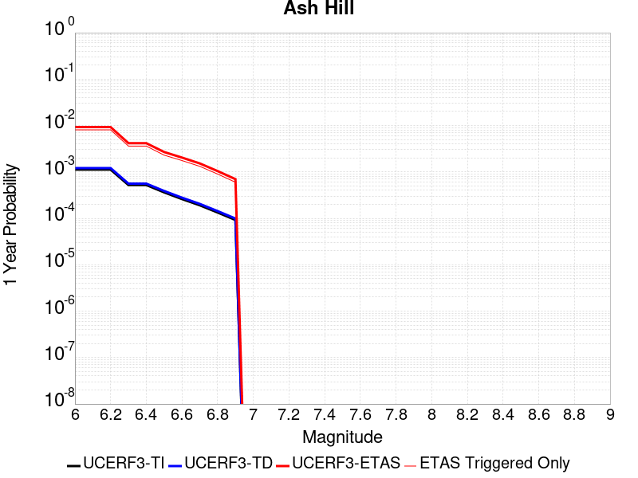 |  |

| Magnitude | 1 wk TI Prob | 1 wk TD Prob | 1 wk ETAS Prob | 1 wk ETAS/TD Gain | 1 wk ETAS Triggered Only | 1 mo TI Prob | 1 mo TD Prob | 1 mo ETAS Prob | 1 mo ETAS/TD Gain | 1 mo ETAS Triggered Only | 1 yr TI Prob | 1 yr TD Prob | 1 yr ETAS Prob | 1 yr ETAS/TD Gain | 1 yr ETAS Triggered Only | 10 yr TI Prob | 10 yr TD Prob | 10 yr ETAS Prob | 10 yr ETAS/TD Gain | 10 yr ETAS Triggered Only |
|-----|-----|-----|-----|-----|-----|-----|-----|-----|-----|-----|-----|-----|-----|-----|-----|-----|-----|-----|-----|-----|
| 6.0 | 2.1545662E-5 | 2.3194447E-5 | 0.0031590103 | 136.19684 | 0.0031358886 | 9.2335285E-5 | 9.940143E-5 | 0.0045124353 | 45.39608 | 0.0044134725 | 0.0011236023 | 0.0012096206 | 0.008285835 | 6.849946 | 0.007084785 | 0.011179381 | 0.012038348 | 0.022824457 | 1.895979 | 0.010917538 |
| 6.1 | 2.1545662E-5 | 2.3194447E-5 | 0.0031590103 | 136.19684 | 0.0031358886 | 9.2335285E-5 | 9.940143E-5 | 0.0045124353 | 45.39608 | 0.0044134725 | 0.0011236023 | 0.0012096206 | 0.008285835 | 6.849946 | 0.007084785 | 0.011179381 | 0.012038348 | 0.022824457 | 1.895979 | 0.010917538 |
| 6.2 | 2.1545662E-5 | 2.3194447E-5 | 0.0031590103 | 136.19684 | 0.0031358886 | 9.2335285E-5 | 9.940143E-5 | 0.0045124353 | 45.39608 | 0.0044134725 | 0.0011236023 | 0.0012096206 | 0.008285835 | 6.849946 | 0.007084785 | 0.011179381 | 0.012038348 | 0.022824457 | 1.895979 | 0.010917538 |
| 6.3 | 1.0025529E-5 | 1.0746934E-5 | 0.0012883174 | 119.87767 | 0.0012775842 | 4.2965847E-5 | 4.605755E-5 | 0.0022526924 | 48.910378 | 0.0022067362 | 5.229836E-4 | 5.6061964E-4 | 0.0042751445 | 7.625749 | 0.0037166085 | 0.005217545 | 0.0055933665 | 0.011252591 | 2.0117743 | 0.005691057 |
| 6.4 | 1.0025529E-5 | 1.0746934E-5 | 0.0012883174 | 119.87767 | 0.0012775842 | 4.2965847E-5 | 4.605755E-5 | 0.0022526924 | 48.910378 | 0.0022067362 | 5.229836E-4 | 5.6061964E-4 | 0.0042751445 | 7.625749 | 0.0037166085 | 0.005217545 | 0.0055933665 | 0.011252591 | 2.0117743 | 0.005691057 |
| 6.5 | 6.9617327E-6 | 7.456634E-6 | 0.001052745 | 141.18233 | 0.0010452962 | 2.9835655E-5 | 3.195666E-5 | 0.0017740612 | 55.514603 | 0.0017421603 | 3.6318856E-4 | 3.8901155E-4 | 0.0028270872 | 7.26736 | 0.0024390244 | 0.0036259557 | 0.0038841602 | 0.007702026 | 1.9829321 | 0.0038327526 |
| 6.6 | 4.9919777E-6 | 5.3466883E-6 | 4.6992028E-4 | 87.88997 | 4.6457606E-4 | 2.1394015E-5 | 2.2914215E-5 | 0.0011843278 | 51.685287 | 0.0011614402 | 2.60441E-4 | 2.7895154E-4 | 0.0020206259 | 7.243644 | 0.0017421603 | 0.0026013597 | 0.0027866727 | 0.0056821816 | 2.039056 | 0.0029036005 |
| 6.7 | 3.6630722E-6 | 3.924624E-6 | 3.523553E-4 | 89.78066 | 3.4843205E-4 | 1.5698786E-5 | 1.681974E-5 | 0.0010620983 | 63.145943 | 0.0010452962 | 1.9111596E-4 | 2.0476682E-4 | 0.0015982096 | 7.8050222 | 0.0013937282 | 0.0019095168 | 0.0020463446 | 0.004248565 | 2.0761728 | 0.0022067362 |
| 6.8 | 2.5599613E-6 | 2.744925E-6 | 1.1888862E-4 | 43.312157 | 1.16144016E-4 | 1.0971216E-5 | 1.1763939E-5 | 5.924772E-4 | 50.363842 | 5.807201E-4 | 1.3356637E-4 | 1.4322149E-4 | 8.399858E-4 | 5.864942 | 6.968641E-4 | 0.0013348613 | 0.0014317769 | 0.002591554 | 1.8100265 | 0.0011614402 |
| 6.9 | 1.7684905E-6 | 1.8968707E-6 | 1.1804067E-4 | 62.22916 | 1.16144016E-4 | 7.579223E-6 | 8.129446E-6 | 2.404156E-4 | 29.57343 | 2.3228803E-4 | 9.2273134E-5 | 9.8976E-5 | 4.4737358E-4 | 4.5200205 | 3.4843205E-4 | 9.223483E-4 | 9.8976E-4 | 0.0016859344 | 1.7033769 | 6.968641E-4 |

## Garlock (East)
*[(top)](#table-of-contents)*

| 1 Week | 1 Month | 1 Year | 10 Year |
|-----|-----|-----|-----|
|  |  | 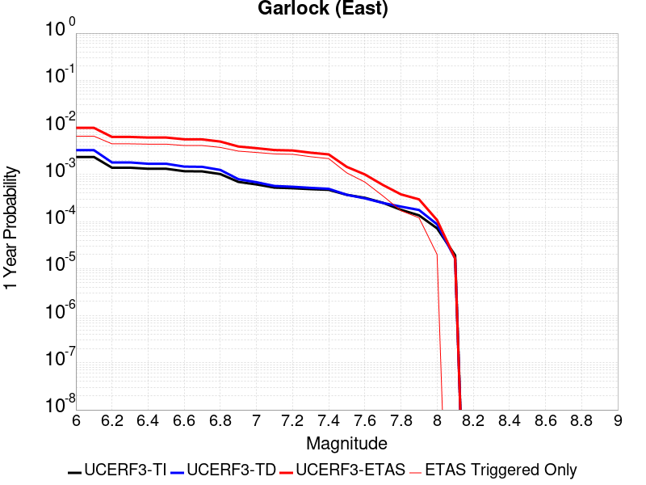 |  |

| Magnitude | 1 wk TI Prob | 1 wk TD Prob | 1 wk ETAS Prob | 1 wk ETAS/TD Gain | 1 wk ETAS Triggered Only | 1 mo TI Prob | 1 mo TD Prob | 1 mo ETAS Prob | 1 mo ETAS/TD Gain | 1 mo ETAS Triggered Only | 1 yr TI Prob | 1 yr TD Prob | 1 yr ETAS Prob | 1 yr ETAS/TD Gain | 1 yr ETAS Triggered Only | 10 yr TI Prob | 10 yr TD Prob | 10 yr ETAS Prob | 10 yr ETAS/TD Gain | 10 yr ETAS Triggered Only |
|-----|-----|-----|-----|-----|-----|-----|-----|-----|-----|-----|-----|-----|-----|-----|-----|-----|-----|-----|-----|-----|
| 6.0 | 4.5092507E-5 | 6.290325E-5 | 0.0023856375 | 37.925507 | 0.0023228803 | 1.9323928E-4 | 2.6956003E-4 | 0.0037529413 | 13.92247 | 0.0034843206 | 0.0023501497 | 0.0032774 | 0.009528622 | 2.9073722 | 0.006271777 | 0.023254504 | 0.032351844 | 0.04167993 | 1.2883323 | 0.009639953 |
| 6.1 | 4.5092507E-5 | 6.290325E-5 | 0.0023856375 | 37.925507 | 0.0023228803 | 1.9323928E-4 | 2.6956003E-4 | 0.0037529413 | 13.92247 | 0.0034843206 | 0.0023501497 | 0.0032774 | 0.009528622 | 2.9073722 | 0.006271777 | 0.023254504 | 0.032351844 | 0.04167993 | 1.2883323 | 0.009639953 |
| 6.2 | 2.6674514E-5 | 3.4509674E-5 | 0.0018927498 | 54.84693 | 0.0018583043 | 1.1431433E-4 | 1.4789042E-4 | 0.0029349346 | 19.845335 | 0.0027874564 | 0.0013908884 | 0.0017991117 | 0.005856839 | 3.255406 | 0.0040650405 | 0.01382215 | 0.017890299 | 0.024163937 | 1.3506727 | 0.006387921 |
| 6.3 | 2.6674514E-5 | 3.4509674E-5 | 0.0018927498 | 54.84693 | 0.0018583043 | 1.1431433E-4 | 1.4789042E-4 | 0.0029349346 | 19.845335 | 0.0027874564 | 0.0013908884 | 0.0017991117 | 0.005856839 | 3.255406 | 0.0040650405 | 0.01382215 | 0.017890299 | 0.024163937 | 1.3506727 | 0.006387921 |
| 6.4 | 2.5312667E-5 | 3.233893E-5 | 0.0018905831 | 58.461525 | 0.0018583043 | 1.0847834E-4 | 1.3858822E-4 | 0.0029256584 | 21.110441 | 0.0027874564 | 0.0013199237 | 0.0016860351 | 0.005744222 | 3.406941 | 0.0040650405 | 0.013121112 | 0.016778335 | 0.023059078 | 1.3743365 | 0.006387921 |
| 6.5 | 2.5312667E-5 | 3.233893E-5 | 0.0018905831 | 58.461525 | 0.0018583043 | 1.0847834E-4 | 1.3858822E-4 | 0.0029256584 | 21.110441 | 0.0027874564 | 0.0013199237 | 0.0016860351 | 0.005744222 | 3.406941 | 0.0040650405 | 0.013121112 | 0.016778335 | 0.023059078 | 1.3743365 | 0.006387921 |
| 6.6 | 2.246556E-5 | 2.8133776E-5 | 0.001770245 | 62.92241 | 0.0017421603 | 9.627742E-5 | 1.20567885E-4 | 0.0025592982 | 21.22703 | 0.0024390244 | 0.0011715472 | 0.0014669491 | 0.005062132 | 3.450789 | 0.0036004647 | 0.011653901 | 0.01461866 | 0.020112075 | 1.375781 | 0.0055749128 |
| 6.7 | 2.2241198E-5 | 2.7803519E-5 | 0.0017699153 | 63.657963 | 0.0017421603 | 9.531594E-5 | 1.1915263E-4 | 0.0025578863 | 21.46731 | 0.0024390244 | 0.0011598538 | 0.0014497414 | 0.005044986 | 3.4799216 | 0.0036004647 | 0.011538187 | 0.014448853 | 0.019943215 | 1.3802629 | 0.0055749128 |
| 6.8 | 1.9528685E-5 | 2.389819E-5 | 0.0017660168 | 73.897514 | 0.0017421603 | 8.369167E-5 | 1.0241691E-4 | 0.0023089272 | 22.544395 | 0.0022067362 | 0.0010184698 | 0.0012462323 | 0.004610211 | 3.6993194 | 0.0033681765 | 0.010138147 | 0.012436427 | 0.01713911 | 1.3781378 | 0.004761905 |
| 6.9 | 1.3318621E-5 | 1.5198884E-5 | 0.0015250482 | 100.33948 | 0.0015098723 | 5.7078556E-5 | 6.513648E-5 | 0.0016910469 | 25.961592 | 0.0016260162 | 6.9470983E-4 | 7.927538E-4 | 0.0034619486 | 4.3669906 | 0.0026713125 | 0.0069254204 | 0.007939888 | 0.01185743 | 1.4934002 | 0.0039488967 |
| 7.0 | 1.1760853E-5 | 1.31077895E-5 | 0.0015229603 | 116.18742 | 0.0015098723 | 5.0402683E-5 | 5.6175057E-5 | 0.0016821 | 29.943893 | 0.0016260162 | 6.134799E-4 | 6.8372174E-4 | 0.0033532078 | 4.9043455 | 0.0026713125 | 0.0061178906 | 0.00685652 | 0.010778341 | 1.5719842 | 0.0039488967 |
| 7.1 | 1.0064758E-5 | 1.0902931E-5 | 0.0015207587 | 139.48164 | 0.0015098723 | 4.3133965E-5 | 4.672603E-5 | 0.0016726663 | 35.797314 | 0.0016260162 | 5.2502943E-4 | 5.687444E-4 | 0.0031224596 | 5.4900928 | 0.0025551685 | 0.005237907 | 0.0057129986 | 0.009523855 | 1.6670501 | 0.0038327526 |
| 7.2 | 9.768808E-6 | 1.0498807E-5 | 0.0015203552 | 144.8122 | 0.0015098723 | 4.186565E-5 | 4.499413E-5 | 0.0016709373 | 37.136784 | 0.0016260162 | 5.095951E-4 | 5.4766936E-4 | 0.0031014383 | 5.6629763 | 0.0025551685 | 0.0050842804 | 0.0055032647 | 0.0093149245 | 1.692618 | 0.0038327526 |
| 7.3 | 9.344516E-6 | 9.944468E-6 | 0.0014036589 | 141.14972 | 0.0013937282 | 4.004731E-5 | 4.261847E-5 | 0.0015524264 | 36.42614 | 0.0015098723 | 4.8746695E-4 | 5.1875977E-4 | 0.0028404351 | 5.4754343 | 0.0023228803 | 0.0048639905 | 0.0052149445 | 0.008796633 | 1.6868124 | 0.0036004647 |
| 7.4 | 9.023491E-6 | 9.490661E-6 | 0.001054777 | 111.138405 | 0.0010452962 | 3.867153E-5 | 4.0673647E-5 | 0.0012020665 | 29.553942 | 0.0011614402 | 4.7072413E-4 | 4.950925E-4 | 0.0023524768 | 4.7515907 | 0.0018583043 | 0.004697283 | 0.0049783974 | 0.008098674 | 1.6267633 | 0.0031358886 |
| 7.5 | 7.081253E-6 | 7.087672E-6 | 8.2009006E-4 | 115.70654 | 8.130081E-4 | 3.0347876E-5 | 3.0375388E-5 | 8.433588E-4 | 27.764545 | 8.130081E-4 | 3.6942272E-4 | 3.6975832E-4 | 0.0016468702 | 4.4539094 | 0.0012775842 | 0.003688092 | 0.0037243143 | 0.0058071204 | 1.5592456 | 0.0020905924 |
| 7.6 | 6.116396E-6 | 5.959245E-6 | 4.7053254E-4 | 78.95842 | 4.6457606E-4 | 2.6212863E-5 | 2.5539372E-5 | 4.9010356E-4 | 19.190119 | 4.6457606E-4 | 3.1909486E-4 | 3.1089774E-4 | 0.0011236531 | 3.6142209 | 8.130081E-4 | 0.0031863707 | 0.0031357552 | 0.004409333 | 1.4061471 | 0.0012775842 |
| 7.7 | 4.797145E-6 | 4.757281E-6 | 1.20900746E-4 | 25.413834 | 1.16144016E-4 | 2.055903E-5 | 2.0388188E-5 | 1.3652984E-4 | 6.6965165 | 1.16144016E-4 | 2.5027743E-4 | 2.4819805E-4 | 4.8042843E-4 | 1.9356656 | 2.3228803E-4 | 0.0024999576 | 0.0025093474 | 0.0029727577 | 1.1846737 | 4.6457606E-4 |
| 7.8 | 3.4028885E-6 | 3.978462E-6 | 1.20122015E-4 | 30.19308 | 1.16144016E-4 | 1.4583726E-5 | 1.7050439E-5 | 1.3319247E-4 | 7.811674 | 1.16144016E-4 | 1.775424E-4 | 2.0756939E-4 | 4.3980923E-4 | 2.1188538 | 2.3228803E-4 | 0.0017740062 | 0.0021012232 | 0.002448923 | 1.165475 | 3.4843205E-4 |
| 7.9 | 2.5928412E-6 | 3.3724489E-6 | 1.1951607E-4 | 35.438957 | 1.16144016E-4 | 1.1112129E-5 | 1.4453272E-5 | 1.3059561E-4 | 9.035712 | 1.16144016E-4 | 1.3528178E-4 | 1.7595445E-4 | 4.0820162E-4 | 2.3199277 | 2.3228803E-4 | 0.0013519945 | 0.0017812408 | 0.0021290523 | 1.1952635 | 3.4843205E-4 |
| 8.0 | 1.3743648E-6 | 1.6734747E-6 | 1.6734747E-6 | 1.0 | 0.0 | 5.8901214E-6 | 7.1720146E-6 | 7.1720146E-6 | 1.0 | 0.0 | 7.1709874E-5 | 8.731581E-5 | 8.731581E-5 | 1.0 | 0.0 | 7.1686733E-4 | 8.837234E-4 | 9.997648E-4 | 1.1313096 | 1.16144016E-4 |
| 8.1 | 3.6733252E-7 | 3.1489964E-7 | 3.1489964E-7 | 1.0 | 0.0 | 1.5742813E-6 | 1.3495693E-6 | 1.3495693E-6 | 1.0 | 0.0 | 1.9166706E-5 | 1.6430899E-5 | 1.6430899E-5 | 1.0 | 0.0 | 1.9165053E-4 | 1.6638759E-4 | 1.6638759E-4 | 1.0 | 0.0 |

## Blackwater
*[(top)](#table-of-contents)*

| 1 Week | 1 Month | 1 Year | 10 Year |
|-----|-----|-----|-----|
|  |  |  | 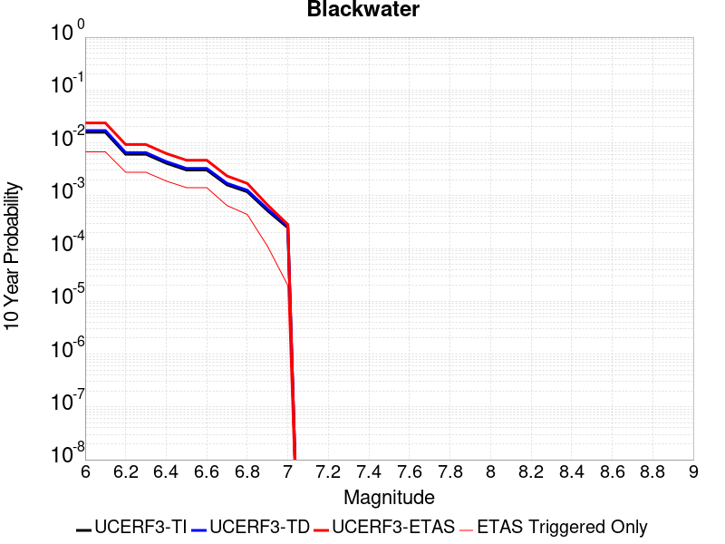 |

| Magnitude | 1 wk TI Prob | 1 wk TD Prob | 1 wk ETAS Prob | 1 wk ETAS/TD Gain | 1 wk ETAS Triggered Only | 1 mo TI Prob | 1 mo TD Prob | 1 mo ETAS Prob | 1 mo ETAS/TD Gain | 1 mo ETAS Triggered Only | 1 yr TI Prob | 1 yr TD Prob | 1 yr ETAS Prob | 1 yr ETAS/TD Gain | 1 yr ETAS Triggered Only | 10 yr TI Prob | 10 yr TD Prob | 10 yr ETAS Prob | 10 yr ETAS/TD Gain | 10 yr ETAS Triggered Only |
|-----|-----|-----|-----|-----|-----|-----|-----|-----|-----|-----|-----|-----|-----|-----|-----|-----|-----|-----|-----|-----|
| 6.0 | 3.0708583E-5 | 3.3095846E-5 | 0.002239759 | 67.67493 | 0.0022067362 | 1.3160157E-4 | 1.4183241E-4 | 0.0036256588 | 25.562979 | 0.0034843206 | 0.0016010714 | 0.0017255784 | 0.007058984 | 4.090793 | 0.005342625 | 0.015895851 | 0.017135633 | 0.024327323 | 1.4196922 | 0.007317073 |
| 6.1 | 3.0708583E-5 | 3.3095846E-5 | 0.002239759 | 67.67493 | 0.0022067362 | 1.3160157E-4 | 1.4183241E-4 | 0.0036256588 | 25.562979 | 0.0034843206 | 0.0016010714 | 0.0017255784 | 0.007058984 | 4.090793 | 0.005342625 | 0.015895851 | 0.017135633 | 0.024327323 | 1.4196922 | 0.007317073 |
| 6.2 | 1.1707779E-5 | 1.2545122E-5 | 8.255431E-4 | 65.8059 | 8.130081E-4 | 5.017523E-5 | 5.3763757E-5 | 0.0014474171 | 26.921799 | 0.0013937282 | 6.107122E-4 | 6.5438676E-4 | 0.002627543 | 4.0152755 | 0.0019744483 | 0.006090366 | 0.0065255696 | 0.009410222 | 1.4420538 | 0.0029036005 |
| 6.3 | 1.1707779E-5 | 1.2545122E-5 | 8.255431E-4 | 65.8059 | 8.130081E-4 | 5.017523E-5 | 5.3763757E-5 | 0.0014474171 | 26.921799 | 0.0013937282 | 6.107122E-4 | 6.5438676E-4 | 0.002627543 | 4.0152755 | 0.0019744483 | 0.006090366 | 0.0065255696 | 0.009410222 | 1.4420538 | 0.0029036005 |
| 6.4 | 7.929244E-6 | 8.480098E-6 | 4.7305223E-4 | 55.783817 | 4.6457606E-4 | 3.3982033E-5 | 3.6342793E-5 | 7.331816E-4 | 20.174057 | 6.968641E-4 | 4.136527E-4 | 4.423877E-4 | 0.0016033141 | 3.6242282 | 0.0011614402 | 0.0041288356 | 0.0044154758 | 0.006265575 | 1.4190032 | 0.0018583043 |
| 6.5 | 5.8832115E-6 | 6.285991E-6 | 3.5471586E-4 | 56.429585 | 3.4843205E-4 | 2.521352E-5 | 2.6939697E-5 | 4.915033E-4 | 18.244572 | 4.6457606E-4 | 3.0693135E-4 | 3.27944E-4 | 0.0012567914 | 3.8323355 | 9.291521E-4 | 0.0030650778 | 0.0032748538 | 0.004548254 | 1.3888419 | 0.0012775842 |
| 6.6 | 5.8832115E-6 | 6.285991E-6 | 3.5471586E-4 | 56.429585 | 3.4843205E-4 | 2.521352E-5 | 2.6939697E-5 | 4.915033E-4 | 18.244572 | 4.6457606E-4 | 3.0693135E-4 | 3.27944E-4 | 0.0012567914 | 3.8323355 | 9.291521E-4 | 0.0030650778 | 0.0032748538 | 0.004548254 | 1.3888419 | 0.0012775842 |
| 6.7 | 3.0715053E-6 | 3.2814662E-6 | 2.3556875E-4 | 71.78765 | 2.3228803E-4 | 1.3163528E-5 | 1.4063357E-5 | 2.4634812E-4 | 17.517021 | 2.3228803E-4 | 1.6025416E-4 | 1.7120909E-4 | 5.195815E-4 | 3.0347776 | 3.4843205E-4 | 0.0016013865 | 0.0017108864 | 0.0021746675 | 1.2710766 | 4.6457606E-4 |
| 6.8 | 2.2722281E-6 | 2.4287538E-6 | 1.1857249E-4 | 48.820305 | 1.16144016E-4 | 9.738084E-6 | 1.0408908E-5 | 1.2655172E-4 | 12.158021 | 1.16144016E-4 | 1.1855473E-4 | 1.26722E-4 | 3.5898061E-4 | 2.83282 | 2.3228803E-4 | 0.001184915 | 0.0012665876 | 0.0016145783 | 1.2747467 | 3.4843205E-4 |
| 6.9 | 9.952399E-7 | 1.0653489E-6 | 1.0653489E-6 | 1.0 | 0.0 | 4.265307E-6 | 4.5657757E-6 | 4.5657757E-6 | 1.0 | 0.0 | 5.1928873E-5 | 5.5587418E-5 | 5.5587418E-5 | 1.0 | 0.0 | 5.191674E-4 | 5.557858E-4 | 5.557858E-4 | 1.0 | 0.0 |
| 7.0 | 4.7385504E-7 | 5.0755597E-7 | 5.0755597E-7 | 1.0 | 0.0 | 2.0308057E-6 | 2.1752398E-6 | 2.1752398E-6 | 1.0 | 0.0 | 2.4724779E-5 | 2.6483543E-5 | 2.6483543E-5 | 1.0 | 0.0 | 2.4722028E-4 | 2.6483546E-4 | 2.6483546E-4 | 1.0 | 0.0 |

## Gravel Hills-Harper Lk
*[(top)](#table-of-contents)*

| 1 Week | 1 Month | 1 Year | 10 Year |
|-----|-----|-----|-----|
|  |  |  |  |

| Magnitude | 1 wk TI Prob | 1 wk TD Prob | 1 wk ETAS Prob | 1 wk ETAS/TD Gain | 1 wk ETAS Triggered Only | 1 mo TI Prob | 1 mo TD Prob | 1 mo ETAS Prob | 1 mo ETAS/TD Gain | 1 mo ETAS Triggered Only | 1 yr TI Prob | 1 yr TD Prob | 1 yr ETAS Prob | 1 yr ETAS/TD Gain | 1 yr ETAS Triggered Only | 10 yr TI Prob | 10 yr TD Prob | 10 yr ETAS Prob | 10 yr ETAS/TD Gain | 10 yr ETAS Triggered Only |
|-----|-----|-----|-----|-----|-----|-----|-----|-----|-----|-----|-----|-----|-----|-----|-----|-----|-----|-----|-----|-----|
| 6.0 | 3.0679566E-5 | 3.1464646E-5 | 0.0017735701 | 56.367077 | 0.0017421603 | 1.3147724E-4 | 1.3484273E-4 | 0.0029219233 | 21.669119 | 0.0027874564 | 0.0015995599 | 0.0016406906 | 0.0053512016 | 3.2615542 | 0.0037166085 | 0.015880952 | 0.01630734 | 0.02167709 | 1.3292843 | 0.005458769 |
| 6.1 | 3.0679566E-5 | 3.1464646E-5 | 0.0017735701 | 56.367077 | 0.0017421603 | 1.3147724E-4 | 1.3484273E-4 | 0.0029219233 | 21.669119 | 0.0027874564 | 0.0015995599 | 0.0016406906 | 0.0053512016 | 3.2615542 | 0.0037166085 | 0.015880952 | 0.01630734 | 0.02167709 | 1.3292843 | 0.005458769 |
| 6.2 | 1.514536E-5 | 1.3635206E-5 | 5.9434737E-4 | 43.589172 | 5.807201E-4 | 6.490707E-5 | 5.843536E-5 | 9.875332E-4 | 16.899584 | 9.291521E-4 | 7.8995706E-4 | 7.1123015E-4 | 0.0018718443 | 2.6318405 | 0.0011614402 | 0.007871548 | 0.0070907404 | 0.008820548 | 1.243953 | 0.0017421603 |
| 6.3 | 1.514536E-5 | 1.3635206E-5 | 5.9434737E-4 | 43.589172 | 5.807201E-4 | 6.490707E-5 | 5.843536E-5 | 9.875332E-4 | 16.899584 | 9.291521E-4 | 7.8995706E-4 | 7.1123015E-4 | 0.0018718443 | 2.6318405 | 0.0011614402 | 0.007871548 | 0.0070907404 | 0.008820548 | 1.243953 | 0.0017421603 |
| 6.4 | 1.2532521E-5 | 1.06896905E-5 | 5.914036E-4 | 55.324665 | 5.807201E-4 | 5.37097E-5 | 4.581219E-5 | 7.4264436E-4 | 16.210629 | 6.968641E-4 | 6.537194E-4 | 5.576265E-4 | 0.0013701812 | 2.4571667 | 8.130081E-4 | 0.0065179965 | 0.005562863 | 0.006486846 | 1.1660986 | 9.291521E-4 |
| 6.5 | 1.1094058E-5 | 9.083664E-6 | 4.7365553E-4 | 52.143665 | 4.6457606E-4 | 4.7545094E-5 | 3.892943E-5 | 5.034874E-4 | 12.933337 | 4.6457606E-4 | 5.787078E-4 | 4.7386673E-4 | 0.0010543116 | 2.2249117 | 5.807201E-4 | 0.0057720304 | 0.0047289706 | 0.0053069443 | 1.1222198 | 5.807201E-4 |
| 6.6 | 9.688328E-6 | 7.5316952E-6 | 1.2367484E-4 | 16.420586 | 1.16144016E-4 | 4.1520743E-5 | 3.227831E-5 | 1.4841858E-4 | 4.59809 | 1.16144016E-4 | 5.053978E-4 | 3.9292008E-4 | 6.2511687E-4 | 1.5909517 | 2.3228803E-4 | 0.0050424994 | 0.0039225104 | 0.0041538873 | 1.0589869 | 2.3228803E-4 |
| 6.7 | 8.974824E-6 | 6.749413E-6 | 1.2289264E-4 | 18.207901 | 1.16144016E-4 | 3.8462964E-5 | 2.8925748E-5 | 1.4506641E-4 | 5.015131 | 1.16144016E-4 | 4.6818596E-4 | 3.5211627E-4 | 4.682194E-4 | 1.3297296 | 1.16144016E-4 | 0.004672008 | 0.0035158044 | 0.00363154 | 1.0329187 | 1.16144016E-4 |
| 6.8 | 7.4780046E-6 | 5.1161933E-6 | 1.2125962E-4 | 23.701141 | 1.16144016E-4 | 3.20482E-5 | 2.1926366E-5 | 1.3806784E-4 | 6.2968864 | 1.16144016E-4 | 3.9011694E-4 | 2.669222E-4 | 3.8303522E-4 | 1.435007 | 1.16144016E-4 | 0.0038943281 | 0.0026661542 | 0.0027819886 | 1.0434462 | 1.16144016E-4 |
| 6.9 | 6.3409307E-6 | 3.9074966E-6 | 1.2005106E-4 | 30.723265 | 1.16144016E-4 | 2.7175134E-5 | 1.6746313E-5 | 1.3288838E-4 | 7.935382 | 1.16144016E-4 | 3.3080703E-4 | 2.0386827E-4 | 3.199886E-4 | 1.5695851 | 1.16144016E-4 | 0.0033031502 | 0.0020369107 | 0.002152818 | 1.0569036 | 1.16144016E-4 |
| 7.0 | 5.1239335E-6 | 2.6058565E-6 | 1.1874957E-4 | 45.570267 | 1.16144016E-4 | 2.195953E-5 | 1.116791E-5 | 1.2731063E-4 | 11.399683 | 1.16144016E-4 | 2.6732447E-4 | 1.3596108E-4 | 2.520893E-4 | 1.8541285 | 1.16144016E-4 | 0.0026700313 | 0.0013588042 | 0.0014747904 | 1.085359 | 1.16144016E-4 |
| 7.1 | 4.438899E-6 | 2.0984728E-6 | 1.1824225E-4 | 56.34681 | 1.16144016E-4 | 1.9023713E-5 | 8.993425E-6 | 1.251364E-4 | 13.914209 | 1.16144016E-4 | 2.315891E-4 | 1.0948967E-4 | 2.2562097E-4 | 2.06066 | 1.16144016E-4 | 0.002313479 | 0.0010943791 | 0.0012103961 | 1.1060116 | 1.16144016E-4 |
| 7.2 | 3.50367E-6 | 1.2615716E-6 | 1.1740544E-4 | 93.06284 | 1.16144016E-4 | 1.5015643E-5 | 5.4067245E-6 | 1.2155012E-4 | 22.481285 | 1.16144016E-4 | 1.8280011E-4 | 6.582497E-5 | 1.8196134E-4 | 2.764321 | 1.16144016E-4 | 0.0018264982 | 6.580629E-4 | 7.741305E-4 | 1.1763777 | 1.16144016E-4 |
| 7.3 | 2.561638E-6 | 7.1191585E-7 | 1.1685585E-4 | 164.14279 | 1.16144016E-4 | 1.0978401E-5 | 3.0510646E-6 | 1.1919473E-4 | 39.066605 | 1.16144016E-4 | 1.3365384E-4 | 3.71461E-5 | 1.532858E-4 | 4.1265655 | 1.16144016E-4 | 0.0013357349 | 3.7140088E-4 | 4.8750176E-4 | 1.3126026 | 1.16144016E-4 |
| 7.4 | 2.0368864E-6 | 5.304837E-7 | 1.1667444E-4 | 219.93971 | 1.16144016E-4 | 8.729483E-6 | 2.2734996E-6 | 1.1841725E-4 | 52.085888 | 1.16144016E-4 | 1.06276275E-4 | 2.7679513E-5 | 1.4382032E-4 | 5.1959124 | 1.16144016E-4 | 0.0010622547 | 2.767612E-4 | 3.9287307E-4 | 1.4195381 | 1.16144016E-4 |
| 7.5 | 1.1681728E-6 | 3.6030585E-7 | 1.16504285E-4 | 323.3483 | 1.16144016E-4 | 5.0064455E-6 | 1.544167E-6 | 1.17688E-4 | 76.214554 | 1.16144016E-4 | 6.0951766E-5 | 1.8800076E-5 | 1.3494192E-4 | 7.177732 | 1.16144016E-4 | 6.093505E-4 | 1.8798532E-4 | 3.041075E-4 | 1.6177194 | 1.16144016E-4 |
| 7.6 | 1.3154387E-7 | 7.1197384E-8 | 7.1197384E-8 | 1.0 | 0.0 | 5.6375933E-7 | 3.051316E-7 | 3.051316E-7 | 1.0 | 0.0 | 6.863748E-6 | 3.7149728E-6 | 3.7149728E-6 | 1.0 | 0.0 | 6.863536E-5 | 3.7149264E-5 | 3.7149264E-5 | 1.0 | 0.0 |

## Hunter Mountain-Saline Valley
*[(top)](#table-of-contents)*

| 1 Week | 1 Month | 1 Year | 10 Year |
|-----|-----|-----|-----|
|  |  |  |  |

| Magnitude | 1 wk TI Prob | 1 wk TD Prob | 1 wk ETAS Prob | 1 wk ETAS/TD Gain | 1 wk ETAS Triggered Only | 1 mo TI Prob | 1 mo TD Prob | 1 mo ETAS Prob | 1 mo ETAS/TD Gain | 1 mo ETAS Triggered Only | 1 yr TI Prob | 1 yr TD Prob | 1 yr ETAS Prob | 1 yr ETAS/TD Gain | 1 yr ETAS Triggered Only | 10 yr TI Prob | 10 yr TD Prob | 10 yr ETAS Prob | 10 yr ETAS/TD Gain | 10 yr ETAS Triggered Only |
|-----|-----|-----|-----|-----|-----|-----|-----|-----|-----|-----|-----|-----|-----|-----|-----|-----|-----|-----|-----|-----|
| 6.0 | 4.5103672E-5 | 5.4570177E-5 | 0.0020289107 | 37.179848 | 0.0019744483 | 1.9328714E-4 | 2.3385242E-4 | 0.0026723065 | 11.42732 | 0.0024390244 | 0.002350731 | 0.0028435152 | 0.006781183 | 2.3847888 | 0.0039488967 | 0.023260195 | 0.028091887 | 0.03339731 | 1.1888596 | 0.005458769 |
| 6.1 | 4.5103672E-5 | 5.4570177E-5 | 0.0020289107 | 37.179848 | 0.0019744483 | 1.9328714E-4 | 2.3385242E-4 | 0.0026723065 | 11.42732 | 0.0024390244 | 0.002350731 | 0.0028435152 | 0.006781183 | 2.3847888 | 0.0039488967 | 0.023260195 | 0.028091887 | 0.03339731 | 1.1888596 | 0.005458769 |
| 6.2 | 3.9363465E-5 | 4.706337E-5 | 0.0020214187 | 42.951 | 0.0019744483 | 1.6868966E-4 | 2.0168544E-4 | 0.0025240972 | 12.51502 | 0.0023228803 | 0.002051862 | 0.0024528175 | 0.00616031 | 2.511524 | 0.0037166085 | 0.020330196 | 0.024273481 | 0.029259773 | 1.2054213 | 0.005110337 |
| 6.3 | 3.9363465E-5 | 4.706337E-5 | 0.0020214187 | 42.951 | 0.0019744483 | 1.6868966E-4 | 2.0168544E-4 | 0.0025240972 | 12.51502 | 0.0023228803 | 0.002051862 | 0.0024528175 | 0.00616031 | 2.511524 | 0.0037166085 | 0.020330196 | 0.024273481 | 0.029259773 | 1.2054213 | 0.005110337 |
| 6.4 | 3.2311684E-5 | 3.795099E-5 | 0.0020123243 | 53.024292 | 0.0019744483 | 1.384713E-4 | 1.6263737E-4 | 0.00248514 | 15.2802515 | 0.0023228803 | 0.0016845843 | 0.0019783843 | 0.00568764 | 2.8748913 | 0.0037166085 | 0.016718714 | 0.019616475 | 0.024626564 | 1.2554022 | 0.005110337 |
| 6.5 | 3.2311684E-5 | 3.795099E-5 | 0.0020123243 | 53.024292 | 0.0019744483 | 1.384713E-4 | 1.6263737E-4 | 0.00248514 | 15.2802515 | 0.0023228803 | 0.0016845843 | 0.0019783843 | 0.00568764 | 2.8748913 | 0.0037166085 | 0.016718714 | 0.019616475 | 0.024626564 | 1.2554022 | 0.005110337 |
| 6.6 | 2.9305844E-5 | 3.418183E-5 | 0.0020085627 | 58.76112 | 0.0019744483 | 1.2559042E-4 | 1.4648569E-4 | 0.0024690258 | 16.855064 | 0.0023228803 | 0.0015279909 | 0.001782067 | 0.0053761154 | 3.0167863 | 0.0036004647 | 0.015175272 | 0.01768569 | 0.02259156 | 1.2773919 | 0.0049941926 |
| 6.7 | 2.7826512E-5 | 3.2344276E-5 | 0.0020067287 | 62.042778 | 0.0019744483 | 1.19251024E-4 | 1.386113E-4 | 0.0024611696 | 17.755909 | 0.0023228803 | 0.0014509142 | 0.0016863465 | 0.005280739 | 3.1314676 | 0.0036004647 | 0.014414776 | 0.016743187 | 0.02165376 | 1.2932879 | 0.0049941926 |
| 6.8 | 2.3389874E-5 | 2.6866714E-5 | 0.0018851211 | 70.16567 | 0.0018583043 | 1.0023846E-4 | 1.15138246E-4 | 0.0023216205 | 20.163765 | 0.0022067362 | 0.00121972 | 0.001400954 | 0.004880393 | 3.4836214 | 0.0034843206 | 0.01213047 | 0.013927434 | 0.018737543 | 1.3453695 | 0.004878049 |
| 6.9 | 2.069209E-5 | 2.3570032E-5 | 0.0017656892 | 74.91247 | 0.0017421603 | 8.867737E-5 | 1.01010715E-4 | 0.0021913918 | 21.694649 | 0.0020905924 | 0.0010791123 | 0.0012291478 | 0.004593184 | 3.7368853 | 0.0033681765 | 0.010738871 | 0.012228523 | 0.016932197 | 1.3846477 | 0.004761905 |
| 7.0 | 1.7462342E-5 | 1.9633546E-5 | 0.0017617596 | 89.73212 | 0.0017421603 | 7.483646E-5 | 8.414118E-5 | 0.0021745577 | 25.844154 | 0.0020905924 | 9.1075303E-4 | 0.0010239601 | 0.0043886877 | 4.285995 | 0.0033681765 | 0.009070295 | 0.0101960525 | 0.014909404 | 1.4622723 | 0.004761905 |
| 7.1 | 1.4807709E-5 | 1.6441749E-5 | 0.0017585733 | 106.9578 | 0.0017421603 | 6.3460066E-5 | 7.046283E-5 | 0.002160908 | 30.667343 | 0.0020905924 | 7.723524E-4 | 8.575638E-4 | 0.0042228517 | 4.9242425 | 0.0033681765 | 0.007696735 | 0.008545532 | 0.013266743 | 1.5524772 | 0.004761905 |
| 7.2 | 1.4180048E-5 | 1.5698337E-5 | 0.0017578313 | 111.97564 | 0.0017421603 | 6.077022E-5 | 6.727694E-5 | 0.0021577287 | 32.072334 | 0.0020905924 | 7.396263E-4 | 8.188051E-4 | 0.0041842237 | 5.110158 | 0.0033681765 | 0.0073716943 | 0.008160833 | 0.012883877 | 1.5787452 | 0.004761905 |
| 7.3 | 1.3730402E-5 | 1.5172075E-5 | 0.0017573059 | 115.82502 | 0.0017421603 | 5.8843252E-5 | 6.502165E-5 | 0.002155478 | 33.150158 | 0.0020905924 | 7.161811E-4 | 7.9136714E-4 | 0.004156878 | 5.252781 | 0.0033681765 | 0.007138774 | 0.007888422 | 0.012612764 | 1.5988955 | 0.004761905 |
| 7.4 | 1.2810095E-5 | 1.4109277E-5 | 0.0017562449 | 124.47449 | 0.0017421603 | 5.489925E-5 | 6.0467017E-5 | 0.002150933 | 35.572002 | 0.0020905924 | 6.681934E-4 | 7.359531E-4 | 0.003985592 | 5.415552 | 0.0032520324 | 0.006661878 | 0.007338053 | 0.011949723 | 1.6284596 | 0.0046457606 |
| 7.5 | 1.1595659E-5 | 1.2800664E-5 | 0.0015226536 | 118.95114 | 0.0015098723 | 4.9694736E-5 | 5.4858923E-5 | 0.0019130612 | 34.872383 | 0.0018583043 | 6.0486543E-4 | 6.6771836E-4 | 0.0035693801 | 5.345637 | 0.0029036005 | 0.006032217 | 0.0066599925 | 0.010928701 | 1.6409479 | 0.0042973286 |
| 7.6 | 2.997694E-6 | 3.3251579E-6 | 4.678997E-4 | 140.71503 | 4.6457606E-4 | 1.28471975E-5 | 1.425064E-5 | 5.9496245E-4 | 41.749878 | 5.807201E-4 | 1.564034E-4 | 1.73495E-4 | 0.0012186099 | 7.02389 | 0.0010452962 | 0.0015629337 | 0.001735031 | 0.0034741687 | 2.0023668 | 0.0017421603 |

## Goldstone Lake
*[(top)](#table-of-contents)*

| 1 Week | 1 Month | 1 Year | 10 Year |
|-----|-----|-----|-----|
|  |  |  | 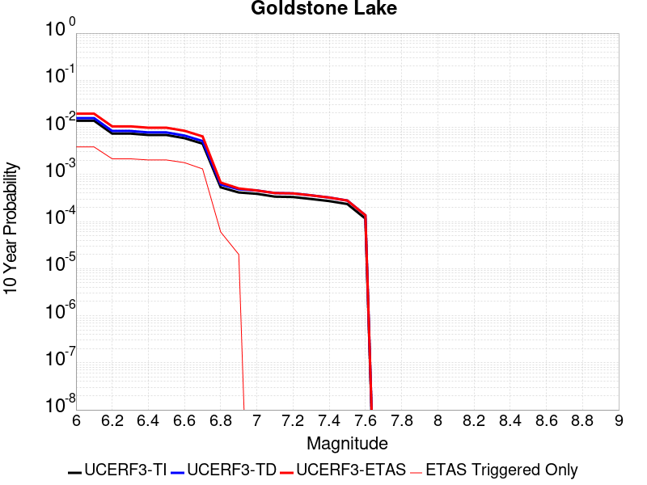 |

| Magnitude | 1 wk TI Prob | 1 wk TD Prob | 1 wk ETAS Prob | 1 wk ETAS/TD Gain | 1 wk ETAS Triggered Only | 1 mo TI Prob | 1 mo TD Prob | 1 mo ETAS Prob | 1 mo ETAS/TD Gain | 1 mo ETAS Triggered Only | 1 yr TI Prob | 1 yr TD Prob | 1 yr ETAS Prob | 1 yr ETAS/TD Gain | 1 yr ETAS Triggered Only | 10 yr TI Prob | 10 yr TD Prob | 10 yr ETAS Prob | 10 yr ETAS/TD Gain | 10 yr ETAS Triggered Only |
|-----|-----|-----|-----|-----|-----|-----|-----|-----|-----|-----|-----|-----|-----|-----|-----|-----|-----|-----|-----|-----|
| 6.0 | 2.671352E-5 | 3.037609E-5 | 0.001424062 | 46.881016 | 0.0013937282 | 1.1448149E-4 | 1.3017785E-4 | 0.0019882403 | 15.27326 | 0.0018583043 | 0.001392921 | 0.0015839594 | 0.004830841 | 3.0498514 | 0.0032520324 | 0.013842222 | 0.015746197 | 0.020090174 | 1.2758747 | 0.0044134725 |
| 6.1 | 2.671352E-5 | 3.037609E-5 | 0.001424062 | 46.881016 | 0.0013937282 | 1.1448149E-4 | 1.3017785E-4 | 0.0019882403 | 15.27326 | 0.0018583043 | 0.001392921 | 0.0015839594 | 0.004830841 | 3.0498514 | 0.0032520324 | 0.013842222 | 0.015746197 | 0.020090174 | 1.2758747 | 0.0044134725 |
| 6.2 | 1.4197047E-5 | 1.6096245E-5 | 3.6452268E-4 | 22.646444 | 3.4843205E-4 | 6.0843064E-5 | 6.8982634E-5 | 6.496627E-4 | 9.417771 | 5.807201E-4 | 7.4051257E-4 | 8.3963864E-4 | 0.0026963826 | 3.211361 | 0.0018583043 | 0.007380498 | 0.0083743585 | 0.010792958 | 1.28881 | 0.0024390244 |
| 6.3 | 1.4197047E-5 | 1.6096245E-5 | 3.6452268E-4 | 22.646444 | 3.4843205E-4 | 6.0843064E-5 | 6.8982634E-5 | 6.496627E-4 | 9.417771 | 5.807201E-4 | 7.4051257E-4 | 8.3963864E-4 | 0.0026963826 | 3.211361 | 0.0018583043 | 0.007380498 | 0.0083743585 | 0.010792958 | 1.28881 | 0.0024390244 |
| 6.4 | 1.3238931E-5 | 1.500846E-5 | 3.6343528E-4 | 24.215363 | 3.4843205E-4 | 5.6737044E-5 | 6.4320935E-5 | 6.450037E-4 | 10.027896 | 5.807201E-4 | 6.9055456E-4 | 7.82924E-4 | 0.0026397733 | 3.3716853 | 0.0018583043 | 0.006884126 | 0.0078112837 | 0.010231256 | 1.3098047 | 0.0024390244 |
| 6.5 | 1.3238931E-5 | 1.500846E-5 | 3.6343528E-4 | 24.215363 | 3.4843205E-4 | 5.6737044E-5 | 6.4320935E-5 | 6.450037E-4 | 10.027896 | 5.807201E-4 | 6.9055456E-4 | 7.82924E-4 | 0.0026397733 | 3.3716853 | 0.0018583043 | 0.006884126 | 0.0078112837 | 0.010231256 | 1.3098047 | 0.0024390244 |
| 6.6 | 1.1328278E-5 | 1.2855166E-5 | 2.4514023E-4 | 19.069393 | 2.3228803E-4 | 4.8548856E-5 | 5.5092944E-5 | 5.196434E-4 | 9.432123 | 4.6457606E-4 | 5.90922E-4 | 6.7064585E-4 | 0.0022955716 | 3.422927 | 0.0016260162 | 0.0058935313 | 0.0066956086 | 0.008656837 | 1.2929126 | 0.0019744483 |
| 6.7 | 8.651175E-6 | 9.824565E-6 | 2.4211031E-4 | 24.643364 | 2.3228803E-4 | 3.707594E-5 | 4.2105108E-5 | 5.066616E-4 | 12.033258 | 4.6457606E-4 | 4.5130608E-4 | 5.1259965E-4 | 0.0016734444 | 3.264623 | 0.0011614402 | 0.0045039062 | 0.005123051 | 0.006625188 | 1.2932115 | 0.0015098723 |
| 6.8 | 1.0215377E-6 | 1.1754702E-6 | 1.1731935E-4 | 99.80631 | 1.16144016E-4 | 4.378012E-6 | 5.0377203E-6 | 1.21181154E-4 | 24.05476 | 1.16144016E-4 | 5.3300988E-5 | 6.1332634E-5 | 1.7746953E-4 | 2.8935578 | 1.16144016E-4 | 5.3288206E-4 | 6.1316835E-4 | 7.292411E-4 | 1.1893001 | 1.16144016E-4 |
| 6.9 | 7.9360774E-7 | 9.2833966E-7 | 1.1707225E-4 | 126.10929 | 1.16144016E-4 | 3.4011714E-6 | 3.9785928E-6 | 1.20122146E-4 | 30.19212 | 1.16144016E-4 | 4.1408475E-5 | 4.843836E-5 | 1.6457675E-4 | 3.397653 | 1.16144016E-4 | 4.140076E-4 | 4.8428503E-4 | 6.003728E-4 | 1.2397096 | 1.16144016E-4 |
| 7.0 | 7.4382757E-7 | 8.7473285E-7 | 8.7473285E-7 | 1.0 | 0.0 | 3.1878285E-6 | 3.74885E-6 | 3.74885E-6 | 1.0 | 0.0 | 3.8811122E-5 | 4.564136E-5 | 4.564136E-5 | 1.0 | 0.0 | 3.8804344E-4 | 4.5632652E-4 | 4.5632652E-4 | 1.0 | 0.0 |
| 7.1 | 6.4709513E-7 | 7.7113E-7 | 7.7113E-7 | 1.0 | 0.0 | 2.773262E-6 | 3.3048389E-6 | 3.3048389E-6 | 1.0 | 0.0 | 3.376394E-5 | 4.0235733E-5 | 4.0235733E-5 | 1.0 | 0.0 | 3.375881E-4 | 4.0229043E-4 | 4.0229043E-4 | 1.0 | 0.0 |
| 7.2 | 6.356704E-7 | 7.5883594E-7 | 7.5883594E-7 | 1.0 | 0.0 | 2.7242988E-6 | 3.2521505E-6 | 3.2521505E-6 | 1.0 | 0.0 | 3.3167835E-5 | 3.959427E-5 | 3.959427E-5 | 1.0 | 0.0 | 3.3162883E-4 | 3.958781E-4 | 3.958781E-4 | 1.0 | 0.0 |
| 7.3 | 5.7695723E-7 | 6.8965653E-7 | 6.8965653E-7 | 1.0 | 0.0 | 2.4726714E-6 | 2.9556677E-6 | 2.9556677E-6 | 1.0 | 0.0 | 3.0104358E-5 | 3.5984718E-5 | 3.5984718E-5 | 1.0 | 0.0 | 3.0100282E-4 | 3.5979465E-4 | 3.5979465E-4 | 1.0 | 0.0 |
| 7.4 | 5.209647E-7 | 6.193514E-7 | 6.193514E-7 | 1.0 | 0.0 | 2.232704E-6 | 2.6543607E-6 | 2.6543607E-6 | 1.0 | 0.0 | 2.718283E-5 | 3.2316417E-5 | 3.2316417E-5 | 1.0 | 0.0 | 2.7179506E-4 | 3.2312275E-4 | 3.2312275E-4 | 1.0 | 0.0 |
| 7.5 | 4.512955E-7 | 5.348885E-7 | 5.348885E-7 | 1.0 | 0.0 | 1.934122E-6 | 2.2923775E-6 | 2.2923775E-6 | 1.0 | 0.0 | 2.3547682E-5 | 2.7909393E-5 | 2.7909393E-5 | 1.0 | 0.0 | 2.3545188E-4 | 2.7906417E-4 | 2.7906417E-4 | 1.0 | 0.0 |
| 7.6 | 2.21172E-7 | 2.603961E-7 | 2.603961E-7 | 1.0 | 0.0 | 9.478797E-7 | 1.1159829E-6 | 1.1159829E-6 | 1.0 | 0.0 | 1.1540374E-5 | 1.3587036E-5 | 1.3587036E-5 | 1.0 | 0.0 | 1.1539775E-4 | 1.3586486E-4 | 1.3586486E-4 | 1.0 | 0.0 |

## Airport Lake
*[(top)](#table-of-contents)*

| 1 Week | 1 Month | 1 Year | 10 Year |
|-----|-----|-----|-----|
|  |  |  |  |

| Magnitude | 1 wk TI Prob | 1 wk TD Prob | 1 wk ETAS Prob | 1 wk ETAS/TD Gain | 1 wk ETAS Triggered Only | 1 mo TI Prob | 1 mo TD Prob | 1 mo ETAS Prob | 1 mo ETAS/TD Gain | 1 mo ETAS Triggered Only | 1 yr TI Prob | 1 yr TD Prob | 1 yr ETAS Prob | 1 yr ETAS/TD Gain | 1 yr ETAS Triggered Only | 10 yr TI Prob | 10 yr TD Prob | 10 yr ETAS Prob | 10 yr ETAS/TD Gain | 10 yr ETAS Triggered Only |
|-----|-----|-----|-----|-----|-----|-----|-----|-----|-----|-----|-----|-----|-----|-----|-----|-----|-----|-----|-----|-----|
| 6.0 | 1.2387061E-5 | 1.3103157E-5 | 0.002335953 | 178.27406 | 0.0023228803 | 5.3086325E-5 | 5.615534E-5 | 0.0028434552 | 50.63553 | 0.0027874564 | 6.461343E-4 | 6.8350515E-4 | 0.0043975734 | 6.4338555 | 0.0037166085 | 0.0064425888 | 0.0068168393 | 0.011315579 | 1.659945 | 0.004529617 |
| 6.1 | 1.2387061E-5 | 1.3103157E-5 | 0.002335953 | 178.27406 | 0.0023228803 | 5.3086325E-5 | 5.615534E-5 | 0.0028434552 | 50.63553 | 0.0027874564 | 6.461343E-4 | 6.8350515E-4 | 0.0043975734 | 6.4338555 | 0.0037166085 | 0.0064425888 | 0.0068168393 | 0.011315579 | 1.659945 | 0.004529617 |
| 6.2 | 1.2387061E-5 | 1.3103157E-5 | 0.002335953 | 178.27406 | 0.0023228803 | 5.3086325E-5 | 5.615534E-5 | 0.0028434552 | 50.63553 | 0.0027874564 | 6.461343E-4 | 6.8350515E-4 | 0.0043975734 | 6.4338555 | 0.0037166085 | 0.0064425888 | 0.0068168393 | 0.011315579 | 1.659945 | 0.004529617 |
| 6.3 | 1.2387061E-5 | 1.3103157E-5 | 0.002335953 | 178.27406 | 0.0023228803 | 5.3086325E-5 | 5.615534E-5 | 0.0028434552 | 50.63553 | 0.0027874564 | 6.461343E-4 | 6.8350515E-4 | 0.0043975734 | 6.4338555 | 0.0037166085 | 0.0064425888 | 0.0068168393 | 0.011315579 | 1.659945 | 0.004529617 |
| 6.4 | 1.2387061E-5 | 1.3103157E-5 | 0.002335953 | 178.27406 | 0.0023228803 | 5.3086325E-5 | 5.615534E-5 | 0.0028434552 | 50.63553 | 0.0027874564 | 6.461343E-4 | 6.8350515E-4 | 0.0043975734 | 6.4338555 | 0.0037166085 | 0.0064425888 | 0.0068168393 | 0.011315579 | 1.659945 | 0.004529617 |
| 6.5 | 6.9922594E-6 | 7.384925E-6 | 0.0018656756 | 252.63297 | 0.0018583043 | 2.996648E-5 | 3.1649324E-5 | 0.0021221754 | 67.05279 | 0.0020905924 | 3.6478083E-4 | 3.8526783E-4 | 0.0031716505 | 8.232326 | 0.0027874564 | 0.003641826 | 0.0038465366 | 0.00708606 | 1.8421923 | 0.0032520324 |
| 6.6 | 6.9922594E-6 | 7.384925E-6 | 0.0018656756 | 252.63297 | 0.0018583043 | 2.996648E-5 | 3.1649324E-5 | 0.0021221754 | 67.05279 | 0.0020905924 | 3.6478083E-4 | 3.8526783E-4 | 0.0031716505 | 8.232326 | 0.0027874564 | 0.003641826 | 0.0038465366 | 0.00708606 | 1.8421923 | 0.0032520324 |
| 6.7 | 5.477277E-6 | 5.7860684E-6 | 0.0017479362 | 302.09396 | 0.0017421603 | 2.3473833E-5 | 2.4797222E-5 | 0.0019991966 | 80.621796 | 0.0019744483 | 2.8575645E-4 | 3.0186825E-4 | 0.0028562653 | 9.46196 | 0.0025551685 | 0.0028538927 | 0.003014966 | 0.006025606 | 1.9985652 | 0.0030197445 |
| 6.8 | 3.9950432E-6 | 4.2190873E-6 | 0.0011656544 | 276.2812 | 0.0011614402 | 1.7121502E-5 | 1.8081691E-5 | 0.0012956428 | 71.65495 | 0.0012775842 | 2.0843433E-4 | 2.2012512E-4 | 0.001961902 | 8.912667 | 0.0017421603 | 0.0020823893 | 0.0021993418 | 0.004285336 | 1.9484631 | 0.0020905924 |
| 6.9 | 2.95695E-6 | 3.1230243E-6 | 8.161286E-4 | 261.3264 | 8.130081E-4 | 1.2672582E-5 | 1.3384334E-5 | 9.4252406E-4 | 70.419945 | 9.291521E-4 | 1.5427776E-4 | 1.6294434E-4 | 0.0014403204 | 8.839339 | 0.0012775842 | 0.001541707 | 0.0016284712 | 0.0032518394 | 1.9968665 | 0.0016260162 |
| 7.0 | 1.456072E-6 | 1.540812E-6 | 3.4997234E-4 | 227.135 | 3.4843205E-4 | 6.2402937E-6 | 6.603469E-6 | 3.5503323E-4 | 53.764652 | 3.4843205E-4 | 7.597293E-5 | 8.039528E-5 | 6.6106865E-4 | 8.222731 | 5.807201E-4 | 7.594696E-4 | 8.0376083E-4 | 0.0013840141 | 1.7219229 | 5.807201E-4 |
| 7.1 | 6.995192E-7 | 7.4089746E-7 | 7.4089746E-7 | 1.0 | 0.0 | 2.997936E-6 | 3.1752747E-6 | 3.1752747E-6 | 1.0 | 0.0 | 3.649926E-5 | 3.865897E-5 | 1.547985E-4 | 4.0042067 | 1.16144016E-4 | 3.6493264E-4 | 3.865897E-4 | 5.026888E-4 | 1.3003161 | 1.16144016E-4 |

## McLean Lake
*[(top)](#table-of-contents)*

| 1 Week | 1 Month | 1 Year | 10 Year |
|-----|-----|-----|-----|
|  |  |  |  |

| Magnitude | 1 wk TI Prob | 1 wk TD Prob | 1 wk ETAS Prob | 1 wk ETAS/TD Gain | 1 wk ETAS Triggered Only | 1 mo TI Prob | 1 mo TD Prob | 1 mo ETAS Prob | 1 mo ETAS/TD Gain | 1 mo ETAS Triggered Only | 1 yr TI Prob | 1 yr TD Prob | 1 yr ETAS Prob | 1 yr ETAS/TD Gain | 1 yr ETAS Triggered Only | 10 yr TI Prob | 10 yr TD Prob | 10 yr ETAS Prob | 10 yr ETAS/TD Gain | 10 yr ETAS Triggered Only |
|-----|-----|-----|-----|-----|-----|-----|-----|-----|-----|-----|-----|-----|-----|-----|-----|-----|-----|-----|-----|-----|
| 6.0 | 1.7360222E-5 | 1.8501627E-5 | 7.153528E-4 | 38.66432 | 6.968641E-4 | 7.439883E-5 | 7.9290556E-5 | 0.0012406387 | 15.64674 | 0.0011614402 | 9.0542925E-4 | 9.6498354E-4 | 0.0035176864 | 3.6453328 | 0.0025551685 | 0.009017491 | 0.0096127745 | 0.013178629 | 1.3709495 | 0.0036004647 |
| 6.1 | 9.062689E-6 | 9.592193E-6 | 4.7416383E-4 | 49.432262 | 4.6457606E-4 | 3.8839516E-5 | 4.1108804E-5 | 7.3794427E-4 | 17.951004 | 6.968641E-4 | 4.727685E-4 | 5.003936E-4 | 0.0020095103 | 4.015859 | 0.0015098723 | 0.0047176396 | 0.004993552 | 0.0071892687 | 1.4397105 | 0.0022067362 |
| 6.2 | 9.062689E-6 | 9.592193E-6 | 4.7416383E-4 | 49.432262 | 4.6457606E-4 | 3.8839516E-5 | 4.1108804E-5 | 7.3794427E-4 | 17.951004 | 6.968641E-4 | 4.727685E-4 | 5.003936E-4 | 0.0020095103 | 4.015859 | 0.0015098723 | 0.0047176396 | 0.004993552 | 0.0071892687 | 1.4397105 | 0.0022067362 |
| 6.3 | 7.2575485E-6 | 7.66771E-6 | 4.722402E-4 | 61.588173 | 4.6457606E-4 | 3.110341E-5 | 3.2861237E-5 | 7.297025E-4 | 22.205568 | 6.968641E-4 | 3.786182E-4 | 4.0001926E-4 | 0.0015609949 | 3.9022994 | 0.0011614402 | 0.0037797375 | 0.0039936965 | 0.0058445795 | 1.463451 | 0.0018583043 |
| 6.4 | 7.2575485E-6 | 7.66771E-6 | 4.722402E-4 | 61.588173 | 4.6457606E-4 | 3.110341E-5 | 3.2861237E-5 | 7.297025E-4 | 22.205568 | 6.968641E-4 | 3.786182E-4 | 4.0001926E-4 | 0.0015609949 | 3.9022994 | 0.0011614402 | 0.0037797375 | 0.0039936965 | 0.0058445795 | 1.463451 | 0.0018583043 |
| 6.5 | 6.06582E-6 | 6.4038773E-6 | 4.70977E-4 | 73.5456 | 4.6457606E-4 | 2.5996113E-5 | 2.7444936E-5 | 7.242899E-4 | 26.39066 | 6.968641E-4 | 3.164567E-4 | 3.3409733E-4 | 0.0013790443 | 4.127672 | 0.0010452962 | 0.0031600643 | 0.0033365893 | 0.0050729364 | 1.5203959 | 0.0017421603 |
| 6.6 | 5.598744E-6 | 5.910262E-6 | 4.704836E-4 | 79.60452 | 4.6457606E-4 | 2.3994397E-5 | 2.5329486E-5 | 7.2217593E-4 | 28.511276 | 6.968641E-4 | 2.9209262E-4 | 3.0834923E-4 | 0.0013533231 | 4.3889294 | 0.0010452962 | 0.0029170897 | 0.003079843 | 0.0047008516 | 1.5263282 | 0.0016260162 |
| 6.7 | 5.246996E-6 | 5.539162E-6 | 4.7011266E-4 | 84.87072 | 4.6457606E-4 | 2.2486933E-5 | 2.3739085E-5 | 7.205866E-4 | 30.35444 | 6.968641E-4 | 2.73744E-4 | 2.8899137E-4 | 0.0013339855 | 4.6160045 | 0.0010452962 | 0.0027340704 | 0.0028867796 | 0.004508102 | 1.561637 | 0.0016260162 |
| 6.8 | 4.02324E-6 | 4.2469046E-6 | 4.68821E-4 | 110.39123 | 4.6457606E-4 | 1.7242342E-5 | 1.8200926E-5 | 7.1505236E-4 | 39.286594 | 6.968641E-4 | 2.099053E-4 | 2.2157968E-4 | 0.001150526 | 5.19238 | 9.291521E-4 | 0.0020970714 | 0.002214172 | 0.0034889274 | 1.5757256 | 0.0012775842 |
| 6.9 | 6.835972E-7 | 7.1399285E-7 | 7.1399285E-7 | 1.0 | 0.0 | 2.9296991E-6 | 3.0599674E-6 | 3.0599674E-6 | 1.0 | 0.0 | 3.56685E-5 | 3.7254784E-5 | 1.5339447E-4 | 4.1174436 | 1.16144016E-4 | 3.5662777E-4 | 3.7251666E-4 | 6.0471817E-4 | 1.6233319 | 2.3228803E-4 |

## So Sierra Nevada
*[(top)](#table-of-contents)*

| 1 Week | 1 Month | 1 Year | 10 Year |
|-----|-----|-----|-----|
|  | 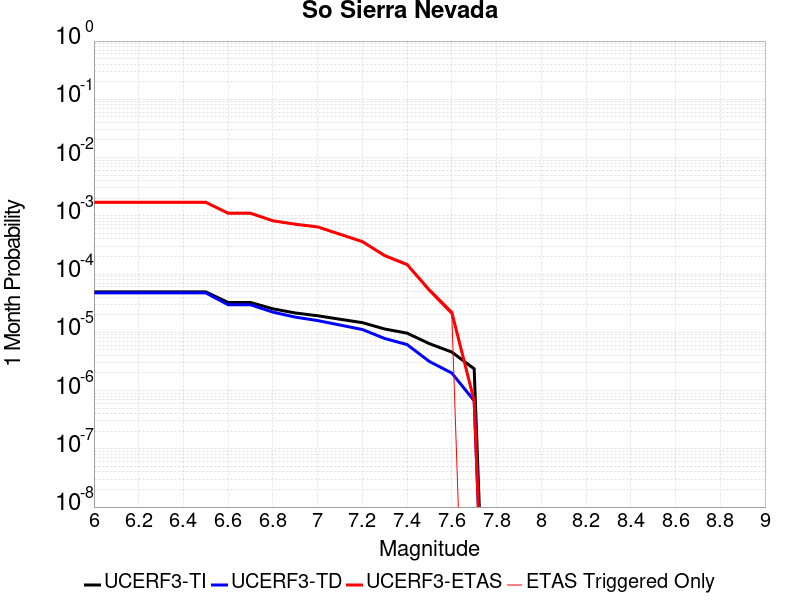 |  |  |

| Magnitude | 1 wk TI Prob | 1 wk TD Prob | 1 wk ETAS Prob | 1 wk ETAS/TD Gain | 1 wk ETAS Triggered Only | 1 mo TI Prob | 1 mo TD Prob | 1 mo ETAS Prob | 1 mo ETAS/TD Gain | 1 mo ETAS Triggered Only | 1 yr TI Prob | 1 yr TD Prob | 1 yr ETAS Prob | 1 yr ETAS/TD Gain | 1 yr ETAS Triggered Only | 10 yr TI Prob | 10 yr TD Prob | 10 yr ETAS Prob | 10 yr ETAS/TD Gain | 10 yr ETAS Triggered Only |
|-----|-----|-----|-----|-----|-----|-----|-----|-----|-----|-----|-----|-----|-----|-----|-----|-----|-----|-----|-----|-----|
| 6.0 | 1.15488665E-5 | 1.1079643E-5 | 0.0016370779 | 147.75548 | 0.0016260162 | 4.9494203E-5 | 4.748339E-5 | 0.002254115 | 47.471653 | 0.0022067362 | 6.024253E-4 | 5.7796965E-4 | 0.0033638151 | 5.8200545 | 0.0027874564 | 0.006007948 | 0.005765934 | 0.009345639 | 1.6208369 | 0.0036004647 |
| 6.1 | 1.15488665E-5 | 1.1079643E-5 | 0.0016370779 | 147.75548 | 0.0016260162 | 4.9494203E-5 | 4.748339E-5 | 0.002254115 | 47.471653 | 0.0022067362 | 6.024253E-4 | 5.7796965E-4 | 0.0033638151 | 5.8200545 | 0.0027874564 | 0.006007948 | 0.005765934 | 0.009345639 | 1.6208369 | 0.0036004647 |
| 6.2 | 1.15488665E-5 | 1.1079643E-5 | 0.0016370779 | 147.75548 | 0.0016260162 | 4.9494203E-5 | 4.748339E-5 | 0.002254115 | 47.471653 | 0.0022067362 | 6.024253E-4 | 5.7796965E-4 | 0.0033638151 | 5.8200545 | 0.0027874564 | 0.006007948 | 0.005765934 | 0.009345639 | 1.6208369 | 0.0036004647 |
| 6.3 | 1.15488665E-5 | 1.1079643E-5 | 0.0016370779 | 147.75548 | 0.0016260162 | 4.9494203E-5 | 4.748339E-5 | 0.002254115 | 47.471653 | 0.0022067362 | 6.024253E-4 | 5.7796965E-4 | 0.0033638151 | 5.8200545 | 0.0027874564 | 0.006007948 | 0.005765934 | 0.009345639 | 1.6208369 | 0.0036004647 |
| 6.4 | 1.15488665E-5 | 1.1079643E-5 | 0.0016370779 | 147.75548 | 0.0016260162 | 4.9494203E-5 | 4.748339E-5 | 0.002254115 | 47.471653 | 0.0022067362 | 6.024253E-4 | 5.7796965E-4 | 0.0033638151 | 5.8200545 | 0.0027874564 | 0.006007948 | 0.005765934 | 0.009345639 | 1.6208369 | 0.0036004647 |
| 6.5 | 1.15488665E-5 | 1.1079643E-5 | 0.0016370779 | 147.75548 | 0.0016260162 | 4.9494203E-5 | 4.748339E-5 | 0.002254115 | 47.471653 | 0.0022067362 | 6.024253E-4 | 5.7796965E-4 | 0.0033638151 | 5.8200545 | 0.0027874564 | 0.006007948 | 0.005765934 | 0.009345639 | 1.6208369 | 0.0036004647 |
| 6.6 | 7.587044E-6 | 6.935635E-6 | 0.0010522245 | 151.71278 | 0.0010452962 | 3.2515498E-5 | 2.9723828E-5 | 0.00130727 | 43.98054 | 0.0012775842 | 3.9580427E-4 | 3.6183043E-4 | 0.0022194623 | 6.1339846 | 0.0018583043 | 0.003951 | 0.0036127048 | 0.0058114687 | 1.6086199 | 0.0022067362 |
| 6.7 | 7.587044E-6 | 6.935635E-6 | 0.0010522245 | 151.71278 | 0.0010452962 | 3.2515498E-5 | 2.9723828E-5 | 0.00130727 | 43.98054 | 0.0012775842 | 3.9580427E-4 | 3.6183043E-4 | 0.0022194623 | 6.1339846 | 0.0018583043 | 0.003951 | 0.0036127048 | 0.0058114687 | 1.6086199 | 0.0022067362 |
| 6.8 | 5.9026956E-6 | 5.1793927E-6 | 7.020399E-4 | 135.54483 | 6.968641E-4 | 2.5297022E-5 | 2.2197215E-5 | 9.513287E-4 | 42.85802 | 9.291521E-4 | 3.0794772E-4 | 2.7021873E-4 | 0.0016635704 | 6.156384 | 0.0013937282 | 0.0030752132 | 0.002699018 | 0.0042048153 | 1.5579056 | 0.0015098723 |
| 6.9 | 5.0118915E-6 | 4.2524252E-6 | 5.8497005E-4 | 137.56151 | 5.807201E-4 | 2.1479358E-5 | 1.8224557E-5 | 8.3121785E-4 | 45.60977 | 8.130081E-4 | 2.614798E-4 | 2.2186211E-4 | 0.0013830446 | 6.233803 | 0.0011614402 | 0.0026117235 | 0.0022164788 | 0.0033753447 | 1.522841 | 0.0011614402 |
| 7.0 | 4.4924795E-6 | 3.7139177E-6 | 5.8443187E-4 | 157.36263 | 5.807201E-4 | 1.925334E-5 | 1.5916696E-5 | 8.289119E-4 | 52.078136 | 8.130081E-4 | 2.3438422E-4 | 1.9376918E-4 | 0.0012388628 | 6.3934975 | 0.0010452962 | 0.0023413717 | 0.0019360651 | 0.0029793377 | 1.5388622 | 0.0010452962 |
| 7.1 | 3.9118436E-6 | 3.1119775E-6 | 4.676866E-4 | 150.28598 | 4.6457606E-4 | 1.6764936E-5 | 1.3336982E-5 | 4.7790687E-4 | 35.83321 | 4.6457606E-4 | 2.0409399E-4 | 1.6236622E-4 | 8.591172E-4 | 5.291231 | 6.968641E-4 | 0.0020390663 | 0.001622532 | 0.0023182654 | 1.4287949 | 6.968641E-4 |
| 7.2 | 3.4200818E-6 | 2.6054543E-6 | 3.510366E-4 | 134.73143 | 3.4843205E-4 | 1.4657411E-5 | 1.11661875E-5 | 3.5959436E-4 | 32.20386 | 3.4843205E-4 | 1.7843937E-4 | 1.3594035E-4 | 6.004533E-4 | 4.4170346 | 4.6457606E-4 | 0.0017829615 | 0.0013586218 | 0.0018225666 | 1.341482 | 4.6457606E-4 |
| 7.3 | 2.6593618E-6 | 1.8284203E-6 | 3.5025983E-4 | 191.56418 | 3.4843205E-4 | 1.13972155E-5 | 7.836065E-6 | 3.562654E-4 | 45.464832 | 3.4843205E-4 | 1.3875226E-4 | 9.540021E-5 | 5.5993197E-4 | 5.869295 | 4.6457606E-4 | 0.0013866565 | 9.5362146E-4 | 0.0014177545 | 1.4867058 | 4.6457606E-4 |
| 7.4 | 2.2577992E-6 | 1.436438E-6 | 1.1758029E-4 | 81.85545 | 1.16144016E-4 | 9.676246E-6 | 6.15615E-6 | 1.2229945E-4 | 19.866224 | 1.16144016E-4 | 1.1780193E-4 | 7.49488E-5 | 3.0721942E-4 | 4.099057 | 2.3228803E-4 | 0.001177395 | 7.492603E-4 | 9.813743E-4 | 1.3097908 | 2.3228803E-4 |
| 7.5 | 1.489319E-6 | 7.353936E-7 | 7.353936E-7 | 1.0 | 0.0 | 6.3827797E-6 | 3.1516831E-6 | 3.1516831E-6 | 1.0 | 0.0 | 7.770758E-5 | 3.8371072E-5 | 1.5451064E-4 | 4.026748 | 1.16144016E-4 | 7.7680405E-4 | 3.836449E-4 | 4.997444E-4 | 1.3026222 | 1.16144016E-4 |
| 7.6 | 1.0680322E-6 | 4.6596554E-7 | 4.6596554E-7 | 1.0 | 0.0 | 4.577273E-6 | 1.9969937E-6 | 1.9969937E-6 | 1.0 | 0.0 | 5.5726876E-5 | 2.4313129E-5 | 1.4045433E-4 | 5.776892 | 1.16144016E-4 | 5.5712904E-4 | 2.4310495E-4 | 3.5922075E-4 | 1.4776365 | 1.16144016E-4 |
| 7.7 | 5.509146E-7 | 1.5580486E-7 | 1.5580486E-7 | 1.0 | 0.0 | 2.3610605E-6 | 6.677349E-7 | 6.677349E-7 | 1.0 | 0.0 | 2.8745531E-5 | 8.129644E-6 | 8.129644E-6 | 1.0 | 0.0 | 2.8741814E-4 | 8.1293576E-5 | 8.1293576E-5 | 1.0 | 0.0 |

## Garlock (West)
*[(top)](#table-of-contents)*

| 1 Week | 1 Month | 1 Year | 10 Year |
|-----|-----|-----|-----|
|  | 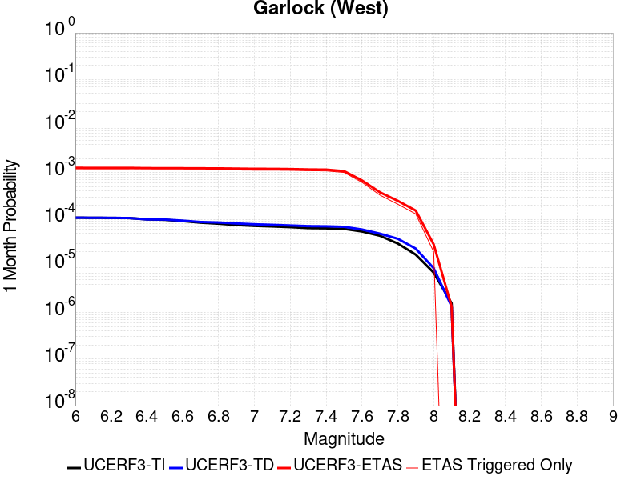 |  |  |

| Magnitude | 1 wk TI Prob | 1 wk TD Prob | 1 wk ETAS Prob | 1 wk ETAS/TD Gain | 1 wk ETAS Triggered Only | 1 mo TI Prob | 1 mo TD Prob | 1 mo ETAS Prob | 1 mo ETAS/TD Gain | 1 mo ETAS Triggered Only | 1 yr TI Prob | 1 yr TD Prob | 1 yr ETAS Prob | 1 yr ETAS/TD Gain | 1 yr ETAS Triggered Only | 10 yr TI Prob | 10 yr TD Prob | 10 yr ETAS Prob | 10 yr ETAS/TD Gain | 10 yr ETAS Triggered Only |
|-----|-----|-----|-----|-----|-----|-----|-----|-----|-----|-----|-----|-----|-----|-----|-----|-----|-----|-----|-----|-----|
| 6.0 | 2.5181727E-5 | 2.51973E-5 | 0.0011866082 | 47.092674 | 0.0011614402 | 1.0791722E-4 | 1.0798398E-4 | 0.0013854302 | 12.829961 | 0.0012775842 | 0.0013131002 | 0.0013139155 | 0.0036337439 | 2.7655842 | 0.0023228803 | 0.013053683 | 0.013141977 | 0.016351271 | 1.2442018 | 0.0032520324 |
| 6.1 | 2.5077732E-5 | 2.5098372E-5 | 0.0011865094 | 47.274357 | 0.0011614402 | 1.0747157E-4 | 1.0756004E-4 | 0.0013850068 | 12.876593 | 0.0012775842 | 0.001307681 | 0.0013087603 | 0.0036286004 | 2.772548 | 0.0023228803 | 0.013000126 | 0.013091032 | 0.016300492 | 1.2451648 | 0.0032520324 |
| 6.2 | 2.494612E-5 | 2.498005E-5 | 0.0011863912 | 47.49355 | 0.0011614402 | 1.0690756E-4 | 1.0705298E-4 | 0.0013845004 | 12.932852 | 0.0012775842 | 0.0013008224 | 0.0013025942 | 0.0036224488 | 2.7809496 | 0.0023228803 | 0.012932341 | 0.013030097 | 0.016239755 | 1.2463266 | 0.0032520324 |
| 6.3 | 2.4733758E-5 | 2.479942E-5 | 0.0011862108 | 47.8322 | 0.0011614402 | 1.0599751E-4 | 1.06278916E-4 | 0.0013837273 | 13.019773 | 0.0012775842 | 0.0012897556 | 0.0012931811 | 0.0036130575 | 2.79393 | 0.0023228803 | 0.012822957 | 0.012937066 | 0.016147027 | 1.2481213 | 0.0032520324 |
| 6.4 | 2.3237335E-5 | 2.317873E-5 | 0.0010684506 | 46.09617 | 0.0010452962 | 9.958477E-5 | 9.933365E-5 | 0.0012606585 | 12.691153 | 0.0011614402 | 0.0012117702 | 0.001208719 | 0.003412788 | 2.8234751 | 0.0022067362 | 0.012051838 | 0.012101916 | 0.015085115 | 1.2465065 | 0.0030197445 |
| 6.5 | 2.2732203E-5 | 2.2993298E-5 | 0.0010682654 | 46.45986 | 0.0010452962 | 9.742009E-5 | 9.8539E-5 | 0.0012598648 | 12.785443 | 0.0011614402 | 0.0011854442 | 0.0011990548 | 0.0034031451 | 2.8381898 | 0.0022067362 | 0.011791403 | 0.012006322 | 0.014989811 | 1.2484931 | 0.0030197445 |
| 6.6 | 2.1319436E-5 | 2.17735E-5 | 0.0010670469 | 49.00668 | 0.0010452962 | 9.136581E-5 | 9.331167E-5 | 0.0012546434 | 13.445729 | 0.0011614402 | 0.001111811 | 0.0011354799 | 0.0033397104 | 2.9412327 | 0.0022067362 | 0.011062649 | 0.011377227 | 0.014362615 | 1.2624004 | 0.0030197445 |
| 6.7 | 1.970802E-5 | 2.0393396E-5 | 0.0010656683 | 52.255558 | 0.0010452962 | 8.446021E-5 | 8.739735E-5 | 0.001248736 | 14.288031 | 0.0011614402 | 0.001027818 | 0.001063545 | 0.0032679343 | 3.0726807 | 0.0022067362 | 0.010230771 | 0.010664964 | 0.0136525035 | 1.2801265 | 0.0030197445 |
| 6.8 | 1.8744462E-5 | 1.9901045E-5 | 0.0010651764 | 53.523643 | 0.0010452962 | 8.033094E-5 | 8.5287415E-5 | 0.0012466286 | 14.616794 | 0.0011614402 | 9.775903E-4 | 0.0010378812 | 0.0032423274 | 3.1239867 | 0.0022067362 | 0.009733009 | 0.01041075 | 0.013399057 | 1.2870405 | 0.0030197445 |
| 6.9 | 1.7559682E-5 | 1.8953415E-5 | 0.0010642298 | 56.149765 | 0.0010452962 | 7.5253614E-5 | 8.12264E-5 | 0.0012425722 | 15.297641 | 0.0011614402 | 9.158276E-4 | 9.884841E-4 | 0.0031930392 | 3.230238 | 0.0022067362 | 0.0091206245 | 0.009921231 | 0.012911016 | 1.3013521 | 0.0030197445 |
| 7.0 | 1.6794445E-5 | 1.8216237E-5 | 0.0010634933 | 58.381615 | 0.0010452962 | 7.197421E-5 | 7.8067256E-5 | 0.0012394168 | 15.876268 | 0.0011614402 | 8.759337E-4 | 9.5005584E-4 | 0.0031546957 | 3.320537 | 0.0022067362 | 0.008724891 | 0.009540141 | 0.012531077 | 1.3135107 | 0.0030197445 |
| 7.1 | 1.6337795E-5 | 1.7717046E-5 | 0.0010629947 | 59.998417 | 0.0010452962 | 7.0017246E-5 | 7.5927994E-5 | 0.00123728 | 16.295439 | 0.0011614402 | 8.521265E-4 | 9.240326E-4 | 0.0031287298 | 3.3859518 | 0.0022067362 | 0.008488664 | 0.009281996 | 0.012273711 | 1.3223138 | 0.0030197445 |
| 7.2 | 1.5780008E-5 | 1.7165687E-5 | 0.001062444 | 61.89347 | 0.0010452962 | 6.762685E-5 | 7.356516E-5 | 0.0012349199 | 16.786749 | 0.0011614402 | 8.2304585E-4 | 8.9528906E-4 | 0.0031000497 | 3.4626243 | 0.0022067362 | 0.008200042 | 0.008996838 | 0.011989415 | 1.3326254 | 0.0030197445 |
| 7.3 | 1.5058865E-5 | 1.6618762E-5 | 0.0010618976 | 63.897514 | 0.0010452962 | 6.45364E-5 | 7.122133E-5 | 0.0011164431 | 15.675684 | 0.0010452962 | 7.854473E-4 | 8.667759E-4 | 0.0029555561 | 3.4098272 | 0.0020905924 | 0.00782677 | 0.008713539 | 0.011591838 | 1.330325 | 0.0029036005 |
| 7.4 | 1.4887923E-5 | 1.6454731E-5 | 0.0010617337 | 64.52452 | 0.0010452962 | 6.380382E-5 | 7.051838E-5 | 0.0011157409 | 15.821986 | 0.0010452962 | 7.7653467E-4 | 8.582243E-4 | 0.0029470224 | 3.4338605 | 0.0020905924 | 0.0077382675 | 0.008628399 | 0.011506946 | 1.3336132 | 0.0029036005 |
| 7.5 | 1.4509299E-5 | 1.6046748E-5 | 9.45184E-4 | 58.9019 | 9.291521E-4 | 6.218123E-5 | 6.876997E-5 | 9.978582E-4 | 14.510086 | 9.291521E-4 | 7.567935E-4 | 8.36954E-4 | 0.002693703 | 3.21846 | 0.0018583043 | 0.0075422134 | 0.008416704 | 0.011065533 | 1.314711 | 0.0026713125 |
| 7.6 | 1.2756717E-5 | 1.4050848E-5 | 5.947628E-4 | 42.329315 | 5.807201E-4 | 5.4670498E-5 | 6.0216535E-5 | 6.409017E-4 | 10.643284 | 5.807201E-4 | 6.6541E-4 | 7.328904E-4 | 0.002125597 | 2.9002934 | 0.0013937282 | 0.006634211 | 0.0073816874 | 0.009226275 | 1.2498869 | 0.0018583043 |
| 7.7 | 1.0328985E-5 | 1.1460557E-5 | 2.4374593E-4 | 21.268244 | 2.3228803E-4 | 4.4266326E-5 | 4.911575E-5 | 2.813924E-4 | 5.729168 | 2.3228803E-4 | 5.388092E-4 | 5.978206E-4 | 0.0012942681 | 2.1649776 | 6.968641E-4 | 0.0053750467 | 0.006038511 | 0.0069620525 | 1.152942 | 9.291521E-4 |
| 7.8 | 7.0306583E-6 | 8.899601E-6 | 2.4118557E-4 | 27.100718 | 2.3228803E-4 | 3.0131043E-5 | 3.814059E-5 | 2.7041975E-4 | 7.0900784 | 2.3228803E-4 | 3.667837E-4 | 4.642629E-4 | 0.0011608035 | 2.500315 | 6.968641E-4 | 0.003661789 | 0.0046952725 | 0.0055044633 | 1.1723416 | 8.130081E-4 |
| 7.9 | 4.060633E-6 | 5.4653938E-6 | 1.2160878E-4 | 22.250689 | 1.16144016E-4 | 1.7402595E-5 | 2.3422906E-5 | 1.395642E-4 | 5.9584494 | 1.16144016E-4 | 2.11856E-4 | 2.851367E-4 | 6.334694E-4 | 2.2216341 | 3.4843205E-4 | 0.0021165414 | 0.002884201 | 0.0033474371 | 1.1606116 | 4.6457606E-4 |
| 8.0 | 1.6729537E-6 | 2.0775144E-6 | 2.0775144E-6 | 1.0 | 0.0 | 7.169782E-6 | 8.903603E-6 | 8.903603E-6 | 1.0 | 0.0 | 8.7288594E-5 | 1.0839601E-4 | 2.2452744E-4 | 2.0713625 | 1.16144016E-4 | 8.7254314E-4 | 0.0010969337 | 0.001328967 | 1.2115289 | 2.3228803E-4 |
| 8.1 | 3.6733252E-7 | 3.1489964E-7 | 3.1489964E-7 | 1.0 | 0.0 | 1.5742813E-6 | 1.3495693E-6 | 1.3495693E-6 | 1.0 | 0.0 | 1.9166706E-5 | 1.6430899E-5 | 1.6430899E-5 | 1.0 | 0.0 | 1.9165053E-4 | 1.6638759E-4 | 1.6638759E-4 | 1.0 | 0.0 |

## Lenwood-Lockhart-Old Woman Springs
*[(top)](#table-of-contents)*

| 1 Week | 1 Month | 1 Year | 10 Year |
|-----|-----|-----|-----|
|  | 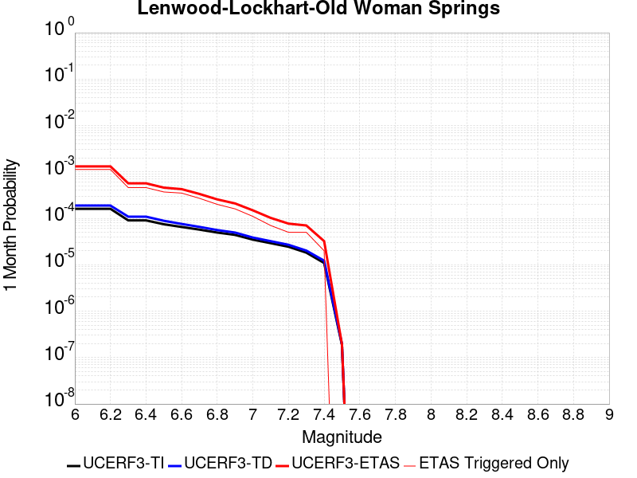 |  |  |

| Magnitude | 1 wk TI Prob | 1 wk TD Prob | 1 wk ETAS Prob | 1 wk ETAS/TD Gain | 1 wk ETAS Triggered Only | 1 mo TI Prob | 1 mo TD Prob | 1 mo ETAS Prob | 1 mo ETAS/TD Gain | 1 mo ETAS Triggered Only | 1 yr TI Prob | 1 yr TD Prob | 1 yr ETAS Prob | 1 yr ETAS/TD Gain | 1 yr ETAS Triggered Only | 10 yr TI Prob | 10 yr TD Prob | 10 yr ETAS Prob | 10 yr ETAS/TD Gain | 10 yr ETAS Triggered Only |
|-----|-----|-----|-----|-----|-----|-----|-----|-----|-----|-----|-----|-----|-----|-----|-----|-----|-----|-----|-----|-----|
| 6.0 | 3.744542E-5 | 4.396252E-5 | 7.40796E-4 | 16.850626 | 6.968641E-4 | 1.604705E-4 | 1.8839816E-4 | 0.0010012531 | 5.314559 | 8.130081E-4 | 0.0019519776 | 0.0022915069 | 0.0037979193 | 1.6573894 | 0.0015098723 | 0.019349206 | 0.022696787 | 0.025080454 | 1.1050222 | 0.0024390244 |
| 6.1 | 3.744542E-5 | 4.396252E-5 | 7.40796E-4 | 16.850626 | 6.968641E-4 | 1.604705E-4 | 1.8839816E-4 | 0.0010012531 | 5.314559 | 8.130081E-4 | 0.0019519776 | 0.0022915069 | 0.0037979193 | 1.6573894 | 0.0015098723 | 0.019349206 | 0.022696787 | 0.025080454 | 1.1050222 | 0.0024390244 |
| 6.2 | 3.744542E-5 | 4.396252E-5 | 7.40796E-4 | 16.850626 | 6.968641E-4 | 1.604705E-4 | 1.8839816E-4 | 0.0010012531 | 5.314559 | 8.130081E-4 | 0.0019519776 | 0.0022915069 | 0.0037979193 | 1.6573894 | 0.0015098723 | 0.019349206 | 0.022696787 | 0.025080454 | 1.1050222 | 0.0024390244 |
| 6.3 | 2.1079984E-5 | 2.5353434E-5 | 3.7377665E-4 | 14.742644 | 3.4843205E-4 | 9.0339665E-5 | 1.0865316E-4 | 4.5704737E-4 | 4.20648 | 3.4843205E-4 | 0.0010993304 | 0.0013220694 | 0.0019020218 | 1.4386702 | 5.807201E-4 | 0.010939079 | 0.0131442575 | 0.013831962 | 1.0523198 | 6.968641E-4 |
| 6.4 | 2.1079984E-5 | 2.5353434E-5 | 3.7377665E-4 | 14.742644 | 3.4843205E-4 | 9.0339665E-5 | 1.0865316E-4 | 4.5704737E-4 | 4.20648 | 3.4843205E-4 | 0.0010993304 | 0.0013220694 | 0.0019020218 | 1.4386702 | 5.807201E-4 | 0.010939079 | 0.0131442575 | 0.013831962 | 1.0523198 | 6.968641E-4 |
| 6.5 | 1.7397282E-5 | 2.066241E-5 | 3.6908727E-4 | 17.86274 | 3.4843205E-4 | 7.455765E-5 | 8.8550245E-5 | 4.3695144E-4 | 4.934503 | 3.4843205E-4 | 9.073613E-4 | 0.0010775778 | 0.0014256344 | 1.322999 | 3.4843205E-4 | 0.009036654 | 0.010724821 | 0.011069517 | 1.0321399 | 3.4843205E-4 |
| 6.6 | 1.52050325E-5 | 1.7679693E-5 | 3.6610558E-4 | 20.707687 | 3.4843205E-4 | 6.51628E-5 | 7.576796E-5 | 4.241736E-4 | 5.5983243 | 3.4843205E-4 | 7.9306826E-4 | 9.220924E-4 | 0.0012702032 | 1.3775227 | 3.4843205E-4 | 0.007902439 | 0.009183526 | 0.009528759 | 1.0375925 | 3.4843205E-4 |
| 6.7 | 1.332523E-5 | 1.5264002E-5 | 3.6369075E-4 | 23.826696 | 3.4843205E-4 | 5.7106878E-5 | 6.5415545E-5 | 4.138248E-4 | 6.3260927 | 3.4843205E-4 | 6.950544E-4 | 7.961491E-4 | 0.0011443037 | 1.4372983 | 3.4843205E-4 | 0.006928845 | 0.007933599 | 0.008279267 | 1.0435702 | 3.4843205E-4 |
| 6.8 | 1.1525329E-5 | 1.3030979E-5 | 3.614585E-4 | 27.7384 | 3.4843205E-4 | 4.9393333E-5 | 5.584588E-5 | 4.042585E-4 | 7.2388234 | 3.4843205E-4 | 6.011979E-4 | 6.797157E-4 | 0.001027911 | 1.5122659 | 3.4843205E-4 | 0.00599574 | 0.006776819 | 0.00712289 | 1.0510669 | 3.4843205E-4 |
| 6.9 | 1.0253909E-5 | 1.15144385E-5 | 3.599425E-4 | 31.260098 | 3.4843205E-4 | 4.3944583E-5 | 4.9346683E-5 | 3.9776156E-4 | 8.060553 | 3.4843205E-4 | 5.3489394E-4 | 6.0063385E-4 | 9.4885664E-4 | 1.5797588 | 3.4843205E-4 | 0.0053360825 | 0.0059904843 | 0.006336829 | 1.0578158 | 3.4843205E-4 |
| 7.0 | 8.104563E-6 | 8.991279E-6 | 3.574202E-4 | 39.751877 | 3.4843205E-4 | 3.4733377E-5 | 3.8533497E-5 | 3.8695213E-4 | 10.041967 | 3.4843205E-4 | 4.2279682E-4 | 4.6904673E-4 | 8.1731536E-4 | 1.742503 | 3.4843205E-4 | 0.0042199334 | 0.0046808156 | 0.005027617 | 1.0740899 | 3.4843205E-4 |
| 7.1 | 6.7986157E-6 | 7.515816E-6 | 2.398021E-4 | 31.90633 | 2.3228803E-4 | 2.91366E-5 | 3.2210253E-5 | 2.644908E-4 | 8.211386 | 2.3228803E-4 | 3.5468035E-4 | 3.920914E-4 | 6.242884E-4 | 1.5922011 | 2.3228803E-4 | 0.003541148 | 0.003914213 | 0.0041455915 | 1.0591124 | 2.3228803E-4 |
| 7.2 | 5.6893327E-6 | 6.2800136E-6 | 1.224233E-4 | 19.494114 | 1.16144016E-4 | 2.4382627E-5 | 2.6914078E-5 | 1.4305497E-4 | 5.315247 | 1.16144016E-4 | 2.9681803E-4 | 3.2763163E-4 | 4.4373758E-4 | 1.3543797 | 1.16144016E-4 | 0.002964219 | 0.0032716845 | 0.0033874486 | 1.0353836 | 1.16144016E-4 |
| 7.3 | 4.253348E-6 | 4.7069107E-6 | 1.2085038E-4 | 25.675097 | 1.16144016E-4 | 1.8228506E-5 | 2.0172329E-5 | 1.36314E-4 | 6.757475 | 1.16144016E-4 | 2.2190946E-4 | 2.4557224E-4 | 3.6168774E-4 | 1.4728364 | 1.16144016E-4 | 0.00221688 | 0.0024531898 | 0.002569049 | 1.047228 | 1.16144016E-4 |
| 7.4 | 2.5448119E-6 | 2.852045E-6 | 1.1899573E-4 | 41.72295 | 1.16144016E-4 | 1.0906291E-5 | 1.2223002E-5 | 1.283656E-4 | 10.50197 | 1.16144016E-4 | 1.3277601E-4 | 1.4880655E-4 | 2.6493327E-4 | 1.7803873 | 1.16144016E-4 | 0.001326967 | 0.0014872311 | 0.0016032024 | 1.077978 | 1.16144016E-4 |
| 7.5 | 4.3706837E-8 | 4.562909E-8 | 4.562909E-8 | 1.0 | 0.0 | 1.8731501E-7 | 1.9555324E-7 | 1.9555324E-7 | 1.0 | 0.0 | 2.2805577E-6 | 2.3808586E-6 | 2.3808586E-6 | 1.0 | 0.0 | 2.2805343E-5 | 2.3808387E-5 | 2.3808387E-5 | 1.0 | 0.0 |

## Nelson Lake
*[(top)](#table-of-contents)*

| 1 Week | 1 Month | 1 Year | 10 Year |
|-----|-----|-----|-----|
|  |  | 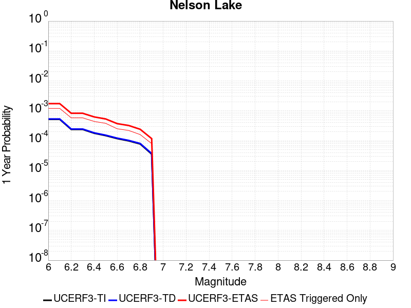 | 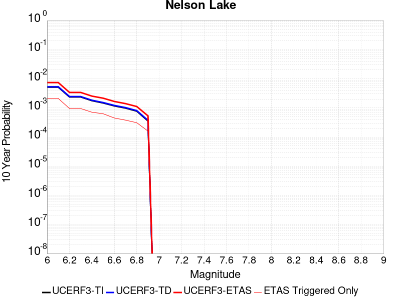 |

| Magnitude | 1 wk TI Prob | 1 wk TD Prob | 1 wk ETAS Prob | 1 wk ETAS/TD Gain | 1 wk ETAS Triggered Only | 1 mo TI Prob | 1 mo TD Prob | 1 mo ETAS Prob | 1 mo ETAS/TD Gain | 1 mo ETAS Triggered Only | 1 yr TI Prob | 1 yr TD Prob | 1 yr ETAS Prob | 1 yr ETAS/TD Gain | 1 yr ETAS Triggered Only | 10 yr TI Prob | 10 yr TD Prob | 10 yr ETAS Prob | 10 yr ETAS/TD Gain | 10 yr ETAS Triggered Only |
|-----|-----|-----|-----|-----|-----|-----|-----|-----|-----|-----|-----|-----|-----|-----|-----|-----|-----|-----|-----|-----|
| 6.0 | 9.913453E-6 | 1.0192255E-5 | 1.2633509E-4 | 12.395205 | 1.16144016E-4 | 4.2485535E-5 | 4.3680422E-5 | 7.405141E-4 | 16.952997 | 6.968641E-4 | 5.1713863E-4 | 5.316897E-4 | 0.0020407592 | 3.8382523 | 0.0015098723 | 0.0051593683 | 0.005305204 | 0.007500233 | 1.4137502 | 0.0022067362 |
| 6.1 | 9.913453E-6 | 1.0192255E-5 | 1.2633509E-4 | 12.395205 | 1.16144016E-4 | 4.2485535E-5 | 4.3680422E-5 | 7.405141E-4 | 16.952997 | 6.968641E-4 | 5.1713863E-4 | 5.316897E-4 | 0.0020407592 | 3.8382523 | 0.0015098723 | 0.0051593683 | 0.005305204 | 0.007500233 | 1.4137502 | 0.0022067362 |
| 6.2 | 4.5596407E-6 | 4.696313E-6 | 4.696313E-6 | 1.0 | 0.0 | 1.954117E-5 | 2.0126909E-5 | 4.8469362E-4 | 24.081873 | 4.6457606E-4 | 2.3788778E-4 | 2.4501883E-4 | 9.417122E-4 | 3.843428 | 6.968641E-4 | 0.0023763329 | 0.0024476128 | 0.0034903504 | 1.4260223 | 0.0010452962 |
| 6.3 | 4.5596407E-6 | 4.696313E-6 | 4.696313E-6 | 1.0 | 0.0 | 1.954117E-5 | 2.0126909E-5 | 4.8469362E-4 | 24.081873 | 4.6457606E-4 | 2.3788778E-4 | 2.4501883E-4 | 9.417122E-4 | 3.843428 | 6.968641E-4 | 0.0023763329 | 0.0024476128 | 0.0034903504 | 1.4260223 | 0.0010452962 |
| 6.4 | 3.4025713E-6 | 3.5098972E-6 | 3.5098972E-6 | 1.0 | 0.0 | 1.4582367E-5 | 1.5042335E-5 | 4.7961142E-4 | 31.884108 | 4.6457606E-4 | 1.7752586E-4 | 1.8312587E-4 | 8.7986235E-4 | 4.804686 | 6.968641E-4 | 0.001773841 | 0.0018298327 | 0.0027572846 | 1.5068507 | 9.291521E-4 |
| 6.5 | 2.8352947E-6 | 2.927856E-6 | 2.927856E-6 | 1.0 | 0.0 | 1.2151207E-5 | 1.2547898E-5 | 3.609756E-4 | 28.76781 | 3.4843205E-4 | 1.479309E-4 | 1.5276071E-4 | 7.333921E-4 | 4.800921 | 5.807201E-4 | 0.0014783246 | 0.0015266308 | 0.0023383978 | 1.5317376 | 8.130081E-4 |
| 6.6 | 2.251518E-6 | 2.3290677E-6 | 2.3290677E-6 | 1.0 | 0.0 | 9.649328E-6 | 9.981683E-6 | 1.2612455E-4 | 12.635598 | 1.16144016E-4 | 1.1747423E-4 | 1.2152085E-4 | 3.5378066E-4 | 2.9112754 | 2.3228803E-4 | 0.0011741214 | 0.0012146058 | 0.0016786176 | 1.3820267 | 4.6457606E-4 |
| 6.7 | 1.8911853E-6 | 1.9591396E-6 | 1.9591396E-6 | 1.0 | 0.0 | 8.105055E-6 | 8.39629E-6 | 8.39629E-6 | 1.0 | 0.0 | 9.867457E-5 | 1.0222061E-4 | 2.1835275E-4 | 2.1360931 | 1.16144016E-4 | 9.863076E-4 | 0.0010217935 | 0.0013698695 | 1.3406521 | 3.4843205E-4 |
| 6.8 | 1.4874814E-6 | 1.5438305E-6 | 1.5438305E-6 | 1.0 | 0.0 | 6.374905E-6 | 6.6164025E-6 | 6.6164025E-6 | 1.0 | 0.0 | 7.76117E-5 | 8.055224E-5 | 1.966869E-4 | 2.441731 | 1.16144016E-4 | 7.75846E-4 | 8.0528157E-4 | 0.0010373825 | 1.2882234 | 2.3228803E-4 |
| 6.9 | 6.835972E-7 | 7.1399285E-7 | 7.1399285E-7 | 1.0 | 0.0 | 2.9296991E-6 | 3.0599674E-6 | 3.0599674E-6 | 1.0 | 0.0 | 3.56685E-5 | 3.7254784E-5 | 1.5339447E-4 | 4.1174436 | 1.16144016E-4 | 3.5662777E-4 | 3.7251666E-4 | 6.0471817E-4 | 1.6233319 | 2.3228803E-4 |

## Coyote Canyon
*[(top)](#table-of-contents)*

| 1 Week | 1 Month | 1 Year | 10 Year |
|-----|-----|-----|-----|
|  |  |  |  |

| Magnitude | 1 wk TI Prob | 1 wk TD Prob | 1 wk ETAS Prob | 1 wk ETAS/TD Gain | 1 wk ETAS Triggered Only | 1 mo TI Prob | 1 mo TD Prob | 1 mo ETAS Prob | 1 mo ETAS/TD Gain | 1 mo ETAS Triggered Only | 1 yr TI Prob | 1 yr TD Prob | 1 yr ETAS Prob | 1 yr ETAS/TD Gain | 1 yr ETAS Triggered Only | 10 yr TI Prob | 10 yr TD Prob | 10 yr ETAS Prob | 10 yr ETAS/TD Gain | 10 yr ETAS Triggered Only |
|-----|-----|-----|-----|-----|-----|-----|-----|-----|-----|-----|-----|-----|-----|-----|-----|-----|-----|-----|-----|-----|
| 6.0 | 3.5090034E-5 | 4.0364324E-5 | 5.0492166E-4 | 12.509107 | 4.6457606E-4 | 1.503772E-4 | 1.7297994E-4 | 9.858474E-4 | 5.699201 | 8.130081E-4 | 0.0018293047 | 0.0021042528 | 0.003842747 | 1.8261813 | 0.0017421603 | 0.018143194 | 0.020869201 | 0.023143606 | 1.1089838 | 0.0023228803 |
| 6.1 | 3.5090034E-5 | 4.0364324E-5 | 5.0492166E-4 | 12.509107 | 4.6457606E-4 | 1.503772E-4 | 1.7297994E-4 | 9.858474E-4 | 5.699201 | 8.130081E-4 | 0.0018293047 | 0.0021042528 | 0.003842747 | 1.8261813 | 0.0017421603 | 0.018143194 | 0.020869201 | 0.023143606 | 1.1089838 | 0.0023228803 |
| 6.2 | 1.841879E-5 | 2.1059794E-5 | 4.8562608E-4 | 23.059395 | 4.6457606E-4 | 7.8935285E-5 | 9.0253714E-5 | 5.5478787E-4 | 6.1469812 | 4.6457606E-4 | 9.606133E-4 | 0.001098387 | 0.0019105021 | 1.7393707 | 8.130081E-4 | 0.0095647145 | 0.010939667 | 0.012203275 | 1.115507 | 0.0012775842 |
| 6.3 | 1.841879E-5 | 2.1059794E-5 | 4.8562608E-4 | 23.059395 | 4.6457606E-4 | 7.8935285E-5 | 9.0253714E-5 | 5.5478787E-4 | 6.1469812 | 4.6457606E-4 | 9.606133E-4 | 0.001098387 | 0.0019105021 | 1.7393707 | 8.130081E-4 | 0.0095647145 | 0.010939667 | 0.012203275 | 1.115507 | 0.0012775842 |
| 6.4 | 1.712201E-5 | 1.9565212E-5 | 4.841322E-4 | 24.744541 | 4.6457606E-4 | 7.337798E-5 | 8.3848776E-5 | 5.483859E-4 | 6.5401773 | 4.6457606E-4 | 8.930107E-4 | 0.0010204813 | 0.0018326598 | 1.7958778 | 8.130081E-4 | 0.008894307 | 0.010167871 | 0.011432464 | 1.1243715 | 0.0012775842 |
| 6.5 | 1.4744935E-5 | 1.6836972E-5 | 4.8140524E-4 | 28.59215 | 4.6457606E-4 | 6.3191044E-5 | 7.215698E-5 | 5.3669955E-4 | 7.4379435 | 4.6457606E-4 | 7.6907943E-4 | 8.7825063E-4 | 0.0016905448 | 1.9249 | 8.130081E-4 | 0.007664232 | 0.008756994 | 0.009908264 | 1.1314685 | 0.0011614402 |
| 6.6 | 1.2017839E-5 | 1.37240895E-5 | 3.6215136E-4 | 26.388006 | 3.4843205E-4 | 5.150401E-5 | 5.88167E-5 | 4.0722825E-4 | 6.9236846 | 3.4843205E-4 | 6.268809E-4 | 7.159466E-4 | 0.0014123118 | 1.9726496 | 6.968641E-4 | 0.0062511545 | 0.0071450938 | 0.008067607 | 1.1291114 | 9.291521E-4 |
| 6.7 | 1.00956095E-5 | 1.1533517E-5 | 2.4381887E-4 | 21.14003 | 2.3228803E-4 | 4.326618E-5 | 4.942891E-5 | 2.8170546E-4 | 5.6992044 | 2.3228803E-4 | 5.266384E-4 | 6.017178E-4 | 0.0011820884 | 1.9645231 | 5.807201E-4 | 0.005253921 | 0.0060094125 | 0.006817535 | 1.1344761 | 8.130081E-4 |

## San Andreas (Mojave S)
*[(top)](#table-of-contents)*

| 1 Week | 1 Month | 1 Year | 10 Year |
|-----|-----|-----|-----|
|  |  |  |  |

| Magnitude | 1 wk TI Prob | 1 wk TD Prob | 1 wk ETAS Prob | 1 wk ETAS/TD Gain | 1 wk ETAS Triggered Only | 1 mo TI Prob | 1 mo TD Prob | 1 mo ETAS Prob | 1 mo ETAS/TD Gain | 1 mo ETAS Triggered Only | 1 yr TI Prob | 1 yr TD Prob | 1 yr ETAS Prob | 1 yr ETAS/TD Gain | 1 yr ETAS Triggered Only | 10 yr TI Prob | 10 yr TD Prob | 10 yr ETAS Prob | 10 yr ETAS/TD Gain | 10 yr ETAS Triggered Only |
|-----|-----|-----|-----|-----|-----|-----|-----|-----|-----|-----|-----|-----|-----|-----|-----|-----|-----|-----|-----|-----|
| 6.0 | 3.1064058E-4 | 6.7460834E-4 | 0.0010228053 | 1.5161469 | 3.4843205E-4 | 0.0013306376 | 0.0028881032 | 0.0033513375 | 1.160394 | 4.6457606E-4 | 0.016080605 | 0.03462235 | 0.035631455 | 1.0291461 | 0.0010452962 | 0.1496549 | 0.28660452 | 0.28784737 | 1.0043365 | 0.0017421603 |
| 6.1 | 3.1064058E-4 | 6.7460834E-4 | 0.0010228053 | 1.5161469 | 3.4843205E-4 | 0.0013306376 | 0.0028881032 | 0.0033513375 | 1.160394 | 4.6457606E-4 | 0.016080605 | 0.03462235 | 0.035631455 | 1.0291461 | 0.0010452962 | 0.1496549 | 0.28660452 | 0.28784737 | 1.0043365 | 0.0017421603 |
| 6.2 | 3.1064058E-4 | 6.7460834E-4 | 0.0010228053 | 1.5161469 | 3.4843205E-4 | 0.0013306376 | 0.0028881032 | 0.0033513375 | 1.160394 | 4.6457606E-4 | 0.016080605 | 0.03462235 | 0.035631455 | 1.0291461 | 0.0010452962 | 0.1496549 | 0.28660452 | 0.28784737 | 1.0043365 | 0.0017421603 |
| 6.3 | 3.1064058E-4 | 6.7460834E-4 | 0.0010228053 | 1.5161469 | 3.4843205E-4 | 0.0013306376 | 0.0028881032 | 0.0033513375 | 1.160394 | 4.6457606E-4 | 0.016080605 | 0.03462235 | 0.035631455 | 1.0291461 | 0.0010452962 | 0.1496549 | 0.28660452 | 0.28784737 | 1.0043365 | 0.0017421603 |
| 6.4 | 1.9872203E-4 | 4.3179357E-4 | 7.8007515E-4 | 1.8065928 | 3.4843205E-4 | 8.5138786E-4 | 0.0018492596 | 0.0021970472 | 1.1880686 | 3.4843205E-4 | 0.010316478 | 0.02228844 | 0.023083327 | 1.0356637 | 8.130081E-4 | 0.098504856 | 0.19699748 | 0.19793011 | 1.0047343 | 0.0011614402 |
| 6.5 | 1.291105E-4 | 2.875267E-4 | 6.3585857E-4 | 2.2114766 | 3.4843205E-4 | 5.5321335E-4 | 0.0012316781 | 0.001579681 | 1.2825437 | 3.4843205E-4 | 0.006714592 | 0.0148934 | 0.0156943 | 1.0537754 | 8.130081E-4 | 0.065152965 | 0.13803436 | 0.13903548 | 1.0072527 | 0.0011614402 |
| 6.6 | 1.291105E-4 | 2.875267E-4 | 6.3585857E-4 | 2.2114766 | 3.4843205E-4 | 5.5321335E-4 | 0.0012316781 | 0.001579681 | 1.2825437 | 3.4843205E-4 | 0.006714592 | 0.0148934 | 0.0156943 | 1.0537754 | 8.130081E-4 | 0.065152965 | 0.13803436 | 0.13903548 | 1.0072527 | 0.0011614402 |
| 6.7 | 1.08001186E-4 | 2.4333889E-4 | 4.7557038E-4 | 1.9543543 | 2.3228803E-4 | 4.6278012E-4 | 0.0010424647 | 0.0012745106 | 1.2225935 | 2.3228803E-4 | 0.0056198016 | 0.012618446 | 0.013306517 | 1.054529 | 6.968641E-4 | 0.054797906 | 0.119176775 | 0.120097496 | 1.0077257 | 0.0010452962 |
| 6.8 | 1.0624356E-4 | 2.3851555E-4 | 4.7074817E-4 | 1.9736582 | 2.3228803E-4 | 4.5525006E-4 | 0.0010218095 | 0.0012538603 | 1.2270977 | 2.3228803E-4 | 0.0055285925 | 0.012369843 | 0.013058088 | 1.0556389 | 6.968641E-4 | 0.053930566 | 0.11712591 | 0.11804878 | 1.0078793 | 0.0010452962 |
| 6.9 | 1.0393785E-4 | 2.3221898E-4 | 4.6445307E-4 | 2.000065 | 2.3228803E-4 | 4.4537184E-4 | 9.948451E-4 | 0.001226902 | 1.2332593 | 2.3228803E-4 | 0.0054089287 | 0.012045221 | 0.012733691 | 1.0571572 | 6.968641E-4 | 0.05279156 | 0.11442335 | 0.11534904 | 1.00809 | 0.0010452962 |
| 7.0 | 1.0155622E-4 | 2.2591476E-4 | 4.5815032E-4 | 2.0279787 | 2.3228803E-4 | 4.3516833E-4 | 9.6784724E-4 | 0.0011999104 | 1.2397726 | 2.3228803E-4 | 0.005285311 | 0.0117200995 | 0.012408797 | 1.0587621 | 6.968641E-4 | 0.05161361 | 0.111683756 | 0.11261231 | 1.0083141 | 0.0010452962 |
| 7.1 | 9.885595E-5 | 2.1879886E-4 | 4.5103606E-4 | 2.0614188 | 2.3228803E-4 | 4.2359953E-4 | 9.3737274E-4 | 0.001169443 | 1.2475753 | 2.3228803E-4 | 0.0051451353 | 0.011352993 | 0.012041945 | 1.0606847 | 6.968641E-4 | 0.05027629 | 0.1085682 | 0.10939648 | 1.007629 | 9.291521E-4 |
| 7.2 | 9.6411415E-5 | 2.124288E-4 | 4.446675E-4 | 2.0932543 | 2.3228803E-4 | 4.1312634E-4 | 9.1009185E-4 | 0.0011421684 | 1.2550036 | 2.3228803E-4 | 0.005018219 | 0.011024255 | 0.011713438 | 1.062515 | 6.968641E-4 | 0.049064007 | 0.105758004 | 0.10658889 | 1.0078565 | 9.291521E-4 |
| 7.3 | 9.1180635E-5 | 1.9471257E-4 | 4.2695538E-4 | 2.1927469 | 2.3228803E-4 | 3.907156E-4 | 8.342157E-4 | 0.00106631 | 1.2782185 | 2.3228803E-4 | 0.004746591 | 0.01010939 | 0.010799209 | 1.0682355 | 6.968641E-4 | 0.046464786 | 0.09795115 | 0.09878929 | 1.0085567 | 9.291521E-4 |
| 7.4 | 8.887388E-5 | 1.8719878E-4 | 4.1944333E-4 | 2.2406306 | 2.3228803E-4 | 3.8083247E-4 | 8.020339E-4 | 0.0010341356 | 1.2893914 | 2.3228803E-4 | 0.0046267817 | 0.00972114 | 0.01041123 | 1.0709885 | 6.968641E-4 | 0.045316286 | 0.09458615 | 0.095427416 | 1.0088942 | 9.291521E-4 |
| 7.5 | 8.6750515E-5 | 1.8051457E-4 | 4.1276068E-4 | 2.2865782 | 2.3228803E-4 | 3.7173493E-4 | 7.7340455E-4 | 0.0010055129 | 1.3001125 | 2.3228803E-4 | 0.004516484 | 0.009375632 | 0.010065963 | 1.0736303 | 6.968641E-4 | 0.04425787 | 0.091549896 | 0.09239398 | 1.00922 | 9.291521E-4 |
| 7.6 | 8.453092E-5 | 1.7439072E-4 | 4.0663825E-4 | 2.3317654 | 2.3228803E-4 | 3.6222505E-4 | 7.471748E-4 | 9.792893E-4 | 1.3106562 | 2.3228803E-4 | 0.0044011753 | 0.009058985 | 0.0097495355 | 1.0762284 | 6.968641E-4 | 0.04315024 | 0.08870898 | 0.08955571 | 1.009545 | 9.291521E-4 |
| 7.7 | 8.259102E-5 | 1.6961215E-4 | 4.018608E-4 | 2.3692925 | 2.3228803E-4 | 3.539135E-4 | 7.2670676E-4 | 9.58826E-4 | 1.3194125 | 2.3228803E-4 | 0.004300386 | 0.008811831 | 0.009502553 | 1.078386 | 6.968641E-4 | 0.042181134 | 0.08645982 | 0.087308645 | 1.0098175 | 9.291521E-4 |
| 7.8 | 7.444844E-5 | 1.5283503E-4 | 3.8508757E-4 | 2.519629 | 2.3228803E-4 | 3.1902574E-4 | 6.548429E-4 | 8.869788E-4 | 1.354491 | 2.3228803E-4 | 0.0038772223 | 0.007943616 | 0.008634944 | 1.0870295 | 6.968641E-4 | 0.03810269 | 0.078290746 | 0.0790401 | 1.0095714 | 8.130081E-4 |
| 7.9 | 5.2586525E-5 | 1.00064186E-4 | 2.1619658E-4 | 2.160579 | 1.16144016E-4 | 2.2535135E-4 | 4.2877605E-4 | 5.448703E-4 | 1.2707572 | 1.16144016E-4 | 0.0027402006 | 0.005207864 | 0.0055544814 | 1.0665566 | 3.4843205E-4 | 0.027066574 | 0.052200034 | 0.05264036 | 1.0084354 | 4.6457606E-4 |
| 8.0 | 3.379877E-5 | 5.4074168E-5 | 5.4074168E-5 | 1.0 | 0.0 | 1.4484383E-4 | 2.3172585E-4 | 2.3172585E-4 | 1.0 | 0.0 | 0.0017620471 | 0.002817614 | 0.0029334307 | 1.0411046 | 1.16144016E-4 | 0.017481409 | 0.028834904 | 0.029060492 | 1.0078235 | 2.3228803E-4 |
| 8.1 | 1.8668277E-5 | 1.9309397E-5 | 1.9309397E-5 | 1.0 | 0.0 | 8.000444E-5 | 8.275194E-5 | 8.275194E-5 | 1.0 | 0.0 | 9.736188E-4 | 0.0010070398 | 0.0010070398 | 1.0 | 0.0 | 0.009693642 | 0.010798888 | 0.010798888 | 1.0 | 0.0 |
| 8.2 | 8.541571E-6 | 5.460819E-6 | 5.460819E-6 | 1.0 | 0.0 | 3.660622E-5 | 2.3403301E-5 | 2.3403301E-5 | 1.0 | 0.0 | 4.455896E-4 | 2.84898E-4 | 2.84898E-4 | 1.0 | 0.0 | 0.0044469717 | 0.0032408056 | 0.0032408056 | 1.0 | 0.0 |
| 8.3 | 1.983087E-6 | 7.6599065E-7 | 7.6599065E-7 | 1.0 | 0.0 | 8.498917E-6 | 3.282813E-6 | 3.282813E-6 | 1.0 | 0.0 | 1.034694E-4 | 3.9967534E-5 | 3.9967534E-5 | 1.0 | 0.0 | 0.0010342124 | 4.719687E-4 | 4.719687E-4 | 1.0 | 0.0 |

## Paradise
*[(top)](#table-of-contents)*

| 1 Week | 1 Month | 1 Year | 10 Year |
|-----|-----|-----|-----|
|  |  |  |  |

| Magnitude | 1 wk TI Prob | 1 wk TD Prob | 1 wk ETAS Prob | 1 wk ETAS/TD Gain | 1 wk ETAS Triggered Only | 1 mo TI Prob | 1 mo TD Prob | 1 mo ETAS Prob | 1 mo ETAS/TD Gain | 1 mo ETAS Triggered Only | 1 yr TI Prob | 1 yr TD Prob | 1 yr ETAS Prob | 1 yr ETAS/TD Gain | 1 yr ETAS Triggered Only | 10 yr TI Prob | 10 yr TD Prob | 10 yr ETAS Prob | 10 yr ETAS/TD Gain | 10 yr ETAS Triggered Only |
|-----|-----|-----|-----|-----|-----|-----|-----|-----|-----|-----|-----|-----|-----|-----|-----|-----|-----|-----|-----|-----|
| 6.0 | 1.4851273E-5 | 1.6694692E-5 | 2.4897885E-4 | 14.913654 | 2.3228803E-4 | 6.364676E-5 | 7.154685E-5 | 4.1995398E-4 | 5.869636 | 3.4843205E-4 | 7.7462377E-4 | 8.707584E-4 | 0.0015670157 | 1.7995988 | 6.968641E-4 | 0.0077192914 | 0.008675844 | 0.009942344 | 1.14598 | 0.0012775842 |
| 6.1 | 1.4851273E-5 | 1.6694692E-5 | 2.4897885E-4 | 14.913654 | 2.3228803E-4 | 6.364676E-5 | 7.154685E-5 | 4.1995398E-4 | 5.869636 | 3.4843205E-4 | 7.7462377E-4 | 8.707584E-4 | 0.0015670157 | 1.7995988 | 6.968641E-4 | 0.0077192914 | 0.008675844 | 0.009942344 | 1.14598 | 0.0012775842 |
| 6.2 | 1.4851273E-5 | 1.6694692E-5 | 2.4897885E-4 | 14.913654 | 2.3228803E-4 | 6.364676E-5 | 7.154685E-5 | 4.1995398E-4 | 5.869636 | 3.4843205E-4 | 7.7462377E-4 | 8.707584E-4 | 0.0015670157 | 1.7995988 | 6.968641E-4 | 0.0077192914 | 0.008675844 | 0.009942344 | 1.14598 | 0.0012775842 |
| 6.3 | 1.0426831E-5 | 1.188862E-5 | 2.441739E-4 | 20.538456 | 2.3228803E-4 | 4.4685654E-5 | 5.0950268E-5 | 2.8322646E-4 | 5.558881 | 2.3228803E-4 | 5.43912E-4 | 6.201489E-4 | 0.0010844369 | 1.7486718 | 4.6457606E-4 | 0.0054258266 | 0.0061847917 | 0.0066464944 | 1.0746514 | 4.6457606E-4 |
| 6.4 | 1.0426831E-5 | 1.188862E-5 | 2.441739E-4 | 20.538456 | 2.3228803E-4 | 4.4685654E-5 | 5.0950268E-5 | 2.8322646E-4 | 5.558881 | 2.3228803E-4 | 5.43912E-4 | 6.201489E-4 | 0.0010844369 | 1.7486718 | 4.6457606E-4 | 0.0054258266 | 0.0061847917 | 0.0066464944 | 1.0746514 | 4.6457606E-4 |
| 6.5 | 9.25027E-6 | 1.06199595E-5 | 2.4290553E-4 | 22.872547 | 2.3228803E-4 | 3.964341E-5 | 4.551335E-5 | 2.7779082E-4 | 6.1035023 | 2.3228803E-4 | 4.8255164E-4 | 5.53989E-4 | 9.0222806E-4 | 1.6286027 | 3.4843205E-4 | 0.0048150513 | 0.0055265795 | 0.005873086 | 1.0626981 | 3.4843205E-4 |
| 6.6 | 7.904275E-6 | 9.159525E-6 | 1.2530248E-4 | 13.680019 | 1.16144016E-4 | 3.3875025E-5 | 3.9254537E-5 | 1.55394E-4 | 3.958625 | 1.16144016E-4 | 4.1235037E-4 | 4.7782314E-4 | 5.939117E-4 | 1.242953 | 1.16144016E-4 | 0.0041158604 | 0.0047683544 | 0.0048839445 | 1.0242411 | 1.16144016E-4 |
| 6.7 | 7.2061953E-6 | 8.407248E-6 | 1.245503E-4 | 14.814632 | 1.16144016E-4 | 3.088333E-5 | 3.6030586E-5 | 1.5217043E-4 | 4.2233677 | 1.16144016E-4 | 3.7593965E-4 | 4.3858777E-4 | 5.546809E-4 | 1.2646974 | 1.16144016E-4 | 0.003753043 | 0.004377591 | 0.0044932263 | 1.0264153 | 1.16144016E-4 |
| 6.8 | 6.6948724E-6 | 7.842166E-6 | 1.2398527E-4 | 15.810081 | 1.16144016E-4 | 2.8691995E-5 | 3.360887E-5 | 1.4974899E-4 | 4.455639 | 1.16144016E-4 | 3.4926904E-4 | 4.0911473E-4 | 5.252112E-4 | 1.283775 | 1.16144016E-4 | 0.003487206 | 0.0040839734 | 0.0041996427 | 1.0283228 | 1.16144016E-4 |
| 6.9 | 6.0421025E-6 | 7.130621E-6 | 1.2327381E-4 | 17.287949 | 1.16144016E-4 | 2.5894467E-5 | 3.0559466E-5 | 1.4669994E-4 | 4.8004746 | 1.16144016E-4 | 3.1521954E-4 | 3.7200135E-4 | 4.8810217E-4 | 1.3120978 | 1.16144016E-4 | 0.0031477278 | 0.0037141247 | 0.0038298373 | 1.0311548 | 1.16144016E-4 |
| 7.0 | 4.134091E-6 | 5.0803087E-6 | 5.0803087E-6 | 1.0 | 0.0 | 1.7717413E-5 | 2.177258E-5 | 2.177258E-5 | 1.0 | 0.0 | 2.1568815E-4 | 2.6505045E-4 | 2.6505045E-4 | 1.0 | 0.0 | 0.0021547892 | 0.0026474963 | 0.0026474963 | 1.0 | 0.0 |
| 7.1 | 3.7674888E-6 | 4.6318696E-6 | 4.6318696E-6 | 1.0 | 0.0 | 1.6146281E-5 | 1.9850726E-5 | 1.9850726E-5 | 1.0 | 0.0 | 1.9656324E-4 | 2.4165731E-4 | 2.4165731E-4 | 1.0 | 0.0 | 0.0019638946 | 0.002414096 | 0.002414096 | 1.0 | 0.0 |
| 7.2 | 3.4065345E-6 | 4.156723E-6 | 4.156723E-6 | 1.0 | 0.0 | 1.4599351E-5 | 1.7814415E-5 | 1.7814415E-5 | 1.0 | 0.0 | 1.777326E-4 | 2.1687041E-4 | 2.1687041E-4 | 1.0 | 0.0 | 0.0017759053 | 0.002166736 | 0.002166736 | 1.0 | 0.0 |
| 7.3 | 2.9934936E-6 | 3.6293168E-6 | 3.6293168E-6 | 1.0 | 0.0 | 1.2829195E-5 | 1.555413E-5 | 1.555413E-5 | 1.0 | 0.0 | 1.5618425E-4 | 1.8935655E-4 | 1.8935655E-4 | 1.0 | 0.0 | 0.0015607453 | 0.0018920974 | 0.0018920974 | 1.0 | 0.0 |
| 7.4 | 2.4049796E-6 | 2.8889842E-6 | 2.8889842E-6 | 1.0 | 0.0 | 1.0307015E-5 | 1.238131E-5 | 1.238131E-5 | 1.0 | 0.0 | 1.2548068E-4 | 1.5073347E-4 | 1.5073347E-4 | 1.0 | 0.0 | 0.0012540985 | 0.0015064536 | 0.0015064536 | 1.0 | 0.0 |
| 7.5 | 1.2710091E-6 | 1.5134682E-6 | 1.5134682E-6 | 1.0 | 0.0 | 5.44717E-6 | 6.4862834E-6 | 6.4862834E-6 | 1.0 | 0.0 | 6.631728E-5 | 7.8968886E-5 | 7.8968886E-5 | 1.0 | 0.0 | 6.6297496E-4 | 7.8953087E-4 | 7.8953087E-4 | 1.0 | 0.0 |
| 7.6 | 2.21172E-7 | 2.603961E-7 | 2.603961E-7 | 1.0 | 0.0 | 9.478797E-7 | 1.1159829E-6 | 1.1159829E-6 | 1.0 | 0.0 | 1.1540374E-5 | 1.3587036E-5 | 1.3587036E-5 | 1.0 | 0.0 | 1.1539775E-4 | 1.3586486E-4 | 1.3586486E-4 | 1.0 | 0.0 |

## Death Valley (So)
*[(top)](#table-of-contents)*

| 1 Week | 1 Month | 1 Year | 10 Year |
|-----|-----|-----|-----|
|  |  |  |  |

| Magnitude | 1 wk TI Prob | 1 wk TD Prob | 1 wk ETAS Prob | 1 wk ETAS/TD Gain | 1 wk ETAS Triggered Only | 1 mo TI Prob | 1 mo TD Prob | 1 mo ETAS Prob | 1 mo ETAS/TD Gain | 1 mo ETAS Triggered Only | 1 yr TI Prob | 1 yr TD Prob | 1 yr ETAS Prob | 1 yr ETAS/TD Gain | 1 yr ETAS Triggered Only | 10 yr TI Prob | 10 yr TD Prob | 10 yr ETAS Prob | 10 yr ETAS/TD Gain | 10 yr ETAS Triggered Only |
|-----|-----|-----|-----|-----|-----|-----|-----|-----|-----|-----|-----|-----|-----|-----|-----|-----|-----|-----|-----|-----|
| 6.0 | 2.0684236E-5 | 2.5617775E-5 | 2.5789987E-4 | 10.067223 | 2.3228803E-4 | 8.864371E-5 | 1.0978594E-4 | 5.74311E-4 | 5.231189 | 4.6457606E-4 | 0.0010787029 | 0.0013358411 | 0.0021477633 | 1.6077983 | 8.130081E-4 | 0.010734817 | 0.013281397 | 0.014198208 | 1.0690298 | 9.291521E-4 |
| 6.1 | 2.0684236E-5 | 2.5617775E-5 | 2.5789987E-4 | 10.067223 | 2.3228803E-4 | 8.864371E-5 | 1.0978594E-4 | 5.74311E-4 | 5.231189 | 4.6457606E-4 | 0.0010787029 | 0.0013358411 | 0.0021477633 | 1.6077983 | 8.130081E-4 | 0.010734817 | 0.013281397 | 0.014198208 | 1.0690298 | 9.291521E-4 |
| 6.2 | 2.0684236E-5 | 2.5617775E-5 | 2.5789987E-4 | 10.067223 | 2.3228803E-4 | 8.864371E-5 | 1.0978594E-4 | 5.74311E-4 | 5.231189 | 4.6457606E-4 | 0.0010787029 | 0.0013358411 | 0.0021477633 | 1.6077983 | 8.130081E-4 | 0.010734817 | 0.013281397 | 0.014198208 | 1.0690298 | 9.291521E-4 |
| 6.3 | 2.0240292E-5 | 2.511786E-5 | 2.5740007E-4 | 10.24769 | 2.3228803E-4 | 8.6741224E-5 | 1.07643624E-4 | 5.7216967E-4 | 5.3154073 | 4.6457606E-4 | 0.0010555626 | 0.00130979 | 0.0021217333 | 1.6199034 | 8.130081E-4 | 0.010505628 | 0.013023956 | 0.013941007 | 1.0704126 | 9.291521E-4 |
| 6.4 | 2.0240292E-5 | 2.511786E-5 | 2.5740007E-4 | 10.24769 | 2.3228803E-4 | 8.6741224E-5 | 1.07643624E-4 | 5.7216967E-4 | 5.3154073 | 4.6457606E-4 | 0.0010555626 | 0.00130979 | 0.0021217333 | 1.6199034 | 8.130081E-4 | 0.010505628 | 0.013023956 | 0.013941007 | 1.0704126 | 9.291521E-4 |
| 6.5 | 1.9962767E-5 | 2.4807114E-5 | 2.5708938E-4 | 10.363535 | 2.3228803E-4 | 8.55519E-5 | 1.0631196E-4 | 5.7083863E-4 | 5.3694677 | 4.6457606E-4 | 0.0010410968 | 0.0012935963 | 0.0021055527 | 1.6276737 | 8.130081E-4 | 0.010362327 | 0.012863902 | 0.013781102 | 1.0713003 | 9.291521E-4 |
| 6.6 | 1.8937297E-5 | 2.3310964E-5 | 2.555936E-4 | 10.964522 | 2.3228803E-4 | 8.115732E-5 | 9.990039E-5 | 5.6443E-4 | 5.6499286 | 4.6457606E-4 | 9.876423E-4 | 0.0012156231 | 0.002027643 | 1.6679865 | 8.130081E-4 | 0.009832645 | 0.012092789 | 0.013010705 | 1.075906 | 9.291521E-4 |
| 6.7 | 1.8621096E-5 | 2.2911607E-5 | 2.5519432E-4 | 11.138211 | 2.3228803E-4 | 7.980225E-5 | 9.818898E-5 | 5.627194E-4 | 5.7309833 | 4.6457606E-4 | 9.711593E-4 | 0.0011948098 | 0.0020068465 | 1.6796368 | 8.130081E-4 | 0.009669261 | 0.011886904 | 0.012805011 | 1.0772369 | 9.291521E-4 |
| 6.8 | 1.7830353E-5 | 2.1805688E-5 | 2.5408866E-4 | 11.652403 | 2.3228803E-4 | 7.641356E-5 | 9.344968E-5 | 5.5798236E-4 | 5.970939 | 4.6457606E-4 | 9.29938E-4 | 0.00113717 | 0.0018332417 | 1.6121087 | 6.968641E-4 | 0.009260561 | 0.011316354 | 0.012120162 | 1.0710306 | 8.130081E-4 |
| 6.9 | 1.3135183E-5 | 1.5303925E-5 | 1.5303925E-5 | 1.0 | 0.0 | 5.6292425E-5 | 6.558664E-5 | 6.558664E-5 | 1.0 | 0.0 | 6.8514474E-4 | 7.982312E-4 | 0.0010303338 | 1.2907711 | 2.3228803E-4 | 0.006830362 | 0.007954649 | 0.008300309 | 1.0434539 | 3.4843205E-4 |
| 7.0 | 1.1507512E-5 | 1.3154199E-5 | 1.3154199E-5 | 1.0 | 0.0 | 4.9316975E-5 | 5.6373956E-5 | 5.6373956E-5 | 1.0 | 0.0 | 6.002687E-4 | 6.8614254E-4 | 9.182712E-4 | 1.3383096 | 2.3228803E-4 | 0.0059864987 | 0.0068409415 | 0.0071869898 | 1.0505849 | 3.4843205E-4 |
| 7.1 | 9.715903E-6 | 1.0865278E-5 | 1.0865278E-5 | 1.0 | 0.0 | 4.1638916E-5 | 4.656467E-5 | 4.656467E-5 | 1.0 | 0.0 | 5.068359E-4 | 5.667817E-4 | 6.8285986E-4 | 1.2048023 | 1.16144016E-4 | 0.0050568148 | 0.0056538144 | 0.0058847894 | 1.0408529 | 2.3228803E-4 |
| 7.2 | 9.233269E-6 | 1.02863105E-5 | 1.02863105E-5 | 1.0 | 0.0 | 3.9570554E-5 | 4.4083466E-5 | 4.4083466E-5 | 1.0 | 0.0 | 4.81665E-4 | 5.3658825E-4 | 6.526699E-4 | 1.2163329 | 1.16144016E-4 | 0.0048062233 | 0.0053533576 | 0.005584402 | 1.0431588 | 2.3228803E-4 |
| 7.3 | 8.8041315E-6 | 9.808164E-6 | 9.808164E-6 | 1.0 | 0.0 | 3.7731446E-5 | 4.2034335E-5 | 4.2034335E-5 | 1.0 | 0.0 | 4.592835E-4 | 5.1165203E-4 | 5.1165203E-4 | 1.0 | 0.0 | 0.0045833546 | 0.005105167 | 0.005220718 | 1.0226341 | 1.16144016E-4 |
| 7.4 | 8.708749E-6 | 9.707175E-6 | 9.707175E-6 | 1.0 | 0.0 | 3.7322676E-5 | 4.160154E-5 | 4.160154E-5 | 1.0 | 0.0 | 4.5430884E-4 | 5.0638523E-4 | 5.0638523E-4 | 1.0 | 0.0 | 0.004533812 | 0.0050527398 | 0.005168297 | 1.0228702 | 1.16144016E-4 |
| 7.5 | 8.612678E-6 | 9.604817E-6 | 9.604817E-6 | 1.0 | 0.0 | 3.6910955E-5 | 4.1162875E-5 | 4.1162875E-5 | 1.0 | 0.0 | 4.492982E-4 | 5.01047E-4 | 5.01047E-4 | 1.0 | 0.0 | 0.004483909 | 0.0049995985 | 0.005115162 | 1.0231146 | 1.16144016E-4 |
| 7.6 | 8.319024E-6 | 9.283916E-6 | 9.283916E-6 | 1.0 | 0.0 | 3.5652476E-5 | 3.978763E-5 | 3.978763E-5 | 1.0 | 0.0 | 4.3398244E-4 | 4.8431093E-4 | 4.8431093E-4 | 1.0 | 0.0 | 0.0043313587 | 0.0048329784 | 0.004948561 | 1.0239154 | 1.16144016E-4 |
| 7.7 | 7.4718328E-6 | 8.34517E-6 | 8.34517E-6 | 1.0 | 0.0 | 3.2021748E-5 | 3.5764548E-5 | 3.5764548E-5 | 1.0 | 0.0 | 3.8979502E-4 | 4.353504E-4 | 4.353504E-4 | 1.0 | 0.0 | 0.00389112 | 0.0043453807 | 0.0044610198 | 1.026612 | 1.16144016E-4 |
| 7.8 | 3.4586725E-7 | 3.6482615E-7 | 3.6482615E-7 | 1.0 | 0.0 | 1.4822873E-6 | 1.5635396E-6 | 1.5635396E-6 | 1.0 | 0.0 | 1.80467E-5 | 1.9035933E-5 | 1.9035933E-5 | 1.0 | 0.0 | 1.8045233E-4 | 1.9034347E-4 | 1.9034347E-4 | 1.0 | 0.0 |
| 7.9 | 2.5591178E-9 | 2.6696718E-9 | 2.6696718E-9 | 1.0 | 0.0 | 1.0967647E-8 | 1.14414505E-8 | 1.14414505E-8 | 1.0 | 0.0 | 1.335311E-7 | 1.3929966E-7 | 1.3929966E-7 | 1.0 | 0.0 | 1.3353102E-6 | 1.3929966E-6 | 1.3929966E-6 | 1.0 | 0.0 |

## San Andreas (San Bernardino N)
*[(top)](#table-of-contents)*

| 1 Week | 1 Month | 1 Year | 10 Year |
|-----|-----|-----|-----|
|  |  |  |  |

| Magnitude | 1 wk TI Prob | 1 wk TD Prob | 1 wk ETAS Prob | 1 wk ETAS/TD Gain | 1 wk ETAS Triggered Only | 1 mo TI Prob | 1 mo TD Prob | 1 mo ETAS Prob | 1 mo ETAS/TD Gain | 1 mo ETAS Triggered Only | 1 yr TI Prob | 1 yr TD Prob | 1 yr ETAS Prob | 1 yr ETAS/TD Gain | 1 yr ETAS Triggered Only | 10 yr TI Prob | 10 yr TD Prob | 10 yr ETAS Prob | 10 yr ETAS/TD Gain | 10 yr ETAS Triggered Only |
|-----|-----|-----|-----|-----|-----|-----|-----|-----|-----|-----|-----|-----|-----|-----|-----|-----|-----|-----|-----|-----|
| 6.0 | 1.4273766E-4 | 3.1606483E-4 | 4.3217215E-4 | 1.3673528 | 1.16144016E-4 | 6.115894E-4 | 0.0013538664 | 0.0014698532 | 1.0856708 | 1.16144016E-4 | 0.0074207084 | 0.016360244 | 0.016931463 | 1.0349151 | 5.807201E-4 | 0.07177748 | 0.15026689 | 0.15095772 | 1.0045974 | 8.130081E-4 |
| 6.1 | 1.4273766E-4 | 3.1606483E-4 | 4.3217215E-4 | 1.3673528 | 1.16144016E-4 | 6.115894E-4 | 0.0013538664 | 0.0014698532 | 1.0856708 | 1.16144016E-4 | 0.0074207084 | 0.016360244 | 0.016931463 | 1.0349151 | 5.807201E-4 | 0.07177748 | 0.15026689 | 0.15095772 | 1.0045974 | 8.130081E-4 |
| 6.2 | 1.4273766E-4 | 3.1606483E-4 | 4.3217215E-4 | 1.3673528 | 1.16144016E-4 | 6.115894E-4 | 0.0013538664 | 0.0014698532 | 1.0856708 | 1.16144016E-4 | 0.0074207084 | 0.016360244 | 0.016931463 | 1.0349151 | 5.807201E-4 | 0.07177748 | 0.15026689 | 0.15095772 | 1.0045974 | 8.130081E-4 |
| 6.3 | 1.3730655E-4 | 3.0511338E-4 | 4.2122198E-4 | 1.3805424 | 1.16144016E-4 | 5.883239E-4 | 0.0013069791 | 0.0014229714 | 1.0887483 | 1.16144016E-4 | 0.0071393442 | 0.015797773 | 0.016369319 | 1.036179 | 5.807201E-4 | 0.06914291 | 0.14556676 | 0.14626142 | 1.0047721 | 8.130081E-4 |
| 6.4 | 1.3730655E-4 | 3.0511338E-4 | 4.2122198E-4 | 1.3805424 | 1.16144016E-4 | 5.883239E-4 | 0.0013069791 | 0.0014229714 | 1.0887483 | 1.16144016E-4 | 0.0071393442 | 0.015797773 | 0.016369319 | 1.036179 | 5.807201E-4 | 0.06914291 | 0.14556676 | 0.14626142 | 1.0047721 | 8.130081E-4 |
| 6.5 | 1.2942807E-4 | 2.8925808E-4 | 4.053685E-4 | 1.4014077 | 1.16144016E-4 | 5.545738E-4 | 0.0012390936 | 0.0013550938 | 1.0936168 | 1.16144016E-4 | 0.0067310524 | 0.01498286 | 0.015554879 | 1.0381782 | 5.807201E-4 | 0.06530788 | 0.13870941 | 0.13940966 | 1.0050483 | 8.130081E-4 |
| 6.6 | 1.1125901E-4 | 2.536472E-4 | 3.6976175E-4 | 1.4577798 | 1.16144016E-4 | 4.767372E-4 | 0.0010866089 | 0.0012026266 | 1.1067705 | 1.16144016E-4 | 0.005788839 | 0.013149847 | 0.013608314 | 1.0348648 | 4.6457606E-4 | 0.056403454 | 0.122999296 | 0.123610444 | 1.0049688 | 6.968641E-4 |
| 6.7 | 1.02209575E-4 | 2.3499702E-4 | 3.5111373E-4 | 1.49412 | 1.16144016E-4 | 4.3796748E-4 | 0.0010067427 | 0.0011227698 | 1.11525 | 1.16144016E-4 | 0.0053192247 | 0.012188629 | 0.012647543 | 1.037651 | 4.6457606E-4 | 0.051936906 | 0.114790924 | 0.115407795 | 1.0053738 | 6.968641E-4 |
| 6.8 | 9.610582E-5 | 2.2025521E-4 | 3.3637363E-4 | 1.5271995 | 1.16144016E-4 | 4.1181705E-4 | 9.436101E-4 | 0.0010596445 | 1.1229686 | 1.16144016E-4 | 0.0050023515 | 0.011428202 | 0.011887468 | 1.0401871 | 4.6457606E-4 | 0.048912346 | 0.1081929 | 0.108814366 | 1.0057441 | 6.968641E-4 |
| 6.9 | 9.3877505E-5 | 2.1481077E-4 | 3.3092985E-4 | 1.5405644 | 1.16144016E-4 | 4.0227012E-4 | 9.2029345E-4 | 0.0010363306 | 1.1260871 | 1.16144016E-4 | 0.0048866454 | 0.011147255 | 0.011606653 | 1.0412117 | 4.6457606E-4 | 0.04780577 | 0.10578323 | 0.106406376 | 1.0058908 | 6.968641E-4 |
| 7.0 | 9.1019785E-5 | 2.0808022E-4 | 3.2420008E-4 | 1.5580533 | 1.16144016E-4 | 3.900265E-4 | 8.914682E-4 | 0.0010075087 | 1.1301678 | 1.16144016E-4 | 0.0047382377 | 0.010799837 | 0.011259396 | 1.0425524 | 4.6457606E-4 | 0.046384744 | 0.102753714 | 0.103378974 | 1.006085 | 6.968641E-4 |
| 7.1 | 8.771155E-5 | 1.9982594E-4 | 3.1594676E-4 | 1.5811098 | 1.16144016E-4 | 3.758525E-4 | 8.5611636E-4 | 9.7216095E-4 | 1.1355476 | 1.16144016E-4 | 0.0045664064 | 0.0103736 | 0.0108333565 | 1.0443199 | 4.6457606E-4 | 0.044737056 | 0.09906527 | 0.099588454 | 1.0052813 | 5.807201E-4 |
| 7.2 | 8.0830236E-5 | 1.8388197E-4 | 3.0000464E-4 | 1.6315064 | 1.16144016E-4 | 3.4636928E-4 | 7.8782777E-4 | 9.038803E-4 | 1.1473069 | 1.16144016E-4 | 0.0042088944 | 0.009549725 | 0.010009864 | 1.0481836 | 4.6457606E-4 | 0.041300658 | 0.09179615 | 0.092323564 | 1.0057455 | 5.807201E-4 |
| 7.3 | 7.7668235E-5 | 1.7331762E-4 | 2.8944152E-4 | 1.6700063 | 1.16144016E-4 | 3.328214E-4 | 7.425784E-4 | 8.586362E-4 | 1.1562903 | 1.16144016E-4 | 0.0040445733 | 0.009003494 | 0.009463888 | 1.051135 | 4.6457606E-4 | 0.03971748 | 0.08706327 | 0.08759343 | 1.0060893 | 5.807201E-4 |
| 7.4 | 7.520177E-5 | 1.6551897E-4 | 2.8164376E-4 | 1.7015799 | 1.16144016E-4 | 3.2225347E-4 | 7.0917426E-4 | 8.252359E-4 | 1.1636574 | 1.16144016E-4 | 0.0039163795 | 0.008600081 | 0.009060662 | 1.0535554 | 4.6457606E-4 | 0.038480744 | 0.08351955 | 0.084051766 | 1.0063723 | 5.807201E-4 |
| 7.5 | 7.274697E-5 | 1.5839566E-4 | 2.7452127E-4 | 1.7331364 | 1.16144016E-4 | 3.1173544E-4 | 6.78662E-4 | 7.947272E-4 | 1.1710206 | 1.16144016E-4 | 0.003788775 | 0.008231463 | 0.008692214 | 1.0559745 | 4.6457606E-4 | 0.03724827 | 0.08023631 | 0.08077043 | 1.0066569 | 5.807201E-4 |
| 7.6 | 7.1185845E-5 | 1.540943E-4 | 2.7022042E-4 | 1.7536043 | 1.16144016E-4 | 3.0504653E-4 | 6.6023704E-4 | 7.763044E-4 | 1.1757965 | 1.16144016E-4 | 0.0037076178 | 0.008008812 | 0.008469666 | 1.0575435 | 4.6457606E-4 | 0.036463667 | 0.07822598 | 0.07876127 | 1.0068429 | 5.807201E-4 |
| 7.7 | 6.709961E-5 | 1.4318313E-4 | 2.5931053E-4 | 1.811041 | 1.16144016E-4 | 2.8753807E-4 | 6.1349774E-4 | 7.2957046E-4 | 1.1891984 | 1.16144016E-4 | 0.003495157 | 0.0074437927 | 0.0079049105 | 1.0619466 | 4.6457606E-4 | 0.034406938 | 0.07305469 | 0.07359299 | 1.0073684 | 5.807201E-4 |
| 7.8 | 6.300812E-5 | 1.3202413E-4 | 2.4815282E-4 | 1.879602 | 1.16144016E-4 | 2.7000686E-4 | 5.65695E-4 | 6.8177335E-4 | 1.2051959 | 1.16144016E-4 | 0.0032823787 | 0.006865616 | 0.0073270025 | 1.0672024 | 4.6457606E-4 | 0.032343175 | 0.06771354 | 0.06825493 | 1.0079954 | 5.807201E-4 |
| 7.9 | 4.983037E-5 | 9.723488E-5 | 2.133676E-4 | 2.1943526 | 1.16144016E-4 | 2.1354125E-4 | 4.1665437E-4 | 5.3275E-4 | 1.2786378 | 1.16144016E-4 | 0.0025967648 | 0.0050609782 | 0.0054076468 | 1.0684984 | 3.4843205E-4 | 0.025666296 | 0.05064886 | 0.051089905 | 1.0087079 | 4.6457606E-4 |
| 8.0 | 3.2211527E-5 | 5.3304586E-5 | 5.3304586E-5 | 1.0 | 0.0 | 1.380421E-4 | 2.2842824E-4 | 2.2842824E-4 | 1.0 | 0.0 | 0.0016793669 | 0.0027775685 | 0.0028933901 | 1.0416988 | 1.16144016E-4 | 0.016667323 | 0.028361378 | 0.028587079 | 1.007958 | 2.3228803E-4 |
| 8.1 | 1.743376E-5 | 1.8824427E-5 | 1.8824427E-5 | 1.0 | 0.0 | 7.471398E-5 | 8.067362E-5 | 8.067362E-5 | 1.0 | 0.0 | 9.0926304E-4 | 9.817594E-4 | 9.817594E-4 | 1.0 | 0.0 | 0.009055517 | 0.010484105 | 0.010484105 | 1.0 | 0.0 |
| 8.2 | 7.831616E-6 | 5.1551065E-6 | 5.1551065E-6 | 1.0 | 0.0 | 3.3563636E-5 | 2.2093127E-5 | 2.2093127E-5 | 1.0 | 0.0 | 4.0856065E-4 | 2.6895068E-4 | 2.6895068E-4 | 1.0 | 0.0 | 0.004078103 | 0.0030418145 | 0.0030418145 | 1.0 | 0.0 |
| 8.3 | 1.983087E-6 | 7.6599065E-7 | 7.6599065E-7 | 1.0 | 0.0 | 8.498917E-6 | 3.282813E-6 | 3.282813E-6 | 1.0 | 0.0 | 1.034694E-4 | 3.9967534E-5 | 3.9967534E-5 | 1.0 | 0.0 | 0.0010342124 | 4.719687E-4 | 4.719687E-4 | 1.0 | 0.0 |

## San Andreas (Mojave N)
*[(top)](#table-of-contents)*

| 1 Week | 1 Month | 1 Year | 10 Year |
|-----|-----|-----|-----|
|  |  |  |  |

| Magnitude | 1 wk TI Prob | 1 wk TD Prob | 1 wk ETAS Prob | 1 wk ETAS/TD Gain | 1 wk ETAS Triggered Only | 1 mo TI Prob | 1 mo TD Prob | 1 mo ETAS Prob | 1 mo ETAS/TD Gain | 1 mo ETAS Triggered Only | 1 yr TI Prob | 1 yr TD Prob | 1 yr ETAS Prob | 1 yr ETAS/TD Gain | 1 yr ETAS Triggered Only | 10 yr TI Prob | 10 yr TD Prob | 10 yr ETAS Prob | 10 yr ETAS/TD Gain | 10 yr ETAS Triggered Only |
|-----|-----|-----|-----|-----|-----|-----|-----|-----|-----|-----|-----|-----|-----|-----|-----|-----|-----|-----|-----|-----|
| 6.0 | 9.877682E-5 | 1.9400702E-4 | 4.2625E-4 | 2.1970854 | 2.3228803E-4 | 4.2326056E-4 | 8.311939E-4 | 0.0010632889 | 1.2792308 | 2.3228803E-4 | 0.0051410277 | 0.010072956 | 0.0107628 | 1.0684848 | 6.968641E-4 | 0.05023708 | 0.09831428 | 0.09915208 | 1.0085217 | 9.291521E-4 |
| 6.1 | 9.877682E-5 | 1.9400702E-4 | 4.2625E-4 | 2.1970854 | 2.3228803E-4 | 4.2326056E-4 | 8.311939E-4 | 0.0010632889 | 1.2792308 | 2.3228803E-4 | 0.0051410277 | 0.010072956 | 0.0107628 | 1.0684848 | 6.968641E-4 | 0.05023708 | 0.09831428 | 0.09915208 | 1.0085217 | 9.291521E-4 |
| 6.2 | 9.877682E-5 | 1.9400702E-4 | 4.2625E-4 | 2.1970854 | 2.3228803E-4 | 4.2326056E-4 | 8.311939E-4 | 0.0010632889 | 1.2792308 | 2.3228803E-4 | 0.0051410277 | 0.010072956 | 0.0107628 | 1.0684848 | 6.968641E-4 | 0.05023708 | 0.09831428 | 0.09915208 | 1.0085217 | 9.291521E-4 |
| 6.3 | 9.877682E-5 | 1.9400702E-4 | 4.2625E-4 | 2.1970854 | 2.3228803E-4 | 4.2326056E-4 | 8.311939E-4 | 0.0010632889 | 1.2792308 | 2.3228803E-4 | 0.0051410277 | 0.010072956 | 0.0107628 | 1.0684848 | 6.968641E-4 | 0.05023708 | 0.09831428 | 0.09915208 | 1.0085217 | 9.291521E-4 |
| 6.4 | 9.877682E-5 | 1.9400702E-4 | 4.2625E-4 | 2.1970854 | 2.3228803E-4 | 4.2326056E-4 | 8.311939E-4 | 0.0010632889 | 1.2792308 | 2.3228803E-4 | 0.0051410277 | 0.010072956 | 0.0107628 | 1.0684848 | 6.968641E-4 | 0.05023708 | 0.09831428 | 0.09915208 | 1.0085217 | 9.291521E-4 |
| 6.5 | 9.861474E-5 | 1.9374468E-4 | 4.259877E-4 | 2.1987066 | 2.3228803E-4 | 4.2256617E-4 | 8.300703E-4 | 0.0010621655 | 1.2796091 | 2.3228803E-4 | 0.0051326132 | 0.010059402 | 0.010749257 | 1.068578 | 6.968641E-4 | 0.050156746 | 0.098192066 | 0.09902999 | 1.0085335 | 9.291521E-4 |
| 6.6 | 9.861474E-5 | 1.9374468E-4 | 4.259877E-4 | 2.1987066 | 2.3228803E-4 | 4.2256617E-4 | 8.300703E-4 | 0.0010621655 | 1.2796091 | 2.3228803E-4 | 0.0051326132 | 0.010059402 | 0.010749257 | 1.068578 | 6.968641E-4 | 0.050156746 | 0.098192066 | 0.09902999 | 1.0085335 | 9.291521E-4 |
| 6.7 | 9.8552715E-5 | 1.9364421E-4 | 4.2588727E-4 | 2.1993287 | 2.3228803E-4 | 4.223004E-4 | 8.2964E-4 | 0.0010617353 | 1.2797543 | 2.3228803E-4 | 0.0051293927 | 0.010054212 | 0.01074407 | 1.0686138 | 6.968641E-4 | 0.050125998 | 0.098145254 | 0.09898321 | 1.008538 | 9.291521E-4 |
| 6.8 | 9.8464974E-5 | 1.9349584E-4 | 4.2573892E-4 | 2.2002485 | 2.3228803E-4 | 4.219245E-4 | 8.290045E-4 | 0.0010611 | 1.2799689 | 2.3228803E-4 | 0.0051248376 | 0.010046546 | 0.01073641 | 1.0686667 | 6.968641E-4 | 0.05008251 | 0.09807528 | 0.098913305 | 1.0085447 | 9.291521E-4 |
| 6.9 | 9.825824E-5 | 1.9317595E-4 | 4.254191E-4 | 2.2022364 | 2.3228803E-4 | 4.2103877E-4 | 8.276344E-4 | 0.0010597302 | 1.2804327 | 2.3228803E-4 | 0.0051141046 | 0.010030019 | 0.0107198935 | 1.068781 | 6.968641E-4 | 0.049980022 | 0.09792438 | 0.09876254 | 1.0085593 | 9.291521E-4 |
| 7.0 | 9.781462E-5 | 1.924896E-4 | 4.2473292E-4 | 2.206524 | 2.3228803E-4 | 4.1913814E-4 | 8.246948E-4 | 0.0010567913 | 1.2814332 | 2.3228803E-4 | 0.005091073 | 0.009994558 | 0.010684458 | 1.0690275 | 6.968641E-4 | 0.04976007 | 0.09760077 | 0.09843924 | 1.0085908 | 9.291521E-4 |
| 7.1 | 9.7121134E-5 | 1.9150671E-4 | 4.2375026E-4 | 2.2127175 | 2.3228803E-4 | 4.1616702E-4 | 8.204851E-4 | 0.0010525825 | 1.2828783 | 2.3228803E-4 | 0.005055068 | 0.009943774 | 0.010633709 | 1.0693836 | 6.968641E-4 | 0.04941613 | 0.09713728 | 0.09797618 | 1.0086362 | 9.291521E-4 |
| 7.2 | 9.663819E-5 | 1.9081456E-4 | 4.2305829E-4 | 2.2171173 | 2.3228803E-4 | 4.1409794E-4 | 8.175206E-4 | 0.0010496187 | 1.2839049 | 2.3228803E-4 | 0.0050299936 | 0.00990801 | 0.01059797 | 1.0696366 | 6.968641E-4 | 0.049176537 | 0.09681055 | 0.097649746 | 1.0086684 | 9.291521E-4 |
| 7.3 | 9.6277574E-5 | 1.9033969E-4 | 4.2258351E-4 | 2.2201545 | 2.3228803E-4 | 4.125529E-4 | 8.154867E-4 | 0.0010475853 | 1.2846136 | 2.3228803E-4 | 0.0050112694 | 0.009883473 | 0.01057345 | 1.0698111 | 6.968641E-4 | 0.04899759 | 0.09658401 | 0.09742342 | 1.008691 | 9.291521E-4 |
| 7.4 | 9.593308E-5 | 1.897375E-4 | 4.2198147E-4 | 2.2240276 | 2.3228803E-4 | 4.1107697E-4 | 8.129075E-4 | 0.0010450067 | 1.2855173 | 2.3228803E-4 | 0.0049933824 | 0.009852355 | 0.010542354 | 1.0700338 | 6.968641E-4 | 0.04882661 | 0.09630218 | 0.097141854 | 1.0087191 | 9.291521E-4 |
| 7.5 | 9.561707E-5 | 1.8919831E-4 | 4.214424E-4 | 2.2275167 | 2.3228803E-4 | 4.0972308E-4 | 8.1059814E-4 | 0.0010426979 | 1.2863314 | 2.3228803E-4 | 0.0049769743 | 0.009824493 | 0.010514511 | 1.0702344 | 6.968641E-4 | 0.048669744 | 0.09604836 | 0.096888274 | 1.0087446 | 9.291521E-4 |
| 7.6 | 9.418194E-5 | 1.8572104E-4 | 4.1796593E-4 | 2.250504 | 2.3228803E-4 | 4.0357444E-4 | 7.957047E-4 | 0.001027808 | 1.2916951 | 2.3228803E-4 | 0.004902454 | 0.009644784 | 0.010334928 | 1.0715561 | 6.968641E-4 | 0.047957025 | 0.094430685 | 0.095272094 | 1.0089104 | 9.291521E-4 |
| 7.7 | 8.202141E-5 | 1.6021315E-4 | 3.9246396E-4 | 2.4496365 | 2.3228803E-4 | 3.51473E-4 | 6.8644714E-4 | 9.1857574E-4 | 1.3381594 | 2.3228803E-4 | 0.00427079 | 0.008325525 | 0.009016587 | 1.0830053 | 6.968641E-4 | 0.04189639 | 0.08223219 | 0.08308494 | 1.01037 | 9.291521E-4 |
| 7.8 | 7.2859846E-5 | 1.4516473E-4 | 3.7741903E-4 | 2.5999365 | 2.3228803E-4 | 3.1221908E-4 | 6.219862E-4 | 8.541298E-4 | 1.3732294 | 2.3228803E-4 | 0.003794643 | 0.0075464295 | 0.008238035 | 1.0916467 | 6.968641E-4 | 0.037304975 | 0.07472468 | 0.07547694 | 1.010067 | 8.130081E-4 |
| 7.9 | 5.3874453E-5 | 1.0045676E-4 | 2.1658912E-4 | 2.156043 | 1.16144016E-4 | 2.3087008E-4 | 4.3045796E-4 | 5.4655195E-4 | 1.2696989 | 1.16144016E-4 | 0.0028072202 | 0.0052282433 | 0.0055748536 | 1.0662957 | 3.4843205E-4 | 0.02772022 | 0.05242443 | 0.052864652 | 1.0083972 | 4.6457606E-4 |
| 8.0 | 3.468538E-5 | 5.4260272E-5 | 5.4260272E-5 | 1.0 | 0.0 | 1.4864317E-4 | 2.325233E-4 | 2.325233E-4 | 1.0 | 0.0 | 0.0018082283 | 0.002827298 | 0.0029431134 | 1.0409634 | 1.16144016E-4 | 0.017935853 | 0.028947512 | 0.029173074 | 1.0077921 | 2.3228803E-4 |
| 8.1 | 1.9152367E-5 | 1.940263E-5 | 1.940263E-5 | 1.0 | 0.0 | 8.207899E-5 | 8.3151484E-5 | 8.3151484E-5 | 1.0 | 0.0 | 9.988535E-4 | 0.0010118998 | 0.0010118998 | 1.0 | 0.0 | 0.009943757 | 0.01085625 | 0.01085625 | 1.0 | 0.0 |
| 8.2 | 8.643924E-6 | 5.4748625E-6 | 5.4748625E-6 | 1.0 | 0.0 | 3.704486E-5 | 2.3463486E-5 | 2.3463486E-5 | 1.0 | 0.0 | 4.5092785E-4 | 2.8563058E-4 | 2.8563058E-4 | 1.0 | 0.0 | 0.0045001395 | 0.0032487072 | 0.0032487072 | 1.0 | 0.0 |
| 8.3 | 1.983087E-6 | 7.6599065E-7 | 7.6599065E-7 | 1.0 | 0.0 | 8.498917E-6 | 3.282813E-6 | 3.282813E-6 | 1.0 | 0.0 | 1.034694E-4 | 3.9967534E-5 | 3.9967534E-5 | 1.0 | 0.0 | 0.0010342124 | 4.719687E-4 | 4.719687E-4 | 1.0 | 0.0 |

## Helendale-So Lockhart
*[(top)](#table-of-contents)*

| 1 Week | 1 Month | 1 Year | 10 Year |
|-----|-----|-----|-----|
|  |  |  |  |

| Magnitude | 1 wk TI Prob | 1 wk TD Prob | 1 wk ETAS Prob | 1 wk ETAS/TD Gain | 1 wk ETAS Triggered Only | 1 mo TI Prob | 1 mo TD Prob | 1 mo ETAS Prob | 1 mo ETAS/TD Gain | 1 mo ETAS Triggered Only | 1 yr TI Prob | 1 yr TD Prob | 1 yr ETAS Prob | 1 yr ETAS/TD Gain | 1 yr ETAS Triggered Only | 10 yr TI Prob | 10 yr TD Prob | 10 yr ETAS Prob | 10 yr ETAS/TD Gain | 10 yr ETAS Triggered Only |
|-----|-----|-----|-----|-----|-----|-----|-----|-----|-----|-----|-----|-----|-----|-----|-----|-----|-----|-----|-----|-----|
| 6.0 | 1.7296055E-5 | 1.8103729E-5 | 3.6652948E-4 | 20.246077 | 3.4843205E-4 | 7.412385E-5 | 7.7585224E-5 | 4.2599023E-4 | 5.4906106 | 3.4843205E-4 | 9.0208417E-4 | 9.4421144E-4 | 0.0014083489 | 1.4915609 | 4.6457606E-4 | 0.008984311 | 0.009404116 | 0.01032453 | 1.0978736 | 9.291521E-4 |
| 6.1 | 1.7296055E-5 | 1.8103729E-5 | 3.6652948E-4 | 20.246077 | 3.4843205E-4 | 7.412385E-5 | 7.7585224E-5 | 4.2599023E-4 | 5.4906106 | 3.4843205E-4 | 9.0208417E-4 | 9.4421144E-4 | 0.0014083489 | 1.4915609 | 4.6457606E-4 | 0.008984311 | 0.009404116 | 0.01032453 | 1.0978736 | 9.291521E-4 |
| 6.2 | 1.7296055E-5 | 1.8103729E-5 | 3.6652948E-4 | 20.246077 | 3.4843205E-4 | 7.412385E-5 | 7.7585224E-5 | 4.2599023E-4 | 5.4906106 | 3.4843205E-4 | 9.0208417E-4 | 9.4421144E-4 | 0.0014083489 | 1.4915609 | 4.6457606E-4 | 0.008984311 | 0.009404116 | 0.01032453 | 1.0978736 | 9.291521E-4 |
| 6.3 | 1.0669118E-5 | 1.1135425E-5 | 2.4342087E-4 | 21.860044 | 2.3228803E-4 | 4.5723988E-5 | 4.772239E-5 | 2.7999934E-4 | 5.8672533 | 2.3228803E-4 | 5.5654737E-4 | 5.80868E-4 | 8.130211E-4 | 1.3996658 | 2.3228803E-4 | 0.0055515557 | 0.0057937936 | 0.006140207 | 1.0597904 | 3.4843205E-4 |
| 6.4 | 1.0669118E-5 | 1.1135425E-5 | 2.4342087E-4 | 21.860044 | 2.3228803E-4 | 4.5723988E-5 | 4.772239E-5 | 2.7999934E-4 | 5.8672533 | 2.3228803E-4 | 5.5654737E-4 | 5.80868E-4 | 8.130211E-4 | 1.3996658 | 2.3228803E-4 | 0.0055515557 | 0.0057937936 | 0.006140207 | 1.0597904 | 3.4843205E-4 |
| 6.5 | 8.790038E-6 | 9.170197E-6 | 1.2531315E-4 | 13.665263 | 1.16144016E-4 | 3.767105E-5 | 3.930026E-5 | 1.5543972E-4 | 3.9551828 | 1.16144016E-4 | 4.585485E-4 | 4.7837716E-4 | 5.9446564E-4 | 1.2426714 | 1.16144016E-4 | 0.0045760344 | 0.004773638 | 0.0050048176 | 1.0484283 | 2.3228803E-4 |
| 6.6 | 7.396949E-6 | 7.715537E-6 | 1.2385866E-4 | 16.053148 | 1.16144016E-4 | 3.1700827E-5 | 3.3066175E-5 | 1.4920635E-4 | 4.5123563 | 1.16144016E-4 | 3.858892E-4 | 4.025073E-4 | 5.186046E-4 | 1.2884352 | 1.16144016E-4 | 0.003852198 | 0.00401789 | 0.0042492445 | 1.0575812 | 2.3228803E-4 |
| 6.7 | 6.4600285E-6 | 6.738031E-6 | 1.2288126E-4 | 18.236969 | 1.16144016E-4 | 2.7685543E-5 | 2.887696E-5 | 1.4501762E-4 | 5.0219145 | 1.16144016E-4 | 3.3701936E-4 | 3.5152107E-4 | 4.6762425E-4 | 1.330288 | 1.16144016E-4 | 0.0033650869 | 0.003509732 | 0.0036254684 | 1.0329758 | 1.16144016E-4 |
| 6.8 | 5.600104E-6 | 5.836009E-6 | 1.2197935E-4 | 20.901157 | 1.16144016E-4 | 2.4000226E-5 | 2.5011232E-5 | 1.4115234E-4 | 5.643558 | 1.16144016E-4 | 2.9216358E-4 | 3.044698E-4 | 4.2057846E-4 | 1.3813471 | 1.16144016E-4 | 0.0029177975 | 0.003040588 | 0.0031563789 | 1.0380818 | 1.16144016E-4 |
| 6.9 | 4.839122E-6 | 5.0395092E-6 | 1.21182944E-4 | 24.046576 | 1.16144016E-4 | 2.0738931E-5 | 2.159772E-5 | 1.3773923E-4 | 6.377489 | 1.16144016E-4 | 2.5246723E-4 | 2.6292098E-4 | 3.7903446E-4 | 1.4416288 | 1.16144016E-4 | 0.002521806 | 0.002626147 | 0.0027419857 | 1.0441098 | 1.16144016E-4 |
| 7.0 | 3.6937633E-6 | 3.845208E-6 | 1.1998878E-4 | 31.204756 | 1.16144016E-4 | 1.5830317E-5 | 1.647936E-5 | 1.3262147E-4 | 8.047731 | 1.16144016E-4 | 1.9271708E-4 | 2.0061806E-4 | 3.1673876E-4 | 1.5788149 | 1.16144016E-4 | 0.0019255003 | 0.002004401 | 0.002120312 | 1.0578283 | 1.16144016E-4 |
| 7.1 | 2.7858857E-6 | 2.8978538E-6 | 1.19041535E-4 | 41.07921 | 1.16144016E-4 | 1.1939455E-5 | 1.2419316E-5 | 1.285619E-4 | 10.351769 | 1.16144016E-4 | 1.4535317E-4 | 1.511949E-4 | 2.6732136E-4 | 1.7680581 | 1.16144016E-4 | 0.0014525814 | 0.0015109418 | 0.0016269103 | 1.0767524 | 1.16144016E-4 |
| 7.2 | 2.1672065E-6 | 2.2540128E-6 | 2.2540128E-6 | 1.0 | 0.0 | 9.2879945E-6 | 9.66002E-6 | 9.66002E-6 | 1.0 | 0.0 | 1.1307546E-4 | 1.1760458E-4 | 1.1760458E-4 | 1.0 | 0.0 | 0.0011301794 | 0.0011754417 | 0.0011754417 | 1.0 | 0.0 |
| 7.3 | 1.4823496E-6 | 1.5422102E-6 | 1.5422102E-6 | 1.0 | 0.0 | 6.3529114E-6 | 6.6094562E-6 | 6.6094562E-6 | 1.0 | 0.0 | 7.734395E-5 | 8.046731E-5 | 8.046731E-5 | 1.0 | 0.0 | 7.731704E-4 | 8.0439687E-4 | 8.0439687E-4 | 1.0 | 0.0 |
| 7.4 | 4.2321457E-7 | 4.4108765E-7 | 4.4108765E-7 | 1.0 | 0.0 | 1.8137755E-6 | 1.8903745E-6 | 1.8903745E-6 | 1.0 | 0.0 | 2.2082493E-5 | 2.3015113E-5 | 2.3015113E-5 | 1.0 | 0.0 | 2.2080299E-4 | 2.3013182E-4 | 2.3013182E-4 | 1.0 | 0.0 |
| 7.5 | 5.6942316E-8 | 5.9415648E-8 | 5.9415648E-8 | 1.0 | 0.0 | 2.440385E-7 | 2.5463845E-7 | 2.5463845E-7 | 1.0 | 0.0 | 2.9711643E-6 | 3.1002196E-6 | 3.1002196E-6 | 1.0 | 0.0 | 2.9711247E-5 | 3.1001844E-5 | 3.1001844E-5 | 1.0 | 0.0 |

## Bicycle Lake
*[(top)](#table-of-contents)*

| 1 Week | 1 Month | 1 Year | 10 Year |
|-----|-----|-----|-----|
|  |  |  |  |

| Magnitude | 1 wk TI Prob | 1 wk TD Prob | 1 wk ETAS Prob | 1 wk ETAS/TD Gain | 1 wk ETAS Triggered Only | 1 mo TI Prob | 1 mo TD Prob | 1 mo ETAS Prob | 1 mo ETAS/TD Gain | 1 mo ETAS Triggered Only | 1 yr TI Prob | 1 yr TD Prob | 1 yr ETAS Prob | 1 yr ETAS/TD Gain | 1 yr ETAS Triggered Only | 10 yr TI Prob | 10 yr TD Prob | 10 yr ETAS Prob | 10 yr ETAS/TD Gain | 10 yr ETAS Triggered Only |
|-----|-----|-----|-----|-----|-----|-----|-----|-----|-----|-----|-----|-----|-----|-----|-----|-----|-----|-----|-----|-----|
| 6.0 | 1.9621975E-5 | 2.2097078E-5 | 3.7052145E-4 | 16.767893 | 3.4843205E-4 | 8.4091465E-5 | 9.4699084E-5 | 4.4309814E-4 | 4.679012 | 3.4843205E-4 | 0.0010233327 | 0.0011524865 | 0.0017325374 | 1.5033038 | 5.807201E-4 | 0.01018633 | 0.011478408 | 0.012282084 | 1.0700164 | 8.130081E-4 |
| 6.1 | 1.9621975E-5 | 2.2097078E-5 | 3.7052145E-4 | 16.767893 | 3.4843205E-4 | 8.4091465E-5 | 9.4699084E-5 | 4.4309814E-4 | 4.679012 | 3.4843205E-4 | 0.0010233327 | 0.0011524865 | 0.0017325374 | 1.5033038 | 5.807201E-4 | 0.01018633 | 0.011478408 | 0.012282084 | 1.0700164 | 8.130081E-4 |
| 6.2 | 9.9971285E-6 | 1.1255639E-5 | 3.5968376E-4 | 31.955872 | 3.4843205E-4 | 4.2844134E-5 | 4.8237856E-5 | 3.966531E-4 | 8.222859 | 3.4843205E-4 | 5.2150246E-4 | 5.871896E-4 | 0.001051493 | 1.7907212 | 4.6457606E-4 | 0.0052028033 | 0.005861487 | 0.006438803 | 1.0984931 | 5.807201E-4 |
| 6.3 | 9.589428E-6 | 1.0798346E-5 | 3.5922663E-4 | 33.26682 | 3.4843205E-4 | 4.10969E-5 | 4.62781E-5 | 3.9469404E-4 | 8.528744 | 3.4843205E-4 | 5.002399E-4 | 5.6334207E-4 | 0.0010276564 | 1.824214 | 4.6457606E-4 | 0.0049911533 | 0.0056242296 | 0.0062016835 | 1.1026726 | 5.807201E-4 |
| 6.4 | 9.589428E-6 | 1.0798346E-5 | 3.5922663E-4 | 33.26682 | 3.4843205E-4 | 4.10969E-5 | 4.62781E-5 | 3.9469404E-4 | 8.528744 | 3.4843205E-4 | 5.002399E-4 | 5.6334207E-4 | 0.0010276564 | 1.824214 | 4.6457606E-4 | 0.0049911533 | 0.0056242296 | 0.0062016835 | 1.1026726 | 5.807201E-4 |
| 6.5 | 5.557707E-6 | 6.2856016E-6 | 3.5471548E-4 | 56.433018 | 3.4843205E-4 | 2.3818526E-5 | 2.6938165E-5 | 3.7536083E-4 | 13.934165 | 3.4843205E-4 | 2.8995197E-4 | 3.2794967E-4 | 7.923734E-4 | 2.4161432 | 4.6457606E-4 | 0.0028957394 | 0.0032772934 | 0.003740347 | 1.1412915 | 4.6457606E-4 |
| 6.6 | 4.8742945E-6 | 5.5132896E-6 | 3.539434E-4 | 64.19823 | 3.4843205E-4 | 2.0889667E-5 | 2.3628318E-5 | 3.7205213E-4 | 15.746027 | 3.4843205E-4 | 2.54302E-4 | 2.87663E-4 | 7.5210544E-4 | 2.6145365 | 4.6457606E-4 | 0.002540112 | 0.0028754752 | 0.0033387153 | 1.1611004 | 4.6457606E-4 |
| 6.7 | 3.991108E-6 | 4.5159104E-6 | 2.368029E-4 | 52.437466 | 2.3228803E-4 | 1.7104636E-5 | 1.9353902E-5 | 2.5163745E-4 | 13.001898 | 2.3228803E-4 | 2.0822904E-4 | 2.3563375E-4 | 5.839837E-4 | 2.4783535 | 3.4843205E-4 | 0.0020803404 | 0.0023563374 | 0.0027039484 | 1.1475217 | 3.4843205E-4 |

## Garlic Springs
*[(top)](#table-of-contents)*

| 1 Week | 1 Month | 1 Year | 10 Year |
|-----|-----|-----|-----|
|  |  |  | 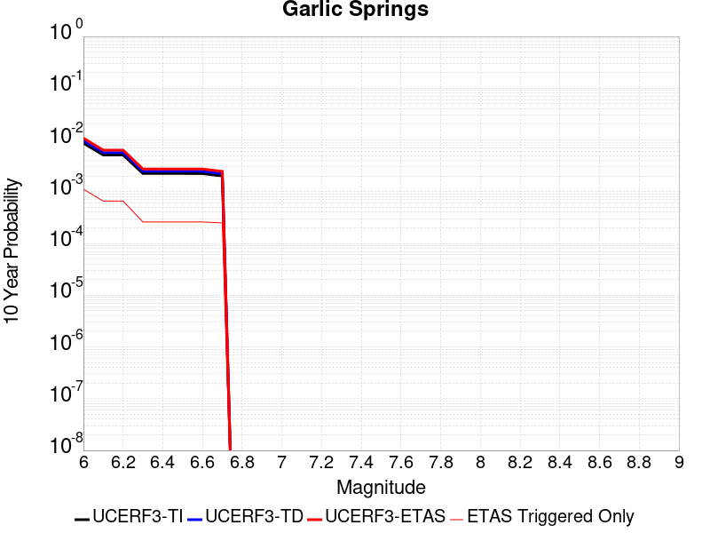 |

| Magnitude | 1 wk TI Prob | 1 wk TD Prob | 1 wk ETAS Prob | 1 wk ETAS/TD Gain | 1 wk ETAS Triggered Only | 1 mo TI Prob | 1 mo TD Prob | 1 mo ETAS Prob | 1 mo ETAS/TD Gain | 1 mo ETAS Triggered Only | 1 yr TI Prob | 1 yr TD Prob | 1 yr ETAS Prob | 1 yr ETAS/TD Gain | 1 yr ETAS Triggered Only | 10 yr TI Prob | 10 yr TD Prob | 10 yr ETAS Prob | 10 yr ETAS/TD Gain | 10 yr ETAS Triggered Only |
|-----|-----|-----|-----|-----|-----|-----|-----|-----|-----|-----|-----|-----|-----|-----|-----|-----|-----|-----|-----|-----|
| 6.0 | 1.6760017E-5 | 1.8776833E-5 | 3.6720236E-4 | 19.556139 | 3.4843205E-4 | 7.182667E-5 | 8.0470316E-5 | 4.2887434E-4 | 5.3295965 | 3.4843205E-4 | 8.7413884E-4 | 9.794032E-4 | 0.001791615 | 1.8292927 | 8.130081E-4 | 0.008707083 | 0.009762413 | 0.010567484 | 1.0824664 | 8.130081E-4 |
| 6.1 | 9.852767E-6 | 1.09735865E-5 | 2.4325907E-4 | 22.16769 | 2.3228803E-4 | 4.222546E-5 | 4.702921E-5 | 2.7930632E-4 | 5.938997 | 2.3228803E-4 | 5.139737E-4 | 5.7250116E-4 | 0.0011528888 | 2.0137753 | 5.807201E-4 | 0.005127866 | 0.005717221 | 0.006294621 | 1.1009932 | 5.807201E-4 |
| 6.2 | 9.852767E-6 | 1.09735865E-5 | 2.4325907E-4 | 22.16769 | 2.3228803E-4 | 4.222546E-5 | 4.702921E-5 | 2.7930632E-4 | 5.938997 | 2.3228803E-4 | 5.139737E-4 | 5.7250116E-4 | 0.0011528888 | 2.0137753 | 5.807201E-4 | 0.005127866 | 0.005717221 | 0.006294621 | 1.1009932 | 5.807201E-4 |
| 6.3 | 4.3167724E-6 | 4.7780286E-6 | 2.3706496E-4 | 49.615643 | 2.3228803E-4 | 1.8500323E-5 | 2.0477235E-5 | 2.527605E-4 | 12.343489 | 2.3228803E-4 | 2.2521814E-4 | 2.4930484E-4 | 5.9765E-4 | 2.3972661 | 3.4843205E-4 | 0.0022499003 | 0.00249251 | 0.0028400735 | 1.1394432 | 3.4843205E-4 |
| 6.4 | 4.3167724E-6 | 4.7780286E-6 | 2.3706496E-4 | 49.615643 | 2.3228803E-4 | 1.8500323E-5 | 2.0477235E-5 | 2.527605E-4 | 12.343489 | 2.3228803E-4 | 2.2521814E-4 | 2.4930484E-4 | 5.9765E-4 | 2.3972661 | 3.4843205E-4 | 0.0022499003 | 0.00249251 | 0.0028400735 | 1.1394432 | 3.4843205E-4 |
| 6.5 | 4.3167724E-6 | 4.7780286E-6 | 2.3706496E-4 | 49.615643 | 2.3228803E-4 | 1.8500323E-5 | 2.0477235E-5 | 2.527605E-4 | 12.343489 | 2.3228803E-4 | 2.2521814E-4 | 2.4930484E-4 | 5.9765E-4 | 2.3972661 | 3.4843205E-4 | 0.0022499003 | 0.00249251 | 0.0028400735 | 1.1394432 | 3.4843205E-4 |
| 6.6 | 4.301311E-6 | 4.760897E-6 | 2.3704783E-4 | 49.79058 | 2.3228803E-4 | 1.8434059E-5 | 2.0403815E-5 | 2.526871E-4 | 12.384307 | 2.3228803E-4 | 2.2441156E-4 | 2.4841115E-4 | 5.9675664E-4 | 2.4022942 | 3.4843205E-4 | 0.0022418506 | 0.002483593 | 0.0028311599 | 1.1399451 | 3.4843205E-4 |
| 6.7 | 3.8599724E-6 | 4.27106E-6 | 2.365581E-4 | 55.386276 | 2.3228803E-4 | 1.6542634E-5 | 1.8304541E-5 | 2.5058832E-4 | 13.689953 | 2.3228803E-4 | 2.0138794E-4 | 2.228578E-4 | 5.712122E-4 | 2.5631242 | 3.4843205E-4 | 0.0020120554 | 0.002228578 | 0.0025762336 | 1.1559988 | 3.4843205E-4 |

## Towne Pass
*[(top)](#table-of-contents)*

| 1 Week | 1 Month | 1 Year | 10 Year |
|-----|-----|-----|-----|
| 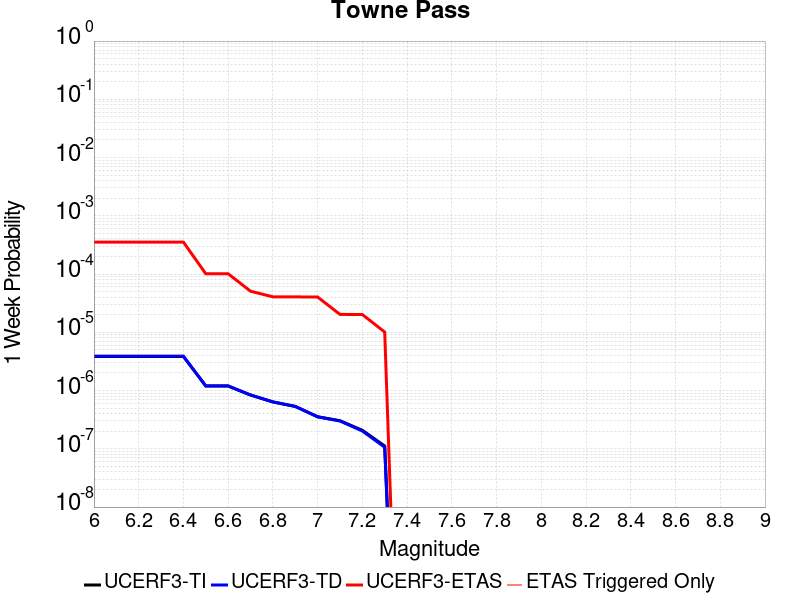 |  |  |  |

| Magnitude | 1 wk TI Prob | 1 wk TD Prob | 1 wk ETAS Prob | 1 wk ETAS/TD Gain | 1 wk ETAS Triggered Only | 1 mo TI Prob | 1 mo TD Prob | 1 mo ETAS Prob | 1 mo ETAS/TD Gain | 1 mo ETAS Triggered Only | 1 yr TI Prob | 1 yr TD Prob | 1 yr ETAS Prob | 1 yr ETAS/TD Gain | 1 yr ETAS Triggered Only | 10 yr TI Prob | 10 yr TD Prob | 10 yr ETAS Prob | 10 yr ETAS/TD Gain | 10 yr ETAS Triggered Only |
|-----|-----|-----|-----|-----|-----|-----|-----|-----|-----|-----|-----|-----|-----|-----|-----|-----|-----|-----|-----|-----|
| 6.0 | 3.849728E-6 | 3.8945414E-6 | 1.2003811E-4 | 30.822142 | 1.16144016E-4 | 1.649873E-5 | 1.669081E-5 | 3.6511704E-4 | 21.875336 | 3.4843205E-4 | 2.0085352E-4 | 2.0319603E-4 | 6.676777E-4 | 3.2858796 | 4.6457606E-4 | 0.0020067208 | 0.0020305314 | 0.0027259805 | 1.3424962 | 6.968641E-4 |
| 6.1 | 3.849728E-6 | 3.8945414E-6 | 1.2003811E-4 | 30.822142 | 1.16144016E-4 | 1.649873E-5 | 1.669081E-5 | 3.6511704E-4 | 21.875336 | 3.4843205E-4 | 2.0085352E-4 | 2.0319603E-4 | 6.676777E-4 | 3.2858796 | 4.6457606E-4 | 0.0020067208 | 0.0020305314 | 0.0027259805 | 1.3424962 | 6.968641E-4 |
| 6.2 | 3.849728E-6 | 3.8945414E-6 | 1.2003811E-4 | 30.822142 | 1.16144016E-4 | 1.649873E-5 | 1.669081E-5 | 3.6511704E-4 | 21.875336 | 3.4843205E-4 | 2.0085352E-4 | 2.0319603E-4 | 6.676777E-4 | 3.2858796 | 4.6457606E-4 | 0.0020067208 | 0.0020305314 | 0.0027259805 | 1.3424962 | 6.968641E-4 |
| 6.3 | 3.849728E-6 | 3.8945414E-6 | 1.2003811E-4 | 30.822142 | 1.16144016E-4 | 1.649873E-5 | 1.669081E-5 | 3.6511704E-4 | 21.875336 | 3.4843205E-4 | 2.0085352E-4 | 2.0319603E-4 | 6.676777E-4 | 3.2858796 | 4.6457606E-4 | 0.0020067208 | 0.0020305314 | 0.0027259805 | 1.3424962 | 6.968641E-4 |
| 6.4 | 3.849728E-6 | 3.8945414E-6 | 1.2003811E-4 | 30.822142 | 1.16144016E-4 | 1.649873E-5 | 1.669081E-5 | 3.6511704E-4 | 21.875336 | 3.4843205E-4 | 2.0085352E-4 | 2.0319603E-4 | 6.676777E-4 | 3.2858796 | 4.6457606E-4 | 0.0020067208 | 0.0020305314 | 0.0027259805 | 1.3424962 | 6.968641E-4 |
| 6.5 | 1.1953545E-6 | 1.203052E-6 | 1.1734693E-4 | 97.54103 | 1.16144016E-4 | 5.1229376E-6 | 5.1559277E-6 | 1.21299345E-4 | 23.526192 | 1.16144016E-4 | 6.236998E-5 | 6.277173E-5 | 1.7890846E-4 | 2.8501437 | 1.16144016E-4 | 6.235248E-4 | 6.275517E-4 | 7.4362283E-4 | 1.1849587 | 1.16144016E-4 |
| 6.6 | 1.1953545E-6 | 1.203052E-6 | 1.1734693E-4 | 97.54103 | 1.16144016E-4 | 5.1229376E-6 | 5.1559277E-6 | 1.21299345E-4 | 23.526192 | 1.16144016E-4 | 6.236998E-5 | 6.277173E-5 | 1.7890846E-4 | 2.8501437 | 1.16144016E-4 | 6.235248E-4 | 6.275517E-4 | 7.4362283E-4 | 1.1849587 | 1.16144016E-4 |
| 6.7 | 8.375951E-7 | 8.4106705E-7 | 1.16984986E-4 | 139.09116 | 1.16144016E-4 | 3.5896885E-6 | 3.6045683E-6 | 1.1974817E-4 | 33.221222 | 1.16144016E-4 | 4.370358E-5 | 4.3884793E-5 | 1.6002372E-4 | 3.6464503 | 1.16144016E-4 | 4.3694986E-4 | 4.38767E-4 | 5.5486005E-4 | 1.2645893 | 1.16144016E-4 |
| 6.8 | 6.38041E-7 | 6.392156E-7 | 1.1678316E-4 | 182.6976 | 1.16144016E-4 | 2.7344586E-6 | 2.7394929E-6 | 1.18883196E-4 | 43.396057 | 1.16144016E-4 | 3.3291526E-5 | 3.3352855E-5 | 1.49493E-4 | 4.482165 | 1.16144016E-4 | 3.3286537E-4 | 3.334823E-4 | 4.495876E-4 | 1.3481603 | 1.16144016E-4 |
| 6.9 | 5.3460053E-7 | 5.345333E-7 | 1.1667849E-4 | 218.28105 | 1.16144016E-4 | 2.2911431E-6 | 2.2908553E-6 | 1.1843461E-4 | 51.698864 | 1.16144016E-4 | 2.789431E-5 | 2.789084E-5 | 1.4403161E-4 | 5.1641192 | 1.16144016E-4 | 2.789081E-4 | 2.7887672E-4 | 3.9498834E-4 | 1.4163547 | 1.16144016E-4 |
| 7.0 | 3.557783E-7 | 3.5324226E-7 | 1.1649722E-4 | 329.79413 | 1.16144016E-4 | 1.5247632E-6 | 1.5138945E-6 | 1.17657735E-4 | 77.71858 | 1.16144016E-4 | 1.8563835E-5 | 1.843152E-5 | 1.3457339E-4 | 7.301265 | 1.16144016E-4 | 1.8562283E-4 | 1.8430075E-4 | 3.0042336E-4 | 1.6300713 | 1.16144016E-4 |
| 7.1 | 3.037942E-7 | 3.0002218E-7 | 3.0002218E-7 | 1.0 | 0.0 | 1.3019744E-6 | 1.2858087E-6 | 1.2858087E-6 | 1.0 | 0.0 | 1.5851423E-5 | 1.5654618E-5 | 1.5654618E-5 | 1.0 | 0.0 | 1.5850292E-4 | 1.5653588E-4 | 1.5653588E-4 | 1.0 | 0.0 |
| 7.2 | 2.0808248E-7 | 2.0217689E-7 | 2.0217689E-7 | 1.0 | 0.0 | 8.917818E-7 | 8.6647213E-7 | 8.6647213E-7 | 1.0 | 0.0 | 1.0857389E-5 | 1.0549252E-5 | 1.0549252E-5 | 1.0 | 0.0 | 1.0856859E-4 | 1.0548797E-4 | 1.0548797E-4 | 1.0 | 0.0 |
| 7.3 | 1.1162073E-7 | 1.0636894E-7 | 1.0636894E-7 | 1.0 | 0.0 | 4.7837443E-7 | 4.558668E-7 | 4.558668E-7 | 1.0 | 0.0 | 5.8241935E-6 | 5.550166E-6 | 5.550166E-6 | 1.0 | 0.0 | 5.8240406E-5 | 5.5500474E-5 | 5.5500474E-5 | 1.0 | 0.0 |

## Death Valley (Black Mtns Frontal)
*[(top)](#table-of-contents)*

| 1 Week | 1 Month | 1 Year | 10 Year |
|-----|-----|-----|-----|
|  |  |  |  |

| Magnitude | 1 wk TI Prob | 1 wk TD Prob | 1 wk ETAS Prob | 1 wk ETAS/TD Gain | 1 wk ETAS Triggered Only | 1 mo TI Prob | 1 mo TD Prob | 1 mo ETAS Prob | 1 mo ETAS/TD Gain | 1 mo ETAS Triggered Only | 1 yr TI Prob | 1 yr TD Prob | 1 yr ETAS Prob | 1 yr ETAS/TD Gain | 1 yr ETAS Triggered Only | 10 yr TI Prob | 10 yr TD Prob | 10 yr ETAS Prob | 10 yr ETAS/TD Gain | 10 yr ETAS Triggered Only |
|-----|-----|-----|-----|-----|-----|-----|-----|-----|-----|-----|-----|-----|-----|-----|-----|-----|-----|-----|-----|-----|
| 6.0 | 1.6707214E-5 | 1.867027E-5 | 2.5095398E-4 | 13.441369 | 2.3228803E-4 | 7.160038E-5 | 8.001302E-5 | 4.284172E-4 | 5.3543434 | 3.4843205E-4 | 8.71386E-4 | 9.737309E-4 | 0.0015538855 | 1.595806 | 5.807201E-4 | 0.00867977 | 0.009695496 | 0.010385605 | 1.0711782 | 6.968641E-4 |
| 6.1 | 1.6707214E-5 | 1.867027E-5 | 2.5095398E-4 | 13.441369 | 2.3228803E-4 | 7.160038E-5 | 8.001302E-5 | 4.284172E-4 | 5.3543434 | 3.4843205E-4 | 8.71386E-4 | 9.737309E-4 | 0.0015538855 | 1.595806 | 5.807201E-4 | 0.00867977 | 0.009695496 | 0.010385605 | 1.0711782 | 6.968641E-4 |
| 6.2 | 1.6707214E-5 | 1.867027E-5 | 2.5095398E-4 | 13.441369 | 2.3228803E-4 | 7.160038E-5 | 8.001302E-5 | 4.284172E-4 | 5.3543434 | 3.4843205E-4 | 8.71386E-4 | 9.737309E-4 | 0.0015538855 | 1.595806 | 5.807201E-4 | 0.00867977 | 0.009695496 | 0.010385605 | 1.0711782 | 6.968641E-4 |
| 6.3 | 1.6707214E-5 | 1.867027E-5 | 2.5095398E-4 | 13.441369 | 2.3228803E-4 | 7.160038E-5 | 8.001302E-5 | 4.284172E-4 | 5.3543434 | 3.4843205E-4 | 8.71386E-4 | 9.737309E-4 | 0.0015538855 | 1.595806 | 5.807201E-4 | 0.00867977 | 0.009695496 | 0.010385605 | 1.0711782 | 6.968641E-4 |
| 6.4 | 1.5515609E-5 | 1.7338214E-5 | 2.4962222E-4 | 14.397229 | 2.3228803E-4 | 6.649377E-5 | 7.4304546E-5 | 3.0657533E-4 | 4.1259294 | 2.3228803E-4 | 8.0926094E-4 | 9.042885E-4 | 0.0013684444 | 1.513283 | 4.6457606E-4 | 0.008063202 | 0.009006773 | 0.0095822625 | 1.0638952 | 5.807201E-4 |
| 6.5 | 1.5515609E-5 | 1.7338214E-5 | 2.4962222E-4 | 14.397229 | 2.3228803E-4 | 6.649377E-5 | 7.4304546E-5 | 3.0657533E-4 | 4.1259294 | 2.3228803E-4 | 8.0926094E-4 | 9.042885E-4 | 0.0013684444 | 1.513283 | 4.6457606E-4 | 0.008063202 | 0.009006773 | 0.0095822625 | 1.0638952 | 5.807201E-4 |
| 6.6 | 1.5041828E-5 | 1.6809145E-5 | 1.3295122E-4 | 7.909457 | 1.16144016E-4 | 6.4463384E-5 | 7.203723E-5 | 1.8817288E-4 | 2.6121614 | 1.16144016E-4 | 7.8455906E-4 | 8.767063E-4 | 0.001224833 | 1.3970846 | 3.4843205E-4 | 0.00781795 | 0.008733132 | 0.009193651 | 1.0527323 | 4.6457606E-4 |
| 6.7 | 1.4634985E-5 | 1.6356016E-5 | 1.6356016E-5 | 1.0 | 0.0 | 6.271985E-5 | 7.009536E-5 | 7.009536E-5 | 1.0 | 0.0 | 7.6334673E-4 | 8.5308263E-4 | 0.0010851725 | 1.2720603 | 2.3228803E-4 | 0.007607299 | 0.008498715 | 0.008844187 | 1.0406498 | 3.4843205E-4 |
| 6.8 | 1.4209158E-5 | 1.5882048E-5 | 1.5882048E-5 | 1.0 | 0.0 | 6.089497E-5 | 6.8064175E-5 | 6.8064175E-5 | 1.0 | 0.0 | 7.4114406E-4 | 8.2837185E-4 | 9.444197E-4 | 1.1400914 | 1.16144016E-4 | 0.007386771 | 0.008253456 | 0.008483827 | 1.027912 | 2.3228803E-4 |
| 6.9 | 1.3780098E-5 | 1.5404594E-5 | 1.5404594E-5 | 1.0 | 0.0 | 5.9056227E-5 | 6.6018045E-5 | 6.6018045E-5 | 1.0 | 0.0 | 7.1877235E-4 | 8.0347876E-4 | 8.0347876E-4 | 1.0 | 0.0 | 0.0071645193 | 0.008006332 | 0.008121547 | 1.0143903 | 1.16144016E-4 |
| 7.0 | 1.3585064E-5 | 1.5188155E-5 | 1.5188155E-5 | 1.0 | 0.0 | 5.8220405E-5 | 6.50905E-5 | 6.50905E-5 | 1.0 | 0.0 | 7.086029E-4 | 7.9219416E-4 | 7.9219416E-4 | 1.0 | 0.0 | 0.007063476 | 0.007894293 | 0.008009521 | 1.0145962 | 1.16144016E-4 |
| 7.1 | 1.3398601E-5 | 1.49813395E-5 | 1.49813395E-5 | 1.0 | 0.0 | 5.742131E-5 | 6.420419E-5 | 6.420419E-5 | 1.0 | 0.0 | 6.9888023E-4 | 7.8141113E-4 | 7.8141113E-4 | 1.0 | 0.0 | 0.0069668638 | 0.007787224 | 0.007902464 | 1.0147985 | 1.16144016E-4 |
| 7.2 | 1.3126312E-5 | 1.4679561E-5 | 1.4679561E-5 | 1.0 | 0.0 | 5.6254412E-5 | 6.291092E-5 | 6.291092E-5 | 1.0 | 0.0 | 6.846822E-4 | 7.6567667E-4 | 7.6567667E-4 | 1.0 | 0.0 | 0.006825765 | 0.00763097 | 0.007746228 | 1.0151039 | 1.16144016E-4 |
| 7.3 | 1.2922429E-5 | 1.4453788E-5 | 1.4453788E-5 | 1.0 | 0.0 | 5.5380664E-5 | 6.194336E-5 | 6.194336E-5 | 1.0 | 0.0 | 6.74051E-4 | 7.53905E-4 | 7.53905E-4 | 1.0 | 0.0 | 0.006720101 | 0.007514055 | 0.007629326 | 1.0153408 | 1.16144016E-4 |
| 7.4 | 1.2768878E-5 | 1.4283772E-5 | 1.4283772E-5 | 1.0 | 0.0 | 5.4722615E-5 | 6.1214756E-5 | 6.1214756E-5 | 1.0 | 0.0 | 6.660441E-4 | 7.4504025E-4 | 7.4504025E-4 | 1.0 | 0.0 | 0.0066405144 | 0.0074260035 | 0.007541285 | 1.015524 | 1.16144016E-4 |
| 7.5 | 1.2521929E-5 | 1.40120155E-5 | 1.40120155E-5 | 1.0 | 0.0 | 5.366431E-5 | 6.005014E-5 | 6.005014E-5 | 1.0 | 0.0 | 6.531671E-4 | 7.3087064E-4 | 7.3087064E-4 | 1.0 | 0.0 | 0.006512506 | 0.0072852457 | 0.0074005434 | 1.0158262 | 1.16144016E-4 |
| 7.6 | 1.1301089E-5 | 1.2648149E-5 | 1.2648149E-5 | 1.0 | 0.0 | 4.8432343E-5 | 5.4205255E-5 | 5.4205255E-5 | 1.0 | 0.0 | 5.895042E-4 | 6.5975444E-4 | 6.5975444E-4 | 1.0 | 0.0 | 0.0058794282 | 0.00657851 | 0.0066938903 | 1.0175389 | 1.16144016E-4 |
| 7.7 | 9.189108E-6 | 1.0283358E-5 | 1.0283358E-5 | 1.0 | 0.0 | 3.93813E-5 | 4.407082E-5 | 4.407082E-5 | 1.0 | 0.0 | 4.7936183E-4 | 5.3643517E-4 | 5.3643517E-4 | 1.0 | 0.0 | 0.004783291 | 0.005351914 | 0.0054674363 | 1.0215852 | 1.16144016E-4 |
| 7.8 | 3.4586725E-7 | 3.6482615E-7 | 3.6482615E-7 | 1.0 | 0.0 | 1.4822873E-6 | 1.5635396E-6 | 1.5635396E-6 | 1.0 | 0.0 | 1.80467E-5 | 1.9035933E-5 | 1.9035933E-5 | 1.0 | 0.0 | 1.8045233E-4 | 1.9034347E-4 | 1.9034347E-4 | 1.0 | 0.0 |
| 7.9 | 2.5591178E-9 | 2.6696718E-9 | 2.6696718E-9 | 1.0 | 0.0 | 1.0967647E-8 | 1.14414505E-8 | 1.14414505E-8 | 1.0 | 0.0 | 1.335311E-7 | 1.3929966E-7 | 1.3929966E-7 | 1.0 | 0.0 | 1.3353102E-6 | 1.3929966E-6 | 1.3929966E-6 | 1.0 | 0.0 |

## Elsinore (Glen Ivy) rev
*[(top)](#table-of-contents)*

| 1 Week | 1 Month | 1 Year | 10 Year |
|-----|-----|-----|-----|
|  |  |  |  |

| Magnitude | 1 wk TI Prob | 1 wk TD Prob | 1 wk ETAS Prob | 1 wk ETAS/TD Gain | 1 wk ETAS Triggered Only | 1 mo TI Prob | 1 mo TD Prob | 1 mo ETAS Prob | 1 mo ETAS/TD Gain | 1 mo ETAS Triggered Only | 1 yr TI Prob | 1 yr TD Prob | 1 yr ETAS Prob | 1 yr ETAS/TD Gain | 1 yr ETAS Triggered Only | 10 yr TI Prob | 10 yr TD Prob | 10 yr ETAS Prob | 10 yr ETAS/TD Gain | 10 yr ETAS Triggered Only |
|-----|-----|-----|-----|-----|-----|-----|-----|-----|-----|-----|-----|-----|-----|-----|-----|-----|-----|-----|-----|-----|
| 6.0 | 1.6204086E-4 | 2.9360707E-4 | 4.0971697E-4 | 1.3954602 | 1.16144016E-4 | 6.94276E-4 | 0.0012578638 | 0.0013738618 | 1.0922182 | 1.16144016E-4 | 0.008420097 | 0.015234485 | 0.015463234 | 1.0150152 | 2.3228803E-4 | 0.081081145 | 0.13969168 | 0.14009136 | 1.0028611 | 4.6457606E-4 |
| 6.1 | 1.6204086E-4 | 2.9360707E-4 | 4.0971697E-4 | 1.3954602 | 1.16144016E-4 | 6.94276E-4 | 0.0012578638 | 0.0013738618 | 1.0922182 | 1.16144016E-4 | 0.008420097 | 0.015234485 | 0.015463234 | 1.0150152 | 2.3228803E-4 | 0.081081145 | 0.13969168 | 0.14009136 | 1.0028611 | 4.6457606E-4 |
| 6.2 | 1.6204086E-4 | 2.9360707E-4 | 4.0971697E-4 | 1.3954602 | 1.16144016E-4 | 6.94276E-4 | 0.0012578638 | 0.0013738618 | 1.0922182 | 1.16144016E-4 | 0.008420097 | 0.015234485 | 0.015463234 | 1.0150152 | 2.3228803E-4 | 0.081081145 | 0.13969168 | 0.14009136 | 1.0028611 | 4.6457606E-4 |
| 6.3 | 1.0111737E-4 | 1.7703383E-4 | 2.9315727E-4 | 1.6559393 | 1.16144016E-4 | 4.332882E-4 | 7.5861247E-4 | 8.7466836E-4 | 1.1529845 | 1.16144016E-4 | 0.005262531 | 0.009217682 | 0.009447829 | 1.024968 | 2.3228803E-4 | 0.0513964 | 0.0870191 | 0.08744325 | 1.0048742 | 4.6457606E-4 |
| 6.4 | 1.0111737E-4 | 1.7703383E-4 | 2.9315727E-4 | 1.6559393 | 1.16144016E-4 | 4.332882E-4 | 7.5861247E-4 | 8.7466836E-4 | 1.1529845 | 1.16144016E-4 | 0.005262531 | 0.009217682 | 0.009447829 | 1.024968 | 2.3228803E-4 | 0.0513964 | 0.0870191 | 0.08744325 | 1.0048742 | 4.6457606E-4 |
| 6.5 | 3.6624708E-5 | 4.6391084E-5 | 1.6252972E-4 | 3.5034688 | 1.16144016E-4 | 1.569536E-4 | 1.9880582E-4 | 3.1492676E-4 | 1.5840921 | 1.16144016E-4 | 0.001909235 | 0.0024181372 | 0.0025340002 | 1.0479143 | 1.16144016E-4 | 0.01892915 | 0.023739954 | 0.023966728 | 1.0095524 | 2.3228803E-4 |
| 6.6 | 2.5051324E-5 | 2.614772E-5 | 2.614772E-5 | 1.0 | 0.0 | 1.073584E-4 | 1.12057096E-4 | 1.12057096E-4 | 1.0 | 0.0 | 0.0013063047 | 0.0013634858 | 0.0013634858 | 1.0 | 0.0 | 0.012986525 | 0.013564618 | 0.013564618 | 1.0 | 0.0 |
| 6.7 | 2.2189772E-5 | 2.2072849E-5 | 2.2072849E-5 | 1.0 | 0.0 | 9.509556E-5 | 9.4594696E-5 | 9.4594696E-5 | 1.0 | 0.0 | 0.0011571734 | 0.0011511183 | 0.0011511183 | 1.0 | 0.0 | 0.011511663 | 0.011465415 | 0.011465415 | 1.0 | 0.0 |
| 6.8 | 1.6654378E-5 | 1.4437705E-5 | 1.4437705E-5 | 1.0 | 0.0 | 7.137396E-5 | 6.187444E-5 | 6.187444E-5 | 1.0 | 0.0 | 8.686314E-4 | 7.530661E-4 | 7.530661E-4 | 1.0 | 0.0 | 0.008652439 | 0.00751048 | 0.00751048 | 1.0 | 0.0 |
| 6.9 | 1.5042909E-5 | 1.2332022E-5 | 1.2332022E-5 | 1.0 | 0.0 | 6.446802E-5 | 5.285047E-5 | 5.285047E-5 | 1.0 | 0.0 | 7.8461546E-4 | 6.4326765E-4 | 6.4326765E-4 | 1.0 | 0.0 | 0.007818509 | 0.00641828 | 0.00641828 | 1.0 | 0.0 |
| 7.0 | 1.4361385E-5 | 1.1451324E-5 | 1.1451324E-5 | 1.0 | 0.0 | 6.154734E-5 | 4.9076196E-5 | 4.9076196E-5 | 1.0 | 0.0 | 7.490812E-4 | 5.973418E-4 | 5.973418E-4 | 1.0 | 0.0 | 0.007465612 | 0.0059613534 | 0.0059613534 | 1.0 | 0.0 |
| 7.1 | 1.3265571E-5 | 1.0244926E-5 | 1.0244926E-5 | 1.0 | 0.0 | 5.6851208E-5 | 4.39061E-5 | 4.39061E-5 | 1.0 | 0.0 | 6.919436E-4 | 5.344282E-4 | 5.344282E-4 | 1.0 | 0.0 | 0.006897931 | 0.0053347866 | 0.0053347866 | 1.0 | 0.0 |
| 7.2 | 1.1596403E-5 | 8.505067E-6 | 8.505067E-6 | 1.0 | 0.0 | 4.9697923E-5 | 3.6449786E-5 | 3.6449786E-5 | 1.0 | 0.0 | 6.049042E-4 | 4.436875E-4 | 4.436875E-4 | 1.0 | 0.0 | 0.006032603 | 0.0044294316 | 0.0044294316 | 1.0 | 0.0 |
| 7.3 | 1.0150827E-5 | 7.2387597E-6 | 7.2387597E-6 | 1.0 | 0.0 | 4.3502816E-5 | 3.1022897E-5 | 3.1022897E-5 | 1.0 | 0.0 | 5.2951806E-4 | 3.7763975E-4 | 3.7763975E-4 | 1.0 | 0.0 | 0.005282581 | 0.0037703665 | 0.0037703665 | 1.0 | 0.0 |
| 7.4 | 9.080705E-6 | 6.352519E-6 | 6.352519E-6 | 1.0 | 0.0 | 3.8916725E-5 | 2.7224805E-5 | 2.7224805E-5 | 1.0 | 0.0 | 4.7370812E-4 | 3.3141294E-4 | 3.3141294E-4 | 1.0 | 0.0 | 0.004726996 | 0.0033093381 | 0.0033093381 | 1.0 | 0.0 |
| 7.5 | 7.671649E-6 | 5.2256332E-6 | 5.2256332E-6 | 1.0 | 0.0 | 3.287808E-5 | 2.2395385E-5 | 2.2395385E-5 | 1.0 | 0.0 | 4.0021708E-4 | 2.7263095E-4 | 2.7263095E-4 | 1.0 | 0.0 | 0.0039949706 | 0.00272309 | 0.00272309 | 1.0 | 0.0 |
| 7.6 | 6.990086E-6 | 4.687545E-6 | 4.687545E-6 | 1.0 | 0.0 | 2.9957167E-5 | 2.008933E-5 | 2.008933E-5 | 1.0 | 0.0 | 3.6466747E-4 | 2.445613E-4 | 2.445613E-4 | 1.0 | 0.0 | 0.0036406964 | 0.002443038 | 0.002443038 | 1.0 | 0.0 |
| 7.7 | 4.163505E-6 | 2.3295343E-6 | 2.3295343E-6 | 1.0 | 0.0 | 1.7843471E-5 | 9.983683E-6 | 9.983683E-6 | 1.0 | 0.0 | 2.172226E-4 | 1.21545316E-4 | 1.21545316E-4 | 1.0 | 0.0 | 0.0021701038 | 0.0012148614 | 0.0012148614 | 1.0 | 0.0 |
| 7.8 | 2.2692414E-7 | 9.3854695E-8 | 9.3854695E-8 | 1.0 | 0.0 | 9.725317E-7 | 4.0223435E-7 | 4.0223435E-7 | 1.0 | 0.0 | 1.1840509E-5 | 4.8971956E-6 | 4.8971956E-6 | 1.0 | 0.0 | 1.1839878E-4 | 4.8971204E-5 | 4.8971204E-5 | 1.0 | 0.0 |
| 7.9 | 6.676829E-9 | 3.439853E-9 | 3.439853E-9 | 1.0 | 0.0 | 2.861498E-8 | 1.4742227E-8 | 1.4742227E-8 | 1.0 | 0.0 | 3.4838732E-7 | 1.7948659E-7 | 1.7948659E-7 | 1.0 | 0.0 | 3.4838679E-6 | 1.7948646E-6 | 1.7948646E-6 | 1.0 | 0.0 |

## Cleghorn Lake
*[(top)](#table-of-contents)*

| 1 Week | 1 Month | 1 Year | 10 Year |
|-----|-----|-----|-----|
|  |  |  |  |

| Magnitude | 1 wk TI Prob | 1 wk TD Prob | 1 wk ETAS Prob | 1 wk ETAS/TD Gain | 1 wk ETAS Triggered Only | 1 mo TI Prob | 1 mo TD Prob | 1 mo ETAS Prob | 1 mo ETAS/TD Gain | 1 mo ETAS Triggered Only | 1 yr TI Prob | 1 yr TD Prob | 1 yr ETAS Prob | 1 yr ETAS/TD Gain | 1 yr ETAS Triggered Only | 10 yr TI Prob | 10 yr TD Prob | 10 yr ETAS Prob | 10 yr ETAS/TD Gain | 10 yr ETAS Triggered Only |
|-----|-----|-----|-----|-----|-----|-----|-----|-----|-----|-----|-----|-----|-----|-----|-----|-----|-----|-----|-----|-----|
| 6.0 | 1.5467183E-5 | 1.6794203E-5 | 2.4907835E-4 | 14.831208 | 2.3228803E-4 | 6.6286244E-5 | 7.197348E-5 | 4.2038047E-4 | 5.840769 | 3.4843205E-4 | 8.067362E-4 | 8.759797E-4 | 0.0012241065 | 1.3974142 | 3.4843205E-4 | 0.008038137 | 0.008730696 | 0.009076086 | 1.0395604 | 3.4843205E-4 |
| 6.1 | 1.5467183E-5 | 1.6794203E-5 | 2.4907835E-4 | 14.831208 | 2.3228803E-4 | 6.6286244E-5 | 7.197348E-5 | 4.2038047E-4 | 5.840769 | 3.4843205E-4 | 8.067362E-4 | 8.759797E-4 | 0.0012241065 | 1.3974142 | 3.4843205E-4 | 0.008038137 | 0.008730696 | 0.009076086 | 1.0395604 | 3.4843205E-4 |
| 6.2 | 1.2624631E-5 | 1.3681544E-5 | 2.459664E-4 | 17.97797 | 2.3228803E-4 | 5.410444E-5 | 5.863415E-5 | 4.0704577E-4 | 6.942128 | 3.4843205E-4 | 6.585225E-4 | 7.1368564E-4 | 0.001061869 | 1.4878666 | 3.4843205E-4 | 0.0065657445 | 0.0071187317 | 0.0074646836 | 1.0485973 | 3.4843205E-4 |
| 6.3 | 1.2624631E-5 | 1.3681544E-5 | 2.459664E-4 | 17.97797 | 2.3228803E-4 | 5.410444E-5 | 5.863415E-5 | 4.0704577E-4 | 6.942128 | 3.4843205E-4 | 6.585225E-4 | 7.1368564E-4 | 0.001061869 | 1.4878666 | 3.4843205E-4 | 0.0065657445 | 0.0071187317 | 0.0074646836 | 1.0485973 | 3.4843205E-4 |
| 6.4 | 9.417684E-6 | 1.0170118E-5 | 1.0170118E-5 | 1.0 | 0.0 | 4.036088E-5 | 4.3585722E-5 | 1.5972467E-4 | 3.6646101 | 1.16144016E-4 | 4.912829E-4 | 5.3056807E-4 | 6.4665044E-4 | 1.2187889 | 1.16144016E-4 | 0.004901982 | 0.005297049 | 0.0054125777 | 1.02181 | 1.16144016E-4 |
| 6.5 | 9.368219E-6 | 1.0117545E-5 | 1.0117545E-5 | 1.0 | 0.0 | 4.014889E-5 | 4.3360415E-5 | 1.594994E-4 | 3.6784565 | 1.16144016E-4 | 4.8870314E-4 | 5.2782625E-4 | 6.43909E-4 | 1.219926 | 1.16144016E-4 | 0.004876298 | 0.0052697617 | 0.0053852936 | 1.0219235 | 1.16144016E-4 |
| 6.6 | 7.803798E-6 | 8.441831E-6 | 8.441831E-6 | 1.0 | 0.0 | 3.3444423E-5 | 3.6179E-5 | 1.5231881E-4 | 4.2101445 | 1.16144016E-4 | 4.0710976E-4 | 4.4043022E-4 | 5.565231E-4 | 1.2635897 | 1.16144016E-4 | 0.0040636472 | 0.0043994905 | 0.0045151236 | 1.0262833 | 1.16144016E-4 |
| 6.7 | 2.3108669E-6 | 2.4438336E-6 | 2.4438336E-6 | 1.0 | 0.0 | 9.903678E-6 | 1.0473532E-5 | 1.0473532E-5 | 1.0 | 0.0 | 1.205706E-4 | 1.2750797E-4 | 1.2750797E-4 | 1.0 | 0.0 | 0.001205052 | 0.0012743667 | 0.0012743667 | 1.0 | 0.0 |
| 6.8 | 2.0882828E-6 | 2.2062823E-6 | 2.2062823E-6 | 1.0 | 0.0 | 8.949753E-6 | 9.455462E-6 | 9.455462E-6 | 1.0 | 0.0 | 1.08957785E-4 | 1.1511434E-4 | 1.1511434E-4 | 1.0 | 0.0 | 0.0010890438 | 0.0011505639 | 0.0011505639 | 1.0 | 0.0 |
| 6.9 | 1.876935E-6 | 1.981051E-6 | 1.981051E-6 | 1.0 | 0.0 | 8.043982E-6 | 8.490192E-6 | 8.490192E-6 | 1.0 | 0.0 | 9.7931086E-5 | 1.03363345E-4 | 1.03363345E-4 | 1.0 | 0.0 | 9.788794E-4 | 0.0010331686 | 0.0010331686 | 1.0 | 0.0 |
| 7.0 | 1.5357559E-6 | 1.6202807E-6 | 1.6202807E-6 | 1.0 | 0.0 | 6.5817944E-6 | 6.9440425E-6 | 6.9440425E-6 | 1.0 | 0.0 | 8.01304E-5 | 8.454057E-5 | 8.454057E-5 | 1.0 | 0.0 | 8.010151E-4 | 8.450965E-4 | 8.450965E-4 | 1.0 | 0.0 |
| 7.1 | 1.0905424E-6 | 1.1497619E-6 | 1.1497619E-6 | 1.0 | 0.0 | 4.6737446E-6 | 4.9275427E-6 | 4.9275427E-6 | 1.0 | 0.0 | 5.6901354E-5 | 5.999128E-5 | 5.999128E-5 | 1.0 | 0.0 | 5.6886784E-4 | 5.997606E-4 | 5.997606E-4 | 1.0 | 0.0 |
| 7.2 | 6.06668E-7 | 6.387277E-7 | 6.387277E-7 | 1.0 | 0.0 | 2.600003E-6 | 2.7374022E-6 | 2.7374022E-6 | 1.0 | 0.0 | 3.1654577E-5 | 3.3327433E-5 | 3.3327433E-5 | 1.0 | 0.0 | 3.1650066E-4 | 3.3323118E-4 | 3.3323118E-4 | 1.0 | 0.0 |

## San Andreas (San Bernardino S)
*[(top)](#table-of-contents)*

| 1 Week | 1 Month | 1 Year | 10 Year |
|-----|-----|-----|-----|
|  |  |  |  |

| Magnitude | 1 wk TI Prob | 1 wk TD Prob | 1 wk ETAS Prob | 1 wk ETAS/TD Gain | 1 wk ETAS Triggered Only | 1 mo TI Prob | 1 mo TD Prob | 1 mo ETAS Prob | 1 mo ETAS/TD Gain | 1 mo ETAS Triggered Only | 1 yr TI Prob | 1 yr TD Prob | 1 yr ETAS Prob | 1 yr ETAS/TD Gain | 1 yr ETAS Triggered Only | 10 yr TI Prob | 10 yr TD Prob | 10 yr ETAS Prob | 10 yr ETAS/TD Gain | 10 yr ETAS Triggered Only |
|-----|-----|-----|-----|-----|-----|-----|-----|-----|-----|-----|-----|-----|-----|-----|-----|-----|-----|-----|-----|-----|
| 6.0 | 1.2336002E-4 | 3.0004102E-4 | 3.0004102E-4 | 1.0 | 0.0 | 5.2857865E-4 | 0.0012852824 | 0.0012852824 | 1.0 | 0.0 | 0.006416472 | 0.015540994 | 0.015769672 | 1.0147145 | 2.3228803E-4 | 0.06234337 | 0.14283717 | 0.14323539 | 1.002788 | 4.6457606E-4 |
| 6.1 | 1.2336002E-4 | 3.0004102E-4 | 3.0004102E-4 | 1.0 | 0.0 | 5.2857865E-4 | 0.0012852824 | 0.0012852824 | 1.0 | 0.0 | 0.006416472 | 0.015540994 | 0.015769672 | 1.0147145 | 2.3228803E-4 | 0.06234337 | 0.14283717 | 0.14323539 | 1.002788 | 4.6457606E-4 |
| 6.2 | 1.2336002E-4 | 3.0004102E-4 | 3.0004102E-4 | 1.0 | 0.0 | 5.2857865E-4 | 0.0012852824 | 0.0012852824 | 1.0 | 0.0 | 0.006416472 | 0.015540994 | 0.015769672 | 1.0147145 | 2.3228803E-4 | 0.06234337 | 0.14283717 | 0.14323539 | 1.002788 | 4.6457606E-4 |
| 6.3 | 1.1712257E-4 | 2.8792414E-4 | 2.8792414E-4 | 1.0 | 0.0 | 5.018573E-4 | 0.0012334028 | 0.0012334028 | 1.0 | 0.0 | 0.006093008 | 0.014918125 | 0.0151469475 | 1.0153385 | 2.3228803E-4 | 0.059286322 | 0.13754563 | 0.13794631 | 1.002913 | 4.6457606E-4 |
| 6.4 | 1.1712257E-4 | 2.8792414E-4 | 2.8792414E-4 | 1.0 | 0.0 | 5.018573E-4 | 0.0012334028 | 0.0012334028 | 1.0 | 0.0 | 0.006093008 | 0.014918125 | 0.0151469475 | 1.0153385 | 2.3228803E-4 | 0.059286322 | 0.13754563 | 0.13794631 | 1.002913 | 4.6457606E-4 |
| 6.5 | 1.0689076E-4 | 2.680528E-4 | 2.680528E-4 | 1.0 | 0.0 | 4.5802278E-4 | 0.0011483167 | 0.0011483167 | 1.0 | 0.0 | 0.0055621783 | 0.01389575 | 0.014124811 | 1.0164841 | 2.3228803E-4 | 0.05425003 | 0.12879294 | 0.12919769 | 1.0031426 | 4.6457606E-4 |
| 6.6 | 9.7648895E-5 | 2.50501E-4 | 2.50501E-4 | 1.0 | 0.0 | 4.1842813E-4 | 0.0010731576 | 0.0010731576 | 1.0 | 0.0 | 0.005082469 | 0.012991785 | 0.013221055 | 1.0176473 | 2.3228803E-4 | 0.049677886 | 0.12095292 | 0.1213613 | 1.0033764 | 4.6457606E-4 |
| 6.7 | 8.757013E-5 | 2.3120902E-4 | 2.3120902E-4 | 1.0 | 0.0 | 3.7524657E-4 | 9.905418E-4 | 9.905418E-4 | 1.0 | 0.0 | 0.00455906 | 0.011997245 | 0.012226746 | 1.0191295 | 2.3228803E-4 | 0.04466656 | 0.11226123 | 0.11267365 | 1.0036738 | 4.6457606E-4 |
| 6.8 | 8.562978E-5 | 2.2680782E-4 | 2.2680782E-4 | 1.0 | 0.0 | 3.6693315E-4 | 9.7169366E-4 | 9.7169366E-4 | 1.0 | 0.0 | 0.004458263 | 0.011770263 | 0.011999818 | 1.0195029 | 2.3228803E-4 | 0.043698758 | 0.11027153 | 0.11068488 | 1.0037484 | 4.6457606E-4 |
| 6.9 | 6.124075E-5 | 1.7065753E-4 | 1.7065753E-4 | 1.0 | 0.0 | 2.6243398E-4 | 7.311852E-4 | 7.311852E-4 | 1.0 | 0.0 | 0.0031904527 | 0.008866051 | 0.00909628 | 1.0259675 | 2.3228803E-4 | 0.031450346 | 0.08418263 | 0.08460809 | 1.0050541 | 4.6457606E-4 |
| 7.0 | 5.8598747E-5 | 1.649477E-4 | 1.649477E-4 | 1.0 | 0.0 | 2.5111332E-4 | 7.06728E-4 | 7.06728E-4 | 1.0 | 0.0 | 0.0030530186 | 0.008570663 | 0.00880096 | 1.0268704 | 2.3228803E-4 | 0.03011414 | 0.081500374 | 0.08192708 | 1.0052357 | 4.6457606E-4 |
| 7.1 | 5.613814E-5 | 1.5913323E-4 | 1.5913323E-4 | 1.0 | 0.0 | 2.4056983E-4 | 6.818221E-4 | 6.818221E-4 | 1.0 | 0.0 | 0.0029250039 | 0.008269769 | 0.0085001355 | 1.0278566 | 2.3228803E-4 | 0.028868021 | 0.07879931 | 0.079120286 | 1.0040734 | 3.4843205E-4 |
| 7.2 | 4.991222E-5 | 1.4519796E-4 | 1.4519796E-4 | 1.0 | 0.0 | 2.1389198E-4 | 6.2212895E-4 | 6.2212895E-4 | 1.0 | 0.0 | 0.002601025 | 0.007548217 | 0.0077787517 | 1.0305417 | 2.3228803E-4 | 0.025707912 | 0.07225321 | 0.07257646 | 1.0044739 | 3.4843205E-4 |
| 7.3 | 4.7410045E-5 | 1.3714004E-4 | 1.3714004E-4 | 1.0 | 0.0 | 2.0317009E-4 | 5.8761094E-4 | 5.8761094E-4 | 1.0 | 0.0 | 0.0024707897 | 0.0071307817 | 0.007361413 | 1.0323431 | 2.3228803E-4 | 0.024434982 | 0.06853558 | 0.06886013 | 1.0047355 | 3.4843205E-4 |
| 7.4 | 4.5556746E-5 | 1.3121912E-4 | 1.3121912E-4 | 1.0 | 0.0 | 1.952286E-4 | 5.622468E-4 | 5.622468E-4 | 1.0 | 0.0 | 0.002374317 | 0.0068239477 | 0.0070546507 | 1.0338079 | 2.3228803E-4 | 0.023491086 | 0.065788016 | 0.066113524 | 1.0049479 | 3.4843205E-4 |
| 7.5 | 4.3084514E-5 | 1.2357246E-4 | 1.2357246E-4 | 1.0 | 0.0 | 1.8463485E-4 | 5.2948913E-4 | 5.2948913E-4 | 1.0 | 0.0 | 0.0022456115 | 0.0064275465 | 0.0066583417 | 1.0359071 | 2.3228803E-4 | 0.022230545 | 0.062188786 | 0.06251555 | 1.0052544 | 3.4843205E-4 |
| 7.6 | 3.408608E-5 | 9.83552E-5 | 9.83552E-5 | 1.0 | 0.0 | 1.4607502E-4 | 4.214543E-4 | 4.214543E-4 | 1.0 | 0.0 | 0.0017770125 | 0.0051191594 | 0.005350258 | 1.045144 | 2.3228803E-4 | 0.017628696 | 0.050020292 | 0.050351296 | 1.0066174 | 3.4843205E-4 |
| 7.7 | 2.8315713E-5 | 8.248679E-5 | 8.248679E-5 | 1.0 | 0.0 | 1.2134742E-4 | 3.5346695E-4 | 3.5346695E-4 | 1.0 | 0.0 | 0.0014764034 | 0.0042949775 | 0.0045262678 | 1.0538514 | 2.3228803E-4 | 0.01466633 | 0.0422714 | 0.042605106 | 1.0078943 | 3.4843205E-4 |
| 7.8 | 2.6222975E-5 | 7.463088E-5 | 7.463088E-5 | 1.0 | 0.0 | 1.1237934E-4 | 3.1980744E-4 | 3.1980744E-4 | 1.0 | 0.0 | 0.0013673597 | 0.0038867102 | 0.004118095 | 1.0595324 | 2.3228803E-4 | 0.013589768 | 0.03843674 | 0.038771782 | 1.0087167 | 3.4843205E-4 |
| 7.9 | 2.1469694E-5 | 5.787864E-5 | 5.787864E-5 | 1.0 | 0.0 | 9.200973E-5 | 2.4802773E-4 | 2.4802773E-4 | 1.0 | 0.0 | 0.0011196428 | 0.0030155594 | 0.003131353 | 1.0383987 | 1.16144016E-4 | 0.011140184 | 0.030152109 | 0.030377394 | 1.0074716 | 2.3228803E-4 |
| 8.0 | 1.2420249E-5 | 3.131896E-5 | 3.131896E-5 | 1.0 | 0.0 | 5.322855E-5 | 1.342172E-4 | 1.342172E-4 | 1.0 | 0.0 | 6.478649E-4 | 0.0016328706 | 0.0016328706 | 1.0 | 0.0 | 0.0064597935 | 0.016522504 | 0.01663673 | 1.0069133 | 1.16144016E-4 |
| 8.1 | 4.9197724E-6 | 7.822348E-6 | 7.822348E-6 | 1.0 | 0.0 | 2.1084568E-5 | 3.352392E-5 | 3.352392E-5 | 1.0 | 0.0 | 2.566744E-4 | 4.0807744E-4 | 4.0807744E-4 | 1.0 | 0.0 | 0.002563781 | 0.0043843705 | 0.0043843705 | 1.0 | 0.0 |
| 8.2 | 2.5634774E-6 | 2.9067196E-6 | 2.9067196E-6 | 1.0 | 0.0 | 1.0986286E-5 | 1.2457311E-5 | 1.2457311E-5 | 1.0 | 0.0 | 1.3374983E-4 | 1.5165724E-4 | 1.5165724E-4 | 1.0 | 0.0 | 0.0013366934 | 0.0017049741 | 0.0017049741 | 1.0 | 0.0 |
| 8.3 | 5.2850464E-7 | 3.2088764E-7 | 3.2088764E-7 | 1.0 | 0.0 | 2.2650179E-6 | 1.375232E-6 | 1.375232E-6 | 1.0 | 0.0 | 2.7576245E-5 | 1.6743334E-5 | 1.6743334E-5 | 1.0 | 0.0 | 2.7572823E-4 | 1.9870348E-4 | 1.9870348E-4 | 1.0 | 0.0 |

## Mission Ridge-Arroyo Parida-Santa Ana
*[(top)](#table-of-contents)*

| 1 Week | 1 Month | 1 Year | 10 Year |
|-----|-----|-----|-----|
|  |  |  | 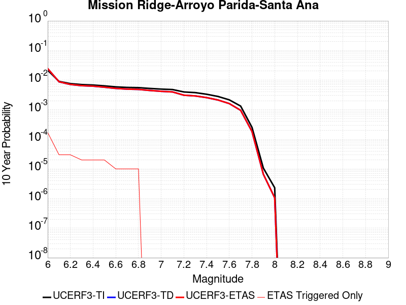 |

| Magnitude | 1 wk TI Prob | 1 wk TD Prob | 1 wk ETAS Prob | 1 wk ETAS/TD Gain | 1 wk ETAS Triggered Only | 1 mo TI Prob | 1 mo TD Prob | 1 mo ETAS Prob | 1 mo ETAS/TD Gain | 1 mo ETAS Triggered Only | 1 yr TI Prob | 1 yr TD Prob | 1 yr ETAS Prob | 1 yr ETAS/TD Gain | 1 yr ETAS Triggered Only | 10 yr TI Prob | 10 yr TD Prob | 10 yr ETAS Prob | 10 yr ETAS/TD Gain | 10 yr ETAS Triggered Only |
|-----|-----|-----|-----|-----|-----|-----|-----|-----|-----|-----|-----|-----|-----|-----|-----|-----|-----|-----|-----|-----|
| 6.0 | 4.169034E-5 | 4.7138263E-5 | 1.6327681E-4 | 3.463785 | 1.16144016E-4 | 1.7866064E-4 | 2.0201034E-4 | 4.3425144E-4 | 2.1496496 | 2.3228803E-4 | 0.0021730233 | 0.00245745 | 0.0028050258 | 1.1414375 | 3.4843205E-4 | 0.021518968 | 0.024384614 | 0.02472455 | 1.0139406 | 3.4843205E-4 |
| 6.1 | 1.73813E-5 | 1.6854226E-5 | 1.3299628E-4 | 7.8909755 | 1.16144016E-4 | 7.4489166E-5 | 7.223046E-5 | 1.8836609E-4 | 2.6078484 | 1.16144016E-4 | 9.065282E-4 | 8.790618E-4 | 9.951037E-4 | 1.1320065 | 1.16144016E-4 | 0.009028391 | 0.008756988 | 0.008872115 | 1.0131469 | 1.16144016E-4 |
| 6.2 | 1.4622182E-5 | 1.367329E-5 | 1.2981571E-4 | 9.49411 | 1.16144016E-4 | 6.2664985E-5 | 5.8598518E-5 | 1.7473573E-4 | 2.9819138 | 1.16144016E-4 | 7.6267915E-4 | 7.132073E-4 | 8.292685E-4 | 1.1627313 | 1.16144016E-4 | 0.007600669 | 0.007109627 | 0.0072249454 | 1.01622 | 1.16144016E-4 |
| 6.3 | 1.3552434E-5 | 1.2482201E-5 | 1.2862477E-4 | 10.304655 | 1.16144016E-4 | 5.8080568E-5 | 5.3494066E-5 | 1.6963186E-4 | 3.1710408 | 1.16144016E-4 | 7.069015E-4 | 6.510988E-4 | 7.671672E-4 | 1.1782655 | 1.16144016E-4 | 0.00704657 | 0.006492275 | 0.0066076647 | 1.0177734 | 1.16144016E-4 |
| 6.4 | 1.30977305E-5 | 1.1979156E-5 | 1.2812178E-4 | 10.695394 | 1.16144016E-4 | 5.613192E-5 | 5.1338247E-5 | 1.674763E-4 | 3.2622132 | 1.16144016E-4 | 6.831918E-4 | 6.248669E-4 | 7.4093835E-4 | 1.1857538 | 1.16144016E-4 | 0.006810953 | 0.0062314444 | 0.0063468646 | 1.0185223 | 1.16144016E-4 |
| 6.5 | 1.225205E-5 | 1.1048803E-5 | 1.2719154E-4 | 11.511793 | 1.16144016E-4 | 5.2507727E-5 | 4.7351168E-5 | 1.6348969E-4 | 3.4527066 | 1.16144016E-4 | 6.3909404E-4 | 5.7635066E-4 | 6.9242774E-4 | 1.2014 | 1.16144016E-4 | 0.006372592 | 0.005748869 | 0.0058643455 | 1.0200868 | 1.16144016E-4 |
| 6.6 | 1.1352241E-5 | 1.0063535E-5 | 1.0063535E-5 | 1.0 | 0.0 | 4.8651553E-5 | 4.3128734E-5 | 4.3128734E-5 | 1.0 | 0.0 | 5.921717E-4 | 5.2496797E-4 | 5.2496797E-4 | 1.0 | 0.0 | 0.0059059616 | 0.0052375244 | 0.0052375244 | 1.0 | 0.0 |
| 6.7 | 1.0864116E-5 | 9.517027E-6 | 9.517027E-6 | 1.0 | 0.0 | 4.6559664E-5 | 4.0786632E-5 | 4.0786632E-5 | 1.0 | 0.0 | 5.667165E-4 | 4.964661E-4 | 4.964661E-4 | 1.0 | 0.0 | 0.005652734 | 0.004953804 | 0.004953804 | 1.0 | 0.0 |
| 6.8 | 1.0666365E-5 | 9.299779E-6 | 9.299779E-6 | 1.0 | 0.0 | 4.571219E-5 | 3.9855597E-5 | 3.9855597E-5 | 1.0 | 0.0 | 5.564038E-4 | 4.8513585E-4 | 4.8513585E-4 | 1.0 | 0.0 | 0.005550127 | 0.0048410003 | 0.0048410003 | 1.0 | 0.0 |
| 6.9 | 1.0038665E-5 | 8.592046E-6 | 8.592046E-6 | 1.0 | 0.0 | 4.302214E-5 | 3.682254E-5 | 3.682254E-5 | 1.0 | 0.0 | 5.236687E-4 | 4.4822405E-4 | 4.4822405E-4 | 1.0 | 0.0 | 0.005224364 | 0.004473411 | 0.004473411 | 1.0 | 0.0 |
| 7.0 | 9.5379955E-6 | 8.025073E-6 | 8.025073E-6 | 1.0 | 0.0 | 4.0876483E-5 | 3.4392728E-5 | 3.4392728E-5 | 1.0 | 0.0 | 4.975576E-4 | 4.1865272E-4 | 4.1865272E-4 | 1.0 | 0.0 | 0.00496445 | 0.0041788397 | 0.0041788397 | 1.0 | 0.0 |
| 7.1 | 9.207389E-6 | 7.652375E-6 | 7.652375E-6 | 1.0 | 0.0 | 3.945964E-5 | 3.279549E-5 | 3.279549E-5 | 1.0 | 0.0 | 4.803152E-4 | 3.9921363E-4 | 3.9921363E-4 | 1.0 | 0.0 | 0.004792784 | 0.003985161 | 0.003985161 | 1.0 | 0.0 |
| 7.2 | 7.638091E-6 | 5.9311183E-6 | 5.9311183E-6 | 1.0 | 0.0 | 3.2734264E-5 | 2.541883E-5 | 2.541883E-5 | 1.0 | 0.0 | 3.984668E-4 | 3.0943064E-4 | 3.0943064E-4 | 1.0 | 0.0 | 0.0039775306 | 0.0030900547 | 0.0030900547 | 1.0 | 0.0 |
| 7.3 | 7.2500147E-6 | 5.5961527E-6 | 5.5961527E-6 | 1.0 | 0.0 | 3.1071122E-5 | 2.3983293E-5 | 2.3983293E-5 | 1.0 | 0.0 | 3.7822526E-4 | 2.9195778E-4 | 2.9195778E-4 | 1.0 | 0.0 | 0.0037758215 | 0.0029157975 | 0.0029157975 | 1.0 | 0.0 |
| 7.4 | 6.3899715E-6 | 4.9184964E-6 | 4.9184964E-6 | 1.0 | 0.0 | 2.7385306E-5 | 2.10791E-5 | 2.10791E-5 | 1.0 | 0.0 | 3.3336508E-4 | 2.5660804E-4 | 2.5660804E-4 | 1.0 | 0.0 | 0.0033286542 | 0.0025631618 | 0.0025631618 | 1.0 | 0.0 |
| 7.5 | 5.379025E-6 | 4.0838527E-6 | 4.0838527E-6 | 1.0 | 0.0 | 2.305276E-5 | 1.7502109E-5 | 1.7502109E-5 | 1.0 | 0.0 | 2.806312E-4 | 2.1306744E-4 | 2.1306744E-4 | 1.0 | 0.0 | 0.0028027708 | 0.002128643 | 0.002128643 | 1.0 | 0.0 |
| 7.6 | 4.1270696E-6 | 3.0883439E-6 | 3.0883439E-6 | 1.0 | 0.0 | 1.768732E-5 | 1.3235693E-5 | 1.3235693E-5 | 1.0 | 0.0 | 2.1532185E-4 | 1.6113273E-4 | 1.6113273E-4 | 1.0 | 0.0 | 0.0021511333 | 0.001610167 | 0.001610167 | 1.0 | 0.0 |
| 7.7 | 2.5406805E-6 | 1.8282013E-6 | 1.8282013E-6 | 1.0 | 0.0 | 1.0888585E-5 | 7.835125E-6 | 7.835125E-6 | 1.0 | 0.0 | 1.3256045E-4 | 9.538854E-5 | 9.538854E-5 | 1.0 | 0.0 | 0.0013248142 | 9.534821E-4 | 9.534821E-4 | 1.0 | 0.0 |
| 7.8 | 4.8608285E-7 | 3.5098864E-7 | 3.5098864E-7 | 1.0 | 0.0 | 2.0832106E-6 | 1.5042363E-6 | 1.5042363E-6 | 1.0 | 0.0 | 2.5362791E-5 | 1.8313924E-5 | 1.8313924E-5 | 1.0 | 0.0 | 2.5359896E-4 | 1.8312426E-4 | 1.8312426E-4 | 1.0 | 0.0 |
| 7.9 | 2.0472514E-8 | 1.2688783E-8 | 1.2688783E-8 | 1.0 | 0.0 | 8.7739345E-8 | 5.43805E-8 | 5.43805E-8 | 1.0 | 0.0 | 1.068226E-6 | 6.6208236E-7 | 6.6208236E-7 | 1.0 | 0.0 | 1.0682209E-5 | 6.620805E-6 | 6.620805E-6 | 1.0 | 0.0 |
| 8.0 | 4.443582E-9 | 2.0321211E-9 | 2.0321211E-9 | 1.0 | 0.0 | 1.9043922E-8 | 8.70909E-9 | 8.70909E-9 | 1.0 | 0.0 | 2.3185973E-7 | 1.0603316E-7 | 1.0603316E-7 | 1.0 | 0.0 | 2.3185949E-6 | 1.0603312E-6 | 1.0603312E-6 | 1.0 | 0.0 |

## Cady
*[(top)](#table-of-contents)*

| 1 Week | 1 Month | 1 Year | 10 Year |
|-----|-----|-----|-----|
| 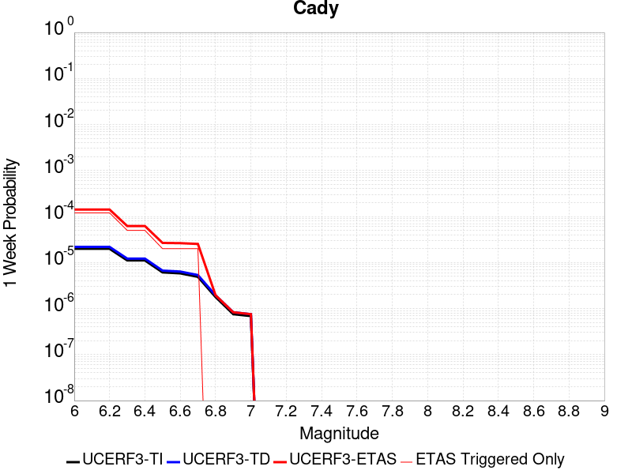 |  |  |  |

| Magnitude | 1 wk TI Prob | 1 wk TD Prob | 1 wk ETAS Prob | 1 wk ETAS/TD Gain | 1 wk ETAS Triggered Only | 1 mo TI Prob | 1 mo TD Prob | 1 mo ETAS Prob | 1 mo ETAS/TD Gain | 1 mo ETAS Triggered Only | 1 yr TI Prob | 1 yr TD Prob | 1 yr ETAS Prob | 1 yr ETAS/TD Gain | 1 yr ETAS Triggered Only | 10 yr TI Prob | 10 yr TD Prob | 10 yr ETAS Prob | 10 yr ETAS/TD Gain | 10 yr ETAS Triggered Only |
|-----|-----|-----|-----|-----|-----|-----|-----|-----|-----|-----|-----|-----|-----|-----|-----|-----|-----|-----|-----|-----|
| 6.0 | 1.9892565E-5 | 2.1858728E-5 | 1.380002E-4 | 6.313277 | 1.16144016E-4 | 8.525106E-5 | 9.3677416E-5 | 2.0981056E-4 | 2.2397132 | 1.16144016E-4 | 0.0010374374 | 0.0011400167 | 0.0012560283 | 1.1017631 | 1.16144016E-4 | 0.010326075 | 0.011350701 | 0.011695177 | 1.0303485 | 3.4843205E-4 |
| 6.1 | 1.9892565E-5 | 2.1858728E-5 | 1.380002E-4 | 6.313277 | 1.16144016E-4 | 8.525106E-5 | 9.3677416E-5 | 2.0981056E-4 | 2.2397132 | 1.16144016E-4 | 0.0010374374 | 0.0011400167 | 0.0012560283 | 1.1017631 | 1.16144016E-4 | 0.010326075 | 0.011350701 | 0.011695177 | 1.0303485 | 3.4843205E-4 |
| 6.2 | 1.9892565E-5 | 2.1858728E-5 | 1.380002E-4 | 6.313277 | 1.16144016E-4 | 8.525106E-5 | 9.3677416E-5 | 2.0981056E-4 | 2.2397132 | 1.16144016E-4 | 0.0010374374 | 0.0011400167 | 0.0012560283 | 1.1017631 | 1.16144016E-4 | 0.010326075 | 0.011350701 | 0.011695177 | 1.0303485 | 3.4843205E-4 |
| 6.3 | 1.1117327E-5 | 1.2176583E-5 | 1.2176583E-5 | 1.0 | 0.0 | 4.764482E-5 | 5.2184492E-5 | 5.2184492E-5 | 1.0 | 0.0 | 5.7992124E-4 | 6.351925E-4 | 6.351925E-4 | 1.0 | 0.0 | 0.0057841022 | 0.0063368753 | 0.0065676915 | 1.0364243 | 2.3228803E-4 |
| 6.4 | 1.1117327E-5 | 1.2176583E-5 | 1.2176583E-5 | 1.0 | 0.0 | 4.764482E-5 | 5.2184492E-5 | 5.2184492E-5 | 1.0 | 0.0 | 5.7992124E-4 | 6.351925E-4 | 6.351925E-4 | 1.0 | 0.0 | 0.0057841022 | 0.0063368753 | 0.0065676915 | 1.0364243 | 2.3228803E-4 |
| 6.5 | 6.103093E-6 | 6.672021E-6 | 6.672021E-6 | 1.0 | 0.0 | 2.615585E-5 | 2.8594131E-5 | 2.8594131E-5 | 1.0 | 0.0 | 3.1840094E-4 | 3.480905E-4 | 3.480905E-4 | 1.0 | 0.0 | 0.0031794512 | 0.0034766865 | 0.003592427 | 1.0332904 | 1.16144016E-4 |
| 6.6 | 5.817237E-6 | 6.3656585E-6 | 6.3656585E-6 | 1.0 | 0.0 | 2.4930776E-5 | 2.728118E-5 | 2.728118E-5 | 1.0 | 0.0 | 3.034899E-4 | 3.3211018E-4 | 3.3211018E-4 | 1.0 | 0.0 | 0.0030307577 | 0.0033173605 | 0.0034331193 | 1.0348948 | 1.16144016E-4 |
| 6.7 | 4.8846314E-6 | 5.3405684E-6 | 5.3405684E-6 | 1.0 | 0.0 | 2.0933967E-5 | 2.2888014E-5 | 2.2888014E-5 | 1.0 | 0.0 | 2.5484123E-4 | 2.7863772E-4 | 2.7863772E-4 | 1.0 | 0.0 | 0.0025454918 | 0.0027840391 | 0.0027840391 | 1.0 | 0.0 |
| 6.8 | 1.7788773E-6 | 1.9399079E-6 | 1.9399079E-6 | 1.0 | 0.0 | 7.6237375E-6 | 8.313874E-6 | 8.313874E-6 | 1.0 | 0.0 | 9.281505E-5 | 1.01218284E-4 | 1.01218284E-4 | 1.0 | 0.0 | 9.2776294E-4 | 0.0010118765 | 0.0010118765 | 1.0 | 0.0 |
| 6.9 | 7.5455404E-7 | 8.297092E-7 | 8.297092E-7 | 1.0 | 0.0 | 3.233799E-6 | 3.5558937E-6 | 3.5558937E-6 | 1.0 | 0.0 | 3.937079E-5 | 4.3292483E-5 | 4.3292483E-5 | 1.0 | 0.0 | 3.9363815E-4 | 4.3287344E-4 | 4.3287344E-4 | 1.0 | 0.0 |
| 7.0 | 6.8578805E-7 | 7.541816E-7 | 7.541816E-7 | 1.0 | 0.0 | 2.9390883E-6 | 3.2322048E-6 | 3.2322048E-6 | 1.0 | 0.0 | 3.578281E-5 | 3.9351715E-5 | 3.9351715E-5 | 1.0 | 0.0 | 3.577705E-4 | 3.9347992E-4 | 3.9347992E-4 | 1.0 | 0.0 |

## Coyote Lake
*[(top)](#table-of-contents)*

| 1 Week | 1 Month | 1 Year | 10 Year |
|-----|-----|-----|-----|
| 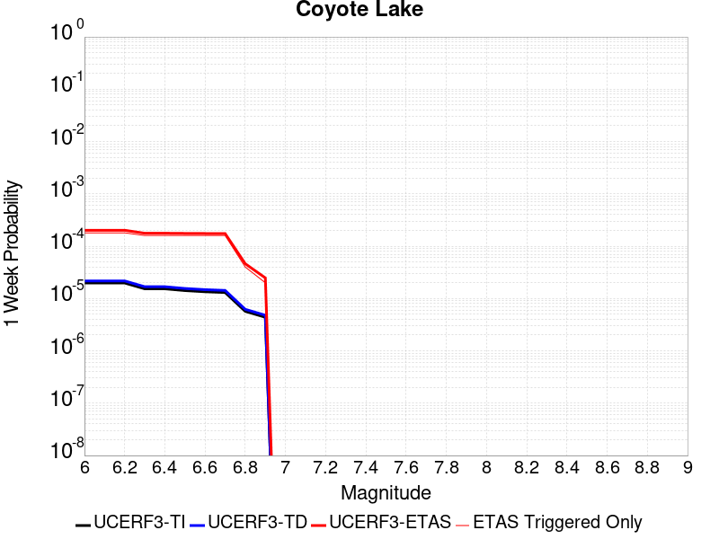 |  |  |  |

| Magnitude | 1 wk TI Prob | 1 wk TD Prob | 1 wk ETAS Prob | 1 wk ETAS/TD Gain | 1 wk ETAS Triggered Only | 1 mo TI Prob | 1 mo TD Prob | 1 mo ETAS Prob | 1 mo ETAS/TD Gain | 1 mo ETAS Triggered Only | 1 yr TI Prob | 1 yr TD Prob | 1 yr ETAS Prob | 1 yr ETAS/TD Gain | 1 yr ETAS Triggered Only | 10 yr TI Prob | 10 yr TD Prob | 10 yr ETAS Prob | 10 yr ETAS/TD Gain | 10 yr ETAS Triggered Only |
|-----|-----|-----|-----|-----|-----|-----|-----|-----|-----|-----|-----|-----|-----|-----|-----|-----|-----|-----|-----|-----|
| 6.0 | 1.980352E-5 | 2.1706745E-5 | 2.5398974E-4 | 11.700959 | 2.3228803E-4 | 8.486947E-5 | 9.302599E-5 | 3.2529244E-4 | 3.4967906 | 2.3228803E-4 | 0.0010327959 | 0.0011320751 | 0.0014801127 | 1.3074334 | 3.4843205E-4 | 0.010280091 | 0.011270258 | 0.011614763 | 1.0305676 | 3.4843205E-4 |
| 6.1 | 1.980352E-5 | 2.1706745E-5 | 2.5398974E-4 | 11.700959 | 2.3228803E-4 | 8.486947E-5 | 9.302599E-5 | 3.2529244E-4 | 3.4967906 | 2.3228803E-4 | 0.0010327959 | 0.0011320751 | 0.0014801127 | 1.3074334 | 3.4843205E-4 | 0.010280091 | 0.011270258 | 0.011614763 | 1.0305676 | 3.4843205E-4 |
| 6.2 | 1.980352E-5 | 2.1706745E-5 | 2.5398974E-4 | 11.700959 | 2.3228803E-4 | 8.486947E-5 | 9.302599E-5 | 3.2529244E-4 | 3.4967906 | 2.3228803E-4 | 0.0010327959 | 0.0011320751 | 0.0014801127 | 1.3074334 | 3.4843205E-4 | 0.010280091 | 0.011270258 | 0.011614763 | 1.0305676 | 3.4843205E-4 |
| 6.3 | 1.5344787E-5 | 1.682067E-5 | 2.491048E-4 | 14.809446 | 2.3228803E-4 | 6.576172E-5 | 7.2086936E-5 | 3.0435823E-4 | 4.2221 | 2.3228803E-4 | 8.003548E-4 | 8.773662E-4 | 0.0012254926 | 1.3967856 | 3.4843205E-4 | 0.007974784 | 0.00874507 | 0.009090454 | 1.0394949 | 3.4843205E-4 |
| 6.4 | 1.5344787E-5 | 1.682067E-5 | 2.491048E-4 | 14.809446 | 2.3228803E-4 | 6.576172E-5 | 7.2086936E-5 | 3.0435823E-4 | 4.2221 | 2.3228803E-4 | 8.003548E-4 | 8.773662E-4 | 0.0012254926 | 1.3967856 | 3.4843205E-4 | 0.007974784 | 0.00874507 | 0.009090454 | 1.0394949 | 3.4843205E-4 |
| 6.5 | 1.4189697E-5 | 1.5557987E-5 | 2.478424E-4 | 15.930237 | 2.3228803E-4 | 6.081157E-5 | 6.6675726E-5 | 2.9894826E-4 | 4.483615 | 2.3228803E-4 | 7.401293E-4 | 8.115349E-4 | 0.0011596842 | 1.429001 | 3.4843205E-4 | 0.0073766913 | 0.008091656 | 0.008437268 | 1.0427122 | 3.4843205E-4 |
| 6.6 | 1.3469301E-5 | 1.4771577E-5 | 2.470562E-4 | 16.725105 | 2.3228803E-4 | 5.7724297E-5 | 6.330556E-5 | 2.9557888E-4 | 4.6690826 | 2.3228803E-4 | 7.025667E-4 | 7.7053264E-4 | 0.0011186962 | 1.4518479 | 3.4843205E-4 | 0.0070034964 | 0.0076845144 | 0.008030268 | 1.0449936 | 3.4843205E-4 |
| 6.7 | 1.3027966E-5 | 1.4281745E-5 | 2.4656646E-4 | 17.26445 | 2.3228803E-4 | 5.5832945E-5 | 6.120638E-5 | 2.934802E-4 | 4.794928 | 2.3228803E-4 | 6.7955407E-4 | 7.4499263E-4 | 0.0010931651 | 1.4673502 | 3.4843205E-4 | 0.006774798 | 0.0074308286 | 0.0077766716 | 1.0465417 | 3.4843205E-4 |
| 6.8 | 5.695434E-6 | 6.2244176E-6 | 6.2244176E-6 | 1.0 | 0.0 | 2.4408775E-5 | 2.6675973E-5 | 2.6675973E-5 | 1.0 | 0.0 | 2.971363E-4 | 3.2476155E-4 | 3.2476155E-4 | 1.0 | 0.0 | 0.0029673933 | 0.0032458105 | 0.0032458105 | 1.0 | 0.0 |
| 6.9 | 4.385688E-6 | 4.7930553E-6 | 4.7930553E-6 | 1.0 | 0.0 | 1.879567E-5 | 2.0541665E-5 | 2.0541665E-5 | 1.0 | 0.0 | 2.2881327E-4 | 2.5009477E-4 | 2.5009477E-4 | 1.0 | 0.0 | 0.002285778 | 0.0025009478 | 0.0025009478 | 1.0 | 0.0 |

## San Andreas (Coachella) rev
*[(top)](#table-of-contents)*

| 1 Week | 1 Month | 1 Year | 10 Year |
|-----|-----|-----|-----|
|  |  |  |  |

| Magnitude | 1 wk TI Prob | 1 wk TD Prob | 1 wk ETAS Prob | 1 wk ETAS/TD Gain | 1 wk ETAS Triggered Only | 1 mo TI Prob | 1 mo TD Prob | 1 mo ETAS Prob | 1 mo ETAS/TD Gain | 1 mo ETAS Triggered Only | 1 yr TI Prob | 1 yr TD Prob | 1 yr ETAS Prob | 1 yr ETAS/TD Gain | 1 yr ETAS Triggered Only | 10 yr TI Prob | 10 yr TD Prob | 10 yr ETAS Prob | 10 yr ETAS/TD Gain | 10 yr ETAS Triggered Only |
|-----|-----|-----|-----|-----|-----|-----|-----|-----|-----|-----|-----|-----|-----|-----|-----|-----|-----|-----|-----|-----|
| 6.0 | 1.1925945E-4 | 3.2729402E-4 | 4.4340003E-4 | 1.3547453 | 1.16144016E-4 | 5.110118E-4 | 0.0014019393 | 0.0015179205 | 1.0827291 | 1.16144016E-4 | 0.0062038354 | 0.016936364 | 0.01705054 | 1.0067415 | 1.16144016E-4 | 0.060334753 | 0.15265316 | 0.15284999 | 1.0012894 | 2.3228803E-4 |
| 6.1 | 1.1925945E-4 | 3.2729402E-4 | 4.4340003E-4 | 1.3547453 | 1.16144016E-4 | 5.110118E-4 | 0.0014019393 | 0.0015179205 | 1.0827291 | 1.16144016E-4 | 0.0062038354 | 0.016936364 | 0.01705054 | 1.0067415 | 1.16144016E-4 | 0.060334753 | 0.15265316 | 0.15284999 | 1.0012894 | 2.3228803E-4 |
| 6.2 | 1.07432395E-4 | 3.0230157E-4 | 4.1841046E-4 | 1.384083 | 1.16144016E-4 | 4.603433E-4 | 0.0012949388 | 0.0014109325 | 1.0895746 | 1.16144016E-4 | 0.005590286 | 0.015653009 | 0.015767334 | 1.0073037 | 1.16144016E-4 | 0.05451731 | 0.14182423 | 0.14202358 | 1.0014056 | 2.3228803E-4 |
| 6.3 | 1.0718766E-4 | 3.0175463E-4 | 4.178636E-4 | 1.3847795 | 1.16144016E-4 | 4.592948E-4 | 0.0012925972 | 0.001408591 | 1.089737 | 1.16144016E-4 | 0.005577586 | 0.015624908 | 0.015739236 | 1.0073171 | 1.16144016E-4 | 0.054396555 | 0.14159249 | 0.1417919 | 1.0014082 | 2.3228803E-4 |
| 6.4 | 1.0355944E-4 | 2.9383553E-4 | 4.099454E-4 | 1.3951527 | 1.16144016E-4 | 4.4375064E-4 | 0.0012586913 | 0.0013746892 | 1.0921575 | 1.16144016E-4 | 0.0053892885 | 0.015217941 | 0.015332318 | 1.0075159 | 1.16144016E-4 | 0.052604496 | 0.13815255 | 0.13835275 | 1.0014491 | 2.3228803E-4 |
| 6.5 | 1.0227914E-4 | 2.9102986E-4 | 4.071401E-4 | 1.3989632 | 1.16144016E-4 | 4.382655E-4 | 0.0012466786 | 0.0013626778 | 1.0930467 | 1.16144016E-4 | 0.0053228354 | 0.01507372 | 0.015188114 | 1.0075889 | 1.16144016E-4 | 0.051971316 | 0.13693172 | 0.1371322 | 1.0014641 | 2.3228803E-4 |
| 6.6 | 1.0116757E-4 | 2.8868738E-4 | 4.0479787E-4 | 1.4022014 | 1.16144016E-4 | 4.3350324E-4 | 0.0012366489 | 0.0013526493 | 1.0938022 | 1.16144016E-4 | 0.0052651367 | 0.01495329 | 0.0150676975 | 1.007651 | 1.16144016E-4 | 0.051421247 | 0.1359099 | 0.13611062 | 1.0014769 | 2.3228803E-4 |
| 6.7 | 1.0050676E-4 | 2.8727303E-4 | 4.0338366E-4 | 1.4041822 | 1.16144016E-4 | 4.3067214E-4 | 0.0012305931 | 0.0013465942 | 1.0942644 | 1.16144016E-4 | 0.005230834 | 0.014880571 | 0.014994985 | 1.0076889 | 1.16144016E-4 | 0.051094085 | 0.13529462 | 0.13549548 | 1.0014846 | 2.3228803E-4 |
| 6.8 | 9.976819E-5 | 2.853096E-4 | 4.0142046E-4 | 1.4069645 | 1.16144016E-4 | 4.2750788E-4 | 0.0012221863 | 0.0013381884 | 1.0949136 | 1.16144016E-4 | 0.0051924936 | 0.0147796115 | 0.014894038 | 1.0077423 | 1.16144016E-4 | 0.050728295 | 0.13444631 | 0.13464737 | 1.0014955 | 2.3228803E-4 |
| 6.9 | 9.77719E-5 | 2.8027873E-4 | 3.963902E-4 | 1.4142714 | 1.16144016E-4 | 4.1895514E-4 | 0.0012006456 | 0.0013166501 | 1.0966185 | 1.16144016E-4 | 0.0050888555 | 0.014520878 | 0.014635336 | 1.0078822 | 1.16144016E-4 | 0.049738888 | 0.1322748 | 0.13247637 | 1.0015239 | 2.3228803E-4 |
| 7.0 | 8.500761E-5 | 2.4762485E-4 | 3.637401E-4 | 1.468916 | 1.16144016E-4 | 3.6426744E-4 | 0.001060821 | 0.0011768418 | 1.1093689 | 1.16144016E-4 | 0.0044259406 | 0.012839786 | 0.012954438 | 1.0089295 | 1.16144016E-4 | 0.04338823 | 0.11813272 | 0.11833757 | 1.001734 | 2.3228803E-4 |
| 7.1 | 8.319876E-5 | 2.4365232E-4 | 3.5976805E-4 | 1.4765632 | 1.16144016E-4 | 3.5651738E-4 | 0.0010438096 | 0.0011598323 | 1.1111532 | 1.16144016E-4 | 0.004331963 | 0.012635092 | 0.012749769 | 1.009076 | 1.16144016E-4 | 0.042484846 | 0.116353 | 0.11655826 | 1.0017642 | 2.3228803E-4 |
| 7.2 | 7.563917E-5 | 2.2413683E-4 | 3.4025483E-4 | 1.5180674 | 1.16144016E-4 | 3.2412758E-4 | 9.602359E-4 | 0.0010762684 | 1.1208375 | 1.16144016E-4 | 0.0039391145 | 0.011628893 | 0.011743687 | 1.0098714 | 1.16144016E-4 | 0.03870018 | 0.10775925 | 0.107966505 | 1.0019233 | 2.3228803E-4 |
| 7.3 | 7.082985E-5 | 2.0729867E-4 | 3.2341862E-4 | 1.5601577 | 1.16144016E-4 | 3.0352117E-4 | 8.881233E-4 | 0.0010041641 | 1.1306585 | 1.16144016E-4 | 0.0036891096 | 0.010759917 | 0.010874812 | 1.0106779 | 1.16144016E-4 | 0.03628465 | 0.100282 | 0.100490995 | 1.002084 | 2.3228803E-4 |
| 7.4 | 5.146215E-5 | 1.4273795E-4 | 2.588654E-4 | 1.813571 | 1.16144016E-4 | 2.2053342E-4 | 6.115915E-4 | 7.276645E-4 | 1.1897885 | 1.16144016E-4 | 0.0026816884 | 0.0074208933 | 0.007536175 | 1.0155348 | 1.16144016E-4 | 0.02649557 | 0.070849575 | 0.0710654 | 1.0030463 | 2.3228803E-4 |
| 7.5 | 4.0285166E-5 | 1.09416E-4 | 1.09416E-4 | 1.0 | 0.0 | 1.7263928E-4 | 4.6884175E-4 | 4.6884175E-4 | 1.0 | 0.0 | 0.002099857 | 0.0056932783 | 0.0056932783 | 1.0 | 0.0 | 0.020801254 | 0.055011146 | 0.0551209 | 1.0019951 | 1.16144016E-4 |
| 7.6 | 3.1168736E-5 | 8.4389096E-5 | 8.4389096E-5 | 1.0 | 0.0 | 1.3357346E-4 | 3.6161754E-4 | 3.6161754E-4 | 1.0 | 0.0 | 0.0016250437 | 0.0043938323 | 0.0043938323 | 1.0 | 0.0 | 0.016132116 | 0.04281005 | 0.042921223 | 1.0025969 | 1.16144016E-4 |
| 7.7 | 2.2100989E-5 | 6.238755E-5 | 6.238755E-5 | 1.0 | 0.0 | 9.4715084E-5 | 2.6734784E-4 | 2.6734784E-4 | 1.0 | 0.0 | 0.001152546 | 0.0032501083 | 0.0032501083 | 1.0 | 0.0 | 0.011465867 | 0.0319002 | 0.032012638 | 1.0035247 | 1.16144016E-4 |
| 7.8 | 1.7484861E-5 | 5.179572E-5 | 5.179572E-5 | 1.0 | 0.0 | 7.493296E-5 | 2.2196278E-4 | 2.2196278E-4 | 1.0 | 0.0 | 9.1192697E-4 | 0.0026990508 | 0.0026990508 | 1.0 | 0.0 | 0.009081938 | 0.026640115 | 0.026753167 | 1.0042436 | 1.16144016E-4 |
| 7.9 | 1.3967285E-5 | 3.822255E-5 | 3.822255E-5 | 1.0 | 0.0 | 5.985842E-5 | 1.6380067E-4 | 1.6380067E-4 | 1.0 | 0.0 | 7.2853256E-4 | 0.00199245 | 0.00199245 | 1.0 | 0.0 | 0.0072614877 | 0.019909438 | 0.020023268 | 1.0057175 | 1.16144016E-4 |
| 8.0 | 1.1887396E-5 | 3.106521E-5 | 3.106521E-5 | 1.0 | 0.0 | 5.094499E-5 | 1.3312983E-4 | 1.3312983E-4 | 1.0 | 0.0 | 6.200787E-4 | 0.0016196516 | 0.0016196516 | 1.0 | 0.0 | 0.006183513 | 0.016279267 | 0.01639352 | 1.0070183 | 1.16144016E-4 |
| 8.1 | 5.100864E-6 | 8.973418E-6 | 8.973418E-6 | 1.0 | 0.0 | 2.1860664E-5 | 3.8456936E-5 | 3.8456936E-5 | 1.0 | 0.0 | 2.6612106E-4 | 4.6811273E-4 | 4.6811273E-4 | 1.0 | 0.0 | 0.002658026 | 0.004917731 | 0.004917731 | 1.0 | 0.0 |
| 8.2 | 2.3004484E-6 | 2.7864487E-6 | 2.7864487E-6 | 1.0 | 0.0 | 9.859027E-6 | 1.1941868E-5 | 1.1941868E-5 | 1.0 | 0.0 | 1.2002704E-4 | 1.4538258E-4 | 1.4538258E-4 | 1.0 | 0.0 | 0.0011996223 | 0.0015973912 | 0.0015973912 | 1.0 | 0.0 |
| 8.3 | 1.0424446E-7 | 5.8161504E-8 | 5.8161504E-8 | 1.0 | 0.0 | 4.4676187E-7 | 2.4926356E-7 | 2.4926356E-7 | 1.0 | 0.0 | 5.439312E-6 | 3.03478E-6 | 3.03478E-6 | 1.0 | 0.0 | 5.4391792E-5 | 3.190716E-5 | 3.190716E-5 | 1.0 | 0.0 |

## Scodie Lineament
*[(top)](#table-of-contents)*

| 1 Week | 1 Month | 1 Year | 10 Year |
|-----|-----|-----|-----|
|  |  |  |  |

| Magnitude | 1 wk TI Prob | 1 wk TD Prob | 1 wk ETAS Prob | 1 wk ETAS/TD Gain | 1 wk ETAS Triggered Only | 1 mo TI Prob | 1 mo TD Prob | 1 mo ETAS Prob | 1 mo ETAS/TD Gain | 1 mo ETAS Triggered Only | 1 yr TI Prob | 1 yr TD Prob | 1 yr ETAS Prob | 1 yr ETAS/TD Gain | 1 yr ETAS Triggered Only | 10 yr TI Prob | 10 yr TD Prob | 10 yr ETAS Prob | 10 yr ETAS/TD Gain | 10 yr ETAS Triggered Only |
|-----|-----|-----|-----|-----|-----|-----|-----|-----|-----|-----|-----|-----|-----|-----|-----|-----|-----|-----|-----|-----|
| 6.0 | 3.2919327E-6 | 3.0133422E-6 | 2.3530069E-4 | 78.08628 | 2.3228803E-4 | 1.4108206E-5 | 1.2914278E-5 | 2.451993E-4 | 18.986685 | 2.3228803E-4 | 1.7175387E-4 | 1.5722317E-4 | 3.8947468E-4 | 2.4772093 | 2.3228803E-4 | 0.0017162118 | 0.0015714309 | 0.0019193154 | 1.2213807 | 3.4843205E-4 |
| 6.1 | 1.8663811E-6 | 1.5490499E-6 | 1.5490499E-6 | 1.0 | 0.0 | 7.998751E-6 | 6.6387715E-6 | 6.6387715E-6 | 1.0 | 0.0 | 9.738045E-5 | 8.082454E-5 | 8.082454E-5 | 1.0 | 0.0 | 9.7337784E-4 | 8.080003E-4 | 8.080003E-4 | 1.0 | 0.0 |
| 6.2 | 1.8663811E-6 | 1.5490499E-6 | 1.5490499E-6 | 1.0 | 0.0 | 7.998751E-6 | 6.6387715E-6 | 6.6387715E-6 | 1.0 | 0.0 | 9.738045E-5 | 8.082454E-5 | 8.082454E-5 | 1.0 | 0.0 | 9.7337784E-4 | 8.080003E-4 | 8.080003E-4 | 1.0 | 0.0 |
| 6.3 | 1.8663811E-6 | 1.5490499E-6 | 1.5490499E-6 | 1.0 | 0.0 | 7.998751E-6 | 6.6387715E-6 | 6.6387715E-6 | 1.0 | 0.0 | 9.738045E-5 | 8.082454E-5 | 8.082454E-5 | 1.0 | 0.0 | 9.7337784E-4 | 8.080003E-4 | 8.080003E-4 | 1.0 | 0.0 |
| 6.4 | 1.8663811E-6 | 1.5490499E-6 | 1.5490499E-6 | 1.0 | 0.0 | 7.998751E-6 | 6.6387715E-6 | 6.6387715E-6 | 1.0 | 0.0 | 9.738045E-5 | 8.082454E-5 | 8.082454E-5 | 1.0 | 0.0 | 9.7337784E-4 | 8.080003E-4 | 8.080003E-4 | 1.0 | 0.0 |
| 6.5 | 1.8106311E-6 | 1.4909839E-6 | 1.4909839E-6 | 1.0 | 0.0 | 7.759824E-6 | 6.3899183E-6 | 6.3899183E-6 | 1.0 | 0.0 | 9.447177E-5 | 7.7794975E-5 | 7.7794975E-5 | 1.0 | 0.0 | 9.4431615E-4 | 7.7772606E-4 | 7.7772606E-4 | 1.0 | 0.0 |
| 6.6 | 1.2414679E-6 | 8.997558E-7 | 8.997558E-7 | 1.0 | 0.0 | 5.320566E-6 | 3.856091E-6 | 3.856091E-6 | 1.0 | 0.0 | 6.477596E-5 | 4.6946985E-5 | 4.6946985E-5 | 1.0 | 0.0 | 6.475708E-4 | 4.693793E-4 | 4.693793E-4 | 1.0 | 0.0 |
| 6.7 | 1.1062215E-6 | 7.594311E-7 | 7.594311E-7 | 1.0 | 0.0 | 4.7409408E-6 | 3.2547011E-6 | 3.2547011E-6 | 1.0 | 0.0 | 5.7719422E-5 | 3.9625334E-5 | 3.9625334E-5 | 1.0 | 0.0 | 5.770443E-4 | 3.961897E-4 | 3.961897E-4 | 1.0 | 0.0 |
| 6.8 | 1.0006736E-6 | 6.500397E-7 | 6.500397E-7 | 1.0 | 0.0 | 4.288594E-6 | 2.7858816E-6 | 2.7858816E-6 | 1.0 | 0.0 | 5.221238E-5 | 3.3917644E-5 | 3.3917644E-5 | 1.0 | 0.0 | 5.220012E-4 | 3.3913075E-4 | 3.3913075E-4 | 1.0 | 0.0 |
| 6.9 | 9.167364E-7 | 5.631625E-7 | 5.631625E-7 | 1.0 | 0.0 | 3.9288643E-6 | 2.4135516E-6 | 2.4135516E-6 | 1.0 | 0.0 | 4.7832873E-5 | 2.9384651E-5 | 2.9384651E-5 | 1.0 | 0.0 | 4.782258E-4 | 2.9381333E-4 | 2.9381333E-4 | 1.0 | 0.0 |
| 7.0 | 7.6987664E-7 | 4.113383E-7 | 4.113383E-7 | 1.0 | 0.0 | 3.2994672E-6 | 1.7628774E-6 | 1.7628774E-6 | 1.0 | 0.0 | 4.0170275E-5 | 2.1462862E-5 | 2.1462862E-5 | 1.0 | 0.0 | 4.0163012E-4 | 2.1461173E-4 | 2.1461173E-4 | 1.0 | 0.0 |
| 7.1 | 7.1038727E-7 | 3.5211494E-7 | 3.5211494E-7 | 1.0 | 0.0 | 3.0445133E-6 | 1.5090633E-6 | 1.5090633E-6 | 1.0 | 0.0 | 3.706632E-5 | 1.8372726E-5 | 1.8372726E-5 | 1.0 | 0.0 | 3.7060137E-4 | 1.8371557E-4 | 1.8371557E-4 | 1.0 | 0.0 |
| 7.2 | 2.0799602E-7 | 3.1186854E-8 | 3.1186854E-8 | 1.0 | 0.0 | 8.914113E-7 | 1.3365793E-7 | 1.3365793E-7 | 1.0 | 0.0 | 1.0852878E-5 | 1.6272843E-6 | 1.6272843E-6 | 1.0 | 0.0 | 1.08523476E-4 | 1.627273E-5 | 1.627273E-5 | 1.0 | 0.0 |
| 7.3 | 1.5048182E-7 | 1.5945696E-8 | 1.5945696E-8 | 1.0 | 0.0 | 6.449219E-7 | 6.83387E-8 | 6.83387E-8 | 1.0 | 0.0 | 7.851896E-6 | 8.320234E-7 | 8.320234E-7 | 1.0 | 0.0 | 7.851618E-5 | 8.320206E-6 | 8.320206E-6 | 1.0 | 0.0 |
| 7.4 | 5.9334678E-8 | 4.8683537E-9 | 4.8683537E-9 | 1.0 | 0.0 | 2.5429145E-7 | 2.0864372E-8 | 2.0864372E-8 | 1.0 | 0.0 | 3.095994E-6 | 2.5402372E-7 | 2.5402372E-7 | 1.0 | 0.0 | 3.095951E-5 | 2.5402353E-6 | 2.5402353E-6 | 1.0 | 0.0 |

## San Andreas (Big Bend)
*[(top)](#table-of-contents)*

| 1 Week | 1 Month | 1 Year | 10 Year |
|-----|-----|-----|-----|
|  |  |  |  |

| Magnitude | 1 wk TI Prob | 1 wk TD Prob | 1 wk ETAS Prob | 1 wk ETAS/TD Gain | 1 wk ETAS Triggered Only | 1 mo TI Prob | 1 mo TD Prob | 1 mo ETAS Prob | 1 mo ETAS/TD Gain | 1 mo ETAS Triggered Only | 1 yr TI Prob | 1 yr TD Prob | 1 yr ETAS Prob | 1 yr ETAS/TD Gain | 1 yr ETAS Triggered Only | 10 yr TI Prob | 10 yr TD Prob | 10 yr ETAS Prob | 10 yr ETAS/TD Gain | 10 yr ETAS Triggered Only |
|-----|-----|-----|-----|-----|-----|-----|-----|-----|-----|-----|-----|-----|-----|-----|-----|-----|-----|-----|-----|-----|
| 6.0 | 1.0179969E-4 | 2.0072258E-4 | 2.0072258E-4 | 1.0 | 0.0 | 4.362114E-4 | 8.599571E-4 | 8.599571E-4 | 1.0 | 0.0 | 0.0052979486 | 0.010419999 | 0.0107648 | 1.0330904 | 3.4843205E-4 | 0.051734097 | 0.10144902 | 0.10176211 | 1.0030861 | 3.4843205E-4 |
| 6.1 | 1.0179969E-4 | 2.0072258E-4 | 2.0072258E-4 | 1.0 | 0.0 | 4.362114E-4 | 8.599571E-4 | 8.599571E-4 | 1.0 | 0.0 | 0.0052979486 | 0.010419999 | 0.0107648 | 1.0330904 | 3.4843205E-4 | 0.051734097 | 0.10144902 | 0.10176211 | 1.0030861 | 3.4843205E-4 |
| 6.2 | 1.0179969E-4 | 2.0072258E-4 | 2.0072258E-4 | 1.0 | 0.0 | 4.362114E-4 | 8.599571E-4 | 8.599571E-4 | 1.0 | 0.0 | 0.0052979486 | 0.010419999 | 0.0107648 | 1.0330904 | 3.4843205E-4 | 0.051734097 | 0.10144902 | 0.10176211 | 1.0030861 | 3.4843205E-4 |
| 6.3 | 1.0179969E-4 | 2.0072258E-4 | 2.0072258E-4 | 1.0 | 0.0 | 4.362114E-4 | 8.599571E-4 | 8.599571E-4 | 1.0 | 0.0 | 0.0052979486 | 0.010419999 | 0.0107648 | 1.0330904 | 3.4843205E-4 | 0.051734097 | 0.10144902 | 0.10176211 | 1.0030861 | 3.4843205E-4 |
| 6.4 | 9.1639464E-5 | 1.8429532E-4 | 1.8429532E-4 | 1.0 | 0.0 | 3.9268145E-4 | 7.895982E-4 | 7.895982E-4 | 1.0 | 0.0 | 0.0047704205 | 0.009571102 | 0.009801167 | 1.0240375 | 2.3228803E-4 | 0.046693064 | 0.09377527 | 0.09398578 | 1.0022448 | 2.3228803E-4 |
| 6.5 | 9.1639464E-5 | 1.8429532E-4 | 1.8429532E-4 | 1.0 | 0.0 | 3.9268145E-4 | 7.895982E-4 | 7.895982E-4 | 1.0 | 0.0 | 0.0047704205 | 0.009571102 | 0.009801167 | 1.0240375 | 2.3228803E-4 | 0.046693064 | 0.09377527 | 0.09398578 | 1.0022448 | 2.3228803E-4 |
| 6.6 | 9.042622E-5 | 1.823659E-4 | 1.823659E-4 | 1.0 | 0.0 | 3.8748336E-4 | 7.8133424E-4 | 7.8133424E-4 | 1.0 | 0.0 | 0.0047074095 | 0.009471365 | 0.009701453 | 1.0242931 | 2.3228803E-4 | 0.046089325 | 0.092869274 | 0.09307999 | 1.0022689 | 2.3228803E-4 |
| 6.7 | 8.9836685E-5 | 1.8150927E-4 | 1.8150927E-4 | 1.0 | 0.0 | 3.8495753E-4 | 7.776651E-4 | 7.776651E-4 | 1.0 | 0.0 | 0.00467679 | 0.00942708 | 0.009542129 | 1.012204 | 1.16144016E-4 | 0.045795817 | 0.09246355 | 0.09256896 | 1.00114 | 1.16144016E-4 |
| 6.8 | 8.9471854E-5 | 1.8097709E-4 | 1.8097709E-4 | 1.0 | 0.0 | 3.8339442E-4 | 7.7538576E-4 | 7.7538576E-4 | 1.0 | 0.0 | 0.004657841 | 0.009399569 | 0.009399569 | 1.0 | 0.0 | 0.04561414 | 0.092210755 | 0.092210755 | 1.0 | 0.0 |
| 6.9 | 8.858234E-5 | 1.7979681E-4 | 1.7979681E-4 | 1.0 | 0.0 | 3.7958333E-4 | 7.703304E-4 | 7.703304E-4 | 1.0 | 0.0 | 0.004611638 | 0.009338548 | 0.009338548 | 1.0 | 0.0 | 0.04517103 | 0.09165087 | 0.09165087 | 1.0 | 0.0 |
| 7.0 | 8.7433385E-5 | 1.7818481E-4 | 1.7818481E-4 | 1.0 | 0.0 | 3.746607E-4 | 7.634259E-4 | 7.634259E-4 | 1.0 | 0.0 | 0.004551957 | 0.009255203 | 0.009255203 | 1.0 | 0.0 | 0.044598386 | 0.09088532 | 0.09088532 | 1.0 | 0.0 |
| 7.1 | 8.684964E-5 | 1.7730435E-4 | 1.7730435E-4 | 1.0 | 0.0 | 3.7215967E-4 | 7.596547E-4 | 7.596547E-4 | 1.0 | 0.0 | 0.0045216335 | 0.009209678 | 0.009209678 | 1.0 | 0.0 | 0.04430731 | 0.09046686 | 0.09046686 | 1.0 | 0.0 |
| 7.2 | 8.606521E-5 | 1.762105E-4 | 1.762105E-4 | 1.0 | 0.0 | 3.6879873E-4 | 7.549695E-4 | 7.549695E-4 | 1.0 | 0.0 | 0.0044808835 | 0.0091531165 | 0.0091531165 | 1.0 | 0.0 | 0.043916024 | 0.089947365 | 0.089947365 | 1.0 | 0.0 |
| 7.3 | 8.568266E-5 | 1.7563057E-4 | 1.7563057E-4 | 1.0 | 0.0 | 3.6715972E-4 | 7.524855E-4 | 7.524855E-4 | 1.0 | 0.0 | 0.0044610105 | 0.009123127 | 0.009123127 | 1.0 | 0.0 | 0.043725148 | 0.08966853 | 0.08966853 | 1.0 | 0.0 |
| 7.4 | 8.5432206E-5 | 1.7525644E-4 | 1.7525644E-4 | 1.0 | 0.0 | 3.6608664E-4 | 7.50883E-4 | 7.50883E-4 | 1.0 | 0.0 | 0.004447999 | 0.009103781 | 0.009103781 | 1.0 | 0.0 | 0.043600157 | 0.08948871 | 0.08948871 | 1.0 | 0.0 |
| 7.5 | 8.4791965E-5 | 1.7394972E-4 | 1.7394972E-4 | 1.0 | 0.0 | 3.633435E-4 | 7.4528606E-4 | 7.4528606E-4 | 1.0 | 0.0 | 0.0044147377 | 0.009036204 | 0.009036204 | 1.0 | 0.0 | 0.043280575 | 0.088866346 | 0.088866346 | 1.0 | 0.0 |
| 7.6 | 8.241105E-5 | 1.6840403E-4 | 1.6840403E-4 | 1.0 | 0.0 | 3.531424E-4 | 7.215321E-4 | 7.215321E-4 | 1.0 | 0.0 | 0.0042910352 | 0.008749358 | 0.008749358 | 1.0 | 0.0 | 0.042091176 | 0.086243294 | 0.086243294 | 1.0 | 0.0 |
| 7.7 | 7.00432E-5 | 1.42045E-4 | 1.42045E-4 | 1.0 | 0.0 | 3.001506E-4 | 6.0862233E-4 | 6.0862233E-4 | 1.0 | 0.0 | 0.0036482112 | 0.0073848404 | 0.0073848404 | 1.0 | 0.0 | 0.035888977 | 0.07351733 | 0.07351733 | 1.0 | 0.0 |
| 7.8 | 6.415362E-5 | 1.2968935E-4 | 1.2968935E-4 | 1.0 | 0.0 | 2.749151E-4 | 5.556931E-4 | 5.556931E-4 | 1.0 | 0.0 | 0.0033419547 | 0.0067446055 | 0.0067446055 | 1.0 | 0.0 | 0.03292141 | 0.06725231 | 0.06725231 | 1.0 | 0.0 |
| 7.9 | 4.939911E-5 | 9.3411545E-5 | 9.3411545E-5 | 1.0 | 0.0 | 2.116933E-4 | 4.0027377E-4 | 4.0027377E-4 | 1.0 | 0.0 | 0.0025743195 | 0.004862453 | 0.004862453 | 1.0 | 0.0 | 0.025447013 | 0.048914436 | 0.048914436 | 1.0 | 0.0 |
| 8.0 | 3.344983E-5 | 5.222685E-5 | 5.222685E-5 | 1.0 | 0.0 | 1.4334853E-4 | 2.2381016E-4 | 2.2381016E-4 | 1.0 | 0.0 | 0.0017438711 | 0.0027214854 | 0.0027214854 | 1.0 | 0.0 | 0.017302496 | 0.027922187 | 0.027922187 | 1.0 | 0.0 |
| 8.1 | 1.9104898E-5 | 1.9173063E-5 | 1.9173063E-5 | 1.0 | 0.0 | 8.1875565E-5 | 8.216769E-5 | 8.216769E-5 | 1.0 | 0.0 | 9.963791E-4 | 9.999331E-4 | 9.999331E-4 | 1.0 | 0.0 | 0.009919235 | 0.010749801 | 0.010749801 | 1.0 | 0.0 |
| 8.2 | 8.643924E-6 | 5.4748625E-6 | 5.4748625E-6 | 1.0 | 0.0 | 3.704486E-5 | 2.3463486E-5 | 2.3463486E-5 | 1.0 | 0.0 | 4.5092785E-4 | 2.8563058E-4 | 2.8563058E-4 | 1.0 | 0.0 | 0.0045001395 | 0.0032487072 | 0.0032487072 | 1.0 | 0.0 |
| 8.3 | 1.983087E-6 | 7.6599065E-7 | 7.6599065E-7 | 1.0 | 0.0 | 8.498917E-6 | 3.282813E-6 | 3.282813E-6 | 1.0 | 0.0 | 1.034694E-4 | 3.9967534E-5 | 3.9967534E-5 | 1.0 | 0.0 | 0.0010342124 | 4.719687E-4 | 4.719687E-4 | 1.0 | 0.0 |

## White Wolf (Extension)
*[(top)](#table-of-contents)*

| 1 Week | 1 Month | 1 Year | 10 Year |
|-----|-----|-----|-----|
|  |  |  |  |

| Magnitude | 1 wk TI Prob | 1 wk TD Prob | 1 wk ETAS Prob | 1 wk ETAS/TD Gain | 1 wk ETAS Triggered Only | 1 mo TI Prob | 1 mo TD Prob | 1 mo ETAS Prob | 1 mo ETAS/TD Gain | 1 mo ETAS Triggered Only | 1 yr TI Prob | 1 yr TD Prob | 1 yr ETAS Prob | 1 yr ETAS/TD Gain | 1 yr ETAS Triggered Only | 10 yr TI Prob | 10 yr TD Prob | 10 yr ETAS Prob | 10 yr ETAS/TD Gain | 10 yr ETAS Triggered Only |
|-----|-----|-----|-----|-----|-----|-----|-----|-----|-----|-----|-----|-----|-----|-----|-----|-----|-----|-----|-----|-----|
| 6.0 | 8.222555E-6 | 6.0666657E-6 | 2.383533E-4 | 39.28901 | 2.3228803E-4 | 3.5239045E-5 | 2.5999774E-5 | 2.5828177E-4 | 9.934001 | 2.3228803E-4 | 4.289509E-4 | 3.1650788E-4 | 6.648297E-4 | 2.1005154 | 3.4843205E-4 | 0.0042812387 | 0.003161223 | 0.0035085536 | 1.1098722 | 3.4843205E-4 |
| 6.1 | 8.222555E-6 | 6.0666657E-6 | 2.383533E-4 | 39.28901 | 2.3228803E-4 | 3.5239045E-5 | 2.5999774E-5 | 2.5828177E-4 | 9.934001 | 2.3228803E-4 | 4.289509E-4 | 3.1650788E-4 | 6.648297E-4 | 2.1005154 | 3.4843205E-4 | 0.0042812387 | 0.003161223 | 0.0035085536 | 1.1098722 | 3.4843205E-4 |
| 6.2 | 8.222555E-6 | 6.0666657E-6 | 2.383533E-4 | 39.28901 | 2.3228803E-4 | 3.5239045E-5 | 2.5999774E-5 | 2.5828177E-4 | 9.934001 | 2.3228803E-4 | 4.289509E-4 | 3.1650788E-4 | 6.648297E-4 | 2.1005154 | 3.4843205E-4 | 0.0042812387 | 0.003161223 | 0.0035085536 | 1.1098722 | 3.4843205E-4 |
| 6.3 | 8.222555E-6 | 6.0666657E-6 | 2.383533E-4 | 39.28901 | 2.3228803E-4 | 3.5239045E-5 | 2.5999774E-5 | 2.5828177E-4 | 9.934001 | 2.3228803E-4 | 4.289509E-4 | 3.1650788E-4 | 6.648297E-4 | 2.1005154 | 3.4843205E-4 | 0.0042812387 | 0.003161223 | 0.0035085536 | 1.1098722 | 3.4843205E-4 |
| 6.4 | 5.821773E-6 | 3.5571766E-6 | 1.1970078E-4 | 33.650505 | 1.16144016E-4 | 2.4950215E-5 | 1.5244959E-5 | 1.313872E-4 | 8.618403 | 1.16144016E-4 | 3.0372653E-4 | 1.8559267E-4 | 4.1783758E-4 | 2.251369 | 2.3228803E-4 | 0.0030331176 | 0.001854485 | 0.0020863423 | 1.1250252 | 2.3228803E-4 |
| 6.5 | 5.766023E-6 | 3.4991106E-6 | 1.19642726E-4 | 34.192326 | 1.16144016E-4 | 2.4711293E-5 | 1.4996108E-5 | 1.3113838E-4 | 8.744828 | 1.16144016E-4 | 3.0081844E-4 | 1.8256342E-4 | 4.1480904E-4 | 2.2721367 | 2.3228803E-4 | 0.0030041158 | 0.0018242426 | 0.002056107 | 1.1271017 | 2.3228803E-4 |
| 6.6 | 4.643576E-6 | 2.332624E-6 | 1.18476375E-4 | 50.791027 | 1.16144016E-4 | 1.9900888E-5 | 9.996925E-6 | 1.2613978E-4 | 12.617859 | 1.16144016E-4 | 2.4226638E-4 | 1.2170619E-4 | 3.5396597E-4 | 2.9083645 | 2.3228803E-4 | 0.0024200242 | 0.0012164378 | 0.0014484433 | 1.1907253 | 2.3228803E-4 |
| 6.7 | 3.9529173E-6 | 1.6483477E-6 | 1.1779217E-4 | 71.460754 | 1.16144016E-4 | 1.6940963E-5 | 7.0643296E-6 | 1.2320753E-4 | 17.440796 | 1.16144016E-4 | 2.0623671E-4 | 8.6005006E-5 | 3.1827306E-4 | 3.7006342 | 2.3228803E-4 | 0.002060454 | 8.597357E-4 | 0.001091824 | 1.2699531 | 2.3228803E-4 |
| 6.8 | 3.4377522E-6 | 1.2245237E-6 | 1.2245237E-6 | 1.0 | 0.0 | 1.473314E-5 | 5.2479486E-6 | 5.2479486E-6 | 1.0 | 0.0 | 1.7936122E-4 | 6.3891996E-5 | 1.800286E-4 | 2.8177018 | 1.16144016E-4 | 0.0017921652 | 6.387454E-4 | 7.548152E-4 | 1.1817154 | 1.16144016E-4 |
| 6.9 | 3.1367306E-6 | 1.0033783E-6 | 1.0033783E-6 | 1.0 | 0.0 | 1.3443062E-5 | 4.3001864E-6 | 4.3001864E-6 | 1.0 | 0.0 | 1.63657E-4 | 5.235359E-5 | 1.6849152E-4 | 3.2183378 | 1.16144016E-4 | 0.0016353652 | 5.2342017E-4 | 6.395034E-4 | 1.2217783 | 1.16144016E-4 |
| 7.0 | 2.8298145E-6 | 7.4286646E-7 | 7.4286646E-7 | 1.0 | 0.0 | 1.2127721E-5 | 3.1837099E-6 | 3.1837099E-6 | 1.0 | 0.0 | 1.47645E-4 | 3.8761027E-5 | 1.5490054E-4 | 3.996296 | 1.16144016E-4 | 0.0014754693 | 3.8754768E-4 | 5.036467E-4 | 1.2995735 | 1.16144016E-4 |
| 7.1 | 2.4091064E-6 | 5.4227525E-7 | 5.4227525E-7 | 1.0 | 0.0 | 1.03247E-5 | 2.3240348E-6 | 2.3240348E-6 | 1.0 | 0.0 | 1.2569598E-4 | 2.8294799E-5 | 1.4443553E-4 | 5.104667 | 1.16144016E-4 | 0.001256249 | 2.8291598E-4 | 3.9902717E-4 | 1.4104086 | 1.16144016E-4 |
| 7.2 | 1.3875518E-6 | 1.0743063E-7 | 1.0743063E-7 | 1.0 | 0.0 | 5.9466374E-6 | 4.6041689E-7 | 4.6041689E-7 | 1.0 | 0.0 | 7.23979E-5 | 5.6055624E-6 | 5.6055624E-6 | 1.0 | 0.0 | 7.2374323E-4 | 5.6054323E-5 | 5.6054323E-5 | 1.0 | 0.0 |
| 7.3 | 7.056077E-7 | 5.002034E-8 | 5.002034E-8 | 1.0 | 0.0 | 3.0240296E-6 | 2.1437286E-7 | 2.1437286E-7 | 1.0 | 0.0 | 3.681694E-5 | 2.609987E-6 | 2.609987E-6 | 1.0 | 0.0 | 3.681084E-4 | 2.609961E-5 | 2.609961E-5 | 1.0 | 0.0 |
| 7.4 | 5.9334678E-8 | 4.8683537E-9 | 4.8683537E-9 | 1.0 | 0.0 | 2.5429145E-7 | 2.0864372E-8 | 2.0864372E-8 | 1.0 | 0.0 | 3.095994E-6 | 2.5402372E-7 | 2.5402372E-7 | 1.0 | 0.0 | 3.095951E-5 | 2.5402353E-6 | 2.5402353E-6 | 1.0 | 0.0 |

## Lake Isabella (Seismicity)
*[(top)](#table-of-contents)*

| 1 Week | 1 Month | 1 Year | 10 Year |
|-----|-----|-----|-----|
|  |  |  |  |

| Magnitude | 1 wk TI Prob | 1 wk TD Prob | 1 wk ETAS Prob | 1 wk ETAS/TD Gain | 1 wk ETAS Triggered Only | 1 mo TI Prob | 1 mo TD Prob | 1 mo ETAS Prob | 1 mo ETAS/TD Gain | 1 mo ETAS Triggered Only | 1 yr TI Prob | 1 yr TD Prob | 1 yr ETAS Prob | 1 yr ETAS/TD Gain | 1 yr ETAS Triggered Only | 10 yr TI Prob | 10 yr TD Prob | 10 yr ETAS Prob | 10 yr ETAS/TD Gain | 10 yr ETAS Triggered Only |
|-----|-----|-----|-----|-----|-----|-----|-----|-----|-----|-----|-----|-----|-----|-----|-----|-----|-----|-----|-----|-----|
| 6.0 | 9.431637E-6 | 9.741651E-6 | 2.4202742E-4 | 24.844599 | 2.3228803E-4 | 4.0420677E-5 | 4.1749343E-5 | 2.7402767E-4 | 6.5636406 | 2.3228803E-4 | 4.920106E-4 | 5.0819275E-4 | 7.4036274E-4 | 1.4568542 | 2.3228803E-4 | 0.004909227 | 0.005071599 | 0.005418264 | 1.0683541 | 3.4843205E-4 |
| 6.1 | 9.431637E-6 | 9.741651E-6 | 2.4202742E-4 | 24.844599 | 2.3228803E-4 | 4.0420677E-5 | 4.1749343E-5 | 2.7402767E-4 | 6.5636406 | 2.3228803E-4 | 4.920106E-4 | 5.0819275E-4 | 7.4036274E-4 | 1.4568542 | 2.3228803E-4 | 0.004909227 | 0.005071599 | 0.005418264 | 1.0683541 | 3.4843205E-4 |
| 6.2 | 9.431637E-6 | 9.741651E-6 | 2.4202742E-4 | 24.844599 | 2.3228803E-4 | 4.0420677E-5 | 4.1749343E-5 | 2.7402767E-4 | 6.5636406 | 2.3228803E-4 | 4.920106E-4 | 5.0819275E-4 | 7.4036274E-4 | 1.4568542 | 2.3228803E-4 | 0.004909227 | 0.005071599 | 0.005418264 | 1.0683541 | 3.4843205E-4 |
| 6.3 | 9.431637E-6 | 9.741651E-6 | 2.4202742E-4 | 24.844599 | 2.3228803E-4 | 4.0420677E-5 | 4.1749343E-5 | 2.7402767E-4 | 6.5636406 | 2.3228803E-4 | 4.920106E-4 | 5.0819275E-4 | 7.4036274E-4 | 1.4568542 | 2.3228803E-4 | 0.004909227 | 0.005071599 | 0.005418264 | 1.0683541 | 3.4843205E-4 |
| 6.4 | 5.144063E-6 | 5.3000763E-6 | 1.2144348E-4 | 22.913534 | 1.16144016E-4 | 2.2045799E-5 | 2.2714434E-5 | 1.3885582E-4 | 6.113109 | 1.16144016E-4 | 2.6837454E-4 | 2.765166E-4 | 3.9262848E-4 | 1.4199094 | 1.16144016E-4 | 0.0026805066 | 0.0027620657 | 0.002877889 | 1.0419335 | 1.16144016E-4 |
| 6.5 | 5.144063E-6 | 5.3000763E-6 | 1.2144348E-4 | 22.913534 | 1.16144016E-4 | 2.2045799E-5 | 2.2714434E-5 | 1.3885582E-4 | 6.113109 | 1.16144016E-4 | 2.6837454E-4 | 2.765166E-4 | 3.9262848E-4 | 1.4199094 | 1.16144016E-4 | 0.0026805066 | 0.0027620657 | 0.002877889 | 1.0419335 | 1.16144016E-4 |
| 6.6 | 3.4009804E-6 | 3.498786E-6 | 1.196424E-4 | 34.1954 | 1.16144016E-4 | 1.4575549E-5 | 1.4994721E-5 | 1.31137E-4 | 8.745544 | 1.16144016E-4 | 1.7744285E-4 | 1.8254704E-4 | 2.9866985E-4 | 1.6361254 | 1.16144016E-4 | 0.0017730123 | 0.0018241286 | 0.0019400608 | 1.0635548 | 1.16144016E-4 |
| 6.7 | 3.3880428E-6 | 3.4856528E-6 | 1.19629265E-4 | 34.320477 | 1.16144016E-4 | 1.4520103E-5 | 1.4938435E-5 | 1.3108071E-4 | 8.774729 | 1.16144016E-4 | 1.767679E-4 | 1.8186188E-4 | 2.9798478E-4 | 1.6385225 | 1.16144016E-4 | 0.0017662736 | 0.0018172882 | 0.0019332211 | 1.0637945 | 1.16144016E-4 |
| 6.8 | 2.6582E-6 | 2.7337003E-6 | 2.7337003E-6 | 1.0 | 0.0 | 1.1392236E-5 | 1.1715813E-5 | 1.1715813E-5 | 1.0 | 0.0 | 1.3869164E-4 | 1.4263204E-4 | 1.4263204E-4 | 1.0 | 0.0 | 0.0013860512 | 0.0014255369 | 0.0014255369 | 1.0 | 0.0 |
| 6.9 | 2.406011E-6 | 2.4743288E-6 | 2.4743288E-6 | 1.0 | 0.0 | 1.0311434E-5 | 1.0604231E-5 | 1.0604231E-5 | 1.0 | 0.0 | 1.2553448E-4 | 1.2910018E-4 | 1.2910018E-4 | 1.0 | 0.0 | 0.0012546359 | 0.0012903814 | 0.0012903814 | 1.0 | 0.0 |
| 7.0 | 1.6953097E-6 | 1.7429371E-6 | 1.7429371E-6 | 1.0 | 0.0 | 7.265593E-6 | 7.469715E-6 | 7.469715E-6 | 1.0 | 0.0 | 8.8455E-5 | 9.094104E-5 | 9.094104E-5 | 1.0 | 0.0 | 8.84198E-4 | 9.09141E-4 | 9.09141E-4 | 1.0 | 0.0 |
| 7.1 | 3.5013824E-7 | 3.5714822E-7 | 3.5714822E-7 | 1.0 | 0.0 | 1.5005916E-6 | 1.5306344E-6 | 1.5306344E-6 | 1.0 | 0.0 | 1.826955E-5 | 1.8635317E-5 | 1.8635317E-5 | 1.0 | 0.0 | 1.8268047E-4 | 1.863378E-4 | 1.863378E-4 | 1.0 | 0.0 |
| 7.2 | 2.2321095E-7 | 2.2750574E-7 | 2.2750574E-7 | 1.0 | 0.0 | 9.56618E-7 | 9.750242E-7 | 9.750242E-7 | 1.0 | 0.0 | 1.1646762E-5 | 1.1870856E-5 | 1.1870856E-5 | 1.0 | 0.0 | 1.1646151E-4 | 1.1870232E-4 | 1.1870232E-4 | 1.0 | 0.0 |
| 7.3 | 1.5760406E-7 | 1.6060922E-7 | 1.6060922E-7 | 1.0 | 0.0 | 6.7544585E-7 | 6.8832503E-7 | 6.8832503E-7 | 1.0 | 0.0 | 8.223522E-6 | 8.380326E-6 | 8.380326E-6 | 1.0 | 0.0 | 8.2232174E-5 | 8.3800165E-5 | 8.3800165E-5 | 1.0 | 0.0 |
| 7.4 | 1.1216497E-7 | 1.1431706E-7 | 1.1431706E-7 | 1.0 | 0.0 | 4.8070694E-7 | 4.899302E-7 | 4.899302E-7 | 1.0 | 0.0 | 5.852591E-6 | 5.964884E-6 | 5.964884E-6 | 1.0 | 0.0 | 5.8524372E-5 | 5.9647282E-5 | 5.9647282E-5 | 1.0 | 0.0 |
| 7.5 | 4.885185E-8 | 4.9787737E-8 | 4.9787737E-8 | 1.0 | 0.0 | 2.0936506E-7 | 2.13376E-7 | 2.13376E-7 | 1.0 | 0.0 | 2.5490165E-6 | 2.59785E-6 | 2.59785E-6 | 1.0 | 0.0 | 2.5489873E-5 | 2.5978214E-5 | 2.5978214E-5 | 1.0 | 0.0 |
| 7.6 | 1.504641E-9 | 1.5317903E-9 | 1.5317903E-9 | 1.0 | 0.0 | 6.4484613E-9 | 6.5648154E-9 | 6.5648154E-9 | 1.0 | 0.0 | 7.851001E-8 | 7.992663E-8 | 7.992663E-8 | 1.0 | 0.0 | 7.8509987E-7 | 7.992663E-7 | 7.992663E-7 | 1.0 | 0.0 |

## Red Pass
*[(top)](#table-of-contents)*

| 1 Week | 1 Month | 1 Year | 10 Year |
|-----|-----|-----|-----|
|  |  |  |  |

| Magnitude | 1 wk TI Prob | 1 wk TD Prob | 1 wk ETAS Prob | 1 wk ETAS/TD Gain | 1 wk ETAS Triggered Only | 1 mo TI Prob | 1 mo TD Prob | 1 mo ETAS Prob | 1 mo ETAS/TD Gain | 1 mo ETAS Triggered Only | 1 yr TI Prob | 1 yr TD Prob | 1 yr ETAS Prob | 1 yr ETAS/TD Gain | 1 yr ETAS Triggered Only | 10 yr TI Prob | 10 yr TD Prob | 10 yr ETAS Prob | 10 yr ETAS/TD Gain | 10 yr ETAS Triggered Only |
|-----|-----|-----|-----|-----|-----|-----|-----|-----|-----|-----|-----|-----|-----|-----|-----|-----|-----|-----|-----|-----|
| 6.0 | 8.258278E-6 | 8.551265E-6 | 2.4083731E-4 | 28.16394 | 2.3228803E-4 | 3.539214E-5 | 3.6647863E-5 | 2.689274E-4 | 7.338146 | 2.3228803E-4 | 4.308141E-4 | 4.4611428E-4 | 7.943909E-4 | 1.7806892 | 3.4843205E-4 | 0.0042997985 | 0.004453945 | 0.004800825 | 1.0778816 | 3.4843205E-4 |
| 6.1 | 3.649988E-6 | 3.7753161E-6 | 3.7753161E-6 | 1.0 | 0.0 | 1.5642712E-5 | 1.6179853E-5 | 1.6179853E-5 | 1.0 | 0.0 | 1.9043336E-4 | 1.9697666E-4 | 1.9697666E-4 | 1.0 | 0.0 | 0.0019027026 | 0.001968488 | 0.001968488 | 1.0 | 0.0 |
| 6.2 | 3.649988E-6 | 3.7753161E-6 | 3.7753161E-6 | 1.0 | 0.0 | 1.5642712E-5 | 1.6179853E-5 | 1.6179853E-5 | 1.0 | 0.0 | 1.9043336E-4 | 1.9697666E-4 | 1.9697666E-4 | 1.0 | 0.0 | 0.0019027026 | 0.001968488 | 0.001968488 | 1.0 | 0.0 |
| 6.3 | 1.3924937E-6 | 1.4411166E-6 | 1.4411166E-6 | 1.0 | 0.0 | 5.9678164E-6 | 6.1762075E-6 | 6.1762075E-6 | 1.0 | 0.0 | 7.265574E-5 | 7.519415E-5 | 7.519415E-5 | 1.0 | 0.0 | 7.263199E-4 | 7.518258E-4 | 7.518258E-4 | 1.0 | 0.0 |
| 6.4 | 1.3924937E-6 | 1.4411166E-6 | 1.4411166E-6 | 1.0 | 0.0 | 5.9678164E-6 | 6.1762075E-6 | 6.1762075E-6 | 1.0 | 0.0 | 7.265574E-5 | 7.519415E-5 | 7.519415E-5 | 1.0 | 0.0 | 7.263199E-4 | 7.518258E-4 | 7.518258E-4 | 1.0 | 0.0 |
| 6.5 | 9.876812E-7 | 1.0221912E-6 | 1.0221912E-6 | 1.0 | 0.0 | 4.2329125E-6 | 4.3808195E-6 | 4.3808195E-6 | 1.0 | 0.0 | 5.153449E-5 | 5.3336476E-5 | 5.3336476E-5 | 1.0 | 0.0 | 5.1522546E-4 | 5.333648E-4 | 5.333648E-4 | 1.0 | 0.0 |

## San Andreas (Cholame) rev
*[(top)](#table-of-contents)*

| 1 Week | 1 Month | 1 Year | 10 Year |
|-----|-----|-----|-----|
|  |  |  |  |

| Magnitude | 1 wk TI Prob | 1 wk TD Prob | 1 wk ETAS Prob | 1 wk ETAS/TD Gain | 1 wk ETAS Triggered Only | 1 mo TI Prob | 1 mo TD Prob | 1 mo ETAS Prob | 1 mo ETAS/TD Gain | 1 mo ETAS Triggered Only | 1 yr TI Prob | 1 yr TD Prob | 1 yr ETAS Prob | 1 yr ETAS/TD Gain | 1 yr ETAS Triggered Only | 10 yr TI Prob | 10 yr TD Prob | 10 yr ETAS Prob | 10 yr ETAS/TD Gain | 10 yr ETAS Triggered Only |
|-----|-----|-----|-----|-----|-----|-----|-----|-----|-----|-----|-----|-----|-----|-----|-----|-----|-----|-----|-----|-----|
| 6.0 | 1.2302514E-4 | 2.5204287E-4 | 2.5204287E-4 | 1.0 | 0.0 | 5.27144E-4 | 0.0010797381 | 0.0010797381 | 1.0 | 0.0 | 0.0063991086 | 0.0130670825 | 0.013181709 | 1.0087721 | 1.16144016E-4 | 0.06217949 | 0.12439073 | 0.12459412 | 1.0016351 | 2.3228803E-4 |
| 6.1 | 1.2302514E-4 | 2.5204287E-4 | 2.5204287E-4 | 1.0 | 0.0 | 5.27144E-4 | 0.0010797381 | 0.0010797381 | 1.0 | 0.0 | 0.0063991086 | 0.0130670825 | 0.013181709 | 1.0087721 | 1.16144016E-4 | 0.06217949 | 0.12439073 | 0.12459412 | 1.0016351 | 2.3228803E-4 |
| 6.2 | 1.2203569E-4 | 2.5021084E-4 | 2.5021084E-4 | 1.0 | 0.0 | 5.2290526E-4 | 0.0010718931 | 0.0010718931 | 1.0 | 0.0 | 0.006347804 | 0.01297271 | 0.013087347 | 1.0088367 | 1.16144016E-4 | 0.061695136 | 0.12357691 | 0.12378049 | 1.0016475 | 2.3228803E-4 |
| 6.3 | 1.2142645E-4 | 2.4907055E-4 | 2.4907055E-4 | 1.0 | 0.0 | 5.202953E-4 | 0.0010670102 | 0.0010670102 | 1.0 | 0.0 | 0.006316212 | 0.012913967 | 0.013028611 | 1.0088775 | 1.16144016E-4 | 0.06139677 | 0.12307103 | 0.12327473 | 1.0016551 | 2.3228803E-4 |
| 6.4 | 1.1865206E-4 | 2.44126E-4 | 2.44126E-4 | 1.0 | 0.0 | 5.0840975E-4 | 0.0010458364 | 0.0010458364 | 1.0 | 0.0 | 0.006172335 | 0.012659196 | 0.01277387 | 1.0090585 | 1.16144016E-4 | 0.060036868 | 0.1208638 | 0.121068016 | 1.0016896 | 2.3228803E-4 |
| 6.5 | 1.17443946E-4 | 2.4205919E-4 | 2.4205919E-4 | 1.0 | 0.0 | 5.032341E-4 | 0.0010369857 | 0.0010369857 | 1.0 | 0.0 | 0.006109677 | 0.012552682 | 0.012667368 | 1.0091364 | 1.16144016E-4 | 0.059444077 | 0.11993805 | 0.12014248 | 1.0017045 | 2.3228803E-4 |
| 6.6 | 1.13579066E-4 | 2.3514954E-4 | 2.3514954E-4 | 1.0 | 0.0 | 4.866766E-4 | 0.001007396 | 0.001007396 | 1.0 | 0.0 | 0.0059092017 | 0.012196515 | 0.012311242 | 1.0094066 | 1.16144016E-4 | 0.057545185 | 0.11685214 | 0.117057286 | 1.0017556 | 2.3228803E-4 |
| 6.7 | 1.1271412E-4 | 2.3359268E-4 | 2.3359268E-4 | 1.0 | 0.0 | 4.829711E-4 | 0.0010007289 | 0.0010007289 | 1.0 | 0.0 | 0.005864331 | 0.012116249 | 0.012230986 | 1.0094696 | 1.16144016E-4 | 0.057119697 | 0.116155714 | 0.11636102 | 1.0017675 | 2.3228803E-4 |
| 6.8 | 1.1217975E-4 | 2.3247694E-4 | 2.3247694E-4 | 1.0 | 0.0 | 4.8068175E-4 | 9.959509E-4 | 9.959509E-4 | 1.0 | 0.0 | 0.005836608 | 0.012058721 | 0.0121734645 | 1.0095154 | 1.16144016E-4 | 0.056856725 | 0.11565396 | 0.11585939 | 1.0017762 | 2.3228803E-4 |
| 6.9 | 1.1146753E-4 | 2.3096445E-4 | 2.3096445E-4 | 1.0 | 0.0 | 4.7763053E-4 | 9.894737E-4 | 9.894737E-4 | 1.0 | 0.0 | 0.0057996577 | 0.011980731 | 0.012095484 | 1.0095781 | 1.16144016E-4 | 0.056506127 | 0.11497439 | 0.11517997 | 1.001788 | 2.3228803E-4 |
| 7.0 | 1.0965793E-4 | 2.2719789E-4 | 2.2719789E-4 | 1.0 | 0.0 | 4.698779E-4 | 9.733434E-4 | 9.733434E-4 | 1.0 | 0.0 | 0.005705768 | 0.011786487 | 0.011901262 | 1.0097378 | 1.16144016E-4 | 0.055614736 | 0.11327597 | 0.11348194 | 1.0018183 | 2.3228803E-4 |
| 7.1 | 9.927982E-5 | 2.0538924E-4 | 2.0538924E-4 | 1.0 | 0.0 | 4.2541555E-4 | 8.7994366E-4 | 8.7994366E-4 | 1.0 | 0.0 | 0.0051671406 | 0.010660981 | 0.0107758865 | 1.0107782 | 1.16144016E-4 | 0.05048634 | 0.1033706 | 0.10357887 | 1.0020149 | 2.3228803E-4 |
| 7.2 | 9.696786E-5 | 2.0043184E-4 | 2.0043184E-4 | 1.0 | 0.0 | 4.1551032E-4 | 8.5871184E-4 | 8.5871184E-4 | 1.0 | 0.0 | 0.00504711 | 0.010404981 | 0.010404981 | 1.0 | 0.0 | 0.04934009 | 0.1011086 | 0.101213 | 1.0010326 | 1.16144016E-4 |
| 7.3 | 9.4727984E-5 | 1.9472468E-4 | 1.9472468E-4 | 1.0 | 0.0 | 4.0591392E-4 | 8.3426846E-4 | 8.3426846E-4 | 1.0 | 0.0 | 0.0049308087 | 0.010110183 | 0.010110183 | 1.0 | 0.0 | 0.048228268 | 0.09847952 | 0.09858422 | 1.0010632 | 1.16144016E-4 |
| 7.4 | 9.220358E-5 | 1.8843076E-4 | 1.8843076E-4 | 1.0 | 0.0 | 3.9509835E-4 | 8.073114E-4 | 8.073114E-4 | 1.0 | 0.0 | 0.004799717 | 0.009784967 | 0.009784967 | 1.0 | 0.0 | 0.046973653 | 0.095557496 | 0.09566254 | 1.0010993 | 1.16144016E-4 |
| 7.5 | 7.71631E-5 | 1.5177966E-4 | 1.5177966E-4 | 1.0 | 0.0 | 3.306571E-4 | 6.503223E-4 | 6.503223E-4 | 1.0 | 0.0 | 0.0040183207 | 0.007889002 | 0.007889002 | 1.0 | 0.0 | 0.03946433 | 0.07828531 | 0.07828531 | 1.0 | 0.0 |
| 7.6 | 7.5634416E-5 | 1.483744E-4 | 1.483744E-4 | 1.0 | 0.0 | 3.241072E-4 | 6.3573546E-4 | 6.3573546E-4 | 1.0 | 0.0 | 0.0039388672 | 0.0077126776 | 0.0077126776 | 1.0 | 0.0 | 0.038697794 | 0.07664872 | 0.07664872 | 1.0 | 0.0 |
| 7.7 | 6.3783E-5 | 1.235872E-4 | 1.235872E-4 | 1.0 | 0.0 | 2.7332708E-4 | 5.29552E-4 | 5.29552E-4 | 1.0 | 0.0 | 0.0033226798 | 0.0064282627 | 0.0064282627 | 1.0 | 0.0 | 0.032734364 | 0.06454029 | 0.06454029 | 1.0 | 0.0 |
| 7.8 | 5.863422E-5 | 1.1416107E-4 | 1.1416107E-4 | 1.0 | 0.0 | 2.512653E-4 | 4.8917E-4 | 4.8917E-4 | 1.0 | 0.0 | 0.003054864 | 0.0059394026 | 0.0059394026 | 1.0 | 0.0 | 0.030132094 | 0.059659187 | 0.059659187 | 1.0 | 0.0 |
| 7.9 | 4.595283E-5 | 8.426331E-5 | 8.426331E-5 | 1.0 | 0.0 | 1.9692584E-4 | 3.610785E-4 | 3.610785E-4 | 1.0 | 0.0 | 0.0023949358 | 0.0043872762 | 0.0043872762 | 1.0 | 0.0 | 0.023692891 | 0.044362005 | 0.044362005 | 1.0 | 0.0 |
| 8.0 | 3.2950178E-5 | 5.0772942E-5 | 5.0772942E-5 | 1.0 | 0.0 | 1.412074E-4 | 2.1758018E-4 | 2.1758018E-4 | 1.0 | 0.0 | 0.0017178444 | 0.0026458222 | 0.0026458222 | 1.0 | 0.0 | 0.017046256 | 0.027180137 | 0.027180137 | 1.0 | 0.0 |
| 8.1 | 1.9177472E-5 | 1.9185145E-5 | 1.9185145E-5 | 1.0 | 0.0 | 8.218658E-5 | 8.221946E-5 | 8.221946E-5 | 1.0 | 0.0 | 0.0010001622 | 0.0010005629 | 0.0010005629 | 1.0 | 0.0 | 0.009956728 | 0.010758142 | 0.010758142 | 1.0 | 0.0 |
| 8.2 | 8.643924E-6 | 5.4748625E-6 | 5.4748625E-6 | 1.0 | 0.0 | 3.704486E-5 | 2.3463486E-5 | 2.3463486E-5 | 1.0 | 0.0 | 4.5092785E-4 | 2.8563058E-4 | 2.8563058E-4 | 1.0 | 0.0 | 0.0045001395 | 0.0032487072 | 0.0032487072 | 1.0 | 0.0 |
| 8.3 | 1.983087E-6 | 7.6599065E-7 | 7.6599065E-7 | 1.0 | 0.0 | 8.498917E-6 | 3.282813E-6 | 3.282813E-6 | 1.0 | 0.0 | 1.034694E-4 | 3.9967534E-5 | 3.9967534E-5 | 1.0 | 0.0 | 0.0010342124 | 4.719687E-4 | 4.719687E-4 | 1.0 | 0.0 |

## Imperial
*[(top)](#table-of-contents)*

| 1 Week | 1 Month | 1 Year | 10 Year |
|-----|-----|-----|-----|
|  |  |  |  |

| Magnitude | 1 wk TI Prob | 1 wk TD Prob | 1 wk ETAS Prob | 1 wk ETAS/TD Gain | 1 wk ETAS Triggered Only | 1 mo TI Prob | 1 mo TD Prob | 1 mo ETAS Prob | 1 mo ETAS/TD Gain | 1 mo ETAS Triggered Only | 1 yr TI Prob | 1 yr TD Prob | 1 yr ETAS Prob | 1 yr ETAS/TD Gain | 1 yr ETAS Triggered Only | 10 yr TI Prob | 10 yr TD Prob | 10 yr ETAS Prob | 10 yr ETAS/TD Gain | 10 yr ETAS Triggered Only |
|-----|-----|-----|-----|-----|-----|-----|-----|-----|-----|-----|-----|-----|-----|-----|-----|-----|-----|-----|-----|-----|
| 6.0 | 2.7496446E-4 | 5.0552754E-4 | 6.216128E-4 | 1.229632 | 1.16144016E-4 | 0.0011778869 | 0.002164787 | 0.0022806795 | 1.0535353 | 1.16144016E-4 | 0.0142467655 | 0.026038699 | 0.026264938 | 1.0086886 | 2.3228803E-4 | 0.13367249 | 0.2280438 | 0.2282231 | 1.0007863 | 2.3228803E-4 |
| 6.1 | 2.5356023E-4 | 4.8656776E-4 | 6.026553E-4 | 1.2385844 | 1.16144016E-4 | 0.001086234 | 0.0020836622 | 0.0021995644 | 1.0556241 | 1.16144016E-4 | 0.013144928 | 0.025071215 | 0.025297679 | 1.0090328 | 2.3228803E-4 | 0.123940155 | 0.21947981 | 0.21966112 | 1.0008261 | 2.3228803E-4 |
| 6.2 | 2.4820742E-4 | 4.7752203E-4 | 5.936106E-4 | 1.2431061 | 1.16144016E-4 | 0.0010633124 | 0.0020449557 | 0.0021608623 | 1.0566792 | 1.16144016E-4 | 0.01286919 | 0.024611235 | 0.024837807 | 1.009206 | 2.3228803E-4 | 0.12148927 | 0.21598552 | 0.21616764 | 1.0008432 | 2.3228803E-4 |
| 6.3 | 2.3205351E-4 | 4.5890483E-4 | 5.7499553E-4 | 1.2529734 | 1.16144016E-4 | 9.94136E-4 | 0.0019652895 | 0.0020812051 | 1.0589815 | 1.16144016E-4 | 0.012036599 | 0.02366133 | 0.023888122 | 1.0095849 | 2.3228803E-4 | 0.11405133 | 0.20793462 | 0.2081186 | 1.0008849 | 2.3228803E-4 |
| 6.4 | 2.0304754E-4 | 3.987652E-4 | 5.148629E-4 | 1.2911431 | 1.16144016E-4 | 8.6991355E-4 | 0.0017078889 | 0.0018238346 | 1.0678883 | 1.16144016E-4 | 0.010539869 | 0.020595672 | 0.020823175 | 1.0110462 | 2.3228803E-4 | 0.100537635 | 0.1850669 | 0.1852562 | 1.0010228 | 2.3228803E-4 |
| 6.5 | 1.854992E-4 | 3.6988858E-4 | 4.8598964E-4 | 1.3138812 | 1.16144016E-4 | 7.9475436E-4 | 0.0015842861 | 0.0017002461 | 1.0731939 | 1.16144016E-4 | 0.009633281 | 0.01911948 | 0.019347329 | 1.011917 | 2.3228803E-4 | 0.0922623 | 0.173298 | 0.17349003 | 1.001108 | 2.3228803E-4 |
| 6.6 | 1.6586106E-4 | 3.403506E-4 | 4.564551E-4 | 1.341132 | 1.16144016E-4 | 7.106394E-4 | 0.0014578402 | 0.001573815 | 1.0795524 | 1.16144016E-4 | 0.008617763 | 0.01760642 | 0.017834619 | 1.012961 | 2.3228803E-4 | 0.08291132 | 0.16077545 | 0.16097039 | 1.0012125 | 2.3228803E-4 |
| 6.7 | 1.4224656E-4 | 3.076692E-4 | 4.2377747E-4 | 1.3773803 | 1.16144016E-4 | 6.094856E-4 | 0.001317924 | 0.001433915 | 1.0880103 | 1.16144016E-4 | 0.0073952693 | 0.015929576 | 0.016158165 | 1.0143499 | 2.3228803E-4 | 0.07153955 | 0.14648417 | 0.14668243 | 1.0013535 | 2.3228803E-4 |
| 6.8 | 1.2317259E-4 | 2.779122E-4 | 3.9402393E-4 | 1.4178001 | 1.16144016E-4 | 5.2777573E-4 | 0.0011905148 | 0.0013065204 | 1.0974417 | 1.16144016E-4 | 0.0064067547 | 0.0143995695 | 0.014514041 | 1.0079497 | 1.16144016E-4 | 0.06225166 | 0.13293684 | 0.13303754 | 1.0007576 | 1.16144016E-4 |
| 6.9 | 9.859898E-5 | 2.5014306E-4 | 3.6625803E-4 | 1.4641943 | 1.16144016E-4 | 4.2249862E-4 | 0.0010716055 | 0.001187625 | 1.1082671 | 1.16144016E-4 | 0.0051317946 | 0.012969712 | 0.013084349 | 1.0088389 | 1.16144016E-4 | 0.05014893 | 0.11940631 | 0.11950859 | 1.0008565 | 1.16144016E-4 |
| 7.0 | 7.3191884E-5 | 2.1266776E-4 | 3.2878708E-4 | 1.5460128 | 1.16144016E-4 | 3.136418E-4 | 9.1111806E-4 | 0.0010271562 | 1.1273581 | 1.16144016E-4 | 0.003811904 | 0.011037128 | 0.01115199 | 1.0104069 | 1.16144016E-4 | 0.037471764 | 0.10206493 | 0.102169216 | 1.0010217 | 1.16144016E-4 |
| 7.1 | 7.1760296E-5 | 2.0968143E-4 | 3.2580108E-4 | 1.5537909 | 1.16144016E-4 | 3.0750787E-4 | 8.983284E-4 | 0.001014368 | 1.1291729 | 1.16144016E-4 | 0.003737482 | 0.010882978 | 0.010997858 | 1.010556 | 1.16144016E-4 | 0.03675245 | 0.10070146 | 0.1008059 | 1.0010372 | 1.16144016E-4 |
| 7.2 | 6.46614E-5 | 1.9136685E-4 | 3.0748866E-4 | 1.606802 | 1.16144016E-4 | 2.7709085E-4 | 8.1988896E-4 | 9.3593774E-4 | 1.1415421 | 1.16144016E-4 | 0.0033683628 | 0.0099370815 | 0.010052072 | 1.0115718 | 1.16144016E-4 | 0.033177625 | 0.09250898 | 0.092614375 | 1.0011394 | 1.16144016E-4 |
| 7.3 | 6.088115E-5 | 1.78084E-4 | 2.9420733E-4 | 1.6520706 | 1.16144016E-4 | 2.6089314E-4 | 7.6299673E-4 | 8.7905215E-4 | 1.1521047 | 1.16144016E-4 | 0.0031717476 | 0.009250494 | 0.009365563 | 1.0124393 | 1.16144016E-4 | 0.031268585 | 0.08655989 | 0.08666599 | 1.0012256 | 1.16144016E-4 |
| 7.4 | 4.199346E-5 | 1.1510366E-4 | 2.3123431E-4 | 2.0089223 | 1.16144016E-4 | 1.7995955E-4 | 4.9320905E-4 | 6.092958E-4 | 1.2353703 | 1.16144016E-4 | 0.0021888057 | 0.0059884563 | 0.006103905 | 1.0192785 | 1.16144016E-4 | 0.02167372 | 0.057439793 | 0.057549268 | 1.0019059 | 1.16144016E-4 |
| 7.5 | 3.130448E-5 | 8.33328E-5 | 8.33328E-5 | 1.0 | 0.0 | 1.3415517E-4 | 3.57092E-4 | 3.57092E-4 | 1.0 | 0.0 | 0.0016321153 | 0.004338988 | 0.004338988 | 1.0 | 0.0 | 0.016201803 | 0.04213201 | 0.04213201 | 1.0 | 0.0 |
| 7.6 | 2.3074248E-5 | 6.0844646E-5 | 6.0844646E-5 | 1.0 | 0.0 | 9.888588E-5 | 2.6073685E-4 | 2.6073685E-4 | 1.0 | 0.0 | 0.0012032706 | 0.0031698733 | 0.0031698733 | 1.0 | 0.0 | 0.011967761 | 0.031026395 | 0.031026395 | 1.0 | 0.0 |
| 7.7 | 1.45864815E-5 | 4.0124698E-5 | 4.0124698E-5 | 1.0 | 0.0 | 6.2511994E-5 | 1.7195169E-4 | 1.7195169E-4 | 1.0 | 0.0 | 7.608177E-4 | 0.0020915072 | 0.0020915072 | 1.0 | 0.0 | 0.007582182 | 0.020627763 | 0.020627763 | 1.0 | 0.0 |
| 7.8 | 1.0352979E-5 | 3.0960902E-5 | 3.0960902E-5 | 1.0 | 0.0 | 4.4369157E-5 | 1.3268284E-4 | 1.3268284E-4 | 1.0 | 0.0 | 5.400606E-4 | 0.0016142189 | 0.0016142189 | 1.0 | 0.0 | 0.0053875 | 0.016016833 | 0.016016833 | 1.0 | 0.0 |
| 7.9 | 8.137906E-6 | 2.2149103E-5 | 2.2149103E-5 | 1.0 | 0.0 | 3.4876273E-5 | 9.492128E-5 | 9.492128E-5 | 1.0 | 0.0 | 4.2453592E-4 | 0.0011550548 | 0.0011550548 | 1.0 | 0.0 | 0.004237258 | 0.011617903 | 0.011617903 | 1.0 | 0.0 |
| 8.0 | 6.93792E-6 | 1.8008766E-5 | 1.8008766E-5 | 1.0 | 0.0 | 2.9733603E-5 | 7.717814E-5 | 7.717814E-5 | 1.0 | 0.0 | 3.6194647E-4 | 9.3923963E-4 | 9.3923963E-4 | 1.0 | 0.0 | 0.0036135751 | 0.00950155 | 0.00950155 | 1.0 | 0.0 |
| 8.1 | 3.4286315E-6 | 6.379872E-6 | 6.379872E-6 | 1.0 | 0.0 | 1.4694053E-5 | 2.7342023E-5 | 2.7342023E-5 | 1.0 | 0.0 | 1.7888541E-4 | 3.328384E-4 | 3.328384E-4 | 1.0 | 0.0 | 0.0017874148 | 0.003486031 | 0.003486031 | 1.0 | 0.0 |
| 8.2 | 1.4906886E-6 | 1.9366646E-6 | 1.9366646E-6 | 1.0 | 0.0 | 6.3886496E-6 | 8.299965E-6 | 8.299965E-6 | 1.0 | 0.0 | 7.7779034E-5 | 1.0104742E-4 | 1.0104742E-4 | 1.0 | 0.0 | 7.775182E-4 | 0.0011075331 | 0.0011075331 | 1.0 | 0.0 |
| 8.3 | 2.5758007E-8 | 1.4500102E-8 | 1.4500102E-8 | 1.0 | 0.0 | 1.10391454E-7 | 6.214329E-8 | 6.214329E-8 | 1.0 | 0.0 | 1.3440151E-6 | 7.565946E-7 | 7.565946E-7 | 1.0 | 0.0 | 1.344007E-5 | 7.887763E-6 | 7.887763E-6 | 1.0 | 0.0 |

## San Diego Trough north alt1
*[(top)](#table-of-contents)*

| 1 Week | 1 Month | 1 Year | 10 Year |
|-----|-----|-----|-----|
|  |  |  |  |

| Magnitude | 1 wk TI Prob | 1 wk TD Prob | 1 wk ETAS Prob | 1 wk ETAS/TD Gain | 1 wk ETAS Triggered Only | 1 mo TI Prob | 1 mo TD Prob | 1 mo ETAS Prob | 1 mo ETAS/TD Gain | 1 mo ETAS Triggered Only | 1 yr TI Prob | 1 yr TD Prob | 1 yr ETAS Prob | 1 yr ETAS/TD Gain | 1 yr ETAS Triggered Only | 10 yr TI Prob | 10 yr TD Prob | 10 yr ETAS Prob | 10 yr ETAS/TD Gain | 10 yr ETAS Triggered Only |
|-----|-----|-----|-----|-----|-----|-----|-----|-----|-----|-----|-----|-----|-----|-----|-----|-----|-----|-----|-----|-----|
| 6.0 | 7.329252E-5 | 8.821093E-5 | 2.043447E-4 | 2.3165462 | 1.16144016E-4 | 3.14073E-4 | 3.7799572E-4 | 6.10196E-4 | 1.6142933 | 2.3228803E-4 | 0.0038171355 | 0.004593027 | 0.004824248 | 1.0503417 | 2.3228803E-4 | 0.03752231 | 0.045044992 | 0.045266815 | 1.0049245 | 2.3228803E-4 |
| 6.1 | 3.7940346E-5 | 4.4885E-5 | 4.4885E-5 | 1.0 | 0.0 | 1.6259136E-4 | 1.9235066E-4 | 1.9235066E-4 | 1.0 | 0.0 | 0.0019777524 | 0.0023394432 | 0.0023394432 | 1.0 | 0.0 | 0.019602431 | 0.023156688 | 0.023156688 | 1.0 | 0.0 |
| 6.2 | 2.8645263E-5 | 3.329678E-5 | 3.329678E-5 | 1.0 | 0.0 | 1.2275964E-4 | 1.4269284E-4 | 1.4269284E-4 | 1.0 | 0.0 | 0.0014935739 | 0.0017359189 | 0.0017359189 | 1.0 | 0.0 | 0.0148357535 | 0.017226247 | 0.017226247 | 1.0 | 0.0 |
| 6.3 | 2.8645263E-5 | 3.329678E-5 | 3.329678E-5 | 1.0 | 0.0 | 1.2275964E-4 | 1.4269284E-4 | 1.4269284E-4 | 1.0 | 0.0 | 0.0014935739 | 0.0017359189 | 0.0017359189 | 1.0 | 0.0 | 0.0148357535 | 0.017226247 | 0.017226247 | 1.0 | 0.0 |
| 6.4 | 2.2204576E-5 | 2.5448318E-5 | 2.5448318E-5 | 1.0 | 0.0 | 9.5159E-5 | 1.0905972E-4 | 1.0905972E-4 | 1.0 | 0.0 | 0.001157945 | 0.0013270034 | 0.0013270034 | 1.0 | 0.0 | 0.011519298 | 0.013191955 | 0.013191955 | 1.0 | 0.0 |
| 6.5 | 2.1004838E-5 | 2.4024694E-5 | 2.4024694E-5 | 1.0 | 0.0 | 9.0017624E-5 | 1.0295896E-4 | 1.0295896E-4 | 1.0 | 0.0 | 0.0010954136 | 0.0012528138 | 0.0012528138 | 1.0 | 0.0 | 0.010900296 | 0.012458589 | 0.012458589 | 1.0 | 0.0 |
| 6.6 | 1.820557E-5 | 2.0704787E-5 | 2.0704787E-5 | 1.0 | 0.0 | 7.802154E-5 | 8.873181E-5 | 8.873181E-5 | 1.0 | 0.0 | 9.4949827E-4 | 0.0010797799 | 0.0010797799 | 1.0 | 0.0 | 0.009454516 | 0.010746004 | 0.010746004 | 1.0 | 0.0 |
| 6.7 | 1.5884485E-5 | 1.7983646E-5 | 1.7983646E-5 | 1.0 | 0.0 | 6.807459E-5 | 7.707051E-5 | 7.707051E-5 | 1.0 | 0.0 | 8.284929E-4 | 9.3793223E-4 | 9.3793223E-4 | 1.0 | 0.0 | 0.008254109 | 0.009340104 | 0.009340104 | 1.0 | 0.0 |
| 6.8 | 1.4331171E-5 | 1.6201066E-5 | 1.6201066E-5 | 1.0 | 0.0 | 6.141786E-5 | 6.94313E-5 | 6.94313E-5 | 1.0 | 0.0 | 7.4750587E-4 | 8.450002E-4 | 8.450002E-4 | 1.0 | 0.0 | 0.0074499645 | 0.008418139 | 0.008418139 | 1.0 | 0.0 |
| 6.9 | 1.2574203E-5 | 1.4205835E-5 | 1.4205835E-5 | 1.0 | 0.0 | 5.3888325E-5 | 6.0880735E-5 | 6.0880735E-5 | 1.0 | 0.0 | 6.558929E-4 | 7.409723E-4 | 7.409723E-4 | 1.0 | 0.0 | 0.0065396037 | 0.007385203 | 0.007385203 | 1.0 | 0.0 |
| 7.0 | 1.0883844E-5 | 1.2289262E-5 | 1.2289262E-5 | 1.0 | 0.0 | 4.664421E-5 | 5.2667205E-5 | 5.2667205E-5 | 1.0 | 0.0 | 5.677453E-4 | 6.4103556E-4 | 6.4103556E-4 | 1.0 | 0.0 | 0.00566297 | 0.006391993 | 0.006391993 | 1.0 | 0.0 |
| 7.1 | 9.393088E-6 | 1.060702E-5 | 1.060702E-5 | 1.0 | 0.0 | 4.025547E-5 | 4.545787E-5 | 4.545787E-5 | 1.0 | 0.0 | 4.900001E-4 | 5.533098E-4 | 5.533098E-4 | 1.0 | 0.0 | 0.0048892107 | 0.005519418 | 0.005519418 | 1.0 | 0.0 |
| 7.2 | 8.190791E-6 | 9.258625E-6 | 9.258625E-6 | 1.0 | 0.0 | 3.510292E-5 | 3.9679224E-5 | 3.9679224E-5 | 1.0 | 0.0 | 4.2729423E-4 | 4.8298817E-4 | 4.8298817E-4 | 1.0 | 0.0 | 0.0042647356 | 0.004819465 | 0.004819465 | 1.0 | 0.0 |
| 7.3 | 6.268162E-6 | 7.089716E-6 | 7.089716E-6 | 1.0 | 0.0 | 2.6863276E-5 | 3.0384144E-5 | 3.0384144E-5 | 1.0 | 0.0 | 3.2701128E-4 | 3.6986457E-4 | 3.6986457E-4 | 1.0 | 0.0 | 0.003265305 | 0.003692536 | 0.003692536 | 1.0 | 0.0 |
| 7.4 | 4.985186E-6 | 5.6426816E-6 | 5.6426816E-6 | 1.0 | 0.0 | 2.1364907E-5 | 2.4182698E-5 | 2.4182698E-5 | 1.0 | 0.0 | 2.600867E-4 | 2.9438498E-4 | 2.9438498E-4 | 1.0 | 0.0 | 0.002597825 | 0.0029399914 | 0.0029399914 | 1.0 | 0.0 |
| 7.5 | 1.7489613E-6 | 1.969678E-6 | 1.969678E-6 | 1.0 | 0.0 | 7.495527E-6 | 8.4414505E-6 | 8.4414505E-6 | 1.0 | 0.0 | 9.125422E-5 | 1.02770035E-4 | 1.02770035E-4 | 1.0 | 0.0 | 9.1216754E-4 | 0.0010272472 | 0.0010272472 | 1.0 | 0.0 |
| 7.6 | 1.6988751E-7 | 1.7533823E-7 | 1.7533823E-7 | 1.0 | 0.0 | 7.2808916E-7 | 7.5144936E-7 | 7.5144936E-7 | 1.0 | 0.0 | 8.864449E-6 | 9.14886E-6 | 9.14886E-6 | 1.0 | 0.0 | 8.8640954E-5 | 9.1485024E-5 | 9.1485024E-5 | 1.0 | 0.0 |

## San Andreas (Parkfield)
*[(top)](#table-of-contents)*

| 1 Week | 1 Month | 1 Year | 10 Year |
|-----|-----|-----|-----|
|  |  |  |  |

| Magnitude | 1 wk TI Prob | 1 wk TD Prob | 1 wk ETAS Prob | 1 wk ETAS/TD Gain | 1 wk ETAS Triggered Only | 1 mo TI Prob | 1 mo TD Prob | 1 mo ETAS Prob | 1 mo ETAS/TD Gain | 1 mo ETAS Triggered Only | 1 yr TI Prob | 1 yr TD Prob | 1 yr ETAS Prob | 1 yr ETAS/TD Gain | 1 yr ETAS Triggered Only | 10 yr TI Prob | 10 yr TD Prob | 10 yr ETAS Prob | 10 yr ETAS/TD Gain | 10 yr ETAS Triggered Only |
|-----|-----|-----|-----|-----|-----|-----|-----|-----|-----|-----|-----|-----|-----|-----|-----|-----|-----|-----|-----|-----|
| 6.0 | 5.556969E-4 | 7.7782426E-4 | 7.7782426E-4 | 1.0 | 0.0 | 0.0023793848 | 0.0033298214 | 0.0033298214 | 1.0 | 0.0 | 0.028586963 | 0.040191233 | 0.040191233 | 1.0 | 0.0 | 0.25176284 | 0.33716413 | 0.33731812 | 1.0004567 | 2.3228803E-4 |
| 6.1 | 1.925858E-4 | 3.0276453E-4 | 3.0276453E-4 | 1.0 | 0.0 | 8.2510663E-4 | 0.0012970108 | 0.0012970108 | 1.0 | 0.0 | 0.0099994885 | 0.015778083 | 0.015778083 | 1.0 | 0.0 | 0.095613256 | 0.1497237 | 0.14982244 | 1.0006596 | 1.16144016E-4 |
| 6.2 | 9.4306815E-5 | 1.8242796E-4 | 1.8242796E-4 | 1.0 | 0.0 | 4.0410945E-4 | 7.816011E-4 | 7.816011E-4 | 1.0 | 0.0 | 0.0049089384 | 0.009474681 | 0.009474681 | 1.0 | 0.0 | 0.048019063 | 0.09185409 | 0.091959566 | 1.0011483 | 1.16144016E-4 |
| 6.3 | 9.283051E-5 | 1.7939322E-4 | 1.7939322E-4 | 1.0 | 0.0 | 3.9778434E-4 | 7.686027E-4 | 7.686027E-4 | 1.0 | 0.0 | 0.0048322747 | 0.009317789 | 0.009317789 | 1.0 | 0.0 | 0.047285385 | 0.09050704 | 0.090612665 | 1.001167 | 1.16144016E-4 |
| 6.4 | 9.138826E-5 | 1.770153E-4 | 1.770153E-4 | 1.0 | 0.0 | 3.916052E-4 | 7.5841765E-4 | 7.5841765E-4 | 1.0 | 0.0 | 0.0047573745 | 0.00919484 | 0.00919484 | 1.0 | 0.0 | 0.046568092 | 0.08940927 | 0.08951503 | 1.0011829 | 1.16144016E-4 |
| 6.5 | 9.000255E-5 | 1.7459576E-4 | 1.7459576E-4 | 1.0 | 0.0 | 3.8566816E-4 | 7.480541E-4 | 7.480541E-4 | 1.0 | 0.0 | 0.0046854047 | 0.009069731 | 0.009069731 | 1.0 | 0.0 | 0.045878403 | 0.088295065 | 0.08840095 | 1.0011992 | 1.16144016E-4 |
| 6.6 | 8.8109264E-5 | 1.7140752E-4 | 1.7140752E-4 | 1.0 | 0.0 | 3.7755648E-4 | 7.3439797E-4 | 7.3439797E-4 | 1.0 | 0.0 | 0.0045870654 | 0.008904854 | 0.008904854 | 1.0 | 0.0 | 0.04493529 | 0.0868267 | 0.086932756 | 1.0012215 | 1.16144016E-4 |
| 6.7 | 8.738073E-5 | 1.7007832E-4 | 1.7007832E-4 | 1.0 | 0.0 | 3.7443507E-4 | 7.287046E-4 | 7.287046E-4 | 1.0 | 0.0 | 0.0045492216 | 0.008836143 | 0.008836143 | 1.0 | 0.0 | 0.04457213 | 0.08622707 | 0.08633319 | 1.0012308 | 1.16144016E-4 |
| 6.8 | 8.710195E-5 | 1.6953335E-4 | 1.6953335E-4 | 1.0 | 0.0 | 3.7324068E-4 | 7.263703E-4 | 7.263703E-4 | 1.0 | 0.0 | 0.0045347405 | 0.008807961 | 0.008807961 | 1.0 | 0.0 | 0.04443313 | 0.08597467 | 0.08608083 | 1.0012348 | 1.16144016E-4 |
| 6.9 | 8.6801556E-5 | 1.689429E-4 | 1.689429E-4 | 1.0 | 0.0 | 3.7195362E-4 | 7.2384125E-4 | 7.2384125E-4 | 1.0 | 0.0 | 0.0045191357 | 0.008777418 | 0.008777418 | 1.0 | 0.0 | 0.044283327 | 0.085700735 | 0.08580692 | 1.0012391 | 1.16144016E-4 |
| 7.0 | 8.5571606E-5 | 1.6647128E-4 | 1.6647128E-4 | 1.0 | 0.0 | 3.6668387E-4 | 7.132544E-4 | 7.132544E-4 | 1.0 | 0.0 | 0.004455241 | 0.008649553 | 0.008649553 | 1.0 | 0.0 | 0.043669727 | 0.08454914 | 0.08465546 | 1.0012575 | 1.16144016E-4 |
| 7.1 | 7.82589E-5 | 1.5128135E-4 | 1.5128135E-4 | 1.0 | 0.0 | 3.3535215E-4 | 6.481883E-4 | 6.481883E-4 | 1.0 | 0.0 | 0.0040752706 | 0.007863307 | 0.007863307 | 1.0 | 0.0 | 0.040013418 | 0.07746111 | 0.077568255 | 1.0013832 | 1.16144016E-4 |
| 7.2 | 7.690929E-5 | 1.4865391E-4 | 1.4865391E-4 | 1.0 | 0.0 | 3.2956956E-4 | 6.369334E-4 | 6.369334E-4 | 1.0 | 0.0 | 0.004005129 | 0.007727258 | 0.007727258 | 1.0 | 0.0 | 0.0393371 | 0.07623427 | 0.07634156 | 1.0014074 | 1.16144016E-4 |
| 7.3 | 7.5543794E-5 | 1.4561978E-4 | 1.4561978E-4 | 1.0 | 0.0 | 3.2371894E-4 | 6.2393624E-4 | 6.2393624E-4 | 1.0 | 0.0 | 0.003934157 | 0.007570127 | 0.007570127 | 1.0 | 0.0 | 0.038652334 | 0.074797355 | 0.07490481 | 1.0014366 | 1.16144016E-4 |
| 7.4 | 7.4214564E-5 | 1.4262961E-4 | 1.4262961E-4 | 1.0 | 0.0 | 3.1802364E-4 | 6.111273E-4 | 6.111273E-4 | 1.0 | 0.0 | 0.003865065 | 0.00741525 | 0.00741525 | 1.0 | 0.0 | 0.03798529 | 0.07337123 | 0.073478855 | 1.0014669 | 1.16144016E-4 |
| 7.5 | 6.149578E-5 | 1.11907226E-4 | 1.11907226E-4 | 1.0 | 0.0 | 2.6352672E-4 | 4.7951436E-4 | 4.7951436E-4 | 1.0 | 0.0 | 0.0032037178 | 0.0058224914 | 0.0058224914 | 1.0 | 0.0 | 0.03157923 | 0.058557566 | 0.058557566 | 1.0 | 0.0 |
| 7.6 | 6.0643448E-5 | 1.10193796E-4 | 1.10193796E-4 | 1.0 | 0.0 | 2.598746E-4 | 4.7217376E-4 | 4.7217376E-4 | 1.0 | 0.0 | 0.0031593828 | 0.0057335934 | 0.0057335934 | 1.0 | 0.0 | 0.031148417 | 0.057718582 | 0.057718582 | 1.0 | 0.0 |
| 7.7 | 5.1652263E-5 | 9.174698E-5 | 9.174698E-5 | 1.0 | 0.0 | 2.2134806E-4 | 3.931421E-4 | 3.931421E-4 | 1.0 | 0.0 | 0.002691582 | 0.0047760103 | 0.0047760103 | 1.0 | 0.0 | 0.026592141 | 0.04853623 | 0.04853623 | 1.0 | 0.0 |
| 7.8 | 4.8090482E-5 | 8.559635E-5 | 8.559635E-5 | 1.0 | 0.0 | 2.060858E-4 | 3.6678996E-4 | 3.6678996E-4 | 1.0 | 0.0 | 0.0025062072 | 0.0044565317 | 0.0044565317 | 1.0 | 0.0 | 0.024781305 | 0.04530245 | 0.04530245 | 1.0 | 0.0 |
| 7.9 | 3.970278E-5 | 6.750426E-5 | 6.750426E-5 | 1.0 | 0.0 | 1.7014367E-4 | 2.892719E-4 | 2.892719E-4 | 1.0 | 0.0 | 0.002069531 | 0.0035162016 | 0.0035162016 | 1.0 | 0.0 | 0.020503636 | 0.035881363 | 0.035881363 | 1.0 | 0.0 |
| 8.0 | 2.8982335E-5 | 4.069796E-5 | 4.069796E-5 | 1.0 | 0.0 | 1.2420409E-4 | 1.7440817E-4 | 1.7440817E-4 | 1.0 | 0.0 | 0.0015111357 | 0.0021213528 | 0.0021213528 | 1.0 | 0.0 | 0.015009012 | 0.022010697 | 0.022010697 | 1.0 | 0.0 |
| 8.1 | 1.8836186E-5 | 1.8681134E-5 | 1.8681134E-5 | 1.0 | 0.0 | 8.0724014E-5 | 8.005955E-5 | 8.005955E-5 | 1.0 | 0.0 | 9.823717E-4 | 9.742898E-4 | 9.742898E-4 | 1.0 | 0.0 | 0.009780403 | 0.010488115 | 0.010488115 | 1.0 | 0.0 |
| 8.2 | 8.643924E-6 | 5.4748625E-6 | 5.4748625E-6 | 1.0 | 0.0 | 3.704486E-5 | 2.3463486E-5 | 2.3463486E-5 | 1.0 | 0.0 | 4.5092785E-4 | 2.8563058E-4 | 2.8563058E-4 | 1.0 | 0.0 | 0.0045001395 | 0.0032487072 | 0.0032487072 | 1.0 | 0.0 |
| 8.3 | 1.983087E-6 | 7.6599065E-7 | 7.6599065E-7 | 1.0 | 0.0 | 8.498917E-6 | 3.282813E-6 | 3.282813E-6 | 1.0 | 0.0 | 1.034694E-4 | 3.9967534E-5 | 3.9967534E-5 | 1.0 | 0.0 | 0.0010342124 | 4.719687E-4 | 4.719687E-4 | 1.0 | 0.0 |

## Dry Mountain
*[(top)](#table-of-contents)*

| 1 Week | 1 Month | 1 Year | 10 Year |
|-----|-----|-----|-----|
|  |  |  |  |

| Magnitude | 1 wk TI Prob | 1 wk TD Prob | 1 wk ETAS Prob | 1 wk ETAS/TD Gain | 1 wk ETAS Triggered Only | 1 mo TI Prob | 1 mo TD Prob | 1 mo ETAS Prob | 1 mo ETAS/TD Gain | 1 mo ETAS Triggered Only | 1 yr TI Prob | 1 yr TD Prob | 1 yr ETAS Prob | 1 yr ETAS/TD Gain | 1 yr ETAS Triggered Only | 10 yr TI Prob | 10 yr TD Prob | 10 yr ETAS Prob | 10 yr ETAS/TD Gain | 10 yr ETAS Triggered Only |
|-----|-----|-----|-----|-----|-----|-----|-----|-----|-----|-----|-----|-----|-----|-----|-----|-----|-----|-----|-----|-----|
| 6.0 | 6.222801E-6 | 6.439381E-6 | 6.439381E-6 | 1.0 | 0.0 | 2.6668875E-5 | 2.7597147E-5 | 2.7597147E-5 | 1.0 | 0.0 | 3.2464517E-4 | 3.3595937E-4 | 3.3595937E-4 | 1.0 | 0.0 | 0.0032417132 | 0.0033560768 | 0.0035875854 | 1.0689819 | 2.3228803E-4 |
| 6.1 | 6.222801E-6 | 6.439381E-6 | 6.439381E-6 | 1.0 | 0.0 | 2.6668875E-5 | 2.7597147E-5 | 2.7597147E-5 | 1.0 | 0.0 | 3.2464517E-4 | 3.3595937E-4 | 3.3595937E-4 | 1.0 | 0.0 | 0.0032417132 | 0.0033560768 | 0.0035875854 | 1.0689819 | 2.3228803E-4 |
| 6.2 | 6.222801E-6 | 6.439381E-6 | 6.439381E-6 | 1.0 | 0.0 | 2.6668875E-5 | 2.7597147E-5 | 2.7597147E-5 | 1.0 | 0.0 | 3.2464517E-4 | 3.3595937E-4 | 3.3595937E-4 | 1.0 | 0.0 | 0.0032417132 | 0.0033560768 | 0.0035875854 | 1.0689819 | 2.3228803E-4 |
| 6.3 | 6.222801E-6 | 6.439381E-6 | 6.439381E-6 | 1.0 | 0.0 | 2.6668875E-5 | 2.7597147E-5 | 2.7597147E-5 | 1.0 | 0.0 | 3.2464517E-4 | 3.3595937E-4 | 3.3595937E-4 | 1.0 | 0.0 | 0.0032417132 | 0.0033560768 | 0.0035875854 | 1.0689819 | 2.3228803E-4 |
| 6.4 | 6.222801E-6 | 6.439381E-6 | 6.439381E-6 | 1.0 | 0.0 | 2.6668875E-5 | 2.7597147E-5 | 2.7597147E-5 | 1.0 | 0.0 | 3.2464517E-4 | 3.3595937E-4 | 3.3595937E-4 | 1.0 | 0.0 | 0.0032417132 | 0.0033560768 | 0.0035875854 | 1.0689819 | 2.3228803E-4 |
| 6.5 | 2.8528623E-6 | 2.9521684E-6 | 2.9521684E-6 | 1.0 | 0.0 | 1.22264955E-5 | 1.2652138E-5 | 1.2652138E-5 | 1.0 | 0.0 | 1.4884741E-4 | 1.540376E-4 | 1.540376E-4 | 1.0 | 0.0 | 0.0014874774 | 0.0015401616 | 0.0017720918 | 1.1505883 | 2.3228803E-4 |
| 6.6 | 2.8528623E-6 | 2.9521684E-6 | 2.9521684E-6 | 1.0 | 0.0 | 1.22264955E-5 | 1.2652138E-5 | 1.2652138E-5 | 1.0 | 0.0 | 1.4884741E-4 | 1.540376E-4 | 1.540376E-4 | 1.0 | 0.0 | 0.0014874774 | 0.0015401616 | 0.0017720918 | 1.1505883 | 2.3228803E-4 |
| 6.7 | 2.541E-6 | 2.6293578E-6 | 2.6293578E-6 | 1.0 | 0.0 | 1.0889954E-5 | 1.1268677E-5 | 1.1268677E-5 | 1.0 | 0.0 | 1.3257713E-4 | 1.3719614E-4 | 1.3719614E-4 | 1.0 | 0.0 | 0.0013249806 | 0.0013719613 | 0.0016039307 | 1.1690786 | 2.3228803E-4 |

## Ludlow
*[(top)](#table-of-contents)*

| 1 Week | 1 Month | 1 Year | 10 Year |
|-----|-----|-----|-----|
|  |  |  |  |

| Magnitude | 1 wk TI Prob | 1 wk TD Prob | 1 wk ETAS Prob | 1 wk ETAS/TD Gain | 1 wk ETAS Triggered Only | 1 mo TI Prob | 1 mo TD Prob | 1 mo ETAS Prob | 1 mo ETAS/TD Gain | 1 mo ETAS Triggered Only | 1 yr TI Prob | 1 yr TD Prob | 1 yr ETAS Prob | 1 yr ETAS/TD Gain | 1 yr ETAS Triggered Only | 10 yr TI Prob | 10 yr TD Prob | 10 yr ETAS Prob | 10 yr ETAS/TD Gain | 10 yr ETAS Triggered Only |
|-----|-----|-----|-----|-----|-----|-----|-----|-----|-----|-----|-----|-----|-----|-----|-----|-----|-----|-----|-----|-----|
| 6.0 | 2.2407607E-5 | 2.3657254E-5 | 2.3657254E-5 | 1.0 | 0.0 | 9.602906E-5 | 1.0138454E-4 | 1.0138454E-4 | 1.0 | 0.0 | 0.0011685267 | 0.001233702 | 0.0013497027 | 1.0940266 | 1.16144016E-4 | 0.011624013 | 0.012273042 | 0.012502479 | 1.0186944 | 2.3228803E-4 |
| 6.1 | 2.2407607E-5 | 2.3657254E-5 | 2.3657254E-5 | 1.0 | 0.0 | 9.602906E-5 | 1.0138454E-4 | 1.0138454E-4 | 1.0 | 0.0 | 0.0011685267 | 0.001233702 | 0.0013497027 | 1.0940266 | 1.16144016E-4 | 0.011624013 | 0.012273042 | 0.012502479 | 1.0186944 | 2.3228803E-4 |
| 6.2 | 1.0781252E-5 | 1.1365663E-5 | 1.1365663E-5 | 1.0 | 0.0 | 4.620455E-5 | 4.8709102E-5 | 4.8709102E-5 | 1.0 | 0.0 | 5.623952E-4 | 5.9287593E-4 | 7.0895115E-4 | 1.1957833 | 1.16144016E-4 | 0.00560974 | 0.0059133614 | 0.006144276 | 1.0390496 | 2.3228803E-4 |
| 6.3 | 1.0781252E-5 | 1.1365663E-5 | 1.1365663E-5 | 1.0 | 0.0 | 4.620455E-5 | 4.8709102E-5 | 4.8709102E-5 | 1.0 | 0.0 | 5.623952E-4 | 5.9287593E-4 | 7.0895115E-4 | 1.1957833 | 1.16144016E-4 | 0.00560974 | 0.0059133614 | 0.006144276 | 1.0390496 | 2.3228803E-4 |
| 6.4 | 7.814439E-6 | 8.237729E-6 | 8.237729E-6 | 1.0 | 0.0 | 3.3490025E-5 | 3.530408E-5 | 3.530408E-5 | 1.0 | 0.0 | 4.0766477E-4 | 4.2974384E-4 | 5.458379E-4 | 1.2701472 | 1.16144016E-4 | 0.0040691774 | 0.0042892746 | 0.004520566 | 1.0539232 | 2.3228803E-4 |
| 6.5 | 6.4986366E-6 | 6.85092E-6 | 6.85092E-6 | 1.0 | 0.0 | 2.7851002E-5 | 2.9360759E-5 | 2.9360759E-5 | 1.0 | 0.0 | 3.390332E-4 | 3.5740953E-4 | 4.7351205E-4 | 1.3248445 | 1.16144016E-4 | 0.003385164 | 0.0035684432 | 0.0036841729 | 1.0324314 | 1.16144016E-4 |
| 6.6 | 5.582177E-6 | 5.8860055E-6 | 5.8860055E-6 | 1.0 | 0.0 | 2.3923398E-5 | 2.5225498E-5 | 2.5225498E-5 | 1.0 | 0.0 | 2.9122844E-4 | 3.0707786E-4 | 4.2318623E-4 | 1.3781072 | 1.16144016E-4 | 0.0029084706 | 0.003066609 | 0.0031823968 | 1.0377576 | 1.16144016E-4 |
| 6.7 | 4.6858763E-6 | 4.940427E-6 | 4.940427E-6 | 1.0 | 0.0 | 2.0082172E-5 | 2.1173091E-5 | 2.1173091E-5 | 1.0 | 0.0 | 2.4447302E-4 | 2.5775246E-4 | 3.7386653E-4 | 1.4504868 | 1.16144016E-4 | 0.0024420423 | 0.0025745912 | 0.0026904363 | 1.0449955 | 1.16144016E-4 |
| 6.8 | 3.5584908E-6 | 3.7520183E-6 | 3.7520183E-6 | 1.0 | 0.0 | 1.5250586E-5 | 1.6079981E-5 | 1.6079981E-5 | 1.0 | 0.0 | 1.8566006E-4 | 1.957566E-4 | 1.957566E-4 | 1.0 | 0.0 | 0.0018550502 | 0.0019558826 | 0.0019558826 | 1.0 | 0.0 |
| 6.9 | 2.532834E-6 | 2.6710034E-6 | 2.6710034E-6 | 1.0 | 0.0 | 1.0854958E-5 | 1.1447109E-5 | 1.1447109E-5 | 1.0 | 0.0 | 1.3215111E-4 | 1.3935992E-4 | 1.3935992E-4 | 1.0 | 0.0 | 0.0013207254 | 0.0013927529 | 0.0013927529 | 1.0 | 0.0 |
| 7.0 | 1.7083285E-6 | 1.8019439E-6 | 1.8019439E-6 | 1.0 | 0.0 | 7.3213873E-6 | 7.722595E-6 | 7.722595E-6 | 1.0 | 0.0 | 8.913424E-5 | 9.40187E-5 | 9.40187E-5 | 1.0 | 0.0 | 8.9098496E-4 | 9.3980576E-4 | 9.3980576E-4 | 1.0 | 0.0 |
| 7.1 | 1.0905424E-6 | 1.1497619E-6 | 1.1497619E-6 | 1.0 | 0.0 | 4.6737446E-6 | 4.9275427E-6 | 4.9275427E-6 | 1.0 | 0.0 | 5.6901354E-5 | 5.999128E-5 | 5.999128E-5 | 1.0 | 0.0 | 5.6886784E-4 | 5.997606E-4 | 5.997606E-4 | 1.0 | 0.0 |
| 7.2 | 6.06668E-7 | 6.387277E-7 | 6.387277E-7 | 1.0 | 0.0 | 2.600003E-6 | 2.7374022E-6 | 2.7374022E-6 | 1.0 | 0.0 | 3.1654577E-5 | 3.3327433E-5 | 3.3327433E-5 | 1.0 | 0.0 | 3.1650066E-4 | 3.3323118E-4 | 3.3323118E-4 | 1.0 | 0.0 |

## Calico-Hidalgo
*[(top)](#table-of-contents)*

| 1 Week | 1 Month | 1 Year | 10 Year |
|-----|-----|-----|-----|
|  |  |  |  |

| Magnitude | 1 wk TI Prob | 1 wk TD Prob | 1 wk ETAS Prob | 1 wk ETAS/TD Gain | 1 wk ETAS Triggered Only | 1 mo TI Prob | 1 mo TD Prob | 1 mo ETAS Prob | 1 mo ETAS/TD Gain | 1 mo ETAS Triggered Only | 1 yr TI Prob | 1 yr TD Prob | 1 yr ETAS Prob | 1 yr ETAS/TD Gain | 1 yr ETAS Triggered Only | 10 yr TI Prob | 10 yr TD Prob | 10 yr ETAS Prob | 10 yr ETAS/TD Gain | 10 yr ETAS Triggered Only |
|-----|-----|-----|-----|-----|-----|-----|-----|-----|-----|-----|-----|-----|-----|-----|-----|-----|-----|-----|-----|-----|
| 6.0 | 4.0906612E-5 | 5.0703686E-5 | 5.0703686E-5 | 1.0 | 0.0 | 1.7530227E-4 | 2.172857E-4 | 2.172857E-4 | 1.0 | 0.0 | 0.0021322158 | 0.002642648 | 0.002758485 | 1.0438337 | 1.16144016E-4 | 0.02111873 | 0.026152607 | 0.02637882 | 1.0086497 | 2.3228803E-4 |
| 6.1 | 4.0906612E-5 | 5.0703686E-5 | 5.0703686E-5 | 1.0 | 0.0 | 1.7530227E-4 | 2.172857E-4 | 2.172857E-4 | 1.0 | 0.0 | 0.0021322158 | 0.002642648 | 0.002758485 | 1.0438337 | 1.16144016E-4 | 0.02111873 | 0.026152607 | 0.02637882 | 1.0086497 | 2.3228803E-4 |
| 6.2 | 4.0906612E-5 | 5.0703686E-5 | 5.0703686E-5 | 1.0 | 0.0 | 1.7530227E-4 | 2.172857E-4 | 2.172857E-4 | 1.0 | 0.0 | 0.0021322158 | 0.002642648 | 0.002758485 | 1.0438337 | 1.16144016E-4 | 0.02111873 | 0.026152607 | 0.02637882 | 1.0086497 | 2.3228803E-4 |
| 6.3 | 2.4242801E-5 | 3.0090669E-5 | 3.0090669E-5 | 1.0 | 0.0 | 1.0389358E-4 | 1.2895382E-4 | 1.2895382E-4 | 1.0 | 0.0 | 0.0012641704 | 0.0015689151 | 0.0016848769 | 1.0739121 | 1.16144016E-4 | 0.01257003 | 0.01558206 | 0.015810728 | 1.0146751 | 2.3228803E-4 |
| 6.4 | 2.4242801E-5 | 3.0090669E-5 | 3.0090669E-5 | 1.0 | 0.0 | 1.0389358E-4 | 1.2895382E-4 | 1.2895382E-4 | 1.0 | 0.0 | 0.0012641704 | 0.0015689151 | 0.0016848769 | 1.0739121 | 1.16144016E-4 | 0.01257003 | 0.01558206 | 0.015810728 | 1.0146751 | 2.3228803E-4 |
| 6.5 | 2.0286952E-5 | 2.5315738E-5 | 2.5315738E-5 | 1.0 | 0.0 | 8.694118E-5 | 1.0849161E-4 | 1.0849161E-4 | 1.0 | 0.0 | 0.0010579949 | 0.001320102 | 0.001320102 | 1.0 | 0.0 | 0.010529719 | 0.013124538 | 0.013239157 | 1.0087333 | 1.16144016E-4 |
| 6.6 | 2.0269223E-5 | 2.5296687E-5 | 2.5296687E-5 | 1.0 | 0.0 | 8.6865206E-5 | 1.08409964E-4 | 1.08409964E-4 | 1.0 | 0.0 | 0.0010570707 | 0.0013191093 | 0.0013191093 | 1.0 | 0.0 | 0.010520565 | 0.013114728 | 0.013229349 | 1.0087398 | 1.16144016E-4 |
| 6.7 | 1.799852E-5 | 2.25406E-5 | 2.25406E-5 | 1.0 | 0.0 | 7.713423E-5 | 9.659908E-5 | 9.659908E-5 | 1.0 | 0.0 | 9.3870464E-4 | 0.0011754738 | 0.0011754738 | 1.0 | 0.0 | 0.009347493 | 0.011694173 | 0.011808959 | 1.0098157 | 1.16144016E-4 |
| 6.8 | 1.7458793E-5 | 2.184212E-5 | 2.184212E-5 | 1.0 | 0.0 | 7.4821255E-5 | 9.3605806E-5 | 9.3605806E-5 | 1.0 | 0.0 | 9.10568E-4 | 0.0011390693 | 0.0011390693 | 1.0 | 0.0 | 0.009068459 | 0.011333893 | 0.0114487205 | 1.0101314 | 1.16144016E-4 |
| 6.9 | 1.542884E-5 | 1.9025927E-5 | 1.9025927E-5 | 1.0 | 0.0 | 6.612192E-5 | 8.153721E-5 | 8.153721E-5 | 1.0 | 0.0 | 8.04737E-4 | 9.922766E-4 | 9.922766E-4 | 1.0 | 0.0 | 0.008018291 | 0.009879857 | 0.009994854 | 1.0116395 | 1.16144016E-4 |
| 7.0 | 1.468253E-5 | 1.8030598E-5 | 1.8030598E-5 | 1.0 | 0.0 | 6.292361E-5 | 7.7271776E-5 | 7.7271776E-5 | 1.0 | 0.0 | 7.658257E-4 | 9.4039086E-4 | 9.4039086E-4 | 1.0 | 0.0 | 0.0076319184 | 0.009365481 | 0.009480538 | 1.0122851 | 1.16144016E-4 |
| 7.1 | 1.3139281E-5 | 1.6200942E-5 | 1.6200942E-5 | 1.0 | 0.0 | 5.6309986E-5 | 6.943083E-5 | 6.943083E-5 | 1.0 | 0.0 | 6.853584E-4 | 8.4500515E-4 | 8.4500515E-4 | 1.0 | 0.0 | 0.0068324856 | 0.0084192185 | 0.008534385 | 1.0136789 | 1.16144016E-4 |
| 7.2 | 1.1127404E-5 | 1.3866597E-5 | 1.3866597E-5 | 1.0 | 0.0 | 4.7688E-5 | 5.942698E-5 | 5.942698E-5 | 1.0 | 0.0 | 5.8044674E-4 | 7.232942E-4 | 7.232942E-4 | 1.0 | 0.0 | 0.0057893298 | 0.0072105085 | 0.007325815 | 1.0159914 | 1.16144016E-4 |
| 7.3 | 9.808154E-6 | 1.2176215E-5 | 1.2176215E-5 | 1.0 | 0.0 | 4.2034266E-5 | 5.2182797E-5 | 5.2182797E-5 | 1.0 | 0.0 | 5.11647E-4 | 6.3515105E-4 | 6.3515105E-4 | 1.0 | 0.0 | 0.0051047057 | 0.006334433 | 0.006334433 | 1.0 | 0.0 |
| 7.4 | 7.942452E-6 | 9.792144E-6 | 9.792144E-6 | 1.0 | 0.0 | 3.4038632E-5 | 4.1965708E-5 | 4.1965708E-5 | 1.0 | 0.0 | 4.1434157E-4 | 5.1082217E-4 | 5.1082217E-4 | 1.0 | 0.0 | 0.0041356985 | 0.005097421 | 0.005097421 | 1.0 | 0.0 |
| 7.5 | 4.7121216E-6 | 5.772836E-6 | 5.772836E-6 | 1.0 | 0.0 | 2.019465E-5 | 2.4740535E-5 | 2.4740535E-5 | 1.0 | 0.0 | 2.4584212E-4 | 3.0118204E-4 | 3.0118204E-4 | 1.0 | 0.0 | 0.0024557032 | 0.0030084911 | 0.0030084911 | 1.0 | 0.0 |
| 7.6 | 2.21172E-7 | 2.603961E-7 | 2.603961E-7 | 1.0 | 0.0 | 9.478797E-7 | 1.1159829E-6 | 1.1159829E-6 | 1.0 | 0.0 | 1.1540374E-5 | 1.3587036E-5 | 1.3587036E-5 | 1.0 | 0.0 | 1.1539775E-4 | 1.3586486E-4 | 1.3586486E-4 | 1.0 | 0.0 |

## San Jacinto (San Bernardino)
*[(top)](#table-of-contents)*

| 1 Week | 1 Month | 1 Year | 10 Year |
|-----|-----|-----|-----|
|  |  | 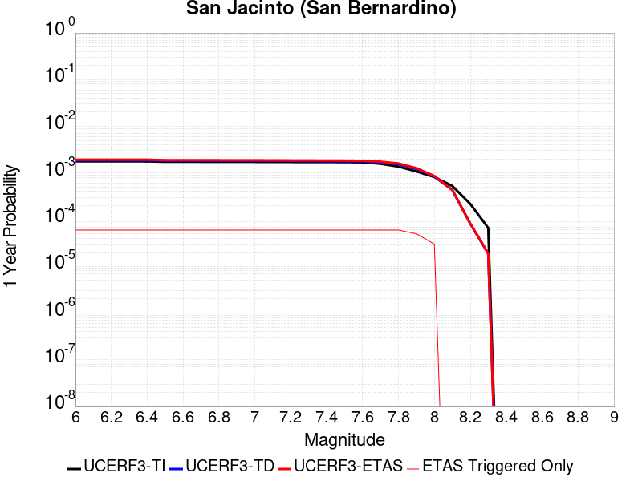 |  |

| Magnitude | 1 wk TI Prob | 1 wk TD Prob | 1 wk ETAS Prob | 1 wk ETAS/TD Gain | 1 wk ETAS Triggered Only | 1 mo TI Prob | 1 mo TD Prob | 1 mo ETAS Prob | 1 mo ETAS/TD Gain | 1 mo ETAS Triggered Only | 1 yr TI Prob | 1 yr TD Prob | 1 yr ETAS Prob | 1 yr ETAS/TD Gain | 1 yr ETAS Triggered Only | 10 yr TI Prob | 10 yr TD Prob | 10 yr ETAS Prob | 10 yr ETAS/TD Gain | 10 yr ETAS Triggered Only |
|-----|-----|-----|-----|-----|-----|-----|-----|-----|-----|-----|-----|-----|-----|-----|-----|-----|-----|-----|-----|-----|
| 6.0 | 3.409352E-5 | 3.5986508E-5 | 1.5212635E-4 | 4.227316 | 1.16144016E-4 | 1.461069E-4 | 1.542188E-4 | 2.703449E-4 | 1.7529958 | 1.16144016E-4 | 0.0017774 | 0.0018759987 | 0.002107851 | 1.1235887 | 2.3228803E-4 | 0.01763251 | 0.019349935 | 0.019577729 | 1.0117723 | 2.3228803E-4 |
| 6.1 | 3.409352E-5 | 3.5986508E-5 | 1.5212635E-4 | 4.227316 | 1.16144016E-4 | 1.461069E-4 | 1.542188E-4 | 2.703449E-4 | 1.7529958 | 1.16144016E-4 | 0.0017774 | 0.0018759987 | 0.002107851 | 1.1235887 | 2.3228803E-4 | 0.01763251 | 0.019349935 | 0.019577729 | 1.0117723 | 2.3228803E-4 |
| 6.2 | 3.409352E-5 | 3.5986508E-5 | 1.5212635E-4 | 4.227316 | 1.16144016E-4 | 1.461069E-4 | 1.542188E-4 | 2.703449E-4 | 1.7529958 | 1.16144016E-4 | 0.0017774 | 0.0018759987 | 0.002107851 | 1.1235887 | 2.3228803E-4 | 0.01763251 | 0.019349935 | 0.019577729 | 1.0117723 | 2.3228803E-4 |
| 6.3 | 3.409352E-5 | 3.5986508E-5 | 1.5212635E-4 | 4.227316 | 1.16144016E-4 | 1.461069E-4 | 1.542188E-4 | 2.703449E-4 | 1.7529958 | 1.16144016E-4 | 0.0017774 | 0.0018759987 | 0.002107851 | 1.1235887 | 2.3228803E-4 | 0.01763251 | 0.019349935 | 0.019577729 | 1.0117723 | 2.3228803E-4 |
| 6.4 | 3.400795E-5 | 3.5879173E-5 | 1.5201903E-4 | 4.2369714 | 1.16144016E-4 | 1.4574021E-4 | 1.5375883E-4 | 2.69885E-4 | 1.7552488 | 1.16144016E-4 | 0.0017729428 | 0.0018704084 | 0.0021022619 | 1.1239588 | 2.3228803E-4 | 0.017588645 | 0.019295016 | 0.019522823 | 1.0118065 | 2.3228803E-4 |
| 6.5 | 3.341482E-5 | 3.5139812E-5 | 1.5127975E-4 | 4.3050814 | 1.16144016E-4 | 1.4319851E-4 | 1.5059051E-4 | 2.6671702E-4 | 1.7711412 | 1.16144016E-4 | 0.0017420477 | 0.0018318989 | 0.0020637615 | 1.1265695 | 2.3228803E-4 | 0.017284546 | 0.018916558 | 0.019144453 | 1.0120473 | 2.3228803E-4 |
| 6.6 | 3.3364955E-5 | 3.5077028E-5 | 1.5121697E-4 | 4.310997 | 1.16144016E-4 | 1.4298483E-4 | 1.5032147E-4 | 2.6644804E-4 | 1.7725214 | 1.16144016E-4 | 0.0017394501 | 0.001828629 | 0.0020604923 | 1.1267962 | 2.3228803E-4 | 0.017258976 | 0.018884424 | 0.019112324 | 1.0120683 | 2.3228803E-4 |
| 6.7 | 3.335922E-5 | 3.5066805E-5 | 1.5120675E-4 | 4.3119626 | 1.16144016E-4 | 1.4296026E-4 | 1.5027766E-4 | 2.664042E-4 | 1.7727467 | 1.16144016E-4 | 0.0017391514 | 0.0018280965 | 0.0020599598 | 1.1268332 | 2.3228803E-4 | 0.017256035 | 0.018879214 | 0.019107118 | 1.0120716 | 2.3228803E-4 |
| 6.8 | 3.327683E-5 | 3.496087E-5 | 1.5110083E-4 | 4.3219986 | 1.16144016E-4 | 1.4260718E-4 | 1.498237E-4 | 2.659503E-4 | 1.7750884 | 1.16144016E-4 | 0.0017348597 | 0.0018225788 | 0.0020544436 | 1.1272179 | 2.3228803E-4 | 0.017213784 | 0.018824987 | 0.019052902 | 1.012107 | 2.3228803E-4 |
| 6.9 | 3.3235785E-5 | 3.4901823E-5 | 1.510418E-4 | 4.3276186 | 1.16144016E-4 | 1.4243131E-4 | 1.4957068E-4 | 2.6569734E-4 | 1.7763999 | 1.16144016E-4 | 0.0017327217 | 0.0018195034 | 0.0020513688 | 1.1274333 | 2.3228803E-4 | 0.017192734 | 0.018794855 | 0.019022778 | 1.0121268 | 2.3228803E-4 |
| 7.0 | 3.3197095E-5 | 3.4841752E-5 | 1.5098172E-4 | 4.333356 | 1.16144016E-4 | 1.422655E-4 | 1.4931326E-4 | 2.6543994E-4 | 1.7777386 | 1.16144016E-4 | 0.0017307063 | 0.0018163746 | 0.0020482407 | 1.1276532 | 2.3228803E-4 | 0.017172894 | 0.018764233 | 0.018992161 | 1.0121471 | 2.3228803E-4 |
| 7.1 | 3.3129716E-5 | 3.4721965E-5 | 1.5086195E-4 | 4.3448563 | 1.16144016E-4 | 1.4197677E-4 | 1.4879994E-4 | 2.6492667E-4 | 1.780422 | 1.16144016E-4 | 0.0017271966 | 0.0018101353 | 0.002042003 | 1.1280941 | 2.3228803E-4 | 0.017138338 | 0.018703312 | 0.018931257 | 1.0121874 | 2.3228803E-4 |
| 7.2 | 3.3034008E-5 | 3.458941E-5 | 1.5072941E-4 | 4.357675 | 1.16144016E-4 | 1.4156665E-4 | 1.4823192E-4 | 2.6435874E-4 | 1.7834129 | 1.16144016E-4 | 0.0017222111 | 0.0018032312 | 0.0020351002 | 1.1285853 | 2.3228803E-4 | 0.017089253 | 0.018635705 | 0.018863665 | 1.0122324 | 2.3228803E-4 |
| 7.3 | 3.2956614E-5 | 3.445717E-5 | 1.5059719E-4 | 4.3705616 | 1.16144016E-4 | 1.4123498E-4 | 1.4766524E-4 | 2.637921E-4 | 1.7864199 | 1.16144016E-4 | 0.0017181796 | 0.0017963431 | 0.0020282138 | 1.1290793 | 2.3228803E-4 | 0.017049557 | 0.018568452 | 0.018796427 | 1.0122775 | 2.3228803E-4 |
| 7.4 | 3.2915937E-5 | 3.4378863E-5 | 1.5051888E-4 | 4.378239 | 1.16144016E-4 | 1.4106068E-4 | 1.4732967E-4 | 2.6345658E-4 | 1.7882112 | 1.16144016E-4 | 0.0017160608 | 0.0017922645 | 0.0020241363 | 1.1293736 | 2.3228803E-4 | 0.017028693 | 0.018528719 | 0.018756703 | 1.0123043 | 2.3228803E-4 |
| 7.5 | 3.281791E-5 | 3.4243778E-5 | 1.5038381E-4 | 4.3915663 | 1.16144016E-4 | 1.406406E-4 | 1.4675081E-4 | 2.628778E-4 | 1.7913208 | 1.16144016E-4 | 0.0017109542 | 0.0017852283 | 0.0020171017 | 1.1298845 | 2.3228803E-4 | 0.016978411 | 0.018459605 | 0.018687606 | 1.0123513 | 2.3228803E-4 |
| 7.6 | 3.2521442E-5 | 3.396873E-5 | 1.501088E-4 | 4.419029 | 1.16144016E-4 | 1.3937015E-4 | 1.4557215E-4 | 2.6169926E-4 | 1.7977289 | 1.16144016E-4 | 0.0016955109 | 0.0017709016 | 0.0020027782 | 1.1309371 | 2.3228803E-4 | 0.016826328 | 0.018317232 | 0.018545266 | 1.0124491 | 2.3228803E-4 |
| 7.7 | 3.0287873E-5 | 3.245276E-5 | 1.4859301E-4 | 4.5787477 | 1.16144016E-4 | 1.297987E-4 | 1.3907586E-4 | 2.5520372E-4 | 1.8349966 | 1.16144016E-4 | 0.0015791537 | 0.0016919347 | 0.0019238297 | 1.1370591 | 2.3228803E-4 | 0.01567979 | 0.01752809 | 0.017756307 | 1.01302 | 2.3228803E-4 |
| 7.8 | 2.6316151E-5 | 2.9663592E-5 | 1.4580417E-4 | 4.9152565 | 1.16144016E-4 | 1.1277862E-4 | 1.2712348E-4 | 2.4325274E-4 | 1.9135153 | 1.16144016E-4 | 0.0013722149 | 0.0015466306 | 0.0017785594 | 1.1499574 | 2.3228803E-4 | 0.013637724 | 0.016069634 | 0.01629819 | 1.0142229 | 2.3228803E-4 |
| 7.9 | 2.0761147E-5 | 2.34181E-5 | 1.395594E-4 | 5.959467 | 1.16144016E-4 | 8.897331E-5 | 1.0035944E-4 | 2.164918E-4 | 2.1571643 | 1.16144016E-4 | 0.0010827117 | 0.0012211921 | 0.0014531964 | 1.1899819 | 2.3228803E-4 | 0.010774517 | 0.012793174 | 0.013022491 | 1.0179249 | 2.3228803E-4 |
| 8.0 | 1.5738568E-5 | 1.6033575E-5 | 1.6033575E-5 | 1.0 | 0.0 | 6.744926E-5 | 6.871352E-5 | 6.871352E-5 | 1.0 | 0.0 | 8.2088535E-4 | 8.3626667E-4 | 9.5231354E-4 | 1.1387678 | 1.16144016E-4 | 0.008178596 | 0.008865921 | 0.008981035 | 1.0129839 | 1.16144016E-4 |
| 8.1 | 1.0105832E-5 | 8.3304985E-6 | 8.3304985E-6 | 1.0 | 0.0 | 4.3309992E-5 | 3.570165E-5 | 3.570165E-5 | 1.0 | 0.0 | 5.2717153E-4 | 4.345814E-4 | 4.345814E-4 | 1.0 | 0.0 | 0.005259227 | 0.004677232 | 0.004677232 | 1.0 | 0.0 |
| 8.2 | 4.189207E-6 | 1.5784357E-6 | 1.5784357E-6 | 1.0 | 0.0 | 1.7953622E-5 | 6.7647065E-6 | 6.7647065E-6 | 1.0 | 0.0 | 2.1856341E-4 | 8.235722E-5 | 8.235722E-5 | 1.0 | 0.0 | 0.0021834858 | 9.565867E-4 | 9.565867E-4 | 1.0 | 0.0 |
| 8.3 | 1.2758221E-6 | 3.6149942E-7 | 3.6149942E-7 | 1.0 | 0.0 | 5.4677976E-6 | 1.5492824E-6 | 1.5492824E-6 | 1.0 | 0.0 | 6.65684E-5 | 1.8862354E-5 | 1.8862354E-5 | 1.0 | 0.0 | 6.6548464E-4 | 2.2751294E-4 | 2.2751294E-4 | 1.0 | 0.0 |

## Owens Valley
*[(top)](#table-of-contents)*

| 1 Week | 1 Month | 1 Year | 10 Year |
|-----|-----|-----|-----|
|  | 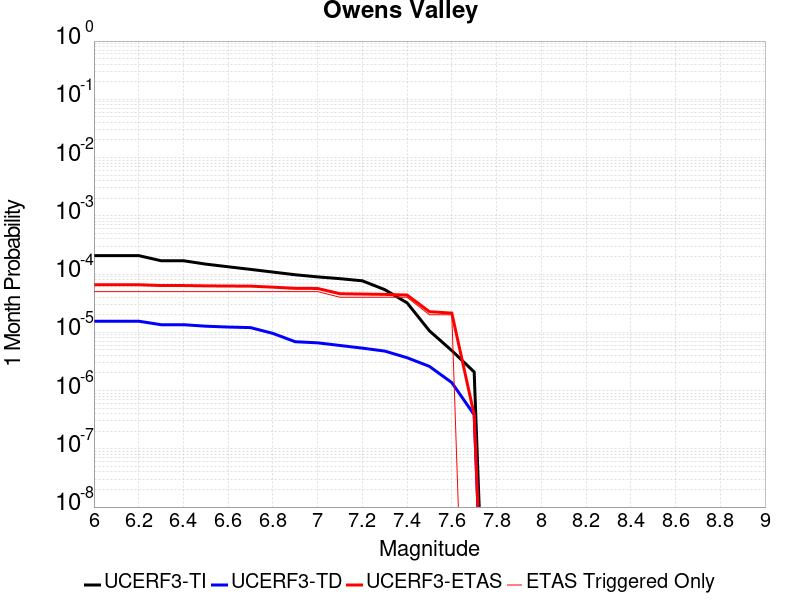 |  | 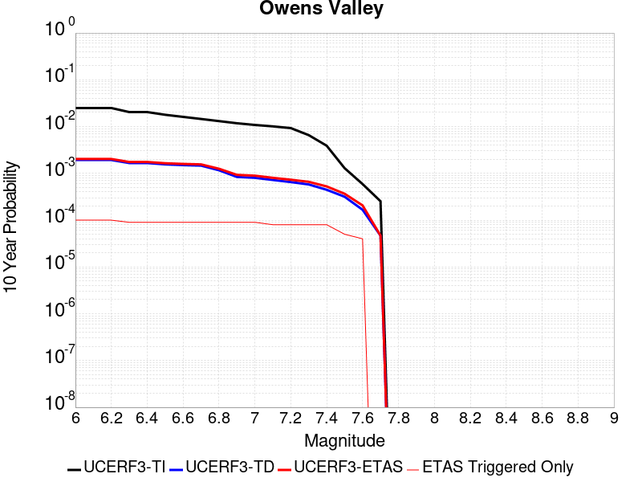 |

| Magnitude | 1 wk TI Prob | 1 wk TD Prob | 1 wk ETAS Prob | 1 wk ETAS/TD Gain | 1 wk ETAS Triggered Only | 1 mo TI Prob | 1 mo TD Prob | 1 mo ETAS Prob | 1 mo ETAS/TD Gain | 1 mo ETAS Triggered Only | 1 yr TI Prob | 1 yr TD Prob | 1 yr ETAS Prob | 1 yr ETAS/TD Gain | 1 yr ETAS Triggered Only | 10 yr TI Prob | 10 yr TD Prob | 10 yr ETAS Prob | 10 yr ETAS/TD Gain | 10 yr ETAS Triggered Only |
|-----|-----|-----|-----|-----|-----|-----|-----|-----|-----|-----|-----|-----|-----|-----|-----|-----|-----|-----|-----|-----|
| 6.0 | 4.83821E-5 | 3.626567E-6 | 1.19770164E-4 | 33.02577 | 1.16144016E-4 | 2.0733538E-4 | 1.5542342E-5 | 1.3168456E-4 | 8.472632 | 1.16144016E-4 | 0.002521386 | 1.8921259E-4 | 4.2145667E-4 | 2.2274241 | 2.3228803E-4 | 0.024929691 | 0.001925011 | 0.0021568518 | 1.1204362 | 2.3228803E-4 |
| 6.1 | 4.83821E-5 | 3.626567E-6 | 1.19770164E-4 | 33.02577 | 1.16144016E-4 | 2.0733538E-4 | 1.5542342E-5 | 1.3168456E-4 | 8.472632 | 1.16144016E-4 | 0.002521386 | 1.8921259E-4 | 4.2145667E-4 | 2.2274241 | 2.3228803E-4 | 0.024929691 | 0.001925011 | 0.0021568518 | 1.1204362 | 2.3228803E-4 |
| 6.2 | 4.83821E-5 | 3.626567E-6 | 1.19770164E-4 | 33.02577 | 1.16144016E-4 | 2.0733538E-4 | 1.5542342E-5 | 1.3168456E-4 | 8.472632 | 1.16144016E-4 | 0.002521386 | 1.8921259E-4 | 4.2145667E-4 | 2.2274241 | 2.3228803E-4 | 0.024929691 | 0.001925011 | 0.0021568518 | 1.1204362 | 2.3228803E-4 |
| 6.3 | 3.953008E-5 | 3.1553948E-6 | 1.19299046E-4 | 37.80796 | 1.16144016E-4 | 1.6940363E-4 | 1.3523055E-5 | 1.296655E-4 | 9.588477 | 1.16144016E-4 | 0.002060538 | 1.6463149E-4 | 3.9688128E-4 | 2.4107254 | 2.3228803E-4 | 0.020415364 | 0.0016592 | 0.0018911025 | 1.1397678 | 2.3228803E-4 |
| 6.4 | 3.953008E-5 | 3.1553948E-6 | 1.19299046E-4 | 37.80796 | 1.16144016E-4 | 1.6940363E-4 | 1.3523055E-5 | 1.296655E-4 | 9.588477 | 1.16144016E-4 | 0.002060538 | 1.6463149E-4 | 3.9688128E-4 | 2.4107254 | 2.3228803E-4 | 0.020415364 | 0.0016592 | 0.0018911025 | 1.1397678 | 2.3228803E-4 |
| 6.5 | 3.457342E-5 | 2.9715961E-6 | 1.1911527E-4 | 40.08461 | 1.16144016E-4 | 1.4816338E-4 | 1.2735354E-5 | 1.2887789E-4 | 10.119695 | 1.16144016E-4 | 0.0018023965 | 1.550426E-4 | 3.8729463E-4 | 2.4979885 | 2.3228803E-4 | 0.017878477 | 0.001555719 | 0.0017876456 | 1.14908 | 2.3228803E-4 |
| 6.6 | 3.1127765E-5 | 2.8744932E-6 | 1.1901818E-4 | 41.404922 | 1.16144016E-4 | 1.3339789E-4 | 1.2319203E-5 | 1.2846179E-4 | 10.427768 | 1.16144016E-4 | 0.0016229092 | 1.4997667E-4 | 3.8222986E-4 | 2.5485957 | 2.3228803E-4 | 0.016111081 | 0.0015012559 | 0.0017331952 | 1.1544969 | 2.3228803E-4 |
| 6.7 | 2.806885E-5 | 2.8104134E-6 | 1.1895411E-4 | 42.326195 | 1.16144016E-4 | 1.2028952E-4 | 1.20445775E-5 | 1.281872E-4 | 10.642732 | 1.16144016E-4 | 0.001463541 | 1.4663354E-4 | 3.7888752E-4 | 2.5839076 | 2.3228803E-4 | 0.014539397 | 0.0014657511 | 0.0016976986 | 1.1582448 | 2.3228803E-4 |
| 6.8 | 2.524524E-5 | 2.2353688E-6 | 1.18379125E-4 | 52.957317 | 1.16144016E-4 | 1.0818939E-4 | 9.580118E-6 | 1.2572302E-4 | 13.123327 | 1.16144016E-4 | 0.0013164099 | 1.16632E-4 | 3.4889294E-4 | 2.9913998 | 2.3228803E-4 | 0.01308639 | 0.0011659812 | 0.0013979983 | 1.1989888 | 2.3228803E-4 |
| 6.9 | 2.2704568E-5 | 1.6081682E-6 | 1.17752E-4 | 73.22119 | 1.16144016E-4 | 9.730166E-5 | 6.8921313E-6 | 1.2303535E-4 | 17.851568 | 1.16144016E-4 | 0.0011840039 | 8.390849E-5 | 3.1617703E-4 | 3.7681174 | 2.3228803E-4 | 0.011777153 | 8.3897985E-4 | 0.001071073 | 1.2766373 | 2.3228803E-4 |
| 7.0 | 2.0871712E-5 | 1.5395453E-6 | 1.1768338E-4 | 76.44035 | 1.16144016E-4 | 8.944713E-5 | 6.598035E-6 | 1.2274129E-4 | 18.602703 | 1.16144016E-4 | 0.0010884746 | 8.032813E-5 | 3.1259752E-4 | 3.8915074 | 2.3228803E-4 | 0.010831586 | 8.0316263E-4 | 0.0010352641 | 1.2889844 | 2.3228803E-4 |
| 7.1 | 1.944928E-5 | 1.3864178E-6 | 1.17530275E-4 | 84.77263 | 1.16144016E-4 | 8.335139E-5 | 5.941777E-6 | 1.2208511E-4 | 20.546902 | 1.16144016E-4 | 0.0010143308 | 7.233874E-5 | 3.0460997E-4 | 4.2108827 | 2.3228803E-4 | 0.010097133 | 7.2330976E-4 | 9.554298E-4 | 1.3209137 | 2.3228803E-4 |
| 7.2 | 1.7876306E-5 | 1.2489141E-6 | 1.1739279E-4 | 93.99589 | 1.16144016E-4 | 7.6610486E-5 | 5.352478E-6 | 1.21495876E-4 | 22.698996 | 1.16144016E-4 | 9.3233347E-4 | 6.516448E-5 | 2.974374E-4 | 4.5644097 | 2.3228803E-4 | 0.009284316 | 6.5159105E-4 | 8.8372774E-4 | 1.3562613 | 2.3228803E-4 |
| 7.3 | 1.2618672E-5 | 1.1115209E-6 | 1.1725541E-4 | 105.49097 | 1.16144016E-4 | 5.40789E-5 | 4.763652E-6 | 1.2090712E-4 | 25.38118 | 1.16144016E-4 | 6.582117E-4 | 5.799593E-5 | 2.902705E-4 | 5.005015 | 2.3228803E-4 | 0.0065626553 | 5.7994033E-4 | 8.1209367E-4 | 1.4003055 | 2.3228803E-4 |
| 7.4 | 7.4874442E-6 | 8.5486437E-7 | 1.1699878E-4 | 136.8624 | 1.16144016E-4 | 3.208865E-5 | 3.6636993E-6 | 1.1980729E-4 | 32.70118 | 1.16144016E-4 | 3.906093E-4 | 4.4604632E-5 | 2.7688232E-4 | 6.207479 | 2.3228803E-4 | 0.003899234 | 4.4604883E-4 | 6.782333E-4 | 1.5205358 | 2.3228803E-4 |
| 7.5 | 2.4734156E-6 | 6.068616E-7 | 6.068616E-7 | 1.0 | 0.0 | 1.060031E-5 | 2.6008327E-6 | 2.6008327E-6 | 1.0 | 0.0 | 1.2905113E-4 | 3.166468E-5 | 1.4780503E-4 | 4.6678195 | 1.16144016E-4 | 0.0012897621 | 3.1660203E-4 | 4.3270926E-4 | 1.3667294 | 1.16144016E-4 |
| 7.6 | 1.1328841E-6 | 3.196531E-7 | 3.196531E-7 | 1.0 | 0.0 | 4.8552088E-6 | 1.3699412E-6 | 1.3699412E-6 | 1.0 | 0.0 | 5.9110564E-5 | 1.6678909E-5 | 1.3282099E-4 | 7.9634104 | 1.16144016E-4 | 5.9094845E-4 | 1.6677675E-4 | 2.829014E-4 | 1.696288 | 1.16144016E-4 |
| 7.7 | 4.8613185E-7 | 8.964689E-8 | 8.964689E-8 | 1.0 | 0.0 | 2.0834207E-6 | 3.8420092E-7 | 3.8420092E-7 | 1.0 | 0.0 | 2.536535E-5 | 4.6776368E-6 | 4.6776368E-6 | 1.0 | 0.0 | 2.5362454E-4 | 4.677545E-5 | 4.677545E-5 | 1.0 | 0.0 |

## Death Valley (No)
*[(top)](#table-of-contents)*

| 1 Week | 1 Month | 1 Year | 10 Year |
|-----|-----|-----|-----|
|  |  |  |  |

| Magnitude | 1 wk TI Prob | 1 wk TD Prob | 1 wk ETAS Prob | 1 wk ETAS/TD Gain | 1 wk ETAS Triggered Only | 1 mo TI Prob | 1 mo TD Prob | 1 mo ETAS Prob | 1 mo ETAS/TD Gain | 1 mo ETAS Triggered Only | 1 yr TI Prob | 1 yr TD Prob | 1 yr ETAS Prob | 1 yr ETAS/TD Gain | 1 yr ETAS Triggered Only | 10 yr TI Prob | 10 yr TD Prob | 10 yr ETAS Prob | 10 yr ETAS/TD Gain | 10 yr ETAS Triggered Only |
|-----|-----|-----|-----|-----|-----|-----|-----|-----|-----|-----|-----|-----|-----|-----|-----|-----|-----|-----|-----|-----|
| 6.0 | 2.0074807E-5 | 2.2500084E-5 | 2.2500084E-5 | 1.0 | 0.0 | 8.603206E-5 | 9.642541E-5 | 9.642541E-5 | 1.0 | 0.0 | 0.001046937 | 0.0011733545 | 0.0012893622 | 1.0988685 | 1.16144016E-4 | 0.010420183 | 0.011672506 | 0.011902083 | 1.0196681 | 2.3228803E-4 |
| 6.1 | 2.0074807E-5 | 2.2500084E-5 | 2.2500084E-5 | 1.0 | 0.0 | 8.603206E-5 | 9.642541E-5 | 9.642541E-5 | 1.0 | 0.0 | 0.001046937 | 0.0011733545 | 0.0012893622 | 1.0988685 | 1.16144016E-4 | 0.010420183 | 0.011672506 | 0.011902083 | 1.0196681 | 2.3228803E-4 |
| 6.2 | 2.0074807E-5 | 2.2500084E-5 | 2.2500084E-5 | 1.0 | 0.0 | 8.603206E-5 | 9.642541E-5 | 9.642541E-5 | 1.0 | 0.0 | 0.001046937 | 0.0011733545 | 0.0012893622 | 1.0988685 | 1.16144016E-4 | 0.010420183 | 0.011672506 | 0.011902083 | 1.0196681 | 2.3228803E-4 |
| 6.3 | 1.9050609E-5 | 2.1336948E-5 | 2.1336948E-5 | 1.0 | 0.0 | 8.164292E-5 | 9.1440896E-5 | 9.1440896E-5 | 1.0 | 0.0 | 9.935491E-4 | 0.001112731 | 0.0012287458 | 1.1042613 | 1.16144016E-4 | 0.009891188 | 0.011072419 | 0.011302135 | 1.0207467 | 2.3228803E-4 |
| 6.4 | 1.9050609E-5 | 2.1336948E-5 | 2.1336948E-5 | 1.0 | 0.0 | 8.164292E-5 | 9.1440896E-5 | 9.1440896E-5 | 1.0 | 0.0 | 9.935491E-4 | 0.001112731 | 0.0012287458 | 1.1042613 | 1.16144016E-4 | 0.009891188 | 0.011072419 | 0.011302135 | 1.0207467 | 2.3228803E-4 |
| 6.5 | 1.8367004E-5 | 2.0561009E-5 | 2.0561009E-5 | 1.0 | 0.0 | 7.8713354E-5 | 8.811567E-5 | 8.811567E-5 | 1.0 | 0.0 | 9.5791375E-4 | 0.0010722869 | 0.0011883063 | 1.1081982 | 1.16144016E-4 | 0.009537951 | 0.0106719155 | 0.010901725 | 1.021534 | 2.3228803E-4 |
| 6.6 | 1.779439E-5 | 1.9910927E-5 | 1.9910927E-5 | 1.0 | 0.0 | 7.625944E-5 | 8.53298E-5 | 8.53298E-5 | 1.0 | 0.0 | 9.280632E-4 | 0.0010384015 | 0.001154425 | 1.1117327 | 1.16144016E-4 | 0.009241969 | 0.010336253 | 0.01056614 | 1.0222409 | 2.3228803E-4 |
| 6.7 | 1.7025437E-5 | 1.9043426E-5 | 1.9043426E-5 | 1.0 | 0.0 | 7.296412E-5 | 8.161216E-5 | 8.161216E-5 | 1.0 | 0.0 | 8.87976E-4 | 9.931813E-4 | 0.00110921 | 1.1168252 | 1.16144016E-4 | 0.008844362 | 0.009888145 | 0.010118136 | 1.0232593 | 2.3228803E-4 |
| 6.8 | 1.6545107E-5 | 1.8512545E-5 | 1.8512545E-5 | 1.0 | 0.0 | 7.090568E-5 | 7.93371E-5 | 7.93371E-5 | 1.0 | 0.0 | 8.629347E-4 | 9.655073E-4 | 0.0010815392 | 1.1201771 | 1.16144016E-4 | 0.008595915 | 0.009613829 | 0.009843884 | 1.0239296 | 2.3228803E-4 |
| 6.9 | 1.615478E-5 | 1.8087594E-5 | 1.8087594E-5 | 1.0 | 0.0 | 6.9232934E-5 | 7.751599E-5 | 7.751599E-5 | 1.0 | 0.0 | 8.4258494E-4 | 9.433546E-4 | 0.0010593891 | 1.1230019 | 1.16144016E-4 | 0.008393973 | 0.009394196 | 0.009624301 | 1.0244945 | 2.3228803E-4 |
| 7.0 | 1.5894311E-5 | 1.780555E-5 | 1.780555E-5 | 1.0 | 0.0 | 6.81167E-5 | 7.6307304E-5 | 7.6307304E-5 | 1.0 | 0.0 | 8.2900526E-4 | 9.286515E-4 | 0.0010446877 | 1.1249512 | 1.16144016E-4 | 0.008259195 | 0.009248397 | 0.009478537 | 1.0248842 | 2.3228803E-4 |
| 7.1 | 1.5602263E-5 | 1.7483504E-5 | 1.7483504E-5 | 1.0 | 0.0 | 6.6865134E-5 | 7.492718E-5 | 7.492718E-5 | 1.0 | 0.0 | 8.137789E-4 | 9.118627E-4 | 0.0010279008 | 1.1272539 | 1.16144016E-4 | 0.008108052 | 0.009081894 | 0.009312073 | 1.0253447 | 2.3228803E-4 |
| 7.2 | 1.5323829E-5 | 1.717063E-5 | 1.717063E-5 | 1.0 | 0.0 | 6.56719E-5 | 7.358637E-5 | 7.358637E-5 | 1.0 | 0.0 | 7.99262E-4 | 8.9555193E-4 | 0.0010115919 | 1.1295737 | 1.16144016E-4 | 0.007963934 | 0.008920107 | 0.0091503225 | 1.0258087 | 2.3228803E-4 |
| 7.3 | 1.4556212E-5 | 1.6302456E-5 | 1.6302456E-5 | 1.0 | 0.0 | 6.238227E-5 | 6.9865826E-5 | 6.9865826E-5 | 1.0 | 0.0 | 7.592395E-4 | 8.5029035E-4 | 8.5029035E-4 | 1.0 | 0.0 | 0.0075665074 | 0.008471014 | 0.008586175 | 1.0135946 | 1.16144016E-4 |
| 7.4 | 1.411725E-5 | 1.580796E-5 | 1.580796E-5 | 1.0 | 0.0 | 6.0501097E-5 | 6.7746674E-5 | 6.7746674E-5 | 1.0 | 0.0 | 7.363519E-4 | 8.245094E-4 | 8.245094E-4 | 1.0 | 0.0 | 0.0073391674 | 0.008215138 | 0.008330328 | 1.0140216 | 1.16144016E-4 |
| 7.5 | 1.3503312E-5 | 1.5126289E-5 | 1.5126289E-5 | 1.0 | 0.0 | 5.7870053E-5 | 6.482538E-5 | 6.482538E-5 | 1.0 | 0.0 | 7.043401E-4 | 7.8896893E-4 | 7.8896893E-4 | 1.0 | 0.0 | 0.007021119 | 0.007862304 | 0.007977535 | 1.0146561 | 1.16144016E-4 |
| 7.6 | 1.1279839E-5 | 1.2626327E-5 | 1.2626327E-5 | 1.0 | 0.0 | 4.834127E-5 | 5.4111737E-5 | 5.4111737E-5 | 1.0 | 0.0 | 5.88396E-4 | 6.5861654E-4 | 6.5861654E-4 | 1.0 | 0.0 | 0.005868405 | 0.006567199 | 0.00668258 | 1.0175693 | 1.16144016E-4 |
| 7.7 | 9.189108E-6 | 1.0283358E-5 | 1.0283358E-5 | 1.0 | 0.0 | 3.93813E-5 | 4.407082E-5 | 4.407082E-5 | 1.0 | 0.0 | 4.7936183E-4 | 5.3643517E-4 | 5.3643517E-4 | 1.0 | 0.0 | 0.004783291 | 0.005351914 | 0.0054674363 | 1.0215852 | 1.16144016E-4 |
| 7.8 | 3.4586725E-7 | 3.6482615E-7 | 3.6482615E-7 | 1.0 | 0.0 | 1.4822873E-6 | 1.5635396E-6 | 1.5635396E-6 | 1.0 | 0.0 | 1.80467E-5 | 1.9035933E-5 | 1.9035933E-5 | 1.0 | 0.0 | 1.8045233E-4 | 1.9034347E-4 | 1.9034347E-4 | 1.0 | 0.0 |
| 7.9 | 2.5591178E-9 | 2.6696718E-9 | 2.6696718E-9 | 1.0 | 0.0 | 1.0967647E-8 | 1.14414505E-8 | 1.14414505E-8 | 1.0 | 0.0 | 1.335311E-7 | 1.3929966E-7 | 1.3929966E-7 | 1.0 | 0.0 | 1.3353102E-6 | 1.3929966E-6 | 1.3929966E-6 | 1.0 | 0.0 |

## Channel Islands Thrust
*[(top)](#table-of-contents)*

| 1 Week | 1 Month | 1 Year | 10 Year |
|-----|-----|-----|-----|
|  |  |  |  |

| Magnitude | 1 wk TI Prob | 1 wk TD Prob | 1 wk ETAS Prob | 1 wk ETAS/TD Gain | 1 wk ETAS Triggered Only | 1 mo TI Prob | 1 mo TD Prob | 1 mo ETAS Prob | 1 mo ETAS/TD Gain | 1 mo ETAS Triggered Only | 1 yr TI Prob | 1 yr TD Prob | 1 yr ETAS Prob | 1 yr ETAS/TD Gain | 1 yr ETAS Triggered Only | 10 yr TI Prob | 10 yr TD Prob | 10 yr ETAS Prob | 10 yr ETAS/TD Gain | 10 yr ETAS Triggered Only |
|-----|-----|-----|-----|-----|-----|-----|-----|-----|-----|-----|-----|-----|-----|-----|-----|-----|-----|-----|-----|-----|
| 6.0 | 2.2156251E-5 | 2.4092022E-5 | 2.4092022E-5 | 1.0 | 0.0 | 9.495191E-5 | 1.03248036E-4 | 2.1938006E-4 | 2.1247869 | 1.16144016E-4 | 0.0011554264 | 0.0012564264 | 0.0013724245 | 1.0923238 | 1.16144016E-4 | 0.011494373 | 0.0125038205 | 0.012733204 | 1.0183451 | 2.3228803E-4 |
| 6.1 | 2.2156251E-5 | 2.4092022E-5 | 2.4092022E-5 | 1.0 | 0.0 | 9.495191E-5 | 1.03248036E-4 | 2.1938006E-4 | 2.1247869 | 1.16144016E-4 | 0.0011554264 | 0.0012564264 | 0.0013724245 | 1.0923238 | 1.16144016E-4 | 0.011494373 | 0.0125038205 | 0.012733204 | 1.0183451 | 2.3228803E-4 |
| 6.2 | 2.2156251E-5 | 2.4092022E-5 | 2.4092022E-5 | 1.0 | 0.0 | 9.495191E-5 | 1.03248036E-4 | 2.1938006E-4 | 2.1247869 | 1.16144016E-4 | 0.0011554264 | 0.0012564264 | 0.0013724245 | 1.0923238 | 1.16144016E-4 | 0.011494373 | 0.0125038205 | 0.012733204 | 1.0183451 | 2.3228803E-4 |
| 6.3 | 2.2156251E-5 | 2.4092022E-5 | 2.4092022E-5 | 1.0 | 0.0 | 9.495191E-5 | 1.03248036E-4 | 2.1938006E-4 | 2.1247869 | 1.16144016E-4 | 0.0011554264 | 0.0012564264 | 0.0013724245 | 1.0923238 | 1.16144016E-4 | 0.011494373 | 0.0125038205 | 0.012733204 | 1.0183451 | 2.3228803E-4 |
| 6.4 | 2.2156251E-5 | 2.4092022E-5 | 2.4092022E-5 | 1.0 | 0.0 | 9.495191E-5 | 1.03248036E-4 | 2.1938006E-4 | 2.1247869 | 1.16144016E-4 | 0.0011554264 | 0.0012564264 | 0.0013724245 | 1.0923238 | 1.16144016E-4 | 0.011494373 | 0.0125038205 | 0.012733204 | 1.0183451 | 2.3228803E-4 |
| 6.5 | 2.2156251E-5 | 2.4092022E-5 | 2.4092022E-5 | 1.0 | 0.0 | 9.495191E-5 | 1.03248036E-4 | 2.1938006E-4 | 2.1247869 | 1.16144016E-4 | 0.0011554264 | 0.0012564264 | 0.0013724245 | 1.0923238 | 1.16144016E-4 | 0.011494373 | 0.0125038205 | 0.012733204 | 1.0183451 | 2.3228803E-4 |
| 6.6 | 2.2156251E-5 | 2.4092022E-5 | 2.4092022E-5 | 1.0 | 0.0 | 9.495191E-5 | 1.03248036E-4 | 2.1938006E-4 | 2.1247869 | 1.16144016E-4 | 0.0011554264 | 0.0012564264 | 0.0013724245 | 1.0923238 | 1.16144016E-4 | 0.011494373 | 0.0125038205 | 0.012733204 | 1.0183451 | 2.3228803E-4 |
| 6.7 | 1.0601296E-5 | 1.1379544E-5 | 1.1379544E-5 | 1.0 | 0.0 | 4.5433335E-5 | 4.876859E-5 | 1.6490695E-4 | 3.3814173 | 1.16144016E-4 | 5.5301044E-4 | 5.936007E-4 | 7.096758E-4 | 1.195544 | 1.16144016E-4 | 0.005516363 | 0.005920653 | 0.0060361098 | 1.0195006 | 1.16144016E-4 |
| 6.8 | 1.0246747E-5 | 1.0996669E-5 | 1.0996669E-5 | 1.0 | 0.0 | 4.391389E-5 | 4.7127756E-5 | 1.632663E-4 | 3.4643342 | 1.16144016E-4 | 5.345204E-4 | 5.7363417E-4 | 6.8971154E-4 | 1.2023544 | 1.16144016E-4 | 0.0053323656 | 0.005722025 | 0.0058375043 | 1.0201815 | 1.16144016E-4 |
| 6.9 | 9.049551E-6 | 9.699645E-6 | 9.699645E-6 | 1.0 | 0.0 | 3.878322E-5 | 4.1569267E-5 | 4.1569267E-5 | 1.0 | 0.0 | 4.7208337E-4 | 5.059924E-4 | 5.059924E-4 | 1.0 | 0.0 | 0.0047108172 | 0.0050488203 | 0.0050488203 | 1.0 | 0.0 |
| 7.0 | 8.6542195E-6 | 9.274603E-6 | 9.274603E-6 | 1.0 | 0.0 | 3.7088983E-5 | 3.9747716E-5 | 3.9747716E-5 | 1.0 | 0.0 | 4.5146482E-4 | 4.8382508E-4 | 4.8382508E-4 | 1.0 | 0.0 | 0.004505487 | 0.004828129 | 0.004828129 | 1.0 | 0.0 |
| 7.1 | 8.391028E-6 | 8.992924E-6 | 8.992924E-6 | 1.0 | 0.0 | 3.5961057E-5 | 3.854056E-5 | 3.854056E-5 | 1.0 | 0.0 | 4.3773788E-4 | 4.6913436E-4 | 4.6913436E-4 | 1.0 | 0.0 | 0.004368766 | 0.0046818503 | 0.0046818503 | 1.0 | 0.0 |
| 7.2 | 5.965188E-6 | 6.3716952E-6 | 6.3716952E-6 | 1.0 | 0.0 | 2.556484E-5 | 2.7306982E-5 | 2.7306982E-5 | 1.0 | 0.0 | 3.1120746E-4 | 3.3241234E-4 | 3.3241234E-4 | 1.0 | 0.0 | 0.00310772 | 0.0033192092 | 0.0033192092 | 1.0 | 0.0 |
| 7.3 | 4.877518E-6 | 5.2060063E-6 | 5.2060063E-6 | 1.0 | 0.0 | 2.0903482E-5 | 2.2311267E-5 | 2.2311267E-5 | 1.0 | 0.0 | 2.5447016E-4 | 2.716063E-4 | 2.716063E-4 | 1.0 | 0.0 | 0.0025417898 | 0.0027127895 | 0.0027127895 | 1.0 | 0.0 |
| 7.4 | 3.8829853E-6 | 4.141863E-6 | 4.141863E-6 | 1.0 | 0.0 | 1.664126E-5 | 1.7750723E-5 | 1.7750723E-5 | 1.0 | 0.0 | 2.0258849E-4 | 2.1609402E-4 | 2.1609402E-4 | 1.0 | 0.0 | 0.002024039 | 0.0021588807 | 0.0021588807 | 1.0 | 0.0 |
| 7.5 | 1.3489616E-6 | 1.4277903E-6 | 1.4277903E-6 | 1.0 | 0.0 | 5.7812517E-6 | 6.119087E-6 | 6.119087E-6 | 1.0 | 0.0 | 7.038446E-5 | 7.449738E-5 | 7.449738E-5 | 1.0 | 0.0 | 7.036218E-4 | 7.44728E-4 | 7.44728E-4 | 1.0 | 0.0 |
| 7.6 | 6.058192E-7 | 6.353778E-7 | 6.353778E-7 | 1.0 | 0.0 | 2.5963652E-6 | 2.7230449E-6 | 2.7230449E-6 | 1.0 | 0.0 | 3.161029E-5 | 3.3152584E-5 | 3.3152584E-5 | 1.0 | 0.0 | 3.1605794E-4 | 3.31478E-4 | 3.31478E-4 | 1.0 | 0.0 |
| 7.7 | 2.2170494E-7 | 2.2607902E-7 | 2.2607902E-7 | 1.0 | 0.0 | 9.5016367E-7 | 9.689098E-7 | 9.689098E-7 | 1.0 | 0.0 | 1.1568181E-5 | 1.1796425E-5 | 1.1796425E-5 | 1.0 | 0.0 | 1.1567579E-4 | 1.1795909E-4 | 1.1795909E-4 | 1.0 | 0.0 |
| 7.8 | 2.1613102E-8 | 1.5466682E-8 | 1.5466682E-8 | 1.0 | 0.0 | 9.262757E-8 | 6.628578E-8 | 6.628578E-8 | 1.0 | 0.0 | 1.1277401E-6 | 8.070291E-7 | 8.070291E-7 | 1.0 | 0.0 | 1.1277344E-5 | 8.070269E-6 | 8.070269E-6 | 1.0 | 0.0 |

## Sierra Nevada  (No Extension)
*[(top)](#table-of-contents)*

| 1 Week | 1 Month | 1 Year | 10 Year |
|-----|-----|-----|-----|
|  |  |  |  |

| Magnitude | 1 wk TI Prob | 1 wk TD Prob | 1 wk ETAS Prob | 1 wk ETAS/TD Gain | 1 wk ETAS Triggered Only | 1 mo TI Prob | 1 mo TD Prob | 1 mo ETAS Prob | 1 mo ETAS/TD Gain | 1 mo ETAS Triggered Only | 1 yr TI Prob | 1 yr TD Prob | 1 yr ETAS Prob | 1 yr ETAS/TD Gain | 1 yr ETAS Triggered Only | 10 yr TI Prob | 10 yr TD Prob | 10 yr ETAS Prob | 10 yr ETAS/TD Gain | 10 yr ETAS Triggered Only |
|-----|-----|-----|-----|-----|-----|-----|-----|-----|-----|-----|-----|-----|-----|-----|-----|-----|-----|-----|-----|-----|
| 6.0 | 7.7690465E-6 | 6.976322E-6 | 1.2311953E-4 | 17.648201 | 1.16144016E-4 | 3.329549E-5 | 2.9898381E-5 | 1.4603893E-4 | 4.8845096 | 1.16144016E-4 | 4.0529718E-4 | 3.6398784E-4 | 5.961913E-4 | 1.637943 | 2.3228803E-4 | 0.004045588 | 0.0036374326 | 0.0038688758 | 1.0636282 | 2.3228803E-4 |
| 6.1 | 7.7690465E-6 | 6.976322E-6 | 1.2311953E-4 | 17.648201 | 1.16144016E-4 | 3.329549E-5 | 2.9898381E-5 | 1.4603893E-4 | 4.8845096 | 1.16144016E-4 | 4.0529718E-4 | 3.6398784E-4 | 5.961913E-4 | 1.637943 | 2.3228803E-4 | 0.004045588 | 0.0036374326 | 0.0038688758 | 1.0636282 | 2.3228803E-4 |
| 6.2 | 7.7690465E-6 | 6.976322E-6 | 1.2311953E-4 | 17.648201 | 1.16144016E-4 | 3.329549E-5 | 2.9898381E-5 | 1.4603893E-4 | 4.8845096 | 1.16144016E-4 | 4.0529718E-4 | 3.6398784E-4 | 5.961913E-4 | 1.637943 | 2.3228803E-4 | 0.004045588 | 0.0036374326 | 0.0038688758 | 1.0636282 | 2.3228803E-4 |
| 6.3 | 7.7690465E-6 | 6.976322E-6 | 1.2311953E-4 | 17.648201 | 1.16144016E-4 | 3.329549E-5 | 2.9898381E-5 | 1.4603893E-4 | 4.8845096 | 1.16144016E-4 | 4.0529718E-4 | 3.6398784E-4 | 5.961913E-4 | 1.637943 | 2.3228803E-4 | 0.004045588 | 0.0036374326 | 0.0038688758 | 1.0636282 | 2.3228803E-4 |
| 6.4 | 7.7690465E-6 | 6.976322E-6 | 1.2311953E-4 | 17.648201 | 1.16144016E-4 | 3.329549E-5 | 2.9898381E-5 | 1.4603893E-4 | 4.8845096 | 1.16144016E-4 | 4.0529718E-4 | 3.6398784E-4 | 5.961913E-4 | 1.637943 | 2.3228803E-4 | 0.004045588 | 0.0036374326 | 0.0038688758 | 1.0636282 | 2.3228803E-4 |
| 6.5 | 7.7690465E-6 | 6.976322E-6 | 1.2311953E-4 | 17.648201 | 1.16144016E-4 | 3.329549E-5 | 2.9898381E-5 | 1.4603893E-4 | 4.8845096 | 1.16144016E-4 | 4.0529718E-4 | 3.6398784E-4 | 5.961913E-4 | 1.637943 | 2.3228803E-4 | 0.004045588 | 0.0036374326 | 0.0038688758 | 1.0636282 | 2.3228803E-4 |
| 6.6 | 2.653E-6 | 1.614854E-6 | 1.1775868E-4 | 72.92219 | 1.16144016E-4 | 1.136995E-5 | 6.9207845E-6 | 1.23064E-4 | 17.7818 | 1.16144016E-4 | 1.3842035E-4 | 8.425733E-5 | 3.1652578E-4 | 3.756656 | 2.3228803E-4 | 0.0013833415 | 8.422573E-4 | 0.0010743496 | 1.27556 | 2.3228803E-4 |
| 6.7 | 2.5902466E-6 | 1.5501876E-6 | 1.1769403E-4 | 75.92245 | 1.16144016E-4 | 1.11010095E-5 | 6.643644E-6 | 1.2278689E-4 | 18.48186 | 1.16144016E-4 | 1.351464E-4 | 8.0883394E-5 | 3.1315265E-4 | 3.8716555 | 2.3228803E-4 | 0.0013506424 | 8.0854254E-4 | 0.0010406427 | 1.28706 | 2.3228803E-4 |
| 6.8 | 2.5853892E-6 | 1.5469877E-6 | 1.17690826E-4 | 76.077415 | 1.16144016E-4 | 1.1080193E-5 | 6.629931E-6 | 1.2277318E-4 | 18.518019 | 1.16144016E-4 | 1.34893E-4 | 8.071645E-5 | 3.1298574E-4 | 3.8775954 | 2.3228803E-4 | 0.0013481114 | 8.068743E-4 | 0.0010389748 | 1.287654 | 2.3228803E-4 |
| 6.9 | 2.458257E-6 | 1.4220619E-6 | 1.1756591E-4 | 82.67285 | 1.16144016E-4 | 1.0535345E-5 | 6.094537E-6 | 1.2223785E-4 | 20.056953 | 1.16144016E-4 | 1.2826028E-4 | 7.4198484E-5 | 3.0646927E-4 | 4.1303983 | 2.3228803E-4 | 0.0012818627 | 7.4173906E-4 | 9.738548E-4 | 1.3129345 | 2.3228803E-4 |
| 7.0 | 2.4341468E-6 | 1.3990258E-6 | 1.17542884E-4 | 84.01766 | 1.16144016E-4 | 1.0432016E-5 | 5.9958115E-6 | 1.2213913E-4 | 20.370743 | 1.16144016E-4 | 1.270024E-4 | 7.2996576E-5 | 3.0526766E-4 | 4.181945 | 2.3228803E-4 | 0.0012692984 | 7.297279E-4 | 9.6184644E-4 | 1.3180891 | 2.3228803E-4 |
| 7.1 | 2.3652476E-6 | 1.3339754E-6 | 1.1747784E-4 | 88.06597 | 1.16144016E-4 | 1.0136736E-5 | 5.717025E-6 | 1.2186038E-4 | 21.315348 | 1.16144016E-4 | 1.2340778E-4 | 6.9602575E-5 | 3.0187445E-4 | 4.3371162 | 2.3228803E-4 | 0.0012333926 | 6.9580943E-4 | 9.279359E-4 | 1.3336062 | 2.3228803E-4 |
| 7.2 | 2.272158E-6 | 1.2502821E-6 | 1.1739416E-4 | 93.894135 | 1.16144016E-4 | 9.737784E-6 | 5.3583412E-6 | 1.2150174E-4 | 22.675253 | 1.16144016E-4 | 1.1855107E-4 | 6.5235865E-5 | 2.9750876E-4 | 4.560509 | 2.3228803E-4 | 0.0011848784 | 6.5216864E-4 | 8.843052E-4 | 1.3559456 | 2.3228803E-4 |
| 7.3 | 2.1382127E-6 | 1.1419703E-6 | 1.17285854E-4 | 102.70483 | 1.16144016E-4 | 9.163737E-6 | 4.8941492E-6 | 1.210376E-4 | 24.731081 | 1.16144016E-4 | 1.1156279E-4 | 5.958465E-5 | 2.9185886E-4 | 4.898222 | 2.3228803E-4 | 0.001115068 | 5.956879E-4 | 8.2783756E-4 | 1.389717 | 2.3228803E-4 |
| 7.4 | 1.9048055E-6 | 9.575242E-7 | 1.1710143E-4 | 122.29605 | 1.16144016E-4 | 8.163426E-6 | 4.1036687E-6 | 1.2024721E-4 | 29.302366 | 1.16144016E-4 | 9.9385186E-5 | 4.996103E-5 | 2.8223745E-4 | 5.6491523 | 2.3228803E-4 | 9.934074E-4 | 4.994987E-4 | 7.316707E-4 | 1.46481 | 2.3228803E-4 |
| 7.5 | 1.5373403E-6 | 7.560042E-7 | 7.560042E-7 | 1.0 | 0.0 | 6.5885843E-6 | 3.2400142E-6 | 3.2400142E-6 | 1.0 | 0.0 | 8.021306E-5 | 3.9446462E-5 | 1.555859E-4 | 3.9442294 | 1.16144016E-4 | 8.0184115E-4 | 3.943951E-4 | 5.104933E-4 | 1.2943703 | 1.16144016E-4 |
| 7.6 | 1.0680322E-6 | 4.6596554E-7 | 4.6596554E-7 | 1.0 | 0.0 | 4.577273E-6 | 1.9969937E-6 | 1.9969937E-6 | 1.0 | 0.0 | 5.5726876E-5 | 2.4313129E-5 | 1.4045433E-4 | 5.776892 | 1.16144016E-4 | 5.5712904E-4 | 2.4310495E-4 | 3.5922075E-4 | 1.4776365 | 1.16144016E-4 |
| 7.7 | 5.509146E-7 | 1.5580486E-7 | 1.5580486E-7 | 1.0 | 0.0 | 2.3610605E-6 | 6.677349E-7 | 6.677349E-7 | 1.0 | 0.0 | 2.8745531E-5 | 8.129644E-6 | 8.129644E-6 | 1.0 | 0.0 | 2.8741814E-4 | 8.1293576E-5 | 8.1293576E-5 | 1.0 | 0.0 |

## San Andreas (Carrizo) rev
*[(top)](#table-of-contents)*

| 1 Week | 1 Month | 1 Year | 10 Year |
|-----|-----|-----|-----|
|  |  | 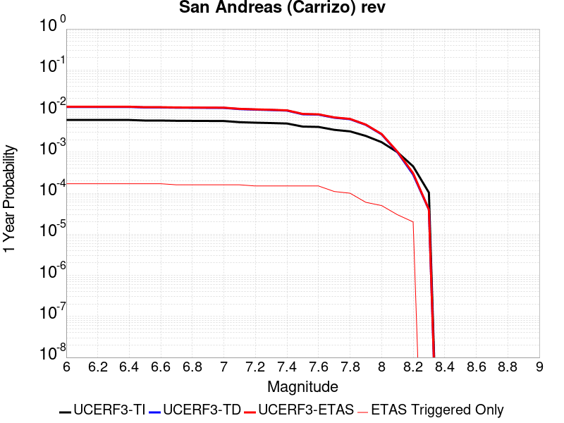 |  |

| Magnitude | 1 wk TI Prob | 1 wk TD Prob | 1 wk ETAS Prob | 1 wk ETAS/TD Gain | 1 wk ETAS Triggered Only | 1 mo TI Prob | 1 mo TD Prob | 1 mo ETAS Prob | 1 mo ETAS/TD Gain | 1 mo ETAS Triggered Only | 1 yr TI Prob | 1 yr TD Prob | 1 yr ETAS Prob | 1 yr ETAS/TD Gain | 1 yr ETAS Triggered Only | 10 yr TI Prob | 10 yr TD Prob | 10 yr ETAS Prob | 10 yr ETAS/TD Gain | 10 yr ETAS Triggered Only |
|-----|-----|-----|-----|-----|-----|-----|-----|-----|-----|-----|-----|-----|-----|-----|-----|-----|-----|-----|-----|-----|
| 6.0 | 1.1674632E-4 | 2.432302E-4 | 2.432302E-4 | 1.0 | 0.0 | 5.002454E-4 | 0.0010420004 | 0.0010420004 | 1.0 | 0.0 | 0.006073493 | 0.012613042 | 0.012727722 | 1.0090921 | 1.16144016E-4 | 0.0591016 | 0.12061418 | 0.12081845 | 1.0016936 | 2.3228803E-4 |
| 6.1 | 1.1674632E-4 | 2.432302E-4 | 2.432302E-4 | 1.0 | 0.0 | 5.002454E-4 | 0.0010420004 | 0.0010420004 | 1.0 | 0.0 | 0.006073493 | 0.012613042 | 0.012727722 | 1.0090921 | 1.16144016E-4 | 0.0591016 | 0.12061418 | 0.12081845 | 1.0016936 | 2.3228803E-4 |
| 6.2 | 1.1674632E-4 | 2.432302E-4 | 2.432302E-4 | 1.0 | 0.0 | 5.002454E-4 | 0.0010420004 | 0.0010420004 | 1.0 | 0.0 | 0.006073493 | 0.012613042 | 0.012727722 | 1.0090921 | 1.16144016E-4 | 0.0591016 | 0.12061418 | 0.12081845 | 1.0016936 | 2.3228803E-4 |
| 6.3 | 1.1674632E-4 | 2.432302E-4 | 2.432302E-4 | 1.0 | 0.0 | 5.002454E-4 | 0.0010420004 | 0.0010420004 | 1.0 | 0.0 | 0.006073493 | 0.012613042 | 0.012727722 | 1.0090921 | 1.16144016E-4 | 0.0591016 | 0.12061418 | 0.12081845 | 1.0016936 | 2.3228803E-4 |
| 6.4 | 1.1674632E-4 | 2.432302E-4 | 2.432302E-4 | 1.0 | 0.0 | 5.002454E-4 | 0.0010420004 | 0.0010420004 | 1.0 | 0.0 | 0.006073493 | 0.012613042 | 0.012727722 | 1.0090921 | 1.16144016E-4 | 0.0591016 | 0.12061418 | 0.12081845 | 1.0016936 | 2.3228803E-4 |
| 6.5 | 1.13136164E-4 | 2.3643032E-4 | 2.3643032E-4 | 1.0 | 0.0 | 4.847792E-4 | 0.0010128808 | 0.0010128808 | 1.0 | 0.0 | 0.0058862255 | 0.012262545 | 0.012377264 | 1.0093553 | 1.16144016E-4 | 0.057327334 | 0.117585555 | 0.11779053 | 1.0017432 | 2.3228803E-4 |
| 6.6 | 1.13136164E-4 | 2.3643032E-4 | 2.3643032E-4 | 1.0 | 0.0 | 4.847792E-4 | 0.0010128808 | 0.0010128808 | 1.0 | 0.0 | 0.0058862255 | 0.012262545 | 0.012377264 | 1.0093553 | 1.16144016E-4 | 0.057327334 | 0.117585555 | 0.11779053 | 1.0017432 | 2.3228803E-4 |
| 6.7 | 1.1149675E-4 | 2.3334254E-4 | 2.3334254E-4 | 1.0 | 0.0 | 4.777557E-4 | 9.996577E-4 | 9.996577E-4 | 1.0 | 0.0 | 0.0058011734 | 0.012103349 | 0.012218087 | 1.0094799 | 1.16144016E-4 | 0.05652051 | 0.1162071 | 0.116412394 | 1.0017667 | 2.3228803E-4 |
| 6.8 | 1.1103589E-4 | 2.3236412E-4 | 2.3236412E-4 | 1.0 | 0.0 | 4.7578133E-4 | 9.954676E-4 | 9.954676E-4 | 1.0 | 0.0 | 0.005777263 | 0.012052901 | 0.012167646 | 1.00952 | 1.16144016E-4 | 0.056293584 | 0.1157674 | 0.115972795 | 1.0017742 | 2.3228803E-4 |
| 6.9 | 1.1053259E-4 | 2.3128795E-4 | 2.3128795E-4 | 1.0 | 0.0 | 4.7362508E-4 | 9.90859E-4 | 9.90859E-4 | 1.0 | 0.0 | 0.0057511497 | 0.01199741 | 0.012112161 | 1.0095646 | 1.16144016E-4 | 0.05604569 | 0.11528359 | 0.1154891 | 1.0017827 | 2.3228803E-4 |
| 7.0 | 1.1005377E-4 | 2.3029637E-4 | 2.3029637E-4 | 1.0 | 0.0 | 4.7157376E-4 | 9.866126E-4 | 9.866126E-4 | 1.0 | 0.0 | 0.0057263062 | 0.011946279 | 0.012061035 | 1.009606 | 1.16144016E-4 | 0.055809796 | 0.11483591 | 0.115041524 | 1.0017905 | 2.3228803E-4 |
| 7.1 | 1.0308142E-4 | 2.1539345E-4 | 2.1539345E-4 | 1.0 | 0.0 | 4.417027E-4 | 9.227892E-4 | 9.227892E-4 | 1.0 | 0.0 | 0.0053644776 | 0.011177397 | 0.011292243 | 1.0102748 | 1.16144016E-4 | 0.052368138 | 0.108092256 | 0.108299434 | 1.0019166 | 2.3228803E-4 |
| 7.2 | 1.0027479E-4 | 2.094724E-4 | 2.094724E-4 | 1.0 | 0.0 | 4.296783E-4 | 8.9743105E-4 | 8.9743105E-4 | 1.0 | 0.0 | 0.0052187922 | 0.010871782 | 0.010871782 | 1.0 | 0.0 | 0.050979212 | 0.10539625 | 0.105500154 | 1.0009859 | 1.16144016E-4 |
| 7.3 | 9.816942E-5 | 2.0422463E-4 | 2.0422463E-4 | 1.0 | 0.0 | 4.2065824E-4 | 8.7495585E-4 | 8.7495585E-4 | 1.0 | 0.0 | 0.005109493 | 0.010600842 | 0.010600842 | 1.0 | 0.0 | 0.049935985 | 0.102979995 | 0.103084184 | 1.0010117 | 1.16144016E-4 |
| 7.4 | 9.5634205E-5 | 1.9791997E-4 | 1.9791997E-4 | 1.0 | 0.0 | 4.0979648E-4 | 8.479536E-4 | 8.479536E-4 | 1.0 | 0.0 | 0.0049778637 | 0.010275229 | 0.010275229 | 1.0 | 0.0 | 0.048678253 | 0.10006632 | 0.10017084 | 1.0010445 | 1.16144016E-4 |
| 7.5 | 8.052417E-5 | 1.611261E-4 | 1.611261E-4 | 1.0 | 0.0 | 3.4505792E-4 | 6.903579E-4 | 6.903579E-4 | 1.0 | 0.0 | 0.0041929903 | 0.008372796 | 0.008372796 | 1.0 | 0.0 | 0.04114753 | 0.08281049 | 0.08281049 | 1.0 | 0.0 |
| 7.6 | 7.897024E-5 | 1.5765853E-4 | 1.5765853E-4 | 1.0 | 0.0 | 3.384E-4 | 6.755046E-4 | 6.755046E-4 | 1.0 | 0.0 | 0.0041122385 | 0.008193332 | 0.008193332 | 1.0 | 0.0 | 0.040369697 | 0.08115171 | 0.08115171 | 1.0 | 0.0 |
| 7.7 | 6.707427E-5 | 1.3276102E-4 | 1.3276102E-4 | 1.0 | 0.0 | 2.8742946E-4 | 5.688518E-4 | 5.688518E-4 | 1.0 | 0.0 | 0.003493839 | 0.00690381 | 0.00690381 | 1.0 | 0.0 | 0.034394164 | 0.069048055 | 0.069048055 | 1.0 | 0.0 |
| 7.8 | 6.147705E-5 | 1.2197486E-4 | 1.2197486E-4 | 1.0 | 0.0 | 2.6344648E-4 | 5.226447E-4 | 5.226447E-4 | 1.0 | 0.0 | 0.0032027436 | 0.006344659 | 0.006344659 | 1.0 | 0.0 | 0.031569764 | 0.06351457 | 0.06351457 | 1.0 | 0.0 |
| 7.9 | 4.7636717E-5 | 8.87977E-5 | 8.87977E-5 | 1.0 | 0.0 | 2.0414138E-4 | 3.8050607E-4 | 3.8050607E-4 | 1.0 | 0.0 | 0.0024825884 | 0.0046228287 | 0.0046228287 | 1.0 | 0.0 | 0.024550365 | 0.046628095 | 0.046628095 | 1.0 | 0.0 |
| 8.0 | 3.3554235E-5 | 5.2136907E-5 | 5.2136907E-5 | 1.0 | 0.0 | 1.4379594E-4 | 2.2342477E-4 | 2.2342477E-4 | 1.0 | 0.0 | 0.0017493097 | 0.002716805 | 0.002716805 | 1.0 | 0.0 | 0.017356034 | 0.027880952 | 0.027880952 | 1.0 | 0.0 |
| 8.1 | 1.9175432E-5 | 1.9184976E-5 | 1.9184976E-5 | 1.0 | 0.0 | 8.217783E-5 | 8.2218736E-5 | 8.2218736E-5 | 1.0 | 0.0 | 0.0010000558 | 0.0010005541 | 0.0010005541 | 1.0 | 0.0 | 0.009955673 | 0.0107580265 | 0.0107580265 | 1.0 | 0.0 |
| 8.2 | 8.643924E-6 | 5.4748625E-6 | 5.4748625E-6 | 1.0 | 0.0 | 3.704486E-5 | 2.3463486E-5 | 2.3463486E-5 | 1.0 | 0.0 | 4.5092785E-4 | 2.8563058E-4 | 2.8563058E-4 | 1.0 | 0.0 | 0.0045001395 | 0.0032487072 | 0.0032487072 | 1.0 | 0.0 |
| 8.3 | 1.983087E-6 | 7.6599065E-7 | 7.6599065E-7 | 1.0 | 0.0 | 8.498917E-6 | 3.282813E-6 | 3.282813E-6 | 1.0 | 0.0 | 1.034694E-4 | 3.9967534E-5 | 3.9967534E-5 | 1.0 | 0.0 | 0.0010342124 | 4.719687E-4 | 4.719687E-4 | 1.0 | 0.0 |

## Brawley (Seismic Zone) alt 1
*[(top)](#table-of-contents)*

| 1 Week | 1 Month | 1 Year | 10 Year |
|-----|-----|-----|-----|
|  |  |  |  |

| Magnitude | 1 wk TI Prob | 1 wk TD Prob | 1 wk ETAS Prob | 1 wk ETAS/TD Gain | 1 wk ETAS Triggered Only | 1 mo TI Prob | 1 mo TD Prob | 1 mo ETAS Prob | 1 mo ETAS/TD Gain | 1 mo ETAS Triggered Only | 1 yr TI Prob | 1 yr TD Prob | 1 yr ETAS Prob | 1 yr ETAS/TD Gain | 1 yr ETAS Triggered Only | 10 yr TI Prob | 10 yr TD Prob | 10 yr ETAS Prob | 10 yr ETAS/TD Gain | 10 yr ETAS Triggered Only |
|-----|-----|-----|-----|-----|-----|-----|-----|-----|-----|-----|-----|-----|-----|-----|-----|-----|-----|-----|-----|-----|
| 6.0 | 2.2521618E-4 | 4.7632487E-4 | 5.9241353E-4 | 1.2437174 | 1.16144016E-4 | 9.6485513E-4 | 0.0020398323 | 0.0021557393 | 1.0568218 | 1.16144016E-4 | 0.011683988 | 0.024546238 | 0.024772823 | 1.009231 | 2.3228803E-4 | 0.11088423 | 0.21350002 | 0.21368271 | 1.0008557 | 2.3228803E-4 |
| 6.1 | 2.2521618E-4 | 4.7632487E-4 | 5.9241353E-4 | 1.2437174 | 1.16144016E-4 | 9.6485513E-4 | 0.0020398323 | 0.0021557393 | 1.0568218 | 1.16144016E-4 | 0.011683988 | 0.024546238 | 0.024772823 | 1.009231 | 2.3228803E-4 | 0.11088423 | 0.21350002 | 0.21368271 | 1.0008557 | 2.3228803E-4 |
| 6.2 | 2.198148E-4 | 4.6717093E-4 | 5.8326067E-4 | 1.2484952 | 1.16144016E-4 | 9.417233E-4 | 0.0020006616 | 0.0021165733 | 1.0579367 | 1.16144016E-4 | 0.011405343 | 0.024080504 | 0.024307197 | 1.0094141 | 2.3228803E-4 | 0.10837428 | 0.20993657 | 0.2101201 | 1.0008742 | 2.3228803E-4 |
| 6.3 | 2.1704129E-4 | 4.615278E-4 | 5.776182E-4 | 1.251535 | 1.16144016E-4 | 9.298453E-4 | 0.0019765133 | 0.0020924278 | 1.058646 | 1.16144016E-4 | 0.011262234 | 0.02379366 | 0.024020422 | 1.0095303 | 2.3228803E-4 | 0.107082725 | 0.20782755 | 0.20801155 | 1.0008854 | 2.3228803E-4 |
| 6.4 | 1.876142E-4 | 4.00449E-4 | 5.1654654E-4 | 1.2899183 | 1.16144016E-4 | 8.038131E-4 | 0.0017150956 | 0.0018310404 | 1.0676025 | 1.16144016E-4 | 0.00974259 | 0.020680401 | 0.020907884 | 1.011 | 2.3228803E-4 | 0.093263686 | 0.18457815 | 0.18476756 | 1.0010262 | 2.3228803E-4 |
| 6.5 | 1.7390939E-4 | 3.7477075E-4 | 4.9087126E-4 | 1.3097907 | 1.16144016E-4 | 7.45113E-4 | 0.0016051838 | 0.0017211415 | 1.0722394 | 1.16144016E-4 | 0.009034078 | 0.019368723 | 0.019596511 | 1.0117607 | 2.3228803E-4 | 0.086755216 | 0.17440031 | 0.1745921 | 1.0010996 | 2.3228803E-4 |
| 6.6 | 1.591791E-4 | 3.4891962E-4 | 4.6502313E-4 | 1.3327514 | 1.16144016E-4 | 6.8201777E-4 | 0.0014945229 | 0.0016104933 | 1.077597 | 1.16144016E-4 | 0.008271996 | 0.018045569 | 0.018273667 | 1.01264 | 2.3228803E-4 | 0.07970774 | 0.16380852 | 0.16400276 | 1.0011858 | 2.3228803E-4 |
| 6.7 | 1.4268003E-4 | 3.20582E-4 | 4.366888E-4 | 1.362175 | 1.16144016E-4 | 6.1134255E-4 | 0.0013732077 | 0.0014891922 | 1.0844625 | 1.16144016E-4 | 0.007417723 | 0.016592601 | 0.016821036 | 1.0137672 | 2.3228803E-4 | 0.07174956 | 0.15193306 | 0.15213007 | 1.0012966 | 2.3228803E-4 |
| 6.8 | 1.239713E-4 | 2.9053655E-4 | 4.0664684E-4 | 1.3996408 | 1.16144016E-4 | 5.3119735E-4 | 0.0012445687 | 0.0013605681 | 1.0932045 | 1.16144016E-4 | 0.0064481674 | 0.015048777 | 0.015163173 | 1.0076017 | 1.16144016E-4 | 0.06264243 | 0.13837762 | 0.1384777 | 1.0007231 | 1.16144016E-4 |
| 6.9 | 1.0180238E-4 | 2.625439E-4 | 3.7865742E-4 | 1.4422632 | 1.16144016E-4 | 4.3622297E-4 | 0.0011247073 | 0.0012407206 | 1.1031499 | 1.16144016E-4 | 0.005298089 | 0.013608336 | 0.013722899 | 1.0084187 | 1.16144016E-4 | 0.05173543 | 0.124961674 | 0.1250633 | 1.0008132 | 1.16144016E-4 |
| 7.0 | 7.6619996E-5 | 2.23993E-4 | 3.40111E-4 | 1.5184002 | 1.16144016E-4 | 3.283301E-4 | 9.5962E-4 | 0.0010756525 | 1.1209152 | 1.16144016E-4 | 0.0039900932 | 0.011621496 | 0.01173629 | 1.0098778 | 1.16144016E-4 | 0.039192066 | 0.107266866 | 0.10737055 | 1.0009667 | 1.16144016E-4 |
| 7.1 | 7.5127435E-5 | 2.2082464E-4 | 3.3694302E-4 | 1.5258397 | 1.16144016E-4 | 3.2193496E-4 | 9.4605127E-4 | 0.0010620854 | 1.122651 | 1.16144016E-4 | 0.0039125155 | 0.011458045 | 0.011572858 | 1.0100204 | 1.16144016E-4 | 0.038443442 | 0.10583085 | 0.1059347 | 1.0009813 | 1.16144016E-4 |
| 7.2 | 6.788582E-5 | 2.0210193E-4 | 3.1822248E-4 | 1.5745642 | 1.16144016E-4 | 2.9090676E-4 | 8.6586666E-4 | 9.819102E-4 | 1.13402 | 1.16144016E-4 | 0.0035360386 | 0.0104916105 | 0.010606536 | 1.010954 | 1.16144016E-4 | 0.034803 | 0.09750131 | 0.09760613 | 1.001075 | 1.16144016E-4 |
| 7.3 | 6.399602E-5 | 1.8841137E-4 | 3.0453352E-4 | 1.6163223 | 1.16144016E-4 | 2.7423984E-4 | 8.072303E-4 | 9.2328055E-4 | 1.1437635 | 1.16144016E-4 | 0.0033337586 | 0.009784332 | 0.009899339 | 1.0117543 | 1.16144016E-4 | 0.03284188 | 0.09139617 | 0.09150169 | 1.0011547 | 1.16144016E-4 |
| 7.4 | 4.506759E-5 | 1.2529209E-4 | 2.4142156E-4 | 1.9268699 | 1.16144016E-4 | 1.9313251E-4 | 5.368565E-4 | 6.5293815E-4 | 1.2162248 | 1.16144016E-4 | 0.0023488526 | 0.0065168133 | 0.0066322004 | 1.017706 | 1.16144016E-4 | 0.023241805 | 0.062363707 | 0.062472604 | 1.0017462 | 1.16144016E-4 |
| 7.5 | 3.43289E-5 | 9.33541E-5 | 9.33541E-5 | 1.0 | 0.0 | 1.4711556E-4 | 4.00028E-4 | 4.00028E-4 | 1.0 | 0.0 | 0.0017896603 | 0.0048595266 | 0.0048595266 | 1.0 | 0.0 | 0.01775316 | 0.04705519 | 0.04705519 | 1.0 | 0.0 |
| 7.6 | 2.5980507E-5 | 7.053101E-5 | 7.053101E-5 | 1.0 | 0.0 | 1.1134028E-4 | 3.0224086E-4 | 3.0224086E-4 | 1.0 | 0.0 | 0.001354725 | 0.003673598 | 0.003673598 | 1.0 | 0.0 | 0.013464959 | 0.035840835 | 0.035840835 | 1.0 | 0.0 |
| 7.7 | 1.7292105E-5 | 4.9407296E-5 | 4.9407296E-5 | 1.0 | 0.0 | 7.4106916E-5 | 2.117284E-4 | 2.117284E-4 | 1.0 | 0.0 | 9.018782E-4 | 0.0025747516 | 0.0025747516 | 1.0 | 0.0 | 0.008982267 | 0.025290398 | 0.025290398 | 1.0 | 0.0 |
| 7.8 | 1.2927471E-5 | 3.9693266E-5 | 3.9693266E-5 | 1.0 | 0.0 | 5.5402274E-5 | 1.7010293E-4 | 1.7010293E-4 | 1.0 | 0.0 | 6.743139E-4 | 0.0020690386 | 0.0020690386 | 1.0 | 0.0 | 0.0067227143 | 0.020431727 | 0.020431727 | 1.0 | 0.0 |
| 7.9 | 1.0200774E-5 | 2.874569E-5 | 2.874569E-5 | 1.0 | 0.0 | 4.371687E-5 | 1.2319001E-4 | 1.2319001E-4 | 1.0 | 0.0 | 5.321229E-4 | 0.0014988075 | 0.0014988075 | 1.0 | 0.0 | 0.005308505 | 0.014991644 | 0.014991644 | 1.0 | 0.0 |
| 8.0 | 8.650396E-6 | 2.3277367E-5 | 2.3277367E-5 | 1.0 | 0.0 | 3.70726E-5 | 9.975634E-5 | 9.975634E-5 | 1.0 | 0.0 | 4.5126543E-4 | 0.0012138576 | 0.0012138576 | 1.0 | 0.0 | 0.0045035016 | 0.012211097 | 0.012211097 | 1.0 | 0.0 |
| 8.1 | 3.9368224E-6 | 7.3279825E-6 | 7.3279825E-6 | 1.0 | 0.0 | 1.6871985E-5 | 3.140526E-5 | 3.140526E-5 | 1.0 | 0.0 | 2.0539707E-4 | 3.8229208E-4 | 3.8229208E-4 | 1.0 | 0.0 | 0.0020520731 | 0.004001185 | 0.004001185 | 1.0 | 0.0 |
| 8.2 | 1.7101195E-6 | 2.217876E-6 | 2.217876E-6 | 1.0 | 0.0 | 7.329063E-6 | 9.505149E-6 | 9.505149E-6 | 1.0 | 0.0 | 8.922769E-5 | 1.1571907E-4 | 1.1571907E-4 | 1.0 | 0.0 | 8.9191867E-4 | 0.0012666774 | 0.0012666774 | 1.0 | 0.0 |
| 8.3 | 3.0346666E-8 | 1.721586E-8 | 1.721586E-8 | 1.0 | 0.0 | 1.3005713E-7 | 7.378226E-8 | 7.378226E-8 | 1.0 | 0.0 | 1.5834444E-6 | 8.9829894E-7 | 8.9829894E-7 | 1.0 | 0.0 | 1.5834332E-5 | 9.367729E-6 | 9.367729E-6 | 1.0 | 0.0 |

## Santa Ynez (East)
*[(top)](#table-of-contents)*

| 1 Week | 1 Month | 1 Year | 10 Year |
|-----|-----|-----|-----|
|  |  |  |  |

| Magnitude | 1 wk TI Prob | 1 wk TD Prob | 1 wk ETAS Prob | 1 wk ETAS/TD Gain | 1 wk ETAS Triggered Only | 1 mo TI Prob | 1 mo TD Prob | 1 mo ETAS Prob | 1 mo ETAS/TD Gain | 1 mo ETAS Triggered Only | 1 yr TI Prob | 1 yr TD Prob | 1 yr ETAS Prob | 1 yr ETAS/TD Gain | 1 yr ETAS Triggered Only | 10 yr TI Prob | 10 yr TD Prob | 10 yr ETAS Prob | 10 yr ETAS/TD Gain | 10 yr ETAS Triggered Only |
|-----|-----|-----|-----|-----|-----|-----|-----|-----|-----|-----|-----|-----|-----|-----|-----|-----|-----|-----|-----|-----|
| 6.0 | 3.2269712E-5 | 3.67505E-5 | 2.6903002E-4 | 7.320444 | 2.3228803E-4 | 1.3829143E-4 | 1.5749598E-4 | 3.8974744E-4 | 2.4746501 | 2.3228803E-4 | 0.0016823979 | 0.0019164166 | 0.0021482594 | 1.1209773 | 2.3228803E-4 | 0.016697178 | 0.019056441 | 0.019284302 | 1.0119572 | 2.3228803E-4 |
| 6.1 | 3.2269712E-5 | 3.67505E-5 | 2.6903002E-4 | 7.320444 | 2.3228803E-4 | 1.3829143E-4 | 1.5749598E-4 | 3.8974744E-4 | 2.4746501 | 2.3228803E-4 | 0.0016823979 | 0.0019164166 | 0.0021482594 | 1.1209773 | 2.3228803E-4 | 0.016697178 | 0.019056441 | 0.019284302 | 1.0119572 | 2.3228803E-4 |
| 6.2 | 3.2269712E-5 | 3.67505E-5 | 2.6903002E-4 | 7.320444 | 2.3228803E-4 | 1.3829143E-4 | 1.5749598E-4 | 3.8974744E-4 | 2.4746501 | 2.3228803E-4 | 0.0016823979 | 0.0019164166 | 0.0021482594 | 1.1209773 | 2.3228803E-4 | 0.016697178 | 0.019056441 | 0.019284302 | 1.0119572 | 2.3228803E-4 |
| 6.3 | 3.2269712E-5 | 3.67505E-5 | 2.6903002E-4 | 7.320444 | 2.3228803E-4 | 1.3829143E-4 | 1.5749598E-4 | 3.8974744E-4 | 2.4746501 | 2.3228803E-4 | 0.0016823979 | 0.0019164166 | 0.0021482594 | 1.1209773 | 2.3228803E-4 | 0.016697178 | 0.019056441 | 0.019284302 | 1.0119572 | 2.3228803E-4 |
| 6.4 | 1.4404779E-5 | 1.4849382E-5 | 1.4849382E-5 | 1.0 | 0.0 | 6.1733306E-5 | 6.363868E-5 | 6.363868E-5 | 1.0 | 0.0 | 7.513438E-4 | 7.745306E-4 | 7.745306E-4 | 1.0 | 0.0 | 0.0074880854 | 0.007718862 | 0.007718862 | 1.0 | 0.0 |
| 6.5 | 1.4404779E-5 | 1.4849382E-5 | 1.4849382E-5 | 1.0 | 0.0 | 6.1733306E-5 | 6.363868E-5 | 6.363868E-5 | 1.0 | 0.0 | 7.513438E-4 | 7.745306E-4 | 7.745306E-4 | 1.0 | 0.0 | 0.0074880854 | 0.007718862 | 0.007718862 | 1.0 | 0.0 |
| 6.6 | 1.280208E-5 | 1.3011947E-5 | 1.3011947E-5 | 1.0 | 0.0 | 5.4864904E-5 | 5.5764307E-5 | 5.5764307E-5 | 1.0 | 0.0 | 6.6777546E-4 | 6.787207E-4 | 6.787207E-4 | 1.0 | 0.0 | 0.006657724 | 0.0067666885 | 0.0067666885 | 1.0 | 0.0 |
| 6.7 | 1.2457027E-5 | 1.2628468E-5 | 1.2628468E-5 | 1.0 | 0.0 | 5.3386164E-5 | 5.412089E-5 | 5.412089E-5 | 1.0 | 0.0 | 6.497827E-4 | 6.587243E-4 | 6.587243E-4 | 1.0 | 0.0 | 0.00647886 | 0.006567915 | 0.006567915 | 1.0 | 0.0 |
| 6.8 | 1.2095134E-5 | 1.2230915E-5 | 1.2230915E-5 | 1.0 | 0.0 | 5.1835254E-5 | 5.241716E-5 | 5.241716E-5 | 1.0 | 0.0 | 6.309115E-4 | 6.379937E-4 | 6.379937E-4 | 1.0 | 0.0 | 0.0062912325 | 0.006361809 | 0.006361809 | 1.0 | 0.0 |
| 6.9 | 1.1104036E-5 | 1.1157347E-5 | 1.1157347E-5 | 1.0 | 0.0 | 4.758786E-5 | 4.781633E-5 | 4.781633E-5 | 1.0 | 0.0 | 5.7922816E-4 | 5.820096E-4 | 5.820096E-4 | 1.0 | 0.0 | 0.005777207 | 0.0058049993 | 0.0058049993 | 1.0 | 0.0 |
| 7.0 | 1.0577444E-5 | 1.058168E-5 | 1.058168E-5 | 1.0 | 0.0 | 4.5331115E-5 | 4.5349276E-5 | 4.5349276E-5 | 1.0 | 0.0 | 5.5176654E-4 | 5.519888E-4 | 5.519888E-4 | 1.0 | 0.0 | 0.0055039856 | 0.0055063153 | 0.0055063153 | 1.0 | 0.0 |
| 7.1 | 1.0021775E-5 | 9.980988E-6 | 9.980988E-6 | 1.0 | 0.0 | 4.294976E-5 | 4.2774966E-5 | 4.2774966E-5 | 1.0 | 0.0 | 5.2278786E-4 | 5.2066194E-4 | 5.2066194E-4 | 1.0 | 0.0 | 0.0052155964 | 0.0051945536 | 0.0051945536 | 1.0 | 0.0 |
| 7.2 | 8.874109E-6 | 8.748793E-6 | 8.748793E-6 | 1.0 | 0.0 | 3.8031343E-5 | 3.7494297E-5 | 3.7494297E-5 | 1.0 | 0.0 | 4.629332E-4 | 4.5639853E-4 | 4.5639853E-4 | 1.0 | 0.0 | 0.0046197 | 0.0045547304 | 0.0045547304 | 1.0 | 0.0 |
| 7.3 | 7.5504267E-6 | 7.5051175E-6 | 7.5051175E-6 | 1.0 | 0.0 | 3.235857E-5 | 3.21644E-5 | 3.21644E-5 | 1.0 | 0.0 | 3.9389438E-4 | 3.915322E-4 | 3.915322E-4 | 1.0 | 0.0 | 0.0039319694 | 0.003908531 | 0.003908531 | 1.0 | 0.0 |
| 7.4 | 6.309394E-6 | 6.1831556E-6 | 6.1831556E-6 | 1.0 | 0.0 | 2.703998E-5 | 2.6498974E-5 | 2.6498974E-5 | 1.0 | 0.0 | 3.2916202E-4 | 3.225782E-4 | 3.225782E-4 | 1.0 | 0.0 | 0.003286749 | 0.003221197 | 0.003221197 | 1.0 | 0.0 |
| 7.5 | 4.6103073E-6 | 4.4408903E-6 | 4.4408903E-6 | 1.0 | 0.0 | 1.975831E-5 | 1.9032252E-5 | 1.9032252E-5 | 1.0 | 0.0 | 2.4053088E-4 | 2.3169373E-4 | 2.3169373E-4 | 1.0 | 0.0 | 0.002402707 | 0.002314591 | 0.002314591 | 1.0 | 0.0 |
| 7.6 | 1.2858658E-6 | 1.3008173E-6 | 1.3008173E-6 | 1.0 | 0.0 | 5.5108417E-6 | 5.5749197E-6 | 5.5749197E-6 | 1.0 | 0.0 | 6.7092435E-5 | 6.78726E-5 | 6.78726E-5 | 1.0 | 0.0 | 6.707218E-4 | 6.785256E-4 | 6.785256E-4 | 1.0 | 0.0 |
| 7.7 | 5.3302307E-7 | 5.612138E-7 | 5.612138E-7 | 1.0 | 0.0 | 2.2843826E-6 | 2.4052001E-6 | 2.4052001E-6 | 1.0 | 0.0 | 2.7812002E-5 | 2.9282954E-5 | 2.9282954E-5 | 1.0 | 0.0 | 2.7808524E-4 | 2.9279452E-4 | 2.9279452E-4 | 1.0 | 0.0 |
| 7.8 | 4.613933E-8 | 4.80301E-8 | 4.80301E-8 | 1.0 | 0.0 | 1.9773998E-7 | 2.0584326E-7 | 2.0584326E-7 | 1.0 | 0.0 | 2.4074816E-6 | 2.5061388E-6 | 2.5061388E-6 | 1.0 | 0.0 | 2.4074554E-5 | 2.5061116E-5 | 2.5061116E-5 | 1.0 | 0.0 |

## Cleghorn Pass
*[(top)](#table-of-contents)*

| 1 Week | 1 Month | 1 Year | 10 Year |
|-----|-----|-----|-----|
|  |  |  |  |

| Magnitude | 1 wk TI Prob | 1 wk TD Prob | 1 wk ETAS Prob | 1 wk ETAS/TD Gain | 1 wk ETAS Triggered Only | 1 mo TI Prob | 1 mo TD Prob | 1 mo ETAS Prob | 1 mo ETAS/TD Gain | 1 mo ETAS Triggered Only | 1 yr TI Prob | 1 yr TD Prob | 1 yr ETAS Prob | 1 yr ETAS/TD Gain | 1 yr ETAS Triggered Only | 10 yr TI Prob | 10 yr TD Prob | 10 yr ETAS Prob | 10 yr ETAS/TD Gain | 10 yr ETAS Triggered Only |
|-----|-----|-----|-----|-----|-----|-----|-----|-----|-----|-----|-----|-----|-----|-----|-----|-----|-----|-----|-----|-----|
| 6.0 | 1.0522846E-5 | 1.1040642E-5 | 1.1040642E-5 | 1.0 | 0.0 | 4.509713E-5 | 4.7316473E-5 | 1.63455E-4 | 3.454505 | 1.16144016E-4 | 5.4891926E-4 | 5.759784E-4 | 6.9205556E-4 | 1.2015303 | 1.16144016E-4 | 0.0054756533 | 0.005750022 | 0.005980974 | 1.0401654 | 2.3228803E-4 |
| 6.1 | 1.0522846E-5 | 1.1040642E-5 | 1.1040642E-5 | 1.0 | 0.0 | 4.509713E-5 | 4.7316473E-5 | 1.63455E-4 | 3.454505 | 1.16144016E-4 | 5.4891926E-4 | 5.759784E-4 | 6.9205556E-4 | 1.2015303 | 1.16144016E-4 | 0.0054756533 | 0.005750022 | 0.005980974 | 1.0401654 | 2.3228803E-4 |
| 6.2 | 2.1045846E-6 | 2.2082024E-6 | 2.2082024E-6 | 1.0 | 0.0 | 9.019617E-6 | 9.463714E-6 | 1.2560663E-4 | 13.272446 | 1.16144016E-4 | 1.098083E-4 | 1.1521882E-4 | 2.3134946E-4 | 2.0079138 | 1.16144016E-4 | 0.0010975406 | 0.0011520023 | 0.0012680124 | 1.1007031 | 1.16144016E-4 |
| 6.3 | 2.1045846E-6 | 2.2082024E-6 | 2.2082024E-6 | 1.0 | 0.0 | 9.019617E-6 | 9.463714E-6 | 1.2560663E-4 | 13.272446 | 1.16144016E-4 | 1.098083E-4 | 1.1521882E-4 | 2.3134946E-4 | 2.0079138 | 1.16144016E-4 | 0.0010975406 | 0.0011520023 | 0.0012680124 | 1.1007031 | 1.16144016E-4 |
| 6.4 | 1.7259927E-6 | 1.810877E-6 | 1.810877E-6 | 1.0 | 0.0 | 7.3970905E-6 | 7.760902E-6 | 1.2390401E-4 | 15.9651575 | 1.16144016E-4 | 9.005586E-5 | 9.4488976E-5 | 2.1062202E-4 | 2.2290645 | 1.16144016E-4 | 9.001937E-4 | 9.448898E-4 | 0.001060924 | 1.1228019 | 1.16144016E-4 |

## San Andreas (San Gorgonio Pass-Garnet HIll)
*[(top)](#table-of-contents)*

| 1 Week | 1 Month | 1 Year | 10 Year |
|-----|-----|-----|-----|
|  |  |  |  |

| Magnitude | 1 wk TI Prob | 1 wk TD Prob | 1 wk ETAS Prob | 1 wk ETAS/TD Gain | 1 wk ETAS Triggered Only | 1 mo TI Prob | 1 mo TD Prob | 1 mo ETAS Prob | 1 mo ETAS/TD Gain | 1 mo ETAS Triggered Only | 1 yr TI Prob | 1 yr TD Prob | 1 yr ETAS Prob | 1 yr ETAS/TD Gain | 1 yr ETAS Triggered Only | 10 yr TI Prob | 10 yr TD Prob | 10 yr ETAS Prob | 10 yr ETAS/TD Gain | 10 yr ETAS Triggered Only |
|-----|-----|-----|-----|-----|-----|-----|-----|-----|-----|-----|-----|-----|-----|-----|-----|-----|-----|-----|-----|-----|
| 6.0 | 8.31567E-5 | 2.3382473E-4 | 3.499416E-4 | 1.4965979 | 1.16144016E-4 | 3.5633717E-4 | 0.0010017233 | 0.001117751 | 1.115828 | 1.16144016E-4 | 0.004329778 | 0.012127888 | 0.012242624 | 1.0094604 | 1.16144016E-4 | 0.042463828 | 0.11257892 | 0.112785056 | 1.001831 | 2.3228803E-4 |
| 6.1 | 8.31567E-5 | 2.3382473E-4 | 3.499416E-4 | 1.4965979 | 1.16144016E-4 | 3.5633717E-4 | 0.0010017233 | 0.001117751 | 1.115828 | 1.16144016E-4 | 0.004329778 | 0.012127888 | 0.012242624 | 1.0094604 | 1.16144016E-4 | 0.042463828 | 0.11257892 | 0.112785056 | 1.001831 | 2.3228803E-4 |
| 6.2 | 8.31567E-5 | 2.3382473E-4 | 3.499416E-4 | 1.4965979 | 1.16144016E-4 | 3.5633717E-4 | 0.0010017233 | 0.001117751 | 1.115828 | 1.16144016E-4 | 0.004329778 | 0.012127888 | 0.012242624 | 1.0094604 | 1.16144016E-4 | 0.042463828 | 0.11257892 | 0.112785056 | 1.001831 | 2.3228803E-4 |
| 6.3 | 8.31567E-5 | 2.3382473E-4 | 3.499416E-4 | 1.4965979 | 1.16144016E-4 | 3.5633717E-4 | 0.0010017233 | 0.001117751 | 1.115828 | 1.16144016E-4 | 0.004329778 | 0.012127888 | 0.012242624 | 1.0094604 | 1.16144016E-4 | 0.042463828 | 0.11257892 | 0.112785056 | 1.001831 | 2.3228803E-4 |
| 6.4 | 8.059055E-5 | 2.2940808E-4 | 3.4552545E-4 | 1.5061607 | 1.16144016E-4 | 3.4534236E-4 | 9.828096E-4 | 0.0010988394 | 1.1180594 | 1.16144016E-4 | 0.0041964394 | 0.011900152 | 0.012014913 | 1.0096437 | 1.16144016E-4 | 0.041180745 | 0.11056015 | 0.11076675 | 1.0018687 | 2.3228803E-4 |
| 6.5 | 8.059055E-5 | 2.2940808E-4 | 3.4552545E-4 | 1.5061607 | 1.16144016E-4 | 3.4534236E-4 | 9.828096E-4 | 0.0010988394 | 1.1180594 | 1.16144016E-4 | 0.0041964394 | 0.011900152 | 0.012014913 | 1.0096437 | 1.16144016E-4 | 0.041180745 | 0.11056015 | 0.11076675 | 1.0018687 | 2.3228803E-4 |
| 6.6 | 7.619237E-5 | 2.218517E-4 | 3.3796995E-4 | 1.5234048 | 1.16144016E-4 | 3.2649786E-4 | 9.5044886E-4 | 0.0010664825 | 1.122083 | 1.16144016E-4 | 0.0039678677 | 0.01151087 | 0.011625677 | 1.0099738 | 1.16144016E-4 | 0.03897764 | 0.10709683 | 0.10730424 | 1.0019367 | 2.3228803E-4 |
| 6.7 | 7.440636E-5 | 2.1860997E-4 | 3.347286E-4 | 1.531168 | 1.16144016E-4 | 3.188454E-4 | 9.3656575E-4 | 0.0010526009 | 1.1238943 | 1.16144016E-4 | 0.0038750346 | 0.011343609 | 0.011458435 | 1.0101225 | 1.16144016E-4 | 0.038081564 | 0.105605274 | 0.105813034 | 1.0019673 | 2.3228803E-4 |
| 6.8 | 7.3735864E-5 | 2.1708169E-4 | 3.332005E-4 | 1.5349083 | 1.16144016E-4 | 3.1597257E-4 | 9.3002064E-4 | 0.0010460566 | 1.1247672 | 1.16144016E-4 | 0.0038401815 | 0.011264749 | 0.011379585 | 1.0101943 | 1.16144016E-4 | 0.03774495 | 0.10490683 | 0.10511474 | 1.001982 | 2.3228803E-4 |
| 6.9 | 7.27575E-5 | 2.1477141E-4 | 3.308905E-4 | 1.5406635 | 1.16144016E-4 | 3.117806E-4 | 9.201265E-4 | 0.0010361637 | 1.12611 | 1.16144016E-4 | 0.003789323 | 0.011145527 | 0.011260375 | 1.0103046 | 1.16144016E-4 | 0.037253562 | 0.103854746 | 0.10406291 | 1.0020044 | 2.3228803E-4 |
| 7.0 | 7.102591E-5 | 2.1061185E-4 | 3.2673142E-4 | 1.5513439 | 1.16144016E-4 | 3.0436125E-4 | 9.023122E-4 | 0.0010183514 | 1.128602 | 1.16144016E-4 | 0.003699303 | 0.010930831 | 0.0110457055 | 1.0105093 | 1.16144016E-4 | 0.03638325 | 0.10195695 | 0.10216555 | 1.002046 | 2.3228803E-4 |
| 7.1 | 7.028513E-5 | 2.0896831E-4 | 3.2508807E-4 | 1.5556811 | 1.16144016E-4 | 3.0118722E-4 | 8.9527335E-4 | 0.0010113134 | 1.1296141 | 1.16144016E-4 | 0.0036607897 | 0.010845989 | 0.010960873 | 1.0105923 | 1.16144016E-4 | 0.036010686 | 0.101199985 | 0.101408765 | 1.002063 | 2.3228803E-4 |
| 7.2 | 6.8498244E-5 | 2.0504706E-4 | 3.2116726E-4 | 1.56631 | 1.16144016E-4 | 2.9353087E-4 | 8.784794E-4 | 9.945214E-4 | 1.1320941 | 1.16144016E-4 | 0.003567883 | 0.010643536 | 0.010758444 | 1.0107961 | 1.16144016E-4 | 0.035111405 | 0.09939202 | 0.09960122 | 1.0021048 | 2.3228803E-4 |
| 7.3 | 6.622592E-5 | 1.9732013E-4 | 3.1344124E-4 | 1.588491 | 1.16144016E-4 | 2.8379448E-4 | 8.453858E-4 | 9.614316E-4 | 1.1372696 | 1.16144016E-4 | 0.0034497243 | 0.0102444785 | 0.0103594335 | 1.011221 | 1.16144016E-4 | 0.033966612 | 0.095888525 | 0.09609854 | 1.0021902 | 2.3228803E-4 |
| 7.4 | 5.1050705E-5 | 1.4689034E-4 | 2.6301728E-4 | 1.7905691 | 1.16144016E-4 | 2.1877038E-4 | 6.29379E-4 | 7.454499E-4 | 1.1844213 | 1.16144016E-4 | 0.002660276 | 0.0076359594 | 0.0077512166 | 1.015094 | 1.16144016E-4 | 0.02628654 | 0.07286301 | 0.07307838 | 1.0029557 | 2.3228803E-4 |
| 7.5 | 3.9302922E-5 | 1.1129847E-4 | 1.1129847E-4 | 1.0 | 0.0 | 1.6843023E-4 | 4.7690657E-4 | 4.7690657E-4 | 1.0 | 0.0 | 0.0020487092 | 0.005790949 | 0.005790949 | 1.0 | 0.0 | 0.020299247 | 0.05600951 | 0.056119148 | 1.0019575 | 1.16144016E-4 |
| 7.6 | 2.9851626E-5 | 8.4949745E-5 | 8.4949745E-5 | 1.0 | 0.0 | 1.2792926E-4 | 3.6401965E-4 | 3.6401965E-4 | 1.0 | 0.0 | 0.0015564259 | 0.0044229585 | 0.0044229585 | 1.0 | 0.0 | 0.0154556995 | 0.04319374 | 0.043304864 | 1.0025728 | 1.16144016E-4 |
| 7.7 | 2.1135214E-5 | 6.3529005E-5 | 6.3529005E-5 | 1.0 | 0.0 | 9.0576345E-5 | 2.7223877E-4 | 2.7223877E-4 | 1.0 | 0.0 | 0.0011022091 | 0.0033094748 | 0.0033094748 | 1.0 | 0.0 | 0.010967582 | 0.032582592 | 0.032694954 | 1.0034485 | 1.16144016E-4 |
| 7.8 | 1.883379E-5 | 5.564028E-5 | 5.564028E-5 | 1.0 | 0.0 | 8.0713755E-5 | 2.3843657E-4 | 2.3843657E-4 | 1.0 | 0.0 | 9.822468E-4 | 0.0028991038 | 0.0028991038 | 1.0 | 0.0 | 0.0097791655 | 0.028695205 | 0.028808018 | 1.0039314 | 1.16144016E-4 |
| 7.9 | 1.5156185E-5 | 4.1658426E-5 | 4.1658426E-5 | 1.0 | 0.0 | 6.495346E-5 | 1.785239E-4 | 1.785239E-4 | 1.0 | 0.0 | 7.9052144E-4 | 0.0021713632 | 0.0021713632 | 1.0 | 0.0 | 0.007877152 | 0.021759422 | 0.02187304 | 1.0052215 | 1.16144016E-4 |
| 8.0 | 1.1405907E-5 | 2.9974231E-5 | 2.9974231E-5 | 1.0 | 0.0 | 4.8881542E-5 | 1.2845467E-4 | 1.2845467E-4 | 1.0 | 0.0 | 5.9497025E-4 | 0.0015628147 | 0.0015628147 | 1.0 | 0.0 | 0.005933798 | 0.015772851 | 0.015887162 | 1.0072474 | 1.16144016E-4 |
| 8.1 | 4.3511436E-6 | 7.369219E-6 | 7.369219E-6 | 1.0 | 0.0 | 1.8647626E-5 | 3.1581985E-5 | 3.1581985E-5 | 1.0 | 0.0 | 2.2701119E-4 | 3.8444297E-4 | 3.8444297E-4 | 1.0 | 0.0 | 0.0022677942 | 0.0041163345 | 0.0041163345 | 1.0 | 0.0 |
| 8.2 | 2.3042528E-6 | 2.7329415E-6 | 2.7329415E-6 | 1.0 | 0.0 | 9.875332E-6 | 1.1712554E-5 | 1.1712554E-5 | 1.0 | 0.0 | 1.2022553E-4 | 1.4259106E-4 | 1.4259106E-4 | 1.0 | 0.0 | 0.0012016051 | 0.0015979785 | 0.0015979785 | 1.0 | 0.0 |
| 8.3 | 5.202968E-7 | 3.1598344E-7 | 3.1598344E-7 | 1.0 | 0.0 | 2.2298414E-6 | 1.3542141E-6 | 1.3542141E-6 | 1.0 | 0.0 | 2.714798E-5 | 1.6487444E-5 | 1.6487444E-5 | 1.0 | 0.0 | 2.7144665E-4 | 1.9563142E-4 | 1.9563142E-4 | 1.0 | 0.0 |

## Hosgri
*[(top)](#table-of-contents)*

| 1 Week | 1 Month | 1 Year | 10 Year |
|-----|-----|-----|-----|
|  | 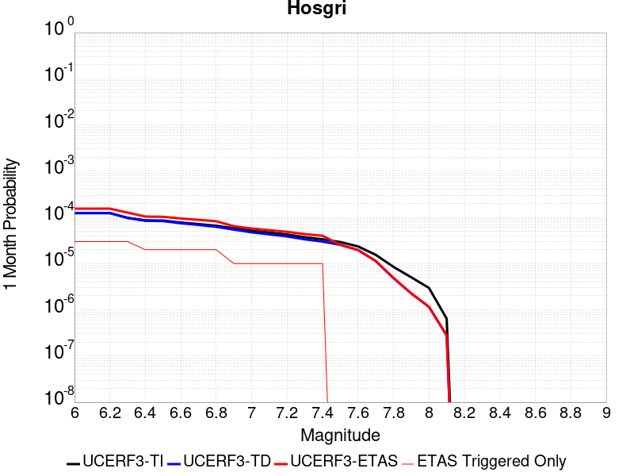 |  |  |

| Magnitude | 1 wk TI Prob | 1 wk TD Prob | 1 wk ETAS Prob | 1 wk ETAS/TD Gain | 1 wk ETAS Triggered Only | 1 mo TI Prob | 1 mo TD Prob | 1 mo ETAS Prob | 1 mo ETAS/TD Gain | 1 mo ETAS Triggered Only | 1 yr TI Prob | 1 yr TD Prob | 1 yr ETAS Prob | 1 yr ETAS/TD Gain | 1 yr ETAS Triggered Only | 10 yr TI Prob | 10 yr TD Prob | 10 yr ETAS Prob | 10 yr ETAS/TD Gain | 10 yr ETAS Triggered Only |
|-----|-----|-----|-----|-----|-----|-----|-----|-----|-----|-----|-----|-----|-----|-----|-----|-----|-----|-----|-----|-----|
| 6.0 | 2.883978E-5 | 2.9128416E-5 | 1.4526905E-4 | 4.9871936 | 1.16144016E-4 | 1.235932E-4 | 1.2483024E-4 | 2.4095977E-4 | 1.9302995 | 1.16144016E-4 | 0.0015037085 | 0.001518776 | 0.0016347435 | 1.0763559 | 1.16144016E-4 | 0.01493574 | 0.01508774 | 0.015202131 | 1.0075817 | 1.16144016E-4 |
| 6.1 | 2.883978E-5 | 2.9128416E-5 | 1.4526905E-4 | 4.9871936 | 1.16144016E-4 | 1.235932E-4 | 1.2483024E-4 | 2.4095977E-4 | 1.9302995 | 1.16144016E-4 | 0.0015037085 | 0.001518776 | 0.0016347435 | 1.0763559 | 1.16144016E-4 | 0.01493574 | 0.01508774 | 0.015202131 | 1.0075817 | 1.16144016E-4 |
| 6.2 | 2.883978E-5 | 2.9128416E-5 | 1.4526905E-4 | 4.9871936 | 1.16144016E-4 | 1.235932E-4 | 1.2483024E-4 | 2.4095977E-4 | 1.9302995 | 1.16144016E-4 | 0.0015037085 | 0.001518776 | 0.0016347435 | 1.0763559 | 1.16144016E-4 | 0.01493574 | 0.01508774 | 0.015202131 | 1.0075817 | 1.16144016E-4 |
| 6.3 | 2.2914428E-5 | 2.2641969E-5 | 1.3878336E-4 | 6.1294737 | 1.16144016E-4 | 9.8200995E-5 | 9.703343E-5 | 2.1316617E-4 | 2.1968324 | 1.16144016E-4 | 0.0011949413 | 0.0011807467 | 0.0012967535 | 1.0982487 | 1.16144016E-4 | 0.011885363 | 0.011746133 | 0.011860913 | 1.0097717 | 1.16144016E-4 |
| 6.4 | 2.0195741E-5 | 1.969656E-5 | 1.3583829E-4 | 6.8965487 | 1.16144016E-4 | 8.65503E-5 | 8.4411105E-5 | 2.0054533E-4 | 2.3758168 | 1.16144016E-4 | 0.0010532405 | 0.0010272227 | 0.0011432474 | 1.11295 | 1.16144016E-4 | 0.010482626 | 0.010225792 | 0.010340749 | 1.0112418 | 1.16144016E-4 |
| 6.5 | 1.9924333E-5 | 1.940898E-5 | 1.3555074E-4 | 6.9839187 | 1.16144016E-4 | 8.53872E-5 | 8.3178704E-5 | 1.9931306E-4 | 2.396203 | 1.16144016E-4 | 0.0010390934 | 0.0010122322 | 0.0011282586 | 1.1146244 | 1.16144016E-4 | 0.010342481 | 0.010077253 | 0.010192227 | 1.0114092 | 1.16144016E-4 |
| 6.6 | 1.809694E-5 | 1.74583E-5 | 1.3360029E-4 | 7.6525373 | 1.16144016E-4 | 7.7556004E-5 | 7.4819145E-5 | 1.9095448E-4 | 2.552214 | 1.16144016E-4 | 9.438353E-4 | 9.105437E-4 | 0.001026582 | 1.1274384 | 1.16144016E-4 | 0.009398366 | 0.009069073 | 0.009184164 | 1.0126904 | 1.16144016E-4 |
| 6.7 | 1.675989E-5 | 1.6042764E-5 | 1.3218493E-4 | 8.239534 | 1.16144016E-4 | 7.182612E-5 | 6.87529E-5 | 1.8488894E-4 | 2.6891801 | 1.16144016E-4 | 8.7413215E-4 | 8.3674624E-4 | 9.5279305E-4 | 1.1386882 | 1.16144016E-4 | 0.008707017 | 0.0083368635 | 0.008452039 | 1.0138153 | 1.16144016E-4 |
| 6.8 | 1.5401129E-5 | 1.4614083E-5 | 1.3075641E-4 | 8.947288 | 1.16144016E-4 | 6.6003166E-5 | 6.2630286E-5 | 1.7876703E-4 | 2.8543224 | 1.16144016E-4 | 8.032922E-4 | 7.622578E-4 | 8.7831327E-4 | 1.1522523 | 1.16144016E-4 | 0.008003947 | 0.007597296 | 0.007712558 | 1.0151714 | 1.16144016E-4 |
| 6.9 | 1.356559E-5 | 1.2689968E-5 | 1.2689968E-5 | 1.0 | 0.0 | 5.8136946E-5 | 5.4384444E-5 | 5.4384444E-5 | 1.0 | 0.0 | 7.0758746E-4 | 6.619299E-4 | 6.619299E-4 | 1.0 | 0.0 | 0.007053386 | 0.006600388 | 0.006600388 | 1.0 | 0.0 |
| 7.0 | 1.2030819E-5 | 1.1095962E-5 | 1.1095962E-5 | 1.0 | 0.0 | 5.155963E-5 | 4.7553254E-5 | 4.7553254E-5 | 1.0 | 0.0 | 6.275577E-4 | 5.7880714E-4 | 5.7880714E-4 | 1.0 | 0.0 | 0.006257884 | 0.005773757 | 0.005773757 | 1.0 | 0.0 |
| 7.1 | 1.0972698E-5 | 1.0022179E-5 | 1.0022179E-5 | 1.0 | 0.0 | 4.7025E-5 | 4.2951488E-5 | 4.2951488E-5 | 1.0 | 0.0 | 5.72379E-4 | 5.22809E-4 | 5.22809E-4 | 1.0 | 0.0 | 0.0057090693 | 0.005216542 | 0.005216542 | 1.0 | 0.0 |
| 7.2 | 9.961926E-6 | 9.034746E-6 | 9.034746E-6 | 1.0 | 0.0 | 4.2693267E-5 | 3.8719765E-5 | 3.8719765E-5 | 1.0 | 0.0 | 5.1966653E-4 | 4.713112E-4 | 4.713112E-4 | 1.0 | 0.0 | 0.00518453 | 0.0047038626 | 0.0047038626 | 1.0 | 0.0 |
| 7.3 | 8.700929E-6 | 7.8281E-6 | 7.8281E-6 | 1.0 | 0.0 | 3.7289166E-5 | 3.354857E-5 | 3.354857E-5 | 1.0 | 0.0 | 4.53901E-4 | 4.0837732E-4 | 4.0837732E-4 | 1.0 | 0.0 | 0.00452975 | 0.004077008 | 0.004077008 | 1.0 | 0.0 |
| 7.4 | 7.866285E-6 | 6.998739E-6 | 6.998739E-6 | 1.0 | 0.0 | 3.3712215E-5 | 2.9994251E-5 | 2.9994251E-5 | 1.0 | 0.0 | 4.103689E-4 | 3.6511885E-4 | 3.6511885E-4 | 1.0 | 0.0 | 0.004096119 | 0.0036459267 | 0.0036459267 | 1.0 | 0.0 |
| 7.5 | 6.8381305E-6 | 5.9596955E-6 | 5.9596955E-6 | 1.0 | 0.0 | 2.9305946E-5 | 2.5541302E-5 | 2.5541302E-5 | 1.0 | 0.0 | 3.5674145E-4 | 3.10921E-4 | 3.10921E-4 | 1.0 | 0.0 | 0.0035616932 | 0.0031055948 | 0.0031055948 | 1.0 | 0.0 |
| 7.6 | 5.503376E-6 | 4.5952443E-6 | 4.5952443E-6 | 1.0 | 0.0 | 2.3585684E-5 | 1.9693754E-5 | 1.9693754E-5 | 1.0 | 0.0 | 2.8711787E-4 | 2.397451E-4 | 2.397451E-4 | 1.0 | 0.0 | 0.002867472 | 0.0023955975 | 0.0023955975 | 1.0 | 0.0 |
| 7.7 | 3.6144982E-6 | 2.6522112E-6 | 2.6522112E-6 | 1.0 | 0.0 | 1.5490614E-5 | 1.1366569E-5 | 1.1366569E-5 | 1.0 | 0.0 | 1.8858191E-4 | 1.383792E-4 | 1.383792E-4 | 1.0 | 0.0 | 0.0018842196 | 0.0013836613 | 0.0013836613 | 1.0 | 0.0 |
| 7.8 | 1.9853494E-6 | 1.1361129E-6 | 1.1361129E-6 | 1.0 | 0.0 | 8.508612E-6 | 4.8690463E-6 | 4.8690463E-6 | 1.0 | 0.0 | 1.0358743E-4 | 5.9279027E-5 | 5.9279027E-5 | 1.0 | 0.0 | 0.0010353916 | 5.9336185E-4 | 5.9336185E-4 | 1.0 | 0.0 |
| 7.9 | 1.1818757E-6 | 5.2951856E-7 | 5.2951856E-7 | 1.0 | 0.0 | 5.0651715E-6 | 2.2693632E-6 | 2.2693632E-6 | 1.0 | 0.0 | 6.1666724E-5 | 2.7629147E-5 | 2.7629147E-5 | 1.0 | 0.0 | 6.1649614E-4 | 2.7694515E-4 | 2.7694515E-4 | 1.0 | 0.0 |
| 8.0 | 6.962958E-7 | 2.7139782E-7 | 2.7139782E-7 | 1.0 | 0.0 | 2.9841215E-6 | 1.163133E-6 | 1.163133E-6 | 1.0 | 0.0 | 3.6331072E-5 | 1.4161053E-5 | 1.4161053E-5 | 1.0 | 0.0 | 3.6325134E-4 | 1.4217179E-4 | 1.4217179E-4 | 1.0 | 0.0 |
| 8.1 | 1.5033264E-7 | 6.527624E-8 | 6.527624E-8 | 1.0 | 0.0 | 6.442826E-7 | 2.7975528E-7 | 2.7975528E-7 | 1.0 | 0.0 | 7.844113E-6 | 3.4060151E-6 | 3.4060151E-6 | 1.0 | 0.0 | 7.843835E-5 | 3.407693E-5 | 3.407693E-5 | 1.0 | 0.0 |

## Blue Cut
*[(top)](#table-of-contents)*

| 1 Week | 1 Month | 1 Year | 10 Year |
|-----|-----|-----|-----|
|  |  | 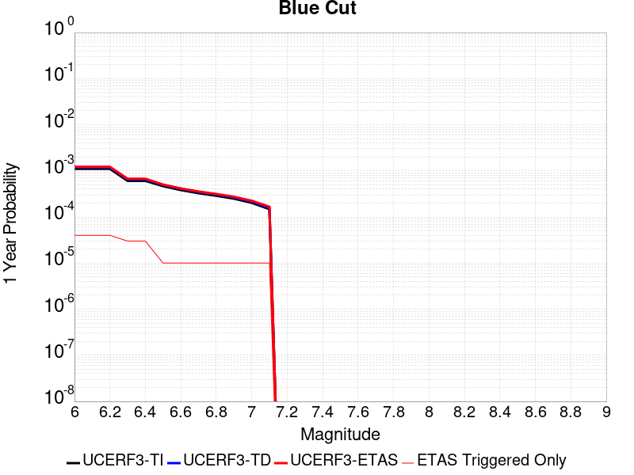 |  |

| Magnitude | 1 wk TI Prob | 1 wk TD Prob | 1 wk ETAS Prob | 1 wk ETAS/TD Gain | 1 wk ETAS Triggered Only | 1 mo TI Prob | 1 mo TD Prob | 1 mo ETAS Prob | 1 mo ETAS/TD Gain | 1 mo ETAS Triggered Only | 1 yr TI Prob | 1 yr TD Prob | 1 yr ETAS Prob | 1 yr ETAS/TD Gain | 1 yr ETAS Triggered Only | 10 yr TI Prob | 10 yr TD Prob | 10 yr ETAS Prob | 10 yr ETAS/TD Gain | 10 yr ETAS Triggered Only |
|-----|-----|-----|-----|-----|-----|-----|-----|-----|-----|-----|-----|-----|-----|-----|-----|-----|-----|-----|-----|-----|
| 6.0 | 2.1227985E-5 | 2.2719574E-5 | 2.2719574E-5 | 1.0 | 0.0 | 9.097391E-5 | 9.73663E-5 | 9.73663E-5 | 1.0 | 0.0 | 0.0011070445 | 0.0011848481 | 0.0013008545 | 1.0979083 | 1.16144016E-4 | 0.011015458 | 0.011791152 | 0.011905926 | 1.0097339 | 1.16144016E-4 |
| 6.1 | 2.1227985E-5 | 2.2719574E-5 | 2.2719574E-5 | 1.0 | 0.0 | 9.097391E-5 | 9.73663E-5 | 9.73663E-5 | 1.0 | 0.0 | 0.0011070445 | 0.0011848481 | 0.0013008545 | 1.0979083 | 1.16144016E-4 | 0.011015458 | 0.011791152 | 0.011905926 | 1.0097339 | 1.16144016E-4 |
| 6.2 | 2.1227985E-5 | 2.2719574E-5 | 2.2719574E-5 | 1.0 | 0.0 | 9.097391E-5 | 9.73663E-5 | 9.73663E-5 | 1.0 | 0.0 | 0.0011070445 | 0.0011848481 | 0.0013008545 | 1.0979083 | 1.16144016E-4 | 0.011015458 | 0.011791152 | 0.011905926 | 1.0097339 | 1.16144016E-4 |
| 6.3 | 1.1613981E-5 | 1.2353542E-5 | 1.2353542E-5 | 1.0 | 0.0 | 4.9773254E-5 | 5.2942745E-5 | 5.2942745E-5 | 1.0 | 0.0 | 6.0582085E-4 | 6.443998E-4 | 6.443998E-4 | 1.0 | 0.0 | 0.0060417196 | 0.0064265593 | 0.0064265593 | 1.0 | 0.0 |
| 6.4 | 1.1613981E-5 | 1.2353542E-5 | 1.2353542E-5 | 1.0 | 0.0 | 4.9773254E-5 | 5.2942745E-5 | 5.2942745E-5 | 1.0 | 0.0 | 6.0582085E-4 | 6.443998E-4 | 6.443998E-4 | 1.0 | 0.0 | 0.0060417196 | 0.0064265593 | 0.0064265593 | 1.0 | 0.0 |
| 6.5 | 8.931326E-6 | 9.4816E-6 | 9.4816E-6 | 1.0 | 0.0 | 3.8276554E-5 | 4.0634844E-5 | 4.0634844E-5 | 1.0 | 0.0 | 4.6591737E-4 | 4.946261E-4 | 4.946261E-4 | 1.0 | 0.0 | 0.0046494175 | 0.004936161 | 0.004936161 | 1.0 | 0.0 |
| 6.6 | 7.345353E-6 | 7.79028E-6 | 7.79028E-6 | 1.0 | 0.0 | 3.1479703E-5 | 3.338653E-5 | 3.338653E-5 | 1.0 | 0.0 | 3.83198E-4 | 4.064132E-4 | 4.064132E-4 | 1.0 | 0.0 | 0.0038253788 | 0.0040574907 | 0.0040574907 | 1.0 | 0.0 |
| 6.7 | 6.2775666E-6 | 6.655149E-6 | 6.655149E-6 | 1.0 | 0.0 | 2.690358E-5 | 2.8521798E-5 | 2.8521798E-5 | 1.0 | 0.0 | 3.2750185E-4 | 3.472051E-4 | 3.472051E-4 | 1.0 | 0.0 | 0.0032701963 | 0.003467367 | 0.003467367 | 1.0 | 0.0 |
| 6.8 | 5.5234095E-6 | 5.8551113E-6 | 5.8551113E-6 | 1.0 | 0.0 | 2.367154E-5 | 2.5093133E-5 | 2.5093133E-5 | 1.0 | 0.0 | 2.8816288E-4 | 3.0547334E-4 | 3.0547334E-4 | 1.0 | 0.0 | 0.002877895 | 0.0030512505 | 0.0030512505 | 1.0 | 0.0 |
| 6.9 | 4.7780054E-6 | 5.0654203E-6 | 5.0654203E-6 | 1.0 | 0.0 | 2.0477004E-5 | 2.1708804E-5 | 2.1708804E-5 | 1.0 | 0.0 | 2.4927902E-4 | 2.642797E-4 | 2.642797E-4 | 1.0 | 0.0 | 0.0024899957 | 0.002640346 | 0.002640346 | 1.0 | 0.0 |
| 7.0 | 3.883171E-6 | 4.118487E-6 | 4.118487E-6 | 1.0 | 0.0 | 1.6642054E-5 | 1.7650578E-5 | 1.7650578E-5 | 1.0 | 0.0 | 2.0259817E-4 | 2.1488148E-4 | 2.1488148E-4 | 1.0 | 0.0 | 0.0020241356 | 0.0021474129 | 0.0021474129 | 1.0 | 0.0 |
| 7.1 | 2.8358215E-6 | 3.0097158E-6 | 3.0097158E-6 | 1.0 | 0.0 | 1.2153464E-5 | 1.2898756E-5 | 1.2898756E-5 | 1.0 | 0.0 | 1.4795837E-4 | 1.5703762E-4 | 1.5703762E-4 | 1.0 | 0.0 | 0.001478599 | 0.0015699116 | 0.0015699116 | 1.0 | 0.0 |

## San Gregorio (North) 2011 CFM
*[(top)](#table-of-contents)*

| 1 Week | 1 Month | 1 Year | 10 Year |
|-----|-----|-----|-----|
|  |  |  |  |

| Magnitude | 1 wk TI Prob | 1 wk TD Prob | 1 wk ETAS Prob | 1 wk ETAS/TD Gain | 1 wk ETAS Triggered Only | 1 mo TI Prob | 1 mo TD Prob | 1 mo ETAS Prob | 1 mo ETAS/TD Gain | 1 mo ETAS Triggered Only | 1 yr TI Prob | 1 yr TD Prob | 1 yr ETAS Prob | 1 yr ETAS/TD Gain | 1 yr ETAS Triggered Only | 10 yr TI Prob | 10 yr TD Prob | 10 yr ETAS Prob | 10 yr ETAS/TD Gain | 10 yr ETAS Triggered Only |
|-----|-----|-----|-----|-----|-----|-----|-----|-----|-----|-----|-----|-----|-----|-----|-----|-----|-----|-----|-----|-----|
| 6.0 | 5.0283932E-5 | 4.3057815E-5 | 4.3057815E-5 | 1.0 | 0.0 | 2.1548476E-4 | 1.8452053E-4 | 1.8452053E-4 | 1.0 | 0.0 | 0.0026203706 | 0.002244237 | 0.002244237 | 1.0 | 0.0 | 0.02589687 | 0.022293162 | 0.022406718 | 1.0050937 | 1.16144016E-4 |
| 6.1 | 5.0283932E-5 | 4.3057815E-5 | 4.3057815E-5 | 1.0 | 0.0 | 2.1548476E-4 | 1.8452053E-4 | 1.8452053E-4 | 1.0 | 0.0 | 0.0026203706 | 0.002244237 | 0.002244237 | 1.0 | 0.0 | 0.02589687 | 0.022293162 | 0.022406718 | 1.0050937 | 1.16144016E-4 |
| 6.2 | 4.2998647E-5 | 3.4441564E-5 | 3.4441564E-5 | 1.0 | 0.0 | 1.842669E-4 | 1.475984E-4 | 1.475984E-4 | 1.0 | 0.0 | 0.0022411412 | 0.00179554 | 0.00179554 | 1.0 | 0.0 | 0.022186736 | 0.017886506 | 0.018000573 | 1.0063772 | 1.16144016E-4 |
| 6.3 | 4.2998647E-5 | 3.4441564E-5 | 3.4441564E-5 | 1.0 | 0.0 | 1.842669E-4 | 1.475984E-4 | 1.475984E-4 | 1.0 | 0.0 | 0.0022411412 | 0.00179554 | 0.00179554 | 1.0 | 0.0 | 0.022186736 | 0.017886506 | 0.018000573 | 1.0063772 | 1.16144016E-4 |
| 6.4 | 4.1101295E-5 | 3.2326872E-5 | 3.2326872E-5 | 1.0 | 0.0 | 1.7613651E-4 | 1.3853642E-4 | 1.3853642E-4 | 1.0 | 0.0 | 0.0021423528 | 0.0016853869 | 0.0016853869 | 1.0 | 0.0 | 0.02121817 | 0.016801886 | 0.016916078 | 1.0067964 | 1.16144016E-4 |
| 6.5 | 4.1032585E-5 | 3.2244905E-5 | 3.2244905E-5 | 1.0 | 0.0 | 1.7584208E-4 | 1.3818518E-4 | 1.3818518E-4 | 1.0 | 0.0 | 0.0021387753 | 0.0016811171 | 0.0016811171 | 1.0 | 0.0 | 0.021183075 | 0.016759839 | 0.016874036 | 1.0068138 | 1.16144016E-4 |
| 6.6 | 4.011629E-5 | 3.1266558E-5 | 3.1266558E-5 | 1.0 | 0.0 | 1.7191563E-4 | 1.339927E-4 | 1.339927E-4 | 1.0 | 0.0 | 0.0020910634 | 0.0016301516 | 0.0016301516 | 1.0 | 0.0 | 0.020714961 | 0.01625741 | 0.016371667 | 1.0070279 | 1.16144016E-4 |
| 6.7 | 3.8583938E-5 | 2.9453593E-5 | 2.9453593E-5 | 1.0 | 0.0 | 1.6534925E-4 | 1.2622366E-4 | 1.2622366E-4 | 1.0 | 0.0 | 0.0020112682 | 0.0015357039 | 0.0015357039 | 1.0 | 0.0 | 0.019931622 | 0.015325955 | 0.015440319 | 1.0074621 | 1.16144016E-4 |
| 6.8 | 3.44341E-5 | 2.4450854E-5 | 2.4450854E-5 | 1.0 | 0.0 | 1.4756636E-4 | 1.0478523E-4 | 1.0478523E-4 | 1.0 | 0.0 | 0.0017951399 | 0.0012750238 | 0.0012750238 | 1.0 | 0.0 | 0.017807078 | 0.012751131 | 0.012865795 | 1.0089924 | 1.16144016E-4 |
| 6.9 | 3.221199E-5 | 2.1778029E-5 | 2.1778029E-5 | 1.0 | 0.0 | 1.3804408E-4 | 9.333112E-5 | 9.333112E-5 | 1.0 | 0.0 | 0.0016793909 | 0.0011357224 | 0.0011357224 | 1.0 | 0.0 | 0.01666756 | 0.011372583 | 0.011487407 | 1.0100964 | 1.16144016E-4 |
| 7.0 | 2.9186718E-5 | 1.8146875E-5 | 1.8146875E-5 | 1.0 | 0.0 | 1.2507994E-4 | 7.7770026E-5 | 7.7770026E-5 | 1.0 | 0.0 | 0.0015217843 | 9.464431E-4 | 9.464431E-4 | 1.0 | 0.0 | 0.015114053 | 0.009496798 | 0.009611839 | 1.0121137 | 1.16144016E-4 |
| 7.1 | 2.6840138E-5 | 1.5284508E-5 | 1.5284508E-5 | 1.0 | 0.0 | 1.1502409E-4 | 6.55034E-5 | 6.55034E-5 | 1.0 | 0.0 | 0.0013995186 | 7.9721404E-4 | 7.9721404E-4 | 1.0 | 0.0 | 0.013907375 | 0.008015723 | 0.008130936 | 1.0143734 | 1.16144016E-4 |
| 7.2 | 2.453002E-5 | 1.2606672E-5 | 1.2606672E-5 | 1.0 | 0.0 | 1.05124425E-4 | 5.4027478E-5 | 5.4027478E-5 | 1.0 | 0.0 | 0.0012791384 | 6.575866E-4 | 6.575866E-4 | 1.0 | 0.0 | 0.012718005 | 0.00662763 | 0.006743004 | 1.017408 | 1.16144016E-4 |
| 7.3 | 2.3330727E-5 | 1.1488677E-5 | 1.1488677E-5 | 1.0 | 0.0 | 9.9985E-5 | 4.923626E-5 | 4.923626E-5 | 1.0 | 0.0 | 0.0012166376 | 5.9928704E-4 | 5.9928704E-4 | 1.0 | 0.0 | 0.012099981 | 0.006046564 | 0.006046564 | 1.0 | 0.0 |
| 7.4 | 2.2136466E-5 | 1.0368981E-5 | 1.0368981E-5 | 1.0 | 0.0 | 9.486712E-5 | 4.4437733E-5 | 4.4437733E-5 | 1.0 | 0.0 | 0.0011543952 | 5.4089533E-4 | 5.4089533E-4 | 1.0 | 0.0 | 0.011484168 | 0.005464249 | 0.005464249 | 1.0 | 0.0 |
| 7.5 | 2.0994974E-5 | 9.427217E-6 | 9.427217E-6 | 1.0 | 0.0 | 8.997535E-5 | 4.0401734E-5 | 4.0401734E-5 | 1.0 | 0.0 | 0.0010948994 | 4.9178035E-4 | 4.9178035E-4 | 1.0 | 0.0 | 0.010895205 | 0.004973358 | 0.004973358 | 1.0 | 0.0 |
| 7.6 | 1.7091823E-5 | 6.893766E-6 | 6.893766E-6 | 1.0 | 0.0 | 7.3248615E-5 | 2.9544377E-5 | 2.9544377E-5 | 1.0 | 0.0 | 8.9143694E-4 | 3.596435E-4 | 3.596435E-4 | 1.0 | 0.0 | 0.008878695 | 0.0036482841 | 0.0036482841 | 1.0 | 0.0 |
| 7.7 | 1.2772179E-5 | 4.0208706E-6 | 4.0208706E-6 | 1.0 | 0.0 | 5.473676E-5 | 1.7232189E-5 | 1.7232189E-5 | 1.0 | 0.0 | 6.6621625E-4 | 2.0978172E-4 | 2.0978172E-4 | 1.0 | 0.0 | 0.006642225 | 0.002136922 | 0.002136922 | 1.0 | 0.0 |
| 7.8 | 7.041923E-6 | 1.940626E-6 | 1.940626E-6 | 1.0 | 0.0 | 3.017932E-5 | 8.316942E-6 | 8.316942E-6 | 1.0 | 0.0 | 3.6737128E-4 | 1.0125406E-4 | 1.0125406E-4 | 1.0 | 0.0 | 0.0036676454 | 0.0010379003 | 0.0010379003 | 1.0 | 0.0 |
| 7.9 | 2.946768E-6 | 1.0033551E-6 | 1.0033551E-6 | 1.0 | 0.0 | 1.2628945E-5 | 4.300086E-6 | 4.300086E-6 | 1.0 | 0.0 | 1.5374656E-4 | 5.235229E-5 | 5.235229E-5 | 1.0 | 0.0 | 0.0015364023 | 5.3400313E-4 | 5.3400313E-4 | 1.0 | 0.0 |
| 8.0 | 1.1433375E-6 | 5.18146E-7 | 5.18146E-7 | 1.0 | 0.0 | 4.9000087E-6 | 2.2206239E-6 | 2.2206239E-6 | 1.0 | 0.0 | 5.965597E-5 | 2.703576E-5 | 2.703576E-5 | 1.0 | 0.0 | 5.963996E-4 | 2.7398416E-4 | 2.7398416E-4 | 1.0 | 0.0 |
| 8.1 | 2.6675295E-7 | 1.62899E-7 | 1.62899E-7 | 1.0 | 0.0 | 1.1432264E-6 | 6.9813836E-7 | 6.9813836E-7 | 1.0 | 0.0 | 1.3918692E-5 | 8.499802E-6 | 8.499802E-6 | 1.0 | 0.0 | 1.391782E-4 | 8.63795E-5 | 8.63795E-5 | 1.0 | 0.0 |
| 8.2 | 1.2704569E-8 | 9.431393E-9 | 9.431393E-9 | 1.0 | 0.0 | 5.444815E-8 | 4.042026E-8 | 4.042026E-8 | 1.0 | 0.0 | 6.629061E-7 | 4.9211656E-7 | 4.9211656E-7 | 1.0 | 0.0 | 6.629041E-6 | 5.1121438E-6 | 5.1121438E-6 | 1.0 | 0.0 |

## Hosgri (Extension)
*[(top)](#table-of-contents)*

| 1 Week | 1 Month | 1 Year | 10 Year |
|-----|-----|-----|-----|
|  |  |  |  |

| Magnitude | 1 wk TI Prob | 1 wk TD Prob | 1 wk ETAS Prob | 1 wk ETAS/TD Gain | 1 wk ETAS Triggered Only | 1 mo TI Prob | 1 mo TD Prob | 1 mo ETAS Prob | 1 mo ETAS/TD Gain | 1 mo ETAS Triggered Only | 1 yr TI Prob | 1 yr TD Prob | 1 yr ETAS Prob | 1 yr ETAS/TD Gain | 1 yr ETAS Triggered Only | 10 yr TI Prob | 10 yr TD Prob | 10 yr ETAS Prob | 10 yr ETAS/TD Gain | 10 yr ETAS Triggered Only |
|-----|-----|-----|-----|-----|-----|-----|-----|-----|-----|-----|-----|-----|-----|-----|-----|-----|-----|-----|-----|-----|
| 6.0 | 1.1369135E-5 | 1.2083072E-5 | 1.2822569E-4 | 10.612011 | 1.16144016E-4 | 4.8723956E-5 | 5.1783692E-5 | 1.679217E-4 | 3.2427523 | 1.16144016E-4 | 5.9305265E-4 | 6.3030684E-4 | 7.463776E-4 | 1.1841497 | 1.16144016E-4 | 0.005914725 | 0.0062874397 | 0.0064028534 | 1.0183562 | 1.16144016E-4 |
| 6.1 | 6.934979E-6 | 7.324555E-6 | 1.2346772E-4 | 16.856686 | 1.16144016E-4 | 2.9721E-5 | 3.1390595E-5 | 1.4753097E-4 | 4.6998463 | 1.16144016E-4 | 3.617931E-4 | 3.8211764E-4 | 4.9821724E-4 | 1.3038322 | 1.16144016E-4 | 0.0036120464 | 0.0038150186 | 0.0039307196 | 1.0303278 | 1.16144016E-4 |
| 6.2 | 6.934979E-6 | 7.324555E-6 | 1.2346772E-4 | 16.856686 | 1.16144016E-4 | 2.9721E-5 | 3.1390595E-5 | 1.4753097E-4 | 4.6998463 | 1.16144016E-4 | 3.617931E-4 | 3.8211764E-4 | 4.9821724E-4 | 1.3038322 | 1.16144016E-4 | 0.0036120464 | 0.0038150186 | 0.0039307196 | 1.0303278 | 1.16144016E-4 |
| 6.3 | 4.5484676E-6 | 4.76933E-6 | 1.20912795E-4 | 25.352154 | 1.16144016E-4 | 1.9493287E-5 | 2.043983E-5 | 1.3658147E-4 | 6.682124 | 1.16144016E-4 | 2.3730492E-4 | 2.4882692E-4 | 3.6494204E-4 | 1.4666501 | 1.16144016E-4 | 0.0023705168 | 0.0024855258 | 0.0026013812 | 1.046612 | 1.16144016E-4 |
| 6.4 | 4.218095E-6 | 4.4168614E-6 | 1.2056037E-4 | 27.295483 | 1.16144016E-4 | 1.8077424E-5 | 1.8929271E-5 | 1.350711E-4 | 7.1355677 | 1.16144016E-4 | 2.2007042E-4 | 2.3043984E-4 | 3.465571E-4 | 1.503894 | 1.16144016E-4 | 0.002198526 | 0.0023020422 | 0.002417919 | 1.0503365 | 1.16144016E-4 |
| 6.5 | 3.717374E-6 | 3.8838775E-6 | 1.2002744E-4 | 30.904024 | 1.16144016E-4 | 1.5931506E-5 | 1.6645085E-5 | 1.3278717E-4 | 7.9775605 | 1.16144016E-4 | 1.9394881E-4 | 2.0263524E-4 | 3.1875572E-4 | 1.5730518 | 1.16144016E-4 | 0.0019377962 | 0.0020245234 | 0.0021404324 | 1.0572524 | 1.16144016E-4 |
| 6.6 | 3.4605036E-6 | 3.608306E-6 | 1.1975191E-4 | 33.187847 | 1.16144016E-4 | 1.4830645E-5 | 1.5464078E-5 | 1.316063E-4 | 8.510452 | 1.16144016E-4 | 1.8054814E-4 | 1.8825903E-4 | 3.043812E-4 | 1.6168212 | 1.16144016E-4 | 0.0018040152 | 0.0018810101 | 0.0019969356 | 1.0616294 | 1.16144016E-4 |
| 6.7 | 3.123439E-6 | 3.2465687E-6 | 1.1939021E-4 | 36.774277 | 1.16144016E-4 | 1.33860985E-5 | 1.3913792E-5 | 1.300562E-4 | 9.347286 | 1.16144016E-4 | 1.6296357E-4 | 1.6938736E-4 | 2.855117E-4 | 1.685555 | 1.16144016E-4 | 0.001628441 | 0.0016925934 | 0.0018085409 | 1.0685028 | 1.16144016E-4 |
| 6.8 | 2.8290783E-6 | 2.9305404E-6 | 1.1907422E-4 | 40.63217 | 1.16144016E-4 | 1.2124565E-5 | 1.2559399E-5 | 1.2870195E-4 | 10.247462 | 1.16144016E-4 | 1.4760658E-4 | 1.5290003E-4 | 2.690263E-4 | 1.7594914 | 1.16144016E-4 | 0.0014750857 | 0.001527957 | 0.0016439236 | 1.0758965 | 1.16144016E-4 |
| 6.9 | 2.454112E-6 | 2.5283196E-6 | 2.5283196E-6 | 1.0 | 0.0 | 1.0517581E-5 | 1.0835611E-5 | 1.0835611E-5 | 1.0 | 0.0 | 1.2804402E-4 | 1.3191563E-4 | 1.3191563E-4 | 1.0 | 0.0 | 0.0012797028 | 0.0013183793 | 0.0013183793 | 1.0 | 0.0 |
| 7.0 | 2.1008145E-6 | 2.1498704E-6 | 2.1498704E-6 | 1.0 | 0.0 | 9.003459E-6 | 9.213698E-6 | 9.213698E-6 | 1.0 | 0.0 | 1.096116E-4 | 1.1217103E-4 | 1.1217103E-4 | 1.0 | 0.0 | 0.0010955755 | 0.0011211479 | 0.0011211479 | 1.0 | 0.0 |
| 7.1 | 1.744384E-6 | 1.7686352E-6 | 1.7686352E-6 | 1.0 | 0.0 | 7.47591E-6 | 7.5798434E-6 | 7.5798434E-6 | 1.0 | 0.0 | 9.1015405E-5 | 9.22807E-5 | 9.22807E-5 | 1.0 | 0.0 | 9.097813E-4 | 9.2242553E-4 | 9.2242553E-4 | 1.0 | 0.0 |
| 7.2 | 1.5456587E-6 | 1.5562882E-6 | 1.5562882E-6 | 1.0 | 0.0 | 6.6242346E-6 | 6.66979E-6 | 6.66979E-6 | 1.0 | 0.0 | 8.064707E-5 | 8.120168E-5 | 8.120168E-5 | 1.0 | 0.0 | 8.0617814E-4 | 8.117213E-4 | 8.117213E-4 | 1.0 | 0.0 |
| 7.3 | 1.3775123E-6 | 1.3766082E-6 | 1.3766082E-6 | 1.0 | 0.0 | 5.9036106E-6 | 5.899736E-6 | 5.899736E-6 | 1.0 | 0.0 | 7.187409E-5 | 7.182693E-5 | 7.182693E-5 | 1.0 | 0.0 | 7.185085E-4 | 7.180382E-4 | 7.180382E-4 | 1.0 | 0.0 |
| 7.4 | 1.214491E-6 | 1.2023461E-6 | 1.2023461E-6 | 1.0 | 0.0 | 5.2049513E-6 | 5.1529014E-6 | 5.1529014E-6 | 1.0 | 0.0 | 6.336844E-5 | 6.2734776E-5 | 6.2734776E-5 | 1.0 | 0.0 | 6.335037E-4 | 6.271715E-4 | 6.271715E-4 | 1.0 | 0.0 |
| 7.5 | 1.0101123E-6 | 9.842246E-7 | 9.842246E-7 | 1.0 | 0.0 | 4.3290456E-6 | 4.2180986E-6 | 4.2180986E-6 | 1.0 | 0.0 | 5.2704854E-5 | 5.1354145E-5 | 5.1354145E-5 | 1.0 | 0.0 | 5.2692357E-4 | 5.1342335E-4 | 5.1342335E-4 | 1.0 | 0.0 |
| 7.6 | 8.1558215E-7 | 7.765966E-7 | 7.765966E-7 | 1.0 | 0.0 | 3.4953473E-6 | 3.328267E-6 | 3.328267E-6 | 1.0 | 0.0 | 4.255502E-5 | 4.0520903E-5 | 4.0520903E-5 | 1.0 | 0.0 | 4.2546875E-4 | 4.0513556E-4 | 4.0513556E-4 | 1.0 | 0.0 |
| 7.7 | 4.757816E-7 | 4.1308888E-7 | 4.1308888E-7 | 1.0 | 0.0 | 2.0390623E-6 | 1.7703798E-6 | 1.7703798E-6 | 1.0 | 0.0 | 2.4825302E-5 | 2.155416E-5 | 2.155416E-5 | 1.0 | 0.0 | 2.482253E-4 | 2.1552083E-4 | 2.1552083E-4 | 1.0 | 0.0 |
| 7.8 | 2.782787E-7 | 2.0047722E-7 | 2.0047722E-7 | 1.0 | 0.0 | 1.1926223E-6 | 8.5918776E-7 | 8.5918776E-7 | 1.0 | 0.0 | 1.452008E-5 | 1.04605615E-5 | 1.04605615E-5 | 1.0 | 0.0 | 1.4519131E-4 | 1.04600724E-4 | 1.04600724E-4 | 1.0 | 0.0 |
| 7.9 | 1.6948086E-7 | 9.244227E-8 | 9.244227E-8 | 1.0 | 0.0 | 7.2634634E-7 | 3.961811E-7 | 3.961811E-7 | 1.0 | 0.0 | 8.843231E-6 | 4.8234942E-6 | 4.8234942E-6 | 1.0 | 0.0 | 8.842879E-5 | 4.8233902E-5 | 4.8233902E-5 | 1.0 | 0.0 |
| 8.0 | 1.0225492E-7 | 4.4738776E-8 | 4.4738776E-8 | 1.0 | 0.0 | 4.382353E-7 | 1.917376E-7 | 1.917376E-7 | 1.0 | 0.0 | 5.335502E-6 | 2.3344028E-6 | 2.3344028E-6 | 1.0 | 0.0 | 5.335374E-5 | 2.3343786E-5 | 2.3343786E-5 | 1.0 | 0.0 |
| 8.1 | 1.43711345E-8 | 5.787707E-9 | 5.787707E-9 | 1.0 | 0.0 | 6.1590576E-8 | 2.480446E-8 | 2.480446E-8 | 1.0 | 0.0 | 7.4986497E-7 | 3.0199428E-7 | 3.0199428E-7 | 1.0 | 0.0 | 7.4986247E-6 | 3.0199392E-6 | 3.0199392E-6 | 1.0 | 0.0 |

## White Mountains
*[(top)](#table-of-contents)*

| 1 Week | 1 Month | 1 Year | 10 Year |
|-----|-----|-----|-----|
|  |  |  |  |

| Magnitude | 1 wk TI Prob | 1 wk TD Prob | 1 wk ETAS Prob | 1 wk ETAS/TD Gain | 1 wk ETAS Triggered Only | 1 mo TI Prob | 1 mo TD Prob | 1 mo ETAS Prob | 1 mo ETAS/TD Gain | 1 mo ETAS Triggered Only | 1 yr TI Prob | 1 yr TD Prob | 1 yr ETAS Prob | 1 yr ETAS/TD Gain | 1 yr ETAS Triggered Only | 10 yr TI Prob | 10 yr TD Prob | 10 yr ETAS Prob | 10 yr ETAS/TD Gain | 10 yr ETAS Triggered Only |
|-----|-----|-----|-----|-----|-----|-----|-----|-----|-----|-----|-----|-----|-----|-----|-----|-----|-----|-----|-----|-----|
| 6.0 | 3.503579E-5 | 3.378405E-5 | 3.378405E-5 | 1.0 | 0.0 | 1.5014476E-4 | 1.4478143E-4 | 1.4478143E-4 | 1.0 | 0.0 | 0.0018264796 | 0.0017614096 | 0.0017614096 | 1.0 | 0.0 | 0.018115403 | 0.017486818 | 0.017600931 | 1.0065256 | 1.16144016E-4 |
| 6.1 | 3.503579E-5 | 3.378405E-5 | 3.378405E-5 | 1.0 | 0.0 | 1.5014476E-4 | 1.4478143E-4 | 1.4478143E-4 | 1.0 | 0.0 | 0.0018264796 | 0.0017614096 | 0.0017614096 | 1.0 | 0.0 | 0.018115403 | 0.017486818 | 0.017600931 | 1.0065256 | 1.16144016E-4 |
| 6.2 | 3.503579E-5 | 3.378405E-5 | 3.378405E-5 | 1.0 | 0.0 | 1.5014476E-4 | 1.4478143E-4 | 1.4478143E-4 | 1.0 | 0.0 | 0.0018264796 | 0.0017614096 | 0.0017614096 | 1.0 | 0.0 | 0.018115403 | 0.017486818 | 0.017600931 | 1.0065256 | 1.16144016E-4 |
| 6.3 | 1.7818425E-5 | 1.5916074E-5 | 1.5916074E-5 | 1.0 | 0.0 | 7.636245E-5 | 6.821004E-5 | 6.821004E-5 | 1.0 | 0.0 | 9.293162E-4 | 8.301551E-4 | 8.301551E-4 | 1.0 | 0.0 | 0.009254395 | 0.008271999 | 0.008271999 | 1.0 | 0.0 |
| 6.4 | 1.7818425E-5 | 1.5916074E-5 | 1.5916074E-5 | 1.0 | 0.0 | 7.636245E-5 | 6.821004E-5 | 6.821004E-5 | 1.0 | 0.0 | 9.293162E-4 | 8.301551E-4 | 8.301551E-4 | 1.0 | 0.0 | 0.009254395 | 0.008271999 | 0.008271999 | 1.0 | 0.0 |
| 6.5 | 1.3397557E-5 | 1.13362685E-5 | 1.13362685E-5 | 1.0 | 0.0 | 5.741684E-5 | 4.858314E-5 | 4.858314E-5 | 1.0 | 0.0 | 6.988258E-4 | 5.913462E-4 | 5.913462E-4 | 1.0 | 0.0 | 0.006966323 | 0.005898432 | 0.005898432 | 1.0 | 0.0 |
| 6.6 | 1.0818695E-5 | 8.625366E-6 | 8.625366E-6 | 1.0 | 0.0 | 4.6365014E-5 | 3.6965357E-5 | 3.6965357E-5 | 1.0 | 0.0 | 5.6434784E-4 | 4.4996463E-4 | 4.4996463E-4 | 1.0 | 0.0 | 0.005629168 | 0.004490972 | 0.004490972 | 1.0 | 0.0 |
| 6.7 | 9.067908E-6 | 6.802442E-6 | 6.802442E-6 | 1.0 | 0.0 | 3.8861883E-5 | 2.9153016E-5 | 2.9153016E-5 | 1.0 | 0.0 | 4.7304068E-4 | 3.5488335E-4 | 3.5488335E-4 | 1.0 | 0.0 | 0.00472035 | 0.0035434833 | 0.0035434833 | 1.0 | 0.0 |
| 6.8 | 7.295947E-6 | 4.936391E-6 | 4.936391E-6 | 1.0 | 0.0 | 3.126797E-5 | 2.1155796E-5 | 2.1155796E-5 | 1.0 | 0.0 | 3.8062103E-4 | 2.575425E-4 | 2.575425E-4 | 1.0 | 0.0 | 0.0037996976 | 0.0025725532 | 0.0025725532 | 1.0 | 0.0 |
| 6.9 | 6.2243444E-6 | 3.832213E-6 | 3.832213E-6 | 1.0 | 0.0 | 2.6675489E-5 | 1.642367E-5 | 1.642367E-5 | 1.0 | 0.0 | 3.2472567E-4 | 1.9994036E-4 | 1.9994036E-4 | 1.0 | 0.0 | 0.0032425157 | 0.0019976576 | 0.0019976576 | 1.0 | 0.0 |
| 7.0 | 4.9878413E-6 | 2.6795342E-6 | 2.6795342E-6 | 1.0 | 0.0 | 2.1376287E-5 | 1.14836685E-5 | 1.14836685E-5 | 1.0 | 0.0 | 2.602252E-4 | 1.3980496E-4 | 1.3980496E-4 | 1.0 | 0.0 | 0.002599207 | 0.0013971963 | 0.0013971963 | 1.0 | 0.0 |
| 7.1 | 4.0252844E-6 | 1.8857575E-6 | 1.8857575E-6 | 1.0 | 0.0 | 1.7251105E-5 | 8.081794E-6 | 8.081794E-6 | 1.0 | 0.0 | 2.1001195E-4 | 9.8391516E-5 | 9.8391516E-5 | 1.0 | 0.0 | 0.0020981359 | 9.834924E-4 | 9.834924E-4 | 1.0 | 0.0 |
| 7.2 | 3.3284066E-6 | 1.281964E-6 | 1.281964E-6 | 1.0 | 0.0 | 1.4264522E-5 | 5.494121E-6 | 5.494121E-6 | 1.0 | 0.0 | 1.736567E-4 | 6.688897E-5 | 6.688897E-5 | 1.0 | 0.0 | 0.0017352107 | 6.6869846E-4 | 6.6869846E-4 | 1.0 | 0.0 |
| 7.3 | 2.458226E-6 | 6.05722E-7 | 6.05722E-7 | 1.0 | 0.0 | 1.0535211E-5 | 2.5959491E-6 | 2.5959491E-6 | 1.0 | 0.0 | 1.2825865E-4 | 3.1605257E-5 | 3.1605257E-5 | 1.0 | 0.0 | 0.0012818464 | 3.160114E-4 | 3.160114E-4 | 1.0 | 0.0 |
| 7.4 | 1.965953E-6 | 3.1089303E-7 | 3.1089303E-7 | 1.0 | 0.0 | 8.425486E-6 | 1.332398E-6 | 1.332398E-6 | 1.0 | 0.0 | 1.0257547E-4 | 1.6221828E-5 | 1.6221828E-5 | 1.0 | 0.0 | 0.0010252813 | 1.6220656E-4 | 1.6220656E-4 | 1.0 | 0.0 |
| 7.5 | 1.2014192E-6 | 1.8244253E-7 | 1.8244253E-7 | 1.0 | 0.0 | 5.148929E-6 | 7.8189635E-7 | 7.8189635E-7 | 1.0 | 0.0 | 6.2686406E-5 | 9.519547E-6 | 9.519547E-6 | 1.0 | 0.0 | 6.266873E-4 | 9.519148E-5 | 9.519148E-5 | 1.0 | 0.0 |
| 7.6 | 2.5612175E-7 | 4.8946475E-8 | 4.8946475E-8 | 1.0 | 0.0 | 1.0976642E-6 | 2.0977059E-7 | 2.0977059E-7 | 1.0 | 0.0 | 1.3363979E-5 | 2.5539543E-6 | 2.5539543E-6 | 1.0 | 0.0 | 1.3363175E-4 | 2.5539286E-5 | 2.5539286E-5 | 1.0 | 0.0 |

## San Jacinto (Borrego)
*[(top)](#table-of-contents)*

| 1 Week | 1 Month | 1 Year | 10 Year |
|-----|-----|-----|-----|
|  |  |  |  |

| Magnitude | 1 wk TI Prob | 1 wk TD Prob | 1 wk ETAS Prob | 1 wk ETAS/TD Gain | 1 wk ETAS Triggered Only | 1 mo TI Prob | 1 mo TD Prob | 1 mo ETAS Prob | 1 mo ETAS/TD Gain | 1 mo ETAS Triggered Only | 1 yr TI Prob | 1 yr TD Prob | 1 yr ETAS Prob | 1 yr ETAS/TD Gain | 1 yr ETAS Triggered Only | 10 yr TI Prob | 10 yr TD Prob | 10 yr ETAS Prob | 10 yr ETAS/TD Gain | 10 yr ETAS Triggered Only |
|-----|-----|-----|-----|-----|-----|-----|-----|-----|-----|-----|-----|-----|-----|-----|-----|-----|-----|-----|-----|-----|
| 6.0 | 3.543992E-5 | 2.7926513E-5 | 2.7926513E-5 | 1.0 | 0.0 | 1.5187653E-4 | 1.1967963E-4 | 1.1967963E-4 | 1.0 | 0.0 | 0.0018475284 | 0.0014561379 | 0.0015721128 | 1.0796455 | 1.16144016E-4 | 0.018322436 | 0.014869647 | 0.014984065 | 1.0076947 | 1.16144016E-4 |
| 6.1 | 3.542281E-5 | 2.7926513E-5 | 2.7926513E-5 | 1.0 | 0.0 | 1.5180321E-4 | 1.1967963E-4 | 1.1967963E-4 | 1.0 | 0.0 | 0.0018466372 | 0.0014561379 | 0.0015721128 | 1.0796455 | 1.16144016E-4 | 0.018313672 | 0.014869647 | 0.014984065 | 1.0076947 | 1.16144016E-4 |
| 6.2 | 3.4688688E-5 | 2.7926511E-5 | 2.7926511E-5 | 1.0 | 0.0 | 1.4865733E-4 | 1.1967963E-4 | 1.1967963E-4 | 1.0 | 0.0 | 0.0018084005 | 0.0014561379 | 0.0015721127 | 1.0796455 | 1.16144016E-4 | 0.017937548 | 0.014869647 | 0.014984064 | 1.0076947 | 1.16144016E-4 |
| 6.3 | 3.2087122E-5 | 2.7771865E-5 | 2.7771865E-5 | 1.0 | 0.0 | 1.3750899E-4 | 1.1901691E-4 | 1.1901691E-4 | 1.0 | 0.0 | 0.0016728862 | 0.00144808 | 0.0015640558 | 1.0800893 | 1.16144016E-4 | 0.016603488 | 0.014790683 | 0.014905109 | 1.0077363 | 1.16144016E-4 |
| 6.4 | 3.1828724E-5 | 2.7738852E-5 | 2.7738852E-5 | 1.0 | 0.0 | 1.364017E-4 | 1.1887544E-4 | 1.1887544E-4 | 1.0 | 0.0 | 0.0016594254 | 0.0014463598 | 0.0015623359 | 1.0801848 | 1.16144016E-4 | 0.016470885 | 0.014773762 | 0.01488819 | 1.0077454 | 1.16144016E-4 |
| 6.5 | 3.1563577E-5 | 2.747857E-5 | 2.747857E-5 | 1.0 | 0.0 | 1.3526545E-4 | 1.1776006E-4 | 1.1776006E-4 | 1.0 | 0.0 | 0.0016456128 | 0.0014327979 | 0.0015487755 | 1.0809449 | 1.16144016E-4 | 0.0163348 | 0.014640348 | 0.014754792 | 1.007817 | 1.16144016E-4 |
| 6.6 | 3.1467625E-5 | 2.7322796E-5 | 2.7322796E-5 | 1.0 | 0.0 | 1.3485427E-4 | 1.1709251E-4 | 1.1709251E-4 | 1.0 | 0.0 | 0.0016406142 | 0.0014246812 | 0.0015406597 | 1.0814067 | 1.16144016E-4 | 0.016285548 | 0.014560594 | 0.014675047 | 1.0078604 | 1.16144016E-4 |
| 6.7 | 3.1223695E-5 | 2.6940816E-5 | 2.6940816E-5 | 1.0 | 0.0 | 1.3380898E-4 | 1.15455594E-4 | 1.15455594E-4 | 1.0 | 0.0 | 0.0016279068 | 0.0014047775 | 0.0015207584 | 1.0825617 | 1.16144016E-4 | 0.01616033 | 0.014364966 | 0.014479442 | 1.0079691 | 1.16144016E-4 |
| 6.8 | 3.1015585E-5 | 2.6761822E-5 | 2.6761822E-5 | 1.0 | 0.0 | 1.3291716E-4 | 1.1468855E-4 | 1.1468855E-4 | 1.0 | 0.0 | 0.001617065 | 0.0013954508 | 0.0015114327 | 1.0831143 | 1.16144016E-4 | 0.016053487 | 0.014272246 | 0.014386732 | 1.0080216 | 1.16144016E-4 |
| 6.9 | 2.6641965E-5 | 2.2184247E-5 | 2.2184247E-5 | 1.0 | 0.0 | 1.1417485E-4 | 9.50719E-5 | 9.50719E-5 | 1.0 | 0.0 | 0.0013891924 | 0.0011568897 | 0.0012728993 | 1.1002772 | 1.16144016E-4 | 0.0138054015 | 0.011882438 | 0.011997202 | 1.0096583 | 1.16144016E-4 |
| 7.0 | 2.3854353E-5 | 2.0479023E-5 | 2.0479023E-5 | 1.0 | 0.0 | 1.02228936E-4 | 8.77643E-5 | 8.77643E-5 | 1.0 | 0.0 | 0.0012439266 | 0.0010680092 | 0.0011840292 | 1.108632 | 1.16144016E-4 | 0.012369866 | 0.0109828 | 0.011097669 | 1.010459 | 1.16144016E-4 |
| 7.1 | 2.3672901E-5 | 2.031551E-5 | 2.031551E-5 | 1.0 | 0.0 | 1.0145135E-4 | 8.7063585E-5 | 8.7063585E-5 | 1.0 | 0.0 | 0.0012344702 | 0.0010594862 | 0.0011755072 | 1.1095068 | 1.16144016E-4 | 0.0122763505 | 0.010897976 | 0.011012854 | 1.0105412 | 1.16144016E-4 |
| 7.2 | 2.2717244E-5 | 1.9542893E-5 | 1.9542893E-5 | 1.0 | 0.0 | 9.735599E-5 | 8.375258E-5 | 8.375258E-5 | 1.0 | 0.0 | 0.0011846646 | 0.001019213 | 0.0011352386 | 1.1138384 | 1.16144016E-4 | 0.01178369 | 0.010495341 | 0.010610267 | 1.0109501 | 1.16144016E-4 |
| 7.3 | 2.1016205E-5 | 1.8384526E-5 | 1.8384526E-5 | 1.0 | 0.0 | 9.006634E-5 | 7.878846E-5 | 7.878846E-5 | 1.0 | 0.0 | 0.001096006 | 9.5882936E-4 | 0.001074862 | 1.121015 | 1.16144016E-4 | 0.010906163 | 0.009890967 | 0.010005962 | 1.0116262 | 1.16144016E-4 |
| 7.4 | 2.0683625E-5 | 1.8187047E-5 | 1.8187047E-5 | 1.0 | 0.0 | 8.86411E-5 | 7.794217E-5 | 7.794217E-5 | 1.0 | 0.0 | 0.001078671 | 9.485349E-4 | 0.0010645686 | 1.1223296 | 1.16144016E-4 | 0.010734501 | 0.009787692 | 0.009902699 | 1.0117502 | 1.16144016E-4 |
| 7.5 | 1.9993966E-5 | 1.7782075E-5 | 1.7782075E-5 | 1.0 | 0.0 | 8.568561E-5 | 7.620667E-5 | 7.620667E-5 | 1.0 | 0.0 | 0.001042723 | 9.2742336E-4 | 0.0010434596 | 1.1251168 | 1.16144016E-4 | 0.010378438 | 0.009574614 | 0.009689647 | 1.0120143 | 1.16144016E-4 |
| 7.6 | 1.788966E-5 | 1.6435291E-5 | 1.6435291E-5 | 1.0 | 0.0 | 7.666772E-5 | 7.043507E-5 | 7.043507E-5 | 1.0 | 0.0 | 9.3302975E-4 | 8.572113E-4 | 9.732558E-4 | 1.1353744 | 1.16144016E-4 | 0.00929122 | 0.008866487 | 0.008981601 | 1.0129831 | 1.16144016E-4 |
| 7.7 | 1.5125781E-5 | 1.4237377E-5 | 1.4237377E-5 | 1.0 | 0.0 | 6.4823165E-5 | 6.1015908E-5 | 6.1015908E-5 | 1.0 | 0.0 | 7.889362E-4 | 7.426163E-4 | 8.5867406E-4 | 1.1562823 | 1.16144016E-4 | 0.007861412 | 0.0077142045 | 0.007829452 | 1.0149397 | 1.16144016E-4 |
| 7.8 | 1.250089E-5 | 1.26304985E-5 | 1.26304985E-5 | 1.0 | 0.0 | 5.3574146E-5 | 5.412959E-5 | 5.412959E-5 | 1.0 | 0.0 | 6.5207E-4 | 6.588291E-4 | 7.748966E-4 | 1.1761724 | 1.16144016E-4 | 0.006501599 | 0.0068677636 | 0.00698311 | 1.0167953 | 1.16144016E-4 |
| 7.9 | 9.561E-6 | 9.754616E-6 | 9.754616E-6 | 1.0 | 0.0 | 4.0975072E-5 | 4.1804833E-5 | 4.1804833E-5 | 1.0 | 0.0 | 4.987573E-4 | 5.088555E-4 | 6.2494044E-4 | 1.2281294 | 1.16144016E-4 | 0.0049763937 | 0.0053523467 | 0.005467869 | 1.0215836 | 1.16144016E-4 |
| 8.0 | 8.01699E-6 | 8.293488E-6 | 8.293488E-6 | 1.0 | 0.0 | 3.4358076E-5 | 3.554304E-5 | 3.554304E-5 | 1.0 | 0.0 | 4.1822926E-4 | 4.3265108E-4 | 5.4874487E-4 | 1.2683312 | 1.16144016E-4 | 0.0041744304 | 0.004573375 | 0.004688988 | 1.0252795 | 1.16144016E-4 |
| 8.1 | 6.541947E-6 | 6.4622354E-6 | 6.4622354E-6 | 1.0 | 0.0 | 2.8036617E-5 | 2.7695003E-5 | 2.7695003E-5 | 1.0 | 0.0 | 3.4129233E-4 | 3.37135E-4 | 3.37135E-4 | 1.0 | 0.0 | 0.0034076865 | 0.0035806994 | 0.0035806994 | 1.0 | 0.0 |
| 8.2 | 1.7968189E-6 | 7.9713476E-7 | 7.9713476E-7 | 1.0 | 0.0 | 7.70063E-6 | 3.4162877E-6 | 3.4162877E-6 | 1.0 | 0.0 | 9.3751136E-5 | 4.159253E-5 | 4.159253E-5 | 1.0 | 0.0 | 9.371159E-4 | 4.712058E-4 | 4.712058E-4 | 1.0 | 0.0 |
| 8.3 | 1.5167889E-7 | 4.897714E-8 | 4.897714E-8 | 1.0 | 0.0 | 6.500522E-7 | 2.09902E-7 | 2.09902E-7 | 1.0 | 0.0 | 7.9143565E-6 | 2.5555544E-6 | 2.5555544E-6 | 1.0 | 0.0 | 7.914075E-5 | 2.969505E-5 | 2.969505E-5 | 1.0 | 0.0 |

## Hayward (No) 2011 CFM
*[(top)](#table-of-contents)*

| 1 Week | 1 Month | 1 Year | 10 Year |
|-----|-----|-----|-----|
|  |  |  |  |

| Magnitude | 1 wk TI Prob | 1 wk TD Prob | 1 wk ETAS Prob | 1 wk ETAS/TD Gain | 1 wk ETAS Triggered Only | 1 mo TI Prob | 1 mo TD Prob | 1 mo ETAS Prob | 1 mo ETAS/TD Gain | 1 mo ETAS Triggered Only | 1 yr TI Prob | 1 yr TD Prob | 1 yr ETAS Prob | 1 yr ETAS/TD Gain | 1 yr ETAS Triggered Only | 10 yr TI Prob | 10 yr TD Prob | 10 yr ETAS Prob | 10 yr ETAS/TD Gain | 10 yr ETAS Triggered Only |
|-----|-----|-----|-----|-----|-----|-----|-----|-----|-----|-----|-----|-----|-----|-----|-----|-----|-----|-----|-----|-----|
| 6.0 | 9.3068506E-5 | 1.739599E-4 | 1.739599E-4 | 1.0 | 0.0 | 3.9880406E-4 | 7.453244E-4 | 8.613819E-4 | 1.155714 | 1.16144016E-4 | 0.0048446343 | 0.009036438 | 0.009151532 | 1.0127367 | 1.16144016E-4 | 0.047403704 | 0.08637534 | 0.08648145 | 1.0012285 | 1.16144016E-4 |
| 6.1 | 9.055486E-5 | 1.6947114E-4 | 1.6947114E-4 | 1.0 | 0.0 | 3.880345E-4 | 7.261021E-4 | 8.4216177E-4 | 1.1598394 | 1.16144016E-4 | 0.0047140904 | 0.008804537 | 0.008919659 | 1.0130752 | 1.16144016E-4 | 0.046153355 | 0.08426854 | 0.0843749 | 1.0012621 | 1.16144016E-4 |
| 6.2 | 9.006742E-5 | 1.6867711E-4 | 1.6867711E-4 | 1.0 | 0.0 | 3.859461E-4 | 7.22701E-4 | 8.387611E-4 | 1.1605921 | 1.16144016E-4 | 0.0046887742 | 0.008763513 | 0.008878639 | 1.013137 | 1.16144016E-4 | 0.0459107 | 0.083892785 | 0.08399918 | 1.0012683 | 1.16144016E-4 |
| 6.3 | 8.8336754E-5 | 1.6547246E-4 | 1.6547246E-4 | 1.0 | 0.0 | 3.7853114E-4 | 7.089758E-4 | 8.250375E-4 | 1.1637033 | 1.16144016E-4 | 0.004598882 | 0.008597788 | 0.008712933 | 1.0133924 | 1.16144016E-4 | 0.04504866 | 0.08238599 | 0.08249257 | 1.0012937 | 1.16144016E-4 |
| 6.4 | 8.526157E-5 | 1.5974249E-4 | 1.5974249E-4 | 1.0 | 0.0 | 3.6535555E-4 | 6.8443175E-4 | 8.004963E-4 | 1.169578 | 1.16144016E-4 | 0.0044391346 | 0.008301278 | 0.008416458 | 1.013875 | 1.16144016E-4 | 0.043514993 | 0.079682834 | 0.07978973 | 1.0013415 | 1.16144016E-4 |
| 6.5 | 8.152396E-5 | 1.530663E-4 | 1.530663E-4 | 1.0 | 0.0 | 3.493416E-4 | 6.558342E-4 | 7.7190204E-4 | 1.1769774 | 1.16144016E-4 | 0.0042449418 | 0.007955698 | 0.008070919 | 1.0144827 | 1.16144016E-4 | 0.04164765 | 0.07651369 | 0.07662095 | 1.0014018 | 1.16144016E-4 |
| 6.6 | 7.987405E-5 | 1.5010842E-4 | 1.5010842E-4 | 1.0 | 0.0 | 3.4227243E-4 | 6.4316386E-4 | 7.592332E-4 | 1.1804662 | 1.16144016E-4 | 0.0041592065 | 0.0078025614 | 0.007917799 | 1.0147692 | 1.16144016E-4 | 0.04082218 | 0.07510622 | 0.07521364 | 1.0014303 | 1.16144016E-4 |
| 6.7 | 7.777665E-5 | 1.4650106E-4 | 1.4650106E-4 | 1.0 | 0.0 | 3.332859E-4 | 6.277113E-4 | 7.437824E-4 | 1.1849116 | 1.16144016E-4 | 0.004050208 | 0.00761576 | 0.007731019 | 1.0151343 | 1.16144016E-4 | 0.039771806 | 0.073382616 | 0.07349024 | 1.0014666 | 1.16144016E-4 |
| 6.8 | 7.3284005E-5 | 1.3800753E-4 | 1.3800753E-4 | 1.0 | 0.0 | 3.140365E-4 | 5.913274E-4 | 7.0740277E-4 | 1.1962962 | 1.16144016E-4 | 0.0038166929 | 0.0071757827 | 0.0072910935 | 1.0160694 | 1.16144016E-4 | 0.037518036 | 0.06929621 | 0.069404304 | 1.0015599 | 1.16144016E-4 |
| 6.9 | 6.458263E-5 | 1.2131439E-4 | 1.2131439E-4 | 1.0 | 0.0 | 2.7675333E-4 | 5.198157E-4 | 6.3589937E-4 | 1.2233169 | 1.16144016E-4 | 0.0033642664 | 0.0063104923 | 0.0064259036 | 1.0182887 | 1.16144016E-4 | 0.033137884 | 0.061225023 | 0.061334055 | 1.0017809 | 1.16144016E-4 |
| 7.0 | 5.3853604E-5 | 1.00250414E-4 | 1.00250414E-4 | 1.0 | 0.0 | 2.3078074E-4 | 4.295742E-4 | 5.4566836E-4 | 1.2702539 | 1.16144016E-4 | 0.0028061352 | 0.0052175885 | 0.0053331265 | 1.022144 | 1.16144016E-4 | 0.027709642 | 0.0509578 | 0.051068023 | 1.002163 | 1.16144016E-4 |
| 7.1 | 4.4308683E-5 | 8.170626E-5 | 8.170626E-5 | 1.0 | 0.0 | 1.8988053E-4 | 3.501229E-4 | 4.6622625E-4 | 1.3316075 | 1.16144016E-4 | 0.0023093442 | 0.0042544557 | 0.004370106 | 1.0271833 | 1.16144016E-4 | 0.022854926 | 0.04182473 | 0.041936018 | 1.0026608 | 1.16144016E-4 |
| 7.2 | 3.295973E-5 | 6.0771144E-5 | 6.0771144E-5 | 1.0 | 0.0 | 1.4124835E-4 | 2.604219E-4 | 3.7653567E-4 | 1.4458679 | 1.16144016E-4 | 0.0017183421 | 0.0031660495 | 0.0032818257 | 1.036568 | 1.16144016E-4 | 0.017051157 | 0.031369876 | 0.031482376 | 1.0035863 | 1.16144016E-4 |
| 7.3 | 2.452256E-5 | 4.5180346E-5 | 4.5180346E-5 | 1.0 | 0.0 | 1.05092455E-4 | 1.9361576E-4 | 3.097373E-4 | 1.5997524 | 1.16144016E-4 | 0.0012787496 | 0.0023547374 | 0.0024706079 | 1.0492074 | 1.16144016E-4 | 0.0127141625 | 0.02344111 | 0.023554532 | 1.0048386 | 1.16144016E-4 |
| 7.4 | 1.8829967E-5 | 3.4602548E-5 | 3.4602548E-5 | 1.0 | 0.0 | 8.069736E-5 | 1.4828827E-4 | 2.6441505E-4 | 1.7831153 | 1.16144016E-4 | 9.820475E-4 | 0.0018039243 | 0.0019198589 | 1.064268 | 1.16144016E-4 | 0.009777189 | 0.0180195 | 0.01813355 | 1.0063293 | 1.16144016E-4 |
| 7.5 | 1.26374125E-5 | 2.2921116E-5 | 2.2921116E-5 | 1.0 | 0.0 | 5.4159216E-5 | 9.822969E-5 | 9.822969E-5 | 1.0 | 0.0 | 6.5918895E-4 | 0.0011952962 | 0.0011952962 | 1.0 | 0.0 | 0.00657237 | 0.011988836 | 0.011988836 | 1.0 | 0.0 |
| 7.6 | 4.666429E-6 | 8.4791645E-6 | 8.4791645E-6 | 1.0 | 0.0 | 1.9998828E-5 | 3.6338777E-5 | 3.6338777E-5 | 1.0 | 0.0 | 2.4345852E-4 | 4.4233602E-4 | 4.4233602E-4 | 1.0 | 0.0 | 0.0024319198 | 0.0044591012 | 0.0044591012 | 1.0 | 0.0 |
| 7.7 | 3.8399318E-7 | 7.133867E-7 | 7.133867E-7 | 1.0 | 0.0 | 1.6456839E-6 | 3.057368E-6 | 3.057368E-6 | 1.0 | 0.0 | 2.003602E-5 | 3.722282E-5 | 3.722282E-5 | 1.0 | 0.0 | 2.0034213E-4 | 3.8614936E-4 | 3.8614936E-4 | 1.0 | 0.0 |
| 7.8 | 2.5637698E-7 | 5.3662194E-7 | 5.3662194E-7 | 1.0 | 0.0 | 1.098758E-6 | 2.299806E-6 | 2.299806E-6 | 1.0 | 0.0 | 1.3377297E-5 | 2.7999782E-5 | 2.7999782E-5 | 1.0 | 0.0 | 1.3376492E-4 | 2.9244382E-4 | 2.9244382E-4 | 1.0 | 0.0 |
| 7.9 | 1.7141245E-7 | 3.7290573E-7 | 3.7290573E-7 | 1.0 | 0.0 | 7.3462456E-7 | 1.5981665E-6 | 1.5981665E-6 | 1.0 | 0.0 | 8.944017E-6 | 1.9457504E-5 | 1.9457504E-5 | 1.0 | 0.0 | 8.943657E-5 | 2.0245428E-4 | 2.0245428E-4 | 1.0 | 0.0 |
| 8.0 | 1.1808895E-7 | 2.7509762E-7 | 2.7509762E-7 | 1.0 | 0.0 | 5.060954E-7 | 1.1789892E-6 | 1.1789892E-6 | 1.0 | 0.0 | 6.161694E-6 | 1.43541E-5 | 1.43541E-5 | 1.0 | 0.0 | 6.161523E-5 | 1.4816441E-4 | 1.4816441E-4 | 1.0 | 0.0 |
| 8.1 | 5.138535E-8 | 1.1229867E-7 | 1.1229867E-7 | 1.0 | 0.0 | 2.2022292E-7 | 4.812799E-7 | 4.812799E-7 | 1.0 | 0.0 | 2.6812106E-6 | 5.8595674E-6 | 5.8595674E-6 | 1.0 | 0.0 | 2.6811784E-5 | 6.0158476E-5 | 6.0158476E-5 | 1.0 | 0.0 |

## Hayward (So) extension 2011 CFM
*[(top)](#table-of-contents)*

| 1 Week | 1 Month | 1 Year | 10 Year |
|-----|-----|-----|-----|
|  |  |  |  |

| Magnitude | 1 wk TI Prob | 1 wk TD Prob | 1 wk ETAS Prob | 1 wk ETAS/TD Gain | 1 wk ETAS Triggered Only | 1 mo TI Prob | 1 mo TD Prob | 1 mo ETAS Prob | 1 mo ETAS/TD Gain | 1 mo ETAS Triggered Only | 1 yr TI Prob | 1 yr TD Prob | 1 yr ETAS Prob | 1 yr ETAS/TD Gain | 1 yr ETAS Triggered Only | 10 yr TI Prob | 10 yr TD Prob | 10 yr ETAS Prob | 10 yr ETAS/TD Gain | 10 yr ETAS Triggered Only |
|-----|-----|-----|-----|-----|-----|-----|-----|-----|-----|-----|-----|-----|-----|-----|-----|-----|-----|-----|-----|-----|
| 6.0 | 1.1721256E-4 | 2.3697627E-4 | 2.3697627E-4 | 1.0 | 0.0 | 5.022428E-4 | 0.0010129517 | 0.001128978 | 1.1145428 | 1.16144016E-4 | 0.0060976758 | 0.012248711 | 0.012363433 | 1.009366 | 1.16144016E-4 | 0.0593305 | 0.112843215 | 0.11294626 | 1.0009131 | 1.16144016E-4 |
| 6.1 | 6.99169E-5 | 1.3822885E-4 | 1.3822885E-4 | 1.0 | 0.0 | 2.9960944E-4 | 5.9128006E-4 | 7.073554E-4 | 1.196312 | 1.16144016E-4 | 0.0036416445 | 0.0071720886 | 0.0072873994 | 1.0160778 | 1.16144016E-4 | 0.035825435 | 0.067803554 | 0.06791182 | 1.0015968 | 1.16144016E-4 |
| 6.2 | 6.99169E-5 | 1.3822885E-4 | 1.3822885E-4 | 1.0 | 0.0 | 2.9960944E-4 | 5.9128006E-4 | 7.073554E-4 | 1.196312 | 1.16144016E-4 | 0.0036416445 | 0.0071720886 | 0.0072873994 | 1.0160778 | 1.16144016E-4 | 0.035825435 | 0.067803554 | 0.06791182 | 1.0015968 | 1.16144016E-4 |
| 6.3 | 6.970908E-5 | 1.379104E-4 | 1.379104E-4 | 1.0 | 0.0 | 2.9871898E-4 | 5.899159E-4 | 7.059914E-4 | 1.1967661 | 1.16144016E-4 | 0.0036308395 | 0.007155625 | 0.007270938 | 1.016115 | 1.16144016E-4 | 0.035720866 | 0.067652516 | 0.0677608 | 1.0016006 | 1.16144016E-4 |
| 6.4 | 6.9517155E-5 | 1.375792E-4 | 1.375792E-4 | 1.0 | 0.0 | 2.9789665E-4 | 5.884971E-4 | 7.0457277E-4 | 1.1972408 | 1.16144016E-4 | 0.0036208609 | 0.0071385372 | 0.007253852 | 1.0161538 | 1.16144016E-4 | 0.03562429 | 0.06749655 | 0.06760486 | 1.0016046 | 1.16144016E-4 |
| 6.5 | 4.786248E-5 | 9.41498E-5 | 9.41498E-5 | 1.0 | 0.0 | 2.0510878E-4 | 4.034394E-4 | 5.1953655E-4 | 1.2877685 | 1.16144016E-4 | 0.0024943394 | 0.004901227 | 0.005016802 | 1.0235808 | 1.16144016E-4 | 0.02466527 | 0.046901822 | 0.04701252 | 1.0023602 | 1.16144016E-4 |
| 6.6 | 4.4662214E-5 | 8.881654E-5 | 8.881654E-5 | 1.0 | 0.0 | 1.9139545E-4 | 3.805894E-4 | 4.9668923E-4 | 1.3050526 | 1.16144016E-4 | 0.0023277493 | 0.0046242937 | 0.0047399006 | 1.0249999 | 1.16144016E-4 | 0.02303517 | 0.044293344 | 0.044404343 | 1.002506 | 1.16144016E-4 |
| 6.7 | 3.884542E-5 | 7.8648096E-5 | 7.8648096E-5 | 1.0 | 0.0 | 1.6646975E-4 | 3.370222E-4 | 4.5312708E-4 | 1.3445022 | 1.16144016E-4 | 0.002024885 | 0.0040959697 | 0.004211638 | 1.0282395 | 1.16144016E-4 | 0.020065336 | 0.039333146 | 0.039444722 | 1.0028367 | 1.16144016E-4 |
| 6.8 | 3.4221863E-5 | 6.855653E-5 | 6.855653E-5 | 1.0 | 0.0 | 1.4665688E-4 | 2.93783E-4 | 4.098929E-4 | 1.3952234 | 1.16144016E-4 | 0.0017840851 | 0.0035713627 | 0.0036870919 | 1.0324048 | 1.16144016E-4 | 0.017698295 | 0.034421004 | 0.03453315 | 1.0032581 | 1.16144016E-4 |
| 6.9 | 1.6927712E-5 | 3.0061563E-5 | 3.0061563E-5 | 1.0 | 0.0 | 7.2545314E-5 | 1.2882923E-4 | 2.449583E-4 | 1.9014186 | 1.16144016E-4 | 8.828813E-4 | 0.0015674243 | 0.0016833863 | 1.0739825 | 1.16144016E-4 | 0.008793819 | 0.01546327 | 0.015577618 | 1.0073948 | 1.16144016E-4 |
| 7.0 | 1.2509653E-5 | 2.2462571E-5 | 2.2462571E-5 | 1.0 | 0.0 | 5.3611697E-5 | 9.6264856E-5 | 2.1239769E-4 | 2.2063887 | 1.16144016E-4 | 6.525269E-4 | 0.0011714385 | 0.0012874465 | 1.0990304 | 1.16144016E-4 | 0.0065061417 | 0.01158231 | 0.011697109 | 1.0099115 | 1.16144016E-4 |
| 7.1 | 8.751583E-6 | 1.4925648E-5 | 1.4925648E-5 | 1.0 | 0.0 | 3.750624E-5 | 6.3965526E-5 | 1.8010211E-4 | 2.815612 | 1.16144016E-4 | 4.5654282E-4 | 7.785079E-4 | 8.9456147E-4 | 1.1490718 | 1.16144016E-4 | 0.0045560603 | 0.007763496 | 0.007878738 | 1.0148442 | 1.16144016E-4 |
| 7.2 | 6.354379E-6 | 1.1498636E-5 | 1.1498636E-5 | 1.0 | 0.0 | 2.7232769E-5 | 4.9278966E-5 | 1.6541727E-4 | 3.356752 | 1.16144016E-4 | 3.3150852E-4 | 5.99811E-4 | 7.158854E-4 | 1.1935182 | 1.16144016E-4 | 0.0033101442 | 0.0060003046 | 0.006115752 | 1.0192403 | 1.16144016E-4 |
| 7.3 | 4.645554E-6 | 8.818172E-6 | 8.818172E-6 | 1.0 | 0.0 | 1.9909365E-5 | 3.779164E-5 | 1.5393127E-4 | 4.0731564 | 1.16144016E-4 | 2.4236954E-4 | 4.6002E-4 | 5.761106E-4 | 1.2523599 | 1.16144016E-4 | 0.0024210536 | 0.004610708 | 0.004726317 | 1.0250739 | 1.16144016E-4 |
| 7.4 | 4.23437E-6 | 7.992532E-6 | 7.992532E-6 | 1.0 | 0.0 | 1.8147173E-5 | 3.425328E-5 | 1.5039332E-4 | 4.3906255 | 1.16144016E-4 | 2.2091944E-4 | 4.1695772E-4 | 5.330533E-4 | 1.2784349 | 1.16144016E-4 | 0.0022069993 | 0.004181972 | 0.0042976304 | 1.0276564 | 1.16144016E-4 |
| 7.5 | 2.2187417E-6 | 3.9522306E-6 | 3.9522306E-6 | 1.0 | 0.0 | 9.508858E-6 | 1.6938036E-5 | 1.6938036E-5 | 1.0 | 0.0 | 1.157642E-4 | 2.0620368E-4 | 2.0620368E-4 | 1.0 | 0.0 | 0.0011570391 | 0.0020734754 | 0.0020734754 | 1.0 | 0.0 |
| 7.6 | 2.7952495E-8 | 3.878529E-8 | 3.878529E-8 | 1.0 | 0.0 | 1.1979641E-7 | 1.6622266E-7 | 1.6622266E-7 | 1.0 | 0.0 | 1.4585203E-6 | 2.0237592E-6 | 2.0237592E-6 | 1.0 | 0.0 | 1.4585107E-5 | 2.0328182E-5 | 2.0328182E-5 | 1.0 | 0.0 |
| 7.7 | 1.7192724E-8 | 2.3436517E-8 | 2.3436517E-8 | 1.0 | 0.0 | 7.36831E-8 | 1.0044221E-7 | 1.0044221E-7 | 1.0 | 0.0 | 8.9709135E-7 | 1.2228833E-6 | 1.2228833E-6 | 1.0 | 0.0 | 8.970877E-6 | 1.2296933E-5 | 1.2296933E-5 | 1.0 | 0.0 |

## Great Valley 08 (Quinto)
*[(top)](#table-of-contents)*

| 1 Week | 1 Month | 1 Year | 10 Year |
|-----|-----|-----|-----|
|  |  |  |  |

| Magnitude | 1 wk TI Prob | 1 wk TD Prob | 1 wk ETAS Prob | 1 wk ETAS/TD Gain | 1 wk ETAS Triggered Only | 1 mo TI Prob | 1 mo TD Prob | 1 mo ETAS Prob | 1 mo ETAS/TD Gain | 1 mo ETAS Triggered Only | 1 yr TI Prob | 1 yr TD Prob | 1 yr ETAS Prob | 1 yr ETAS/TD Gain | 1 yr ETAS Triggered Only | 10 yr TI Prob | 10 yr TD Prob | 10 yr ETAS Prob | 10 yr ETAS/TD Gain | 10 yr ETAS Triggered Only |
|-----|-----|-----|-----|-----|-----|-----|-----|-----|-----|-----|-----|-----|-----|-----|-----|-----|-----|-----|-----|-----|
| 6.0 | 7.737697E-6 | 8.253038E-6 | 8.253038E-6 | 1.0 | 0.0 | 3.3161137E-5 | 3.536979E-5 | 3.536979E-5 | 1.0 | 0.0 | 4.0366207E-4 | 4.3056096E-4 | 4.3056096E-4 | 1.0 | 0.0 | 0.004029296 | 0.0042991205 | 0.004414765 | 1.0268996 | 1.16144016E-4 |
| 6.1 | 7.737697E-6 | 8.253038E-6 | 8.253038E-6 | 1.0 | 0.0 | 3.3161137E-5 | 3.536979E-5 | 3.536979E-5 | 1.0 | 0.0 | 4.0366207E-4 | 4.3056096E-4 | 4.3056096E-4 | 1.0 | 0.0 | 0.004029296 | 0.0042991205 | 0.004414765 | 1.0268996 | 1.16144016E-4 |
| 6.2 | 7.737697E-6 | 8.253038E-6 | 8.253038E-6 | 1.0 | 0.0 | 3.3161137E-5 | 3.536979E-5 | 3.536979E-5 | 1.0 | 0.0 | 4.0366207E-4 | 4.3056096E-4 | 4.3056096E-4 | 1.0 | 0.0 | 0.004029296 | 0.0042991205 | 0.004414765 | 1.0268996 | 1.16144016E-4 |
| 6.3 | 5.374012E-6 | 5.7505736E-6 | 5.7505736E-6 | 1.0 | 0.0 | 2.3031276E-5 | 2.4645145E-5 | 2.4645145E-5 | 1.0 | 0.0 | 2.803697E-4 | 3.0002446E-4 | 3.0002446E-4 | 1.0 | 0.0 | 0.0028001624 | 0.0029972875 | 0.0031130833 | 1.0386336 | 1.16144016E-4 |
| 6.4 | 5.374012E-6 | 5.7505736E-6 | 5.7505736E-6 | 1.0 | 0.0 | 2.3031276E-5 | 2.4645145E-5 | 2.4645145E-5 | 1.0 | 0.0 | 2.803697E-4 | 3.0002446E-4 | 3.0002446E-4 | 1.0 | 0.0 | 0.0028001624 | 0.0029972875 | 0.0031130833 | 1.0386336 | 1.16144016E-4 |
| 6.5 | 3.65427E-6 | 3.941324E-6 | 3.941324E-6 | 1.0 | 0.0 | 1.5661062E-5 | 1.689132E-5 | 1.689132E-5 | 1.0 | 0.0 | 1.9065675E-4 | 2.0563944E-4 | 2.0563944E-4 | 1.0 | 0.0 | 0.0019049325 | 0.0020551833 | 0.0020551833 | 1.0 | 0.0 |
| 6.6 | 3.6143538E-6 | 3.8985104E-6 | 3.8985104E-6 | 1.0 | 0.0 | 1.5489995E-5 | 1.6707834E-5 | 1.6707834E-5 | 1.0 | 0.0 | 1.8857437E-4 | 2.0340596E-4 | 2.0340596E-4 | 1.0 | 0.0 | 0.0018841444 | 0.0020328893 | 0.0020328893 | 1.0 | 0.0 |
| 6.7 | 2.4821015E-6 | 2.6857067E-6 | 2.6857067E-6 | 1.0 | 0.0 | 1.0637535E-5 | 1.1510153E-5 | 1.1510153E-5 | 1.0 | 0.0 | 1.2950429E-4 | 1.4013276E-4 | 1.4013276E-4 | 1.0 | 0.0 | 0.0012942884 | 0.0014009989 | 0.0014009989 | 1.0 | 0.0 |
| 6.8 | 4.7110538E-7 | 5.193021E-7 | 5.193021E-7 | 1.0 | 0.0 | 2.0190216E-6 | 2.2255786E-6 | 2.2255786E-6 | 1.0 | 0.0 | 2.458131E-5 | 2.70961E-5 | 2.70961E-5 | 1.0 | 0.0 | 2.457859E-4 | 2.7092977E-4 | 2.7092977E-4 | 1.0 | 0.0 |
| 6.9 | 3.958685E-7 | 4.3703452E-7 | 4.3703452E-7 | 1.0 | 0.0 | 1.6965782E-6 | 1.8730038E-6 | 1.8730038E-6 | 1.0 | 0.0 | 2.0655643E-5 | 2.28036E-5 | 2.28036E-5 | 1.0 | 0.0 | 2.0653724E-4 | 2.2801422E-4 | 2.2801422E-4 | 1.0 | 0.0 |
| 7.0 | 2.70294E-7 | 2.9920008E-7 | 2.9920008E-7 | 1.0 | 0.0 | 1.1584025E-6 | 1.2822856E-6 | 1.2822856E-6 | 1.0 | 0.0 | 1.4103458E-5 | 1.5611728E-5 | 1.5611728E-5 | 1.0 | 0.0 | 1.4102564E-4 | 1.5610759E-4 | 1.5610759E-4 | 1.0 | 0.0 |
| 7.1 | 1.4828602E-7 | 1.6469107E-7 | 1.6469107E-7 | 1.0 | 0.0 | 6.3551136E-7 | 7.058187E-7 | 7.058187E-7 | 1.0 | 0.0 | 7.737323E-6 | 8.593317E-6 | 8.593317E-6 | 1.0 | 0.0 | 7.737054E-5 | 8.593065E-5 | 8.593065E-5 | 1.0 | 0.0 |

## Goose Lake 2011 CFM
*[(top)](#table-of-contents)*

| 1 Week | 1 Month | 1 Year | 10 Year |
|-----|-----|-----|-----|
|  |  |  |  |

| Magnitude | 1 wk TI Prob | 1 wk TD Prob | 1 wk ETAS Prob | 1 wk ETAS/TD Gain | 1 wk ETAS Triggered Only | 1 mo TI Prob | 1 mo TD Prob | 1 mo ETAS Prob | 1 mo ETAS/TD Gain | 1 mo ETAS Triggered Only | 1 yr TI Prob | 1 yr TD Prob | 1 yr ETAS Prob | 1 yr ETAS/TD Gain | 1 yr ETAS Triggered Only | 10 yr TI Prob | 10 yr TD Prob | 10 yr ETAS Prob | 10 yr ETAS/TD Gain | 10 yr ETAS Triggered Only |
|-----|-----|-----|-----|-----|-----|-----|-----|-----|-----|-----|-----|-----|-----|-----|-----|-----|-----|-----|-----|-----|
| 6.0 | 3.780968E-6 | 3.8230223E-6 | 3.8230223E-6 | 1.0 | 0.0 | 1.6204049E-5 | 1.6384285E-5 | 1.6384285E-5 | 1.0 | 0.0 | 1.9726643E-4 | 1.994615E-4 | 3.1558235E-4 | 1.5821718 | 1.16144016E-4 | 0.001970914 | 0.001992933 | 0.0021088456 | 1.0581617 | 1.16144016E-4 |
| 6.1 | 2.2035124E-6 | 2.229801E-6 | 2.229801E-6 | 1.0 | 0.0 | 9.443591E-6 | 9.556257E-6 | 9.556257E-6 | 1.0 | 0.0 | 1.1496965E-4 | 1.163414E-4 | 1.163414E-4 | 1.0 | 0.0 | 0.0011491019 | 0.0011628233 | 0.0011628233 | 1.0 | 0.0 |
| 6.2 | 1.5624689E-6 | 1.5826923E-6 | 1.5826923E-6 | 1.0 | 0.0 | 6.6962784E-6 | 6.7829496E-6 | 6.7829496E-6 | 1.0 | 0.0 | 8.152414E-5 | 8.2579325E-5 | 8.2579325E-5 | 1.0 | 0.0 | 8.1494235E-4 | 8.2549086E-4 | 8.2549086E-4 | 1.0 | 0.0 |
| 6.3 | 1.5624689E-6 | 1.5826923E-6 | 1.5826923E-6 | 1.0 | 0.0 | 6.6962784E-6 | 6.7829496E-6 | 6.7829496E-6 | 1.0 | 0.0 | 8.152414E-5 | 8.2579325E-5 | 8.2579325E-5 | 1.0 | 0.0 | 8.1494235E-4 | 8.2549086E-4 | 8.2549086E-4 | 1.0 | 0.0 |
| 6.4 | 1.256464E-6 | 1.2738695E-6 | 1.2738695E-6 | 1.0 | 0.0 | 5.3848344E-6 | 5.4594293E-6 | 5.4594293E-6 | 1.0 | 0.0 | 6.5558386E-5 | 6.646655E-5 | 6.646655E-5 | 1.0 | 0.0 | 6.553905E-4 | 6.644687E-4 | 6.644687E-4 | 1.0 | 0.0 |
| 6.5 | 1.0910911E-6 | 1.1069404E-6 | 1.1069404E-6 | 1.0 | 0.0 | 4.6760965E-6 | 4.7440217E-6 | 4.7440217E-6 | 1.0 | 0.0 | 5.692999E-5 | 5.7756948E-5 | 5.7756948E-5 | 1.0 | 0.0 | 5.6915404E-4 | 5.7742064E-4 | 5.7742064E-4 | 1.0 | 0.0 |
| 6.6 | 9.546601E-7 | 9.691246E-7 | 9.691246E-7 | 1.0 | 0.0 | 4.091394E-6 | 4.1533845E-6 | 4.1533845E-6 | 1.0 | 0.0 | 4.9811584E-5 | 5.056629E-5 | 5.056629E-5 | 1.0 | 0.0 | 4.980042E-4 | 5.055487E-4 | 5.055487E-4 | 1.0 | 0.0 |
| 6.7 | 7.790316E-7 | 7.9159634E-7 | 7.9159634E-7 | 1.0 | 0.0 | 3.3387028E-6 | 3.3925514E-6 | 3.3925514E-6 | 1.0 | 0.0 | 4.0647945E-5 | 4.1303538E-5 | 4.1303538E-5 | 1.0 | 0.0 | 4.0640513E-4 | 4.129592E-4 | 4.129592E-4 | 1.0 | 0.0 |
| 6.8 | 6.3714384E-7 | 6.4787395E-7 | 6.4787395E-7 | 1.0 | 0.0 | 2.7306137E-6 | 2.7765998E-6 | 2.7765998E-6 | 1.0 | 0.0 | 3.3244716E-5 | 3.3804583E-5 | 3.3804583E-5 | 1.0 | 0.0 | 3.323974E-4 | 3.379949E-4 | 3.379949E-4 | 1.0 | 0.0 |
| 6.9 | 4.92586E-7 | 5.0139147E-7 | 5.0139147E-7 | 1.0 | 0.0 | 2.1110811E-6 | 2.1488188E-6 | 2.1488188E-6 | 1.0 | 0.0 | 2.5702111E-5 | 2.616156E-5 | 2.616156E-5 | 1.0 | 0.0 | 2.569914E-4 | 2.6158517E-4 | 2.6158517E-4 | 1.0 | 0.0 |
| 7.0 | 3.130245E-7 | 3.190354E-7 | 3.190354E-7 | 1.0 | 0.0 | 1.3415328E-6 | 1.3672939E-6 | 1.3672939E-6 | 1.0 | 0.0 | 1.6333039E-5 | 1.6646678E-5 | 1.6646678E-5 | 1.0 | 0.0 | 1.6331839E-4 | 1.6645451E-4 | 1.6645451E-4 | 1.0 | 0.0 |
| 7.1 | 1.7680084E-7 | 1.8023923E-7 | 1.8023923E-7 | 1.0 | 0.0 | 7.5771766E-7 | 7.724536E-7 | 7.724536E-7 | 1.0 | 0.0 | 9.225173E-6 | 9.404583E-6 | 9.404583E-6 | 1.0 | 0.0 | 9.22479E-5 | 9.4041956E-5 | 9.4041956E-5 | 1.0 | 0.0 |
| 7.2 | 4.8641045E-8 | 4.9402068E-8 | 4.9402068E-8 | 1.0 | 0.0 | 2.084616E-7 | 2.1172312E-7 | 2.1172312E-7 | 1.0 | 0.0 | 2.538017E-6 | 2.577726E-6 | 2.577726E-6 | 1.0 | 0.0 | 2.537988E-5 | 2.5776973E-5 | 2.5776973E-5 | 1.0 | 0.0 |
| 7.3 | 5.3911844E-9 | 5.4758145E-9 | 5.4758145E-9 | 1.0 | 0.0 | 2.3105075E-8 | 2.3467775E-8 | 2.3467775E-8 | 1.0 | 0.0 | 2.8130427E-7 | 2.8572015E-7 | 2.8572015E-7 | 1.0 | 0.0 | 2.8130391E-6 | 2.8571992E-6 | 2.8571992E-6 | 1.0 | 0.0 |

## Pleito
*[(top)](#table-of-contents)*

| 1 Week | 1 Month | 1 Year | 10 Year |
|-----|-----|-----|-----|
|  |  |  |  |

| Magnitude | 1 wk TI Prob | 1 wk TD Prob | 1 wk ETAS Prob | 1 wk ETAS/TD Gain | 1 wk ETAS Triggered Only | 1 mo TI Prob | 1 mo TD Prob | 1 mo ETAS Prob | 1 mo ETAS/TD Gain | 1 mo ETAS Triggered Only | 1 yr TI Prob | 1 yr TD Prob | 1 yr ETAS Prob | 1 yr ETAS/TD Gain | 1 yr ETAS Triggered Only | 10 yr TI Prob | 10 yr TD Prob | 10 yr ETAS Prob | 10 yr ETAS/TD Gain | 10 yr ETAS Triggered Only |
|-----|-----|-----|-----|-----|-----|-----|-----|-----|-----|-----|-----|-----|-----|-----|-----|-----|-----|-----|-----|-----|
| 6.0 | 1.6763008E-5 | 2.4763838E-5 | 2.4763838E-5 | 1.0 | 0.0 | 7.183948E-5 | 1.0612683E-4 | 1.0612683E-4 | 1.0 | 0.0 | 8.742947E-4 | 0.0012914003 | 0.0012914003 | 1.0 | 0.0 | 0.00870863 | 0.0129538905 | 0.01306853 | 1.0088499 | 1.16144016E-4 |
| 6.1 | 1.6763008E-5 | 2.4763838E-5 | 2.4763838E-5 | 1.0 | 0.0 | 7.183948E-5 | 1.0612683E-4 | 1.0612683E-4 | 1.0 | 0.0 | 8.742947E-4 | 0.0012914003 | 0.0012914003 | 1.0 | 0.0 | 0.00870863 | 0.0129538905 | 0.01306853 | 1.0088499 | 1.16144016E-4 |
| 6.2 | 1.6763008E-5 | 2.4763838E-5 | 2.4763838E-5 | 1.0 | 0.0 | 7.183948E-5 | 1.0612683E-4 | 1.0612683E-4 | 1.0 | 0.0 | 8.742947E-4 | 0.0012914003 | 0.0012914003 | 1.0 | 0.0 | 0.00870863 | 0.0129538905 | 0.01306853 | 1.0088499 | 1.16144016E-4 |
| 6.3 | 1.6763008E-5 | 2.4763838E-5 | 2.4763838E-5 | 1.0 | 0.0 | 7.183948E-5 | 1.0612683E-4 | 1.0612683E-4 | 1.0 | 0.0 | 8.742947E-4 | 0.0012914003 | 0.0012914003 | 1.0 | 0.0 | 0.00870863 | 0.0129538905 | 0.01306853 | 1.0088499 | 1.16144016E-4 |
| 6.4 | 1.6763008E-5 | 2.4763838E-5 | 2.4763838E-5 | 1.0 | 0.0 | 7.183948E-5 | 1.0612683E-4 | 1.0612683E-4 | 1.0 | 0.0 | 8.742947E-4 | 0.0012914003 | 0.0012914003 | 1.0 | 0.0 | 0.00870863 | 0.0129538905 | 0.01306853 | 1.0088499 | 1.16144016E-4 |
| 6.5 | 1.6763008E-5 | 2.4763838E-5 | 2.4763838E-5 | 1.0 | 0.0 | 7.183948E-5 | 1.0612683E-4 | 1.0612683E-4 | 1.0 | 0.0 | 8.742947E-4 | 0.0012914003 | 0.0012914003 | 1.0 | 0.0 | 0.00870863 | 0.0129538905 | 0.01306853 | 1.0088499 | 1.16144016E-4 |
| 6.6 | 9.910213E-6 | 1.7214623E-5 | 1.7214623E-5 | 1.0 | 0.0 | 4.247165E-5 | 7.377489E-5 | 7.377489E-5 | 1.0 | 0.0 | 5.169696E-4 | 8.978429E-4 | 8.978429E-4 | 1.0 | 0.0 | 0.0051576863 | 0.009050702 | 0.009050702 | 1.0 | 0.0 |
| 6.7 | 9.910213E-6 | 1.7214623E-5 | 1.7214623E-5 | 1.0 | 0.0 | 4.247165E-5 | 7.377489E-5 | 7.377489E-5 | 1.0 | 0.0 | 5.169696E-4 | 8.978429E-4 | 8.978429E-4 | 1.0 | 0.0 | 0.0051576863 | 0.009050702 | 0.009050702 | 1.0 | 0.0 |
| 6.8 | 8.300162E-6 | 1.5474232E-5 | 1.5474232E-5 | 1.0 | 0.0 | 3.557164E-5 | 6.631646E-5 | 6.631646E-5 | 1.0 | 0.0 | 4.3299864E-4 | 8.071053E-4 | 8.071053E-4 | 1.0 | 0.0 | 0.004321559 | 0.008150139 | 0.008150139 | 1.0 | 0.0 |
| 6.9 | 8.183114E-6 | 1.5345448E-5 | 1.5345448E-5 | 1.0 | 0.0 | 3.5070017E-5 | 6.576455E-5 | 6.576455E-5 | 1.0 | 0.0 | 4.2689382E-4 | 8.003907E-4 | 8.003907E-4 | 1.0 | 0.0 | 0.0042607468 | 0.008083483 | 0.008083483 | 1.0 | 0.0 |
| 7.0 | 7.1748823E-6 | 1.413244E-5 | 1.413244E-5 | 1.0 | 0.0 | 3.0749135E-5 | 6.0566195E-5 | 6.0566195E-5 | 1.0 | 0.0 | 3.743064E-4 | 7.371445E-4 | 7.371445E-4 | 1.0 | 0.0 | 0.0037367654 | 0.007454939 | 0.007454939 | 1.0 | 0.0 |
| 7.1 | 7.1671807E-6 | 1.412281E-5 | 1.412281E-5 | 1.0 | 0.0 | 3.0716128E-5 | 6.052493E-5 | 6.052493E-5 | 1.0 | 0.0 | 3.7390468E-4 | 7.366424E-4 | 7.366424E-4 | 1.0 | 0.0 | 0.0037327618 | 0.0074499524 | 0.0074499524 | 1.0 | 0.0 |
| 7.2 | 7.0649667E-6 | 1.39701015E-5 | 1.39701015E-5 | 1.0 | 0.0 | 3.0278077E-5 | 5.9870494E-5 | 5.9870494E-5 | 1.0 | 0.0 | 3.6857324E-4 | 7.2868E-4 | 7.2868E-4 | 1.0 | 0.0 | 0.0036796255 | 0.0073707094 | 0.0073707094 | 1.0 | 0.0 |
| 7.3 | 7.02082E-6 | 1.3913556E-5 | 1.3913556E-5 | 1.0 | 0.0 | 3.008888E-5 | 5.9628168E-5 | 5.9628168E-5 | 1.0 | 0.0 | 3.6627054E-4 | 7.2573166E-4 | 7.2573166E-4 | 1.0 | 0.0 | 0.0036566744 | 0.007341209 | 0.007341209 | 1.0 | 0.0 |
| 7.4 | 6.987146E-6 | 1.3873118E-5 | 1.3873118E-5 | 1.0 | 0.0 | 2.9944567E-5 | 5.945487E-5 | 5.945487E-5 | 1.0 | 0.0 | 3.6451413E-4 | 7.2362315E-4 | 7.2362315E-4 | 1.0 | 0.0 | 0.0036391679 | 0.007320144 | 0.007320144 | 1.0 | 0.0 |
| 7.5 | 6.9494554E-6 | 1.3830024E-5 | 1.3830024E-5 | 1.0 | 0.0 | 2.9783041E-5 | 5.9270187E-5 | 5.9270187E-5 | 1.0 | 0.0 | 3.625482E-4 | 7.2137616E-4 | 7.2137616E-4 | 1.0 | 0.0 | 0.0036195726 | 0.0072977724 | 0.0072977724 | 1.0 | 0.0 |
| 7.6 | 6.92694E-6 | 1.3789138E-5 | 1.3789138E-5 | 1.0 | 0.0 | 2.9686547E-5 | 5.909497E-5 | 5.909497E-5 | 1.0 | 0.0 | 3.6137376E-4 | 7.1924424E-4 | 7.1924424E-4 | 1.0 | 0.0 | 0.0036078666 | 0.0072765257 | 0.0072765257 | 1.0 | 0.0 |
| 7.7 | 6.395867E-6 | 1.2668219E-5 | 1.2668219E-5 | 1.0 | 0.0 | 2.741057E-5 | 5.429124E-5 | 5.429124E-5 | 1.0 | 0.0 | 3.336726E-4 | 6.6079566E-4 | 6.6079566E-4 | 1.0 | 0.0 | 0.0033317201 | 0.0066951844 | 0.0066951844 | 1.0 | 0.0 |
| 7.8 | 5.8664327E-6 | 1.153586E-5 | 1.153586E-5 | 1.0 | 0.0 | 2.5141611E-5 | 4.9438466E-5 | 4.9438466E-5 | 1.0 | 0.0 | 3.060561E-4 | 6.017473E-4 | 6.017473E-4 | 1.0 | 0.0 | 0.0030563495 | 0.0061006667 | 0.0061006667 | 1.0 | 0.0 |
| 7.9 | 3.7167474E-6 | 7.1140853E-6 | 7.1140853E-6 | 1.0 | 0.0 | 1.592882E-5 | 3.0488582E-5 | 3.0488582E-5 | 1.0 | 0.0 | 1.9391612E-4 | 3.7113542E-4 | 3.7113542E-4 | 1.0 | 0.0 | 0.0019374699 | 0.0037674906 | 0.0037674906 | 1.0 | 0.0 |
| 8.0 | 1.0903841E-6 | 1.2879392E-6 | 1.2879392E-6 | 1.0 | 0.0 | 4.6730665E-6 | 5.5197274E-6 | 5.5197274E-6 | 1.0 | 0.0 | 5.68931E-5 | 6.720063E-5 | 6.720063E-5 | 1.0 | 0.0 | 5.6878536E-4 | 6.941948E-4 | 6.941948E-4 | 1.0 | 0.0 |
| 8.1 | 2.6894583E-7 | 1.1060341E-7 | 1.1060341E-7 | 1.0 | 0.0 | 1.1526245E-6 | 4.740145E-7 | 4.740145E-7 | 1.0 | 0.0 | 1.4033113E-5 | 5.7711113E-6 | 5.7711113E-6 | 1.0 | 0.0 | 1.4032227E-4 | 6.456908E-5 | 6.456908E-5 | 1.0 | 0.0 |
| 8.2 | 5.2967013E-9 | 2.4578228E-9 | 2.4578228E-9 | 1.0 | 0.0 | 2.2700148E-8 | 1.0533527E-8 | 1.0533527E-8 | 1.0 | 0.0 | 2.7637427E-7 | 1.2824569E-7 | 1.2824569E-7 | 1.0 | 0.0 | 2.7637393E-6 | 1.4592787E-6 | 1.4592787E-6 | 1.0 | 0.0 |

## Manix-Afton Hills
*[(top)](#table-of-contents)*

| 1 Week | 1 Month | 1 Year | 10 Year |
|-----|-----|-----|-----|
|  |  |  |  |

| Magnitude | 1 wk TI Prob | 1 wk TD Prob | 1 wk ETAS Prob | 1 wk ETAS/TD Gain | 1 wk ETAS Triggered Only | 1 mo TI Prob | 1 mo TD Prob | 1 mo ETAS Prob | 1 mo ETAS/TD Gain | 1 mo ETAS Triggered Only | 1 yr TI Prob | 1 yr TD Prob | 1 yr ETAS Prob | 1 yr ETAS/TD Gain | 1 yr ETAS Triggered Only | 10 yr TI Prob | 10 yr TD Prob | 10 yr ETAS Prob | 10 yr ETAS/TD Gain | 10 yr ETAS Triggered Only |
|-----|-----|-----|-----|-----|-----|-----|-----|-----|-----|-----|-----|-----|-----|-----|-----|-----|-----|-----|-----|-----|
| 6.0 | 1.3783202E-5 | 1.47110895E-5 | 1.47110895E-5 | 1.0 | 0.0 | 5.906953E-5 | 6.30461E-5 | 6.30461E-5 | 1.0 | 0.0 | 7.189342E-4 | 7.6733343E-4 | 8.8338833E-4 | 1.1512444 | 1.16144016E-4 | 0.0071661277 | 0.007648596 | 0.0077638514 | 1.0150689 | 1.16144016E-4 |
| 6.1 | 1.3783202E-5 | 1.47110895E-5 | 1.47110895E-5 | 1.0 | 0.0 | 5.906953E-5 | 6.30461E-5 | 6.30461E-5 | 1.0 | 0.0 | 7.189342E-4 | 7.6733343E-4 | 8.8338833E-4 | 1.1512444 | 1.16144016E-4 | 0.0071661277 | 0.007648596 | 0.0077638514 | 1.0150689 | 1.16144016E-4 |
| 6.2 | 1.3783202E-5 | 1.47110895E-5 | 1.47110895E-5 | 1.0 | 0.0 | 5.906953E-5 | 6.30461E-5 | 6.30461E-5 | 1.0 | 0.0 | 7.189342E-4 | 7.6733343E-4 | 8.8338833E-4 | 1.1512444 | 1.16144016E-4 | 0.0071661277 | 0.007648596 | 0.0077638514 | 1.0150689 | 1.16144016E-4 |
| 6.3 | 1.10494875E-5 | 1.1793136E-5 | 1.1793136E-5 | 1.0 | 0.0 | 4.7354086E-5 | 5.054109E-5 | 5.054109E-5 | 1.0 | 0.0 | 5.763835E-4 | 6.151744E-4 | 6.151744E-4 | 1.0 | 0.0 | 0.005748908 | 0.0061357557 | 0.0061357557 | 1.0 | 0.0 |
| 6.4 | 1.10494875E-5 | 1.1793136E-5 | 1.1793136E-5 | 1.0 | 0.0 | 4.7354086E-5 | 5.054109E-5 | 5.054109E-5 | 1.0 | 0.0 | 5.763835E-4 | 6.151744E-4 | 6.151744E-4 | 1.0 | 0.0 | 0.005748908 | 0.0061357557 | 0.0061357557 | 1.0 | 0.0 |
| 6.5 | 9.788949E-6 | 1.045432E-5 | 1.045432E-5 | 1.0 | 0.0 | 4.1951964E-5 | 4.480351E-5 | 4.480351E-5 | 1.0 | 0.0 | 5.1064545E-4 | 5.453555E-4 | 5.453555E-4 | 1.0 | 0.0 | 0.0050947363 | 0.0054410985 | 0.0054410985 | 1.0 | 0.0 |
| 6.6 | 8.810006E-6 | 9.4136285E-6 | 9.4136285E-6 | 1.0 | 0.0 | 3.775662E-5 | 4.0343548E-5 | 4.0343548E-5 | 1.0 | 0.0 | 4.5958988E-4 | 4.9108086E-4 | 4.9108086E-4 | 1.0 | 0.0 | 0.0045864056 | 0.004900839 | 0.004900839 | 1.0 | 0.0 |
| 6.7 | 8.80128E-6 | 9.404108E-6 | 9.404108E-6 | 1.0 | 0.0 | 3.7719226E-5 | 4.0302748E-5 | 4.0302748E-5 | 1.0 | 0.0 | 4.591348E-4 | 4.9058435E-4 | 4.9058435E-4 | 1.0 | 0.0 | 0.004581874 | 0.0048958957 | 0.0048958957 | 1.0 | 0.0 |
| 6.8 | 6.8994877E-6 | 7.380076E-6 | 7.380076E-6 | 1.0 | 0.0 | 2.9568899E-5 | 3.162856E-5 | 3.162856E-5 | 1.0 | 0.0 | 3.5994186E-4 | 3.8501783E-4 | 3.8501783E-4 | 1.0 | 0.0 | 0.003593594 | 0.0038443129 | 0.0038443129 | 1.0 | 0.0 |
| 6.9 | 4.9328037E-6 | 5.2709615E-6 | 5.2709615E-6 | 1.0 | 0.0 | 2.1140417E-5 | 2.2589675E-5 | 2.2589675E-5 | 1.0 | 0.0 | 2.5735417E-4 | 2.7500073E-4 | 2.7500073E-4 | 1.0 | 0.0 | 0.0025705635 | 0.0027472095 | 0.0027472095 | 1.0 | 0.0 |
| 7.0 | 3.347973E-6 | 3.59003E-6 | 3.59003E-6 | 1.0 | 0.0 | 1.4348378E-5 | 1.5385775E-5 | 1.5385775E-5 | 1.0 | 0.0 | 1.746775E-4 | 1.8730981E-4 | 1.8730981E-4 | 1.0 | 0.0 | 0.0017454025 | 0.0018719219 | 0.0018719219 | 1.0 | 0.0 |
| 7.1 | 1.2073567E-6 | 1.293482E-6 | 1.293482E-6 | 1.0 | 0.0 | 5.1743755E-6 | 5.543492E-6 | 5.543492E-6 | 1.0 | 0.0 | 6.29962E-5 | 6.749156E-5 | 6.749156E-5 | 1.0 | 0.0 | 6.297835E-4 | 6.7487074E-4 | 6.7487074E-4 | 1.0 | 0.0 |

## Santa Cruz Island
*[(top)](#table-of-contents)*

| 1 Week | 1 Month | 1 Year | 10 Year |
|-----|-----|-----|-----|
|  |  |  |  |

| Magnitude | 1 wk TI Prob | 1 wk TD Prob | 1 wk ETAS Prob | 1 wk ETAS/TD Gain | 1 wk ETAS Triggered Only | 1 mo TI Prob | 1 mo TD Prob | 1 mo ETAS Prob | 1 mo ETAS/TD Gain | 1 mo ETAS Triggered Only | 1 yr TI Prob | 1 yr TD Prob | 1 yr ETAS Prob | 1 yr ETAS/TD Gain | 1 yr ETAS Triggered Only | 10 yr TI Prob | 10 yr TD Prob | 10 yr ETAS Prob | 10 yr ETAS/TD Gain | 10 yr ETAS Triggered Only |
|-----|-----|-----|-----|-----|-----|-----|-----|-----|-----|-----|-----|-----|-----|-----|-----|-----|-----|-----|-----|-----|
| 6.0 | 2.9164563E-5 | 3.1599742E-5 | 3.1599742E-5 | 1.0 | 0.0 | 1.2498499E-4 | 1.3542121E-4 | 2.515495E-4 | 1.8575339 | 1.16144016E-4 | 0.0015206301 | 0.0016476426 | 0.0017635952 | 1.0703748 | 1.16144016E-4 | 0.015102667 | 0.016368 | 0.016482241 | 1.0069797 | 1.16144016E-4 |
| 6.1 | 2.9164563E-5 | 3.1599742E-5 | 3.1599742E-5 | 1.0 | 0.0 | 1.2498499E-4 | 1.3542121E-4 | 2.515495E-4 | 1.8575339 | 1.16144016E-4 | 0.0015206301 | 0.0016476426 | 0.0017635952 | 1.0703748 | 1.16144016E-4 | 0.015102667 | 0.016368 | 0.016482241 | 1.0069797 | 1.16144016E-4 |
| 6.2 | 2.9164563E-5 | 3.1599742E-5 | 3.1599742E-5 | 1.0 | 0.0 | 1.2498499E-4 | 1.3542121E-4 | 2.515495E-4 | 1.8575339 | 1.16144016E-4 | 0.0015206301 | 0.0016476426 | 0.0017635952 | 1.0703748 | 1.16144016E-4 | 0.015102667 | 0.016368 | 0.016482241 | 1.0069797 | 1.16144016E-4 |
| 6.3 | 1.6635553E-5 | 1.780436E-5 | 1.780436E-5 | 1.0 | 0.0 | 7.1293274E-5 | 7.630226E-5 | 1.9243742E-4 | 2.5220408 | 1.16144016E-4 | 8.6765E-4 | 9.2860236E-4 | 0.0010446386 | 1.1249579 | 1.16144016E-4 | 0.008642701 | 0.009249094 | 0.0093641635 | 1.0124412 | 1.16144016E-4 |
| 6.4 | 1.6635553E-5 | 1.780436E-5 | 1.780436E-5 | 1.0 | 0.0 | 7.1293274E-5 | 7.630226E-5 | 1.9243742E-4 | 2.5220408 | 1.16144016E-4 | 8.6765E-4 | 9.2860236E-4 | 0.0010446386 | 1.1249579 | 1.16144016E-4 | 0.008642701 | 0.009249094 | 0.0093641635 | 1.0124412 | 1.16144016E-4 |
| 6.5 | 1.2238748E-5 | 1.3042995E-5 | 1.3042995E-5 | 1.0 | 0.0 | 5.2450723E-5 | 5.5897377E-5 | 1.720349E-4 | 3.077692 | 1.16144016E-4 | 6.3840044E-4 | 6.8034173E-4 | 7.9640676E-4 | 1.170598 | 1.16144016E-4 | 0.0063656955 | 0.0067829876 | 0.006898344 | 1.0170068 | 1.16144016E-4 |
| 6.6 | 1.0489767E-5 | 1.1156636E-5 | 1.1156636E-5 | 1.0 | 0.0 | 4.495537E-5 | 4.781329E-5 | 1.6395176E-4 | 3.4289997 | 1.16144016E-4 | 5.4719415E-4 | 5.819735E-4 | 6.9804996E-4 | 1.1994531 | 1.16144016E-4 | 0.005458487 | 0.0058047357 | 0.0059202057 | 1.0198923 | 1.16144016E-4 |
| 6.7 | 8.699222E-6 | 9.236782E-6 | 9.236782E-6 | 1.0 | 0.0 | 3.7281847E-5 | 3.958561E-5 | 3.958561E-5 | 1.0 | 0.0 | 4.5381195E-4 | 4.8184878E-4 | 4.8184878E-4 | 1.0 | 0.0 | 0.0045288634 | 0.004808108 | 0.004808108 | 1.0 | 0.0 |
| 6.8 | 8.307732E-6 | 8.8169045E-6 | 8.8169045E-6 | 1.0 | 0.0 | 3.560408E-5 | 3.7786187E-5 | 3.7786187E-5 | 1.0 | 0.0 | 4.3339343E-4 | 4.5995016E-4 | 4.5995016E-4 | 1.0 | 0.0 | 0.004325492 | 0.0045900354 | 0.0045900354 | 1.0 | 0.0 |
| 6.9 | 8.073121E-6 | 8.564939E-6 | 8.564939E-6 | 1.0 | 0.0 | 3.459863E-5 | 3.6706366E-5 | 3.6706366E-5 | 1.0 | 0.0 | 4.2115687E-4 | 4.468088E-4 | 4.468088E-4 | 1.0 | 0.0 | 0.004203596 | 0.004459156 | 0.004459156 | 1.0 | 0.0 |
| 7.0 | 7.617019E-6 | 8.074664E-6 | 8.074664E-6 | 1.0 | 0.0 | 3.264396E-5 | 3.4605247E-5 | 3.4605247E-5 | 1.0 | 0.0 | 3.9736772E-4 | 4.212378E-4 | 4.212378E-4 | 1.0 | 0.0 | 0.003966579 | 0.0042044413 | 0.0042044413 | 1.0 | 0.0 |
| 7.1 | 7.1224836E-6 | 7.545788E-6 | 7.545788E-6 | 1.0 | 0.0 | 3.052457E-5 | 3.2338692E-5 | 3.2338692E-5 | 1.0 | 0.0 | 3.715733E-4 | 3.936528E-4 | 3.936528E-4 | 1.0 | 0.0 | 0.003709526 | 0.003929598 | 0.003929598 | 1.0 | 0.0 |
| 7.2 | 6.441115E-6 | 6.8273835E-6 | 6.8273835E-6 | 1.0 | 0.0 | 2.7604487E-5 | 2.9259887E-5 | 2.9259887E-5 | 1.0 | 0.0 | 3.360328E-4 | 3.5618112E-4 | 3.5618112E-4 | 1.0 | 0.0 | 0.0033552512 | 0.003556131 | 0.003556131 | 1.0 | 0.0 |
| 7.3 | 5.494274E-6 | 5.8199944E-6 | 5.8199944E-6 | 1.0 | 0.0 | 2.3546674E-5 | 2.4942596E-5 | 2.4942596E-5 | 1.0 | 0.0 | 2.8664304E-4 | 3.0363398E-4 | 3.0363398E-4 | 1.0 | 0.0 | 0.002862736 | 0.0030322142 | 0.0030322142 | 1.0 | 0.0 |
| 7.4 | 4.0802624E-6 | 4.312256E-6 | 4.312256E-6 | 1.0 | 0.0 | 1.7486722E-5 | 1.8480967E-5 | 1.8480967E-5 | 1.0 | 0.0 | 2.1288003E-4 | 2.2498262E-4 | 2.2498262E-4 | 1.0 | 0.0 | 0.0021267622 | 0.0022475575 | 0.0022475575 | 1.0 | 0.0 |
| 7.5 | 2.3584746E-6 | 2.4753094E-6 | 2.4753094E-6 | 1.0 | 0.0 | 1.0107709E-5 | 1.0608426E-5 | 1.0608426E-5 | 1.0 | 0.0 | 1.2305441E-4 | 1.2915E-4 | 1.2915E-4 | 1.0 | 0.0 | 0.0012298629 | 0.0012907543 | 0.0012907543 | 1.0 | 0.0 |
| 7.6 | 9.4981914E-7 | 9.86093E-7 | 9.86093E-7 | 1.0 | 0.0 | 4.0706473E-6 | 4.2261063E-6 | 4.2261063E-6 | 1.0 | 0.0 | 4.9559E-5 | 5.145164E-5 | 5.145164E-5 | 1.0 | 0.0 | 4.954795E-4 | 5.1439856E-4 | 5.1439856E-4 | 1.0 | 0.0 |
| 7.7 | 2.6013532E-7 | 2.6416603E-7 | 2.6416603E-7 | 1.0 | 0.0 | 1.1148652E-6 | 1.1321397E-6 | 1.1321397E-6 | 1.0 | 0.0 | 1.3573399E-5 | 1.3783714E-5 | 1.3783714E-5 | 1.0 | 0.0 | 1.357257E-4 | 1.3782867E-4 | 1.3782867E-4 | 1.0 | 0.0 |
| 7.8 | 4.1522263E-8 | 3.965679E-8 | 3.965679E-8 | 1.0 | 0.0 | 1.7795254E-7 | 1.6995766E-7 | 1.6995766E-7 | 1.0 | 0.0 | 2.16657E-6 | 2.0692328E-6 | 2.0692328E-6 | 1.0 | 0.0 | 2.1665488E-5 | 2.0692156E-5 | 2.0692156E-5 | 1.0 | 0.0 |
| 7.9 | 7.7242046E-10 | 5.9468175E-10 | 5.9468175E-10 | 1.0 | 0.0 | 3.3103735E-9 | 2.5486364E-9 | 2.5486364E-9 | 1.0 | 0.0 | 4.0303796E-8 | 3.1029646E-8 | 3.1029646E-8 | 1.0 | 0.0 | 4.030379E-7 | 3.1029643E-7 | 3.1029643E-7 | 1.0 | 0.0 |

## San Jacinto (Stepovers Combined)
*[(top)](#table-of-contents)*

| 1 Week | 1 Month | 1 Year | 10 Year |
|-----|-----|-----|-----|
|  |  |  |  |

| Magnitude | 1 wk TI Prob | 1 wk TD Prob | 1 wk ETAS Prob | 1 wk ETAS/TD Gain | 1 wk ETAS Triggered Only | 1 mo TI Prob | 1 mo TD Prob | 1 mo ETAS Prob | 1 mo ETAS/TD Gain | 1 mo ETAS Triggered Only | 1 yr TI Prob | 1 yr TD Prob | 1 yr ETAS Prob | 1 yr ETAS/TD Gain | 1 yr ETAS Triggered Only | 10 yr TI Prob | 10 yr TD Prob | 10 yr ETAS Prob | 10 yr ETAS/TD Gain | 10 yr ETAS Triggered Only |
|-----|-----|-----|-----|-----|-----|-----|-----|-----|-----|-----|-----|-----|-----|-----|-----|-----|-----|-----|-----|-----|
| 6.0 | 4.0667746E-5 | 3.5272755E-5 | 3.5272755E-5 | 1.0 | 0.0 | 1.742787E-4 | 1.5116022E-4 | 1.5116022E-4 | 1.0 | 0.0 | 0.0021197782 | 0.0018388226 | 0.0019547532 | 1.063046 | 1.16144016E-4 | 0.020996714 | 0.018986892 | 0.01910083 | 1.0060009 | 1.16144016E-4 |
| 6.1 | 4.0667746E-5 | 3.5272755E-5 | 3.5272755E-5 | 1.0 | 0.0 | 1.742787E-4 | 1.5116022E-4 | 1.5116022E-4 | 1.0 | 0.0 | 0.0021197782 | 0.0018388226 | 0.0019547532 | 1.063046 | 1.16144016E-4 | 0.020996714 | 0.018986892 | 0.01910083 | 1.0060009 | 1.16144016E-4 |
| 6.2 | 4.0667746E-5 | 3.5272755E-5 | 3.5272755E-5 | 1.0 | 0.0 | 1.742787E-4 | 1.5116022E-4 | 1.5116022E-4 | 1.0 | 0.0 | 0.0021197782 | 0.0018388226 | 0.0019547532 | 1.063046 | 1.16144016E-4 | 0.020996714 | 0.018986892 | 0.01910083 | 1.0060009 | 1.16144016E-4 |
| 6.3 | 4.0667746E-5 | 3.5272755E-5 | 3.5272755E-5 | 1.0 | 0.0 | 1.742787E-4 | 1.5116022E-4 | 1.5116022E-4 | 1.0 | 0.0 | 0.0021197782 | 0.0018388226 | 0.0019547532 | 1.063046 | 1.16144016E-4 | 0.020996714 | 0.018986892 | 0.01910083 | 1.0060009 | 1.16144016E-4 |
| 6.4 | 4.0577226E-5 | 3.5144654E-5 | 3.5144654E-5 | 1.0 | 0.0 | 1.738908E-4 | 1.5061127E-4 | 1.5061127E-4 | 1.0 | 0.0 | 0.0021150648 | 0.0018321523 | 0.0019480835 | 1.0632759 | 1.16144016E-4 | 0.020950472 | 0.018921461 | 0.019035406 | 1.0060221 | 1.16144016E-4 |
| 6.5 | 4.0577226E-5 | 3.5144654E-5 | 3.5144654E-5 | 1.0 | 0.0 | 1.738908E-4 | 1.5061127E-4 | 1.5061127E-4 | 1.0 | 0.0 | 0.0021150648 | 0.0018321523 | 0.0019480835 | 1.0632759 | 1.16144016E-4 | 0.020950472 | 0.018921461 | 0.019035406 | 1.0060221 | 1.16144016E-4 |
| 6.6 | 4.053861E-5 | 3.509E-5 | 3.509E-5 | 1.0 | 0.0 | 1.7372532E-4 | 1.5037706E-4 | 1.5037706E-4 | 1.0 | 0.0 | 0.0021130538 | 0.0018293057 | 0.0019452372 | 1.0633746 | 1.16144016E-4 | 0.020930743 | 0.018893538 | 0.01900749 | 1.0060312 | 1.16144016E-4 |
| 6.7 | 4.0516545E-5 | 3.5059067E-5 | 3.5059067E-5 | 1.0 | 0.0 | 1.7363077E-4 | 1.5024451E-4 | 1.5024451E-4 | 1.0 | 0.0 | 0.002111905 | 0.001827695 | 0.0019436268 | 1.0634305 | 1.16144016E-4 | 0.020919468 | 0.018877735 | 0.018991686 | 1.0060363 | 1.16144016E-4 |
| 6.8 | 4.049434E-5 | 3.5030633E-5 | 3.5030633E-5 | 1.0 | 0.0 | 1.7353562E-4 | 1.5012265E-4 | 1.5012265E-4 | 1.0 | 0.0 | 0.0021107488 | 0.0018262138 | 0.0019421458 | 1.0634822 | 1.16144016E-4 | 0.020908125 | 0.018863149 | 0.018977102 | 1.006041 | 1.16144016E-4 |
| 6.9 | 4.046386E-5 | 3.499319E-5 | 3.499319E-5 | 1.0 | 0.0 | 1.73405E-4 | 1.4996222E-4 | 1.4996222E-4 | 1.0 | 0.0 | 0.0021091616 | 0.0018242638 | 0.0019401959 | 1.0635501 | 1.16144016E-4 | 0.020892553 | 0.01884392 | 0.018957876 | 1.0060474 | 1.16144016E-4 |
| 7.0 | 4.036382E-5 | 3.487376E-5 | 3.487376E-5 | 1.0 | 0.0 | 1.7297632E-4 | 1.4945042E-4 | 1.4945042E-4 | 1.0 | 0.0 | 0.0021039525 | 0.0018180435 | 0.0019339764 | 1.0637679 | 1.16144016E-4 | 0.02084144 | 0.018782536 | 0.018896498 | 1.0060675 | 1.16144016E-4 |
| 7.1 | 4.0343282E-5 | 3.4852223E-5 | 3.4852223E-5 | 1.0 | 0.0 | 1.7288832E-4 | 1.4935812E-4 | 1.4935812E-4 | 1.0 | 0.0 | 0.002102883 | 0.0018169218 | 0.0019328548 | 1.0638074 | 1.16144016E-4 | 0.020830948 | 0.018771412 | 0.018885376 | 1.0060711 | 1.16144016E-4 |
| 7.2 | 4.0257353E-5 | 3.4756722E-5 | 3.4756722E-5 | 1.0 | 0.0 | 1.725201E-4 | 1.489489E-4 | 1.489489E-4 | 1.0 | 0.0 | 0.0020984085 | 0.0018119477 | 0.0019278813 | 1.0639828 | 1.16144016E-4 | 0.020787042 | 0.018722152 | 0.018836122 | 1.0060874 | 1.16144016E-4 |
| 7.3 | 3.9940667E-5 | 3.4584376E-5 | 3.4584376E-5 | 1.0 | 0.0 | 1.7116306E-4 | 1.4821035E-4 | 1.4821035E-4 | 1.0 | 0.0 | 0.0020819185 | 0.0018029709 | 0.0019189055 | 1.064302 | 1.16144016E-4 | 0.020625217 | 0.018630784 | 0.018744765 | 1.0061178 | 1.16144016E-4 |
| 7.4 | 3.9721202E-5 | 3.4469766E-5 | 3.4469766E-5 | 1.0 | 0.0 | 1.7022261E-4 | 1.4771923E-4 | 1.4771923E-4 | 1.0 | 0.0 | 0.0020704903 | 0.0017970012 | 0.0019129366 | 1.064516 | 1.16144016E-4 | 0.020513052 | 0.018569905 | 0.018683894 | 1.0061383 | 1.16144016E-4 |
| 7.5 | 3.7036873E-5 | 3.3537188E-5 | 3.3537188E-5 | 1.0 | 0.0 | 1.5871979E-4 | 1.437229E-4 | 1.437229E-4 | 1.0 | 0.0 | 0.0019307006 | 0.0017484248 | 0.0018643658 | 1.0663117 | 1.16144016E-4 | 0.019140124 | 0.018071463 | 0.01818551 | 1.0063108 | 1.16144016E-4 |
| 7.6 | 3.2940967E-5 | 3.1317984E-5 | 3.1317984E-5 | 1.0 | 0.0 | 1.4116794E-4 | 1.3421304E-4 | 1.3421304E-4 | 1.0 | 0.0 | 0.0017173645 | 0.0016328214 | 0.0017487757 | 1.0710148 | 1.16144016E-4 | 0.01704153 | 0.016904354 | 0.017018534 | 1.0067545 | 1.16144016E-4 |
| 7.7 | 2.8236149E-5 | 2.7883889E-5 | 2.7883889E-5 | 1.0 | 0.0 | 1.2100645E-4 | 1.19496915E-4 | 1.19496915E-4 | 1.0 | 0.0 | 0.0014722579 | 0.001453905 | 0.0015698802 | 1.0797681 | 1.16144016E-4 | 0.014625421 | 0.015115095 | 0.015229484 | 1.0075679 | 1.16144016E-4 |
| 7.8 | 2.4329287E-5 | 2.5207537E-5 | 2.5207537E-5 | 1.0 | 0.0 | 1.042642E-4 | 1.0802783E-4 | 1.0802783E-4 | 1.0 | 0.0 | 0.0012686774 | 0.0013144462 | 0.0014304376 | 1.0882435 | 1.16144016E-4 | 0.012614589 | 0.013712396 | 0.013826948 | 1.0083538 | 1.16144016E-4 |
| 7.9 | 1.9370926E-5 | 2.0421452E-5 | 2.0421452E-5 | 1.0 | 0.0 | 8.301561E-5 | 8.7517576E-5 | 8.7517576E-5 | 1.0 | 0.0 | 0.0010102465 | 0.0010650064 | 0.0011810267 | 1.1089386 | 1.16144016E-4 | 0.0100566605 | 0.011199483 | 0.011314326 | 1.0102544 | 1.16144016E-4 |
| 8.0 | 1.5583017E-5 | 1.588647E-5 | 1.588647E-5 | 1.0 | 0.0 | 6.6782646E-5 | 6.808309E-5 | 6.808309E-5 | 1.0 | 0.0 | 8.127754E-4 | 8.285971E-4 | 9.4464485E-4 | 1.1400533 | 1.16144016E-4 | 0.008098091 | 0.008781809 | 0.008896934 | 1.0131093 | 1.16144016E-4 |
| 8.1 | 1.0024873E-5 | 8.292404E-6 | 8.292404E-6 | 1.0 | 0.0 | 4.2963035E-5 | 3.5538393E-5 | 3.5538393E-5 | 1.0 | 0.0 | 5.229494E-4 | 4.3259456E-4 | 4.3259456E-4 | 1.0 | 0.0 | 0.0052172043 | 0.0046534105 | 0.0046534105 | 1.0 | 0.0 |
| 8.2 | 4.142796E-6 | 1.5610041E-6 | 1.5610041E-6 | 1.0 | 0.0 | 1.775472E-5 | 6.69E-6 | 6.69E-6 | 1.0 | 0.0 | 2.1614227E-4 | 8.144774E-5 | 8.144774E-5 | 1.0 | 0.0 | 0.0021593217 | 9.454649E-4 | 9.454649E-4 | 1.0 | 0.0 |
| 8.3 | 1.2750878E-6 | 3.612133E-7 | 3.612133E-7 | 1.0 | 0.0 | 5.4646503E-6 | 1.548056E-6 | 1.548056E-6 | 1.0 | 0.0 | 6.653009E-5 | 1.8847424E-5 | 1.8847424E-5 | 1.0 | 0.0 | 6.6510175E-4 | 2.2734253E-4 | 2.2734253E-4 | 1.0 | 0.0 |

## Emerson-Copper Mtn 2011
*[(top)](#table-of-contents)*

| 1 Week | 1 Month | 1 Year | 10 Year |
|-----|-----|-----|-----|
|  |  |  |  |

| Magnitude | 1 wk TI Prob | 1 wk TD Prob | 1 wk ETAS Prob | 1 wk ETAS/TD Gain | 1 wk ETAS Triggered Only | 1 mo TI Prob | 1 mo TD Prob | 1 mo ETAS Prob | 1 mo ETAS/TD Gain | 1 mo ETAS Triggered Only | 1 yr TI Prob | 1 yr TD Prob | 1 yr ETAS Prob | 1 yr ETAS/TD Gain | 1 yr ETAS Triggered Only | 10 yr TI Prob | 10 yr TD Prob | 10 yr ETAS Prob | 10 yr ETAS/TD Gain | 10 yr ETAS Triggered Only |
|-----|-----|-----|-----|-----|-----|-----|-----|-----|-----|-----|-----|-----|-----|-----|-----|-----|-----|-----|-----|-----|
| 6.0 | 2.1364202E-5 | 9.968114E-6 | 1.2611097E-4 | 12.651439 | 1.16144016E-4 | 9.1557646E-5 | 4.2719836E-5 | 1.588589E-4 | 3.7186213 | 1.16144016E-4 | 0.0011141442 | 5.199986E-4 | 6.360822E-4 | 1.2232383 | 1.16144016E-4 | 0.011085749 | 0.005188688 | 0.0053042294 | 1.0222679 | 1.16144016E-4 |
| 6.1 | 2.1364202E-5 | 9.968114E-6 | 1.2611097E-4 | 12.651439 | 1.16144016E-4 | 9.1557646E-5 | 4.2719836E-5 | 1.588589E-4 | 3.7186213 | 1.16144016E-4 | 0.0011141442 | 5.199986E-4 | 6.360822E-4 | 1.2232383 | 1.16144016E-4 | 0.011085749 | 0.005188688 | 0.0053042294 | 1.0222679 | 1.16144016E-4 |
| 6.2 | 2.1364202E-5 | 9.968114E-6 | 1.2611097E-4 | 12.651439 | 1.16144016E-4 | 9.1557646E-5 | 4.2719836E-5 | 1.588589E-4 | 3.7186213 | 1.16144016E-4 | 0.0011141442 | 5.199986E-4 | 6.360822E-4 | 1.2232383 | 1.16144016E-4 | 0.011085749 | 0.005188688 | 0.0053042294 | 1.0222679 | 1.16144016E-4 |
| 6.3 | 1.7751237E-5 | 8.089227E-6 | 1.242323E-4 | 15.357748 | 1.16144016E-4 | 7.607452E-5 | 3.466769E-5 | 1.5080768E-4 | 4.3500934 | 1.16144016E-4 | 9.258136E-4 | 4.2200365E-4 | 5.380986E-4 | 1.2751043 | 1.16144016E-4 | 0.00921966 | 0.0042126453 | 0.0043283002 | 1.0274541 | 1.16144016E-4 |
| 6.4 | 1.7751237E-5 | 8.089227E-6 | 1.242323E-4 | 15.357748 | 1.16144016E-4 | 7.607452E-5 | 3.466769E-5 | 1.5080768E-4 | 4.3500934 | 1.16144016E-4 | 9.258136E-4 | 4.2200365E-4 | 5.380986E-4 | 1.2751043 | 1.16144016E-4 | 0.00921966 | 0.0042126453 | 0.0043283002 | 1.0274541 | 1.16144016E-4 |
| 6.5 | 1.5886664E-5 | 6.603819E-6 | 1.2274706E-4 | 18.587286 | 1.16144016E-4 | 6.808392E-5 | 2.8301802E-5 | 1.4444253E-4 | 5.1036515 | 1.16144016E-4 | 8.286065E-4 | 3.4452465E-4 | 4.6062865E-4 | 1.3369976 | 1.16144016E-4 | 0.008255237 | 0.0034403696 | 0.003556114 | 1.033643 | 1.16144016E-4 |
| 6.6 | 1.5886664E-5 | 6.603819E-6 | 1.2274706E-4 | 18.587286 | 1.16144016E-4 | 6.808392E-5 | 2.8301802E-5 | 1.4444253E-4 | 5.1036515 | 1.16144016E-4 | 8.286065E-4 | 3.4452465E-4 | 4.6062865E-4 | 1.3369976 | 1.16144016E-4 | 0.008255237 | 0.0034403696 | 0.003556114 | 1.033643 | 1.16144016E-4 |
| 6.7 | 1.428471E-5 | 5.470403E-6 | 1.2161378E-4 | 22.231232 | 1.16144016E-4 | 6.121875E-5 | 2.3444394E-5 | 1.395857E-4 | 5.9539046 | 1.16144016E-4 | 7.450834E-4 | 2.8540206E-4 | 4.0151292E-4 | 1.4068327 | 1.16144016E-4 | 0.007425902 | 0.0028507432 | 0.0029665562 | 1.0406256 | 1.16144016E-4 |
| 6.8 | 1.3490684E-5 | 5.073699E-6 | 1.2121713E-4 | 23.891273 | 1.16144016E-4 | 5.7815934E-5 | 2.1744265E-5 | 1.3788576E-4 | 6.3412476 | 1.16144016E-4 | 7.0368167E-4 | 2.6470813E-4 | 3.808214E-4 | 1.4386464 | 1.16144016E-4 | 0.007014576 | 0.002644309 | 0.002760146 | 1.0438061 | 1.16144016E-4 |
| 6.9 | 1.2235421E-5 | 4.289677E-6 | 1.204332E-4 | 28.07512 | 1.16144016E-4 | 5.2436466E-5 | 1.838422E-5 | 1.345261E-4 | 7.3174767 | 1.16144016E-4 | 6.38227E-4 | 2.238085E-4 | 3.3992654E-4 | 1.5188276 | 1.16144016E-4 | 0.0063639707 | 0.0022361854 | 0.0023520696 | 1.0518223 | 1.16144016E-4 |
| 7.0 | 1.1009851E-5 | 3.7189886E-6 | 1.19862576E-4 | 32.229885 | 1.16144016E-4 | 4.7184225E-5 | 1.5938444E-5 | 1.3208062E-4 | 8.28692 | 1.16144016E-4 | 5.743165E-4 | 1.9403672E-4 | 3.101582E-4 | 1.598451 | 1.16144016E-4 | 0.005728345 | 0.0019390108 | 0.0020549295 | 1.0597825 | 1.16144016E-4 |
| 7.1 | 9.726373E-6 | 3.2117953E-6 | 1.1935544E-4 | 37.1616 | 1.16144016E-4 | 4.168379E-5 | 1.3764783E-5 | 1.299072E-4 | 9.43765 | 1.16144016E-4 | 5.07382E-4 | 1.6757673E-4 | 2.837013E-4 | 1.6929635 | 1.16144016E-4 | 0.0050622504 | 0.0016748349 | 0.0017907843 | 1.0692304 | 1.16144016E-4 |
| 7.2 | 3.9335127E-6 | 1.1524792E-6 | 1.1729636E-4 | 101.77743 | 1.16144016E-4 | 1.6857803E-5 | 4.9391874E-6 | 1.2108263E-4 | 24.514687 | 1.16144016E-4 | 2.0522442E-4 | 6.0133007E-5 | 1.7627004E-4 | 2.931336 | 1.16144016E-4 | 0.00205035 | 6.011733E-4 | 7.172475E-4 | 1.1930795 | 1.16144016E-4 |
| 7.3 | 2.661632E-6 | 6.911505E-7 | 1.1683509E-4 | 169.04436 | 1.16144016E-4 | 1.14069435E-5 | 2.9620703E-6 | 1.19105745E-4 | 40.210304 | 1.16144016E-4 | 1.3887069E-4 | 3.6062618E-5 | 1.5220245E-4 | 4.2205048 | 1.16144016E-4 | 0.0013878393 | 3.605687E-4 | 4.7667086E-4 | 1.3219973 | 1.16144016E-4 |
| 7.4 | 2.0893426E-6 | 5.4618386E-7 | 1.1669014E-4 | 213.64626 | 1.16144016E-4 | 8.954295E-6 | 2.3407858E-6 | 1.1848453E-4 | 50.617416 | 1.16144016E-4 | 1.0901308E-4 | 2.84987E-5 | 1.4463942E-4 | 5.0752983 | 1.16144016E-4 | 0.0010895962 | 2.84951E-4 | 4.0106193E-4 | 1.4074768 | 1.16144016E-4 |
| 7.5 | 1.1681728E-6 | 3.6030585E-7 | 1.16504285E-4 | 323.3483 | 1.16144016E-4 | 5.0064455E-6 | 1.544167E-6 | 1.17688E-4 | 76.214554 | 1.16144016E-4 | 6.0951766E-5 | 1.8800076E-5 | 1.3494192E-4 | 7.177732 | 1.16144016E-4 | 6.093505E-4 | 1.8798532E-4 | 3.041075E-4 | 1.6177194 | 1.16144016E-4 |
| 7.6 | 1.3154387E-7 | 7.1197384E-8 | 7.1197384E-8 | 1.0 | 0.0 | 5.6375933E-7 | 3.051316E-7 | 3.051316E-7 | 1.0 | 0.0 | 6.863748E-6 | 3.7149728E-6 | 3.7149728E-6 | 1.0 | 0.0 | 6.863536E-5 | 3.7149264E-5 | 3.7149264E-5 | 1.0 | 0.0 |

## Elsinore (Coyote Mountains)
*[(top)](#table-of-contents)*

| 1 Week | 1 Month | 1 Year | 10 Year |
|-----|-----|-----|-----|
|  |  |  |  |

| Magnitude | 1 wk TI Prob | 1 wk TD Prob | 1 wk ETAS Prob | 1 wk ETAS/TD Gain | 1 wk ETAS Triggered Only | 1 mo TI Prob | 1 mo TD Prob | 1 mo ETAS Prob | 1 mo ETAS/TD Gain | 1 mo ETAS Triggered Only | 1 yr TI Prob | 1 yr TD Prob | 1 yr ETAS Prob | 1 yr ETAS/TD Gain | 1 yr ETAS Triggered Only | 10 yr TI Prob | 10 yr TD Prob | 10 yr ETAS Prob | 10 yr ETAS/TD Gain | 10 yr ETAS Triggered Only |
|-----|-----|-----|-----|-----|-----|-----|-----|-----|-----|-----|-----|-----|-----|-----|-----|-----|-----|-----|-----|-----|
| 6.0 | 4.20513E-5 | 4.8631882E-5 | 4.8631882E-5 | 1.0 | 0.0 | 1.8020741E-4 | 2.0840895E-4 | 2.0840895E-4 | 1.0 | 0.0 | 0.0021918174 | 0.002535 | 0.0026508495 | 1.0457001 | 1.16144016E-4 | 0.021703249 | 0.025111282 | 0.02522451 | 1.004509 | 1.16144016E-4 |
| 6.1 | 4.20513E-5 | 4.8631882E-5 | 4.8631882E-5 | 1.0 | 0.0 | 1.8020741E-4 | 2.0840895E-4 | 2.0840895E-4 | 1.0 | 0.0 | 0.0021918174 | 0.002535 | 0.0026508495 | 1.0457001 | 1.16144016E-4 | 0.021703249 | 0.025111282 | 0.02522451 | 1.004509 | 1.16144016E-4 |
| 6.2 | 2.3413893E-5 | 2.469566E-5 | 2.469566E-5 | 1.0 | 0.0 | 1.0034139E-4 | 1.0583479E-4 | 1.0583479E-4 | 1.0 | 0.0 | 0.0012209718 | 0.0012878707 | 0.001403865 | 1.0900668 | 1.16144016E-4 | 0.012142851 | 0.01281264 | 0.012927296 | 1.0089487 | 1.16144016E-4 |
| 6.3 | 2.3413893E-5 | 2.469566E-5 | 2.469566E-5 | 1.0 | 0.0 | 1.0034139E-4 | 1.0583479E-4 | 1.0583479E-4 | 1.0 | 0.0 | 0.0012209718 | 0.0012878707 | 0.001403865 | 1.0900668 | 1.16144016E-4 | 0.012142851 | 0.01281264 | 0.012927296 | 1.0089487 | 1.16144016E-4 |
| 6.4 | 1.6894814E-5 | 1.6568361E-5 | 1.6568361E-5 | 1.0 | 0.0 | 7.240433E-5 | 7.1005554E-5 | 7.1005554E-5 | 1.0 | 0.0 | 8.811662E-4 | 8.6418656E-4 | 8.6418656E-4 | 1.0 | 0.0 | 0.0087768035 | 0.00861194 | 0.00861194 | 1.0 | 0.0 |
| 6.5 | 1.6894814E-5 | 1.6568361E-5 | 1.6568361E-5 | 1.0 | 0.0 | 7.240433E-5 | 7.1005554E-5 | 7.1005554E-5 | 1.0 | 0.0 | 8.811662E-4 | 8.6418656E-4 | 8.6418656E-4 | 1.0 | 0.0 | 0.0087768035 | 0.00861194 | 0.00861194 | 1.0 | 0.0 |
| 6.6 | 1.1910969E-5 | 1.0530774E-5 | 1.0530774E-5 | 1.0 | 0.0 | 5.1046012E-5 | 4.5131183E-5 | 4.5131183E-5 | 1.0 | 0.0 | 6.21308E-4 | 5.4934516E-4 | 5.4934516E-4 | 1.0 | 0.0 | 0.0061957375 | 0.005481174 | 0.005481174 | 1.0 | 0.0 |
| 6.7 | 9.1486E-6 | 7.2028593E-6 | 7.2028593E-6 | 1.0 | 0.0 | 3.9207694E-5 | 3.0869054E-5 | 3.0869054E-5 | 1.0 | 0.0 | 4.7724912E-4 | 3.757697E-4 | 3.757697E-4 | 1.0 | 0.0 | 0.0047622547 | 0.0037517229 | 0.0037517229 | 1.0 | 0.0 |
| 6.8 | 7.90441E-6 | 5.7290276E-6 | 5.7290276E-6 | 1.0 | 0.0 | 3.3875604E-5 | 2.4552752E-5 | 2.4552752E-5 | 1.0 | 0.0 | 4.1235742E-4 | 2.9889002E-4 | 2.9889002E-4 | 1.0 | 0.0 | 0.0041159308 | 0.002985009 | 0.002985009 | 1.0 | 0.0 |
| 6.9 | 7.77015E-6 | 5.582982E-6 | 5.582982E-6 | 1.0 | 0.0 | 3.3300217E-5 | 2.3926852E-5 | 2.3926852E-5 | 1.0 | 0.0 | 4.0535472E-4 | 2.9127175E-4 | 2.9127175E-4 | 1.0 | 0.0 | 0.004046161 | 0.002909027 | 0.002909027 | 1.0 | 0.0 |
| 7.0 | 7.675798E-6 | 5.47984E-6 | 5.47984E-6 | 1.0 | 0.0 | 3.289586E-5 | 2.3484827E-5 | 2.3484827E-5 | 1.0 | 0.0 | 4.004335E-4 | 2.858915E-4 | 2.858915E-4 | 1.0 | 0.0 | 0.003997127 | 0.0028553635 | 0.0028553635 | 1.0 | 0.0 |
| 7.1 | 7.447814E-6 | 5.238714E-6 | 5.238714E-6 | 1.0 | 0.0 | 3.191881E-5 | 2.2451446E-5 | 2.2451446E-5 | 1.0 | 0.0 | 3.8854225E-4 | 2.7331332E-4 | 2.7331332E-4 | 1.0 | 0.0 | 0.003878636 | 0.0027298962 | 0.0027298962 | 1.0 | 0.0 |
| 7.2 | 7.128185E-6 | 4.905372E-6 | 4.905372E-6 | 1.0 | 0.0 | 3.0549007E-5 | 2.102286E-5 | 2.102286E-5 | 1.0 | 0.0 | 3.7187067E-4 | 2.5592445E-4 | 2.5592445E-4 | 1.0 | 0.0 | 0.00371249 | 0.0025564157 | 0.0025564157 | 1.0 | 0.0 |
| 7.3 | 7.0913875E-6 | 4.874047E-6 | 4.874047E-6 | 1.0 | 0.0 | 3.0391306E-5 | 2.0888614E-5 | 2.0888614E-5 | 1.0 | 0.0 | 3.6995133E-4 | 2.5429038E-4 | 2.5429038E-4 | 1.0 | 0.0 | 0.0036933604 | 0.0025401122 | 0.0025401122 | 1.0 | 0.0 |
| 7.4 | 7.051521E-6 | 4.837899E-6 | 4.837899E-6 | 1.0 | 0.0 | 3.0220453E-5 | 2.0733693E-5 | 2.0733693E-5 | 1.0 | 0.0 | 3.6787192E-4 | 2.5240466E-4 | 2.5240466E-4 | 1.0 | 0.0 | 0.0036726352 | 0.0025212981 | 0.0025212981 | 1.0 | 0.0 |
| 7.5 | 6.910666E-6 | 4.733448E-6 | 4.733448E-6 | 1.0 | 0.0 | 2.9616802E-5 | 2.0286056E-5 | 2.0286056E-5 | 1.0 | 0.0 | 3.605249E-4 | 2.4695593E-4 | 2.4695593E-4 | 1.0 | 0.0 | 0.0035994058 | 0.0024669329 | 0.0024669329 | 1.0 | 0.0 |
| 7.6 | 6.341753E-6 | 4.3065565E-6 | 4.3065565E-6 | 1.0 | 0.0 | 2.7178658E-5 | 1.8456547E-5 | 1.8456547E-5 | 1.0 | 0.0 | 3.3084993E-4 | 2.2468645E-4 | 2.2468645E-4 | 1.0 | 0.0 | 0.0033035777 | 0.002244708 | 0.002244708 | 1.0 | 0.0 |
| 7.7 | 3.9205916E-6 | 2.2439415E-6 | 2.2439415E-6 | 1.0 | 0.0 | 1.6802427E-5 | 9.616861E-6 | 9.616861E-6 | 1.0 | 0.0 | 2.0455034E-4 | 1.1707973E-4 | 1.1707973E-4 | 1.0 | 0.0 | 0.0020436216 | 0.0011702535 | 0.0011702535 | 1.0 | 0.0 |
| 7.8 | 2.0846227E-7 | 8.486417E-8 | 8.486417E-8 | 1.0 | 0.0 | 8.9340944E-7 | 3.6370355E-7 | 3.6370355E-7 | 1.0 | 0.0 | 1.0877206E-5 | 4.428085E-6 | 4.428085E-6 | 1.0 | 0.0 | 1.0876673E-4 | 4.4280296E-5 | 4.4280296E-5 | 1.0 | 0.0 |
| 7.9 | 4.4969806E-9 | 2.2691855E-9 | 2.2691855E-9 | 1.0 | 0.0 | 1.9272775E-8 | 9.72508E-9 | 9.72508E-9 | 1.0 | 0.0 | 2.3464601E-7 | 1.18402845E-7 | 1.18402845E-7 | 1.0 | 0.0 | 2.3464577E-6 | 1.184028E-6 | 1.184028E-6 | 1.0 | 0.0 |

## San Jacinto (Anza) rev
*[(top)](#table-of-contents)*

| 1 Week | 1 Month | 1 Year | 10 Year |
|-----|-----|-----|-----|
|  |  |  |  |

| Magnitude | 1 wk TI Prob | 1 wk TD Prob | 1 wk ETAS Prob | 1 wk ETAS/TD Gain | 1 wk ETAS Triggered Only | 1 mo TI Prob | 1 mo TD Prob | 1 mo ETAS Prob | 1 mo ETAS/TD Gain | 1 mo ETAS Triggered Only | 1 yr TI Prob | 1 yr TD Prob | 1 yr ETAS Prob | 1 yr ETAS/TD Gain | 1 yr ETAS Triggered Only | 10 yr TI Prob | 10 yr TD Prob | 10 yr ETAS Prob | 10 yr ETAS/TD Gain | 10 yr ETAS Triggered Only |
|-----|-----|-----|-----|-----|-----|-----|-----|-----|-----|-----|-----|-----|-----|-----|-----|-----|-----|-----|-----|-----|
| 6.0 | 6.3015636E-5 | 4.3302647E-5 | 4.3302647E-5 | 1.0 | 0.0 | 2.7003905E-4 | 1.8556965E-4 | 1.8556965E-4 | 1.0 | 0.0 | 0.0032827691 | 0.0022569813 | 0.0023728632 | 1.0513438 | 1.16144016E-4 | 0.032346968 | 0.023296192 | 0.023409631 | 1.0048693 | 1.16144016E-4 |
| 6.1 | 6.3015636E-5 | 4.3302647E-5 | 4.3302647E-5 | 1.0 | 0.0 | 2.7003905E-4 | 1.8556965E-4 | 1.8556965E-4 | 1.0 | 0.0 | 0.0032827691 | 0.0022569813 | 0.0023728632 | 1.0513438 | 1.16144016E-4 | 0.032346968 | 0.023296192 | 0.023409631 | 1.0048693 | 1.16144016E-4 |
| 6.2 | 6.3015636E-5 | 4.3302647E-5 | 4.3302647E-5 | 1.0 | 0.0 | 2.7003905E-4 | 1.8556965E-4 | 1.8556965E-4 | 1.0 | 0.0 | 0.0032827691 | 0.0022569813 | 0.0023728632 | 1.0513438 | 1.16144016E-4 | 0.032346968 | 0.023296192 | 0.023409631 | 1.0048693 | 1.16144016E-4 |
| 6.3 | 6.3015636E-5 | 4.3302647E-5 | 4.3302647E-5 | 1.0 | 0.0 | 2.7003905E-4 | 1.8556965E-4 | 1.8556965E-4 | 1.0 | 0.0 | 0.0032827691 | 0.0022569813 | 0.0023728632 | 1.0513438 | 1.16144016E-4 | 0.032346968 | 0.023296192 | 0.023409631 | 1.0048693 | 1.16144016E-4 |
| 6.4 | 6.3015636E-5 | 4.3302647E-5 | 4.3302647E-5 | 1.0 | 0.0 | 2.7003905E-4 | 1.8556965E-4 | 1.8556965E-4 | 1.0 | 0.0 | 0.0032827691 | 0.0022569813 | 0.0023728632 | 1.0513438 | 1.16144016E-4 | 0.032346968 | 0.023296192 | 0.023409631 | 1.0048693 | 1.16144016E-4 |
| 6.5 | 5.811017E-5 | 4.0082516E-5 | 4.0082516E-5 | 1.0 | 0.0 | 2.4901982E-4 | 1.7177092E-4 | 1.7177092E-4 | 1.0 | 0.0 | 0.0030276014 | 0.002089311 | 0.0022052121 | 1.0554734 | 1.16144016E-4 | 0.02986684 | 0.021593736 | 0.021707373 | 1.0052625 | 1.16144016E-4 |
| 6.6 | 5.811017E-5 | 4.0082516E-5 | 4.0082516E-5 | 1.0 | 0.0 | 2.4901982E-4 | 1.7177092E-4 | 1.7177092E-4 | 1.0 | 0.0 | 0.0030276014 | 0.002089311 | 0.0022052121 | 1.0554734 | 1.16144016E-4 | 0.02986684 | 0.021593736 | 0.021707373 | 1.0052625 | 1.16144016E-4 |
| 6.7 | 5.712442E-5 | 3.9505223E-5 | 3.9505223E-5 | 1.0 | 0.0 | 2.4479596E-4 | 1.6929714E-4 | 1.6929714E-4 | 1.0 | 0.0 | 0.0029763177 | 0.0020592497 | 0.0021751546 | 1.056285 | 1.16144016E-4 | 0.029367693 | 0.021285562 | 0.021399233 | 1.0053403 | 1.16144016E-4 |
| 6.8 | 5.6967532E-5 | 3.9361643E-5 | 3.9361643E-5 | 1.0 | 0.0 | 2.4412372E-4 | 1.6868189E-4 | 1.6868189E-4 | 1.0 | 0.0 | 0.0029681553 | 0.002051773 | 0.0021676787 | 1.0564905 | 1.16144016E-4 | 0.029288229 | 0.021210281 | 0.021323962 | 1.0053596 | 1.16144016E-4 |
| 6.9 | 5.6211324E-5 | 3.9066435E-5 | 3.9066435E-5 | 1.0 | 0.0 | 2.4088343E-4 | 1.6741687E-4 | 1.6741687E-4 | 1.0 | 0.0 | 0.0029288116 | 0.0020364004 | 0.002152308 | 1.0569178 | 1.16144016E-4 | 0.028905109 | 0.021049714 | 0.021163413 | 1.0054015 | 1.16144016E-4 |
| 7.0 | 5.4383527E-5 | 3.792697E-5 | 3.792697E-5 | 1.0 | 0.0 | 2.3305144E-4 | 1.6253405E-4 | 1.6253405E-4 | 1.0 | 0.0 | 0.0028337094 | 0.001977061 | 0.0020929754 | 1.0586296 | 1.16144016E-4 | 0.027978465 | 0.020440677 | 0.020554446 | 1.0055659 | 1.16144016E-4 |
| 7.1 | 5.1393665E-5 | 3.6389913E-5 | 3.6389913E-5 | 1.0 | 0.0 | 2.2023996E-4 | 1.5594746E-4 | 1.5594746E-4 | 1.0 | 0.0 | 0.0026781242 | 0.0018970112 | 0.0020129348 | 1.0611086 | 1.16144016E-4 | 0.026460782 | 0.019614287 | 0.019728152 | 1.0058053 | 1.16144016E-4 |
| 7.2 | 4.785222E-5 | 3.4741795E-5 | 3.4741795E-5 | 1.0 | 0.0 | 2.0506482E-4 | 1.4888494E-4 | 1.4888494E-4 | 1.0 | 0.0 | 0.0024938055 | 0.0018111705 | 0.0019271042 | 1.0640104 | 1.16144016E-4 | 0.024660049 | 0.018728992 | 0.01884296 | 1.0060852 | 1.16144016E-4 |
| 7.3 | 4.2143256E-5 | 3.383628E-5 | 3.383628E-5 | 1.0 | 0.0 | 1.8060145E-4 | 1.4500458E-4 | 1.4500458E-4 | 1.0 | 0.0 | 0.002196605 | 0.0017640047 | 0.0018799438 | 1.065725 | 1.16144016E-4 | 0.02175019 | 0.01823724 | 0.018351266 | 1.0062524 | 1.16144016E-4 |
| 7.4 | 4.0264713E-5 | 3.347446E-5 | 3.347446E-5 | 1.0 | 0.0 | 1.7255165E-4 | 1.4345412E-4 | 1.4345412E-4 | 1.0 | 0.0 | 0.002098792 | 0.0017451581 | 0.0018610994 | 1.066436 | 1.16144016E-4 | 0.020790804 | 0.018041821 | 0.01815587 | 1.0063213 | 1.16144016E-4 |
| 7.5 | 3.694492E-5 | 3.218847E-5 | 3.218847E-5 | 1.0 | 0.0 | 1.5832575E-4 | 1.379433E-4 | 1.379433E-4 | 1.0 | 0.0 | 0.0019259118 | 0.001678169 | 0.0017941181 | 1.0690926 | 1.16144016E-4 | 0.01909306 | 0.01735827 | 0.017472398 | 1.0065749 | 1.16144016E-4 |
| 7.6 | 3.200565E-5 | 2.9504106E-5 | 2.9504106E-5 | 1.0 | 0.0 | 1.3715986E-4 | 1.2644005E-4 | 1.2644005E-4 | 1.0 | 0.0 | 0.001668642 | 0.0015383229 | 0.0016542883 | 1.0753843 | 1.16144016E-4 | 0.01656168 | 0.0159463 | 0.016060593 | 1.0071673 | 1.16144016E-4 |
| 7.7 | 2.731642E-5 | 2.6092788E-5 | 2.6092788E-5 | 1.0 | 0.0 | 1.1706512E-4 | 1.1182144E-4 | 1.1182144E-4 | 1.0 | 0.0 | 0.001424336 | 0.0013605768 | 0.0014765628 | 1.0852476 | 1.16144016E-4 | 0.014152412 | 0.014167004 | 0.014281503 | 1.008082 | 1.16144016E-4 |
| 7.8 | 2.3466424E-5 | 2.3504817E-5 | 2.3504817E-5 | 1.0 | 0.0 | 1.0056651E-4 | 1.0073105E-4 | 1.0073105E-4 | 1.0 | 0.0 | 0.0012237094 | 0.0012257113 | 0.001341713 | 1.0946403 | 1.16144016E-4 | 0.012169928 | 0.012808893 | 0.012923549 | 1.0089513 | 1.16144016E-4 |
| 7.9 | 1.8611925E-5 | 1.8908117E-5 | 1.8908117E-5 | 1.0 | 0.0 | 7.9762955E-5 | 8.1032274E-5 | 8.1032274E-5 | 1.0 | 0.0 | 9.7068126E-4 | 9.861222E-4 | 0.0011021516 | 1.1176624 | 1.16144016E-4 | 0.0096645225 | 0.010393824 | 0.010508761 | 1.0110582 | 1.16144016E-4 |
| 8.0 | 1.5460775E-5 | 1.5740965E-5 | 1.5740965E-5 | 1.0 | 0.0 | 6.6258784E-5 | 6.7459536E-5 | 6.7459536E-5 | 1.0 | 0.0 | 8.0640207E-4 | 8.21011E-4 | 9.370597E-4 | 1.1413485 | 1.16144016E-4 | 0.008034821 | 0.0087028835 | 0.008818016 | 1.0132294 | 1.16144016E-4 |
| 8.1 | 9.983884E-6 | 8.269952E-6 | 8.269952E-6 | 1.0 | 0.0 | 4.2787375E-5 | 3.544217E-5 | 3.544217E-5 | 1.0 | 0.0 | 5.2081177E-4 | 4.314235E-4 | 4.314235E-4 | 1.0 | 0.0 | 0.0051959283 | 0.004640022 | 0.004640022 | 1.0 | 0.0 |
| 8.2 | 4.1226E-6 | 1.5529788E-6 | 1.5529788E-6 | 1.0 | 0.0 | 1.7668166E-5 | 6.6556063E-6 | 6.6556063E-6 | 1.0 | 0.0 | 2.1508869E-4 | 8.102902E-5 | 8.102902E-5 | 1.0 | 0.0 | 0.0021488064 | 9.4050163E-4 | 9.4050163E-4 | 1.0 | 0.0 |
| 8.3 | 1.2750878E-6 | 3.612133E-7 | 3.612133E-7 | 1.0 | 0.0 | 5.4646503E-6 | 1.548056E-6 | 1.548056E-6 | 1.0 | 0.0 | 6.653009E-5 | 1.8847424E-5 | 1.8847424E-5 | 1.0 | 0.0 | 6.6510175E-4 | 2.2734253E-4 | 2.2734253E-4 | 1.0 | 0.0 |

## Likely 2011 CFM
*[(top)](#table-of-contents)*

| 1 Week | 1 Month | 1 Year | 10 Year |
|-----|-----|-----|-----|
|  |  |  |  |

| Magnitude | 1 wk TI Prob | 1 wk TD Prob | 1 wk ETAS Prob | 1 wk ETAS/TD Gain | 1 wk ETAS Triggered Only | 1 mo TI Prob | 1 mo TD Prob | 1 mo ETAS Prob | 1 mo ETAS/TD Gain | 1 mo ETAS Triggered Only | 1 yr TI Prob | 1 yr TD Prob | 1 yr ETAS Prob | 1 yr ETAS/TD Gain | 1 yr ETAS Triggered Only | 10 yr TI Prob | 10 yr TD Prob | 10 yr ETAS Prob | 10 yr ETAS/TD Gain | 10 yr ETAS Triggered Only |
|-----|-----|-----|-----|-----|-----|-----|-----|-----|-----|-----|-----|-----|-----|-----|-----|-----|-----|-----|-----|-----|
| 6.0 | 2.5315949E-5 | 2.7104748E-5 | 2.7104748E-5 | 1.0 | 0.0 | 1.0849241E-4 | 1.16158284E-4 | 1.16158284E-4 | 1.0 | 0.0 | 0.0013200947 | 0.0014133542 | 0.0015293341 | 1.08206 | 1.16144016E-4 | 0.013122803 | 0.01404831 | 0.014162823 | 1.0081513 | 1.16144016E-4 |
| 6.1 | 2.5315949E-5 | 2.7104748E-5 | 2.7104748E-5 | 1.0 | 0.0 | 1.0849241E-4 | 1.16158284E-4 | 1.16158284E-4 | 1.0 | 0.0 | 0.0013200947 | 0.0014133542 | 0.0015293341 | 1.08206 | 1.16144016E-4 | 0.013122803 | 0.01404831 | 0.014162823 | 1.0081513 | 1.16144016E-4 |
| 6.2 | 1.6375941E-5 | 1.7465842E-5 | 1.7465842E-5 | 1.0 | 0.0 | 7.0180715E-5 | 7.485153E-5 | 7.485153E-5 | 1.0 | 0.0 | 8.5411523E-4 | 9.109487E-4 | 9.109487E-4 | 1.0 | 0.0 | 0.008508399 | 0.009073433 | 0.009073433 | 1.0 | 0.0 |
| 6.3 | 1.1945543E-5 | 1.2712587E-5 | 1.2712587E-5 | 1.0 | 0.0 | 5.119418E-5 | 5.4481407E-5 | 5.4481407E-5 | 1.0 | 0.0 | 6.2311086E-4 | 6.631146E-4 | 6.631146E-4 | 1.0 | 0.0 | 0.0062136655 | 0.0066119144 | 0.0066119144 | 1.0 | 0.0 |
| 6.4 | 9.192729E-6 | 9.768488E-6 | 9.768488E-6 | 1.0 | 0.0 | 3.939681E-5 | 4.1864292E-5 | 4.1864292E-5 | 1.0 | 0.0 | 4.7955062E-4 | 5.0958124E-4 | 5.0958124E-4 | 1.0 | 0.0 | 0.004785171 | 0.0050844094 | 0.0050844094 | 1.0 | 0.0 |
| 6.5 | 7.67906E-6 | 8.152622E-6 | 8.152622E-6 | 1.0 | 0.0 | 3.2909844E-5 | 3.4939352E-5 | 3.4939352E-5 | 1.0 | 0.0 | 4.006037E-4 | 4.2530545E-4 | 4.2530545E-4 | 1.0 | 0.0 | 0.0039988225 | 0.004245108 | 0.004245108 | 1.0 | 0.0 |
| 6.6 | 6.4884057E-6 | 6.8847507E-6 | 6.8847507E-6 | 1.0 | 0.0 | 2.7807157E-5 | 2.9505749E-5 | 2.9505749E-5 | 1.0 | 0.0 | 3.3849955E-4 | 3.591747E-4 | 3.591747E-4 | 1.0 | 0.0 | 0.003379844 | 0.0035860867 | 0.0035860867 | 1.0 | 0.0 |
| 6.7 | 4.6060636E-6 | 4.884041E-6 | 4.884041E-6 | 1.0 | 0.0 | 1.9740122E-5 | 2.0931442E-5 | 2.0931442E-5 | 1.0 | 0.0 | 2.403095E-4 | 2.5481134E-4 | 2.5481134E-4 | 1.0 | 0.0 | 0.002400498 | 0.0025452746 | 0.0025452746 | 1.0 | 0.0 |
| 6.8 | 3.2795615E-6 | 3.4773732E-6 | 3.4773732E-6 | 1.0 | 0.0 | 1.4055187E-5 | 1.4902946E-5 | 1.4902946E-5 | 1.0 | 0.0 | 1.7110848E-4 | 1.8142881E-4 | 1.8142881E-4 | 1.0 | 0.0 | 0.0017097679 | 0.0018128622 | 0.0018128622 | 1.0 | 0.0 |
| 6.9 | 2.3289967E-6 | 2.4705569E-6 | 2.4705569E-6 | 1.0 | 0.0 | 9.981376E-6 | 1.058806E-5 | 1.058806E-5 | 1.0 | 0.0 | 1.2151648E-4 | 1.2890245E-4 | 1.2890245E-4 | 1.0 | 0.0 | 0.0012145005 | 0.0012883197 | 0.0012883197 | 1.0 | 0.0 |
| 7.0 | 1.211292E-6 | 1.2863958E-6 | 1.2863958E-6 | 1.0 | 0.0 | 5.1912407E-6 | 5.5131145E-6 | 5.5131145E-6 | 1.0 | 0.0 | 6.320152E-5 | 6.712041E-5 | 6.712041E-5 | 1.0 | 0.0 | 6.3183554E-4 | 6.710312E-4 | 6.710312E-4 | 1.0 | 0.0 |

## Hayward (So) 2011 CFM
*[(top)](#table-of-contents)*

| 1 Week | 1 Month | 1 Year | 10 Year |
|-----|-----|-----|-----|
|  |  |  |  |

| Magnitude | 1 wk TI Prob | 1 wk TD Prob | 1 wk ETAS Prob | 1 wk ETAS/TD Gain | 1 wk ETAS Triggered Only | 1 mo TI Prob | 1 mo TD Prob | 1 mo ETAS Prob | 1 mo ETAS/TD Gain | 1 mo ETAS Triggered Only | 1 yr TI Prob | 1 yr TD Prob | 1 yr ETAS Prob | 1 yr ETAS/TD Gain | 1 yr ETAS Triggered Only | 10 yr TI Prob | 10 yr TD Prob | 10 yr ETAS Prob | 10 yr ETAS/TD Gain | 10 yr ETAS Triggered Only |
|-----|-----|-----|-----|-----|-----|-----|-----|-----|-----|-----|-----|-----|-----|-----|-----|-----|-----|-----|-----|-----|
| 6.0 | 1.8091932E-4 | 3.570541E-4 | 3.570541E-4 | 1.0 | 0.0 | 7.751381E-4 | 0.0015293444 | 0.0016453107 | 1.0758275 | 1.16144016E-4 | 0.00939654 | 0.018463207 | 0.018577209 | 1.0061744 | 1.16144016E-4 | 0.090090066 | 0.16673161 | 0.1668284 | 1.0005804 | 1.16144016E-4 |
| 6.1 | 1.8091932E-4 | 3.570541E-4 | 3.570541E-4 | 1.0 | 0.0 | 7.751381E-4 | 0.0015293444 | 0.0016453107 | 1.0758275 | 1.16144016E-4 | 0.00939654 | 0.018463207 | 0.018577209 | 1.0061744 | 1.16144016E-4 | 0.090090066 | 0.16673161 | 0.1668284 | 1.0005804 | 1.16144016E-4 |
| 6.2 | 1.8091932E-4 | 3.570541E-4 | 3.570541E-4 | 1.0 | 0.0 | 7.751381E-4 | 0.0015293444 | 0.0016453107 | 1.0758275 | 1.16144016E-4 | 0.00939654 | 0.018463207 | 0.018577209 | 1.0061744 | 1.16144016E-4 | 0.090090066 | 0.16673161 | 0.1668284 | 1.0005804 | 1.16144016E-4 |
| 6.3 | 1.7322872E-4 | 3.426234E-4 | 3.426234E-4 | 1.0 | 0.0 | 7.4219756E-4 | 0.0014675693 | 0.0015835428 | 1.0790243 | 1.16144016E-4 | 0.0089988755 | 0.017723544 | 0.01783763 | 1.006437 | 1.16144016E-4 | 0.08643075 | 0.16066726 | 0.16076474 | 1.0006068 | 1.16144016E-4 |
| 6.4 | 1.6334097E-4 | 3.234411E-4 | 3.234411E-4 | 1.0 | 0.0 | 6.998449E-4 | 0.0013854484 | 0.0015014316 | 1.0837152 | 1.16144016E-4 | 0.008487372 | 0.016739385 | 0.016853586 | 1.0068222 | 1.16144016E-4 | 0.081704415 | 0.15255594 | 0.15265436 | 1.0006452 | 1.16144016E-4 |
| 6.5 | 1.5600289E-4 | 3.1018828E-4 | 3.1018828E-4 | 1.0 | 0.0 | 6.684125E-4 | 0.0013287093 | 0.001444699 | 1.087295 | 1.16144016E-4 | 0.008107598 | 0.016058935 | 0.016173214 | 1.0071162 | 1.16144016E-4 | 0.078181036 | 0.14683272 | 0.1469318 | 1.0006748 | 1.16144016E-4 |
| 6.6 | 1.4046066E-4 | 2.8032906E-4 | 2.8032906E-4 | 1.0 | 0.0 | 6.018354E-4 | 0.0012008639 | 0.0013168685 | 1.0966009 | 1.16144016E-4 | 0.0073027555 | 0.014524006 | 0.014638463 | 1.0078806 | 1.16144016E-4 | 0.07067384 | 0.13391982 | 0.13402042 | 1.0007511 | 1.16144016E-4 |
| 6.7 | 1.14696966E-4 | 2.3271477E-4 | 2.3271477E-4 | 1.0 | 0.0 | 4.914658E-4 | 9.969729E-4 | 0.001113001 | 1.1163806 | 1.16144016E-4 | 0.0059671924 | 0.012071652 | 0.012186395 | 1.009505 | 1.16144016E-4 | 0.058094822 | 0.11274672 | 0.11284977 | 1.000914 | 1.16144016E-4 |
| 6.8 | 9.3874296E-5 | 1.8861453E-4 | 1.8861453E-4 | 1.0 | 0.0 | 4.0225635E-4 | 8.0810126E-4 | 9.2415145E-4 | 1.1436085 | 1.16144016E-4 | 0.0048864787 | 0.009794984 | 0.00990999 | 1.0117414 | 1.16144016E-4 | 0.047804173 | 0.09259856 | 0.092703946 | 1.0011381 | 1.16144016E-4 |
| 6.9 | 5.551852E-5 | 1.072948E-4 | 1.072948E-4 | 1.0 | 0.0 | 2.3791482E-4 | 4.5975443E-4 | 5.758451E-4 | 1.2525057 | 1.16144016E-4 | 0.0028927654 | 0.0055832625 | 0.005698758 | 1.020686 | 1.16144016E-4 | 0.028553981 | 0.054245494 | 0.054355334 | 1.0020249 | 1.16144016E-4 |
| 7.0 | 4.2662363E-5 | 8.2464416E-5 | 8.2464416E-5 | 1.0 | 0.0 | 1.8282588E-4 | 3.5337146E-4 | 4.6947444E-4 | 1.3285578 | 1.16144016E-4 | 0.0022236328 | 0.0042938837 | 0.0044095293 | 1.0269326 | 1.16144016E-4 | 0.022015138 | 0.042064495 | 0.04217575 | 1.0026449 | 1.16144016E-4 |
| 7.1 | 3.305886E-5 | 6.3019055E-5 | 6.3019055E-5 | 1.0 | 0.0 | 1.4167312E-4 | 2.700538E-4 | 3.8616644E-4 | 1.4299612 | 1.16144016E-4 | 0.0017235056 | 0.0032829668 | 0.0033987295 | 1.0352616 | 1.16144016E-4 | 0.017101998 | 0.032452874 | 0.032565247 | 1.0034627 | 1.16144016E-4 |
| 7.2 | 2.9856887E-5 | 5.7013647E-5 | 5.7013647E-5 | 1.0 | 0.0 | 1.2795182E-4 | 2.4432142E-4 | 3.6043706E-4 | 1.4752578 | 1.16144016E-4 | 0.0015567001 | 0.0029705726 | 0.0030863716 | 1.038982 | 1.16144016E-4 | 0.015458403 | 0.029453589 | 0.02956631 | 1.0038271 | 1.16144016E-4 |
| 7.3 | 2.4559737E-5 | 4.599088E-5 | 4.599088E-5 | 1.0 | 0.0 | 1.0525176E-4 | 1.9708896E-4 | 3.132101E-4 | 1.5891813 | 1.16144016E-4 | 0.0012806869 | 0.0023969305 | 0.002512796 | 1.0483391 | 1.16144016E-4 | 0.012733313 | 0.023857482 | 0.023970855 | 1.004752 | 1.16144016E-4 |
| 7.4 | 1.9002231E-5 | 3.5049303E-5 | 3.5049303E-5 | 1.0 | 0.0 | 8.143559E-5 | 1.502027E-4 | 2.6632927E-4 | 1.7731324 | 1.16144016E-4 | 9.910273E-4 | 0.0018271938 | 0.0019431256 | 1.063448 | 1.16144016E-4 | 0.009866194 | 0.018258283 | 0.018372307 | 1.006245 | 1.16144016E-4 |
| 7.5 | 1.2783333E-5 | 2.3330069E-5 | 2.3330069E-5 | 1.0 | 0.0 | 5.4784563E-5 | 9.998221E-5 | 9.998221E-5 | 1.0 | 0.0 | 6.667979E-4 | 0.0012166094 | 0.0012166094 | 1.0 | 0.0 | 0.006648007 | 0.012209582 | 0.012209582 | 1.0 | 0.0 |
| 7.6 | 4.8149627E-6 | 8.887544E-6 | 8.887544E-6 | 1.0 | 0.0 | 2.063539E-5 | 3.8088925E-5 | 3.8088925E-5 | 1.0 | 0.0 | 2.5120692E-4 | 4.636352E-4 | 4.636352E-4 | 1.0 | 0.0 | 0.0025092314 | 0.0046812436 | 0.0046812436 | 1.0 | 0.0 |
| 7.7 | 6.0838227E-7 | 1.2056693E-6 | 1.2056693E-6 | 1.0 | 0.0 | 2.6073499E-6 | 5.1671436E-6 | 5.1671436E-6 | 1.0 | 0.0 | 3.174402E-5 | 6.290816E-5 | 6.290816E-5 | 1.0 | 0.0 | 3.1739488E-4 | 6.5293367E-4 | 6.5293367E-4 | 1.0 | 0.0 |
| 7.8 | 4.5542808E-7 | 9.792182E-7 | 9.792182E-7 | 1.0 | 0.0 | 1.9518332E-6 | 4.1966427E-6 | 4.1966427E-6 | 1.0 | 0.0 | 2.376331E-5 | 5.1092928E-5 | 5.1092928E-5 | 1.0 | 0.0 | 2.3760769E-4 | 5.321372E-4 | 5.321372E-4 | 1.0 | 0.0 |
| 7.9 | 3.3016747E-7 | 7.386335E-7 | 7.386335E-7 | 1.0 | 0.0 | 1.4150027E-6 | 3.1655684E-6 | 3.1655684E-6 | 1.0 | 0.0 | 1.7227521E-5 | 3.8540114E-5 | 3.8540114E-5 | 1.0 | 0.0 | 1.7226185E-4 | 3.9930744E-4 | 3.9930744E-4 | 1.0 | 0.0 |
| 8.0 | 2.347038E-7 | 5.4714894E-7 | 5.4714894E-7 | 1.0 | 0.0 | 1.0058731E-6 | 2.344922E-6 | 2.344922E-6 | 1.0 | 0.0 | 1.2246436E-5 | 2.8549053E-5 | 2.8549053E-5 | 1.0 | 0.0 | 1.2245761E-4 | 2.9355253E-4 | 2.9355253E-4 | 1.0 | 0.0 |
| 8.1 | 1.18822804E-7 | 2.6058973E-7 | 2.6058973E-7 | 1.0 | 0.0 | 5.092405E-7 | 1.1168127E-6 | 1.1168127E-6 | 1.0 | 0.0 | 6.1999854E-6 | 1.359711E-5 | 1.359711E-5 | 1.0 | 0.0 | 6.199812E-5 | 1.3917852E-4 | 1.3917852E-4 | 1.0 | 0.0 |

## White Wolf
*[(top)](#table-of-contents)*

| 1 Week | 1 Month | 1 Year | 10 Year |
|-----|-----|-----|-----|
|  |  |  |  |

| Magnitude | 1 wk TI Prob | 1 wk TD Prob | 1 wk ETAS Prob | 1 wk ETAS/TD Gain | 1 wk ETAS Triggered Only | 1 mo TI Prob | 1 mo TD Prob | 1 mo ETAS Prob | 1 mo ETAS/TD Gain | 1 mo ETAS Triggered Only | 1 yr TI Prob | 1 yr TD Prob | 1 yr ETAS Prob | 1 yr ETAS/TD Gain | 1 yr ETAS Triggered Only | 10 yr TI Prob | 10 yr TD Prob | 10 yr ETAS Prob | 10 yr ETAS/TD Gain | 10 yr ETAS Triggered Only |
|-----|-----|-----|-----|-----|-----|-----|-----|-----|-----|-----|-----|-----|-----|-----|-----|-----|-----|-----|-----|-----|
| 6.0 | 2.0037822E-5 | 1.0469162E-6 | 1.0469162E-6 | 1.0 | 0.0 | 8.587355E-5 | 4.486776E-6 | 4.486776E-6 | 1.0 | 0.0 | 0.001045009 | 5.4625183E-5 | 1.7076285E-4 | 3.1260831 | 1.16144016E-4 | 0.010401085 | 5.461226E-4 | 6.622032E-4 | 1.2125541 | 1.16144016E-4 |
| 6.1 | 2.0037822E-5 | 1.0469162E-6 | 1.0469162E-6 | 1.0 | 0.0 | 8.587355E-5 | 4.486776E-6 | 4.486776E-6 | 1.0 | 0.0 | 0.001045009 | 5.4625183E-5 | 1.7076285E-4 | 3.1260831 | 1.16144016E-4 | 0.010401085 | 5.461226E-4 | 6.622032E-4 | 1.2125541 | 1.16144016E-4 |
| 6.2 | 2.0037822E-5 | 1.0469162E-6 | 1.0469162E-6 | 1.0 | 0.0 | 8.587355E-5 | 4.486776E-6 | 4.486776E-6 | 1.0 | 0.0 | 0.001045009 | 5.4625183E-5 | 1.7076285E-4 | 3.1260831 | 1.16144016E-4 | 0.010401085 | 5.461226E-4 | 6.622032E-4 | 1.2125541 | 1.16144016E-4 |
| 6.3 | 2.0037822E-5 | 1.0469162E-6 | 1.0469162E-6 | 1.0 | 0.0 | 8.587355E-5 | 4.486776E-6 | 4.486776E-6 | 1.0 | 0.0 | 0.001045009 | 5.4625183E-5 | 1.7076285E-4 | 3.1260831 | 1.16144016E-4 | 0.010401085 | 5.461226E-4 | 6.622032E-4 | 1.2125541 | 1.16144016E-4 |
| 6.4 | 1.132487E-5 | 1.0469162E-6 | 1.0469162E-6 | 1.0 | 0.0 | 4.8534253E-5 | 4.486776E-6 | 4.486776E-6 | 1.0 | 0.0 | 5.907443E-4 | 5.4625183E-5 | 1.7076285E-4 | 3.1260831 | 1.16144016E-4 | 0.005891764 | 5.461226E-4 | 6.622032E-4 | 1.2125541 | 1.16144016E-4 |
| 6.5 | 1.132487E-5 | 1.0469162E-6 | 1.0469162E-6 | 1.0 | 0.0 | 4.8534253E-5 | 4.486776E-6 | 4.486776E-6 | 1.0 | 0.0 | 5.907443E-4 | 5.4625183E-5 | 1.7076285E-4 | 3.1260831 | 1.16144016E-4 | 0.005891764 | 5.461226E-4 | 6.622032E-4 | 1.2125541 | 1.16144016E-4 |
| 6.6 | 9.347473E-6 | 1.0469162E-6 | 1.0469162E-6 | 1.0 | 0.0 | 4.0059982E-5 | 4.486776E-6 | 4.486776E-6 | 1.0 | 0.0 | 4.8762115E-4 | 5.4625183E-5 | 1.7076285E-4 | 3.1260831 | 1.16144016E-4 | 0.0048655253 | 5.461226E-4 | 6.622032E-4 | 1.2125541 | 1.16144016E-4 |
| 6.7 | 7.842647E-6 | 1.0048342E-6 | 1.0048342E-6 | 1.0 | 0.0 | 3.361091E-5 | 4.3064256E-6 | 4.3064256E-6 | 1.0 | 0.0 | 4.0913603E-4 | 5.2429517E-5 | 1.6856745E-4 | 3.2151248 | 1.16144016E-4 | 0.004083836 | 5.2417646E-4 | 6.402596E-4 | 1.2214581 | 1.16144016E-4 |
| 6.8 | 6.26597E-6 | 9.734822E-7 | 9.734822E-7 | 1.0 | 0.0 | 2.685388E-5 | 4.17206E-6 | 4.17206E-6 | 1.0 | 0.0 | 3.2689696E-4 | 5.0793697E-5 | 1.6693182E-4 | 3.286467 | 1.16144016E-4 | 0.003264165 | 5.078258E-4 | 6.239108E-4 | 1.2285923 | 1.16144016E-4 |
| 6.9 | 5.258436E-6 | 9.183254E-7 | 9.183254E-7 | 1.0 | 0.0 | 2.2535958E-5 | 3.9356746E-6 | 3.9356746E-6 | 1.0 | 0.0 | 2.7434074E-4 | 4.7915833E-5 | 1.6405429E-4 | 3.4238012 | 1.16144016E-4 | 0.0027400232 | 4.790598E-4 | 5.951482E-4 | 1.2423254 | 1.16144016E-4 |
| 7.0 | 4.675028E-6 | 8.6611794E-7 | 8.6611794E-7 | 1.0 | 0.0 | 2.003568E-5 | 3.7119291E-6 | 3.7119291E-6 | 1.0 | 0.0 | 2.4390711E-4 | 4.5191846E-5 | 1.6133062E-4 | 3.5699053 | 1.16144016E-4 | 0.0024363957 | 4.518313E-4 | 5.6792283E-4 | 1.2569356 | 1.16144016E-4 |
| 7.1 | 2.8270078E-6 | 6.8741696E-7 | 6.8741696E-7 | 1.0 | 0.0 | 1.2115692E-5 | 2.9460696E-6 | 2.9460696E-6 | 1.0 | 0.0 | 1.4749856E-4 | 3.5867848E-5 | 1.520077E-4 | 4.2379932 | 1.16144016E-4 | 0.001474007 | 3.586247E-4 | 4.7472704E-4 | 1.3237433 | 1.16144016E-4 |
| 7.2 | 1.6881406E-6 | 2.2706382E-7 | 2.2706382E-7 | 1.0 | 0.0 | 7.2348685E-6 | 9.731303E-7 | 9.731303E-7 | 1.0 | 0.0 | 8.808096E-5 | 1.1847799E-5 | 1.1847799E-5 | 1.0 | 0.0 | 8.8046055E-4 | 1.1847183E-4 | 1.1847183E-4 | 1.0 | 0.0 |
| 7.3 | 9.086107E-7 | 1.5266386E-7 | 1.5266386E-7 | 1.0 | 0.0 | 3.8940398E-6 | 6.5427355E-7 | 6.5427355E-7 | 1.0 | 0.0 | 4.7408903E-5 | 7.965752E-6 | 7.965752E-6 | 1.0 | 0.0 | 4.739879E-4 | 7.965475E-5 | 7.965475E-5 | 1.0 | 0.0 |
| 7.4 | 1.9717383E-7 | 9.003913E-8 | 9.003913E-8 | 1.0 | 0.0 | 8.450304E-7 | 3.8588192E-7 | 3.8588192E-7 | 1.0 | 0.0 | 1.0288197E-5 | 4.6981027E-6 | 4.6981027E-6 | 1.0 | 0.0 | 1.028772E-4 | 4.6980065E-5 | 4.6980065E-5 | 1.0 | 0.0 |
| 7.5 | 1.086975E-7 | 6.6597195E-8 | 6.6597195E-8 | 1.0 | 0.0 | 4.6584634E-7 | 2.8541652E-7 | 2.8541652E-7 | 1.0 | 0.0 | 5.6716644E-6 | 3.474941E-6 | 3.474941E-6 | 1.0 | 0.0 | 5.6715195E-5 | 3.474889E-5 | 3.474889E-5 | 1.0 | 0.0 |
| 7.6 | 2.4217808E-8 | 1.5820765E-8 | 1.5820765E-8 | 1.0 | 0.0 | 1.03790605E-7 | 6.780328E-8 | 6.780328E-8 | 1.0 | 0.0 | 1.2636499E-6 | 8.255046E-7 | 8.255046E-7 | 1.0 | 0.0 | 1.2636427E-5 | 8.2550205E-6 | 8.2550205E-6 | 1.0 | 0.0 |

## Rodgers Creek - Healdsburg 2011 CFM
*[(top)](#table-of-contents)*

| 1 Week | 1 Month | 1 Year | 10 Year |
|-----|-----|-----|-----|
|  |  | 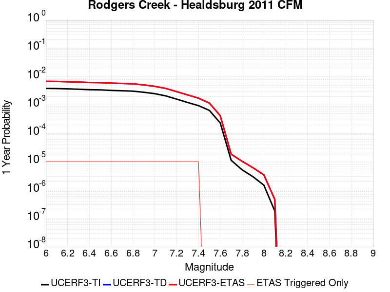 |  |

| Magnitude | 1 wk TI Prob | 1 wk TD Prob | 1 wk ETAS Prob | 1 wk ETAS/TD Gain | 1 wk ETAS Triggered Only | 1 mo TI Prob | 1 mo TD Prob | 1 mo ETAS Prob | 1 mo ETAS/TD Gain | 1 mo ETAS Triggered Only | 1 yr TI Prob | 1 yr TD Prob | 1 yr ETAS Prob | 1 yr ETAS/TD Gain | 1 yr ETAS Triggered Only | 10 yr TI Prob | 10 yr TD Prob | 10 yr ETAS Prob | 10 yr ETAS/TD Gain | 10 yr ETAS Triggered Only |
|-----|-----|-----|-----|-----|-----|-----|-----|-----|-----|-----|-----|-----|-----|-----|-----|-----|-----|-----|-----|-----|
| 6.0 | 7.390182E-5 | 1.3136698E-4 | 1.3136698E-4 | 1.0 | 0.0 | 3.1668364E-4 | 5.6287815E-4 | 6.789568E-4 | 1.2062234 | 1.16144016E-4 | 0.0038488081 | 0.0068315 | 0.006946851 | 1.0168852 | 1.16144016E-4 | 0.037828278 | 0.06619178 | 0.066300236 | 1.0016385 | 1.16144016E-4 |
| 6.1 | 7.318768E-5 | 1.3034661E-4 | 1.3034661E-4 | 1.0 | 0.0 | 3.1362378E-4 | 5.585081E-4 | 6.7458727E-4 | 1.2078379 | 1.16144016E-4 | 0.0038116854 | 0.0067786723 | 0.0068940287 | 1.0170176 | 1.16144016E-4 | 0.037469655 | 0.06569639 | 0.065804906 | 1.0016518 | 1.16144016E-4 |
| 6.2 | 7.1379836E-5 | 1.2727521E-4 | 1.2727521E-4 | 1.0 | 0.0 | 3.058777E-4 | 5.453505E-4 | 6.614312E-4 | 1.2128552 | 1.16144016E-4 | 0.003717703 | 0.0066194604 | 0.006734836 | 1.0174297 | 1.16144016E-4 | 0.0365612 | 0.06421462 | 0.064323306 | 1.0016925 | 1.16144016E-4 |
| 6.3 | 6.9255926E-5 | 1.2382054E-4 | 1.2382054E-4 | 1.0 | 0.0 | 2.9677735E-4 | 5.3055194E-4 | 6.466344E-4 | 1.2187955 | 1.16144016E-4 | 0.0036072785 | 0.006440372 | 0.006555768 | 1.0179176 | 1.16144016E-4 | 0.035492823 | 0.06254096 | 0.06264984 | 1.0017409 | 1.16144016E-4 |
| 6.4 | 6.6757144E-5 | 1.1958744E-4 | 1.1958744E-4 | 1.0 | 0.0 | 2.8607066E-4 | 5.1241735E-4 | 6.285019E-4 | 1.2265428 | 1.16144016E-4 | 0.0034773487 | 0.0062209065 | 0.006336328 | 1.0185539 | 1.16144016E-4 | 0.034234364 | 0.060490217 | 0.060599335 | 1.0018039 | 1.16144016E-4 |
| 6.5 | 6.5735134E-5 | 1.1808043E-4 | 1.1808043E-4 | 1.0 | 0.0 | 2.8169158E-4 | 5.0596124E-4 | 6.2204653E-4 | 1.2294351 | 1.16144016E-4 | 0.003424202 | 0.0061427657 | 0.0062581967 | 1.0187913 | 1.16144016E-4 | 0.03371918 | 0.059755135 | 0.05986434 | 1.0018275 | 1.16144016E-4 |
| 6.6 | 6.289601E-5 | 1.1343802E-4 | 1.1343802E-4 | 1.0 | 0.0 | 2.6952647E-4 | 4.8607276E-4 | 6.0216035E-4 | 1.2388276 | 1.16144016E-4 | 0.0032765474 | 0.005901959 | 0.006017417 | 1.0195627 | 1.16144016E-4 | 0.032286562 | 0.057494484 | 0.05760395 | 1.0019039 | 1.16144016E-4 |
| 6.7 | 6.115274E-5 | 1.1060895E-4 | 1.1060895E-4 | 1.0 | 0.0 | 2.6205686E-4 | 4.7395262E-4 | 5.9004157E-4 | 1.2449379 | 1.16144016E-4 | 0.0031858748 | 0.0057551847 | 0.0058706603 | 1.0200646 | 1.16144016E-4 | 0.031405866 | 0.05611298 | 0.056222606 | 1.0019537 | 1.16144016E-4 |
| 6.8 | 5.9232367E-5 | 1.0728244E-4 | 1.0728244E-4 | 1.0 | 0.0 | 2.538283E-4 | 4.597012E-4 | 5.757918E-4 | 1.252535 | 1.16144016E-4 | 0.0030859804 | 0.0055825757 | 0.0056980713 | 1.0206885 | 1.16144016E-4 | 0.030434765 | 0.054479737 | 0.054589555 | 1.0020157 | 1.16144016E-4 |
| 6.9 | 5.4030377E-5 | 9.8224424E-5 | 9.8224424E-5 | 1.0 | 0.0 | 2.315382E-4 | 4.2089424E-4 | 5.3698936E-4 | 1.2758297 | 1.16144016E-4 | 0.0028153337 | 0.005112413 | 0.0052279634 | 1.0226018 | 1.16144016E-4 | 0.027799325 | 0.05001516 | 0.050125495 | 1.0022061 | 1.16144016E-4 |
| 7.0 | 4.8260714E-5 | 8.740524E-5 | 8.740524E-5 | 1.0 | 0.0 | 2.0681522E-4 | 3.745404E-4 | 4.9064093E-4 | 1.3099813 | 1.16144016E-4 | 0.0025150678 | 0.004550549 | 0.0046661645 | 1.025407 | 1.16144016E-4 | 0.024867928 | 0.044667665 | 0.04477862 | 1.0024841 | 1.16144016E-4 |
| 7.1 | 4.0294493E-5 | 7.389041E-5 | 7.389041E-5 | 1.0 | 0.0 | 1.7267925E-4 | 3.1663495E-4 | 4.327422E-4 | 1.3666912 | 1.16144016E-4 | 0.0021003427 | 0.0038482544 | 0.0039639515 | 1.0300648 | 1.16144016E-4 | 0.02080602 | 0.037923392 | 0.03803513 | 1.0029465 | 1.16144016E-4 |
| 7.2 | 3.096388E-5 | 5.697752E-5 | 5.697752E-5 | 1.0 | 0.0 | 1.326956E-4 | 2.4416664E-4 | 3.6028228E-4 | 1.4755591 | 1.16144016E-4 | 0.0016143717 | 0.0029686983 | 0.0030844975 | 1.0390067 | 1.16144016E-4 | 0.01602694 | 0.029436996 | 0.02954972 | 1.0038294 | 1.16144016E-4 |
| 7.3 | 2.3615226E-5 | 4.3628002E-5 | 4.3628002E-5 | 1.0 | 0.0 | 1.0120418E-4 | 1.8696384E-4 | 3.0308613E-4 | 1.6210951 | 1.16144016E-4 | 0.0012314644 | 0.002273922 | 0.002389802 | 1.0509604 | 1.16144016E-4 | 0.0122466255 | 0.022636993 | 0.022750508 | 1.0050145 | 1.16144016E-4 |
| 7.4 | 1.8251132E-5 | 3.3541033E-5 | 3.3541033E-5 | 1.0 | 0.0 | 7.821679E-5 | 1.4373941E-4 | 2.5986673E-4 | 1.8079017 | 1.16144016E-4 | 9.518733E-4 | 0.0017486324 | 0.0018645733 | 1.0663037 | 1.16144016E-4 | 0.009478063 | 0.017465532 | 0.017579647 | 1.0065337 | 1.16144016E-4 |
| 7.5 | 1.2411432E-5 | 2.246003E-5 | 2.246003E-5 | 1.0 | 0.0 | 5.3190768E-5 | 9.625375E-5 | 9.625375E-5 | 1.0 | 0.0 | 6.4740516E-4 | 0.0011712653 | 0.0011712653 | 1.0 | 0.0 | 0.006455223 | 0.011743283 | 0.011743283 | 1.0 | 0.0 |
| 7.6 | 4.4771446E-6 | 8.083989E-6 | 8.083989E-6 | 1.0 | 0.0 | 1.918762E-5 | 3.4645214E-5 | 3.4645214E-5 | 1.0 | 0.0 | 2.3358424E-4 | 4.2172507E-4 | 4.2172507E-4 | 1.0 | 0.0 | 0.0023333887 | 0.004246066 | 0.004246066 | 1.0 | 0.0 |
| 7.7 | 2.157941E-7 | 3.5349316E-7 | 3.5349316E-7 | 1.0 | 0.0 | 9.248315E-7 | 1.5149698E-6 | 1.5149698E-6 | 1.0 | 0.0 | 1.1259765E-5 | 1.8444602E-5 | 1.8444602E-5 | 1.0 | 0.0 | 1.1259195E-4 | 1.9069147E-4 | 1.9069147E-4 | 1.0 | 0.0 |
| 7.8 | 9.9623286E-8 | 1.989979E-7 | 1.989979E-7 | 1.0 | 0.0 | 4.269569E-7 | 8.528478E-7 | 8.528478E-7 | 1.0 | 0.0 | 5.1981874E-6 | 1.0383373E-5 | 1.0383373E-5 | 1.0 | 0.0 | 5.198066E-5 | 1.09018714E-4 | 1.09018714E-4 | 1.0 | 0.0 |
| 7.9 | 5.6745257E-8 | 1.1773924E-7 | 1.1773924E-7 | 1.0 | 0.0 | 2.4319394E-7 | 5.0459664E-7 | 5.0459664E-7 | 1.0 | 0.0 | 2.960882E-6 | 6.1434466E-6 | 6.1434466E-6 | 1.0 | 0.0 | 2.9608427E-5 | 6.470911E-5 | 6.470911E-5 | 1.0 | 0.0 |
| 8.0 | 2.8614323E-8 | 6.57845E-8 | 6.57845E-8 | 1.0 | 0.0 | 1.2263281E-7 | 2.8193355E-7 | 2.8193355E-7 | 1.0 | 0.0 | 1.4930534E-6 | 3.4325356E-6 | 3.4325356E-6 | 1.0 | 0.0 | 1.4930434E-5 | 3.582588E-5 | 3.582588E-5 | 1.0 | 0.0 |
| 8.1 | 3.5045191E-9 | 8.965783E-9 | 8.965783E-9 | 1.0 | 0.0 | 1.5019367E-8 | 3.8424783E-8 | 3.8424783E-8 | 1.0 | 0.0 | 1.8286079E-7 | 4.6782165E-7 | 4.6782165E-7 | 1.0 | 0.0 | 1.8286064E-6 | 4.8327956E-6 | 4.8327956E-6 | 1.0 | 0.0 |

## Great Valley 01
*[(top)](#table-of-contents)*

| 1 Week | 1 Month | 1 Year | 10 Year |
|-----|-----|-----|-----|
|  |  |  |  |

| Magnitude | 1 wk TI Prob | 1 wk TD Prob | 1 wk ETAS Prob | 1 wk ETAS/TD Gain | 1 wk ETAS Triggered Only | 1 mo TI Prob | 1 mo TD Prob | 1 mo ETAS Prob | 1 mo ETAS/TD Gain | 1 mo ETAS Triggered Only | 1 yr TI Prob | 1 yr TD Prob | 1 yr ETAS Prob | 1 yr ETAS/TD Gain | 1 yr ETAS Triggered Only | 10 yr TI Prob | 10 yr TD Prob | 10 yr ETAS Prob | 10 yr ETAS/TD Gain | 10 yr ETAS Triggered Only |
|-----|-----|-----|-----|-----|-----|-----|-----|-----|-----|-----|-----|-----|-----|-----|-----|-----|-----|-----|-----|-----|
| 6.0 | 3.3398478E-6 | 3.3762976E-6 | 1.1951992E-4 | 35.3997 | 1.16144016E-4 | 1.4313555E-5 | 1.4469774E-5 | 1.3061211E-4 | 9.026548 | 1.16144016E-4 | 1.742536E-4 | 1.7615648E-4 | 2.9228005E-4 | 1.6592069 | 1.16144016E-4 | 0.0017411702 | 0.0017602886 | 0.0018762281 | 1.065864 | 1.16144016E-4 |
| 6.1 | 1.7919616E-6 | 1.8120251E-6 | 1.8120251E-6 | 1.0 | 0.0 | 7.679812E-6 | 7.7658E-6 | 7.7658E-6 | 1.0 | 0.0 | 9.349771E-5 | 9.454471E-5 | 9.454471E-5 | 1.0 | 0.0 | 9.345838E-4 | 9.4506424E-4 | 9.4506424E-4 | 1.0 | 0.0 |
| 6.2 | 1.7919616E-6 | 1.8120251E-6 | 1.8120251E-6 | 1.0 | 0.0 | 7.679812E-6 | 7.7658E-6 | 7.7658E-6 | 1.0 | 0.0 | 9.349771E-5 | 9.454471E-5 | 9.454471E-5 | 1.0 | 0.0 | 9.345838E-4 | 9.4506424E-4 | 9.4506424E-4 | 1.0 | 0.0 |
| 6.3 | 1.1636545E-6 | 1.17745E-6 | 1.17745E-6 | 1.0 | 0.0 | 4.9870814E-6 | 5.046205E-6 | 5.046205E-6 | 1.0 | 0.0 | 6.0716022E-5 | 6.143586E-5 | 6.143586E-5 | 1.0 | 0.0 | 6.069944E-4 | 6.1419315E-4 | 6.1419315E-4 | 1.0 | 0.0 |
| 6.4 | 8.770928E-7 | 8.881815E-7 | 8.881815E-7 | 1.0 | 0.0 | 3.7589639E-6 | 3.8064866E-6 | 3.8064866E-6 | 1.0 | 0.0 | 4.5764424E-5 | 4.634301E-5 | 4.634301E-5 | 1.0 | 0.0 | 4.5755E-4 | 4.633356E-4 | 4.633356E-4 | 1.0 | 0.0 |
| 6.5 | 6.753308E-7 | 6.8452607E-7 | 6.8452607E-7 | 1.0 | 0.0 | 2.8942718E-6 | 2.93368E-6 | 2.93368E-6 | 1.0 | 0.0 | 3.523719E-5 | 3.5716977E-5 | 3.5716977E-5 | 1.0 | 0.0 | 3.52316E-4 | 3.5711337E-4 | 3.5711337E-4 | 1.0 | 0.0 |
| 6.6 | 5.2531993E-7 | 5.331276E-7 | 5.331276E-7 | 1.0 | 0.0 | 2.251369E-6 | 2.2848305E-6 | 2.2848305E-6 | 1.0 | 0.0 | 2.7410075E-5 | 2.7817463E-5 | 2.7817463E-5 | 1.0 | 0.0 | 2.7406693E-4 | 2.7814036E-4 | 2.7814036E-4 | 1.0 | 0.0 |
| 6.7 | 4.1404678E-7 | 4.208609E-7 | 4.208609E-7 | 1.0 | 0.0 | 1.774485E-6 | 1.8036884E-6 | 1.8036884E-6 | 1.0 | 0.0 | 2.160414E-5 | 2.1959688E-5 | 2.1959688E-5 | 1.0 | 0.0 | 2.160204E-4 | 2.1957551E-4 | 2.1957551E-4 | 1.0 | 0.0 |
| 6.8 | 3.1713054E-7 | 3.2302975E-7 | 3.2302975E-7 | 1.0 | 0.0 | 1.3591301E-6 | 1.3844125E-6 | 1.3844125E-6 | 1.0 | 0.0 | 1.6547285E-5 | 1.6855092E-5 | 1.6855092E-5 | 1.0 | 0.0 | 1.6546051E-4 | 1.6853833E-4 | 1.6853833E-4 | 1.0 | 0.0 |
| 6.9 | 2.528054E-7 | 2.580374E-7 | 2.580374E-7 | 1.0 | 0.0 | 1.0834511E-6 | 1.1058742E-6 | 1.1058742E-6 | 1.0 | 0.0 | 1.3190938E-5 | 1.3463935E-5 | 1.3463935E-5 | 1.0 | 0.0 | 1.3190156E-4 | 1.3463132E-4 | 1.3463132E-4 | 1.0 | 0.0 |
| 7.0 | 2.0667689E-7 | 2.1131233E-7 | 2.1131233E-7 | 1.0 | 0.0 | 8.857578E-7 | 9.0562395E-7 | 9.0562395E-7 | 1.0 | 0.0 | 1.0784048E-5 | 1.1025917E-5 | 1.1025917E-5 | 1.0 | 0.0 | 1.0783524E-4 | 1.1025378E-4 | 1.1025378E-4 | 1.0 | 0.0 |
| 7.1 | 1.5951586E-7 | 1.6338481E-7 | 1.6338481E-7 | 1.0 | 0.0 | 6.8363926E-7 | 7.002204E-7 | 7.002204E-7 | 1.0 | 0.0 | 8.323276E-6 | 8.525151E-6 | 8.525151E-6 | 1.0 | 0.0 | 8.322964E-5 | 8.5248306E-5 | 8.5248306E-5 | 1.0 | 0.0 |
| 7.2 | 1.02912296E-7 | 1.0566137E-7 | 1.0566137E-7 | 1.0 | 0.0 | 4.4105263E-7 | 4.5283437E-7 | 4.5283437E-7 | 1.0 | 0.0 | 5.3698027E-6 | 5.5132446E-6 | 5.5132446E-6 | 1.0 | 0.0 | 5.3696727E-5 | 5.5131113E-5 | 5.5131113E-5 | 1.0 | 0.0 |
| 7.3 | 6.581281E-8 | 6.77207E-8 | 6.77207E-8 | 1.0 | 0.0 | 2.8205488E-7 | 2.9023153E-7 | 2.9023153E-7 | 1.0 | 0.0 | 3.4340128E-6 | 3.5335634E-6 | 3.5335634E-6 | 1.0 | 0.0 | 3.4339595E-5 | 3.533509E-5 | 3.533509E-5 | 1.0 | 0.0 |
| 7.4 | 3.112171E-8 | 3.2068368E-8 | 3.2068368E-8 | 1.0 | 0.0 | 1.3337875E-7 | 1.3743585E-7 | 1.3743585E-7 | 1.0 | 0.0 | 1.6238852E-6 | 1.6732803E-6 | 1.6732803E-6 | 1.0 | 0.0 | 1.6238733E-5 | 1.6732685E-5 | 1.6732685E-5 | 1.0 | 0.0 |

## San Jacinto (San Jacinto Valley) rev
*[(top)](#table-of-contents)*

| 1 Week | 1 Month | 1 Year | 10 Year |
|-----|-----|-----|-----|
|  |  |  |  |

| Magnitude | 1 wk TI Prob | 1 wk TD Prob | 1 wk ETAS Prob | 1 wk ETAS/TD Gain | 1 wk ETAS Triggered Only | 1 mo TI Prob | 1 mo TD Prob | 1 mo ETAS Prob | 1 mo ETAS/TD Gain | 1 mo ETAS Triggered Only | 1 yr TI Prob | 1 yr TD Prob | 1 yr ETAS Prob | 1 yr ETAS/TD Gain | 1 yr ETAS Triggered Only | 10 yr TI Prob | 10 yr TD Prob | 10 yr ETAS Prob | 10 yr ETAS/TD Gain | 10 yr ETAS Triggered Only |
|-----|-----|-----|-----|-----|-----|-----|-----|-----|-----|-----|-----|-----|-----|-----|-----|-----|-----|-----|-----|-----|
| 6.0 | 3.652694E-5 | 3.4402394E-5 | 3.4402394E-5 | 1.0 | 0.0 | 1.5653463E-4 | 1.474305E-4 | 1.474305E-4 | 1.0 | 0.0 | 0.0019041431 | 0.00179349 | 0.0019094257 | 1.0646425 | 1.16144016E-4 | 0.018879099 | 0.018526595 | 0.018640587 | 1.0061529 | 1.16144016E-4 |
| 6.1 | 3.652694E-5 | 3.4402394E-5 | 3.4402394E-5 | 1.0 | 0.0 | 1.5653463E-4 | 1.474305E-4 | 1.474305E-4 | 1.0 | 0.0 | 0.0019041431 | 0.00179349 | 0.0019094257 | 1.0646425 | 1.16144016E-4 | 0.018879099 | 0.018526595 | 0.018640587 | 1.0061529 | 1.16144016E-4 |
| 6.2 | 3.652694E-5 | 3.4402394E-5 | 3.4402394E-5 | 1.0 | 0.0 | 1.5653463E-4 | 1.474305E-4 | 1.474305E-4 | 1.0 | 0.0 | 0.0019041431 | 0.00179349 | 0.0019094257 | 1.0646425 | 1.16144016E-4 | 0.018879099 | 0.018526595 | 0.018640587 | 1.0061529 | 1.16144016E-4 |
| 6.3 | 3.652694E-5 | 3.4402394E-5 | 3.4402394E-5 | 1.0 | 0.0 | 1.5653463E-4 | 1.474305E-4 | 1.474305E-4 | 1.0 | 0.0 | 0.0019041431 | 0.00179349 | 0.0019094257 | 1.0646425 | 1.16144016E-4 | 0.018879099 | 0.018526595 | 0.018640587 | 1.0061529 | 1.16144016E-4 |
| 6.4 | 3.646941E-5 | 3.432397E-5 | 3.432397E-5 | 1.0 | 0.0 | 1.5628811E-4 | 1.4709444E-4 | 1.4709444E-4 | 1.0 | 0.0 | 0.0019011468 | 0.0017894056 | 0.0019053419 | 1.0647904 | 1.16144016E-4 | 0.018849645 | 0.018486476 | 0.018600473 | 1.0061665 | 1.16144016E-4 |
| 6.5 | 3.646941E-5 | 3.432397E-5 | 3.432397E-5 | 1.0 | 0.0 | 1.5628811E-4 | 1.4709444E-4 | 1.4709444E-4 | 1.0 | 0.0 | 0.0019011468 | 0.0017894056 | 0.0019053419 | 1.0647904 | 1.16144016E-4 | 0.018849645 | 0.018486476 | 0.018600473 | 1.0061665 | 1.16144016E-4 |
| 6.6 | 3.6442503E-5 | 3.4287354E-5 | 3.4287354E-5 | 1.0 | 0.0 | 1.561728E-4 | 1.4693754E-4 | 1.4693754E-4 | 1.0 | 0.0 | 0.0018997455 | 0.0017874985 | 0.0019034349 | 1.0648596 | 1.16144016E-4 | 0.018835869 | 0.018467745 | 0.018581744 | 1.0061729 | 1.16144016E-4 |
| 6.7 | 3.6432113E-5 | 3.4272925E-5 | 3.4272925E-5 | 1.0 | 0.0 | 1.5612828E-4 | 1.4687571E-4 | 1.4687571E-4 | 1.0 | 0.0 | 0.0018992044 | 0.0017867472 | 0.0019026838 | 1.0648869 | 1.16144016E-4 | 0.018830549 | 0.018460369 | 0.018574368 | 1.0061754 | 1.16144016E-4 |
| 6.8 | 3.6409598E-5 | 3.424198E-5 | 3.424198E-5 | 1.0 | 0.0 | 1.560318E-4 | 1.4674311E-4 | 1.4674311E-4 | 1.0 | 0.0 | 0.0018980318 | 0.0017851355 | 0.0019010721 | 1.0649456 | 1.16144016E-4 | 0.018819023 | 0.018444523 | 0.018558525 | 1.0061808 | 1.16144016E-4 |
| 6.9 | 3.638078E-5 | 3.4202407E-5 | 3.4202407E-5 | 1.0 | 0.0 | 1.5590832E-4 | 1.4657351E-4 | 1.4657351E-4 | 1.0 | 0.0 | 0.0018965311 | 0.001783074 | 0.001899011 | 1.0650208 | 1.16144016E-4 | 0.018804269 | 0.018424258 | 0.01853826 | 1.0061877 | 1.16144016E-4 |
| 7.0 | 3.6294874E-5 | 3.408442E-5 | 3.408442E-5 | 1.0 | 0.0 | 1.5554018E-4 | 1.4606792E-4 | 1.4606792E-4 | 1.0 | 0.0 | 0.0018920569 | 0.001776929 | 0.0018928666 | 1.0652461 | 1.16144016E-4 | 0.018760284 | 0.018363839 | 0.01847785 | 1.0062084 | 1.16144016E-4 |
| 7.1 | 3.6260717E-5 | 3.4040702E-5 | 3.4040702E-5 | 1.0 | 0.0 | 1.5539382E-4 | 1.4588058E-4 | 1.4588058E-4 | 1.0 | 0.0 | 0.001890278 | 0.0017746518 | 0.0018905897 | 1.0653299 | 1.16144016E-4 | 0.018742796 | 0.018341439 | 0.018455453 | 1.0062162 | 1.16144016E-4 |
| 7.2 | 3.6210204E-5 | 3.397492E-5 | 3.397492E-5 | 1.0 | 0.0 | 1.5517735E-4 | 1.455987E-4 | 1.455987E-4 | 1.0 | 0.0 | 0.001887647 | 0.0017712255 | 0.0018871637 | 1.0654565 | 1.16144016E-4 | 0.01871693 | 0.01830772 | 0.018421737 | 1.0062279 | 1.16144016E-4 |
| 7.3 | 3.6119454E-5 | 3.386321E-5 | 3.386321E-5 | 1.0 | 0.0 | 1.5478847E-4 | 1.4511998E-4 | 1.4511998E-4 | 1.0 | 0.0 | 0.0018829206 | 0.0017654065 | 0.0018813455 | 1.0656726 | 1.16144016E-4 | 0.018670462 | 0.018250274 | 0.018364297 | 1.0062478 | 1.16144016E-4 |
| 7.4 | 3.607848E-5 | 3.381071E-5 | 3.381071E-5 | 1.0 | 0.0 | 1.5461289E-4 | 1.44895E-4 | 1.44895E-4 | 1.0 | 0.0 | 0.0018807866 | 0.0017626719 | 0.0018786112 | 1.0657748 | 1.16144016E-4 | 0.018649481 | 0.018223269 | 0.018337296 | 1.0062573 | 1.16144016E-4 |
| 7.5 | 3.5856774E-5 | 3.3620483E-5 | 3.3620483E-5 | 1.0 | 0.0 | 1.5366284E-4 | 1.4407984E-4 | 1.4407984E-4 | 1.0 | 0.0 | 0.0018692396 | 0.0017527633 | 0.0018687036 | 1.0661472 | 1.16144016E-4 | 0.018535944 | 0.018124366 | 0.018238405 | 1.006292 | 1.16144016E-4 |
| 7.6 | 3.286655E-5 | 3.2143445E-5 | 3.2143445E-5 | 1.0 | 0.0 | 1.4084904E-4 | 1.3775036E-4 | 1.3775036E-4 | 1.0 | 0.0 | 0.001713488 | 0.0016758227 | 0.001791772 | 1.0691895 | 1.16144016E-4 | 0.017003361 | 0.017344031 | 0.017458161 | 1.0065804 | 1.16144016E-4 |
| 7.7 | 2.8882527E-5 | 2.9236293E-5 | 2.9236293E-5 | 1.0 | 0.0 | 1.237764E-4 | 1.2529238E-4 | 1.2529238E-4 | 1.0 | 0.0 | 0.0015059357 | 0.0015243685 | 0.0016403355 | 1.0760754 | 1.16144016E-4 | 0.014957713 | 0.015830461 | 0.015944766 | 1.0072206 | 1.16144016E-4 |
| 7.8 | 2.4950225E-5 | 2.6527203E-5 | 2.6527203E-5 | 1.0 | 0.0 | 1.0692515E-4 | 1.1368306E-4 | 1.1368306E-4 | 1.0 | 0.0 | 0.0013010362 | 0.0013832134 | 0.0014991967 | 1.0838506 | 1.16144016E-4 | 0.012934455 | 0.014411755 | 0.014526225 | 1.0079428 | 1.16144016E-4 |
| 7.9 | 1.9881603E-5 | 2.1507445E-5 | 2.1507445E-5 | 1.0 | 0.0 | 8.520408E-5 | 9.217151E-5 | 9.217151E-5 | 1.0 | 0.0 | 0.001036866 | 0.0011216112 | 0.001237625 | 1.1034349 | 1.16144016E-4 | 0.010320415 | 0.011777027 | 0.011891803 | 1.0097457 | 1.16144016E-4 |
| 8.0 | 1.563292E-5 | 1.5937347E-5 | 1.5937347E-5 | 1.0 | 0.0 | 6.6996516E-5 | 6.8301124E-5 | 6.8301124E-5 | 1.0 | 0.0 | 8.153773E-4 | 8.3124964E-4 | 9.4729714E-4 | 1.139606 | 1.16144016E-4 | 0.00812392 | 0.008810506 | 0.008925627 | 1.0130663 | 1.16144016E-4 |
| 8.1 | 1.0045313E-5 | 8.301802E-6 | 8.301802E-6 | 1.0 | 0.0 | 4.305063E-5 | 3.5578672E-5 | 3.5578672E-5 | 1.0 | 0.0 | 5.2401534E-4 | 4.3308473E-4 | 4.3308473E-4 | 1.0 | 0.0 | 0.0052278144 | 0.0046591135 | 0.0046591135 | 1.0 | 0.0 |
| 8.2 | 4.1554413E-6 | 1.5655598E-6 | 1.5655598E-6 | 1.0 | 0.0 | 1.7808914E-5 | 6.709525E-6 | 6.709525E-6 | 1.0 | 0.0 | 2.1680194E-4 | 8.168544E-5 | 8.168544E-5 | 1.0 | 0.0 | 0.0021659054 | 9.482903E-4 | 9.482903E-4 | 1.0 | 0.0 |
| 8.3 | 1.2758221E-6 | 3.6149942E-7 | 3.6149942E-7 | 1.0 | 0.0 | 5.4677976E-6 | 1.5492824E-6 | 1.5492824E-6 | 1.0 | 0.0 | 6.65684E-5 | 1.8862354E-5 | 1.8862354E-5 | 1.0 | 0.0 | 6.6548464E-4 | 2.2751294E-4 | 2.2751294E-4 | 1.0 | 0.0 |

## San Andreas (Creeping Section) 2011 CFM
*[(top)](#table-of-contents)*

| 1 Week | 1 Month | 1 Year | 10 Year |
|-----|-----|-----|-----|
|  |  |  |  |

| Magnitude | 1 wk TI Prob | 1 wk TD Prob | 1 wk ETAS Prob | 1 wk ETAS/TD Gain | 1 wk ETAS Triggered Only | 1 mo TI Prob | 1 mo TD Prob | 1 mo ETAS Prob | 1 mo ETAS/TD Gain | 1 mo ETAS Triggered Only | 1 yr TI Prob | 1 yr TD Prob | 1 yr ETAS Prob | 1 yr ETAS/TD Gain | 1 yr ETAS Triggered Only | 10 yr TI Prob | 10 yr TD Prob | 10 yr ETAS Prob | 10 yr ETAS/TD Gain | 10 yr ETAS Triggered Only |
|-----|-----|-----|-----|-----|-----|-----|-----|-----|-----|-----|-----|-----|-----|-----|-----|-----|-----|-----|-----|-----|
| 6.0 | 5.986481E-4 | 0.001228691 | 0.001228691 | 1.0 | 0.0 | 0.0025631124 | 0.005246795 | 0.005246795 | 1.0 | 0.0 | 0.030762846 | 0.061203245 | 0.061203245 | 1.0 | 0.0 | 0.26835477 | 0.425928 | 0.42599466 | 1.0001565 | 1.16144016E-4 |
| 6.1 | 5.015945E-4 | 0.0010230356 | 0.0010230356 | 1.0 | 0.0 | 0.00214792 | 0.004369436 | 0.004369436 | 1.0 | 0.0 | 0.025839351 | 0.051246606 | 0.051246606 | 1.0 | 0.0 | 0.23032776 | 0.37284943 | 0.3729223 | 1.0001954 | 1.16144016E-4 |
| 6.2 | 4.073338E-4 | 8.1157376E-4 | 8.1157376E-4 | 1.0 | 0.0 | 0.0017445484 | 0.0034683137 | 0.0034683137 | 1.0 | 0.0 | 0.021034058 | 0.04093177 | 0.04093177 | 1.0 | 0.0 | 0.19150782 | 0.31302592 | 0.3131057 | 1.0002549 | 1.16144016E-4 |
| 6.3 | 3.464099E-4 | 6.7455834E-4 | 6.7455834E-4 | 1.0 | 0.0 | 0.0014837692 | 0.0028832308 | 0.0028832308 | 1.0 | 0.0 | 0.017915873 | 0.034187846 | 0.034187846 | 1.0 | 0.0 | 0.16538359 | 0.27130842 | 0.27139306 | 1.000312 | 1.16144016E-4 |
| 6.4 | 2.935057E-4 | 5.5516965E-4 | 5.5516965E-4 | 1.0 | 0.0 | 0.0012572751 | 0.0023727308 | 0.0023727308 | 1.0 | 0.0 | 0.015200248 | 0.02826279 | 0.02826279 | 1.0 | 0.0 | 0.14201577 | 0.23297668 | 0.23306575 | 1.0003824 | 1.16144016E-4 |
| 6.5 | 2.3409708E-4 | 4.2132285E-4 | 4.2132285E-4 | 1.0 | 0.0 | 0.0010028875 | 0.0018017791 | 0.0018017791 | 1.0 | 0.0 | 0.012141965 | 0.021586355 | 0.021586355 | 1.0 | 0.0 | 0.11499573 | 0.1868149 | 0.18690936 | 1.0005056 | 1.16144016E-4 |
| 6.6 | 1.5842178E-4 | 2.5068692E-4 | 2.5068692E-4 | 1.0 | 0.0 | 6.7877385E-4 | 0.0010739256 | 0.0010739256 | 1.0 | 0.0 | 0.0082328 | 0.012995283 | 0.012995283 | 1.0 | 0.0 | 0.07934396 | 0.12313759 | 0.123239435 | 1.0008271 | 1.16144016E-4 |
| 6.7 | 1.5616413E-4 | 2.4605254E-4 | 2.4605254E-4 | 1.0 | 0.0 | 6.691031E-4 | 0.0010540807 | 0.0010540807 | 1.0 | 0.0 | 0.0081159435 | 0.012757154 | 0.012757154 | 1.0 | 0.0 | 0.0782586 | 0.12116472 | 0.12126679 | 1.0008425 | 1.16144016E-4 |
| 6.8 | 1.5538467E-4 | 2.442914E-4 | 2.442914E-4 | 1.0 | 0.0 | 6.6576427E-4 | 0.001046539 | 0.001046539 | 1.0 | 0.0 | 0.008075596 | 0.012666538 | 0.012666538 | 1.0 | 0.0 | 0.07788358 | 0.12039561 | 0.12049776 | 1.0008485 | 1.16144016E-4 |
| 6.9 | 1.5153569E-4 | 2.3538464E-4 | 2.3538464E-4 | 1.0 | 0.0 | 6.49277E-4 | 0.0010084033 | 0.0010084033 | 1.0 | 0.0 | 0.007876333 | 0.012208726 | 0.012208726 | 1.0 | 0.0 | 0.07602952 | 0.11646574 | 0.11656836 | 1.0008811 | 1.16144016E-4 |
| 7.0 | 1.4588932E-4 | 2.2395732E-4 | 2.2395732E-4 | 1.0 | 0.0 | 6.250901E-4 | 9.59466E-4 | 9.59466E-4 | 1.0 | 0.0 | 0.0075839474 | 0.011619428 | 0.011619428 | 1.0 | 0.0 | 0.073302895 | 0.11131206 | 0.11141528 | 1.0009272 | 1.16144016E-4 |
| 7.1 | 1.1565079E-4 | 1.6281323E-4 | 1.6281323E-4 | 1.0 | 0.0 | 4.955521E-4 | 6.9758523E-4 | 6.9758523E-4 | 1.0 | 0.0 | 0.006016669 | 0.008460228 | 0.008460228 | 1.0 | 0.0 | 0.058563538 | 0.08366478 | 0.083771214 | 1.0012721 | 1.16144016E-4 |
| 7.2 | 1.0393792E-4 | 1.4615392E-4 | 1.4615392E-4 | 1.0 | 0.0 | 4.4537216E-4 | 6.262243E-4 | 6.262243E-4 | 1.0 | 0.0 | 0.005408933 | 0.0075977976 | 0.0075977976 | 1.0 | 0.0 | 0.052791595 | 0.07561503 | 0.0757224 | 1.0014199 | 1.16144016E-4 |
| 7.3 | 9.332884E-5 | 1.2780601E-4 | 1.2780601E-4 | 1.0 | 0.0 | 3.999194E-4 | 5.4762565E-4 | 5.4762565E-4 | 1.0 | 0.0 | 0.0048581534 | 0.0066470946 | 0.0066470946 | 1.0 | 0.0 | 0.047533102 | 0.06647954 | 0.06658796 | 1.0016309 | 1.16144016E-4 |
| 7.4 | 8.670252E-5 | 1.1702972E-4 | 1.1702972E-4 | 1.0 | 0.0 | 3.715293E-4 | 5.014601E-4 | 5.014601E-4 | 1.0 | 0.0 | 0.004513991 | 0.0060883067 | 0.0060883067 | 1.0 | 0.0 | 0.044233937 | 0.061148684 | 0.061257724 | 1.0017833 | 1.16144016E-4 |
| 7.5 | 7.3036405E-5 | 9.005699E-5 | 9.005699E-5 | 1.0 | 0.0 | 3.129756E-4 | 3.859015E-4 | 3.859015E-4 | 1.0 | 0.0 | 0.0038038217 | 0.0046882504 | 0.0046882504 | 1.0 | 0.0 | 0.03739367 | 0.047875606 | 0.047875606 | 1.0 | 0.0 |
| 7.6 | 6.3935775E-5 | 8.280209E-5 | 8.280209E-5 | 1.0 | 0.0 | 2.7398168E-4 | 3.5481792E-4 | 3.5481792E-4 | 1.0 | 0.0 | 0.0033306254 | 0.00431137 | 0.00431137 | 1.0 | 0.0 | 0.032811474 | 0.043990135 | 0.043990135 | 1.0 | 0.0 |
| 7.7 | 5.5050095E-5 | 6.661729E-5 | 6.661729E-5 | 1.0 | 0.0 | 2.3590765E-4 | 2.8547147E-4 | 2.8547147E-4 | 1.0 | 0.0 | 0.0028683927 | 0.0034700802 | 0.0034700802 | 1.0 | 0.0 | 0.0283165 | 0.03579509 | 0.03579509 | 1.0 | 0.0 |
| 7.8 | 5.027131E-5 | 6.1627725E-5 | 6.1627725E-5 | 1.0 | 0.0 | 2.1543067E-4 | 2.640921E-4 | 2.640921E-4 | 1.0 | 0.0 | 0.0026197135 | 0.003210584 | 0.003210584 | 1.0 | 0.0 | 0.025890453 | 0.03312572 | 0.03312572 | 1.0 | 0.0 |
| 7.9 | 3.7271806E-5 | 5.0224386E-5 | 5.0224386E-5 | 1.0 | 0.0 | 1.5972654E-4 | 2.1522962E-4 | 2.1522962E-4 | 1.0 | 0.0 | 0.0019429359 | 0.0026172737 | 0.0026172737 | 1.0 | 0.0 | 0.019260362 | 0.027066687 | 0.027066687 | 1.0 | 0.0 |
| 8.0 | 2.7310243E-5 | 3.1428404E-5 | 3.1428404E-5 | 1.0 | 0.0 | 1.17038646E-4 | 1.3468621E-4 | 1.3468621E-4 | 1.0 | 0.0 | 0.0014240141 | 0.0016385721 | 0.0016385721 | 1.0 | 0.0 | 0.014149235 | 0.01721387 | 0.01721387 | 1.0 | 0.0 |
| 8.1 | 1.7940547E-5 | 1.7400796E-5 | 1.7400796E-5 | 1.0 | 0.0 | 7.688579E-5 | 7.457271E-5 | 7.457271E-5 | 1.0 | 0.0 | 9.3568244E-4 | 9.075451E-4 | 9.075451E-4 | 1.0 | 0.0 | 0.009317525 | 0.009799073 | 0.009799073 | 1.0 | 0.0 |
| 8.2 | 8.643924E-6 | 5.4748625E-6 | 5.4748625E-6 | 1.0 | 0.0 | 3.704486E-5 | 2.3463486E-5 | 2.3463486E-5 | 1.0 | 0.0 | 4.5092785E-4 | 2.8563058E-4 | 2.8563058E-4 | 1.0 | 0.0 | 0.0045001395 | 0.0032487072 | 0.0032487072 | 1.0 | 0.0 |
| 8.3 | 1.983087E-6 | 7.6599065E-7 | 7.6599065E-7 | 1.0 | 0.0 | 8.498917E-6 | 3.282813E-6 | 3.282813E-6 | 1.0 | 0.0 | 1.034694E-4 | 3.9967534E-5 | 3.9967534E-5 | 1.0 | 0.0 | 0.0010342124 | 4.719687E-4 | 4.719687E-4 | 1.0 | 0.0 |

## San Diego Trough south
*[(top)](#table-of-contents)*

| 1 Week | 1 Month | 1 Year | 10 Year |
|-----|-----|-----|-----|
|  | 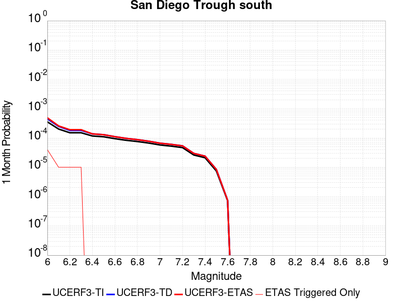 |  |  |

| Magnitude | 1 wk TI Prob | 1 wk TD Prob | 1 wk ETAS Prob | 1 wk ETAS/TD Gain | 1 wk ETAS Triggered Only | 1 mo TI Prob | 1 mo TD Prob | 1 mo ETAS Prob | 1 mo ETAS/TD Gain | 1 mo ETAS Triggered Only | 1 yr TI Prob | 1 yr TD Prob | 1 yr ETAS Prob | 1 yr ETAS/TD Gain | 1 yr ETAS Triggered Only | 10 yr TI Prob | 10 yr TD Prob | 10 yr ETAS Prob | 10 yr ETAS/TD Gain | 10 yr ETAS Triggered Only |
|-----|-----|-----|-----|-----|-----|-----|-----|-----|-----|-----|-----|-----|-----|-----|-----|-----|-----|-----|-----|-----|
| 6.0 | 8.279495E-5 | 1.04241306E-4 | 2.2037321E-4 | 2.114068 | 1.16144016E-4 | 3.5478722E-4 | 4.4667677E-4 | 5.627689E-4 | 1.2599019 | 1.16144016E-4 | 0.004310982 | 0.0054256152 | 0.005541129 | 1.0212904 | 1.16144016E-4 | 0.042283054 | 0.05299221 | 0.0531022 | 1.0020756 | 1.16144016E-4 |
| 6.1 | 4.6961468E-5 | 5.772944E-5 | 5.772944E-5 | 1.0 | 0.0 | 2.0124791E-4 | 2.473894E-4 | 2.473894E-4 | 1.0 | 0.0 | 0.00244744 | 0.0030079768 | 0.0030079768 | 1.0 | 0.0 | 0.024206603 | 0.029679462 | 0.029679462 | 1.0 | 0.0 |
| 6.2 | 3.5079658E-5 | 4.214154E-5 | 4.214154E-5 | 1.0 | 0.0 | 1.5033272E-4 | 1.8059435E-4 | 1.8059435E-4 | 1.0 | 0.0 | 0.0018287642 | 0.0021965632 | 0.0021965632 | 1.0 | 0.0 | 0.018137876 | 0.021751117 | 0.021751117 | 1.0 | 0.0 |
| 6.3 | 3.5079658E-5 | 4.214154E-5 | 4.214154E-5 | 1.0 | 0.0 | 1.5033272E-4 | 1.8059435E-4 | 1.8059435E-4 | 1.0 | 0.0 | 0.0018287642 | 0.0021965632 | 0.0021965632 | 1.0 | 0.0 | 0.018137876 | 0.021751117 | 0.021751117 | 1.0 | 0.0 |
| 6.4 | 2.7196904E-5 | 3.2087162E-5 | 3.2087162E-5 | 1.0 | 0.0 | 1.16552954E-4 | 1.3750927E-4 | 1.3750927E-4 | 1.0 | 0.0 | 0.0014181085 | 0.0016729041 | 0.0016729041 | 1.0 | 0.0 | 0.014090929 | 0.016604643 | 0.016604643 | 1.0 | 0.0 |
| 6.5 | 2.5584688E-5 | 3.010164E-5 | 3.010164E-5 | 1.0 | 0.0 | 1.0964406E-4 | 1.2900073E-4 | 1.2900073E-4 | 1.0 | 0.0 | 0.0013340989 | 0.0015694655 | 0.0015694655 | 1.0 | 0.0 | 0.013261181 | 0.015585314 | 0.015585314 | 1.0 | 0.0 |
| 6.6 | 2.2034688E-5 | 2.5742738E-5 | 2.5742738E-5 | 1.0 | 0.0 | 9.443096E-5 | 1.1032141E-4 | 1.1032141E-4 | 1.0 | 0.0 | 0.0011490905 | 0.0013423424 | 0.0013423424 | 1.0 | 0.0 | 0.011431668 | 0.013343317 | 0.013343317 | 1.0 | 0.0 |
| 6.7 | 1.9394853E-5 | 2.254176E-5 | 2.254176E-5 | 1.0 | 0.0 | 8.311815E-5 | 9.6603995E-5 | 9.6603995E-5 | 1.0 | 0.0 | 0.0010114936 | 0.0011755243 | 0.0011755243 | 1.0 | 0.0 | 0.01006902 | 0.011693766 | 0.011693766 | 1.0 | 0.0 |
| 6.8 | 1.7615313E-5 | 2.0403182E-5 | 2.0403182E-5 | 1.0 | 0.0 | 7.549201E-5 | 8.74393E-5 | 8.74393E-5 | 1.0 | 0.0 | 9.1872766E-4 | 0.0010640579 | 0.0010640579 | 1.0 | 0.0 | 0.009149387 | 0.010590198 | 0.010590198 | 1.0 | 0.0 |
| 6.9 | 1.5621423E-5 | 1.8026114E-5 | 1.8026114E-5 | 1.0 | 0.0 | 6.6947236E-5 | 7.725251E-5 | 7.725251E-5 | 1.0 | 0.0 | 8.147778E-4 | 9.40147E-4 | 9.40147E-4 | 1.0 | 0.0 | 0.008117969 | 0.009362142 | 0.009362142 | 1.0 | 0.0 |
| 7.0 | 1.3444376E-5 | 1.544809E-5 | 1.544809E-5 | 1.0 | 0.0 | 5.7617483E-5 | 6.620443E-5 | 6.620443E-5 | 1.0 | 0.0 | 7.0126704E-4 | 8.057436E-4 | 8.057436E-4 | 1.0 | 0.0 | 0.006990582 | 0.008028555 | 0.008028555 | 1.0 | 0.0 |
| 7.1 | 1.2268361E-5 | 1.407303E-5 | 1.407303E-5 | 1.0 | 0.0 | 5.2577634E-5 | 6.0311606E-5 | 6.0311606E-5 | 1.0 | 0.0 | 6.399447E-4 | 7.3404907E-4 | 7.3404907E-4 | 1.0 | 0.0 | 0.0063810493 | 0.0073165493 | 0.0073165493 | 1.0 | 0.0 |
| 7.2 | 1.0922655E-5 | 1.2513563E-5 | 1.2513563E-5 | 1.0 | 0.0 | 4.681054E-5 | 5.3628468E-5 | 5.3628468E-5 | 1.0 | 0.0 | 5.697693E-4 | 6.5273355E-4 | 6.5273355E-4 | 1.0 | 0.0 | 0.0056831064 | 0.0065084435 | 0.0065084435 | 1.0 | 0.0 |
| 7.3 | 6.1106753E-6 | 6.928925E-6 | 6.928925E-6 | 1.0 | 0.0 | 2.6188345E-5 | 2.9695057E-5 | 2.9695057E-5 | 1.0 | 0.0 | 3.1879646E-4 | 3.6147775E-4 | 3.6147775E-4 | 1.0 | 0.0 | 0.0031833951 | 0.003608943 | 0.003608943 | 1.0 | 0.0 |
| 7.4 | 4.933187E-6 | 5.5895525E-6 | 5.5895525E-6 | 1.0 | 0.0 | 2.114206E-5 | 2.3955008E-5 | 2.3955008E-5 | 1.0 | 0.0 | 2.5737417E-4 | 2.9161357E-4 | 2.9161357E-4 | 1.0 | 0.0 | 0.002570763 | 0.0029123505 | 0.0029123505 | 1.0 | 0.0 |
| 7.5 | 1.7489613E-6 | 1.969678E-6 | 1.969678E-6 | 1.0 | 0.0 | 7.495527E-6 | 8.4414505E-6 | 8.4414505E-6 | 1.0 | 0.0 | 9.125422E-5 | 1.02770035E-4 | 1.02770035E-4 | 1.0 | 0.0 | 9.1216754E-4 | 0.0010272472 | 0.0010272472 | 1.0 | 0.0 |
| 7.6 | 1.6988751E-7 | 1.7533823E-7 | 1.7533823E-7 | 1.0 | 0.0 | 7.2808916E-7 | 7.5144936E-7 | 7.5144936E-7 | 1.0 | 0.0 | 8.864449E-6 | 9.14886E-6 | 9.14886E-6 | 1.0 | 0.0 | 8.8640954E-5 | 9.1485024E-5 | 9.1485024E-5 | 1.0 | 0.0 |

## Santa Ynez (West)
*[(top)](#table-of-contents)*

| 1 Week | 1 Month | 1 Year | 10 Year |
|-----|-----|-----|-----|
|  |  |  |  |

| Magnitude | 1 wk TI Prob | 1 wk TD Prob | 1 wk ETAS Prob | 1 wk ETAS/TD Gain | 1 wk ETAS Triggered Only | 1 mo TI Prob | 1 mo TD Prob | 1 mo ETAS Prob | 1 mo ETAS/TD Gain | 1 mo ETAS Triggered Only | 1 yr TI Prob | 1 yr TD Prob | 1 yr ETAS Prob | 1 yr ETAS/TD Gain | 1 yr ETAS Triggered Only | 10 yr TI Prob | 10 yr TD Prob | 10 yr ETAS Prob | 10 yr ETAS/TD Gain | 10 yr ETAS Triggered Only |
|-----|-----|-----|-----|-----|-----|-----|-----|-----|-----|-----|-----|-----|-----|-----|-----|-----|-----|-----|-----|-----|
| 6.0 | 4.7352758E-5 | 5.4972126E-5 | 5.4972126E-5 | 1.0 | 0.0 | 2.0292461E-4 | 2.3557522E-4 | 2.3557522E-4 | 1.0 | 0.0 | 0.0024678076 | 0.0028645284 | 0.0029803396 | 1.0404295 | 1.16144016E-4 | 0.024405818 | 0.028304417 | 0.028417274 | 1.0039872 | 1.16144016E-4 |
| 6.1 | 4.7352758E-5 | 5.4972126E-5 | 5.4972126E-5 | 1.0 | 0.0 | 2.0292461E-4 | 2.3557522E-4 | 2.3557522E-4 | 1.0 | 0.0 | 0.0024678076 | 0.0028645284 | 0.0029803396 | 1.0404295 | 1.16144016E-4 | 0.024405818 | 0.028304417 | 0.028417274 | 1.0039872 | 1.16144016E-4 |
| 6.2 | 3.0415853E-5 | 3.392511E-5 | 3.392511E-5 | 1.0 | 0.0 | 1.3034715E-4 | 1.4538545E-4 | 1.4538545E-4 | 1.0 | 0.0 | 0.0015858212 | 0.0017686661 | 0.0018846047 | 1.0655514 | 1.16144016E-4 | 0.015745522 | 0.017549807 | 0.017663913 | 1.0065018 | 1.16144016E-4 |
| 6.3 | 3.0415853E-5 | 3.392511E-5 | 3.392511E-5 | 1.0 | 0.0 | 1.3034715E-4 | 1.4538545E-4 | 1.4538545E-4 | 1.0 | 0.0 | 0.0015858212 | 0.0017686661 | 0.0018846047 | 1.0655514 | 1.16144016E-4 | 0.015745522 | 0.017549807 | 0.017663913 | 1.0065018 | 1.16144016E-4 |
| 6.4 | 2.5452082E-5 | 2.7912422E-5 | 2.7912422E-5 | 1.0 | 0.0 | 1.09075794E-4 | 1.196193E-4 | 1.196193E-4 | 1.0 | 0.0 | 0.0013271887 | 0.0014554089 | 0.0014554089 | 1.0 | 0.0 | 0.013192902 | 0.014460951 | 0.014460951 | 1.0 | 0.0 |
| 6.5 | 2.3143784E-5 | 2.5128256E-5 | 2.5128256E-5 | 1.0 | 0.0 | 9.9183875E-5 | 1.0768817E-4 | 1.0768817E-4 | 1.0 | 0.0 | 0.0012068948 | 0.0013103267 | 0.0013103267 | 1.0 | 0.0 | 0.012003611 | 0.01302768 | 0.01302768 | 1.0 | 0.0 |
| 6.6 | 1.9118515E-5 | 2.035434E-5 | 2.035434E-5 | 1.0 | 0.0 | 8.193392E-5 | 8.7230015E-5 | 8.7230015E-5 | 1.0 | 0.0 | 9.97089E-4 | 0.001061516 | 0.001061516 | 1.0 | 0.0 | 0.00992627 | 0.010565365 | 0.010565365 | 1.0 | 0.0 |
| 6.7 | 1.722807E-5 | 1.8146347E-5 | 1.8146347E-5 | 1.0 | 0.0 | 7.3832496E-5 | 7.776777E-5 | 7.776777E-5 | 1.0 | 0.0 | 8.985399E-4 | 9.464169E-4 | 9.464169E-4 | 1.0 | 0.0 | 0.008949154 | 0.0094245095 | 0.0094245095 | 1.0 | 0.0 |
| 6.8 | 1.5317364E-5 | 1.5926486E-5 | 1.5926486E-5 | 1.0 | 0.0 | 6.56442E-5 | 6.82546E-5 | 6.82546E-5 | 1.0 | 0.0 | 7.98925E-4 | 8.306873E-4 | 8.306873E-4 | 1.0 | 0.0 | 0.007960589 | 0.00827631 | 0.00827631 | 1.0 | 0.0 |
| 6.9 | 1.3071226E-5 | 1.3329624E-5 | 1.3329624E-5 | 1.0 | 0.0 | 5.6018336E-5 | 5.7125722E-5 | 5.7125722E-5 | 1.0 | 0.0 | 6.8180985E-4 | 6.9528597E-4 | 6.9528597E-4 | 1.0 | 0.0 | 0.0067972173 | 0.006931367 | 0.006931367 | 1.0 | 0.0 |
| 7.0 | 1.1836986E-5 | 1.19327815E-5 | 1.19327815E-5 | 1.0 | 0.0 | 5.0728955E-5 | 5.11395E-5 | 5.11395E-5 | 1.0 | 0.0 | 6.1745E-4 | 6.2244723E-4 | 6.2244723E-4 | 1.0 | 0.0 | 0.006157372 | 0.006207231 | 0.006207231 | 1.0 | 0.0 |
| 7.1 | 1.0597169E-5 | 1.0542201E-5 | 1.0542201E-5 | 1.0 | 0.0 | 4.541565E-5 | 4.5180084E-5 | 4.5180084E-5 | 1.0 | 0.0 | 5.5279525E-4 | 5.4992986E-4 | 5.4992986E-4 | 1.0 | 0.0 | 0.0055142213 | 0.005485821 | 0.005485821 | 1.0 | 0.0 |
| 7.2 | 9.59113E-6 | 9.459144E-6 | 9.459144E-6 | 1.0 | 0.0 | 4.11042E-5 | 4.0538565E-5 | 4.0538565E-5 | 1.0 | 0.0 | 5.0032866E-4 | 4.934463E-4 | 4.934463E-4 | 1.0 | 0.0 | 0.004992037 | 0.0049236254 | 0.0049236254 | 1.0 | 0.0 |
| 7.3 | 8.586084E-6 | 8.379583E-6 | 8.379583E-6 | 1.0 | 0.0 | 3.679698E-5 | 3.5912013E-5 | 3.5912013E-5 | 1.0 | 0.0 | 4.4791115E-4 | 4.3714207E-4 | 4.3714207E-4 | 1.0 | 0.0 | 0.004470094 | 0.004362933 | 0.004362933 | 1.0 | 0.0 |
| 7.4 | 7.2622997E-6 | 6.9515427E-6 | 6.9515427E-6 | 1.0 | 0.0 | 3.112377E-5 | 2.979199E-5 | 2.979199E-5 | 1.0 | 0.0 | 3.78866E-4 | 3.626581E-4 | 3.626581E-4 | 1.0 | 0.0 | 0.0037822074 | 0.0036207628 | 0.0036207628 | 1.0 | 0.0 |
| 7.5 | 5.627296E-6 | 5.251588E-6 | 5.251588E-6 | 1.0 | 0.0 | 2.411676E-5 | 2.2506614E-5 | 2.2506614E-5 | 1.0 | 0.0 | 2.9358198E-4 | 2.739843E-4 | 2.739843E-4 | 1.0 | 0.0 | 0.0029319443 | 0.002736537 | 0.002736537 | 1.0 | 0.0 |
| 7.6 | 2.265244E-6 | 2.0608625E-6 | 2.0608625E-6 | 1.0 | 0.0 | 9.708152E-6 | 8.832238E-6 | 8.832238E-6 | 1.0 | 0.0 | 1.18190335E-4 | 1.0752728E-4 | 1.0752728E-4 | 1.0 | 0.0 | 0.001181275 | 0.0010747612 | 0.0010747612 | 1.0 | 0.0 |
| 7.7 | 1.3099874E-6 | 1.1016252E-6 | 1.1016252E-6 | 1.0 | 0.0 | 5.61422E-6 | 4.7212425E-6 | 4.7212425E-6 | 1.0 | 0.0 | 6.8350986E-5 | 5.7479636E-5 | 5.7479636E-5 | 1.0 | 0.0 | 6.832996E-4 | 5.7465007E-4 | 5.7465007E-4 | 1.0 | 0.0 |
| 7.8 | 7.903951E-7 | 6.0711415E-7 | 6.0711415E-7 | 1.0 | 0.0 | 3.3874032E-6 | 2.6019152E-6 | 2.6019152E-6 | 1.0 | 0.0 | 4.1240855E-5 | 3.167787E-5 | 3.167787E-5 | 1.0 | 0.0 | 4.12332E-4 | 3.167349E-4 | 3.167349E-4 | 1.0 | 0.0 |
| 7.9 | 7.0753297E-9 | 5.0899476E-9 | 5.0899476E-9 | 1.0 | 0.0 | 3.032284E-8 | 2.181406E-8 | 2.181406E-8 | 1.0 | 0.0 | 3.6918053E-7 | 2.6558615E-7 | 2.6558615E-7 | 1.0 | 0.0 | 3.691799E-6 | 2.6558594E-6 | 2.6558594E-6 | 1.0 | 0.0 |

## Thirty Mile Bank
*[(top)](#table-of-contents)*

| 1 Week | 1 Month | 1 Year | 10 Year |
|-----|-----|-----|-----|
|  | 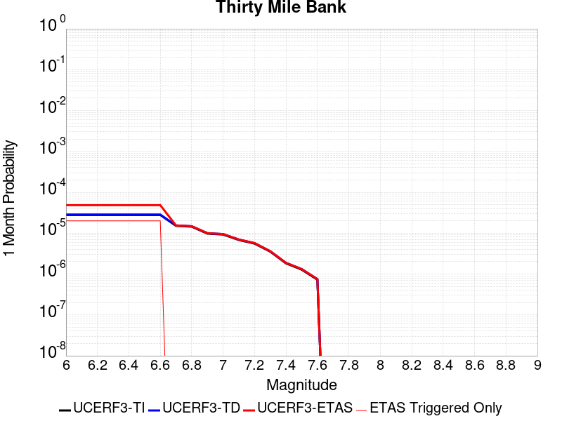 |  |  |

| Magnitude | 1 wk TI Prob | 1 wk TD Prob | 1 wk ETAS Prob | 1 wk ETAS/TD Gain | 1 wk ETAS Triggered Only | 1 mo TI Prob | 1 mo TD Prob | 1 mo ETAS Prob | 1 mo ETAS/TD Gain | 1 mo ETAS Triggered Only | 1 yr TI Prob | 1 yr TD Prob | 1 yr ETAS Prob | 1 yr ETAS/TD Gain | 1 yr ETAS Triggered Only | 10 yr TI Prob | 10 yr TD Prob | 10 yr ETAS Prob | 10 yr ETAS/TD Gain | 10 yr ETAS Triggered Only |
|-----|-----|-----|-----|-----|-----|-----|-----|-----|-----|-----|-----|-----|-----|-----|-----|-----|-----|-----|-----|-----|
| 6.0 | 6.5124755E-6 | 6.6592643E-6 | 6.6592643E-6 | 1.0 | 0.0 | 2.791031E-5 | 2.8539416E-5 | 1.4468012E-4 | 5.069484 | 1.16144016E-4 | 3.3975503E-4 | 3.4741635E-4 | 4.6352003E-4 | 1.3341917 | 1.16144016E-4 | 0.0033923604 | 0.003469164 | 0.003584905 | 1.0333629 | 1.16144016E-4 |
| 6.1 | 6.5124755E-6 | 6.6592643E-6 | 6.6592643E-6 | 1.0 | 0.0 | 2.791031E-5 | 2.8539416E-5 | 1.4468012E-4 | 5.069484 | 1.16144016E-4 | 3.3975503E-4 | 3.4741635E-4 | 4.6352003E-4 | 1.3341917 | 1.16144016E-4 | 0.0033923604 | 0.003469164 | 0.003584905 | 1.0333629 | 1.16144016E-4 |
| 6.2 | 6.5124755E-6 | 6.6592643E-6 | 6.6592643E-6 | 1.0 | 0.0 | 2.791031E-5 | 2.8539416E-5 | 1.4468012E-4 | 5.069484 | 1.16144016E-4 | 3.3975503E-4 | 3.4741635E-4 | 4.6352003E-4 | 1.3341917 | 1.16144016E-4 | 0.0033923604 | 0.003469164 | 0.003584905 | 1.0333629 | 1.16144016E-4 |
| 6.3 | 6.5124755E-6 | 6.6592643E-6 | 6.6592643E-6 | 1.0 | 0.0 | 2.791031E-5 | 2.8539416E-5 | 1.4468012E-4 | 5.069484 | 1.16144016E-4 | 3.3975503E-4 | 3.4741635E-4 | 4.6352003E-4 | 1.3341917 | 1.16144016E-4 | 0.0033923604 | 0.003469164 | 0.003584905 | 1.0333629 | 1.16144016E-4 |
| 6.4 | 6.5124755E-6 | 6.6592643E-6 | 6.6592643E-6 | 1.0 | 0.0 | 2.791031E-5 | 2.8539416E-5 | 1.4468012E-4 | 5.069484 | 1.16144016E-4 | 3.3975503E-4 | 3.4741635E-4 | 4.6352003E-4 | 1.3341917 | 1.16144016E-4 | 0.0033923604 | 0.003469164 | 0.003584905 | 1.0333629 | 1.16144016E-4 |
| 6.5 | 6.5124755E-6 | 6.6592643E-6 | 6.6592643E-6 | 1.0 | 0.0 | 2.791031E-5 | 2.8539416E-5 | 1.4468012E-4 | 5.069484 | 1.16144016E-4 | 3.3975503E-4 | 3.4741635E-4 | 4.6352003E-4 | 1.3341917 | 1.16144016E-4 | 0.0033923604 | 0.003469164 | 0.003584905 | 1.0333629 | 1.16144016E-4 |
| 6.6 | 6.5124755E-6 | 6.6592643E-6 | 6.6592643E-6 | 1.0 | 0.0 | 2.791031E-5 | 2.8539416E-5 | 1.4468012E-4 | 5.069484 | 1.16144016E-4 | 3.3975503E-4 | 3.4741635E-4 | 4.6352003E-4 | 1.3341917 | 1.16144016E-4 | 0.0033923604 | 0.003469164 | 0.003584905 | 1.0333629 | 1.16144016E-4 |
| 6.7 | 3.5261137E-6 | 3.6098995E-6 | 3.6098995E-6 | 1.0 | 0.0 | 1.5111828E-5 | 1.547091E-5 | 1.547091E-5 | 1.0 | 0.0 | 1.8397097E-4 | 1.883427E-4 | 1.883427E-4 | 1.0 | 0.0 | 0.0018381875 | 0.0018818958 | 0.0018818958 | 1.0 | 0.0 |
| 6.8 | 3.370743E-6 | 3.4509355E-6 | 3.4509355E-6 | 1.0 | 0.0 | 1.4445961E-5 | 1.47896435E-5 | 1.47896435E-5 | 1.0 | 0.0 | 1.7586538E-4 | 1.8004965E-4 | 1.8004965E-4 | 1.0 | 0.0 | 0.0017572626 | 0.0017990996 | 0.0017990996 | 1.0 | 0.0 |
| 6.9 | 2.2756835E-6 | 2.333161E-6 | 2.333161E-6 | 1.0 | 0.0 | 9.752893E-6 | 9.999225E-6 | 9.999225E-6 | 1.0 | 0.0 | 1.18735006E-4 | 1.2173401E-4 | 1.2173401E-4 | 1.0 | 0.0 | 0.0011867158 | 0.0012166979 | 0.0012166979 | 1.0 | 0.0 |
| 7.0 | 2.1617404E-6 | 2.21598E-6 | 2.21598E-6 | 1.0 | 0.0 | 9.264569E-6 | 9.497024E-6 | 9.497024E-6 | 1.0 | 0.0 | 1.1279029E-4 | 1.1562037E-4 | 1.1562037E-4 | 1.0 | 0.0 | 0.0011273306 | 0.0011556263 | 0.0011556263 | 1.0 | 0.0 |
| 7.1 | 1.5900777E-6 | 1.6327014E-6 | 1.6327014E-6 | 1.0 | 0.0 | 6.814601E-6 | 6.997274E-6 | 6.997274E-6 | 1.0 | 0.0 | 8.296461E-5 | 8.518861E-5 | 8.518861E-5 | 1.0 | 0.0 | 8.293364E-4 | 8.5157226E-4 | 8.5157226E-4 | 1.0 | 0.0 |
| 7.2 | 1.2971728E-6 | 1.3328992E-6 | 1.3328992E-6 | 1.0 | 0.0 | 5.5593005E-6 | 5.712413E-6 | 5.712413E-6 | 1.0 | 0.0 | 6.768238E-5 | 6.954651E-5 | 6.954651E-5 | 1.0 | 0.0 | 6.7661767E-4 | 6.952578E-4 | 6.952578E-4 | 1.0 | 0.0 |
| 7.3 | 8.2454284E-7 | 8.448891E-7 | 8.448891E-7 | 1.0 | 0.0 | 3.5337503E-6 | 3.6209485E-6 | 3.6209485E-6 | 1.0 | 0.0 | 4.302256E-5 | 4.408422E-5 | 4.408422E-5 | 1.0 | 0.0 | 4.301423E-4 | 4.4076078E-4 | 4.4076078E-4 | 1.0 | 0.0 |
| 7.4 | 4.2619024E-7 | 4.3863466E-7 | 4.3863466E-7 | 1.0 | 0.0 | 1.8265283E-6 | 1.8798615E-6 | 1.8798615E-6 | 1.0 | 0.0 | 2.2237757E-5 | 2.2887078E-5 | 2.2887078E-5 | 1.0 | 0.0 | 2.223553E-4 | 2.288476E-4 | 2.288476E-4 | 1.0 | 0.0 |
| 7.5 | 2.993922E-7 | 3.086453E-7 | 3.086453E-7 | 1.0 | 0.0 | 1.2831089E-6 | 1.3227649E-6 | 1.3227649E-6 | 1.0 | 0.0 | 1.5621737E-5 | 1.6104546E-5 | 1.6104546E-5 | 1.0 | 0.0 | 1.562064E-4 | 1.6103406E-4 | 1.6103406E-4 | 1.0 | 0.0 |
| 7.6 | 1.6988751E-7 | 1.7533823E-7 | 1.7533823E-7 | 1.0 | 0.0 | 7.2808916E-7 | 7.5144936E-7 | 7.5144936E-7 | 1.0 | 0.0 | 8.864449E-6 | 9.14886E-6 | 9.14886E-6 | 1.0 | 0.0 | 8.8640954E-5 | 9.1485024E-5 | 9.1485024E-5 | 1.0 | 0.0 |

## San Jacinto (Coyote Creek)
*[(top)](#table-of-contents)*

| 1 Week | 1 Month | 1 Year | 10 Year |
|-----|-----|-----|-----|
|  |  |  |  |

| Magnitude | 1 wk TI Prob | 1 wk TD Prob | 1 wk ETAS Prob | 1 wk ETAS/TD Gain | 1 wk ETAS Triggered Only | 1 mo TI Prob | 1 mo TD Prob | 1 mo ETAS Prob | 1 mo ETAS/TD Gain | 1 mo ETAS Triggered Only | 1 yr TI Prob | 1 yr TD Prob | 1 yr ETAS Prob | 1 yr ETAS/TD Gain | 1 yr ETAS Triggered Only | 10 yr TI Prob | 10 yr TD Prob | 10 yr ETAS Prob | 10 yr ETAS/TD Gain | 10 yr ETAS Triggered Only |
|-----|-----|-----|-----|-----|-----|-----|-----|-----|-----|-----|-----|-----|-----|-----|-----|-----|-----|-----|-----|-----|
| 6.0 | 2.7374346E-5 | 2.4145214E-5 | 2.4145214E-5 | 1.0 | 0.0 | 1.1731335E-4 | 1.034754E-4 | 1.034754E-4 | 1.0 | 0.0 | 0.0014273542 | 0.0012590875 | 0.0013750852 | 1.0921284 | 1.16144016E-4 | 0.01418221 | 0.012928318 | 0.01304296 | 1.0088675 | 1.16144016E-4 |
| 6.1 | 2.7374346E-5 | 2.4145214E-5 | 2.4145214E-5 | 1.0 | 0.0 | 1.1731335E-4 | 1.034754E-4 | 1.034754E-4 | 1.0 | 0.0 | 0.0014273542 | 0.0012590875 | 0.0013750852 | 1.0921284 | 1.16144016E-4 | 0.01418221 | 0.012928318 | 0.01304296 | 1.0088675 | 1.16144016E-4 |
| 6.2 | 2.7374346E-5 | 2.4145214E-5 | 2.4145214E-5 | 1.0 | 0.0 | 1.1731335E-4 | 1.034754E-4 | 1.034754E-4 | 1.0 | 0.0 | 0.0014273542 | 0.0012590875 | 0.0013750852 | 1.0921284 | 1.16144016E-4 | 0.01418221 | 0.012928318 | 0.01304296 | 1.0088675 | 1.16144016E-4 |
| 6.3 | 2.7374346E-5 | 2.4145214E-5 | 2.4145214E-5 | 1.0 | 0.0 | 1.1731335E-4 | 1.034754E-4 | 1.034754E-4 | 1.0 | 0.0 | 0.0014273542 | 0.0012590875 | 0.0013750852 | 1.0921284 | 1.16144016E-4 | 0.01418221 | 0.012928318 | 0.01304296 | 1.0088675 | 1.16144016E-4 |
| 6.4 | 2.7374346E-5 | 2.4145214E-5 | 2.4145214E-5 | 1.0 | 0.0 | 1.1731335E-4 | 1.034754E-4 | 1.034754E-4 | 1.0 | 0.0 | 0.0014273542 | 0.0012590875 | 0.0013750852 | 1.0921284 | 1.16144016E-4 | 0.01418221 | 0.012928318 | 0.01304296 | 1.0088675 | 1.16144016E-4 |
| 6.5 | 2.7282445E-5 | 2.4031293E-5 | 2.4031293E-5 | 1.0 | 0.0 | 1.16919524E-4 | 1.029872E-4 | 1.029872E-4 | 1.0 | 0.0 | 0.0014225657 | 0.0012531505 | 0.0013691491 | 1.0925654 | 1.16144016E-4 | 0.014134934 | 0.012869646 | 0.012984295 | 1.0089085 | 1.16144016E-4 |
| 6.6 | 2.7282445E-5 | 2.4031293E-5 | 2.4031293E-5 | 1.0 | 0.0 | 1.16919524E-4 | 1.029872E-4 | 1.029872E-4 | 1.0 | 0.0 | 0.0014225657 | 0.0012531505 | 0.0013691491 | 1.0925654 | 1.16144016E-4 | 0.014134934 | 0.012869646 | 0.012984295 | 1.0089085 | 1.16144016E-4 |
| 6.7 | 2.7216198E-5 | 2.3956412E-5 | 2.3956412E-5 | 1.0 | 0.0 | 1.1663563E-4 | 1.02666316E-4 | 1.02666316E-4 | 1.0 | 0.0 | 0.0014191137 | 0.0012492483 | 0.0013652473 | 1.092855 | 1.16144016E-4 | 0.014100855 | 0.0128310565 | 0.012945711 | 1.0089357 | 1.16144016E-4 |
| 6.8 | 2.7078617E-5 | 2.387363E-5 | 2.387363E-5 | 1.0 | 0.0 | 1.1604605E-4 | 1.0231156E-4 | 1.0231156E-4 | 1.0 | 0.0 | 0.001411945 | 0.0012449342 | 0.0013609335 | 1.0931772 | 1.16144016E-4 | 0.014030075 | 0.012788199 | 0.012902858 | 1.008966 | 1.16144016E-4 |
| 6.9 | 2.6982952E-5 | 2.3793142E-5 | 2.3793142E-5 | 1.0 | 0.0 | 1.15636096E-4 | 1.0196664E-4 | 1.0196664E-4 | 1.0 | 0.0 | 0.0014069602 | 0.0012407395 | 0.0013567393 | 1.0934925 | 1.16144016E-4 | 0.013980856 | 0.012746515 | 0.012861178 | 1.0089957 | 1.16144016E-4 |
| 7.0 | 2.6449972E-5 | 2.3370165E-5 | 2.3370165E-5 | 1.0 | 0.0 | 1.1335209E-4 | 1.00154015E-4 | 1.00154015E-4 | 1.0 | 0.0 | 0.001379188 | 0.0012186957 | 0.001334698 | 1.0951858 | 1.16144016E-4 | 0.0137065975 | 0.0125278765 | 0.012642566 | 1.0091547 | 1.16144016E-4 |
| 7.1 | 2.6257849E-5 | 2.3196202E-5 | 2.3196202E-5 | 1.0 | 0.0 | 1.1252879E-4 | 9.940852E-5 | 9.940852E-5 | 1.0 | 0.0 | 0.0013691769 | 0.0012096294 | 0.0013256328 | 1.0959 | 1.16144016E-4 | 0.013607717 | 0.012437741 | 0.012552441 | 1.0092219 | 1.16144016E-4 |
| 7.2 | 2.5270041E-5 | 2.2390966E-5 | 2.2390966E-5 | 1.0 | 0.0 | 1.0829568E-4 | 9.595777E-5 | 9.595777E-5 | 1.0 | 0.0 | 0.0013177024 | 0.0011676621 | 0.0012836704 | 1.099351 | 1.16144016E-4 | 0.013099162 | 0.012018777 | 0.012133526 | 1.0095474 | 1.16144016E-4 |
| 7.3 | 2.339701E-5 | 2.1122814E-5 | 2.1122814E-5 | 1.0 | 0.0 | 1.0026905E-4 | 9.0523215E-5 | 9.0523215E-5 | 1.0 | 0.0 | 0.001220092 | 0.0011015651 | 0.0012175811 | 1.1053193 | 1.16144016E-4 | 0.012134149 | 0.011357696 | 0.01147252 | 1.0101099 | 1.16144016E-4 |
| 7.4 | 2.296333E-5 | 2.0853171E-5 | 2.0853171E-5 | 1.0 | 0.0 | 9.841056E-5 | 8.936768E-5 | 8.936768E-5 | 1.0 | 0.0 | 0.0011974899 | 0.0010875105 | 0.0012035281 | 1.106682 | 1.16144016E-4 | 0.011910575 | 0.01121681 | 0.01133165 | 1.0102383 | 1.16144016E-4 |
| 7.5 | 2.2188895E-5 | 2.0376096E-5 | 2.0376096E-5 | 1.0 | 0.0 | 9.50918E-5 | 8.732321E-5 | 8.732321E-5 | 1.0 | 0.0 | 0.0011571277 | 0.0010626436 | 0.0011786642 | 1.109181 | 1.16144016E-4 | 0.011511209 | 0.010966429 | 0.011081299 | 1.0104747 | 1.16144016E-4 |
| 7.6 | 2.0013189E-5 | 1.8962366E-5 | 1.8962366E-5 | 1.0 | 0.0 | 8.5767984E-5 | 8.1264756E-5 | 8.1264756E-5 | 1.0 | 0.0 | 0.001043725 | 9.889511E-4 | 0.0011049802 | 1.1173254 | 1.16144016E-4 | 0.010388365 | 0.010224434 | 0.01033939 | 1.0112433 | 1.16144016E-4 |
| 7.7 | 1.7230794E-5 | 1.674371E-5 | 1.674371E-5 | 1.0 | 0.0 | 7.384417E-5 | 7.175679E-5 | 7.175679E-5 | 1.0 | 0.0 | 8.986819E-4 | 8.7328954E-4 | 9.893321E-4 | 1.1328799 | 1.16144016E-4 | 0.008950562 | 0.009062956 | 0.009178048 | 1.0126991 | 1.16144016E-4 |
| 7.8 | 1.4478809E-5 | 1.4990978E-5 | 1.4990978E-5 | 1.0 | 0.0 | 6.205057E-5 | 6.424547E-5 | 6.424547E-5 | 1.0 | 0.0 | 7.552038E-4 | 7.819085E-4 | 8.979617E-4 | 1.148423 | 1.16144016E-4 | 0.0075264242 | 0.008141387 | 0.008256585 | 1.0141498 | 1.16144016E-4 |
| 7.9 | 1.1114467E-5 | 1.1645102E-5 | 1.1645102E-5 | 1.0 | 0.0 | 4.7632562E-5 | 4.990663E-5 | 4.990663E-5 | 1.0 | 0.0 | 5.797721E-4 | 6.074444E-4 | 7.2351785E-4 | 1.191085 | 1.16144016E-4 | 0.0057826187 | 0.0063803247 | 0.0064957277 | 1.0180873 | 1.16144016E-4 |
| 8.0 | 9.327402E-6 | 9.899186E-6 | 9.899186E-6 | 1.0 | 0.0 | 3.9973966E-5 | 4.2424395E-5 | 4.2424395E-5 | 1.0 | 0.0 | 4.8657437E-4 | 5.1639514E-4 | 6.324792E-4 | 1.2247969 | 1.16144016E-4 | 0.0048551033 | 0.0054499684 | 0.0055654794 | 1.0211948 | 1.16144016E-4 |
| 8.1 | 7.0235833E-6 | 6.827495E-6 | 6.827495E-6 | 1.0 | 0.0 | 3.0100724E-5 | 2.9260367E-5 | 2.9260367E-5 | 1.0 | 0.0 | 3.664147E-4 | 3.5618723E-4 | 3.5618723E-4 | 1.0 | 0.0 | 0.003658111 | 0.0037876023 | 0.0037876023 | 1.0 | 0.0 |
| 8.2 | 2.0358202E-6 | 8.994527E-7 | 8.994527E-7 | 1.0 | 0.0 | 8.724915E-6 | 3.854792E-6 | 3.854792E-6 | 1.0 | 0.0 | 1.06220665E-4 | 4.69311E-5 | 4.69311E-5 | 1.0 | 0.0 | 0.001061699 | 5.3254166E-4 | 5.3254166E-4 | 1.0 | 0.0 |
| 8.3 | 2.0051264E-7 | 6.617272E-8 | 6.617272E-8 | 1.0 | 0.0 | 8.5933965E-7 | 2.8359733E-7 | 2.8359733E-7 | 1.0 | 0.0 | 1.046241E-5 | 3.4527925E-6 | 3.4527925E-6 | 1.0 | 0.0 | 1.0461917E-4 | 4.01389E-5 | 4.01389E-5 | 1.0 | 0.0 |

## Death Valley (Fish Lake Valley)
*[(top)](#table-of-contents)*

| 1 Week | 1 Month | 1 Year | 10 Year |
|-----|-----|-----|-----|
|  |  |  |  |

| Magnitude | 1 wk TI Prob | 1 wk TD Prob | 1 wk ETAS Prob | 1 wk ETAS/TD Gain | 1 wk ETAS Triggered Only | 1 mo TI Prob | 1 mo TD Prob | 1 mo ETAS Prob | 1 mo ETAS/TD Gain | 1 mo ETAS Triggered Only | 1 yr TI Prob | 1 yr TD Prob | 1 yr ETAS Prob | 1 yr ETAS/TD Gain | 1 yr ETAS Triggered Only | 10 yr TI Prob | 10 yr TD Prob | 10 yr ETAS Prob | 10 yr ETAS/TD Gain | 10 yr ETAS Triggered Only |
|-----|-----|-----|-----|-----|-----|-----|-----|-----|-----|-----|-----|-----|-----|-----|-----|-----|-----|-----|-----|-----|
| 6.0 | 3.872328E-5 | 4.7267473E-5 | 4.7267473E-5 | 1.0 | 0.0 | 1.6594635E-4 | 2.0256084E-4 | 2.0256084E-4 | 1.0 | 0.0 | 0.0020185246 | 0.002463534 | 0.002463534 | 1.0 | 0.0 | 0.02000288 | 0.024388181 | 0.024501493 | 1.0046462 | 1.16144016E-4 |
| 6.1 | 3.872328E-5 | 4.7267473E-5 | 4.7267473E-5 | 1.0 | 0.0 | 1.6594635E-4 | 2.0256084E-4 | 2.0256084E-4 | 1.0 | 0.0 | 0.0020185246 | 0.002463534 | 0.002463534 | 1.0 | 0.0 | 0.02000288 | 0.024388181 | 0.024501493 | 1.0046462 | 1.16144016E-4 |
| 6.2 | 3.872328E-5 | 4.7267473E-5 | 4.7267473E-5 | 1.0 | 0.0 | 1.6594635E-4 | 2.0256084E-4 | 2.0256084E-4 | 1.0 | 0.0 | 0.0020185246 | 0.002463534 | 0.002463534 | 1.0 | 0.0 | 0.02000288 | 0.024388181 | 0.024501493 | 1.0046462 | 1.16144016E-4 |
| 6.3 | 2.8356371E-5 | 3.3609853E-5 | 3.3609853E-5 | 1.0 | 0.0 | 1.2152165E-4 | 1.4403471E-4 | 1.4403471E-4 | 1.0 | 0.0 | 0.0014785219 | 0.0017522911 | 0.0017522911 | 1.0 | 0.0 | 0.014687235 | 0.017391782 | 0.017505907 | 1.006562 | 1.16144016E-4 |
| 6.4 | 2.8356371E-5 | 3.3609853E-5 | 3.3609853E-5 | 1.0 | 0.0 | 1.2152165E-4 | 1.4403471E-4 | 1.4403471E-4 | 1.0 | 0.0 | 0.0014785219 | 0.0017522911 | 0.0017522911 | 1.0 | 0.0 | 0.014687235 | 0.017391782 | 0.017505907 | 1.006562 | 1.16144016E-4 |
| 6.5 | 2.4448687E-5 | 2.8607552E-5 | 2.8607552E-5 | 1.0 | 0.0 | 1.0477588E-4 | 1.2259831E-4 | 1.2259831E-4 | 1.0 | 0.0 | 0.0012748998 | 0.0014916632 | 0.0014916632 | 1.0 | 0.0 | 0.012676105 | 0.014821377 | 0.014935799 | 1.0077201 | 1.16144016E-4 |
| 6.6 | 2.1298161E-5 | 2.4660083E-5 | 2.4660083E-5 | 1.0 | 0.0 | 9.127464E-5 | 1.0568198E-4 | 1.0568198E-4 | 1.0 | 0.0 | 0.0011107022 | 0.0012859525 | 0.0012859525 | 1.0 | 0.0 | 0.011051672 | 0.012788526 | 0.012903184 | 1.0089657 | 1.16144016E-4 |
| 6.7 | 1.8959729E-5 | 2.1781025E-5 | 2.1781025E-5 | 1.0 | 0.0 | 8.125345E-5 | 9.334405E-5 | 9.334405E-5 | 1.0 | 0.0 | 9.888117E-4 | 0.001135897 | 0.001135897 | 1.0 | 0.0 | 0.009844234 | 0.01130357 | 0.011418401 | 1.0101589 | 1.16144016E-4 |
| 6.8 | 1.6691629E-5 | 1.9018353E-5 | 1.9018353E-5 | 1.0 | 0.0 | 7.153359E-5 | 8.150477E-5 | 8.150477E-5 | 1.0 | 0.0 | 8.7057345E-4 | 9.918857E-4 | 9.918857E-4 | 1.0 | 0.0 | 0.008671708 | 0.009876343 | 0.00999134 | 1.0116436 | 1.16144016E-4 |
| 6.9 | 1.450505E-5 | 1.638954E-5 | 1.638954E-5 | 1.0 | 0.0 | 6.216302E-5 | 7.0239046E-5 | 7.0239046E-5 | 1.0 | 0.0 | 7.5657194E-4 | 8.5483363E-4 | 8.5483363E-4 | 1.0 | 0.0 | 0.007540013 | 0.008516385 | 0.00863154 | 1.0135216 | 1.16144016E-4 |
| 7.0 | 1.2940855E-5 | 1.4537972E-5 | 1.4537972E-5 | 1.0 | 0.0 | 5.545963E-5 | 6.230414E-5 | 6.230414E-5 | 1.0 | 0.0 | 6.750118E-4 | 7.5829466E-4 | 7.5829466E-4 | 1.0 | 0.0 | 0.006729651 | 0.0075576897 | 0.007672956 | 1.0152515 | 1.16144016E-4 |
| 7.1 | 1.2544658E-5 | 1.4078208E-5 | 1.4078208E-5 | 1.0 | 0.0 | 5.3761712E-5 | 6.0333812E-5 | 6.0333812E-5 | 1.0 | 0.0 | 6.5435225E-4 | 7.343222E-4 | 7.343222E-4 | 1.0 | 0.0 | 0.006524288 | 0.007319551 | 0.007434845 | 1.0157515 | 1.16144016E-4 |
| 7.2 | 1.2489416E-5 | 1.4015674E-5 | 1.4015674E-5 | 1.0 | 0.0 | 5.3524967E-5 | 6.0065824E-5 | 6.0065824E-5 | 1.0 | 0.0 | 6.514716E-4 | 7.310616E-4 | 7.310616E-4 | 1.0 | 0.0 | 0.006495651 | 0.0072871596 | 0.0074024573 | 1.015822 | 1.16144016E-4 |
| 7.3 | 1.2368307E-5 | 1.3879812E-5 | 1.3879812E-5 | 1.0 | 0.0 | 5.3005948E-5 | 5.9483587E-5 | 5.9483587E-5 | 1.0 | 0.0 | 6.451563E-4 | 7.2397763E-4 | 7.2397763E-4 | 1.0 | 0.0 | 0.0064328653 | 0.007216782 | 0.0073320875 | 1.0159775 | 1.16144016E-4 |
| 7.4 | 1.2161707E-5 | 1.36478675E-5 | 1.36478675E-5 | 1.0 | 0.0 | 5.212056E-5 | 5.8489582E-5 | 5.8489582E-5 | 1.0 | 0.0 | 6.3438306E-4 | 7.118836E-4 | 7.118836E-4 | 1.0 | 0.0 | 0.006325751 | 0.0070966207 | 0.0072119404 | 1.01625 | 1.16144016E-4 |
| 7.5 | 1.1707948E-5 | 1.3145515E-5 | 1.3145515E-5 | 1.0 | 0.0 | 5.0175953E-5 | 5.6336736E-5 | 5.6336736E-5 | 1.0 | 0.0 | 6.10721E-4 | 6.856895E-4 | 6.856895E-4 | 1.0 | 0.0 | 0.0060904534 | 0.006836321 | 0.006951671 | 1.0168731 | 1.16144016E-4 |
| 7.6 | 1.0319538E-5 | 1.1579622E-5 | 1.1579622E-5 | 1.0 | 0.0 | 4.4225842E-5 | 4.9626036E-5 | 4.9626036E-5 | 1.0 | 0.0 | 5.383166E-4 | 6.040347E-4 | 6.040347E-4 | 1.0 | 0.0 | 0.0053701443 | 0.0060244603 | 0.0061399047 | 1.0191627 | 1.16144016E-4 |
| 7.7 | 8.937764E-6 | 1.0022779E-5 | 1.0022779E-5 | 1.0 | 0.0 | 3.830414E-5 | 4.295409E-5 | 4.295409E-5 | 1.0 | 0.0 | 4.6625308E-4 | 5.228456E-4 | 5.228456E-4 | 1.0 | 0.0 | 0.0046527605 | 0.005216664 | 0.005332202 | 1.0221479 | 1.16144016E-4 |
| 7.8 | 3.108007E-7 | 3.284654E-7 | 3.284654E-7 | 1.0 | 0.0 | 1.3320023E-6 | 1.407708E-6 | 1.407708E-6 | 1.0 | 0.0 | 1.6217007E-5 | 1.7138715E-5 | 1.7138715E-5 | 1.0 | 0.0 | 1.6215823E-4 | 1.7137431E-4 | 1.7137431E-4 | 1.0 | 0.0 |
| 7.9 | 2.5591178E-9 | 2.6696718E-9 | 2.6696718E-9 | 1.0 | 0.0 | 1.0967647E-8 | 1.14414505E-8 | 1.14414505E-8 | 1.0 | 0.0 | 1.335311E-7 | 1.3929966E-7 | 1.3929966E-7 | 1.0 | 0.0 | 1.3353102E-6 | 1.3929966E-6 | 1.3929966E-6 | 1.0 | 0.0 |

## Lost Hills
*[(top)](#table-of-contents)*

| 1 Week | 1 Month | 1 Year | 10 Year |
|-----|-----|-----|-----|
|  |  |  |  |

| Magnitude | 1 wk TI Prob | 1 wk TD Prob | 1 wk ETAS Prob | 1 wk ETAS/TD Gain | 1 wk ETAS Triggered Only | 1 mo TI Prob | 1 mo TD Prob | 1 mo ETAS Prob | 1 mo ETAS/TD Gain | 1 mo ETAS Triggered Only | 1 yr TI Prob | 1 yr TD Prob | 1 yr ETAS Prob | 1 yr ETAS/TD Gain | 1 yr ETAS Triggered Only | 10 yr TI Prob | 10 yr TD Prob | 10 yr ETAS Prob | 10 yr ETAS/TD Gain | 10 yr ETAS Triggered Only |
|-----|-----|-----|-----|-----|-----|-----|-----|-----|-----|-----|-----|-----|-----|-----|-----|-----|-----|-----|-----|-----|
| 6.0 | 2.233523E-5 | 2.5106583E-5 | 2.5106583E-5 | 1.0 | 0.0 | 9.571891E-5 | 1.0759615E-4 | 1.0759615E-4 | 1.0 | 0.0 | 0.0011647546 | 0.001309364 | 0.001309364 | 1.0 | 0.0 | 0.011586686 | 0.013033091 | 0.013147721 | 1.0087954 | 1.16144016E-4 |
| 6.1 | 2.233523E-5 | 2.5106583E-5 | 2.5106583E-5 | 1.0 | 0.0 | 9.571891E-5 | 1.0759615E-4 | 1.0759615E-4 | 1.0 | 0.0 | 0.0011647546 | 0.001309364 | 0.001309364 | 1.0 | 0.0 | 0.011586686 | 0.013033091 | 0.013147721 | 1.0087954 | 1.16144016E-4 |
| 6.2 | 2.233523E-5 | 2.5106583E-5 | 2.5106583E-5 | 1.0 | 0.0 | 9.571891E-5 | 1.0759615E-4 | 1.0759615E-4 | 1.0 | 0.0 | 0.0011647546 | 0.001309364 | 0.001309364 | 1.0 | 0.0 | 0.011586686 | 0.013033091 | 0.013147721 | 1.0087954 | 1.16144016E-4 |
| 6.3 | 2.233523E-5 | 2.5106583E-5 | 2.5106583E-5 | 1.0 | 0.0 | 9.571891E-5 | 1.0759615E-4 | 1.0759615E-4 | 1.0 | 0.0 | 0.0011647546 | 0.001309364 | 0.001309364 | 1.0 | 0.0 | 0.011586686 | 0.013033091 | 0.013147721 | 1.0087954 | 1.16144016E-4 |
| 6.4 | 1.2288092E-5 | 1.3781108E-5 | 1.3781108E-5 | 1.0 | 0.0 | 5.2662188E-5 | 5.906108E-5 | 5.906108E-5 | 1.0 | 0.0 | 6.409735E-4 | 7.189252E-4 | 7.189252E-4 | 1.0 | 0.0 | 0.006391279 | 0.0071752006 | 0.0071752006 | 1.0 | 0.0 |
| 6.5 | 1.2288092E-5 | 1.3781108E-5 | 1.3781108E-5 | 1.0 | 0.0 | 5.2662188E-5 | 5.906108E-5 | 5.906108E-5 | 1.0 | 0.0 | 6.409735E-4 | 7.189252E-4 | 7.189252E-4 | 1.0 | 0.0 | 0.006391279 | 0.0071752006 | 0.0071752006 | 1.0 | 0.0 |
| 6.6 | 8.58281E-6 | 9.63377E-6 | 9.63377E-6 | 1.0 | 0.0 | 3.6782953E-5 | 4.12874E-5 | 4.12874E-5 | 1.0 | 0.0 | 4.4774043E-4 | 5.026414E-4 | 5.026414E-4 | 1.0 | 0.0 | 0.0044683935 | 0.005023205 | 0.005023205 | 1.0 | 0.0 |
| 6.7 | 7.205685E-6 | 8.088302E-6 | 8.088302E-6 | 1.0 | 0.0 | 3.088114E-5 | 3.466415E-5 | 3.466415E-5 | 1.0 | 0.0 | 3.7591302E-4 | 4.2203604E-4 | 4.2203604E-4 | 1.0 | 0.0 | 0.0037527776 | 0.0042203604 | 0.0042203604 | 1.0 | 0.0 |

## Kern Canyon (South Kern) 2011
*[(top)](#table-of-contents)*

| 1 Week | 1 Month | 1 Year | 10 Year |
|-----|-----|-----|-----|
|  |  |  | 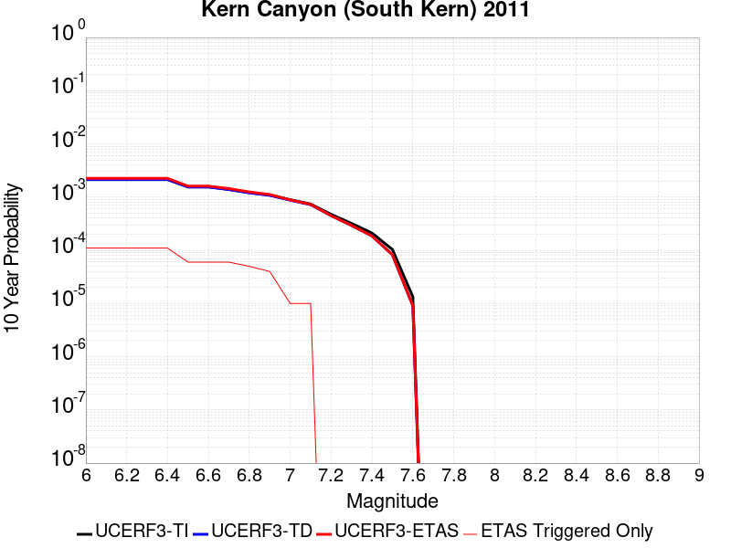 |

| Magnitude | 1 wk TI Prob | 1 wk TD Prob | 1 wk ETAS Prob | 1 wk ETAS/TD Gain | 1 wk ETAS Triggered Only | 1 mo TI Prob | 1 mo TD Prob | 1 mo ETAS Prob | 1 mo ETAS/TD Gain | 1 mo ETAS Triggered Only | 1 yr TI Prob | 1 yr TD Prob | 1 yr ETAS Prob | 1 yr ETAS/TD Gain | 1 yr ETAS Triggered Only | 10 yr TI Prob | 10 yr TD Prob | 10 yr ETAS Prob | 10 yr ETAS/TD Gain | 10 yr ETAS Triggered Only |
|-----|-----|-----|-----|-----|-----|-----|-----|-----|-----|-----|-----|-----|-----|-----|-----|-----|-----|-----|-----|-----|
| 6.0 | 4.105075E-6 | 4.1137264E-6 | 1.2025727E-4 | 29.233171 | 1.16144016E-4 | 1.7593058E-5 | 1.763014E-5 | 1.3377212E-4 | 7.587694 | 1.16144016E-4 | 2.1417443E-4 | 2.1462646E-4 | 3.3074556E-4 | 1.5410287 | 1.16144016E-4 | 0.0021396813 | 0.0021442557 | 0.0022601506 | 1.054049 | 1.16144016E-4 |
| 6.1 | 4.105075E-6 | 4.1137264E-6 | 1.2025727E-4 | 29.233171 | 1.16144016E-4 | 1.7593058E-5 | 1.763014E-5 | 1.3377212E-4 | 7.587694 | 1.16144016E-4 | 2.1417443E-4 | 2.1462646E-4 | 3.3074556E-4 | 1.5410287 | 1.16144016E-4 | 0.0021396813 | 0.0021442557 | 0.0022601506 | 1.054049 | 1.16144016E-4 |
| 6.2 | 4.105075E-6 | 4.1137264E-6 | 1.2025727E-4 | 29.233171 | 1.16144016E-4 | 1.7593058E-5 | 1.763014E-5 | 1.3377212E-4 | 7.587694 | 1.16144016E-4 | 2.1417443E-4 | 2.1462646E-4 | 3.3074556E-4 | 1.5410287 | 1.16144016E-4 | 0.0021396813 | 0.0021442557 | 0.0022601506 | 1.054049 | 1.16144016E-4 |
| 6.3 | 4.105075E-6 | 4.1137264E-6 | 1.2025727E-4 | 29.233171 | 1.16144016E-4 | 1.7593058E-5 | 1.763014E-5 | 1.3377212E-4 | 7.587694 | 1.16144016E-4 | 2.1417443E-4 | 2.1462646E-4 | 3.3074556E-4 | 1.5410287 | 1.16144016E-4 | 0.0021396813 | 0.0021442557 | 0.0022601506 | 1.054049 | 1.16144016E-4 |
| 6.4 | 4.105075E-6 | 4.1137264E-6 | 1.2025727E-4 | 29.233171 | 1.16144016E-4 | 1.7593058E-5 | 1.763014E-5 | 1.3377212E-4 | 7.587694 | 1.16144016E-4 | 2.1417443E-4 | 2.1462646E-4 | 3.3074556E-4 | 1.5410287 | 1.16144016E-4 | 0.0021396813 | 0.0021442557 | 0.0022601506 | 1.054049 | 1.16144016E-4 |
| 6.5 | 2.9849807E-6 | 2.9731548E-6 | 2.9731548E-6 | 1.0 | 0.0 | 1.2792712E-5 | 1.274203E-5 | 1.274203E-5 | 1.0 | 0.0 | 1.5574014E-4 | 1.5512333E-4 | 1.5512333E-4 | 1.0 | 0.0 | 0.0015563103 | 0.0015501656 | 0.0015501656 | 1.0 | 0.0 |
| 6.6 | 2.9849807E-6 | 2.9731548E-6 | 2.9731548E-6 | 1.0 | 0.0 | 1.2792712E-5 | 1.274203E-5 | 1.274203E-5 | 1.0 | 0.0 | 1.5574014E-4 | 1.5512333E-4 | 1.5512333E-4 | 1.0 | 0.0 | 0.0015563103 | 0.0015501656 | 0.0015501656 | 1.0 | 0.0 |
| 6.7 | 2.6756725E-6 | 2.6582206E-6 | 2.6582206E-6 | 1.0 | 0.0 | 1.1467117E-5 | 1.1392325E-5 | 1.1392325E-5 | 1.0 | 0.0 | 1.396032E-4 | 1.3869285E-4 | 1.3869285E-4 | 1.0 | 0.0 | 0.0013951553 | 0.0013860738 | 0.0013860738 | 1.0 | 0.0 |
| 6.8 | 2.3283721E-6 | 2.3047787E-6 | 2.3047787E-6 | 1.0 | 0.0 | 9.9787E-6 | 9.877586E-6 | 9.877586E-6 | 1.0 | 0.0 | 1.214839E-4 | 1.20253055E-4 | 1.20253055E-4 | 1.0 | 0.0 | 0.001214175 | 0.0012018873 | 0.0012018873 | 1.0 | 0.0 |
| 6.9 | 2.0972677E-6 | 2.0696411E-6 | 2.0696411E-6 | 1.0 | 0.0 | 8.988259E-6 | 8.869861E-6 | 8.869861E-6 | 1.0 | 0.0 | 1.0942656E-4 | 1.0798526E-4 | 1.0798526E-4 | 1.0 | 0.0 | 0.0010937268 | 0.0010793337 | 0.0010793337 | 1.0 | 0.0 |
| 7.0 | 1.7132242E-6 | 1.6787036E-6 | 1.6787036E-6 | 1.0 | 0.0 | 7.3423685E-6 | 7.194424E-6 | 7.194424E-6 | 1.0 | 0.0 | 8.938967E-5 | 8.758863E-5 | 8.758863E-5 | 1.0 | 0.0 | 8.935372E-4 | 8.7554497E-4 | 8.7554497E-4 | 1.0 | 0.0 |
| 7.1 | 1.4215541E-6 | 1.3815752E-6 | 1.3815752E-6 | 1.0 | 0.0 | 6.0923603E-6 | 5.9210233E-6 | 5.9210233E-6 | 1.0 | 0.0 | 7.417196E-5 | 7.20861E-5 | 7.20861E-5 | 1.0 | 0.0 | 7.414721E-4 | 7.206299E-4 | 7.206299E-4 | 1.0 | 0.0 |
| 7.2 | 9.097853E-7 | 8.6037755E-7 | 8.6037755E-7 | 1.0 | 0.0 | 3.899074E-6 | 3.6873273E-6 | 3.6873273E-6 | 1.0 | 0.0 | 4.7470192E-5 | 4.4892295E-5 | 4.4892295E-5 | 1.0 | 0.0 | 4.7460053E-4 | 4.4883334E-4 | 4.4883334E-4 | 1.0 | 0.0 |
| 7.3 | 6.144169E-7 | 5.628206E-7 | 5.628206E-7 | 1.0 | 0.0 | 2.6332125E-6 | 2.4120861E-6 | 2.4120861E-6 | 1.0 | 0.0 | 3.205889E-5 | 2.9366758E-5 | 2.9366758E-5 | 1.0 | 0.0 | 3.2054266E-4 | 2.936293E-4 | 2.936293E-4 | 1.0 | 0.0 |
| 7.4 | 4.049844E-7 | 3.5728314E-7 | 3.5728314E-7 | 1.0 | 0.0 | 1.7356463E-6 | 1.5312125E-6 | 1.5312125E-6 | 1.0 | 0.0 | 2.1131287E-5 | 1.8642357E-5 | 1.8642357E-5 | 1.0 | 0.0 | 2.1129279E-4 | 1.8640817E-4 | 1.8640817E-4 | 1.0 | 0.0 |
| 7.5 | 1.9871162E-7 | 1.583044E-7 | 1.583044E-7 | 1.0 | 0.0 | 8.5162094E-7 | 6.7844724E-7 | 6.7844724E-7 | 1.0 | 0.0 | 1.0368436E-5 | 8.260065E-6 | 8.260065E-6 | 1.0 | 0.0 | 1.0367952E-4 | 8.259767E-5 | 8.259767E-5 | 1.0 | 0.0 |
| 7.6 | 2.572245E-8 | 1.7352555E-8 | 1.7352555E-8 | 1.0 | 0.0 | 1.10239064E-7 | 7.436809E-8 | 7.436809E-8 | 1.0 | 0.0 | 1.3421597E-6 | 9.054312E-7 | 9.054312E-7 | 1.0 | 0.0 | 1.3421517E-5 | 9.05428E-6 | 9.05428E-6 | 1.0 | 0.0 |

## Big Pine (East)
*[(top)](#table-of-contents)*

| 1 Week | 1 Month | 1 Year | 10 Year |
|-----|-----|-----|-----|
|  | 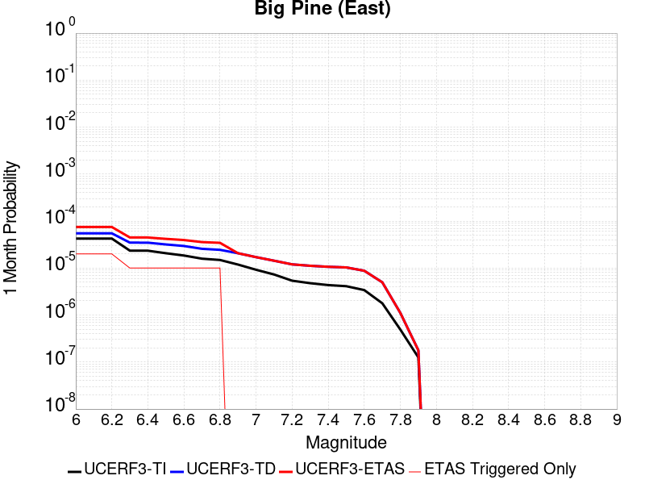 |  |  |

| Magnitude | 1 wk TI Prob | 1 wk TD Prob | 1 wk ETAS Prob | 1 wk ETAS/TD Gain | 1 wk ETAS Triggered Only | 1 mo TI Prob | 1 mo TD Prob | 1 mo ETAS Prob | 1 mo ETAS/TD Gain | 1 mo ETAS Triggered Only | 1 yr TI Prob | 1 yr TD Prob | 1 yr ETAS Prob | 1 yr ETAS/TD Gain | 1 yr ETAS Triggered Only | 10 yr TI Prob | 10 yr TD Prob | 10 yr ETAS Prob | 10 yr ETAS/TD Gain | 10 yr ETAS Triggered Only |
|-----|-----|-----|-----|-----|-----|-----|-----|-----|-----|-----|-----|-----|-----|-----|-----|-----|-----|-----|-----|-----|
| 6.0 | 9.916913E-6 | 1.2816984E-5 | 1.2816984E-5 | 1.0 | 0.0 | 4.250036E-5 | 5.49289E-5 | 5.49289E-5 | 1.0 | 0.0 | 5.173191E-4 | 6.685763E-4 | 7.8464265E-4 | 1.1736022 | 1.16144016E-4 | 0.0051611643 | 0.006670441 | 0.0067858105 | 1.0172956 | 1.16144016E-4 |
| 6.1 | 9.916913E-6 | 1.2816984E-5 | 1.2816984E-5 | 1.0 | 0.0 | 4.250036E-5 | 5.49289E-5 | 5.49289E-5 | 1.0 | 0.0 | 5.173191E-4 | 6.685763E-4 | 7.8464265E-4 | 1.1736022 | 1.16144016E-4 | 0.0051611643 | 0.006670441 | 0.0067858105 | 1.0172956 | 1.16144016E-4 |
| 6.2 | 9.916913E-6 | 1.2816984E-5 | 1.2816984E-5 | 1.0 | 0.0 | 4.250036E-5 | 5.49289E-5 | 5.49289E-5 | 1.0 | 0.0 | 5.173191E-4 | 6.685763E-4 | 7.8464265E-4 | 1.1736022 | 1.16144016E-4 | 0.0051611643 | 0.006670441 | 0.0067858105 | 1.0172956 | 1.16144016E-4 |
| 6.3 | 5.479711E-6 | 8.112951E-6 | 8.112951E-6 | 1.0 | 0.0 | 2.3484265E-5 | 3.4769346E-5 | 3.4769346E-5 | 1.0 | 0.0 | 2.858834E-4 | 4.2323777E-4 | 5.393326E-4 | 1.2743018 | 1.16144016E-4 | 0.0028551589 | 0.004227244 | 0.004342897 | 1.027359 | 1.16144016E-4 |
| 6.4 | 5.465009E-6 | 8.097245E-6 | 8.097245E-6 | 1.0 | 0.0 | 2.3421257E-5 | 3.4702036E-5 | 3.4702036E-5 | 1.0 | 0.0 | 2.851165E-4 | 4.2241855E-4 | 5.3851353E-4 | 1.2748339 | 1.16144016E-4 | 0.0028475097 | 0.0042190826 | 0.0043347366 | 1.0274122 | 1.16144016E-4 |
| 6.5 | 4.826767E-6 | 7.422301E-6 | 7.422301E-6 | 1.0 | 0.0 | 2.068598E-5 | 3.180949E-5 | 3.180949E-5 | 1.0 | 0.0 | 2.518227E-4 | 3.872145E-4 | 5.0331355E-4 | 1.2998314 | 1.16144016E-4 | 0.0025153751 | 0.003868283 | 0.0039839777 | 1.0299085 | 1.16144016E-4 |
| 6.6 | 4.3146847E-6 | 6.8822374E-6 | 6.8822374E-6 | 1.0 | 0.0 | 1.8491375E-5 | 2.9494982E-5 | 2.9494982E-5 | 1.0 | 0.0 | 2.2510924E-4 | 3.590447E-4 | 4.75147E-4 | 1.3233645 | 1.16144016E-4 | 0.0022488134 | 0.0035874986 | 0.0037032259 | 1.0322585 | 1.16144016E-4 |
| 6.7 | 3.6968106E-6 | 5.9954727E-6 | 5.9954727E-6 | 1.0 | 0.0 | 1.5843378E-5 | 2.5694639E-5 | 2.5694639E-5 | 1.0 | 0.0 | 1.9287605E-4 | 3.1278885E-4 | 3.1278885E-4 | 1.0 | 0.0 | 0.0019270873 | 0.0031262483 | 0.0031262483 | 1.0 | 0.0 |
| 6.8 | 3.4671132E-6 | 5.702177E-6 | 5.702177E-6 | 1.0 | 0.0 | 1.4858972E-5 | 2.4437682E-5 | 2.4437682E-5 | 1.0 | 0.0 | 1.8089297E-4 | 2.974896E-4 | 2.974896E-4 | 1.0 | 0.0 | 0.0018074579 | 0.002973667 | 0.002973667 | 1.0 | 0.0 |
| 6.9 | 2.7686972E-6 | 4.825223E-6 | 4.825223E-6 | 1.0 | 0.0 | 1.1865792E-5 | 2.0679368E-5 | 2.0679368E-5 | 1.0 | 0.0 | 1.4445644E-4 | 2.5174298E-4 | 2.5174298E-4 | 1.0 | 0.0 | 0.0014436257 | 0.0025172636 | 0.0025172636 | 1.0 | 0.0 |
| 7.0 | 2.1472624E-6 | 3.9850406E-6 | 3.9850406E-6 | 1.0 | 0.0 | 9.20252E-6 | 1.7078637E-5 | 1.7078637E-5 | 1.0 | 0.0 | 1.12034926E-4 | 2.079131E-4 | 2.079131E-4 | 1.0 | 0.0 | 0.0011197845 | 0.0020798394 | 0.0020798394 | 1.0 | 0.0 |
| 7.1 | 1.7018335E-6 | 3.344876E-6 | 3.344876E-6 | 1.0 | 0.0 | 7.293552E-6 | 1.4335106E-5 | 1.4335106E-5 | 1.0 | 0.0 | 8.879537E-5 | 1.7451629E-4 | 1.7451629E-4 | 1.0 | 0.0 | 8.87599E-4 | 0.0017464145 | 0.0017464145 | 1.0 | 0.0 |
| 7.2 | 1.25603E-6 | 2.794484E-6 | 2.794484E-6 | 1.0 | 0.0 | 5.3829745E-6 | 1.1976307E-5 | 1.1976307E-5 | 1.0 | 0.0 | 6.553574E-5 | 1.4580201E-4 | 1.4580201E-4 | 1.0 | 0.0 | 6.551642E-4 | 0.001459661 | 0.001459661 | 1.0 | 0.0 |
| 7.3 | 1.112297E-6 | 2.610332E-6 | 2.610332E-6 | 1.0 | 0.0 | 4.7669787E-6 | 1.118709E-5 | 1.118709E-5 | 1.0 | 0.0 | 5.803642E-5 | 1.3619453E-4 | 1.3619453E-4 | 1.0 | 0.0 | 5.802127E-4 | 0.0013635408 | 0.0013635408 | 1.0 | 0.0 |
| 7.4 | 1.0137181E-6 | 2.4834917E-6 | 2.4834917E-6 | 1.0 | 0.0 | 4.3444993E-6 | 1.0643494E-5 | 1.0643494E-5 | 1.0 | 0.0 | 5.2892992E-5 | 1.2957705E-4 | 1.2957705E-4 | 1.0 | 0.0 | 5.288041E-4 | 0.0012972289 | 0.0012972289 | 1.0 | 0.0 |
| 7.5 | 9.598608E-7 | 2.4071483E-6 | 2.4071483E-6 | 1.0 | 0.0 | 4.1136827E-6 | 1.031631E-5 | 1.031631E-5 | 1.0 | 0.0 | 5.0082934E-5 | 1.2559404E-4 | 1.2559404E-4 | 1.0 | 0.0 | 5.007165E-4 | 0.0012572526 | 0.0012572526 | 1.0 | 0.0 |
| 7.6 | 7.929459E-7 | 2.0448588E-6 | 2.0448588E-6 | 1.0 | 0.0 | 3.3983351E-6 | 8.763653E-6 | 8.763653E-6 | 1.0 | 0.0 | 4.1373947E-5 | 1.06692416E-4 | 1.06692416E-4 | 1.0 | 0.0 | 4.1366243E-4 | 0.0010685222 | 0.0010685222 | 1.0 | 0.0 |
| 7.7 | 4.155788E-7 | 1.1605589E-6 | 1.1605589E-6 | 1.0 | 0.0 | 1.7810507E-6 | 4.9738146E-6 | 4.9738146E-6 | 1.0 | 0.0 | 2.1684076E-5 | 6.0554554E-5 | 6.0554554E-5 | 1.0 | 0.0 | 2.1681961E-4 | 6.0857297E-4 | 6.0857297E-4 | 1.0 | 0.0 |
| 7.8 | 1.14666925E-7 | 2.592015E-7 | 2.592015E-7 | 1.0 | 0.0 | 4.914296E-7 | 1.1108631E-6 | 1.1108631E-6 | 1.0 | 0.0 | 5.9831386E-6 | 1.3524678E-5 | 1.3524678E-5 | 1.0 | 0.0 | 5.9829777E-5 | 1.3634123E-4 | 1.3634123E-4 | 1.0 | 0.0 |
| 7.9 | 2.9231824E-8 | 4.1463963E-8 | 4.1463963E-8 | 1.0 | 0.0 | 1.2527924E-7 | 1.7770269E-7 | 1.7770269E-7 | 1.0 | 0.0 | 1.5252737E-6 | 2.1635283E-6 | 2.1635283E-6 | 1.0 | 0.0 | 1.5252632E-5 | 2.1967755E-5 | 2.1967755E-5 | 1.0 | 0.0 |

## San Clemente
*[(top)](#table-of-contents)*

| 1 Week | 1 Month | 1 Year | 10 Year |
|-----|-----|-----|-----|
|  |  |  |  |

| Magnitude | 1 wk TI Prob | 1 wk TD Prob | 1 wk ETAS Prob | 1 wk ETAS/TD Gain | 1 wk ETAS Triggered Only | 1 mo TI Prob | 1 mo TD Prob | 1 mo ETAS Prob | 1 mo ETAS/TD Gain | 1 mo ETAS Triggered Only | 1 yr TI Prob | 1 yr TD Prob | 1 yr ETAS Prob | 1 yr ETAS/TD Gain | 1 yr ETAS Triggered Only | 10 yr TI Prob | 10 yr TD Prob | 10 yr ETAS Prob | 10 yr ETAS/TD Gain | 10 yr ETAS Triggered Only |
|-----|-----|-----|-----|-----|-----|-----|-----|-----|-----|-----|-----|-----|-----|-----|-----|-----|-----|-----|-----|-----|
| 6.0 | 6.681379E-5 | 8.163422E-5 | 1.9776876E-4 | 2.4226208 | 1.16144016E-4 | 2.8631336E-4 | 3.498173E-4 | 4.659207E-4 | 1.3318973 | 1.16144016E-4 | 0.003480294 | 0.0042512873 | 0.004366938 | 1.0272036 | 1.16144016E-4 | 0.03426291 | 0.041755714 | 0.041867007 | 1.0026654 | 1.16144016E-4 |
| 6.1 | 6.681379E-5 | 8.163422E-5 | 1.9776876E-4 | 2.4226208 | 1.16144016E-4 | 2.8631336E-4 | 3.498173E-4 | 4.659207E-4 | 1.3318973 | 1.16144016E-4 | 0.003480294 | 0.0042512873 | 0.004366938 | 1.0272036 | 1.16144016E-4 | 0.03426291 | 0.041755714 | 0.041867007 | 1.0026654 | 1.16144016E-4 |
| 6.2 | 3.9400576E-5 | 4.6451984E-5 | 4.6451984E-5 | 1.0 | 0.0 | 1.6884868E-4 | 1.9906509E-4 | 1.9906509E-4 | 1.0 | 0.0 | 0.0020537945 | 0.002420985 | 0.002420985 | 1.0 | 0.0 | 0.020349167 | 0.02395286 | 0.02395286 | 1.0 | 0.0 |
| 6.3 | 3.2590255E-5 | 3.7929087E-5 | 3.7929087E-5 | 1.0 | 0.0 | 1.3966505E-4 | 1.6254328E-4 | 1.6254328E-4 | 1.0 | 0.0 | 0.0016990956 | 0.0019771985 | 0.0019771985 | 1.0 | 0.0 | 0.01686163 | 0.019599866 | 0.019599866 | 1.0 | 0.0 |
| 6.4 | 2.9454652E-5 | 3.4097775E-5 | 3.4097775E-5 | 1.0 | 0.0 | 1.2622811E-4 | 1.4612528E-4 | 1.4612528E-4 | 1.0 | 0.0 | 0.0015357438 | 0.0017776482 | 0.0017776482 | 1.0 | 0.0 | 0.015251739 | 0.017637458 | 0.017637458 | 1.0 | 0.0 |
| 6.5 | 2.790836E-5 | 3.2247463E-5 | 3.2247463E-5 | 1.0 | 0.0 | 1.1960178E-4 | 1.3819622E-4 | 1.3819622E-4 | 1.0 | 0.0 | 0.001455179 | 0.0016812651 | 0.0016812651 | 1.0 | 0.0 | 0.014456868 | 0.016688475 | 0.016688475 | 1.0 | 0.0 |
| 6.6 | 2.2492153E-5 | 2.5762707E-5 | 2.5762707E-5 | 1.0 | 0.0 | 9.639138E-5 | 1.1040701E-4 | 1.1040701E-4 | 1.0 | 0.0 | 0.0011729331 | 0.0013433908 | 0.0013433908 | 1.0 | 0.0 | 0.011667615 | 0.013354415 | 0.013354415 | 1.0 | 0.0 |
| 6.7 | 1.9862755E-5 | 2.2666423E-5 | 2.2666423E-5 | 1.0 | 0.0 | 8.512331E-5 | 9.713826E-5 | 9.713826E-5 | 1.0 | 0.0 | 0.0010358836 | 0.0011820279 | 0.0011820279 | 1.0 | 0.0 | 0.010310682 | 0.011758701 | 0.011758701 | 1.0 | 0.0 |
| 6.8 | 1.6697575E-5 | 1.897771E-5 | 1.897771E-5 | 1.0 | 0.0 | 7.155907E-5 | 8.133056E-5 | 8.133056E-5 | 1.0 | 0.0 | 8.7088346E-4 | 9.897591E-4 | 9.897591E-4 | 1.0 | 0.0 | 0.008674784 | 0.0098545365 | 0.0098545365 | 1.0 | 0.0 |
| 6.9 | 1.5218415E-5 | 1.72694E-5 | 1.72694E-5 | 1.0 | 0.0 | 6.522015E-5 | 7.4009666E-5 | 7.4009666E-5 | 1.0 | 0.0 | 7.93766E-4 | 9.00704E-4 | 9.00704E-4 | 1.0 | 0.0 | 0.007909367 | 0.008971481 | 0.008971481 | 1.0 | 0.0 |
| 7.0 | 1.2392958E-5 | 1.4033016E-5 | 1.4033016E-5 | 1.0 | 0.0 | 5.3111595E-5 | 6.014015E-5 | 6.014015E-5 | 1.0 | 0.0 | 6.4644177E-4 | 7.319679E-4 | 7.319679E-4 | 1.0 | 0.0 | 0.0064456454 | 0.0072963564 | 0.0072963564 | 1.0 | 0.0 |
| 7.1 | 1.0934128E-5 | 1.2375138E-5 | 1.2375138E-5 | 1.0 | 0.0 | 4.6859706E-5 | 5.303527E-5 | 5.303527E-5 | 1.0 | 0.0 | 5.7036756E-4 | 6.455204E-4 | 6.455204E-4 | 1.0 | 0.0 | 0.0056890585 | 0.0064371997 | 0.0064371997 | 1.0 | 0.0 |
| 7.2 | 9.5798805E-6 | 1.0844935E-5 | 1.0844935E-5 | 1.0 | 0.0 | 4.1055984E-5 | 4.6477508E-5 | 4.6477508E-5 | 1.0 | 0.0 | 4.9974193E-4 | 5.657239E-4 | 5.657239E-4 | 1.0 | 0.0 | 0.0049861963 | 0.0056435615 | 0.0056435615 | 1.0 | 0.0 |
| 7.3 | 8.0167365E-6 | 9.083918E-6 | 9.083918E-6 | 1.0 | 0.0 | 3.4356988E-5 | 3.8930535E-5 | 3.8930535E-5 | 1.0 | 0.0 | 4.1821605E-4 | 4.7388324E-4 | 4.7388324E-4 | 1.0 | 0.0 | 0.0041742986 | 0.0047294297 | 0.0047294297 | 1.0 | 0.0 |
| 7.4 | 2.9581017E-6 | 3.3623792E-6 | 3.3623792E-6 | 1.0 | 0.0 | 1.2677518E-5 | 1.4410146E-5 | 1.4410146E-5 | 1.0 | 0.0 | 1.5433785E-4 | 1.7543444E-4 | 1.7543444E-4 | 1.0 | 0.0 | 0.001542307 | 0.0017534546 | 0.0017534546 | 1.0 | 0.0 |

## Camp Rock 2011
*[(top)](#table-of-contents)*

| 1 Week | 1 Month | 1 Year | 10 Year |
|-----|-----|-----|-----|
|  |  |  |  |

| Magnitude | 1 wk TI Prob | 1 wk TD Prob | 1 wk ETAS Prob | 1 wk ETAS/TD Gain | 1 wk ETAS Triggered Only | 1 mo TI Prob | 1 mo TD Prob | 1 mo ETAS Prob | 1 mo ETAS/TD Gain | 1 mo ETAS Triggered Only | 1 yr TI Prob | 1 yr TD Prob | 1 yr ETAS Prob | 1 yr ETAS/TD Gain | 1 yr ETAS Triggered Only | 10 yr TI Prob | 10 yr TD Prob | 10 yr ETAS Prob | 10 yr ETAS/TD Gain | 10 yr ETAS Triggered Only |
|-----|-----|-----|-----|-----|-----|-----|-----|-----|-----|-----|-----|-----|-----|-----|-----|-----|-----|-----|-----|-----|
| 6.0 | 1.6710783E-5 | 4.25026E-6 | 1.20393786E-4 | 28.326216 | 1.16144016E-4 | 7.161568E-5 | 1.8215276E-5 | 1.3435718E-4 | 7.3760715 | 1.16144016E-4 | 8.7157206E-4 | 2.2174895E-4 | 3.378672E-4 | 1.5236474 | 1.16144016E-4 | 0.008681616 | 0.0022153298 | 0.0023312164 | 1.0523113 | 1.16144016E-4 |
| 6.1 | 1.6710783E-5 | 4.25026E-6 | 1.20393786E-4 | 28.326216 | 1.16144016E-4 | 7.161568E-5 | 1.8215276E-5 | 1.3435718E-4 | 7.3760715 | 1.16144016E-4 | 8.7157206E-4 | 2.2174895E-4 | 3.378672E-4 | 1.5236474 | 1.16144016E-4 | 0.008681616 | 0.0022153298 | 0.0023312164 | 1.0523113 | 1.16144016E-4 |
| 6.2 | 1.6710783E-5 | 4.25026E-6 | 1.20393786E-4 | 28.326216 | 1.16144016E-4 | 7.161568E-5 | 1.8215276E-5 | 1.3435718E-4 | 7.3760715 | 1.16144016E-4 | 8.7157206E-4 | 2.2174895E-4 | 3.378672E-4 | 1.5236474 | 1.16144016E-4 | 0.008681616 | 0.0022153298 | 0.0023312164 | 1.0523113 | 1.16144016E-4 |
| 6.3 | 1.6710783E-5 | 4.25026E-6 | 1.20393786E-4 | 28.326216 | 1.16144016E-4 | 7.161568E-5 | 1.8215276E-5 | 1.3435718E-4 | 7.3760715 | 1.16144016E-4 | 8.7157206E-4 | 2.2174895E-4 | 3.378672E-4 | 1.5236474 | 1.16144016E-4 | 0.008681616 | 0.0022153298 | 0.0023312164 | 1.0523113 | 1.16144016E-4 |
| 6.4 | 7.982846E-6 | 3.6820884E-6 | 1.1982568E-4 | 32.54286 | 1.16144016E-4 | 3.421175E-5 | 1.5780286E-5 | 1.3192247E-4 | 8.359955 | 1.16144016E-4 | 4.1644843E-4 | 1.9210839E-4 | 3.0823008E-4 | 1.6044593 | 1.16144016E-4 | 0.0041566887 | 0.001919458 | 0.0020353792 | 1.0603926 | 1.16144016E-4 |
| 6.5 | 7.982846E-6 | 3.6820884E-6 | 1.1982568E-4 | 32.54286 | 1.16144016E-4 | 3.421175E-5 | 1.5780286E-5 | 1.3192247E-4 | 8.359955 | 1.16144016E-4 | 4.1644843E-4 | 1.9210839E-4 | 3.0823008E-4 | 1.6044593 | 1.16144016E-4 | 0.0041566887 | 0.001919458 | 0.0020353792 | 1.0603926 | 1.16144016E-4 |
| 6.6 | 7.048869E-6 | 3.4243571E-6 | 1.1956798E-4 | 34.916912 | 1.16144016E-4 | 3.0209088E-5 | 1.4675736E-5 | 1.3081805E-4 | 8.9139 | 1.16144016E-4 | 3.677336E-4 | 1.7866275E-4 | 2.94786E-4 | 1.6499579 | 1.16144016E-4 | 0.0036712566 | 0.0017852228 | 0.0019011594 | 1.0649424 | 1.16144016E-4 |
| 6.7 | 6.987307E-6 | 3.3623348E-6 | 1.1950596E-4 | 35.542553 | 1.16144016E-4 | 2.9945259E-5 | 1.4409929E-5 | 1.3055227E-4 | 9.059884 | 1.16144016E-4 | 3.6452254E-4 | 1.7542706E-4 | 2.915507E-4 | 1.6619483 | 1.16144016E-4 | 0.0036392517 | 0.001752917 | 0.0018688574 | 1.0661414 | 1.16144016E-4 |
| 6.8 | 6.3737602E-6 | 3.1179077E-6 | 1.1926157E-4 | 38.25051 | 1.16144016E-4 | 2.731583E-5 | 1.3362394E-5 | 1.2950486E-4 | 9.691741 | 1.16144016E-4 | 3.3251947E-4 | 1.626753E-4 | 2.788004E-4 | 1.7138461 | 1.16144016E-4 | 0.0033202237 | 0.0016255907 | 0.001741546 | 1.0713311 | 1.16144016E-4 |
| 6.9 | 6.112211E-6 | 2.9331156E-6 | 1.19076794E-4 | 40.597374 | 1.16144016E-4 | 2.6194928E-5 | 1.2570436E-5 | 1.28713E-4 | 10.239342 | 1.16144016E-4 | 3.1887658E-4 | 1.5303459E-4 | 2.6916084E-4 | 1.7588235 | 1.16144016E-4 | 0.003184194 | 0.0015293199 | 0.0016452862 | 1.0758288 | 1.16144016E-4 |
| 7.0 | 5.5140117E-6 | 2.641923E-6 | 1.1878563E-4 | 44.961807 | 1.16144016E-4 | 2.3631264E-5 | 1.132248E-5 | 1.2746519E-4 | 11.2577095 | 1.16144016E-4 | 2.8767265E-4 | 1.3784273E-4 | 2.5397073E-4 | 1.8424674 | 1.16144016E-4 | 0.0028730053 | 0.0013775975 | 0.0014935815 | 1.084193 | 1.16144016E-4 |
| 7.1 | 4.8151105E-6 | 2.1342705E-6 | 1.1827804E-4 | 55.418488 | 1.16144016E-4 | 2.0636026E-5 | 9.146843E-6 | 1.252898E-4 | 13.697601 | 1.16144016E-4 | 2.5121463E-4 | 1.1135734E-4 | 2.2748842E-4 | 2.0428689 | 1.16144016E-4 | 0.0025093083 | 0.0011130372 | 0.001229052 | 1.1042325 | 1.16144016E-4 |
| 7.2 | 3.818335E-6 | 1.2937425E-6 | 1.1743761E-4 | 90.77356 | 1.16144016E-4 | 1.6364189E-5 | 5.5445994E-6 | 1.21687975E-4 | 21.947119 | 1.16144016E-4 | 1.9921579E-4 | 6.750349E-5 | 1.8363967E-4 | 2.720447 | 1.16144016E-4 | 0.0019903728 | 6.748381E-4 | 7.909037E-4 | 1.1719904 | 1.16144016E-4 |
| 7.3 | 2.7166698E-6 | 7.3835776E-7 | 1.1688229E-4 | 158.30035 | 1.16144016E-4 | 1.1642818E-5 | 3.1643867E-6 | 1.1930804E-4 | 37.70337 | 1.16144016E-4 | 1.4174209E-4 | 3.8525748E-5 | 1.546653E-4 | 4.0145955 | 1.16144016E-4 | 0.0014165172 | 3.851927E-4 | 5.0129194E-4 | 1.3014057 | 1.16144016E-4 |
| 7.4 | 2.0893426E-6 | 5.4618386E-7 | 1.1669014E-4 | 213.64626 | 1.16144016E-4 | 8.954295E-6 | 2.3407858E-6 | 1.1848453E-4 | 50.617416 | 1.16144016E-4 | 1.0901308E-4 | 2.84987E-5 | 1.4463942E-4 | 5.0752983 | 1.16144016E-4 | 0.0010895962 | 2.84951E-4 | 4.0106193E-4 | 1.4074768 | 1.16144016E-4 |
| 7.5 | 1.1681728E-6 | 3.6030585E-7 | 1.16504285E-4 | 323.3483 | 1.16144016E-4 | 5.0064455E-6 | 1.544167E-6 | 1.17688E-4 | 76.214554 | 1.16144016E-4 | 6.0951766E-5 | 1.8800076E-5 | 1.3494192E-4 | 7.177732 | 1.16144016E-4 | 6.093505E-4 | 1.8798532E-4 | 3.041075E-4 | 1.6177194 | 1.16144016E-4 |
| 7.6 | 1.3154387E-7 | 7.1197384E-8 | 7.1197384E-8 | 1.0 | 0.0 | 5.6375933E-7 | 3.051316E-7 | 3.051316E-7 | 1.0 | 0.0 | 6.863748E-6 | 3.7149728E-6 | 3.7149728E-6 | 1.0 | 0.0 | 6.863536E-5 | 3.7149264E-5 | 3.7149264E-5 | 1.0 | 0.0 |

## Sheephole
*[(top)](#table-of-contents)*

| 1 Week | 1 Month | 1 Year | 10 Year |
|-----|-----|-----|-----|
|  |  | 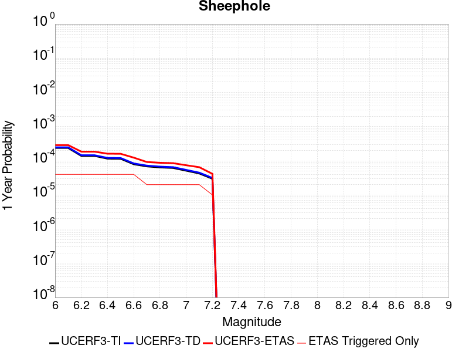 |  |

| Magnitude | 1 wk TI Prob | 1 wk TD Prob | 1 wk ETAS Prob | 1 wk ETAS/TD Gain | 1 wk ETAS Triggered Only | 1 mo TI Prob | 1 mo TD Prob | 1 mo ETAS Prob | 1 mo ETAS/TD Gain | 1 mo ETAS Triggered Only | 1 yr TI Prob | 1 yr TD Prob | 1 yr ETAS Prob | 1 yr ETAS/TD Gain | 1 yr ETAS Triggered Only | 10 yr TI Prob | 10 yr TD Prob | 10 yr ETAS Prob | 10 yr ETAS/TD Gain | 10 yr ETAS Triggered Only |
|-----|-----|-----|-----|-----|-----|-----|-----|-----|-----|-----|-----|-----|-----|-----|-----|-----|-----|-----|-----|-----|
| 6.0 | 4.5579695E-6 | 4.7412627E-6 | 4.7412627E-6 | 1.0 | 0.0 | 1.9534009E-5 | 2.031957E-5 | 1.3646123E-4 | 6.715754 | 1.16144016E-4 | 2.3780059E-4 | 2.473682E-4 | 3.634835E-4 | 1.4694026 | 1.16144016E-4 | 0.0023754628 | 0.002471473 | 0.00258733 | 1.0468777 | 1.16144016E-4 |
| 6.1 | 4.5579695E-6 | 4.7412627E-6 | 4.7412627E-6 | 1.0 | 0.0 | 1.9534009E-5 | 2.031957E-5 | 1.3646123E-4 | 6.715754 | 1.16144016E-4 | 2.3780059E-4 | 2.473682E-4 | 3.634835E-4 | 1.4694026 | 1.16144016E-4 | 0.0023754628 | 0.002471473 | 0.00258733 | 1.0468777 | 1.16144016E-4 |
| 6.2 | 2.6677674E-6 | 2.7873941E-6 | 2.7873941E-6 | 1.0 | 0.0 | 1.1433239E-5 | 1.1945926E-5 | 1.2808856E-4 | 10.7223625 | 1.16144016E-4 | 1.3919079E-4 | 1.4543302E-4 | 2.6156014E-4 | 1.7984921 | 1.16144016E-4 | 0.0013910364 | 0.0014534844 | 0.0015694596 | 1.0797912 | 1.16144016E-4 |
| 6.3 | 2.6677674E-6 | 2.7873941E-6 | 2.7873941E-6 | 1.0 | 0.0 | 1.1433239E-5 | 1.1945926E-5 | 1.2808856E-4 | 10.7223625 | 1.16144016E-4 | 1.3919079E-4 | 1.4543302E-4 | 2.6156014E-4 | 1.7984921 | 1.16144016E-4 | 0.0013910364 | 0.0014534844 | 0.0015694596 | 1.0797912 | 1.16144016E-4 |
| 6.4 | 2.2159759E-6 | 2.3228788E-6 | 2.3228788E-6 | 1.0 | 0.0 | 9.497005E-6 | 9.955161E-6 | 1.2609802E-4 | 12.666598 | 1.16144016E-4 | 1.156199E-4 | 1.2119815E-4 | 2.3732809E-4 | 1.9581825 | 1.16144016E-4 | 0.0011555976 | 0.0012113999 | 0.0013274032 | 1.0957597 | 1.16144016E-4 |
| 6.5 | 2.1986082E-6 | 2.304759E-6 | 2.304759E-6 | 1.0 | 0.0 | 9.4225725E-6 | 9.877506E-6 | 1.2602037E-4 | 12.75832 | 1.16144016E-4 | 1.1471378E-4 | 1.2025281E-4 | 2.3638285E-4 | 1.965716 | 1.16144016E-4 | 0.0011465458 | 0.0012019566 | 0.001317961 | 1.096513 | 1.16144016E-4 |
| 6.6 | 1.5232331E-6 | 1.6018919E-6 | 1.6018919E-6 | 1.0 | 0.0 | 6.5281256E-6 | 6.865234E-6 | 1.2300846E-4 | 17.917591 | 1.16144016E-4 | 7.947703E-5 | 8.35812E-5 | 1.9971552E-4 | 2.3894787 | 1.16144016E-4 | 7.9448614E-4 | 8.3551643E-4 | 9.515634E-4 | 1.1388925 | 1.16144016E-4 |
| 6.7 | 1.3137362E-6 | 1.382819E-6 | 1.382819E-6 | 1.0 | 0.0 | 5.6302856E-6 | 5.926355E-6 | 5.926355E-6 | 1.0 | 0.0 | 6.854657E-5 | 7.215112E-5 | 7.215112E-5 | 1.0 | 0.0 | 6.8525434E-4 | 7.212908E-4 | 7.212908E-4 | 1.0 | 0.0 |
| 6.8 | 1.2275751E-6 | 1.2922847E-6 | 1.2922847E-6 | 1.0 | 0.0 | 5.2610258E-6 | 5.5383516E-6 | 5.5383516E-6 | 1.0 | 0.0 | 6.4051106E-5 | 6.7427485E-5 | 6.7427485E-5 | 1.0 | 0.0 | 6.4032647E-4 | 6.740836E-4 | 6.740836E-4 | 1.0 | 0.0 |
| 6.9 | 1.1837088E-6 | 1.246102E-6 | 1.246102E-6 | 1.0 | 0.0 | 5.0730278E-6 | 5.340427E-6 | 5.340427E-6 | 1.0 | 0.0 | 6.176237E-5 | 6.501789E-5 | 6.501789E-5 | 1.0 | 0.0 | 6.17452E-4 | 6.5000186E-4 | 6.5000186E-4 | 1.0 | 0.0 |
| 7.0 | 9.849371E-7 | 1.0366288E-6 | 1.0366288E-6 | 1.0 | 0.0 | 4.2211523E-6 | 4.442688E-6 | 4.442688E-6 | 1.0 | 0.0 | 5.1391315E-5 | 5.4088487E-5 | 5.4088487E-5 | 1.0 | 0.0 | 5.137943E-4 | 5.407633E-4 | 5.407633E-4 | 1.0 | 0.0 |
| 7.1 | 8.1643645E-7 | 8.591669E-7 | 8.591669E-7 | 1.0 | 0.0 | 3.4990085E-6 | 3.682139E-6 | 3.682139E-6 | 1.0 | 0.0 | 4.2599597E-5 | 4.482921E-5 | 4.482921E-5 | 1.0 | 0.0 | 4.259143E-4 | 4.4821028E-4 | 4.4821028E-4 | 1.0 | 0.0 |
| 7.2 | 5.7295756E-7 | 6.029502E-7 | 6.029502E-7 | 1.0 | 0.0 | 2.45553E-6 | 2.58407E-6 | 2.58407E-6 | 1.0 | 0.0 | 2.9895667E-5 | 3.1460666E-5 | 3.1460666E-5 | 1.0 | 0.0 | 2.9891645E-4 | 3.145688E-4 | 3.145688E-4 | 1.0 | 0.0 |

