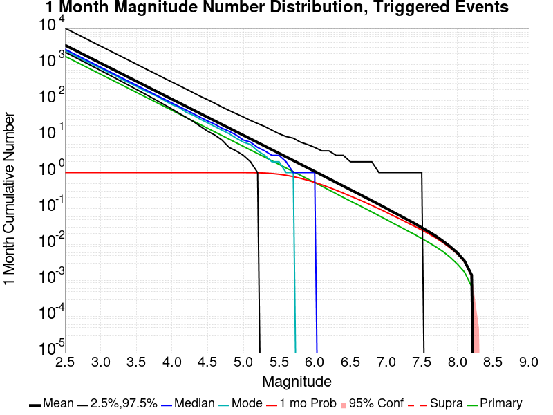
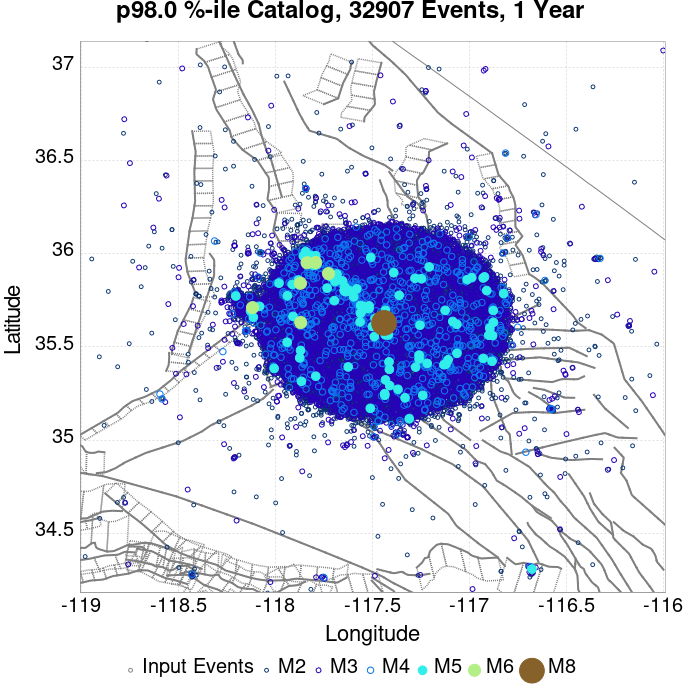
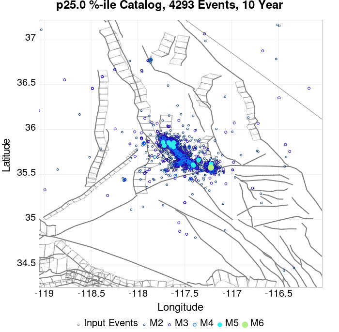
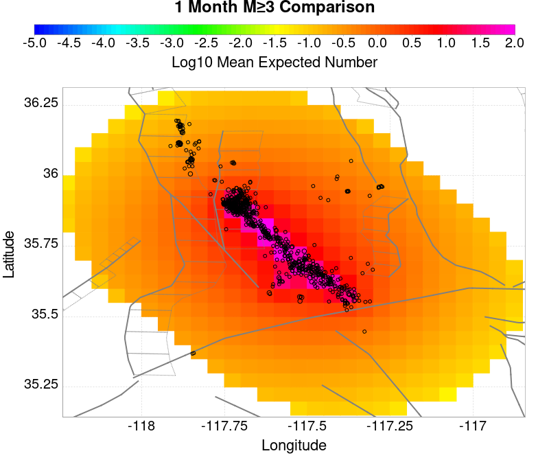
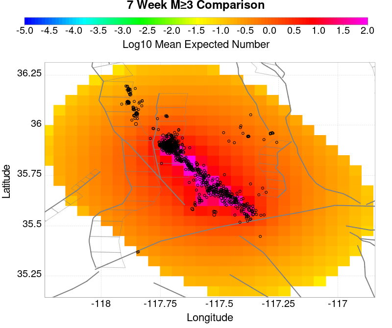
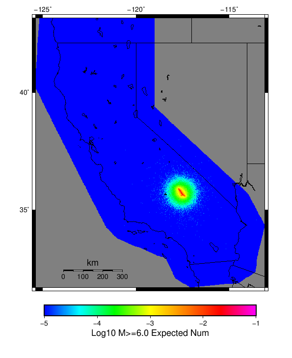

# ComCat M7.1 (ci38457511), ShakeMap Surfaces, No Faults Results

|   | ComCat M7.1 (ci38457511), ShakeMap Surfaces, No Faults |
|-----|-----|
| Num Simulations | 62794 (incomplete) |
| Start Time | 2019/07/06 03:19:54 UTC |
| Start Time Epoch Milliseconds | 1562383194040 |
| Duration | 10 Years |
| Includes Spontaneous? | false |
| Trigger Ruptures | 253 Trigger Ruptures |
|   | First: M3.98 at 2019/07/04 17:02:55 UTC |
|   | Last: M7.1 at 2019/07/06 03:19:53 UTC |
|   | Largest: M7.1 at 2019/07/06 03:19:53 UTC |
| Historical Ruptures | *(none)* |

## Table Of Contents

* [Probabilities Summary Table](#probabilities-summary-table)
* [Magnitude Number Distribution](#magnitude-number-distribution)
  * [10 Year Magnitude Number Distribution](#10-year-magnitude-number-distribution)
  * [1 Year Magnitude Number Distribution](#1-year-magnitude-number-distribution)
  * [1 Month Magnitude Number Distribution](#1-month-magnitude-number-distribution)
  * [1 Week Magnitude Number Distribution](#1-week-magnitude-number-distribution)
  * [1 Day Magnitude Number Distribution](#1-day-magnitude-number-distribution)
  * [1 Hour Magnitude Number Distribution](#1-hour-magnitude-number-distribution)
* [Hazard Change Over Time](#hazard-change-over-time)
  * [M&ge;5.0 Hazard Change Over Time](#m50-hazard-change-over-time)
  * [M&ge;6.0 Hazard Change Over Time](#m60-hazard-change-over-time)
  * [M&ge;7.0 Hazard Change Over Time](#m70-hazard-change-over-time)
  * [M&ge;8.0 Hazard Change Over Time](#m80-hazard-change-over-time)
* [Trigger Rupture Fault Map](#trigger-rupture-fault-map)
* [Trigger Rupture Depth Map](#trigger-rupture-depth-map)
* [Fault Distances To Triggers](#fault-distances-to-triggers)
* [Individual Simulated Catalog Maps](#individual-simulated-catalog-maps)
* [ComCat Data Comparisons](#comcat-data-comparisons)
  * [ComCat Magnitude-Number Distributions](#comcat-magnitude-number-distributions)
  * [ComCat Cumulative Number Vs Time](#comcat-cumulative-number-vs-time)
  * [ComCat Cumulative Number Simulation Percentiles](#comcat-cumulative-number-simulation-percentiles)
  * [ComCat Mean Spatial Distribution](#comcat-mean-spatial-distribution)
  * [ComCat Depth Distribution](#comcat-depth-distribution)
* [Gridded Nucleation](#gridded-nucleation)
* [JSON Input File](#json-input-file)

## Probabilities Summary Table
*[(top)](#table-of-contents)*

| Magnitude | 1 Hour Prob | 1 Day Prob | 1 Week Prob | 1 Month Prob | 1 Year Prob | 10 Year Prob |
|-----|-----|-----|-----|-----|-----|-----|
| **M&ge;4** | 1.000 (100.00%) | 1.000 (100.00%) | 1.000 (100.00%) | 1.000 (100.00%) | 1.000 (100.00%) | 1.000 (100.00%) |
| **M&ge;4.5** | 0.992 (99.18%) | 1.000 (100.00%) | 1.000 (100.00%) | 1.000 (100.00%) | 1.000 (100.00%) | 1.000 (100.00%) |
| **M&ge;5** | 0.784 (78.37%) | 0.981 (98.06%) | 0.996 (99.60%) | 0.999 (99.88%) | 1.000 (99.99%) | 1.000 (100.00%) |
| **M&ge;5.5** | 0.387 (38.71%) | 0.722 (72.24%) | 0.843 (84.31%) | 0.900 (89.97%) | 0.953 (95.35%) | 0.976 (97.61%) |
| **M&ge;6** | 0.143 (14.33%) | 0.338 (33.84%) | 0.455 (45.48%) | 0.535 (53.45%) | 0.648 (64.75%) | 0.728 (72.83%) |
| **M&ge;6.5** | 0.046 (4.61%) | 0.125 (12.53%) | 0.180 (18.05%) | 0.224 (22.43%) | 0.300 (29.98%) | 0.366 (36.58%) |
| **M&ge;7** | 0.015 (1.55%) | 0.043 (4.30%) | 0.064 (6.39%) | 0.082 (8.18%) | 0.114 (11.44%) | 0.147 (14.66%) |
| **M&ge;7.1** | 0.012 (1.22%) | 0.034 (3.37%) | 0.050 (5.00%) | 0.065 (6.50%) | 0.092 (9.23%) | 0.119 (11.92%) |
| **M&ge;7.5** | 4.67E-3 (0.47%) | 0.013 (1.26%) | 0.019 (1.92%) | 0.026 (2.55%) | 0.037 (3.67%) | 0.049 (4.89%) |
| **M&ge;8** | 8.44E-4 (0.08%) | 2.64E-3 (0.26%) | 4.49E-3 (0.45%) | 6.07E-3 (0.61%) | 8.84E-3 (0.88%) | 0.012 (1.20%) |

## Magnitude Number Distribution
*[(top)](#table-of-contents)*

### 10 Year Magnitude Number Distribution
*[(top)](#table-of-contents)*

**Legend**
* **Mean** (thick black line): mean expected number across all 62794 catalogs
* **2.5%,97.5%** (thin black lines): expected number percentiles across all 62794 catalogs
* **Median** (thin blue line): median expected number across all 62794 catalogs
* **Mode** (thin cyan line): modal expected number across all 62794 catalogs
* **10 yr Probability** (thin red line): 10 year probability calculated as the fraction of catalogs with at least 1 occurrence
* **10 yr Supraseismogenic Probability** (thin dashed red line): same as above, but only for supraseismogenic ruptures on explicitly modeled UCERF3 faults
* **95% Conf** (light red shaded region): binomial 95% confidence bounds on probability
* **Primary** (thin green line): mean expected number from primary triggered aftershocks only (no secondary, tertiary, etc...) across all 62794 catalogs


| Mag | Mean | 2.5 %ile | 97.5 %ile | Median | Mode | 10 yr Probability | 10 yr Supra-Seis Prob | Primary Aftershocks Mean |
|-----|-----|-----|-----|-----|-----|-----|-----|-----|
| **M&ge;2.5** | 7962.512 | 3696.000 | 35348.000 | 4992.000 | 4149.000 | 1.000 (100.00%) | 0.000 (0.00%) | 2391.661 |
| **M&ge;2.6** | 6324.978 | 2930.000 | 28058.000 | 3968.000 | 3421.000 | 1.000 (100.00%) | 0.000 (0.00%) | 1899.802 |
| **M&ge;2.7** | 5024.111 | 2326.000 | 22313.000 | 3153.000 | 2702.000 | 1.000 (100.00%) | 0.000 (0.00%) | 1509.080 |
| **M&ge;2.8** | 3990.734 | 1842.000 | 17681.000 | 2504.000 | 2320.000 | 1.000 (100.00%) | 0.000 (0.00%) | 1198.726 |
| **M&ge;2.9** | 3169.845 | 1458.000 | 14060.000 | 1990.000 | 1708.000 | 1.000 (100.00%) | 0.000 (0.00%) | 952.145 |
| **M&ge;3** | 2517.987 | 1154.000 | 11157.000 | 1581.000 | 1348.000 | 1.000 (100.00%) | 0.000 (0.00%) | 756.354 |
| **M&ge;3.1** | 2000.163 | 913.000 | 8877.000 | 1256.000 | 1096.000 | 1.000 (100.00%) | 0.000 (0.00%) | 600.852 |
| **M&ge;3.2** | 1588.720 | 721.000 | 7047.000 | 998.000 | 879.000 | 1.000 (100.00%) | 0.000 (0.00%) | 477.340 |
| **M&ge;3.3** | 1261.896 | 570.000 | 5590.000 | 794.000 | 705.000 | 1.000 (100.00%) | 0.000 (0.00%) | 379.120 |
| **M&ge;3.4** | 1002.312 | 449.000 | 4449.000 | 631.000 | 523.000 | 1.000 (100.00%) | 0.000 (0.00%) | 301.080 |
| **M&ge;3.5** | 796.193 | 353.000 | 3538.000 | 502.000 | 436.000 | 1.000 (100.00%) | 0.000 (0.00%) | 239.179 |
| **M&ge;3.6** | 632.377 | 278.000 | 2800.000 | 399.000 | 351.000 | 1.000 (100.00%) | 0.000 (0.00%) | 190.007 |
| **M&ge;3.7** | 502.283 | 219.000 | 2231.000 | 317.000 | 270.000 | 1.000 (100.00%) | 0.000 (0.00%) | 150.909 |
| **M&ge;3.8** | 398.990 | 171.000 | 1775.000 | 253.000 | 206.000 | 1.000 (100.00%) | 0.000 (0.00%) | 119.892 |
| **M&ge;3.9** | 316.888 | 133.000 | 1412.000 | 201.000 | 171.000 | 1.000 (100.00%) | 0.000 (0.00%) | 95.212 |
| **M&ge;4** | 251.719 | 104.000 | 1115.000 | 160.000 | 132.000 | 1.000 (100.00%) | 0.000 (0.00%) | 75.645 |
| **M&ge;4.1** | 199.924 | 81.000 | 885.000 | 127.000 | 109.000 | 1.000 (100.00%) | 0.000 (0.00%) | 60.097 |
| **M&ge;4.2** | 158.872 | 62.000 | 705.000 | 101.000 | 86.000 | 1.000 (100.00%) | 0.000 (0.00%) | 47.749 |
| **M&ge;4.3** | 126.226 | 48.000 | 564.000 | 81.000 | 71.000 | 1.000 (100.00%) | 0.000 (0.00%) | 37.940 |
| **M&ge;4.4** | 100.234 | 37.000 | 448.000 | 64.000 | 57.000 | 1.000 (100.00%) | 0.000 (0.00%) | 30.122 |
| **M&ge;4.5** | 79.586 | 28.000 | 357.000 | 51.000 | 43.000 | 1.000 (100.00%) | 0.000 (0.00%) | 23.917 |
| **M&ge;4.6** | 63.214 | 21.000 | 285.000 | 41.000 | 35.000 | 1.000 (100.00%) | 0.000 (0.00%) | 19.002 |
| **M&ge;4.7** | 50.199 | 16.000 | 226.000 | 32.000 | 27.000 | 1.000 (100.00%) | 0.000 (0.00%) | 15.092 |
| **M&ge;4.8** | 39.893 | 12.000 | 180.000 | 26.000 | 21.000 | 1.000 (100.00%) | 0.000 (0.00%) | 11.995 |
| **M&ge;4.9** | 31.681 | 8.000 | 142.000 | 21.000 | 18.000 | 1.000 (100.00%) | 0.000 (0.00%) | 9.534 |
| **M&ge;5** | 25.164 | 6.000 | 114.000 | 16.000 | 14.000 | 1.000 (100.00%) | 0.000 (0.00%) | 7.571 |
| **M&ge;5.1** | 20.001 | 4.000 | 92.000 | 13.000 | 10.000 | 1.000 (99.98%) | 0.000 (0.00%) | 6.022 |
| **M&ge;5.2** | 15.901 | 3.000 | 73.000 | 10.000 | 8.000 | 0.999 (99.93%) | 0.000 (0.00%) | 4.788 |
| **M&ge;5.3** | 12.623 | 2.000 | 59.000 | 8.000 | 6.000 | 0.997 (99.67%) | 0.000 (0.00%) | 3.803 |
| **M&ge;5.4** | 10.026 | 1.000 | 47.000 | 6.000 | 4.000 | 0.991 (99.07%) | 0.000 (0.00%) | 3.017 |
| **M&ge;5.5** | 7.960 | 1.000 | 38.000 | 5.000 | 4.000 | 0.976 (97.61%) | 0.000 (0.00%) | 2.396 |
| **M&ge;5.6** | 6.314 | 0.000 | 30.000 | 4.000 | 3.000 | 0.951 (95.14%) | 0.000 (0.00%) | 1.898 |
| **M&ge;5.7** | 5.019 | 0.000 | 24.000 | 3.000 | 2.000 | 0.913 (91.32%) | 0.000 (0.00%) | 1.509 |
| **M&ge;5.8** | 3.979 | 0.000 | 20.000 | 2.000 | 1.000 | 0.862 (86.23%) | 0.000 (0.00%) | 1.196 |
| **M&ge;5.9** | 3.162 | 0.000 | 16.000 | 2.000 | 1.000 | 0.800 (79.98%) | 0.000 (0.00%) | 0.947 |
| **M&ge;6** | 2.512 | 0.000 | 13.000 | 1.000 | 0.000 | 0.728 (72.83%) | 0.000 (0.00%) | 0.750 |
| **M&ge;6.1** | 1.994 | 0.000 | 11.000 | 1.000 | 0.000 | 0.652 (65.20%) | 0.000 (0.00%) | 0.596 |
| **M&ge;6.2** | 1.581 | 0.000 | 9.000 | 1.000 | 0.000 | 0.575 (57.52%) | 0.000 (0.00%) | 0.472 |
| **M&ge;6.3** | 1.254 | 0.000 | 8.000 | 0.000 | 0.000 | 0.500 (49.97%) | 0.000 (0.00%) | 0.373 |
| **M&ge;6.4** | 0.993 | 0.000 | 6.000 | 0.000 | 0.000 | 0.429 (42.94%) | 0.000 (0.00%) | 0.294 |
| **M&ge;6.5** | 0.786 | 0.000 | 5.000 | 0.000 | 0.000 | 0.366 (36.58%) | 0.000 (0.00%) | 0.232 |
| **M&ge;6.6** | 0.624 | 0.000 | 4.000 | 0.000 | 0.000 | 0.311 (31.07%) | 0.000 (0.00%) | 0.185 |
| **M&ge;6.7** | 0.493 | 0.000 | 4.000 | 0.000 | 0.000 | 0.260 (25.95%) | 0.000 (0.00%) | 0.146 |
| **M&ge;6.8** | 0.389 | 0.000 | 3.000 | 0.000 | 0.000 | 0.215 (21.51%) | 0.000 (0.00%) | 0.116 |
| **M&ge;6.9** | 0.308 | 0.000 | 3.000 | 0.000 | 0.000 | 0.179 (17.88%) | 0.000 (0.00%) | 0.092 |
| **M&ge;7** | 0.242 | 0.000 | 2.000 | 0.000 | 0.000 | 0.147 (14.66%) | 0.000 (0.00%) | 0.072 |
| **M&ge;7.1** | 0.189 | 0.000 | 2.000 | 0.000 | 0.000 | 0.119 (11.92%) | 0.000 (0.00%) | 0.056 |
| **M&ge;7.2** | 0.147 | 0.000 | 2.000 | 0.000 | 0.000 | 0.097 (9.69%) | 0.000 (0.00%) | 0.044 |
| **M&ge;7.3** | 0.114 | 0.000 | 1.000 | 0.000 | 0.000 | 0.078 (7.76%) | 0.000 (0.00%) | 0.035 |
| **M&ge;7.4** | 0.089 | 0.000 | 1.000 | 0.000 | 0.000 | 0.062 (6.22%) | 0.000 (0.00%) | 0.027 |
| **M&ge;7.5** | 0.067 | 0.000 | 1.000 | 0.000 | 0.000 | 0.049 (4.89%) | 0.000 (0.00%) | 0.021 |
| **M&ge;7.6** | 0.051 | 0.000 | 1.000 | 0.000 | 0.000 | 0.039 (3.90%) | 0.000 (0.00%) | 0.016 |
| **M&ge;7.7** | 0.039 | 0.000 | 1.000 | 0.000 | 0.000 | 0.030 (3.03%) | 0.000 (0.00%) | 0.012 |
| **M&ge;7.8** | 0.028 | 0.000 | 0.000 | 0.000 | 0.000 | 0.023 (2.31%) | 0.000 (0.00%) | 8.79E-3 |
| **M&ge;7.9** | 0.020 | 0.000 | 0.000 | 0.000 | 0.000 | 0.017 (1.70%) | 0.000 (0.00%) | 6.21E-3 |
| **M&ge;8** | 0.014 | 0.000 | 0.000 | 0.000 | 0.000 | 0.012 (1.20%) | 0.000 (0.00%) | 4.04E-3 |
| **M&ge;8.1** | 8.17E-3 | 0.000 | 0.000 | 0.000 | 0.000 | 7.39E-3 (0.74%) | 0.000 (0.00%) | 2.36E-3 |
| **M&ge;8.2** | 3.74E-3 | 0.000 | 0.000 | 0.000 | 0.000 | 3.54E-3 (0.35%) | 0.000 (0.00%) | 9.40E-4 |
| **M&ge;8.3** | 0.000 | 0.000 | 0.000 | 0.000 | 0.000 | 0.000 (0.00%) | 0.000 (0.00%) | 0.000 |
| **M&ge;8.4** | 0.000 | 0.000 | 0.000 | 0.000 | 0.000 | 0.000 (0.00%) | 0.000 (0.00%) | 0.000 |
| **M&ge;8.5** | 0.000 | 0.000 | 0.000 | 0.000 | 0.000 | 0.000 (0.00%) | 0.000 (0.00%) | 0.000 |
| **M&ge;8.6** | 0.000 | 0.000 | 0.000 | 0.000 | 0.000 | 0.000 (0.00%) | 0.000 (0.00%) | 0.000 |
| **M&ge;8.7** | 0.000 | 0.000 | 0.000 | 0.000 | 0.000 | 0.000 (0.00%) | 0.000 (0.00%) | 0.000 |
| **M&ge;8.8** | 0.000 | 0.000 | 0.000 | 0.000 | 0.000 | 0.000 (0.00%) | 0.000 (0.00%) | 0.000 |
| **M&ge;8.9** | 0.000 | 0.000 | 0.000 | 0.000 | 0.000 | 0.000 (0.00%) | 0.000 (0.00%) | 0.000 |
| **M&ge;9** | 0.000 | 0.000 | 0.000 | 0.000 | 0.000 | 0.000 (0.00%) | 0.000 (0.00%) | 0.000 |

### 1 Year Magnitude Number Distribution
*[(top)](#table-of-contents)*

**Legend**
* **Mean** (thick black line): mean expected number across all 62794 catalogs
* **2.5%,97.5%** (thin black lines): expected number percentiles across all 62794 catalogs
* **Median** (thin blue line): median expected number across all 62794 catalogs
* **Mode** (thin cyan line): modal expected number across all 62794 catalogs
* **1 yr Probability** (thin red line): 1 year probability calculated as the fraction of catalogs with at least 1 occurrence
* **1 yr Supraseismogenic Probability** (thin dashed red line): same as above, but only for supraseismogenic ruptures on explicitly modeled UCERF3 faults
* **95% Conf** (light red shaded region): binomial 95% confidence bounds on probability
* **Primary** (thin green line): mean expected number from primary triggered aftershocks only (no secondary, tertiary, etc...) across all 62794 catalogs


| Mag | Mean | 2.5 %ile | 97.5 %ile | Median | Mode | 1 yr Probability | 1 yr Supra-Seis Prob | Primary Aftershocks Mean |
|-----|-----|-----|-----|-----|-----|-----|-----|-----|
| **M&ge;2.5** | 5443.469 | 2973.000 | 20266.000 | 3783.000 | 3333.000 | 1.000 (100.00%) | 0.000 (0.00%) | 2083.717 |
| **M&ge;2.6** | 4323.923 | 2356.000 | 16108.000 | 3006.000 | 2582.000 | 1.000 (100.00%) | 0.000 (0.00%) | 1655.210 |
| **M&ge;2.7** | 3434.616 | 1867.000 | 12783.000 | 2388.000 | 2131.000 | 1.000 (100.00%) | 0.000 (0.00%) | 1314.781 |
| **M&ge;2.8** | 2728.138 | 1477.000 | 10151.000 | 1898.000 | 1716.000 | 1.000 (100.00%) | 0.000 (0.00%) | 1044.355 |
| **M&ge;2.9** | 2167.003 | 1169.000 | 8071.000 | 1509.000 | 1370.000 | 1.000 (100.00%) | 0.000 (0.00%) | 829.555 |
| **M&ge;3** | 1721.352 | 925.000 | 6401.000 | 1199.000 | 1070.000 | 1.000 (100.00%) | 0.000 (0.00%) | 658.977 |
| **M&ge;3.1** | 1367.340 | 731.000 | 5069.000 | 953.000 | 828.000 | 1.000 (100.00%) | 0.000 (0.00%) | 523.478 |
| **M&ge;3.2** | 1086.078 | 577.000 | 4037.000 | 758.000 | 687.000 | 1.000 (100.00%) | 0.000 (0.00%) | 415.858 |
| **M&ge;3.3** | 862.679 | 455.000 | 3207.000 | 603.000 | 539.000 | 1.000 (100.00%) | 0.000 (0.00%) | 330.299 |
| **M&ge;3.4** | 685.194 | 358.000 | 2551.000 | 479.000 | 422.000 | 1.000 (100.00%) | 0.000 (0.00%) | 262.330 |
| **M&ge;3.5** | 544.301 | 281.000 | 2025.000 | 381.000 | 332.000 | 1.000 (100.00%) | 0.000 (0.00%) | 208.390 |
| **M&ge;3.6** | 432.295 | 221.000 | 1612.000 | 303.000 | 269.000 | 1.000 (100.00%) | 0.000 (0.00%) | 165.560 |
| **M&ge;3.7** | 343.344 | 173.000 | 1279.000 | 241.000 | 218.000 | 1.000 (100.00%) | 0.000 (0.00%) | 131.482 |
| **M&ge;3.8** | 272.745 | 135.000 | 1016.000 | 192.000 | 168.000 | 1.000 (100.00%) | 0.000 (0.00%) | 104.452 |
| **M&ge;3.9** | 216.616 | 105.000 | 808.000 | 153.000 | 137.000 | 1.000 (100.00%) | 0.000 (0.00%) | 82.948 |
| **M&ge;4** | 172.039 | 81.000 | 644.000 | 122.000 | 105.000 | 1.000 (100.00%) | 0.000 (0.00%) | 65.896 |
| **M&ge;4.1** | 136.642 | 63.000 | 511.000 | 97.000 | 85.000 | 1.000 (100.00%) | 0.000 (0.00%) | 52.341 |
| **M&ge;4.2** | 108.581 | 48.000 | 406.000 | 77.000 | 69.000 | 1.000 (100.00%) | 0.000 (0.00%) | 41.591 |
| **M&ge;4.3** | 86.267 | 37.000 | 324.000 | 62.000 | 55.000 | 1.000 (100.00%) | 0.000 (0.00%) | 33.042 |
| **M&ge;4.4** | 68.498 | 28.000 | 259.000 | 49.000 | 42.000 | 1.000 (100.00%) | 0.000 (0.00%) | 26.229 |
| **M&ge;4.5** | 54.380 | 21.000 | 206.000 | 39.000 | 34.000 | 1.000 (100.00%) | 0.000 (0.00%) | 20.825 |
| **M&ge;4.6** | 43.197 | 16.000 | 164.000 | 31.000 | 27.000 | 1.000 (100.00%) | 0.000 (0.00%) | 16.542 |
| **M&ge;4.7** | 34.310 | 12.000 | 131.000 | 25.000 | 22.000 | 1.000 (100.00%) | 0.000 (0.00%) | 13.137 |
| **M&ge;4.8** | 27.263 | 9.000 | 105.000 | 20.000 | 16.000 | 1.000 (100.00%) | 0.000 (0.00%) | 10.442 |
| **M&ge;4.9** | 21.654 | 6.000 | 84.000 | 16.000 | 13.000 | 1.000 (100.00%) | 0.000 (0.00%) | 8.298 |
| **M&ge;5** | 17.198 | 4.000 | 67.000 | 12.000 | 10.000 | 1.000 (99.99%) | 0.000 (0.00%) | 6.589 |
| **M&ge;5.1** | 13.671 | 3.000 | 54.000 | 10.000 | 8.000 | 0.999 (99.91%) | 0.000 (0.00%) | 5.239 |
| **M&ge;5.2** | 10.867 | 2.000 | 43.000 | 8.000 | 6.000 | 0.997 (99.71%) | 0.000 (0.00%) | 4.164 |
| **M&ge;5.3** | 8.631 | 1.000 | 35.000 | 6.000 | 5.000 | 0.990 (99.05%) | 0.000 (0.00%) | 3.308 |
| **M&ge;5.4** | 6.850 | 1.000 | 28.000 | 5.000 | 3.000 | 0.978 (97.78%) | 0.000 (0.00%) | 2.625 |
| **M&ge;5.5** | 5.439 | 0.000 | 23.000 | 4.000 | 3.000 | 0.953 (95.35%) | 0.000 (0.00%) | 2.085 |
| **M&ge;5.6** | 4.316 | 0.000 | 18.000 | 3.000 | 2.000 | 0.915 (91.54%) | 0.000 (0.00%) | 1.652 |
| **M&ge;5.7** | 3.433 | 0.000 | 15.000 | 2.000 | 1.000 | 0.862 (86.24%) | 0.000 (0.00%) | 1.313 |
| **M&ge;5.8** | 2.720 | 0.000 | 12.000 | 2.000 | 1.000 | 0.799 (79.85%) | 0.000 (0.00%) | 1.040 |
| **M&ge;5.9** | 2.159 | 0.000 | 10.000 | 1.000 | 1.000 | 0.726 (72.57%) | 0.000 (0.00%) | 0.823 |
| **M&ge;6** | 1.714 | 0.000 | 9.000 | 1.000 | 0.000 | 0.648 (64.75%) | 0.000 (0.00%) | 0.651 |
| **M&ge;6.1** | 1.361 | 0.000 | 7.000 | 1.000 | 0.000 | 0.570 (56.98%) | 0.000 (0.00%) | 0.517 |
| **M&ge;6.2** | 1.079 | 0.000 | 6.000 | 0.000 | 0.000 | 0.494 (49.37%) | 0.000 (0.00%) | 0.409 |
| **M&ge;6.3** | 0.854 | 0.000 | 5.000 | 0.000 | 0.000 | 0.422 (42.23%) | 0.000 (0.00%) | 0.324 |
| **M&ge;6.4** | 0.676 | 0.000 | 4.000 | 0.000 | 0.000 | 0.357 (35.74%) | 0.000 (0.00%) | 0.255 |
| **M&ge;6.5** | 0.536 | 0.000 | 4.000 | 0.000 | 0.000 | 0.300 (29.98%) | 0.000 (0.00%) | 0.202 |
| **M&ge;6.6** | 0.427 | 0.000 | 3.000 | 0.000 | 0.000 | 0.252 (25.20%) | 0.000 (0.00%) | 0.162 |
| **M&ge;6.7** | 0.338 | 0.000 | 3.000 | 0.000 | 0.000 | 0.209 (20.89%) | 0.000 (0.00%) | 0.128 |
| **M&ge;6.8** | 0.267 | 0.000 | 2.000 | 0.000 | 0.000 | 0.172 (17.16%) | 0.000 (0.00%) | 0.101 |
| **M&ge;6.9** | 0.212 | 0.000 | 2.000 | 0.000 | 0.000 | 0.141 (14.11%) | 0.000 (0.00%) | 0.080 |
| **M&ge;7** | 0.165 | 0.000 | 2.000 | 0.000 | 0.000 | 0.114 (11.44%) | 0.000 (0.00%) | 0.063 |
| **M&ge;7.1** | 0.129 | 0.000 | 1.000 | 0.000 | 0.000 | 0.092 (9.23%) | 0.000 (0.00%) | 0.049 |
| **M&ge;7.2** | 0.101 | 0.000 | 1.000 | 0.000 | 0.000 | 0.074 (7.42%) | 0.000 (0.00%) | 0.039 |
| **M&ge;7.3** | 0.078 | 0.000 | 1.000 | 0.000 | 0.000 | 0.059 (5.87%) | 0.000 (0.00%) | 0.031 |
| **M&ge;7.4** | 0.061 | 0.000 | 1.000 | 0.000 | 0.000 | 0.047 (4.71%) | 0.000 (0.00%) | 0.024 |
| **M&ge;7.5** | 0.046 | 0.000 | 1.000 | 0.000 | 0.000 | 0.037 (3.67%) | 0.000 (0.00%) | 0.018 |
| **M&ge;7.6** | 0.035 | 0.000 | 1.000 | 0.000 | 0.000 | 0.029 (2.91%) | 0.000 (0.00%) | 0.014 |
| **M&ge;7.7** | 0.027 | 0.000 | 0.000 | 0.000 | 0.000 | 0.023 (2.26%) | 0.000 (0.00%) | 0.011 |
| **M&ge;7.8** | 0.020 | 0.000 | 0.000 | 0.000 | 0.000 | 0.017 (1.71%) | 0.000 (0.00%) | 7.99E-3 |
| **M&ge;7.9** | 0.014 | 0.000 | 0.000 | 0.000 | 0.000 | 0.012 (1.24%) | 0.000 (0.00%) | 5.57E-3 |
| **M&ge;8** | 9.65E-3 | 0.000 | 0.000 | 0.000 | 0.000 | 8.84E-3 (0.88%) | 0.000 (0.00%) | 3.65E-3 |
| **M&ge;8.1** | 5.84E-3 | 0.000 | 0.000 | 0.000 | 0.000 | 5.43E-3 (0.54%) | 0.000 (0.00%) | 2.12E-3 |
| **M&ge;8.2** | 2.53E-3 | 0.000 | 0.000 | 0.000 | 0.000 | 2.44E-3 (0.24%) | 0.000 (0.00%) | 8.44E-4 |
| **M&ge;8.3** | 0.000 | 0.000 | 0.000 | 0.000 | 0.000 | 0.000 (0.00%) | 0.000 (0.00%) | 0.000 |
| **M&ge;8.4** | 0.000 | 0.000 | 0.000 | 0.000 | 0.000 | 0.000 (0.00%) | 0.000 (0.00%) | 0.000 |
| **M&ge;8.5** | 0.000 | 0.000 | 0.000 | 0.000 | 0.000 | 0.000 (0.00%) | 0.000 (0.00%) | 0.000 |
| **M&ge;8.6** | 0.000 | 0.000 | 0.000 | 0.000 | 0.000 | 0.000 (0.00%) | 0.000 (0.00%) | 0.000 |
| **M&ge;8.7** | 0.000 | 0.000 | 0.000 | 0.000 | 0.000 | 0.000 (0.00%) | 0.000 (0.00%) | 0.000 |
| **M&ge;8.8** | 0.000 | 0.000 | 0.000 | 0.000 | 0.000 | 0.000 (0.00%) | 0.000 (0.00%) | 0.000 |
| **M&ge;8.9** | 0.000 | 0.000 | 0.000 | 0.000 | 0.000 | 0.000 (0.00%) | 0.000 (0.00%) | 0.000 |
| **M&ge;9** | 0.000 | 0.000 | 0.000 | 0.000 | 0.000 | 0.000 (0.00%) | 0.000 (0.00%) | 0.000 |

### 1 Month Magnitude Number Distribution
*[(top)](#table-of-contents)*

**Legend**
* **Mean** (thick black line): mean expected number across all 62794 catalogs
* **2.5%,97.5%** (thin black lines): expected number percentiles across all 62794 catalogs
* **Median** (thin blue line): median expected number across all 62794 catalogs
* **Mode** (thin cyan line): modal expected number across all 62794 catalogs
* **1 mo Probability** (thin red line): 1 month probability calculated as the fraction of catalogs with at least 1 occurrence
* **1 mo Supraseismogenic Probability** (thin dashed red line): same as above, but only for supraseismogenic ruptures on explicitly modeled UCERF3 faults
* **95% Conf** (light red shaded region): binomial 95% confidence bounds on probability
* **Primary** (thin green line): mean expected number from primary triggered aftershocks only (no secondary, tertiary, etc...) across all 62794 catalogs



| Mag | Mean | 2.5 %ile | 97.5 %ile | Median | Mode | 1 mo Probability | 1 mo Supra-Seis Prob | Primary Aftershocks Mean |
|-----|-----|-----|-----|-----|-----|-----|-----|-----|
| **M&ge;2.5** | 3448.293 | 2199.000 | 10287.000 | 2640.000 | 2475.000 | 1.000 (100.00%) | 0.000 (0.00%) | 1689.562 |
| **M&ge;2.6** | 2739.060 | 1741.000 | 8177.000 | 2097.000 | 1919.000 | 1.000 (100.00%) | 0.000 (0.00%) | 1342.086 |
| **M&ge;2.7** | 2175.786 | 1378.000 | 6493.000 | 1667.000 | 1532.000 | 1.000 (100.00%) | 0.000 (0.00%) | 1066.094 |
| **M&ge;2.8** | 1728.235 | 1090.000 | 5160.000 | 1325.000 | 1247.000 | 1.000 (100.00%) | 0.000 (0.00%) | 846.823 |
| **M&ge;2.9** | 1372.814 | 861.000 | 4104.000 | 1054.000 | 977.000 | 1.000 (100.00%) | 0.000 (0.00%) | 672.656 |
| **M&ge;3** | 1090.515 | 679.000 | 3266.000 | 837.000 | 785.000 | 1.000 (100.00%) | 0.000 (0.00%) | 534.342 |
| **M&ge;3.1** | 866.233 | 536.000 | 2598.000 | 666.000 | 627.000 | 1.000 (100.00%) | 0.000 (0.00%) | 424.469 |
| **M&ge;3.2** | 688.100 | 423.000 | 2066.000 | 530.000 | 493.000 | 1.000 (100.00%) | 0.000 (0.00%) | 337.219 |
| **M&ge;3.3** | 546.597 | 332.000 | 1638.000 | 421.000 | 397.000 | 1.000 (100.00%) | 0.000 (0.00%) | 267.842 |
| **M&ge;3.4** | 434.105 | 261.000 | 1304.000 | 335.000 | 309.000 | 1.000 (100.00%) | 0.000 (0.00%) | 212.715 |
| **M&ge;3.5** | 344.854 | 204.000 | 1033.000 | 267.000 | 247.000 | 1.000 (100.00%) | 0.000 (0.00%) | 168.968 |
| **M&ge;3.6** | 273.872 | 160.000 | 823.000 | 212.000 | 203.000 | 1.000 (100.00%) | 0.000 (0.00%) | 134.239 |
| **M&ge;3.7** | 217.505 | 125.000 | 653.000 | 169.000 | 153.000 | 1.000 (100.00%) | 0.000 (0.00%) | 106.601 |
| **M&ge;3.8** | 172.766 | 97.000 | 518.000 | 135.000 | 126.000 | 1.000 (100.00%) | 0.000 (0.00%) | 84.677 |
| **M&ge;3.9** | 137.225 | 75.000 | 410.000 | 107.000 | 98.000 | 1.000 (100.00%) | 0.000 (0.00%) | 67.252 |
| **M&ge;4** | 108.977 | 58.000 | 326.000 | 85.000 | 77.000 | 1.000 (100.00%) | 0.000 (0.00%) | 53.427 |
| **M&ge;4.1** | 86.558 | 44.000 | 261.000 | 68.000 | 64.000 | 1.000 (100.00%) | 0.000 (0.00%) | 42.427 |
| **M&ge;4.2** | 68.788 | 34.000 | 208.000 | 54.000 | 47.000 | 1.000 (100.00%) | 0.000 (0.00%) | 33.716 |
| **M&ge;4.3** | 54.652 | 26.000 | 166.000 | 43.000 | 39.000 | 1.000 (100.00%) | 0.000 (0.00%) | 26.790 |
| **M&ge;4.4** | 43.391 | 19.000 | 132.000 | 34.000 | 30.000 | 1.000 (100.00%) | 0.000 (0.00%) | 21.269 |
| **M&ge;4.5** | 34.455 | 14.000 | 106.000 | 27.000 | 24.000 | 1.000 (100.00%) | 0.000 (0.00%) | 16.886 |
| **M&ge;4.6** | 27.369 | 11.000 | 84.000 | 22.000 | 19.000 | 1.000 (100.00%) | 0.000 (0.00%) | 13.413 |
| **M&ge;4.7** | 21.725 | 8.000 | 67.000 | 17.000 | 15.000 | 1.000 (100.00%) | 0.000 (0.00%) | 10.648 |
| **M&ge;4.8** | 17.270 | 5.000 | 54.000 | 14.000 | 12.000 | 1.000 (99.99%) | 0.000 (0.00%) | 8.466 |
| **M&ge;4.9** | 13.715 | 4.000 | 43.000 | 11.000 | 9.000 | 1.000 (99.97%) | 0.000 (0.00%) | 6.728 |
| **M&ge;5** | 10.898 | 3.000 | 35.000 | 9.000 | 7.000 | 0.999 (99.88%) | 0.000 (0.00%) | 5.347 |
| **M&ge;5.1** | 8.665 | 2.000 | 28.000 | 7.000 | 6.000 | 0.996 (99.55%) | 0.000 (0.00%) | 4.251 |
| **M&ge;5.2** | 6.887 | 1.000 | 23.000 | 5.000 | 4.000 | 0.988 (98.76%) | 0.000 (0.00%) | 3.378 |
| **M&ge;5.3** | 5.472 | 0.000 | 19.000 | 4.000 | 3.000 | 0.971 (97.08%) | 0.000 (0.00%) | 2.684 |
| **M&ge;5.4** | 4.343 | 0.000 | 15.000 | 3.000 | 2.000 | 0.942 (94.23%) | 0.000 (0.00%) | 2.131 |
| **M&ge;5.5** | 3.450 | 0.000 | 13.000 | 3.000 | 2.000 | 0.900 (89.97%) | 0.000 (0.00%) | 1.694 |
| **M&ge;5.6** | 2.737 | 0.000 | 10.000 | 2.000 | 1.000 | 0.843 (84.25%) | 0.000 (0.00%) | 1.342 |
| **M&ge;5.7** | 2.177 | 0.000 | 9.000 | 1.000 | 1.000 | 0.772 (77.24%) | 0.000 (0.00%) | 1.066 |
| **M&ge;5.8** | 1.723 | 0.000 | 7.000 | 1.000 | 0.000 | 0.695 (69.49%) | 0.000 (0.00%) | 0.844 |
| **M&ge;5.9** | 1.368 | 0.000 | 6.000 | 1.000 | 0.000 | 0.614 (61.41%) | 0.000 (0.00%) | 0.668 |
| **M&ge;6** | 1.085 | 0.000 | 5.000 | 1.000 | 0.000 | 0.535 (53.45%) | 0.000 (0.00%) | 0.529 |
| **M&ge;6.1** | 0.860 | 0.000 | 4.000 | 0.000 | 0.000 | 0.459 (45.89%) | 0.000 (0.00%) | 0.419 |
| **M&ge;6.2** | 0.682 | 0.000 | 4.000 | 0.000 | 0.000 | 0.389 (38.95%) | 0.000 (0.00%) | 0.332 |
| **M&ge;6.3** | 0.540 | 0.000 | 3.000 | 0.000 | 0.000 | 0.327 (32.68%) | 0.000 (0.00%) | 0.262 |
| **M&ge;6.4** | 0.426 | 0.000 | 3.000 | 0.000 | 0.000 | 0.271 (27.13%) | 0.000 (0.00%) | 0.205 |
| **M&ge;6.5** | 0.338 | 0.000 | 2.000 | 0.000 | 0.000 | 0.224 (22.43%) | 0.000 (0.00%) | 0.163 |
| **M&ge;6.6** | 0.270 | 0.000 | 2.000 | 0.000 | 0.000 | 0.187 (18.65%) | 0.000 (0.00%) | 0.130 |
| **M&ge;6.7** | 0.214 | 0.000 | 2.000 | 0.000 | 0.000 | 0.153 (15.30%) | 0.000 (0.00%) | 0.103 |
| **M&ge;6.8** | 0.170 | 0.000 | 2.000 | 0.000 | 0.000 | 0.125 (12.47%) | 0.000 (0.00%) | 0.082 |
| **M&ge;6.9** | 0.135 | 0.000 | 1.000 | 0.000 | 0.000 | 0.101 (10.14%) | 0.000 (0.00%) | 0.065 |
| **M&ge;7** | 0.106 | 0.000 | 1.000 | 0.000 | 0.000 | 0.082 (8.18%) | 0.000 (0.00%) | 0.052 |
| **M&ge;7.1** | 0.082 | 0.000 | 1.000 | 0.000 | 0.000 | 0.065 (6.50%) | 0.000 (0.00%) | 0.040 |
| **M&ge;7.2** | 0.064 | 0.000 | 1.000 | 0.000 | 0.000 | 0.052 (5.21%) | 0.000 (0.00%) | 0.032 |
| **M&ge;7.3** | 0.050 | 0.000 | 1.000 | 0.000 | 0.000 | 0.041 (4.11%) | 0.000 (0.00%) | 0.025 |
| **M&ge;7.4** | 0.039 | 0.000 | 1.000 | 0.000 | 0.000 | 0.033 (3.28%) | 0.000 (0.00%) | 0.020 |
| **M&ge;7.5** | 0.030 | 0.000 | 1.000 | 0.000 | 0.000 | 0.026 (2.55%) | 0.000 (0.00%) | 0.015 |
| **M&ge;7.6** | 0.023 | 0.000 | 0.000 | 0.000 | 0.000 | 0.020 (2.00%) | 0.000 (0.00%) | 0.012 |
| **M&ge;7.7** | 0.017 | 0.000 | 0.000 | 0.000 | 0.000 | 0.015 (1.53%) | 0.000 (0.00%) | 8.71E-3 |
| **M&ge;7.8** | 0.013 | 0.000 | 0.000 | 0.000 | 0.000 | 0.012 (1.16%) | 0.000 (0.00%) | 6.61E-3 |
| **M&ge;7.9** | 9.11E-3 | 0.000 | 0.000 | 0.000 | 0.000 | 8.46E-3 (0.85%) | 0.000 (0.00%) | 4.65E-3 |
| **M&ge;8** | 6.42E-3 | 0.000 | 0.000 | 0.000 | 0.000 | 6.07E-3 (0.61%) | 0.000 (0.00%) | 3.03E-3 |
| **M&ge;8.1** | 3.77E-3 | 0.000 | 0.000 | 0.000 | 0.000 | 3.60E-3 (0.36%) | 0.000 (0.00%) | 1.77E-3 |
| **M&ge;8.2** | 1.40E-3 | 0.000 | 0.000 | 0.000 | 0.000 | 1.34E-3 (0.13%) | 0.000 (0.00%) | 6.69E-4 |
| **M&ge;8.3** | 0.000 | 0.000 | 0.000 | 0.000 | 0.000 | 0.000 (0.00%) | 0.000 (0.00%) | 0.000 |
| **M&ge;8.4** | 0.000 | 0.000 | 0.000 | 0.000 | 0.000 | 0.000 (0.00%) | 0.000 (0.00%) | 0.000 |
| **M&ge;8.5** | 0.000 | 0.000 | 0.000 | 0.000 | 0.000 | 0.000 (0.00%) | 0.000 (0.00%) | 0.000 |
| **M&ge;8.6** | 0.000 | 0.000 | 0.000 | 0.000 | 0.000 | 0.000 (0.00%) | 0.000 (0.00%) | 0.000 |
| **M&ge;8.7** | 0.000 | 0.000 | 0.000 | 0.000 | 0.000 | 0.000 (0.00%) | 0.000 (0.00%) | 0.000 |
| **M&ge;8.8** | 0.000 | 0.000 | 0.000 | 0.000 | 0.000 | 0.000 (0.00%) | 0.000 (0.00%) | 0.000 |
| **M&ge;8.9** | 0.000 | 0.000 | 0.000 | 0.000 | 0.000 | 0.000 (0.00%) | 0.000 (0.00%) | 0.000 |
| **M&ge;9** | 0.000 | 0.000 | 0.000 | 0.000 | 0.000 | 0.000 (0.00%) | 0.000 (0.00%) | 0.000 |

### 1 Week Magnitude Number Distribution
*[(top)](#table-of-contents)*

**Legend**
* **Mean** (thick black line): mean expected number across all 62794 catalogs
* **2.5%,97.5%** (thin black lines): expected number percentiles across all 62794 catalogs
* **Median** (thin blue line): median expected number across all 62794 catalogs
* **Mode** (thin cyan line): modal expected number across all 62794 catalogs
* **1 wk Probability** (thin red line): 1 week probability calculated as the fraction of catalogs with at least 1 occurrence
* **1 wk Supraseismogenic Probability** (thin dashed red line): same as above, but only for supraseismogenic ruptures on explicitly modeled UCERF3 faults
* **95% Conf** (light red shaded region): binomial 95% confidence bounds on probability
* **Primary** (thin green line): mean expected number from primary triggered aftershocks only (no secondary, tertiary, etc...) across all 62794 catalogs


| Mag | Mean | 2.5 %ile | 97.5 %ile | Median | Mode | 1 wk Probability | 1 wk Supra-Seis Prob | Primary Aftershocks Mean |
|-----|-----|-----|-----|-----|-----|-----|-----|-----|
| **M&ge;2.5** | 2540.213 | 1758.000 | 6434.000 | 2052.000 | 1940.000 | 1.000 (100.00%) | 0.000 (0.00%) | 1430.837 |
| **M&ge;2.6** | 2017.771 | 1390.000 | 5110.000 | 1631.000 | 1494.000 | 1.000 (100.00%) | 0.000 (0.00%) | 1136.604 |
| **M&ge;2.7** | 1602.813 | 1099.000 | 4058.000 | 1296.000 | 1223.000 | 1.000 (100.00%) | 0.000 (0.00%) | 902.854 |
| **M&ge;2.8** | 1273.099 | 868.000 | 3226.000 | 1031.000 | 979.000 | 1.000 (100.00%) | 0.000 (0.00%) | 717.166 |
| **M&ge;2.9** | 1011.275 | 686.000 | 2554.000 | 819.000 | 774.000 | 1.000 (100.00%) | 0.000 (0.00%) | 569.677 |
| **M&ge;3** | 803.357 | 541.000 | 2025.000 | 652.000 | 616.000 | 1.000 (100.00%) | 0.000 (0.00%) | 452.548 |
| **M&ge;3.1** | 638.132 | 426.000 | 1614.000 | 518.000 | 486.000 | 1.000 (100.00%) | 0.000 (0.00%) | 359.485 |
| **M&ge;3.2** | 506.913 | 335.000 | 1287.000 | 412.000 | 388.000 | 1.000 (100.00%) | 0.000 (0.00%) | 285.592 |
| **M&ge;3.3** | 402.669 | 263.000 | 1023.000 | 328.000 | 310.000 | 1.000 (100.00%) | 0.000 (0.00%) | 226.831 |
| **M&ge;3.4** | 319.801 | 206.000 | 811.000 | 261.000 | 246.000 | 1.000 (100.00%) | 0.000 (0.00%) | 180.153 |
| **M&ge;3.5** | 254.035 | 161.000 | 643.000 | 208.000 | 195.000 | 1.000 (100.00%) | 0.000 (0.00%) | 143.102 |
| **M&ge;3.6** | 201.776 | 125.000 | 512.000 | 165.000 | 153.000 | 1.000 (100.00%) | 0.000 (0.00%) | 113.708 |
| **M&ge;3.7** | 160.249 | 98.000 | 406.000 | 132.000 | 126.000 | 1.000 (100.00%) | 0.000 (0.00%) | 90.296 |
| **M&ge;3.8** | 127.281 | 76.000 | 322.000 | 105.000 | 99.000 | 1.000 (100.00%) | 0.000 (0.00%) | 71.731 |
| **M&ge;3.9** | 101.085 | 58.000 | 257.000 | 83.000 | 77.000 | 1.000 (100.00%) | 0.000 (0.00%) | 56.964 |
| **M&ge;4** | 80.290 | 45.000 | 206.000 | 66.000 | 62.000 | 1.000 (100.00%) | 0.000 (0.00%) | 45.257 |
| **M&ge;4.1** | 63.773 | 34.000 | 164.000 | 53.000 | 49.000 | 1.000 (100.00%) | 0.000 (0.00%) | 35.938 |
| **M&ge;4.2** | 50.677 | 26.000 | 131.000 | 42.000 | 39.000 | 1.000 (100.00%) | 0.000 (0.00%) | 28.554 |
| **M&ge;4.3** | 40.254 | 20.000 | 105.000 | 33.000 | 30.000 | 1.000 (100.00%) | 0.000 (0.00%) | 22.685 |
| **M&ge;4.4** | 31.959 | 14.000 | 84.000 | 26.000 | 24.000 | 1.000 (100.00%) | 0.000 (0.00%) | 18.006 |
| **M&ge;4.5** | 25.371 | 11.000 | 67.000 | 21.000 | 20.000 | 1.000 (100.00%) | 0.000 (0.00%) | 14.291 |
| **M&ge;4.6** | 20.154 | 8.000 | 54.000 | 17.000 | 15.000 | 1.000 (100.00%) | 0.000 (0.00%) | 11.349 |
| **M&ge;4.7** | 15.994 | 5.000 | 43.000 | 13.000 | 12.000 | 1.000 (100.00%) | 0.000 (0.00%) | 9.007 |
| **M&ge;4.8** | 12.716 | 4.000 | 35.000 | 10.000 | 9.000 | 1.000 (99.97%) | 0.000 (0.00%) | 7.162 |
| **M&ge;4.9** | 10.095 | 3.000 | 28.000 | 8.000 | 7.000 | 0.999 (99.88%) | 0.000 (0.00%) | 5.689 |
| **M&ge;5** | 8.022 | 2.000 | 23.000 | 7.000 | 5.000 | 0.996 (99.60%) | 0.000 (0.00%) | 4.520 |
| **M&ge;5.1** | 6.377 | 1.000 | 19.000 | 5.000 | 4.000 | 0.988 (98.81%) | 0.000 (0.00%) | 3.592 |
| **M&ge;5.2** | 5.066 | 0.000 | 15.000 | 4.000 | 3.000 | 0.972 (97.17%) | 0.000 (0.00%) | 2.855 |
| **M&ge;5.3** | 4.024 | 0.000 | 13.000 | 3.000 | 2.000 | 0.942 (94.24%) | 0.000 (0.00%) | 2.268 |
| **M&ge;5.4** | 3.194 | 0.000 | 10.000 | 2.000 | 2.000 | 0.899 (89.93%) | 0.000 (0.00%) | 1.800 |
| **M&ge;5.5** | 2.535 | 0.000 | 9.000 | 2.000 | 1.000 | 0.843 (84.31%) | 0.000 (0.00%) | 1.430 |
| **M&ge;5.6** | 2.013 | 0.000 | 7.000 | 1.000 | 1.000 | 0.774 (77.38%) | 0.000 (0.00%) | 1.134 |
| **M&ge;5.7** | 1.601 | 0.000 | 6.000 | 1.000 | 1.000 | 0.694 (69.43%) | 0.000 (0.00%) | 0.900 |
| **M&ge;5.8** | 1.267 | 0.000 | 5.000 | 1.000 | 0.000 | 0.612 (61.20%) | 0.000 (0.00%) | 0.712 |
| **M&ge;5.9** | 1.005 | 0.000 | 5.000 | 1.000 | 0.000 | 0.531 (53.09%) | 0.000 (0.00%) | 0.564 |
| **M&ge;6** | 0.797 | 0.000 | 4.000 | 0.000 | 0.000 | 0.455 (45.48%) | 0.000 (0.00%) | 0.446 |
| **M&ge;6.1** | 0.632 | 0.000 | 3.000 | 0.000 | 0.000 | 0.386 (38.58%) | 0.000 (0.00%) | 0.354 |
| **M&ge;6.2** | 0.502 | 0.000 | 3.000 | 0.000 | 0.000 | 0.324 (32.37%) | 0.000 (0.00%) | 0.280 |
| **M&ge;6.3** | 0.397 | 0.000 | 3.000 | 0.000 | 0.000 | 0.269 (26.86%) | 0.000 (0.00%) | 0.221 |
| **M&ge;6.4** | 0.313 | 0.000 | 2.000 | 0.000 | 0.000 | 0.220 (22.04%) | 0.000 (0.00%) | 0.173 |
| **M&ge;6.5** | 0.248 | 0.000 | 2.000 | 0.000 | 0.000 | 0.180 (18.05%) | 0.000 (0.00%) | 0.137 |
| **M&ge;6.6** | 0.198 | 0.000 | 2.000 | 0.000 | 0.000 | 0.149 (14.91%) | 0.000 (0.00%) | 0.110 |
| **M&ge;6.7** | 0.158 | 0.000 | 1.000 | 0.000 | 0.000 | 0.122 (12.20%) | 0.000 (0.00%) | 0.087 |
| **M&ge;6.8** | 0.125 | 0.000 | 1.000 | 0.000 | 0.000 | 0.099 (9.88%) | 0.000 (0.00%) | 0.069 |
| **M&ge;6.9** | 0.100 | 0.000 | 1.000 | 0.000 | 0.000 | 0.080 (7.98%) | 0.000 (0.00%) | 0.055 |
| **M&ge;7** | 0.078 | 0.000 | 1.000 | 0.000 | 0.000 | 0.064 (6.39%) | 0.000 (0.00%) | 0.043 |
| **M&ge;7.1** | 0.060 | 0.000 | 1.000 | 0.000 | 0.000 | 0.050 (5.00%) | 0.000 (0.00%) | 0.033 |
| **M&ge;7.2** | 0.047 | 0.000 | 1.000 | 0.000 | 0.000 | 0.040 (3.95%) | 0.000 (0.00%) | 0.026 |
| **M&ge;7.3** | 0.037 | 0.000 | 1.000 | 0.000 | 0.000 | 0.031 (3.14%) | 0.000 (0.00%) | 0.021 |
| **M&ge;7.4** | 0.029 | 0.000 | 0.000 | 0.000 | 0.000 | 0.025 (2.49%) | 0.000 (0.00%) | 0.016 |
| **M&ge;7.5** | 0.022 | 0.000 | 0.000 | 0.000 | 0.000 | 0.019 (1.92%) | 0.000 (0.00%) | 0.013 |
| **M&ge;7.6** | 0.017 | 0.000 | 0.000 | 0.000 | 0.000 | 0.015 (1.50%) | 0.000 (0.00%) | 9.63E-3 |
| **M&ge;7.7** | 0.013 | 0.000 | 0.000 | 0.000 | 0.000 | 0.012 (1.17%) | 0.000 (0.00%) | 7.37E-3 |
| **M&ge;7.8** | 9.56E-3 | 0.000 | 0.000 | 0.000 | 0.000 | 8.82E-3 (0.88%) | 0.000 (0.00%) | 5.64E-3 |
| **M&ge;7.9** | 6.78E-3 | 0.000 | 0.000 | 0.000 | 0.000 | 6.35E-3 (0.64%) | 0.000 (0.00%) | 4.00E-3 |
| **M&ge;8** | 4.70E-3 | 0.000 | 0.000 | 0.000 | 0.000 | 4.49E-3 (0.45%) | 0.000 (0.00%) | 2.63E-3 |
| **M&ge;8.1** | 2.90E-3 | 0.000 | 0.000 | 0.000 | 0.000 | 2.80E-3 (0.28%) | 0.000 (0.00%) | 1.53E-3 |
| **M&ge;8.2** | 1.18E-3 | 0.000 | 0.000 | 0.000 | 0.000 | 1.15E-3 (0.11%) | 0.000 (0.00%) | 5.89E-4 |
| **M&ge;8.3** | 0.000 | 0.000 | 0.000 | 0.000 | 0.000 | 0.000 (0.00%) | 0.000 (0.00%) | 0.000 |
| **M&ge;8.4** | 0.000 | 0.000 | 0.000 | 0.000 | 0.000 | 0.000 (0.00%) | 0.000 (0.00%) | 0.000 |
| **M&ge;8.5** | 0.000 | 0.000 | 0.000 | 0.000 | 0.000 | 0.000 (0.00%) | 0.000 (0.00%) | 0.000 |
| **M&ge;8.6** | 0.000 | 0.000 | 0.000 | 0.000 | 0.000 | 0.000 (0.00%) | 0.000 (0.00%) | 0.000 |
| **M&ge;8.7** | 0.000 | 0.000 | 0.000 | 0.000 | 0.000 | 0.000 (0.00%) | 0.000 (0.00%) | 0.000 |
| **M&ge;8.8** | 0.000 | 0.000 | 0.000 | 0.000 | 0.000 | 0.000 (0.00%) | 0.000 (0.00%) | 0.000 |
| **M&ge;8.9** | 0.000 | 0.000 | 0.000 | 0.000 | 0.000 | 0.000 (0.00%) | 0.000 (0.00%) | 0.000 |
| **M&ge;9** | 0.000 | 0.000 | 0.000 | 0.000 | 0.000 | 0.000 (0.00%) | 0.000 (0.00%) | 0.000 |

### 1 Day Magnitude Number Distribution
*[(top)](#table-of-contents)*

**Legend**
* **Mean** (thick black line): mean expected number across all 62794 catalogs
* **2.5%,97.5%** (thin black lines): expected number percentiles across all 62794 catalogs
* **Median** (thin blue line): median expected number across all 62794 catalogs
* **Mode** (thin cyan line): modal expected number across all 62794 catalogs
* **1 d Probability** (thin red line): 1 day probability calculated as the fraction of catalogs with at least 1 occurrence
* **1 d Supraseismogenic Probability** (thin dashed red line): same as above, but only for supraseismogenic ruptures on explicitly modeled UCERF3 faults
* **95% Conf** (light red shaded region): binomial 95% confidence bounds on probability
* **Primary** (thin green line): mean expected number from primary triggered aftershocks only (no secondary, tertiary, etc...) across all 62794 catalogs


| Mag | Mean | 2.5 %ile | 97.5 %ile | Median | Mode | 1 d Probability | 1 d Supra-Seis Prob | Primary Aftershocks Mean |
|-----|-----|-----|-----|-----|-----|-----|-----|-----|
| **M&ge;2.5** | 1577.881 | 1205.000 | 3188.000 | 1364.000 | 1305.000 | 1.000 (100.00%) | 0.000 (0.00%) | 1064.552 |
| **M&ge;2.6** | 1253.404 | 953.000 | 2537.000 | 1085.000 | 1039.000 | 1.000 (100.00%) | 0.000 (0.00%) | 845.636 |
| **M&ge;2.7** | 995.620 | 751.000 | 2013.000 | 862.000 | 825.000 | 1.000 (100.00%) | 0.000 (0.00%) | 671.693 |
| **M&ge;2.8** | 790.783 | 593.000 | 1599.000 | 686.000 | 663.000 | 1.000 (100.00%) | 0.000 (0.00%) | 533.540 |
| **M&ge;2.9** | 628.096 | 467.000 | 1273.000 | 545.000 | 517.000 | 1.000 (100.00%) | 0.000 (0.00%) | 423.778 |
| **M&ge;3** | 498.972 | 367.000 | 1012.000 | 434.000 | 409.000 | 1.000 (100.00%) | 0.000 (0.00%) | 336.665 |
| **M&ge;3.1** | 396.356 | 288.000 | 804.000 | 345.000 | 332.000 | 1.000 (100.00%) | 0.000 (0.00%) | 267.430 |
| **M&ge;3.2** | 314.873 | 226.000 | 638.000 | 275.000 | 259.000 | 1.000 (100.00%) | 0.000 (0.00%) | 212.463 |
| **M&ge;3.3** | 250.106 | 177.000 | 506.000 | 218.000 | 208.000 | 1.000 (100.00%) | 0.000 (0.00%) | 168.745 |
| **M&ge;3.4** | 198.639 | 138.000 | 403.000 | 174.000 | 164.000 | 1.000 (100.00%) | 0.000 (0.00%) | 134.026 |
| **M&ge;3.5** | 157.802 | 107.000 | 321.000 | 138.000 | 134.000 | 1.000 (100.00%) | 0.000 (0.00%) | 106.463 |
| **M&ge;3.6** | 125.351 | 83.000 | 257.000 | 110.000 | 106.000 | 1.000 (100.00%) | 0.000 (0.00%) | 84.604 |
| **M&ge;3.7** | 99.547 | 64.000 | 204.000 | 88.000 | 86.000 | 1.000 (100.00%) | 0.000 (0.00%) | 67.176 |
| **M&ge;3.8** | 79.061 | 49.000 | 163.000 | 70.000 | 65.000 | 1.000 (100.00%) | 0.000 (0.00%) | 53.358 |
| **M&ge;3.9** | 62.775 | 38.000 | 130.000 | 55.000 | 52.000 | 1.000 (100.00%) | 0.000 (0.00%) | 42.368 |
| **M&ge;4** | 49.869 | 29.000 | 104.000 | 44.000 | 42.000 | 1.000 (100.00%) | 0.000 (0.00%) | 33.664 |
| **M&ge;4.1** | 39.596 | 22.000 | 84.000 | 35.000 | 32.000 | 1.000 (100.00%) | 0.000 (0.00%) | 26.727 |
| **M&ge;4.2** | 31.469 | 16.000 | 67.000 | 28.000 | 26.000 | 1.000 (100.00%) | 0.000 (0.00%) | 21.236 |
| **M&ge;4.3** | 25.005 | 12.000 | 54.000 | 22.000 | 20.000 | 1.000 (100.00%) | 0.000 (0.00%) | 16.874 |
| **M&ge;4.4** | 19.850 | 9.000 | 43.000 | 17.000 | 17.000 | 1.000 (100.00%) | 0.000 (0.00%) | 13.394 |
| **M&ge;4.5** | 15.757 | 6.000 | 35.000 | 14.000 | 13.000 | 1.000 (100.00%) | 0.000 (0.00%) | 10.632 |
| **M&ge;4.6** | 12.515 | 4.000 | 28.000 | 11.000 | 10.000 | 1.000 (99.99%) | 0.000 (0.00%) | 8.443 |
| **M&ge;4.7** | 9.933 | 3.000 | 23.000 | 9.000 | 8.000 | 1.000 (99.96%) | 0.000 (0.00%) | 6.703 |
| **M&ge;4.8** | 7.902 | 2.000 | 19.000 | 7.000 | 6.000 | 0.998 (99.81%) | 0.000 (0.00%) | 5.331 |
| **M&ge;4.9** | 6.276 | 1.000 | 16.000 | 5.000 | 5.000 | 0.993 (99.28%) | 0.000 (0.00%) | 4.234 |
| **M&ge;5** | 4.987 | 1.000 | 13.000 | 4.000 | 4.000 | 0.981 (98.06%) | 0.000 (0.00%) | 3.362 |
| **M&ge;5.1** | 3.964 | 0.000 | 11.000 | 3.000 | 3.000 | 0.957 (95.71%) | 0.000 (0.00%) | 2.673 |
| **M&ge;5.2** | 3.147 | 0.000 | 9.000 | 3.000 | 2.000 | 0.919 (91.92%) | 0.000 (0.00%) | 2.122 |
| **M&ge;5.3** | 2.496 | 0.000 | 8.000 | 2.000 | 1.000 | 0.865 (86.46%) | 0.000 (0.00%) | 1.684 |
| **M&ge;5.4** | 1.981 | 0.000 | 6.000 | 2.000 | 1.000 | 0.798 (79.84%) | 0.000 (0.00%) | 1.337 |
| **M&ge;5.5** | 1.574 | 0.000 | 6.000 | 1.000 | 1.000 | 0.722 (72.24%) | 0.000 (0.00%) | 1.062 |
| **M&ge;5.6** | 1.249 | 0.000 | 5.000 | 1.000 | 0.000 | 0.640 (64.04%) | 0.000 (0.00%) | 0.842 |
| **M&ge;5.7** | 0.993 | 0.000 | 4.000 | 1.000 | 0.000 | 0.556 (55.65%) | 0.000 (0.00%) | 0.668 |
| **M&ge;5.8** | 0.784 | 0.000 | 4.000 | 0.000 | 0.000 | 0.477 (47.67%) | 0.000 (0.00%) | 0.529 |
| **M&ge;5.9** | 0.621 | 0.000 | 3.000 | 0.000 | 0.000 | 0.403 (40.28%) | 0.000 (0.00%) | 0.419 |
| **M&ge;6** | 0.494 | 0.000 | 3.000 | 0.000 | 0.000 | 0.338 (33.84%) | 0.000 (0.00%) | 0.331 |
| **M&ge;6.1** | 0.391 | 0.000 | 2.000 | 0.000 | 0.000 | 0.282 (28.17%) | 0.000 (0.00%) | 0.263 |
| **M&ge;6.2** | 0.311 | 0.000 | 2.000 | 0.000 | 0.000 | 0.233 (23.27%) | 0.000 (0.00%) | 0.208 |
| **M&ge;6.3** | 0.245 | 0.000 | 2.000 | 0.000 | 0.000 | 0.190 (19.04%) | 0.000 (0.00%) | 0.165 |
| **M&ge;6.4** | 0.194 | 0.000 | 2.000 | 0.000 | 0.000 | 0.154 (15.38%) | 0.000 (0.00%) | 0.129 |
| **M&ge;6.5** | 0.154 | 0.000 | 1.000 | 0.000 | 0.000 | 0.125 (12.53%) | 0.000 (0.00%) | 0.102 |
| **M&ge;6.6** | 0.123 | 0.000 | 1.000 | 0.000 | 0.000 | 0.102 (10.22%) | 0.000 (0.00%) | 0.082 |
| **M&ge;6.7** | 0.098 | 0.000 | 1.000 | 0.000 | 0.000 | 0.083 (8.34%) | 0.000 (0.00%) | 0.065 |
| **M&ge;6.8** | 0.078 | 0.000 | 1.000 | 0.000 | 0.000 | 0.067 (6.68%) | 0.000 (0.00%) | 0.052 |
| **M&ge;6.9** | 0.062 | 0.000 | 1.000 | 0.000 | 0.000 | 0.054 (5.37%) | 0.000 (0.00%) | 0.041 |
| **M&ge;7** | 0.049 | 0.000 | 1.000 | 0.000 | 0.000 | 0.043 (4.30%) | 0.000 (0.00%) | 0.033 |
| **M&ge;7.1** | 0.038 | 0.000 | 1.000 | 0.000 | 0.000 | 0.034 (3.37%) | 0.000 (0.00%) | 0.025 |
| **M&ge;7.2** | 0.029 | 0.000 | 1.000 | 0.000 | 0.000 | 0.026 (2.62%) | 0.000 (0.00%) | 0.020 |
| **M&ge;7.3** | 0.023 | 0.000 | 0.000 | 0.000 | 0.000 | 0.021 (2.10%) | 0.000 (0.00%) | 0.016 |
| **M&ge;7.4** | 0.018 | 0.000 | 0.000 | 0.000 | 0.000 | 0.017 (1.67%) | 0.000 (0.00%) | 0.012 |
| **M&ge;7.5** | 0.014 | 0.000 | 0.000 | 0.000 | 0.000 | 0.013 (1.26%) | 0.000 (0.00%) | 9.44E-3 |
| **M&ge;7.6** | 0.010 | 0.000 | 0.000 | 0.000 | 0.000 | 9.83E-3 (0.98%) | 0.000 (0.00%) | 7.18E-3 |
| **M&ge;7.7** | 7.93E-3 | 0.000 | 0.000 | 0.000 | 0.000 | 7.50E-3 (0.75%) | 0.000 (0.00%) | 5.41E-3 |
| **M&ge;7.8** | 5.76E-3 | 0.000 | 0.000 | 0.000 | 0.000 | 5.49E-3 (0.55%) | 0.000 (0.00%) | 4.09E-3 |
| **M&ge;7.9** | 4.08E-3 | 0.000 | 0.000 | 0.000 | 0.000 | 3.92E-3 (0.39%) | 0.000 (0.00%) | 2.90E-3 |
| **M&ge;8** | 2.71E-3 | 0.000 | 0.000 | 0.000 | 0.000 | 2.64E-3 (0.26%) | 0.000 (0.00%) | 1.85E-3 |
| **M&ge;8.1** | 1.75E-3 | 0.000 | 0.000 | 0.000 | 0.000 | 1.70E-3 (0.17%) | 0.000 (0.00%) | 1.15E-3 |
| **M&ge;8.2** | 7.01E-4 | 0.000 | 0.000 | 0.000 | 0.000 | 6.85E-4 (0.07%) | 0.000 (0.00%) | 4.62E-4 |
| **M&ge;8.3** | 0.000 | 0.000 | 0.000 | 0.000 | 0.000 | 0.000 (0.00%) | 0.000 (0.00%) | 0.000 |
| **M&ge;8.4** | 0.000 | 0.000 | 0.000 | 0.000 | 0.000 | 0.000 (0.00%) | 0.000 (0.00%) | 0.000 |
| **M&ge;8.5** | 0.000 | 0.000 | 0.000 | 0.000 | 0.000 | 0.000 (0.00%) | 0.000 (0.00%) | 0.000 |
| **M&ge;8.6** | 0.000 | 0.000 | 0.000 | 0.000 | 0.000 | 0.000 (0.00%) | 0.000 (0.00%) | 0.000 |
| **M&ge;8.7** | 0.000 | 0.000 | 0.000 | 0.000 | 0.000 | 0.000 (0.00%) | 0.000 (0.00%) | 0.000 |
| **M&ge;8.8** | 0.000 | 0.000 | 0.000 | 0.000 | 0.000 | 0.000 (0.00%) | 0.000 (0.00%) | 0.000 |
| **M&ge;8.9** | 0.000 | 0.000 | 0.000 | 0.000 | 0.000 | 0.000 (0.00%) | 0.000 (0.00%) | 0.000 |
| **M&ge;9** | 0.000 | 0.000 | 0.000 | 0.000 | 0.000 | 0.000 (0.00%) | 0.000 (0.00%) | 0.000 |

### 1 Hour Magnitude Number Distribution
*[(top)](#table-of-contents)*

**Legend**
* **Mean** (thick black line): mean expected number across all 62794 catalogs
* **2.5%,97.5%** (thin black lines): expected number percentiles across all 62794 catalogs
* **Median** (thin blue line): median expected number across all 62794 catalogs
* **Mode** (thin cyan line): modal expected number across all 62794 catalogs
* **1 hr Probability** (thin red line): 1 hour probability calculated as the fraction of catalogs with at least 1 occurrence
* **1 hr Supraseismogenic Probability** (thin dashed red line): same as above, but only for supraseismogenic ruptures on explicitly modeled UCERF3 faults
* **95% Conf** (light red shaded region): binomial 95% confidence bounds on probability
* **Primary** (thin green line): mean expected number from primary triggered aftershocks only (no secondary, tertiary, etc...) across all 62794 catalogs


| Mag | Mean | 2.5 %ile | 97.5 %ile | Median | Mode | 1 hr Probability | 1 hr Supra-Seis Prob | Primary Aftershocks Mean |
|-----|-----|-----|-----|-----|-----|-----|-----|-----|
| **M&ge;2.5** | 519.681 | 445.000 | 693.000 | 497.000 | 491.000 | 1.000 (100.00%) | 0.000 (0.00%) | 457.688 |
| **M&ge;2.6** | 412.846 | 349.000 | 551.000 | 395.000 | 385.000 | 1.000 (100.00%) | 0.000 (0.00%) | 363.569 |
| **M&ge;2.7** | 327.928 | 274.000 | 439.000 | 314.000 | 307.000 | 1.000 (100.00%) | 0.000 (0.00%) | 288.788 |
| **M&ge;2.8** | 260.471 | 215.000 | 350.000 | 250.000 | 249.000 | 1.000 (100.00%) | 0.000 (0.00%) | 229.396 |
| **M&ge;2.9** | 206.885 | 167.000 | 279.000 | 198.000 | 199.000 | 1.000 (100.00%) | 0.000 (0.00%) | 182.202 |
| **M&ge;3** | 164.366 | 130.000 | 222.000 | 158.000 | 156.000 | 1.000 (100.00%) | 0.000 (0.00%) | 144.752 |
| **M&ge;3.1** | 130.563 | 101.000 | 178.000 | 125.000 | 123.000 | 1.000 (100.00%) | 0.000 (0.00%) | 114.982 |
| **M&ge;3.2** | 103.720 | 79.000 | 142.000 | 100.000 | 99.000 | 1.000 (100.00%) | 0.000 (0.00%) | 91.340 |
| **M&ge;3.3** | 82.381 | 61.000 | 114.000 | 79.000 | 77.000 | 1.000 (100.00%) | 0.000 (0.00%) | 72.548 |
| **M&ge;3.4** | 65.428 | 47.000 | 92.000 | 63.000 | 62.000 | 1.000 (100.00%) | 0.000 (0.00%) | 57.625 |
| **M&ge;3.5** | 51.987 | 36.000 | 74.000 | 50.000 | 49.000 | 1.000 (100.00%) | 0.000 (0.00%) | 45.783 |
| **M&ge;3.6** | 41.309 | 27.000 | 60.000 | 40.000 | 39.000 | 1.000 (100.00%) | 0.000 (0.00%) | 36.386 |
| **M&ge;3.7** | 32.789 | 20.000 | 49.000 | 31.000 | 32.000 | 1.000 (100.00%) | 0.000 (0.00%) | 28.884 |
| **M&ge;3.8** | 26.048 | 15.000 | 40.000 | 25.000 | 24.000 | 1.000 (100.00%) | 0.000 (0.00%) | 22.947 |
| **M&ge;3.9** | 20.685 | 11.000 | 33.000 | 20.000 | 19.000 | 1.000 (100.00%) | 0.000 (0.00%) | 18.221 |
| **M&ge;4** | 16.445 | 8.000 | 27.000 | 16.000 | 15.000 | 1.000 (100.00%) | 0.000 (0.00%) | 14.483 |
| **M&ge;4.1** | 13.062 | 6.000 | 22.000 | 12.000 | 11.000 | 1.000 (100.00%) | 0.000 (0.00%) | 11.503 |
| **M&ge;4.2** | 10.371 | 4.000 | 19.000 | 10.000 | 9.000 | 1.000 (99.99%) | 0.000 (0.00%) | 9.134 |
| **M&ge;4.3** | 8.239 | 3.000 | 16.000 | 8.000 | 7.000 | 0.999 (99.94%) | 0.000 (0.00%) | 7.258 |
| **M&ge;4.4** | 6.542 | 2.000 | 13.000 | 6.000 | 5.000 | 0.997 (99.75%) | 0.000 (0.00%) | 5.761 |
| **M&ge;4.5** | 5.191 | 1.000 | 11.000 | 5.000 | 5.000 | 0.992 (99.18%) | 0.000 (0.00%) | 4.572 |
| **M&ge;4.6** | 4.124 | 1.000 | 9.000 | 4.000 | 3.000 | 0.978 (97.78%) | 0.000 (0.00%) | 3.634 |
| **M&ge;4.7** | 3.279 | 0.000 | 8.000 | 3.000 | 3.000 | 0.952 (95.17%) | 0.000 (0.00%) | 2.890 |
| **M&ge;4.8** | 2.607 | 0.000 | 7.000 | 2.000 | 2.000 | 0.910 (91.04%) | 0.000 (0.00%) | 2.298 |
| **M&ge;4.9** | 2.070 | 0.000 | 6.000 | 2.000 | 1.000 | 0.852 (85.23%) | 0.000 (0.00%) | 1.824 |
| **M&ge;5** | 1.646 | 0.000 | 5.000 | 1.000 | 1.000 | 0.784 (78.37%) | 0.000 (0.00%) | 1.451 |
| **M&ge;5.1** | 1.305 | 0.000 | 4.000 | 1.000 | 1.000 | 0.702 (70.17%) | 0.000 (0.00%) | 1.150 |
| **M&ge;5.2** | 1.039 | 0.000 | 4.000 | 1.000 | 0.000 | 0.619 (61.89%) | 0.000 (0.00%) | 0.916 |
| **M&ge;5.3** | 0.825 | 0.000 | 3.000 | 1.000 | 0.000 | 0.536 (53.61%) | 0.000 (0.00%) | 0.727 |
| **M&ge;5.4** | 0.654 | 0.000 | 3.000 | 0.000 | 0.000 | 0.457 (45.71%) | 0.000 (0.00%) | 0.577 |
| **M&ge;5.5** | 0.522 | 0.000 | 2.000 | 0.000 | 0.000 | 0.387 (38.71%) | 0.000 (0.00%) | 0.460 |
| **M&ge;5.6** | 0.413 | 0.000 | 2.000 | 0.000 | 0.000 | 0.321 (32.14%) | 0.000 (0.00%) | 0.364 |
| **M&ge;5.7** | 0.328 | 0.000 | 2.000 | 0.000 | 0.000 | 0.265 (26.52%) | 0.000 (0.00%) | 0.289 |
| **M&ge;5.8** | 0.259 | 0.000 | 2.000 | 0.000 | 0.000 | 0.216 (21.63%) | 0.000 (0.00%) | 0.228 |
| **M&ge;5.9** | 0.205 | 0.000 | 1.000 | 0.000 | 0.000 | 0.176 (17.64%) | 0.000 (0.00%) | 0.181 |
| **M&ge;6** | 0.163 | 0.000 | 1.000 | 0.000 | 0.000 | 0.143 (14.33%) | 0.000 (0.00%) | 0.143 |
| **M&ge;6.1** | 0.129 | 0.000 | 1.000 | 0.000 | 0.000 | 0.115 (11.53%) | 0.000 (0.00%) | 0.113 |
| **M&ge;6.2** | 0.101 | 0.000 | 1.000 | 0.000 | 0.000 | 0.092 (9.17%) | 0.000 (0.00%) | 0.089 |
| **M&ge;6.3** | 0.081 | 0.000 | 1.000 | 0.000 | 0.000 | 0.074 (7.37%) | 0.000 (0.00%) | 0.070 |
| **M&ge;6.4** | 0.063 | 0.000 | 1.000 | 0.000 | 0.000 | 0.058 (5.79%) | 0.000 (0.00%) | 0.055 |
| **M&ge;6.5** | 0.050 | 0.000 | 1.000 | 0.000 | 0.000 | 0.046 (4.61%) | 0.000 (0.00%) | 0.043 |
| **M&ge;6.6** | 0.039 | 0.000 | 1.000 | 0.000 | 0.000 | 0.037 (3.68%) | 0.000 (0.00%) | 0.034 |
| **M&ge;6.7** | 0.032 | 0.000 | 1.000 | 0.000 | 0.000 | 0.030 (2.98%) | 0.000 (0.00%) | 0.027 |
| **M&ge;6.8** | 0.025 | 0.000 | 0.000 | 0.000 | 0.000 | 0.024 (2.39%) | 0.000 (0.00%) | 0.022 |
| **M&ge;6.9** | 0.020 | 0.000 | 0.000 | 0.000 | 0.000 | 0.019 (1.92%) | 0.000 (0.00%) | 0.017 |
| **M&ge;7** | 0.016 | 0.000 | 0.000 | 0.000 | 0.000 | 0.015 (1.55%) | 0.000 (0.00%) | 0.014 |
| **M&ge;7.1** | 0.013 | 0.000 | 0.000 | 0.000 | 0.000 | 0.012 (1.22%) | 0.000 (0.00%) | 0.011 |
| **M&ge;7.2** | 9.75E-3 | 0.000 | 0.000 | 0.000 | 0.000 | 9.46E-3 (0.95%) | 0.000 (0.00%) | 8.50E-3 |
| **M&ge;7.3** | 7.87E-3 | 0.000 | 0.000 | 0.000 | 0.000 | 7.72E-3 (0.77%) | 0.000 (0.00%) | 6.99E-3 |
| **M&ge;7.4** | 6.04E-3 | 0.000 | 0.000 | 0.000 | 0.000 | 5.99E-3 (0.60%) | 0.000 (0.00%) | 5.37E-3 |
| **M&ge;7.5** | 4.70E-3 | 0.000 | 0.000 | 0.000 | 0.000 | 4.67E-3 (0.47%) | 0.000 (0.00%) | 4.16E-3 |
| **M&ge;7.6** | 3.52E-3 | 0.000 | 0.000 | 0.000 | 0.000 | 3.49E-3 (0.35%) | 0.000 (0.00%) | 3.09E-3 |
| **M&ge;7.7** | 2.66E-3 | 0.000 | 0.000 | 0.000 | 0.000 | 2.64E-3 (0.26%) | 0.000 (0.00%) | 2.29E-3 |
| **M&ge;7.8** | 1.97E-3 | 0.000 | 0.000 | 0.000 | 0.000 | 1.96E-3 (0.20%) | 0.000 (0.00%) | 1.75E-3 |
| **M&ge;7.9** | 1.35E-3 | 0.000 | 0.000 | 0.000 | 0.000 | 1.35E-3 (0.14%) | 0.000 (0.00%) | 1.18E-3 |
| **M&ge;8** | 8.44E-4 | 0.000 | 0.000 | 0.000 | 0.000 | 8.44E-4 (0.08%) | 0.000 (0.00%) | 7.64E-4 |
| **M&ge;8.1** | 4.62E-4 | 0.000 | 0.000 | 0.000 | 0.000 | 4.62E-4 (0.05%) | 0.000 (0.00%) | 3.98E-4 |
| **M&ge;8.2** | 2.23E-4 | 0.000 | 0.000 | 0.000 | 0.000 | 2.23E-4 (0.02%) | 0.000 (0.00%) | 1.59E-4 |
| **M&ge;8.3** | 0.000 | 0.000 | 0.000 | 0.000 | 0.000 | 0.000 (0.00%) | 0.000 (0.00%) | 0.000 |
| **M&ge;8.4** | 0.000 | 0.000 | 0.000 | 0.000 | 0.000 | 0.000 (0.00%) | 0.000 (0.00%) | 0.000 |
| **M&ge;8.5** | 0.000 | 0.000 | 0.000 | 0.000 | 0.000 | 0.000 (0.00%) | 0.000 (0.00%) | 0.000 |
| **M&ge;8.6** | 0.000 | 0.000 | 0.000 | 0.000 | 0.000 | 0.000 (0.00%) | 0.000 (0.00%) | 0.000 |
| **M&ge;8.7** | 0.000 | 0.000 | 0.000 | 0.000 | 0.000 | 0.000 (0.00%) | 0.000 (0.00%) | 0.000 |
| **M&ge;8.8** | 0.000 | 0.000 | 0.000 | 0.000 | 0.000 | 0.000 (0.00%) | 0.000 (0.00%) | 0.000 |
| **M&ge;8.9** | 0.000 | 0.000 | 0.000 | 0.000 | 0.000 | 0.000 (0.00%) | 0.000 (0.00%) | 0.000 |
| **M&ge;9** | 0.000 | 0.000 | 0.000 | 0.000 | 0.000 | 0.000 (0.00%) | 0.000 (0.00%) | 0.000 |


## Hazard Change Over Time
*[(top)](#table-of-contents)*

These plots show how the probability of ruptures of various magnitudes within 100km of any scenario rupture changes over time

### M&ge;5.0 Hazard Change Over Time
*[(top)](#table-of-contents)*


| Forecast Duration | UCERF3-ETAS [95% Conf] | UCERF3-ETAS Triggered Only | UCERF3-TD | UCERF3-ETAS/TD Gain | UCERF3-TI |
|-----|-----|-----|-----|-----|-----|
| 1 Hour | 0.782 [0.779 - 0.785] | 0.782 | 6.89E-5 | 11351.38 | 6.84E-5 |
| 1 Day | 0.980 [0.979 - 0.981] | 0.980 | 1.65E-3 | 593.41 | 1.64E-3 |
| 1 Week | 0.996 [0.995 - 0.996] | 0.996 | 0.012 | 86.57 | 0.011 |
| 1 Month | 0.999 [0.999 - 0.999] | 0.999 | 0.048 | 20.65 | 0.048 |
| 1 Year | 1.000 [1.000 - 1.000] | 1.000 | 0.453 | 2.21 | 0.451 |
| 10 Years | 1.000 [1.000 - 1.000] | 1.000 | 0.998 | 1 | 0.998 |
| 30 Years | 1.000 [1.000 - 1.000] \* | \* | 1.000 | 1 \* | 1.000 |
| 100 Years | 1.000 [1.000 - 1.000] \* | \* | 1.000 | 1 \* | 1.000 |

\* *forecast duration is longer than simulation length, only ETAS ruptures from the first 10 years are included*
### M&ge;6.0 Hazard Change Over Time
*[(top)](#table-of-contents)*


| Forecast Duration | UCERF3-ETAS [95% Conf] | UCERF3-ETAS Triggered Only | UCERF3-TD | UCERF3-ETAS/TD Gain | UCERF3-TI |
|-----|-----|-----|-----|-----|-----|
| 1 Hour | 0.142 [0.140 - 0.145] | 0.142 | 7.81E-6 | 18248.5 | 7.31E-6 |
| 1 Day | 0.337 [0.333 - 0.341] | 0.337 | 1.87E-4 | 1797.99 | 1.75E-4 |
| 1 Week | 0.453 [0.449 - 0.457] | 0.452 | 1.31E-3 | 345.74 | 1.23E-3 |
| 1 Month | 0.535 [0.531 - 0.538] | 0.532 | 5.60E-3 | 95.38 | 5.25E-3 |
| 1 Year | 0.668 [0.664 - 0.671] | 0.644 | 0.066 | 10.1 | 0.062 |
| 10 Years | 0.861 [0.860 - 0.863] | 0.725 | 0.496 | 1.74 | 0.473 |
| 30 Years | 0.965 [0.965 - 0.965] \* | \* | 0.873 | 1.11 \* | 0.854 |
| 100 Years | 1.000 [1.000 - 1.000] \* | \* | 0.999 | 1 \* | 0.998 |

\* *forecast duration is longer than simulation length, only ETAS ruptures from the first 10 years are included*
### M&ge;7.0 Hazard Change Over Time
*[(top)](#table-of-contents)*


| Forecast Duration | UCERF3-ETAS [95% Conf] | UCERF3-ETAS Triggered Only | UCERF3-TD | UCERF3-ETAS/TD Gain | UCERF3-TI |
|-----|-----|-----|-----|-----|-----|
| 1 Hour | 0.015 [0.014 - 0.016] | 0.015 | 7.16E-7 | 21496.34 | 6.47E-7 |
| 1 Day | 0.043 [0.041 - 0.044] | 0.043 | 1.72E-5 | 2490.41 | 1.55E-5 |
| 1 Week | 0.063 [0.062 - 0.065] | 0.063 | 1.20E-4 | 527.99 | 1.09E-4 |
| 1 Month | 0.082 [0.079 - 0.084] | 0.081 | 5.15E-4 | 158.39 | 4.66E-4 |
| 1 Year | 0.119 [0.116 - 0.121] | 0.113 | 6.25E-3 | 19 | 5.66E-3 |
| 10 Years | 0.197 [0.195 - 0.200] | 0.145 | 0.061 | 3.24 | 0.055 |
| 30 Years | 0.294 [0.292 - 0.296] \* | \* | 0.174 | 1.69 \* | 0.157 |
| 100 Years | 0.559 [0.558 - 0.561] \* | \* | 0.485 | 1.15 \* | 0.433 |

\* *forecast duration is longer than simulation length, only ETAS ruptures from the first 10 years are included*
### M&ge;8.0 Hazard Change Over Time
*[(top)](#table-of-contents)*


| Forecast Duration | UCERF3-ETAS [95% Conf] | UCERF3-ETAS Triggered Only | UCERF3-TD | UCERF3-ETAS/TD Gain | UCERF3-TI |
|-----|-----|-----|-----|-----|-----|
| 1 Hour | 8.44E-4 [6.39E-4 - 1.11E-3] | 8.44E-4 | 1.24E-8 | 68254.12 | 1.06E-8 |
| 1 Day | 2.63E-3 [2.25E-3 - 3.07E-3] | 2.63E-3 | 2.97E-7 | 8854.59 | 2.54E-7 |
| 1 Week | 4.48E-3 [3.98E-3 - 5.04E-3] | 4.47E-3 | 2.08E-6 | 2154.99 | 1.78E-6 |
| 1 Month | 6.03E-3 [5.45E-3 - 6.67E-3] | 6.02E-3 | 8.90E-6 | 677.09 | 7.63E-6 |
| 1 Year | 8.85E-3 [8.14E-3 - 9.62E-3] | 8.74E-3 | 1.08E-4 | 81.65 | 9.29E-5 |
| 10 Years | 0.013 [0.012 - 0.014] | 0.012 | 1.10E-3 | 11.82 | 9.29E-4 |
| 30 Years | 0.015 [0.015 - 0.016] \* | \* | 3.50E-3 | 4.38 \* | 2.78E-3 |
| 100 Years | 0.025 [0.025 - 0.026] \* | \* | 0.014 | 1.86 \* | 9.25E-3 |

\* *forecast duration is longer than simulation length, only ETAS ruptures from the first 10 years are included*

## Trigger Rupture Fault Map
*[(top)](#table-of-contents)*


## Trigger Rupture Depth Map
*[(top)](#table-of-contents)*


## Fault Distances To Triggers
*[(top)](#table-of-contents)*

| Section Name | Strike, Dip, Rake | # Hypos In Poly | Max Mag w/ Hypo In Poly | # Surfs In Poly | Max Mag w/ Surf In Poly | Min Dist To Any (km) | Min Poly Dist To Any (km) | Min Dist To Largest (km) | Min Poly Dist To Largest (km) | Min Hypo Dist To Largest (km) | Min Hypo Poly Dist To Largest (km) |
|-----|-----|-----|-----|-----|-----|-----|-----|-----|-----|-----|-----|
| Airport Lake | 359, 50, -90 | 92 | 7.1 | 92 | 7.1 | 0.036 | 0.000 | 0.036 | 0.000 | 5.612 | 0.000 |
| Little Lake | 327, 90, 180 | 16 | 3.85 | 17 | 7.1 | 2.321 | 0.000 | 11.284 | 0.000 | 13.471 | 1.469 |
| Garlock (Central) | 71, 90, 0 | 2 | 3.21 | 3 | 7.1 | 5.600 | 0.000 | 5.600 | 0.000 | 22.766 | 10.797 |
| So Sierra Nevada | 2, 50, -90 | 1 | 2.75 | 1 | 2.75 | 1.410 | 0.000 | 4.248 | 4.233 | 16.191 | 15.188 |
| Tank Canyon | 189, 50, -90 | 0 |  | 0 |  | 9.015 | 9.011 | 9.015 | 9.011 | 17.039 | 16.895 |
| Blackwater | 323, 90, 180 | 0 |  | 0 |  | 14.394 | 8.726 | 14.394 | 8.726 | 29.622 | 27.613 |
| Scodie Lineament | 221, 68, 0 | 0 |  | 0 |  | 16.722 | 15.781 | 28.750 | 27.702 | 36.559 | 32.668 |

## Individual Simulated Catalog Maps
*[(top)](#table-of-contents)*

These are map plots of individual catalogs from the simulations, selected as the closest catalog to each of the given percentiles in terms of total number of events.

| Duration | p0.0 %-ile | p25.0 %-ile | p50.0 %-ile | p75.0 %-ile | p90.0 %-ile | p95.0 %-ile | p97.5 %-ile | p98.0 %-ile | p99.0 %-ile | p99.5 %-ile | p99.9 %-ile | p100.0 %-ile |
|-----|-----|-----|-----|-----|-----|-----|-----|-----|-----|-----|-----|-----|
| **1 Week** |  |  |  |  |  |  |  |  |  |  |  |  |
| **1 Month** |  |  |  |  |  |  |  |  |  |  |  |  |
| **1 Year** |  |  |  |  |  |  |  |  |  |  |  |  |
| **10 Year** |  |  |  |  |  |  |  |  |  |  |  |  |

## ComCat Data Comparisons
*[(top)](#table-of-contents)*

These plots compare simulated sequences with data from ComCat. All plots only consider events with hypocenters inside the ComCat region defined in the JSON input file, and consider ruptures above Mc=3.0

Last updated at 2019/08/24 00:35:10 UTC, 7 wk after the simulation start time

### ComCat Magnitude-Number Distributions
*[(top)](#table-of-contents)*


### ComCat Cumulative Number Vs Time
*[(top)](#table-of-contents)*

| M&ge;3 | M&ge;4 | M&ge;5 |
|-----|-----|-----|
|  |  |  |

### ComCat Cumulative Number Simulation Percentiles
*[(top)](#table-of-contents)*


### ComCat Mean Spatial Distribution
*[(top)](#table-of-contents)*

|  | 1 Day | 1 Week | 1 Month | 7 Week |
|-----|-----|-----|-----|-----|
| **M3** |  |  |  |  |
| **M4** |  |  |  |  |
| **M5** |  |  |  |  |
| **M6** |  |  |  |  |
| **M7** |  |  |  |  |
| **M8** |  |  |  |  |

### ComCat Depth Distribution
*[(top)](#table-of-contents)*

| M&ge;3 | M&ge;4 | M&ge;5 | M&ge;6 | M&ge;7 | M&ge;8 |
|-----|-----|-----|-----|-----|-----|
|  |  |  |  |  |  |

## Gridded Nucleation
*[(top)](#table-of-contents)*

| Min Mag | Triggered Ruptures (no spontaneous) | Triggered Ruptures (primary aftershocks only) |
|-----|-----|-----|
| **M&ge;2.5** |  |  |
| **M&ge;5** |  |  |
| **M&ge;6** |  |  |
| **M&ge;7** |  |  |


## JSON Input File
*[(top)](#table-of-contents)*

```
{
  "numSimulations": 100000,
  "duration": 10.0,
  "startTimeMillis": 1562383194040,
  "includeSpontaneous": false,
  "randomSeed": 1566353794020,
  "binaryOutput": true,
  "binaryOutputFilters": [
    {
      "prefix": "results_complete",
      "descendantsOnly": false
    },
    {
      "prefix": "results_m5_preserve_chain",
      "minMag": 5.0,
      "preserveChainBelowMag": true,
      "descendantsOnly": false
    }
  ],
  "forceRecalc": false,
  "simulationName": "ComCat M7.1 (ci38457511), ShakeMap Surfaces, No Faults",
  "numRetries": 3,
  "outputDir": "${ETAS_SIM_DIR}/2019_08_20-ComCatM7p1_ci38457511_ShakeMapSurfaces_NoFaults-noSpont-poisson-griddedOnly",
  "triggerRuptures": [
    {
      "occurrenceTimeMillis": 1562259775340,
      "comcatEventID": "ci38443095",
      "mag": 3.98,
      "latitude": 35.708,
      "longitude": -117.5036667,
      "depth": 10.58
    },
    {
      "occurrenceTimeMillis": 1562261629000,
      "comcatEventID": "ci38443183",
      "mag": 6.4,
      "latitude": 35.7053333,
      "longitude": -117.5038333,
      "depth": 10.5,
      "ruptureSurfaces": [
        {
          "outline": [
            {
              "latitude": 35.6051534466,
              "longitude": -117.5905380735,
              "depth": 0.0
            },
            {
              "latitude": 35.6173144101,
              "longitude": -117.57249634649999,
              "depth": 0.0
            },
            {
              "latitude": 35.6173135736,
              "longitude": -117.5726723708,
              "depth": 0.0
            },
            {
              "latitude": 35.61731357360001,
              "longitude": -117.5726723708,
              "depth": 15.0
            },
            {
              "latitude": 35.6173144101,
              "longitude": -117.57249634649999,
              "depth": 15.0
            },
            {
              "latitude": 35.6051534466,
              "longitude": -117.5905380735,
              "depth": 15.0
            },
            {
              "latitude": 35.6051534466,
              "longitude": -117.5905380735,
              "depth": 0.0
            }
          ]
        },
        {
          "outline": [
            {
              "latitude": 35.6338128629,
              "longitude": -117.54831678310002,
              "depth": 0.0
            },
            {
              "latitude": 35.6413274733,
              "longitude": -117.5393878708,
              "depth": 0.0
            },
            {
              "latitude": 35.664283512,
              "longitude": -117.51611643970001,
              "depth": 0.0
            },
            {
              "latitude": 35.664283512000004,
              "longitude": -117.51611643970001,
              "depth": 15.0
            },
            {
              "latitude": 35.641327473299995,
              "longitude": -117.5393878708,
              "depth": 15.0
            },
            {
              "latitude": 35.63381286290001,
              "longitude": -117.54831678310002,
              "depth": 15.0
            },
            {
              "latitude": 35.6338128629,
              "longitude": -117.54831678310002,
              "depth": 0.0
            }
          ]
        },
        {
          "outline": [
            {
              "latitude": 35.6322100797,
              "longitude": -117.55305954249998,
              "depth": 0.0
            },
            {
              "latitude": 35.6196274701,
              "longitude": -117.56969626549999,
              "depth": 0.0
            },
            {
              "latitude": 35.6196274701,
              "longitude": -117.56969626549999,
              "depth": 15.0
            },
            {
              "latitude": 35.6322100797,
              "longitude": -117.55305954249998,
              "depth": 15.0
            },
            {
              "latitude": 35.6322100797,
              "longitude": -117.55305954249998,
              "depth": 0.0
            }
          ]
        }
      ]
    },
    {
      "occurrenceTimeMillis": 1562261701660,
      "comcatEventID": "ci38443191",
      "mag": 4.49,
      "latitude": 35.644,
      "longitude": -117.56716670000002,
      "depth": 4.64
    },
    {
      "occurrenceTimeMillis": 1562261746340,
      "comcatEventID": "ci37222356",
      "mag": 3.63,
      "latitude": 35.6936667,
      "longitude": -117.437,
      "depth": 7.65
    },
    {
      "occurrenceTimeMillis": 1562261752170,
      "comcatEventID": "ci37218988",
      "mag": 4.28,
      "latitude": 35.687,
      "longitude": -117.50616670000001,
      "depth": 1.6
    },
    {
      "occurrenceTimeMillis": 1562261818950,
      "comcatEventID": "ci37222380",
      "mag": 3.41,
      "latitude": 35.7258333,
      "longitude": -117.55933330000002,
      "depth": 5.3
    },
    {
      "occurrenceTimeMillis": 1562261821140,
      "comcatEventID": "ci37222372",
      "mag": 3.66,
      "latitude": 35.7105,
      "longitude": -117.4773333,
      "depth": 1.57
    },
    {
      "occurrenceTimeMillis": 1562261834850,
      "comcatEventID": "ci37222364",
      "mag": 3.97,
      "latitude": 35.6655,
      "longitude": -117.516,
      "depth": 1.64
    },
    {
      "occurrenceTimeMillis": 1562261845640,
      "comcatEventID": "ci37218996",
      "mag": 4.01,
      "latitude": 35.6758333,
      "longitude": -117.45750000000001,
      "depth": 15.82
    },
    {
      "occurrenceTimeMillis": 1562261875500,
      "comcatEventID": "ci38443199",
      "mag": 3.86,
      "latitude": 35.7456667,
      "longitude": -117.5516667,
      "depth": 8.29
    },
    {
      "occurrenceTimeMillis": 1562261901450,
      "comcatEventID": "ci37421941",
      "mag": 3.73,
      "latitude": 35.714,
      "longitude": -117.476,
      "depth": 1.74
    },
    {
      "occurrenceTimeMillis": 1562261927500,
      "comcatEventID": "us70004a0n",
      "mag": 3.5,
      "latitude": 35.6215,
      "longitude": -117.5782,
      "depth": 9.7
    },
    {
      "occurrenceTimeMillis": 1562261927760,
      "comcatEventID": "ci37222396",
      "mag": 3.5,
      "latitude": 35.6235,
      "longitude": -117.596,
      "depth": 8.55
    },
    {
      "occurrenceTimeMillis": 1562261973310,
      "comcatEventID": "ci37222404",
      "mag": 3.11,
      "latitude": 35.5743333,
      "longitude": -117.63666670000002,
      "depth": 6.85
    },
    {
      "occurrenceTimeMillis": 1562261975360,
      "comcatEventID": "ci38443215",
      "mag": 3.69,
      "latitude": 35.6873333,
      "longitude": -117.4935,
      "depth": 10.86
    },
    {
      "occurrenceTimeMillis": 1562262002250,
      "comcatEventID": "ci38443223",
      "mag": 3.8,
      "latitude": 35.7253333,
      "longitude": -117.57083329999999,
      "depth": 6.63
    },
    {
      "occurrenceTimeMillis": 1562262018520,
      "comcatEventID": "ci38443231",
      "mag": 4.13,
      "latitude": 35.707,
      "longitude": -117.5101667,
      "depth": 8.66
    },
    {
      "occurrenceTimeMillis": 1562262034900,
      "comcatEventID": "ci37222508",
      "mag": 3.54,
      "latitude": 35.6948333,
      "longitude": -117.50183330000002,
      "depth": 2.04
    },
    {
      "occurrenceTimeMillis": 1562262046140,
      "comcatEventID": "ci37222516",
      "mag": 3.42,
      "latitude": 35.7298333,
      "longitude": -117.55483330000001,
      "depth": 7.72
    },
    {
      "occurrenceTimeMillis": 1562262080850,
      "comcatEventID": "ci37421957",
      "mag": 3.3,
      "latitude": 35.7266667,
      "longitude": -117.5288333,
      "depth": 1.97
    },
    {
      "occurrenceTimeMillis": 1562262174130,
      "comcatEventID": "ci38443239",
      "mag": 3.22,
      "latitude": 35.7301667,
      "longitude": -117.55866669999999,
      "depth": 7.84
    },
    {
      "occurrenceTimeMillis": 1562262209200,
      "comcatEventID": "us70004a0z",
      "mag": 3.6,
      "latitude": 35.6783,
      "longitude": -117.5488,
      "depth": 5.15
    },
    {
      "occurrenceTimeMillis": 1562262264020,
      "comcatEventID": "ci37421981",
      "mag": 2.77,
      "latitude": 35.7478333,
      "longitude": -117.54000000000002,
      "depth": 9.4
    },
    {
      "occurrenceTimeMillis": 1562262272820,
      "comcatEventID": "ci38443255",
      "mag": 3.86,
      "latitude": 35.6875,
      "longitude": -117.5071667,
      "depth": 1.54
    },
    {
      "occurrenceTimeMillis": 1562262305780,
      "comcatEventID": "ci37421997",
      "mag": 3.03,
      "latitude": 35.6976667,
      "longitude": -117.48649999999999,
      "depth": 2.24
    },
    {
      "occurrenceTimeMillis": 1562262323950,
      "comcatEventID": "ci37421989",
      "mag": 3.03,
      "latitude": 35.7151667,
      "longitude": -117.5473333,
      "depth": 7.21
    },
    {
      "occurrenceTimeMillis": 1562262328630,
      "comcatEventID": "ci37222524",
      "mag": 3.21,
      "latitude": 35.7348333,
      "longitude": -117.53683330000001,
      "depth": 10.34
    },
    {
      "occurrenceTimeMillis": 1562262363710,
      "comcatEventID": "ci38443263",
      "mag": 2.96,
      "latitude": 35.6431667,
      "longitude": -117.6101667,
      "depth": 10.14
    },
    {
      "occurrenceTimeMillis": 1562262380320,
      "comcatEventID": "ci37222532",
      "mag": 2.56,
      "latitude": 35.6563333,
      "longitude": -117.5325,
      "depth": 1.52
    },
    {
      "occurrenceTimeMillis": 1562262409960,
      "comcatEventID": "ci38443271",
      "mag": 3.07,
      "latitude": 35.6385,
      "longitude": -117.6108333,
      "depth": 10.97
    },
    {
      "occurrenceTimeMillis": 1562262437810,
      "comcatEventID": "ci38443279",
      "mag": 3.59,
      "latitude": 35.7455,
      "longitude": -117.5465,
      "depth": 7.11
    },
    {
      "occurrenceTimeMillis": 1562262460970,
      "comcatEventID": "ci37222548",
      "mag": 3.11,
      "latitude": 35.726,
      "longitude": -117.55849999999998,
      "depth": 3.58
    },
    {
      "occurrenceTimeMillis": 1562262474970,
      "comcatEventID": "ci37222556",
      "mag": 3.4,
      "latitude": 35.7286667,
      "longitude": -117.56066670000001,
      "depth": 5.25
    },
    {
      "occurrenceTimeMillis": 1562262483160,
      "comcatEventID": "ci37222564",
      "mag": 3.27,
      "latitude": 35.6365,
      "longitude": -117.55183330000001,
      "depth": 6.62
    },
    {
      "occurrenceTimeMillis": 1562262495680,
      "comcatEventID": "ci37222572",
      "mag": 3.11,
      "latitude": 35.7053333,
      "longitude": -117.5245,
      "depth": 5.52
    },
    {
      "occurrenceTimeMillis": 1562262504150,
      "comcatEventID": "ci37222580",
      "mag": 2.96,
      "latitude": 35.6593333,
      "longitude": -117.52633330000002,
      "depth": 2.68
    },
    {
      "occurrenceTimeMillis": 1562262575190,
      "comcatEventID": "ci37222596",
      "mag": 2.52,
      "latitude": 35.7335,
      "longitude": -117.50683330000001,
      "depth": 3.91
    },
    {
      "occurrenceTimeMillis": 1562262578950,
      "comcatEventID": "ci37222668",
      "mag": 2.57,
      "latitude": 35.687,
      "longitude": -117.49066670000002,
      "depth": 10.66
    },
    {
      "occurrenceTimeMillis": 1562262648290,
      "comcatEventID": "ci37222692",
      "mag": 2.73,
      "latitude": 35.738,
      "longitude": -117.52933329999999,
      "depth": 7.72
    },
    {
      "occurrenceTimeMillis": 1562262648960,
      "comcatEventID": "ci38443303",
      "mag": 2.79,
      "latitude": 35.678,
      "longitude": -117.49916670000002,
      "depth": 1.14
    },
    {
      "occurrenceTimeMillis": 1562262706650,
      "comcatEventID": "ci38443287",
      "mag": 3.46,
      "latitude": 35.674,
      "longitude": -117.52349999999998,
      "depth": 5.3
    },
    {
      "occurrenceTimeMillis": 1562262761700,
      "comcatEventID": "ci38443295",
      "mag": 2.92,
      "latitude": 35.7218333,
      "longitude": -117.5251667,
      "depth": 7.04
    },
    {
      "occurrenceTimeMillis": 1562262899560,
      "comcatEventID": "ci38443327",
      "mag": 2.53,
      "latitude": 35.6391667,
      "longitude": -117.5628333,
      "depth": 10.48
    },
    {
      "occurrenceTimeMillis": 1562262930800,
      "comcatEventID": "ci37222876",
      "mag": 2.57,
      "latitude": 35.6705,
      "longitude": -117.5221667,
      "depth": 3.91
    },
    {
      "occurrenceTimeMillis": 1562263051460,
      "comcatEventID": "ci38443311",
      "mag": 2.95,
      "latitude": 35.6595,
      "longitude": -117.5223333,
      "depth": 2.3
    },
    {
      "occurrenceTimeMillis": 1562263063060,
      "comcatEventID": "ci37222932",
      "mag": 2.78,
      "latitude": 35.6725,
      "longitude": -117.4743333,
      "depth": 8.76
    },
    {
      "occurrenceTimeMillis": 1562263082640,
      "comcatEventID": "ci38443319",
      "mag": 3.33,
      "latitude": 35.702,
      "longitude": -117.50833330000002,
      "depth": 4.77
    },
    {
      "occurrenceTimeMillis": 1562263240190,
      "comcatEventID": "ci38443335",
      "mag": 2.67,
      "latitude": 35.6303333,
      "longitude": -117.569,
      "depth": 1.64
    },
    {
      "occurrenceTimeMillis": 1562263282243,
      "comcatEventID": "us70004a1k",
      "mag": 3.5,
      "latitude": 35.702,
      "longitude": -117.53610000000002,
      "depth": 10.0
    },
    {
      "occurrenceTimeMillis": 1562263374030,
      "comcatEventID": "ci38443351",
      "mag": 2.67,
      "latitude": 35.611,
      "longitude": -117.5921667,
      "depth": 1.33
    },
    {
      "occurrenceTimeMillis": 1562263398440,
      "comcatEventID": "ci38443359",
      "mag": 3.02,
      "latitude": 35.7481651,
      "longitude": -117.54183200000001,
      "depth": 2.26
    },
    {
      "occurrenceTimeMillis": 1562263541530,
      "comcatEventID": "ci38443375",
      "mag": 2.75,
      "latitude": 35.7135,
      "longitude": -117.5318333,
      "depth": 0.33
    },
    {
      "occurrenceTimeMillis": 1562263576110,
      "comcatEventID": "ci38443383",
      "mag": 3.78,
      "latitude": 35.6599998,
      "longitude": -117.52783199999999,
      "depth": 1.18
    },
    {
      "occurrenceTimeMillis": 1562263629180,
      "comcatEventID": "ci38443391",
      "mag": 3.5,
      "latitude": 35.5998344,
      "longitude": -117.6226654,
      "depth": 0.0
    },
    {
      "occurrenceTimeMillis": 1562263832740,
      "comcatEventID": "ci38443415",
      "mag": 3.46,
      "latitude": 35.6593323,
      "longitude": -117.53816990000001,
      "depth": 8.47
    },
    {
      "occurrenceTimeMillis": 1562263882750,
      "comcatEventID": "ci38443423",
      "mag": 2.79,
      "latitude": 35.603666700000005,
      "longitude": -117.60866670000001,
      "depth": 2.04
    },
    {
      "occurrenceTimeMillis": 1562263972040,
      "comcatEventID": "ci38443431",
      "mag": 3.44,
      "latitude": 35.6723333,
      "longitude": -117.561,
      "depth": 6.91
    },
    {
      "occurrenceTimeMillis": 1562264031370,
      "comcatEventID": "ci38443439",
      "mag": 3.5,
      "latitude": 35.7048333,
      "longitude": -117.4808333,
      "depth": 8.5
    },
    {
      "occurrenceTimeMillis": 1562264104860,
      "comcatEventID": "us70004a28",
      "mag": 3.2,
      "latitude": 35.61,
      "longitude": -117.602,
      "depth": 1.8
    },
    {
      "occurrenceTimeMillis": 1562264193510,
      "comcatEventID": "ci38443463",
      "mag": 3.04,
      "latitude": 35.7233315,
      "longitude": -117.5403366,
      "depth": 1.22
    },
    {
      "occurrenceTimeMillis": 1562264235140,
      "comcatEventID": "ci38443471",
      "mag": 2.85,
      "latitude": 35.7171667,
      "longitude": -117.54566669999998,
      "depth": 1.43
    },
    {
      "occurrenceTimeMillis": 1562264325740,
      "comcatEventID": "ci38443487",
      "mag": 3.28,
      "latitude": 35.6375008,
      "longitude": -117.6143341,
      "depth": 5.97
    },
    {
      "occurrenceTimeMillis": 1562264485340,
      "comcatEventID": "ci38443495",
      "mag": 2.61,
      "latitude": 35.6793333,
      "longitude": -117.5173333,
      "depth": 1.99
    },
    {
      "occurrenceTimeMillis": 1562264763680,
      "comcatEventID": "ci38443519",
      "mag": 3.12,
      "latitude": 35.6646652,
      "longitude": -117.5261688,
      "depth": 1.2
    },
    {
      "occurrenceTimeMillis": 1562264846710,
      "comcatEventID": "ci38443527",
      "mag": 3.29,
      "latitude": 35.6738319,
      "longitude": -117.51750180000002,
      "depth": 1.57
    },
    {
      "occurrenceTimeMillis": 1562264879440,
      "comcatEventID": "ci38443535",
      "mag": 4.23,
      "latitude": 35.745,
      "longitude": -117.55216669999999,
      "depth": 6.64
    },
    {
      "occurrenceTimeMillis": 1562264923610,
      "comcatEventID": "ci38443543",
      "mag": 3.85,
      "latitude": 35.6661667,
      "longitude": -117.5723333,
      "depth": 4.05
    },
    {
      "occurrenceTimeMillis": 1562265344040,
      "comcatEventID": "ci38443575",
      "mag": 2.5,
      "latitude": 35.7215,
      "longitude": -117.56550000000001,
      "depth": 0.16
    },
    {
      "occurrenceTimeMillis": 1562265451500,
      "comcatEventID": "ci38443591",
      "mag": 2.64,
      "latitude": 35.72,
      "longitude": -117.5723333,
      "depth": 1.34
    },
    {
      "occurrenceTimeMillis": 1562265525650,
      "comcatEventID": "ci38443599",
      "mag": 2.69,
      "latitude": 35.7046661,
      "longitude": -117.49666600000002,
      "depth": 3.96
    },
    {
      "occurrenceTimeMillis": 1562265584440,
      "comcatEventID": "ci38443607",
      "mag": 4.59,
      "latitude": 35.6013333,
      "longitude": -117.59700000000001,
      "depth": 2.81
    },
    {
      "occurrenceTimeMillis": 1562265674300,
      "comcatEventID": "ci38443615",
      "mag": 3.24,
      "latitude": 35.6751671,
      "longitude": -117.5148315,
      "depth": 1.73
    },
    {
      "occurrenceTimeMillis": 1562265865000,
      "comcatEventID": "ci38443631",
      "mag": 3.09,
      "latitude": 35.719,
      "longitude": -117.55866669999999,
      "depth": 2.06
    },
    {
      "occurrenceTimeMillis": 1562266026590,
      "comcatEventID": "ci38443647",
      "mag": 4.34,
      "latitude": 35.6758333,
      "longitude": -117.48533330000001,
      "depth": 8.53
    },
    {
      "occurrenceTimeMillis": 1562266207160,
      "comcatEventID": "ci38443663",
      "mag": 2.73,
      "latitude": 35.641,
      "longitude": -117.56266670000001,
      "depth": 8.95
    },
    {
      "occurrenceTimeMillis": 1562266216010,
      "comcatEventID": "ci38443671",
      "mag": 3.55,
      "latitude": 35.6764984,
      "longitude": -117.5,
      "depth": 0.91
    },
    {
      "occurrenceTimeMillis": 1562266333530,
      "comcatEventID": "ci38443679",
      "mag": 2.78,
      "latitude": 35.6543333,
      "longitude": -117.53983330000001,
      "depth": 0.88
    },
    {
      "occurrenceTimeMillis": 1562266376130,
      "comcatEventID": "ci38443687",
      "mag": 2.93,
      "latitude": 35.741,
      "longitude": -117.561,
      "depth": 0.23
    },
    {
      "occurrenceTimeMillis": 1562266407460,
      "comcatEventID": "ci38443695",
      "mag": 3.34,
      "latitude": 35.7276649,
      "longitude": -117.56416320000001,
      "depth": 1.62
    },
    {
      "occurrenceTimeMillis": 1562266453990,
      "comcatEventID": "ci38443703",
      "mag": 4.07,
      "latitude": 35.5975,
      "longitude": -117.5996667,
      "depth": 5.33
    },
    {
      "occurrenceTimeMillis": 1562266527790,
      "comcatEventID": "ci38443711",
      "mag": 3.07,
      "latitude": 35.6738333,
      "longitude": -117.4893333,
      "depth": 9.23
    },
    {
      "occurrenceTimeMillis": 1562266566420,
      "comcatEventID": "ci38443719",
      "mag": 4.58,
      "latitude": 35.716,
      "longitude": -117.56000000000002,
      "depth": 1.92
    },
    {
      "occurrenceTimeMillis": 1562266582030,
      "comcatEventID": "ci37420717",
      "mag": 4.21,
      "latitude": 35.7086667,
      "longitude": -117.55416669999998,
      "depth": 1.16
    },
    {
      "occurrenceTimeMillis": 1562266687790,
      "comcatEventID": "ci38443727",
      "mag": 2.85,
      "latitude": 35.7266667,
      "longitude": -117.56516670000002,
      "depth": 0.09
    },
    {
      "occurrenceTimeMillis": 1562266809510,
      "comcatEventID": "ci38443751",
      "mag": 3.21,
      "latitude": 35.7099991,
      "longitude": -117.55616759999998,
      "depth": 0.1
    },
    {
      "occurrenceTimeMillis": 1562266869997,
      "comcatEventID": "us70004a4p",
      "mag": 3.0,
      "latitude": 35.7867,
      "longitude": -117.5478,
      "depth": 5.0
    },
    {
      "occurrenceTimeMillis": 1562266944640,
      "comcatEventID": "ci38443775",
      "mag": 2.56,
      "latitude": 35.645,
      "longitude": -117.5373333,
      "depth": 0.01
    },
    {
      "occurrenceTimeMillis": 1562267419790,
      "comcatEventID": "ci38443823",
      "mag": 3.26,
      "latitude": 35.6938324,
      "longitude": -117.49449920000002,
      "depth": 0.97
    },
    {
      "occurrenceTimeMillis": 1562267699490,
      "comcatEventID": "ci38443831",
      "mag": 3.0,
      "latitude": 35.652668,
      "longitude": -117.5393295,
      "depth": 1.65
    },
    {
      "occurrenceTimeMillis": 1562267766200,
      "comcatEventID": "ci38443839",
      "mag": 2.5,
      "latitude": 35.721,
      "longitude": -117.56650000000002,
      "depth": 0.12
    },
    {
      "occurrenceTimeMillis": 1562267871400,
      "comcatEventID": "ci38443855",
      "mag": 3.23,
      "latitude": 35.6911659,
      "longitude": -117.51216889999999,
      "depth": 1.03
    },
    {
      "occurrenceTimeMillis": 1562268051750,
      "comcatEventID": "ci38443863",
      "mag": 2.8,
      "latitude": 35.6389999,
      "longitude": -117.5526657,
      "depth": 1.11
    },
    {
      "occurrenceTimeMillis": 1562268092090,
      "comcatEventID": "ci38443871",
      "mag": 4.5,
      "latitude": 35.6715,
      "longitude": -117.4788333,
      "depth": 5.16
    },
    {
      "occurrenceTimeMillis": 1562268380340,
      "comcatEventID": "ci38443879",
      "mag": 2.69,
      "latitude": 35.7086667,
      "longitude": -117.48333330000001,
      "depth": 1.39
    },
    {
      "occurrenceTimeMillis": 1562268438340,
      "comcatEventID": "ci38443895",
      "mag": 2.81,
      "latitude": 35.6696667,
      "longitude": -117.47999999999999,
      "depth": 6.24
    },
    {
      "occurrenceTimeMillis": 1562269189760,
      "comcatEventID": "ci38443983",
      "mag": 2.63,
      "latitude": 35.683,
      "longitude": -117.5195,
      "depth": 5.84
    },
    {
      "occurrenceTimeMillis": 1562269229180,
      "comcatEventID": "ci38443991",
      "mag": 2.65,
      "latitude": 35.6556667,
      "longitude": -117.5158333,
      "depth": 1.76
    },
    {
      "occurrenceTimeMillis": 1562269744960,
      "comcatEventID": "ci38444047",
      "mag": 3.18,
      "latitude": 35.6828346,
      "longitude": -117.49183650000002,
      "depth": 0.0
    },
    {
      "occurrenceTimeMillis": 1562269876850,
      "comcatEventID": "ci38444063",
      "mag": 3.34,
      "latitude": 35.7094994,
      "longitude": -117.55666349999998,
      "depth": 0.34
    },
    {
      "occurrenceTimeMillis": 1562269933070,
      "comcatEventID": "ci38444071",
      "mag": 3.02,
      "latitude": 35.6086655,
      "longitude": -117.590332,
      "depth": 4.83
    },
    {
      "occurrenceTimeMillis": 1562270160500,
      "comcatEventID": "ci38444103",
      "mag": 4.16,
      "latitude": 35.6623333,
      "longitude": -117.524,
      "depth": 1.49
    },
    {
      "occurrenceTimeMillis": 1562270280220,
      "comcatEventID": "ci38444119",
      "mag": 2.65,
      "latitude": 35.7131667,
      "longitude": -117.5561667,
      "depth": 0.16
    },
    {
      "occurrenceTimeMillis": 1562270492930,
      "comcatEventID": "ci38444135",
      "mag": 2.5,
      "latitude": 35.678,
      "longitude": -117.589,
      "depth": 7.89
    },
    {
      "occurrenceTimeMillis": 1562270655500,
      "comcatEventID": "ci38444143",
      "mag": 2.56,
      "latitude": 35.7048333,
      "longitude": -117.48683330000001,
      "depth": 1.23
    },
    {
      "occurrenceTimeMillis": 1562270768270,
      "comcatEventID": "ci38444159",
      "mag": 3.38,
      "latitude": 35.6980019,
      "longitude": -117.4881668,
      "depth": 8.77
    },
    {
      "occurrenceTimeMillis": 1562271091460,
      "comcatEventID": "ci38444191",
      "mag": 2.61,
      "latitude": 35.683,
      "longitude": -117.50483330000002,
      "depth": 1.69
    },
    {
      "occurrenceTimeMillis": 1562271290340,
      "comcatEventID": "ci38444215",
      "mag": 3.99,
      "latitude": 35.6991667,
      "longitude": -117.5125,
      "depth": 5.75
    },
    {
      "occurrenceTimeMillis": 1562271456830,
      "comcatEventID": "ci38444231",
      "mag": 3.06,
      "latitude": 35.699501,
      "longitude": -117.4838333,
      "depth": 1.03
    },
    {
      "occurrenceTimeMillis": 1562271789990,
      "comcatEventID": "ci38444263",
      "mag": 3.4,
      "latitude": 35.6403351,
      "longitude": -117.5996704,
      "depth": 9.92
    },
    {
      "occurrenceTimeMillis": 1562271838650,
      "comcatEventID": "ci38444271",
      "mag": 2.53,
      "latitude": 35.6583333,
      "longitude": -117.56233329999999,
      "depth": 4.39
    },
    {
      "occurrenceTimeMillis": 1562272472100,
      "comcatEventID": "ci38444311",
      "mag": 2.61,
      "latitude": 35.640667,
      "longitude": -117.5833359,
      "depth": 8.68
    },
    {
      "occurrenceTimeMillis": 1562273126620,
      "comcatEventID": "ci38444407",
      "mag": 3.09,
      "latitude": 35.7008324,
      "longitude": -117.47766879999999,
      "depth": 0.04
    },
    {
      "occurrenceTimeMillis": 1562273724820,
      "comcatEventID": "ci38444487",
      "mag": 3.37,
      "latitude": 35.7088318,
      "longitude": -117.4771652,
      "depth": 0.2
    },
    {
      "occurrenceTimeMillis": 1562273832360,
      "comcatEventID": "ci38444503",
      "mag": 2.54,
      "latitude": 35.6585,
      "longitude": -117.53199999999998,
      "depth": 8.73
    },
    {
      "occurrenceTimeMillis": 1562274175860,
      "comcatEventID": "ci38444543",
      "mag": 3.56,
      "latitude": 35.689666700000004,
      "longitude": -117.4853363,
      "depth": 7.08
    },
    {
      "occurrenceTimeMillis": 1562274428600,
      "comcatEventID": "ci38444559",
      "mag": 2.52,
      "latitude": 35.5995,
      "longitude": -117.59783330000002,
      "depth": 4.74
    },
    {
      "occurrenceTimeMillis": 1562275395050,
      "comcatEventID": "ci38444687",
      "mag": 2.8,
      "latitude": 35.6951667,
      "longitude": -117.4893333,
      "depth": 1.65
    },
    {
      "occurrenceTimeMillis": 1562275595090,
      "comcatEventID": "ci38444719",
      "mag": 3.0,
      "latitude": 35.67666630000001,
      "longitude": -117.52749630000001,
      "depth": 7.39
    },
    {
      "occurrenceTimeMillis": 1562275966060,
      "comcatEventID": "ci38444783",
      "mag": 2.62,
      "latitude": 35.725,
      "longitude": -117.56916670000001,
      "depth": 2.03
    },
    {
      "occurrenceTimeMillis": 1562276014350,
      "comcatEventID": "ci38444791",
      "mag": 3.08,
      "latitude": 35.6155014,
      "longitude": -117.5893326,
      "depth": 5.43
    },
    {
      "occurrenceTimeMillis": 1562276433450,
      "comcatEventID": "ci38444823",
      "mag": 3.42,
      "latitude": 35.6691666,
      "longitude": -117.518837,
      "depth": 2.04
    },
    {
      "occurrenceTimeMillis": 1562276519830,
      "comcatEventID": "ci38444847",
      "mag": 2.74,
      "latitude": 35.7193333,
      "longitude": -117.53216670000002,
      "depth": 2.19
    },
    {
      "occurrenceTimeMillis": 1562276794030,
      "comcatEventID": "ci38444895",
      "mag": 2.5,
      "latitude": 35.7011667,
      "longitude": -117.47866669999999,
      "depth": 0.93
    },
    {
      "occurrenceTimeMillis": 1562276824410,
      "comcatEventID": "ci38444903",
      "mag": 3.25,
      "latitude": 35.6321678,
      "longitude": -117.60717010000002,
      "depth": 9.0
    },
    {
      "occurrenceTimeMillis": 1562277755090,
      "comcatEventID": "ci38445015",
      "mag": 3.35,
      "latitude": 35.6775017,
      "longitude": -117.5148315,
      "depth": 2.85
    },
    {
      "occurrenceTimeMillis": 1562277922533,
      "comcatEventID": "us70004ach",
      "mag": 3.3,
      "latitude": 35.7232,
      "longitude": -117.4508,
      "depth": 9.45
    },
    {
      "occurrenceTimeMillis": 1562278328280,
      "comcatEventID": "ci38445087",
      "mag": 4.47,
      "latitude": 35.7443333,
      "longitude": -117.56633329999998,
      "depth": 1.97
    },
    {
      "occurrenceTimeMillis": 1562279346560,
      "comcatEventID": "ci38445183",
      "mag": 2.51,
      "latitude": 35.7038333,
      "longitude": -117.49499999999999,
      "depth": 9.8
    },
    {
      "occurrenceTimeMillis": 1562279407880,
      "comcatEventID": "ci38445199",
      "mag": 2.62,
      "latitude": 35.7008333,
      "longitude": -117.4893333,
      "depth": 1.85
    },
    {
      "occurrenceTimeMillis": 1562280141650,
      "comcatEventID": "ci38445295",
      "mag": 3.2,
      "latitude": 35.7211685,
      "longitude": -117.52400210000002,
      "depth": 2.21
    },
    {
      "occurrenceTimeMillis": 1562281630780,
      "comcatEventID": "ci38445463",
      "mag": 2.59,
      "latitude": 35.7041667,
      "longitude": -117.4886667,
      "depth": 1.92
    },
    {
      "occurrenceTimeMillis": 1562281960410,
      "comcatEventID": "ci38445495",
      "mag": 3.49,
      "latitude": 35.6711655,
      "longitude": -117.47166440000001,
      "depth": 7.11
    },
    {
      "occurrenceTimeMillis": 1562281984910,
      "comcatEventID": "ci38445503",
      "mag": 3.06,
      "latitude": 35.7470016,
      "longitude": -117.5784988,
      "depth": 2.13
    },
    {
      "occurrenceTimeMillis": 1562283240630,
      "comcatEventID": "ci37420973",
      "mag": 3.82,
      "latitude": 35.6623333,
      "longitude": -117.5245,
      "depth": 2.61
    },
    {
      "occurrenceTimeMillis": 1562283242380,
      "comcatEventID": "ci38445703",
      "mag": 4.04,
      "latitude": 35.6011667,
      "longitude": -117.61066670000001,
      "depth": 4.75
    },
    {
      "occurrenceTimeMillis": 1562283753710,
      "comcatEventID": "ci38445751",
      "mag": 3.72,
      "latitude": 35.7470016,
      "longitude": -117.5681686,
      "depth": 2.42
    },
    {
      "occurrenceTimeMillis": 1562284476440,
      "comcatEventID": "ci38445839",
      "mag": 3.33,
      "latitude": 35.6571655,
      "longitude": -117.52183530000002,
      "depth": 1.67
    },
    {
      "occurrenceTimeMillis": 1562285645640,
      "comcatEventID": "ci38445935",
      "mag": 2.76,
      "latitude": 35.6458333,
      "longitude": -117.54716670000002,
      "depth": 0.29
    },
    {
      "occurrenceTimeMillis": 1562285881410,
      "comcatEventID": "ci38445975",
      "mag": 4.04,
      "latitude": 35.7718333,
      "longitude": -117.61783330000002,
      "depth": 2.59
    },
    {
      "occurrenceTimeMillis": 1562286529030,
      "comcatEventID": "ci38446031",
      "mag": 2.8,
      "latitude": 35.7215,
      "longitude": -117.5465,
      "depth": 7.03
    },
    {
      "occurrenceTimeMillis": 1562286726670,
      "comcatEventID": "ci38446071",
      "mag": 4.02,
      "latitude": 35.7033333,
      "longitude": -117.4828333,
      "depth": 1.0
    },
    {
      "occurrenceTimeMillis": 1562286799610,
      "comcatEventID": "ci38446079",
      "mag": 2.66,
      "latitude": 35.7436676,
      "longitude": -117.55566409999999,
      "depth": 5.42
    },
    {
      "occurrenceTimeMillis": 1562287539420,
      "comcatEventID": "ci38446159",
      "mag": 3.95,
      "latitude": 35.6910019,
      "longitude": -117.50966640000001,
      "depth": 3.68
    },
    {
      "occurrenceTimeMillis": 1562287780920,
      "comcatEventID": "ci38446175",
      "mag": 2.52,
      "latitude": 35.7096667,
      "longitude": -117.47866669999999,
      "depth": 1.91
    },
    {
      "occurrenceTimeMillis": 1562288933460,
      "comcatEventID": "ci38446343",
      "mag": 2.99,
      "latitude": 35.7254982,
      "longitude": -117.55117030000001,
      "depth": 1.29
    },
    {
      "occurrenceTimeMillis": 1562289493410,
      "comcatEventID": "ci38446391",
      "mag": 3.12,
      "latitude": 35.6580009,
      "longitude": -117.52216339999998,
      "depth": 1.38
    },
    {
      "occurrenceTimeMillis": 1562291154030,
      "comcatEventID": "ci38446527",
      "mag": 2.55,
      "latitude": 35.5946655,
      "longitude": -117.5978317,
      "depth": 4.1
    },
    {
      "occurrenceTimeMillis": 1562291887280,
      "comcatEventID": "ci38446615",
      "mag": 2.68,
      "latitude": 35.7118333,
      "longitude": -117.46816670000001,
      "depth": 0.68
    },
    {
      "occurrenceTimeMillis": 1562292100910,
      "comcatEventID": "ci38446639",
      "mag": 3.21,
      "latitude": 35.7734985,
      "longitude": -117.6149979,
      "depth": 0.22
    },
    {
      "occurrenceTimeMillis": 1562292119010,
      "comcatEventID": "ci38446647",
      "mag": 3.98,
      "latitude": 35.6401667,
      "longitude": -117.5461667,
      "depth": 11.3
    },
    {
      "occurrenceTimeMillis": 1562292319160,
      "comcatEventID": "ci38446671",
      "mag": 3.34,
      "latitude": 35.6558342,
      "longitude": -117.5234985,
      "depth": 1.57
    },
    {
      "occurrenceTimeMillis": 1562292831940,
      "comcatEventID": "ci38446767",
      "mag": 2.65,
      "latitude": 35.6405,
      "longitude": -117.55783329999998,
      "depth": 10.3
    },
    {
      "occurrenceTimeMillis": 1562293181860,
      "comcatEventID": "ci38446807",
      "mag": 3.25,
      "latitude": 35.7746658,
      "longitude": -117.6169968,
      "depth": 2.35
    },
    {
      "occurrenceTimeMillis": 1562293435650,
      "comcatEventID": "ci38446831",
      "mag": 2.8,
      "latitude": 35.7128333,
      "longitude": -117.4743333,
      "depth": 0.81
    },
    {
      "occurrenceTimeMillis": 1562295589610,
      "comcatEventID": "ci38447047",
      "mag": 2.81,
      "latitude": 35.661,
      "longitude": -117.519,
      "depth": 0.21
    },
    {
      "occurrenceTimeMillis": 1562295673270,
      "comcatEventID": "ci38447055",
      "mag": 2.72,
      "latitude": 35.744,
      "longitude": -117.5648333,
      "depth": 5.49
    },
    {
      "occurrenceTimeMillis": 1562296518720,
      "comcatEventID": "ci38447143",
      "mag": 3.27,
      "latitude": 35.6286659,
      "longitude": -117.5633316,
      "depth": 3.95
    },
    {
      "occurrenceTimeMillis": 1562296793710,
      "comcatEventID": "ci38447191",
      "mag": 3.32,
      "latitude": 35.6426659,
      "longitude": -117.529335,
      "depth": 0.61
    },
    {
      "occurrenceTimeMillis": 1562296893030,
      "comcatEventID": "ci38447207",
      "mag": 2.53,
      "latitude": 35.7783333,
      "longitude": -117.6173333,
      "depth": 1.76
    },
    {
      "occurrenceTimeMillis": 1562297120610,
      "comcatEventID": "ci38447231",
      "mag": 2.54,
      "latitude": 35.6911667,
      "longitude": -117.5123333,
      "depth": 4.17
    },
    {
      "occurrenceTimeMillis": 1562298372730,
      "comcatEventID": "ci38447383",
      "mag": 2.56,
      "latitude": 35.698,
      "longitude": -117.48033330000001,
      "depth": 1.34
    },
    {
      "occurrenceTimeMillis": 1562298414390,
      "comcatEventID": "ci38447391",
      "mag": 3.07,
      "latitude": 35.6823349,
      "longitude": -117.5,
      "depth": 0.59
    },
    {
      "occurrenceTimeMillis": 1562298613940,
      "comcatEventID": "ci38447407",
      "mag": 2.52,
      "latitude": 35.7093333,
      "longitude": -117.4758333,
      "depth": 0.41
    },
    {
      "occurrenceTimeMillis": 1562299898470,
      "comcatEventID": "ci38447591",
      "mag": 3.53,
      "latitude": 35.7226677,
      "longitude": -117.55300139999999,
      "depth": 1.02
    },
    {
      "occurrenceTimeMillis": 1562299981170,
      "comcatEventID": "ci38447599",
      "mag": 2.62,
      "latitude": 35.6773333,
      "longitude": -117.551,
      "depth": 7.07
    },
    {
      "occurrenceTimeMillis": 1562300085340,
      "comcatEventID": "ci38447623",
      "mag": 3.48,
      "latitude": 35.6983337,
      "longitude": -117.481163,
      "depth": 1.26
    },
    {
      "occurrenceTimeMillis": 1562301184910,
      "comcatEventID": "ci38447727",
      "mag": 2.54,
      "latitude": 35.6588333,
      "longitude": -117.51783330000002,
      "depth": 2.08
    },
    {
      "occurrenceTimeMillis": 1562302565260,
      "comcatEventID": "ci38447911",
      "mag": 2.52,
      "latitude": 35.6596667,
      "longitude": -117.54183330000001,
      "depth": 7.89
    },
    {
      "occurrenceTimeMillis": 1562302899770,
      "comcatEventID": "ci38447927",
      "mag": 2.61,
      "latitude": 35.5718333,
      "longitude": -117.6181667,
      "depth": 4.86
    },
    {
      "occurrenceTimeMillis": 1562303437620,
      "comcatEventID": "ci38447999",
      "mag": 3.19,
      "latitude": 35.7073326,
      "longitude": -117.47533420000002,
      "depth": 6.11
    },
    {
      "occurrenceTimeMillis": 1562303905370,
      "comcatEventID": "ci38448031",
      "mag": 3.45,
      "latitude": 35.7700005,
      "longitude": -117.61250310000001,
      "depth": 2.34
    },
    {
      "occurrenceTimeMillis": 1562304556070,
      "comcatEventID": "ci38448071",
      "mag": 2.64,
      "latitude": 35.636,
      "longitude": -117.58783330000001,
      "depth": 6.71
    },
    {
      "occurrenceTimeMillis": 1562305212140,
      "comcatEventID": "ci38448143",
      "mag": 2.82,
      "latitude": 35.6776667,
      "longitude": -117.51066670000002,
      "depth": 2.02
    },
    {
      "occurrenceTimeMillis": 1562305958100,
      "comcatEventID": "ci38448183",
      "mag": 2.5,
      "latitude": 35.70283330000001,
      "longitude": -117.4845,
      "depth": 0.25
    },
    {
      "occurrenceTimeMillis": 1562306963130,
      "comcatEventID": "ci38448295",
      "mag": 3.65,
      "latitude": 35.6223335,
      "longitude": -117.57333369999999,
      "depth": 6.19
    },
    {
      "occurrenceTimeMillis": 1562308842510,
      "comcatEventID": "ci38448487",
      "mag": 3.2,
      "latitude": 35.7036667,
      "longitude": -117.50849909999998,
      "depth": 2.33
    },
    {
      "occurrenceTimeMillis": 1562309940440,
      "comcatEventID": "ci38448591",
      "mag": 2.64,
      "latitude": 35.7166667,
      "longitude": -117.54133330000002,
      "depth": 0.35
    },
    {
      "occurrenceTimeMillis": 1562309973610,
      "comcatEventID": "ci38448599",
      "mag": 2.58,
      "latitude": 35.6706667,
      "longitude": -117.4831667,
      "depth": 6.7
    },
    {
      "occurrenceTimeMillis": 1562310142290,
      "comcatEventID": "ci38448631",
      "mag": 3.17,
      "latitude": 35.7268333,
      "longitude": -117.56416320000001,
      "depth": 1.54
    },
    {
      "occurrenceTimeMillis": 1562311657020,
      "comcatEventID": "ci38448791",
      "mag": 3.72,
      "latitude": 35.75,
      "longitude": -117.56416320000001,
      "depth": 3.38
    },
    {
      "occurrenceTimeMillis": 1562312353540,
      "comcatEventID": "ci38448863",
      "mag": 3.46,
      "latitude": 35.68600080000001,
      "longitude": -117.4801636,
      "depth": 9.49
    },
    {
      "occurrenceTimeMillis": 1562313643330,
      "comcatEventID": "ci38449015",
      "mag": 2.9,
      "latitude": 35.7501667,
      "longitude": -117.56216670000002,
      "depth": 7.07
    },
    {
      "occurrenceTimeMillis": 1562314864840,
      "comcatEventID": "ci38449191",
      "mag": 3.46,
      "latitude": 35.6011658,
      "longitude": -117.6039963,
      "depth": 4.2
    },
    {
      "occurrenceTimeMillis": 1562316409740,
      "comcatEventID": "ci38449335",
      "mag": 3.09,
      "latitude": 35.6926651,
      "longitude": -117.49099730000002,
      "depth": 7.04
    },
    {
      "occurrenceTimeMillis": 1562316842500,
      "comcatEventID": "ci38449351",
      "mag": 3.55,
      "latitude": 35.7039986,
      "longitude": -117.50250240000001,
      "depth": 7.27
    },
    {
      "occurrenceTimeMillis": 1562317880610,
      "comcatEventID": "ci38449503",
      "mag": 2.9,
      "latitude": 35.6663333,
      "longitude": -117.52766670000001,
      "depth": 6.61
    },
    {
      "occurrenceTimeMillis": 1562319989260,
      "comcatEventID": "ci38449719",
      "mag": 3.51,
      "latitude": 35.6479988,
      "longitude": -117.54533390000002,
      "depth": 3.76
    },
    {
      "occurrenceTimeMillis": 1562321794490,
      "comcatEventID": "ci38449919",
      "mag": 3.1,
      "latitude": 35.663166,
      "longitude": -117.50299840000001,
      "depth": 6.09
    },
    {
      "occurrenceTimeMillis": 1562322437720,
      "comcatEventID": "ci38449999",
      "mag": 2.53,
      "latitude": 35.7246667,
      "longitude": -117.5358333,
      "depth": 6.6
    },
    {
      "occurrenceTimeMillis": 1562322796080,
      "comcatEventID": "ci38450047",
      "mag": 2.75,
      "latitude": 35.68050000000001,
      "longitude": -117.4775,
      "depth": 0.83
    },
    {
      "occurrenceTimeMillis": 1562324246570,
      "comcatEventID": "ci38450215",
      "mag": 2.89,
      "latitude": 35.7433333,
      "longitude": -117.54933329999999,
      "depth": 10.81
    },
    {
      "occurrenceTimeMillis": 1562324378860,
      "comcatEventID": "ci38450223",
      "mag": 3.54,
      "latitude": 35.6041679,
      "longitude": -117.5926666,
      "depth": 1.97
    },
    {
      "occurrenceTimeMillis": 1562324873040,
      "comcatEventID": "ci38450263",
      "mag": 5.36,
      "latitude": 35.7603333,
      "longitude": -117.57500000000002,
      "depth": 6.95
    },
    {
      "occurrenceTimeMillis": 1562325009580,
      "comcatEventID": "ci38450271",
      "mag": 3.44,
      "latitude": 35.746666,
      "longitude": -117.59333039999999,
      "depth": 6.49
    },
    {
      "occurrenceTimeMillis": 1562325091820,
      "comcatEventID": "ci38450279",
      "mag": 2.96,
      "latitude": 35.7498333,
      "longitude": -117.56949999999999,
      "depth": 4.28
    },
    {
      "occurrenceTimeMillis": 1562325139080,
      "comcatEventID": "ci38450287",
      "mag": 2.93,
      "latitude": 35.7505,
      "longitude": -117.5688333,
      "depth": 3.62
    },
    {
      "occurrenceTimeMillis": 1562325439580,
      "comcatEventID": "ci38450295",
      "mag": 2.55,
      "latitude": 35.777,
      "longitude": -117.56699999999998,
      "depth": 4.93
    },
    {
      "occurrenceTimeMillis": 1562325624920,
      "comcatEventID": "ci38450319",
      "mag": 2.56,
      "latitude": 35.7588333,
      "longitude": -117.57466670000001,
      "depth": 7.08
    },
    {
      "occurrenceTimeMillis": 1562325908730,
      "comcatEventID": "ci38450367",
      "mag": 2.6,
      "latitude": 35.6436667,
      "longitude": -117.5891667,
      "depth": 8.26
    },
    {
      "occurrenceTimeMillis": 1562326154790,
      "comcatEventID": "ci38450415",
      "mag": 3.05,
      "latitude": 35.7718315,
      "longitude": -117.5686646,
      "depth": 3.75
    },
    {
      "occurrenceTimeMillis": 1562326291390,
      "comcatEventID": "ci38450447",
      "mag": 2.52,
      "latitude": 35.758,
      "longitude": -117.58216670000002,
      "depth": 7.12
    },
    {
      "occurrenceTimeMillis": 1562326563920,
      "comcatEventID": "ci38450511",
      "mag": 3.19,
      "latitude": 35.7631667,
      "longitude": -117.5838333,
      "depth": 7.91
    },
    {
      "occurrenceTimeMillis": 1562327510810,
      "comcatEventID": "ci38450631",
      "mag": 2.72,
      "latitude": 35.6008333,
      "longitude": -117.60383329999999,
      "depth": 4.64
    },
    {
      "occurrenceTimeMillis": 1562327929210,
      "comcatEventID": "ci38450663",
      "mag": 2.88,
      "latitude": 35.648,
      "longitude": -117.585,
      "depth": 6.77
    },
    {
      "occurrenceTimeMillis": 1562329437990,
      "comcatEventID": "ci38450935",
      "mag": 3.26,
      "latitude": 35.7228317,
      "longitude": -117.52850340000002,
      "depth": 3.14
    },
    {
      "occurrenceTimeMillis": 1562330310020,
      "comcatEventID": "ci38451079",
      "mag": 4.09,
      "latitude": 35.7716667,
      "longitude": -117.57066670000002,
      "depth": 6.82
    },
    {
      "occurrenceTimeMillis": 1562331000450,
      "comcatEventID": "ci38451175",
      "mag": 2.65,
      "latitude": 35.758,
      "longitude": -117.57366670000002,
      "depth": 6.92
    },
    {
      "occurrenceTimeMillis": 1562331304830,
      "comcatEventID": "ci38451239",
      "mag": 3.65,
      "latitude": 35.7508316,
      "longitude": -117.5633316,
      "depth": 6.9
    },
    {
      "occurrenceTimeMillis": 1562332343380,
      "comcatEventID": "ci38451383",
      "mag": 2.75,
      "latitude": 35.7586667,
      "longitude": -117.5676667,
      "depth": 5.07
    },
    {
      "occurrenceTimeMillis": 1562334063040,
      "comcatEventID": "ci38451623",
      "mag": 2.75,
      "latitude": 35.7051667,
      "longitude": -117.5111667,
      "depth": 6.82
    },
    {
      "occurrenceTimeMillis": 1562334453490,
      "comcatEventID": "ci38451671",
      "mag": 2.61,
      "latitude": 35.7465,
      "longitude": -117.5656667,
      "depth": 3.19
    },
    {
      "occurrenceTimeMillis": 1562334941070,
      "comcatEventID": "ci38451727",
      "mag": 2.63,
      "latitude": 35.7153333,
      "longitude": -117.5081667,
      "depth": 9.68
    },
    {
      "occurrenceTimeMillis": 1562335307420,
      "comcatEventID": "ci38451775",
      "mag": 2.53,
      "latitude": 35.7918333,
      "longitude": -117.61550000000001,
      "depth": 1.03
    },
    {
      "occurrenceTimeMillis": 1562337573410,
      "comcatEventID": "ci38452095",
      "mag": 3.94,
      "latitude": 35.7428322,
      "longitude": -117.56749730000001,
      "depth": 2.33
    },
    {
      "occurrenceTimeMillis": 1562337629890,
      "comcatEventID": "ci38452103",
      "mag": 3.21,
      "latitude": 35.5613327,
      "longitude": -117.6133347,
      "depth": 3.28
    },
    {
      "occurrenceTimeMillis": 1562338809210,
      "comcatEventID": "ci38452247",
      "mag": 2.78,
      "latitude": 35.6818333,
      "longitude": -117.59733329999999,
      "depth": 0.27
    },
    {
      "occurrenceTimeMillis": 1562339017620,
      "comcatEventID": "ci38452271",
      "mag": 2.76,
      "latitude": 35.663000000000004,
      "longitude": -117.5275,
      "depth": 2.81
    },
    {
      "occurrenceTimeMillis": 1562339537840,
      "comcatEventID": "ci38452367",
      "mag": 2.57,
      "latitude": 35.7438316,
      "longitude": -117.5596695,
      "depth": 1.17
    },
    {
      "occurrenceTimeMillis": 1562339943630,
      "comcatEventID": "ci38452431",
      "mag": 2.55,
      "latitude": 35.7223333,
      "longitude": -117.551,
      "depth": 0.33
    },
    {
      "occurrenceTimeMillis": 1562341563870,
      "comcatEventID": "ci38452607",
      "mag": 2.98,
      "latitude": 35.6993332,
      "longitude": -117.48300170000002,
      "depth": 1.21
    },
    {
      "occurrenceTimeMillis": 1562346156530,
      "comcatEventID": "ci38453279",
      "mag": 3.84,
      "latitude": 35.6175003,
      "longitude": -117.5821686,
      "depth": 9.91
    },
    {
      "occurrenceTimeMillis": 1562349432530,
      "comcatEventID": "ci38453711",
      "mag": 2.51,
      "latitude": 35.7163333,
      "longitude": -117.47483329999999,
      "depth": 1.51
    },
    {
      "occurrenceTimeMillis": 1562349596220,
      "comcatEventID": "ci38453719",
      "mag": 3.42,
      "latitude": 35.7924995,
      "longitude": -117.6153336,
      "depth": 3.33
    },
    {
      "occurrenceTimeMillis": 1562350192590,
      "comcatEventID": "ci38453815",
      "mag": 2.71,
      "latitude": 35.6693333,
      "longitude": -117.5243333,
      "depth": 2.25
    },
    {
      "occurrenceTimeMillis": 1562352030950,
      "comcatEventID": "ci38454007",
      "mag": 2.6,
      "latitude": 35.7251667,
      "longitude": -117.56066670000001,
      "depth": 2.79
    },
    {
      "occurrenceTimeMillis": 1562356776960,
      "comcatEventID": "ci38454567",
      "mag": 2.74,
      "latitude": 35.7391667,
      "longitude": -117.5648333,
      "depth": 2.68
    },
    {
      "occurrenceTimeMillis": 1562359878730,
      "comcatEventID": "ci38454919",
      "mag": 2.74,
      "latitude": 35.6678333,
      "longitude": -117.51833329999998,
      "depth": 4.44
    },
    {
      "occurrenceTimeMillis": 1562359898360,
      "comcatEventID": "ci38454927",
      "mag": 2.64,
      "latitude": 35.6696667,
      "longitude": -117.51499999999999,
      "depth": 2.7
    },
    {
      "occurrenceTimeMillis": 1562361217630,
      "comcatEventID": "ci38455103",
      "mag": 2.82,
      "latitude": 35.7436667,
      "longitude": -117.551,
      "depth": 6.78
    },
    {
      "occurrenceTimeMillis": 1562361451180,
      "comcatEventID": "ci38455135",
      "mag": 2.83,
      "latitude": 35.717,
      "longitude": -117.52466670000001,
      "depth": 4.96
    },
    {
      "occurrenceTimeMillis": 1562362226100,
      "comcatEventID": "ci38455199",
      "mag": 2.77,
      "latitude": 35.6113333,
      "longitude": -117.59233330000002,
      "depth": 7.55
    },
    {
      "occurrenceTimeMillis": 1562364310410,
      "comcatEventID": "ci38455447",
      "mag": 2.83,
      "latitude": 35.6968333,
      "longitude": -117.51066670000002,
      "depth": 2.59
    },
    {
      "occurrenceTimeMillis": 1562364448340,
      "comcatEventID": "ci38455463",
      "mag": 2.8,
      "latitude": 35.6841667,
      "longitude": -117.49983330000002,
      "depth": 6.8
    },
    {
      "occurrenceTimeMillis": 1562364622690,
      "comcatEventID": "ci38455487",
      "mag": 2.57,
      "latitude": 35.7351667,
      "longitude": -117.5451667,
      "depth": 4.51
    },
    {
      "occurrenceTimeMillis": 1562366303380,
      "comcatEventID": "ci38455679",
      "mag": 3.03,
      "latitude": 35.7750015,
      "longitude": -117.6006699,
      "depth": 2.38
    },
    {
      "occurrenceTimeMillis": 1562367667890,
      "comcatEventID": "ci38455855",
      "mag": 2.51,
      "latitude": 35.683,
      "longitude": -117.50616670000001,
      "depth": 0.73
    },
    {
      "occurrenceTimeMillis": 1562368051440,
      "comcatEventID": "ci38455903",
      "mag": 2.63,
      "latitude": 35.7975,
      "longitude": -117.611,
      "depth": 4.21
    },
    {
      "occurrenceTimeMillis": 1562371859260,
      "comcatEventID": "ci38456327",
      "mag": 2.58,
      "latitude": 35.7625,
      "longitude": -117.5686667,
      "depth": 4.19
    },
    {
      "occurrenceTimeMillis": 1562371982560,
      "comcatEventID": "ci38456351",
      "mag": 3.46,
      "latitude": 35.7248344,
      "longitude": -117.55516819999998,
      "depth": 2.11
    },
    {
      "occurrenceTimeMillis": 1562372032500,
      "comcatEventID": "ci38456359",
      "mag": 2.78,
      "latitude": 35.7443333,
      "longitude": -117.5468333,
      "depth": 10.57
    },
    {
      "occurrenceTimeMillis": 1562372081700,
      "comcatEventID": "ci38456367",
      "mag": 2.8,
      "latitude": 35.771,
      "longitude": -117.60016669999999,
      "depth": 2.52
    },
    {
      "occurrenceTimeMillis": 1562372139190,
      "comcatEventID": "ci38456375",
      "mag": 2.97,
      "latitude": 35.7733345,
      "longitude": -117.60250090000001,
      "depth": 2.91
    },
    {
      "occurrenceTimeMillis": 1562372337740,
      "comcatEventID": "ci38456391",
      "mag": 2.68,
      "latitude": 35.7708333,
      "longitude": -117.6183333,
      "depth": 2.46
    },
    {
      "occurrenceTimeMillis": 1562372410300,
      "comcatEventID": "ci38456407",
      "mag": 2.75,
      "latitude": 35.88850000000001,
      "longitude": -117.9086667,
      "depth": 1.93
    },
    {
      "occurrenceTimeMillis": 1562374285720,
      "comcatEventID": "ci38456615",
      "mag": 3.63,
      "latitude": 35.7471657,
      "longitude": -117.58049770000001,
      "depth": 4.9
    },
    {
      "occurrenceTimeMillis": 1562374285720,
      "comcatEventID": "us70004bkq",
      "mag": 3.8,
      "latitude": 35.7472,
      "longitude": -117.5805,
      "depth": 4.9
    },
    {
      "occurrenceTimeMillis": 1562374313780,
      "comcatEventID": "ci38456623",
      "mag": 3.01,
      "latitude": 35.68650050000001,
      "longitude": -117.4781647,
      "depth": 6.98
    },
    {
      "occurrenceTimeMillis": 1562378010760,
      "comcatEventID": "ci38457015",
      "mag": 2.8,
      "latitude": 35.716,
      "longitude": -117.53350000000002,
      "depth": 4.66
    },
    {
      "occurrenceTimeMillis": 1562379072280,
      "comcatEventID": "ci38457103",
      "mag": 2.53,
      "latitude": 35.6246667,
      "longitude": -117.59700000000001,
      "depth": 7.04
    },
    {
      "occurrenceTimeMillis": 1562380934090,
      "comcatEventID": "ci38457263",
      "mag": 2.63,
      "latitude": 35.5985,
      "longitude": -117.5873333,
      "depth": 4.32
    },
    {
      "occurrenceTimeMillis": 1562381713060,
      "comcatEventID": "ci38457343",
      "mag": 2.81,
      "latitude": 35.7715,
      "longitude": -117.6006667,
      "depth": 2.2
    },
    {
      "occurrenceTimeMillis": 1562382992480,
      "comcatEventID": "ci38457487",
      "mag": 4.97,
      "latitude": 35.7253333,
      "longitude": -117.55350000000001,
      "depth": 0.88
    },
    {
      "occurrenceTimeMillis": 1562383193040,
      "comcatEventID": "ci38457511",
      "mag": 7.1,
      "latitude": 35.7695,
      "longitude": -117.59933329999998,
      "depth": 8.0,
      "ruptureSurfaces": [
        {
          "outline": [
            {
              "latitude": 35.5741994328,
              "longitude": -117.3707820945,
              "depth": 0.0
            },
            {
              "latitude": 35.5927834531,
              "longitude": -117.3980967662,
              "depth": 0.0
            },
            {
              "latitude": 35.6086552686,
              "longitude": -117.4139780258,
              "depth": 0.0
            },
            {
              "latitude": 35.6267094027,
              "longitude": -117.43324028070002,
              "depth": 0.0
            },
            {
              "latitude": 35.6351681094,
              "longitude": -117.4477484172,
              "depth": 0.0
            },
            {
              "latitude": 35.635168109400006,
              "longitude": -117.4477484172,
              "depth": 15.0
            },
            {
              "latitude": 35.626709402699994,
              "longitude": -117.43324028070002,
              "depth": 15.0
            },
            {
              "latitude": 35.6086552686,
              "longitude": -117.4139780258,
              "depth": 15.0
            },
            {
              "latitude": 35.5927834531,
              "longitude": -117.3980967662,
              "depth": 15.0
            },
            {
              "latitude": 35.5741994328,
              "longitude": -117.3707820945,
              "depth": 15.0
            },
            {
              "latitude": 35.5741994328,
              "longitude": -117.3707820945,
              "depth": 0.0
            }
          ]
        },
        {
          "outline": [
            {
              "latitude": 35.647137561,
              "longitude": -117.4768565955,
              "depth": 0.0
            },
            {
              "latitude": 35.673709514,
              "longitude": -117.5140293653,
              "depth": 0.0
            },
            {
              "latitude": 35.6880708728,
              "longitude": -117.5367830318,
              "depth": 0.0
            },
            {
              "latitude": 35.6993482891,
              "longitude": -117.5525668245,
              "depth": 0.0
            },
            {
              "latitude": 35.704447509,
              "longitude": -117.55821244250001,
              "depth": 0.0
            },
            {
              "latitude": 35.7161200315,
              "longitude": -117.5672718341,
              "depth": 0.0
            },
            {
              "latitude": 35.7330783349,
              "longitude": -117.58086191600002,
              "depth": 0.0
            },
            {
              "latitude": 35.7354491409,
              "longitude": -117.58267516459999,
              "depth": 0.0
            },
            {
              "latitude": 35.7354491409,
              "longitude": -117.58267516459999,
              "depth": 15.0
            },
            {
              "latitude": 35.7330783349,
              "longitude": -117.58086191600002,
              "depth": 15.0
            },
            {
              "latitude": 35.71612003150001,
              "longitude": -117.5672718341,
              "depth": 15.0
            },
            {
              "latitude": 35.704447509,
              "longitude": -117.55821244250001,
              "depth": 15.0
            },
            {
              "latitude": 35.6993482891,
              "longitude": -117.5525668245,
              "depth": 15.0
            },
            {
              "latitude": 35.688070872800004,
              "longitude": -117.5367830318,
              "depth": 15.0
            },
            {
              "latitude": 35.67370951400001,
              "longitude": -117.5140293653,
              "depth": 15.0
            },
            {
              "latitude": 35.647137561,
              "longitude": -117.4768565955,
              "depth": 15.0
            },
            {
              "latitude": 35.647137561,
              "longitude": -117.4768565955,
              "depth": 0.0
            }
          ]
        },
        {
          "outline": [
            {
              "latitude": 35.7418554538,
              "longitude": -117.5827218422,
              "depth": 0.0
            },
            {
              "latitude": 35.7509546198,
              "longitude": -117.5935664401,
              "depth": 0.0
            },
            {
              "latitude": 35.7646489192,
              "longitude": -117.60040573370001,
              "depth": 0.0
            },
            {
              "latitude": 35.7697604433,
              "longitude": -117.6031393515,
              "depth": 0.0
            },
            {
              "latitude": 35.7752470078,
              "longitude": -117.60407924519998,
              "depth": 0.0
            },
            {
              "latitude": 35.7834586784,
              "longitude": -117.60908341670002,
              "depth": 0.0
            },
            {
              "latitude": 35.7933139887,
              "longitude": -117.6147752736,
              "depth": 0.0
            },
            {
              "latitude": 35.8055577086,
              "longitude": -117.6186895241,
              "depth": 0.0
            },
            {
              "latitude": 35.8154125005,
              "longitude": -117.6243841784,
              "depth": 0.0
            },
            {
              "latitude": 35.8216122107,
              "longitude": -117.6289276417,
              "depth": 0.0
            },
            {
              "latitude": 35.8321616032,
              "longitude": -117.641598301,
              "depth": 0.0
            },
            {
              "latitude": 35.83216160320001,
              "longitude": -117.641598301,
              "depth": 15.0
            },
            {
              "latitude": 35.8216122107,
              "longitude": -117.6289276417,
              "depth": 15.0
            },
            {
              "latitude": 35.8154125005,
              "longitude": -117.6243841784,
              "depth": 15.0
            },
            {
              "latitude": 35.805557708600006,
              "longitude": -117.6186895241,
              "depth": 15.0
            },
            {
              "latitude": 35.79331398870001,
              "longitude": -117.6147752736,
              "depth": 15.0
            },
            {
              "latitude": 35.7834586784,
              "longitude": -117.60908341670002,
              "depth": 15.0
            },
            {
              "latitude": 35.775247007800004,
              "longitude": -117.60407924519998,
              "depth": 15.0
            },
            {
              "latitude": 35.7697604433,
              "longitude": -117.6031393515,
              "depth": 15.0
            },
            {
              "latitude": 35.7646489192,
              "longitude": -117.60040573370001,
              "depth": 15.0
            },
            {
              "latitude": 35.7509546198,
              "longitude": -117.5935664401,
              "depth": 15.0
            },
            {
              "latitude": 35.7418554538,
              "longitude": -117.5827218422,
              "depth": 15.0
            },
            {
              "latitude": 35.7418554538,
              "longitude": -117.5827218422,
              "depth": 0.0
            }
          ]
        },
        {
          "outline": [
            {
              "latitude": 35.7384369101,
              "longitude": -117.57034875190001,
              "depth": 0.0
            },
            {
              "latitude": 35.7177223566,
              "longitude": -117.53720628230002,
              "depth": 0.0
            },
            {
              "latitude": 35.71772235660001,
              "longitude": -117.53720628230002,
              "depth": 15.0
            },
            {
              "latitude": 35.738436910100006,
              "longitude": -117.57034875190001,
              "depth": 15.0
            },
            {
              "latitude": 35.7384369101,
              "longitude": -117.57034875190001,
              "depth": 0.0
            }
          ]
        },
        {
          "outline": [
            {
              "latitude": 35.7177223566,
              "longitude": -117.53720628230002,
              "depth": 0.0
            },
            {
              "latitude": 35.713000104,
              "longitude": -117.5288702531,
              "depth": 0.0
            },
            {
              "latitude": 35.71300010400001,
              "longitude": -117.5288702531,
              "depth": 15.0
            },
            {
              "latitude": 35.71772235660001,
              "longitude": -117.53720628230002,
              "depth": 15.0
            },
            {
              "latitude": 35.7177223566,
              "longitude": -117.53720628230002,
              "depth": 0.0
            }
          ]
        },
        {
          "outline": [
            {
              "latitude": 35.8359812017,
              "longitude": -117.64612477370001,
              "depth": 0.0
            },
            {
              "latitude": 35.8556005117,
              "longitude": -117.67326487160001,
              "depth": 0.0
            },
            {
              "latitude": 35.866886145,
              "longitude": -117.6843790855,
              "depth": 0.0
            },
            {
              "latitude": 35.877966777,
              "longitude": -117.6990931394,
              "depth": 0.0
            },
            {
              "latitude": 35.8848651931,
              "longitude": -117.70882546279998,
              "depth": 0.0
            },
            {
              "latitude": 35.884865193100005,
              "longitude": -117.70882546279998,
              "depth": 15.0
            },
            {
              "latitude": 35.877966777,
              "longitude": -117.6990931394,
              "depth": 15.0
            },
            {
              "latitude": 35.86688614500001,
              "longitude": -117.6843790855,
              "depth": 15.0
            },
            {
              "latitude": 35.8556005117,
              "longitude": -117.67326487160001,
              "depth": 15.0
            },
            {
              "latitude": 35.8359812017,
              "longitude": -117.64612477370001,
              "depth": 15.0
            },
            {
              "latitude": 35.8359812017,
              "longitude": -117.64612477370001,
              "depth": 0.0
            }
          ]
        },
        {
          "outline": [
            {
              "latitude": 35.6351681094,
              "longitude": -117.4477484172,
              "depth": 0.0
            },
            {
              "latitude": 35.6389256615,
              "longitude": -117.4569297655,
              "depth": 0.0
            },
            {
              "latitude": 35.638925661500004,
              "longitude": -117.4569297655,
              "depth": 15.0
            },
            {
              "latitude": 35.635168109400006,
              "longitude": -117.4477484172,
              "depth": 15.0
            },
            {
              "latitude": 35.6351681094,
              "longitude": -117.4477484172,
              "depth": 0.0
            }
          ]
        },
        {
          "outline": [
            {
              "latitude": 35.647137561,
              "longitude": -117.4768565955,
              "depth": 0.0
            },
            {
              "latitude": 35.6380730813,
              "longitude": -117.4587892553,
              "depth": 0.0
            },
            {
              "latitude": 35.63807308130001,
              "longitude": -117.4587892553,
              "depth": 15.0
            },
            {
              "latitude": 35.647137561,
              "longitude": -117.4768565955,
              "depth": 15.0
            },
            {
              "latitude": 35.647137561,
              "longitude": -117.4768565955,
              "depth": 0.0
            }
          ]
        },
        {
          "outline": [
            {
              "latitude": 35.8848651931,
              "longitude": -117.70882546279998,
              "depth": 0.0
            },
            {
              "latitude": 35.8987339619,
              "longitude": -117.7196478662,
              "depth": 0.0
            },
            {
              "latitude": 35.9077349249,
              "longitude": -117.7360785775,
              "depth": 0.0
            },
            {
              "latitude": 35.9077349249,
              "longitude": -117.7360785775,
              "depth": 15.0
            },
            {
              "latitude": 35.898733961900014,
              "longitude": -117.7196478662,
              "depth": 15.0
            },
            {
              "latitude": 35.884865193100005,
              "longitude": -117.70882546279998,
              "depth": 15.0
            },
            {
              "latitude": 35.8848651931,
              "longitude": -117.70882546279998,
              "depth": 0.0
            }
          ]
        },
        {
          "outline": [
            {
              "latitude": 35.8546704445,
              "longitude": -117.67197777680002,
              "depth": 0.0
            },
            {
              "latitude": 35.8319985864,
              "longitude": -117.6536593135,
              "depth": 0.0
            },
            {
              "latitude": 35.8109309566,
              "longitude": -117.6423698921,
              "depth": 0.0
            },
            {
              "latitude": 35.8109309566,
              "longitude": -117.6423698921,
              "depth": 15.0
            },
            {
              "latitude": 35.8319985864,
              "longitude": -117.6536593135,
              "depth": 15.0
            },
            {
              "latitude": 35.8546704445,
              "longitude": -117.67197777680002,
              "depth": 15.0
            },
            {
              "latitude": 35.8546704445,
              "longitude": -117.67197777680002,
              "depth": 0.0
            }
          ]
        },
        {
          "outline": [
            {
              "latitude": 35.808357073,
              "longitude": -117.6398788604,
              "depth": 0.0
            },
            {
              "latitude": 35.7969461225,
              "longitude": -117.62320338910001,
              "depth": 0.0
            },
            {
              "latitude": 35.79694612250001,
              "longitude": -117.62320338910001,
              "depth": 15.0
            },
            {
              "latitude": 35.808357073,
              "longitude": -117.6398788604,
              "depth": 15.0
            },
            {
              "latitude": 35.808357073,
              "longitude": -117.6398788604,
              "depth": 0.0
            }
          ]
        }
      ]
    }
  ],
  "cacheDir": "${ETAS_LAUNCHER}/inputs/cache_fm3p1_ba",
  "fssFile": "${ETAS_LAUNCHER}/inputs/2013_05_10-ucerf3p3-production-10runs_COMPOUND_SOL_FM3_1_SpatSeisU3_MEAN_BRANCH_AVG_SOL.zip",
  "probModel": "POISSON",
  "applySubSeisForSupraNucl": true,
  "totRateScaleFactor": 1.0,
  "gridSeisCorr": true,
  "timeIndependentERF": false,
  "griddedOnly": true,
  "imposeGR": false,
  "includeIndirectTriggering": true,
  "gridSeisDiscr": 0.1,
  "catalogCompletenessModel": "RELAXED",
  "configCommand": "u3etas_comcat_event_config_builder.sh --event-id ci38457511 --num-simulations 100000 --days-before 7 --gridded-only --finite-surf-shakemap --finite-surf-shakemap-min-mag 5 --hpc-site USC_HPC --nodes 36 --hours 24 --queue scec",
  "configTime": 1566353794020,
  "comcatMetadata": {
    "region": {
      "border": [
        {
          "latitude": 35.15123745324938,
          "longitude": -117.46198765392752
        },
        {
          "latitude": 35.170513097218205,
          "longitude": -117.55046477274733
        },
        {
          "latitude": 35.201997575622634,
          "longitude": -117.63356287896195
        },
        {
          "latitude": 35.24474776584818,
          "longitude": -117.70878534540662
        },
        {
          "latitude": 35.29030244291857,
          "longitude": -117.7650027179687
        },
        {
          "latitude": 35.28979894832488,
          "longitude": -117.7657059692625
        },
        {
          "latitude": 35.599352334844,
          "longitude": -118.10406638799292
        },
        {
          "latitude": 35.59991798729306,
          "longitude": -118.1032787187642
        },
        {
          "latitude": 35.59991798729306,
          "longitude": -118.10327871876426
        },
        {
          "latitude": 35.6081394160588,
          "longitude": -118.11346457171017
        },
        {
          "latitude": 35.66926981044508,
          "longitude": -118.1666275188854
        },
        {
          "latitude": 35.73695892585081,
          "longitude": -118.20599267135113
        },
        {
          "latitude": 35.80916411728616,
          "longitude": -118.23033589945786
        },
        {
          "latitude": 35.8837008101987,
          "longitude": -118.23887921717626
        },
        {
          "latitude": 35.95830771861983,
          "longitude": -118.2313189434723
        },
        {
          "latitude": 36.030715089420035,
          "longitude": -118.20784020820832
        },
        {
          "latitude": 36.09871396695588,
          "longitude": -118.16911673663371
        },
        {
          "latitude": 36.16022434972565,
          "longitude": -118.11629525880562
        },
        {
          "latitude": 36.21336005220017,
          "longitude": -118.05096440373305
        },
        {
          "latitude": 36.25648810437343,
          "longitude": -117.97510853634732
        },
        {
          "latitude": 36.28828062939993,
          "longitude": -117.8910476483114
        },
        {
          "latitude": 36.307757341513756,
          "longitude": -117.8013650783672
        },
        {
          "latitude": 36.31431710102649,
          "longitude": -117.70882546279998
        },
        {
          "latitude": 36.307757341513756,
          "longitude": -117.61628584723277
        },
        {
          "latitude": 36.28828062939993,
          "longitude": -117.52660327728856
        },
        {
          "latitude": 36.25648810437343,
          "longitude": -117.44254238925264
        },
        {
          "latitude": 36.21336005220017,
          "longitude": -117.36668652186691
        },
        {
          "latitude": 36.16849978031224,
          "longitude": -117.31153038795429
        },
        {
          "latitude": 36.1690738860583,
          "longitude": -117.3107309475365
        },
        {
          "latitude": 35.857302712860964,
          "longitude": -116.9730504737608
        },
        {
          "latitude": 35.85679179423907,
          "longitude": -116.9737640944955
        },
        {
          "latitude": 35.849566414597014,
          "longitude": -116.96491461360324
        },
        {
          "latitude": 35.78805819220281,
          "longitude": -116.9122967694479
        },
        {
          "latitude": 35.72006106557635,
          "longitude": -116.87372034968973
        },
        {
          "latitude": 35.64765482528862,
          "longitude": -116.85032807444419
        },
        {
          "latitude": 35.57304829206068,
          "longitude": -116.8427916482061
        },
        {
          "latitude": 35.49851117585832,
          "longitude": -116.8512961557198
        },
        {
          "latitude": 35.42630481575459,
          "longitude": -116.87553976530553
        },
        {
          "latitude": 35.35861392859174,
          "longitude": -116.91474809853695
        },
        {
          "latitude": 35.29748137319737,
          "longitude": -116.96770221389164
        },
        {
          "latitude": 35.24474776584818,
          "longitude": -117.03277884359336
        },
        {
          "latitude": 35.201997575622634,
          "longitude": -117.10800131003803
        },
        {
          "latitude": 35.170513097218205,
          "longitude": -117.19109941625265
        },
        {
          "latitude": 35.15123745324938,
          "longitude": -117.27957653507247
        },
        {
          "latitude": 35.14474752487352,
          "longitude": -117.3707820945
        }
      ]
    },
    "eventID": "ci38457511",
    "minDepth": -10.0,
    "maxDepth": 24.0,
    "minMag": 2.5,
    "startTime": 1561778393040,
    "endTime": 1562383193041
  }
}
```

