# ComCat M7.1 (ci38457511), ShakeMap Surfaces, No Faults Results

|   | ComCat M7.1 (ci38457511), ShakeMap Surfaces, No Faults |
|-----|-----|
| Num Simulations | 269 (incomplete) |
| Start Time | 2019/07/06 03:19:54 UTC |
| Start Time Epoch Milliseconds | 1562383194040 |
| Duration | 10 Years |
| Includes Spontaneous? | false |
| Trigger Ruptures | 253 Trigger Ruptures |
|   | First: M3.98 at 2019/07/04 17:02:55 UTC |
|   | Last: M7.1 at 2019/07/06 03:19:53 UTC |
|   | Largest: M7.1 at 2019/07/06 03:19:53 UTC |
| Historical Ruptures | *(none)* |

## Table Of Contents

* [Probabilities Summary Table](#probabilities-summary-table)
* [Magnitude Number Distribution](#magnitude-number-distribution)
  * [10 Year Magnitude Number Distribution](#10-year-magnitude-number-distribution)
  * [1 Year Magnitude Number Distribution](#1-year-magnitude-number-distribution)
  * [1 Month Magnitude Number Distribution](#1-month-magnitude-number-distribution)
  * [1 Week Magnitude Number Distribution](#1-week-magnitude-number-distribution)
  * [1 Day Magnitude Number Distribution](#1-day-magnitude-number-distribution)
  * [1 Hour Magnitude Number Distribution](#1-hour-magnitude-number-distribution)
* [Hazard Change Over Time](#hazard-change-over-time)
  * [M&ge;5.0 Hazard Change Over Time](#m50-hazard-change-over-time)
  * [M&ge;6.0 Hazard Change Over Time](#m60-hazard-change-over-time)
  * [M&ge;7.0 Hazard Change Over Time](#m70-hazard-change-over-time)
  * [M&ge;8.0 Hazard Change Over Time](#m80-hazard-change-over-time)
* [Trigger Rupture Fault Map](#trigger-rupture-fault-map)
* [Trigger Rupture Depth Map](#trigger-rupture-depth-map)
* [Fault Distances To Triggers](#fault-distances-to-triggers)
* [Individual Simulated Catalog Maps](#individual-simulated-catalog-maps)
* [ComCat Data Comparisons](#comcat-data-comparisons)
  * [ComCat Magnitude-Number Distributions](#comcat-magnitude-number-distributions)
  * [ComCat Cumulative Number Vs Time](#comcat-cumulative-number-vs-time)
  * [ComCat Cumulative Number Simulation Percentiles](#comcat-cumulative-number-simulation-percentiles)
  * [ComCat Mean Spatial Distribution](#comcat-mean-spatial-distribution)
  * [ComCat Depth Distribution](#comcat-depth-distribution)
* [Gridded Nucleation](#gridded-nucleation)
* [JSON Input File](#json-input-file)

## Probabilities Summary Table
*[(top)](#table-of-contents)*

| Magnitude | 1 Hour Prob | 1 Day Prob | 1 Week Prob | 1 Month Prob | 1 Year Prob | 10 Year Prob |
|-----|-----|-----|-----|-----|-----|-----|
| **M&ge;4** | 1.000 (100.00%) | 1.000 (100.00%) | 1.000 (100.00%) | 1.000 (100.00%) | 1.000 (100.00%) | 1.000 (100.00%) |
| **M&ge;4.5** | 0.989 (98.88%) | 1.000 (100.00%) | 1.000 (100.00%) | 1.000 (100.00%) | 1.000 (100.00%) | 1.000 (100.00%) |
| **M&ge;5** | 0.788 (78.81%) | 0.989 (98.88%) | 0.993 (99.26%) | 1.000 (100.00%) | 1.000 (100.00%) | 1.000 (100.00%) |
| **M&ge;5.5** | 0.379 (37.92%) | 0.732 (73.23%) | 0.848 (84.76%) | 0.888 (88.85%) | 0.944 (94.42%) | 0.970 (97.03%) |
| **M&ge;6** | 0.141 (14.13%) | 0.320 (31.97%) | 0.446 (44.61%) | 0.535 (53.53%) | 0.643 (64.31%) | 0.721 (72.12%) |
| **M&ge;6.5** | 0.056 (5.58%) | 0.141 (14.13%) | 0.175 (17.47%) | 0.216 (21.56%) | 0.283 (28.25%) | 0.346 (34.57%) |
| **M&ge;7** | 0.022 (2.23%) | 0.045 (4.46%) | 0.052 (5.20%) | 0.071 (7.06%) | 0.093 (9.29%) | 0.123 (12.27%) |
| **M&ge;7.1** | 0.019 (1.86%) | 0.041 (4.09%) | 0.041 (4.09%) | 0.059 (5.95%) | 0.086 (8.55%) | 0.100 (10.04%) |
| **M&ge;7.5** | 7.43E-3 (0.74%) | 0.022 (2.23%) | 0.022 (2.23%) | 0.030 (2.97%) | 0.037 (3.72%) | 0.041 (4.09%) |
| **M&ge;8** | 0.000 (0.00%) | 7.43E-3 (0.74%) | 7.43E-3 (0.74%) | 7.43E-3 (0.74%) | 7.43E-3 (0.74%) | 7.43E-3 (0.74%) |

## Magnitude Number Distribution
*[(top)](#table-of-contents)*

### 10 Year Magnitude Number Distribution
*[(top)](#table-of-contents)*

**Legend**
* **Mean** (thick black line): mean expected number across all 269 catalogs
* **2.5%,97.5%** (thin black lines): expected number percentiles across all 269 catalogs
* **Median** (thin blue line): median expected number across all 269 catalogs
* **Mode** (thin cyan line): modal expected number across all 269 catalogs
* **10 yr Probability** (thin red line): 10 year probability calculated as the fraction of catalogs with at least 1 occurrence
* **10 yr Supraseismogenic Probability** (thin dashed red line): same as above, but only for supraseismogenic ruptures on explicitly modeled UCERF3 faults
* **95% Conf** (light red shaded region): binomial 95% confidence bounds on probability
* **Primary** (thin green line): mean expected number from primary triggered aftershocks only (no secondary, tertiary, etc...) across all 269 catalogs

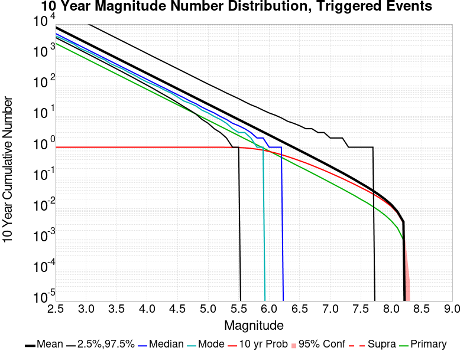

| Mag | Mean | 2.5 %ile | 97.5 %ile | Median | Mode | 10 yr Probability | 10 yr Supra-Seis Prob | Primary Aftershocks Mean |
|-----|-----|-----|-----|-----|-----|-----|-----|-----|
| **M&ge;2.5** | 7967.996 | 3608.000 | 45568.000 | 4934.000 | 4397.000 | 1.000 (100.00%) | 0.000 (0.00%) | 2391.870 |
| **M&ge;2.6** | 6328.468 | 2860.000 | 36191.000 | 3913.000 | 3913.000 | 1.000 (100.00%) | 0.000 (0.00%) | 1899.071 |
| **M&ge;2.7** | 5026.840 | 2265.000 | 28692.000 | 3119.000 | 3156.000 | 1.000 (100.00%) | 0.000 (0.00%) | 1506.788 |
| **M&ge;2.8** | 3992.565 | 1791.000 | 22900.000 | 2479.000 | 2105.000 | 1.000 (100.00%) | 0.000 (0.00%) | 1195.825 |
| **M&ge;2.9** | 3172.796 | 1421.000 | 18178.000 | 1966.000 | 1772.000 | 1.000 (100.00%) | 0.000 (0.00%) | 949.591 |
| **M&ge;3** | 2521.335 | 1116.000 | 14523.000 | 1555.000 | 1992.000 | 1.000 (100.00%) | 0.000 (0.00%) | 753.450 |
| **M&ge;3.1** | 2000.383 | 882.000 | 11456.000 | 1228.000 | 1049.000 | 1.000 (100.00%) | 0.000 (0.00%) | 598.691 |
| **M&ge;3.2** | 1588.015 | 698.000 | 9062.000 | 979.000 | 798.000 | 1.000 (100.00%) | 0.000 (0.00%) | 476.454 |
| **M&ge;3.3** | 1262.461 | 547.000 | 7171.000 | 779.000 | 724.000 | 1.000 (100.00%) | 0.000 (0.00%) | 378.316 |
| **M&ge;3.4** | 1003.439 | 425.000 | 5693.000 | 624.000 | 513.000 | 1.000 (100.00%) | 0.000 (0.00%) | 300.483 |
| **M&ge;3.5** | 797.394 | 333.000 | 4521.000 | 498.000 | 459.000 | 1.000 (100.00%) | 0.000 (0.00%) | 238.777 |
| **M&ge;3.6** | 632.190 | 261.000 | 3584.000 | 392.000 | 402.000 | 1.000 (100.00%) | 0.000 (0.00%) | 188.866 |
| **M&ge;3.7** | 501.156 | 209.000 | 2837.000 | 315.000 | 326.000 | 1.000 (100.00%) | 0.000 (0.00%) | 149.777 |
| **M&ge;3.8** | 396.963 | 162.000 | 2260.000 | 250.000 | 256.000 | 1.000 (100.00%) | 0.000 (0.00%) | 118.654 |
| **M&ge;3.9** | 315.100 | 125.000 | 1801.000 | 197.000 | 195.000 | 1.000 (100.00%) | 0.000 (0.00%) | 93.777 |
| **M&ge;4** | 249.896 | 96.000 | 1453.000 | 159.000 | 140.000 | 1.000 (100.00%) | 0.000 (0.00%) | 74.684 |
| **M&ge;4.1** | 198.030 | 77.000 | 1171.000 | 126.000 | 95.000 | 1.000 (100.00%) | 0.000 (0.00%) | 59.286 |
| **M&ge;4.2** | 157.201 | 59.000 | 946.000 | 98.000 | 86.000 | 1.000 (100.00%) | 0.000 (0.00%) | 47.011 |
| **M&ge;4.3** | 124.851 | 45.000 | 738.000 | 78.000 | 75.000 | 1.000 (100.00%) | 0.000 (0.00%) | 37.428 |
| **M&ge;4.4** | 98.881 | 35.000 | 608.000 | 61.000 | 58.000 | 1.000 (100.00%) | 0.000 (0.00%) | 29.651 |
| **M&ge;4.5** | 78.558 | 25.000 | 488.000 | 49.000 | 46.000 | 1.000 (100.00%) | 0.000 (0.00%) | 23.509 |
| **M&ge;4.6** | 62.409 | 20.000 | 379.000 | 39.000 | 28.000 | 1.000 (100.00%) | 0.000 (0.00%) | 18.818 |
| **M&ge;4.7** | 49.952 | 15.000 | 297.000 | 31.000 | 28.000 | 1.000 (100.00%) | 0.000 (0.00%) | 15.115 |
| **M&ge;4.8** | 39.688 | 10.000 | 235.000 | 25.000 | 21.000 | 1.000 (100.00%) | 0.000 (0.00%) | 12.086 |
| **M&ge;4.9** | 31.743 | 7.000 | 175.000 | 20.000 | 13.000 | 1.000 (100.00%) | 0.000 (0.00%) | 9.602 |
| **M&ge;5** | 25.305 | 5.000 | 136.000 | 16.000 | 14.000 | 1.000 (100.00%) | 0.000 (0.00%) | 7.714 |
| **M&ge;5.1** | 19.929 | 4.000 | 113.000 | 12.000 | 13.000 | 1.000 (100.00%) | 0.000 (0.00%) | 6.015 |
| **M&ge;5.2** | 15.836 | 2.000 | 90.000 | 10.000 | 7.000 | 1.000 (100.00%) | 0.000 (0.00%) | 4.822 |
| **M&ge;5.3** | 12.610 | 1.000 | 66.000 | 8.000 | 6.000 | 0.993 (99.26%) | 0.000 (0.00%) | 3.911 |
| **M&ge;5.4** | 10.059 | 1.000 | 53.000 | 6.000 | 5.000 | 0.985 (98.51%) | 0.000 (0.00%) | 3.104 |
| **M&ge;5.5** | 7.989 | 0.000 | 41.000 | 5.000 | 4.000 | 0.970 (97.03%) | 0.000 (0.00%) | 2.316 |
| **M&ge;5.6** | 6.275 | 0.000 | 36.000 | 4.000 | 3.000 | 0.944 (94.42%) | 0.000 (0.00%) | 1.844 |
| **M&ge;5.7** | 5.004 | 0.000 | 28.000 | 3.000 | 1.000 | 0.900 (89.96%) | 0.000 (0.00%) | 1.480 |
| **M&ge;5.8** | 3.959 | 0.000 | 26.000 | 2.000 | 1.000 | 0.836 (83.64%) | 0.000 (0.00%) | 1.178 |
| **M&ge;5.9** | 3.167 | 0.000 | 21.000 | 2.000 | 1.000 | 0.777 (77.70%) | 0.000 (0.00%) | 0.952 |
| **M&ge;6** | 2.476 | 0.000 | 13.000 | 1.000 | 1.000 | 0.721 (72.12%) | 0.000 (0.00%) | 0.729 |
| **M&ge;6.1** | 1.955 | 0.000 | 12.000 | 1.000 | 0.000 | 0.625 (62.45%) | 0.000 (0.00%) | 0.595 |
| **M&ge;6.2** | 1.532 | 0.000 | 9.000 | 1.000 | 0.000 | 0.558 (55.76%) | 0.000 (0.00%) | 0.491 |
| **M&ge;6.3** | 1.149 | 0.000 | 7.000 | 0.000 | 0.000 | 0.476 (47.58%) | 0.000 (0.00%) | 0.364 |
| **M&ge;6.4** | 0.929 | 0.000 | 7.000 | 0.000 | 0.000 | 0.401 (40.15%) | 0.000 (0.00%) | 0.294 |
| **M&ge;6.5** | 0.747 | 0.000 | 6.000 | 0.000 | 0.000 | 0.346 (34.57%) | 0.000 (0.00%) | 0.238 |
| **M&ge;6.6** | 0.580 | 0.000 | 5.000 | 0.000 | 0.000 | 0.283 (28.25%) | 0.000 (0.00%) | 0.175 |
| **M&ge;6.7** | 0.442 | 0.000 | 3.000 | 0.000 | 0.000 | 0.204 (20.45%) | 0.000 (0.00%) | 0.123 |
| **M&ge;6.8** | 0.327 | 0.000 | 3.000 | 0.000 | 0.000 | 0.160 (15.99%) | 0.000 (0.00%) | 0.100 |
| **M&ge;6.9** | 0.283 | 0.000 | 3.000 | 0.000 | 0.000 | 0.141 (14.13%) | 0.000 (0.00%) | 0.086 |
| **M&ge;7** | 0.238 | 0.000 | 2.000 | 0.000 | 0.000 | 0.123 (12.27%) | 0.000 (0.00%) | 0.074 |
| **M&ge;7.1** | 0.190 | 0.000 | 2.000 | 0.000 | 0.000 | 0.100 (10.04%) | 0.000 (0.00%) | 0.056 |
| **M&ge;7.2** | 0.160 | 0.000 | 2.000 | 0.000 | 0.000 | 0.089 (8.92%) | 0.000 (0.00%) | 0.048 |
| **M&ge;7.3** | 0.123 | 0.000 | 2.000 | 0.000 | 0.000 | 0.071 (7.06%) | 0.000 (0.00%) | 0.041 |
| **M&ge;7.4** | 0.100 | 0.000 | 1.000 | 0.000 | 0.000 | 0.059 (5.95%) | 0.000 (0.00%) | 0.033 |
| **M&ge;7.5** | 0.071 | 0.000 | 1.000 | 0.000 | 0.000 | 0.041 (4.09%) | 0.000 (0.00%) | 0.026 |
| **M&ge;7.6** | 0.056 | 0.000 | 1.000 | 0.000 | 0.000 | 0.041 (4.09%) | 0.000 (0.00%) | 0.026 |
| **M&ge;7.7** | 0.048 | 0.000 | 1.000 | 0.000 | 0.000 | 0.037 (3.72%) | 0.000 (0.00%) | 0.026 |
| **M&ge;7.8** | 0.045 | 0.000 | 1.000 | 0.000 | 0.000 | 0.033 (3.35%) | 0.000 (0.00%) | 0.026 |
| **M&ge;7.9** | 0.026 | 0.000 | 0.000 | 0.000 | 0.000 | 0.022 (2.23%) | 0.000 (0.00%) | 0.011 |
| **M&ge;8** | 7.43E-3 | 0.000 | 0.000 | 0.000 | 0.000 | 7.43E-3 (0.74%) | 0.000 (0.00%) | 7.43E-3 |
| **M&ge;8.1** | 3.72E-3 | 0.000 | 0.000 | 0.000 | 0.000 | 3.72E-3 (0.37%) | 0.000 (0.00%) | 3.72E-3 |
| **M&ge;8.2** | 3.72E-3 | 0.000 | 0.000 | 0.000 | 0.000 | 3.72E-3 (0.37%) | 0.000 (0.00%) | 3.72E-3 |
| **M&ge;8.3** | 0.000 | 0.000 | 0.000 | 0.000 | 0.000 | 0.000 (0.00%) | 0.000 (0.00%) | 0.000 |
| **M&ge;8.4** | 0.000 | 0.000 | 0.000 | 0.000 | 0.000 | 0.000 (0.00%) | 0.000 (0.00%) | 0.000 |
| **M&ge;8.5** | 0.000 | 0.000 | 0.000 | 0.000 | 0.000 | 0.000 (0.00%) | 0.000 (0.00%) | 0.000 |
| **M&ge;8.6** | 0.000 | 0.000 | 0.000 | 0.000 | 0.000 | 0.000 (0.00%) | 0.000 (0.00%) | 0.000 |
| **M&ge;8.7** | 0.000 | 0.000 | 0.000 | 0.000 | 0.000 | 0.000 (0.00%) | 0.000 (0.00%) | 0.000 |
| **M&ge;8.8** | 0.000 | 0.000 | 0.000 | 0.000 | 0.000 | 0.000 (0.00%) | 0.000 (0.00%) | 0.000 |
| **M&ge;8.9** | 0.000 | 0.000 | 0.000 | 0.000 | 0.000 | 0.000 (0.00%) | 0.000 (0.00%) | 0.000 |
| **M&ge;9** | 0.000 | 0.000 | 0.000 | 0.000 | 0.000 | 0.000 (0.00%) | 0.000 (0.00%) | 0.000 |

### 1 Year Magnitude Number Distribution
*[(top)](#table-of-contents)*

**Legend**
* **Mean** (thick black line): mean expected number across all 269 catalogs
* **2.5%,97.5%** (thin black lines): expected number percentiles across all 269 catalogs
* **Median** (thin blue line): median expected number across all 269 catalogs
* **Mode** (thin cyan line): modal expected number across all 269 catalogs
* **1 yr Probability** (thin red line): 1 year probability calculated as the fraction of catalogs with at least 1 occurrence
* **1 yr Supraseismogenic Probability** (thin dashed red line): same as above, but only for supraseismogenic ruptures on explicitly modeled UCERF3 faults
* **95% Conf** (light red shaded region): binomial 95% confidence bounds on probability
* **Primary** (thin green line): mean expected number from primary triggered aftershocks only (no secondary, tertiary, etc...) across all 269 catalogs


| Mag | Mean | 2.5 %ile | 97.5 %ile | Median | Mode | 1 yr Probability | 1 yr Supra-Seis Prob | Primary Aftershocks Mean |
|-----|-----|-----|-----|-----|-----|-----|-----|-----|
| **M&ge;2.5** | 5807.268 | 2920.000 | 28868.000 | 3760.000 | 3485.000 | 1.000 (100.00%) | 0.000 (0.00%) | 2084.974 |
| **M&ge;2.6** | 4611.230 | 2318.000 | 22955.000 | 3007.000 | 2832.000 | 1.000 (100.00%) | 0.000 (0.00%) | 1654.636 |
| **M&ge;2.7** | 3662.703 | 1836.000 | 18206.000 | 2379.000 | 2224.000 | 1.000 (100.00%) | 0.000 (0.00%) | 1313.045 |
| **M&ge;2.8** | 2909.115 | 1455.000 | 14335.000 | 1883.000 | 1585.000 | 1.000 (100.00%) | 0.000 (0.00%) | 1042.413 |
| **M&ge;2.9** | 2311.494 | 1156.000 | 11442.000 | 1486.000 | 1398.000 | 1.000 (100.00%) | 0.000 (0.00%) | 827.535 |
| **M&ge;3** | 1836.257 | 904.000 | 9127.000 | 1188.000 | 952.000 | 1.000 (100.00%) | 0.000 (0.00%) | 656.881 |
| **M&ge;3.1** | 1457.465 | 711.000 | 7228.000 | 949.000 | 899.000 | 1.000 (100.00%) | 0.000 (0.00%) | 522.171 |
| **M&ge;3.2** | 1156.851 | 565.000 | 5721.000 | 749.000 | 648.000 | 1.000 (100.00%) | 0.000 (0.00%) | 415.561 |
| **M&ge;3.3** | 920.130 | 440.000 | 4568.000 | 602.000 | 600.000 | 1.000 (100.00%) | 0.000 (0.00%) | 329.967 |
| **M&ge;3.4** | 731.141 | 350.000 | 3668.000 | 478.000 | 421.000 | 1.000 (100.00%) | 0.000 (0.00%) | 262.249 |
| **M&ge;3.5** | 580.576 | 275.000 | 2904.000 | 380.000 | 359.000 | 1.000 (100.00%) | 0.000 (0.00%) | 208.368 |
| **M&ge;3.6** | 460.193 | 216.000 | 2323.000 | 300.000 | 254.000 | 1.000 (100.00%) | 0.000 (0.00%) | 165.086 |
| **M&ge;3.7** | 365.134 | 169.000 | 1863.000 | 241.000 | 218.000 | 1.000 (100.00%) | 0.000 (0.00%) | 130.840 |
| **M&ge;3.8** | 289.149 | 133.000 | 1452.000 | 192.000 | 188.000 | 1.000 (100.00%) | 0.000 (0.00%) | 103.602 |
| **M&ge;3.9** | 229.569 | 100.000 | 1148.000 | 150.000 | 148.000 | 1.000 (100.00%) | 0.000 (0.00%) | 81.844 |
| **M&ge;4** | 181.955 | 80.000 | 895.000 | 119.000 | 107.000 | 1.000 (100.00%) | 0.000 (0.00%) | 65.167 |
| **M&ge;4.1** | 144.520 | 61.000 | 736.000 | 95.000 | 93.000 | 1.000 (100.00%) | 0.000 (0.00%) | 51.859 |
| **M&ge;4.2** | 114.866 | 47.000 | 581.000 | 75.000 | 60.000 | 1.000 (100.00%) | 0.000 (0.00%) | 41.160 |
| **M&ge;4.3** | 91.294 | 33.000 | 470.000 | 60.000 | 60.000 | 1.000 (100.00%) | 0.000 (0.00%) | 32.877 |
| **M&ge;4.4** | 72.357 | 25.000 | 382.000 | 48.000 | 50.000 | 1.000 (100.00%) | 0.000 (0.00%) | 26.112 |
| **M&ge;4.5** | 57.524 | 19.000 | 295.000 | 38.000 | 35.000 | 1.000 (100.00%) | 0.000 (0.00%) | 20.792 |
| **M&ge;4.6** | 45.777 | 14.000 | 243.000 | 31.000 | 31.000 | 1.000 (100.00%) | 0.000 (0.00%) | 16.691 |
| **M&ge;4.7** | 36.580 | 10.000 | 184.000 | 24.000 | 20.000 | 1.000 (100.00%) | 0.000 (0.00%) | 13.420 |
| **M&ge;4.8** | 29.178 | 8.000 | 150.000 | 19.000 | 18.000 | 1.000 (100.00%) | 0.000 (0.00%) | 10.747 |
| **M&ge;4.9** | 23.268 | 6.000 | 118.000 | 16.000 | 13.000 | 1.000 (100.00%) | 0.000 (0.00%) | 8.528 |
| **M&ge;5** | 18.431 | 3.000 | 98.000 | 13.000 | 9.000 | 1.000 (100.00%) | 0.000 (0.00%) | 6.822 |
| **M&ge;5.1** | 14.520 | 2.000 | 83.000 | 10.000 | 9.000 | 1.000 (100.00%) | 0.000 (0.00%) | 5.323 |
| **M&ge;5.2** | 11.442 | 1.000 | 66.000 | 8.000 | 8.000 | 0.996 (99.63%) | 0.000 (0.00%) | 4.249 |
| **M&ge;5.3** | 9.149 | 1.000 | 48.000 | 6.000 | 3.000 | 0.989 (98.88%) | 0.000 (0.00%) | 3.446 |
| **M&ge;5.4** | 7.320 | 1.000 | 40.000 | 5.000 | 3.000 | 0.978 (97.77%) | 0.000 (0.00%) | 2.717 |
| **M&ge;5.5** | 5.814 | 0.000 | 31.000 | 4.000 | 3.000 | 0.944 (94.42%) | 0.000 (0.00%) | 2.033 |
| **M&ge;5.6** | 4.528 | 0.000 | 24.000 | 3.000 | 1.000 | 0.914 (91.45%) | 0.000 (0.00%) | 1.636 |
| **M&ge;5.7** | 3.651 | 0.000 | 19.000 | 2.000 | 1.000 | 0.851 (85.13%) | 0.000 (0.00%) | 1.301 |
| **M&ge;5.8** | 2.870 | 0.000 | 16.000 | 2.000 | 1.000 | 0.777 (77.70%) | 0.000 (0.00%) | 1.030 |
| **M&ge;5.9** | 2.260 | 0.000 | 14.000 | 1.000 | 0.000 | 0.706 (70.63%) | 0.000 (0.00%) | 0.829 |
| **M&ge;6** | 1.751 | 0.000 | 11.000 | 1.000 | 0.000 | 0.643 (64.31%) | 0.000 (0.00%) | 0.632 |
| **M&ge;6.1** | 1.405 | 0.000 | 9.000 | 1.000 | 0.000 | 0.550 (55.02%) | 0.000 (0.00%) | 0.513 |
| **M&ge;6.2** | 1.138 | 0.000 | 6.000 | 0.000 | 0.000 | 0.491 (49.07%) | 0.000 (0.00%) | 0.413 |
| **M&ge;6.3** | 0.862 | 0.000 | 6.000 | 0.000 | 0.000 | 0.409 (40.89%) | 0.000 (0.00%) | 0.316 |
| **M&ge;6.4** | 0.703 | 0.000 | 5.000 | 0.000 | 0.000 | 0.335 (33.46%) | 0.000 (0.00%) | 0.253 |
| **M&ge;6.5** | 0.565 | 0.000 | 5.000 | 0.000 | 0.000 | 0.283 (28.25%) | 0.000 (0.00%) | 0.208 |
| **M&ge;6.6** | 0.431 | 0.000 | 4.000 | 0.000 | 0.000 | 0.219 (21.93%) | 0.000 (0.00%) | 0.149 |
| **M&ge;6.7** | 0.331 | 0.000 | 3.000 | 0.000 | 0.000 | 0.160 (15.99%) | 0.000 (0.00%) | 0.104 |
| **M&ge;6.8** | 0.245 | 0.000 | 3.000 | 0.000 | 0.000 | 0.123 (12.27%) | 0.000 (0.00%) | 0.086 |
| **M&ge;6.9** | 0.212 | 0.000 | 2.000 | 0.000 | 0.000 | 0.108 (10.78%) | 0.000 (0.00%) | 0.071 |
| **M&ge;7** | 0.182 | 0.000 | 2.000 | 0.000 | 0.000 | 0.093 (9.29%) | 0.000 (0.00%) | 0.063 |
| **M&ge;7.1** | 0.149 | 0.000 | 1.000 | 0.000 | 0.000 | 0.086 (8.55%) | 0.000 (0.00%) | 0.052 |
| **M&ge;7.2** | 0.123 | 0.000 | 1.000 | 0.000 | 0.000 | 0.078 (7.81%) | 0.000 (0.00%) | 0.045 |
| **M&ge;7.3** | 0.108 | 0.000 | 1.000 | 0.000 | 0.000 | 0.067 (6.69%) | 0.000 (0.00%) | 0.041 |
| **M&ge;7.4** | 0.086 | 0.000 | 1.000 | 0.000 | 0.000 | 0.056 (5.58%) | 0.000 (0.00%) | 0.033 |
| **M&ge;7.5** | 0.059 | 0.000 | 1.000 | 0.000 | 0.000 | 0.037 (3.72%) | 0.000 (0.00%) | 0.026 |
| **M&ge;7.6** | 0.052 | 0.000 | 1.000 | 0.000 | 0.000 | 0.037 (3.72%) | 0.000 (0.00%) | 0.026 |
| **M&ge;7.7** | 0.048 | 0.000 | 1.000 | 0.000 | 0.000 | 0.037 (3.72%) | 0.000 (0.00%) | 0.026 |
| **M&ge;7.8** | 0.045 | 0.000 | 1.000 | 0.000 | 0.000 | 0.033 (3.35%) | 0.000 (0.00%) | 0.026 |
| **M&ge;7.9** | 0.026 | 0.000 | 0.000 | 0.000 | 0.000 | 0.022 (2.23%) | 0.000 (0.00%) | 0.011 |
| **M&ge;8** | 7.43E-3 | 0.000 | 0.000 | 0.000 | 0.000 | 7.43E-3 (0.74%) | 0.000 (0.00%) | 7.43E-3 |
| **M&ge;8.1** | 3.72E-3 | 0.000 | 0.000 | 0.000 | 0.000 | 3.72E-3 (0.37%) | 0.000 (0.00%) | 3.72E-3 |
| **M&ge;8.2** | 3.72E-3 | 0.000 | 0.000 | 0.000 | 0.000 | 3.72E-3 (0.37%) | 0.000 (0.00%) | 3.72E-3 |
| **M&ge;8.3** | 0.000 | 0.000 | 0.000 | 0.000 | 0.000 | 0.000 (0.00%) | 0.000 (0.00%) | 0.000 |
| **M&ge;8.4** | 0.000 | 0.000 | 0.000 | 0.000 | 0.000 | 0.000 (0.00%) | 0.000 (0.00%) | 0.000 |
| **M&ge;8.5** | 0.000 | 0.000 | 0.000 | 0.000 | 0.000 | 0.000 (0.00%) | 0.000 (0.00%) | 0.000 |
| **M&ge;8.6** | 0.000 | 0.000 | 0.000 | 0.000 | 0.000 | 0.000 (0.00%) | 0.000 (0.00%) | 0.000 |
| **M&ge;8.7** | 0.000 | 0.000 | 0.000 | 0.000 | 0.000 | 0.000 (0.00%) | 0.000 (0.00%) | 0.000 |
| **M&ge;8.8** | 0.000 | 0.000 | 0.000 | 0.000 | 0.000 | 0.000 (0.00%) | 0.000 (0.00%) | 0.000 |
| **M&ge;8.9** | 0.000 | 0.000 | 0.000 | 0.000 | 0.000 | 0.000 (0.00%) | 0.000 (0.00%) | 0.000 |
| **M&ge;9** | 0.000 | 0.000 | 0.000 | 0.000 | 0.000 | 0.000 (0.00%) | 0.000 (0.00%) | 0.000 |

### 1 Month Magnitude Number Distribution
*[(top)](#table-of-contents)*

**Legend**
* **Mean** (thick black line): mean expected number across all 269 catalogs
* **2.5%,97.5%** (thin black lines): expected number percentiles across all 269 catalogs
* **Median** (thin blue line): median expected number across all 269 catalogs
* **Mode** (thin cyan line): modal expected number across all 269 catalogs
* **1 mo Probability** (thin red line): 1 month probability calculated as the fraction of catalogs with at least 1 occurrence
* **1 mo Supraseismogenic Probability** (thin dashed red line): same as above, but only for supraseismogenic ruptures on explicitly modeled UCERF3 faults
* **95% Conf** (light red shaded region): binomial 95% confidence bounds on probability
* **Primary** (thin green line): mean expected number from primary triggered aftershocks only (no secondary, tertiary, etc...) across all 269 catalogs


| Mag | Mean | 2.5 %ile | 97.5 %ile | Median | Mode | 1 mo Probability | 1 mo Supra-Seis Prob | Primary Aftershocks Mean |
|-----|-----|-----|-----|-----|-----|-----|-----|-----|
| **M&ge;2.5** | 3724.331 | 2170.000 | 18367.000 | 2665.000 | 2695.000 | 1.000 (100.00%) | 0.000 (0.00%) | 1691.639 |
| **M&ge;2.6** | 2956.807 | 1712.000 | 14579.000 | 2110.000 | 2158.000 | 1.000 (100.00%) | 0.000 (0.00%) | 1343.026 |
| **M&ge;2.7** | 2349.022 | 1357.000 | 11493.000 | 1684.000 | 1469.000 | 1.000 (100.00%) | 0.000 (0.00%) | 1066.167 |
| **M&ge;2.8** | 1866.022 | 1072.000 | 9127.000 | 1328.000 | 1265.000 | 1.000 (100.00%) | 0.000 (0.00%) | 846.152 |
| **M&ge;2.9** | 1482.275 | 850.000 | 7210.000 | 1055.000 | 1046.000 | 1.000 (100.00%) | 0.000 (0.00%) | 671.480 |
| **M&ge;3** | 1177.059 | 677.000 | 5708.000 | 833.000 | 821.000 | 1.000 (100.00%) | 0.000 (0.00%) | 532.836 |
| **M&ge;3.1** | 934.238 | 519.000 | 4585.000 | 661.000 | 705.000 | 1.000 (100.00%) | 0.000 (0.00%) | 423.606 |
| **M&ge;3.2** | 741.784 | 414.000 | 3623.000 | 524.000 | 502.000 | 1.000 (100.00%) | 0.000 (0.00%) | 337.316 |
| **M&ge;3.3** | 589.063 | 328.000 | 2894.000 | 415.000 | 429.000 | 1.000 (100.00%) | 0.000 (0.00%) | 267.472 |
| **M&ge;3.4** | 467.877 | 252.000 | 2268.000 | 333.000 | 341.000 | 1.000 (100.00%) | 0.000 (0.00%) | 212.532 |
| **M&ge;3.5** | 371.290 | 202.000 | 1783.000 | 264.000 | 257.000 | 1.000 (100.00%) | 0.000 (0.00%) | 168.342 |
| **M&ge;3.6** | 294.086 | 158.000 | 1402.000 | 209.000 | 207.000 | 1.000 (100.00%) | 0.000 (0.00%) | 133.405 |
| **M&ge;3.7** | 233.007 | 123.000 | 1104.000 | 167.000 | 167.000 | 1.000 (100.00%) | 0.000 (0.00%) | 105.814 |
| **M&ge;3.8** | 184.219 | 96.000 | 871.000 | 133.000 | 119.000 | 1.000 (100.00%) | 0.000 (0.00%) | 83.933 |
| **M&ge;3.9** | 146.323 | 74.000 | 686.000 | 107.000 | 96.000 | 1.000 (100.00%) | 0.000 (0.00%) | 66.468 |
| **M&ge;4** | 116.093 | 57.000 | 537.000 | 85.000 | 85.000 | 1.000 (100.00%) | 0.000 (0.00%) | 52.948 |
| **M&ge;4.1** | 92.331 | 45.000 | 427.000 | 68.000 | 72.000 | 1.000 (100.00%) | 0.000 (0.00%) | 42.126 |
| **M&ge;4.2** | 73.435 | 33.000 | 344.000 | 54.000 | 45.000 | 1.000 (100.00%) | 0.000 (0.00%) | 33.487 |
| **M&ge;4.3** | 58.346 | 24.000 | 273.000 | 43.000 | 39.000 | 1.000 (100.00%) | 0.000 (0.00%) | 26.766 |
| **M&ge;4.4** | 46.123 | 19.000 | 217.000 | 33.000 | 29.000 | 1.000 (100.00%) | 0.000 (0.00%) | 21.212 |
| **M&ge;4.5** | 36.829 | 13.000 | 171.000 | 27.000 | 28.000 | 1.000 (100.00%) | 0.000 (0.00%) | 16.914 |
| **M&ge;4.6** | 29.361 | 10.000 | 135.000 | 22.000 | 22.000 | 1.000 (100.00%) | 0.000 (0.00%) | 13.636 |
| **M&ge;4.7** | 23.502 | 8.000 | 108.000 | 17.000 | 13.000 | 1.000 (100.00%) | 0.000 (0.00%) | 10.933 |
| **M&ge;4.8** | 18.740 | 5.000 | 88.000 | 14.000 | 12.000 | 1.000 (100.00%) | 0.000 (0.00%) | 8.725 |
| **M&ge;4.9** | 14.955 | 4.000 | 70.000 | 11.000 | 10.000 | 1.000 (100.00%) | 0.000 (0.00%) | 6.948 |
| **M&ge;5** | 11.766 | 3.000 | 52.000 | 9.000 | 8.000 | 1.000 (100.00%) | 0.000 (0.00%) | 5.546 |
| **M&ge;5.1** | 9.279 | 1.000 | 43.000 | 7.000 | 5.000 | 0.996 (99.63%) | 0.000 (0.00%) | 4.331 |
| **M&ge;5.2** | 7.316 | 1.000 | 33.000 | 5.000 | 5.000 | 0.981 (98.14%) | 0.000 (0.00%) | 3.491 |
| **M&ge;5.3** | 5.836 | 0.000 | 28.000 | 4.000 | 4.000 | 0.967 (96.65%) | 0.000 (0.00%) | 2.840 |
| **M&ge;5.4** | 4.673 | 0.000 | 22.000 | 3.000 | 4.000 | 0.948 (94.80%) | 0.000 (0.00%) | 2.253 |
| **M&ge;5.5** | 3.673 | 0.000 | 17.000 | 3.000 | 3.000 | 0.888 (88.85%) | 0.000 (0.00%) | 1.673 |
| **M&ge;5.6** | 2.870 | 0.000 | 12.000 | 2.000 | 1.000 | 0.855 (85.50%) | 0.000 (0.00%) | 1.357 |
| **M&ge;5.7** | 2.271 | 0.000 | 10.000 | 1.000 | 1.000 | 0.770 (76.95%) | 0.000 (0.00%) | 1.071 |
| **M&ge;5.8** | 1.770 | 0.000 | 8.000 | 1.000 | 0.000 | 0.673 (67.29%) | 0.000 (0.00%) | 0.848 |
| **M&ge;5.9** | 1.405 | 0.000 | 7.000 | 1.000 | 0.000 | 0.606 (60.59%) | 0.000 (0.00%) | 0.688 |
| **M&ge;6** | 1.048 | 0.000 | 6.000 | 1.000 | 0.000 | 0.535 (53.53%) | 0.000 (0.00%) | 0.524 |
| **M&ge;6.1** | 0.829 | 0.000 | 5.000 | 0.000 | 0.000 | 0.439 (43.87%) | 0.000 (0.00%) | 0.420 |
| **M&ge;6.2** | 0.673 | 0.000 | 4.000 | 0.000 | 0.000 | 0.390 (39.03%) | 0.000 (0.00%) | 0.335 |
| **M&ge;6.3** | 0.520 | 0.000 | 3.000 | 0.000 | 0.000 | 0.301 (30.11%) | 0.000 (0.00%) | 0.257 |
| **M&ge;6.4** | 0.409 | 0.000 | 3.000 | 0.000 | 0.000 | 0.242 (24.16%) | 0.000 (0.00%) | 0.197 |
| **M&ge;6.5** | 0.349 | 0.000 | 3.000 | 0.000 | 0.000 | 0.216 (21.56%) | 0.000 (0.00%) | 0.171 |
| **M&ge;6.6** | 0.260 | 0.000 | 3.000 | 0.000 | 0.000 | 0.164 (16.36%) | 0.000 (0.00%) | 0.126 |
| **M&ge;6.7** | 0.193 | 0.000 | 2.000 | 0.000 | 0.000 | 0.112 (11.15%) | 0.000 (0.00%) | 0.086 |
| **M&ge;6.8** | 0.152 | 0.000 | 2.000 | 0.000 | 0.000 | 0.089 (8.92%) | 0.000 (0.00%) | 0.071 |
| **M&ge;6.9** | 0.130 | 0.000 | 2.000 | 0.000 | 0.000 | 0.078 (7.81%) | 0.000 (0.00%) | 0.059 |
| **M&ge;7** | 0.115 | 0.000 | 1.000 | 0.000 | 0.000 | 0.071 (7.06%) | 0.000 (0.00%) | 0.052 |
| **M&ge;7.1** | 0.093 | 0.000 | 1.000 | 0.000 | 0.000 | 0.059 (5.95%) | 0.000 (0.00%) | 0.041 |
| **M&ge;7.2** | 0.082 | 0.000 | 1.000 | 0.000 | 0.000 | 0.056 (5.58%) | 0.000 (0.00%) | 0.037 |
| **M&ge;7.3** | 0.078 | 0.000 | 1.000 | 0.000 | 0.000 | 0.052 (5.20%) | 0.000 (0.00%) | 0.033 |
| **M&ge;7.4** | 0.059 | 0.000 | 1.000 | 0.000 | 0.000 | 0.041 (4.09%) | 0.000 (0.00%) | 0.026 |
| **M&ge;7.5** | 0.045 | 0.000 | 1.000 | 0.000 | 0.000 | 0.030 (2.97%) | 0.000 (0.00%) | 0.022 |
| **M&ge;7.6** | 0.041 | 0.000 | 1.000 | 0.000 | 0.000 | 0.030 (2.97%) | 0.000 (0.00%) | 0.022 |
| **M&ge;7.7** | 0.037 | 0.000 | 1.000 | 0.000 | 0.000 | 0.026 (2.60%) | 0.000 (0.00%) | 0.022 |
| **M&ge;7.8** | 0.037 | 0.000 | 1.000 | 0.000 | 0.000 | 0.026 (2.60%) | 0.000 (0.00%) | 0.022 |
| **M&ge;7.9** | 0.022 | 0.000 | 0.000 | 0.000 | 0.000 | 0.019 (1.86%) | 0.000 (0.00%) | 0.011 |
| **M&ge;8** | 7.43E-3 | 0.000 | 0.000 | 0.000 | 0.000 | 7.43E-3 (0.74%) | 0.000 (0.00%) | 7.43E-3 |
| **M&ge;8.1** | 3.72E-3 | 0.000 | 0.000 | 0.000 | 0.000 | 3.72E-3 (0.37%) | 0.000 (0.00%) | 3.72E-3 |
| **M&ge;8.2** | 3.72E-3 | 0.000 | 0.000 | 0.000 | 0.000 | 3.72E-3 (0.37%) | 0.000 (0.00%) | 3.72E-3 |
| **M&ge;8.3** | 0.000 | 0.000 | 0.000 | 0.000 | 0.000 | 0.000 (0.00%) | 0.000 (0.00%) | 0.000 |
| **M&ge;8.4** | 0.000 | 0.000 | 0.000 | 0.000 | 0.000 | 0.000 (0.00%) | 0.000 (0.00%) | 0.000 |
| **M&ge;8.5** | 0.000 | 0.000 | 0.000 | 0.000 | 0.000 | 0.000 (0.00%) | 0.000 (0.00%) | 0.000 |
| **M&ge;8.6** | 0.000 | 0.000 | 0.000 | 0.000 | 0.000 | 0.000 (0.00%) | 0.000 (0.00%) | 0.000 |
| **M&ge;8.7** | 0.000 | 0.000 | 0.000 | 0.000 | 0.000 | 0.000 (0.00%) | 0.000 (0.00%) | 0.000 |
| **M&ge;8.8** | 0.000 | 0.000 | 0.000 | 0.000 | 0.000 | 0.000 (0.00%) | 0.000 (0.00%) | 0.000 |
| **M&ge;8.9** | 0.000 | 0.000 | 0.000 | 0.000 | 0.000 | 0.000 (0.00%) | 0.000 (0.00%) | 0.000 |
| **M&ge;9** | 0.000 | 0.000 | 0.000 | 0.000 | 0.000 | 0.000 (0.00%) | 0.000 (0.00%) | 0.000 |

### 1 Week Magnitude Number Distribution
*[(top)](#table-of-contents)*

**Legend**
* **Mean** (thick black line): mean expected number across all 269 catalogs
* **2.5%,97.5%** (thin black lines): expected number percentiles across all 269 catalogs
* **Median** (thin blue line): median expected number across all 269 catalogs
* **Mode** (thin cyan line): modal expected number across all 269 catalogs
* **1 wk Probability** (thin red line): 1 week probability calculated as the fraction of catalogs with at least 1 occurrence
* **1 wk Supraseismogenic Probability** (thin dashed red line): same as above, but only for supraseismogenic ruptures on explicitly modeled UCERF3 faults
* **95% Conf** (light red shaded region): binomial 95% confidence bounds on probability
* **Primary** (thin green line): mean expected number from primary triggered aftershocks only (no secondary, tertiary, etc...) across all 269 catalogs

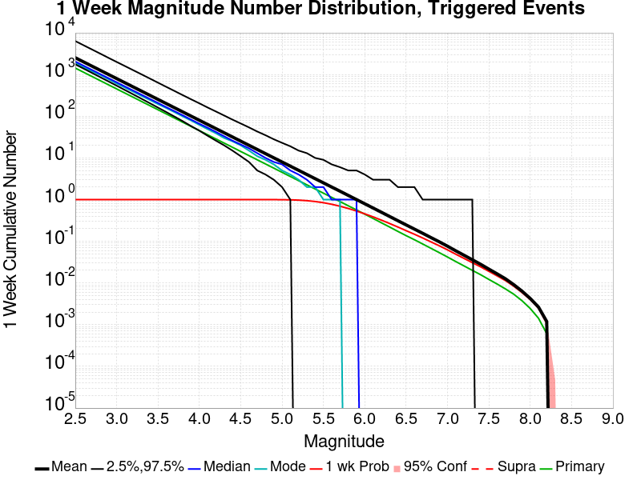

| Mag | Mean | 2.5 %ile | 97.5 %ile | Median | Mode | 1 wk Probability | 1 wk Supra-Seis Prob | Primary Aftershocks Mean |
|-----|-----|-----|-----|-----|-----|-----|-----|-----|
| **M&ge;2.5** | 2759.680 | 1767.000 | 7994.000 | 2060.000 | 2060.000 | 1.000 (100.00%) | 0.000 (0.00%) | 1433.257 |
| **M&ge;2.6** | 2191.338 | 1387.000 | 6342.000 | 1634.000 | 1718.000 | 1.000 (100.00%) | 0.000 (0.00%) | 1138.160 |
| **M&ge;2.7** | 1741.212 | 1102.000 | 5078.000 | 1301.000 | 1243.000 | 1.000 (100.00%) | 0.000 (0.00%) | 903.175 |
| **M&ge;2.8** | 1383.126 | 872.000 | 4018.000 | 1025.000 | 1014.000 | 1.000 (100.00%) | 0.000 (0.00%) | 716.755 |
| **M&ge;2.9** | 1098.454 | 685.000 | 3197.000 | 816.000 | 803.000 | 1.000 (100.00%) | 0.000 (0.00%) | 568.576 |
| **M&ge;3** | 872.613 | 538.000 | 2513.000 | 652.000 | 631.000 | 1.000 (100.00%) | 0.000 (0.00%) | 451.498 |
| **M&ge;3.1** | 693.082 | 417.000 | 1993.000 | 517.000 | 514.000 | 1.000 (100.00%) | 0.000 (0.00%) | 359.204 |
| **M&ge;3.2** | 550.602 | 322.000 | 1556.000 | 413.000 | 415.000 | 1.000 (100.00%) | 0.000 (0.00%) | 286.086 |
| **M&ge;3.3** | 437.145 | 256.000 | 1241.000 | 329.000 | 336.000 | 1.000 (100.00%) | 0.000 (0.00%) | 226.784 |
| **M&ge;3.4** | 347.312 | 203.000 | 1008.000 | 262.000 | 263.000 | 1.000 (100.00%) | 0.000 (0.00%) | 180.059 |
| **M&ge;3.5** | 275.454 | 154.000 | 796.000 | 208.000 | 194.000 | 1.000 (100.00%) | 0.000 (0.00%) | 142.651 |
| **M&ge;3.6** | 218.268 | 124.000 | 637.000 | 166.000 | 154.000 | 1.000 (100.00%) | 0.000 (0.00%) | 113.152 |
| **M&ge;3.7** | 173.030 | 94.000 | 496.000 | 132.000 | 121.000 | 1.000 (100.00%) | 0.000 (0.00%) | 89.621 |
| **M&ge;3.8** | 137.067 | 72.000 | 382.000 | 105.000 | 109.000 | 1.000 (100.00%) | 0.000 (0.00%) | 71.230 |
| **M&ge;3.9** | 108.989 | 56.000 | 303.000 | 83.000 | 75.000 | 1.000 (100.00%) | 0.000 (0.00%) | 56.327 |
| **M&ge;4** | 86.561 | 43.000 | 247.000 | 66.000 | 68.000 | 1.000 (100.00%) | 0.000 (0.00%) | 44.974 |
| **M&ge;4.1** | 68.900 | 32.000 | 195.000 | 53.000 | 53.000 | 1.000 (100.00%) | 0.000 (0.00%) | 35.792 |
| **M&ge;4.2** | 55.004 | 25.000 | 151.000 | 42.000 | 39.000 | 1.000 (100.00%) | 0.000 (0.00%) | 28.502 |
| **M&ge;4.3** | 43.777 | 19.000 | 118.000 | 33.000 | 31.000 | 1.000 (100.00%) | 0.000 (0.00%) | 22.732 |
| **M&ge;4.4** | 34.565 | 14.000 | 92.000 | 26.000 | 23.000 | 1.000 (100.00%) | 0.000 (0.00%) | 17.959 |
| **M&ge;4.5** | 27.621 | 10.000 | 69.000 | 21.000 | 22.000 | 1.000 (100.00%) | 0.000 (0.00%) | 14.320 |
| **M&ge;4.6** | 22.000 | 6.000 | 57.000 | 17.000 | 15.000 | 1.000 (100.00%) | 0.000 (0.00%) | 11.513 |
| **M&ge;4.7** | 17.632 | 5.000 | 48.000 | 13.000 | 13.000 | 1.000 (100.00%) | 0.000 (0.00%) | 9.216 |
| **M&ge;4.8** | 14.082 | 4.000 | 40.000 | 11.000 | 11.000 | 1.000 (100.00%) | 0.000 (0.00%) | 7.394 |
| **M&ge;4.9** | 11.245 | 3.000 | 31.000 | 9.000 | 9.000 | 1.000 (100.00%) | 0.000 (0.00%) | 5.900 |
| **M&ge;5** | 8.770 | 2.000 | 27.000 | 7.000 | 7.000 | 0.993 (99.26%) | 0.000 (0.00%) | 4.662 |
| **M&ge;5.1** | 6.926 | 1.000 | 23.000 | 5.000 | 5.000 | 0.985 (98.51%) | 0.000 (0.00%) | 3.621 |
| **M&ge;5.2** | 5.476 | 0.000 | 17.000 | 4.000 | 4.000 | 0.974 (97.40%) | 0.000 (0.00%) | 2.911 |
| **M&ge;5.3** | 4.364 | 0.000 | 15.000 | 3.000 | 3.000 | 0.944 (94.42%) | 0.000 (0.00%) | 2.353 |
| **M&ge;5.4** | 3.446 | 0.000 | 13.000 | 2.000 | 1.000 | 0.926 (92.57%) | 0.000 (0.00%) | 1.859 |
| **M&ge;5.5** | 2.680 | 0.000 | 11.000 | 2.000 | 1.000 | 0.848 (84.76%) | 0.000 (0.00%) | 1.372 |
| **M&ge;5.6** | 2.108 | 0.000 | 8.000 | 1.000 | 1.000 | 0.807 (80.67%) | 0.000 (0.00%) | 1.134 |
| **M&ge;5.7** | 1.621 | 0.000 | 6.000 | 1.000 | 1.000 | 0.691 (69.14%) | 0.000 (0.00%) | 0.870 |
| **M&ge;5.8** | 1.290 | 0.000 | 6.000 | 1.000 | 0.000 | 0.599 (59.85%) | 0.000 (0.00%) | 0.691 |
| **M&ge;5.9** | 1.026 | 0.000 | 4.000 | 1.000 | 0.000 | 0.528 (52.79%) | 0.000 (0.00%) | 0.569 |
| **M&ge;6** | 0.762 | 0.000 | 4.000 | 0.000 | 0.000 | 0.446 (44.61%) | 0.000 (0.00%) | 0.435 |
| **M&ge;6.1** | 0.621 | 0.000 | 3.000 | 0.000 | 0.000 | 0.357 (35.69%) | 0.000 (0.00%) | 0.349 |
| **M&ge;6.2** | 0.506 | 0.000 | 2.000 | 0.000 | 0.000 | 0.320 (31.97%) | 0.000 (0.00%) | 0.283 |
| **M&ge;6.3** | 0.387 | 0.000 | 2.000 | 0.000 | 0.000 | 0.249 (24.91%) | 0.000 (0.00%) | 0.227 |
| **M&ge;6.4** | 0.290 | 0.000 | 2.000 | 0.000 | 0.000 | 0.190 (18.96%) | 0.000 (0.00%) | 0.171 |
| **M&ge;6.5** | 0.249 | 0.000 | 2.000 | 0.000 | 0.000 | 0.175 (17.47%) | 0.000 (0.00%) | 0.149 |
| **M&ge;6.6** | 0.182 | 0.000 | 2.000 | 0.000 | 0.000 | 0.130 (13.01%) | 0.000 (0.00%) | 0.108 |
| **M&ge;6.7** | 0.130 | 0.000 | 1.000 | 0.000 | 0.000 | 0.082 (8.18%) | 0.000 (0.00%) | 0.071 |
| **M&ge;6.8** | 0.104 | 0.000 | 1.000 | 0.000 | 0.000 | 0.063 (6.32%) | 0.000 (0.00%) | 0.059 |
| **M&ge;6.9** | 0.089 | 0.000 | 1.000 | 0.000 | 0.000 | 0.056 (5.58%) | 0.000 (0.00%) | 0.048 |
| **M&ge;7** | 0.082 | 0.000 | 1.000 | 0.000 | 0.000 | 0.052 (5.20%) | 0.000 (0.00%) | 0.045 |
| **M&ge;7.1** | 0.063 | 0.000 | 1.000 | 0.000 | 0.000 | 0.041 (4.09%) | 0.000 (0.00%) | 0.033 |
| **M&ge;7.2** | 0.056 | 0.000 | 1.000 | 0.000 | 0.000 | 0.037 (3.72%) | 0.000 (0.00%) | 0.030 |
| **M&ge;7.3** | 0.052 | 0.000 | 1.000 | 0.000 | 0.000 | 0.033 (3.35%) | 0.000 (0.00%) | 0.026 |
| **M&ge;7.4** | 0.041 | 0.000 | 1.000 | 0.000 | 0.000 | 0.026 (2.60%) | 0.000 (0.00%) | 0.019 |
| **M&ge;7.5** | 0.037 | 0.000 | 0.000 | 0.000 | 0.000 | 0.022 (2.23%) | 0.000 (0.00%) | 0.019 |
| **M&ge;7.6** | 0.033 | 0.000 | 0.000 | 0.000 | 0.000 | 0.022 (2.23%) | 0.000 (0.00%) | 0.019 |
| **M&ge;7.7** | 0.033 | 0.000 | 0.000 | 0.000 | 0.000 | 0.022 (2.23%) | 0.000 (0.00%) | 0.019 |
| **M&ge;7.8** | 0.033 | 0.000 | 0.000 | 0.000 | 0.000 | 0.022 (2.23%) | 0.000 (0.00%) | 0.019 |
| **M&ge;7.9** | 0.022 | 0.000 | 0.000 | 0.000 | 0.000 | 0.019 (1.86%) | 0.000 (0.00%) | 0.011 |
| **M&ge;8** | 7.43E-3 | 0.000 | 0.000 | 0.000 | 0.000 | 7.43E-3 (0.74%) | 0.000 (0.00%) | 7.43E-3 |
| **M&ge;8.1** | 3.72E-3 | 0.000 | 0.000 | 0.000 | 0.000 | 3.72E-3 (0.37%) | 0.000 (0.00%) | 3.72E-3 |
| **M&ge;8.2** | 3.72E-3 | 0.000 | 0.000 | 0.000 | 0.000 | 3.72E-3 (0.37%) | 0.000 (0.00%) | 3.72E-3 |
| **M&ge;8.3** | 0.000 | 0.000 | 0.000 | 0.000 | 0.000 | 0.000 (0.00%) | 0.000 (0.00%) | 0.000 |
| **M&ge;8.4** | 0.000 | 0.000 | 0.000 | 0.000 | 0.000 | 0.000 (0.00%) | 0.000 (0.00%) | 0.000 |
| **M&ge;8.5** | 0.000 | 0.000 | 0.000 | 0.000 | 0.000 | 0.000 (0.00%) | 0.000 (0.00%) | 0.000 |
| **M&ge;8.6** | 0.000 | 0.000 | 0.000 | 0.000 | 0.000 | 0.000 (0.00%) | 0.000 (0.00%) | 0.000 |
| **M&ge;8.7** | 0.000 | 0.000 | 0.000 | 0.000 | 0.000 | 0.000 (0.00%) | 0.000 (0.00%) | 0.000 |
| **M&ge;8.8** | 0.000 | 0.000 | 0.000 | 0.000 | 0.000 | 0.000 (0.00%) | 0.000 (0.00%) | 0.000 |
| **M&ge;8.9** | 0.000 | 0.000 | 0.000 | 0.000 | 0.000 | 0.000 (0.00%) | 0.000 (0.00%) | 0.000 |
| **M&ge;9** | 0.000 | 0.000 | 0.000 | 0.000 | 0.000 | 0.000 (0.00%) | 0.000 (0.00%) | 0.000 |

### 1 Day Magnitude Number Distribution
*[(top)](#table-of-contents)*

**Legend**
* **Mean** (thick black line): mean expected number across all 269 catalogs
* **2.5%,97.5%** (thin black lines): expected number percentiles across all 269 catalogs
* **Median** (thin blue line): median expected number across all 269 catalogs
* **Mode** (thin cyan line): modal expected number across all 269 catalogs
* **1 d Probability** (thin red line): 1 day probability calculated as the fraction of catalogs with at least 1 occurrence
* **1 d Supraseismogenic Probability** (thin dashed red line): same as above, but only for supraseismogenic ruptures on explicitly modeled UCERF3 faults
* **95% Conf** (light red shaded region): binomial 95% confidence bounds on probability
* **Primary** (thin green line): mean expected number from primary triggered aftershocks only (no secondary, tertiary, etc...) across all 269 catalogs


| Mag | Mean | 2.5 %ile | 97.5 %ile | Median | Mode | 1 d Probability | 1 d Supra-Seis Prob | Primary Aftershocks Mean |
|-----|-----|-----|-----|-----|-----|-----|-----|-----|
| **M&ge;2.5** | 1719.985 | 1184.000 | 4029.000 | 1383.000 | 1328.000 | 1.000 (100.00%) | 0.000 (0.00%) | 1065.874 |
| **M&ge;2.6** | 1365.844 | 938.000 | 3179.000 | 1094.000 | 976.000 | 1.000 (100.00%) | 0.000 (0.00%) | 846.747 |
| **M&ge;2.7** | 1084.141 | 742.000 | 2518.000 | 873.000 | 874.000 | 1.000 (100.00%) | 0.000 (0.00%) | 671.398 |
| **M&ge;2.8** | 861.799 | 581.000 | 2020.000 | 690.000 | 675.000 | 1.000 (100.00%) | 0.000 (0.00%) | 533.149 |
| **M&ge;2.9** | 684.342 | 465.000 | 1594.000 | 547.000 | 497.000 | 1.000 (100.00%) | 0.000 (0.00%) | 423.059 |
| **M&ge;3** | 543.669 | 362.000 | 1243.000 | 436.000 | 436.000 | 1.000 (100.00%) | 0.000 (0.00%) | 336.011 |
| **M&ge;3.1** | 431.948 | 281.000 | 993.000 | 346.000 | 344.000 | 1.000 (100.00%) | 0.000 (0.00%) | 267.134 |
| **M&ge;3.2** | 343.599 | 219.000 | 779.000 | 277.000 | 295.000 | 1.000 (100.00%) | 0.000 (0.00%) | 212.903 |
| **M&ge;3.3** | 272.978 | 170.000 | 617.000 | 221.000 | 210.000 | 1.000 (100.00%) | 0.000 (0.00%) | 168.810 |
| **M&ge;3.4** | 216.327 | 131.000 | 494.000 | 174.000 | 173.000 | 1.000 (100.00%) | 0.000 (0.00%) | 133.736 |
| **M&ge;3.5** | 171.364 | 102.000 | 401.000 | 138.000 | 137.000 | 1.000 (100.00%) | 0.000 (0.00%) | 105.911 |
| **M&ge;3.6** | 135.963 | 82.000 | 324.000 | 109.000 | 109.000 | 1.000 (100.00%) | 0.000 (0.00%) | 84.071 |
| **M&ge;3.7** | 108.033 | 62.000 | 261.000 | 87.000 | 83.000 | 1.000 (100.00%) | 0.000 (0.00%) | 66.643 |
| **M&ge;3.8** | 85.803 | 48.000 | 212.000 | 70.000 | 76.000 | 1.000 (100.00%) | 0.000 (0.00%) | 53.004 |
| **M&ge;3.9** | 68.115 | 36.000 | 164.000 | 55.000 | 55.000 | 1.000 (100.00%) | 0.000 (0.00%) | 41.892 |
| **M&ge;4** | 54.011 | 27.000 | 127.000 | 44.000 | 45.000 | 1.000 (100.00%) | 0.000 (0.00%) | 33.394 |
| **M&ge;4.1** | 42.996 | 21.000 | 106.000 | 35.000 | 36.000 | 1.000 (100.00%) | 0.000 (0.00%) | 26.572 |
| **M&ge;4.2** | 34.349 | 15.000 | 92.000 | 28.000 | 29.000 | 1.000 (100.00%) | 0.000 (0.00%) | 21.216 |
| **M&ge;4.3** | 27.401 | 12.000 | 71.000 | 22.000 | 23.000 | 1.000 (100.00%) | 0.000 (0.00%) | 16.944 |
| **M&ge;4.4** | 21.480 | 8.000 | 56.000 | 17.000 | 17.000 | 1.000 (100.00%) | 0.000 (0.00%) | 13.216 |
| **M&ge;4.5** | 17.071 | 5.000 | 45.000 | 14.000 | 13.000 | 1.000 (100.00%) | 0.000 (0.00%) | 10.487 |
| **M&ge;4.6** | 13.558 | 4.000 | 39.000 | 11.000 | 11.000 | 1.000 (100.00%) | 0.000 (0.00%) | 8.364 |
| **M&ge;4.7** | 10.836 | 2.000 | 33.000 | 9.000 | 10.000 | 1.000 (100.00%) | 0.000 (0.00%) | 6.706 |
| **M&ge;4.8** | 8.632 | 2.000 | 25.000 | 7.000 | 7.000 | 1.000 (100.00%) | 0.000 (0.00%) | 5.342 |
| **M&ge;4.9** | 6.933 | 1.000 | 19.000 | 5.000 | 5.000 | 1.000 (100.00%) | 0.000 (0.00%) | 4.286 |
| **M&ge;5** | 5.394 | 1.000 | 17.000 | 4.000 | 3.000 | 0.989 (98.88%) | 0.000 (0.00%) | 3.413 |
| **M&ge;5.1** | 4.305 | 0.000 | 13.000 | 3.000 | 2.000 | 0.967 (96.65%) | 0.000 (0.00%) | 2.684 |
| **M&ge;5.2** | 3.461 | 0.000 | 11.000 | 3.000 | 2.000 | 0.926 (92.57%) | 0.000 (0.00%) | 2.186 |
| **M&ge;5.3** | 2.803 | 0.000 | 10.000 | 2.000 | 2.000 | 0.870 (86.99%) | 0.000 (0.00%) | 1.796 |
| **M&ge;5.4** | 2.204 | 0.000 | 7.000 | 2.000 | 1.000 | 0.825 (82.53%) | 0.000 (0.00%) | 1.413 |
| **M&ge;5.5** | 1.677 | 0.000 | 6.000 | 1.000 | 1.000 | 0.732 (73.23%) | 0.000 (0.00%) | 1.030 |
| **M&ge;5.6** | 1.338 | 0.000 | 4.000 | 1.000 | 1.000 | 0.669 (66.91%) | 0.000 (0.00%) | 0.844 |
| **M&ge;5.7** | 1.019 | 0.000 | 4.000 | 1.000 | 0.000 | 0.539 (53.90%) | 0.000 (0.00%) | 0.632 |
| **M&ge;5.8** | 0.822 | 0.000 | 3.000 | 0.000 | 0.000 | 0.472 (47.21%) | 0.000 (0.00%) | 0.498 |
| **M&ge;5.9** | 0.651 | 0.000 | 3.000 | 0.000 | 0.000 | 0.401 (40.15%) | 0.000 (0.00%) | 0.409 |
| **M&ge;6** | 0.457 | 0.000 | 2.000 | 0.000 | 0.000 | 0.320 (31.97%) | 0.000 (0.00%) | 0.301 |
| **M&ge;6.1** | 0.364 | 0.000 | 2.000 | 0.000 | 0.000 | 0.253 (25.28%) | 0.000 (0.00%) | 0.234 |
| **M&ge;6.2** | 0.290 | 0.000 | 2.000 | 0.000 | 0.000 | 0.208 (20.82%) | 0.000 (0.00%) | 0.190 |
| **M&ge;6.3** | 0.245 | 0.000 | 2.000 | 0.000 | 0.000 | 0.182 (18.22%) | 0.000 (0.00%) | 0.171 |
| **M&ge;6.4** | 0.193 | 0.000 | 1.000 | 0.000 | 0.000 | 0.152 (15.24%) | 0.000 (0.00%) | 0.141 |
| **M&ge;6.5** | 0.171 | 0.000 | 1.000 | 0.000 | 0.000 | 0.141 (14.13%) | 0.000 (0.00%) | 0.123 |
| **M&ge;6.6** | 0.115 | 0.000 | 1.000 | 0.000 | 0.000 | 0.100 (10.04%) | 0.000 (0.00%) | 0.086 |
| **M&ge;6.7** | 0.082 | 0.000 | 1.000 | 0.000 | 0.000 | 0.067 (6.69%) | 0.000 (0.00%) | 0.056 |
| **M&ge;6.8** | 0.067 | 0.000 | 1.000 | 0.000 | 0.000 | 0.052 (5.20%) | 0.000 (0.00%) | 0.048 |
| **M&ge;6.9** | 0.063 | 0.000 | 1.000 | 0.000 | 0.000 | 0.048 (4.83%) | 0.000 (0.00%) | 0.045 |
| **M&ge;7** | 0.059 | 0.000 | 1.000 | 0.000 | 0.000 | 0.045 (4.46%) | 0.000 (0.00%) | 0.041 |
| **M&ge;7.1** | 0.052 | 0.000 | 1.000 | 0.000 | 0.000 | 0.041 (4.09%) | 0.000 (0.00%) | 0.033 |
| **M&ge;7.2** | 0.045 | 0.000 | 1.000 | 0.000 | 0.000 | 0.037 (3.72%) | 0.000 (0.00%) | 0.030 |
| **M&ge;7.3** | 0.041 | 0.000 | 1.000 | 0.000 | 0.000 | 0.033 (3.35%) | 0.000 (0.00%) | 0.026 |
| **M&ge;7.4** | 0.033 | 0.000 | 1.000 | 0.000 | 0.000 | 0.026 (2.60%) | 0.000 (0.00%) | 0.019 |
| **M&ge;7.5** | 0.030 | 0.000 | 0.000 | 0.000 | 0.000 | 0.022 (2.23%) | 0.000 (0.00%) | 0.019 |
| **M&ge;7.6** | 0.026 | 0.000 | 0.000 | 0.000 | 0.000 | 0.022 (2.23%) | 0.000 (0.00%) | 0.019 |
| **M&ge;7.7** | 0.026 | 0.000 | 0.000 | 0.000 | 0.000 | 0.022 (2.23%) | 0.000 (0.00%) | 0.019 |
| **M&ge;7.8** | 0.026 | 0.000 | 0.000 | 0.000 | 0.000 | 0.022 (2.23%) | 0.000 (0.00%) | 0.019 |
| **M&ge;7.9** | 0.019 | 0.000 | 0.000 | 0.000 | 0.000 | 0.015 (1.49%) | 0.000 (0.00%) | 0.011 |
| **M&ge;8** | 7.43E-3 | 0.000 | 0.000 | 0.000 | 0.000 | 7.43E-3 (0.74%) | 0.000 (0.00%) | 7.43E-3 |
| **M&ge;8.1** | 3.72E-3 | 0.000 | 0.000 | 0.000 | 0.000 | 3.72E-3 (0.37%) | 0.000 (0.00%) | 3.72E-3 |
| **M&ge;8.2** | 3.72E-3 | 0.000 | 0.000 | 0.000 | 0.000 | 3.72E-3 (0.37%) | 0.000 (0.00%) | 3.72E-3 |
| **M&ge;8.3** | 0.000 | 0.000 | 0.000 | 0.000 | 0.000 | 0.000 (0.00%) | 0.000 (0.00%) | 0.000 |
| **M&ge;8.4** | 0.000 | 0.000 | 0.000 | 0.000 | 0.000 | 0.000 (0.00%) | 0.000 (0.00%) | 0.000 |
| **M&ge;8.5** | 0.000 | 0.000 | 0.000 | 0.000 | 0.000 | 0.000 (0.00%) | 0.000 (0.00%) | 0.000 |
| **M&ge;8.6** | 0.000 | 0.000 | 0.000 | 0.000 | 0.000 | 0.000 (0.00%) | 0.000 (0.00%) | 0.000 |
| **M&ge;8.7** | 0.000 | 0.000 | 0.000 | 0.000 | 0.000 | 0.000 (0.00%) | 0.000 (0.00%) | 0.000 |
| **M&ge;8.8** | 0.000 | 0.000 | 0.000 | 0.000 | 0.000 | 0.000 (0.00%) | 0.000 (0.00%) | 0.000 |
| **M&ge;8.9** | 0.000 | 0.000 | 0.000 | 0.000 | 0.000 | 0.000 (0.00%) | 0.000 (0.00%) | 0.000 |
| **M&ge;9** | 0.000 | 0.000 | 0.000 | 0.000 | 0.000 | 0.000 (0.00%) | 0.000 (0.00%) | 0.000 |

### 1 Hour Magnitude Number Distribution
*[(top)](#table-of-contents)*

**Legend**
* **Mean** (thick black line): mean expected number across all 269 catalogs
* **2.5%,97.5%** (thin black lines): expected number percentiles across all 269 catalogs
* **Median** (thin blue line): median expected number across all 269 catalogs
* **Mode** (thin cyan line): modal expected number across all 269 catalogs
* **1 hr Probability** (thin red line): 1 hour probability calculated as the fraction of catalogs with at least 1 occurrence
* **1 hr Supraseismogenic Probability** (thin dashed red line): same as above, but only for supraseismogenic ruptures on explicitly modeled UCERF3 faults
* **95% Conf** (light red shaded region): binomial 95% confidence bounds on probability
* **Primary** (thin green line): mean expected number from primary triggered aftershocks only (no secondary, tertiary, etc...) across all 269 catalogs

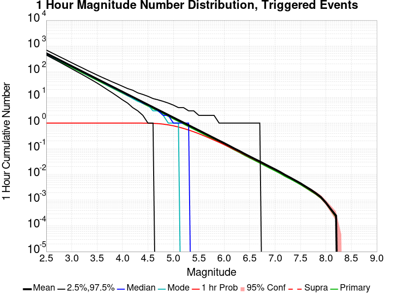

| Mag | Mean | 2.5 %ile | 97.5 %ile | Median | Mode | 1 hr Probability | 1 hr Supra-Seis Prob | Primary Aftershocks Mean |
|-----|-----|-----|-----|-----|-----|-----|-----|-----|
| **M&ge;2.5** | 523.941 | 431.000 | 743.000 | 496.000 | 488.000 | 1.000 (100.00%) | 0.000 (0.00%) | 458.781 |
| **M&ge;2.6** | 415.870 | 342.000 | 569.000 | 393.000 | 393.000 | 1.000 (100.00%) | 0.000 (0.00%) | 364.126 |
| **M&ge;2.7** | 329.996 | 270.000 | 443.000 | 313.000 | 307.000 | 1.000 (100.00%) | 0.000 (0.00%) | 288.970 |
| **M&ge;2.8** | 261.955 | 211.000 | 364.000 | 249.000 | 242.000 | 1.000 (100.00%) | 0.000 (0.00%) | 229.576 |
| **M&ge;2.9** | 207.881 | 163.000 | 303.000 | 198.000 | 198.000 | 1.000 (100.00%) | 0.000 (0.00%) | 181.758 |
| **M&ge;3** | 164.911 | 126.000 | 237.000 | 158.000 | 168.000 | 1.000 (100.00%) | 0.000 (0.00%) | 144.097 |
| **M&ge;3.1** | 130.948 | 98.000 | 192.000 | 125.000 | 115.000 | 1.000 (100.00%) | 0.000 (0.00%) | 114.353 |
| **M&ge;3.2** | 104.465 | 76.000 | 147.000 | 100.000 | 101.000 | 1.000 (100.00%) | 0.000 (0.00%) | 91.301 |
| **M&ge;3.3** | 82.792 | 60.000 | 119.000 | 79.000 | 80.000 | 1.000 (100.00%) | 0.000 (0.00%) | 72.349 |
| **M&ge;3.4** | 65.643 | 47.000 | 94.000 | 62.000 | 61.000 | 1.000 (100.00%) | 0.000 (0.00%) | 57.383 |
| **M&ge;3.5** | 52.134 | 34.000 | 77.000 | 49.000 | 50.000 | 1.000 (100.00%) | 0.000 (0.00%) | 45.524 |
| **M&ge;3.6** | 41.182 | 26.000 | 67.000 | 39.000 | 39.000 | 1.000 (100.00%) | 0.000 (0.00%) | 35.952 |
| **M&ge;3.7** | 32.758 | 20.000 | 53.000 | 31.000 | 33.000 | 1.000 (100.00%) | 0.000 (0.00%) | 28.558 |
| **M&ge;3.8** | 26.119 | 15.000 | 43.000 | 25.000 | 24.000 | 1.000 (100.00%) | 0.000 (0.00%) | 22.788 |
| **M&ge;3.9** | 20.669 | 10.000 | 35.000 | 20.000 | 22.000 | 1.000 (100.00%) | 0.000 (0.00%) | 18.015 |
| **M&ge;4** | 16.297 | 8.000 | 27.000 | 16.000 | 16.000 | 1.000 (100.00%) | 0.000 (0.00%) | 14.197 |
| **M&ge;4.1** | 12.989 | 6.000 | 24.000 | 12.000 | 11.000 | 1.000 (100.00%) | 0.000 (0.00%) | 11.357 |
| **M&ge;4.2** | 10.286 | 4.000 | 20.000 | 10.000 | 8.000 | 1.000 (100.00%) | 0.000 (0.00%) | 9.004 |
| **M&ge;4.3** | 8.223 | 2.000 | 16.000 | 8.000 | 7.000 | 0.996 (99.63%) | 0.000 (0.00%) | 7.234 |
| **M&ge;4.4** | 6.457 | 2.000 | 13.000 | 6.000 | 5.000 | 0.989 (98.88%) | 0.000 (0.00%) | 5.662 |
| **M&ge;4.5** | 5.104 | 1.000 | 11.000 | 5.000 | 5.000 | 0.989 (98.88%) | 0.000 (0.00%) | 4.468 |
| **M&ge;4.6** | 4.063 | 0.000 | 9.000 | 4.000 | 4.000 | 0.963 (96.28%) | 0.000 (0.00%) | 3.561 |
| **M&ge;4.7** | 3.238 | 0.000 | 8.000 | 3.000 | 2.000 | 0.944 (94.42%) | 0.000 (0.00%) | 2.840 |
| **M&ge;4.8** | 2.539 | 0.000 | 6.000 | 2.000 | 3.000 | 0.896 (89.59%) | 0.000 (0.00%) | 2.253 |
| **M&ge;4.9** | 1.970 | 0.000 | 6.000 | 2.000 | 1.000 | 0.840 (84.01%) | 0.000 (0.00%) | 1.773 |
| **M&ge;5** | 1.617 | 0.000 | 5.000 | 1.000 | 1.000 | 0.788 (78.81%) | 0.000 (0.00%) | 1.457 |
| **M&ge;5.1** | 1.257 | 0.000 | 4.000 | 1.000 | 1.000 | 0.684 (68.40%) | 0.000 (0.00%) | 1.123 |
| **M&ge;5.2** | 1.045 | 0.000 | 3.000 | 1.000 | 0.000 | 0.617 (61.71%) | 0.000 (0.00%) | 0.937 |
| **M&ge;5.3** | 0.848 | 0.000 | 3.000 | 1.000 | 0.000 | 0.546 (54.65%) | 0.000 (0.00%) | 0.766 |
| **M&ge;5.4** | 0.654 | 0.000 | 2.000 | 0.000 | 0.000 | 0.480 (47.96%) | 0.000 (0.00%) | 0.595 |
| **M&ge;5.5** | 0.468 | 0.000 | 2.000 | 0.000 | 0.000 | 0.379 (37.92%) | 0.000 (0.00%) | 0.424 |
| **M&ge;5.6** | 0.394 | 0.000 | 2.000 | 0.000 | 0.000 | 0.331 (33.09%) | 0.000 (0.00%) | 0.364 |
| **M&ge;5.7** | 0.283 | 0.000 | 2.000 | 0.000 | 0.000 | 0.253 (25.28%) | 0.000 (0.00%) | 0.260 |
| **M&ge;5.8** | 0.238 | 0.000 | 1.000 | 0.000 | 0.000 | 0.219 (21.93%) | 0.000 (0.00%) | 0.219 |
| **M&ge;5.9** | 0.201 | 0.000 | 1.000 | 0.000 | 0.000 | 0.190 (18.96%) | 0.000 (0.00%) | 0.190 |
| **M&ge;6** | 0.141 | 0.000 | 1.000 | 0.000 | 0.000 | 0.141 (14.13%) | 0.000 (0.00%) | 0.138 |
| **M&ge;6.1** | 0.108 | 0.000 | 1.000 | 0.000 | 0.000 | 0.108 (10.78%) | 0.000 (0.00%) | 0.104 |
| **M&ge;6.2** | 0.082 | 0.000 | 1.000 | 0.000 | 0.000 | 0.082 (8.18%) | 0.000 (0.00%) | 0.078 |
| **M&ge;6.3** | 0.078 | 0.000 | 1.000 | 0.000 | 0.000 | 0.078 (7.81%) | 0.000 (0.00%) | 0.074 |
| **M&ge;6.4** | 0.063 | 0.000 | 1.000 | 0.000 | 0.000 | 0.063 (6.32%) | 0.000 (0.00%) | 0.063 |
| **M&ge;6.5** | 0.056 | 0.000 | 1.000 | 0.000 | 0.000 | 0.056 (5.58%) | 0.000 (0.00%) | 0.056 |
| **M&ge;6.6** | 0.037 | 0.000 | 1.000 | 0.000 | 0.000 | 0.037 (3.72%) | 0.000 (0.00%) | 0.037 |
| **M&ge;6.7** | 0.026 | 0.000 | 1.000 | 0.000 | 0.000 | 0.026 (2.60%) | 0.000 (0.00%) | 0.026 |
| **M&ge;6.8** | 0.022 | 0.000 | 0.000 | 0.000 | 0.000 | 0.022 (2.23%) | 0.000 (0.00%) | 0.022 |
| **M&ge;6.9** | 0.022 | 0.000 | 0.000 | 0.000 | 0.000 | 0.022 (2.23%) | 0.000 (0.00%) | 0.022 |
| **M&ge;7** | 0.022 | 0.000 | 0.000 | 0.000 | 0.000 | 0.022 (2.23%) | 0.000 (0.00%) | 0.022 |
| **M&ge;7.1** | 0.019 | 0.000 | 0.000 | 0.000 | 0.000 | 0.019 (1.86%) | 0.000 (0.00%) | 0.019 |
| **M&ge;7.2** | 0.019 | 0.000 | 0.000 | 0.000 | 0.000 | 0.019 (1.86%) | 0.000 (0.00%) | 0.019 |
| **M&ge;7.3** | 0.015 | 0.000 | 0.000 | 0.000 | 0.000 | 0.015 (1.49%) | 0.000 (0.00%) | 0.015 |
| **M&ge;7.4** | 7.43E-3 | 0.000 | 0.000 | 0.000 | 0.000 | 7.43E-3 (0.74%) | 0.000 (0.00%) | 7.43E-3 |
| **M&ge;7.5** | 7.43E-3 | 0.000 | 0.000 | 0.000 | 0.000 | 7.43E-3 (0.74%) | 0.000 (0.00%) | 7.43E-3 |
| **M&ge;7.6** | 7.43E-3 | 0.000 | 0.000 | 0.000 | 0.000 | 7.43E-3 (0.74%) | 0.000 (0.00%) | 7.43E-3 |
| **M&ge;7.7** | 7.43E-3 | 0.000 | 0.000 | 0.000 | 0.000 | 7.43E-3 (0.74%) | 0.000 (0.00%) | 7.43E-3 |
| **M&ge;7.8** | 7.43E-3 | 0.000 | 0.000 | 0.000 | 0.000 | 7.43E-3 (0.74%) | 0.000 (0.00%) | 7.43E-3 |
| **M&ge;7.9** | 3.72E-3 | 0.000 | 0.000 | 0.000 | 0.000 | 3.72E-3 (0.37%) | 0.000 (0.00%) | 3.72E-3 |
| **M&ge;8** | 0.000 | 0.000 | 0.000 | 0.000 | 0.000 | 0.000 (0.00%) | 0.000 (0.00%) | 0.000 |
| **M&ge;8.1** | 0.000 | 0.000 | 0.000 | 0.000 | 0.000 | 0.000 (0.00%) | 0.000 (0.00%) | 0.000 |
| **M&ge;8.2** | 0.000 | 0.000 | 0.000 | 0.000 | 0.000 | 0.000 (0.00%) | 0.000 (0.00%) | 0.000 |
| **M&ge;8.3** | 0.000 | 0.000 | 0.000 | 0.000 | 0.000 | 0.000 (0.00%) | 0.000 (0.00%) | 0.000 |
| **M&ge;8.4** | 0.000 | 0.000 | 0.000 | 0.000 | 0.000 | 0.000 (0.00%) | 0.000 (0.00%) | 0.000 |
| **M&ge;8.5** | 0.000 | 0.000 | 0.000 | 0.000 | 0.000 | 0.000 (0.00%) | 0.000 (0.00%) | 0.000 |
| **M&ge;8.6** | 0.000 | 0.000 | 0.000 | 0.000 | 0.000 | 0.000 (0.00%) | 0.000 (0.00%) | 0.000 |
| **M&ge;8.7** | 0.000 | 0.000 | 0.000 | 0.000 | 0.000 | 0.000 (0.00%) | 0.000 (0.00%) | 0.000 |
| **M&ge;8.8** | 0.000 | 0.000 | 0.000 | 0.000 | 0.000 | 0.000 (0.00%) | 0.000 (0.00%) | 0.000 |
| **M&ge;8.9** | 0.000 | 0.000 | 0.000 | 0.000 | 0.000 | 0.000 (0.00%) | 0.000 (0.00%) | 0.000 |
| **M&ge;9** | 0.000 | 0.000 | 0.000 | 0.000 | 0.000 | 0.000 (0.00%) | 0.000 (0.00%) | 0.000 |


## Hazard Change Over Time
*[(top)](#table-of-contents)*

These plots show how the probability of ruptures of various magnitudes within 100km of any scenario rupture changes over time

### M&ge;5.0 Hazard Change Over Time
*[(top)](#table-of-contents)*


| Forecast Duration | UCERF3-ETAS [95% Conf] | UCERF3-ETAS Triggered Only | UCERF3-TD | UCERF3-ETAS/TD Gain | UCERF3-TI |
|-----|-----|-----|-----|-----|-----|
| 1 Hour | 0.781 [0.725 - 0.828] | 0.781 | 6.89E-5 | 11335.51 | 6.84E-5 |
| 1 Day | 0.989 [0.965 - 0.997] | 0.989 | 1.65E-3 | 598.74 | 1.64E-3 |
| 1 Week | 0.993 [0.971 - 0.999] | 0.993 | 0.012 | 86.29 | 0.011 |
| 1 Month | 1.000 [0.983 - 1.000] | 1.000 | 0.048 | 20.67 | 0.048 |
| 1 Year | 1.000 [0.990 - 1.000] | 1.000 | 0.453 | 2.21 | 0.451 |
| 10 Years | 1.000 [1.000 - 1.000] | 1.000 | 0.998 | 1 | 0.998 |
| 30 Years | 1.000 [1.000 - 1.000] \* | \* | 1.000 | 1 \* | 1.000 |
| 100 Years | 1.000 [1.000 - 1.000] \* | \* | 1.000 | 1 \* | 1.000 |

\* *forecast duration is longer than simulation length, only ETAS ruptures from the first 10 years are included*
### M&ge;6.0 Hazard Change Over Time
*[(top)](#table-of-contents)*


| Forecast Duration | UCERF3-ETAS [95% Conf] | UCERF3-ETAS Triggered Only | UCERF3-TD | UCERF3-ETAS/TD Gain | UCERF3-TI |
|-----|-----|-----|-----|-----|-----|
| 1 Hour | 0.141 [0.103 - 0.190] | 0.141 | 7.81E-6 | 18098.6 | 7.31E-6 |
| 1 Day | 0.320 [0.265 - 0.380] | 0.320 | 1.87E-4 | 1707.42 | 1.75E-4 |
| 1 Week | 0.447 [0.387 - 0.508] | 0.446 | 1.31E-3 | 340.96 | 1.23E-3 |
| 1 Month | 0.538 [0.477 - 0.598] | 0.535 | 5.60E-3 | 95.98 | 5.25E-3 |
| 1 Year | 0.667 [0.610 - 0.720] | 0.643 | 0.066 | 10.08 | 0.062 |
| 10 Years | 0.859 [0.830 - 0.886] | 0.721 | 0.496 | 1.73 | 0.473 |
| 30 Years | 0.964 [0.957 - 0.971] \* | \* | 0.873 | 1.11 \* | 0.854 |
| 100 Years | 1.000 [1.000 - 1.000] \* | \* | 0.999 | 1 \* | 0.998 |

\* *forecast duration is longer than simulation length, only ETAS ruptures from the first 10 years are included*
### M&ge;7.0 Hazard Change Over Time
*[(top)](#table-of-contents)*

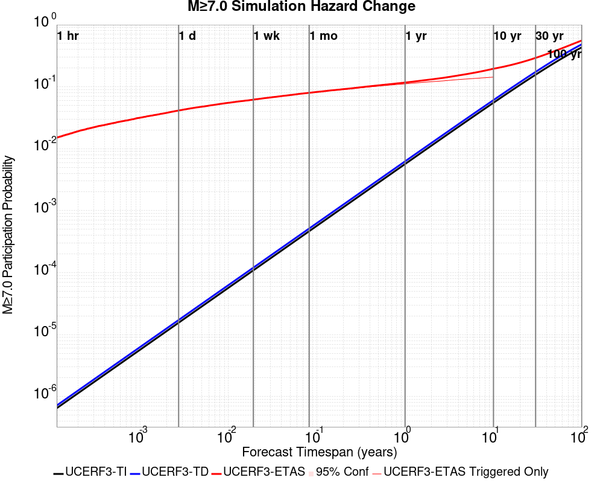

| Forecast Duration | UCERF3-ETAS [95% Conf] | UCERF3-ETAS Triggered Only | UCERF3-TD | UCERF3-ETAS/TD Gain | UCERF3-TI |
|-----|-----|-----|-----|-----|-----|
| 1 Hour | 0.022 [9.10E-3 - 0.050] | 0.022 | 7.16E-7 | 31167.24 | 6.47E-7 |
| 1 Day | 0.045 [0.024 - 0.079] | 0.045 | 1.72E-5 | 2598.17 | 1.55E-5 |
| 1 Week | 0.052 [0.030 - 0.088] | 0.052 | 1.20E-4 | 433.84 | 1.09E-4 |
| 1 Month | 0.071 [0.045 - 0.110] | 0.071 | 5.15E-4 | 138.04 | 4.66E-4 |
| 1 Year | 0.099 [0.068 - 0.141] | 0.093 | 6.25E-3 | 15.77 | 5.66E-3 |
| 10 Years | 0.176 [0.143 - 0.220] | 0.123 | 0.061 | 2.89 | 0.055 |
| 30 Years | 0.275 [0.246 - 0.314] \* | \* | 0.174 | 1.58 \* | 0.157 |
| 100 Years | 0.548 [0.529 - 0.572] \* | \* | 0.485 | 1.13 \* | 0.433 |

\* *forecast duration is longer than simulation length, only ETAS ruptures from the first 10 years are included*
### M&ge;8.0 Hazard Change Over Time
*[(top)](#table-of-contents)*


| Forecast Duration | UCERF3-ETAS [95% Conf] | UCERF3-ETAS Triggered Only | UCERF3-TD | UCERF3-ETAS/TD Gain | UCERF3-TI |
|-----|-----|-----|-----|-----|-----|
| 1 Hour | 1.24E-8 [1.24E-8 - 0.018] | 0.000 | 1.24E-8 | 1 | 1.06E-8 |
| 1 Day | 7.44E-3 [1.29E-3 - 0.030] | 7.43E-3 | 2.97E-7 | 25052.35 | 2.54E-7 |
| 1 Week | 7.44E-3 [1.29E-3 - 0.030] | 7.43E-3 | 2.08E-6 | 3579.76 | 1.78E-6 |
| 1 Month | 7.44E-3 [1.30E-3 - 0.030] | 7.43E-3 | 8.90E-6 | 836.04 | 7.63E-6 |
| 1 Year | 7.54E-3 [1.40E-3 - 0.030] | 7.43E-3 | 1.08E-4 | 69.58 | 9.29E-5 |
| 10 Years | 8.52E-3 [2.38E-3 - 0.031] | 7.43E-3 | 1.10E-3 | 7.77 | 9.29E-4 |
| 30 Years | 0.011 [4.79E-3 - 0.033] \* | \* | 3.50E-3 | 3.12 \* | 2.78E-3 |
| 100 Years | 0.021 [0.015 - 0.043] \* | \* | 0.014 | 1.54 \* | 9.25E-3 |

\* *forecast duration is longer than simulation length, only ETAS ruptures from the first 10 years are included*

## Trigger Rupture Fault Map
*[(top)](#table-of-contents)*


## Trigger Rupture Depth Map
*[(top)](#table-of-contents)*


## Fault Distances To Triggers
*[(top)](#table-of-contents)*

| Section Name | Strike, Dip, Rake | # Hypos In Poly | Max Mag w/ Hypo In Poly | # Surfs In Poly | Max Mag w/ Surf In Poly | Min Dist To Any (km) | Min Poly Dist To Any (km) | Min Dist To Largest (km) | Min Poly Dist To Largest (km) | Min Hypo Dist To Largest (km) | Min Hypo Poly Dist To Largest (km) |
|-----|-----|-----|-----|-----|-----|-----|-----|-----|-----|-----|-----|
| Airport Lake | 359, 50, -90 | 92 | 7.1 | 92 | 7.1 | 0.036 | 0.000 | 0.036 | 0.000 | 5.612 | 0.000 |
| Little Lake | 327, 90, 180 | 16 | 3.85 | 17 | 7.1 | 2.321 | 0.000 | 11.284 | 0.000 | 13.471 | 1.469 |
| Garlock (Central) | 71, 90, 0 | 2 | 3.21 | 3 | 7.1 | 5.600 | 0.000 | 5.600 | 0.000 | 22.766 | 10.797 |
| So Sierra Nevada | 2, 50, -90 | 1 | 2.75 | 1 | 2.75 | 1.410 | 0.000 | 4.248 | 4.233 | 16.191 | 15.188 |
| Tank Canyon | 189, 50, -90 | 0 |  | 0 |  | 9.015 | 9.011 | 9.015 | 9.011 | 17.039 | 16.895 |
| Blackwater | 323, 90, 180 | 0 |  | 0 |  | 14.394 | 8.726 | 14.394 | 8.726 | 29.622 | 27.613 |
| Scodie Lineament | 221, 68, 0 | 0 |  | 0 |  | 16.722 | 15.781 | 28.750 | 27.702 | 36.559 | 32.668 |

## Individual Simulated Catalog Maps
*[(top)](#table-of-contents)*

These are map plots of individual catalogs from the simulations, selected as the closest catalog to each of the given percentiles in terms of total number of events.

| Duration | p0.0 %-ile | p25.0 %-ile | p50.0 %-ile | p75.0 %-ile | p90.0 %-ile | p95.0 %-ile | p97.5 %-ile | p98.0 %-ile | p99.0 %-ile | p99.5 %-ile | p99.9 %-ile | p100.0 %-ile |
|-----|-----|-----|-----|-----|-----|-----|-----|-----|-----|-----|-----|-----|
| **1 Week** |  | 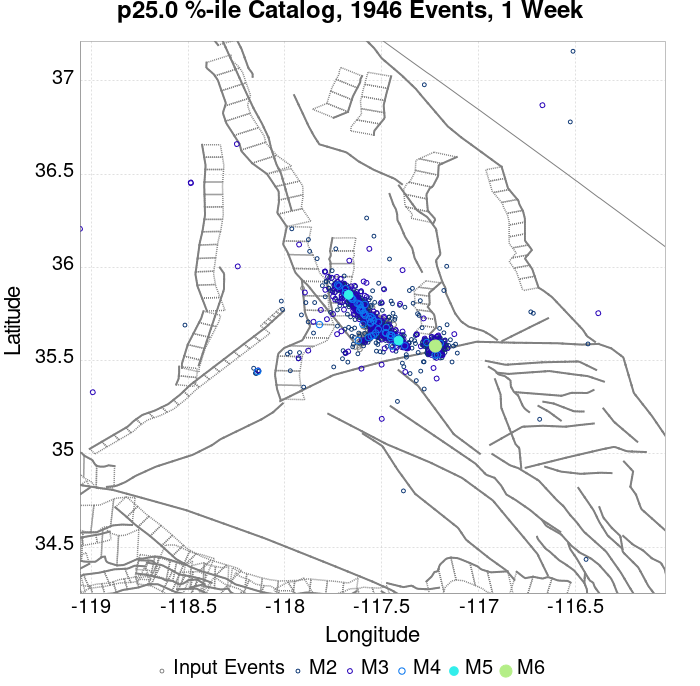 |  |  |  |  | 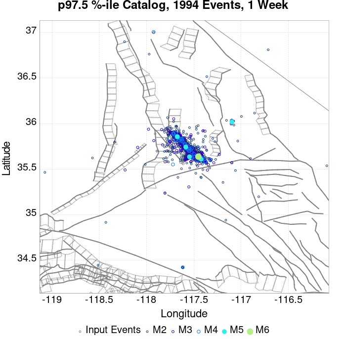 | 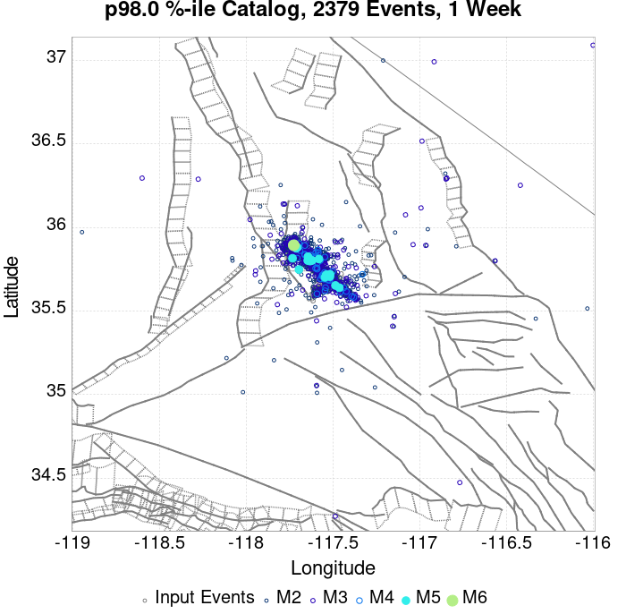 |  |  |  |  |
| **1 Month** |  |  |  |  |  |  |  |  |  |  |  |  |
| **1 Year** |  |  |  |  |  |  | 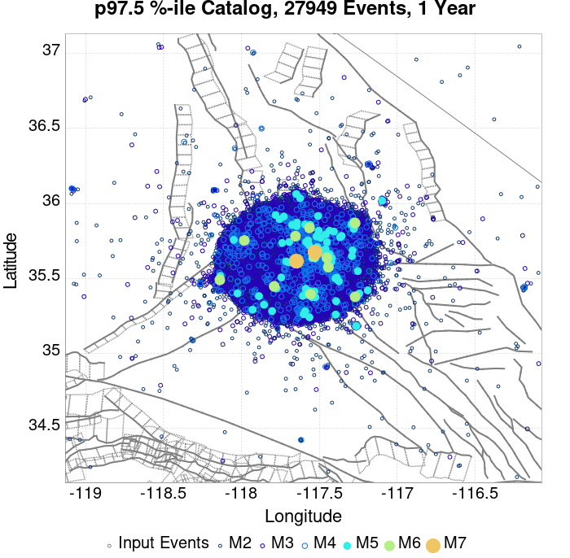 |  | 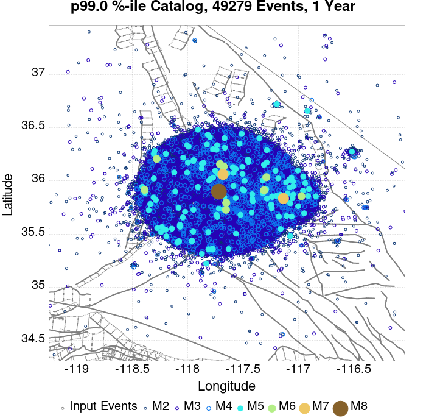 |  |  |  |
| **10 Year** |  |  |  |  |  |  |  |  | 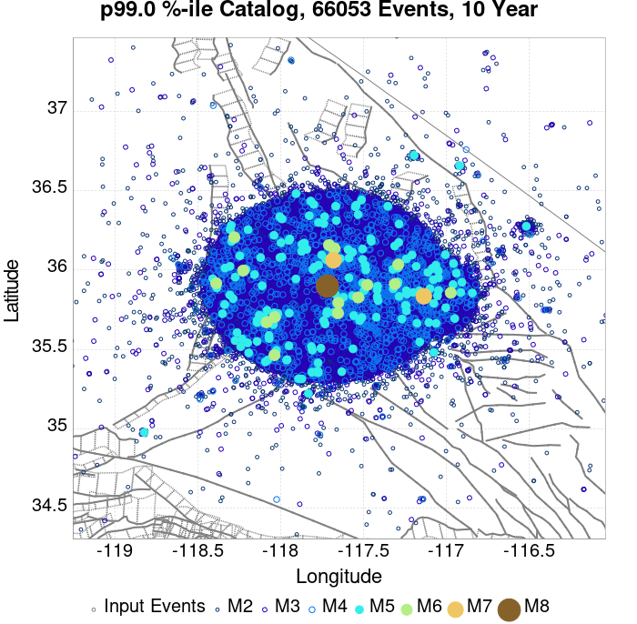 |  |  |  |

## ComCat Data Comparisons
*[(top)](#table-of-contents)*

These plots compare simulated sequences with data from ComCat. All plots only consider events with hypocenters inside the ComCat region defined in the JSON input file, and consider ruptures above Mc=3.0

Last updated at 2019/08/23 22:00:12 UTC, 7 wk after the simulation start time

### ComCat Magnitude-Number Distributions
*[(top)](#table-of-contents)*


### ComCat Cumulative Number Vs Time
*[(top)](#table-of-contents)*

| M&ge;3 | M&ge;4 | M&ge;5 |
|-----|-----|-----|
|  |  | 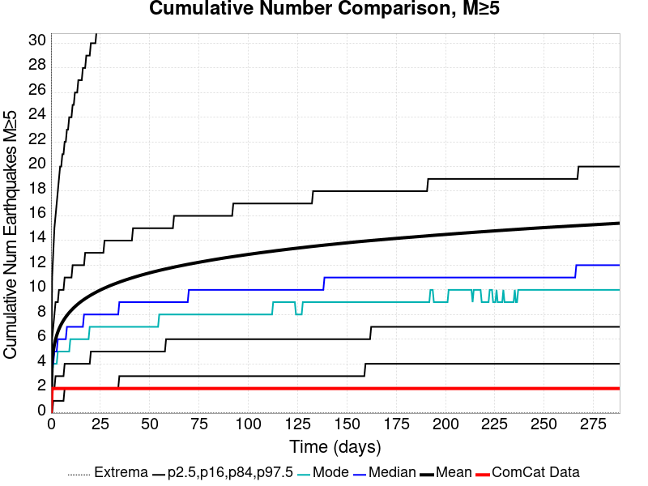 |

### ComCat Cumulative Number Simulation Percentiles
*[(top)](#table-of-contents)*


### ComCat Mean Spatial Distribution
*[(top)](#table-of-contents)*

|  | 1 Day | 1 Week | 1 Month | 7 Week |
|-----|-----|-----|-----|-----|
| **M3** |  |  |  |  |
| **M4** |  |  |  | 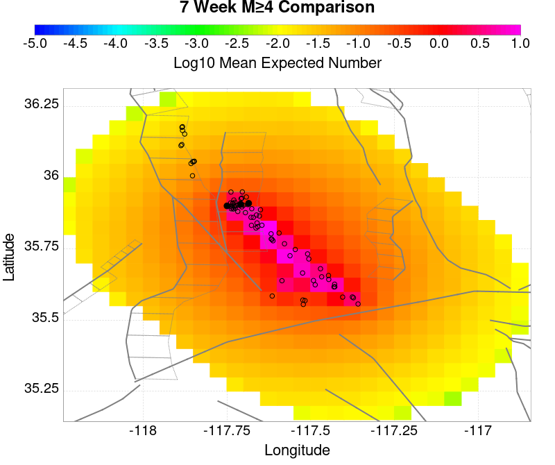 |
| **M5** |  | 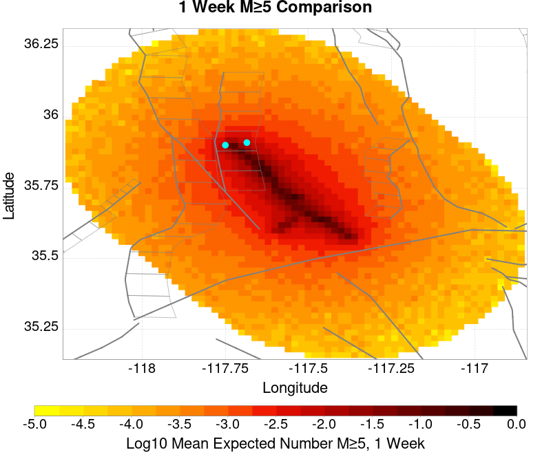 |  |  |
| **M6** |  |  |  |  |
| **M7** |  |  |  | 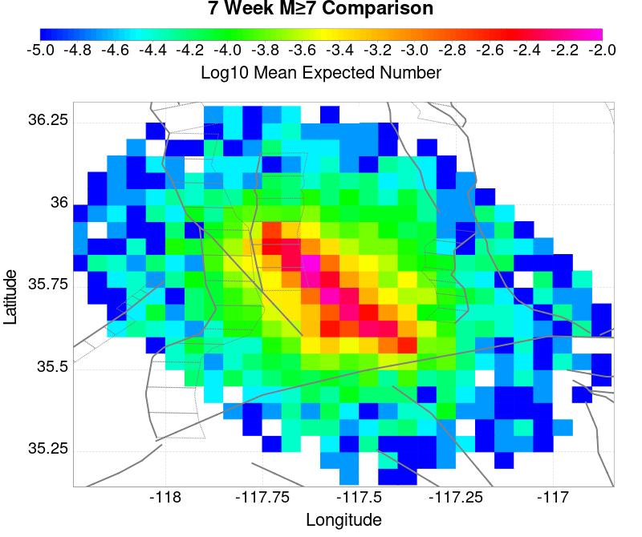 |
| **M8** |  |  |  |  |

### ComCat Depth Distribution
*[(top)](#table-of-contents)*

| M&ge;3 | M&ge;4 | M&ge;5 | M&ge;6 | M&ge;7 | M&ge;8 |
|-----|-----|-----|-----|-----|-----|
|  |  |  |  |  |  |

## Gridded Nucleation
*[(top)](#table-of-contents)*

| Min Mag | Triggered Ruptures (no spontaneous) | Triggered Ruptures (primary aftershocks only) |
|-----|-----|-----|
| **M&ge;2.5** |  |  |
| **M&ge;5** |  |  |
| **M&ge;6** |  | 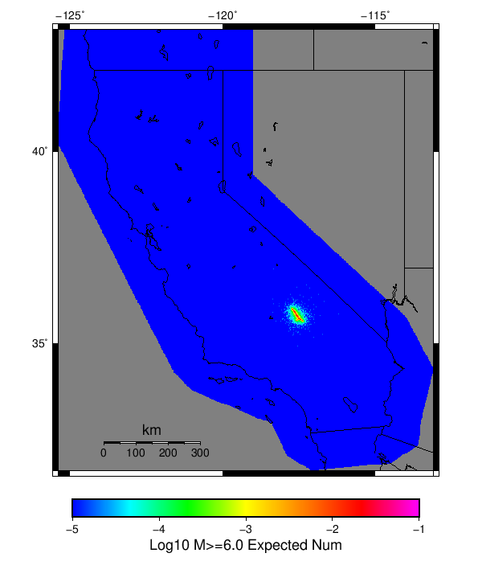 |
| **M&ge;7** |  |  |


## JSON Input File
*[(top)](#table-of-contents)*

```
{
  "numSimulations": 100000,
  "duration": 10.0,
  "startTimeMillis": 1562383194040,
  "includeSpontaneous": false,
  "randomSeed": 1566353794020,
  "binaryOutput": true,
  "binaryOutputFilters": [
    {
      "prefix": "results_complete",
      "descendantsOnly": false
    },
    {
      "prefix": "results_m5_preserve_chain",
      "minMag": 5.0,
      "preserveChainBelowMag": true,
      "descendantsOnly": false
    }
  ],
  "forceRecalc": false,
  "simulationName": "ComCat M7.1 (ci38457511), ShakeMap Surfaces, No Faults",
  "numRetries": 3,
  "outputDir": "${ETAS_SIM_DIR}/2019_08_20-ComCatM7p1_ci38457511_ShakeMapSurfaces_NoFaults-noSpont-poisson-griddedOnly",
  "triggerRuptures": [
    {
      "occurrenceTimeMillis": 1562259775340,
      "comcatEventID": "ci38443095",
      "mag": 3.98,
      "latitude": 35.708,
      "longitude": -117.5036667,
      "depth": 10.58
    },
    {
      "occurrenceTimeMillis": 1562261629000,
      "comcatEventID": "ci38443183",
      "mag": 6.4,
      "latitude": 35.7053333,
      "longitude": -117.5038333,
      "depth": 10.5,
      "ruptureSurfaces": [
        {
          "outline": [
            {
              "latitude": 35.6051534466,
              "longitude": -117.5905380735,
              "depth": 0.0
            },
            {
              "latitude": 35.6173144101,
              "longitude": -117.57249634649999,
              "depth": 0.0
            },
            {
              "latitude": 35.6173135736,
              "longitude": -117.5726723708,
              "depth": 0.0
            },
            {
              "latitude": 35.61731357360001,
              "longitude": -117.5726723708,
              "depth": 15.0
            },
            {
              "latitude": 35.6173144101,
              "longitude": -117.57249634649999,
              "depth": 15.0
            },
            {
              "latitude": 35.6051534466,
              "longitude": -117.5905380735,
              "depth": 15.0
            },
            {
              "latitude": 35.6051534466,
              "longitude": -117.5905380735,
              "depth": 0.0
            }
          ]
        },
        {
          "outline": [
            {
              "latitude": 35.6338128629,
              "longitude": -117.54831678310002,
              "depth": 0.0
            },
            {
              "latitude": 35.6413274733,
              "longitude": -117.5393878708,
              "depth": 0.0
            },
            {
              "latitude": 35.664283512,
              "longitude": -117.51611643970001,
              "depth": 0.0
            },
            {
              "latitude": 35.664283512000004,
              "longitude": -117.51611643970001,
              "depth": 15.0
            },
            {
              "latitude": 35.641327473299995,
              "longitude": -117.5393878708,
              "depth": 15.0
            },
            {
              "latitude": 35.63381286290001,
              "longitude": -117.54831678310002,
              "depth": 15.0
            },
            {
              "latitude": 35.6338128629,
              "longitude": -117.54831678310002,
              "depth": 0.0
            }
          ]
        },
        {
          "outline": [
            {
              "latitude": 35.6322100797,
              "longitude": -117.55305954249998,
              "depth": 0.0
            },
            {
              "latitude": 35.6196274701,
              "longitude": -117.56969626549999,
              "depth": 0.0
            },
            {
              "latitude": 35.6196274701,
              "longitude": -117.56969626549999,
              "depth": 15.0
            },
            {
              "latitude": 35.6322100797,
              "longitude": -117.55305954249998,
              "depth": 15.0
            },
            {
              "latitude": 35.6322100797,
              "longitude": -117.55305954249998,
              "depth": 0.0
            }
          ]
        }
      ]
    },
    {
      "occurrenceTimeMillis": 1562261701660,
      "comcatEventID": "ci38443191",
      "mag": 4.49,
      "latitude": 35.644,
      "longitude": -117.56716670000002,
      "depth": 4.64
    },
    {
      "occurrenceTimeMillis": 1562261746340,
      "comcatEventID": "ci37222356",
      "mag": 3.63,
      "latitude": 35.6936667,
      "longitude": -117.437,
      "depth": 7.65
    },
    {
      "occurrenceTimeMillis": 1562261752170,
      "comcatEventID": "ci37218988",
      "mag": 4.28,
      "latitude": 35.687,
      "longitude": -117.50616670000001,
      "depth": 1.6
    },
    {
      "occurrenceTimeMillis": 1562261818950,
      "comcatEventID": "ci37222380",
      "mag": 3.41,
      "latitude": 35.7258333,
      "longitude": -117.55933330000002,
      "depth": 5.3
    },
    {
      "occurrenceTimeMillis": 1562261821140,
      "comcatEventID": "ci37222372",
      "mag": 3.66,
      "latitude": 35.7105,
      "longitude": -117.4773333,
      "depth": 1.57
    },
    {
      "occurrenceTimeMillis": 1562261834850,
      "comcatEventID": "ci37222364",
      "mag": 3.97,
      "latitude": 35.6655,
      "longitude": -117.516,
      "depth": 1.64
    },
    {
      "occurrenceTimeMillis": 1562261845640,
      "comcatEventID": "ci37218996",
      "mag": 4.01,
      "latitude": 35.6758333,
      "longitude": -117.45750000000001,
      "depth": 15.82
    },
    {
      "occurrenceTimeMillis": 1562261875500,
      "comcatEventID": "ci38443199",
      "mag": 3.86,
      "latitude": 35.7456667,
      "longitude": -117.5516667,
      "depth": 8.29
    },
    {
      "occurrenceTimeMillis": 1562261901450,
      "comcatEventID": "ci37421941",
      "mag": 3.73,
      "latitude": 35.714,
      "longitude": -117.476,
      "depth": 1.74
    },
    {
      "occurrenceTimeMillis": 1562261927500,
      "comcatEventID": "us70004a0n",
      "mag": 3.5,
      "latitude": 35.6215,
      "longitude": -117.5782,
      "depth": 9.7
    },
    {
      "occurrenceTimeMillis": 1562261927760,
      "comcatEventID": "ci37222396",
      "mag": 3.5,
      "latitude": 35.6235,
      "longitude": -117.596,
      "depth": 8.55
    },
    {
      "occurrenceTimeMillis": 1562261973310,
      "comcatEventID": "ci37222404",
      "mag": 3.11,
      "latitude": 35.5743333,
      "longitude": -117.63666670000002,
      "depth": 6.85
    },
    {
      "occurrenceTimeMillis": 1562261975360,
      "comcatEventID": "ci38443215",
      "mag": 3.69,
      "latitude": 35.6873333,
      "longitude": -117.4935,
      "depth": 10.86
    },
    {
      "occurrenceTimeMillis": 1562262002250,
      "comcatEventID": "ci38443223",
      "mag": 3.8,
      "latitude": 35.7253333,
      "longitude": -117.57083329999999,
      "depth": 6.63
    },
    {
      "occurrenceTimeMillis": 1562262018520,
      "comcatEventID": "ci38443231",
      "mag": 4.13,
      "latitude": 35.707,
      "longitude": -117.5101667,
      "depth": 8.66
    },
    {
      "occurrenceTimeMillis": 1562262034900,
      "comcatEventID": "ci37222508",
      "mag": 3.54,
      "latitude": 35.6948333,
      "longitude": -117.50183330000002,
      "depth": 2.04
    },
    {
      "occurrenceTimeMillis": 1562262046140,
      "comcatEventID": "ci37222516",
      "mag": 3.42,
      "latitude": 35.7298333,
      "longitude": -117.55483330000001,
      "depth": 7.72
    },
    {
      "occurrenceTimeMillis": 1562262080850,
      "comcatEventID": "ci37421957",
      "mag": 3.3,
      "latitude": 35.7266667,
      "longitude": -117.5288333,
      "depth": 1.97
    },
    {
      "occurrenceTimeMillis": 1562262174130,
      "comcatEventID": "ci38443239",
      "mag": 3.22,
      "latitude": 35.7301667,
      "longitude": -117.55866669999999,
      "depth": 7.84
    },
    {
      "occurrenceTimeMillis": 1562262209200,
      "comcatEventID": "us70004a0z",
      "mag": 3.6,
      "latitude": 35.6783,
      "longitude": -117.5488,
      "depth": 5.15
    },
    {
      "occurrenceTimeMillis": 1562262264020,
      "comcatEventID": "ci37421981",
      "mag": 2.77,
      "latitude": 35.7478333,
      "longitude": -117.54000000000002,
      "depth": 9.4
    },
    {
      "occurrenceTimeMillis": 1562262272820,
      "comcatEventID": "ci38443255",
      "mag": 3.86,
      "latitude": 35.6875,
      "longitude": -117.5071667,
      "depth": 1.54
    },
    {
      "occurrenceTimeMillis": 1562262305780,
      "comcatEventID": "ci37421997",
      "mag": 3.03,
      "latitude": 35.6976667,
      "longitude": -117.48649999999999,
      "depth": 2.24
    },
    {
      "occurrenceTimeMillis": 1562262323950,
      "comcatEventID": "ci37421989",
      "mag": 3.03,
      "latitude": 35.7151667,
      "longitude": -117.5473333,
      "depth": 7.21
    },
    {
      "occurrenceTimeMillis": 1562262328630,
      "comcatEventID": "ci37222524",
      "mag": 3.21,
      "latitude": 35.7348333,
      "longitude": -117.53683330000001,
      "depth": 10.34
    },
    {
      "occurrenceTimeMillis": 1562262363710,
      "comcatEventID": "ci38443263",
      "mag": 2.96,
      "latitude": 35.6431667,
      "longitude": -117.6101667,
      "depth": 10.14
    },
    {
      "occurrenceTimeMillis": 1562262380320,
      "comcatEventID": "ci37222532",
      "mag": 2.56,
      "latitude": 35.6563333,
      "longitude": -117.5325,
      "depth": 1.52
    },
    {
      "occurrenceTimeMillis": 1562262409960,
      "comcatEventID": "ci38443271",
      "mag": 3.07,
      "latitude": 35.6385,
      "longitude": -117.6108333,
      "depth": 10.97
    },
    {
      "occurrenceTimeMillis": 1562262437810,
      "comcatEventID": "ci38443279",
      "mag": 3.59,
      "latitude": 35.7455,
      "longitude": -117.5465,
      "depth": 7.11
    },
    {
      "occurrenceTimeMillis": 1562262460970,
      "comcatEventID": "ci37222548",
      "mag": 3.11,
      "latitude": 35.726,
      "longitude": -117.55849999999998,
      "depth": 3.58
    },
    {
      "occurrenceTimeMillis": 1562262474970,
      "comcatEventID": "ci37222556",
      "mag": 3.4,
      "latitude": 35.7286667,
      "longitude": -117.56066670000001,
      "depth": 5.25
    },
    {
      "occurrenceTimeMillis": 1562262483160,
      "comcatEventID": "ci37222564",
      "mag": 3.27,
      "latitude": 35.6365,
      "longitude": -117.55183330000001,
      "depth": 6.62
    },
    {
      "occurrenceTimeMillis": 1562262495680,
      "comcatEventID": "ci37222572",
      "mag": 3.11,
      "latitude": 35.7053333,
      "longitude": -117.5245,
      "depth": 5.52
    },
    {
      "occurrenceTimeMillis": 1562262504150,
      "comcatEventID": "ci37222580",
      "mag": 2.96,
      "latitude": 35.6593333,
      "longitude": -117.52633330000002,
      "depth": 2.68
    },
    {
      "occurrenceTimeMillis": 1562262575190,
      "comcatEventID": "ci37222596",
      "mag": 2.52,
      "latitude": 35.7335,
      "longitude": -117.50683330000001,
      "depth": 3.91
    },
    {
      "occurrenceTimeMillis": 1562262578950,
      "comcatEventID": "ci37222668",
      "mag": 2.57,
      "latitude": 35.687,
      "longitude": -117.49066670000002,
      "depth": 10.66
    },
    {
      "occurrenceTimeMillis": 1562262648290,
      "comcatEventID": "ci37222692",
      "mag": 2.73,
      "latitude": 35.738,
      "longitude": -117.52933329999999,
      "depth": 7.72
    },
    {
      "occurrenceTimeMillis": 1562262648960,
      "comcatEventID": "ci38443303",
      "mag": 2.79,
      "latitude": 35.678,
      "longitude": -117.49916670000002,
      "depth": 1.14
    },
    {
      "occurrenceTimeMillis": 1562262706650,
      "comcatEventID": "ci38443287",
      "mag": 3.46,
      "latitude": 35.674,
      "longitude": -117.52349999999998,
      "depth": 5.3
    },
    {
      "occurrenceTimeMillis": 1562262761700,
      "comcatEventID": "ci38443295",
      "mag": 2.92,
      "latitude": 35.7218333,
      "longitude": -117.5251667,
      "depth": 7.04
    },
    {
      "occurrenceTimeMillis": 1562262899560,
      "comcatEventID": "ci38443327",
      "mag": 2.53,
      "latitude": 35.6391667,
      "longitude": -117.5628333,
      "depth": 10.48
    },
    {
      "occurrenceTimeMillis": 1562262930800,
      "comcatEventID": "ci37222876",
      "mag": 2.57,
      "latitude": 35.6705,
      "longitude": -117.5221667,
      "depth": 3.91
    },
    {
      "occurrenceTimeMillis": 1562263051460,
      "comcatEventID": "ci38443311",
      "mag": 2.95,
      "latitude": 35.6595,
      "longitude": -117.5223333,
      "depth": 2.3
    },
    {
      "occurrenceTimeMillis": 1562263063060,
      "comcatEventID": "ci37222932",
      "mag": 2.78,
      "latitude": 35.6725,
      "longitude": -117.4743333,
      "depth": 8.76
    },
    {
      "occurrenceTimeMillis": 1562263082640,
      "comcatEventID": "ci38443319",
      "mag": 3.33,
      "latitude": 35.702,
      "longitude": -117.50833330000002,
      "depth": 4.77
    },
    {
      "occurrenceTimeMillis": 1562263240190,
      "comcatEventID": "ci38443335",
      "mag": 2.67,
      "latitude": 35.6303333,
      "longitude": -117.569,
      "depth": 1.64
    },
    {
      "occurrenceTimeMillis": 1562263282243,
      "comcatEventID": "us70004a1k",
      "mag": 3.5,
      "latitude": 35.702,
      "longitude": -117.53610000000002,
      "depth": 10.0
    },
    {
      "occurrenceTimeMillis": 1562263374030,
      "comcatEventID": "ci38443351",
      "mag": 2.67,
      "latitude": 35.611,
      "longitude": -117.5921667,
      "depth": 1.33
    },
    {
      "occurrenceTimeMillis": 1562263398440,
      "comcatEventID": "ci38443359",
      "mag": 3.02,
      "latitude": 35.7481651,
      "longitude": -117.54183200000001,
      "depth": 2.26
    },
    {
      "occurrenceTimeMillis": 1562263541530,
      "comcatEventID": "ci38443375",
      "mag": 2.75,
      "latitude": 35.7135,
      "longitude": -117.5318333,
      "depth": 0.33
    },
    {
      "occurrenceTimeMillis": 1562263576110,
      "comcatEventID": "ci38443383",
      "mag": 3.78,
      "latitude": 35.6599998,
      "longitude": -117.52783199999999,
      "depth": 1.18
    },
    {
      "occurrenceTimeMillis": 1562263629180,
      "comcatEventID": "ci38443391",
      "mag": 3.5,
      "latitude": 35.5998344,
      "longitude": -117.6226654,
      "depth": 0.0
    },
    {
      "occurrenceTimeMillis": 1562263832740,
      "comcatEventID": "ci38443415",
      "mag": 3.46,
      "latitude": 35.6593323,
      "longitude": -117.53816990000001,
      "depth": 8.47
    },
    {
      "occurrenceTimeMillis": 1562263882750,
      "comcatEventID": "ci38443423",
      "mag": 2.79,
      "latitude": 35.603666700000005,
      "longitude": -117.60866670000001,
      "depth": 2.04
    },
    {
      "occurrenceTimeMillis": 1562263972040,
      "comcatEventID": "ci38443431",
      "mag": 3.44,
      "latitude": 35.6723333,
      "longitude": -117.561,
      "depth": 6.91
    },
    {
      "occurrenceTimeMillis": 1562264031370,
      "comcatEventID": "ci38443439",
      "mag": 3.5,
      "latitude": 35.7048333,
      "longitude": -117.4808333,
      "depth": 8.5
    },
    {
      "occurrenceTimeMillis": 1562264104860,
      "comcatEventID": "us70004a28",
      "mag": 3.2,
      "latitude": 35.61,
      "longitude": -117.602,
      "depth": 1.8
    },
    {
      "occurrenceTimeMillis": 1562264193510,
      "comcatEventID": "ci38443463",
      "mag": 3.04,
      "latitude": 35.7233315,
      "longitude": -117.5403366,
      "depth": 1.22
    },
    {
      "occurrenceTimeMillis": 1562264235140,
      "comcatEventID": "ci38443471",
      "mag": 2.85,
      "latitude": 35.7171667,
      "longitude": -117.54566669999998,
      "depth": 1.43
    },
    {
      "occurrenceTimeMillis": 1562264325740,
      "comcatEventID": "ci38443487",
      "mag": 3.28,
      "latitude": 35.6375008,
      "longitude": -117.6143341,
      "depth": 5.97
    },
    {
      "occurrenceTimeMillis": 1562264485340,
      "comcatEventID": "ci38443495",
      "mag": 2.61,
      "latitude": 35.6793333,
      "longitude": -117.5173333,
      "depth": 1.99
    },
    {
      "occurrenceTimeMillis": 1562264763680,
      "comcatEventID": "ci38443519",
      "mag": 3.12,
      "latitude": 35.6646652,
      "longitude": -117.5261688,
      "depth": 1.2
    },
    {
      "occurrenceTimeMillis": 1562264846710,
      "comcatEventID": "ci38443527",
      "mag": 3.29,
      "latitude": 35.6738319,
      "longitude": -117.51750180000002,
      "depth": 1.57
    },
    {
      "occurrenceTimeMillis": 1562264879440,
      "comcatEventID": "ci38443535",
      "mag": 4.23,
      "latitude": 35.745,
      "longitude": -117.55216669999999,
      "depth": 6.64
    },
    {
      "occurrenceTimeMillis": 1562264923610,
      "comcatEventID": "ci38443543",
      "mag": 3.85,
      "latitude": 35.6661667,
      "longitude": -117.5723333,
      "depth": 4.05
    },
    {
      "occurrenceTimeMillis": 1562265344040,
      "comcatEventID": "ci38443575",
      "mag": 2.5,
      "latitude": 35.7215,
      "longitude": -117.56550000000001,
      "depth": 0.16
    },
    {
      "occurrenceTimeMillis": 1562265451500,
      "comcatEventID": "ci38443591",
      "mag": 2.64,
      "latitude": 35.72,
      "longitude": -117.5723333,
      "depth": 1.34
    },
    {
      "occurrenceTimeMillis": 1562265525650,
      "comcatEventID": "ci38443599",
      "mag": 2.69,
      "latitude": 35.7046661,
      "longitude": -117.49666600000002,
      "depth": 3.96
    },
    {
      "occurrenceTimeMillis": 1562265584440,
      "comcatEventID": "ci38443607",
      "mag": 4.59,
      "latitude": 35.6013333,
      "longitude": -117.59700000000001,
      "depth": 2.81
    },
    {
      "occurrenceTimeMillis": 1562265674300,
      "comcatEventID": "ci38443615",
      "mag": 3.24,
      "latitude": 35.6751671,
      "longitude": -117.5148315,
      "depth": 1.73
    },
    {
      "occurrenceTimeMillis": 1562265865000,
      "comcatEventID": "ci38443631",
      "mag": 3.09,
      "latitude": 35.719,
      "longitude": -117.55866669999999,
      "depth": 2.06
    },
    {
      "occurrenceTimeMillis": 1562266026590,
      "comcatEventID": "ci38443647",
      "mag": 4.34,
      "latitude": 35.6758333,
      "longitude": -117.48533330000001,
      "depth": 8.53
    },
    {
      "occurrenceTimeMillis": 1562266207160,
      "comcatEventID": "ci38443663",
      "mag": 2.73,
      "latitude": 35.641,
      "longitude": -117.56266670000001,
      "depth": 8.95
    },
    {
      "occurrenceTimeMillis": 1562266216010,
      "comcatEventID": "ci38443671",
      "mag": 3.55,
      "latitude": 35.6764984,
      "longitude": -117.5,
      "depth": 0.91
    },
    {
      "occurrenceTimeMillis": 1562266333530,
      "comcatEventID": "ci38443679",
      "mag": 2.78,
      "latitude": 35.6543333,
      "longitude": -117.53983330000001,
      "depth": 0.88
    },
    {
      "occurrenceTimeMillis": 1562266376130,
      "comcatEventID": "ci38443687",
      "mag": 2.93,
      "latitude": 35.741,
      "longitude": -117.561,
      "depth": 0.23
    },
    {
      "occurrenceTimeMillis": 1562266407460,
      "comcatEventID": "ci38443695",
      "mag": 3.34,
      "latitude": 35.7276649,
      "longitude": -117.56416320000001,
      "depth": 1.62
    },
    {
      "occurrenceTimeMillis": 1562266453990,
      "comcatEventID": "ci38443703",
      "mag": 4.07,
      "latitude": 35.5975,
      "longitude": -117.5996667,
      "depth": 5.33
    },
    {
      "occurrenceTimeMillis": 1562266527790,
      "comcatEventID": "ci38443711",
      "mag": 3.07,
      "latitude": 35.6738333,
      "longitude": -117.4893333,
      "depth": 9.23
    },
    {
      "occurrenceTimeMillis": 1562266566420,
      "comcatEventID": "ci38443719",
      "mag": 4.58,
      "latitude": 35.716,
      "longitude": -117.56000000000002,
      "depth": 1.92
    },
    {
      "occurrenceTimeMillis": 1562266582030,
      "comcatEventID": "ci37420717",
      "mag": 4.21,
      "latitude": 35.7086667,
      "longitude": -117.55416669999998,
      "depth": 1.16
    },
    {
      "occurrenceTimeMillis": 1562266687790,
      "comcatEventID": "ci38443727",
      "mag": 2.85,
      "latitude": 35.7266667,
      "longitude": -117.56516670000002,
      "depth": 0.09
    },
    {
      "occurrenceTimeMillis": 1562266809510,
      "comcatEventID": "ci38443751",
      "mag": 3.21,
      "latitude": 35.7099991,
      "longitude": -117.55616759999998,
      "depth": 0.1
    },
    {
      "occurrenceTimeMillis": 1562266869997,
      "comcatEventID": "us70004a4p",
      "mag": 3.0,
      "latitude": 35.7867,
      "longitude": -117.5478,
      "depth": 5.0
    },
    {
      "occurrenceTimeMillis": 1562266944640,
      "comcatEventID": "ci38443775",
      "mag": 2.56,
      "latitude": 35.645,
      "longitude": -117.5373333,
      "depth": 0.01
    },
    {
      "occurrenceTimeMillis": 1562267419790,
      "comcatEventID": "ci38443823",
      "mag": 3.26,
      "latitude": 35.6938324,
      "longitude": -117.49449920000002,
      "depth": 0.97
    },
    {
      "occurrenceTimeMillis": 1562267699490,
      "comcatEventID": "ci38443831",
      "mag": 3.0,
      "latitude": 35.652668,
      "longitude": -117.5393295,
      "depth": 1.65
    },
    {
      "occurrenceTimeMillis": 1562267766200,
      "comcatEventID": "ci38443839",
      "mag": 2.5,
      "latitude": 35.721,
      "longitude": -117.56650000000002,
      "depth": 0.12
    },
    {
      "occurrenceTimeMillis": 1562267871400,
      "comcatEventID": "ci38443855",
      "mag": 3.23,
      "latitude": 35.6911659,
      "longitude": -117.51216889999999,
      "depth": 1.03
    },
    {
      "occurrenceTimeMillis": 1562268051750,
      "comcatEventID": "ci38443863",
      "mag": 2.8,
      "latitude": 35.6389999,
      "longitude": -117.5526657,
      "depth": 1.11
    },
    {
      "occurrenceTimeMillis": 1562268092090,
      "comcatEventID": "ci38443871",
      "mag": 4.5,
      "latitude": 35.6715,
      "longitude": -117.4788333,
      "depth": 5.16
    },
    {
      "occurrenceTimeMillis": 1562268380340,
      "comcatEventID": "ci38443879",
      "mag": 2.69,
      "latitude": 35.7086667,
      "longitude": -117.48333330000001,
      "depth": 1.39
    },
    {
      "occurrenceTimeMillis": 1562268438340,
      "comcatEventID": "ci38443895",
      "mag": 2.81,
      "latitude": 35.6696667,
      "longitude": -117.47999999999999,
      "depth": 6.24
    },
    {
      "occurrenceTimeMillis": 1562269189760,
      "comcatEventID": "ci38443983",
      "mag": 2.63,
      "latitude": 35.683,
      "longitude": -117.5195,
      "depth": 5.84
    },
    {
      "occurrenceTimeMillis": 1562269229180,
      "comcatEventID": "ci38443991",
      "mag": 2.65,
      "latitude": 35.6556667,
      "longitude": -117.5158333,
      "depth": 1.76
    },
    {
      "occurrenceTimeMillis": 1562269744960,
      "comcatEventID": "ci38444047",
      "mag": 3.18,
      "latitude": 35.6828346,
      "longitude": -117.49183650000002,
      "depth": 0.0
    },
    {
      "occurrenceTimeMillis": 1562269876850,
      "comcatEventID": "ci38444063",
      "mag": 3.34,
      "latitude": 35.7094994,
      "longitude": -117.55666349999998,
      "depth": 0.34
    },
    {
      "occurrenceTimeMillis": 1562269933070,
      "comcatEventID": "ci38444071",
      "mag": 3.02,
      "latitude": 35.6086655,
      "longitude": -117.590332,
      "depth": 4.83
    },
    {
      "occurrenceTimeMillis": 1562270160500,
      "comcatEventID": "ci38444103",
      "mag": 4.16,
      "latitude": 35.6623333,
      "longitude": -117.524,
      "depth": 1.49
    },
    {
      "occurrenceTimeMillis": 1562270280220,
      "comcatEventID": "ci38444119",
      "mag": 2.65,
      "latitude": 35.7131667,
      "longitude": -117.5561667,
      "depth": 0.16
    },
    {
      "occurrenceTimeMillis": 1562270492930,
      "comcatEventID": "ci38444135",
      "mag": 2.5,
      "latitude": 35.678,
      "longitude": -117.589,
      "depth": 7.89
    },
    {
      "occurrenceTimeMillis": 1562270655500,
      "comcatEventID": "ci38444143",
      "mag": 2.56,
      "latitude": 35.7048333,
      "longitude": -117.48683330000001,
      "depth": 1.23
    },
    {
      "occurrenceTimeMillis": 1562270768270,
      "comcatEventID": "ci38444159",
      "mag": 3.38,
      "latitude": 35.6980019,
      "longitude": -117.4881668,
      "depth": 8.77
    },
    {
      "occurrenceTimeMillis": 1562271091460,
      "comcatEventID": "ci38444191",
      "mag": 2.61,
      "latitude": 35.683,
      "longitude": -117.50483330000002,
      "depth": 1.69
    },
    {
      "occurrenceTimeMillis": 1562271290340,
      "comcatEventID": "ci38444215",
      "mag": 3.99,
      "latitude": 35.6991667,
      "longitude": -117.5125,
      "depth": 5.75
    },
    {
      "occurrenceTimeMillis": 1562271456830,
      "comcatEventID": "ci38444231",
      "mag": 3.06,
      "latitude": 35.699501,
      "longitude": -117.4838333,
      "depth": 1.03
    },
    {
      "occurrenceTimeMillis": 1562271789990,
      "comcatEventID": "ci38444263",
      "mag": 3.4,
      "latitude": 35.6403351,
      "longitude": -117.5996704,
      "depth": 9.92
    },
    {
      "occurrenceTimeMillis": 1562271838650,
      "comcatEventID": "ci38444271",
      "mag": 2.53,
      "latitude": 35.6583333,
      "longitude": -117.56233329999999,
      "depth": 4.39
    },
    {
      "occurrenceTimeMillis": 1562272472100,
      "comcatEventID": "ci38444311",
      "mag": 2.61,
      "latitude": 35.640667,
      "longitude": -117.5833359,
      "depth": 8.68
    },
    {
      "occurrenceTimeMillis": 1562273126620,
      "comcatEventID": "ci38444407",
      "mag": 3.09,
      "latitude": 35.7008324,
      "longitude": -117.47766879999999,
      "depth": 0.04
    },
    {
      "occurrenceTimeMillis": 1562273724820,
      "comcatEventID": "ci38444487",
      "mag": 3.37,
      "latitude": 35.7088318,
      "longitude": -117.4771652,
      "depth": 0.2
    },
    {
      "occurrenceTimeMillis": 1562273832360,
      "comcatEventID": "ci38444503",
      "mag": 2.54,
      "latitude": 35.6585,
      "longitude": -117.53199999999998,
      "depth": 8.73
    },
    {
      "occurrenceTimeMillis": 1562274175860,
      "comcatEventID": "ci38444543",
      "mag": 3.56,
      "latitude": 35.689666700000004,
      "longitude": -117.4853363,
      "depth": 7.08
    },
    {
      "occurrenceTimeMillis": 1562274428600,
      "comcatEventID": "ci38444559",
      "mag": 2.52,
      "latitude": 35.5995,
      "longitude": -117.59783330000002,
      "depth": 4.74
    },
    {
      "occurrenceTimeMillis": 1562275395050,
      "comcatEventID": "ci38444687",
      "mag": 2.8,
      "latitude": 35.6951667,
      "longitude": -117.4893333,
      "depth": 1.65
    },
    {
      "occurrenceTimeMillis": 1562275595090,
      "comcatEventID": "ci38444719",
      "mag": 3.0,
      "latitude": 35.67666630000001,
      "longitude": -117.52749630000001,
      "depth": 7.39
    },
    {
      "occurrenceTimeMillis": 1562275966060,
      "comcatEventID": "ci38444783",
      "mag": 2.62,
      "latitude": 35.725,
      "longitude": -117.56916670000001,
      "depth": 2.03
    },
    {
      "occurrenceTimeMillis": 1562276014350,
      "comcatEventID": "ci38444791",
      "mag": 3.08,
      "latitude": 35.6155014,
      "longitude": -117.5893326,
      "depth": 5.43
    },
    {
      "occurrenceTimeMillis": 1562276433450,
      "comcatEventID": "ci38444823",
      "mag": 3.42,
      "latitude": 35.6691666,
      "longitude": -117.518837,
      "depth": 2.04
    },
    {
      "occurrenceTimeMillis": 1562276519830,
      "comcatEventID": "ci38444847",
      "mag": 2.74,
      "latitude": 35.7193333,
      "longitude": -117.53216670000002,
      "depth": 2.19
    },
    {
      "occurrenceTimeMillis": 1562276794030,
      "comcatEventID": "ci38444895",
      "mag": 2.5,
      "latitude": 35.7011667,
      "longitude": -117.47866669999999,
      "depth": 0.93
    },
    {
      "occurrenceTimeMillis": 1562276824410,
      "comcatEventID": "ci38444903",
      "mag": 3.25,
      "latitude": 35.6321678,
      "longitude": -117.60717010000002,
      "depth": 9.0
    },
    {
      "occurrenceTimeMillis": 1562277755090,
      "comcatEventID": "ci38445015",
      "mag": 3.35,
      "latitude": 35.6775017,
      "longitude": -117.5148315,
      "depth": 2.85
    },
    {
      "occurrenceTimeMillis": 1562277922533,
      "comcatEventID": "us70004ach",
      "mag": 3.3,
      "latitude": 35.7232,
      "longitude": -117.4508,
      "depth": 9.45
    },
    {
      "occurrenceTimeMillis": 1562278328280,
      "comcatEventID": "ci38445087",
      "mag": 4.47,
      "latitude": 35.7443333,
      "longitude": -117.56633329999998,
      "depth": 1.97
    },
    {
      "occurrenceTimeMillis": 1562279346560,
      "comcatEventID": "ci38445183",
      "mag": 2.51,
      "latitude": 35.7038333,
      "longitude": -117.49499999999999,
      "depth": 9.8
    },
    {
      "occurrenceTimeMillis": 1562279407880,
      "comcatEventID": "ci38445199",
      "mag": 2.62,
      "latitude": 35.7008333,
      "longitude": -117.4893333,
      "depth": 1.85
    },
    {
      "occurrenceTimeMillis": 1562280141650,
      "comcatEventID": "ci38445295",
      "mag": 3.2,
      "latitude": 35.7211685,
      "longitude": -117.52400210000002,
      "depth": 2.21
    },
    {
      "occurrenceTimeMillis": 1562281630780,
      "comcatEventID": "ci38445463",
      "mag": 2.59,
      "latitude": 35.7041667,
      "longitude": -117.4886667,
      "depth": 1.92
    },
    {
      "occurrenceTimeMillis": 1562281960410,
      "comcatEventID": "ci38445495",
      "mag": 3.49,
      "latitude": 35.6711655,
      "longitude": -117.47166440000001,
      "depth": 7.11
    },
    {
      "occurrenceTimeMillis": 1562281984910,
      "comcatEventID": "ci38445503",
      "mag": 3.06,
      "latitude": 35.7470016,
      "longitude": -117.5784988,
      "depth": 2.13
    },
    {
      "occurrenceTimeMillis": 1562283240630,
      "comcatEventID": "ci37420973",
      "mag": 3.82,
      "latitude": 35.6623333,
      "longitude": -117.5245,
      "depth": 2.61
    },
    {
      "occurrenceTimeMillis": 1562283242380,
      "comcatEventID": "ci38445703",
      "mag": 4.04,
      "latitude": 35.6011667,
      "longitude": -117.61066670000001,
      "depth": 4.75
    },
    {
      "occurrenceTimeMillis": 1562283753710,
      "comcatEventID": "ci38445751",
      "mag": 3.72,
      "latitude": 35.7470016,
      "longitude": -117.5681686,
      "depth": 2.42
    },
    {
      "occurrenceTimeMillis": 1562284476440,
      "comcatEventID": "ci38445839",
      "mag": 3.33,
      "latitude": 35.6571655,
      "longitude": -117.52183530000002,
      "depth": 1.67
    },
    {
      "occurrenceTimeMillis": 1562285645640,
      "comcatEventID": "ci38445935",
      "mag": 2.76,
      "latitude": 35.6458333,
      "longitude": -117.54716670000002,
      "depth": 0.29
    },
    {
      "occurrenceTimeMillis": 1562285881410,
      "comcatEventID": "ci38445975",
      "mag": 4.04,
      "latitude": 35.7718333,
      "longitude": -117.61783330000002,
      "depth": 2.59
    },
    {
      "occurrenceTimeMillis": 1562286529030,
      "comcatEventID": "ci38446031",
      "mag": 2.8,
      "latitude": 35.7215,
      "longitude": -117.5465,
      "depth": 7.03
    },
    {
      "occurrenceTimeMillis": 1562286726670,
      "comcatEventID": "ci38446071",
      "mag": 4.02,
      "latitude": 35.7033333,
      "longitude": -117.4828333,
      "depth": 1.0
    },
    {
      "occurrenceTimeMillis": 1562286799610,
      "comcatEventID": "ci38446079",
      "mag": 2.66,
      "latitude": 35.7436676,
      "longitude": -117.55566409999999,
      "depth": 5.42
    },
    {
      "occurrenceTimeMillis": 1562287539420,
      "comcatEventID": "ci38446159",
      "mag": 3.95,
      "latitude": 35.6910019,
      "longitude": -117.50966640000001,
      "depth": 3.68
    },
    {
      "occurrenceTimeMillis": 1562287780920,
      "comcatEventID": "ci38446175",
      "mag": 2.52,
      "latitude": 35.7096667,
      "longitude": -117.47866669999999,
      "depth": 1.91
    },
    {
      "occurrenceTimeMillis": 1562288933460,
      "comcatEventID": "ci38446343",
      "mag": 2.99,
      "latitude": 35.7254982,
      "longitude": -117.55117030000001,
      "depth": 1.29
    },
    {
      "occurrenceTimeMillis": 1562289493410,
      "comcatEventID": "ci38446391",
      "mag": 3.12,
      "latitude": 35.6580009,
      "longitude": -117.52216339999998,
      "depth": 1.38
    },
    {
      "occurrenceTimeMillis": 1562291154030,
      "comcatEventID": "ci38446527",
      "mag": 2.55,
      "latitude": 35.5946655,
      "longitude": -117.5978317,
      "depth": 4.1
    },
    {
      "occurrenceTimeMillis": 1562291887280,
      "comcatEventID": "ci38446615",
      "mag": 2.68,
      "latitude": 35.7118333,
      "longitude": -117.46816670000001,
      "depth": 0.68
    },
    {
      "occurrenceTimeMillis": 1562292100910,
      "comcatEventID": "ci38446639",
      "mag": 3.21,
      "latitude": 35.7734985,
      "longitude": -117.6149979,
      "depth": 0.22
    },
    {
      "occurrenceTimeMillis": 1562292119010,
      "comcatEventID": "ci38446647",
      "mag": 3.98,
      "latitude": 35.6401667,
      "longitude": -117.5461667,
      "depth": 11.3
    },
    {
      "occurrenceTimeMillis": 1562292319160,
      "comcatEventID": "ci38446671",
      "mag": 3.34,
      "latitude": 35.6558342,
      "longitude": -117.5234985,
      "depth": 1.57
    },
    {
      "occurrenceTimeMillis": 1562292831940,
      "comcatEventID": "ci38446767",
      "mag": 2.65,
      "latitude": 35.6405,
      "longitude": -117.55783329999998,
      "depth": 10.3
    },
    {
      "occurrenceTimeMillis": 1562293181860,
      "comcatEventID": "ci38446807",
      "mag": 3.25,
      "latitude": 35.7746658,
      "longitude": -117.6169968,
      "depth": 2.35
    },
    {
      "occurrenceTimeMillis": 1562293435650,
      "comcatEventID": "ci38446831",
      "mag": 2.8,
      "latitude": 35.7128333,
      "longitude": -117.4743333,
      "depth": 0.81
    },
    {
      "occurrenceTimeMillis": 1562295589610,
      "comcatEventID": "ci38447047",
      "mag": 2.81,
      "latitude": 35.661,
      "longitude": -117.519,
      "depth": 0.21
    },
    {
      "occurrenceTimeMillis": 1562295673270,
      "comcatEventID": "ci38447055",
      "mag": 2.72,
      "latitude": 35.744,
      "longitude": -117.5648333,
      "depth": 5.49
    },
    {
      "occurrenceTimeMillis": 1562296518720,
      "comcatEventID": "ci38447143",
      "mag": 3.27,
      "latitude": 35.6286659,
      "longitude": -117.5633316,
      "depth": 3.95
    },
    {
      "occurrenceTimeMillis": 1562296793710,
      "comcatEventID": "ci38447191",
      "mag": 3.32,
      "latitude": 35.6426659,
      "longitude": -117.529335,
      "depth": 0.61
    },
    {
      "occurrenceTimeMillis": 1562296893030,
      "comcatEventID": "ci38447207",
      "mag": 2.53,
      "latitude": 35.7783333,
      "longitude": -117.6173333,
      "depth": 1.76
    },
    {
      "occurrenceTimeMillis": 1562297120610,
      "comcatEventID": "ci38447231",
      "mag": 2.54,
      "latitude": 35.6911667,
      "longitude": -117.5123333,
      "depth": 4.17
    },
    {
      "occurrenceTimeMillis": 1562298372730,
      "comcatEventID": "ci38447383",
      "mag": 2.56,
      "latitude": 35.698,
      "longitude": -117.48033330000001,
      "depth": 1.34
    },
    {
      "occurrenceTimeMillis": 1562298414390,
      "comcatEventID": "ci38447391",
      "mag": 3.07,
      "latitude": 35.6823349,
      "longitude": -117.5,
      "depth": 0.59
    },
    {
      "occurrenceTimeMillis": 1562298613940,
      "comcatEventID": "ci38447407",
      "mag": 2.52,
      "latitude": 35.7093333,
      "longitude": -117.4758333,
      "depth": 0.41
    },
    {
      "occurrenceTimeMillis": 1562299898470,
      "comcatEventID": "ci38447591",
      "mag": 3.53,
      "latitude": 35.7226677,
      "longitude": -117.55300139999999,
      "depth": 1.02
    },
    {
      "occurrenceTimeMillis": 1562299981170,
      "comcatEventID": "ci38447599",
      "mag": 2.62,
      "latitude": 35.6773333,
      "longitude": -117.551,
      "depth": 7.07
    },
    {
      "occurrenceTimeMillis": 1562300085340,
      "comcatEventID": "ci38447623",
      "mag": 3.48,
      "latitude": 35.6983337,
      "longitude": -117.481163,
      "depth": 1.26
    },
    {
      "occurrenceTimeMillis": 1562301184910,
      "comcatEventID": "ci38447727",
      "mag": 2.54,
      "latitude": 35.6588333,
      "longitude": -117.51783330000002,
      "depth": 2.08
    },
    {
      "occurrenceTimeMillis": 1562302565260,
      "comcatEventID": "ci38447911",
      "mag": 2.52,
      "latitude": 35.6596667,
      "longitude": -117.54183330000001,
      "depth": 7.89
    },
    {
      "occurrenceTimeMillis": 1562302899770,
      "comcatEventID": "ci38447927",
      "mag": 2.61,
      "latitude": 35.5718333,
      "longitude": -117.6181667,
      "depth": 4.86
    },
    {
      "occurrenceTimeMillis": 1562303437620,
      "comcatEventID": "ci38447999",
      "mag": 3.19,
      "latitude": 35.7073326,
      "longitude": -117.47533420000002,
      "depth": 6.11
    },
    {
      "occurrenceTimeMillis": 1562303905370,
      "comcatEventID": "ci38448031",
      "mag": 3.45,
      "latitude": 35.7700005,
      "longitude": -117.61250310000001,
      "depth": 2.34
    },
    {
      "occurrenceTimeMillis": 1562304556070,
      "comcatEventID": "ci38448071",
      "mag": 2.64,
      "latitude": 35.636,
      "longitude": -117.58783330000001,
      "depth": 6.71
    },
    {
      "occurrenceTimeMillis": 1562305212140,
      "comcatEventID": "ci38448143",
      "mag": 2.82,
      "latitude": 35.6776667,
      "longitude": -117.51066670000002,
      "depth": 2.02
    },
    {
      "occurrenceTimeMillis": 1562305958100,
      "comcatEventID": "ci38448183",
      "mag": 2.5,
      "latitude": 35.70283330000001,
      "longitude": -117.4845,
      "depth": 0.25
    },
    {
      "occurrenceTimeMillis": 1562306963130,
      "comcatEventID": "ci38448295",
      "mag": 3.65,
      "latitude": 35.6223335,
      "longitude": -117.57333369999999,
      "depth": 6.19
    },
    {
      "occurrenceTimeMillis": 1562308842510,
      "comcatEventID": "ci38448487",
      "mag": 3.2,
      "latitude": 35.7036667,
      "longitude": -117.50849909999998,
      "depth": 2.33
    },
    {
      "occurrenceTimeMillis": 1562309940440,
      "comcatEventID": "ci38448591",
      "mag": 2.64,
      "latitude": 35.7166667,
      "longitude": -117.54133330000002,
      "depth": 0.35
    },
    {
      "occurrenceTimeMillis": 1562309973610,
      "comcatEventID": "ci38448599",
      "mag": 2.58,
      "latitude": 35.6706667,
      "longitude": -117.4831667,
      "depth": 6.7
    },
    {
      "occurrenceTimeMillis": 1562310142290,
      "comcatEventID": "ci38448631",
      "mag": 3.17,
      "latitude": 35.7268333,
      "longitude": -117.56416320000001,
      "depth": 1.54
    },
    {
      "occurrenceTimeMillis": 1562311657020,
      "comcatEventID": "ci38448791",
      "mag": 3.72,
      "latitude": 35.75,
      "longitude": -117.56416320000001,
      "depth": 3.38
    },
    {
      "occurrenceTimeMillis": 1562312353540,
      "comcatEventID": "ci38448863",
      "mag": 3.46,
      "latitude": 35.68600080000001,
      "longitude": -117.4801636,
      "depth": 9.49
    },
    {
      "occurrenceTimeMillis": 1562313643330,
      "comcatEventID": "ci38449015",
      "mag": 2.9,
      "latitude": 35.7501667,
      "longitude": -117.56216670000002,
      "depth": 7.07
    },
    {
      "occurrenceTimeMillis": 1562314864840,
      "comcatEventID": "ci38449191",
      "mag": 3.46,
      "latitude": 35.6011658,
      "longitude": -117.6039963,
      "depth": 4.2
    },
    {
      "occurrenceTimeMillis": 1562316409740,
      "comcatEventID": "ci38449335",
      "mag": 3.09,
      "latitude": 35.6926651,
      "longitude": -117.49099730000002,
      "depth": 7.04
    },
    {
      "occurrenceTimeMillis": 1562316842500,
      "comcatEventID": "ci38449351",
      "mag": 3.55,
      "latitude": 35.7039986,
      "longitude": -117.50250240000001,
      "depth": 7.27
    },
    {
      "occurrenceTimeMillis": 1562317880610,
      "comcatEventID": "ci38449503",
      "mag": 2.9,
      "latitude": 35.6663333,
      "longitude": -117.52766670000001,
      "depth": 6.61
    },
    {
      "occurrenceTimeMillis": 1562319989260,
      "comcatEventID": "ci38449719",
      "mag": 3.51,
      "latitude": 35.6479988,
      "longitude": -117.54533390000002,
      "depth": 3.76
    },
    {
      "occurrenceTimeMillis": 1562321794490,
      "comcatEventID": "ci38449919",
      "mag": 3.1,
      "latitude": 35.663166,
      "longitude": -117.50299840000001,
      "depth": 6.09
    },
    {
      "occurrenceTimeMillis": 1562322437720,
      "comcatEventID": "ci38449999",
      "mag": 2.53,
      "latitude": 35.7246667,
      "longitude": -117.5358333,
      "depth": 6.6
    },
    {
      "occurrenceTimeMillis": 1562322796080,
      "comcatEventID": "ci38450047",
      "mag": 2.75,
      "latitude": 35.68050000000001,
      "longitude": -117.4775,
      "depth": 0.83
    },
    {
      "occurrenceTimeMillis": 1562324246570,
      "comcatEventID": "ci38450215",
      "mag": 2.89,
      "latitude": 35.7433333,
      "longitude": -117.54933329999999,
      "depth": 10.81
    },
    {
      "occurrenceTimeMillis": 1562324378860,
      "comcatEventID": "ci38450223",
      "mag": 3.54,
      "latitude": 35.6041679,
      "longitude": -117.5926666,
      "depth": 1.97
    },
    {
      "occurrenceTimeMillis": 1562324873040,
      "comcatEventID": "ci38450263",
      "mag": 5.36,
      "latitude": 35.7603333,
      "longitude": -117.57500000000002,
      "depth": 6.95
    },
    {
      "occurrenceTimeMillis": 1562325009580,
      "comcatEventID": "ci38450271",
      "mag": 3.44,
      "latitude": 35.746666,
      "longitude": -117.59333039999999,
      "depth": 6.49
    },
    {
      "occurrenceTimeMillis": 1562325091820,
      "comcatEventID": "ci38450279",
      "mag": 2.96,
      "latitude": 35.7498333,
      "longitude": -117.56949999999999,
      "depth": 4.28
    },
    {
      "occurrenceTimeMillis": 1562325139080,
      "comcatEventID": "ci38450287",
      "mag": 2.93,
      "latitude": 35.7505,
      "longitude": -117.5688333,
      "depth": 3.62
    },
    {
      "occurrenceTimeMillis": 1562325439580,
      "comcatEventID": "ci38450295",
      "mag": 2.55,
      "latitude": 35.777,
      "longitude": -117.56699999999998,
      "depth": 4.93
    },
    {
      "occurrenceTimeMillis": 1562325624920,
      "comcatEventID": "ci38450319",
      "mag": 2.56,
      "latitude": 35.7588333,
      "longitude": -117.57466670000001,
      "depth": 7.08
    },
    {
      "occurrenceTimeMillis": 1562325908730,
      "comcatEventID": "ci38450367",
      "mag": 2.6,
      "latitude": 35.6436667,
      "longitude": -117.5891667,
      "depth": 8.26
    },
    {
      "occurrenceTimeMillis": 1562326154790,
      "comcatEventID": "ci38450415",
      "mag": 3.05,
      "latitude": 35.7718315,
      "longitude": -117.5686646,
      "depth": 3.75
    },
    {
      "occurrenceTimeMillis": 1562326291390,
      "comcatEventID": "ci38450447",
      "mag": 2.52,
      "latitude": 35.758,
      "longitude": -117.58216670000002,
      "depth": 7.12
    },
    {
      "occurrenceTimeMillis": 1562326563920,
      "comcatEventID": "ci38450511",
      "mag": 3.19,
      "latitude": 35.7631667,
      "longitude": -117.5838333,
      "depth": 7.91
    },
    {
      "occurrenceTimeMillis": 1562327510810,
      "comcatEventID": "ci38450631",
      "mag": 2.72,
      "latitude": 35.6008333,
      "longitude": -117.60383329999999,
      "depth": 4.64
    },
    {
      "occurrenceTimeMillis": 1562327929210,
      "comcatEventID": "ci38450663",
      "mag": 2.88,
      "latitude": 35.648,
      "longitude": -117.585,
      "depth": 6.77
    },
    {
      "occurrenceTimeMillis": 1562329437990,
      "comcatEventID": "ci38450935",
      "mag": 3.26,
      "latitude": 35.7228317,
      "longitude": -117.52850340000002,
      "depth": 3.14
    },
    {
      "occurrenceTimeMillis": 1562330310020,
      "comcatEventID": "ci38451079",
      "mag": 4.09,
      "latitude": 35.7716667,
      "longitude": -117.57066670000002,
      "depth": 6.82
    },
    {
      "occurrenceTimeMillis": 1562331000450,
      "comcatEventID": "ci38451175",
      "mag": 2.65,
      "latitude": 35.758,
      "longitude": -117.57366670000002,
      "depth": 6.92
    },
    {
      "occurrenceTimeMillis": 1562331304830,
      "comcatEventID": "ci38451239",
      "mag": 3.65,
      "latitude": 35.7508316,
      "longitude": -117.5633316,
      "depth": 6.9
    },
    {
      "occurrenceTimeMillis": 1562332343380,
      "comcatEventID": "ci38451383",
      "mag": 2.75,
      "latitude": 35.7586667,
      "longitude": -117.5676667,
      "depth": 5.07
    },
    {
      "occurrenceTimeMillis": 1562334063040,
      "comcatEventID": "ci38451623",
      "mag": 2.75,
      "latitude": 35.7051667,
      "longitude": -117.5111667,
      "depth": 6.82
    },
    {
      "occurrenceTimeMillis": 1562334453490,
      "comcatEventID": "ci38451671",
      "mag": 2.61,
      "latitude": 35.7465,
      "longitude": -117.5656667,
      "depth": 3.19
    },
    {
      "occurrenceTimeMillis": 1562334941070,
      "comcatEventID": "ci38451727",
      "mag": 2.63,
      "latitude": 35.7153333,
      "longitude": -117.5081667,
      "depth": 9.68
    },
    {
      "occurrenceTimeMillis": 1562335307420,
      "comcatEventID": "ci38451775",
      "mag": 2.53,
      "latitude": 35.7918333,
      "longitude": -117.61550000000001,
      "depth": 1.03
    },
    {
      "occurrenceTimeMillis": 1562337573410,
      "comcatEventID": "ci38452095",
      "mag": 3.94,
      "latitude": 35.7428322,
      "longitude": -117.56749730000001,
      "depth": 2.33
    },
    {
      "occurrenceTimeMillis": 1562337629890,
      "comcatEventID": "ci38452103",
      "mag": 3.21,
      "latitude": 35.5613327,
      "longitude": -117.6133347,
      "depth": 3.28
    },
    {
      "occurrenceTimeMillis": 1562338809210,
      "comcatEventID": "ci38452247",
      "mag": 2.78,
      "latitude": 35.6818333,
      "longitude": -117.59733329999999,
      "depth": 0.27
    },
    {
      "occurrenceTimeMillis": 1562339017620,
      "comcatEventID": "ci38452271",
      "mag": 2.76,
      "latitude": 35.663000000000004,
      "longitude": -117.5275,
      "depth": 2.81
    },
    {
      "occurrenceTimeMillis": 1562339537840,
      "comcatEventID": "ci38452367",
      "mag": 2.57,
      "latitude": 35.7438316,
      "longitude": -117.5596695,
      "depth": 1.17
    },
    {
      "occurrenceTimeMillis": 1562339943630,
      "comcatEventID": "ci38452431",
      "mag": 2.55,
      "latitude": 35.7223333,
      "longitude": -117.551,
      "depth": 0.33
    },
    {
      "occurrenceTimeMillis": 1562341563870,
      "comcatEventID": "ci38452607",
      "mag": 2.98,
      "latitude": 35.6993332,
      "longitude": -117.48300170000002,
      "depth": 1.21
    },
    {
      "occurrenceTimeMillis": 1562346156530,
      "comcatEventID": "ci38453279",
      "mag": 3.84,
      "latitude": 35.6175003,
      "longitude": -117.5821686,
      "depth": 9.91
    },
    {
      "occurrenceTimeMillis": 1562349432530,
      "comcatEventID": "ci38453711",
      "mag": 2.51,
      "latitude": 35.7163333,
      "longitude": -117.47483329999999,
      "depth": 1.51
    },
    {
      "occurrenceTimeMillis": 1562349596220,
      "comcatEventID": "ci38453719",
      "mag": 3.42,
      "latitude": 35.7924995,
      "longitude": -117.6153336,
      "depth": 3.33
    },
    {
      "occurrenceTimeMillis": 1562350192590,
      "comcatEventID": "ci38453815",
      "mag": 2.71,
      "latitude": 35.6693333,
      "longitude": -117.5243333,
      "depth": 2.25
    },
    {
      "occurrenceTimeMillis": 1562352030950,
      "comcatEventID": "ci38454007",
      "mag": 2.6,
      "latitude": 35.7251667,
      "longitude": -117.56066670000001,
      "depth": 2.79
    },
    {
      "occurrenceTimeMillis": 1562356776960,
      "comcatEventID": "ci38454567",
      "mag": 2.74,
      "latitude": 35.7391667,
      "longitude": -117.5648333,
      "depth": 2.68
    },
    {
      "occurrenceTimeMillis": 1562359878730,
      "comcatEventID": "ci38454919",
      "mag": 2.74,
      "latitude": 35.6678333,
      "longitude": -117.51833329999998,
      "depth": 4.44
    },
    {
      "occurrenceTimeMillis": 1562359898360,
      "comcatEventID": "ci38454927",
      "mag": 2.64,
      "latitude": 35.6696667,
      "longitude": -117.51499999999999,
      "depth": 2.7
    },
    {
      "occurrenceTimeMillis": 1562361217630,
      "comcatEventID": "ci38455103",
      "mag": 2.82,
      "latitude": 35.7436667,
      "longitude": -117.551,
      "depth": 6.78
    },
    {
      "occurrenceTimeMillis": 1562361451180,
      "comcatEventID": "ci38455135",
      "mag": 2.83,
      "latitude": 35.717,
      "longitude": -117.52466670000001,
      "depth": 4.96
    },
    {
      "occurrenceTimeMillis": 1562362226100,
      "comcatEventID": "ci38455199",
      "mag": 2.77,
      "latitude": 35.6113333,
      "longitude": -117.59233330000002,
      "depth": 7.55
    },
    {
      "occurrenceTimeMillis": 1562364310410,
      "comcatEventID": "ci38455447",
      "mag": 2.83,
      "latitude": 35.6968333,
      "longitude": -117.51066670000002,
      "depth": 2.59
    },
    {
      "occurrenceTimeMillis": 1562364448340,
      "comcatEventID": "ci38455463",
      "mag": 2.8,
      "latitude": 35.6841667,
      "longitude": -117.49983330000002,
      "depth": 6.8
    },
    {
      "occurrenceTimeMillis": 1562364622690,
      "comcatEventID": "ci38455487",
      "mag": 2.57,
      "latitude": 35.7351667,
      "longitude": -117.5451667,
      "depth": 4.51
    },
    {
      "occurrenceTimeMillis": 1562366303380,
      "comcatEventID": "ci38455679",
      "mag": 3.03,
      "latitude": 35.7750015,
      "longitude": -117.6006699,
      "depth": 2.38
    },
    {
      "occurrenceTimeMillis": 1562367667890,
      "comcatEventID": "ci38455855",
      "mag": 2.51,
      "latitude": 35.683,
      "longitude": -117.50616670000001,
      "depth": 0.73
    },
    {
      "occurrenceTimeMillis": 1562368051440,
      "comcatEventID": "ci38455903",
      "mag": 2.63,
      "latitude": 35.7975,
      "longitude": -117.611,
      "depth": 4.21
    },
    {
      "occurrenceTimeMillis": 1562371859260,
      "comcatEventID": "ci38456327",
      "mag": 2.58,
      "latitude": 35.7625,
      "longitude": -117.5686667,
      "depth": 4.19
    },
    {
      "occurrenceTimeMillis": 1562371982560,
      "comcatEventID": "ci38456351",
      "mag": 3.46,
      "latitude": 35.7248344,
      "longitude": -117.55516819999998,
      "depth": 2.11
    },
    {
      "occurrenceTimeMillis": 1562372032500,
      "comcatEventID": "ci38456359",
      "mag": 2.78,
      "latitude": 35.7443333,
      "longitude": -117.5468333,
      "depth": 10.57
    },
    {
      "occurrenceTimeMillis": 1562372081700,
      "comcatEventID": "ci38456367",
      "mag": 2.8,
      "latitude": 35.771,
      "longitude": -117.60016669999999,
      "depth": 2.52
    },
    {
      "occurrenceTimeMillis": 1562372139190,
      "comcatEventID": "ci38456375",
      "mag": 2.97,
      "latitude": 35.7733345,
      "longitude": -117.60250090000001,
      "depth": 2.91
    },
    {
      "occurrenceTimeMillis": 1562372337740,
      "comcatEventID": "ci38456391",
      "mag": 2.68,
      "latitude": 35.7708333,
      "longitude": -117.6183333,
      "depth": 2.46
    },
    {
      "occurrenceTimeMillis": 1562372410300,
      "comcatEventID": "ci38456407",
      "mag": 2.75,
      "latitude": 35.88850000000001,
      "longitude": -117.9086667,
      "depth": 1.93
    },
    {
      "occurrenceTimeMillis": 1562374285720,
      "comcatEventID": "ci38456615",
      "mag": 3.63,
      "latitude": 35.7471657,
      "longitude": -117.58049770000001,
      "depth": 4.9
    },
    {
      "occurrenceTimeMillis": 1562374285720,
      "comcatEventID": "us70004bkq",
      "mag": 3.8,
      "latitude": 35.7472,
      "longitude": -117.5805,
      "depth": 4.9
    },
    {
      "occurrenceTimeMillis": 1562374313780,
      "comcatEventID": "ci38456623",
      "mag": 3.01,
      "latitude": 35.68650050000001,
      "longitude": -117.4781647,
      "depth": 6.98
    },
    {
      "occurrenceTimeMillis": 1562378010760,
      "comcatEventID": "ci38457015",
      "mag": 2.8,
      "latitude": 35.716,
      "longitude": -117.53350000000002,
      "depth": 4.66
    },
    {
      "occurrenceTimeMillis": 1562379072280,
      "comcatEventID": "ci38457103",
      "mag": 2.53,
      "latitude": 35.6246667,
      "longitude": -117.59700000000001,
      "depth": 7.04
    },
    {
      "occurrenceTimeMillis": 1562380934090,
      "comcatEventID": "ci38457263",
      "mag": 2.63,
      "latitude": 35.5985,
      "longitude": -117.5873333,
      "depth": 4.32
    },
    {
      "occurrenceTimeMillis": 1562381713060,
      "comcatEventID": "ci38457343",
      "mag": 2.81,
      "latitude": 35.7715,
      "longitude": -117.6006667,
      "depth": 2.2
    },
    {
      "occurrenceTimeMillis": 1562382992480,
      "comcatEventID": "ci38457487",
      "mag": 4.97,
      "latitude": 35.7253333,
      "longitude": -117.55350000000001,
      "depth": 0.88
    },
    {
      "occurrenceTimeMillis": 1562383193040,
      "comcatEventID": "ci38457511",
      "mag": 7.1,
      "latitude": 35.7695,
      "longitude": -117.59933329999998,
      "depth": 8.0,
      "ruptureSurfaces": [
        {
          "outline": [
            {
              "latitude": 35.5741994328,
              "longitude": -117.3707820945,
              "depth": 0.0
            },
            {
              "latitude": 35.5927834531,
              "longitude": -117.3980967662,
              "depth": 0.0
            },
            {
              "latitude": 35.6086552686,
              "longitude": -117.4139780258,
              "depth": 0.0
            },
            {
              "latitude": 35.6267094027,
              "longitude": -117.43324028070002,
              "depth": 0.0
            },
            {
              "latitude": 35.6351681094,
              "longitude": -117.4477484172,
              "depth": 0.0
            },
            {
              "latitude": 35.635168109400006,
              "longitude": -117.4477484172,
              "depth": 15.0
            },
            {
              "latitude": 35.626709402699994,
              "longitude": -117.43324028070002,
              "depth": 15.0
            },
            {
              "latitude": 35.6086552686,
              "longitude": -117.4139780258,
              "depth": 15.0
            },
            {
              "latitude": 35.5927834531,
              "longitude": -117.3980967662,
              "depth": 15.0
            },
            {
              "latitude": 35.5741994328,
              "longitude": -117.3707820945,
              "depth": 15.0
            },
            {
              "latitude": 35.5741994328,
              "longitude": -117.3707820945,
              "depth": 0.0
            }
          ]
        },
        {
          "outline": [
            {
              "latitude": 35.647137561,
              "longitude": -117.4768565955,
              "depth": 0.0
            },
            {
              "latitude": 35.673709514,
              "longitude": -117.5140293653,
              "depth": 0.0
            },
            {
              "latitude": 35.6880708728,
              "longitude": -117.5367830318,
              "depth": 0.0
            },
            {
              "latitude": 35.6993482891,
              "longitude": -117.5525668245,
              "depth": 0.0
            },
            {
              "latitude": 35.704447509,
              "longitude": -117.55821244250001,
              "depth": 0.0
            },
            {
              "latitude": 35.7161200315,
              "longitude": -117.5672718341,
              "depth": 0.0
            },
            {
              "latitude": 35.7330783349,
              "longitude": -117.58086191600002,
              "depth": 0.0
            },
            {
              "latitude": 35.7354491409,
              "longitude": -117.58267516459999,
              "depth": 0.0
            },
            {
              "latitude": 35.7354491409,
              "longitude": -117.58267516459999,
              "depth": 15.0
            },
            {
              "latitude": 35.7330783349,
              "longitude": -117.58086191600002,
              "depth": 15.0
            },
            {
              "latitude": 35.71612003150001,
              "longitude": -117.5672718341,
              "depth": 15.0
            },
            {
              "latitude": 35.704447509,
              "longitude": -117.55821244250001,
              "depth": 15.0
            },
            {
              "latitude": 35.6993482891,
              "longitude": -117.5525668245,
              "depth": 15.0
            },
            {
              "latitude": 35.688070872800004,
              "longitude": -117.5367830318,
              "depth": 15.0
            },
            {
              "latitude": 35.67370951400001,
              "longitude": -117.5140293653,
              "depth": 15.0
            },
            {
              "latitude": 35.647137561,
              "longitude": -117.4768565955,
              "depth": 15.0
            },
            {
              "latitude": 35.647137561,
              "longitude": -117.4768565955,
              "depth": 0.0
            }
          ]
        },
        {
          "outline": [
            {
              "latitude": 35.7418554538,
              "longitude": -117.5827218422,
              "depth": 0.0
            },
            {
              "latitude": 35.7509546198,
              "longitude": -117.5935664401,
              "depth": 0.0
            },
            {
              "latitude": 35.7646489192,
              "longitude": -117.60040573370001,
              "depth": 0.0
            },
            {
              "latitude": 35.7697604433,
              "longitude": -117.6031393515,
              "depth": 0.0
            },
            {
              "latitude": 35.7752470078,
              "longitude": -117.60407924519998,
              "depth": 0.0
            },
            {
              "latitude": 35.7834586784,
              "longitude": -117.60908341670002,
              "depth": 0.0
            },
            {
              "latitude": 35.7933139887,
              "longitude": -117.6147752736,
              "depth": 0.0
            },
            {
              "latitude": 35.8055577086,
              "longitude": -117.6186895241,
              "depth": 0.0
            },
            {
              "latitude": 35.8154125005,
              "longitude": -117.6243841784,
              "depth": 0.0
            },
            {
              "latitude": 35.8216122107,
              "longitude": -117.6289276417,
              "depth": 0.0
            },
            {
              "latitude": 35.8321616032,
              "longitude": -117.641598301,
              "depth": 0.0
            },
            {
              "latitude": 35.83216160320001,
              "longitude": -117.641598301,
              "depth": 15.0
            },
            {
              "latitude": 35.8216122107,
              "longitude": -117.6289276417,
              "depth": 15.0
            },
            {
              "latitude": 35.8154125005,
              "longitude": -117.6243841784,
              "depth": 15.0
            },
            {
              "latitude": 35.805557708600006,
              "longitude": -117.6186895241,
              "depth": 15.0
            },
            {
              "latitude": 35.79331398870001,
              "longitude": -117.6147752736,
              "depth": 15.0
            },
            {
              "latitude": 35.7834586784,
              "longitude": -117.60908341670002,
              "depth": 15.0
            },
            {
              "latitude": 35.775247007800004,
              "longitude": -117.60407924519998,
              "depth": 15.0
            },
            {
              "latitude": 35.7697604433,
              "longitude": -117.6031393515,
              "depth": 15.0
            },
            {
              "latitude": 35.7646489192,
              "longitude": -117.60040573370001,
              "depth": 15.0
            },
            {
              "latitude": 35.7509546198,
              "longitude": -117.5935664401,
              "depth": 15.0
            },
            {
              "latitude": 35.7418554538,
              "longitude": -117.5827218422,
              "depth": 15.0
            },
            {
              "latitude": 35.7418554538,
              "longitude": -117.5827218422,
              "depth": 0.0
            }
          ]
        },
        {
          "outline": [
            {
              "latitude": 35.7384369101,
              "longitude": -117.57034875190001,
              "depth": 0.0
            },
            {
              "latitude": 35.7177223566,
              "longitude": -117.53720628230002,
              "depth": 0.0
            },
            {
              "latitude": 35.71772235660001,
              "longitude": -117.53720628230002,
              "depth": 15.0
            },
            {
              "latitude": 35.738436910100006,
              "longitude": -117.57034875190001,
              "depth": 15.0
            },
            {
              "latitude": 35.7384369101,
              "longitude": -117.57034875190001,
              "depth": 0.0
            }
          ]
        },
        {
          "outline": [
            {
              "latitude": 35.7177223566,
              "longitude": -117.53720628230002,
              "depth": 0.0
            },
            {
              "latitude": 35.713000104,
              "longitude": -117.5288702531,
              "depth": 0.0
            },
            {
              "latitude": 35.71300010400001,
              "longitude": -117.5288702531,
              "depth": 15.0
            },
            {
              "latitude": 35.71772235660001,
              "longitude": -117.53720628230002,
              "depth": 15.0
            },
            {
              "latitude": 35.7177223566,
              "longitude": -117.53720628230002,
              "depth": 0.0
            }
          ]
        },
        {
          "outline": [
            {
              "latitude": 35.8359812017,
              "longitude": -117.64612477370001,
              "depth": 0.0
            },
            {
              "latitude": 35.8556005117,
              "longitude": -117.67326487160001,
              "depth": 0.0
            },
            {
              "latitude": 35.866886145,
              "longitude": -117.6843790855,
              "depth": 0.0
            },
            {
              "latitude": 35.877966777,
              "longitude": -117.6990931394,
              "depth": 0.0
            },
            {
              "latitude": 35.8848651931,
              "longitude": -117.70882546279998,
              "depth": 0.0
            },
            {
              "latitude": 35.884865193100005,
              "longitude": -117.70882546279998,
              "depth": 15.0
            },
            {
              "latitude": 35.877966777,
              "longitude": -117.6990931394,
              "depth": 15.0
            },
            {
              "latitude": 35.86688614500001,
              "longitude": -117.6843790855,
              "depth": 15.0
            },
            {
              "latitude": 35.8556005117,
              "longitude": -117.67326487160001,
              "depth": 15.0
            },
            {
              "latitude": 35.8359812017,
              "longitude": -117.64612477370001,
              "depth": 15.0
            },
            {
              "latitude": 35.8359812017,
              "longitude": -117.64612477370001,
              "depth": 0.0
            }
          ]
        },
        {
          "outline": [
            {
              "latitude": 35.6351681094,
              "longitude": -117.4477484172,
              "depth": 0.0
            },
            {
              "latitude": 35.6389256615,
              "longitude": -117.4569297655,
              "depth": 0.0
            },
            {
              "latitude": 35.638925661500004,
              "longitude": -117.4569297655,
              "depth": 15.0
            },
            {
              "latitude": 35.635168109400006,
              "longitude": -117.4477484172,
              "depth": 15.0
            },
            {
              "latitude": 35.6351681094,
              "longitude": -117.4477484172,
              "depth": 0.0
            }
          ]
        },
        {
          "outline": [
            {
              "latitude": 35.647137561,
              "longitude": -117.4768565955,
              "depth": 0.0
            },
            {
              "latitude": 35.6380730813,
              "longitude": -117.4587892553,
              "depth": 0.0
            },
            {
              "latitude": 35.63807308130001,
              "longitude": -117.4587892553,
              "depth": 15.0
            },
            {
              "latitude": 35.647137561,
              "longitude": -117.4768565955,
              "depth": 15.0
            },
            {
              "latitude": 35.647137561,
              "longitude": -117.4768565955,
              "depth": 0.0
            }
          ]
        },
        {
          "outline": [
            {
              "latitude": 35.8848651931,
              "longitude": -117.70882546279998,
              "depth": 0.0
            },
            {
              "latitude": 35.8987339619,
              "longitude": -117.7196478662,
              "depth": 0.0
            },
            {
              "latitude": 35.9077349249,
              "longitude": -117.7360785775,
              "depth": 0.0
            },
            {
              "latitude": 35.9077349249,
              "longitude": -117.7360785775,
              "depth": 15.0
            },
            {
              "latitude": 35.898733961900014,
              "longitude": -117.7196478662,
              "depth": 15.0
            },
            {
              "latitude": 35.884865193100005,
              "longitude": -117.70882546279998,
              "depth": 15.0
            },
            {
              "latitude": 35.8848651931,
              "longitude": -117.70882546279998,
              "depth": 0.0
            }
          ]
        },
        {
          "outline": [
            {
              "latitude": 35.8546704445,
              "longitude": -117.67197777680002,
              "depth": 0.0
            },
            {
              "latitude": 35.8319985864,
              "longitude": -117.6536593135,
              "depth": 0.0
            },
            {
              "latitude": 35.8109309566,
              "longitude": -117.6423698921,
              "depth": 0.0
            },
            {
              "latitude": 35.8109309566,
              "longitude": -117.6423698921,
              "depth": 15.0
            },
            {
              "latitude": 35.8319985864,
              "longitude": -117.6536593135,
              "depth": 15.0
            },
            {
              "latitude": 35.8546704445,
              "longitude": -117.67197777680002,
              "depth": 15.0
            },
            {
              "latitude": 35.8546704445,
              "longitude": -117.67197777680002,
              "depth": 0.0
            }
          ]
        },
        {
          "outline": [
            {
              "latitude": 35.808357073,
              "longitude": -117.6398788604,
              "depth": 0.0
            },
            {
              "latitude": 35.7969461225,
              "longitude": -117.62320338910001,
              "depth": 0.0
            },
            {
              "latitude": 35.79694612250001,
              "longitude": -117.62320338910001,
              "depth": 15.0
            },
            {
              "latitude": 35.808357073,
              "longitude": -117.6398788604,
              "depth": 15.0
            },
            {
              "latitude": 35.808357073,
              "longitude": -117.6398788604,
              "depth": 0.0
            }
          ]
        }
      ]
    }
  ],
  "cacheDir": "${ETAS_LAUNCHER}/inputs/cache_fm3p1_ba",
  "fssFile": "${ETAS_LAUNCHER}/inputs/2013_05_10-ucerf3p3-production-10runs_COMPOUND_SOL_FM3_1_SpatSeisU3_MEAN_BRANCH_AVG_SOL.zip",
  "probModel": "POISSON",
  "applySubSeisForSupraNucl": true,
  "totRateScaleFactor": 1.0,
  "gridSeisCorr": true,
  "timeIndependentERF": false,
  "griddedOnly": true,
  "imposeGR": false,
  "includeIndirectTriggering": true,
  "gridSeisDiscr": 0.1,
  "catalogCompletenessModel": "RELAXED",
  "configCommand": "u3etas_comcat_event_config_builder.sh --event-id ci38457511 --num-simulations 100000 --days-before 7 --gridded-only --finite-surf-shakemap --finite-surf-shakemap-min-mag 5 --hpc-site USC_HPC --nodes 36 --hours 24 --queue scec",
  "configTime": 1566353794020,
  "comcatMetadata": {
    "region": {
      "border": [
        {
          "latitude": 35.15123745324938,
          "longitude": -117.46198765392752
        },
        {
          "latitude": 35.170513097218205,
          "longitude": -117.55046477274733
        },
        {
          "latitude": 35.201997575622634,
          "longitude": -117.63356287896195
        },
        {
          "latitude": 35.24474776584818,
          "longitude": -117.70878534540662
        },
        {
          "latitude": 35.29030244291857,
          "longitude": -117.7650027179687
        },
        {
          "latitude": 35.28979894832488,
          "longitude": -117.7657059692625
        },
        {
          "latitude": 35.599352334844,
          "longitude": -118.10406638799292
        },
        {
          "latitude": 35.59991798729306,
          "longitude": -118.1032787187642
        },
        {
          "latitude": 35.59991798729306,
          "longitude": -118.10327871876426
        },
        {
          "latitude": 35.6081394160588,
          "longitude": -118.11346457171017
        },
        {
          "latitude": 35.66926981044508,
          "longitude": -118.1666275188854
        },
        {
          "latitude": 35.73695892585081,
          "longitude": -118.20599267135113
        },
        {
          "latitude": 35.80916411728616,
          "longitude": -118.23033589945786
        },
        {
          "latitude": 35.8837008101987,
          "longitude": -118.23887921717626
        },
        {
          "latitude": 35.95830771861983,
          "longitude": -118.2313189434723
        },
        {
          "latitude": 36.030715089420035,
          "longitude": -118.20784020820832
        },
        {
          "latitude": 36.09871396695588,
          "longitude": -118.16911673663371
        },
        {
          "latitude": 36.16022434972565,
          "longitude": -118.11629525880562
        },
        {
          "latitude": 36.21336005220017,
          "longitude": -118.05096440373305
        },
        {
          "latitude": 36.25648810437343,
          "longitude": -117.97510853634732
        },
        {
          "latitude": 36.28828062939993,
          "longitude": -117.8910476483114
        },
        {
          "latitude": 36.307757341513756,
          "longitude": -117.8013650783672
        },
        {
          "latitude": 36.31431710102649,
          "longitude": -117.70882546279998
        },
        {
          "latitude": 36.307757341513756,
          "longitude": -117.61628584723277
        },
        {
          "latitude": 36.28828062939993,
          "longitude": -117.52660327728856
        },
        {
          "latitude": 36.25648810437343,
          "longitude": -117.44254238925264
        },
        {
          "latitude": 36.21336005220017,
          "longitude": -117.36668652186691
        },
        {
          "latitude": 36.16849978031224,
          "longitude": -117.31153038795429
        },
        {
          "latitude": 36.1690738860583,
          "longitude": -117.3107309475365
        },
        {
          "latitude": 35.857302712860964,
          "longitude": -116.9730504737608
        },
        {
          "latitude": 35.85679179423907,
          "longitude": -116.9737640944955
        },
        {
          "latitude": 35.849566414597014,
          "longitude": -116.96491461360324
        },
        {
          "latitude": 35.78805819220281,
          "longitude": -116.9122967694479
        },
        {
          "latitude": 35.72006106557635,
          "longitude": -116.87372034968973
        },
        {
          "latitude": 35.64765482528862,
          "longitude": -116.85032807444419
        },
        {
          "latitude": 35.57304829206068,
          "longitude": -116.8427916482061
        },
        {
          "latitude": 35.49851117585832,
          "longitude": -116.8512961557198
        },
        {
          "latitude": 35.42630481575459,
          "longitude": -116.87553976530553
        },
        {
          "latitude": 35.35861392859174,
          "longitude": -116.91474809853695
        },
        {
          "latitude": 35.29748137319737,
          "longitude": -116.96770221389164
        },
        {
          "latitude": 35.24474776584818,
          "longitude": -117.03277884359336
        },
        {
          "latitude": 35.201997575622634,
          "longitude": -117.10800131003803
        },
        {
          "latitude": 35.170513097218205,
          "longitude": -117.19109941625265
        },
        {
          "latitude": 35.15123745324938,
          "longitude": -117.27957653507247
        },
        {
          "latitude": 35.14474752487352,
          "longitude": -117.3707820945
        }
      ]
    },
    "eventID": "ci38457511",
    "minDepth": -10.0,
    "maxDepth": 24.0,
    "minMag": 2.5,
    "startTime": 1561778393040,
    "endTime": 1562383193041
  }
}
```

