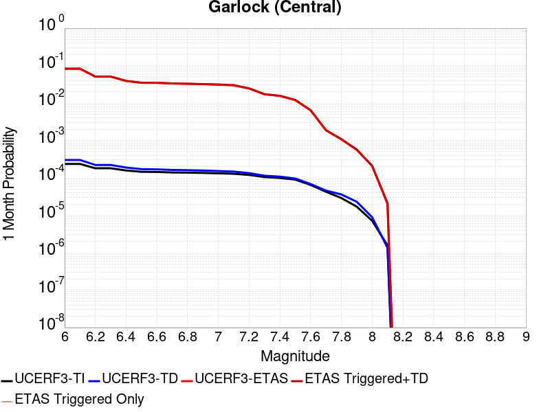
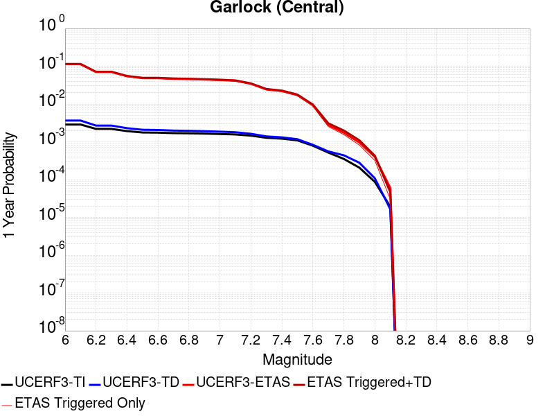
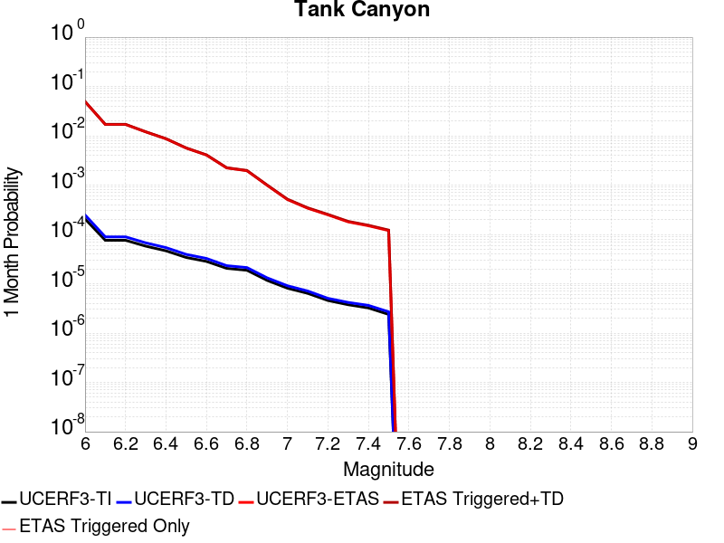
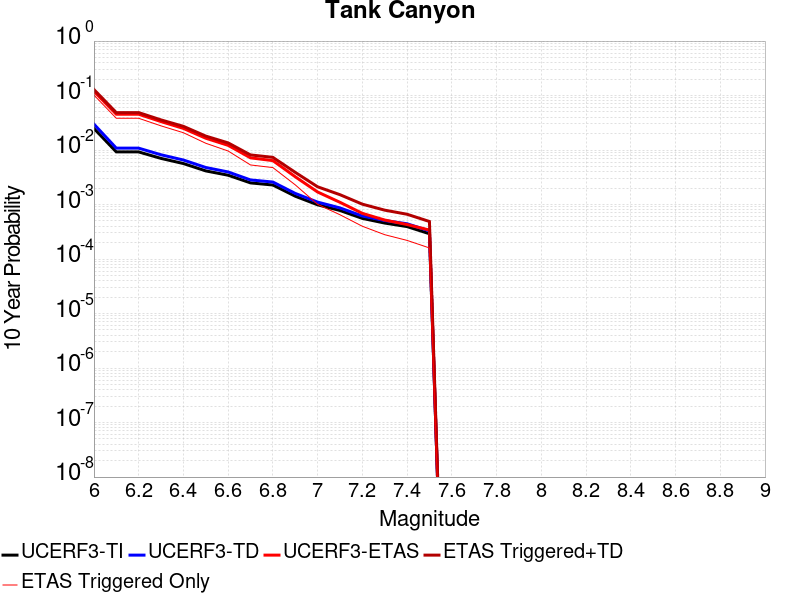

# Parent Section Magnitude-Probability Distributions

Only fault sections with at least one triggered aftershock are plotted. Sections are sorted by total supraseismogenic trigger rate (decreasing)

## Table Of Contents

* [Garlock (Central)](#garlock-central)
* [Tank Canyon](#tank-canyon)
* [Panamint Valley](#panamint-valley)

## Garlock (Central)
*[(top)](#table-of-contents)*

| 1 Week | 1 Month | 1 Year | 10 Year |
|-----|-----|-----|-----|
|  |  |  |  |

| Magnitude | 1 wk TI Prob | 1 wk TD Prob | 1 wk ETAS Prob | 1 wk ETAS/TD Gain | 1 wk ETAS Triggered+TD | 1 wk ETAS Triggered Only | 1 mo TI Prob | 1 mo TD Prob | 1 mo ETAS Prob | 1 mo ETAS/TD Gain | 1 mo ETAS Triggered+TD | 1 mo ETAS Triggered Only | 1 yr TI Prob | 1 yr TD Prob | 1 yr ETAS Prob | 1 yr ETAS/TD Gain | 1 yr ETAS Triggered+TD | 1 yr ETAS Triggered Only | 10 yr TI Prob | 10 yr TD Prob | 10 yr ETAS Prob | 10 yr ETAS/TD Gain | 10 yr ETAS Triggered+TD | 10 yr ETAS Triggered Only |
|-----|-----|-----|-----|-----|-----|-----|-----|-----|-----|-----|-----|-----|-----|-----|-----|-----|-----|-----|-----|-----|-----|-----|-----|-----|
| 6.0 | 5.5131142E-5 | 7.024681E-5 | 0.0 | 0.0 | 7.024681E-5 | 0.0 | 2.3625491E-4 | 3.010234E-4 | 1.3048868E-5 | 0.043348353 | 3.140683E-4 | 1.3048868E-5 | 0.0028726095 | 0.0036588663 | 2.6097736E-5 | 0.0071327384 | 0.0036848686 | 2.6097736E-5 | 0.028357591 | 0.036079824 | 2.6097736E-5 | 7.233332E-4 | 0.03610498 | 2.6097736E-5 |
| 6.1 | 5.5131142E-5 | 7.024681E-5 | 0.0 | 0.0 | 7.024681E-5 | 0.0 | 2.3625491E-4 | 3.010234E-4 | 1.3048868E-5 | 0.043348353 | 3.140683E-4 | 1.3048868E-5 | 0.0028726095 | 0.0036588663 | 2.6097736E-5 | 0.0071327384 | 0.0036848686 | 2.6097736E-5 | 0.028357591 | 0.036079824 | 2.6097736E-5 | 7.233332E-4 | 0.03610498 | 2.6097736E-5 |
| 6.2 | 4.216245E-5 | 5.1661493E-5 | 0.0 | 0.0 | 5.1661493E-5 | 0.0 | 1.806837E-4 | 2.2138779E-4 | 1.3048868E-5 | 0.058941226 | 2.3443377E-4 | 1.3048868E-5 | 0.0021976046 | 0.0026920962 | 2.6097736E-5 | 0.009694206 | 0.0027181238 | 2.6097736E-5 | 0.021759989 | 0.026689773 | 2.6097736E-5 | 9.778178E-4 | 0.026715176 | 2.6097736E-5 |
| 6.3 | 4.216245E-5 | 5.1661493E-5 | 0.0 | 0.0 | 5.1661493E-5 | 0.0 | 1.806837E-4 | 2.2138779E-4 | 1.3048868E-5 | 0.058941226 | 2.3443377E-4 | 1.3048868E-5 | 0.0021976046 | 0.0026920962 | 2.6097736E-5 | 0.009694206 | 0.0027181238 | 2.6097736E-5 | 0.021759989 | 0.026689773 | 2.6097736E-5 | 9.778178E-4 | 0.026715176 | 2.6097736E-5 |
| 6.4 | 3.6858168E-5 | 4.411054E-5 | 0.0 | 0.0 | 4.411054E-5 | 0.0 | 1.5795401E-4 | 1.8903162E-4 | 0.0 | 0.0 | 1.8903162E-4 | 0.0 | 0.0019213937 | 0.002299056 | 1.3048868E-5 | 0.0056757503 | 0.0023120749 | 1.3048868E-5 | 0.019048655 | 0.02284894 | 1.3048868E-5 | 5.7109294E-4 | 0.022861691 | 1.3048868E-5 |
| 6.5 | 3.39199E-5 | 4.0018083E-5 | 0.0 | 0.0 | 4.0018083E-5 | 0.0 | 1.453629E-4 | 1.7149492E-4 | 0.0 | 0.0 | 1.7149492E-4 | 0.0 | 0.0017683565 | 0.002085973 | 1.3048868E-5 | 0.0062555308 | 0.0020989946 | 1.3048868E-5 | 0.017543508 | 0.020759864 | 1.3048868E-5 | 6.285623E-4 | 0.020772642 | 1.3048868E-5 |
| 6.6 | 3.3571985E-5 | 3.9472274E-5 | 0.0 | 0.0 | 3.9472274E-5 | 0.0 | 1.4387199E-4 | 1.6915603E-4 | 0.0 | 0.0 | 1.6915603E-4 | 0.0 | 0.0017502342 | 0.0020575512 | 1.3048868E-5 | 0.006341941 | 0.0020705732 | 1.3048868E-5 | 0.017365133 | 0.020481179 | 1.3048868E-5 | 6.371151E-4 | 0.02049396 | 1.3048868E-5 |
| 6.7 | 3.2580007E-5 | 3.8088703E-5 | 0.0 | 0.0 | 3.8088703E-5 | 0.0 | 1.3962112E-4 | 1.632272E-4 | 0.0 | 0.0 | 1.632272E-4 | 0.0 | 0.0016985617 | 0.0019855013 | 1.3048868E-5 | 0.0065720775 | 0.0019985242 | 1.3048868E-5 | 0.016856372 | 0.019773813 | 1.3048868E-5 | 6.599065E-4 | 0.019786606 | 1.3048868E-5 |
| 6.8 | 3.2185937E-5 | 3.7515918E-5 | 0.0 | 0.0 | 3.7515918E-5 | 0.0 | 1.3793244E-4 | 1.6077272E-4 | 0.0 | 0.0 | 1.6077272E-4 | 0.0 | 0.0016780337 | 0.001955672 | 1.3048868E-5 | 0.006672319 | 0.0019686953 | 1.3048868E-5 | 0.016654192 | 0.019480614 | 1.3048868E-5 | 6.698386E-4 | 0.019493409 | 1.3048868E-5 |
| 6.9 | 3.165394E-5 | 3.6720503E-5 | 0.0 | 0.0 | 3.6720503E-5 | 0.0 | 1.3565269E-4 | 1.5736422E-4 | 0.0 | 0.0 | 1.5736422E-4 | 0.0 | 0.0016503202 | 0.001914247 | 1.3048868E-5 | 0.0068167103 | 0.001927271 | 1.3048868E-5 | 0.01638118 | 0.019073246 | 1.3048868E-5 | 6.841451E-4 | 0.019086046 | 1.3048868E-5 |
| 7.0 | 3.0903822E-5 | 3.5625766E-5 | 0.0 | 0.0 | 3.5625766E-5 | 0.0 | 1.3243823E-4 | 1.5267303E-4 | 0.0 | 0.0 | 1.5267303E-4 | 0.0 | 0.0016112428 | 0.0018572307 | 1.3048868E-5 | 0.0070259813 | 0.0018702553 | 1.3048868E-5 | 0.015996104 | 0.018512413 | 1.3048868E-5 | 7.0487126E-4 | 0.01852522 | 1.3048868E-5 |
| 7.1 | 3.0069863E-5 | 3.4392073E-5 | 0.0 | 0.0 | 3.4392073E-5 | 0.0 | 1.2886449E-4 | 1.4738638E-4 | 0.0 | 0.0 | 1.4738638E-4 | 0.0 | 0.0015677959 | 0.0017929734 | 0.0 | 0.0 | 0.0017929734 | 0.0 | 0.01556781 | 0.017880075 | 0.0 | 0.0 | 0.017880075 | 0.0 |
| 7.2 | 2.7957109E-5 | 3.128145E-5 | 0.0 | 0.0 | 3.128145E-5 | 0.0 | 1.1981068E-4 | 1.340566E-4 | 0.0 | 0.0 | 1.340566E-4 | 0.0 | 0.0014577188 | 0.0016309366 | 0.0 | 0.0 | 0.0016309366 | 0.0 | 0.014481937 | 0.016283695 | 0.0 | 0.0 | 0.016283695 | 0.0 |
| 7.3 | 2.4519275E-5 | 2.6714795E-5 | 0.0 | 0.0 | 2.6714795E-5 | 0.0 | 1.0507837E-4 | 1.1448703E-4 | 0.0 | 0.0 | 1.1448703E-4 | 0.0 | 0.0012785783 | 0.001393003 | 0.0 | 0.0 | 0.001393003 | 0.0 | 0.012712469 | 0.013928054 | 0.0 | 0.0 | 0.013928054 | 0.0 |
| 7.4 | 2.3225532E-5 | 2.51994E-5 | 0.0 | 0.0 | 2.51994E-5 | 0.0 | 9.95342E-5 | 1.0799304E-4 | 0.0 | 0.0 | 1.0799304E-4 | 0.0 | 0.0012111551 | 0.0013140367 | 0.0 | 0.0 | 0.0013140367 | 0.0 | 0.012045753 | 0.013145725 | 0.0 | 0.0 | 0.013145725 | 0.0 |
| 7.5 | 2.097765E-5 | 2.2483688E-5 | 0.0 | 0.0 | 2.2483688E-5 | 0.0 | 8.9901114E-5 | 9.635517E-5 | 0.0 | 0.0 | 9.635517E-5 | 0.0 | 0.0010939965 | 0.0011725046 | 0.0 | 0.0 | 0.0011725046 | 0.0 | 0.010886264 | 0.011740365 | 0.0 | 0.0 | 0.011740365 | 0.0 |
| 7.6 | 1.511254E-5 | 1.5991332E-5 | 0.0 | 0.0 | 1.5991332E-5 | 0.0 | 6.476642E-5 | 6.853253E-5 | 0.0 | 0.0 | 6.853253E-5 | 0.0 | 7.882459E-4 | 8.3407195E-4 | 0.0 | 0.0 | 8.3407195E-4 | 0.0 | 0.007854558 | 0.008383559 | 0.0 | 0.0 | 0.008383559 | 0.0 |
| 7.7 | 9.934069E-6 | 1.0678794E-5 | 0.0 | 0.0 | 1.0678794E-5 | 0.0 | 4.2573887E-5 | 4.5765457E-5 | 0.0 | 0.0 | 4.5765457E-5 | 0.0 | 5.182138E-4 | 5.570524E-4 | 0.0 | 0.0 | 5.570524E-4 | 0.0 | 0.00517007 | 0.005627684 | 0.0 | 0.0 | 0.005627684 | 0.0 |
| 7.8 | 6.7562896E-6 | 8.428449E-6 | 0.0 | 0.0 | 8.428449E-6 | 0.0 | 2.8955206E-5 | 3.6121426E-5 | 0.0 | 0.0 | 3.6121426E-5 | 0.0 | 3.5247262E-4 | 4.3968976E-4 | 0.0 | 0.0 | 4.3968976E-4 | 0.0 | 0.0035191406 | 0.004446654 | 0.0 | 0.0 | 0.004446654 | 0.0 |
| 7.9 | 3.975453E-6 | 5.37103E-6 | 0.0 | 0.0 | 5.37103E-6 | 0.0 | 1.7037546E-5 | 2.3018498E-5 | 0.0 | 0.0 | 2.3018498E-5 | 0.0 | 2.0741238E-4 | 2.8021427E-4 | 0.0 | 0.0 | 2.8021427E-4 | 0.0 | 0.002072189 | 0.0028336283 | 0.0 | 0.0 | 0.0028336283 | 0.0 |
| 8.0 | 1.6729537E-6 | 2.0775144E-6 | 0.0 | 0.0 | 2.0775144E-6 | 0.0 | 7.169782E-6 | 8.903603E-6 | 0.0 | 0.0 | 8.903603E-6 | 0.0 | 8.7288594E-5 | 1.0839601E-4 | 0.0 | 0.0 | 1.0839601E-4 | 0.0 | 8.7254314E-4 | 0.0010969337 | 0.0 | 0.0 | 0.0010969337 | 0.0 |
| 8.1 | 3.6733252E-7 | 3.1489964E-7 | 0.0 | 0.0 | 3.1489964E-7 | 0.0 | 1.5742813E-6 | 1.3495693E-6 | 0.0 | 0.0 | 1.3495693E-6 | 0.0 | 1.9166706E-5 | 1.6430899E-5 | 0.0 | 0.0 | 1.6430899E-5 | 0.0 | 1.9165053E-4 | 1.6638759E-4 | 0.0 | 0.0 | 1.6638759E-4 | 0.0 |

## Tank Canyon
*[(top)](#table-of-contents)*

| 1 Week | 1 Month | 1 Year | 10 Year |
|-----|-----|-----|-----|
|  |  |  |  |

| Magnitude | 1 wk TI Prob | 1 wk TD Prob | 1 wk ETAS Prob | 1 wk ETAS/TD Gain | 1 wk ETAS Triggered+TD | 1 wk ETAS Triggered Only | 1 mo TI Prob | 1 mo TD Prob | 1 mo ETAS Prob | 1 mo ETAS/TD Gain | 1 mo ETAS Triggered+TD | 1 mo ETAS Triggered Only | 1 yr TI Prob | 1 yr TD Prob | 1 yr ETAS Prob | 1 yr ETAS/TD Gain | 1 yr ETAS Triggered+TD | 1 yr ETAS Triggered Only | 10 yr TI Prob | 10 yr TD Prob | 10 yr ETAS Prob | 10 yr ETAS/TD Gain | 10 yr ETAS Triggered+TD | 10 yr ETAS Triggered Only |
|-----|-----|-----|-----|-----|-----|-----|-----|-----|-----|-----|-----|-----|-----|-----|-----|-----|-----|-----|-----|-----|-----|-----|-----|-----|
| 6.0 | 4.8284557E-5 | 5.7964822E-5 | 1.3048868E-5 | 0.22511701 | 7.101294E-5 | 1.3048868E-5 | 2.0691741E-4 | 2.4840087E-4 | 1.3048868E-5 | 0.052531492 | 2.614465E-4 | 1.3048868E-5 | 0.0025163088 | 0.0030207601 | 1.3048868E-5 | 0.0043197297 | 0.0030337695 | 1.3048868E-5 | 0.02488006 | 0.029863637 | 2.6097736E-5 | 8.738968E-4 | 0.029888954 | 2.6097736E-5 |
| 6.1 | 1.7796336E-5 | 2.0873314E-5 | 1.3048868E-5 | 0.6251459 | 3.392191E-5 | 1.3048868E-5 | 7.626778E-5 | 8.945422E-5 | 1.3048868E-5 | 0.14587203 | 1.02501916E-4 | 1.3048868E-5 | 9.281647E-4 | 0.0010885983 | 1.3048868E-5 | 0.0119868545 | 0.0011016328 | 1.3048868E-5 | 0.009242975 | 0.010836744 | 2.6097736E-5 | 0.0024082635 | 0.010862559 | 2.6097736E-5 |
| 6.2 | 1.7796336E-5 | 2.0873314E-5 | 1.3048868E-5 | 0.6251459 | 3.392191E-5 | 1.3048868E-5 | 7.626778E-5 | 8.945422E-5 | 1.3048868E-5 | 0.14587203 | 1.02501916E-4 | 1.3048868E-5 | 9.281647E-4 | 0.0010885983 | 1.3048868E-5 | 0.0119868545 | 0.0011016328 | 1.3048868E-5 | 0.009242975 | 0.010836744 | 2.6097736E-5 | 0.0024082635 | 0.010862559 | 2.6097736E-5 |
| 6.3 | 1.3515912E-5 | 1.5759564E-5 | 1.3048868E-5 | 0.82799673 | 2.8808226E-5 | 1.3048868E-5 | 5.792405E-5 | 6.753938E-5 | 1.3048868E-5 | 0.19320385 | 8.0587364E-5 | 1.3048868E-5 | 7.049971E-4 | 8.2200574E-4 | 1.3048868E-5 | 0.015874425 | 8.350439E-4 | 1.3048868E-5 | 0.007027647 | 0.0081922645 | 2.6097736E-5 | 0.003185656 | 0.008218149 | 2.6097736E-5 |
| 6.4 | 1.0870146E-5 | 1.2618021E-5 | 1.3048868E-5 | 1.0341454 | 2.5666724E-5 | 1.3048868E-5 | 4.658551E-5 | 5.4076212E-5 | 1.3048868E-5 | 0.24130514 | 6.7124376E-5 | 1.3048868E-5 | 5.67031E-4 | 6.581969E-4 | 1.3048868E-5 | 0.019825174 | 6.712372E-4 | 1.3048868E-5 | 0.005655863 | 0.0065644905 | 2.6097736E-5 | 0.003975592 | 0.006590417 | 2.6097736E-5 |
| 6.5 | 7.964826E-6 | 9.196094E-6 | 1.3048868E-5 | 1.4189576 | 2.2244842E-5 | 1.3048868E-5 | 3.4134522E-5 | 3.9411298E-5 | 1.3048868E-5 | 0.33109462 | 5.245965E-5 | 1.3048868E-5 | 4.1550855E-4 | 4.7973756E-4 | 1.3048868E-5 | 0.027200013 | 4.927802E-4 | 1.3048868E-5 | 0.0041473247 | 0.004788321 | 1.3048868E-5 | 0.0027251448 | 0.0048013073 | 1.3048868E-5 |
| 6.6 | 6.6317E-6 | 7.6122988E-6 | 1.3048868E-5 | 1.7141823 | 2.0661068E-5 | 1.3048868E-5 | 2.8421264E-5 | 3.2623782E-5 | 1.3048868E-5 | 0.39998025 | 4.5672223E-5 | 1.3048868E-5 | 3.4597394E-4 | 3.9713128E-4 | 1.3048868E-5 | 0.03285782 | 4.1017495E-4 | 1.3048868E-5 | 0.0034543579 | 0.003965368 | 1.3048868E-5 | 0.003290708 | 0.003978365 | 1.3048868E-5 |
| 6.7 | 4.793663E-6 | 5.4307857E-6 | 1.3048868E-5 | 2.4027588 | 1.8479583E-5 | 1.3048868E-5 | 2.0544108E-5 | 2.3274613E-5 | 1.3048868E-5 | 0.56064814 | 3.6323177E-5 | 1.3048868E-5 | 2.500958E-4 | 2.8333595E-4 | 1.3048868E-5 | 0.046054404 | 2.963811E-4 | 1.3048868E-5 | 0.0024981452 | 0.0028304397 | 1.3048868E-5 | 0.004610191 | 0.0028434517 | 1.3048868E-5 |
| 6.8 | 4.382823E-6 | 4.9692567E-6 | 1.3048868E-5 | 2.6259193 | 1.801806E-5 | 1.3048868E-5 | 1.8783392E-5 | 2.1296666E-5 | 1.3048868E-5 | 0.6127188 | 3.4345256E-5 | 1.3048868E-5 | 2.286638E-4 | 2.5926033E-4 | 1.3048868E-5 | 0.05033114 | 2.723058E-4 | 1.3048868E-5 | 0.0022842865 | 0.002590253 | 1.3048868E-5 | 0.005037681 | 0.002603268 | 1.3048868E-5 |
| 6.9 | 2.729601E-6 | 3.0735416E-6 | 0.0 | 0.0 | 3.0735416E-6 | 0.0 | 1.1698237E-5 | 1.3172262E-5 | 0.0 | 0.0 | 1.3172262E-5 | 0.0 | 1.4241673E-4 | 1.6036171E-4 | 0.0 | 0.0 | 1.6036171E-4 | 0.0 | 0.001423255 | 0.0016026258 | 0.0 | 0.0 | 0.0016026258 | 0.0 |
| 7.0 | 1.8987357E-6 | 2.126939E-6 | 0.0 | 0.0 | 2.126939E-6 | 0.0 | 8.137413E-6 | 9.115425E-6 | 0.0 | 0.0 | 9.115425E-6 | 0.0 | 9.90685E-5 | 1.1097535E-4 | 0.0 | 0.0 | 1.1097535E-4 | 0.0 | 9.902435E-4 | 0.0011092679 | 0.0 | 0.0 | 0.0011092679 | 0.0 |
| 7.1 | 1.4928986E-6 | 1.6641272E-6 | 0.0 | 0.0 | 1.6641272E-6 | 0.0 | 6.398121E-6 | 7.1319573E-6 | 0.0 | 0.0 | 7.1319573E-6 | 0.0 | 7.789434E-5 | 8.682871E-5 | 0.0 | 0.0 | 8.682871E-5 | 0.0 | 7.786704E-4 | 8.6800574E-4 | 0.0 | 0.0 | 8.6800574E-4 | 0.0 |
| 7.2 | 1.069082E-6 | 1.1828573E-6 | 0.0 | 0.0 | 1.1828573E-6 | 0.0 | 4.581772E-6 | 5.0693816E-6 | 0.0 | 0.0 | 5.0693816E-6 | 0.0 | 5.5781646E-5 | 6.171851E-5 | 0.0 | 0.0 | 6.171851E-5 | 0.0 | 5.576765E-4 | 6.170659E-4 | 0.0 | 0.0 | 6.170659E-4 | 0.0 |
| 7.3 | 8.776551E-7 | 9.770005E-7 | 0.0 | 0.0 | 9.770005E-7 | 0.0 | 3.7613736E-6 | 4.1871413E-6 | 0.0 | 0.0 | 4.1871413E-6 | 0.0 | 4.579376E-5 | 5.097777E-5 | 0.0 | 0.0 | 5.097777E-5 | 0.0 | 4.5784327E-4 | 5.097118E-4 | 0.0 | 0.0 | 5.097118E-4 | 0.0 |
| 7.4 | 7.55721E-7 | 8.510244E-7 | 0.0 | 0.0 | 8.510244E-7 | 0.0 | 3.2388E-6 | 3.6472454E-6 | 0.0 | 0.0 | 3.6472454E-6 | 0.0 | 3.9431678E-5 | 4.4404827E-5 | 0.0 | 0.0 | 4.4404827E-5 | 0.0 | 3.942468E-4 | 4.440104E-4 | 0.0 | 0.0 | 4.440104E-4 | 0.0 |
| 7.5 | 5.587665E-7 | 6.305619E-7 | 0.0 | 0.0 | 6.305619E-7 | 0.0 | 2.3947114E-6 | 2.702408E-6 | 0.0 | 0.0 | 2.702408E-6 | 0.0 | 2.915522E-5 | 3.290182E-5 | 0.0 | 0.0 | 3.290182E-5 | 0.0 | 2.9151395E-4 | 3.290182E-4 | 0.0 | 0.0 | 3.290182E-4 | 0.0 |

## Panamint Valley
*[(top)](#table-of-contents)*

| 1 Week | 1 Month | 1 Year | 10 Year |
|-----|-----|-----|-----|
|  |  |  |  |

| Magnitude | 1 wk TI Prob | 1 wk TD Prob | 1 wk ETAS Prob | 1 wk ETAS/TD Gain | 1 wk ETAS Triggered+TD | 1 wk ETAS Triggered Only | 1 mo TI Prob | 1 mo TD Prob | 1 mo ETAS Prob | 1 mo ETAS/TD Gain | 1 mo ETAS Triggered+TD | 1 mo ETAS Triggered Only | 1 yr TI Prob | 1 yr TD Prob | 1 yr ETAS Prob | 1 yr ETAS/TD Gain | 1 yr ETAS Triggered+TD | 1 yr ETAS Triggered Only | 10 yr TI Prob | 10 yr TD Prob | 10 yr ETAS Prob | 10 yr ETAS/TD Gain | 10 yr ETAS Triggered+TD | 10 yr ETAS Triggered Only |
|-----|-----|-----|-----|-----|-----|-----|-----|-----|-----|-----|-----|-----|-----|-----|-----|-----|-----|-----|-----|-----|-----|-----|-----|-----|
| 6.0 | 3.0211835E-5 | 3.3984514E-5 | 1.3048868E-5 | 0.38396513 | 4.7032936E-5 | 1.3048868E-5 | 1.2947287E-4 | 1.4563995E-4 | 1.3048868E-5 | 0.08959676 | 1.5868692E-4 | 1.3048868E-5 | 0.0015751923 | 0.0017717537 | 1.3048868E-5 | 0.0073649446 | 0.0017847795 | 1.3048868E-5 | 0.015640736 | 0.017583137 | 1.3048868E-5 | 7.42124E-4 | 0.017595956 | 1.3048868E-5 |
| 6.1 | 3.0211835E-5 | 3.3984514E-5 | 1.3048868E-5 | 0.38396513 | 4.7032936E-5 | 1.3048868E-5 | 1.2947287E-4 | 1.4563995E-4 | 1.3048868E-5 | 0.08959676 | 1.5868692E-4 | 1.3048868E-5 | 0.0015751923 | 0.0017717537 | 1.3048868E-5 | 0.0073649446 | 0.0017847795 | 1.3048868E-5 | 0.015640736 | 0.017583137 | 1.3048868E-5 | 7.42124E-4 | 0.017595956 | 1.3048868E-5 |
| 6.2 | 3.0211835E-5 | 3.3984514E-5 | 1.3048868E-5 | 0.38396513 | 4.7032936E-5 | 1.3048868E-5 | 1.2947287E-4 | 1.4563995E-4 | 1.3048868E-5 | 0.08959676 | 1.5868692E-4 | 1.3048868E-5 | 0.0015751923 | 0.0017717537 | 1.3048868E-5 | 0.0073649446 | 0.0017847795 | 1.3048868E-5 | 0.015640736 | 0.017583137 | 1.3048868E-5 | 7.42124E-4 | 0.017595956 | 1.3048868E-5 |
| 6.3 | 2.8573924E-5 | 3.210268E-5 | 1.3048868E-5 | 0.40647286 | 4.515113E-5 | 1.3048868E-5 | 1.2245393E-4 | 1.3757581E-4 | 1.3048868E-5 | 0.09484856 | 1.5062289E-4 | 1.3048868E-5 | 0.001489857 | 0.0016737265 | 1.3048868E-5 | 0.007796297 | 0.0016867535 | 1.3048868E-5 | 0.01479908 | 0.016617801 | 1.3048868E-5 | 7.852343E-4 | 0.016630633 | 1.3048868E-5 |
| 6.4 | 2.8573924E-5 | 3.210268E-5 | 1.3048868E-5 | 0.40647286 | 4.515113E-5 | 1.3048868E-5 | 1.2245393E-4 | 1.3757581E-4 | 1.3048868E-5 | 0.09484856 | 1.5062289E-4 | 1.3048868E-5 | 0.001489857 | 0.0016737265 | 1.3048868E-5 | 0.007796297 | 0.0016867535 | 1.3048868E-5 | 0.01479908 | 0.016617801 | 1.3048868E-5 | 7.852343E-4 | 0.016630633 | 1.3048868E-5 |
| 6.5 | 2.7468774E-5 | 3.0828433E-5 | 1.3048868E-5 | 0.4232738 | 4.38769E-5 | 1.3048868E-5 | 1.1771801E-4 | 1.3211532E-4 | 1.3048868E-5 | 0.09876877 | 1.4516247E-4 | 1.3048868E-5 | 0.0014322745 | 0.0016073446 | 1.3048868E-5 | 0.0081182765 | 0.0016203725 | 1.3048868E-5 | 0.014230782 | 0.015963677 | 1.3048868E-5 | 8.1740995E-4 | 0.015976517 | 1.3048868E-5 |
| 6.6 | 2.6135967E-5 | 2.925248E-5 | 1.3048868E-5 | 0.44607732 | 4.2300966E-5 | 1.3048868E-5 | 1.1200648E-4 | 1.253619E-4 | 1.3048868E-5 | 0.10408959 | 1.3840913E-4 | 1.3048868E-5 | 0.0013628257 | 0.0015252391 | 1.3048868E-5 | 0.008555294 | 0.001538268 | 1.3048868E-5 | 0.013544982 | 0.015154043 | 1.3048868E-5 | 8.610816E-4 | 0.0151668945 | 1.3048868E-5 |
| 6.7 | 2.4498746E-5 | 2.7341335E-5 | 1.3048868E-5 | 0.4772579 | 4.0389845E-5 | 1.3048868E-5 | 1.04990395E-4 | 1.1717203E-4 | 1.3048868E-5 | 0.11136504 | 1.3021937E-4 | 1.3048868E-5 | 0.0012775084 | 0.0014256609 | 1.3048868E-5 | 0.009152855 | 0.0014386913 | 1.3048868E-5 | 0.012701893 | 0.014171274 | 1.3048868E-5 | 9.2079706E-4 | 0.014184139 | 1.3048868E-5 |
| 6.8 | 2.2244329E-5 | 2.4935423E-5 | 1.3048868E-5 | 0.5233064 | 3.7983966E-5 | 1.3048868E-5 | 9.532935E-5 | 1.0686185E-4 | 1.3048868E-5 | 0.122109696 | 1.19909324E-4 | 1.3048868E-5 | 0.0011600169 | 0.0013002884 | 1.3048868E-5 | 0.010035365 | 0.0013133202 | 1.3048868E-5 | 0.011539802 | 0.0129325185 | 1.3048868E-5 | 0.0010089966 | 0.012945399 | 1.3048868E-5 |
| 6.9 | 1.9902658E-5 | 2.2290267E-5 | 0.0 | 0.0 | 2.2290267E-5 | 0.0 | 8.529431E-5 | 9.552632E-5 | 0.0 | 0.0 | 9.552632E-5 | 0.0 | 0.0010379635 | 0.0011624309 | 0.0 | 0.0 | 0.0011624309 | 0.0 | 0.010331288 | 0.011568608 | 0.0 | 0.0 | 0.011568608 | 0.0 |
| 7.0 | 1.8353881E-5 | 2.0566185E-5 | 0.0 | 0.0 | 2.0566185E-5 | 0.0 | 7.865712E-5 | 8.813792E-5 | 0.0 | 0.0 | 8.813792E-5 | 0.0 | 9.5722964E-4 | 0.0010725686 | 0.0 | 0.0 | 0.0010725686 | 0.0 | 0.009531168 | 0.010678849 | 0.0 | 0.0 | 0.010678849 | 0.0 |
| 7.1 | 1.7667631E-5 | 1.9772613E-5 | 0.0 | 0.0 | 1.9772613E-5 | 0.0 | 7.571623E-5 | 8.473711E-5 | 0.0 | 0.0 | 8.473711E-5 | 0.0 | 9.2145515E-4 | 0.0010312037 | 0.0 | 0.0 | 0.0010312037 | 0.0 | 0.009176437 | 0.010269073 | 0.0 | 0.0 | 0.010269073 | 0.0 |
| 7.2 | 1.6381597E-5 | 1.8158249E-5 | 0.0 | 0.0 | 1.8158249E-5 | 0.0 | 7.020495E-5 | 7.781885E-5 | 0.0 | 0.0 | 7.781885E-5 | 0.0 | 8.544101E-4 | 9.4704994E-4 | 0.0 | 0.0 | 9.4704994E-4 | 0.0 | 0.008511325 | 0.009434792 | 0.0 | 0.0 | 0.009434792 | 0.0 |
| 7.3 | 1.4520491E-5 | 1.5966476E-5 | 0.0 | 0.0 | 1.5966476E-5 | 0.0 | 6.222919E-5 | 6.842605E-5 | 0.0 | 0.0 | 6.842605E-5 | 0.0 | 7.57377E-4 | 8.327849E-4 | 0.0 | 0.0 | 8.327849E-4 | 0.0 | 0.0075480095 | 0.00829975 | 0.0 | 0.0 | 0.00829975 | 0.0 |
| 7.4 | 1.2852287E-5 | 1.4145411E-5 | 0.0 | 0.0 | 1.4145411E-5 | 0.0 | 5.5080065E-5 | 6.062187E-5 | 0.0 | 0.0 | 6.062187E-5 | 0.0 | 6.7039346E-4 | 7.378371E-4 | 0.0 | 0.0 | 7.378371E-4 | 0.0 | 0.0066837464 | 0.0073567946 | 0.0 | 0.0 | 0.0073567946 | 0.0 |
| 7.5 | 1.1637851E-5 | 1.2836797E-5 | 0.0 | 0.0 | 1.2836797E-5 | 0.0 | 4.987555E-5 | 5.5013777E-5 | 0.0 | 0.0 | 5.5013777E-5 | 0.0 | 6.070656E-4 | 6.6960254E-4 | 0.0 | 0.0 | 6.6960254E-4 | 0.0 | 0.006054099 | 0.0066787465 | 0.0 | 0.0 | 0.0066787465 | 0.0 |
| 7.6 | 3.0068115E-6 | 3.3330316E-6 | 0.0 | 0.0 | 3.3330316E-6 | 0.0 | 1.2886271E-5 | 1.4284384E-5 | 0.0 | 0.0 | 1.4284384E-5 | 0.0 | 1.5687906E-4 | 1.7390578E-4 | 0.0 | 0.0 | 1.7390578E-4 | 0.0 | 0.0015676835 | 0.0017391363 | 0.0 | 0.0 | 0.0017391363 | 0.0 |

