# Parent Section Magnitude-Probability Distributions

Only fault sections with at least one triggered aftershock are plotted. Sections are sorted by total supraseismogenic trigger rate (decreasing)

## Table Of Contents

* [Garlock (Central)](#garlock-central)
* [Tank Canyon](#tank-canyon)
* [Little Lake](#little-lake)
* [Airport Lake](#airport-lake)
* [Owl Lake](#owl-lake)
* [Panamint Valley](#panamint-valley)
* [Garlock (East)](#garlock-east)
* [Hunter Mountain-Saline Valley](#hunter-mountain-saline-valley)
* [Blackwater](#blackwater)
* [Ash Hill](#ash-hill)
* [Garlock (West)](#garlock-west)
* [McLean Lake](#mclean-lake)
* [Gravel Hills-Harper Lk](#gravel-hills-harper-lk)
* [Goldstone Lake](#goldstone-lake)
* [So Sierra Nevada](#so-sierra-nevada)
* [Coyote Canyon](#coyote-canyon)
* [San Andreas (Mojave S)](#san-andreas-mojave-s)
* [Death Valley (So)](#death-valley-so)
* [San Andreas (Mojave N)](#san-andreas-mojave-n)
* [Nelson Lake](#nelson-lake)
* [Lenwood-Lockhart-Old Woman Springs](#lenwood-lockhart-old-woman-springs)
* [Towne Pass](#towne-pass)
* [Bicycle Lake](#bicycle-lake)
* [Paradise](#paradise)
* [San Andreas (San Bernardino N)](#san-andreas-san-bernardino-n)
* [Garlic Springs](#garlic-springs)
* [Death Valley (Black Mtns Frontal)](#death-valley-black-mtns-frontal)
* [San Andreas (San Bernardino S)](#san-andreas-san-bernardino-s)
* [Coyote Lake](#coyote-lake)
* [Helendale-So Lockhart](#helendale-so-lockhart)
* [San Andreas (Big Bend)](#san-andreas-big-bend)
* [Death Valley (No)](#death-valley-no)
* [San Andreas (Parkfield)](#san-andreas-parkfield)
* [Elsinore (Glen Ivy) rev](#elsinore-glen-ivy-rev)
* [Sierra Nevada  (No Extension)](#sierra-nevada--no-extension)
* [Red Pass](#red-pass)
* [San Andreas (Cholame) rev](#san-andreas-cholame-rev)
* [Death Valley (Fish Lake Valley)](#death-valley-fish-lake-valley)
* [San Andreas (San Gorgonio Pass-Garnet HIll)](#san-andreas-san-gorgonio-pass-garnet-hill)
* [San Andreas (Carrizo) rev](#san-andreas-carrizo-rev)
* [White Wolf (Extension)](#white-wolf-extension)
* [Mission Ridge-Arroyo Parida-Santa Ana](#mission-ridge-arroyo-parida-santa-ana)
* [Cady](#cady)
* [Baker](#baker)
* [Santa Ynez (West)](#santa-ynez-west)
* [Calico-Hidalgo](#calico-hidalgo)
* [San Andreas (Coachella) rev](#san-andreas-coachella-rev)
* [Ludlow](#ludlow)
* [Manix-Afton Hills](#manix-afton-hills)
* [Lake Isabella (Seismicity)](#lake-isabella-seismicity)
* [Scodie Lineament](#scodie-lineament)
* [Red Mountain](#red-mountain)
* [San Andreas (Creeping Section) 2011 CFM](#san-andreas-creeping-section-2011-cfm)
* [San Jacinto (San Bernardino)](#san-jacinto-san-bernardino)
* [Santa Ynez (East)](#santa-ynez-east)
* [San Andreas (North Branch Mill Creek)](#san-andreas-north-branch-mill-creek)
* [Cleghorn Pass](#cleghorn-pass)
* [Cleghorn Lake](#cleghorn-lake)
* [Santa Rosa Island](#santa-rosa-island)
* [Independence rev 2011](#independence-rev-2011)
* [Owens Valley](#owens-valley)
* [Oceanic - West Huasna](#oceanic---west-huasna)
* [Santa Ynez River](#santa-ynez-river)
* [Brawley (Seismic Zone) alt 1](#brawley-seismic-zone-alt-1)
* [Channel Islands Thrust](#channel-islands-thrust)
* [Deep Springs](#deep-springs)
* [Lost Hills](#lost-hills)
* [Ortigalita (North)](#ortigalita-north)
* [San Clemente](#san-clemente)
* [Santa Cruz Island](#santa-cruz-island)
* [Pleito](#pleito)
* [San Jacinto (San Jacinto Valley) rev](#san-jacinto-san-jacinto-valley-rev)
* [Imperial](#imperial)
* [White Mountains](#white-mountains)
* [Pisgah-Bullion Mtn-Mesquite Lk](#pisgah-bullion-mtn-mesquite-lk)
* [Blue Cut](#blue-cut)
* [San Pedro Basin](#san-pedro-basin)
* [Ventura-Pitas Point](#ventura-pitas-point)
* [Big Pine (East)](#big-pine-east)
* [Rinconada 2011 CFM](#rinconada-2011-cfm)
* [Dry Mountain](#dry-mountain)
* [Kern Canyon (North Kern) 2011](#kern-canyon-north-kern-2011)
* [San Jacinto (Stepovers Combined)](#san-jacinto-stepovers-combined)
* [Pinto Mtn](#pinto-mtn)
* [Whittier alt 1](#whittier-alt-1)
* [Rose Canyon](#rose-canyon)
* [Kern Canyon (South Kern) 2011](#kern-canyon-south-kern-2011)
* [San Jacinto (Anza) rev](#san-jacinto-anza-rev)
* [Tin Mountain](#tin-mountain)
* [San Diego Trough north alt1](#san-diego-trough-north-alt1)
* [Mission Creek](#mission-creek)
* [Pitas Point (Lower West)](#pitas-point-lower-west)
* [Big Pine (Central)](#big-pine-central)
* [Monterey Bay-Tularcitos](#monterey-bay-tularcitos)
* [Ortigalita (South)](#ortigalita-south)
* [Chino alt 1](#chino-alt-1)
* [Palos Verdes](#palos-verdes)
* [San Jacinto (Lytle Creek connector)](#san-jacinto-lytle-creek-connector)
* [Coronado Bank alt1](#coronado-bank-alt1)
* [Cleghorn](#cleghorn)
* [San Cayetano](#san-cayetano)
* [Hayward (So) 2011 CFM](#hayward-so-2011-cfm)
* [Kern Canyon (Lake Isabella) 2011](#kern-canyon-lake-isabella-2011)
* [San Juan](#san-juan)
* [Simi-Santa Rosa](#simi-santa-rosa)
* [Oak Ridge (Onshore)](#oak-ridge-onshore)
* [San Jacinto (Coyote Creek)](#san-jacinto-coyote-creek)
* [Great Valley 09 (Laguna Seca)](#great-valley-09-laguna-seca)
* [Elysian Park (Upper)](#elysian-park-upper)
* [Hosgri](#hosgri)
* [Pitas Point (Lower)-Montalvo](#pitas-point-lower-montalvo)
* [Santa Cruz Catalina Ridge alt1](#santa-cruz-catalina-ridge-alt1)
* [San Jacinto (Borrego)](#san-jacinto-borrego)
* [San Gabriel](#san-gabriel)
* [Newport-Inglewood alt 1](#newport-inglewood-alt-1)
* [Hosgri (Extension)](#hosgri-extension)
* [Channel Islands Western Deep Ramp](#channel-islands-western-deep-ramp)
* [Pine Mtn](#pine-mtn)
* [Raymond](#raymond)
* [Sierra Madre](#sierra-madre)
* [Mono Lake 2011 CFM](#mono-lake-2011-cfm)
* [Earthquake Valley (So Extension)](#earthquake-valley-so-extension)
* [Great Valley 08 (Quinto)](#great-valley-08-quinto)
* [Reliz 2011 CFM](#reliz-2011-cfm)
* [Robinson Creek](#robinson-creek)
* [Newport-Inglewood (Offshore)](#newport-inglewood-offshore)
* [San Luis Range 2011 CFM](#san-luis-range-2011-cfm)
* [San Diego Trough south](#san-diego-trough-south)
* [Camp Rock 2011](#camp-rock-2011)
* [Earthquake Valley (No  Extension)](#earthquake-valley-no--extension)
* [Earthquake Valley](#earthquake-valley)
* [Del Valle](#del-valle)
* [San Andreas (North Coast) 2011 CFM](#san-andreas-north-coast-2011-cfm)
* [Point Reyes 2011 CFM](#point-reyes-2011-cfm)
* [Northridge](#northridge)
* [San Jacinto (Superstition Mtn)](#san-jacinto-superstition-mtn)
* [Carson Range (Genoa)](#carson-range-genoa)
* [Oceanside alt1](#oceanside-alt1)
* [Keddie Ridge 2011 CFM](#keddie-ridge-2011-cfm)
* [Davis Creek](#davis-creek)
* [Malibu Coast (Extension) alt 1](#malibu-coast-extension-alt-1)
* [Cerro Prieto](#cerro-prieto)
* [Sisar](#sisar)
* [Sheephole](#sheephole)
* [Calaveras (So) - Paicines extension 2011 CFM](#calaveras-so---paicines-extension-2011-cfm)
* [Laguna Salada](#laguna-salada)
* [Compton](#compton)
* [Hayward (So) extension 2011 CFM](#hayward-so-extension-2011-cfm)
* [Fitzhugh Creek](#fitzhugh-creek)
* [La Panza 2011](#la-panza-2011)
* [Breckenridge 2011](#breckenridge-2011)
* [Los Alamos extension](#los-alamos-extension)
* [Hayward (No) 2011 CFM](#hayward-no-2011-cfm)
* [Calaveras (Central) 2011 CFM](#calaveras-central-2011-cfm)
* [Casmalia 2011 CFM](#casmalia-2011-cfm)
* [Elmore Ranch](#elmore-ranch)
* [North Frontal  (East)](#north-frontal--east)
* [Owens Valley Keough Hot Springs](#owens-valley-keough-hot-springs)
* [Cucamonga](#cucamonga)
* [East Huasna 2011 CFM](#east-huasna-2011-cfm)
* [San Andreas (Peninsula) 2011 CFM](#san-andreas-peninsula-2011-cfm)
* [Bullion Mountains](#bullion-mountains)
* [Calaveras (So) 2011 CFM](#calaveras-so-2011-cfm)
* [Hunting Creek - Berryessa 2011 CFM](#hunting-creek---berryessa-2011-cfm)
* [Almanor 2011 CFM](#almanor-2011-cfm)
* [Elsinore (Stepovers Combined)](#elsinore-stepovers-combined)
* [Hat Creek-McArthur-Mayfield](#hat-creek-mcarthur-mayfield)
* [South Cuyama](#south-cuyama)
* [Green Valley 2011 CFM](#green-valley-2011-cfm)
* [San Jacinto (Clark) rev](#san-jacinto-clark-rev)
* [Emerson-Copper Mtn 2011](#emerson-copper-mtn-2011)
* [Elsinore (Temecula) rev](#elsinore-temecula-rev)
* [Big Lagoon - Bald Mtn 2011 CFM](#big-lagoon---bald-mtn-2011-cfm)
* [San Gregorio (North) 2011 CFM](#san-gregorio-north-2011-cfm)
* [San Andreas (Santa Cruz Mts) 2011 CFM](#san-andreas-santa-cruz-mts-2011-cfm)
* [Santa Susana alt 1](#santa-susana-alt-1)
* [Great Valley 10 (Panoche)](#great-valley-10-panoche)
* [Ozena](#ozena)
* [Elsinore (Coyote Mountains)](#elsinore-coyote-mountains)
* [Burnt Mtn](#burnt-mtn)
* [Gillem - Big Crack 2011 CFM](#gillem---big-crack-2011-cfm)
* [Thirty Mile Bank](#thirty-mile-bank)
* [Morales (East)](#morales-east)
* [Peralta Hills](#peralta-hills)
* [Yorba Linda](#yorba-linda)
* [Los Alamos 2011 CFM](#los-alamos-2011-cfm)
* [Malibu Coast alt 1](#malibu-coast-alt-1)
* [Greenville (So) 2011 CFM](#greenville-so-2011-cfm)
* [Mad River (alt1)](#mad-river-alt1)
* [Mount Diablo Thrust South](#mount-diablo-thrust-south)
* [Shoreline](#shoreline)
* [Great Valley 13 (Coalinga)](#great-valley-13-coalinga)
* [Swain Ravine - Spenceville](#swain-ravine---spenceville)
* [San Gorgonio Pass](#san-gorgonio-pass)
* [Monte Vista - Shannon 2011 CFM](#monte-vista---shannon-2011-cfm)
* [Elysian Park (Lower CFM)](#elysian-park-lower-cfm)
* [Great Valley 12](#great-valley-12)
* [Great Valley 11](#great-valley-11)
* [San Andreas (Offshore) 2011 CFM](#san-andreas-offshore-2011-cfm)
* [Northridge Hills](#northridge-hills)
* [North Frontal  (West)](#north-frontal--west)
* [Pittville 2011 CFM](#pittville-2011-cfm)
* [Hollywood](#hollywood)
* [Trinidad (alt1)](#trinidad-alt1)
* [Surprise Valley 2011 CFM](#surprise-valley-2011-cfm)
* [West Tahoe](#west-tahoe)
* [Holser alt 1](#holser-alt-1)
* [Anaheim](#anaheim)
* [Great Valley 14 (Kettleman Hills)](#great-valley-14-kettleman-hills)
* [San Luis Range - Oceano 2011 CFM](#san-luis-range---oceano-2011-cfm)
* [Verdugo](#verdugo)
* [Concord 2011 CFM](#concord-2011-cfm)
* [South Klamath Lake West](#south-klamath-lake-west)
* [Los Osos 2011](#los-osos-2011)
* [Great Valley 03a Dunnigan Hills](#great-valley-03a-dunnigan-hills)
* [Anacapa-Dume alt 1](#anacapa-dume-alt-1)
* [Santa Monica alt 1](#santa-monica-alt-1)
* [Pilarcitos 2011 CFM](#pilarcitos-2011-cfm)
* [Goose Lake 2011 CFM](#goose-lake-2011-cfm)
* [Great Valley 05 Pittsburg - Kirby Hills alt1](#great-valley-05-pittsburg---kirby-hills-alt1)
* [Sierra Madre (San Fernando)](#sierra-madre-san-fernando)
* [San Gregorio (South) 2011 CFM](#san-gregorio-south-2011-cfm)
* [San Jose](#san-jose)
* [San Joaquin Hills](#san-joaquin-hills)
* [South Klamath Lake East](#south-klamath-lake-east)

## Garlock (Central)
*[(top)](#table-of-contents)*

| 1 Week | 1 Month | 1 Year | 10 Year |
|-----|-----|-----|-----|
|  |  |  |  |

| Magnitude | 1 wk TI Prob | 1 wk TD Prob | 1 wk ETAS Prob | 1 wk ETAS/TD Gain | 1 wk ETAS Triggered+TD | 1 wk ETAS Triggered Only | 1 mo TI Prob | 1 mo TD Prob | 1 mo ETAS Prob | 1 mo ETAS/TD Gain | 1 mo ETAS Triggered+TD | 1 mo ETAS Triggered Only | 1 yr TI Prob | 1 yr TD Prob | 1 yr ETAS Prob | 1 yr ETAS/TD Gain | 1 yr ETAS Triggered+TD | 1 yr ETAS Triggered Only | 10 yr TI Prob | 10 yr TD Prob | 10 yr ETAS Prob | 10 yr ETAS/TD Gain | 10 yr ETAS Triggered+TD | 10 yr ETAS Triggered Only |
|-----|-----|-----|-----|-----|-----|-----|-----|-----|-----|-----|-----|-----|-----|-----|-----|-----|-----|-----|-----|-----|-----|-----|-----|-----|
| 6.0 | 5.5131142E-5 | 7.02476E-5 | 0.06721 | 956.75867 | 0.06724553 | 0.06718 | 2.3625491E-4 | 3.0102677E-4 | 0.08256 | 274.26132 | 0.08271621 | 0.08244 | 0.0028726095 | 0.003658906 | 0.1132 | 30.93821 | 0.11480076 | 0.11155 | 0.028357591 | 0.036136657 | 0.15561 | 4.306154 | 0.16917871 | 0.13803 |
| 6.1 | 5.5131142E-5 | 7.02476E-5 | 0.06721 | 956.75867 | 0.06724553 | 0.06718 | 2.3625491E-4 | 3.0102677E-4 | 0.08256 | 274.26132 | 0.08271621 | 0.08244 | 0.0028726095 | 0.003658906 | 0.1132 | 30.93821 | 0.11480076 | 0.11155 | 0.028357591 | 0.036136657 | 0.15561 | 4.306154 | 0.16917871 | 0.13803 |
| 6.2 | 4.216245E-5 | 5.1661802E-5 | 0.04093 | 792.2682 | 0.04094955 | 0.0409 | 1.806837E-4 | 2.213891E-4 | 0.05076 | 229.27957 | 0.050870173 | 0.05066 | 0.0021976046 | 0.002692112 | 0.07032 | 26.120756 | 0.07155622 | 0.06905 | 0.021759989 | 0.026701318 | 0.10021 | 3.7529984 | 0.11096952 | 0.08658 |
| 6.3 | 4.216245E-5 | 5.1661802E-5 | 0.04093 | 792.2682 | 0.04094955 | 0.0409 | 1.806837E-4 | 2.213891E-4 | 0.05076 | 229.27957 | 0.050870173 | 0.05066 | 0.0021976046 | 0.002692112 | 0.07032 | 26.120756 | 0.07155622 | 0.06905 | 0.021759989 | 0.026701318 | 0.10021 | 3.7529984 | 0.11096952 | 0.08658 |
| 6.4 | 3.6858168E-5 | 4.411026E-5 | 0.03128 | 709.1321 | 0.031292733 | 0.03125 | 1.5795401E-4 | 1.8903041E-4 | 0.03894 | 205.9986 | 0.039031688 | 0.03885 | 0.0019213937 | 0.0022990413 | 0.05436 | 23.644638 | 0.055396687 | 0.05322 | 0.019048655 | 0.022866098 | 0.07933 | 3.4693282 | 0.08884218 | 0.06752 |
| 6.5 | 3.39199E-5 | 4.0018425E-5 | 0.02789 | 696.92896 | 0.027898904 | 0.02786 | 1.453629E-4 | 1.7149639E-4 | 0.03477 | 202.7448 | 0.03485555 | 0.03469 | 0.0017683565 | 0.0020859907 | 0.04848 | 23.240755 | 0.049486905 | 0.0475 | 0.017543508 | 0.020758783 | 0.07117 | 3.4284282 | 0.07990495 | 0.0604 |
| 6.6 | 3.3571985E-5 | 3.947258E-5 | 0.02786 | 705.8064 | 0.027868373 | 0.02783 | 1.4387199E-4 | 1.6915736E-4 | 0.03474 | 205.37091 | 0.034823295 | 0.03466 | 0.0017502342 | 0.0020575672 | 0.04839 | 23.518066 | 0.049399957 | 0.04744 | 0.017365133 | 0.020480042 | 0.07086 | 3.459954 | 0.0795353 | 0.06029 |
| 6.7 | 3.2580007E-5 | 3.808902E-5 | 0.02673 | 701.77704 | 0.026747072 | 0.02671 | 1.3962112E-4 | 1.6322857E-4 | 0.03336 | 204.37599 | 0.033447795 | 0.03329 | 0.0016985617 | 0.0019855178 | 0.0465 | 23.419582 | 0.047465038 | 0.04557 | 0.016856372 | 0.019770874 | 0.0681 | 3.4444609 | 0.07657515 | 0.05795 |
| 6.8 | 3.2185937E-5 | 3.7516216E-5 | 0.02615 | 697.0319 | 0.026166536 | 0.02613 | 1.3793244E-4 | 1.60774E-4 | 0.03272 | 203.5155 | 0.032805525 | 0.03265 | 0.0016780337 | 0.0019556875 | 0.04558 | 23.306383 | 0.046528347 | 0.04466 | 0.016654192 | 0.019477878 | 0.06684 | 3.4315853 | 0.07522056 | 0.05685 |
| 6.9 | 3.165394E-5 | 3.672075E-5 | 0.02551 | 694.7026 | 0.025525784 | 0.02549 | 1.3565269E-4 | 1.5736527E-4 | 0.03195 | 203.03082 | 0.03203235 | 0.03188 | 0.0016503202 | 0.00191426 | 0.04448 | 23.236134 | 0.045410838 | 0.04358 | 0.01638118 | 0.019071518 | 0.06535 | 3.4265757 | 0.07352286 | 0.05551 |
| 7.0 | 3.0903822E-5 | 3.562591E-5 | 0.02486 | 697.80676 | 0.024874741 | 0.02484 | 1.3243823E-4 | 1.5267366E-4 | 0.03113 | 203.89896 | 0.031207932 | 0.03106 | 0.0016112428 | 0.0018572382 | 0.04321 | 23.265728 | 0.04409864 | 0.04232 | 0.015996104 | 0.018513493 | 0.06345 | 3.4272301 | 0.07138617 | 0.05387 |
| 7.1 | 3.0069863E-5 | 3.4392175E-5 | 0.0238 | 692.0179 | 0.023813574 | 0.02378 | 1.2886449E-4 | 1.4738683E-4 | 0.02984 | 202.46043 | 0.029912999 | 0.02977 | 0.0015677959 | 0.0017929787 | 0.04137 | 23.073336 | 0.042230345 | 0.04051 | 0.01556781 | 0.01788099 | 0.06091 | 3.4064112 | 0.068607435 | 0.05165 |
| 7.2 | 2.7957109E-5 | 3.128141E-5 | 0.01954 | 624.6521 | 0.01955067 | 0.01952 | 1.1981068E-4 | 1.3405642E-4 | 0.02452 | 182.90807 | 0.024580779 | 0.02445 | 0.0014577188 | 0.0016309345 | 0.03432 | 21.04315 | 0.035156168 | 0.03358 | 0.014481937 | 0.016284352 | 0.05149 | 3.161931 | 0.05871201 | 0.04313 |
| 7.3 | 2.4519275E-5 | 2.6714602E-5 | 0.0137 | 512.8281 | 0.013716348 | 0.01369 | 1.0507837E-4 | 1.1448621E-4 | 0.01716 | 149.88705 | 0.017212529 | 0.0171 | 0.0012785783 | 0.001392993 | 0.02434 | 17.473167 | 0.025049994 | 0.02369 | 0.012712469 | 0.01392861 | 0.03781 | 2.7145567 | 0.044102393 | 0.0306 |
| 7.4 | 2.3225532E-5 | 2.5199166E-5 | 0.0124 | 492.07977 | 0.012424887 | 0.0124 | 9.95342E-5 | 1.0799204E-4 | 0.01554 | 143.89949 | 0.015596319 | 0.01549 | 0.0012111551 | 0.0013140244 | 0.022 | 16.742458 | 0.022705877 | 0.02142 | 0.012045753 | 0.013146196 | 0.03439 | 2.6159658 | 0.04044257 | 0.02766 |
| 7.5 | 2.097765E-5 | 2.2483406E-5 | 0.00945 | 420.30997 | 0.0094722705 | 0.00945 | 8.9901114E-5 | 9.6353964E-5 | 0.01204 | 124.95594 | 0.012095198 | 0.012 | 0.0010939965 | 0.00117249 | 0.0172 | 14.669635 | 0.017832933 | 0.01668 | 0.010886264 | 0.0117406575 | 0.02737 | 2.3312154 | 0.032879524 | 0.02139 |
| 7.6 | 1.511254E-5 | 1.5990969E-5 | 0.00503 | 314.55255 | 0.0050459104 | 0.00503 | 6.476642E-5 | 6.8530964E-5 | 0.00638 | 93.096596 | 0.0064080963 | 0.00634 | 7.882459E-4 | 8.34053E-4 | 0.00927 | 11.114402 | 0.009696655 | 0.00887 | 0.007854558 | 0.008383867 | 0.01578 | 1.8821863 | 0.019837033 | 0.01155 |
| 7.7 | 9.934069E-6 | 1.0678523E-5 | 0.00144 | 134.85011 | 0.0014506632 | 0.00144 | 4.2573887E-5 | 4.5764296E-5 | 0.00187 | 40.861546 | 0.0018756805 | 0.00183 | 5.182138E-4 | 5.570383E-4 | 0.00277 | 4.9727283 | 0.0030856289 | 0.00253 | 0.00517007 | 0.005627419 | 0.00618 | 1.0981944 | 0.0089386795 | 0.00333 |
| 7.8 | 6.7562896E-6 | 8.42837E-6 | 8.3E-4 | 98.47693 | 8.384214E-4 | 8.3E-4 | 2.8955206E-5 | 3.6121084E-5 | 0.00107 | 29.622587 | 0.0010860831 | 0.00105 | 3.5247262E-4 | 4.3968562E-4 | 0.00174 | 3.957373 | 0.0019890042 | 0.00155 | 0.0035191406 | 0.004446416 | 0.00429 | 0.96482193 | 0.006537079 | 0.0021 |
| 7.9 | 3.975453E-6 | 5.3710532E-6 | 4.4E-4 | 81.92062 | 4.453687E-4 | 4.4E-4 | 1.7037546E-5 | 2.3018596E-5 | 5.6E-4 | 24.328156 | 5.7300593E-4 | 5.5E-4 | 2.0741238E-4 | 2.8021546E-4 | 9.6E-4 | 3.425935 | 0.0010999857 | 8.2E-4 | 0.002072189 | 0.0028335669 | 0.00251 | 0.88580936 | 0.003960365 | 0.00113 |
| 8.0 | 1.6729537E-6 | 2.0775192E-6 | 1.8E-4 | 86.6418 | 1.8207714E-4 | 1.8E-4 | 7.169782E-6 | 8.903624E-6 | 2.1E-4 | 23.585903 | 2.0890184E-4 | 2.0E-4 | 8.7288594E-5 | 1.0839626E-4 | 4.0E-4 | 3.690164 | 4.2836159E-4 | 3.2E-4 | 8.7254314E-4 | 0.001096854 | 9.0E-4 | 0.8205285 | 0.0014764372 | 3.8E-4 |
| 8.1 | 3.6733252E-7 | 3.1489736E-7 | 2.0E-5 | 63.512756 | 2.031489E-5 | 2.0E-5 | 1.5742813E-6 | 1.3495595E-6 | 2.0E-5 | 14.81965 | 2.1349533E-5 | 2.0E-5 | 1.9166706E-5 | 1.643078E-5 | 6.0E-5 | 3.651683 | 4.6430287E-5 | 3.0E-5 | 1.9165053E-4 | 1.662928E-4 | 9.0E-5 | 0.54121405 | 2.0628615E-4 | 4.0E-5 |

## Tank Canyon
*[(top)](#table-of-contents)*

| 1 Week | 1 Month | 1 Year | 10 Year |
|-----|-----|-----|-----|
|  |  |  |  |

| Magnitude | 1 wk TI Prob | 1 wk TD Prob | 1 wk ETAS Prob | 1 wk ETAS/TD Gain | 1 wk ETAS Triggered+TD | 1 wk ETAS Triggered Only | 1 mo TI Prob | 1 mo TD Prob | 1 mo ETAS Prob | 1 mo ETAS/TD Gain | 1 mo ETAS Triggered+TD | 1 mo ETAS Triggered Only | 1 yr TI Prob | 1 yr TD Prob | 1 yr ETAS Prob | 1 yr ETAS/TD Gain | 1 yr ETAS Triggered+TD | 1 yr ETAS Triggered Only | 10 yr TI Prob | 10 yr TD Prob | 10 yr ETAS Prob | 10 yr ETAS/TD Gain | 10 yr ETAS Triggered+TD | 10 yr ETAS Triggered Only |
|-----|-----|-----|-----|-----|-----|-----|-----|-----|-----|-----|-----|-----|-----|-----|-----|-----|-----|-----|-----|-----|-----|-----|-----|-----|
| 6.0 | 4.8284557E-5 | 5.796445E-5 | 0.03678 | 634.52686 | 0.036805835 | 0.03675 | 2.0691741E-4 | 2.4839927E-4 | 0.04939 | 198.83313 | 0.049546152 | 0.04931 | 0.0025163088 | 0.0030207336 | 0.07633 | 25.268696 | 0.077475145 | 0.07468 | 0.02488006 | 0.029863616 | 0.11977 | 4.0105658 | 0.12893394 | 0.10212 |
| 6.1 | 1.7796336E-5 | 2.0873378E-5 | 0.01247 | 597.4117 | 0.012470613 | 0.01245 | 7.626778E-5 | 8.945448E-5 | 0.01703 | 190.37616 | 0.017087935 | 0.017 | 9.281647E-4 | 0.0010886024 | 0.02764 | 25.390356 | 0.0280692 | 0.02701 | 0.009242975 | 0.010836642 | 0.04544 | 4.1931806 | 0.048711706 | 0.03829 |
| 6.2 | 1.7796336E-5 | 2.0873378E-5 | 0.01247 | 597.4117 | 0.012470613 | 0.01245 | 7.626778E-5 | 8.945448E-5 | 0.01703 | 190.37616 | 0.017087935 | 0.017 | 9.281647E-4 | 0.0010886024 | 0.02764 | 25.390356 | 0.0280692 | 0.02701 | 0.009242975 | 0.010836642 | 0.04544 | 4.1931806 | 0.048711706 | 0.03829 |
| 6.3 | 1.3515912E-5 | 1.5759651E-5 | 0.00884 | 560.9261 | 0.00883562 | 0.00882 | 5.792405E-5 | 6.7539746E-5 | 0.01202 | 177.96927 | 0.01205673 | 0.01199 | 7.049971E-4 | 8.2200987E-4 | 0.01983 | 24.123798 | 0.020116137 | 0.01931 | 0.007027647 | 0.008192157 | 0.0333 | 4.0648637 | 0.035754498 | 0.02779 |
| 6.4 | 1.0870146E-5 | 1.2618114E-5 | 0.00635 | 503.24478 | 0.006362538 | 0.00635 | 4.658551E-5 | 5.4076605E-5 | 0.0087 | 160.88287 | 0.0087436065 | 0.00869 | 5.67031E-4 | 6.582015E-4 | 0.0145 | 22.029728 | 0.014788895 | 0.01414 | 0.005655863 | 0.006564382 | 0.02496 | 3.8023381 | 0.027237777 | 0.02081 |
| 6.5 | 7.964826E-6 | 9.196184E-6 | 0.00411 | 446.92453 | 0.0041191583 | 0.00411 | 3.4134522E-5 | 3.941168E-5 | 0.00564 | 143.10478 | 0.0056691896 | 0.00563 | 4.1550855E-4 | 4.797421E-4 | 0.00934 | 19.468794 | 0.009565381 | 0.00909 | 0.0041473247 | 0.004788209 | 0.01649 | 3.4438763 | 0.018054383 | 0.01333 |
| 6.6 | 6.6317E-6 | 7.612378E-6 | 0.003 | 394.09497 | 0.0030075896 | 0.003 | 2.8421264E-5 | 3.262412E-5 | 0.00408 | 125.060844 | 0.0041024913 | 0.00407 | 3.4597394E-4 | 3.9713533E-4 | 0.0067 | 16.870823 | 0.006864566 | 0.00647 | 0.0034543579 | 0.0039652516 | 0.01221 | 3.0792499 | 0.013537145 | 0.00961 |
| 6.7 | 4.793663E-6 | 5.4308593E-6 | 0.00175 | 322.23264 | 0.0017554214 | 0.00175 | 2.0544108E-5 | 2.3274928E-5 | 0.00223 | 95.81126 | 0.002253223 | 0.00223 | 2.500958E-4 | 2.833398E-4 | 0.00377 | 13.30558 | 0.0038523283 | 0.00357 | 0.0024981452 | 0.0028303189 | 0.0072 | 2.5438828 | 0.008145234 | 0.00533 |
| 6.8 | 4.382823E-6 | 4.969325E-6 | 0.00154 | 309.90125 | 0.0015449617 | 0.00154 | 1.8783392E-5 | 2.1296957E-5 | 0.00196 | 92.03193 | 0.0019812551 | 0.00196 | 2.286638E-4 | 2.5926388E-4 | 0.00336 | 12.959769 | 0.0034584343 | 0.0032 | 0.0022842865 | 0.0025901233 | 0.0064 | 2.4709249 | 0.0073477686 | 0.00477 |
| 6.9 | 2.729601E-6 | 3.0735862E-6 | 7.9E-4 | 257.02875 | 7.930712E-4 | 7.9E-4 | 1.1698237E-5 | 1.3172453E-5 | 9.9E-4 | 75.156845 | 0.0010031594 | 9.9E-4 | 1.4241673E-4 | 1.6036403E-4 | 0.00162 | 10.1020155 | 0.0017101155 | 0.00155 | 0.001423255 | 0.0016024808 | 0.00324 | 2.0218651 | 0.003898795 | 0.0023 |
| 7.0 | 1.8987357E-6 | 2.126971E-6 | 4.1E-4 | 192.76239 | 4.121261E-4 | 4.1E-4 | 8.137413E-6 | 9.115562E-6 | 5.1E-4 | 55.94828 | 5.1911094E-4 | 5.1E-4 | 9.90685E-5 | 1.1097702E-4 | 7.7E-4 | 6.9383736 | 8.40896E-4 | 7.3E-4 | 9.902435E-4 | 0.0011092846 | 0.0017 | 1.5325192 | 0.0021181642 | 0.00101 |
| 7.1 | 1.4928986E-6 | 1.6641525E-6 | 2.6E-4 | 156.23569 | 2.6166372E-4 | 2.6E-4 | 6.398121E-6 | 7.132066E-6 | 3.4E-4 | 47.67202 | 3.4712965E-4 | 3.4E-4 | 7.789434E-5 | 8.6830034E-5 | 4.5E-4 | 5.1825385 | 5.2679185E-4 | 4.4E-4 | 7.786704E-4 | 8.6801895E-4 | 0.0011 | 1.2672534 | 0.0015174547 | 6.5E-4 |
| 7.2 | 1.069082E-6 | 1.1828765E-6 | 1.8E-4 | 152.17142 | 1.8118267E-4 | 1.8E-4 | 4.581772E-6 | 5.0694644E-6 | 2.5E-4 | 49.314877 | 2.550682E-4 | 2.5E-4 | 5.5781646E-5 | 6.171951E-5 | 3.2E-4 | 5.1847463 | 3.8169976E-4 | 3.2E-4 | 5.576765E-4 | 6.1707594E-4 | 6.9E-4 | 1.1181768 | 0.0010168292 | 4.0E-4 |
| 7.3 | 8.776551E-7 | 9.770151E-7 | 1.3E-4 | 133.05833 | 1.3097688E-4 | 1.3E-4 | 3.7613736E-6 | 4.187204E-6 | 1.8E-4 | 42.988113 | 1.8418644E-4 | 1.8E-4 | 4.579376E-5 | 5.0978535E-5 | 2.4E-4 | 4.707864 | 2.909663E-4 | 2.4E-4 | 4.5784327E-4 | 5.097194E-4 | 5.2E-4 | 1.0201691 | 7.8957673E-4 | 2.8E-4 |
| 7.4 | 7.55721E-7 | 8.5103835E-7 | 1.1E-4 | 129.25386 | 1.10850946E-4 | 1.1E-4 | 3.2388E-6 | 3.6473052E-6 | 1.5E-4 | 41.126255 | 1.5364676E-4 | 1.5E-4 | 3.9431678E-5 | 4.4405555E-5 | 2.0E-4 | 4.503941 | 2.4439668E-4 | 2.0E-4 | 3.942468E-4 | 4.4401767E-4 | 4.3E-4 | 0.9684299 | 6.6391996E-4 | 2.2E-4 |
| 7.5 | 5.587665E-7 | 6.305732E-7 | 8.0E-5 | 126.8687 | 8.0630525E-5 | 8.0E-5 | 2.3947114E-6 | 2.7024564E-6 | 1.2E-4 | 44.404045 | 1.2270213E-4 | 1.2E-4 | 2.915522E-5 | 3.2902408E-5 | 1.5E-4 | 4.558937 | 1.8289748E-4 | 1.5E-4 | 2.9151395E-4 | 3.2902407E-4 | 3.4E-4 | 1.033359 | 4.889714E-4 | 1.6E-4 |

## Little Lake
*[(top)](#table-of-contents)*

| 1 Week | 1 Month | 1 Year | 10 Year |
|-----|-----|-----|-----|
|  |  |  |  |

| Magnitude | 1 wk TI Prob | 1 wk TD Prob | 1 wk ETAS Prob | 1 wk ETAS/TD Gain | 1 wk ETAS Triggered+TD | 1 wk ETAS Triggered Only | 1 mo TI Prob | 1 mo TD Prob | 1 mo ETAS Prob | 1 mo ETAS/TD Gain | 1 mo ETAS Triggered+TD | 1 mo ETAS Triggered Only | 1 yr TI Prob | 1 yr TD Prob | 1 yr ETAS Prob | 1 yr ETAS/TD Gain | 1 yr ETAS Triggered+TD | 1 yr ETAS Triggered Only | 10 yr TI Prob | 10 yr TD Prob | 10 yr ETAS Prob | 10 yr ETAS/TD Gain | 10 yr ETAS Triggered+TD | 10 yr ETAS Triggered Only |
|-----|-----|-----|-----|-----|-----|-----|-----|-----|-----|-----|-----|-----|-----|-----|-----|-----|-----|-----|-----|-----|-----|-----|-----|-----|
| 6.0 | 2.8424427E-5 | 3.1205716E-5 | 0.03245 | 1039.8737 | 0.032440193 | 0.03241 | 1.2181328E-4 | 1.3373268E-4 | 0.04065 | 303.9646 | 0.040728305 | 0.0406 | 0.0014820677 | 0.0016271125 | 0.05475 | 33.648567 | 0.05559915 | 0.05406 | 0.014722223 | 0.016165398 | 0.07318 | 4.526953 | 0.08148218 | 0.06639 |
| 6.1 | 2.8424427E-5 | 3.1205716E-5 | 0.03245 | 1039.8737 | 0.032440193 | 0.03241 | 1.2181328E-4 | 1.3373268E-4 | 0.04065 | 303.9646 | 0.040728305 | 0.0406 | 0.0014820677 | 0.0016271125 | 0.05475 | 33.648567 | 0.05559915 | 0.05406 | 0.014722223 | 0.016165398 | 0.07318 | 4.526953 | 0.08148218 | 0.06639 |
| 6.2 | 2.8424427E-5 | 3.1205716E-5 | 0.03245 | 1039.8737 | 0.032440193 | 0.03241 | 1.2181328E-4 | 1.3373268E-4 | 0.04065 | 303.9646 | 0.040728305 | 0.0406 | 0.0014820677 | 0.0016271125 | 0.05475 | 33.648567 | 0.05559915 | 0.05406 | 0.014722223 | 0.016165398 | 0.07318 | 4.526953 | 0.08148218 | 0.06639 |
| 6.3 | 1.48860645E-5 | 1.6081383E-5 | 0.02244 | 1395.4022 | 0.02245572 | 0.02244 | 6.379586E-5 | 6.8918554E-5 | 0.02786 | 404.24527 | 0.027917 | 0.02785 | 7.7643775E-4 | 8.387886E-4 | 0.03666 | 43.705887 | 0.037138317 | 0.03633 | 0.007737305 | 0.008359045 | 0.04776 | 5.713571 | 0.052189574 | 0.0442 |
| 6.4 | 1.48860645E-5 | 1.6081383E-5 | 0.02244 | 1395.4022 | 0.02245572 | 0.02244 | 6.379586E-5 | 6.8918554E-5 | 0.02786 | 404.24527 | 0.027917 | 0.02785 | 7.7643775E-4 | 8.387886E-4 | 0.03666 | 43.705887 | 0.037138317 | 0.03633 | 0.007737305 | 0.008359045 | 0.04776 | 5.713571 | 0.052189574 | 0.0442 |
| 6.5 | 1.2797581E-5 | 1.376556E-5 | 0.02076 | 1508.1116 | 0.02077348 | 0.02076 | 5.4845623E-5 | 5.8994065E-5 | 0.02566 | 434.959 | 0.025707481 | 0.02565 | 6.675408E-4 | 7.1804173E-4 | 0.03385 | 47.142105 | 0.034233958 | 0.03354 | 0.006655392 | 0.007159767 | 0.04384 | 6.123104 | 0.047677577 | 0.04081 |
| 6.6 | 9.661896E-6 | 1.0289033E-5 | 0.01816 | 1764.9862 | 0.018170102 | 0.01816 | 4.1407468E-5 | 4.40952E-5 | 0.02249 | 510.03284 | 0.022533104 | 0.02249 | 5.040193E-4 | 5.36743E-4 | 0.02953 | 55.017014 | 0.02983101 | 0.02931 | 0.005028777 | 0.0053560715 | 0.03786 | 7.0686135 | 0.040655985 | 0.03549 |
| 6.7 | 7.767871E-6 | 8.199681E-6 | 0.01593 | 1942.7584 | 0.01593807 | 0.01593 | 3.329045E-5 | 3.5141096E-5 | 0.01983 | 564.2966 | 0.019864444 | 0.01983 | 4.0523586E-4 | 4.2777258E-4 | 0.02597 | 60.70983 | 0.026216736 | 0.0258 | 0.004044977 | 0.004270843 | 0.03291 | 7.7057385 | 0.03516832 | 0.03103 |
| 6.8 | 6.4235196E-6 | 6.735739E-6 | 0.01261 | 1872.1034 | 0.012616651 | 0.01261 | 2.752908E-5 | 2.8867207E-5 | 0.01568 | 543.1769 | 0.015708415 | 0.01568 | 3.35115E-4 | 3.5141438E-4 | 0.02037 | 57.965755 | 0.020544317 | 0.0202 | 0.003346101 | 0.0035098472 | 0.0259 | 7.3792386 | 0.027794313 | 0.02437 |
| 6.9 | 3.1283696E-6 | 3.1121751E-6 | 0.00804 | 2583.402 | 0.008043087 | 0.00804 | 1.3407229E-5 | 1.33378335E-5 | 0.0099 | 742.2495 | 0.009913206 | 0.0099 | 1.6322079E-4 | 1.6237753E-4 | 0.01249 | 76.91951 | 0.012550366 | 0.01239 | 0.0016310095 | 0.0016227372 | 0.01583 | 9.755122 | 0.016718201 | 0.01512 |
| 7.0 | 2.290603E-6 | 2.2286763E-6 | 0.00508 | 2279.3801 | 0.0050822175 | 0.00508 | 9.816834E-6 | 9.551441E-6 | 0.0062 | 649.11676 | 0.006209492 | 0.0062 | 1.19513395E-4 | 1.1628362E-4 | 0.00778 | 66.90538 | 0.007825387 | 0.00771 | 0.0011944914 | 0.0011623299 | 0.00995 | 8.560392 | 0.010611334 | 0.00946 |
| 7.1 | 1.293693E-6 | 1.1776774E-6 | 0.0023 | 1952.9966 | 0.002301175 | 0.0023 | 5.5443866E-6 | 5.047183E-6 | 0.00286 | 566.6527 | 0.0028650328 | 0.00286 | 6.750081E-5 | 6.1448416E-5 | 0.00354 | 57.609295 | 0.003551234 | 0.00349 | 6.7480316E-4 | 6.1438273E-4 | 0.00456 | 7.4220834 | 0.004901747 | 0.00429 |
| 7.2 | 4.715842E-7 | 3.091732E-7 | 1.0E-4 | 323.4433 | 1.00309146E-4 | 1.0E-4 | 2.0210737E-6 | 1.3250274E-6 | 1.4E-4 | 105.658195 | 1.4132484E-4 | 1.4E-4 | 2.4606294E-5 | 1.6132095E-5 | 1.8E-4 | 11.157882 | 1.8612936E-4 | 1.7E-4 | 2.460357E-4 | 1.6130977E-4 | 3.0E-4 | 1.8597757 | 4.1126946E-4 | 2.5E-4 |
| 7.3 | 3.9430947E-7 | 2.3096938E-7 | 7.0E-5 | 303.07047 | 7.0230955E-5 | 7.0E-5 | 1.6898966E-6 | 9.898685E-7 | 9.0E-5 | 90.92117 | 9.098978E-5 | 9.0E-5 | 2.0574296E-5 | 1.2051582E-5 | 1.3E-4 | 10.786965 | 1.3205013E-4 | 1.2E-4 | 2.0572392E-4 | 1.2050936E-4 | 2.2E-4 | 1.8255844 | 3.1048647E-4 | 1.9E-4 |
| 7.4 | 3.547123E-7 | 1.9678579E-7 | 7.0E-5 | 355.71674 | 7.019677E-5 | 7.0E-5 | 1.5201948E-6 | 8.433674E-7 | 8.0E-5 | 94.85783 | 8.08433E-5 | 8.0E-5 | 1.8508214E-5 | 1.02679505E-5 | 1.2E-4 | 11.686851 | 1.2026682E-4 | 1.1E-4 | 1.8506673E-4 | 1.0267482E-4 | 2.1E-4 | 2.0452921 | 2.8265634E-4 | 1.8E-4 |
| 7.5 | 2.6354266E-7 | 1.4422719E-7 | 5.0E-5 | 346.6753 | 5.014422E-5 | 5.0E-5 | 1.129468E-6 | 6.1811636E-7 | 6.0E-5 | 97.0691 | 6.061808E-5 | 6.0E-5 | 1.3751187E-5 | 7.525541E-6 | 8.0E-5 | 10.630465 | 8.752494E-5 | 8.0E-5 | 1.3750336E-4 | 7.5252916E-5 | 1.3E-4 | 1.7275078 | 1.9524389E-4 | 1.2E-4 |
| 7.6 | 1.269913E-7 | 7.572344E-8 | 2.0E-5 | 264.119 | 2.0075722E-5 | 2.0E-5 | 5.4424834E-7 | 3.24529E-7 | 2.0E-5 | 61.627773 | 2.0324522E-5 | 2.0E-5 | 6.6262032E-6 | 3.9511337E-6 | 3.0E-5 | 7.592757 | 3.3951015E-5 | 3.0E-5 | 6.626006E-5 | 3.9510673E-5 | 6.0E-5 | 1.5185771 | 9.95083E-5 | 6.0E-5 |

## Airport Lake
*[(top)](#table-of-contents)*

| 1 Week | 1 Month | 1 Year | 10 Year |
|-----|-----|-----|-----|
| 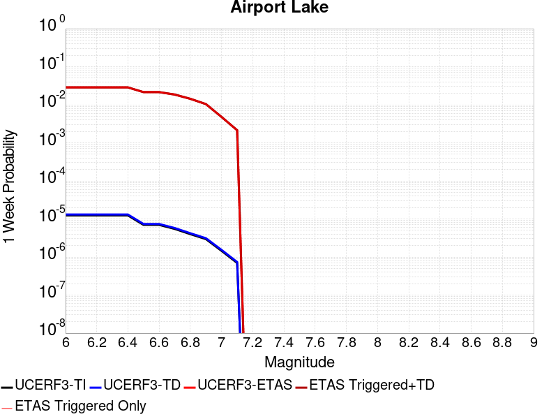 |  |  | 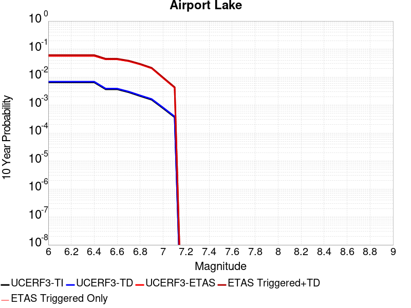 |

| Magnitude | 1 wk TI Prob | 1 wk TD Prob | 1 wk ETAS Prob | 1 wk ETAS/TD Gain | 1 wk ETAS Triggered+TD | 1 wk ETAS Triggered Only | 1 mo TI Prob | 1 mo TD Prob | 1 mo ETAS Prob | 1 mo ETAS/TD Gain | 1 mo ETAS Triggered+TD | 1 mo ETAS Triggered Only | 1 yr TI Prob | 1 yr TD Prob | 1 yr ETAS Prob | 1 yr ETAS/TD Gain | 1 yr ETAS Triggered+TD | 1 yr ETAS Triggered Only | 10 yr TI Prob | 10 yr TD Prob | 10 yr ETAS Prob | 10 yr ETAS/TD Gain | 10 yr ETAS Triggered+TD | 10 yr ETAS Triggered Only |
|-----|-----|-----|-----|-----|-----|-----|-----|-----|-----|-----|-----|-----|-----|-----|-----|-----|-----|-----|-----|-----|-----|-----|-----|-----|
| 6.0 | 1.2387061E-5 | 1.3103157E-5 | 0.02861 | 2183.4434 | 0.028622728 | 0.02861 | 5.3086325E-5 | 5.615534E-5 | 0.03515 | 625.94226 | 0.035204183 | 0.03515 | 6.461343E-4 | 6.8350515E-4 | 0.04547 | 66.524734 | 0.045902576 | 0.04525 | 0.0064425888 | 0.0068168393 | 0.05767 | 8.459932 | 0.061134025 | 0.05469 |
| 6.1 | 1.2387061E-5 | 1.3103157E-5 | 0.02861 | 2183.4434 | 0.028622728 | 0.02861 | 5.3086325E-5 | 5.615534E-5 | 0.03515 | 625.94226 | 0.035204183 | 0.03515 | 6.461343E-4 | 6.8350515E-4 | 0.04547 | 66.524734 | 0.045902576 | 0.04525 | 0.0064425888 | 0.0068168393 | 0.05767 | 8.459932 | 0.061134025 | 0.05469 |
| 6.2 | 1.2387061E-5 | 1.3103157E-5 | 0.02861 | 2183.4434 | 0.028622728 | 0.02861 | 5.3086325E-5 | 5.615534E-5 | 0.03515 | 625.94226 | 0.035204183 | 0.03515 | 6.461343E-4 | 6.8350515E-4 | 0.04547 | 66.524734 | 0.045902576 | 0.04525 | 0.0064425888 | 0.0068168393 | 0.05767 | 8.459932 | 0.061134025 | 0.05469 |
| 6.3 | 1.2387061E-5 | 1.3103157E-5 | 0.02861 | 2183.4434 | 0.028622728 | 0.02861 | 5.3086325E-5 | 5.615534E-5 | 0.03515 | 625.94226 | 0.035204183 | 0.03515 | 6.461343E-4 | 6.8350515E-4 | 0.04547 | 66.524734 | 0.045902576 | 0.04525 | 0.0064425888 | 0.0068168393 | 0.05767 | 8.459932 | 0.061134025 | 0.05469 |
| 6.4 | 1.2387061E-5 | 1.3103157E-5 | 0.02861 | 2183.4434 | 0.028622728 | 0.02861 | 5.3086325E-5 | 5.615534E-5 | 0.03515 | 625.94226 | 0.035204183 | 0.03515 | 6.461343E-4 | 6.8350515E-4 | 0.04547 | 66.524734 | 0.045902576 | 0.04525 | 0.0064425888 | 0.0068168393 | 0.05767 | 8.459932 | 0.061134025 | 0.05469 |
| 6.5 | 6.9922594E-6 | 7.384925E-6 | 0.02153 | 2915.3984 | 0.021537226 | 0.02153 | 2.996648E-5 | 3.1649324E-5 | 0.02665 | 842.04004 | 0.026680807 | 0.02665 | 3.6478083E-4 | 3.8526783E-4 | 0.03439 | 89.26257 | 0.03460208 | 0.03423 | 0.003641826 | 0.0038465366 | 0.04302 | 11.184087 | 0.04508729 | 0.0414 |
| 6.6 | 6.9922594E-6 | 7.384925E-6 | 0.02153 | 2915.3984 | 0.021537226 | 0.02153 | 2.996648E-5 | 3.1649324E-5 | 0.02665 | 842.04004 | 0.026680807 | 0.02665 | 3.6478083E-4 | 3.8526783E-4 | 0.03439 | 89.26257 | 0.03460208 | 0.03423 | 0.003641826 | 0.0038465366 | 0.04302 | 11.184087 | 0.04508729 | 0.0414 |
| 6.7 | 5.477277E-6 | 5.7860684E-6 | 0.01857 | 3209.433 | 0.01857568 | 0.01857 | 2.3473833E-5 | 2.4797222E-5 | 0.02309 | 931.15265 | 0.023114225 | 0.02309 | 2.8575645E-4 | 3.0186825E-4 | 0.02966 | 98.25478 | 0.02980296 | 0.02951 | 0.0028538927 | 0.003014966 | 0.03692 | 12.245578 | 0.0385176 | 0.03561 |
| 6.8 | 3.9950432E-6 | 4.2190873E-6 | 0.01435 | 3401.2097 | 0.014354158 | 0.01435 | 1.7121502E-5 | 1.8081691E-5 | 0.01777 | 982.762 | 0.01778776 | 0.01777 | 2.0843433E-4 | 2.2012512E-4 | 0.02271 | 103.1686 | 0.022795154 | 0.02258 | 0.0020823893 | 0.0021993418 | 0.02834 | 12.8856735 | 0.029509146 | 0.02737 |
| 6.9 | 2.95695E-6 | 3.1230243E-6 | 0.01043 | 3339.7114 | 0.010433091 | 0.01043 | 1.2672582E-5 | 1.3384334E-5 | 0.01284 | 959.3305 | 0.012853213 | 0.01284 | 1.5427776E-4 | 1.6294434E-4 | 0.01638 | 100.52512 | 0.016440291 | 0.01628 | 0.001541707 | 0.0016284712 | 0.02051 | 12.594635 | 0.021396227 | 0.0198 |
| 7.0 | 1.456072E-6 | 1.540812E-6 | 0.0048 | 3115.2405 | 0.004801533 | 0.0048 | 6.2402937E-6 | 6.603469E-6 | 0.00585 | 885.898 | 0.0058565647 | 0.00585 | 7.597293E-5 | 8.039528E-5 | 0.00732 | 91.050125 | 0.0073398114 | 0.00726 | 7.594696E-4 | 8.0376083E-4 | 0.00917 | 11.408867 | 0.009626663 | 0.00883 |
| 7.1 | 6.995192E-7 | 7.4089746E-7 | 0.00215 | 2901.8862 | 0.0021507393 | 0.00215 | 2.997936E-6 | 3.1752747E-6 | 0.00267 | 840.87213 | 0.0026731668 | 0.00267 | 3.649926E-5 | 3.865897E-5 | 0.0033 | 85.36182 | 0.003298533 | 0.00326 | 3.6493264E-4 | 3.865897E-4 | 0.00417 | 10.78663 | 0.004345059 | 0.00396 |

## Owl Lake
*[(top)](#table-of-contents)*

| 1 Week | 1 Month | 1 Year | 10 Year |
|-----|-----|-----|-----|
|  |  |  |  |

| Magnitude | 1 wk TI Prob | 1 wk TD Prob | 1 wk ETAS Prob | 1 wk ETAS/TD Gain | 1 wk ETAS Triggered+TD | 1 wk ETAS Triggered Only | 1 mo TI Prob | 1 mo TD Prob | 1 mo ETAS Prob | 1 mo ETAS/TD Gain | 1 mo ETAS Triggered+TD | 1 mo ETAS Triggered Only | 1 yr TI Prob | 1 yr TD Prob | 1 yr ETAS Prob | 1 yr ETAS/TD Gain | 1 yr ETAS Triggered+TD | 1 yr ETAS Triggered Only | 10 yr TI Prob | 10 yr TD Prob | 10 yr ETAS Prob | 10 yr ETAS/TD Gain | 10 yr ETAS Triggered+TD | 10 yr ETAS Triggered Only |
|-----|-----|-----|-----|-----|-----|-----|-----|-----|-----|-----|-----|-----|-----|-----|-----|-----|-----|-----|-----|-----|-----|-----|-----|-----|
| 6.0 | 5.0320643E-5 | 6.6358676E-5 | 0.01607 | 242.1688 | 0.016095296 | 0.01603 | 2.1564208E-4 | 2.843643E-4 | 0.0213 | 74.903915 | 0.02142835 | 0.02115 | 0.0026222812 | 0.003457547 | 0.03325 | 9.616644 | 0.034519777 | 0.03117 | 0.02591553 | 0.034141295 | 0.06631 | 1.9422227 | 0.075006776 | 0.04231 |
| 6.1 | 5.0320643E-5 | 6.6358676E-5 | 0.01607 | 242.1688 | 0.016095296 | 0.01603 | 2.1564208E-4 | 2.843643E-4 | 0.0213 | 74.903915 | 0.02142835 | 0.02115 | 0.0026222812 | 0.003457547 | 0.03325 | 9.616644 | 0.034519777 | 0.03117 | 0.02591553 | 0.034141295 | 0.06631 | 1.9422227 | 0.075006776 | 0.04231 |
| 6.2 | 2.4125871E-5 | 3.0980515E-5 | 0.01277 | 412.19455 | 0.012780585 | 0.01275 | 1.0339249E-4 | 1.3276804E-4 | 0.0167 | 125.78329 | 0.016750561 | 0.01662 | 0.0012580766 | 0.0016154252 | 0.02525 | 15.630559 | 0.025816267 | 0.02424 | 0.012509781 | 0.016070755 | 0.04522 | 2.8138068 | 0.04785167 | 0.0323 |
| 6.3 | 1.7433485E-5 | 2.2355545E-5 | 0.01142 | 510.83524 | 0.0114221005 | 0.0114 | 7.471279E-5 | 9.580685E-5 | 0.01479 | 154.37311 | 0.014824396 | 0.01473 | 9.0924866E-4 | 0.001165962 | 0.02192 | 18.799927 | 0.022321267 | 0.02118 | 0.009055373 | 0.0116291465 | 0.03693 | 3.1756415 | 0.039165158 | 0.02786 |
| 6.4 | 1.7433485E-5 | 2.2355545E-5 | 0.01142 | 510.83524 | 0.0114221005 | 0.0114 | 7.471279E-5 | 9.580685E-5 | 0.01479 | 154.37311 | 0.014824396 | 0.01473 | 9.0924866E-4 | 0.001165962 | 0.02192 | 18.799927 | 0.022321267 | 0.02118 | 0.009055373 | 0.0116291465 | 0.03693 | 3.1756415 | 0.039165158 | 0.02786 |
| 6.5 | 1.5182742E-5 | 1.9429277E-5 | 0.01099 | 565.64124 | 0.010989216 | 0.01097 | 6.506727E-5 | 8.3266525E-5 | 0.01419 | 170.41663 | 0.014222089 | 0.01414 | 7.919061E-4 | 0.0010134344 | 0.02077 | 20.494667 | 0.021143014 | 0.02015 | 0.0078909 | 0.010118678 | 0.03385 | 3.3452988 | 0.036103062 | 0.02625 |
| 6.6 | 6.7271576E-6 | 8.547518E-6 | 0.00912 | 1066.9764 | 0.009118469 | 0.00911 | 2.8830356E-5 | 3.6631736E-5 | 0.01149 | 313.66245 | 0.011516212 | 0.01148 | 3.5095305E-4 | 4.4590578E-4 | 0.01578 | 35.38864 | 0.015988972 | 0.01555 | 0.0035039932 | 0.0044680187 | 0.0222 | 4.968645 | 0.024129776 | 0.01975 |
| 6.7 | 6.682835E-6 | 8.479961E-6 | 0.0091 | 1073.1182 | 0.009098403 | 0.00909 | 2.8640408E-5 | 3.6342215E-5 | 0.01147 | 315.61093 | 0.0114959255 | 0.01146 | 3.4864116E-4 | 4.423823E-4 | 0.01576 | 35.625294 | 0.015965512 | 0.01553 | 0.003480947 | 0.0044329325 | 0.02214 | 4.9944367 | 0.024065515 | 0.01972 |
| 6.8 | 6.5774975E-6 | 8.326427E-6 | 0.0091 | 1092.9058 | 0.00909825 | 0.00909 | 2.8188972E-5 | 3.5684232E-5 | 0.01146 | 321.15027 | 0.011485276 | 0.01145 | 3.4314668E-4 | 4.3437455E-4 | 0.01573 | 36.212986 | 0.015927643 | 0.0155 | 0.0034261728 | 0.0043531056 | 0.02203 | 5.060755 | 0.023927523 | 0.01966 |
| 6.9 | 6.363419E-6 | 7.999591E-6 | 0.00908 | 1135.0581 | 0.009077927 | 0.00907 | 2.727151E-5 | 3.428354E-5 | 0.01144 | 333.68784 | 0.011463892 | 0.01143 | 3.3198006E-4 | 4.1732774E-4 | 0.01567 | 37.548428 | 0.015870877 | 0.01546 | 0.0033148455 | 0.0041830647 | 0.02186 | 5.2258334 | 0.023701077 | 0.0196 |
| 7.0 | 6.1342453E-6 | 7.631779E-6 | 0.00902 | 1181.9 | 0.009017563 | 0.00901 | 2.6289357E-5 | 3.2707245E-5 | 0.01133 | 346.4064 | 0.011352337 | 0.01132 | 3.2002592E-4 | 3.9814346E-4 | 0.0155 | 38.93069 | 0.015692052 | 0.0153 | 0.0031956544 | 0.003991739 | 0.0215 | 5.3861237 | 0.0232645 | 0.01935 |
| 7.1 | 5.842926E-6 | 7.142312E-6 | 0.00863 | 1208.2922 | 0.00862708 | 0.00862 | 2.504087E-5 | 3.060958E-5 | 0.01085 | 354.46417 | 0.010870278 | 0.01084 | 3.0482994E-4 | 3.7261334E-4 | 0.01481 | 39.746296 | 0.014987166 | 0.01462 | 0.0030441214 | 0.0037371595 | 0.0205 | 5.4854493 | 0.022168022 | 0.0185 |
| 7.2 | 4.77173E-6 | 5.358478E-6 | 0.00545 | 1017.0798 | 0.0054453295 | 0.00544 | 2.045011E-5 | 2.2964727E-5 | 0.00693 | 301.76712 | 0.006942806 | 0.00692 | 2.4895166E-4 | 2.7956374E-4 | 0.00957 | 34.231907 | 0.009726922 | 0.00945 | 0.0024867293 | 0.0028086212 | 0.01365 | 4.860036 | 0.014964384 | 0.01219 |
| 7.3 | 3.0494948E-6 | 2.710356E-6 | 0.00138 | 509.15817 | 0.0013827066 | 0.00138 | 1.3069198E-5 | 1.1615762E-5 | 0.00182 | 156.68365 | 0.0018315946 | 0.00182 | 1.5910587E-4 | 1.4141288E-4 | 0.00257 | 18.173735 | 0.002651058 | 0.00251 | 0.0015899199 | 0.0014231089 | 0.00416 | 2.9231775 | 0.004868199 | 0.00345 |
| 7.4 | 2.7263884E-6 | 2.3055634E-6 | 8.4E-4 | 364.33612 | 8.423036E-4 | 8.4E-4 | 1.1684469E-5 | 9.880949E-6 | 0.00119 | 120.43378 | 0.0011998692 | 0.00119 | 1.4224913E-4 | 1.2029401E-4 | 0.00167 | 13.882652 | 0.0017301004 | 0.00161 | 0.0014215811 | 0.0012110578 | 0.00282 | 2.328543 | 0.0034583327 | 0.00225 |
| 7.5 | 2.6090431E-6 | 2.1655019E-6 | 7.0E-4 | 323.2507 | 7.0216396E-4 | 7.0E-4 | 1.1181565E-5 | 9.2806895E-6 | 0.00101 | 108.82812 | 0.0010192713 | 0.00101 | 1.3612706E-4 | 1.1298663E-4 | 0.00145 | 12.833377 | 0.0015028296 | 0.00139 | 0.001360437 | 0.0011378126 | 0.00245 | 2.1532543 | 0.0030456395 | 0.00191 |
| 7.6 | 2.3008756E-6 | 1.8726826E-6 | 5.3E-4 | 283.01648 | 5.318717E-4 | 5.3E-4 | 9.860858E-6 | 8.025758E-6 | 7.9E-4 | 98.43307 | 7.980194E-4 | 7.9E-4 | 1.20049335E-4 | 9.770931E-5 | 0.00112 | 11.462572 | 0.0011776037 | 0.00108 | 0.001199845 | 9.848307E-4 | 0.00189 | 1.9191117 | 0.0024433928 | 0.00146 |
| 7.7 | 1.7184348E-6 | 1.341808E-6 | 3.3E-4 | 245.93683 | 3.3134138E-4 | 3.3E-4 | 7.3646997E-6 | 5.750593E-6 | 4.7E-4 | 81.7307 | 4.757479E-4 | 4.7E-4 | 8.966153E-5 | 7.0011265E-5 | 6.1E-4 | 8.712884 | 6.5997E-4 | 5.9E-4 | 8.962536E-4 | 7.0769014E-4 | 0.00113 | 1.596744 | 0.0015371027 | 8.3E-4 |
| 7.8 | 8.4612907E-7 | 8.4054994E-7 | 1.2E-4 | 142.76367 | 1.2084045E-4 | 1.2E-4 | 3.6262625E-6 | 3.602352E-6 | 1.8E-4 | 49.967354 | 1.836017E-4 | 1.8E-4 | 4.4148852E-5 | 4.3857777E-5 | 2.6E-4 | 5.928253 | 2.8384724E-4 | 2.4E-4 | 4.414008E-4 | 4.4386165E-4 | 5.1E-4 | 1.1490067 | 7.537241E-4 | 3.1E-4 |
| 7.9 | 2.716738E-7 | 3.7681625E-7 | 4.0E-5 | 106.152534 | 4.0376803E-5 | 4.0E-5 | 1.1643157E-6 | 1.6149258E-6 | 7.0E-5 | 43.345646 | 7.161481E-5 | 7.0E-5 | 1.4175452E-5 | 1.9661555E-5 | 8.0E-5 | 4.0688543 | 9.9659985E-5 | 8.0E-5 | 1.4174548E-4 | 1.9829652E-4 | 1.8E-4 | 0.90773153 | 2.982767E-4 | 1.0E-4 |
| 8.0 | 2.1995428E-8 | 3.3853325E-8 | 1.0E-5 | 295.39197 | 1.0033853E-5 | 1.0E-5 | 9.426611E-8 | 1.4508568E-7 | 1.0E-5 | 68.92479 | 1.0145084E-5 | 1.0E-5 | 1.1476893E-6 | 1.7664173E-6 | 2.0E-5 | 11.322352 | 2.1766382E-5 | 2.0E-5 | 1.14768345E-5 | 1.7869768E-5 | 2.0E-5 | 1.1192087 | 3.7869413E-5 | 2.0E-5 |

## Panamint Valley
*[(top)](#table-of-contents)*

| 1 Week | 1 Month | 1 Year | 10 Year |
|-----|-----|-----|-----|
|  |  |  |  |

| Magnitude | 1 wk TI Prob | 1 wk TD Prob | 1 wk ETAS Prob | 1 wk ETAS/TD Gain | 1 wk ETAS Triggered+TD | 1 wk ETAS Triggered Only | 1 mo TI Prob | 1 mo TD Prob | 1 mo ETAS Prob | 1 mo ETAS/TD Gain | 1 mo ETAS Triggered+TD | 1 mo ETAS Triggered Only | 1 yr TI Prob | 1 yr TD Prob | 1 yr ETAS Prob | 1 yr ETAS/TD Gain | 1 yr ETAS Triggered+TD | 1 yr ETAS Triggered Only | 10 yr TI Prob | 10 yr TD Prob | 10 yr ETAS Prob | 10 yr ETAS/TD Gain | 10 yr ETAS Triggered+TD | 10 yr ETAS Triggered Only |
|-----|-----|-----|-----|-----|-----|-----|-----|-----|-----|-----|-----|-----|-----|-----|-----|-----|-----|-----|-----|-----|-----|-----|-----|-----|
| 6.0 | 3.0211835E-5 | 3.3984263E-5 | 0.01217 | 358.10693 | 0.01220357 | 0.01217 | 1.2947287E-4 | 1.4563887E-4 | 0.01592 | 109.31148 | 0.016023327 | 0.01588 | 0.0015751923 | 0.0017717406 | 0.02452 | 13.839498 | 0.025349893 | 0.02362 | 0.015640736 | 0.017583003 | 0.04286 | 2.4375813 | 0.04975716 | 0.03275 |
| 6.1 | 3.0211835E-5 | 3.3984263E-5 | 0.01217 | 358.10693 | 0.01220357 | 0.01217 | 1.2947287E-4 | 1.4563887E-4 | 0.01592 | 109.31148 | 0.016023327 | 0.01588 | 0.0015751923 | 0.0017717406 | 0.02452 | 13.839498 | 0.025349893 | 0.02362 | 0.015640736 | 0.017583003 | 0.04286 | 2.4375813 | 0.04975716 | 0.03275 |
| 6.2 | 3.0211835E-5 | 3.3984263E-5 | 0.01217 | 358.10693 | 0.01220357 | 0.01217 | 1.2947287E-4 | 1.4563887E-4 | 0.01592 | 109.31148 | 0.016023327 | 0.01588 | 0.0015751923 | 0.0017717406 | 0.02452 | 13.839498 | 0.025349893 | 0.02362 | 0.015640736 | 0.017583003 | 0.04286 | 2.4375813 | 0.04975716 | 0.03275 |
| 6.3 | 2.8573924E-5 | 3.2102445E-5 | 0.0118 | 367.57327 | 0.011831724 | 0.0118 | 1.2245393E-4 | 1.375748E-4 | 0.01534 | 111.502975 | 0.015445469 | 0.01531 | 0.001489857 | 0.0016737141 | 0.0233 | 13.921134 | 0.024106106 | 0.02247 | 0.01479908 | 0.016618038 | 0.04036 | 2.4286864 | 0.047043875 | 0.03094 |
| 6.4 | 2.8573924E-5 | 3.2102445E-5 | 0.0118 | 367.57327 | 0.011831724 | 0.0118 | 1.2245393E-4 | 1.375748E-4 | 0.01534 | 111.502975 | 0.015445469 | 0.01531 | 0.001489857 | 0.0016737141 | 0.0233 | 13.921134 | 0.024106106 | 0.02247 | 0.01479908 | 0.016618038 | 0.04036 | 2.4286864 | 0.047043875 | 0.03094 |
| 6.5 | 2.7468774E-5 | 3.0828138E-5 | 0.01156 | 374.9821 | 0.0115904715 | 0.01156 | 1.1771801E-4 | 1.3211406E-4 | 0.01498 | 113.38687 | 0.015080139 | 0.01495 | 0.0014322745 | 0.0016073292 | 0.02258 | 14.048148 | 0.023342337 | 0.02177 | 0.014230782 | 0.015963882 | 0.03887 | 2.4348714 | 0.045396402 | 0.02991 |
| 6.6 | 2.6135967E-5 | 2.9252153E-5 | 0.0111 | 379.45926 | 0.011128928 | 0.0111 | 1.1200648E-4 | 1.2536049E-4 | 0.01445 | 115.26758 | 0.014543553 | 0.01442 | 0.0013628257 | 0.0015252219 | 0.02162 | 14.174987 | 0.022323452 | 0.02083 | 0.013544982 | 0.015154343 | 0.03703 | 2.443524 | 0.043330777 | 0.02861 |
| 6.7 | 2.4498746E-5 | 2.7341044E-5 | 0.01076 | 393.54752 | 0.0107870465 | 0.01076 | 1.04990395E-4 | 1.17170785E-4 | 0.01398 | 119.31302 | 0.014065537 | 0.01395 | 0.0012775084 | 0.0014256459 | 0.02082 | 14.603908 | 0.021467034 | 0.02007 | 0.012701893 | 0.014171593 | 0.03515 | 2.480314 | 0.041084707 | 0.0273 |
| 6.8 | 2.2244329E-5 | 2.4935374E-5 | 0.01017 | 407.8543 | 0.010194682 | 0.01017 | 9.532935E-5 | 1.0686163E-4 | 0.01315 | 123.05632 | 0.0132254595 | 0.01312 | 0.0011600169 | 0.0013002857 | 0.0194 | 14.919798 | 0.020015918 | 0.01874 | 0.011539802 | 0.012932955 | 0.03217 | 2.487444 | 0.037787303 | 0.02518 |
| 6.9 | 1.9902658E-5 | 2.2290182E-5 | 0.0093 | 417.22406 | 0.009322083 | 0.0093 | 8.529431E-5 | 9.552596E-5 | 0.01202 | 125.82967 | 0.012084381 | 0.01199 | 0.0010379635 | 0.0011624265 | 0.01743 | 14.994496 | 0.018002829 | 0.01686 | 0.010331288 | 0.011569021 | 0.02861 | 2.4729836 | 0.033709876 | 0.0224 |
| 7.0 | 1.8353881E-5 | 2.056605E-5 | 0.00876 | 425.94467 | 0.008780386 | 0.00876 | 7.865712E-5 | 8.813734E-5 | 0.01134 | 128.66283 | 0.01139714 | 0.01131 | 9.5722964E-4 | 0.0010725616 | 0.01623 | 15.131998 | 0.016775701 | 0.01572 | 0.009531168 | 0.01067939 | 0.02626 | 2.458942 | 0.031069288 | 0.02061 |
| 7.1 | 1.7667631E-5 | 1.9772435E-5 | 0.00843 | 426.35114 | 0.008449606 | 0.00843 | 7.571623E-5 | 8.4736355E-5 | 0.01094 | 129.10634 | 0.010993812 | 0.01091 | 9.2145515E-4 | 0.0010311945 | 0.01559 | 15.118391 | 0.016125614 | 0.01511 | 0.009176437 | 0.0102695925 | 0.02523 | 2.4567673 | 0.029945433 | 0.01988 |
| 7.2 | 1.6381597E-5 | 1.8158042E-5 | 0.00741 | 408.08365 | 0.0074280235 | 0.00741 | 7.020495E-5 | 7.781795E-5 | 0.00961 | 123.49335 | 0.009657073 | 0.00958 | 8.544101E-4 | 9.470391E-4 | 0.01385 | 14.624528 | 0.014334349 | 0.0134 | 0.008511325 | 0.009435269 | 0.02249 | 2.3836098 | 0.026889019 | 0.01762 |
| 7.3 | 1.4520491E-5 | 1.596657E-5 | 0.006 | 375.78513 | 0.0060158707 | 0.006 | 6.222919E-5 | 6.842646E-5 | 0.00776 | 113.406425 | 0.007807897 | 0.00774 | 7.57377E-4 | 8.327899E-4 | 0.01135 | 13.628887 | 0.011773671 | 0.01095 | 0.0075480095 | 0.008300399 | 0.01877 | 2.2613368 | 0.022600709 | 0.01442 |
| 7.4 | 1.2852287E-5 | 1.41454875E-5 | 0.00585 | 413.55945 | 0.005864063 | 0.00585 | 5.5080065E-5 | 6.06222E-5 | 0.00754 | 124.376884 | 0.007590166 | 0.00753 | 6.7039346E-4 | 7.378411E-4 | 0.01098 | 14.881252 | 0.011350005 | 0.01062 | 0.0066837464 | 0.007357429 | 0.01777 | 2.4152458 | 0.02115516 | 0.0139 |
| 7.5 | 1.1637851E-5 | 1.2836868E-5 | 0.00579 | 451.0446 | 0.0058027627 | 0.00579 | 4.987555E-5 | 5.5014076E-5 | 0.00747 | 135.78343 | 0.007514604 | 0.00746 | 6.070656E-4 | 6.696062E-4 | 0.01086 | 16.218487 | 0.0111825615 | 0.01052 | 0.006054099 | 0.0066793845 | 0.01721 | 2.5765848 | 0.020327609 | 0.01374 |
| 7.6 | 3.0068115E-6 | 3.3330623E-6 | 0.0025 | 750.061 | 0.0025033248 | 0.0025 | 1.2886271E-5 | 1.4284516E-5 | 0.00308 | 215.61809 | 0.0030942406 | 0.00308 | 1.5687906E-4 | 1.7390738E-4 | 0.00437 | 25.128319 | 0.0044331667 | 0.00426 | 0.0015676835 | 0.0017397973 | 0.00657 | 3.7763019 | 0.0073600025 | 0.00563 |

## Garlock (East)
*[(top)](#table-of-contents)*

| 1 Week | 1 Month | 1 Year | 10 Year |
|-----|-----|-----|-----|
|  |  |  |  |

| Magnitude | 1 wk TI Prob | 1 wk TD Prob | 1 wk ETAS Prob | 1 wk ETAS/TD Gain | 1 wk ETAS Triggered+TD | 1 wk ETAS Triggered Only | 1 mo TI Prob | 1 mo TD Prob | 1 mo ETAS Prob | 1 mo ETAS/TD Gain | 1 mo ETAS Triggered+TD | 1 mo ETAS Triggered Only | 1 yr TI Prob | 1 yr TD Prob | 1 yr ETAS Prob | 1 yr ETAS/TD Gain | 1 yr ETAS Triggered+TD | 1 yr ETAS Triggered Only | 10 yr TI Prob | 10 yr TD Prob | 10 yr ETAS Prob | 10 yr ETAS/TD Gain | 10 yr ETAS Triggered+TD | 10 yr ETAS Triggered Only |
|-----|-----|-----|-----|-----|-----|-----|-----|-----|-----|-----|-----|-----|-----|-----|-----|-----|-----|-----|-----|-----|-----|-----|-----|-----|
| 6.0 | 4.5092507E-5 | 6.2904815E-5 | 0.01015 | 161.35489 | 0.010192268 | 0.01013 | 1.9323928E-4 | 2.6956675E-4 | 0.01353 | 50.191654 | 0.013635962 | 0.01337 | 0.0023501497 | 0.003277482 | 0.02262 | 6.90164 | 0.023849834 | 0.02064 | 0.023254504 | 0.03235377 | 0.05126 | 1.5843594 | 0.059728485 | 0.02829 |
| 6.1 | 4.5092507E-5 | 6.2904815E-5 | 0.01015 | 161.35489 | 0.010192268 | 0.01013 | 1.9323928E-4 | 2.6956675E-4 | 0.01353 | 50.191654 | 0.013635962 | 0.01337 | 0.0023501497 | 0.003277482 | 0.02262 | 6.90164 | 0.023849834 | 0.02064 | 0.023254504 | 0.03235377 | 0.05126 | 1.5843594 | 0.059728485 | 0.02829 |
| 6.2 | 2.6674514E-5 | 3.4511588E-5 | 0.00814 | 235.86281 | 0.008154231 | 0.00812 | 1.1431433E-4 | 1.4789861E-4 | 0.0103 | 69.6423 | 0.010366387 | 0.01022 | 0.0013908884 | 0.0017992114 | 0.01601 | 8.898343 | 0.016772224 | 0.015 | 0.01382215 | 0.017872788 | 0.03243 | 1.8144903 | 0.037849255 | 0.02034 |
| 6.3 | 2.6674514E-5 | 3.4511588E-5 | 0.00814 | 235.86281 | 0.008154231 | 0.00812 | 1.1431433E-4 | 1.4789861E-4 | 0.0103 | 69.6423 | 0.010366387 | 0.01022 | 0.0013908884 | 0.0017992114 | 0.01601 | 8.898343 | 0.016772224 | 0.015 | 0.01382215 | 0.017872788 | 0.03243 | 1.8144903 | 0.037849255 | 0.02034 |
| 6.4 | 2.5312667E-5 | 3.2340467E-5 | 0.00807 | 249.53256 | 0.00808208 | 0.00805 | 1.0847834E-4 | 1.3859481E-4 | 0.0102 | 73.595825 | 0.010257192 | 0.01012 | 0.0013199237 | 0.0016861152 | 0.01571 | 9.317276 | 0.01646116 | 0.0148 | 0.013121112 | 0.016772287 | 0.03149 | 1.877502 | 0.036486004 | 0.02005 |
| 6.5 | 2.5312667E-5 | 3.2340467E-5 | 0.00807 | 249.53256 | 0.00808208 | 0.00805 | 1.0847834E-4 | 1.3859481E-4 | 0.0102 | 73.595825 | 0.010257192 | 0.01012 | 0.0013199237 | 0.0016861152 | 0.01571 | 9.317276 | 0.01646116 | 0.0148 | 0.013121112 | 0.016772287 | 0.03149 | 1.877502 | 0.036486004 | 0.02005 |
| 6.6 | 2.246556E-5 | 2.8134691E-5 | 0.00776 | 275.81607 | 0.007767917 | 0.00774 | 9.627742E-5 | 1.2057181E-4 | 0.00978 | 81.11349 | 0.009819402 | 0.0097 | 0.0011715472 | 0.0014669969 | 0.01487 | 10.136354 | 0.015506371 | 0.01406 | 0.011653901 | 0.014613169 | 0.02891 | 1.9783525 | 0.033227127 | 0.01889 |
| 6.7 | 2.2241198E-5 | 2.7804432E-5 | 0.00774 | 278.3729 | 0.0077475896 | 0.00772 | 9.531594E-5 | 1.1915654E-4 | 0.00975 | 81.825134 | 0.009788005 | 0.00967 | 0.0011598538 | 0.0014497889 | 0.01482 | 10.2221775 | 0.015449462 | 0.01402 | 0.011538187 | 0.014442829 | 0.02871 | 1.9878377 | 0.033010725 | 0.01884 |
| 6.8 | 1.9528685E-5 | 2.3898969E-5 | 0.00746 | 312.14737 | 0.007463721 | 0.00744 | 8.369167E-5 | 1.0242024E-4 | 0.00931 | 90.9 | 0.009331475 | 0.00923 | 0.0010184698 | 0.0012462728 | 0.01386 | 11.1211605 | 0.014429822 | 0.0132 | 0.010138147 | 0.012436723 | 0.0259 | 2.0825422 | 0.029738832 | 0.01752 |
| 6.9 | 1.3318621E-5 | 1.5198818E-5 | 0.007 | 460.56213 | 0.0070050927 | 0.00699 | 5.7078556E-5 | 6.51362E-5 | 0.00863 | 132.49161 | 0.008644577 | 0.00858 | 6.9470983E-4 | 7.927504E-4 | 0.01249 | 15.755275 | 0.012883158 | 0.0121 | 0.0069254204 | 0.007940721 | 0.02085 | 2.6257062 | 0.023595417 | 0.01578 |
| 7.0 | 1.1760853E-5 | 1.3107653E-5 | 0.00686 | 523.3584 | 0.006863018 | 0.00685 | 5.0402683E-5 | 5.6174475E-5 | 0.00843 | 150.06816 | 0.008435704 | 0.00838 | 6.134799E-4 | 6.8371464E-4 | 0.01209 | 17.682816 | 0.012435674 | 0.01176 | 0.0061178906 | 0.006857401 | 0.01939 | 2.8276017 | 0.021943238 | 0.01519 |
| 7.1 | 1.0064758E-5 | 1.0902761E-5 | 0.00669 | 613.6061 | 0.00669083 | 0.00668 | 4.3133965E-5 | 4.67253E-5 | 0.00817 | 174.85175 | 0.008166346 | 0.00812 | 5.2502943E-4 | 5.6873553E-4 | 0.01153 | 20.273043 | 0.011822332 | 0.01126 | 0.005237907 | 0.0057133473 | 0.01755 | 3.0717545 | 0.019941589 | 0.01431 |
| 7.2 | 9.768808E-6 | 1.0498628E-5 | 0.00657 | 625.796 | 0.0065704295 | 0.00656 | 4.186565E-5 | 4.499337E-5 | 0.00802 | 178.24849 | 0.008014635 | 0.00797 | 5.095951E-4 | 5.4766005E-4 | 0.01131 | 20.651497 | 0.011591609 | 0.01105 | 0.0050842804 | 0.005503584 | 0.01707 | 3.1016152 | 0.019456368 | 0.01403 |
| 7.3 | 9.344516E-6 | 9.9442705E-6 | 0.00613 | 616.43536 | 0.006129883 | 0.00612 | 4.004731E-5 | 4.2617627E-5 | 0.00746 | 175.04495 | 0.0074523017 | 0.00741 | 4.8746695E-4 | 5.187495E-4 | 0.01047 | 20.183151 | 0.010723453 | 0.01021 | 0.0048639905 | 0.005215269 | 0.01576 | 3.021896 | 0.01805794 | 0.01291 |
| 7.4 | 9.023491E-6 | 9.490441E-6 | 0.00552 | 581.6379 | 0.005529438 | 0.00552 | 3.867153E-5 | 4.0672705E-5 | 0.00666 | 163.74619 | 0.0066604037 | 0.00662 | 4.7072413E-4 | 4.95081E-4 | 0.00935 | 18.885798 | 0.009620561 | 0.00913 | 0.004697283 | 0.0049787266 | 0.01427 | 2.8661947 | 0.016491123 | 0.01157 |
| 7.5 | 7.081253E-6 | 7.0873994E-6 | 0.00273 | 385.19067 | 0.002737068 | 0.00273 | 3.0347876E-5 | 3.0374218E-5 | 0.00335 | 110.2909 | 0.0033502735 | 0.00332 | 3.6942272E-4 | 3.697441E-4 | 0.00478 | 12.92786 | 0.00497804 | 0.00461 | 0.003688092 | 0.0037244745 | 0.00769 | 2.0647209 | 0.009373357 | 0.00567 |
| 7.6 | 6.116396E-6 | 5.9589424E-6 | 0.00162 | 271.86032 | 0.0016259493 | 0.00162 | 2.6212863E-5 | 2.5538076E-5 | 0.00203 | 79.48915 | 0.002025487 | 0.002 | 3.1909486E-4 | 3.1088197E-4 | 0.00298 | 9.585631 | 0.0031400023 | 0.00283 | 0.0031863707 | 0.0031359126 | 0.00522 | 1.6645873 | 0.006684749 | 0.00356 |
| 7.7 | 4.797145E-6 | 4.7571157E-6 | 8.2E-4 | 172.37337 | 8.247532E-4 | 8.2E-4 | 2.055903E-5 | 2.0387479E-5 | 0.00104 | 51.0117 | 0.0010303669 | 0.00101 | 2.5027743E-4 | 2.481894E-4 | 0.00154 | 6.2049384 | 0.001647842 | 0.0014 | 0.0024999576 | 0.0025094065 | 0.00318 | 1.2672318 | 0.0043148645 | 0.00181 |
| 7.8 | 3.4028885E-6 | 3.978375E-6 | 4.8E-4 | 120.65228 | 4.8397647E-4 | 4.8E-4 | 1.4583726E-5 | 1.7050066E-5 | 6.0E-4 | 35.19048 | 5.9704017E-4 | 5.8E-4 | 1.775424E-4 | 2.0756487E-4 | 9.6E-4 | 4.6250606 | 0.0010373925 | 8.3E-4 | 0.0017740062 | 0.0021012141 | 0.00227 | 1.0803277 | 0.0032687557 | 0.00117 |
| 7.9 | 2.5928412E-6 | 3.372436E-6 | 3.4E-4 | 100.81734 | 3.433713E-4 | 3.4E-4 | 1.1112129E-5 | 1.4453217E-5 | 4.0E-4 | 27.675499 | 4.0444758E-4 | 3.9E-4 | 1.3528178E-4 | 1.7595377E-4 | 7.1E-4 | 4.035151 | 7.758482E-4 | 6.0E-4 | 0.0013519945 | 0.0017812426 | 0.00177 | 0.99368834 | 0.002599782 | 8.2E-4 |
| 8.0 | 1.3743648E-6 | 1.6734741E-6 | 1.6E-4 | 95.60949 | 1.616732E-4 | 1.6E-4 | 5.8901214E-6 | 7.1720124E-6 | 1.8E-4 | 25.097559 | 1.7717079E-4 | 1.7E-4 | 7.1709874E-5 | 8.731578E-5 | 3.4E-4 | 3.8939126 | 3.4729307E-4 | 2.6E-4 | 7.1686733E-4 | 8.837377E-4 | 7.9E-4 | 0.8939304 | 0.0012034549 | 3.2E-4 |
| 8.1 | 3.6733252E-7 | 3.1489736E-7 | 2.0E-5 | 63.512756 | 2.031489E-5 | 2.0E-5 | 1.5742813E-6 | 1.3495595E-6 | 2.0E-5 | 14.81965 | 2.1349533E-5 | 2.0E-5 | 1.9166706E-5 | 1.643078E-5 | 6.0E-5 | 3.651683 | 4.6430287E-5 | 3.0E-5 | 1.9165053E-4 | 1.662928E-4 | 9.0E-5 | 0.54121405 | 2.0628615E-4 | 4.0E-5 |

## Hunter Mountain-Saline Valley
*[(top)](#table-of-contents)*

| 1 Week | 1 Month | 1 Year | 10 Year |
|-----|-----|-----|-----|
|  |  |  |  |

| Magnitude | 1 wk TI Prob | 1 wk TD Prob | 1 wk ETAS Prob | 1 wk ETAS/TD Gain | 1 wk ETAS Triggered+TD | 1 wk ETAS Triggered Only | 1 mo TI Prob | 1 mo TD Prob | 1 mo ETAS Prob | 1 mo ETAS/TD Gain | 1 mo ETAS Triggered+TD | 1 mo ETAS Triggered Only | 1 yr TI Prob | 1 yr TD Prob | 1 yr ETAS Prob | 1 yr ETAS/TD Gain | 1 yr ETAS Triggered+TD | 1 yr ETAS Triggered Only | 10 yr TI Prob | 10 yr TD Prob | 10 yr ETAS Prob | 10 yr ETAS/TD Gain | 10 yr ETAS Triggered+TD | 10 yr ETAS Triggered Only |
|-----|-----|-----|-----|-----|-----|-----|-----|-----|-----|-----|-----|-----|-----|-----|-----|-----|-----|-----|-----|-----|-----|-----|-----|-----|
| 6.0 | 4.5103672E-5 | 5.456906E-5 | 0.00606 | 111.05194 | 0.00608424 | 0.00603 | 1.9328714E-4 | 2.3384714E-4 | 0.00791 | 33.825516 | 0.00800203 | 0.00777 | 0.002350731 | 0.0028435462 | 0.01237 | 4.350202 | 0.013812267 | 0.011 | 0.023260195 | 0.028092625 | 0.02934 | 1.0444022 | 0.042263035 | 0.01458 |
| 6.1 | 4.5103672E-5 | 5.456906E-5 | 0.00606 | 111.05194 | 0.00608424 | 0.00603 | 1.9328714E-4 | 2.3384714E-4 | 0.00791 | 33.825516 | 0.00800203 | 0.00777 | 0.002350731 | 0.0028435462 | 0.01237 | 4.350202 | 0.013812267 | 0.011 | 0.023260195 | 0.028092625 | 0.02934 | 1.0444022 | 0.042263035 | 0.01458 |
| 6.2 | 3.9363465E-5 | 4.706271E-5 | 0.00603 | 128.12692 | 0.0060467804 | 0.006 | 1.6868966E-4 | 2.016826E-4 | 0.00784 | 38.87296 | 0.0079201255 | 0.00772 | 0.002051862 | 0.0024528534 | 0.01211 | 4.9371076 | 0.013366019 | 0.01094 | 0.020330196 | 0.024274187 | 0.02693 | 1.109409 | 0.038412455 | 0.01449 |
| 6.3 | 3.9363465E-5 | 4.706271E-5 | 0.00603 | 128.12692 | 0.0060467804 | 0.006 | 1.6868966E-4 | 2.016826E-4 | 0.00784 | 38.87296 | 0.0079201255 | 0.00772 | 0.002051862 | 0.0024528534 | 0.01211 | 4.9371076 | 0.013366019 | 0.01094 | 0.020330196 | 0.024274187 | 0.02693 | 1.109409 | 0.038412455 | 0.01449 |
| 6.4 | 3.2311684E-5 | 3.795112E-5 | 0.00597 | 157.30762 | 0.005997725 | 0.00596 | 1.384713E-4 | 1.6263791E-4 | 0.00775 | 47.651867 | 0.007841389 | 0.00768 | 0.0016845843 | 0.001978387 | 0.01178 | 5.9543457 | 0.012846842 | 0.01089 | 0.016718714 | 0.019617118 | 0.02436 | 1.2417725 | 0.03372483 | 0.01439 |
| 6.5 | 3.2311684E-5 | 3.795112E-5 | 0.00597 | 157.30762 | 0.005997725 | 0.00596 | 1.384713E-4 | 1.6263791E-4 | 0.00775 | 47.651867 | 0.007841389 | 0.00768 | 0.0016845843 | 0.001978387 | 0.01178 | 5.9543457 | 0.012846842 | 0.01089 | 0.016718714 | 0.019617118 | 0.02436 | 1.2417725 | 0.03372483 | 0.01439 |
| 6.6 | 2.9305844E-5 | 3.418196E-5 | 0.00597 | 174.65352 | 0.005993978 | 0.00596 | 1.2559042E-4 | 1.4648624E-4 | 0.00773 | 52.76946 | 0.007805364 | 0.00766 | 0.0015279909 | 0.0017820727 | 0.01165 | 6.5373316 | 0.012612737 | 0.01085 | 0.015175272 | 0.017686324 | 0.02341 | 1.3236215 | 0.031772703 | 0.01434 |
| 6.7 | 2.7826512E-5 | 3.2344353E-5 | 0.00596 | 184.26709 | 0.005992152 | 0.00596 | 1.19251024E-4 | 1.3861163E-4 | 0.00771 | 55.623035 | 0.00779755 | 0.00766 | 0.0014509142 | 0.0016863506 | 0.01158 | 6.8669 | 0.01250807 | 0.01084 | 0.014414776 | 0.016743818 | 0.02289 | 1.3670717 | 0.030824047 | 0.01432 |
| 6.8 | 2.3389874E-5 | 2.6866792E-5 | 0.00594 | 221.09079 | 0.005966707 | 0.00594 | 1.0023846E-4 | 1.1513857E-4 | 0.00767 | 66.61538 | 0.00774426 | 0.00763 | 0.00121972 | 0.001400958 | 0.01143 | 8.158703 | 0.012175841 | 0.01079 | 0.01213047 | 0.013928067 | 0.02135 | 1.532876 | 0.027969731 | 0.01424 |
| 6.9 | 2.069209E-5 | 2.357011E-5 | 0.00591 | 250.7413 | 0.005933431 | 0.00591 | 8.867737E-5 | 1.0101105E-4 | 0.00763 | 75.53629 | 0.0076902444 | 0.00759 | 0.0010791123 | 0.0012291519 | 0.01132 | 9.209602 | 0.01195595 | 0.01074 | 0.010738871 | 0.012229158 | 0.02032 | 1.6616026 | 0.026206115 | 0.01415 |
| 7.0 | 1.7462342E-5 | 1.9633622E-5 | 0.00585 | 297.95825 | 0.005869519 | 0.00585 | 7.483646E-5 | 8.414151E-5 | 0.00756 | 89.84863 | 0.007603509 | 0.00752 | 9.1075303E-4 | 0.0010239641 | 0.01113 | 10.869522 | 0.011663059 | 0.01065 | 0.009070295 | 0.010196688 | 0.0193 | 1.8927716 | 0.024063831 | 0.01401 |
| 7.1 | 1.4807709E-5 | 1.6441827E-5 | 0.00584 | 355.19168 | 0.005856346 | 0.00584 | 6.3460066E-5 | 7.046316E-5 | 0.00754 | 107.00627 | 0.007579934 | 0.00751 | 7.723524E-4 | 8.575678E-4 | 0.01103 | 12.861957 | 0.011468461 | 0.01062 | 0.007696735 | 0.008546168 | 0.01832 | 2.143651 | 0.022376949 | 0.01395 |
| 7.2 | 1.4180048E-5 | 1.5698413E-5 | 0.00584 | 372.01212 | 0.005855607 | 0.00584 | 6.077022E-5 | 6.727727E-5 | 0.00753 | 111.92487 | 0.007576772 | 0.00751 | 7.396263E-4 | 8.1880915E-4 | 0.011 | 13.434144 | 0.011420121 | 0.01061 | 0.0073716943 | 0.008161469 | 0.01812 | 2.2201884 | 0.02197778 | 0.01393 |
| 7.3 | 1.3730402E-5 | 1.5172151E-5 | 0.00583 | 384.25665 | 0.005845084 | 0.00583 | 5.8843252E-5 | 6.502197E-5 | 0.00752 | 115.65321 | 0.0075645344 | 0.0075 | 7.161811E-4 | 7.9137104E-4 | 0.01097 | 13.862018 | 0.011372991 | 0.01059 | 0.007138774 | 0.007889058 | 0.01797 | 2.2778385 | 0.02166948 | 0.01389 |
| 7.4 | 1.2810095E-5 | 1.4109353E-5 | 0.00581 | 411.78357 | 0.0058240276 | 0.00581 | 5.489925E-5 | 6.0467344E-5 | 0.00748 | 123.70313 | 0.0075300154 | 0.00747 | 6.681934E-4 | 7.3595706E-4 | 0.01091 | 14.824234 | 0.0112781925 | 0.01055 | 0.006661878 | 0.0073386896 | 0.01768 | 2.4091494 | 0.021057269 | 0.01382 |
| 7.5 | 1.1595659E-5 | 1.2800734E-5 | 0.00575 | 449.193 | 0.005762727 | 0.00575 | 4.9694736E-5 | 5.485922E-5 | 0.00741 | 135.07301 | 0.007454453 | 0.0074 | 6.0486543E-4 | 6.67722E-4 | 0.01079 | 16.15942 | 0.011110744 | 0.01045 | 0.006032217 | 0.006660632 | 0.01712 | 2.5703266 | 0.020229647 | 0.01366 |
| 7.6 | 2.997694E-6 | 3.3251877E-6 | 0.00248 | 745.8226 | 0.002483317 | 0.00248 | 1.28471975E-5 | 1.4250767E-5 | 0.00306 | 214.72528 | 0.003074207 | 0.00306 | 1.564034E-4 | 1.7349655E-4 | 0.00435 | 25.072544 | 0.004412761 | 0.00424 | 0.0015629337 | 0.0017356955 | 0.00655 | 3.7737033 | 0.007335958 | 0.00561 |

## Blackwater
*[(top)](#table-of-contents)*

| 1 Week | 1 Month | 1 Year | 10 Year |
|-----|-----|-----|-----|
|  |  |  |  |

| Magnitude | 1 wk TI Prob | 1 wk TD Prob | 1 wk ETAS Prob | 1 wk ETAS/TD Gain | 1 wk ETAS Triggered+TD | 1 wk ETAS Triggered Only | 1 mo TI Prob | 1 mo TD Prob | 1 mo ETAS Prob | 1 mo ETAS/TD Gain | 1 mo ETAS Triggered+TD | 1 mo ETAS Triggered Only | 1 yr TI Prob | 1 yr TD Prob | 1 yr ETAS Prob | 1 yr ETAS/TD Gain | 1 yr ETAS Triggered+TD | 1 yr ETAS Triggered Only | 10 yr TI Prob | 10 yr TD Prob | 10 yr ETAS Prob | 10 yr ETAS/TD Gain | 10 yr ETAS Triggered+TD | 10 yr ETAS Triggered Only |
|-----|-----|-----|-----|-----|-----|-----|-----|-----|-----|-----|-----|-----|-----|-----|-----|-----|-----|-----|-----|-----|-----|-----|-----|-----|
| 6.0 | 3.0708583E-5 | 3.3095846E-5 | 0.00365 | 110.285736 | 0.003682975 | 0.00365 | 1.3160157E-4 | 1.4183241E-4 | 0.00528 | 37.227036 | 0.005341095 | 0.0052 | 0.0016010714 | 0.0017255784 | 0.00952 | 5.5169907 | 0.0102308765 | 0.00852 | 0.015895851 | 0.017135633 | 0.02164 | 1.2628655 | 0.029372295 | 0.01245 |
| 6.1 | 3.0708583E-5 | 3.3095846E-5 | 0.00365 | 110.285736 | 0.003682975 | 0.00365 | 1.3160157E-4 | 1.4183241E-4 | 0.00528 | 37.227036 | 0.005341095 | 0.0052 | 0.0016010714 | 0.0017255784 | 0.00952 | 5.5169907 | 0.0102308765 | 0.00852 | 0.015895851 | 0.017135633 | 0.02164 | 1.2628655 | 0.029372295 | 0.01245 |
| 6.2 | 1.1707779E-5 | 1.2545122E-5 | 0.00132 | 105.22018 | 0.0013325285 | 0.00132 | 5.017523E-5 | 5.3763757E-5 | 0.00197 | 36.641785 | 0.0019736604 | 0.00192 | 6.107122E-4 | 6.5438676E-4 | 0.00363 | 5.5471783 | 0.0038422993 | 0.00319 | 0.006090366 | 0.0065255696 | 0.00816 | 1.2504655 | 0.011115422 | 0.00462 |
| 6.3 | 1.1707779E-5 | 1.2545122E-5 | 0.00132 | 105.22018 | 0.0013325285 | 0.00132 | 5.017523E-5 | 5.3763757E-5 | 0.00197 | 36.641785 | 0.0019736604 | 0.00192 | 6.107122E-4 | 6.5438676E-4 | 0.00363 | 5.5471783 | 0.0038422993 | 0.00319 | 0.006090366 | 0.0065255696 | 0.00816 | 1.2504655 | 0.011115422 | 0.00462 |
| 6.4 | 7.929244E-6 | 8.480098E-6 | 8.7E-4 | 102.593155 | 8.784727E-4 | 8.7E-4 | 3.3982033E-5 | 3.6342793E-5 | 0.00133 | 36.595974 | 0.0013262959 | 0.00129 | 4.136527E-4 | 4.423877E-4 | 0.00247 | 5.583338 | 0.0026314189 | 0.00219 | 0.0041288356 | 0.0044154758 | 0.00545 | 1.234295 | 0.0074719205 | 0.00307 |
| 6.5 | 5.8832115E-6 | 6.285991E-6 | 6.8E-4 | 108.177055 | 6.862817E-4 | 6.8E-4 | 2.521352E-5 | 2.6939697E-5 | 0.00104 | 38.60474 | 0.0010369124 | 0.00101 | 3.0693135E-4 | 3.27944E-4 | 0.00175 | 5.336277 | 0.0019074258 | 0.00158 | 0.0030650778 | 0.0032748538 | 0.00398 | 1.2153214 | 0.005507518 | 0.00224 |
| 6.6 | 5.8832115E-6 | 6.285991E-6 | 6.8E-4 | 108.177055 | 6.862817E-4 | 6.8E-4 | 2.521352E-5 | 2.6939697E-5 | 0.00104 | 38.60474 | 0.0010369124 | 0.00101 | 3.0693135E-4 | 3.27944E-4 | 0.00175 | 5.336277 | 0.0019074258 | 0.00158 | 0.0030650778 | 0.0032748538 | 0.00398 | 1.2153214 | 0.005507518 | 0.00224 |
| 6.7 | 3.0715053E-6 | 3.2814662E-6 | 3.5E-4 | 106.65964 | 3.532803E-4 | 3.5E-4 | 1.3163528E-5 | 1.4063357E-5 | 5.4E-4 | 38.39766 | 5.440559E-4 | 5.3E-4 | 1.6025416E-4 | 1.7120909E-4 | 8.8E-4 | 5.139914 | 9.710721E-4 | 8.0E-4 | 0.0016013865 | 0.0017108864 | 0.00206 | 1.2040542 | 0.0027890387 | 0.00108 |
| 6.8 | 2.2722281E-6 | 2.4287538E-6 | 2.1E-4 | 86.4641 | 2.1242825E-4 | 2.1E-4 | 9.738084E-6 | 1.0408908E-5 | 3.5E-4 | 33.625046 | 3.5040537E-4 | 3.4E-4 | 1.1855473E-4 | 1.26722E-4 | 6.0E-4 | 4.7347736 | 6.6665356E-4 | 5.4E-4 | 0.001184915 | 0.0012665876 | 0.00143 | 1.1290178 | 0.001995663 | 7.3E-4 |
| 6.9 | 9.952399E-7 | 1.0653489E-6 | 7.0E-5 | 65.70618 | 7.1065275E-5 | 7.0E-5 | 4.265307E-6 | 4.5657757E-6 | 9.0E-5 | 19.711874 | 9.456537E-5 | 9.0E-5 | 5.1928873E-5 | 5.5587418E-5 | 2.2E-4 | 3.95773 | 2.355774E-4 | 1.8E-4 | 5.191674E-4 | 5.557858E-4 | 6.0E-4 | 1.0795527 | 8.256357E-4 | 2.7E-4 |
| 7.0 | 4.7385504E-7 | 5.0755597E-7 | 4.0E-5 | 78.809044 | 4.0507537E-5 | 4.0E-5 | 2.0308057E-6 | 2.1752398E-6 | 4.0E-5 | 18.388777 | 4.2175154E-5 | 4.0E-5 | 2.4724779E-5 | 2.6483543E-5 | 9.0E-5 | 3.3983366 | 9.648169E-5 | 7.0E-5 | 2.4722028E-4 | 2.6483546E-4 | 2.6E-4 | 0.9817417 | 3.8480366E-4 | 1.2E-4 |

## Ash Hill
*[(top)](#table-of-contents)*

| 1 Week | 1 Month | 1 Year | 10 Year |
|-----|-----|-----|-----|
|  |  |  |  |

| Magnitude | 1 wk TI Prob | 1 wk TD Prob | 1 wk ETAS Prob | 1 wk ETAS/TD Gain | 1 wk ETAS Triggered+TD | 1 wk ETAS Triggered Only | 1 mo TI Prob | 1 mo TD Prob | 1 mo ETAS Prob | 1 mo ETAS/TD Gain | 1 mo ETAS Triggered+TD | 1 mo ETAS Triggered Only | 1 yr TI Prob | 1 yr TD Prob | 1 yr ETAS Prob | 1 yr ETAS/TD Gain | 1 yr ETAS Triggered+TD | 1 yr ETAS Triggered Only | 10 yr TI Prob | 10 yr TD Prob | 10 yr ETAS Prob | 10 yr ETAS/TD Gain | 10 yr ETAS Triggered+TD | 10 yr ETAS Triggered Only |
|-----|-----|-----|-----|-----|-----|-----|-----|-----|-----|-----|-----|-----|-----|-----|-----|-----|-----|-----|-----|-----|-----|-----|-----|-----|
| 6.0 | 2.1545662E-5 | 2.3194447E-5 | 0.00332 | 143.13771 | 0.003323118 | 0.0033 | 9.2335285E-5 | 9.940143E-5 | 0.00471 | 47.38362 | 0.0047389404 | 0.00464 | 0.0011236023 | 0.0012096206 | 0.00868 | 7.1758037 | 0.009050125 | 0.00785 | 0.011179381 | 0.012038348 | 0.0202 | 1.677971 | 0.0235975 | 0.0117 |
| 6.1 | 2.1545662E-5 | 2.3194447E-5 | 0.00332 | 143.13771 | 0.003323118 | 0.0033 | 9.2335285E-5 | 9.940143E-5 | 0.00471 | 47.38362 | 0.0047389404 | 0.00464 | 0.0011236023 | 0.0012096206 | 0.00868 | 7.1758037 | 0.009050125 | 0.00785 | 0.011179381 | 0.012038348 | 0.0202 | 1.677971 | 0.0235975 | 0.0117 |
| 6.2 | 2.1545662E-5 | 2.3194447E-5 | 0.00332 | 143.13771 | 0.003323118 | 0.0033 | 9.2335285E-5 | 9.940143E-5 | 0.00471 | 47.38362 | 0.0047389404 | 0.00464 | 0.0011236023 | 0.0012096206 | 0.00868 | 7.1758037 | 0.009050125 | 0.00785 | 0.011179381 | 0.012038348 | 0.0202 | 1.677971 | 0.0235975 | 0.0117 |
| 6.3 | 1.0025529E-5 | 1.0746934E-5 | 0.00156 | 145.15767 | 0.0015507304 | 0.00154 | 4.2965847E-5 | 4.605755E-5 | 0.00224 | 48.634804 | 0.0022459563 | 0.0022 | 5.229836E-4 | 5.6061964E-4 | 0.004 | 7.134962 | 0.0041386127 | 0.00358 | 0.005217545 | 0.0055933665 | 0.00926 | 1.6555326 | 0.010873666 | 0.00531 |
| 6.4 | 1.0025529E-5 | 1.0746934E-5 | 0.00156 | 145.15767 | 0.0015507304 | 0.00154 | 4.2965847E-5 | 4.605755E-5 | 0.00224 | 48.634804 | 0.0022459563 | 0.0022 | 5.229836E-4 | 5.6061964E-4 | 0.004 | 7.134962 | 0.0041386127 | 0.00358 | 0.005217545 | 0.0055933665 | 0.00926 | 1.6555326 | 0.010873666 | 0.00531 |
| 6.5 | 6.9617327E-6 | 7.456634E-6 | 0.00106 | 142.15529 | 0.0010474488 | 0.00104 | 2.9835655E-5 | 3.195666E-5 | 0.00152 | 47.56442 | 0.0015119094 | 0.00148 | 3.6318856E-4 | 3.8901155E-4 | 0.00263 | 6.7607245 | 0.0027580897 | 0.00237 | 0.0036259557 | 0.0038841602 | 0.00636 | 1.6374196 | 0.0074402937 | 0.00357 |
| 6.6 | 4.9919777E-6 | 5.3466883E-6 | 7.3E-4 | 136.53311 | 7.153429E-4 | 7.1E-4 | 2.1394015E-5 | 2.2914215E-5 | 0.00108 | 47.132317 | 0.00108289 | 0.00106 | 2.60441E-4 | 2.7895154E-4 | 0.00183 | 6.560279 | 0.0019384885 | 0.00166 | 0.0026013597 | 0.0027866727 | 0.00455 | 1.6327716 | 0.0053096223 | 0.00253 |
| 6.7 | 3.6630722E-6 | 3.924624E-6 | 5.9E-4 | 150.33289 | 5.739224E-4 | 5.7E-4 | 1.5698786E-5 | 1.681974E-5 | 8.8E-4 | 52.319477 | 8.768053E-4 | 8.6E-4 | 1.9111596E-4 | 2.0476682E-4 | 0.00141 | 6.885881 | 0.0014545108 | 0.00125 | 0.0019095168 | 0.0020463446 | 0.00333 | 1.6272919 | 0.003932477 | 0.00189 |
| 6.8 | 2.5599613E-6 | 2.744925E-6 | 4.8E-4 | 174.86816 | 4.7274365E-4 | 4.7E-4 | 1.0971216E-5 | 1.1763939E-5 | 6.6E-4 | 56.103653 | 6.617563E-4 | 6.5E-4 | 1.3356637E-4 | 1.4322149E-4 | 0.00109 | 7.6105895 | 0.0011130825 | 9.7E-4 | 0.0013348613 | 0.0014317769 | 0.00241 | 1.6832231 | 0.0028797009 | 0.00145 |
| 6.9 | 1.7684905E-6 | 1.8968707E-6 | 3.8E-4 | 200.32994 | 3.7189617E-4 | 3.7E-4 | 7.579223E-6 | 8.129446E-6 | 5.0E-4 | 61.504807 | 4.9812545E-4 | 4.9E-4 | 9.2273134E-5 | 9.8976E-5 | 8.0E-4 | 8.0827675 | 8.189047E-4 | 7.2E-4 | 9.223483E-4 | 9.8976E-4 | 0.00174 | 1.7580018 | 0.0020786813 | 0.00109 |

## Garlock (West)
*[(top)](#table-of-contents)*

| 1 Week | 1 Month | 1 Year | 10 Year |
|-----|-----|-----|-----|
|  |  |  |  |

| Magnitude | 1 wk TI Prob | 1 wk TD Prob | 1 wk ETAS Prob | 1 wk ETAS/TD Gain | 1 wk ETAS Triggered+TD | 1 wk ETAS Triggered Only | 1 mo TI Prob | 1 mo TD Prob | 1 mo ETAS Prob | 1 mo ETAS/TD Gain | 1 mo ETAS Triggered+TD | 1 mo ETAS Triggered Only | 1 yr TI Prob | 1 yr TD Prob | 1 yr ETAS Prob | 1 yr ETAS/TD Gain | 1 yr ETAS Triggered+TD | 1 yr ETAS Triggered Only | 10 yr TI Prob | 10 yr TD Prob | 10 yr ETAS Prob | 10 yr ETAS/TD Gain | 10 yr ETAS Triggered+TD | 10 yr ETAS Triggered Only |
|-----|-----|-----|-----|-----|-----|-----|-----|-----|-----|-----|-----|-----|-----|-----|-----|-----|-----|-----|-----|-----|-----|-----|-----|-----|
| 6.0 | 2.5181727E-5 | 2.5197181E-5 | 0.00459 | 182.16324 | 0.0045950823 | 0.00457 | 1.0791722E-4 | 1.0798347E-4 | 0.00584 | 54.08235 | 0.0058373646 | 0.00573 | 0.0013131002 | 0.0013139093 | 0.00888 | 6.758457 | 0.009333358 | 0.00803 | 0.013053683 | 0.013141794 | 0.01797 | 1.3673931 | 0.023286697 | 0.01028 |
| 6.1 | 2.5077732E-5 | 2.5098223E-5 | 0.00459 | 182.88147 | 0.0045949835 | 0.00457 | 1.0747157E-4 | 1.075594E-4 | 0.00584 | 54.295578 | 0.005836943 | 0.00573 | 0.001307681 | 0.0013087525 | 0.00887 | 6.7774467 | 0.009328243 | 0.00803 | 0.013000126 | 0.013090835 | 0.01795 | 1.3711883 | 0.023236262 | 0.01028 |
| 6.2 | 2.494612E-5 | 2.4979914E-5 | 0.00459 | 183.74762 | 0.0045948657 | 0.00457 | 1.0690756E-4 | 1.070524E-4 | 0.00584 | 54.552723 | 0.005836439 | 0.00573 | 0.0013008224 | 0.0013025872 | 0.00884 | 6.7864943 | 0.009322127 | 0.00803 | 0.012932341 | 0.013029906 | 0.01789 | 1.3729953 | 0.023175959 | 0.01028 |
| 6.3 | 2.4733758E-5 | 2.4799276E-5 | 0.00459 | 185.08604 | 0.004594686 | 0.00457 | 1.0599751E-4 | 1.06278305E-4 | 0.00584 | 54.95007 | 0.005835669 | 0.00573 | 0.0012897556 | 0.0012931736 | 0.00884 | 6.8358955 | 0.00931279 | 0.00803 | 0.012822957 | 0.0129368715 | 0.01784 | 1.3790041 | 0.02308388 | 0.01028 |
| 6.4 | 2.3237335E-5 | 2.3178607E-5 | 0.00456 | 196.73312 | 0.004563073 | 0.00454 | 9.958477E-5 | 9.933313E-5 | 0.00581 | 58.490055 | 0.005798767 | 0.0057 | 0.0012117702 | 0.0012087126 | 0.00875 | 7.239107 | 0.009179067 | 0.00798 | 0.012051838 | 0.012101731 | 0.01717 | 1.4188052 | 0.022168415 | 0.01019 |
| 6.5 | 2.2732203E-5 | 2.2992977E-5 | 0.00456 | 198.32143 | 0.0045628888 | 0.00454 | 9.742009E-5 | 9.8537625E-5 | 0.00581 | 58.96225 | 0.005797976 | 0.0057 | 0.0011854442 | 0.0011990381 | 0.00874 | 7.2891765 | 0.00916947 | 0.00798 | 0.011791403 | 0.012006035 | 0.01708 | 1.4226178 | 0.022073694 | 0.01019 |
| 6.6 | 2.1319436E-5 | 2.1773201E-5 | 0.00456 | 209.43176 | 0.0045616743 | 0.00454 | 9.136581E-5 | 9.3310395E-5 | 0.0058 | 62.15813 | 0.0057927785 | 0.0057 | 0.001111811 | 0.0011354643 | 0.00863 | 7.6004148 | 0.009096415 | 0.00797 | 0.011062649 | 0.011376952 | 0.0165 | 1.4503006 | 0.021411475 | 0.01015 |
| 6.7 | 1.970802E-5 | 2.0393094E-5 | 0.00455 | 223.11473 | 0.0045603006 | 0.00454 | 8.446021E-5 | 8.739606E-5 | 0.00578 | 66.135704 | 0.005786898 | 0.0057 | 0.001027818 | 0.0010635294 | 0.00857 | 8.058076 | 0.009025053 | 0.00797 | 0.010230771 | 0.0106646875 | 0.0159 | 1.4909016 | 0.020706441 | 0.01015 |
| 6.8 | 1.8744462E-5 | 1.9900775E-5 | 0.00455 | 228.63431 | 0.0045598103 | 0.00454 | 8.033094E-5 | 8.528626E-5 | 0.00578 | 67.77177 | 0.0057848003 | 0.0057 | 9.775903E-4 | 0.0010378672 | 0.00855 | 8.238049 | 0.008989606 | 0.00796 | 0.009733009 | 0.010410495 | 0.01569 | 1.507133 | 0.020435037 | 0.01013 |
| 6.9 | 1.7559682E-5 | 1.8953151E-5 | 0.00455 | 240.06563 | 0.0045588673 | 0.00454 | 7.5253614E-5 | 8.122527E-5 | 0.00578 | 71.16012 | 0.005780762 | 0.0057 | 9.158276E-4 | 9.884704E-4 | 0.00852 | 8.619377 | 0.008930612 | 0.00795 | 0.0091206245 | 0.009921073 | 0.01539 | 1.5512434 | 0.01993077 | 0.01011 |
| 7.0 | 1.6794445E-5 | 1.8215967E-5 | 0.00453 | 248.68292 | 0.0045381337 | 0.00452 | 7.197421E-5 | 7.806611E-5 | 0.00576 | 73.78362 | 0.005757623 | 0.00568 | 8.759337E-4 | 9.5004175E-4 | 0.00844 | 8.88382 | 0.008852527 | 0.00791 | 0.008724891 | 0.009539958 | 0.01504 | 1.5765269 | 0.019503986 | 0.01006 |
| 7.1 | 1.6337795E-5 | 1.771677E-5 | 0.00451 | 254.56108 | 0.004517637 | 0.0045 | 7.0017246E-5 | 7.592681E-5 | 0.00574 | 75.59912 | 0.005735497 | 0.00566 | 8.521265E-4 | 9.2401815E-4 | 0.00836 | 9.0474415 | 0.008776755 | 0.00786 | 0.008488664 | 0.009281721 | 0.01479 | 1.5934545 | 0.01919881 | 0.01001 |
| 7.2 | 1.5780008E-5 | 1.71654E-5 | 0.00448 | 260.99014 | 0.0044970885 | 0.00448 | 6.762685E-5 | 7.3563926E-5 | 0.00571 | 77.61957 | 0.005713149 | 0.00564 | 8.2304585E-4 | 8.952741E-4 | 0.00826 | 9.226225 | 0.008688291 | 0.0078 | 0.008200042 | 0.008996559 | 0.01458 | 1.6206195 | 0.018847134 | 0.00994 |
| 7.3 | 1.5058865E-5 | 1.6618484E-5 | 0.00447 | 268.97763 | 0.004486544 | 0.00447 | 6.45364E-5 | 7.122013E-5 | 0.0057 | 80.033554 | 0.005700819 | 0.00563 | 7.854473E-4 | 8.667614E-4 | 0.00822 | 9.48358 | 0.0086500095 | 0.00779 | 0.00782677 | 0.008713263 | 0.01442 | 1.6549482 | 0.018527001 | 0.0099 |
| 7.4 | 1.4887923E-5 | 1.6454453E-5 | 0.0044 | 267.40482 | 0.004416382 | 0.0044 | 6.380382E-5 | 7.0517184E-5 | 0.00561 | 79.55508 | 0.0056101265 | 0.00554 | 7.7653467E-4 | 8.5820974E-4 | 0.0081 | 9.438252 | 0.00854161 | 0.00769 | 0.0077382675 | 0.008628101 | 0.0142 | 1.645785 | 0.018303892 | 0.00976 |
| 7.5 | 1.4509299E-5 | 1.6046468E-5 | 0.00402 | 250.52242 | 0.004035982 | 0.00402 | 6.218123E-5 | 6.876877E-5 | 0.00516 | 75.03406 | 0.005168418 | 0.0051 | 7.567935E-4 | 8.369394E-4 | 0.00748 | 8.9373255 | 0.007921006 | 0.00709 | 0.0075422134 | 0.008416411 | 0.01328 | 1.5778699 | 0.017310916 | 0.00897 |
| 7.6 | 1.2756717E-5 | 1.4050529E-5 | 0.00256 | 182.19955 | 0.0025740145 | 0.00256 | 5.4670498E-5 | 6.0215163E-5 | 0.00335 | 55.633827 | 0.0033500171 | 0.00329 | 6.6541E-4 | 7.328737E-4 | 0.00497 | 6.781523 | 0.0053694732 | 0.00464 | 0.006634211 | 0.007381374 | 0.00968 | 1.311409 | 0.013287455 | 0.00595 |
| 7.7 | 1.0328985E-5 | 1.146033E-5 | 0.00145 | 126.52341 | 0.0014614437 | 0.00145 | 4.4266326E-5 | 4.9114777E-5 | 0.00188 | 38.277683 | 0.0018890244 | 0.00184 | 5.388092E-4 | 5.9780874E-4 | 0.00279 | 4.6670446 | 0.0031362902 | 0.00254 | 0.0053750467 | 0.006038286 | 0.00643 | 1.0648718 | 0.009358117 | 0.00334 |
| 7.8 | 7.0306583E-6 | 8.899537E-6 | 8.3E-4 | 93.26328 | 8.388921E-4 | 8.3E-4 | 3.0131043E-5 | 3.8140315E-5 | 0.00107 | 28.054304 | 0.0010881003 | 0.00105 | 3.667837E-4 | 4.6425956E-4 | 0.00175 | 3.7694433 | 0.00201354 | 0.00155 | 0.003661789 | 0.0046950667 | 0.00437 | 0.9307642 | 0.006785207 | 0.0021 |
| 7.9 | 4.060633E-6 | 5.465412E-6 | 4.4E-4 | 80.50628 | 4.45463E-4 | 4.4E-4 | 1.7402595E-5 | 2.3422985E-5 | 5.6E-4 | 23.90814 | 5.734101E-4 | 5.5E-4 | 2.11856E-4 | 2.8513762E-4 | 9.6E-4 | 3.3667953 | 0.0011049038 | 8.2E-4 | 0.0021165414 | 0.002884143 | 0.00252 | 0.87374306 | 0.004010884 | 0.00113 |
| 8.0 | 1.6729537E-6 | 2.0775192E-6 | 1.8E-4 | 86.6418 | 1.8207714E-4 | 1.8E-4 | 7.169782E-6 | 8.903624E-6 | 2.1E-4 | 23.585903 | 2.0890184E-4 | 2.0E-4 | 8.7288594E-5 | 1.0839626E-4 | 4.0E-4 | 3.690164 | 4.2836159E-4 | 3.2E-4 | 8.7254314E-4 | 0.001096854 | 9.0E-4 | 0.8205285 | 0.0014764372 | 3.8E-4 |
| 8.1 | 3.6733252E-7 | 3.1489736E-7 | 2.0E-5 | 63.512756 | 2.031489E-5 | 2.0E-5 | 1.5742813E-6 | 1.3495595E-6 | 2.0E-5 | 14.81965 | 2.1349533E-5 | 2.0E-5 | 1.9166706E-5 | 1.643078E-5 | 6.0E-5 | 3.651683 | 4.6430287E-5 | 3.0E-5 | 1.9165053E-4 | 1.662928E-4 | 9.0E-5 | 0.54121405 | 2.0628615E-4 | 4.0E-5 |

## McLean Lake
*[(top)](#table-of-contents)*

| 1 Week | 1 Month | 1 Year | 10 Year |
|-----|-----|-----|-----|
|  |  |  |  |

| Magnitude | 1 wk TI Prob | 1 wk TD Prob | 1 wk ETAS Prob | 1 wk ETAS/TD Gain | 1 wk ETAS Triggered+TD | 1 wk ETAS Triggered Only | 1 mo TI Prob | 1 mo TD Prob | 1 mo ETAS Prob | 1 mo ETAS/TD Gain | 1 mo ETAS Triggered+TD | 1 mo ETAS Triggered Only | 1 yr TI Prob | 1 yr TD Prob | 1 yr ETAS Prob | 1 yr ETAS/TD Gain | 1 yr ETAS Triggered+TD | 1 yr ETAS Triggered Only | 10 yr TI Prob | 10 yr TD Prob | 10 yr ETAS Prob | 10 yr ETAS/TD Gain | 10 yr ETAS Triggered+TD | 10 yr ETAS Triggered Only |
|-----|-----|-----|-----|-----|-----|-----|-----|-----|-----|-----|-----|-----|-----|-----|-----|-----|-----|-----|-----|-----|-----|-----|-----|-----|
| 6.0 | 1.7360222E-5 | 1.8501627E-5 | 0.00157 | 84.8574 | 0.001568473 | 0.00155 | 7.439883E-5 | 7.9290556E-5 | 0.00251 | 31.655725 | 0.0025190972 | 0.00244 | 9.0542925E-4 | 9.6498354E-4 | 0.00562 | 5.8239336 | 0.005860255 | 0.0049 | 0.009017491 | 0.0096127745 | 0.01828 | 1.9016362 | 0.017516065 | 0.00798 |
| 6.1 | 9.062689E-6 | 9.592193E-6 | 9.2E-4 | 95.91132 | 9.095836E-4 | 9.0E-4 | 3.8839516E-5 | 4.1108804E-5 | 0.00134 | 32.596424 | 0.0013410554 | 0.0013 | 4.727685E-4 | 5.003936E-4 | 0.00287 | 5.7354846 | 0.0030391226 | 0.00254 | 0.0047176396 | 0.004993552 | 0.00939 | 1.8804251 | 0.009222329 | 0.00425 |
| 6.2 | 9.062689E-6 | 9.592193E-6 | 9.2E-4 | 95.91132 | 9.095836E-4 | 9.0E-4 | 3.8839516E-5 | 4.1108804E-5 | 0.00134 | 32.596424 | 0.0013410554 | 0.0013 | 4.727685E-4 | 5.003936E-4 | 0.00287 | 5.7354846 | 0.0030391226 | 0.00254 | 0.0047176396 | 0.004993552 | 0.00939 | 1.8804251 | 0.009222329 | 0.00425 |
| 6.3 | 7.2575485E-6 | 7.66771E-6 | 7.4E-4 | 96.50861 | 7.3766214E-4 | 7.3E-4 | 3.110341E-5 | 3.2861237E-5 | 0.00102 | 31.03961 | 0.0010328284 | 0.001 | 3.786182E-4 | 4.0001926E-4 | 0.00217 | 5.424739 | 0.0023192512 | 0.00192 | 0.0037797375 | 0.0039936965 | 0.00743 | 1.8604317 | 0.007300438 | 0.00332 |
| 6.4 | 7.2575485E-6 | 7.66771E-6 | 7.4E-4 | 96.50861 | 7.3766214E-4 | 7.3E-4 | 3.110341E-5 | 3.2861237E-5 | 0.00102 | 31.03961 | 0.0010328284 | 0.001 | 3.786182E-4 | 4.0001926E-4 | 0.00217 | 5.424739 | 0.0023192512 | 0.00192 | 0.0037797375 | 0.0039936965 | 0.00743 | 1.8604317 | 0.007300438 | 0.00332 |
| 6.5 | 6.06582E-6 | 6.4038773E-6 | 5.8E-4 | 90.57013 | 5.8640016E-4 | 5.8E-4 | 2.5996113E-5 | 2.7444936E-5 | 7.7E-4 | 28.05618 | 7.874241E-4 | 7.6E-4 | 3.164567E-4 | 3.3409733E-4 | 0.00171 | 5.118269 | 0.0018635861 | 0.00153 | 0.0031600643 | 0.0033365893 | 0.00605 | 1.8132288 | 0.0059976806 | 0.00267 |
| 6.6 | 5.598744E-6 | 5.910262E-6 | 5.5E-4 | 93.05848 | 5.55907E-4 | 5.5E-4 | 2.3994397E-5 | 2.5329486E-5 | 7.4E-4 | 29.214964 | 7.55311E-4 | 7.3E-4 | 2.9209262E-4 | 3.0834923E-4 | 0.00165 | 5.351075 | 0.0017878929 | 0.00148 | 0.0029170897 | 0.003079843 | 0.00568 | 1.8442498 | 0.0056319586 | 0.00256 |
| 6.7 | 5.246996E-6 | 5.539162E-6 | 5.2E-4 | 93.877014 | 5.255363E-4 | 5.2E-4 | 2.2486933E-5 | 2.3739085E-5 | 7.0E-4 | 29.487236 | 7.137227E-4 | 6.9E-4 | 2.73744E-4 | 2.8899137E-4 | 0.00154 | 5.3288784 | 0.0016685926 | 0.00138 | 0.0027340704 | 0.0028867796 | 0.00531 | 1.83942 | 0.0052698804 | 0.00239 |
| 6.8 | 4.02324E-6 | 4.2469046E-6 | 4.2E-4 | 98.89556 | 4.242451E-4 | 4.2E-4 | 1.7242342E-5 | 1.8200926E-5 | 5.5E-4 | 30.218243 | 5.6819094E-4 | 5.5E-4 | 2.099053E-4 | 2.2157968E-4 | 0.00118 | 5.325398 | 0.0012613493 | 0.00104 | 0.0020970714 | 0.002214172 | 0.00415 | 1.8742899 | 0.00404012 | 0.00183 |
| 6.9 | 6.835972E-7 | 7.1399285E-7 | 5.0E-5 | 70.02872 | 5.0713956E-5 | 5.0E-5 | 2.9296991E-6 | 3.0599674E-6 | 6.0E-5 | 19.608051 | 6.3059786E-5 | 6.0E-5 | 3.56685E-5 | 3.7254784E-5 | 2.3E-4 | 6.1737037 | 2.2724771E-4 | 1.9E-4 | 3.5662777E-4 | 3.7251666E-4 | 8.1E-4 | 2.1743994 | 7.1239E-4 | 3.4E-4 |

## Gravel Hills-Harper Lk
*[(top)](#table-of-contents)*

| 1 Week | 1 Month | 1 Year | 10 Year |
|-----|-----|-----|-----|
|  |  |  |  |

| Magnitude | 1 wk TI Prob | 1 wk TD Prob | 1 wk ETAS Prob | 1 wk ETAS/TD Gain | 1 wk ETAS Triggered+TD | 1 wk ETAS Triggered Only | 1 mo TI Prob | 1 mo TD Prob | 1 mo ETAS Prob | 1 mo ETAS/TD Gain | 1 mo ETAS Triggered+TD | 1 mo ETAS Triggered Only | 1 yr TI Prob | 1 yr TD Prob | 1 yr ETAS Prob | 1 yr ETAS/TD Gain | 1 yr ETAS Triggered+TD | 1 yr ETAS Triggered Only | 10 yr TI Prob | 10 yr TD Prob | 10 yr ETAS Prob | 10 yr ETAS/TD Gain | 10 yr ETAS Triggered+TD | 10 yr ETAS Triggered Only |
|-----|-----|-----|-----|-----|-----|-----|-----|-----|-----|-----|-----|-----|-----|-----|-----|-----|-----|-----|-----|-----|-----|-----|-----|-----|
| 6.0 | 3.0679566E-5 | 3.1464628E-5 | 0.00209 | 66.4238 | 0.0021013995 | 0.00207 | 1.3147724E-4 | 1.3484266E-4 | 0.00299 | 22.173992 | 0.003024453 | 0.00289 | 0.0015995599 | 0.00164069 | 0.00565 | 3.4436731 | 0.006552618 | 0.00492 | 0.015880952 | 0.016307337 | 0.01713 | 1.0504473 | 0.023498131 | 0.00731 |
| 6.1 | 3.0679566E-5 | 3.1464628E-5 | 0.00209 | 66.4238 | 0.0021013995 | 0.00207 | 1.3147724E-4 | 1.3484266E-4 | 0.00299 | 22.173992 | 0.003024453 | 0.00289 | 0.0015995599 | 0.00164069 | 0.00565 | 3.4436731 | 0.006552618 | 0.00492 | 0.015880952 | 0.016307337 | 0.01713 | 1.0504473 | 0.023498131 | 0.00731 |
| 6.2 | 1.514536E-5 | 1.36352E-5 | 5.8E-4 | 42.53696 | 5.8362744E-4 | 5.7E-4 | 6.490707E-5 | 5.843533E-5 | 8.9E-4 | 15.230512 | 8.68388E-4 | 8.1E-4 | 7.8995706E-4 | 7.112298E-4 | 0.00173 | 2.4324064 | 0.0021502057 | 0.00144 | 0.007871548 | 0.007090737 | 0.0062 | 0.8743802 | 0.0093247825 | 0.00225 |
| 6.3 | 1.514536E-5 | 1.36352E-5 | 5.8E-4 | 42.53696 | 5.8362744E-4 | 5.7E-4 | 6.490707E-5 | 5.843533E-5 | 8.9E-4 | 15.230512 | 8.68388E-4 | 8.1E-4 | 7.8995706E-4 | 7.112298E-4 | 0.00173 | 2.4324064 | 0.0021502057 | 0.00144 | 0.007871548 | 0.007090737 | 0.0062 | 0.8743802 | 0.0093247825 | 0.00225 |
| 6.4 | 1.2532521E-5 | 1.0689684E-5 | 4.1E-4 | 38.354736 | 4.106854E-4 | 4.0E-4 | 5.37097E-5 | 4.581216E-5 | 6.1E-4 | 13.315242 | 6.057865E-4 | 5.6E-4 | 6.537194E-4 | 5.5762613E-4 | 0.0012 | 2.1519794 | 0.0015670629 | 0.00101 | 0.0065179965 | 0.005562859 | 0.00452 | 0.81253177 | 0.0070445705 | 0.00149 |
| 6.5 | 1.1094058E-5 | 9.083657E-6 | 2.8E-4 | 30.82459 | 2.890811E-4 | 2.8E-4 | 4.7545094E-5 | 3.89294E-5 | 4.4E-4 | 11.302512 | 4.3891382E-4 | 4.0E-4 | 5.787078E-4 | 4.7386638E-4 | 9.1E-4 | 1.9203726 | 0.0012135158 | 7.4E-4 | 0.0057720304 | 0.004728967 | 0.00366 | 0.7739534 | 0.0058337175 | 0.00111 |
| 6.6 | 9.688328E-6 | 7.531688E-6 | 2.1E-4 | 27.882195 | 2.175301E-4 | 2.1E-4 | 4.1520743E-5 | 3.227828E-5 | 2.9E-4 | 8.98437 | 2.922699E-4 | 2.6E-4 | 5.053978E-4 | 3.9291973E-4 | 6.4E-4 | 1.6288314 | 9.127154E-4 | 5.2E-4 | 0.0050424994 | 0.0039225067 | 0.0028 | 0.7138292 | 0.0046496433 | 7.3E-4 |
| 6.7 | 8.974824E-6 | 6.749406E-6 | 1.5E-4 | 22.224178 | 1.567484E-4 | 1.5E-4 | 3.8462964E-5 | 2.8925719E-5 | 2.1E-4 | 7.2599754 | 2.1892022E-4 | 1.9E-4 | 4.6818596E-4 | 3.5211592E-4 | 4.6E-4 | 1.306388 | 7.0199266E-4 | 3.5E-4 | 0.004672008 | 0.003515801 | 0.00234 | 0.6655667 | 0.004024008 | 5.1E-4 |
| 6.8 | 7.4780046E-6 | 5.1161865E-6 | 4.0E-5 | 7.8183236 | 4.5115983E-5 | 4.0E-5 | 3.20482E-5 | 2.1926337E-5 | 8.0E-5 | 3.6485803 | 8.192502E-5 | 6.0E-5 | 3.9011694E-4 | 2.6692182E-4 | 2.0E-4 | 0.749283 | 3.9688713E-4 | 1.3E-4 | 0.0038943281 | 0.0026661505 | 0.00153 | 0.57386106 | 0.0029055106 | 2.4E-4 |
| 6.9 | 6.3409307E-6 | 3.907489E-6 | 2.0E-5 | 5.1183763 | 2.390741E-5 | 2.0E-5 | 2.7175134E-5 | 1.674628E-5 | 3.0E-5 | 1.7914426 | 3.6745943E-5 | 2.0E-5 | 3.3080703E-4 | 2.0386786E-4 | 8.0E-5 | 0.39241102 | 2.3386175E-4 | 3.0E-5 | 0.0033031502 | 0.0020369065 | 0.00107 | 0.52530634 | 0.0021167437 | 8.0E-5 |
| 7.0 | 5.1239335E-6 | 2.6058492E-6 | 1.0E-5 | 3.8375206 | 1.2605823E-5 | 1.0E-5 | 2.195953E-5 | 1.1167879E-5 | 2.0E-5 | 1.7908503 | 2.1167767E-5 | 1.0E-5 | 2.6732447E-4 | 1.359607E-4 | 5.0E-5 | 0.36775333 | 1.4595933E-4 | 1.0E-5 | 0.0026700313 | 0.0013588005 | 6.9E-4 | 0.5078008 | 0.0013887597 | 3.0E-5 |
| 7.1 | 4.438899E-6 | 2.0984692E-6 | 1.0E-5 | 4.7653785 | 1.2098449E-5 | 1.0E-5 | 1.9023713E-5 | 8.99341E-6 | 1.0E-5 | 1.1119252 | 1.899332E-5 | 1.0E-5 | 2.315891E-4 | 1.0948948E-4 | 4.0E-5 | 0.3653319 | 1.1948839E-4 | 1.0E-5 | 0.002313479 | 0.0010943774 | 5.5E-4 | 0.5025689 | 0.0011143554 | 2.0E-5 |
| 7.2 | 3.50367E-6 | 1.2615715E-6 | 1.0E-5 | 7.9266224 | 1.1261559E-5 | 1.0E-5 | 1.5015643E-5 | 5.406724E-6 | 1.0E-5 | 1.8495488 | 1.540667E-5 | 1.0E-5 | 1.8280011E-4 | 6.5824956E-5 | 3.0E-5 | 0.4557542 | 7.5824304E-5 | 1.0E-5 | 0.0018264982 | 6.580628E-4 | 3.1E-4 | 0.47107965 | 6.6805625E-4 | 1.0E-5 |
| 7.3 | 2.561638E-6 | 7.118686E-7 | 0.0 | 0.0 | 7.118686E-7 | 0.0 | 1.0978401E-5 | 3.050862E-6 | 0.0 | 0.0 | 3.050862E-6 | 0.0 | 1.3365384E-4 | 3.7143633E-5 | 1.0E-5 | 0.26922515 | 3.7143633E-5 | 0.0 | 0.0013357349 | 3.7137623E-4 | 2.1E-4 | 0.5654643 | 3.7137623E-4 | 0.0 |
| 7.4 | 2.0368864E-6 | 5.304471E-7 | 0.0 | 0.0 | 5.304471E-7 | 0.0 | 8.729483E-6 | 2.2733427E-6 | 0.0 | 0.0 | 2.2733427E-6 | 0.0 | 1.06276275E-4 | 2.76776E-5 | 1.0E-5 | 0.36130297 | 2.76776E-5 | 0.0 | 0.0010622547 | 2.767421E-4 | 1.6E-4 | 0.57815564 | 2.767421E-4 | 0.0 |
| 7.5 | 1.1681728E-6 | 3.6028484E-7 | 0.0 | 0.0 | 3.6028484E-7 | 0.0 | 5.0064455E-6 | 1.544077E-6 | 0.0 | 0.0 | 1.544077E-6 | 0.0 | 6.0951766E-5 | 1.879898E-5 | 1.0E-5 | 0.53194374 | 1.879898E-5 | 0.0 | 6.093505E-4 | 1.8797436E-4 | 1.2E-4 | 0.63838494 | 1.8797436E-4 | 0.0 |
| 7.6 | 1.3154387E-7 | 7.1196716E-8 | 0.0 | 0.0 | 7.1196716E-8 | 0.0 | 5.6375933E-7 | 3.0512876E-7 | 0.0 | 0.0 | 3.0512876E-7 | 0.0 | 6.863748E-6 | 3.714938E-6 | 0.0 | 0.0 | 3.714938E-6 | 0.0 | 6.863536E-5 | 3.7148915E-5 | 4.0E-5 | 1.0767474 | 3.7148915E-5 | 0.0 |

## Goldstone Lake
*[(top)](#table-of-contents)*

| 1 Week | 1 Month | 1 Year | 10 Year |
|-----|-----|-----|-----|
|  |  |  |  |

| Magnitude | 1 wk TI Prob | 1 wk TD Prob | 1 wk ETAS Prob | 1 wk ETAS/TD Gain | 1 wk ETAS Triggered+TD | 1 wk ETAS Triggered Only | 1 mo TI Prob | 1 mo TD Prob | 1 mo ETAS Prob | 1 mo ETAS/TD Gain | 1 mo ETAS Triggered+TD | 1 mo ETAS Triggered Only | 1 yr TI Prob | 1 yr TD Prob | 1 yr ETAS Prob | 1 yr ETAS/TD Gain | 1 yr ETAS Triggered+TD | 1 yr ETAS Triggered Only | 10 yr TI Prob | 10 yr TD Prob | 10 yr ETAS Prob | 10 yr ETAS/TD Gain | 10 yr ETAS Triggered+TD | 10 yr ETAS Triggered Only |
|-----|-----|-----|-----|-----|-----|-----|-----|-----|-----|-----|-----|-----|-----|-----|-----|-----|-----|-----|-----|-----|-----|-----|-----|-----|
| 6.0 | 2.671352E-5 | 3.0376103E-5 | 0.00146 | 48.0641 | 0.0014803321 | 0.00145 | 1.1448149E-4 | 1.3017791E-4 | 0.00211 | 16.208588 | 0.0021699124 | 0.00204 | 0.001392921 | 0.0015839601 | 0.00532 | 3.3586705 | 0.00556764 | 0.00399 | 0.013842222 | 0.015746202 | 0.02155 | 1.368584 | 0.022399757 | 0.00676 |
| 6.1 | 2.671352E-5 | 3.0376103E-5 | 0.00146 | 48.0641 | 0.0014803321 | 0.00145 | 1.1448149E-4 | 1.3017791E-4 | 0.00211 | 16.208588 | 0.0021699124 | 0.00204 | 0.001392921 | 0.0015839601 | 0.00532 | 3.3586705 | 0.00556764 | 0.00399 | 0.013842222 | 0.015746202 | 0.02155 | 1.368584 | 0.022399757 | 0.00676 |
| 6.2 | 1.4197047E-5 | 1.6096254E-5 | 8.2E-4 | 50.943527 | 8.2608324E-4 | 8.1E-4 | 6.0843064E-5 | 6.898268E-5 | 0.00117 | 16.96078 | 0.0011789061 | 0.00111 | 7.4051257E-4 | 8.3963916E-4 | 0.0028 | 3.334766 | 0.0029978256 | 0.00216 | 0.007380498 | 0.008374364 | 0.01166 | 1.3923445 | 0.0120334625 | 0.00369 |
| 6.3 | 1.4197047E-5 | 1.6096254E-5 | 8.2E-4 | 50.943527 | 8.2608324E-4 | 8.1E-4 | 6.0843064E-5 | 6.898268E-5 | 0.00117 | 16.96078 | 0.0011789061 | 0.00111 | 7.4051257E-4 | 8.3963916E-4 | 0.0028 | 3.334766 | 0.0029978256 | 0.00216 | 0.007380498 | 0.008374364 | 0.01166 | 1.3923445 | 0.0120334625 | 0.00369 |
| 6.4 | 1.3238931E-5 | 1.500847E-5 | 7.9E-4 | 52.636948 | 7.9499674E-4 | 7.8E-4 | 5.6737044E-5 | 6.432098E-5 | 0.00114 | 17.723612 | 0.0011442516 | 0.00108 | 6.9055456E-4 | 7.8292453E-4 | 0.00269 | 3.4358356 | 0.002861296 | 0.00208 | 0.006884126 | 0.007811289 | 0.01093 | 1.399257 | 0.011303793 | 0.00352 |
| 6.5 | 1.3238931E-5 | 1.500847E-5 | 7.9E-4 | 52.636948 | 7.9499674E-4 | 7.8E-4 | 5.6737044E-5 | 6.432098E-5 | 0.00114 | 17.723612 | 0.0011442516 | 0.00108 | 6.9055456E-4 | 7.8292453E-4 | 0.00269 | 3.4358356 | 0.002861296 | 0.00208 | 0.006884126 | 0.007811289 | 0.01093 | 1.399257 | 0.011303793 | 0.00352 |
| 6.6 | 1.1328278E-5 | 1.2855176E-5 | 7.4E-4 | 57.564365 | 7.5284566E-4 | 7.4E-4 | 4.8548856E-5 | 5.5092984E-5 | 0.00106 | 19.2402 | 0.0010650373 | 0.00101 | 5.90922E-4 | 6.706464E-4 | 0.00235 | 3.5040822 | 0.0025194057 | 0.00185 | 0.0058935313 | 0.0066956137 | 0.0095 | 1.4188393 | 0.009754991 | 0.00308 |
| 6.7 | 8.651175E-6 | 9.824575E-6 | 5.2E-4 | 52.9285 | 5.2981946E-4 | 5.2E-4 | 3.707594E-5 | 4.2105148E-5 | 7.8E-4 | 18.52505 | 7.82074E-4 | 7.4E-4 | 4.5130608E-4 | 5.126002E-4 | 0.00174 | 3.3944585 | 0.0018619081 | 0.00135 | 0.0045039062 | 0.0051230565 | 0.00716 | 1.3976033 | 0.0073615294 | 0.00225 |
| 6.8 | 1.0215377E-6 | 1.1754802E-6 | 6.0E-5 | 51.042973 | 6.117541E-5 | 6.0E-5 | 4.378012E-6 | 5.037763E-6 | 7.0E-5 | 13.895056 | 7.503741E-5 | 7.0E-5 | 5.3300988E-5 | 6.133315E-5 | 8.0E-5 | 1.3043517 | 1.4132824E-4 | 8.0E-5 | 5.3288206E-4 | 6.131735E-4 | 4.6E-4 | 0.75019544 | 7.3309994E-4 | 1.2E-4 |
| 6.9 | 7.9360774E-7 | 9.283496E-7 | 3.0E-5 | 32.315414 | 3.092832E-5 | 3.0E-5 | 3.4011714E-6 | 3.9786355E-6 | 3.0E-5 | 7.5402737 | 3.3978515E-5 | 3.0E-5 | 4.1408475E-5 | 4.843888E-5 | 4.0E-5 | 0.8257829 | 8.8436944E-5 | 4.0E-5 | 4.140076E-4 | 4.842902E-4 | 3.3E-4 | 0.6814096 | 5.442612E-4 | 6.0E-5 |
| 7.0 | 7.4382757E-7 | 8.747428E-7 | 3.0E-5 | 34.295795 | 3.0874715E-5 | 3.0E-5 | 3.1878285E-6 | 3.7488926E-6 | 3.0E-5 | 8.002363 | 3.374878E-5 | 3.0E-5 | 3.8811122E-5 | 4.564188E-5 | 4.0E-5 | 0.8763881 | 8.564005E-5 | 4.0E-5 | 3.8804344E-4 | 4.563317E-4 | 3.2E-4 | 0.7012443 | 5.1630434E-4 | 6.0E-5 |
| 7.1 | 6.4709513E-7 | 7.711399E-7 | 3.0E-5 | 38.903446 | 3.0771116E-5 | 3.0E-5 | 2.773262E-6 | 3.3048816E-6 | 3.0E-5 | 9.077481 | 3.3304783E-5 | 3.0E-5 | 3.376394E-5 | 4.023625E-5 | 4.0E-5 | 0.9941284 | 8.023464E-5 | 4.0E-5 | 3.375881E-4 | 4.022956E-4 | 2.7E-4 | 0.67114824 | 4.4227953E-4 | 4.0E-5 |
| 7.2 | 6.356704E-7 | 7.588459E-7 | 3.0E-5 | 39.53372 | 3.0758823E-5 | 3.0E-5 | 2.7242988E-6 | 3.252193E-6 | 3.0E-5 | 9.224545 | 3.3252094E-5 | 3.0E-5 | 3.3167835E-5 | 3.959479E-5 | 4.0E-5 | 1.0102339 | 7.959321E-5 | 4.0E-5 | 3.3162883E-4 | 3.9588328E-4 | 2.7E-4 | 0.6820192 | 4.3586746E-4 | 4.0E-5 |
| 7.3 | 5.7695723E-7 | 6.896648E-7 | 2.0E-5 | 28.999596 | 2.0689651E-5 | 2.0E-5 | 2.4726714E-6 | 2.9557032E-6 | 2.0E-5 | 6.766579 | 2.2955644E-5 | 2.0E-5 | 3.0104358E-5 | 3.598515E-5 | 3.0E-5 | 0.83367723 | 6.598407E-5 | 3.0E-5 | 3.0100282E-4 | 3.5979896E-4 | 2.5E-4 | 0.69483244 | 3.8978818E-4 | 3.0E-5 |
| 7.4 | 5.209647E-7 | 6.193583E-7 | 2.0E-5 | 32.29149 | 2.0619345E-5 | 2.0E-5 | 2.232704E-6 | 2.6543903E-6 | 2.0E-5 | 7.534687 | 2.2654338E-5 | 2.0E-5 | 2.718283E-5 | 3.2316777E-5 | 3.0E-5 | 0.92831033 | 6.231581E-5 | 3.0E-5 | 2.7179506E-4 | 3.2312635E-4 | 2.3E-4 | 0.71179587 | 3.5311666E-4 | 3.0E-5 |
| 7.5 | 4.512955E-7 | 5.3489487E-7 | 2.0E-5 | 37.390526 | 2.0534884E-5 | 2.0E-5 | 1.934122E-6 | 2.2924048E-6 | 2.0E-5 | 8.7244625 | 2.2292359E-5 | 2.0E-5 | 2.3547682E-5 | 2.7909726E-5 | 3.0E-5 | 1.0748941 | 5.790889E-5 | 3.0E-5 | 2.3545188E-4 | 2.7906752E-4 | 1.8E-4 | 0.64500517 | 3.0905916E-4 | 3.0E-5 |
| 7.6 | 2.21172E-7 | 2.6040198E-7 | 2.0E-5 | 76.80433 | 2.0260397E-5 | 2.0E-5 | 9.478797E-7 | 1.1160082E-6 | 2.0E-5 | 17.921017 | 2.1115986E-5 | 2.0E-5 | 1.1540374E-5 | 1.3587343E-5 | 3.0E-5 | 2.2079372 | 4.3586937E-5 | 3.0E-5 | 1.1539775E-4 | 1.3586794E-4 | 1.0E-4 | 0.7360088 | 1.6586386E-4 | 3.0E-5 |

## So Sierra Nevada
*[(top)](#table-of-contents)*

| 1 Week | 1 Month | 1 Year | 10 Year |
|-----|-----|-----|-----|
|  |  |  |  |

| Magnitude | 1 wk TI Prob | 1 wk TD Prob | 1 wk ETAS Prob | 1 wk ETAS/TD Gain | 1 wk ETAS Triggered+TD | 1 wk ETAS Triggered Only | 1 mo TI Prob | 1 mo TD Prob | 1 mo ETAS Prob | 1 mo ETAS/TD Gain | 1 mo ETAS Triggered+TD | 1 mo ETAS Triggered Only | 1 yr TI Prob | 1 yr TD Prob | 1 yr ETAS Prob | 1 yr ETAS/TD Gain | 1 yr ETAS Triggered+TD | 1 yr ETAS Triggered Only | 10 yr TI Prob | 10 yr TD Prob | 10 yr ETAS Prob | 10 yr ETAS/TD Gain | 10 yr ETAS Triggered+TD | 10 yr ETAS Triggered Only |
|-----|-----|-----|-----|-----|-----|-----|-----|-----|-----|-----|-----|-----|-----|-----|-----|-----|-----|-----|-----|-----|-----|-----|-----|-----|
| 6.0 | 1.15488665E-5 | 1.1079612E-5 | 0.00168 | 151.62987 | 0.0016710613 | 0.00166 | 4.9494203E-5 | 4.7483256E-5 | 0.00242 | 50.965332 | 0.0023973717 | 0.00235 | 6.024253E-4 | 5.779681E-4 | 0.00421 | 7.2841396 | 0.004385766 | 0.00381 | 0.006007948 | 0.005765918 | 0.00948 | 1.644144 | 0.011273975 | 0.00554 |
| 6.1 | 1.15488665E-5 | 1.1079612E-5 | 0.00168 | 151.62987 | 0.0016710613 | 0.00166 | 4.9494203E-5 | 4.7483256E-5 | 0.00242 | 50.965332 | 0.0023973717 | 0.00235 | 6.024253E-4 | 5.779681E-4 | 0.00421 | 7.2841396 | 0.004385766 | 0.00381 | 0.006007948 | 0.005765918 | 0.00948 | 1.644144 | 0.011273975 | 0.00554 |
| 6.2 | 1.15488665E-5 | 1.1079612E-5 | 0.00168 | 151.62987 | 0.0016710613 | 0.00166 | 4.9494203E-5 | 4.7483256E-5 | 0.00242 | 50.965332 | 0.0023973717 | 0.00235 | 6.024253E-4 | 5.779681E-4 | 0.00421 | 7.2841396 | 0.004385766 | 0.00381 | 0.006007948 | 0.005765918 | 0.00948 | 1.644144 | 0.011273975 | 0.00554 |
| 6.3 | 1.15488665E-5 | 1.1079612E-5 | 0.00168 | 151.62987 | 0.0016710613 | 0.00166 | 4.9494203E-5 | 4.7483256E-5 | 0.00242 | 50.965332 | 0.0023973717 | 0.00235 | 6.024253E-4 | 5.779681E-4 | 0.00421 | 7.2841396 | 0.004385766 | 0.00381 | 0.006007948 | 0.005765918 | 0.00948 | 1.644144 | 0.011273975 | 0.00554 |
| 6.4 | 1.15488665E-5 | 1.1079612E-5 | 0.00168 | 151.62987 | 0.0016710613 | 0.00166 | 4.9494203E-5 | 4.7483256E-5 | 0.00242 | 50.965332 | 0.0023973717 | 0.00235 | 6.024253E-4 | 5.779681E-4 | 0.00421 | 7.2841396 | 0.004385766 | 0.00381 | 0.006007948 | 0.005765918 | 0.00948 | 1.644144 | 0.011273975 | 0.00554 |
| 6.5 | 1.15488665E-5 | 1.1079612E-5 | 0.00168 | 151.62987 | 0.0016710613 | 0.00166 | 4.9494203E-5 | 4.7483256E-5 | 0.00242 | 50.965332 | 0.0023973717 | 0.00235 | 6.024253E-4 | 5.779681E-4 | 0.00421 | 7.2841396 | 0.004385766 | 0.00381 | 0.006007948 | 0.005765918 | 0.00948 | 1.644144 | 0.011273975 | 0.00554 |
| 6.6 | 7.587044E-6 | 6.9356042E-6 | 9.7E-4 | 139.85803 | 9.6692896E-4 | 9.6E-4 | 3.2515498E-5 | 2.9723697E-5 | 0.0014 | 47.100468 | 0.0013796836 | 0.00135 | 3.9580427E-4 | 3.6182883E-4 | 0.00238 | 6.577696 | 0.0025110508 | 0.00215 | 0.003951 | 0.0036126887 | 0.00511 | 1.414459 | 0.0066018505 | 0.003 |
| 6.7 | 7.587044E-6 | 6.9356042E-6 | 9.7E-4 | 139.85803 | 9.6692896E-4 | 9.6E-4 | 3.2515498E-5 | 2.9723697E-5 | 0.0014 | 47.100468 | 0.0013796836 | 0.00135 | 3.9580427E-4 | 3.6182883E-4 | 0.00238 | 6.577696 | 0.0025110508 | 0.00215 | 0.003951 | 0.0036126887 | 0.00511 | 1.414459 | 0.0066018505 | 0.003 |
| 6.8 | 5.9026956E-6 | 5.179362E-6 | 6.8E-4 | 131.2903 | 6.7517586E-4 | 6.7E-4 | 2.5297022E-5 | 2.2197082E-5 | 9.9E-4 | 44.600456 | 9.6217624E-4 | 9.4E-4 | 3.0794772E-4 | 2.7021713E-4 | 0.00169 | 6.2542295 | 0.0017698118 | 0.0015 | 0.0030752132 | 0.002699002 | 0.00347 | 1.2856605 | 0.004763415 | 0.00207 |
| 6.9 | 5.0118915E-6 | 4.2523943E-6 | 5.3E-4 | 124.63566 | 5.242502E-4 | 5.2E-4 | 2.1479358E-5 | 1.8224424E-5 | 8.0E-4 | 43.897133 | 7.6821074E-4 | 7.5E-4 | 2.614798E-4 | 2.2186051E-4 | 0.00136 | 6.1299777 | 0.0014215943 | 0.0012 | 0.0026117235 | 0.0022164627 | 0.00274 | 1.236204 | 0.0038727834 | 0.00166 |
| 7.0 | 4.4924795E-6 | 3.7138868E-6 | 4.6E-4 | 123.85946 | 4.6371217E-4 | 4.6E-4 | 1.925334E-5 | 1.5916565E-5 | 6.6E-4 | 41.466236 | 6.4590655E-4 | 6.3E-4 | 2.3438422E-4 | 1.9376757E-4 | 0.00115 | 5.9349456 | 0.0012035719 | 0.00101 | 0.0023413717 | 0.0019360491 | 0.00234 | 1.208647 | 0.0033433193 | 0.00141 |
| 7.1 | 3.9118436E-6 | 3.1119469E-6 | 3.1E-4 | 99.6161 | 3.1311097E-4 | 3.1E-4 | 1.6764936E-5 | 1.333685E-5 | 4.7E-4 | 35.240704 | 4.5333098E-4 | 4.4E-4 | 2.0409399E-4 | 1.6236462E-4 | 8.1E-4 | 4.9887714 | 8.422542E-4 | 6.8E-4 | 0.0020390663 | 0.0016225161 | 0.00172 | 1.060082 | 0.002600926 | 9.8E-4 |
| 7.2 | 3.4200818E-6 | 2.6054236E-6 | 2.1E-4 | 80.6011 | 2.1260488E-4 | 2.1E-4 | 1.4657411E-5 | 1.11660565E-5 | 3.5E-4 | 31.344997 | 3.4116238E-4 | 3.3E-4 | 1.7843937E-4 | 1.3593875E-4 | 6.3E-4 | 4.63444 | 6.658667E-4 | 5.3E-4 | 0.0017829615 | 0.0013586058 | 0.00139 | 1.0231076 | 0.0021575189 | 8.0E-4 |
| 7.3 | 2.6593618E-6 | 1.8283897E-6 | 1.2E-4 | 65.63152 | 1.2182817E-4 | 1.2E-4 | 1.13972155E-5 | 7.8359335E-6 | 2.0E-4 | 25.523441 | 1.8783452E-4 | 1.8E-4 | 1.3875226E-4 | 9.539862E-5 | 3.6E-4 | 3.7736397 | 3.6537286E-4 | 2.7E-4 | 0.0013866565 | 9.536055E-4 | 8.5E-4 | 0.8913539 | 0.0013931859 | 4.4E-4 |
| 7.4 | 2.2577992E-6 | 1.4364078E-6 | 1.2E-4 | 83.54173 | 1.21436235E-4 | 1.2E-4 | 9.676246E-6 | 6.1560204E-6 | 1.5E-4 | 24.366392 | 1.561551E-4 | 1.5E-4 | 1.1780193E-4 | 7.4947224E-5 | 2.9E-4 | 3.8693895 | 3.0493E-4 | 2.3E-4 | 0.001177395 | 7.4924453E-4 | 6.6E-4 | 0.8808873 | 0.0011389523 | 3.9E-4 |
| 7.5 | 1.489319E-6 | 7.353661E-7 | 7.0E-5 | 95.19068 | 7.073532E-5 | 7.0E-5 | 6.3827797E-6 | 3.1515651E-6 | 1.0E-4 | 31.730267 | 1.0315125E-4 | 1.0E-4 | 7.770758E-5 | 3.8369635E-5 | 1.5E-4 | 3.9093413 | 1.6836464E-4 | 1.3E-4 | 7.7680405E-4 | 3.8363054E-4 | 3.4E-4 | 0.8862694 | 6.135423E-4 | 2.3E-4 |
| 7.6 | 1.0680322E-6 | 4.65941E-7 | 3.0E-5 | 64.38583 | 3.0465928E-5 | 3.0E-5 | 4.577273E-6 | 1.9968884E-6 | 5.0E-5 | 25.038954 | 5.1996787E-5 | 5.0E-5 | 5.5726876E-5 | 2.4311848E-5 | 7.0E-5 | 2.8792546 | 8.431039E-5 | 6.0E-5 | 5.5712904E-4 | 2.4309216E-4 | 1.8E-4 | 0.7404599 | 3.8305813E-4 | 1.4E-4 |
| 7.7 | 5.509146E-7 | 1.5578539E-7 | 0.0 | 0.0 | 1.5578539E-7 | 0.0 | 2.3610605E-6 | 6.676515E-7 | 2.0E-5 | 29.955748 | 2.0667638E-5 | 2.0E-5 | 2.8745531E-5 | 8.128628E-6 | 2.0E-5 | 2.46044 | 2.8128465E-5 | 2.0E-5 | 2.8741814E-4 | 8.128342E-5 | 6.0E-5 | 0.7381579 | 1.3127936E-4 | 5.0E-5 |

## Coyote Canyon
*[(top)](#table-of-contents)*

| 1 Week | 1 Month | 1 Year | 10 Year |
|-----|-----|-----|-----|
|  |  |  |  |

| Magnitude | 1 wk TI Prob | 1 wk TD Prob | 1 wk ETAS Prob | 1 wk ETAS/TD Gain | 1 wk ETAS Triggered+TD | 1 wk ETAS Triggered Only | 1 mo TI Prob | 1 mo TD Prob | 1 mo ETAS Prob | 1 mo ETAS/TD Gain | 1 mo ETAS Triggered+TD | 1 mo ETAS Triggered Only | 1 yr TI Prob | 1 yr TD Prob | 1 yr ETAS Prob | 1 yr ETAS/TD Gain | 1 yr ETAS Triggered+TD | 1 yr ETAS Triggered Only | 10 yr TI Prob | 10 yr TD Prob | 10 yr ETAS Prob | 10 yr ETAS/TD Gain | 10 yr ETAS Triggered+TD | 10 yr ETAS Triggered Only |
|-----|-----|-----|-----|-----|-----|-----|-----|-----|-----|-----|-----|-----|-----|-----|-----|-----|-----|-----|-----|-----|-----|-----|-----|-----|
| 6.0 | 3.5090034E-5 | 4.0364317E-5 | 9.9E-4 | 24.526613 | 0.0010303244 | 9.9E-4 | 1.503772E-4 | 1.7297991E-4 | 0.00151 | 8.729338 | 0.0016027326 | 0.00143 | 0.0018293047 | 0.0021042533 | 0.00407 | 1.9341778 | 0.0046389084 | 0.00254 | 0.018143194 | 0.020869205 | 0.02113 | 1.0124967 | 0.025196962 | 0.00442 |
| 6.1 | 3.5090034E-5 | 4.0364317E-5 | 9.9E-4 | 24.526613 | 0.0010303244 | 9.9E-4 | 1.503772E-4 | 1.7297991E-4 | 0.00151 | 8.729338 | 0.0016027326 | 0.00143 | 0.0018293047 | 0.0021042533 | 0.00407 | 1.9341778 | 0.0046389084 | 0.00254 | 0.018143194 | 0.020869205 | 0.02113 | 1.0124967 | 0.025196962 | 0.00442 |
| 6.2 | 1.841879E-5 | 2.1059794E-5 | 5.2E-4 | 24.6916 | 5.410488E-4 | 5.2E-4 | 7.8935285E-5 | 9.025371E-5 | 7.8E-4 | 8.642304 | 8.40186E-4 | 7.5E-4 | 9.606133E-4 | 0.0010983871 | 0.00229 | 2.0848753 | 0.0024968493 | 0.0014 | 0.0095647145 | 0.010939668 | 0.01174 | 1.0731587 | 0.013362866 | 0.00245 |
| 6.3 | 1.841879E-5 | 2.1059794E-5 | 5.2E-4 | 24.6916 | 5.410488E-4 | 5.2E-4 | 7.8935285E-5 | 9.025371E-5 | 7.8E-4 | 8.642304 | 8.40186E-4 | 7.5E-4 | 9.606133E-4 | 0.0010983871 | 0.00229 | 2.0848753 | 0.0024968493 | 0.0014 | 0.0095647145 | 0.010939668 | 0.01174 | 1.0731587 | 0.013362866 | 0.00245 |
| 6.4 | 1.712201E-5 | 1.9565212E-5 | 4.8E-4 | 24.53334 | 4.9955584E-4 | 4.8E-4 | 7.337798E-5 | 8.3848776E-5 | 7.4E-4 | 8.825412 | 7.937892E-4 | 7.1E-4 | 8.930107E-4 | 0.0010204813 | 0.00219 | 2.1460462 | 0.0023691037 | 0.00135 | 0.008894307 | 0.010167871 | 0.01121 | 1.1024923 | 0.012493976 | 0.00235 |
| 6.5 | 1.4744935E-5 | 1.6836972E-5 | 4.3E-4 | 25.539034 | 4.4682974E-4 | 4.3E-4 | 6.3191044E-5 | 7.215698E-5 | 6.7E-4 | 9.285311 | 7.121108E-4 | 6.4E-4 | 7.6907943E-4 | 8.782507E-4 | 0.00194 | 2.2089365 | 0.002087188 | 0.00121 | 0.007664232 | 0.008756994 | 0.00997 | 1.1385185 | 0.010868343 | 0.00213 |
| 6.6 | 1.2017839E-5 | 1.3724089E-5 | 3.3E-4 | 24.045311 | 3.4371956E-4 | 3.3E-4 | 5.150401E-5 | 5.88167E-5 | 5.4E-4 | 9.1810665 | 5.7878613E-4 | 5.2E-4 | 6.268809E-4 | 7.159466E-4 | 0.00159 | 2.220836 | 0.0017152306 | 0.001 | 0.0062511545 | 0.0071450938 | 0.00825 | 1.1546384 | 0.008912375 | 0.00178 |
| 6.7 | 1.00956095E-5 | 1.1533517E-5 | 2.3E-4 | 19.94188 | 2.4153087E-4 | 2.3E-4 | 4.326618E-5 | 4.942891E-5 | 4.3E-4 | 8.699363 | 4.5940865E-4 | 4.1E-4 | 5.266384E-4 | 6.017178E-4 | 0.00129 | 2.1438622 | 0.0014412124 | 8.4E-4 | 0.005253921 | 0.0060094125 | 0.00692 | 1.1515269 | 0.0075103384 | 0.00151 |

## San Andreas (Mojave S)
*[(top)](#table-of-contents)*

| 1 Week | 1 Month | 1 Year | 10 Year |
|-----|-----|-----|-----|
|  |  |  |  |

| Magnitude | 1 wk TI Prob | 1 wk TD Prob | 1 wk ETAS Prob | 1 wk ETAS/TD Gain | 1 wk ETAS Triggered+TD | 1 wk ETAS Triggered Only | 1 mo TI Prob | 1 mo TD Prob | 1 mo ETAS Prob | 1 mo ETAS/TD Gain | 1 mo ETAS Triggered+TD | 1 mo ETAS Triggered Only | 1 yr TI Prob | 1 yr TD Prob | 1 yr ETAS Prob | 1 yr ETAS/TD Gain | 1 yr ETAS Triggered+TD | 1 yr ETAS Triggered Only | 10 yr TI Prob | 10 yr TD Prob | 10 yr ETAS Prob | 10 yr ETAS/TD Gain | 10 yr ETAS Triggered+TD | 10 yr ETAS Triggered Only |
|-----|-----|-----|-----|-----|-----|-----|-----|-----|-----|-----|-----|-----|-----|-----|-----|-----|-----|-----|-----|-----|-----|-----|-----|-----|
| 6.0 | 3.1064058E-4 | 6.7462435E-4 | 0.00196 | 2.9053206 | 0.002353491 | 0.00168 | 0.0013306376 | 0.002888172 | 0.00369 | 1.2776247 | 0.0051615867 | 0.00228 | 0.016080605 | 0.034565594 | 0.02184 | 0.63184214 | 0.037693605 | 0.00324 | 0.1496549 | 0.28654557 | 0.1797 | 0.6271254 | 0.28961343 | 0.0043 |
| 6.1 | 3.1064058E-4 | 6.7462435E-4 | 0.00196 | 2.9053206 | 0.002353491 | 0.00168 | 0.0013306376 | 0.002888172 | 0.00369 | 1.2776247 | 0.0051615867 | 0.00228 | 0.016080605 | 0.034565594 | 0.02184 | 0.63184214 | 0.037693605 | 0.00324 | 0.1496549 | 0.28654557 | 0.1797 | 0.6271254 | 0.28961343 | 0.0043 |
| 6.2 | 3.1064058E-4 | 6.7462435E-4 | 0.00196 | 2.9053206 | 0.002353491 | 0.00168 | 0.0013306376 | 0.002888172 | 0.00369 | 1.2776247 | 0.0051615867 | 0.00228 | 0.016080605 | 0.034565594 | 0.02184 | 0.63184214 | 0.037693605 | 0.00324 | 0.1496549 | 0.28654557 | 0.1797 | 0.6271254 | 0.28961343 | 0.0043 |
| 6.3 | 3.1064058E-4 | 6.7462435E-4 | 0.00196 | 2.9053206 | 0.002353491 | 0.00168 | 0.0013306376 | 0.002888172 | 0.00369 | 1.2776247 | 0.0051615867 | 0.00228 | 0.016080605 | 0.034565594 | 0.02184 | 0.63184214 | 0.037693605 | 0.00324 | 0.1496549 | 0.28654557 | 0.1797 | 0.6271254 | 0.28961343 | 0.0043 |
| 6.4 | 1.9872203E-4 | 4.3181062E-4 | 0.00161 | 3.7284863 | 0.0018811845 | 0.00145 | 8.5138786E-4 | 0.0018493326 | 0.00288 | 1.5573186 | 0.003785745 | 0.00194 | 0.010316478 | 0.02228931 | 0.01491 | 0.66893053 | 0.0250269 | 0.0028 | 0.098504856 | 0.19686839 | 0.12614 | 0.6407326 | 0.19990423 | 0.00378 |
| 6.5 | 1.291105E-4 | 2.8754136E-4 | 0.00144 | 5.007975 | 0.0016371532 | 0.00135 | 5.5321335E-4 | 0.0012317409 | 0.00237 | 1.9241059 | 0.0030295239 | 0.0018 | 0.006714592 | 0.014894155 | 0.01052 | 0.70631737 | 0.017396323 | 0.00254 | 0.065152965 | 0.13800792 | 0.08644 | 0.6263408 | 0.14094733 | 0.00341 |
| 6.6 | 1.291105E-4 | 2.8754136E-4 | 0.00144 | 5.007975 | 0.0016371532 | 0.00135 | 5.5321335E-4 | 0.0012317409 | 0.00237 | 1.9241059 | 0.0030295239 | 0.0018 | 0.006714592 | 0.014894155 | 0.01052 | 0.70631737 | 0.017396323 | 0.00254 | 0.065152965 | 0.13800792 | 0.08644 | 0.6263408 | 0.14094733 | 0.00341 |
| 6.7 | 1.08001186E-4 | 2.4335351E-4 | 0.0014 | 5.7529473 | 0.0015830274 | 0.00134 | 4.6278012E-4 | 0.0010425274 | 0.00225 | 2.1582167 | 0.0028006926 | 0.00176 | 0.0056198016 | 0.0126192 | 0.00907 | 0.71874607 | 0.015038283 | 0.00245 | 0.054797906 | 0.11918431 | 0.07236 | 0.6071269 | 0.12207338 | 0.00328 |
| 6.8 | 1.0624356E-4 | 2.3853009E-4 | 0.00139 | 5.8273573 | 0.0015682129 | 0.00133 | 4.5525006E-4 | 0.0010218718 | 0.00223 | 2.1822698 | 0.0027600937 | 0.00174 | 0.0055285925 | 0.012370593 | 0.00896 | 0.72429836 | 0.014770532 | 0.00243 | 0.053930566 | 0.11713308 | 0.07065 | 0.6031601 | 0.11999357 | 0.00324 |
| 6.9 | 1.0393785E-4 | 2.3223337E-4 | 0.00139 | 5.985358 | 0.0015619245 | 0.00133 | 4.4537184E-4 | 9.949068E-4 | 0.00221 | 2.2213137 | 0.0027231856 | 0.00173 | 0.0054089287 | 0.012045963 | 0.00876 | 0.7272146 | 0.014417053 | 0.0024 | 0.05279156 | 0.114433445 | 0.06849 | 0.59851384 | 0.11726726 | 0.0032 |
| 7.0 | 1.0155622E-4 | 2.2592908E-4 | 0.00138 | 6.108112 | 0.0015456309 | 0.00132 | 4.3516833E-4 | 9.6790853E-4 | 0.00218 | 2.2522788 | 0.0026862437 | 0.00172 | 0.005285311 | 0.011720838 | 0.00863 | 0.73629546 | 0.014063059 | 0.00237 | 0.05161361 | 0.11169745 | 0.06643 | 0.59473157 | 0.11450449 | 0.00316 |
| 7.1 | 9.885595E-5 | 2.188132E-4 | 0.00137 | 6.261048 | 0.0015285265 | 0.00131 | 4.2359953E-4 | 9.374342E-4 | 0.00217 | 2.314829 | 0.002645831 | 0.00171 | 0.0051451353 | 0.011353733 | 0.00839 | 0.738964 | 0.013686938 | 0.00236 | 0.05027629 | 0.10857607 | 0.06419 | 0.59119844 | 0.11138405 | 0.00315 |
| 7.2 | 9.6411415E-5 | 2.1244297E-4 | 0.00136 | 6.401718 | 0.0015121668 | 0.0013 | 4.1312634E-4 | 9.101525E-4 | 0.00215 | 2.3622415 | 0.0025986144 | 0.00169 | 0.005018219 | 0.011024987 | 0.00815 | 0.7392299 | 0.013339189 | 0.00234 | 0.049064007 | 0.1057697 | 0.06246 | 0.59052825 | 0.10855076 | 0.00311 |
| 7.3 | 9.1180635E-5 | 1.9472656E-4 | 0.00132 | 6.778736 | 0.0014644793 | 0.00127 | 3.907156E-4 | 8.342756E-4 | 0.00207 | 2.4811945 | 0.002482899 | 0.00165 | 0.004746591 | 0.010110112 | 0.00759 | 0.7507335 | 0.012367061 | 0.00228 | 0.046464786 | 0.09796176 | 0.05693 | 0.5811451 | 0.10069494 | 0.00303 |
| 7.4 | 8.887388E-5 | 1.872126E-4 | 0.00131 | 6.997392 | 0.0014469767 | 0.00126 | 3.8083247E-4 | 8.020931E-4 | 0.00204 | 2.5433457 | 0.0024407776 | 0.00164 | 0.0046267817 | 0.009721855 | 0.00729 | 0.7498569 | 0.011959883 | 0.00226 | 0.045316286 | 0.094593845 | 0.05465 | 0.57773316 | 0.097310066 | 0.003 |
| 7.5 | 8.6750515E-5 | 1.80528E-4 | 0.0013 | 7.201099 | 0.0014303024 | 0.00125 | 3.7173493E-4 | 7.734621E-4 | 0.00202 | 2.611634 | 0.0024022013 | 0.00163 | 0.004516484 | 0.009376327 | 0.00715 | 0.76255876 | 0.011605229 | 0.00225 | 0.04425787 | 0.09155606 | 0.05258 | 0.57429296 | 0.0942723 | 0.00299 |
| 7.6 | 8.453092E-5 | 1.7440386E-4 | 0.0013 | 7.4539633 | 0.0014241858 | 0.00125 | 3.6222505E-4 | 7.4723107E-4 | 0.00202 | 2.7033136 | 0.0023760132 | 0.00163 | 0.0044011753 | 0.009059664 | 0.00698 | 0.77044797 | 0.011279371 | 0.00224 | 0.04315024 | 0.08871447 | 0.05078 | 0.5723981 | 0.09142099 | 0.00297 |
| 7.7 | 8.259102E-5 | 1.6962511E-4 | 0.00127 | 7.487099 | 0.0013894181 | 0.00122 | 3.539135E-4 | 7.267622E-4 | 0.00195 | 2.6831334 | 0.0023255995 | 0.0016 | 0.004300386 | 0.0088125 | 0.00681 | 0.77276593 | 0.011003025 | 0.00221 | 0.042181134 | 0.086465426 | 0.0494 | 0.5713266 | 0.08915122 | 0.00294 |
| 7.8 | 7.444844E-5 | 1.528469E-4 | 9.3E-4 | 6.08452 | 0.0010327124 | 8.8E-4 | 3.1902574E-4 | 6.5489375E-4 | 0.00149 | 2.2751782 | 0.0018241275 | 0.00117 | 0.0038772223 | 0.007944231 | 0.00597 | 0.75148875 | 0.009650567 | 0.00172 | 0.03810269 | 0.078293875 | 0.044 | 0.5619852 | 0.08043223 | 0.00232 |
| 7.9 | 5.2586525E-5 | 1.0007023E-4 | 4.8E-4 | 4.7966313 | 5.700232E-4 | 4.7E-4 | 2.2535135E-4 | 4.2880196E-4 | 8.1E-4 | 1.888984 | 0.0010385404 | 6.1E-4 | 0.0027402006 | 0.005208178 | 0.00366 | 0.70274097 | 0.0060935426 | 8.9E-4 | 0.027066574 | 0.052201588 | 0.02863 | 0.5484507 | 0.053357903 | 0.00122 |
| 8.0 | 3.379877E-5 | 5.4075565E-5 | 1.9E-4 | 3.5136018 | 2.4406529E-4 | 1.9E-4 | 1.4484383E-4 | 2.3173184E-4 | 3.5E-4 | 1.5103664 | 4.7167623E-4 | 2.4E-4 | 0.0017620471 | 0.0028176866 | 0.00182 | 0.6459199 | 0.0031866443 | 3.7E-4 | 0.017481409 | 0.028835917 | 0.01504 | 0.52157176 | 0.029253516 | 4.3E-4 |
| 8.1 | 1.8668277E-5 | 1.9308145E-5 | 2.0E-5 | 1.0358323 | 3.9307757E-5 | 2.0E-5 | 8.000444E-5 | 8.274657E-5 | 7.0E-5 | 0.8459565 | 1.2274327E-4 | 4.0E-5 | 9.736188E-4 | 0.0010069745 | 5.3E-4 | 0.5263291 | 0.0010669141 | 6.0E-5 | 0.009693642 | 0.010798624 | 0.00549 | 0.5083981 | 0.010867868 | 7.0E-5 |
| 8.2 | 8.541571E-6 | 5.4596358E-6 | 0.0 | 0.0 | 5.4596358E-6 | 0.0 | 3.660622E-5 | 2.339823E-5 | 1.0E-5 | 0.42738277 | 3.3397995E-5 | 1.0E-5 | 4.455896E-4 | 2.848363E-4 | 1.5E-4 | 0.5266183 | 2.9483344E-4 | 1.0E-5 | 0.0044469717 | 0.003240283 | 0.00171 | 0.52773166 | 0.0032502508 | 1.0E-5 |
| 8.3 | 1.983087E-6 | 7.6564595E-7 | 0.0 | 0.0 | 7.6564595E-7 | 0.0 | 8.498917E-6 | 3.281336E-6 | 0.0 | 0.0 | 3.281336E-6 | 0.0 | 1.034694E-4 | 3.9949547E-5 | 1.0E-5 | 0.25031573 | 3.9949547E-5 | 0.0 | 0.0010342124 | 4.717979E-4 | 2.0E-4 | 0.42391032 | 4.717979E-4 | 0.0 |

## Death Valley (So)
*[(top)](#table-of-contents)*

| 1 Week | 1 Month | 1 Year | 10 Year |
|-----|-----|-----|-----|
|  |  |  |  |

| Magnitude | 1 wk TI Prob | 1 wk TD Prob | 1 wk ETAS Prob | 1 wk ETAS/TD Gain | 1 wk ETAS Triggered+TD | 1 wk ETAS Triggered Only | 1 mo TI Prob | 1 mo TD Prob | 1 mo ETAS Prob | 1 mo ETAS/TD Gain | 1 mo ETAS Triggered+TD | 1 mo ETAS Triggered Only | 1 yr TI Prob | 1 yr TD Prob | 1 yr ETAS Prob | 1 yr ETAS/TD Gain | 1 yr ETAS Triggered+TD | 1 yr ETAS Triggered Only | 10 yr TI Prob | 10 yr TD Prob | 10 yr ETAS Prob | 10 yr ETAS/TD Gain | 10 yr ETAS Triggered+TD | 10 yr ETAS Triggered Only |
|-----|-----|-----|-----|-----|-----|-----|-----|-----|-----|-----|-----|-----|-----|-----|-----|-----|-----|-----|-----|-----|-----|-----|-----|-----|
| 6.0 | 2.0684236E-5 | 2.5618314E-5 | 0.001 | 39.034576 | 0.001015593 | 9.9E-4 | 8.864371E-5 | 1.0978825E-4 | 0.00159 | 14.482424 | 0.0016596181 | 0.00155 | 0.0010787029 | 0.0013358692 | 0.00353 | 2.6424742 | 0.004102169 | 0.00277 | 0.010734817 | 0.013279985 | 0.01276 | 0.9608445 | 0.017670888 | 0.00445 |
| 6.1 | 2.0684236E-5 | 2.5618314E-5 | 0.001 | 39.034576 | 0.001015593 | 9.9E-4 | 8.864371E-5 | 1.0978825E-4 | 0.00159 | 14.482424 | 0.0016596181 | 0.00155 | 0.0010787029 | 0.0013358692 | 0.00353 | 2.6424742 | 0.004102169 | 0.00277 | 0.010734817 | 0.013279985 | 0.01276 | 0.9608445 | 0.017670888 | 0.00445 |
| 6.2 | 2.0684236E-5 | 2.5618314E-5 | 0.001 | 39.034576 | 0.001015593 | 9.9E-4 | 8.864371E-5 | 1.0978825E-4 | 0.00159 | 14.482424 | 0.0016596181 | 0.00155 | 0.0010787029 | 0.0013358692 | 0.00353 | 2.6424742 | 0.004102169 | 0.00277 | 0.010734817 | 0.013279985 | 0.01276 | 0.9608445 | 0.017670888 | 0.00445 |
| 6.3 | 2.0240292E-5 | 2.51184E-5 | 9.6E-4 | 38.218998 | 9.850942E-4 | 9.6E-4 | 8.6741224E-5 | 1.0764593E-4 | 0.00146 | 13.5629835 | 0.001547491 | 0.00144 | 0.0010555626 | 0.001309818 | 0.00336 | 2.5652418 | 0.003936373 | 0.00263 | 0.010505628 | 0.013022543 | 0.01225 | 0.94067645 | 0.017217198 | 0.00425 |
| 6.4 | 2.0240292E-5 | 2.51184E-5 | 9.6E-4 | 38.218998 | 9.850942E-4 | 9.6E-4 | 8.6741224E-5 | 1.0764593E-4 | 0.00146 | 13.5629835 | 0.001547491 | 0.00144 | 0.0010555626 | 0.001309818 | 0.00336 | 2.5652418 | 0.003936373 | 0.00263 | 0.010505628 | 0.013022543 | 0.01225 | 0.94067645 | 0.017217198 | 0.00425 |
| 6.5 | 1.9962767E-5 | 2.4807652E-5 | 9.4E-4 | 37.891537 | 9.6478435E-4 | 9.4E-4 | 8.55519E-5 | 1.0631427E-4 | 0.00142 | 13.3566265 | 0.0015061655 | 0.0014 | 0.0010410968 | 0.0012936244 | 0.00327 | 2.5277817 | 0.0038602997 | 0.00257 | 0.010362327 | 0.01286249 | 0.01197 | 0.930613 | 0.016949238 | 0.00414 |
| 6.6 | 1.8937297E-5 | 2.3311462E-5 | 7.9E-4 | 33.88891 | 8.1329304E-4 | 7.9E-4 | 8.115732E-5 | 9.990252E-5 | 0.00123 | 12.312001 | 0.0013097817 | 0.00121 | 9.876423E-4 | 0.0012156491 | 0.00297 | 2.4431393 | 0.003522841 | 0.00231 | 0.009832645 | 0.0120915035 | 0.01107 | 0.9155189 | 0.015766524 | 0.00372 |
| 6.7 | 1.8621096E-5 | 2.2912098E-5 | 7.7E-4 | 33.6067 | 7.9289445E-4 | 7.7E-4 | 7.980225E-5 | 9.8191085E-5 | 0.0012 | 12.221068 | 0.0012780753 | 0.00118 | 9.711593E-4 | 0.0011948354 | 0.00292 | 2.4438512 | 0.0034621232 | 0.00227 | 0.009669261 | 0.011885625 | 0.01086 | 0.91370875 | 0.015502124 | 0.00366 |
| 6.8 | 1.7830353E-5 | 2.1806083E-5 | 7.6E-4 | 34.852657 | 7.8178954E-4 | 7.6E-4 | 7.641356E-5 | 9.3451374E-5 | 0.00116 | 12.412872 | 0.0012333449 | 0.00114 | 9.29938E-4 | 0.0011371907 | 0.00275 | 2.41824 | 0.0032647685 | 0.00213 | 0.009260561 | 0.01131609 | 0.0103 | 0.9102084 | 0.0147270495 | 0.00345 |
| 6.9 | 1.3135183E-5 | 1.5304031E-5 | 6.0E-4 | 39.20536 | 6.1529485E-4 | 6.0E-4 | 5.6292425E-5 | 6.558709E-5 | 8.8E-4 | 13.417275 | 9.455294E-4 | 8.8E-4 | 6.8514474E-4 | 7.982367E-4 | 0.00203 | 2.5431054 | 0.0023869674 | 0.00159 | 0.006830362 | 0.007955158 | 0.00714 | 0.89753085 | 0.0104650315 | 0.00253 |
| 7.0 | 1.1507512E-5 | 1.3154237E-5 | 4.2E-4 | 31.928875 | 4.331487E-4 | 4.2E-4 | 4.9316975E-5 | 5.637412E-5 | 6.2E-4 | 10.997954 | 6.7633914E-4 | 6.2E-4 | 6.002687E-4 | 6.861445E-4 | 0.00152 | 2.2152767 | 0.0018253623 | 0.00114 | 0.0059864987 | 0.0068414924 | 0.00552 | 0.8068415 | 0.008619246 | 0.00179 |
| 7.1 | 9.715903E-6 | 1.0865287E-5 | 2.4E-4 | 22.088696 | 2.5086268E-4 | 2.4E-4 | 4.1638916E-5 | 4.6564706E-5 | 3.0E-4 | 6.4426475 | 3.4655075E-4 | 3.0E-4 | 5.068359E-4 | 5.667821E-4 | 8.7E-4 | 1.5349815 | 0.0011264647 | 5.6E-4 | 0.0050568148 | 0.005653834 | 0.00358 | 0.6331987 | 0.0064890846 | 8.4E-4 |
| 7.2 | 9.233269E-6 | 1.0286314E-5 | 2.2E-4 | 21.387642 | 2.3028404E-4 | 2.2E-4 | 3.9570554E-5 | 4.408348E-5 | 2.7E-4 | 6.1247435 | 3.1407157E-4 | 2.7E-4 | 4.81665E-4 | 5.365884E-4 | 7.8E-4 | 1.4536281 | 0.0010263255 | 4.9E-4 | 0.0048062233 | 0.0053533595 | 0.00323 | 0.60335946 | 0.006089398 | 7.4E-4 |
| 7.3 | 8.8041315E-6 | 9.808164E-6 | 1.6E-4 | 16.31294 | 1.6980659E-4 | 1.6E-4 | 3.7731446E-5 | 4.2034335E-5 | 2.0E-4 | 4.758015 | 2.4202593E-4 | 2.0E-4 | 4.592835E-4 | 5.1165203E-4 | 6.6E-4 | 1.2899392 | 8.914576E-4 | 3.8E-4 | 0.0045833546 | 0.005105167 | 0.00288 | 0.5641343 | 0.0056424104 | 5.4E-4 |
| 7.4 | 8.708749E-6 | 9.707175E-6 | 1.6E-4 | 16.482653 | 1.6970563E-4 | 1.6E-4 | 3.7322676E-5 | 4.160154E-5 | 2.0E-4 | 4.8075147 | 2.4159322E-4 | 2.0E-4 | 4.5430884E-4 | 5.0638523E-4 | 6.4E-4 | 1.26386 | 8.662029E-4 | 3.6E-4 | 0.004533812 | 0.0050527398 | 0.00281 | 0.5561339 | 0.005560163 | 5.1E-4 |
| 7.5 | 8.612678E-6 | 9.604817E-6 | 1.4E-4 | 14.576019 | 1.4960347E-4 | 1.4E-4 | 3.6910955E-5 | 4.1162875E-5 | 1.8E-4 | 4.3728724 | 2.2115547E-4 | 1.8E-4 | 4.492982E-4 | 5.01047E-4 | 6.0E-4 | 1.1974925 | 8.3088165E-4 | 3.3E-4 | 0.004483909 | 0.0049995985 | 0.0027 | 0.54004335 | 0.005477199 | 4.8E-4 |
| 7.6 | 8.319024E-6 | 9.283916E-6 | 1.3E-4 | 14.002711 | 1.3928271E-4 | 1.3E-4 | 3.5652476E-5 | 3.978763E-5 | 1.7E-4 | 4.2726846 | 2.0978086E-4 | 1.7E-4 | 4.3398244E-4 | 4.8431093E-4 | 5.7E-4 | 1.17693 | 8.0415595E-4 | 3.2E-4 | 0.0043313587 | 0.0048329784 | 0.00255 | 0.52762496 | 0.0053007067 | 4.7E-4 |
| 7.7 | 7.4718328E-6 | 8.34517E-6 | 1.2E-4 | 14.379576 | 1.2834417E-4 | 1.2E-4 | 3.2021748E-5 | 3.5764548E-5 | 1.6E-4 | 4.4737043 | 1.9575882E-4 | 1.6E-4 | 3.8979502E-4 | 4.353504E-4 | 5.1E-4 | 1.1714702 | 7.2522415E-4 | 2.9E-4 | 0.00389112 | 0.0043453807 | 0.00227 | 0.5223938 | 0.0047436426 | 4.0E-4 |
| 7.8 | 3.4586725E-7 | 3.6482615E-7 | 0.0 | 0.0 | 3.6482615E-7 | 0.0 | 1.4822873E-6 | 1.5635396E-6 | 1.0E-5 | 6.3957443 | 1.1563524E-5 | 1.0E-5 | 1.80467E-5 | 1.9035933E-5 | 3.0E-5 | 1.5759668 | 4.9035363E-5 | 3.0E-5 | 1.8045233E-4 | 1.9034347E-4 | 7.0E-5 | 0.36775625 | 2.3033586E-4 | 4.0E-5 |
| 7.9 | 2.5591178E-9 | 2.6696718E-9 | 0.0 | 0.0 | 2.6696718E-9 | 0.0 | 1.0967647E-8 | 1.14414505E-8 | 0.0 | 0.0 | 1.14414505E-8 | 0.0 | 1.335311E-7 | 1.3929966E-7 | 0.0 | 0.0 | 1.3929966E-7 | 0.0 | 1.3353102E-6 | 1.3929966E-6 | 0.0 | 0.0 | 1.3929966E-6 | 0.0 |

## San Andreas (Mojave N)
*[(top)](#table-of-contents)*

| 1 Week | 1 Month | 1 Year | 10 Year |
|-----|-----|-----|-----|
|  |  |  |  |

| Magnitude | 1 wk TI Prob | 1 wk TD Prob | 1 wk ETAS Prob | 1 wk ETAS/TD Gain | 1 wk ETAS Triggered+TD | 1 wk ETAS Triggered Only | 1 mo TI Prob | 1 mo TD Prob | 1 mo ETAS Prob | 1 mo ETAS/TD Gain | 1 mo ETAS Triggered+TD | 1 mo ETAS Triggered Only | 1 yr TI Prob | 1 yr TD Prob | 1 yr ETAS Prob | 1 yr ETAS/TD Gain | 1 yr ETAS Triggered+TD | 1 yr ETAS Triggered Only | 10 yr TI Prob | 10 yr TD Prob | 10 yr ETAS Prob | 10 yr ETAS/TD Gain | 10 yr ETAS Triggered+TD | 10 yr ETAS Triggered Only |
|-----|-----|-----|-----|-----|-----|-----|-----|-----|-----|-----|-----|-----|-----|-----|-----|-----|-----|-----|-----|-----|-----|-----|-----|-----|
| 6.0 | 9.877682E-5 | 1.9402112E-4 | 0.00175 | 9.019637 | 0.0018736952 | 0.00168 | 4.2326056E-4 | 8.312543E-4 | 0.00266 | 3.1999836 | 0.0030693922 | 0.00224 | 0.0051410277 | 0.010073684 | 0.00834 | 0.8278997 | 0.013201851 | 0.00316 | 0.05023708 | 0.09832245 | 0.05709 | 0.5806405 | 0.10202835 | 0.00411 |
| 6.1 | 9.877682E-5 | 1.9402112E-4 | 0.00175 | 9.019637 | 0.0018736952 | 0.00168 | 4.2326056E-4 | 8.312543E-4 | 0.00266 | 3.1999836 | 0.0030693922 | 0.00224 | 0.0051410277 | 0.010073684 | 0.00834 | 0.8278997 | 0.013201851 | 0.00316 | 0.05023708 | 0.09832245 | 0.05709 | 0.5806405 | 0.10202835 | 0.00411 |
| 6.2 | 9.877682E-5 | 1.9402112E-4 | 0.00175 | 9.019637 | 0.0018736952 | 0.00168 | 4.2326056E-4 | 8.312543E-4 | 0.00266 | 3.1999836 | 0.0030693922 | 0.00224 | 0.0051410277 | 0.010073684 | 0.00834 | 0.8278997 | 0.013201851 | 0.00316 | 0.05023708 | 0.09832245 | 0.05709 | 0.5806405 | 0.10202835 | 0.00411 |
| 6.3 | 9.877682E-5 | 1.9402112E-4 | 0.00175 | 9.019637 | 0.0018736952 | 0.00168 | 4.2326056E-4 | 8.312543E-4 | 0.00266 | 3.1999836 | 0.0030693922 | 0.00224 | 0.0051410277 | 0.010073684 | 0.00834 | 0.8278997 | 0.013201851 | 0.00316 | 0.05023708 | 0.09832245 | 0.05709 | 0.5806405 | 0.10202835 | 0.00411 |
| 6.4 | 9.877682E-5 | 1.9402112E-4 | 0.00175 | 9.019637 | 0.0018736952 | 0.00168 | 4.2326056E-4 | 8.312543E-4 | 0.00266 | 3.1999836 | 0.0030693922 | 0.00224 | 0.0051410277 | 0.010073684 | 0.00834 | 0.8278997 | 0.013201851 | 0.00316 | 0.05023708 | 0.09832245 | 0.05709 | 0.5806405 | 0.10202835 | 0.00411 |
| 6.5 | 9.861474E-5 | 1.937588E-4 | 0.00175 | 9.031848 | 0.0018734332 | 0.00168 | 4.2256617E-4 | 8.3013077E-4 | 0.00266 | 3.2043145 | 0.0030682713 | 0.00224 | 0.0051326132 | 0.0100601325 | 0.00834 | 0.82901496 | 0.013188343 | 0.00316 | 0.050156746 | 0.09820035 | 0.05701 | 0.58054787 | 0.10190675 | 0.00411 |
| 6.6 | 9.861474E-5 | 1.937588E-4 | 0.00175 | 9.031848 | 0.0018734332 | 0.00168 | 4.2256617E-4 | 8.3013077E-4 | 0.00266 | 3.2043145 | 0.0030682713 | 0.00224 | 0.0051326132 | 0.0100601325 | 0.00834 | 0.82901496 | 0.013188343 | 0.00316 | 0.050156746 | 0.09820035 | 0.05701 | 0.58054787 | 0.10190675 | 0.00411 |
| 6.7 | 9.8552715E-5 | 1.9365833E-4 | 0.00175 | 9.036533 | 0.001873333 | 0.00168 | 4.223004E-4 | 8.2970044E-4 | 0.00265 | 3.1939237 | 0.003067842 | 0.00224 | 0.0051293927 | 0.010054941 | 0.00833 | 0.8284484 | 0.013183168 | 0.00316 | 0.050125998 | 0.09815356 | 0.05697 | 0.58041704 | 0.10186015 | 0.00411 |
| 6.8 | 9.8464974E-5 | 1.9350994E-4 | 0.00175 | 9.043463 | 0.0018731848 | 0.00168 | 4.219245E-4 | 8.290649E-4 | 0.00265 | 3.196372 | 0.0030672078 | 0.00224 | 0.0051248376 | 0.010047276 | 0.00833 | 0.8290805 | 0.013175526 | 0.00316 | 0.05008251 | 0.09808378 | 0.05694 | 0.58052415 | 0.10179066 | 0.00411 |
| 6.9 | 9.825824E-5 | 1.9319002E-4 | 0.00175 | 9.058439 | 0.0018728655 | 0.00168 | 4.2103877E-4 | 8.276947E-4 | 0.00265 | 3.2016637 | 0.0030658406 | 0.00224 | 0.0051141046 | 0.010030746 | 0.00832 | 0.8294497 | 0.01315905 | 0.00316 | 0.049980022 | 0.097932965 | 0.05684 | 0.580397 | 0.101640455 | 0.00411 |
| 7.0 | 9.781462E-5 | 1.9250368E-4 | 0.00174 | 9.038789 | 0.0018721803 | 0.00168 | 4.1913814E-4 | 8.247551E-4 | 0.00264 | 3.2009501 | 0.0030629076 | 0.00224 | 0.005091073 | 0.009995285 | 0.00829 | 0.829391 | 0.0131237 | 0.00316 | 0.04976007 | 0.09760912 | 0.05668 | 0.5806834 | 0.10131795 | 0.00411 |
| 7.1 | 9.7121134E-5 | 1.9152075E-4 | 0.00174 | 9.085177 | 0.001871199 | 0.00168 | 4.1616702E-4 | 8.205452E-4 | 0.00262 | 3.192999 | 0.0030387235 | 0.00222 | 0.005055068 | 0.0099444995 | 0.00825 | 0.8296044 | 0.013043373 | 0.00313 | 0.04941613 | 0.09714571 | 0.05637 | 0.58026236 | 0.100829355 | 0.00408 |
| 7.2 | 9.663819E-5 | 1.9082859E-4 | 0.00173 | 9.065727 | 0.001870508 | 0.00168 | 4.1409794E-4 | 8.175807E-4 | 0.00261 | 3.1923456 | 0.0030357656 | 0.00222 | 0.0050299936 | 0.009908735 | 0.00823 | 0.8305803 | 0.013007721 | 0.00313 | 0.049176537 | 0.09681883 | 0.05628 | 0.5812919 | 0.10050381 | 0.00408 |
| 7.3 | 9.6277574E-5 | 1.9035369E-4 | 0.00173 | 9.088346 | 0.0018700339 | 0.00168 | 4.125529E-4 | 8.1554666E-4 | 0.00261 | 3.2003074 | 0.003033736 | 0.00222 | 0.0050112694 | 0.009884195 | 0.00823 | 0.8326424 | 0.012983258 | 0.00313 | 0.04899759 | 0.09659228 | 0.05615 | 0.58130944 | 0.10027818 | 0.00408 |
| 7.4 | 9.593308E-5 | 1.8975153E-4 | 0.00173 | 9.117186 | 0.0018694327 | 0.00168 | 4.1107697E-4 | 8.129676E-4 | 0.00261 | 3.21046 | 0.0030311628 | 0.00222 | 0.0049933824 | 0.009853081 | 0.00822 | 0.8342569 | 0.01295224 | 0.00313 | 0.04882661 | 0.09630986 | 0.05604 | 0.58187187 | 0.09999692 | 0.00408 |
| 7.5 | 9.561707E-5 | 1.8921228E-4 | 0.00173 | 9.14317 | 0.0018688944 | 0.00168 | 4.0972308E-4 | 8.106579E-4 | 0.00261 | 3.219607 | 0.0030288582 | 0.00222 | 0.0049769743 | 0.009825215 | 0.0082 | 0.8345874 | 0.012924462 | 0.00313 | 0.048669744 | 0.096056245 | 0.0559 | 0.5819507 | 0.0997353 | 0.00407 |
| 7.6 | 9.418194E-5 | 1.8573487E-4 | 0.00173 | 9.314352 | 0.0018654228 | 0.00168 | 4.0357444E-4 | 7.95764E-4 | 0.00261 | 3.2798672 | 0.0030139973 | 0.00222 | 0.004902454 | 0.009645499 | 0.00814 | 0.84391695 | 0.012735405 | 0.00312 | 0.047957025 | 0.094437465 | 0.05489 | 0.5812312 | 0.09810499 | 0.00405 |
| 7.7 | 8.202141E-5 | 1.6022482E-4 | 0.00155 | 9.673907 | 0.0016799812 | 0.00152 | 3.51473E-4 | 6.8649714E-4 | 0.00229 | 3.3357751 | 0.0026651379 | 0.00198 | 0.00427079 | 0.008326128 | 0.00705 | 0.8467321 | 0.011033398 | 0.00273 | 0.04189639 | 0.082237914 | 0.04782 | 0.5814836 | 0.0855235 | 0.00358 |
| 7.8 | 7.2859846E-5 | 1.4517571E-4 | 9.1E-4 | 6.268266 | 0.001025048 | 8.8E-4 | 3.1221908E-4 | 6.2203326E-4 | 0.00145 | 2.331065 | 0.0017913055 | 0.00117 | 0.003794643 | 0.0075469986 | 0.00571 | 0.75659215 | 0.009254018 | 0.00172 | 0.037304975 | 0.07472766 | 0.04205 | 0.5627099 | 0.07687429 | 0.00232 |
| 7.9 | 5.3874453E-5 | 1.00462625E-4 | 4.8E-4 | 4.777896 | 5.704154E-4 | 4.7E-4 | 2.3087008E-4 | 4.3048308E-4 | 8.1E-4 | 1.881607 | 0.0010402205 | 6.1E-4 | 0.0028072202 | 0.0052285474 | 0.00369 | 0.7057409 | 0.0061138943 | 8.9E-4 | 0.02772022 | 0.052425884 | 0.02877 | 0.5487747 | 0.053581923 | 0.00122 |
| 8.0 | 3.468538E-5 | 5.4261534E-5 | 1.9E-4 | 3.5015595 | 2.4425122E-4 | 1.9E-4 | 1.4864317E-4 | 2.3252872E-4 | 3.5E-4 | 1.5051904 | 4.7247292E-4 | 2.4E-4 | 0.0018082283 | 0.0028273636 | 0.00183 | 0.64724606 | 0.0031963175 | 3.7E-4 | 0.017935853 | 0.028948462 | 0.01507 | 0.52058035 | 0.029366015 | 4.3E-4 |
| 8.1 | 1.9152367E-5 | 1.9401303E-5 | 2.0E-5 | 1.0308586 | 3.9400915E-5 | 2.0E-5 | 8.207899E-5 | 8.3145795E-5 | 7.0E-5 | 0.8418947 | 1.2314247E-4 | 4.0E-5 | 9.988535E-4 | 0.0010118305 | 5.4E-4 | 0.5336862 | 0.0010717699 | 6.0E-5 | 0.009943757 | 0.01085595 | 0.0055 | 0.5066346 | 0.0109251905 | 7.0E-5 |
| 8.2 | 8.643924E-6 | 5.473668E-6 | 0.0 | 0.0 | 5.473668E-6 | 0.0 | 3.704486E-5 | 2.3458366E-5 | 1.0E-5 | 0.42628714 | 3.345813E-5 | 1.0E-5 | 4.5092785E-4 | 2.8556827E-4 | 1.5E-4 | 0.52526844 | 2.955654E-4 | 1.0E-5 | 0.0045001395 | 0.0032481793 | 0.00171 | 0.5264487 | 0.003258147 | 1.0E-5 |
| 8.3 | 1.983087E-6 | 7.6564595E-7 | 0.0 | 0.0 | 7.6564595E-7 | 0.0 | 8.498917E-6 | 3.281336E-6 | 0.0 | 0.0 | 3.281336E-6 | 0.0 | 1.034694E-4 | 3.9949547E-5 | 1.0E-5 | 0.25031573 | 3.9949547E-5 | 0.0 | 0.0010342124 | 4.717979E-4 | 2.0E-4 | 0.42391032 | 4.717979E-4 | 0.0 |

## Nelson Lake
*[(top)](#table-of-contents)*

| 1 Week | 1 Month | 1 Year | 10 Year |
|-----|-----|-----|-----|
|  |  |  |  |

| Magnitude | 1 wk TI Prob | 1 wk TD Prob | 1 wk ETAS Prob | 1 wk ETAS/TD Gain | 1 wk ETAS Triggered+TD | 1 wk ETAS Triggered Only | 1 mo TI Prob | 1 mo TD Prob | 1 mo ETAS Prob | 1 mo ETAS/TD Gain | 1 mo ETAS Triggered+TD | 1 mo ETAS Triggered Only | 1 yr TI Prob | 1 yr TD Prob | 1 yr ETAS Prob | 1 yr ETAS/TD Gain | 1 yr ETAS Triggered+TD | 1 yr ETAS Triggered Only | 10 yr TI Prob | 10 yr TD Prob | 10 yr ETAS Prob | 10 yr ETAS/TD Gain | 10 yr ETAS Triggered+TD | 10 yr ETAS Triggered Only |
|-----|-----|-----|-----|-----|-----|-----|-----|-----|-----|-----|-----|-----|-----|-----|-----|-----|-----|-----|-----|-----|-----|-----|-----|-----|
| 6.0 | 9.913453E-6 | 1.0192255E-5 | 6.5E-4 | 63.77391 | 6.5018574E-4 | 6.4E-4 | 4.2485535E-5 | 4.3680422E-5 | 0.00105 | 24.038229 | 0.0010636359 | 0.00102 | 5.1713863E-4 | 5.316897E-4 | 0.00256 | 4.8148384 | 0.0026305732 | 0.0021 | 0.0051593683 | 0.005305204 | 0.01026 | 1.9339502 | 0.008856264 | 0.00357 |
| 6.1 | 9.913453E-6 | 1.0192255E-5 | 6.5E-4 | 63.77391 | 6.5018574E-4 | 6.4E-4 | 4.2485535E-5 | 4.3680422E-5 | 0.00105 | 24.038229 | 0.0010636359 | 0.00102 | 5.1713863E-4 | 5.316897E-4 | 0.00256 | 4.8148384 | 0.0026305732 | 0.0021 | 0.0051593683 | 0.005305204 | 0.01026 | 1.9339502 | 0.008856264 | 0.00357 |
| 6.2 | 4.5596407E-6 | 4.696313E-6 | 2.6E-4 | 55.36258 | 2.5469513E-4 | 2.5E-4 | 1.954117E-5 | 2.0126909E-5 | 4.7E-4 | 23.351824 | 4.6011806E-4 | 4.4E-4 | 2.3788778E-4 | 2.4501883E-4 | 0.00112 | 4.5710773 | 0.0011847885 | 9.4E-4 | 0.0023763329 | 0.0024476128 | 0.00465 | 1.8998103 | 0.004113525 | 0.00167 |
| 6.3 | 4.5596407E-6 | 4.696313E-6 | 2.6E-4 | 55.36258 | 2.5469513E-4 | 2.5E-4 | 1.954117E-5 | 2.0126909E-5 | 4.7E-4 | 23.351824 | 4.6011806E-4 | 4.4E-4 | 2.3788778E-4 | 2.4501883E-4 | 0.00112 | 4.5710773 | 0.0011847885 | 9.4E-4 | 0.0023763329 | 0.0024476128 | 0.00465 | 1.8998103 | 0.004113525 | 0.00167 |
| 6.4 | 3.4025713E-6 | 3.5098972E-6 | 2.1E-4 | 59.83081 | 2.0350919E-4 | 2.0E-4 | 1.4582367E-5 | 1.5042335E-5 | 3.6E-4 | 23.932455 | 3.4503738E-4 | 3.3E-4 | 1.7752586E-4 | 1.8312587E-4 | 7.7E-4 | 4.204758 | 8.43005E-4 | 6.6E-4 | 0.001773841 | 0.0018298327 | 0.00328 | 1.7925136 | 0.0029777284 | 0.00115 |
| 6.5 | 2.8352947E-6 | 2.927856E-6 | 1.9E-4 | 64.8939 | 1.929273E-4 | 1.9E-4 | 1.2151207E-5 | 1.2547898E-5 | 2.7E-4 | 21.517548 | 2.7254462E-4 | 2.6E-4 | 1.479309E-4 | 1.5276071E-4 | 6.1E-4 | 3.9931736 | 6.8267976E-4 | 5.3E-4 | 0.0014783246 | 0.0015266308 | 0.0027 | 1.7686005 | 0.0025051348 | 9.8E-4 |
| 6.6 | 2.251518E-6 | 2.3290677E-6 | 1.4E-4 | 60.109894 | 1.4232875E-4 | 1.4E-4 | 9.649328E-6 | 9.981683E-6 | 2.2E-4 | 22.04037 | 2.1997959E-4 | 2.1E-4 | 1.1747423E-4 | 1.2152085E-4 | 4.8E-4 | 3.9499395 | 5.3147104E-4 | 4.1E-4 | 0.0011741214 | 0.0012146058 | 0.00219 | 1.8030542 | 0.0019936583 | 7.8E-4 |
| 6.7 | 1.8911853E-6 | 1.9591396E-6 | 1.4E-4 | 71.45994 | 1.4195887E-4 | 1.4E-4 | 8.105055E-6 | 8.39629E-6 | 2.1E-4 | 25.01105 | 2.0839462E-4 | 2.0E-4 | 9.867457E-5 | 1.0222061E-4 | 4.5E-4 | 4.402243 | 4.8218176E-4 | 3.8E-4 | 9.863076E-4 | 0.0010217935 | 0.00179 | 1.7518218 | 0.0017110883 | 6.9E-4 |
| 6.8 | 1.4874814E-6 | 1.5438305E-6 | 1.0E-4 | 64.77395 | 1.0154368E-4 | 1.0E-4 | 6.374905E-6 | 6.6164025E-6 | 1.6E-4 | 24.182325 | 1.5661541E-4 | 1.5E-4 | 7.76117E-5 | 8.055224E-5 | 3.8E-4 | 4.7174354 | 4.0052648E-4 | 3.2E-4 | 7.75846E-4 | 8.0528157E-4 | 0.00149 | 1.8502846 | 0.0014147903 | 6.1E-4 |
| 6.9 | 6.835972E-7 | 7.1399285E-7 | 5.0E-5 | 70.02872 | 5.0713956E-5 | 5.0E-5 | 2.9296991E-6 | 3.0599674E-6 | 6.0E-5 | 19.608051 | 6.3059786E-5 | 6.0E-5 | 3.56685E-5 | 3.7254784E-5 | 2.3E-4 | 6.1737037 | 2.2724771E-4 | 1.9E-4 | 3.5662777E-4 | 3.7251666E-4 | 8.1E-4 | 2.1743994 | 7.1239E-4 | 3.4E-4 |

## Lenwood-Lockhart-Old Woman Springs
*[(top)](#table-of-contents)*

| 1 Week | 1 Month | 1 Year | 10 Year |
|-----|-----|-----|-----|
|  |  |  |  |

| Magnitude | 1 wk TI Prob | 1 wk TD Prob | 1 wk ETAS Prob | 1 wk ETAS/TD Gain | 1 wk ETAS Triggered+TD | 1 wk ETAS Triggered Only | 1 mo TI Prob | 1 mo TD Prob | 1 mo ETAS Prob | 1 mo ETAS/TD Gain | 1 mo ETAS Triggered+TD | 1 mo ETAS Triggered Only | 1 yr TI Prob | 1 yr TD Prob | 1 yr ETAS Prob | 1 yr ETAS/TD Gain | 1 yr ETAS Triggered+TD | 1 yr ETAS Triggered Only | 10 yr TI Prob | 10 yr TD Prob | 10 yr ETAS Prob | 10 yr ETAS/TD Gain | 10 yr ETAS Triggered+TD | 10 yr ETAS Triggered Only |
|-----|-----|-----|-----|-----|-----|-----|-----|-----|-----|-----|-----|-----|-----|-----|-----|-----|-----|-----|-----|-----|-----|-----|-----|-----|
| 6.0 | 3.744542E-5 | 4.396349E-5 | 0.00107 | 24.338379 | 0.0011039169 | 0.00106 | 1.604705E-4 | 1.8840231E-4 | 0.00157 | 8.333231 | 0.0016881197 | 0.0015 | 0.0019519776 | 0.0022915571 | 0.00354 | 1.5448011 | 0.0049055535 | 0.00262 | 0.019349206 | 0.022697281 | 0.01545 | 0.6806983 | 0.026362166 | 0.00375 |
| 6.1 | 3.744542E-5 | 4.396349E-5 | 0.00107 | 24.338379 | 0.0011039169 | 0.00106 | 1.604705E-4 | 1.8840231E-4 | 0.00157 | 8.333231 | 0.0016881197 | 0.0015 | 0.0019519776 | 0.0022915571 | 0.00354 | 1.5448011 | 0.0049055535 | 0.00262 | 0.019349206 | 0.022697281 | 0.01545 | 0.6806983 | 0.026362166 | 0.00375 |
| 6.2 | 3.744542E-5 | 4.396349E-5 | 0.00107 | 24.338379 | 0.0011039169 | 0.00106 | 1.604705E-4 | 1.8840231E-4 | 0.00157 | 8.333231 | 0.0016881197 | 0.0015 | 0.0019519776 | 0.0022915571 | 0.00354 | 1.5448011 | 0.0049055535 | 0.00262 | 0.019349206 | 0.022697281 | 0.01545 | 0.6806983 | 0.026362166 | 0.00375 |
| 6.3 | 2.1079984E-5 | 2.5354384E-5 | 3.8E-4 | 14.987546 | 4.0534476E-4 | 3.8E-4 | 9.0339665E-5 | 1.0865723E-4 | 5.3E-4 | 4.877724 | 5.8860506E-4 | 4.8E-4 | 0.0010993304 | 0.0013221189 | 0.00148 | 1.1194152 | 0.0022508893 | 9.3E-4 | 0.010939079 | 0.013144747 | 0.00818 | 0.6223018 | 0.014536213 | 0.00141 |
| 6.4 | 2.1079984E-5 | 2.5354384E-5 | 3.8E-4 | 14.987546 | 4.0534476E-4 | 3.8E-4 | 9.0339665E-5 | 1.0865723E-4 | 5.3E-4 | 4.877724 | 5.8860506E-4 | 4.8E-4 | 0.0010993304 | 0.0013221189 | 0.00148 | 1.1194152 | 0.0022508893 | 9.3E-4 | 0.010939079 | 0.013144747 | 0.00818 | 0.6223018 | 0.014536213 | 0.00141 |
| 6.5 | 1.7397282E-5 | 2.0663285E-5 | 2.5E-4 | 12.098754 | 2.706581E-4 | 2.5E-4 | 7.455765E-5 | 8.8554E-5 | 3.7E-4 | 4.1782417 | 4.1852478E-4 | 3.3E-4 | 9.073613E-4 | 0.0010776235 | 0.00105 | 0.97436637 | 0.0017269229 | 6.5E-4 | 0.009036654 | 0.010725273 | 0.00642 | 0.59858614 | 0.011645298 | 9.3E-4 |
| 6.6 | 1.52050325E-5 | 1.7680086E-5 | 2.2E-4 | 12.443379 | 2.376762E-4 | 2.2E-4 | 6.51628E-5 | 7.576964E-5 | 3.4E-4 | 4.4872856 | 3.757469E-4 | 3.0E-4 | 7.9306826E-4 | 9.221128E-4 | 9.5E-4 | 1.0302427 | 0.001501578 | 5.8E-4 | 0.007902439 | 0.009183729 | 0.0057 | 0.6206629 | 0.009996198 | 8.2E-4 |
| 6.7 | 1.332523E-5 | 1.5264379E-5 | 1.9E-4 | 12.44728 | 2.0526147E-4 | 1.9E-4 | 5.7106878E-5 | 6.541716E-5 | 3.1E-4 | 4.7388177 | 3.353995E-4 | 2.7E-4 | 6.950544E-4 | 7.9616875E-4 | 8.1E-4 | 1.0173723 | 0.0012957706 | 5.0E-4 | 0.006928845 | 0.0079337945 | 0.00492 | 0.620132 | 0.008618319 | 6.9E-4 |
| 6.8 | 1.1525329E-5 | 1.3031365E-5 | 1.5E-4 | 11.51069 | 1.6302941E-4 | 1.5E-4 | 4.9393333E-5 | 5.5847537E-5 | 2.5E-4 | 4.4764733 | 2.7583525E-4 | 2.2E-4 | 6.011979E-4 | 6.7973585E-4 | 6.9E-4 | 1.0151002 | 0.0010994504 | 4.2E-4 | 0.00599574 | 0.0067770192 | 0.00428 | 0.6315461 | 0.007333224 | 5.6E-4 |
| 6.9 | 1.0253909E-5 | 1.1514835E-5 | 1.3E-4 | 11.289784 | 1.4151334E-4 | 1.3E-4 | 4.3944583E-5 | 4.934838E-5 | 2.1E-4 | 4.255459 | 2.39339E-4 | 1.9E-4 | 5.3489394E-4 | 6.006545E-4 | 5.9E-4 | 0.98226184 | 9.604383E-4 | 3.6E-4 | 0.0053360825 | 0.0059906896 | 0.00368 | 0.61428654 | 0.006477754 | 4.9E-4 |
| 7.0 | 8.104563E-6 | 8.99143E-6 | 7.0E-5 | 7.7851906 | 7.89908E-5 | 7.0E-5 | 3.4733377E-5 | 3.853415E-5 | 1.5E-4 | 3.8926513 | 1.6852914E-4 | 1.3E-4 | 4.2279682E-4 | 4.6905465E-4 | 4.4E-4 | 0.938057 | 7.189374E-4 | 2.5E-4 | 0.0042199334 | 0.0046808943 | 0.00285 | 0.608858 | 0.0049993964 | 3.2E-4 |
| 7.1 | 6.7986157E-6 | 7.5159796E-6 | 5.0E-5 | 6.6524925 | 5.7515605E-5 | 5.0E-5 | 2.91366E-5 | 3.2210955E-5 | 1.0E-4 | 3.1045337 | 1.1220838E-4 | 8.0E-5 | 3.5468035E-4 | 3.9209996E-4 | 3.4E-4 | 0.8671258 | 5.620333E-4 | 1.7E-4 | 0.003541148 | 0.003914298 | 0.00233 | 0.59525365 | 0.0041433973 | 2.3E-4 |
| 7.2 | 5.6893327E-6 | 6.280132E-6 | 4.0E-5 | 6.3692927 | 4.627988E-5 | 4.0E-5 | 2.4382627E-5 | 2.6914584E-5 | 7.0E-5 | 2.6008203 | 7.691324E-5 | 5.0E-5 | 2.9681803E-4 | 3.276378E-4 | 2.7E-4 | 0.82408077 | 4.6759192E-4 | 1.4E-4 | 0.002964219 | 0.003271746 | 0.00184 | 0.5623908 | 0.0034611244 | 1.9E-4 |
| 7.3 | 4.253348E-6 | 4.707075E-6 | 3.0E-5 | 6.373385 | 3.4706933E-5 | 3.0E-5 | 1.8228506E-5 | 2.017303E-5 | 5.0E-5 | 2.4785566 | 5.0172428E-5 | 3.0E-5 | 2.2190946E-4 | 2.455808E-4 | 1.8E-4 | 0.7329563 | 3.4555624E-4 | 1.0E-4 | 0.00221688 | 0.0024532753 | 0.00141 | 0.5747419 | 0.0025929317 | 1.4E-4 |
| 7.4 | 2.5448119E-6 | 2.8520594E-6 | 1.0E-5 | 3.5062382 | 1.28520305E-5 | 1.0E-5 | 1.0906291E-5 | 1.2223064E-5 | 3.0E-5 | 2.4543765 | 2.2222941E-5 | 1.0E-5 | 1.3277601E-4 | 1.4880729E-4 | 9.0E-5 | 0.60480905 | 1.9879985E-4 | 5.0E-5 | 0.001326967 | 0.0014872387 | 8.5E-4 | 0.571529 | 0.0015471495 | 6.0E-5 |
| 7.5 | 4.3706837E-8 | 4.562909E-8 | 0.0 | 0.0 | 4.562909E-8 | 0.0 | 1.8731501E-7 | 1.9555324E-7 | 0.0 | 0.0 | 1.9555324E-7 | 0.0 | 2.2805577E-6 | 2.3808586E-6 | 0.0 | 0.0 | 2.3808586E-6 | 0.0 | 2.2805343E-5 | 2.3808387E-5 | 0.0 | 0.0 | 2.3808387E-5 | 0.0 |

## Towne Pass
*[(top)](#table-of-contents)*

| 1 Week | 1 Month | 1 Year | 10 Year |
|-----|-----|-----|-----|
|  |  |  |  |

| Magnitude | 1 wk TI Prob | 1 wk TD Prob | 1 wk ETAS Prob | 1 wk ETAS/TD Gain | 1 wk ETAS Triggered+TD | 1 wk ETAS Triggered Only | 1 mo TI Prob | 1 mo TD Prob | 1 mo ETAS Prob | 1 mo ETAS/TD Gain | 1 mo ETAS Triggered+TD | 1 mo ETAS Triggered Only | 1 yr TI Prob | 1 yr TD Prob | 1 yr ETAS Prob | 1 yr ETAS/TD Gain | 1 yr ETAS Triggered+TD | 1 yr ETAS Triggered Only | 10 yr TI Prob | 10 yr TD Prob | 10 yr ETAS Prob | 10 yr ETAS/TD Gain | 10 yr ETAS Triggered+TD | 10 yr ETAS Triggered Only |
|-----|-----|-----|-----|-----|-----|-----|-----|-----|-----|-----|-----|-----|-----|-----|-----|-----|-----|-----|-----|-----|-----|-----|-----|-----|
| 6.0 | 3.849728E-6 | 3.894542E-6 | 7.0E-4 | 179.73872 | 7.038918E-4 | 7.0E-4 | 1.649873E-5 | 1.6690812E-5 | 0.00115 | 68.900185 | 0.0011566718 | 0.00114 | 2.0085352E-4 | 2.0319606E-4 | 0.00243 | 11.958894 | 0.0024527388 | 0.00225 | 0.0020067208 | 0.0020305319 | 0.00516 | 2.5412061 | 0.00535377 | 0.00333 |
| 6.1 | 3.849728E-6 | 3.894542E-6 | 7.0E-4 | 179.73872 | 7.038918E-4 | 7.0E-4 | 1.649873E-5 | 1.6690812E-5 | 0.00115 | 68.900185 | 0.0011566718 | 0.00114 | 2.0085352E-4 | 2.0319606E-4 | 0.00243 | 11.958894 | 0.0024527388 | 0.00225 | 0.0020067208 | 0.0020305319 | 0.00516 | 2.5412061 | 0.00535377 | 0.00333 |
| 6.2 | 3.849728E-6 | 3.894542E-6 | 7.0E-4 | 179.73872 | 7.038918E-4 | 7.0E-4 | 1.649873E-5 | 1.6690812E-5 | 0.00115 | 68.900185 | 0.0011566718 | 0.00114 | 2.0085352E-4 | 2.0319606E-4 | 0.00243 | 11.958894 | 0.0024527388 | 0.00225 | 0.0020067208 | 0.0020305319 | 0.00516 | 2.5412061 | 0.00535377 | 0.00333 |
| 6.3 | 3.849728E-6 | 3.894542E-6 | 7.0E-4 | 179.73872 | 7.038918E-4 | 7.0E-4 | 1.649873E-5 | 1.6690812E-5 | 0.00115 | 68.900185 | 0.0011566718 | 0.00114 | 2.0085352E-4 | 2.0319606E-4 | 0.00243 | 11.958894 | 0.0024527388 | 0.00225 | 0.0020067208 | 0.0020305319 | 0.00516 | 2.5412061 | 0.00535377 | 0.00333 |
| 6.4 | 3.849728E-6 | 3.894542E-6 | 7.0E-4 | 179.73872 | 7.038918E-4 | 7.0E-4 | 1.649873E-5 | 1.6690812E-5 | 0.00115 | 68.900185 | 0.0011566718 | 0.00114 | 2.0085352E-4 | 2.0319606E-4 | 0.00243 | 11.958894 | 0.0024527388 | 0.00225 | 0.0020067208 | 0.0020305319 | 0.00516 | 2.5412061 | 0.00535377 | 0.00333 |
| 6.5 | 1.1953545E-6 | 1.2030526E-6 | 1.3E-4 | 108.05845 | 1.3120289E-4 | 1.3E-4 | 5.1229376E-6 | 5.15593E-6 | 2.3E-4 | 44.608826 | 2.251548E-4 | 2.2E-4 | 6.236998E-5 | 6.277176E-5 | 4.0E-4 | 6.372292 | 4.3274852E-4 | 3.7E-4 | 6.235248E-4 | 6.2755204E-4 | 9.7E-4 | 1.5456886 | 0.0011971943 | 5.7E-4 |
| 6.6 | 1.1953545E-6 | 1.2030526E-6 | 1.3E-4 | 108.05845 | 1.3120289E-4 | 1.3E-4 | 5.1229376E-6 | 5.15593E-6 | 2.3E-4 | 44.608826 | 2.251548E-4 | 2.2E-4 | 6.236998E-5 | 6.277176E-5 | 4.0E-4 | 6.372292 | 4.3274852E-4 | 3.7E-4 | 6.235248E-4 | 6.2755204E-4 | 9.7E-4 | 1.5456886 | 0.0011971943 | 5.7E-4 |
| 6.7 | 8.375951E-7 | 8.410676E-7 | 7.0E-5 | 83.227554 | 7.084101E-5 | 7.0E-5 | 3.5896885E-6 | 3.6045708E-6 | 1.3E-4 | 36.06532 | 1.2360414E-4 | 1.2E-4 | 4.370358E-5 | 4.3884826E-5 | 2.4E-4 | 5.4688606 | 2.6387518E-4 | 2.2E-4 | 4.3694986E-4 | 4.3876728E-4 | 5.9E-4 | 1.3446764 | 7.2864007E-4 | 2.9E-4 |
| 6.8 | 6.38041E-7 | 6.3921624E-7 | 6.0E-5 | 93.86495 | 6.0639177E-5 | 6.0E-5 | 2.7344586E-6 | 2.7394954E-6 | 9.0E-5 | 32.852764 | 8.273928E-5 | 8.0E-5 | 3.3291526E-5 | 3.3352884E-5 | 1.8E-4 | 5.3968344 | 1.9334754E-4 | 1.6E-4 | 3.3286537E-4 | 3.334826E-4 | 4.3E-4 | 1.2894226 | 5.434126E-4 | 2.1E-4 |
| 6.9 | 5.3460053E-7 | 5.345339E-7 | 5.0E-5 | 93.53944 | 5.053451E-5 | 5.0E-5 | 2.2911431E-6 | 2.2908578E-6 | 8.0E-5 | 34.921417 | 7.22907E-5 | 7.0E-5 | 2.789431E-5 | 2.7890868E-5 | 1.4E-4 | 5.0195637 | 1.5788725E-4 | 1.3E-4 | 2.789081E-4 | 2.78877E-4 | 3.4E-4 | 1.2191755 | 4.588268E-4 | 1.8E-4 |
| 7.0 | 3.557783E-7 | 3.5324283E-7 | 2.0E-5 | 56.618275 | 2.0353236E-5 | 2.0E-5 | 1.5247632E-6 | 1.513897E-6 | 5.0E-5 | 33.027344 | 4.1513835E-5 | 4.0E-5 | 1.8563835E-5 | 1.8431549E-5 | 9.0E-5 | 4.8829317 | 9.843007E-5 | 8.0E-5 | 1.8562283E-4 | 1.8430105E-4 | 1.6E-4 | 0.8681448 | 2.7428445E-4 | 9.0E-5 |
| 7.1 | 3.037942E-7 | 3.0002275E-7 | 1.0E-5 | 33.330803 | 1.0300019E-5 | 1.0E-5 | 1.3019744E-6 | 1.2858112E-6 | 4.0E-5 | 31.108765 | 3.1285774E-5 | 3.0E-5 | 1.5851423E-5 | 1.5654647E-5 | 8.0E-5 | 5.110304 | 8.565355E-5 | 7.0E-5 | 1.5850292E-4 | 1.5653619E-4 | 1.4E-4 | 0.89436185 | 2.3652367E-4 | 8.0E-5 |
| 7.2 | 2.0808248E-7 | 2.0217735E-7 | 1.0E-5 | 49.46153 | 1.0202175E-5 | 1.0E-5 | 8.917818E-7 | 8.6647407E-7 | 4.0E-5 | 46.164104 | 3.086645E-5 | 3.0E-5 | 1.0857389E-5 | 1.0549275E-5 | 6.0E-5 | 5.6875944 | 6.0548748E-5 | 5.0E-5 | 1.0856859E-4 | 1.0548821E-4 | 1.1E-4 | 1.0427706 | 1.6548188E-4 | 6.0E-5 |
| 7.3 | 1.1162073E-7 | 1.0636902E-7 | 0.0 | 0.0 | 1.0636902E-7 | 0.0 | 4.7837443E-7 | 4.5586717E-7 | 2.0E-5 | 43.87243 | 2.0455858E-5 | 2.0E-5 | 5.8241935E-6 | 5.5501705E-6 | 3.0E-5 | 5.405239 | 3.5550005E-5 | 3.0E-5 | 5.8240406E-5 | 5.550052E-5 | 8.0E-5 | 1.441428 | 9.5498304E-5 | 4.0E-5 |

## Bicycle Lake
*[(top)](#table-of-contents)*

| 1 Week | 1 Month | 1 Year | 10 Year |
|-----|-----|-----|-----|
|  |  |  |  |

| Magnitude | 1 wk TI Prob | 1 wk TD Prob | 1 wk ETAS Prob | 1 wk ETAS/TD Gain | 1 wk ETAS Triggered+TD | 1 wk ETAS Triggered Only | 1 mo TI Prob | 1 mo TD Prob | 1 mo ETAS Prob | 1 mo ETAS/TD Gain | 1 mo ETAS Triggered+TD | 1 mo ETAS Triggered Only | 1 yr TI Prob | 1 yr TD Prob | 1 yr ETAS Prob | 1 yr ETAS/TD Gain | 1 yr ETAS Triggered+TD | 1 yr ETAS Triggered Only | 10 yr TI Prob | 10 yr TD Prob | 10 yr ETAS Prob | 10 yr ETAS/TD Gain | 10 yr ETAS Triggered+TD | 10 yr ETAS Triggered Only |
|-----|-----|-----|-----|-----|-----|-----|-----|-----|-----|-----|-----|-----|-----|-----|-----|-----|-----|-----|-----|-----|-----|-----|-----|-----|
| 6.0 | 1.9621975E-5 | 2.2097078E-5 | 4.5E-4 | 20.364683 | 4.6208737E-4 | 4.4E-4 | 8.4091465E-5 | 9.4699084E-5 | 6.7E-4 | 7.075042 | 6.9464225E-4 | 6.0E-4 | 0.0010233327 | 0.0011524865 | 0.00217 | 1.8828853 | 0.002361092 | 0.00121 | 0.01018633 | 0.011478408 | 0.01298 | 1.1308188 | 0.013593844 | 0.00214 |
| 6.1 | 1.9621975E-5 | 2.2097078E-5 | 4.5E-4 | 20.364683 | 4.6208737E-4 | 4.4E-4 | 8.4091465E-5 | 9.4699084E-5 | 6.7E-4 | 7.075042 | 6.9464225E-4 | 6.0E-4 | 0.0010233327 | 0.0011524865 | 0.00217 | 1.8828853 | 0.002361092 | 0.00121 | 0.01018633 | 0.011478408 | 0.01298 | 1.1308188 | 0.013593844 | 0.00214 |
| 6.2 | 9.9971285E-6 | 1.125564E-5 | 2.6E-4 | 23.099531 | 2.712527E-4 | 2.6E-4 | 4.2844134E-5 | 4.8237856E-5 | 4.0E-4 | 8.292242 | 3.9822096E-4 | 3.5E-4 | 5.2150246E-4 | 5.871897E-4 | 0.00132 | 2.247996 | 0.0013467434 | 7.6E-4 | 0.0052028033 | 0.005861487 | 0.00721 | 1.2300633 | 0.0072234566 | 0.00137 |
| 6.3 | 9.589428E-6 | 1.0798346E-5 | 2.4E-4 | 22.225626 | 2.5079577E-4 | 2.4E-4 | 4.10969E-5 | 4.62781E-5 | 3.8E-4 | 8.211227 | 3.7626282E-4 | 3.3E-4 | 5.002399E-4 | 5.6334207E-4 | 0.00127 | 2.2544029 | 0.0012829364 | 7.2E-4 | 0.0049911533 | 0.0056242296 | 0.00691 | 1.2286127 | 0.006926862 | 0.00131 |
| 6.4 | 9.589428E-6 | 1.0798346E-5 | 2.4E-4 | 22.225626 | 2.5079577E-4 | 2.4E-4 | 4.10969E-5 | 4.62781E-5 | 3.8E-4 | 8.211227 | 3.7626282E-4 | 3.3E-4 | 5.002399E-4 | 5.6334207E-4 | 0.00127 | 2.2544029 | 0.0012829364 | 7.2E-4 | 0.0049911533 | 0.0056242296 | 0.00691 | 1.2286127 | 0.006926862 | 0.00131 |
| 6.5 | 5.557707E-6 | 6.2856016E-6 | 1.4E-4 | 22.273127 | 1.4628473E-4 | 1.4E-4 | 2.3818526E-5 | 2.6938165E-5 | 2.0E-4 | 7.4244103 | 2.1693305E-4 | 1.9E-4 | 2.8995197E-4 | 3.279497E-4 | 6.8E-4 | 2.0734887 | 7.578087E-4 | 4.3E-4 | 0.0028957394 | 0.0032772934 | 0.00399 | 1.217468 | 0.004124508 | 8.5E-4 |
| 6.6 | 4.8742945E-6 | 5.5132896E-6 | 1.2E-4 | 21.765589 | 1.2551263E-4 | 1.2E-4 | 2.0889667E-5 | 2.3628318E-5 | 1.6E-4 | 6.771536 | 1.7362478E-4 | 1.5E-4 | 2.54302E-4 | 2.87663E-4 | 5.6E-4 | 1.9467224 | 6.375623E-4 | 3.5E-4 | 0.002540112 | 0.0028754752 | 0.00343 | 1.1928463 | 0.00355352 | 6.8E-4 |
| 6.7 | 3.991108E-6 | 4.5159104E-6 | 9.0E-5 | 19.929537 | 9.4515504E-5 | 9.0E-5 | 1.7104636E-5 | 1.9353902E-5 | 1.2E-4 | 6.2003 | 1.2935177E-4 | 1.1E-4 | 2.0822904E-4 | 2.3563375E-4 | 4.3E-4 | 1.8248659 | 5.0557015E-4 | 2.7E-4 | 0.0020803404 | 0.0023563374 | 0.00277 | 1.1755532 | 0.002915018 | 5.6E-4 |

## Paradise
*[(top)](#table-of-contents)*

| 1 Week | 1 Month | 1 Year | 10 Year |
|-----|-----|-----|-----|
|  |  |  |  |

| Magnitude | 1 wk TI Prob | 1 wk TD Prob | 1 wk ETAS Prob | 1 wk ETAS/TD Gain | 1 wk ETAS Triggered+TD | 1 wk ETAS Triggered Only | 1 mo TI Prob | 1 mo TD Prob | 1 mo ETAS Prob | 1 mo ETAS/TD Gain | 1 mo ETAS Triggered+TD | 1 mo ETAS Triggered Only | 1 yr TI Prob | 1 yr TD Prob | 1 yr ETAS Prob | 1 yr ETAS/TD Gain | 1 yr ETAS Triggered+TD | 1 yr ETAS Triggered Only | 10 yr TI Prob | 10 yr TD Prob | 10 yr ETAS Prob | 10 yr ETAS/TD Gain | 10 yr ETAS Triggered+TD | 10 yr ETAS Triggered Only |
|-----|-----|-----|-----|-----|-----|-----|-----|-----|-----|-----|-----|-----|-----|-----|-----|-----|-----|-----|-----|-----|-----|-----|-----|-----|
| 6.0 | 1.4851273E-5 | 1.6694768E-5 | 4.8E-4 | 28.751522 | 4.966867E-4 | 4.8E-4 | 6.364676E-5 | 7.154718E-5 | 6.9E-4 | 9.643986 | 7.4149924E-4 | 6.7E-4 | 7.7462377E-4 | 8.707624E-4 | 0.00181 | 2.0786383 | 0.0021096827 | 0.00124 | 0.0077192914 | 0.008675884 | 0.00913 | 1.0523423 | 0.010836971 | 0.00218 |
| 6.1 | 1.4851273E-5 | 1.6694768E-5 | 4.8E-4 | 28.751522 | 4.966867E-4 | 4.8E-4 | 6.364676E-5 | 7.154718E-5 | 6.9E-4 | 9.643986 | 7.4149924E-4 | 6.7E-4 | 7.7462377E-4 | 8.707624E-4 | 0.00181 | 2.0786383 | 0.0021096827 | 0.00124 | 0.0077192914 | 0.008675884 | 0.00913 | 1.0523423 | 0.010836971 | 0.00218 |
| 6.2 | 1.4851273E-5 | 1.6694768E-5 | 4.8E-4 | 28.751522 | 4.966867E-4 | 4.8E-4 | 6.364676E-5 | 7.154718E-5 | 6.9E-4 | 9.643986 | 7.4149924E-4 | 6.7E-4 | 7.7462377E-4 | 8.707624E-4 | 0.00181 | 2.0786383 | 0.0021096827 | 0.00124 | 0.0077192914 | 0.008675884 | 0.00913 | 1.0523423 | 0.010836971 | 0.00218 |
| 6.3 | 1.0426831E-5 | 1.1888697E-5 | 2.4E-4 | 20.18724 | 2.5188585E-4 | 2.4E-4 | 4.4685654E-5 | 5.09506E-5 | 3.4E-4 | 6.6731305 | 3.709343E-4 | 3.2E-4 | 5.43912E-4 | 6.201529E-4 | 9.7E-4 | 1.5641303 | 0.0012097871 | 5.9E-4 | 0.0054258266 | 0.0061848317 | 0.00549 | 0.8876555 | 0.0071587707 | 9.8E-4 |
| 6.4 | 1.0426831E-5 | 1.1888697E-5 | 2.4E-4 | 20.18724 | 2.5188585E-4 | 2.4E-4 | 4.4685654E-5 | 5.09506E-5 | 3.4E-4 | 6.6731305 | 3.709343E-4 | 3.2E-4 | 5.43912E-4 | 6.201529E-4 | 9.7E-4 | 1.5641303 | 0.0012097871 | 5.9E-4 | 0.0054258266 | 0.0061848317 | 0.00549 | 0.8876555 | 0.0071587707 | 9.8E-4 |
| 6.5 | 9.25027E-6 | 1.0620037E-5 | 2.1E-4 | 19.773941 | 2.206178E-4 | 2.1E-4 | 3.964341E-5 | 4.551368E-5 | 2.7E-4 | 5.9322824 | 2.955023E-4 | 2.5E-4 | 4.8255164E-4 | 5.5399304E-4 | 7.5E-4 | 1.3538076 | 0.0010037437 | 4.5E-4 | 0.0048150513 | 0.0055266195 | 0.00459 | 0.83052576 | 0.0062426403 | 7.2E-4 |
| 6.6 | 7.904275E-6 | 9.159602E-6 | 1.6E-4 | 17.468006 | 1.6915814E-4 | 1.6E-4 | 3.3875025E-5 | 3.925487E-5 | 2.1E-4 | 5.3496547 | 2.2924741E-4 | 1.9E-4 | 4.1235037E-4 | 4.7782718E-4 | 5.4E-4 | 1.1301157 | 7.776838E-4 | 3.0E-4 | 0.0041158604 | 0.004768395 | 0.00355 | 0.7444854 | 0.0052062967 | 4.4E-4 |
| 6.7 | 7.2061953E-6 | 8.407326E-6 | 1.4E-4 | 16.652143 | 1.4840615E-4 | 1.4E-4 | 3.088333E-5 | 3.603092E-5 | 1.8E-4 | 4.9957094 | 1.9602515E-4 | 1.6E-4 | 3.7593965E-4 | 4.3859181E-4 | 4.4E-4 | 1.0032107 | 6.7848654E-4 | 2.4E-4 | 0.003753043 | 0.004377631 | 0.00318 | 0.7264203 | 0.004736055 | 3.6E-4 |
| 6.8 | 6.6948724E-6 | 7.842242E-6 | 1.1E-4 | 14.026602 | 1.1784138E-4 | 1.1E-4 | 2.8691995E-5 | 3.3609194E-5 | 1.5E-4 | 4.463064 | 1.6360483E-4 | 1.3E-4 | 3.4926904E-4 | 4.091187E-4 | 3.7E-4 | 0.904383 | 5.7904917E-4 | 1.7E-4 | 0.003487206 | 0.0040840125 | 0.00291 | 0.7125345 | 0.004372828 | 2.9E-4 |
| 6.9 | 6.0421025E-6 | 7.1306963E-6 | 8.0E-5 | 11.219101 | 8.713012E-5 | 8.0E-5 | 2.5894467E-5 | 3.0559786E-5 | 1.1E-4 | 3.5995014 | 1.2055704E-4 | 9.0E-5 | 3.1521954E-4 | 3.7200528E-4 | 3.1E-4 | 0.8333215 | 5.019569E-4 | 1.3E-4 | 0.0031477278 | 0.0037141638 | 0.00266 | 0.71617734 | 0.0039433097 | 2.3E-4 |
| 7.0 | 4.134091E-6 | 5.0803824E-6 | 3.0E-5 | 5.905067 | 3.508023E-5 | 3.0E-5 | 1.7717413E-5 | 2.1772896E-5 | 6.0E-5 | 2.75572 | 6.177202E-5 | 4.0E-5 | 2.1568815E-4 | 2.650543E-4 | 1.7E-4 | 0.64137805 | 3.250384E-4 | 6.0E-5 | 0.0021547892 | 0.0026475347 | 0.00174 | 0.6572152 | 0.0027572436 | 1.1E-4 |
| 7.1 | 3.7674888E-6 | 4.631936E-6 | 3.0E-5 | 6.4767733 | 3.4631797E-5 | 3.0E-5 | 1.6146281E-5 | 1.9851012E-5 | 6.0E-5 | 3.022516 | 5.985022E-5 | 4.0E-5 | 1.9656324E-4 | 2.4166079E-4 | 1.6E-4 | 0.66208506 | 3.016463E-4 | 6.0E-5 | 0.0019638946 | 0.0024141306 | 0.00158 | 0.6544799 | 0.0025039134 | 9.0E-5 |
| 7.2 | 3.4065345E-6 | 4.156782E-6 | 3.0E-5 | 7.217121 | 3.4156656E-5 | 3.0E-5 | 1.4599351E-5 | 1.7814667E-5 | 6.0E-5 | 3.3680112 | 5.7813955E-5 | 4.0E-5 | 1.777326E-4 | 2.168735E-4 | 1.5E-4 | 0.69164747 | 2.7686046E-4 | 6.0E-5 | 0.0017759053 | 0.0021667667 | 0.00142 | 0.6553544 | 0.0022465934 | 8.0E-5 |
| 7.3 | 2.9934936E-6 | 3.6293673E-6 | 2.0E-5 | 5.5106025 | 2.3629294E-5 | 2.0E-5 | 1.2829195E-5 | 1.5554348E-5 | 5.0E-5 | 3.2145355 | 4.555388E-5 | 3.0E-5 | 1.5618425E-4 | 1.8935918E-4 | 1.2E-4 | 0.6337163 | 2.3934973E-4 | 5.0E-5 | 0.0015607453 | 0.0018921237 | 0.00125 | 0.6606333 | 0.0019619912 | 7.0E-5 |
| 7.4 | 2.4049796E-6 | 2.8890186E-6 | 2.0E-5 | 6.922766 | 2.288896E-5 | 2.0E-5 | 1.0307015E-5 | 1.2381457E-5 | 5.0E-5 | 4.0382967 | 4.2381085E-5 | 3.0E-5 | 1.2548068E-4 | 1.5073526E-4 | 1.1E-4 | 0.7297563 | 2.0072772E-4 | 5.0E-5 | 0.0012540985 | 0.0015064715 | 0.00106 | 0.7036309 | 0.0015663812 | 6.0E-5 |
| 7.5 | 1.2710091E-6 | 1.5134859E-6 | 2.0E-5 | 13.214526 | 2.1513455E-5 | 2.0E-5 | 5.44717E-6 | 6.4863593E-6 | 4.0E-5 | 6.1667876 | 3.6486166E-5 | 3.0E-5 | 6.631728E-5 | 7.896981E-5 | 7.0E-5 | 0.8864147 | 1.2896587E-4 | 5.0E-5 | 6.6297496E-4 | 7.895401E-4 | 4.4E-4 | 0.55728644 | 8.3950063E-4 | 5.0E-5 |
| 7.6 | 2.21172E-7 | 2.6040198E-7 | 2.0E-5 | 76.80433 | 2.0260397E-5 | 2.0E-5 | 9.478797E-7 | 1.1160082E-6 | 2.0E-5 | 17.921017 | 2.1115986E-5 | 2.0E-5 | 1.1540374E-5 | 1.3587343E-5 | 3.0E-5 | 2.2079372 | 4.3586937E-5 | 3.0E-5 | 1.1539775E-4 | 1.3586794E-4 | 1.0E-4 | 0.7360088 | 1.6586386E-4 | 3.0E-5 |

## San Andreas (San Bernardino N)
*[(top)](#table-of-contents)*

| 1 Week | 1 Month | 1 Year | 10 Year |
|-----|-----|-----|-----|
|  |  |  |  |

| Magnitude | 1 wk TI Prob | 1 wk TD Prob | 1 wk ETAS Prob | 1 wk ETAS/TD Gain | 1 wk ETAS Triggered+TD | 1 wk ETAS Triggered Only | 1 mo TI Prob | 1 mo TD Prob | 1 mo ETAS Prob | 1 mo ETAS/TD Gain | 1 mo ETAS Triggered+TD | 1 mo ETAS Triggered Only | 1 yr TI Prob | 1 yr TD Prob | 1 yr ETAS Prob | 1 yr ETAS/TD Gain | 1 yr ETAS Triggered+TD | 1 yr ETAS Triggered Only | 10 yr TI Prob | 10 yr TD Prob | 10 yr ETAS Prob | 10 yr ETAS/TD Gain | 10 yr ETAS Triggered+TD | 10 yr ETAS Triggered Only |
|-----|-----|-----|-----|-----|-----|-----|-----|-----|-----|-----|-----|-----|-----|-----|-----|-----|-----|-----|-----|-----|-----|-----|-----|-----|
| 6.0 | 1.4273766E-4 | 3.160784E-4 | 9.0E-4 | 2.8473947 | 0.0010958319 | 7.8E-4 | 6.115894E-4 | 0.0013539245 | 0.00167 | 1.2334514 | 0.002342584 | 9.9E-4 | 0.0074207084 | 0.016360939 | 0.01011 | 0.6179352 | 0.01780689 | 0.00147 | 0.07177748 | 0.15021163 | 0.0884 | 0.58850306 | 0.1518857 | 0.00197 |
| 6.1 | 1.4273766E-4 | 3.160784E-4 | 9.0E-4 | 2.8473947 | 0.0010958319 | 7.8E-4 | 6.115894E-4 | 0.0013539245 | 0.00167 | 1.2334514 | 0.002342584 | 9.9E-4 | 0.0074207084 | 0.016360939 | 0.01011 | 0.6179352 | 0.01780689 | 0.00147 | 0.07177748 | 0.15021163 | 0.0884 | 0.58850306 | 0.1518857 | 0.00197 |
| 6.2 | 1.4273766E-4 | 3.160784E-4 | 9.0E-4 | 2.8473947 | 0.0010958319 | 7.8E-4 | 6.115894E-4 | 0.0013539245 | 0.00167 | 1.2334514 | 0.002342584 | 9.9E-4 | 0.0074207084 | 0.016360939 | 0.01011 | 0.6179352 | 0.01780689 | 0.00147 | 0.07177748 | 0.15021163 | 0.0884 | 0.58850306 | 0.1518857 | 0.00197 |
| 6.3 | 1.3730655E-4 | 3.0512668E-4 | 8.9E-4 | 2.9168212 | 0.0010748918 | 7.7E-4 | 5.883239E-4 | 0.001307036 | 0.00161 | 1.2317946 | 0.0022857552 | 9.8E-4 | 0.0071393442 | 0.015798455 | 0.00978 | 0.6190479 | 0.017235389 | 0.00146 | 0.06914291 | 0.1455135 | 0.08573 | 0.5891549 | 0.1471883 | 0.00196 |
| 6.4 | 1.3730655E-4 | 3.0512668E-4 | 8.9E-4 | 2.9168212 | 0.0010748918 | 7.7E-4 | 5.883239E-4 | 0.001307036 | 0.00161 | 1.2317946 | 0.0022857552 | 9.8E-4 | 0.0071393442 | 0.015798455 | 0.00978 | 0.6190479 | 0.017235389 | 0.00146 | 0.06914291 | 0.1455135 | 0.08573 | 0.5891549 | 0.1471883 | 0.00196 |
| 6.5 | 1.2942807E-4 | 2.8927144E-4 | 8.6E-4 | 2.9729862 | 0.0010490516 | 7.6E-4 | 5.545738E-4 | 0.0012391509 | 0.00155 | 1.2508565 | 0.0022079488 | 9.7E-4 | 0.0067310524 | 0.014983548 | 0.00935 | 0.6240178 | 0.01641182 | 0.00145 | 0.06530788 | 0.13865088 | 0.08163 | 0.58874494 | 0.14033051 | 0.00195 |
| 6.6 | 1.1125901E-4 | 2.5365927E-4 | 8.4E-4 | 3.3115292 | 0.001003469 | 7.5E-4 | 4.767372E-4 | 0.0010866605 | 0.00145 | 1.3343635 | 0.0020456172 | 9.6E-4 | 0.005788839 | 0.0131504685 | 0.00821 | 0.62431234 | 0.014571532 | 0.00144 | 0.056403454 | 0.12300496 | 0.07231 | 0.5878625 | 0.12470633 | 0.00194 |
| 6.7 | 1.02209575E-4 | 2.3500937E-4 | 8.2E-4 | 3.4892225 | 9.748355E-4 | 7.4E-4 | 4.3796748E-4 | 0.0010067957 | 0.00142 | 1.4104153 | 0.0019458493 | 9.4E-4 | 0.0053192247 | 0.012189267 | 0.00766 | 0.6284217 | 0.013572202 | 0.0014 | 0.051936906 | 0.114792764 | 0.06685 | 0.5823538 | 0.116448104 | 0.00187 |
| 6.8 | 9.610582E-5 | 2.2026796E-4 | 8.1E-4 | 3.6773393 | 9.501072E-4 | 7.3E-4 | 4.1181705E-4 | 9.436647E-4 | 0.00139 | 1.4729809 | 0.0018727871 | 9.3E-4 | 0.0050023515 | 0.011428859 | 0.0073 | 0.6387339 | 0.012802973 | 0.00139 | 0.048912346 | 0.10820469 | 0.06253 | 0.5778862 | 0.10985451 | 0.00185 |
| 6.9 | 9.3877505E-5 | 2.1482339E-4 | 8.1E-4 | 3.770539 | 9.4466656E-4 | 7.3E-4 | 4.0227012E-4 | 9.203475E-4 | 0.00139 | 1.5102991 | 0.0018494916 | 9.3E-4 | 0.0048866454 | 0.011147907 | 0.00716 | 0.642273 | 0.012502634 | 0.00137 | 0.04780577 | 0.105798274 | 0.06079 | 0.57458407 | 0.10742572 | 0.00182 |
| 7.0 | 9.1019785E-5 | 2.0809306E-4 | 8.1E-4 | 3.8924892 | 9.3794113E-4 | 7.3E-4 | 3.900265E-4 | 8.915232E-4 | 0.00138 | 1.5479126 | 0.0018206941 | 9.3E-4 | 0.0047382377 | 0.0108004995 | 0.007 | 0.64811814 | 0.012145811 | 0.00136 | 0.046384744 | 0.10276815 | 0.05875 | 0.5716752 | 0.10439214 | 0.00181 |
| 7.1 | 8.771155E-5 | 1.9983841E-4 | 7.9E-4 | 3.9531941 | 9.1969455E-4 | 7.2E-4 | 3.758525E-4 | 8.5616973E-4 | 0.00135 | 1.5767901 | 0.0017753821 | 9.2E-4 | 0.0045664064 | 0.010374243 | 0.00673 | 0.64872205 | 0.011710238 | 0.00135 | 0.044737056 | 0.09907644 | 0.05639 | 0.5691565 | 0.100698106 | 0.0018 |
| 7.2 | 8.0830236E-5 | 1.8389444E-4 | 7.6E-4 | 4.132806 | 8.7376754E-4 | 6.9E-4 | 3.4636928E-4 | 7.8788114E-4 | 0.00131 | 1.6626873 | 0.0016671878 | 8.8E-4 | 0.0042088944 | 0.009550368 | 0.00624 | 0.65337795 | 0.010847857 | 0.00131 | 0.041300658 | 0.09180518 | 0.05226 | 0.5692489 | 0.09338544 | 0.00174 |
| 7.3 | 7.7668235E-5 | 1.7333007E-4 | 7.4E-4 | 4.269311 | 8.532122E-4 | 6.8E-4 | 3.328214E-4 | 7.426318E-4 | 0.00124 | 1.6697373 | 0.0015920006 | 8.5E-4 | 0.0040445733 | 0.009004138 | 0.00593 | 0.6585861 | 0.010252793 | 0.00126 | 0.03971748 | 0.08706761 | 0.04923 | 0.56542265 | 0.08859221 | 0.00167 |
| 7.4 | 7.520177E-5 | 1.655312E-4 | 7.3E-4 | 4.410045 | 8.354203E-4 | 6.7E-4 | 3.2225347E-4 | 7.092266E-4 | 0.00121 | 1.7060839 | 0.0015486308 | 8.4E-4 | 0.0039163795 | 0.008600714 | 0.00563 | 0.65459687 | 0.009830048 | 0.00124 | 0.038480744 | 0.08352157 | 0.04688 | 0.5612922 | 0.08502459 | 0.00164 |
| 7.5 | 7.274697E-5 | 1.584075E-4 | 7.2E-4 | 4.5452394 | 8.18303E-4 | 6.6E-4 | 3.1173544E-4 | 6.7871273E-4 | 0.00119 | 1.7533191 | 0.0015081494 | 8.3E-4 | 0.003788775 | 0.008232076 | 0.00548 | 0.6656887 | 0.009451951 | 0.00123 | 0.03724827 | 0.08023654 | 0.0447 | 0.5571028 | 0.08173575 | 0.00163 |
| 7.6 | 7.1185845E-5 | 1.5410586E-4 | 7.2E-4 | 4.672113 | 8.1400416E-4 | 6.6E-4 | 3.0504653E-4 | 6.602866E-4 | 0.00119 | 1.8022478 | 0.0014897385 | 8.3E-4 | 0.0037076178 | 0.0080094095 | 0.00535 | 0.66796434 | 0.009229558 | 0.00123 | 0.036463667 | 0.07822661 | 0.04354 | 0.55658805 | 0.0797291 | 0.00163 |
| 7.7 | 6.709961E-5 | 1.4319421E-4 | 7.1E-4 | 4.958301 | 8.030997E-4 | 6.6E-4 | 2.8753807E-4 | 6.135452E-4 | 0.00115 | 1.8743526 | 0.0014430359 | 8.3E-4 | 0.003495157 | 0.0074443663 | 0.00509 | 0.6837385 | 0.00866521 | 0.00123 | 0.034406938 | 0.07305558 | 0.04081 | 0.5586158 | 0.0745665 | 0.00163 |
| 7.8 | 6.300812E-5 | 1.320343E-4 | 6.8E-4 | 5.1501765 | 7.6195115E-4 | 6.3E-4 | 2.7000686E-4 | 5.657386E-4 | 0.00109 | 1.9266849 | 0.0013652861 | 8.0E-4 | 0.0032823787 | 0.006866143 | 0.00483 | 0.7034517 | 0.0080579035 | 0.0012 | 0.032343175 | 0.06771385 | 0.03768 | 0.5564593 | 0.06919618 | 0.00159 |
| 7.9 | 4.983037E-5 | 9.7241085E-5 | 4.7E-4 | 4.833348 | 5.571963E-4 | 4.6E-4 | 2.1354125E-4 | 4.1668097E-4 | 7.9E-4 | 1.8959349 | 0.0010064351 | 5.9E-4 | 0.0025967648 | 0.0050613005 | 0.00352 | 0.69547343 | 0.005926897 | 8.7E-4 | 0.025666296 | 0.050650507 | 0.02781 | 0.54905665 | 0.051789727 | 0.0012 |
| 8.0 | 3.2211527E-5 | 5.3306234E-5 | 1.9E-4 | 3.5643113 | 2.432961E-4 | 1.9E-4 | 1.380421E-4 | 2.2843528E-4 | 3.5E-4 | 1.5321625 | 4.6838046E-4 | 2.4E-4 | 0.0016793669 | 0.0027776542 | 0.00177 | 0.6372283 | 0.0031466265 | 3.7E-4 | 0.016667323 | 0.028362568 | 0.01482 | 0.52251965 | 0.028780373 | 4.3E-4 |
| 8.1 | 1.743376E-5 | 1.8823403E-5 | 2.0E-5 | 1.0625072 | 3.8823026E-5 | 2.0E-5 | 7.471398E-5 | 8.066923E-5 | 7.0E-5 | 0.867741 | 1.20666E-4 | 4.0E-5 | 9.0926304E-4 | 9.81706E-4 | 5.0E-4 | 0.50931746 | 0.001041647 | 6.0E-5 | 0.009055517 | 0.010483979 | 0.00536 | 0.5112562 | 0.010553245 | 7.0E-5 |
| 8.2 | 7.831616E-6 | 5.1540533E-6 | 0.0 | 0.0 | 5.1540533E-6 | 0.0 | 3.3563636E-5 | 2.2088612E-5 | 1.0E-5 | 0.45272195 | 3.2088392E-5 | 1.0E-5 | 4.0856065E-4 | 2.6889573E-4 | 1.3E-4 | 0.48345876 | 2.7889304E-4 | 1.0E-5 | 0.004078103 | 0.0030413668 | 0.00164 | 0.53923124 | 0.0030513364 | 1.0E-5 |
| 8.3 | 1.983087E-6 | 7.6564595E-7 | 0.0 | 0.0 | 7.6564595E-7 | 0.0 | 8.498917E-6 | 3.281336E-6 | 0.0 | 0.0 | 3.281336E-6 | 0.0 | 1.034694E-4 | 3.9949547E-5 | 1.0E-5 | 0.25031573 | 3.9949547E-5 | 0.0 | 0.0010342124 | 4.717979E-4 | 2.0E-4 | 0.42391032 | 4.717979E-4 | 0.0 |

## Garlic Springs
*[(top)](#table-of-contents)*

| 1 Week | 1 Month | 1 Year | 10 Year |
|-----|-----|-----|-----|
|  |  |  |  |

| Magnitude | 1 wk TI Prob | 1 wk TD Prob | 1 wk ETAS Prob | 1 wk ETAS/TD Gain | 1 wk ETAS Triggered+TD | 1 wk ETAS Triggered Only | 1 mo TI Prob | 1 mo TD Prob | 1 mo ETAS Prob | 1 mo ETAS/TD Gain | 1 mo ETAS Triggered+TD | 1 mo ETAS Triggered Only | 1 yr TI Prob | 1 yr TD Prob | 1 yr ETAS Prob | 1 yr ETAS/TD Gain | 1 yr ETAS Triggered+TD | 1 yr ETAS Triggered Only | 10 yr TI Prob | 10 yr TD Prob | 10 yr ETAS Prob | 10 yr ETAS/TD Gain | 10 yr ETAS Triggered+TD | 10 yr ETAS Triggered Only |
|-----|-----|-----|-----|-----|-----|-----|-----|-----|-----|-----|-----|-----|-----|-----|-----|-----|-----|-----|-----|-----|-----|-----|-----|-----|
| 6.0 | 1.6760017E-5 | 1.8776833E-5 | 3.1E-4 | 16.509706 | 3.187712E-4 | 3.0E-4 | 7.182667E-5 | 8.0470316E-5 | 4.6E-4 | 5.7163935 | 4.7043894E-4 | 3.9E-4 | 8.7413884E-4 | 9.794032E-4 | 0.00167 | 1.7051201 | 0.0018285706 | 8.5E-4 | 0.008707083 | 0.009762413 | 0.01074 | 1.1001378 | 0.011287379 | 0.00154 |
| 6.1 | 9.852767E-6 | 1.0973587E-5 | 1.7E-4 | 15.491744 | 1.7097183E-4 | 1.6E-4 | 4.222546E-5 | 4.702921E-5 | 2.5E-4 | 5.315845 | 2.5701933E-4 | 2.1E-4 | 5.139737E-4 | 5.7250116E-4 | 9.4E-4 | 1.6419181 | 0.0010322378 | 4.6E-4 | 0.005127866 | 0.005717221 | 0.00624 | 1.0914392 | 0.0065723048 | 8.6E-4 |
| 6.2 | 9.852767E-6 | 1.0973587E-5 | 1.7E-4 | 15.491744 | 1.7097183E-4 | 1.6E-4 | 4.222546E-5 | 4.702921E-5 | 2.5E-4 | 5.315845 | 2.5701933E-4 | 2.1E-4 | 5.139737E-4 | 5.7250116E-4 | 9.4E-4 | 1.6419181 | 0.0010322378 | 4.6E-4 | 0.005127866 | 0.005717221 | 0.00624 | 1.0914392 | 0.0065723048 | 8.6E-4 |
| 6.3 | 4.3167724E-6 | 4.7780286E-6 | 8.0E-5 | 16.743307 | 8.477765E-5 | 8.0E-5 | 1.8500323E-5 | 2.0477235E-5 | 1.1E-4 | 5.371819 | 1.2047519E-4 | 1.0E-4 | 2.2521814E-4 | 2.4930484E-4 | 3.9E-4 | 1.5643499 | 4.2925996E-4 | 1.8E-4 | 0.0022499003 | 0.00249251 | 0.00235 | 0.9428247 | 0.0028117124 | 3.2E-4 |
| 6.4 | 4.3167724E-6 | 4.7780286E-6 | 8.0E-5 | 16.743307 | 8.477765E-5 | 8.0E-5 | 1.8500323E-5 | 2.0477235E-5 | 1.1E-4 | 5.371819 | 1.2047519E-4 | 1.0E-4 | 2.2521814E-4 | 2.4930484E-4 | 3.9E-4 | 1.5643499 | 4.2925996E-4 | 1.8E-4 | 0.0022499003 | 0.00249251 | 0.00235 | 0.9428247 | 0.0028117124 | 3.2E-4 |
| 6.5 | 4.3167724E-6 | 4.7780286E-6 | 8.0E-5 | 16.743307 | 8.477765E-5 | 8.0E-5 | 1.8500323E-5 | 2.0477235E-5 | 1.1E-4 | 5.371819 | 1.2047519E-4 | 1.0E-4 | 2.2521814E-4 | 2.4930484E-4 | 3.9E-4 | 1.5643499 | 4.2925996E-4 | 1.8E-4 | 0.0022499003 | 0.00249251 | 0.00235 | 0.9428247 | 0.0028117124 | 3.2E-4 |
| 6.6 | 4.301311E-6 | 4.760897E-6 | 8.0E-5 | 16.803556 | 8.476052E-5 | 8.0E-5 | 1.8434059E-5 | 2.0403815E-5 | 1.1E-4 | 5.3911486 | 1.20401775E-4 | 1.0E-4 | 2.2441156E-4 | 2.4841115E-4 | 3.9E-4 | 1.5699778 | 4.2836645E-4 | 1.8E-4 | 0.0022418506 | 0.002483593 | 0.00235 | 0.9462097 | 0.0028027983 | 3.2E-4 |
| 6.7 | 3.8599724E-6 | 4.27106E-6 | 8.0E-5 | 18.730715 | 8.4270716E-5 | 8.0E-5 | 1.6542634E-5 | 1.8304541E-5 | 1.1E-4 | 6.0094376 | 1.1830271E-4 | 1.0E-4 | 2.0138794E-4 | 2.228578E-4 | 3.6E-4 | 1.6153798 | 4.0281768E-4 | 1.8E-4 | 0.0020120554 | 0.002228578 | 0.00213 | 0.9557664 | 0.002537887 | 3.1E-4 |

## Death Valley (Black Mtns Frontal)
*[(top)](#table-of-contents)*

| 1 Week | 1 Month | 1 Year | 10 Year |
|-----|-----|-----|-----|
|  |  |  |  |

| Magnitude | 1 wk TI Prob | 1 wk TD Prob | 1 wk ETAS Prob | 1 wk ETAS/TD Gain | 1 wk ETAS Triggered+TD | 1 wk ETAS Triggered Only | 1 mo TI Prob | 1 mo TD Prob | 1 mo ETAS Prob | 1 mo ETAS/TD Gain | 1 mo ETAS Triggered+TD | 1 mo ETAS Triggered Only | 1 yr TI Prob | 1 yr TD Prob | 1 yr ETAS Prob | 1 yr ETAS/TD Gain | 1 yr ETAS Triggered+TD | 1 yr ETAS Triggered Only | 10 yr TI Prob | 10 yr TD Prob | 10 yr ETAS Prob | 10 yr ETAS/TD Gain | 10 yr ETAS Triggered+TD | 10 yr ETAS Triggered Only |
|-----|-----|-----|-----|-----|-----|-----|-----|-----|-----|-----|-----|-----|-----|-----|-----|-----|-----|-----|-----|-----|-----|-----|-----|-----|
| 6.0 | 1.6707214E-5 | 1.867027E-5 | 3.6E-4 | 19.281994 | 3.7866354E-4 | 3.6E-4 | 7.160038E-5 | 8.001303E-5 | 5.6E-4 | 6.9988604 | 6.29969E-4 | 5.5E-4 | 8.71386E-4 | 9.737309E-4 | 0.00148 | 1.5199271 | 0.0019228058 | 9.5E-4 | 0.00867977 | 0.009695496 | 0.00577 | 0.5951216 | 0.01097299 | 0.00129 |
| 6.1 | 1.6707214E-5 | 1.867027E-5 | 3.6E-4 | 19.281994 | 3.7866354E-4 | 3.6E-4 | 7.160038E-5 | 8.001303E-5 | 5.6E-4 | 6.9988604 | 6.29969E-4 | 5.5E-4 | 8.71386E-4 | 9.737309E-4 | 0.00148 | 1.5199271 | 0.0019228058 | 9.5E-4 | 0.00867977 | 0.009695496 | 0.00577 | 0.5951216 | 0.01097299 | 0.00129 |
| 6.2 | 1.6707214E-5 | 1.867027E-5 | 3.6E-4 | 19.281994 | 3.7866354E-4 | 3.6E-4 | 7.160038E-5 | 8.001303E-5 | 5.6E-4 | 6.9988604 | 6.29969E-4 | 5.5E-4 | 8.71386E-4 | 9.737309E-4 | 0.00148 | 1.5199271 | 0.0019228058 | 9.5E-4 | 0.00867977 | 0.009695496 | 0.00577 | 0.5951216 | 0.01097299 | 0.00129 |
| 6.3 | 1.6707214E-5 | 1.867027E-5 | 3.6E-4 | 19.281994 | 3.7866354E-4 | 3.6E-4 | 7.160038E-5 | 8.001303E-5 | 5.6E-4 | 6.9988604 | 6.29969E-4 | 5.5E-4 | 8.71386E-4 | 9.737309E-4 | 0.00148 | 1.5199271 | 0.0019228058 | 9.5E-4 | 0.00867977 | 0.009695496 | 0.00577 | 0.5951216 | 0.01097299 | 0.00129 |
| 6.4 | 1.5515609E-5 | 1.7338214E-5 | 2.9E-4 | 16.72606 | 3.073332E-4 | 2.9E-4 | 6.649377E-5 | 7.4304546E-5 | 4.6E-4 | 6.190738 | 5.242711E-4 | 4.5E-4 | 8.0926094E-4 | 9.042885E-4 | 0.00128 | 1.4154775 | 0.001703565 | 8.0E-4 | 0.008063202 | 0.009006773 | 0.0052 | 0.5773433 | 0.010067136 | 0.00107 |
| 6.5 | 1.5515609E-5 | 1.7338214E-5 | 2.9E-4 | 16.72606 | 3.073332E-4 | 2.9E-4 | 6.649377E-5 | 7.4304546E-5 | 4.6E-4 | 6.190738 | 5.242711E-4 | 4.5E-4 | 8.0926094E-4 | 9.042885E-4 | 0.00128 | 1.4154775 | 0.001703565 | 8.0E-4 | 0.008063202 | 0.009006773 | 0.0052 | 0.5773433 | 0.010067136 | 0.00107 |
| 6.6 | 1.5041828E-5 | 1.6809145E-5 | 2.8E-4 | 16.6576 | 2.9680444E-4 | 2.8E-4 | 6.4463384E-5 | 7.203723E-5 | 4.3E-4 | 5.9691353 | 4.92007E-4 | 4.2E-4 | 7.8455906E-4 | 8.767063E-4 | 0.00119 | 1.3573531 | 0.0016060664 | 7.3E-4 | 0.00781795 | 0.008733132 | 0.00493 | 0.5645168 | 0.009704574 | 9.8E-4 |
| 6.7 | 1.4634985E-5 | 1.6356016E-5 | 2.7E-4 | 16.507687 | 2.863516E-4 | 2.7E-4 | 6.271985E-5 | 7.009536E-5 | 4.1E-4 | 5.8491745 | 4.8006664E-4 | 4.1E-4 | 7.6334673E-4 | 8.5308263E-4 | 0.00113 | 1.3246078 | 0.001542494 | 6.9E-4 | 0.007607299 | 0.008498715 | 0.00477 | 0.5612613 | 0.009410897 | 9.2E-4 |
| 6.8 | 1.4209158E-5 | 1.5882048E-5 | 2.3E-4 | 14.48176 | 2.458784E-4 | 2.3E-4 | 6.089497E-5 | 6.8064175E-5 | 3.5E-4 | 5.1422057 | 4.1804035E-4 | 3.5E-4 | 7.4114406E-4 | 8.2837185E-4 | 0.00104 | 1.2554748 | 0.0014478583 | 6.2E-4 | 0.007386771 | 0.008253456 | 0.00457 | 0.5537074 | 0.009086523 | 8.4E-4 |
| 6.9 | 1.3780098E-5 | 1.5404594E-5 | 2.3E-4 | 14.930612 | 2.4540105E-4 | 2.3E-4 | 5.9056227E-5 | 6.6018045E-5 | 3.4E-4 | 5.150107 | 4.059956E-4 | 3.4E-4 | 7.1877235E-4 | 8.0347876E-4 | 0.00101 | 1.2570338 | 0.0013930047 | 5.9E-4 | 0.0071645193 | 0.008006332 | 0.00441 | 0.550814 | 0.008799927 | 8.0E-4 |
| 7.0 | 1.3585064E-5 | 1.5188155E-5 | 2.2E-4 | 14.484972 | 2.3518481E-4 | 2.2E-4 | 5.8220405E-5 | 6.50905E-5 | 3.2E-4 | 4.916232 | 3.8506967E-4 | 3.2E-4 | 7.086029E-4 | 7.9219416E-4 | 9.7E-4 | 1.2244473 | 0.0013417584 | 5.5E-4 | 0.007063476 | 0.007894293 | 0.0043 | 0.5446972 | 0.008628452 | 7.4E-4 |
| 7.1 | 1.3398601E-5 | 1.49813395E-5 | 2.2E-4 | 14.684936 | 2.3497804E-4 | 2.2E-4 | 5.742131E-5 | 6.420419E-5 | 2.8E-4 | 4.361086 | 3.441862E-4 | 2.8E-4 | 6.9888023E-4 | 7.8141113E-4 | 9.3E-4 | 1.1901546 | 0.0012910126 | 5.1E-4 | 0.0069668638 | 0.007787224 | 0.0042 | 0.53934497 | 0.008471851 | 6.9E-4 |
| 7.2 | 1.3126312E-5 | 1.4679561E-5 | 2.1E-4 | 14.305605 | 2.2467648E-4 | 2.1E-4 | 5.6254412E-5 | 6.291092E-5 | 2.6E-4 | 4.132828 | 3.2289457E-4 | 2.6E-4 | 6.846822E-4 | 7.6567667E-4 | 8.9E-4 | 1.1623706 | 0.0012353169 | 4.7E-4 | 0.006825765 | 0.00763097 | 0.00408 | 0.5346633 | 0.008266087 | 6.4E-4 |
| 7.3 | 1.2922429E-5 | 1.4453788E-5 | 2.0E-4 | 13.837203 | 2.1445089E-4 | 2.0E-4 | 5.5380664E-5 | 6.194336E-5 | 2.4E-4 | 3.874507 | 3.019285E-4 | 2.4E-4 | 6.74051E-4 | 7.53905E-4 | 8.5E-4 | 1.1274631 | 0.0011935732 | 4.4E-4 | 0.006720101 | 0.007514055 | 0.00398 | 0.52967405 | 0.008119471 | 6.1E-4 |
| 7.4 | 1.2768878E-5 | 1.4283772E-5 | 2.0E-4 | 14.0019045 | 2.1428091E-4 | 2.0E-4 | 5.4722615E-5 | 6.1214756E-5 | 2.4E-4 | 3.9206233 | 3.0120005E-4 | 2.4E-4 | 6.660441E-4 | 7.4504025E-4 | 8.4E-4 | 1.1274558 | 0.0011747199 | 4.3E-4 | 0.0066405144 | 0.0074260035 | 0.00393 | 0.5292214 | 0.008021547 | 6.0E-4 |
| 7.5 | 1.2521929E-5 | 1.40120155E-5 | 1.8E-4 | 12.846118 | 1.940095E-4 | 1.8E-4 | 5.366431E-5 | 6.005014E-5 | 2.2E-4 | 3.663605 | 2.8003694E-4 | 2.2E-4 | 6.531671E-4 | 7.3087064E-4 | 8.0E-4 | 1.094585 | 0.0011305783 | 4.0E-4 | 0.006512506 | 0.0072852457 | 0.0038 | 0.52160215 | 0.007851093 | 5.7E-4 |
| 7.6 | 1.1301089E-5 | 1.2648149E-5 | 1.4E-4 | 11.068813 | 1.5264637E-4 | 1.4E-4 | 4.8432343E-5 | 5.4205255E-5 | 1.8E-4 | 3.3207111 | 2.341955E-4 | 1.8E-4 | 5.895042E-4 | 6.5975444E-4 | 6.9E-4 | 1.0458436 | 0.0010095235 | 3.5E-4 | 0.0058794282 | 0.00657851 | 0.00335 | 0.50923383 | 0.0070950896 | 5.2E-4 |
| 7.7 | 9.189108E-6 | 1.0283358E-5 | 1.2E-4 | 11.669339 | 1.3028212E-4 | 1.2E-4 | 3.93813E-5 | 4.407082E-5 | 1.6E-4 | 3.63052 | 2.0406376E-4 | 1.6E-4 | 4.7936183E-4 | 5.3643517E-4 | 5.7E-4 | 1.0625701 | 8.2627963E-4 | 2.9E-4 | 0.004783291 | 0.005351914 | 0.00276 | 0.5157034 | 0.0057696663 | 4.2E-4 |
| 7.8 | 3.4586725E-7 | 3.6482615E-7 | 0.0 | 0.0 | 3.6482615E-7 | 0.0 | 1.4822873E-6 | 1.5635396E-6 | 1.0E-5 | 6.3957443 | 1.1563524E-5 | 1.0E-5 | 1.80467E-5 | 1.9035933E-5 | 3.0E-5 | 1.5759668 | 4.9035363E-5 | 3.0E-5 | 1.8045233E-4 | 1.9034347E-4 | 7.0E-5 | 0.36775625 | 2.3033586E-4 | 4.0E-5 |
| 7.9 | 2.5591178E-9 | 2.6696718E-9 | 0.0 | 0.0 | 2.6696718E-9 | 0.0 | 1.0967647E-8 | 1.14414505E-8 | 0.0 | 0.0 | 1.14414505E-8 | 0.0 | 1.335311E-7 | 1.3929966E-7 | 0.0 | 0.0 | 1.3929966E-7 | 0.0 | 1.3353102E-6 | 1.3929966E-6 | 0.0 | 0.0 | 1.3929966E-6 | 0.0 |

## San Andreas (San Bernardino S)
*[(top)](#table-of-contents)*

| 1 Week | 1 Month | 1 Year | 10 Year |
|-----|-----|-----|-----|
| 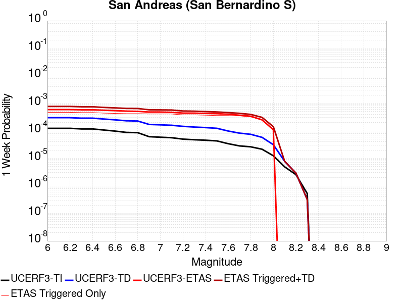 |  |  |  |

| Magnitude | 1 wk TI Prob | 1 wk TD Prob | 1 wk ETAS Prob | 1 wk ETAS/TD Gain | 1 wk ETAS Triggered+TD | 1 wk ETAS Triggered Only | 1 mo TI Prob | 1 mo TD Prob | 1 mo ETAS Prob | 1 mo ETAS/TD Gain | 1 mo ETAS Triggered+TD | 1 mo ETAS Triggered Only | 1 yr TI Prob | 1 yr TD Prob | 1 yr ETAS Prob | 1 yr ETAS/TD Gain | 1 yr ETAS Triggered+TD | 1 yr ETAS Triggered Only | 10 yr TI Prob | 10 yr TD Prob | 10 yr ETAS Prob | 10 yr ETAS/TD Gain | 10 yr ETAS Triggered+TD | 10 yr ETAS Triggered Only |
|-----|-----|-----|-----|-----|-----|-----|-----|-----|-----|-----|-----|-----|-----|-----|-----|-----|-----|-----|-----|-----|-----|-----|-----|-----|
| 6.0 | 1.2336002E-4 | 3.0005194E-4 | 5.9E-4 | 1.9663262 | 7.699109E-4 | 4.7E-4 | 5.2857865E-4 | 0.0012853292 | 0.00116 | 0.9024925 | 0.0018745709 | 5.9E-4 | 0.006416472 | 0.015541554 | 0.00845 | 0.5437037 | 0.016388189 | 8.6E-4 | 0.06234337 | 0.14294699 | 0.07997 | 0.5594381 | 0.14393261 | 0.00115 |
| 6.1 | 1.2336002E-4 | 3.0005194E-4 | 5.9E-4 | 1.9663262 | 7.699109E-4 | 4.7E-4 | 5.2857865E-4 | 0.0012853292 | 0.00116 | 0.9024925 | 0.0018745709 | 5.9E-4 | 0.006416472 | 0.015541554 | 0.00845 | 0.5437037 | 0.016388189 | 8.6E-4 | 0.06234337 | 0.14294699 | 0.07997 | 0.5594381 | 0.14393261 | 0.00115 |
| 6.2 | 1.2336002E-4 | 3.0005194E-4 | 5.9E-4 | 1.9663262 | 7.699109E-4 | 4.7E-4 | 5.2857865E-4 | 0.0012853292 | 0.00116 | 0.9024925 | 0.0018745709 | 5.9E-4 | 0.006416472 | 0.015541554 | 0.00845 | 0.5437037 | 0.016388189 | 8.6E-4 | 0.06234337 | 0.14294699 | 0.07997 | 0.5594381 | 0.14393261 | 0.00115 |
| 6.3 | 1.1712257E-4 | 2.8793467E-4 | 5.8E-4 | 2.014346 | 7.478022E-4 | 4.6E-4 | 5.018573E-4 | 0.0012334478 | 0.00113 | 0.9161312 | 0.0018027447 | 5.7E-4 | 0.006093008 | 0.014918666 | 0.00807 | 0.5409331 | 0.015746133 | 8.4E-4 | 0.059286322 | 0.13765779 | 0.07698 | 0.55921286 | 0.13864085 | 0.00114 |
| 6.4 | 1.1712257E-4 | 2.8793467E-4 | 5.8E-4 | 2.014346 | 7.478022E-4 | 4.6E-4 | 5.018573E-4 | 0.0012334478 | 0.00113 | 0.9161312 | 0.0018027447 | 5.7E-4 | 0.006093008 | 0.014918666 | 0.00807 | 0.5409331 | 0.015746133 | 8.4E-4 | 0.059286322 | 0.13765779 | 0.07698 | 0.55921286 | 0.13864085 | 0.00114 |
| 6.5 | 1.0689076E-4 | 2.6806415E-4 | 5.6E-4 | 2.0890522 | 7.079462E-4 | 4.4E-4 | 4.5802278E-4 | 0.0011483653 | 0.00108 | 0.94046724 | 0.0016977338 | 5.5E-4 | 0.0055621783 | 0.013896335 | 0.00753 | 0.54186946 | 0.014695079 | 8.1E-4 | 0.05425003 | 0.1288989 | 0.07195 | 0.5581894 | 0.12986583 | 0.00111 |
| 6.6 | 9.7648895E-5 | 2.505129E-4 | 5.4E-4 | 2.1555774 | 6.804052E-4 | 4.3E-4 | 4.1842813E-4 | 0.0010732086 | 0.00103 | 0.95973885 | 0.0016026398 | 5.3E-4 | 0.005082469 | 0.012992399 | 0.0071 | 0.5464734 | 0.013772135 | 7.9E-4 | 0.049677886 | 0.121077746 | 0.06758 | 0.55815375 | 0.12203577 | 0.00109 |
| 6.7 | 8.757013E-5 | 2.3122175E-4 | 5.2E-4 | 2.2489233 | 6.5112463E-4 | 4.2E-4 | 3.7524657E-4 | 9.905964E-4 | 9.9E-4 | 0.999398 | 0.0015100812 | 5.2E-4 | 0.00455906 | 0.011997902 | 0.00672 | 0.56009793 | 0.012758664 | 7.7E-4 | 0.04466656 | 0.112373024 | 0.06293 | 0.56000984 | 0.11329616 | 0.00104 |
| 6.8 | 8.562978E-5 | 2.2682057E-4 | 5.1E-4 | 2.2484734 | 6.467253E-4 | 4.2E-4 | 3.6693315E-4 | 9.7174826E-4 | 9.7E-4 | 0.99820095 | 0.0014812526 | 5.1E-4 | 0.004458263 | 0.011770921 | 0.00662 | 0.5624029 | 0.012521976 | 7.6E-4 | 0.043698758 | 0.11037863 | 0.06193 | 0.5610688 | 0.11129494 | 0.00103 |
| 6.9 | 6.124075E-5 | 1.7066885E-4 | 4.8E-4 | 2.812464 | 5.805989E-4 | 4.1E-4 | 2.6243398E-4 | 7.312337E-4 | 8.7E-4 | 1.1897701 | 0.001230868 | 5.0E-4 | 0.0031904527 | 0.008866636 | 0.00529 | 0.5966186 | 0.009570341 | 7.1E-4 | 0.031450346 | 0.08420262 | 0.04691 | 0.5571086 | 0.085081786 | 9.6E-4 |
| 7.0 | 5.8598747E-5 | 1.6495936E-4 | 4.8E-4 | 2.9098077 | 5.7489175E-4 | 4.1E-4 | 2.5111332E-4 | 7.067779E-4 | 8.6E-4 | 1.2167896 | 0.0012064246 | 5.0E-4 | 0.0030530186 | 0.008571265 | 0.00506 | 0.59034455 | 0.009275179 | 7.1E-4 | 0.03011414 | 0.08151562 | 0.04526 | 0.55523103 | 0.08239736 | 9.6E-4 |
| 7.1 | 5.613814E-5 | 1.5914452E-4 | 4.7E-4 | 2.9532905 | 5.6907925E-4 | 4.1E-4 | 2.4056983E-4 | 6.818704E-4 | 8.3E-4 | 1.2172401 | 0.0011815295 | 5.0E-4 | 0.0029250039 | 0.008270353 | 0.0049 | 0.59247774 | 0.008974481 | 7.1E-4 | 0.028868021 | 0.07881268 | 0.04367 | 0.5540986 | 0.07968781 | 9.5E-4 |
| 7.2 | 4.991222E-5 | 1.4520933E-4 | 4.4E-4 | 3.0301085 | 5.251542E-4 | 3.8E-4 | 2.1389198E-4 | 6.221777E-4 | 8.0E-4 | 1.2858064 | 0.0010918853 | 4.7E-4 | 0.002601025 | 0.0075488063 | 0.00448 | 0.59347135 | 0.008223673 | 6.8E-4 | 0.025707912 | 0.07226191 | 0.04005 | 0.5542339 | 0.07310615 | 9.1E-4 |
| 7.3 | 4.7410045E-5 | 1.371513E-4 | 4.4E-4 | 3.2081356 | 5.1709916E-4 | 3.8E-4 | 2.0317009E-4 | 5.8765925E-4 | 7.6E-4 | 1.2932665 | 0.0010473889 | 4.6E-4 | 0.0024707897 | 0.0071313656 | 0.00421 | 0.5903498 | 0.0077668014 | 6.4E-4 | 0.024434982 | 0.068541944 | 0.03763 | 0.5490069 | 0.069352314 | 8.7E-4 |
| 7.4 | 4.5556746E-5 | 1.3123035E-4 | 4.3E-4 | 3.2766812 | 5.011818E-4 | 3.7E-4 | 1.952286E-4 | 5.6229485E-4 | 7.3E-4 | 1.2982513 | 0.0010120418 | 4.5E-4 | 0.002374317 | 0.0068245293 | 0.00396 | 0.5802598 | 0.0074402983 | 6.2E-4 | 0.023491086 | 0.06579143 | 0.03586 | 0.5450558 | 0.0665855 | 8.5E-4 |
| 7.5 | 4.3084514E-5 | 1.2358342E-4 | 4.2E-4 | 3.398514 | 4.8353893E-4 | 3.6E-4 | 1.8463485E-4 | 5.2953605E-4 | 7.1E-4 | 1.3407964 | 9.69303E-4 | 4.4E-4 | 0.0022456115 | 0.0064281146 | 0.00373 | 0.58026344 | 0.0070341933 | 6.1E-4 | 0.022230545 | 0.062190283 | 0.03354 | 0.53931254 | 0.062978044 | 8.4E-4 |
| 7.6 | 3.408608E-5 | 9.836477E-5 | 4.0E-4 | 4.066497 | 4.5832936E-4 | 3.6E-4 | 1.4607502E-4 | 4.214953E-4 | 6.8E-4 | 1.6133039 | 8.613098E-4 | 4.4E-4 | 0.0017770125 | 0.005119656 | 0.00318 | 0.6211355 | 0.005726533 | 6.1E-4 | 0.017628696 | 0.05002244 | 0.02699 | 0.5395579 | 0.050820418 | 8.4E-4 |
| 7.7 | 2.8315713E-5 | 8.2495724E-5 | 3.7E-4 | 4.4850807 | 4.3246686E-4 | 3.5E-4 | 1.2134742E-4 | 3.5350522E-4 | 6.3E-4 | 1.7821518 | 7.833532E-4 | 4.3E-4 | 0.0014764034 | 0.004295442 | 0.00282 | 0.65650994 | 0.0048928643 | 6.0E-4 | 0.01466633 | 0.042272415 | 0.02313 | 0.54716533 | 0.04305775 | 8.2E-4 |
| 7.8 | 2.6222975E-5 | 7.463898E-5 | 3.4E-4 | 4.5552607 | 3.9461508E-4 | 3.2E-4 | 1.1237934E-4 | 3.1984213E-4 | 5.8E-4 | 1.8133945 | 7.097174E-4 | 3.9E-4 | 0.0013673597 | 0.003887131 | 0.00265 | 0.6817367 | 0.0044449545 | 5.6E-4 | 0.013589768 | 0.038437475 | 0.02093 | 0.5445207 | 0.039177876 | 7.7E-4 |
| 7.9 | 2.1469694E-5 | 5.7884805E-5 | 2.5E-4 | 4.3189225 | 3.0787033E-4 | 2.5E-4 | 9.200973E-5 | 2.4805416E-4 | 4.1E-4 | 1.6528648 | 5.379822E-4 | 2.9E-4 | 0.0011196428 | 0.00301588 | 0.00198 | 0.6565248 | 0.0034445832 | 4.3E-4 | 0.011140184 | 0.030153265 | 0.01644 | 0.5452146 | 0.030764269 | 6.3E-4 |
| 8.0 | 1.2420249E-5 | 3.1321662E-5 | 1.1E-4 | 3.5119462 | 1.4131822E-4 | 1.1E-4 | 5.322855E-5 | 1.342288E-4 | 2.0E-4 | 1.4899932 | 2.6421135E-4 | 1.3E-4 | 6.478649E-4 | 0.0016330116 | 0.00101 | 0.6184892 | 0.001832685 | 2.0E-4 | 0.0064597935 | 0.01652369 | 0.00844 | 0.51078176 | 0.016759725 | 2.4E-4 |
| 8.1 | 4.9197724E-6 | 7.822525E-6 | 0.0 | 0.0 | 7.822525E-6 | 0.0 | 2.1084568E-5 | 3.3524673E-5 | 2.0E-5 | 0.5965755 | 4.352434E-5 | 1.0E-5 | 2.566744E-4 | 4.080866E-4 | 1.6E-4 | 0.39207363 | 4.1808252E-4 | 1.0E-5 | 0.002563781 | 0.004384557 | 0.00234 | 0.53369135 | 0.004394513 | 1.0E-5 |
| 8.2 | 2.5634774E-6 | 2.9065757E-6 | 0.0 | 0.0 | 2.9065757E-6 | 0.0 | 1.0986286E-5 | 1.2456694E-5 | 1.0E-5 | 0.8027812 | 2.245657E-5 | 1.0E-5 | 1.3374983E-4 | 1.5164974E-4 | 6.0E-5 | 0.39564854 | 1.6164822E-4 | 1.0E-5 | 0.0013366934 | 0.001704941 | 9.2E-4 | 0.5396081 | 0.001714924 | 1.0E-5 |
| 8.3 | 5.2850464E-7 | 3.2080476E-7 | 0.0 | 0.0 | 3.2080476E-7 | 0.0 | 2.2650179E-6 | 1.3748769E-6 | 0.0 | 0.0 | 1.3748769E-6 | 0.0 | 2.7576245E-5 | 1.673901E-5 | 1.0E-5 | 0.5974069 | 1.673901E-5 | 0.0 | 2.7572823E-4 | 1.986671E-4 | 9.0E-5 | 0.45301914 | 1.986671E-4 | 0.0 |

## Coyote Lake
*[(top)](#table-of-contents)*

| 1 Week | 1 Month | 1 Year | 10 Year |
|-----|-----|-----|-----|
|  |  |  |  |

| Magnitude | 1 wk TI Prob | 1 wk TD Prob | 1 wk ETAS Prob | 1 wk ETAS/TD Gain | 1 wk ETAS Triggered+TD | 1 wk ETAS Triggered Only | 1 mo TI Prob | 1 mo TD Prob | 1 mo ETAS Prob | 1 mo ETAS/TD Gain | 1 mo ETAS Triggered+TD | 1 mo ETAS Triggered Only | 1 yr TI Prob | 1 yr TD Prob | 1 yr ETAS Prob | 1 yr ETAS/TD Gain | 1 yr ETAS Triggered+TD | 1 yr ETAS Triggered Only | 10 yr TI Prob | 10 yr TD Prob | 10 yr ETAS Prob | 10 yr ETAS/TD Gain | 10 yr ETAS Triggered+TD | 10 yr ETAS Triggered Only |
|-----|-----|-----|-----|-----|-----|-----|-----|-----|-----|-----|-----|-----|-----|-----|-----|-----|-----|-----|-----|-----|-----|-----|-----|-----|
| 6.0 | 1.980352E-5 | 2.1706745E-5 | 2.4E-4 | 11.056471 | 2.4170197E-4 | 2.2E-4 | 8.486947E-5 | 9.302599E-5 | 3.5E-4 | 3.7623892 | 3.9299807E-4 | 3.0E-4 | 0.0010327959 | 0.0011320751 | 0.00125 | 1.1041671 | 0.0017214072 | 5.9E-4 | 0.010280091 | 0.011270258 | 0.00817 | 0.7249169 | 0.012268875 | 0.00101 |
| 6.1 | 1.980352E-5 | 2.1706745E-5 | 2.4E-4 | 11.056471 | 2.4170197E-4 | 2.2E-4 | 8.486947E-5 | 9.302599E-5 | 3.5E-4 | 3.7623892 | 3.9299807E-4 | 3.0E-4 | 0.0010327959 | 0.0011320751 | 0.00125 | 1.1041671 | 0.0017214072 | 5.9E-4 | 0.010280091 | 0.011270258 | 0.00817 | 0.7249169 | 0.012268875 | 0.00101 |
| 6.2 | 1.980352E-5 | 2.1706745E-5 | 2.4E-4 | 11.056471 | 2.4170197E-4 | 2.2E-4 | 8.486947E-5 | 9.302599E-5 | 3.5E-4 | 3.7623892 | 3.9299807E-4 | 3.0E-4 | 0.0010327959 | 0.0011320751 | 0.00125 | 1.1041671 | 0.0017214072 | 5.9E-4 | 0.010280091 | 0.011270258 | 0.00817 | 0.7249169 | 0.012268875 | 0.00101 |
| 6.3 | 1.5344787E-5 | 1.682067E-5 | 1.9E-4 | 11.295627 | 1.9681764E-4 | 1.8E-4 | 6.576172E-5 | 7.2086936E-5 | 2.6E-4 | 3.6067562 | 2.9207108E-4 | 2.2E-4 | 8.003548E-4 | 8.773662E-4 | 9.5E-4 | 1.0827861 | 0.0012969978 | 4.2E-4 | 0.007974784 | 0.00874507 | 0.00626 | 0.71583194 | 0.009508336 | 7.7E-4 |
| 6.4 | 1.5344787E-5 | 1.682067E-5 | 1.9E-4 | 11.295627 | 1.9681764E-4 | 1.8E-4 | 6.576172E-5 | 7.2086936E-5 | 2.6E-4 | 3.6067562 | 2.9207108E-4 | 2.2E-4 | 8.003548E-4 | 8.773662E-4 | 9.5E-4 | 1.0827861 | 0.0012969978 | 4.2E-4 | 0.007974784 | 0.00874507 | 0.00626 | 0.71583194 | 0.009508336 | 7.7E-4 |
| 6.5 | 1.4189697E-5 | 1.5557987E-5 | 1.8E-4 | 11.56962 | 1.8555534E-4 | 1.7E-4 | 6.081157E-5 | 6.6675726E-5 | 2.4E-4 | 3.5995111 | 2.666624E-4 | 2.0E-4 | 7.401293E-4 | 8.115349E-4 | 8.9E-4 | 1.0966873 | 0.0011912265 | 3.8E-4 | 0.0073766913 | 0.008091656 | 0.0058 | 0.71678776 | 0.008776072 | 6.9E-4 |
| 6.6 | 1.3469301E-5 | 1.4771577E-5 | 1.7E-4 | 11.508588 | 1.8476907E-4 | 1.7E-4 | 5.7724297E-5 | 6.330556E-5 | 2.2E-4 | 3.475208 | 2.632929E-4 | 2.0E-4 | 7.025667E-4 | 7.7053264E-4 | 8.3E-4 | 1.0771769 | 0.0011302553 | 3.6E-4 | 0.0070034964 | 0.0076845144 | 0.00552 | 0.71832776 | 0.008329519 | 6.5E-4 |
| 6.7 | 1.3027966E-5 | 1.4281745E-5 | 1.7E-4 | 11.903307 | 1.8427931E-4 | 1.7E-4 | 5.5832945E-5 | 6.120638E-5 | 2.2E-4 | 3.5943966 | 2.6119413E-4 | 2.0E-4 | 6.7955407E-4 | 7.4499263E-4 | 8.0E-4 | 1.0738361 | 0.0011047245 | 3.6E-4 | 0.006774798 | 0.0074308286 | 0.00533 | 0.71728206 | 0.008066073 | 6.4E-4 |
| 6.8 | 5.695434E-6 | 6.2244176E-6 | 4.0E-5 | 6.426304 | 4.622417E-5 | 4.0E-5 | 2.4408775E-5 | 2.6675973E-5 | 5.0E-5 | 1.8743459 | 7.667464E-5 | 5.0E-5 | 2.971363E-4 | 3.2476155E-4 | 3.0E-4 | 0.9237547 | 4.3472584E-4 | 1.1E-4 | 0.0029673933 | 0.0032458105 | 0.00212 | 0.65314966 | 0.0034451613 | 2.0E-4 |
| 6.9 | 4.385688E-6 | 4.7930553E-6 | 1.0E-5 | 2.0863519 | 1.4793008E-5 | 1.0E-5 | 1.879567E-5 | 2.0541665E-5 | 2.0E-5 | 0.97363085 | 4.0541254E-5 | 2.0E-5 | 2.2881327E-4 | 2.5009477E-4 | 2.5E-4 | 0.99962103 | 3.2007726E-4 | 7.0E-5 | 0.002285778 | 0.0025009478 | 0.00176 | 0.7037332 | 0.0026206477 | 1.2E-4 |

## Helendale-So Lockhart
*[(top)](#table-of-contents)*

| 1 Week | 1 Month | 1 Year | 10 Year |
|-----|-----|-----|-----|
|  |  |  |  |

| Magnitude | 1 wk TI Prob | 1 wk TD Prob | 1 wk ETAS Prob | 1 wk ETAS/TD Gain | 1 wk ETAS Triggered+TD | 1 wk ETAS Triggered Only | 1 mo TI Prob | 1 mo TD Prob | 1 mo ETAS Prob | 1 mo ETAS/TD Gain | 1 mo ETAS Triggered+TD | 1 mo ETAS Triggered Only | 1 yr TI Prob | 1 yr TD Prob | 1 yr ETAS Prob | 1 yr ETAS/TD Gain | 1 yr ETAS Triggered+TD | 1 yr ETAS Triggered Only | 10 yr TI Prob | 10 yr TD Prob | 10 yr ETAS Prob | 10 yr ETAS/TD Gain | 10 yr ETAS Triggered+TD | 10 yr ETAS Triggered Only |
|-----|-----|-----|-----|-----|-----|-----|-----|-----|-----|-----|-----|-----|-----|-----|-----|-----|-----|-----|-----|-----|-----|-----|-----|-----|
| 6.0 | 1.7296055E-5 | 1.8103729E-5 | 2.1E-4 | 11.59982 | 2.2809993E-4 | 2.1E-4 | 7.412385E-5 | 7.7585224E-5 | 3.5E-4 | 4.5111685 | 3.975604E-4 | 3.2E-4 | 9.0208417E-4 | 9.4421144E-4 | 0.00101 | 1.0696757 | 0.0015236638 | 5.8E-4 | 0.008984311 | 0.009404116 | 0.00638 | 0.6784263 | 0.010315465 | 9.2E-4 |
| 6.1 | 1.7296055E-5 | 1.8103729E-5 | 2.1E-4 | 11.59982 | 2.2809993E-4 | 2.1E-4 | 7.412385E-5 | 7.7585224E-5 | 3.5E-4 | 4.5111685 | 3.975604E-4 | 3.2E-4 | 9.0208417E-4 | 9.4421144E-4 | 0.00101 | 1.0696757 | 0.0015236638 | 5.8E-4 | 0.008984311 | 0.009404116 | 0.00638 | 0.6784263 | 0.010315465 | 9.2E-4 |
| 6.2 | 1.7296055E-5 | 1.8103729E-5 | 2.1E-4 | 11.59982 | 2.2809993E-4 | 2.1E-4 | 7.412385E-5 | 7.7585224E-5 | 3.5E-4 | 4.5111685 | 3.975604E-4 | 3.2E-4 | 9.0208417E-4 | 9.4421144E-4 | 0.00101 | 1.0696757 | 0.0015236638 | 5.8E-4 | 0.008984311 | 0.009404116 | 0.00638 | 0.6784263 | 0.010315465 | 9.2E-4 |
| 6.3 | 1.0669118E-5 | 1.1135425E-5 | 1.3E-4 | 11.674454 | 1.4113398E-4 | 1.3E-4 | 4.5723988E-5 | 4.772239E-5 | 2.0E-4 | 4.190905 | 2.1771427E-4 | 1.7E-4 | 5.5654737E-4 | 5.80868E-4 | 6.0E-4 | 1.0329369 | 9.106763E-4 | 3.3E-4 | 0.0055515557 | 0.0057937936 | 0.00369 | 0.63688844 | 0.006290897 | 5.0E-4 |
| 6.4 | 1.0669118E-5 | 1.1135425E-5 | 1.3E-4 | 11.674454 | 1.4113398E-4 | 1.3E-4 | 4.5723988E-5 | 4.772239E-5 | 2.0E-4 | 4.190905 | 2.1771427E-4 | 1.7E-4 | 5.5654737E-4 | 5.80868E-4 | 6.0E-4 | 1.0329369 | 9.106763E-4 | 3.3E-4 | 0.0055515557 | 0.0057937936 | 0.00369 | 0.63688844 | 0.006290897 | 5.0E-4 |
| 6.5 | 8.790038E-6 | 9.170197E-6 | 1.0E-4 | 10.904891 | 1.0916928E-4 | 1.0E-4 | 3.767105E-5 | 3.930026E-5 | 1.6E-4 | 4.07122 | 1.6929515E-4 | 1.3E-4 | 4.585485E-4 | 4.7837716E-4 | 5.0E-4 | 1.0452003 | 7.3825277E-4 | 2.6E-4 | 0.0045760344 | 0.004773638 | 0.00308 | 0.64521015 | 0.0051916335 | 4.2E-4 |
| 6.6 | 7.396949E-6 | 7.715537E-6 | 9.0E-5 | 11.664775 | 9.7714845E-5 | 9.0E-5 | 3.1700827E-5 | 3.3066175E-5 | 1.5E-4 | 4.536358 | 1.5306221E-4 | 1.2E-4 | 3.858892E-4 | 4.025073E-4 | 4.5E-4 | 1.1179922 | 6.324147E-4 | 2.3E-4 | 0.003852198 | 0.00401789 | 0.00266 | 0.66203904 | 0.004396363 | 3.8E-4 |
| 6.7 | 6.4600285E-6 | 6.738031E-6 | 9.0E-5 | 13.3570175 | 9.673742E-5 | 9.0E-5 | 2.7685543E-5 | 2.887696E-5 | 1.5E-4 | 5.1944523 | 1.488735E-4 | 1.2E-4 | 3.3701936E-4 | 3.5152107E-4 | 4.1E-4 | 1.1663597 | 5.714437E-4 | 2.2E-4 | 0.0033650869 | 0.003509732 | 0.00234 | 0.6667176 | 0.0038585037 | 3.5E-4 |
| 6.8 | 5.600104E-6 | 5.836009E-6 | 6.0E-5 | 10.280998 | 6.583566E-5 | 6.0E-5 | 2.4000226E-5 | 2.5011232E-5 | 1.1E-4 | 4.398024 | 1.1500898E-4 | 9.0E-5 | 2.9216358E-4 | 3.044698E-4 | 3.4E-4 | 1.1166953 | 4.8441498E-4 | 1.8E-4 | 0.0029177975 | 0.003040588 | 0.00203 | 0.667634 | 0.0032997974 | 2.6E-4 |
| 6.9 | 4.839122E-6 | 5.0395092E-6 | 5.0E-5 | 9.921601 | 5.5039258E-5 | 5.0E-5 | 2.0738931E-5 | 2.159772E-5 | 8.0E-5 | 3.7040946 | 1.0159599E-4 | 8.0E-5 | 2.5246723E-4 | 2.6292098E-4 | 3.0E-4 | 1.1410272 | 4.328763E-4 | 1.7E-4 | 0.002521806 | 0.002626147 | 0.00175 | 0.6663755 | 0.0028655166 | 2.4E-4 |
| 7.0 | 3.6937633E-6 | 3.845208E-6 | 1.0E-5 | 2.6006396 | 1.384517E-5 | 1.0E-5 | 1.5830317E-5 | 1.647936E-5 | 4.0E-5 | 2.4272788 | 5.64787E-5 | 4.0E-5 | 1.9271708E-4 | 2.0061806E-4 | 2.2E-4 | 1.0966111 | 3.0059798E-4 | 1.0E-4 | 0.0019255003 | 0.002004401 | 0.00125 | 0.6236277 | 0.0021441204 | 1.4E-4 |
| 7.1 | 2.7858857E-6 | 2.8978538E-6 | 0.0 | 0.0 | 2.8978538E-6 | 0.0 | 1.1939455E-5 | 1.2419316E-5 | 3.0E-5 | 2.415592 | 4.2418942E-5 | 3.0E-5 | 1.4535317E-4 | 1.511949E-4 | 1.4E-4 | 0.9259572 | 2.4118129E-4 | 9.0E-5 | 0.0014525814 | 0.0015109418 | 8.4E-4 | 0.5559447 | 0.0016407453 | 1.3E-4 |
| 7.2 | 2.1672065E-6 | 2.2540128E-6 | 0.0 | 0.0 | 2.2540128E-6 | 0.0 | 9.2879945E-6 | 9.66002E-6 | 0.0 | 0.0 | 9.66002E-6 | 0.0 | 1.1307546E-4 | 1.1760458E-4 | 1.1E-4 | 0.9353377 | 1.7759753E-4 | 6.0E-5 | 0.0011301794 | 0.0011754417 | 5.9E-4 | 0.501939 | 0.0012553476 | 8.0E-5 |
| 7.3 | 1.4823496E-6 | 1.5422102E-6 | 0.0 | 0.0 | 1.5422102E-6 | 0.0 | 6.3529114E-6 | 6.6094562E-6 | 0.0 | 0.0 | 6.6094562E-6 | 0.0 | 7.734395E-5 | 8.046731E-5 | 8.0E-5 | 0.9941925 | 1.4046249E-4 | 6.0E-5 | 7.731704E-4 | 8.0439687E-4 | 4.4E-4 | 0.5469937 | 8.843325E-4 | 8.0E-5 |
| 7.4 | 4.2321457E-7 | 4.4108765E-7 | 0.0 | 0.0 | 4.4108765E-7 | 0.0 | 1.8137755E-6 | 1.8903745E-6 | 0.0 | 0.0 | 1.8903745E-6 | 0.0 | 2.2082493E-5 | 2.3015113E-5 | 2.0E-5 | 0.8689942 | 3.3014883E-5 | 1.0E-5 | 2.2080299E-4 | 2.3013182E-4 | 1.0E-4 | 0.43453357 | 2.4012952E-4 | 1.0E-5 |
| 7.5 | 5.6942316E-8 | 5.9415648E-8 | 0.0 | 0.0 | 5.9415648E-8 | 0.0 | 2.440385E-7 | 2.5463845E-7 | 0.0 | 0.0 | 2.5463845E-7 | 0.0 | 2.9711643E-6 | 3.1002196E-6 | 0.0 | 0.0 | 3.1002196E-6 | 0.0 | 2.9711247E-5 | 3.1001844E-5 | 0.0 | 0.0 | 3.1001844E-5 | 0.0 |

## San Andreas (Big Bend)
*[(top)](#table-of-contents)*

| 1 Week | 1 Month | 1 Year | 10 Year |
|-----|-----|-----|-----|
|  |  |  |  |

| Magnitude | 1 wk TI Prob | 1 wk TD Prob | 1 wk ETAS Prob | 1 wk ETAS/TD Gain | 1 wk ETAS Triggered+TD | 1 wk ETAS Triggered Only | 1 mo TI Prob | 1 mo TD Prob | 1 mo ETAS Prob | 1 mo ETAS/TD Gain | 1 mo ETAS Triggered+TD | 1 mo ETAS Triggered Only | 1 yr TI Prob | 1 yr TD Prob | 1 yr ETAS Prob | 1 yr ETAS/TD Gain | 1 yr ETAS Triggered+TD | 1 yr ETAS Triggered Only | 10 yr TI Prob | 10 yr TD Prob | 10 yr ETAS Prob | 10 yr ETAS/TD Gain | 10 yr ETAS Triggered+TD | 10 yr ETAS Triggered Only |
|-----|-----|-----|-----|-----|-----|-----|-----|-----|-----|-----|-----|-----|-----|-----|-----|-----|-----|-----|-----|-----|-----|-----|-----|-----|
| 6.0 | 1.0179969E-4 | 2.0073925E-4 | 2.8E-4 | 1.3948443 | 4.106971E-4 | 2.1E-4 | 4.362114E-4 | 8.6002843E-4 | 8.0E-4 | 0.93020177 | 0.0012297103 | 3.7E-4 | 0.0052979486 | 0.010420859 | 0.00604 | 0.5796067 | 0.011024502 | 6.1E-4 | 0.051734097 | 0.101455905 | 0.05607 | 0.55265385 | 0.102192715 | 8.2E-4 |
| 6.1 | 1.0179969E-4 | 2.0073925E-4 | 2.8E-4 | 1.3948443 | 4.106971E-4 | 2.1E-4 | 4.362114E-4 | 8.6002843E-4 | 8.0E-4 | 0.93020177 | 0.0012297103 | 3.7E-4 | 0.0052979486 | 0.010420859 | 0.00604 | 0.5796067 | 0.011024502 | 6.1E-4 | 0.051734097 | 0.101455905 | 0.05607 | 0.55265385 | 0.102192715 | 8.2E-4 |
| 6.2 | 1.0179969E-4 | 2.0073925E-4 | 2.8E-4 | 1.3948443 | 4.106971E-4 | 2.1E-4 | 4.362114E-4 | 8.6002843E-4 | 8.0E-4 | 0.93020177 | 0.0012297103 | 3.7E-4 | 0.0052979486 | 0.010420859 | 0.00604 | 0.5796067 | 0.011024502 | 6.1E-4 | 0.051734097 | 0.101455905 | 0.05607 | 0.55265385 | 0.102192715 | 8.2E-4 |
| 6.3 | 1.0179969E-4 | 2.0073925E-4 | 2.8E-4 | 1.3948443 | 4.106971E-4 | 2.1E-4 | 4.362114E-4 | 8.6002843E-4 | 8.0E-4 | 0.93020177 | 0.0012297103 | 3.7E-4 | 0.0052979486 | 0.010420859 | 0.00604 | 0.5796067 | 0.011024502 | 6.1E-4 | 0.051734097 | 0.101455905 | 0.05607 | 0.55265385 | 0.102192715 | 8.2E-4 |
| 6.4 | 9.1639464E-5 | 1.8430917E-4 | 1.9E-4 | 1.0308765 | 3.0428707E-4 | 1.2E-4 | 3.9268145E-4 | 7.896575E-4 | 6.3E-4 | 0.7978142 | 0.001029468 | 2.4E-4 | 0.0047704205 | 0.009571818 | 0.00528 | 0.55161935 | 0.009938276 | 3.7E-4 | 0.046693064 | 0.09378695 | 0.0511 | 0.54485196 | 0.09422193 | 4.8E-4 |
| 6.5 | 9.1639464E-5 | 1.8430917E-4 | 1.9E-4 | 1.0308765 | 3.0428707E-4 | 1.2E-4 | 3.9268145E-4 | 7.896575E-4 | 6.3E-4 | 0.7978142 | 0.001029468 | 2.4E-4 | 0.0047704205 | 0.009571818 | 0.00528 | 0.55161935 | 0.009938276 | 3.7E-4 | 0.046693064 | 0.09378695 | 0.0511 | 0.54485196 | 0.09422193 | 4.8E-4 |
| 6.6 | 9.042622E-5 | 1.8238011E-4 | 1.8E-4 | 0.9869497 | 2.9236006E-4 | 1.1E-4 | 3.8748336E-4 | 7.813951E-4 | 6.1E-4 | 0.78065497 | 0.0010112154 | 2.3E-4 | 0.0047074095 | 0.0094721 | 0.00522 | 0.55109215 | 0.00982869 | 3.6E-4 | 0.046089325 | 0.09287721 | 0.05053 | 0.54405165 | 0.09330356 | 4.7E-4 |
| 6.7 | 8.9836685E-5 | 1.8152347E-4 | 1.8E-4 | 0.9916073 | 2.915035E-4 | 1.1E-4 | 3.8495753E-4 | 7.7772595E-4 | 6.1E-4 | 0.78433794 | 0.0010075471 | 2.3E-4 | 0.00467679 | 0.009427815 | 0.00521 | 0.5526201 | 0.009784421 | 3.6E-4 | 0.045795817 | 0.09247148 | 0.05034 | 0.54438406 | 0.09289802 | 4.7E-4 |
| 6.8 | 8.9471854E-5 | 1.8099119E-4 | 1.8E-4 | 0.9945235 | 2.9097128E-4 | 1.1E-4 | 3.8339442E-4 | 7.754462E-4 | 6.1E-4 | 0.7866439 | 0.0010052678 | 2.3E-4 | 0.004657841 | 0.009400298 | 0.00519 | 0.5521102 | 0.009756913 | 3.6E-4 | 0.04561414 | 0.0922192 | 0.05015 | 0.543813 | 0.09264586 | 4.7E-4 |
| 6.9 | 8.858234E-5 | 1.7981093E-4 | 1.8E-4 | 1.0010515 | 2.8979115E-4 | 1.1E-4 | 3.7958333E-4 | 7.7039085E-4 | 6.1E-4 | 0.79180586 | 0.0010002137 | 2.3E-4 | 0.004611638 | 0.009339278 | 0.00516 | 0.55250525 | 0.0096959155 | 3.6E-4 | 0.04517103 | 0.09165911 | 0.04977 | 0.54299027 | 0.092086025 | 4.7E-4 |
| 7.0 | 8.7433385E-5 | 1.7819891E-4 | 1.6E-4 | 0.8978731 | 2.8817932E-4 | 1.1E-4 | 3.746607E-4 | 7.6348626E-4 | 5.9E-4 | 0.77277094 | 9.933107E-4 | 2.3E-4 | 0.004551957 | 0.009255932 | 0.00508 | 0.54883724 | 0.009592785 | 3.4E-4 | 0.044598386 | 0.09089323 | 0.04945 | 0.5440449 | 0.09130233 | 4.5E-4 |
| 7.1 | 8.684964E-5 | 1.7731842E-4 | 1.6E-4 | 0.90233153 | 2.872989E-4 | 1.1E-4 | 3.7215967E-4 | 7.597149E-4 | 5.7E-4 | 0.7502814 | 9.695554E-4 | 2.1E-4 | 0.0045216335 | 0.009210405 | 0.00505 | 0.54829293 | 0.00951755 | 3.1E-4 | 0.04430731 | 0.09047475 | 0.0492 | 0.54379815 | 0.090847656 | 4.1E-4 |
| 7.2 | 8.606521E-5 | 1.7622454E-4 | 1.6E-4 | 0.90793264 | 2.8620515E-4 | 1.1E-4 | 3.6879873E-4 | 7.550296E-4 | 5.7E-4 | 0.7549373 | 9.64871E-4 | 2.1E-4 | 0.0044808835 | 0.009153842 | 0.00502 | 0.5484036 | 0.009461004 | 3.1E-4 | 0.043916024 | 0.08995518 | 0.04898 | 0.5444934 | 0.0903283 | 4.1E-4 |
| 7.3 | 8.568266E-5 | 1.7564454E-4 | 1.6E-4 | 0.91093063 | 2.8562522E-4 | 1.1E-4 | 3.6715972E-4 | 7.5254537E-4 | 5.7E-4 | 0.7574294 | 9.623873E-4 | 2.1E-4 | 0.0044610105 | 0.00912385 | 0.00502 | 0.5502063 | 0.009431021 | 3.1E-4 | 0.043725148 | 0.08967623 | 0.04887 | 0.54496044 | 0.09004947 | 4.1E-4 |
| 7.4 | 8.5432206E-5 | 1.752704E-4 | 1.6E-4 | 0.91287524 | 2.8525112E-4 | 1.1E-4 | 3.6608664E-4 | 7.509428E-4 | 5.7E-4 | 0.75904584 | 9.607851E-4 | 2.1E-4 | 0.004447999 | 0.009104501 | 0.00501 | 0.55027723 | 0.00941168 | 3.1E-4 | 0.043600157 | 0.08949642 | 0.04881 | 0.54538494 | 0.08986972 | 4.1E-4 |
| 7.5 | 8.4791965E-5 | 1.7396381E-4 | 1.6E-4 | 0.9197315 | 2.8394468E-4 | 1.1E-4 | 3.633435E-4 | 7.4534636E-4 | 5.7E-4 | 0.7647451 | 9.551898E-4 | 2.1E-4 | 0.0044147377 | 0.009036932 | 0.00498 | 0.55107194 | 0.009344131 | 3.1E-4 | 0.043280575 | 0.08887209 | 0.04847 | 0.5453906 | 0.089245655 | 4.1E-4 |
| 7.6 | 8.241105E-5 | 1.6841735E-4 | 1.6E-4 | 0.9500209 | 2.783988E-4 | 1.1E-4 | 3.531424E-4 | 7.2158914E-4 | 5.5E-4 | 0.7622066 | 9.314376E-4 | 2.1E-4 | 0.0042910352 | 0.008750047 | 0.00487 | 0.55656844 | 0.009047422 | 3.0E-4 | 0.042091176 | 0.08625032 | 0.04684 | 0.54307044 | 0.08659755 | 3.8E-4 |
| 7.7 | 7.00432E-5 | 1.4205615E-4 | 1.0E-4 | 0.703947 | 2.120462E-4 | 7.0E-5 | 3.001506E-4 | 6.0867006E-4 | 4.0E-4 | 0.6571705 | 7.385909E-4 | 1.3E-4 | 0.0036482112 | 0.0073854174 | 0.00406 | 0.54973197 | 0.007564088 | 1.8E-4 | 0.035888977 | 0.07352299 | 0.03977 | 0.54091924 | 0.07375461 | 2.5E-4 |
| 7.8 | 6.415362E-5 | 1.2969968E-4 | 8.0E-5 | 0.61680955 | 1.7969319E-4 | 5.0E-5 | 2.749151E-4 | 5.557374E-4 | 3.7E-4 | 0.6657821 | 6.6567626E-4 | 1.1E-4 | 0.0033419547 | 0.0067451415 | 0.00376 | 0.55743825 | 0.0069040623 | 1.6E-4 | 0.03292141 | 0.06725514 | 0.03599 | 0.5351264 | 0.06746034 | 2.2E-4 |
| 7.9 | 4.939911E-5 | 9.341721E-5 | 4.0E-5 | 0.4281866 | 1.2341441E-4 | 3.0E-5 | 2.116933E-4 | 4.0029807E-4 | 2.5E-4 | 0.6245346 | 4.6027405E-4 | 6.0E-5 | 0.0025743195 | 0.004862747 | 0.00268 | 0.5511288 | 0.004932407 | 7.0E-5 | 0.025447013 | 0.048915803 | 0.02582 | 0.5278458 | 0.0490014 | 9.0E-5 |
| 8.0 | 3.344983E-5 | 5.2228E-5 | 1.0E-5 | 0.19146818 | 6.2227475E-5 | 1.0E-5 | 1.4334853E-4 | 2.2381509E-4 | 1.4E-4 | 0.62551636 | 2.6380614E-4 | 4.0E-5 | 0.0017438711 | 0.0027215453 | 0.00143 | 0.52543676 | 0.0027714092 | 5.0E-5 | 0.017302496 | 0.027923161 | 0.01421 | 0.5088965 | 0.027971765 | 5.0E-5 |
| 8.1 | 1.9104898E-5 | 1.9171663E-5 | 0.0 | 0.0 | 1.9171663E-5 | 0.0 | 8.1875565E-5 | 8.2161685E-5 | 5.0E-5 | 0.6085562 | 1.0216004E-4 | 2.0E-5 | 9.963791E-4 | 9.9986E-4 | 4.8E-4 | 0.4800672 | 0.0010298301 | 3.0E-5 | 0.009919235 | 0.010749552 | 0.00544 | 0.5060676 | 0.01077923 | 3.0E-5 |
| 8.2 | 8.643924E-6 | 5.473668E-6 | 0.0 | 0.0 | 5.473668E-6 | 0.0 | 3.704486E-5 | 2.3458366E-5 | 1.0E-5 | 0.42628714 | 3.345813E-5 | 1.0E-5 | 4.5092785E-4 | 2.8556827E-4 | 1.5E-4 | 0.52526844 | 2.955654E-4 | 1.0E-5 | 0.0045001395 | 0.0032481793 | 0.00171 | 0.5264487 | 0.003258147 | 1.0E-5 |
| 8.3 | 1.983087E-6 | 7.6564595E-7 | 0.0 | 0.0 | 7.6564595E-7 | 0.0 | 8.498917E-6 | 3.281336E-6 | 0.0 | 0.0 | 3.281336E-6 | 0.0 | 1.034694E-4 | 3.9949547E-5 | 1.0E-5 | 0.25031573 | 3.9949547E-5 | 0.0 | 0.0010342124 | 4.717979E-4 | 2.0E-4 | 0.42391032 | 4.717979E-4 | 0.0 |

## Death Valley (No)
*[(top)](#table-of-contents)*

| 1 Week | 1 Month | 1 Year | 10 Year |
|-----|-----|-----|-----|
|  |  |  |  |

| Magnitude | 1 wk TI Prob | 1 wk TD Prob | 1 wk ETAS Prob | 1 wk ETAS/TD Gain | 1 wk ETAS Triggered+TD | 1 wk ETAS Triggered Only | 1 mo TI Prob | 1 mo TD Prob | 1 mo ETAS Prob | 1 mo ETAS/TD Gain | 1 mo ETAS Triggered+TD | 1 mo ETAS Triggered Only | 1 yr TI Prob | 1 yr TD Prob | 1 yr ETAS Prob | 1 yr ETAS/TD Gain | 1 yr ETAS Triggered+TD | 1 yr ETAS Triggered Only | 10 yr TI Prob | 10 yr TD Prob | 10 yr ETAS Prob | 10 yr ETAS/TD Gain | 10 yr ETAS Triggered+TD | 10 yr ETAS Triggered Only |
|-----|-----|-----|-----|-----|-----|-----|-----|-----|-----|-----|-----|-----|-----|-----|-----|-----|-----|-----|-----|-----|-----|-----|-----|-----|
| 6.0 | 2.0074807E-5 | 2.2500084E-5 | 2.1E-4 | 9.333299 | 2.3249535E-4 | 2.1E-4 | 8.603206E-5 | 9.642541E-5 | 3.0E-4 | 3.1112132 | 3.5640033E-4 | 2.6E-4 | 0.001046937 | 0.0011733545 | 0.00109 | 0.92896056 | 0.001642803 | 4.7E-4 | 0.010420183 | 0.011672506 | 0.00587 | 0.5028911 | 0.012384103 | 7.2E-4 |
| 6.1 | 2.0074807E-5 | 2.2500084E-5 | 2.1E-4 | 9.333299 | 2.3249535E-4 | 2.1E-4 | 8.603206E-5 | 9.642541E-5 | 3.0E-4 | 3.1112132 | 3.5640033E-4 | 2.6E-4 | 0.001046937 | 0.0011733545 | 0.00109 | 0.92896056 | 0.001642803 | 4.7E-4 | 0.010420183 | 0.011672506 | 0.00587 | 0.5028911 | 0.012384103 | 7.2E-4 |
| 6.2 | 2.0074807E-5 | 2.2500084E-5 | 2.1E-4 | 9.333299 | 2.3249535E-4 | 2.1E-4 | 8.603206E-5 | 9.642541E-5 | 3.0E-4 | 3.1112132 | 3.5640033E-4 | 2.6E-4 | 0.001046937 | 0.0011733545 | 0.00109 | 0.92896056 | 0.001642803 | 4.7E-4 | 0.010420183 | 0.011672506 | 0.00587 | 0.5028911 | 0.012384103 | 7.2E-4 |
| 6.3 | 1.9050609E-5 | 2.1336948E-5 | 2.1E-4 | 9.842083 | 2.3133247E-4 | 2.1E-4 | 8.164292E-5 | 9.1440896E-5 | 3.0E-4 | 3.2808077 | 3.514171E-4 | 2.6E-4 | 9.935491E-4 | 0.001112731 | 0.00105 | 0.94362426 | 0.0015722192 | 4.6E-4 | 0.009891188 | 0.011072419 | 0.00565 | 0.5102769 | 0.011754779 | 6.9E-4 |
| 6.4 | 1.9050609E-5 | 2.1336948E-5 | 2.1E-4 | 9.842083 | 2.3133247E-4 | 2.1E-4 | 8.164292E-5 | 9.1440896E-5 | 3.0E-4 | 3.2808077 | 3.514171E-4 | 2.6E-4 | 9.935491E-4 | 0.001112731 | 0.00105 | 0.94362426 | 0.0015722192 | 4.6E-4 | 0.009891188 | 0.011072419 | 0.00565 | 0.5102769 | 0.011754779 | 6.9E-4 |
| 6.5 | 1.8367004E-5 | 2.0561009E-5 | 2.1E-4 | 10.213507 | 2.3055669E-4 | 2.1E-4 | 7.8713354E-5 | 8.811567E-5 | 2.9E-4 | 3.2911286 | 3.4809276E-4 | 2.6E-4 | 9.5791375E-4 | 0.0010722869 | 0.00101 | 0.9419122 | 0.0015218043 | 4.5E-4 | 0.009537951 | 0.0106719155 | 0.00545 | 0.5106862 | 0.011344658 | 6.8E-4 |
| 6.6 | 1.779439E-5 | 1.9910927E-5 | 2.1E-4 | 10.546972 | 2.2990674E-4 | 2.1E-4 | 7.625944E-5 | 8.53298E-5 | 2.8E-4 | 3.2813861 | 3.3530846E-4 | 2.5E-4 | 9.280632E-4 | 0.0010384015 | 0.001 | 0.96301866 | 0.0014779445 | 4.4E-4 | 0.009241969 | 0.010336253 | 0.00534 | 0.51662827 | 0.01098943 | 6.6E-4 |
| 6.7 | 1.7025437E-5 | 1.9043426E-5 | 2.1E-4 | 11.027428 | 2.2903943E-4 | 2.1E-4 | 7.296412E-5 | 8.161216E-5 | 2.6E-4 | 3.1857996 | 3.3159176E-4 | 2.5E-4 | 8.87976E-4 | 9.931813E-4 | 9.7E-4 | 0.97665954 | 0.0014327443 | 4.4E-4 | 0.008844362 | 0.009888145 | 0.00512 | 0.51779175 | 0.010511916 | 6.3E-4 |
| 6.8 | 1.6545107E-5 | 1.8512545E-5 | 2.1E-4 | 11.343658 | 2.2850865E-4 | 2.1E-4 | 7.090568E-5 | 7.93371E-5 | 2.6E-4 | 3.2771552 | 3.2931726E-4 | 2.5E-4 | 8.629347E-4 | 9.655073E-4 | 9.5E-4 | 0.9839387 | 0.0014050824 | 4.4E-4 | 0.008595915 | 0.009613829 | 0.00495 | 0.51488334 | 0.010227868 | 6.2E-4 |
| 6.9 | 1.615478E-5 | 1.8087594E-5 | 2.1E-4 | 11.6101675 | 2.280838E-4 | 2.1E-4 | 6.9232934E-5 | 7.751599E-5 | 2.5E-4 | 3.225141 | 3.2749661E-4 | 2.5E-4 | 8.4258494E-4 | 9.433546E-4 | 9.2E-4 | 0.975243 | 0.0013829395 | 4.4E-4 | 0.008393973 | 0.009394196 | 0.00484 | 0.51521176 | 0.010008371 | 6.2E-4 |
| 7.0 | 1.5894311E-5 | 1.780555E-5 | 2.1E-4 | 11.794076 | 2.2780181E-4 | 2.1E-4 | 6.81167E-5 | 7.6307304E-5 | 2.5E-4 | 3.2762265 | 3.2628822E-4 | 2.5E-4 | 8.2900526E-4 | 9.286515E-4 | 9.1E-4 | 0.9799155 | 0.0013682429 | 4.4E-4 | 0.008259195 | 0.009248397 | 0.00473 | 0.51144 | 0.009852756 | 6.1E-4 |
| 7.1 | 1.5602263E-5 | 1.7483504E-5 | 2.0E-4 | 11.439355 | 2.1748E-4 | 2.0E-4 | 6.6865134E-5 | 7.492718E-5 | 2.4E-4 | 3.20311 | 3.149092E-4 | 2.4E-4 | 8.137789E-4 | 9.118627E-4 | 8.9E-4 | 0.9760241 | 0.0013414706 | 4.3E-4 | 0.008108052 | 0.009081894 | 0.00463 | 0.50980556 | 0.009676444 | 6.0E-4 |
| 7.2 | 1.5323829E-5 | 1.717063E-5 | 1.9E-4 | 11.065407 | 2.0716737E-4 | 1.9E-4 | 6.56719E-5 | 7.358637E-5 | 2.3E-4 | 3.1255786 | 3.0356945E-4 | 2.3E-4 | 7.99262E-4 | 8.9555193E-4 | 8.7E-4 | 0.971468 | 0.0013151758 | 4.2E-4 | 0.007963934 | 0.008920107 | 0.00451 | 0.5055993 | 0.0095048435 | 5.9E-4 |
| 7.3 | 1.4556212E-5 | 1.6302456E-5 | 1.8E-4 | 11.041282 | 1.9629952E-4 | 1.8E-4 | 6.238227E-5 | 6.9865826E-5 | 2.2E-4 | 3.1488929 | 2.8985046E-4 | 2.2E-4 | 7.592395E-4 | 8.5029035E-4 | 8.5E-4 | 0.9996585 | 0.0012599417 | 4.1E-4 | 0.0075665074 | 0.008471014 | 0.00427 | 0.5040719 | 0.009046101 | 5.8E-4 |
| 7.4 | 1.411725E-5 | 1.580796E-5 | 1.8E-4 | 11.386668 | 1.9580511E-4 | 1.8E-4 | 6.0501097E-5 | 6.7746674E-5 | 2.2E-4 | 3.247392 | 2.8773176E-4 | 2.2E-4 | 7.363519E-4 | 8.245094E-4 | 8.5E-4 | 1.030916 | 0.0012341714 | 4.1E-4 | 0.0073391674 | 0.008215138 | 0.00422 | 0.5136858 | 0.008790374 | 5.8E-4 |
| 7.5 | 1.3503312E-5 | 1.5126289E-5 | 1.8E-4 | 11.899813 | 1.9512356E-4 | 1.8E-4 | 5.7870053E-5 | 6.482538E-5 | 2.2E-4 | 3.3937328 | 2.848111E-4 | 2.2E-4 | 7.043401E-4 | 7.8896893E-4 | 8.3E-4 | 1.0520059 | 0.0011886534 | 4.0E-4 | 0.007021119 | 0.007862304 | 0.00406 | 0.51638806 | 0.008427823 | 5.7E-4 |
| 7.6 | 1.1279839E-5 | 1.2626327E-5 | 1.4E-4 | 11.087944 | 1.5262456E-4 | 1.4E-4 | 4.834127E-5 | 5.4111737E-5 | 1.8E-4 | 3.3264503 | 2.34102E-4 | 1.8E-4 | 5.88396E-4 | 6.5861654E-4 | 6.9E-4 | 1.0476506 | 0.001008386 | 3.5E-4 | 0.005868405 | 0.006567199 | 0.00334 | 0.50858825 | 0.0070837834 | 5.2E-4 |
| 7.7 | 9.189108E-6 | 1.0283358E-5 | 1.2E-4 | 11.669339 | 1.3028212E-4 | 1.2E-4 | 3.93813E-5 | 4.407082E-5 | 1.6E-4 | 3.63052 | 2.0406376E-4 | 1.6E-4 | 4.7936183E-4 | 5.3643517E-4 | 5.7E-4 | 1.0625701 | 8.2627963E-4 | 2.9E-4 | 0.004783291 | 0.005351914 | 0.00276 | 0.5157034 | 0.0057696663 | 4.2E-4 |
| 7.8 | 3.4586725E-7 | 3.6482615E-7 | 0.0 | 0.0 | 3.6482615E-7 | 0.0 | 1.4822873E-6 | 1.5635396E-6 | 1.0E-5 | 6.3957443 | 1.1563524E-5 | 1.0E-5 | 1.80467E-5 | 1.9035933E-5 | 3.0E-5 | 1.5759668 | 4.9035363E-5 | 3.0E-5 | 1.8045233E-4 | 1.9034347E-4 | 7.0E-5 | 0.36775625 | 2.3033586E-4 | 4.0E-5 |
| 7.9 | 2.5591178E-9 | 2.6696718E-9 | 0.0 | 0.0 | 2.6696718E-9 | 0.0 | 1.0967647E-8 | 1.14414505E-8 | 0.0 | 0.0 | 1.14414505E-8 | 0.0 | 1.335311E-7 | 1.3929966E-7 | 0.0 | 0.0 | 1.3929966E-7 | 0.0 | 1.3353102E-6 | 1.3929966E-6 | 0.0 | 0.0 | 1.3929966E-6 | 0.0 |

## San Andreas (Parkfield)
*[(top)](#table-of-contents)*

| 1 Week | 1 Month | 1 Year | 10 Year |
|-----|-----|-----|-----|
|  |  | 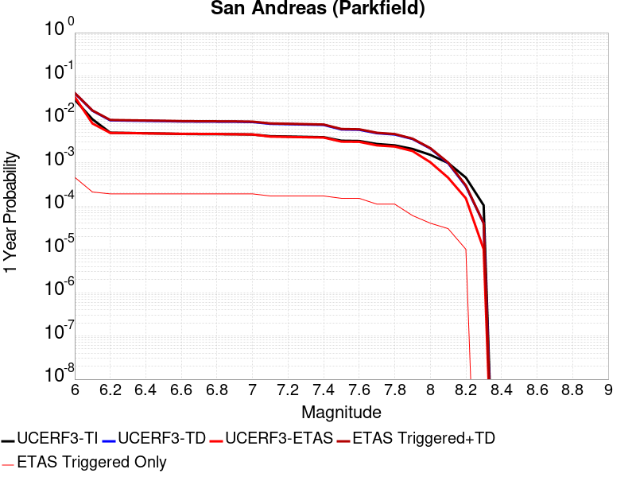 |  |

| Magnitude | 1 wk TI Prob | 1 wk TD Prob | 1 wk ETAS Prob | 1 wk ETAS/TD Gain | 1 wk ETAS Triggered+TD | 1 wk ETAS Triggered Only | 1 mo TI Prob | 1 mo TD Prob | 1 mo ETAS Prob | 1 mo ETAS/TD Gain | 1 mo ETAS Triggered+TD | 1 mo ETAS Triggered Only | 1 yr TI Prob | 1 yr TD Prob | 1 yr ETAS Prob | 1 yr ETAS/TD Gain | 1 yr ETAS Triggered+TD | 1 yr ETAS Triggered Only | 10 yr TI Prob | 10 yr TD Prob | 10 yr ETAS Prob | 10 yr ETAS/TD Gain | 10 yr ETAS Triggered+TD | 10 yr ETAS Triggered Only |
|-----|-----|-----|-----|-----|-----|-----|-----|-----|-----|-----|-----|-----|-----|-----|-----|-----|-----|-----|-----|-----|-----|-----|-----|-----|
| 6.0 | 5.556969E-4 | 7.778562E-4 | 6.7E-4 | 0.8613417 | 9.876929E-4 | 2.1E-4 | 0.0023793848 | 0.0033299583 | 0.00267 | 0.8018119 | 0.003638926 | 3.1E-4 | 0.028586963 | 0.040235043 | 0.03306 | 0.82167184 | 0.040676534 | 4.6E-4 | 0.25176284 | 0.3371973 | 0.33283 | 0.98704827 | 0.33760822 | 6.2E-4 |
| 6.1 | 1.925858E-4 | 3.0278185E-4 | 2.1E-4 | 0.69356865 | 3.8275763E-4 | 8.0E-5 | 8.2510663E-4 | 0.001297085 | 7.5E-4 | 0.57821965 | 0.0014269163 | 1.3E-4 | 0.0099994885 | 0.01577393 | 0.00801 | 0.5077999 | 0.015980618 | 2.1E-4 | 0.095613256 | 0.14975825 | 0.08249 | 0.55082107 | 0.14999631 | 2.8E-4 |
| 6.2 | 9.4306815E-5 | 1.8243887E-4 | 1.5E-4 | 0.8221932 | 2.4242792E-4 | 6.0E-5 | 4.0410945E-4 | 7.8164786E-4 | 5.0E-4 | 0.63967425 | 8.9156185E-4 | 1.1E-4 | 0.0049089384 | 0.009475246 | 0.00485 | 0.51186 | 0.009663446 | 1.9E-4 | 0.048019063 | 0.0918565 | 0.05013 | 0.5457425 | 0.09208354 | 2.5E-4 |
| 6.3 | 9.283051E-5 | 1.794041E-4 | 1.4E-4 | 0.7803612 | 2.3939334E-4 | 6.0E-5 | 3.9778434E-4 | 7.686494E-4 | 4.9E-4 | 0.6374818 | 8.7856484E-4 | 1.1E-4 | 0.0048322747 | 0.009318355 | 0.00482 | 0.5172587 | 0.009506584 | 1.9E-4 | 0.047285385 | 0.090509474 | 0.04943 | 0.5461307 | 0.09073684 | 2.5E-4 |
| 6.4 | 9.138826E-5 | 1.7702584E-4 | 1.4E-4 | 0.79084504 | 2.370152E-4 | 6.0E-5 | 3.916052E-4 | 7.5846276E-4 | 4.9E-4 | 0.6460436 | 8.683793E-4 | 1.1E-4 | 0.0047573745 | 0.009195387 | 0.00473 | 0.5143883 | 0.00938364 | 1.9E-4 | 0.046568092 | 0.0894136 | 0.04865 | 0.5441007 | 0.08964124 | 2.5E-4 |
| 6.5 | 9.000255E-5 | 1.746064E-4 | 1.4E-4 | 0.8018034 | 2.3459591E-4 | 6.0E-5 | 3.8566816E-4 | 7.4809964E-4 | 4.9E-4 | 0.65499294 | 8.5801736E-4 | 1.1E-4 | 0.0046854047 | 0.009070284 | 0.00468 | 0.5159706 | 0.009258561 | 1.9E-4 | 0.045878403 | 0.08829608 | 0.04804 | 0.5440785 | 0.088524 | 2.5E-4 |
| 6.6 | 8.8109264E-5 | 1.7141816E-4 | 1.3E-4 | 0.7583794 | 2.3140787E-4 | 6.0E-5 | 3.7755648E-4 | 7.3444354E-4 | 4.8E-4 | 0.65355605 | 8.443628E-4 | 1.1E-4 | 0.0045870654 | 0.008905404 | 0.00462 | 0.51878613 | 0.009093712 | 1.9E-4 | 0.04493529 | 0.08682707 | 0.04714 | 0.5429182 | 0.08705536 | 2.5E-4 |
| 6.7 | 8.738073E-5 | 1.7008898E-4 | 1.3E-4 | 0.7643058 | 2.3007879E-4 | 6.0E-5 | 3.7443507E-4 | 7.287503E-4 | 4.8E-4 | 0.6586618 | 8.386702E-4 | 1.1E-4 | 0.0045492216 | 0.008836695 | 0.0046 | 0.5205566 | 0.009025016 | 1.9E-4 | 0.04457213 | 0.0862268 | 0.04672 | 0.5418269 | 0.08645524 | 2.5E-4 |
| 6.8 | 8.710195E-5 | 1.6954402E-4 | 1.3E-4 | 0.76676255 | 2.2953385E-4 | 6.0E-5 | 3.7324068E-4 | 7.26416E-4 | 4.7E-4 | 0.6470122 | 8.363361E-4 | 1.1E-4 | 0.0045347405 | 0.008808513 | 0.00458 | 0.5199516 | 0.00899684 | 1.9E-4 | 0.04443313 | 0.08597436 | 0.04654 | 0.5413242 | 0.08620287 | 2.5E-4 |
| 6.9 | 8.6801556E-5 | 1.6895356E-4 | 1.3E-4 | 0.7694422 | 2.2894342E-4 | 6.0E-5 | 3.7195362E-4 | 7.238869E-4 | 4.7E-4 | 0.6492727 | 8.338073E-4 | 1.1E-4 | 0.0045191357 | 0.0087779695 | 0.00451 | 0.51378626 | 0.008966302 | 1.9E-4 | 0.044283327 | 0.08570042 | 0.04633 | 0.5406041 | 0.08592899 | 2.5E-4 |
| 7.0 | 8.5571606E-5 | 1.664819E-4 | 1.3E-4 | 0.78086567 | 2.2647191E-4 | 6.0E-5 | 3.6668387E-4 | 7.132999E-4 | 4.7E-4 | 0.6589094 | 8.2322146E-4 | 1.1E-4 | 0.004455241 | 0.008650103 | 0.00447 | 0.51675683 | 0.00883846 | 1.9E-4 | 0.043669727 | 0.08454836 | 0.04579 | 0.54158354 | 0.08477723 | 2.5E-4 |
| 7.1 | 7.82589E-5 | 1.5128969E-4 | 1.3E-4 | 0.85927874 | 2.112806E-4 | 6.0E-5 | 3.3535215E-4 | 6.4822397E-4 | 4.1E-4 | 0.63249743 | 7.5815263E-4 | 1.1E-4 | 0.0040752706 | 0.007863738 | 0.00399 | 0.5073923 | 0.008032401 | 1.7E-4 | 0.040013418 | 0.077460445 | 0.04152 | 0.5360155 | 0.0776634 | 2.2E-4 |
| 7.2 | 7.690929E-5 | 1.4866212E-4 | 1.3E-4 | 0.87446624 | 2.0865319E-4 | 6.0E-5 | 3.2956956E-4 | 6.369685E-4 | 4.1E-4 | 0.6436739 | 7.4689847E-4 | 1.1E-4 | 0.004005129 | 0.0077276826 | 0.00392 | 0.50726724 | 0.007896369 | 1.7E-4 | 0.0393371 | 0.07623341 | 0.04096 | 0.53729725 | 0.07643664 | 2.2E-4 |
| 7.3 | 7.5543794E-5 | 1.4562748E-4 | 1.3E-4 | 0.8926887 | 2.0561874E-4 | 6.0E-5 | 3.2371894E-4 | 6.239692E-4 | 4.0E-4 | 0.6410573 | 7.339006E-4 | 1.1E-4 | 0.003934157 | 0.0075705256 | 0.00385 | 0.5085512 | 0.007739239 | 1.7E-4 | 0.038652334 | 0.07479777 | 0.0402 | 0.5374492 | 0.075001314 | 2.2E-4 |
| 7.4 | 7.4214564E-5 | 1.4263717E-4 | 1.3E-4 | 0.91140336 | 2.0262861E-4 | 6.0E-5 | 3.1802364E-4 | 6.1115966E-4 | 3.9E-4 | 0.63813114 | 7.2109245E-4 | 1.1E-4 | 0.003865065 | 0.0074156416 | 0.00379 | 0.5110819 | 0.007584381 | 1.7E-4 | 0.03798529 | 0.07337152 | 0.03953 | 0.5387649 | 0.073575385 | 2.2E-4 |
| 7.5 | 6.149578E-5 | 1.1191443E-4 | 8.0E-5 | 0.7148319 | 1.6190883E-4 | 5.0E-5 | 2.6352672E-4 | 4.795452E-4 | 2.9E-4 | 0.60473967 | 5.7949725E-4 | 1.0E-4 | 0.0032037178 | 0.005822865 | 0.00305 | 0.52379715 | 0.0059719915 | 1.5E-4 | 0.03157923 | 0.058559462 | 0.03132 | 0.53484094 | 0.058738336 | 1.9E-4 |
| 7.6 | 6.0643448E-5 | 1.102009E-4 | 8.0E-5 | 0.7259469 | 1.6019538E-4 | 5.0E-5 | 2.598746E-4 | 4.7220418E-4 | 2.8E-4 | 0.5929638 | 5.72157E-4 | 1.0E-4 | 0.0031593828 | 0.005733962 | 0.00302 | 0.52668643 | 0.005883102 | 1.5E-4 | 0.031148417 | 0.05772042 | 0.0308 | 0.53360665 | 0.05789945 | 1.9E-4 |
| 7.7 | 5.1652263E-5 | 9.175265E-5 | 5.0E-5 | 0.5449434 | 1.3174898E-4 | 4.0E-5 | 2.2134806E-4 | 3.9316638E-4 | 2.0E-4 | 0.5086905 | 4.6313886E-4 | 7.0E-5 | 0.002691582 | 0.0047763046 | 0.0025 | 0.52341723 | 0.004885779 | 1.1E-4 | 0.026592141 | 0.04853641 | 0.026 | 0.53568035 | 0.04867913 | 1.5E-4 |
| 7.8 | 4.8090482E-5 | 8.560165E-5 | 5.0E-5 | 0.5841009 | 1.2559822E-4 | 4.0E-5 | 2.060858E-4 | 3.6681266E-4 | 2.0E-4 | 0.5452375 | 4.3678697E-4 | 7.0E-5 | 0.0025062072 | 0.004456807 | 0.00235 | 0.5272833 | 0.004566317 | 1.1E-4 | 0.024781305 | 0.045302264 | 0.02417 | 0.5335274 | 0.045445472 | 1.5E-4 |
| 7.9 | 3.970278E-5 | 6.7507375E-5 | 3.0E-5 | 0.4443959 | 9.750535E-5 | 3.0E-5 | 1.7014367E-4 | 2.8928524E-4 | 1.5E-4 | 0.51851934 | 3.3927077E-4 | 5.0E-5 | 0.002069531 | 0.0035163634 | 0.00185 | 0.5261117 | 0.0035761525 | 6.0E-5 | 0.020503636 | 0.03588176 | 0.01901 | 0.52979565 | 0.03594925 | 7.0E-5 |
| 8.0 | 2.8982335E-5 | 4.0698153E-5 | 1.0E-5 | 0.24571139 | 5.069775E-5 | 1.0E-5 | 1.2420409E-4 | 1.7440901E-4 | 8.0E-5 | 0.45869192 | 2.0440377E-4 | 3.0E-5 | 0.0015111357 | 0.0021213628 | 0.00102 | 0.48082298 | 0.002161278 | 4.0E-5 | 0.015009012 | 0.02201118 | 0.01101 | 0.50020033 | 0.0220503 | 4.0E-5 |
| 8.1 | 1.8836186E-5 | 1.867974E-5 | 0.0 | 0.0 | 1.867974E-5 | 0.0 | 8.0724014E-5 | 8.005358E-5 | 5.0E-5 | 0.6245817 | 1.0005198E-4 | 2.0E-5 | 9.823717E-4 | 9.742171E-4 | 4.5E-4 | 0.46190938 | 0.0010041879 | 3.0E-5 | 0.009780403 | 0.010487711 | 0.00525 | 0.5005859 | 0.010517396 | 3.0E-5 |
| 8.2 | 8.643924E-6 | 5.473668E-6 | 0.0 | 0.0 | 5.473668E-6 | 0.0 | 3.704486E-5 | 2.3458366E-5 | 1.0E-5 | 0.42628714 | 3.345813E-5 | 1.0E-5 | 4.5092785E-4 | 2.8556827E-4 | 1.5E-4 | 0.52526844 | 2.955654E-4 | 1.0E-5 | 0.0045001395 | 0.0032481793 | 0.00171 | 0.5264487 | 0.003258147 | 1.0E-5 |
| 8.3 | 1.983087E-6 | 7.6564595E-7 | 0.0 | 0.0 | 7.6564595E-7 | 0.0 | 8.498917E-6 | 3.281336E-6 | 0.0 | 0.0 | 3.281336E-6 | 0.0 | 1.034694E-4 | 3.9949547E-5 | 1.0E-5 | 0.25031573 | 3.9949547E-5 | 0.0 | 0.0010342124 | 4.717979E-4 | 2.0E-4 | 0.42391032 | 4.717979E-4 | 0.0 |

## Elsinore (Glen Ivy) rev
*[(top)](#table-of-contents)*

| 1 Week | 1 Month | 1 Year | 10 Year |
|-----|-----|-----|-----|
|  |  |  |  |

| Magnitude | 1 wk TI Prob | 1 wk TD Prob | 1 wk ETAS Prob | 1 wk ETAS/TD Gain | 1 wk ETAS Triggered+TD | 1 wk ETAS Triggered Only | 1 mo TI Prob | 1 mo TD Prob | 1 mo ETAS Prob | 1 mo ETAS/TD Gain | 1 mo ETAS Triggered+TD | 1 mo ETAS Triggered Only | 1 yr TI Prob | 1 yr TD Prob | 1 yr ETAS Prob | 1 yr ETAS/TD Gain | 1 yr ETAS Triggered+TD | 1 yr ETAS Triggered Only | 10 yr TI Prob | 10 yr TD Prob | 10 yr ETAS Prob | 10 yr ETAS/TD Gain | 10 yr ETAS Triggered+TD | 10 yr ETAS Triggered Only |
|-----|-----|-----|-----|-----|-----|-----|-----|-----|-----|-----|-----|-----|-----|-----|-----|-----|-----|-----|-----|-----|-----|-----|-----|-----|
| 6.0 | 1.6204086E-4 | 2.937271E-4 | 1.3E-4 | 0.4425877 | 3.9369773E-4 | 1.0E-4 | 6.94276E-4 | 0.0012583778 | 6.6E-4 | 0.52448475 | 0.0014181765 | 1.6E-4 | 0.008420097 | 0.0152346175 | 0.00774 | 0.5080534 | 0.015530048 | 3.0E-4 | 0.081081145 | 0.13962454 | 0.08008 | 0.5735381 | 0.14001171 | 4.5E-4 |
| 6.1 | 1.6204086E-4 | 2.937271E-4 | 1.3E-4 | 0.4425877 | 3.9369773E-4 | 1.0E-4 | 6.94276E-4 | 0.0012583778 | 6.6E-4 | 0.52448475 | 0.0014181765 | 1.6E-4 | 0.008420097 | 0.0152346175 | 0.00774 | 0.5080534 | 0.015530048 | 3.0E-4 | 0.081081145 | 0.13962454 | 0.08008 | 0.5735381 | 0.14001171 | 4.5E-4 |
| 6.2 | 1.6204086E-4 | 2.937271E-4 | 1.3E-4 | 0.4425877 | 3.9369773E-4 | 1.0E-4 | 6.94276E-4 | 0.0012583778 | 6.6E-4 | 0.52448475 | 0.0014181765 | 1.6E-4 | 0.008420097 | 0.0152346175 | 0.00774 | 0.5080534 | 0.015530048 | 3.0E-4 | 0.081081145 | 0.13962454 | 0.08008 | 0.5735381 | 0.14001171 | 4.5E-4 |
| 6.3 | 1.0111737E-4 | 1.7703463E-4 | 1.0E-4 | 0.56486124 | 2.5702047E-4 | 8.0E-5 | 4.332882E-4 | 7.5861585E-4 | 4.3E-4 | 0.5668218 | 8.7852485E-4 | 1.2E-4 | 0.005262531 | 0.0092177205 | 0.00508 | 0.55111235 | 0.009396061 | 1.8E-4 | 0.0513964 | 0.08707393 | 0.05377 | 0.6175212 | 0.087320425 | 2.7E-4 |
| 6.4 | 1.0111737E-4 | 1.7703463E-4 | 1.0E-4 | 0.56486124 | 2.5702047E-4 | 8.0E-5 | 4.332882E-4 | 7.5861585E-4 | 4.3E-4 | 0.5668218 | 8.7852485E-4 | 1.2E-4 | 0.005262531 | 0.0092177205 | 0.00508 | 0.55111235 | 0.009396061 | 1.8E-4 | 0.0513964 | 0.08707393 | 0.05377 | 0.6175212 | 0.087320425 | 2.7E-4 |
| 6.5 | 3.6624708E-5 | 4.6391986E-5 | 2.0E-5 | 0.43110895 | 6.6391054E-5 | 2.0E-5 | 1.569536E-4 | 1.9880968E-4 | 7.0E-5 | 0.35209554 | 2.3880172E-4 | 4.0E-5 | 0.001909235 | 0.0024181814 | 0.00127 | 0.5251881 | 0.0024680605 | 5.0E-5 | 0.01892915 | 0.023697061 | 0.01442 | 0.60851425 | 0.023784928 | 9.0E-5 |
| 6.6 | 2.5051324E-5 | 2.6147465E-5 | 0.0 | 0.0 | 2.6147465E-5 | 0.0 | 1.073584E-4 | 1.12056E-4 | 3.0E-5 | 0.2677233 | 1.2205488E-4 | 1.0E-5 | 0.0013063047 | 0.0013634725 | 6.9E-4 | 0.50606084 | 0.0013834452 | 2.0E-5 | 0.012986525 | 0.013565759 | 0.00805 | 0.5934058 | 0.013615081 | 5.0E-5 |
| 6.7 | 2.2189772E-5 | 2.2072489E-5 | 0.0 | 0.0 | 2.2072489E-5 | 0.0 | 9.509556E-5 | 9.459316E-5 | 3.0E-5 | 0.31714767 | 1.0459221E-4 | 1.0E-5 | 0.0011571734 | 0.0011510996 | 6.0E-4 | 0.5212407 | 0.0011710766 | 2.0E-5 | 0.011511663 | 0.0114663225 | 0.00692 | 0.60350645 | 0.011505865 | 4.0E-5 |
| 6.8 | 1.6654378E-5 | 1.44376E-5 | 0.0 | 0.0 | 1.44376E-5 | 0.0 | 7.137396E-5 | 6.187399E-5 | 3.0E-5 | 0.48485643 | 7.187337E-5 | 1.0E-5 | 8.686314E-4 | 7.5306057E-4 | 3.7E-4 | 0.49132833 | 7.630531E-4 | 1.0E-5 | 0.008652439 | 0.0075100763 | 0.00469 | 0.6244943 | 0.007539851 | 3.0E-5 |
| 6.9 | 1.5042909E-5 | 1.2331886E-5 | 0.0 | 0.0 | 1.2331886E-5 | 0.0 | 6.446802E-5 | 5.2849886E-5 | 3.0E-5 | 0.5676455 | 6.284936E-5 | 1.0E-5 | 7.8461546E-4 | 6.4326054E-4 | 3.1E-4 | 0.48191983 | 6.532541E-4 | 1.0E-5 | 0.007818509 | 0.006417925 | 0.00394 | 0.6139056 | 0.0064477324 | 3.0E-5 |
| 7.0 | 1.4361385E-5 | 1.1451172E-5 | 0.0 | 0.0 | 1.1451172E-5 | 0.0 | 6.154734E-5 | 4.9075545E-5 | 2.0E-5 | 0.40753496 | 5.9075053E-5 | 1.0E-5 | 7.490812E-4 | 5.973339E-4 | 2.7E-4 | 0.45200852 | 6.073279E-4 | 1.0E-5 | 0.007465612 | 0.005960982 | 0.00356 | 0.5972171 | 0.005980863 | 2.0E-5 |
| 7.1 | 1.3265571E-5 | 1.0244736E-5 | 0.0 | 0.0 | 1.0244736E-5 | 0.0 | 5.6851208E-5 | 4.3905282E-5 | 2.0E-5 | 0.45552605 | 5.3904845E-5 | 1.0E-5 | 6.919436E-4 | 5.344183E-4 | 1.8E-4 | 0.33681485 | 5.4441293E-4 | 1.0E-5 | 0.006897931 | 0.0053346003 | 0.00307 | 0.57548827 | 0.005354494 | 2.0E-5 |
| 7.2 | 1.1596403E-5 | 8.504847E-6 | 0.0 | 0.0 | 8.504847E-6 | 0.0 | 4.9697923E-5 | 3.6448844E-5 | 1.0E-5 | 0.2743571 | 3.6448844E-5 | 0.0 | 6.049042E-4 | 4.4367602E-4 | 1.5E-4 | 0.33808455 | 4.4367602E-4 | 0.0 | 0.006032603 | 0.004429357 | 0.00256 | 0.577962 | 0.004429357 | 0.0 |
| 7.3 | 1.0150827E-5 | 7.238537E-6 | 0.0 | 0.0 | 7.238537E-6 | 0.0 | 4.3502816E-5 | 3.102194E-5 | 1.0E-5 | 0.3223525 | 3.102194E-5 | 0.0 | 5.2951806E-4 | 3.776281E-4 | 1.3E-4 | 0.34425402 | 3.776281E-4 | 0.0 | 0.005282581 | 0.003770271 | 0.00221 | 0.5861648 | 0.003770271 | 0.0 |
| 7.4 | 9.080705E-6 | 6.352307E-6 | 0.0 | 0.0 | 6.352307E-6 | 0.0 | 3.8916725E-5 | 2.7223898E-5 | 1.0E-5 | 0.36732432 | 2.7223898E-5 | 0.0 | 4.7370812E-4 | 3.314019E-4 | 1.2E-4 | 0.3620981 | 3.314019E-4 | 0.0 | 0.004726996 | 0.0033092257 | 0.00196 | 0.5922836 | 0.0033092257 | 0.0 |
| 7.5 | 7.671649E-6 | 5.225419E-6 | 0.0 | 0.0 | 5.225419E-6 | 0.0 | 3.287808E-5 | 2.2394468E-5 | 1.0E-5 | 0.44653887 | 2.2394468E-5 | 0.0 | 4.0021708E-4 | 2.7261977E-4 | 1.0E-4 | 0.36681125 | 2.7261977E-4 | 0.0 | 0.0039949706 | 0.0027229784 | 0.00166 | 0.6096266 | 0.0027229784 | 0.0 |
| 7.6 | 6.990086E-6 | 4.687336E-6 | 0.0 | 0.0 | 4.687336E-6 | 0.0 | 2.9957167E-5 | 2.0088435E-5 | 0.0 | 0.0 | 2.0088435E-5 | 0.0 | 3.6466747E-4 | 2.445504E-4 | 9.0E-5 | 0.3680223 | 2.445504E-4 | 0.0 | 0.0036406964 | 0.0024429292 | 0.00142 | 0.5812694 | 0.0024429292 | 0.0 |
| 7.7 | 4.163505E-6 | 2.329331E-6 | 0.0 | 0.0 | 2.329331E-6 | 0.0 | 1.7843471E-5 | 9.982813E-6 | 0.0 | 0.0 | 9.982813E-6 | 0.0 | 2.172226E-4 | 1.2153471E-4 | 5.0E-5 | 0.41140512 | 1.2153471E-4 | 0.0 | 0.0021701038 | 0.0012147555 | 7.7E-4 | 0.63387245 | 0.0012147555 | 0.0 |
| 7.8 | 2.2692414E-7 | 9.384417E-8 | 0.0 | 0.0 | 9.384417E-8 | 0.0 | 9.725317E-7 | 4.0218927E-7 | 0.0 | 0.0 | 4.0218927E-7 | 0.0 | 1.1840509E-5 | 4.8966467E-6 | 1.0E-5 | 2.042214 | 4.8966467E-6 | 0.0 | 1.1839878E-4 | 4.8965718E-5 | 2.0E-5 | 0.40844905 | 4.8965718E-5 | 0.0 |
| 7.9 | 6.676829E-9 | 3.4397174E-9 | 0.0 | 0.0 | 3.4397174E-9 | 0.0 | 2.861498E-8 | 1.4741646E-8 | 0.0 | 0.0 | 1.4741646E-8 | 0.0 | 3.4838732E-7 | 1.7947953E-7 | 0.0 | 0.0 | 1.7947953E-7 | 0.0 | 3.4838679E-6 | 1.794794E-6 | 0.0 | 0.0 | 1.794794E-6 | 0.0 |

## Sierra Nevada  (No Extension)
*[(top)](#table-of-contents)*

| 1 Week | 1 Month | 1 Year | 10 Year |
|-----|-----|-----|-----|
|  |  |  |  |

| Magnitude | 1 wk TI Prob | 1 wk TD Prob | 1 wk ETAS Prob | 1 wk ETAS/TD Gain | 1 wk ETAS Triggered+TD | 1 wk ETAS Triggered Only | 1 mo TI Prob | 1 mo TD Prob | 1 mo ETAS Prob | 1 mo ETAS/TD Gain | 1 mo ETAS Triggered+TD | 1 mo ETAS Triggered Only | 1 yr TI Prob | 1 yr TD Prob | 1 yr ETAS Prob | 1 yr ETAS/TD Gain | 1 yr ETAS Triggered+TD | 1 yr ETAS Triggered Only | 10 yr TI Prob | 10 yr TD Prob | 10 yr ETAS Prob | 10 yr ETAS/TD Gain | 10 yr ETAS Triggered+TD | 10 yr ETAS Triggered Only |
|-----|-----|-----|-----|-----|-----|-----|-----|-----|-----|-----|-----|-----|-----|-----|-----|-----|-----|-----|-----|-----|-----|-----|-----|-----|
| 6.0 | 7.7690465E-6 | 6.9762887E-6 | 1.3E-4 | 18.63455 | 1.3697539E-4 | 1.3E-4 | 3.329549E-5 | 2.989824E-5 | 2.3E-4 | 7.692761 | 2.2989226E-4 | 2.0E-4 | 4.0529718E-4 | 3.6398612E-4 | 4.1E-4 | 1.1264166 | 6.3388783E-4 | 2.7E-4 | 0.004045588 | 0.0036374154 | 0.00195 | 0.5360949 | 0.0040857787 | 4.5E-4 |
| 6.1 | 7.7690465E-6 | 6.9762887E-6 | 1.3E-4 | 18.63455 | 1.3697539E-4 | 1.3E-4 | 3.329549E-5 | 2.989824E-5 | 2.3E-4 | 7.692761 | 2.2989226E-4 | 2.0E-4 | 4.0529718E-4 | 3.6398612E-4 | 4.1E-4 | 1.1264166 | 6.3388783E-4 | 2.7E-4 | 0.004045588 | 0.0036374154 | 0.00195 | 0.5360949 | 0.0040857787 | 4.5E-4 |
| 6.2 | 7.7690465E-6 | 6.9762887E-6 | 1.3E-4 | 18.63455 | 1.3697539E-4 | 1.3E-4 | 3.329549E-5 | 2.989824E-5 | 2.3E-4 | 7.692761 | 2.2989226E-4 | 2.0E-4 | 4.0529718E-4 | 3.6398612E-4 | 4.1E-4 | 1.1264166 | 6.3388783E-4 | 2.7E-4 | 0.004045588 | 0.0036374154 | 0.00195 | 0.5360949 | 0.0040857787 | 4.5E-4 |
| 6.3 | 7.7690465E-6 | 6.9762887E-6 | 1.3E-4 | 18.63455 | 1.3697539E-4 | 1.3E-4 | 3.329549E-5 | 2.989824E-5 | 2.3E-4 | 7.692761 | 2.2989226E-4 | 2.0E-4 | 4.0529718E-4 | 3.6398612E-4 | 4.1E-4 | 1.1264166 | 6.3388783E-4 | 2.7E-4 | 0.004045588 | 0.0036374154 | 0.00195 | 0.5360949 | 0.0040857787 | 4.5E-4 |
| 6.4 | 7.7690465E-6 | 6.9762887E-6 | 1.3E-4 | 18.63455 | 1.3697539E-4 | 1.3E-4 | 3.329549E-5 | 2.989824E-5 | 2.3E-4 | 7.692761 | 2.2989226E-4 | 2.0E-4 | 4.0529718E-4 | 3.6398612E-4 | 4.1E-4 | 1.1264166 | 6.3388783E-4 | 2.7E-4 | 0.004045588 | 0.0036374154 | 0.00195 | 0.5360949 | 0.0040857787 | 4.5E-4 |
| 6.5 | 7.7690465E-6 | 6.9762887E-6 | 1.3E-4 | 18.63455 | 1.3697539E-4 | 1.3E-4 | 3.329549E-5 | 2.989824E-5 | 2.3E-4 | 7.692761 | 2.2989226E-4 | 2.0E-4 | 4.0529718E-4 | 3.6398612E-4 | 4.1E-4 | 1.1264166 | 6.3388783E-4 | 2.7E-4 | 0.004045588 | 0.0036374154 | 0.00195 | 0.5360949 | 0.0040857787 | 4.5E-4 |
| 6.6 | 2.653E-6 | 1.6148208E-6 | 9.0E-5 | 55.733738 | 9.1614675E-5 | 9.0E-5 | 1.136995E-5 | 6.9206426E-6 | 1.4E-4 | 20.229336 | 1.3691974E-4 | 1.3E-4 | 1.3842035E-4 | 8.42556E-5 | 2.2E-4 | 2.6111023 | 2.5424128E-4 | 1.7E-4 | 0.0013833415 | 8.4224E-4 | 6.4E-4 | 0.7598784 | 0.0011519789 | 3.1E-4 |
| 6.7 | 2.5902466E-6 | 1.5501544E-6 | 9.0E-5 | 58.058735 | 9.155001E-5 | 9.0E-5 | 1.11010095E-5 | 6.643502E-6 | 1.4E-4 | 21.073223 | 1.3664264E-4 | 1.3E-4 | 1.351464E-4 | 8.088166E-5 | 2.2E-4 | 2.7200232 | 2.5086792E-4 | 1.7E-4 | 0.0013506424 | 8.0852525E-4 | 6.3E-4 | 0.77919644 | 0.0011182746 | 3.1E-4 |
| 6.8 | 2.5853892E-6 | 1.5469546E-6 | 9.0E-5 | 58.17882 | 9.154682E-5 | 9.0E-5 | 1.1080193E-5 | 6.629789E-6 | 1.4E-4 | 21.116812 | 1.3662892E-4 | 1.3E-4 | 1.34893E-4 | 8.071472E-5 | 2.2E-4 | 2.725649 | 2.50701E-4 | 1.7E-4 | 0.0013481114 | 8.06857E-4 | 6.3E-4 | 0.7808075 | 0.0011166069 | 3.1E-4 |
| 6.9 | 2.458257E-6 | 1.422029E-6 | 9.0E-5 | 63.289852 | 9.14219E-5 | 9.0E-5 | 1.0535345E-5 | 6.0943958E-6 | 1.4E-4 | 22.971926 | 1.360936E-4 | 1.3E-4 | 1.2826028E-4 | 7.419676E-5 | 2.2E-4 | 2.965089 | 2.4418414E-4 | 1.7E-4 | 0.0012818627 | 7.4172183E-4 | 5.9E-4 | 0.79544646 | 0.0010514919 | 3.1E-4 |
| 7.0 | 2.4341468E-6 | 1.3989927E-6 | 9.0E-5 | 64.332 | 9.139887E-5 | 9.0E-5 | 1.0432016E-5 | 5.9956697E-6 | 1.4E-4 | 23.350185 | 1.359949E-4 | 1.3E-4 | 1.270024E-4 | 7.299485E-5 | 2.2E-4 | 3.0139112 | 2.4298244E-4 | 1.7E-4 | 0.0012692984 | 7.297107E-4 | 5.9E-4 | 0.8085396 | 0.0010394844 | 3.1E-4 |
| 7.1 | 2.3652476E-6 | 1.3339427E-6 | 9.0E-5 | 67.46916 | 9.133382E-5 | 9.0E-5 | 1.0136736E-5 | 5.716885E-6 | 1.4E-4 | 24.488861 | 1.3571614E-4 | 1.3E-4 | 1.2340778E-4 | 6.9600865E-5 | 2.2E-4 | 3.16088 | 2.3958903E-4 | 1.7E-4 | 0.0012333926 | 6.957924E-4 | 5.8E-4 | 0.833582 | 0.0010055767 | 3.1E-4 |
| 7.2 | 2.272158E-6 | 1.2502497E-6 | 9.0E-5 | 71.98562 | 9.1250135E-5 | 9.0E-5 | 9.737784E-6 | 5.358202E-6 | 1.3E-4 | 24.26187 | 1.353575E-4 | 1.3E-4 | 1.1855107E-4 | 6.523417E-5 | 2.1E-4 | 3.2191718 | 2.3522308E-4 | 1.7E-4 | 0.0011848784 | 6.5215176E-4 | 5.3E-4 | 0.8126943 | 9.619496E-4 | 3.1E-4 |
| 7.3 | 2.1382127E-6 | 1.1419382E-6 | 9.0E-5 | 78.81337 | 9.114183E-5 | 9.0E-5 | 9.163737E-6 | 4.894012E-6 | 1.3E-4 | 26.563074 | 1.3489337E-4 | 1.3E-4 | 1.1156279E-4 | 5.9582977E-5 | 2.1E-4 | 3.5244966 | 2.2957285E-4 | 1.7E-4 | 0.001115068 | 5.956712E-4 | 5.1E-4 | 0.85617703 | 8.954925E-4 | 3.0E-4 |
| 7.4 | 1.9048055E-6 | 9.574928E-7 | 9.0E-5 | 93.99548 | 9.095741E-5 | 9.0E-5 | 8.163426E-6 | 4.103534E-6 | 1.2E-4 | 29.243084 | 1.2410304E-4 | 1.2E-4 | 9.9385186E-5 | 4.995939E-5 | 2.0E-4 | 4.0032516 | 2.099514E-4 | 1.6E-4 | 9.934074E-4 | 4.9948227E-4 | 4.5E-4 | 0.90093285 | 7.8933744E-4 | 2.9E-4 |
| 7.5 | 1.5373403E-6 | 7.559763E-7 | 7.0E-5 | 92.59549 | 7.075592E-5 | 7.0E-5 | 6.5885843E-6 | 3.2398946E-6 | 1.0E-4 | 30.865202 | 1.03239574E-4 | 1.0E-4 | 8.021306E-5 | 3.9445007E-5 | 1.5E-4 | 3.8027627 | 1.6943988E-4 | 1.3E-4 | 8.0184115E-4 | 3.9438053E-4 | 3.5E-4 | 0.88746774 | 6.242898E-4 | 2.3E-4 |
| 7.6 | 1.0680322E-6 | 4.65941E-7 | 3.0E-5 | 64.38583 | 3.0465928E-5 | 3.0E-5 | 4.577273E-6 | 1.9968884E-6 | 5.0E-5 | 25.038954 | 5.1996787E-5 | 5.0E-5 | 5.5726876E-5 | 2.4311848E-5 | 7.0E-5 | 2.8792546 | 8.431039E-5 | 6.0E-5 | 5.5712904E-4 | 2.4309216E-4 | 1.8E-4 | 0.7404599 | 3.8305813E-4 | 1.4E-4 |
| 7.7 | 5.509146E-7 | 1.5578539E-7 | 0.0 | 0.0 | 1.5578539E-7 | 0.0 | 2.3610605E-6 | 6.676515E-7 | 2.0E-5 | 29.955748 | 2.0667638E-5 | 2.0E-5 | 2.8745531E-5 | 8.128628E-6 | 2.0E-5 | 2.46044 | 2.8128465E-5 | 2.0E-5 | 2.8741814E-4 | 8.128342E-5 | 6.0E-5 | 0.7381579 | 1.3127936E-4 | 5.0E-5 |

## Red Pass
*[(top)](#table-of-contents)*

| 1 Week | 1 Month | 1 Year | 10 Year |
|-----|-----|-----|-----|
|  |  |  |  |

| Magnitude | 1 wk TI Prob | 1 wk TD Prob | 1 wk ETAS Prob | 1 wk ETAS/TD Gain | 1 wk ETAS Triggered+TD | 1 wk ETAS Triggered Only | 1 mo TI Prob | 1 mo TD Prob | 1 mo ETAS Prob | 1 mo ETAS/TD Gain | 1 mo ETAS Triggered+TD | 1 mo ETAS Triggered Only | 1 yr TI Prob | 1 yr TD Prob | 1 yr ETAS Prob | 1 yr ETAS/TD Gain | 1 yr ETAS Triggered+TD | 1 yr ETAS Triggered Only | 10 yr TI Prob | 10 yr TD Prob | 10 yr ETAS Prob | 10 yr ETAS/TD Gain | 10 yr ETAS Triggered+TD | 10 yr ETAS Triggered Only |
|-----|-----|-----|-----|-----|-----|-----|-----|-----|-----|-----|-----|-----|-----|-----|-----|-----|-----|-----|-----|-----|-----|-----|-----|-----|
| 6.0 | 8.258278E-6 | 8.551265E-6 | 1.9E-4 | 22.218935 | 1.8854972E-4 | 1.8E-4 | 3.539214E-5 | 3.6647863E-5 | 2.6E-4 | 7.0945473 | 2.7663907E-4 | 2.4E-4 | 4.308141E-4 | 4.4611428E-4 | 6.3E-4 | 1.4121943 | 7.859626E-4 | 3.4E-4 | 0.0042997985 | 0.004453945 | 0.00354 | 0.79480106 | 0.004951718 | 5.0E-4 |
| 6.1 | 3.649988E-6 | 3.7753161E-6 | 1.1E-4 | 29.136633 | 1.0377494E-4 | 1.0E-4 | 1.5642712E-5 | 1.6179853E-5 | 1.4E-4 | 8.652737 | 1.3617791E-4 | 1.2E-4 | 1.9043336E-4 | 1.9697666E-4 | 3.0E-4 | 1.5230231 | 3.469471E-4 | 1.5E-4 | 0.0019027026 | 0.001968488 | 0.00173 | 0.8788471 | 0.002217996 | 2.5E-4 |
| 6.2 | 3.649988E-6 | 3.7753161E-6 | 1.1E-4 | 29.136633 | 1.0377494E-4 | 1.0E-4 | 1.5642712E-5 | 1.6179853E-5 | 1.4E-4 | 8.652737 | 1.3617791E-4 | 1.2E-4 | 1.9043336E-4 | 1.9697666E-4 | 3.0E-4 | 1.5230231 | 3.469471E-4 | 1.5E-4 | 0.0019027026 | 0.001968488 | 0.00173 | 0.8788471 | 0.002217996 | 2.5E-4 |
| 6.3 | 1.3924937E-6 | 1.4411166E-6 | 3.0E-5 | 20.81719 | 3.144107E-5 | 3.0E-5 | 5.9678164E-6 | 6.1762075E-6 | 3.0E-5 | 4.85735 | 3.617602E-5 | 3.0E-5 | 7.265574E-5 | 7.519415E-5 | 7.0E-5 | 0.9309235 | 1.2519039E-4 | 5.0E-5 | 7.263199E-4 | 7.518258E-4 | 6.8E-4 | 0.90446484 | 8.3176565E-4 | 8.0E-5 |
| 6.4 | 1.3924937E-6 | 1.4411166E-6 | 3.0E-5 | 20.81719 | 3.144107E-5 | 3.0E-5 | 5.9678164E-6 | 6.1762075E-6 | 3.0E-5 | 4.85735 | 3.617602E-5 | 3.0E-5 | 7.265574E-5 | 7.519415E-5 | 7.0E-5 | 0.9309235 | 1.2519039E-4 | 5.0E-5 | 7.263199E-4 | 7.518258E-4 | 6.8E-4 | 0.90446484 | 8.3176565E-4 | 8.0E-5 |
| 6.5 | 9.876812E-7 | 1.0221912E-6 | 2.0E-5 | 19.565811 | 2.1022171E-5 | 2.0E-5 | 4.2329125E-6 | 4.3808195E-6 | 2.0E-5 | 4.565356 | 2.4380732E-5 | 2.0E-5 | 5.153449E-5 | 5.3336476E-5 | 6.0E-5 | 1.1249337 | 9.333435E-5 | 4.0E-5 | 5.1522546E-4 | 5.333648E-4 | 4.7E-4 | 0.88119805 | 6.033274E-4 | 7.0E-5 |

## San Andreas (Cholame) rev
*[(top)](#table-of-contents)*

| 1 Week | 1 Month | 1 Year | 10 Year |
|-----|-----|-----|-----|
|  |  |  |  |

| Magnitude | 1 wk TI Prob | 1 wk TD Prob | 1 wk ETAS Prob | 1 wk ETAS/TD Gain | 1 wk ETAS Triggered+TD | 1 wk ETAS Triggered Only | 1 mo TI Prob | 1 mo TD Prob | 1 mo ETAS Prob | 1 mo ETAS/TD Gain | 1 mo ETAS Triggered+TD | 1 mo ETAS Triggered Only | 1 yr TI Prob | 1 yr TD Prob | 1 yr ETAS Prob | 1 yr ETAS/TD Gain | 1 yr ETAS Triggered+TD | 1 yr ETAS Triggered Only | 10 yr TI Prob | 10 yr TD Prob | 10 yr ETAS Prob | 10 yr ETAS/TD Gain | 10 yr ETAS Triggered+TD | 10 yr ETAS Triggered Only |
|-----|-----|-----|-----|-----|-----|-----|-----|-----|-----|-----|-----|-----|-----|-----|-----|-----|-----|-----|-----|-----|-----|-----|-----|-----|
| 6.0 | 1.2302514E-4 | 2.5205986E-4 | 2.2E-4 | 0.8728085 | 3.6203212E-4 | 1.1E-4 | 5.27144E-4 | 0.0010798109 | 7.8E-4 | 0.7223487 | 0.0013195518 | 2.4E-4 | 0.0063991086 | 0.013067958 | 0.00679 | 0.5195915 | 0.013433123 | 3.7E-4 | 0.06217949 | 0.12438412 | 0.06893 | 0.5541704 | 0.124804415 | 4.8E-4 |
| 6.1 | 1.2302514E-4 | 2.5205986E-4 | 2.2E-4 | 0.8728085 | 3.6203212E-4 | 1.1E-4 | 5.27144E-4 | 0.0010798109 | 7.8E-4 | 0.7223487 | 0.0013195518 | 2.4E-4 | 0.0063991086 | 0.013067958 | 0.00679 | 0.5195915 | 0.013433123 | 3.7E-4 | 0.06217949 | 0.12438412 | 0.06893 | 0.5541704 | 0.124804415 | 4.8E-4 |
| 6.2 | 1.2203569E-4 | 2.502277E-4 | 2.2E-4 | 0.87919927 | 3.6020018E-4 | 1.1E-4 | 5.2290526E-4 | 0.0010719653 | 7.8E-4 | 0.7276355 | 0.001311708 | 2.4E-4 | 0.006347804 | 0.012973578 | 0.00672 | 0.5179758 | 0.013338778 | 3.7E-4 | 0.061695136 | 0.123571314 | 0.06842 | 0.5536884 | 0.123991996 | 4.8E-4 |
| 6.3 | 1.2142645E-4 | 2.4908737E-4 | 2.2E-4 | 0.8832242 | 3.5905998E-4 | 1.1E-4 | 5.202953E-4 | 0.0010670823 | 7.8E-4 | 0.7309652 | 0.0013068261 | 2.4E-4 | 0.006316212 | 0.012914834 | 0.00671 | 0.5195576 | 0.013280055 | 3.7E-4 | 0.06139677 | 0.12306532 | 0.06823 | 0.554421 | 0.12348625 | 4.8E-4 |
| 6.4 | 1.1865206E-4 | 2.4414246E-4 | 2.2E-4 | 0.9011132 | 3.541156E-4 | 1.1E-4 | 5.0840975E-4 | 0.0010459068 | 7.8E-4 | 0.7457643 | 0.0012856558 | 2.4E-4 | 0.006172335 | 0.012660044 | 0.00658 | 0.5197454 | 0.01302536 | 3.7E-4 | 0.060036868 | 0.12085904 | 0.06683 | 0.5529582 | 0.12128103 | 4.8E-4 |
| 6.5 | 1.17443946E-4 | 2.4207575E-4 | 2.2E-4 | 0.90880644 | 3.5204913E-4 | 1.1E-4 | 5.032341E-4 | 0.0010370566 | 7.8E-4 | 0.75212866 | 0.0012768077 | 2.4E-4 | 0.006109677 | 0.012553536 | 0.00653 | 0.5201722 | 0.012918891 | 3.7E-4 | 0.059444077 | 0.11993008 | 0.06626 | 0.55248857 | 0.120352514 | 4.8E-4 |
| 6.6 | 1.13579066E-4 | 2.3516564E-4 | 2.0E-4 | 0.8504644 | 3.4513976E-4 | 1.1E-4 | 4.866766E-4 | 0.001007465 | 7.6E-4 | 0.75436866 | 0.0012472231 | 2.4E-4 | 0.0059092017 | 0.012197345 | 0.00638 | 0.5230647 | 0.012562832 | 3.7E-4 | 0.057545185 | 0.1168492 | 0.06439 | 0.55105215 | 0.117273115 | 4.8E-4 |
| 6.7 | 1.1271412E-4 | 2.336088E-4 | 2.0E-4 | 0.85613215 | 3.4358312E-4 | 1.1E-4 | 4.829711E-4 | 0.001000798 | 7.6E-4 | 0.75939405 | 0.0012405578 | 2.4E-4 | 0.005864331 | 0.012117079 | 0.00633 | 0.5224031 | 0.012482596 | 3.7E-4 | 0.057119697 | 0.11615275 | 0.06386 | 0.54979324 | 0.116577 | 4.8E-4 |
| 6.8 | 1.1217975E-4 | 2.3249313E-4 | 2.0E-4 | 0.8602405 | 3.4246754E-4 | 1.1E-4 | 4.8068175E-4 | 9.960202E-4 | 7.5E-4 | 0.75299686 | 0.0012357811 | 2.4E-4 | 0.005836608 | 0.012059555 | 0.0063 | 0.52240735 | 0.012425093 | 3.7E-4 | 0.056856725 | 0.11565061 | 0.06349 | 0.54898113 | 0.1160751 | 4.8E-4 |
| 6.9 | 1.1146753E-4 | 2.3098059E-4 | 2.0E-4 | 0.86587363 | 3.409552E-4 | 1.1E-4 | 4.7763053E-4 | 9.895428E-4 | 7.4E-4 | 0.74782014 | 0.0012193152 | 2.3E-4 | 0.0057996577 | 0.011981564 | 0.00621 | 0.5182963 | 0.012337251 | 3.6E-4 | 0.056506127 | 0.11497027 | 0.063 | 0.5479678 | 0.11538623 | 4.7E-4 |
| 7.0 | 1.0965793E-4 | 2.2721413E-4 | 1.9E-4 | 0.8362156 | 3.3718912E-4 | 1.1E-4 | 4.698779E-4 | 9.734129E-4 | 7.3E-4 | 0.74993867 | 0.001203189 | 2.3E-4 | 0.005705768 | 0.011787324 | 0.00612 | 0.5192018 | 0.012143081 | 3.6E-4 | 0.055614736 | 0.11327011 | 0.06219 | 0.54904157 | 0.113686875 | 4.7E-4 |
| 7.1 | 9.927982E-5 | 2.0540332E-4 | 1.7E-4 | 0.82764 | 2.9538485E-4 | 9.0E-5 | 4.2541555E-4 | 8.8000396E-4 | 6.2E-4 | 0.7045423 | 0.001079828 | 2.0E-4 | 0.0051671406 | 0.010661708 | 0.00548 | 0.5139889 | 0.010968403 | 3.1E-4 | 0.05048634 | 0.10336573 | 0.05635 | 0.54515165 | 0.103733346 | 4.1E-4 |
| 7.2 | 9.696786E-5 | 2.0044584E-4 | 1.7E-4 | 0.8481094 | 2.904278E-4 | 9.0E-5 | 4.1551032E-4 | 8.587718E-4 | 6.1E-4 | 0.7103168 | 0.0010586 | 2.0E-4 | 0.00504711 | 0.010405703 | 0.00539 | 0.51798517 | 0.010702582 | 3.0E-4 | 0.04934009 | 0.10110233 | 0.05512 | 0.5451902 | 0.1014529 | 3.9E-4 |
| 7.3 | 9.4727984E-5 | 1.9473763E-4 | 1.7E-4 | 0.87296945 | 2.847201E-4 | 9.0E-5 | 4.0591392E-4 | 8.343239E-4 | 6.0E-4 | 0.7191452 | 0.001034157 | 2.0E-4 | 0.0049308087 | 0.010110851 | 0.00529 | 0.5232003 | 0.010407818 | 3.0E-4 | 0.048228268 | 0.09847412 | 0.05364 | 0.54471165 | 0.098825715 | 3.9E-4 |
| 7.4 | 9.220358E-5 | 1.8844259E-4 | 1.7E-4 | 0.90213156 | 2.7842564E-4 | 9.0E-5 | 3.9509835E-4 | 8.07362E-4 | 5.9E-4 | 0.730775 | 0.0010072006 | 2.0E-4 | 0.004799717 | 0.009785578 | 0.00516 | 0.5273066 | 0.01007274 | 2.9E-4 | 0.046973653 | 0.09555831 | 0.05209 | 0.5451122 | 0.095901996 | 3.8E-4 |
| 7.5 | 7.71631E-5 | 1.5179155E-4 | 1.2E-4 | 0.79055786 | 2.3177941E-4 | 8.0E-5 | 3.306571E-4 | 6.5037323E-4 | 4.7E-4 | 0.722662 | 8.3025615E-4 | 1.8E-4 | 0.0040183207 | 0.007889617 | 0.00428 | 0.5424852 | 0.008147566 | 2.6E-4 | 0.03946433 | 0.078289196 | 0.04251 | 0.5429868 | 0.07860258 | 3.4E-4 |
| 7.6 | 7.5634416E-5 | 1.4838556E-4 | 1.2E-4 | 0.808704 | 2.2837368E-4 | 8.0E-5 | 3.241072E-4 | 6.357833E-4 | 4.5E-4 | 0.70778835 | 8.1566884E-4 | 1.8E-4 | 0.0039388672 | 0.007713256 | 0.00421 | 0.5458136 | 0.00797125 | 2.6E-4 | 0.038697794 | 0.076654874 | 0.04154 | 0.5419094 | 0.07695958 | 3.3E-4 |
| 7.7 | 6.3783E-5 | 1.2359623E-4 | 8.0E-5 | 0.64726895 | 1.8358881E-4 | 6.0E-5 | 2.7332708E-4 | 5.2959064E-4 | 3.3E-4 | 0.6231228 | 6.4952706E-4 | 1.2E-4 | 0.0033226798 | 0.0064287307 | 0.0035 | 0.544431 | 0.006587702 | 1.6E-4 | 0.032734364 | 0.06454488 | 0.03495 | 0.5414837 | 0.06475068 | 2.2E-4 |
| 7.8 | 5.863422E-5 | 1.14169685E-4 | 6.0E-5 | 0.52553356 | 1.5416511E-4 | 4.0E-5 | 2.512653E-4 | 4.892069E-4 | 3.1E-4 | 0.6336787 | 5.8915804E-4 | 1.0E-4 | 0.003054864 | 0.0059398497 | 0.00322 | 0.54210126 | 0.006079018 | 1.4E-4 | 0.030132094 | 0.05966162 | 0.03198 | 0.53602296 | 0.059840284 | 1.9E-4 |
| 7.9 | 4.595283E-5 | 8.426815E-5 | 3.0E-5 | 0.35600638 | 1.14265626E-4 | 3.0E-5 | 1.9692584E-4 | 3.6109926E-4 | 2.3E-4 | 0.636944 | 4.2107757E-4 | 6.0E-5 | 0.0023949358 | 0.0043875277 | 0.00237 | 0.54016757 | 0.0044572204 | 7.0E-5 | 0.023692891 | 0.044363137 | 0.0235 | 0.52971905 | 0.04443959 | 8.0E-5 |
| 8.0 | 3.2950178E-5 | 5.077396E-5 | 1.0E-5 | 0.19695134 | 6.0773455E-5 | 1.0E-5 | 1.412074E-4 | 2.1758456E-4 | 1.4E-4 | 0.643428 | 2.5757586E-4 | 4.0E-5 | 0.0017178444 | 0.0026458753 | 0.0014 | 0.52912545 | 0.002695743 | 5.0E-5 | 0.017046256 | 0.027181072 | 0.01385 | 0.50954574 | 0.027229713 | 5.0E-5 |
| 8.1 | 1.9177472E-5 | 1.9183733E-5 | 0.0 | 0.0 | 1.9183733E-5 | 0.0 | 8.218658E-5 | 8.221342E-5 | 5.0E-5 | 0.60817325 | 1.0221177E-4 | 2.0E-5 | 0.0010001622 | 0.0010004893 | 4.8E-4 | 0.47976524 | 0.0010304593 | 3.0E-5 | 0.009956728 | 0.010757887 | 0.00544 | 0.50567555 | 0.010787563 | 3.0E-5 |
| 8.2 | 8.643924E-6 | 5.473668E-6 | 0.0 | 0.0 | 5.473668E-6 | 0.0 | 3.704486E-5 | 2.3458366E-5 | 1.0E-5 | 0.42628714 | 3.345813E-5 | 1.0E-5 | 4.5092785E-4 | 2.8556827E-4 | 1.5E-4 | 0.52526844 | 2.955654E-4 | 1.0E-5 | 0.0045001395 | 0.0032481793 | 0.00171 | 0.5264487 | 0.003258147 | 1.0E-5 |
| 8.3 | 1.983087E-6 | 7.6564595E-7 | 0.0 | 0.0 | 7.6564595E-7 | 0.0 | 8.498917E-6 | 3.281336E-6 | 0.0 | 0.0 | 3.281336E-6 | 0.0 | 1.034694E-4 | 3.9949547E-5 | 1.0E-5 | 0.25031573 | 3.9949547E-5 | 0.0 | 0.0010342124 | 4.717979E-4 | 2.0E-4 | 0.42391032 | 4.717979E-4 | 0.0 |

## Death Valley (Fish Lake Valley)
*[(top)](#table-of-contents)*

| 1 Week | 1 Month | 1 Year | 10 Year |
|-----|-----|-----|-----|
|  |  |  |  |

| Magnitude | 1 wk TI Prob | 1 wk TD Prob | 1 wk ETAS Prob | 1 wk ETAS/TD Gain | 1 wk ETAS Triggered+TD | 1 wk ETAS Triggered Only | 1 mo TI Prob | 1 mo TD Prob | 1 mo ETAS Prob | 1 mo ETAS/TD Gain | 1 mo ETAS Triggered+TD | 1 mo ETAS Triggered Only | 1 yr TI Prob | 1 yr TD Prob | 1 yr ETAS Prob | 1 yr ETAS/TD Gain | 1 yr ETAS Triggered+TD | 1 yr ETAS Triggered Only | 10 yr TI Prob | 10 yr TD Prob | 10 yr ETAS Prob | 10 yr ETAS/TD Gain | 10 yr ETAS Triggered+TD | 10 yr ETAS Triggered Only |
|-----|-----|-----|-----|-----|-----|-----|-----|-----|-----|-----|-----|-----|-----|-----|-----|-----|-----|-----|-----|-----|-----|-----|-----|-----|
| 6.0 | 3.872328E-5 | 4.7265705E-5 | 1.5E-4 | 3.1735485 | 1.7725956E-4 | 1.3E-4 | 1.6594635E-4 | 2.0255324E-4 | 2.1E-4 | 1.0367644 | 3.725188E-4 | 1.7E-4 | 0.0020185246 | 0.0024635606 | 0.00152 | 0.6169931 | 0.0028126985 | 3.5E-4 | 0.02000288 | 0.024388338 | 0.01137 | 0.46620646 | 0.024846874 | 4.7E-4 |
| 6.1 | 3.872328E-5 | 4.7265705E-5 | 1.5E-4 | 3.1735485 | 1.7725956E-4 | 1.3E-4 | 1.6594635E-4 | 2.0255324E-4 | 2.1E-4 | 1.0367644 | 3.725188E-4 | 1.7E-4 | 0.0020185246 | 0.0024635606 | 0.00152 | 0.6169931 | 0.0028126985 | 3.5E-4 | 0.02000288 | 0.024388338 | 0.01137 | 0.46620646 | 0.024846874 | 4.7E-4 |
| 6.2 | 3.872328E-5 | 4.7265705E-5 | 1.5E-4 | 3.1735485 | 1.7725956E-4 | 1.3E-4 | 1.6594635E-4 | 2.0255324E-4 | 2.1E-4 | 1.0367644 | 3.725188E-4 | 1.7E-4 | 0.0020185246 | 0.0024635606 | 0.00152 | 0.6169931 | 0.0028126985 | 3.5E-4 | 0.02000288 | 0.024388338 | 0.01137 | 0.46620646 | 0.024846874 | 4.7E-4 |
| 6.3 | 2.8356371E-5 | 3.360979E-5 | 1.4E-4 | 4.165453 | 1.6360542E-4 | 1.3E-4 | 1.2152165E-4 | 1.4403443E-4 | 2.0E-4 | 1.3885568 | 3.1400996E-4 | 1.7E-4 | 0.0014785219 | 0.0017522788 | 0.00123 | 0.7019431 | 0.0021016656 | 3.5E-4 | 0.014687235 | 0.017391816 | 0.00817 | 0.4697612 | 0.017853642 | 4.7E-4 |
| 6.4 | 2.8356371E-5 | 3.360979E-5 | 1.4E-4 | 4.165453 | 1.6360542E-4 | 1.3E-4 | 1.2152165E-4 | 1.4403443E-4 | 2.0E-4 | 1.3885568 | 3.1400996E-4 | 1.7E-4 | 0.0014785219 | 0.0017522788 | 0.00123 | 0.7019431 | 0.0021016656 | 3.5E-4 | 0.014687235 | 0.017391816 | 0.00817 | 0.4697612 | 0.017853642 | 4.7E-4 |
| 6.5 | 2.4448687E-5 | 2.8607585E-5 | 1.4E-4 | 4.893807 | 1.5860387E-4 | 1.3E-4 | 1.0477588E-4 | 1.2259845E-4 | 2.0E-4 | 1.631342 | 2.925776E-4 | 1.7E-4 | 0.0012748998 | 0.0014916616 | 0.0011 | 0.73743266 | 0.0018411396 | 3.5E-4 | 0.012676105 | 0.014821392 | 0.00721 | 0.48645905 | 0.015284426 | 4.7E-4 |
| 6.6 | 2.1298161E-5 | 2.4660083E-5 | 1.4E-4 | 5.677191 | 1.5465688E-4 | 1.3E-4 | 9.127464E-5 | 1.0568197E-4 | 1.9E-4 | 1.7978469 | 2.75664E-4 | 1.7E-4 | 0.0011107022 | 0.0012859512 | 0.00103 | 0.80096346 | 0.0016355012 | 3.5E-4 | 0.011051672 | 0.01278853 | 0.00633 | 0.4949748 | 0.01325252 | 4.7E-4 |
| 6.7 | 1.8959729E-5 | 2.1781027E-5 | 1.4E-4 | 6.427613 | 1.517782E-4 | 1.3E-4 | 8.125345E-5 | 9.334406E-5 | 1.9E-4 | 2.0354803 | 2.633282E-4 | 1.7E-4 | 9.888117E-4 | 0.001135897 | 9.6E-4 | 0.8451471 | 0.0014854994 | 3.5E-4 | 0.009844234 | 0.01130357 | 0.00565 | 0.49984208 | 0.011768257 | 4.7E-4 |
| 6.8 | 1.6691629E-5 | 1.9018351E-5 | 1.4E-4 | 7.361311 | 1.4901588E-4 | 1.3E-4 | 7.153359E-5 | 8.150477E-5 | 1.8E-4 | 2.2084596 | 2.514909E-4 | 1.7E-4 | 8.7057345E-4 | 9.918857E-4 | 8.9E-4 | 0.8972808 | 0.0013415385 | 3.5E-4 | 0.008671708 | 0.009876343 | 0.00486 | 0.49208495 | 0.010341702 | 4.7E-4 |
| 6.9 | 1.450505E-5 | 1.638954E-5 | 1.3E-4 | 7.9318886 | 1.463874E-4 | 1.3E-4 | 6.216302E-5 | 7.0239046E-5 | 1.6E-4 | 2.2779353 | 2.302278E-4 | 1.6E-4 | 7.5657194E-4 | 8.5483363E-4 | 7.5E-4 | 0.8773637 | 0.00117456 | 3.2E-4 | 0.007540013 | 0.008516386 | 0.00417 | 0.48964435 | 0.008952638 | 4.4E-4 |
| 7.0 | 1.2940855E-5 | 1.4537972E-5 | 1.3E-4 | 8.942101 | 1.4453608E-4 | 1.3E-4 | 5.545963E-5 | 6.230414E-5 | 1.6E-4 | 2.5680478 | 2.2229417E-4 | 1.6E-4 | 6.750118E-4 | 7.5829466E-4 | 7.0E-4 | 0.92312396 | 0.001078052 | 3.2E-4 | 0.006729651 | 0.0075576897 | 0.00374 | 0.4948602 | 0.007994365 | 4.4E-4 |
| 7.1 | 1.2544658E-5 | 1.4078208E-5 | 1.2E-4 | 8.523812 | 1.3407652E-4 | 1.2E-4 | 5.3761712E-5 | 6.0333812E-5 | 1.5E-4 | 2.4861681 | 2.1032477E-4 | 1.5E-4 | 6.5435225E-4 | 7.343222E-4 | 6.9E-4 | 0.939642 | 0.0010440946 | 3.1E-4 | 0.006524288 | 0.007319551 | 0.00365 | 0.49866447 | 0.0077464036 | 4.3E-4 |
| 7.2 | 1.2489416E-5 | 1.4015674E-5 | 1.2E-4 | 8.561843 | 1.3401399E-4 | 1.2E-4 | 5.3524967E-5 | 6.0065824E-5 | 1.5E-4 | 2.4972603 | 2.1005681E-4 | 1.5E-4 | 6.514716E-4 | 7.310616E-4 | 6.8E-4 | 0.93015414 | 0.001040835 | 3.1E-4 | 0.006495651 | 0.0072871596 | 0.00361 | 0.4953919 | 0.007714026 | 4.3E-4 |
| 7.3 | 1.2368307E-5 | 1.3879812E-5 | 1.2E-4 | 8.64565 | 1.3387814E-4 | 1.2E-4 | 5.3005948E-5 | 5.9483587E-5 | 1.5E-4 | 2.521704 | 2.0947466E-4 | 1.5E-4 | 6.451563E-4 | 7.2397763E-4 | 6.8E-4 | 0.93925554 | 0.0010337532 | 3.1E-4 | 0.0064328653 | 0.007216782 | 0.00358 | 0.49606597 | 0.0076436787 | 4.3E-4 |
| 7.4 | 1.2161707E-5 | 1.36478675E-5 | 1.2E-4 | 8.7925825 | 1.3364623E-4 | 1.2E-4 | 5.212056E-5 | 5.8489582E-5 | 1.5E-4 | 2.5645592 | 2.0848081E-4 | 1.5E-4 | 6.3438306E-4 | 7.118836E-4 | 6.8E-4 | 0.95521235 | 0.001021663 | 3.1E-4 | 0.006325751 | 0.0070966207 | 0.00357 | 0.50305635 | 0.007523569 | 4.3E-4 |
| 7.5 | 1.1707948E-5 | 1.3145515E-5 | 1.2E-4 | 9.128589 | 1.3314394E-4 | 1.2E-4 | 5.0175953E-5 | 5.6336736E-5 | 1.5E-4 | 2.662561 | 2.0632829E-4 | 1.5E-4 | 6.10721E-4 | 6.856895E-4 | 6.7E-4 | 0.9771187 | 9.95477E-4 | 3.1E-4 | 0.0060904534 | 0.006836321 | 0.00344 | 0.50319463 | 0.0072633815 | 4.3E-4 |
| 7.6 | 1.0319538E-5 | 1.1579622E-5 | 1.2E-4 | 10.363032 | 1.3157823E-4 | 1.2E-4 | 4.4225842E-5 | 4.9626036E-5 | 1.5E-4 | 3.0226068 | 1.9961859E-4 | 1.5E-4 | 5.383166E-4 | 6.040347E-4 | 6.2E-4 | 1.0264311 | 9.138474E-4 | 3.1E-4 | 0.0053701443 | 0.0060244603 | 0.00302 | 0.5012897 | 0.00645187 | 4.3E-4 |
| 7.7 | 8.937764E-6 | 1.0022779E-5 | 1.1E-4 | 10.975 | 1.2002168E-4 | 1.1E-4 | 3.830414E-5 | 4.295409E-5 | 1.4E-4 | 3.2592938 | 1.8294808E-4 | 1.4E-4 | 4.6625308E-4 | 5.228456E-4 | 5.5E-4 | 1.0519358 | 7.927044E-4 | 2.7E-4 | 0.0046527605 | 0.005216664 | 0.00268 | 0.5137383 | 0.00560463 | 3.9E-4 |
| 7.8 | 3.108007E-7 | 3.284654E-7 | 0.0 | 0.0 | 3.284654E-7 | 0.0 | 1.3320023E-6 | 1.407708E-6 | 0.0 | 0.0 | 1.407708E-6 | 0.0 | 1.6217007E-5 | 1.7138715E-5 | 2.0E-5 | 1.1669487 | 3.7138372E-5 | 2.0E-5 | 1.6215823E-4 | 1.7137431E-4 | 5.0E-5 | 0.291759 | 1.9137088E-4 | 2.0E-5 |
| 7.9 | 2.5591178E-9 | 2.6696718E-9 | 0.0 | 0.0 | 2.6696718E-9 | 0.0 | 1.0967647E-8 | 1.14414505E-8 | 0.0 | 0.0 | 1.14414505E-8 | 0.0 | 1.335311E-7 | 1.3929966E-7 | 0.0 | 0.0 | 1.3929966E-7 | 0.0 | 1.3353102E-6 | 1.3929966E-6 | 0.0 | 0.0 | 1.3929966E-6 | 0.0 |

## San Andreas (San Gorgonio Pass-Garnet HIll)
*[(top)](#table-of-contents)*

| 1 Week | 1 Month | 1 Year | 10 Year |
|-----|-----|-----|-----|
|  |  |  |  |

| Magnitude | 1 wk TI Prob | 1 wk TD Prob | 1 wk ETAS Prob | 1 wk ETAS/TD Gain | 1 wk ETAS Triggered+TD | 1 wk ETAS Triggered Only | 1 mo TI Prob | 1 mo TD Prob | 1 mo ETAS Prob | 1 mo ETAS/TD Gain | 1 mo ETAS Triggered+TD | 1 mo ETAS Triggered Only | 1 yr TI Prob | 1 yr TD Prob | 1 yr ETAS Prob | 1 yr ETAS/TD Gain | 1 yr ETAS Triggered+TD | 1 yr ETAS Triggered Only | 10 yr TI Prob | 10 yr TD Prob | 10 yr ETAS Prob | 10 yr ETAS/TD Gain | 10 yr ETAS Triggered+TD | 10 yr ETAS Triggered Only |
|-----|-----|-----|-----|-----|-----|-----|-----|-----|-----|-----|-----|-----|-----|-----|-----|-----|-----|-----|-----|-----|-----|-----|-----|-----|
| 6.0 | 8.31567E-5 | 2.3384395E-4 | 2.6E-4 | 1.1118525 | 4.038042E-4 | 1.7E-4 | 3.5633717E-4 | 0.0010018025 | 7.1E-4 | 0.70872253 | 0.0012215822 | 2.2E-4 | 0.004329778 | 0.012128622 | 0.00584 | 0.48150563 | 0.012464498 | 3.4E-4 | 0.042463828 | 0.11258187 | 0.06022 | 0.5348996 | 0.11299896 | 4.7E-4 |
| 6.1 | 8.31567E-5 | 2.3384395E-4 | 2.6E-4 | 1.1118525 | 4.038042E-4 | 1.7E-4 | 3.5633717E-4 | 0.0010018025 | 7.1E-4 | 0.70872253 | 0.0012215822 | 2.2E-4 | 0.004329778 | 0.012128622 | 0.00584 | 0.48150563 | 0.012464498 | 3.4E-4 | 0.042463828 | 0.11258187 | 0.06022 | 0.5348996 | 0.11299896 | 4.7E-4 |
| 6.2 | 8.31567E-5 | 2.3384395E-4 | 2.6E-4 | 1.1118525 | 4.038042E-4 | 1.7E-4 | 3.5633717E-4 | 0.0010018025 | 7.1E-4 | 0.70872253 | 0.0012215822 | 2.2E-4 | 0.004329778 | 0.012128622 | 0.00584 | 0.48150563 | 0.012464498 | 3.4E-4 | 0.042463828 | 0.11258187 | 0.06022 | 0.5348996 | 0.11299896 | 4.7E-4 |
| 6.3 | 8.31567E-5 | 2.3384395E-4 | 2.6E-4 | 1.1118525 | 4.038042E-4 | 1.7E-4 | 3.5633717E-4 | 0.0010018025 | 7.1E-4 | 0.70872253 | 0.0012215822 | 2.2E-4 | 0.004329778 | 0.012128622 | 0.00584 | 0.48150563 | 0.012464498 | 3.4E-4 | 0.042463828 | 0.11258187 | 0.06022 | 0.5348996 | 0.11299896 | 4.7E-4 |
| 6.4 | 8.059055E-5 | 2.2941893E-4 | 2.6E-4 | 1.1332979 | 3.9937993E-4 | 1.7E-4 | 3.4534236E-4 | 9.828559E-4 | 7.1E-4 | 0.7223846 | 0.0012026398 | 2.2E-4 | 0.0041964394 | 0.011900819 | 0.00575 | 0.48316002 | 0.012226892 | 3.3E-4 | 0.041180745 | 0.110562965 | 0.05908 | 0.5343562 | 0.11097211 | 4.6E-4 |
| 6.5 | 8.059055E-5 | 2.2941893E-4 | 2.6E-4 | 1.1332979 | 3.9937993E-4 | 1.7E-4 | 3.4534236E-4 | 9.828559E-4 | 7.1E-4 | 0.7223846 | 0.0012026398 | 2.2E-4 | 0.0041964394 | 0.011900819 | 0.00575 | 0.48316002 | 0.012226892 | 3.3E-4 | 0.041180745 | 0.110562965 | 0.05908 | 0.5343562 | 0.11097211 | 4.6E-4 |
| 6.6 | 7.619237E-5 | 2.2186468E-4 | 2.6E-4 | 1.1718855 | 3.9182696E-4 | 1.7E-4 | 3.2649786E-4 | 9.5050444E-4 | 7.0E-4 | 0.7364511 | 0.0011702953 | 2.2E-4 | 0.0039678677 | 0.0115115335 | 0.00557 | 0.48386255 | 0.011837735 | 3.3E-4 | 0.03897764 | 0.10709954 | 0.05699 | 0.5321218 | 0.107510276 | 4.6E-4 |
| 6.7 | 7.440636E-5 | 2.1862281E-4 | 2.6E-4 | 1.1892629 | 3.8858564E-4 | 1.7E-4 | 3.188454E-4 | 9.3662075E-4 | 7.0E-4 | 0.7473676 | 0.0011564146 | 2.2E-4 | 0.0038750346 | 0.011344268 | 0.00552 | 0.48658934 | 0.011670524 | 3.3E-4 | 0.038081564 | 0.1056081 | 0.05623 | 0.5324402 | 0.10601058 | 4.5E-4 |
| 6.8 | 7.3735864E-5 | 2.1709445E-4 | 2.6E-4 | 1.1976354 | 3.8705755E-4 | 1.7E-4 | 3.1597257E-4 | 9.300753E-4 | 6.9E-4 | 0.7418754 | 0.0011498707 | 2.2E-4 | 0.0038401815 | 0.011265406 | 0.00551 | 0.48910797 | 0.011591689 | 3.3E-4 | 0.03774495 | 0.104909696 | 0.05582 | 0.53207666 | 0.10531248 | 4.5E-4 |
| 6.9 | 7.27575E-5 | 2.1478413E-4 | 2.6E-4 | 1.2105176 | 3.8474763E-4 | 1.7E-4 | 3.117806E-4 | 9.20181E-4 | 6.8E-4 | 0.73898506 | 0.0011399785 | 2.2E-4 | 0.003789323 | 0.011146182 | 0.00545 | 0.48895666 | 0.011472504 | 3.3E-4 | 0.037253562 | 0.10385753 | 0.05521 | 0.5315936 | 0.10425183 | 4.4E-4 |
| 7.0 | 7.102591E-5 | 2.1062451E-4 | 2.6E-4 | 1.2344242 | 3.805887E-4 | 1.7E-4 | 3.0436125E-4 | 9.023664E-4 | 6.6E-4 | 0.7314102 | 0.0011221679 | 2.2E-4 | 0.003699303 | 0.010931484 | 0.00533 | 0.48758247 | 0.011257877 | 3.3E-4 | 0.03638325 | 0.101959534 | 0.05413 | 0.5308969 | 0.102354676 | 4.4E-4 |
| 7.1 | 7.028513E-5 | 2.0898094E-4 | 2.6E-4 | 1.2441326 | 3.789454E-4 | 1.7E-4 | 3.0118722E-4 | 8.953274E-4 | 6.5E-4 | 0.7259914 | 0.0011151304 | 2.2E-4 | 0.0036607897 | 0.010846641 | 0.00526 | 0.48494276 | 0.011173062 | 3.3E-4 | 0.036010686 | 0.10120243 | 0.05362 | 0.52982914 | 0.101597905 | 4.4E-4 |
| 7.2 | 6.8498244E-5 | 2.050596E-4 | 2.6E-4 | 1.2679241 | 3.7502474E-4 | 1.7E-4 | 2.9353087E-4 | 8.7853306E-4 | 6.4E-4 | 0.7284871 | 0.0010983398 | 2.2E-4 | 0.003567883 | 0.0106441835 | 0.0052 | 0.48852974 | 0.010970671 | 3.3E-4 | 0.035111405 | 0.09939449 | 0.05268 | 0.53000927 | 0.09979076 | 4.4E-4 |
| 7.3 | 6.622592E-5 | 1.9733235E-4 | 2.6E-4 | 1.3175741 | 3.672988E-4 | 1.7E-4 | 2.8379448E-4 | 8.4543816E-4 | 6.1E-4 | 0.72151935 | 0.0010652521 | 2.2E-4 | 0.0034497243 | 0.010245111 | 0.00492 | 0.48022908 | 0.010561832 | 3.2E-4 | 0.033966612 | 0.095891245 | 0.05059 | 0.5275768 | 0.096280016 | 4.3E-4 |
| 7.4 | 5.1050705E-5 | 1.4690042E-4 | 2.3E-4 | 1.5656865 | 3.0687693E-4 | 1.6E-4 | 2.1877038E-4 | 6.294222E-4 | 5.2E-4 | 0.82615453 | 8.3929003E-4 | 2.1E-4 | 0.002660276 | 0.007636482 | 0.00384 | 0.50284934 | 0.0079441145 | 3.1E-4 | 0.02628654 | 0.07286554 | 0.03817 | 0.5238416 | 0.073254935 | 4.2E-4 |
| 7.5 | 3.9302922E-5 | 1.11307076E-4 | 2.3E-4 | 2.0663557 | 2.7128926E-4 | 1.6E-4 | 1.6843023E-4 | 4.7694342E-4 | 4.7E-4 | 0.9854418 | 6.8684324E-4 | 2.1E-4 | 0.0020487092 | 0.0057913954 | 0.00314 | 0.5421837 | 0.0060996 | 3.1E-4 | 0.020299247 | 0.05601151 | 0.02945 | 0.5257848 | 0.056407984 | 4.2E-4 |
| 7.6 | 2.9851626E-5 | 8.4956984E-5 | 2.1E-4 | 2.471839 | 2.449434E-4 | 1.6E-4 | 1.2792926E-4 | 3.6405068E-4 | 4.3E-4 | 1.1811543 | 5.739742E-4 | 2.1E-4 | 0.0015564259 | 0.0044233347 | 0.00257 | 0.5810096 | 0.0047319634 | 3.1E-4 | 0.0154556995 | 0.043196145 | 0.02266 | 0.5245838 | 0.043598004 | 4.2E-4 |
| 7.7 | 2.1135214E-5 | 6.353527E-5 | 1.8E-4 | 2.8330722 | 2.1352574E-4 | 1.5E-4 | 9.0576345E-5 | 2.722656E-4 | 3.8E-4 | 1.3956959 | 4.7221116E-4 | 2.0E-4 | 0.0011022091 | 0.0033098008 | 0.00204 | 0.6163513 | 0.0036088077 | 3.0E-4 | 0.010967582 | 0.03258456 | 0.01738 | 0.53338146 | 0.032971527 | 4.0E-4 |
| 7.8 | 1.883379E-5 | 5.564576E-5 | 1.4E-4 | 2.515915 | 1.7563908E-4 | 1.2E-4 | 8.0713755E-5 | 2.3846005E-4 | 3.1E-4 | 1.300008 | 3.984219E-4 | 1.6E-4 | 9.822468E-4 | 0.002899389 | 0.00183 | 0.6311675 | 0.0031586352 | 2.6E-4 | 0.0097791655 | 0.028696978 | 0.01517 | 0.5286271 | 0.029036935 | 3.5E-4 |
| 7.9 | 1.5156185E-5 | 4.1662403E-5 | 1.2E-4 | 2.8802946 | 1.616574E-4 | 1.2E-4 | 6.495346E-5 | 1.7854095E-4 | 2.4E-4 | 1.3442295 | 3.2851417E-4 | 1.5E-4 | 7.9052144E-4 | 0.0021715704 | 0.00133 | 0.61246 | 0.002411049 | 2.4E-4 | 0.007877152 | 0.021760946 | 0.01148 | 0.52755064 | 0.022083765 | 3.3E-4 |
| 8.0 | 1.1405907E-5 | 2.9976925E-5 | 1.1E-4 | 3.669489 | 1.3997364E-4 | 1.1E-4 | 4.8881542E-5 | 1.2846621E-4 | 2.0E-4 | 1.5568295 | 2.5844952E-4 | 1.3E-4 | 5.9497025E-4 | 0.0015629551 | 9.7E-4 | 0.62061924 | 0.001752658 | 1.9E-4 | 0.005933798 | 0.015774013 | 0.00817 | 0.51794046 | 0.016000384 | 2.3E-4 |
| 8.1 | 4.3511436E-6 | 7.369465E-6 | 0.0 | 0.0 | 7.369465E-6 | 0.0 | 1.8647626E-5 | 3.158304E-5 | 2.0E-5 | 0.63325125 | 4.1582723E-5 | 1.0E-5 | 2.2701119E-4 | 3.844558E-4 | 1.5E-4 | 0.39016187 | 3.9445196E-4 | 1.0E-5 | 0.0022677942 | 0.0041165445 | 0.0022 | 0.53442883 | 0.004126503 | 1.0E-5 |
| 8.2 | 2.3042528E-6 | 2.7328301E-6 | 0.0 | 0.0 | 2.7328301E-6 | 0.0 | 9.875332E-6 | 1.1712076E-5 | 1.0E-5 | 0.85381955 | 2.171196E-5 | 1.0E-5 | 1.2022553E-4 | 1.4258524E-4 | 6.0E-5 | 0.4208009 | 1.5258382E-4 | 1.0E-5 | 0.0012016051 | 0.0015979637 | 8.7E-4 | 0.5444429 | 0.0016079478 | 1.0E-5 |
| 8.3 | 5.202968E-7 | 3.1590292E-7 | 0.0 | 0.0 | 3.1590292E-7 | 0.0 | 2.2298414E-6 | 1.353869E-6 | 0.0 | 0.0 | 1.353869E-6 | 0.0 | 2.714798E-5 | 1.6483244E-5 | 1.0E-5 | 0.60667676 | 1.6483244E-5 | 0.0 | 2.7144665E-4 | 1.955901E-4 | 9.0E-5 | 0.460146 | 1.955901E-4 | 0.0 |

## San Andreas (Carrizo) rev
*[(top)](#table-of-contents)*

| 1 Week | 1 Month | 1 Year | 10 Year |
|-----|-----|-----|-----|
|  |  |  |  |

| Magnitude | 1 wk TI Prob | 1 wk TD Prob | 1 wk ETAS Prob | 1 wk ETAS/TD Gain | 1 wk ETAS Triggered+TD | 1 wk ETAS Triggered Only | 1 mo TI Prob | 1 mo TD Prob | 1 mo ETAS Prob | 1 mo ETAS/TD Gain | 1 mo ETAS Triggered+TD | 1 mo ETAS Triggered Only | 1 yr TI Prob | 1 yr TD Prob | 1 yr ETAS Prob | 1 yr ETAS/TD Gain | 1 yr ETAS Triggered+TD | 1 yr ETAS Triggered Only | 10 yr TI Prob | 10 yr TD Prob | 10 yr ETAS Prob | 10 yr ETAS/TD Gain | 10 yr ETAS Triggered+TD | 10 yr ETAS Triggered Only |
|-----|-----|-----|-----|-----|-----|-----|-----|-----|-----|-----|-----|-----|-----|-----|-----|-----|-----|-----|-----|-----|-----|-----|-----|-----|
| 6.0 | 1.1674632E-4 | 2.4324407E-4 | 2.1E-4 | 0.8633304 | 3.7321245E-4 | 1.3E-4 | 5.002454E-4 | 0.0010420597 | 7.7E-4 | 0.73892117 | 0.0012917992 | 2.5E-4 | 0.006073493 | 0.012613757 | 0.00653 | 0.51768875 | 0.012969215 | 3.6E-4 | 0.0591016 | 0.120640226 | 0.06596 | 0.54674965 | 0.121053524 | 4.7E-4 |
| 6.1 | 1.1674632E-4 | 2.4324407E-4 | 2.1E-4 | 0.8633304 | 3.7321245E-4 | 1.3E-4 | 5.002454E-4 | 0.0010420597 | 7.7E-4 | 0.73892117 | 0.0012917992 | 2.5E-4 | 0.006073493 | 0.012613757 | 0.00653 | 0.51768875 | 0.012969215 | 3.6E-4 | 0.0591016 | 0.120640226 | 0.06596 | 0.54674965 | 0.121053524 | 4.7E-4 |
| 6.2 | 1.1674632E-4 | 2.4324407E-4 | 2.1E-4 | 0.8633304 | 3.7321245E-4 | 1.3E-4 | 5.002454E-4 | 0.0010420597 | 7.7E-4 | 0.73892117 | 0.0012917992 | 2.5E-4 | 0.006073493 | 0.012613757 | 0.00653 | 0.51768875 | 0.012969215 | 3.6E-4 | 0.0591016 | 0.120640226 | 0.06596 | 0.54674965 | 0.121053524 | 4.7E-4 |
| 6.3 | 1.1674632E-4 | 2.4324407E-4 | 2.1E-4 | 0.8633304 | 3.7321245E-4 | 1.3E-4 | 5.002454E-4 | 0.0010420597 | 7.7E-4 | 0.73892117 | 0.0012917992 | 2.5E-4 | 0.006073493 | 0.012613757 | 0.00653 | 0.51768875 | 0.012969215 | 3.6E-4 | 0.0591016 | 0.120640226 | 0.06596 | 0.54674965 | 0.121053524 | 4.7E-4 |
| 6.4 | 1.1674632E-4 | 2.4324407E-4 | 2.1E-4 | 0.8633304 | 3.7321245E-4 | 1.3E-4 | 5.002454E-4 | 0.0010420597 | 7.7E-4 | 0.73892117 | 0.0012917992 | 2.5E-4 | 0.006073493 | 0.012613757 | 0.00653 | 0.51768875 | 0.012969215 | 3.6E-4 | 0.0591016 | 0.120640226 | 0.06596 | 0.54674965 | 0.121053524 | 4.7E-4 |
| 6.5 | 1.13136164E-4 | 2.3644442E-4 | 2.1E-4 | 0.888158 | 3.6641367E-4 | 1.3E-4 | 4.847792E-4 | 0.0010129412 | 7.5E-4 | 0.7404181 | 0.001262688 | 2.5E-4 | 0.0058862255 | 0.012263271 | 0.00634 | 0.51699096 | 0.0126188565 | 3.6E-4 | 0.057327334 | 0.11761008 | 0.06433 | 0.5469769 | 0.1180248 | 4.7E-4 |
| 6.6 | 1.13136164E-4 | 2.3644442E-4 | 2.1E-4 | 0.888158 | 3.6641367E-4 | 1.3E-4 | 4.847792E-4 | 0.0010129412 | 7.5E-4 | 0.7404181 | 0.001262688 | 2.5E-4 | 0.0058862255 | 0.012263271 | 0.00634 | 0.51699096 | 0.0126188565 | 3.6E-4 | 0.057327334 | 0.11761008 | 0.06433 | 0.5469769 | 0.1180248 | 4.7E-4 |
| 6.7 | 1.1149675E-4 | 2.3335687E-4 | 2.1E-4 | 0.8999092 | 3.6332654E-4 | 1.3E-4 | 4.777557E-4 | 9.997191E-4 | 7.5E-4 | 0.75021076 | 0.0012494691 | 2.5E-4 | 0.0058011734 | 0.012104088 | 0.00629 | 0.51965916 | 0.012459731 | 3.6E-4 | 0.05652051 | 0.1162291 | 0.06355 | 0.54676497 | 0.11664448 | 4.7E-4 |
| 6.8 | 1.1103589E-4 | 2.3237852E-4 | 2.1E-4 | 0.903698 | 3.623483E-4 | 1.3E-4 | 4.7578133E-4 | 9.955293E-4 | 7.5E-4 | 0.7533681 | 0.0012452804 | 2.5E-4 | 0.005777263 | 0.012053643 | 0.00627 | 0.5201747 | 0.012409304 | 3.6E-4 | 0.056293584 | 0.11578894 | 0.0633 | 0.5466843 | 0.116204515 | 4.7E-4 |
| 6.9 | 1.1053259E-4 | 2.3130233E-4 | 2.1E-4 | 0.90790266 | 3.6127228E-4 | 1.3E-4 | 4.7362508E-4 | 9.909206E-4 | 7.5E-4 | 0.75687194 | 0.0012406729 | 2.5E-4 | 0.0057511497 | 0.011998152 | 0.00623 | 0.51924664 | 0.012353833 | 3.6E-4 | 0.05604569 | 0.11530445 | 0.06296 | 0.5460327 | 0.11572026 | 4.7E-4 |
| 7.0 | 1.1005377E-4 | 2.3031076E-4 | 2.1E-4 | 0.9118115 | 3.6028083E-4 | 1.3E-4 | 4.7157376E-4 | 9.866742E-4 | 7.5E-4 | 0.7601293 | 0.0012364276 | 2.5E-4 | 0.0057263062 | 0.011947021 | 0.0062 | 0.51895785 | 0.01230272 | 3.6E-4 | 0.055809796 | 0.11485658 | 0.06274 | 0.54624647 | 0.1152726 | 4.7E-4 |
| 7.1 | 1.0308142E-4 | 2.1540876E-4 | 2.0E-4 | 0.92846733 | 3.353829E-4 | 1.2E-4 | 4.417027E-4 | 9.228548E-4 | 6.9E-4 | 0.7476799 | 0.0011526425 | 2.3E-4 | 0.0053644776 | 0.011178188 | 0.00582 | 0.5206568 | 0.011514388 | 3.4E-4 | 0.052368138 | 0.10809042 | 0.05911 | 0.54685694 | 0.108491786 | 4.5E-4 |
| 7.2 | 1.0027479E-4 | 2.094876E-4 | 2.0E-4 | 0.9547104 | 3.2946246E-4 | 1.2E-4 | 4.296783E-4 | 8.9749607E-4 | 6.8E-4 | 0.7576635 | 0.0011272896 | 2.3E-4 | 0.0052187922 | 0.010872566 | 0.0057 | 0.5242553 | 0.011198979 | 3.3E-4 | 0.050979212 | 0.10539086 | 0.05765 | 0.5470114 | 0.10577554 | 4.3E-4 |
| 7.3 | 9.816942E-5 | 2.0423878E-4 | 2.0E-4 | 0.97924596 | 3.2421426E-4 | 1.2E-4 | 4.2065824E-4 | 8.7501644E-4 | 6.7E-4 | 0.7656999 | 0.0011048152 | 2.3E-4 | 0.005109493 | 0.010601572 | 0.00561 | 0.5291668 | 0.010928073 | 3.3E-4 | 0.049935985 | 0.10297546 | 0.05634 | 0.5471207 | 0.103361174 | 4.3E-4 |
| 7.4 | 9.5634205E-5 | 1.9793298E-4 | 2.0E-4 | 1.010443 | 3.1790923E-4 | 1.2E-4 | 4.0979648E-4 | 8.4800937E-4 | 6.6E-4 | 0.77829325 | 0.0010778144 | 2.3E-4 | 0.0049778637 | 0.010275901 | 0.00548 | 0.5332866 | 0.010592613 | 3.2E-4 | 0.048678253 | 0.100067884 | 0.05477 | 0.5473285 | 0.10044586 | 4.2E-4 |
| 7.5 | 8.052417E-5 | 1.6113915E-4 | 1.6E-4 | 0.9929306 | 2.7112142E-4 | 1.1E-4 | 3.4505792E-4 | 6.9041376E-4 | 5.5E-4 | 0.7966237 | 9.002688E-4 | 2.1E-4 | 0.0041929903 | 0.008373471 | 0.00461 | 0.55054826 | 0.008661043 | 2.9E-4 | 0.04114753 | 0.082815245 | 0.04515 | 0.5451895 | 0.083163776 | 3.8E-4 |
| 7.6 | 7.897024E-5 | 1.5767086E-4 | 1.6E-4 | 1.0147722 | 2.6765352E-4 | 1.1E-4 | 3.384E-4 | 6.755574E-4 | 5.3E-4 | 0.7845373 | 8.854156E-4 | 2.1E-4 | 0.0041122385 | 0.00819397 | 0.00454 | 0.554066 | 0.008481594 | 2.9E-4 | 0.040369697 | 0.08115866 | 0.04419 | 0.544489 | 0.08149863 | 3.7E-4 |
| 7.7 | 6.707427E-5 | 1.3277122E-4 | 1.0E-4 | 0.75317526 | 2.0276193E-4 | 7.0E-5 | 2.8742946E-4 | 5.688955E-4 | 3.9E-4 | 0.68553895 | 6.9882156E-4 | 1.3E-4 | 0.003493839 | 0.0069043385 | 0.00382 | 0.5532753 | 0.007073165 | 1.7E-4 | 0.034394164 | 0.06905339 | 0.03754 | 0.5436373 | 0.06927682 | 2.4E-4 |
| 7.8 | 6.147705E-5 | 1.2198445E-4 | 8.0E-5 | 0.65582126 | 1.7197835E-4 | 5.0E-5 | 2.6344648E-4 | 5.226858E-4 | 3.6E-4 | 0.6887503 | 6.326283E-4 | 1.1E-4 | 0.0032027436 | 0.006345156 | 0.00352 | 0.5547539 | 0.0064942045 | 1.5E-4 | 0.031569764 | 0.0635172 | 0.03425 | 0.539224 | 0.063713856 | 2.1E-4 |
| 7.9 | 4.7636717E-5 | 8.8802946E-5 | 3.0E-5 | 0.3378266 | 1.18800286E-4 | 3.0E-5 | 2.0414138E-4 | 3.8052857E-4 | 2.4E-4 | 0.63070166 | 4.4050574E-4 | 6.0E-5 | 0.0024825884 | 0.004623101 | 0.00252 | 0.54508865 | 0.0046927775 | 7.0E-5 | 0.024550365 | 0.046629366 | 0.02481 | 0.53206813 | 0.046715166 | 9.0E-5 |
| 8.0 | 3.3554235E-5 | 5.2138024E-5 | 1.0E-5 | 0.1917986 | 6.213751E-5 | 1.0E-5 | 1.4379594E-4 | 2.2342955E-4 | 1.4E-4 | 0.62659574 | 2.634206E-4 | 4.0E-5 | 0.0017493097 | 0.002716863 | 0.00143 | 0.52634233 | 0.0027667272 | 5.0E-5 | 0.017356034 | 0.027881905 | 0.01418 | 0.50857353 | 0.027930511 | 5.0E-5 |
| 8.1 | 1.9175432E-5 | 1.9183564E-5 | 0.0 | 0.0 | 1.9183564E-5 | 0.0 | 8.217783E-5 | 8.221269E-5 | 5.0E-5 | 0.6081786 | 1.02211045E-4 | 2.0E-5 | 0.0010000558 | 0.0010004805 | 4.8E-4 | 0.47976947 | 0.0010304505 | 3.0E-5 | 0.009955673 | 0.010757771 | 0.00544 | 0.505681 | 0.010787448 | 3.0E-5 |
| 8.2 | 8.643924E-6 | 5.473668E-6 | 0.0 | 0.0 | 5.473668E-6 | 0.0 | 3.704486E-5 | 2.3458366E-5 | 1.0E-5 | 0.42628714 | 3.345813E-5 | 1.0E-5 | 4.5092785E-4 | 2.8556827E-4 | 1.5E-4 | 0.52526844 | 2.955654E-4 | 1.0E-5 | 0.0045001395 | 0.0032481793 | 0.00171 | 0.5264487 | 0.003258147 | 1.0E-5 |
| 8.3 | 1.983087E-6 | 7.6564595E-7 | 0.0 | 0.0 | 7.6564595E-7 | 0.0 | 8.498917E-6 | 3.281336E-6 | 0.0 | 0.0 | 3.281336E-6 | 0.0 | 1.034694E-4 | 3.9949547E-5 | 1.0E-5 | 0.25031573 | 3.9949547E-5 | 0.0 | 0.0010342124 | 4.717979E-4 | 2.0E-4 | 0.42391032 | 4.717979E-4 | 0.0 |

## White Wolf (Extension)
*[(top)](#table-of-contents)*

| 1 Week | 1 Month | 1 Year | 10 Year |
|-----|-----|-----|-----|
|  |  |  |  |

| Magnitude | 1 wk TI Prob | 1 wk TD Prob | 1 wk ETAS Prob | 1 wk ETAS/TD Gain | 1 wk ETAS Triggered+TD | 1 wk ETAS Triggered Only | 1 mo TI Prob | 1 mo TD Prob | 1 mo ETAS Prob | 1 mo ETAS/TD Gain | 1 mo ETAS Triggered+TD | 1 mo ETAS Triggered Only | 1 yr TI Prob | 1 yr TD Prob | 1 yr ETAS Prob | 1 yr ETAS/TD Gain | 1 yr ETAS Triggered+TD | 1 yr ETAS Triggered Only | 10 yr TI Prob | 10 yr TD Prob | 10 yr ETAS Prob | 10 yr ETAS/TD Gain | 10 yr ETAS Triggered+TD | 10 yr ETAS Triggered Only |
|-----|-----|-----|-----|-----|-----|-----|-----|-----|-----|-----|-----|-----|-----|-----|-----|-----|-----|-----|-----|-----|-----|-----|-----|-----|
| 6.0 | 8.222555E-6 | 6.066615E-6 | 1.0E-4 | 16.483658 | 1.0606601E-4 | 1.0E-4 | 3.5239045E-5 | 2.5999556E-5 | 1.5E-4 | 5.769329 | 1.4599644E-4 | 1.2E-4 | 4.289509E-4 | 3.1650523E-4 | 4.0E-4 | 1.2638022 | 5.6642614E-4 | 2.5E-4 | 0.0042812387 | 0.0031611966 | 0.00195 | 0.616855 | 0.0035699005 | 4.1E-4 |
| 6.1 | 8.222555E-6 | 6.066615E-6 | 1.0E-4 | 16.483658 | 1.0606601E-4 | 1.0E-4 | 3.5239045E-5 | 2.5999556E-5 | 1.5E-4 | 5.769329 | 1.4599644E-4 | 1.2E-4 | 4.289509E-4 | 3.1650523E-4 | 4.0E-4 | 1.2638022 | 5.6642614E-4 | 2.5E-4 | 0.0042812387 | 0.0031611966 | 0.00195 | 0.616855 | 0.0035699005 | 4.1E-4 |
| 6.2 | 8.222555E-6 | 6.066615E-6 | 1.0E-4 | 16.483658 | 1.0606601E-4 | 1.0E-4 | 3.5239045E-5 | 2.5999556E-5 | 1.5E-4 | 5.769329 | 1.4599644E-4 | 1.2E-4 | 4.289509E-4 | 3.1650523E-4 | 4.0E-4 | 1.2638022 | 5.6642614E-4 | 2.5E-4 | 0.0042812387 | 0.0031611966 | 0.00195 | 0.616855 | 0.0035699005 | 4.1E-4 |
| 6.3 | 8.222555E-6 | 6.066615E-6 | 1.0E-4 | 16.483658 | 1.0606601E-4 | 1.0E-4 | 3.5239045E-5 | 2.5999556E-5 | 1.5E-4 | 5.769329 | 1.4599644E-4 | 1.2E-4 | 4.289509E-4 | 3.1650523E-4 | 4.0E-4 | 1.2638022 | 5.6642614E-4 | 2.5E-4 | 0.0042812387 | 0.0031611966 | 0.00195 | 0.616855 | 0.0035699005 | 4.1E-4 |
| 6.4 | 5.821773E-6 | 3.5571256E-6 | 5.0E-5 | 14.056293 | 5.355695E-5 | 5.0E-5 | 2.4950215E-5 | 1.5244741E-5 | 8.0E-5 | 5.247711 | 7.524383E-5 | 6.0E-5 | 3.0372653E-4 | 1.8559002E-4 | 2.0E-4 | 1.0776442 | 2.8557147E-4 | 1.0E-4 | 0.0030331176 | 0.0018544586 | 0.00104 | 0.56081057 | 0.0020241432 | 1.7E-4 |
| 6.5 | 5.766023E-6 | 3.4990599E-6 | 5.0E-5 | 14.289553 | 5.3498883E-5 | 5.0E-5 | 2.4711293E-5 | 1.49958905E-5 | 8.0E-5 | 5.334795 | 7.499499E-5 | 6.0E-5 | 3.0081844E-4 | 1.8256076E-4 | 1.9E-4 | 1.0407493 | 2.8254252E-4 | 1.0E-4 | 0.0030041158 | 0.0018242161 | 9.9E-4 | 0.54269886 | 0.0019739424 | 1.5E-4 |
| 6.6 | 4.643576E-6 | 2.3325733E-6 | 2.0E-5 | 8.574222 | 2.2332526E-5 | 2.0E-5 | 1.9900888E-5 | 9.9967065E-6 | 5.0E-5 | 5.0016475 | 3.999641E-5 | 3.0E-5 | 2.4226638E-4 | 1.2170354E-4 | 1.1E-4 | 0.9038357 | 1.7169745E-4 | 5.0E-5 | 0.0024200242 | 0.0012164112 | 6.0E-4 | 0.4932542 | 0.001296314 | 8.0E-5 |
| 6.7 | 3.9529173E-6 | 1.6482975E-6 | 2.0E-5 | 12.133732 | 2.1648264E-5 | 2.0E-5 | 1.6940963E-5 | 7.064114E-6 | 4.0E-5 | 5.6624227 | 2.7063972E-5 | 2.0E-5 | 2.0623671E-4 | 8.600239E-5 | 1.0E-4 | 1.1627585 | 1.2599894E-4 | 4.0E-5 | 0.002060454 | 8.597095E-4 | 4.8E-4 | 0.55832815 | 9.0966653E-4 | 5.0E-5 |
| 6.8 | 3.4377522E-6 | 1.2244764E-6 | 1.0E-5 | 8.166757 | 1.1224464E-5 | 1.0E-5 | 1.473314E-5 | 5.247746E-6 | 2.0E-5 | 3.8111603 | 1.5247693E-5 | 1.0E-5 | 1.7936122E-4 | 6.388952E-5 | 6.0E-5 | 0.9391211 | 8.388825E-5 | 2.0E-5 | 0.0017921652 | 6.3872064E-4 | 3.3E-4 | 0.51665777 | 6.5870787E-4 | 2.0E-5 |
| 6.9 | 3.1367306E-6 | 1.0033316E-6 | 0.0 | 0.0 | 1.0033316E-6 | 0.0 | 1.3443062E-5 | 4.299986E-6 | 1.0E-5 | 2.3255892 | 4.299986E-6 | 0.0 | 1.63657E-4 | 5.2351144E-5 | 4.0E-5 | 0.76407117 | 6.235062E-5 | 1.0E-5 | 0.0016353652 | 5.233958E-4 | 2.7E-4 | 0.51586205 | 5.3339056E-4 | 1.0E-5 |
| 7.0 | 2.8298145E-6 | 7.4282326E-7 | 0.0 | 0.0 | 7.4282326E-7 | 0.0 | 1.2127721E-5 | 3.1835248E-6 | 1.0E-5 | 3.1411724 | 3.1835248E-6 | 0.0 | 1.47645E-4 | 3.8758775E-5 | 3.0E-5 | 0.7740183 | 3.8758775E-5 | 0.0 | 0.0014754693 | 3.8752513E-4 | 2.0E-4 | 0.5160955 | 3.8752513E-4 | 0.0 |
| 7.1 | 2.4091064E-6 | 5.4223835E-7 | 0.0 | 0.0 | 5.4223835E-7 | 0.0 | 1.03247E-5 | 2.3238767E-6 | 1.0E-5 | 4.303154 | 2.3238767E-6 | 0.0 | 1.2569598E-4 | 2.8292874E-5 | 3.0E-5 | 1.0603377 | 2.8292874E-5 | 0.0 | 0.001256249 | 2.8289677E-4 | 1.6E-4 | 0.5655774 | 2.8289677E-4 | 0.0 |
| 7.2 | 1.3875518E-6 | 1.0740268E-7 | 0.0 | 0.0 | 1.0740268E-7 | 0.0 | 5.9466374E-6 | 4.6029712E-7 | 0.0 | 0.0 | 4.6029712E-7 | 0.0 | 7.23979E-5 | 5.604104E-6 | 0.0 | 0.0 | 5.604104E-6 | 0.0 | 7.2374323E-4 | 5.6039742E-5 | 1.0E-5 | 0.17844479 | 5.6039742E-5 | 0.0 |
| 7.3 | 7.056077E-7 | 5.0002956E-8 | 0.0 | 0.0 | 5.0002956E-8 | 0.0 | 3.0240296E-6 | 2.1429837E-7 | 0.0 | 0.0 | 2.1429837E-7 | 0.0 | 3.681694E-5 | 2.60908E-6 | 0.0 | 0.0 | 2.60908E-6 | 0.0 | 3.681084E-4 | 2.609054E-5 | 1.0E-5 | 0.38328066 | 2.609054E-5 | 0.0 |
| 7.4 | 5.9334678E-8 | 4.8638475E-9 | 0.0 | 0.0 | 4.8638475E-9 | 0.0 | 2.5429145E-7 | 2.084506E-8 | 0.0 | 0.0 | 2.084506E-8 | 0.0 | 3.095994E-6 | 2.5378858E-7 | 0.0 | 0.0 | 2.5378858E-7 | 0.0 | 3.095951E-5 | 2.5378843E-6 | 0.0 | 0.0 | 2.5378843E-6 | 0.0 |

## Mission Ridge-Arroyo Parida-Santa Ana
*[(top)](#table-of-contents)*

| 1 Week | 1 Month | 1 Year | 10 Year |
|-----|-----|-----|-----|
|  |  |  |  |

| Magnitude | 1 wk TI Prob | 1 wk TD Prob | 1 wk ETAS Prob | 1 wk ETAS/TD Gain | 1 wk ETAS Triggered+TD | 1 wk ETAS Triggered Only | 1 mo TI Prob | 1 mo TD Prob | 1 mo ETAS Prob | 1 mo ETAS/TD Gain | 1 mo ETAS Triggered+TD | 1 mo ETAS Triggered Only | 1 yr TI Prob | 1 yr TD Prob | 1 yr ETAS Prob | 1 yr ETAS/TD Gain | 1 yr ETAS Triggered+TD | 1 yr ETAS Triggered Only | 10 yr TI Prob | 10 yr TD Prob | 10 yr ETAS Prob | 10 yr ETAS/TD Gain | 10 yr ETAS Triggered+TD | 10 yr ETAS Triggered Only |
|-----|-----|-----|-----|-----|-----|-----|-----|-----|-----|-----|-----|-----|-----|-----|-----|-----|-----|-----|-----|-----|-----|-----|-----|-----|
| 6.0 | 4.169034E-5 | 4.7137048E-5 | 1.0E-4 | 2.1214736 | 1.3713281E-4 | 9.0E-5 | 1.7866064E-4 | 2.0200513E-4 | 2.5E-4 | 1.2375923 | 3.4197685E-4 | 1.4E-4 | 0.0021730233 | 0.0024574657 | 0.00218 | 0.8870927 | 0.0026370233 | 1.8E-4 | 0.021518968 | 0.02438483 | 0.02272 | 0.9317268 | 0.024658002 | 2.8E-4 |
| 6.1 | 1.73813E-5 | 1.6854203E-5 | 4.0E-5 | 2.3732953 | 5.685353E-5 | 4.0E-5 | 7.4489166E-5 | 7.223036E-5 | 1.2E-4 | 1.6613512 | 1.422253E-4 | 7.0E-5 | 9.065282E-4 | 8.790605E-4 | 8.8E-4 | 1.0010687 | 9.789726E-4 | 1.0E-4 | 0.009028391 | 0.008757128 | 0.00795 | 0.9078318 | 0.008895903 | 1.4E-4 |
| 6.2 | 1.4622182E-5 | 1.3673262E-5 | 4.0E-5 | 2.9254174 | 5.3672717E-5 | 4.0E-5 | 6.2664985E-5 | 5.85984E-5 | 1.1E-4 | 1.8771843 | 1.285943E-4 | 7.0E-5 | 7.6267915E-4 | 7.132059E-4 | 7.0E-4 | 0.98148376 | 8.131346E-4 | 1.0E-4 | 0.007600669 | 0.007109767 | 0.0062 | 0.8720398 | 0.007218985 | 1.1E-4 |
| 6.3 | 1.3552434E-5 | 1.2482174E-5 | 4.0E-5 | 3.20457 | 5.2481675E-5 | 4.0E-5 | 5.8080568E-5 | 5.349395E-5 | 1.1E-4 | 2.0563073 | 1.234902E-4 | 7.0E-5 | 7.069015E-4 | 6.510974E-4 | 6.1E-4 | 0.9368798 | 7.5103226E-4 | 1.0E-4 | 0.00704657 | 0.006492415 | 0.00535 | 0.82403857 | 0.0066017006 | 1.1E-4 |
| 6.4 | 1.30977305E-5 | 1.1979128E-5 | 4.0E-5 | 3.339141 | 5.1978648E-5 | 4.0E-5 | 5.613192E-5 | 5.133813E-5 | 1.0E-4 | 1.9478699 | 1.2133454E-4 | 7.0E-5 | 6.831918E-4 | 6.2486547E-4 | 5.5E-4 | 0.8801894 | 7.148092E-4 | 9.0E-5 | 0.006810953 | 0.006231584 | 0.00505 | 0.81038785 | 0.006330961 | 1.0E-4 |
| 6.5 | 1.225205E-5 | 1.1048776E-5 | 3.0E-5 | 2.7152328 | 4.1048443E-5 | 3.0E-5 | 5.2507727E-5 | 4.735105E-5 | 9.0E-5 | 1.900697 | 1.0734821E-4 | 6.0E-5 | 6.3909404E-4 | 5.7634927E-4 | 4.8E-4 | 0.83282834 | 6.563032E-4 | 8.0E-5 | 0.006372592 | 0.005749009 | 0.00445 | 0.7740465 | 0.0058384915 | 9.0E-5 |
| 6.6 | 1.1352241E-5 | 1.0063508E-5 | 1.0E-5 | 0.9936893 | 2.0063408E-5 | 1.0E-5 | 4.8651553E-5 | 4.3128617E-5 | 6.0E-5 | 1.3911877 | 7.3127325E-5 | 3.0E-5 | 5.921717E-4 | 5.249665E-4 | 3.9E-4 | 0.7429045 | 5.749403E-4 | 5.0E-5 | 0.0059059616 | 0.0052376646 | 0.00382 | 0.72933275 | 0.00529735 | 6.0E-5 |
| 6.7 | 1.0864116E-5 | 9.517E-6 | 1.0E-5 | 1.0507513 | 1.9516905E-5 | 1.0E-5 | 4.6559664E-5 | 4.0786515E-5 | 6.0E-5 | 1.4710743 | 7.0785296E-5 | 3.0E-5 | 5.667165E-4 | 4.964647E-4 | 3.4E-4 | 0.6848422 | 5.464399E-4 | 5.0E-5 | 0.005652734 | 0.0049539437 | 0.00344 | 0.69439626 | 0.0050136466 | 6.0E-5 |
| 6.8 | 1.0666365E-5 | 9.299752E-6 | 1.0E-5 | 1.0752975 | 1.929966E-5 | 1.0E-5 | 4.571219E-5 | 3.985548E-5 | 6.0E-5 | 1.505439 | 6.9854286E-5 | 3.0E-5 | 5.564038E-4 | 4.8513446E-4 | 3.1E-4 | 0.6389981 | 5.351102E-4 | 5.0E-5 | 0.005550127 | 0.00484114 | 0.00326 | 0.6733951 | 0.0049008494 | 6.0E-5 |
| 6.9 | 1.0038665E-5 | 8.592018E-6 | 1.0E-5 | 1.1638708 | 1.8591933E-5 | 1.0E-5 | 4.302214E-5 | 3.682243E-5 | 6.0E-5 | 1.6294417 | 6.6821325E-5 | 3.0E-5 | 5.236687E-4 | 4.4822265E-4 | 3.0E-4 | 0.6693102 | 4.9820024E-4 | 5.0E-5 | 0.005224364 | 0.0044735507 | 0.00301 | 0.6728436 | 0.0045332825 | 6.0E-5 |
| 7.0 | 9.5379955E-6 | 8.025047E-6 | 0.0 | 0.0 | 8.025047E-6 | 0.0 | 4.0876483E-5 | 3.439261E-5 | 5.0E-5 | 1.4538006 | 5.4391923E-5 | 2.0E-5 | 4.975576E-4 | 4.1865133E-4 | 2.7E-4 | 0.6449281 | 4.5863457E-4 | 4.0E-5 | 0.00496445 | 0.00417898 | 0.00277 | 0.6628412 | 0.0042287707 | 5.0E-5 |
| 7.1 | 9.207389E-6 | 7.652347E-6 | 0.0 | 0.0 | 7.652347E-6 | 0.0 | 3.945964E-5 | 3.2795375E-5 | 5.0E-5 | 1.5246053 | 5.2794716E-5 | 2.0E-5 | 4.803152E-4 | 3.992122E-4 | 2.7E-4 | 0.676332 | 4.3919624E-4 | 4.0E-5 | 0.004792784 | 0.003985301 | 0.0027 | 0.6774896 | 0.0040351017 | 5.0E-5 |
| 7.2 | 7.638091E-6 | 5.9310923E-6 | 0.0 | 0.0 | 5.9310923E-6 | 0.0 | 3.2734264E-5 | 2.5418722E-5 | 2.0E-5 | 0.7868216 | 3.5418467E-5 | 1.0E-5 | 3.984668E-4 | 3.094293E-4 | 2.2E-4 | 0.7109863 | 3.3942002E-4 | 3.0E-5 | 0.0039775306 | 0.0030901956 | 0.00214 | 0.6925128 | 0.003130072 | 4.0E-5 |
| 7.3 | 7.2500147E-6 | 5.596131E-6 | 0.0 | 0.0 | 5.596131E-6 | 0.0 | 3.1071122E-5 | 2.3983199E-5 | 2.0E-5 | 0.83391714 | 3.398296E-5 | 1.0E-5 | 3.7822526E-4 | 2.9195662E-4 | 1.9E-4 | 0.65078163 | 3.2194785E-4 | 3.0E-5 | 0.0037758215 | 0.0029159402 | 0.00204 | 0.6996028 | 0.0029558237 | 4.0E-5 |
| 7.4 | 6.3899715E-6 | 4.9184864E-6 | 0.0 | 0.0 | 4.9184864E-6 | 0.0 | 2.7385306E-5 | 2.1079059E-5 | 2.0E-5 | 0.94880897 | 3.107885E-5 | 1.0E-5 | 3.3336508E-4 | 2.566075E-4 | 1.8E-4 | 0.70146036 | 2.8659982E-4 | 3.0E-5 | 0.0033286542 | 0.002563311 | 0.00177 | 0.6905132 | 0.002593234 | 3.0E-5 |
| 7.5 | 5.379025E-6 | 4.0838477E-6 | 0.0 | 0.0 | 4.0838477E-6 | 0.0 | 2.305276E-5 | 1.7502087E-5 | 2.0E-5 | 1.1427209 | 2.7501912E-5 | 1.0E-5 | 2.806312E-4 | 2.1306718E-4 | 1.3E-4 | 0.6101362 | 2.4306079E-4 | 3.0E-5 | 0.0028027708 | 0.0021286402 | 0.00153 | 0.7187687 | 0.0021585764 | 3.0E-5 |
| 7.6 | 4.1270696E-6 | 3.0883373E-6 | 0.0 | 0.0 | 3.0883373E-6 | 0.0 | 1.768732E-5 | 1.32356645E-5 | 1.0E-5 | 0.7555344 | 2.3235532E-5 | 1.0E-5 | 2.1532185E-4 | 1.6113237E-4 | 5.0E-5 | 0.31030387 | 1.8112914E-4 | 2.0E-5 | 0.0021511333 | 0.0016101635 | 0.00104 | 0.64589715 | 0.0016301313 | 2.0E-5 |
| 7.7 | 2.5406805E-6 | 1.8282044E-6 | 0.0 | 0.0 | 1.8282044E-6 | 0.0 | 1.0888585E-5 | 7.835139E-6 | 1.0E-5 | 1.2763016 | 1.783506E-5 | 1.0E-5 | 1.3256045E-4 | 9.53887E-5 | 2.0E-5 | 0.20966844 | 1.0538774E-4 | 1.0E-5 | 0.0013248142 | 9.534837E-4 | 5.6E-4 | 0.58731997 | 9.6347416E-4 | 1.0E-5 |
| 7.8 | 4.8608285E-7 | 3.509864E-7 | 0.0 | 0.0 | 3.509864E-7 | 0.0 | 2.0832106E-6 | 1.5042266E-6 | 0.0 | 0.0 | 1.5042266E-6 | 0.0 | 2.5362791E-5 | 1.8313805E-5 | 0.0 | 0.0 | 1.8313805E-5 | 0.0 | 2.5359896E-4 | 1.8312308E-4 | 1.4E-4 | 0.76451313 | 1.8312308E-4 | 0.0 |
| 7.9 | 2.0472514E-8 | 1.2688718E-8 | 0.0 | 0.0 | 1.2688718E-8 | 0.0 | 8.7739345E-8 | 5.438022E-8 | 0.0 | 0.0 | 5.438022E-8 | 0.0 | 1.068226E-6 | 6.6207895E-7 | 0.0 | 0.0 | 6.6207895E-7 | 0.0 | 1.0682209E-5 | 6.620771E-6 | 0.0 | 0.0 | 6.620771E-6 | 0.0 |
| 8.0 | 4.443582E-9 | 2.032067E-9 | 0.0 | 0.0 | 2.032067E-9 | 0.0 | 1.9043922E-8 | 8.7088585E-9 | 0.0 | 0.0 | 8.7088585E-9 | 0.0 | 2.3185973E-7 | 1.0603035E-7 | 0.0 | 0.0 | 1.0603035E-7 | 0.0 | 2.3185949E-6 | 1.0603031E-6 | 0.0 | 0.0 | 1.0603031E-6 | 0.0 |

## Cady
*[(top)](#table-of-contents)*

| 1 Week | 1 Month | 1 Year | 10 Year |
|-----|-----|-----|-----|
|  |  |  |  |

| Magnitude | 1 wk TI Prob | 1 wk TD Prob | 1 wk ETAS Prob | 1 wk ETAS/TD Gain | 1 wk ETAS Triggered+TD | 1 wk ETAS Triggered Only | 1 mo TI Prob | 1 mo TD Prob | 1 mo ETAS Prob | 1 mo ETAS/TD Gain | 1 mo ETAS Triggered+TD | 1 mo ETAS Triggered Only | 1 yr TI Prob | 1 yr TD Prob | 1 yr ETAS Prob | 1 yr ETAS/TD Gain | 1 yr ETAS Triggered+TD | 1 yr ETAS Triggered Only | 10 yr TI Prob | 10 yr TD Prob | 10 yr ETAS Prob | 10 yr ETAS/TD Gain | 10 yr ETAS Triggered+TD | 10 yr ETAS Triggered Only |
|-----|-----|-----|-----|-----|-----|-----|-----|-----|-----|-----|-----|-----|-----|-----|-----|-----|-----|-----|-----|-----|-----|-----|-----|-----|
| 6.0 | 1.9892565E-5 | 2.1858728E-5 | 1.2E-4 | 5.4897976 | 1.418561E-4 | 1.2E-4 | 8.525106E-5 | 9.3677416E-5 | 2.0E-4 | 2.1349864 | 2.7366055E-4 | 1.8E-4 | 0.0010374374 | 0.0011400167 | 9.2E-4 | 0.8070057 | 0.0014296861 | 2.9E-4 | 0.010326075 | 0.011350701 | 0.00714 | 0.62903607 | 0.011706614 | 3.6E-4 |
| 6.1 | 1.9892565E-5 | 2.1858728E-5 | 1.2E-4 | 5.4897976 | 1.418561E-4 | 1.2E-4 | 8.525106E-5 | 9.3677416E-5 | 2.0E-4 | 2.1349864 | 2.7366055E-4 | 1.8E-4 | 0.0010374374 | 0.0011400167 | 9.2E-4 | 0.8070057 | 0.0014296861 | 2.9E-4 | 0.010326075 | 0.011350701 | 0.00714 | 0.62903607 | 0.011706614 | 3.6E-4 |
| 6.2 | 1.9892565E-5 | 2.1858728E-5 | 1.2E-4 | 5.4897976 | 1.418561E-4 | 1.2E-4 | 8.525106E-5 | 9.3677416E-5 | 2.0E-4 | 2.1349864 | 2.7366055E-4 | 1.8E-4 | 0.0010374374 | 0.0011400167 | 9.2E-4 | 0.8070057 | 0.0014296861 | 2.9E-4 | 0.010326075 | 0.011350701 | 0.00714 | 0.62903607 | 0.011706614 | 3.6E-4 |
| 6.3 | 1.1117327E-5 | 1.2176583E-5 | 6.0E-5 | 4.9274907 | 7.2175855E-5 | 6.0E-5 | 4.764482E-5 | 5.2184492E-5 | 1.2E-4 | 2.2995338 | 1.6217875E-4 | 1.1E-4 | 5.7992124E-4 | 6.351925E-4 | 5.7E-4 | 0.89736575 | 8.1507815E-4 | 1.8E-4 | 0.0057841022 | 0.0063368753 | 0.00416 | 0.65647495 | 0.006565418 | 2.3E-4 |
| 6.4 | 1.1117327E-5 | 1.2176583E-5 | 6.0E-5 | 4.9274907 | 7.2175855E-5 | 6.0E-5 | 4.764482E-5 | 5.2184492E-5 | 1.2E-4 | 2.2995338 | 1.6217875E-4 | 1.1E-4 | 5.7992124E-4 | 6.351925E-4 | 5.7E-4 | 0.89736575 | 8.1507815E-4 | 1.8E-4 | 0.0057841022 | 0.0063368753 | 0.00416 | 0.65647495 | 0.006565418 | 2.3E-4 |
| 6.5 | 6.103093E-6 | 6.672021E-6 | 4.0E-5 | 5.9951854 | 4.6671754E-5 | 4.0E-5 | 2.615585E-5 | 2.8594131E-5 | 8.0E-5 | 2.797777 | 1.0859184E-4 | 8.0E-5 | 3.1840094E-4 | 3.480905E-4 | 3.7E-4 | 1.0629419 | 4.7804526E-4 | 1.3E-4 | 0.0031794512 | 0.0034766865 | 0.00235 | 0.6759309 | 0.0036460955 | 1.7E-4 |
| 6.6 | 5.817237E-6 | 6.3656585E-6 | 4.0E-5 | 6.2837176 | 4.6365403E-5 | 4.0E-5 | 2.4930776E-5 | 2.728118E-5 | 8.0E-5 | 2.9324245 | 1.07279E-4 | 8.0E-5 | 3.034899E-4 | 3.3211018E-4 | 3.7E-4 | 1.1140882 | 4.62067E-4 | 1.3E-4 | 0.0030307577 | 0.0033173605 | 0.00219 | 0.6601634 | 0.0034867965 | 1.7E-4 |
| 6.7 | 4.8846314E-6 | 5.3405684E-6 | 3.0E-5 | 5.6173797 | 3.5340407E-5 | 3.0E-5 | 2.0933967E-5 | 2.2888014E-5 | 7.0E-5 | 3.0583692 | 9.288641E-5 | 7.0E-5 | 2.5484123E-4 | 2.7863772E-4 | 3.4E-4 | 1.2202225 | 3.986043E-4 | 1.2E-4 | 0.0025454918 | 0.0027840391 | 0.00179 | 0.6429507 | 0.0029336214 | 1.5E-4 |
| 6.8 | 1.7788773E-6 | 1.9399079E-6 | 2.0E-5 | 10.309768 | 2.193987E-5 | 2.0E-5 | 7.6237375E-6 | 8.313874E-6 | 6.0E-5 | 7.2168527 | 6.831338E-5 | 6.0E-5 | 9.281505E-5 | 1.01218284E-4 | 1.6E-4 | 1.580742 | 1.712112E-4 | 7.0E-5 | 9.2776294E-4 | 0.0010118765 | 6.0E-4 | 0.59295774 | 0.0010818057 | 7.0E-5 |
| 6.9 | 7.5455404E-7 | 8.297092E-7 | 1.0E-5 | 12.052415 | 1.0829701E-5 | 1.0E-5 | 3.233799E-6 | 3.5558937E-6 | 2.0E-5 | 5.624465 | 2.3555822E-5 | 2.0E-5 | 3.937079E-5 | 4.3292483E-5 | 5.0E-5 | 1.154935 | 6.329161E-5 | 2.0E-5 | 3.9363815E-4 | 4.3287344E-4 | 2.6E-4 | 0.6006375 | 4.5286477E-4 | 2.0E-5 |
| 7.0 | 6.8578805E-7 | 7.541816E-7 | 0.0 | 0.0 | 7.541816E-7 | 0.0 | 2.9390883E-6 | 3.2322048E-6 | 1.0E-5 | 3.0938635 | 1.3232172E-5 | 1.0E-5 | 3.578281E-5 | 3.9351715E-5 | 3.0E-5 | 0.7623556 | 4.9351318E-5 | 1.0E-5 | 3.577705E-4 | 3.9347992E-4 | 2.0E-4 | 0.50828516 | 4.0347598E-4 | 1.0E-5 |

## Baker
*[(top)](#table-of-contents)*

| 1 Week | 1 Month | 1 Year | 10 Year |
|-----|-----|-----|-----|
|  |  |  |  |

| Magnitude | 1 wk TI Prob | 1 wk TD Prob | 1 wk ETAS Prob | 1 wk ETAS/TD Gain | 1 wk ETAS Triggered+TD | 1 wk ETAS Triggered Only | 1 mo TI Prob | 1 mo TD Prob | 1 mo ETAS Prob | 1 mo ETAS/TD Gain | 1 mo ETAS Triggered+TD | 1 mo ETAS Triggered Only | 1 yr TI Prob | 1 yr TD Prob | 1 yr ETAS Prob | 1 yr ETAS/TD Gain | 1 yr ETAS Triggered+TD | 1 yr ETAS Triggered Only | 10 yr TI Prob | 10 yr TD Prob | 10 yr ETAS Prob | 10 yr ETAS/TD Gain | 10 yr ETAS Triggered+TD | 10 yr ETAS Triggered Only |
|-----|-----|-----|-----|-----|-----|-----|-----|-----|-----|-----|-----|-----|-----|-----|-----|-----|-----|-----|-----|-----|-----|-----|-----|-----|
| 6.0 | 5.695525E-6 | 5.8348373E-6 | 1.6E-4 | 27.421503 | 1.658339E-4 | 1.6E-4 | 2.4409164E-5 | 2.5006228E-5 | 1.8E-4 | 7.198207 | 2.0500172E-4 | 1.8E-4 | 2.9714106E-4 | 3.044123E-4 | 4.3E-4 | 1.412558 | 5.543362E-4 | 2.5E-4 | 0.0029674405 | 0.0030403486 | 0.0019 | 0.6249283 | 0.0033992543 | 3.6E-4 |
| 6.1 | 5.695525E-6 | 5.8348373E-6 | 1.6E-4 | 27.421503 | 1.658339E-4 | 1.6E-4 | 2.4409164E-5 | 2.5006228E-5 | 1.8E-4 | 7.198207 | 2.0500172E-4 | 1.8E-4 | 2.9714106E-4 | 3.044123E-4 | 4.3E-4 | 1.412558 | 5.543362E-4 | 2.5E-4 | 0.0029674405 | 0.0030403486 | 0.0019 | 0.6249283 | 0.0033992543 | 3.6E-4 |
| 6.2 | 5.695525E-6 | 5.8348373E-6 | 1.6E-4 | 27.421503 | 1.658339E-4 | 1.6E-4 | 2.4409164E-5 | 2.5006228E-5 | 1.8E-4 | 7.198207 | 2.0500172E-4 | 1.8E-4 | 2.9714106E-4 | 3.044123E-4 | 4.3E-4 | 1.412558 | 5.543362E-4 | 2.5E-4 | 0.0029674405 | 0.0030403486 | 0.0019 | 0.6249283 | 0.0033992543 | 3.6E-4 |
| 6.3 | 3.2995713E-6 | 3.383667E-6 | 1.3E-4 | 38.419857 | 1.3338323E-4 | 1.3E-4 | 1.4140943E-5 | 1.4501353E-5 | 1.4E-4 | 9.654272 | 1.5449933E-4 | 1.4E-4 | 1.7215237E-4 | 1.7654014E-4 | 3.1E-4 | 1.7559747 | 3.665066E-4 | 1.9E-4 | 0.0017201907 | 0.001764046 | 0.00113 | 0.64057285 | 0.0020036227 | 2.4E-4 |
| 6.4 | 3.2995713E-6 | 3.383667E-6 | 1.3E-4 | 38.419857 | 1.3338323E-4 | 1.3E-4 | 1.4140943E-5 | 1.4501353E-5 | 1.4E-4 | 9.654272 | 1.5449933E-4 | 1.4E-4 | 1.7215237E-4 | 1.7654014E-4 | 3.1E-4 | 1.7559747 | 3.665066E-4 | 1.9E-4 | 0.0017201907 | 0.001764046 | 0.00113 | 0.64057285 | 0.0020036227 | 2.4E-4 |
| 6.5 | 2.782202E-6 | 2.8558404E-6 | 1.3E-4 | 45.520752 | 1.3285546E-4 | 1.3E-4 | 1.1923668E-5 | 1.223926E-5 | 1.4E-4 | 11.4386 | 1.5223755E-4 | 1.4E-4 | 1.4516099E-4 | 1.4900314E-4 | 2.9E-4 | 1.9462677 | 3.289763E-4 | 1.8E-4 | 0.001450662 | 0.0014890651 | 0.001 | 0.6715623 | 0.0017187226 | 2.3E-4 |
| 6.6 | 2.3163404E-6 | 2.38092E-6 | 1.3E-4 | 54.600742 | 1.323806E-4 | 1.3E-4 | 9.927136E-6 | 1.0203904E-5 | 1.4E-4 | 13.720239 | 1.5020248E-4 | 1.4E-4 | 1.20856166E-4 | 1.2422565E-4 | 2.5E-4 | 2.012467 | 3.042033E-4 | 1.8E-4 | 0.0012079047 | 0.0012415823 | 9.2E-4 | 0.7409899 | 0.0014712968 | 2.3E-4 |
| 6.7 | 2.037056E-6 | 2.0965003E-6 | 1.2E-4 | 57.238243 | 1.2209624E-4 | 1.2E-4 | 8.7302105E-6 | 8.984972E-6 | 1.3E-4 | 14.468604 | 1.389838E-4 | 1.3E-4 | 1.0628513E-4 | 1.093867E-4 | 2.4E-4 | 2.194051 | 2.793681E-4 | 1.7E-4 | 0.0010623431 | 0.0010933448 | 8.4E-4 | 0.7682847 | 0.0013031152 | 2.1E-4 |
| 6.8 | 1.8356744E-6 | 1.8915287E-6 | 1.2E-4 | 63.44075 | 1.218913E-4 | 1.2E-4 | 7.867153E-6 | 8.106527E-6 | 1.3E-4 | 16.03646 | 1.3810548E-4 | 1.3E-4 | 9.577837E-5 | 9.869264E-5 | 2.3E-4 | 2.3304677 | 2.6867585E-4 | 1.7E-4 | 9.57371E-4 | 9.86502E-4 | 8.0E-4 | 0.8109461 | 0.0011863047 | 2.0E-4 |
| 6.9 | 1.6310546E-6 | 1.6832072E-6 | 1.1E-4 | 65.35143 | 1.11683024E-4 | 1.1E-4 | 6.9902153E-6 | 7.213726E-6 | 1.2E-4 | 16.634954 | 1.2721286E-4 | 1.2E-4 | 8.510255E-5 | 8.782368E-5 | 2.1E-4 | 2.3911545 | 2.4780963E-4 | 1.6E-4 | 8.5069967E-4 | 8.7790104E-4 | 7.2E-4 | 0.820138 | 0.0010677342 | 1.9E-4 |
| 7.0 | 1.2058036E-6 | 1.2508665E-6 | 8.0E-5 | 63.955666 | 8.1250764E-5 | 8.0E-5 | 5.1677193E-6 | 5.3608455E-6 | 9.0E-5 | 16.788395 | 9.536037E-5 | 9.0E-5 | 6.291517E-5 | 6.5266366E-5 | 1.6E-4 | 2.4514923 | 1.8525853E-4 | 1.2E-4 | 6.289736E-4 | 6.524743E-4 | 5.2E-4 | 0.79696625 | 7.923829E-4 | 1.4E-4 |
| 7.1 | 1.052382E-6 | 1.0951609E-6 | 6.0E-5 | 54.786472 | 6.1095096E-5 | 6.0E-5 | 4.5102006E-6 | 4.693538E-6 | 7.0E-5 | 14.914122 | 7.469321E-5 | 7.0E-5 | 5.491031E-5 | 5.7142337E-5 | 1.3E-4 | 2.2750206 | 1.5713662E-4 | 1.0E-4 | 5.4896745E-4 | 5.7127734E-4 | 4.6E-4 | 0.80521315 | 6.9120876E-4 | 1.2E-4 |
| 7.2 | 1.0067454E-6 | 1.0487711E-6 | 5.0E-5 | 47.674847 | 5.104872E-5 | 5.0E-5 | 4.3146156E-6 | 4.4947255E-6 | 6.0E-5 | 13.34898 | 6.449446E-5 | 6.0E-5 | 5.252918E-5 | 5.4721917E-5 | 1.1E-4 | 2.0101635 | 1.4471699E-4 | 9.0E-5 | 5.251676E-4 | 5.470853E-4 | 4.3E-4 | 0.7859835 | 6.570251E-4 | 1.1E-4 |
| 7.3 | 9.3596316E-7 | 9.767723E-7 | 3.0E-5 | 30.7134 | 3.0976742E-5 | 3.0E-5 | 4.0112645E-6 | 4.1861604E-6 | 4.0E-5 | 9.555295 | 4.4185992E-5 | 4.0E-5 | 4.8836053E-5 | 5.096532E-5 | 9.0E-5 | 1.7659067 | 1.20961755E-4 | 7.0E-5 | 4.8825322E-4 | 5.095371E-4 | 3.9E-4 | 0.7654006 | 5.9949124E-4 | 9.0E-5 |
| 7.4 | 8.8117395E-7 | 9.2076635E-7 | 3.0E-5 | 32.581554 | 3.092074E-5 | 3.0E-5 | 3.7764542E-6 | 3.9461356E-6 | 4.0E-5 | 10.136499 | 4.3945976E-5 | 4.0E-5 | 4.5977362E-5 | 4.8043148E-5 | 8.0E-5 | 1.6651698 | 1.08040265E-4 | 6.0E-5 | 4.596785E-4 | 4.8032837E-4 | 3.4E-4 | 0.7078491 | 5.5029476E-4 | 7.0E-5 |
| 7.5 | 8.292386E-7 | 8.6745956E-7 | 1.0E-5 | 11.527915 | 1.0867451E-5 | 1.0E-5 | 3.5538749E-6 | 3.7176785E-6 | 2.0E-5 | 5.379701 | 2.3717605E-5 | 2.0E-5 | 4.326757E-5 | 4.5261804E-5 | 5.0E-5 | 1.1046842 | 8.525999E-5 | 4.0E-5 | 4.3259145E-4 | 4.5252658E-4 | 2.6E-4 | 0.5745519 | 5.0250394E-4 | 5.0E-5 |
| 7.6 | 7.553842E-7 | 7.9144706E-7 | 1.0E-5 | 12.635084 | 1.0791439E-5 | 1.0E-5 | 3.2373566E-6 | 3.3919116E-6 | 2.0E-5 | 5.89638 | 2.3391844E-5 | 2.0E-5 | 3.9414106E-5 | 4.129575E-5 | 5.0E-5 | 1.2107784 | 8.129409E-5 | 4.0E-5 | 3.9407116E-4 | 4.1288146E-4 | 2.2E-4 | 0.5328406 | 4.628608E-4 | 5.0E-5 |
| 7.7 | 6.5285366E-7 | 6.852797E-7 | 1.0E-5 | 14.592582 | 1.0685273E-5 | 1.0E-5 | 2.797941E-6 | 2.9369096E-6 | 2.0E-5 | 6.8098793 | 2.293685E-5 | 2.0E-5 | 3.40644E-5 | 3.5756293E-5 | 4.0E-5 | 1.1186842 | 7.575486E-5 | 4.0E-5 | 3.405918E-4 | 3.5750607E-4 | 1.8E-4 | 0.50348794 | 4.074882E-4 | 5.0E-5 |
| 7.8 | 3.4586725E-7 | 3.6482615E-7 | 0.0 | 0.0 | 3.6482615E-7 | 0.0 | 1.4822873E-6 | 1.5635396E-6 | 1.0E-5 | 6.3957443 | 1.1563524E-5 | 1.0E-5 | 1.80467E-5 | 1.9035933E-5 | 3.0E-5 | 1.5759668 | 4.9035363E-5 | 3.0E-5 | 1.8045233E-4 | 1.9034347E-4 | 7.0E-5 | 0.36775625 | 2.3033586E-4 | 4.0E-5 |
| 7.9 | 2.5591178E-9 | 2.6696718E-9 | 0.0 | 0.0 | 2.6696718E-9 | 0.0 | 1.0967647E-8 | 1.14414505E-8 | 0.0 | 0.0 | 1.14414505E-8 | 0.0 | 1.335311E-7 | 1.3929966E-7 | 0.0 | 0.0 | 1.3929966E-7 | 0.0 | 1.3353102E-6 | 1.3929966E-6 | 0.0 | 0.0 | 1.3929966E-6 | 0.0 |

## Santa Ynez (West)
*[(top)](#table-of-contents)*

| 1 Week | 1 Month | 1 Year | 10 Year |
|-----|-----|-----|-----|
|  |  |  |  |

| Magnitude | 1 wk TI Prob | 1 wk TD Prob | 1 wk ETAS Prob | 1 wk ETAS/TD Gain | 1 wk ETAS Triggered+TD | 1 wk ETAS Triggered Only | 1 mo TI Prob | 1 mo TD Prob | 1 mo ETAS Prob | 1 mo ETAS/TD Gain | 1 mo ETAS Triggered+TD | 1 mo ETAS Triggered Only | 1 yr TI Prob | 1 yr TD Prob | 1 yr ETAS Prob | 1 yr ETAS/TD Gain | 1 yr ETAS Triggered+TD | 1 yr ETAS Triggered Only | 10 yr TI Prob | 10 yr TD Prob | 10 yr ETAS Prob | 10 yr ETAS/TD Gain | 10 yr ETAS Triggered+TD | 10 yr ETAS Triggered Only |
|-----|-----|-----|-----|-----|-----|-----|-----|-----|-----|-----|-----|-----|-----|-----|-----|-----|-----|-----|-----|-----|-----|-----|-----|-----|
| 6.0 | 4.7352758E-5 | 5.497084E-5 | 1.6E-4 | 2.910634 | 1.6496479E-4 | 1.1E-4 | 2.0292461E-4 | 2.3556968E-4 | 2.8E-4 | 1.1886079 | 3.755367E-4 | 1.4E-4 | 0.0024678076 | 0.002864558 | 0.00223 | 0.77847964 | 0.0030739564 | 2.1E-4 | 0.024405818 | 0.028304456 | 0.02264 | 0.79987407 | 0.028566813 | 2.7E-4 |
| 6.1 | 4.7352758E-5 | 5.497084E-5 | 1.5E-4 | 2.7287195 | 1.5496534E-4 | 1.0E-4 | 2.0292461E-4 | 2.3556968E-4 | 2.6E-4 | 1.1037074 | 3.6553905E-4 | 1.3E-4 | 0.0024678076 | 0.002864558 | 0.00203 | 0.70866084 | 0.0030639851 | 2.0E-4 | 0.024405818 | 0.028304456 | 0.01968 | 0.6952969 | 0.028537663 | 2.4E-4 |
| 6.2 | 3.0415853E-5 | 3.3925004E-5 | 1.1E-4 | 3.2424464 | 1.1392229E-4 | 8.0E-5 | 1.3034715E-4 | 1.4538495E-4 | 1.9E-4 | 1.3068752 | 2.5536897E-4 | 1.1E-4 | 0.0015858212 | 0.0017686592 | 0.00133 | 0.7519821 | 0.0019084116 | 1.4E-4 | 0.015745522 | 0.01754978 | 0.01276 | 0.7270747 | 0.01772662 | 1.8E-4 |
| 6.3 | 3.0415853E-5 | 3.3925004E-5 | 1.1E-4 | 3.2424464 | 1.1392229E-4 | 8.0E-5 | 1.3034715E-4 | 1.4538495E-4 | 1.9E-4 | 1.3068752 | 2.5536897E-4 | 1.1E-4 | 0.0015858212 | 0.0017686592 | 0.00133 | 0.7519821 | 0.0019084116 | 1.4E-4 | 0.015745522 | 0.01754978 | 0.01276 | 0.7270747 | 0.01772662 | 1.8E-4 |
| 6.4 | 2.5452082E-5 | 2.7912318E-5 | 1.1E-4 | 3.9409122 | 1.07910084E-4 | 8.0E-5 | 1.09075794E-4 | 1.1961885E-4 | 1.6E-4 | 1.3375819 | 2.1960688E-4 | 1.0E-4 | 0.0013271887 | 0.0014554056 | 0.00113 | 0.7764159 | 0.001575231 | 1.2E-4 | 0.013192902 | 0.01446091 | 0.01062 | 0.7343936 | 0.014608741 | 1.5E-4 |
| 6.5 | 2.3143784E-5 | 2.5128133E-5 | 1.0E-4 | 3.9796033 | 1.0512612E-4 | 8.0E-5 | 9.9183875E-5 | 1.07687636E-4 | 1.4E-4 | 1.3000565 | 2.0767687E-4 | 1.0E-4 | 0.0012068948 | 0.001310323 | 0.00103 | 0.78606576 | 0.0014301657 | 1.2E-4 | 0.012003611 | 0.013027638 | 0.00977 | 0.7499441 | 0.013175684 | 1.5E-4 |
| 6.6 | 1.9118515E-5 | 2.0354244E-5 | 7.0E-5 | 3.439086 | 9.035282E-5 | 7.0E-5 | 8.193392E-5 | 8.722961E-5 | 1.0E-4 | 1.1463997 | 1.6722264E-4 | 8.0E-5 | 9.97089E-4 | 0.001061511 | 8.4E-4 | 0.79132485 | 0.0011614048 | 1.0E-4 | 0.00992627 | 0.010565317 | 0.00785 | 0.7429971 | 0.010693943 | 1.3E-4 |
| 6.7 | 1.722807E-5 | 1.8146253E-5 | 7.0E-5 | 3.8575456 | 8.814498E-5 | 7.0E-5 | 7.3832496E-5 | 7.776737E-5 | 9.0E-5 | 1.1572977 | 1.5776115E-4 | 8.0E-5 | 8.985399E-4 | 9.4641204E-4 | 7.5E-4 | 0.7924667 | 0.0010463174 | 1.0E-4 | 0.008949154 | 0.009424461 | 0.00687 | 0.72895414 | 0.00954333 | 1.2E-4 |
| 6.8 | 1.5317364E-5 | 1.5926391E-5 | 7.0E-5 | 4.3952203 | 8.5925276E-5 | 7.0E-5 | 6.56442E-5 | 6.82542E-5 | 8.0E-5 | 1.172089 | 1.4824874E-4 | 8.0E-5 | 7.98925E-4 | 8.3068234E-4 | 6.6E-4 | 0.79452753 | 9.305993E-4 | 1.0E-4 | 0.007960589 | 0.008276261 | 0.00609 | 0.73583955 | 0.008385351 | 1.1E-4 |
| 6.9 | 1.3071226E-5 | 1.332953E-5 | 7.0E-5 | 5.251498 | 8.3328596E-5 | 7.0E-5 | 5.6018336E-5 | 5.712532E-5 | 8.0E-5 | 1.4004298 | 1.3712075E-4 | 8.0E-5 | 6.8180985E-4 | 6.952811E-4 | 5.8E-4 | 0.834195 | 7.952115E-4 | 1.0E-4 | 0.0067972173 | 0.0069313184 | 0.00506 | 0.73001987 | 0.007040556 | 1.1E-4 |
| 7.0 | 1.1836986E-5 | 1.1932688E-5 | 7.0E-5 | 5.866239 | 8.193185E-5 | 7.0E-5 | 5.0728955E-5 | 5.1139097E-5 | 8.0E-5 | 1.5643609 | 1.31135E-4 | 8.0E-5 | 6.1745E-4 | 6.2244234E-4 | 5.5E-4 | 0.88361603 | 7.2238006E-4 | 1.0E-4 | 0.006157372 | 0.0062071825 | 0.00462 | 0.74429905 | 0.0063165 | 1.1E-4 |
| 7.1 | 1.0597169E-5 | 1.0542107E-5 | 7.0E-5 | 6.640039 | 8.0541366E-5 | 7.0E-5 | 4.541565E-5 | 4.5179684E-5 | 7.0E-5 | 1.549369 | 1.1517652E-4 | 7.0E-5 | 5.5279525E-4 | 5.4992497E-4 | 4.8E-4 | 0.87284636 | 6.398755E-4 | 9.0E-5 | 0.0055142213 | 0.005485772 | 0.00401 | 0.7309819 | 0.0055852234 | 1.0E-4 |
| 7.2 | 9.59113E-6 | 9.45905E-6 | 7.0E-5 | 7.4003205 | 7.945839E-5 | 7.0E-5 | 4.11042E-5 | 4.053816E-5 | 7.0E-5 | 1.726768 | 1.1053532E-4 | 7.0E-5 | 5.0032866E-4 | 4.934414E-4 | 4.3E-4 | 0.8714307 | 5.83397E-4 | 9.0E-5 | 0.004992037 | 0.0049235765 | 0.00357 | 0.7250827 | 0.005023084 | 1.0E-4 |
| 7.3 | 8.586084E-6 | 8.379489E-6 | 6.0E-5 | 7.160341 | 6.8378984E-5 | 6.0E-5 | 3.679698E-5 | 3.591161E-5 | 6.0E-5 | 1.670769 | 9.5909454E-5 | 6.0E-5 | 4.4791115E-4 | 4.3713715E-4 | 3.4E-4 | 0.7777879 | 5.171022E-4 | 8.0E-5 | 0.004470094 | 0.004362884 | 0.00313 | 0.71741533 | 0.0044524916 | 9.0E-5 |
| 7.4 | 7.2622997E-6 | 6.9514485E-6 | 3.0E-5 | 4.315647 | 3.695124E-5 | 3.0E-5 | 3.112377E-5 | 2.9791589E-5 | 3.0E-5 | 1.0069957 | 5.9790695E-5 | 3.0E-5 | 3.78866E-4 | 3.6265317E-4 | 2.4E-4 | 0.6617893 | 4.026387E-4 | 4.0E-5 | 0.0037822074 | 0.003620714 | 0.00264 | 0.72913796 | 0.003670533 | 5.0E-5 |
| 7.5 | 5.627296E-6 | 5.2514984E-6 | 2.0E-5 | 3.8084369 | 2.5251393E-5 | 2.0E-5 | 2.411676E-5 | 2.2506232E-5 | 2.0E-5 | 0.8886428 | 4.250578E-5 | 2.0E-5 | 2.9358198E-4 | 2.7397962E-4 | 1.8E-4 | 0.65698314 | 2.9397415E-4 | 2.0E-5 | 0.0029319443 | 0.0027364905 | 0.0021 | 0.7674063 | 0.0027664085 | 3.0E-5 |
| 7.6 | 2.265244E-6 | 2.0608632E-6 | 0.0 | 0.0 | 2.0608632E-6 | 0.0 | 9.708152E-6 | 8.832241E-6 | 0.0 | 0.0 | 8.832241E-6 | 0.0 | 1.18190335E-4 | 1.0752732E-4 | 9.0E-5 | 0.8369966 | 1.0752732E-4 | 0.0 | 0.001181275 | 0.0010747615 | 7.0E-4 | 0.6513073 | 0.0010747615 | 0.0 |
| 7.7 | 1.3099874E-6 | 1.1016228E-6 | 0.0 | 0.0 | 1.1016228E-6 | 0.0 | 5.61422E-6 | 4.7212325E-6 | 0.0 | 0.0 | 4.7212325E-6 | 0.0 | 6.8350986E-5 | 5.7479516E-5 | 2.0E-5 | 0.34795004 | 5.7479516E-5 | 0.0 | 6.832996E-4 | 5.7464885E-4 | 2.9E-4 | 0.504656 | 5.7464885E-4 | 0.0 |
| 7.8 | 7.903951E-7 | 6.0710704E-7 | 0.0 | 0.0 | 6.0710704E-7 | 0.0 | 3.3874032E-6 | 2.601885E-6 | 0.0 | 0.0 | 2.601885E-6 | 0.0 | 4.1240855E-5 | 3.16775E-5 | 2.0E-5 | 0.6313629 | 3.16775E-5 | 0.0 | 4.12332E-4 | 3.167312E-4 | 1.6E-4 | 0.5051602 | 3.167312E-4 | 0.0 |
| 7.9 | 7.0753297E-9 | 5.090092E-9 | 0.0 | 0.0 | 5.090092E-9 | 0.0 | 3.032284E-8 | 2.181468E-8 | 0.0 | 0.0 | 2.181468E-8 | 0.0 | 3.6918053E-7 | 2.655937E-7 | 0.0 | 0.0 | 2.655937E-7 | 0.0 | 3.691799E-6 | 2.6559348E-6 | 0.0 | 0.0 | 2.6559348E-6 | 0.0 |

## Calico-Hidalgo
*[(top)](#table-of-contents)*

| 1 Week | 1 Month | 1 Year | 10 Year |
|-----|-----|-----|-----|
|  |  |  |  |

| Magnitude | 1 wk TI Prob | 1 wk TD Prob | 1 wk ETAS Prob | 1 wk ETAS/TD Gain | 1 wk ETAS Triggered+TD | 1 wk ETAS Triggered Only | 1 mo TI Prob | 1 mo TD Prob | 1 mo ETAS Prob | 1 mo ETAS/TD Gain | 1 mo ETAS Triggered+TD | 1 mo ETAS Triggered Only | 1 yr TI Prob | 1 yr TD Prob | 1 yr ETAS Prob | 1 yr ETAS/TD Gain | 1 yr ETAS Triggered+TD | 1 yr ETAS Triggered Only | 10 yr TI Prob | 10 yr TD Prob | 10 yr ETAS Prob | 10 yr ETAS/TD Gain | 10 yr ETAS Triggered+TD | 10 yr ETAS Triggered Only |
|-----|-----|-----|-----|-----|-----|-----|-----|-----|-----|-----|-----|-----|-----|-----|-----|-----|-----|-----|-----|-----|-----|-----|-----|-----|
| 6.0 | 4.0906612E-5 | 5.0704355E-5 | 1.3E-4 | 2.5638824 | 1.4069979E-4 | 9.0E-5 | 1.7530227E-4 | 2.1728857E-4 | 3.1E-4 | 1.4266742 | 3.6725597E-4 | 1.5E-4 | 0.0021322158 | 0.002642678 | 0.00144 | 0.5449018 | 0.0028620968 | 2.2E-4 | 0.02111873 | 0.026152814 | 0.01422 | 0.54372734 | 0.026454708 | 3.1E-4 |
| 6.1 | 4.0906612E-5 | 5.0704355E-5 | 1.3E-4 | 2.5638824 | 1.4069979E-4 | 9.0E-5 | 1.7530227E-4 | 2.1728857E-4 | 3.1E-4 | 1.4266742 | 3.6725597E-4 | 1.5E-4 | 0.0021322158 | 0.002642678 | 0.00144 | 0.5449018 | 0.0028620968 | 2.2E-4 | 0.02111873 | 0.026152814 | 0.01422 | 0.54372734 | 0.026454708 | 3.1E-4 |
| 6.2 | 4.0906612E-5 | 5.0704355E-5 | 1.3E-4 | 2.5638824 | 1.4069979E-4 | 9.0E-5 | 1.7530227E-4 | 2.1728857E-4 | 3.1E-4 | 1.4266742 | 3.6725597E-4 | 1.5E-4 | 0.0021322158 | 0.002642678 | 0.00144 | 0.5449018 | 0.0028620968 | 2.2E-4 | 0.02111873 | 0.026152814 | 0.01422 | 0.54372734 | 0.026454708 | 3.1E-4 |
| 6.3 | 2.4242801E-5 | 3.0090967E-5 | 1.0E-4 | 3.3232565 | 1.0008886E-4 | 7.0E-5 | 1.0389358E-4 | 1.289551E-4 | 2.1E-4 | 1.6284738 | 2.189435E-4 | 9.0E-5 | 0.0012641704 | 0.0015689312 | 8.8E-4 | 0.5608914 | 0.0016787585 | 1.1E-4 | 0.01257003 | 0.015582229 | 0.0086 | 0.55191076 | 0.015759423 | 1.8E-4 |
| 6.4 | 2.4242801E-5 | 3.0090967E-5 | 1.0E-4 | 3.3232565 | 1.0008886E-4 | 7.0E-5 | 1.0389358E-4 | 1.289551E-4 | 2.1E-4 | 1.6284738 | 2.189435E-4 | 9.0E-5 | 0.0012641704 | 0.0015689312 | 8.8E-4 | 0.5608914 | 0.0016787585 | 1.1E-4 | 0.01257003 | 0.015582229 | 0.0086 | 0.55191076 | 0.015759423 | 1.8E-4 |
| 6.5 | 2.0286952E-5 | 2.5316054E-5 | 1.0E-4 | 3.9500625 | 9.531428E-5 | 7.0E-5 | 8.694118E-5 | 1.0849296E-4 | 1.6E-4 | 1.47475 | 1.9848319E-4 | 9.0E-5 | 0.0010579949 | 0.0013201186 | 7.0E-4 | 0.53025544 | 0.0014299733 | 1.1E-4 | 0.010529719 | 0.013124701 | 0.00725 | 0.55239356 | 0.013292469 | 1.7E-4 |
| 6.6 | 2.0269223E-5 | 2.5297004E-5 | 1.0E-4 | 3.9530373 | 9.529523E-5 | 7.0E-5 | 8.6865206E-5 | 1.08411325E-4 | 1.6E-4 | 1.4758606 | 1.9840157E-4 | 9.0E-5 | 0.0010570707 | 0.0013191258 | 7.0E-4 | 0.5306545 | 0.0014289806 | 1.1E-4 | 0.010520565 | 0.01311489 | 0.00724 | 0.5520443 | 0.01328266 | 1.7E-4 |
| 6.7 | 1.799852E-5 | 2.2540933E-5 | 9.0E-5 | 3.992736 | 8.2539584E-5 | 6.0E-5 | 7.713423E-5 | 9.660051E-5 | 1.4E-4 | 1.4492677 | 1.7659277E-4 | 8.0E-5 | 9.3870464E-4 | 0.0011754911 | 6.4E-4 | 0.54445326 | 0.0012753736 | 1.0E-4 | 0.009347493 | 0.011694346 | 0.00654 | 0.55924463 | 0.011852475 | 1.6E-4 |
| 6.8 | 1.7458793E-5 | 2.184258E-5 | 8.0E-5 | 3.662571 | 8.184127E-5 | 6.0E-5 | 7.4821255E-5 | 9.360778E-5 | 1.2E-4 | 1.2819448 | 1.7360029E-4 | 8.0E-5 | 9.10568E-4 | 0.0011390933 | 6.1E-4 | 0.53551364 | 0.0012389794 | 1.0E-4 | 0.009068459 | 0.011334131 | 0.00637 | 0.5620193 | 0.011492318 | 1.6E-4 |
| 6.9 | 1.542884E-5 | 1.9026285E-5 | 8.0E-5 | 4.2047095 | 7.902514E-5 | 6.0E-5 | 6.612192E-5 | 8.153875E-5 | 1.2E-4 | 1.4716929 | 1.6153223E-4 | 8.0E-5 | 8.04737E-4 | 9.922953E-4 | 5.2E-4 | 0.52403754 | 0.0010921961 | 1.0E-4 | 0.008018291 | 0.009880043 | 0.00557 | 0.5637627 | 0.0100384625 | 1.6E-4 |
| 7.0 | 1.468253E-5 | 1.803109E-5 | 7.0E-5 | 3.882183 | 6.803019E-5 | 5.0E-5 | 6.292361E-5 | 7.727389E-5 | 1.1E-4 | 1.4235079 | 1.4726848E-4 | 7.0E-5 | 7.658257E-4 | 9.4041653E-4 | 4.8E-4 | 0.5104121 | 0.001030332 | 9.0E-5 | 0.0076319184 | 0.009365736 | 0.0053 | 0.5658925 | 0.009504424 | 1.4E-4 |
| 7.1 | 1.3139281E-5 | 1.620139E-5 | 7.0E-5 | 4.320617 | 6.620058E-5 | 5.0E-5 | 5.6309986E-5 | 6.943275E-5 | 1.0E-4 | 1.4402425 | 1.2942858E-4 | 6.0E-5 | 6.853584E-4 | 8.4502844E-4 | 4.3E-4 | 0.5088586 | 9.249608E-4 | 8.0E-5 | 0.0068324856 | 0.008419449 | 0.00483 | 0.5736717 | 0.008548355 | 1.3E-4 |
| 7.2 | 1.1127404E-5 | 1.3867038E-5 | 6.0E-5 | 4.326807 | 5.3866483E-5 | 4.0E-5 | 4.7688E-5 | 5.9428872E-5 | 9.0E-5 | 1.5144154 | 1.094259E-4 | 5.0E-5 | 5.8044674E-4 | 7.233172E-4 | 3.7E-4 | 0.5115321 | 7.932666E-4 | 7.0E-5 | 0.0057893298 | 0.007210737 | 0.00406 | 0.5630492 | 0.007310016 | 1.0E-4 |
| 7.3 | 9.808154E-6 | 1.2176586E-5 | 5.0E-5 | 4.106241 | 4.217622E-5 | 3.0E-5 | 4.2034266E-5 | 5.2184383E-5 | 8.0E-5 | 1.5330256 | 9.2182294E-5 | 4.0E-5 | 5.11647E-4 | 6.351704E-4 | 3.3E-4 | 0.5195456 | 6.9513224E-4 | 6.0E-5 | 0.0051047057 | 0.006334625 | 0.00361 | 0.56988376 | 0.0064240554 | 9.0E-5 |
| 7.4 | 7.942452E-6 | 9.792348E-6 | 4.0E-5 | 4.084822 | 3.9792056E-5 | 3.0E-5 | 3.4038632E-5 | 4.1966585E-5 | 7.0E-5 | 1.6679938 | 8.196491E-5 | 4.0E-5 | 4.1434157E-4 | 5.108328E-4 | 2.9E-4 | 0.5677004 | 5.708022E-4 | 6.0E-5 | 0.0041356985 | 0.005097527 | 0.00303 | 0.59440583 | 0.0051771193 | 8.0E-5 |
| 7.5 | 4.7121216E-6 | 5.7729717E-6 | 4.0E-5 | 6.9288406 | 3.57728E-5 | 3.0E-5 | 2.019465E-5 | 2.4741115E-5 | 6.0E-5 | 2.425113 | 6.4740125E-5 | 4.0E-5 | 2.4584212E-4 | 3.011891E-4 | 2.0E-4 | 0.66403466 | 3.6117103E-4 | 6.0E-5 | 0.0024557032 | 0.0030085614 | 0.00152 | 0.5052248 | 0.003068381 | 6.0E-5 |
| 7.6 | 2.21172E-7 | 2.6040198E-7 | 2.0E-5 | 76.80433 | 2.0260397E-5 | 2.0E-5 | 9.478797E-7 | 1.1160082E-6 | 2.0E-5 | 17.921017 | 2.1115986E-5 | 2.0E-5 | 1.1540374E-5 | 1.3587343E-5 | 3.0E-5 | 2.2079372 | 4.3586937E-5 | 3.0E-5 | 1.1539775E-4 | 1.3586794E-4 | 1.0E-4 | 0.7360088 | 1.6586386E-4 | 3.0E-5 |

## San Andreas (Coachella) rev
*[(top)](#table-of-contents)*

| 1 Week | 1 Month | 1 Year | 10 Year |
|-----|-----|-----|-----|
|  |  |  |  |

| Magnitude | 1 wk TI Prob | 1 wk TD Prob | 1 wk ETAS Prob | 1 wk ETAS/TD Gain | 1 wk ETAS Triggered+TD | 1 wk ETAS Triggered Only | 1 mo TI Prob | 1 mo TD Prob | 1 mo ETAS Prob | 1 mo ETAS/TD Gain | 1 mo ETAS Triggered+TD | 1 mo ETAS Triggered Only | 1 yr TI Prob | 1 yr TD Prob | 1 yr ETAS Prob | 1 yr ETAS/TD Gain | 1 yr ETAS Triggered+TD | 1 yr ETAS Triggered Only | 10 yr TI Prob | 10 yr TD Prob | 10 yr ETAS Prob | 10 yr ETAS/TD Gain | 10 yr ETAS Triggered+TD | 10 yr ETAS Triggered Only |
|-----|-----|-----|-----|-----|-----|-----|-----|-----|-----|-----|-----|-----|-----|-----|-----|-----|-----|-----|-----|-----|-----|-----|-----|-----|
| 6.0 | 1.1925945E-4 | 3.273077E-4 | 2.5E-4 | 0.76380724 | 4.5726515E-4 | 1.3E-4 | 5.110118E-4 | 0.001401998 | 8.6E-4 | 0.6134103 | 0.0016017176 | 2.0E-4 | 0.0062038354 | 0.016937068 | 0.00801 | 0.4729272 | 0.017182833 | 2.5E-4 | 0.060334753 | 0.15267672 | 0.08173 | 0.53531414 | 0.15294786 | 3.2E-4 |
| 6.1 | 1.1925945E-4 | 3.273077E-4 | 2.5E-4 | 0.76380724 | 4.5726515E-4 | 1.3E-4 | 5.110118E-4 | 0.001401998 | 8.6E-4 | 0.6134103 | 0.0016017176 | 2.0E-4 | 0.0062038354 | 0.016937068 | 0.00801 | 0.4729272 | 0.017182833 | 2.5E-4 | 0.060334753 | 0.15267672 | 0.08173 | 0.53531414 | 0.15294786 | 3.2E-4 |
| 6.2 | 1.07432395E-4 | 3.0231563E-4 | 2.4E-4 | 0.7938723 | 4.322763E-4 | 1.3E-4 | 4.603433E-4 | 0.001294999 | 8.4E-4 | 0.6486491 | 0.00149474 | 2.0E-4 | 0.005590286 | 0.015653731 | 0.0074 | 0.47273076 | 0.015889974 | 2.4E-4 | 0.05451731 | 0.14182784 | 0.0757 | 0.5337457 | 0.14209387 | 3.1E-4 |
| 6.3 | 1.0718766E-4 | 3.0176868E-4 | 2.4E-4 | 0.79531115 | 4.3172945E-4 | 1.3E-4 | 4.592948E-4 | 0.0012926573 | 8.3E-4 | 0.6420882 | 0.0014923988 | 2.0E-4 | 0.005577586 | 0.01562563 | 0.00738 | 0.47230095 | 0.01586188 | 2.4E-4 | 0.054396555 | 0.14159605 | 0.07554 | 0.53348947 | 0.14186215 | 3.1E-4 |
| 6.4 | 1.0355944E-4 | 2.9384956E-4 | 2.4E-4 | 0.8167445 | 4.2381135E-4 | 1.3E-4 | 4.4375064E-4 | 0.0012587514 | 8.2E-4 | 0.65143925 | 0.0014584996 | 2.0E-4 | 0.0053892885 | 0.015218662 | 0.00709 | 0.4658754 | 0.015455009 | 2.4E-4 | 0.052604496 | 0.13815795 | 0.07369 | 0.533375 | 0.13842513 | 3.1E-4 |
| 6.5 | 1.0227914E-4 | 2.9104383E-4 | 2.4E-4 | 0.82461804 | 4.21006E-4 | 1.3E-4 | 4.382655E-4 | 0.0012467385 | 8.1E-4 | 0.6496952 | 0.0014464891 | 2.0E-4 | 0.0053228354 | 0.015074439 | 0.00702 | 0.46568897 | 0.015310821 | 2.4E-4 | 0.051971316 | 0.13694239 | 0.07296 | 0.5327788 | 0.13720994 | 3.1E-4 |
| 6.6 | 1.0116757E-4 | 2.8870135E-4 | 2.4E-4 | 0.8313089 | 4.186638E-4 | 1.3E-4 | 4.3350324E-4 | 0.0012367087 | 7.9E-4 | 0.6387923 | 0.0014364613 | 2.0E-4 | 0.0052651367 | 0.014954008 | 0.00695 | 0.46475834 | 0.01519042 | 2.4E-4 | 0.051421247 | 0.13591973 | 0.07229 | 0.53185797 | 0.13618761 | 3.1E-4 |
| 6.7 | 1.0050676E-4 | 2.8728697E-4 | 2.4E-4 | 0.8354016 | 4.1724963E-4 | 1.3E-4 | 4.3067214E-4 | 0.0012306528 | 7.9E-4 | 0.6419357 | 0.0014304067 | 2.0E-4 | 0.005230834 | 0.014881288 | 0.00693 | 0.4656855 | 0.015117716 | 2.4E-4 | 0.051094085 | 0.13530464 | 0.0719 | 0.5313934 | 0.1355727 | 3.1E-4 |
| 6.8 | 9.976819E-5 | 2.8532353E-4 | 2.4E-4 | 0.8411504 | 4.1528643E-4 | 1.3E-4 | 4.2750788E-4 | 0.001222246 | 7.8E-4 | 0.6381694 | 0.0014220015 | 2.0E-4 | 0.0051924936 | 0.014780328 | 0.00691 | 0.4675133 | 0.01501678 | 2.4E-4 | 0.050728295 | 0.13445628 | 0.07139 | 0.5309533 | 0.13472459 | 3.1E-4 |
| 6.9 | 9.77719E-5 | 2.802926E-4 | 2.4E-4 | 0.85624814 | 4.1025615E-4 | 1.3E-4 | 4.1895514E-4 | 0.0012007048 | 7.7E-4 | 0.64129 | 0.0014004647 | 2.0E-4 | 0.0050888555 | 0.0145215895 | 0.00677 | 0.4662024 | 0.014758104 | 2.4E-4 | 0.049738888 | 0.13228476 | 0.07022 | 0.53082454 | 0.13255376 | 3.1E-4 |
| 7.0 | 8.500761E-5 | 2.4763815E-4 | 2.2E-4 | 0.88839304 | 3.7760596E-4 | 1.3E-4 | 3.6426744E-4 | 0.0010608779 | 6.8E-4 | 0.6409786 | 0.0012606657 | 2.0E-4 | 0.0044259406 | 0.01284047 | 0.00605 | 0.47116655 | 0.0130773885 | 2.4E-4 | 0.04338823 | 0.11813616 | 0.06241 | 0.5282887 | 0.11840954 | 3.1E-4 |
| 7.1 | 8.319876E-5 | 2.4366553E-4 | 2.2E-4 | 0.902877 | 3.7363384E-4 | 1.3E-4 | 3.5651738E-4 | 0.0010438662 | 6.7E-4 | 0.64184475 | 0.0012436573 | 2.0E-4 | 0.004331963 | 0.012635773 | 0.00597 | 0.4724681 | 0.012872741 | 2.4E-4 | 0.042484846 | 0.11635632 | 0.06129 | 0.52674407 | 0.11663025 | 3.1E-4 |
| 7.2 | 7.563917E-5 | 2.2414974E-4 | 2.2E-4 | 0.98148674 | 3.541206E-4 | 1.3E-4 | 3.2412758E-4 | 9.602912E-4 | 6.3E-4 | 0.65605104 | 0.0011401183 | 1.8E-4 | 0.0039391145 | 0.011629559 | 0.00544 | 0.46777353 | 0.011847001 | 2.2E-4 | 0.03870018 | 0.10776202 | 0.05614 | 0.5209628 | 0.10802076 | 2.9E-4 |
| 7.3 | 7.082985E-5 | 2.07311E-4 | 2.2E-4 | 1.0612075 | 3.3728406E-4 | 1.3E-4 | 3.0352117E-4 | 8.881761E-4 | 5.9E-4 | 0.6642827 | 0.0010680162 | 1.8E-4 | 0.0036891096 | 0.010760553 | 0.00495 | 0.4600135 | 0.0109781865 | 2.2E-4 | 0.03628465 | 0.10028403 | 0.05189 | 0.5174303 | 0.10054495 | 2.9E-4 |
| 7.4 | 5.146215E-5 | 1.4274761E-4 | 2.0E-4 | 1.4010743 | 2.7272906E-4 | 1.3E-4 | 2.2053342E-4 | 6.1163295E-4 | 4.8E-4 | 0.78478444 | 7.9152285E-4 | 1.8E-4 | 0.0026816884 | 0.0074213943 | 0.00369 | 0.49721116 | 0.0076397615 | 2.2E-4 | 0.02649557 | 0.07085049 | 0.0362 | 0.51093507 | 0.07111065 | 2.8E-4 |
| 7.5 | 4.0285166E-5 | 1.0942422E-4 | 2.0E-4 | 1.827749 | 2.3940999E-4 | 1.3E-4 | 1.7263928E-4 | 4.6887697E-4 | 4.3E-4 | 0.91708493 | 6.4879254E-4 | 1.8E-4 | 0.002099857 | 0.0056937044 | 0.00304 | 0.53392303 | 0.005912452 | 2.2E-4 | 0.020801254 | 0.055013083 | 0.02828 | 0.51405954 | 0.05527768 | 2.8E-4 |
| 7.6 | 3.1168736E-5 | 8.439599E-5 | 1.8E-4 | 2.1328027 | 2.1438503E-4 | 1.3E-4 | 1.3357346E-4 | 3.616471E-4 | 3.9E-4 | 1.0783993 | 5.41582E-4 | 1.8E-4 | 0.0016250437 | 0.004394191 | 0.00253 | 0.5757602 | 0.004613224 | 2.2E-4 | 0.016132116 | 0.042812478 | 0.02192 | 0.51200026 | 0.04308049 | 2.8E-4 |
| 7.7 | 2.2100989E-5 | 6.239345E-5 | 1.5E-4 | 2.4040985 | 1.8238596E-4 | 1.2E-4 | 9.4715084E-5 | 2.6737314E-4 | 3.4E-4 | 1.2716311 | 4.3732766E-4 | 1.7E-4 | 0.001152546 | 0.0032504152 | 0.00198 | 0.609153 | 0.0034597325 | 2.1E-4 | 0.011465867 | 0.031902168 | 0.01649 | 0.51689273 | 0.032153875 | 2.6E-4 |
| 7.8 | 1.7484861E-5 | 5.180078E-5 | 1.2E-4 | 2.3165674 | 1.517956E-4 | 1.0E-4 | 7.493296E-5 | 2.2198448E-4 | 2.7E-4 | 1.2163013 | 3.619534E-4 | 1.4E-4 | 9.1192697E-4 | 0.0026993142 | 0.00174 | 0.6446082 | 0.0028788284 | 1.8E-4 | 0.009081938 | 0.026641788 | 0.01394 | 0.5232382 | 0.026855927 | 2.2E-4 |
| 7.9 | 1.3967285E-5 | 3.8226146E-5 | 1.0E-4 | 2.6160104 | 1.3822233E-4 | 1.0E-4 | 5.985842E-5 | 1.6381606E-4 | 2.1E-4 | 1.2819256 | 2.9379476E-4 | 1.3E-4 | 7.2853256E-4 | 0.0019926373 | 0.00126 | 0.6323278 | 0.0021523186 | 1.6E-4 | 0.0072614877 | 0.019911002 | 0.01035 | 0.51981306 | 0.020107022 | 2.0E-4 |
| 8.0 | 1.1887396E-5 | 3.106798E-5 | 1.0E-4 | 3.218748 | 1.3106488E-4 | 1.0E-4 | 5.094499E-5 | 1.331417E-4 | 2.0E-4 | 1.502159 | 2.6312438E-4 | 1.3E-4 | 6.200787E-4 | 0.0016197958 | 0.00101 | 0.6235354 | 0.0017795367 | 1.6E-4 | 0.006183513 | 0.016280567 | 0.00843 | 0.51779526 | 0.016467473 | 1.9E-4 |
| 8.1 | 5.100864E-6 | 8.973766E-6 | 0.0 | 0.0 | 8.973766E-6 | 0.0 | 2.1860664E-5 | 3.845843E-5 | 2.0E-5 | 0.52004206 | 4.8458045E-5 | 1.0E-5 | 2.6612106E-4 | 4.6813092E-4 | 2.3E-4 | 0.49131554 | 4.8812156E-4 | 2.0E-5 | 0.002658026 | 0.004918092 | 0.00266 | 0.5408602 | 0.0049379934 | 2.0E-5 |
| 8.2 | 2.3004484E-6 | 2.7863473E-6 | 0.0 | 0.0 | 2.7863473E-6 | 0.0 | 9.859027E-6 | 1.19414335E-5 | 1.0E-5 | 0.8374204 | 2.1941314E-5 | 1.0E-5 | 1.2002704E-4 | 1.4537729E-4 | 8.0E-5 | 0.5502923 | 1.5537583E-4 | 1.0E-5 | 0.0011996223 | 0.0015973782 | 8.8E-4 | 0.5509027 | 0.0016073622 | 1.0E-5 |
| 8.3 | 1.0424446E-7 | 5.814421E-8 | 0.0 | 0.0 | 5.814421E-8 | 0.0 | 4.4676187E-7 | 2.4918944E-7 | 0.0 | 0.0 | 2.4918944E-7 | 0.0 | 5.439312E-6 | 3.0338776E-6 | 0.0 | 0.0 | 3.0338776E-6 | 0.0 | 5.4391792E-5 | 3.189592E-5 | 1.0E-5 | 0.31351972 | 3.189592E-5 | 0.0 |

## Ludlow
*[(top)](#table-of-contents)*

| 1 Week | 1 Month | 1 Year | 10 Year |
|-----|-----|-----|-----|
|  |  |  |  |

| Magnitude | 1 wk TI Prob | 1 wk TD Prob | 1 wk ETAS Prob | 1 wk ETAS/TD Gain | 1 wk ETAS Triggered+TD | 1 wk ETAS Triggered Only | 1 mo TI Prob | 1 mo TD Prob | 1 mo ETAS Prob | 1 mo ETAS/TD Gain | 1 mo ETAS Triggered+TD | 1 mo ETAS Triggered Only | 1 yr TI Prob | 1 yr TD Prob | 1 yr ETAS Prob | 1 yr ETAS/TD Gain | 1 yr ETAS Triggered+TD | 1 yr ETAS Triggered Only | 10 yr TI Prob | 10 yr TD Prob | 10 yr ETAS Prob | 10 yr ETAS/TD Gain | 10 yr ETAS Triggered+TD | 10 yr ETAS Triggered Only |
|-----|-----|-----|-----|-----|-----|-----|-----|-----|-----|-----|-----|-----|-----|-----|-----|-----|-----|-----|-----|-----|-----|-----|-----|-----|
| 6.0 | 2.2407607E-5 | 2.3657254E-5 | 9.0E-5 | 3.80433 | 1.1365512E-4 | 9.0E-5 | 9.602906E-5 | 1.0138454E-4 | 1.7E-4 | 1.6767843 | 2.2137238E-4 | 1.2E-4 | 0.0011685267 | 0.001233702 | 9.8E-4 | 0.7943572 | 0.0014833935 | 2.5E-4 | 0.011624013 | 0.012273042 | 0.0082 | 0.668131 | 0.012598992 | 3.3E-4 |
| 6.1 | 2.2407607E-5 | 2.3657254E-5 | 9.0E-5 | 3.80433 | 1.1365512E-4 | 9.0E-5 | 9.602906E-5 | 1.0138454E-4 | 1.7E-4 | 1.6767843 | 2.2137238E-4 | 1.2E-4 | 0.0011685267 | 0.001233702 | 9.8E-4 | 0.7943572 | 0.0014833935 | 2.5E-4 | 0.011624013 | 0.012273042 | 0.0082 | 0.668131 | 0.012598992 | 3.3E-4 |
| 6.2 | 1.0781252E-5 | 1.1365663E-5 | 5.0E-5 | 4.399215 | 6.136509E-5 | 5.0E-5 | 4.620455E-5 | 4.8709102E-5 | 1.1E-4 | 2.2583048 | 1.08706176E-4 | 6.0E-5 | 5.623952E-4 | 5.9287593E-4 | 5.0E-4 | 0.8433467 | 7.1280485E-4 | 1.2E-4 | 0.00560974 | 0.0059133614 | 0.00389 | 0.6578323 | 0.006062474 | 1.5E-4 |
| 6.3 | 1.0781252E-5 | 1.1365663E-5 | 5.0E-5 | 4.399215 | 6.136509E-5 | 5.0E-5 | 4.620455E-5 | 4.8709102E-5 | 1.1E-4 | 2.2583048 | 1.08706176E-4 | 6.0E-5 | 5.623952E-4 | 5.9287593E-4 | 5.0E-4 | 0.8433467 | 7.1280485E-4 | 1.2E-4 | 0.00560974 | 0.0059133614 | 0.00389 | 0.6578323 | 0.006062474 | 1.5E-4 |
| 6.4 | 7.814439E-6 | 8.237729E-6 | 3.0E-5 | 3.6417804 | 3.8237482E-5 | 3.0E-5 | 3.3490025E-5 | 3.530408E-5 | 6.0E-5 | 1.6995202 | 6.530302E-5 | 3.0E-5 | 4.0766477E-4 | 4.2974384E-4 | 3.0E-4 | 0.6980903 | 4.8971805E-4 | 6.0E-5 | 0.0040691774 | 0.0042892746 | 0.00263 | 0.61315733 | 0.0043689315 | 8.0E-5 |
| 6.5 | 6.4986366E-6 | 6.85092E-6 | 2.0E-5 | 2.919316 | 2.6850783E-5 | 2.0E-5 | 2.7851002E-5 | 2.9360759E-5 | 3.0E-5 | 1.0217719 | 4.9360173E-5 | 2.0E-5 | 3.390332E-4 | 3.5740953E-4 | 2.5E-4 | 0.69947773 | 4.0739166E-4 | 5.0E-5 | 0.003385164 | 0.0035684432 | 0.00221 | 0.61931765 | 0.0036381935 | 7.0E-5 |
| 6.6 | 5.582177E-6 | 5.8860055E-6 | 0.0 | 0.0 | 5.8860055E-6 | 0.0 | 2.3923398E-5 | 2.5225498E-5 | 1.0E-5 | 0.3964243 | 2.5225498E-5 | 0.0 | 2.9122844E-4 | 3.0707786E-4 | 2.1E-4 | 0.6838656 | 3.3706866E-4 | 3.0E-5 | 0.0029084706 | 0.003066609 | 0.00184 | 0.6000113 | 0.0031164556 | 5.0E-5 |
| 6.7 | 4.6858763E-6 | 4.940427E-6 | 0.0 | 0.0 | 4.940427E-6 | 0.0 | 2.0082172E-5 | 2.1173091E-5 | 1.0E-5 | 0.4722976 | 2.1173091E-5 | 0.0 | 2.4447302E-4 | 2.5775246E-4 | 1.8E-4 | 0.69834447 | 2.6774986E-4 | 1.0E-5 | 0.0024420423 | 0.0025745912 | 0.0016 | 0.6214579 | 0.00259454 | 2.0E-5 |
| 6.8 | 3.5584908E-6 | 3.7520183E-6 | 0.0 | 0.0 | 3.7520183E-6 | 0.0 | 1.5250586E-5 | 1.6079981E-5 | 0.0 | 0.0 | 1.6079981E-5 | 0.0 | 1.8566006E-4 | 1.957566E-4 | 1.3E-4 | 0.66409 | 2.0575464E-4 | 1.0E-5 | 0.0018550502 | 0.0019558826 | 0.00128 | 0.654436 | 0.0019758437 | 2.0E-5 |
| 6.9 | 2.532834E-6 | 2.6710034E-6 | 0.0 | 0.0 | 2.6710034E-6 | 0.0 | 1.0854958E-5 | 1.1447109E-5 | 0.0 | 0.0 | 1.1447109E-5 | 0.0 | 1.3215111E-4 | 1.3935992E-4 | 1.1E-4 | 0.7893231 | 1.4935853E-4 | 1.0E-5 | 0.0013207254 | 0.0013927529 | 9.6E-4 | 0.68928236 | 0.001412725 | 2.0E-5 |
| 7.0 | 1.7083285E-6 | 1.8019439E-6 | 0.0 | 0.0 | 1.8019439E-6 | 0.0 | 7.3213873E-6 | 7.722595E-6 | 0.0 | 0.0 | 7.722595E-6 | 0.0 | 8.913424E-5 | 9.40187E-5 | 8.0E-5 | 0.8508946 | 9.40187E-5 | 0.0 | 8.9098496E-4 | 9.3980576E-4 | 5.9E-4 | 0.6277893 | 9.3980576E-4 | 0.0 |
| 7.1 | 1.0905424E-6 | 1.1497619E-6 | 0.0 | 0.0 | 1.1497619E-6 | 0.0 | 4.6737446E-6 | 4.9275427E-6 | 0.0 | 0.0 | 4.9275427E-6 | 0.0 | 5.6901354E-5 | 5.999128E-5 | 6.0E-5 | 1.0001454 | 5.999128E-5 | 0.0 | 5.6886784E-4 | 5.997606E-4 | 4.2E-4 | 0.7002794 | 5.997606E-4 | 0.0 |
| 7.2 | 6.06668E-7 | 6.387277E-7 | 0.0 | 0.0 | 6.387277E-7 | 0.0 | 2.600003E-6 | 2.7374022E-6 | 0.0 | 0.0 | 2.7374022E-6 | 0.0 | 3.1654577E-5 | 3.3327433E-5 | 4.0E-5 | 1.2002125 | 3.3327433E-5 | 0.0 | 3.1650066E-4 | 3.3323118E-4 | 2.3E-4 | 0.69021153 | 3.3323118E-4 | 0.0 |

## Manix-Afton Hills
*[(top)](#table-of-contents)*

| 1 Week | 1 Month | 1 Year | 10 Year |
|-----|-----|-----|-----|
|  |  |  |  |

| Magnitude | 1 wk TI Prob | 1 wk TD Prob | 1 wk ETAS Prob | 1 wk ETAS/TD Gain | 1 wk ETAS Triggered+TD | 1 wk ETAS Triggered Only | 1 mo TI Prob | 1 mo TD Prob | 1 mo ETAS Prob | 1 mo ETAS/TD Gain | 1 mo ETAS Triggered+TD | 1 mo ETAS Triggered Only | 1 yr TI Prob | 1 yr TD Prob | 1 yr ETAS Prob | 1 yr ETAS/TD Gain | 1 yr ETAS Triggered+TD | 1 yr ETAS Triggered Only | 10 yr TI Prob | 10 yr TD Prob | 10 yr ETAS Prob | 10 yr ETAS/TD Gain | 10 yr ETAS Triggered+TD | 10 yr ETAS Triggered Only |
|-----|-----|-----|-----|-----|-----|-----|-----|-----|-----|-----|-----|-----|-----|-----|-----|-----|-----|-----|-----|-----|-----|-----|-----|-----|
| 6.0 | 1.3783202E-5 | 1.47110895E-5 | 1.1E-4 | 7.477352 | 1.2470948E-4 | 1.1E-4 | 5.906953E-5 | 6.30461E-5 | 1.7E-4 | 2.6964395 | 2.2303601E-4 | 1.6E-4 | 7.189342E-4 | 7.6733343E-4 | 6.7E-4 | 0.8731536 | 9.871647E-4 | 2.2E-4 | 0.0071661277 | 0.007648596 | 0.00509 | 0.6654816 | 0.007936378 | 2.9E-4 |
| 6.1 | 1.3783202E-5 | 1.47110895E-5 | 1.1E-4 | 7.477352 | 1.2470948E-4 | 1.1E-4 | 5.906953E-5 | 6.30461E-5 | 1.7E-4 | 2.6964395 | 2.2303601E-4 | 1.6E-4 | 7.189342E-4 | 7.6733343E-4 | 6.7E-4 | 0.8731536 | 9.871647E-4 | 2.2E-4 | 0.0071661277 | 0.007648596 | 0.00509 | 0.6654816 | 0.007936378 | 2.9E-4 |
| 6.2 | 1.3783202E-5 | 1.47110895E-5 | 1.1E-4 | 7.477352 | 1.2470948E-4 | 1.1E-4 | 5.906953E-5 | 6.30461E-5 | 1.7E-4 | 2.6964395 | 2.2303601E-4 | 1.6E-4 | 7.189342E-4 | 7.6733343E-4 | 6.7E-4 | 0.8731536 | 9.871647E-4 | 2.2E-4 | 0.0071661277 | 0.007648596 | 0.00509 | 0.6654816 | 0.007936378 | 2.9E-4 |
| 6.3 | 1.10494875E-5 | 1.1793136E-5 | 8.0E-5 | 6.783607 | 9.179219E-5 | 8.0E-5 | 4.7354086E-5 | 5.054109E-5 | 1.3E-4 | 2.5721645 | 1.8053452E-4 | 1.3E-4 | 5.763835E-4 | 6.151744E-4 | 5.8E-4 | 0.94282204 | 7.950637E-4 | 1.8E-4 | 0.005748908 | 0.0061357557 | 0.00399 | 0.6502867 | 0.006344467 | 2.1E-4 |
| 6.4 | 1.10494875E-5 | 1.1793136E-5 | 8.0E-5 | 6.783607 | 9.179219E-5 | 8.0E-5 | 4.7354086E-5 | 5.054109E-5 | 1.3E-4 | 2.5721645 | 1.8053452E-4 | 1.3E-4 | 5.763835E-4 | 6.151744E-4 | 5.8E-4 | 0.94282204 | 7.950637E-4 | 1.8E-4 | 0.005748908 | 0.0061357557 | 0.00399 | 0.6502867 | 0.006344467 | 2.1E-4 |
| 6.5 | 9.788949E-6 | 1.045432E-5 | 7.0E-5 | 6.695797 | 8.045359E-5 | 7.0E-5 | 4.1951964E-5 | 4.480351E-5 | 1.2E-4 | 2.6783617 | 1.6479813E-4 | 1.2E-4 | 5.1064545E-4 | 5.453555E-4 | 5.3E-4 | 0.9718431 | 7.0526823E-4 | 1.6E-4 | 0.0050947363 | 0.0054410985 | 0.00354 | 0.6506039 | 0.005620119 | 1.8E-4 |
| 6.6 | 8.810006E-6 | 9.4136285E-6 | 7.0E-5 | 7.4360275 | 7.941297E-5 | 7.0E-5 | 3.775662E-5 | 4.0343548E-5 | 1.1E-4 | 2.7265823 | 1.5033911E-4 | 1.1E-4 | 4.5958988E-4 | 4.9108086E-4 | 4.9E-4 | 0.997799 | 6.410072E-4 | 1.5E-4 | 0.0045864056 | 0.004900839 | 0.00315 | 0.64274704 | 0.005070006 | 1.7E-4 |
| 6.7 | 8.80128E-6 | 9.404108E-6 | 7.0E-5 | 7.4435554 | 7.940345E-5 | 7.0E-5 | 3.7719226E-5 | 4.0302748E-5 | 1.1E-4 | 2.7293425 | 1.502983E-4 | 1.1E-4 | 4.591348E-4 | 4.9058435E-4 | 4.9E-4 | 0.99880886 | 6.4051076E-4 | 1.5E-4 | 0.004581874 | 0.0048958957 | 0.00315 | 0.643396 | 0.0050650635 | 1.7E-4 |
| 6.8 | 6.8994877E-6 | 7.380076E-6 | 7.0E-5 | 9.484997 | 7.737956E-5 | 7.0E-5 | 2.9568899E-5 | 3.162856E-5 | 1.1E-4 | 3.4778695 | 1.4162507E-4 | 1.1E-4 | 3.5994186E-4 | 3.8501783E-4 | 3.7E-4 | 0.9609944 | 5.2496395E-4 | 1.4E-4 | 0.003593594 | 0.0038443129 | 0.00249 | 0.64771 | 0.003993736 | 1.5E-4 |
| 6.9 | 4.9328037E-6 | 5.2709615E-6 | 7.0E-5 | 13.28031 | 7.527059E-5 | 7.0E-5 | 2.1140417E-5 | 2.2589675E-5 | 9.0E-5 | 3.9841213 | 1.12587644E-4 | 9.0E-5 | 2.5735417E-4 | 2.7500073E-4 | 2.5E-4 | 0.9090885 | 3.8497048E-4 | 1.1E-4 | 0.0025705635 | 0.0027472095 | 0.00172 | 0.6260899 | 0.0028668798 | 1.2E-4 |
| 7.0 | 3.347973E-6 | 3.59003E-6 | 3.0E-5 | 8.356476 | 3.3589924E-5 | 3.0E-5 | 1.4348378E-5 | 1.5385775E-5 | 5.0E-5 | 3.249755 | 6.538501E-5 | 5.0E-5 | 1.746775E-4 | 1.8730981E-4 | 1.5E-4 | 0.8008123 | 2.3730045E-4 | 5.0E-5 | 0.0017454025 | 0.0018719219 | 0.00107 | 0.571605 | 0.0019318097 | 6.0E-5 |
| 7.1 | 1.2073567E-6 | 1.293482E-6 | 1.0E-5 | 7.7310696 | 1.12934695E-5 | 1.0E-5 | 5.1743755E-6 | 5.543492E-6 | 1.0E-5 | 1.8039172 | 1.5543437E-5 | 1.0E-5 | 6.29962E-5 | 6.749156E-5 | 4.0E-5 | 0.59266675 | 7.7490884E-5 | 1.0E-5 | 6.297835E-4 | 6.7487074E-4 | 5.0E-4 | 0.7408826 | 6.9485727E-4 | 2.0E-5 |

## Lake Isabella (Seismicity)
*[(top)](#table-of-contents)*

| 1 Week | 1 Month | 1 Year | 10 Year |
|-----|-----|-----|-----|
|  |  |  |  |

| Magnitude | 1 wk TI Prob | 1 wk TD Prob | 1 wk ETAS Prob | 1 wk ETAS/TD Gain | 1 wk ETAS Triggered+TD | 1 wk ETAS Triggered Only | 1 mo TI Prob | 1 mo TD Prob | 1 mo ETAS Prob | 1 mo ETAS/TD Gain | 1 mo ETAS Triggered+TD | 1 mo ETAS Triggered Only | 1 yr TI Prob | 1 yr TD Prob | 1 yr ETAS Prob | 1 yr ETAS/TD Gain | 1 yr ETAS Triggered+TD | 1 yr ETAS Triggered Only | 10 yr TI Prob | 10 yr TD Prob | 10 yr ETAS Prob | 10 yr ETAS/TD Gain | 10 yr ETAS Triggered+TD | 10 yr ETAS Triggered Only |
|-----|-----|-----|-----|-----|-----|-----|-----|-----|-----|-----|-----|-----|-----|-----|-----|-----|-----|-----|-----|-----|-----|-----|-----|-----|
| 6.0 | 9.431637E-6 | 9.741651E-6 | 7.0E-5 | 7.18564 | 7.974097E-5 | 7.0E-5 | 4.0420677E-5 | 4.1749343E-5 | 1.1E-4 | 2.634772 | 1.4174517E-4 | 1.0E-4 | 4.920106E-4 | 5.0819275E-4 | 4.2E-4 | 0.82645804 | 7.0809113E-4 | 2.0E-4 | 0.004909227 | 0.005071599 | 0.00259 | 0.51068705 | 0.005370077 | 3.0E-4 |
| 6.1 | 9.431637E-6 | 9.741651E-6 | 7.0E-5 | 7.18564 | 7.974097E-5 | 7.0E-5 | 4.0420677E-5 | 4.1749343E-5 | 1.1E-4 | 2.634772 | 1.4174517E-4 | 1.0E-4 | 4.920106E-4 | 5.0819275E-4 | 4.2E-4 | 0.82645804 | 7.0809113E-4 | 2.0E-4 | 0.004909227 | 0.005071599 | 0.00259 | 0.51068705 | 0.005370077 | 3.0E-4 |
| 6.2 | 9.431637E-6 | 9.741651E-6 | 7.0E-5 | 7.18564 | 7.974097E-5 | 7.0E-5 | 4.0420677E-5 | 4.1749343E-5 | 1.1E-4 | 2.634772 | 1.4174517E-4 | 1.0E-4 | 4.920106E-4 | 5.0819275E-4 | 4.2E-4 | 0.82645804 | 7.0809113E-4 | 2.0E-4 | 0.004909227 | 0.005071599 | 0.00259 | 0.51068705 | 0.005370077 | 3.0E-4 |
| 6.3 | 9.431637E-6 | 9.741651E-6 | 7.0E-5 | 7.18564 | 7.974097E-5 | 7.0E-5 | 4.0420677E-5 | 4.1749343E-5 | 1.1E-4 | 2.634772 | 1.4174517E-4 | 1.0E-4 | 4.920106E-4 | 5.0819275E-4 | 4.2E-4 | 0.82645804 | 7.0809113E-4 | 2.0E-4 | 0.004909227 | 0.005071599 | 0.00259 | 0.51068705 | 0.005370077 | 3.0E-4 |
| 6.4 | 5.144063E-6 | 5.3000763E-6 | 5.0E-5 | 9.433826 | 5.529981E-5 | 5.0E-5 | 2.2045799E-5 | 2.2714434E-5 | 6.0E-5 | 2.6414921 | 8.271307E-5 | 6.0E-5 | 2.6837454E-4 | 2.765166E-4 | 2.2E-4 | 0.7956123 | 3.964834E-4 | 1.2E-4 | 0.0026805066 | 0.0027620657 | 0.00134 | 0.48514414 | 0.0029714857 | 2.1E-4 |
| 6.5 | 5.144063E-6 | 5.3000763E-6 | 5.0E-5 | 9.433826 | 5.529981E-5 | 5.0E-5 | 2.2045799E-5 | 2.2714434E-5 | 6.0E-5 | 2.6414921 | 8.271307E-5 | 6.0E-5 | 2.6837454E-4 | 2.765166E-4 | 2.2E-4 | 0.7956123 | 3.964834E-4 | 1.2E-4 | 0.0026805066 | 0.0027620657 | 0.00134 | 0.48514414 | 0.0029714857 | 2.1E-4 |
| 6.6 | 3.4009804E-6 | 3.498786E-6 | 2.0E-5 | 5.716268 | 2.3498716E-5 | 2.0E-5 | 1.4575549E-5 | 1.4994721E-5 | 3.0E-5 | 2.000704 | 4.499427E-5 | 3.0E-5 | 1.7744285E-4 | 1.8254704E-4 | 1.1E-4 | 0.6025844 | 2.6253244E-4 | 8.0E-5 | 0.0017730123 | 0.0018241286 | 8.0E-4 | 0.43856558 | 0.0019638732 | 1.4E-4 |
| 6.7 | 3.3880428E-6 | 3.4856528E-6 | 2.0E-5 | 5.7378063 | 2.3485583E-5 | 2.0E-5 | 1.4520103E-5 | 1.4938435E-5 | 3.0E-5 | 2.0082424 | 4.4937988E-5 | 3.0E-5 | 1.767679E-4 | 1.8186188E-4 | 1.1E-4 | 0.60485464 | 2.6184734E-4 | 8.0E-5 | 0.0017662736 | 0.0018172882 | 8.0E-4 | 0.44021636 | 0.0019570338 | 1.4E-4 |
| 6.8 | 2.6582E-6 | 2.7337003E-6 | 2.0E-5 | 7.316091 | 2.2733646E-5 | 2.0E-5 | 1.1392236E-5 | 1.1715813E-5 | 3.0E-5 | 2.5606418 | 4.1715462E-5 | 3.0E-5 | 1.3869164E-4 | 1.4263204E-4 | 8.0E-5 | 0.5608838 | 2.1262205E-4 | 7.0E-5 | 0.0013860512 | 0.0014255369 | 6.3E-4 | 0.44193876 | 0.0015353801 | 1.1E-4 |
| 6.9 | 2.406011E-6 | 2.4743288E-6 | 2.0E-5 | 8.083 | 2.247428E-5 | 2.0E-5 | 1.0311434E-5 | 1.0604231E-5 | 2.0E-5 | 1.8860396 | 3.060402E-5 | 2.0E-5 | 1.2553448E-4 | 1.2910018E-4 | 7.0E-5 | 0.5422146 | 1.8909243E-4 | 6.0E-5 | 0.0012546359 | 0.0012903814 | 5.8E-4 | 0.4494795 | 0.0013702782 | 8.0E-5 |
| 7.0 | 1.6953097E-6 | 1.7429371E-6 | 2.0E-5 | 11.474883 | 2.1742902E-5 | 2.0E-5 | 7.265593E-6 | 7.469715E-6 | 2.0E-5 | 2.6774783 | 2.7469567E-5 | 2.0E-5 | 8.8455E-5 | 9.094104E-5 | 6.0E-5 | 0.65976816 | 1.4093649E-4 | 5.0E-5 | 8.84198E-4 | 9.09141E-4 | 3.9E-4 | 0.4289764 | 9.790773E-4 | 7.0E-5 |
| 7.1 | 3.5013824E-7 | 3.5714822E-7 | 0.0 | 0.0 | 3.5714822E-7 | 0.0 | 1.5005916E-6 | 1.5306344E-6 | 0.0 | 0.0 | 1.5306344E-6 | 0.0 | 1.826955E-5 | 1.8635317E-5 | 2.0E-5 | 1.073231 | 2.8635131E-5 | 1.0E-5 | 1.8268047E-4 | 1.863378E-4 | 8.0E-5 | 0.42932782 | 1.9633592E-4 | 1.0E-5 |
| 7.2 | 2.2321095E-7 | 2.2750574E-7 | 0.0 | 0.0 | 2.2750574E-7 | 0.0 | 9.56618E-7 | 9.750242E-7 | 0.0 | 0.0 | 9.750242E-7 | 0.0 | 1.1646762E-5 | 1.1870856E-5 | 2.0E-5 | 1.6847985 | 2.1870737E-5 | 1.0E-5 | 1.1646151E-4 | 1.1870232E-4 | 4.0E-5 | 0.3369774 | 1.2870114E-4 | 1.0E-5 |
| 7.3 | 1.5760406E-7 | 1.6060922E-7 | 0.0 | 0.0 | 1.6060922E-7 | 0.0 | 6.7544585E-7 | 6.8832503E-7 | 0.0 | 0.0 | 6.8832503E-7 | 0.0 | 8.223522E-6 | 8.380326E-6 | 1.0E-5 | 1.193271 | 8.380326E-6 | 0.0 | 8.2232174E-5 | 8.3800165E-5 | 2.0E-5 | 0.23866302 | 8.3800165E-5 | 0.0 |
| 7.4 | 1.1216497E-7 | 1.1431706E-7 | 0.0 | 0.0 | 1.1431706E-7 | 0.0 | 4.8070694E-7 | 4.899302E-7 | 0.0 | 0.0 | 4.899302E-7 | 0.0 | 5.852591E-6 | 5.964884E-6 | 0.0 | 0.0 | 5.964884E-6 | 0.0 | 5.8524372E-5 | 5.9647282E-5 | 1.0E-5 | 0.16765223 | 5.9647282E-5 | 0.0 |
| 7.5 | 4.885185E-8 | 4.9787737E-8 | 0.0 | 0.0 | 4.9787737E-8 | 0.0 | 2.0936506E-7 | 2.13376E-7 | 0.0 | 0.0 | 2.13376E-7 | 0.0 | 2.5490165E-6 | 2.59785E-6 | 0.0 | 0.0 | 2.59785E-6 | 0.0 | 2.5489873E-5 | 2.5978214E-5 | 0.0 | 0.0 | 2.5978214E-5 | 0.0 |
| 7.6 | 1.504641E-9 | 1.5317903E-9 | 0.0 | 0.0 | 1.5317903E-9 | 0.0 | 6.4484613E-9 | 6.5648154E-9 | 0.0 | 0.0 | 6.5648154E-9 | 0.0 | 7.851001E-8 | 7.992663E-8 | 0.0 | 0.0 | 7.992663E-8 | 0.0 | 7.8509987E-7 | 7.992663E-7 | 0.0 | 0.0 | 7.992663E-7 | 0.0 |

## Scodie Lineament
*[(top)](#table-of-contents)*

| 1 Week | 1 Month | 1 Year | 10 Year |
|-----|-----|-----|-----|
|  |  |  |  |

| Magnitude | 1 wk TI Prob | 1 wk TD Prob | 1 wk ETAS Prob | 1 wk ETAS/TD Gain | 1 wk ETAS Triggered+TD | 1 wk ETAS Triggered Only | 1 mo TI Prob | 1 mo TD Prob | 1 mo ETAS Prob | 1 mo ETAS/TD Gain | 1 mo ETAS Triggered+TD | 1 mo ETAS Triggered Only | 1 yr TI Prob | 1 yr TD Prob | 1 yr ETAS Prob | 1 yr ETAS/TD Gain | 1 yr ETAS Triggered+TD | 1 yr ETAS Triggered Only | 10 yr TI Prob | 10 yr TD Prob | 10 yr ETAS Prob | 10 yr ETAS/TD Gain | 10 yr ETAS Triggered+TD | 10 yr ETAS Triggered Only |
|-----|-----|-----|-----|-----|-----|-----|-----|-----|-----|-----|-----|-----|-----|-----|-----|-----|-----|-----|-----|-----|-----|-----|-----|-----|
| 6.0 | 3.2919327E-6 | 3.0133303E-6 | 1.0E-4 | 33.18587 | 1.0301303E-4 | 1.0E-4 | 1.4108206E-5 | 1.2914227E-5 | 1.5E-4 | 11.615097 | 1.5291241E-4 | 1.4E-4 | 1.7175387E-4 | 1.5722254E-4 | 2.7E-4 | 1.7173109 | 3.3719424E-4 | 1.8E-4 | 0.0017162118 | 0.0015714248 | 0.0012 | 0.7636382 | 0.0018509848 | 2.8E-4 |
| 6.1 | 1.8663811E-6 | 1.5490382E-6 | 2.0E-5 | 12.911238 | 2.1549007E-5 | 2.0E-5 | 7.998751E-6 | 6.6387206E-6 | 4.0E-5 | 6.025257 | 3.663852E-5 | 3.0E-5 | 9.738045E-5 | 8.082393E-5 | 1.3E-4 | 1.6084347 | 1.4081907E-4 | 6.0E-5 | 9.7337784E-4 | 8.079941E-4 | 4.6E-4 | 0.5693111 | 8.979214E-4 | 9.0E-5 |
| 6.2 | 1.8663811E-6 | 1.5490382E-6 | 2.0E-5 | 12.911238 | 2.1549007E-5 | 2.0E-5 | 7.998751E-6 | 6.6387206E-6 | 4.0E-5 | 6.025257 | 3.663852E-5 | 3.0E-5 | 9.738045E-5 | 8.082393E-5 | 1.3E-4 | 1.6084347 | 1.4081907E-4 | 6.0E-5 | 9.7337784E-4 | 8.079941E-4 | 4.6E-4 | 0.5693111 | 8.979214E-4 | 9.0E-5 |
| 6.3 | 1.8663811E-6 | 1.5490382E-6 | 2.0E-5 | 12.911238 | 2.1549007E-5 | 2.0E-5 | 7.998751E-6 | 6.6387206E-6 | 4.0E-5 | 6.025257 | 3.663852E-5 | 3.0E-5 | 9.738045E-5 | 8.082393E-5 | 1.3E-4 | 1.6084347 | 1.4081907E-4 | 6.0E-5 | 9.7337784E-4 | 8.079941E-4 | 4.6E-4 | 0.5693111 | 8.979214E-4 | 9.0E-5 |
| 6.4 | 1.8663811E-6 | 1.5490382E-6 | 2.0E-5 | 12.911238 | 2.1549007E-5 | 2.0E-5 | 7.998751E-6 | 6.6387206E-6 | 4.0E-5 | 6.025257 | 3.663852E-5 | 3.0E-5 | 9.738045E-5 | 8.082393E-5 | 1.3E-4 | 1.6084347 | 1.4081907E-4 | 6.0E-5 | 9.7337784E-4 | 8.079941E-4 | 4.6E-4 | 0.5693111 | 8.979214E-4 | 9.0E-5 |
| 6.5 | 1.8106311E-6 | 1.4909722E-6 | 2.0E-5 | 13.414066 | 2.1490941E-5 | 2.0E-5 | 7.759824E-6 | 6.389868E-6 | 4.0E-5 | 6.2599106 | 3.6389676E-5 | 3.0E-5 | 9.447177E-5 | 7.779436E-5 | 1.2E-4 | 1.5425283 | 1.3778968E-4 | 6.0E-5 | 9.4431615E-4 | 7.7771995E-4 | 4.1E-4 | 0.52718204 | 8.476655E-4 | 7.0E-5 |
| 6.6 | 1.2414679E-6 | 8.9974395E-7 | 0.0 | 0.0 | 8.9974395E-7 | 0.0 | 5.320566E-6 | 3.85604E-6 | 2.0E-5 | 5.186668 | 1.3856002E-5 | 1.0E-5 | 6.477596E-5 | 4.6946367E-5 | 7.0E-5 | 1.4910631 | 7.694496E-5 | 3.0E-5 | 6.475708E-4 | 4.6937316E-4 | 2.1E-4 | 0.44740522 | 5.093544E-4 | 4.0E-5 |
| 6.7 | 1.1062215E-6 | 7.594193E-7 | 0.0 | 0.0 | 7.594193E-7 | 0.0 | 4.7409408E-6 | 3.2546504E-6 | 1.0E-5 | 3.0725265 | 3.2546504E-6 | 0.0 | 5.7719422E-5 | 3.962472E-5 | 6.0E-5 | 1.5142063 | 5.962393E-5 | 2.0E-5 | 5.770443E-4 | 3.9618355E-4 | 1.8E-4 | 0.45433488 | 4.2617167E-4 | 3.0E-5 |
| 6.8 | 1.0006736E-6 | 6.5002786E-7 | 0.0 | 0.0 | 6.5002786E-7 | 0.0 | 4.288594E-6 | 2.7858312E-6 | 1.0E-5 | 3.589593 | 2.7858312E-6 | 0.0 | 5.221238E-5 | 3.391703E-5 | 4.0E-5 | 1.1793486 | 4.3916687E-5 | 1.0E-5 | 5.220012E-4 | 3.3912458E-4 | 1.3E-4 | 0.38333994 | 3.491212E-4 | 1.0E-5 |
| 6.9 | 9.167364E-7 | 5.6315065E-7 | 0.0 | 0.0 | 5.6315065E-7 | 0.0 | 3.9288643E-6 | 2.413501E-6 | 1.0E-5 | 4.1433587 | 2.413501E-6 | 0.0 | 4.7832873E-5 | 2.9384037E-5 | 4.0E-5 | 1.3612834 | 3.9383744E-5 | 1.0E-5 | 4.782258E-4 | 2.9380718E-4 | 1.2E-4 | 0.40843114 | 3.0380423E-4 | 1.0E-5 |
| 7.0 | 7.6987664E-7 | 4.113265E-7 | 0.0 | 0.0 | 4.113265E-7 | 0.0 | 3.2994672E-6 | 1.7628269E-6 | 1.0E-5 | 5.6727066 | 1.7628269E-6 | 0.0 | 4.0170275E-5 | 2.1462245E-5 | 3.0E-5 | 1.3978034 | 2.1462245E-5 | 0.0 | 4.0163012E-4 | 2.1460558E-4 | 7.0E-5 | 0.32617977 | 2.1460558E-4 | 0.0 |
| 7.1 | 7.1038727E-7 | 3.5210306E-7 | 0.0 | 0.0 | 3.5210306E-7 | 0.0 | 3.0445133E-6 | 1.5090123E-6 | 1.0E-5 | 6.626851 | 1.5090123E-6 | 0.0 | 3.706632E-5 | 1.8372106E-5 | 3.0E-5 | 1.6329103 | 1.8372106E-5 | 0.0 | 3.7060137E-4 | 1.8370937E-4 | 6.0E-5 | 0.32660282 | 1.8370937E-4 | 0.0 |
| 7.2 | 2.0799602E-7 | 3.1178534E-8 | 0.0 | 0.0 | 3.1178534E-8 | 0.0 | 8.914113E-7 | 1.3362228E-7 | 0.0 | 0.0 | 1.3362228E-7 | 0.0 | 1.0852878E-5 | 1.6268501E-6 | 0.0 | 0.0 | 1.6268501E-6 | 0.0 | 1.08523476E-4 | 1.626839E-5 | 0.0 | 0.0 | 1.626839E-5 | 0.0 |
| 7.3 | 1.5048182E-7 | 1.5939106E-8 | 0.0 | 0.0 | 1.5939106E-8 | 0.0 | 6.449219E-7 | 6.8310456E-8 | 0.0 | 0.0 | 6.8310456E-8 | 0.0 | 7.851896E-6 | 8.316795E-7 | 0.0 | 0.0 | 8.316795E-7 | 0.0 | 7.851618E-5 | 8.316767E-6 | 0.0 | 0.0 | 8.316767E-6 | 0.0 |
| 7.4 | 5.9334678E-8 | 4.8638475E-9 | 0.0 | 0.0 | 4.8638475E-9 | 0.0 | 2.5429145E-7 | 2.084506E-8 | 0.0 | 0.0 | 2.084506E-8 | 0.0 | 3.095994E-6 | 2.5378858E-7 | 0.0 | 0.0 | 2.5378858E-7 | 0.0 | 3.095951E-5 | 2.5378843E-6 | 0.0 | 0.0 | 2.5378843E-6 | 0.0 |

## Red Mountain
*[(top)](#table-of-contents)*

| 1 Week | 1 Month | 1 Year | 10 Year |
|-----|-----|-----|-----|
|  |  |  |  |

| Magnitude | 1 wk TI Prob | 1 wk TD Prob | 1 wk ETAS Prob | 1 wk ETAS/TD Gain | 1 wk ETAS Triggered+TD | 1 wk ETAS Triggered Only | 1 mo TI Prob | 1 mo TD Prob | 1 mo ETAS Prob | 1 mo ETAS/TD Gain | 1 mo ETAS Triggered+TD | 1 mo ETAS Triggered Only | 1 yr TI Prob | 1 yr TD Prob | 1 yr ETAS Prob | 1 yr ETAS/TD Gain | 1 yr ETAS Triggered+TD | 1 yr ETAS Triggered Only | 10 yr TI Prob | 10 yr TD Prob | 10 yr ETAS Prob | 10 yr ETAS/TD Gain | 10 yr ETAS Triggered+TD | 10 yr ETAS Triggered Only |
|-----|-----|-----|-----|-----|-----|-----|-----|-----|-----|-----|-----|-----|-----|-----|-----|-----|-----|-----|-----|-----|-----|-----|-----|-----|
| 6.0 | 4.1810763E-5 | 4.7590016E-5 | 1.1E-4 | 2.3114092 | 1.275862E-4 | 8.0E-5 | 1.7917668E-4 | 2.039422E-4 | 2.4E-4 | 1.1768041 | 3.039218E-4 | 1.0E-4 | 0.0021792934 | 0.0024803334 | 0.00165 | 0.66523314 | 0.002610011 | 1.3E-4 | 0.021580452 | 0.02454411 | 0.01686 | 0.6869265 | 0.024729447 | 1.9E-4 |
| 6.1 | 4.1810763E-5 | 4.7590016E-5 | 1.1E-4 | 2.3114092 | 1.275862E-4 | 8.0E-5 | 1.7917668E-4 | 2.039422E-4 | 2.4E-4 | 1.1768041 | 3.039218E-4 | 1.0E-4 | 0.0021792934 | 0.0024803334 | 0.00165 | 0.66523314 | 0.002610011 | 1.3E-4 | 0.021580452 | 0.02454411 | 0.01686 | 0.6869265 | 0.024729447 | 1.9E-4 |
| 6.2 | 4.1810763E-5 | 4.7590016E-5 | 1.1E-4 | 2.3114092 | 1.275862E-4 | 8.0E-5 | 1.7917668E-4 | 2.039422E-4 | 2.4E-4 | 1.1768041 | 3.039218E-4 | 1.0E-4 | 0.0021792934 | 0.0024803334 | 0.00165 | 0.66523314 | 0.002610011 | 1.3E-4 | 0.021580452 | 0.02454411 | 0.01686 | 0.6869265 | 0.024729447 | 1.9E-4 |
| 6.3 | 4.1810763E-5 | 4.7590016E-5 | 1.1E-4 | 2.3114092 | 1.275862E-4 | 8.0E-5 | 1.7917668E-4 | 2.039422E-4 | 2.4E-4 | 1.1768041 | 3.039218E-4 | 1.0E-4 | 0.0021792934 | 0.0024803334 | 0.00165 | 0.66523314 | 0.002610011 | 1.3E-4 | 0.021580452 | 0.02454411 | 0.01686 | 0.6869265 | 0.024729447 | 1.9E-4 |
| 6.4 | 4.1810763E-5 | 4.7590016E-5 | 1.1E-4 | 2.3114092 | 1.275862E-4 | 8.0E-5 | 1.7917668E-4 | 2.039422E-4 | 2.4E-4 | 1.1768041 | 3.039218E-4 | 1.0E-4 | 0.0021792934 | 0.0024803334 | 0.00165 | 0.66523314 | 0.002610011 | 1.3E-4 | 0.021580452 | 0.02454411 | 0.01686 | 0.6869265 | 0.024729447 | 1.9E-4 |
| 6.5 | 3.154503E-5 | 3.5359757E-5 | 1.0E-4 | 2.8280737 | 1.1535693E-4 | 8.0E-5 | 1.3518598E-4 | 1.5153353E-4 | 1.6E-4 | 1.0558718 | 2.515184E-4 | 1.0E-4 | 0.0016446467 | 0.0018434518 | 0.00119 | 0.64552814 | 0.0019632305 | 1.2E-4 | 0.01632528 | 0.018291244 | 0.01289 | 0.70470876 | 0.018458135 | 1.7E-4 |
| 6.6 | 3.1535834E-5 | 3.5349138E-5 | 1.0E-4 | 2.8289232 | 1.1534631E-4 | 8.0E-5 | 1.3514658E-4 | 1.5148803E-4 | 1.6E-4 | 1.0561891 | 2.514729E-4 | 1.0E-4 | 0.0016441676 | 0.0018428987 | 0.00119 | 0.64572185 | 0.0019626776 | 1.2E-4 | 0.01632056 | 0.018285805 | 0.01288 | 0.7043715 | 0.018452697 | 1.7E-4 |
| 6.7 | 2.8267326E-5 | 3.1469353E-5 | 9.0E-5 | 2.8599253 | 1.0146715E-4 | 7.0E-5 | 1.2114006E-4 | 1.3486217E-4 | 1.5E-4 | 1.1122466 | 2.2485004E-4 | 9.0E-5 | 0.0014738824 | 0.0016407954 | 0.0011 | 0.6704066 | 0.0017506148 | 1.1E-4 | 0.014641452 | 0.01629557 | 0.0117 | 0.71798646 | 0.016452964 | 1.6E-4 |
| 6.8 | 2.8212884E-5 | 3.1407242E-5 | 9.0E-5 | 2.8655813 | 1.0140504E-4 | 7.0E-5 | 1.20906756E-4 | 1.3459599E-4 | 1.5E-4 | 1.1144463 | 2.2458388E-4 | 9.0E-5 | 0.0014710457 | 0.0016375595 | 0.0011 | 0.6717313 | 0.0017473794 | 1.1E-4 | 0.014613459 | 0.016263688 | 0.01168 | 0.7181643 | 0.016421085 | 1.6E-4 |
| 6.9 | 2.4227871E-5 | 2.6706994E-5 | 9.0E-5 | 3.3699038 | 9.6705124E-5 | 7.0E-5 | 1.03829596E-4 | 1.1445395E-4 | 1.5E-4 | 1.3105707 | 2.0444366E-4 | 9.0E-5 | 0.0012633923 | 0.0013926621 | 9.4E-4 | 0.67496634 | 0.0015025089 | 1.1E-4 | 0.012562336 | 0.0138470335 | 0.01033 | 0.74600816 | 0.014004818 | 1.6E-4 |
| 7.0 | 2.348524E-5 | 2.5835778E-5 | 8.0E-5 | 3.096481 | 8.5834225E-5 | 6.0E-5 | 1.0064714E-4 | 1.10720495E-4 | 1.3E-4 | 1.1741277 | 1.8071274E-4 | 7.0E-5 | 0.0012246901 | 0.001347264 | 9.0E-4 | 0.6680205 | 0.0014371427 | 9.0E-5 | 0.012179627 | 0.013398598 | 0.01007 | 0.7515712 | 0.013526856 | 1.3E-4 |
| 7.1 | 2.2311642E-5 | 2.4462845E-5 | 8.0E-5 | 3.2702656 | 8.4461375E-5 | 6.0E-5 | 9.561782E-5 | 1.04836974E-4 | 1.3E-4 | 1.2400205 | 1.7482963E-4 | 7.0E-5 | 0.0011635252 | 0.0012757176 | 8.7E-4 | 0.6819691 | 0.0013656027 | 9.0E-5 | 0.01157452 | 0.01269146 | 0.00961 | 0.75720215 | 0.01281981 | 1.3E-4 |
| 7.2 | 1.6533986E-5 | 1.7670362E-5 | 7.0E-5 | 3.9614356 | 7.7669305E-5 | 6.0E-5 | 7.085802E-5 | 7.572828E-5 | 1.0E-4 | 1.3205106 | 1.4572298E-4 | 7.0E-5 | 8.623549E-4 | 9.2166534E-4 | 6.8E-4 | 0.73779494 | 0.0010115823 | 9.0E-5 | 0.008590161 | 0.009184707 | 0.00715 | 0.77846795 | 0.009303604 | 1.2E-4 |
| 7.3 | 1.4703092E-5 | 1.5559537E-5 | 5.0E-5 | 3.2134633 | 6.555876E-5 | 5.0E-5 | 6.301173E-5 | 6.668237E-5 | 8.0E-5 | 1.1997174 | 1.2667837E-4 | 6.0E-5 | 7.668978E-4 | 8.1161706E-4 | 5.7E-4 | 0.7023016 | 8.9155213E-4 | 8.0E-5 | 0.0076425658 | 0.008092604 | 0.00638 | 0.7883742 | 0.008201714 | 1.1E-4 |
| 7.4 | 6.1331984E-6 | 5.5288874E-6 | 3.0E-5 | 5.426047 | 3.5528723E-5 | 3.0E-5 | 2.6284872E-5 | 2.3695018E-5 | 5.0E-5 | 2.1101482 | 6.369407E-5 | 4.0E-5 | 3.199713E-4 | 2.884492E-4 | 2.6E-4 | 0.9013719 | 3.3843477E-4 | 5.0E-5 | 0.0031951098 | 0.0028808024 | 0.0025 | 0.86781377 | 0.0029605718 | 8.0E-5 |
| 7.5 | 5.954766E-6 | 5.338517E-6 | 3.0E-5 | 5.6195383 | 3.533836E-5 | 3.0E-5 | 2.5520176E-5 | 2.2879161E-5 | 5.0E-5 | 2.1853948 | 6.287824E-5 | 4.0E-5 | 3.1066386E-4 | 2.785187E-4 | 2.6E-4 | 0.93351 | 3.2850477E-4 | 5.0E-5 | 0.003102299 | 0.0027817504 | 0.00249 | 0.8951199 | 0.0028615277 | 8.0E-5 |
| 7.6 | 4.9726646E-6 | 4.315309E-6 | 2.0E-5 | 4.634662 | 2.4315223E-5 | 2.0E-5 | 2.1311245E-5 | 1.8494053E-5 | 4.0E-5 | 2.1628575 | 4.8493497E-5 | 3.0E-5 | 2.5943352E-4 | 2.2514217E-4 | 1.8E-4 | 0.79949486 | 2.6513316E-4 | 4.0E-5 | 0.0025913084 | 0.0022491754 | 0.00188 | 0.8358619 | 0.002299063 | 5.0E-5 |
| 7.7 | 3.3613894E-6 | 2.8526886E-6 | 2.0E-5 | 7.0109296 | 2.2852631E-5 | 2.0E-5 | 1.4405875E-5 | 1.22257525E-5 | 4.0E-5 | 3.2717822 | 4.2225387E-5 | 3.0E-5 | 1.7537741E-4 | 1.4883863E-4 | 9.0E-5 | 0.6046817 | 1.7883418E-4 | 3.0E-5 | 0.0017523908 | 0.0014874157 | 0.00116 | 0.77987605 | 0.0015173712 | 3.0E-5 |
| 7.8 | 1.1828961E-6 | 1.0122935E-6 | 2.0E-5 | 19.757116 | 2.1012273E-5 | 2.0E-5 | 5.069545E-6 | 4.338394E-6 | 2.0E-5 | 4.610001 | 2.4338307E-5 | 2.0E-5 | 6.171996E-5 | 5.281869E-5 | 2.0E-5 | 0.37865382 | 7.281764E-5 | 2.0E-5 | 6.170282E-4 | 5.280643E-4 | 4.8E-4 | 0.9089802 | 5.4805377E-4 | 2.0E-5 |
| 7.9 | 2.2967266E-7 | 1.861919E-7 | 0.0 | 0.0 | 1.861919E-7 | 0.0 | 9.843111E-7 | 7.97965E-7 | 0.0 | 0.0 | 7.97965E-7 | 0.0 | 1.19839215E-5 | 9.715184E-6 | 0.0 | 0.0 | 9.715184E-6 | 0.0 | 1.1983275E-4 | 9.714788E-5 | 6.0E-5 | 0.6176151 | 9.714788E-5 | 0.0 |

## San Andreas (Creeping Section) 2011 CFM
*[(top)](#table-of-contents)*

| 1 Week | 1 Month | 1 Year | 10 Year |
|-----|-----|-----|-----|
|  |  |  |  |

| Magnitude | 1 wk TI Prob | 1 wk TD Prob | 1 wk ETAS Prob | 1 wk ETAS/TD Gain | 1 wk ETAS Triggered+TD | 1 wk ETAS Triggered Only | 1 mo TI Prob | 1 mo TD Prob | 1 mo ETAS Prob | 1 mo ETAS/TD Gain | 1 mo ETAS Triggered+TD | 1 mo ETAS Triggered Only | 1 yr TI Prob | 1 yr TD Prob | 1 yr ETAS Prob | 1 yr ETAS/TD Gain | 1 yr ETAS Triggered+TD | 1 yr ETAS Triggered Only | 10 yr TI Prob | 10 yr TD Prob | 10 yr ETAS Prob | 10 yr ETAS/TD Gain | 10 yr ETAS Triggered+TD | 10 yr ETAS Triggered Only |
|-----|-----|-----|-----|-----|-----|-----|-----|-----|-----|-----|-----|-----|-----|-----|-----|-----|-----|-----|-----|-----|-----|-----|-----|-----|
| 6.0 | 5.986481E-4 | 0.0012275929 | 6.5E-4 | 0.5294915 | 0.0013174824 | 9.0E-5 | 0.0025631124 | 0.005245547 | 0.00244 | 0.46515647 | 0.0053748647 | 1.3E-4 | 0.030762846 | 0.06120491 | 0.03185 | 0.52038306 | 0.061411444 | 2.2E-4 | 0.26835477 | 0.42593494 | 0.2946 | 0.6916549 | 0.4260842 | 2.6E-4 |
| 6.1 | 5.015945E-4 | 0.0010217986 | 4.9E-4 | 0.47954658 | 0.0011017168 | 8.0E-5 | 0.00214792 | 0.0043678596 | 0.00188 | 0.4304168 | 0.004487335 | 1.2E-4 | 0.025839351 | 0.05124837 | 0.02454 | 0.4788445 | 0.051428635 | 1.9E-4 | 0.23032776 | 0.37285668 | 0.23773 | 0.6375908 | 0.37299466 | 2.2E-4 |
| 6.2 | 4.073338E-4 | 8.1073755E-4 | 4.4E-4 | 0.5427157 | 8.8068075E-4 | 7.0E-5 | 0.0017445484 | 0.0034671477 | 0.00148 | 0.42686385 | 0.0035767662 | 1.1E-4 | 0.021034058 | 0.04093317 | 0.01978 | 0.48322672 | 0.04109621 | 1.7E-4 | 0.19150782 | 0.31303346 | 0.19757 | 0.63114655 | 0.31317085 | 2.0E-4 |
| 6.3 | 3.464099E-4 | 6.7391695E-4 | 3.6E-4 | 0.5341905 | 7.338765E-4 | 6.0E-5 | 0.0014837692 | 0.0028829593 | 0.00131 | 0.4543942 | 0.0029826711 | 1.0E-4 | 0.017915873 | 0.034189582 | 0.01682 | 0.49196273 | 0.034334455 | 1.5E-4 | 0.16538359 | 0.2713166 | 0.1689 | 0.62252 | 0.27144775 | 1.8E-4 |
| 6.4 | 2.935057E-4 | 5.5442745E-4 | 3.2E-4 | 0.57717204 | 6.043997E-4 | 5.0E-5 | 0.0012572751 | 0.0023725363 | 0.00113 | 0.47628352 | 0.0024623228 | 9.0E-5 | 0.015200248 | 0.02826451 | 0.01412 | 0.49956644 | 0.028400553 | 1.4E-4 | 0.14201577 | 0.23298529 | 0.14211 | 0.6099527 | 0.23312335 | 1.8E-4 |
| 6.5 | 2.3409708E-4 | 4.2093755E-4 | 2.8E-4 | 0.6651818 | 4.609207E-4 | 4.0E-5 | 0.0010028875 | 0.0018019684 | 8.9E-4 | 0.49390432 | 0.0018818243 | 8.0E-5 | 0.012141965 | 0.021587461 | 0.01087 | 0.503533 | 0.021714656 | 1.3E-4 | 0.11499573 | 0.18682368 | 0.11058 | 0.591895 | 0.18695378 | 1.6E-4 |
| 6.6 | 1.5842178E-4 | 2.506933E-4 | 1.5E-4 | 0.5983407 | 2.8068578E-4 | 3.0E-5 | 6.7877385E-4 | 0.0010739497 | 5.5E-4 | 0.51212823 | 0.0011438746 | 7.0E-5 | 0.0082328 | 0.012995575 | 0.00641 | 0.49324483 | 0.013104145 | 1.1E-4 | 0.07934396 | 0.12314638 | 0.06624 | 0.53789645 | 0.12326914 | 1.4E-4 |
| 6.7 | 1.5616413E-4 | 2.4605883E-4 | 1.5E-4 | 0.6096103 | 2.7605143E-4 | 3.0E-5 | 6.691031E-4 | 0.0010541069 | 5.5E-4 | 0.52176875 | 0.001124033 | 7.0E-5 | 0.0081159435 | 0.01275744 | 0.00627 | 0.4914779 | 0.012866037 | 1.1E-4 | 0.0782586 | 0.12117351 | 0.06498 | 0.53625584 | 0.12129655 | 1.4E-4 |
| 6.8 | 1.5538467E-4 | 2.4429744E-4 | 1.5E-4 | 0.61400557 | 2.7429013E-4 | 3.0E-5 | 6.6576427E-4 | 0.0010465645 | 5.5E-4 | 0.52552897 | 0.0011164913 | 7.0E-5 | 0.008075596 | 0.012666838 | 0.00622 | 0.49104595 | 0.012775445 | 1.1E-4 | 0.07788358 | 0.120404355 | 0.06452 | 0.535861 | 0.1205275 | 1.4E-4 |
| 6.9 | 1.5153569E-4 | 2.3539034E-4 | 1.5E-4 | 0.6372394 | 2.6538328E-4 | 3.0E-5 | 6.49277E-4 | 0.0010084276 | 5.3E-4 | 0.5255707 | 0.001078357 | 7.0E-5 | 0.007876333 | 0.01220901 | 0.00595 | 0.48734498 | 0.012317668 | 1.1E-4 | 0.07602952 | 0.11647445 | 0.06182 | 0.53076017 | 0.116598144 | 1.4E-4 |
| 7.0 | 1.4588932E-4 | 2.2396253E-4 | 1.4E-4 | 0.62510455 | 2.539558E-4 | 3.0E-5 | 6.250901E-4 | 9.5948833E-4 | 5.2E-4 | 0.54195553 | 0.0010294212 | 7.0E-5 | 0.0075839474 | 0.011619697 | 0.0057 | 0.49054635 | 0.011728419 | 1.1E-4 | 0.073302895 | 0.11132046 | 0.05883 | 0.5284743 | 0.11144487 | 1.4E-4 |
| 7.1 | 1.1565079E-4 | 1.6281738E-4 | 1.1E-4 | 0.67560357 | 1.928125E-4 | 3.0E-5 | 4.955521E-4 | 6.9760304E-4 | 4.1E-4 | 0.58772683 | 7.675542E-4 | 7.0E-5 | 0.006016669 | 0.0084604435 | 0.00425 | 0.50233775 | 0.0085695125 | 1.1E-4 | 0.058563538 | 0.08367046 | 0.04374 | 0.52276516 | 0.083798744 | 1.4E-4 |
| 7.2 | 1.0393792E-4 | 1.4615769E-4 | 1.1E-4 | 0.7526118 | 1.761533E-4 | 3.0E-5 | 4.4537216E-4 | 6.2624045E-4 | 4.0E-4 | 0.63873225 | 6.961966E-4 | 7.0E-5 | 0.005408933 | 0.0075979927 | 0.00382 | 0.50276434 | 0.0077071567 | 1.1E-4 | 0.052791595 | 0.07561969 | 0.0394 | 0.5210283 | 0.07574911 | 1.4E-4 |
| 7.3 | 9.332884E-5 | 1.2780898E-4 | 1.1E-4 | 0.86065936 | 1.5780515E-4 | 3.0E-5 | 3.999194E-4 | 5.4763845E-4 | 3.5E-4 | 0.6391078 | 6.176001E-4 | 7.0E-5 | 0.0048581534 | 0.006647249 | 0.00343 | 0.51600295 | 0.006756518 | 1.1E-4 | 0.047533102 | 0.06648326 | 0.03476 | 0.5228384 | 0.06661395 | 1.4E-4 |
| 7.4 | 8.670252E-5 | 1.17032345E-4 | 9.0E-5 | 0.7690182 | 1.4702883E-4 | 3.0E-5 | 3.715293E-4 | 5.0147134E-4 | 3.1E-4 | 0.6181809 | 5.7143625E-4 | 7.0E-5 | 0.004513991 | 0.006088443 | 0.00315 | 0.5173737 | 0.0061977734 | 1.1E-4 | 0.044233937 | 0.061151642 | 0.03203 | 0.52377987 | 0.06128308 | 1.4E-4 |
| 7.5 | 7.3036405E-5 | 9.005856E-5 | 5.0E-5 | 0.5551943 | 1.1005676E-4 | 2.0E-5 | 3.129756E-4 | 3.8590826E-4 | 2.2E-4 | 0.5700837 | 4.4588512E-4 | 6.0E-5 | 0.0038038217 | 0.0046883323 | 0.00248 | 0.52897274 | 0.0047779107 | 9.0E-5 | 0.03739367 | 0.047877792 | 0.02461 | 0.514017 | 0.047982525 | 1.1E-4 |
| 7.6 | 6.3935775E-5 | 8.280385E-5 | 5.0E-5 | 0.6038367 | 1.0280219E-4 | 2.0E-5 | 2.7398168E-4 | 3.5482543E-4 | 2.1E-4 | 0.5918403 | 4.1480415E-4 | 6.0E-5 | 0.0033306254 | 0.004311461 | 0.00235 | 0.54505885 | 0.0044010733 | 9.0E-5 | 0.032811474 | 0.04399201 | 0.0227 | 0.51600283 | 0.04409717 | 1.1E-4 |
| 7.7 | 5.5050095E-5 | 6.6618326E-5 | 3.0E-5 | 0.45032653 | 8.6616994E-5 | 2.0E-5 | 2.3590765E-4 | 2.854759E-4 | 1.4E-4 | 0.4904092 | 3.2546447E-4 | 4.0E-5 | 0.0028683927 | 0.003470134 | 0.00188 | 0.5417658 | 0.0035299256 | 6.0E-5 | 0.0283165 | 0.035796214 | 0.0185 | 0.5168145 | 0.03587335 | 8.0E-5 |
| 7.8 | 5.027131E-5 | 6.162871E-5 | 3.0E-5 | 0.48678616 | 8.162747E-5 | 2.0E-5 | 2.1543067E-4 | 2.640963E-4 | 1.4E-4 | 0.53010964 | 3.0408573E-4 | 4.0E-5 | 0.0026197135 | 0.003210635 | 0.00174 | 0.54194885 | 0.0032704424 | 6.0E-5 | 0.025890453 | 0.03312666 | 0.01697 | 0.51227623 | 0.033204008 | 8.0E-5 |
| 7.9 | 3.7271806E-5 | 5.022507E-5 | 2.0E-5 | 0.39820752 | 7.0224065E-5 | 2.0E-5 | 1.5972654E-4 | 2.1523255E-4 | 1.2E-4 | 0.5575365 | 2.4522608E-4 | 3.0E-5 | 0.0019429359 | 0.002617309 | 0.00145 | 0.5540041 | 0.0026472306 | 3.0E-5 | 0.019260362 | 0.027067466 | 0.01413 | 0.5220289 | 0.027106382 | 4.0E-5 |
| 8.0 | 2.7310243E-5 | 3.1427757E-5 | 0.0 | 0.0 | 3.1427757E-5 | 0.0 | 1.17038646E-4 | 1.3468343E-4 | 6.0E-5 | 0.44548908 | 1.446821E-4 | 1.0E-5 | 0.0014240141 | 0.0016385383 | 8.0E-4 | 0.48824003 | 0.001648522 | 1.0E-5 | 0.014149235 | 0.01721386 | 0.00859 | 0.4990165 | 0.017223688 | 1.0E-5 |
| 8.1 | 1.7940547E-5 | 1.7399378E-5 | 0.0 | 0.0 | 1.7399378E-5 | 0.0 | 7.688579E-5 | 7.456663E-5 | 4.0E-5 | 0.536433 | 8.456589E-5 | 1.0E-5 | 9.3568244E-4 | 9.074711E-4 | 4.1E-4 | 0.451805 | 9.1746205E-4 | 1.0E-5 | 0.009317525 | 0.009798636 | 0.00487 | 0.49700797 | 0.009808538 | 1.0E-5 |
| 8.2 | 8.643924E-6 | 5.473668E-6 | 0.0 | 0.0 | 5.473668E-6 | 0.0 | 3.704486E-5 | 2.3458366E-5 | 1.0E-5 | 0.42628714 | 3.345813E-5 | 1.0E-5 | 4.5092785E-4 | 2.8556827E-4 | 1.5E-4 | 0.52526844 | 2.955654E-4 | 1.0E-5 | 0.0045001395 | 0.0032481793 | 0.00171 | 0.5264487 | 0.003258147 | 1.0E-5 |
| 8.3 | 1.983087E-6 | 7.6564595E-7 | 0.0 | 0.0 | 7.6564595E-7 | 0.0 | 8.498917E-6 | 3.281336E-6 | 0.0 | 0.0 | 3.281336E-6 | 0.0 | 1.034694E-4 | 3.9949547E-5 | 1.0E-5 | 0.25031573 | 3.9949547E-5 | 0.0 | 0.0010342124 | 4.717979E-4 | 2.0E-4 | 0.42391032 | 4.717979E-4 | 0.0 |

## San Jacinto (San Bernardino)
*[(top)](#table-of-contents)*

| 1 Week | 1 Month | 1 Year | 10 Year |
|-----|-----|-----|-----|
|  |  |  |  |

| Magnitude | 1 wk TI Prob | 1 wk TD Prob | 1 wk ETAS Prob | 1 wk ETAS/TD Gain | 1 wk ETAS Triggered+TD | 1 wk ETAS Triggered Only | 1 mo TI Prob | 1 mo TD Prob | 1 mo ETAS Prob | 1 mo ETAS/TD Gain | 1 mo ETAS Triggered+TD | 1 mo ETAS Triggered Only | 1 yr TI Prob | 1 yr TD Prob | 1 yr ETAS Prob | 1 yr ETAS/TD Gain | 1 yr ETAS Triggered+TD | 1 yr ETAS Triggered Only | 10 yr TI Prob | 10 yr TD Prob | 10 yr ETAS Prob | 10 yr ETAS/TD Gain | 10 yr ETAS Triggered+TD | 10 yr ETAS Triggered Only |
|-----|-----|-----|-----|-----|-----|-----|-----|-----|-----|-----|-----|-----|-----|-----|-----|-----|-----|-----|-----|-----|-----|-----|-----|-----|
| 6.0 | 3.409352E-5 | 3.598562E-5 | 8.0E-5 | 2.2231102 | 9.598346E-5 | 6.0E-5 | 1.461069E-4 | 1.5421498E-4 | 1.7E-4 | 1.1023573 | 2.442011E-4 | 9.0E-5 | 0.0017774 | 0.0018759521 | 0.00128 | 0.6823202 | 0.0020256706 | 1.5E-4 | 0.01763251 | 0.019349992 | 0.01079 | 0.55762297 | 0.019585349 | 2.4E-4 |
| 6.1 | 3.409352E-5 | 3.598562E-5 | 8.0E-5 | 2.2231102 | 9.598346E-5 | 6.0E-5 | 1.461069E-4 | 1.5421498E-4 | 1.7E-4 | 1.1023573 | 2.442011E-4 | 9.0E-5 | 0.0017774 | 0.0018759521 | 0.00128 | 0.6823202 | 0.0020256706 | 1.5E-4 | 0.01763251 | 0.019349992 | 0.01079 | 0.55762297 | 0.019585349 | 2.4E-4 |
| 6.2 | 3.409352E-5 | 3.598562E-5 | 8.0E-5 | 2.2231102 | 9.598346E-5 | 6.0E-5 | 1.461069E-4 | 1.5421498E-4 | 1.7E-4 | 1.1023573 | 2.442011E-4 | 9.0E-5 | 0.0017774 | 0.0018759521 | 0.00128 | 0.6823202 | 0.0020256706 | 1.5E-4 | 0.01763251 | 0.019349992 | 0.01079 | 0.55762297 | 0.019585349 | 2.4E-4 |
| 6.3 | 3.409352E-5 | 3.598562E-5 | 8.0E-5 | 2.2231102 | 9.598346E-5 | 6.0E-5 | 1.461069E-4 | 1.5421498E-4 | 1.7E-4 | 1.1023573 | 2.442011E-4 | 9.0E-5 | 0.0017774 | 0.0018759521 | 0.00128 | 0.6823202 | 0.0020256706 | 1.5E-4 | 0.01763251 | 0.019349992 | 0.01079 | 0.55762297 | 0.019585349 | 2.4E-4 |
| 6.4 | 3.400795E-5 | 3.5878285E-5 | 8.0E-5 | 2.2297611 | 9.587613E-5 | 6.0E-5 | 1.4574021E-4 | 1.5375503E-4 | 1.7E-4 | 1.105655 | 2.4374119E-4 | 9.0E-5 | 0.0017729428 | 0.0018703619 | 0.00127 | 0.679013 | 0.0020200813 | 1.5E-4 | 0.017588645 | 0.019295074 | 0.01076 | 0.5576553 | 0.019530443 | 2.4E-4 |
| 6.5 | 3.341482E-5 | 3.5138914E-5 | 8.0E-5 | 2.276678 | 9.5136806E-5 | 6.0E-5 | 1.4319851E-4 | 1.5058667E-4 | 1.7E-4 | 1.128918 | 2.405731E-4 | 9.0E-5 | 0.0017420477 | 0.0018318522 | 0.00121 | 0.6605336 | 0.0019815776 | 1.5E-4 | 0.017284546 | 0.018916616 | 0.01037 | 0.5481953 | 0.019152075 | 2.4E-4 |
| 6.6 | 3.3364955E-5 | 3.5076133E-5 | 8.0E-5 | 2.2807531 | 9.507403E-5 | 6.0E-5 | 1.4298483E-4 | 1.5031763E-4 | 1.7E-4 | 1.1309385 | 2.403041E-4 | 9.0E-5 | 0.0017394501 | 0.0018285823 | 0.00121 | 0.6617148 | 0.001978308 | 1.5E-4 | 0.017258976 | 0.01888448 | 0.01035 | 0.54806906 | 0.019119948 | 2.4E-4 |
| 6.7 | 3.335922E-5 | 3.5065907E-5 | 8.0E-5 | 2.2814183 | 9.5063806E-5 | 6.0E-5 | 1.4296026E-4 | 1.5027382E-4 | 1.7E-4 | 1.1312683 | 2.4026028E-4 | 9.0E-5 | 0.0017391514 | 0.0018280497 | 0.0012 | 0.6564373 | 0.0019777755 | 1.5E-4 | 0.017256035 | 0.018879272 | 0.01034 | 0.54769063 | 0.01911474 | 2.4E-4 |
| 6.8 | 3.327683E-5 | 3.4959972E-5 | 8.0E-5 | 2.2883313 | 9.4957875E-5 | 6.0E-5 | 1.4260718E-4 | 1.4981985E-4 | 1.7E-4 | 1.134696 | 2.3980637E-4 | 9.0E-5 | 0.0017348597 | 0.001822532 | 0.0012 | 0.6584246 | 0.0019722588 | 1.5E-4 | 0.017213784 | 0.018825045 | 0.01027 | 0.54554987 | 0.019060526 | 2.4E-4 |
| 6.9 | 3.3235785E-5 | 3.4900928E-5 | 8.0E-5 | 2.2922027 | 9.489883E-5 | 6.0E-5 | 1.4243131E-4 | 1.4956683E-4 | 1.7E-4 | 1.1366156 | 2.3955337E-4 | 9.0E-5 | 0.0017327217 | 0.0018194567 | 0.00119 | 0.6540414 | 0.0019691838 | 1.5E-4 | 0.017192734 | 0.018794911 | 0.01025 | 0.5453604 | 0.0190304 | 2.4E-4 |
| 7.0 | 3.3197095E-5 | 3.4840854E-5 | 8.0E-5 | 2.296155 | 9.483877E-5 | 6.0E-5 | 1.422655E-4 | 1.4930942E-4 | 1.7E-4 | 1.1385752 | 2.3929597E-4 | 9.0E-5 | 0.0017307063 | 0.0018163278 | 0.00119 | 0.65516806 | 0.0019660555 | 1.5E-4 | 0.017172894 | 0.01876429 | 0.01022 | 0.54465157 | 0.018999785 | 2.4E-4 |
| 7.1 | 3.3129716E-5 | 3.4721066E-5 | 8.0E-5 | 2.304077 | 9.4718984E-5 | 6.0E-5 | 1.4197677E-4 | 1.4879608E-4 | 1.7E-4 | 1.1425031 | 2.387827E-4 | 9.0E-5 | 0.0017271966 | 0.0018100884 | 0.00119 | 0.6574264 | 0.001959817 | 1.5E-4 | 0.017138338 | 0.018703366 | 0.01018 | 0.5442871 | 0.018938877 | 2.4E-4 |
| 7.2 | 3.3034008E-5 | 3.4588513E-5 | 8.0E-5 | 2.3129067 | 9.458644E-5 | 6.0E-5 | 1.4156665E-4 | 1.4822806E-4 | 1.7E-4 | 1.1468813 | 2.3821472E-4 | 9.0E-5 | 0.0017222111 | 0.0018031843 | 0.00119 | 0.65994364 | 0.0019529138 | 1.5E-4 | 0.017089253 | 0.01863575 | 0.01014 | 0.5441155 | 0.018871278 | 2.4E-4 |
| 7.3 | 3.2956614E-5 | 3.4456265E-5 | 8.0E-5 | 2.3217838 | 9.44542E-5 | 6.0E-5 | 1.4123498E-4 | 1.4766137E-4 | 1.7E-4 | 1.1512829 | 2.3764807E-4 | 9.0E-5 | 0.0017181796 | 0.0017962961 | 0.00119 | 0.6624743 | 0.0019460267 | 1.5E-4 | 0.017049557 | 0.018568495 | 0.0101 | 0.543932 | 0.01880404 | 2.4E-4 |
| 7.4 | 3.2915937E-5 | 3.4377957E-5 | 8.0E-5 | 2.3270724 | 9.437589E-5 | 6.0E-5 | 1.4106068E-4 | 1.473258E-4 | 1.7E-4 | 1.1539052 | 2.3731253E-4 | 9.0E-5 | 0.0017160608 | 0.0017922173 | 0.00119 | 0.663982 | 0.0019419484 | 1.5E-4 | 0.017028693 | 0.018528769 | 0.01009 | 0.5445586 | 0.018764323 | 2.4E-4 |
| 7.5 | 3.281791E-5 | 3.424287E-5 | 8.0E-5 | 2.3362527 | 9.4240815E-5 | 6.0E-5 | 1.406406E-4 | 1.4674691E-4 | 1.7E-4 | 1.1584572 | 2.367337E-4 | 9.0E-5 | 0.0017109542 | 0.0017851809 | 0.00117 | 0.65539575 | 0.001924931 | 1.4E-4 | 0.016978411 | 0.018459652 | 0.01005 | 0.5444306 | 0.018685406 | 2.3E-4 |
| 7.6 | 3.2521442E-5 | 3.396782E-5 | 8.0E-5 | 2.3551702 | 9.3965784E-5 | 6.0E-5 | 1.3937015E-4 | 1.4556825E-4 | 1.7E-4 | 1.167837 | 2.3555516E-4 | 9.0E-5 | 0.0016955109 | 0.0017708542 | 0.00116 | 0.6550511 | 0.0019106063 | 1.4E-4 | 0.016826328 | 0.018317295 | 0.00997 | 0.54429436 | 0.018543081 | 2.3E-4 |
| 7.7 | 3.0287873E-5 | 3.245191E-5 | 7.0E-5 | 2.1570377 | 9.244996E-5 | 6.0E-5 | 1.297987E-4 | 1.3907222E-4 | 1.6E-4 | 1.1504815 | 2.2905969E-4 | 9.0E-5 | 0.0015791537 | 0.0016918903 | 0.00106 | 0.6265182 | 0.0018316534 | 1.4E-4 | 0.01567979 | 0.017528199 | 0.00939 | 0.5357082 | 0.017754167 | 2.3E-4 |
| 7.8 | 2.6316151E-5 | 2.9662837E-5 | 7.0E-5 | 2.3598552 | 8.966106E-5 | 6.0E-5 | 1.1277862E-4 | 1.2712025E-4 | 1.5E-4 | 1.179985 | 2.1710881E-4 | 9.0E-5 | 0.0013722149 | 0.0015465913 | 9.8E-4 | 0.63365155 | 0.0016863748 | 1.4E-4 | 0.013637724 | 0.016069878 | 0.00857 | 0.5332959 | 0.016296182 | 2.3E-4 |
| 7.9 | 2.0761147E-5 | 2.3417291E-5 | 5.0E-5 | 2.1351743 | 6.341635E-5 | 4.0E-5 | 8.897331E-5 | 1.0035596E-4 | 1.3E-4 | 1.2953889 | 1.7034894E-4 | 7.0E-5 | 0.0010827117 | 0.0012211498 | 7.7E-4 | 0.63055325 | 0.0013310155 | 1.1E-4 | 0.010774517 | 0.012793272 | 0.00668 | 0.5221495 | 0.012990713 | 2.0E-4 |
| 8.0 | 1.5738568E-5 | 1.6032505E-5 | 3.0E-5 | 1.8711985 | 4.6032026E-5 | 3.0E-5 | 6.744926E-5 | 6.8708934E-5 | 8.0E-5 | 1.1643319 | 1.18705495E-4 | 5.0E-5 | 8.2088535E-4 | 8.3621085E-4 | 5.0E-4 | 0.5979353 | 9.2613563E-4 | 9.0E-5 | 0.008178596 | 0.008865741 | 0.00451 | 0.5086997 | 0.008974765 | 1.1E-4 |
| 8.1 | 1.0105832E-5 | 8.329479E-6 | 2.0E-5 | 2.4011106 | 2.8329312E-5 | 2.0E-5 | 4.3309992E-5 | 3.569728E-5 | 5.0E-5 | 1.400667 | 6.569621E-5 | 3.0E-5 | 5.2717153E-4 | 4.3452822E-4 | 2.3E-4 | 0.5293097 | 4.7451083E-4 | 4.0E-5 | 0.005259227 | 0.0046768794 | 0.0022 | 0.47039914 | 0.0047266455 | 5.0E-5 |
| 8.2 | 4.189207E-6 | 1.577699E-6 | 0.0 | 0.0 | 1.577699E-6 | 0.0 | 1.7953622E-5 | 6.7615497E-6 | 0.0 | 0.0 | 6.7615497E-6 | 0.0 | 2.1856341E-4 | 8.231879E-5 | 2.0E-5 | 0.2429579 | 8.231879E-5 | 0.0 | 0.0021834858 | 9.562628E-4 | 4.9E-4 | 0.5124115 | 9.562628E-4 | 0.0 |
| 8.3 | 1.2758221E-6 | 3.612677E-7 | 0.0 | 0.0 | 3.612677E-7 | 0.0 | 5.4677976E-6 | 1.5482892E-6 | 0.0 | 0.0 | 1.5482892E-6 | 0.0 | 6.65684E-5 | 1.8850264E-5 | 0.0 | 0.0 | 1.8850264E-5 | 0.0 | 6.6548464E-4 | 2.2739546E-4 | 1.0E-4 | 0.4397625 | 2.2739546E-4 | 0.0 |

## Santa Ynez (East)
*[(top)](#table-of-contents)*

| 1 Week | 1 Month | 1 Year | 10 Year |
|-----|-----|-----|-----|
|  |  |  |  |

| Magnitude | 1 wk TI Prob | 1 wk TD Prob | 1 wk ETAS Prob | 1 wk ETAS/TD Gain | 1 wk ETAS Triggered+TD | 1 wk ETAS Triggered Only | 1 mo TI Prob | 1 mo TD Prob | 1 mo ETAS Prob | 1 mo ETAS/TD Gain | 1 mo ETAS Triggered+TD | 1 mo ETAS Triggered Only | 1 yr TI Prob | 1 yr TD Prob | 1 yr ETAS Prob | 1 yr ETAS/TD Gain | 1 yr ETAS Triggered+TD | 1 yr ETAS Triggered Only | 10 yr TI Prob | 10 yr TD Prob | 10 yr ETAS Prob | 10 yr ETAS/TD Gain | 10 yr ETAS Triggered+TD | 10 yr ETAS Triggered Only |
|-----|-----|-----|-----|-----|-----|-----|-----|-----|-----|-----|-----|-----|-----|-----|-----|-----|-----|-----|-----|-----|-----|-----|-----|-----|
| 6.0 | 3.2269712E-5 | 3.6750775E-5 | 1.0E-4 | 2.7210312 | 1.367471E-4 | 1.0E-4 | 1.3829143E-4 | 1.5749714E-4 | 1.7E-4 | 1.0793847 | 2.674798E-4 | 1.1E-4 | 0.0016823979 | 0.0019164253 | 0.00148 | 0.77227116 | 0.0020960805 | 1.8E-4 | 0.016697178 | 0.019056438 | 0.01409 | 0.7393827 | 0.019272245 | 2.2E-4 |
| 6.1 | 3.2269712E-5 | 3.6750775E-5 | 1.0E-4 | 2.7210312 | 1.367471E-4 | 1.0E-4 | 1.3829143E-4 | 1.5749714E-4 | 1.7E-4 | 1.0793847 | 2.674798E-4 | 1.1E-4 | 0.0016823979 | 0.0019164253 | 0.00148 | 0.77227116 | 0.0020960805 | 1.8E-4 | 0.016697178 | 0.019056438 | 0.01409 | 0.7393827 | 0.019272245 | 2.2E-4 |
| 6.2 | 3.2269712E-5 | 3.6750775E-5 | 1.0E-4 | 2.7210312 | 1.367471E-4 | 1.0E-4 | 1.3829143E-4 | 1.5749714E-4 | 1.7E-4 | 1.0793847 | 2.674798E-4 | 1.1E-4 | 0.0016823979 | 0.0019164253 | 0.00148 | 0.77227116 | 0.0020960805 | 1.8E-4 | 0.016697178 | 0.019056438 | 0.01409 | 0.7393827 | 0.019272245 | 2.2E-4 |
| 6.3 | 3.2269712E-5 | 3.6750775E-5 | 1.0E-4 | 2.7210312 | 1.367471E-4 | 1.0E-4 | 1.3829143E-4 | 1.5749714E-4 | 1.7E-4 | 1.0793847 | 2.674798E-4 | 1.1E-4 | 0.0016823979 | 0.0019164253 | 0.00148 | 0.77227116 | 0.0020960805 | 1.8E-4 | 0.016697178 | 0.019056438 | 0.01409 | 0.7393827 | 0.019272245 | 2.2E-4 |
| 6.4 | 1.4404779E-5 | 1.48492945E-5 | 6.0E-5 | 4.040596 | 7.48484E-5 | 6.0E-5 | 6.1733306E-5 | 6.363831E-5 | 8.0E-5 | 1.2571044 | 1.2363448E-4 | 6.0E-5 | 7.513438E-4 | 7.7452604E-4 | 5.1E-4 | 0.6584672 | 8.6445635E-4 | 9.0E-5 | 0.0074880854 | 0.007718817 | 0.00561 | 0.7267953 | 0.007818045 | 1.0E-4 |
| 6.5 | 1.4404779E-5 | 1.48492945E-5 | 6.0E-5 | 4.040596 | 7.48484E-5 | 6.0E-5 | 6.1733306E-5 | 6.363831E-5 | 8.0E-5 | 1.2571044 | 1.2363448E-4 | 6.0E-5 | 7.513438E-4 | 7.7452604E-4 | 5.1E-4 | 0.6584672 | 8.6445635E-4 | 9.0E-5 | 0.0074880854 | 0.007718817 | 0.00561 | 0.7267953 | 0.007818045 | 1.0E-4 |
| 6.6 | 1.280208E-5 | 1.301186E-5 | 6.0E-5 | 4.611178 | 7.301108E-5 | 6.0E-5 | 5.4864904E-5 | 5.5763932E-5 | 8.0E-5 | 1.4346191 | 1.1576059E-4 | 6.0E-5 | 6.6777546E-4 | 6.7871617E-4 | 5.0E-4 | 0.736685 | 7.6865504E-4 | 9.0E-5 | 0.006657724 | 0.0067666434 | 0.00498 | 0.73596317 | 0.0068659666 | 1.0E-4 |
| 6.7 | 1.2457027E-5 | 1.262838E-5 | 6.0E-5 | 4.751203 | 7.262762E-5 | 6.0E-5 | 5.3386164E-5 | 5.4120515E-5 | 8.0E-5 | 1.4781826 | 1.1411727E-4 | 6.0E-5 | 6.497827E-4 | 6.5871974E-4 | 4.8E-4 | 0.7286862 | 7.486605E-4 | 9.0E-5 | 0.00647886 | 0.00656787 | 0.00483 | 0.7353983 | 0.006667213 | 1.0E-4 |
| 6.8 | 1.2095134E-5 | 1.2230827E-5 | 6.0E-5 | 4.9056373 | 7.223009E-5 | 6.0E-5 | 5.1835254E-5 | 5.2416784E-5 | 8.0E-5 | 1.5262287 | 1.1241364E-4 | 6.0E-5 | 6.309115E-4 | 6.3798914E-4 | 4.6E-4 | 0.72101545 | 7.279317E-4 | 9.0E-5 | 0.0062912325 | 0.006361764 | 0.00469 | 0.73721695 | 0.0064611277 | 1.0E-4 |
| 6.9 | 1.1104036E-5 | 1.115726E-5 | 6.0E-5 | 5.3776646 | 7.115659E-5 | 6.0E-5 | 4.758786E-5 | 4.781596E-5 | 8.0E-5 | 1.6730816 | 1.0781309E-4 | 6.0E-5 | 5.7922816E-4 | 5.82005E-4 | 4.3E-4 | 0.7388252 | 6.619585E-4 | 8.0E-5 | 0.005777207 | 0.0058049536 | 0.00434 | 0.74763733 | 0.0058944314 | 9.0E-5 |
| 7.0 | 1.0577444E-5 | 1.05815925E-5 | 6.0E-5 | 5.6702237 | 7.058096E-5 | 6.0E-5 | 4.5331115E-5 | 4.53489E-5 | 8.0E-5 | 1.7641001 | 1.0534618E-4 | 6.0E-5 | 5.5176654E-4 | 5.5198424E-4 | 4.3E-4 | 0.7790078 | 6.319401E-4 | 8.0E-5 | 0.0055039856 | 0.00550627 | 0.00407 | 0.7391573 | 0.0055957744 | 9.0E-5 |
| 7.1 | 1.0021775E-5 | 9.9809E-6 | 5.0E-5 | 5.009568 | 5.99804E-5 | 5.0E-5 | 4.294976E-5 | 4.277459E-5 | 7.0E-5 | 1.6364856 | 9.2772454E-5 | 5.0E-5 | 5.2278786E-4 | 5.206574E-4 | 4.0E-4 | 0.7682595 | 5.9062097E-4 | 7.0E-5 | 0.0052155964 | 0.005194508 | 0.00383 | 0.73731714 | 0.005274093 | 8.0E-5 |
| 7.2 | 8.874109E-6 | 8.748706E-6 | 5.0E-5 | 5.715131 | 5.874827E-5 | 5.0E-5 | 3.8031343E-5 | 3.7493923E-5 | 6.0E-5 | 1.6002593 | 8.749205E-5 | 5.0E-5 | 4.629332E-4 | 4.56394E-4 | 3.3E-4 | 0.7230595 | 5.2636204E-4 | 7.0E-5 | 0.0046197 | 0.0045546847 | 0.00333 | 0.73111534 | 0.0046343207 | 8.0E-5 |
| 7.3 | 7.5504267E-6 | 7.5050243E-6 | 5.0E-5 | 6.662204 | 5.750465E-5 | 5.0E-5 | 3.235857E-5 | 3.2164E-5 | 6.0E-5 | 1.8654397 | 8.216239E-5 | 5.0E-5 | 3.9389438E-4 | 3.9152734E-4 | 2.8E-4 | 0.71514803 | 4.6149993E-4 | 7.0E-5 | 0.0039319694 | 0.0039084824 | 0.00287 | 0.7343004 | 0.0039881696 | 8.0E-5 |
| 7.4 | 6.309394E-6 | 6.183062E-6 | 3.0E-5 | 4.851965 | 3.6182875E-5 | 3.0E-5 | 2.703998E-5 | 2.6498574E-5 | 4.0E-5 | 1.5095152 | 5.6497778E-5 | 3.0E-5 | 3.2916202E-4 | 3.2257332E-4 | 1.9E-4 | 0.58901334 | 3.6256041E-4 | 4.0E-5 | 0.003286749 | 0.0032211484 | 0.00244 | 0.75749385 | 0.0032709872 | 5.0E-5 |
| 7.5 | 4.6103073E-6 | 4.4408016E-6 | 2.0E-5 | 4.503691 | 2.4440713E-5 | 2.0E-5 | 1.975831E-5 | 1.9031871E-5 | 3.0E-5 | 1.5763031 | 3.9031493E-5 | 2.0E-5 | 2.4053088E-4 | 2.316891E-4 | 1.4E-4 | 0.60425806 | 2.5168445E-4 | 2.0E-5 | 0.002402707 | 0.002314545 | 0.00186 | 0.80361366 | 0.0023444756 | 3.0E-5 |
| 7.6 | 1.2858658E-6 | 1.3008196E-6 | 0.0 | 0.0 | 1.3008196E-6 | 0.0 | 5.5108417E-6 | 5.574929E-6 | 1.0E-5 | 1.7937447 | 5.574929E-6 | 0.0 | 6.7092435E-5 | 6.787272E-5 | 5.0E-5 | 0.736673 | 6.787272E-5 | 0.0 | 6.707218E-4 | 6.7852676E-4 | 4.5E-4 | 0.6632015 | 6.7852676E-4 | 0.0 |
| 7.7 | 5.3302307E-7 | 5.612138E-7 | 0.0 | 0.0 | 5.612138E-7 | 0.0 | 2.2843826E-6 | 2.4052001E-6 | 1.0E-5 | 4.157658 | 2.4052001E-6 | 0.0 | 2.7812002E-5 | 2.9282955E-5 | 1.0E-5 | 0.34149557 | 2.9282955E-5 | 0.0 | 2.7808524E-4 | 2.9279455E-4 | 2.2E-4 | 0.75138015 | 2.9279455E-4 | 0.0 |
| 7.8 | 4.613933E-8 | 4.80301E-8 | 0.0 | 0.0 | 4.80301E-8 | 0.0 | 1.9773998E-7 | 2.0584326E-7 | 0.0 | 0.0 | 2.0584326E-7 | 0.0 | 2.4074816E-6 | 2.5061388E-6 | 0.0 | 0.0 | 2.5061388E-6 | 0.0 | 2.4074554E-5 | 2.5061116E-5 | 3.0E-5 | 1.1970736 | 2.5061116E-5 | 0.0 |

## San Andreas (North Branch Mill Creek)
*[(top)](#table-of-contents)*

| 1 Week | 1 Month | 1 Year | 10 Year |
|-----|-----|-----|-----|
|  |  |  |  |

| Magnitude | 1 wk TI Prob | 1 wk TD Prob | 1 wk ETAS Prob | 1 wk ETAS/TD Gain | 1 wk ETAS Triggered+TD | 1 wk ETAS Triggered Only | 1 mo TI Prob | 1 mo TD Prob | 1 mo ETAS Prob | 1 mo ETAS/TD Gain | 1 mo ETAS Triggered+TD | 1 mo ETAS Triggered Only | 1 yr TI Prob | 1 yr TD Prob | 1 yr ETAS Prob | 1 yr ETAS/TD Gain | 1 yr ETAS Triggered+TD | 1 yr ETAS Triggered Only | 10 yr TI Prob | 10 yr TD Prob | 10 yr ETAS Prob | 10 yr ETAS/TD Gain | 10 yr ETAS Triggered+TD | 10 yr ETAS Triggered Only |
|-----|-----|-----|-----|-----|-----|-----|-----|-----|-----|-----|-----|-----|-----|-----|-----|-----|-----|-----|-----|-----|-----|-----|-----|-----|
| 6.0 | 1.3461156E-5 | 2.3500992E-5 | 1.2E-4 | 5.1061673 | 1.3349841E-4 | 1.1E-4 | 5.7689394E-5 | 1.00714664E-4 | 1.9E-4 | 1.8865178 | 2.5069955E-4 | 1.5E-4 | 7.02142E-4 | 0.0012255146 | 7.3E-4 | 0.59566814 | 0.001405294 | 1.8E-4 | 0.0069992766 | 0.012228744 | 0.00652 | 0.53317004 | 0.012436176 | 2.1E-4 |
| 6.1 | 1.3461156E-5 | 2.3500992E-5 | 1.2E-4 | 5.1061673 | 1.3349841E-4 | 1.1E-4 | 5.7689394E-5 | 1.00714664E-4 | 1.9E-4 | 1.8865178 | 2.5069955E-4 | 1.5E-4 | 7.02142E-4 | 0.0012255146 | 7.3E-4 | 0.59566814 | 0.001405294 | 1.8E-4 | 0.0069992766 | 0.012228744 | 0.00652 | 0.53317004 | 0.012436176 | 2.1E-4 |
| 6.2 | 1.3461156E-5 | 2.3500992E-5 | 1.2E-4 | 5.1061673 | 1.3349841E-4 | 1.1E-4 | 5.7689394E-5 | 1.00714664E-4 | 1.9E-4 | 1.8865178 | 2.5069955E-4 | 1.5E-4 | 7.02142E-4 | 0.0012255146 | 7.3E-4 | 0.59566814 | 0.001405294 | 1.8E-4 | 0.0069992766 | 0.012228744 | 0.00652 | 0.53317004 | 0.012436176 | 2.1E-4 |
| 6.3 | 1.3461156E-5 | 2.3500992E-5 | 1.2E-4 | 5.1061673 | 1.3349841E-4 | 1.1E-4 | 5.7689394E-5 | 1.00714664E-4 | 1.9E-4 | 1.8865178 | 2.5069955E-4 | 1.5E-4 | 7.02142E-4 | 0.0012255146 | 7.3E-4 | 0.59566814 | 0.001405294 | 1.8E-4 | 0.0069992766 | 0.012228744 | 0.00652 | 0.53317004 | 0.012436176 | 2.1E-4 |
| 6.4 | 1.3461156E-5 | 2.3500992E-5 | 1.2E-4 | 5.1061673 | 1.3349841E-4 | 1.1E-4 | 5.7689394E-5 | 1.00714664E-4 | 1.9E-4 | 1.8865178 | 2.5069955E-4 | 1.5E-4 | 7.02142E-4 | 0.0012255146 | 7.3E-4 | 0.59566814 | 0.001405294 | 1.8E-4 | 0.0069992766 | 0.012228744 | 0.00652 | 0.53317004 | 0.012436176 | 2.1E-4 |
| 6.5 | 1.3450706E-5 | 2.348995E-5 | 1.2E-4 | 5.108567 | 1.3348737E-4 | 1.1E-4 | 5.764461E-5 | 1.00667356E-4 | 1.9E-4 | 1.8874043 | 2.5065226E-4 | 1.5E-4 | 7.0159714E-4 | 0.0012249392 | 7.3E-4 | 0.5959479 | 0.0014047187 | 1.8E-4 | 0.006993862 | 0.012223054 | 0.00651 | 0.5326001 | 0.012430487 | 2.1E-4 |
| 6.6 | 1.3074523E-5 | 2.3104236E-5 | 1.2E-4 | 5.193853 | 1.331017E-4 | 1.1E-4 | 5.6032466E-5 | 9.901441E-5 | 1.9E-4 | 1.9189125 | 2.4899957E-4 | 1.5E-4 | 6.8198174E-4 | 0.001204837 | 7.1E-4 | 0.58929133 | 0.0013846202 | 1.8E-4 | 0.006798926 | 0.012024219 | 0.00628 | 0.52227926 | 0.012231695 | 2.1E-4 |
| 6.7 | 1.3050216E-5 | 2.3079532E-5 | 1.2E-4 | 5.199412 | 1.3307699E-4 | 1.1E-4 | 5.59283E-5 | 9.890855E-5 | 1.9E-4 | 1.9209664 | 2.4889372E-4 | 1.5E-4 | 6.8071426E-4 | 0.0012035496 | 7.1E-4 | 0.58992165 | 0.001383333 | 1.8E-4 | 0.0067863287 | 0.012011484 | 0.00625 | 0.5203354 | 0.0122189615 | 2.1E-4 |
| 6.8 | 1.29049395E-5 | 2.2927941E-5 | 1.1E-4 | 4.79764 | 1.2292564E-4 | 1.0E-4 | 5.530571E-5 | 9.825892E-5 | 1.8E-4 | 1.8318948 | 2.3824516E-4 | 1.4E-4 | 6.73139E-4 | 0.001195649 | 7.0E-4 | 0.5854561 | 0.0013654458 | 1.7E-4 | 0.0067110364 | 0.011933329 | 0.00619 | 0.5187153 | 0.012130942 | 2.0E-4 |
| 6.9 | 1.2867369E-5 | 2.2887343E-5 | 1.1E-4 | 4.80615 | 1.2288506E-4 | 1.0E-4 | 5.51447E-5 | 9.808494E-5 | 1.8E-4 | 1.835144 | 2.3807121E-4 | 1.4E-4 | 6.711799E-4 | 0.0011935332 | 7.0E-4 | 0.58649397 | 0.0013633303 | 1.7E-4 | 0.006691564 | 0.011912397 | 0.00617 | 0.5179478 | 0.012110015 | 2.0E-4 |
| 7.0 | 1.2495996E-5 | 2.2287419E-5 | 1.1E-4 | 4.9355197 | 1.2228519E-4 | 1.0E-4 | 5.3553173E-5 | 9.551403E-5 | 1.8E-4 | 1.8845398 | 2.3550066E-4 | 1.4E-4 | 6.518148E-4 | 0.0011622658 | 6.8E-4 | 0.5850641 | 0.0013320682 | 1.7E-4 | 0.0064990623 | 0.011603 | 0.00591 | 0.509351 | 0.011800679 | 2.0E-4 |
| 7.1 | 1.2452067E-5 | 2.2232492E-5 | 1.1E-4 | 4.9477134 | 1.2223027E-4 | 1.0E-4 | 5.3364907E-5 | 9.527864E-5 | 1.8E-4 | 1.8891957 | 2.3526531E-4 | 1.4E-4 | 6.4952404E-4 | 0.001159403 | 6.8E-4 | 0.58650875 | 0.0013292059 | 1.7E-4 | 0.0064762887 | 0.011574671 | 0.00588 | 0.5080058 | 0.011772356 | 2.0E-4 |
| 7.2 | 1.2002777E-5 | 2.1611015E-5 | 1.0E-4 | 4.62727 | 1.1160907E-4 | 9.0E-5 | 5.143946E-5 | 9.261536E-5 | 1.7E-4 | 1.8355486 | 2.2260332E-4 | 1.3E-4 | 6.2609545E-4 | 0.0011270114 | 6.7E-4 | 0.5944927 | 0.0012868311 | 1.6E-4 | 0.006243344 | 0.011254058 | 0.00568 | 0.50470686 | 0.01144192 | 1.9E-4 |
| 7.3 | 1.1923425E-5 | 2.1480853E-5 | 1.0E-4 | 4.6553082 | 1.1147892E-4 | 9.0E-5 | 5.109939E-5 | 9.205757E-5 | 1.7E-4 | 1.8466705 | 2.2204561E-4 | 1.3E-4 | 6.219575E-4 | 0.0011202273 | 6.6E-4 | 0.58916616 | 0.001280048 | 1.6E-4 | 0.0062021962 | 0.011186945 | 0.00565 | 0.505053 | 0.011374819 | 1.9E-4 |
| 7.4 | 1.16105175E-5 | 2.0854808E-5 | 1.0E-4 | 4.7950573 | 1.1085293E-4 | 9.0E-5 | 4.975841E-5 | 8.93747E-5 | 1.7E-4 | 1.9021043 | 2.1936308E-4 | 1.3E-4 | 6.0564023E-4 | 0.0010875963 | 6.5E-4 | 0.5976482 | 0.0012474223 | 1.6E-4 | 0.006039923 | 0.010864409 | 0.00555 | 0.5108423 | 0.011042453 | 1.8E-4 |
| 7.5 | 1.1037265E-5 | 1.9554842E-5 | 1.0E-4 | 5.113823 | 1.0955308E-4 | 9.0E-5 | 4.7301706E-5 | 8.380379E-5 | 1.7E-4 | 2.028548 | 2.137929E-4 | 1.3E-4 | 5.757461E-4 | 0.0010198357 | 6.3E-4 | 0.61774653 | 0.0011796725 | 1.6E-4 | 0.005742567 | 0.010195527 | 0.00531 | 0.5208166 | 0.010373692 | 1.8E-4 |
| 7.6 | 1.0720915E-5 | 1.8996727E-5 | 1.0E-4 | 5.2640643 | 1.0899502E-4 | 9.0E-5 | 4.5945973E-5 | 8.141202E-5 | 1.7E-4 | 2.0881438 | 2.1140144E-4 | 1.3E-4 | 5.592486E-4 | 9.907428E-4 | 6.3E-4 | 0.63588655 | 0.0011505843 | 1.6E-4 | 0.005578433 | 0.009907238 | 0.00518 | 0.52285004 | 0.010085455 | 1.8E-4 |
| 7.7 | 9.276279E-6 | 1.6442464E-5 | 1.0E-4 | 6.0818133 | 1.0644098E-4 | 9.0E-5 | 3.9754876E-5 | 7.046581E-5 | 1.7E-4 | 2.4125175 | 2.0045665E-4 | 1.3E-4 | 4.839081E-4 | 8.5758517E-4 | 5.9E-4 | 0.6879783 | 0.001017448 | 1.6E-4 | 0.0048285574 | 0.008586576 | 0.00446 | 0.51941544 | 0.008765031 | 1.8E-4 |
| 7.8 | 5.8346777E-6 | 1.11555855E-5 | 9.0E-5 | 8.067708 | 1.0115458E-4 | 9.0E-5 | 2.5005522E-5 | 4.7808775E-5 | 1.4E-4 | 2.9283326 | 1.7780256E-4 | 1.3E-4 | 3.043997E-4 | 5.819165E-4 | 4.9E-4 | 0.8420452 | 7.418234E-4 | 1.6E-4 | 0.0030398308 | 0.0058473335 | 0.00327 | 0.5592293 | 0.0060262806 | 1.8E-4 |
| 7.9 | 4.690204E-6 | 8.509473E-6 | 9.0E-5 | 10.5764475 | 9.850871E-5 | 9.0E-5 | 2.0100719E-5 | 3.6468664E-5 | 1.4E-4 | 3.8389122 | 1.6646393E-4 | 1.3E-4 | 2.4469878E-4 | 4.439156E-4 | 4.2E-4 | 0.94612575 | 6.038446E-4 | 1.6E-4 | 0.002444295 | 0.004471165 | 0.00254 | 0.5680846 | 0.00465036 | 1.8E-4 |
| 8.0 | 2.9570454E-6 | 4.8470656E-6 | 5.0E-5 | 10.315519 | 5.4846823E-5 | 5.0E-5 | 1.267299E-5 | 2.0772974E-5 | 7.0E-5 | 3.3697631 | 8.077173E-5 | 6.0E-5 | 1.5428272E-4 | 2.5288164E-4 | 2.5E-4 | 0.98860484 | 3.328614E-4 | 8.0E-5 | 0.0015417566 | 0.002549932 | 0.00157 | 0.6157026 | 0.0026297283 | 8.0E-5 |
| 8.1 | 1.6376824E-6 | 2.1968672E-6 | 0.0 | 0.0 | 2.1968672E-6 | 0.0 | 7.01862E-6 | 9.415111E-6 | 0.0 | 0.0 | 9.415111E-6 | 0.0 | 8.544835E-5 | 1.1462297E-4 | 9.0E-5 | 0.78518295 | 1.2462182E-4 | 1.0E-5 | 8.54155E-4 | 0.0011607445 | 6.3E-4 | 0.5427551 | 0.0011707328 | 1.0E-5 |
| 8.2 | 6.9631557E-7 | 4.535001E-7 | 0.0 | 0.0 | 4.535001E-7 | 0.0 | 2.984206E-6 | 1.9435704E-6 | 0.0 | 0.0 | 1.9435704E-6 | 0.0 | 3.63321E-5 | 2.3662713E-5 | 3.0E-5 | 1.2678174 | 2.3662713E-5 | 0.0 | 3.6326164E-4 | 2.4510184E-4 | 1.4E-4 | 0.5711912 | 2.4510184E-4 | 0.0 |
| 8.3 | 1.7876137E-7 | 8.357368E-8 | 0.0 | 0.0 | 8.357368E-8 | 0.0 | 7.661199E-7 | 3.5817288E-7 | 0.0 | 0.0 | 3.5817288E-7 | 0.0 | 9.32747E-6 | 4.3607465E-6 | 0.0 | 0.0 | 4.3607465E-6 | 0.0 | 9.3270784E-5 | 4.5800018E-5 | 1.0E-5 | 0.21834052 | 4.5800018E-5 | 0.0 |

## Cleghorn Pass
*[(top)](#table-of-contents)*

| 1 Week | 1 Month | 1 Year | 10 Year |
|-----|-----|-----|-----|
|  |  |  |  |

| Magnitude | 1 wk TI Prob | 1 wk TD Prob | 1 wk ETAS Prob | 1 wk ETAS/TD Gain | 1 wk ETAS Triggered+TD | 1 wk ETAS Triggered Only | 1 mo TI Prob | 1 mo TD Prob | 1 mo ETAS Prob | 1 mo ETAS/TD Gain | 1 mo ETAS Triggered+TD | 1 mo ETAS Triggered Only | 1 yr TI Prob | 1 yr TD Prob | 1 yr ETAS Prob | 1 yr ETAS/TD Gain | 1 yr ETAS Triggered+TD | 1 yr ETAS Triggered Only | 10 yr TI Prob | 10 yr TD Prob | 10 yr ETAS Prob | 10 yr ETAS/TD Gain | 10 yr ETAS Triggered+TD | 10 yr ETAS Triggered Only |
|-----|-----|-----|-----|-----|-----|-----|-----|-----|-----|-----|-----|-----|-----|-----|-----|-----|-----|-----|-----|-----|-----|-----|-----|-----|
| 6.0 | 1.0522846E-5 | 1.1040642E-5 | 8.0E-5 | 7.2459555 | 9.103976E-5 | 8.0E-5 | 4.509713E-5 | 4.7316473E-5 | 1.4E-4 | 2.9588003 | 1.4731174E-4 | 1.0E-4 | 5.4891926E-4 | 5.759784E-4 | 8.4E-4 | 1.4583879 | 7.158978E-4 | 1.4E-4 | 0.0054756533 | 0.005750022 | 0.00593 | 1.0313004 | 0.0059389295 | 1.9E-4 |
| 6.1 | 1.0522846E-5 | 1.1040642E-5 | 8.0E-5 | 7.2459555 | 9.103976E-5 | 8.0E-5 | 4.509713E-5 | 4.7316473E-5 | 1.4E-4 | 2.9588003 | 1.4731174E-4 | 1.0E-4 | 5.4891926E-4 | 5.759784E-4 | 8.4E-4 | 1.4583879 | 7.158978E-4 | 1.4E-4 | 0.0054756533 | 0.005750022 | 0.00593 | 1.0313004 | 0.0059389295 | 1.9E-4 |
| 6.2 | 2.1045846E-6 | 2.2082024E-6 | 0.0 | 0.0 | 2.2082024E-6 | 0.0 | 9.019617E-6 | 9.463714E-6 | 0.0 | 0.0 | 9.463714E-6 | 0.0 | 1.098083E-4 | 1.1521882E-4 | 1.7E-4 | 1.4754534 | 1.2521767E-4 | 1.0E-5 | 0.0010975406 | 0.0011520023 | 0.00144 | 1.2499975 | 0.0011719792 | 2.0E-5 |
| 6.3 | 2.1045846E-6 | 2.2082024E-6 | 0.0 | 0.0 | 2.2082024E-6 | 0.0 | 9.019617E-6 | 9.463714E-6 | 0.0 | 0.0 | 9.463714E-6 | 0.0 | 1.098083E-4 | 1.1521882E-4 | 1.7E-4 | 1.4754534 | 1.2521767E-4 | 1.0E-5 | 0.0010975406 | 0.0011520023 | 0.00144 | 1.2499975 | 0.0011719792 | 2.0E-5 |
| 6.4 | 1.7259927E-6 | 1.810877E-6 | 0.0 | 0.0 | 1.810877E-6 | 0.0 | 7.3970905E-6 | 7.760902E-6 | 0.0 | 0.0 | 7.760902E-6 | 0.0 | 9.005586E-5 | 9.4488976E-5 | 1.2E-4 | 1.2699894 | 1.04488034E-4 | 1.0E-5 | 9.001937E-4 | 9.448898E-4 | 0.00115 | 1.2170732 | 9.548803E-4 | 1.0E-5 |

## Cleghorn Lake
*[(top)](#table-of-contents)*

| 1 Week | 1 Month | 1 Year | 10 Year |
|-----|-----|-----|-----|
|  |  |  |  |

| Magnitude | 1 wk TI Prob | 1 wk TD Prob | 1 wk ETAS Prob | 1 wk ETAS/TD Gain | 1 wk ETAS Triggered+TD | 1 wk ETAS Triggered Only | 1 mo TI Prob | 1 mo TD Prob | 1 mo ETAS Prob | 1 mo ETAS/TD Gain | 1 mo ETAS Triggered+TD | 1 mo ETAS Triggered Only | 1 yr TI Prob | 1 yr TD Prob | 1 yr ETAS Prob | 1 yr ETAS/TD Gain | 1 yr ETAS Triggered+TD | 1 yr ETAS Triggered Only | 10 yr TI Prob | 10 yr TD Prob | 10 yr ETAS Prob | 10 yr ETAS/TD Gain | 10 yr ETAS Triggered+TD | 10 yr ETAS Triggered Only |
|-----|-----|-----|-----|-----|-----|-----|-----|-----|-----|-----|-----|-----|-----|-----|-----|-----|-----|-----|-----|-----|-----|-----|-----|-----|
| 6.0 | 1.5467183E-5 | 1.6794203E-5 | 5.0E-5 | 2.9772177 | 5.679353E-5 | 4.0E-5 | 6.6286244E-5 | 7.197348E-5 | 7.0E-5 | 0.97258043 | 1.3196917E-4 | 6.0E-5 | 8.067362E-4 | 8.759797E-4 | 7.1E-4 | 0.81052107 | 9.958746E-4 | 1.2E-4 | 0.008038137 | 0.008730696 | 0.00671 | 0.7685527 | 0.008909124 | 1.8E-4 |
| 6.1 | 1.5467183E-5 | 1.6794203E-5 | 5.0E-5 | 2.9772177 | 5.679353E-5 | 4.0E-5 | 6.6286244E-5 | 7.197348E-5 | 7.0E-5 | 0.97258043 | 1.3196917E-4 | 6.0E-5 | 8.067362E-4 | 8.759797E-4 | 7.1E-4 | 0.81052107 | 9.958746E-4 | 1.2E-4 | 0.008038137 | 0.008730696 | 0.00671 | 0.7685527 | 0.008909124 | 1.8E-4 |
| 6.2 | 1.2624631E-5 | 1.3681544E-5 | 4.0E-5 | 2.9236465 | 4.3681135E-5 | 3.0E-5 | 5.410444E-5 | 5.863415E-5 | 6.0E-5 | 1.0232944 | 1.0863122E-4 | 5.0E-5 | 6.585225E-4 | 7.1368564E-4 | 6.4E-4 | 0.8967534 | 8.236071E-4 | 1.1E-4 | 0.0065657445 | 0.0071187317 | 0.00551 | 0.7740143 | 0.0072676637 | 1.5E-4 |
| 6.3 | 1.2624631E-5 | 1.3681544E-5 | 4.0E-5 | 2.9236465 | 4.3681135E-5 | 3.0E-5 | 5.410444E-5 | 5.863415E-5 | 6.0E-5 | 1.0232944 | 1.0863122E-4 | 5.0E-5 | 6.585225E-4 | 7.1368564E-4 | 6.4E-4 | 0.8967534 | 8.236071E-4 | 1.1E-4 | 0.0065657445 | 0.0071187317 | 0.00551 | 0.7740143 | 0.0072676637 | 1.5E-4 |
| 6.4 | 9.417684E-6 | 1.0170118E-5 | 3.0E-5 | 2.9498184 | 3.0169915E-5 | 2.0E-5 | 4.036088E-5 | 4.3585722E-5 | 4.0E-5 | 0.91773176 | 7.3584415E-5 | 3.0E-5 | 4.912829E-4 | 5.3056807E-4 | 4.6E-4 | 0.8669953 | 6.105256E-4 | 8.0E-5 | 0.004901982 | 0.005297049 | 0.00399 | 0.7532496 | 0.0054164133 | 1.2E-4 |
| 6.5 | 9.368219E-6 | 1.0117545E-5 | 3.0E-5 | 2.9651463 | 3.0117342E-5 | 2.0E-5 | 4.014889E-5 | 4.3360415E-5 | 4.0E-5 | 0.9225004 | 7.3359115E-5 | 3.0E-5 | 4.8870314E-4 | 5.2782625E-4 | 4.5E-4 | 0.85255325 | 6.07784E-4 | 8.0E-5 | 0.004876298 | 0.0052697617 | 0.00397 | 0.7533548 | 0.0053891293 | 1.2E-4 |
| 6.6 | 7.803798E-6 | 8.441831E-6 | 2.0E-5 | 2.3691542 | 2.8441662E-5 | 2.0E-5 | 3.3444423E-5 | 3.6179E-5 | 3.0E-5 | 0.82921034 | 6.617791E-5 | 3.0E-5 | 4.0710976E-4 | 4.4043022E-4 | 3.9E-4 | 0.88549787 | 5.004038E-4 | 6.0E-5 | 0.0040636472 | 0.0043994905 | 0.00332 | 0.75463283 | 0.0044890945 | 9.0E-5 |
| 6.7 | 2.3108669E-6 | 2.4438336E-6 | 0.0 | 0.0 | 2.4438336E-6 | 0.0 | 9.903678E-6 | 1.0473532E-5 | 0.0 | 0.0 | 1.0473532E-5 | 0.0 | 1.205706E-4 | 1.2750797E-4 | 1.1E-4 | 0.86269116 | 1.375067E-4 | 1.0E-5 | 0.001205052 | 0.0012743667 | 9.5E-4 | 0.74546826 | 0.001284354 | 1.0E-5 |
| 6.8 | 2.0882828E-6 | 2.2062823E-6 | 0.0 | 0.0 | 2.2062823E-6 | 0.0 | 8.949753E-6 | 9.455462E-6 | 0.0 | 0.0 | 9.455462E-6 | 0.0 | 1.08957785E-4 | 1.1511434E-4 | 1.1E-4 | 0.9555717 | 1.2511319E-4 | 1.0E-5 | 0.0010890438 | 0.0011505639 | 8.9E-4 | 0.7735337 | 0.0011605524 | 1.0E-5 |
| 6.9 | 1.876935E-6 | 1.981051E-6 | 0.0 | 0.0 | 1.981051E-6 | 0.0 | 8.043982E-6 | 8.490192E-6 | 0.0 | 0.0 | 8.490192E-6 | 0.0 | 9.7931086E-5 | 1.03363345E-4 | 1.1E-4 | 1.0642071 | 1.1336231E-4 | 1.0E-5 | 9.788794E-4 | 0.0010331686 | 7.9E-4 | 0.764638 | 0.0010431584 | 1.0E-5 |
| 7.0 | 1.5357559E-6 | 1.6202807E-6 | 0.0 | 0.0 | 1.6202807E-6 | 0.0 | 6.5817944E-6 | 6.9440425E-6 | 0.0 | 0.0 | 6.9440425E-6 | 0.0 | 8.01304E-5 | 8.454057E-5 | 8.0E-5 | 0.9462913 | 8.454057E-5 | 0.0 | 8.010151E-4 | 8.450965E-4 | 5.5E-4 | 0.6508133 | 8.450965E-4 | 0.0 |
| 7.1 | 1.0905424E-6 | 1.1497619E-6 | 0.0 | 0.0 | 1.1497619E-6 | 0.0 | 4.6737446E-6 | 4.9275427E-6 | 0.0 | 0.0 | 4.9275427E-6 | 0.0 | 5.6901354E-5 | 5.999128E-5 | 6.0E-5 | 1.0001454 | 5.999128E-5 | 0.0 | 5.6886784E-4 | 5.997606E-4 | 4.2E-4 | 0.7002794 | 5.997606E-4 | 0.0 |
| 7.2 | 6.06668E-7 | 6.387277E-7 | 0.0 | 0.0 | 6.387277E-7 | 0.0 | 2.600003E-6 | 2.7374022E-6 | 0.0 | 0.0 | 2.7374022E-6 | 0.0 | 3.1654577E-5 | 3.3327433E-5 | 4.0E-5 | 1.2002125 | 3.3327433E-5 | 0.0 | 3.1650066E-4 | 3.3323118E-4 | 2.3E-4 | 0.69021153 | 3.3323118E-4 | 0.0 |

## Santa Rosa Island
*[(top)](#table-of-contents)*

| 1 Week | 1 Month | 1 Year | 10 Year |
|-----|-----|-----|-----|
|  |  |  |  |

| Magnitude | 1 wk TI Prob | 1 wk TD Prob | 1 wk ETAS Prob | 1 wk ETAS/TD Gain | 1 wk ETAS Triggered+TD | 1 wk ETAS Triggered Only | 1 mo TI Prob | 1 mo TD Prob | 1 mo ETAS Prob | 1 mo ETAS/TD Gain | 1 mo ETAS Triggered+TD | 1 mo ETAS Triggered Only | 1 yr TI Prob | 1 yr TD Prob | 1 yr ETAS Prob | 1 yr ETAS/TD Gain | 1 yr ETAS Triggered+TD | 1 yr ETAS Triggered Only | 10 yr TI Prob | 10 yr TD Prob | 10 yr ETAS Prob | 10 yr ETAS/TD Gain | 10 yr ETAS Triggered+TD | 10 yr ETAS Triggered Only |
|-----|-----|-----|-----|-----|-----|-----|-----|-----|-----|-----|-----|-----|-----|-----|-----|-----|-----|-----|-----|-----|-----|-----|-----|-----|
| 6.0 | 4.1143165E-5 | 4.709113E-5 | 1.0E-4 | 2.1235423 | 1.1708783E-4 | 7.0E-5 | 1.7631594E-4 | 2.0180462E-4 | 2.5E-4 | 1.238822 | 3.0178443E-4 | 1.0E-4 | 0.002144533 | 0.0024543991 | 0.00172 | 0.70078254 | 0.0025940554 | 1.4E-4 | 0.021239553 | 0.024293557 | 0.01834 | 0.7549327 | 0.024459427 | 1.7E-4 |
| 6.1 | 2.1061249E-5 | 2.3864959E-5 | 3.0E-5 | 1.2570732 | 3.3864722E-5 | 1.0E-5 | 9.0259375E-5 | 1.0227455E-4 | 9.0E-5 | 0.8799843 | 1.3227148E-4 | 3.0E-5 | 0.0010983539 | 0.0012445103 | 7.9E-4 | 0.6347878 | 0.001274473 | 3.0E-5 | 0.01092941 | 0.01237845 | 0.00784 | 0.6333588 | 0.012417954 | 4.0E-5 |
| 6.2 | 2.1061249E-5 | 2.3864959E-5 | 3.0E-5 | 1.2570732 | 3.3864722E-5 | 1.0E-5 | 9.0259375E-5 | 1.0227455E-4 | 9.0E-5 | 0.8799843 | 1.3227148E-4 | 3.0E-5 | 0.0010983539 | 0.0012445103 | 7.9E-4 | 0.6347878 | 0.001274473 | 3.0E-5 | 0.01092941 | 0.01237845 | 0.00784 | 0.6333588 | 0.012417954 | 4.0E-5 |
| 6.3 | 1.5158236E-5 | 1.7074419E-5 | 3.0E-5 | 1.7570144 | 2.7074248E-5 | 1.0E-5 | 6.496225E-5 | 7.3174095E-5 | 8.0E-5 | 1.093283 | 1.031719E-4 | 3.0E-5 | 7.906284E-4 | 8.9054246E-4 | 5.8E-4 | 0.65128845 | 9.2051574E-4 | 3.0E-5 | 0.007878214 | 0.00887099 | 0.00552 | 0.622253 | 0.0089106355 | 4.0E-5 |
| 6.4 | 1.2341918E-5 | 1.3852917E-5 | 2.0E-5 | 1.4437393 | 2.3852777E-5 | 1.0E-5 | 5.2892858E-5 | 5.9368336E-5 | 7.0E-5 | 1.1790797 | 8.936656E-5 | 3.0E-5 | 6.437803E-4 | 7.225779E-4 | 4.6E-4 | 0.63660955 | 7.5255625E-4 | 3.0E-5 | 0.006419184 | 0.0072031217 | 0.00451 | 0.6261174 | 0.0072428337 | 4.0E-5 |
| 6.5 | 9.061158E-6 | 1.0117032E-5 | 2.0E-5 | 1.9768645 | 2.011693E-5 | 1.0E-5 | 3.883296E-5 | 4.3358017E-5 | 5.0E-5 | 1.1531893 | 7.3356714E-5 | 3.0E-5 | 4.726887E-4 | 5.277613E-4 | 3.5E-4 | 0.66317856 | 5.5774546E-4 | 3.0E-5 | 0.004716845 | 0.0052656177 | 0.00338 | 0.6419 | 0.005305407 | 4.0E-5 |
| 6.6 | 7.5461685E-6 | 8.400734E-6 | 2.0E-5 | 2.3807445 | 1.840065E-5 | 1.0E-5 | 3.2340322E-5 | 3.600267E-5 | 5.0E-5 | 1.3887858 | 6.6001594E-5 | 3.0E-5 | 3.936723E-4 | 4.3824868E-4 | 2.9E-4 | 0.66172475 | 4.6823552E-4 | 3.0E-5 | 0.003929756 | 0.0043742736 | 0.00283 | 0.64696455 | 0.004414099 | 4.0E-5 |
| 6.7 | 5.5023775E-6 | 6.087381E-6 | 1.0E-5 | 1.6427426 | 6.087381E-6 | 0.0 | 2.3581404E-5 | 2.6088532E-5 | 4.0E-5 | 1.5332407 | 4.608801E-5 | 2.0E-5 | 2.8706578E-4 | 3.1758484E-4 | 2.5E-4 | 0.7871912 | 3.3757847E-4 | 2.0E-5 | 0.0028669522 | 0.0031716316 | 0.00209 | 0.65896684 | 0.0032015364 | 3.0E-5 |
| 6.8 | 3.7351679E-6 | 4.0831405E-6 | 1.0E-5 | 2.4490952 | 4.0831405E-6 | 0.0 | 1.6007763E-5 | 1.7499071E-5 | 3.0E-5 | 1.7143768 | 2.7498896E-5 | 1.0E-5 | 1.948771E-4 | 2.1303285E-4 | 1.7E-4 | 0.797999 | 2.2303071E-4 | 1.0E-5 | 0.0019470629 | 0.0021285315 | 0.00139 | 0.65303236 | 0.002148489 | 2.0E-5 |
| 6.9 | 2.456366E-6 | 2.6292707E-6 | 1.0E-5 | 3.8033361 | 2.6292707E-6 | 0.0 | 1.0527241E-5 | 1.1268255E-5 | 3.0E-5 | 2.6623466 | 2.1268143E-5 | 1.0E-5 | 1.2816161E-4 | 1.3718239E-4 | 9.0E-5 | 0.6560609 | 1.4718101E-4 | 1.0E-5 | 0.0012808773 | 0.0013709799 | 9.5E-4 | 0.692935 | 0.0013909526 | 2.0E-5 |
| 7.0 | 2.3245157E-6 | 2.4827784E-6 | 1.0E-5 | 4.0277457 | 2.4827784E-6 | 0.0 | 9.962172E-6 | 1.0640436E-5 | 3.0E-5 | 2.8194335 | 2.064033E-5 | 1.0E-5 | 1.2128269E-4 | 1.2953962E-4 | 8.0E-5 | 0.61757165 | 1.3953833E-4 | 1.0E-5 | 0.0012121652 | 0.0012946434 | 8.7E-4 | 0.6719997 | 0.0013146175 | 2.0E-5 |
| 7.1 | 2.2248344E-6 | 2.37325E-6 | 1.0E-5 | 4.2136307 | 2.37325E-6 | 0.0 | 9.53497E-6 | 1.0171032E-5 | 3.0E-5 | 2.949553 | 2.017093E-5 | 1.0E-5 | 1.1608207E-4 | 1.238253E-4 | 8.0E-5 | 0.64607155 | 1.3382405E-4 | 1.0E-5 | 0.0011602144 | 0.0012375651 | 8.6E-4 | 0.69491297 | 0.0012575403 | 2.0E-5 |
| 7.2 | 2.1350402E-6 | 2.2761542E-6 | 1.0E-5 | 4.393376 | 2.2761542E-6 | 0.0 | 9.150141E-6 | 9.75491E-6 | 3.0E-5 | 3.0753744 | 1.9754812E-5 | 1.0E-5 | 1.1139726E-4 | 1.1875957E-4 | 8.0E-5 | 0.67362994 | 1.2875839E-4 | 1.0E-5 | 0.0011134144 | 0.0011869629 | 8.0E-4 | 0.673989 | 0.0012069392 | 2.0E-5 |
| 7.3 | 1.9793572E-6 | 2.1087192E-6 | 1.0E-5 | 4.742215 | 2.1087192E-6 | 0.0 | 8.482932E-6 | 9.037337E-6 | 3.0E-5 | 3.319562 | 1.9037247E-5 | 1.0E-5 | 1.032748E-4 | 1.1002403E-4 | 8.0E-5 | 0.72711384 | 1.2002294E-4 | 1.0E-5 | 0.0010322682 | 0.0010996974 | 7.6E-4 | 0.69109917 | 0.0011196755 | 2.0E-5 |
| 7.4 | 1.6951194E-6 | 1.8045735E-6 | 1.0E-5 | 5.541476 | 1.8045735E-6 | 0.0 | 7.264777E-6 | 7.733864E-6 | 2.0E-5 | 2.5860295 | 1.7733786E-5 | 1.0E-5 | 8.844508E-5 | 9.415574E-5 | 7.0E-5 | 0.74344915 | 1.04154795E-4 | 1.0E-5 | 8.840988E-4 | 9.411601E-4 | 6.6E-4 | 0.7012622 | 9.6114125E-4 | 2.0E-5 |
| 7.5 | 8.987207E-7 | 9.512216E-7 | 0.0 | 0.0 | 9.512216E-7 | 0.0 | 3.8516546E-6 | 4.0766577E-6 | 0.0 | 0.0 | 4.0766577E-6 | 0.0 | 4.6892885E-5 | 4.9632188E-5 | 2.0E-5 | 0.4029643 | 4.9632188E-5 | 0.0 | 4.688299E-4 | 4.962122E-4 | 3.0E-4 | 0.60458004 | 5.0620723E-4 | 1.0E-5 |
| 7.6 | 3.8783037E-7 | 4.0529335E-7 | 0.0 | 0.0 | 4.0529335E-7 | 0.0 | 1.6621291E-6 | 1.7369704E-6 | 0.0 | 0.0 | 1.7369704E-6 | 0.0 | 2.0236233E-5 | 2.1147416E-5 | 0.0 | 0.0 | 2.1147416E-5 | 0.0 | 2.023439E-4 | 2.114547E-4 | 1.5E-4 | 0.70937186 | 2.2145257E-4 | 1.0E-5 |
| 7.7 | 6.181804E-8 | 6.339047E-8 | 0.0 | 0.0 | 6.339047E-8 | 0.0 | 2.6493444E-7 | 2.7167343E-7 | 0.0 | 0.0 | 2.7167343E-7 | 0.0 | 3.225572E-6 | 3.307619E-6 | 0.0 | 0.0 | 3.307619E-6 | 0.0 | 3.225525E-5 | 3.3075703E-5 | 3.0E-5 | 0.9070102 | 3.3075703E-5 | 0.0 |
| 7.8 | 1.3704449E-9 | 1.3964153E-9 | 0.0 | 0.0 | 1.3964153E-9 | 0.0 | 5.873335E-9 | 5.984637E-9 | 0.0 | 0.0 | 5.984637E-9 | 0.0 | 7.1507856E-8 | 7.286295E-8 | 0.0 | 0.0 | 7.286295E-8 | 0.0 | 7.1507833E-7 | 7.286294E-7 | 0.0 | 0.0 | 7.286294E-7 | 0.0 |

## Independence rev 2011
*[(top)](#table-of-contents)*

| 1 Week | 1 Month | 1 Year | 10 Year |
|-----|-----|-----|-----|
|  |  |  |  |

| Magnitude | 1 wk TI Prob | 1 wk TD Prob | 1 wk ETAS Prob | 1 wk ETAS/TD Gain | 1 wk ETAS Triggered+TD | 1 wk ETAS Triggered Only | 1 mo TI Prob | 1 mo TD Prob | 1 mo ETAS Prob | 1 mo ETAS/TD Gain | 1 mo ETAS Triggered+TD | 1 mo ETAS Triggered Only | 1 yr TI Prob | 1 yr TD Prob | 1 yr ETAS Prob | 1 yr ETAS/TD Gain | 1 yr ETAS Triggered+TD | 1 yr ETAS Triggered Only | 10 yr TI Prob | 10 yr TD Prob | 10 yr ETAS Prob | 10 yr ETAS/TD Gain | 10 yr ETAS Triggered+TD | 10 yr ETAS Triggered Only |
|-----|-----|-----|-----|-----|-----|-----|-----|-----|-----|-----|-----|-----|-----|-----|-----|-----|-----|-----|-----|-----|-----|-----|-----|-----|
| 6.0 | 4.422171E-6 | 4.3262253E-6 | 7.0E-5 | 16.180387 | 7.432592E-5 | 7.0E-5 | 1.8952025E-5 | 1.8540852E-5 | 1.2E-4 | 6.4721947 | 1.08539185E-4 | 9.0E-5 | 2.3071647E-4 | 2.2571447E-4 | 2.3E-4 | 1.0189866 | 3.3568963E-4 | 1.1E-4 | 0.0023047708 | 0.0022551457 | 0.00124 | 0.5498536 | 0.0024247624 | 1.7E-4 |
| 6.1 | 4.422171E-6 | 4.3262253E-6 | 7.0E-5 | 16.180387 | 7.432592E-5 | 7.0E-5 | 1.8952025E-5 | 1.8540852E-5 | 1.2E-4 | 6.4721947 | 1.08539185E-4 | 9.0E-5 | 2.3071647E-4 | 2.2571447E-4 | 2.3E-4 | 1.0189866 | 3.3568963E-4 | 1.1E-4 | 0.0023047708 | 0.0022551457 | 0.00124 | 0.5498536 | 0.0024247624 | 1.7E-4 |
| 6.2 | 4.422171E-6 | 4.3262253E-6 | 7.0E-5 | 16.180387 | 7.432592E-5 | 7.0E-5 | 1.8952025E-5 | 1.8540852E-5 | 1.2E-4 | 6.4721947 | 1.08539185E-4 | 9.0E-5 | 2.3071647E-4 | 2.2571447E-4 | 2.3E-4 | 1.0189866 | 3.3568963E-4 | 1.1E-4 | 0.0023047708 | 0.0022551457 | 0.00124 | 0.5498536 | 0.0024247624 | 1.7E-4 |
| 6.3 | 4.422171E-6 | 4.3262253E-6 | 7.0E-5 | 16.180387 | 7.432592E-5 | 7.0E-5 | 1.8952025E-5 | 1.8540852E-5 | 1.2E-4 | 6.4721947 | 1.08539185E-4 | 9.0E-5 | 2.3071647E-4 | 2.2571447E-4 | 2.3E-4 | 1.0189866 | 3.3568963E-4 | 1.1E-4 | 0.0023047708 | 0.0022551457 | 0.00124 | 0.5498536 | 0.0024247624 | 1.7E-4 |
| 6.4 | 4.422171E-6 | 4.3262253E-6 | 7.0E-5 | 16.180387 | 7.432592E-5 | 7.0E-5 | 1.8952025E-5 | 1.8540852E-5 | 1.2E-4 | 6.4721947 | 1.08539185E-4 | 9.0E-5 | 2.3071647E-4 | 2.2571447E-4 | 2.3E-4 | 1.0189866 | 3.3568963E-4 | 1.1E-4 | 0.0023047708 | 0.0022551457 | 0.00124 | 0.5498536 | 0.0024247624 | 1.7E-4 |
| 6.5 | 4.422171E-6 | 4.3262253E-6 | 7.0E-5 | 16.180387 | 7.432592E-5 | 7.0E-5 | 1.8952025E-5 | 1.8540852E-5 | 1.2E-4 | 6.4721947 | 1.08539185E-4 | 9.0E-5 | 2.3071647E-4 | 2.2571447E-4 | 2.3E-4 | 1.0189866 | 3.3568963E-4 | 1.1E-4 | 0.0023047708 | 0.0022551457 | 0.00124 | 0.5498536 | 0.0024247624 | 1.7E-4 |
| 6.6 | 2.663744E-6 | 2.5319846E-6 | 7.0E-5 | 27.646297 | 7.253181E-5 | 7.0E-5 | 1.1415996E-5 | 1.08513195E-5 | 1.0E-4 | 9.215468 | 1.00850346E-4 | 9.0E-5 | 1.3898089E-4 | 1.321073E-4 | 1.8E-4 | 1.3625288 | 2.4209276E-4 | 1.1E-4 | 0.0013889399 | 0.0013203359 | 7.7E-4 | 0.5831849 | 0.0014901115 | 1.7E-4 |
| 6.7 | 2.663744E-6 | 2.5319846E-6 | 7.0E-5 | 27.646297 | 7.253181E-5 | 7.0E-5 | 1.1415996E-5 | 1.08513195E-5 | 1.0E-4 | 9.215468 | 1.00850346E-4 | 9.0E-5 | 1.3898089E-4 | 1.321073E-4 | 1.8E-4 | 1.3625288 | 2.4209276E-4 | 1.1E-4 | 0.0013889399 | 0.0013203359 | 7.7E-4 | 0.5831849 | 0.0014901115 | 1.7E-4 |
| 6.8 | 1.9716529E-6 | 1.8322567E-6 | 7.0E-5 | 38.204254 | 7.183213E-5 | 7.0E-5 | 8.449913E-6 | 7.852505E-6 | 1.0E-4 | 12.734789 | 9.78518E-5 | 9.0E-5 | 1.0287284E-4 | 9.560019E-5 | 1.6E-4 | 1.6736368 | 2.0558968E-4 | 1.1E-4 | 0.0010282523 | 9.5560355E-4 | 5.8E-4 | 0.6069463 | 0.001125441 | 1.7E-4 |
| 6.9 | 1.8788617E-6 | 1.7429976E-6 | 7.0E-5 | 40.160698 | 7.174288E-5 | 7.0E-5 | 8.0522395E-6 | 7.4699688E-6 | 9.0E-5 | 12.048243 | 9.7469296E-5 | 9.0E-5 | 9.80316E-5 | 9.09432E-5 | 1.5E-4 | 1.6493812 | 2.009332E-4 | 1.1E-4 | 9.798837E-4 | 9.090718E-4 | 5.7E-4 | 0.62701315 | 0.0010789173 | 1.7E-4 |
| 7.0 | 1.5045488E-6 | 1.3849498E-6 | 7.0E-5 | 50.54335 | 7.138485E-5 | 7.0E-5 | 6.44805E-6 | 5.9354857E-6 | 9.0E-5 | 15.163039 | 9.593495E-5 | 9.0E-5 | 7.8502184E-5 | 7.226219E-5 | 1.4E-4 | 1.9373894 | 1.8225424E-4 | 1.1E-4 | 7.8474457E-4 | 7.223921E-4 | 4.9E-4 | 0.678302 | 8.922693E-4 | 1.7E-4 |
| 7.1 | 1.272341E-6 | 1.1625089E-6 | 7.0E-5 | 60.214596 | 7.116243E-5 | 7.0E-5 | 5.4528787E-6 | 4.9821715E-6 | 9.0E-5 | 18.064413 | 9.4981726E-5 | 9.0E-5 | 6.6386776E-5 | 6.0656283E-5 | 1.4E-4 | 2.3080873 | 1.7064961E-4 | 1.1E-4 | 6.636695E-4 | 6.064005E-4 | 4.5E-4 | 0.74208385 | 7.7629735E-4 | 1.7E-4 |
| 7.2 | 1.0416892E-6 | 9.409871E-7 | 6.0E-5 | 63.76283 | 6.094093E-5 | 6.0E-5 | 4.464375E-6 | 4.032796E-6 | 8.0E-5 | 19.837355 | 8.403247E-5 | 8.0E-5 | 5.4352407E-5 | 4.9098202E-5 | 1.3E-4 | 2.647755 | 1.4909329E-4 | 1.0E-4 | 5.4339116E-4 | 4.908754E-4 | 3.9E-4 | 0.794499 | 6.5079686E-4 | 1.6E-4 |
| 7.3 | 7.9450155E-7 | 7.2350036E-7 | 6.0E-5 | 82.93016 | 6.0723458E-5 | 6.0E-5 | 3.4050022E-6 | 3.1007123E-6 | 8.0E-5 | 25.800524 | 8.3100465E-5 | 8.0E-5 | 4.1455114E-5 | 3.7750528E-5 | 1.2E-4 | 3.1787634 | 1.3774676E-4 | 1.0E-4 | 4.144738E-4 | 3.7744228E-4 | 3.0E-4 | 0.7948235 | 5.273857E-4 | 1.5E-4 |
| 7.4 | 5.3893444E-7 | 5.0195166E-7 | 6.0E-5 | 119.533424 | 6.0501923E-5 | 6.0E-5 | 2.309717E-6 | 2.1512196E-6 | 8.0E-5 | 37.188206 | 8.215105E-5 | 8.0E-5 | 2.8120441E-5 | 2.6190788E-5 | 1.2E-4 | 4.5817637 | 1.2618817E-4 | 1.0E-4 | 2.8116882E-4 | 2.6187746E-4 | 2.5E-4 | 0.9546449 | 4.1183818E-4 | 1.5E-4 |
| 7.5 | 3.8852085E-7 | 3.6825622E-7 | 6.0E-5 | 162.93004 | 6.0368235E-5 | 6.0E-5 | 1.6650882E-6 | 1.57824E-6 | 8.0E-5 | 50.689373 | 8.157812E-5 | 8.0E-5 | 2.027226E-5 | 1.9214905E-5 | 1.1E-4 | 5.7247224 | 1.19212986E-4 | 1.0E-4 | 2.0270412E-4 | 1.9213265E-4 | 2.3E-4 | 1.1970896 | 3.4210383E-4 | 1.5E-4 |
| 7.6 | 2.414929E-7 | 2.3457605E-7 | 3.0E-5 | 127.8903 | 3.0234569E-5 | 3.0E-5 | 1.0349692E-6 | 1.0053255E-6 | 4.0E-5 | 39.788105 | 4.1005285E-5 | 4.0E-5 | 1.2600677E-5 | 1.2239771E-5 | 6.0E-5 | 4.9020524 | 6.223916E-5 | 5.0E-5 | 1.2599962E-4 | 1.223911E-4 | 1.3E-4 | 1.0621688 | 2.2237885E-4 | 1.0E-4 |
| 7.7 | 6.8298014E-8 | 6.8589785E-8 | 0.0 | 0.0 | 6.8589785E-8 | 0.0 | 2.9270575E-7 | 2.939562E-7 | 1.0E-5 | 34.018673 | 1.0293953E-5 | 1.0E-5 | 3.5636867E-6 | 3.5789112E-6 | 1.0E-5 | 2.7941458 | 1.3578875E-5 | 1.0E-5 | 3.5636294E-5 | 3.5788584E-5 | 3.0E-5 | 0.8382561 | 5.5787867E-5 | 2.0E-5 |

## Owens Valley
*[(top)](#table-of-contents)*

| 1 Week | 1 Month | 1 Year | 10 Year |
|-----|-----|-----|-----|
|  |  |  |  |

| Magnitude | 1 wk TI Prob | 1 wk TD Prob | 1 wk ETAS Prob | 1 wk ETAS/TD Gain | 1 wk ETAS Triggered+TD | 1 wk ETAS Triggered Only | 1 mo TI Prob | 1 mo TD Prob | 1 mo ETAS Prob | 1 mo ETAS/TD Gain | 1 mo ETAS Triggered+TD | 1 mo ETAS Triggered Only | 1 yr TI Prob | 1 yr TD Prob | 1 yr ETAS Prob | 1 yr ETAS/TD Gain | 1 yr ETAS Triggered+TD | 1 yr ETAS Triggered Only | 10 yr TI Prob | 10 yr TD Prob | 10 yr ETAS Prob | 10 yr ETAS/TD Gain | 10 yr ETAS Triggered+TD | 10 yr ETAS Triggered Only |
|-----|-----|-----|-----|-----|-----|-----|-----|-----|-----|-----|-----|-----|-----|-----|-----|-----|-----|-----|-----|-----|-----|-----|-----|-----|
| 6.0 | 4.83821E-5 | 3.6210524E-6 | 3.0E-5 | 8.284884 | 3.3620945E-5 | 3.0E-5 | 2.0733538E-4 | 1.551871E-5 | 5.0E-5 | 3.2219174 | 5.551809E-5 | 4.0E-5 | 0.002521386 | 1.889249E-4 | 1.6E-4 | 0.84689736 | 2.5891166E-4 | 7.0E-5 | 0.024929691 | 0.0019297141 | 0.00108 | 0.55966836 | 0.0020993862 | 1.7E-4 |
| 6.1 | 4.83821E-5 | 3.6210524E-6 | 3.0E-5 | 8.284884 | 3.3620945E-5 | 3.0E-5 | 2.0733538E-4 | 1.551871E-5 | 5.0E-5 | 3.2219174 | 5.551809E-5 | 4.0E-5 | 0.002521386 | 1.889249E-4 | 1.6E-4 | 0.84689736 | 2.5891166E-4 | 7.0E-5 | 0.024929691 | 0.0019297141 | 0.00108 | 0.55966836 | 0.0020993862 | 1.7E-4 |
| 6.2 | 4.83821E-5 | 3.6210524E-6 | 3.0E-5 | 8.284884 | 3.3620945E-5 | 3.0E-5 | 2.0733538E-4 | 1.551871E-5 | 5.0E-5 | 3.2219174 | 5.551809E-5 | 4.0E-5 | 0.002521386 | 1.889249E-4 | 1.6E-4 | 0.84689736 | 2.5891166E-4 | 7.0E-5 | 0.024929691 | 0.0019297141 | 0.00108 | 0.55966836 | 0.0020993862 | 1.7E-4 |
| 6.3 | 3.953008E-5 | 3.1530958E-6 | 2.0E-5 | 6.3429723 | 2.3153032E-5 | 2.0E-5 | 1.6940363E-4 | 1.3513202E-5 | 4.0E-5 | 2.9600682 | 4.35128E-5 | 3.0E-5 | 0.002060538 | 1.6451156E-4 | 1.4E-4 | 0.85100406 | 2.2450168E-4 | 6.0E-5 | 0.020415364 | 0.0016621627 | 8.9E-4 | 0.53544694 | 0.0018119134 | 1.5E-4 |
| 6.4 | 3.953008E-5 | 3.1530958E-6 | 2.0E-5 | 6.3429723 | 2.3153032E-5 | 2.0E-5 | 1.6940363E-4 | 1.3513202E-5 | 4.0E-5 | 2.9600682 | 4.35128E-5 | 3.0E-5 | 0.002060538 | 1.6451156E-4 | 1.4E-4 | 0.85100406 | 2.2450168E-4 | 6.0E-5 | 0.020415364 | 0.0016621627 | 8.9E-4 | 0.53544694 | 0.0018119134 | 1.5E-4 |
| 6.5 | 3.457342E-5 | 2.9707387E-6 | 2.0E-5 | 6.732332 | 2.297068E-5 | 2.0E-5 | 1.4816338E-4 | 1.273168E-5 | 4.0E-5 | 3.1417694 | 4.27313E-5 | 3.0E-5 | 0.0018023965 | 1.5499788E-4 | 1.3E-4 | 0.8387212 | 2.1498857E-4 | 6.0E-5 | 0.017878477 | 0.0015563119 | 8.3E-4 | 0.53331214 | 0.0017060783 | 1.5E-4 |
| 6.6 | 3.1127765E-5 | 2.8737306E-6 | 2.0E-5 | 6.9595942 | 2.2873674E-5 | 2.0E-5 | 1.3339789E-4 | 1.2315934E-5 | 4.0E-5 | 3.2478251 | 4.2315565E-5 | 3.0E-5 | 0.0016229092 | 1.4993687E-4 | 1.3E-4 | 0.8670316 | 2.0992788E-4 | 6.0E-5 | 0.016111081 | 0.0015013438 | 8.2E-4 | 0.5461774 | 0.0016511186 | 1.5E-4 |
| 6.7 | 2.806885E-5 | 2.8101606E-6 | 2.0E-5 | 7.117031 | 2.2810103E-5 | 2.0E-5 | 1.2028952E-4 | 1.2043493E-5 | 4.0E-5 | 3.3212955 | 4.204313E-5 | 3.0E-5 | 0.001463541 | 1.4662035E-4 | 1.3E-4 | 0.88664365 | 2.0661156E-4 | 6.0E-5 | 0.014539397 | 0.0014656087 | 8.1E-4 | 0.5526714 | 0.0016153889 | 1.5E-4 |
| 6.8 | 2.524524E-5 | 2.2351392E-6 | 2.0E-5 | 8.9479885 | 2.2235094E-5 | 2.0E-5 | 1.0818939E-4 | 9.579134E-6 | 4.0E-5 | 4.1757426 | 3.957885E-5 | 3.0E-5 | 0.0013164099 | 1.16620016E-4 | 1.2E-4 | 1.0289829 | 1.7661302E-4 | 6.0E-5 | 0.01308639 | 0.001165827 | 6.8E-4 | 0.5832769 | 0.0013156522 | 1.5E-4 |
| 6.9 | 2.2704568E-5 | 1.6079711E-6 | 2.0E-5 | 12.438035 | 2.1607939E-5 | 2.0E-5 | 9.730166E-5 | 6.8912864E-6 | 4.0E-5 | 5.8044314 | 3.689108E-5 | 3.0E-5 | 0.0011840039 | 8.38982E-5 | 1.1E-4 | 1.3111128 | 1.4389316E-4 | 6.0E-5 | 0.011777153 | 8.38853E-4 | 4.6E-4 | 0.5483678 | 9.887272E-4 | 1.5E-4 |
| 7.0 | 2.0871712E-5 | 1.5393621E-6 | 2.0E-5 | 12.992394 | 2.1539332E-5 | 2.0E-5 | 8.944713E-5 | 6.5972495E-6 | 4.0E-5 | 6.063133 | 3.659705E-5 | 3.0E-5 | 0.0010884746 | 8.031857E-5 | 1.0E-4 | 1.2450421 | 1.4031376E-4 | 6.0E-5 | 0.010831586 | 8.030395E-4 | 4.4E-4 | 0.5479182 | 9.529191E-4 | 1.5E-4 |
| 7.1 | 1.944928E-5 | 1.3862556E-6 | 2.0E-5 | 14.427355 | 2.1386228E-5 | 2.0E-5 | 8.335139E-5 | 5.941082E-6 | 4.0E-5 | 6.7327805 | 3.5940902E-5 | 3.0E-5 | 0.0010143308 | 7.233028E-5 | 1.0E-4 | 1.3825469 | 1.3232593E-4 | 6.0E-5 | 0.010097133 | 7.2319806E-4 | 4.2E-4 | 0.5807538 | 8.730896E-4 | 1.5E-4 |
| 7.2 | 1.7876306E-5 | 1.2487686E-6 | 2.0E-5 | 16.015778 | 2.1248743E-5 | 2.0E-5 | 7.6610486E-5 | 5.3518543E-6 | 3.0E-5 | 5.6055336 | 3.5351695E-5 | 3.0E-5 | 9.3233347E-4 | 6.515689E-5 | 9.0E-5 | 1.3812815 | 1.2515298E-4 | 6.0E-5 | 0.009284316 | 6.5148395E-4 | 4.0E-4 | 0.6139829 | 8.013862E-4 | 1.5E-4 |
| 7.3 | 1.2618672E-5 | 1.1113839E-6 | 2.0E-5 | 17.995583 | 2.1111362E-5 | 2.0E-5 | 5.40789E-5 | 4.763065E-6 | 3.0E-5 | 6.2984653 | 3.476292E-5 | 3.0E-5 | 6.582117E-4 | 5.7988782E-5 | 9.0E-5 | 1.5520242 | 1.17985306E-4 | 6.0E-5 | 0.0065626553 | 5.7983754E-4 | 3.4E-4 | 0.5863711 | 7.297506E-4 | 1.5E-4 |
| 7.4 | 7.4874442E-6 | 8.547518E-7 | 2.0E-5 | 23.398605 | 2.0854735E-5 | 2.0E-5 | 3.208865E-5 | 3.6632168E-6 | 3.0E-5 | 8.189524 | 3.3663106E-5 | 3.0E-5 | 3.906093E-4 | 4.4598757E-5 | 9.0E-5 | 2.0179935 | 1.0459608E-4 | 6.0E-5 | 0.003899234 | 4.459579E-4 | 3.2E-4 | 0.71755654 | 5.9589103E-4 | 1.5E-4 |
| 7.5 | 2.4734156E-6 | 6.0679935E-7 | 1.0E-5 | 16.479912 | 1.0606794E-5 | 1.0E-5 | 1.060031E-5 | 2.6005662E-6 | 2.0E-5 | 7.690633 | 2.2600514E-5 | 2.0E-5 | 1.2905113E-4 | 3.1661435E-5 | 5.0E-5 | 1.5792083 | 7.166017E-5 | 4.0E-5 | 0.0012897621 | 3.1656958E-4 | 2.2E-4 | 0.6949499 | 4.1653792E-4 | 1.0E-4 |
| 7.6 | 1.1328841E-6 | 3.1961991E-7 | 0.0 | 0.0 | 3.1961991E-7 | 0.0 | 4.8552088E-6 | 1.369799E-6 | 1.0E-5 | 7.300341 | 1.1369785E-5 | 1.0E-5 | 5.9110564E-5 | 1.6677177E-5 | 1.0E-5 | 0.5996219 | 2.667701E-5 | 1.0E-5 | 5.9094845E-4 | 1.6675945E-4 | 9.0E-5 | 0.53969955 | 2.167511E-4 | 5.0E-5 |
| 7.7 | 4.8613185E-7 | 8.962742E-8 | 0.0 | 0.0 | 8.962742E-8 | 0.0 | 2.0834207E-6 | 3.8411747E-7 | 1.0E-5 | 26.033703 | 1.0384114E-5 | 1.0E-5 | 2.536535E-5 | 4.676621E-6 | 1.0E-5 | 2.1382961 | 1.4676574E-5 | 1.0E-5 | 2.5362454E-4 | 4.676529E-5 | 3.0E-5 | 0.6415014 | 7.6763885E-5 | 3.0E-5 |

## Oceanic - West Huasna
*[(top)](#table-of-contents)*

| 1 Week | 1 Month | 1 Year | 10 Year |
|-----|-----|-----|-----|
|  |  |  |  |

| Magnitude | 1 wk TI Prob | 1 wk TD Prob | 1 wk ETAS Prob | 1 wk ETAS/TD Gain | 1 wk ETAS Triggered+TD | 1 wk ETAS Triggered Only | 1 mo TI Prob | 1 mo TD Prob | 1 mo ETAS Prob | 1 mo ETAS/TD Gain | 1 mo ETAS Triggered+TD | 1 mo ETAS Triggered Only | 1 yr TI Prob | 1 yr TD Prob | 1 yr ETAS Prob | 1 yr ETAS/TD Gain | 1 yr ETAS Triggered+TD | 1 yr ETAS Triggered Only | 10 yr TI Prob | 10 yr TD Prob | 10 yr ETAS Prob | 10 yr ETAS/TD Gain | 10 yr ETAS Triggered+TD | 10 yr ETAS Triggered Only |
|-----|-----|-----|-----|-----|-----|-----|-----|-----|-----|-----|-----|-----|-----|-----|-----|-----|-----|-----|-----|-----|-----|-----|-----|-----|
| 6.0 | 3.195567E-5 | 2.7926368E-5 | 6.0E-5 | 2.148507 | 7.7924975E-5 | 5.0E-5 | 1.3694567E-4 | 1.19679185E-4 | 1.4E-4 | 1.1697941 | 2.0966842E-4 | 9.0E-5 | 0.0016660384 | 0.0014561634 | 9.9E-4 | 0.6798688 | 0.0015660031 | 1.1E-4 | 0.016536033 | 0.01447077 | 0.00957 | 0.66133314 | 0.0146186 | 1.5E-4 |
| 6.1 | 2.1156782E-5 | 1.7573117E-5 | 1.0E-5 | 0.569051 | 1.7573117E-5 | 0.0 | 9.066878E-5 | 7.531123E-5 | 5.0E-5 | 0.6639116 | 1.0530898E-4 | 3.0E-5 | 0.0011033333 | 9.1653795E-4 | 4.7E-4 | 0.51279926 | 9.565013E-4 | 4.0E-5 | 0.010978713 | 0.009128587 | 0.00524 | 0.5740209 | 0.009197948 | 7.0E-5 |
| 6.2 | 1.6195117E-5 | 1.3327227E-5 | 1.0E-5 | 0.7503436 | 1.3327227E-5 | 0.0 | 6.9405796E-5 | 5.7115452E-5 | 5.0E-5 | 0.87541986 | 8.711374E-5 | 3.0E-5 | 8.44688E-4 | 6.9516135E-4 | 3.7E-4 | 0.5322505 | 7.251405E-4 | 3.0E-5 | 0.008414844 | 0.0069301617 | 0.00391 | 0.5642004 | 0.006979815 | 5.0E-5 |
| 6.3 | 1.3559345E-5 | 1.1179013E-5 | 0.0 | 0.0 | 1.1179013E-5 | 0.0 | 5.811018E-5 | 4.7909183E-5 | 2.0E-5 | 0.4174565 | 6.790822E-5 | 2.0E-5 | 7.072618E-4 | 5.8313913E-4 | 2.8E-4 | 0.48015985 | 6.0312747E-4 | 2.0E-5 | 0.0070501505 | 0.005816208 | 0.00325 | 0.5587833 | 0.005855975 | 4.0E-5 |
| 6.4 | 1.2120619E-5 | 1.0000874E-5 | 0.0 | 0.0 | 1.0000874E-5 | 0.0 | 5.1944477E-5 | 4.2860185E-5 | 2.0E-5 | 0.46663353 | 6.2859326E-5 | 2.0E-5 | 6.322405E-4 | 5.216983E-4 | 2.6E-4 | 0.49837232 | 5.416879E-4 | 2.0E-5 | 0.006304447 | 0.005204804 | 0.00288 | 0.553335 | 0.0052445955 | 4.0E-5 |
| 6.5 | 1.13511915E-5 | 9.367378E-6 | 0.0 | 0.0 | 9.367378E-6 | 0.0 | 4.8647056E-5 | 4.0145293E-5 | 2.0E-5 | 0.49819043 | 6.0144488E-5 | 2.0E-5 | 5.9211696E-4 | 4.886598E-4 | 2.6E-4 | 0.53206754 | 5.0865E-4 | 2.0E-5 | 0.0059054173 | 0.0048759114 | 0.00265 | 0.54348814 | 0.0049157166 | 4.0E-5 |
| 6.6 | 9.850605E-6 | 8.1353155E-6 | 0.0 | 0.0 | 8.1353155E-6 | 0.0 | 4.2216197E-5 | 3.4865174E-5 | 2.0E-5 | 0.5736383 | 5.4864475E-5 | 2.0E-5 | 5.1386096E-4 | 4.2440102E-4 | 2.3E-4 | 0.5419403 | 4.4439253E-4 | 2.0E-5 | 0.0051267436 | 0.0042359377 | 0.00222 | 0.524087 | 0.004265811 | 3.0E-5 |
| 6.7 | 8.8558645E-6 | 7.318341E-6 | 0.0 | 0.0 | 7.318341E-6 | 0.0 | 3.7953152E-5 | 3.1363943E-5 | 2.0E-5 | 0.6376749 | 5.1363313E-5 | 2.0E-5 | 4.6198163E-4 | 3.8178926E-4 | 2.3E-4 | 0.6024266 | 4.0178164E-4 | 2.0E-5 | 0.004610224 | 0.0038113592 | 0.00196 | 0.51425225 | 0.0038412448 | 3.0E-5 |
| 6.8 | 7.67136E-6 | 6.39169E-6 | 0.0 | 0.0 | 6.39169E-6 | 0.0 | 3.2876844E-5 | 2.739267E-5 | 2.0E-5 | 0.7301223 | 4.739212E-5 | 2.0E-5 | 4.0020206E-4 | 3.3345487E-4 | 1.9E-4 | 0.5697922 | 3.534482E-4 | 2.0E-5 | 0.003994821 | 0.0033295664 | 0.00169 | 0.5075736 | 0.0033594666 | 3.0E-5 |
| 6.9 | 6.534529E-6 | 5.458261E-6 | 0.0 | 0.0 | 5.458261E-6 | 0.0 | 2.8004823E-5 | 2.3392338E-5 | 2.0E-5 | 0.8549808 | 4.339187E-5 | 2.0E-5 | 3.4090536E-4 | 2.8476462E-4 | 1.6E-4 | 0.56186754 | 3.0475893E-4 | 2.0E-5 | 0.0034038287 | 0.002844014 | 0.00145 | 0.50984275 | 0.0028739288 | 3.0E-5 |
| 7.0 | 5.460525E-6 | 4.5699203E-6 | 0.0 | 0.0 | 4.5699203E-6 | 0.0 | 2.3402039E-5 | 1.9585226E-5 | 2.0E-5 | 1.0211779 | 3.9584833E-5 | 2.0E-5 | 2.8488258E-4 | 2.3842414E-4 | 1.4E-4 | 0.58718884 | 2.5841937E-4 | 2.0E-5 | 0.0028451765 | 0.0023816973 | 0.00117 | 0.49124628 | 0.0024016497 | 2.0E-5 |
| 7.1 | 4.4825083E-6 | 3.7524153E-6 | 0.0 | 0.0 | 3.7524153E-6 | 0.0 | 1.9210609E-5 | 1.6081682E-5 | 2.0E-5 | 1.243651 | 3.608136E-5 | 2.0E-5 | 2.3386406E-4 | 1.9577699E-4 | 1.3E-4 | 0.6640209 | 2.1577306E-4 | 2.0E-5 | 0.002336181 | 0.001956057 | 9.9E-4 | 0.5061202 | 0.001976018 | 2.0E-5 |
| 7.2 | 2.821708E-6 | 2.424941E-6 | 0.0 | 0.0 | 2.424941E-6 | 0.0 | 1.2092979E-5 | 1.0392562E-5 | 2.0E-5 | 1.9244533 | 3.0392355E-5 | 2.0E-5 | 1.4722206E-4 | 1.265221E-4 | 9.0E-5 | 0.7113381 | 1.4651958E-4 | 2.0E-5 | 0.0014712457 | 0.0012645032 | 5.7E-4 | 0.4507699 | 0.001284478 | 2.0E-5 |
| 7.3 | 2.0644757E-6 | 1.7687502E-6 | 0.0 | 0.0 | 1.7687502E-6 | 0.0 | 8.847723E-6 | 7.580336E-6 | 0.0 | 0.0 | 7.580336E-6 | 0.0 | 1.0771569E-4 | 9.228668E-5 | 3.0E-5 | 0.325074 | 9.228668E-5 | 0.0 | 0.001076635 | 9.224854E-4 | 3.8E-4 | 0.41193065 | 9.224854E-4 | 0.0 |
| 7.4 | 1.6980367E-6 | 1.4379966E-6 | 0.0 | 0.0 | 1.4379966E-6 | 0.0 | 7.27728E-6 | 6.1628284E-6 | 0.0 | 0.0 | 6.1628284E-6 | 0.0 | 8.8597284E-5 | 7.502986E-5 | 3.0E-5 | 0.39984083 | 7.502986E-5 | 0.0 | 8.8561967E-4 | 7.5004686E-4 | 3.1E-4 | 0.4133075 | 7.5004686E-4 | 0.0 |
| 7.5 | 1.3637683E-6 | 1.1302697E-6 | 0.0 | 0.0 | 1.1302697E-6 | 0.0 | 5.844708E-6 | 4.844004E-6 | 0.0 | 0.0 | 4.844004E-6 | 0.0 | 7.1156996E-5 | 5.897415E-5 | 3.0E-5 | 0.50869745 | 5.897415E-5 | 0.0 | 7.1134215E-4 | 5.8958656E-4 | 2.4E-4 | 0.4070649 | 5.8958656E-4 | 0.0 |
| 7.6 | 9.802994E-7 | 7.6772847E-7 | 0.0 | 0.0 | 7.6772847E-7 | 0.0 | 4.2012766E-6 | 3.2902608E-6 | 0.0 | 0.0 | 3.2902608E-6 | 0.0 | 5.1149345E-5 | 4.005819E-5 | 2.0E-5 | 0.4992737 | 4.005819E-5 | 0.0 | 5.113757E-4 | 4.0051117E-4 | 1.7E-4 | 0.42445758 | 4.0051117E-4 | 0.0 |
| 7.7 | 5.986191E-7 | 4.0050708E-7 | 0.0 | 0.0 | 4.0050708E-7 | 0.0 | 2.5655079E-6 | 1.7164577E-6 | 0.0 | 0.0 | 1.7164577E-6 | 0.0 | 3.1234613E-5 | 2.0897673E-5 | 2.0E-5 | 0.95704436 | 2.0897673E-5 | 0.0 | 3.123022E-4 | 2.0895849E-4 | 1.0E-4 | 0.47856393 | 2.0895849E-4 | 0.0 |
| 7.8 | 2.9189815E-7 | 1.5285202E-7 | 0.0 | 0.0 | 1.5285202E-7 | 0.0 | 1.2509914E-6 | 6.5507993E-7 | 0.0 | 0.0 | 6.5507993E-7 | 0.0 | 1.5230714E-5 | 7.975569E-6 | 1.0E-5 | 1.253829 | 7.975569E-6 | 0.0 | 1.522967E-4 | 7.97542E-5 | 4.0E-5 | 0.50154096 | 7.97542E-5 | 0.0 |
| 7.9 | 1.2057845E-7 | 4.6208047E-8 | 0.0 | 0.0 | 4.6208047E-8 | 0.0 | 5.1676466E-7 | 1.9803447E-7 | 0.0 | 0.0 | 1.9803447E-7 | 0.0 | 6.2915915E-6 | 2.411067E-6 | 1.0E-5 | 4.147541 | 2.411067E-6 | 0.0 | 6.2914136E-5 | 2.4111772E-5 | 1.0E-5 | 0.41473517 | 2.4111772E-5 | 0.0 |
| 8.0 | 3.3806387E-9 | 9.0093144E-10 | 0.0 | 0.0 | 9.0093144E-10 | 0.0 | 1.4488451E-8 | 3.8611354E-9 | 0.0 | 0.0 | 3.8611354E-9 | 0.0 | 1.7639688E-7 | 4.7009323E-8 | 0.0 | 0.0 | 4.7009323E-8 | 0.0 | 1.7639674E-6 | 4.712806E-7 | 0.0 | 0.0 | 4.712806E-7 | 0.0 |

## Santa Ynez River
*[(top)](#table-of-contents)*

| 1 Week | 1 Month | 1 Year | 10 Year |
|-----|-----|-----|-----|
|  |  |  |  |

| Magnitude | 1 wk TI Prob | 1 wk TD Prob | 1 wk ETAS Prob | 1 wk ETAS/TD Gain | 1 wk ETAS Triggered+TD | 1 wk ETAS Triggered Only | 1 mo TI Prob | 1 mo TD Prob | 1 mo ETAS Prob | 1 mo ETAS/TD Gain | 1 mo ETAS Triggered+TD | 1 mo ETAS Triggered Only | 1 yr TI Prob | 1 yr TD Prob | 1 yr ETAS Prob | 1 yr ETAS/TD Gain | 1 yr ETAS Triggered+TD | 1 yr ETAS Triggered Only | 10 yr TI Prob | 10 yr TD Prob | 10 yr ETAS Prob | 10 yr ETAS/TD Gain | 10 yr ETAS Triggered+TD | 10 yr ETAS Triggered Only |
|-----|-----|-----|-----|-----|-----|-----|-----|-----|-----|-----|-----|-----|-----|-----|-----|-----|-----|-----|-----|-----|-----|-----|-----|-----|
| 6.0 | 1.6396456E-5 | 1.7209444E-5 | 7.0E-5 | 4.067534 | 7.720841E-5 | 6.0E-5 | 7.026863E-5 | 7.3752875E-5 | 1.2E-4 | 1.6270552 | 1.5374698E-4 | 8.0E-5 | 8.551848E-4 | 8.976069E-4 | 6.1E-4 | 0.6795848 | 0.0010075081 | 1.1E-4 | 0.0085190125 | 0.008943363 | 0.00704 | 0.78717595 | 0.009111842 | 1.7E-4 |
| 6.1 | 1.6396456E-5 | 1.7209444E-5 | 7.0E-5 | 4.067534 | 7.720841E-5 | 6.0E-5 | 7.026863E-5 | 7.3752875E-5 | 1.2E-4 | 1.6270552 | 1.5374698E-4 | 8.0E-5 | 8.551848E-4 | 8.976069E-4 | 6.1E-4 | 0.6795848 | 0.0010075081 | 1.1E-4 | 0.0085190125 | 0.008943363 | 0.00704 | 0.78717595 | 0.009111842 | 1.7E-4 |
| 6.2 | 1.6396456E-5 | 1.7209444E-5 | 7.0E-5 | 4.067534 | 7.720841E-5 | 6.0E-5 | 7.026863E-5 | 7.3752875E-5 | 1.2E-4 | 1.6270552 | 1.5374698E-4 | 8.0E-5 | 8.551848E-4 | 8.976069E-4 | 6.1E-4 | 0.6795848 | 0.0010075081 | 1.1E-4 | 0.0085190125 | 0.008943363 | 0.00704 | 0.78717595 | 0.009111842 | 1.7E-4 |
| 6.3 | 9.736976E-6 | 1.01223395E-5 | 3.0E-5 | 2.9637418 | 4.0122035E-5 | 3.0E-5 | 4.172923E-5 | 4.338076E-5 | 8.0E-5 | 1.8441355 | 9.337859E-5 | 5.0E-5 | 5.0793495E-4 | 5.280378E-4 | 3.8E-4 | 0.7196455 | 5.8800605E-4 | 6.0E-5 | 0.005067755 | 0.0052683367 | 0.00462 | 0.87693715 | 0.005337968 | 7.0E-5 |
| 6.4 | 9.736976E-6 | 1.01223395E-5 | 3.0E-5 | 2.9637418 | 4.0122035E-5 | 3.0E-5 | 4.172923E-5 | 4.338076E-5 | 8.0E-5 | 1.8441355 | 9.337859E-5 | 5.0E-5 | 5.0793495E-4 | 5.280378E-4 | 3.8E-4 | 0.7196455 | 5.8800605E-4 | 6.0E-5 | 0.005067755 | 0.0052683367 | 0.00462 | 0.87693715 | 0.005337968 | 7.0E-5 |
| 6.5 | 7.081964E-6 | 7.329905E-6 | 2.0E-5 | 2.7285483 | 2.732976E-5 | 2.0E-5 | 3.035092E-5 | 3.141351E-5 | 6.0E-5 | 1.9100062 | 6.141257E-5 | 3.0E-5 | 3.694598E-4 | 3.8239395E-4 | 3.1E-4 | 0.8106823 | 4.2237865E-4 | 4.0E-5 | 0.0036884616 | 0.0038175215 | 0.00327 | 0.85657674 | 0.0038673305 | 5.0E-5 |
| 6.6 | 5.873247E-6 | 6.0597517E-6 | 2.0E-5 | 3.300465 | 2.6059632E-5 | 2.0E-5 | 2.5170815E-5 | 2.5970112E-5 | 4.0E-5 | 1.5402321 | 5.5969333E-5 | 3.0E-5 | 3.064116E-4 | 3.161411E-4 | 2.6E-4 | 0.8224176 | 3.5612844E-4 | 4.0E-5 | 0.0030598943 | 0.003157001 | 0.00271 | 0.85840964 | 0.003206843 | 5.0E-5 |
| 6.7 | 4.973277E-6 | 5.11591E-6 | 2.0E-5 | 3.909373 | 2.5115807E-5 | 2.0E-5 | 2.1313872E-5 | 2.1925147E-5 | 4.0E-5 | 1.8243891 | 5.192449E-5 | 3.0E-5 | 2.5946548E-4 | 2.6690646E-4 | 2.4E-4 | 0.8991915 | 3.0689576E-4 | 4.0E-5 | 0.0025916274 | 0.0026659078 | 0.00236 | 0.88525194 | 0.002705801 | 4.0E-5 |
| 6.8 | 4.396492E-6 | 4.510987E-6 | 2.0E-5 | 4.43362 | 2.4510897E-5 | 2.0E-5 | 1.884197E-5 | 1.933266E-5 | 4.0E-5 | 2.0690377 | 4.933208E-5 | 3.0E-5 | 2.2937685E-4 | 2.3535005E-4 | 2.2E-4 | 0.9347778 | 2.7534063E-4 | 4.0E-5 | 0.0022914023 | 0.0023510433 | 0.00203 | 0.8634464 | 0.0023909493 | 4.0E-5 |
| 6.9 | 3.5255632E-6 | 3.6013423E-6 | 2.0E-5 | 5.553485 | 2.3601271E-5 | 2.0E-5 | 1.5109469E-5 | 1.5434234E-5 | 4.0E-5 | 2.5916414 | 4.543377E-5 | 3.0E-5 | 1.8394225E-4 | 1.8789574E-4 | 2.0E-4 | 1.0644201 | 2.2788823E-4 | 4.0E-5 | 0.0018379007 | 0.001877385 | 0.00159 | 0.84692276 | 0.0019173098 | 4.0E-5 |
| 7.0 | 3.211603E-6 | 3.273663E-6 | 2.0E-5 | 6.1093645 | 2.3273598E-5 | 2.0E-5 | 1.376394E-5 | 1.402991E-5 | 3.0E-5 | 2.138289 | 4.402949E-5 | 3.0E-5 | 1.6756308E-4 | 1.708009E-4 | 1.9E-4 | 1.1124064 | 2.1079407E-4 | 4.0E-5 | 0.0016743679 | 0.0017067104 | 0.00142 | 0.8320099 | 0.0017466422 | 4.0E-5 |
| 7.1 | 2.5094619E-6 | 2.5409295E-6 | 2.0E-5 | 7.8711357 | 2.2540878E-5 | 2.0E-5 | 1.0754793E-5 | 1.0889652E-5 | 2.0E-5 | 1.8366059 | 3.0889434E-5 | 2.0E-5 | 1.3093173E-4 | 1.325735E-4 | 1.6E-4 | 1.2068776 | 1.6256953E-4 | 3.0E-5 | 0.0013085462 | 0.0013249503 | 0.00106 | 0.80003005 | 0.0013549104 | 3.0E-5 |
| 7.2 | 2.0515774E-6 | 2.0619466E-6 | 2.0E-5 | 9.699573 | 2.2061906E-5 | 2.0E-5 | 8.792445E-6 | 8.836884E-6 | 2.0E-5 | 2.2632413 | 2.8836706E-5 | 2.0E-5 | 1.0704277E-4 | 1.0758379E-4 | 1.4E-4 | 1.3013113 | 1.3758056E-4 | 3.0E-5 | 0.0010699122 | 0.0010753215 | 8.2E-4 | 0.7625627 | 0.0011052891 | 3.0E-5 |
| 7.3 | 1.6845745E-6 | 1.6773996E-6 | 2.0E-5 | 11.923217 | 2.1677366E-5 | 2.0E-5 | 7.219585E-6 | 7.1888358E-6 | 2.0E-5 | 2.7820916 | 2.7188693E-5 | 2.0E-5 | 8.78949E-5 | 8.752059E-5 | 1.0E-4 | 1.1425883 | 1.17517964E-4 | 3.0E-5 | 8.7860145E-4 | 8.7486405E-4 | 6.3E-4 | 0.72011185 | 9.0483786E-4 | 3.0E-5 |
| 7.4 | 1.3600285E-6 | 1.3333447E-6 | 1.0E-5 | 7.499936 | 1.1333332E-5 | 1.0E-5 | 5.82868E-6 | 5.714322E-6 | 1.0E-5 | 1.7499889 | 1.5714264E-5 | 1.0E-5 | 7.096187E-5 | 6.956967E-5 | 6.0E-5 | 0.86244476 | 8.956828E-5 | 2.0E-5 | 7.0939213E-4 | 6.9548114E-4 | 5.3E-4 | 0.7620624 | 7.1546726E-4 | 2.0E-5 |
| 7.5 | 9.735342E-7 | 9.2901894E-7 | 0.0 | 0.0 | 9.2901894E-7 | 0.0 | 4.172283E-6 | 3.9815036E-6 | 0.0 | 0.0 | 3.9815036E-6 | 0.0 | 5.079636E-5 | 4.8473747E-5 | 3.0E-5 | 0.6188917 | 4.8473747E-5 | 0.0 | 5.0784746E-4 | 4.8463346E-4 | 4.1E-4 | 0.8460002 | 4.8463346E-4 | 0.0 |
| 7.6 | 5.067187E-7 | 4.778609E-7 | 0.0 | 0.0 | 4.778609E-7 | 0.0 | 2.1716498E-6 | 2.0479738E-6 | 0.0 | 0.0 | 2.0479738E-6 | 0.0 | 2.6439517E-5 | 2.4933803E-5 | 2.0E-5 | 0.8021239 | 2.4933803E-5 | 0.0 | 2.643637E-4 | 2.493108E-4 | 1.5E-4 | 0.60165864 | 2.493108E-4 | 0.0 |
| 7.7 | 2.769089E-7 | 2.5759346E-7 | 0.0 | 0.0 | 2.5759346E-7 | 0.0 | 1.1867519E-6 | 1.1039714E-6 | 0.0 | 0.0 | 1.1039714E-6 | 0.0 | 1.4448608E-5 | 1.344077E-5 | 0.0 | 0.0 | 1.344077E-5 | 0.0 | 1.444767E-4 | 1.343996E-4 | 1.0E-4 | 0.74404985 | 1.343996E-4 | 0.0 |
| 7.8 | 1.7044663E-7 | 1.5449208E-7 | 0.0 | 0.0 | 1.5449208E-7 | 0.0 | 7.3048534E-7 | 6.6210873E-7 | 0.0 | 0.0 | 6.6210873E-7 | 0.0 | 8.893623E-6 | 8.061144E-6 | 0.0 | 0.0 | 8.061144E-6 | 0.0 | 8.893267E-5 | 8.060854E-5 | 5.0E-5 | 0.6202817 | 8.060854E-5 | 0.0 |
| 7.9 | 4.8344287E-8 | 4.0911143E-8 | 0.0 | 0.0 | 4.0911143E-8 | 0.0 | 2.0718979E-7 | 1.7533345E-7 | 0.0 | 0.0 | 1.7533345E-7 | 0.0 | 2.5225327E-6 | 2.1346827E-6 | 0.0 | 0.0 | 2.1346827E-6 | 0.0 | 2.5225041E-5 | 2.1346626E-5 | 2.0E-5 | 0.93691623 | 2.1346626E-5 | 0.0 |

## Brawley (Seismic Zone) alt 1
*[(top)](#table-of-contents)*

| 1 Week | 1 Month | 1 Year | 10 Year |
|-----|-----|-----|-----|
|  |  |  |  |

| Magnitude | 1 wk TI Prob | 1 wk TD Prob | 1 wk ETAS Prob | 1 wk ETAS/TD Gain | 1 wk ETAS Triggered+TD | 1 wk ETAS Triggered Only | 1 mo TI Prob | 1 mo TD Prob | 1 mo ETAS Prob | 1 mo ETAS/TD Gain | 1 mo ETAS Triggered+TD | 1 mo ETAS Triggered Only | 1 yr TI Prob | 1 yr TD Prob | 1 yr ETAS Prob | 1 yr ETAS/TD Gain | 1 yr ETAS Triggered+TD | 1 yr ETAS Triggered Only | 10 yr TI Prob | 10 yr TD Prob | 10 yr ETAS Prob | 10 yr ETAS/TD Gain | 10 yr ETAS Triggered+TD | 10 yr ETAS Triggered Only |
|-----|-----|-----|-----|-----|-----|-----|-----|-----|-----|-----|-----|-----|-----|-----|-----|-----|-----|-----|-----|-----|-----|-----|-----|-----|
| 6.0 | 2.2521618E-4 | 4.763429E-4 | 2.1E-4 | 0.4408589 | 5.063286E-4 | 3.0E-5 | 9.6485513E-4 | 0.0020399094 | 9.2E-4 | 0.45100042 | 0.0021197463 | 8.0E-5 | 0.011683988 | 0.024544531 | 0.01274 | 0.51905656 | 0.024651831 | 1.1E-4 | 0.11088423 | 0.21349923 | 0.12933 | 0.6057633 | 0.21362507 | 1.6E-4 |
| 6.1 | 2.2521618E-4 | 4.763429E-4 | 2.0E-4 | 0.4198656 | 5.063286E-4 | 3.0E-5 | 9.6485513E-4 | 0.0020399094 | 8.2E-4 | 0.40197864 | 0.0021197463 | 8.0E-5 | 0.011683988 | 0.024544531 | 0.01109 | 0.45183182 | 0.024651831 | 1.1E-4 | 0.11088423 | 0.21349923 | 0.11397 | 0.53381926 | 0.2136172 | 1.5E-4 |
| 6.2 | 2.198148E-4 | 4.6718874E-4 | 2.0E-4 | 0.4280925 | 4.9717474E-4 | 3.0E-5 | 9.417233E-4 | 0.0020007377 | 8.2E-4 | 0.4098488 | 0.0020805777 | 8.0E-5 | 0.011405343 | 0.024078513 | 0.01086 | 0.45102453 | 0.024185864 | 1.1E-4 | 0.10837428 | 0.20993572 | 0.11189 | 0.53297263 | 0.21005423 | 1.5E-4 |
| 6.3 | 2.1704129E-4 | 4.615455E-4 | 2.0E-4 | 0.43332672 | 4.915317E-4 | 3.0E-5 | 9.298453E-4 | 0.0019765892 | 8.1E-4 | 0.40979683 | 0.0020564313 | 8.0E-5 | 0.011262234 | 0.023792034 | 0.01075 | 0.4518319 | 0.023899417 | 1.1E-4 | 0.107082725 | 0.20782684 | 0.11071 | 0.5327031 | 0.20794566 | 1.5E-4 |
| 6.4 | 1.876142E-4 | 4.004663E-4 | 1.7E-4 | 0.42450514 | 4.3045427E-4 | 3.0E-5 | 8.038131E-4 | 0.0017151695 | 7.4E-4 | 0.43144423 | 0.0017950323 | 8.0E-5 | 0.00974259 | 0.020678662 | 0.00933 | 0.45118976 | 0.020786386 | 1.1E-4 | 0.093263686 | 0.18457787 | 0.09673 | 0.52406067 | 0.18470018 | 1.5E-4 |
| 6.5 | 1.7390939E-4 | 3.7478763E-4 | 1.5E-4 | 0.40022665 | 4.047764E-4 | 3.0E-5 | 7.45113E-4 | 0.0016052561 | 6.9E-4 | 0.42983794 | 0.0016851277 | 8.0E-5 | 0.009034078 | 0.019367293 | 0.00878 | 0.4533416 | 0.019475162 | 1.1E-4 | 0.086755216 | 0.17440015 | 0.09071 | 0.5201257 | 0.174524 | 1.5E-4 |
| 6.6 | 1.591791E-4 | 3.4893592E-4 | 1.4E-4 | 0.40121982 | 3.6892894E-4 | 2.0E-5 | 6.8201777E-4 | 0.0014945926 | 6.5E-4 | 0.43490112 | 0.001564488 | 7.0E-5 | 0.008271996 | 0.018045008 | 0.00805 | 0.44610676 | 0.018143203 | 1.0E-4 | 0.07970774 | 0.16380787 | 0.08486 | 0.51804596 | 0.16392493 | 1.4E-4 |
| 6.7 | 1.4268003E-4 | 3.2059717E-4 | 1.4E-4 | 0.43668506 | 3.4059078E-4 | 2.0E-5 | 6.1134255E-4 | 0.0013732726 | 6.1E-4 | 0.44419438 | 0.0014431765 | 7.0E-5 | 0.007417723 | 0.01659171 | 0.00754 | 0.45444384 | 0.016680216 | 9.0E-5 | 0.07174956 | 0.15193594 | 0.07844 | 0.5162703 | 0.15204617 | 1.3E-4 |
| 6.8 | 1.239713E-4 | 2.9055026E-4 | 1.4E-4 | 0.48184434 | 3.1054445E-4 | 2.0E-5 | 5.3119735E-4 | 0.0012446274 | 5.7E-4 | 0.45796838 | 0.0013145403 | 7.0E-5 | 0.0064481674 | 0.015049482 | 0.00686 | 0.45582965 | 0.015128278 | 8.0E-5 | 0.06264243 | 0.13838051 | 0.07204 | 0.5205936 | 0.1384839 | 1.2E-4 |
| 6.9 | 1.0180238E-4 | 2.6255674E-4 | 1.3E-4 | 0.49513105 | 2.825515E-4 | 2.0E-5 | 4.3622297E-4 | 0.0011247622 | 5.6E-4 | 0.497883 | 0.0011946835 | 7.0E-5 | 0.005298089 | 0.013608998 | 0.00619 | 0.45484614 | 0.013687909 | 8.0E-5 | 0.05173543 | 0.12496473 | 0.06556 | 0.52462804 | 0.12506972 | 1.2E-4 |
| 7.0 | 7.6619996E-5 | 2.2400476E-4 | 1.1E-4 | 0.49106097 | 2.4400029E-4 | 2.0E-5 | 3.283301E-4 | 9.596704E-4 | 4.8E-4 | 0.5001717 | 0.0010296032 | 7.0E-5 | 0.0039900932 | 0.011622103 | 0.0053 | 0.45602763 | 0.011701173 | 8.0E-5 | 0.039192066 | 0.10726982 | 0.05627 | 0.52456504 | 0.107376955 | 1.2E-4 |
| 7.1 | 7.5127435E-5 | 2.2083633E-4 | 1.1E-4 | 0.49810645 | 2.4083191E-4 | 2.0E-5 | 3.2193496E-4 | 9.461013E-4 | 4.7E-4 | 0.49677554 | 0.0010160351 | 7.0E-5 | 0.0039125155 | 0.011458648 | 0.00525 | 0.45816925 | 0.011537732 | 8.0E-5 | 0.038443442 | 0.10583378 | 0.05538 | 0.5232734 | 0.10594108 | 1.2E-4 |
| 7.2 | 6.788582E-5 | 2.0211334E-4 | 1.1E-4 | 0.54424906 | 2.221093E-4 | 2.0E-5 | 2.9090676E-4 | 8.6591556E-4 | 4.4E-4 | 0.5081327 | 9.158722E-4 | 5.0E-5 | 0.0035360386 | 0.0104922 | 0.00474 | 0.45176417 | 0.01055157 | 6.0E-5 | 0.034803 | 0.097503684 | 0.05042 | 0.5171087 | 0.09759393 | 1.0E-4 |
| 7.3 | 6.399602E-5 | 1.8842232E-4 | 1.1E-4 | 0.58379495 | 2.0841854E-4 | 2.0E-5 | 2.7423984E-4 | 8.0727716E-4 | 4.3E-4 | 0.53265476 | 8.572368E-4 | 5.0E-5 | 0.0033337586 | 0.009784897 | 0.00437 | 0.44660667 | 0.00984431 | 6.0E-5 | 0.03284188 | 0.091397986 | 0.04699 | 0.5141251 | 0.091488846 | 1.0E-4 |
| 7.4 | 4.506759E-5 | 1.2530042E-4 | 9.0E-5 | 0.71827376 | 1.452979E-4 | 2.0E-5 | 1.9313251E-4 | 5.3689216E-4 | 3.2E-4 | 0.5960229 | 5.868653E-4 | 5.0E-5 | 0.0023488526 | 0.006517245 | 0.00314 | 0.48179868 | 0.0065768543 | 6.0E-5 | 0.023241805 | 0.062364522 | 0.0315 | 0.5050949 | 0.062448908 | 9.0E-5 |
| 7.5 | 3.43289E-5 | 9.336103E-5 | 9.0E-5 | 0.9639996 | 1.13359165E-4 | 2.0E-5 | 1.4711556E-4 | 4.0005764E-4 | 2.7E-4 | 0.67490274 | 4.5003765E-4 | 5.0E-5 | 0.0017896603 | 0.004859886 | 0.00254 | 0.52264595 | 0.0049195946 | 6.0E-5 | 0.01775316 | 0.047057066 | 0.02395 | 0.5089565 | 0.04714283 | 9.0E-5 |
| 7.6 | 2.5980507E-5 | 7.053672E-5 | 7.0E-5 | 0.9923909 | 9.0535315E-5 | 2.0E-5 | 1.1134028E-4 | 3.0226534E-4 | 2.3E-4 | 0.7609208 | 3.5225024E-4 | 5.0E-5 | 0.001354725 | 0.0036738948 | 0.0021 | 0.57160044 | 0.0037336745 | 6.0E-5 | 0.013464959 | 0.03584298 | 0.01817 | 0.5069333 | 0.035929754 | 9.0E-5 |
| 7.7 | 1.7292105E-5 | 4.9412036E-5 | 4.0E-5 | 0.80951935 | 5.9411544E-5 | 1.0E-5 | 7.4106916E-5 | 2.1174872E-4 | 1.8E-4 | 0.85006416 | 2.5174025E-4 | 4.0E-5 | 9.018782E-4 | 0.0025749984 | 0.00155 | 0.6019421 | 0.0026248696 | 5.0E-5 | 0.008982267 | 0.025292097 | 0.01298 | 0.5132038 | 0.025360325 | 7.0E-5 |
| 7.8 | 1.2927471E-5 | 3.9697254E-5 | 2.0E-5 | 0.50381315 | 3.9697254E-5 | 0.0 | 5.5402274E-5 | 1.7012001E-4 | 1.3E-4 | 0.7641664 | 1.9011661E-4 | 2.0E-5 | 6.743139E-4 | 0.0020692463 | 0.00134 | 0.64757884 | 0.002099184 | 3.0E-5 | 0.0067227143 | 0.020433145 | 0.0107 | 0.523659 | 0.020472327 | 4.0E-5 |
| 7.9 | 1.0200774E-5 | 2.8748475E-5 | 0.0 | 0.0 | 2.8748475E-5 | 0.0 | 4.371687E-5 | 1.2320194E-4 | 8.0E-5 | 0.64934045 | 1.3320071E-4 | 1.0E-5 | 5.321229E-4 | 0.0014989526 | 9.5E-4 | 0.6337759 | 0.0015189226 | 2.0E-5 | 0.005308505 | 0.014992895 | 0.00778 | 0.5189125 | 0.015022445 | 3.0E-5 |
| 8.0 | 8.650396E-6 | 2.3279512E-5 | 0.0 | 0.0 | 2.3279512E-5 | 0.0 | 3.70726E-5 | 9.976552E-5 | 7.0E-5 | 0.7016452 | 1.0976452E-4 | 1.0E-5 | 4.5126543E-4 | 0.0012139693 | 7.3E-4 | 0.6013332 | 0.001233945 | 2.0E-5 | 0.0045035016 | 0.012212164 | 0.00639 | 0.5232488 | 0.01223192 | 2.0E-5 |
| 8.1 | 3.9368224E-6 | 7.3283345E-6 | 0.0 | 0.0 | 7.3283345E-6 | 0.0 | 1.6871985E-5 | 3.1406773E-5 | 2.0E-5 | 0.63680536 | 4.1406456E-5 | 1.0E-5 | 2.0539707E-4 | 3.8231048E-4 | 2.2E-4 | 0.5754485 | 4.0230283E-4 | 2.0E-5 | 0.0020520731 | 0.0040015313 | 0.00231 | 0.577279 | 0.0040214513 | 2.0E-5 |
| 8.2 | 1.7101195E-6 | 2.2178374E-6 | 0.0 | 0.0 | 2.2178374E-6 | 0.0 | 7.329063E-6 | 9.504983E-6 | 1.0E-5 | 1.0520798 | 1.9504889E-5 | 1.0E-5 | 8.922769E-5 | 1.15717055E-4 | 8.0E-5 | 0.69134146 | 1.257159E-4 | 1.0E-5 | 8.9191867E-4 | 0.00126669 | 7.1E-4 | 0.560516 | 0.0012766774 | 1.0E-5 |
| 8.3 | 3.0346666E-8 | 1.721086E-8 | 0.0 | 0.0 | 1.721086E-8 | 0.0 | 1.3005713E-7 | 7.376083E-8 | 0.0 | 0.0 | 7.376083E-8 | 0.0 | 1.5834444E-6 | 8.98038E-7 | 0.0 | 0.0 | 8.98038E-7 | 0.0 | 1.5834332E-5 | 9.36379E-6 | 1.0E-5 | 1.0679437 | 9.36379E-6 | 0.0 |

## Channel Islands Thrust
*[(top)](#table-of-contents)*

| 1 Week | 1 Month | 1 Year | 10 Year |
|-----|-----|-----|-----|
|  |  |  |  |

| Magnitude | 1 wk TI Prob | 1 wk TD Prob | 1 wk ETAS Prob | 1 wk ETAS/TD Gain | 1 wk ETAS Triggered+TD | 1 wk ETAS Triggered Only | 1 mo TI Prob | 1 mo TD Prob | 1 mo ETAS Prob | 1 mo ETAS/TD Gain | 1 mo ETAS Triggered+TD | 1 mo ETAS Triggered Only | 1 yr TI Prob | 1 yr TD Prob | 1 yr ETAS Prob | 1 yr ETAS/TD Gain | 1 yr ETAS Triggered+TD | 1 yr ETAS Triggered Only | 10 yr TI Prob | 10 yr TD Prob | 10 yr ETAS Prob | 10 yr ETAS/TD Gain | 10 yr ETAS Triggered+TD | 10 yr ETAS Triggered Only |
|-----|-----|-----|-----|-----|-----|-----|-----|-----|-----|-----|-----|-----|-----|-----|-----|-----|-----|-----|-----|-----|-----|-----|-----|-----|
| 6.0 | 2.2156251E-5 | 2.4092022E-5 | 9.0E-5 | 3.7356765 | 9.4090334E-5 | 7.0E-5 | 9.495191E-5 | 1.03248036E-4 | 1.9E-4 | 1.8402287 | 1.7324081E-4 | 7.0E-5 | 0.0011554264 | 0.0012564266 | 0.00104 | 0.82774436 | 0.0013563009 | 1.0E-4 | 0.011494373 | 0.0125038205 | 0.00873 | 0.6981866 | 0.01266182 | 1.6E-4 |
| 6.1 | 2.2156251E-5 | 2.4092022E-5 | 9.0E-5 | 3.7356765 | 9.4090334E-5 | 7.0E-5 | 9.495191E-5 | 1.03248036E-4 | 1.9E-4 | 1.8402287 | 1.7324081E-4 | 7.0E-5 | 0.0011554264 | 0.0012564266 | 0.00104 | 0.82774436 | 0.0013563009 | 1.0E-4 | 0.011494373 | 0.0125038205 | 0.00873 | 0.6981866 | 0.01266182 | 1.6E-4 |
| 6.2 | 2.2156251E-5 | 2.4092022E-5 | 9.0E-5 | 3.7356765 | 9.4090334E-5 | 7.0E-5 | 9.495191E-5 | 1.03248036E-4 | 1.9E-4 | 1.8402287 | 1.7324081E-4 | 7.0E-5 | 0.0011554264 | 0.0012564266 | 0.00104 | 0.82774436 | 0.0013563009 | 1.0E-4 | 0.011494373 | 0.0125038205 | 0.00873 | 0.6981866 | 0.01266182 | 1.6E-4 |
| 6.3 | 2.2156251E-5 | 2.4092022E-5 | 9.0E-5 | 3.7356765 | 9.4090334E-5 | 7.0E-5 | 9.495191E-5 | 1.03248036E-4 | 1.9E-4 | 1.8402287 | 1.7324081E-4 | 7.0E-5 | 0.0011554264 | 0.0012564266 | 0.00104 | 0.82774436 | 0.0013563009 | 1.0E-4 | 0.011494373 | 0.0125038205 | 0.00873 | 0.6981866 | 0.01266182 | 1.6E-4 |
| 6.4 | 2.2156251E-5 | 2.4092022E-5 | 9.0E-5 | 3.7356765 | 9.4090334E-5 | 7.0E-5 | 9.495191E-5 | 1.03248036E-4 | 1.9E-4 | 1.8402287 | 1.7324081E-4 | 7.0E-5 | 0.0011554264 | 0.0012564266 | 0.00104 | 0.82774436 | 0.0013563009 | 1.0E-4 | 0.011494373 | 0.0125038205 | 0.00873 | 0.6981866 | 0.01266182 | 1.6E-4 |
| 6.5 | 2.2156251E-5 | 2.4092022E-5 | 9.0E-5 | 3.7356765 | 9.4090334E-5 | 7.0E-5 | 9.495191E-5 | 1.03248036E-4 | 1.9E-4 | 1.8402287 | 1.7324081E-4 | 7.0E-5 | 0.0011554264 | 0.0012564266 | 0.00104 | 0.82774436 | 0.0013563009 | 1.0E-4 | 0.011494373 | 0.0125038205 | 0.00873 | 0.6981866 | 0.01266182 | 1.6E-4 |
| 6.6 | 2.2156251E-5 | 2.4092022E-5 | 9.0E-5 | 3.7356765 | 9.4090334E-5 | 7.0E-5 | 9.495191E-5 | 1.03248036E-4 | 1.9E-4 | 1.8402287 | 1.7324081E-4 | 7.0E-5 | 0.0011554264 | 0.0012564266 | 0.00104 | 0.82774436 | 0.0013563009 | 1.0E-4 | 0.011494373 | 0.0125038205 | 0.00873 | 0.6981866 | 0.01266182 | 1.6E-4 |
| 6.7 | 1.0601296E-5 | 1.1379544E-5 | 5.0E-5 | 4.3938494 | 5.1379087E-5 | 4.0E-5 | 4.5433335E-5 | 4.876859E-5 | 8.0E-5 | 1.6404002 | 8.876664E-5 | 4.0E-5 | 5.5301044E-4 | 5.936007E-4 | 4.5E-4 | 0.75808537 | 6.43571E-4 | 5.0E-5 | 0.005516363 | 0.005920653 | 0.00381 | 0.64351004 | 0.00600018 | 8.0E-5 |
| 6.8 | 1.0246747E-5 | 1.0996669E-5 | 5.0E-5 | 4.5468316 | 5.099623E-5 | 4.0E-5 | 4.391389E-5 | 4.7127756E-5 | 8.0E-5 | 1.6975135 | 8.7125874E-5 | 4.0E-5 | 5.345204E-4 | 5.7363417E-4 | 4.5E-4 | 0.7844721 | 6.236055E-4 | 5.0E-5 | 0.0053323656 | 0.005722025 | 0.00371 | 0.6483719 | 0.0058015673 | 8.0E-5 |
| 6.9 | 9.049551E-6 | 9.699645E-6 | 4.0E-5 | 4.1238623 | 3.9699353E-5 | 3.0E-5 | 3.878322E-5 | 4.1569267E-5 | 7.0E-5 | 1.6839364 | 7.156802E-5 | 3.0E-5 | 4.7208337E-4 | 5.059924E-4 | 3.9E-4 | 0.77076256 | 5.4597214E-4 | 4.0E-5 | 0.0047108172 | 0.0050488203 | 0.00325 | 0.6437147 | 0.005118467 | 7.0E-5 |
| 7.0 | 8.6542195E-6 | 9.274603E-6 | 4.0E-5 | 4.312853 | 3.9274324E-5 | 3.0E-5 | 3.7088983E-5 | 3.9747716E-5 | 6.0E-5 | 1.5095206 | 6.974652E-5 | 3.0E-5 | 4.5146482E-4 | 4.8382508E-4 | 3.6E-4 | 0.7440706 | 5.2380573E-4 | 4.0E-5 | 0.004505487 | 0.0048281294 | 0.0031 | 0.64207065 | 0.0048977914 | 7.0E-5 |
| 7.1 | 8.391028E-6 | 8.992925E-6 | 4.0E-5 | 4.447941 | 3.8992654E-5 | 3.0E-5 | 3.5961057E-5 | 3.8540562E-5 | 6.0E-5 | 1.5568014 | 6.8539404E-5 | 3.0E-5 | 4.3773788E-4 | 4.6913436E-4 | 3.6E-4 | 0.76737076 | 5.0911563E-4 | 4.0E-5 | 0.004368766 | 0.0046818503 | 0.003 | 0.6407723 | 0.0047515226 | 7.0E-5 |
| 7.2 | 5.965188E-6 | 6.3716957E-6 | 2.0E-5 | 3.138882 | 2.6371568E-5 | 2.0E-5 | 2.556484E-5 | 2.7306984E-5 | 3.0E-5 | 1.09862 | 4.730644E-5 | 2.0E-5 | 3.1120746E-4 | 3.3241237E-4 | 2.4E-4 | 0.7219948 | 3.6240238E-4 | 3.0E-5 | 0.00310772 | 0.0033192094 | 0.00197 | 0.59351486 | 0.0033590766 | 4.0E-5 |
| 7.3 | 4.877518E-6 | 5.206007E-6 | 2.0E-5 | 3.841716 | 2.5205904E-5 | 2.0E-5 | 2.0903482E-5 | 2.231127E-5 | 3.0E-5 | 1.344612 | 4.231082E-5 | 2.0E-5 | 2.5447016E-4 | 2.716063E-4 | 2.1E-4 | 0.773178 | 2.9160085E-4 | 2.0E-5 | 0.0025417898 | 0.0027127897 | 0.00161 | 0.593485 | 0.0027427082 | 3.0E-5 |
| 7.4 | 3.8829853E-6 | 4.141863E-6 | 2.0E-5 | 4.828745 | 2.414178E-5 | 2.0E-5 | 1.664126E-5 | 1.7750723E-5 | 3.0E-5 | 1.690072 | 3.7750367E-5 | 2.0E-5 | 2.0258849E-4 | 2.1609403E-4 | 1.4E-4 | 0.64786613 | 2.3608972E-4 | 2.0E-5 | 0.002024039 | 0.002158881 | 0.00129 | 0.5975318 | 0.002188816 | 3.0E-5 |
| 7.5 | 1.3489616E-6 | 1.4277905E-6 | 1.0E-5 | 7.0038285 | 1.1427776E-5 | 1.0E-5 | 5.7812517E-6 | 6.119088E-6 | 1.0E-5 | 1.6342304 | 1.6119027E-5 | 1.0E-5 | 7.038446E-5 | 7.449739E-5 | 5.0E-5 | 0.67116445 | 8.449665E-5 | 1.0E-5 | 7.036218E-4 | 7.4472814E-4 | 4.3E-4 | 0.5773919 | 7.647133E-4 | 2.0E-5 |
| 7.6 | 6.058192E-7 | 6.35378E-7 | 1.0E-5 | 15.738663 | 1.0635372E-5 | 1.0E-5 | 2.5963652E-6 | 2.7230458E-6 | 1.0E-5 | 3.6723583 | 1.2723019E-5 | 1.0E-5 | 3.161029E-5 | 3.3152595E-5 | 2.0E-5 | 0.603271 | 4.3152264E-5 | 1.0E-5 | 3.1605794E-4 | 3.314781E-4 | 2.0E-4 | 0.6033581 | 3.5147148E-4 | 2.0E-5 |
| 7.7 | 2.2170494E-7 | 2.2607924E-7 | 0.0 | 0.0 | 2.2607924E-7 | 0.0 | 9.5016367E-7 | 9.689107E-7 | 0.0 | 0.0 | 9.689107E-7 | 0.0 | 1.1568181E-5 | 1.17964355E-5 | 0.0 | 0.0 | 1.17964355E-5 | 0.0 | 1.1567579E-4 | 1.179592E-4 | 9.0E-5 | 0.76297563 | 1.179592E-4 | 0.0 |
| 7.8 | 2.1613102E-8 | 1.5466837E-8 | 0.0 | 0.0 | 1.5466837E-8 | 0.0 | 9.262757E-8 | 6.628645E-8 | 0.0 | 0.0 | 6.628645E-8 | 0.0 | 1.1277401E-6 | 8.070372E-7 | 0.0 | 0.0 | 8.070372E-7 | 0.0 | 1.1277344E-5 | 8.07035E-6 | 1.0E-5 | 1.2391036 | 8.07035E-6 | 0.0 |

## Deep Springs
*[(top)](#table-of-contents)*

| 1 Week | 1 Month | 1 Year | 10 Year |
|-----|-----|-----|-----|
|  |  |  |  |

| Magnitude | 1 wk TI Prob | 1 wk TD Prob | 1 wk ETAS Prob | 1 wk ETAS/TD Gain | 1 wk ETAS Triggered+TD | 1 wk ETAS Triggered Only | 1 mo TI Prob | 1 mo TD Prob | 1 mo ETAS Prob | 1 mo ETAS/TD Gain | 1 mo ETAS Triggered+TD | 1 mo ETAS Triggered Only | 1 yr TI Prob | 1 yr TD Prob | 1 yr ETAS Prob | 1 yr ETAS/TD Gain | 1 yr ETAS Triggered+TD | 1 yr ETAS Triggered Only | 10 yr TI Prob | 10 yr TD Prob | 10 yr ETAS Prob | 10 yr ETAS/TD Gain | 10 yr ETAS Triggered+TD | 10 yr ETAS Triggered Only |
|-----|-----|-----|-----|-----|-----|-----|-----|-----|-----|-----|-----|-----|-----|-----|-----|-----|-----|-----|-----|-----|-----|-----|-----|-----|
| 6.0 | 1.9810619E-5 | 2.311252E-5 | 5.0E-5 | 2.1633296 | 6.31116E-5 | 4.0E-5 | 8.489989E-5 | 9.9052755E-5 | 8.0E-5 | 0.8076504 | 1.5904682E-4 | 6.0E-5 | 0.001033166 | 0.0012058078 | 8.5E-4 | 0.7049216 | 0.0013056872 | 1.0E-4 | 0.010283757 | 0.01204243 | 0.00727 | 0.60369873 | 0.012200504 | 1.6E-4 |
| 6.1 | 1.9810619E-5 | 2.311252E-5 | 5.0E-5 | 2.1633296 | 6.31116E-5 | 4.0E-5 | 8.489989E-5 | 9.9052755E-5 | 8.0E-5 | 0.8076504 | 1.5904682E-4 | 6.0E-5 | 0.001033166 | 0.0012058078 | 8.5E-4 | 0.7049216 | 0.0013056872 | 1.0E-4 | 0.010283757 | 0.01204243 | 0.00727 | 0.60369873 | 0.012200504 | 1.6E-4 |
| 6.2 | 1.9810619E-5 | 2.311252E-5 | 5.0E-5 | 2.1633296 | 6.31116E-5 | 4.0E-5 | 8.489989E-5 | 9.9052755E-5 | 8.0E-5 | 0.8076504 | 1.5904682E-4 | 6.0E-5 | 0.001033166 | 0.0012058078 | 8.5E-4 | 0.7049216 | 0.0013056872 | 1.0E-4 | 0.010283757 | 0.01204243 | 0.00727 | 0.60369873 | 0.012200504 | 1.6E-4 |
| 6.3 | 1.9810619E-5 | 2.311252E-5 | 5.0E-5 | 2.1633296 | 6.31116E-5 | 4.0E-5 | 8.489989E-5 | 9.9052755E-5 | 8.0E-5 | 0.8076504 | 1.5904682E-4 | 6.0E-5 | 0.001033166 | 0.0012058078 | 8.5E-4 | 0.7049216 | 0.0013056872 | 1.0E-4 | 0.010283757 | 0.01204243 | 0.00727 | 0.60369873 | 0.012200504 | 1.6E-4 |
| 6.4 | 1.9810619E-5 | 2.311252E-5 | 5.0E-5 | 2.1633296 | 6.31116E-5 | 4.0E-5 | 8.489989E-5 | 9.9052755E-5 | 8.0E-5 | 0.8076504 | 1.5904682E-4 | 6.0E-5 | 0.001033166 | 0.0012058078 | 8.5E-4 | 0.7049216 | 0.0013056872 | 1.0E-4 | 0.010283757 | 0.01204243 | 0.00727 | 0.60369873 | 0.012200504 | 1.6E-4 |
| 6.5 | 1.7190405E-5 | 2.0050558E-5 | 5.0E-5 | 2.4936962 | 6.0049755E-5 | 4.0E-5 | 7.367108E-5 | 8.593096E-5 | 8.0E-5 | 0.9309799 | 1.459258E-4 | 6.0E-5 | 8.9657627E-4 | 0.0010462092 | 7.4E-4 | 0.7073155 | 0.0011461047 | 1.0E-4 | 0.008929676 | 0.010462061 | 0.00627 | 0.5993083 | 0.010610492 | 1.5E-4 |
| 6.6 | 1.7190405E-5 | 2.0050558E-5 | 5.0E-5 | 2.4936962 | 6.0049755E-5 | 4.0E-5 | 7.367108E-5 | 8.593096E-5 | 8.0E-5 | 0.9309799 | 1.459258E-4 | 6.0E-5 | 8.9657627E-4 | 0.0010462092 | 7.4E-4 | 0.7073155 | 0.0011461047 | 1.0E-4 | 0.008929676 | 0.010462061 | 0.00627 | 0.5993083 | 0.010610492 | 1.5E-4 |

## Lost Hills
*[(top)](#table-of-contents)*

| 1 Week | 1 Month | 1 Year | 10 Year |
|-----|-----|-----|-----|
|  |  |  |  |

| Magnitude | 1 wk TI Prob | 1 wk TD Prob | 1 wk ETAS Prob | 1 wk ETAS/TD Gain | 1 wk ETAS Triggered+TD | 1 wk ETAS Triggered Only | 1 mo TI Prob | 1 mo TD Prob | 1 mo ETAS Prob | 1 mo ETAS/TD Gain | 1 mo ETAS Triggered+TD | 1 mo ETAS Triggered Only | 1 yr TI Prob | 1 yr TD Prob | 1 yr ETAS Prob | 1 yr ETAS/TD Gain | 1 yr ETAS Triggered+TD | 1 yr ETAS Triggered Only | 10 yr TI Prob | 10 yr TD Prob | 10 yr ETAS Prob | 10 yr ETAS/TD Gain | 10 yr ETAS Triggered+TD | 10 yr ETAS Triggered Only |
|-----|-----|-----|-----|-----|-----|-----|-----|-----|-----|-----|-----|-----|-----|-----|-----|-----|-----|-----|-----|-----|-----|-----|-----|-----|
| 6.0 | 2.233523E-5 | 2.5106583E-5 | 8.0E-5 | 3.1864154 | 1.0510458E-4 | 8.0E-5 | 9.571891E-5 | 1.0759615E-4 | 1.5E-4 | 1.394102 | 1.9758647E-4 | 9.0E-5 | 0.0011647546 | 0.001309364 | 9.4E-4 | 0.71790576 | 0.00141922 | 1.1E-4 | 0.011586686 | 0.013033091 | 0.00932 | 0.7151028 | 0.013191005 | 1.6E-4 |
| 6.1 | 2.233523E-5 | 2.5106583E-5 | 8.0E-5 | 3.1864154 | 1.0510458E-4 | 8.0E-5 | 9.571891E-5 | 1.0759615E-4 | 1.5E-4 | 1.394102 | 1.9758647E-4 | 9.0E-5 | 0.0011647546 | 0.001309364 | 9.4E-4 | 0.71790576 | 0.00141922 | 1.1E-4 | 0.011586686 | 0.013033091 | 0.00932 | 0.7151028 | 0.013191005 | 1.6E-4 |
| 6.2 | 2.233523E-5 | 2.5106583E-5 | 8.0E-5 | 3.1864154 | 1.0510458E-4 | 8.0E-5 | 9.571891E-5 | 1.0759615E-4 | 1.5E-4 | 1.394102 | 1.9758647E-4 | 9.0E-5 | 0.0011647546 | 0.001309364 | 9.4E-4 | 0.71790576 | 0.00141922 | 1.1E-4 | 0.011586686 | 0.013033091 | 0.00932 | 0.7151028 | 0.013191005 | 1.6E-4 |
| 6.3 | 2.233523E-5 | 2.5106583E-5 | 8.0E-5 | 3.1864154 | 1.0510458E-4 | 8.0E-5 | 9.571891E-5 | 1.0759615E-4 | 1.5E-4 | 1.394102 | 1.9758647E-4 | 9.0E-5 | 0.0011647546 | 0.001309364 | 9.4E-4 | 0.71790576 | 0.00141922 | 1.1E-4 | 0.011586686 | 0.013033091 | 0.00932 | 0.7151028 | 0.013191005 | 1.6E-4 |
| 6.4 | 1.2288092E-5 | 1.3781108E-5 | 3.0E-5 | 2.1768932 | 4.3780696E-5 | 3.0E-5 | 5.2662188E-5 | 5.906108E-5 | 7.0E-5 | 1.1852137 | 9.905872E-5 | 4.0E-5 | 6.409735E-4 | 7.189252E-4 | 4.9E-4 | 0.681573 | 7.5889647E-4 | 4.0E-5 | 0.006391279 | 0.0071752006 | 0.00526 | 0.7330805 | 0.0072347703 | 6.0E-5 |
| 6.5 | 1.2288092E-5 | 1.3781108E-5 | 3.0E-5 | 2.1768932 | 4.3780696E-5 | 3.0E-5 | 5.2662188E-5 | 5.906108E-5 | 7.0E-5 | 1.1852137 | 9.905872E-5 | 4.0E-5 | 6.409735E-4 | 7.189252E-4 | 4.9E-4 | 0.681573 | 7.5889647E-4 | 4.0E-5 | 0.006391279 | 0.0071752006 | 0.00526 | 0.7330805 | 0.0072347703 | 6.0E-5 |
| 6.6 | 8.58281E-6 | 9.63377E-6 | 3.0E-5 | 3.1140456 | 3.963348E-5 | 3.0E-5 | 3.6782953E-5 | 4.12874E-5 | 5.0E-5 | 1.2110232 | 8.128575E-5 | 4.0E-5 | 4.4774043E-4 | 5.026414E-4 | 3.1E-4 | 0.6167419 | 5.4262124E-4 | 4.0E-5 | 0.0044683935 | 0.005023205 | 0.00369 | 0.73459077 | 0.005072954 | 5.0E-5 |
| 6.7 | 7.205685E-6 | 8.088302E-6 | 3.0E-5 | 3.7090604 | 3.808806E-5 | 3.0E-5 | 3.088114E-5 | 3.466415E-5 | 4.0E-5 | 1.15393 | 7.466276E-5 | 4.0E-5 | 3.7591302E-4 | 4.2203604E-4 | 2.5E-4 | 0.5923665 | 4.6201915E-4 | 4.0E-5 | 0.0037527776 | 0.0042203604 | 0.00313 | 0.74164283 | 0.0042701494 | 5.0E-5 |

## Ortigalita (North)
*[(top)](#table-of-contents)*

| 1 Week | 1 Month | 1 Year | 10 Year |
|-----|-----|-----|-----|
|  |  |  |  |

| Magnitude | 1 wk TI Prob | 1 wk TD Prob | 1 wk ETAS Prob | 1 wk ETAS/TD Gain | 1 wk ETAS Triggered+TD | 1 wk ETAS Triggered Only | 1 mo TI Prob | 1 mo TD Prob | 1 mo ETAS Prob | 1 mo ETAS/TD Gain | 1 mo ETAS Triggered+TD | 1 mo ETAS Triggered Only | 1 yr TI Prob | 1 yr TD Prob | 1 yr ETAS Prob | 1 yr ETAS/TD Gain | 1 yr ETAS Triggered+TD | 1 yr ETAS Triggered Only | 10 yr TI Prob | 10 yr TD Prob | 10 yr ETAS Prob | 10 yr ETAS/TD Gain | 10 yr ETAS Triggered+TD | 10 yr ETAS Triggered Only |
|-----|-----|-----|-----|-----|-----|-----|-----|-----|-----|-----|-----|-----|-----|-----|-----|-----|-----|-----|-----|-----|-----|-----|-----|-----|
| 6.0 | 7.711876E-5 | 1.0505308E-4 | 7.0E-5 | 0.6663298 | 1.4504888E-4 | 4.0E-5 | 3.3046713E-4 | 4.501601E-4 | 3.7E-4 | 0.8219298 | 5.101331E-4 | 6.0E-5 | 0.004016016 | 0.0054680547 | 0.00345 | 0.63093734 | 0.005537672 | 7.0E-5 | 0.039442103 | 0.053455614 | 0.03656 | 0.68393195 | 0.0535408 | 9.0E-5 |
| 6.1 | 4.607858E-5 | 6.0239887E-5 | 5.0E-5 | 0.8300148 | 8.0238686E-5 | 2.0E-5 | 1.9746469E-4 | 2.5814763E-4 | 2.2E-4 | 0.8522255 | 2.981373E-4 | 4.0E-5 | 0.0024014818 | 0.0031387366 | 0.00197 | 0.6276411 | 0.0031885796 | 5.0E-5 | 0.023756953 | 0.030975312 | 0.02129 | 0.6873216 | 0.031033453 | 6.0E-5 |
| 6.2 | 4.607858E-5 | 6.0239887E-5 | 5.0E-5 | 0.8300148 | 8.0238686E-5 | 2.0E-5 | 1.9746469E-4 | 2.5814763E-4 | 2.2E-4 | 0.8522255 | 2.981373E-4 | 4.0E-5 | 0.0024014818 | 0.0031387366 | 0.00197 | 0.6276411 | 0.0031885796 | 5.0E-5 | 0.023756953 | 0.030975312 | 0.02129 | 0.6873216 | 0.031033453 | 6.0E-5 |
| 6.3 | 3.327423E-5 | 4.2476124E-5 | 3.0E-5 | 0.70627916 | 6.247527E-5 | 2.0E-5 | 1.4259605E-4 | 1.8202956E-4 | 1.4E-4 | 0.7691059 | 2.120241E-4 | 3.0E-5 | 0.0017347244 | 0.002214206 | 0.00133 | 0.60066676 | 0.0022441396 | 3.0E-5 | 0.017212452 | 0.02194574 | 0.01506 | 0.686238 | 0.021984862 | 4.0E-5 |
| 6.4 | 2.7732503E-5 | 3.4999008E-5 | 3.0E-5 | 0.8571672 | 5.4998305E-5 | 2.0E-5 | 1.1884817E-4 | 1.499886E-4 | 1.3E-4 | 0.86673254 | 1.799841E-4 | 3.0E-5 | 0.001446016 | 0.0018248158 | 0.00115 | 0.6302006 | 0.001854761 | 3.0E-5 | 0.014366428 | 0.018121297 | 0.01288 | 0.7107659 | 0.018160572 | 4.0E-5 |
| 6.5 | 2.7689714E-5 | 3.4948822E-5 | 3.0E-5 | 0.8583981 | 5.4948123E-5 | 2.0E-5 | 1.186648E-4 | 1.4977354E-4 | 1.3E-4 | 0.8679771 | 1.7976905E-4 | 3.0E-5 | 0.0014437864 | 0.0018222018 | 0.00115 | 0.63110465 | 0.0018521472 | 3.0E-5 | 0.014344421 | 0.018095585 | 0.01286 | 0.71067065 | 0.01813486 | 4.0E-5 |
| 6.6 | 2.2976905E-5 | 2.871829E-5 | 3.0E-5 | 1.0446304 | 4.8717717E-5 | 2.0E-5 | 9.846873E-5 | 1.23074E-4 | 9.0E-5 | 0.73126733 | 1.5307032E-4 | 3.0E-5 | 0.0011981975 | 0.0014976348 | 9.7E-4 | 0.6476879 | 0.0015275899 | 3.0E-5 | 0.011917574 | 0.014898733 | 0.01075 | 0.7215378 | 0.0149381375 | 4.0E-5 |
| 6.7 | 1.9871539E-5 | 2.4904637E-5 | 3.0E-5 | 1.204595 | 4.490414E-5 | 2.0E-5 | 8.516096E-5 | 1.067312E-4 | 9.0E-5 | 0.8432399 | 1.3672799E-4 | 3.0E-5 | 0.0010363415 | 0.0012989199 | 8.6E-4 | 0.6620885 | 0.001328881 | 3.0E-5 | 0.010315218 | 0.012936938 | 0.00939 | 0.72582865 | 0.01297642 | 4.0E-5 |
| 6.8 | 6.5640475E-6 | 7.6054926E-6 | 2.0E-5 | 2.6296785 | 1.7605416E-5 | 1.0E-5 | 2.813133E-5 | 3.2594577E-5 | 3.0E-5 | 0.92039853 | 4.259425E-5 | 1.0E-5 | 3.424451E-4 | 3.9676955E-4 | 2.0E-4 | 0.50407094 | 4.0676558E-4 | 1.0E-5 | 0.0034191788 | 0.003960899 | 0.00326 | 0.8230455 | 0.0039808196 | 2.0E-5 |
| 6.9 | 5.6219683E-6 | 6.5018376E-6 | 1.0E-5 | 1.5380267 | 1.6501772E-5 | 1.0E-5 | 2.4093928E-5 | 2.7864735E-5 | 2.0E-5 | 0.7177531 | 3.7864458E-5 | 1.0E-5 | 2.933041E-4 | 3.3920293E-4 | 1.6E-4 | 0.47169405 | 3.4919954E-4 | 1.0E-5 | 0.0029291727 | 0.003387109 | 0.00273 | 0.80599713 | 0.003407041 | 2.0E-5 |
| 7.0 | 3.875591E-6 | 4.4847548E-6 | 0.0 | 0.0 | 4.4847548E-6 | 0.0 | 1.6609569E-5 | 1.9220248E-5 | 1.0E-5 | 0.52028465 | 1.9220248E-5 | 0.0 | 2.0220275E-4 | 2.339835E-4 | 1.0E-4 | 0.42738053 | 2.339835E-4 | 0.0 | 0.0020201886 | 0.0023375798 | 0.00188 | 0.8042506 | 0.0023375798 | 0.0 |
| 7.1 | 1.6017933E-6 | 1.8570418E-6 | 0.0 | 0.0 | 1.8570418E-6 | 0.0 | 6.8648105E-6 | 7.958732E-6 | 0.0 | 0.0 | 7.958732E-6 | 0.0 | 8.357586E-5 | 9.689432E-5 | 4.0E-5 | 0.41282088 | 9.689432E-5 | 0.0 | 8.3544437E-4 | 9.686254E-4 | 9.7E-4 | 1.0014191 | 9.686254E-4 | 0.0 |

## San Clemente
*[(top)](#table-of-contents)*

| 1 Week | 1 Month | 1 Year | 10 Year |
|-----|-----|-----|-----|
|  |  |  |  |

| Magnitude | 1 wk TI Prob | 1 wk TD Prob | 1 wk ETAS Prob | 1 wk ETAS/TD Gain | 1 wk ETAS Triggered+TD | 1 wk ETAS Triggered Only | 1 mo TI Prob | 1 mo TD Prob | 1 mo ETAS Prob | 1 mo ETAS/TD Gain | 1 mo ETAS Triggered+TD | 1 mo ETAS Triggered Only | 1 yr TI Prob | 1 yr TD Prob | 1 yr ETAS Prob | 1 yr ETAS/TD Gain | 1 yr ETAS Triggered+TD | 1 yr ETAS Triggered Only | 10 yr TI Prob | 10 yr TD Prob | 10 yr ETAS Prob | 10 yr ETAS/TD Gain | 10 yr ETAS Triggered+TD | 10 yr ETAS Triggered Only |
|-----|-----|-----|-----|-----|-----|-----|-----|-----|-----|-----|-----|-----|-----|-----|-----|-----|-----|-----|-----|-----|-----|-----|-----|-----|
| 6.0 | 6.681379E-5 | 8.163834E-5 | 7.0E-5 | 0.8574403 | 9.163752E-5 | 1.0E-5 | 2.8631336E-4 | 3.4983488E-4 | 3.1E-4 | 0.8861323 | 3.598314E-4 | 1.0E-5 | 0.003480294 | 0.00425141 | 0.00266 | 0.6256748 | 0.0043011974 | 5.0E-5 | 0.03426291 | 0.04175603 | 0.02748 | 0.65810853 | 0.04189018 | 1.4E-4 |
| 6.1 | 6.681379E-5 | 8.163834E-5 | 5.0E-5 | 0.61245733 | 9.163752E-5 | 1.0E-5 | 2.8631336E-4 | 3.4983488E-4 | 2.5E-4 | 0.7146228 | 3.598314E-4 | 1.0E-5 | 0.003480294 | 0.00425141 | 0.00197 | 0.4633757 | 0.00429124 | 4.0E-5 | 0.03426291 | 0.04175603 | 0.02133 | 0.51082444 | 0.041861437 | 1.1E-4 |
| 6.2 | 3.9400576E-5 | 4.6452373E-5 | 1.0E-5 | 0.21527426 | 4.6452373E-5 | 0.0 | 1.6884868E-4 | 1.9906677E-4 | 1.2E-4 | 0.6028128 | 1.9906677E-4 | 0.0 | 0.0020537945 | 0.0024209984 | 0.00109 | 0.45022747 | 0.0024209984 | 0.0 | 0.020349167 | 0.023952903 | 0.01148 | 0.47927383 | 0.023982184 | 3.0E-5 |
| 6.3 | 3.2590255E-5 | 3.792912E-5 | 1.0E-5 | 0.26364967 | 3.792912E-5 | 0.0 | 1.3966505E-4 | 1.6254342E-4 | 8.0E-5 | 0.4921762 | 1.6254342E-4 | 0.0 | 0.0016990956 | 0.0019772002 | 8.2E-4 | 0.41472787 | 0.0019772002 | 0.0 | 0.01686163 | 0.019599883 | 0.00936 | 0.4775539 | 0.019629294 | 3.0E-5 |
| 6.4 | 2.9454652E-5 | 3.4097764E-5 | 1.0E-5 | 0.29327437 | 3.4097764E-5 | 0.0 | 1.2622811E-4 | 1.4612524E-4 | 8.0E-5 | 0.5474756 | 1.4612524E-4 | 0.0 | 0.0015357438 | 0.0017776493 | 7.3E-4 | 0.4106547 | 0.0017776493 | 0.0 | 0.015251739 | 0.01763747 | 0.0085 | 0.48192853 | 0.017666942 | 3.0E-5 |
| 6.5 | 2.790836E-5 | 3.2247463E-5 | 1.0E-5 | 0.31010193 | 3.2247463E-5 | 0.0 | 1.1960178E-4 | 1.3819624E-4 | 7.0E-5 | 0.5065261 | 1.3819624E-4 | 0.0 | 0.001455179 | 0.0016812662 | 6.9E-4 | 0.41040495 | 0.0016812662 | 0.0 | 0.014456868 | 0.016688485 | 0.00802 | 0.4805709 | 0.016717983 | 3.0E-5 |
| 6.6 | 2.2492153E-5 | 2.5762702E-5 | 1.0E-5 | 0.38815805 | 2.5762702E-5 | 0.0 | 9.639138E-5 | 1.1040699E-4 | 7.0E-5 | 0.6340178 | 1.1040699E-4 | 0.0 | 0.0011729331 | 0.0013433909 | 5.3E-4 | 0.394524 | 0.0013433909 | 0.0 | 0.011667615 | 0.013354417 | 0.00624 | 0.46726114 | 0.013354417 | 0.0 |
| 6.7 | 1.9862755E-5 | 2.2666423E-5 | 0.0 | 0.0 | 2.2666423E-5 | 0.0 | 8.512331E-5 | 9.713826E-5 | 5.0E-5 | 0.5147303 | 9.713826E-5 | 0.0 | 0.0010358836 | 0.0011820279 | 4.4E-4 | 0.37224165 | 0.0011820279 | 0.0 | 0.010310682 | 0.011758701 | 0.00546 | 0.46433702 | 0.011758701 | 0.0 |
| 6.8 | 1.6697575E-5 | 1.897771E-5 | 0.0 | 0.0 | 1.897771E-5 | 0.0 | 7.155907E-5 | 8.133056E-5 | 5.0E-5 | 0.61477506 | 8.133056E-5 | 0.0 | 8.7088346E-4 | 9.897591E-4 | 3.9E-4 | 0.39403528 | 9.897591E-4 | 0.0 | 0.008674784 | 0.0098545365 | 0.00437 | 0.44345057 | 0.0098545365 | 0.0 |
| 6.9 | 1.5218415E-5 | 1.72694E-5 | 0.0 | 0.0 | 1.72694E-5 | 0.0 | 6.522015E-5 | 7.4009666E-5 | 5.0E-5 | 0.6755874 | 7.4009666E-5 | 0.0 | 7.93766E-4 | 9.00704E-4 | 3.7E-4 | 0.4107898 | 9.00704E-4 | 0.0 | 0.007909367 | 0.008971481 | 0.00404 | 0.45031586 | 0.008971481 | 0.0 |
| 7.0 | 1.2392958E-5 | 1.4033016E-5 | 0.0 | 0.0 | 1.4033016E-5 | 0.0 | 5.3111595E-5 | 6.014015E-5 | 2.0E-5 | 0.33255652 | 6.014015E-5 | 0.0 | 6.4644177E-4 | 7.319679E-4 | 3.0E-4 | 0.40985402 | 7.319679E-4 | 0.0 | 0.0064456454 | 0.0072963564 | 0.00329 | 0.45090997 | 0.0072963564 | 0.0 |
| 7.1 | 1.0934128E-5 | 1.2375138E-5 | 0.0 | 0.0 | 1.2375138E-5 | 0.0 | 4.6859706E-5 | 5.303527E-5 | 2.0E-5 | 0.37710756 | 5.303527E-5 | 0.0 | 5.7036756E-4 | 6.455204E-4 | 2.5E-4 | 0.38728443 | 6.455204E-4 | 0.0 | 0.0056890585 | 0.0064371997 | 0.00287 | 0.44584602 | 0.0064371997 | 0.0 |
| 7.2 | 9.5798805E-6 | 1.0844935E-5 | 0.0 | 0.0 | 1.0844935E-5 | 0.0 | 4.1055984E-5 | 4.6477508E-5 | 2.0E-5 | 0.43031567 | 4.6477508E-5 | 0.0 | 4.9974193E-4 | 5.657239E-4 | 2.4E-4 | 0.4242352 | 5.657239E-4 | 0.0 | 0.0049861963 | 0.0056435615 | 0.00261 | 0.46247393 | 0.0056435615 | 0.0 |
| 7.3 | 8.0167365E-6 | 9.083918E-6 | 0.0 | 0.0 | 9.083918E-6 | 0.0 | 3.4356988E-5 | 3.8930535E-5 | 1.0E-5 | 0.2568678 | 3.8930535E-5 | 0.0 | 4.1821605E-4 | 4.7388324E-4 | 2.1E-4 | 0.44314715 | 4.7388324E-4 | 0.0 | 0.0041742986 | 0.0047294297 | 0.00228 | 0.4820877 | 0.0047294297 | 0.0 |
| 7.4 | 2.9581017E-6 | 3.3623792E-6 | 0.0 | 0.0 | 3.3623792E-6 | 0.0 | 1.2677518E-5 | 1.4410146E-5 | 0.0 | 0.0 | 1.4410146E-5 | 0.0 | 1.5433785E-4 | 1.7543444E-4 | 6.0E-5 | 0.34200808 | 1.7543444E-4 | 0.0 | 0.001542307 | 0.0017534546 | 8.3E-4 | 0.4733513 | 0.0017534546 | 0.0 |

## Santa Cruz Island
*[(top)](#table-of-contents)*

| 1 Week | 1 Month | 1 Year | 10 Year |
|-----|-----|-----|-----|
|  |  |  |  |

| Magnitude | 1 wk TI Prob | 1 wk TD Prob | 1 wk ETAS Prob | 1 wk ETAS/TD Gain | 1 wk ETAS Triggered+TD | 1 wk ETAS Triggered Only | 1 mo TI Prob | 1 mo TD Prob | 1 mo ETAS Prob | 1 mo ETAS/TD Gain | 1 mo ETAS Triggered+TD | 1 mo ETAS Triggered Only | 1 yr TI Prob | 1 yr TD Prob | 1 yr ETAS Prob | 1 yr ETAS/TD Gain | 1 yr ETAS Triggered+TD | 1 yr ETAS Triggered Only | 10 yr TI Prob | 10 yr TD Prob | 10 yr ETAS Prob | 10 yr ETAS/TD Gain | 10 yr ETAS Triggered+TD | 10 yr ETAS Triggered Only |
|-----|-----|-----|-----|-----|-----|-----|-----|-----|-----|-----|-----|-----|-----|-----|-----|-----|-----|-----|-----|-----|-----|-----|-----|-----|
| 6.0 | 2.9164563E-5 | 3.1599742E-5 | 6.0E-5 | 1.8987496 | 7.159848E-5 | 4.0E-5 | 1.2498499E-4 | 1.3542121E-4 | 1.5E-4 | 1.1076552 | 1.9541309E-4 | 6.0E-5 | 0.0015206301 | 0.0016476426 | 0.0011 | 0.66762054 | 0.0017474778 | 1.0E-4 | 0.015102667 | 0.016368 | 0.01194 | 0.72947216 | 0.016515544 | 1.5E-4 |
| 6.1 | 2.9164563E-5 | 3.1599742E-5 | 6.0E-5 | 1.8987496 | 7.159848E-5 | 4.0E-5 | 1.2498499E-4 | 1.3542121E-4 | 1.5E-4 | 1.1076552 | 1.9541309E-4 | 6.0E-5 | 0.0015206301 | 0.0016476426 | 0.0011 | 0.66762054 | 0.0017474778 | 1.0E-4 | 0.015102667 | 0.016368 | 0.01194 | 0.72947216 | 0.016515544 | 1.5E-4 |
| 6.2 | 2.9164563E-5 | 3.1599742E-5 | 6.0E-5 | 1.8987496 | 7.159848E-5 | 4.0E-5 | 1.2498499E-4 | 1.3542121E-4 | 1.5E-4 | 1.1076552 | 1.9541309E-4 | 6.0E-5 | 0.0015206301 | 0.0016476426 | 0.0011 | 0.66762054 | 0.0017474778 | 1.0E-4 | 0.015102667 | 0.016368 | 0.01194 | 0.72947216 | 0.016515544 | 1.5E-4 |
| 6.3 | 1.6635553E-5 | 1.780436E-5 | 5.0E-5 | 2.808301 | 5.7803645E-5 | 4.0E-5 | 7.1293274E-5 | 7.630227E-5 | 1.3E-4 | 1.7037501 | 1.3629769E-4 | 6.0E-5 | 8.6765E-4 | 9.286024E-4 | 6.2E-4 | 0.66767 | 9.985374E-4 | 7.0E-5 | 0.008642701 | 0.009249094 | 0.00637 | 0.6887161 | 0.009328354 | 8.0E-5 |
| 6.4 | 1.6635553E-5 | 1.780436E-5 | 5.0E-5 | 2.808301 | 5.7803645E-5 | 4.0E-5 | 7.1293274E-5 | 7.630227E-5 | 1.3E-4 | 1.7037501 | 1.3629769E-4 | 6.0E-5 | 8.6765E-4 | 9.286024E-4 | 6.2E-4 | 0.66767 | 9.985374E-4 | 7.0E-5 | 0.008642701 | 0.009249094 | 0.00637 | 0.6887161 | 0.009328354 | 8.0E-5 |
| 6.5 | 1.2238748E-5 | 1.3042996E-5 | 4.0E-5 | 3.06678 | 4.3042604E-5 | 3.0E-5 | 5.2450723E-5 | 5.5897377E-5 | 9.0E-5 | 1.6100935 | 1.05894585E-4 | 5.0E-5 | 6.3840044E-4 | 6.8034173E-4 | 4.5E-4 | 0.66143227 | 7.303077E-4 | 5.0E-5 | 0.0063656955 | 0.006782988 | 0.0047 | 0.69290996 | 0.006842581 | 6.0E-5 |
| 6.6 | 1.0489767E-5 | 1.1156636E-5 | 3.0E-5 | 2.6889825 | 3.1156414E-5 | 2.0E-5 | 4.495537E-5 | 4.781329E-5 | 7.0E-5 | 1.4640281 | 7.7811856E-5 | 3.0E-5 | 5.4719415E-4 | 5.819736E-4 | 3.6E-4 | 0.6185848 | 6.119561E-4 | 3.0E-5 | 0.005458487 | 0.005804736 | 0.00406 | 0.6994289 | 0.0058445036 | 4.0E-5 |
| 6.7 | 8.699222E-6 | 9.236783E-6 | 2.0E-5 | 2.1652563 | 1.923669E-5 | 1.0E-5 | 3.7281847E-5 | 3.958561E-5 | 6.0E-5 | 1.5157022 | 5.958482E-5 | 2.0E-5 | 4.5381195E-4 | 4.818488E-4 | 3.2E-4 | 0.66410875 | 5.0183915E-4 | 2.0E-5 | 0.0045288634 | 0.004808108 | 0.00324 | 0.67386174 | 0.0048379637 | 3.0E-5 |
| 6.8 | 8.307732E-6 | 8.8169045E-6 | 2.0E-5 | 2.26837 | 1.8816816E-5 | 1.0E-5 | 3.560408E-5 | 3.7786187E-5 | 6.0E-5 | 1.5878818 | 5.7785433E-5 | 2.0E-5 | 4.3339343E-4 | 4.5995016E-4 | 3.1E-4 | 0.6739861 | 4.7994097E-4 | 2.0E-5 | 0.004325492 | 0.0045900354 | 0.00303 | 0.6601256 | 0.004619898 | 3.0E-5 |
| 6.9 | 8.073121E-6 | 8.564939E-6 | 2.0E-5 | 2.3351011 | 1.8564853E-5 | 1.0E-5 | 3.459863E-5 | 3.670637E-5 | 6.0E-5 | 1.6345937 | 5.6705634E-5 | 2.0E-5 | 4.2115687E-4 | 4.4680882E-4 | 3.1E-4 | 0.69380903 | 4.667999E-4 | 2.0E-5 | 0.004203596 | 0.004459156 | 0.00293 | 0.657075 | 0.0044890223 | 3.0E-5 |
| 7.0 | 7.617019E-6 | 8.074665E-6 | 2.0E-5 | 2.4768832 | 1.8074585E-5 | 1.0E-5 | 3.264396E-5 | 3.4605247E-5 | 6.0E-5 | 1.7338411 | 5.4604556E-5 | 2.0E-5 | 3.9736772E-4 | 4.2123784E-4 | 3.0E-4 | 0.71218675 | 4.412294E-4 | 2.0E-5 | 0.003966579 | 0.0042044413 | 0.00277 | 0.6588271 | 0.0042343154 | 3.0E-5 |
| 7.1 | 7.1224836E-6 | 7.5457883E-6 | 2.0E-5 | 2.6504853 | 1.7545713E-5 | 1.0E-5 | 3.052457E-5 | 3.2338692E-5 | 6.0E-5 | 1.8553625 | 5.2338048E-5 | 2.0E-5 | 3.715733E-4 | 3.9365282E-4 | 3.0E-4 | 0.7620928 | 4.1364494E-4 | 2.0E-5 | 0.003709526 | 0.0039295983 | 0.00259 | 0.6591005 | 0.00395948 | 3.0E-5 |
| 7.2 | 6.441115E-6 | 6.8273835E-6 | 2.0E-5 | 2.92938 | 1.6827315E-5 | 1.0E-5 | 2.7604487E-5 | 2.9259889E-5 | 6.0E-5 | 2.0505888 | 4.9259303E-5 | 2.0E-5 | 3.360328E-4 | 3.5618115E-4 | 2.6E-4 | 0.7299656 | 3.7617402E-4 | 2.0E-5 | 0.0033552512 | 0.0035561312 | 0.00219 | 0.6158378 | 0.0035860245 | 3.0E-5 |
| 7.3 | 5.494274E-6 | 5.8199944E-6 | 2.0E-5 | 3.4364293 | 1.5819936E-5 | 1.0E-5 | 2.3546674E-5 | 2.4942596E-5 | 6.0E-5 | 2.4055233 | 4.49421E-5 | 2.0E-5 | 2.8664304E-4 | 3.03634E-4 | 2.4E-4 | 0.7904253 | 3.2362793E-4 | 2.0E-5 | 0.002862736 | 0.0030322145 | 0.00193 | 0.6364985 | 0.0030621234 | 3.0E-5 |
| 7.4 | 4.0802624E-6 | 4.3122564E-6 | 2.0E-5 | 4.6379433 | 1.4312213E-5 | 1.0E-5 | 1.7486722E-5 | 1.8480969E-5 | 5.0E-5 | 2.7054858 | 3.8480597E-5 | 2.0E-5 | 2.1288003E-4 | 2.2498264E-4 | 1.8E-4 | 0.80006176 | 2.4497815E-4 | 2.0E-5 | 0.0021267622 | 0.0022475577 | 0.0015 | 0.6673911 | 0.0022774902 | 3.0E-5 |
| 7.5 | 2.3584746E-6 | 2.4753099E-6 | 0.0 | 0.0 | 2.4753099E-6 | 0.0 | 1.0107709E-5 | 1.0608428E-5 | 1.0E-5 | 0.94264674 | 1.0608428E-5 | 0.0 | 1.2305441E-4 | 1.2915001E-4 | 9.0E-5 | 0.69686407 | 1.2915001E-4 | 0.0 | 0.0012298629 | 0.0012907545 | 8.0E-4 | 0.6197925 | 0.0013007416 | 1.0E-5 |
| 7.6 | 9.4981914E-7 | 9.860934E-7 | 0.0 | 0.0 | 9.860934E-7 | 0.0 | 4.0706473E-6 | 4.2261076E-6 | 0.0 | 0.0 | 4.2261076E-6 | 0.0 | 4.9559E-5 | 5.1451658E-5 | 3.0E-5 | 0.5830716 | 5.1451658E-5 | 0.0 | 4.954795E-4 | 5.1439874E-4 | 3.7E-4 | 0.7192864 | 5.243936E-4 | 1.0E-5 |
| 7.7 | 2.6013532E-7 | 2.6416632E-7 | 0.0 | 0.0 | 2.6416632E-7 | 0.0 | 1.1148652E-6 | 1.1321408E-6 | 0.0 | 0.0 | 1.1321408E-6 | 0.0 | 1.3573399E-5 | 1.3783729E-5 | 1.0E-5 | 0.72549313 | 1.3783729E-5 | 0.0 | 1.357257E-4 | 1.378288E-4 | 1.0E-4 | 0.7255378 | 1.378288E-4 | 0.0 |
| 7.8 | 4.1522263E-8 | 3.965698E-8 | 0.0 | 0.0 | 3.965698E-8 | 0.0 | 1.7795254E-7 | 1.6995848E-7 | 0.0 | 0.0 | 1.6995848E-7 | 0.0 | 2.16657E-6 | 2.0692428E-6 | 0.0 | 0.0 | 2.0692428E-6 | 0.0 | 2.1665488E-5 | 2.0692256E-5 | 0.0 | 0.0 | 2.0692256E-5 | 0.0 |
| 7.9 | 7.7242046E-10 | 5.9475225E-10 | 0.0 | 0.0 | 5.9475225E-10 | 0.0 | 3.3103735E-9 | 2.5489382E-9 | 0.0 | 0.0 | 2.5489382E-9 | 0.0 | 4.0303796E-8 | 3.1033323E-8 | 0.0 | 0.0 | 3.1033323E-8 | 0.0 | 4.030379E-7 | 3.103332E-7 | 0.0 | 0.0 | 3.103332E-7 | 0.0 |

## Pleito
*[(top)](#table-of-contents)*

| 1 Week | 1 Month | 1 Year | 10 Year |
|-----|-----|-----|-----|
|  |  |  |  |

| Magnitude | 1 wk TI Prob | 1 wk TD Prob | 1 wk ETAS Prob | 1 wk ETAS/TD Gain | 1 wk ETAS Triggered+TD | 1 wk ETAS Triggered Only | 1 mo TI Prob | 1 mo TD Prob | 1 mo ETAS Prob | 1 mo ETAS/TD Gain | 1 mo ETAS Triggered+TD | 1 mo ETAS Triggered Only | 1 yr TI Prob | 1 yr TD Prob | 1 yr ETAS Prob | 1 yr ETAS/TD Gain | 1 yr ETAS Triggered+TD | 1 yr ETAS Triggered Only | 10 yr TI Prob | 10 yr TD Prob | 10 yr ETAS Prob | 10 yr ETAS/TD Gain | 10 yr ETAS Triggered+TD | 10 yr ETAS Triggered Only |
|-----|-----|-----|-----|-----|-----|-----|-----|-----|-----|-----|-----|-----|-----|-----|-----|-----|-----|-----|-----|-----|-----|-----|-----|-----|
| 6.0 | 1.6763008E-5 | 2.4764735E-5 | 6.0E-5 | 2.4228 | 6.476374E-5 | 4.0E-5 | 7.183948E-5 | 1.0613067E-4 | 1.3E-4 | 1.2249051 | 1.661243E-4 | 6.0E-5 | 8.742947E-4 | 0.001291447 | 0.00131 | 1.014366 | 0.0013813308 | 9.0E-5 | 0.00870863 | 0.012954412 | 0.01302 | 1.0050629 | 0.013102469 | 1.5E-4 |
| 6.1 | 1.6763008E-5 | 2.4764735E-5 | 6.0E-5 | 2.4228 | 6.476374E-5 | 4.0E-5 | 7.183948E-5 | 1.0613067E-4 | 1.3E-4 | 1.2249051 | 1.661243E-4 | 6.0E-5 | 8.742947E-4 | 0.001291447 | 0.00131 | 1.014366 | 0.0013813308 | 9.0E-5 | 0.00870863 | 0.012954412 | 0.01302 | 1.0050629 | 0.013102469 | 1.5E-4 |
| 6.2 | 1.6763008E-5 | 2.4764735E-5 | 6.0E-5 | 2.4228 | 6.476374E-5 | 4.0E-5 | 7.183948E-5 | 1.0613067E-4 | 1.3E-4 | 1.2249051 | 1.661243E-4 | 6.0E-5 | 8.742947E-4 | 0.001291447 | 0.00131 | 1.014366 | 0.0013813308 | 9.0E-5 | 0.00870863 | 0.012954412 | 0.01302 | 1.0050629 | 0.013102469 | 1.5E-4 |
| 6.3 | 1.6763008E-5 | 2.4764735E-5 | 6.0E-5 | 2.4228 | 6.476374E-5 | 4.0E-5 | 7.183948E-5 | 1.0613067E-4 | 1.3E-4 | 1.2249051 | 1.661243E-4 | 6.0E-5 | 8.742947E-4 | 0.001291447 | 0.00131 | 1.014366 | 0.0013813308 | 9.0E-5 | 0.00870863 | 0.012954412 | 0.01302 | 1.0050629 | 0.013102469 | 1.5E-4 |
| 6.4 | 1.6763008E-5 | 2.4764735E-5 | 6.0E-5 | 2.4228 | 6.476374E-5 | 4.0E-5 | 7.183948E-5 | 1.0613067E-4 | 1.3E-4 | 1.2249051 | 1.661243E-4 | 6.0E-5 | 8.742947E-4 | 0.001291447 | 0.00131 | 1.014366 | 0.0013813308 | 9.0E-5 | 0.00870863 | 0.012954412 | 0.01302 | 1.0050629 | 0.013102469 | 1.5E-4 |
| 6.5 | 1.6763008E-5 | 2.4764735E-5 | 6.0E-5 | 2.4228 | 6.476374E-5 | 4.0E-5 | 7.183948E-5 | 1.0613067E-4 | 1.3E-4 | 1.2249051 | 1.661243E-4 | 6.0E-5 | 8.742947E-4 | 0.001291447 | 0.00131 | 1.014366 | 0.0013813308 | 9.0E-5 | 0.00870863 | 0.012954412 | 0.01302 | 1.0050629 | 0.013102469 | 1.5E-4 |
| 6.6 | 9.910213E-6 | 1.721552E-5 | 4.0E-5 | 2.323485 | 3.7215177E-5 | 2.0E-5 | 4.247165E-5 | 7.3778734E-5 | 6.0E-5 | 0.81324244 | 9.377726E-5 | 2.0E-5 | 5.169696E-4 | 8.9788967E-4 | 7.3E-4 | 0.8130175 | 9.378537E-4 | 4.0E-5 | 0.0051576863 | 0.009051226 | 0.006 | 0.66289365 | 0.009140411 | 9.0E-5 |
| 6.7 | 9.910213E-6 | 1.721552E-5 | 4.0E-5 | 2.323485 | 3.7215177E-5 | 2.0E-5 | 4.247165E-5 | 7.3778734E-5 | 6.0E-5 | 0.81324244 | 9.377726E-5 | 2.0E-5 | 5.169696E-4 | 8.9788967E-4 | 7.3E-4 | 0.8130175 | 9.378537E-4 | 4.0E-5 | 0.0051576863 | 0.009051226 | 0.006 | 0.66289365 | 0.009140411 | 9.0E-5 |
| 6.8 | 8.300162E-6 | 1.5475129E-5 | 4.0E-5 | 2.5847926 | 3.547482E-5 | 2.0E-5 | 3.557164E-5 | 6.63203E-5 | 5.0E-5 | 0.7539169 | 8.631898E-5 | 2.0E-5 | 4.3299864E-4 | 8.07152E-4 | 6.3E-4 | 0.7805221 | 8.471197E-4 | 4.0E-5 | 0.004321559 | 0.008150663 | 0.00477 | 0.58522844 | 0.008210174 | 6.0E-5 |
| 6.9 | 8.183114E-6 | 1.5346344E-5 | 4.0E-5 | 2.606484 | 3.534604E-5 | 2.0E-5 | 3.5070017E-5 | 6.57684E-5 | 5.0E-5 | 0.76024354 | 8.576708E-5 | 2.0E-5 | 4.2689382E-4 | 8.0043747E-4 | 5.9E-4 | 0.7370969 | 8.4040547E-4 | 4.0E-5 | 0.0042607468 | 0.008084008 | 0.00466 | 0.5764468 | 0.008143523 | 6.0E-5 |
| 7.0 | 7.1748823E-6 | 1.4133306E-5 | 3.0E-5 | 2.1226456 | 3.4133023E-5 | 2.0E-5 | 3.0749135E-5 | 6.0569906E-5 | 4.0E-5 | 0.66039395 | 8.0568694E-5 | 2.0E-5 | 3.743064E-4 | 7.3718966E-4 | 4.8E-4 | 0.65112144 | 7.6716754E-4 | 3.0E-5 | 0.0037367654 | 0.0074553755 | 0.00398 | 0.533843 | 0.0074950773 | 4.0E-5 |
| 7.1 | 7.1671807E-6 | 1.4123676E-5 | 3.0E-5 | 2.124093 | 3.4123394E-5 | 2.0E-5 | 3.0716128E-5 | 6.0528637E-5 | 4.0E-5 | 0.6608442 | 8.0527425E-5 | 2.0E-5 | 3.7390468E-4 | 7.366875E-4 | 4.8E-4 | 0.65156525 | 7.6666544E-4 | 3.0E-5 | 0.0037327618 | 0.0074503883 | 0.00398 | 0.5342004 | 0.00749009 | 4.0E-5 |
| 7.2 | 7.0649667E-6 | 1.3970962E-5 | 3.0E-5 | 2.147311 | 3.3970682E-5 | 2.0E-5 | 3.0278077E-5 | 5.987418E-5 | 4.0E-5 | 0.66806763 | 7.987298E-5 | 2.0E-5 | 3.6857324E-4 | 7.287248E-4 | 4.8E-4 | 0.65868485 | 7.58703E-4 | 3.0E-5 | 0.0036796255 | 0.0073711374 | 0.00394 | 0.5345172 | 0.007410843 | 4.0E-5 |
| 7.3 | 7.02082E-6 | 1.3914415E-5 | 3.0E-5 | 2.1560373 | 3.3914137E-5 | 2.0E-5 | 3.008888E-5 | 5.9631846E-5 | 4.0E-5 | 0.6707825 | 7.9630656E-5 | 2.0E-5 | 3.6627054E-4 | 7.257764E-4 | 4.8E-4 | 0.6613607 | 7.5575465E-4 | 3.0E-5 | 0.0036566744 | 0.0073416373 | 0.00393 | 0.53530294 | 0.0073813437 | 4.0E-5 |
| 7.4 | 6.987146E-6 | 1.3873975E-5 | 3.0E-5 | 2.1623218 | 3.3873697E-5 | 2.0E-5 | 2.9944567E-5 | 5.9458544E-5 | 4.0E-5 | 0.67273766 | 7.945735E-5 | 2.0E-5 | 3.6451413E-4 | 7.2366785E-4 | 4.7E-4 | 0.64946926 | 7.5364613E-4 | 3.0E-5 | 0.0036391679 | 0.007320571 | 0.00392 | 0.53547734 | 0.0073602786 | 4.0E-5 |
| 7.5 | 6.9494554E-6 | 1.383088E-5 | 3.0E-5 | 2.1690593 | 3.38306E-5 | 2.0E-5 | 2.9783041E-5 | 5.9273858E-5 | 4.0E-5 | 0.6748338 | 7.927267E-5 | 2.0E-5 | 3.625482E-4 | 7.2142074E-4 | 4.7E-4 | 0.6514922 | 7.5139914E-4 | 3.0E-5 | 0.0036195726 | 0.007298199 | 0.0039 | 0.5343784 | 0.007337907 | 4.0E-5 |
| 7.6 | 6.92694E-6 | 1.3789992E-5 | 3.0E-5 | 2.1754906 | 3.3789715E-5 | 2.0E-5 | 2.9686547E-5 | 5.909863E-5 | 4.0E-5 | 0.67683464 | 7.9097445E-5 | 2.0E-5 | 3.6137376E-4 | 7.192888E-4 | 4.7E-4 | 0.65342325 | 7.4926723E-4 | 3.0E-5 | 0.0036078666 | 0.007276951 | 0.00389 | 0.53456455 | 0.0073166597 | 4.0E-5 |
| 7.7 | 6.395867E-6 | 1.26690065E-5 | 3.0E-5 | 2.3679836 | 3.2668755E-5 | 2.0E-5 | 2.741057E-5 | 5.4294615E-5 | 3.0E-5 | 0.552541 | 7.429353E-5 | 2.0E-5 | 3.336726E-4 | 6.6083675E-4 | 3.9E-4 | 0.59016085 | 6.9081696E-4 | 3.0E-5 | 0.0033317201 | 0.0066955453 | 0.00349 | 0.5212421 | 0.0067352774 | 4.0E-5 |
| 7.8 | 5.8664327E-6 | 1.1536581E-5 | 3.0E-5 | 2.6004238 | 3.153635E-5 | 2.0E-5 | 2.5141611E-5 | 4.9441554E-5 | 3.0E-5 | 0.6067771 | 6.944056E-5 | 2.0E-5 | 3.060561E-4 | 6.0178485E-4 | 3.6E-4 | 0.5982204 | 6.317668E-4 | 3.0E-5 | 0.0030563495 | 0.0061010164 | 0.00318 | 0.5212246 | 0.0061407723 | 4.0E-5 |
| 7.9 | 3.7167474E-6 | 7.1145205E-6 | 3.0E-5 | 4.216728 | 2.7114378E-5 | 2.0E-5 | 1.592882E-5 | 3.0490448E-5 | 3.0E-5 | 0.98391473 | 5.0489838E-5 | 2.0E-5 | 1.9391612E-4 | 3.7115812E-4 | 2.2E-4 | 0.5927393 | 3.911507E-4 | 2.0E-5 | 0.0019374699 | 0.0037676243 | 0.00199 | 0.5281843 | 0.003787549 | 2.0E-5 |
| 8.0 | 1.0903841E-6 | 1.2879104E-6 | 1.0E-5 | 7.764515 | 1.1287898E-5 | 1.0E-5 | 4.6730665E-6 | 5.5196047E-6 | 1.0E-5 | 1.811724 | 1.551955E-5 | 1.0E-5 | 5.68931E-5 | 6.719913E-5 | 7.0E-5 | 1.0416802 | 7.7198456E-5 | 1.0E-5 | 5.6878536E-4 | 6.942094E-4 | 3.7E-4 | 0.5329804 | 7.0420245E-4 | 1.0E-5 |
| 8.1 | 2.6894583E-7 | 1.1056095E-7 | 0.0 | 0.0 | 1.1056095E-7 | 0.0 | 1.1526245E-6 | 4.7383253E-7 | 0.0 | 0.0 | 4.7383253E-7 | 0.0 | 1.4033113E-5 | 5.768896E-6 | 2.0E-5 | 3.466868 | 5.768896E-6 | 0.0 | 1.4032227E-4 | 6.454915E-5 | 5.0E-5 | 0.7746035 | 6.454915E-5 | 0.0 |
| 8.2 | 5.2967013E-9 | 2.4567874E-9 | 0.0 | 0.0 | 2.4567874E-9 | 0.0 | 2.2700148E-8 | 1.0529089E-8 | 0.0 | 0.0 | 1.0529089E-8 | 0.0 | 2.7637427E-7 | 1.2819166E-7 | 0.0 | 0.0 | 1.2819166E-7 | 0.0 | 2.7637393E-6 | 1.4588004E-6 | 0.0 | 0.0 | 1.4588004E-6 | 0.0 |

## San Jacinto (San Jacinto Valley) rev
*[(top)](#table-of-contents)*

| 1 Week | 1 Month | 1 Year | 10 Year |
|-----|-----|-----|-----|
|  |  |  |  |

| Magnitude | 1 wk TI Prob | 1 wk TD Prob | 1 wk ETAS Prob | 1 wk ETAS/TD Gain | 1 wk ETAS Triggered+TD | 1 wk ETAS Triggered Only | 1 mo TI Prob | 1 mo TD Prob | 1 mo ETAS Prob | 1 mo ETAS/TD Gain | 1 mo ETAS Triggered+TD | 1 mo ETAS Triggered Only | 1 yr TI Prob | 1 yr TD Prob | 1 yr ETAS Prob | 1 yr ETAS/TD Gain | 1 yr ETAS Triggered+TD | 1 yr ETAS Triggered Only | 10 yr TI Prob | 10 yr TD Prob | 10 yr ETAS Prob | 10 yr ETAS/TD Gain | 10 yr ETAS Triggered+TD | 10 yr ETAS Triggered Only |
|-----|-----|-----|-----|-----|-----|-----|-----|-----|-----|-----|-----|-----|-----|-----|-----|-----|-----|-----|-----|-----|-----|-----|-----|-----|
| 6.0 | 3.652694E-5 | 3.4401106E-5 | 5.0E-5 | 1.4534416 | 6.4400076E-5 | 3.0E-5 | 1.5653463E-4 | 1.4742499E-4 | 1.5E-4 | 1.0174665 | 2.0741615E-4 | 6.0E-5 | 0.0019041431 | 0.0017934233 | 0.00113 | 0.63007987 | 0.001893244 | 1.0E-4 | 0.018879099 | 0.018526303 | 0.00986 | 0.5322163 | 0.018663708 | 1.4E-4 |
| 6.1 | 3.652694E-5 | 3.4401106E-5 | 5.0E-5 | 1.4534416 | 6.4400076E-5 | 3.0E-5 | 1.5653463E-4 | 1.4742499E-4 | 1.5E-4 | 1.0174665 | 2.0741615E-4 | 6.0E-5 | 0.0019041431 | 0.0017934233 | 0.00113 | 0.63007987 | 0.001893244 | 1.0E-4 | 0.018879099 | 0.018526303 | 0.00986 | 0.5322163 | 0.018663708 | 1.4E-4 |
| 6.2 | 3.652694E-5 | 3.4401106E-5 | 5.0E-5 | 1.4534416 | 6.4400076E-5 | 3.0E-5 | 1.5653463E-4 | 1.4742499E-4 | 1.5E-4 | 1.0174665 | 2.0741615E-4 | 6.0E-5 | 0.0019041431 | 0.0017934233 | 0.00113 | 0.63007987 | 0.001893244 | 1.0E-4 | 0.018879099 | 0.018526303 | 0.00986 | 0.5322163 | 0.018663708 | 1.4E-4 |
| 6.3 | 3.652694E-5 | 3.4401106E-5 | 5.0E-5 | 1.4534416 | 6.4400076E-5 | 3.0E-5 | 1.5653463E-4 | 1.4742499E-4 | 1.5E-4 | 1.0174665 | 2.0741615E-4 | 6.0E-5 | 0.0019041431 | 0.0017934233 | 0.00113 | 0.63007987 | 0.001893244 | 1.0E-4 | 0.018879099 | 0.018526303 | 0.00986 | 0.5322163 | 0.018663708 | 1.4E-4 |
| 6.4 | 3.646941E-5 | 3.432268E-5 | 5.0E-5 | 1.4567628 | 6.432165E-5 | 3.0E-5 | 1.5628811E-4 | 1.4708891E-4 | 1.5E-4 | 1.0197914 | 2.0708008E-4 | 6.0E-5 | 0.0019011468 | 0.0017893389 | 0.00113 | 0.6315182 | 0.0018891599 | 1.0E-4 | 0.018849645 | 0.018486181 | 0.00983 | 0.53174853 | 0.018623594 | 1.4E-4 |
| 6.5 | 3.646941E-5 | 3.432268E-5 | 5.0E-5 | 1.4567628 | 6.432165E-5 | 3.0E-5 | 1.5628811E-4 | 1.4708891E-4 | 1.5E-4 | 1.0197914 | 2.0708008E-4 | 6.0E-5 | 0.0019011468 | 0.0017893389 | 0.00113 | 0.6315182 | 0.0018891599 | 1.0E-4 | 0.018849645 | 0.018486181 | 0.00983 | 0.53174853 | 0.018623594 | 1.4E-4 |
| 6.6 | 3.6442503E-5 | 3.4286066E-5 | 5.0E-5 | 1.4583184 | 6.4285035E-5 | 3.0E-5 | 1.561728E-4 | 1.4693203E-4 | 1.5E-4 | 1.0208802 | 2.0692321E-4 | 6.0E-5 | 0.0018997455 | 0.001787432 | 0.00113 | 0.6321919 | 0.0018872533 | 1.0E-4 | 0.018835869 | 0.01846745 | 0.00981 | 0.5312049 | 0.018604865 | 1.4E-4 |
| 6.7 | 3.6432113E-5 | 3.427164E-5 | 5.0E-5 | 1.4589322 | 6.4270615E-5 | 3.0E-5 | 1.5612828E-4 | 1.4687021E-4 | 1.5E-4 | 1.0213099 | 2.068614E-4 | 6.0E-5 | 0.0018992044 | 0.0017866807 | 0.00113 | 0.63245773 | 0.001886502 | 1.0E-4 | 0.018830549 | 0.018460074 | 0.00981 | 0.53141713 | 0.01859749 | 1.4E-4 |
| 6.8 | 3.6409598E-5 | 3.4240697E-5 | 5.0E-5 | 1.4602506 | 6.423967E-5 | 3.0E-5 | 1.560318E-4 | 1.4673761E-4 | 1.5E-4 | 1.0222328 | 2.067288E-4 | 6.0E-5 | 0.0018980318 | 0.0017850689 | 0.00113 | 0.6330288 | 0.0018848904 | 1.0E-4 | 0.018819023 | 0.018444229 | 0.0098 | 0.53133154 | 0.018581647 | 1.4E-4 |
| 6.9 | 3.638078E-5 | 3.4201123E-5 | 5.0E-5 | 1.4619404 | 6.4200096E-5 | 3.0E-5 | 1.5590832E-4 | 1.4656801E-4 | 1.5E-4 | 1.0234157 | 2.0655921E-4 | 6.0E-5 | 0.0018965311 | 0.0017830075 | 0.00113 | 0.63376063 | 0.0018828292 | 1.0E-4 | 0.018804269 | 0.018423963 | 0.0098 | 0.53191596 | 0.018561384 | 1.4E-4 |
| 7.0 | 3.6294874E-5 | 3.408314E-5 | 5.0E-5 | 1.467001 | 6.4082116E-5 | 3.0E-5 | 1.5554018E-4 | 1.4606243E-4 | 1.5E-4 | 1.0269581 | 2.0605366E-4 | 6.0E-5 | 0.0018920569 | 0.0017768623 | 0.00113 | 0.6359525 | 0.0018766846 | 1.0E-4 | 0.018760284 | 0.018363545 | 0.00975 | 0.5309433 | 0.018500974 | 1.4E-4 |
| 7.1 | 3.6260717E-5 | 3.403942E-5 | 5.0E-5 | 1.4688851 | 6.40384E-5 | 3.0E-5 | 1.5539382E-4 | 1.4587509E-4 | 1.5E-4 | 1.0282769 | 2.0586634E-4 | 6.0E-5 | 0.001890278 | 0.0017745851 | 0.00113 | 0.6367685 | 0.0018744076 | 1.0E-4 | 0.018742796 | 0.018341139 | 0.00974 | 0.5310466 | 0.01847857 | 1.4E-4 |
| 7.2 | 3.6210204E-5 | 3.397364E-5 | 5.0E-5 | 1.4717292 | 6.397262E-5 | 3.0E-5 | 1.5517735E-4 | 1.455932E-4 | 1.5E-4 | 1.0302678 | 2.0558447E-4 | 6.0E-5 | 0.001887647 | 0.0017711588 | 0.00113 | 0.63800037 | 0.0018709817 | 1.0E-4 | 0.01871693 | 0.018307408 | 0.00973 | 0.5314788 | 0.018444845 | 1.4E-4 |
| 7.3 | 3.6119454E-5 | 3.386193E-5 | 5.0E-5 | 1.4765846 | 6.386091E-5 | 3.0E-5 | 1.5478847E-4 | 1.4511449E-4 | 1.5E-4 | 1.0336666 | 2.0510578E-4 | 6.0E-5 | 0.0018829206 | 0.0017653398 | 0.00113 | 0.6401034 | 0.0018651632 | 1.0E-4 | 0.018670462 | 0.01824996 | 0.00969 | 0.5309601 | 0.018387405 | 1.4E-4 |
| 7.4 | 3.607848E-5 | 3.380943E-5 | 5.0E-5 | 1.4788774 | 6.380842E-5 | 3.0E-5 | 1.5461289E-4 | 1.4488952E-4 | 1.5E-4 | 1.0352716 | 2.0488082E-4 | 6.0E-5 | 0.0018807866 | 0.0017626052 | 0.00113 | 0.6410965 | 0.001862429 | 1.0E-4 | 0.018649481 | 0.018222956 | 0.00968 | 0.53119814 | 0.018360404 | 1.4E-4 |
| 7.5 | 3.5856774E-5 | 3.3619202E-5 | 5.0E-5 | 1.4872452 | 6.3618194E-5 | 3.0E-5 | 1.5366284E-4 | 1.4407437E-4 | 1.5E-4 | 1.041129 | 2.0406571E-4 | 6.0E-5 | 0.0018692396 | 0.0017526967 | 0.00112 | 0.6390153 | 0.0018525214 | 1.0E-4 | 0.018535944 | 0.018124057 | 0.00964 | 0.53188974 | 0.01826152 | 1.4E-4 |
| 7.6 | 3.286655E-5 | 3.2142278E-5 | 5.0E-5 | 1.5555836 | 6.214131E-5 | 3.0E-5 | 1.4084904E-4 | 1.3774536E-4 | 1.5E-4 | 1.0889659 | 1.9773708E-4 | 6.0E-5 | 0.001713488 | 0.0016757617 | 0.00107 | 0.6385156 | 0.0017755941 | 1.0E-4 | 0.017003361 | 0.017343804 | 0.00923 | 0.5321785 | 0.017481375 | 1.4E-4 |
| 7.7 | 2.8882527E-5 | 2.9235205E-5 | 4.0E-5 | 1.3682134 | 5.9234328E-5 | 3.0E-5 | 1.237764E-4 | 1.2528773E-4 | 1.3E-4 | 1.0376116 | 1.8528021E-4 | 6.0E-5 | 0.0015059357 | 0.0015243118 | 9.1E-4 | 0.5969907 | 0.0016241594 | 1.0E-4 | 0.014957713 | 0.015830338 | 0.00824 | 0.52051955 | 0.015968122 | 1.4E-4 |
| 7.8 | 2.4950225E-5 | 2.6526219E-5 | 4.0E-5 | 1.507942 | 5.6525423E-5 | 3.0E-5 | 1.0692515E-4 | 1.1367885E-4 | 1.2E-4 | 1.0556053 | 1.7367203E-4 | 6.0E-5 | 0.0013010362 | 0.0013831621 | 8.3E-4 | 0.60007423 | 0.0014830239 | 1.0E-4 | 0.012934455 | 0.01441176 | 0.00743 | 0.5155512 | 0.014549742 | 1.4E-4 |
| 7.9 | 1.9881603E-5 | 2.150649E-5 | 4.0E-5 | 1.8599037 | 5.1505845E-5 | 3.0E-5 | 8.520408E-5 | 9.216742E-5 | 1.2E-4 | 1.3019785 | 1.521619E-4 | 6.0E-5 | 0.001036866 | 0.0011215615 | 6.8E-4 | 0.60629755 | 0.0012214493 | 1.0E-4 | 0.010320415 | 0.011776998 | 0.00598 | 0.50776947 | 0.011915349 | 1.4E-4 |
| 8.0 | 1.563292E-5 | 1.5936288E-5 | 3.0E-5 | 1.8824961 | 4.593581E-5 | 3.0E-5 | 6.6996516E-5 | 6.829659E-5 | 8.0E-5 | 1.1713616 | 1.18293174E-4 | 5.0E-5 | 8.153773E-4 | 8.3119445E-4 | 5.0E-4 | 0.60154396 | 9.2111964E-4 | 9.0E-5 | 0.00812392 | 0.008810331 | 0.00447 | 0.5073589 | 0.008919362 | 1.1E-4 |
| 8.1 | 1.0045313E-5 | 8.300794E-6 | 2.0E-5 | 2.409408 | 2.8300628E-5 | 2.0E-5 | 4.305063E-5 | 3.557435E-5 | 5.0E-5 | 1.4055071 | 6.557328E-5 | 3.0E-5 | 5.2401534E-4 | 4.3303217E-4 | 2.3E-4 | 0.53113836 | 4.7301484E-4 | 4.0E-5 | 0.0052278144 | 0.0046587666 | 0.00218 | 0.467935 | 0.0047085336 | 5.0E-5 |
| 8.2 | 4.1554413E-6 | 1.5648296E-6 | 0.0 | 0.0 | 1.5648296E-6 | 0.0 | 1.7808914E-5 | 6.7063957E-6 | 0.0 | 0.0 | 6.7063957E-6 | 0.0 | 2.1680194E-4 | 8.164734E-5 | 2.0E-5 | 0.24495594 | 8.164734E-5 | 0.0 | 0.0021659054 | 9.479703E-4 | 4.9E-4 | 0.5168938 | 9.479703E-4 | 0.0 |
| 8.3 | 1.2758221E-6 | 3.612677E-7 | 0.0 | 0.0 | 3.612677E-7 | 0.0 | 5.4677976E-6 | 1.5482892E-6 | 0.0 | 0.0 | 1.5482892E-6 | 0.0 | 6.65684E-5 | 1.8850264E-5 | 0.0 | 0.0 | 1.8850264E-5 | 0.0 | 6.6548464E-4 | 2.2739546E-4 | 1.0E-4 | 0.4397625 | 2.2739546E-4 | 0.0 |

## Imperial
*[(top)](#table-of-contents)*

| 1 Week | 1 Month | 1 Year | 10 Year |
|-----|-----|-----|-----|
|  |  |  |  |

| Magnitude | 1 wk TI Prob | 1 wk TD Prob | 1 wk ETAS Prob | 1 wk ETAS/TD Gain | 1 wk ETAS Triggered+TD | 1 wk ETAS Triggered Only | 1 mo TI Prob | 1 mo TD Prob | 1 mo ETAS Prob | 1 mo ETAS/TD Gain | 1 mo ETAS Triggered+TD | 1 mo ETAS Triggered Only | 1 yr TI Prob | 1 yr TD Prob | 1 yr ETAS Prob | 1 yr ETAS/TD Gain | 1 yr ETAS Triggered+TD | 1 yr ETAS Triggered Only | 10 yr TI Prob | 10 yr TD Prob | 10 yr ETAS Prob | 10 yr ETAS/TD Gain | 10 yr ETAS Triggered+TD | 10 yr ETAS Triggered Only |
|-----|-----|-----|-----|-----|-----|-----|-----|-----|-----|-----|-----|-----|-----|-----|-----|-----|-----|-----|-----|-----|-----|-----|-----|-----|
| 6.0 | 2.7496446E-4 | 5.055345E-4 | 1.9E-4 | 0.3758398 | 5.2552443E-4 | 2.0E-5 | 0.0011778869 | 0.002164817 | 8.5E-4 | 0.3926429 | 0.0022346654 | 7.0E-5 | 0.0142467655 | 0.026048409 | 0.0117 | 0.4491637 | 0.026145805 | 1.0E-4 | 0.13367249 | 0.22807029 | 0.12146 | 0.5325551 | 0.22817837 | 1.4E-4 |
| 6.1 | 2.5356023E-4 | 4.8657708E-4 | 1.9E-4 | 0.39048284 | 5.0656736E-4 | 2.0E-5 | 0.001086234 | 0.002083702 | 8.1E-4 | 0.3887312 | 0.002153556 | 7.0E-5 | 0.013144928 | 0.02507094 | 0.01121 | 0.44713125 | 0.025168432 | 1.0E-4 | 0.123940155 | 0.21949561 | 0.11679 | 0.5320835 | 0.21960488 | 1.4E-4 |
| 6.2 | 2.4820742E-4 | 4.775311E-4 | 1.9E-4 | 0.39787984 | 4.9752154E-4 | 2.0E-5 | 0.0010633124 | 0.0020449946 | 8.1E-4 | 0.39608905 | 0.0021148515 | 7.0E-5 | 0.01286919 | 0.024610676 | 0.01098 | 0.44614786 | 0.024708215 | 1.0E-4 | 0.12148927 | 0.21600136 | 0.11477 | 0.5313392 | 0.21611112 | 1.4E-4 |
| 6.3 | 2.3205351E-4 | 4.5892023E-4 | 1.9E-4 | 0.4140153 | 4.7891107E-4 | 2.0E-5 | 9.94136E-4 | 0.0019653554 | 8.0E-4 | 0.40705106 | 0.0020352178 | 7.0E-5 | 0.012036599 | 0.023661187 | 0.01059 | 0.44756842 | 0.02375882 | 1.0E-4 | 0.11405133 | 0.20793827 | 0.11033 | 0.5305902 | 0.20804916 | 1.4E-4 |
| 6.4 | 2.0304754E-4 | 3.9878016E-4 | 1.6E-4 | 0.40122357 | 4.1877216E-4 | 2.0E-5 | 8.6991355E-4 | 0.0017079529 | 7.3E-4 | 0.42741224 | 0.0017778334 | 7.0E-5 | 0.010539869 | 0.020595418 | 0.00917 | 0.44524467 | 0.020693358 | 1.0E-4 | 0.100537635 | 0.18507113 | 0.09655 | 0.5216913 | 0.18518521 | 1.4E-4 |
| 6.5 | 1.854992E-4 | 3.6990462E-4 | 1.4E-4 | 0.37847593 | 3.8989724E-4 | 2.0E-5 | 7.9475436E-4 | 0.0015843548 | 6.8E-4 | 0.4291968 | 0.0016542438 | 7.0E-5 | 0.009633281 | 0.01911443 | 0.00854 | 0.44678292 | 0.019212518 | 1.0E-4 | 0.0922623 | 0.1733039 | 0.0897 | 0.5175879 | 0.17341964 | 1.4E-4 |
| 6.6 | 1.6586106E-4 | 3.4036173E-4 | 1.3E-4 | 0.38194656 | 3.5035834E-4 | 1.0E-5 | 7.106394E-4 | 0.0014578878 | 6.4E-4 | 0.43899125 | 0.0015178004 | 6.0E-5 | 0.008617763 | 0.017607626 | 0.00775 | 0.44015023 | 0.01769604 | 9.0E-5 | 0.08291132 | 0.16078055 | 0.08299 | 0.5161694 | 0.16088964 | 1.3E-4 |
| 6.7 | 1.4224656E-4 | 3.076812E-4 | 1.3E-4 | 0.42251524 | 3.1767812E-4 | 1.0E-5 | 6.094856E-4 | 0.0013179756 | 5.8E-4 | 0.44006887 | 0.0013778964 | 6.0E-5 | 0.0073952693 | 0.015928522 | 0.00711 | 0.4463691 | 0.016007246 | 8.0E-5 | 0.07153955 | 0.14648798 | 0.0753 | 0.51403534 | 0.1465904 | 1.2E-4 |
| 6.8 | 1.2317259E-4 | 2.779231E-4 | 1.3E-4 | 0.4677553 | 2.8792032E-4 | 1.0E-5 | 5.2777573E-4 | 0.0011905615 | 5.4E-4 | 0.45356753 | 0.00125049 | 6.0E-5 | 0.0064067547 | 0.014400131 | 0.00644 | 0.44721815 | 0.0144691225 | 7.0E-5 | 0.06225166 | 0.13294089 | 0.06893 | 0.51850116 | 0.13303626 | 1.1E-4 |
| 6.9 | 9.859898E-5 | 2.5015484E-4 | 1.2E-4 | 0.47970292 | 2.6015233E-4 | 1.0E-5 | 4.2249862E-4 | 0.0010716559 | 5.3E-4 | 0.49456173 | 0.0011315916 | 6.0E-5 | 0.0051317946 | 0.012970319 | 0.00577 | 0.44486186 | 0.013039411 | 7.0E-5 | 0.05014893 | 0.119408876 | 0.06244 | 0.5229092 | 0.11950574 | 1.1E-4 |
| 7.0 | 7.3191884E-5 | 2.1267848E-4 | 1.0E-4 | 0.4701933 | 2.2267636E-4 | 1.0E-5 | 3.136418E-4 | 9.11164E-4 | 4.5E-4 | 0.49387378 | 9.711093E-4 | 6.0E-5 | 0.003811904 | 0.011037681 | 0.00489 | 0.44302782 | 0.011106908 | 7.0E-5 | 0.037471764 | 0.10206756 | 0.05334 | 0.52259505 | 0.10216633 | 1.1E-4 |
| 7.1 | 7.1760296E-5 | 2.0969207E-4 | 1.0E-4 | 0.47688976 | 2.1968997E-4 | 1.0E-5 | 3.0750787E-4 | 8.9837395E-4 | 4.4E-4 | 0.48977378 | 9.5832004E-4 | 6.0E-5 | 0.003737482 | 0.010883528 | 0.00484 | 0.44470873 | 0.010952766 | 7.0E-5 | 0.03675245 | 0.10070406 | 0.05246 | 0.5209323 | 0.10080299 | 1.1E-4 |
| 7.2 | 6.46614E-5 | 1.9137723E-4 | 1.0E-4 | 0.52252823 | 2.0137531E-4 | 1.0E-5 | 2.7709085E-4 | 8.199333E-4 | 4.1E-4 | 0.50004065 | 8.5990055E-4 | 4.0E-5 | 0.0033683628 | 0.009937617 | 0.00434 | 0.4367244 | 0.0099871205 | 5.0E-5 | 0.033177625 | 0.092511006 | 0.04761 | 0.51464146 | 0.09259268 | 9.0E-5 |
| 7.3 | 6.088115E-5 | 1.780939E-4 | 1.0E-4 | 0.56150156 | 1.8809212E-4 | 1.0E-5 | 2.6089314E-4 | 7.6303916E-4 | 4.0E-4 | 0.52421945 | 8.030087E-4 | 4.0E-5 | 0.0031717476 | 0.009251006 | 0.00399 | 0.43130445 | 0.009300543 | 5.0E-5 | 0.031268585 | 0.08656135 | 0.04433 | 0.51212233 | 0.08664356 | 9.0E-5 |
| 7.4 | 4.199346E-5 | 1.1511097E-4 | 8.0E-5 | 0.6949816 | 1.2510981E-4 | 1.0E-5 | 1.7995955E-4 | 4.932403E-4 | 2.9E-4 | 0.5879487 | 5.332206E-4 | 4.0E-5 | 0.0021888057 | 0.005988835 | 0.00276 | 0.46085757 | 0.006038536 | 5.0E-5 | 0.02167372 | 0.05744024 | 0.02884 | 0.50208706 | 0.057515644 | 8.0E-5 |
| 7.5 | 3.130448E-5 | 8.333871E-5 | 8.0E-5 | 0.95993805 | 9.3337876E-5 | 1.0E-5 | 1.3415517E-4 | 3.5711733E-4 | 2.4E-4 | 0.67204803 | 3.9710305E-4 | 4.0E-5 | 0.0016321153 | 0.0043392954 | 0.00219 | 0.50469023 | 0.0043890784 | 5.0E-5 | 0.016201803 | 0.042133506 | 0.02134 | 0.5064853 | 0.042210136 | 8.0E-5 |
| 7.6 | 2.3074248E-5 | 6.0849357E-5 | 6.0E-5 | 0.98604167 | 7.084875E-5 | 1.0E-5 | 9.888588E-5 | 2.6075702E-4 | 2.0E-4 | 0.7669976 | 3.007466E-4 | 4.0E-5 | 0.0012032706 | 0.0031701182 | 0.00176 | 0.5551843 | 0.0032199598 | 5.0E-5 | 0.011967761 | 0.03102816 | 0.01562 | 0.5034137 | 0.031105679 | 8.0E-5 |
| 7.7 | 1.45864815E-5 | 4.0128452E-5 | 3.0E-5 | 0.74759924 | 4.0128452E-5 | 0.0 | 6.2511994E-5 | 1.7196777E-4 | 1.5E-4 | 0.87225646 | 2.0196261E-4 | 3.0E-5 | 7.608177E-4 | 0.0020917025 | 0.00121 | 0.57847613 | 0.0021316188 | 4.0E-5 | 0.007582182 | 0.02062909 | 0.01049 | 0.5085052 | 0.020687852 | 6.0E-5 |
| 7.8 | 1.0352979E-5 | 3.096395E-5 | 2.0E-5 | 0.6459124 | 3.096395E-5 | 0.0 | 4.4369157E-5 | 1.326959E-4 | 1.1E-4 | 0.82896304 | 1.5269325E-4 | 2.0E-5 | 5.400606E-4 | 0.0016143778 | 0.00102 | 0.63182235 | 0.0016443294 | 3.0E-5 | 0.0053875 | 0.016017893 | 0.00836 | 0.52191633 | 0.016057253 | 4.0E-5 |
| 7.9 | 8.137906E-6 | 2.2151205E-5 | 0.0 | 0.0 | 2.2151205E-5 | 0.0 | 3.4876273E-5 | 9.493029E-5 | 6.0E-5 | 0.6320427 | 1.0492934E-4 | 1.0E-5 | 4.2453592E-4 | 0.0011551644 | 7.1E-4 | 0.6146311 | 0.0011751413 | 2.0E-5 | 0.004237258 | 0.011618842 | 0.00605 | 0.52070594 | 0.011648494 | 3.0E-5 |
| 8.0 | 6.93792E-6 | 1.8010365E-5 | 0.0 | 0.0 | 1.8010365E-5 | 0.0 | 2.9733603E-5 | 7.7185E-5 | 6.0E-5 | 0.7773531 | 8.718423E-5 | 1.0E-5 | 3.6194647E-4 | 9.3932304E-4 | 5.6E-4 | 0.59617406 | 9.593042E-4 | 2.0E-5 | 0.0036135751 | 0.009502415 | 0.00503 | 0.52933913 | 0.009522225 | 2.0E-5 |
| 8.1 | 3.4286315E-6 | 6.380179E-6 | 0.0 | 0.0 | 6.380179E-6 | 0.0 | 1.4694053E-5 | 2.734334E-5 | 2.0E-5 | 0.7314396 | 3.7343067E-5 | 1.0E-5 | 1.7888541E-4 | 3.3285443E-4 | 2.2E-4 | 0.6609496 | 3.5284777E-4 | 2.0E-5 | 0.0017874148 | 0.0034863674 | 0.00207 | 0.59374124 | 0.0035062977 | 2.0E-5 |
| 8.2 | 1.4906886E-6 | 1.936633E-6 | 0.0 | 0.0 | 1.936633E-6 | 0.0 | 6.3886496E-6 | 8.2998295E-6 | 1.0E-5 | 1.204844 | 1.8299746E-5 | 1.0E-5 | 7.7779034E-5 | 1.0104576E-4 | 8.0E-5 | 0.79172045 | 1.11044756E-4 | 1.0E-5 | 7.775182E-4 | 0.0011075423 | 6.5E-4 | 0.58688504 | 0.0011175312 | 1.0E-5 |
| 8.3 | 2.5758007E-8 | 1.4495866E-8 | 0.0 | 0.0 | 1.4495866E-8 | 0.0 | 1.10391454E-7 | 6.212514E-8 | 0.0 | 0.0 | 6.212514E-8 | 0.0 | 1.3440151E-6 | 7.563736E-7 | 0.0 | 0.0 | 7.563736E-7 | 0.0 | 1.344007E-5 | 7.884359E-6 | 1.0E-5 | 1.2683339 | 7.884359E-6 | 0.0 |

## White Mountains
*[(top)](#table-of-contents)*

| 1 Week | 1 Month | 1 Year | 10 Year |
|-----|-----|-----|-----|
|  |  |  |  |

| Magnitude | 1 wk TI Prob | 1 wk TD Prob | 1 wk ETAS Prob | 1 wk ETAS/TD Gain | 1 wk ETAS Triggered+TD | 1 wk ETAS Triggered Only | 1 mo TI Prob | 1 mo TD Prob | 1 mo ETAS Prob | 1 mo ETAS/TD Gain | 1 mo ETAS Triggered+TD | 1 mo ETAS Triggered Only | 1 yr TI Prob | 1 yr TD Prob | 1 yr ETAS Prob | 1 yr ETAS/TD Gain | 1 yr ETAS Triggered+TD | 1 yr ETAS Triggered Only | 10 yr TI Prob | 10 yr TD Prob | 10 yr ETAS Prob | 10 yr ETAS/TD Gain | 10 yr ETAS Triggered+TD | 10 yr ETAS Triggered Only |
|-----|-----|-----|-----|-----|-----|-----|-----|-----|-----|-----|-----|-----|-----|-----|-----|-----|-----|-----|-----|-----|-----|-----|-----|-----|
| 6.0 | 3.503579E-5 | 3.3784127E-5 | 2.0E-5 | 0.59199405 | 5.378345E-5 | 2.0E-5 | 1.5014476E-4 | 1.4478175E-4 | 6.0E-5 | 0.41441685 | 1.8477596E-4 | 4.0E-5 | 0.0018264796 | 0.0017614134 | 8.4E-4 | 0.47688976 | 0.0018712196 | 1.1E-4 | 0.018115403 | 0.017486857 | 0.00887 | 0.5072381 | 0.017614583 | 1.3E-4 |
| 6.1 | 3.503579E-5 | 3.3784127E-5 | 2.0E-5 | 0.59199405 | 5.378345E-5 | 2.0E-5 | 1.5014476E-4 | 1.4478175E-4 | 6.0E-5 | 0.41441685 | 1.8477596E-4 | 4.0E-5 | 0.0018264796 | 0.0017614134 | 8.4E-4 | 0.47688976 | 0.0018712196 | 1.1E-4 | 0.018115403 | 0.017486857 | 0.00887 | 0.5072381 | 0.017614583 | 1.3E-4 |
| 6.2 | 3.503579E-5 | 3.3784127E-5 | 2.0E-5 | 0.59199405 | 5.378345E-5 | 2.0E-5 | 1.5014476E-4 | 1.4478175E-4 | 6.0E-5 | 0.41441685 | 1.8477596E-4 | 4.0E-5 | 0.0018264796 | 0.0017614134 | 8.4E-4 | 0.47688976 | 0.0018712196 | 1.1E-4 | 0.018115403 | 0.017486857 | 0.00887 | 0.5072381 | 0.017614583 | 1.3E-4 |
| 6.3 | 1.7818425E-5 | 1.591616E-5 | 2.0E-5 | 1.2565845 | 3.591584E-5 | 2.0E-5 | 7.636245E-5 | 6.821041E-5 | 3.0E-5 | 0.43981558 | 8.8209046E-5 | 2.0E-5 | 9.293162E-4 | 8.301596E-4 | 2.7E-4 | 0.32523867 | 8.6013466E-4 | 3.0E-5 | 0.009254395 | 0.0082720425 | 0.00385 | 0.46542314 | 0.0083017945 | 3.0E-5 |
| 6.4 | 1.7818425E-5 | 1.591616E-5 | 2.0E-5 | 1.2565845 | 3.591584E-5 | 2.0E-5 | 7.636245E-5 | 6.821041E-5 | 3.0E-5 | 0.43981558 | 8.8209046E-5 | 2.0E-5 | 9.293162E-4 | 8.301596E-4 | 2.7E-4 | 0.32523867 | 8.6013466E-4 | 3.0E-5 | 0.009254395 | 0.0082720425 | 0.00385 | 0.46542314 | 0.0083017945 | 3.0E-5 |
| 6.5 | 1.3397557E-5 | 1.1336374E-5 | 1.0E-5 | 0.88211626 | 2.133626E-5 | 1.0E-5 | 5.741684E-5 | 4.8583595E-5 | 2.0E-5 | 0.4116616 | 5.8583108E-5 | 1.0E-5 | 6.988258E-4 | 5.913517E-4 | 2.2E-4 | 0.37202904 | 6.1133987E-4 | 2.0E-5 | 0.006966323 | 0.005898487 | 0.00301 | 0.5103004 | 0.0059183687 | 2.0E-5 |
| 6.6 | 1.0818695E-5 | 8.625434E-6 | 1.0E-5 | 1.159362 | 1.8625347E-5 | 1.0E-5 | 4.6365014E-5 | 3.6965648E-5 | 2.0E-5 | 0.54104286 | 4.6965277E-5 | 1.0E-5 | 5.6434784E-4 | 4.4996818E-4 | 1.2E-4 | 0.26668552 | 4.5996366E-4 | 1.0E-5 | 0.005629168 | 0.0044910074 | 0.00216 | 0.48096114 | 0.0045009623 | 1.0E-5 |
| 6.7 | 9.067908E-6 | 6.802476E-6 | 1.0E-5 | 1.470053 | 1.6802407E-5 | 1.0E-5 | 3.8861883E-5 | 2.915316E-5 | 2.0E-5 | 0.686032 | 3.915287E-5 | 1.0E-5 | 4.7304068E-4 | 3.548851E-4 | 9.0E-5 | 0.25360322 | 3.6488156E-4 | 1.0E-5 | 0.00472035 | 0.003543501 | 0.00167 | 0.4712853 | 0.0035534655 | 1.0E-5 |
| 6.8 | 7.295947E-6 | 4.9364285E-6 | 0.0 | 0.0 | 4.9364285E-6 | 0.0 | 3.126797E-5 | 2.1155956E-5 | 1.0E-5 | 0.47268012 | 2.1155956E-5 | 0.0 | 3.8062103E-4 | 2.5754445E-4 | 6.0E-5 | 0.2329695 | 2.5754445E-4 | 0.0 | 0.0037996976 | 0.0025725728 | 0.00128 | 0.4975564 | 0.0025725728 | 0.0 |
| 6.9 | 6.2243444E-6 | 3.8322546E-6 | 0.0 | 0.0 | 3.8322546E-6 | 0.0 | 2.6675489E-5 | 1.6423846E-5 | 1.0E-5 | 0.60887074 | 1.6423846E-5 | 0.0 | 3.2472567E-4 | 1.9994251E-4 | 4.0E-5 | 0.20005749 | 1.9994251E-4 | 0.0 | 0.0032425157 | 0.001997679 | 9.7E-4 | 0.4855635 | 0.001997679 | 0.0 |
| 7.0 | 4.9878413E-6 | 2.679564E-6 | 0.0 | 0.0 | 2.679564E-6 | 0.0 | 2.1376287E-5 | 1.1483797E-5 | 1.0E-5 | 0.87079215 | 1.1483797E-5 | 0.0 | 2.602252E-4 | 1.3980652E-4 | 3.0E-5 | 0.21458226 | 1.3980652E-4 | 0.0 | 0.002599207 | 0.0013972119 | 6.6E-4 | 0.4723693 | 0.0013972119 | 0.0 |
| 7.1 | 4.0252844E-6 | 1.885702E-6 | 0.0 | 0.0 | 1.885702E-6 | 0.0 | 1.7251105E-5 | 8.081555E-6 | 0.0 | 0.0 | 8.081555E-6 | 0.0 | 2.1001195E-4 | 9.838863E-5 | 0.0 | 0.0 | 9.838863E-5 | 0.0 | 0.0020981359 | 9.834635E-4 | 4.3E-4 | 0.4372303 | 9.834635E-4 | 0.0 |
| 7.2 | 3.3284066E-6 | 1.2818929E-6 | 0.0 | 0.0 | 1.2818929E-6 | 0.0 | 1.4264522E-5 | 5.4938155E-6 | 0.0 | 0.0 | 5.4938155E-6 | 0.0 | 1.736567E-4 | 6.688525E-5 | 0.0 | 0.0 | 6.688525E-5 | 0.0 | 0.0017352107 | 6.6866126E-4 | 2.3E-4 | 0.34397087 | 6.6866126E-4 | 0.0 |
| 7.3 | 2.458226E-6 | 6.056684E-7 | 0.0 | 0.0 | 6.056684E-7 | 0.0 | 1.0535211E-5 | 2.5957193E-6 | 0.0 | 0.0 | 2.5957193E-6 | 0.0 | 1.2825865E-4 | 3.160246E-5 | 0.0 | 0.0 | 3.160246E-5 | 0.0 | 0.0012818464 | 3.1598343E-4 | 1.0E-4 | 0.3164723 | 3.1598343E-4 | 0.0 |
| 7.4 | 1.965953E-6 | 3.1084684E-7 | 0.0 | 0.0 | 3.1084684E-7 | 0.0 | 8.425486E-6 | 1.3322001E-6 | 0.0 | 0.0 | 1.3322001E-6 | 0.0 | 1.0257547E-4 | 1.6219417E-5 | 0.0 | 0.0 | 1.6219417E-5 | 0.0 | 0.0010252813 | 1.6218246E-4 | 8.0E-5 | 0.4932716 | 1.6218246E-4 | 0.0 |
| 7.5 | 1.2014192E-6 | 1.8241002E-7 | 0.0 | 0.0 | 1.8241002E-7 | 0.0 | 5.148929E-6 | 7.8175697E-7 | 0.0 | 0.0 | 7.8175697E-7 | 0.0 | 6.2686406E-5 | 9.51785E-6 | 0.0 | 0.0 | 9.51785E-6 | 0.0 | 6.266873E-4 | 9.517451E-5 | 6.0E-5 | 0.63042086 | 9.517451E-5 | 0.0 |
| 7.6 | 2.5612175E-7 | 4.893784E-8 | 0.0 | 0.0 | 4.893784E-8 | 0.0 | 1.0976642E-6 | 2.0973359E-7 | 0.0 | 0.0 | 2.0973359E-7 | 0.0 | 1.3363979E-5 | 2.5535037E-6 | 0.0 | 0.0 | 2.5535037E-6 | 0.0 | 1.3363175E-4 | 2.553478E-5 | 2.0E-5 | 0.78324544 | 2.553478E-5 | 0.0 |

## Pisgah-Bullion Mtn-Mesquite Lk
*[(top)](#table-of-contents)*

| 1 Week | 1 Month | 1 Year | 10 Year |
|-----|-----|-----|-----|
|  |  |  |  |

| Magnitude | 1 wk TI Prob | 1 wk TD Prob | 1 wk ETAS Prob | 1 wk ETAS/TD Gain | 1 wk ETAS Triggered+TD | 1 wk ETAS Triggered Only | 1 mo TI Prob | 1 mo TD Prob | 1 mo ETAS Prob | 1 mo ETAS/TD Gain | 1 mo ETAS Triggered+TD | 1 mo ETAS Triggered Only | 1 yr TI Prob | 1 yr TD Prob | 1 yr ETAS Prob | 1 yr ETAS/TD Gain | 1 yr ETAS Triggered+TD | 1 yr ETAS Triggered Only | 10 yr TI Prob | 10 yr TD Prob | 10 yr ETAS Prob | 10 yr ETAS/TD Gain | 10 yr ETAS Triggered+TD | 10 yr ETAS Triggered Only |
|-----|-----|-----|-----|-----|-----|-----|-----|-----|-----|-----|-----|-----|-----|-----|-----|-----|-----|-----|-----|-----|-----|-----|-----|-----|
| 6.0 | 3.0240792E-5 | 2.40909E-5 | 5.0E-5 | 2.0754726 | 6.408994E-5 | 4.0E-5 | 1.2959696E-4 | 1.032432E-4 | 1.0E-4 | 0.96858686 | 1.63237E-4 | 6.0E-5 | 0.0015767008 | 0.0012563618 | 6.6E-4 | 0.5253264 | 0.0013362613 | 8.0E-5 | 0.015655609 | 0.012502613 | 0.00698 | 0.5582833 | 0.012630988 | 1.3E-4 |
| 6.1 | 3.0240792E-5 | 2.40909E-5 | 5.0E-5 | 2.0754726 | 6.408994E-5 | 4.0E-5 | 1.2959696E-4 | 1.032432E-4 | 1.0E-4 | 0.96858686 | 1.63237E-4 | 6.0E-5 | 0.0015767008 | 0.0012563618 | 6.6E-4 | 0.5253264 | 0.0013362613 | 8.0E-5 | 0.015655609 | 0.012502613 | 0.00698 | 0.5582833 | 0.012630988 | 1.3E-4 |
| 6.2 | 3.0240792E-5 | 2.40909E-5 | 5.0E-5 | 2.0754726 | 6.408994E-5 | 4.0E-5 | 1.2959696E-4 | 1.032432E-4 | 1.0E-4 | 0.96858686 | 1.63237E-4 | 6.0E-5 | 0.0015767008 | 0.0012563618 | 6.6E-4 | 0.5253264 | 0.0013362613 | 8.0E-5 | 0.015655609 | 0.012502613 | 0.00698 | 0.5582833 | 0.012630988 | 1.3E-4 |
| 6.3 | 2.0498217E-5 | 1.3638054E-5 | 2.0E-5 | 1.4664849 | 2.3637918E-5 | 1.0E-5 | 8.784654E-5 | 5.8447586E-5 | 4.0E-5 | 0.68437386 | 6.8447E-5 | 1.0E-5 | 0.0010690069 | 7.1138324E-4 | 3.0E-4 | 0.42171362 | 7.2137616E-4 | 1.0E-5 | 0.01063879 | 0.0070926864 | 0.00376 | 0.53012353 | 0.007122474 | 3.0E-5 |
| 6.4 | 2.0498217E-5 | 1.3638054E-5 | 2.0E-5 | 1.4664849 | 2.3637918E-5 | 1.0E-5 | 8.784654E-5 | 5.8447586E-5 | 4.0E-5 | 0.68437386 | 6.8447E-5 | 1.0E-5 | 0.0010690069 | 7.1138324E-4 | 3.0E-4 | 0.42171362 | 7.2137616E-4 | 1.0E-5 | 0.01063879 | 0.0070926864 | 0.00376 | 0.53012353 | 0.007122474 | 3.0E-5 |
| 6.5 | 1.7316182E-5 | 1.04769715E-5 | 1.0E-5 | 0.9544743 | 1.04769715E-5 | 0.0 | 7.42101E-5 | 4.490059E-5 | 3.0E-5 | 0.6681427 | 4.490059E-5 | 0.0 | 9.0313336E-4 | 5.465376E-4 | 2.4E-4 | 0.4391281 | 5.465376E-4 | 0.0 | 0.008994718 | 0.00545293 | 0.00287 | 0.52632254 | 0.005472821 | 2.0E-5 |
| 6.6 | 1.5251077E-5 | 8.414133E-6 | 1.0E-5 | 1.1884766 | 8.414133E-6 | 0.0 | 6.536012E-5 | 3.606011E-5 | 2.0E-5 | 0.55462945 | 3.606011E-5 | 0.0 | 7.9546886E-4 | 4.3895066E-4 | 2.0E-4 | 0.4556321 | 4.3895066E-4 | 0.0 | 0.007926274 | 0.0043815537 | 0.00229 | 0.52264565 | 0.004401466 | 2.0E-5 |
| 6.7 | 1.2997425E-5 | 6.4112146E-6 | 1.0E-5 | 1.5597669 | 6.4112146E-6 | 0.0 | 5.570206E-5 | 2.7476372E-5 | 2.0E-5 | 0.7278982 | 2.7476372E-5 | 0.0 | 6.7796157E-4 | 3.3447813E-4 | 1.9E-4 | 0.56804913 | 3.3447813E-4 | 0.0 | 0.0067589693 | 0.003340207 | 0.00188 | 0.5628393 | 0.003340207 | 0.0 |
| 6.8 | 1.035386E-5 | 4.333145E-6 | 1.0E-5 | 2.3077924 | 4.333145E-6 | 0.0 | 4.437293E-5 | 1.8570496E-5 | 2.0E-5 | 1.0769771 | 1.8570496E-5 | 0.0 | 5.401065E-4 | 2.260732E-4 | 1.5E-4 | 0.6635019 | 2.260732E-4 | 0.0 | 0.0053879567 | 0.002258519 | 0.00132 | 0.5844538 | 0.002258519 | 0.0 |
| 6.9 | 8.816252E-6 | 3.5805879E-6 | 1.0E-5 | 2.7928374 | 3.5805879E-6 | 0.0 | 3.778339E-5 | 1.534529E-5 | 2.0E-5 | 1.3033315 | 1.534529E-5 | 0.0 | 4.5991567E-4 | 1.8681347E-4 | 1.4E-4 | 0.7494106 | 1.8681347E-4 | 0.0 | 0.00458965 | 0.0018666228 | 0.00103 | 0.5517987 | 0.0018666228 | 0.0 |
| 7.0 | 6.8232207E-6 | 2.5674399E-6 | 1.0E-5 | 3.8949304 | 2.5674399E-6 | 0.0 | 2.9242048E-5 | 1.100327E-5 | 1.0E-5 | 0.90882075 | 1.100327E-5 | 0.0 | 3.5596377E-4 | 1.3395688E-4 | 1.2E-4 | 0.8958106 | 1.3395688E-4 | 0.0 | 0.0035539411 | 0.0013387925 | 7.8E-4 | 0.5826146 | 0.0013387925 | 0.0 |
| 7.1 | 5.837013E-6 | 2.2273143E-6 | 1.0E-5 | 4.489712 | 2.2273143E-6 | 0.0 | 2.501553E-5 | 9.5456E-6 | 1.0E-5 | 1.0476031 | 9.5456E-6 | 0.0 | 3.045215E-4 | 1.1621177E-4 | 1.1E-4 | 0.94654787 | 1.1621177E-4 | 0.0 | 0.0030410455 | 0.001161539 | 6.4E-4 | 0.5509931 | 0.001161539 | 0.0 |
| 7.2 | 4.278052E-6 | 1.6275065E-6 | 1.0E-5 | 6.1443686 | 1.6275065E-6 | 0.0 | 1.833438E-5 | 6.975011E-6 | 1.0E-5 | 1.4336896 | 6.975011E-6 | 0.0 | 2.231982E-4 | 8.491768E-5 | 8.0E-5 | 0.94208884 | 8.491768E-5 | 0.0 | 0.0022297418 | 8.4887556E-4 | 3.8E-4 | 0.44765103 | 8.4887556E-4 | 0.0 |
| 7.3 | 1.8803692E-6 | 8.344788E-7 | 1.0E-5 | 11.983528 | 8.344788E-7 | 0.0 | 8.0587E-6 | 3.5763337E-6 | 1.0E-5 | 2.7961597 | 3.5763337E-6 | 0.0 | 9.811026E-5 | 4.354114E-5 | 4.0E-5 | 0.9186714 | 4.354114E-5 | 0.0 | 9.806695E-4 | 4.3534054E-4 | 2.3E-4 | 0.52832204 | 4.3534054E-4 | 0.0 |

## Blue Cut
*[(top)](#table-of-contents)*

| 1 Week | 1 Month | 1 Year | 10 Year |
|-----|-----|-----|-----|
|  |  |  |  |

| Magnitude | 1 wk TI Prob | 1 wk TD Prob | 1 wk ETAS Prob | 1 wk ETAS/TD Gain | 1 wk ETAS Triggered+TD | 1 wk ETAS Triggered Only | 1 mo TI Prob | 1 mo TD Prob | 1 mo ETAS Prob | 1 mo ETAS/TD Gain | 1 mo ETAS Triggered+TD | 1 mo ETAS Triggered Only | 1 yr TI Prob | 1 yr TD Prob | 1 yr ETAS Prob | 1 yr ETAS/TD Gain | 1 yr ETAS Triggered+TD | 1 yr ETAS Triggered Only | 10 yr TI Prob | 10 yr TD Prob | 10 yr ETAS Prob | 10 yr ETAS/TD Gain | 10 yr ETAS Triggered+TD | 10 yr ETAS Triggered Only |
|-----|-----|-----|-----|-----|-----|-----|-----|-----|-----|-----|-----|-----|-----|-----|-----|-----|-----|-----|-----|-----|-----|-----|-----|-----|
| 6.0 | 2.1227985E-5 | 2.2719574E-5 | 5.0E-5 | 2.2007453 | 5.2718893E-5 | 3.0E-5 | 9.097391E-5 | 9.73663E-5 | 1.1E-4 | 1.1297543 | 1.5736045E-4 | 6.0E-5 | 0.0011070445 | 0.0011848481 | 7.4E-4 | 0.6245526 | 0.0012747415 | 9.0E-5 | 0.011015458 | 0.011791152 | 0.00801 | 0.67932296 | 0.011919619 | 1.3E-4 |
| 6.1 | 2.1227985E-5 | 2.2719574E-5 | 5.0E-5 | 2.2007453 | 5.2718893E-5 | 3.0E-5 | 9.097391E-5 | 9.73663E-5 | 1.1E-4 | 1.1297543 | 1.5736045E-4 | 6.0E-5 | 0.0011070445 | 0.0011848481 | 7.4E-4 | 0.6245526 | 0.0012747415 | 9.0E-5 | 0.011015458 | 0.011791152 | 0.00801 | 0.67932296 | 0.011919619 | 1.3E-4 |
| 6.2 | 2.1227985E-5 | 2.2719574E-5 | 5.0E-5 | 2.2007453 | 5.2718893E-5 | 3.0E-5 | 9.097391E-5 | 9.73663E-5 | 1.1E-4 | 1.1297543 | 1.5736045E-4 | 6.0E-5 | 0.0011070445 | 0.0011848481 | 7.4E-4 | 0.6245526 | 0.0012747415 | 9.0E-5 | 0.011015458 | 0.011791152 | 0.00801 | 0.67932296 | 0.011919619 | 1.3E-4 |
| 6.3 | 1.1613981E-5 | 1.2353542E-5 | 2.0E-5 | 1.6189688 | 2.2353419E-5 | 1.0E-5 | 4.9773254E-5 | 5.2942745E-5 | 5.0E-5 | 0.9444164 | 8.294116E-5 | 3.0E-5 | 6.0582085E-4 | 6.443998E-4 | 4.2E-4 | 0.65176934 | 6.84374E-4 | 4.0E-5 | 0.0060417196 | 0.0064265593 | 0.00452 | 0.70333123 | 0.0064961095 | 7.0E-5 |
| 6.4 | 1.1613981E-5 | 1.2353542E-5 | 2.0E-5 | 1.6189688 | 2.2353419E-5 | 1.0E-5 | 4.9773254E-5 | 5.2942745E-5 | 5.0E-5 | 0.9444164 | 8.294116E-5 | 3.0E-5 | 6.0582085E-4 | 6.443998E-4 | 4.2E-4 | 0.65176934 | 6.84374E-4 | 4.0E-5 | 0.0060417196 | 0.0064265593 | 0.00452 | 0.70333123 | 0.0064961095 | 7.0E-5 |
| 6.5 | 8.931326E-6 | 9.4816E-6 | 2.0E-5 | 2.1093488 | 1.9481506E-5 | 1.0E-5 | 3.8276554E-5 | 4.0634844E-5 | 5.0E-5 | 1.230471 | 7.063363E-5 | 3.0E-5 | 4.6591737E-4 | 4.946261E-4 | 3.2E-4 | 0.64695334 | 5.2461127E-4 | 3.0E-5 | 0.0046494175 | 0.004936161 | 0.00352 | 0.7131048 | 0.004995865 | 6.0E-5 |
| 6.6 | 7.345353E-6 | 7.79028E-6 | 2.0E-5 | 2.567302 | 1.7790202E-5 | 1.0E-5 | 3.1479703E-5 | 3.338653E-5 | 5.0E-5 | 1.49761 | 6.338553E-5 | 3.0E-5 | 3.83198E-4 | 4.064132E-4 | 2.6E-4 | 0.63974303 | 4.36401E-4 | 3.0E-5 | 0.0038253788 | 0.0040574907 | 0.00301 | 0.7418378 | 0.004117247 | 6.0E-5 |
| 6.7 | 6.2775666E-6 | 6.655149E-6 | 2.0E-5 | 3.0051918 | 1.6655082E-5 | 1.0E-5 | 2.690358E-5 | 2.8521798E-5 | 5.0E-5 | 1.7530452 | 5.8520942E-5 | 3.0E-5 | 3.2750185E-4 | 3.472051E-4 | 2.2E-4 | 0.6336313 | 3.7719466E-4 | 3.0E-5 | 0.0032701963 | 0.003467367 | 0.00254 | 0.7325443 | 0.003527159 | 6.0E-5 |
| 6.8 | 5.5234095E-6 | 5.8551113E-6 | 2.0E-5 | 3.415819 | 1.5855052E-5 | 1.0E-5 | 2.367154E-5 | 2.5093133E-5 | 4.0E-5 | 1.5940616 | 5.509238E-5 | 3.0E-5 | 2.8816288E-4 | 3.0547334E-4 | 1.9E-4 | 0.6219855 | 3.354642E-4 | 3.0E-5 | 0.002877895 | 0.0030512505 | 0.0022 | 0.7210159 | 0.0031110675 | 6.0E-5 |
| 6.9 | 4.7780054E-6 | 5.0654203E-6 | 2.0E-5 | 3.9483395 | 1.506537E-5 | 1.0E-5 | 2.0477004E-5 | 2.1708804E-5 | 4.0E-5 | 1.8425704 | 5.1708153E-5 | 3.0E-5 | 2.4927902E-4 | 2.642797E-4 | 1.7E-4 | 0.6432579 | 2.9427174E-4 | 3.0E-5 | 0.0024899957 | 0.002640346 | 0.00195 | 0.7385395 | 0.0027001877 | 6.0E-5 |
| 7.0 | 3.883171E-6 | 4.118487E-6 | 1.0E-5 | 2.428076 | 4.118487E-6 | 0.0 | 1.6642054E-5 | 1.7650578E-5 | 2.0E-5 | 1.1331073 | 2.7650402E-5 | 1.0E-5 | 2.0259817E-4 | 2.1488148E-4 | 1.0E-4 | 0.4653728 | 2.2487935E-4 | 1.0E-5 | 0.0020241356 | 0.0021474129 | 0.00156 | 0.72645557 | 0.002187327 | 4.0E-5 |
| 7.1 | 2.8358215E-6 | 3.0097158E-6 | 1.0E-5 | 3.3225727 | 3.0097158E-6 | 0.0 | 1.2153464E-5 | 1.2898756E-5 | 2.0E-5 | 1.5505371 | 2.2898626E-5 | 1.0E-5 | 1.4795837E-4 | 1.5703762E-4 | 9.0E-5 | 0.5731111 | 1.6703604E-4 | 1.0E-5 | 0.001478599 | 0.0015699116 | 0.00115 | 0.7325253 | 0.0016098488 | 4.0E-5 |

## San Pedro Basin
*[(top)](#table-of-contents)*

| 1 Week | 1 Month | 1 Year | 10 Year |
|-----|-----|-----|-----|
|  |  | 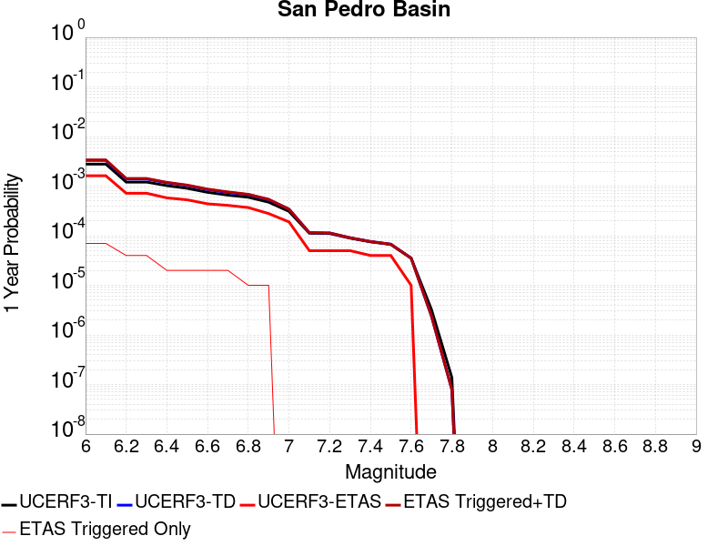 |  |

| Magnitude | 1 wk TI Prob | 1 wk TD Prob | 1 wk ETAS Prob | 1 wk ETAS/TD Gain | 1 wk ETAS Triggered+TD | 1 wk ETAS Triggered Only | 1 mo TI Prob | 1 mo TD Prob | 1 mo ETAS Prob | 1 mo ETAS/TD Gain | 1 mo ETAS Triggered+TD | 1 mo ETAS Triggered Only | 1 yr TI Prob | 1 yr TD Prob | 1 yr ETAS Prob | 1 yr ETAS/TD Gain | 1 yr ETAS Triggered+TD | 1 yr ETAS Triggered Only | 10 yr TI Prob | 10 yr TD Prob | 10 yr ETAS Prob | 10 yr ETAS/TD Gain | 10 yr ETAS Triggered+TD | 10 yr ETAS Triggered Only |
|-----|-----|-----|-----|-----|-----|-----|-----|-----|-----|-----|-----|-----|-----|-----|-----|-----|-----|-----|-----|-----|-----|-----|-----|-----|
| 6.0 | 5.3449043E-5 | 6.337018E-5 | 6.0E-5 | 0.9468175 | 1.03367645E-4 | 4.0E-5 | 2.2904722E-4 | 2.7156167E-4 | 1.4E-4 | 0.51553667 | 3.115508E-4 | 4.0E-5 | 0.0027850836 | 0.0033018515 | 0.00162 | 0.49063385 | 0.0033716203 | 7.0E-5 | 0.027504366 | 0.03258948 | 0.01626 | 0.498934 | 0.03270557 | 1.2E-4 |
| 6.1 | 5.3449043E-5 | 6.337018E-5 | 6.0E-5 | 0.9468175 | 1.03367645E-4 | 4.0E-5 | 2.2904722E-4 | 2.7156167E-4 | 1.4E-4 | 0.51553667 | 3.115508E-4 | 4.0E-5 | 0.0027850836 | 0.0033018515 | 0.00162 | 0.49063385 | 0.0033716203 | 7.0E-5 | 0.027504366 | 0.03258948 | 0.01626 | 0.498934 | 0.03270557 | 1.2E-4 |
| 6.2 | 2.3189454E-5 | 2.6642829E-5 | 4.0E-5 | 1.501342 | 4.6642297E-5 | 2.0E-5 | 9.9379584E-5 | 1.1417881E-4 | 7.0E-5 | 0.61307347 | 1.3417653E-4 | 2.0E-5 | 0.0012092749 | 0.0013892875 | 7.2E-4 | 0.51825124 | 0.001429232 | 4.0E-5 | 0.012027155 | 0.01381089 | 0.00707 | 0.51191485 | 0.013870061 | 6.0E-5 |
| 6.3 | 2.3189454E-5 | 2.6642829E-5 | 4.0E-5 | 1.501342 | 4.6642297E-5 | 2.0E-5 | 9.9379584E-5 | 1.1417881E-4 | 7.0E-5 | 0.61307347 | 1.3417653E-4 | 2.0E-5 | 0.0012092749 | 0.0013892875 | 7.2E-4 | 0.51825124 | 0.001429232 | 4.0E-5 | 0.012027155 | 0.01381089 | 0.00707 | 0.51191485 | 0.013870061 | 6.0E-5 |
| 6.4 | 1.966056E-5 | 2.246342E-5 | 3.0E-5 | 1.3355045 | 3.2463195E-5 | 1.0E-5 | 8.425682E-5 | 9.626848E-5 | 6.0E-5 | 0.623257 | 1.06267515E-4 | 1.0E-5 | 0.001025344 | 0.0011714787 | 5.8E-4 | 0.4951008 | 0.0011914552 | 2.0E-5 | 0.010206259 | 0.011657119 | 0.00599 | 0.5138491 | 0.0116966525 | 4.0E-5 |
| 6.5 | 1.7342953E-5 | 1.9745152E-5 | 3.0E-5 | 1.5193603 | 2.9744955E-5 | 1.0E-5 | 7.4324824E-5 | 8.461954E-5 | 5.0E-5 | 0.59088004 | 9.46187E-5 | 1.0E-5 | 9.04529E-4 | 0.0010297929 | 5.3E-4 | 0.51466656 | 0.0010497724 | 2.0E-5 | 0.009008561 | 0.010253932 | 0.00536 | 0.5227263 | 0.010283625 | 3.0E-5 |
| 6.6 | 1.439804E-5 | 1.6322716E-5 | 2.0E-5 | 1.2252862 | 2.6322554E-5 | 1.0E-5 | 6.170443E-5 | 6.99528E-5 | 4.0E-5 | 0.5718141 | 7.995211E-5 | 1.0E-5 | 7.509924E-4 | 8.513747E-4 | 4.4E-4 | 0.5168112 | 8.713577E-4 | 2.0E-5 | 0.0074845953 | 0.008484333 | 0.00437 | 0.515067 | 0.008514078 | 3.0E-5 |
| 6.7 | 1.2634884E-5 | 1.4285298E-5 | 2.0E-5 | 1.4000407 | 2.4285155E-5 | 1.0E-5 | 5.414838E-5 | 6.122144E-5 | 4.0E-5 | 0.65336585 | 7.122083E-5 | 1.0E-5 | 6.590571E-4 | 7.451466E-4 | 4.1E-4 | 0.5502273 | 7.651317E-4 | 2.0E-5 | 0.006571059 | 0.007429502 | 0.00385 | 0.51820433 | 0.007459279 | 3.0E-5 |
| 6.8 | 1.146091E-5 | 1.2933193E-5 | 1.0E-5 | 0.77320427 | 1.2933193E-5 | 0.0 | 4.911726E-5 | 5.542696E-5 | 3.0E-5 | 0.54125285 | 5.542696E-5 | 0.0 | 5.9783855E-4 | 6.74644E-4 | 3.7E-4 | 0.54843736 | 6.846373E-4 | 1.0E-5 | 0.0059623276 | 0.0067288997 | 0.00351 | 0.5216306 | 0.0067487652 | 2.0E-5 |
| 6.9 | 9.109035E-6 | 1.0235013E-5 | 1.0E-5 | 0.9770383 | 1.0235013E-5 | 0.0 | 3.9038136E-5 | 4.386376E-5 | 3.0E-5 | 0.6839359 | 4.386376E-5 | 0.0 | 4.7518566E-4 | 5.339384E-4 | 2.8E-4 | 0.52440506 | 5.4393307E-4 | 1.0E-5 | 0.0047417083 | 0.0053293095 | 0.00288 | 0.5404077 | 0.005349203 | 2.0E-5 |
| 7.0 | 5.9351028E-6 | 6.583965E-6 | 1.0E-5 | 1.5188416 | 6.583965E-6 | 0.0 | 2.5435906E-5 | 2.821682E-5 | 2.0E-5 | 0.70879704 | 2.821682E-5 | 0.0 | 3.0963816E-4 | 3.4350925E-4 | 1.9E-4 | 0.55311465 | 3.4350925E-4 | 0.0 | 0.0030920706 | 0.0034320997 | 0.0018 | 0.52446026 | 0.0034420653 | 1.0E-5 |
| 7.1 | 2.1557585E-6 | 2.2096492E-6 | 0.0 | 0.0 | 2.2096492E-6 | 0.0 | 9.238933E-6 | 9.469892E-6 | 1.0E-5 | 1.0559783 | 9.469892E-6 | 0.0 | 1.1247819E-4 | 1.15289986E-4 | 5.0E-5 | 0.433689 | 1.15289986E-4 | 0.0 | 0.0011242128 | 0.0011523172 | 6.4E-4 | 0.55540264 | 0.0011623056 | 1.0E-5 |
| 7.2 | 2.1251979E-6 | 2.1779954E-6 | 0.0 | 0.0 | 2.1779954E-6 | 0.0 | 9.107958E-6 | 9.334234E-6 | 1.0E-5 | 1.0713252 | 9.334234E-6 | 0.0 | 1.1088375E-4 | 1.13638525E-4 | 5.0E-5 | 0.43999162 | 1.13638525E-4 | 0.0 | 0.0011082845 | 0.0011358195 | 6.4E-4 | 0.5634698 | 0.0011458081 | 1.0E-5 |
| 7.3 | 1.7145798E-6 | 1.7442885E-6 | 0.0 | 0.0 | 1.7442885E-6 | 0.0 | 7.3481783E-6 | 7.475501E-6 | 1.0E-5 | 1.337703 | 7.475501E-6 | 0.0 | 8.94604E-5 | 9.1010515E-5 | 5.0E-5 | 0.54938704 | 9.1010515E-5 | 0.0 | 8.9424395E-4 | 9.0974156E-4 | 4.6E-4 | 0.50563806 | 9.197325E-4 | 1.0E-5 |
| 7.4 | 1.4467993E-6 | 1.4641878E-6 | 0.0 | 0.0 | 1.4641878E-6 | 0.0 | 6.200554E-6 | 6.275076E-6 | 1.0E-5 | 1.5936062 | 6.275076E-6 | 0.0 | 7.548913E-5 | 7.639644E-5 | 4.0E-5 | 0.5235846 | 7.639644E-5 | 0.0 | 7.546349E-4 | 7.6370913E-4 | 3.7E-4 | 0.48447767 | 7.7370147E-4 | 1.0E-5 |
| 7.5 | 1.2803735E-6 | 1.2931506E-6 | 0.0 | 0.0 | 1.2931506E-6 | 0.0 | 5.487303E-6 | 5.5420624E-6 | 1.0E-5 | 1.8043824 | 5.5420624E-6 | 0.0 | 6.680587E-5 | 6.747259E-5 | 4.0E-5 | 0.5928333 | 6.747259E-5 | 0.0 | 6.678579E-4 | 6.745281E-4 | 3.6E-4 | 0.5337064 | 6.845214E-4 | 1.0E-5 |
| 7.6 | 6.755009E-7 | 6.76947E-7 | 0.0 | 0.0 | 6.76947E-7 | 0.0 | 2.8950008E-6 | 2.9011985E-6 | 0.0 | 0.0 | 2.9011985E-6 | 0.0 | 3.5246063E-5 | 3.532158E-5 | 1.0E-5 | 0.28311306 | 3.532158E-5 | 0.0 | 3.5240475E-4 | 3.5316538E-4 | 2.1E-4 | 0.5946223 | 3.6316185E-4 | 1.0E-5 |
| 7.7 | 6.211885E-8 | 4.5699714E-8 | 0.0 | 0.0 | 4.5699714E-8 | 0.0 | 2.6622362E-7 | 1.9585592E-7 | 0.0 | 0.0 | 1.9585592E-7 | 0.0 | 3.2412677E-6 | 2.3845432E-6 | 0.0 | 0.0 | 2.3845432E-6 | 0.0 | 3.2412205E-5 | 2.3845198E-5 | 1.0E-5 | 0.41937163 | 2.3845198E-5 | 0.0 |
| 7.8 | 2.6580573E-9 | 1.5138054E-9 | 0.0 | 0.0 | 1.5138054E-9 | 0.0 | 1.1391674E-8 | 6.4877375E-9 | 0.0 | 0.0 | 6.4877375E-9 | 0.0 | 1.3869362E-7 | 7.89882E-8 | 0.0 | 0.0 | 7.89882E-8 | 0.0 | 1.3869354E-6 | 7.89882E-7 | 0.0 | 0.0 | 7.89882E-7 | 0.0 |

## Ventura-Pitas Point
*[(top)](#table-of-contents)*

| 1 Week | 1 Month | 1 Year | 10 Year |
|-----|-----|-----|-----|
|  |  |  |  |

| Magnitude | 1 wk TI Prob | 1 wk TD Prob | 1 wk ETAS Prob | 1 wk ETAS/TD Gain | 1 wk ETAS Triggered+TD | 1 wk ETAS Triggered Only | 1 mo TI Prob | 1 mo TD Prob | 1 mo ETAS Prob | 1 mo ETAS/TD Gain | 1 mo ETAS Triggered+TD | 1 mo ETAS Triggered Only | 1 yr TI Prob | 1 yr TD Prob | 1 yr ETAS Prob | 1 yr ETAS/TD Gain | 1 yr ETAS Triggered+TD | 1 yr ETAS Triggered Only | 10 yr TI Prob | 10 yr TD Prob | 10 yr ETAS Prob | 10 yr ETAS/TD Gain | 10 yr ETAS Triggered+TD | 10 yr ETAS Triggered Only |
|-----|-----|-----|-----|-----|-----|-----|-----|-----|-----|-----|-----|-----|-----|-----|-----|-----|-----|-----|-----|-----|-----|-----|-----|-----|
| 6.0 | 3.3179622E-5 | 3.373519E-5 | 8.0E-5 | 2.371411 | 9.3733164E-5 | 6.0E-5 | 1.4219063E-4 | 1.4457281E-4 | 1.5E-4 | 1.0375395 | 2.0456414E-4 | 6.0E-5 | 0.0017297962 | 0.0017590097 | 0.00114 | 0.648092 | 0.001838869 | 8.0E-5 | 0.017163932 | 0.017476497 | 0.01239 | 0.7089521 | 0.017564924 | 9.0E-5 |
| 6.1 | 3.3179622E-5 | 3.373519E-5 | 8.0E-5 | 2.371411 | 9.3733164E-5 | 6.0E-5 | 1.4219063E-4 | 1.4457281E-4 | 1.5E-4 | 1.0375395 | 2.0456414E-4 | 6.0E-5 | 0.0017297962 | 0.0017590097 | 0.00114 | 0.648092 | 0.001838869 | 8.0E-5 | 0.017163932 | 0.017476497 | 0.01239 | 0.7089521 | 0.017564924 | 9.0E-5 |
| 6.2 | 3.3179622E-5 | 3.373519E-5 | 8.0E-5 | 2.371411 | 9.3733164E-5 | 6.0E-5 | 1.4219063E-4 | 1.4457281E-4 | 1.5E-4 | 1.0375395 | 2.0456414E-4 | 6.0E-5 | 0.0017297962 | 0.0017590097 | 0.00114 | 0.648092 | 0.001838869 | 8.0E-5 | 0.017163932 | 0.017476497 | 0.01239 | 0.7089521 | 0.017564924 | 9.0E-5 |
| 6.3 | 3.3179622E-5 | 3.373519E-5 | 8.0E-5 | 2.371411 | 9.3733164E-5 | 6.0E-5 | 1.4219063E-4 | 1.4457281E-4 | 1.5E-4 | 1.0375395 | 2.0456414E-4 | 6.0E-5 | 0.0017297962 | 0.0017590097 | 0.00114 | 0.648092 | 0.001838869 | 8.0E-5 | 0.017163932 | 0.017476497 | 0.01239 | 0.7089521 | 0.017564924 | 9.0E-5 |
| 6.4 | 1.8754668E-5 | 1.7019594E-5 | 3.0E-5 | 1.7626742 | 3.7019254E-5 | 2.0E-5 | 8.037467E-5 | 7.2939205E-5 | 7.0E-5 | 0.9597033 | 9.293775E-5 | 2.0E-5 | 9.781223E-4 | 8.8769617E-4 | 5.3E-4 | 0.59705114 | 9.276607E-4 | 4.0E-5 | 0.009738282 | 0.008843943 | 0.00596 | 0.6739076 | 0.008883589 | 4.0E-5 |
| 6.5 | 1.8754668E-5 | 1.7019594E-5 | 3.0E-5 | 1.7626742 | 3.7019254E-5 | 2.0E-5 | 8.037467E-5 | 7.2939205E-5 | 7.0E-5 | 0.9597033 | 9.293775E-5 | 2.0E-5 | 9.781223E-4 | 8.8769617E-4 | 5.3E-4 | 0.59705114 | 9.276607E-4 | 4.0E-5 | 0.009738282 | 0.008843943 | 0.00596 | 0.6739076 | 0.008883589 | 4.0E-5 |
| 6.6 | 1.4361558E-5 | 1.2122258E-5 | 2.0E-5 | 1.6498576 | 3.2122014E-5 | 2.0E-5 | 6.154808E-5 | 5.1951512E-5 | 5.0E-5 | 0.9624359 | 7.1950475E-5 | 2.0E-5 | 7.490902E-4 | 6.323284E-4 | 4.0E-4 | 0.63258266 | 6.623094E-4 | 3.0E-5 | 0.0074657016 | 0.006305652 | 0.00427 | 0.6771702 | 0.006335463 | 3.0E-5 |
| 6.7 | 1.4361558E-5 | 1.2122258E-5 | 2.0E-5 | 1.6498576 | 3.2122014E-5 | 2.0E-5 | 6.154808E-5 | 5.1951512E-5 | 5.0E-5 | 0.9624359 | 7.1950475E-5 | 2.0E-5 | 7.490902E-4 | 6.323284E-4 | 4.0E-4 | 0.63258266 | 6.623094E-4 | 3.0E-5 | 0.0074657016 | 0.006305652 | 0.00427 | 0.6771702 | 0.006335463 | 3.0E-5 |
| 6.8 | 1.3663846E-5 | 1.1344401E-5 | 2.0E-5 | 1.7629842 | 3.1344174E-5 | 2.0E-5 | 5.8558027E-5 | 4.8617967E-5 | 5.0E-5 | 1.0284264 | 6.8616995E-5 | 2.0E-5 | 7.127108E-4 | 5.917649E-4 | 3.6E-4 | 0.6083497 | 6.2174717E-4 | 3.0E-5 | 0.007104293 | 0.0059022107 | 0.00399 | 0.6760179 | 0.005932034 | 3.0E-5 |
| 6.9 | 1.3644157E-5 | 1.1322501E-5 | 2.0E-5 | 1.766394 | 3.1322274E-5 | 2.0E-5 | 5.8473648E-5 | 4.8524114E-5 | 5.0E-5 | 1.0304155 | 6.852314E-5 | 2.0E-5 | 7.116841E-4 | 5.906229E-4 | 3.6E-4 | 0.609526 | 6.206052E-4 | 3.0E-5 | 0.007094092 | 0.0058908514 | 0.00399 | 0.67732143 | 0.0059206747 | 3.0E-5 |
| 7.0 | 1.3568845E-5 | 1.12420685E-5 | 2.0E-5 | 1.779032 | 3.1241845E-5 | 2.0E-5 | 5.8150898E-5 | 4.8179416E-5 | 5.0E-5 | 1.0377876 | 6.817845E-5 | 2.0E-5 | 7.077572E-4 | 5.8642845E-4 | 3.6E-4 | 0.61388564 | 6.1641086E-4 | 3.0E-5 | 0.007055073 | 0.005849128 | 0.00397 | 0.67873365 | 0.005878953 | 3.0E-5 |
| 7.1 | 1.306572E-5 | 1.0720521E-5 | 2.0E-5 | 1.865581 | 3.0720308E-5 | 2.0E-5 | 5.599474E-5 | 4.594429E-5 | 5.0E-5 | 1.0882745 | 6.594337E-5 | 2.0E-5 | 6.815227E-4 | 5.5923004E-4 | 3.5E-4 | 0.6258605 | 5.892133E-4 | 3.0E-5 | 0.0067943637 | 0.005578536 | 0.00379 | 0.6793897 | 0.0056083687 | 3.0E-5 |
| 7.2 | 1.232604E-5 | 9.995121E-6 | 2.0E-5 | 2.000976 | 2.999492E-5 | 2.0E-5 | 5.2824813E-5 | 4.283554E-5 | 5.0E-5 | 1.167255 | 6.283468E-5 | 2.0E-5 | 6.429523E-4 | 5.2139966E-4 | 3.4E-4 | 0.6520909 | 5.5138406E-4 | 3.0E-5 | 0.0064109527 | 0.005202059 | 0.00354 | 0.68049973 | 0.005231903 | 3.0E-5 |
| 7.3 | 1.0917261E-5 | 8.843812E-6 | 2.0E-5 | 2.2614682 | 2.8843635E-5 | 2.0E-5 | 4.678742E-5 | 3.7901507E-5 | 4.0E-5 | 1.055367 | 5.790075E-5 | 2.0E-5 | 5.69488E-4 | 4.6135474E-4 | 2.7E-4 | 0.585233 | 4.913409E-4 | 3.0E-5 | 0.0056803077 | 0.004604239 | 0.00306 | 0.66460496 | 0.0046341005 | 3.0E-5 |
| 7.4 | 1.039959E-5 | 8.42354E-6 | 2.0E-5 | 2.3742986 | 2.8423372E-5 | 2.0E-5 | 4.456891E-5 | 3.6100395E-5 | 4.0E-5 | 1.1080211 | 5.6099674E-5 | 2.0E-5 | 5.424914E-4 | 4.394352E-4 | 2.5E-4 | 0.5689121 | 4.6942203E-4 | 3.0E-5 | 0.0054116896 | 0.0043859277 | 0.0029 | 0.6612056 | 0.004415796 | 3.0E-5 |
| 7.5 | 9.015877E-6 | 7.29752E-6 | 2.0E-5 | 2.740657 | 2.7297374E-5 | 2.0E-5 | 3.86389E-5 | 3.1274718E-5 | 4.0E-5 | 1.2789884 | 5.127409E-5 | 2.0E-5 | 4.7032707E-4 | 3.8070456E-4 | 2.1E-4 | 0.5516088 | 4.1069314E-4 | 3.0E-5 | 0.004693329 | 0.003800772 | 0.00256 | 0.6735474 | 0.0038306578 | 3.0E-5 |
| 7.6 | 4.900162E-6 | 3.874119E-6 | 2.0E-5 | 5.162464 | 2.3874041E-5 | 2.0E-5 | 2.1000526E-5 | 1.6603262E-5 | 3.0E-5 | 1.8068739 | 3.660293E-5 | 2.0E-5 | 2.556514E-4 | 2.0212609E-4 | 9.0E-5 | 0.4452666 | 2.3212003E-4 | 3.0E-5 | 0.0025535747 | 0.002019436 | 0.00149 | 0.7378297 | 0.0020493756 | 3.0E-5 |
| 7.7 | 3.8850626E-6 | 3.12676E-6 | 2.0E-5 | 6.3963976 | 2.3126697E-5 | 2.0E-5 | 1.6650163E-5 | 1.3400332E-5 | 3.0E-5 | 2.2387505 | 3.3400065E-5 | 2.0E-5 | 2.0269687E-4 | 1.6313691E-4 | 9.0E-5 | 0.55168384 | 1.9313201E-4 | 3.0E-5 | 0.002025121 | 0.0016301809 | 0.00119 | 0.72998035 | 0.001660132 | 3.0E-5 |
| 7.8 | 2.4654719E-6 | 2.029902E-6 | 2.0E-5 | 9.852693 | 2.202986E-5 | 2.0E-5 | 1.0566265E-5 | 8.699551E-6 | 2.0E-5 | 2.2989693 | 2.8699376E-5 | 2.0E-5 | 1.2863669E-4 | 1.0591193E-4 | 4.0E-5 | 0.37767228 | 1.259098E-4 | 2.0E-5 | 0.0012856225 | 0.0010586192 | 7.8E-4 | 0.73680884 | 0.0010785981 | 2.0E-5 |
| 7.9 | 4.095894E-7 | 3.2765078E-7 | 0.0 | 0.0 | 3.2765078E-7 | 0.0 | 1.7553821E-6 | 1.4042168E-6 | 0.0 | 0.0 | 1.4042168E-6 | 0.0 | 2.1371567E-5 | 1.709621E-5 | 0.0 | 0.0 | 1.709621E-5 | 0.0 | 2.1369511E-4 | 1.7094925E-4 | 1.0E-4 | 0.5849689 | 1.7094925E-4 | 0.0 |
| 8.0 | 7.791402E-9 | 5.6836056E-9 | 0.0 | 0.0 | 5.6836056E-9 | 0.0 | 3.3391725E-8 | 2.4358311E-8 | 0.0 | 0.0 | 2.4358311E-8 | 0.0 | 4.0654416E-7 | 2.965624E-7 | 0.0 | 0.0 | 2.965624E-7 | 0.0 | 4.065434E-6 | 2.9656223E-6 | 1.0E-5 | 3.3719735 | 2.9656223E-6 | 0.0 |

## Big Pine (East)
*[(top)](#table-of-contents)*

| 1 Week | 1 Month | 1 Year | 10 Year |
|-----|-----|-----|-----|
|  |  |  |  |

| Magnitude | 1 wk TI Prob | 1 wk TD Prob | 1 wk ETAS Prob | 1 wk ETAS/TD Gain | 1 wk ETAS Triggered+TD | 1 wk ETAS Triggered Only | 1 mo TI Prob | 1 mo TD Prob | 1 mo ETAS Prob | 1 mo ETAS/TD Gain | 1 mo ETAS Triggered+TD | 1 mo ETAS Triggered Only | 1 yr TI Prob | 1 yr TD Prob | 1 yr ETAS Prob | 1 yr ETAS/TD Gain | 1 yr ETAS Triggered+TD | 1 yr ETAS Triggered Only | 10 yr TI Prob | 10 yr TD Prob | 10 yr ETAS Prob | 10 yr ETAS/TD Gain | 10 yr ETAS Triggered+TD | 10 yr ETAS Triggered Only |
|-----|-----|-----|-----|-----|-----|-----|-----|-----|-----|-----|-----|-----|-----|-----|-----|-----|-----|-----|-----|-----|-----|-----|-----|-----|
| 6.0 | 9.916913E-6 | 1.28172705E-5 | 2.0E-5 | 1.5603946 | 2.2817143E-5 | 1.0E-5 | 4.250036E-5 | 5.493013E-5 | 8.0E-5 | 1.4563956 | 1.04927385E-4 | 5.0E-5 | 5.173191E-4 | 6.685912E-4 | 5.2E-4 | 0.7777548 | 7.5853104E-4 | 9.0E-5 | 0.0051611643 | 0.006670449 | 0.00526 | 0.78855264 | 0.0067896484 | 1.2E-4 |
| 6.1 | 9.916913E-6 | 1.28172705E-5 | 2.0E-5 | 1.5603946 | 2.2817143E-5 | 1.0E-5 | 4.250036E-5 | 5.493013E-5 | 8.0E-5 | 1.4563956 | 1.04927385E-4 | 5.0E-5 | 5.173191E-4 | 6.685912E-4 | 5.2E-4 | 0.7777548 | 7.5853104E-4 | 9.0E-5 | 0.0051611643 | 0.006670449 | 0.00526 | 0.78855264 | 0.0067896484 | 1.2E-4 |
| 6.2 | 9.916913E-6 | 1.28172705E-5 | 2.0E-5 | 1.5603946 | 2.2817143E-5 | 1.0E-5 | 4.250036E-5 | 5.493013E-5 | 8.0E-5 | 1.4563956 | 1.04927385E-4 | 5.0E-5 | 5.173191E-4 | 6.685912E-4 | 5.2E-4 | 0.7777548 | 7.5853104E-4 | 9.0E-5 | 0.0051611643 | 0.006670449 | 0.00526 | 0.78855264 | 0.0067896484 | 1.2E-4 |
| 6.3 | 5.479711E-6 | 8.1132375E-6 | 1.0E-5 | 1.2325536 | 8.1132375E-6 | 0.0 | 2.3484265E-5 | 3.4770575E-5 | 3.0E-5 | 0.8627985 | 5.476988E-5 | 2.0E-5 | 2.858834E-4 | 4.232527E-4 | 2.8E-4 | 0.6615433 | 4.7323154E-4 | 5.0E-5 | 0.0028551589 | 0.0042272513 | 0.00319 | 0.75462747 | 0.004296955 | 7.0E-5 |
| 6.4 | 5.465009E-6 | 8.0975315E-6 | 1.0E-5 | 1.2349443 | 8.0975315E-6 | 0.0 | 2.3421257E-5 | 3.4703262E-5 | 3.0E-5 | 0.86447203 | 5.4702567E-5 | 2.0E-5 | 2.851165E-4 | 4.2243348E-4 | 2.8E-4 | 0.66282624 | 4.7241236E-4 | 5.0E-5 | 0.0028475097 | 0.00421909 | 0.00318 | 0.75371695 | 0.004288795 | 7.0E-5 |
| 6.5 | 4.826767E-6 | 7.4225877E-6 | 1.0E-5 | 1.3472391 | 7.4225877E-6 | 0.0 | 2.068598E-5 | 3.1810716E-5 | 3.0E-5 | 0.9430784 | 5.1810082E-5 | 2.0E-5 | 2.518227E-4 | 3.8722943E-4 | 2.8E-4 | 0.7230855 | 4.3721008E-4 | 5.0E-5 | 0.0025153751 | 0.0038682907 | 0.00286 | 0.73934466 | 0.0039380197 | 7.0E-5 |
| 6.6 | 4.3146847E-6 | 6.8825234E-6 | 1.0E-5 | 1.4529555 | 6.8825234E-6 | 0.0 | 1.8491375E-5 | 2.949621E-5 | 3.0E-5 | 1.0170798 | 4.949562E-5 | 2.0E-5 | 2.2510924E-4 | 3.5905963E-4 | 2.5E-4 | 0.6962632 | 4.0904168E-4 | 5.0E-5 | 0.0022488134 | 0.0035875062 | 0.00249 | 0.69407547 | 0.0036472909 | 6.0E-5 |
| 6.7 | 3.6968106E-6 | 5.9957474E-6 | 1.0E-5 | 1.6678487 | 5.9957474E-6 | 0.0 | 1.5843378E-5 | 2.5695816E-5 | 3.0E-5 | 1.1675053 | 4.5695302E-5 | 2.0E-5 | 1.9287605E-4 | 3.128032E-4 | 2.2E-4 | 0.70331764 | 3.6278754E-4 | 5.0E-5 | 0.0019270873 | 0.0031262499 | 0.00212 | 0.6781288 | 0.0031860624 | 6.0E-5 |
| 6.8 | 3.4671132E-6 | 5.7024477E-6 | 1.0E-5 | 1.7536329 | 5.7024477E-6 | 0.0 | 1.4858972E-5 | 2.4438841E-5 | 3.0E-5 | 1.2275541 | 4.443835E-5 | 2.0E-5 | 1.8089297E-4 | 2.9750372E-4 | 1.8E-4 | 0.6050345 | 3.4748882E-4 | 5.0E-5 | 0.0018074579 | 0.0029736666 | 0.00192 | 0.64566755 | 0.0030334883 | 6.0E-5 |
| 6.9 | 2.7686972E-6 | 4.8254797E-6 | 1.0E-5 | 2.0723329 | 4.8254797E-6 | 0.0 | 1.1865792E-5 | 2.0680467E-5 | 2.0E-5 | 0.96709615 | 3.068026E-5 | 1.0E-5 | 1.4445644E-4 | 2.5175634E-4 | 1.6E-4 | 0.6355351 | 2.9174628E-4 | 4.0E-5 | 0.0014436257 | 0.002517256 | 0.00136 | 0.54027086 | 0.00256713 | 5.0E-5 |
| 7.0 | 2.1472624E-6 | 3.985277E-6 | 0.0 | 0.0 | 3.985277E-6 | 0.0 | 9.20252E-6 | 1.707965E-5 | 1.0E-5 | 0.5854921 | 2.7079479E-5 | 1.0E-5 | 1.12034926E-4 | 2.0792543E-4 | 9.0E-5 | 0.4328475 | 2.3791919E-4 | 3.0E-5 | 0.0011197845 | 0.0020798238 | 0.00116 | 0.55773956 | 0.0021197407 | 4.0E-5 |
| 7.1 | 1.7018335E-6 | 3.3450835E-6 | 0.0 | 0.0 | 3.3450835E-6 | 0.0 | 7.293552E-6 | 1.4335996E-5 | 0.0 | 0.0 | 1.4335996E-5 | 0.0 | 8.879537E-5 | 1.7452713E-4 | 7.0E-5 | 0.40108377 | 1.8452539E-4 | 1.0E-5 | 8.87599E-4 | 0.0017463792 | 9.0E-4 | 0.515352 | 0.0017563617 | 1.0E-5 |
| 7.2 | 1.25603E-6 | 2.794679E-6 | 0.0 | 0.0 | 2.794679E-6 | 0.0 | 5.3829745E-6 | 1.1977142E-5 | 0.0 | 0.0 | 1.1977142E-5 | 0.0 | 6.553574E-5 | 1.4581217E-4 | 4.0E-5 | 0.27432552 | 1.5581072E-4 | 1.0E-5 | 6.551642E-4 | 0.0014596173 | 6.8E-4 | 0.46587554 | 0.0014696027 | 1.0E-5 |
| 7.3 | 1.112297E-6 | 2.610519E-6 | 0.0 | 0.0 | 2.610519E-6 | 0.0 | 4.7669787E-6 | 1.1187892E-5 | 0.0 | 0.0 | 1.1187892E-5 | 0.0 | 5.803642E-5 | 1.3620428E-4 | 4.0E-5 | 0.29367653 | 1.4620292E-4 | 1.0E-5 | 5.802127E-4 | 0.001363502 | 6.1E-4 | 0.4473774 | 0.0013734883 | 1.0E-5 |
| 7.4 | 1.0137181E-6 | 2.4836752E-6 | 0.0 | 0.0 | 2.4836752E-6 | 0.0 | 4.3444993E-6 | 1.064428E-5 | 0.0 | 0.0 | 1.064428E-5 | 0.0 | 5.2892992E-5 | 1.2958662E-4 | 4.0E-5 | 0.30867386 | 1.3958532E-4 | 1.0E-5 | 5.288041E-4 | 0.0012971918 | 6.0E-4 | 0.46253762 | 0.0013071789 | 1.0E-5 |
| 7.5 | 9.598608E-7 | 2.407328E-6 | 0.0 | 0.0 | 2.407328E-6 | 0.0 | 4.1136827E-6 | 1.03170805E-5 | 0.0 | 0.0 | 1.03170805E-5 | 0.0 | 5.0082934E-5 | 1.2560343E-4 | 3.0E-5 | 0.23884697 | 1.3560218E-4 | 1.0E-5 | 5.007165E-4 | 0.0012572132 | 5.8E-4 | 0.46133783 | 0.0012672007 | 1.0E-5 |
| 7.6 | 7.929459E-7 | 2.0450152E-6 | 0.0 | 0.0 | 2.0450152E-6 | 0.0 | 3.3983351E-6 | 8.764322E-6 | 0.0 | 0.0 | 8.764322E-6 | 0.0 | 4.1373947E-5 | 1.0670057E-4 | 2.0E-5 | 0.18744043 | 1.0670057E-4 | 0.0 | 4.1366243E-4 | 0.0010685825 | 5.1E-4 | 0.47726777 | 0.0010685825 | 0.0 |
| 7.7 | 4.155788E-7 | 1.1606729E-6 | 0.0 | 0.0 | 1.1606729E-6 | 0.0 | 1.7810507E-6 | 4.974303E-6 | 0.0 | 0.0 | 4.974303E-6 | 0.0 | 2.1684076E-5 | 6.05605E-5 | 1.0E-5 | 0.16512413 | 6.05605E-5 | 0.0 | 2.1681961E-4 | 6.085995E-4 | 3.3E-4 | 0.54222846 | 6.085995E-4 | 0.0 |
| 7.8 | 1.14666925E-7 | 2.592197E-7 | 0.0 | 0.0 | 2.592197E-7 | 0.0 | 4.914296E-7 | 1.1109411E-6 | 0.0 | 0.0 | 1.1109411E-6 | 0.0 | 5.9831386E-6 | 1.3525627E-5 | 0.0 | 0.0 | 1.3525627E-5 | 0.0 | 5.9829777E-5 | 1.3636416E-4 | 6.0E-5 | 0.4399983 | 1.3636416E-4 | 0.0 |
| 7.9 | 2.9231824E-8 | 4.1462318E-8 | 0.0 | 0.0 | 4.1462318E-8 | 0.0 | 1.2527924E-7 | 1.7769564E-7 | 0.0 | 0.0 | 1.7769564E-7 | 0.0 | 1.5252737E-6 | 2.1634426E-6 | 0.0 | 0.0 | 2.1634426E-6 | 0.0 | 1.5252632E-5 | 2.197062E-5 | 1.0E-5 | 0.4551533 | 2.197062E-5 | 0.0 |

## Rinconada 2011 CFM
*[(top)](#table-of-contents)*

| 1 Week | 1 Month | 1 Year | 10 Year |
|-----|-----|-----|-----|
|  |  |  |  |

| Magnitude | 1 wk TI Prob | 1 wk TD Prob | 1 wk ETAS Prob | 1 wk ETAS/TD Gain | 1 wk ETAS Triggered+TD | 1 wk ETAS Triggered Only | 1 mo TI Prob | 1 mo TD Prob | 1 mo ETAS Prob | 1 mo ETAS/TD Gain | 1 mo ETAS Triggered+TD | 1 mo ETAS Triggered Only | 1 yr TI Prob | 1 yr TD Prob | 1 yr ETAS Prob | 1 yr ETAS/TD Gain | 1 yr ETAS Triggered+TD | 1 yr ETAS Triggered Only | 10 yr TI Prob | 10 yr TD Prob | 10 yr ETAS Prob | 10 yr ETAS/TD Gain | 10 yr ETAS Triggered+TD | 10 yr ETAS Triggered Only |
|-----|-----|-----|-----|-----|-----|-----|-----|-----|-----|-----|-----|-----|-----|-----|-----|-----|-----|-----|-----|-----|-----|-----|-----|-----|
| 6.0 | 1.5752368E-5 | 1.6274716E-5 | 2.0E-5 | 1.2289001 | 3.627439E-5 | 2.0E-5 | 6.75084E-5 | 6.974694E-5 | 8.0E-5 | 1.1470038 | 1.0974414E-4 | 4.0E-5 | 8.2160486E-4 | 8.488413E-4 | 6.1E-4 | 0.71862674 | 9.0879033E-4 | 6.0E-5 | 0.008185739 | 0.00845637 | 0.00559 | 0.6610401 | 0.008575356 | 1.2E-4 |
| 6.1 | 1.0966133E-5 | 1.1323029E-5 | 2.0E-5 | 1.7663118 | 3.13228E-5 | 2.0E-5 | 4.6996865E-5 | 4.852637E-5 | 4.0E-5 | 0.8242941 | 7.8524914E-5 | 3.0E-5 | 5.720366E-4 | 5.9064914E-4 | 3.3E-4 | 0.55870736 | 6.406196E-4 | 5.0E-5 | 0.0057056635 | 0.005890889 | 0.00329 | 0.55848956 | 0.005980359 | 9.0E-5 |
| 6.2 | 1.0966133E-5 | 1.1323029E-5 | 2.0E-5 | 1.7663118 | 3.13228E-5 | 2.0E-5 | 4.6996865E-5 | 4.852637E-5 | 4.0E-5 | 0.8242941 | 7.8524914E-5 | 3.0E-5 | 5.720366E-4 | 5.9064914E-4 | 3.3E-4 | 0.55870736 | 6.406196E-4 | 5.0E-5 | 0.0057056635 | 0.005890889 | 0.00329 | 0.55848956 | 0.005980359 | 9.0E-5 |
| 6.3 | 8.926149E-6 | 9.212772E-6 | 1.0E-5 | 1.0854497 | 1.9212679E-5 | 1.0E-5 | 3.8254362E-5 | 3.948271E-5 | 3.0E-5 | 0.75982624 | 5.948192E-5 | 2.0E-5 | 4.6564735E-4 | 4.8059633E-4 | 2.6E-4 | 0.5409946 | 5.105819E-4 | 3.0E-5 | 0.0046467283 | 0.0047956146 | 0.0027 | 0.5630144 | 0.004865279 | 7.0E-5 |
| 6.4 | 7.676955E-6 | 7.920191E-6 | 1.0E-5 | 1.2625958 | 1.7920112E-5 | 1.0E-5 | 3.290082E-5 | 3.3943234E-5 | 3.0E-5 | 0.8838285 | 5.3942556E-5 | 2.0E-5 | 4.0049385E-4 | 4.131807E-4 | 2.2E-4 | 0.53245467 | 4.431683E-4 | 3.0E-5 | 0.0039977287 | 0.004124151 | 0.00235 | 0.5698142 | 0.0041938624 | 7.0E-5 |
| 6.5 | 6.1671026E-6 | 6.358955E-6 | 1.0E-5 | 1.5725855 | 1.6358892E-5 | 1.0E-5 | 2.6430173E-5 | 2.725238E-5 | 3.0E-5 | 1.1008213 | 4.7251837E-5 | 2.0E-5 | 3.2173982E-4 | 3.317473E-4 | 2.1E-4 | 0.63301194 | 3.6173733E-4 | 3.0E-5 | 0.003212744 | 0.0033125326 | 0.00194 | 0.5856546 | 0.0033823007 | 7.0E-5 |
| 6.6 | 5.553456E-6 | 5.7248126E-6 | 1.0E-5 | 1.7467821 | 1.5724756E-5 | 1.0E-5 | 2.3800309E-5 | 2.4534682E-5 | 2.0E-5 | 0.8151726 | 4.453419E-5 | 2.0E-5 | 2.897302E-4 | 2.9866886E-4 | 2.0E-4 | 0.6696379 | 3.286599E-4 | 3.0E-5 | 0.0028935277 | 0.0029826832 | 0.00171 | 0.5733093 | 0.0030325342 | 5.0E-5 |
| 6.7 | 4.787857E-6 | 4.93331E-6 | 0.0 | 0.0 | 4.93331E-6 | 0.0 | 2.0519226E-5 | 2.1142585E-5 | 1.0E-5 | 0.47297907 | 3.1142372E-5 | 1.0E-5 | 2.4979294E-4 | 2.573806E-4 | 1.7E-4 | 0.6605004 | 2.7737545E-4 | 2.0E-5 | 0.0024951235 | 0.002570831 | 0.00154 | 0.5990281 | 0.0026107281 | 4.0E-5 |
| 6.8 | 3.9955166E-6 | 4.1134763E-6 | 0.0 | 0.0 | 4.1134763E-6 | 0.0 | 1.7123532E-5 | 1.7629065E-5 | 1.0E-5 | 0.56724507 | 2.7628888E-5 | 1.0E-5 | 2.0845905E-4 | 2.1461275E-4 | 1.6E-4 | 0.7455288 | 2.3460847E-4 | 2.0E-5 | 0.002082636 | 0.0021440587 | 0.00134 | 0.6249829 | 0.0021739942 | 3.0E-5 |
| 6.9 | 3.4250072E-6 | 3.5224466E-6 | 0.0 | 0.0 | 3.5224466E-6 | 0.0 | 1.46785205E-5 | 1.5096112E-5 | 1.0E-5 | 0.6624222 | 2.5095962E-5 | 1.0E-5 | 1.7869633E-4 | 1.8377969E-4 | 1.2E-4 | 0.6529557 | 2.0377601E-4 | 2.0E-5 | 0.001785527 | 0.0018362795 | 0.00113 | 0.61537474 | 0.0018662245 | 3.0E-5 |
| 7.0 | 2.7712713E-6 | 2.8467002E-6 | 0.0 | 0.0 | 2.8467002E-6 | 0.0 | 1.1876823E-5 | 1.22000865E-5 | 1.0E-5 | 0.8196663 | 2.2199965E-5 | 1.0E-5 | 1.4459073E-4 | 1.4852594E-4 | 1.0E-4 | 0.67328304 | 1.6852298E-4 | 2.0E-5 | 0.0014449668 | 0.0014842683 | 8.6E-4 | 0.5794101 | 0.0015142239 | 3.0E-5 |
| 7.1 | 2.227358E-6 | 2.2856987E-6 | 0.0 | 0.0 | 2.2856987E-6 | 0.0 | 9.545785E-6 | 9.795815E-6 | 1.0E-5 | 1.0208441 | 1.9795716E-5 | 1.0E-5 | 1.16213734E-4 | 1.1925753E-4 | 9.0E-5 | 0.75466937 | 1.3925515E-4 | 2.0E-5 | 0.0011615298 | 0.0011919363 | 7.7E-4 | 0.64600766 | 0.0012219006 | 3.0E-5 |
| 7.2 | 1.581796E-6 | 1.6209015E-6 | 0.0 | 0.0 | 1.6209015E-6 | 0.0 | 6.779108E-6 | 6.946702E-6 | 1.0E-5 | 1.439532 | 1.6946633E-5 | 1.0E-5 | 8.253252E-5 | 8.4572814E-5 | 7.0E-5 | 0.8276891 | 1.04571125E-4 | 2.0E-5 | 8.250187E-4 | 8.4540684E-4 | 5.7E-4 | 0.6742316 | 8.753815E-4 | 3.0E-5 |
| 7.3 | 1.0306567E-6 | 1.054648E-6 | 0.0 | 0.0 | 1.054648E-6 | 0.0 | 4.4170924E-6 | 4.519912E-6 | 0.0 | 0.0 | 4.519912E-6 | 0.0 | 5.3776774E-5 | 5.502854E-5 | 3.0E-5 | 0.5451716 | 6.502799E-5 | 1.0E-5 | 5.376376E-4 | 5.501494E-4 | 4.2E-4 | 0.763429 | 5.701384E-4 | 2.0E-5 |
| 7.4 | 6.535541E-7 | 6.682744E-7 | 0.0 | 0.0 | 6.682744E-7 | 0.0 | 2.800943E-6 | 2.8640302E-6 | 0.0 | 0.0 | 2.8640302E-6 | 0.0 | 3.4100947E-5 | 3.4869012E-5 | 2.0E-5 | 0.5735752 | 4.4868662E-5 | 1.0E-5 | 3.4095717E-4 | 3.486355E-4 | 2.8E-4 | 0.80313104 | 3.5863204E-4 | 1.0E-5 |
| 7.5 | 3.2656962E-7 | 3.3316712E-7 | 0.0 | 0.0 | 3.3316712E-7 | 0.0 | 1.3995833E-6 | 1.4278584E-6 | 0.0 | 0.0 | 1.4278584E-6 | 0.0 | 1.7039794E-5 | 1.7384036E-5 | 0.0 | 0.0 | 1.7384036E-5 | 0.0 | 1.7038487E-4 | 1.738268E-4 | 1.2E-4 | 0.6903423 | 1.738268E-4 | 0.0 |
| 7.6 | 9.754343E-8 | 9.821017E-8 | 0.0 | 0.0 | 9.821017E-8 | 0.0 | 4.180432E-7 | 4.2090065E-7 | 0.0 | 0.0 | 4.2090065E-7 | 0.0 | 5.089664E-6 | 5.1244533E-6 | 0.0 | 0.0 | 5.1244533E-6 | 0.0 | 5.0895473E-5 | 5.124336E-5 | 2.0E-5 | 0.39029446 | 5.124336E-5 | 0.0 |
| 7.7 | 6.0001453E-9 | 5.8491207E-9 | 0.0 | 0.0 | 5.8491207E-9 | 0.0 | 2.5714908E-8 | 2.506766E-8 | 0.0 | 0.0 | 2.506766E-8 | 0.0 | 3.1307894E-7 | 3.051987E-7 | 0.0 | 0.0 | 3.051987E-7 | 0.0 | 3.1307852E-6 | 3.0519832E-6 | 1.0E-5 | 3.276558 | 3.0519832E-6 | 0.0 |
| 7.8 | 7.400003E-11 | 7.4654505E-11 | 0.0 | 0.0 | 7.4654505E-11 | 0.0 | 3.171432E-10 | 3.1994773E-10 | 0.0 | 0.0 | 3.1994773E-10 | 0.0 | 3.861218E-9 | 3.895363E-9 | 0.0 | 0.0 | 3.895363E-9 | 0.0 | 3.861218E-8 | 3.895363E-8 | 0.0 | 0.0 | 3.895363E-8 | 0.0 |

## Dry Mountain
*[(top)](#table-of-contents)*

| 1 Week | 1 Month | 1 Year | 10 Year |
|-----|-----|-----|-----|
|  |  |  |  |

| Magnitude | 1 wk TI Prob | 1 wk TD Prob | 1 wk ETAS Prob | 1 wk ETAS/TD Gain | 1 wk ETAS Triggered+TD | 1 wk ETAS Triggered Only | 1 mo TI Prob | 1 mo TD Prob | 1 mo ETAS Prob | 1 mo ETAS/TD Gain | 1 mo ETAS Triggered+TD | 1 mo ETAS Triggered Only | 1 yr TI Prob | 1 yr TD Prob | 1 yr ETAS Prob | 1 yr ETAS/TD Gain | 1 yr ETAS Triggered+TD | 1 yr ETAS Triggered Only | 10 yr TI Prob | 10 yr TD Prob | 10 yr ETAS Prob | 10 yr ETAS/TD Gain | 10 yr ETAS Triggered+TD | 10 yr ETAS Triggered Only |
|-----|-----|-----|-----|-----|-----|-----|-----|-----|-----|-----|-----|-----|-----|-----|-----|-----|-----|-----|-----|-----|-----|-----|-----|-----|
| 6.0 | 6.222801E-6 | 6.439381E-6 | 2.0E-5 | 3.1058884 | 2.6439253E-5 | 2.0E-5 | 2.6668875E-5 | 2.7597147E-5 | 2.0E-5 | 0.7247126 | 4.7596594E-5 | 2.0E-5 | 3.2464517E-4 | 3.3595937E-4 | 1.9E-4 | 0.5655446 | 4.0593586E-4 | 7.0E-5 | 0.0032417132 | 0.0033560768 | 0.00177 | 0.5274015 | 0.0034756742 | 1.2E-4 |
| 6.1 | 6.222801E-6 | 6.439381E-6 | 2.0E-5 | 3.1058884 | 2.6439253E-5 | 2.0E-5 | 2.6668875E-5 | 2.7597147E-5 | 2.0E-5 | 0.7247126 | 4.7596594E-5 | 2.0E-5 | 3.2464517E-4 | 3.3595937E-4 | 1.9E-4 | 0.5655446 | 4.0593586E-4 | 7.0E-5 | 0.0032417132 | 0.0033560768 | 0.00177 | 0.5274015 | 0.0034756742 | 1.2E-4 |
| 6.2 | 6.222801E-6 | 6.439381E-6 | 2.0E-5 | 3.1058884 | 2.6439253E-5 | 2.0E-5 | 2.6668875E-5 | 2.7597147E-5 | 2.0E-5 | 0.7247126 | 4.7596594E-5 | 2.0E-5 | 3.2464517E-4 | 3.3595937E-4 | 1.9E-4 | 0.5655446 | 4.0593586E-4 | 7.0E-5 | 0.0032417132 | 0.0033560768 | 0.00177 | 0.5274015 | 0.0034756742 | 1.2E-4 |
| 6.3 | 6.222801E-6 | 6.439381E-6 | 2.0E-5 | 3.1058884 | 2.6439253E-5 | 2.0E-5 | 2.6668875E-5 | 2.7597147E-5 | 2.0E-5 | 0.7247126 | 4.7596594E-5 | 2.0E-5 | 3.2464517E-4 | 3.3595937E-4 | 1.9E-4 | 0.5655446 | 4.0593586E-4 | 7.0E-5 | 0.0032417132 | 0.0033560768 | 0.00177 | 0.5274015 | 0.0034756742 | 1.2E-4 |
| 6.4 | 6.222801E-6 | 6.439381E-6 | 2.0E-5 | 3.1058884 | 2.6439253E-5 | 2.0E-5 | 2.6668875E-5 | 2.7597147E-5 | 2.0E-5 | 0.7247126 | 4.7596594E-5 | 2.0E-5 | 3.2464517E-4 | 3.3595937E-4 | 1.9E-4 | 0.5655446 | 4.0593586E-4 | 7.0E-5 | 0.0032417132 | 0.0033560768 | 0.00177 | 0.5274015 | 0.0034756742 | 1.2E-4 |
| 6.5 | 2.8528623E-6 | 2.9521684E-6 | 1.0E-5 | 3.3873405 | 1.2952139E-5 | 1.0E-5 | 1.22264955E-5 | 1.2652138E-5 | 1.0E-5 | 0.79038024 | 2.2652011E-5 | 1.0E-5 | 1.4884741E-4 | 1.540376E-4 | 8.0E-5 | 0.51935375 | 1.7403452E-4 | 2.0E-5 | 0.0014874774 | 0.0015401616 | 8.0E-4 | 0.519426 | 0.0015801 | 4.0E-5 |
| 6.6 | 2.8528623E-6 | 2.9521684E-6 | 1.0E-5 | 3.3873405 | 1.2952139E-5 | 1.0E-5 | 1.22264955E-5 | 1.2652138E-5 | 1.0E-5 | 0.79038024 | 2.2652011E-5 | 1.0E-5 | 1.4884741E-4 | 1.540376E-4 | 8.0E-5 | 0.51935375 | 1.7403452E-4 | 2.0E-5 | 0.0014874774 | 0.0015401616 | 8.0E-4 | 0.519426 | 0.0015801 | 4.0E-5 |
| 6.7 | 2.541E-6 | 2.6293578E-6 | 1.0E-5 | 3.80321 | 1.2629332E-5 | 1.0E-5 | 1.0889954E-5 | 1.1268677E-5 | 1.0E-5 | 0.88741565 | 2.1268565E-5 | 1.0E-5 | 1.3257713E-4 | 1.3719614E-4 | 6.0E-5 | 0.4373301 | 1.4719476E-4 | 1.0E-5 | 0.0013249806 | 0.0013719613 | 7.4E-4 | 0.53937376 | 0.0014019202 | 3.0E-5 |

## Kern Canyon (North Kern) 2011
*[(top)](#table-of-contents)*

| 1 Week | 1 Month | 1 Year | 10 Year |
|-----|-----|-----|-----|
|  |  |  |  |

| Magnitude | 1 wk TI Prob | 1 wk TD Prob | 1 wk ETAS Prob | 1 wk ETAS/TD Gain | 1 wk ETAS Triggered+TD | 1 wk ETAS Triggered Only | 1 mo TI Prob | 1 mo TD Prob | 1 mo ETAS Prob | 1 mo ETAS/TD Gain | 1 mo ETAS Triggered+TD | 1 mo ETAS Triggered Only | 1 yr TI Prob | 1 yr TD Prob | 1 yr ETAS Prob | 1 yr ETAS/TD Gain | 1 yr ETAS Triggered+TD | 1 yr ETAS Triggered Only | 10 yr TI Prob | 10 yr TD Prob | 10 yr ETAS Prob | 10 yr ETAS/TD Gain | 10 yr ETAS Triggered+TD | 10 yr ETAS Triggered Only |
|-----|-----|-----|-----|-----|-----|-----|-----|-----|-----|-----|-----|-----|-----|-----|-----|-----|-----|-----|-----|-----|-----|-----|-----|-----|
| 6.0 | 6.6264497E-6 | 6.75733E-6 | 3.0E-5 | 4.4396234 | 3.6757127E-5 | 3.0E-5 | 2.8398761E-5 | 2.895971E-5 | 6.0E-5 | 2.0718439 | 7.895826E-5 | 5.0E-5 | 3.4570007E-4 | 3.5253543E-4 | 3.6E-4 | 1.021174 | 4.3250722E-4 | 8.0E-5 | 0.0034516277 | 0.0035205502 | 0.00176 | 0.49992186 | 0.003630163 | 1.1E-4 |
| 6.1 | 6.6264497E-6 | 6.75733E-6 | 3.0E-5 | 4.4396234 | 3.6757127E-5 | 3.0E-5 | 2.8398761E-5 | 2.895971E-5 | 6.0E-5 | 2.0718439 | 7.895826E-5 | 5.0E-5 | 3.4570007E-4 | 3.5253543E-4 | 3.6E-4 | 1.021174 | 4.3250722E-4 | 8.0E-5 | 0.0034516277 | 0.0035205502 | 0.00176 | 0.49992186 | 0.003630163 | 1.1E-4 |
| 6.2 | 6.6264497E-6 | 6.75733E-6 | 3.0E-5 | 4.4396234 | 3.6757127E-5 | 3.0E-5 | 2.8398761E-5 | 2.895971E-5 | 6.0E-5 | 2.0718439 | 7.895826E-5 | 5.0E-5 | 3.4570007E-4 | 3.5253543E-4 | 3.6E-4 | 1.021174 | 4.3250722E-4 | 8.0E-5 | 0.0034516277 | 0.0035205502 | 0.00176 | 0.49992186 | 0.003630163 | 1.1E-4 |
| 6.3 | 6.6264497E-6 | 6.75733E-6 | 3.0E-5 | 4.4396234 | 3.6757127E-5 | 3.0E-5 | 2.8398761E-5 | 2.895971E-5 | 6.0E-5 | 2.0718439 | 7.895826E-5 | 5.0E-5 | 3.4570007E-4 | 3.5253543E-4 | 3.6E-4 | 1.021174 | 4.3250722E-4 | 8.0E-5 | 0.0034516277 | 0.0035205502 | 0.00176 | 0.49992186 | 0.003630163 | 1.1E-4 |
| 6.4 | 6.6264497E-6 | 6.75733E-6 | 3.0E-5 | 4.4396234 | 3.6757127E-5 | 3.0E-5 | 2.8398761E-5 | 2.895971E-5 | 6.0E-5 | 2.0718439 | 7.895826E-5 | 5.0E-5 | 3.4570007E-4 | 3.5253543E-4 | 3.6E-4 | 1.021174 | 4.3250722E-4 | 8.0E-5 | 0.0034516277 | 0.0035205502 | 0.00176 | 0.49992186 | 0.003630163 | 1.1E-4 |
| 6.5 | 3.2162225E-6 | 3.2570915E-6 | 1.0E-5 | 3.0702238 | 1.32570585E-5 | 1.0E-5 | 1.3783738E-5 | 1.3958894E-5 | 2.0E-5 | 1.4327784 | 3.3958615E-5 | 2.0E-5 | 1.6780409E-4 | 1.6993708E-4 | 1.7E-4 | 1.0003703 | 1.8993368E-4 | 2.0E-5 | 0.0016767744 | 0.001698151 | 9.8E-4 | 0.57709825 | 0.0017380831 | 4.0E-5 |
| 6.6 | 3.2162225E-6 | 3.2570915E-6 | 1.0E-5 | 3.0702238 | 1.32570585E-5 | 1.0E-5 | 1.3783738E-5 | 1.3958894E-5 | 2.0E-5 | 1.4327784 | 3.3958615E-5 | 2.0E-5 | 1.6780409E-4 | 1.6993708E-4 | 1.7E-4 | 1.0003703 | 1.8993368E-4 | 2.0E-5 | 0.0016767744 | 0.001698151 | 9.8E-4 | 0.57709825 | 0.0017380831 | 4.0E-5 |
| 6.7 | 2.1908265E-6 | 2.2071222E-6 | 1.0E-5 | 4.5307865 | 1.2207101E-5 | 1.0E-5 | 9.389223E-6 | 9.459062E-6 | 1.0E-5 | 1.0571872 | 1.9458968E-5 | 1.0E-5 | 1.1430779E-4 | 1.1515819E-4 | 1.2E-4 | 1.0420449 | 1.2515704E-4 | 1.0E-5 | 0.0011424901 | 0.0011510046 | 6.3E-4 | 0.54734796 | 0.0011709816 | 2.0E-5 |
| 6.8 | 1.7303895E-6 | 1.736553E-6 | 1.0E-5 | 5.7585344 | 1.1736535E-5 | 1.0E-5 | 7.415934E-6 | 7.442349E-6 | 1.0E-5 | 1.3436618 | 1.7442275E-5 | 1.0E-5 | 9.028525E-5 | 9.060693E-5 | 8.0E-5 | 0.88293463 | 1.0060603E-4 | 1.0E-5 | 9.024858E-4 | 9.0570963E-4 | 4.9E-4 | 0.5410122 | 9.256915E-4 | 2.0E-5 |
| 6.9 | 1.3700314E-6 | 1.3688623E-6 | 1.0E-5 | 7.3053365 | 1.1368848E-5 | 1.0E-5 | 5.87155E-6 | 5.86654E-6 | 1.0E-5 | 1.7045823 | 1.586648E-5 | 1.0E-5 | 7.148377E-5 | 7.142283E-5 | 7.0E-5 | 0.9800788 | 8.142211E-5 | 1.0E-5 | 7.146078E-4 | 7.140033E-4 | 4.0E-4 | 0.5602215 | 7.33989E-4 | 2.0E-5 |
| 7.0 | 1.1467797E-6 | 1.1413805E-6 | 1.0E-5 | 8.76132 | 1.1141369E-5 | 1.0E-5 | 4.9147607E-6 | 4.8916218E-6 | 1.0E-5 | 2.0443118 | 1.4891573E-5 | 1.0E-5 | 5.983557E-5 | 5.95539E-5 | 6.0E-5 | 1.0074906 | 6.95533E-5 | 1.0E-5 | 5.981946E-4 | 5.9538253E-4 | 3.0E-4 | 0.5038777 | 6.1537063E-4 | 2.0E-5 |
| 7.1 | 9.3952065E-7 | 9.3026915E-7 | 1.0E-5 | 10.7495775 | 1.093026E-5 | 1.0E-5 | 4.026511E-6 | 3.986862E-6 | 1.0E-5 | 2.5082386 | 1.3986822E-5 | 1.0E-5 | 4.9021666E-5 | 4.853898E-5 | 5.0E-5 | 1.0301 | 5.853849E-5 | 1.0E-5 | 4.901085E-4 | 4.8528553E-4 | 2.5E-4 | 0.5151606 | 5.0527585E-4 | 2.0E-5 |
| 7.2 | 6.858055E-7 | 6.7193014E-7 | 1.0E-5 | 14.8825 | 1.06719235E-5 | 1.0E-5 | 2.939163E-6 | 2.8796974E-6 | 1.0E-5 | 3.472587 | 1.2879668E-5 | 1.0E-5 | 3.5783723E-5 | 3.5059762E-5 | 5.0E-5 | 1.4261364 | 4.5059413E-5 | 1.0E-5 | 3.5777962E-4 | 3.5054318E-4 | 1.9E-4 | 0.54201597 | 3.7053617E-4 | 2.0E-5 |
| 7.3 | 5.1101983E-7 | 4.939301E-7 | 1.0E-5 | 20.24578 | 1.0493925E-5 | 1.0E-5 | 2.1900833E-6 | 2.1168414E-6 | 1.0E-5 | 4.7240195 | 1.21168205E-5 | 1.0E-5 | 2.6663936E-5 | 2.5772246E-5 | 4.0E-5 | 1.5520573 | 3.5771987E-5 | 1.0E-5 | 2.6660739E-4 | 2.5769303E-4 | 1.3E-4 | 0.5044762 | 2.7768788E-4 | 2.0E-5 |
| 7.4 | 3.4999414E-7 | 3.2995916E-7 | 1.0E-5 | 30.306782 | 1.0329956E-5 | 1.0E-5 | 1.499974E-6 | 1.4141099E-6 | 1.0E-5 | 7.071586 | 1.1414096E-5 | 1.0E-5 | 1.8262032E-5 | 1.7216655E-5 | 3.0E-5 | 1.7424988 | 2.7216482E-5 | 1.0E-5 | 1.826053E-4 | 1.7215345E-4 | 1.0E-4 | 0.5808771 | 1.9215001E-4 | 2.0E-5 |
| 7.5 | 1.7021522E-7 | 1.4750053E-7 | 0.0 | 0.0 | 1.4750053E-7 | 0.0 | 7.2949354E-7 | 6.32145E-7 | 0.0 | 0.0 | 6.32145E-7 | 0.0 | 8.881548E-6 | 7.696339E-6 | 0.0 | 0.0 | 7.696339E-6 | 0.0 | 8.8811925E-5 | 7.696081E-5 | 3.0E-5 | 0.3898088 | 8.696003E-5 | 1.0E-5 |
| 7.6 | 2.572245E-8 | 1.735264E-8 | 0.0 | 0.0 | 1.735264E-8 | 0.0 | 1.10239064E-7 | 7.436845E-8 | 0.0 | 0.0 | 7.436845E-8 | 0.0 | 1.3421597E-6 | 9.0543557E-7 | 0.0 | 0.0 | 9.0543557E-7 | 0.0 | 1.3421517E-5 | 9.054324E-6 | 0.0 | 0.0 | 9.054324E-6 | 0.0 |

## San Jacinto (Stepovers Combined)
*[(top)](#table-of-contents)*

| 1 Week | 1 Month | 1 Year | 10 Year |
|-----|-----|-----|-----|
|  |  |  |  |

| Magnitude | 1 wk TI Prob | 1 wk TD Prob | 1 wk ETAS Prob | 1 wk ETAS/TD Gain | 1 wk ETAS Triggered+TD | 1 wk ETAS Triggered Only | 1 mo TI Prob | 1 mo TD Prob | 1 mo ETAS Prob | 1 mo ETAS/TD Gain | 1 mo ETAS Triggered+TD | 1 mo ETAS Triggered Only | 1 yr TI Prob | 1 yr TD Prob | 1 yr ETAS Prob | 1 yr ETAS/TD Gain | 1 yr ETAS Triggered+TD | 1 yr ETAS Triggered Only | 10 yr TI Prob | 10 yr TD Prob | 10 yr ETAS Prob | 10 yr ETAS/TD Gain | 10 yr ETAS Triggered+TD | 10 yr ETAS Triggered Only |
|-----|-----|-----|-----|-----|-----|-----|-----|-----|-----|-----|-----|-----|-----|-----|-----|-----|-----|-----|-----|-----|-----|-----|-----|-----|
| 6.0 | 4.0667746E-5 | 3.5271103E-5 | 5.0E-5 | 1.4175911 | 6.527005E-5 | 3.0E-5 | 1.742787E-4 | 1.5115313E-4 | 1.3E-4 | 0.86005497 | 2.0114557E-4 | 5.0E-5 | 0.0021197782 | 0.0018387372 | 0.00111 | 0.6036752 | 0.0019285717 | 9.0E-5 | 0.020996714 | 0.018986495 | 0.00972 | 0.5119428 | 0.019094406 | 1.1E-4 |
| 6.1 | 4.0667746E-5 | 3.5271103E-5 | 5.0E-5 | 1.4175911 | 6.527005E-5 | 3.0E-5 | 1.742787E-4 | 1.5115313E-4 | 1.3E-4 | 0.86005497 | 2.0114557E-4 | 5.0E-5 | 0.0021197782 | 0.0018387372 | 0.00111 | 0.6036752 | 0.0019285717 | 9.0E-5 | 0.020996714 | 0.018986495 | 0.00972 | 0.5119428 | 0.019094406 | 1.1E-4 |
| 6.2 | 4.0667746E-5 | 3.5271103E-5 | 5.0E-5 | 1.4175911 | 6.527005E-5 | 3.0E-5 | 1.742787E-4 | 1.5115313E-4 | 1.3E-4 | 0.86005497 | 2.0114557E-4 | 5.0E-5 | 0.0021197782 | 0.0018387372 | 0.00111 | 0.6036752 | 0.0019285717 | 9.0E-5 | 0.020996714 | 0.018986495 | 0.00972 | 0.5119428 | 0.019094406 | 1.1E-4 |
| 6.3 | 4.0667746E-5 | 3.5271103E-5 | 5.0E-5 | 1.4175911 | 6.527005E-5 | 3.0E-5 | 1.742787E-4 | 1.5115313E-4 | 1.3E-4 | 0.86005497 | 2.0114557E-4 | 5.0E-5 | 0.0021197782 | 0.0018387372 | 0.00111 | 0.6036752 | 0.0019285717 | 9.0E-5 | 0.020996714 | 0.018986495 | 0.00972 | 0.5119428 | 0.019094406 | 1.1E-4 |
| 6.4 | 4.0577226E-5 | 3.5143014E-5 | 5.0E-5 | 1.4227579 | 6.514196E-5 | 3.0E-5 | 1.738908E-4 | 1.5060425E-4 | 1.3E-4 | 0.8631895 | 2.0059671E-4 | 5.0E-5 | 0.0021150648 | 0.0018320669 | 0.0011 | 0.60041475 | 0.0019219021 | 9.0E-5 | 0.020950472 | 0.018921062 | 0.00971 | 0.5131847 | 0.019028982 | 1.1E-4 |
| 6.5 | 4.0577226E-5 | 3.5143014E-5 | 5.0E-5 | 1.4227579 | 6.514196E-5 | 3.0E-5 | 1.738908E-4 | 1.5060425E-4 | 1.3E-4 | 0.8631895 | 2.0059671E-4 | 5.0E-5 | 0.0021150648 | 0.0018320669 | 0.0011 | 0.60041475 | 0.0019219021 | 9.0E-5 | 0.020950472 | 0.018921062 | 0.00971 | 0.5131847 | 0.019028982 | 1.1E-4 |
| 6.6 | 4.053861E-5 | 3.5088357E-5 | 5.0E-5 | 1.4249741 | 6.5087304E-5 | 3.0E-5 | 1.7372532E-4 | 1.5037002E-4 | 1.3E-4 | 0.864534 | 2.003625E-4 | 5.0E-5 | 0.0021130538 | 0.0018292206 | 0.0011 | 0.601349 | 0.0019190559 | 9.0E-5 | 0.020930743 | 0.01889314 | 0.00971 | 0.51394314 | 0.019001061 | 1.1E-4 |
| 6.7 | 4.0516545E-5 | 3.505743E-5 | 5.0E-5 | 1.4262311 | 6.505638E-5 | 3.0E-5 | 1.7363077E-4 | 1.502375E-4 | 1.3E-4 | 0.8652966 | 2.0022999E-4 | 5.0E-5 | 0.002111905 | 0.0018276101 | 0.0011 | 0.60187894 | 0.0019174456 | 9.0E-5 | 0.020919468 | 0.018877337 | 0.00971 | 0.5143734 | 0.01898526 | 1.1E-4 |
| 6.8 | 4.049434E-5 | 3.5028992E-5 | 5.0E-5 | 1.427389 | 6.502794E-5 | 3.0E-5 | 1.7353562E-4 | 1.5011564E-4 | 1.3E-4 | 0.86599904 | 2.0010813E-4 | 5.0E-5 | 0.0021107488 | 0.0018261289 | 0.0011 | 0.6023671 | 0.0019159645 | 9.0E-5 | 0.020908125 | 0.018862749 | 0.00971 | 0.5147712 | 0.018970674 | 1.1E-4 |
| 6.9 | 4.046386E-5 | 3.4991554E-5 | 5.0E-5 | 1.4289162 | 6.4990505E-5 | 3.0E-5 | 1.73405E-4 | 1.499552E-4 | 1.3E-4 | 0.8669256 | 1.999477E-4 | 5.0E-5 | 0.0021091616 | 0.0018241788 | 0.0011 | 0.6030111 | 0.0019140147 | 9.0E-5 | 0.020892553 | 0.018843522 | 0.00971 | 0.51529646 | 0.01895145 | 1.1E-4 |
| 7.0 | 4.036382E-5 | 3.4872126E-5 | 5.0E-5 | 1.43381 | 6.487108E-5 | 3.0E-5 | 1.7297632E-4 | 1.4944343E-4 | 1.3E-4 | 0.86989444 | 1.9943595E-4 | 5.0E-5 | 0.0021039525 | 0.0018179584 | 0.0011 | 0.60507435 | 0.0019077949 | 9.0E-5 | 0.02084144 | 0.018782137 | 0.00967 | 0.5148509 | 0.01889007 | 1.1E-4 |
| 7.1 | 4.0343282E-5 | 3.485059E-5 | 5.0E-5 | 1.4346961 | 6.484954E-5 | 3.0E-5 | 1.7288832E-4 | 1.4935112E-4 | 1.3E-4 | 0.87043196 | 1.9934366E-4 | 5.0E-5 | 0.002102883 | 0.0018168368 | 0.0011 | 0.6054479 | 0.0019066732 | 9.0E-5 | 0.020830948 | 0.018771008 | 0.00967 | 0.51515615 | 0.018878942 | 1.1E-4 |
| 7.2 | 4.0257353E-5 | 3.475509E-5 | 5.0E-5 | 1.4386383 | 6.4754044E-5 | 3.0E-5 | 1.725201E-4 | 1.489419E-4 | 1.3E-4 | 0.8728236 | 1.9893445E-4 | 5.0E-5 | 0.0020984085 | 0.0018118626 | 0.0011 | 0.6071101 | 0.0019016995 | 9.0E-5 | 0.020787042 | 0.018721746 | 0.00964 | 0.5149092 | 0.018829687 | 1.1E-4 |
| 7.3 | 3.9940667E-5 | 3.458276E-5 | 5.0E-5 | 1.4458071 | 6.458172E-5 | 3.0E-5 | 1.7116306E-4 | 1.4820343E-4 | 1.3E-4 | 0.8771727 | 1.9819602E-4 | 5.0E-5 | 0.0020819185 | 0.0018028866 | 0.0011 | 0.61013263 | 0.0018927244 | 9.0E-5 | 0.020625217 | 0.018630387 | 0.0096 | 0.5152872 | 0.018738337 | 1.1E-4 |
| 7.4 | 3.9721202E-5 | 3.4468165E-5 | 5.0E-5 | 1.4506139 | 6.446713E-5 | 3.0E-5 | 1.7022261E-4 | 1.4771236E-4 | 1.3E-4 | 0.8800888 | 1.9770498E-4 | 5.0E-5 | 0.0020704903 | 0.0017969179 | 0.0011 | 0.6121593 | 0.0018867562 | 9.0E-5 | 0.020513052 | 0.018569522 | 0.00955 | 0.5142836 | 0.018677479 | 1.1E-4 |
| 7.5 | 3.7036873E-5 | 3.3535776E-5 | 5.0E-5 | 1.4909451 | 6.353477E-5 | 3.0E-5 | 1.5871979E-4 | 1.4371685E-4 | 1.3E-4 | 0.90455645 | 1.9370967E-4 | 5.0E-5 | 0.0019307006 | 0.0017483513 | 0.0011 | 0.62916416 | 0.001838194 | 9.0E-5 | 0.019140124 | 0.018071128 | 0.00939 | 0.5196134 | 0.018179141 | 1.1E-4 |
| 7.6 | 3.2940967E-5 | 3.13167E-5 | 5.0E-5 | 1.5965922 | 6.131576E-5 | 3.0E-5 | 1.4116794E-4 | 1.3420754E-4 | 1.3E-4 | 0.96864897 | 1.8420084E-4 | 5.0E-5 | 0.0017173645 | 0.0016327545 | 0.00104 | 0.63696045 | 0.0017226075 | 9.0E-5 | 0.01704153 | 0.016904091 | 0.00882 | 0.5217672 | 0.017012231 | 1.1E-4 |
| 7.7 | 2.8236149E-5 | 2.7882697E-5 | 4.0E-5 | 1.4345815 | 5.788186E-5 | 3.0E-5 | 1.2100645E-4 | 1.1949181E-4 | 1.1E-4 | 0.92056525 | 1.6948584E-4 | 5.0E-5 | 0.0014722579 | 0.0014538429 | 8.4E-4 | 0.57777905 | 0.0015437121 | 9.0E-5 | 0.014625421 | 0.015114912 | 0.00771 | 0.5100923 | 0.015223249 | 1.1E-4 |
| 7.8 | 2.4329287E-5 | 2.5206451E-5 | 4.0E-5 | 1.5868953 | 5.5205695E-5 | 3.0E-5 | 1.042642E-4 | 1.08023174E-4 | 1.0E-4 | 0.92572725 | 1.5801778E-4 | 5.0E-5 | 0.0012686774 | 0.0013143895 | 7.6E-4 | 0.5782152 | 0.0014042712 | 9.0E-5 | 0.012614589 | 0.013712341 | 0.00691 | 0.5039256 | 0.013820833 | 1.1E-4 |
| 7.9 | 1.9370926E-5 | 2.0420413E-5 | 4.0E-5 | 1.9588243 | 5.04198E-5 | 3.0E-5 | 8.301561E-5 | 8.751312E-5 | 1.0E-4 | 1.1426858 | 1.3750874E-4 | 5.0E-5 | 0.0010102465 | 0.0010649522 | 6.3E-4 | 0.5915758 | 0.0011548564 | 9.0E-5 | 0.0100566605 | 0.011199402 | 0.00557 | 0.497348 | 0.01130817 | 1.1E-4 |
| 8.0 | 1.5583017E-5 | 1.5885415E-5 | 3.0E-5 | 1.8885248 | 4.588494E-5 | 3.0E-5 | 6.6782646E-5 | 6.807858E-5 | 8.0E-5 | 1.1751127 | 1.1807517E-4 | 5.0E-5 | 8.127754E-4 | 8.2854216E-4 | 5.0E-4 | 0.60346955 | 9.184676E-4 | 9.0E-5 | 0.008098091 | 0.008781636 | 0.00446 | 0.507878 | 0.008890671 | 1.1E-4 |
| 8.1 | 1.0024873E-5 | 8.291399E-6 | 2.0E-5 | 2.412138 | 2.8291233E-5 | 2.0E-5 | 4.2963035E-5 | 3.553409E-5 | 5.0E-5 | 1.4070996 | 6.553302E-5 | 3.0E-5 | 5.229494E-4 | 4.3254215E-4 | 2.3E-4 | 0.53174007 | 4.7252484E-4 | 4.0E-5 | 0.0052172043 | 0.0046530655 | 0.00218 | 0.46850833 | 0.004702833 | 5.0E-5 |
| 8.2 | 4.142796E-6 | 1.5602761E-6 | 0.0 | 0.0 | 1.5602761E-6 | 0.0 | 1.775472E-5 | 6.6868806E-6 | 0.0 | 0.0 | 6.6868806E-6 | 0.0 | 2.1614227E-4 | 8.140976E-5 | 2.0E-5 | 0.2456708 | 8.140976E-5 | 0.0 | 0.0021593217 | 9.4514614E-4 | 4.9E-4 | 0.51843834 | 9.4514614E-4 | 0.0 |
| 8.3 | 1.2750878E-6 | 3.609817E-7 | 0.0 | 0.0 | 3.609817E-7 | 0.0 | 5.4646503E-6 | 1.5470634E-6 | 0.0 | 0.0 | 1.5470634E-6 | 0.0 | 6.653009E-5 | 1.8835339E-5 | 0.0 | 0.0 | 1.8835339E-5 | 0.0 | 6.6510175E-4 | 2.272251E-4 | 1.0E-4 | 0.4400922 | 2.272251E-4 | 0.0 |

## Pinto Mtn
*[(top)](#table-of-contents)*

| 1 Week | 1 Month | 1 Year | 10 Year |
|-----|-----|-----|-----|
|  |  |  |  |

| Magnitude | 1 wk TI Prob | 1 wk TD Prob | 1 wk ETAS Prob | 1 wk ETAS/TD Gain | 1 wk ETAS Triggered+TD | 1 wk ETAS Triggered Only | 1 mo TI Prob | 1 mo TD Prob | 1 mo ETAS Prob | 1 mo ETAS/TD Gain | 1 mo ETAS Triggered+TD | 1 mo ETAS Triggered Only | 1 yr TI Prob | 1 yr TD Prob | 1 yr ETAS Prob | 1 yr ETAS/TD Gain | 1 yr ETAS Triggered+TD | 1 yr ETAS Triggered Only | 10 yr TI Prob | 10 yr TD Prob | 10 yr ETAS Prob | 10 yr ETAS/TD Gain | 10 yr ETAS Triggered+TD | 10 yr ETAS Triggered Only |
|-----|-----|-----|-----|-----|-----|-----|-----|-----|-----|-----|-----|-----|-----|-----|-----|-----|-----|-----|-----|-----|-----|-----|-----|-----|
| 6.0 | 4.4194956E-5 | 4.7853926E-5 | 1.1E-4 | 2.298662 | 8.785201E-5 | 4.0E-5 | 1.893932E-4 | 2.0507304E-4 | 1.6E-4 | 0.78020984 | 2.4506485E-4 | 4.0E-5 | 0.0023034236 | 0.0024940688 | 0.00135 | 0.5412842 | 0.002543944 | 5.0E-5 | 0.022796938 | 0.024678305 | 0.01377 | 0.55798 | 0.024775837 | 1.0E-4 |
| 6.1 | 4.4194956E-5 | 4.7853926E-5 | 1.1E-4 | 2.298662 | 8.785201E-5 | 4.0E-5 | 1.893932E-4 | 2.0507304E-4 | 1.6E-4 | 0.78020984 | 2.4506485E-4 | 4.0E-5 | 0.0023034236 | 0.0024940688 | 0.00135 | 0.5412842 | 0.002543944 | 5.0E-5 | 0.022796938 | 0.024678305 | 0.01377 | 0.55798 | 0.024775837 | 1.0E-4 |
| 6.2 | 4.4194956E-5 | 4.7853926E-5 | 1.1E-4 | 2.298662 | 8.785201E-5 | 4.0E-5 | 1.893932E-4 | 2.0507304E-4 | 1.6E-4 | 0.78020984 | 2.4506485E-4 | 4.0E-5 | 0.0023034236 | 0.0024940688 | 0.00135 | 0.5412842 | 0.002543944 | 5.0E-5 | 0.022796938 | 0.024678305 | 0.01377 | 0.55798 | 0.024775837 | 1.0E-4 |
| 6.3 | 4.4194956E-5 | 4.7853926E-5 | 1.1E-4 | 2.298662 | 8.785201E-5 | 4.0E-5 | 1.893932E-4 | 2.0507304E-4 | 1.6E-4 | 0.78020984 | 2.4506485E-4 | 4.0E-5 | 0.0023034236 | 0.0024940688 | 0.00135 | 0.5412842 | 0.002543944 | 5.0E-5 | 0.022796938 | 0.024678305 | 0.01377 | 0.55798 | 0.024775837 | 1.0E-4 |
| 6.4 | 3.729929E-5 | 3.960349E-5 | 9.0E-5 | 2.272527 | 6.96023E-5 | 3.0E-5 | 1.5984432E-4 | 1.6971873E-4 | 1.4E-4 | 0.82489425 | 1.9971364E-4 | 3.0E-5 | 0.0019443673 | 0.0020644604 | 0.00107 | 0.5182952 | 0.0021043778 | 4.0E-5 | 0.019274427 | 0.020462848 | 0.01107 | 0.5409804 | 0.02052162 | 6.0E-5 |
| 6.5 | 3.729929E-5 | 3.960349E-5 | 9.0E-5 | 2.272527 | 6.96023E-5 | 3.0E-5 | 1.5984432E-4 | 1.6971873E-4 | 1.4E-4 | 0.82489425 | 1.9971364E-4 | 3.0E-5 | 0.0019443673 | 0.0020644604 | 0.00107 | 0.5182952 | 0.0021043778 | 4.0E-5 | 0.019274427 | 0.020462848 | 0.01107 | 0.5409804 | 0.02052162 | 6.0E-5 |
| 6.6 | 3.0204548E-5 | 3.12056E-5 | 9.0E-5 | 2.8840976 | 6.1204664E-5 | 3.0E-5 | 1.2944164E-4 | 1.3373162E-4 | 1.4E-4 | 1.0468727 | 1.6372761E-4 | 3.0E-5 | 0.0015748127 | 0.0016270012 | 9.0E-4 | 0.5531649 | 0.0016669361 | 4.0E-5 | 0.015636992 | 0.016154764 | 0.00827 | 0.51192325 | 0.016203957 | 5.0E-5 |
| 6.7 | 2.9857754E-5 | 3.0814987E-5 | 9.0E-5 | 2.920657 | 6.081406E-5 | 3.0E-5 | 1.2795553E-4 | 1.3205773E-4 | 1.4E-4 | 1.0601424 | 1.6205377E-4 | 3.0E-5 | 0.0015567453 | 0.0016066517 | 9.0E-4 | 0.5601712 | 0.0016465874 | 4.0E-5 | 0.015458848 | 0.015954204 | 0.00814 | 0.51021034 | 0.016003406 | 5.0E-5 |
| 6.8 | 2.4819734E-5 | 2.5009665E-5 | 7.0E-5 | 2.7989178 | 5.5008917E-5 | 3.0E-5 | 1.0636595E-4 | 1.0718E-4 | 1.0E-4 | 0.93300986 | 1.3717679E-4 | 3.0E-5 | 0.0012942362 | 0.001304157 | 6.5E-4 | 0.49840623 | 0.0013441049 | 4.0E-5 | 0.012867244 | 0.012967403 | 0.00638 | 0.4920029 | 0.013016755 | 5.0E-5 |
| 6.9 | 2.331124E-5 | 2.3337945E-5 | 7.0E-5 | 2.999407 | 5.3337244E-5 | 3.0E-5 | 9.990149E-5 | 1.0001605E-4 | 1.0E-4 | 0.99983954 | 1.3001304E-4 | 3.0E-5 | 0.001215622 | 0.0012170355 | 6.0E-4 | 0.49300122 | 0.0012569868 | 4.0E-5 | 0.012089936 | 0.012105897 | 0.0059 | 0.48736578 | 0.012155292 | 5.0E-5 |
| 7.0 | 2.1818534E-5 | 2.1761074E-5 | 7.0E-5 | 3.216753 | 5.176042E-5 | 3.0E-5 | 9.3504656E-5 | 9.3258524E-5 | 9.0E-5 | 0.9650593 | 1.2325573E-4 | 3.0E-5 | 0.0011378246 | 0.0011348509 | 5.6E-4 | 0.49345687 | 0.0011748056 | 4.0E-5 | 0.011320163 | 0.01129266 | 0.00553 | 0.48969865 | 0.011342094 | 5.0E-5 |
| 7.1 | 2.066081E-5 | 2.0540718E-5 | 7.0E-5 | 3.4078653 | 5.05401E-5 | 3.0E-5 | 8.854332E-5 | 8.8028784E-5 | 8.0E-5 | 0.9087936 | 1.18026146E-4 | 3.0E-5 | 0.0010774818 | 0.0010712431 | 5.3E-4 | 0.49475232 | 0.0011112003 | 4.0E-5 | 0.010722724 | 0.0106628435 | 0.00528 | 0.49517748 | 0.010712311 | 5.0E-5 |
| 7.2 | 1.8990233E-5 | 1.9054001E-5 | 6.0E-5 | 3.1489449 | 4.905343E-5 | 3.0E-5 | 8.138417E-5 | 8.165756E-5 | 7.0E-5 | 0.8572384 | 1.11655114E-4 | 3.0E-5 | 9.904018E-4 | 9.937467E-4 | 4.9E-4 | 0.4930834 | 0.0010337069 | 4.0E-5 | 0.009859995 | 0.009895029 | 0.00492 | 0.49721935 | 0.009944534 | 5.0E-5 |
| 7.3 | 1.3335872E-5 | 1.4906713E-5 | 5.0E-5 | 3.3541937 | 4.4906265E-5 | 3.0E-5 | 5.7152483E-5 | 6.388442E-5 | 6.0E-5 | 0.93919617 | 9.38825E-5 | 3.0E-5 | 6.956093E-4 | 7.77528E-4 | 3.8E-4 | 0.48872837 | 8.174969E-4 | 4.0E-5 | 0.006934359 | 0.007749376 | 0.00374 | 0.48261952 | 0.0077989884 | 5.0E-5 |
| 7.4 | 9.414066E-6 | 1.186096E-5 | 4.0E-5 | 3.3724084 | 4.1860603E-5 | 3.0E-5 | 4.0345374E-5 | 5.083175E-5 | 5.0E-5 | 0.9836372 | 8.083022E-5 | 3.0E-5 | 4.910942E-4 | 6.1871024E-4 | 2.7E-4 | 0.43639168 | 6.5868546E-4 | 4.0E-5 | 0.0049001034 | 0.0061708256 | 0.00295 | 0.47805598 | 0.0062205167 | 5.0E-5 |
| 7.5 | 7.2101157E-6 | 9.158192E-6 | 4.0E-5 | 4.3676744 | 3.9157916E-5 | 3.0E-5 | 3.090013E-5 | 3.9248847E-5 | 5.0E-5 | 1.2739227 | 6.924767E-5 | 3.0E-5 | 3.7614413E-4 | 4.7775774E-4 | 2.2E-4 | 0.46048442 | 5.1773863E-4 | 4.0E-5 | 0.0037550807 | 0.004768082 | 0.00204 | 0.427845 | 0.0048078913 | 4.0E-5 |
| 7.6 | 3.296375E-6 | 4.5455017E-6 | 2.0E-5 | 4.3999543 | 2.454541E-5 | 2.0E-5 | 1.4127245E-5 | 1.9480583E-5 | 3.0E-5 | 1.539995 | 3.9480194E-5 | 2.0E-5 | 1.7198564E-4 | 2.3715167E-4 | 9.0E-5 | 0.37950397 | 2.6714455E-4 | 3.0E-5 | 0.0017185259 | 0.0023691233 | 9.1E-4 | 0.3841083 | 0.0023990523 | 3.0E-5 |
| 7.7 | 2.5741092E-6 | 3.5844084E-6 | 0.0 | 0.0 | 3.5844084E-6 | 0.0 | 1.103185E-5 | 1.5361667E-5 | 1.0E-5 | 0.650971 | 1.5361667E-5 | 0.0 | 1.3430449E-4 | 1.8701357E-4 | 6.0E-5 | 0.32083234 | 1.8701357E-4 | 0.0 | 0.0013422335 | 0.0018686918 | 7.0E-4 | 0.37459362 | 0.0018686918 | 0.0 |

## Whittier alt 1
*[(top)](#table-of-contents)*

| 1 Week | 1 Month | 1 Year | 10 Year |
|-----|-----|-----|-----|
|  |  |  |  |

| Magnitude | 1 wk TI Prob | 1 wk TD Prob | 1 wk ETAS Prob | 1 wk ETAS/TD Gain | 1 wk ETAS Triggered+TD | 1 wk ETAS Triggered Only | 1 mo TI Prob | 1 mo TD Prob | 1 mo ETAS Prob | 1 mo ETAS/TD Gain | 1 mo ETAS Triggered+TD | 1 mo ETAS Triggered Only | 1 yr TI Prob | 1 yr TD Prob | 1 yr ETAS Prob | 1 yr ETAS/TD Gain | 1 yr ETAS Triggered+TD | 1 yr ETAS Triggered Only | 10 yr TI Prob | 10 yr TD Prob | 10 yr ETAS Prob | 10 yr ETAS/TD Gain | 10 yr ETAS Triggered+TD | 10 yr ETAS Triggered Only |
|-----|-----|-----|-----|-----|-----|-----|-----|-----|-----|-----|-----|-----|-----|-----|-----|-----|-----|-----|-----|-----|-----|-----|-----|-----|
| 6.0 | 4.2554693E-5 | 4.7252182E-5 | 3.0E-5 | 0.6348913 | 7.725076E-5 | 3.0E-5 | 1.8236451E-4 | 2.0249544E-4 | 1.6E-4 | 0.7901412 | 2.6248329E-4 | 6.0E-5 | 0.002218027 | 0.0024629163 | 0.00126 | 0.51158863 | 0.002532744 | 7.0E-5 | 0.02196019 | 0.024390263 | 0.01507 | 0.6178695 | 0.024497582 | 1.1E-4 |
| 6.1 | 4.2554693E-5 | 4.7252182E-5 | 3.0E-5 | 0.6348913 | 7.725076E-5 | 3.0E-5 | 1.8236451E-4 | 2.0249544E-4 | 1.6E-4 | 0.7901412 | 2.6248329E-4 | 6.0E-5 | 0.002218027 | 0.0024629163 | 0.00126 | 0.51158863 | 0.002532744 | 7.0E-5 | 0.02196019 | 0.024390263 | 0.01507 | 0.6178695 | 0.024497582 | 1.1E-4 |
| 6.2 | 4.2554693E-5 | 4.7252182E-5 | 3.0E-5 | 0.6348913 | 7.725076E-5 | 3.0E-5 | 1.8236451E-4 | 2.0249544E-4 | 1.6E-4 | 0.7901412 | 2.6248329E-4 | 6.0E-5 | 0.002218027 | 0.0024629163 | 0.00126 | 0.51158863 | 0.002532744 | 7.0E-5 | 0.02196019 | 0.024390263 | 0.01507 | 0.6178695 | 0.024497582 | 1.1E-4 |
| 6.3 | 1.9617712E-5 | 1.826841E-5 | 1.0E-5 | 0.547393 | 2.8268229E-5 | 1.0E-5 | 8.40732E-5 | 7.829095E-5 | 7.0E-5 | 0.89410084 | 8.8290166E-5 | 1.0E-5 | 0.0010231105 | 9.527944E-4 | 5.4E-4 | 0.5667539 | 9.7277533E-4 | 2.0E-5 | 0.01018413 | 0.0094904 | 0.00635 | 0.66909724 | 0.009539925 | 5.0E-5 |
| 6.4 | 1.5611336E-5 | 1.3604089E-5 | 0.0 | 0.0 | 1.3604089E-5 | 0.0 | 6.690401E-5 | 5.8301972E-5 | 5.0E-5 | 0.85760397 | 5.8301972E-5 | 0.0 | 8.142519E-4 | 7.096013E-4 | 4.1E-4 | 0.57778925 | 7.096013E-4 | 0.0 | 0.008112748 | 0.0070753377 | 0.00492 | 0.6953732 | 0.0071051256 | 3.0E-5 |
| 6.5 | 1.5150166E-5 | 1.3100744E-5 | 0.0 | 0.0 | 1.3100744E-5 | 0.0 | 6.492767E-5 | 5.614487E-5 | 5.0E-5 | 0.8905533 | 5.614487E-5 | 0.0 | 7.9020765E-4 | 6.8335526E-4 | 3.9E-4 | 0.5707134 | 6.8335526E-4 | 0.0 | 0.007874036 | 0.006814508 | 0.00463 | 0.6794328 | 0.006844303 | 3.0E-5 |
| 6.6 | 1.295588E-5 | 1.0380544E-5 | 0.0 | 0.0 | 1.0380544E-5 | 0.0 | 5.552402E-5 | 4.44873E-5 | 2.0E-5 | 0.4495665 | 4.44873E-5 | 0.0 | 6.7579525E-4 | 5.415002E-4 | 2.5E-4 | 0.46168035 | 5.415002E-4 | 0.0 | 0.006737438 | 0.005403343 | 0.00344 | 0.6366429 | 0.0054232352 | 2.0E-5 |
| 6.7 | 1.2542085E-5 | 9.899189E-6 | 0.0 | 0.0 | 9.899189E-6 | 0.0 | 5.3750682E-5 | 4.2424414E-5 | 2.0E-5 | 0.47142664 | 4.2424414E-5 | 0.0 | 6.542181E-4 | 5.163967E-4 | 2.3E-4 | 0.445394 | 5.163967E-4 | 0.0 | 0.006522954 | 0.005153464 | 0.00324 | 0.6287033 | 0.0051634125 | 1.0E-5 |
| 6.8 | 1.2195878E-5 | 9.49523E-6 | 0.0 | 0.0 | 9.49523E-6 | 0.0 | 5.2267E-5 | 4.069322E-5 | 2.0E-5 | 0.49148238 | 4.069322E-5 | 0.0 | 6.36165E-4 | 4.9532915E-4 | 2.3E-4 | 0.46433768 | 4.9532915E-4 | 0.0 | 0.0063434686 | 0.0049436963 | 0.00314 | 0.6351523 | 0.004953647 | 1.0E-5 |
| 6.9 | 1.1580298E-5 | 8.772739E-6 | 0.0 | 0.0 | 8.772739E-6 | 0.0 | 4.9628903E-5 | 3.759692E-5 | 2.0E-5 | 0.5319584 | 3.759692E-5 | 0.0 | 6.040644E-4 | 4.5764804E-4 | 2.0E-4 | 0.43701705 | 4.5764804E-4 | 0.0 | 0.00602425 | 0.0045684646 | 0.00291 | 0.6369755 | 0.0045784186 | 1.0E-5 |
| 7.0 | 1.0964795E-5 | 8.083794E-6 | 0.0 | 0.0 | 8.083794E-6 | 0.0 | 4.6991136E-5 | 3.4644378E-5 | 1.0E-5 | 0.28864712 | 3.4644378E-5 | 0.0 | 5.7196687E-4 | 4.217152E-4 | 1.7E-4 | 0.40311566 | 4.217152E-4 | 0.0 | 0.0057049696 | 0.004210459 | 0.00264 | 0.62701005 | 0.004210459 | 0.0 |
| 7.1 | 1.0230601E-5 | 7.32646E-6 | 0.0 | 0.0 | 7.32646E-6 | 0.0 | 4.3844695E-5 | 3.1398744E-5 | 1.0E-5 | 0.31848407 | 3.1398744E-5 | 0.0 | 5.336784E-4 | 3.8221394E-4 | 1.1E-4 | 0.28779694 | 3.8221394E-4 | 0.0 | 0.005323986 | 0.0038167592 | 0.00229 | 0.5999855 | 0.0038167592 | 0.0 |
| 7.2 | 9.40865E-6 | 6.5430822E-6 | 0.0 | 0.0 | 6.5430822E-6 | 0.0 | 4.032216E-5 | 2.8041486E-5 | 1.0E-5 | 0.35661447 | 2.8041486E-5 | 0.0 | 4.908117E-4 | 3.4135283E-4 | 1.0E-4 | 0.292952 | 3.4135283E-4 | 0.0 | 0.0048972913 | 0.0034094024 | 0.00207 | 0.60714453 | 0.0034094024 | 0.0 |
| 7.3 | 8.237384E-6 | 5.5975433E-6 | 0.0 | 0.0 | 5.5975433E-6 | 0.0 | 3.5302593E-5 | 2.3989258E-5 | 1.0E-5 | 0.41685325 | 2.3989258E-5 | 0.0 | 4.2972428E-4 | 2.920311E-4 | 8.0E-5 | 0.27394342 | 2.920311E-4 | 0.0 | 0.0042889426 | 0.0029167992 | 0.00178 | 0.610258 | 0.0029167992 | 0.0 |
| 7.4 | 7.5316966E-6 | 5.0276153E-6 | 0.0 | 0.0 | 5.0276153E-6 | 0.0 | 3.2278298E-5 | 2.154675E-5 | 1.0E-5 | 0.46410713 | 2.154675E-5 | 0.0 | 3.9291743E-4 | 2.623011E-4 | 8.0E-5 | 0.304993 | 2.623011E-4 | 0.0 | 0.0039222343 | 0.0026200267 | 0.00159 | 0.60686404 | 0.0026200267 | 0.0 |
| 7.5 | 6.149649E-6 | 3.9336355E-6 | 0.0 | 0.0 | 3.9336355E-6 | 0.0 | 2.6355372E-5 | 1.6858336E-5 | 1.0E-5 | 0.5931784 | 1.6858336E-5 | 0.0 | 3.208294E-4 | 2.052318E-4 | 7.0E-5 | 0.34107774 | 2.052318E-4 | 0.0 | 0.003203666 | 0.0020505118 | 0.00132 | 0.6437417 | 0.0020505118 | 0.0 |
| 7.6 | 5.457711E-6 | 3.3951796E-6 | 0.0 | 0.0 | 3.3951796E-6 | 0.0 | 2.338998E-5 | 1.4550694E-5 | 0.0 | 0.0 | 1.4550694E-5 | 0.0 | 2.8473578E-4 | 1.771411E-4 | 6.0E-5 | 0.33871302 | 1.771411E-4 | 0.0 | 0.0028437122 | 0.0017700798 | 0.00106 | 0.59884304 | 0.0017700798 | 0.0 |
| 7.7 | 4.1676276E-6 | 2.3329922E-6 | 0.0 | 0.0 | 2.3329922E-6 | 0.0 | 1.7861139E-5 | 9.998504E-6 | 0.0 | 0.0 | 9.998504E-6 | 0.0 | 2.1743766E-4 | 1.2172572E-4 | 5.0E-5 | 0.4107595 | 1.2172572E-4 | 0.0 | 0.0021722503 | 0.0012166635 | 7.7E-4 | 0.63287836 | 0.0012166635 | 0.0 |
| 7.8 | 2.2692414E-7 | 9.384417E-8 | 0.0 | 0.0 | 9.384417E-8 | 0.0 | 9.725317E-7 | 4.0218927E-7 | 0.0 | 0.0 | 4.0218927E-7 | 0.0 | 1.1840509E-5 | 4.8966467E-6 | 1.0E-5 | 2.042214 | 4.8966467E-6 | 0.0 | 1.1839878E-4 | 4.8965718E-5 | 2.0E-5 | 0.40844905 | 4.8965718E-5 | 0.0 |
| 7.9 | 6.676829E-9 | 3.4397174E-9 | 0.0 | 0.0 | 3.4397174E-9 | 0.0 | 2.861498E-8 | 1.4741646E-8 | 0.0 | 0.0 | 1.4741646E-8 | 0.0 | 3.4838732E-7 | 1.7947953E-7 | 0.0 | 0.0 | 1.7947953E-7 | 0.0 | 3.4838679E-6 | 1.794794E-6 | 0.0 | 0.0 | 1.794794E-6 | 0.0 |

## Rose Canyon
*[(top)](#table-of-contents)*

| 1 Week | 1 Month | 1 Year | 10 Year |
|-----|-----|-----|-----|
|  |  |  |  |

| Magnitude | 1 wk TI Prob | 1 wk TD Prob | 1 wk ETAS Prob | 1 wk ETAS/TD Gain | 1 wk ETAS Triggered+TD | 1 wk ETAS Triggered Only | 1 mo TI Prob | 1 mo TD Prob | 1 mo ETAS Prob | 1 mo ETAS/TD Gain | 1 mo ETAS Triggered+TD | 1 mo ETAS Triggered Only | 1 yr TI Prob | 1 yr TD Prob | 1 yr ETAS Prob | 1 yr ETAS/TD Gain | 1 yr ETAS Triggered+TD | 1 yr ETAS Triggered Only | 10 yr TI Prob | 10 yr TD Prob | 10 yr ETAS Prob | 10 yr ETAS/TD Gain | 10 yr ETAS Triggered+TD | 10 yr ETAS Triggered Only |
|-----|-----|-----|-----|-----|-----|-----|-----|-----|-----|-----|-----|-----|-----|-----|-----|-----|-----|-----|-----|-----|-----|-----|-----|-----|
| 6.0 | 4.5923203E-5 | 4.9714607E-5 | 6.0E-5 | 1.2068888 | 7.9713114E-5 | 3.0E-5 | 1.9679888E-4 | 2.1304654E-4 | 2.4E-4 | 1.1265143 | 2.7303377E-4 | 6.0E-5 | 0.0023933933 | 0.0025909478 | 0.00229 | 0.88384646 | 0.0026707405 | 8.0E-5 | 0.023677798 | 0.025618518 | 0.02356 | 0.9196473 | 0.0257257 | 1.1E-4 |
| 6.1 | 4.5923203E-5 | 4.9714607E-5 | 5.0E-5 | 1.0057406 | 6.971361E-5 | 2.0E-5 | 1.9679888E-4 | 2.1304654E-4 | 1.8E-4 | 0.84488577 | 2.5303802E-4 | 4.0E-5 | 0.0023933933 | 0.0025909478 | 0.00161 | 0.6213942 | 0.0026507925 | 6.0E-5 | 0.023677798 | 0.025618518 | 0.01506 | 0.587856 | 0.025706213 | 9.0E-5 |
| 6.2 | 2.8844734E-5 | 2.9669678E-5 | 2.0E-5 | 0.6740889 | 3.9669383E-5 | 1.0E-5 | 1.2361443E-4 | 1.2714976E-4 | 1.0E-4 | 0.7864741 | 1.4714722E-4 | 2.0E-5 | 0.0015039665 | 0.001546976 | 9.4E-4 | 0.60763705 | 0.0015769297 | 3.0E-5 | 0.0149382865 | 0.015364873 | 0.00903 | 0.5877042 | 0.015404259 | 4.0E-5 |
| 6.3 | 2.3171577E-5 | 2.3162425E-5 | 2.0E-5 | 0.86346745 | 3.3162192E-5 | 1.0E-5 | 9.9302975E-5 | 9.926383E-5 | 1.0E-4 | 1.0074162 | 1.19261844E-4 | 2.0E-5 | 0.0012083431 | 0.0012078804 | 7.3E-4 | 0.60436445 | 0.0012278563 | 2.0E-5 | 0.012017938 | 0.012012152 | 0.00717 | 0.5968955 | 0.012041792 | 3.0E-5 |
| 6.4 | 2.0066604E-5 | 1.9668067E-5 | 1.0E-5 | 0.50843835 | 1.9668067E-5 | 0.0 | 8.599689E-5 | 8.428905E-5 | 8.0E-5 | 0.949115 | 9.42882E-5 | 1.0E-5 | 0.0010465092 | 0.001025746 | 6.6E-4 | 0.6434341 | 0.0010357358 | 1.0E-5 | 0.010415946 | 0.010211479 | 0.00595 | 0.5826776 | 0.010231274 | 2.0E-5 |
| 6.5 | 1.776989E-5 | 1.7115402E-5 | 0.0 | 0.0 | 1.7115402E-5 | 0.0 | 7.615444E-5 | 7.33497E-5 | 6.0E-5 | 0.8179993 | 8.334896E-5 | 1.0E-5 | 9.267859E-4 | 8.926737E-4 | 5.9E-4 | 0.6609358 | 9.0266473E-4 | 1.0E-5 | 0.009229303 | 0.008874663 | 0.00518 | 0.5836841 | 0.008894485 | 2.0E-5 |
| 6.6 | 1.5227364E-5 | 1.4340872E-5 | 0.0 | 0.0 | 1.4340872E-5 | 0.0 | 6.52585E-5 | 6.145947E-5 | 5.0E-5 | 0.81354433 | 7.145885E-5 | 1.0E-5 | 7.942326E-4 | 7.480173E-4 | 5.3E-4 | 0.7085398 | 7.580098E-4 | 1.0E-5 | 0.007914 | 0.0074410336 | 0.00428 | 0.57518893 | 0.0074608847 | 2.0E-5 |
| 6.7 | 1.2703898E-5 | 1.1674277E-5 | 0.0 | 0.0 | 1.1674277E-5 | 0.0 | 5.4444143E-5 | 5.0031682E-5 | 4.0E-5 | 0.79949343 | 6.003118E-5 | 1.0E-5 | 6.626558E-4 | 6.089697E-4 | 4.1E-4 | 0.6732683 | 6.189636E-4 | 1.0E-5 | 0.006606833 | 0.0060623093 | 0.00338 | 0.55754334 | 0.006082188 | 2.0E-5 |
| 6.8 | 1.1554917E-5 | 1.0610384E-5 | 0.0 | 0.0 | 1.0610384E-5 | 0.0 | 4.9520135E-5 | 4.547231E-5 | 3.0E-5 | 0.6597422 | 5.5471854E-5 | 1.0E-5 | 6.0274085E-4 | 5.5348873E-4 | 3.9E-4 | 0.7046214 | 5.634832E-4 | 1.0E-5 | 0.0060110865 | 0.005504414 | 0.0031 | 0.5631844 | 0.0055243038 | 2.0E-5 |
| 6.9 | 8.732078E-6 | 7.882285E-6 | 0.0 | 0.0 | 7.882285E-6 | 0.0 | 3.7422655E-5 | 3.37808E-5 | 3.0E-5 | 0.8880784 | 4.3780463E-5 | 1.0E-5 | 4.5552556E-4 | 4.112066E-4 | 2.7E-4 | 0.65660423 | 4.2120248E-4 | 1.0E-5 | 0.0045459294 | 0.004089515 | 0.00225 | 0.55018747 | 0.0040994743 | 1.0E-5 |
| 7.0 | 5.9337494E-6 | 5.107436E-6 | 0.0 | 0.0 | 5.107436E-6 | 0.0 | 2.5430107E-5 | 2.1888829E-5 | 0.0 | 0.0 | 2.1888829E-5 | 0.0 | 3.0956755E-4 | 2.6646405E-4 | 1.9E-4 | 0.7130418 | 2.6646405E-4 | 0.0 | 0.0030913667 | 0.002661461 | 0.00152 | 0.5711149 | 0.002661461 | 0.0 |
| 7.1 | 5.013409E-6 | 4.17734E-6 | 0.0 | 0.0 | 4.17734E-6 | 0.0 | 2.1485863E-5 | 1.7902763E-5 | 0.0 | 0.0 | 1.7902763E-5 | 0.0 | 2.6155898E-4 | 2.1794444E-4 | 1.4E-4 | 0.6423655 | 2.1794444E-4 | 0.0 | 0.0026125133 | 0.0021773188 | 0.00123 | 0.564915 | 0.0021773188 | 0.0 |
| 7.2 | 4.120763E-6 | 3.2820917E-6 | 0.0 | 0.0 | 3.2820917E-6 | 0.0 | 1.7660293E-5 | 1.4066032E-5 | 0.0 | 0.0 | 1.4066032E-5 | 0.0 | 2.1499286E-4 | 1.7124058E-4 | 1.1E-4 | 0.6423711 | 1.7124058E-4 | 0.0 | 0.0021478499 | 0.0017110958 | 9.2E-4 | 0.53766716 | 0.0017110958 | 0.0 |
| 7.3 | 3.2081239E-6 | 2.4404965E-6 | 0.0 | 0.0 | 2.4404965E-6 | 0.0 | 1.374903E-5 | 1.0459229E-5 | 0.0 | 0.0 | 1.0459229E-5 | 0.0 | 1.6738157E-4 | 1.2733374E-4 | 1.0E-4 | 0.7853378 | 1.2733374E-4 | 0.0 | 0.0016725556 | 0.0012726148 | 7.4E-4 | 0.58147997 | 0.0012726148 | 0.0 |
| 7.4 | 2.4194755E-6 | 1.7680321E-6 | 0.0 | 0.0 | 1.7680321E-6 | 0.0 | 1.0369139E-5 | 7.5772587E-6 | 0.0 | 0.0 | 7.5772587E-6 | 0.0 | 1.2623696E-4 | 9.224927E-5 | 6.0E-5 | 0.6504116 | 9.224927E-5 | 0.0 | 0.0012616527 | 9.221151E-4 | 5.0E-4 | 0.5422316 | 9.221151E-4 | 0.0 |
| 7.5 | 1.3842889E-6 | 9.3782967E-7 | 0.0 | 0.0 | 9.3782967E-7 | 0.0 | 5.9326535E-6 | 4.019264E-6 | 0.0 | 0.0 | 4.019264E-6 | 0.0 | 7.222766E-5 | 4.8933474E-5 | 2.0E-5 | 0.40871817 | 4.8933474E-5 | 0.0 | 7.220419E-4 | 4.8923056E-4 | 2.9E-4 | 0.5927676 | 4.8923056E-4 | 0.0 |
| 7.6 | 1.0021575E-6 | 6.4113493E-7 | 0.0 | 0.0 | 6.4113493E-7 | 0.0 | 4.2949537E-6 | 2.7477186E-6 | 0.0 | 0.0 | 2.7477186E-6 | 0.0 | 5.2289808E-5 | 3.345298E-5 | 2.0E-5 | 0.5978541 | 3.345298E-5 | 0.0 | 5.2277505E-4 | 3.344816E-4 | 1.7E-4 | 0.5082492 | 3.344816E-4 | 0.0 |
| 7.7 | 8.7620116E-8 | 6.449304E-8 | 0.0 | 0.0 | 6.449304E-8 | 0.0 | 3.7551473E-7 | 2.763987E-7 | 0.0 | 0.0 | 2.763987E-7 | 0.0 | 4.5718825E-6 | 3.3651493E-6 | 0.0 | 0.0 | 3.3651493E-6 | 0.0 | 4.5717883E-5 | 3.3651013E-5 | 1.0E-5 | 0.2971679 | 3.3651013E-5 | 0.0 |

## Kern Canyon (South Kern) 2011
*[(top)](#table-of-contents)*

| 1 Week | 1 Month | 1 Year | 10 Year |
|-----|-----|-----|-----|
|  |  |  |  |

| Magnitude | 1 wk TI Prob | 1 wk TD Prob | 1 wk ETAS Prob | 1 wk ETAS/TD Gain | 1 wk ETAS Triggered+TD | 1 wk ETAS Triggered Only | 1 mo TI Prob | 1 mo TD Prob | 1 mo ETAS Prob | 1 mo ETAS/TD Gain | 1 mo ETAS Triggered+TD | 1 mo ETAS Triggered Only | 1 yr TI Prob | 1 yr TD Prob | 1 yr ETAS Prob | 1 yr ETAS/TD Gain | 1 yr ETAS Triggered+TD | 1 yr ETAS Triggered Only | 10 yr TI Prob | 10 yr TD Prob | 10 yr ETAS Prob | 10 yr ETAS/TD Gain | 10 yr ETAS Triggered+TD | 10 yr ETAS Triggered Only |
|-----|-----|-----|-----|-----|-----|-----|-----|-----|-----|-----|-----|-----|-----|-----|-----|-----|-----|-----|-----|-----|-----|-----|-----|-----|
| 6.0 | 4.105075E-6 | 4.113726E-6 | 4.0E-5 | 9.723545 | 2.4113644E-5 | 2.0E-5 | 1.7593058E-5 | 1.7630138E-5 | 5.0E-5 | 2.8360527 | 4.7629608E-5 | 3.0E-5 | 2.1417443E-4 | 2.1462643E-4 | 2.0E-4 | 0.9318517 | 2.846114E-4 | 7.0E-5 | 0.0021396813 | 0.0021442554 | 0.0011 | 0.5129986 | 0.0022440408 | 1.0E-4 |
| 6.1 | 4.105075E-6 | 4.113726E-6 | 4.0E-5 | 9.723545 | 2.4113644E-5 | 2.0E-5 | 1.7593058E-5 | 1.7630138E-5 | 5.0E-5 | 2.8360527 | 4.7629608E-5 | 3.0E-5 | 2.1417443E-4 | 2.1462643E-4 | 2.0E-4 | 0.9318517 | 2.846114E-4 | 7.0E-5 | 0.0021396813 | 0.0021442554 | 0.0011 | 0.5129986 | 0.0022440408 | 1.0E-4 |
| 6.2 | 4.105075E-6 | 4.113726E-6 | 4.0E-5 | 9.723545 | 2.4113644E-5 | 2.0E-5 | 1.7593058E-5 | 1.7630138E-5 | 5.0E-5 | 2.8360527 | 4.7629608E-5 | 3.0E-5 | 2.1417443E-4 | 2.1462643E-4 | 2.0E-4 | 0.9318517 | 2.846114E-4 | 7.0E-5 | 0.0021396813 | 0.0021442554 | 0.0011 | 0.5129986 | 0.0022440408 | 1.0E-4 |
| 6.3 | 4.105075E-6 | 4.113726E-6 | 4.0E-5 | 9.723545 | 2.4113644E-5 | 2.0E-5 | 1.7593058E-5 | 1.7630138E-5 | 5.0E-5 | 2.8360527 | 4.7629608E-5 | 3.0E-5 | 2.1417443E-4 | 2.1462643E-4 | 2.0E-4 | 0.9318517 | 2.846114E-4 | 7.0E-5 | 0.0021396813 | 0.0021442554 | 0.0011 | 0.5129986 | 0.0022440408 | 1.0E-4 |
| 6.4 | 4.105075E-6 | 4.113726E-6 | 4.0E-5 | 9.723545 | 2.4113644E-5 | 2.0E-5 | 1.7593058E-5 | 1.7630138E-5 | 5.0E-5 | 2.8360527 | 4.7629608E-5 | 3.0E-5 | 2.1417443E-4 | 2.1462643E-4 | 2.0E-4 | 0.9318517 | 2.846114E-4 | 7.0E-5 | 0.0021396813 | 0.0021442554 | 0.0011 | 0.5129986 | 0.0022440408 | 1.0E-4 |
| 6.5 | 2.9849807E-6 | 2.973154E-6 | 1.0E-5 | 3.3634315 | 1.2973124E-5 | 1.0E-5 | 1.2792712E-5 | 1.2742028E-5 | 1.0E-5 | 0.78480446 | 2.27419E-5 | 1.0E-5 | 1.5574014E-4 | 1.551233E-4 | 1.2E-4 | 0.7735782 | 1.8511864E-4 | 3.0E-5 | 0.0015563103 | 0.0015501654 | 7.6E-4 | 0.4902703 | 0.0016000879 | 5.0E-5 |
| 6.6 | 2.9849807E-6 | 2.973154E-6 | 1.0E-5 | 3.3634315 | 1.2973124E-5 | 1.0E-5 | 1.2792712E-5 | 1.2742028E-5 | 1.0E-5 | 0.78480446 | 2.27419E-5 | 1.0E-5 | 1.5574014E-4 | 1.551233E-4 | 1.2E-4 | 0.7735782 | 1.8511864E-4 | 3.0E-5 | 0.0015563103 | 0.0015501654 | 7.6E-4 | 0.4902703 | 0.0016000879 | 5.0E-5 |
| 6.7 | 2.6756725E-6 | 2.6582202E-6 | 1.0E-5 | 3.7619157 | 1.2658194E-5 | 1.0E-5 | 1.1467117E-5 | 1.1392323E-5 | 1.0E-5 | 0.87778413 | 2.1392209E-5 | 1.0E-5 | 1.396032E-4 | 1.386928E-4 | 1.0E-4 | 0.7210179 | 1.5869003E-4 | 2.0E-5 | 0.0013951553 | 0.0013860734 | 6.9E-4 | 0.4978091 | 0.0014260181 | 4.0E-5 |
| 6.8 | 2.3283721E-6 | 2.3047783E-6 | 1.0E-5 | 4.3388124 | 1.2304755E-5 | 1.0E-5 | 9.9787E-6 | 9.877584E-6 | 1.0E-5 | 1.0123934 | 1.9877485E-5 | 1.0E-5 | 1.214839E-4 | 1.2025302E-4 | 1.0E-4 | 0.8315799 | 1.4025062E-4 | 2.0E-5 | 0.001214175 | 0.001201887 | 5.9E-4 | 0.49089473 | 0.0012418389 | 4.0E-5 |
| 6.9 | 2.0972677E-6 | 2.0696405E-6 | 1.0E-5 | 4.831757 | 1.20696195E-5 | 1.0E-5 | 8.988259E-6 | 8.869858E-6 | 1.0E-5 | 1.1274137 | 1.8869769E-5 | 1.0E-5 | 1.0942656E-4 | 1.0798523E-4 | 1.0E-4 | 0.9260526 | 1.2798308E-4 | 2.0E-5 | 0.0010937268 | 0.0010793334 | 5.5E-4 | 0.50957376 | 0.0011192902 | 4.0E-5 |
| 7.0 | 1.7132242E-6 | 1.6787029E-6 | 1.0E-5 | 5.95698 | 1.1678686E-5 | 1.0E-5 | 7.3423685E-6 | 7.1944214E-6 | 1.0E-5 | 1.3899658 | 1.719435E-5 | 1.0E-5 | 8.938967E-5 | 8.75886E-5 | 8.0E-5 | 0.91336083 | 1.0758685E-4 | 2.0E-5 | 8.935372E-4 | 8.755446E-4 | 4.3E-4 | 0.49112287 | 9.155096E-4 | 4.0E-5 |
| 7.1 | 1.4215541E-6 | 1.3815746E-6 | 1.0E-5 | 7.238118 | 1.138156E-5 | 1.0E-5 | 6.0923603E-6 | 5.9210206E-6 | 1.0E-5 | 1.688898 | 1.5920961E-5 | 1.0E-5 | 7.417196E-5 | 7.208607E-5 | 7.0E-5 | 0.9710614 | 9.208463E-5 | 2.0E-5 | 7.414721E-4 | 7.206296E-4 | 3.7E-4 | 0.51343995 | 7.606007E-4 | 4.0E-5 |
| 7.2 | 9.097853E-7 | 8.60377E-7 | 1.0E-5 | 11.622812 | 1.0860368E-5 | 1.0E-5 | 3.899074E-6 | 3.6873246E-6 | 1.0E-5 | 2.7119935 | 1.3687288E-5 | 1.0E-5 | 4.7470192E-5 | 4.4892266E-5 | 7.0E-5 | 1.5592887 | 6.489136E-5 | 2.0E-5 | 4.7460053E-4 | 4.4883305E-4 | 2.5E-4 | 0.557 | 4.7881957E-4 | 3.0E-5 |
| 7.3 | 6.144169E-7 | 5.628199E-7 | 1.0E-5 | 17.767673 | 1.0562814E-5 | 1.0E-5 | 2.6332125E-6 | 2.4120832E-6 | 1.0E-5 | 4.1457944 | 1.2412059E-5 | 1.0E-5 | 3.205889E-5 | 2.9366722E-5 | 5.0E-5 | 1.7026075 | 3.9366427E-5 | 1.0E-5 | 3.2054266E-4 | 2.9362892E-4 | 1.5E-4 | 0.5108489 | 3.1362305E-4 | 2.0E-5 |
| 7.4 | 4.049844E-7 | 3.5728252E-7 | 1.0E-5 | 27.989056 | 1.0357279E-5 | 1.0E-5 | 1.7356463E-6 | 1.5312098E-6 | 1.0E-5 | 6.5307837 | 1.1531194E-5 | 1.0E-5 | 2.1131287E-5 | 1.8642324E-5 | 3.0E-5 | 1.6092415 | 2.8642136E-5 | 1.0E-5 | 2.1129279E-4 | 1.8640784E-4 | 1.0E-4 | 0.53645813 | 2.0640412E-4 | 2.0E-5 |
| 7.5 | 1.9871162E-7 | 1.5830383E-7 | 0.0 | 0.0 | 1.5830383E-7 | 0.0 | 8.5162094E-7 | 6.784448E-7 | 0.0 | 0.0 | 6.784448E-7 | 0.0 | 1.0368436E-5 | 8.260035E-6 | 0.0 | 0.0 | 8.260035E-6 | 0.0 | 1.0367952E-4 | 8.259736E-5 | 3.0E-5 | 0.3632077 | 9.2596536E-5 | 1.0E-5 |
| 7.6 | 2.572245E-8 | 1.735264E-8 | 0.0 | 0.0 | 1.735264E-8 | 0.0 | 1.10239064E-7 | 7.436845E-8 | 0.0 | 0.0 | 7.436845E-8 | 0.0 | 1.3421597E-6 | 9.0543557E-7 | 0.0 | 0.0 | 9.0543557E-7 | 0.0 | 1.3421517E-5 | 9.054324E-6 | 0.0 | 0.0 | 9.054324E-6 | 0.0 |

## San Jacinto (Anza) rev
*[(top)](#table-of-contents)*

| 1 Week | 1 Month | 1 Year | 10 Year |
|-----|-----|-----|-----|
|  |  |  |  |

| Magnitude | 1 wk TI Prob | 1 wk TD Prob | 1 wk ETAS Prob | 1 wk ETAS/TD Gain | 1 wk ETAS Triggered+TD | 1 wk ETAS Triggered Only | 1 mo TI Prob | 1 mo TD Prob | 1 mo ETAS Prob | 1 mo ETAS/TD Gain | 1 mo ETAS Triggered+TD | 1 mo ETAS Triggered Only | 1 yr TI Prob | 1 yr TD Prob | 1 yr ETAS Prob | 1 yr ETAS/TD Gain | 1 yr ETAS Triggered+TD | 1 yr ETAS Triggered Only | 10 yr TI Prob | 10 yr TD Prob | 10 yr ETAS Prob | 10 yr ETAS/TD Gain | 10 yr ETAS Triggered+TD | 10 yr ETAS Triggered Only |
|-----|-----|-----|-----|-----|-----|-----|-----|-----|-----|-----|-----|-----|-----|-----|-----|-----|-----|-----|-----|-----|-----|-----|-----|-----|
| 6.0 | 6.3015636E-5 | 4.3298347E-5 | 5.0E-5 | 1.1547785 | 7.329705E-5 | 3.0E-5 | 2.7003905E-4 | 1.8555121E-4 | 1.4E-4 | 0.7545087 | 2.3554194E-4 | 5.0E-5 | 0.0032827691 | 0.0022567573 | 0.00124 | 0.54946095 | 0.0023365768 | 8.0E-5 | 0.032346968 | 0.02329361 | 0.01166 | 0.5005664 | 0.023391282 | 1.0E-4 |
| 6.1 | 6.3015636E-5 | 4.3298347E-5 | 5.0E-5 | 1.1547785 | 7.329705E-5 | 3.0E-5 | 2.7003905E-4 | 1.8555121E-4 | 1.4E-4 | 0.7545087 | 2.3554194E-4 | 5.0E-5 | 0.0032827691 | 0.0022567573 | 0.00124 | 0.54946095 | 0.0023365768 | 8.0E-5 | 0.032346968 | 0.02329361 | 0.01166 | 0.5005664 | 0.023391282 | 1.0E-4 |
| 6.2 | 6.3015636E-5 | 4.3298347E-5 | 5.0E-5 | 1.1547785 | 7.329705E-5 | 3.0E-5 | 2.7003905E-4 | 1.8555121E-4 | 1.4E-4 | 0.7545087 | 2.3554194E-4 | 5.0E-5 | 0.0032827691 | 0.0022567573 | 0.00124 | 0.54946095 | 0.0023365768 | 8.0E-5 | 0.032346968 | 0.02329361 | 0.01166 | 0.5005664 | 0.023391282 | 1.0E-4 |
| 6.3 | 6.3015636E-5 | 4.3298347E-5 | 5.0E-5 | 1.1547785 | 7.329705E-5 | 3.0E-5 | 2.7003905E-4 | 1.8555121E-4 | 1.4E-4 | 0.7545087 | 2.3554194E-4 | 5.0E-5 | 0.0032827691 | 0.0022567573 | 0.00124 | 0.54946095 | 0.0023365768 | 8.0E-5 | 0.032346968 | 0.02329361 | 0.01166 | 0.5005664 | 0.023391282 | 1.0E-4 |
| 6.4 | 6.3015636E-5 | 4.3298347E-5 | 5.0E-5 | 1.1547785 | 7.329705E-5 | 3.0E-5 | 2.7003905E-4 | 1.8555121E-4 | 1.4E-4 | 0.7545087 | 2.3554194E-4 | 5.0E-5 | 0.0032827691 | 0.0022567573 | 0.00124 | 0.54946095 | 0.0023365768 | 8.0E-5 | 0.032346968 | 0.02329361 | 0.01166 | 0.5005664 | 0.023391282 | 1.0E-4 |
| 6.5 | 5.811017E-5 | 4.0080286E-5 | 5.0E-5 | 1.2474961 | 7.0079084E-5 | 3.0E-5 | 2.4901982E-4 | 1.7176138E-4 | 1.4E-4 | 0.81508434 | 2.2175278E-4 | 5.0E-5 | 0.0030276014 | 0.0020891947 | 0.00117 | 0.5600244 | 0.0021690275 | 8.0E-5 | 0.02986684 | 0.021590833 | 0.01091 | 0.505307 | 0.021688674 | 1.0E-4 |
| 6.6 | 5.811017E-5 | 4.0080286E-5 | 5.0E-5 | 1.2474961 | 7.0079084E-5 | 3.0E-5 | 2.4901982E-4 | 1.7176138E-4 | 1.4E-4 | 0.81508434 | 2.2175278E-4 | 5.0E-5 | 0.0030276014 | 0.0020891947 | 0.00117 | 0.5600244 | 0.0021690275 | 8.0E-5 | 0.02986684 | 0.021590833 | 0.01091 | 0.505307 | 0.021688674 | 1.0E-4 |
| 6.7 | 5.712442E-5 | 3.950301E-5 | 5.0E-5 | 1.2657262 | 6.9501824E-5 | 3.0E-5 | 2.4479596E-4 | 1.6928767E-4 | 1.4E-4 | 0.82699466 | 2.192792E-4 | 5.0E-5 | 0.0029763177 | 0.0020591344 | 0.00116 | 0.56334347 | 0.0021389697 | 8.0E-5 | 0.029367693 | 0.021282919 | 0.01082 | 0.50838894 | 0.02138079 | 1.0E-4 |
| 6.8 | 5.6967532E-5 | 3.93593E-5 | 5.0E-5 | 1.2703478 | 6.935812E-5 | 3.0E-5 | 2.4412372E-4 | 1.6867183E-4 | 1.4E-4 | 0.8300141 | 2.1866341E-4 | 5.0E-5 | 0.0029681553 | 0.0020516508 | 0.00116 | 0.56539834 | 0.0021314868 | 8.0E-5 | 0.029288229 | 0.02120852 | 0.01078 | 0.5082863 | 0.0213064 | 1.0E-4 |
| 6.9 | 5.6211324E-5 | 3.9064216E-5 | 5.0E-5 | 1.2799438 | 6.906305E-5 | 3.0E-5 | 2.4088343E-4 | 1.6740736E-4 | 1.4E-4 | 0.83628345 | 2.1739899E-4 | 5.0E-5 | 0.0029288116 | 0.0020362847 | 0.00116 | 0.56966496 | 0.0021161218 | 8.0E-5 | 0.028905109 | 0.021047527 | 0.01074 | 0.5102737 | 0.021145422 | 1.0E-4 |
| 7.0 | 5.4383527E-5 | 3.7925012E-5 | 5.0E-5 | 1.3183912 | 6.792387E-5 | 3.0E-5 | 2.3305144E-4 | 1.6252567E-4 | 1.4E-4 | 0.8614024 | 2.1251754E-4 | 5.0E-5 | 0.0028337094 | 0.001976959 | 0.00112 | 0.56652665 | 0.0020568008 | 8.0E-5 | 0.027978465 | 0.02044095 | 0.01033 | 0.5053581 | 0.020538906 | 1.0E-4 |
| 7.1 | 5.1393665E-5 | 3.638787E-5 | 5.0E-5 | 1.3740842 | 6.6386776E-5 | 3.0E-5 | 2.2023996E-4 | 1.5593872E-4 | 1.3E-4 | 0.83366084 | 2.0593092E-4 | 5.0E-5 | 0.0026781242 | 0.0018969048 | 0.00108 | 0.5693485 | 0.0019767531 | 8.0E-5 | 0.026460782 | 0.019616077 | 0.00997 | 0.50825655 | 0.019714115 | 1.0E-4 |
| 7.2 | 4.785222E-5 | 3.4738845E-5 | 5.0E-5 | 1.439311 | 6.4737804E-5 | 3.0E-5 | 2.0506482E-4 | 1.4887229E-4 | 1.3E-4 | 0.8732317 | 1.9886484E-4 | 5.0E-5 | 0.0024938055 | 0.0018110167 | 0.00108 | 0.5963501 | 0.0018908719 | 8.0E-5 | 0.024660049 | 0.018728783 | 0.00956 | 0.5104443 | 0.01882691 | 1.0E-4 |
| 7.3 | 4.2143256E-5 | 3.3834414E-5 | 5.0E-5 | 1.4777853 | 6.3833395E-5 | 3.0E-5 | 1.8060145E-4 | 1.449966E-4 | 1.3E-4 | 0.8965728 | 1.9498933E-4 | 5.0E-5 | 0.002196605 | 0.0017639075 | 0.00106 | 0.60093856 | 0.0018437663 | 8.0E-5 | 0.02175019 | 0.018236695 | 0.00931 | 0.51050913 | 0.018334871 | 1.0E-4 |
| 7.4 | 4.0264713E-5 | 3.3472694E-5 | 5.0E-5 | 1.4937549 | 6.347169E-5 | 3.0E-5 | 1.7255165E-4 | 1.4344654E-4 | 1.3E-4 | 0.906261 | 1.9343937E-4 | 5.0E-5 | 0.002098792 | 0.0017450659 | 0.00105 | 0.6016965 | 0.0018249264 | 8.0E-5 | 0.020790804 | 0.018041389 | 0.0092 | 0.50993854 | 0.018139586 | 1.0E-4 |
| 7.5 | 3.694492E-5 | 3.2186905E-5 | 5.0E-5 | 1.5534267 | 6.218594E-5 | 3.0E-5 | 1.5832575E-4 | 1.379366E-4 | 1.3E-4 | 0.94246197 | 1.879297E-4 | 5.0E-5 | 0.0019259118 | 0.0016780876 | 0.00104 | 0.6197531 | 0.0017579533 | 8.0E-5 | 0.01909306 | 0.017357888 | 0.00897 | 0.5167679 | 0.017456152 | 1.0E-4 |
| 7.6 | 3.200565E-5 | 2.9502702E-5 | 5.0E-5 | 1.69476 | 5.9501817E-5 | 3.0E-5 | 1.3715986E-4 | 1.2643404E-4 | 1.3E-4 | 1.0282041 | 1.7642771E-4 | 5.0E-5 | 0.001668642 | 0.0015382497 | 9.7E-4 | 0.6305868 | 0.0016181266 | 8.0E-5 | 0.01656168 | 0.015946016 | 0.00831 | 0.5211333 | 0.016044421 | 1.0E-4 |
| 7.7 | 2.731642E-5 | 2.6091477E-5 | 4.0E-5 | 1.5330677 | 5.6090692E-5 | 3.0E-5 | 1.1706512E-4 | 1.11815825E-4 | 1.1E-4 | 0.9837606 | 1.6181024E-4 | 5.0E-5 | 0.001424336 | 0.0013605085 | 7.7E-4 | 0.5659649 | 0.0014403997 | 8.0E-5 | 0.014152412 | 0.0141668 | 0.00721 | 0.5089364 | 0.014265384 | 1.0E-4 |
| 7.8 | 2.3466424E-5 | 2.3503619E-5 | 4.0E-5 | 1.7018656 | 5.3502914E-5 | 3.0E-5 | 1.0056651E-4 | 1.0072591E-4 | 1.0E-4 | 0.9927932 | 1.5072088E-4 | 5.0E-5 | 0.0012237094 | 0.0012256489 | 7.1E-4 | 0.57928497 | 0.0013055508 | 8.0E-5 | 0.012169928 | 0.012808796 | 0.00647 | 0.50512165 | 0.012907515 | 1.0E-4 |
| 7.9 | 1.8611925E-5 | 1.890698E-5 | 4.0E-5 | 2.1156209 | 4.890641E-5 | 3.0E-5 | 7.9762955E-5 | 8.10274E-5 | 1.0E-4 | 1.2341504 | 1.3102335E-4 | 5.0E-5 | 9.7068126E-4 | 9.860628E-4 | 5.9E-4 | 0.59833914 | 0.001065984 | 8.0E-5 | 0.0096645225 | 0.010393705 | 0.00519 | 0.49934068 | 0.010492666 | 1.0E-4 |
| 8.0 | 1.5460775E-5 | 1.5739915E-5 | 3.0E-5 | 1.9059823 | 4.573944E-5 | 3.0E-5 | 6.6258784E-5 | 6.745504E-5 | 8.0E-5 | 1.1859751 | 1.17451666E-4 | 5.0E-5 | 8.0640207E-4 | 8.2095637E-4 | 4.9E-4 | 0.5968649 | 9.008907E-4 | 8.0E-5 | 0.008034821 | 0.008702706 | 0.0044 | 0.5055899 | 0.008801836 | 1.0E-4 |
| 8.1 | 9.983884E-6 | 8.268954E-6 | 2.0E-5 | 2.4186854 | 2.8268789E-5 | 2.0E-5 | 4.2787375E-5 | 3.5437897E-5 | 5.0E-5 | 1.410919 | 6.5436834E-5 | 3.0E-5 | 5.2081177E-4 | 4.313715E-4 | 2.3E-4 | 0.5331831 | 4.7135423E-4 | 4.0E-5 | 0.0051959283 | 0.00463968 | 0.00216 | 0.46554932 | 0.004689448 | 5.0E-5 |
| 8.2 | 4.1226E-6 | 1.5522551E-6 | 0.0 | 0.0 | 1.5522551E-6 | 0.0 | 1.7668166E-5 | 6.6525045E-6 | 0.0 | 0.0 | 6.6525045E-6 | 0.0 | 2.1508869E-4 | 8.099126E-5 | 2.0E-5 | 0.24694023 | 8.099126E-5 | 0.0 | 0.0021488064 | 9.401847E-4 | 4.8E-4 | 0.510538 | 9.401847E-4 | 0.0 |
| 8.3 | 1.2750878E-6 | 3.609817E-7 | 0.0 | 0.0 | 3.609817E-7 | 0.0 | 5.4646503E-6 | 1.5470634E-6 | 0.0 | 0.0 | 1.5470634E-6 | 0.0 | 6.653009E-5 | 1.8835339E-5 | 0.0 | 0.0 | 1.8835339E-5 | 0.0 | 6.6510175E-4 | 2.272251E-4 | 1.0E-4 | 0.4400922 | 2.272251E-4 | 0.0 |

## Tin Mountain
*[(top)](#table-of-contents)*

| 1 Week | 1 Month | 1 Year | 10 Year |
|-----|-----|-----|-----|
|  |  |  |  |

| Magnitude | 1 wk TI Prob | 1 wk TD Prob | 1 wk ETAS Prob | 1 wk ETAS/TD Gain | 1 wk ETAS Triggered+TD | 1 wk ETAS Triggered Only | 1 mo TI Prob | 1 mo TD Prob | 1 mo ETAS Prob | 1 mo ETAS/TD Gain | 1 mo ETAS Triggered+TD | 1 mo ETAS Triggered Only | 1 yr TI Prob | 1 yr TD Prob | 1 yr ETAS Prob | 1 yr ETAS/TD Gain | 1 yr ETAS Triggered+TD | 1 yr ETAS Triggered Only | 10 yr TI Prob | 10 yr TD Prob | 10 yr ETAS Prob | 10 yr ETAS/TD Gain | 10 yr ETAS Triggered+TD | 10 yr ETAS Triggered Only |
|-----|-----|-----|-----|-----|-----|-----|-----|-----|-----|-----|-----|-----|-----|-----|-----|-----|-----|-----|-----|-----|-----|-----|-----|-----|
| 6.0 | 4.083776E-6 | 4.1815365E-6 | 3.0E-5 | 7.174396 | 3.4181412E-5 | 3.0E-5 | 1.750178E-5 | 1.792077E-5 | 9.0E-5 | 5.0221057 | 6.791987E-5 | 5.0E-5 | 2.1306332E-4 | 2.1816725E-4 | 2.6E-4 | 1.1917462 | 2.7815416E-4 | 6.0E-5 | 0.0021285915 | 0.0021798965 | 0.00127 | 0.5825965 | 0.0022796784 | 1.0E-4 |
| 6.1 | 4.083776E-6 | 4.1815365E-6 | 3.0E-5 | 7.174396 | 3.4181412E-5 | 3.0E-5 | 1.750178E-5 | 1.792077E-5 | 9.0E-5 | 5.0221057 | 6.791987E-5 | 5.0E-5 | 2.1306332E-4 | 2.1816725E-4 | 2.6E-4 | 1.1917462 | 2.7815416E-4 | 6.0E-5 | 0.0021285915 | 0.0021798965 | 0.00127 | 0.5825965 | 0.0022796784 | 1.0E-4 |
| 6.2 | 4.083776E-6 | 4.1815365E-6 | 3.0E-5 | 7.174396 | 3.4181412E-5 | 3.0E-5 | 1.750178E-5 | 1.792077E-5 | 9.0E-5 | 5.0221057 | 6.791987E-5 | 5.0E-5 | 2.1306332E-4 | 2.1816725E-4 | 2.6E-4 | 1.1917462 | 2.7815416E-4 | 6.0E-5 | 0.0021285915 | 0.0021798965 | 0.00127 | 0.5825965 | 0.0022796784 | 1.0E-4 |
| 6.3 | 4.083776E-6 | 4.1815365E-6 | 3.0E-5 | 7.174396 | 3.4181412E-5 | 3.0E-5 | 1.750178E-5 | 1.792077E-5 | 9.0E-5 | 5.0221057 | 6.791987E-5 | 5.0E-5 | 2.1306332E-4 | 2.1816725E-4 | 2.6E-4 | 1.1917462 | 2.7815416E-4 | 6.0E-5 | 0.0021285915 | 0.0021798965 | 0.00127 | 0.5825965 | 0.0022796784 | 1.0E-4 |
| 6.4 | 4.083776E-6 | 4.1815365E-6 | 3.0E-5 | 7.174396 | 3.4181412E-5 | 3.0E-5 | 1.750178E-5 | 1.792077E-5 | 9.0E-5 | 5.0221057 | 6.791987E-5 | 5.0E-5 | 2.1306332E-4 | 2.1816725E-4 | 2.6E-4 | 1.1917462 | 2.7815416E-4 | 6.0E-5 | 0.0021285915 | 0.0021798965 | 0.00127 | 0.5825965 | 0.0022796784 | 1.0E-4 |
| 6.5 | 2.3143427E-6 | 2.3731573E-6 | 1.0E-5 | 4.213796 | 1.2373133E-5 | 1.0E-5 | 9.9185745E-6 | 1.0170638E-5 | 3.0E-5 | 2.9496675 | 2.0170537E-5 | 1.0E-5 | 1.2075195E-4 | 1.2382126E-4 | 1.2E-4 | 0.9691389 | 1.3382002E-4 | 1.0E-5 | 0.0012068636 | 0.0012375986 | 6.7E-4 | 0.541371 | 0.0012675615 | 3.0E-5 |
| 6.6 | 2.3143427E-6 | 2.3731573E-6 | 1.0E-5 | 4.213796 | 1.2373133E-5 | 1.0E-5 | 9.9185745E-6 | 1.0170638E-5 | 3.0E-5 | 2.9496675 | 2.0170537E-5 | 1.0E-5 | 1.2075195E-4 | 1.2382126E-4 | 1.2E-4 | 0.9691389 | 1.3382002E-4 | 1.0E-5 | 0.0012068636 | 0.0012375986 | 6.7E-4 | 0.541371 | 0.0012675615 | 3.0E-5 |
| 6.7 | 1.7029532E-6 | 1.7497915E-6 | 0.0 | 0.0 | 1.7497915E-6 | 0.0 | 7.2983503E-6 | 7.499088E-6 | 1.0E-5 | 1.3334955 | 7.499088E-6 | 0.0 | 8.885379E-5 | 9.1298105E-5 | 7.0E-5 | 0.7667191 | 9.1298105E-5 | 0.0 | 8.881827E-4 | 9.1265864E-4 | 4.5E-4 | 0.49306497 | 9.3264034E-4 | 2.0E-5 |
| 6.8 | 1.2914646E-6 | 1.3299378E-6 | 0.0 | 0.0 | 1.3299378E-6 | 0.0 | 5.534837E-6 | 5.6997237E-6 | 1.0E-5 | 1.754471 | 5.6997237E-6 | 0.0 | 6.738455E-5 | 6.939237E-5 | 4.0E-5 | 0.5764323 | 6.939237E-5 | 0.0 | 6.736412E-4 | 6.9375033E-4 | 3.0E-4 | 0.4324322 | 7.037434E-4 | 1.0E-5 |
| 6.9 | 5.8708974E-7 | 6.1169936E-7 | 0.0 | 0.0 | 6.1169936E-7 | 0.0 | 2.5160964E-6 | 2.6215664E-6 | 0.0 | 0.0 | 2.6215664E-6 | 0.0 | 3.0633044E-5 | 3.1917145E-5 | 2.0E-5 | 0.6266225 | 3.1917145E-5 | 0.0 | 3.0628822E-4 | 3.191297E-4 | 1.4E-4 | 0.4386931 | 3.191297E-4 | 0.0 |
| 7.0 | 4.6248786E-7 | 4.832015E-7 | 0.0 | 0.0 | 4.832015E-7 | 0.0 | 1.9820893E-6 | 2.0708624E-6 | 0.0 | 0.0 | 2.0708624E-6 | 0.0 | 2.413167E-5 | 2.5212494E-5 | 2.0E-5 | 0.7932575 | 2.5212494E-5 | 0.0 | 2.412905E-4 | 2.5210003E-4 | 1.1E-4 | 0.43633473 | 2.5210003E-4 | 0.0 |
| 7.1 | 3.804606E-7 | 3.987147E-7 | 0.0 | 0.0 | 3.987147E-7 | 0.0 | 1.6305444E-6 | 1.7087764E-6 | 0.0 | 0.0 | 1.7087764E-6 | 0.0 | 1.9851697E-5 | 2.0804187E-5 | 1.0E-5 | 0.48067245 | 2.0804187E-5 | 0.0 | 1.9849923E-4 | 2.0802575E-4 | 9.0E-5 | 0.43263873 | 2.0802575E-4 | 0.0 |
| 7.2 | 3.5864858E-7 | 3.7616863E-7 | 0.0 | 0.0 | 3.7616863E-7 | 0.0 | 1.5370645E-6 | 1.6121504E-6 | 0.0 | 0.0 | 1.6121504E-6 | 0.0 | 1.87136E-5 | 1.9627789E-5 | 1.0E-5 | 0.5094817 | 1.9627789E-5 | 0.0 | 1.8712023E-4 | 1.9626386E-4 | 8.0E-5 | 0.4076145 | 1.9626386E-4 | 0.0 |
| 7.3 | 3.342063E-7 | 3.506347E-7 | 0.0 | 0.0 | 3.506347E-7 | 0.0 | 1.4323119E-6 | 1.5027196E-6 | 0.0 | 0.0 | 1.5027196E-6 | 0.0 | 1.7438259E-5 | 1.829549E-5 | 1.0E-5 | 0.54658276 | 1.829549E-5 | 0.0 | 1.743689E-4 | 1.8294314E-4 | 8.0E-5 | 0.43729433 | 1.8294314E-4 | 0.0 |
| 7.4 | 2.971242E-7 | 3.1165817E-7 | 0.0 | 0.0 | 3.1165817E-7 | 0.0 | 1.2733886E-6 | 1.3356774E-6 | 0.0 | 0.0 | 1.3356774E-6 | 0.0 | 1.5503398E-5 | 1.6261785E-5 | 1.0E-5 | 0.6149387 | 1.6261785E-5 | 0.0 | 1.5502315E-4 | 1.6260923E-4 | 7.0E-5 | 0.43047988 | 1.6260923E-4 | 0.0 |
| 7.5 | 1.4326713E-7 | 1.5012525E-7 | 0.0 | 0.0 | 1.5012525E-7 | 0.0 | 6.140018E-7 | 6.433939E-7 | 0.0 | 0.0 | 6.433939E-7 | 0.0 | 7.4754466E-6 | 7.8333205E-6 | 1.0E-5 | 1.2765979 | 7.8333205E-6 | 0.0 | 7.475195E-5 | 7.833321E-5 | 5.0E-5 | 0.6382989 | 7.833321E-5 | 0.0 |

## San Diego Trough north alt1
*[(top)](#table-of-contents)*

| 1 Week | 1 Month | 1 Year | 10 Year |
|-----|-----|-----|-----|
|  |  |  |  |

| Magnitude | 1 wk TI Prob | 1 wk TD Prob | 1 wk ETAS Prob | 1 wk ETAS/TD Gain | 1 wk ETAS Triggered+TD | 1 wk ETAS Triggered Only | 1 mo TI Prob | 1 mo TD Prob | 1 mo ETAS Prob | 1 mo ETAS/TD Gain | 1 mo ETAS Triggered+TD | 1 mo ETAS Triggered Only | 1 yr TI Prob | 1 yr TD Prob | 1 yr ETAS Prob | 1 yr ETAS/TD Gain | 1 yr ETAS Triggered+TD | 1 yr ETAS Triggered Only | 10 yr TI Prob | 10 yr TD Prob | 10 yr ETAS Prob | 10 yr ETAS/TD Gain | 10 yr ETAS Triggered+TD | 10 yr ETAS Triggered Only |
|-----|-----|-----|-----|-----|-----|-----|-----|-----|-----|-----|-----|-----|-----|-----|-----|-----|-----|-----|-----|-----|-----|-----|-----|-----|
| 6.0 | 7.329252E-5 | 8.821269E-5 | 6.0E-5 | 0.68017423 | 9.8211814E-5 | 1.0E-5 | 3.14073E-4 | 3.7800326E-4 | 2.0E-4 | 0.52909595 | 3.979957E-4 | 2.0E-5 | 0.0038171355 | 0.0045930487 | 0.00247 | 0.5377692 | 0.0046229106 | 3.0E-5 | 0.03752231 | 0.045045137 | 0.02893 | 0.6422447 | 0.04514063 | 1.0E-4 |
| 6.1 | 3.7940346E-5 | 4.4884906E-5 | 1.0E-5 | 0.22279204 | 5.488446E-5 | 1.0E-5 | 1.6259136E-4 | 1.9235026E-4 | 8.0E-5 | 0.41590795 | 2.1234641E-4 | 2.0E-5 | 0.0019777524 | 0.002339431 | 0.00102 | 0.43600345 | 0.0023593842 | 2.0E-5 | 0.019602431 | 0.023156732 | 0.0128 | 0.552755 | 0.023215344 | 6.0E-5 |
| 6.2 | 2.8645263E-5 | 3.329672E-5 | 1.0E-5 | 0.30032986 | 4.329639E-5 | 1.0E-5 | 1.2275964E-4 | 1.4269259E-4 | 7.0E-5 | 0.4905651 | 1.6268973E-4 | 2.0E-5 | 0.0014935739 | 0.0017359206 | 8.0E-4 | 0.46085057 | 0.0017558859 | 2.0E-5 | 0.0148357535 | 0.017226268 | 0.0093 | 0.5398732 | 0.017265579 | 4.0E-5 |
| 6.3 | 2.8645263E-5 | 3.329672E-5 | 1.0E-5 | 0.30032986 | 4.329639E-5 | 1.0E-5 | 1.2275964E-4 | 1.4269259E-4 | 7.0E-5 | 0.4905651 | 1.6268973E-4 | 2.0E-5 | 0.0014935739 | 0.0017359206 | 8.0E-4 | 0.46085057 | 0.0017558859 | 2.0E-5 | 0.0148357535 | 0.017226268 | 0.0093 | 0.5398732 | 0.017265579 | 4.0E-5 |
| 6.4 | 2.2204576E-5 | 2.544832E-5 | 1.0E-5 | 0.39295325 | 3.5448065E-5 | 1.0E-5 | 9.5159E-5 | 1.0905972E-4 | 5.0E-5 | 0.45846438 | 1.1905863E-4 | 1.0E-5 | 0.001157945 | 0.0013270028 | 5.2E-4 | 0.3918605 | 0.0013369895 | 1.0E-5 | 0.011519298 | 0.013191959 | 0.00705 | 0.5344165 | 0.013211695 | 2.0E-5 |
| 6.5 | 2.1004838E-5 | 2.4024695E-5 | 1.0E-5 | 0.41623837 | 3.4024455E-5 | 1.0E-5 | 9.0017624E-5 | 1.0295897E-4 | 5.0E-5 | 0.48563033 | 1.1295794E-4 | 1.0E-5 | 0.0010954136 | 0.0012528135 | 5.0E-4 | 0.3991017 | 0.001262801 | 1.0E-5 | 0.010900296 | 0.012458592 | 0.0066 | 0.5297549 | 0.012478342 | 2.0E-5 |
| 6.6 | 1.820557E-5 | 2.070479E-5 | 0.0 | 0.0 | 2.070479E-5 | 0.0 | 7.802154E-5 | 8.8731824E-5 | 3.0E-5 | 0.3380974 | 8.8731824E-5 | 0.0 | 9.4949827E-4 | 0.0010797799 | 4.3E-4 | 0.39822927 | 0.0010797799 | 0.0 | 0.009454516 | 0.010746005 | 0.00564 | 0.5248462 | 0.0107558975 | 1.0E-5 |
| 6.7 | 1.5884485E-5 | 1.7983646E-5 | 0.0 | 0.0 | 1.7983646E-5 | 0.0 | 6.807459E-5 | 7.707051E-5 | 3.0E-5 | 0.38925394 | 7.707051E-5 | 0.0 | 8.284929E-4 | 9.3793223E-4 | 3.4E-4 | 0.36249954 | 9.3793223E-4 | 0.0 | 0.008254109 | 0.009340104 | 0.0047 | 0.50320643 | 0.009340104 | 0.0 |
| 6.8 | 1.4331171E-5 | 1.6201066E-5 | 0.0 | 0.0 | 1.6201066E-5 | 0.0 | 6.141786E-5 | 6.94313E-5 | 2.0E-5 | 0.28805453 | 6.94313E-5 | 0.0 | 7.4750587E-4 | 8.450002E-4 | 2.9E-4 | 0.3431952 | 8.450002E-4 | 0.0 | 0.0074499645 | 0.008418139 | 0.00419 | 0.49773473 | 0.008418139 | 0.0 |
| 6.9 | 1.2574203E-5 | 1.4205835E-5 | 0.0 | 0.0 | 1.4205835E-5 | 0.0 | 5.3888325E-5 | 6.0880735E-5 | 2.0E-5 | 0.32851115 | 6.0880735E-5 | 0.0 | 6.558929E-4 | 7.409723E-4 | 2.6E-4 | 0.3508903 | 7.409723E-4 | 0.0 | 0.0065396037 | 0.007385203 | 0.0037 | 0.5010018 | 0.007385203 | 0.0 |
| 7.0 | 1.0883844E-5 | 1.2289262E-5 | 0.0 | 0.0 | 1.2289262E-5 | 0.0 | 4.664421E-5 | 5.2667205E-5 | 1.0E-5 | 0.18987148 | 5.2667205E-5 | 0.0 | 5.677453E-4 | 6.4103556E-4 | 2.1E-4 | 0.32759494 | 6.4103556E-4 | 0.0 | 0.00566297 | 0.006391993 | 0.00329 | 0.5147065 | 0.006391993 | 0.0 |
| 7.1 | 9.393088E-6 | 1.060702E-5 | 0.0 | 0.0 | 1.060702E-5 | 0.0 | 4.025547E-5 | 4.545787E-5 | 1.0E-5 | 0.21998392 | 4.545787E-5 | 0.0 | 4.900001E-4 | 5.533098E-4 | 1.8E-4 | 0.32531506 | 5.533098E-4 | 0.0 | 0.0048892107 | 0.005519418 | 0.00285 | 0.5163588 | 0.005519418 | 0.0 |
| 7.2 | 8.190791E-6 | 9.258625E-6 | 0.0 | 0.0 | 9.258625E-6 | 0.0 | 3.510292E-5 | 3.9679224E-5 | 1.0E-5 | 0.25202104 | 3.9679224E-5 | 0.0 | 4.2729423E-4 | 4.8298817E-4 | 1.6E-4 | 0.33127105 | 4.8298817E-4 | 0.0 | 0.0042647356 | 0.004819465 | 0.0025 | 0.5187298 | 0.004819465 | 0.0 |
| 7.3 | 6.268162E-6 | 7.089716E-6 | 0.0 | 0.0 | 7.089716E-6 | 0.0 | 2.6863276E-5 | 3.0384144E-5 | 0.0 | 0.0 | 3.0384144E-5 | 0.0 | 3.2701128E-4 | 3.6986457E-4 | 1.4E-4 | 0.37851694 | 3.6986457E-4 | 0.0 | 0.003265305 | 0.003692536 | 0.00187 | 0.50642705 | 0.003692536 | 0.0 |
| 7.4 | 4.985186E-6 | 5.6426816E-6 | 0.0 | 0.0 | 5.6426816E-6 | 0.0 | 2.1364907E-5 | 2.4182698E-5 | 0.0 | 0.0 | 2.4182698E-5 | 0.0 | 2.600867E-4 | 2.9438498E-4 | 1.2E-4 | 0.4076295 | 2.9438498E-4 | 0.0 | 0.002597825 | 0.0029399914 | 0.00154 | 0.52381104 | 0.0029399914 | 0.0 |
| 7.5 | 1.7489613E-6 | 1.969678E-6 | 0.0 | 0.0 | 1.969678E-6 | 0.0 | 7.495527E-6 | 8.4414505E-6 | 0.0 | 0.0 | 8.4414505E-6 | 0.0 | 9.125422E-5 | 1.02770035E-4 | 4.0E-5 | 0.3892185 | 1.02770035E-4 | 0.0 | 9.1216754E-4 | 0.0010272472 | 5.7E-4 | 0.5548811 | 0.0010272472 | 0.0 |
| 7.6 | 1.6988751E-7 | 1.7533823E-7 | 0.0 | 0.0 | 1.7533823E-7 | 0.0 | 7.2808916E-7 | 7.5144936E-7 | 0.0 | 0.0 | 7.5144936E-7 | 0.0 | 8.864449E-6 | 9.14886E-6 | 0.0 | 0.0 | 9.14886E-6 | 0.0 | 8.8640954E-5 | 9.1485024E-5 | 7.0E-5 | 0.7651525 | 9.1485024E-5 | 0.0 |

## Mission Creek
*[(top)](#table-of-contents)*

| 1 Week | 1 Month | 1 Year | 10 Year |
|-----|-----|-----|-----|
|  |  |  |  |

| Magnitude | 1 wk TI Prob | 1 wk TD Prob | 1 wk ETAS Prob | 1 wk ETAS/TD Gain | 1 wk ETAS Triggered+TD | 1 wk ETAS Triggered Only | 1 mo TI Prob | 1 mo TD Prob | 1 mo ETAS Prob | 1 mo ETAS/TD Gain | 1 mo ETAS Triggered+TD | 1 mo ETAS Triggered Only | 1 yr TI Prob | 1 yr TD Prob | 1 yr ETAS Prob | 1 yr ETAS/TD Gain | 1 yr ETAS Triggered+TD | 1 yr ETAS Triggered Only | 10 yr TI Prob | 10 yr TD Prob | 10 yr ETAS Prob | 10 yr ETAS/TD Gain | 10 yr ETAS Triggered+TD | 10 yr ETAS Triggered Only |
|-----|-----|-----|-----|-----|-----|-----|-----|-----|-----|-----|-----|-----|-----|-----|-----|-----|-----|-----|-----|-----|-----|-----|-----|-----|
| 6.0 | 1.1549387E-5 | 1.6322783E-5 | 4.0E-5 | 2.4505627 | 5.632213E-5 | 4.0E-5 | 4.9496433E-5 | 6.995299E-5 | 9.0E-5 | 1.2865783 | 1.2994879E-4 | 6.0E-5 | 6.0245243E-4 | 8.5135986E-4 | 5.7E-4 | 0.6695171 | 9.2130026E-4 | 7.0E-5 | 0.006008218 | 0.008510157 | 0.00453 | 0.5323051 | 0.00859939 | 9.0E-5 |
| 6.1 | 1.1549387E-5 | 1.6322783E-5 | 4.0E-5 | 2.4505627 | 5.632213E-5 | 4.0E-5 | 4.9496433E-5 | 6.995299E-5 | 9.0E-5 | 1.2865783 | 1.2994879E-4 | 6.0E-5 | 6.0245243E-4 | 8.5135986E-4 | 5.7E-4 | 0.6695171 | 9.2130026E-4 | 7.0E-5 | 0.006008218 | 0.008510157 | 0.00453 | 0.5323051 | 0.00859939 | 9.0E-5 |
| 6.2 | 1.1549387E-5 | 1.6322783E-5 | 4.0E-5 | 2.4505627 | 5.632213E-5 | 4.0E-5 | 4.9496433E-5 | 6.995299E-5 | 9.0E-5 | 1.2865783 | 1.2994879E-4 | 6.0E-5 | 6.0245243E-4 | 8.5135986E-4 | 5.7E-4 | 0.6695171 | 9.2130026E-4 | 7.0E-5 | 0.006008218 | 0.008510157 | 0.00453 | 0.5323051 | 0.00859939 | 9.0E-5 |
| 6.3 | 1.1549387E-5 | 1.6322783E-5 | 4.0E-5 | 2.4505627 | 5.632213E-5 | 4.0E-5 | 4.9496433E-5 | 6.995299E-5 | 9.0E-5 | 1.2865783 | 1.2994879E-4 | 6.0E-5 | 6.0245243E-4 | 8.5135986E-4 | 5.7E-4 | 0.6695171 | 9.2130026E-4 | 7.0E-5 | 0.006008218 | 0.008510157 | 0.00453 | 0.5323051 | 0.00859939 | 9.0E-5 |
| 6.4 | 1.1549387E-5 | 1.6322783E-5 | 4.0E-5 | 2.4505627 | 5.632213E-5 | 4.0E-5 | 4.9496433E-5 | 6.995299E-5 | 9.0E-5 | 1.2865783 | 1.2994879E-4 | 6.0E-5 | 6.0245243E-4 | 8.5135986E-4 | 5.7E-4 | 0.6695171 | 9.2130026E-4 | 7.0E-5 | 0.006008218 | 0.008510157 | 0.00453 | 0.5323051 | 0.00859939 | 9.0E-5 |
| 6.5 | 1.1549387E-5 | 1.6322783E-5 | 4.0E-5 | 2.4505627 | 5.632213E-5 | 4.0E-5 | 4.9496433E-5 | 6.995299E-5 | 9.0E-5 | 1.2865783 | 1.2994879E-4 | 6.0E-5 | 6.0245243E-4 | 8.5135986E-4 | 5.7E-4 | 0.6695171 | 9.2130026E-4 | 7.0E-5 | 0.006008218 | 0.008510157 | 0.00453 | 0.5323051 | 0.00859939 | 9.0E-5 |
| 6.6 | 9.202681E-6 | 1.3846059E-5 | 4.0E-5 | 2.8889086 | 5.3845506E-5 | 4.0E-5 | 3.9439463E-5 | 5.9338956E-5 | 8.0E-5 | 1.3481869 | 1.193354E-4 | 6.0E-5 | 4.800697E-4 | 7.2222133E-4 | 4.9E-4 | 0.6784624 | 7.9217076E-4 | 7.0E-5 | 0.004790339 | 0.0072273402 | 0.0038 | 0.5257813 | 0.00731669 | 9.0E-5 |
| 6.7 | 9.019164E-6 | 1.3651728E-5 | 4.0E-5 | 2.930032 | 5.3651183E-5 | 4.0E-5 | 3.8652986E-5 | 5.8506146E-5 | 8.0E-5 | 1.3673778 | 1.18502634E-4 | 6.0E-5 | 4.7049852E-4 | 7.1208854E-4 | 4.9E-4 | 0.68811667 | 7.8203867E-4 | 7.0E-5 | 0.004695036 | 0.0071266647 | 0.00377 | 0.5289992 | 0.0072160233 | 9.0E-5 |
| 6.8 | 8.673558E-6 | 1.3273839E-5 | 4.0E-5 | 3.0134463 | 5.3273307E-5 | 4.0E-5 | 3.717186E-5 | 5.688669E-5 | 8.0E-5 | 1.4063044 | 1.16883275E-4 | 6.0E-5 | 4.524734E-4 | 6.923842E-4 | 4.9E-4 | 0.70769954 | 7.623357E-4 | 7.0E-5 | 0.0045155324 | 0.0069308523 | 0.00369 | 0.53240204 | 0.0070202285 | 9.0E-5 |
| 6.9 | 7.002255E-6 | 1.1478069E-5 | 4.0E-5 | 3.484907 | 5.1477607E-5 | 4.0E-5 | 3.000932E-5 | 4.9190832E-5 | 8.0E-5 | 1.6263193 | 1.0918788E-4 | 6.0E-5 | 3.653022E-4 | 5.9874065E-4 | 4.4E-4 | 0.7348758 | 6.6869875E-4 | 7.0E-5 | 0.0036470229 | 0.005999676 | 0.0032 | 0.53336215 | 0.0060891355 | 9.0E-5 |
| 7.0 | 5.84644E-6 | 9.675359E-6 | 4.0E-5 | 4.1342134 | 4.967497E-5 | 4.0E-5 | 2.5055931E-5 | 4.146519E-5 | 8.0E-5 | 1.929329 | 1.01462705E-4 | 6.0E-5 | 3.0501327E-4 | 5.047263E-4 | 3.5E-4 | 0.6934451 | 5.74691E-4 | 7.0E-5 | 0.0030459496 | 0.005063994 | 0.00274 | 0.5410749 | 0.005153538 | 9.0E-5 |
| 7.1 | 5.54703E-6 | 9.329834E-6 | 4.0E-5 | 4.2873216 | 4.932946E-5 | 4.0E-5 | 2.377277E-5 | 3.9984414E-5 | 8.0E-5 | 2.0007796 | 9.998202E-5 | 6.0E-5 | 2.8939504E-4 | 4.8670598E-4 | 3.5E-4 | 0.71912 | 5.566719E-4 | 7.0E-5 | 0.0028901845 | 0.0048845876 | 0.00267 | 0.5466173 | 0.004974148 | 9.0E-5 |
| 7.2 | 4.384709E-6 | 7.681918E-6 | 4.0E-5 | 5.207033 | 4.768161E-5 | 4.0E-5 | 1.8791474E-5 | 3.292211E-5 | 8.0E-5 | 2.429978 | 9.2920134E-5 | 6.0E-5 | 2.2876218E-4 | 4.0075663E-4 | 3.1E-4 | 0.7735368 | 4.7072858E-4 | 7.0E-5 | 0.0022852682 | 0.004028542 | 0.00225 | 0.5585147 | 0.0041181794 | 9.0E-5 |
| 7.3 | 3.7888456E-6 | 6.915788E-6 | 4.0E-5 | 5.783867 | 4.6915513E-5 | 4.0E-5 | 1.623781E-5 | 2.9638775E-5 | 7.0E-5 | 2.361771 | 7.963729E-5 | 5.0E-5 | 1.9767738E-4 | 3.6079568E-4 | 2.7E-4 | 0.748346 | 4.2077404E-4 | 6.0E-5 | 0.0019750162 | 0.00363027 | 0.00193 | 0.5316409 | 0.0037099796 | 8.0E-5 |
| 7.4 | 2.1982462E-6 | 5.0241033E-6 | 4.0E-5 | 7.96162 | 4.5023902E-5 | 4.0E-5 | 9.421021E-6 | 2.1531694E-5 | 7.0E-5 | 3.2510214 | 7.1530616E-5 | 5.0E-5 | 1.1469489E-4 | 2.6211704E-4 | 1.9E-4 | 0.72486705 | 3.221013E-4 | 6.0E-5 | 0.0011463572 | 0.0026460327 | 0.00136 | 0.513977 | 0.002725821 | 8.0E-5 |
| 7.5 | 2.051923E-6 | 4.6153277E-6 | 4.0E-5 | 8.666774 | 4.4615143E-5 | 4.0E-5 | 8.793926E-6 | 1.9779825E-5 | 6.0E-5 | 3.0333936 | 6.9778835E-5 | 5.0E-5 | 1.0706078E-4 | 2.4079291E-4 | 1.8E-4 | 0.74753034 | 3.0077845E-4 | 6.0E-5 | 0.0010700922 | 0.0024335932 | 0.00123 | 0.5054255 | 0.0025133984 | 8.0E-5 |
| 7.6 | 1.8733427E-6 | 4.1236603E-6 | 4.0E-5 | 9.700119 | 4.4123495E-5 | 4.0E-5 | 8.028587E-6 | 1.7672712E-5 | 6.0E-5 | 3.3950648 | 6.767183E-5 | 5.0E-5 | 9.774366E-5 | 2.151441E-4 | 1.7E-4 | 0.79016805 | 2.751312E-4 | 6.0E-5 | 9.770069E-4 | 0.0021782513 | 0.00109 | 0.50040144 | 0.002258077 | 8.0E-5 |
| 7.7 | 1.8411953E-6 | 4.0433315E-6 | 4.0E-5 | 9.892832 | 4.404317E-5 | 4.0E-5 | 7.890813E-6 | 1.732845E-5 | 6.0E-5 | 3.4625142 | 6.7327586E-5 | 5.0E-5 | 9.606641E-5 | 2.1095353E-4 | 1.7E-4 | 0.8058647 | 2.7094086E-4 | 6.0E-5 | 9.6024893E-4 | 0.0021365292 | 0.00108 | 0.50549275 | 0.0022163582 | 8.0E-5 |
| 7.8 | 1.7194251E-6 | 3.71068E-6 | 4.0E-5 | 10.7796955 | 4.371053E-5 | 4.0E-5 | 7.368944E-6 | 1.5902819E-5 | 6.0E-5 | 3.7729163 | 6.590202E-5 | 5.0E-5 | 8.97132E-5 | 1.9359968E-4 | 1.7E-4 | 0.87810063 | 2.5358808E-4 | 6.0E-5 | 8.967699E-4 | 0.0019624757 | 0.001 | 0.50956047 | 0.0020423187 | 8.0E-5 |
| 7.9 | 1.4035052E-6 | 2.9502596E-6 | 3.0E-5 | 10.168596 | 3.295017E-5 | 3.0E-5 | 6.0150082E-6 | 1.2643909E-5 | 5.0E-5 | 3.9544733 | 5.2643405E-5 | 4.0E-5 | 7.3230265E-5 | 1.5392878E-4 | 1.4E-4 | 0.9095115 | 2.0392108E-4 | 5.0E-5 | 7.3206134E-4 | 0.0015631174 | 8.2E-4 | 0.52459276 | 0.0016330079 | 7.0E-5 |
| 8.0 | 3.9318823E-7 | 5.528477E-7 | 0.0 | 0.0 | 5.528477E-7 | 0.0 | 1.6850913E-6 | 2.3693453E-6 | 0.0 | 0.0 | 2.3693453E-6 | 0.0 | 2.0515794E-5 | 2.8846403E-5 | 3.0E-5 | 1.039991 | 3.8846116E-5 | 1.0E-5 | 2.0513899E-4 | 2.990952E-4 | 1.7E-4 | 0.5683809 | 3.0909223E-4 | 1.0E-5 |
| 8.1 | 1.596793E-7 | 1.13775044E-7 | 0.0 | 0.0 | 1.13775044E-7 | 0.0 | 6.8433974E-7 | 4.876072E-7 | 0.0 | 0.0 | 4.876072E-7 | 0.0 | 8.331805E-6 | 5.936602E-6 | 0.0 | 0.0 | 5.936602E-6 | 0.0 | 8.331492E-5 | 6.5494125E-5 | 4.0E-5 | 0.6107418 | 6.5494125E-5 | 0.0 |
| 8.2 | 4.9003038E-8 | 2.5435753E-8 | 0.0 | 0.0 | 2.5435753E-8 | 0.0 | 2.10013E-7 | 1.09010365E-7 | 0.0 | 0.0 | 1.09010365E-7 | 0.0 | 2.5569052E-6 | 1.3272004E-6 | 0.0 | 0.0 | 1.3272004E-6 | 0.0 | 2.556876E-5 | 1.4952613E-5 | 0.0 | 0.0 | 1.4952613E-5 | 0.0 |

## Pitas Point (Lower West)
*[(top)](#table-of-contents)*

| 1 Week | 1 Month | 1 Year | 10 Year |
|-----|-----|-----|-----|
|  |  | 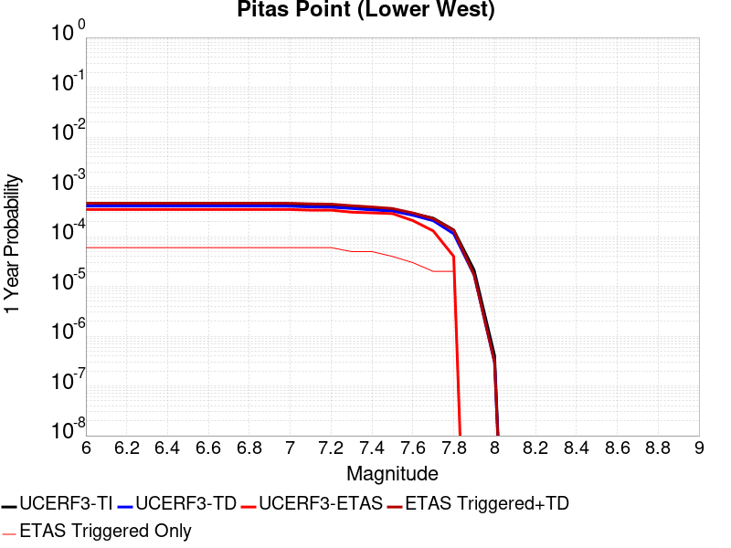 |  |

| Magnitude | 1 wk TI Prob | 1 wk TD Prob | 1 wk ETAS Prob | 1 wk ETAS/TD Gain | 1 wk ETAS Triggered+TD | 1 wk ETAS Triggered Only | 1 mo TI Prob | 1 mo TD Prob | 1 mo ETAS Prob | 1 mo ETAS/TD Gain | 1 mo ETAS Triggered+TD | 1 mo ETAS Triggered Only | 1 yr TI Prob | 1 yr TD Prob | 1 yr ETAS Prob | 1 yr ETAS/TD Gain | 1 yr ETAS Triggered+TD | 1 yr ETAS Triggered Only | 10 yr TI Prob | 10 yr TD Prob | 10 yr ETAS Prob | 10 yr ETAS/TD Gain | 10 yr ETAS Triggered+TD | 10 yr ETAS Triggered Only |
|-----|-----|-----|-----|-----|-----|-----|-----|-----|-----|-----|-----|-----|-----|-----|-----|-----|-----|-----|-----|-----|-----|-----|-----|-----|
| 6.0 | 8.151497E-6 | 7.855796E-6 | 5.0E-5 | 6.3647275 | 5.7855403E-5 | 5.0E-5 | 3.493452E-5 | 3.3667267E-5 | 7.0E-5 | 2.0791707 | 8.366558E-5 | 5.0E-5 | 4.252448E-4 | 4.0982262E-4 | 3.5E-4 | 0.854028 | 4.6979805E-4 | 6.0E-5 | 0.0042443196 | 0.004090749 | 0.00371 | 0.9069243 | 0.004180381 | 9.0E-5 |
| 6.1 | 8.151497E-6 | 7.855796E-6 | 5.0E-5 | 6.3647275 | 5.7855403E-5 | 5.0E-5 | 3.493452E-5 | 3.3667267E-5 | 7.0E-5 | 2.0791707 | 8.366558E-5 | 5.0E-5 | 4.252448E-4 | 4.0982262E-4 | 3.5E-4 | 0.854028 | 4.6979805E-4 | 6.0E-5 | 0.0042443196 | 0.004090749 | 0.00371 | 0.9069243 | 0.004180381 | 9.0E-5 |
| 6.2 | 8.151497E-6 | 7.855796E-6 | 5.0E-5 | 6.3647275 | 5.7855403E-5 | 5.0E-5 | 3.493452E-5 | 3.3667267E-5 | 7.0E-5 | 2.0791707 | 8.366558E-5 | 5.0E-5 | 4.252448E-4 | 4.0982262E-4 | 3.5E-4 | 0.854028 | 4.6979805E-4 | 6.0E-5 | 0.0042443196 | 0.004090749 | 0.00371 | 0.9069243 | 0.004180381 | 9.0E-5 |
| 6.3 | 8.151497E-6 | 7.855796E-6 | 5.0E-5 | 6.3647275 | 5.7855403E-5 | 5.0E-5 | 3.493452E-5 | 3.3667267E-5 | 7.0E-5 | 2.0791707 | 8.366558E-5 | 5.0E-5 | 4.252448E-4 | 4.0982262E-4 | 3.5E-4 | 0.854028 | 4.6979805E-4 | 6.0E-5 | 0.0042443196 | 0.004090749 | 0.00371 | 0.9069243 | 0.004180381 | 9.0E-5 |
| 6.4 | 8.151497E-6 | 7.855796E-6 | 5.0E-5 | 6.3647275 | 5.7855403E-5 | 5.0E-5 | 3.493452E-5 | 3.3667267E-5 | 7.0E-5 | 2.0791707 | 8.366558E-5 | 5.0E-5 | 4.252448E-4 | 4.0982262E-4 | 3.5E-4 | 0.854028 | 4.6979805E-4 | 6.0E-5 | 0.0042443196 | 0.004090749 | 0.00371 | 0.9069243 | 0.004180381 | 9.0E-5 |
| 6.5 | 8.151497E-6 | 7.855796E-6 | 5.0E-5 | 6.3647275 | 5.7855403E-5 | 5.0E-5 | 3.493452E-5 | 3.3667267E-5 | 7.0E-5 | 2.0791707 | 8.366558E-5 | 5.0E-5 | 4.252448E-4 | 4.0982262E-4 | 3.5E-4 | 0.854028 | 4.6979805E-4 | 6.0E-5 | 0.0042443196 | 0.004090749 | 0.00371 | 0.9069243 | 0.004180381 | 9.0E-5 |
| 6.6 | 8.151497E-6 | 7.855796E-6 | 5.0E-5 | 6.3647275 | 5.7855403E-5 | 5.0E-5 | 3.493452E-5 | 3.3667267E-5 | 7.0E-5 | 2.0791707 | 8.366558E-5 | 5.0E-5 | 4.252448E-4 | 4.0982262E-4 | 3.5E-4 | 0.854028 | 4.6979805E-4 | 6.0E-5 | 0.0042443196 | 0.004090749 | 0.00371 | 0.9069243 | 0.004180381 | 9.0E-5 |
| 6.7 | 8.151497E-6 | 7.855796E-6 | 5.0E-5 | 6.3647275 | 5.7855403E-5 | 5.0E-5 | 3.493452E-5 | 3.3667267E-5 | 7.0E-5 | 2.0791707 | 8.366558E-5 | 5.0E-5 | 4.252448E-4 | 4.0982262E-4 | 3.5E-4 | 0.854028 | 4.6979805E-4 | 6.0E-5 | 0.0042443196 | 0.004090749 | 0.00371 | 0.9069243 | 0.004180381 | 9.0E-5 |
| 6.8 | 8.151497E-6 | 7.855796E-6 | 5.0E-5 | 6.3647275 | 5.7855403E-5 | 5.0E-5 | 3.493452E-5 | 3.3667267E-5 | 7.0E-5 | 2.0791707 | 8.366558E-5 | 5.0E-5 | 4.252448E-4 | 4.0982262E-4 | 3.5E-4 | 0.854028 | 4.6979805E-4 | 6.0E-5 | 0.0042443196 | 0.004090749 | 0.00371 | 0.9069243 | 0.004180381 | 9.0E-5 |
| 6.9 | 8.151497E-6 | 7.855796E-6 | 5.0E-5 | 6.3647275 | 5.7855403E-5 | 5.0E-5 | 3.493452E-5 | 3.3667267E-5 | 7.0E-5 | 2.0791707 | 8.366558E-5 | 5.0E-5 | 4.252448E-4 | 4.0982262E-4 | 3.5E-4 | 0.854028 | 4.6979805E-4 | 6.0E-5 | 0.0042443196 | 0.004090749 | 0.00371 | 0.9069243 | 0.004180381 | 9.0E-5 |
| 7.0 | 8.103535E-6 | 7.805226E-6 | 5.0E-5 | 6.4059644 | 5.7804835E-5 | 5.0E-5 | 3.4728975E-5 | 3.3450542E-5 | 7.0E-5 | 2.0926416 | 8.344887E-5 | 5.0E-5 | 4.2274324E-4 | 4.07185E-4 | 3.5E-4 | 0.85956013 | 4.6716057E-4 | 6.0E-5 | 0.0042193993 | 0.0040644696 | 0.00369 | 0.90786755 | 0.004154104 | 9.0E-5 |
| 7.1 | 7.853298E-6 | 7.540917E-6 | 5.0E-5 | 6.630493 | 5.754054E-5 | 5.0E-5 | 3.3656554E-5 | 3.2317817E-5 | 7.0E-5 | 2.1659877 | 8.2316204E-5 | 5.0E-5 | 4.096915E-4 | 3.9339912E-4 | 3.4E-4 | 0.8642622 | 4.533755E-4 | 6.0E-5 | 0.00408937 | 0.0039271032 | 0.0035 | 0.8912422 | 0.0040167496 | 9.0E-5 |
| 7.2 | 7.771102E-6 | 7.453199E-6 | 5.0E-5 | 6.708529 | 5.7452828E-5 | 5.0E-5 | 3.33043E-5 | 3.1941894E-5 | 7.0E-5 | 2.1914794 | 8.19403E-5 | 5.0E-5 | 4.0540437E-4 | 3.8882386E-4 | 3.4E-4 | 0.87443197 | 4.4880054E-4 | 6.0E-5 | 0.0040466557 | 0.003881511 | 0.00348 | 0.89655805 | 0.003971162 | 9.0E-5 |
| 7.3 | 7.3945344E-6 | 7.0493033E-6 | 4.0E-5 | 5.6743197 | 4.7049023E-5 | 4.0E-5 | 3.1690477E-5 | 3.0210955E-5 | 6.0E-5 | 1.9860346 | 7.0209746E-5 | 4.0E-5 | 3.8576324E-4 | 3.677569E-4 | 3.1E-4 | 0.84294814 | 4.177385E-4 | 5.0E-5 | 0.0038509427 | 0.003671551 | 0.00331 | 0.9015264 | 0.0037512572 | 8.0E-5 |
| 7.4 | 6.964645E-6 | 6.5901527E-6 | 4.0E-5 | 6.069662 | 4.658989E-5 | 4.0E-5 | 2.9848137E-5 | 2.8243208E-5 | 6.0E-5 | 2.1244047 | 6.824208E-5 | 4.0E-5 | 3.6334046E-4 | 3.438073E-4 | 3.0E-4 | 0.87258184 | 3.937901E-4 | 5.0E-5 | 0.0036274698 | 0.0034328073 | 0.00303 | 0.88265955 | 0.0035125327 | 8.0E-5 |
| 7.5 | 6.6525035E-6 | 6.259191E-6 | 3.0E-5 | 4.7929516 | 3.6259004E-5 | 3.0E-5 | 2.851042E-5 | 2.6824831E-5 | 5.0E-5 | 1.8639446 | 5.6824025E-5 | 3.0E-5 | 3.4705905E-4 | 3.2654387E-4 | 2.9E-4 | 0.888089 | 3.665308E-4 | 4.0E-5 | 0.0034651754 | 0.0032606919 | 0.00286 | 0.8771145 | 0.0033304635 | 7.0E-5 |
| 7.6 | 5.613338E-6 | 5.15142E-6 | 2.0E-5 | 3.8824248 | 2.5151317E-5 | 2.0E-5 | 2.405694E-5 | 2.2077327E-5 | 4.0E-5 | 1.8118135 | 4.2076885E-5 | 2.0E-5 | 2.928539E-4 | 2.6875862E-4 | 2.1E-4 | 0.7813703 | 2.9875056E-4 | 3.0E-5 | 0.0029246826 | 0.0026843674 | 0.00225 | 0.83818626 | 0.00272426 | 4.0E-5 |
| 7.7 | 4.494704E-6 | 3.996945E-6 | 2.0E-5 | 5.003822 | 2.3996865E-5 | 2.0E-5 | 1.9262876E-5 | 1.7129652E-5 | 4.0E-5 | 2.3351321 | 3.712931E-5 | 2.0E-5 | 2.3450027E-4 | 2.0853379E-4 | 1.3E-4 | 0.62340015 | 2.2852962E-4 | 2.0E-5 | 0.0023425296 | 0.0020834052 | 0.00166 | 0.79677254 | 0.0021033634 | 2.0E-5 |
| 7.8 | 2.6075882E-6 | 2.1836663E-6 | 2.0E-5 | 9.158908 | 2.2183624E-5 | 2.0E-5 | 1.117533E-5 | 9.358537E-6 | 2.0E-5 | 2.1370862 | 2.9358349E-5 | 2.0E-5 | 1.3605114E-4 | 1.1393427E-4 | 4.0E-5 | 0.3510796 | 1.33932E-4 | 2.0E-5 | 0.0013596788 | 0.0011387634 | 8.5E-4 | 0.7464238 | 0.0011587406 | 2.0E-5 |
| 7.9 | 4.045984E-7 | 3.2424057E-7 | 0.0 | 0.0 | 3.2424057E-7 | 0.0 | 1.733992E-6 | 1.3896017E-6 | 0.0 | 0.0 | 1.3896017E-6 | 0.0 | 2.1111147E-5 | 1.6918271E-5 | 0.0 | 0.0 | 1.6918271E-5 | 0.0 | 2.1109142E-4 | 1.6917015E-4 | 1.0E-4 | 0.59112084 | 1.6917015E-4 | 0.0 |
| 8.0 | 7.791402E-9 | 5.6836056E-9 | 0.0 | 0.0 | 5.6836056E-9 | 0.0 | 3.3391725E-8 | 2.4358311E-8 | 0.0 | 0.0 | 2.4358311E-8 | 0.0 | 4.0654416E-7 | 2.965624E-7 | 0.0 | 0.0 | 2.965624E-7 | 0.0 | 4.065434E-6 | 2.9656223E-6 | 1.0E-5 | 3.3719735 | 2.9656223E-6 | 0.0 |

## Big Pine (Central)
*[(top)](#table-of-contents)*

| 1 Week | 1 Month | 1 Year | 10 Year |
|-----|-----|-----|-----|
|  |  |  |  |

| Magnitude | 1 wk TI Prob | 1 wk TD Prob | 1 wk ETAS Prob | 1 wk ETAS/TD Gain | 1 wk ETAS Triggered+TD | 1 wk ETAS Triggered Only | 1 mo TI Prob | 1 mo TD Prob | 1 mo ETAS Prob | 1 mo ETAS/TD Gain | 1 mo ETAS Triggered+TD | 1 mo ETAS Triggered Only | 1 yr TI Prob | 1 yr TD Prob | 1 yr ETAS Prob | 1 yr ETAS/TD Gain | 1 yr ETAS Triggered+TD | 1 yr ETAS Triggered Only | 10 yr TI Prob | 10 yr TD Prob | 10 yr ETAS Prob | 10 yr ETAS/TD Gain | 10 yr ETAS Triggered+TD | 10 yr ETAS Triggered Only |
|-----|-----|-----|-----|-----|-----|-----|-----|-----|-----|-----|-----|-----|-----|-----|-----|-----|-----|-----|-----|-----|-----|-----|-----|-----|
| 6.0 | 1.2706755E-5 | 1.4250602E-5 | 0.0 | 0.0 | 1.4250602E-5 | 0.0 | 5.4456385E-5 | 6.107279E-5 | 6.0E-5 | 0.98243433 | 8.1071565E-5 | 2.0E-5 | 6.628048E-4 | 7.433441E-4 | 5.1E-4 | 0.68608874 | 7.933069E-4 | 5.0E-5 | 0.006608314 | 0.007413639 | 0.00553 | 0.74592245 | 0.007493046 | 8.0E-5 |
| 6.1 | 8.342579E-6 | 9.510835E-6 | 0.0 | 0.0 | 9.510835E-6 | 0.0 | 3.5753423E-5 | 4.076021E-5 | 0.0 | 0.0 | 4.076021E-5 | 0.0 | 4.3521097E-4 | 4.9616426E-4 | 2.9E-4 | 0.58448386 | 5.1615434E-4 | 2.0E-5 | 0.0043435963 | 0.004954155 | 0.00311 | 0.6277559 | 0.0049840063 | 3.0E-5 |
| 6.2 | 6.923899E-6 | 7.967221E-6 | 0.0 | 0.0 | 7.967221E-6 | 0.0 | 2.9673516E-5 | 3.4144894E-5 | 0.0 | 0.0 | 3.4144894E-5 | 0.0 | 3.6121515E-4 | 4.1565404E-4 | 2.2E-4 | 0.5292863 | 4.3564572E-4 | 2.0E-5 | 0.003606286 | 0.0041521094 | 0.0025 | 0.6021036 | 0.004172026 | 2.0E-5 |
| 6.3 | 2.728396E-6 | 3.4243646E-6 | 0.0 | 0.0 | 3.4243646E-6 | 0.0 | 1.1693074E-5 | 1.4675771E-5 | 0.0 | 0.0 | 1.4675771E-5 | 0.0 | 1.4235388E-4 | 1.7866373E-4 | 1.2E-4 | 0.6716528 | 1.9866016E-4 | 2.0E-5 | 0.0014226272 | 0.0017867433 | 0.00103 | 0.5764678 | 0.0018067076 | 2.0E-5 |
| 6.4 | 2.7136944E-6 | 3.4086581E-6 | 0.0 | 0.0 | 3.4086581E-6 | 0.0 | 1.1630066E-5 | 1.4608458E-5 | 0.0 | 0.0 | 1.4608458E-5 | 0.0 | 1.4158686E-4 | 1.7784433E-4 | 1.2E-4 | 0.6747474 | 1.9784077E-4 | 2.0E-5 | 0.0014149669 | 0.0017785623 | 0.00102 | 0.5734969 | 0.0017985267 | 2.0E-5 |
| 6.5 | 2.6971882E-6 | 3.3910032E-6 | 0.0 | 0.0 | 3.3910032E-6 | 0.0 | 1.1559327E-5 | 1.4532795E-5 | 0.0 | 0.0 | 1.4532795E-5 | 0.0 | 1.4072572E-4 | 1.7692328E-4 | 1.2E-4 | 0.6782601 | 1.9691975E-4 | 2.0E-5 | 0.0014063664 | 0.0017693666 | 0.00101 | 0.57082576 | 0.0017893312 | 2.0E-5 |
| 6.6 | 2.669092E-6 | 3.3610236E-6 | 0.0 | 0.0 | 3.3610236E-6 | 0.0 | 1.1438916E-5 | 1.4404312E-5 | 0.0 | 0.0 | 1.4404312E-5 | 0.0 | 1.3925991E-4 | 1.7535927E-4 | 1.2E-4 | 0.6843095 | 1.9535575E-4 | 2.0E-5 | 0.0013917267 | 0.0017537511 | 0.00101 | 0.5759084 | 0.0017737161 | 2.0E-5 |
| 6.7 | 2.6408059E-6 | 3.3310494E-6 | 0.0 | 0.0 | 3.3310494E-6 | 0.0 | 1.1317691E-5 | 1.4275853E-5 | 0.0 | 0.0 | 1.4275853E-5 | 0.0 | 1.3778417E-4 | 1.737955E-4 | 1.2E-4 | 0.69046664 | 1.9379203E-4 | 2.0E-5 | 0.0013769877 | 0.0017381381 | 0.001 | 0.5753283 | 0.0017581034 | 2.0E-5 |
| 6.8 | 2.1786943E-6 | 2.8545066E-6 | 0.0 | 0.0 | 2.8545066E-6 | 0.0 | 9.337228E-6 | 1.2233547E-5 | 0.0 | 0.0 | 1.2233547E-5 | 0.0 | 1.1367482E-4 | 1.4893398E-4 | 1.1E-4 | 0.7385823 | 1.68931E-4 | 2.0E-5 | 0.0011361669 | 0.0014898704 | 8.5E-4 | 0.57051945 | 0.0015098406 | 2.0E-5 |
| 6.9 | 1.4411696E-6 | 2.0685677E-6 | 0.0 | 0.0 | 2.0685677E-6 | 0.0 | 6.1764263E-6 | 8.865261E-6 | 0.0 | 0.0 | 8.865261E-6 | 0.0 | 7.51954E-5 | 1.0792949E-4 | 9.0E-5 | 0.8338778 | 1.2792733E-4 | 2.0E-5 | 7.5169955E-4 | 0.0010802548 | 5.7E-4 | 0.5276533 | 0.0011002332 | 2.0E-5 |
| 7.0 | 1.0073411E-6 | 1.5543274E-6 | 0.0 | 0.0 | 1.5543274E-6 | 0.0 | 4.317169E-6 | 6.661387E-6 | 0.0 | 0.0 | 6.661387E-6 | 0.0 | 5.2560266E-5 | 8.109952E-5 | 5.0E-5 | 0.6165264 | 9.109871E-5 | 1.0E-5 | 5.2547833E-4 | 8.1217213E-4 | 4.5E-4 | 0.5540697 | 8.2216406E-4 | 1.0E-5 |
| 7.1 | 8.947104E-7 | 1.430316E-6 | 0.0 | 0.0 | 1.430316E-6 | 0.0 | 3.834468E-6 | 6.1299124E-6 | 0.0 | 0.0 | 6.1299124E-6 | 0.0 | 4.6683643E-5 | 7.462928E-5 | 5.0E-5 | 0.6699784 | 8.462853E-5 | 1.0E-5 | 4.6673836E-4 | 7.4751483E-4 | 4.4E-4 | 0.5886171 | 7.5750734E-4 | 1.0E-5 |
| 7.2 | 5.215166E-7 | 1.0112277E-6 | 0.0 | 0.0 | 1.0112277E-6 | 0.0 | 2.2350691E-6 | 4.333826E-6 | 0.0 | 0.0 | 4.333826E-6 | 0.0 | 2.7211627E-5 | 5.27631E-5 | 2.0E-5 | 0.3790528 | 6.276257E-5 | 1.0E-5 | 2.7208295E-4 | 5.289683E-4 | 2.4E-4 | 0.45371342 | 5.3896295E-4 | 1.0E-5 |
| 7.3 | 4.4024807E-7 | 9.220183E-7 | 0.0 | 0.0 | 9.220183E-7 | 0.0 | 1.8867761E-6 | 3.951501E-6 | 0.0 | 0.0 | 3.951501E-6 | 0.0 | 2.2971257E-5 | 4.8108504E-5 | 2.0E-5 | 0.4157269 | 5.8108024E-5 | 1.0E-5 | 2.2968883E-4 | 4.824433E-4 | 2.2E-4 | 0.45601213 | 4.924385E-4 | 1.0E-5 |
| 7.4 | 3.6130905E-7 | 8.359109E-7 | 0.0 | 0.0 | 8.359109E-7 | 0.0 | 1.5484665E-6 | 3.5824705E-6 | 0.0 | 0.0 | 3.5824705E-6 | 0.0 | 1.8852415E-5 | 4.3615746E-5 | 1.0E-5 | 0.229275 | 5.361531E-5 | 1.0E-5 | 1.8850817E-4 | 4.3752496E-4 | 2.1E-4 | 0.47997263 | 4.4752058E-4 | 1.0E-5 |
| 7.5 | 3.408184E-7 | 8.1087245E-7 | 0.0 | 0.0 | 8.1087245E-7 | 0.0 | 1.4606494E-6 | 3.475163E-6 | 0.0 | 0.0 | 3.475163E-6 | 0.0 | 1.7783263E-5 | 4.230933E-5 | 1.0E-5 | 0.23635449 | 5.2308907E-5 | 1.0E-5 | 1.778184E-4 | 4.2444657E-4 | 2.0E-4 | 0.47120184 | 4.344423E-4 | 1.0E-5 |
| 7.6 | 3.1428627E-7 | 7.732167E-7 | 0.0 | 0.0 | 7.732167E-7 | 0.0 | 1.3469405E-6 | 3.313782E-6 | 0.0 | 0.0 | 3.313782E-6 | 0.0 | 1.6398877E-5 | 4.0344585E-5 | 0.0 | 0.0 | 4.0344585E-5 | 0.0 | 1.6397667E-4 | 4.0477706E-4 | 1.9E-4 | 0.4693942 | 4.0477706E-4 | 0.0 |
| 7.7 | 1.7972785E-7 | 5.0782415E-7 | 0.0 | 0.0 | 5.0782415E-7 | 0.0 | 7.70262E-7 | 2.1763874E-6 | 0.0 | 0.0 | 2.1763874E-6 | 0.0 | 9.377899E-6 | 2.6497206E-5 | 0.0 | 0.0 | 2.6497206E-5 | 0.0 | 9.377503E-5 | 2.6633305E-4 | 1.4E-4 | 0.52565765 | 2.6633305E-4 | 0.0 |
| 7.8 | 4.9230927E-8 | 1.1981747E-7 | 0.0 | 0.0 | 1.1981747E-7 | 0.0 | 2.1098968E-7 | 5.135033E-7 | 0.0 | 0.0 | 5.135033E-7 | 0.0 | 2.5687964E-6 | 6.2518866E-6 | 0.0 | 0.0 | 6.2518866E-6 | 0.0 | 2.5687666E-5 | 6.2971965E-5 | 3.0E-5 | 0.4764025 | 6.2971965E-5 | 0.0 |
| 7.9 | 3.6805972E-9 | 4.1051638E-9 | 0.0 | 0.0 | 4.1051638E-9 | 0.0 | 1.5773987E-8 | 1.7593557E-8 | 0.0 | 0.0 | 1.7593557E-8 | 0.0 | 1.9204828E-7 | 2.1420155E-7 | 0.0 | 0.0 | 2.1420155E-7 | 0.0 | 1.920481E-6 | 2.1898923E-6 | 0.0 | 0.0 | 2.1898923E-6 | 0.0 |

## Monterey Bay-Tularcitos
*[(top)](#table-of-contents)*

| 1 Week | 1 Month | 1 Year | 10 Year |
|-----|-----|-----|-----|
|  |  | 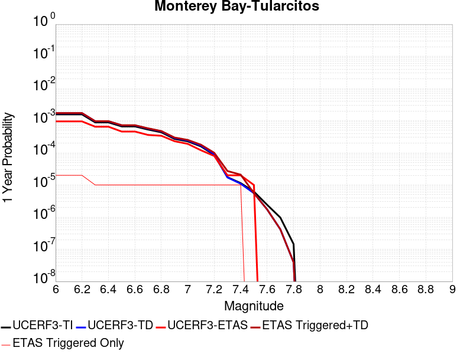 |  |

| Magnitude | 1 wk TI Prob | 1 wk TD Prob | 1 wk ETAS Prob | 1 wk ETAS/TD Gain | 1 wk ETAS Triggered+TD | 1 wk ETAS Triggered Only | 1 mo TI Prob | 1 mo TD Prob | 1 mo ETAS Prob | 1 mo ETAS/TD Gain | 1 mo ETAS Triggered+TD | 1 mo ETAS Triggered Only | 1 yr TI Prob | 1 yr TD Prob | 1 yr ETAS Prob | 1 yr ETAS/TD Gain | 1 yr ETAS Triggered+TD | 1 yr ETAS Triggered Only | 10 yr TI Prob | 10 yr TD Prob | 10 yr ETAS Prob | 10 yr ETAS/TD Gain | 10 yr ETAS Triggered+TD | 10 yr ETAS Triggered Only |
|-----|-----|-----|-----|-----|-----|-----|-----|-----|-----|-----|-----|-----|-----|-----|-----|-----|-----|-----|-----|-----|-----|-----|-----|-----|
| 6.0 | 3.0131365E-5 | 3.279877E-5 | 1.0E-5 | 0.30488947 | 3.279877E-5 | 0.0 | 1.2912804E-4 | 1.4055918E-4 | 5.0E-5 | 0.35572204 | 1.4055918E-4 | 0.0 | 0.001571 | 0.0017100703 | 9.5E-4 | 0.55553275 | 0.001730036 | 2.0E-5 | 0.015599402 | 0.016979916 | 0.01127 | 0.66372526 | 0.017048728 | 7.0E-5 |
| 6.1 | 3.0131365E-5 | 3.279877E-5 | 1.0E-5 | 0.30488947 | 3.279877E-5 | 0.0 | 1.2912804E-4 | 1.4055918E-4 | 5.0E-5 | 0.35572204 | 1.4055918E-4 | 0.0 | 0.001571 | 0.0017100703 | 9.5E-4 | 0.55553275 | 0.001730036 | 2.0E-5 | 0.015599402 | 0.016979916 | 0.01127 | 0.66372526 | 0.017048728 | 7.0E-5 |
| 6.2 | 3.0131365E-5 | 3.279877E-5 | 1.0E-5 | 0.30488947 | 3.279877E-5 | 0.0 | 1.2912804E-4 | 1.4055918E-4 | 5.0E-5 | 0.35572204 | 1.4055918E-4 | 0.0 | 0.001571 | 0.0017100703 | 9.5E-4 | 0.55553275 | 0.001730036 | 2.0E-5 | 0.015599402 | 0.016979916 | 0.01127 | 0.66372526 | 0.017048728 | 7.0E-5 |
| 6.3 | 1.6998249E-5 | 1.8330798E-5 | 1.0E-5 | 0.54552996 | 1.8330798E-5 | 0.0 | 7.28476E-5 | 7.85583E-5 | 4.0E-5 | 0.50917596 | 7.85583E-5 | 0.0 | 8.865586E-4 | 9.5604634E-4 | 6.5E-4 | 0.67988336 | 9.6603675E-4 | 1.0E-5 | 0.0088303005 | 0.009521258 | 0.00643 | 0.67533094 | 0.009570782 | 5.0E-5 |
| 6.4 | 1.6998249E-5 | 1.8330798E-5 | 1.0E-5 | 0.54552996 | 1.8330798E-5 | 0.0 | 7.28476E-5 | 7.85583E-5 | 4.0E-5 | 0.50917596 | 7.85583E-5 | 0.0 | 8.865586E-4 | 9.5604634E-4 | 6.5E-4 | 0.67988336 | 9.6603675E-4 | 1.0E-5 | 0.0088303005 | 0.009521258 | 0.00643 | 0.67533094 | 0.009570782 | 5.0E-5 |
| 6.5 | 1.27470785E-5 | 1.3693312E-5 | 1.0E-5 | 0.7302835 | 1.3693312E-5 | 0.0 | 5.4629192E-5 | 5.8684363E-5 | 2.0E-5 | 0.34080628 | 5.8684363E-5 | 0.0 | 6.649074E-4 | 7.1425823E-4 | 4.6E-4 | 0.6440247 | 7.242511E-4 | 1.0E-5 | 0.0066292146 | 0.007120678 | 0.00488 | 0.68532795 | 0.0071703224 | 5.0E-5 |
| 6.6 | 1.2739422E-5 | 1.36854E-5 | 1.0E-5 | 0.73070574 | 1.36854E-5 | 0.0 | 5.4596385E-5 | 5.8650454E-5 | 2.0E-5 | 0.34100333 | 5.8650454E-5 | 0.0 | 6.645082E-4 | 7.1384566E-4 | 4.6E-4 | 0.644397 | 7.238385E-4 | 1.0E-5 | 0.0066252467 | 0.007116579 | 0.00488 | 0.68572277 | 0.007166223 | 5.0E-5 |
| 6.7 | 1.0160109E-5 | 1.0885755E-5 | 0.0 | 0.0 | 1.0885755E-5 | 0.0 | 4.35426E-5 | 4.665244E-5 | 1.0E-5 | 0.21435106 | 4.665244E-5 | 0.0 | 5.300022E-4 | 5.6785246E-4 | 3.6E-4 | 0.63396746 | 5.778468E-4 | 1.0E-5 | 0.005287399 | 0.0056647263 | 0.00398 | 0.70259356 | 0.005714443 | 5.0E-5 |
| 6.8 | 8.349859E-6 | 8.932587E-6 | 0.0 | 0.0 | 8.932587E-6 | 0.0 | 3.578462E-5 | 3.8281985E-5 | 1.0E-5 | 0.26121947 | 3.8281985E-5 | 0.0 | 4.3559066E-4 | 4.6598914E-4 | 3.4E-4 | 0.7296307 | 4.759845E-4 | 1.0E-5 | 0.004347378 | 0.004650685 | 0.00333 | 0.7160235 | 0.004690499 | 4.0E-5 |
| 6.9 | 5.193639E-6 | 5.53643E-6 | 0.0 | 0.0 | 5.53643E-6 | 0.0 | 2.2258262E-5 | 2.372736E-5 | 1.0E-5 | 0.4214544 | 2.372736E-5 | 0.0 | 2.7096065E-4 | 2.8884556E-4 | 2.3E-4 | 0.7962733 | 2.9884267E-4 | 1.0E-5 | 0.0027063051 | 0.0028850224 | 0.00211 | 0.7313635 | 0.002924907 | 4.0E-5 |
| 7.0 | 4.359381E-6 | 4.643366E-6 | 0.0 | 0.0 | 4.643366E-6 | 0.0 | 1.8682927E-5 | 1.9900004E-5 | 0.0 | 0.0 | 1.9900004E-5 | 0.0 | 2.274409E-4 | 2.422586E-4 | 1.9E-4 | 0.7842859 | 2.5225617E-4 | 1.0E-5 | 0.0022720827 | 0.002420238 | 0.00182 | 0.75199217 | 0.0024601412 | 4.0E-5 |
| 7.1 | 3.0398533E-6 | 3.2310427E-6 | 0.0 | 0.0 | 3.2310427E-6 | 0.0 | 1.3027877E-5 | 1.3847267E-5 | 0.0 | 0.0 | 1.3847267E-5 | 0.0 | 1.5860285E-4 | 1.6858005E-4 | 1.2E-4 | 0.711828 | 1.7857837E-4 | 1.0E-5 | 0.001584897 | 0.0016847793 | 0.00133 | 0.7894209 | 0.0017047457 | 2.0E-5 |
| 7.2 | 1.642335E-6 | 1.7333153E-6 | 0.0 | 0.0 | 1.7333153E-6 | 0.0 | 7.0385595E-6 | 7.428485E-6 | 0.0 | 0.0 | 7.428485E-6 | 0.0 | 8.569109E-5 | 9.044012E-5 | 8.0E-5 | 0.8845632 | 1.0043921E-4 | 1.0E-5 | 8.5658056E-4 | 9.042358E-4 | 7.8E-4 | 0.8626068 | 9.2421775E-4 | 2.0E-5 |
| 7.3 | 3.356842E-7 | 3.2952389E-7 | 0.0 | 0.0 | 3.2952389E-7 | 0.0 | 1.4386458E-6 | 1.4122445E-6 | 0.0 | 0.0 | 1.4122445E-6 | 0.0 | 1.7515373E-5 | 1.7193941E-5 | 2.0E-5 | 1.1632004 | 2.719377E-5 | 1.0E-5 | 1.7513991E-4 | 1.719262E-4 | 1.7E-4 | 0.9887963 | 1.9192277E-4 | 2.0E-5 |
| 7.4 | 2.1973483E-7 | 2.1006414E-7 | 0.0 | 0.0 | 2.1006414E-7 | 0.0 | 9.417204E-7 | 9.002746E-7 | 0.0 | 0.0 | 9.002746E-7 | 0.0 | 1.1465385E-5 | 1.0960788E-5 | 2.0E-5 | 1.8246863 | 2.0960679E-5 | 1.0E-5 | 1.1464794E-4 | 1.0960251E-4 | 1.1E-4 | 1.0036266 | 1.1960141E-4 | 1.0E-5 |
| 7.5 | 1.1944135E-7 | 1.0696035E-7 | 0.0 | 0.0 | 1.0696035E-7 | 0.0 | 5.118914E-7 | 4.5840142E-7 | 0.0 | 0.0 | 4.5840142E-7 | 0.0 | 6.23226E-6 | 5.581023E-6 | 1.0E-5 | 1.7917862 | 5.581023E-6 | 0.0 | 6.2320854E-5 | 5.5808843E-5 | 4.0E-5 | 0.7167323 | 5.5808843E-5 | 0.0 |
| 7.6 | 4.636058E-8 | 3.3364433E-8 | 0.0 | 0.0 | 3.3364433E-8 | 0.0 | 1.9868818E-7 | 1.4299042E-7 | 0.0 | 0.0 | 1.4299042E-7 | 0.0 | 2.419026E-6 | 1.740907E-6 | 0.0 | 0.0 | 1.740907E-6 | 0.0 | 2.4189996E-5 | 1.7408936E-5 | 0.0 | 0.0 | 1.7408936E-5 | 0.0 |
| 7.7 | 1.8588572E-8 | 8.003168E-9 | 0.0 | 0.0 | 8.003168E-9 | 0.0 | 7.9665305E-8 | 3.429929E-8 | 0.0 | 0.0 | 3.429929E-8 | 0.0 | 9.699246E-7 | 4.1759378E-7 | 0.0 | 0.0 | 4.1759378E-7 | 0.0 | 9.699204E-6 | 4.1759304E-6 | 0.0 | 0.0 | 4.1759304E-6 | 0.0 |
| 7.8 | 2.7960154E-9 | 7.608624E-10 | 0.0 | 0.0 | 7.608624E-10 | 0.0 | 1.1982923E-8 | 3.2608392E-9 | 0.0 | 0.0 | 3.2608392E-9 | 0.0 | 1.4589209E-7 | 3.9700716E-8 | 0.0 | 0.0 | 3.9700716E-8 | 0.0 | 1.4589199E-6 | 3.970071E-7 | 0.0 | 0.0 | 3.970071E-7 | 0.0 |

## Ortigalita (South)
*[(top)](#table-of-contents)*

| 1 Week | 1 Month | 1 Year | 10 Year |
|-----|-----|-----|-----|
|  |  |  |  |

| Magnitude | 1 wk TI Prob | 1 wk TD Prob | 1 wk ETAS Prob | 1 wk ETAS/TD Gain | 1 wk ETAS Triggered+TD | 1 wk ETAS Triggered Only | 1 mo TI Prob | 1 mo TD Prob | 1 mo ETAS Prob | 1 mo ETAS/TD Gain | 1 mo ETAS Triggered+TD | 1 mo ETAS Triggered Only | 1 yr TI Prob | 1 yr TD Prob | 1 yr ETAS Prob | 1 yr ETAS/TD Gain | 1 yr ETAS Triggered+TD | 1 yr ETAS Triggered Only | 10 yr TI Prob | 10 yr TD Prob | 10 yr ETAS Prob | 10 yr ETAS/TD Gain | 10 yr ETAS Triggered+TD | 10 yr ETAS Triggered Only |
|-----|-----|-----|-----|-----|-----|-----|-----|-----|-----|-----|-----|-----|-----|-----|-----|-----|-----|-----|-----|-----|-----|-----|-----|-----|
| 6.0 | 3.72394E-5 | 4.32556E-5 | 4.0E-5 | 0.9247358 | 7.3254305E-5 | 3.0E-5 | 1.5958765E-4 | 1.8536886E-4 | 1.6E-4 | 0.8631439 | 2.153633E-4 | 3.0E-5 | 0.0019412481 | 0.0022546863 | 0.00158 | 0.7007627 | 0.0023245285 | 7.0E-5 | 0.019243775 | 0.022334501 | 0.01738 | 0.77816826 | 0.02242249 | 9.0E-5 |
| 6.1 | 2.7299884E-5 | 3.1492036E-5 | 3.0E-5 | 0.9526218 | 5.1491406E-5 | 2.0E-5 | 1.16994255E-4 | 1.349592E-4 | 1.4E-4 | 1.0373505 | 1.549565E-4 | 2.0E-5 | 0.0014234743 | 0.0016419457 | 0.00119 | 0.7247499 | 0.0017018472 | 6.0E-5 | 0.014143906 | 0.016304072 | 0.01315 | 0.806547 | 0.01637293 | 7.0E-5 |
| 6.2 | 2.7299884E-5 | 3.1492036E-5 | 3.0E-5 | 0.9526218 | 5.1491406E-5 | 2.0E-5 | 1.16994255E-4 | 1.349592E-4 | 1.4E-4 | 1.0373505 | 1.549565E-4 | 2.0E-5 | 0.0014234743 | 0.0016419457 | 0.00119 | 0.7247499 | 0.0017018472 | 6.0E-5 | 0.014143906 | 0.016304072 | 0.01315 | 0.806547 | 0.01637293 | 7.0E-5 |
| 6.3 | 2.0546433E-5 | 2.3631454E-5 | 2.0E-5 | 0.8463297 | 3.3631215E-5 | 1.0E-5 | 8.805317E-5 | 1.0127383E-4 | 7.0E-5 | 0.69119537 | 1.1127282E-4 | 1.0E-5 | 0.00107152 | 0.0012323305 | 7.8E-4 | 0.63294715 | 0.0012622934 | 3.0E-5 | 0.010663681 | 0.012257031 | 0.00978 | 0.7979094 | 0.012296541 | 4.0E-5 |
| 6.4 | 2.0546433E-5 | 2.3631454E-5 | 2.0E-5 | 0.8463297 | 3.3631215E-5 | 1.0E-5 | 8.805317E-5 | 1.0127383E-4 | 7.0E-5 | 0.69119537 | 1.1127282E-4 | 1.0E-5 | 0.00107152 | 0.0012323305 | 7.8E-4 | 0.63294715 | 0.0012622934 | 3.0E-5 | 0.010663681 | 0.012257031 | 0.00978 | 0.7979094 | 0.012296541 | 4.0E-5 |
| 6.5 | 1.7779594E-5 | 2.0446974E-5 | 2.0E-5 | 0.9781398 | 3.044677E-5 | 1.0E-5 | 7.619603E-5 | 8.762703E-5 | 7.0E-5 | 0.7988403 | 9.762615E-5 | 1.0E-5 | 9.272918E-4 | 0.0010663505 | 6.7E-4 | 0.6283113 | 0.0010963185 | 3.0E-5 | 0.009234319 | 0.010613804 | 0.00849 | 0.7999017 | 0.010653379 | 4.0E-5 |
| 6.6 | 1.6272212E-5 | 1.8714967E-5 | 2.0E-5 | 1.0686634 | 2.871478E-5 | 1.0E-5 | 6.973618E-5 | 8.0204605E-5 | 6.0E-5 | 0.7480867 | 9.020381E-5 | 1.0E-5 | 8.487073E-4 | 9.760659E-4 | 6.0E-4 | 0.6147126 | 9.960464E-4 | 2.0E-5 | 0.008454733 | 0.009719091 | 0.00786 | 0.80871767 | 0.009748799 | 3.0E-5 |
| 6.7 | 1.3051484E-5 | 1.5038758E-5 | 2.0E-5 | 1.329897 | 2.5038607E-5 | 1.0E-5 | 5.593373E-5 | 6.445028E-5 | 6.0E-5 | 0.93095016 | 7.4449636E-5 | 1.0E-5 | 6.807804E-4 | 7.844092E-4 | 5.3E-4 | 0.67566776 | 7.9440133E-4 | 1.0E-5 | 0.006786986 | 0.007817388 | 0.00654 | 0.8365966 | 0.007837231 | 2.0E-5 |
| 6.8 | 1.04277415E-5 | 1.1987235E-5 | 2.0E-5 | 1.6684414 | 2.1987114E-5 | 1.0E-5 | 4.4689557E-5 | 5.1372896E-5 | 5.0E-5 | 0.9732759 | 6.137238E-5 | 1.0E-5 | 5.439595E-4 | 6.2529295E-4 | 3.9E-4 | 0.62370765 | 6.352867E-4 | 1.0E-5 | 0.0054262993 | 0.00623609 | 0.00532 | 0.8530987 | 0.006255965 | 2.0E-5 |
| 6.9 | 7.639968E-6 | 8.791503E-6 | 1.0E-5 | 1.1374619 | 1.8791416E-5 | 1.0E-5 | 3.274231E-5 | 3.767736E-5 | 4.0E-5 | 1.0616455 | 4.7676982E-5 | 1.0E-5 | 3.9856473E-4 | 4.586312E-4 | 2.7E-4 | 0.58870834 | 4.686266E-4 | 1.0E-5 | 0.003978506 | 0.004577433 | 0.00377 | 0.8236057 | 0.0045973416 | 2.0E-5 |
| 7.0 | 3.919831E-6 | 4.5334014E-6 | 0.0 | 0.0 | 4.5334014E-6 | 0.0 | 1.679917E-5 | 1.942873E-5 | 1.0E-5 | 0.51470166 | 1.942873E-5 | 0.0 | 2.045107E-4 | 2.3652123E-4 | 1.0E-4 | 0.42279503 | 2.3652123E-4 | 0.0 | 0.0020432258 | 0.0023629034 | 0.0019 | 0.80409545 | 0.0023629034 | 0.0 |
| 7.1 | 1.6017933E-6 | 1.8570418E-6 | 0.0 | 0.0 | 1.8570418E-6 | 0.0 | 6.8648105E-6 | 7.958732E-6 | 0.0 | 0.0 | 7.958732E-6 | 0.0 | 8.357586E-5 | 9.689432E-5 | 4.0E-5 | 0.41282088 | 9.689432E-5 | 0.0 | 8.3544437E-4 | 9.686254E-4 | 9.7E-4 | 1.0014191 | 9.686254E-4 | 0.0 |

## Chino alt 1
*[(top)](#table-of-contents)*

| 1 Week | 1 Month | 1 Year | 10 Year |
|-----|-----|-----|-----|
|  |  |  |  |

| Magnitude | 1 wk TI Prob | 1 wk TD Prob | 1 wk ETAS Prob | 1 wk ETAS/TD Gain | 1 wk ETAS Triggered+TD | 1 wk ETAS Triggered Only | 1 mo TI Prob | 1 mo TD Prob | 1 mo ETAS Prob | 1 mo ETAS/TD Gain | 1 mo ETAS Triggered+TD | 1 mo ETAS Triggered Only | 1 yr TI Prob | 1 yr TD Prob | 1 yr ETAS Prob | 1 yr ETAS/TD Gain | 1 yr ETAS Triggered+TD | 1 yr ETAS Triggered Only | 10 yr TI Prob | 10 yr TD Prob | 10 yr ETAS Prob | 10 yr ETAS/TD Gain | 10 yr ETAS Triggered+TD | 10 yr ETAS Triggered Only |
|-----|-----|-----|-----|-----|-----|-----|-----|-----|-----|-----|-----|-----|-----|-----|-----|-----|-----|-----|-----|-----|-----|-----|-----|-----|
| 6.0 | 3.939946E-5 | 4.894798E-5 | 2.0E-5 | 0.40859705 | 6.8947E-5 | 2.0E-5 | 1.6884391E-4 | 2.0976314E-4 | 1.0E-4 | 0.4767282 | 2.2975894E-4 | 2.0E-5 | 0.0020537362 | 0.002551385 | 0.00162 | 0.6349492 | 0.002611232 | 6.0E-5 | 0.020348595 | 0.025280168 | 0.01685 | 0.6665304 | 0.025367893 | 9.0E-5 |
| 6.1 | 2.1505624E-5 | 2.6878823E-5 | 1.0E-5 | 0.3720401 | 3.6878555E-5 | 1.0E-5 | 9.2163704E-5 | 1.15190494E-4 | 5.0E-5 | 0.43406358 | 1.2518934E-4 | 1.0E-5 | 0.0011215154 | 0.0014016517 | 8.8E-4 | 0.62783074 | 0.0014316096 | 3.0E-5 | 0.011158722 | 0.013947425 | 0.00937 | 0.6718086 | 0.013986867 | 4.0E-5 |
| 6.2 | 2.1505624E-5 | 2.6878823E-5 | 1.0E-5 | 0.3720401 | 3.6878555E-5 | 1.0E-5 | 9.2163704E-5 | 1.15190494E-4 | 5.0E-5 | 0.43406358 | 1.2518934E-4 | 1.0E-5 | 0.0011215154 | 0.0014016517 | 8.8E-4 | 0.62783074 | 0.0014316096 | 3.0E-5 | 0.011158722 | 0.013947425 | 0.00937 | 0.6718086 | 0.013986867 | 4.0E-5 |
| 6.3 | 1.4290785E-5 | 1.8164832E-5 | 1.0E-5 | 0.5505143 | 2.816465E-5 | 1.0E-5 | 6.1244784E-5 | 7.784722E-5 | 2.0E-5 | 0.25691348 | 8.7846434E-5 | 1.0E-5 | 7.454001E-4 | 9.4742293E-4 | 6.0E-4 | 0.6332969 | 9.67404E-4 | 2.0E-5 | 0.007429048 | 0.00944674 | 0.00608 | 0.6436083 | 0.009476457 | 3.0E-5 |
| 6.4 | 1.4290785E-5 | 1.8164832E-5 | 1.0E-5 | 0.5505143 | 2.816465E-5 | 1.0E-5 | 6.1244784E-5 | 7.784722E-5 | 2.0E-5 | 0.25691348 | 8.7846434E-5 | 1.0E-5 | 7.454001E-4 | 9.4742293E-4 | 6.0E-4 | 0.6332969 | 9.67404E-4 | 2.0E-5 | 0.007429048 | 0.00944674 | 0.00608 | 0.6436083 | 0.009476457 | 3.0E-5 |
| 6.5 | 1.3017944E-5 | 1.6651793E-5 | 1.0E-5 | 0.6005359 | 2.6651625E-5 | 1.0E-5 | 5.5789995E-5 | 7.1363116E-5 | 1.0E-5 | 0.1401284 | 8.136241E-5 | 1.0E-5 | 6.790315E-4 | 8.6854334E-4 | 5.2E-4 | 0.59870356 | 8.88526E-4 | 2.0E-5 | 0.0067696036 | 0.008664233 | 0.00542 | 0.6255603 | 0.008693973 | 3.0E-5 |
| 6.6 | 9.470016E-6 | 1.2039209E-5 | 0.0 | 0.0 | 1.2039209E-5 | 0.0 | 4.058515E-5 | 5.159578E-5 | 0.0 | 0.0 | 5.159578E-5 | 0.0 | 4.940122E-4 | 6.280315E-4 | 3.6E-4 | 0.57321966 | 6.3802523E-4 | 1.0E-5 | 0.004929154 | 0.006273248 | 0.00381 | 0.60734093 | 0.006293122 | 2.0E-5 |
| 6.7 | 8.314155E-6 | 1.040749E-5 | 0.0 | 0.0 | 1.040749E-5 | 0.0 | 3.5631605E-5 | 4.4602948E-5 | 0.0 | 0.0 | 4.4602948E-5 | 0.0 | 4.3372845E-4 | 5.4293784E-4 | 3.3E-4 | 0.6078044 | 5.529324E-4 | 1.0E-5 | 0.004328829 | 0.0054270807 | 0.00334 | 0.61543214 | 0.0054469723 | 2.0E-5 |
| 6.8 | 3.4856364E-6 | 3.8134033E-6 | 0.0 | 0.0 | 3.8134033E-6 | 0.0 | 1.4938357E-5 | 1.6343065E-5 | 0.0 | 0.0 | 1.6343065E-5 | 0.0 | 1.8185932E-4 | 1.9896074E-4 | 1.3E-4 | 0.65339524 | 1.9896074E-4 | 0.0 | 0.0018171056 | 0.0019894529 | 0.00142 | 0.7137641 | 0.001999433 | 1.0E-5 |
| 6.9 | 2.2645952E-6 | 2.152909E-6 | 0.0 | 0.0 | 2.152909E-6 | 0.0 | 9.705372E-6 | 9.226722E-6 | 0.0 | 0.0 | 9.226722E-6 | 0.0 | 1.18156495E-4 | 1.12329755E-4 | 8.0E-5 | 0.71218884 | 1.12329755E-4 | 0.0 | 0.0011809369 | 0.0011233138 | 7.8E-4 | 0.6943741 | 0.0011333026 | 1.0E-5 |
| 7.0 | 1.7864003E-6 | 1.5430741E-6 | 0.0 | 0.0 | 1.5430741E-6 | 0.0 | 7.655979E-6 | 6.613158E-6 | 0.0 | 0.0 | 6.613158E-6 | 0.0 | 9.3207556E-5 | 8.051228E-5 | 4.0E-5 | 0.4968186 | 8.051228E-5 | 0.0 | 9.316847E-4 | 8.052856E-4 | 5.3E-4 | 0.65815157 | 8.052856E-4 | 0.0 |
| 7.1 | 1.7315456E-6 | 1.4733466E-6 | 0.0 | 0.0 | 1.4733466E-6 | 0.0 | 7.420889E-6 | 6.314328E-6 | 0.0 | 0.0 | 6.314328E-6 | 0.0 | 9.034557E-5 | 7.687428E-5 | 3.0E-5 | 0.39024752 | 7.687428E-5 | 0.0 | 9.0308854E-4 | 7.68921E-4 | 5.0E-4 | 0.6502619 | 7.68921E-4 | 0.0 |
| 7.2 | 1.6008337E-6 | 1.3574178E-6 | 0.0 | 0.0 | 1.3574178E-6 | 0.0 | 6.860698E-6 | 5.817492E-6 | 0.0 | 0.0 | 5.817492E-6 | 0.0 | 8.352579E-5 | 7.082572E-5 | 3.0E-5 | 0.42357495 | 7.082572E-5 | 0.0 | 8.34944E-4 | 7.0846075E-4 | 4.6E-4 | 0.649295 | 7.0846075E-4 | 0.0 |
| 7.3 | 1.3320939E-6 | 1.1217794E-6 | 0.0 | 0.0 | 1.1217794E-6 | 0.0 | 5.7089615E-6 | 4.8076176E-6 | 0.0 | 0.0 | 4.8076176E-6 | 0.0 | 6.9504385E-5 | 5.853122E-5 | 2.0E-5 | 0.341698 | 5.853122E-5 | 0.0 | 6.9482654E-4 | 5.8530655E-4 | 3.6E-4 | 0.6150623 | 5.8530655E-4 | 0.0 |
| 7.4 | 1.114294E-6 | 9.237087E-7 | 0.0 | 0.0 | 9.237087E-7 | 0.0 | 4.775537E-6 | 3.9587458E-6 | 0.0 | 0.0 | 3.9587458E-6 | 0.0 | 5.8140613E-5 | 4.81967E-5 | 2.0E-5 | 0.4149662 | 4.81967E-5 | 0.0 | 5.81254E-4 | 4.8187698E-4 | 3.1E-4 | 0.6433177 | 4.8187698E-4 | 0.0 |
| 7.5 | 9.354081E-7 | 7.6233886E-7 | 0.0 | 0.0 | 7.6233886E-7 | 0.0 | 4.0088858E-6 | 3.2671626E-6 | 0.0 | 0.0 | 3.2671626E-6 | 0.0 | 4.8807087E-5 | 3.9777013E-5 | 1.0E-5 | 0.25140148 | 3.9777013E-5 | 0.0 | 4.879637E-4 | 3.9770233E-4 | 2.5E-4 | 0.62861085 | 3.9770233E-4 | 0.0 |
| 7.6 | 8.521771E-7 | 6.880688E-7 | 0.0 | 0.0 | 6.880688E-7 | 0.0 | 3.6521824E-6 | 2.948863E-6 | 0.0 | 0.0 | 2.948863E-6 | 0.0 | 4.4464414E-5 | 3.590185E-5 | 1.0E-5 | 0.27853718 | 3.590185E-5 | 0.0 | 4.4455516E-4 | 3.5896365E-4 | 2.1E-4 | 0.58501744 | 3.5896365E-4 | 0.0 |
| 7.7 | 2.1803626E-7 | 1.4186368E-7 | 0.0 | 0.0 | 1.4186368E-7 | 0.0 | 9.344408E-7 | 6.0798715E-7 | 0.0 | 0.0 | 6.0798715E-7 | 0.0 | 1.1376757E-5 | 7.4022278E-6 | 0.0 | 0.0 | 7.4022278E-6 | 0.0 | 1.13761744E-4 | 7.402077E-5 | 5.0E-5 | 0.6754861 | 7.402077E-5 | 0.0 |

## Palos Verdes
*[(top)](#table-of-contents)*

| 1 Week | 1 Month | 1 Year | 10 Year |
|-----|-----|-----|-----|
|  |  |  |  |

| Magnitude | 1 wk TI Prob | 1 wk TD Prob | 1 wk ETAS Prob | 1 wk ETAS/TD Gain | 1 wk ETAS Triggered+TD | 1 wk ETAS Triggered Only | 1 mo TI Prob | 1 mo TD Prob | 1 mo ETAS Prob | 1 mo ETAS/TD Gain | 1 mo ETAS Triggered+TD | 1 mo ETAS Triggered Only | 1 yr TI Prob | 1 yr TD Prob | 1 yr ETAS Prob | 1 yr ETAS/TD Gain | 1 yr ETAS Triggered+TD | 1 yr ETAS Triggered Only | 10 yr TI Prob | 10 yr TD Prob | 10 yr ETAS Prob | 10 yr ETAS/TD Gain | 10 yr ETAS Triggered+TD | 10 yr ETAS Triggered Only |
|-----|-----|-----|-----|-----|-----|-----|-----|-----|-----|-----|-----|-----|-----|-----|-----|-----|-----|-----|-----|-----|-----|-----|-----|-----|
| 6.0 | 6.126063E-5 | 7.622572E-5 | 5.0E-5 | 0.65594655 | 9.62242E-5 | 2.0E-5 | 2.6251914E-4 | 3.266441E-4 | 1.8E-4 | 0.5510585 | 3.7662778E-4 | 5.0E-5 | 0.0031914865 | 0.0039701737 | 0.00199 | 0.5012375 | 0.004049856 | 8.0E-5 | 0.031460393 | 0.03904909 | 0.02071 | 0.5303581 | 0.039135575 | 9.0E-5 |
| 6.1 | 6.126063E-5 | 7.622572E-5 | 5.0E-5 | 0.65594655 | 9.62242E-5 | 2.0E-5 | 2.6251914E-4 | 3.266441E-4 | 1.8E-4 | 0.5510585 | 3.7662778E-4 | 5.0E-5 | 0.0031914865 | 0.0039701737 | 0.00199 | 0.5012375 | 0.004049856 | 8.0E-5 | 0.031460393 | 0.03904909 | 0.02071 | 0.5303581 | 0.039135575 | 9.0E-5 |
| 6.2 | 6.126063E-5 | 7.622572E-5 | 5.0E-5 | 0.65594655 | 9.62242E-5 | 2.0E-5 | 2.6251914E-4 | 3.266441E-4 | 1.8E-4 | 0.5510585 | 3.7662778E-4 | 5.0E-5 | 0.0031914865 | 0.0039701737 | 0.00199 | 0.5012375 | 0.004049856 | 8.0E-5 | 0.031460393 | 0.03904909 | 0.02071 | 0.5303581 | 0.039135575 | 9.0E-5 |
| 6.3 | 4.0838047E-5 | 4.9749007E-5 | 0.0 | 0.0 | 4.9749007E-5 | 0.0 | 1.7500846E-4 | 2.1319388E-4 | 9.0E-5 | 0.42215097 | 2.3318961E-4 | 2.0E-5 | 0.0021286458 | 0.002592754 | 0.00139 | 0.53610945 | 0.0026226763 | 3.0E-5 | 0.021083709 | 0.025646746 | 0.01363 | 0.5314514 | 0.025675977 | 3.0E-5 |
| 6.4 | 4.0838047E-5 | 4.9749007E-5 | 0.0 | 0.0 | 4.9749007E-5 | 0.0 | 1.7500846E-4 | 2.1319388E-4 | 9.0E-5 | 0.42215097 | 2.3318961E-4 | 2.0E-5 | 0.0021286458 | 0.002592754 | 0.00139 | 0.53610945 | 0.0026226763 | 3.0E-5 | 0.021083709 | 0.025646746 | 0.01363 | 0.5314514 | 0.025675977 | 3.0E-5 |
| 6.5 | 3.0512005E-5 | 3.6561592E-5 | 0.0 | 0.0 | 3.6561592E-5 | 0.0 | 1.3075917E-4 | 1.566838E-4 | 5.0E-5 | 0.31911403 | 1.6668225E-4 | 1.0E-5 | 0.0015908304 | 0.001906072 | 0.00102 | 0.53513193 | 0.001916053 | 1.0E-5 | 0.015794903 | 0.018909173 | 0.01035 | 0.5473534 | 0.018918984 | 1.0E-5 |
| 6.6 | 2.9255087E-5 | 3.5154393E-5 | 0.0 | 0.0 | 3.5154393E-5 | 0.0 | 1.2537291E-4 | 1.5065364E-4 | 5.0E-5 | 0.3318871 | 1.6065213E-4 | 1.0E-5 | 0.0015253464 | 0.0018327782 | 9.6E-4 | 0.52379495 | 0.0018427599 | 1.0E-5 | 0.015149189 | 0.018188244 | 0.01 | 0.5498057 | 0.018198062 | 1.0E-5 |
| 6.7 | 2.287198E-5 | 2.724828E-5 | 0.0 | 0.0 | 2.724828E-5 | 0.0 | 9.801909E-5 | 1.16773626E-4 | 4.0E-5 | 0.3425431 | 1.2677246E-4 | 1.0E-5 | 0.001192729 | 0.0014208833 | 7.7E-4 | 0.5419164 | 0.0014308692 | 1.0E-5 | 0.011863477 | 0.014127217 | 0.00793 | 0.5613278 | 0.014137076 | 1.0E-5 |
| 6.8 | 2.1325764E-5 | 2.5431878E-5 | 0.0 | 0.0 | 2.5431878E-5 | 0.0 | 9.139293E-5 | 1.0898972E-4 | 4.0E-5 | 0.3670071 | 1.18988624E-4 | 1.0E-5 | 0.001112141 | 0.0013262323 | 7.3E-4 | 0.5504315 | 0.001336219 | 1.0E-5 | 0.011065915 | 0.013192211 | 0.00737 | 0.55866295 | 0.01320208 | 1.0E-5 |
| 6.9 | 1.9009392E-5 | 2.2613547E-5 | 0.0 | 0.0 | 2.2613547E-5 | 0.0 | 8.1466285E-5 | 9.6912096E-5 | 4.0E-5 | 0.41274518 | 1.0691113E-4 | 1.0E-5 | 9.914007E-4 | 0.0011793535 | 6.6E-4 | 0.55962867 | 0.0011893417 | 1.0E-5 | 0.009869894 | 0.011739633 | 0.00651 | 0.5545318 | 0.011749515 | 1.0E-5 |
| 7.0 | 1.7098473E-5 | 2.0319356E-5 | 0.0 | 0.0 | 2.0319356E-5 | 0.0 | 7.3277115E-5 | 8.708052E-5 | 4.0E-5 | 0.45934495 | 9.7079654E-5 | 1.0E-5 | 8.917837E-4 | 0.001059775 | 6.0E-4 | 0.56615794 | 0.0010697644 | 1.0E-5 | 0.008882134 | 0.010555646 | 0.0059 | 0.55894256 | 0.010565541 | 1.0E-5 |
| 7.1 | 1.5982785E-5 | 1.899476E-5 | 0.0 | 0.0 | 1.899476E-5 | 0.0 | 6.849585E-5 | 8.1404054E-5 | 4.0E-5 | 0.49137604 | 9.1403235E-5 | 1.0E-5 | 8.336179E-4 | 9.907284E-4 | 5.4E-4 | 0.54505354 | 0.0010007184 | 1.0E-5 | 0.008304977 | 0.009871479 | 0.00553 | 0.56019974 | 0.009881381 | 1.0E-5 |
| 7.2 | 1.4468002E-5 | 1.7197237E-5 | 0.0 | 0.0 | 1.7197237E-5 | 0.0 | 6.200425E-5 | 7.370083E-5 | 4.0E-5 | 0.54273474 | 8.370009E-5 | 1.0E-5 | 7.546402E-4 | 8.970222E-4 | 5.1E-4 | 0.5685478 | 9.0701325E-4 | 1.0E-5 | 0.007520827 | 0.008942284 | 0.00494 | 0.5524316 | 0.008952194 | 1.0E-5 |
| 7.3 | 5.288233E-6 | 6.2036747E-6 | 0.0 | 0.0 | 6.2036747E-6 | 0.0 | 2.2663658E-5 | 2.6587102E-5 | 0.0 | 0.0 | 2.6587102E-5 | 0.0 | 2.7589512E-4 | 3.236848E-4 | 2.0E-4 | 0.61788505 | 3.236848E-4 | 0.0 | 0.0027555283 | 0.0032355562 | 0.00173 | 0.53468394 | 0.0032355562 | 0.0 |
| 7.4 | 8.279556E-7 | 8.408347E-7 | 0.0 | 0.0 | 8.408347E-7 | 0.0 | 3.5483763E-6 | 3.6035726E-6 | 0.0 | 0.0 | 3.6035726E-6 | 0.0 | 4.3200624E-5 | 4.3872686E-5 | 2.0E-5 | 0.4558645 | 4.3872686E-5 | 0.0 | 4.3192226E-4 | 4.3864746E-4 | 2.3E-4 | 0.5243391 | 4.3864746E-4 | 0.0 |
| 7.5 | 6.559831E-7 | 6.667229E-7 | 0.0 | 0.0 | 6.667229E-7 | 0.0 | 2.8113532E-6 | 2.857381E-6 | 0.0 | 0.0 | 2.857381E-6 | 0.0 | 3.4227687E-5 | 3.4788125E-5 | 0.0 | 0.0 | 3.4788125E-5 | 0.0 | 3.4222414E-4 | 3.4783344E-4 | 1.6E-4 | 0.4599903 | 3.4783344E-4 | 0.0 |
| 7.6 | 3.5018968E-7 | 3.5620027E-7 | 0.0 | 0.0 | 3.5620027E-7 | 0.0 | 1.500812E-6 | 1.526572E-6 | 0.0 | 0.0 | 1.526572E-6 | 0.0 | 1.8272232E-5 | 1.8585903E-5 | 0.0 | 0.0 | 1.8585903E-5 | 0.0 | 1.8270731E-4 | 1.8584808E-4 | 7.0E-5 | 0.37665173 | 1.8584808E-4 | 0.0 |
| 7.7 | 1.1986104E-7 | 1.2198376E-7 | 0.0 | 0.0 | 1.2198376E-7 | 0.0 | 5.1369005E-7 | 5.2278745E-7 | 0.0 | 0.0 | 5.2278745E-7 | 0.0 | 6.2541585E-6 | 6.364919E-6 | 0.0 | 0.0 | 6.364919E-6 | 0.0 | 6.2539824E-5 | 6.364741E-5 | 2.0E-5 | 0.31423116 | 6.364741E-5 | 0.0 |
| 7.8 | 3.0445005E-8 | 3.1027582E-8 | 0.0 | 0.0 | 3.1027582E-8 | 0.0 | 1.3047858E-7 | 1.3297536E-7 | 0.0 | 0.0 | 1.3297536E-7 | 0.0 | 1.5885756E-6 | 1.6189739E-6 | 0.0 | 0.0 | 1.6189739E-6 | 0.0 | 1.5885644E-5 | 1.6189642E-5 | 0.0 | 0.0 | 1.6189642E-5 | 0.0 |

## San Jacinto (Lytle Creek connector)
*[(top)](#table-of-contents)*

| 1 Week | 1 Month | 1 Year | 10 Year |
|-----|-----|-----|-----|
|  |  |  |  |

| Magnitude | 1 wk TI Prob | 1 wk TD Prob | 1 wk ETAS Prob | 1 wk ETAS/TD Gain | 1 wk ETAS Triggered+TD | 1 wk ETAS Triggered Only | 1 mo TI Prob | 1 mo TD Prob | 1 mo ETAS Prob | 1 mo ETAS/TD Gain | 1 mo ETAS Triggered+TD | 1 mo ETAS Triggered Only | 1 yr TI Prob | 1 yr TD Prob | 1 yr ETAS Prob | 1 yr ETAS/TD Gain | 1 yr ETAS Triggered+TD | 1 yr ETAS Triggered Only | 10 yr TI Prob | 10 yr TD Prob | 10 yr ETAS Prob | 10 yr ETAS/TD Gain | 10 yr ETAS Triggered+TD | 10 yr ETAS Triggered Only |
|-----|-----|-----|-----|-----|-----|-----|-----|-----|-----|-----|-----|-----|-----|-----|-----|-----|-----|-----|-----|-----|-----|-----|-----|-----|
| 6.0 | 6.693995E-6 | 6.660123E-6 | 3.0E-5 | 4.504421 | 3.6659923E-5 | 3.0E-5 | 2.8688235E-5 | 2.8543072E-5 | 5.0E-5 | 1.7517385 | 5.8542217E-5 | 3.0E-5 | 3.492233E-4 | 3.4745657E-4 | 2.8E-4 | 0.8058561 | 4.1743225E-4 | 7.0E-5 | 0.00348675 | 0.0035491167 | 0.00201 | 0.5663381 | 0.0036387972 | 9.0E-5 |
| 6.1 | 6.693995E-6 | 6.660123E-6 | 3.0E-5 | 4.504421 | 3.6659923E-5 | 3.0E-5 | 2.8688235E-5 | 2.8543072E-5 | 5.0E-5 | 1.7517385 | 5.8542217E-5 | 3.0E-5 | 3.492233E-4 | 3.4745657E-4 | 2.8E-4 | 0.8058561 | 4.1743225E-4 | 7.0E-5 | 0.00348675 | 0.0035491167 | 0.00201 | 0.5663381 | 0.0036387972 | 9.0E-5 |
| 6.2 | 6.693995E-6 | 6.660123E-6 | 3.0E-5 | 4.504421 | 3.6659923E-5 | 3.0E-5 | 2.8688235E-5 | 2.8543072E-5 | 5.0E-5 | 1.7517385 | 5.8542217E-5 | 3.0E-5 | 3.492233E-4 | 3.4745657E-4 | 2.8E-4 | 0.8058561 | 4.1743225E-4 | 7.0E-5 | 0.00348675 | 0.0035491167 | 0.00201 | 0.5663381 | 0.0036387972 | 9.0E-5 |
| 6.3 | 6.693995E-6 | 6.660123E-6 | 3.0E-5 | 4.504421 | 3.6659923E-5 | 3.0E-5 | 2.8688235E-5 | 2.8543072E-5 | 5.0E-5 | 1.7517385 | 5.8542217E-5 | 3.0E-5 | 3.492233E-4 | 3.4745657E-4 | 2.8E-4 | 0.8058561 | 4.1743225E-4 | 7.0E-5 | 0.00348675 | 0.0035491167 | 0.00201 | 0.5663381 | 0.0036387972 | 9.0E-5 |
| 6.4 | 6.693995E-6 | 6.660123E-6 | 3.0E-5 | 4.504421 | 3.6659923E-5 | 3.0E-5 | 2.8688235E-5 | 2.8543072E-5 | 5.0E-5 | 1.7517385 | 5.8542217E-5 | 3.0E-5 | 3.492233E-4 | 3.4745657E-4 | 2.8E-4 | 0.8058561 | 4.1743225E-4 | 7.0E-5 | 0.00348675 | 0.0035491167 | 0.00201 | 0.5663381 | 0.0036387972 | 9.0E-5 |
| 6.5 | 6.6561875E-6 | 6.620341E-6 | 3.0E-5 | 4.5314884 | 3.6620142E-5 | 3.0E-5 | 2.8526205E-5 | 2.8372582E-5 | 5.0E-5 | 1.7622647 | 5.837173E-5 | 3.0E-5 | 3.472512E-4 | 3.453815E-4 | 2.8E-4 | 0.81069773 | 4.1535732E-4 | 7.0E-5 | 0.0034670907 | 0.0035284322 | 0.00197 | 0.5583216 | 0.0036181146 | 9.0E-5 |
| 6.6 | 6.6561875E-6 | 6.620341E-6 | 3.0E-5 | 4.5314884 | 3.6620142E-5 | 3.0E-5 | 2.8526205E-5 | 2.8372582E-5 | 5.0E-5 | 1.7622647 | 5.837173E-5 | 3.0E-5 | 3.472512E-4 | 3.453815E-4 | 2.8E-4 | 0.81069773 | 4.1535732E-4 | 7.0E-5 | 0.0034670907 | 0.0035284322 | 0.00197 | 0.5583216 | 0.0036181146 | 9.0E-5 |
| 6.7 | 6.5802237E-6 | 6.539518E-6 | 3.0E-5 | 4.5874944 | 3.653932E-5 | 3.0E-5 | 2.8200653E-5 | 2.8026205E-5 | 5.0E-5 | 1.7840447 | 5.802536E-5 | 3.0E-5 | 3.4328885E-4 | 3.4116567E-4 | 2.8E-4 | 0.8207156 | 4.111418E-4 | 7.0E-5 | 0.0034275902 | 0.0034864065 | 0.00195 | 0.55931515 | 0.003576093 | 9.0E-5 |
| 6.8 | 6.575632E-6 | 6.5340073E-6 | 3.0E-5 | 4.591363 | 3.6533813E-5 | 3.0E-5 | 2.8180975E-5 | 2.8002589E-5 | 5.0E-5 | 1.7855492 | 5.8001748E-5 | 3.0E-5 | 3.4304935E-4 | 3.4087826E-4 | 2.8E-4 | 0.8214076 | 4.1085438E-4 | 7.0E-5 | 0.0034252026 | 0.0034835413 | 0.00195 | 0.5597752 | 0.003573228 | 9.0E-5 |
| 6.9 | 6.570433E-6 | 6.525401E-6 | 3.0E-5 | 4.5974183 | 3.6525205E-5 | 3.0E-5 | 2.8158694E-5 | 2.7965707E-5 | 5.0E-5 | 1.787904 | 5.7964866E-5 | 3.0E-5 | 3.4277816E-4 | 3.4042934E-4 | 2.8E-4 | 0.82249075 | 4.104055E-4 | 7.0E-5 | 0.0034224992 | 0.0034790665 | 0.00195 | 0.5604952 | 0.0035687534 | 9.0E-5 |
| 7.0 | 6.5643826E-6 | 6.5155223E-6 | 3.0E-5 | 4.604389 | 3.651533E-5 | 3.0E-5 | 2.8132765E-5 | 2.7923368E-5 | 5.0E-5 | 1.790615 | 5.792253E-5 | 3.0E-5 | 3.424626E-4 | 3.3991406E-4 | 2.8E-4 | 0.8237376 | 4.0989026E-4 | 7.0E-5 | 0.0034193532 | 0.0034739296 | 0.00193 | 0.5555668 | 0.003563617 | 9.0E-5 |
| 7.1 | 6.557402E-6 | 6.504234E-6 | 3.0E-5 | 4.61238 | 3.650404E-5 | 3.0E-5 | 2.8102848E-5 | 2.7874992E-5 | 5.0E-5 | 1.7937225 | 5.7874156E-5 | 3.0E-5 | 3.4209844E-4 | 3.3932526E-4 | 2.8E-4 | 0.825167 | 4.093015E-4 | 7.0E-5 | 0.0034157229 | 0.0034680606 | 0.00191 | 0.55074006 | 0.0035577486 | 9.0E-5 |
| 7.2 | 6.546394E-6 | 6.4862006E-6 | 3.0E-5 | 4.625204 | 3.6486006E-5 | 3.0E-5 | 2.8055672E-5 | 2.7797707E-5 | 5.0E-5 | 1.7987095 | 5.779687E-5 | 3.0E-5 | 3.4152428E-4 | 3.383846E-4 | 2.8E-4 | 0.8274608 | 4.083609E-4 | 7.0E-5 | 0.0034099987 | 0.0034586883 | 0.00191 | 0.5522325 | 0.003548377 | 9.0E-5 |
| 7.3 | 6.5364216E-6 | 6.4669857E-6 | 3.0E-5 | 4.6389465 | 3.646679E-5 | 3.0E-5 | 2.8012933E-5 | 2.771536E-5 | 5.0E-5 | 1.8040539 | 5.771453E-5 | 3.0E-5 | 3.4100408E-4 | 3.373823E-4 | 2.8E-4 | 0.829919 | 4.073587E-4 | 7.0E-5 | 0.003404813 | 0.0034487103 | 0.0019 | 0.55093056 | 0.0035384 | 9.0E-5 |
| 7.4 | 6.5269523E-6 | 6.4480723E-6 | 3.0E-5 | 4.652553 | 3.644788E-5 | 3.0E-5 | 2.7972354E-5 | 2.7634303E-5 | 5.0E-5 | 1.8093455 | 5.7633475E-5 | 3.0E-5 | 3.4051016E-4 | 3.3639578E-4 | 2.8E-4 | 0.83235294 | 4.0637222E-4 | 7.0E-5 | 0.0033998888 | 0.0034388923 | 0.00189 | 0.5495956 | 0.0035285826 | 9.0E-5 |
| 7.5 | 6.5111835E-6 | 6.424346E-6 | 3.0E-5 | 4.669736 | 3.6424153E-5 | 3.0E-5 | 2.7904773E-5 | 2.753262E-5 | 5.0E-5 | 1.8160276 | 5.7531794E-5 | 3.0E-5 | 3.3968766E-4 | 3.3515817E-4 | 2.8E-4 | 0.83542645 | 4.0513472E-4 | 7.0E-5 | 0.0033916887 | 0.0034265644 | 0.00189 | 0.5515729 | 0.0035162559 | 9.0E-5 |
| 7.6 | 6.4768806E-6 | 6.383454E-6 | 3.0E-5 | 4.69965 | 3.6383262E-5 | 3.0E-5 | 2.7757764E-5 | 2.7357375E-5 | 5.0E-5 | 1.8276608 | 5.7356552E-5 | 3.0E-5 | 3.3789838E-4 | 3.330252E-4 | 2.8E-4 | 0.8407772 | 4.030019E-4 | 7.0E-5 | 0.0033738504 | 0.0034052972 | 0.00189 | 0.55501765 | 0.0034949908 | 9.0E-5 |
| 7.7 | 6.1655364E-6 | 6.1759456E-6 | 3.0E-5 | 4.857556 | 3.617576E-5 | 3.0E-5 | 2.642346E-5 | 2.646807E-5 | 5.0E-5 | 1.8890686 | 5.6467277E-5 | 3.0E-5 | 3.2165812E-4 | 3.2220117E-4 | 2.7E-4 | 0.8379858 | 3.921786E-4 | 7.0E-5 | 0.0032119295 | 0.0032969362 | 0.00181 | 0.54899454 | 0.0033866395 | 9.0E-5 |
| 7.8 | 5.5043524E-6 | 5.7370175E-6 | 3.0E-5 | 5.229198 | 3.5736844E-5 | 3.0E-5 | 2.3589868E-5 | 2.4586987E-5 | 5.0E-5 | 2.033596 | 5.458625E-5 | 3.0E-5 | 2.871688E-4 | 2.993055E-4 | 2.5E-4 | 0.83526695 | 3.6928456E-4 | 7.0E-5 | 0.0028679797 | 0.0030670585 | 0.00166 | 0.5412352 | 0.0031567826 | 9.0E-5 |
| 7.9 | 3.889249E-6 | 4.0766436E-6 | 3.0E-5 | 7.358995 | 3.4076522E-5 | 3.0E-5 | 1.6668104E-5 | 1.7471213E-5 | 5.0E-5 | 2.8618505 | 4.747069E-5 | 3.0E-5 | 2.0291525E-4 | 2.126913E-4 | 1.7E-4 | 0.79928046 | 2.8267642E-4 | 7.0E-5 | 0.0020273007 | 0.0021941073 | 0.00112 | 0.5104582 | 0.0022839098 | 9.0E-5 |
| 8.0 | 2.668535E-6 | 2.5313454E-6 | 3.0E-5 | 11.851405 | 3.253127E-5 | 3.0E-5 | 1.1436528E-5 | 1.0848577E-5 | 5.0E-5 | 4.608899 | 4.0848252E-5 | 3.0E-5 | 1.3923083E-4 | 1.3207346E-4 | 1.4E-4 | 1.0600162 | 1.9206553E-4 | 6.0E-5 | 0.0013914363 | 0.0013755665 | 6.7E-4 | 0.48707205 | 0.0014454703 | 7.0E-5 |
| 8.1 | 1.5911459E-6 | 1.2185134E-6 | 2.0E-5 | 16.413445 | 2.121849E-5 | 2.0E-5 | 6.8191785E-6 | 5.2221894E-6 | 3.0E-5 | 5.7447166 | 2.5222085E-5 | 2.0E-5 | 8.3020335E-5 | 6.357832E-5 | 6.0E-5 | 0.94371784 | 8.3577055E-5 | 2.0E-5 | 8.298933E-4 | 6.6911156E-4 | 2.8E-4 | 0.41846535 | 6.9909147E-4 | 3.0E-5 |
| 8.2 | 6.1294963E-7 | 2.1802066E-7 | 0.0 | 0.0 | 2.1802066E-7 | 0.0 | 2.6269242E-6 | 9.3437393E-7 | 0.0 | 0.0 | 9.3437393E-7 | 0.0 | 3.1982334E-5 | 1.1375943E-5 | 0.0 | 0.0 | 1.1375943E-5 | 0.0 | 3.1977732E-4 | 1.2778955E-4 | 5.0E-5 | 0.39126828 | 1.2778955E-4 | 0.0 |
| 8.3 | 1.762871E-7 | 4.7516316E-8 | 0.0 | 0.0 | 4.7516316E-8 | 0.0 | 7.5551594E-7 | 2.0364133E-7 | 0.0 | 0.0 | 2.0364133E-7 | 0.0 | 9.1983675E-6 | 2.4793305E-6 | 0.0 | 0.0 | 2.4793305E-6 | 0.0 | 9.197987E-5 | 2.8671833E-5 | 0.0 | 0.0 | 2.8671833E-5 | 0.0 |

## Coronado Bank alt1
*[(top)](#table-of-contents)*

| 1 Week | 1 Month | 1 Year | 10 Year |
|-----|-----|-----|-----|
|  |  |  |  |

| Magnitude | 1 wk TI Prob | 1 wk TD Prob | 1 wk ETAS Prob | 1 wk ETAS/TD Gain | 1 wk ETAS Triggered+TD | 1 wk ETAS Triggered Only | 1 mo TI Prob | 1 mo TD Prob | 1 mo ETAS Prob | 1 mo ETAS/TD Gain | 1 mo ETAS Triggered+TD | 1 mo ETAS Triggered Only | 1 yr TI Prob | 1 yr TD Prob | 1 yr ETAS Prob | 1 yr ETAS/TD Gain | 1 yr ETAS Triggered+TD | 1 yr ETAS Triggered Only | 10 yr TI Prob | 10 yr TD Prob | 10 yr ETAS Prob | 10 yr ETAS/TD Gain | 10 yr ETAS Triggered+TD | 10 yr ETAS Triggered Only |
|-----|-----|-----|-----|-----|-----|-----|-----|-----|-----|-----|-----|-----|-----|-----|-----|-----|-----|-----|-----|-----|-----|-----|-----|-----|
| 6.0 | 7.533492E-5 | 9.3951705E-5 | 6.0E-5 | 0.638626 | 9.3951705E-5 | 0.0 | 3.22824E-4 | 4.025903E-4 | 3.3E-4 | 0.8196919 | 4.2258223E-4 | 2.0E-5 | 0.0039233007 | 0.004891121 | 0.00295 | 0.60313374 | 0.0049209744 | 3.0E-5 | 0.03854755 | 0.047904 | 0.03161 | 0.6598614 | 0.047980167 | 8.0E-5 |
| 6.1 | 4.1807285E-5 | 5.0493105E-5 | 2.0E-5 | 0.3960937 | 5.0493105E-5 | 0.0 | 1.7916178E-4 | 2.1638138E-4 | 1.0E-4 | 0.46214697 | 2.2637921E-4 | 1.0E-5 | 0.0021791123 | 0.0026313365 | 0.00115 | 0.43704027 | 0.0026413102 | 1.0E-5 | 0.021578677 | 0.026011124 | 0.01435 | 0.55168706 | 0.026040344 | 3.0E-5 |
| 6.2 | 4.1807285E-5 | 5.0493105E-5 | 2.0E-5 | 0.3960937 | 5.0493105E-5 | 0.0 | 1.7916178E-4 | 2.1638138E-4 | 1.0E-4 | 0.46214697 | 2.2637921E-4 | 1.0E-5 | 0.0021791123 | 0.0026313365 | 0.00115 | 0.43704027 | 0.0026413102 | 1.0E-5 | 0.021578677 | 0.026011124 | 0.01435 | 0.55168706 | 0.026040344 | 3.0E-5 |
| 6.3 | 3.1793104E-5 | 3.7711125E-5 | 2.0E-5 | 0.53034747 | 3.7711125E-5 | 0.0 | 1.3624904E-4 | 1.6160926E-4 | 8.0E-5 | 0.49502113 | 1.7160765E-4 | 1.0E-5 | 0.0016575698 | 0.001965849 | 9.0E-4 | 0.45781747 | 0.0019758292 | 1.0E-5 | 0.016452603 | 0.019488495 | 0.01111 | 0.5700799 | 0.019508105 | 2.0E-5 |
| 6.4 | 2.9878007E-5 | 3.5335797E-5 | 2.0E-5 | 0.56599826 | 3.5335797E-5 | 0.0 | 1.2804232E-4 | 1.5143053E-4 | 7.0E-5 | 0.46225816 | 1.6142902E-4 | 1.0E-5 | 0.0015578003 | 0.0018421395 | 8.4E-4 | 0.45599154 | 0.0018521211 | 1.0E-5 | 0.015469253 | 0.018272463 | 0.01038 | 0.5680679 | 0.0182921 | 2.0E-5 |
| 6.5 | 2.4512565E-5 | 2.8764101E-5 | 2.0E-5 | 0.6953111 | 2.8764101E-5 | 0.0 | 1.0504962E-4 | 1.2326906E-4 | 5.0E-5 | 0.40561682 | 1.3326782E-4 | 1.0E-5 | 0.0012782287 | 0.0014997943 | 7.2E-4 | 0.48006582 | 0.0015097794 | 1.0E-5 | 0.012709012 | 0.0148996925 | 0.00849 | 0.5698104 | 0.014919395 | 2.0E-5 |
| 6.6 | 2.1317413E-5 | 2.490667E-5 | 2.0E-5 | 0.80299777 | 2.490667E-5 | 0.0 | 9.135714E-5 | 1.0673863E-4 | 5.0E-5 | 0.46843398 | 1.1673757E-4 | 1.0E-5 | 0.0011117056 | 0.0012987903 | 6.5E-4 | 0.5004657 | 0.0013087774 | 1.0E-5 | 0.011061605 | 0.012914407 | 0.00711 | 0.5505479 | 0.012934149 | 2.0E-5 |
| 6.7 | 1.8585655E-5 | 2.1634882E-5 | 2.0E-5 | 0.9244331 | 2.1634882E-5 | 0.0 | 7.9650374E-5 | 9.271774E-5 | 5.0E-5 | 0.5392711 | 1.0271681E-4 | 1.0E-5 | 9.6931186E-4 | 0.0011282744 | 5.9E-4 | 0.52292246 | 0.001138263 | 1.0E-5 | 0.0096509475 | 0.011227623 | 0.00614 | 0.5468655 | 0.011247398 | 2.0E-5 |
| 6.8 | 1.5862879E-5 | 1.8419476E-5 | 2.0E-5 | 1.0858072 | 1.8419476E-5 | 0.0 | 6.798199E-5 | 7.8938334E-5 | 5.0E-5 | 0.63340586 | 8.8937544E-5 | 1.0E-5 | 8.273665E-4 | 9.606697E-4 | 5.1E-4 | 0.5308797 | 9.7066007E-4 | 1.0E-5 | 0.008242928 | 0.009567151 | 0.00521 | 0.54457176 | 0.009586959 | 2.0E-5 |
| 6.9 | 1.3021509E-5 | 1.5095266E-5 | 0.0 | 0.0 | 1.5095266E-5 | 0.0 | 5.5805274E-5 | 6.46925E-5 | 3.0E-5 | 0.46373233 | 7.4691845E-5 | 1.0E-5 | 6.792174E-4 | 7.873646E-4 | 4.6E-4 | 0.58422744 | 7.973567E-4 | 1.0E-5 | 0.006771452 | 0.007847573 | 0.00431 | 0.5492144 | 0.007867416 | 2.0E-5 |
| 7.0 | 1.0974371E-5 | 1.2720105E-5 | 0.0 | 0.0 | 1.2720105E-5 | 0.0 | 4.7032172E-5 | 5.4513697E-5 | 3.0E-5 | 0.55032045 | 6.451315E-5 | 1.0E-5 | 5.7246623E-4 | 6.635197E-4 | 3.8E-4 | 0.5727034 | 6.7351304E-4 | 1.0E-5 | 0.0057099373 | 0.0066171354 | 0.00363 | 0.54857576 | 0.006637003 | 2.0E-5 |
| 7.1 | 8.766221E-6 | 1.0163833E-5 | 0.0 | 0.0 | 1.0163833E-5 | 0.0 | 3.7568978E-5 | 4.3558655E-5 | 3.0E-5 | 0.6887265 | 5.355822E-5 | 1.0E-5 | 4.573063E-4 | 5.302148E-4 | 3.1E-4 | 0.5846687 | 5.4020947E-4 | 1.0E-5 | 0.0045636636 | 0.005291197 | 0.00287 | 0.5424103 | 0.0053110914 | 2.0E-5 |
| 7.2 | 8.026024E-7 | 8.331776E-7 | 0.0 | 0.0 | 8.331776E-7 | 0.0 | 3.43972E-6 | 3.5707562E-6 | 0.0 | 0.0 | 3.5707562E-6 | 0.0 | 4.1877785E-5 | 4.34731E-5 | 3.0E-5 | 0.6900819 | 4.34731E-5 | 0.0 | 4.1869894E-4 | 4.3464705E-4 | 2.7E-4 | 0.62119365 | 4.3464705E-4 | 0.0 |
| 7.3 | 3.7293114E-7 | 3.700106E-7 | 0.0 | 0.0 | 3.700106E-7 | 0.0 | 1.5982754E-6 | 1.5857588E-6 | 0.0 | 0.0 | 1.5857588E-6 | 0.0 | 1.9458828E-5 | 1.9306442E-5 | 1.0E-5 | 0.5179618 | 1.9306442E-5 | 0.0 | 1.9457124E-4 | 1.9304773E-4 | 1.2E-4 | 0.62160796 | 1.9304773E-4 | 0.0 |
| 7.4 | 2.0557036E-7 | 1.9674441E-7 | 0.0 | 0.0 | 1.9674441E-7 | 0.0 | 8.810155E-7 | 8.4319004E-7 | 0.0 | 0.0 | 8.4319004E-7 | 0.0 | 1.0726311E-5 | 1.02657905E-5 | 0.0 | 0.0 | 1.02657905E-5 | 0.0 | 1.0725793E-4 | 1.026532E-4 | 4.0E-5 | 0.38966152 | 1.026532E-4 | 0.0 |
| 7.5 | 6.845446E-8 | 6.2794086E-8 | 0.0 | 0.0 | 6.2794086E-8 | 0.0 | 2.9337625E-7 | 2.6911746E-7 | 0.0 | 0.0 | 2.6911746E-7 | 0.0 | 3.5718497E-6 | 3.2765004E-6 | 0.0 | 0.0 | 3.2765004E-6 | 0.0 | 3.5717923E-5 | 3.276453E-5 | 2.0E-5 | 0.61041623 | 3.276453E-5 | 0.0 |
| 7.6 | 6.0975145E-9 | 5.531901E-9 | 0.0 | 0.0 | 5.531901E-9 | 0.0 | 2.6132206E-8 | 2.3708148E-8 | 0.0 | 0.0 | 2.3708148E-8 | 0.0 | 3.1815955E-7 | 2.8864667E-7 | 0.0 | 0.0 | 2.8864667E-7 | 0.0 | 3.181591E-6 | 2.886464E-6 | 0.0 | 0.0 | 2.886464E-6 | 0.0 |

## Cleghorn
*[(top)](#table-of-contents)*

| 1 Week | 1 Month | 1 Year | 10 Year |
|-----|-----|-----|-----|
|  |  |  |  |

| Magnitude | 1 wk TI Prob | 1 wk TD Prob | 1 wk ETAS Prob | 1 wk ETAS/TD Gain | 1 wk ETAS Triggered+TD | 1 wk ETAS Triggered Only | 1 mo TI Prob | 1 mo TD Prob | 1 mo ETAS Prob | 1 mo ETAS/TD Gain | 1 mo ETAS Triggered+TD | 1 mo ETAS Triggered Only | 1 yr TI Prob | 1 yr TD Prob | 1 yr ETAS Prob | 1 yr ETAS/TD Gain | 1 yr ETAS Triggered+TD | 1 yr ETAS Triggered Only | 10 yr TI Prob | 10 yr TD Prob | 10 yr ETAS Prob | 10 yr ETAS/TD Gain | 10 yr ETAS Triggered+TD | 10 yr ETAS Triggered Only |
|-----|-----|-----|-----|-----|-----|-----|-----|-----|-----|-----|-----|-----|-----|-----|-----|-----|-----|-----|-----|-----|-----|-----|-----|-----|
| 6.0 | 7.9267165E-6 | 9.831764E-6 | 2.0E-5 | 2.0342228 | 2.9831568E-5 | 2.0E-5 | 3.39712E-5 | 4.2135514E-5 | 4.0E-5 | 0.949318 | 7.213425E-5 | 3.0E-5 | 4.1352084E-4 | 5.1288976E-4 | 3.8E-4 | 0.7409 | 5.628641E-4 | 5.0E-5 | 0.004127522 | 0.005132214 | 0.0042 | 0.8183602 | 0.0052118036 | 8.0E-5 |
| 6.1 | 7.9267165E-6 | 9.831764E-6 | 2.0E-5 | 2.0342228 | 2.9831568E-5 | 2.0E-5 | 3.39712E-5 | 4.2135514E-5 | 4.0E-5 | 0.949318 | 7.213425E-5 | 3.0E-5 | 4.1352084E-4 | 5.1288976E-4 | 3.8E-4 | 0.7409 | 5.628641E-4 | 5.0E-5 | 0.004127522 | 0.005132214 | 0.0042 | 0.8183602 | 0.0052118036 | 8.0E-5 |
| 6.2 | 7.9267165E-6 | 9.831764E-6 | 2.0E-5 | 2.0342228 | 2.9831568E-5 | 2.0E-5 | 3.39712E-5 | 4.2135514E-5 | 4.0E-5 | 0.949318 | 7.213425E-5 | 3.0E-5 | 4.1352084E-4 | 5.1288976E-4 | 3.8E-4 | 0.7409 | 5.628641E-4 | 5.0E-5 | 0.004127522 | 0.005132214 | 0.0042 | 0.8183602 | 0.0052118036 | 8.0E-5 |
| 6.3 | 7.9267165E-6 | 9.831764E-6 | 2.0E-5 | 2.0342228 | 2.9831568E-5 | 2.0E-5 | 3.39712E-5 | 4.2135514E-5 | 4.0E-5 | 0.949318 | 7.213425E-5 | 3.0E-5 | 4.1352084E-4 | 5.1288976E-4 | 3.8E-4 | 0.7409 | 5.628641E-4 | 5.0E-5 | 0.004127522 | 0.005132214 | 0.0042 | 0.8183602 | 0.0052118036 | 8.0E-5 |
| 6.4 | 4.3445207E-6 | 6.0916254E-6 | 2.0E-5 | 3.283196 | 2.6091504E-5 | 2.0E-5 | 1.8619241E-5 | 2.6106709E-5 | 4.0E-5 | 1.5321732 | 5.6105928E-5 | 3.0E-5 | 2.2666567E-4 | 3.1780385E-4 | 1.8E-4 | 0.5663871 | 3.4779432E-4 | 3.0E-5 | 0.0022643462 | 0.0031877246 | 0.0023 | 0.7215178 | 0.0032375653 | 5.0E-5 |
| 6.5 | 4.3445207E-6 | 6.0916254E-6 | 2.0E-5 | 3.283196 | 2.6091504E-5 | 2.0E-5 | 1.8619241E-5 | 2.6106709E-5 | 4.0E-5 | 1.5321732 | 5.6105928E-5 | 3.0E-5 | 2.2666567E-4 | 3.1780385E-4 | 1.8E-4 | 0.5663871 | 3.4779432E-4 | 3.0E-5 | 0.0022643462 | 0.0031877246 | 0.0023 | 0.7215178 | 0.0032375653 | 5.0E-5 |
| 6.6 | 4.040109E-6 | 5.774033E-6 | 2.0E-5 | 3.4637835 | 2.5773918E-5 | 2.0E-5 | 1.7314638E-5 | 2.4745626E-5 | 3.0E-5 | 1.2123355 | 5.4744884E-5 | 3.0E-5 | 2.1078532E-4 | 3.0123728E-4 | 1.5E-4 | 0.49794632 | 3.3122825E-4 | 3.0E-5 | 0.002105855 | 0.0030225143 | 0.00216 | 0.7146368 | 0.0030723633 | 5.0E-5 |
| 6.7 | 3.3632055E-6 | 5.06753E-6 | 1.0E-5 | 1.973348 | 1.5067479E-5 | 1.0E-5 | 1.4413658E-5 | 2.1717806E-5 | 1.0E-5 | 0.46045166 | 3.1717587E-5 | 1.0E-5 | 1.7547216E-4 | 2.643825E-4 | 1.2E-4 | 0.4538878 | 2.7437988E-4 | 1.0E-5 | 0.0017533366 | 0.0026548486 | 0.00182 | 0.6855382 | 0.002684769 | 3.0E-5 |
| 6.8 | 3.2902772E-6 | 4.9894375E-6 | 1.0E-5 | 2.004234 | 1.4989388E-5 | 1.0E-5 | 1.4101111E-5 | 2.138313E-5 | 1.0E-5 | 0.4676584 | 3.1382915E-5 | 1.0E-5 | 1.716675E-4 | 2.6030882E-4 | 1.2E-4 | 0.4609909 | 2.7030622E-4 | 1.0E-5 | 0.0017153495 | 0.0026142076 | 0.0018 | 0.68854517 | 0.002644129 | 3.0E-5 |
| 6.9 | 3.031547E-6 | 4.6911987E-6 | 1.0E-5 | 2.1316514 | 1.4691152E-5 | 1.0E-5 | 1.299228E-5 | 2.0104984E-5 | 1.0E-5 | 0.4973891 | 3.0104784E-5 | 1.0E-5 | 1.5816953E-4 | 2.4475096E-4 | 9.0E-5 | 0.36772072 | 2.547485E-4 | 1.0E-5 | 0.00158057 | 0.0024589805 | 0.00167 | 0.67914325 | 0.0024889067 | 3.0E-5 |
| 7.0 | 2.8259715E-6 | 4.3707637E-6 | 1.0E-5 | 2.2879295 | 1.437072E-5 | 1.0E-5 | 1.211125E-5 | 1.8731711E-5 | 1.0E-5 | 0.53385407 | 2.8731525E-5 | 1.0E-5 | 1.4744449E-4 | 2.2803496E-4 | 9.0E-5 | 0.39467633 | 2.3803268E-4 | 1.0E-5 | 0.001473467 | 0.0022921748 | 0.00151 | 0.65876305 | 0.002312129 | 2.0E-5 |
| 7.1 | 2.5962665E-6 | 4.065983E-6 | 1.0E-5 | 2.45943 | 1.4065942E-5 | 1.0E-5 | 1.1126809E-5 | 1.7425526E-5 | 1.0E-5 | 0.5738708 | 2.7425353E-5 | 1.0E-5 | 1.3546048E-4 | 2.1213535E-4 | 8.0E-5 | 0.37711772 | 2.2213323E-4 | 1.0E-5 | 0.0013537793 | 0.0021334959 | 0.00132 | 0.6187029 | 0.0021534532 | 2.0E-5 |
| 7.2 | 2.3247253E-6 | 3.6765352E-6 | 1.0E-5 | 2.719952 | 1.3676498E-5 | 1.0E-5 | 9.96307E-6 | 1.5756486E-5 | 1.0E-5 | 0.6346593 | 2.5756328E-5 | 1.0E-5 | 1.21293626E-4 | 1.9181852E-4 | 8.0E-5 | 0.41706088 | 2.018166E-4 | 1.0E-5 | 0.0012122744 | 0.0019307166 | 0.00124 | 0.6422486 | 0.001950678 | 2.0E-5 |
| 7.3 | 2.056928E-6 | 3.235253E-6 | 0.0 | 0.0 | 3.235253E-6 | 0.0 | 8.815376E-6 | 1.3865297E-5 | 0.0 | 0.0 | 1.3865297E-5 | 0.0 | 1.0732192E-4 | 1.6879707E-4 | 7.0E-5 | 0.41469914 | 1.6879707E-4 | 0.0 | 0.001072701 | 0.0017009423 | 0.00101 | 0.5937885 | 0.0017009423 | 0.0 |
| 7.4 | 1.8055999E-6 | 2.8256538E-6 | 0.0 | 0.0 | 2.8256538E-6 | 0.0 | 7.738263E-6 | 1.210989E-5 | 0.0 | 0.0 | 1.210989E-5 | 0.0 | 9.4209274E-5 | 1.4742807E-4 | 6.0E-5 | 0.40697813 | 1.4742807E-4 | 0.0 | 9.4169343E-4 | 0.0014876705 | 8.2E-4 | 0.55119735 | 0.0014876705 | 0.0 |
| 7.5 | 1.4683443E-6 | 2.4248943E-6 | 0.0 | 0.0 | 2.4248943E-6 | 0.0 | 6.292889E-6 | 1.0392363E-5 | 0.0 | 0.0 | 1.0392363E-5 | 0.0 | 7.661323E-5 | 1.2651978E-4 | 5.0E-5 | 0.39519516 | 1.2651978E-4 | 0.0 | 7.658682E-4 | 0.0012788812 | 7.3E-4 | 0.5708114 | 0.0012788812 | 0.0 |
| 7.6 | 9.804088E-7 | 1.9004091E-6 | 0.0 | 0.0 | 1.9004091E-6 | 0.0 | 4.201745E-6 | 8.144585E-6 | 0.0 | 0.0 | 8.144585E-6 | 0.0 | 5.1155046E-5 | 9.915586E-5 | 4.0E-5 | 0.4034053 | 9.915586E-5 | 0.0 | 5.114327E-4 | 0.0010055583 | 5.7E-4 | 0.5668493 | 0.0010055583 | 0.0 |
| 7.7 | 7.3434086E-7 | 1.6285549E-6 | 0.0 | 0.0 | 1.6285549E-6 | 0.0 | 3.1471714E-6 | 6.9795024E-6 | 0.0 | 0.0 | 6.9795024E-6 | 0.0 | 3.831614E-5 | 8.4972155E-5 | 2.0E-5 | 0.23537122 | 8.4972155E-5 | 0.0 | 3.8309532E-4 | 8.6387293E-4 | 4.4E-4 | 0.50933415 | 8.6387293E-4 | 0.0 |
| 7.8 | 6.434184E-7 | 1.5221389E-6 | 0.0 | 0.0 | 1.5221389E-6 | 0.0 | 2.7575045E-6 | 6.523436E-6 | 0.0 | 0.0 | 6.523436E-6 | 0.0 | 3.35721E-5 | 7.9419966E-5 | 2.0E-5 | 0.25182584 | 7.9419966E-5 | 0.0 | 3.3567028E-4 | 8.080443E-4 | 4.0E-4 | 0.49502236 | 8.080443E-4 | 0.0 |
| 7.9 | 3.4943926E-7 | 7.5750586E-7 | 0.0 | 0.0 | 7.5750586E-7 | 0.0 | 1.497596E-6 | 3.2464498E-6 | 0.0 | 0.0 | 3.2464498E-6 | 0.0 | 1.8233079E-5 | 3.9524817E-5 | 1.0E-5 | 0.2530056 | 3.9524817E-5 | 0.0 | 1.8231584E-4 | 4.0401975E-4 | 1.4E-4 | 0.3465177 | 4.0401975E-4 | 0.0 |
| 8.0 | 6.717524E-8 | 5.837515E-8 | 0.0 | 0.0 | 5.837515E-8 | 0.0 | 2.8789387E-7 | 2.501792E-7 | 0.0 | 0.0 | 2.501792E-7 | 0.0 | 3.505102E-6 | 3.0459275E-6 | 0.0 | 0.0 | 3.0459275E-6 | 0.0 | 3.5050467E-5 | 3.2751934E-5 | 1.0E-5 | 0.3053255 | 3.2751934E-5 | 0.0 |
| 8.1 | 3.1984914E-8 | 1.2949885E-8 | 0.0 | 0.0 | 1.2949885E-8 | 0.0 | 1.370782E-7 | 5.549951E-8 | 0.0 | 0.0 | 5.549951E-8 | 0.0 | 1.6689258E-6 | 6.757063E-7 | 0.0 | 0.0 | 6.757063E-7 | 0.0 | 1.6689133E-5 | 7.741151E-6 | 1.0E-5 | 1.2917974 | 7.741151E-6 | 0.0 |
| 8.2 | 1.21887656E-8 | 3.6471115E-9 | 0.0 | 0.0 | 3.6471115E-9 | 0.0 | 5.2237567E-8 | 1.563048E-8 | 0.0 | 0.0 | 1.563048E-8 | 0.0 | 6.359922E-7 | 1.9030107E-7 | 0.0 | 0.0 | 1.9030107E-7 | 0.0 | 6.3599036E-6 | 2.245849E-6 | 0.0 | 0.0 | 2.245849E-6 | 0.0 |

## San Cayetano
*[(top)](#table-of-contents)*

| 1 Week | 1 Month | 1 Year | 10 Year |
|-----|-----|-----|-----|
|  | 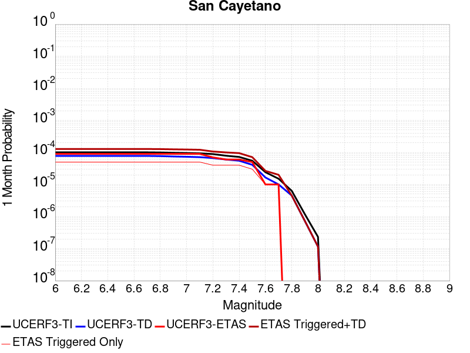 |  |  |

| Magnitude | 1 wk TI Prob | 1 wk TD Prob | 1 wk ETAS Prob | 1 wk ETAS/TD Gain | 1 wk ETAS Triggered+TD | 1 wk ETAS Triggered Only | 1 mo TI Prob | 1 mo TD Prob | 1 mo ETAS Prob | 1 mo ETAS/TD Gain | 1 mo ETAS Triggered+TD | 1 mo ETAS Triggered Only | 1 yr TI Prob | 1 yr TD Prob | 1 yr ETAS Prob | 1 yr ETAS/TD Gain | 1 yr ETAS Triggered+TD | 1 yr ETAS Triggered Only | 10 yr TI Prob | 10 yr TD Prob | 10 yr ETAS Prob | 10 yr ETAS/TD Gain | 10 yr ETAS Triggered+TD | 10 yr ETAS Triggered Only |
|-----|-----|-----|-----|-----|-----|-----|-----|-----|-----|-----|-----|-----|-----|-----|-----|-----|-----|-----|-----|-----|-----|-----|-----|-----|
| 6.0 | 2.3476267E-5 | 1.8169216E-5 | 3.0E-5 | 1.6511445 | 4.816867E-5 | 3.0E-5 | 1.0060869E-4 | 7.786576E-5 | 9.0E-5 | 1.1558353 | 1.2786187E-4 | 5.0E-5 | 0.0012242225 | 9.4760704E-4 | 5.6E-4 | 0.5909623 | 0.0010075502 | 6.0E-5 | 0.012175002 | 0.00943675 | 0.00661 | 0.70045304 | 0.00950609 | 7.0E-5 |
| 6.1 | 2.3476267E-5 | 1.8169216E-5 | 3.0E-5 | 1.6511445 | 4.816867E-5 | 3.0E-5 | 1.0060869E-4 | 7.786576E-5 | 9.0E-5 | 1.1558353 | 1.2786187E-4 | 5.0E-5 | 0.0012242225 | 9.4760704E-4 | 5.6E-4 | 0.5909623 | 0.0010075502 | 6.0E-5 | 0.012175002 | 0.00943675 | 0.00661 | 0.70045304 | 0.00950609 | 7.0E-5 |
| 6.2 | 2.3476267E-5 | 1.8169216E-5 | 3.0E-5 | 1.6511445 | 4.816867E-5 | 3.0E-5 | 1.0060869E-4 | 7.786576E-5 | 9.0E-5 | 1.1558353 | 1.2786187E-4 | 5.0E-5 | 0.0012242225 | 9.4760704E-4 | 5.6E-4 | 0.5909623 | 0.0010075502 | 6.0E-5 | 0.012175002 | 0.00943675 | 0.00661 | 0.70045304 | 0.00950609 | 7.0E-5 |
| 6.3 | 2.3476267E-5 | 1.8169216E-5 | 3.0E-5 | 1.6511445 | 4.816867E-5 | 3.0E-5 | 1.0060869E-4 | 7.786576E-5 | 9.0E-5 | 1.1558353 | 1.2786187E-4 | 5.0E-5 | 0.0012242225 | 9.4760704E-4 | 5.6E-4 | 0.5909623 | 0.0010075502 | 6.0E-5 | 0.012175002 | 0.00943675 | 0.00661 | 0.70045304 | 0.00950609 | 7.0E-5 |
| 6.4 | 2.3476267E-5 | 1.8169216E-5 | 3.0E-5 | 1.6511445 | 4.816867E-5 | 3.0E-5 | 1.0060869E-4 | 7.786576E-5 | 9.0E-5 | 1.1558353 | 1.2786187E-4 | 5.0E-5 | 0.0012242225 | 9.4760704E-4 | 5.6E-4 | 0.5909623 | 0.0010075502 | 6.0E-5 | 0.012175002 | 0.00943675 | 0.00661 | 0.70045304 | 0.00950609 | 7.0E-5 |
| 6.5 | 2.3476267E-5 | 1.8169216E-5 | 3.0E-5 | 1.6511445 | 4.816867E-5 | 3.0E-5 | 1.0060869E-4 | 7.786576E-5 | 9.0E-5 | 1.1558353 | 1.2786187E-4 | 5.0E-5 | 0.0012242225 | 9.4760704E-4 | 5.6E-4 | 0.5909623 | 0.0010075502 | 6.0E-5 | 0.012175002 | 0.00943675 | 0.00661 | 0.70045304 | 0.00950609 | 7.0E-5 |
| 6.6 | 2.3476267E-5 | 1.8169216E-5 | 3.0E-5 | 1.6511445 | 4.816867E-5 | 3.0E-5 | 1.0060869E-4 | 7.786576E-5 | 9.0E-5 | 1.1558353 | 1.2786187E-4 | 5.0E-5 | 0.0012242225 | 9.4760704E-4 | 5.6E-4 | 0.5909623 | 0.0010075502 | 6.0E-5 | 0.012175002 | 0.00943675 | 0.00661 | 0.70045304 | 0.00950609 | 7.0E-5 |
| 6.7 | 2.3476267E-5 | 1.8169216E-5 | 3.0E-5 | 1.6511445 | 4.816867E-5 | 3.0E-5 | 1.0060869E-4 | 7.786576E-5 | 9.0E-5 | 1.1558353 | 1.2786187E-4 | 5.0E-5 | 0.0012242225 | 9.4760704E-4 | 5.6E-4 | 0.5909623 | 0.0010075502 | 6.0E-5 | 0.012175002 | 0.00943675 | 0.00661 | 0.70045304 | 0.00950609 | 7.0E-5 |
| 6.8 | 2.3241924E-5 | 1.7936945E-5 | 3.0E-5 | 1.6725255 | 4.7936406E-5 | 3.0E-5 | 9.960445E-5 | 7.687038E-5 | 9.0E-5 | 1.170802 | 1.2686654E-4 | 5.0E-5 | 0.0012120095 | 9.354987E-4 | 5.4E-4 | 0.57723224 | 9.954425E-4 | 6.0E-5 | 0.012054204 | 0.0093166195 | 0.00649 | 0.6966046 | 0.009385967 | 7.0E-5 |
| 6.9 | 2.2761007E-5 | 1.7432383E-5 | 3.0E-5 | 1.720935 | 4.7431862E-5 | 3.0E-5 | 9.7543525E-5 | 7.47081E-5 | 9.0E-5 | 1.2046887 | 1.2470435E-4 | 5.0E-5 | 0.0011869454 | 9.09195E-4 | 5.3E-4 | 0.58293325 | 9.6914044E-4 | 6.0E-5 | 0.011806256 | 0.009055741 | 0.0064 | 0.706734 | 0.009125107 | 7.0E-5 |
| 7.0 | 2.240283E-5 | 1.7066137E-5 | 3.0E-5 | 1.757867 | 4.7065627E-5 | 3.0E-5 | 9.600859E-5 | 7.313856E-5 | 9.0E-5 | 1.2305411 | 1.231349E-4 | 5.0E-5 | 0.0011682777 | 8.9010154E-4 | 5.3E-4 | 0.59543765 | 9.5004815E-4 | 6.0E-5 | 0.011621549 | 0.008866336 | 0.00617 | 0.6958906 | 0.008935716 | 7.0E-5 |
| 7.1 | 2.1871154E-5 | 1.658602E-5 | 3.0E-5 | 1.8087522 | 4.6585523E-5 | 3.0E-5 | 9.373015E-5 | 7.108103E-5 | 9.0E-5 | 1.2661607 | 1.2107747E-4 | 5.0E-5 | 0.0011405671 | 8.6507126E-4 | 5.2E-4 | 0.6011066 | 9.250193E-4 | 6.0E-5 | 0.011347309 | 0.008617996 | 0.006 | 0.6962175 | 0.008687393 | 7.0E-5 |
| 7.2 | 2.0714133E-5 | 1.5564563E-5 | 3.0E-5 | 1.9274554 | 4.5564095E-5 | 3.0E-5 | 8.8771834E-5 | 6.670358E-5 | 7.0E-5 | 1.0494189 | 1.06700914E-4 | 4.0E-5 | 0.0010802611 | 8.118168E-4 | 5.0E-4 | 0.61590254 | 8.617762E-4 | 5.0E-5 | 0.010750249 | 0.008089443 | 0.00571 | 0.70585823 | 0.008148957 | 6.0E-5 |
| 7.3 | 1.8408395E-5 | 1.3996829E-5 | 3.0E-5 | 2.1433427 | 4.399641E-5 | 3.0E-5 | 7.8890735E-5 | 5.9985046E-5 | 6.0E-5 | 1.0002493 | 9.9982644E-5 | 4.0E-5 | 9.600714E-4 | 7.300762E-4 | 4.3E-4 | 0.5889796 | 7.800397E-4 | 5.0E-5 | 0.009559342 | 0.0072776447 | 0.0051 | 0.70077616 | 0.007337208 | 6.0E-5 |
| 7.4 | 1.6856795E-5 | 1.285006E-5 | 3.0E-5 | 2.3346195 | 4.2849675E-5 | 3.0E-5 | 7.2241404E-5 | 5.5070537E-5 | 6.0E-5 | 1.0895119 | 9.506833E-5 | 4.0E-5 | 8.7918417E-4 | 6.7028037E-4 | 4.1E-4 | 0.6116843 | 7.2024687E-4 | 5.0E-5 | 0.00875714 | 0.0066834087 | 0.00468 | 0.7002415 | 0.0067330743 | 5.0E-5 |
| 7.5 | 1.2822778E-5 | 9.577415E-6 | 2.0E-5 | 2.0882463 | 2.9577222E-5 | 2.0E-5 | 5.495361E-5 | 4.1045427E-5 | 5.0E-5 | 1.2181625 | 7.10442E-5 | 3.0E-5 | 6.688548E-4 | 4.9961504E-4 | 2.7E-4 | 0.54041606 | 5.296001E-4 | 3.0E-5 | 0.006668452 | 0.0049851923 | 0.00359 | 0.7201327 | 0.0050150426 | 3.0E-5 |
| 7.6 | 5.6272684E-6 | 3.854899E-6 | 0.0 | 0.0 | 3.854899E-6 | 0.0 | 2.4116642E-5 | 1.6520893E-5 | 1.0E-5 | 0.60529417 | 2.6520727E-5 | 1.0E-5 | 2.9358055E-4 | 2.0112342E-4 | 4.0E-5 | 0.19888286 | 2.111214E-4 | 1.0E-5 | 0.0029319301 | 0.0020094248 | 0.0014 | 0.6967168 | 0.0020194047 | 1.0E-5 |
| 7.7 | 3.5261346E-6 | 2.3407094E-6 | 0.0 | 0.0 | 2.3407094E-6 | 0.0 | 1.5111918E-5 | 1.0031574E-5 | 1.0E-5 | 0.9968525 | 2.0031473E-5 | 1.0E-5 | 1.8397206E-4 | 1.2212765E-4 | 2.0E-5 | 0.16376309 | 1.3212643E-4 | 1.0E-5 | 0.0018381984 | 0.0012206127 | 9.2E-4 | 0.75371987 | 0.0012306004 | 1.0E-5 |
| 7.8 | 1.4826929E-6 | 1.0564395E-6 | 0.0 | 0.0 | 1.0564395E-6 | 0.0 | 6.354383E-6 | 4.52759E-6 | 0.0 | 0.0 | 4.52759E-6 | 0.0 | 7.736187E-5 | 5.5122033E-5 | 0.0 | 0.0 | 5.5122033E-5 | 0.0 | 7.733494E-4 | 5.510856E-4 | 5.0E-4 | 0.9073 | 5.510856E-4 | 0.0 |
| 7.9 | 2.7568166E-7 | 1.6977887E-7 | 0.0 | 0.0 | 1.6977887E-7 | 0.0 | 1.1814923E-6 | 7.276235E-7 | 0.0 | 0.0 | 7.276235E-7 | 0.0 | 1.4384574E-5 | 8.85878E-6 | 0.0 | 0.0 | 8.85878E-6 | 0.0 | 1.4383643E-4 | 8.858431E-5 | 4.0E-5 | 0.45154724 | 8.858431E-5 | 0.0 |
| 8.0 | 5.407832E-8 | 2.688677E-8 | 0.0 | 0.0 | 2.688677E-8 | 0.0 | 2.3176422E-7 | 1.15229014E-7 | 0.0 | 0.0 | 1.15229014E-7 | 0.0 | 2.8217257E-6 | 1.4029123E-6 | 0.0 | 0.0 | 1.4029123E-6 | 0.0 | 2.8216898E-5 | 1.40290385E-5 | 0.0 | 0.0 | 1.40290385E-5 | 0.0 |

## Hayward (So) 2011 CFM
*[(top)](#table-of-contents)*

| 1 Week | 1 Month | 1 Year | 10 Year |
|-----|-----|-----|-----|
|  |  |  |  |

| Magnitude | 1 wk TI Prob | 1 wk TD Prob | 1 wk ETAS Prob | 1 wk ETAS/TD Gain | 1 wk ETAS Triggered+TD | 1 wk ETAS Triggered Only | 1 mo TI Prob | 1 mo TD Prob | 1 mo ETAS Prob | 1 mo ETAS/TD Gain | 1 mo ETAS Triggered+TD | 1 mo ETAS Triggered Only | 1 yr TI Prob | 1 yr TD Prob | 1 yr ETAS Prob | 1 yr ETAS/TD Gain | 1 yr ETAS Triggered+TD | 1 yr ETAS Triggered Only | 10 yr TI Prob | 10 yr TD Prob | 10 yr ETAS Prob | 10 yr ETAS/TD Gain | 10 yr ETAS Triggered+TD | 10 yr ETAS Triggered Only |
|-----|-----|-----|-----|-----|-----|-----|-----|-----|-----|-----|-----|-----|-----|-----|-----|-----|-----|-----|-----|-----|-----|-----|-----|-----|
| 6.0 | 1.8091932E-4 | 3.570673E-4 | 1.7E-4 | 0.47610074 | 3.7706015E-4 | 2.0E-5 | 7.751381E-4 | 0.0015294008 | 8.0E-4 | 0.52308065 | 0.0015693397 | 4.0E-5 | 0.00939654 | 0.018463885 | 0.00965 | 0.5226419 | 0.018512962 | 5.0E-5 | 0.090090066 | 0.1667085 | 0.1005 | 0.6028487 | 0.1667585 | 6.0E-5 |
| 6.1 | 1.8091932E-4 | 3.570673E-4 | 1.7E-4 | 0.47610074 | 3.7706015E-4 | 2.0E-5 | 7.751381E-4 | 0.0015294008 | 8.0E-4 | 0.52308065 | 0.0015693397 | 4.0E-5 | 0.00939654 | 0.018463885 | 0.00965 | 0.5226419 | 0.018512962 | 5.0E-5 | 0.090090066 | 0.1667085 | 0.1005 | 0.6028487 | 0.1667585 | 6.0E-5 |
| 6.2 | 1.8091932E-4 | 3.570673E-4 | 1.7E-4 | 0.47610074 | 3.7706015E-4 | 2.0E-5 | 7.751381E-4 | 0.0015294008 | 8.0E-4 | 0.52308065 | 0.0015693397 | 4.0E-5 | 0.00939654 | 0.018463885 | 0.00965 | 0.5226419 | 0.018512962 | 5.0E-5 | 0.090090066 | 0.1667085 | 0.1005 | 0.6028487 | 0.1667585 | 6.0E-5 |
| 6.3 | 1.7322872E-4 | 3.4263515E-4 | 1.6E-4 | 0.466969 | 3.626283E-4 | 2.0E-5 | 7.4219756E-4 | 0.0014676197 | 7.9E-4 | 0.5382866 | 0.001507561 | 4.0E-5 | 0.0089988755 | 0.017724147 | 0.00934 | 0.52696466 | 0.017773261 | 5.0E-5 | 0.08643075 | 0.16065954 | 0.09682 | 0.60264087 | 0.1607099 | 6.0E-5 |
| 6.4 | 1.6334097E-4 | 3.2345165E-4 | 1.5E-4 | 0.46374783 | 3.434452E-4 | 2.0E-5 | 6.998449E-4 | 0.0013854936 | 7.3E-4 | 0.526888 | 0.0014254382 | 4.0E-5 | 0.008487372 | 0.016739927 | 0.0089 | 0.531663 | 0.01678909 | 5.0E-5 | 0.081704415 | 0.15256606 | 0.09181 | 0.6017721 | 0.1526169 | 6.0E-5 |
| 6.5 | 1.5600289E-4 | 3.101982E-4 | 1.4E-4 | 0.45132437 | 3.3019198E-4 | 2.0E-5 | 6.684125E-4 | 0.0013287518 | 7.0E-4 | 0.52681017 | 0.0013686987 | 4.0E-5 | 0.008107598 | 0.016059443 | 0.00848 | 0.5280382 | 0.016108641 | 5.0E-5 | 0.078181036 | 0.14684291 | 0.08817 | 0.6004376 | 0.1468941 | 6.0E-5 |
| 6.6 | 1.4046066E-4 | 2.8034003E-4 | 1.0E-4 | 0.35670966 | 2.9033722E-4 | 1.0E-5 | 6.018354E-4 | 0.0012009109 | 6.1E-4 | 0.50794774 | 0.0012308749 | 3.0E-5 | 0.0073027555 | 0.014524571 | 0.00762 | 0.5246282 | 0.01456399 | 4.0E-5 | 0.07067384 | 0.13393044 | 0.07997 | 0.597101 | 0.13397375 | 5.0E-5 |
| 6.7 | 1.14696966E-4 | 2.3272466E-4 | 1.0E-4 | 0.42969233 | 2.4272234E-4 | 1.0E-5 | 4.914658E-4 | 9.970153E-4 | 5.3E-4 | 0.53158665 | 0.0010269854 | 3.0E-5 | 0.0059671924 | 0.012072163 | 0.00643 | 0.5326303 | 0.012111681 | 4.0E-5 | 0.058094822 | 0.11274141 | 0.066 | 0.5854104 | 0.11278578 | 5.0E-5 |
| 6.8 | 9.3874296E-5 | 1.8862431E-4 | 8.0E-5 | 0.4241235 | 1.8862431E-4 | 0.0 | 4.0225635E-4 | 8.081431E-4 | 4.2E-4 | 0.51970994 | 8.2812697E-4 | 2.0E-5 | 0.0048864787 | 0.009795489 | 0.0051 | 0.5206478 | 0.009825195 | 3.0E-5 | 0.047804173 | 0.092592984 | 0.05339 | 0.57660955 | 0.09262928 | 4.0E-5 |
| 6.9 | 5.551852E-5 | 1.0729875E-4 | 5.0E-5 | 0.46598864 | 1.0729875E-4 | 0.0 | 2.3791482E-4 | 4.5977137E-4 | 2.3E-4 | 0.5002487 | 4.6976676E-4 | 1.0E-5 | 0.0028927654 | 0.005583468 | 0.00291 | 0.52118146 | 0.0055934116 | 1.0E-5 | 0.028553981 | 0.054246075 | 0.02995 | 0.5521137 | 0.05425553 | 1.0E-5 |
| 7.0 | 4.2662363E-5 | 8.246792E-5 | 3.0E-5 | 0.36377782 | 8.246792E-5 | 0.0 | 1.8282588E-4 | 3.5338648E-4 | 1.9E-4 | 0.537655 | 3.6338295E-4 | 1.0E-5 | 0.0022236328 | 0.0042940658 | 0.00227 | 0.5286365 | 0.004304023 | 1.0E-5 | 0.022015138 | 0.04206509 | 0.02277 | 0.54130393 | 0.04207467 | 1.0E-5 |
| 7.1 | 3.305886E-5 | 6.302183E-5 | 3.0E-5 | 0.47602555 | 6.302183E-5 | 0.0 | 1.4167312E-4 | 2.7006568E-4 | 1.4E-4 | 0.51839244 | 2.7006568E-4 | 0.0 | 0.0017235056 | 0.003283111 | 0.00181 | 0.55130637 | 0.003283111 | 0.0 | 0.017101998 | 0.032453902 | 0.01754 | 0.54045886 | 0.032453902 | 0.0 |
| 7.2 | 2.9856887E-5 | 5.701622E-5 | 3.0E-5 | 0.5261661 | 5.701622E-5 | 0.0 | 1.2795182E-4 | 2.4433242E-4 | 1.3E-4 | 0.532062 | 2.4433242E-4 | 0.0 | 0.0015567001 | 0.0029707062 | 0.00166 | 0.5587897 | 0.0029707062 | 0.0 | 0.015458403 | 0.029454801 | 0.01591 | 0.5401496 | 0.029454801 | 0.0 |
| 7.3 | 2.4559737E-5 | 4.599286E-5 | 3.0E-5 | 0.65227515 | 4.599286E-5 | 0.0 | 1.0525176E-4 | 1.9709744E-4 | 1.1E-4 | 0.5580996 | 1.9709744E-4 | 0.0 | 0.0012806869 | 0.0023970334 | 0.00134 | 0.55902433 | 0.0023970334 | 0.0 | 0.012733313 | 0.023858516 | 0.0126 | 0.5281133 | 0.023858516 | 0.0 |
| 7.4 | 1.9002231E-5 | 3.505084E-5 | 2.0E-5 | 0.57059973 | 3.505084E-5 | 0.0 | 8.143559E-5 | 1.502093E-4 | 1.0E-4 | 0.66573775 | 1.502093E-4 | 0.0 | 9.910273E-4 | 0.001827274 | 0.00107 | 0.5855717 | 0.001827274 | 0.0 | 0.009866194 | 0.018258808 | 0.00958 | 0.5246783 | 0.018258808 | 0.0 |
| 7.5 | 1.2783333E-5 | 2.3331182E-5 | 1.0E-5 | 0.42861092 | 2.3331182E-5 | 0.0 | 5.4784563E-5 | 9.998698E-5 | 6.0E-5 | 0.6000781 | 9.998698E-5 | 0.0 | 6.667979E-4 | 0.0012166675 | 7.4E-4 | 0.6082188 | 0.0012166675 | 0.0 | 0.006648007 | 0.012209443 | 0.0065 | 0.5323748 | 0.012209443 | 0.0 |
| 7.6 | 4.8149627E-6 | 8.888056E-6 | 0.0 | 0.0 | 8.888056E-6 | 0.0 | 2.063539E-5 | 3.8091122E-5 | 2.0E-5 | 0.5250567 | 3.8091122E-5 | 0.0 | 2.5120692E-4 | 4.6366194E-4 | 3.2E-4 | 0.690158 | 4.6366194E-4 | 0.0 | 0.0025092314 | 0.0046805087 | 0.00248 | 0.5298569 | 0.0046805087 | 0.0 |
| 7.7 | 6.0838227E-7 | 1.205754E-6 | 0.0 | 0.0 | 1.205754E-6 | 0.0 | 2.6073499E-6 | 5.1675065E-6 | 0.0 | 0.0 | 5.1675065E-6 | 0.0 | 3.174402E-5 | 6.291258E-5 | 3.0E-5 | 0.47685215 | 6.291258E-5 | 0.0 | 3.1739488E-4 | 6.5296254E-4 | 3.3E-4 | 0.50538886 | 6.5296254E-4 | 0.0 |
| 7.8 | 4.5542808E-7 | 9.792941E-7 | 0.0 | 0.0 | 9.792941E-7 | 0.0 | 1.9518332E-6 | 4.196968E-6 | 0.0 | 0.0 | 4.196968E-6 | 0.0 | 2.376331E-5 | 5.109689E-5 | 2.0E-5 | 0.39141324 | 5.109689E-5 | 0.0 | 2.3760769E-4 | 5.321693E-4 | 2.8E-4 | 0.5261484 | 5.321693E-4 | 0.0 |
| 7.9 | 3.3016747E-7 | 7.3869535E-7 | 0.0 | 0.0 | 7.3869535E-7 | 0.0 | 1.4150027E-6 | 3.1658333E-6 | 0.0 | 0.0 | 3.1658333E-6 | 0.0 | 1.7227521E-5 | 3.854334E-5 | 2.0E-5 | 0.5188964 | 3.854334E-5 | 0.0 | 1.7226185E-4 | 3.9932923E-4 | 2.2E-4 | 0.5509239 | 3.9932923E-4 | 0.0 |
| 8.0 | 2.347038E-7 | 5.471963E-7 | 0.0 | 0.0 | 5.471963E-7 | 0.0 | 1.0058731E-6 | 2.3451248E-6 | 0.0 | 0.0 | 2.3451248E-6 | 0.0 | 1.2246436E-5 | 2.8551523E-5 | 2.0E-5 | 0.70048803 | 2.8551523E-5 | 0.0 | 1.2245761E-4 | 2.9357258E-4 | 1.7E-4 | 0.5790732 | 2.9357258E-4 | 0.0 |
| 8.1 | 1.18822804E-7 | 2.6060948E-7 | 0.0 | 0.0 | 2.6060948E-7 | 0.0 | 5.092405E-7 | 1.1168972E-6 | 0.0 | 0.0 | 1.1168972E-6 | 0.0 | 6.1999854E-6 | 1.359814E-5 | 1.0E-5 | 0.7353947 | 1.359814E-5 | 0.0 | 6.199812E-5 | 1.3918082E-4 | 5.0E-5 | 0.3592449 | 1.3918082E-4 | 0.0 |

## Kern Canyon (Lake Isabella) 2011
*[(top)](#table-of-contents)*

| 1 Week | 1 Month | 1 Year | 10 Year |
|-----|-----|-----|-----|
|  |  |  |  |

| Magnitude | 1 wk TI Prob | 1 wk TD Prob | 1 wk ETAS Prob | 1 wk ETAS/TD Gain | 1 wk ETAS Triggered+TD | 1 wk ETAS Triggered Only | 1 mo TI Prob | 1 mo TD Prob | 1 mo ETAS Prob | 1 mo ETAS/TD Gain | 1 mo ETAS Triggered+TD | 1 mo ETAS Triggered Only | 1 yr TI Prob | 1 yr TD Prob | 1 yr ETAS Prob | 1 yr ETAS/TD Gain | 1 yr ETAS Triggered+TD | 1 yr ETAS Triggered Only | 10 yr TI Prob | 10 yr TD Prob | 10 yr ETAS Prob | 10 yr ETAS/TD Gain | 10 yr ETAS Triggered+TD | 10 yr ETAS Triggered Only |
|-----|-----|-----|-----|-----|-----|-----|-----|-----|-----|-----|-----|-----|-----|-----|-----|-----|-----|-----|-----|-----|-----|-----|-----|-----|
| 6.0 | 4.2387383E-6 | 4.0016344E-6 | 1.0E-5 | 2.498979 | 1.40015945E-5 | 1.0E-5 | 1.8165894E-5 | 1.7149758E-5 | 1.0E-5 | 0.5830986 | 2.7149586E-5 | 1.0E-5 | 2.2114732E-4 | 2.0878017E-4 | 1.4E-4 | 0.6705618 | 2.5876972E-4 | 5.0E-5 | 0.0022092736 | 0.002086024 | 9.5E-4 | 0.4554118 | 0.002155878 | 7.0E-5 |
| 6.1 | 4.2387383E-6 | 4.0016344E-6 | 1.0E-5 | 2.498979 | 1.40015945E-5 | 1.0E-5 | 1.8165894E-5 | 1.7149758E-5 | 1.0E-5 | 0.5830986 | 2.7149586E-5 | 1.0E-5 | 2.2114732E-4 | 2.0878017E-4 | 1.4E-4 | 0.6705618 | 2.5876972E-4 | 5.0E-5 | 0.0022092736 | 0.002086024 | 9.5E-4 | 0.4554118 | 0.002155878 | 7.0E-5 |
| 6.2 | 4.2387383E-6 | 4.0016344E-6 | 1.0E-5 | 2.498979 | 1.40015945E-5 | 1.0E-5 | 1.8165894E-5 | 1.7149758E-5 | 1.0E-5 | 0.5830986 | 2.7149586E-5 | 1.0E-5 | 2.2114732E-4 | 2.0878017E-4 | 1.4E-4 | 0.6705618 | 2.5876972E-4 | 5.0E-5 | 0.0022092736 | 0.002086024 | 9.5E-4 | 0.4554118 | 0.002155878 | 7.0E-5 |
| 6.3 | 4.2387383E-6 | 4.0016344E-6 | 1.0E-5 | 2.498979 | 1.40015945E-5 | 1.0E-5 | 1.8165894E-5 | 1.7149758E-5 | 1.0E-5 | 0.5830986 | 2.7149586E-5 | 1.0E-5 | 2.2114732E-4 | 2.0878017E-4 | 1.4E-4 | 0.6705618 | 2.5876972E-4 | 5.0E-5 | 0.0022092736 | 0.002086024 | 9.5E-4 | 0.4554118 | 0.002155878 | 7.0E-5 |
| 6.4 | 4.2387383E-6 | 4.0016344E-6 | 1.0E-5 | 2.498979 | 1.40015945E-5 | 1.0E-5 | 1.8165894E-5 | 1.7149758E-5 | 1.0E-5 | 0.5830986 | 2.7149586E-5 | 1.0E-5 | 2.2114732E-4 | 2.0878017E-4 | 1.4E-4 | 0.6705618 | 2.5876972E-4 | 5.0E-5 | 0.0022092736 | 0.002086024 | 9.5E-4 | 0.4554118 | 0.002155878 | 7.0E-5 |
| 6.5 | 2.7857532E-6 | 2.5178624E-6 | 1.0E-5 | 3.971623 | 1.2517838E-5 | 1.0E-5 | 1.1938888E-5 | 1.0790796E-5 | 1.0E-5 | 0.92671573 | 2.0790689E-5 | 1.0E-5 | 1.4534626E-4 | 1.3137035E-4 | 1.2E-4 | 0.9134481 | 1.8136378E-4 | 5.0E-5 | 0.0014525123 | 0.0013129596 | 6.3E-4 | 0.47983196 | 0.0013828677 | 7.0E-5 |
| 6.6 | 2.2233348E-6 | 1.944119E-6 | 1.0E-5 | 5.143718 | 1.1944099E-5 | 1.0E-5 | 9.528543E-6 | 8.331913E-6 | 1.0E-5 | 1.2002046 | 1.833183E-5 | 1.0E-5 | 1.1600384E-4 | 1.014364E-4 | 1.0E-4 | 0.9858394 | 1.4143235E-4 | 4.0E-5 | 0.001159433 | 0.0010139096 | 5.1E-4 | 0.5030034 | 0.0010738488 | 6.0E-5 |
| 6.7 | 2.1635126E-6 | 1.8834991E-6 | 1.0E-5 | 5.3092675 | 1.18834805E-5 | 1.0E-5 | 9.272164E-6 | 8.072114E-6 | 1.0E-5 | 1.2388328 | 1.8072033E-5 | 1.0E-5 | 1.1288274E-4 | 9.827364E-5 | 9.0E-5 | 0.91581017 | 1.282707E-4 | 3.0E-5 | 0.0011282542 | 9.8231E-4 | 4.7E-4 | 0.47846404 | 0.0010322608 | 5.0E-5 |
| 6.8 | 1.8685711E-6 | 1.583138E-6 | 1.0E-5 | 6.316569 | 1.1583122E-5 | 1.0E-5 | 8.008137E-6 | 6.7848596E-6 | 1.0E-5 | 1.4738698 | 1.6784792E-5 | 1.0E-5 | 9.74947E-5 | 8.2602586E-5 | 8.0E-5 | 0.9684927 | 1.1260011E-4 | 3.0E-5 | 9.745194E-4 | 8.2572375E-4 | 3.8E-4 | 0.46020234 | 8.7568245E-4 | 5.0E-5 |
| 6.9 | 1.5815071E-6 | 1.3064887E-6 | 1.0E-5 | 7.6541038 | 1.1306475E-5 | 1.0E-5 | 6.77787E-6 | 5.5992255E-6 | 1.0E-5 | 1.7859613 | 1.559917E-5 | 1.0E-5 | 8.251744E-5 | 6.816846E-5 | 6.0E-5 | 0.8801724 | 8.81671E-5 | 2.0E-5 | 8.248681E-4 | 6.8147824E-4 | 2.9E-4 | 0.4255455 | 7.2145095E-4 | 4.0E-5 |
| 7.0 | 1.3772564E-6 | 1.1210681E-6 | 1.0E-5 | 8.920065 | 1.1121057E-5 | 1.0E-5 | 5.9025137E-6 | 4.8045686E-6 | 1.0E-5 | 2.0813522 | 1.4804521E-5 | 1.0E-5 | 7.186073E-5 | 5.8494075E-5 | 6.0E-5 | 1.0257449 | 7.849291E-5 | 2.0E-5 | 7.18375E-4 | 5.8478885E-4 | 2.5E-4 | 0.42750475 | 6.247654E-4 | 4.0E-5 |
| 7.1 | 1.0916998E-6 | 8.7637505E-7 | 1.0E-5 | 11.41064 | 1.0876366E-5 | 1.0E-5 | 4.678705E-6 | 3.7558877E-6 | 1.0E-5 | 2.6624863 | 1.375585E-5 | 1.0E-5 | 5.6961744E-5 | 4.5726985E-5 | 4.0E-5 | 0.87475693 | 5.572653E-5 | 1.0E-5 | 5.6947145E-4 | 4.571771E-4 | 2.1E-4 | 0.45934057 | 4.871634E-4 | 3.0E-5 |
| 7.2 | 7.6277024E-7 | 5.901439E-7 | 1.0E-5 | 16.94502 | 1.0590138E-5 | 1.0E-5 | 3.2690114E-6 | 2.5291856E-6 | 1.0E-5 | 3.953842 | 1.252916E-5 | 1.0E-5 | 3.9799485E-5 | 3.0792406E-5 | 4.0E-5 | 1.2990216 | 4.07921E-5 | 1.0E-5 | 3.9792358E-4 | 3.07882E-4 | 1.5E-4 | 0.48719963 | 3.2787584E-4 | 2.0E-5 |
| 7.3 | 5.3265916E-7 | 4.3824264E-7 | 1.0E-5 | 22.818409 | 1.0438238E-5 | 1.0E-5 | 2.282823E-6 | 1.8781814E-6 | 1.0E-5 | 5.3242993 | 1.1878163E-5 | 1.0E-5 | 2.7793016E-5 | 2.2866623E-5 | 4.0E-5 | 1.7492745 | 3.2866392E-5 | 1.0E-5 | 2.778954E-4 | 2.2864307E-4 | 1.2E-4 | 0.52483547 | 2.486385E-4 | 2.0E-5 |
| 7.4 | 3.4946007E-7 | 3.0065647E-7 | 1.0E-5 | 33.26055 | 1.0300653E-5 | 1.0E-5 | 1.497685E-6 | 1.2885271E-6 | 1.0E-5 | 7.7607994 | 1.12885145E-5 | 1.0E-5 | 1.8234163E-5 | 1.5687707E-5 | 3.0E-5 | 1.9123254 | 2.568755E-5 | 1.0E-5 | 1.8232666E-4 | 1.5686621E-4 | 9.0E-5 | 0.5737373 | 1.7686308E-4 | 2.0E-5 |
| 7.5 | 1.8317026E-7 | 1.4244755E-7 | 0.0 | 0.0 | 1.4244755E-7 | 0.0 | 7.850152E-7 | 6.1048934E-7 | 0.0 | 0.0 | 6.1048934E-7 | 0.0 | 9.557518E-6 | 7.432683E-6 | 0.0 | 0.0 | 7.432683E-6 | 0.0 | 9.5571064E-5 | 7.432442E-5 | 3.0E-5 | 0.40363583 | 8.4323685E-5 | 1.0E-5 |
| 7.6 | 2.572245E-8 | 1.735264E-8 | 0.0 | 0.0 | 1.735264E-8 | 0.0 | 1.10239064E-7 | 7.436845E-8 | 0.0 | 0.0 | 7.436845E-8 | 0.0 | 1.3421597E-6 | 9.0543557E-7 | 0.0 | 0.0 | 9.0543557E-7 | 0.0 | 1.3421517E-5 | 9.054324E-6 | 0.0 | 0.0 | 9.054324E-6 | 0.0 |

## San Juan
*[(top)](#table-of-contents)*

| 1 Week | 1 Month | 1 Year | 10 Year |
|-----|-----|-----|-----|
|  |  |  |  |

| Magnitude | 1 wk TI Prob | 1 wk TD Prob | 1 wk ETAS Prob | 1 wk ETAS/TD Gain | 1 wk ETAS Triggered+TD | 1 wk ETAS Triggered Only | 1 mo TI Prob | 1 mo TD Prob | 1 mo ETAS Prob | 1 mo ETAS/TD Gain | 1 mo ETAS Triggered+TD | 1 mo ETAS Triggered Only | 1 yr TI Prob | 1 yr TD Prob | 1 yr ETAS Prob | 1 yr ETAS/TD Gain | 1 yr ETAS Triggered+TD | 1 yr ETAS Triggered Only | 10 yr TI Prob | 10 yr TD Prob | 10 yr ETAS Prob | 10 yr ETAS/TD Gain | 10 yr ETAS Triggered+TD | 10 yr ETAS Triggered Only |
|-----|-----|-----|-----|-----|-----|-----|-----|-----|-----|-----|-----|-----|-----|-----|-----|-----|-----|-----|-----|-----|-----|-----|-----|-----|
| 6.0 | 8.682808E-6 | 8.74917E-6 | 2.0E-5 | 2.285931 | 1.8749082E-5 | 1.0E-5 | 3.72115E-5 | 3.749593E-5 | 6.0E-5 | 1.6001737 | 6.74948E-5 | 3.0E-5 | 4.5295584E-4 | 4.5642213E-4 | 3.8E-4 | 0.83256257 | 4.8640845E-4 | 3.0E-5 | 0.004520337 | 0.004555389 | 0.00442 | 0.97027946 | 0.00462507 | 7.0E-5 |
| 6.1 | 8.682808E-6 | 8.74917E-6 | 2.0E-5 | 2.285931 | 1.8749082E-5 | 1.0E-5 | 3.72115E-5 | 3.749593E-5 | 6.0E-5 | 1.6001737 | 6.74948E-5 | 3.0E-5 | 4.5295584E-4 | 4.5642213E-4 | 3.8E-4 | 0.83256257 | 4.8640845E-4 | 3.0E-5 | 0.004520337 | 0.004555389 | 0.00442 | 0.97027946 | 0.00462507 | 7.0E-5 |
| 6.2 | 8.682808E-6 | 8.74917E-6 | 2.0E-5 | 2.285931 | 1.8749082E-5 | 1.0E-5 | 3.72115E-5 | 3.749593E-5 | 6.0E-5 | 1.6001737 | 6.74948E-5 | 3.0E-5 | 4.5295584E-4 | 4.5642213E-4 | 3.8E-4 | 0.83256257 | 4.8640845E-4 | 3.0E-5 | 0.004520337 | 0.004555389 | 0.00442 | 0.97027946 | 0.00462507 | 7.0E-5 |
| 6.3 | 6.3054235E-6 | 6.282591E-6 | 1.0E-5 | 1.5917 | 6.282591E-6 | 0.0 | 2.7022963E-5 | 2.692512E-5 | 4.0E-5 | 1.4856015 | 4.6924582E-5 | 2.0E-5 | 3.2895492E-4 | 3.2776545E-4 | 2.9E-4 | 0.8847791 | 3.4775888E-4 | 2.0E-5 | 0.003284684 | 0.0032730205 | 0.00333 | 1.0174088 | 0.0033128897 | 4.0E-5 |
| 6.4 | 6.1490473E-6 | 6.1144706E-6 | 1.0E-5 | 1.6354645 | 6.1144706E-6 | 0.0 | 2.6352795E-5 | 2.6204618E-5 | 4.0E-5 | 1.5264485 | 4.6204095E-5 | 2.0E-5 | 3.2079802E-4 | 3.189959E-4 | 2.8E-4 | 0.8777542 | 3.389895E-4 | 2.0E-5 | 0.0032033534 | 0.0031855768 | 0.00324 | 1.0170842 | 0.0032254492 | 4.0E-5 |
| 6.5 | 5.204848E-6 | 5.137238E-6 | 1.0E-5 | 1.9465712 | 5.137238E-6 | 0.0 | 2.23063E-5 | 2.2016555E-5 | 3.0E-5 | 1.362611 | 4.2016112E-5 | 2.0E-5 | 2.7154534E-4 | 2.6801953E-4 | 2.3E-4 | 0.8581464 | 2.8801415E-4 | 2.0E-5 | 0.0027121378 | 0.0026771172 | 0.00281 | 1.0496365 | 0.002707037 | 3.0E-5 |
| 6.6 | 4.5179986E-6 | 4.415036E-6 | 1.0E-5 | 2.2649872 | 4.415036E-6 | 0.0 | 1.9362706E-5 | 1.892145E-5 | 3.0E-5 | 1.5855021 | 3.8921073E-5 | 2.0E-5 | 2.3571544E-4 | 2.303451E-4 | 1.9E-4 | 0.8248493 | 2.503405E-4 | 2.0E-5 | 0.0023546559 | 0.0023012008 | 0.00226 | 0.98209596 | 0.0023311318 | 3.0E-5 |
| 6.7 | 3.9442616E-6 | 3.8198336E-6 | 1.0E-5 | 2.6179152 | 3.8198336E-6 | 0.0 | 1.6903869E-5 | 1.6370615E-5 | 2.0E-5 | 1.2217011 | 2.6370451E-5 | 1.0E-5 | 2.0578515E-4 | 1.9929469E-4 | 1.5E-4 | 0.75265425 | 2.092927E-4 | 1.0E-5 | 0.002055947 | 0.001991285 | 0.00195 | 0.9792672 | 0.002001265 | 1.0E-5 |
| 6.8 | 3.4536245E-6 | 3.3163408E-6 | 1.0E-5 | 3.0153718 | 3.3163408E-6 | 0.0 | 1.4801163E-5 | 1.4212815E-5 | 2.0E-5 | 1.4071808 | 2.4212673E-5 | 1.0E-5 | 1.8018926E-4 | 1.7302789E-4 | 1.4E-4 | 0.8091181 | 1.8302616E-4 | 1.0E-5 | 0.0018004322 | 0.001729051 | 0.00177 | 1.023683 | 0.0017390337 | 1.0E-5 |
| 6.9 | 3.059865E-6 | 2.9120363E-6 | 1.0E-5 | 3.4340231 | 2.9120363E-6 | 0.0 | 1.3113641E-5 | 1.2480099E-5 | 2.0E-5 | 1.6025513 | 2.2479975E-5 | 1.0E-5 | 1.596469E-4 | 1.5193518E-4 | 1.4E-4 | 0.92144555 | 1.6193367E-4 | 1.0E-5 | 0.0015953224 | 0.0015184281 | 0.00155 | 1.0207925 | 0.0015284129 | 1.0E-5 |
| 7.0 | 2.6504351E-6 | 2.492005E-6 | 1.0E-5 | 4.012833 | 2.492005E-6 | 0.0 | 1.1358958E-5 | 1.0679981E-5 | 2.0E-5 | 1.8726625 | 2.0679874E-5 | 1.0E-5 | 1.3828653E-4 | 1.3002155E-4 | 1.2E-4 | 0.9229239 | 1.4002025E-4 | 1.0E-5 | 0.0013820052 | 0.001299567 | 0.00141 | 1.0849767 | 0.0013095541 | 1.0E-5 |
| 7.1 | 2.2039317E-6 | 2.0338366E-6 | 1.0E-5 | 4.9168158 | 2.0338366E-6 | 0.0 | 9.445387E-6 | 8.716416E-6 | 2.0E-5 | 2.2945209 | 1.871633E-5 | 1.0E-5 | 1.1499152E-4 | 1.0611773E-4 | 1.1E-4 | 1.0365845 | 1.1611667E-4 | 1.0E-5 | 0.0011493203 | 0.0010607811 | 0.00108 | 1.0181178 | 0.0010707704 | 1.0E-5 |
| 7.2 | 1.0786707E-6 | 8.770239E-7 | 1.0E-5 | 11.402198 | 8.770239E-7 | 0.0 | 4.622866E-6 | 3.7586685E-6 | 1.0E-5 | 2.6605167 | 3.7586685E-6 | 0.0 | 5.628194E-5 | 4.576084E-5 | 3.0E-5 | 0.65558237 | 4.576084E-5 | 0.0 | 5.6267687E-4 | 4.5757365E-4 | 3.9E-4 | 0.8523218 | 4.5757365E-4 | 0.0 |
| 7.3 | 6.846433E-7 | 4.868812E-7 | 0.0 | 0.0 | 4.868812E-7 | 0.0 | 2.9341822E-6 | 2.086632E-6 | 0.0 | 0.0 | 2.086632E-6 | 0.0 | 3.5723086E-5 | 2.5404452E-5 | 1.0E-5 | 0.3936318 | 2.5404452E-5 | 0.0 | 3.571734E-4 | 2.5405022E-4 | 1.0E-4 | 0.39362296 | 2.5405022E-4 | 0.0 |
| 7.4 | 5.23043E-7 | 3.2627884E-7 | 0.0 | 0.0 | 3.2627884E-7 | 0.0 | 2.2416111E-6 | 1.3983371E-6 | 0.0 | 0.0 | 1.3983371E-6 | 0.0 | 2.7291273E-5 | 1.7024622E-5 | 1.0E-5 | 0.5873846 | 1.7024622E-5 | 0.0 | 2.7287923E-4 | 1.7026608E-4 | 7.0E-5 | 0.41112125 | 1.7026608E-4 | 0.0 |
| 7.5 | 4.648444E-7 | 2.723464E-7 | 0.0 | 0.0 | 2.723464E-7 | 0.0 | 1.9921886E-6 | 1.1671983E-6 | 0.0 | 0.0 | 1.1671983E-6 | 0.0 | 2.4254627E-5 | 1.4210547E-5 | 1.0E-5 | 0.7037027 | 1.4210547E-5 | 0.0 | 2.425198E-4 | 1.4212691E-4 | 7.0E-5 | 0.4925176 | 1.4212691E-4 | 0.0 |
| 7.6 | 3.9906567E-7 | 2.2083036E-7 | 0.0 | 0.0 | 2.2083036E-7 | 0.0 | 1.7102802E-6 | 9.4641547E-7 | 0.0 | 0.0 | 9.4641547E-7 | 0.0 | 2.0822463E-5 | 1.1522548E-5 | 1.0E-5 | 0.8678636 | 1.1522548E-5 | 0.0 | 2.0820512E-4 | 1.15244526E-4 | 6.0E-5 | 0.5206321 | 1.15244526E-4 | 0.0 |
| 7.7 | 1.8784601E-7 | 5.366277E-8 | 0.0 | 0.0 | 5.366277E-8 | 0.0 | 8.0505407E-7 | 2.2998329E-7 | 0.0 | 0.0 | 2.2998329E-7 | 0.0 | 9.80149E-6 | 2.800043E-6 | 1.0E-5 | 3.5713737 | 2.800043E-6 | 0.0 | 9.801057E-5 | 2.8008939E-5 | 2.0E-5 | 0.71405774 | 2.8008939E-5 | 0.0 |
| 7.8 | 1.00154914E-7 | 1.2412917E-8 | 0.0 | 0.0 | 1.2412917E-8 | 0.0 | 4.2923529E-7 | 5.3198217E-8 | 0.0 | 0.0 | 5.3198217E-8 | 0.0 | 5.225927E-6 | 6.476881E-7 | 0.0 | 0.0 | 6.476881E-7 | 0.0 | 5.225804E-5 | 6.4827886E-6 | 1.0E-5 | 1.542546 | 6.4827886E-6 | 0.0 |
| 7.9 | 6.171429E-8 | 4.2946513E-9 | 0.0 | 0.0 | 4.2946513E-9 | 0.0 | 2.6448978E-7 | 1.8405647E-8 | 0.0 | 0.0 | 1.8405647E-8 | 0.0 | 3.2201583E-6 | 2.2408874E-7 | 0.0 | 0.0 | 2.2408874E-7 | 0.0 | 3.2201115E-5 | 2.2462114E-6 | 0.0 | 0.0 | 2.2462114E-6 | 0.0 |
| 8.0 | 1.3974572E-8 | 3.3737857E-10 | 0.0 | 0.0 | 3.3737857E-10 | 0.0 | 5.989102E-8 | 1.4459075E-9 | 0.0 | 0.0 | 1.4459075E-9 | 0.0 | 7.2917294E-7 | 1.760392E-8 | 0.0 | 0.0 | 1.760392E-8 | 0.0 | 7.2917055E-6 | 1.8038004E-7 | 0.0 | 0.0 | 1.8038004E-7 | 0.0 |
| 8.1 | 1.8403477E-9 | 1.1291601E-10 | 0.0 | 0.0 | 1.1291601E-10 | 0.0 | 7.887204E-9 | 4.839261E-10 | 0.0 | 0.0 | 4.839261E-10 | 0.0 | 9.602671E-8 | 5.8917977E-9 | 0.0 | 0.0 | 5.8917977E-9 | 0.0 | 9.602667E-7 | 6.0206084E-8 | 0.0 | 0.0 | 6.0206084E-8 | 0.0 |

## Simi-Santa Rosa
*[(top)](#table-of-contents)*

| 1 Week | 1 Month | 1 Year | 10 Year |
|-----|-----|-----|-----|
|  |  |  |  |

| Magnitude | 1 wk TI Prob | 1 wk TD Prob | 1 wk ETAS Prob | 1 wk ETAS/TD Gain | 1 wk ETAS Triggered+TD | 1 wk ETAS Triggered Only | 1 mo TI Prob | 1 mo TD Prob | 1 mo ETAS Prob | 1 mo ETAS/TD Gain | 1 mo ETAS Triggered+TD | 1 mo ETAS Triggered Only | 1 yr TI Prob | 1 yr TD Prob | 1 yr ETAS Prob | 1 yr ETAS/TD Gain | 1 yr ETAS Triggered+TD | 1 yr ETAS Triggered Only | 10 yr TI Prob | 10 yr TD Prob | 10 yr ETAS Prob | 10 yr ETAS/TD Gain | 10 yr ETAS Triggered+TD | 10 yr ETAS Triggered Only |
|-----|-----|-----|-----|-----|-----|-----|-----|-----|-----|-----|-----|-----|-----|-----|-----|-----|-----|-----|-----|-----|-----|-----|-----|-----|
| 6.0 | 2.198912E-5 | 2.2275388E-5 | 2.0E-5 | 0.8978519 | 4.2274944E-5 | 2.0E-5 | 9.4235686E-5 | 9.54627E-5 | 6.0E-5 | 0.6285177 | 1.2545985E-4 | 3.0E-5 | 0.0011467156 | 0.0011616825 | 6.8E-4 | 0.58535784 | 0.0012116245 | 5.0E-5 | 0.011408163 | 0.011560547 | 0.0071 | 0.61415774 | 0.011619854 | 6.0E-5 |
| 6.1 | 2.198912E-5 | 2.2275388E-5 | 2.0E-5 | 0.8978519 | 4.2274944E-5 | 2.0E-5 | 9.4235686E-5 | 9.54627E-5 | 6.0E-5 | 0.6285177 | 1.2545985E-4 | 3.0E-5 | 0.0011467156 | 0.0011616825 | 6.8E-4 | 0.58535784 | 0.0012116245 | 5.0E-5 | 0.011408163 | 0.011560547 | 0.0071 | 0.61415774 | 0.011619854 | 6.0E-5 |
| 6.2 | 1.69983E-5 | 1.6668506E-5 | 2.0E-5 | 1.1998676 | 3.666817E-5 | 2.0E-5 | 7.284782E-5 | 7.143466E-5 | 5.0E-5 | 0.6999403 | 1.0143252E-4 | 3.0E-5 | 8.865613E-4 | 8.6939917E-4 | 5.4E-4 | 0.6211186 | 9.1935566E-4 | 5.0E-5 | 0.008830327 | 0.0086629 | 0.00518 | 0.5979522 | 0.00872238 | 6.0E-5 |
| 6.3 | 1.69983E-5 | 1.6668506E-5 | 2.0E-5 | 1.1998676 | 3.666817E-5 | 2.0E-5 | 7.284782E-5 | 7.143466E-5 | 5.0E-5 | 0.6999403 | 1.0143252E-4 | 3.0E-5 | 8.865613E-4 | 8.6939917E-4 | 5.4E-4 | 0.6211186 | 9.1935566E-4 | 5.0E-5 | 0.008830327 | 0.0086629 | 0.00518 | 0.5979522 | 0.00872238 | 6.0E-5 |
| 6.4 | 1.4666188E-5 | 1.4052489E-5 | 1.0E-5 | 0.7116177 | 2.4052348E-5 | 1.0E-5 | 6.285358E-5 | 6.0223705E-5 | 4.0E-5 | 0.6641903 | 8.02225E-5 | 2.0E-5 | 7.6497364E-4 | 7.330018E-4 | 5.0E-4 | 0.6821265 | 7.729725E-4 | 4.0E-5 | 0.0076234564 | 0.0073083164 | 0.00438 | 0.59931725 | 0.007357951 | 5.0E-5 |
| 6.5 | 1.4666188E-5 | 1.4052489E-5 | 1.0E-5 | 0.7116177 | 2.4052348E-5 | 1.0E-5 | 6.285358E-5 | 6.0223705E-5 | 4.0E-5 | 0.6641903 | 8.02225E-5 | 2.0E-5 | 7.6497364E-4 | 7.330018E-4 | 5.0E-4 | 0.6821265 | 7.729725E-4 | 4.0E-5 | 0.0076234564 | 0.0073083164 | 0.00438 | 0.59931725 | 0.007357951 | 5.0E-5 |
| 6.6 | 1.4377586E-5 | 1.3729529E-5 | 1.0E-5 | 0.72835714 | 2.3729392E-5 | 1.0E-5 | 6.1616774E-5 | 5.883965E-5 | 4.0E-5 | 0.6798137 | 7.883847E-5 | 2.0E-5 | 7.4992597E-4 | 7.1616215E-4 | 4.6E-4 | 0.64231265 | 7.561335E-4 | 4.0E-5 | 0.007474003 | 0.0071410104 | 0.0043 | 0.6021557 | 0.0071906536 | 5.0E-5 |
| 6.7 | 1.3881404E-5 | 1.3207497E-5 | 1.0E-5 | 0.7571457 | 2.3207365E-5 | 1.0E-5 | 5.9490372E-5 | 5.6602472E-5 | 4.0E-5 | 0.7066829 | 7.660134E-5 | 2.0E-5 | 7.240546E-4 | 6.889419E-4 | 4.5E-4 | 0.65317553 | 7.2891434E-4 | 4.0E-5 | 0.007217 | 0.0068705105 | 0.0041 | 0.5967533 | 0.0069201672 | 5.0E-5 |
| 6.8 | 1.0176516E-5 | 9.1541E-6 | 1.0E-5 | 1.0924067 | 1.9154008E-5 | 1.0E-5 | 4.3612912E-5 | 3.923136E-5 | 2.0E-5 | 0.50979626 | 4.9230966E-5 | 1.0E-5 | 5.308578E-4 | 4.775537E-4 | 3.1E-4 | 0.64914167 | 4.875489E-4 | 1.0E-5 | 0.0052959146 | 0.004766908 | 0.00274 | 0.5747961 | 0.00477686 | 1.0E-5 |
| 6.9 | 9.699797E-6 | 8.774672E-6 | 1.0E-5 | 1.1396438 | 1.8774585E-5 | 1.0E-5 | 4.15699E-5 | 3.760529E-5 | 2.0E-5 | 0.5318401 | 4.760491E-5 | 1.0E-5 | 5.05996E-4 | 4.5776463E-4 | 3.1E-4 | 0.67720395 | 4.6776005E-4 | 1.0E-5 | 0.005048454 | 0.0045698346 | 0.00268 | 0.58645445 | 0.004579789 | 1.0E-5 |
| 7.0 | 7.4049476E-6 | 6.559291E-6 | 1.0E-5 | 1.5245551 | 1.6559225E-5 | 1.0E-5 | 3.1735104E-5 | 2.8111013E-5 | 2.0E-5 | 0.71146494 | 3.811073E-5 | 1.0E-5 | 3.8630638E-4 | 3.422105E-4 | 2.1E-4 | 0.6136574 | 3.5220708E-4 | 1.0E-5 | 0.0038563553 | 0.0034180775 | 0.00196 | 0.5734218 | 0.0034280433 | 1.0E-5 |
| 7.1 | 3.873439E-6 | 2.759473E-6 | 1.0E-5 | 3.6238804 | 1.2759446E-5 | 1.0E-5 | 1.6600346E-5 | 1.1826261E-5 | 1.0E-5 | 0.8455758 | 2.1826143E-5 | 1.0E-5 | 2.0209046E-4 | 1.4397544E-4 | 1.2E-4 | 0.8334755 | 1.53974E-4 | 1.0E-5 | 0.0020190678 | 0.0014388453 | 9.5E-4 | 0.6602517 | 0.0014488308 | 1.0E-5 |
| 7.2 | 3.417706E-6 | 2.367616E-6 | 1.0E-5 | 4.223658 | 1.2367592E-5 | 1.0E-5 | 1.4647229E-5 | 1.0146887E-5 | 1.0E-5 | 0.98552394 | 2.0146785E-5 | 1.0E-5 | 1.7831543E-4 | 1.2353157E-4 | 1.1E-4 | 0.8904606 | 1.3353034E-4 | 1.0E-5 | 0.0017817242 | 0.0012346513 | 8.5E-4 | 0.6884535 | 0.0012446389 | 1.0E-5 |
| 7.3 | 1.90225E-6 | 1.4073756E-6 | 1.0E-5 | 7.105424 | 1.1407362E-5 | 1.0E-5 | 8.152474E-6 | 6.031596E-6 | 1.0E-5 | 1.657936 | 1.6031536E-5 | 1.0E-5 | 9.9251854E-5 | 7.343223E-5 | 6.0E-5 | 0.81707996 | 8.343149E-5 | 1.0E-5 | 9.920754E-4 | 7.340819E-4 | 5.6E-4 | 0.7628577 | 7.440745E-4 | 1.0E-5 |
| 7.4 | 1.5170556E-6 | 1.1024792E-6 | 1.0E-5 | 9.070466 | 1.1102468E-5 | 1.0E-5 | 6.5016507E-6 | 4.7249023E-6 | 1.0E-5 | 2.1164458 | 1.4724855E-5 | 1.0E-5 | 7.915472E-5 | 5.752418E-5 | 5.0E-5 | 0.8691997 | 6.75236E-5 | 1.0E-5 | 7.9126534E-4 | 5.75094E-4 | 4.8E-4 | 0.83464617 | 5.850883E-4 | 1.0E-5 |
| 7.5 | 1.178732E-6 | 8.5351127E-7 | 1.0E-5 | 11.716307 | 1.0853502E-5 | 1.0E-5 | 5.0516987E-6 | 3.6579004E-6 | 1.0E-5 | 2.7338088 | 1.3657864E-5 | 1.0E-5 | 6.1502695E-5 | 4.4534037E-5 | 5.0E-5 | 1.1227367 | 5.4533593E-5 | 1.0E-5 | 6.148568E-4 | 4.4525208E-4 | 4.0E-4 | 0.8983675 | 4.5524762E-4 | 1.0E-5 |
| 7.6 | 6.8722386E-7 | 4.793211E-7 | 1.0E-5 | 20.86284 | 1.0479316E-5 | 1.0E-5 | 2.9452417E-6 | 2.0542318E-6 | 1.0E-5 | 4.868 | 1.2054211E-5 | 1.0E-5 | 3.5857727E-5 | 2.5009986E-5 | 4.0E-5 | 1.5993612 | 3.5009736E-5 | 1.0E-5 | 3.5851944E-4 | 2.5007184E-4 | 2.8E-4 | 1.1196783 | 2.6006933E-4 | 1.0E-5 |
| 7.7 | 5.5126515E-7 | 3.6731117E-7 | 1.0E-5 | 27.224873 | 1.0367307E-5 | 1.0E-5 | 2.3625628E-6 | 1.5741898E-6 | 1.0E-5 | 6.352474 | 1.1574174E-5 | 1.0E-5 | 2.8763823E-5 | 1.9165593E-5 | 3.0E-5 | 1.565305 | 2.9165401E-5 | 1.0E-5 | 2.87601E-4 | 1.9163951E-4 | 2.2E-4 | 1.1479887 | 2.016376E-4 | 1.0E-5 |
| 7.8 | 3.3860243E-7 | 2.0075514E-7 | 1.0E-5 | 49.811928 | 1.0200753E-5 | 1.0E-5 | 1.4511525E-6 | 8.6037886E-7 | 1.0E-5 | 11.6227865 | 1.086037E-5 | 1.0E-5 | 1.7667637E-5 | 1.0475063E-5 | 2.0E-5 | 1.9092964 | 2.0474958E-5 | 1.0E-5 | 1.7666233E-4 | 1.0474575E-4 | 1.4E-4 | 1.3365698 | 1.147447E-4 | 1.0E-5 |
| 7.9 | 2.7955386E-7 | 1.4648724E-7 | 0.0 | 0.0 | 1.4648724E-7 | 0.0 | 1.1980875E-6 | 6.278023E-7 | 0.0 | 0.0 | 6.278023E-7 | 0.0 | 1.4586617E-5 | 7.643467E-6 | 1.0E-5 | 1.3083068 | 7.643467E-6 | 0.0 | 1.458566E-4 | 7.643208E-5 | 1.0E-4 | 1.3083512 | 7.643208E-5 | 0.0 |
| 8.0 | 5.6259015E-8 | 3.335318E-8 | 0.0 | 0.0 | 3.335318E-8 | 0.0 | 2.4111003E-7 | 1.429422E-7 | 0.0 | 0.0 | 1.429422E-7 | 0.0 | 2.9355108E-6 | 1.7403199E-6 | 1.0E-5 | 5.74607 | 1.7403199E-6 | 0.0 | 2.935472E-5 | 1.7403077E-5 | 3.0E-5 | 1.7238331 | 1.7403077E-5 | 0.0 |

## Oak Ridge (Onshore)
*[(top)](#table-of-contents)*

| 1 Week | 1 Month | 1 Year | 10 Year |
|-----|-----|-----|-----|
|  |  |  |  |

| Magnitude | 1 wk TI Prob | 1 wk TD Prob | 1 wk ETAS Prob | 1 wk ETAS/TD Gain | 1 wk ETAS Triggered+TD | 1 wk ETAS Triggered Only | 1 mo TI Prob | 1 mo TD Prob | 1 mo ETAS Prob | 1 mo ETAS/TD Gain | 1 mo ETAS Triggered+TD | 1 mo ETAS Triggered Only | 1 yr TI Prob | 1 yr TD Prob | 1 yr ETAS Prob | 1 yr ETAS/TD Gain | 1 yr ETAS Triggered+TD | 1 yr ETAS Triggered Only | 10 yr TI Prob | 10 yr TD Prob | 10 yr ETAS Prob | 10 yr ETAS/TD Gain | 10 yr ETAS Triggered+TD | 10 yr ETAS Triggered Only |
|-----|-----|-----|-----|-----|-----|-----|-----|-----|-----|-----|-----|-----|-----|-----|-----|-----|-----|-----|-----|-----|-----|-----|-----|-----|
| 6.0 | 3.155064E-5 | 2.9526076E-5 | 3.0E-5 | 1.016051 | 4.9525486E-5 | 2.0E-5 | 1.3521002E-4 | 1.265344E-4 | 1.0E-4 | 0.7902989 | 1.5653062E-4 | 3.0E-5 | 0.001644939 | 0.0015395058 | 9.7E-4 | 0.6300723 | 0.0015894289 | 5.0E-5 | 0.01632816 | 0.015293054 | 0.00862 | 0.56365454 | 0.015352137 | 6.0E-5 |
| 6.1 | 3.155064E-5 | 2.9526076E-5 | 3.0E-5 | 1.016051 | 4.9525486E-5 | 2.0E-5 | 1.3521002E-4 | 1.265344E-4 | 1.0E-4 | 0.7902989 | 1.5653062E-4 | 3.0E-5 | 0.001644939 | 0.0015395058 | 9.7E-4 | 0.6300723 | 0.0015894289 | 5.0E-5 | 0.01632816 | 0.015293054 | 0.00862 | 0.56365454 | 0.015352137 | 6.0E-5 |
| 6.2 | 3.155064E-5 | 2.9526076E-5 | 3.0E-5 | 1.016051 | 4.9525486E-5 | 2.0E-5 | 1.3521002E-4 | 1.265344E-4 | 1.0E-4 | 0.7902989 | 1.5653062E-4 | 3.0E-5 | 0.001644939 | 0.0015395058 | 9.7E-4 | 0.6300723 | 0.0015894289 | 5.0E-5 | 0.01632816 | 0.015293054 | 0.00862 | 0.56365454 | 0.015352137 | 6.0E-5 |
| 6.3 | 3.155064E-5 | 2.9526076E-5 | 3.0E-5 | 1.016051 | 4.9525486E-5 | 2.0E-5 | 1.3521002E-4 | 1.265344E-4 | 1.0E-4 | 0.7902989 | 1.5653062E-4 | 3.0E-5 | 0.001644939 | 0.0015395058 | 9.7E-4 | 0.6300723 | 0.0015894289 | 5.0E-5 | 0.01632816 | 0.015293054 | 0.00862 | 0.56365454 | 0.015352137 | 6.0E-5 |
| 6.4 | 3.155064E-5 | 2.9526076E-5 | 3.0E-5 | 1.016051 | 4.9525486E-5 | 2.0E-5 | 1.3521002E-4 | 1.265344E-4 | 1.0E-4 | 0.7902989 | 1.5653062E-4 | 3.0E-5 | 0.001644939 | 0.0015395058 | 9.7E-4 | 0.6300723 | 0.0015894289 | 5.0E-5 | 0.01632816 | 0.015293054 | 0.00862 | 0.56365454 | 0.015352137 | 6.0E-5 |
| 6.5 | 3.155064E-5 | 2.9526076E-5 | 3.0E-5 | 1.016051 | 4.9525486E-5 | 2.0E-5 | 1.3521002E-4 | 1.265344E-4 | 1.0E-4 | 0.7902989 | 1.5653062E-4 | 3.0E-5 | 0.001644939 | 0.0015395058 | 9.7E-4 | 0.6300723 | 0.0015894289 | 5.0E-5 | 0.01632816 | 0.015293054 | 0.00862 | 0.56365454 | 0.015352137 | 6.0E-5 |
| 6.6 | 3.155064E-5 | 2.9526076E-5 | 3.0E-5 | 1.016051 | 4.9525486E-5 | 2.0E-5 | 1.3521002E-4 | 1.265344E-4 | 1.0E-4 | 0.7902989 | 1.5653062E-4 | 3.0E-5 | 0.001644939 | 0.0015395058 | 9.7E-4 | 0.6300723 | 0.0015894289 | 5.0E-5 | 0.01632816 | 0.015293054 | 0.00862 | 0.56365454 | 0.015352137 | 6.0E-5 |
| 6.7 | 3.098897E-5 | 2.8864279E-5 | 3.0E-5 | 1.0393469 | 4.88637E-5 | 2.0E-5 | 1.328031E-4 | 1.236984E-4 | 1.0E-4 | 0.8084179 | 1.5369468E-4 | 3.0E-5 | 0.0016156785 | 0.0015050253 | 9.4E-4 | 0.62457424 | 0.00155495 | 5.0E-5 | 0.016039822 | 0.014952909 | 0.00841 | 0.56243235 | 0.015012012 | 6.0E-5 |
| 6.8 | 3.0449872E-5 | 2.8239476E-5 | 3.0E-5 | 1.0623426 | 4.823891E-5 | 2.0E-5 | 1.3049292E-4 | 1.2102092E-4 | 1.0E-4 | 0.8263034 | 1.5101729E-4 | 3.0E-5 | 0.0015875935 | 0.001472471 | 9.3E-4 | 0.6315914 | 0.0015223974 | 5.0E-5 | 0.015762992 | 0.014631658 | 0.00824 | 0.56316245 | 0.014680926 | 5.0E-5 |
| 6.9 | 2.697928E-5 | 2.4219877E-5 | 2.0E-5 | 0.825768 | 3.4219636E-5 | 1.0E-5 | 1.15620365E-4 | 1.03795464E-4 | 9.0E-5 | 0.8670899 | 1.2379339E-4 | 2.0E-5 | 0.0014067689 | 0.0012629988 | 8.2E-4 | 0.6492485 | 0.0013029482 | 4.0E-5 | 0.0139789665 | 0.012561066 | 0.00719 | 0.57240367 | 0.0126005635 | 4.0E-5 |
| 7.0 | 2.4893961E-5 | 2.1862146E-5 | 2.0E-5 | 0.91482323 | 3.1861928E-5 | 1.0E-5 | 1.0668404E-4 | 9.369165E-5 | 9.0E-5 | 0.9605979 | 1.1368978E-4 | 2.0E-5 | 0.0012981043 | 0.0011401166 | 7.3E-4 | 0.6402854 | 0.001180071 | 4.0E-5 | 0.012905477 | 0.011345102 | 0.00648 | 0.5711716 | 0.011384648 | 4.0E-5 |
| 7.1 | 2.0945363E-5 | 1.7354592E-5 | 2.0E-5 | 1.1524327 | 2.735442E-5 | 1.0E-5 | 8.976275E-5 | 7.437473E-5 | 7.0E-5 | 0.9411799 | 9.4373245E-5 | 2.0E-5 | 0.0010923136 | 9.0514094E-4 | 6.3E-4 | 0.69602424 | 9.451047E-4 | 4.0E-5 | 0.0108696 | 0.009015621 | 0.00536 | 0.59452367 | 0.00905526 | 4.0E-5 |
| 7.2 | 2.0439404E-5 | 1.680953E-5 | 2.0E-5 | 1.1898013 | 2.680936E-5 | 1.0E-5 | 8.7594504E-5 | 7.203888E-5 | 7.0E-5 | 0.9716975 | 9.203744E-5 | 2.0E-5 | 0.0010659413 | 8.767251E-4 | 6.1E-4 | 0.6957711 | 9.1669004E-4 | 4.0E-5 | 0.010608427 | 0.008733723 | 0.00517 | 0.5919583 | 0.008773374 | 4.0E-5 |
| 7.3 | 1.8463334E-5 | 1.5381947E-5 | 2.0E-5 | 1.3002256 | 2.5381793E-5 | 1.0E-5 | 7.912617E-5 | 6.592098E-5 | 7.0E-5 | 1.0618773 | 8.5919666E-5 | 2.0E-5 | 9.6293533E-4 | 8.0229685E-4 | 5.1E-4 | 0.63567495 | 8.4226474E-4 | 4.0E-5 | 0.009587734 | 0.0079950085 | 0.00463 | 0.57911134 | 0.008034689 | 4.0E-5 |
| 7.4 | 1.763139E-5 | 1.4516977E-5 | 2.0E-5 | 1.3776973 | 2.4516832E-5 | 1.0E-5 | 7.556091E-5 | 6.221415E-5 | 6.0E-5 | 0.9644108 | 8.221291E-5 | 2.0E-5 | 9.1956573E-4 | 7.57198E-4 | 4.9E-4 | 0.6471226 | 7.9716777E-4 | 4.0E-5 | 0.009157699 | 0.007547126 | 0.00443 | 0.58697844 | 0.0075868242 | 4.0E-5 |
| 7.5 | 1.3594944E-5 | 1.1163363E-5 | 2.0E-5 | 1.791575 | 2.116325E-5 | 1.0E-5 | 5.8262744E-5 | 4.7842117E-5 | 6.0E-5 | 1.2541251 | 6.784116E-5 | 2.0E-5 | 7.0911803E-4 | 5.8232463E-4 | 3.9E-4 | 0.66972953 | 6.2230136E-4 | 4.0E-5 | 0.007068595 | 0.005808362 | 0.0035 | 0.60257953 | 0.0058481293 | 4.0E-5 |
| 7.6 | 6.9889534E-6 | 5.6367194E-6 | 1.0E-5 | 1.7740816 | 1.5636662E-5 | 1.0E-5 | 2.9952313E-5 | 2.4157147E-5 | 3.0E-5 | 1.2418685 | 4.4156666E-5 | 2.0E-5 | 3.646084E-4 | 2.94074E-4 | 1.1E-4 | 0.3740555 | 3.240652E-4 | 3.0E-5 | 0.0036401073 | 0.0029368924 | 0.00171 | 0.5822481 | 0.0029668044 | 3.0E-5 |
| 7.7 | 4.0824193E-6 | 3.2832731E-6 | 1.0E-5 | 3.045741 | 1.328324E-5 | 1.0E-5 | 1.7495966E-5 | 1.4071096E-5 | 3.0E-5 | 2.13203 | 3.4070814E-5 | 2.0E-5 | 2.1299256E-4 | 1.7130225E-4 | 1.0E-4 | 0.5837635 | 2.0129712E-4 | 3.0E-5 | 0.0021278851 | 0.0017117155 | 9.9E-4 | 0.5783671 | 0.0017416641 | 3.0E-5 |
| 7.8 | 1.7023609E-6 | 1.43706E-6 | 1.0E-5 | 6.958652 | 1.1437046E-5 | 1.0E-5 | 7.295812E-6 | 6.158814E-6 | 1.0E-5 | 1.6236893 | 1.6158752E-5 | 1.0E-5 | 8.882289E-5 | 7.4981006E-5 | 3.0E-5 | 0.40010133 | 8.498025E-5 | 1.0E-5 | 8.8787393E-4 | 7.4955984E-4 | 4.6E-4 | 0.6136935 | 7.5955235E-4 | 1.0E-5 |
| 7.9 | 2.721225E-7 | 2.261692E-7 | 0.0 | 0.0 | 2.261692E-7 | 0.0 | 1.1662388E-6 | 9.692963E-7 | 0.0 | 0.0 | 9.692963E-7 | 0.0 | 1.4198865E-5 | 1.1801121E-5 | 0.0 | 0.0 | 1.1801121E-5 | 0.0 | 1.4197957E-4 | 1.1800523E-4 | 8.0E-5 | 0.6779361 | 1.1800523E-4 | 0.0 |
| 8.0 | 9.364255E-9 | 5.1204916E-9 | 0.0 | 0.0 | 5.1204916E-9 | 0.0 | 4.0132523E-8 | 2.1944963E-8 | 0.0 | 0.0 | 2.1944963E-8 | 0.0 | 4.8861335E-7 | 2.671799E-7 | 0.0 | 0.0 | 2.671799E-7 | 0.0 | 4.8861225E-6 | 2.6717962E-6 | 1.0E-5 | 3.7428005 | 2.6717962E-6 | 0.0 |

## San Jacinto (Coyote Creek)
*[(top)](#table-of-contents)*

| 1 Week | 1 Month | 1 Year | 10 Year |
|-----|-----|-----|-----|
|  |  |  |  |

| Magnitude | 1 wk TI Prob | 1 wk TD Prob | 1 wk ETAS Prob | 1 wk ETAS/TD Gain | 1 wk ETAS Triggered+TD | 1 wk ETAS Triggered Only | 1 mo TI Prob | 1 mo TD Prob | 1 mo ETAS Prob | 1 mo ETAS/TD Gain | 1 mo ETAS Triggered+TD | 1 mo ETAS Triggered Only | 1 yr TI Prob | 1 yr TD Prob | 1 yr ETAS Prob | 1 yr ETAS/TD Gain | 1 yr ETAS Triggered+TD | 1 yr ETAS Triggered Only | 10 yr TI Prob | 10 yr TD Prob | 10 yr ETAS Prob | 10 yr ETAS/TD Gain | 10 yr ETAS Triggered+TD | 10 yr ETAS Triggered Only |
|-----|-----|-----|-----|-----|-----|-----|-----|-----|-----|-----|-----|-----|-----|-----|-----|-----|-----|-----|-----|-----|-----|-----|-----|-----|
| 6.0 | 2.7374346E-5 | 2.41444E-5 | 2.0E-5 | 0.8283495 | 4.4143915E-5 | 2.0E-5 | 1.1731335E-4 | 1.034719E-4 | 7.0E-5 | 0.6765121 | 1.334688E-4 | 3.0E-5 | 0.0014273542 | 0.001259045 | 7.4E-4 | 0.58774704 | 0.0012989946 | 4.0E-5 | 0.01418221 | 0.012928195 | 0.00632 | 0.48885402 | 0.012987419 | 6.0E-5 |
| 6.1 | 2.7374346E-5 | 2.41444E-5 | 2.0E-5 | 0.8283495 | 4.4143915E-5 | 2.0E-5 | 1.1731335E-4 | 1.034719E-4 | 7.0E-5 | 0.6765121 | 1.334688E-4 | 3.0E-5 | 0.0014273542 | 0.001259045 | 7.4E-4 | 0.58774704 | 0.0012989946 | 4.0E-5 | 0.01418221 | 0.012928195 | 0.00632 | 0.48885402 | 0.012987419 | 6.0E-5 |
| 6.2 | 2.7374346E-5 | 2.41444E-5 | 2.0E-5 | 0.8283495 | 4.4143915E-5 | 2.0E-5 | 1.1731335E-4 | 1.034719E-4 | 7.0E-5 | 0.6765121 | 1.334688E-4 | 3.0E-5 | 0.0014273542 | 0.001259045 | 7.4E-4 | 0.58774704 | 0.0012989946 | 4.0E-5 | 0.01418221 | 0.012928195 | 0.00632 | 0.48885402 | 0.012987419 | 6.0E-5 |
| 6.3 | 2.7374346E-5 | 2.41444E-5 | 2.0E-5 | 0.8283495 | 4.4143915E-5 | 2.0E-5 | 1.1731335E-4 | 1.034719E-4 | 7.0E-5 | 0.6765121 | 1.334688E-4 | 3.0E-5 | 0.0014273542 | 0.001259045 | 7.4E-4 | 0.58774704 | 0.0012989946 | 4.0E-5 | 0.01418221 | 0.012928195 | 0.00632 | 0.48885402 | 0.012987419 | 6.0E-5 |
| 6.4 | 2.7374346E-5 | 2.41444E-5 | 2.0E-5 | 0.8283495 | 4.4143915E-5 | 2.0E-5 | 1.1731335E-4 | 1.034719E-4 | 7.0E-5 | 0.6765121 | 1.334688E-4 | 3.0E-5 | 0.0014273542 | 0.001259045 | 7.4E-4 | 0.58774704 | 0.0012989946 | 4.0E-5 | 0.01418221 | 0.012928195 | 0.00632 | 0.48885402 | 0.012987419 | 6.0E-5 |
| 6.5 | 2.7282445E-5 | 2.4030476E-5 | 2.0E-5 | 0.83227646 | 4.4029995E-5 | 2.0E-5 | 1.16919524E-4 | 1.0298371E-4 | 7.0E-5 | 0.67971915 | 1.3298061E-4 | 3.0E-5 | 0.0014225657 | 0.001253108 | 7.3E-4 | 0.5825515 | 0.0012930579 | 4.0E-5 | 0.014134934 | 0.012869522 | 0.00631 | 0.4903057 | 0.01292875 | 6.0E-5 |
| 6.6 | 2.7282445E-5 | 2.4030476E-5 | 2.0E-5 | 0.83227646 | 4.4029995E-5 | 2.0E-5 | 1.16919524E-4 | 1.0298371E-4 | 7.0E-5 | 0.67971915 | 1.3298061E-4 | 3.0E-5 | 0.0014225657 | 0.001253108 | 7.3E-4 | 0.5825515 | 0.0012930579 | 4.0E-5 | 0.014134934 | 0.012869522 | 0.00631 | 0.4903057 | 0.01292875 | 6.0E-5 |
| 6.7 | 2.7216198E-5 | 2.3955597E-5 | 2.0E-5 | 0.83487797 | 4.395512E-5 | 2.0E-5 | 1.1663563E-4 | 1.02662816E-4 | 7.0E-5 | 0.68184376 | 1.3265974E-4 | 3.0E-5 | 0.0014191137 | 0.0012492058 | 7.3E-4 | 0.58437127 | 0.0012891558 | 4.0E-5 | 0.014100855 | 0.012830934 | 0.00627 | 0.48866278 | 0.012890164 | 6.0E-5 |
| 6.8 | 2.7078617E-5 | 2.3872815E-5 | 2.0E-5 | 0.83777297 | 4.387234E-5 | 2.0E-5 | 1.1604605E-4 | 1.0230807E-4 | 7.0E-5 | 0.684208 | 1.32305E-4 | 3.0E-5 | 0.001411945 | 0.0012448917 | 7.3E-4 | 0.5863964 | 0.0012848419 | 4.0E-5 | 0.014030075 | 0.0127880825 | 0.00626 | 0.48951828 | 0.012847315 | 6.0E-5 |
| 6.9 | 2.6982952E-5 | 2.3792329E-5 | 2.0E-5 | 0.84060705 | 4.3791853E-5 | 2.0E-5 | 1.15636096E-4 | 1.0196315E-4 | 7.0E-5 | 0.6865225 | 1.319601E-4 | 3.0E-5 | 0.0014069602 | 0.0012406971 | 7.3E-4 | 0.5883789 | 0.0012806475 | 4.0E-5 | 0.013980856 | 0.012746378 | 0.00624 | 0.48955083 | 0.012805614 | 6.0E-5 |
| 7.0 | 2.6449972E-5 | 2.3369357E-5 | 2.0E-5 | 0.8558216 | 4.3368887E-5 | 2.0E-5 | 1.1335209E-4 | 1.0015055E-4 | 7.0E-5 | 0.6989477 | 1.3014756E-4 | 3.0E-5 | 0.001379188 | 0.0012186535 | 7.2E-4 | 0.59081596 | 0.0012586048 | 4.0E-5 | 0.0137065975 | 0.012527733 | 0.00617 | 0.4925073 | 0.012586981 | 6.0E-5 |
| 7.1 | 2.6257849E-5 | 2.3195396E-5 | 2.0E-5 | 0.8622401 | 4.3194934E-5 | 2.0E-5 | 1.1252879E-4 | 9.940507E-5 | 7.0E-5 | 0.7041894 | 1.2940209E-4 | 3.0E-5 | 0.0013691769 | 0.0012095873 | 7.2E-4 | 0.5952443 | 0.001249539 | 4.0E-5 | 0.013607717 | 0.012437661 | 0.00615 | 0.49446598 | 0.012496915 | 6.0E-5 |
| 7.2 | 2.5270041E-5 | 2.2390155E-5 | 2.0E-5 | 0.89324975 | 4.2389707E-5 | 2.0E-5 | 1.0829568E-4 | 9.5954296E-5 | 7.0E-5 | 0.729514 | 1.2595141E-4 | 3.0E-5 | 0.0013177024 | 0.0011676198 | 6.8E-4 | 0.58238137 | 0.0012075731 | 4.0E-5 | 0.013099162 | 0.0120187905 | 0.00594 | 0.4942261 | 0.012078069 | 6.0E-5 |
| 7.3 | 2.339701E-5 | 2.1122027E-5 | 2.0E-5 | 0.94687885 | 4.1121606E-5 | 2.0E-5 | 1.0026905E-4 | 9.051985E-5 | 7.0E-5 | 0.7733111 | 1.2051713E-4 | 3.0E-5 | 0.001220092 | 0.001101524 | 6.4E-4 | 0.5810132 | 0.0011414799 | 4.0E-5 | 0.012134149 | 0.011357642 | 0.00564 | 0.49658194 | 0.0114169605 | 6.0E-5 |
| 7.4 | 2.296333E-5 | 2.0852396E-5 | 2.0E-5 | 0.9591224 | 4.0851977E-5 | 2.0E-5 | 9.841056E-5 | 8.936436E-5 | 7.0E-5 | 0.78331006 | 1.1936168E-4 | 3.0E-5 | 0.0011974899 | 0.0010874701 | 6.3E-4 | 0.5793263 | 0.0011274266 | 4.0E-5 | 0.011910575 | 0.011216754 | 0.00559 | 0.49836165 | 0.011276081 | 6.0E-5 |
| 7.5 | 2.2188895E-5 | 2.037534E-5 | 2.0E-5 | 0.98157865 | 4.0374933E-5 | 2.0E-5 | 9.50918E-5 | 8.731998E-5 | 7.0E-5 | 0.8016493 | 1.1731736E-4 | 3.0E-5 | 0.0011571277 | 0.0010626042 | 6.2E-4 | 0.58347213 | 0.0011025618 | 4.0E-5 | 0.011511209 | 0.010966369 | 0.00551 | 0.5024452 | 0.011025711 | 6.0E-5 |
| 7.6 | 2.0013189E-5 | 1.8961666E-5 | 2.0E-5 | 1.0547596 | 3.8961287E-5 | 2.0E-5 | 8.5767984E-5 | 8.126176E-5 | 7.0E-5 | 0.8614138 | 1.1125932E-4 | 3.0E-5 | 0.001043725 | 9.889146E-4 | 5.9E-4 | 0.5966137 | 0.001028875 | 4.0E-5 | 0.010388365 | 0.010224371 | 0.00522 | 0.51054484 | 0.010283758 | 6.0E-5 |
| 7.7 | 1.7230794E-5 | 1.6743043E-5 | 2.0E-5 | 1.194526 | 3.674271E-5 | 2.0E-5 | 7.384417E-5 | 7.175393E-5 | 6.0E-5 | 0.8361912 | 1.0175178E-4 | 3.0E-5 | 8.986819E-4 | 8.732547E-4 | 4.8E-4 | 0.5496678 | 9.132198E-4 | 4.0E-5 | 0.008950562 | 0.00906292 | 0.00456 | 0.5031491 | 0.009122376 | 6.0E-5 |
| 7.8 | 1.4478809E-5 | 1.499039E-5 | 2.0E-5 | 1.3341881 | 3.499009E-5 | 2.0E-5 | 6.205057E-5 | 6.424295E-5 | 5.0E-5 | 0.7782955 | 9.424102E-5 | 3.0E-5 | 7.552038E-4 | 7.8187784E-4 | 4.3E-4 | 0.54995805 | 8.218466E-4 | 4.0E-5 | 0.0075264242 | 0.008141388 | 0.00402 | 0.49377328 | 0.0082009 | 6.0E-5 |
| 7.9 | 1.1114467E-5 | 1.1644517E-5 | 2.0E-5 | 1.7175466 | 3.1644286E-5 | 2.0E-5 | 4.7632562E-5 | 4.990412E-5 | 5.0E-5 | 1.0019213 | 7.9902624E-5 | 3.0E-5 | 5.797721E-4 | 6.074139E-4 | 3.5E-4 | 0.57621336 | 6.4738956E-4 | 4.0E-5 | 0.0057826187 | 0.0063803545 | 0.00305 | 0.47802985 | 0.0064399717 | 6.0E-5 |
| 8.0 | 9.327402E-6 | 9.8986575E-6 | 2.0E-5 | 2.0204759 | 2.989846E-5 | 2.0E-5 | 3.9973966E-5 | 4.2422133E-5 | 5.0E-5 | 1.1786301 | 7.242086E-5 | 3.0E-5 | 4.8657437E-4 | 5.163676E-4 | 3.0E-4 | 0.58098143 | 5.5634696E-4 | 4.0E-5 | 0.0048551033 | 0.00544994 | 0.00263 | 0.4825741 | 0.005509613 | 6.0E-5 |
| 8.1 | 7.0235833E-6 | 6.826985E-6 | 2.0E-5 | 2.929551 | 2.6826849E-5 | 2.0E-5 | 3.0100724E-5 | 2.9258183E-5 | 5.0E-5 | 1.7089237 | 5.9257305E-5 | 3.0E-5 | 3.664147E-4 | 3.5616063E-4 | 2.1E-4 | 0.5896216 | 3.961464E-4 | 4.0E-5 | 0.003658111 | 0.0037874572 | 0.00171 | 0.45149025 | 0.0038372679 | 5.0E-5 |
| 8.2 | 2.0358202E-6 | 8.9912584E-7 | 0.0 | 0.0 | 8.9912584E-7 | 0.0 | 8.724915E-6 | 3.853391E-6 | 0.0 | 0.0 | 3.853391E-6 | 0.0 | 1.06220665E-4 | 4.6914047E-5 | 2.0E-5 | 0.42631155 | 4.6914047E-5 | 0.0 | 0.001061699 | 5.3239096E-4 | 2.6E-4 | 0.48836294 | 5.3239096E-4 | 0.0 |
| 8.3 | 2.0051264E-7 | 6.61379E-8 | 0.0 | 0.0 | 6.61379E-8 | 0.0 | 8.5933965E-7 | 2.8344812E-7 | 0.0 | 0.0 | 2.8344812E-7 | 0.0 | 1.046241E-5 | 3.450976E-6 | 0.0 | 0.0 | 3.450976E-6 | 0.0 | 1.0461917E-4 | 4.0120205E-5 | 2.0E-5 | 0.49850193 | 4.0120205E-5 | 0.0 |

## Great Valley 09 (Laguna Seca)
*[(top)](#table-of-contents)*

| 1 Week | 1 Month | 1 Year | 10 Year |
|-----|-----|-----|-----|
|  |  |  |  |

| Magnitude | 1 wk TI Prob | 1 wk TD Prob | 1 wk ETAS Prob | 1 wk ETAS/TD Gain | 1 wk ETAS Triggered+TD | 1 wk ETAS Triggered Only | 1 mo TI Prob | 1 mo TD Prob | 1 mo ETAS Prob | 1 mo ETAS/TD Gain | 1 mo ETAS Triggered+TD | 1 mo ETAS Triggered Only | 1 yr TI Prob | 1 yr TD Prob | 1 yr ETAS Prob | 1 yr ETAS/TD Gain | 1 yr ETAS Triggered+TD | 1 yr ETAS Triggered Only | 10 yr TI Prob | 10 yr TD Prob | 10 yr ETAS Prob | 10 yr ETAS/TD Gain | 10 yr ETAS Triggered+TD | 10 yr ETAS Triggered Only |
|-----|-----|-----|-----|-----|-----|-----|-----|-----|-----|-----|-----|-----|-----|-----|-----|-----|-----|-----|-----|-----|-----|-----|-----|-----|
| 6.0 | 5.4353277E-5 | 7.050019E-5 | 5.0E-5 | 0.709218 | 1.0049807E-4 | 3.0E-5 | 2.3292181E-4 | 3.0211007E-4 | 1.8E-4 | 0.59580934 | 3.3210102E-4 | 3.0E-5 | 0.0028321352 | 0.0036720056 | 0.00244 | 0.664487 | 0.0037118588 | 4.0E-5 | 0.02796312 | 0.036115844 | 0.02569 | 0.7113221 | 0.036164038 | 5.0E-5 |
| 6.1 | 4.5578287E-5 | 5.822054E-5 | 2.0E-5 | 0.34352136 | 7.8219375E-5 | 2.0E-5 | 1.953209E-4 | 2.4949352E-4 | 8.0E-5 | 0.3206496 | 2.6948852E-4 | 2.0E-5 | 0.0023754383 | 0.0030333549 | 0.00178 | 0.586809 | 0.003063264 | 3.0E-5 | 0.023502063 | 0.029919893 | 0.01848 | 0.6176493 | 0.029958695 | 4.0E-5 |
| 6.2 | 2.8536782E-5 | 3.4736422E-5 | 2.0E-5 | 0.57576454 | 5.4735727E-5 | 2.0E-5 | 1.2229476E-4 | 1.4886161E-4 | 6.0E-5 | 0.40305892 | 1.6885863E-4 | 2.0E-5 | 0.0014879217 | 0.0018108576 | 0.00106 | 0.585358 | 0.0018308214 | 2.0E-5 | 0.014779986 | 0.017958276 | 0.01085 | 0.60417825 | 0.017977918 | 2.0E-5 |
| 6.3 | 2.3698774E-5 | 2.8213344E-5 | 0.0 | 0.0 | 2.8213344E-5 | 0.0 | 1.01562226E-4 | 1.2090833E-4 | 3.0E-5 | 0.24812187 | 1.2090833E-4 | 0.0 | 0.0012358186 | 0.001471051 | 8.9E-4 | 0.6050096 | 0.001471051 | 0.0 | 0.012289686 | 0.014611455 | 0.00888 | 0.60774237 | 0.014611455 | 0.0 |
| 6.4 | 1.9191197E-5 | 2.212289E-5 | 0.0 | 0.0 | 2.212289E-5 | 0.0 | 8.2245395E-5 | 9.4808805E-5 | 2.0E-5 | 0.21095087 | 9.4808805E-5 | 0.0 | 0.0010008777 | 0.0011536906 | 6.8E-4 | 0.5894128 | 0.0011536906 | 0.0 | 0.009963818 | 0.011477022 | 0.00693 | 0.60381514 | 0.011477022 | 0.0 |
| 6.5 | 1.5203241E-5 | 1.6801298E-5 | 0.0 | 0.0 | 1.6801298E-5 | 0.0 | 6.5155116E-5 | 7.200338E-5 | 2.0E-5 | 0.27776474 | 7.200338E-5 | 0.0 | 7.9297484E-4 | 8.76301E-4 | 5.2E-4 | 0.5934034 | 8.76301E-4 | 0.0 | 0.007901512 | 0.008729581 | 0.00529 | 0.6059856 | 0.008729581 | 0.0 |
| 6.6 | 1.0984925E-5 | 1.12425605E-5 | 0.0 | 0.0 | 1.12425605E-5 | 0.0 | 4.70774E-5 | 4.8181533E-5 | 1.0E-5 | 0.2075484 | 4.8181533E-5 | 0.0 | 5.730166E-4 | 5.8645604E-4 | 3.4E-4 | 0.5797536 | 5.8645604E-4 | 0.0 | 0.005715413 | 0.0058494755 | 0.00333 | 0.5692818 | 0.0058494755 | 0.0 |
| 6.7 | 9.134616E-6 | 9.019868E-6 | 0.0 | 0.0 | 9.019868E-6 | 0.0 | 3.9147766E-5 | 3.865602E-5 | 1.0E-5 | 0.25869194 | 3.865602E-5 | 0.0 | 4.7651984E-4 | 4.7053778E-4 | 3.1E-4 | 0.6588206 | 4.7053778E-4 | 0.0 | 0.004754993 | 0.00469566 | 0.00266 | 0.5664805 | 0.00469566 | 0.0 |
| 6.8 | 7.785589E-6 | 7.4519185E-6 | 0.0 | 0.0 | 7.4519185E-6 | 0.0 | 3.3366385E-5 | 3.1936415E-5 | 1.0E-5 | 0.31312218 | 3.1936415E-5 | 0.0 | 4.0616E-4 | 3.887585E-4 | 2.4E-4 | 0.61734986 | 3.887585E-4 | 0.0 | 0.0040541845 | 0.003880988 | 0.00217 | 0.559136 | 0.003880988 | 0.0 |
| 6.9 | 5.579095E-6 | 4.8984666E-6 | 0.0 | 0.0 | 4.8984666E-6 | 0.0 | 2.3910188E-5 | 2.0993268E-5 | 1.0E-5 | 0.47634318 | 2.0993268E-5 | 0.0 | 2.9106764E-4 | 2.5556443E-4 | 1.3E-4 | 0.50867796 | 2.5556443E-4 | 0.0 | 0.002906867 | 0.0025528427 | 0.00149 | 0.58366305 | 0.0025528427 | 0.0 |
| 7.0 | 2.6816688E-6 | 1.521587E-6 | 0.0 | 0.0 | 1.521587E-6 | 0.0 | 1.1492816E-5 | 6.521071E-6 | 0.0 | 0.0 | 6.521071E-6 | 0.0 | 1.3991605E-4 | 7.939124E-5 | 4.0E-5 | 0.50383395 | 7.939124E-5 | 0.0 | 0.0013982799 | 7.936375E-4 | 5.2E-4 | 0.655211 | 7.936375E-4 | 0.0 |
| 7.1 | 1.9951021E-6 | 7.45357E-7 | 0.0 | 0.0 | 7.45357E-7 | 0.0 | 8.55041E-6 | 3.1943835E-6 | 0.0 | 0.0 | 3.1943835E-6 | 0.0 | 1.0409627E-4 | 3.889097E-5 | 1.0E-5 | 0.2571291 | 3.889097E-5 | 0.0 | 0.0010404752 | 3.8884574E-4 | 3.0E-4 | 0.7715142 | 3.8884574E-4 | 0.0 |
| 7.2 | 1.9951021E-6 | 7.45357E-7 | 0.0 | 0.0 | 7.45357E-7 | 0.0 | 8.55041E-6 | 3.1943835E-6 | 0.0 | 0.0 | 3.1943835E-6 | 0.0 | 1.0409627E-4 | 3.889097E-5 | 1.0E-5 | 0.2571291 | 3.889097E-5 | 0.0 | 0.0010404752 | 3.8884574E-4 | 3.0E-4 | 0.7715142 | 3.8884574E-4 | 0.0 |
| 7.3 | 1.7087556E-6 | 6.578663E-7 | 0.0 | 0.0 | 6.578663E-7 | 0.0 | 7.3232177E-6 | 2.819424E-6 | 0.0 | 0.0 | 2.819424E-6 | 0.0 | 8.915652E-5 | 3.432599E-5 | 1.0E-5 | 0.29132447 | 3.432599E-5 | 0.0 | 8.9120766E-4 | 3.432109E-4 | 2.6E-4 | 0.75755167 | 3.432109E-4 | 0.0 |
| 7.4 | 1.3804846E-6 | 6.0737113E-7 | 0.0 | 0.0 | 6.0737113E-7 | 0.0 | 5.916349E-6 | 2.6030168E-6 | 0.0 | 0.0 | 2.6030168E-6 | 0.0 | 7.2029165E-5 | 3.169131E-5 | 1.0E-5 | 0.31554392 | 3.169131E-5 | 0.0 | 7.200583E-4 | 3.168719E-4 | 2.2E-4 | 0.6942868 | 3.168719E-4 | 0.0 |
| 7.5 | 1.3804846E-6 | 6.0737113E-7 | 0.0 | 0.0 | 6.0737113E-7 | 0.0 | 5.916349E-6 | 2.6030168E-6 | 0.0 | 0.0 | 2.6030168E-6 | 0.0 | 7.2029165E-5 | 3.169131E-5 | 1.0E-5 | 0.31554392 | 3.169131E-5 | 0.0 | 7.200583E-4 | 3.168719E-4 | 2.2E-4 | 0.6942868 | 3.168719E-4 | 0.0 |

## Elysian Park (Upper)
*[(top)](#table-of-contents)*

| 1 Week | 1 Month | 1 Year | 10 Year |
|-----|-----|-----|-----|
|  |  |  |  |

| Magnitude | 1 wk TI Prob | 1 wk TD Prob | 1 wk ETAS Prob | 1 wk ETAS/TD Gain | 1 wk ETAS Triggered+TD | 1 wk ETAS Triggered Only | 1 mo TI Prob | 1 mo TD Prob | 1 mo ETAS Prob | 1 mo ETAS/TD Gain | 1 mo ETAS Triggered+TD | 1 mo ETAS Triggered Only | 1 yr TI Prob | 1 yr TD Prob | 1 yr ETAS Prob | 1 yr ETAS/TD Gain | 1 yr ETAS Triggered+TD | 1 yr ETAS Triggered Only | 10 yr TI Prob | 10 yr TD Prob | 10 yr ETAS Prob | 10 yr ETAS/TD Gain | 10 yr ETAS Triggered+TD | 10 yr ETAS Triggered Only |
|-----|-----|-----|-----|-----|-----|-----|-----|-----|-----|-----|-----|-----|-----|-----|-----|-----|-----|-----|-----|-----|-----|-----|-----|-----|
| 6.0 | 3.1876025E-5 | 3.7035275E-5 | 2.0E-5 | 0.5400257 | 5.7034536E-5 | 2.0E-5 | 1.3660437E-4 | 1.5871569E-4 | 8.0E-5 | 0.50404596 | 1.7871251E-4 | 2.0E-5 | 0.0016618895 | 0.001931122 | 0.00119 | 0.6162221 | 0.0019810256 | 5.0E-5 | 0.016495159 | 0.019189863 | 0.01185 | 0.61751354 | 0.019248711 | 6.0E-5 |
| 6.1 | 3.1876025E-5 | 3.7035275E-5 | 2.0E-5 | 0.5400257 | 5.7034536E-5 | 2.0E-5 | 1.3660437E-4 | 1.5871569E-4 | 8.0E-5 | 0.50404596 | 1.7871251E-4 | 2.0E-5 | 0.0016618895 | 0.001931122 | 0.00119 | 0.6162221 | 0.0019810256 | 5.0E-5 | 0.016495159 | 0.019189863 | 0.01185 | 0.61751354 | 0.019248711 | 6.0E-5 |
| 6.2 | 3.1876025E-5 | 3.7035275E-5 | 2.0E-5 | 0.5400257 | 5.7034536E-5 | 2.0E-5 | 1.3660437E-4 | 1.5871569E-4 | 8.0E-5 | 0.50404596 | 1.7871251E-4 | 2.0E-5 | 0.0016618895 | 0.001931122 | 0.00119 | 0.6162221 | 0.0019810256 | 5.0E-5 | 0.016495159 | 0.019189863 | 0.01185 | 0.61751354 | 0.019248711 | 6.0E-5 |
| 6.3 | 3.1876025E-5 | 3.7035275E-5 | 2.0E-5 | 0.5400257 | 5.7034536E-5 | 2.0E-5 | 1.3660437E-4 | 1.5871569E-4 | 8.0E-5 | 0.50404596 | 1.7871251E-4 | 2.0E-5 | 0.0016618895 | 0.001931122 | 0.00119 | 0.6162221 | 0.0019810256 | 5.0E-5 | 0.016495159 | 0.019189863 | 0.01185 | 0.61751354 | 0.019248711 | 6.0E-5 |
| 6.4 | 1.9273462E-5 | 2.120244E-5 | 2.0E-5 | 0.9432876 | 4.1202016E-5 | 2.0E-5 | 8.259794E-5 | 9.086542E-5 | 5.0E-5 | 0.55026436 | 1.108636E-4 | 2.0E-5 | 0.001005166 | 0.0011058967 | 6.7E-4 | 0.6058432 | 0.0011558414 | 5.0E-5 | 0.010006315 | 0.011020744 | 0.00678 | 0.6152035 | 0.011070193 | 5.0E-5 |
| 6.5 | 1.9273462E-5 | 2.120244E-5 | 2.0E-5 | 0.9432876 | 4.1202016E-5 | 2.0E-5 | 8.259794E-5 | 9.086542E-5 | 5.0E-5 | 0.55026436 | 1.108636E-4 | 2.0E-5 | 0.001005166 | 0.0011058967 | 6.7E-4 | 0.6058432 | 0.0011558414 | 5.0E-5 | 0.010006315 | 0.011020744 | 0.00678 | 0.6152035 | 0.011070193 | 5.0E-5 |
| 6.6 | 9.813258E-6 | 9.665589E-6 | 1.0E-5 | 1.0345982 | 1.9665491E-5 | 1.0E-5 | 4.205614E-5 | 4.1423333E-5 | 1.0E-5 | 0.24140984 | 5.1422918E-5 | 1.0E-5 | 5.119132E-4 | 5.042196E-4 | 3.3E-4 | 0.6544767 | 5.342045E-4 | 3.0E-5 | 0.005107356 | 0.0050314795 | 0.00323 | 0.6419583 | 0.0050613284 | 3.0E-5 |
| 6.7 | 9.801478E-6 | 9.653158E-6 | 1.0E-5 | 1.0359304 | 1.9653062E-5 | 1.0E-5 | 4.2005657E-5 | 4.137006E-5 | 1.0E-5 | 0.24172069 | 5.1369647E-5 | 1.0E-5 | 5.112989E-4 | 5.0357135E-4 | 3.3E-4 | 0.6553193 | 5.335562E-4 | 3.0E-5 | 0.0051012407 | 0.005025026 | 0.00323 | 0.64278275 | 0.0050548753 | 3.0E-5 |
| 6.8 | 8.102489E-6 | 7.772994E-6 | 1.0E-5 | 1.2865056 | 1.7772916E-5 | 1.0E-5 | 3.4724493E-5 | 3.3312434E-5 | 1.0E-5 | 0.3001882 | 4.3312102E-5 | 1.0E-5 | 4.2268867E-4 | 4.0550836E-4 | 2.7E-4 | 0.6658309 | 4.3549621E-4 | 3.0E-5 | 0.004218856 | 0.0040481784 | 0.00262 | 0.6472047 | 0.0040780567 | 3.0E-5 |
| 6.9 | 6.08275E-6 | 5.481441E-6 | 1.0E-5 | 1.8243377 | 1.5481386E-5 | 1.0E-5 | 2.6068668E-5 | 2.3491682E-5 | 1.0E-5 | 0.42568257 | 3.3491448E-5 | 1.0E-5 | 3.173398E-4 | 2.8597447E-4 | 2.0E-4 | 0.6993631 | 3.0596874E-4 | 2.0E-5 | 0.0031688702 | 0.0028561424 | 0.00185 | 0.64772683 | 0.0028760852 | 2.0E-5 |
| 7.0 | 5.5995934E-6 | 4.9827686E-6 | 1.0E-5 | 2.0069163 | 1.4982719E-5 | 1.0E-5 | 2.3998036E-5 | 2.1354552E-5 | 1.0E-5 | 0.46828422 | 3.135434E-5 | 1.0E-5 | 2.9213692E-4 | 2.5996132E-4 | 1.8E-4 | 0.6924107 | 2.7995612E-4 | 2.0E-5 | 0.0029175316 | 0.0025966396 | 0.00166 | 0.6392878 | 0.0026165876 | 2.0E-5 |
| 7.1 | 4.709881E-6 | 4.0873906E-6 | 1.0E-5 | 2.4465487 | 1.408735E-5 | 1.0E-5 | 2.0185047E-5 | 1.7517272E-5 | 1.0E-5 | 0.57086515 | 2.7517097E-5 | 1.0E-5 | 2.4572524E-4 | 2.1325232E-4 | 1.6E-4 | 0.7502849 | 2.3324807E-4 | 2.0E-5 | 0.002454537 | 0.0021305184 | 0.00141 | 0.66181076 | 0.0021504757 | 2.0E-5 |
| 7.2 | 3.6063436E-6 | 2.9779412E-6 | 1.0E-5 | 3.3580246 | 1.2977912E-5 | 1.0E-5 | 1.5455667E-5 | 1.27625435E-5 | 1.0E-5 | 0.7835429 | 2.2762415E-5 | 1.0E-5 | 1.881565E-4 | 1.55373E-4 | 1.1E-4 | 0.7079737 | 1.7536989E-4 | 2.0E-5 | 0.0018799726 | 0.0015526549 | 9.9E-4 | 0.6376175 | 0.0015726238 | 2.0E-5 |
| 7.3 | 2.471135E-6 | 2.0954562E-6 | 1.0E-5 | 4.77223 | 1.20954355E-5 | 1.0E-5 | 1.0590536E-5 | 8.980496E-6 | 1.0E-5 | 1.1135242 | 1.8980407E-5 | 1.0E-5 | 1.2893214E-4 | 1.0933213E-4 | 9.0E-5 | 0.8231798 | 1.2932994E-4 | 2.0E-5 | 0.0012885736 | 0.0010927906 | 6.6E-4 | 0.6039583 | 0.0011127688 | 2.0E-5 |
| 7.4 | 1.163943E-6 | 1.0275061E-6 | 1.0E-5 | 9.732303 | 1.1027496E-5 | 1.0E-5 | 4.988318E-6 | 4.40359E-6 | 1.0E-5 | 2.2708743 | 1.4403546E-5 | 1.0E-5 | 6.0731076E-5 | 5.361242E-5 | 5.0E-5 | 0.9326197 | 7.361135E-5 | 2.0E-5 | 6.071448E-4 | 5.3599785E-4 | 3.3E-4 | 0.61567414 | 5.559871E-4 | 2.0E-5 |
| 7.5 | 4.99459E-7 | 4.917601E-7 | 1.0E-5 | 20.33512 | 1.0491755E-5 | 1.0E-5 | 2.140537E-6 | 2.1075416E-6 | 1.0E-5 | 4.744865 | 1.2107521E-5 | 1.0E-5 | 2.6060725E-5 | 2.5659032E-5 | 1.0E-5 | 0.3897263 | 3.5658777E-5 | 1.0E-5 | 2.605767E-4 | 2.5656226E-4 | 1.4E-4 | 0.5456765 | 2.665597E-4 | 1.0E-5 |
| 7.6 | 2.4667852E-7 | 2.4778313E-7 | 1.0E-5 | 40.35787 | 1.0247781E-5 | 1.0E-5 | 1.0571932E-6 | 1.0619274E-6 | 1.0E-5 | 9.41684 | 1.1061917E-5 | 1.0E-5 | 1.2871251E-5 | 1.2928893E-5 | 1.0E-5 | 0.77346146 | 2.2928763E-5 | 1.0E-5 | 1.2870505E-4 | 1.2928178E-4 | 7.0E-5 | 0.54145294 | 1.3928048E-4 | 1.0E-5 |
| 7.7 | 8.2312795E-8 | 7.3864214E-8 | 0.0 | 0.0 | 7.3864214E-8 | 0.0 | 3.527691E-7 | 3.165609E-7 | 0.0 | 0.0 | 3.165609E-7 | 0.0 | 4.294955E-6 | 3.854123E-6 | 0.0 | 0.0 | 3.854123E-6 | 0.0 | 4.2948723E-5 | 3.854068E-5 | 3.0E-5 | 0.77839833 | 3.854068E-5 | 0.0 |
| 7.8 | 2.7819295E-8 | 1.7565618E-8 | 0.0 | 0.0 | 1.7565618E-8 | 0.0 | 1.1922555E-7 | 7.528122E-8 | 0.0 | 0.0 | 7.528122E-8 | 0.0 | 1.45157E-6 | 9.1654863E-7 | 0.0 | 0.0 | 9.1654863E-7 | 0.0 | 1.45156055E-5 | 9.165463E-6 | 1.0E-5 | 1.0910523 | 9.165463E-6 | 0.0 |

## Hosgri
*[(top)](#table-of-contents)*

| 1 Week | 1 Month | 1 Year | 10 Year |
|-----|-----|-----|-----|
|  |  |  |  |

| Magnitude | 1 wk TI Prob | 1 wk TD Prob | 1 wk ETAS Prob | 1 wk ETAS/TD Gain | 1 wk ETAS Triggered+TD | 1 wk ETAS Triggered Only | 1 mo TI Prob | 1 mo TD Prob | 1 mo ETAS Prob | 1 mo ETAS/TD Gain | 1 mo ETAS Triggered+TD | 1 mo ETAS Triggered Only | 1 yr TI Prob | 1 yr TD Prob | 1 yr ETAS Prob | 1 yr ETAS/TD Gain | 1 yr ETAS Triggered+TD | 1 yr ETAS Triggered Only | 10 yr TI Prob | 10 yr TD Prob | 10 yr ETAS Prob | 10 yr ETAS/TD Gain | 10 yr ETAS Triggered+TD | 10 yr ETAS Triggered Only |
|-----|-----|-----|-----|-----|-----|-----|-----|-----|-----|-----|-----|-----|-----|-----|-----|-----|-----|-----|-----|-----|-----|-----|-----|-----|
| 6.0 | 2.883978E-5 | 2.9128403E-5 | 2.0E-5 | 0.68661505 | 4.912782E-5 | 2.0E-5 | 1.235932E-4 | 1.248302E-4 | 7.0E-5 | 0.56076175 | 1.448277E-4 | 2.0E-5 | 0.0015037085 | 0.0015187752 | 6.4E-4 | 0.42139217 | 0.0015387449 | 2.0E-5 | 0.01493574 | 0.01508773 | 0.00772 | 0.51167405 | 0.015136976 | 5.0E-5 |
| 6.1 | 2.883978E-5 | 2.9128403E-5 | 2.0E-5 | 0.68661505 | 4.912782E-5 | 2.0E-5 | 1.235932E-4 | 1.248302E-4 | 7.0E-5 | 0.56076175 | 1.448277E-4 | 2.0E-5 | 0.0015037085 | 0.0015187752 | 6.4E-4 | 0.42139217 | 0.0015387449 | 2.0E-5 | 0.01493574 | 0.01508773 | 0.00772 | 0.51167405 | 0.015136976 | 5.0E-5 |
| 6.2 | 2.883978E-5 | 2.9128403E-5 | 2.0E-5 | 0.68661505 | 4.912782E-5 | 2.0E-5 | 1.235932E-4 | 1.248302E-4 | 7.0E-5 | 0.56076175 | 1.448277E-4 | 2.0E-5 | 0.0015037085 | 0.0015187752 | 6.4E-4 | 0.42139217 | 0.0015387449 | 2.0E-5 | 0.01493574 | 0.01508773 | 0.00772 | 0.51167405 | 0.015136976 | 5.0E-5 |
| 6.3 | 2.2914428E-5 | 2.2641956E-5 | 0.0 | 0.0 | 2.2641956E-5 | 0.0 | 9.8200995E-5 | 9.703337E-5 | 4.0E-5 | 0.4122293 | 9.703337E-5 | 0.0 | 0.0011949413 | 0.001180746 | 4.8E-4 | 0.40652266 | 0.001180746 | 0.0 | 0.011885363 | 0.011746123 | 0.00589 | 0.5014421 | 0.011756006 | 1.0E-5 |
| 6.4 | 2.0195741E-5 | 1.9696547E-5 | 0.0 | 0.0 | 1.9696547E-5 | 0.0 | 8.65503E-5 | 8.4411055E-5 | 2.0E-5 | 0.2369358 | 8.4411055E-5 | 0.0 | 0.0010532405 | 0.001027222 | 4.4E-4 | 0.42833972 | 0.001027222 | 0.0 | 0.010482626 | 0.010225783 | 0.00498 | 0.48700428 | 0.01023568 | 1.0E-5 |
| 6.5 | 1.9924333E-5 | 1.9408968E-5 | 0.0 | 0.0 | 1.9408968E-5 | 0.0 | 8.53872E-5 | 8.317865E-5 | 2.0E-5 | 0.24044631 | 8.317865E-5 | 0.0 | 0.0010390934 | 0.0010122315 | 4.3E-4 | 0.424804 | 0.0010122315 | 0.0 | 0.010342481 | 0.010077244 | 0.00493 | 0.4892211 | 0.010087143 | 1.0E-5 |
| 6.6 | 1.809694E-5 | 1.7458287E-5 | 0.0 | 0.0 | 1.7458287E-5 | 0.0 | 7.7556004E-5 | 7.4819094E-5 | 2.0E-5 | 0.26731145 | 7.4819094E-5 | 0.0 | 9.438353E-4 | 9.105431E-4 | 4.0E-4 | 0.43929827 | 9.105431E-4 | 0.0 | 0.009398366 | 0.009069063 | 0.00452 | 0.49839768 | 0.009078972 | 1.0E-5 |
| 6.7 | 1.675989E-5 | 1.6042752E-5 | 0.0 | 0.0 | 1.6042752E-5 | 0.0 | 7.182612E-5 | 6.8752845E-5 | 2.0E-5 | 0.29089704 | 6.8752845E-5 | 0.0 | 8.7413215E-4 | 8.3674554E-4 | 3.8E-4 | 0.45414045 | 8.3674554E-4 | 0.0 | 0.008707017 | 0.008336853 | 0.00403 | 0.4833958 | 0.00834677 | 1.0E-5 |
| 6.8 | 1.5401129E-5 | 1.4614069E-5 | 0.0 | 0.0 | 1.4614069E-5 | 0.0 | 6.6003166E-5 | 6.263023E-5 | 2.0E-5 | 0.31933463 | 6.263023E-5 | 0.0 | 8.032922E-4 | 7.6225714E-4 | 3.5E-4 | 0.45916265 | 7.6225714E-4 | 0.0 | 0.008003947 | 0.0075972863 | 0.00366 | 0.48175097 | 0.0076072104 | 1.0E-5 |
| 6.9 | 1.356559E-5 | 1.2689955E-5 | 0.0 | 0.0 | 1.2689955E-5 | 0.0 | 5.8136946E-5 | 5.438439E-5 | 2.0E-5 | 0.36775258 | 5.438439E-5 | 0.0 | 7.0758746E-4 | 6.6192925E-4 | 2.7E-4 | 0.4078986 | 6.6192925E-4 | 0.0 | 0.007053386 | 0.006600378 | 0.00303 | 0.4590646 | 0.006610312 | 1.0E-5 |
| 7.0 | 1.2030819E-5 | 1.1095949E-5 | 0.0 | 0.0 | 1.1095949E-5 | 0.0 | 5.155963E-5 | 4.75532E-5 | 2.0E-5 | 0.42058158 | 4.75532E-5 | 0.0 | 6.275577E-4 | 5.788065E-4 | 2.4E-4 | 0.41464633 | 5.788065E-4 | 0.0 | 0.006257884 | 0.0057737473 | 0.00269 | 0.4659019 | 0.0057836897 | 1.0E-5 |
| 7.1 | 1.0972698E-5 | 1.0022167E-5 | 0.0 | 0.0 | 1.0022167E-5 | 0.0 | 4.7025E-5 | 4.2951437E-5 | 1.0E-5 | 0.23282108 | 4.2951437E-5 | 0.0 | 5.72379E-4 | 5.2280835E-4 | 2.1E-4 | 0.40167683 | 5.2280835E-4 | 0.0 | 0.0057090693 | 0.005216533 | 0.00246 | 0.47157758 | 0.005226481 | 1.0E-5 |
| 7.2 | 9.961926E-6 | 9.034732E-6 | 0.0 | 0.0 | 9.034732E-6 | 0.0 | 4.2693267E-5 | 3.8719707E-5 | 1.0E-5 | 0.25826642 | 3.8719707E-5 | 0.0 | 5.1966653E-4 | 4.7131052E-4 | 2.0E-4 | 0.42434868 | 4.7131052E-4 | 0.0 | 0.00518453 | 0.0047038523 | 0.00216 | 0.45919806 | 0.0047138054 | 1.0E-5 |
| 7.3 | 8.700929E-6 | 7.828089E-6 | 0.0 | 0.0 | 7.828089E-6 | 0.0 | 3.7289166E-5 | 3.354852E-5 | 1.0E-5 | 0.29807574 | 3.354852E-5 | 0.0 | 4.53901E-4 | 4.083767E-4 | 1.7E-4 | 0.4162823 | 4.083767E-4 | 0.0 | 0.00452975 | 0.004076999 | 0.00183 | 0.44885957 | 0.0040869582 | 1.0E-5 |
| 7.4 | 7.866285E-6 | 6.9987263E-6 | 0.0 | 0.0 | 6.9987263E-6 | 0.0 | 3.3712215E-5 | 2.9994197E-5 | 1.0E-5 | 0.33339784 | 2.9994197E-5 | 0.0 | 4.103689E-4 | 3.6511818E-4 | 1.7E-4 | 0.46560267 | 3.6511818E-4 | 0.0 | 0.004096119 | 0.0036459167 | 0.00167 | 0.45804664 | 0.0036558805 | 1.0E-5 |
| 7.5 | 6.8381305E-6 | 5.9596814E-6 | 0.0 | 0.0 | 5.9596814E-6 | 0.0 | 2.9305946E-5 | 2.5541241E-5 | 1.0E-5 | 0.39152366 | 2.5541241E-5 | 0.0 | 3.5674145E-4 | 3.1092027E-4 | 1.7E-4 | 0.54676396 | 3.1092027E-4 | 0.0 | 0.0035616932 | 0.003105584 | 0.00145 | 0.4669009 | 0.0031155532 | 1.0E-5 |
| 7.6 | 5.503376E-6 | 4.595227E-6 | 0.0 | 0.0 | 4.595227E-6 | 0.0 | 2.3585684E-5 | 1.9693682E-5 | 1.0E-5 | 0.5077771 | 1.9693682E-5 | 0.0 | 2.8711787E-4 | 2.397442E-4 | 1.5E-4 | 0.62566686 | 2.397442E-4 | 0.0 | 0.002867472 | 0.0023955852 | 0.00112 | 0.46752667 | 0.0024055613 | 1.0E-5 |
| 7.7 | 3.6144982E-6 | 2.6521896E-6 | 0.0 | 0.0 | 2.6521896E-6 | 0.0 | 1.5490614E-5 | 1.1366477E-5 | 1.0E-5 | 0.87978005 | 1.1366477E-5 | 0.0 | 1.8858191E-4 | 1.3837808E-4 | 9.0E-5 | 0.650392 | 1.3837808E-4 | 0.0 | 0.0018842196 | 0.001383647 | 6.4E-4 | 0.46254575 | 0.001383647 | 0.0 |
| 7.8 | 1.9853494E-6 | 1.1360784E-6 | 0.0 | 0.0 | 1.1360784E-6 | 0.0 | 8.508612E-6 | 4.8688985E-6 | 1.0E-5 | 2.0538528 | 4.8688985E-6 | 0.0 | 1.0358743E-4 | 5.9277223E-5 | 6.0E-5 | 1.0121931 | 5.9277223E-5 | 0.0 | 0.0010353916 | 5.933389E-4 | 2.9E-4 | 0.48875943 | 5.933389E-4 | 0.0 |
| 7.9 | 1.1818757E-6 | 5.29477E-7 | 0.0 | 0.0 | 5.29477E-7 | 0.0 | 5.0651715E-6 | 2.269185E-6 | 1.0E-5 | 4.4068685 | 2.269185E-6 | 0.0 | 6.1666724E-5 | 2.7626977E-5 | 4.0E-5 | 1.4478601 | 2.7626977E-5 | 0.0 | 6.1649614E-4 | 2.7691363E-4 | 1.3E-4 | 0.46946046 | 2.7691363E-4 | 0.0 |
| 8.0 | 6.962958E-7 | 2.71365E-7 | 0.0 | 0.0 | 2.71365E-7 | 0.0 | 2.9841215E-6 | 1.1629924E-6 | 0.0 | 0.0 | 1.1629924E-6 | 0.0 | 3.6331072E-5 | 1.415934E-5 | 1.0E-5 | 0.7062476 | 1.415934E-5 | 0.0 | 3.6325134E-4 | 1.4215276E-4 | 6.0E-5 | 0.42208114 | 1.4215276E-4 | 0.0 |
| 8.1 | 1.5033264E-7 | 6.52693E-8 | 0.0 | 0.0 | 6.52693E-8 | 0.0 | 6.442826E-7 | 2.7972553E-7 | 0.0 | 0.0 | 2.7972553E-7 | 0.0 | 7.844113E-6 | 3.4056532E-6 | 0.0 | 0.0 | 3.4056532E-6 | 0.0 | 7.843835E-5 | 3.4072833E-5 | 1.0E-5 | 0.29348895 | 3.4072833E-5 | 0.0 |

## Pitas Point (Lower)-Montalvo
*[(top)](#table-of-contents)*

| 1 Week | 1 Month | 1 Year | 10 Year |
|-----|-----|-----|-----|
|  |  |  |  |

| Magnitude | 1 wk TI Prob | 1 wk TD Prob | 1 wk ETAS Prob | 1 wk ETAS/TD Gain | 1 wk ETAS Triggered+TD | 1 wk ETAS Triggered Only | 1 mo TI Prob | 1 mo TD Prob | 1 mo ETAS Prob | 1 mo ETAS/TD Gain | 1 mo ETAS Triggered+TD | 1 mo ETAS Triggered Only | 1 yr TI Prob | 1 yr TD Prob | 1 yr ETAS Prob | 1 yr ETAS/TD Gain | 1 yr ETAS Triggered+TD | 1 yr ETAS Triggered Only | 10 yr TI Prob | 10 yr TD Prob | 10 yr ETAS Prob | 10 yr ETAS/TD Gain | 10 yr ETAS Triggered+TD | 10 yr ETAS Triggered Only |
|-----|-----|-----|-----|-----|-----|-----|-----|-----|-----|-----|-----|-----|-----|-----|-----|-----|-----|-----|-----|-----|-----|-----|-----|-----|
| 6.0 | 5.2543637E-6 | 4.8379025E-6 | 3.0E-5 | 6.201034 | 3.4837758E-5 | 3.0E-5 | 2.2518509E-5 | 2.0733705E-5 | 5.0E-5 | 2.4115322 | 5.0733084E-5 | 3.0E-5 | 2.7412834E-4 | 2.5240393E-4 | 2.0E-4 | 0.7923807 | 2.9239384E-4 | 4.0E-5 | 0.0027379042 | 0.0025212052 | 0.00219 | 0.8686322 | 0.0025710792 | 5.0E-5 |
| 6.1 | 5.2543637E-6 | 4.8379025E-6 | 3.0E-5 | 6.201034 | 3.4837758E-5 | 3.0E-5 | 2.2518509E-5 | 2.0733705E-5 | 5.0E-5 | 2.4115322 | 5.0733084E-5 | 3.0E-5 | 2.7412834E-4 | 2.5240393E-4 | 2.0E-4 | 0.7923807 | 2.9239384E-4 | 4.0E-5 | 0.0027379042 | 0.0025212052 | 0.00219 | 0.8686322 | 0.0025710792 | 5.0E-5 |
| 6.2 | 5.2543637E-6 | 4.8379025E-6 | 3.0E-5 | 6.201034 | 3.4837758E-5 | 3.0E-5 | 2.2518509E-5 | 2.0733705E-5 | 5.0E-5 | 2.4115322 | 5.0733084E-5 | 3.0E-5 | 2.7412834E-4 | 2.5240393E-4 | 2.0E-4 | 0.7923807 | 2.9239384E-4 | 4.0E-5 | 0.0027379042 | 0.0025212052 | 0.00219 | 0.8686322 | 0.0025710792 | 5.0E-5 |
| 6.3 | 5.2543637E-6 | 4.8379025E-6 | 3.0E-5 | 6.201034 | 3.4837758E-5 | 3.0E-5 | 2.2518509E-5 | 2.0733705E-5 | 5.0E-5 | 2.4115322 | 5.0733084E-5 | 3.0E-5 | 2.7412834E-4 | 2.5240393E-4 | 2.0E-4 | 0.7923807 | 2.9239384E-4 | 4.0E-5 | 0.0027379042 | 0.0025212052 | 0.00219 | 0.8686322 | 0.0025710792 | 5.0E-5 |
| 6.4 | 5.2543637E-6 | 4.8379025E-6 | 3.0E-5 | 6.201034 | 3.4837758E-5 | 3.0E-5 | 2.2518509E-5 | 2.0733705E-5 | 5.0E-5 | 2.4115322 | 5.0733084E-5 | 3.0E-5 | 2.7412834E-4 | 2.5240393E-4 | 2.0E-4 | 0.7923807 | 2.9239384E-4 | 4.0E-5 | 0.0027379042 | 0.0025212052 | 0.00219 | 0.8686322 | 0.0025710792 | 5.0E-5 |
| 6.5 | 5.2543637E-6 | 4.8379025E-6 | 3.0E-5 | 6.201034 | 3.4837758E-5 | 3.0E-5 | 2.2518509E-5 | 2.0733705E-5 | 5.0E-5 | 2.4115322 | 5.0733084E-5 | 3.0E-5 | 2.7412834E-4 | 2.5240393E-4 | 2.0E-4 | 0.7923807 | 2.9239384E-4 | 4.0E-5 | 0.0027379042 | 0.0025212052 | 0.00219 | 0.8686322 | 0.0025710792 | 5.0E-5 |
| 6.6 | 5.2543637E-6 | 4.8379025E-6 | 3.0E-5 | 6.201034 | 3.4837758E-5 | 3.0E-5 | 2.2518509E-5 | 2.0733705E-5 | 5.0E-5 | 2.4115322 | 5.0733084E-5 | 3.0E-5 | 2.7412834E-4 | 2.5240393E-4 | 2.0E-4 | 0.7923807 | 2.9239384E-4 | 4.0E-5 | 0.0027379042 | 0.0025212052 | 0.00219 | 0.8686322 | 0.0025710792 | 5.0E-5 |
| 6.7 | 5.2543637E-6 | 4.8379025E-6 | 3.0E-5 | 6.201034 | 3.4837758E-5 | 3.0E-5 | 2.2518509E-5 | 2.0733705E-5 | 5.0E-5 | 2.4115322 | 5.0733084E-5 | 3.0E-5 | 2.7412834E-4 | 2.5240393E-4 | 2.0E-4 | 0.7923807 | 2.9239384E-4 | 4.0E-5 | 0.0027379042 | 0.0025212052 | 0.00219 | 0.8686322 | 0.0025710792 | 5.0E-5 |
| 6.8 | 5.2543637E-6 | 4.8379025E-6 | 3.0E-5 | 6.201034 | 3.4837758E-5 | 3.0E-5 | 2.2518509E-5 | 2.0733705E-5 | 5.0E-5 | 2.4115322 | 5.0733084E-5 | 3.0E-5 | 2.7412834E-4 | 2.5240393E-4 | 2.0E-4 | 0.7923807 | 2.9239384E-4 | 4.0E-5 | 0.0027379042 | 0.0025212052 | 0.00219 | 0.8686322 | 0.0025710792 | 5.0E-5 |
| 6.9 | 5.2543637E-6 | 4.8379025E-6 | 3.0E-5 | 6.201034 | 3.4837758E-5 | 3.0E-5 | 2.2518509E-5 | 2.0733705E-5 | 5.0E-5 | 2.4115322 | 5.0733084E-5 | 3.0E-5 | 2.7412834E-4 | 2.5240393E-4 | 2.0E-4 | 0.7923807 | 2.9239384E-4 | 4.0E-5 | 0.0027379042 | 0.0025212052 | 0.00219 | 0.8686322 | 0.0025710792 | 5.0E-5 |
| 7.0 | 5.2543637E-6 | 4.8379025E-6 | 3.0E-5 | 6.201034 | 3.4837758E-5 | 3.0E-5 | 2.2518509E-5 | 2.0733705E-5 | 5.0E-5 | 2.4115322 | 5.0733084E-5 | 3.0E-5 | 2.7412834E-4 | 2.5240393E-4 | 2.0E-4 | 0.7923807 | 2.9239384E-4 | 4.0E-5 | 0.0027379042 | 0.0025212052 | 0.00219 | 0.8686322 | 0.0025710792 | 5.0E-5 |
| 7.1 | 5.2543637E-6 | 4.8379025E-6 | 3.0E-5 | 6.201034 | 3.4837758E-5 | 3.0E-5 | 2.2518509E-5 | 2.0733705E-5 | 5.0E-5 | 2.4115322 | 5.0733084E-5 | 3.0E-5 | 2.7412834E-4 | 2.5240393E-4 | 2.0E-4 | 0.7923807 | 2.9239384E-4 | 4.0E-5 | 0.0027379042 | 0.0025212052 | 0.00219 | 0.8686322 | 0.0025710792 | 5.0E-5 |
| 7.2 | 5.2458695E-6 | 4.8290563E-6 | 3.0E-5 | 6.2123938 | 3.482891E-5 | 3.0E-5 | 2.2482105E-5 | 2.0695794E-5 | 5.0E-5 | 2.4159498 | 5.0695173E-5 | 3.0E-5 | 2.7368523E-4 | 2.5194246E-4 | 2.0E-4 | 0.793832 | 2.9193237E-4 | 4.0E-5 | 0.0027334841 | 0.002516601 | 0.00219 | 0.87022144 | 0.002566475 | 5.0E-5 |
| 7.3 | 5.22665E-6 | 4.8089737E-6 | 3.0E-5 | 6.238337 | 3.480883E-5 | 3.0E-5 | 2.2399736E-5 | 2.0609727E-5 | 5.0E-5 | 2.426039 | 5.060911E-5 | 3.0E-5 | 2.7268266E-4 | 2.5089484E-4 | 2.0E-4 | 0.79714674 | 2.908848E-4 | 4.0E-5 | 0.002723483 | 0.0025061483 | 0.00219 | 0.87385094 | 0.002556023 | 5.0E-5 |
| 7.4 | 5.210642E-6 | 4.7921862E-6 | 3.0E-5 | 6.260191 | 3.4792043E-5 | 3.0E-5 | 2.233113E-5 | 2.053778E-5 | 5.0E-5 | 2.4345376 | 5.0537164E-5 | 3.0E-5 | 2.718476E-4 | 2.500191E-4 | 2.0E-4 | 0.7999389 | 2.900091E-4 | 4.0E-5 | 0.002715153 | 0.0024974106 | 0.00217 | 0.8689 | 0.0025472858 | 5.0E-5 |
| 7.5 | 5.1226016E-6 | 4.7000726E-6 | 2.0E-5 | 4.2552533 | 2.4699979E-5 | 2.0E-5 | 2.1953823E-5 | 2.0143016E-5 | 4.0E-5 | 1.9858 | 4.014261E-5 | 2.0E-5 | 2.67255E-4 | 2.4521392E-4 | 1.9E-4 | 0.7748337 | 2.7520655E-4 | 3.0E-5 | 0.0026693381 | 0.002449465 | 0.00209 | 0.8532475 | 0.002489367 | 4.0E-5 |
| 7.6 | 4.8796987E-6 | 4.4449725E-6 | 2.0E-5 | 4.4994655 | 2.4444884E-5 | 2.0E-5 | 2.0912828E-5 | 1.9049745E-5 | 4.0E-5 | 2.0997655 | 3.9049362E-5 | 2.0E-5 | 2.5458392E-4 | 2.3190626E-4 | 1.7E-4 | 0.7330548 | 2.6189932E-4 | 3.0E-5 | 0.0025429246 | 0.0023166733 | 0.00194 | 0.8374077 | 0.0023466037 | 3.0E-5 |
| 7.7 | 4.0834398E-6 | 3.6091444E-6 | 2.0E-5 | 5.5414796 | 2.3609073E-5 | 2.0E-5 | 1.7500339E-5 | 1.546767E-5 | 4.0E-5 | 2.586039 | 3.546736E-5 | 2.0E-5 | 2.1304579E-4 | 1.8830286E-4 | 1.0E-4 | 0.5310594 | 2.0829908E-4 | 2.0E-5 | 0.0021284167 | 0.0018814567 | 0.00149 | 0.79193956 | 0.0019014191 | 2.0E-5 |
| 7.8 | 2.5445438E-6 | 2.1212566E-6 | 2.0E-5 | 9.428374 | 2.2121214E-5 | 2.0E-5 | 1.0905142E-5 | 9.091068E-6 | 2.0E-5 | 2.1999614 | 2.9090887E-5 | 2.0E-5 | 1.3276201E-4 | 1.1067818E-4 | 4.0E-5 | 0.3614082 | 1.3067597E-4 | 2.0E-5 | 0.0013268272 | 0.0011062352 | 8.2E-4 | 0.74125284 | 0.0011262131 | 2.0E-5 |
| 7.9 | 4.1677114E-7 | 3.3294015E-7 | 0.0 | 0.0 | 3.3294015E-7 | 0.0 | 1.7861609E-6 | 1.4268857E-6 | 0.0 | 0.0 | 1.4268857E-6 | 0.0 | 2.1746291E-5 | 1.7372196E-5 | 0.0 | 0.0 | 1.7372196E-5 | 0.0 | 2.1744163E-4 | 1.737087E-4 | 1.0E-4 | 0.5756764 | 1.737087E-4 | 0.0 |
| 8.0 | 7.791402E-9 | 5.6836056E-9 | 0.0 | 0.0 | 5.6836056E-9 | 0.0 | 3.3391725E-8 | 2.4358311E-8 | 0.0 | 0.0 | 2.4358311E-8 | 0.0 | 4.0654416E-7 | 2.965624E-7 | 0.0 | 0.0 | 2.965624E-7 | 0.0 | 4.065434E-6 | 2.9656223E-6 | 1.0E-5 | 3.3719735 | 2.9656223E-6 | 0.0 |

## Santa Cruz Catalina Ridge alt1
*[(top)](#table-of-contents)*

| 1 Week | 1 Month | 1 Year | 10 Year |
|-----|-----|-----|-----|
|  |  |  |  |

| Magnitude | 1 wk TI Prob | 1 wk TD Prob | 1 wk ETAS Prob | 1 wk ETAS/TD Gain | 1 wk ETAS Triggered+TD | 1 wk ETAS Triggered Only | 1 mo TI Prob | 1 mo TD Prob | 1 mo ETAS Prob | 1 mo ETAS/TD Gain | 1 mo ETAS Triggered+TD | 1 mo ETAS Triggered Only | 1 yr TI Prob | 1 yr TD Prob | 1 yr ETAS Prob | 1 yr ETAS/TD Gain | 1 yr ETAS Triggered+TD | 1 yr ETAS Triggered Only | 10 yr TI Prob | 10 yr TD Prob | 10 yr ETAS Prob | 10 yr ETAS/TD Gain | 10 yr ETAS Triggered+TD | 10 yr ETAS Triggered Only |
|-----|-----|-----|-----|-----|-----|-----|-----|-----|-----|-----|-----|-----|-----|-----|-----|-----|-----|-----|-----|-----|-----|-----|-----|-----|
| 6.0 | 3.2833184E-5 | 3.6558402E-5 | 6.0E-5 | 1.6412097 | 7.6556935E-5 | 4.0E-5 | 1.4070606E-4 | 1.5667039E-4 | 1.3E-4 | 0.8297675 | 2.0666256E-4 | 5.0E-5 | 0.00171175 | 0.0019059594 | 8.5E-4 | 0.4459696 | 0.001955864 | 5.0E-5 | 0.016986247 | 0.018913032 | 0.00971 | 0.5134026 | 0.018962087 | 5.0E-5 |
| 6.1 | 1.9835548E-5 | 2.1659505E-5 | 4.0E-5 | 1.8467642 | 5.1658855E-5 | 3.0E-5 | 8.500672E-5 | 9.282326E-5 | 8.0E-5 | 0.86185294 | 1.3281955E-4 | 4.0E-5 | 0.0010344655 | 0.0011295575 | 5.1E-4 | 0.45150423 | 0.0011695123 | 4.0E-5 | 0.010296632 | 0.011240296 | 0.00561 | 0.4990972 | 0.011279846 | 4.0E-5 |
| 6.2 | 1.9835548E-5 | 2.1659505E-5 | 4.0E-5 | 1.8467642 | 5.1658855E-5 | 3.0E-5 | 8.500672E-5 | 9.282326E-5 | 8.0E-5 | 0.86185294 | 1.3281955E-4 | 4.0E-5 | 0.0010344655 | 0.0011295575 | 5.1E-4 | 0.45150423 | 0.0011695123 | 4.0E-5 | 0.010296632 | 0.011240296 | 0.00561 | 0.4990972 | 0.011279846 | 4.0E-5 |
| 6.3 | 1.5728183E-5 | 1.703395E-5 | 4.0E-5 | 2.3482518 | 4.7033438E-5 | 3.0E-5 | 6.7404755E-5 | 7.300063E-5 | 8.0E-5 | 1.095881 | 1.1299771E-4 | 4.0E-5 | 8.2034385E-4 | 8.884264E-4 | 4.3E-4 | 0.48400185 | 9.2839083E-4 | 4.0E-5 | 0.008173222 | 0.008849427 | 0.0044 | 0.49720734 | 0.008889073 | 4.0E-5 |
| 6.4 | 1.5728183E-5 | 1.703395E-5 | 4.0E-5 | 2.3482518 | 4.7033438E-5 | 3.0E-5 | 6.7404755E-5 | 7.300063E-5 | 8.0E-5 | 1.095881 | 1.1299771E-4 | 4.0E-5 | 8.2034385E-4 | 8.884264E-4 | 4.3E-4 | 0.48400185 | 9.2839083E-4 | 4.0E-5 | 0.008173222 | 0.008849427 | 0.0044 | 0.49720734 | 0.008889073 | 4.0E-5 |
| 6.5 | 1.3707734E-5 | 1.4794522E-5 | 4.0E-5 | 2.7037034 | 4.4794077E-5 | 3.0E-5 | 5.8746107E-5 | 6.3403575E-5 | 8.0E-5 | 1.2617586 | 1.03401035E-4 | 4.0E-5 | 7.1499916E-4 | 7.716686E-4 | 3.9E-4 | 0.5053983 | 8.116377E-4 | 4.0E-5 | 0.0071270303 | 0.0076902895 | 0.00379 | 0.4928293 | 0.007729982 | 4.0E-5 |
| 6.6 | 1.2539813E-5 | 1.3510219E-5 | 4.0E-5 | 2.9607217 | 4.3509815E-5 | 3.0E-5 | 5.3740947E-5 | 5.789967E-5 | 8.0E-5 | 1.3817004 | 9.7897355E-5 | 4.0E-5 | 6.540996E-4 | 7.0470315E-4 | 3.7E-4 | 0.5250438 | 7.44675E-4 | 4.0E-5 | 0.0065217763 | 0.0070249885 | 0.00356 | 0.5067624 | 0.0070647076 | 4.0E-5 |
| 6.7 | 1.1504083E-5 | 1.2377375E-5 | 4.0E-5 | 3.231703 | 4.2377003E-5 | 3.0E-5 | 4.930228E-5 | 5.3044827E-5 | 6.0E-5 | 1.1311188 | 9.3042705E-5 | 4.0E-5 | 6.0008996E-4 | 6.456314E-4 | 3.2E-4 | 0.49563885 | 6.8560557E-4 | 4.0E-5 | 0.005984721 | 0.006437786 | 0.0033 | 0.5125986 | 0.0064775283 | 4.0E-5 |
| 6.8 | 1.012739E-5 | 1.0877071E-5 | 4.0E-5 | 3.6774604 | 4.0876745E-5 | 3.0E-5 | 4.340238E-5 | 4.6615194E-5 | 6.0E-5 | 1.2871339 | 8.6613334E-5 | 4.0E-5 | 5.282958E-4 | 5.673937E-4 | 3.2E-4 | 0.56398225 | 6.0737104E-4 | 4.0E-5 | 0.0052704164 | 0.0056596193 | 0.00296 | 0.52300334 | 0.0056993933 | 4.0E-5 |
| 6.9 | 8.9607865E-6 | 9.609117E-6 | 4.0E-5 | 4.162713 | 3.960883E-5 | 3.0E-5 | 3.8402806E-5 | 4.1181287E-5 | 6.0E-5 | 1.4569725 | 8.117964E-5 | 4.0E-5 | 4.6745385E-4 | 5.012679E-4 | 2.9E-4 | 0.57853293 | 5.4124783E-4 | 4.0E-5 | 0.0046647177 | 0.005001492 | 0.00266 | 0.53184134 | 0.0050412915 | 4.0E-5 |
| 7.0 | 8.046829E-6 | 8.619746E-6 | 3.0E-5 | 3.480381 | 2.8619574E-5 | 2.0E-5 | 3.4485955E-5 | 3.694125E-5 | 5.0E-5 | 1.3535005 | 6.694014E-5 | 3.0E-5 | 4.1978562E-4 | 4.496677E-4 | 2.6E-4 | 0.57820475 | 4.796542E-4 | 3.0E-5 | 0.004189935 | 0.0044876686 | 0.00239 | 0.5325705 | 0.0045175343 | 3.0E-5 |
| 7.1 | 7.136131E-6 | 7.637656E-6 | 3.0E-5 | 3.9279068 | 2.7637503E-5 | 2.0E-5 | 3.0583058E-5 | 3.2732405E-5 | 5.0E-5 | 1.5275382 | 6.273142E-5 | 3.0E-5 | 3.7228514E-4 | 3.9844486E-4 | 2.4E-4 | 0.60234183 | 4.2843292E-4 | 3.0E-5 | 0.0037166206 | 0.003977381 | 0.00213 | 0.53552824 | 0.0040072617 | 3.0E-5 |
| 7.2 | 6.362014E-6 | 6.8049585E-6 | 3.0E-5 | 4.40855 | 2.6804822E-5 | 2.0E-5 | 2.726549E-5 | 2.9163786E-5 | 5.0E-5 | 1.714455 | 5.916291E-5 | 3.0E-5 | 3.3190678E-4 | 3.550119E-4 | 2.2E-4 | 0.6196976 | 3.8500124E-4 | 3.0E-5 | 0.0033141149 | 0.003544516 | 0.00185 | 0.521933 | 0.0035744098 | 3.0E-5 |
| 7.3 | 5.004101E-6 | 5.351715E-6 | 3.0E-5 | 5.6056795 | 2.5351608E-5 | 2.0E-5 | 2.1445969E-5 | 2.2935723E-5 | 5.0E-5 | 2.1800053 | 5.2935036E-5 | 3.0E-5 | 2.6107338E-4 | 2.792072E-4 | 2.0E-4 | 0.71631396 | 3.091988E-4 | 3.0E-5 | 0.002607669 | 0.0027886187 | 0.00146 | 0.5235567 | 0.0028185348 | 3.0E-5 |
| 7.4 | 3.4901443E-6 | 3.7320526E-6 | 3.0E-5 | 8.038472 | 2.3731978E-5 | 2.0E-5 | 1.4957676E-5 | 1.5994416E-5 | 4.0E-5 | 2.500873 | 4.5993937E-5 | 3.0E-5 | 1.8209449E-4 | 1.9471499E-4 | 1.3E-4 | 0.66764253 | 2.2470915E-4 | 3.0E-5 | 0.0018194534 | 0.0019454823 | 0.00104 | 0.53457177 | 0.0019754241 | 3.0E-5 |
| 7.5 | 1.1215045E-6 | 1.189387E-6 | 0.0 | 0.0 | 1.189387E-6 | 0.0 | 4.806439E-6 | 5.097363E-6 | 0.0 | 0.0 | 5.097363E-6 | 0.0 | 5.851682E-5 | 6.205866E-5 | 3.0E-5 | 0.48341358 | 6.205866E-5 | 0.0 | 5.850142E-4 | 6.2041637E-4 | 2.9E-4 | 0.46742803 | 6.2041637E-4 | 0.0 |
| 7.6 | 2.8599047E-7 | 2.9951994E-7 | 0.0 | 0.0 | 2.9951994E-7 | 0.0 | 1.2256729E-6 | 1.2836562E-6 | 0.0 | 0.0 | 1.2836562E-6 | 0.0 | 1.4922465E-5 | 1.5628404E-5 | 1.0E-5 | 0.63986063 | 1.5628404E-5 | 0.0 | 1.4921463E-4 | 1.5627318E-4 | 1.1E-4 | 0.70389557 | 1.5627318E-4 | 0.0 |
| 7.7 | 2.0781519E-7 | 2.1744323E-7 | 0.0 | 0.0 | 2.1744323E-7 | 0.0 | 8.906362E-7 | 9.3189925E-7 | 0.0 | 0.0 | 9.3189925E-7 | 0.0 | 1.08434415E-5 | 1.13458145E-5 | 1.0E-5 | 0.8813823 | 1.13458145E-5 | 0.0 | 1.0842913E-4 | 1.1345245E-4 | 7.0E-5 | 0.61699855 | 1.1345245E-4 | 0.0 |
| 7.8 | 3.614776E-8 | 3.764102E-8 | 0.0 | 0.0 | 3.764102E-8 | 0.0 | 1.5491896E-7 | 1.6131864E-7 | 0.0 | 0.0 | 1.6131864E-7 | 0.0 | 1.8861368E-6 | 1.9640527E-6 | 0.0 | 0.0 | 1.9640527E-6 | 0.0 | 1.8861208E-5 | 1.9640367E-5 | 0.0 | 0.0 | 1.9640367E-5 | 0.0 |

## San Jacinto (Borrego)
*[(top)](#table-of-contents)*

| 1 Week | 1 Month | 1 Year | 10 Year |
|-----|-----|-----|-----|
|  |  |  |  |

| Magnitude | 1 wk TI Prob | 1 wk TD Prob | 1 wk ETAS Prob | 1 wk ETAS/TD Gain | 1 wk ETAS Triggered+TD | 1 wk ETAS Triggered Only | 1 mo TI Prob | 1 mo TD Prob | 1 mo ETAS Prob | 1 mo ETAS/TD Gain | 1 mo ETAS Triggered+TD | 1 mo ETAS Triggered Only | 1 yr TI Prob | 1 yr TD Prob | 1 yr ETAS Prob | 1 yr ETAS/TD Gain | 1 yr ETAS Triggered+TD | 1 yr ETAS Triggered Only | 10 yr TI Prob | 10 yr TD Prob | 10 yr ETAS Prob | 10 yr ETAS/TD Gain | 10 yr ETAS Triggered+TD | 10 yr ETAS Triggered Only |
|-----|-----|-----|-----|-----|-----|-----|-----|-----|-----|-----|-----|-----|-----|-----|-----|-----|-----|-----|-----|-----|-----|-----|-----|-----|
| 6.0 | 3.543992E-5 | 2.7925962E-5 | 2.0E-5 | 0.71617943 | 4.7925405E-5 | 2.0E-5 | 1.5187653E-4 | 1.1967727E-4 | 8.0E-5 | 0.6684644 | 1.4967368E-4 | 3.0E-5 | 0.0018475284 | 0.0014561092 | 8.9E-4 | 0.6112179 | 0.001496051 | 4.0E-5 | 0.018322436 | 0.01486815 | 0.00741 | 0.49838075 | 0.014917407 | 5.0E-5 |
| 6.1 | 3.542281E-5 | 2.7925962E-5 | 2.0E-5 | 0.71617943 | 4.7925405E-5 | 2.0E-5 | 1.5180321E-4 | 1.1967727E-4 | 8.0E-5 | 0.6684644 | 1.4967368E-4 | 3.0E-5 | 0.0018466372 | 0.0014561092 | 8.9E-4 | 0.6112179 | 0.001496051 | 4.0E-5 | 0.018313672 | 0.01486815 | 0.00741 | 0.49838075 | 0.014917407 | 5.0E-5 |
| 6.2 | 3.4688688E-5 | 2.7925962E-5 | 2.0E-5 | 0.71617943 | 4.7925405E-5 | 2.0E-5 | 1.4865733E-4 | 1.1967727E-4 | 8.0E-5 | 0.6684644 | 1.4967368E-4 | 3.0E-5 | 0.0018084005 | 0.0014561091 | 8.9E-4 | 0.6112179 | 0.0014960509 | 4.0E-5 | 0.017937548 | 0.01486815 | 0.00741 | 0.49838075 | 0.014917407 | 5.0E-5 |
| 6.3 | 3.2087122E-5 | 2.7771312E-5 | 2.0E-5 | 0.72016764 | 4.7770758E-5 | 2.0E-5 | 1.3750899E-4 | 1.1901455E-4 | 8.0E-5 | 0.67218673 | 1.4901097E-4 | 3.0E-5 | 0.0016728862 | 0.0014480512 | 8.9E-4 | 0.61461914 | 0.0014879933 | 4.0E-5 | 0.016603488 | 0.014789308 | 0.00739 | 0.49968532 | 0.014838569 | 5.0E-5 |
| 6.4 | 3.1828724E-5 | 2.773829E-5 | 2.0E-5 | 0.721025 | 4.7737733E-5 | 2.0E-5 | 1.364017E-4 | 1.1887303E-4 | 8.0E-5 | 0.6729869 | 1.4886947E-4 | 3.0E-5 | 0.0016594254 | 0.0014463306 | 8.9E-4 | 0.61535037 | 0.0014862727 | 4.0E-5 | 0.016470885 | 0.014772502 | 0.00739 | 0.5002538 | 0.014821763 | 5.0E-5 |
| 6.5 | 3.1563577E-5 | 2.7477974E-5 | 2.0E-5 | 0.7278557 | 4.7477424E-5 | 2.0E-5 | 1.3526545E-4 | 1.17757496E-4 | 7.0E-5 | 0.59444195 | 1.4775396E-4 | 3.0E-5 | 0.0016456128 | 0.0014327668 | 8.7E-4 | 0.6072167 | 0.0014727095 | 4.0E-5 | 0.0163348 | 0.01463991 | 0.00728 | 0.49727082 | 0.014689178 | 5.0E-5 |
| 6.6 | 3.1467625E-5 | 2.7322194E-5 | 2.0E-5 | 0.73200566 | 4.7321646E-5 | 2.0E-5 | 1.3485427E-4 | 1.17089934E-4 | 7.0E-5 | 0.5978311 | 1.4708642E-4 | 3.0E-5 | 0.0016406142 | 0.0014246498 | 8.7E-4 | 0.61067635 | 0.0014645929 | 4.0E-5 | 0.016285548 | 0.014560228 | 0.00723 | 0.49655816 | 0.0146095 | 5.0E-5 |
| 6.7 | 3.1223695E-5 | 2.6940217E-5 | 2.0E-5 | 0.7423845 | 4.693968E-5 | 2.0E-5 | 1.3380898E-4 | 1.1545303E-4 | 7.0E-5 | 0.60630715 | 1.4544957E-4 | 3.0E-5 | 0.0016279068 | 0.0014047464 | 8.7E-4 | 0.61932886 | 0.0014446903 | 4.0E-5 | 0.01616033 | 0.01436451 | 0.00715 | 0.49775454 | 0.014413792 | 5.0E-5 |
| 6.8 | 3.1015585E-5 | 2.6761221E-5 | 2.0E-5 | 0.74735004 | 4.6760684E-5 | 2.0E-5 | 1.3291716E-4 | 1.1468597E-4 | 7.0E-5 | 0.61036235 | 1.4468253E-4 | 3.0E-5 | 0.001617065 | 0.0013954195 | 8.5E-4 | 0.6091358 | 0.0014353637 | 4.0E-5 | 0.016053487 | 0.014271772 | 0.00709 | 0.49678487 | 0.014321058 | 5.0E-5 |
| 6.9 | 2.6641965E-5 | 2.2183434E-5 | 2.0E-5 | 0.90157366 | 4.218299E-5 | 2.0E-5 | 1.1417485E-4 | 9.506842E-5 | 7.0E-5 | 0.7363118 | 1.2506556E-4 | 3.0E-5 | 0.0013891924 | 0.0011568473 | 6.9E-4 | 0.59644866 | 0.0011968011 | 4.0E-5 | 0.0138054015 | 0.011882191 | 0.00562 | 0.47297674 | 0.011931596 | 5.0E-5 |
| 7.0 | 2.3854353E-5 | 2.047825E-5 | 2.0E-5 | 0.97664595 | 4.047784E-5 | 2.0E-5 | 1.02228936E-4 | 8.776099E-5 | 7.0E-5 | 0.7976209 | 1.1775836E-4 | 3.0E-5 | 0.0012439266 | 0.0010679689 | 6.7E-4 | 0.6273591 | 0.0011079261 | 4.0E-5 | 0.012369866 | 0.0109826205 | 0.00532 | 0.4844017 | 0.011032071 | 5.0E-5 |
| 7.1 | 2.3672901E-5 | 2.0314741E-5 | 2.0E-5 | 0.9845068 | 4.0314335E-5 | 2.0E-5 | 1.0145135E-4 | 8.706028E-5 | 7.0E-5 | 0.80404055 | 1.1705767E-4 | 3.0E-5 | 0.0012344702 | 0.0010594461 | 6.7E-4 | 0.63240594 | 0.0010994037 | 4.0E-5 | 0.0122763505 | 0.010897858 | 0.0053 | 0.4863341 | 0.010947313 | 5.0E-5 |
| 7.2 | 2.2717244E-5 | 1.9542116E-5 | 2.0E-5 | 1.0234306 | 3.9541726E-5 | 2.0E-5 | 9.735599E-5 | 8.3749255E-5 | 7.0E-5 | 0.83582836 | 1.1374674E-4 | 3.0E-5 | 0.0011846646 | 0.0010191725 | 6.3E-4 | 0.61814857 | 0.0010591317 | 4.0E-5 | 0.01178369 | 0.010495322 | 0.00509 | 0.484978 | 0.010544797 | 5.0E-5 |
| 7.3 | 2.1016205E-5 | 1.8383771E-5 | 2.0E-5 | 1.0879161 | 3.8383405E-5 | 2.0E-5 | 9.006634E-5 | 7.878522E-5 | 7.0E-5 | 0.8884915 | 1.0878286E-4 | 3.0E-5 | 0.001096006 | 9.5879E-4 | 6.0E-4 | 0.62578875 | 9.987517E-4 | 4.0E-5 | 0.010906163 | 0.009890901 | 0.00483 | 0.48832762 | 0.009940406 | 5.0E-5 |
| 7.4 | 2.0683625E-5 | 1.8186302E-5 | 2.0E-5 | 1.0997288 | 3.818594E-5 | 2.0E-5 | 8.86411E-5 | 7.7938974E-5 | 7.0E-5 | 0.8981386 | 1.07936634E-4 | 3.0E-5 | 0.001078671 | 9.48496E-4 | 5.9E-4 | 0.6220374 | 9.88458E-4 | 4.0E-5 | 0.010734501 | 0.0097876275 | 0.0048 | 0.49041507 | 0.0098371385 | 5.0E-5 |
| 7.5 | 1.9993966E-5 | 1.7781347E-5 | 2.0E-5 | 1.1247742 | 3.7780992E-5 | 2.0E-5 | 8.568561E-5 | 7.6203556E-5 | 7.0E-5 | 0.9185923 | 1.06201274E-4 | 3.0E-5 | 0.001042723 | 9.2738547E-4 | 5.8E-4 | 0.6254142 | 9.6734834E-4 | 4.0E-5 | 0.010378438 | 0.009574548 | 0.00473 | 0.49401808 | 0.00962407 | 5.0E-5 |
| 7.6 | 1.788966E-5 | 1.6434618E-5 | 2.0E-5 | 1.2169434 | 3.643429E-5 | 2.0E-5 | 7.666772E-5 | 7.043219E-5 | 7.0E-5 | 0.9938638 | 1.0043007E-4 | 3.0E-5 | 9.3302975E-4 | 8.5717626E-4 | 5.5E-4 | 0.6416417 | 8.97142E-4 | 4.0E-5 | 0.00929122 | 0.008866415 | 0.00447 | 0.5041496 | 0.008915972 | 5.0E-5 |
| 7.7 | 1.5125781E-5 | 1.4236738E-5 | 2.0E-5 | 1.4048162 | 3.4236455E-5 | 2.0E-5 | 6.4823165E-5 | 6.101317E-5 | 6.0E-5 | 0.98339427 | 9.101134E-5 | 3.0E-5 | 7.889362E-4 | 7.4258295E-4 | 4.4E-4 | 0.5925264 | 7.825533E-4 | 4.0E-5 | 0.007861412 | 0.007714161 | 0.00381 | 0.49389687 | 0.0077637755 | 5.0E-5 |
| 7.8 | 1.250089E-5 | 1.262994E-5 | 2.0E-5 | 1.5835388 | 3.2629687E-5 | 2.0E-5 | 5.3574146E-5 | 5.4127195E-5 | 5.0E-5 | 0.92375004 | 8.4125575E-5 | 3.0E-5 | 6.5207E-4 | 6.588E-4 | 4.0E-4 | 0.60716456 | 6.9877366E-4 | 4.0E-5 | 0.006501599 | 0.006867759 | 0.00335 | 0.48778647 | 0.0069174157 | 5.0E-5 |
| 7.9 | 9.561E-6 | 9.754065E-6 | 2.0E-5 | 2.0504272 | 2.975387E-5 | 2.0E-5 | 4.0975072E-5 | 4.180247E-5 | 5.0E-5 | 1.1961015 | 7.1801216E-5 | 3.0E-5 | 4.987573E-4 | 5.0882675E-4 | 3.2E-4 | 0.6288977 | 5.488064E-4 | 4.0E-5 | 0.0049763937 | 0.0053523607 | 0.00254 | 0.47455698 | 0.005402093 | 5.0E-5 |
| 8.0 | 8.01699E-6 | 8.292994E-6 | 2.0E-5 | 2.4116743 | 2.8292829E-5 | 2.0E-5 | 3.4358076E-5 | 3.554092E-5 | 5.0E-5 | 1.4068291 | 6.5539854E-5 | 3.0E-5 | 4.1822926E-4 | 4.3262533E-4 | 2.7E-4 | 0.62409663 | 4.7260802E-4 | 4.0E-5 | 0.0041744304 | 0.0045733186 | 0.00219 | 0.4788645 | 0.0046230904 | 5.0E-5 |
| 8.1 | 6.541947E-6 | 6.461784E-6 | 2.0E-5 | 3.0951204 | 2.6461654E-5 | 2.0E-5 | 2.8036617E-5 | 2.7693068E-5 | 5.0E-5 | 1.805506 | 5.769224E-5 | 3.0E-5 | 3.4129233E-4 | 3.3711144E-4 | 2.0E-4 | 0.5932756 | 3.7709795E-4 | 4.0E-5 | 0.0034076865 | 0.0035805756 | 0.00164 | 0.45802695 | 0.0036303964 | 5.0E-5 |
| 8.2 | 1.7968189E-6 | 7.9684827E-7 | 0.0 | 0.0 | 7.9684827E-7 | 0.0 | 7.70063E-6 | 3.4150596E-6 | 0.0 | 0.0 | 3.4150596E-6 | 0.0 | 9.3751136E-5 | 4.157758E-5 | 2.0E-5 | 0.48102847 | 4.157758E-5 | 0.0 | 9.371159E-4 | 4.7107413E-4 | 2.4E-4 | 0.5094739 | 4.7107413E-4 | 0.0 |
| 8.3 | 1.5167889E-7 | 4.8951257E-8 | 0.0 | 0.0 | 4.8951257E-8 | 0.0 | 6.500522E-7 | 2.0979108E-7 | 0.0 | 0.0 | 2.0979108E-7 | 0.0 | 7.9143565E-6 | 2.5542038E-6 | 0.0 | 0.0 | 2.5542038E-6 | 0.0 | 7.914075E-5 | 2.9679897E-5 | 1.0E-5 | 0.3369284 | 2.9679897E-5 | 0.0 |

## San Gabriel
*[(top)](#table-of-contents)*

| 1 Week | 1 Month | 1 Year | 10 Year |
|-----|-----|-----|-----|
|  |  |  |  |

| Magnitude | 1 wk TI Prob | 1 wk TD Prob | 1 wk ETAS Prob | 1 wk ETAS/TD Gain | 1 wk ETAS Triggered+TD | 1 wk ETAS Triggered Only | 1 mo TI Prob | 1 mo TD Prob | 1 mo ETAS Prob | 1 mo ETAS/TD Gain | 1 mo ETAS Triggered+TD | 1 mo ETAS Triggered Only | 1 yr TI Prob | 1 yr TD Prob | 1 yr ETAS Prob | 1 yr ETAS/TD Gain | 1 yr ETAS Triggered+TD | 1 yr ETAS Triggered Only | 10 yr TI Prob | 10 yr TD Prob | 10 yr ETAS Prob | 10 yr ETAS/TD Gain | 10 yr ETAS Triggered+TD | 10 yr ETAS Triggered Only |
|-----|-----|-----|-----|-----|-----|-----|-----|-----|-----|-----|-----|-----|-----|-----|-----|-----|-----|-----|-----|-----|-----|-----|-----|-----|
| 6.0 | 1.083775E-5 | 1.198525E-5 | 2.0E-5 | 1.6687179 | 2.198513E-5 | 1.0E-5 | 4.6446676E-5 | 5.1364408E-5 | 5.0E-5 | 0.97343665 | 7.1363385E-5 | 2.0E-5 | 5.653415E-4 | 6.251936E-4 | 3.0E-4 | 0.4798514 | 6.6516857E-4 | 4.0E-5 | 0.0056390543 | 0.0062463325 | 0.00346 | 0.55392504 | 0.00629602 | 5.0E-5 |
| 6.1 | 1.083775E-5 | 1.198525E-5 | 2.0E-5 | 1.6687179 | 2.198513E-5 | 1.0E-5 | 4.6446676E-5 | 5.1364408E-5 | 5.0E-5 | 0.97343665 | 7.1363385E-5 | 2.0E-5 | 5.653415E-4 | 6.251936E-4 | 3.0E-4 | 0.4798514 | 6.6516857E-4 | 4.0E-5 | 0.0056390543 | 0.0062463325 | 0.00346 | 0.55392504 | 0.00629602 | 5.0E-5 |
| 6.2 | 1.083775E-5 | 1.198525E-5 | 2.0E-5 | 1.6687179 | 2.198513E-5 | 1.0E-5 | 4.6446676E-5 | 5.1364408E-5 | 5.0E-5 | 0.97343665 | 7.1363385E-5 | 2.0E-5 | 5.653415E-4 | 6.251936E-4 | 3.0E-4 | 0.4798514 | 6.6516857E-4 | 4.0E-5 | 0.0056390543 | 0.0062463325 | 0.00346 | 0.55392504 | 0.00629602 | 5.0E-5 |
| 6.3 | 1.083775E-5 | 1.198525E-5 | 2.0E-5 | 1.6687179 | 2.198513E-5 | 1.0E-5 | 4.6446676E-5 | 5.1364408E-5 | 5.0E-5 | 0.97343665 | 7.1363385E-5 | 2.0E-5 | 5.653415E-4 | 6.251936E-4 | 3.0E-4 | 0.4798514 | 6.6516857E-4 | 4.0E-5 | 0.0056390543 | 0.0062463325 | 0.00346 | 0.55392504 | 0.00629602 | 5.0E-5 |
| 6.4 | 1.083775E-5 | 1.198525E-5 | 2.0E-5 | 1.6687179 | 2.198513E-5 | 1.0E-5 | 4.6446676E-5 | 5.1364408E-5 | 5.0E-5 | 0.97343665 | 7.1363385E-5 | 2.0E-5 | 5.653415E-4 | 6.251936E-4 | 3.0E-4 | 0.4798514 | 6.6516857E-4 | 4.0E-5 | 0.0056390543 | 0.0062463325 | 0.00346 | 0.55392504 | 0.00629602 | 5.0E-5 |
| 6.5 | 6.7317824E-6 | 7.717007E-6 | 2.0E-5 | 2.5916784 | 1.771693E-5 | 1.0E-5 | 2.8850178E-5 | 3.3072472E-5 | 4.0E-5 | 1.209465 | 5.3071813E-5 | 2.0E-5 | 3.511943E-4 | 4.0258403E-4 | 2.4E-4 | 0.59614885 | 4.4256792E-4 | 4.0E-5 | 0.003506398 | 0.004029533 | 0.0023 | 0.57078576 | 0.0040693716 | 4.0E-5 |
| 6.6 | 6.7317824E-6 | 7.717007E-6 | 2.0E-5 | 2.5916784 | 1.771693E-5 | 1.0E-5 | 2.8850178E-5 | 3.3072472E-5 | 4.0E-5 | 1.209465 | 5.3071813E-5 | 2.0E-5 | 3.511943E-4 | 4.0258403E-4 | 2.4E-4 | 0.59614885 | 4.4256792E-4 | 4.0E-5 | 0.003506398 | 0.004029533 | 0.0023 | 0.57078576 | 0.0040693716 | 4.0E-5 |
| 6.7 | 6.274881E-6 | 7.2459275E-6 | 2.0E-5 | 2.7601712 | 1.7245855E-5 | 1.0E-5 | 2.6892068E-5 | 3.105361E-5 | 4.0E-5 | 1.288095 | 5.105299E-5 | 2.0E-5 | 3.2736175E-4 | 3.7801306E-4 | 2.3E-4 | 0.6084446 | 4.0800174E-4 | 3.0E-5 | 0.0032687993 | 0.0037846796 | 0.00213 | 0.56279534 | 0.0038145662 | 3.0E-5 |
| 6.8 | 5.996209E-6 | 6.958647E-6 | 2.0E-5 | 2.8741217 | 1.6958578E-5 | 1.0E-5 | 2.5697784E-5 | 2.9822439E-5 | 4.0E-5 | 1.3412719 | 4.9821843E-5 | 2.0E-5 | 3.128256E-4 | 3.6302864E-4 | 2.2E-4 | 0.6060128 | 3.9301775E-4 | 3.0E-5 | 0.003123856 | 0.0036353325 | 0.00202 | 0.55565757 | 0.0036652235 | 3.0E-5 |
| 6.9 | 5.686331E-6 | 6.6236917E-6 | 2.0E-5 | 3.0194643 | 1.6623626E-5 | 1.0E-5 | 2.4369761E-5 | 2.8386947E-5 | 4.0E-5 | 1.4090984 | 4.838638E-5 | 2.0E-5 | 2.9666146E-4 | 3.4555717E-4 | 2.0E-4 | 0.5787754 | 3.755468E-4 | 3.0E-5 | 0.0029626573 | 0.0034611735 | 0.00191 | 0.55183595 | 0.0034910697 | 3.0E-5 |
| 7.0 | 5.2329838E-6 | 6.1475757E-6 | 2.0E-5 | 3.253315 | 1.6147515E-5 | 1.0E-5 | 2.242688E-5 | 2.6346492E-5 | 4.0E-5 | 1.5182288 | 4.6345966E-5 | 2.0E-5 | 2.7301308E-4 | 3.207221E-4 | 2.0E-4 | 0.62359285 | 3.5071245E-4 | 3.0E-5 | 0.002726779 | 0.0032135549 | 0.0018 | 0.5601274 | 0.0032434585 | 3.0E-5 |
| 7.1 | 5.135671E-6 | 6.0377E-6 | 2.0E-5 | 3.3125196 | 1.603764E-5 | 1.0E-5 | 2.2009834E-5 | 2.5875606E-5 | 4.0E-5 | 1.5458575 | 4.5875087E-5 | 2.0E-5 | 2.6793676E-4 | 3.1499073E-4 | 1.9E-4 | 0.6031924 | 3.4498126E-4 | 3.0E-5 | 0.0026761394 | 0.0031564054 | 0.00177 | 0.5607645 | 0.0031863106 | 3.0E-5 |
| 7.2 | 4.989062E-6 | 5.8710784E-6 | 1.0E-5 | 1.7032646 | 1.5871019E-5 | 1.0E-5 | 2.1381518E-5 | 2.5161527E-5 | 3.0E-5 | 1.1922965 | 4.5161025E-5 | 2.0E-5 | 2.6028889E-4 | 3.0629928E-4 | 1.8E-4 | 0.58766055 | 3.362901E-4 | 3.0E-5 | 0.0025998424 | 0.003069734 | 0.00174 | 0.5668244 | 0.0030996418 | 3.0E-5 |
| 7.3 | 4.8219395E-6 | 5.7026323E-6 | 1.0E-5 | 1.7535762 | 1.5702575E-5 | 1.0E-5 | 2.0665291E-5 | 2.4439627E-5 | 3.0E-5 | 1.2275146 | 4.4439137E-5 | 2.0E-5 | 2.5157086E-4 | 2.975126E-4 | 1.8E-4 | 0.6050164 | 3.2750366E-4 | 3.0E-5 | 0.0025128627 | 0.002982106 | 0.00172 | 0.5767736 | 0.0030120166 | 3.0E-5 |
| 7.4 | 4.7118383E-6 | 5.5911896E-6 | 1.0E-5 | 1.7885282 | 1.5591133E-5 | 1.0E-5 | 2.0193436E-5 | 2.3962024E-5 | 3.0E-5 | 1.251981 | 4.3961547E-5 | 2.0E-5 | 2.4582737E-4 | 2.9169934E-4 | 1.8E-4 | 0.6170737 | 3.216906E-4 | 3.0E-5 | 0.002455556 | 0.0029241266 | 0.00171 | 0.58479005 | 0.0029540388 | 3.0E-5 |
| 7.5 | 4.5506545E-6 | 5.4365555E-6 | 1.0E-5 | 1.8393999 | 1.54365E-5 | 1.0E-5 | 1.9502659E-5 | 2.329932E-5 | 3.0E-5 | 1.2875912 | 4.3298853E-5 | 2.0E-5 | 2.37419E-4 | 2.8363304E-4 | 1.7E-4 | 0.599366 | 3.1362454E-4 | 3.0E-5 | 0.002371655 | 0.0028436715 | 0.00167 | 0.58726895 | 0.0028735863 | 3.0E-5 |
| 7.6 | 4.343636E-6 | 5.2294336E-6 | 1.0E-5 | 1.912253 | 1.52293815E-5 | 1.0E-5 | 1.861545E-5 | 2.241167E-5 | 3.0E-5 | 1.3385884 | 4.2411222E-5 | 2.0E-5 | 2.2661954E-4 | 2.7282868E-4 | 1.5E-4 | 0.5497956 | 2.928232E-4 | 2.0E-5 | 0.0022638857 | 0.0027358893 | 0.0016 | 0.584819 | 0.0027558345 | 2.0E-5 |
| 7.7 | 2.936235E-6 | 2.743946E-6 | 0.0 | 0.0 | 2.743946E-6 | 0.0 | 1.2583803E-5 | 1.1759716E-5 | 0.0 | 0.0 | 1.1759716E-5 | 0.0 | 1.5319703E-4 | 1.4316518E-4 | 7.0E-5 | 0.48894575 | 1.4316518E-4 | 0.0 | 0.0015309147 | 0.0014379849 | 8.2E-4 | 0.5702424 | 0.0014379849 | 0.0 |
| 7.8 | 1.4541639E-6 | 9.122518E-7 | 0.0 | 0.0 | 9.122518E-7 | 0.0 | 6.232116E-6 | 3.9096444E-6 | 0.0 | 0.0 | 3.9096444E-6 | 0.0 | 7.587337E-5 | 4.7598885E-5 | 3.0E-5 | 0.63026685 | 4.7598885E-5 | 0.0 | 7.584747E-4 | 4.8078224E-4 | 2.8E-4 | 0.5823842 | 4.8078224E-4 | 0.0 |
| 7.9 | 8.098958E-7 | 2.4165956E-7 | 0.0 | 0.0 | 2.4165956E-7 | 0.0 | 3.4709774E-6 | 1.0356835E-6 | 0.0 | 0.0 | 1.0356835E-6 | 0.0 | 4.225833E-5 | 1.2609373E-5 | 1.0E-5 | 0.79306084 | 1.2609373E-5 | 0.0 | 4.2250296E-4 | 1.2917137E-4 | 8.0E-5 | 0.6193323 | 1.2917137E-4 | 0.0 |
| 8.0 | 5.2473234E-7 | 7.672734E-8 | 0.0 | 0.0 | 7.672734E-8 | 0.0 | 2.248851E-6 | 3.2883142E-7 | 0.0 | 0.0 | 3.2883142E-7 | 0.0 | 2.7379416E-5 | 4.003515E-6 | 0.0 | 0.0 | 4.003515E-6 | 0.0 | 2.7376044E-4 | 4.215796E-5 | 1.0E-5 | 0.23720312 | 4.215796E-5 | 0.0 |
| 8.1 | 3.3162388E-7 | 4.1457096E-8 | 0.0 | 0.0 | 4.1457096E-8 | 0.0 | 1.4212444E-6 | 1.7767324E-7 | 0.0 | 0.0 | 1.7767324E-7 | 0.0 | 1.7303513E-5 | 2.1631695E-6 | 0.0 | 0.0 | 2.1631695E-6 | 0.0 | 1.7302166E-4 | 2.294416E-5 | 0.0 | 0.0 | 2.294416E-5 | 0.0 |
| 8.2 | 1.0235345E-7 | 1.4032201E-8 | 0.0 | 0.0 | 1.4032201E-8 | 0.0 | 4.3865757E-7 | 6.013801E-8 | 0.0 | 0.0 | 6.013801E-8 | 0.0 | 5.340643E-6 | 7.3217996E-7 | 0.0 | 0.0 | 7.3217996E-7 | 0.0 | 5.3405143E-5 | 7.921925E-6 | 0.0 | 0.0 | 7.921925E-6 | 0.0 |

## Newport-Inglewood alt 1
*[(top)](#table-of-contents)*

| 1 Week | 1 Month | 1 Year | 10 Year |
|-----|-----|-----|-----|
|  |  |  |  |

| Magnitude | 1 wk TI Prob | 1 wk TD Prob | 1 wk ETAS Prob | 1 wk ETAS/TD Gain | 1 wk ETAS Triggered+TD | 1 wk ETAS Triggered Only | 1 mo TI Prob | 1 mo TD Prob | 1 mo ETAS Prob | 1 mo ETAS/TD Gain | 1 mo ETAS Triggered+TD | 1 mo ETAS Triggered Only | 1 yr TI Prob | 1 yr TD Prob | 1 yr ETAS Prob | 1 yr ETAS/TD Gain | 1 yr ETAS Triggered+TD | 1 yr ETAS Triggered Only | 10 yr TI Prob | 10 yr TD Prob | 10 yr ETAS Prob | 10 yr ETAS/TD Gain | 10 yr ETAS Triggered+TD | 10 yr ETAS Triggered Only |
|-----|-----|-----|-----|-----|-----|-----|-----|-----|-----|-----|-----|-----|-----|-----|-----|-----|-----|-----|-----|-----|-----|-----|-----|-----|
| 6.0 | 2.9668912E-5 | 3.0404828E-5 | 3.0E-5 | 0.9866854 | 6.0403916E-5 | 3.0E-5 | 1.2714628E-4 | 1.3030265E-4 | 6.0E-5 | 0.46046647 | 1.7029744E-4 | 4.0E-5 | 0.0015469068 | 0.0015857654 | 7.5E-4 | 0.47295773 | 0.001625702 | 4.0E-5 | 0.015361829 | 0.01579211 | 0.00768 | 0.4863188 | 0.01584132 | 5.0E-5 |
| 6.1 | 2.9668912E-5 | 3.0404828E-5 | 3.0E-5 | 0.9866854 | 6.0403916E-5 | 3.0E-5 | 1.2714628E-4 | 1.3030265E-4 | 6.0E-5 | 0.46046647 | 1.7029744E-4 | 4.0E-5 | 0.0015469068 | 0.0015857654 | 7.5E-4 | 0.47295773 | 0.001625702 | 4.0E-5 | 0.015361829 | 0.01579211 | 0.00768 | 0.4863188 | 0.01584132 | 5.0E-5 |
| 6.2 | 2.9668912E-5 | 3.0404828E-5 | 3.0E-5 | 0.9866854 | 6.0403916E-5 | 3.0E-5 | 1.2714628E-4 | 1.3030265E-4 | 6.0E-5 | 0.46046647 | 1.7029744E-4 | 4.0E-5 | 0.0015469068 | 0.0015857654 | 7.5E-4 | 0.47295773 | 0.001625702 | 4.0E-5 | 0.015361829 | 0.01579211 | 0.00768 | 0.4863188 | 0.01584132 | 5.0E-5 |
| 6.3 | 2.9668912E-5 | 3.0404828E-5 | 3.0E-5 | 0.9866854 | 6.0403916E-5 | 3.0E-5 | 1.2714628E-4 | 1.3030265E-4 | 6.0E-5 | 0.46046647 | 1.7029744E-4 | 4.0E-5 | 0.0015469068 | 0.0015857654 | 7.5E-4 | 0.47295773 | 0.001625702 | 4.0E-5 | 0.015361829 | 0.01579211 | 0.00768 | 0.4863188 | 0.01584132 | 5.0E-5 |
| 6.4 | 1.275942E-5 | 1.02725335E-5 | 2.0E-5 | 1.9469393 | 3.0272327E-5 | 2.0E-5 | 5.4682085E-5 | 4.4024422E-5 | 3.0E-5 | 0.68143994 | 6.4023545E-5 | 2.0E-5 | 6.65551E-4 | 5.358697E-4 | 3.1E-4 | 0.57849884 | 5.55859E-4 | 2.0E-5 | 0.0066356123 | 0.0053462 | 0.00281 | 0.525607 | 0.005366093 | 2.0E-5 |
| 6.5 | 1.275942E-5 | 1.02725335E-5 | 2.0E-5 | 1.9469393 | 3.0272327E-5 | 2.0E-5 | 5.4682085E-5 | 4.4024422E-5 | 3.0E-5 | 0.68143994 | 6.4023545E-5 | 2.0E-5 | 6.65551E-4 | 5.358697E-4 | 3.1E-4 | 0.57849884 | 5.55859E-4 | 2.0E-5 | 0.0066356123 | 0.0053462 | 0.00281 | 0.525607 | 0.005366093 | 2.0E-5 |
| 6.6 | 1.1255358E-5 | 8.661911E-6 | 2.0E-5 | 2.3089592 | 2.8661738E-5 | 2.0E-5 | 4.8236358E-5 | 3.7121958E-5 | 2.0E-5 | 0.53876466 | 5.7121215E-5 | 2.0E-5 | 5.871194E-4 | 4.5186782E-4 | 2.2E-4 | 0.48686805 | 4.7185877E-4 | 2.0E-5 | 0.005855706 | 0.0045096674 | 0.00229 | 0.50779796 | 0.004529577 | 2.0E-5 |
| 6.7 | 1.0504745E-5 | 7.8998455E-6 | 2.0E-5 | 2.5316951 | 2.7899687E-5 | 2.0E-5 | 4.5019555E-5 | 3.385605E-5 | 2.0E-5 | 0.5907364 | 5.3855372E-5 | 2.0E-5 | 5.4797524E-4 | 4.121207E-4 | 1.9E-4 | 0.46103 | 4.3211243E-4 | 2.0E-5 | 0.0054662596 | 0.004113694 | 0.00206 | 0.50076646 | 0.004133612 | 2.0E-5 |
| 6.8 | 1.0476007E-5 | 7.881227E-6 | 2.0E-5 | 2.5376759 | 2.788107E-5 | 2.0E-5 | 4.4896402E-5 | 3.3776258E-5 | 2.0E-5 | 0.5921319 | 5.377558E-5 | 2.0E-5 | 5.464766E-4 | 4.1114958E-4 | 1.9E-4 | 0.46211892 | 4.3114135E-4 | 2.0E-5 | 0.005451347 | 0.004104019 | 0.00205 | 0.49951038 | 0.004123937 | 2.0E-5 |
| 6.9 | 9.076797E-6 | 6.4896567E-6 | 1.0E-5 | 1.5409136 | 1.6489592E-5 | 1.0E-5 | 3.889998E-5 | 2.7812519E-5 | 1.0E-5 | 0.3595503 | 3.7812242E-5 | 1.0E-5 | 4.7350433E-4 | 3.3856515E-4 | 1.7E-4 | 0.502119 | 3.4856176E-4 | 1.0E-5 | 0.004724967 | 0.003380531 | 0.00174 | 0.51471204 | 0.003390497 | 1.0E-5 |
| 7.0 | 8.73795E-6 | 6.2120503E-6 | 1.0E-5 | 1.6097745 | 1.6211989E-5 | 1.0E-5 | 3.7447822E-5 | 2.6622802E-5 | 1.0E-5 | 0.37561786 | 3.6622536E-5 | 1.0E-5 | 4.5583185E-4 | 3.2408469E-4 | 1.7E-4 | 0.52455425 | 3.3408144E-4 | 1.0E-5 | 0.0045489795 | 0.0032361522 | 0.00169 | 0.52222514 | 0.00324612 | 1.0E-5 |
| 7.1 | 8.391299E-6 | 5.9557533E-6 | 1.0E-5 | 1.6790487 | 1.5955693E-5 | 1.0E-5 | 3.5962214E-5 | 2.5524409E-5 | 1.0E-5 | 0.39178184 | 3.5524154E-5 | 1.0E-5 | 4.37752E-4 | 3.1071564E-4 | 1.6E-4 | 0.5149403 | 3.207125E-4 | 1.0E-5 | 0.004368907 | 0.0031028416 | 0.00159 | 0.5124335 | 0.0031128104 | 1.0E-5 |
| 7.2 | 7.796882E-6 | 5.4964826E-6 | 1.0E-5 | 1.8193454 | 1.5496427E-5 | 1.0E-5 | 3.341478E-5 | 2.3556144E-5 | 1.0E-5 | 0.42451772 | 3.355591E-5 | 1.0E-5 | 4.06749E-4 | 2.867585E-4 | 1.6E-4 | 0.55796075 | 2.9675564E-4 | 1.0E-5 | 0.0040600533 | 0.002863909 | 0.00147 | 0.5132845 | 0.0028738803 | 1.0E-5 |
| 7.3 | 6.4738833E-6 | 4.6477753E-6 | 1.0E-5 | 2.151567 | 1.4647729E-5 | 1.0E-5 | 2.774492E-5 | 1.9918885E-5 | 1.0E-5 | 0.5020361 | 2.9918687E-5 | 1.0E-5 | 3.3774204E-4 | 2.424856E-4 | 1.6E-4 | 0.659833 | 2.5248318E-4 | 1.0E-5 | 0.0033722918 | 0.0024222268 | 0.00126 | 0.5201825 | 0.0024322027 | 1.0E-5 |
| 7.4 | 5.382145E-6 | 3.8857215E-6 | 1.0E-5 | 2.5735245 | 1.3885683E-5 | 1.0E-5 | 2.3066134E-5 | 1.6652988E-5 | 1.0E-5 | 0.60049284 | 2.665282E-5 | 1.0E-5 | 2.8079396E-4 | 2.0273139E-4 | 1.5E-4 | 0.7398953 | 2.1272937E-4 | 1.0E-5 | 0.0028043943 | 0.002025479 | 0.00108 | 0.5332072 | 0.0020354588 | 1.0E-5 |
| 7.5 | 3.648244E-6 | 2.5737634E-6 | 1.0E-5 | 3.885361 | 1.2573738E-5 | 1.0E-5 | 1.5635238E-5 | 1.1030369E-5 | 1.0E-5 | 0.906588 | 2.1030259E-5 | 1.0E-5 | 1.9034238E-4 | 1.3428657E-4 | 1.0E-4 | 0.7446761 | 1.4428522E-4 | 1.0E-5 | 0.0019017943 | 0.0013420646 | 7.8E-4 | 0.58119404 | 0.0013520513 | 1.0E-5 |
| 7.6 | 2.2906888E-6 | 1.547986E-6 | 1.0E-5 | 6.4600067 | 1.1547971E-5 | 1.0E-5 | 9.817201E-6 | 6.634209E-6 | 1.0E-5 | 1.5073386 | 1.6634143E-5 | 1.0E-5 | 1.1951787E-4 | 8.076857E-5 | 7.0E-5 | 0.86667377 | 9.076776E-5 | 1.0E-5 | 0.0011945361 | 8.073989E-4 | 5.4E-4 | 0.6688144 | 8.173908E-4 | 1.0E-5 |
| 7.7 | 6.0479874E-7 | 3.397468E-7 | 0.0 | 0.0 | 3.397468E-7 | 0.0 | 2.5919921E-6 | 1.456057E-6 | 0.0 | 0.0 | 1.456057E-6 | 0.0 | 3.1557047E-5 | 1.7727363E-5 | 1.0E-5 | 0.56409967 | 1.7727363E-5 | 0.0 | 3.1552566E-4 | 1.7726087E-4 | 1.4E-4 | 0.7897964 | 1.7726087E-4 | 0.0 |
| 7.8 | 1.16056995E-8 | 9.782997E-9 | 0.0 | 0.0 | 9.782997E-9 | 0.0 | 4.9738713E-8 | 4.1927127E-8 | 0.0 | 0.0 | 4.1927127E-8 | 0.0 | 6.0556863E-7 | 5.1046277E-7 | 0.0 | 0.0 | 5.1046277E-7 | 0.0 | 6.05567E-6 | 5.1046277E-6 | 1.0E-5 | 1.9590067 | 5.1046277E-6 | 0.0 |

## Hosgri (Extension)
*[(top)](#table-of-contents)*

| 1 Week | 1 Month | 1 Year | 10 Year |
|-----|-----|-----|-----|
|  |  |  |  |

| Magnitude | 1 wk TI Prob | 1 wk TD Prob | 1 wk ETAS Prob | 1 wk ETAS/TD Gain | 1 wk ETAS Triggered+TD | 1 wk ETAS Triggered Only | 1 mo TI Prob | 1 mo TD Prob | 1 mo ETAS Prob | 1 mo ETAS/TD Gain | 1 mo ETAS Triggered+TD | 1 mo ETAS Triggered Only | 1 yr TI Prob | 1 yr TD Prob | 1 yr ETAS Prob | 1 yr ETAS/TD Gain | 1 yr ETAS Triggered+TD | 1 yr ETAS Triggered Only | 10 yr TI Prob | 10 yr TD Prob | 10 yr ETAS Prob | 10 yr ETAS/TD Gain | 10 yr ETAS Triggered+TD | 10 yr ETAS Triggered Only |
|-----|-----|-----|-----|-----|-----|-----|-----|-----|-----|-----|-----|-----|-----|-----|-----|-----|-----|-----|-----|-----|-----|-----|-----|-----|
| 6.0 | 1.1369135E-5 | 1.2083073E-5 | 1.0E-5 | 0.82760406 | 2.2082952E-5 | 1.0E-5 | 4.8723956E-5 | 5.17837E-5 | 5.0E-5 | 0.96555483 | 6.178318E-5 | 1.0E-5 | 5.9305265E-4 | 6.303069E-4 | 3.8E-4 | 0.60288095 | 6.60288E-4 | 3.0E-5 | 0.005914725 | 0.00628744 | 0.00445 | 0.7077602 | 0.006337126 | 5.0E-5 |
| 6.1 | 6.934979E-6 | 7.324556E-6 | 1.0E-5 | 1.3652705 | 1.7324483E-5 | 1.0E-5 | 2.9721E-5 | 3.13906E-5 | 4.0E-5 | 1.2742668 | 4.1390285E-5 | 1.0E-5 | 3.617931E-4 | 3.821177E-4 | 2.2E-4 | 0.57573885 | 4.0211005E-4 | 2.0E-5 | 0.0036120464 | 0.003815019 | 0.00223 | 0.5845318 | 0.0038449047 | 3.0E-5 |
| 6.2 | 6.934979E-6 | 7.324556E-6 | 1.0E-5 | 1.3652705 | 1.7324483E-5 | 1.0E-5 | 2.9721E-5 | 3.13906E-5 | 4.0E-5 | 1.2742668 | 4.1390285E-5 | 1.0E-5 | 3.617931E-4 | 3.821177E-4 | 2.2E-4 | 0.57573885 | 4.0211005E-4 | 2.0E-5 | 0.0036120464 | 0.003815019 | 0.00223 | 0.5845318 | 0.0038449047 | 3.0E-5 |
| 6.3 | 4.5484676E-6 | 4.769331E-6 | 0.0 | 0.0 | 4.769331E-6 | 0.0 | 1.9493287E-5 | 2.0439833E-5 | 1.0E-5 | 0.48924077 | 2.0439833E-5 | 0.0 | 2.3730492E-4 | 2.4882698E-4 | 1.0E-4 | 0.4018857 | 2.4882698E-4 | 0.0 | 0.0023705168 | 0.0024855263 | 0.00137 | 0.5511911 | 0.0024855263 | 0.0 |
| 6.4 | 4.218095E-6 | 4.416863E-6 | 0.0 | 0.0 | 4.416863E-6 | 0.0 | 1.8077424E-5 | 1.8929275E-5 | 1.0E-5 | 0.5282822 | 1.8929275E-5 | 0.0 | 2.2007042E-4 | 2.3043988E-4 | 8.0E-5 | 0.34716213 | 2.3043988E-4 | 0.0 | 0.002198526 | 0.002302043 | 0.00122 | 0.5299641 | 0.002302043 | 0.0 |
| 6.5 | 3.717374E-6 | 3.883879E-6 | 0.0 | 0.0 | 3.883879E-6 | 0.0 | 1.5931506E-5 | 1.664509E-5 | 1.0E-5 | 0.6007778 | 1.664509E-5 | 0.0 | 1.9394881E-4 | 2.026353E-4 | 7.0E-5 | 0.3454482 | 2.026353E-4 | 0.0 | 0.0019377962 | 0.0020245241 | 0.00109 | 0.53839815 | 0.0020245241 | 0.0 |
| 6.6 | 3.4605036E-6 | 3.6083072E-6 | 0.0 | 0.0 | 3.6083072E-6 | 0.0 | 1.4830645E-5 | 1.5464082E-5 | 1.0E-5 | 0.6466598 | 1.5464082E-5 | 0.0 | 1.8054814E-4 | 1.8825909E-4 | 7.0E-5 | 0.37182802 | 1.8825909E-4 | 0.0 | 0.0018040152 | 0.0018810107 | 0.00104 | 0.55289423 | 0.0018810107 | 0.0 |
| 6.7 | 3.123439E-6 | 3.2465698E-6 | 0.0 | 0.0 | 3.2465698E-6 | 0.0 | 1.33860985E-5 | 1.39137965E-5 | 1.0E-5 | 0.7187111 | 1.39137965E-5 | 0.0 | 1.6296357E-4 | 1.6938741E-4 | 7.0E-5 | 0.41325384 | 1.6938741E-4 | 0.0 | 0.001628441 | 0.001692594 | 9.5E-4 | 0.5612687 | 0.001692594 | 0.0 |
| 6.8 | 2.8290783E-6 | 2.9305413E-6 | 0.0 | 0.0 | 2.9305413E-6 | 0.0 | 1.2124565E-5 | 1.2559403E-5 | 1.0E-5 | 0.7962162 | 1.2559403E-5 | 0.0 | 1.4760658E-4 | 1.5290009E-4 | 6.0E-5 | 0.3924131 | 1.5290009E-4 | 0.0 | 0.0014750857 | 0.0015279576 | 8.7E-4 | 0.56938756 | 0.0015279576 | 0.0 |
| 6.9 | 2.454112E-6 | 2.5283207E-6 | 0.0 | 0.0 | 2.5283207E-6 | 0.0 | 1.0517581E-5 | 1.0835615E-5 | 1.0E-5 | 0.92288256 | 1.0835615E-5 | 0.0 | 1.2804402E-4 | 1.3191569E-4 | 4.0E-5 | 0.30322397 | 1.3191569E-4 | 0.0 | 0.0012797028 | 0.0013183799 | 7.2E-4 | 0.5461248 | 0.0013183799 | 0.0 |
| 7.0 | 2.1008145E-6 | 2.1498715E-6 | 0.0 | 0.0 | 2.1498715E-6 | 0.0 | 9.003459E-6 | 9.2137025E-6 | 1.0E-5 | 1.08534 | 9.2137025E-6 | 0.0 | 1.096116E-4 | 1.1217109E-4 | 4.0E-5 | 0.35659814 | 1.1217109E-4 | 0.0 | 0.0010955755 | 0.0011211485 | 5.9E-4 | 0.52624613 | 0.0011211485 | 0.0 |
| 7.1 | 1.744384E-6 | 1.7686364E-6 | 0.0 | 0.0 | 1.7686364E-6 | 0.0 | 7.47591E-6 | 7.579848E-6 | 0.0 | 0.0 | 7.579848E-6 | 0.0 | 9.1015405E-5 | 9.228076E-5 | 2.0E-5 | 0.21672991 | 9.228076E-5 | 0.0 | 9.097813E-4 | 9.224261E-4 | 4.9E-4 | 0.53120786 | 9.224261E-4 | 0.0 |
| 7.2 | 1.5456587E-6 | 1.5562894E-6 | 0.0 | 0.0 | 1.5562894E-6 | 0.0 | 6.6242346E-6 | 6.6697944E-6 | 0.0 | 0.0 | 6.6697944E-6 | 0.0 | 8.064707E-5 | 8.120173E-5 | 2.0E-5 | 0.24630016 | 8.120173E-5 | 0.0 | 8.0617814E-4 | 8.117219E-4 | 4.0E-4 | 0.4927796 | 8.117219E-4 | 0.0 |
| 7.3 | 1.3775123E-6 | 1.3766092E-6 | 0.0 | 0.0 | 1.3766092E-6 | 0.0 | 5.9036106E-6 | 5.8997407E-6 | 0.0 | 0.0 | 5.8997407E-6 | 0.0 | 7.187409E-5 | 7.182699E-5 | 2.0E-5 | 0.27844688 | 7.182699E-5 | 0.0 | 7.185085E-4 | 7.180387E-4 | 3.2E-4 | 0.44565842 | 7.180387E-4 | 0.0 |
| 7.4 | 1.214491E-6 | 1.2023471E-6 | 0.0 | 0.0 | 1.2023471E-6 | 0.0 | 5.2049513E-6 | 5.152906E-6 | 0.0 | 0.0 | 5.152906E-6 | 0.0 | 6.336844E-5 | 6.2734835E-5 | 2.0E-5 | 0.31880215 | 6.2734835E-5 | 0.0 | 6.335037E-4 | 6.2717206E-4 | 2.9E-4 | 0.46239305 | 6.2717206E-4 | 0.0 |
| 7.5 | 1.0101123E-6 | 9.842256E-7 | 0.0 | 0.0 | 9.842256E-7 | 0.0 | 4.3290456E-6 | 4.218103E-6 | 0.0 | 0.0 | 4.218103E-6 | 0.0 | 5.2704854E-5 | 5.13542E-5 | 2.0E-5 | 0.38945207 | 5.13542E-5 | 0.0 | 5.2692357E-4 | 5.1342393E-4 | 2.6E-4 | 0.50640416 | 5.1342393E-4 | 0.0 |
| 7.6 | 8.1558215E-7 | 7.765977E-7 | 0.0 | 0.0 | 7.765977E-7 | 0.0 | 3.4953473E-6 | 3.3282718E-6 | 0.0 | 0.0 | 3.3282718E-6 | 0.0 | 4.255502E-5 | 4.0520958E-5 | 2.0E-5 | 0.49357173 | 4.0520958E-5 | 0.0 | 4.2546875E-4 | 4.0513615E-4 | 2.0E-4 | 0.49366122 | 4.0513615E-4 | 0.0 |
| 7.7 | 4.757816E-7 | 4.1308996E-7 | 0.0 | 0.0 | 4.1308996E-7 | 0.0 | 2.0390623E-6 | 1.7703843E-6 | 0.0 | 0.0 | 1.7703843E-6 | 0.0 | 2.4825302E-5 | 2.1554217E-5 | 0.0 | 0.0 | 2.1554217E-5 | 0.0 | 2.482253E-4 | 2.1552139E-4 | 9.0E-5 | 0.41759196 | 2.1552139E-4 | 0.0 |
| 7.8 | 2.782787E-7 | 2.004783E-7 | 0.0 | 0.0 | 2.004783E-7 | 0.0 | 1.1926223E-6 | 8.591924E-7 | 0.0 | 0.0 | 8.591924E-7 | 0.0 | 1.452008E-5 | 1.0460618E-5 | 0.0 | 0.0 | 1.0460618E-5 | 0.0 | 1.4519131E-4 | 1.04601284E-4 | 3.0E-5 | 0.28680336 | 1.04601284E-4 | 0.0 |
| 7.9 | 1.6948086E-7 | 9.243938E-8 | 0.0 | 0.0 | 9.243938E-8 | 0.0 | 7.2634634E-7 | 3.961687E-7 | 0.0 | 0.0 | 3.961687E-7 | 0.0 | 8.843231E-6 | 4.8233433E-6 | 0.0 | 0.0 | 4.8233433E-6 | 0.0 | 8.842879E-5 | 4.8232392E-5 | 1.0E-5 | 0.20732954 | 4.8232392E-5 | 0.0 |
| 8.0 | 1.0225492E-7 | 4.473497E-8 | 0.0 | 0.0 | 4.473497E-8 | 0.0 | 4.382353E-7 | 1.917213E-7 | 0.0 | 0.0 | 1.917213E-7 | 0.0 | 5.335502E-6 | 2.3342043E-6 | 0.0 | 0.0 | 2.3342043E-6 | 0.0 | 5.335374E-5 | 2.33418E-5 | 0.0 | 0.0 | 2.33418E-5 | 0.0 |
| 8.1 | 1.43711345E-8 | 5.78716E-9 | 0.0 | 0.0 | 5.78716E-9 | 0.0 | 6.1590576E-8 | 2.4802116E-8 | 0.0 | 0.0 | 2.4802116E-8 | 0.0 | 7.4986497E-7 | 3.019657E-7 | 0.0 | 0.0 | 3.019657E-7 | 0.0 | 7.4986247E-6 | 3.0196536E-6 | 0.0 | 0.0 | 3.0196536E-6 | 0.0 |

## Channel Islands Western Deep Ramp
*[(top)](#table-of-contents)*

| 1 Week | 1 Month | 1 Year | 10 Year |
|-----|-----|-----|-----|
|  |  |  |  |

| Magnitude | 1 wk TI Prob | 1 wk TD Prob | 1 wk ETAS Prob | 1 wk ETAS/TD Gain | 1 wk ETAS Triggered+TD | 1 wk ETAS Triggered Only | 1 mo TI Prob | 1 mo TD Prob | 1 mo ETAS Prob | 1 mo ETAS/TD Gain | 1 mo ETAS Triggered+TD | 1 mo ETAS Triggered Only | 1 yr TI Prob | 1 yr TD Prob | 1 yr ETAS Prob | 1 yr ETAS/TD Gain | 1 yr ETAS Triggered+TD | 1 yr ETAS Triggered Only | 10 yr TI Prob | 10 yr TD Prob | 10 yr ETAS Prob | 10 yr ETAS/TD Gain | 10 yr ETAS Triggered+TD | 10 yr ETAS Triggered Only |
|-----|-----|-----|-----|-----|-----|-----|-----|-----|-----|-----|-----|-----|-----|-----|-----|-----|-----|-----|-----|-----|-----|-----|-----|-----|
| 6.0 | 6.0213506E-6 | 6.2548684E-6 | 2.0E-5 | 3.1975093 | 2.6254744E-5 | 2.0E-5 | 2.5805533E-5 | 2.6806329E-5 | 3.0E-5 | 1.1191387 | 4.680579E-5 | 2.0E-5 | 3.1413708E-4 | 3.2632265E-4 | 2.7E-4 | 0.827402 | 3.5631284E-4 | 3.0E-5 | 0.0031369338 | 0.0032588763 | 0.00284 | 0.87146604 | 0.0033087134 | 5.0E-5 |
| 6.1 | 6.0213506E-6 | 6.2548684E-6 | 2.0E-5 | 3.1975093 | 2.6254744E-5 | 2.0E-5 | 2.5805533E-5 | 2.6806329E-5 | 3.0E-5 | 1.1191387 | 4.680579E-5 | 2.0E-5 | 3.1413708E-4 | 3.2632265E-4 | 2.7E-4 | 0.827402 | 3.5631284E-4 | 3.0E-5 | 0.0031369338 | 0.0032588763 | 0.00284 | 0.87146604 | 0.0033087134 | 5.0E-5 |
| 6.2 | 6.0213506E-6 | 6.2548684E-6 | 2.0E-5 | 3.1975093 | 2.6254744E-5 | 2.0E-5 | 2.5805533E-5 | 2.6806329E-5 | 3.0E-5 | 1.1191387 | 4.680579E-5 | 2.0E-5 | 3.1413708E-4 | 3.2632265E-4 | 2.7E-4 | 0.827402 | 3.5631284E-4 | 3.0E-5 | 0.0031369338 | 0.0032588763 | 0.00284 | 0.87146604 | 0.0033087134 | 5.0E-5 |
| 6.3 | 6.0213506E-6 | 6.2548684E-6 | 2.0E-5 | 3.1975093 | 2.6254744E-5 | 2.0E-5 | 2.5805533E-5 | 2.6806329E-5 | 3.0E-5 | 1.1191387 | 4.680579E-5 | 2.0E-5 | 3.1413708E-4 | 3.2632265E-4 | 2.7E-4 | 0.827402 | 3.5631284E-4 | 3.0E-5 | 0.0031369338 | 0.0032588763 | 0.00284 | 0.87146604 | 0.0033087134 | 5.0E-5 |
| 6.4 | 6.0213506E-6 | 6.2548684E-6 | 2.0E-5 | 3.1975093 | 2.6254744E-5 | 2.0E-5 | 2.5805533E-5 | 2.6806329E-5 | 3.0E-5 | 1.1191387 | 4.680579E-5 | 2.0E-5 | 3.1413708E-4 | 3.2632265E-4 | 2.7E-4 | 0.827402 | 3.5631284E-4 | 3.0E-5 | 0.0031369338 | 0.0032588763 | 0.00284 | 0.87146604 | 0.0033087134 | 5.0E-5 |
| 6.5 | 6.0213506E-6 | 6.2548684E-6 | 2.0E-5 | 3.1975093 | 2.6254744E-5 | 2.0E-5 | 2.5805533E-5 | 2.6806329E-5 | 3.0E-5 | 1.1191387 | 4.680579E-5 | 2.0E-5 | 3.1413708E-4 | 3.2632265E-4 | 2.7E-4 | 0.827402 | 3.5631284E-4 | 3.0E-5 | 0.0031369338 | 0.0032588763 | 0.00284 | 0.87146604 | 0.0033087134 | 5.0E-5 |
| 6.6 | 6.0213506E-6 | 6.2548684E-6 | 2.0E-5 | 3.1975093 | 2.6254744E-5 | 2.0E-5 | 2.5805533E-5 | 2.6806329E-5 | 3.0E-5 | 1.1191387 | 4.680579E-5 | 2.0E-5 | 3.1413708E-4 | 3.2632265E-4 | 2.7E-4 | 0.827402 | 3.5631284E-4 | 3.0E-5 | 0.0031369338 | 0.0032588763 | 0.00284 | 0.87146604 | 0.0033087134 | 5.0E-5 |
| 6.7 | 5.313309E-6 | 5.5252403E-6 | 2.0E-5 | 3.619752 | 2.552513E-5 | 2.0E-5 | 2.2771126E-5 | 2.367941E-5 | 3.0E-5 | 1.2669234 | 4.3678938E-5 | 2.0E-5 | 2.772032E-4 | 2.8826276E-4 | 2.6E-4 | 0.9019548 | 3.182541E-4 | 3.0E-5 | 0.0027685766 | 0.0028792918 | 0.00256 | 0.8891076 | 0.0029291478 | 5.0E-5 |
| 6.8 | 5.313309E-6 | 5.5252403E-6 | 2.0E-5 | 3.619752 | 2.552513E-5 | 2.0E-5 | 2.2771126E-5 | 2.367941E-5 | 3.0E-5 | 1.2669234 | 4.3678938E-5 | 2.0E-5 | 2.772032E-4 | 2.8826276E-4 | 2.6E-4 | 0.9019548 | 3.182541E-4 | 3.0E-5 | 0.0027685766 | 0.0028792918 | 0.00256 | 0.8891076 | 0.0029291478 | 5.0E-5 |
| 6.9 | 4.744377E-6 | 4.9394303E-6 | 2.0E-5 | 4.04905 | 2.4939332E-5 | 2.0E-5 | 2.0332885E-5 | 2.1168837E-5 | 3.0E-5 | 1.4171776 | 4.1168412E-5 | 2.0E-5 | 2.4752476E-4 | 2.5770385E-4 | 2.4E-4 | 0.9313016 | 2.876961E-4 | 3.0E-5 | 0.0024724922 | 0.0025744175 | 0.00226 | 0.87786853 | 0.0026242887 | 5.0E-5 |
| 7.0 | 4.722209E-6 | 4.9164732E-6 | 1.0E-5 | 2.0339785 | 1.4916424E-5 | 1.0E-5 | 2.0237881E-5 | 2.107045E-5 | 2.0E-5 | 0.94919664 | 3.1070238E-5 | 1.0E-5 | 2.4636835E-4 | 2.5650626E-4 | 2.3E-4 | 0.89666426 | 2.7650114E-4 | 2.0E-5 | 0.002460954 | 0.0025624693 | 0.00222 | 0.86635184 | 0.0026023667 | 4.0E-5 |
| 7.1 | 4.611174E-6 | 4.801409E-6 | 1.0E-5 | 2.082722 | 1.48013605E-5 | 1.0E-5 | 1.9762025E-5 | 2.0577325E-5 | 2.0E-5 | 0.9719436 | 3.057712E-5 | 1.0E-5 | 2.4057609E-4 | 2.5050386E-4 | 2.2E-4 | 0.87823 | 2.7049886E-4 | 2.0E-5 | 0.002403158 | 0.002502582 | 0.00216 | 0.86310863 | 0.0025424818 | 4.0E-5 |
| 7.2 | 4.043994E-6 | 4.2120264E-6 | 1.0E-5 | 2.374154 | 1.4211984E-5 | 1.0E-5 | 1.7331287E-5 | 1.8051438E-5 | 2.0E-5 | 1.107945 | 2.8051258E-5 | 1.0E-5 | 2.10988E-4 | 2.1975765E-4 | 1.7E-4 | 0.7735794 | 2.3975327E-4 | 2.0E-5 | 0.002107878 | 0.0021957543 | 0.0018 | 0.8197639 | 0.0022356664 | 4.0E-5 |
| 7.3 | 2.1233036E-6 | 2.2297875E-6 | 1.0E-5 | 4.484732 | 1.2229765E-5 | 1.0E-5 | 9.099841E-6 | 9.556197E-6 | 2.0E-5 | 2.0928826 | 1.9556102E-5 | 1.0E-5 | 1.1078493E-4 | 1.1634055E-4 | 1.1E-4 | 0.94550014 | 1.2633938E-4 | 1.0E-5 | 0.0011072971 | 0.001162802 | 8.0E-4 | 0.68799335 | 0.0011827787 | 2.0E-5 |
| 7.4 | 1.9051884E-6 | 2.0014973E-6 | 1.0E-5 | 4.9962597 | 1.2001477E-5 | 1.0E-5 | 8.165067E-6 | 8.577817E-6 | 2.0E-5 | 2.3315954 | 1.8577732E-5 | 1.0E-5 | 9.940516E-5 | 1.0442998E-4 | 1.0E-4 | 0.9575795 | 1.14428934E-4 | 1.0E-5 | 9.93607E-4 | 0.0010438144 | 7.2E-4 | 0.68977785 | 0.0010637934 | 2.0E-5 |
| 7.5 | 1.2408497E-6 | 1.3038839E-6 | 0.0 | 0.0 | 1.3038839E-6 | 0.0 | 5.317916E-6 | 5.588062E-6 | 0.0 | 0.0 | 5.588062E-6 | 0.0 | 6.4743705E-5 | 6.8032554E-5 | 5.0E-5 | 0.73494226 | 6.8032554E-5 | 0.0 | 6.4724847E-4 | 6.8011944E-4 | 4.6E-4 | 0.6763518 | 6.9011265E-4 | 1.0E-5 |
| 7.6 | 6.5440025E-7 | 6.886718E-7 | 0.0 | 0.0 | 6.886718E-7 | 0.0 | 2.8045695E-6 | 2.9514472E-6 | 0.0 | 0.0 | 2.9514472E-6 | 0.0 | 3.4145098E-5 | 3.593329E-5 | 4.0E-5 | 1.1131738 | 3.593329E-5 | 0.0 | 3.4139853E-4 | 3.5927625E-4 | 2.7E-4 | 0.75151086 | 3.6927266E-4 | 1.0E-5 |
| 7.7 | 3.985963E-7 | 4.1930787E-7 | 0.0 | 0.0 | 4.1930787E-7 | 0.0 | 1.7082689E-6 | 1.7970326E-6 | 0.0 | 0.0 | 1.7970326E-6 | 0.0 | 2.0797976E-5 | 2.1878664E-5 | 3.0E-5 | 1.3711989 | 2.1878664E-5 | 0.0 | 2.0796029E-4 | 2.1876628E-4 | 1.6E-4 | 0.7313742 | 2.1876628E-4 | 0.0 |
| 7.8 | 3.706329E-8 | 3.8591796E-8 | 0.0 | 0.0 | 3.8591796E-8 | 0.0 | 1.5884267E-7 | 1.653934E-7 | 0.0 | 0.0 | 1.653934E-7 | 0.0 | 1.9339077E-6 | 2.0136629E-6 | 0.0 | 0.0 | 2.0136629E-6 | 0.0 | 1.933891E-5 | 2.0136458E-5 | 0.0 | 0.0 | 2.0136458E-5 | 0.0 |

## Pine Mtn
*[(top)](#table-of-contents)*

| 1 Week | 1 Month | 1 Year | 10 Year |
|-----|-----|-----|-----|
|  |  |  |  |

| Magnitude | 1 wk TI Prob | 1 wk TD Prob | 1 wk ETAS Prob | 1 wk ETAS/TD Gain | 1 wk ETAS Triggered+TD | 1 wk ETAS Triggered Only | 1 mo TI Prob | 1 mo TD Prob | 1 mo ETAS Prob | 1 mo ETAS/TD Gain | 1 mo ETAS Triggered+TD | 1 mo ETAS Triggered Only | 1 yr TI Prob | 1 yr TD Prob | 1 yr ETAS Prob | 1 yr ETAS/TD Gain | 1 yr ETAS Triggered+TD | 1 yr ETAS Triggered Only | 10 yr TI Prob | 10 yr TD Prob | 10 yr ETAS Prob | 10 yr ETAS/TD Gain | 10 yr ETAS Triggered+TD | 10 yr ETAS Triggered Only |
|-----|-----|-----|-----|-----|-----|-----|-----|-----|-----|-----|-----|-----|-----|-----|-----|-----|-----|-----|-----|-----|-----|-----|-----|-----|
| 6.0 | 6.894797E-6 | 7.2254716E-6 | 1.0E-5 | 1.3839927 | 1.72254E-5 | 1.0E-5 | 2.9548795E-5 | 3.0965955E-5 | 4.0E-5 | 1.2917411 | 6.0965027E-5 | 3.0E-5 | 3.596972E-4 | 3.7694827E-4 | 2.5E-4 | 0.66322094 | 4.2692944E-4 | 5.0E-5 | 0.0035911554 | 0.0037633865 | 0.00263 | 0.69883865 | 0.0038131983 | 5.0E-5 |
| 6.1 | 6.894797E-6 | 7.2254716E-6 | 1.0E-5 | 1.3839927 | 1.72254E-5 | 1.0E-5 | 2.9548795E-5 | 3.0965955E-5 | 4.0E-5 | 1.2917411 | 6.0965027E-5 | 3.0E-5 | 3.596972E-4 | 3.7694827E-4 | 2.5E-4 | 0.66322094 | 4.2692944E-4 | 5.0E-5 | 0.0035911554 | 0.0037633865 | 0.00263 | 0.69883865 | 0.0038131983 | 5.0E-5 |
| 6.2 | 6.894797E-6 | 7.2254716E-6 | 1.0E-5 | 1.3839927 | 1.72254E-5 | 1.0E-5 | 2.9548795E-5 | 3.0965955E-5 | 4.0E-5 | 1.2917411 | 6.0965027E-5 | 3.0E-5 | 3.596972E-4 | 3.7694827E-4 | 2.5E-4 | 0.66322094 | 4.2692944E-4 | 5.0E-5 | 0.0035911554 | 0.0037633865 | 0.00263 | 0.69883865 | 0.0038131983 | 5.0E-5 |
| 6.3 | 6.894797E-6 | 7.2254716E-6 | 1.0E-5 | 1.3839927 | 1.72254E-5 | 1.0E-5 | 2.9548795E-5 | 3.0965955E-5 | 4.0E-5 | 1.2917411 | 6.0965027E-5 | 3.0E-5 | 3.596972E-4 | 3.7694827E-4 | 2.5E-4 | 0.66322094 | 4.2692944E-4 | 5.0E-5 | 0.0035911554 | 0.0037633865 | 0.00263 | 0.69883865 | 0.0038131983 | 5.0E-5 |
| 6.4 | 6.894797E-6 | 7.2254716E-6 | 1.0E-5 | 1.3839927 | 1.72254E-5 | 1.0E-5 | 2.9548795E-5 | 3.0965955E-5 | 4.0E-5 | 1.2917411 | 6.0965027E-5 | 3.0E-5 | 3.596972E-4 | 3.7694827E-4 | 2.5E-4 | 0.66322094 | 4.2692944E-4 | 5.0E-5 | 0.0035911554 | 0.0037633865 | 0.00263 | 0.69883865 | 0.0038131983 | 5.0E-5 |
| 6.5 | 6.894797E-6 | 7.2254716E-6 | 1.0E-5 | 1.3839927 | 1.72254E-5 | 1.0E-5 | 2.9548795E-5 | 3.0965955E-5 | 4.0E-5 | 1.2917411 | 6.0965027E-5 | 3.0E-5 | 3.596972E-4 | 3.7694827E-4 | 2.5E-4 | 0.66322094 | 4.2692944E-4 | 5.0E-5 | 0.0035911554 | 0.0037633865 | 0.00263 | 0.69883865 | 0.0038131983 | 5.0E-5 |
| 6.6 | 6.894797E-6 | 7.2254716E-6 | 1.0E-5 | 1.3839927 | 1.72254E-5 | 1.0E-5 | 2.9548795E-5 | 3.0965955E-5 | 4.0E-5 | 1.2917411 | 6.0965027E-5 | 3.0E-5 | 3.596972E-4 | 3.7694827E-4 | 2.5E-4 | 0.66322094 | 4.2692944E-4 | 5.0E-5 | 0.0035911554 | 0.0037633865 | 0.00263 | 0.69883865 | 0.0038131983 | 5.0E-5 |
| 6.7 | 6.0867933E-6 | 6.397124E-6 | 1.0E-5 | 1.5632025 | 1.639706E-5 | 1.0E-5 | 2.6085996E-5 | 2.7415968E-5 | 4.0E-5 | 1.4590037 | 5.7415145E-5 | 3.0E-5 | 3.1755073E-4 | 3.337405E-4 | 2.2E-4 | 0.6591948 | 3.837238E-4 | 5.0E-5 | 0.0031709734 | 0.0033326119 | 0.00225 | 0.6751461 | 0.0033824453 | 5.0E-5 |
| 6.8 | 5.6530425E-6 | 5.950606E-6 | 1.0E-5 | 1.6805011 | 1.5950547E-5 | 1.0E-5 | 2.42271E-5 | 2.5502359E-5 | 4.0E-5 | 1.5684823 | 5.5501594E-5 | 3.0E-5 | 2.94925E-4 | 3.1044905E-4 | 2.2E-4 | 0.7086509 | 3.6043354E-4 | 5.0E-5 | 0.002945339 | 0.0031003582 | 0.00211 | 0.6805665 | 0.0031502033 | 5.0E-5 |
| 6.9 | 4.6015225E-6 | 4.8638444E-6 | 1.0E-5 | 2.055987 | 1.48637955E-5 | 1.0E-5 | 1.9720663E-5 | 2.084489E-5 | 3.0E-5 | 1.4392017 | 4.0844472E-5 | 2.0E-5 | 2.4007261E-4 | 2.5375842E-4 | 1.8E-4 | 0.70933604 | 2.8375082E-4 | 3.0E-5 | 0.0023981342 | 0.002534831 | 0.00175 | 0.69038135 | 0.0025647548 | 3.0E-5 |
| 7.0 | 4.4875965E-6 | 4.7474837E-6 | 1.0E-5 | 2.106379 | 1.4747436E-5 | 1.0E-5 | 1.9232413E-5 | 2.0346208E-5 | 3.0E-5 | 1.4744762 | 4.03458E-5 | 2.0E-5 | 2.3412947E-4 | 2.4768838E-4 | 1.8E-4 | 0.7267196 | 2.7768093E-4 | 3.0E-5 | 0.0023388295 | 0.0024742668 | 0.00171 | 0.6911138 | 0.0025041925 | 3.0E-5 |
| 7.1 | 3.203907E-6 | 3.42942E-6 | 0.0 | 0.0 | 3.42942E-6 | 0.0 | 1.3730958E-5 | 1.4697435E-5 | 1.0E-5 | 0.68039083 | 2.4697289E-5 | 1.0E-5 | 1.6716159E-4 | 1.7892725E-4 | 1.5E-4 | 0.83832955 | 1.9892366E-4 | 2.0E-5 | 0.0016703589 | 0.001787898 | 0.00133 | 0.74389035 | 0.0018078622 | 2.0E-5 |
| 7.2 | 2.2060601E-6 | 2.3784874E-6 | 0.0 | 0.0 | 2.3784874E-6 | 0.0 | 9.4545085E-6 | 1.019348E-5 | 0.0 | 0.0 | 1.019348E-5 | 0.0 | 1.15102564E-4 | 1.2409901E-4 | 8.0E-5 | 0.6446466 | 1.3409776E-4 | 1.0E-5 | 0.0011504296 | 0.0012403419 | 8.1E-4 | 0.6530457 | 0.0012503295 | 1.0E-5 |
| 7.3 | 1.3765207E-6 | 1.5216535E-6 | 0.0 | 0.0 | 1.5216535E-6 | 0.0 | 5.899361E-6 | 6.5213567E-6 | 0.0 | 0.0 | 6.5213567E-6 | 0.0 | 7.182235E-5 | 7.939472E-5 | 6.0E-5 | 0.7557178 | 8.939392E-5 | 1.0E-5 | 7.1799144E-4 | 7.9367263E-4 | 5.4E-4 | 0.6803813 | 8.036647E-4 | 1.0E-5 |
| 7.4 | 1.1245983E-6 | 1.2587126E-6 | 0.0 | 0.0 | 1.2587126E-6 | 0.0 | 4.819698E-6 | 5.394472E-6 | 0.0 | 0.0 | 5.394472E-6 | 0.0 | 5.8678244E-5 | 6.56758E-5 | 3.0E-5 | 0.45678926 | 7.567515E-5 | 1.0E-5 | 5.866275E-4 | 6.565722E-4 | 4.6E-4 | 0.7006084 | 6.6656567E-4 | 1.0E-5 |
| 7.5 | 8.031682E-7 | 9.276999E-7 | 0.0 | 0.0 | 9.276999E-7 | 0.0 | 3.4421448E-6 | 3.975851E-6 | 0.0 | 0.0 | 3.975851E-6 | 0.0 | 4.1907308E-5 | 4.840498E-5 | 3.0E-5 | 0.61977094 | 5.8404497E-5 | 1.0E-5 | 4.1899405E-4 | 4.8395112E-4 | 3.5E-4 | 0.72321355 | 4.939463E-4 | 1.0E-5 |
| 7.6 | 4.8953444E-7 | 6.0030544E-7 | 0.0 | 0.0 | 6.0030544E-7 | 0.0 | 2.098003E-6 | 2.5727354E-6 | 0.0 | 0.0 | 2.5727354E-6 | 0.0 | 2.5542888E-5 | 3.1322652E-5 | 2.0E-5 | 0.63851553 | 3.1322652E-5 | 0.0 | 2.5539953E-4 | 3.1318725E-4 | 1.7E-4 | 0.54280627 | 3.1318725E-4 | 0.0 |
| 7.7 | 6.634529E-8 | 6.788826E-8 | 0.0 | 0.0 | 6.788826E-8 | 0.0 | 2.843369E-7 | 2.9094966E-7 | 0.0 | 0.0 | 2.9094966E-7 | 0.0 | 3.4617963E-6 | 3.5423066E-6 | 0.0 | 0.0 | 3.5423066E-6 | 0.0 | 3.4617424E-5 | 3.542255E-5 | 2.0E-5 | 0.5646121 | 3.542255E-5 | 0.0 |
| 7.8 | 9.235578E-9 | 9.488566E-9 | 0.0 | 0.0 | 9.488566E-9 | 0.0 | 3.9581046E-8 | 4.0665284E-8 | 0.0 | 0.0 | 4.0665284E-8 | 0.0 | 4.818991E-7 | 4.950997E-7 | 0.0 | 0.0 | 4.950997E-7 | 0.0 | 4.8189804E-6 | 4.950988E-6 | 0.0 | 0.0 | 4.950988E-6 | 0.0 |

## Raymond
*[(top)](#table-of-contents)*

| 1 Week | 1 Month | 1 Year | 10 Year |
|-----|-----|-----|-----|
|  |  |  |  |

| Magnitude | 1 wk TI Prob | 1 wk TD Prob | 1 wk ETAS Prob | 1 wk ETAS/TD Gain | 1 wk ETAS Triggered+TD | 1 wk ETAS Triggered Only | 1 mo TI Prob | 1 mo TD Prob | 1 mo ETAS Prob | 1 mo ETAS/TD Gain | 1 mo ETAS Triggered+TD | 1 mo ETAS Triggered Only | 1 yr TI Prob | 1 yr TD Prob | 1 yr ETAS Prob | 1 yr ETAS/TD Gain | 1 yr ETAS Triggered+TD | 1 yr ETAS Triggered Only | 10 yr TI Prob | 10 yr TD Prob | 10 yr ETAS Prob | 10 yr ETAS/TD Gain | 10 yr ETAS Triggered+TD | 10 yr ETAS Triggered Only |
|-----|-----|-----|-----|-----|-----|-----|-----|-----|-----|-----|-----|-----|-----|-----|-----|-----|-----|-----|-----|-----|-----|-----|-----|-----|
| 6.0 | 1.5157413E-5 | 1.5810125E-5 | 2.0E-5 | 1.2650121 | 2.5809968E-5 | 1.0E-5 | 6.4958724E-5 | 6.775606E-5 | 7.0E-5 | 1.0331179 | 7.775539E-5 | 1.0E-5 | 7.905855E-4 | 8.246429E-4 | 6.3E-4 | 0.76396704 | 8.5461815E-4 | 3.0E-5 | 0.007877788 | 0.008218355 | 0.00606 | 0.7373739 | 0.008267944 | 5.0E-5 |
| 6.1 | 1.5157413E-5 | 1.5810125E-5 | 2.0E-5 | 1.2650121 | 2.5809968E-5 | 1.0E-5 | 6.4958724E-5 | 6.775606E-5 | 7.0E-5 | 1.0331179 | 7.775539E-5 | 1.0E-5 | 7.905855E-4 | 8.246429E-4 | 6.3E-4 | 0.76396704 | 8.5461815E-4 | 3.0E-5 | 0.007877788 | 0.008218355 | 0.00606 | 0.7373739 | 0.008267944 | 5.0E-5 |
| 6.2 | 1.5157413E-5 | 1.5810125E-5 | 2.0E-5 | 1.2650121 | 2.5809968E-5 | 1.0E-5 | 6.4958724E-5 | 6.775606E-5 | 7.0E-5 | 1.0331179 | 7.775539E-5 | 1.0E-5 | 7.905855E-4 | 8.246429E-4 | 6.3E-4 | 0.76396704 | 8.5461815E-4 | 3.0E-5 | 0.007877788 | 0.008218355 | 0.00606 | 0.7373739 | 0.008267944 | 5.0E-5 |
| 6.3 | 1.5157413E-5 | 1.5810125E-5 | 2.0E-5 | 1.2650121 | 2.5809968E-5 | 1.0E-5 | 6.4958724E-5 | 6.775606E-5 | 7.0E-5 | 1.0331179 | 7.775539E-5 | 1.0E-5 | 7.905855E-4 | 8.246429E-4 | 6.3E-4 | 0.76396704 | 8.5461815E-4 | 3.0E-5 | 0.007877788 | 0.008218355 | 0.00606 | 0.7373739 | 0.008267944 | 5.0E-5 |
| 6.4 | 1.3941944E-5 | 1.4454688E-5 | 2.0E-5 | 1.3836341 | 2.4454543E-5 | 1.0E-5 | 5.9749822E-5 | 6.194732E-5 | 6.0E-5 | 0.96856487 | 7.1946706E-5 | 1.0E-5 | 7.2721124E-4 | 7.53971E-4 | 5.7E-4 | 0.75599724 | 7.839484E-4 | 3.0E-5 | 0.007248361 | 0.007516471 | 0.00551 | 0.7330568 | 0.0075660953 | 5.0E-5 |
| 6.5 | 1.3941944E-5 | 1.4454688E-5 | 2.0E-5 | 1.3836341 | 2.4454543E-5 | 1.0E-5 | 5.9749822E-5 | 6.194732E-5 | 6.0E-5 | 0.96856487 | 7.1946706E-5 | 1.0E-5 | 7.2721124E-4 | 7.53971E-4 | 5.7E-4 | 0.75599724 | 7.839484E-4 | 3.0E-5 | 0.007248361 | 0.007516471 | 0.00551 | 0.7330568 | 0.0075660953 | 5.0E-5 |
| 6.6 | 1.0542609E-5 | 1.067111E-5 | 2.0E-5 | 1.8742192 | 2.0671003E-5 | 1.0E-5 | 4.5181827E-5 | 4.573256E-5 | 3.0E-5 | 0.6559878 | 5.57321E-5 | 1.0E-5 | 5.499499E-4 | 5.566571E-4 | 4.3E-4 | 0.7724683 | 5.8664044E-4 | 3.0E-5 | 0.005485909 | 0.0055531966 | 0.00381 | 0.6860913 | 0.0055929744 | 4.0E-5 |
| 6.7 | 1.0542609E-5 | 1.067111E-5 | 2.0E-5 | 1.8742192 | 2.0671003E-5 | 1.0E-5 | 4.5181827E-5 | 4.573256E-5 | 3.0E-5 | 0.6559878 | 5.57321E-5 | 1.0E-5 | 5.499499E-4 | 5.566571E-4 | 4.3E-4 | 0.7724683 | 5.8664044E-4 | 3.0E-5 | 0.005485909 | 0.0055531966 | 0.00381 | 0.6860913 | 0.0055929744 | 4.0E-5 |
| 6.8 | 1.0079132E-5 | 1.0176644E-5 | 2.0E-5 | 1.9652846 | 2.0176542E-5 | 1.0E-5 | 4.3195567E-5 | 4.3613487E-5 | 3.0E-5 | 0.6878606 | 5.361305E-5 | 1.0E-5 | 5.257791E-4 | 5.308702E-4 | 4.1E-4 | 0.7723169 | 5.6085427E-4 | 3.0E-5 | 0.0052453685 | 0.0052965777 | 0.00365 | 0.6891242 | 0.0053363657 | 4.0E-5 |
| 6.9 | 7.721598E-6 | 7.548902E-6 | 2.0E-5 | 2.649392 | 1.7548826E-5 | 1.0E-5 | 3.3092143E-5 | 3.2352043E-5 | 3.0E-5 | 0.9272985 | 4.235172E-5 | 1.0E-5 | 4.0282236E-4 | 3.9381615E-4 | 3.1E-4 | 0.78716934 | 4.1380827E-4 | 2.0E-5 | 0.0040209293 | 0.003931324 | 0.00261 | 0.66389847 | 0.003961206 | 3.0E-5 |
| 7.0 | 7.137566E-6 | 6.911303E-6 | 2.0E-5 | 2.8938103 | 1.6911234E-5 | 1.0E-5 | 3.058921E-5 | 2.961954E-5 | 3.0E-5 | 1.0128449 | 3.9619244E-5 | 1.0E-5 | 3.7236E-4 | 3.605593E-4 | 2.8E-4 | 0.7765713 | 3.8055208E-4 | 2.0E-5 | 0.0037173668 | 0.003599869 | 0.00232 | 0.6444679 | 0.003629761 | 3.0E-5 |
| 7.1 | 5.654976E-6 | 5.299538E-6 | 2.0E-5 | 3.773914 | 1.5299485E-5 | 1.0E-5 | 2.4235387E-5 | 2.2712107E-5 | 3.0E-5 | 1.3208814 | 3.271188E-5 | 1.0E-5 | 2.9502588E-4 | 2.7648505E-4 | 2.5E-4 | 0.90420806 | 2.964795E-4 | 2.0E-5 | 0.0029463451 | 0.0027614492 | 0.0018 | 0.6518316 | 0.0027913663 | 3.0E-5 |
| 7.2 | 4.9358455E-6 | 4.526655E-6 | 2.0E-5 | 4.4182734 | 1.4526609E-5 | 1.0E-5 | 2.1153453E-5 | 1.9399806E-5 | 3.0E-5 | 1.5464072 | 2.9399613E-5 | 1.0E-5 | 2.5751285E-4 | 2.3616718E-4 | 2.0E-4 | 0.8468577 | 2.5616246E-4 | 2.0E-5 | 0.0025721465 | 0.002359192 | 0.00146 | 0.618856 | 0.0023791445 | 2.0E-5 |
| 7.3 | 4.2368597E-6 | 3.8056128E-6 | 1.0E-5 | 2.6276977 | 1.3805575E-5 | 1.0E-5 | 1.8157843E-5 | 1.6309668E-5 | 2.0E-5 | 1.2262665 | 2.6309504E-5 | 1.0E-5 | 2.2104931E-4 | 1.9855222E-4 | 1.7E-4 | 0.85619795 | 2.1854824E-4 | 2.0E-5 | 0.0022082955 | 0.0019837746 | 0.00123 | 0.6200301 | 0.002003735 | 2.0E-5 |
| 7.4 | 3.4999923E-6 | 3.0437407E-6 | 1.0E-5 | 3.2854311 | 1.304371E-5 | 1.0E-5 | 1.49998805E-5 | 1.3044538E-5 | 2.0E-5 | 1.5332087 | 2.3044407E-5 | 1.0E-5 | 1.8260824E-4 | 1.5880575E-4 | 1.4E-4 | 0.8815801 | 1.7880258E-4 | 2.0E-5 | 0.0018245826 | 0.0015869461 | 9.9E-4 | 0.62383974 | 0.0016069143 | 2.0E-5 |
| 7.5 | 2.738017E-6 | 2.3020405E-6 | 1.0E-5 | 4.343972 | 1.2302017E-5 | 1.0E-5 | 1.1734306E-5 | 9.865851E-6 | 1.0E-5 | 1.0135972 | 1.9865753E-5 | 1.0E-5 | 1.428558E-4 | 1.20110184E-4 | 7.0E-5 | 0.5827982 | 1.3010898E-4 | 1.0E-5 | 0.0014276401 | 0.0012004747 | 7.5E-4 | 0.6247529 | 0.0012104627 | 1.0E-5 |
| 7.6 | 1.8186392E-6 | 1.442302E-6 | 1.0E-5 | 6.9333606 | 1.1442287E-5 | 1.0E-5 | 7.794145E-6 | 6.1812802E-6 | 1.0E-5 | 1.6177878 | 1.6181219E-5 | 1.0E-5 | 9.488958E-5 | 7.5254524E-5 | 5.0E-5 | 0.66441184 | 8.525377E-5 | 1.0E-5 | 9.4849075E-4 | 7.5230957E-4 | 5.0E-4 | 0.66462 | 7.623021E-4 | 1.0E-5 |
| 7.7 | 1.0660348E-6 | 7.6437E-7 | 0.0 | 0.0 | 7.6437E-7 | 0.0 | 4.5687125E-6 | 3.2758674E-6 | 0.0 | 0.0 | 3.2758674E-6 | 0.0 | 5.5622655E-5 | 3.988297E-5 | 3.0E-5 | 0.7522007 | 3.988297E-5 | 0.0 | 5.5608735E-4 | 3.9877492E-4 | 2.8E-4 | 0.7021505 | 3.9877492E-4 | 0.0 |
| 7.8 | 6.913602E-7 | 4.3202903E-7 | 0.0 | 0.0 | 4.3202903E-7 | 0.0 | 2.962969E-6 | 1.8515517E-6 | 0.0 | 0.0 | 1.8515517E-6 | 0.0 | 3.607355E-5 | 2.2542416E-5 | 1.0E-5 | 0.4436082 | 2.2542416E-5 | 0.0 | 3.6067693E-4 | 2.2541684E-4 | 1.3E-4 | 0.5767094 | 2.2541684E-4 | 0.0 |
| 7.9 | 7.425201E-8 | 5.322267E-8 | 0.0 | 0.0 | 5.322267E-8 | 0.0 | 3.1822285E-7 | 2.2809714E-7 | 0.0 | 0.0 | 2.2809714E-7 | 0.0 | 3.874356E-6 | 2.7770805E-6 | 0.0 | 0.0 | 2.7770805E-6 | 0.0 | 3.8742884E-5 | 2.7770588E-5 | 2.0E-5 | 0.7201864 | 2.7770588E-5 | 0.0 |

## Sierra Madre
*[(top)](#table-of-contents)*

| 1 Week | 1 Month | 1 Year | 10 Year |
|-----|-----|-----|-----|
|  |  |  |  |

| Magnitude | 1 wk TI Prob | 1 wk TD Prob | 1 wk ETAS Prob | 1 wk ETAS/TD Gain | 1 wk ETAS Triggered+TD | 1 wk ETAS Triggered Only | 1 mo TI Prob | 1 mo TD Prob | 1 mo ETAS Prob | 1 mo ETAS/TD Gain | 1 mo ETAS Triggered+TD | 1 mo ETAS Triggered Only | 1 yr TI Prob | 1 yr TD Prob | 1 yr ETAS Prob | 1 yr ETAS/TD Gain | 1 yr ETAS Triggered+TD | 1 yr ETAS Triggered Only | 10 yr TI Prob | 10 yr TD Prob | 10 yr ETAS Prob | 10 yr ETAS/TD Gain | 10 yr ETAS Triggered+TD | 10 yr ETAS Triggered Only |
|-----|-----|-----|-----|-----|-----|-----|-----|-----|-----|-----|-----|-----|-----|-----|-----|-----|-----|-----|-----|-----|-----|-----|-----|-----|
| 6.0 | 1.3379373E-5 | 1.1000776E-5 | 1.0E-5 | 0.90902674 | 2.1000666E-5 | 1.0E-5 | 5.7338908E-5 | 4.714534E-5 | 1.0E-5 | 0.21211004 | 5.714487E-5 | 1.0E-5 | 6.978776E-4 | 5.738448E-4 | 3.9E-4 | 0.6796262 | 6.038276E-4 | 3.0E-5 | 0.0069569005 | 0.0057238447 | 0.00353 | 0.6167183 | 0.005763616 | 4.0E-5 |
| 6.1 | 1.3379373E-5 | 1.1000776E-5 | 1.0E-5 | 0.90902674 | 2.1000666E-5 | 1.0E-5 | 5.7338908E-5 | 4.714534E-5 | 1.0E-5 | 0.21211004 | 5.714487E-5 | 1.0E-5 | 6.978776E-4 | 5.738448E-4 | 3.9E-4 | 0.6796262 | 6.038276E-4 | 3.0E-5 | 0.0069569005 | 0.0057238447 | 0.00353 | 0.6167183 | 0.005763616 | 4.0E-5 |
| 6.2 | 1.3379373E-5 | 1.1000776E-5 | 1.0E-5 | 0.90902674 | 2.1000666E-5 | 1.0E-5 | 5.7338908E-5 | 4.714534E-5 | 1.0E-5 | 0.21211004 | 5.714487E-5 | 1.0E-5 | 6.978776E-4 | 5.738448E-4 | 3.9E-4 | 0.6796262 | 6.038276E-4 | 3.0E-5 | 0.0069569005 | 0.0057238447 | 0.00353 | 0.6167183 | 0.005763616 | 4.0E-5 |
| 6.3 | 1.3379373E-5 | 1.1000776E-5 | 1.0E-5 | 0.90902674 | 2.1000666E-5 | 1.0E-5 | 5.7338908E-5 | 4.714534E-5 | 1.0E-5 | 0.21211004 | 5.714487E-5 | 1.0E-5 | 6.978776E-4 | 5.738448E-4 | 3.9E-4 | 0.6796262 | 6.038276E-4 | 3.0E-5 | 0.0069569005 | 0.0057238447 | 0.00353 | 0.6167183 | 0.005763616 | 4.0E-5 |
| 6.4 | 1.3379373E-5 | 1.1000776E-5 | 1.0E-5 | 0.90902674 | 2.1000666E-5 | 1.0E-5 | 5.7338908E-5 | 4.714534E-5 | 1.0E-5 | 0.21211004 | 5.714487E-5 | 1.0E-5 | 6.978776E-4 | 5.738448E-4 | 3.9E-4 | 0.6796262 | 6.038276E-4 | 3.0E-5 | 0.0069569005 | 0.0057238447 | 0.00353 | 0.6167183 | 0.005763616 | 4.0E-5 |
| 6.5 | 1.26563245E-5 | 1.0230232E-5 | 1.0E-5 | 0.97749496 | 2.0230129E-5 | 1.0E-5 | 5.4240263E-5 | 4.384312E-5 | 1.0E-5 | 0.22808595 | 5.3842683E-5 | 1.0E-5 | 6.601751E-4 | 5.3366035E-4 | 3.9E-4 | 0.73080194 | 5.6364434E-4 | 3.0E-5 | 0.006582173 | 0.0053239604 | 0.00332 | 0.62359595 | 0.0053637475 | 4.0E-5 |
| 6.6 | 1.26563245E-5 | 1.0230232E-5 | 1.0E-5 | 0.97749496 | 2.0230129E-5 | 1.0E-5 | 5.4240263E-5 | 4.384312E-5 | 1.0E-5 | 0.22808595 | 5.3842683E-5 | 1.0E-5 | 6.601751E-4 | 5.3366035E-4 | 3.9E-4 | 0.73080194 | 5.6364434E-4 | 3.0E-5 | 0.006582173 | 0.0053239604 | 0.00332 | 0.62359595 | 0.0053637475 | 4.0E-5 |
| 6.7 | 1.2502474E-5 | 1.00663765E-5 | 1.0E-5 | 0.9934062 | 2.0066276E-5 | 1.0E-5 | 5.3580934E-5 | 4.3140906E-5 | 1.0E-5 | 0.23179857 | 5.3140473E-5 | 1.0E-5 | 6.521526E-4 | 5.25115E-4 | 3.9E-4 | 0.74269444 | 5.550992E-4 | 3.0E-5 | 0.0065024206 | 0.0052389116 | 0.0033 | 0.6299018 | 0.005278702 | 4.0E-5 |
| 6.8 | 1.2454966E-5 | 1.0018662E-5 | 1.0E-5 | 0.9981373 | 2.001856E-5 | 1.0E-5 | 5.3377335E-5 | 4.293642E-5 | 1.0E-5 | 0.23290251 | 5.293599E-5 | 1.0E-5 | 6.4967526E-4 | 5.226266E-4 | 3.9E-4 | 0.74623066 | 5.526109E-4 | 3.0E-5 | 0.006477792 | 0.0052141445 | 0.00329 | 0.630976 | 0.0052539357 | 4.0E-5 |
| 6.9 | 1.2225574E-5 | 9.792639E-6 | 1.0E-5 | 1.0211753 | 1.979254E-5 | 1.0E-5 | 5.2394265E-5 | 4.196778E-5 | 1.0E-5 | 0.23827802 | 5.1967363E-5 | 1.0E-5 | 6.3771347E-4 | 5.10839E-4 | 3.8E-4 | 0.7438743 | 5.408237E-4 | 3.0E-5 | 0.006358865 | 0.0050968137 | 0.00323 | 0.6337293 | 0.00513661 | 4.0E-5 |
| 7.0 | 1.182946E-5 | 9.399179E-6 | 0.0 | 0.0 | 9.399179E-6 | 0.0 | 5.06967E-5 | 4.0281582E-5 | 0.0 | 0.0 | 4.0281582E-5 | 0.0 | 6.1705755E-4 | 4.903189E-4 | 3.5E-4 | 0.7138211 | 5.103091E-4 | 2.0E-5 | 0.006153469 | 0.004892533 | 0.00308 | 0.6295307 | 0.0049223863 | 3.0E-5 |
| 7.1 | 1.14369095E-5 | 8.986194E-6 | 0.0 | 0.0 | 8.986194E-6 | 0.0 | 4.9014405E-5 | 3.85117E-5 | 0.0 | 0.0 | 3.85117E-5 | 0.0 | 5.9658696E-4 | 4.6878002E-4 | 3.1E-4 | 0.66129094 | 4.8877066E-4 | 2.0E-5 | 0.005949879 | 0.0046780678 | 0.00294 | 0.6284646 | 0.0047079273 | 3.0E-5 |
| 7.2 | 1.0836419E-5 | 8.39959E-6 | 0.0 | 0.0 | 8.39959E-6 | 0.0 | 4.644097E-5 | 3.599775E-5 | 0.0 | 0.0 | 3.599775E-5 | 0.0 | 5.652721E-4 | 4.3818538E-4 | 2.9E-4 | 0.66182035 | 4.5817663E-4 | 2.0E-5 | 0.0056383642 | 0.0043733614 | 0.00273 | 0.6242338 | 0.004393274 | 2.0E-5 |
| 7.3 | 1.0403439E-5 | 8.020854E-6 | 0.0 | 0.0 | 8.020854E-6 | 0.0 | 4.4585406E-5 | 3.437464E-5 | 0.0 | 0.0 | 3.437464E-5 | 0.0 | 5.426921E-4 | 4.184318E-4 | 2.8E-4 | 0.6691652 | 4.3842342E-4 | 2.0E-5 | 0.005413687 | 0.004176585 | 0.00262 | 0.62730676 | 0.0041965013 | 2.0E-5 |
| 7.4 | 9.768864E-6 | 7.4144855E-6 | 0.0 | 0.0 | 7.4144855E-6 | 0.0 | 4.186589E-5 | 3.1775984E-5 | 0.0 | 0.0 | 3.1775984E-5 | 0.0 | 5.09598E-4 | 3.868048E-4 | 2.7E-4 | 0.6980265 | 4.0679707E-4 | 2.0E-5 | 0.0050843097 | 0.0038614576 | 0.0024 | 0.62152696 | 0.0038813804 | 2.0E-5 |
| 7.5 | 8.687089E-6 | 6.450183E-6 | 0.0 | 0.0 | 6.450183E-6 | 0.0 | 3.722985E-5 | 2.7643353E-5 | 0.0 | 0.0 | 2.7643353E-5 | 0.0 | 4.5317915E-4 | 3.3650672E-4 | 2.3E-4 | 0.6834931 | 3.4650334E-4 | 1.0E-5 | 0.004522561 | 0.003360109 | 0.00211 | 0.6279558 | 0.0033700755 | 1.0E-5 |
| 7.6 | 6.3506063E-6 | 4.430329E-6 | 0.0 | 0.0 | 4.430329E-6 | 0.0 | 2.72166E-5 | 1.8986988E-5 | 0.0 | 0.0 | 1.8986988E-5 | 0.0 | 3.3131172E-4 | 2.3114232E-4 | 1.4E-4 | 0.60568744 | 2.4114E-4 | 1.0E-5 | 0.003308182 | 0.0023090935 | 0.00147 | 0.6366134 | 0.0023190705 | 1.0E-5 |
| 7.7 | 4.62223E-6 | 2.9329542E-6 | 0.0 | 0.0 | 2.9329542E-6 | 0.0 | 1.9809406E-5 | 1.2569743E-5 | 0.0 | 0.0 | 1.2569743E-5 | 0.0 | 2.4115283E-4 | 1.5302589E-4 | 1.2E-4 | 0.784181 | 1.6302436E-4 | 1.0E-5 | 0.0024089129 | 0.0015292577 | 0.00101 | 0.6604511 | 0.0015392425 | 1.0E-5 |
| 7.8 | 3.2145008E-6 | 1.949411E-6 | 0.0 | 0.0 | 1.949411E-6 | 0.0 | 1.3776359E-5 | 8.354592E-6 | 0.0 | 0.0 | 8.354592E-6 | 0.0 | 1.6771426E-4 | 1.01712416E-4 | 7.0E-5 | 0.6882149 | 1.01712416E-4 | 0.0 | 0.0016758774 | 0.0010166786 | 6.5E-4 | 0.63933676 | 0.0010166786 | 0.0 |
| 7.9 | 1.0391769E-6 | 5.602482E-7 | 0.0 | 0.0 | 5.602482E-7 | 0.0 | 4.4536077E-6 | 2.4010617E-6 | 0.0 | 0.0 | 2.4010617E-6 | 0.0 | 5.4221324E-5 | 2.9232539E-5 | 2.0E-5 | 0.6841691 | 2.9232539E-5 | 0.0 | 5.4208096E-4 | 2.9228735E-4 | 1.9E-4 | 0.6500452 | 2.9228735E-4 | 0.0 |
| 8.0 | 1.210983E-7 | 6.613497E-8 | 0.0 | 0.0 | 6.613497E-8 | 0.0 | 5.1899264E-7 | 2.8343558E-7 | 0.0 | 0.0 | 2.8343558E-7 | 0.0 | 6.3187167E-6 | 3.4508228E-6 | 1.0E-5 | 2.8978596 | 3.4508228E-6 | 0.0 | 6.318537E-5 | 3.450771E-5 | 4.0E-5 | 1.1591612 | 3.450771E-5 | 0.0 |

## Mono Lake 2011 CFM
*[(top)](#table-of-contents)*

| 1 Week | 1 Month | 1 Year | 10 Year |
|-----|-----|-----|-----|
|  |  |  |  |

| Magnitude | 1 wk TI Prob | 1 wk TD Prob | 1 wk ETAS Prob | 1 wk ETAS/TD Gain | 1 wk ETAS Triggered+TD | 1 wk ETAS Triggered Only | 1 mo TI Prob | 1 mo TD Prob | 1 mo ETAS Prob | 1 mo ETAS/TD Gain | 1 mo ETAS Triggered+TD | 1 mo ETAS Triggered Only | 1 yr TI Prob | 1 yr TD Prob | 1 yr ETAS Prob | 1 yr ETAS/TD Gain | 1 yr ETAS Triggered+TD | 1 yr ETAS Triggered Only | 10 yr TI Prob | 10 yr TD Prob | 10 yr ETAS Prob | 10 yr ETAS/TD Gain | 10 yr ETAS Triggered+TD | 10 yr ETAS Triggered Only |
|-----|-----|-----|-----|-----|-----|-----|-----|-----|-----|-----|-----|-----|-----|-----|-----|-----|-----|-----|-----|-----|-----|-----|-----|-----|
| 6.0 | 2.0341662E-5 | 2.3828192E-5 | 2.0E-5 | 0.83934194 | 3.3827953E-5 | 1.0E-5 | 8.717564E-5 | 1.0211982E-4 | 9.0E-5 | 0.8813177 | 1.12118796E-4 | 1.0E-5 | 0.0010608466 | 0.0012431308 | 7.2E-4 | 0.5791828 | 0.0012531184 | 1.0E-5 | 0.010557966 | 0.012413842 | 0.00698 | 0.5622756 | 0.012453345 | 4.0E-5 |
| 6.1 | 2.0341662E-5 | 2.3828192E-5 | 2.0E-5 | 0.83934194 | 3.3827953E-5 | 1.0E-5 | 8.717564E-5 | 1.0211982E-4 | 9.0E-5 | 0.8813177 | 1.12118796E-4 | 1.0E-5 | 0.0010608466 | 0.0012431308 | 7.2E-4 | 0.5791828 | 0.0012531184 | 1.0E-5 | 0.010557966 | 0.012413842 | 0.00698 | 0.5622756 | 0.012453345 | 4.0E-5 |
| 6.2 | 2.0341662E-5 | 2.3828192E-5 | 2.0E-5 | 0.83934194 | 3.3827953E-5 | 1.0E-5 | 8.717564E-5 | 1.0211982E-4 | 9.0E-5 | 0.8813177 | 1.12118796E-4 | 1.0E-5 | 0.0010608466 | 0.0012431308 | 7.2E-4 | 0.5791828 | 0.0012531184 | 1.0E-5 | 0.010557966 | 0.012413842 | 0.00698 | 0.5622756 | 0.012453345 | 4.0E-5 |
| 6.3 | 2.0341662E-5 | 2.3828192E-5 | 2.0E-5 | 0.83934194 | 3.3827953E-5 | 1.0E-5 | 8.717564E-5 | 1.0211982E-4 | 9.0E-5 | 0.8813177 | 1.12118796E-4 | 1.0E-5 | 0.0010608466 | 0.0012431308 | 7.2E-4 | 0.5791828 | 0.0012531184 | 1.0E-5 | 0.010557966 | 0.012413842 | 0.00698 | 0.5622756 | 0.012453345 | 4.0E-5 |
| 6.4 | 1.749821E-5 | 2.049101E-5 | 1.0E-5 | 0.4880189 | 2.049101E-5 | 0.0 | 7.499018E-5 | 8.781861E-5 | 8.0E-5 | 0.9109686 | 8.781861E-5 | 0.0 | 9.1262296E-4 | 0.0010691914 | 6.3E-4 | 0.58923036 | 0.0010691914 | 0.0 | 0.009088841 | 0.01069187 | 0.00598 | 0.55930346 | 0.010711657 | 2.0E-5 |
| 6.5 | 1.749821E-5 | 2.049101E-5 | 1.0E-5 | 0.4880189 | 2.049101E-5 | 0.0 | 7.499018E-5 | 8.781861E-5 | 8.0E-5 | 0.9109686 | 8.781861E-5 | 0.0 | 9.1262296E-4 | 0.0010691914 | 6.3E-4 | 0.58923036 | 0.0010691914 | 0.0 | 0.009088841 | 0.01069187 | 0.00598 | 0.55930346 | 0.010711657 | 2.0E-5 |

## Earthquake Valley (So Extension)
*[(top)](#table-of-contents)*

| 1 Week | 1 Month | 1 Year | 10 Year |
|-----|-----|-----|-----|
|  |  |  |  |

| Magnitude | 1 wk TI Prob | 1 wk TD Prob | 1 wk ETAS Prob | 1 wk ETAS/TD Gain | 1 wk ETAS Triggered+TD | 1 wk ETAS Triggered Only | 1 mo TI Prob | 1 mo TD Prob | 1 mo ETAS Prob | 1 mo ETAS/TD Gain | 1 mo ETAS Triggered+TD | 1 mo ETAS Triggered Only | 1 yr TI Prob | 1 yr TD Prob | 1 yr ETAS Prob | 1 yr ETAS/TD Gain | 1 yr ETAS Triggered+TD | 1 yr ETAS Triggered Only | 10 yr TI Prob | 10 yr TD Prob | 10 yr ETAS Prob | 10 yr ETAS/TD Gain | 10 yr ETAS Triggered+TD | 10 yr ETAS Triggered Only |
|-----|-----|-----|-----|-----|-----|-----|-----|-----|-----|-----|-----|-----|-----|-----|-----|-----|-----|-----|-----|-----|-----|-----|-----|-----|
| 6.0 | 3.0194888E-5 | 3.707208E-5 | 2.0E-5 | 0.5394895 | 5.707134E-5 | 2.0E-5 | 1.2940024E-4 | 1.5887374E-4 | 8.0E-5 | 0.5035445 | 1.7887057E-4 | 2.0E-5 | 0.0015743093 | 0.0019330877 | 8.5E-4 | 0.43971103 | 0.0019730104 | 4.0E-5 | 0.01563203 | 0.0192131 | 0.00973 | 0.50642526 | 0.019252334 | 4.0E-5 |
| 6.1 | 3.0194888E-5 | 3.707208E-5 | 2.0E-5 | 0.5394895 | 5.707134E-5 | 2.0E-5 | 1.2940024E-4 | 1.5887374E-4 | 8.0E-5 | 0.5035445 | 1.7887057E-4 | 2.0E-5 | 0.0015743093 | 0.0019330877 | 8.5E-4 | 0.43971103 | 0.0019730104 | 4.0E-5 | 0.01563203 | 0.0192131 | 0.00973 | 0.50642526 | 0.019252334 | 4.0E-5 |
| 6.2 | 3.0194888E-5 | 3.707208E-5 | 2.0E-5 | 0.5394895 | 5.707134E-5 | 2.0E-5 | 1.2940024E-4 | 1.5887374E-4 | 8.0E-5 | 0.5035445 | 1.7887057E-4 | 2.0E-5 | 0.0015743093 | 0.0019330877 | 8.5E-4 | 0.43971103 | 0.0019730104 | 4.0E-5 | 0.01563203 | 0.0192131 | 0.00973 | 0.50642526 | 0.019252334 | 4.0E-5 |
| 6.3 | 1.5795305E-5 | 1.8446612E-5 | 2.0E-5 | 1.0842099 | 3.8446244E-5 | 2.0E-5 | 6.769241E-5 | 7.905514E-5 | 5.0E-5 | 0.63246995 | 9.905356E-5 | 2.0E-5 | 8.238434E-4 | 9.621823E-4 | 3.8E-4 | 0.39493555 | 9.921534E-4 | 3.0E-5 | 0.008207959 | 0.0095910635 | 0.00496 | 0.5171481 | 0.0096207755 | 3.0E-5 |
| 6.4 | 1.5795305E-5 | 1.8446612E-5 | 2.0E-5 | 1.0842099 | 3.8446244E-5 | 2.0E-5 | 6.769241E-5 | 7.905514E-5 | 5.0E-5 | 0.63246995 | 9.905356E-5 | 2.0E-5 | 8.238434E-4 | 9.621823E-4 | 3.8E-4 | 0.39493555 | 9.921534E-4 | 3.0E-5 | 0.008207959 | 0.0095910635 | 0.00496 | 0.5171481 | 0.0096207755 | 3.0E-5 |
| 6.5 | 1.5795305E-5 | 1.8446612E-5 | 2.0E-5 | 1.0842099 | 3.8446244E-5 | 2.0E-5 | 6.769241E-5 | 7.905514E-5 | 5.0E-5 | 0.63246995 | 9.905356E-5 | 2.0E-5 | 8.238434E-4 | 9.621823E-4 | 3.8E-4 | 0.39493555 | 9.921534E-4 | 3.0E-5 | 0.008207959 | 0.0095910635 | 0.00496 | 0.5171481 | 0.0096207755 | 3.0E-5 |
| 6.6 | 1.5795305E-5 | 1.8446612E-5 | 2.0E-5 | 1.0842099 | 3.8446244E-5 | 2.0E-5 | 6.769241E-5 | 7.905514E-5 | 5.0E-5 | 0.63246995 | 9.905356E-5 | 2.0E-5 | 8.238434E-4 | 9.621823E-4 | 3.8E-4 | 0.39493555 | 9.921534E-4 | 3.0E-5 | 0.008207959 | 0.0095910635 | 0.00496 | 0.5171481 | 0.0096207755 | 3.0E-5 |
| 6.7 | 1.1363076E-5 | 1.3138288E-5 | 2.0E-5 | 1.5222684 | 3.3138025E-5 | 2.0E-5 | 4.8697988E-5 | 5.6306162E-5 | 5.0E-5 | 0.8880023 | 7.6305034E-5 | 2.0E-5 | 5.927367E-4 | 6.8538805E-4 | 2.7E-4 | 0.39393744 | 7.1536744E-4 | 3.0E-5 | 0.0059115817 | 0.006840215 | 0.00335 | 0.48975068 | 0.00687001 | 3.0E-5 |
| 6.8 | 1.0049611E-5 | 1.1594328E-5 | 2.0E-5 | 1.7249814 | 3.1594096E-5 | 2.0E-5 | 4.306905E-5 | 4.968944E-5 | 5.0E-5 | 1.00625 | 6.9688445E-5 | 2.0E-5 | 5.242395E-4 | 6.0487416E-4 | 2.5E-4 | 0.4133091 | 6.3485606E-4 | 3.0E-5 | 0.0052300454 | 0.0060394546 | 0.00294 | 0.4867989 | 0.0060692737 | 3.0E-5 |
| 6.9 | 1.0049611E-5 | 1.1594328E-5 | 2.0E-5 | 1.7249814 | 3.1594096E-5 | 2.0E-5 | 4.306905E-5 | 4.968944E-5 | 5.0E-5 | 1.00625 | 6.9688445E-5 | 2.0E-5 | 5.242395E-4 | 6.0487416E-4 | 2.5E-4 | 0.4133091 | 6.3485606E-4 | 3.0E-5 | 0.0052300454 | 0.0060394546 | 0.00294 | 0.4867989 | 0.0060692737 | 3.0E-5 |
| 7.0 | 1.0049611E-5 | 1.1594328E-5 | 2.0E-5 | 1.7249814 | 3.1594096E-5 | 2.0E-5 | 4.306905E-5 | 4.968944E-5 | 5.0E-5 | 1.00625 | 6.9688445E-5 | 2.0E-5 | 5.242395E-4 | 6.0487416E-4 | 2.5E-4 | 0.4133091 | 6.3485606E-4 | 3.0E-5 | 0.0052300454 | 0.0060394546 | 0.00294 | 0.4867989 | 0.0060692737 | 3.0E-5 |
| 7.1 | 8.140254E-6 | 9.3834515E-6 | 2.0E-5 | 2.131412 | 2.9383264E-5 | 2.0E-5 | 3.4886336E-5 | 4.021455E-5 | 4.0E-5 | 0.9946649 | 6.0213744E-5 | 2.0E-5 | 4.2465836E-4 | 4.895692E-4 | 2.2E-4 | 0.44937468 | 5.1955454E-4 | 3.0E-5 | 0.0042384774 | 0.004891483 | 0.00237 | 0.4845156 | 0.0049213367 | 3.0E-5 |
| 7.2 | 1.673835E-7 | 1.4153493E-7 | 0.0 | 0.0 | 1.4153493E-7 | 0.0 | 7.173577E-7 | 6.065781E-7 | 0.0 | 0.0 | 6.065781E-7 | 0.0 | 8.733795E-6 | 7.3850674E-6 | 0.0 | 0.0 | 7.3850674E-6 | 0.0 | 8.733451E-5 | 7.3848576E-5 | 5.0E-5 | 0.67706114 | 7.3848576E-5 | 0.0 |
| 7.3 | 1.6632116E-7 | 1.4051723E-7 | 0.0 | 0.0 | 1.4051723E-7 | 0.0 | 7.1280476E-7 | 6.022166E-7 | 0.0 | 0.0 | 6.022166E-7 | 0.0 | 8.678364E-6 | 7.331966E-6 | 0.0 | 0.0 | 7.331966E-6 | 0.0 | 8.6780245E-5 | 7.33176E-5 | 5.0E-5 | 0.6819645 | 7.33176E-5 | 0.0 |
| 7.4 | 1.6569169E-7 | 1.3996352E-7 | 0.0 | 0.0 | 1.3996352E-7 | 0.0 | 7.1010703E-7 | 5.9984353E-7 | 0.0 | 0.0 | 5.9984353E-7 | 0.0 | 8.645519E-6 | 7.303074E-6 | 0.0 | 0.0 | 7.303074E-6 | 0.0 | 8.645182E-5 | 7.30287E-5 | 5.0E-5 | 0.6846624 | 7.30287E-5 | 0.0 |
| 7.5 | 1.1764555E-7 | 1.0095245E-7 | 0.0 | 0.0 | 1.0095245E-7 | 0.0 | 5.041951E-7 | 4.3265328E-7 | 0.0 | 0.0 | 4.3265328E-7 | 0.0 | 6.138558E-6 | 5.267543E-6 | 0.0 | 0.0 | 5.267543E-6 | 0.0 | 6.1383886E-5 | 5.2674397E-5 | 4.0E-5 | 0.7593822 | 5.2674397E-5 | 0.0 |
| 7.6 | 1.07927605E-7 | 9.2600665E-8 | 0.0 | 0.0 | 9.2600665E-8 | 0.0 | 4.6254678E-7 | 3.9685995E-7 | 0.0 | 0.0 | 3.9685995E-7 | 0.0 | 5.6314925E-6 | 4.8317615E-6 | 0.0 | 0.0 | 4.8317615E-6 | 0.0 | 5.63135E-5 | 4.831677E-5 | 2.0E-5 | 0.41393495 | 4.831677E-5 | 0.0 |
| 7.7 | 2.1826905E-8 | 1.1179958E-8 | 0.0 | 0.0 | 1.1179958E-8 | 0.0 | 9.3543875E-8 | 4.791411E-8 | 0.0 | 0.0 | 4.791411E-8 | 0.0 | 1.1388961E-6 | 5.8335416E-7 | 0.0 | 0.0 | 5.8335416E-7 | 0.0 | 1.1388902E-5 | 5.8335318E-6 | 0.0 | 0.0 | 5.8335318E-6 | 0.0 |
| 7.8 | 2.6169649E-9 | 1.1968753E-9 | 0.0 | 0.0 | 1.1968753E-9 | 0.0 | 1.1215564E-8 | 5.1294657E-9 | 0.0 | 0.0 | 5.1294657E-9 | 0.0 | 1.3654947E-7 | 6.245124E-8 | 0.0 | 0.0 | 6.245124E-8 | 0.0 | 1.365494E-6 | 6.2451244E-7 | 0.0 | 0.0 | 6.2451244E-7 | 0.0 |

## Great Valley 08 (Quinto)
*[(top)](#table-of-contents)*

| 1 Week | 1 Month | 1 Year | 10 Year |
|-----|-----|-----|-----|
|  |  |  |  |

| Magnitude | 1 wk TI Prob | 1 wk TD Prob | 1 wk ETAS Prob | 1 wk ETAS/TD Gain | 1 wk ETAS Triggered+TD | 1 wk ETAS Triggered Only | 1 mo TI Prob | 1 mo TD Prob | 1 mo ETAS Prob | 1 mo ETAS/TD Gain | 1 mo ETAS Triggered+TD | 1 mo ETAS Triggered Only | 1 yr TI Prob | 1 yr TD Prob | 1 yr ETAS Prob | 1 yr ETAS/TD Gain | 1 yr ETAS Triggered+TD | 1 yr ETAS Triggered Only | 10 yr TI Prob | 10 yr TD Prob | 10 yr ETAS Prob | 10 yr ETAS/TD Gain | 10 yr ETAS Triggered+TD | 10 yr ETAS Triggered Only |
|-----|-----|-----|-----|-----|-----|-----|-----|-----|-----|-----|-----|-----|-----|-----|-----|-----|-----|-----|-----|-----|-----|-----|-----|-----|
| 6.0 | 7.737697E-6 | 8.253038E-6 | 2.0E-5 | 2.42335 | 1.8252955E-5 | 1.0E-5 | 3.3161137E-5 | 3.536979E-5 | 4.0E-5 | 1.1309086 | 6.536873E-5 | 3.0E-5 | 4.0366207E-4 | 4.3056096E-4 | 6.7E-4 | 1.5561095 | 4.7054375E-4 | 4.0E-5 | 0.004029296 | 0.0042991205 | 0.00682 | 1.586371 | 0.0043389485 | 4.0E-5 |
| 6.1 | 7.737697E-6 | 8.253038E-6 | 2.0E-5 | 2.42335 | 1.8252955E-5 | 1.0E-5 | 3.3161137E-5 | 3.536979E-5 | 4.0E-5 | 1.1309086 | 6.536873E-5 | 3.0E-5 | 4.0366207E-4 | 4.3056096E-4 | 6.7E-4 | 1.5561095 | 4.7054375E-4 | 4.0E-5 | 0.004029296 | 0.0042991205 | 0.00682 | 1.586371 | 0.0043389485 | 4.0E-5 |
| 6.2 | 7.737697E-6 | 8.253038E-6 | 2.0E-5 | 2.42335 | 1.8252955E-5 | 1.0E-5 | 3.3161137E-5 | 3.536979E-5 | 4.0E-5 | 1.1309086 | 6.536873E-5 | 3.0E-5 | 4.0366207E-4 | 4.3056096E-4 | 6.7E-4 | 1.5561095 | 4.7054375E-4 | 4.0E-5 | 0.004029296 | 0.0042991205 | 0.00682 | 1.586371 | 0.0043389485 | 4.0E-5 |
| 6.3 | 5.374012E-6 | 5.7505736E-6 | 2.0E-5 | 3.4779139 | 1.5750516E-5 | 1.0E-5 | 2.3031276E-5 | 2.4645145E-5 | 4.0E-5 | 1.6230377 | 5.4644406E-5 | 3.0E-5 | 2.803697E-4 | 3.0002446E-4 | 4.1E-4 | 1.3665552 | 3.4001246E-4 | 4.0E-5 | 0.0028001624 | 0.0029972875 | 0.00392 | 1.3078492 | 0.0030371675 | 4.0E-5 |
| 6.4 | 5.374012E-6 | 5.7505736E-6 | 2.0E-5 | 3.4779139 | 1.5750516E-5 | 1.0E-5 | 2.3031276E-5 | 2.4645145E-5 | 4.0E-5 | 1.6230377 | 5.4644406E-5 | 3.0E-5 | 2.803697E-4 | 3.0002446E-4 | 4.1E-4 | 1.3665552 | 3.4001246E-4 | 4.0E-5 | 0.0028001624 | 0.0029972875 | 0.00392 | 1.3078492 | 0.0030371675 | 4.0E-5 |
| 6.5 | 3.65427E-6 | 3.941324E-6 | 2.0E-5 | 5.074437 | 1.3941284E-5 | 1.0E-5 | 1.5661062E-5 | 1.689132E-5 | 3.0E-5 | 1.7760603 | 3.6890982E-5 | 2.0E-5 | 1.9065675E-4 | 2.0563944E-4 | 2.5E-4 | 1.21572 | 2.2563533E-4 | 2.0E-5 | 0.0019049325 | 0.0020551833 | 0.00224 | 1.0899271 | 0.0020751422 | 2.0E-5 |
| 6.6 | 3.6143538E-6 | 3.8985104E-6 | 2.0E-5 | 5.130164 | 1.38984715E-5 | 1.0E-5 | 1.5489995E-5 | 1.6707834E-5 | 3.0E-5 | 1.7955648 | 3.67075E-5 | 2.0E-5 | 1.8857437E-4 | 2.0340596E-4 | 2.5E-4 | 1.2290692 | 2.2340189E-4 | 2.0E-5 | 0.0018841444 | 0.0020328893 | 0.00222 | 1.0920417 | 0.0020528487 | 2.0E-5 |
| 6.7 | 2.4821015E-6 | 2.6857067E-6 | 1.0E-5 | 3.7234147 | 2.6857067E-6 | 0.0 | 1.0637535E-5 | 1.1510153E-5 | 2.0E-5 | 1.7375964 | 2.1510037E-5 | 1.0E-5 | 1.2950429E-4 | 1.4013276E-4 | 1.3E-4 | 0.9276917 | 1.5013135E-4 | 1.0E-5 | 0.0012942884 | 0.0014009989 | 0.0014 | 0.99928707 | 0.0014109849 | 1.0E-5 |
| 6.8 | 4.7110538E-7 | 5.193021E-7 | 0.0 | 0.0 | 5.193021E-7 | 0.0 | 2.0190216E-6 | 2.2255786E-6 | 0.0 | 0.0 | 2.2255786E-6 | 0.0 | 2.458131E-5 | 2.70961E-5 | 1.0E-5 | 0.3690568 | 2.70961E-5 | 0.0 | 2.457859E-4 | 2.7092977E-4 | 3.1E-4 | 1.144208 | 2.7092977E-4 | 0.0 |
| 6.9 | 3.958685E-7 | 4.3703452E-7 | 0.0 | 0.0 | 4.3703452E-7 | 0.0 | 1.6965782E-6 | 1.8730038E-6 | 0.0 | 0.0 | 1.8730038E-6 | 0.0 | 2.0655643E-5 | 2.28036E-5 | 1.0E-5 | 0.43852726 | 2.28036E-5 | 0.0 | 2.0653724E-4 | 2.2801422E-4 | 2.6E-4 | 1.1402798 | 2.2801422E-4 | 0.0 |
| 7.0 | 2.70294E-7 | 2.9920008E-7 | 0.0 | 0.0 | 2.9920008E-7 | 0.0 | 1.1584025E-6 | 1.2822856E-6 | 0.0 | 0.0 | 1.2822856E-6 | 0.0 | 1.4103458E-5 | 1.5611728E-5 | 0.0 | 0.0 | 1.5611728E-5 | 0.0 | 1.4102564E-4 | 1.5610759E-4 | 1.7E-4 | 1.0889926 | 1.5610759E-4 | 0.0 |
| 7.1 | 1.4828602E-7 | 1.6469107E-7 | 0.0 | 0.0 | 1.6469107E-7 | 0.0 | 6.3551136E-7 | 7.058187E-7 | 0.0 | 0.0 | 7.058187E-7 | 0.0 | 7.737323E-6 | 8.593317E-6 | 0.0 | 0.0 | 8.593317E-6 | 0.0 | 7.737054E-5 | 8.593065E-5 | 1.2E-4 | 1.396475 | 8.593065E-5 | 0.0 |

## Reliz 2011 CFM
*[(top)](#table-of-contents)*

| 1 Week | 1 Month | 1 Year | 10 Year |
|-----|-----|-----|-----|
|  |  |  |  |

| Magnitude | 1 wk TI Prob | 1 wk TD Prob | 1 wk ETAS Prob | 1 wk ETAS/TD Gain | 1 wk ETAS Triggered+TD | 1 wk ETAS Triggered Only | 1 mo TI Prob | 1 mo TD Prob | 1 mo ETAS Prob | 1 mo ETAS/TD Gain | 1 mo ETAS Triggered+TD | 1 mo ETAS Triggered Only | 1 yr TI Prob | 1 yr TD Prob | 1 yr ETAS Prob | 1 yr ETAS/TD Gain | 1 yr ETAS Triggered+TD | 1 yr ETAS Triggered Only | 10 yr TI Prob | 10 yr TD Prob | 10 yr ETAS Prob | 10 yr ETAS/TD Gain | 10 yr ETAS Triggered+TD | 10 yr ETAS Triggered Only |
|-----|-----|-----|-----|-----|-----|-----|-----|-----|-----|-----|-----|-----|-----|-----|-----|-----|-----|-----|-----|-----|-----|-----|-----|-----|
| 6.0 | 1.6002472E-5 | 1.6282795E-5 | 1.0E-5 | 0.6141452 | 1.6282795E-5 | 0.0 | 6.8580215E-5 | 6.978165E-5 | 1.0E-5 | 0.14330415 | 6.978165E-5 | 0.0 | 8.3464425E-4 | 8.492802E-4 | 6.7E-4 | 0.78890336 | 8.6926325E-4 | 2.0E-5 | 0.008315164 | 0.008462543 | 0.00742 | 0.876805 | 0.008502205 | 4.0E-5 |
| 6.1 | 1.6002472E-5 | 1.6282795E-5 | 1.0E-5 | 0.6141452 | 1.6282795E-5 | 0.0 | 6.8580215E-5 | 6.978165E-5 | 1.0E-5 | 0.14330415 | 6.978165E-5 | 0.0 | 8.3464425E-4 | 8.492802E-4 | 6.7E-4 | 0.78890336 | 8.6926325E-4 | 2.0E-5 | 0.008315164 | 0.008462543 | 0.00742 | 0.876805 | 0.008502205 | 4.0E-5 |
| 6.2 | 1.6002472E-5 | 1.6282795E-5 | 1.0E-5 | 0.6141452 | 1.6282795E-5 | 0.0 | 6.8580215E-5 | 6.978165E-5 | 1.0E-5 | 0.14330415 | 6.978165E-5 | 0.0 | 8.3464425E-4 | 8.492802E-4 | 6.7E-4 | 0.78890336 | 8.6926325E-4 | 2.0E-5 | 0.008315164 | 0.008462543 | 0.00742 | 0.876805 | 0.008502205 | 4.0E-5 |
| 6.3 | 7.792404E-6 | 7.803792E-6 | 0.0 | 0.0 | 7.803792E-6 | 0.0 | 3.339559E-5 | 3.3444398E-5 | 0.0 | 0.0 | 3.3444398E-5 | 0.0 | 4.0651546E-4 | 4.0711026E-4 | 2.3E-4 | 0.5649575 | 4.1710617E-4 | 1.0E-5 | 0.0040577264 | 0.0040639215 | 0.00318 | 0.7824954 | 0.0040937997 | 3.0E-5 |
| 6.4 | 7.792404E-6 | 7.803792E-6 | 0.0 | 0.0 | 7.803792E-6 | 0.0 | 3.339559E-5 | 3.3444398E-5 | 0.0 | 0.0 | 3.3444398E-5 | 0.0 | 4.0651546E-4 | 4.0711026E-4 | 2.3E-4 | 0.5649575 | 4.1710617E-4 | 1.0E-5 | 0.0040577264 | 0.0040639215 | 0.00318 | 0.7824954 | 0.0040937997 | 3.0E-5 |
| 6.5 | 5.9659374E-6 | 5.928728E-6 | 0.0 | 0.0 | 5.928728E-6 | 0.0 | 2.5568053E-5 | 2.5408588E-5 | 0.0 | 0.0 | 2.5408588E-5 | 0.0 | 3.1124658E-4 | 3.0930588E-4 | 1.6E-4 | 0.5172873 | 3.1930278E-4 | 1.0E-5 | 0.00310811 | 0.003088972 | 0.00239 | 0.77372015 | 0.0031188794 | 3.0E-5 |
| 6.6 | 5.2350692E-6 | 5.178976E-6 | 0.0 | 0.0 | 5.178976E-6 | 0.0 | 2.2435817E-5 | 2.2195423E-5 | 0.0 | 0.0 | 2.2195423E-5 | 0.0 | 2.7312184E-4 | 2.7019592E-4 | 1.5E-4 | 0.5551527 | 2.801932E-4 | 1.0E-5 | 0.002727864 | 0.0026988846 | 0.00204 | 0.7558678 | 0.0027288038 | 3.0E-5 |
| 6.7 | 4.580206E-6 | 4.50611E-6 | 0.0 | 0.0 | 4.50611E-6 | 0.0 | 1.9629308E-5 | 1.931176E-5 | 0.0 | 0.0 | 1.931176E-5 | 0.0 | 2.389606E-4 | 2.3509537E-4 | 1.4E-4 | 0.59550303 | 2.4509302E-4 | 1.0E-5 | 0.002387038 | 0.002348669 | 0.00168 | 0.7152987 | 0.0023785986 | 3.0E-5 |
| 6.8 | 4.0765017E-6 | 3.988228E-6 | 0.0 | 0.0 | 3.988228E-6 | 0.0 | 1.7470604E-5 | 1.7092294E-5 | 0.0 | 0.0 | 1.7092294E-5 | 0.0 | 2.1268385E-4 | 2.0807884E-4 | 1.2E-4 | 0.57670444 | 2.1807676E-4 | 1.0E-5 | 0.002124804 | 0.0020790389 | 0.00148 | 0.7118674 | 0.0021089765 | 3.0E-5 |
| 6.9 | 3.5752896E-6 | 3.4725074E-6 | 0.0 | 0.0 | 3.4725074E-6 | 0.0 | 1.532258E-5 | 1.488209E-5 | 0.0 | 0.0 | 1.488209E-5 | 0.0 | 1.8653645E-4 | 1.811744E-4 | 1.1E-4 | 0.6071498 | 1.911726E-4 | 1.0E-5 | 0.0018637994 | 0.001810464 | 0.00137 | 0.7567121 | 0.0018404097 | 3.0E-5 |
| 7.0 | 3.0259848E-6 | 2.9079317E-6 | 0.0 | 0.0 | 2.9079317E-6 | 0.0 | 1.2968442E-5 | 1.2462505E-5 | 0.0 | 0.0 | 1.2462505E-5 | 0.0 | 1.5787935E-4 | 1.5172044E-4 | 1.1E-4 | 0.72501767 | 1.6171893E-4 | 1.0E-5 | 0.0015776722 | 0.0015163644 | 0.00116 | 0.76498765 | 0.0015463189 | 3.0E-5 |
| 7.1 | 2.5861116E-6 | 2.455157E-6 | 0.0 | 0.0 | 2.455157E-6 | 0.0 | 1.1083288E-5 | 1.0522059E-5 | 0.0 | 0.0 | 1.0522059E-5 | 0.0 | 1.3493067E-4 | 1.2809855E-4 | 8.0E-5 | 0.62451917 | 1.3809727E-4 | 1.0E-5 | 0.0013484878 | 0.0012804423 | 0.001 | 0.7809801 | 0.0013104039 | 3.0E-5 |
| 7.2 | 2.1482588E-6 | 2.0032267E-6 | 0.0 | 0.0 | 2.0032267E-6 | 0.0 | 9.20679E-6 | 8.585229E-6 | 0.0 | 0.0 | 8.585229E-6 | 0.0 | 1.12086906E-4 | 1.0452016E-4 | 5.0E-5 | 0.47837663 | 1.1451911E-4 | 1.0E-5 | 0.0011203039 | 0.0010449048 | 8.3E-4 | 0.7943307 | 0.0010748735 | 3.0E-5 |
| 7.3 | 1.7194744E-6 | 1.561114E-6 | 0.0 | 0.0 | 1.561114E-6 | 0.0 | 7.3691554E-6 | 6.6904713E-6 | 0.0 | 0.0 | 6.6904713E-6 | 0.0 | 8.971577E-5 | 8.145344E-5 | 3.0E-5 | 0.36830854 | 9.145263E-5 | 1.0E-5 | 8.967956E-4 | 8.144305E-4 | 6.7E-4 | 0.82266074 | 8.44406E-4 | 3.0E-5 |
| 7.4 | 1.2755178E-6 | 1.1056196E-6 | 0.0 | 0.0 | 1.1056196E-6 | 0.0 | 5.4664933E-6 | 4.738361E-6 | 0.0 | 0.0 | 4.738361E-6 | 0.0 | 6.655252E-5 | 5.768802E-5 | 2.0E-5 | 0.34669244 | 6.768744E-5 | 1.0E-5 | 6.6532596E-4 | 5.769249E-4 | 4.5E-4 | 0.7799976 | 5.869191E-4 | 1.0E-5 |
| 7.5 | 8.8463224E-7 | 7.0579193E-7 | 0.0 | 0.0 | 7.0579193E-7 | 0.0 | 3.7912755E-6 | 3.0248189E-6 | 0.0 | 0.0 | 3.0248189E-6 | 0.0 | 4.6157802E-5 | 3.682655E-5 | 1.0E-5 | 0.27154323 | 3.682655E-5 | 0.0 | 4.6148215E-4 | 3.683988E-4 | 2.3E-4 | 0.6243234 | 3.683988E-4 | 0.0 |
| 7.6 | 5.291355E-7 | 3.5006548E-7 | 0.0 | 0.0 | 3.5006548E-7 | 0.0 | 2.2677216E-6 | 1.5002796E-6 | 0.0 | 0.0 | 1.5002796E-6 | 0.0 | 2.760916E-5 | 1.8265751E-5 | 0.0 | 0.0 | 1.8265751E-5 | 0.0 | 2.760573E-4 | 1.8283579E-4 | 9.0E-5 | 0.49224496 | 1.8283579E-4 | 0.0 |
| 7.7 | 2.9663357E-7 | 1.3509886E-7 | 0.0 | 0.0 | 1.3509886E-7 | 0.0 | 1.2712861E-6 | 5.7899496E-7 | 0.0 | 0.0 | 5.7899496E-7 | 0.0 | 1.5477797E-5 | 7.0492406E-6 | 0.0 | 0.0 | 7.0492406E-6 | 0.0 | 1.547672E-4 | 7.0675895E-5 | 4.0E-5 | 0.5659638 | 7.0675895E-5 | 0.0 |
| 7.8 | 1.2509386E-7 | 2.7148959E-8 | 0.0 | 0.0 | 2.7148959E-8 | 0.0 | 5.3611643E-7 | 1.1635268E-7 | 0.0 | 0.0 | 1.1635268E-7 | 0.0 | 6.527198E-6 | 1.4165929E-6 | 0.0 | 0.0 | 1.4165929E-6 | 0.0 | 6.527006E-5 | 1.4322827E-5 | 0.0 | 0.0 | 1.4322827E-5 | 0.0 |
| 7.9 | 6.213493E-8 | 1.1477568E-8 | 0.0 | 0.0 | 1.1477568E-8 | 0.0 | 2.6629255E-7 | 4.9189577E-8 | 0.0 | 0.0 | 4.9189577E-8 | 0.0 | 3.242107E-6 | 5.9888293E-7 | 0.0 | 0.0 | 5.9888293E-7 | 0.0 | 3.2420594E-5 | 6.1203536E-6 | 0.0 | 0.0 | 6.1203536E-6 | 0.0 |
| 8.0 | 5.92383E-9 | 1.6775827E-9 | 0.0 | 0.0 | 1.6775827E-9 | 0.0 | 2.5387841E-8 | 7.18964E-9 | 0.0 | 0.0 | 7.18964E-9 | 0.0 | 3.0909692E-7 | 8.753386E-8 | 0.0 | 0.0 | 8.753386E-8 | 0.0 | 3.090965E-6 | 8.992677E-7 | 0.0 | 0.0 | 8.992677E-7 | 0.0 |

## Robinson Creek
*[(top)](#table-of-contents)*

| 1 Week | 1 Month | 1 Year | 10 Year |
|-----|-----|-----|-----|
|  |  |  |  |

| Magnitude | 1 wk TI Prob | 1 wk TD Prob | 1 wk ETAS Prob | 1 wk ETAS/TD Gain | 1 wk ETAS Triggered+TD | 1 wk ETAS Triggered Only | 1 mo TI Prob | 1 mo TD Prob | 1 mo ETAS Prob | 1 mo ETAS/TD Gain | 1 mo ETAS Triggered+TD | 1 mo ETAS Triggered Only | 1 yr TI Prob | 1 yr TD Prob | 1 yr ETAS Prob | 1 yr ETAS/TD Gain | 1 yr ETAS Triggered+TD | 1 yr ETAS Triggered Only | 10 yr TI Prob | 10 yr TD Prob | 10 yr ETAS Prob | 10 yr ETAS/TD Gain | 10 yr ETAS Triggered+TD | 10 yr ETAS Triggered Only |
|-----|-----|-----|-----|-----|-----|-----|-----|-----|-----|-----|-----|-----|-----|-----|-----|-----|-----|-----|-----|-----|-----|-----|-----|-----|
| 6.0 | 1.3705327E-5 | 1.5285013E-5 | 5.0E-5 | 3.271178 | 4.5284556E-5 | 3.0E-5 | 5.8735794E-5 | 6.55072E-5 | 7.0E-5 | 1.0685848 | 1.0550458E-4 | 4.0E-5 | 7.1487366E-4 | 7.9755014E-4 | 5.5E-4 | 0.6896118 | 8.3751825E-4 | 4.0E-5 | 0.0071257832 | 0.007975501 | 0.00483 | 0.6056045 | 0.008015183 | 4.0E-5 |
| 6.1 | 1.3705327E-5 | 1.5285013E-5 | 5.0E-5 | 3.271178 | 4.5284556E-5 | 3.0E-5 | 5.8735794E-5 | 6.55072E-5 | 7.0E-5 | 1.0685848 | 1.0550458E-4 | 4.0E-5 | 7.1487366E-4 | 7.9755014E-4 | 5.5E-4 | 0.6896118 | 8.3751825E-4 | 4.0E-5 | 0.0071257832 | 0.007975501 | 0.00483 | 0.6056045 | 0.008015183 | 4.0E-5 |
| 6.2 | 1.3705327E-5 | 1.5285013E-5 | 5.0E-5 | 3.271178 | 4.5284556E-5 | 3.0E-5 | 5.8735794E-5 | 6.55072E-5 | 7.0E-5 | 1.0685848 | 1.0550458E-4 | 4.0E-5 | 7.1487366E-4 | 7.9755014E-4 | 5.5E-4 | 0.6896118 | 8.3751825E-4 | 4.0E-5 | 0.0071257832 | 0.007975501 | 0.00483 | 0.6056045 | 0.008015183 | 4.0E-5 |
| 6.3 | 1.3705327E-5 | 1.5285013E-5 | 5.0E-5 | 3.271178 | 4.5284556E-5 | 3.0E-5 | 5.8735794E-5 | 6.55072E-5 | 7.0E-5 | 1.0685848 | 1.0550458E-4 | 4.0E-5 | 7.1487366E-4 | 7.9755014E-4 | 5.5E-4 | 0.6896118 | 8.3751825E-4 | 4.0E-5 | 0.0071257832 | 0.007975501 | 0.00483 | 0.6056045 | 0.008015183 | 4.0E-5 |
| 6.4 | 1.3705327E-5 | 1.5285013E-5 | 5.0E-5 | 3.271178 | 4.5284556E-5 | 3.0E-5 | 5.8735794E-5 | 6.55072E-5 | 7.0E-5 | 1.0685848 | 1.0550458E-4 | 4.0E-5 | 7.1487366E-4 | 7.9755014E-4 | 5.5E-4 | 0.6896118 | 8.3751825E-4 | 4.0E-5 | 0.0071257832 | 0.007975501 | 0.00483 | 0.6056045 | 0.008015183 | 4.0E-5 |

## Newport-Inglewood (Offshore)
*[(top)](#table-of-contents)*

| 1 Week | 1 Month | 1 Year | 10 Year |
|-----|-----|-----|-----|
|  |  |  |  |

| Magnitude | 1 wk TI Prob | 1 wk TD Prob | 1 wk ETAS Prob | 1 wk ETAS/TD Gain | 1 wk ETAS Triggered+TD | 1 wk ETAS Triggered Only | 1 mo TI Prob | 1 mo TD Prob | 1 mo ETAS Prob | 1 mo ETAS/TD Gain | 1 mo ETAS Triggered+TD | 1 mo ETAS Triggered Only | 1 yr TI Prob | 1 yr TD Prob | 1 yr ETAS Prob | 1 yr ETAS/TD Gain | 1 yr ETAS Triggered+TD | 1 yr ETAS Triggered Only | 10 yr TI Prob | 10 yr TD Prob | 10 yr ETAS Prob | 10 yr ETAS/TD Gain | 10 yr ETAS Triggered+TD | 10 yr ETAS Triggered Only |
|-----|-----|-----|-----|-----|-----|-----|-----|-----|-----|-----|-----|-----|-----|-----|-----|-----|-----|-----|-----|-----|-----|-----|-----|-----|
| 6.0 | 1.9626508E-5 | 1.8965342E-5 | 2.0E-5 | 1.0545552 | 3.8964965E-5 | 2.0E-5 | 8.411089E-5 | 8.1277576E-5 | 5.0E-5 | 0.6151758 | 1.1127514E-4 | 3.0E-5 | 0.001023569 | 9.891179E-4 | 5.3E-4 | 0.535831 | 0.0010290783 | 4.0E-5 | 0.010188672 | 0.009848497 | 0.00503 | 0.51073784 | 0.009888102 | 4.0E-5 |
| 6.1 | 1.331886E-5 | 1.2218078E-5 | 2.0E-5 | 1.6369185 | 3.2217835E-5 | 2.0E-5 | 5.707958E-5 | 5.2362153E-5 | 5.0E-5 | 0.95488816 | 8.236058E-5 | 3.0E-5 | 6.947222E-4 | 6.3732424E-4 | 4.0E-4 | 0.62762403 | 6.673051E-4 | 3.0E-5 | 0.006925544 | 0.006355142 | 0.00337 | 0.5302793 | 0.0063849515 | 3.0E-5 |
| 6.2 | 1.2250852E-5 | 1.1076016E-5 | 2.0E-5 | 1.8057034 | 3.1075793E-5 | 2.0E-5 | 5.2502597E-5 | 4.746778E-5 | 5.0E-5 | 1.053346 | 7.746636E-5 | 3.0E-5 | 6.3903164E-4 | 5.7776796E-4 | 3.7E-4 | 0.64039546 | 6.0775067E-4 | 3.0E-5 | 0.006371971 | 0.0057627796 | 0.00311 | 0.5396701 | 0.0057926066 | 3.0E-5 |
| 6.3 | 1.2106258E-5 | 1.0918878E-5 | 2.0E-5 | 1.8316901 | 3.0918658E-5 | 2.0E-5 | 5.1882926E-5 | 4.6794354E-5 | 5.0E-5 | 1.0685049 | 7.679295E-5 | 3.0E-5 | 6.3149154E-4 | 5.695733E-4 | 3.5E-4 | 0.6144951 | 5.9955625E-4 | 3.0E-5 | 0.0062970007 | 0.005681252 | 0.00305 | 0.5368535 | 0.005711082 | 3.0E-5 |
| 6.4 | 1.1348758E-5 | 1.0109348E-5 | 2.0E-5 | 1.9783669 | 3.0109146E-5 | 2.0E-5 | 4.8636626E-5 | 4.3325064E-5 | 5.0E-5 | 1.1540663 | 7.332376E-5 | 3.0E-5 | 5.919901E-4 | 5.2735576E-4 | 3.3E-4 | 0.6257635 | 5.5734E-4 | 3.0E-5 | 0.005904155 | 0.0052611395 | 0.00286 | 0.5436085 | 0.0052909814 | 3.0E-5 |
| 6.5 | 1.100837E-5 | 9.743376E-6 | 2.0E-5 | 2.0526767 | 2.9743182E-5 | 2.0E-5 | 4.7177873E-5 | 4.175666E-5 | 5.0E-5 | 1.1974138 | 7.175541E-5 | 3.0E-5 | 5.7423924E-4 | 5.082695E-4 | 3.1E-4 | 0.60991263 | 5.382543E-4 | 3.0E-5 | 0.005727576 | 0.005071162 | 0.0027 | 0.53242236 | 0.0051010097 | 3.0E-5 |
| 6.6 | 1.0634696E-5 | 9.34553E-6 | 2.0E-5 | 2.1400607 | 2.9345343E-5 | 2.0E-5 | 4.557647E-5 | 4.0051662E-5 | 5.0E-5 | 1.2483877 | 7.005046E-5 | 3.0E-5 | 5.5475225E-4 | 4.875206E-4 | 3.1E-4 | 0.6358706 | 5.17506E-4 | 3.0E-5 | 0.0055336943 | 0.0048645977 | 0.00259 | 0.53241813 | 0.0048944517 | 3.0E-5 |
| 6.7 | 9.9780855E-6 | 8.667898E-6 | 2.0E-5 | 2.3073642 | 2.8667726E-5 | 2.0E-5 | 4.276252E-5 | 3.7147613E-5 | 5.0E-5 | 1.3459815 | 6.7146495E-5 | 3.0E-5 | 5.205093E-4 | 4.5217903E-4 | 2.8E-4 | 0.6192238 | 4.8216546E-4 | 3.0E-5 | 0.0051929182 | 0.0045126686 | 0.00239 | 0.5296201 | 0.0045425333 | 3.0E-5 |
| 6.8 | 9.59546E-6 | 8.272933E-6 | 2.0E-5 | 2.4175224 | 2.8272767E-5 | 2.0E-5 | 4.1122752E-5 | 3.545495E-5 | 5.0E-5 | 1.4102404 | 6.545388E-5 | 3.0E-5 | 5.0055445E-4 | 4.3157916E-4 | 2.7E-4 | 0.62560946 | 4.6156623E-4 | 3.0E-5 | 0.004994285 | 0.004307486 | 0.0023 | 0.53395414 | 0.004337357 | 3.0E-5 |
| 6.9 | 9.000614E-6 | 7.706823E-6 | 1.0E-5 | 1.2975515 | 1.7706747E-5 | 1.0E-5 | 3.857349E-5 | 3.3028828E-5 | 4.0E-5 | 1.2110633 | 5.302817E-5 | 2.0E-5 | 4.6953102E-4 | 4.0205245E-4 | 2.4E-4 | 0.59693706 | 4.220444E-4 | 2.0E-5 | 0.004685402 | 0.0040133223 | 0.00214 | 0.5332241 | 0.004033242 | 2.0E-5 |
| 7.0 | 7.4070194E-6 | 6.148865E-6 | 1.0E-5 | 1.6263164 | 1.6148802E-5 | 1.0E-5 | 3.1743984E-5 | 2.6352012E-5 | 1.0E-5 | 0.37947765 | 3.635175E-5 | 1.0E-5 | 3.8641447E-4 | 3.2078868E-4 | 2.0E-4 | 0.6234634 | 3.3078546E-4 | 1.0E-5 | 0.0038574322 | 0.0032032758 | 0.00178 | 0.55568117 | 0.0032132438 | 1.0E-5 |
| 7.1 | 6.299615E-6 | 5.0565613E-6 | 1.0E-5 | 1.9776285 | 1.5056511E-5 | 1.0E-5 | 2.699807E-5 | 2.1670798E-5 | 1.0E-5 | 0.46145046 | 3.167058E-5 | 1.0E-5 | 3.2865192E-4 | 2.6381016E-4 | 1.6E-4 | 0.60649675 | 2.7380753E-4 | 1.0E-5 | 0.003281663 | 0.0026349847 | 0.00144 | 0.54649276 | 0.0026449582 | 1.0E-5 |
| 7.2 | 5.096653E-6 | 3.892733E-6 | 1.0E-5 | 2.5688894 | 1.38926935E-5 | 1.0E-5 | 2.1842614E-5 | 1.6683034E-5 | 1.0E-5 | 0.59941137 | 2.6682868E-5 | 1.0E-5 | 2.6590136E-4 | 2.0309711E-4 | 1.2E-4 | 0.59085035 | 2.1309509E-4 | 1.0E-5 | 0.0026558342 | 0.0020291263 | 0.00107 | 0.52732056 | 0.0020391059 | 1.0E-5 |
| 7.3 | 3.9753018E-6 | 2.9098787E-6 | 1.0E-5 | 3.4365692 | 1.290985E-5 | 1.0E-5 | 1.7036897E-5 | 1.24708495E-5 | 1.0E-5 | 0.80187 | 2.2470726E-5 | 1.0E-5 | 2.0740448E-4 | 1.518221E-4 | 1.1E-4 | 0.72453225 | 1.6182057E-4 | 1.0E-5 | 0.00207211 | 0.0015171919 | 7.9E-4 | 0.52069885 | 0.0015271767 | 1.0E-5 |
| 7.4 | 3.0568392E-6 | 2.1449732E-6 | 1.0E-5 | 4.6620626 | 1.2144952E-5 | 1.0E-5 | 1.3100675E-5 | 9.19271E-6 | 1.0E-5 | 1.0878184 | 1.919262E-5 | 1.0E-5 | 1.5948903E-4 | 1.11915564E-4 | 7.0E-5 | 0.62547153 | 1.2191445E-4 | 1.0E-5 | 0.0015937461 | 0.0011185983 | 5.4E-4 | 0.48274702 | 0.0011285872 | 1.0E-5 |
| 7.5 | 1.7279019E-6 | 1.1469651E-6 | 1.0E-5 | 8.718661 | 1.11469535E-5 | 1.0E-5 | 7.405273E-6 | 4.9155556E-6 | 1.0E-5 | 2.034358 | 1.4915507E-5 | 1.0E-5 | 9.015547E-5 | 5.9845286E-5 | 3.0E-5 | 0.5012926 | 6.984469E-5 | 1.0E-5 | 9.01189E-4 | 5.982956E-4 | 3.2E-4 | 0.5348527 | 6.082896E-4 | 1.0E-5 |
| 7.6 | 1.1156416E-6 | 7.222962E-7 | 1.0E-5 | 13.844736 | 1.0722289E-5 | 1.0E-5 | 4.7813123E-6 | 3.0955514E-6 | 1.0E-5 | 3.230442 | 1.309552E-5 | 1.0E-5 | 5.821092E-5 | 3.768771E-5 | 3.0E-5 | 0.79601544 | 4.7687336E-5 | 1.0E-5 | 5.8195676E-4 | 3.7681553E-4 | 2.0E-4 | 0.5307637 | 3.8681176E-4 | 1.0E-5 |
| 7.7 | 9.117973E-8 | 6.7342256E-8 | 0.0 | 0.0 | 6.7342256E-8 | 0.0 | 3.907702E-7 | 2.8860964E-7 | 0.0 | 0.0 | 2.8860964E-7 | 0.0 | 4.757617E-6 | 3.5138169E-6 | 0.0 | 0.0 | 3.5138169E-6 | 0.0 | 4.7575148E-5 | 3.5137644E-5 | 1.0E-5 | 0.28459507 | 3.5137644E-5 | 0.0 |

## San Luis Range 2011 CFM
*[(top)](#table-of-contents)*

| 1 Week | 1 Month | 1 Year | 10 Year |
|-----|-----|-----|-----|
|  |  |  |  |

| Magnitude | 1 wk TI Prob | 1 wk TD Prob | 1 wk ETAS Prob | 1 wk ETAS/TD Gain | 1 wk ETAS Triggered+TD | 1 wk ETAS Triggered Only | 1 mo TI Prob | 1 mo TD Prob | 1 mo ETAS Prob | 1 mo ETAS/TD Gain | 1 mo ETAS Triggered+TD | 1 mo ETAS Triggered Only | 1 yr TI Prob | 1 yr TD Prob | 1 yr ETAS Prob | 1 yr ETAS/TD Gain | 1 yr ETAS Triggered+TD | 1 yr ETAS Triggered Only | 10 yr TI Prob | 10 yr TD Prob | 10 yr ETAS Prob | 10 yr ETAS/TD Gain | 10 yr ETAS Triggered+TD | 10 yr ETAS Triggered Only |
|-----|-----|-----|-----|-----|-----|-----|-----|-----|-----|-----|-----|-----|-----|-----|-----|-----|-----|-----|-----|-----|-----|-----|-----|-----|
| 6.0 | 8.8368415E-6 | 8.965455E-6 | 3.0E-5 | 3.346177 | 1.8965366E-5 | 1.0E-5 | 3.787163E-5 | 3.8422855E-5 | 6.0E-5 | 1.5615705 | 5.8422087E-5 | 2.0E-5 | 4.609895E-4 | 4.6770574E-4 | 2.7E-4 | 0.57728606 | 4.9769174E-4 | 3.0E-5 | 0.0046003438 | 0.004667997 | 0.00303 | 0.6491007 | 0.00470781 | 4.0E-5 |
| 6.1 | 8.8368415E-6 | 8.965455E-6 | 3.0E-5 | 3.346177 | 1.8965366E-5 | 1.0E-5 | 3.787163E-5 | 3.8422855E-5 | 6.0E-5 | 1.5615705 | 5.8422087E-5 | 2.0E-5 | 4.609895E-4 | 4.6770574E-4 | 2.7E-4 | 0.57728606 | 4.9769174E-4 | 3.0E-5 | 0.0046003438 | 0.004667997 | 0.00303 | 0.6491007 | 0.00470781 | 4.0E-5 |
| 6.2 | 8.8368415E-6 | 8.965455E-6 | 3.0E-5 | 3.346177 | 1.8965366E-5 | 1.0E-5 | 3.787163E-5 | 3.8422855E-5 | 6.0E-5 | 1.5615705 | 5.8422087E-5 | 2.0E-5 | 4.609895E-4 | 4.6770574E-4 | 2.7E-4 | 0.57728606 | 4.9769174E-4 | 3.0E-5 | 0.0046003438 | 0.004667997 | 0.00303 | 0.6491007 | 0.00470781 | 4.0E-5 |
| 6.3 | 8.8368415E-6 | 8.965455E-6 | 3.0E-5 | 3.346177 | 1.8965366E-5 | 1.0E-5 | 3.787163E-5 | 3.8422855E-5 | 6.0E-5 | 1.5615705 | 5.8422087E-5 | 2.0E-5 | 4.609895E-4 | 4.6770574E-4 | 2.7E-4 | 0.57728606 | 4.9769174E-4 | 3.0E-5 | 0.0046003438 | 0.004667997 | 0.00303 | 0.6491007 | 0.00470781 | 4.0E-5 |
| 6.4 | 3.9094193E-6 | 3.941204E-6 | 1.0E-5 | 2.5372958 | 1.3941164E-5 | 1.0E-5 | 1.6754546E-5 | 1.6890766E-5 | 3.0E-5 | 1.7761184 | 3.689043E-5 | 2.0E-5 | 2.039675E-4 | 2.0562594E-4 | 1.3E-4 | 0.6322159 | 2.3561978E-4 | 3.0E-5 | 0.0020378039 | 0.0020543856 | 0.00128 | 0.6230573 | 0.002084324 | 3.0E-5 |
| 6.5 | 3.9094193E-6 | 3.941204E-6 | 1.0E-5 | 2.5372958 | 1.3941164E-5 | 1.0E-5 | 1.6754546E-5 | 1.6890766E-5 | 3.0E-5 | 1.7761184 | 3.689043E-5 | 2.0E-5 | 2.039675E-4 | 2.0562594E-4 | 1.3E-4 | 0.6322159 | 2.3561978E-4 | 3.0E-5 | 0.0020378039 | 0.0020543856 | 0.00128 | 0.6230573 | 0.002084324 | 3.0E-5 |
| 6.6 | 3.0587726E-6 | 3.0753893E-6 | 1.0E-5 | 3.2516208 | 1.3075359E-5 | 1.0E-5 | 1.3108959E-5 | 1.3180174E-5 | 2.0E-5 | 1.5174307 | 3.317991E-5 | 2.0E-5 | 1.595899E-4 | 1.6045693E-4 | 8.0E-5 | 0.4985762 | 1.904521E-4 | 3.0E-5 | 0.0015947534 | 0.0016034227 | 8.9E-4 | 0.55506265 | 0.0016333745 | 3.0E-5 |
| 6.7 | 2.6160574E-6 | 2.6251284E-6 | 1.0E-5 | 3.8093376 | 1.26251025E-5 | 1.0E-5 | 1.1211626E-5 | 1.1250502E-5 | 2.0E-5 | 1.7776984 | 3.1250278E-5 | 2.0E-5 | 1.3649299E-4 | 1.3696631E-4 | 8.0E-5 | 0.5840852 | 1.669622E-4 | 3.0E-5 | 0.0013640919 | 0.0013688251 | 7.6E-4 | 0.55522066 | 0.0013987841 | 3.0E-5 |
| 6.8 | 2.5110312E-6 | 2.5181412E-6 | 1.0E-5 | 3.971183 | 1.2518116E-5 | 1.0E-5 | 1.0761518E-5 | 1.079199E-5 | 2.0E-5 | 1.8532264 | 3.0791773E-5 | 2.0E-5 | 1.310136E-4 | 1.313846E-4 | 8.0E-5 | 0.60889935 | 1.6138067E-4 | 3.0E-5 | 0.0013093639 | 0.0013130752 | 7.6E-4 | 0.57879394 | 0.0013430358 | 3.0E-5 |
| 6.9 | 1.8564405E-6 | 1.852488E-6 | 1.0E-5 | 5.3981457 | 1.18524695E-5 | 1.0E-5 | 7.95615E-6 | 7.93921E-6 | 2.0E-5 | 2.5191422 | 2.7939052E-5 | 2.0E-5 | 9.686181E-5 | 9.665562E-5 | 5.0E-5 | 0.5173005 | 1.2665273E-4 | 3.0E-5 | 9.68196E-4 | 9.6613786E-4 | 5.2E-4 | 0.5382255 | 9.961089E-4 | 3.0E-5 |
| 7.0 | 1.546127E-6 | 1.5369549E-6 | 1.0E-5 | 6.506372 | 1.1536939E-5 | 1.0E-5 | 6.626242E-6 | 6.5869326E-6 | 2.0E-5 | 3.0363147 | 2.65868E-5 | 2.0E-5 | 8.06715E-5 | 8.019296E-5 | 5.0E-5 | 0.6234961 | 1.1019055E-4 | 3.0E-5 | 8.0642226E-4 | 8.016409E-4 | 3.6E-4 | 0.44907886 | 8.3161687E-4 | 3.0E-5 |
| 7.1 | 1.3368208E-6 | 1.3235336E-6 | 1.0E-5 | 7.5555315 | 1.132352E-5 | 1.0E-5 | 5.7292195E-6 | 5.6722747E-6 | 2.0E-5 | 3.5259223 | 2.5672161E-5 | 2.0E-5 | 6.975101E-5 | 6.905776E-5 | 4.0E-5 | 0.57922524 | 9.905569E-5 | 3.0E-5 | 6.972912E-4 | 6.903635E-4 | 3.1E-4 | 0.4490388 | 7.203428E-4 | 3.0E-5 |
| 7.2 | 1.0623363E-6 | 1.0454378E-6 | 1.0E-5 | 9.5653715 | 1.10454275E-5 | 1.0E-5 | 4.5528623E-6 | 4.4804397E-6 | 2.0E-5 | 4.4638476 | 2.448035E-5 | 2.0E-5 | 5.5429686E-5 | 5.4547992E-5 | 3.0E-5 | 0.54997444 | 8.454635E-5 | 3.0E-5 | 5.5415864E-4 | 5.453463E-4 | 2.3E-4 | 0.42175037 | 5.7532993E-4 | 3.0E-5 |
| 7.3 | 7.831679E-7 | 7.727399E-7 | 1.0E-5 | 12.940965 | 1.0772732E-5 | 1.0E-5 | 3.3564295E-6 | 3.3117383E-6 | 1.0E-5 | 3.0195622 | 1.33117055E-5 | 1.0E-5 | 4.086376E-5 | 4.031967E-5 | 2.0E-5 | 0.4960358 | 6.0318864E-5 | 2.0E-5 | 4.0856248E-4 | 4.0312367E-4 | 1.6E-4 | 0.39690053 | 4.2311562E-4 | 2.0E-5 |
| 7.4 | 5.9558846E-7 | 5.910646E-7 | 1.0E-5 | 16.918625 | 1.05910585E-5 | 1.0E-5 | 2.5525194E-6 | 2.5331315E-6 | 1.0E-5 | 3.9476829 | 1.2533106E-5 | 1.0E-5 | 3.107648E-5 | 3.084044E-5 | 2.0E-5 | 0.6484992 | 5.0839823E-5 | 2.0E-5 | 3.1072134E-4 | 3.083617E-4 | 1.2E-4 | 0.3891534 | 3.2835553E-4 | 2.0E-5 |
| 7.5 | 4.1616502E-7 | 4.1196404E-7 | 1.0E-5 | 24.273964 | 1.041196E-5 | 1.0E-5 | 1.7835631E-6 | 1.765559E-6 | 1.0E-5 | 5.6639285 | 1.1765541E-5 | 1.0E-5 | 2.1714664E-5 | 2.1495469E-5 | 2.0E-5 | 0.9304287 | 4.1495037E-5 | 2.0E-5 | 2.1712543E-4 | 2.1493394E-4 | 8.0E-5 | 0.37220737 | 2.3492964E-4 | 2.0E-5 |
| 7.6 | 2.3816014E-7 | 2.3376614E-7 | 0.0 | 0.0 | 2.3376614E-7 | 0.0 | 1.0206859E-6 | 1.0018545E-6 | 0.0 | 0.0 | 1.0018545E-6 | 0.0 | 1.242678E-5 | 1.219751E-5 | 0.0 | 0.0 | 1.219751E-5 | 0.0 | 1.2426086E-4 | 1.2196843E-4 | 3.0E-5 | 0.2459653 | 1.2196843E-4 | 0.0 |
| 7.7 | 9.918777E-8 | 9.3868096E-8 | 0.0 | 0.0 | 9.3868096E-8 | 0.0 | 4.2509038E-7 | 4.022918E-7 | 0.0 | 0.0 | 4.022918E-7 | 0.0 | 5.1754632E-6 | 4.8978914E-6 | 0.0 | 0.0 | 4.8978914E-6 | 0.0 | 5.1753424E-5 | 4.897784E-5 | 1.0E-5 | 0.20417397 | 4.897784E-5 | 0.0 |
| 7.8 | 3.4982556E-8 | 2.968672E-8 | 0.0 | 0.0 | 2.968672E-8 | 0.0 | 1.4992524E-7 | 1.272288E-7 | 0.0 | 0.0 | 1.272288E-7 | 0.0 | 1.8253382E-6 | 1.5490094E-6 | 0.0 | 0.0 | 1.5490094E-6 | 0.0 | 1.8253233E-5 | 1.5489988E-5 | 1.0E-5 | 0.6455783 | 1.5489988E-5 | 0.0 |
| 7.9 | 1.6624908E-8 | 1.1476994E-8 | 0.0 | 0.0 | 1.1476994E-8 | 0.0 | 7.12496E-8 | 4.9187115E-8 | 0.0 | 0.0 | 4.9187115E-8 | 0.0 | 8.6746354E-7 | 5.988529E-7 | 0.0 | 0.0 | 5.988529E-7 | 0.0 | 8.674601E-6 | 5.9885133E-6 | 0.0 | 0.0 | 5.9885133E-6 | 0.0 |
| 8.0 | 6.3352315E-9 | 3.0886564E-9 | 0.0 | 0.0 | 3.0886564E-9 | 0.0 | 2.715099E-8 | 1.32370985E-8 | 0.0 | 0.0 | 1.32370985E-8 | 0.0 | 3.3056327E-7 | 1.6116167E-7 | 0.0 | 0.0 | 1.6116167E-7 | 0.0 | 3.3056278E-6 | 1.6116155E-6 | 0.0 | 0.0 | 1.6116155E-6 | 0.0 |

## San Diego Trough south
*[(top)](#table-of-contents)*

| 1 Week | 1 Month | 1 Year | 10 Year |
|-----|-----|-----|-----|
|  |  |  |  |

| Magnitude | 1 wk TI Prob | 1 wk TD Prob | 1 wk ETAS Prob | 1 wk ETAS/TD Gain | 1 wk ETAS Triggered+TD | 1 wk ETAS Triggered Only | 1 mo TI Prob | 1 mo TD Prob | 1 mo ETAS Prob | 1 mo ETAS/TD Gain | 1 mo ETAS Triggered+TD | 1 mo ETAS Triggered Only | 1 yr TI Prob | 1 yr TD Prob | 1 yr ETAS Prob | 1 yr ETAS/TD Gain | 1 yr ETAS Triggered+TD | 1 yr ETAS Triggered Only | 10 yr TI Prob | 10 yr TD Prob | 10 yr ETAS Prob | 10 yr ETAS/TD Gain | 10 yr ETAS Triggered+TD | 10 yr ETAS Triggered Only |
|-----|-----|-----|-----|-----|-----|-----|-----|-----|-----|-----|-----|-----|-----|-----|-----|-----|-----|-----|-----|-----|-----|-----|-----|-----|
| 6.0 | 8.279495E-5 | 1.0425541E-4 | 2.0E-5 | 0.19183657 | 1.0425541E-4 | 0.0 | 3.5478722E-4 | 4.4673498E-4 | 1.6E-4 | 0.35815418 | 4.4673498E-4 | 0.0 | 0.004310982 | 0.0054259133 | 0.0023 | 0.42389175 | 0.0054557505 | 3.0E-5 | 0.042283054 | 0.05299303 | 0.0294 | 0.55478996 | 0.05303091 | 4.0E-5 |
| 6.1 | 4.6961468E-5 | 5.773024E-5 | 1.0E-5 | 0.17321944 | 5.773024E-5 | 0.0 | 2.0124791E-4 | 2.473905E-4 | 7.0E-5 | 0.28295347 | 2.473905E-4 | 0.0 | 0.00244744 | 0.003007886 | 0.00115 | 0.38232833 | 0.003007886 | 0.0 | 0.024206603 | 0.029679636 | 0.01515 | 0.510451 | 0.029679636 | 0.0 |
| 6.2 | 3.5079658E-5 | 4.214258E-5 | 1.0E-5 | 0.2372897 | 4.214258E-5 | 0.0 | 1.5033272E-4 | 1.8059829E-4 | 5.0E-5 | 0.27685755 | 1.8059829E-4 | 0.0 | 0.0018287642 | 0.002196587 | 8.5E-4 | 0.38696396 | 0.002196587 | 0.0 | 0.018137876 | 0.021751188 | 0.01137 | 0.5227301 | 0.021751188 | 0.0 |
| 6.3 | 3.5079658E-5 | 4.214258E-5 | 1.0E-5 | 0.2372897 | 4.214258E-5 | 0.0 | 1.5033272E-4 | 1.8059829E-4 | 5.0E-5 | 0.27685755 | 1.8059829E-4 | 0.0 | 0.0018287642 | 0.002196587 | 8.5E-4 | 0.38696396 | 0.002196587 | 0.0 | 0.018137876 | 0.021751188 | 0.01137 | 0.5227301 | 0.021751188 | 0.0 |
| 6.4 | 2.7196904E-5 | 3.208715E-5 | 1.0E-5 | 0.3116512 | 3.208715E-5 | 0.0 | 1.16552954E-4 | 1.3750911E-4 | 4.0E-5 | 0.29088983 | 1.3750911E-4 | 0.0 | 0.0014181085 | 0.0016728995 | 6.3E-4 | 0.37659165 | 0.0016728995 | 0.0 | 0.014090929 | 0.016604666 | 0.00874 | 0.52635807 | 0.016604666 | 0.0 |
| 6.5 | 2.5584688E-5 | 3.0101632E-5 | 1.0E-5 | 0.33220792 | 3.0101632E-5 | 0.0 | 1.0964406E-4 | 1.2900059E-4 | 3.0E-5 | 0.23255707 | 1.2900059E-4 | 0.0 | 0.0013340989 | 0.0015694627 | 5.8E-4 | 0.36955324 | 0.0015694627 | 0.0 | 0.013261181 | 0.015585332 | 0.00801 | 0.5139448 | 0.015585332 | 0.0 |
| 6.6 | 2.2034688E-5 | 2.574271E-5 | 0.0 | 0.0 | 2.574271E-5 | 0.0 | 9.443096E-5 | 1.1032127E-4 | 2.0E-5 | 0.1812887 | 1.1032127E-4 | 0.0 | 0.0011490905 | 0.0013423412 | 4.7E-4 | 0.35013452 | 0.0013423412 | 0.0 | 0.011431668 | 0.013343325 | 0.00694 | 0.52011025 | 0.013343325 | 0.0 |
| 6.7 | 1.9394853E-5 | 2.254176E-5 | 0.0 | 0.0 | 2.254176E-5 | 0.0 | 8.311815E-5 | 9.6604E-5 | 2.0E-5 | 0.20703076 | 9.6604E-5 | 0.0 | 0.0010114936 | 0.0011755243 | 3.9E-4 | 0.33176684 | 0.0011755243 | 0.0 | 0.01006902 | 0.011693766 | 0.00598 | 0.5113836 | 0.011693766 | 0.0 |
| 6.8 | 1.7615313E-5 | 2.0403182E-5 | 0.0 | 0.0 | 2.0403182E-5 | 0.0 | 7.549201E-5 | 8.743931E-5 | 2.0E-5 | 0.22873008 | 8.743931E-5 | 0.0 | 9.1872766E-4 | 0.0010640579 | 3.7E-4 | 0.34772542 | 0.0010640579 | 0.0 | 0.009149387 | 0.010590198 | 0.00541 | 0.5108497 | 0.010590198 | 0.0 |
| 6.9 | 1.5621423E-5 | 1.8026114E-5 | 0.0 | 0.0 | 1.8026114E-5 | 0.0 | 6.6947236E-5 | 7.725251E-5 | 2.0E-5 | 0.25889125 | 7.725251E-5 | 0.0 | 8.147778E-4 | 9.40147E-4 | 3.4E-4 | 0.36164558 | 9.40147E-4 | 0.0 | 0.008117969 | 0.009362142 | 0.00487 | 0.5201801 | 0.009362142 | 0.0 |
| 7.0 | 1.3444376E-5 | 1.544809E-5 | 0.0 | 0.0 | 1.544809E-5 | 0.0 | 5.7617483E-5 | 6.620443E-5 | 1.0E-5 | 0.15104729 | 6.620443E-5 | 0.0 | 7.0126704E-4 | 8.057436E-4 | 2.8E-4 | 0.34750506 | 8.057436E-4 | 0.0 | 0.006990582 | 0.008028555 | 0.00421 | 0.5243783 | 0.008028555 | 0.0 |
| 7.1 | 1.2268361E-5 | 1.407303E-5 | 0.0 | 0.0 | 1.407303E-5 | 0.0 | 5.2577634E-5 | 6.0311606E-5 | 1.0E-5 | 0.16580556 | 6.0311606E-5 | 0.0 | 6.399447E-4 | 7.3404907E-4 | 2.3E-4 | 0.31333056 | 7.3404907E-4 | 0.0 | 0.0063810493 | 0.0073165493 | 0.00383 | 0.5234708 | 0.0073165493 | 0.0 |
| 7.2 | 1.0922655E-5 | 1.2513563E-5 | 0.0 | 0.0 | 1.2513563E-5 | 0.0 | 4.681054E-5 | 5.3628468E-5 | 1.0E-5 | 0.18646812 | 5.3628468E-5 | 0.0 | 5.697693E-4 | 6.5273355E-4 | 1.9E-4 | 0.29108357 | 6.5273355E-4 | 0.0 | 0.0056831064 | 0.0065084435 | 0.00338 | 0.5193254 | 0.0065084435 | 0.0 |
| 7.3 | 6.1106753E-6 | 6.928925E-6 | 0.0 | 0.0 | 6.928925E-6 | 0.0 | 2.6188345E-5 | 2.9695057E-5 | 0.0 | 0.0 | 2.9695057E-5 | 0.0 | 3.1879646E-4 | 3.6147775E-4 | 1.4E-4 | 0.3872991 | 3.6147775E-4 | 0.0 | 0.0031833951 | 0.003608943 | 0.00184 | 0.5098446 | 0.003608943 | 0.0 |
| 7.4 | 4.933187E-6 | 5.5895525E-6 | 0.0 | 0.0 | 5.5895525E-6 | 0.0 | 2.114206E-5 | 2.3955008E-5 | 0.0 | 0.0 | 2.3955008E-5 | 0.0 | 2.5737417E-4 | 2.9161357E-4 | 1.2E-4 | 0.41150346 | 2.9161357E-4 | 0.0 | 0.002570763 | 0.0029123505 | 0.00152 | 0.5219152 | 0.0029123505 | 0.0 |
| 7.5 | 1.7489613E-6 | 1.969678E-6 | 0.0 | 0.0 | 1.969678E-6 | 0.0 | 7.495527E-6 | 8.4414505E-6 | 0.0 | 0.0 | 8.4414505E-6 | 0.0 | 9.125422E-5 | 1.02770035E-4 | 4.0E-5 | 0.3892185 | 1.02770035E-4 | 0.0 | 9.1216754E-4 | 0.0010272472 | 5.7E-4 | 0.5548811 | 0.0010272472 | 0.0 |
| 7.6 | 1.6988751E-7 | 1.7533823E-7 | 0.0 | 0.0 | 1.7533823E-7 | 0.0 | 7.2808916E-7 | 7.5144936E-7 | 0.0 | 0.0 | 7.5144936E-7 | 0.0 | 8.864449E-6 | 9.14886E-6 | 0.0 | 0.0 | 9.14886E-6 | 0.0 | 8.8640954E-5 | 9.1485024E-5 | 7.0E-5 | 0.7651525 | 9.1485024E-5 | 0.0 |

## Camp Rock 2011
*[(top)](#table-of-contents)*

| 1 Week | 1 Month | 1 Year | 10 Year |
|-----|-----|-----|-----|
|  |  |  |  |

| Magnitude | 1 wk TI Prob | 1 wk TD Prob | 1 wk ETAS Prob | 1 wk ETAS/TD Gain | 1 wk ETAS Triggered+TD | 1 wk ETAS Triggered Only | 1 mo TI Prob | 1 mo TD Prob | 1 mo ETAS Prob | 1 mo ETAS/TD Gain | 1 mo ETAS Triggered+TD | 1 mo ETAS Triggered Only | 1 yr TI Prob | 1 yr TD Prob | 1 yr ETAS Prob | 1 yr ETAS/TD Gain | 1 yr ETAS Triggered+TD | 1 yr ETAS Triggered Only | 10 yr TI Prob | 10 yr TD Prob | 10 yr ETAS Prob | 10 yr ETAS/TD Gain | 10 yr ETAS Triggered+TD | 10 yr ETAS Triggered Only |
|-----|-----|-----|-----|-----|-----|-----|-----|-----|-----|-----|-----|-----|-----|-----|-----|-----|-----|-----|-----|-----|-----|-----|-----|-----|
| 6.0 | 1.6710783E-5 | 4.249999E-6 | 1.0E-5 | 2.3529415 | 1.4249957E-5 | 1.0E-5 | 7.161568E-5 | 1.8214158E-5 | 2.0E-5 | 1.0980469 | 2.8213975E-5 | 1.0E-5 | 8.7157206E-4 | 2.2173533E-4 | 7.0E-5 | 0.31569168 | 2.3173312E-4 | 1.0E-5 | 0.008681616 | 0.0022151938 | 0.00101 | 0.45594206 | 0.0022451272 | 3.0E-5 |
| 6.1 | 1.6710783E-5 | 4.249999E-6 | 1.0E-5 | 2.3529415 | 1.4249957E-5 | 1.0E-5 | 7.161568E-5 | 1.8214158E-5 | 2.0E-5 | 1.0980469 | 2.8213975E-5 | 1.0E-5 | 8.7157206E-4 | 2.2173533E-4 | 7.0E-5 | 0.31569168 | 2.3173312E-4 | 1.0E-5 | 0.008681616 | 0.0022151938 | 0.00101 | 0.45594206 | 0.0022451272 | 3.0E-5 |
| 6.2 | 1.6710783E-5 | 4.249999E-6 | 1.0E-5 | 2.3529415 | 1.4249957E-5 | 1.0E-5 | 7.161568E-5 | 1.8214158E-5 | 2.0E-5 | 1.0980469 | 2.8213975E-5 | 1.0E-5 | 8.7157206E-4 | 2.2173533E-4 | 7.0E-5 | 0.31569168 | 2.3173312E-4 | 1.0E-5 | 0.008681616 | 0.0022151938 | 0.00101 | 0.45594206 | 0.0022451272 | 3.0E-5 |
| 6.3 | 1.6710783E-5 | 4.249999E-6 | 1.0E-5 | 2.3529415 | 1.4249957E-5 | 1.0E-5 | 7.161568E-5 | 1.8214158E-5 | 2.0E-5 | 1.0980469 | 2.8213975E-5 | 1.0E-5 | 8.7157206E-4 | 2.2173533E-4 | 7.0E-5 | 0.31569168 | 2.3173312E-4 | 1.0E-5 | 0.008681616 | 0.0022151938 | 0.00101 | 0.45594206 | 0.0022451272 | 3.0E-5 |
| 6.4 | 7.982846E-6 | 3.6820359E-6 | 1.0E-5 | 2.7158887 | 1.3681999E-5 | 1.0E-5 | 3.421175E-5 | 1.578006E-5 | 2.0E-5 | 1.2674223 | 2.5779902E-5 | 1.0E-5 | 4.1644843E-4 | 1.9210564E-4 | 6.0E-5 | 0.31232816 | 2.0210372E-4 | 1.0E-5 | 0.0041566887 | 0.0019194306 | 9.0E-4 | 0.46888906 | 0.001949373 | 3.0E-5 |
| 6.5 | 7.982846E-6 | 3.6820359E-6 | 1.0E-5 | 2.7158887 | 1.3681999E-5 | 1.0E-5 | 3.421175E-5 | 1.578006E-5 | 2.0E-5 | 1.2674223 | 2.5779902E-5 | 1.0E-5 | 4.1644843E-4 | 1.9210564E-4 | 6.0E-5 | 0.31232816 | 2.0210372E-4 | 1.0E-5 | 0.0041566887 | 0.0019194306 | 9.0E-4 | 0.46888906 | 0.001949373 | 3.0E-5 |
| 6.6 | 7.048869E-6 | 3.4242998E-6 | 1.0E-5 | 2.920305 | 1.34242655E-5 | 1.0E-5 | 3.0209088E-5 | 1.467549E-5 | 2.0E-5 | 1.3628165 | 2.4675343E-5 | 1.0E-5 | 3.677336E-4 | 1.7865976E-4 | 6.0E-5 | 0.33583388 | 1.8865797E-4 | 1.0E-5 | 0.0036712566 | 0.0017851929 | 8.5E-4 | 0.476139 | 0.0018151393 | 3.0E-5 |
| 6.7 | 6.987307E-6 | 3.3622775E-6 | 1.0E-5 | 2.9741745 | 1.3362243E-5 | 1.0E-5 | 2.9945259E-5 | 1.4409683E-5 | 2.0E-5 | 1.3879557 | 2.4409539E-5 | 1.0E-5 | 3.6452254E-4 | 1.7542407E-4 | 6.0E-5 | 0.34202832 | 1.8542232E-4 | 1.0E-5 | 0.0036392517 | 0.0017528872 | 8.5E-4 | 0.48491427 | 0.0017828345 | 3.0E-5 |
| 6.8 | 6.3737602E-6 | 3.1178672E-6 | 1.0E-5 | 3.2073207 | 1.3117836E-5 | 1.0E-5 | 2.731583E-5 | 1.3362222E-5 | 2.0E-5 | 1.4967571 | 2.3362089E-5 | 1.0E-5 | 3.3251947E-4 | 1.6267318E-4 | 5.0E-5 | 0.30736473 | 1.7267156E-4 | 1.0E-5 | 0.0033202237 | 0.0016255698 | 7.5E-4 | 0.4613767 | 0.001655521 | 3.0E-5 |
| 6.9 | 6.112211E-6 | 2.933078E-6 | 1.0E-5 | 3.4093876 | 1.2933048E-5 | 1.0E-5 | 2.6194928E-5 | 1.2570275E-5 | 2.0E-5 | 1.591055 | 2.257015E-5 | 1.0E-5 | 3.1887658E-4 | 1.5303263E-4 | 5.0E-5 | 0.3267277 | 1.630311E-4 | 1.0E-5 | 0.003184194 | 0.0015293002 | 7.4E-4 | 0.4838814 | 0.0015592544 | 3.0E-5 |
| 7.0 | 5.5140117E-6 | 2.64191E-6 | 1.0E-5 | 3.7851405 | 1.2641884E-5 | 1.0E-5 | 2.3631264E-5 | 1.1322423E-5 | 2.0E-5 | 1.7664063 | 2.132231E-5 | 1.0E-5 | 2.8767265E-4 | 1.3784204E-4 | 5.0E-5 | 0.36273405 | 1.4784066E-4 | 1.0E-5 | 0.0028730053 | 0.0013775907 | 7.0E-4 | 0.50813353 | 0.0014075494 | 3.0E-5 |
| 7.1 | 4.8151105E-6 | 2.1342612E-6 | 1.0E-5 | 4.6854625 | 1.213424E-5 | 1.0E-5 | 2.0636026E-5 | 9.146803E-6 | 1.0E-5 | 1.0932782 | 1.9146712E-5 | 1.0E-5 | 2.5121463E-4 | 1.1135685E-4 | 4.0E-5 | 0.35920554 | 1.2135574E-4 | 1.0E-5 | 0.0025093083 | 0.0011130325 | 5.6E-4 | 0.50313 | 0.0011330101 | 2.0E-5 |
| 7.2 | 3.818335E-6 | 1.2937372E-6 | 1.0E-5 | 7.7295446 | 1.1293724E-5 | 1.0E-5 | 1.6364189E-5 | 5.5445767E-6 | 1.0E-5 | 1.8035642 | 1.5544521E-5 | 1.0E-5 | 1.9921579E-4 | 6.750321E-5 | 3.0E-5 | 0.44442326 | 7.750254E-5 | 1.0E-5 | 0.0019903728 | 6.7483535E-4 | 3.2E-4 | 0.47418976 | 6.848286E-4 | 1.0E-5 |
| 7.3 | 2.7166698E-6 | 7.383078E-7 | 0.0 | 0.0 | 7.383078E-7 | 0.0 | 1.1642818E-5 | 3.1641725E-6 | 0.0 | 0.0 | 3.1641725E-6 | 0.0 | 1.4174209E-4 | 3.852314E-5 | 1.0E-5 | 0.25958425 | 3.852314E-5 | 0.0 | 0.0014165172 | 3.8516664E-4 | 2.2E-4 | 0.57118136 | 3.8516664E-4 | 0.0 |
| 7.4 | 2.0893426E-6 | 5.4614605E-7 | 0.0 | 0.0 | 5.4614605E-7 | 0.0 | 8.954295E-6 | 2.340624E-6 | 0.0 | 0.0 | 2.340624E-6 | 0.0 | 1.0901308E-4 | 2.8496728E-5 | 1.0E-5 | 0.35091746 | 2.8496728E-5 | 0.0 | 0.0010895962 | 2.849313E-4 | 1.7E-4 | 0.59663504 | 2.849313E-4 | 0.0 |
| 7.5 | 1.1681728E-6 | 3.6028484E-7 | 0.0 | 0.0 | 3.6028484E-7 | 0.0 | 5.0064455E-6 | 1.544077E-6 | 0.0 | 0.0 | 1.544077E-6 | 0.0 | 6.0951766E-5 | 1.879898E-5 | 1.0E-5 | 0.53194374 | 1.879898E-5 | 0.0 | 6.093505E-4 | 1.8797436E-4 | 1.2E-4 | 0.63838494 | 1.8797436E-4 | 0.0 |
| 7.6 | 1.3154387E-7 | 7.1196716E-8 | 0.0 | 0.0 | 7.1196716E-8 | 0.0 | 5.6375933E-7 | 3.0512876E-7 | 0.0 | 0.0 | 3.0512876E-7 | 0.0 | 6.863748E-6 | 3.714938E-6 | 0.0 | 0.0 | 3.714938E-6 | 0.0 | 6.863536E-5 | 3.7148915E-5 | 4.0E-5 | 1.0767474 | 3.7148915E-5 | 0.0 |

## Earthquake Valley (No  Extension)
*[(top)](#table-of-contents)*

| 1 Week | 1 Month | 1 Year | 10 Year |
|-----|-----|-----|-----|
|  |  |  |  |

| Magnitude | 1 wk TI Prob | 1 wk TD Prob | 1 wk ETAS Prob | 1 wk ETAS/TD Gain | 1 wk ETAS Triggered+TD | 1 wk ETAS Triggered Only | 1 mo TI Prob | 1 mo TD Prob | 1 mo ETAS Prob | 1 mo ETAS/TD Gain | 1 mo ETAS Triggered+TD | 1 mo ETAS Triggered Only | 1 yr TI Prob | 1 yr TD Prob | 1 yr ETAS Prob | 1 yr ETAS/TD Gain | 1 yr ETAS Triggered+TD | 1 yr ETAS Triggered Only | 10 yr TI Prob | 10 yr TD Prob | 10 yr ETAS Prob | 10 yr ETAS/TD Gain | 10 yr ETAS Triggered+TD | 10 yr ETAS Triggered Only |
|-----|-----|-----|-----|-----|-----|-----|-----|-----|-----|-----|-----|-----|-----|-----|-----|-----|-----|-----|-----|-----|-----|-----|-----|-----|
| 6.0 | 2.1859703E-5 | 2.5198351E-5 | 2.0E-5 | 0.7937027 | 4.519785E-5 | 2.0E-5 | 9.3681076E-5 | 1.0798928E-4 | 7.0E-5 | 0.6482125 | 1.2798712E-4 | 2.0E-5 | 0.0011399703 | 0.0013141216 | 5.5E-4 | 0.41853052 | 0.0013440822 | 3.0E-5 | 0.011341401 | 0.013077869 | 0.00652 | 0.49855217 | 0.013107477 | 3.0E-5 |
| 6.1 | 2.1859703E-5 | 2.5198351E-5 | 2.0E-5 | 0.7937027 | 4.519785E-5 | 2.0E-5 | 9.3681076E-5 | 1.0798928E-4 | 7.0E-5 | 0.6482125 | 1.2798712E-4 | 2.0E-5 | 0.0011399703 | 0.0013141216 | 5.5E-4 | 0.41853052 | 0.0013440822 | 3.0E-5 | 0.011341401 | 0.013077869 | 0.00652 | 0.49855217 | 0.013107477 | 3.0E-5 |
| 6.2 | 2.1859703E-5 | 2.5198351E-5 | 2.0E-5 | 0.7937027 | 4.519785E-5 | 2.0E-5 | 9.3681076E-5 | 1.0798928E-4 | 7.0E-5 | 0.6482125 | 1.2798712E-4 | 2.0E-5 | 0.0011399703 | 0.0013141216 | 5.5E-4 | 0.41853052 | 0.0013440822 | 3.0E-5 | 0.011341401 | 0.013077869 | 0.00652 | 0.49855217 | 0.013107477 | 3.0E-5 |
| 6.3 | 2.1859703E-5 | 2.5198351E-5 | 2.0E-5 | 0.7937027 | 4.519785E-5 | 2.0E-5 | 9.3681076E-5 | 1.0798928E-4 | 7.0E-5 | 0.6482125 | 1.2798712E-4 | 2.0E-5 | 0.0011399703 | 0.0013141216 | 5.5E-4 | 0.41853052 | 0.0013440822 | 3.0E-5 | 0.011341401 | 0.013077869 | 0.00652 | 0.49855217 | 0.013107477 | 3.0E-5 |
| 6.4 | 2.1859703E-5 | 2.5198351E-5 | 2.0E-5 | 0.7937027 | 4.519785E-5 | 2.0E-5 | 9.3681076E-5 | 1.0798928E-4 | 7.0E-5 | 0.6482125 | 1.2798712E-4 | 2.0E-5 | 0.0011399703 | 0.0013141216 | 5.5E-4 | 0.41853052 | 0.0013440822 | 3.0E-5 | 0.011341401 | 0.013077869 | 0.00652 | 0.49855217 | 0.013107477 | 3.0E-5 |
| 6.5 | 2.1859703E-5 | 2.5198351E-5 | 2.0E-5 | 0.7937027 | 4.519785E-5 | 2.0E-5 | 9.3681076E-5 | 1.0798928E-4 | 7.0E-5 | 0.6482125 | 1.2798712E-4 | 2.0E-5 | 0.0011399703 | 0.0013141216 | 5.5E-4 | 0.41853052 | 0.0013440822 | 3.0E-5 | 0.011341401 | 0.013077869 | 0.00652 | 0.49855217 | 0.013107477 | 3.0E-5 |
| 6.6 | 1.597E-5 | 1.835627E-5 | 2.0E-5 | 1.089546 | 3.83559E-5 | 2.0E-5 | 6.8441055E-5 | 7.866784E-5 | 7.0E-5 | 0.8898172 | 9.866627E-5 | 2.0E-5 | 8.329513E-4 | 9.5744745E-4 | 4.1E-4 | 0.42822194 | 9.874187E-4 | 3.0E-5 | 0.008298361 | 0.009541833 | 0.00463 | 0.48523176 | 0.009571546 | 3.0E-5 |
| 6.7 | 1.597E-5 | 1.835627E-5 | 2.0E-5 | 1.089546 | 3.83559E-5 | 2.0E-5 | 6.8441055E-5 | 7.866784E-5 | 7.0E-5 | 0.8898172 | 9.866627E-5 | 2.0E-5 | 8.329513E-4 | 9.5744745E-4 | 4.1E-4 | 0.42822194 | 9.874187E-4 | 3.0E-5 | 0.008298361 | 0.009541833 | 0.00463 | 0.48523176 | 0.009571546 | 3.0E-5 |
| 6.8 | 1.5315149E-5 | 1.7602086E-5 | 2.0E-5 | 1.136229 | 3.7601734E-5 | 2.0E-5 | 6.5634704E-5 | 7.543582E-5 | 6.0E-5 | 0.79537815 | 9.5434305E-5 | 2.0E-5 | 7.988095E-4 | 9.1813074E-4 | 3.9E-4 | 0.4247761 | 9.481032E-4 | 3.0E-5 | 0.007959441 | 0.009151915 | 0.00449 | 0.49060768 | 0.009181641 | 3.0E-5 |
| 6.9 | 1.3634728E-5 | 1.5675814E-5 | 2.0E-5 | 1.2758508 | 3.56755E-5 | 2.0E-5 | 5.8433237E-5 | 6.7180794E-5 | 6.0E-5 | 0.89311236 | 8.7179455E-5 | 2.0E-5 | 7.1119244E-4 | 8.1770134E-4 | 3.4E-4 | 0.41579974 | 8.476768E-4 | 3.0E-5 | 0.007089207 | 0.008154998 | 0.00408 | 0.5003067 | 0.008184752 | 3.0E-5 |
| 7.0 | 1.3496271E-5 | 1.5517848E-5 | 2.0E-5 | 1.2888386 | 3.5517536E-5 | 2.0E-5 | 5.783988E-5 | 6.6503824E-5 | 6.0E-5 | 0.90220374 | 8.650249E-5 | 2.0E-5 | 7.03973E-4 | 8.0946536E-4 | 3.3E-4 | 0.4076765 | 8.394411E-4 | 3.0E-5 | 0.007017471 | 0.008073238 | 0.00399 | 0.49422553 | 0.008102995 | 3.0E-5 |
| 7.1 | 8.242798E-6 | 9.472594E-6 | 2.0E-5 | 2.111354 | 2.9472405E-5 | 2.0E-5 | 3.53258E-5 | 4.0596577E-5 | 4.0E-5 | 0.9853048 | 6.0595765E-5 | 2.0E-5 | 4.300067E-4 | 4.9421826E-4 | 2.2E-4 | 0.44514742 | 5.2420347E-4 | 3.0E-5 | 0.004291756 | 0.0049377684 | 0.00239 | 0.48402432 | 0.00496762 | 3.0E-5 |
| 7.2 | 2.6506527E-7 | 2.2559628E-7 | 0.0 | 0.0 | 2.2559628E-7 | 0.0 | 1.1359936E-6 | 9.668408E-7 | 0.0 | 0.0 | 9.668408E-7 | 0.0 | 1.3830633E-5 | 1.1771229E-5 | 0.0 | 0.0 | 1.1771229E-5 | 0.0 | 1.3829772E-4 | 1.1770646E-4 | 6.0E-5 | 0.5097426 | 1.1770646E-4 | 0.0 |
| 7.3 | 2.5810488E-7 | 2.1954757E-7 | 0.0 | 0.0 | 2.1954757E-7 | 0.0 | 1.1061633E-6 | 9.4091786E-7 | 0.0 | 0.0 | 9.4091786E-7 | 0.0 | 1.3467455E-5 | 1.1455619E-5 | 0.0 | 0.0 | 1.1455619E-5 | 0.0 | 1.3466639E-4 | 1.145507E-4 | 6.0E-5 | 0.52378553 | 1.145507E-4 | 0.0 |
| 7.4 | 2.2676066E-7 | 1.9109943E-7 | 0.0 | 0.0 | 1.9109943E-7 | 0.0 | 9.71831E-7 | 8.189973E-7 | 0.0 | 0.0 | 8.189973E-7 | 0.0 | 1.1831979E-5 | 9.971251E-6 | 0.0 | 0.0 | 9.971251E-6 | 0.0 | 1.1831349E-4 | 9.970842E-5 | 5.0E-5 | 0.50146216 | 9.970842E-5 | 0.0 |
| 7.5 | 1.5553917E-7 | 1.311138E-7 | 0.0 | 0.0 | 1.311138E-7 | 0.0 | 6.6659624E-7 | 5.619162E-7 | 0.0 | 0.0 | 5.619162E-7 | 0.0 | 8.115779E-6 | 6.84131E-6 | 0.0 | 0.0 | 6.84131E-6 | 0.0 | 8.115482E-5 | 6.841121E-5 | 4.0E-5 | 0.5846995 | 6.841121E-5 | 0.0 |
| 7.6 | 1.3448629E-7 | 1.1287708E-7 | 0.0 | 0.0 | 1.1287708E-7 | 0.0 | 5.7636964E-7 | 4.8375887E-7 | 0.0 | 0.0 | 4.8375887E-7 | 0.0 | 7.017278E-6 | 5.8897504E-6 | 0.0 | 0.0 | 5.8897504E-6 | 0.0 | 7.0170565E-5 | 5.8896156E-5 | 2.0E-5 | 0.33958074 | 5.8896156E-5 | 0.0 |
| 7.7 | 2.9719402E-8 | 1.4581234E-8 | 0.0 | 0.0 | 1.4581234E-8 | 0.0 | 1.2736886E-7 | 6.2491004E-8 | 0.0 | 0.0 | 6.2491004E-8 | 0.0 | 1.5507147E-6 | 7.6082773E-7 | 0.0 | 0.0 | 7.6082773E-7 | 0.0 | 1.550704E-5 | 7.608257E-6 | 0.0 | 0.0 | 7.608257E-6 | 0.0 |
| 7.8 | 7.4390196E-9 | 3.249962E-9 | 0.0 | 0.0 | 3.249962E-9 | 0.0 | 3.1881513E-8 | 1.39284095E-8 | 0.0 | 0.0 | 1.39284095E-8 | 0.0 | 3.8815733E-7 | 1.6957837E-7 | 0.0 | 0.0 | 1.6957837E-7 | 0.0 | 3.8815665E-6 | 1.6957828E-6 | 0.0 | 0.0 | 1.6957828E-6 | 0.0 |
| 7.9 | 1.5373532E-9 | 8.4400953E-10 | 0.0 | 0.0 | 8.4400953E-10 | 0.0 | 6.5886567E-9 | 3.6171839E-9 | 0.0 | 0.0 | 3.6171839E-9 | 0.0 | 8.021689E-8 | 4.403921E-8 | 0.0 | 0.0 | 4.403921E-8 | 0.0 | 8.0216864E-7 | 4.403921E-7 | 0.0 | 0.0 | 4.403921E-7 | 0.0 |

## Earthquake Valley
*[(top)](#table-of-contents)*

| 1 Week | 1 Month | 1 Year | 10 Year |
|-----|-----|-----|-----|
|  |  |  |  |

| Magnitude | 1 wk TI Prob | 1 wk TD Prob | 1 wk ETAS Prob | 1 wk ETAS/TD Gain | 1 wk ETAS Triggered+TD | 1 wk ETAS Triggered Only | 1 mo TI Prob | 1 mo TD Prob | 1 mo ETAS Prob | 1 mo ETAS/TD Gain | 1 mo ETAS Triggered+TD | 1 mo ETAS Triggered Only | 1 yr TI Prob | 1 yr TD Prob | 1 yr ETAS Prob | 1 yr ETAS/TD Gain | 1 yr ETAS Triggered+TD | 1 yr ETAS Triggered Only | 10 yr TI Prob | 10 yr TD Prob | 10 yr ETAS Prob | 10 yr ETAS/TD Gain | 10 yr ETAS Triggered+TD | 10 yr ETAS Triggered Only |
|-----|-----|-----|-----|-----|-----|-----|-----|-----|-----|-----|-----|-----|-----|-----|-----|-----|-----|-----|-----|-----|-----|-----|-----|-----|
| 6.0 | 1.9416384E-5 | 2.258411E-5 | 2.0E-5 | 0.8855784 | 4.258366E-5 | 2.0E-5 | 8.321042E-5 | 9.6786134E-5 | 7.0E-5 | 0.72324413 | 1.167842E-4 | 2.0E-5 | 0.001012616 | 0.001177854 | 4.8E-4 | 0.40752077 | 0.0012078187 | 3.0E-5 | 0.010080142 | 0.011727945 | 0.00611 | 0.52097785 | 0.011757594 | 3.0E-5 |
| 6.1 | 1.9416384E-5 | 2.258411E-5 | 2.0E-5 | 0.8855784 | 4.258366E-5 | 2.0E-5 | 8.321042E-5 | 9.6786134E-5 | 7.0E-5 | 0.72324413 | 1.167842E-4 | 2.0E-5 | 0.001012616 | 0.001177854 | 4.8E-4 | 0.40752077 | 0.0012078187 | 3.0E-5 | 0.010080142 | 0.011727945 | 0.00611 | 0.52097785 | 0.011757594 | 3.0E-5 |
| 6.2 | 1.9416384E-5 | 2.258411E-5 | 2.0E-5 | 0.8855784 | 4.258366E-5 | 2.0E-5 | 8.321042E-5 | 9.6786134E-5 | 7.0E-5 | 0.72324413 | 1.167842E-4 | 2.0E-5 | 0.001012616 | 0.001177854 | 4.8E-4 | 0.40752077 | 0.0012078187 | 3.0E-5 | 0.010080142 | 0.011727945 | 0.00611 | 0.52097785 | 0.011757594 | 3.0E-5 |
| 6.3 | 1.9416384E-5 | 2.258411E-5 | 2.0E-5 | 0.8855784 | 4.258366E-5 | 2.0E-5 | 8.321042E-5 | 9.6786134E-5 | 7.0E-5 | 0.72324413 | 1.167842E-4 | 2.0E-5 | 0.001012616 | 0.001177854 | 4.8E-4 | 0.40752077 | 0.0012078187 | 3.0E-5 | 0.010080142 | 0.011727945 | 0.00611 | 0.52097785 | 0.011757594 | 3.0E-5 |
| 6.4 | 1.9416384E-5 | 2.258411E-5 | 2.0E-5 | 0.8855784 | 4.258366E-5 | 2.0E-5 | 8.321042E-5 | 9.6786134E-5 | 7.0E-5 | 0.72324413 | 1.167842E-4 | 2.0E-5 | 0.001012616 | 0.001177854 | 4.8E-4 | 0.40752077 | 0.0012078187 | 3.0E-5 | 0.010080142 | 0.011727945 | 0.00611 | 0.52097785 | 0.011757594 | 3.0E-5 |
| 6.5 | 1.9389157E-5 | 2.25527E-5 | 2.0E-5 | 0.8868118 | 4.255225E-5 | 2.0E-5 | 8.309374E-5 | 9.665152E-5 | 7.0E-5 | 0.7242514 | 1.1664959E-4 | 2.0E-5 | 0.0010111968 | 0.001176217 | 4.8E-4 | 0.40808797 | 0.0012061817 | 3.0E-5 | 0.010066078 | 0.011711747 | 0.0061 | 0.5208446 | 0.011741396 | 3.0E-5 |
| 6.6 | 1.9389157E-5 | 2.25527E-5 | 2.0E-5 | 0.8868118 | 4.255225E-5 | 2.0E-5 | 8.309374E-5 | 9.665152E-5 | 7.0E-5 | 0.7242514 | 1.1664959E-4 | 2.0E-5 | 0.0010111968 | 0.001176217 | 4.8E-4 | 0.40808797 | 0.0012061817 | 3.0E-5 | 0.010066078 | 0.011711747 | 0.0061 | 0.5208446 | 0.011741396 | 3.0E-5 |
| 6.7 | 1.4925434E-5 | 1.720822E-5 | 2.0E-5 | 1.1622353 | 3.7207876E-5 | 2.0E-5 | 6.396457E-5 | 7.374791E-5 | 7.0E-5 | 0.9491794 | 9.3746436E-5 | 2.0E-5 | 7.7849044E-4 | 8.97596E-4 | 3.7E-4 | 0.41221216 | 9.2756905E-4 | 3.0E-5 | 0.007757689 | 0.008948081 | 0.00449 | 0.50178355 | 0.008977813 | 3.0E-5 |
| 6.8 | 1.3570335E-5 | 1.5616837E-5 | 2.0E-5 | 1.2806691 | 3.5616526E-5 | 2.0E-5 | 5.8157282E-5 | 6.692804E-5 | 6.0E-5 | 0.89648515 | 8.692671E-5 | 2.0E-5 | 7.0783484E-4 | 8.146264E-4 | 3.4E-4 | 0.41736925 | 8.4460195E-4 | 3.0E-5 | 0.0070558446 | 0.008124473 | 0.00406 | 0.49972472 | 0.008154229 | 3.0E-5 |
| 6.9 | 1.3570335E-5 | 1.5616837E-5 | 2.0E-5 | 1.2806691 | 3.5616526E-5 | 2.0E-5 | 5.8157282E-5 | 6.692804E-5 | 6.0E-5 | 0.89648515 | 8.692671E-5 | 2.0E-5 | 7.0783484E-4 | 8.146264E-4 | 3.4E-4 | 0.41736925 | 8.4460195E-4 | 3.0E-5 | 0.0070558446 | 0.008124473 | 0.00406 | 0.49972472 | 0.008154229 | 3.0E-5 |
| 7.0 | 1.3433392E-5 | 1.546038E-5 | 2.0E-5 | 1.2936293 | 3.546007E-5 | 2.0E-5 | 5.757041E-5 | 6.6257555E-5 | 6.0E-5 | 0.90555716 | 8.625623E-5 | 2.0E-5 | 7.0069433E-4 | 8.064692E-4 | 3.3E-4 | 0.40919107 | 8.36445E-4 | 3.0E-5 | 0.006984891 | 0.008043493 | 0.00397 | 0.49356666 | 0.008073252 | 3.0E-5 |
| 7.1 | 8.181609E-6 | 9.4168445E-6 | 2.0E-5 | 2.1238537 | 2.9416657E-5 | 2.0E-5 | 3.5063567E-5 | 4.0357656E-5 | 4.0E-5 | 0.9911378 | 6.035685E-5 | 2.0E-5 | 4.268153E-4 | 4.913108E-4 | 2.2E-4 | 0.44778177 | 5.21296E-4 | 3.0E-5 | 0.0042599645 | 0.004908822 | 0.00237 | 0.48280424 | 0.0049386746 | 3.0E-5 |
| 7.2 | 2.0663983E-7 | 1.7262263E-7 | 0.0 | 0.0 | 1.7262263E-7 | 0.0 | 8.855989E-7 | 7.398111E-7 | 0.0 | 0.0 | 7.398111E-7 | 0.0 | 1.0782113E-5 | 9.007167E-6 | 0.0 | 0.0 | 9.007167E-6 | 0.0 | 1.07815904E-4 | 9.006837E-5 | 5.0E-5 | 0.5551338 | 9.006837E-5 | 0.0 |
| 7.3 | 2.0462376E-7 | 1.7077758E-7 | 0.0 | 0.0 | 1.7077758E-7 | 0.0 | 8.7695867E-7 | 7.319037E-7 | 0.0 | 0.0 | 7.319037E-7 | 0.0 | 1.0676919E-5 | 8.910895E-6 | 0.0 | 0.0 | 8.910895E-6 | 0.0 | 1.0676406E-4 | 8.9105735E-5 | 5.0E-5 | 0.5611311 | 8.9105735E-5 | 0.0 |
| 7.4 | 2.0171088E-7 | 1.6860244E-7 | 0.0 | 0.0 | 1.6860244E-7 | 0.0 | 8.644749E-7 | 7.2258166E-7 | 0.0 | 0.0 | 7.2258166E-7 | 0.0 | 1.0524931E-5 | 8.7974E-6 | 0.0 | 0.0 | 8.7974E-6 | 0.0 | 1.05244326E-4 | 8.7970875E-5 | 5.0E-5 | 0.5683699 | 8.7970875E-5 | 0.0 |
| 7.5 | 1.4847944E-7 | 1.2558573E-7 | 0.0 | 0.0 | 1.2558573E-7 | 0.0 | 6.363403E-7 | 5.382244E-7 | 0.0 | 0.0 | 5.382244E-7 | 0.0 | 7.747416E-6 | 6.5528648E-6 | 0.0 | 0.0 | 6.5528648E-6 | 0.0 | 7.747146E-5 | 6.552693E-5 | 4.0E-5 | 0.610436 | 6.552693E-5 | 0.0 |
| 7.6 | 1.3185847E-7 | 1.1122516E-7 | 0.0 | 0.0 | 1.1122516E-7 | 0.0 | 5.6510765E-7 | 4.766792E-7 | 0.0 | 0.0 | 4.766792E-7 | 0.0 | 6.8801637E-6 | 5.803556E-6 | 0.0 | 0.0 | 5.803556E-6 | 0.0 | 6.8799505E-5 | 5.8034257E-5 | 2.0E-5 | 0.34462404 | 5.8034257E-5 | 0.0 |
| 7.7 | 2.8609954E-8 | 1.4170218E-8 | 0.0 | 0.0 | 1.4170218E-8 | 0.0 | 1.2261408E-7 | 6.0729505E-8 | 0.0 | 0.0 | 6.0729505E-8 | 0.0 | 1.4928254E-6 | 7.393815E-7 | 0.0 | 0.0 | 7.393815E-7 | 0.0 | 1.4928154E-5 | 7.393796E-6 | 0.0 | 0.0 | 7.393796E-6 | 0.0 |
| 7.8 | 6.527266E-9 | 2.9232412E-9 | 0.0 | 0.0 | 2.9232412E-9 | 0.0 | 2.7973995E-8 | 1.2528178E-8 | 0.0 | 0.0 | 1.2528178E-8 | 0.0 | 3.4058334E-7 | 1.5253055E-7 | 0.0 | 0.0 | 1.5253055E-7 | 0.0 | 3.4058282E-6 | 1.5253047E-6 | 0.0 | 0.0 | 1.5253047E-6 | 0.0 |
| 7.9 | 1.2898267E-9 | 7.127704E-10 | 0.0 | 0.0 | 7.127704E-10 | 0.0 | 5.527829E-9 | 3.0547302E-9 | 0.0 | 0.0 | 3.0547302E-9 | 0.0 | 6.7301315E-8 | 3.719134E-8 | 0.0 | 0.0 | 3.719134E-8 | 0.0 | 6.7301295E-7 | 3.7191342E-7 | 0.0 | 0.0 | 3.7191342E-7 | 0.0 |

## Del Valle
*[(top)](#table-of-contents)*

| 1 Week | 1 Month | 1 Year | 10 Year |
|-----|-----|-----|-----|
|  |  |  |  |

| Magnitude | 1 wk TI Prob | 1 wk TD Prob | 1 wk ETAS Prob | 1 wk ETAS/TD Gain | 1 wk ETAS Triggered+TD | 1 wk ETAS Triggered Only | 1 mo TI Prob | 1 mo TD Prob | 1 mo ETAS Prob | 1 mo ETAS/TD Gain | 1 mo ETAS Triggered+TD | 1 mo ETAS Triggered Only | 1 yr TI Prob | 1 yr TD Prob | 1 yr ETAS Prob | 1 yr ETAS/TD Gain | 1 yr ETAS Triggered+TD | 1 yr ETAS Triggered Only | 10 yr TI Prob | 10 yr TD Prob | 10 yr ETAS Prob | 10 yr ETAS/TD Gain | 10 yr ETAS Triggered+TD | 10 yr ETAS Triggered Only |
|-----|-----|-----|-----|-----|-----|-----|-----|-----|-----|-----|-----|-----|-----|-----|-----|-----|-----|-----|-----|-----|-----|-----|-----|-----|
| 6.0 | 1.0716125E-5 | 8.767882E-6 | 1.0E-5 | 1.1405264 | 1.8767794E-5 | 1.0E-5 | 4.592544E-5 | 3.7576207E-5 | 1.0E-5 | 0.26612586 | 4.7575828E-5 | 1.0E-5 | 5.589988E-4 | 4.5741402E-4 | 1.7E-4 | 0.37165454 | 4.6740944E-4 | 1.0E-5 | 0.0055759475 | 0.004566694 | 0.00253 | 0.5540112 | 0.0045965575 | 3.0E-5 |
| 6.1 | 1.0716125E-5 | 8.767882E-6 | 1.0E-5 | 1.1405264 | 1.8767794E-5 | 1.0E-5 | 4.592544E-5 | 3.7576207E-5 | 1.0E-5 | 0.26612586 | 4.7575828E-5 | 1.0E-5 | 5.589988E-4 | 4.5741402E-4 | 1.7E-4 | 0.37165454 | 4.6740944E-4 | 1.0E-5 | 0.0055759475 | 0.004566694 | 0.00253 | 0.5540112 | 0.0045965575 | 3.0E-5 |
| 6.2 | 1.0716125E-5 | 8.767882E-6 | 1.0E-5 | 1.1405264 | 1.8767794E-5 | 1.0E-5 | 4.592544E-5 | 3.7576207E-5 | 1.0E-5 | 0.26612586 | 4.7575828E-5 | 1.0E-5 | 5.589988E-4 | 4.5741402E-4 | 1.7E-4 | 0.37165454 | 4.6740944E-4 | 1.0E-5 | 0.0055759475 | 0.004566694 | 0.00253 | 0.5540112 | 0.0045965575 | 3.0E-5 |
| 6.3 | 7.1293784E-6 | 4.8658226E-6 | 1.0E-5 | 2.055151 | 1.4865774E-5 | 1.0E-5 | 3.055412E-5 | 2.0853362E-5 | 1.0E-5 | 0.47953898 | 3.0853153E-5 | 1.0E-5 | 3.7193293E-4 | 2.5386084E-4 | 7.0E-5 | 0.2757416 | 2.638583E-4 | 1.0E-5 | 0.0037131102 | 0.0025358086 | 0.00164 | 0.6467365 | 0.002555758 | 2.0E-5 |
| 6.4 | 7.1293784E-6 | 4.8658226E-6 | 1.0E-5 | 2.055151 | 1.4865774E-5 | 1.0E-5 | 3.055412E-5 | 2.0853362E-5 | 1.0E-5 | 0.47953898 | 3.0853153E-5 | 1.0E-5 | 3.7193293E-4 | 2.5386084E-4 | 7.0E-5 | 0.2757416 | 2.638583E-4 | 1.0E-5 | 0.0037131102 | 0.0025358086 | 0.00164 | 0.6467365 | 0.002555758 | 2.0E-5 |
| 6.5 | 7.1293784E-6 | 4.8658226E-6 | 1.0E-5 | 2.055151 | 1.4865774E-5 | 1.0E-5 | 3.055412E-5 | 2.0853362E-5 | 1.0E-5 | 0.47953898 | 3.0853153E-5 | 1.0E-5 | 3.7193293E-4 | 2.5386084E-4 | 7.0E-5 | 0.2757416 | 2.638583E-4 | 1.0E-5 | 0.0037131102 | 0.0025358086 | 0.00164 | 0.6467365 | 0.002555758 | 2.0E-5 |
| 6.6 | 7.1293784E-6 | 4.8658226E-6 | 1.0E-5 | 2.055151 | 1.4865774E-5 | 1.0E-5 | 3.055412E-5 | 2.0853362E-5 | 1.0E-5 | 0.47953898 | 3.0853153E-5 | 1.0E-5 | 3.7193293E-4 | 2.5386084E-4 | 7.0E-5 | 0.2757416 | 2.638583E-4 | 1.0E-5 | 0.0037131102 | 0.0025358086 | 0.00164 | 0.6467365 | 0.002555758 | 2.0E-5 |
| 6.7 | 7.12272E-6 | 4.8631982E-6 | 1.0E-5 | 2.05626 | 1.486315E-5 | 1.0E-5 | 3.0525585E-5 | 2.0842115E-5 | 1.0E-5 | 0.47979775 | 3.0841908E-5 | 1.0E-5 | 3.7158563E-4 | 2.5372393E-4 | 7.0E-5 | 0.2758904 | 2.6372142E-4 | 1.0E-5 | 0.003709649 | 0.0025344428 | 0.00164 | 0.647085 | 0.0025543922 | 2.0E-5 |
| 6.8 | 6.7558703E-6 | 4.559404E-6 | 1.0E-5 | 2.1932693 | 1.45593585E-5 | 1.0E-5 | 2.895341E-5 | 1.954016E-5 | 1.0E-5 | 0.51176655 | 2.9539964E-5 | 1.0E-5 | 3.5245073E-4 | 2.3787611E-4 | 6.0E-5 | 0.25223213 | 2.4787372E-4 | 1.0E-5 | 0.0035189227 | 0.0023763045 | 0.00159 | 0.6691062 | 0.002396257 | 2.0E-5 |
| 6.9 | 6.6700386E-6 | 4.5025436E-6 | 1.0E-5 | 2.2209668 | 1.4502499E-5 | 1.0E-5 | 2.8585566E-5 | 1.9296476E-5 | 1.0E-5 | 0.51822937 | 2.9296283E-5 | 1.0E-5 | 3.479737E-4 | 2.349099E-4 | 6.0E-5 | 0.25541708 | 2.4490754E-4 | 1.0E-5 | 0.003474293 | 0.0023467052 | 0.00157 | 0.66902316 | 0.002366658 | 2.0E-5 |
| 7.0 | 6.3181424E-6 | 4.098708E-6 | 1.0E-5 | 2.4397933 | 1.4098667E-5 | 1.0E-5 | 2.7077473E-5 | 1.7565775E-5 | 1.0E-5 | 0.56928885 | 2.7565598E-5 | 1.0E-5 | 3.2961834E-4 | 2.1384275E-4 | 6.0E-5 | 0.28058 | 2.238406E-4 | 1.0E-5 | 0.0032912986 | 0.0021364389 | 0.00151 | 0.70678365 | 0.0021563962 | 2.0E-5 |
| 7.1 | 6.248759E-6 | 4.033899E-6 | 1.0E-5 | 2.478991 | 1.4033859E-5 | 1.0E-5 | 2.678012E-5 | 1.7288028E-5 | 1.0E-5 | 0.578435 | 2.7287855E-5 | 1.0E-5 | 3.2599916E-4 | 2.1046183E-4 | 6.0E-5 | 0.28508732 | 2.2045973E-4 | 1.0E-5 | 0.0032552136 | 0.0021026938 | 0.00149 | 0.7086148 | 0.0021226518 | 2.0E-5 |
| 7.2 | 6.0411944E-6 | 3.869892E-6 | 1.0E-5 | 2.5840511 | 1.3869853E-5 | 1.0E-5 | 2.5890577E-5 | 1.658515E-5 | 1.0E-5 | 0.602949 | 2.6584985E-5 | 1.0E-5 | 3.1517216E-4 | 2.019059E-4 | 6.0E-5 | 0.29716814 | 2.1190388E-4 | 1.0E-5 | 0.0031472554 | 0.0020172922 | 0.00145 | 0.7187853 | 0.0020372518 | 2.0E-5 |
| 7.3 | 4.7691183E-6 | 3.0780905E-6 | 1.0E-5 | 3.2487674 | 1.307806E-5 | 1.0E-5 | 2.0438918E-5 | 1.3191751E-5 | 1.0E-5 | 0.7580495 | 2.3191618E-5 | 1.0E-5 | 2.488154E-4 | 1.6059795E-4 | 6.0E-5 | 0.3736038 | 1.7059634E-4 | 1.0E-5 | 0.00248537 | 0.0016048512 | 0.00115 | 0.7165773 | 0.0016248191 | 2.0E-5 |
| 7.4 | 3.5524722E-6 | 2.1893159E-6 | 1.0E-5 | 4.567637 | 1.2189294E-5 | 1.0E-5 | 1.5224792E-5 | 9.382749E-6 | 1.0E-5 | 1.0657858 | 1.9382655E-5 | 1.0E-5 | 1.8534607E-4 | 1.14229064E-4 | 4.0E-5 | 0.3501736 | 1.2422792E-4 | 1.0E-5 | 0.0018519156 | 0.0011417117 | 8.2E-4 | 0.7182198 | 0.0011517003 | 1.0E-5 |
| 7.5 | 2.7133442E-6 | 1.5915855E-6 | 1.0E-5 | 6.283043 | 1.159157E-5 | 1.0E-5 | 1.1628566E-5 | 6.821063E-6 | 1.0E-5 | 1.4660472 | 1.6820995E-5 | 1.0E-5 | 1.415686E-4 | 8.30433E-5 | 1.0E-5 | 0.120419115 | 9.3042465E-5 | 1.0E-5 | 0.0014147845 | 8.301246E-4 | 6.1E-4 | 0.7348295 | 8.401163E-4 | 1.0E-5 |
| 7.6 | 1.915338E-6 | 1.1738952E-6 | 0.0 | 0.0 | 1.1738952E-6 | 0.0 | 8.208566E-6 | 5.0309695E-6 | 0.0 | 0.0 | 5.0309695E-6 | 0.0 | 9.993471E-5 | 6.125034E-5 | 0.0 | 0.0 | 6.125034E-5 | 0.0 | 9.988978E-4 | 6.123355E-4 | 4.1E-4 | 0.6695675 | 6.123355E-4 | 0.0 |
| 7.7 | 1.2120448E-6 | 7.1801645E-7 | 0.0 | 0.0 | 7.1801645E-7 | 0.0 | 5.194467E-6 | 3.0772098E-6 | 0.0 | 0.0 | 3.0772098E-6 | 0.0 | 6.3240805E-5 | 3.746439E-5 | 0.0 | 0.0 | 3.746439E-5 | 0.0 | 6.322281E-4 | 3.745811E-4 | 2.5E-4 | 0.66741216 | 3.745811E-4 | 0.0 |
| 7.8 | 6.272381E-7 | 3.93245E-7 | 0.0 | 0.0 | 3.93245E-7 | 0.0 | 2.6881603E-6 | 1.6853346E-6 | 0.0 | 0.0 | 1.6853346E-6 | 0.0 | 3.272786E-5 | 2.0518757E-5 | 0.0 | 0.0 | 2.0518757E-5 | 0.0 | 3.272304E-4 | 2.0516879E-4 | 1.5E-4 | 0.7311053 | 2.0516879E-4 | 0.0 |
| 7.9 | 2.0292627E-7 | 1.2004223E-7 | 0.0 | 0.0 | 1.2004223E-7 | 0.0 | 8.6968373E-7 | 5.144666E-7 | 0.0 | 0.0 | 5.144666E-7 | 0.0 | 1.0588348E-5 | 6.2636127E-6 | 0.0 | 0.0 | 6.2636127E-6 | 0.0 | 1.0587843E-4 | 6.263438E-5 | 2.0E-5 | 0.31931344 | 6.263438E-5 | 0.0 |
| 8.0 | 4.374492E-8 | 2.1898856E-8 | 0.0 | 0.0 | 2.1898856E-8 | 0.0 | 1.8747821E-7 | 9.3852236E-8 | 0.0 | 0.0 | 9.3852236E-8 | 0.0 | 2.2825448E-6 | 1.1426505E-6 | 0.0 | 0.0 | 1.1426505E-6 | 0.0 | 2.2825214E-5 | 1.1426449E-5 | 0.0 | 0.0 | 1.1426449E-5 | 0.0 |

## San Andreas (North Coast) 2011 CFM
*[(top)](#table-of-contents)*

| 1 Week | 1 Month | 1 Year | 10 Year |
|-----|-----|-----|-----|
|  |  |  |  |

| Magnitude | 1 wk TI Prob | 1 wk TD Prob | 1 wk ETAS Prob | 1 wk ETAS/TD Gain | 1 wk ETAS Triggered+TD | 1 wk ETAS Triggered Only | 1 mo TI Prob | 1 mo TD Prob | 1 mo ETAS Prob | 1 mo ETAS/TD Gain | 1 mo ETAS Triggered+TD | 1 mo ETAS Triggered Only | 1 yr TI Prob | 1 yr TD Prob | 1 yr ETAS Prob | 1 yr ETAS/TD Gain | 1 yr ETAS Triggered+TD | 1 yr ETAS Triggered Only | 10 yr TI Prob | 10 yr TD Prob | 10 yr ETAS Prob | 10 yr ETAS/TD Gain | 10 yr ETAS Triggered+TD | 10 yr ETAS Triggered Only |
|-----|-----|-----|-----|-----|-----|-----|-----|-----|-----|-----|-----|-----|-----|-----|-----|-----|-----|-----|-----|-----|-----|-----|-----|-----|
| 6.0 | 1.5333705E-4 | 7.109695E-5 | 3.0E-5 | 0.42195907 | 7.109695E-5 | 0.0 | 6.5699324E-4 | 3.046658E-4 | 9.0E-5 | 0.29540566 | 3.1466273E-4 | 1.0E-5 | 0.007969595 | 0.0037030308 | 0.00171 | 0.4617839 | 0.0037129938 | 1.0E-5 | 0.0768977 | 0.039364267 | 0.01947 | 0.494611 | 0.039393086 | 3.0E-5 |
| 6.1 | 1.5333705E-4 | 7.109695E-5 | 3.0E-5 | 0.42195907 | 7.109695E-5 | 0.0 | 6.5699324E-4 | 3.046658E-4 | 9.0E-5 | 0.29540566 | 3.1466273E-4 | 1.0E-5 | 0.007969595 | 0.0037030308 | 0.00171 | 0.4617839 | 0.0037129938 | 1.0E-5 | 0.0768977 | 0.039364267 | 0.01947 | 0.494611 | 0.039393086 | 3.0E-5 |
| 6.2 | 1.3912938E-4 | 6.049243E-5 | 1.0E-5 | 0.16530994 | 6.049243E-5 | 0.0 | 5.961325E-4 | 2.5922767E-4 | 7.0E-5 | 0.2700329 | 2.6922507E-4 | 1.0E-5 | 0.007233787 | 0.0031515562 | 0.00146 | 0.46326318 | 0.0031615247 | 1.0E-5 | 0.07002798 | 0.03369792 | 0.01691 | 0.5018114 | 0.03371725 | 2.0E-5 |
| 6.3 | 1.3912938E-4 | 6.049243E-5 | 1.0E-5 | 0.16530994 | 6.049243E-5 | 0.0 | 5.961325E-4 | 2.5922767E-4 | 7.0E-5 | 0.2700329 | 2.6922507E-4 | 1.0E-5 | 0.007233787 | 0.0031515562 | 0.00146 | 0.46326318 | 0.0031615247 | 1.0E-5 | 0.07002798 | 0.03369792 | 0.01691 | 0.5018114 | 0.03371725 | 2.0E-5 |
| 6.4 | 1.2623647E-4 | 5.0433562E-5 | 1.0E-5 | 0.19828066 | 5.0433562E-5 | 0.0 | 5.4090127E-4 | 2.1612605E-4 | 6.0E-5 | 0.2776158 | 2.2612388E-4 | 1.0E-5 | 0.0065656058 | 0.0026281793 | 0.00121 | 0.46039477 | 0.002638153 | 1.0E-5 | 0.06374981 | 0.02830552 | 0.01394 | 0.49248347 | 0.028324952 | 2.0E-5 |
| 6.5 | 1.1736096E-4 | 4.3516375E-5 | 1.0E-5 | 0.22979856 | 4.3516375E-5 | 0.0 | 5.028786E-4 | 1.8648551E-4 | 6.0E-5 | 0.3217408 | 1.9648364E-4 | 1.0E-5 | 0.006105373 | 0.0022681132 | 0.00109 | 0.48057568 | 0.0022780905 | 1.0E-5 | 0.05940335 | 0.024576947 | 0.01215 | 0.49436572 | 0.024586702 | 1.0E-5 |
| 6.6 | 1.1586959E-4 | 4.2416294E-5 | 1.0E-5 | 0.23575845 | 4.2416294E-5 | 0.0 | 4.964894E-4 | 1.8177154E-4 | 6.0E-5 | 0.33008468 | 1.9176972E-4 | 1.0E-5 | 0.006028018 | 0.0022108385 | 0.00108 | 0.48850244 | 0.0022208162 | 1.0E-5 | 0.058671024 | 0.023982164 | 0.01192 | 0.49703604 | 0.023991924 | 1.0E-5 |
| 6.7 | 1.13693764E-4 | 4.0728228E-5 | 1.0E-5 | 0.24552995 | 4.0728228E-5 | 0.0 | 4.87168E-4 | 1.7453796E-4 | 6.0E-5 | 0.34376475 | 1.8453621E-4 | 1.0E-5 | 0.005915152 | 0.0021229447 | 0.00106 | 0.4993065 | 0.0021329233 | 1.0E-5 | 0.057601593 | 0.023075242 | 0.0115 | 0.49836963 | 0.023085011 | 1.0E-5 |
| 6.8 | 1.1204889E-4 | 3.9945848E-5 | 1.0E-5 | 0.2503389 | 3.9945848E-5 | 0.0 | 4.8012115E-4 | 1.7118535E-4 | 6.0E-5 | 0.35049728 | 1.8118364E-4 | 1.0E-5 | 0.005829819 | 0.0020822054 | 0.00104 | 0.49947044 | 0.0020921845 | 1.0E-5 | 0.05679232 | 0.022635331 | 0.01122 | 0.49568525 | 0.022645107 | 1.0E-5 |
| 6.9 | 1.1005794E-4 | 3.9001738E-5 | 1.0E-5 | 0.25639883 | 3.9001738E-5 | 0.0 | 4.7159163E-4 | 1.6713967E-4 | 6.0E-5 | 0.3589812 | 1.77138E-4 | 1.0E-5 | 0.0057265228 | 0.0020330423 | 0.00104 | 0.51154864 | 0.0020430218 | 1.0E-5 | 0.055811852 | 0.02210134 | 0.01099 | 0.4972549 | 0.02211112 | 1.0E-5 |
| 7.0 | 1.0647948E-4 | 3.7159174E-5 | 1.0E-5 | 0.26911256 | 3.7159174E-5 | 0.0 | 4.562608E-4 | 1.5924397E-4 | 6.0E-5 | 0.37678036 | 1.6924237E-4 | 1.0E-5 | 0.0055408357 | 0.0019370868 | 0.00102 | 0.52656394 | 0.0019470674 | 1.0E-5 | 0.054047033 | 0.02105931 | 0.01044 | 0.49574274 | 0.0210691 | 1.0E-5 |
| 7.1 | 1.04795035E-4 | 3.620866E-5 | 1.0E-5 | 0.27617702 | 3.620866E-5 | 0.0 | 4.4904428E-4 | 1.5517084E-4 | 6.0E-5 | 0.3866706 | 1.6516929E-4 | 1.0E-5 | 0.0054534175 | 0.0018875834 | 0.001 | 0.52977794 | 0.0018975645 | 1.0E-5 | 0.053215165 | 0.02052821 | 0.01016 | 0.4949287 | 0.020538004 | 1.0E-5 |
| 7.2 | 1.02724036E-4 | 3.5117457E-5 | 1.0E-5 | 0.28475866 | 3.5117457E-5 | 0.0 | 4.401716E-4 | 1.5049479E-4 | 6.0E-5 | 0.3986849 | 1.6049329E-4 | 1.0E-5 | 0.0053459285 | 0.0018307496 | 9.9E-4 | 0.5407621 | 0.0018407312 | 1.0E-5 | 0.052191395 | 0.01991573 | 0.00985 | 0.49458393 | 0.019925531 | 1.0E-5 |
| 7.3 | 1.00650694E-4 | 3.45853E-5 | 1.0E-5 | 0.2891402 | 3.45853E-5 | 0.0 | 4.312888E-4 | 1.4821437E-4 | 6.0E-5 | 0.40481904 | 1.5821289E-4 | 1.0E-5 | 0.005238306 | 0.0018030318 | 9.8E-4 | 0.543529 | 0.0018130138 | 1.0E-5 | 0.051165357 | 0.01959264 | 0.00968 | 0.49406305 | 0.019602444 | 1.0E-5 |
| 7.4 | 9.672919E-5 | 3.3374814E-5 | 1.0E-5 | 0.29962716 | 3.3374814E-5 | 0.0 | 4.144878E-4 | 1.4302715E-4 | 6.0E-5 | 0.41950074 | 1.5302573E-4 | 1.0E-5 | 0.005034718 | 0.00173998 | 9.5E-4 | 0.5459833 | 0.0017499626 | 1.0E-5 | 0.049221683 | 0.01886682 | 0.0093 | 0.49292883 | 0.01887663 | 1.0E-5 |
| 7.5 | 8.7600405E-5 | 2.2694192E-5 | 1.0E-5 | 0.44064137 | 2.2694192E-5 | 0.0 | 3.753763E-4 | 9.725721E-5 | 5.0E-5 | 0.51410073 | 1.0725624E-4 | 1.0E-5 | 0.0045606326 | 0.0011834651 | 6.1E-4 | 0.5154356 | 0.0011934533 | 1.0E-5 | 0.04468165 | 0.013127938 | 0.00642 | 0.4890334 | 0.013137806 | 1.0E-5 |
| 7.6 | 7.9562284E-5 | 1.922004E-5 | 1.0E-5 | 0.52029026 | 1.922004E-5 | 0.0 | 3.4093665E-4 | 8.236901E-5 | 5.0E-5 | 0.60702443 | 9.236819E-5 | 1.0E-5 | 0.0041430052 | 0.0010023828 | 5.1E-4 | 0.50878763 | 0.0010123728 | 1.0E-5 | 0.040666126 | 0.0112194 | 0.00543 | 0.48398313 | 0.011229288 | 1.0E-5 |
| 7.7 | 6.3866544E-5 | 1.1936281E-5 | 1.0E-5 | 0.8377819 | 1.1936281E-5 | 0.0 | 2.7368503E-4 | 5.115449E-5 | 3.0E-5 | 0.5864588 | 6.115397E-5 | 1.0E-5 | 0.0033270244 | 6.226282E-4 | 3.4E-4 | 0.5460723 | 6.3262193E-4 | 1.0E-5 | 0.032776527 | 0.0072073294 | 0.00348 | 0.48284182 | 0.0072172573 | 1.0E-5 |
| 7.8 | 4.2543215E-5 | 9.0726735E-6 | 1.0E-5 | 1.1022109 | 9.0726735E-6 | 0.0 | 1.8231533E-4 | 3.888231E-5 | 3.0E-5 | 0.7715591 | 4.888192E-5 | 1.0E-5 | 0.0022174292 | 4.7328937E-4 | 2.8E-4 | 0.59160423 | 4.8328465E-4 | 1.0E-5 | 0.021954332 | 0.0054884683 | 0.00277 | 0.5046945 | 0.0054984135 | 1.0E-5 |
| 7.9 | 2.2636612E-5 | 7.811842E-6 | 0.0 | 0.0 | 7.811842E-6 | 0.0 | 9.7010445E-5 | 3.3478893E-5 | 2.0E-5 | 0.5973913 | 4.3478558E-5 | 1.0E-5 | 0.0011804621 | 4.0752938E-4 | 2.4E-4 | 0.5889146 | 4.1752533E-4 | 1.0E-5 | 0.011742111 | 0.0046821116 | 0.00239 | 0.5104534 | 0.004692065 | 1.0E-5 |
| 8.0 | 1.5167874E-5 | 7.0475517E-6 | 0.0 | 0.0 | 7.0475517E-6 | 0.0 | 6.500356E-5 | 3.0203442E-5 | 1.0E-5 | 0.3310881 | 4.020314E-5 | 1.0E-5 | 7.9113094E-4 | 3.6766496E-4 | 1.9E-4 | 0.51677483 | 3.776613E-4 | 1.0E-5 | 0.007883203 | 0.004214701 | 0.00213 | 0.50537395 | 0.004224659 | 1.0E-5 |
| 8.1 | 1.0681047E-5 | 6.3854363E-6 | 0.0 | 0.0 | 6.3854363E-6 | 0.0 | 4.5775112E-5 | 2.7365868E-5 | 1.0E-5 | 0.3654187 | 3.7365597E-5 | 1.0E-5 | 5.5716943E-4 | 3.331286E-4 | 1.6E-4 | 0.480295 | 3.4312526E-4 | 1.0E-5 | 0.0055577457 | 0.003816698 | 0.00192 | 0.50305265 | 0.0038266599 | 1.0E-5 |
| 8.2 | 8.226114E-6 | 5.1139064E-6 | 0.0 | 0.0 | 5.1139064E-6 | 0.0 | 3.52543E-5 | 2.1916558E-5 | 1.0E-5 | 0.45627606 | 3.1916337E-5 | 1.0E-5 | 4.2913653E-4 | 2.6680148E-4 | 1.3E-4 | 0.48725367 | 2.7679882E-4 | 1.0E-5 | 0.004283088 | 0.0030445685 | 0.00155 | 0.50910336 | 0.003054538 | 1.0E-5 |
| 8.3 | 1.983087E-6 | 7.6564595E-7 | 0.0 | 0.0 | 7.6564595E-7 | 0.0 | 8.498917E-6 | 3.281336E-6 | 0.0 | 0.0 | 3.281336E-6 | 0.0 | 1.034694E-4 | 3.9949547E-5 | 1.0E-5 | 0.25031573 | 3.9949547E-5 | 0.0 | 0.0010342124 | 4.717979E-4 | 2.0E-4 | 0.42391032 | 4.717979E-4 | 0.0 |

## Point Reyes 2011 CFM
*[(top)](#table-of-contents)*

| 1 Week | 1 Month | 1 Year | 10 Year |
|-----|-----|-----|-----|
|  |  |  |  |

| Magnitude | 1 wk TI Prob | 1 wk TD Prob | 1 wk ETAS Prob | 1 wk ETAS/TD Gain | 1 wk ETAS Triggered+TD | 1 wk ETAS Triggered Only | 1 mo TI Prob | 1 mo TD Prob | 1 mo ETAS Prob | 1 mo ETAS/TD Gain | 1 mo ETAS Triggered+TD | 1 mo ETAS Triggered Only | 1 yr TI Prob | 1 yr TD Prob | 1 yr ETAS Prob | 1 yr ETAS/TD Gain | 1 yr ETAS Triggered+TD | 1 yr ETAS Triggered Only | 10 yr TI Prob | 10 yr TD Prob | 10 yr ETAS Prob | 10 yr ETAS/TD Gain | 10 yr ETAS Triggered+TD | 10 yr ETAS Triggered Only |
|-----|-----|-----|-----|-----|-----|-----|-----|-----|-----|-----|-----|-----|-----|-----|-----|-----|-----|-----|-----|-----|-----|-----|-----|-----|
| 6.0 | 8.8644965E-6 | 8.96716E-6 | 1.0E-5 | 1.1151803 | 1.896707E-5 | 1.0E-5 | 3.7990147E-5 | 3.8430157E-5 | 3.0E-5 | 0.78063697 | 4.842977E-5 | 1.0E-5 | 4.624319E-4 | 4.67793E-4 | 2.7E-4 | 0.57717836 | 4.8778363E-4 | 2.0E-5 | 0.0046147075 | 0.004668711 | 0.00349 | 0.7475296 | 0.0046985713 | 3.0E-5 |
| 6.1 | 4.526405E-6 | 4.5392153E-6 | 1.0E-5 | 2.203024 | 1.45391705E-5 | 1.0E-5 | 1.9398734E-5 | 1.945364E-5 | 2.0E-5 | 1.0280851 | 2.9453447E-5 | 1.0E-5 | 2.36154E-4 | 2.3682338E-4 | 2.0E-4 | 0.8445112 | 2.5681866E-4 | 2.0E-5 | 0.002359032 | 0.0023658164 | 0.00181 | 0.7650636 | 0.0023957454 | 3.0E-5 |
| 6.2 | 4.526405E-6 | 4.5392153E-6 | 1.0E-5 | 2.203024 | 1.45391705E-5 | 1.0E-5 | 1.9398734E-5 | 1.945364E-5 | 2.0E-5 | 1.0280851 | 2.9453447E-5 | 1.0E-5 | 2.36154E-4 | 2.3682338E-4 | 2.0E-4 | 0.8445112 | 2.5681866E-4 | 2.0E-5 | 0.002359032 | 0.0023658164 | 0.00181 | 0.7650636 | 0.0023957454 | 3.0E-5 |
| 6.3 | 2.6842322E-6 | 2.660673E-6 | 0.0 | 0.0 | 2.660673E-6 | 0.0 | 1.1503801E-5 | 1.1402836E-5 | 0.0 | 0.0 | 1.1402836E-5 | 0.0 | 1.4004979E-4 | 1.3882088E-4 | 9.0E-5 | 0.64831746 | 1.4881948E-4 | 1.0E-5 | 0.0013996155 | 0.0013873635 | 0.00104 | 0.7496233 | 0.0014073357 | 2.0E-5 |
| 6.4 | 2.6842322E-6 | 2.660673E-6 | 0.0 | 0.0 | 2.660673E-6 | 0.0 | 1.1503801E-5 | 1.1402836E-5 | 0.0 | 0.0 | 1.1402836E-5 | 0.0 | 1.4004979E-4 | 1.3882088E-4 | 9.0E-5 | 0.64831746 | 1.4881948E-4 | 1.0E-5 | 0.0013996155 | 0.0013873635 | 0.00104 | 0.7496233 | 0.0014073357 | 2.0E-5 |
| 6.5 | 1.9281833E-6 | 1.8906233E-6 | 0.0 | 0.0 | 1.8906233E-6 | 0.0 | 8.263617E-6 | 8.1026465E-6 | 0.0 | 0.0 | 8.1026465E-6 | 0.0 | 1.0060489E-4 | 9.864534E-5 | 6.0E-5 | 0.6082396 | 1.0864435E-4 | 1.0E-5 | 0.0010055936 | 9.860265E-4 | 7.2E-4 | 0.7302035 | 0.0010060067 | 2.0E-5 |
| 6.6 | 1.4726726E-6 | 1.4269547E-6 | 0.0 | 0.0 | 1.4269547E-6 | 0.0 | 6.3114385E-6 | 6.115506E-6 | 0.0 | 0.0 | 6.115506E-6 | 0.0 | 7.683905E-5 | 7.445379E-5 | 5.0E-5 | 0.6715575 | 8.4453044E-5 | 1.0E-5 | 7.6812494E-4 | 7.442957E-4 | 5.5E-4 | 0.7389536 | 7.542883E-4 | 1.0E-5 |
| 6.7 | 8.572307E-7 | 8.007182E-7 | 0.0 | 0.0 | 8.007182E-7 | 0.0 | 3.6738406E-6 | 3.431645E-6 | 0.0 | 0.0 | 3.431645E-6 | 0.0 | 4.472809E-5 | 4.1779494E-5 | 2.0E-5 | 0.47870374 | 5.1779076E-5 | 1.0E-5 | 4.471909E-4 | 4.177204E-4 | 3.2E-4 | 0.7660627 | 4.2771624E-4 | 1.0E-5 |
| 6.8 | 6.6745434E-7 | 6.07727E-7 | 0.0 | 0.0 | 6.07727E-7 | 0.0 | 2.8605155E-6 | 2.6045416E-6 | 0.0 | 0.0 | 2.6045416E-6 | 0.0 | 3.482622E-5 | 3.1709842E-5 | 1.0E-5 | 0.3153595 | 4.1709525E-5 | 1.0E-5 | 3.4820763E-4 | 3.170566E-4 | 2.3E-4 | 0.72542256 | 3.2705342E-4 | 1.0E-5 |
| 6.9 | 4.291521E-7 | 3.6535639E-7 | 0.0 | 0.0 | 3.6535639E-7 | 0.0 | 1.839222E-6 | 1.5658121E-6 | 0.0 | 0.0 | 1.5658121E-6 | 0.0 | 2.2392298E-5 | 1.90636E-5 | 0.0 | 0.0 | 1.90636E-5 | 0.0 | 2.2390042E-4 | 1.906224E-4 | 1.6E-4 | 0.8393557 | 1.906224E-4 | 0.0 |
| 7.0 | 2.6812808E-7 | 2.0187117E-7 | 0.0 | 0.0 | 2.0187117E-7 | 0.0 | 1.1491198E-6 | 8.6516184E-7 | 0.0 | 0.0 | 8.6516184E-7 | 0.0 | 1.3990444E-5 | 1.0533295E-5 | 0.0 | 0.0 | 1.0533295E-5 | 0.0 | 1.3989564E-4 | 1.05330415E-4 | 6.0E-5 | 0.56963605 | 1.05330415E-4 | 0.0 |
| 7.1 | 1.9451231E-7 | 1.2725201E-7 | 0.0 | 0.0 | 1.2725201E-7 | 0.0 | 8.336239E-7 | 5.4536565E-7 | 0.0 | 0.0 | 5.4536565E-7 | 0.0 | 1.0149324E-5 | 6.639806E-6 | 0.0 | 0.0 | 6.639806E-6 | 0.0 | 1.014886E-4 | 6.639846E-5 | 5.0E-5 | 0.7530295 | 6.639846E-5 | 0.0 |
| 7.2 | 1.6715143E-7 | 1.0042555E-7 | 0.0 | 0.0 | 1.0042555E-7 | 0.0 | 7.1636305E-7 | 4.3039515E-7 | 0.0 | 0.0 | 4.3039515E-7 | 0.0 | 8.721685E-6 | 5.2400483E-6 | 0.0 | 0.0 | 5.2400483E-6 | 0.0 | 8.721343E-5 | 5.240162E-5 | 4.0E-5 | 0.76333517 | 5.240162E-5 | 0.0 |
| 7.3 | 1.5503173E-7 | 9.012816E-8 | 0.0 | 0.0 | 9.012816E-8 | 0.0 | 6.644215E-7 | 3.8626348E-7 | 0.0 | 0.0 | 3.8626348E-7 | 0.0 | 8.089301E-6 | 4.7027474E-6 | 0.0 | 0.0 | 4.7027474E-6 | 0.0 | 8.089007E-5 | 4.7028854E-5 | 4.0E-5 | 0.85054165 | 4.7028854E-5 | 0.0 |
| 7.4 | 1.4251614E-7 | 8.097342E-8 | 0.0 | 0.0 | 8.097342E-8 | 0.0 | 6.1078333E-7 | 3.4702887E-7 | 0.0 | 0.0 | 3.4702887E-7 | 0.0 | 7.4362615E-6 | 4.225068E-6 | 0.0 | 0.0 | 4.225068E-6 | 0.0 | 7.436013E-5 | 4.2252257E-5 | 2.0E-5 | 0.4733475 | 4.2252257E-5 | 0.0 |
| 7.5 | 1.2710186E-7 | 7.029377E-8 | 0.0 | 0.0 | 7.029377E-8 | 0.0 | 5.447221E-7 | 3.0125898E-7 | 0.0 | 0.0 | 3.0125898E-7 | 0.0 | 6.6319717E-6 | 3.6678218E-6 | 0.0 | 0.0 | 3.6678218E-6 | 0.0 | 6.6317734E-5 | 3.667999E-5 | 2.0E-5 | 0.54525644 | 3.667999E-5 | 0.0 |
| 7.6 | 1.0144708E-7 | 5.494996E-8 | 0.0 | 0.0 | 5.494996E-8 | 0.0 | 4.347731E-7 | 2.354998E-7 | 0.0 | 0.0 | 2.354998E-7 | 0.0 | 5.2933497E-6 | 2.8672061E-6 | 0.0 | 0.0 | 2.8672061E-6 | 0.0 | 5.293224E-5 | 2.8674069E-5 | 1.0E-5 | 0.34874716 | 2.8674069E-5 | 0.0 |
| 7.7 | 7.090527E-8 | 3.9821334E-8 | 0.0 | 0.0 | 3.9821334E-8 | 0.0 | 3.038797E-7 | 1.7066284E-7 | 0.0 | 0.0 | 1.7066284E-7 | 0.0 | 3.699729E-6 | 2.0778182E-6 | 0.0 | 0.0 | 2.0778182E-6 | 0.0 | 3.6996673E-5 | 2.0780362E-5 | 0.0 | 0.0 | 2.0780362E-5 | 0.0 |
| 7.8 | 3.8712045E-8 | 2.7438638E-8 | 0.0 | 0.0 | 2.7438638E-8 | 0.0 | 1.6590876E-7 | 1.1759416E-7 | 0.0 | 0.0 | 1.1759416E-7 | 0.0 | 2.0199373E-6 | 1.4317079E-6 | 0.0 | 0.0 | 1.4317079E-6 | 0.0 | 2.0199188E-5 | 1.4319363E-5 | 0.0 | 0.0 | 1.4319363E-5 | 0.0 |
| 7.9 | 1.7068782E-8 | 1.183186E-8 | 0.0 | 0.0 | 1.183186E-8 | 0.0 | 7.315192E-8 | 5.0707975E-8 | 0.0 | 0.0 | 5.0707975E-8 | 0.0 | 8.906242E-7 | 6.173694E-7 | 0.0 | 0.0 | 6.173694E-7 | 0.0 | 8.906207E-6 | 6.1760525E-6 | 0.0 | 0.0 | 6.1760525E-6 | 0.0 |
| 8.0 | 1.0172592E-8 | 7.0268076E-9 | 0.0 | 0.0 | 7.0268076E-9 | 0.0 | 4.359682E-8 | 3.011489E-8 | 0.0 | 0.0 | 3.011489E-8 | 0.0 | 5.3079117E-7 | 3.6664872E-7 | 0.0 | 0.0 | 3.6664872E-7 | 0.0 | 5.307899E-6 | 3.6688568E-6 | 0.0 | 0.0 | 3.6688568E-6 | 0.0 |
| 8.1 | 3.7861243E-9 | 3.5448604E-9 | 0.0 | 0.0 | 3.5448604E-9 | 0.0 | 1.6226247E-8 | 1.5192258E-8 | 0.0 | 0.0 | 1.5192258E-8 | 0.0 | 1.9755454E-7 | 1.8496571E-7 | 0.0 | 0.0 | 1.8496571E-7 | 0.0 | 1.9755437E-6 | 1.8514592E-6 | 0.0 | 0.0 | 1.8514592E-6 | 0.0 |

## Northridge
*[(top)](#table-of-contents)*

| 1 Week | 1 Month | 1 Year | 10 Year |
|-----|-----|-----|-----|
|  |  |  |  |

| Magnitude | 1 wk TI Prob | 1 wk TD Prob | 1 wk ETAS Prob | 1 wk ETAS/TD Gain | 1 wk ETAS Triggered+TD | 1 wk ETAS Triggered Only | 1 mo TI Prob | 1 mo TD Prob | 1 mo ETAS Prob | 1 mo ETAS/TD Gain | 1 mo ETAS Triggered+TD | 1 mo ETAS Triggered Only | 1 yr TI Prob | 1 yr TD Prob | 1 yr ETAS Prob | 1 yr ETAS/TD Gain | 1 yr ETAS Triggered+TD | 1 yr ETAS Triggered Only | 10 yr TI Prob | 10 yr TD Prob | 10 yr ETAS Prob | 10 yr ETAS/TD Gain | 10 yr ETAS Triggered+TD | 10 yr ETAS Triggered Only |
|-----|-----|-----|-----|-----|-----|-----|-----|-----|-----|-----|-----|-----|-----|-----|-----|-----|-----|-----|-----|-----|-----|-----|-----|-----|
| 6.0 | 1.8340852E-5 | 7.5878907E-6 | 2.0E-5 | 2.6357787 | 1.7587814E-5 | 1.0E-5 | 7.860128E-5 | 3.251914E-5 | 3.0E-5 | 0.92253363 | 4.2518812E-5 | 1.0E-5 | 9.565505E-4 | 3.9585077E-4 | 1.8E-4 | 0.4547168 | 4.1584286E-4 | 2.0E-5 | 0.009524435 | 0.0039516874 | 0.00236 | 0.59721327 | 0.0039716084 | 2.0E-5 |
| 6.1 | 1.8340852E-5 | 7.5878907E-6 | 2.0E-5 | 2.6357787 | 1.7587814E-5 | 1.0E-5 | 7.860128E-5 | 3.251914E-5 | 3.0E-5 | 0.92253363 | 4.2518812E-5 | 1.0E-5 | 9.565505E-4 | 3.9585077E-4 | 1.8E-4 | 0.4547168 | 4.1584286E-4 | 2.0E-5 | 0.009524435 | 0.0039516874 | 0.00236 | 0.59721327 | 0.0039716084 | 2.0E-5 |
| 6.2 | 1.8340852E-5 | 7.5878907E-6 | 2.0E-5 | 2.6357787 | 1.7587814E-5 | 1.0E-5 | 7.860128E-5 | 3.251914E-5 | 3.0E-5 | 0.92253363 | 4.2518812E-5 | 1.0E-5 | 9.565505E-4 | 3.9585077E-4 | 1.8E-4 | 0.4547168 | 4.1584286E-4 | 2.0E-5 | 0.009524435 | 0.0039516874 | 0.00236 | 0.59721327 | 0.0039716084 | 2.0E-5 |
| 6.3 | 1.8340852E-5 | 7.5878907E-6 | 2.0E-5 | 2.6357787 | 1.7587814E-5 | 1.0E-5 | 7.860128E-5 | 3.251914E-5 | 3.0E-5 | 0.92253363 | 4.2518812E-5 | 1.0E-5 | 9.565505E-4 | 3.9585077E-4 | 1.8E-4 | 0.4547168 | 4.1584286E-4 | 2.0E-5 | 0.009524435 | 0.0039516874 | 0.00236 | 0.59721327 | 0.0039716084 | 2.0E-5 |
| 6.4 | 1.7361892E-5 | 7.5878907E-6 | 2.0E-5 | 2.6357787 | 1.7587814E-5 | 1.0E-5 | 7.440598E-5 | 3.251914E-5 | 3.0E-5 | 0.92253363 | 4.2518812E-5 | 1.0E-5 | 9.055163E-4 | 3.9585077E-4 | 1.8E-4 | 0.4547168 | 4.1584286E-4 | 2.0E-5 | 0.009018354 | 0.0039516874 | 0.00236 | 0.59721327 | 0.0039716084 | 2.0E-5 |
| 6.5 | 1.7361892E-5 | 7.5878907E-6 | 2.0E-5 | 2.6357787 | 1.7587814E-5 | 1.0E-5 | 7.440598E-5 | 3.251914E-5 | 3.0E-5 | 0.92253363 | 4.2518812E-5 | 1.0E-5 | 9.055163E-4 | 3.9585077E-4 | 1.8E-4 | 0.4547168 | 4.1584286E-4 | 2.0E-5 | 0.009018354 | 0.0039516874 | 0.00236 | 0.59721327 | 0.0039716084 | 2.0E-5 |
| 6.6 | 1.5458201E-5 | 7.5878907E-6 | 2.0E-5 | 2.6357787 | 1.7587814E-5 | 1.0E-5 | 6.624775E-5 | 3.251914E-5 | 3.0E-5 | 0.92253363 | 4.2518812E-5 | 1.0E-5 | 8.0626784E-4 | 3.9585077E-4 | 1.8E-4 | 0.4547168 | 4.1584286E-4 | 2.0E-5 | 0.008033488 | 0.0039516874 | 0.00236 | 0.59721327 | 0.0039716084 | 2.0E-5 |
| 6.7 | 1.2538368E-5 | 6.381497E-6 | 2.0E-5 | 3.1340609 | 1.6381433E-5 | 1.0E-5 | 5.3734755E-5 | 2.7348988E-5 | 3.0E-5 | 1.0969328 | 3.7348713E-5 | 1.0E-5 | 6.5402425E-4 | 3.329235E-4 | 1.8E-4 | 0.5406648 | 3.5291683E-4 | 2.0E-5 | 0.0065210275 | 0.0033243035 | 0.002 | 0.60162973 | 0.003344237 | 2.0E-5 |
| 6.8 | 1.1438097E-5 | 6.350156E-6 | 2.0E-5 | 3.1495287 | 1.6350094E-5 | 1.0E-5 | 4.9019498E-5 | 2.7214674E-5 | 3.0E-5 | 1.1023464 | 3.7214402E-5 | 1.0E-5 | 5.9664896E-4 | 3.3128873E-4 | 1.8E-4 | 0.5433327 | 3.512821E-4 | 2.0E-5 | 0.005950495 | 0.0033080047 | 0.002 | 0.60459405 | 0.0033279385 | 2.0E-5 |
| 6.9 | 1.1204891E-5 | 6.2866116E-6 | 2.0E-5 | 3.181364 | 1.6286549E-5 | 1.0E-5 | 4.8020076E-5 | 2.6942345E-5 | 3.0E-5 | 1.1134888 | 3.6942074E-5 | 1.0E-5 | 5.8448757E-4 | 3.2797412E-4 | 1.8E-4 | 0.54882383 | 3.4796755E-4 | 2.0E-5 | 0.0058295266 | 0.0032749567 | 0.00195 | 0.5954277 | 0.0032948912 | 2.0E-5 |
| 7.0 | 1.061046E-5 | 6.1152687E-6 | 2.0E-5 | 3.2705023 | 1.6115207E-5 | 1.0E-5 | 4.5472607E-5 | 2.6208034E-5 | 3.0E-5 | 1.1446872 | 3.620777E-5 | 1.0E-5 | 5.534883E-4 | 3.190365E-4 | 1.7E-4 | 0.5328544 | 3.3903014E-4 | 2.0E-5 | 0.0055211177 | 0.0031858315 | 0.00191 | 0.5995295 | 0.0032057676 | 2.0E-5 |
| 7.1 | 1.0266979E-5 | 6.0041907E-6 | 2.0E-5 | 3.3310068 | 1.600413E-5 | 1.0E-5 | 4.40006E-5 | 2.5731995E-5 | 3.0E-5 | 1.1658638 | 3.5731737E-5 | 1.0E-5 | 5.355756E-4 | 3.1324243E-4 | 1.7E-4 | 0.54271066 | 3.3323615E-4 | 2.0E-5 | 0.0053428668 | 0.0031280548 | 0.00189 | 0.60420936 | 0.003147992 | 2.0E-5 |
| 7.2 | 9.91273E-6 | 5.819906E-6 | 2.0E-5 | 3.4364817 | 1.5819847E-5 | 1.0E-5 | 4.248244E-5 | 2.4942217E-5 | 3.0E-5 | 1.20278 | 3.4941968E-5 | 1.0E-5 | 5.171009E-4 | 3.036296E-4 | 1.7E-4 | 0.5598927 | 3.2362354E-4 | 2.0E-5 | 0.0051589934 | 0.0030321924 | 0.00186 | 0.61341757 | 0.0030521317 | 2.0E-5 |
| 7.3 | 8.4959265E-6 | 5.1930183E-6 | 2.0E-5 | 3.8513248 | 1.5192966E-5 | 1.0E-5 | 3.6410605E-5 | 2.2255605E-5 | 3.0E-5 | 1.3479751 | 3.2255382E-5 | 1.0E-5 | 4.4320893E-4 | 2.7092852E-4 | 1.3E-4 | 0.47983134 | 2.909231E-4 | 2.0E-5 | 0.00442326 | 0.0027060085 | 0.00158 | 0.58388585 | 0.0027259544 | 2.0E-5 |
| 7.4 | 8.0847185E-6 | 4.9818977E-6 | 2.0E-5 | 4.0145345 | 1.4981848E-5 | 1.0E-5 | 3.4648332E-5 | 2.1350817E-5 | 3.0E-5 | 1.4050984 | 3.1350603E-5 | 1.0E-5 | 4.2176177E-4 | 2.5991542E-4 | 1.3E-4 | 0.50016266 | 2.7991025E-4 | 2.0E-5 | 0.0042096223 | 0.0025961401 | 0.00153 | 0.58933645 | 0.0026160881 | 2.0E-5 |
| 7.5 | 6.8220684E-6 | 4.2532647E-6 | 2.0E-5 | 4.70227 | 1.4253223E-5 | 1.0E-5 | 2.9237108E-5 | 1.8228153E-5 | 3.0E-5 | 1.6458058 | 2.8227969E-5 | 1.0E-5 | 3.5590364E-4 | 2.2190536E-4 | 9.0E-5 | 0.40557832 | 2.4190091E-4 | 2.0E-5 | 0.0035533418 | 0.0022168586 | 0.00131 | 0.5909263 | 0.0022368142 | 2.0E-5 |
| 7.6 | 4.4224143E-6 | 2.8999295E-6 | 1.0E-5 | 3.4483597 | 1.2899901E-5 | 1.0E-5 | 1.8953066E-5 | 1.24282105E-5 | 1.0E-5 | 0.80462104 | 2.2428087E-5 | 1.0E-5 | 2.3072914E-4 | 1.5130307E-4 | 5.0E-5 | 0.33046255 | 1.7130005E-4 | 2.0E-5 | 0.0023048974 | 0.0015120122 | 8.1E-4 | 0.53571 | 0.001531982 | 2.0E-5 |
| 7.7 | 2.5297056E-6 | 1.6045943E-6 | 1.0E-5 | 6.232105 | 1.16045785E-5 | 1.0E-5 | 1.0841551E-5 | 6.876815E-6 | 1.0E-5 | 1.4541616 | 1.6876746E-5 | 1.0E-5 | 1.319879E-4 | 8.372205E-5 | 5.0E-5 | 0.5972142 | 1.0372038E-4 | 2.0E-5 | 0.0013190953 | 8.369098E-4 | 4.2E-4 | 0.5018462 | 8.568931E-4 | 2.0E-5 |
| 7.8 | 1.2508156E-6 | 8.780148E-7 | 1.0E-5 | 11.389329 | 1.0878006E-5 | 1.0E-5 | 5.3606273E-6 | 3.7629154E-6 | 1.0E-5 | 2.6575139 | 1.3762878E-5 | 1.0E-5 | 6.526368E-5 | 4.5812543E-5 | 3.0E-5 | 0.6548425 | 5.5812085E-5 | 1.0E-5 | 6.524452E-4 | 4.580323E-4 | 2.6E-4 | 0.56764555 | 4.6802772E-4 | 1.0E-5 |
| 7.9 | 2.262199E-7 | 1.466491E-7 | 0.0 | 0.0 | 1.466491E-7 | 0.0 | 9.695135E-7 | 6.2849597E-7 | 0.0 | 0.0 | 6.2849597E-7 | 0.0 | 1.1803763E-5 | 7.651913E-6 | 0.0 | 0.0 | 7.651913E-6 | 0.0 | 1.1803136E-4 | 7.651657E-5 | 4.0E-5 | 0.5227626 | 7.651657E-5 | 0.0 |
| 8.0 | 2.865362E-9 | 1.27525E-9 | 0.0 | 0.0 | 1.27525E-9 | 0.0 | 1.2280123E-8 | 5.465357E-9 | 0.0 | 0.0 | 5.465357E-9 | 0.0 | 1.4951048E-7 | 6.654073E-8 | 0.0 | 0.0 | 6.654073E-8 | 0.0 | 1.4951038E-6 | 6.6540724E-7 | 0.0 | 0.0 | 6.6540724E-7 | 0.0 |

## San Jacinto (Superstition Mtn)
*[(top)](#table-of-contents)*

| 1 Week | 1 Month | 1 Year | 10 Year |
|-----|-----|-----|-----|
|  |  |  |  |

| Magnitude | 1 wk TI Prob | 1 wk TD Prob | 1 wk ETAS Prob | 1 wk ETAS/TD Gain | 1 wk ETAS Triggered+TD | 1 wk ETAS Triggered Only | 1 mo TI Prob | 1 mo TD Prob | 1 mo ETAS Prob | 1 mo ETAS/TD Gain | 1 mo ETAS Triggered+TD | 1 mo ETAS Triggered Only | 1 yr TI Prob | 1 yr TD Prob | 1 yr ETAS Prob | 1 yr ETAS/TD Gain | 1 yr ETAS Triggered+TD | 1 yr ETAS Triggered Only | 10 yr TI Prob | 10 yr TD Prob | 10 yr ETAS Prob | 10 yr ETAS/TD Gain | 10 yr ETAS Triggered+TD | 10 yr ETAS Triggered Only |
|-----|-----|-----|-----|-----|-----|-----|-----|-----|-----|-----|-----|-----|-----|-----|-----|-----|-----|-----|-----|-----|-----|-----|-----|-----|
| 6.0 | 6.4193904E-5 | 9.599558E-5 | 2.0E-5 | 0.20834292 | 9.599558E-5 | 0.0 | 2.7508775E-4 | 4.1135435E-4 | 1.4E-4 | 0.34033918 | 4.2135024E-4 | 1.0E-5 | 0.0033440501 | 0.0049981694 | 0.00239 | 0.47817507 | 0.0050180694 | 2.0E-5 | 0.03294174 | 0.048820045 | 0.02573 | 0.5270376 | 0.04884858 | 3.0E-5 |
| 6.1 | 6.4193904E-5 | 9.599558E-5 | 2.0E-5 | 0.20834292 | 9.599558E-5 | 0.0 | 2.7508775E-4 | 4.1135435E-4 | 1.4E-4 | 0.34033918 | 4.2135024E-4 | 1.0E-5 | 0.0033440501 | 0.0049981694 | 0.00239 | 0.47817507 | 0.0050180694 | 2.0E-5 | 0.03294174 | 0.048820045 | 0.02573 | 0.5270376 | 0.04884858 | 3.0E-5 |
| 6.2 | 5.7023593E-5 | 8.3144616E-5 | 2.0E-5 | 0.24054474 | 8.3144616E-5 | 0.0 | 2.4436394E-4 | 3.5629462E-4 | 1.3E-4 | 0.36486658 | 3.6629106E-4 | 1.0E-5 | 0.002971072 | 0.0043309047 | 0.0022 | 0.507977 | 0.004350818 | 2.0E-5 | 0.029316625 | 0.042502448 | 0.02233 | 0.5253815 | 0.042531174 | 3.0E-5 |
| 6.3 | 5.6940098E-5 | 8.298998E-5 | 2.0E-5 | 0.24099296 | 8.298998E-5 | 0.0 | 2.4400617E-4 | 3.5563204E-4 | 1.3E-4 | 0.36554635 | 3.656285E-4 | 1.0E-5 | 0.002966728 | 0.00432287 | 0.0022 | 0.50892115 | 0.0043427837 | 2.0E-5 | 0.029274331 | 0.04242582 | 0.02231 | 0.525859 | 0.04245455 | 3.0E-5 |
| 6.4 | 5.4171585E-5 | 7.748391E-5 | 2.0E-5 | 0.2581181 | 7.748391E-5 | 0.0 | 2.3214328E-4 | 3.3204095E-4 | 1.2E-4 | 0.36140123 | 3.4203762E-4 | 1.0E-5 | 0.0028226813 | 0.0040367534 | 0.00208 | 0.5152656 | 0.0040566726 | 2.0E-5 | 0.02787096 | 0.039715026 | 0.02094 | 0.52725637 | 0.039743833 | 3.0E-5 |
| 6.5 | 4.375144E-5 | 5.6421442E-5 | 2.0E-5 | 0.35447517 | 5.6421442E-5 | 0.0 | 1.874927E-4 | 2.417904E-4 | 1.0E-4 | 0.41358134 | 2.5178798E-4 | 1.0E-5 | 0.0022803338 | 0.002941 | 0.00155 | 0.52703166 | 0.002960941 | 2.0E-5 | 0.022570757 | 0.029235592 | 0.01514 | 0.5178619 | 0.029255008 | 2.0E-5 |
| 6.6 | 2.772192E-5 | 2.5488029E-5 | 0.0 | 0.0 | 2.5488029E-5 | 0.0 | 1.1880282E-4 | 1.0922994E-4 | 4.0E-5 | 0.36619994 | 1.1922885E-4 | 1.0E-5 | 0.0014454646 | 0.0013290826 | 7.5E-4 | 0.564299 | 0.0013390693 | 1.0E-5 | 0.014360986 | 0.013540891 | 0.00685 | 0.5058751 | 0.013550756 | 1.0E-5 |
| 6.7 | 2.7124124E-5 | 2.4699055E-5 | 0.0 | 0.0 | 2.4699055E-5 | 0.0 | 1.1624106E-4 | 1.0584891E-4 | 4.0E-5 | 0.37789714 | 1.1584785E-4 | 1.0E-5 | 0.0014143161 | 0.0012879678 | 7.3E-4 | 0.5667844 | 0.0012979549 | 1.0E-5 | 0.014053487 | 0.013134248 | 0.00666 | 0.50707126 | 0.013144117 | 1.0E-5 |
| 6.8 | 2.5475807E-5 | 2.2164071E-5 | 0.0 | 0.0 | 2.2164071E-5 | 0.0 | 1.0917746E-4 | 9.498548E-5 | 4.0E-5 | 0.42111698 | 1.0498453E-4 | 1.0E-5 | 0.001328425 | 0.0011558468 | 6.7E-4 | 0.57966167 | 0.0011658352 | 1.0E-5 | 0.0132051185 | 0.011821818 | 0.00596 | 0.5041526 | 0.0118317 | 1.0E-5 |
| 6.9 | 2.1162023E-5 | 1.762564E-5 | 0.0 | 0.0 | 1.762564E-5 | 0.0 | 9.069123E-5 | 7.553629E-5 | 4.0E-5 | 0.5295468 | 8.553554E-5 | 1.0E-5 | 0.0011036064 | 9.1927015E-4 | 5.1E-4 | 0.55478793 | 9.29261E-4 | 1.0E-5 | 0.010981417 | 0.009446762 | 0.00449 | 0.47529516 | 0.009456667 | 1.0E-5 |
| 7.0 | 1.8754288E-5 | 1.616099E-5 | 0.0 | 0.0 | 1.616099E-5 | 0.0 | 8.037304E-5 | 6.9259564E-5 | 4.0E-5 | 0.5775376 | 7.925887E-5 | 1.0E-5 | 9.781026E-4 | 8.429114E-4 | 5.0E-4 | 0.59318215 | 8.5290294E-4 | 1.0E-5 | 0.009738087 | 0.008669995 | 0.00422 | 0.48673618 | 0.008679908 | 1.0E-5 |
| 7.1 | 1.8678527E-5 | 1.6086136E-5 | 0.0 | 0.0 | 1.6086136E-5 | 0.0 | 8.0048376E-5 | 6.8938774E-5 | 4.0E-5 | 0.580225 | 7.893809E-5 | 1.0E-5 | 9.7415317E-4 | 8.3900883E-4 | 5.0E-4 | 0.5959413 | 8.490004E-4 | 1.0E-5 | 0.009698939 | 0.008631011 | 0.0042 | 0.48661742 | 0.0086409245 | 1.0E-5 |
| 7.2 | 1.7804578E-5 | 1.5380709E-5 | 0.0 | 0.0 | 1.5380709E-5 | 0.0 | 7.6303106E-5 | 6.591567E-5 | 4.0E-5 | 0.60683596 | 7.591501E-5 | 1.0E-5 | 9.285943E-4 | 8.022301E-4 | 4.7E-4 | 0.5858668 | 8.122221E-4 | 1.0E-5 | 0.009247236 | 0.008262424 | 0.00402 | 0.48654005 | 0.0082723405 | 1.0E-5 |
| 7.3 | 1.6583685E-5 | 1.4529837E-5 | 0.0 | 0.0 | 1.4529837E-5 | 0.0 | 7.1070994E-5 | 6.226926E-5 | 4.0E-5 | 0.64237154 | 7.226864E-5 | 1.0E-5 | 8.649459E-4 | 7.5786654E-4 | 4.5E-4 | 0.5937721 | 7.6785893E-4 | 1.0E-5 | 0.00861587 | 0.007817646 | 0.00383 | 0.4899173 | 0.007827568 | 1.0E-5 |
| 7.4 | 1.6387552E-5 | 1.4394727E-5 | 0.0 | 0.0 | 1.4394727E-5 | 0.0 | 7.023047E-5 | 6.169024E-5 | 4.0E-5 | 0.6484008 | 7.1689625E-5 | 1.0E-5 | 8.5472054E-4 | 7.508219E-4 | 4.4E-4 | 0.58602446 | 7.6081435E-4 | 1.0E-5 | 0.008514405 | 0.0077470187 | 0.00382 | 0.49309292 | 0.007756941 | 1.0E-5 |
| 7.5 | 1.5790754E-5 | 1.40354305E-5 | 0.0 | 0.0 | 1.40354305E-5 | 0.0 | 6.767291E-5 | 6.015047E-5 | 4.0E-5 | 0.66499895 | 7.0149865E-5 | 1.0E-5 | 8.236062E-4 | 7.320879E-4 | 4.4E-4 | 0.60102075 | 7.4208056E-4 | 1.0E-5 | 0.008205604 | 0.007557581 | 0.00377 | 0.49883685 | 0.007567506 | 1.0E-5 |
| 7.6 | 1.4248672E-5 | 1.3054444E-5 | 0.0 | 0.0 | 1.3054444E-5 | 0.0 | 6.106431E-5 | 5.5946428E-5 | 4.0E-5 | 0.7149697 | 6.594587E-5 | 1.0E-5 | 7.432043E-4 | 6.809366E-4 | 4.2E-4 | 0.6167975 | 6.909298E-4 | 1.0E-5 | 0.007407237 | 0.007040175 | 0.00358 | 0.50851005 | 0.007050105 | 1.0E-5 |
| 7.7 | 1.15449975E-5 | 1.0903222E-5 | 0.0 | 0.0 | 1.0903222E-5 | 0.0 | 4.947762E-5 | 4.672726E-5 | 3.0E-5 | 0.6420235 | 5.6726793E-5 | 1.0E-5 | 6.022235E-4 | 5.6875666E-4 | 3.1E-4 | 0.54504853 | 5.78751E-4 | 1.0E-5 | 0.006005941 | 0.0059102564 | 0.00295 | 0.49913234 | 0.0059201973 | 1.0E-5 |
| 7.8 | 9.1391985E-6 | 9.5139185E-6 | 0.0 | 0.0 | 9.5139185E-6 | 0.0 | 3.9167408E-5 | 4.0773306E-5 | 3.0E-5 | 0.73577553 | 5.07729E-5 | 1.0E-5 | 4.767588E-4 | 4.963025E-4 | 2.8E-4 | 0.564172 | 5.062975E-4 | 1.0E-5 | 0.0047573727 | 0.005176809 | 0.00258 | 0.4983765 | 0.0051867575 | 1.0E-5 |
| 7.9 | 6.973017E-6 | 7.3817937E-6 | 0.0 | 0.0 | 7.3817937E-6 | 0.0 | 2.9884017E-5 | 3.163588E-5 | 3.0E-5 | 0.9482904 | 4.163556E-5 | 1.0E-5 | 3.6377716E-4 | 3.8509927E-4 | 2.1E-4 | 0.54531395 | 3.950954E-4 | 1.0E-5 | 0.0036318225 | 0.004051976 | 0.00187 | 0.46150324 | 0.0040619355 | 1.0E-5 |
| 8.0 | 5.7638235E-6 | 6.259641E-6 | 0.0 | 0.0 | 6.259641E-6 | 0.0 | 2.4701867E-5 | 2.682676E-5 | 3.0E-5 | 1.1182864 | 3.6826492E-5 | 1.0E-5 | 3.0070372E-4 | 3.2656736E-4 | 1.7E-4 | 0.5205664 | 3.365641E-4 | 1.0E-5 | 0.0030029714 | 0.0034535413 | 0.00159 | 0.46039698 | 0.0034635067 | 1.0E-5 |
| 8.1 | 5.1124434E-6 | 5.4953657E-6 | 0.0 | 0.0 | 5.4953657E-6 | 0.0 | 2.1910288E-5 | 2.3551356E-5 | 3.0E-5 | 1.2738119 | 3.355112E-5 | 1.0E-5 | 2.6672508E-4 | 2.8670052E-4 | 1.4E-4 | 0.48831442 | 2.9669766E-4 | 1.0E-5 | 0.0026640517 | 0.0030403896 | 0.00136 | 0.44731107 | 0.0030503592 | 1.0E-5 |
| 8.2 | 1.1075938E-6 | 5.3348367E-7 | 0.0 | 0.0 | 5.3348367E-7 | 0.0 | 4.7468216E-6 | 2.2863567E-6 | 0.0 | 0.0 | 2.2863567E-6 | 0.0 | 5.779102E-5 | 2.7836059E-5 | 1.0E-5 | 0.35924628 | 2.7836059E-5 | 0.0 | 5.777599E-4 | 3.133962E-4 | 1.9E-4 | 0.6062614 | 3.133962E-4 | 0.0 |
| 8.3 | 1.3584393E-8 | 4.4718784E-9 | 0.0 | 0.0 | 4.4718784E-9 | 0.0 | 5.8218827E-8 | 1.9165192E-8 | 0.0 | 0.0 | 1.9165192E-8 | 0.0 | 7.0881396E-7 | 2.3333622E-7 | 0.0 | 0.0 | 2.3333622E-7 | 0.0 | 7.0881174E-6 | 2.6140672E-6 | 0.0 | 0.0 | 2.6140672E-6 | 0.0 |

## Carson Range (Genoa)
*[(top)](#table-of-contents)*

| 1 Week | 1 Month | 1 Year | 10 Year |
|-----|-----|-----|-----|
|  |  |  |  |

| Magnitude | 1 wk TI Prob | 1 wk TD Prob | 1 wk ETAS Prob | 1 wk ETAS/TD Gain | 1 wk ETAS Triggered+TD | 1 wk ETAS Triggered Only | 1 mo TI Prob | 1 mo TD Prob | 1 mo ETAS Prob | 1 mo ETAS/TD Gain | 1 mo ETAS Triggered+TD | 1 mo ETAS Triggered Only | 1 yr TI Prob | 1 yr TD Prob | 1 yr ETAS Prob | 1 yr ETAS/TD Gain | 1 yr ETAS Triggered+TD | 1 yr ETAS Triggered Only | 10 yr TI Prob | 10 yr TD Prob | 10 yr ETAS Prob | 10 yr ETAS/TD Gain | 10 yr ETAS Triggered+TD | 10 yr ETAS Triggered Only |
|-----|-----|-----|-----|-----|-----|-----|-----|-----|-----|-----|-----|-----|-----|-----|-----|-----|-----|-----|-----|-----|-----|-----|-----|-----|
| 6.0 | 4.1268457E-5 | 5.014691E-5 | 4.0E-5 | 0.7976563 | 6.014641E-5 | 1.0E-5 | 1.7685282E-4 | 2.1489977E-4 | 1.6E-4 | 0.7445331 | 2.2489764E-4 | 1.0E-5 | 0.0021510567 | 0.002613659 | 0.00152 | 0.58156013 | 0.0026336068 | 2.0E-5 | 0.02130354 | 0.025868865 | 0.01323 | 0.5114256 | 0.025898088 | 3.0E-5 |
| 6.1 | 4.1268457E-5 | 5.014691E-5 | 4.0E-5 | 0.7976563 | 6.014641E-5 | 1.0E-5 | 1.7685282E-4 | 2.1489977E-4 | 1.6E-4 | 0.7445331 | 2.2489764E-4 | 1.0E-5 | 0.0021510567 | 0.002613659 | 0.00152 | 0.58156013 | 0.0026336068 | 2.0E-5 | 0.02130354 | 0.025868865 | 0.01323 | 0.5114256 | 0.025898088 | 3.0E-5 |
| 6.2 | 4.1268457E-5 | 5.014691E-5 | 4.0E-5 | 0.7976563 | 6.014641E-5 | 1.0E-5 | 1.7685282E-4 | 2.1489977E-4 | 1.6E-4 | 0.7445331 | 2.2489764E-4 | 1.0E-5 | 0.0021510567 | 0.002613659 | 0.00152 | 0.58156013 | 0.0026336068 | 2.0E-5 | 0.02130354 | 0.025868865 | 0.01323 | 0.5114256 | 0.025898088 | 3.0E-5 |
| 6.3 | 4.1268457E-5 | 5.014691E-5 | 4.0E-5 | 0.7976563 | 6.014641E-5 | 1.0E-5 | 1.7685282E-4 | 2.1489977E-4 | 1.6E-4 | 0.7445331 | 2.2489764E-4 | 1.0E-5 | 0.0021510567 | 0.002613659 | 0.00152 | 0.58156013 | 0.0026336068 | 2.0E-5 | 0.02130354 | 0.025868865 | 0.01323 | 0.5114256 | 0.025898088 | 3.0E-5 |
| 6.4 | 4.1268457E-5 | 5.014691E-5 | 4.0E-5 | 0.7976563 | 6.014641E-5 | 1.0E-5 | 1.7685282E-4 | 2.1489977E-4 | 1.6E-4 | 0.7445331 | 2.2489764E-4 | 1.0E-5 | 0.0021510567 | 0.002613659 | 0.00152 | 0.58156013 | 0.0026336068 | 2.0E-5 | 0.02130354 | 0.025868865 | 0.01323 | 0.5114256 | 0.025898088 | 3.0E-5 |
| 6.5 | 2.5677185E-5 | 3.0978295E-5 | 0.0 | 0.0 | 3.0978295E-5 | 0.0 | 1.1004044E-4 | 1.3275839E-4 | 8.0E-5 | 0.6025984 | 1.3275839E-4 | 0.0 | 0.0013389189 | 0.0016153152 | 9.0E-4 | 0.55716676 | 0.0016153152 | 0.0 | 0.0133088045 | 0.01605366 | 0.0081 | 0.50455785 | 0.016063498 | 1.0E-5 |
| 6.6 | 2.5677185E-5 | 3.0978295E-5 | 0.0 | 0.0 | 3.0978295E-5 | 0.0 | 1.1004044E-4 | 1.3275839E-4 | 8.0E-5 | 0.6025984 | 1.3275839E-4 | 0.0 | 0.0013389189 | 0.0016153152 | 9.0E-4 | 0.55716676 | 0.0016153152 | 0.0 | 0.0133088045 | 0.01605366 | 0.0081 | 0.50455785 | 0.016063498 | 1.0E-5 |
| 6.7 | 1.9969408E-5 | 2.4063473E-5 | 0.0 | 0.0 | 2.4063473E-5 | 0.0 | 8.558037E-5 | 1.0312596E-4 | 6.0E-5 | 0.5818128 | 1.0312596E-4 | 0.0 | 0.0010414429 | 0.0012549888 | 6.7E-4 | 0.53386927 | 0.0012549888 | 0.0 | 0.010365757 | 0.012494174 | 0.00627 | 0.5018339 | 0.01250405 | 1.0E-5 |
| 6.8 | 1.4783156E-5 | 1.7817569E-5 | 0.0 | 0.0 | 1.7817569E-5 | 0.0 | 6.335485E-5 | 7.635951E-5 | 6.0E-5 | 0.7857567 | 7.635951E-5 | 0.0 | 7.710722E-4 | 9.294107E-4 | 5.0E-4 | 0.5379753 | 9.294107E-4 | 0.0 | 0.0076840227 | 0.009268024 | 0.00451 | 0.48661935 | 0.009268024 | 0.0 |
| 6.9 | 1.06660555E-5 | 1.2877027E-5 | 0.0 | 0.0 | 1.2877027E-5 | 0.0 | 4.5710865E-5 | 5.518674E-5 | 3.0E-5 | 0.54360884 | 5.518674E-5 | 0.0 | 5.5638765E-4 | 6.718067E-4 | 3.6E-4 | 0.53586847 | 6.718067E-4 | 0.0 | 0.005549967 | 0.0067090564 | 0.00325 | 0.48441985 | 0.0067090564 | 0.0 |
| 7.0 | 7.664838E-6 | 9.258307E-6 | 0.0 | 0.0 | 9.258307E-6 | 0.0 | 3.2848893E-5 | 3.9678456E-5 | 2.0E-5 | 0.50405186 | 3.9678456E-5 | 0.0 | 3.998619E-4 | 4.830852E-4 | 2.4E-4 | 0.49680677 | 4.830852E-4 | 0.0 | 0.0039914316 | 0.00483085 | 0.00219 | 0.4533364 | 0.00483085 | 0.0 |

## Oceanside alt1
*[(top)](#table-of-contents)*

| 1 Week | 1 Month | 1 Year | 10 Year |
|-----|-----|-----|-----|
|  |  |  |  |

| Magnitude | 1 wk TI Prob | 1 wk TD Prob | 1 wk ETAS Prob | 1 wk ETAS/TD Gain | 1 wk ETAS Triggered+TD | 1 wk ETAS Triggered Only | 1 mo TI Prob | 1 mo TD Prob | 1 mo ETAS Prob | 1 mo ETAS/TD Gain | 1 mo ETAS Triggered+TD | 1 mo ETAS Triggered Only | 1 yr TI Prob | 1 yr TD Prob | 1 yr ETAS Prob | 1 yr ETAS/TD Gain | 1 yr ETAS Triggered+TD | 1 yr ETAS Triggered Only | 10 yr TI Prob | 10 yr TD Prob | 10 yr ETAS Prob | 10 yr ETAS/TD Gain | 10 yr ETAS Triggered+TD | 10 yr ETAS Triggered Only |
|-----|-----|-----|-----|-----|-----|-----|-----|-----|-----|-----|-----|-----|-----|-----|-----|-----|-----|-----|-----|-----|-----|-----|-----|-----|
| 6.0 | 1.1617542E-5 | 1.1423485E-5 | 3.0E-5 | 2.6261687 | 4.1423144E-5 | 3.0E-5 | 4.9788516E-5 | 4.8956965E-5 | 3.0E-5 | 0.6127831 | 7.89555E-5 | 3.0E-5 | 6.060066E-4 | 5.9590413E-4 | 2.9E-4 | 0.48665544 | 6.2588626E-4 | 3.0E-5 | 0.0060435664 | 0.0059446604 | 0.00343 | 0.5769884 | 0.0059744823 | 3.0E-5 |
| 6.1 | 1.1617542E-5 | 1.1423485E-5 | 3.0E-5 | 2.6261687 | 4.1423144E-5 | 3.0E-5 | 4.9788516E-5 | 4.8956965E-5 | 3.0E-5 | 0.6127831 | 7.89555E-5 | 3.0E-5 | 6.060066E-4 | 5.9590413E-4 | 2.9E-4 | 0.48665544 | 6.2588626E-4 | 3.0E-5 | 0.0060435664 | 0.0059446604 | 0.00343 | 0.5769884 | 0.0059744823 | 3.0E-5 |
| 6.2 | 1.1617542E-5 | 1.1423485E-5 | 3.0E-5 | 2.6261687 | 4.1423144E-5 | 3.0E-5 | 4.9788516E-5 | 4.8956965E-5 | 3.0E-5 | 0.6127831 | 7.89555E-5 | 3.0E-5 | 6.060066E-4 | 5.9590413E-4 | 2.9E-4 | 0.48665544 | 6.2588626E-4 | 3.0E-5 | 0.0060435664 | 0.0059446604 | 0.00343 | 0.5769884 | 0.0059744823 | 3.0E-5 |
| 6.3 | 1.1617542E-5 | 1.1423485E-5 | 3.0E-5 | 2.6261687 | 4.1423144E-5 | 3.0E-5 | 4.9788516E-5 | 4.8956965E-5 | 3.0E-5 | 0.6127831 | 7.89555E-5 | 3.0E-5 | 6.060066E-4 | 5.9590413E-4 | 2.9E-4 | 0.48665544 | 6.2588626E-4 | 3.0E-5 | 0.0060435664 | 0.0059446604 | 0.00343 | 0.5769884 | 0.0059744823 | 3.0E-5 |
| 6.4 | 1.1617542E-5 | 1.1423485E-5 | 3.0E-5 | 2.6261687 | 4.1423144E-5 | 3.0E-5 | 4.9788516E-5 | 4.8956965E-5 | 3.0E-5 | 0.6127831 | 7.89555E-5 | 3.0E-5 | 6.060066E-4 | 5.9590413E-4 | 2.9E-4 | 0.48665544 | 6.2588626E-4 | 3.0E-5 | 0.0060435664 | 0.0059446604 | 0.00343 | 0.5769884 | 0.0059744823 | 3.0E-5 |
| 6.5 | 1.1617542E-5 | 1.1423485E-5 | 3.0E-5 | 2.6261687 | 4.1423144E-5 | 3.0E-5 | 4.9788516E-5 | 4.8956965E-5 | 3.0E-5 | 0.6127831 | 7.89555E-5 | 3.0E-5 | 6.060066E-4 | 5.9590413E-4 | 2.9E-4 | 0.48665544 | 6.2588626E-4 | 3.0E-5 | 0.0060435664 | 0.0059446604 | 0.00343 | 0.5769884 | 0.0059744823 | 3.0E-5 |
| 6.6 | 7.561768E-6 | 7.1336085E-6 | 2.0E-5 | 2.8036304 | 2.7133465E-5 | 2.0E-5 | 3.2407173E-5 | 3.0572253E-5 | 2.0E-5 | 0.6541879 | 5.057164E-5 | 2.0E-5 | 3.9448592E-4 | 3.721547E-4 | 2.1E-4 | 0.56428146 | 3.9214725E-4 | 2.0E-5 | 0.0039378637 | 0.0037154262 | 0.0021 | 0.56521106 | 0.003735352 | 2.0E-5 |
| 6.7 | 7.1042605E-6 | 6.6556786E-6 | 2.0E-5 | 3.004953 | 2.6655545E-5 | 2.0E-5 | 3.0446476E-5 | 2.852403E-5 | 2.0E-5 | 0.70116323 | 4.852346E-5 | 2.0E-5 | 3.706228E-4 | 3.4722552E-4 | 2.1E-4 | 0.60479426 | 3.6721857E-4 | 2.0E-5 | 0.0037000529 | 0.0034669132 | 0.00196 | 0.5653444 | 0.003486844 | 2.0E-5 |
| 6.8 | 6.285554E-6 | 5.7996986E-6 | 2.0E-5 | 3.448455 | 2.5799583E-5 | 2.0E-5 | 2.693781E-5 | 2.4855617E-5 | 2.0E-5 | 0.8046471 | 4.485512E-5 | 2.0E-5 | 3.2791847E-4 | 3.0257567E-4 | 1.9E-4 | 0.6279421 | 3.2256963E-4 | 2.0E-5 | 0.0032743502 | 0.0030216945 | 0.00169 | 0.55928886 | 0.003041634 | 2.0E-5 |
| 6.9 | 6.148883E-6 | 5.6565373E-6 | 2.0E-5 | 3.535732 | 2.5656424E-5 | 2.0E-5 | 2.635209E-5 | 2.4242081E-5 | 2.0E-5 | 0.82501173 | 4.4241595E-5 | 2.0E-5 | 3.2078946E-4 | 2.951079E-4 | 1.9E-4 | 0.6438323 | 3.15102E-4 | 2.0E-5 | 0.003203268 | 0.002947217 | 0.00164 | 0.55645716 | 0.002967158 | 2.0E-5 |
| 7.0 | 5.253857E-6 | 4.7223966E-6 | 2.0E-5 | 4.2351375 | 2.4722302E-5 | 2.0E-5 | 2.2516335E-5 | 2.0238687E-5 | 2.0E-5 | 0.9882064 | 4.0238283E-5 | 2.0E-5 | 2.7410188E-4 | 2.4637848E-4 | 1.7E-4 | 0.68999535 | 2.6637354E-4 | 2.0E-5 | 0.0027376404 | 0.0024610846 | 0.00142 | 0.57698137 | 0.0024810354 | 2.0E-5 |
| 7.1 | 4.730754E-6 | 4.1785024E-6 | 2.0E-5 | 4.786404 | 2.4178418E-5 | 2.0E-5 | 2.0274503E-5 | 1.7907745E-5 | 2.0E-5 | 1.1168351 | 3.7907386E-5 | 2.0E-5 | 2.468141E-4 | 2.1800524E-4 | 1.6E-4 | 0.7339273 | 2.3800088E-4 | 2.0E-5 | 0.0024654015 | 0.0021779404 | 0.00127 | 0.58311975 | 0.0021978968 | 2.0E-5 |
| 7.2 | 3.7998386E-6 | 3.2140165E-6 | 1.0E-5 | 3.1113718 | 1.3213984E-5 | 1.0E-5 | 1.6284921E-5 | 1.37742845E-5 | 1.0E-5 | 0.72599053 | 2.3774146E-5 | 1.0E-5 | 1.9825088E-4 | 1.6768913E-4 | 1.1E-4 | 0.65597576 | 1.7768744E-4 | 1.0E-5 | 0.001980741 | 0.0016756381 | 9.6E-4 | 0.5729161 | 0.0016856213 | 1.0E-5 |
| 7.3 | 3.2656465E-6 | 2.6983669E-6 | 1.0E-5 | 3.7059455 | 1.269834E-5 | 1.0E-5 | 1.3995553E-5 | 1.1564379E-5 | 1.0E-5 | 0.8647244 | 2.1564263E-5 | 1.0E-5 | 1.7038253E-4 | 1.4078732E-4 | 1.1E-4 | 0.78132033 | 1.5078591E-4 | 1.0E-5 | 0.0017025196 | 0.0014069924 | 8.6E-4 | 0.6112329 | 0.0014169783 | 1.0E-5 |
| 7.4 | 2.593703E-6 | 2.0680227E-6 | 1.0E-5 | 4.835537 | 1.2068002E-5 | 1.0E-5 | 1.1115822E-5 | 8.862925E-6 | 1.0E-5 | 1.1282957 | 1.8862836E-5 | 1.0E-5 | 1.3532673E-4 | 1.0790086E-4 | 9.0E-5 | 0.834099 | 1.1789978E-4 | 1.0E-5 | 0.0013524436 | 0.0010784935 | 6.7E-4 | 0.6212369 | 0.0010884828 | 1.0E-5 |
| 7.5 | 1.8715585E-6 | 1.4137277E-6 | 1.0E-5 | 7.073498 | 1.1413714E-5 | 1.0E-5 | 8.020941E-6 | 6.058819E-6 | 1.0E-5 | 1.6504866 | 1.6058759E-5 | 1.0E-5 | 9.7650576E-5 | 7.376369E-5 | 8.0E-5 | 1.0845444 | 8.376295E-5 | 1.0E-5 | 9.7607676E-4 | 7.373981E-4 | 5.0E-4 | 0.67805976 | 7.4739073E-4 | 1.0E-5 |
| 7.6 | 1.2246786E-6 | 8.526946E-7 | 1.0E-5 | 11.727528 | 1.08526865E-5 | 1.0E-5 | 5.248612E-6 | 3.6544006E-6 | 1.0E-5 | 2.7364268 | 1.3654364E-5 | 1.0E-5 | 6.389998E-5 | 4.4491466E-5 | 5.0E-5 | 1.123811 | 5.449102E-5 | 1.0E-5 | 6.3881604E-4 | 4.4483008E-4 | 3.4E-4 | 0.7643368 | 4.548256E-4 | 1.0E-5 |
| 7.7 | 5.140719E-7 | 2.7346528E-7 | 0.0 | 0.0 | 2.7346528E-7 | 0.0 | 2.2031636E-6 | 1.1719936E-6 | 0.0 | 0.0 | 1.1719936E-6 | 0.0 | 2.6823185E-5 | 1.4268943E-5 | 1.0E-5 | 0.7008228 | 1.4268943E-5 | 0.0 | 2.6819948E-4 | 1.4268162E-4 | 1.3E-4 | 0.91111946 | 1.4268162E-4 | 0.0 |
| 7.8 | 1.16056995E-8 | 9.782997E-9 | 0.0 | 0.0 | 9.782997E-9 | 0.0 | 4.9738713E-8 | 4.1927127E-8 | 0.0 | 0.0 | 4.1927127E-8 | 0.0 | 6.0556863E-7 | 5.1046277E-7 | 0.0 | 0.0 | 5.1046277E-7 | 0.0 | 6.05567E-6 | 5.1046277E-6 | 1.0E-5 | 1.9590067 | 5.1046277E-6 | 0.0 |

## Keddie Ridge 2011 CFM
*[(top)](#table-of-contents)*

| 1 Week | 1 Month | 1 Year | 10 Year |
|-----|-----|-----|-----|
|  |  |  |  |

| Magnitude | 1 wk TI Prob | 1 wk TD Prob | 1 wk ETAS Prob | 1 wk ETAS/TD Gain | 1 wk ETAS Triggered+TD | 1 wk ETAS Triggered Only | 1 mo TI Prob | 1 mo TD Prob | 1 mo ETAS Prob | 1 mo ETAS/TD Gain | 1 mo ETAS Triggered+TD | 1 mo ETAS Triggered Only | 1 yr TI Prob | 1 yr TD Prob | 1 yr ETAS Prob | 1 yr ETAS/TD Gain | 1 yr ETAS Triggered+TD | 1 yr ETAS Triggered Only | 10 yr TI Prob | 10 yr TD Prob | 10 yr ETAS Prob | 10 yr ETAS/TD Gain | 10 yr ETAS Triggered+TD | 10 yr ETAS Triggered Only |
|-----|-----|-----|-----|-----|-----|-----|-----|-----|-----|-----|-----|-----|-----|-----|-----|-----|-----|-----|-----|-----|-----|-----|-----|-----|
| 6.0 | 2.2591947E-5 | 2.5189187E-5 | 1.0E-5 | 0.39699572 | 2.5189187E-5 | 0.0 | 9.6819036E-5 | 1.0794964E-4 | 4.0E-5 | 0.37054315 | 1.1794856E-4 | 1.0E-5 | 0.0011781343 | 0.0013135736 | 6.2E-4 | 0.47199488 | 0.0013235604 | 1.0E-5 | 0.011719079 | 0.013066037 | 0.00788 | 0.6030903 | 0.013095644 | 3.0E-5 |
| 6.1 | 2.2591947E-5 | 2.5189187E-5 | 0.0 | 0.0 | 2.5189187E-5 | 0.0 | 9.6819036E-5 | 1.0794964E-4 | 3.0E-5 | 0.27790737 | 1.1794856E-4 | 1.0E-5 | 0.0011781343 | 0.0013135736 | 5.4E-4 | 0.4110923 | 0.0013235604 | 1.0E-5 | 0.011719079 | 0.013066037 | 0.00694 | 0.5311481 | 0.013095644 | 3.0E-5 |
| 6.2 | 1.3775145E-5 | 1.5322817E-5 | 0.0 | 0.0 | 1.5322817E-5 | 0.0 | 5.9035E-5 | 6.56677E-5 | 2.0E-5 | 0.30456373 | 7.566705E-5 | 1.0E-5 | 7.185141E-4 | 7.9923525E-4 | 2.9E-4 | 0.36284688 | 8.0922723E-4 | 1.0E-5 | 0.0071619535 | 0.007966028 | 0.00418 | 0.5247283 | 0.007975948 | 1.0E-5 |
| 6.3 | 9.705435E-6 | 1.0768351E-5 | 0.0 | 0.0 | 1.0768351E-5 | 0.0 | 4.1594063E-5 | 4.6149325E-5 | 1.0E-5 | 0.21668789 | 4.6149325E-5 | 0.0 | 5.0629E-4 | 5.617356E-4 | 2.2E-4 | 0.39164332 | 5.617356E-4 | 0.0 | 0.005051381 | 0.0056043877 | 0.00302 | 0.5388635 | 0.0056043877 | 0.0 |
| 6.4 | 7.2549733E-6 | 8.027268E-6 | 0.0 | 0.0 | 8.027268E-6 | 0.0 | 3.109237E-5 | 3.440217E-5 | 1.0E-5 | 0.29067934 | 3.440217E-5 | 0.0 | 3.7848388E-4 | 4.1877388E-4 | 1.8E-4 | 0.42982623 | 4.1877388E-4 | 0.0 | 0.003778399 | 0.004180635 | 0.00227 | 0.5429798 | 0.004180635 | 0.0 |
| 6.5 | 5.983293E-6 | 6.6130237E-6 | 0.0 | 0.0 | 6.6130237E-6 | 0.0 | 2.5642432E-5 | 2.834126E-5 | 1.0E-5 | 0.35284245 | 2.834126E-5 | 0.0 | 3.1215188E-4 | 3.4500693E-4 | 1.7E-4 | 0.4927437 | 3.4500693E-4 | 0.0 | 0.0031171376 | 0.003445376 | 0.00191 | 0.55436623 | 0.003445376 | 0.0 |
| 6.6 | 4.0336154E-6 | 4.4578037E-6 | 0.0 | 0.0 | 4.4578037E-6 | 0.0 | 1.728681E-5 | 1.9104757E-5 | 1.0E-5 | 0.5234299 | 1.9104757E-5 | 0.0 | 2.1044657E-4 | 2.3257962E-4 | 1.4E-4 | 0.6019444 | 2.3257962E-4 | 0.0 | 0.002102474 | 0.002323758 | 0.00121 | 0.52070826 | 0.002323758 | 0.0 |
| 6.7 | 1.5832104E-6 | 1.7816087E-6 | 0.0 | 0.0 | 1.7816087E-6 | 0.0 | 6.7851697E-6 | 7.635445E-6 | 0.0 | 0.0 | 7.635445E-6 | 0.0 | 8.260631E-5 | 9.295785E-5 | 7.0E-5 | 0.75302947 | 9.295785E-5 | 0.0 | 8.2575605E-4 | 9.2921633E-4 | 4.9E-4 | 0.52732605 | 9.2921633E-4 | 0.0 |
| 6.8 | 7.5177275E-7 | 8.5902946E-7 | 0.0 | 0.0 | 8.5902946E-7 | 0.0 | 3.221879E-6 | 3.6815507E-6 | 0.0 | 0.0 | 3.6815507E-6 | 0.0 | 3.9225673E-5 | 4.4822125E-5 | 4.0E-5 | 0.8924164 | 4.4822125E-5 | 0.0 | 3.921875E-4 | 4.481474E-4 | 2.2E-4 | 0.4909099 | 4.481474E-4 | 0.0 |

## Davis Creek
*[(top)](#table-of-contents)*

| 1 Week | 1 Month | 1 Year | 10 Year |
|-----|-----|-----|-----|
|  |  |  |  |

| Magnitude | 1 wk TI Prob | 1 wk TD Prob | 1 wk ETAS Prob | 1 wk ETAS/TD Gain | 1 wk ETAS Triggered+TD | 1 wk ETAS Triggered Only | 1 mo TI Prob | 1 mo TD Prob | 1 mo ETAS Prob | 1 mo ETAS/TD Gain | 1 mo ETAS Triggered+TD | 1 mo ETAS Triggered Only | 1 yr TI Prob | 1 yr TD Prob | 1 yr ETAS Prob | 1 yr ETAS/TD Gain | 1 yr ETAS Triggered+TD | 1 yr ETAS Triggered Only | 10 yr TI Prob | 10 yr TD Prob | 10 yr ETAS Prob | 10 yr ETAS/TD Gain | 10 yr ETAS Triggered+TD | 10 yr ETAS Triggered Only |
|-----|-----|-----|-----|-----|-----|-----|-----|-----|-----|-----|-----|-----|-----|-----|-----|-----|-----|-----|-----|-----|-----|-----|-----|-----|
| 6.0 | 2.331472E-5 | 2.5417214E-5 | 1.0E-5 | 0.39343417 | 2.5417214E-5 | 0.0 | 9.99164E-5 | 1.0892704E-4 | 7.0E-5 | 0.642632 | 1.1892595E-4 | 1.0E-5 | 0.0012158032 | 0.0013254983 | 7.3E-4 | 0.55073625 | 0.0013454718 | 2.0E-5 | 0.01209173 | 0.013187704 | 0.0077 | 0.5838772 | 0.01320744 | 2.0E-5 |
| 6.1 | 1.0407654E-5 | 1.1316986E-5 | 1.0E-5 | 0.8836275 | 1.1316986E-5 | 0.0 | 4.4603472E-5 | 4.8500624E-5 | 5.0E-5 | 1.0309147 | 5.8500136E-5 | 1.0E-5 | 5.4291193E-4 | 5.9036224E-4 | 4.1E-4 | 0.6944889 | 6.103504E-4 | 2.0E-5 | 0.0054158745 | 0.005890611 | 0.00383 | 0.6501872 | 0.0059104934 | 2.0E-5 |
| 6.2 | 1.0407654E-5 | 1.1316986E-5 | 1.0E-5 | 0.8836275 | 1.1316986E-5 | 0.0 | 4.4603472E-5 | 4.8500624E-5 | 5.0E-5 | 1.0309147 | 5.8500136E-5 | 1.0E-5 | 5.4291193E-4 | 5.9036224E-4 | 4.1E-4 | 0.6944889 | 6.103504E-4 | 2.0E-5 | 0.0054158745 | 0.005890611 | 0.00383 | 0.6501872 | 0.0059104934 | 2.0E-5 |
| 6.3 | 5.1323277E-6 | 5.568556E-6 | 1.0E-5 | 1.7957977 | 5.568556E-6 | 0.0 | 2.1995505E-5 | 2.386507E-5 | 2.0E-5 | 0.8380449 | 2.386507E-5 | 0.0 | 2.6776237E-4 | 2.905271E-4 | 2.1E-4 | 0.7228241 | 3.005242E-4 | 1.0E-5 | 0.0026743996 | 0.0029023192 | 0.00189 | 0.6512034 | 0.0029122902 | 1.0E-5 |
| 6.4 | 2.4985154E-6 | 2.704538E-6 | 0.0 | 0.0 | 2.704538E-6 | 0.0 | 1.07078795E-5 | 1.1590847E-5 | 0.0 | 0.0 | 1.1590847E-5 | 0.0 | 1.3036063E-4 | 1.4111304E-4 | 8.0E-5 | 0.5669214 | 1.5111163E-4 | 1.0E-5 | 0.0013028418 | 0.001410589 | 8.4E-4 | 0.59549594 | 0.001420575 | 1.0E-5 |
| 6.5 | 2.4846438E-6 | 2.6904722E-6 | 0.0 | 0.0 | 2.6904722E-6 | 0.0 | 1.064843E-5 | 1.1530565E-5 | 0.0 | 0.0 | 1.1530565E-5 | 0.0 | 1.2963692E-4 | 1.403792E-4 | 8.0E-5 | 0.569885 | 1.503778E-4 | 1.0E-5 | 0.0012956132 | 0.0014032599 | 8.4E-4 | 0.5986061 | 0.0014132459 | 1.0E-5 |
| 6.6 | 2.072566E-7 | 2.1018087E-7 | 0.0 | 0.0 | 2.1018087E-7 | 0.0 | 8.882423E-7 | 9.0077486E-7 | 0.0 | 0.0 | 9.0077486E-7 | 0.0 | 1.0814296E-5 | 1.0966881E-5 | 1.0E-5 | 0.9118363 | 2.096677E-5 | 1.0E-5 | 1.081377E-4 | 1.09663575E-4 | 9.0E-5 | 0.8206918 | 1.1966248E-4 | 1.0E-5 |
| 6.7 | 1.7544528E-7 | 1.7790826E-7 | 0.0 | 0.0 | 1.7790826E-7 | 0.0 | 7.5190815E-7 | 7.6246374E-7 | 0.0 | 0.0 | 7.6246374E-7 | 0.0 | 9.154443E-6 | 9.282958E-6 | 0.0 | 0.0 | 9.282958E-6 | 0.0 | 9.1540656E-5 | 9.282586E-5 | 7.0E-5 | 0.7541002 | 9.282586E-5 | 0.0 |
| 6.8 | 1.2320395E-7 | 1.2481138E-7 | 0.0 | 0.0 | 1.2481138E-7 | 0.0 | 5.280168E-7 | 5.349058E-7 | 0.0 | 0.0 | 5.349058E-7 | 0.0 | 6.428586E-6 | 6.5124595E-6 | 0.0 | 0.0 | 6.5124595E-6 | 0.0 | 6.4284E-5 | 6.5122804E-5 | 5.0E-5 | 0.76778024 | 6.5122804E-5 | 0.0 |
| 6.9 | 6.399997E-8 | 6.486058E-8 | 0.0 | 0.0 | 6.486058E-8 | 0.0 | 2.7428555E-7 | 2.7797387E-7 | 0.0 | 0.0 | 2.7797387E-7 | 0.0 | 3.3394215E-6 | 3.3843273E-6 | 0.0 | 0.0 | 3.3843273E-6 | 0.0 | 3.3393713E-5 | 3.384282E-5 | 3.0E-5 | 0.8864509 | 3.384282E-5 | 0.0 |
| 7.0 | 6.4455685E-9 | 6.535264E-9 | 0.0 | 0.0 | 6.535264E-9 | 0.0 | 2.7623864E-8 | 2.8008275E-8 | 0.0 | 0.0 | 2.8008275E-8 | 0.0 | 3.3632048E-7 | 3.4100074E-7 | 0.0 | 0.0 | 3.4100074E-7 | 0.0 | 3.3631998E-6 | 3.4100074E-6 | 0.0 | 0.0 | 3.4100074E-6 | 0.0 |

## Malibu Coast (Extension) alt 1
*[(top)](#table-of-contents)*

| 1 Week | 1 Month | 1 Year | 10 Year |
|-----|-----|-----|-----|
|  |  |  |  |

| Magnitude | 1 wk TI Prob | 1 wk TD Prob | 1 wk ETAS Prob | 1 wk ETAS/TD Gain | 1 wk ETAS Triggered+TD | 1 wk ETAS Triggered Only | 1 mo TI Prob | 1 mo TD Prob | 1 mo ETAS Prob | 1 mo ETAS/TD Gain | 1 mo ETAS Triggered+TD | 1 mo ETAS Triggered Only | 1 yr TI Prob | 1 yr TD Prob | 1 yr ETAS Prob | 1 yr ETAS/TD Gain | 1 yr ETAS Triggered+TD | 1 yr ETAS Triggered Only | 10 yr TI Prob | 10 yr TD Prob | 10 yr ETAS Prob | 10 yr ETAS/TD Gain | 10 yr ETAS Triggered+TD | 10 yr ETAS Triggered Only |
|-----|-----|-----|-----|-----|-----|-----|-----|-----|-----|-----|-----|-----|-----|-----|-----|-----|-----|-----|-----|-----|-----|-----|-----|-----|
| 6.0 | 8.930738E-6 | 9.3292765E-6 | 2.0E-5 | 2.143789 | 1.9329183E-5 | 1.0E-5 | 3.827403E-5 | 3.998201E-5 | 5.0E-5 | 1.2505624 | 4.9981612E-5 | 1.0E-5 | 4.6588664E-4 | 4.86674E-4 | 3.2E-4 | 0.65752435 | 5.066643E-4 | 2.0E-5 | 0.0046491115 | 0.004856264 | 0.00287 | 0.59098923 | 0.0048861187 | 3.0E-5 |
| 6.1 | 7.199952E-6 | 7.5302974E-6 | 2.0E-5 | 2.6559377 | 1.7530221E-5 | 1.0E-5 | 3.0856572E-5 | 3.2272306E-5 | 5.0E-5 | 1.5493159 | 4.2271986E-5 | 1.0E-5 | 3.75614E-4 | 3.928451E-4 | 2.4E-4 | 0.6109278 | 4.1283725E-4 | 2.0E-5 | 0.0037497976 | 0.0039215726 | 0.00218 | 0.55589944 | 0.0039414945 | 2.0E-5 |
| 6.2 | 6.3721413E-6 | 6.666792E-6 | 2.0E-5 | 2.9999435 | 1.6666725E-5 | 1.0E-5 | 2.7308892E-5 | 2.8571656E-5 | 4.0E-5 | 1.3999889 | 3.8571372E-5 | 1.0E-5 | 3.3243504E-4 | 3.4780474E-4 | 2.2E-4 | 0.6325388 | 3.677978E-4 | 2.0E-5 | 0.0033193815 | 0.0034726441 | 0.00201 | 0.5788097 | 0.0034925747 | 2.0E-5 |
| 6.3 | 6.016345E-6 | 6.295159E-6 | 2.0E-5 | 3.1770444 | 1.6295096E-5 | 1.0E-5 | 2.578408E-5 | 2.6978976E-5 | 4.0E-5 | 1.482636 | 3.6978705E-5 | 1.0E-5 | 3.1387596E-4 | 3.2841985E-4 | 2.1E-4 | 0.6394254 | 3.4841328E-4 | 2.0E-5 | 0.00313433 | 0.0032793812 | 0.00186 | 0.56718016 | 0.0032993155 | 2.0E-5 |
| 6.4 | 5.8104883E-6 | 6.0795455E-6 | 2.0E-5 | 3.2897196 | 1.6079484E-5 | 1.0E-5 | 2.4901856E-5 | 2.6054937E-5 | 4.0E-5 | 1.5352178 | 3.6054676E-5 | 1.0E-5 | 3.031379E-4 | 3.17173E-4 | 2.0E-4 | 0.6305707 | 3.3716665E-4 | 2.0E-5 | 0.0030272473 | 0.0031672379 | 0.0018 | 0.56831855 | 0.0031871744 | 2.0E-5 |
| 6.5 | 5.476925E-6 | 5.727514E-6 | 2.0E-5 | 3.4919164 | 1.5727457E-5 | 1.0E-5 | 2.3472323E-5 | 2.454626E-5 | 4.0E-5 | 1.6295762 | 3.4546014E-5 | 1.0E-5 | 2.8573806E-4 | 2.9881002E-4 | 1.9E-4 | 0.6358555 | 3.1880403E-4 | 2.0E-5 | 0.0028537093 | 0.0029841145 | 0.00176 | 0.58978975 | 0.0030040548 | 2.0E-5 |
| 6.6 | 5.222387E-6 | 5.4585807E-6 | 2.0E-5 | 3.6639562 | 1.5458527E-5 | 1.0E-5 | 2.2381464E-5 | 2.3393708E-5 | 4.0E-5 | 1.7098614 | 3.3393473E-5 | 1.0E-5 | 2.7246025E-4 | 2.8478145E-4 | 1.9E-4 | 0.6671783 | 3.0477578E-4 | 2.0E-5 | 0.0027212645 | 0.002844196 | 0.0017 | 0.59770846 | 0.0028641392 | 2.0E-5 |
| 6.7 | 5.0337076E-6 | 5.259104E-6 | 2.0E-5 | 3.8029292 | 1.5259051E-5 | 1.0E-5 | 2.1572854E-5 | 2.2538823E-5 | 4.0E-5 | 1.7747155 | 3.25386E-5 | 1.0E-5 | 2.6261783E-4 | 2.743759E-4 | 1.9E-4 | 0.6924806 | 2.9437043E-4 | 2.0E-5 | 0.002623077 | 0.0027404015 | 0.00163 | 0.59480333 | 0.0027603467 | 2.0E-5 |
| 6.8 | 4.5675624E-6 | 4.7587173E-6 | 2.0E-5 | 4.202813 | 1.475867E-5 | 1.0E-5 | 1.9575122E-5 | 2.0394344E-5 | 4.0E-5 | 1.961328 | 3.039414E-5 | 1.0E-5 | 2.3830103E-4 | 2.4827302E-4 | 1.9E-4 | 0.7652865 | 2.6826808E-4 | 2.0E-5 | 0.0023804565 | 0.0024799763 | 0.0015 | 0.60484445 | 0.0024999268 | 2.0E-5 |
| 6.9 | 4.2802412E-6 | 4.4520216E-6 | 2.0E-5 | 4.4923415 | 1.4451977E-5 | 1.0E-5 | 1.8343762E-5 | 1.9079953E-5 | 4.0E-5 | 2.0964413 | 2.9079762E-5 | 1.0E-5 | 2.2331243E-4 | 2.3227383E-4 | 1.9E-4 | 0.8180001 | 2.5226918E-4 | 2.0E-5 | 0.0022308815 | 0.0023203273 | 0.00146 | 0.6292216 | 0.002340281 | 2.0E-5 |
| 7.0 | 3.9794063E-6 | 4.1301E-6 | 2.0E-5 | 4.842498 | 1.4130059E-5 | 1.0E-5 | 1.7054486E-5 | 1.770031E-5 | 3.0E-5 | 1.6948857 | 2.7700133E-5 | 1.0E-5 | 2.0761859E-4 | 2.1548007E-4 | 1.6E-4 | 0.742528 | 2.3547576E-4 | 2.0E-5 | 0.0020742472 | 0.002152725 | 0.00131 | 0.60853106 | 0.002172682 | 2.0E-5 |
| 7.1 | 3.7730424E-6 | 3.911218E-6 | 2.0E-5 | 5.113497 | 1.3911179E-5 | 1.0E-5 | 1.6170083E-5 | 1.6762255E-5 | 3.0E-5 | 1.7897353 | 2.6762087E-5 | 1.0E-5 | 1.9685295E-4 | 2.0406146E-4 | 1.6E-4 | 0.78407747 | 2.2405738E-4 | 2.0E-5 | 0.0019667868 | 0.0020387538 | 0.00127 | 0.6229296 | 0.002058713 | 2.0E-5 |
| 7.2 | 3.424985E-6 | 3.541338E-6 | 2.0E-5 | 5.647583 | 1.3541303E-5 | 1.0E-5 | 1.4678424E-5 | 1.5177075E-5 | 3.0E-5 | 1.9766655 | 2.5176923E-5 | 1.0E-5 | 1.7869516E-4 | 1.8476533E-4 | 1.6E-4 | 0.86596334 | 2.0476164E-4 | 2.0E-5 | 0.0017855153 | 0.0018461292 | 0.00113 | 0.6120915 | 0.0018660923 | 2.0E-5 |
| 7.3 | 2.6966375E-6 | 2.759654E-6 | 1.0E-5 | 3.6236424 | 1.2759627E-5 | 1.0E-5 | 1.15569665E-5 | 1.1827035E-5 | 2.0E-5 | 1.6910408 | 2.1826918E-5 | 1.0E-5 | 1.4069698E-4 | 1.4398468E-4 | 1.3E-4 | 0.9028738 | 1.5398324E-4 | 1.0E-5 | 0.0014060794 | 0.001438918 | 9.3E-4 | 0.6463189 | 0.0014489037 | 1.0E-5 |
| 7.4 | 2.215957E-6 | 2.249379E-6 | 1.0E-5 | 4.4456716 | 1.2249357E-5 | 1.0E-5 | 9.496924E-6 | 9.64016E-6 | 2.0E-5 | 2.0746543 | 1.9640063E-5 | 1.0E-5 | 1.1561892E-4 | 1.1736266E-4 | 1.1E-4 | 0.9372657 | 1.2736149E-4 | 1.0E-5 | 0.0011555878 | 0.0011730106 | 8.1E-4 | 0.6905309 | 0.0011829988 | 1.0E-5 |
| 7.5 | 1.2040218E-6 | 1.2219067E-6 | 1.0E-5 | 8.18393 | 1.1221894E-5 | 1.0E-5 | 5.160083E-6 | 5.2367327E-6 | 1.0E-5 | 1.9095876 | 1.523668E-5 | 1.0E-5 | 6.2822204E-5 | 6.3755375E-5 | 4.0E-5 | 0.6273981 | 7.375474E-5 | 1.0E-5 | 6.280445E-4 | 6.3737266E-4 | 3.8E-4 | 0.5961975 | 6.4736634E-4 | 1.0E-5 |
| 7.6 | 6.6157446E-7 | 6.6789755E-7 | 1.0E-5 | 14.972356 | 1.0667891E-5 | 1.0E-5 | 2.835316E-6 | 2.8624152E-6 | 1.0E-5 | 3.4935534 | 1.2862386E-5 | 1.0E-5 | 3.4519428E-5 | 3.4849363E-5 | 2.0E-5 | 0.5738986 | 4.4849014E-5 | 1.0E-5 | 3.4514067E-4 | 3.484405E-4 | 1.9E-4 | 0.5452868 | 3.58437E-4 | 1.0E-5 |
| 7.7 | 2.6012302E-7 | 2.4357584E-7 | 0.0 | 0.0 | 2.4357584E-7 | 0.0 | 1.1148124E-6 | 1.0438962E-6 | 0.0 | 0.0 | 1.0438962E-6 | 0.0 | 1.3572758E-5 | 1.2709373E-5 | 0.0 | 0.0 | 1.2709373E-5 | 0.0 | 1.3571928E-4 | 1.2708752E-4 | 7.0E-5 | 0.5508015 | 1.2708752E-4 | 0.0 |
| 7.8 | 2.8323132E-8 | 2.0266642E-8 | 0.0 | 0.0 | 2.0266642E-8 | 0.0 | 1.2138484E-7 | 8.685703E-8 | 0.0 | 0.0 | 8.685703E-8 | 0.0 | 1.4778595E-6 | 1.0574839E-6 | 0.0 | 0.0 | 1.0574839E-6 | 0.0 | 1.4778497E-5 | 1.0574797E-5 | 1.0E-5 | 0.9456446 | 1.0574797E-5 | 0.0 |

## Cerro Prieto
*[(top)](#table-of-contents)*

| 1 Week | 1 Month | 1 Year | 10 Year |
|-----|-----|-----|-----|
|  |  |  |  |

| Magnitude | 1 wk TI Prob | 1 wk TD Prob | 1 wk ETAS Prob | 1 wk ETAS/TD Gain | 1 wk ETAS Triggered+TD | 1 wk ETAS Triggered Only | 1 mo TI Prob | 1 mo TD Prob | 1 mo ETAS Prob | 1 mo ETAS/TD Gain | 1 mo ETAS Triggered+TD | 1 mo ETAS Triggered Only | 1 yr TI Prob | 1 yr TD Prob | 1 yr ETAS Prob | 1 yr ETAS/TD Gain | 1 yr ETAS Triggered+TD | 1 yr ETAS Triggered Only | 10 yr TI Prob | 10 yr TD Prob | 10 yr ETAS Prob | 10 yr ETAS/TD Gain | 10 yr ETAS Triggered+TD | 10 yr ETAS Triggered Only |
|-----|-----|-----|-----|-----|-----|-----|-----|-----|-----|-----|-----|-----|-----|-----|-----|-----|-----|-----|-----|-----|-----|-----|-----|-----|
| 6.0 | 2.9101528E-4 | 5.9654453E-4 | 2.4E-4 | 0.402317 | 6.0653855E-4 | 1.0E-5 | 0.0012466122 | 0.0025543566 | 0.00107 | 0.41889217 | 0.002564331 | 1.0E-5 | 0.015072231 | 0.030802928 | 0.01418 | 0.46034583 | 0.03081262 | 1.0E-5 | 0.14089979 | 0.25386256 | 0.14757 | 0.58129877 | 0.25388497 | 3.0E-5 |
| 6.1 | 2.9101528E-4 | 5.9654453E-4 | 2.4E-4 | 0.402317 | 6.0653855E-4 | 1.0E-5 | 0.0012466122 | 0.0025543566 | 0.00107 | 0.41889217 | 0.002564331 | 1.0E-5 | 0.015072231 | 0.030802928 | 0.01418 | 0.46034583 | 0.03081262 | 1.0E-5 | 0.14089979 | 0.25386256 | 0.14757 | 0.58129877 | 0.25388497 | 3.0E-5 |
| 6.2 | 2.9101528E-4 | 5.9654453E-4 | 2.4E-4 | 0.402317 | 6.0653855E-4 | 1.0E-5 | 0.0012466122 | 0.0025543566 | 0.00107 | 0.41889217 | 0.002564331 | 1.0E-5 | 0.015072231 | 0.030802928 | 0.01418 | 0.46034583 | 0.03081262 | 1.0E-5 | 0.14089979 | 0.25386256 | 0.14757 | 0.58129877 | 0.25388497 | 3.0E-5 |
| 6.3 | 2.9101528E-4 | 5.9654453E-4 | 2.4E-4 | 0.402317 | 6.0653855E-4 | 1.0E-5 | 0.0012466122 | 0.0025543566 | 0.00107 | 0.41889217 | 0.002564331 | 1.0E-5 | 0.015072231 | 0.030802928 | 0.01418 | 0.46034583 | 0.03081262 | 1.0E-5 | 0.14089979 | 0.25386256 | 0.14757 | 0.58129877 | 0.25388497 | 3.0E-5 |
| 6.4 | 2.508648E-4 | 5.140412E-4 | 2.1E-4 | 0.40852752 | 5.240361E-4 | 1.0E-5 | 0.0010746918 | 0.0022013725 | 9.5E-4 | 0.43154895 | 0.0022113505 | 1.0E-5 | 0.013006088 | 0.026629416 | 0.0123 | 0.46189523 | 0.02663915 | 1.0E-5 | 0.12270685 | 0.2242222 | 0.12928 | 0.5765709 | 0.22424546 | 3.0E-5 |
| 6.5 | 2.508648E-4 | 5.140412E-4 | 2.1E-4 | 0.40852752 | 5.240361E-4 | 1.0E-5 | 0.0010746918 | 0.0022013725 | 9.5E-4 | 0.43154895 | 0.0022113505 | 1.0E-5 | 0.013006088 | 0.026629416 | 0.0123 | 0.46189523 | 0.02663915 | 1.0E-5 | 0.12270685 | 0.2242222 | 0.12928 | 0.5765709 | 0.22424546 | 3.0E-5 |
| 6.6 | 2.294914E-4 | 4.7123645E-4 | 2.0E-4 | 0.42441538 | 4.8123175E-4 | 1.0E-5 | 9.831638E-4 | 0.0020182093 | 9.0E-4 | 0.4459399 | 0.0020281891 | 1.0E-5 | 0.011904482 | 0.024394194 | 0.01133 | 0.4644548 | 0.02440395 | 1.0E-5 | 0.11286586 | 0.20837563 | 0.11957 | 0.5738195 | 0.20839146 | 2.0E-5 |
| 6.7 | 1.9621674E-4 | 4.0426268E-4 | 2.0E-4 | 0.49472785 | 4.1425863E-4 | 1.0E-5 | 8.4065786E-4 | 0.0017315624 | 8.4E-4 | 0.48511103 | 0.001741545 | 1.0E-5 | 0.010187071 | 0.020888962 | 0.00978 | 0.46818984 | 0.020898754 | 1.0E-5 | 0.09732539 | 0.18264732 | 0.1029 | 0.56338084 | 0.18265548 | 1.0E-5 |
| 6.8 | 1.5476145E-4 | 3.0572579E-4 | 1.7E-4 | 0.5560538 | 3.1572272E-4 | 1.0E-5 | 6.6309475E-4 | 0.0013096977 | 6.8E-4 | 0.5192038 | 0.0013196847 | 1.0E-5 | 0.008043335 | 0.015826825 | 0.00739 | 0.46692875 | 0.015836667 | 1.0E-5 | 0.07758363 | 0.14310057 | 0.07807 | 0.54556036 | 0.14310914 | 1.0E-5 |
| 6.9 | 1.20509176E-4 | 2.2588465E-4 | 1.2E-4 | 0.5312446 | 2.2588465E-4 | 0.0 | 5.1636563E-4 | 9.6778123E-4 | 5.0E-4 | 0.51664567 | 9.6778123E-4 | 0.0 | 0.006268645 | 0.011734025 | 0.00548 | 0.46701795 | 0.011734025 | 0.0 | 0.060947374 | 0.10917958 | 0.05751 | 0.52674687 | 0.10917958 | 0.0 |
| 7.0 | 9.3269155E-5 | 1.6721459E-4 | 1.1E-4 | 0.65783733 | 1.6721459E-4 | 0.0 | 3.9966372E-4 | 7.1648025E-4 | 4.2E-4 | 0.586199 | 7.1648025E-4 | 0.0 | 0.0048550544 | 0.008695914 | 0.0041 | 0.47148576 | 0.008695914 | 0.0 | 0.04750344 | 0.082943216 | 0.04296 | 0.5179447 | 0.082943216 | 0.0 |
| 7.1 | 5.029709E-5 | 8.174011E-5 | 7.0E-5 | 0.8563727 | 8.174011E-5 | 0.0 | 2.1554115E-4 | 3.50287E-4 | 2.3E-4 | 0.6566044 | 3.50287E-4 | 0.0 | 0.0026210553 | 0.004259821 | 0.00208 | 0.4882834 | 0.004259821 | 0.0 | 0.025903556 | 0.04226813 | 0.0212 | 0.5015599 | 0.04226813 | 0.0 |
| 7.2 | 6.5445185E-8 | 6.824737E-8 | 0.0 | 0.0 | 6.824737E-8 | 0.0 | 2.8047933E-7 | 2.9248872E-7 | 0.0 | 0.0 | 2.9248872E-7 | 0.0 | 3.4148304E-6 | 3.56105E-6 | 1.0E-5 | 2.8081603 | 3.56105E-6 | 0.0 | 3.414778E-5 | 3.56105E-5 | 5.0E-5 | 1.4040802 | 3.56105E-5 | 0.0 |

## Sisar
*[(top)](#table-of-contents)*

| 1 Week | 1 Month | 1 Year | 10 Year |
|-----|-----|-----|-----|
|  |  |  |  |

| Magnitude | 1 wk TI Prob | 1 wk TD Prob | 1 wk ETAS Prob | 1 wk ETAS/TD Gain | 1 wk ETAS Triggered+TD | 1 wk ETAS Triggered Only | 1 mo TI Prob | 1 mo TD Prob | 1 mo ETAS Prob | 1 mo ETAS/TD Gain | 1 mo ETAS Triggered+TD | 1 mo ETAS Triggered Only | 1 yr TI Prob | 1 yr TD Prob | 1 yr ETAS Prob | 1 yr ETAS/TD Gain | 1 yr ETAS Triggered+TD | 1 yr ETAS Triggered Only | 10 yr TI Prob | 10 yr TD Prob | 10 yr ETAS Prob | 10 yr ETAS/TD Gain | 10 yr ETAS Triggered+TD | 10 yr ETAS Triggered Only |
|-----|-----|-----|-----|-----|-----|-----|-----|-----|-----|-----|-----|-----|-----|-----|-----|-----|-----|-----|-----|-----|-----|-----|-----|-----|
| 6.0 | 4.544193E-6 | 3.8396115E-6 | 3.0E-5 | 7.8132906 | 2.3839535E-5 | 2.0E-5 | 1.9474966E-5 | 1.6455377E-5 | 3.0E-5 | 1.8231124 | 3.6455047E-5 | 2.0E-5 | 2.3708193E-4 | 2.0032612E-4 | 1.6E-4 | 0.79869765 | 2.303201E-4 | 3.0E-5 | 0.0023682916 | 0.002001489 | 0.00134 | 0.6695015 | 0.0020314292 | 3.0E-5 |
| 6.1 | 4.544193E-6 | 3.8396115E-6 | 3.0E-5 | 7.8132906 | 2.3839535E-5 | 2.0E-5 | 1.9474966E-5 | 1.6455377E-5 | 3.0E-5 | 1.8231124 | 3.6455047E-5 | 2.0E-5 | 2.3708193E-4 | 2.0032612E-4 | 1.6E-4 | 0.79869765 | 2.303201E-4 | 3.0E-5 | 0.0023682916 | 0.002001489 | 0.00134 | 0.6695015 | 0.0020314292 | 3.0E-5 |
| 6.2 | 4.544193E-6 | 3.8396115E-6 | 3.0E-5 | 7.8132906 | 2.3839535E-5 | 2.0E-5 | 1.9474966E-5 | 1.6455377E-5 | 3.0E-5 | 1.8231124 | 3.6455047E-5 | 2.0E-5 | 2.3708193E-4 | 2.0032612E-4 | 1.6E-4 | 0.79869765 | 2.303201E-4 | 3.0E-5 | 0.0023682916 | 0.002001489 | 0.00134 | 0.6695015 | 0.0020314292 | 3.0E-5 |
| 6.3 | 4.544193E-6 | 3.8396115E-6 | 3.0E-5 | 7.8132906 | 2.3839535E-5 | 2.0E-5 | 1.9474966E-5 | 1.6455377E-5 | 3.0E-5 | 1.8231124 | 3.6455047E-5 | 2.0E-5 | 2.3708193E-4 | 2.0032612E-4 | 1.6E-4 | 0.79869765 | 2.303201E-4 | 3.0E-5 | 0.0023682916 | 0.002001489 | 0.00134 | 0.6695015 | 0.0020314292 | 3.0E-5 |
| 6.4 | 4.544193E-6 | 3.8396115E-6 | 3.0E-5 | 7.8132906 | 2.3839535E-5 | 2.0E-5 | 1.9474966E-5 | 1.6455377E-5 | 3.0E-5 | 1.8231124 | 3.6455047E-5 | 2.0E-5 | 2.3708193E-4 | 2.0032612E-4 | 1.6E-4 | 0.79869765 | 2.303201E-4 | 3.0E-5 | 0.0023682916 | 0.002001489 | 0.00134 | 0.6695015 | 0.0020314292 | 3.0E-5 |
| 6.5 | 4.544193E-6 | 3.8396115E-6 | 3.0E-5 | 7.8132906 | 2.3839535E-5 | 2.0E-5 | 1.9474966E-5 | 1.6455377E-5 | 3.0E-5 | 1.8231124 | 3.6455047E-5 | 2.0E-5 | 2.3708193E-4 | 2.0032612E-4 | 1.6E-4 | 0.79869765 | 2.303201E-4 | 3.0E-5 | 0.0023682916 | 0.002001489 | 0.00134 | 0.6695015 | 0.0020314292 | 3.0E-5 |
| 6.6 | 4.544193E-6 | 3.8396115E-6 | 3.0E-5 | 7.8132906 | 2.3839535E-5 | 2.0E-5 | 1.9474966E-5 | 1.6455377E-5 | 3.0E-5 | 1.8231124 | 3.6455047E-5 | 2.0E-5 | 2.3708193E-4 | 2.0032612E-4 | 1.6E-4 | 0.79869765 | 2.303201E-4 | 3.0E-5 | 0.0023682916 | 0.002001489 | 0.00134 | 0.6695015 | 0.0020314292 | 3.0E-5 |
| 6.7 | 4.544193E-6 | 3.8396115E-6 | 3.0E-5 | 7.8132906 | 2.3839535E-5 | 2.0E-5 | 1.9474966E-5 | 1.6455377E-5 | 3.0E-5 | 1.8231124 | 3.6455047E-5 | 2.0E-5 | 2.3708193E-4 | 2.0032612E-4 | 1.6E-4 | 0.79869765 | 2.303201E-4 | 3.0E-5 | 0.0023682916 | 0.002001489 | 0.00134 | 0.6695015 | 0.0020314292 | 3.0E-5 |
| 6.8 | 4.544193E-6 | 3.8396115E-6 | 3.0E-5 | 7.8132906 | 2.3839535E-5 | 2.0E-5 | 1.9474966E-5 | 1.6455377E-5 | 3.0E-5 | 1.8231124 | 3.6455047E-5 | 2.0E-5 | 2.3708193E-4 | 2.0032612E-4 | 1.6E-4 | 0.79869765 | 2.303201E-4 | 3.0E-5 | 0.0023682916 | 0.002001489 | 0.00134 | 0.6695015 | 0.0020314292 | 3.0E-5 |
| 6.9 | 4.542225E-6 | 3.8375733E-6 | 3.0E-5 | 7.81744 | 2.3837496E-5 | 2.0E-5 | 1.9466532E-5 | 1.6446642E-5 | 3.0E-5 | 1.8240806 | 3.6446312E-5 | 2.0E-5 | 2.3697925E-4 | 2.0021979E-4 | 1.6E-4 | 0.7991218 | 2.3021379E-4 | 3.0E-5 | 0.002367267 | 0.0020004278 | 0.00134 | 0.6698567 | 0.0020303677 | 3.0E-5 |
| 7.0 | 4.5278484E-6 | 3.8226376E-6 | 3.0E-5 | 7.8479843 | 2.382256E-5 | 2.0E-5 | 1.940492E-5 | 1.6382632E-5 | 3.0E-5 | 1.8312076 | 3.6382302E-5 | 2.0E-5 | 2.3622929E-4 | 1.9944062E-4 | 1.6E-4 | 0.8022438 | 2.2943463E-4 | 3.0E-5 | 0.0023597833 | 0.00199265 | 0.00133 | 0.6674529 | 0.0020225903 | 3.0E-5 |
| 7.1 | 4.5132488E-6 | 3.807425E-6 | 3.0E-5 | 7.879341 | 2.3807348E-5 | 2.0E-5 | 1.9342351E-5 | 1.6317435E-5 | 3.0E-5 | 1.8385242 | 3.631711E-5 | 2.0E-5 | 2.3546767E-4 | 1.98647E-4 | 1.6E-4 | 0.8054489 | 2.2864103E-4 | 3.0E-5 | 0.0023521832 | 0.001984728 | 0.00133 | 0.670117 | 0.0020146684 | 3.0E-5 |
| 7.2 | 4.448859E-6 | 3.7398854E-6 | 3.0E-5 | 8.021636 | 2.373981E-5 | 2.0E-5 | 1.9066398E-5 | 1.6027983E-5 | 3.0E-5 | 1.8717264 | 3.6027664E-5 | 2.0E-5 | 2.3210866E-4 | 1.9512356E-4 | 1.6E-4 | 0.81999326 | 2.251177E-4 | 3.0E-5 | 0.0023186638 | 0.0019495559 | 0.00132 | 0.67707723 | 0.0019794975 | 3.0E-5 |
| 7.3 | 4.3424366E-6 | 3.6337199E-6 | 3.0E-5 | 8.256002 | 2.3633647E-5 | 2.0E-5 | 1.861031E-5 | 1.5572994E-5 | 3.0E-5 | 1.9264119 | 3.557268E-5 | 2.0E-5 | 2.2655698E-4 | 1.8958503E-4 | 1.5E-4 | 0.7912017 | 2.1957935E-4 | 3.0E-5 | 0.0022632615 | 0.0018942665 | 0.00127 | 0.6704442 | 0.0019242096 | 3.0E-5 |
| 7.4 | 4.218641E-6 | 3.533073E-6 | 3.0E-5 | 8.491192 | 2.3533003E-5 | 2.0E-5 | 1.8079765E-5 | 1.5141655E-5 | 3.0E-5 | 1.9812894 | 3.514135E-5 | 2.0E-5 | 2.2009891E-4 | 1.8433439E-4 | 1.4E-4 | 0.75948936 | 2.1432886E-4 | 3.0E-5 | 0.0021988105 | 0.0018418481 | 0.00124 | 0.6732368 | 0.001871793 | 3.0E-5 |
| 7.5 | 3.983779E-6 | 3.3478434E-6 | 3.0E-5 | 8.960993 | 2.3347777E-5 | 2.0E-5 | 1.7073227E-5 | 1.4347824E-5 | 3.0E-5 | 2.0909095 | 3.4347537E-5 | 2.0E-5 | 2.0784672E-4 | 1.7467108E-4 | 1.2E-4 | 0.6870055 | 2.0466583E-4 | 3.0E-5 | 0.0020765243 | 0.0017453709 | 0.00116 | 0.66461515 | 0.0017753185 | 3.0E-5 |
| 7.6 | 2.777393E-6 | 2.352273E-6 | 1.0E-5 | 4.2512074 | 1.23522495E-5 | 1.0E-5 | 1.1903058E-5 | 1.0081131E-5 | 1.0E-5 | 0.9919521 | 2.008103E-5 | 1.0E-5 | 1.449101E-4 | 1.2273094E-4 | 4.0E-5 | 0.32591617 | 1.327297E-4 | 1.0E-5 | 0.0014481564 | 0.0012266394 | 7.8E-4 | 0.63588375 | 0.0012366271 | 1.0E-5 |
| 7.7 | 1.9028433E-6 | 1.5938805E-6 | 1.0E-5 | 6.2739964 | 1.1593865E-5 | 1.0E-5 | 8.155017E-6 | 6.8308987E-6 | 1.0E-5 | 1.4639362 | 1.683083E-5 | 1.0E-5 | 9.928281E-5 | 8.316306E-5 | 3.0E-5 | 0.3607371 | 9.3162234E-5 | 1.0E-5 | 9.923846E-4 | 8.3132414E-4 | 4.6E-4 | 0.55333406 | 8.4131584E-4 | 1.0E-5 |
| 7.8 | 4.9095956E-7 | 4.3584043E-7 | 1.0E-5 | 22.944178 | 1.0435836E-5 | 1.0E-5 | 2.1041105E-6 | 1.8678862E-6 | 1.0E-5 | 5.3536453 | 1.1867867E-5 | 1.0E-5 | 2.5617246E-5 | 2.2741278E-5 | 1.0E-5 | 0.439729 | 3.2741053E-5 | 1.0E-5 | 2.5614293E-4 | 2.273897E-4 | 1.7E-4 | 0.7476152 | 2.3738742E-4 | 1.0E-5 |
| 7.9 | 1.16657894E-7 | 1.03356285E-7 | 0.0 | 0.0 | 1.03356285E-7 | 0.0 | 4.999623E-7 | 4.4295544E-7 | 0.0 | 0.0 | 4.4295544E-7 | 0.0 | 6.087024E-6 | 5.3929693E-6 | 0.0 | 0.0 | 5.3929693E-6 | 0.0 | 6.0868573E-5 | 5.3928416E-5 | 4.0E-5 | 0.741724 | 5.3928416E-5 | 0.0 |
| 8.0 | 2.5100346E-9 | 1.7067109E-9 | 0.0 | 0.0 | 1.7067109E-9 | 0.0 | 1.0757291E-8 | 7.3144757E-9 | 0.0 | 0.0 | 7.3144757E-9 | 0.0 | 1.3097001E-7 | 8.905374E-8 | 0.0 | 0.0 | 8.905374E-8 | 0.0 | 1.3096993E-6 | 8.9053714E-7 | 0.0 | 0.0 | 8.9053714E-7 | 0.0 |

## Sheephole
*[(top)](#table-of-contents)*

| 1 Week | 1 Month | 1 Year | 10 Year |
|-----|-----|-----|-----|
|  |  |  |  |

| Magnitude | 1 wk TI Prob | 1 wk TD Prob | 1 wk ETAS Prob | 1 wk ETAS/TD Gain | 1 wk ETAS Triggered+TD | 1 wk ETAS Triggered Only | 1 mo TI Prob | 1 mo TD Prob | 1 mo ETAS Prob | 1 mo ETAS/TD Gain | 1 mo ETAS Triggered+TD | 1 mo ETAS Triggered Only | 1 yr TI Prob | 1 yr TD Prob | 1 yr ETAS Prob | 1 yr ETAS/TD Gain | 1 yr ETAS Triggered+TD | 1 yr ETAS Triggered Only | 10 yr TI Prob | 10 yr TD Prob | 10 yr ETAS Prob | 10 yr ETAS/TD Gain | 10 yr ETAS Triggered+TD | 10 yr ETAS Triggered Only |
|-----|-----|-----|-----|-----|-----|-----|-----|-----|-----|-----|-----|-----|-----|-----|-----|-----|-----|-----|-----|-----|-----|-----|-----|-----|
| 6.0 | 4.5579695E-6 | 4.7412627E-6 | 2.0E-5 | 4.2182856 | 1.4741215E-5 | 1.0E-5 | 1.9534009E-5 | 2.031957E-5 | 2.0E-5 | 0.98427284 | 3.0319366E-5 | 1.0E-5 | 2.3780059E-4 | 2.473682E-4 | 2.1E-4 | 0.84893686 | 2.7736078E-4 | 3.0E-5 | 0.0023754628 | 0.002471473 | 0.00202 | 0.8173263 | 0.002501399 | 3.0E-5 |
| 6.1 | 4.5579695E-6 | 4.7412627E-6 | 2.0E-5 | 4.2182856 | 1.4741215E-5 | 1.0E-5 | 1.9534009E-5 | 2.031957E-5 | 2.0E-5 | 0.98427284 | 3.0319366E-5 | 1.0E-5 | 2.3780059E-4 | 2.473682E-4 | 2.1E-4 | 0.84893686 | 2.7736078E-4 | 3.0E-5 | 0.0023754628 | 0.002471473 | 0.00202 | 0.8173263 | 0.002501399 | 3.0E-5 |
| 6.2 | 2.6677674E-6 | 2.7873941E-6 | 1.0E-5 | 3.58758 | 2.7873941E-6 | 0.0 | 1.1433239E-5 | 1.1945926E-5 | 1.0E-5 | 0.83710545 | 1.1945926E-5 | 0.0 | 1.3919079E-4 | 1.4543302E-4 | 1.6E-4 | 1.1001627 | 1.6543012E-4 | 2.0E-5 | 0.0013910364 | 0.0014534844 | 0.00124 | 0.85312235 | 0.0014734553 | 2.0E-5 |
| 6.3 | 2.6677674E-6 | 2.7873941E-6 | 1.0E-5 | 3.58758 | 2.7873941E-6 | 0.0 | 1.1433239E-5 | 1.1945926E-5 | 1.0E-5 | 0.83710545 | 1.1945926E-5 | 0.0 | 1.3919079E-4 | 1.4543302E-4 | 1.6E-4 | 1.1001627 | 1.6543012E-4 | 2.0E-5 | 0.0013910364 | 0.0014534844 | 0.00124 | 0.85312235 | 0.0014734553 | 2.0E-5 |
| 6.4 | 2.2159759E-6 | 2.3228788E-6 | 1.0E-5 | 4.305003 | 2.3228788E-6 | 0.0 | 9.497005E-6 | 9.955161E-6 | 1.0E-5 | 1.0045041 | 9.955161E-6 | 0.0 | 1.156199E-4 | 1.2119815E-4 | 1.5E-4 | 1.2376426 | 1.4119573E-4 | 2.0E-5 | 0.0011555976 | 0.0012113999 | 9.7E-4 | 0.8007265 | 0.0012313756 | 2.0E-5 |
| 6.5 | 2.1986082E-6 | 2.304759E-6 | 1.0E-5 | 4.338848 | 2.304759E-6 | 0.0 | 9.4225725E-6 | 9.877506E-6 | 1.0E-5 | 1.0124013 | 9.877506E-6 | 0.0 | 1.1471378E-4 | 1.2025281E-4 | 1.4E-4 | 1.164214 | 1.402504E-4 | 2.0E-5 | 0.0011465458 | 0.0012019566 | 9.5E-4 | 0.7903779 | 0.0012219326 | 2.0E-5 |
| 6.6 | 1.5232331E-6 | 1.6018919E-6 | 0.0 | 0.0 | 1.6018919E-6 | 0.0 | 6.5281256E-6 | 6.865234E-6 | 0.0 | 0.0 | 6.865234E-6 | 0.0 | 7.947703E-5 | 8.35812E-5 | 1.0E-4 | 1.1964413 | 9.358037E-5 | 1.0E-5 | 7.9448614E-4 | 8.3551643E-4 | 6.1E-4 | 0.7300874 | 8.4550807E-4 | 1.0E-5 |
| 6.7 | 1.3137362E-6 | 1.382819E-6 | 0.0 | 0.0 | 1.382819E-6 | 0.0 | 5.6302856E-6 | 5.926355E-6 | 0.0 | 0.0 | 5.926355E-6 | 0.0 | 6.854657E-5 | 7.215112E-5 | 9.0E-5 | 1.2473819 | 8.21504E-5 | 1.0E-5 | 6.8525434E-4 | 7.212908E-4 | 5.3E-4 | 0.7347937 | 7.312836E-4 | 1.0E-5 |
| 6.8 | 1.2275751E-6 | 1.2922847E-6 | 0.0 | 0.0 | 1.2922847E-6 | 0.0 | 5.2610258E-6 | 5.5383516E-6 | 0.0 | 0.0 | 5.5383516E-6 | 0.0 | 6.4051106E-5 | 6.7427485E-5 | 9.0E-5 | 1.3347673 | 7.7426805E-5 | 1.0E-5 | 6.4032647E-4 | 6.740836E-4 | 5.2E-4 | 0.7714177 | 6.8407686E-4 | 1.0E-5 |
| 6.9 | 1.1837088E-6 | 1.246102E-6 | 0.0 | 0.0 | 1.246102E-6 | 0.0 | 5.0730278E-6 | 5.340427E-6 | 0.0 | 0.0 | 5.340427E-6 | 0.0 | 6.176237E-5 | 6.501789E-5 | 9.0E-5 | 1.3842343 | 7.501724E-5 | 1.0E-5 | 6.17452E-4 | 6.5000186E-4 | 5.1E-4 | 0.78461313 | 6.5999536E-4 | 1.0E-5 |
| 7.0 | 9.849371E-7 | 1.0366288E-6 | 0.0 | 0.0 | 1.0366288E-6 | 0.0 | 4.2211523E-6 | 4.442688E-6 | 0.0 | 0.0 | 4.442688E-6 | 0.0 | 5.1391315E-5 | 5.4088487E-5 | 6.0E-5 | 1.1092935 | 5.4088487E-5 | 0.0 | 5.137943E-4 | 5.407633E-4 | 3.7E-4 | 0.68421805 | 5.407633E-4 | 0.0 |
| 7.1 | 8.1643645E-7 | 8.591669E-7 | 0.0 | 0.0 | 8.591669E-7 | 0.0 | 3.4990085E-6 | 3.682139E-6 | 0.0 | 0.0 | 3.682139E-6 | 0.0 | 4.2599597E-5 | 4.482921E-5 | 6.0E-5 | 1.3384131 | 4.482921E-5 | 0.0 | 4.259143E-4 | 4.4821028E-4 | 3.2E-4 | 0.7139506 | 4.4821028E-4 | 0.0 |
| 7.2 | 5.7295756E-7 | 6.029502E-7 | 0.0 | 0.0 | 6.029502E-7 | 0.0 | 2.45553E-6 | 2.58407E-6 | 0.0 | 0.0 | 2.58407E-6 | 0.0 | 2.9895667E-5 | 3.1460666E-5 | 4.0E-5 | 1.2714288 | 3.1460666E-5 | 0.0 | 2.9891645E-4 | 3.145688E-4 | 2.3E-4 | 0.73115957 | 3.145688E-4 | 0.0 |

## Calaveras (So) - Paicines extension 2011 CFM
*[(top)](#table-of-contents)*

| 1 Week | 1 Month | 1 Year | 10 Year |
|-----|-----|-----|-----|
|  |  |  |  |

| Magnitude | 1 wk TI Prob | 1 wk TD Prob | 1 wk ETAS Prob | 1 wk ETAS/TD Gain | 1 wk ETAS Triggered+TD | 1 wk ETAS Triggered Only | 1 mo TI Prob | 1 mo TD Prob | 1 mo ETAS Prob | 1 mo ETAS/TD Gain | 1 mo ETAS Triggered+TD | 1 mo ETAS Triggered Only | 1 yr TI Prob | 1 yr TD Prob | 1 yr ETAS Prob | 1 yr ETAS/TD Gain | 1 yr ETAS Triggered+TD | 1 yr ETAS Triggered Only | 10 yr TI Prob | 10 yr TD Prob | 10 yr ETAS Prob | 10 yr ETAS/TD Gain | 10 yr ETAS Triggered+TD | 10 yr ETAS Triggered Only |
|-----|-----|-----|-----|-----|-----|-----|-----|-----|-----|-----|-----|-----|-----|-----|-----|-----|-----|-----|-----|-----|-----|-----|-----|-----|
| 6.0 | 1.5183659E-4 | 3.0520977E-4 | 2.1E-4 | 0.68805134 | 3.2520367E-4 | 2.0E-5 | 6.5056595E-4 | 0.0013068188 | 7.3E-4 | 0.5586084 | 0.0013267926 | 2.0E-5 | 0.007891912 | 0.015696203 | 0.00797 | 0.50776607 | 0.01571589 | 2.0E-5 | 0.076174594 | 0.13848905 | 0.08402 | 0.6066906 | 0.13851489 | 3.0E-5 |
| 6.1 | 1.5024997E-4 | 3.021517E-4 | 2.0E-4 | 0.6619192 | 3.2214564E-4 | 2.0E-5 | 6.437695E-4 | 0.0012937278 | 7.2E-4 | 0.55653125 | 0.001313702 | 2.0E-5 | 0.0078097614 | 0.015539596 | 0.00789 | 0.5077352 | 0.015559285 | 2.0E-5 | 0.075409345 | 0.13715863 | 0.08322 | 0.6067427 | 0.13718452 | 3.0E-5 |
| 6.2 | 1.2743923E-4 | 2.5313982E-4 | 1.8E-4 | 0.71106946 | 2.7313476E-4 | 2.0E-5 | 5.460538E-4 | 0.0010839999 | 6.5E-4 | 0.5996311 | 0.0011039783 | 2.0E-5 | 0.0066279583 | 0.013046881 | 0.00692 | 0.530395 | 0.013066621 | 2.0E-5 | 0.064337276 | 0.117256075 | 0.07136 | 0.60858256 | 0.117282555 | 3.0E-5 |
| 6.3 | 1.1525114E-4 | 2.2599236E-4 | 1.7E-4 | 0.7522378 | 2.4598785E-4 | 2.0E-5 | 4.9383997E-4 | 9.678718E-4 | 6.0E-4 | 0.6199168 | 9.878525E-4 | 2.0E-5 | 0.0059959386 | 0.011668079 | 0.00635 | 0.54421985 | 0.011687845 | 2.0E-5 | 0.058367174 | 0.106372125 | 0.06502 | 0.61125034 | 0.10639893 | 3.0E-5 |
| 6.4 | 1.07200925E-4 | 2.0840544E-4 | 1.6E-4 | 0.7677342 | 2.1840337E-4 | 1.0E-5 | 4.5935164E-4 | 8.926123E-4 | 5.3E-4 | 0.5937628 | 9.026034E-4 | 1.0E-5 | 0.0055782744 | 0.010772959 | 0.00599 | 0.5560218 | 0.010782851 | 1.0E-5 | 0.0544031 | 0.099194765 | 0.06059 | 0.6108185 | 0.09921278 | 2.0E-5 |
| 6.5 | 9.69631E-5 | 1.8734725E-4 | 1.6E-4 | 0.8540291 | 1.9734538E-4 | 1.0E-5 | 4.1548995E-4 | 8.024631E-4 | 5.1E-4 | 0.6355433 | 8.124551E-4 | 1.0E-5 | 0.0050468626 | 0.009694842 | 0.00545 | 0.56215465 | 0.009704744 | 1.0E-5 | 0.04933773 | 0.090086564 | 0.05444 | 0.60430765 | 0.090104766 | 2.0E-5 |
| 6.6 | 8.0552316E-5 | 1.507068E-4 | 1.0E-4 | 0.6635401 | 1.507068E-4 | 0.0 | 3.4517853E-4 | 6.4569083E-4 | 3.8E-4 | 0.58851695 | 6.4569083E-4 | 0.0 | 0.0041944524 | 0.007826508 | 0.00426 | 0.544304 | 0.007826508 | 0.0 | 0.04116161 | 0.0748563 | 0.04481 | 0.59861356 | 0.07486556 | 1.0E-5 |
| 6.7 | 7.815757E-5 | 1.4611272E-4 | 1.0E-4 | 0.6844031 | 1.4611272E-4 | 0.0 | 3.34918E-4 | 6.26014E-4 | 3.6E-4 | 0.575067 | 6.26014E-4 | 0.0 | 0.004070005 | 0.007589312 | 0.0041 | 0.54023343 | 0.007589312 | 0.0 | 0.039962657 | 0.07270582 | 0.04324 | 0.59472543 | 0.072715096 | 1.0E-5 |
| 6.8 | 6.965264E-5 | 1.2722758E-4 | 8.0E-5 | 0.62879443 | 1.2722758E-4 | 0.0 | 2.9847719E-4 | 5.4513285E-4 | 3.2E-4 | 0.5870129 | 5.4513285E-4 | 0.0 | 0.0036279052 | 0.0066135945 | 0.00352 | 0.53223705 | 0.0066135945 | 0.0 | 0.03569247 | 0.063801065 | 0.03712 | 0.58180845 | 0.063801065 | 0.0 |
| 6.9 | 5.8000453E-5 | 1.01439E-4 | 6.0E-5 | 0.5914885 | 1.01439E-4 | 0.0 | 2.4854968E-4 | 4.346666E-4 | 2.4E-4 | 0.5521473 | 4.346666E-4 | 0.0 | 0.0030218933 | 0.005279322 | 0.00269 | 0.5095351 | 0.005279322 | 0.0 | 0.029811295 | 0.051502965 | 0.02921 | 0.56715184 | 0.051502965 | 0.0 |
| 7.0 | 4.9865852E-5 | 8.568029E-5 | 4.0E-5 | 0.46685186 | 8.568029E-5 | 0.0 | 2.1369329E-4 | 3.6715003E-4 | 1.9E-4 | 0.5174996 | 3.6715003E-4 | 0.0 | 0.0025986114 | 0.004460979 | 0.00229 | 0.5133403 | 0.004460979 | 0.0 | 0.025684336 | 0.043782018 | 0.02438 | 0.55684966 | 0.043782018 | 0.0 |
| 7.1 | 4.283875E-5 | 7.1124625E-5 | 3.0E-5 | 0.42179483 | 7.1124625E-5 | 0.0 | 1.8358172E-4 | 3.0478454E-4 | 1.5E-4 | 0.49215096 | 3.0478454E-4 | 0.0 | 0.0022328163 | 0.003704494 | 0.00192 | 0.5182894 | 0.003704494 | 0.0 | 0.022105146 | 0.03673582 | 0.02032 | 0.55313855 | 0.03673582 | 0.0 |
| 7.2 | 3.450115E-5 | 5.5778568E-5 | 2.0E-5 | 0.35856068 | 5.5778568E-5 | 0.0 | 1.478537E-4 | 2.3902925E-4 | 1.2E-4 | 0.5020306 | 2.3902925E-4 | 0.0 | 0.0017986323 | 0.0029063264 | 0.00153 | 0.52643776 | 0.0029063264 | 0.0 | 0.017841442 | 0.029079042 | 0.01579 | 0.5430027 | 0.029079042 | 0.0 |
| 7.3 | 2.5709045E-5 | 4.059001E-5 | 2.0E-5 | 0.49273208 | 4.059001E-5 | 0.0 | 1.1017697E-4 | 1.7394568E-4 | 1.0E-4 | 0.5748921 | 1.7394568E-4 | 0.0 | 0.0013405791 | 0.0021157486 | 0.00114 | 0.5388164 | 0.0021157486 | 0.0 | 0.013325208 | 0.02129686 | 0.01133 | 0.5320033 | 0.02129686 | 0.0 |
| 7.4 | 1.8003093E-5 | 2.8511378E-5 | 1.0E-5 | 0.35073715 | 2.8511378E-5 | 0.0 | 7.715383E-5 | 1.2218591E-4 | 7.0E-5 | 0.5728975 | 1.2218591E-4 | 0.0 | 9.3894306E-4 | 0.0014866006 | 8.2E-4 | 0.551594 | 0.0014866006 | 0.0 | 0.009349857 | 0.015051589 | 0.00776 | 0.51556015 | 0.015051589 | 0.0 |
| 7.5 | 1.5595824E-5 | 2.5823752E-5 | 0.0 | 0.0 | 2.5823752E-5 | 0.0 | 6.683753E-5 | 1.10668545E-4 | 5.0E-5 | 0.45179957 | 1.10668545E-4 | 0.0 | 8.134431E-4 | 0.0013465589 | 7.6E-4 | 0.56440157 | 0.0013465589 | 0.0 | 0.008104719 | 0.013651571 | 0.00704 | 0.5156916 | 0.013651571 | 0.0 |
| 7.6 | 1.1110309E-5 | 1.9223195E-5 | 0.0 | 0.0 | 1.9223195E-5 | 0.0 | 4.761474E-5 | 8.2382525E-5 | 5.0E-5 | 0.60692483 | 8.2382525E-5 | 0.0 | 5.795553E-4 | 0.0010025471 | 5.7E-4 | 0.56855184 | 0.0010025471 | 0.0 | 0.0057804612 | 0.01020344 | 0.00532 | 0.52139276 | 0.01020344 | 0.0 |
| 7.7 | 6.2140443E-6 | 1.04376995E-5 | 0.0 | 0.0 | 1.04376995E-5 | 0.0 | 2.6631347E-5 | 4.4732235E-5 | 2.0E-5 | 0.44710487 | 4.4732235E-5 | 0.0 | 3.241884E-4 | 5.4447894E-4 | 2.8E-4 | 0.51425314 | 5.4447894E-4 | 0.0 | 0.0032371588 | 0.005620102 | 0.00292 | 0.5195635 | 0.005620102 | 0.0 |
| 7.8 | 5.305533E-6 | 9.433651E-6 | 0.0 | 0.0 | 9.433651E-6 | 0.0 | 2.27378E-5 | 4.0429306E-5 | 2.0E-5 | 0.49469066 | 4.0429306E-5 | 0.0 | 2.7679754E-4 | 4.9211574E-4 | 2.6E-4 | 0.528331 | 4.9211574E-4 | 0.0 | 0.0027645302 | 0.005074622 | 0.00259 | 0.51038283 | 0.005074622 | 0.0 |
| 7.9 | 3.363505E-6 | 7.3854467E-6 | 0.0 | 0.0 | 7.3854467E-6 | 0.0 | 1.4414942E-5 | 3.1651532E-5 | 2.0E-5 | 0.63188094 | 3.1651532E-5 | 0.0 | 1.7548777E-4 | 3.8528934E-4 | 2.2E-4 | 0.57099944 | 3.8528934E-4 | 0.0 | 0.0017534926 | 0.003948784 | 0.0021 | 0.5318093 | 0.003948784 | 0.0 |
| 8.0 | 2.0271132E-6 | 4.4134235E-6 | 0.0 | 0.0 | 4.4134235E-6 | 0.0 | 8.687599E-6 | 1.8914534E-5 | 2.0E-5 | 1.057388 | 1.8914534E-5 | 0.0 | 1.05766376E-4 | 2.3026018E-4 | 1.2E-4 | 0.52114964 | 2.3026018E-4 | 0.0 | 0.0010571606 | 0.002351194 | 0.00128 | 0.54440427 | 0.002351194 | 0.0 |
| 8.1 | 1.2206116E-6 | 2.3752666E-6 | 0.0 | 0.0 | 2.3752666E-6 | 0.0 | 5.2311816E-6 | 1.0179674E-5 | 2.0E-5 | 1.9646994 | 1.0179674E-5 | 0.0 | 6.3687774E-5 | 1.2393051E-4 | 7.0E-5 | 0.5648326 | 1.2393051E-4 | 0.0 | 6.366953E-4 | 0.0012705618 | 7.5E-4 | 0.59029007 | 0.0012705618 | 0.0 |

## Laguna Salada
*[(top)](#table-of-contents)*

| 1 Week | 1 Month | 1 Year | 10 Year |
|-----|-----|-----|-----|
|  |  |  |  |

| Magnitude | 1 wk TI Prob | 1 wk TD Prob | 1 wk ETAS Prob | 1 wk ETAS/TD Gain | 1 wk ETAS Triggered+TD | 1 wk ETAS Triggered Only | 1 mo TI Prob | 1 mo TD Prob | 1 mo ETAS Prob | 1 mo ETAS/TD Gain | 1 mo ETAS Triggered+TD | 1 mo ETAS Triggered Only | 1 yr TI Prob | 1 yr TD Prob | 1 yr ETAS Prob | 1 yr ETAS/TD Gain | 1 yr ETAS Triggered+TD | 1 yr ETAS Triggered Only | 10 yr TI Prob | 10 yr TD Prob | 10 yr ETAS Prob | 10 yr ETAS/TD Gain | 10 yr ETAS Triggered+TD | 10 yr ETAS Triggered Only |
|-----|-----|-----|-----|-----|-----|-----|-----|-----|-----|-----|-----|-----|-----|-----|-----|-----|-----|-----|-----|-----|-----|-----|-----|-----|
| 6.0 | 4.6465593E-5 | 4.634507E-5 | 3.0E-5 | 0.647318 | 5.634461E-5 | 1.0E-5 | 1.9912305E-4 | 1.9860751E-4 | 1.4E-4 | 0.7049079 | 2.1860354E-4 | 2.0E-5 | 0.0024216278 | 0.0024154421 | 0.00257 | 1.0639874 | 0.0024353939 | 2.0E-5 | 0.02395408 | 0.023965387 | 0.02937 | 1.2255175 | 0.023994667 | 3.0E-5 |
| 6.1 | 3.982297E-5 | 3.7244878E-5 | 1.0E-5 | 0.2684933 | 3.7244878E-5 | 0.0 | 1.706587E-4 | 1.5961178E-4 | 6.0E-5 | 0.3759121 | 1.5961178E-4 | 0.0 | 0.0020757897 | 0.0019416384 | 9.6E-4 | 0.49442777 | 0.0019416384 | 0.0 | 0.020565065 | 0.019322045 | 0.01024 | 0.52996457 | 0.019331852 | 1.0E-5 |
| 6.2 | 3.6067784E-5 | 3.2600165E-5 | 1.0E-5 | 0.30674693 | 3.2600165E-5 | 0.0 | 1.5456705E-4 | 1.3970808E-4 | 5.0E-5 | 0.35788912 | 1.3970808E-4 | 0.0 | 0.0018802295 | 0.0016997134 | 8.1E-4 | 0.47655094 | 0.0016997134 | 0.0 | 0.018644003 | 0.016963193 | 0.00891 | 0.52525485 | 0.016973024 | 1.0E-5 |
| 6.3 | 3.2859112E-5 | 2.8847233E-5 | 1.0E-5 | 0.3466537 | 2.8847233E-5 | 0.0 | 1.4081717E-4 | 1.2362566E-4 | 5.0E-5 | 0.40444678 | 1.2362566E-4 | 0.0 | 0.0017131006 | 0.0015041964 | 7.4E-4 | 0.491957 | 0.0015041964 | 0.0 | 0.016999546 | 0.015031838 | 0.00784 | 0.52155966 | 0.0150416875 | 1.0E-5 |
| 6.4 | 2.9132116E-5 | 2.4851877E-5 | 1.0E-5 | 0.4023841 | 2.4851877E-5 | 0.0 | 1.2484594E-4 | 1.0650421E-4 | 3.0E-5 | 0.281679 | 1.0650421E-4 | 0.0 | 0.0015189396 | 0.001296006 | 5.9E-4 | 0.45524478 | 0.001296006 | 0.0 | 0.015085992 | 0.012965128 | 0.00673 | 0.51908475 | 0.012974999 | 1.0E-5 |
| 6.5 | 2.7075037E-5 | 2.2824677E-5 | 0.0 | 0.0 | 2.2824677E-5 | 0.0 | 1.1603071E-4 | 9.7816875E-5 | 2.0E-5 | 0.2044637 | 9.7816875E-5 | 0.0 | 0.0014117584 | 0.0011903581 | 5.4E-4 | 0.453645 | 0.0011903581 | 0.0 | 0.014028233 | 0.011916272 | 0.00626 | 0.5253321 | 0.011926153 | 1.0E-5 |
| 6.6 | 2.2367465E-5 | 1.8572848E-5 | 0.0 | 0.0 | 1.8572848E-5 | 0.0 | 9.5857045E-5 | 7.959595E-5 | 0.0 | 0.0 | 7.959595E-5 | 0.0 | 0.0011664346 | 9.687322E-4 | 4.3E-4 | 0.44387913 | 9.687322E-4 | 0.0 | 0.011603311 | 0.009708806 | 0.00492 | 0.5067564 | 0.00971871 | 1.0E-5 |
| 6.7 | 1.9458053E-5 | 1.5913607E-5 | 0.0 | 0.0 | 1.5913607E-5 | 0.0 | 8.338899E-5 | 6.819984E-5 | 0.0 | 0.0 | 6.819984E-5 | 0.0 | 0.001014788 | 8.300971E-4 | 3.7E-4 | 0.44573095 | 8.300971E-4 | 0.0 | 0.010101665 | 0.008315945 | 0.00431 | 0.51828146 | 0.008315945 | 0.0 |
| 6.8 | 1.0767866E-5 | 9.183346E-6 | 0.0 | 0.0 | 9.183346E-6 | 0.0 | 4.614718E-5 | 3.9356994E-5 | 0.0 | 0.0 | 3.9356994E-5 | 0.0 | 5.6169706E-4 | 4.7913467E-4 | 2.5E-4 | 0.52177393 | 4.7913467E-4 | 0.0 | 0.0056027942 | 0.0048085325 | 0.00263 | 0.54694444 | 0.0048085325 | 0.0 |
| 6.9 | 2.1384765E-6 | 1.7913964E-6 | 0.0 | 0.0 | 1.7913964E-6 | 0.0 | 9.164866E-6 | 7.677392E-6 | 0.0 | 0.0 | 7.677392E-6 | 0.0 | 1.1157654E-4 | 9.346863E-5 | 6.0E-5 | 0.6419266 | 9.346863E-5 | 0.0 | 0.0011152053 | 9.343315E-4 | 4.1E-4 | 0.43881643 | 9.343315E-4 | 0.0 |
| 7.0 | 2.0952946E-6 | 1.7493335E-6 | 0.0 | 0.0 | 1.7493335E-6 | 0.0 | 8.979802E-6 | 7.497124E-6 | 0.0 | 0.0 | 7.497124E-6 | 0.0 | 1.0932361E-4 | 9.127405E-5 | 6.0E-5 | 0.657361 | 9.127405E-5 | 0.0 | 0.0010926984 | 9.124038E-4 | 4.1E-4 | 0.44936243 | 9.124038E-4 | 0.0 |
| 7.1 | 1.7887576E-6 | 1.4500541E-6 | 0.0 | 0.0 | 1.4500541E-6 | 0.0 | 7.666081E-6 | 6.2145045E-6 | 0.0 | 0.0 | 6.2145045E-6 | 0.0 | 9.333054E-5 | 7.565928E-5 | 5.0E-5 | 0.6608575 | 7.565928E-5 | 0.0 | 9.329135E-4 | 7.5636554E-4 | 3.4E-4 | 0.44951808 | 7.5636554E-4 | 0.0 |
| 7.2 | 9.723109E-7 | 7.135829E-7 | 0.0 | 0.0 | 7.135829E-7 | 0.0 | 4.16704E-6 | 3.0582096E-6 | 0.0 | 0.0 | 3.0582096E-6 | 0.0 | 5.073253E-5 | 3.7233232E-5 | 3.0E-5 | 0.80573183 | 3.7233232E-5 | 0.0 | 5.072095E-4 | 3.722862E-4 | 1.9E-4 | 0.51036006 | 3.722862E-4 | 0.0 |

## Compton
*[(top)](#table-of-contents)*

| 1 Week | 1 Month | 1 Year | 10 Year |
|-----|-----|-----|-----|
|  |  |  |  |

| Magnitude | 1 wk TI Prob | 1 wk TD Prob | 1 wk ETAS Prob | 1 wk ETAS/TD Gain | 1 wk ETAS Triggered+TD | 1 wk ETAS Triggered Only | 1 mo TI Prob | 1 mo TD Prob | 1 mo ETAS Prob | 1 mo ETAS/TD Gain | 1 mo ETAS Triggered+TD | 1 mo ETAS Triggered Only | 1 yr TI Prob | 1 yr TD Prob | 1 yr ETAS Prob | 1 yr ETAS/TD Gain | 1 yr ETAS Triggered+TD | 1 yr ETAS Triggered Only | 10 yr TI Prob | 10 yr TD Prob | 10 yr ETAS Prob | 10 yr ETAS/TD Gain | 10 yr ETAS Triggered+TD | 10 yr ETAS Triggered Only |
|-----|-----|-----|-----|-----|-----|-----|-----|-----|-----|-----|-----|-----|-----|-----|-----|-----|-----|-----|-----|-----|-----|-----|-----|-----|
| 6.0 | 1.06050875E-5 | 6.35892E-6 | 1.0E-5 | 1.5725942 | 1.6358856E-5 | 1.0E-5 | 4.5449582E-5 | 2.7252245E-5 | 2.0E-5 | 0.7338845 | 3.725197E-5 | 1.0E-5 | 5.5320817E-4 | 3.3174842E-4 | 1.5E-4 | 0.45214984 | 3.517418E-4 | 2.0E-5 | 0.0055183303 | 0.003312816 | 0.00186 | 0.5614559 | 0.0033427165 | 3.0E-5 |
| 6.1 | 1.06050875E-5 | 6.35892E-6 | 1.0E-5 | 1.5725942 | 1.6358856E-5 | 1.0E-5 | 4.5449582E-5 | 2.7252245E-5 | 2.0E-5 | 0.7338845 | 3.725197E-5 | 1.0E-5 | 5.5320817E-4 | 3.3174842E-4 | 1.5E-4 | 0.45214984 | 3.517418E-4 | 2.0E-5 | 0.0055183303 | 0.003312816 | 0.00186 | 0.5614559 | 0.0033427165 | 3.0E-5 |
| 6.2 | 1.06050875E-5 | 6.35892E-6 | 1.0E-5 | 1.5725942 | 1.6358856E-5 | 1.0E-5 | 4.5449582E-5 | 2.7252245E-5 | 2.0E-5 | 0.7338845 | 3.725197E-5 | 1.0E-5 | 5.5320817E-4 | 3.3174842E-4 | 1.5E-4 | 0.45214984 | 3.517418E-4 | 2.0E-5 | 0.0055183303 | 0.003312816 | 0.00186 | 0.5614559 | 0.0033427165 | 3.0E-5 |
| 6.3 | 1.06050875E-5 | 6.35892E-6 | 1.0E-5 | 1.5725942 | 1.6358856E-5 | 1.0E-5 | 4.5449582E-5 | 2.7252245E-5 | 2.0E-5 | 0.7338845 | 3.725197E-5 | 1.0E-5 | 5.5320817E-4 | 3.3174842E-4 | 1.5E-4 | 0.45214984 | 3.517418E-4 | 2.0E-5 | 0.0055183303 | 0.003312816 | 0.00186 | 0.5614559 | 0.0033427165 | 3.0E-5 |
| 6.4 | 1.06050875E-5 | 6.35892E-6 | 1.0E-5 | 1.5725942 | 1.6358856E-5 | 1.0E-5 | 4.5449582E-5 | 2.7252245E-5 | 2.0E-5 | 0.7338845 | 3.725197E-5 | 1.0E-5 | 5.5320817E-4 | 3.3174842E-4 | 1.5E-4 | 0.45214984 | 3.517418E-4 | 2.0E-5 | 0.0055183303 | 0.003312816 | 0.00186 | 0.5614559 | 0.0033427165 | 3.0E-5 |
| 6.5 | 1.06050875E-5 | 6.35892E-6 | 1.0E-5 | 1.5725942 | 1.6358856E-5 | 1.0E-5 | 4.5449582E-5 | 2.7252245E-5 | 2.0E-5 | 0.7338845 | 3.725197E-5 | 1.0E-5 | 5.5320817E-4 | 3.3174842E-4 | 1.5E-4 | 0.45214984 | 3.517418E-4 | 2.0E-5 | 0.0055183303 | 0.003312816 | 0.00186 | 0.5614559 | 0.0033427165 | 3.0E-5 |
| 6.6 | 1.06050875E-5 | 6.35892E-6 | 1.0E-5 | 1.5725942 | 1.6358856E-5 | 1.0E-5 | 4.5449582E-5 | 2.7252245E-5 | 2.0E-5 | 0.7338845 | 3.725197E-5 | 1.0E-5 | 5.5320817E-4 | 3.3174842E-4 | 1.5E-4 | 0.45214984 | 3.517418E-4 | 2.0E-5 | 0.0055183303 | 0.003312816 | 0.00186 | 0.5614559 | 0.0033427165 | 3.0E-5 |
| 6.7 | 1.06050875E-5 | 6.35892E-6 | 1.0E-5 | 1.5725942 | 1.6358856E-5 | 1.0E-5 | 4.5449582E-5 | 2.7252245E-5 | 2.0E-5 | 0.7338845 | 3.725197E-5 | 1.0E-5 | 5.5320817E-4 | 3.3174842E-4 | 1.5E-4 | 0.45214984 | 3.517418E-4 | 2.0E-5 | 0.0055183303 | 0.003312816 | 0.00186 | 0.5614559 | 0.0033427165 | 3.0E-5 |
| 6.8 | 1.06050875E-5 | 6.35892E-6 | 1.0E-5 | 1.5725942 | 1.6358856E-5 | 1.0E-5 | 4.5449582E-5 | 2.7252245E-5 | 2.0E-5 | 0.7338845 | 3.725197E-5 | 1.0E-5 | 5.5320817E-4 | 3.3174842E-4 | 1.5E-4 | 0.45214984 | 3.517418E-4 | 2.0E-5 | 0.0055183303 | 0.003312816 | 0.00186 | 0.5614559 | 0.0033427165 | 3.0E-5 |
| 6.9 | 1.06050875E-5 | 6.35892E-6 | 1.0E-5 | 1.5725942 | 1.6358856E-5 | 1.0E-5 | 4.5449582E-5 | 2.7252245E-5 | 2.0E-5 | 0.7338845 | 3.725197E-5 | 1.0E-5 | 5.5320817E-4 | 3.3174842E-4 | 1.5E-4 | 0.45214984 | 3.517418E-4 | 2.0E-5 | 0.0055183303 | 0.003312816 | 0.00186 | 0.5614559 | 0.0033427165 | 3.0E-5 |
| 7.0 | 7.672486E-6 | 4.272077E-6 | 1.0E-5 | 2.3407817 | 1.4272035E-5 | 1.0E-5 | 3.288167E-5 | 1.8308778E-5 | 2.0E-5 | 1.0923722 | 2.8308594E-5 | 1.0E-5 | 4.0026082E-4 | 2.2288719E-4 | 1.1E-4 | 0.4935232 | 2.3288497E-4 | 1.0E-5 | 0.0039954064 | 0.0022266984 | 0.00114 | 0.51196873 | 0.0022366764 | 1.0E-5 |
| 7.1 | 7.163992E-6 | 3.883783E-6 | 1.0E-5 | 2.574809 | 1.3883744E-5 | 1.0E-5 | 3.0702464E-5 | 1.664468E-5 | 2.0E-5 | 1.201585 | 2.6644515E-5 | 1.0E-5 | 3.7373835E-4 | 2.0263072E-4 | 1.0E-4 | 0.49350858 | 2.126287E-4 | 1.0E-5 | 0.0037311043 | 0.0020245167 | 9.8E-4 | 0.48406616 | 0.0020344963 | 1.0E-5 |
| 7.2 | 6.3689185E-6 | 3.3101053E-6 | 1.0E-5 | 3.021052 | 1.3310072E-5 | 1.0E-5 | 2.729508E-5 | 1.4186091E-5 | 1.0E-5 | 0.7049158 | 2.4185949E-5 | 1.0E-5 | 3.322669E-4 | 1.7270239E-4 | 8.0E-5 | 0.46322465 | 1.8270066E-4 | 1.0E-5 | 0.0033177056 | 0.0017257235 | 8.6E-4 | 0.4983417 | 0.0017357062 | 1.0E-5 |
| 7.3 | 4.4987873E-6 | 2.4480198E-6 | 1.0E-5 | 4.084934 | 1.2447996E-5 | 1.0E-5 | 1.9280375E-5 | 1.0491473E-5 | 1.0E-5 | 0.953155 | 2.0491369E-5 | 1.0E-5 | 2.3471327E-4 | 1.2772651E-4 | 7.0E-5 | 0.548046 | 1.3772523E-4 | 1.0E-5 | 0.002344655 | 0.0012765612 | 6.6E-4 | 0.517014 | 0.0012865484 | 1.0E-5 |
| 7.4 | 2.987296E-6 | 1.7394043E-6 | 1.0E-5 | 5.7490945 | 1.17393865E-5 | 1.0E-5 | 1.2802635E-5 | 7.4545687E-6 | 1.0E-5 | 1.3414592 | 1.7454495E-5 | 1.0E-5 | 1.5586092E-4 | 9.075565E-5 | 6.0E-5 | 0.6611158 | 1.0075475E-4 | 1.0E-5 | 0.0015575165 | 9.071917E-4 | 4.8E-4 | 0.52910537 | 9.171826E-4 | 1.0E-5 |
| 7.5 | 2.4111696E-6 | 1.4471991E-6 | 1.0E-5 | 6.909899 | 1.1447185E-5 | 1.0E-5 | 1.0333543E-5 | 6.2022677E-6 | 1.0E-5 | 1.6123135 | 1.6202206E-5 | 1.0E-5 | 1.2580362E-4 | 7.551004E-5 | 5.0E-5 | 0.6621636 | 8.550928E-5 | 1.0E-5 | 0.0012573242 | 7.548485E-4 | 4.4E-4 | 0.58289844 | 7.648409E-4 | 1.0E-5 |
| 7.6 | 1.8783096E-6 | 1.1360306E-6 | 1.0E-5 | 8.80258 | 1.113602E-5 | 1.0E-5 | 8.049874E-6 | 4.868694E-6 | 1.0E-5 | 2.0539389 | 1.4868645E-5 | 1.0E-5 | 9.8002805E-5 | 5.9274775E-5 | 5.0E-5 | 0.84352916 | 6.927418E-5 | 1.0E-5 | 9.795959E-4 | 5.925936E-4 | 3.6E-4 | 0.60749894 | 6.025877E-4 | 1.0E-5 |
| 7.7 | 6.6646817E-7 | 3.5601457E-7 | 0.0 | 0.0 | 3.5601457E-7 | 0.0 | 2.856289E-6 | 1.5257759E-6 | 0.0 | 0.0 | 1.5257759E-6 | 0.0 | 3.4774763E-5 | 1.8576176E-5 | 2.0E-5 | 1.0766478 | 1.8576176E-5 | 0.0 | 3.4769322E-4 | 1.8574759E-4 | 1.5E-4 | 0.8075475 | 1.8574759E-4 | 0.0 |
| 7.8 | 7.054689E-8 | 4.1342012E-8 | 0.0 | 0.0 | 4.1342012E-8 | 0.0 | 3.0234378E-7 | 1.7718004E-7 | 0.0 | 0.0 | 1.7718004E-7 | 0.0 | 3.6810293E-6 | 2.157165E-6 | 0.0 | 0.0 | 2.157165E-6 | 0.0 | 3.6809684E-5 | 2.157145E-5 | 1.0E-5 | 0.4635757 | 2.157145E-5 | 0.0 |
| 7.9 | 7.420925E-9 | 4.0130637E-9 | 0.0 | 0.0 | 4.0130637E-9 | 0.0 | 3.1803964E-8 | 1.7198845E-8 | 0.0 | 0.0 | 1.7198845E-8 | 0.0 | 3.872132E-7 | 2.0939592E-7 | 0.0 | 0.0 | 2.0939592E-7 | 0.0 | 3.872125E-6 | 2.0939574E-6 | 0.0 | 0.0 | 2.0939574E-6 | 0.0 |

## Hayward (So) extension 2011 CFM
*[(top)](#table-of-contents)*

| 1 Week | 1 Month | 1 Year | 10 Year |
|-----|-----|-----|-----|
|  |  |  |  |

| Magnitude | 1 wk TI Prob | 1 wk TD Prob | 1 wk ETAS Prob | 1 wk ETAS/TD Gain | 1 wk ETAS Triggered+TD | 1 wk ETAS Triggered Only | 1 mo TI Prob | 1 mo TD Prob | 1 mo ETAS Prob | 1 mo ETAS/TD Gain | 1 mo ETAS Triggered+TD | 1 mo ETAS Triggered Only | 1 yr TI Prob | 1 yr TD Prob | 1 yr ETAS Prob | 1 yr ETAS/TD Gain | 1 yr ETAS Triggered+TD | 1 yr ETAS Triggered Only | 10 yr TI Prob | 10 yr TD Prob | 10 yr ETAS Prob | 10 yr ETAS/TD Gain | 10 yr ETAS Triggered+TD | 10 yr ETAS Triggered Only |
|-----|-----|-----|-----|-----|-----|-----|-----|-----|-----|-----|-----|-----|-----|-----|-----|-----|-----|-----|-----|-----|-----|-----|-----|-----|
| 6.0 | 1.1721256E-4 | 2.3671088E-4 | 1.4E-4 | 0.59143883 | 2.467085E-4 | 1.0E-5 | 5.022428E-4 | 0.0010138806 | 6.0E-4 | 0.59178567 | 0.0010338603 | 2.0E-5 | 0.0060976758 | 0.012250609 | 0.0075 | 0.61221445 | 0.012280242 | 3.0E-5 | 0.0593305 | 0.11284437 | 0.08087 | 0.7166507 | 0.112870984 | 3.0E-5 |
| 6.1 | 6.99169E-5 | 1.3808164E-4 | 6.0E-5 | 0.43452555 | 1.4808026E-4 | 1.0E-5 | 2.9960944E-4 | 5.9155683E-4 | 2.9E-4 | 0.49023184 | 6.11545E-4 | 2.0E-5 | 0.0036416445 | 0.0071723475 | 0.00381 | 0.53120685 | 0.0071922042 | 2.0E-5 | 0.035825435 | 0.067804344 | 0.0426 | 0.6282784 | 0.067822985 | 2.0E-5 |
| 6.2 | 6.99169E-5 | 1.3808164E-4 | 6.0E-5 | 0.43452555 | 1.4808026E-4 | 1.0E-5 | 2.9960944E-4 | 5.9155683E-4 | 2.9E-4 | 0.49023184 | 6.11545E-4 | 2.0E-5 | 0.0036416445 | 0.0071723475 | 0.00381 | 0.53120685 | 0.0071922042 | 2.0E-5 | 0.035825435 | 0.067804344 | 0.0426 | 0.6282784 | 0.067822985 | 2.0E-5 |
| 6.3 | 6.970908E-5 | 1.3776305E-4 | 6.0E-5 | 0.4355304 | 1.4776168E-4 | 1.0E-5 | 2.9871898E-4 | 5.9019245E-4 | 2.9E-4 | 0.49136513 | 6.1018066E-4 | 2.0E-5 | 0.0036308395 | 0.007155884 | 0.0038 | 0.5310315 | 0.0071757413 | 2.0E-5 | 0.035720866 | 0.0676533 | 0.04244 | 0.627316 | 0.06767195 | 2.0E-5 |
| 6.4 | 6.9517155E-5 | 1.3743227E-4 | 6.0E-5 | 0.43657866 | 1.4743091E-4 | 1.0E-5 | 2.9789665E-4 | 5.8877567E-4 | 2.9E-4 | 0.4925475 | 6.087639E-4 | 2.0E-5 | 0.0036208609 | 0.0071387975 | 0.0038 | 0.5323025 | 0.0071586547 | 2.0E-5 | 0.03562429 | 0.06749734 | 0.04232 | 0.62698764 | 0.06751599 | 2.0E-5 |
| 6.5 | 4.786248E-5 | 9.415232E-5 | 4.0E-5 | 0.42484352 | 1.04151375E-4 | 1.0E-5 | 2.0510878E-4 | 4.0344993E-4 | 2.2E-4 | 0.5452969 | 4.2344184E-4 | 2.0E-5 | 0.0024943394 | 0.0049013784 | 0.00275 | 0.5610666 | 0.0049212803 | 2.0E-5 | 0.02466527 | 0.046900697 | 0.02916 | 0.62173915 | 0.04691976 | 2.0E-5 |
| 6.6 | 4.4662214E-5 | 8.8819244E-5 | 4.0E-5 | 0.45035285 | 9.881836E-5 | 1.0E-5 | 1.9139545E-4 | 3.80601E-4 | 2.1E-4 | 0.55175894 | 4.005934E-4 | 2.0E-5 | 0.0023277493 | 0.0046244357 | 0.0026 | 0.56223077 | 0.004644343 | 2.0E-5 | 0.02303517 | 0.04429206 | 0.02768 | 0.6249427 | 0.044311173 | 2.0E-5 |
| 6.7 | 3.884542E-5 | 7.8650686E-5 | 4.0E-5 | 0.5085779 | 8.86499E-5 | 1.0E-5 | 1.6646975E-4 | 3.3703333E-4 | 2.0E-4 | 0.5934131 | 3.5702658E-4 | 2.0E-5 | 0.002024885 | 0.0040961048 | 0.00221 | 0.539537 | 0.004116023 | 2.0E-5 | 0.020065336 | 0.039332055 | 0.02393 | 0.60840964 | 0.039351266 | 2.0E-5 |
| 6.8 | 3.4221863E-5 | 6.855886E-5 | 2.0E-5 | 0.29172012 | 6.855886E-5 | 0.0 | 1.4665688E-4 | 2.9379298E-4 | 1.5E-4 | 0.5105636 | 3.0379003E-4 | 1.0E-5 | 0.0017840851 | 0.0035714838 | 0.00189 | 0.5291918 | 0.003581448 | 1.0E-5 | 0.017698295 | 0.034419462 | 0.021 | 0.61011994 | 0.034429118 | 1.0E-5 |
| 6.9 | 1.6927712E-5 | 3.006262E-5 | 0.0 | 0.0 | 3.006262E-5 | 0.0 | 7.2545314E-5 | 1.2883375E-4 | 6.0E-5 | 0.46571645 | 1.3883247E-4 | 1.0E-5 | 8.828813E-4 | 0.0015674793 | 8.7E-4 | 0.55503124 | 0.0015774637 | 1.0E-5 | 0.008793819 | 0.015463544 | 0.00917 | 0.5930077 | 0.015473389 | 1.0E-5 |
| 7.0 | 1.2509653E-5 | 2.246337E-5 | 0.0 | 0.0 | 2.246337E-5 | 0.0 | 5.3611697E-5 | 9.626828E-5 | 5.0E-5 | 0.5193819 | 1.0626732E-4 | 1.0E-5 | 6.525269E-4 | 0.0011714802 | 6.5E-4 | 0.5548536 | 0.0011814684 | 1.0E-5 | 0.0065061417 | 0.011583166 | 0.00663 | 0.5723824 | 0.01159305 | 1.0E-5 |
| 7.1 | 8.751583E-6 | 1.4926157E-5 | 0.0 | 0.0 | 1.4926157E-5 | 0.0 | 3.750624E-5 | 6.396771E-5 | 3.0E-5 | 0.46898663 | 6.396771E-5 | 0.0 | 4.5654282E-4 | 7.785344E-4 | 4.2E-4 | 0.5394752 | 7.785344E-4 | 0.0 | 0.0045560603 | 0.007764457 | 0.00433 | 0.5576694 | 0.007764457 | 0.0 |
| 7.2 | 6.354379E-6 | 1.1499087E-5 | 0.0 | 0.0 | 1.1499087E-5 | 0.0 | 2.7232769E-5 | 4.9280898E-5 | 3.0E-5 | 0.6087552 | 4.9280898E-5 | 0.0 | 3.3150852E-4 | 5.9983454E-4 | 3.6E-4 | 0.6001655 | 5.9983454E-4 | 0.0 | 0.0033101442 | 0.006001243 | 0.00332 | 0.5532187 | 0.006001243 | 0.0 |
| 7.3 | 4.645554E-6 | 8.818441E-6 | 0.0 | 0.0 | 8.818441E-6 | 0.0 | 1.9909365E-5 | 3.7792794E-5 | 3.0E-5 | 0.79380214 | 3.7792794E-5 | 0.0 | 2.4236954E-4 | 4.6003403E-4 | 2.7E-4 | 0.5869131 | 4.6003403E-4 | 0.0 | 0.0024210536 | 0.004611421 | 0.00256 | 0.5551434 | 0.004611421 | 0.0 |
| 7.4 | 4.23437E-6 | 7.992759E-6 | 0.0 | 0.0 | 7.992759E-6 | 0.0 | 1.8147173E-5 | 3.425425E-5 | 3.0E-5 | 0.87580365 | 3.425425E-5 | 0.0 | 2.2091944E-4 | 4.1696956E-4 | 2.5E-4 | 0.59956414 | 4.1696956E-4 | 0.0 | 0.0022069993 | 0.0041826614 | 0.00226 | 0.5403258 | 0.0041826614 | 0.0 |
| 7.5 | 2.2187417E-6 | 3.952336E-6 | 0.0 | 0.0 | 3.952336E-6 | 0.0 | 9.508858E-6 | 1.6938488E-5 | 1.0E-5 | 0.5903715 | 1.6938488E-5 | 0.0 | 1.157642E-4 | 2.0620918E-4 | 1.3E-4 | 0.6304278 | 2.0620918E-4 | 0.0 | 0.0011570391 | 0.0020739497 | 0.00117 | 0.564141 | 0.0020739497 | 0.0 |
| 7.6 | 2.7952495E-8 | 3.8785874E-8 | 0.0 | 0.0 | 3.8785874E-8 | 0.0 | 1.1979641E-7 | 1.6622516E-7 | 0.0 | 0.0 | 1.6622516E-7 | 0.0 | 1.4585203E-6 | 2.0237894E-6 | 0.0 | 0.0 | 2.0237894E-6 | 0.0 | 1.4585107E-5 | 2.0317146E-5 | 1.0E-5 | 0.49219513 | 2.0317146E-5 | 0.0 |
| 7.7 | 1.7192724E-8 | 2.3436652E-8 | 0.0 | 0.0 | 2.3436652E-8 | 0.0 | 7.36831E-8 | 1.0044278E-7 | 0.0 | 0.0 | 1.0044278E-7 | 0.0 | 8.9709135E-7 | 1.2228902E-6 | 0.0 | 0.0 | 1.2228902E-6 | 0.0 | 8.970877E-6 | 1.2285953E-5 | 1.0E-5 | 0.8139377 | 1.2285953E-5 | 0.0 |

## Fitzhugh Creek
*[(top)](#table-of-contents)*

| 1 Week | 1 Month | 1 Year | 10 Year |
|-----|-----|-----|-----|
|  |  |  |  |

| Magnitude | 1 wk TI Prob | 1 wk TD Prob | 1 wk ETAS Prob | 1 wk ETAS/TD Gain | 1 wk ETAS Triggered+TD | 1 wk ETAS Triggered Only | 1 mo TI Prob | 1 mo TD Prob | 1 mo ETAS Prob | 1 mo ETAS/TD Gain | 1 mo ETAS Triggered+TD | 1 mo ETAS Triggered Only | 1 yr TI Prob | 1 yr TD Prob | 1 yr ETAS Prob | 1 yr ETAS/TD Gain | 1 yr ETAS Triggered+TD | 1 yr ETAS Triggered Only | 10 yr TI Prob | 10 yr TD Prob | 10 yr ETAS Prob | 10 yr ETAS/TD Gain | 10 yr ETAS Triggered+TD | 10 yr ETAS Triggered Only |
|-----|-----|-----|-----|-----|-----|-----|-----|-----|-----|-----|-----|-----|-----|-----|-----|-----|-----|-----|-----|-----|-----|-----|-----|-----|
| 6.0 | 6.1090436E-6 | 6.2101562E-6 | 2.0E-5 | 3.220531 | 1.6210093E-5 | 1.0E-5 | 2.6181353E-5 | 2.6614709E-5 | 5.0E-5 | 1.8786604 | 5.661391E-5 | 3.0E-5 | 3.1871133E-4 | 3.239904E-4 | 2.2E-4 | 0.6790325 | 3.5398066E-4 | 3.0E-5 | 0.0031825465 | 0.0032356246 | 0.00235 | 0.72628945 | 0.0032655275 | 3.0E-5 |
| 6.1 | 2.9741811E-6 | 3.021581E-6 | 1.0E-5 | 3.3095257 | 3.021581E-6 | 0.0 | 1.2746428E-5 | 1.2949574E-5 | 4.0E-5 | 3.0889049 | 3.2949316E-5 | 2.0E-5 | 1.5517672E-4 | 1.576506E-4 | 1.0E-4 | 0.6343141 | 1.7764744E-4 | 2.0E-5 | 0.001550684 | 0.0015754806 | 0.00114 | 0.72358876 | 0.001595449 | 2.0E-5 |
| 6.2 | 2.9741811E-6 | 3.021581E-6 | 1.0E-5 | 3.3095257 | 3.021581E-6 | 0.0 | 1.2746428E-5 | 1.2949574E-5 | 4.0E-5 | 3.0889049 | 3.2949316E-5 | 2.0E-5 | 1.5517672E-4 | 1.576506E-4 | 1.0E-4 | 0.6343141 | 1.7764744E-4 | 2.0E-5 | 0.001550684 | 0.0015754806 | 0.00114 | 0.72358876 | 0.001595449 | 2.0E-5 |
| 6.3 | 1.4781198E-6 | 1.5012708E-6 | 1.0E-5 | 6.661023 | 1.5012708E-6 | 0.0 | 6.3347834E-6 | 6.4340034E-6 | 2.0E-5 | 3.1084845 | 1.6433938E-5 | 1.0E-5 | 7.712326E-5 | 7.833137E-5 | 5.0E-5 | 0.63831383 | 8.833059E-5 | 1.0E-5 | 7.70965E-4 | 7.830576E-4 | 5.6E-4 | 0.71514535 | 7.9304975E-4 | 1.0E-5 |
| 6.4 | 1.4781198E-6 | 1.5012708E-6 | 1.0E-5 | 6.661023 | 1.5012708E-6 | 0.0 | 6.3347834E-6 | 6.4340034E-6 | 2.0E-5 | 3.1084845 | 1.6433938E-5 | 1.0E-5 | 7.712326E-5 | 7.833137E-5 | 5.0E-5 | 0.63831383 | 8.833059E-5 | 1.0E-5 | 7.70965E-4 | 7.830576E-4 | 5.6E-4 | 0.71514535 | 7.9304975E-4 | 1.0E-5 |
| 6.5 | 9.5176676E-7 | 9.66606E-7 | 0.0 | 0.0 | 9.66606E-7 | 0.0 | 4.078994E-6 | 4.142591E-6 | 1.0E-5 | 2.413948 | 1.414255E-5 | 1.0E-5 | 4.9660623E-5 | 5.0434985E-5 | 3.0E-5 | 0.5948252 | 6.043448E-5 | 1.0E-5 | 4.964952E-4 | 5.042458E-4 | 3.4E-4 | 0.6742743 | 5.1424076E-4 | 1.0E-5 |
| 6.6 | 6.21145E-7 | 6.3085855E-7 | 0.0 | 0.0 | 6.3085855E-7 | 0.0 | 2.662047E-6 | 2.7036772E-6 | 1.0E-5 | 3.6986663 | 1.270365E-5 | 1.0E-5 | 3.2409942E-5 | 3.291684E-5 | 2.0E-5 | 0.60759175 | 4.2916512E-5 | 1.0E-5 | 3.2405215E-4 | 3.2912623E-4 | 2.4E-4 | 0.7292035 | 3.3912293E-4 | 1.0E-5 |
| 6.7 | 2.2377962E-7 | 2.2734636E-7 | 0.0 | 0.0 | 2.2734636E-7 | 0.0 | 9.590551E-7 | 9.743413E-7 | 1.0E-5 | 10.263344 | 1.0974331E-5 | 1.0E-5 | 1.1676434E-5 | 1.1862574E-5 | 2.0E-5 | 1.6859748 | 2.1862455E-5 | 1.0E-5 | 1.1675821E-4 | 1.1862254E-4 | 1.1E-4 | 0.9273111 | 1.2862135E-4 | 1.0E-5 |
| 6.8 | 1.4785022E-7 | 1.5021492E-7 | 0.0 | 0.0 | 1.5021492E-7 | 0.0 | 6.3364365E-7 | 6.4377826E-7 | 1.0E-5 | 15.533299 | 1.0643772E-5 | 1.0E-5 | 7.714584E-6 | 7.838E-6 | 2.0E-5 | 2.5516713 | 1.7837921E-5 | 1.0E-5 | 7.714316E-5 | 7.838E-5 | 8.0E-5 | 1.0206685 | 8.8379216E-5 | 1.0E-5 |

## La Panza 2011
*[(top)](#table-of-contents)*

| 1 Week | 1 Month | 1 Year | 10 Year |
|-----|-----|-----|-----|
|  |  |  |  |

| Magnitude | 1 wk TI Prob | 1 wk TD Prob | 1 wk ETAS Prob | 1 wk ETAS/TD Gain | 1 wk ETAS Triggered+TD | 1 wk ETAS Triggered Only | 1 mo TI Prob | 1 mo TD Prob | 1 mo ETAS Prob | 1 mo ETAS/TD Gain | 1 mo ETAS Triggered+TD | 1 mo ETAS Triggered Only | 1 yr TI Prob | 1 yr TD Prob | 1 yr ETAS Prob | 1 yr ETAS/TD Gain | 1 yr ETAS Triggered+TD | 1 yr ETAS Triggered Only | 10 yr TI Prob | 10 yr TD Prob | 10 yr ETAS Prob | 10 yr ETAS/TD Gain | 10 yr ETAS Triggered+TD | 10 yr ETAS Triggered Only |
|-----|-----|-----|-----|-----|-----|-----|-----|-----|-----|-----|-----|-----|-----|-----|-----|-----|-----|-----|-----|-----|-----|-----|-----|-----|
| 6.0 | 4.6754544E-6 | 4.7175886E-6 | 0.0 | 0.0 | 4.7175886E-6 | 0.0 | 2.0037509E-5 | 2.021809E-5 | 1.0E-5 | 0.49460652 | 2.021809E-5 | 0.0 | 2.4392935E-4 | 2.4612944E-4 | 1.6E-4 | 0.65006447 | 2.5612698E-4 | 1.0E-5 | 0.0024366176 | 0.0024587628 | 0.00209 | 0.850021 | 0.0024787136 | 2.0E-5 |
| 6.1 | 4.6754544E-6 | 4.7175886E-6 | 0.0 | 0.0 | 4.7175886E-6 | 0.0 | 2.0037509E-5 | 2.021809E-5 | 1.0E-5 | 0.49460652 | 2.021809E-5 | 0.0 | 2.4392935E-4 | 2.4612944E-4 | 1.6E-4 | 0.65006447 | 2.5612698E-4 | 1.0E-5 | 0.0024366176 | 0.0024587628 | 0.00209 | 0.850021 | 0.0024787136 | 2.0E-5 |
| 6.2 | 4.6754544E-6 | 4.7175886E-6 | 0.0 | 0.0 | 4.7175886E-6 | 0.0 | 2.0037509E-5 | 2.021809E-5 | 1.0E-5 | 0.49460652 | 2.021809E-5 | 0.0 | 2.4392935E-4 | 2.4612944E-4 | 1.6E-4 | 0.65006447 | 2.5612698E-4 | 1.0E-5 | 0.0024366176 | 0.0024587628 | 0.00209 | 0.850021 | 0.0024787136 | 2.0E-5 |
| 6.3 | 4.6754544E-6 | 4.7175886E-6 | 0.0 | 0.0 | 4.7175886E-6 | 0.0 | 2.0037509E-5 | 2.021809E-5 | 1.0E-5 | 0.49460652 | 2.021809E-5 | 0.0 | 2.4392935E-4 | 2.4612944E-4 | 1.6E-4 | 0.65006447 | 2.5612698E-4 | 1.0E-5 | 0.0024366176 | 0.0024587628 | 0.00209 | 0.850021 | 0.0024787136 | 2.0E-5 |
| 6.4 | 4.6754544E-6 | 4.7175886E-6 | 0.0 | 0.0 | 4.7175886E-6 | 0.0 | 2.0037509E-5 | 2.021809E-5 | 1.0E-5 | 0.49460652 | 2.021809E-5 | 0.0 | 2.4392935E-4 | 2.4612944E-4 | 1.6E-4 | 0.65006447 | 2.5612698E-4 | 1.0E-5 | 0.0024366176 | 0.0024587628 | 0.00209 | 0.850021 | 0.0024787136 | 2.0E-5 |
| 6.5 | 2.485343E-6 | 2.5006007E-6 | 0.0 | 0.0 | 2.5006007E-6 | 0.0 | 1.0651426E-5 | 1.0716818E-5 | 1.0E-5 | 0.9331128 | 1.0716818E-5 | 0.0 | 1.296734E-4 | 1.3046984E-4 | 1.0E-4 | 0.7664607 | 1.3046984E-4 | 0.0 | 0.0012959775 | 0.0013039707 | 0.00114 | 0.87425274 | 0.0013039707 | 0.0 |
| 6.6 | 2.485343E-6 | 2.5006007E-6 | 0.0 | 0.0 | 2.5006007E-6 | 0.0 | 1.0651426E-5 | 1.0716818E-5 | 1.0E-5 | 0.9331128 | 1.0716818E-5 | 0.0 | 1.296734E-4 | 1.3046984E-4 | 1.0E-4 | 0.7664607 | 1.3046984E-4 | 0.0 | 0.0012959775 | 0.0013039707 | 0.00114 | 0.87425274 | 0.0013039707 | 0.0 |
| 6.7 | 1.5108508E-6 | 1.514639E-6 | 0.0 | 0.0 | 1.514639E-6 | 0.0 | 6.4750584E-6 | 6.4912947E-6 | 1.0E-5 | 1.5405247 | 6.4912947E-6 | 0.0 | 7.8830984E-5 | 7.902876E-5 | 5.0E-5 | 0.6326811 | 7.902876E-5 | 0.0 | 7.880303E-4 | 7.9001737E-4 | 6.4E-4 | 0.8101088 | 7.9001737E-4 | 0.0 |
| 6.8 | 1.3865837E-6 | 1.3885118E-6 | 0.0 | 0.0 | 1.3885118E-6 | 0.0 | 5.942488E-6 | 5.950752E-6 | 1.0E-5 | 1.68046 | 5.950752E-6 | 0.0 | 7.234739E-5 | 7.244809E-5 | 5.0E-5 | 0.69014925 | 7.244809E-5 | 0.0 | 7.232384E-4 | 7.242546E-4 | 6.1E-4 | 0.8422453 | 7.242546E-4 | 0.0 |
| 6.9 | 9.826583E-7 | 9.796303E-7 | 0.0 | 0.0 | 9.796303E-7 | 0.0 | 4.2113857E-6 | 4.198409E-6 | 1.0E-5 | 2.3818545 | 4.198409E-6 | 0.0 | 5.1272415E-5 | 5.1114486E-5 | 4.0E-5 | 0.782557 | 5.1114486E-5 | 0.0 | 5.126059E-4 | 5.1103265E-4 | 4.1E-4 | 0.80229706 | 5.1103265E-4 | 0.0 |
| 7.0 | 6.7797646E-7 | 6.710231E-7 | 0.0 | 0.0 | 6.710231E-7 | 0.0 | 2.9056102E-6 | 2.8758104E-6 | 1.0E-5 | 3.4772809 | 2.8758104E-6 | 0.0 | 3.537523E-5 | 3.501246E-5 | 2.0E-5 | 0.5712252 | 3.501246E-5 | 0.0 | 3.5369597E-4 | 3.5007254E-4 | 2.7E-4 | 0.7712687 | 3.5007254E-4 | 0.0 |
| 7.1 | 3.4979826E-7 | 3.3874045E-7 | 0.0 | 0.0 | 3.3874045E-7 | 0.0 | 1.4991346E-6 | 1.4517441E-6 | 1.0E-5 | 6.8882666 | 1.4517441E-6 | 0.0 | 1.825181E-5 | 1.7674853E-5 | 1.0E-5 | 0.5657756 | 1.7674853E-5 | 0.0 | 1.825031E-4 | 1.7673563E-4 | 1.7E-4 | 0.9618887 | 1.7673563E-4 | 0.0 |
| 7.2 | 2.5088332E-7 | 2.3832064E-7 | 0.0 | 0.0 | 2.3832064E-7 | 0.0 | 1.0752137E-6 | 1.0213738E-6 | 0.0 | 0.0 | 1.0213738E-6 | 0.0 | 1.3090649E-5 | 1.2435164E-5 | 0.0 | 0.0 | 1.2435164E-5 | 0.0 | 1.3089878E-4 | 1.2434553E-4 | 1.1E-4 | 0.8846317 | 1.2434553E-4 | 0.0 |
| 7.3 | 1.0159086E-7 | 8.644785E-8 | 0.0 | 0.0 | 8.644785E-8 | 0.0 | 4.3538932E-7 | 3.704907E-7 | 0.0 | 0.0 | 3.704907E-7 | 0.0 | 5.300852E-6 | 4.510716E-6 | 0.0 | 0.0 | 4.510716E-6 | 0.0 | 5.3007258E-5 | 4.510628E-5 | 1.0E-5 | 0.22169861 | 4.510628E-5 | 0.0 |
| 7.4 | 3.5006252E-8 | 1.9403883E-8 | 0.0 | 0.0 | 1.9403883E-8 | 0.0 | 1.5002678E-7 | 8.315949E-8 | 0.0 | 0.0 | 8.315949E-8 | 0.0 | 1.8265745E-6 | 1.0124663E-6 | 0.0 | 0.0 | 1.0124663E-6 | 0.0 | 1.8265595E-5 | 1.012462E-5 | 0.0 | 0.0 | 1.012462E-5 | 0.0 |
| 7.5 | 2.592274E-8 | 1.0238468E-8 | 0.0 | 0.0 | 1.0238468E-8 | 0.0 | 1.1109746E-7 | 4.3879147E-8 | 0.0 | 0.0 | 4.3879147E-8 | 0.0 | 1.3526106E-6 | 5.342285E-7 | 0.0 | 0.0 | 5.342285E-7 | 0.0 | 1.3526024E-5 | 5.342273E-6 | 0.0 | 0.0 | 5.342273E-6 | 0.0 |
| 7.6 | 1.9016717E-8 | 5.2442264E-9 | 0.0 | 0.0 | 5.2442264E-9 | 0.0 | 8.150022E-8 | 2.2475257E-8 | 0.0 | 0.0 | 2.2475257E-8 | 0.0 | 9.922647E-7 | 2.736362E-7 | 0.0 | 0.0 | 2.736362E-7 | 0.0 | 9.922603E-6 | 2.736359E-6 | 0.0 | 0.0 | 2.736359E-6 | 0.0 |
| 7.7 | 1.17738495E-8 | 1.2393437E-9 | 0.0 | 0.0 | 1.2393437E-9 | 0.0 | 5.0459356E-8 | 5.3114735E-9 | 0.0 | 0.0 | 5.3114735E-9 | 0.0 | 6.1434247E-7 | 6.466719E-8 | 0.0 | 0.0 | 6.466719E-8 | 0.0 | 6.143408E-6 | 6.466717E-7 | 0.0 | 0.0 | 6.466717E-7 | 0.0 |
| 7.8 | 5.489079E-9 | 2.009185E-10 | 0.0 | 0.0 | 2.009185E-10 | 0.0 | 2.3524624E-8 | 8.61079E-10 | 0.0 | 0.0 | 8.61079E-10 | 0.0 | 2.8641225E-7 | 1.0483639E-8 | 0.0 | 0.0 | 1.0483639E-8 | 0.0 | 2.8641189E-6 | 1.0483638E-7 | 0.0 | 0.0 | 1.0483638E-7 | 0.0 |
| 7.9 | 2.5081048E-9 | 6.675449E-11 | 0.0 | 0.0 | 6.675449E-11 | 0.0 | 1.0749021E-8 | 2.8609015E-10 | 0.0 | 0.0 | 2.8609015E-10 | 0.0 | 1.3086932E-7 | 3.483148E-9 | 0.0 | 0.0 | 3.483148E-9 | 0.0 | 1.3086925E-6 | 3.483148E-8 | 0.0 | 0.0 | 3.483148E-8 | 0.0 |

## Breckenridge 2011
*[(top)](#table-of-contents)*

| 1 Week | 1 Month | 1 Year | 10 Year |
|-----|-----|-----|-----|
|  |  |  |  |

| Magnitude | 1 wk TI Prob | 1 wk TD Prob | 1 wk ETAS Prob | 1 wk ETAS/TD Gain | 1 wk ETAS Triggered+TD | 1 wk ETAS Triggered Only | 1 mo TI Prob | 1 mo TD Prob | 1 mo ETAS Prob | 1 mo ETAS/TD Gain | 1 mo ETAS Triggered+TD | 1 mo ETAS Triggered Only | 1 yr TI Prob | 1 yr TD Prob | 1 yr ETAS Prob | 1 yr ETAS/TD Gain | 1 yr ETAS Triggered+TD | 1 yr ETAS Triggered Only | 10 yr TI Prob | 10 yr TD Prob | 10 yr ETAS Prob | 10 yr ETAS/TD Gain | 10 yr ETAS Triggered+TD | 10 yr ETAS Triggered Only |
|-----|-----|-----|-----|-----|-----|-----|-----|-----|-----|-----|-----|-----|-----|-----|-----|-----|-----|-----|-----|-----|-----|-----|-----|-----|
| 6.0 | 1.1490393E-6 | 6.738007E-7 | 0.0 | 0.0 | 6.738007E-7 | 0.0 | 4.924445E-6 | 2.8877141E-6 | 0.0 | 0.0 | 2.8877141E-6 | 0.0 | 5.995347E-5 | 3.5157373E-5 | 4.0E-5 | 1.1377414 | 5.515667E-5 | 2.0E-5 | 5.9937296E-4 | 3.5152017E-4 | 2.0E-4 | 0.5689574 | 3.7151313E-4 | 2.0E-5 |
| 6.1 | 1.1490393E-6 | 6.738007E-7 | 0.0 | 0.0 | 6.738007E-7 | 0.0 | 4.924445E-6 | 2.8877141E-6 | 0.0 | 0.0 | 2.8877141E-6 | 0.0 | 5.995347E-5 | 3.5157373E-5 | 4.0E-5 | 1.1377414 | 5.515667E-5 | 2.0E-5 | 5.9937296E-4 | 3.5152017E-4 | 2.0E-4 | 0.5689574 | 3.7151313E-4 | 2.0E-5 |
| 6.2 | 1.1490393E-6 | 6.738007E-7 | 0.0 | 0.0 | 6.738007E-7 | 0.0 | 4.924445E-6 | 2.8877141E-6 | 0.0 | 0.0 | 2.8877141E-6 | 0.0 | 5.995347E-5 | 3.5157373E-5 | 4.0E-5 | 1.1377414 | 5.515667E-5 | 2.0E-5 | 5.9937296E-4 | 3.5152017E-4 | 2.0E-4 | 0.5689574 | 3.7151313E-4 | 2.0E-5 |
| 6.3 | 1.064617E-6 | 5.886405E-7 | 0.0 | 0.0 | 5.886405E-7 | 0.0 | 4.5626366E-6 | 2.5227425E-6 | 0.0 | 0.0 | 2.5227425E-6 | 0.0 | 5.5548684E-5 | 3.071397E-5 | 4.0E-5 | 1.302339 | 5.0713355E-5 | 2.0E-5 | 5.55348E-4 | 3.070984E-4 | 1.9E-4 | 0.6186942 | 3.2709228E-4 | 2.0E-5 |
| 6.4 | 1.064617E-6 | 5.886405E-7 | 0.0 | 0.0 | 5.886405E-7 | 0.0 | 4.5626366E-6 | 2.5227425E-6 | 0.0 | 0.0 | 2.5227425E-6 | 0.0 | 5.5548684E-5 | 3.071397E-5 | 4.0E-5 | 1.302339 | 5.0713355E-5 | 2.0E-5 | 5.55348E-4 | 3.070984E-4 | 1.9E-4 | 0.6186942 | 3.2709228E-4 | 2.0E-5 |
| 6.5 | 1.064617E-6 | 5.886405E-7 | 0.0 | 0.0 | 5.886405E-7 | 0.0 | 4.5626366E-6 | 2.5227425E-6 | 0.0 | 0.0 | 2.5227425E-6 | 0.0 | 5.5548684E-5 | 3.071397E-5 | 4.0E-5 | 1.302339 | 5.0713355E-5 | 2.0E-5 | 5.55348E-4 | 3.070984E-4 | 1.9E-4 | 0.6186942 | 3.2709228E-4 | 2.0E-5 |
| 6.6 | 1.064617E-6 | 5.886405E-7 | 0.0 | 0.0 | 5.886405E-7 | 0.0 | 4.5626366E-6 | 2.5227425E-6 | 0.0 | 0.0 | 2.5227425E-6 | 0.0 | 5.5548684E-5 | 3.071397E-5 | 4.0E-5 | 1.302339 | 5.0713355E-5 | 2.0E-5 | 5.55348E-4 | 3.070984E-4 | 1.9E-4 | 0.6186942 | 3.2709228E-4 | 2.0E-5 |
| 6.7 | 9.4219524E-7 | 4.954012E-7 | 0.0 | 0.0 | 4.954012E-7 | 0.0 | 4.037973E-6 | 2.1231463E-6 | 0.0 | 0.0 | 2.1231463E-6 | 0.0 | 4.916122E-5 | 2.5849005E-5 | 3.0E-5 | 1.1605862 | 3.584875E-5 | 1.0E-5 | 4.9150345E-4 | 2.5846064E-4 | 1.5E-4 | 0.58035916 | 2.6845807E-4 | 1.0E-5 |
| 6.8 | 8.556422E-7 | 4.311915E-7 | 0.0 | 0.0 | 4.311915E-7 | 0.0 | 3.667033E-6 | 1.8479623E-6 | 0.0 | 0.0 | 1.8479623E-6 | 0.0 | 4.464521E-5 | 2.2498712E-5 | 3.0E-5 | 1.3334097 | 3.2498487E-5 | 1.0E-5 | 4.4636242E-4 | 2.2496474E-4 | 1.4E-4 | 0.62231976 | 2.3496248E-4 | 1.0E-5 |
| 6.9 | 7.7357794E-7 | 3.841983E-7 | 0.0 | 0.0 | 3.841983E-7 | 0.0 | 3.3153299E-6 | 1.6465632E-6 | 0.0 | 0.0 | 1.6465632E-6 | 0.0 | 4.0363393E-5 | 2.0046726E-5 | 3.0E-5 | 1.4965038 | 3.0046525E-5 | 1.0E-5 | 4.035606E-4 | 2.0044947E-4 | 1.2E-4 | 0.5986546 | 2.1044747E-4 | 1.0E-5 |
| 7.0 | 6.8172454E-7 | 3.3470985E-7 | 0.0 | 0.0 | 3.3470985E-7 | 0.0 | 2.9216735E-6 | 1.43447E-6 | 0.0 | 0.0 | 1.43447E-6 | 0.0 | 3.5570793E-5 | 1.7464534E-5 | 3.0E-5 | 1.717767 | 2.746436E-5 | 1.0E-5 | 3.55651E-4 | 1.7463184E-4 | 1.1E-4 | 0.6298966 | 1.846301E-4 | 1.0E-5 |
| 7.1 | 5.5936397E-7 | 2.8909366E-7 | 0.0 | 0.0 | 2.8909366E-7 | 0.0 | 2.397272E-6 | 1.2389722E-6 | 0.0 | 0.0 | 1.2389722E-6 | 0.0 | 2.9186394E-5 | 1.5084385E-5 | 3.0E-5 | 1.9888116 | 2.5084235E-5 | 1.0E-5 | 2.9182562E-4 | 1.5083379E-4 | 1.0E-4 | 0.6629814 | 1.6083228E-4 | 1.0E-5 |
| 7.2 | 3.8420822E-7 | 2.0468183E-7 | 0.0 | 0.0 | 2.0468183E-7 | 0.0 | 1.6466057E-6 | 8.772076E-7 | 0.0 | 0.0 | 8.772076E-7 | 0.0 | 2.004724E-5 | 1.0679951E-5 | 3.0E-5 | 2.8090017 | 2.0679843E-5 | 1.0E-5 | 2.004543E-4 | 1.06794454E-4 | 7.0E-5 | 0.6554647 | 1.1679339E-4 | 1.0E-5 |
| 7.3 | 2.6405158E-7 | 1.6473078E-7 | 0.0 | 0.0 | 1.6473078E-7 | 0.0 | 1.1316491E-6 | 7.0598884E-7 | 0.0 | 0.0 | 7.0598884E-7 | 0.0 | 1.37777415E-5 | 8.595381E-6 | 2.0E-5 | 2.326831 | 8.595381E-6 | 0.0 | 1.3776887E-4 | 8.595055E-5 | 5.0E-5 | 0.5817298 | 8.595055E-5 | 0.0 |
| 7.4 | 1.792114E-7 | 1.2725252E-7 | 0.0 | 0.0 | 1.2725252E-7 | 0.0 | 7.6804866E-7 | 5.453678E-7 | 0.0 | 0.0 | 5.453678E-7 | 0.0 | 9.3509525E-6 | 6.639834E-6 | 1.0E-5 | 1.5060618 | 6.639834E-6 | 0.0 | 9.350559E-5 | 6.63964E-5 | 3.0E-5 | 0.45183173 | 6.63964E-5 | 0.0 |
| 7.5 | 1.3548703E-7 | 9.385346E-8 | 0.0 | 0.0 | 9.385346E-8 | 0.0 | 5.8065854E-7 | 4.0222903E-7 | 0.0 | 0.0 | 4.0222903E-7 | 0.0 | 7.0694946E-6 | 4.897128E-6 | 0.0 | 0.0 | 4.897128E-6 | 0.0 | 7.0692695E-5 | 4.8970236E-5 | 2.0E-5 | 0.40841135 | 4.8970236E-5 | 0.0 |
| 7.6 | 2.572245E-8 | 1.735264E-8 | 0.0 | 0.0 | 1.735264E-8 | 0.0 | 1.10239064E-7 | 7.436845E-8 | 0.0 | 0.0 | 7.436845E-8 | 0.0 | 1.3421597E-6 | 9.0543557E-7 | 0.0 | 0.0 | 9.0543557E-7 | 0.0 | 1.3421517E-5 | 9.054324E-6 | 0.0 | 0.0 | 9.054324E-6 | 0.0 |

## Los Alamos extension
*[(top)](#table-of-contents)*

| 1 Week | 1 Month | 1 Year | 10 Year |
|-----|-----|-----|-----|
|  |  |  |  |

| Magnitude | 1 wk TI Prob | 1 wk TD Prob | 1 wk ETAS Prob | 1 wk ETAS/TD Gain | 1 wk ETAS Triggered+TD | 1 wk ETAS Triggered Only | 1 mo TI Prob | 1 mo TD Prob | 1 mo ETAS Prob | 1 mo ETAS/TD Gain | 1 mo ETAS Triggered+TD | 1 mo ETAS Triggered Only | 1 yr TI Prob | 1 yr TD Prob | 1 yr ETAS Prob | 1 yr ETAS/TD Gain | 1 yr ETAS Triggered+TD | 1 yr ETAS Triggered Only | 10 yr TI Prob | 10 yr TD Prob | 10 yr ETAS Prob | 10 yr ETAS/TD Gain | 10 yr ETAS Triggered+TD | 10 yr ETAS Triggered Only |
|-----|-----|-----|-----|-----|-----|-----|-----|-----|-----|-----|-----|-----|-----|-----|-----|-----|-----|-----|-----|-----|-----|-----|-----|-----|
| 6.0 | 4.0146506E-6 | 4.086164E-6 | 1.0E-5 | 2.4472828 | 1.4086124E-5 | 1.0E-5 | 1.7205533E-5 | 1.7512022E-5 | 3.0E-5 | 1.7131089 | 3.7511672E-5 | 2.0E-5 | 2.0945723E-4 | 2.1318911E-4 | 2.0E-4 | 0.93813425 | 2.3318484E-4 | 2.0E-5 | 0.0020925992 | 0.002129955 | 0.00253 | 1.1878185 | 0.0021499125 | 2.0E-5 |
| 6.1 | 4.0146506E-6 | 4.086164E-6 | 1.0E-5 | 2.4472828 | 1.4086124E-5 | 1.0E-5 | 1.7205533E-5 | 1.7512022E-5 | 3.0E-5 | 1.7131089 | 3.7511672E-5 | 2.0E-5 | 2.0945723E-4 | 2.1318911E-4 | 2.0E-4 | 0.93813425 | 2.3318484E-4 | 2.0E-5 | 0.0020925992 | 0.002129955 | 0.00253 | 1.1878185 | 0.0021499125 | 2.0E-5 |
| 6.2 | 4.0146506E-6 | 4.086164E-6 | 1.0E-5 | 2.4472828 | 1.4086124E-5 | 1.0E-5 | 1.7205533E-5 | 1.7512022E-5 | 3.0E-5 | 1.7131089 | 3.7511672E-5 | 2.0E-5 | 2.0945723E-4 | 2.1318911E-4 | 2.0E-4 | 0.93813425 | 2.3318484E-4 | 2.0E-5 | 0.0020925992 | 0.002129955 | 0.00253 | 1.1878185 | 0.0021499125 | 2.0E-5 |
| 6.3 | 4.0146506E-6 | 4.086164E-6 | 1.0E-5 | 2.4472828 | 1.4086124E-5 | 1.0E-5 | 1.7205533E-5 | 1.7512022E-5 | 3.0E-5 | 1.7131089 | 3.7511672E-5 | 2.0E-5 | 2.0945723E-4 | 2.1318911E-4 | 2.0E-4 | 0.93813425 | 2.3318484E-4 | 2.0E-5 | 0.0020925992 | 0.002129955 | 0.00253 | 1.1878185 | 0.0021499125 | 2.0E-5 |
| 6.4 | 4.0146506E-6 | 4.086164E-6 | 1.0E-5 | 2.4472828 | 1.4086124E-5 | 1.0E-5 | 1.7205533E-5 | 1.7512022E-5 | 3.0E-5 | 1.7131089 | 3.7511672E-5 | 2.0E-5 | 2.0945723E-4 | 2.1318911E-4 | 2.0E-4 | 0.93813425 | 2.3318484E-4 | 2.0E-5 | 0.0020925992 | 0.002129955 | 0.00253 | 1.1878185 | 0.0021499125 | 2.0E-5 |
| 6.5 | 4.0146506E-6 | 4.086164E-6 | 1.0E-5 | 2.4472828 | 1.4086124E-5 | 1.0E-5 | 1.7205533E-5 | 1.7512022E-5 | 3.0E-5 | 1.7131089 | 3.7511672E-5 | 2.0E-5 | 2.0945723E-4 | 2.1318911E-4 | 2.0E-4 | 0.93813425 | 2.3318484E-4 | 2.0E-5 | 0.0020925992 | 0.002129955 | 0.00253 | 1.1878185 | 0.0021499125 | 2.0E-5 |
| 6.6 | 4.0146506E-6 | 4.086164E-6 | 1.0E-5 | 2.4472828 | 1.4086124E-5 | 1.0E-5 | 1.7205533E-5 | 1.7512022E-5 | 3.0E-5 | 1.7131089 | 3.7511672E-5 | 2.0E-5 | 2.0945723E-4 | 2.1318911E-4 | 2.0E-4 | 0.93813425 | 2.3318484E-4 | 2.0E-5 | 0.0020925992 | 0.002129955 | 0.00253 | 1.1878185 | 0.0021499125 | 2.0E-5 |
| 6.7 | 4.0146506E-6 | 4.086164E-6 | 1.0E-5 | 2.4472828 | 1.4086124E-5 | 1.0E-5 | 1.7205533E-5 | 1.7512022E-5 | 3.0E-5 | 1.7131089 | 3.7511672E-5 | 2.0E-5 | 2.0945723E-4 | 2.1318911E-4 | 2.0E-4 | 0.93813425 | 2.3318484E-4 | 2.0E-5 | 0.0020925992 | 0.002129955 | 0.00253 | 1.1878185 | 0.0021499125 | 2.0E-5 |
| 6.8 | 3.6584688E-6 | 3.7188636E-6 | 1.0E-5 | 2.6889935 | 1.3718826E-5 | 1.0E-5 | 1.5679057E-5 | 1.5937894E-5 | 2.0E-5 | 1.2548709 | 2.5937736E-5 | 1.0E-5 | 1.9087581E-4 | 1.9402753E-4 | 1.8E-4 | 0.92770344 | 2.0402558E-4 | 1.0E-5 | 0.0019071194 | 0.0019386737 | 0.0021 | 1.0832149 | 0.0019486542 | 1.0E-5 |
| 6.9 | 3.644631E-6 | 3.7045736E-6 | 1.0E-5 | 2.699366 | 1.3704536E-5 | 1.0E-5 | 1.5619753E-5 | 1.5876652E-5 | 2.0E-5 | 1.2597114 | 2.5876494E-5 | 1.0E-5 | 1.901539E-4 | 1.9328203E-4 | 1.8E-4 | 0.9312816 | 2.032801E-4 | 1.0E-5 | 0.0018999127 | 0.0019312317 | 0.00209 | 1.0822109 | 0.0019412123 | 1.0E-5 |
| 7.0 | 3.6318522E-6 | 3.691334E-6 | 1.0E-5 | 2.7090476 | 1.3691297E-5 | 1.0E-5 | 1.5564989E-5 | 1.5819913E-5 | 2.0E-5 | 1.2642295 | 2.5819754E-5 | 1.0E-5 | 1.8948725E-4 | 1.9259135E-4 | 1.8E-4 | 0.93462145 | 2.0258942E-4 | 1.0E-5 | 0.0018932576 | 0.0019243368 | 0.00208 | 1.0808918 | 0.0019343175 | 1.0E-5 |
| 7.1 | 3.5001724E-6 | 3.5554046E-6 | 1.0E-5 | 2.8126194 | 1.3555369E-5 | 1.0E-5 | 1.5000653E-5 | 1.5237365E-5 | 2.0E-5 | 1.312563 | 2.5237212E-5 | 1.0E-5 | 1.8261763E-4 | 1.8550004E-4 | 1.8E-4 | 0.9703502 | 1.9549819E-4 | 1.0E-5 | 0.0018246764 | 0.0018535426 | 0.002 | 1.0790148 | 0.0018635241 | 1.0E-5 |
| 7.2 | 2.5204702E-6 | 2.5436989E-6 | 1.0E-5 | 3.9312828 | 1.2543674E-5 | 1.0E-5 | 1.080197E-5 | 1.0901522E-5 | 2.0E-5 | 1.8346063 | 2.0901412E-5 | 1.0E-5 | 1.3150605E-4 | 1.3271799E-4 | 1.5E-4 | 1.130216 | 1.4271667E-4 | 1.0E-5 | 0.0013142825 | 0.001326393 | 0.00133 | 1.0027194 | 0.0013363797 | 1.0E-5 |
| 7.3 | 2.1399692E-6 | 2.1501362E-6 | 1.0E-5 | 4.650868 | 1.2150114E-5 | 1.0E-5 | 9.1712645E-6 | 9.2148375E-6 | 2.0E-5 | 2.1704128 | 1.9214745E-5 | 1.0E-5 | 1.1165442E-4 | 1.121849E-4 | 1.2E-4 | 1.0696627 | 1.2218377E-4 | 1.0E-5 | 0.0011159834 | 0.001121286 | 0.00111 | 0.9899348 | 0.0011312747 | 1.0E-5 |
| 7.4 | 1.9660122E-6 | 1.970241E-6 | 0.0 | 0.0 | 1.970241E-6 | 0.0 | 8.42574E-6 | 8.4438625E-6 | 1.0E-5 | 1.1842921 | 8.4438625E-6 | 0.0 | 1.0257855E-4 | 1.0279921E-4 | 8.0E-5 | 0.77821606 | 1.0279921E-4 | 0.0 | 0.0010253121 | 0.0010275197 | 9.8E-4 | 0.953753 | 0.0010275197 | 0.0 |
| 7.5 | 1.7204633E-6 | 1.7151029E-6 | 0.0 | 0.0 | 1.7151029E-6 | 0.0 | 7.373393E-6 | 7.3504207E-6 | 1.0E-5 | 1.3604664 | 7.3504207E-6 | 0.0 | 8.976737E-5 | 8.948772E-5 | 6.0E-5 | 0.670483 | 8.948772E-5 | 0.0 | 8.9731114E-4 | 8.945199E-4 | 8.3E-4 | 0.92787206 | 8.945199E-4 | 0.0 |
| 7.6 | 1.3717638E-6 | 1.3535872E-6 | 0.0 | 0.0 | 1.3535872E-6 | 0.0 | 5.878974E-6 | 5.801075E-6 | 1.0E-5 | 1.7238184 | 5.801075E-6 | 0.0 | 7.157416E-5 | 7.062583E-5 | 5.0E-5 | 0.7079563 | 7.062583E-5 | 0.0 | 7.1551115E-4 | 7.0603646E-4 | 6.2E-4 | 0.87814164 | 7.0603646E-4 | 0.0 |
| 7.7 | 8.272564E-7 | 7.9576733E-7 | 0.0 | 0.0 | 7.9576733E-7 | 0.0 | 3.5453797E-6 | 3.4104269E-6 | 1.0E-5 | 2.9321842 | 3.4104269E-6 | 0.0 | 4.3164142E-5 | 4.1521158E-5 | 3.0E-5 | 0.7225232 | 4.1521158E-5 | 0.0 | 4.315576E-4 | 4.151342E-4 | 4.0E-4 | 0.9635439 | 4.151342E-4 | 0.0 |
| 7.8 | 3.9708277E-7 | 3.671937E-7 | 0.0 | 0.0 | 3.671937E-7 | 0.0 | 1.7017821E-6 | 1.5736864E-6 | 0.0 | 0.0 | 1.5736864E-6 | 0.0 | 2.0719E-5 | 1.9159465E-5 | 0.0 | 0.0 | 1.9159465E-5 | 0.0 | 2.071707E-4 | 1.9157819E-4 | 1.7E-4 | 0.8873662 | 1.9157819E-4 | 0.0 |
| 7.9 | 9.292528E-8 | 7.889168E-8 | 0.0 | 0.0 | 7.889168E-8 | 0.0 | 3.9825116E-7 | 3.3810713E-7 | 0.0 | 0.0 | 3.3810713E-7 | 0.0 | 4.848697E-6 | 4.1164467E-6 | 0.0 | 0.0 | 4.1164467E-6 | 0.0 | 4.8485912E-5 | 4.1163716E-5 | 3.0E-5 | 0.7287972 | 4.1163716E-5 | 0.0 |
| 8.0 | 7.880441E-11 | 8.2353124E-11 | 0.0 | 0.0 | 8.2353124E-11 | 0.0 | 3.3773329E-10 | 3.52942E-10 | 0.0 | 0.0 | 3.52942E-10 | 0.0 | 4.1119033E-9 | 4.2970694E-9 | 0.0 | 0.0 | 4.2970694E-9 | 0.0 | 4.1119034E-8 | 4.2970694E-8 | 0.0 | 0.0 | 4.2970694E-8 | 0.0 |

## Hayward (No) 2011 CFM
*[(top)](#table-of-contents)*

| 1 Week | 1 Month | 1 Year | 10 Year |
|-----|-----|-----|-----|
|  |  |  |  |

| Magnitude | 1 wk TI Prob | 1 wk TD Prob | 1 wk ETAS Prob | 1 wk ETAS/TD Gain | 1 wk ETAS Triggered+TD | 1 wk ETAS Triggered Only | 1 mo TI Prob | 1 mo TD Prob | 1 mo ETAS Prob | 1 mo ETAS/TD Gain | 1 mo ETAS Triggered+TD | 1 mo ETAS Triggered Only | 1 yr TI Prob | 1 yr TD Prob | 1 yr ETAS Prob | 1 yr ETAS/TD Gain | 1 yr ETAS Triggered+TD | 1 yr ETAS Triggered Only | 10 yr TI Prob | 10 yr TD Prob | 10 yr ETAS Prob | 10 yr ETAS/TD Gain | 10 yr ETAS Triggered+TD | 10 yr ETAS Triggered Only |
|-----|-----|-----|-----|-----|-----|-----|-----|-----|-----|-----|-----|-----|-----|-----|-----|-----|-----|-----|-----|-----|-----|-----|-----|-----|
| 6.0 | 9.3068506E-5 | 1.739643E-4 | 5.0E-5 | 0.28741527 | 1.739643E-4 | 0.0 | 3.9880406E-4 | 7.453474E-4 | 3.6E-4 | 0.48299623 | 7.653325E-4 | 2.0E-5 | 0.0048446343 | 0.009036727 | 0.00447 | 0.4946481 | 0.009056547 | 2.0E-5 | 0.047403704 | 0.086396605 | 0.04514 | 0.5224742 | 0.08641488 | 2.0E-5 |
| 6.1 | 9.055486E-5 | 1.6947639E-4 | 5.0E-5 | 0.29502636 | 1.6947639E-4 | 0.0 | 3.880345E-4 | 7.2612526E-4 | 3.6E-4 | 0.49578223 | 7.4611075E-4 | 2.0E-5 | 0.0047140904 | 0.008804814 | 0.00438 | 0.49745515 | 0.008824638 | 2.0E-5 | 0.046153355 | 0.08428568 | 0.04427 | 0.52523756 | 0.08430399 | 2.0E-5 |
| 6.2 | 9.006742E-5 | 1.6868232E-4 | 5.0E-5 | 0.29641518 | 1.6868232E-4 | 0.0 | 3.859461E-4 | 7.227246E-4 | 3.6E-4 | 0.49811506 | 7.4271014E-4 | 2.0E-5 | 0.0046887742 | 0.00876378 | 0.00437 | 0.4986433 | 0.008783604 | 2.0E-5 | 0.0459107 | 0.08390991 | 0.04413 | 0.5259212 | 0.08392823 | 2.0E-5 |
| 6.3 | 8.8336754E-5 | 1.6547782E-4 | 5.0E-5 | 0.30215532 | 1.6547782E-4 | 0.0 | 3.7853114E-4 | 7.0899865E-4 | 3.6E-4 | 0.5077584 | 7.289845E-4 | 2.0E-5 | 0.004598882 | 0.008598051 | 0.00429 | 0.49895027 | 0.00861788 | 2.0E-5 | 0.04504866 | 0.08240195 | 0.04361 | 0.52923506 | 0.082420304 | 2.0E-5 |
| 6.4 | 8.526157E-5 | 1.5974796E-4 | 5.0E-5 | 0.31299305 | 1.5974796E-4 | 0.0 | 3.6535555E-4 | 6.844552E-4 | 3.4E-4 | 0.49674544 | 7.044415E-4 | 2.0E-5 | 0.0044391346 | 0.00830156 | 0.00417 | 0.5023152 | 0.008321393 | 2.0E-5 | 0.043514993 | 0.07968467 | 0.04226 | 0.53034043 | 0.07970307 | 2.0E-5 |
| 6.5 | 8.152396E-5 | 1.5307199E-4 | 5.0E-5 | 0.32664368 | 1.5307199E-4 | 0.0 | 3.493416E-4 | 6.558586E-4 | 3.2E-4 | 0.48791006 | 6.758455E-4 | 2.0E-5 | 0.0042449418 | 0.007955993 | 0.004 | 0.5027657 | 0.0079758335 | 2.0E-5 | 0.04164765 | 0.07651448 | 0.04068 | 0.5316641 | 0.07653295 | 2.0E-5 |
| 6.6 | 7.987405E-5 | 1.5011412E-4 | 5.0E-5 | 0.33307993 | 1.5011412E-4 | 0.0 | 3.4227243E-4 | 6.431883E-4 | 3.2E-4 | 0.4975215 | 6.631754E-4 | 2.0E-5 | 0.0041592065 | 0.007802858 | 0.00398 | 0.5100695 | 0.007822702 | 2.0E-5 | 0.04082218 | 0.075105876 | 0.04012 | 0.5341793 | 0.07512437 | 2.0E-5 |
| 6.7 | 7.777665E-5 | 1.4650672E-4 | 5.0E-5 | 0.3412813 | 1.4650672E-4 | 0.0 | 3.332859E-4 | 6.277355E-4 | 3.1E-4 | 0.49383855 | 6.47723E-4 | 2.0E-5 | 0.004050208 | 0.007616053 | 0.00386 | 0.5068242 | 0.0076359003 | 2.0E-5 | 0.039771806 | 0.0733825 | 0.03919 | 0.53405106 | 0.073401034 | 2.0E-5 |
| 6.8 | 7.3284005E-5 | 1.3801287E-4 | 5.0E-5 | 0.36228508 | 1.3801287E-4 | 0.0 | 3.140365E-4 | 5.9135025E-4 | 2.8E-4 | 0.47349268 | 6.113384E-4 | 2.0E-5 | 0.0038166929 | 0.007176059 | 0.00368 | 0.5128163 | 0.0071959156 | 2.0E-5 | 0.037518036 | 0.06929624 | 0.03694 | 0.5330736 | 0.06931486 | 2.0E-5 |
| 6.9 | 6.458263E-5 | 1.21319164E-4 | 3.0E-5 | 0.24728163 | 1.21319164E-4 | 0.0 | 2.7675333E-4 | 5.1983615E-4 | 2.1E-4 | 0.40397346 | 5.298309E-4 | 1.0E-5 | 0.0033642664 | 0.0063107396 | 0.00318 | 0.5039029 | 0.0063206763 | 1.0E-5 | 0.033137884 | 0.061224625 | 0.03255 | 0.5316488 | 0.061234012 | 1.0E-5 |
| 7.0 | 5.3853604E-5 | 1.00254634E-4 | 3.0E-5 | 0.29923803 | 1.00254634E-4 | 0.0 | 2.3078074E-4 | 4.295923E-4 | 1.8E-4 | 0.41900194 | 4.39588E-4 | 1.0E-5 | 0.0028061352 | 0.0052178074 | 0.00267 | 0.51170915 | 0.0052277553 | 1.0E-5 | 0.027709642 | 0.050957024 | 0.02692 | 0.5282883 | 0.050966512 | 1.0E-5 |
| 7.1 | 4.4308683E-5 | 8.17098E-5 | 3.0E-5 | 0.36715305 | 8.17098E-5 | 0.0 | 1.8988053E-4 | 3.5013806E-4 | 1.4E-4 | 0.3998423 | 3.5013806E-4 | 0.0 | 0.0023093442 | 0.0042546396 | 0.00226 | 0.53118485 | 0.0042546396 | 0.0 | 0.022854926 | 0.041824497 | 0.02209 | 0.5281593 | 0.041824497 | 0.0 |
| 7.2 | 3.295973E-5 | 6.0774026E-5 | 2.0E-5 | 0.32908794 | 6.0774026E-5 | 0.0 | 1.4124835E-4 | 2.6043423E-4 | 1.2E-4 | 0.4607689 | 2.6043423E-4 | 0.0 | 0.0017183421 | 0.0031661994 | 0.00178 | 0.5621882 | 0.0031661994 | 0.0 | 0.017051157 | 0.031370014 | 0.01694 | 0.54000616 | 0.031370014 | 0.0 |
| 7.3 | 2.452256E-5 | 4.518223E-5 | 1.0E-5 | 0.22132595 | 4.518223E-5 | 0.0 | 1.05092455E-4 | 1.9362383E-4 | 9.0E-5 | 0.4648188 | 1.9362383E-4 | 0.0 | 0.0012787496 | 0.0023548352 | 0.00132 | 0.5605488 | 0.0023548352 | 0.0 | 0.0127141625 | 0.023442036 | 0.01251 | 0.5336567 | 0.023442036 | 0.0 |
| 7.4 | 1.8829967E-5 | 3.4604043E-5 | 1.0E-5 | 0.28898355 | 3.4604043E-5 | 0.0 | 8.069736E-5 | 1.4829468E-4 | 9.0E-5 | 0.60689974 | 1.4829468E-4 | 0.0 | 9.820475E-4 | 0.0018040023 | 0.00104 | 0.57649595 | 0.0018040023 | 0.0 | 0.009777189 | 0.01802003 | 0.00947 | 0.5255263 | 0.01802003 | 0.0 |
| 7.5 | 1.26374125E-5 | 2.292219E-5 | 1.0E-5 | 0.43625852 | 2.292219E-5 | 0.0 | 5.4159216E-5 | 9.823428E-5 | 6.0E-5 | 0.6107847 | 9.823428E-5 | 0.0 | 6.5918895E-4 | 0.0011953521 | 7.2E-4 | 0.602333 | 0.0011953521 | 0.0 | 0.00657237 | 0.011988704 | 0.00642 | 0.53550404 | 0.011988704 | 0.0 |
| 7.6 | 4.666429E-6 | 8.479636E-6 | 0.0 | 0.0 | 8.479636E-6 | 0.0 | 1.9998828E-5 | 3.6340796E-5 | 2.0E-5 | 0.5503457 | 3.6340796E-5 | 0.0 | 2.4345852E-4 | 4.423606E-4 | 3.0E-4 | 0.6781798 | 4.423606E-4 | 0.0 | 0.0024319198 | 0.004458377 | 0.00238 | 0.53382653 | 0.004458377 | 0.0 |
| 7.7 | 3.8399318E-7 | 7.1343146E-7 | 0.0 | 0.0 | 7.1343146E-7 | 0.0 | 1.6456839E-6 | 3.0575598E-6 | 0.0 | 0.0 | 3.0575598E-6 | 0.0 | 2.003602E-5 | 3.7225156E-5 | 1.0E-5 | 0.26863554 | 3.7225156E-5 | 0.0 | 2.0034213E-4 | 3.86166E-4 | 2.1E-4 | 0.54380757 | 3.86166E-4 | 0.0 |
| 7.8 | 2.5637698E-7 | 5.3666145E-7 | 0.0 | 0.0 | 5.3666145E-7 | 0.0 | 1.098758E-6 | 2.2999754E-6 | 0.0 | 0.0 | 2.2999754E-6 | 0.0 | 1.3377297E-5 | 2.8001843E-5 | 0.0 | 0.0 | 2.8001843E-5 | 0.0 | 1.3376492E-4 | 2.9246495E-4 | 1.6E-4 | 0.54707414 | 2.9246495E-4 | 0.0 |
| 7.9 | 1.7141245E-7 | 3.7293606E-7 | 0.0 | 0.0 | 3.7293606E-7 | 0.0 | 7.3462456E-7 | 1.5982963E-6 | 0.0 | 0.0 | 1.5982963E-6 | 0.0 | 8.944017E-6 | 1.9459085E-5 | 0.0 | 0.0 | 1.9459085E-5 | 0.0 | 8.943657E-5 | 2.0246378E-4 | 1.1E-4 | 0.54330707 | 2.0246378E-4 | 0.0 |
| 8.0 | 1.1808895E-7 | 2.7512246E-7 | 0.0 | 0.0 | 2.7512246E-7 | 0.0 | 5.060954E-7 | 1.1790958E-6 | 0.0 | 0.0 | 1.1790958E-6 | 0.0 | 6.161694E-6 | 1.4355397E-5 | 0.0 | 0.0 | 1.4355397E-5 | 0.0 | 6.161523E-5 | 1.4817173E-4 | 9.0E-5 | 0.6074033 | 1.4817173E-4 | 0.0 |
| 8.1 | 5.138535E-8 | 1.12307575E-7 | 0.0 | 0.0 | 1.12307575E-7 | 0.0 | 2.2022292E-7 | 4.8131807E-7 | 0.0 | 0.0 | 4.8131807E-7 | 0.0 | 2.6812106E-6 | 5.860032E-6 | 0.0 | 0.0 | 5.860032E-6 | 0.0 | 2.6811784E-5 | 6.0156468E-5 | 3.0E-5 | 0.49869952 | 6.0156468E-5 | 0.0 |

## Calaveras (Central) 2011 CFM
*[(top)](#table-of-contents)*

| 1 Week | 1 Month | 1 Year | 10 Year |
|-----|-----|-----|-----|
|  |  |  |  |

| Magnitude | 1 wk TI Prob | 1 wk TD Prob | 1 wk ETAS Prob | 1 wk ETAS/TD Gain | 1 wk ETAS Triggered+TD | 1 wk ETAS Triggered Only | 1 mo TI Prob | 1 mo TD Prob | 1 mo ETAS Prob | 1 mo ETAS/TD Gain | 1 mo ETAS Triggered+TD | 1 mo ETAS Triggered Only | 1 yr TI Prob | 1 yr TD Prob | 1 yr ETAS Prob | 1 yr ETAS/TD Gain | 1 yr ETAS Triggered+TD | 1 yr ETAS Triggered Only | 10 yr TI Prob | 10 yr TD Prob | 10 yr ETAS Prob | 10 yr ETAS/TD Gain | 10 yr ETAS Triggered+TD | 10 yr ETAS Triggered Only |
|-----|-----|-----|-----|-----|-----|-----|-----|-----|-----|-----|-----|-----|-----|-----|-----|-----|-----|-----|-----|-----|-----|-----|-----|-----|
| 6.0 | 1.5010907E-4 | 2.4804124E-4 | 1.4E-4 | 0.5644223 | 2.4804124E-4 | 0.0 | 6.4316596E-4 | 0.001062498 | 5.9E-4 | 0.5552952 | 0.0010724873 | 1.0E-5 | 0.0078024664 | 0.012850443 | 0.00652 | 0.5073755 | 0.012870186 | 2.0E-5 | 0.07534136 | 0.120411225 | 0.06958 | 0.57785314 | 0.120428815 | 2.0E-5 |
| 6.1 | 1.4521465E-4 | 2.3965565E-4 | 1.3E-4 | 0.54244494 | 2.3965565E-4 | 0.0 | 6.222001E-4 | 0.0010265942 | 5.5E-4 | 0.5357521 | 0.0010365839 | 1.0E-5 | 0.0075490056 | 0.012419763 | 0.00627 | 0.50484055 | 0.0124395145 | 2.0E-5 | 0.07297657 | 0.11668273 | 0.06707 | 0.5748066 | 0.116700396 | 2.0E-5 |
| 6.2 | 1.429998E-4 | 2.3896809E-4 | 1.3E-4 | 0.5440057 | 2.3896809E-4 | 0.0 | 6.127123E-4 | 0.0010236499 | 5.5E-4 | 0.537293 | 0.0010336398 | 1.0E-5 | 0.007434286 | 0.012384372 | 0.00625 | 0.5046683 | 0.012404124 | 2.0E-5 | 0.07190444 | 0.11633677 | 0.06688 | 0.57488275 | 0.11635444 | 2.0E-5 |
| 6.3 | 1.3536277E-4 | 2.3227946E-4 | 1.3E-4 | 0.5596707 | 2.3227946E-4 | 0.0 | 5.799972E-4 | 9.950127E-4 | 5.5E-4 | 0.5527568 | 0.0010050028 | 1.0E-5 | 0.0070386264 | 0.012040534 | 0.00609 | 0.5057915 | 0.012060293 | 2.0E-5 | 0.0681982 | 0.113249525 | 0.06505 | 0.57439536 | 0.11326726 | 2.0E-5 |
| 6.4 | 1.2993296E-4 | 2.2651516E-4 | 1.3E-4 | 0.57391304 | 2.2651516E-4 | 0.0 | 5.5673666E-4 | 9.703276E-4 | 5.4E-4 | 0.55651313 | 9.803178E-4 | 1.0E-5 | 0.006757223 | 0.011743338 | 0.00596 | 0.5075218 | 0.011763102 | 2.0E-5 | 0.06555412 | 0.11052752 | 0.06343 | 0.5738842 | 0.110545315 | 2.0E-5 |
| 6.5 | 1.0498927E-4 | 1.7981966E-4 | 1.1E-4 | 0.61172396 | 1.7981966E-4 | 0.0 | 4.498764E-4 | 7.7042676E-4 | 4.4E-4 | 0.57111204 | 7.8041904E-4 | 1.0E-5 | 0.005463498 | 0.00933952 | 0.00489 | 0.5235815 | 0.009359334 | 2.0E-5 | 0.053311124 | 0.08920739 | 0.05111 | 0.5729346 | 0.089225605 | 2.0E-5 |
| 6.6 | 1.0157505E-4 | 1.7469494E-4 | 1.1E-4 | 0.6296691 | 1.7469494E-4 | 0.0 | 4.35249E-4 | 7.4847665E-4 | 4.3E-4 | 0.5745002 | 7.5846916E-4 | 1.0E-5 | 0.0052862884 | 0.009074567 | 0.00478 | 0.5267469 | 0.009094385 | 2.0E-5 | 0.05162293 | 0.08678487 | 0.04985 | 0.5744089 | 0.08680314 | 2.0E-5 |
| 6.7 | 9.660386E-5 | 1.6728783E-4 | 1.1E-4 | 0.6575493 | 1.6728783E-4 | 0.0 | 4.1395082E-4 | 7.167497E-4 | 4.1E-4 | 0.5720268 | 7.167497E-4 | 0.0 | 0.0050282106 | 0.008691474 | 0.00462 | 0.5315554 | 0.008701387 | 1.0E-5 | 0.049159497 | 0.08327401 | 0.04775 | 0.57340825 | 0.08328317 | 1.0E-5 |
| 6.8 | 9.089927E-5 | 1.5643238E-4 | 1.1E-4 | 0.70317924 | 1.5643238E-4 | 0.0 | 3.8951015E-4 | 6.702511E-4 | 4.0E-4 | 0.59679127 | 6.702511E-4 | 0.0 | 0.0047319788 | 0.008129742 | 0.00431 | 0.53015214 | 0.008139661 | 1.0E-5 | 0.046324775 | 0.078163 | 0.04506 | 0.5764876 | 0.07817222 | 1.0E-5 |
| 6.9 | 7.353187E-5 | 1.2295779E-4 | 9.0E-5 | 0.73195857 | 1.2295779E-4 | 0.0 | 3.150985E-4 | 5.2685605E-4 | 3.3E-4 | 0.626357 | 5.2685605E-4 | 0.0 | 0.0038295772 | 0.006395728 | 0.00341 | 0.53316844 | 0.006395728 | 0.0 | 0.037642512 | 0.06218928 | 0.03617 | 0.5816115 | 0.06218928 | 0.0 |
| 7.0 | 5.746064E-5 | 9.3890936E-5 | 5.0E-5 | 0.53253275 | 9.3890936E-5 | 0.0 | 2.4623662E-4 | 4.0232803E-4 | 2.3E-4 | 0.5716728 | 4.0232803E-4 | 0.0 | 0.0029938098 | 0.0048874132 | 0.00258 | 0.5278866 | 0.0048874132 | 0.0 | 0.02953797 | 0.04798713 | 0.02752 | 0.5734871 | 0.04798713 | 0.0 |
| 7.1 | 4.9557195E-5 | 8.052768E-5 | 5.0E-5 | 0.6209045 | 8.052768E-5 | 0.0 | 2.123707E-4 | 3.4507332E-4 | 2.0E-4 | 0.579587 | 3.4507332E-4 | 0.0 | 0.0025825473 | 0.004193237 | 0.0022 | 0.5246543 | 0.004193237 | 0.0 | 0.0255274 | 0.041373473 | 0.02348 | 0.5675134 | 0.041373473 | 0.0 |
| 7.2 | 3.687595E-5 | 5.952694E-5 | 4.0E-5 | 0.67196465 | 5.952694E-5 | 0.0 | 1.5803022E-4 | 2.5509068E-4 | 1.5E-4 | 0.5880262 | 2.5509068E-4 | 0.0 | 0.0019223199 | 0.003101335 | 0.00164 | 0.52880454 | 0.003101335 | 0.0 | 0.01905776 | 0.030883823 | 0.017 | 0.55045 | 0.030883823 | 0.0 |
| 7.3 | 2.5846984E-5 | 4.2473923E-5 | 3.0E-5 | 0.70631576 | 4.2473923E-5 | 0.0 | 1.1076809E-4 | 1.820185E-4 | 1.2E-4 | 0.6592737 | 1.820185E-4 | 0.0 | 0.0013477671 | 0.0022138404 | 0.00119 | 0.5375275 | 0.0022138404 | 0.0 | 0.013396223 | 0.022175217 | 0.01199 | 0.5406937 | 0.022175217 | 0.0 |
| 7.4 | 1.7747854E-5 | 2.993759E-5 | 2.0E-5 | 0.6680564 | 2.993759E-5 | 0.0 | 7.6060016E-5 | 1.2829766E-4 | 9.0E-5 | 0.7014937 | 1.2829766E-4 | 0.0 | 9.2563726E-4 | 0.0015609078 | 8.7E-4 | 0.557368 | 0.0015609078 | 0.0 | 0.009217911 | 0.015708687 | 0.00832 | 0.52964324 | 0.015708687 | 0.0 |
| 7.5 | 1.4883479E-5 | 2.6244672E-5 | 1.0E-5 | 0.38102973 | 2.6244672E-5 | 0.0 | 6.378478E-5 | 1.12472335E-4 | 7.0E-5 | 0.6223753 | 1.12472335E-4 | 0.0 | 7.76303E-4 | 0.0013684932 | 7.3E-4 | 0.5334334 | 0.0013684932 | 0.0 | 0.0077359667 | 0.013801667 | 0.00727 | 0.526748 | 0.013801667 | 0.0 |
| 7.6 | 8.166975E-6 | 1.4964299E-5 | 0.0 | 0.0 | 1.4964299E-5 | 0.0 | 3.5000852E-5 | 6.413114E-5 | 4.0E-5 | 0.62372196 | 6.413114E-5 | 0.0 | 4.2605202E-4 | 7.805183E-4 | 4.2E-4 | 0.538104 | 7.805183E-4 | 0.0 | 0.004252361 | 0.007939203 | 0.00415 | 0.5227225 | 0.007939203 | 0.0 |
| 7.7 | 3.3858064E-6 | 6.254251E-6 | 0.0 | 0.0 | 6.254251E-6 | 0.0 | 1.4510518E-5 | 2.6803657E-5 | 1.0E-5 | 0.3730834 | 2.6803657E-5 | 0.0 | 1.7665124E-4 | 3.2628572E-4 | 1.3E-4 | 0.39842382 | 3.2628572E-4 | 0.0 | 0.0017651088 | 0.003388363 | 0.00178 | 0.52532744 | 0.003388363 | 0.0 |
| 7.8 | 2.7721615E-6 | 5.366695E-6 | 0.0 | 0.0 | 5.366695E-6 | 0.0 | 1.1880637E-5 | 2.2999919E-5 | 1.0E-5 | 0.43478414 | 2.2999919E-5 | 0.0 | 1.4463716E-4 | 2.7998807E-4 | 1.1E-4 | 0.39287385 | 2.7998807E-4 | 0.0 | 0.0014454306 | 0.002907615 | 0.00151 | 0.51932603 | 0.002907615 | 0.0 |
| 7.9 | 1.9736292E-6 | 4.128705E-6 | 0.0 | 0.0 | 4.128705E-6 | 0.0 | 8.4583835E-6 | 1.769433E-5 | 1.0E-5 | 0.5651528 | 1.769433E-5 | 0.0 | 1.0297595E-4 | 2.1540721E-4 | 1.0E-4 | 0.46423703 | 2.1540721E-4 | 0.0 | 0.0010292825 | 0.0022237299 | 0.00122 | 0.5486278 | 0.0022237299 | 0.0 |
| 8.0 | 1.1767289E-6 | 2.5546633E-6 | 0.0 | 0.0 | 2.5546633E-6 | 0.0 | 5.0431145E-6 | 1.0948511E-5 | 1.0E-5 | 0.91336626 | 1.0948511E-5 | 0.0 | 6.139818E-5 | 1.3329E-4 | 4.0E-5 | 0.30009755 | 1.3329E-4 | 0.0 | 6.1381224E-4 | 0.001366126 | 7.6E-4 | 0.5563176 | 0.001366126 | 0.0 |
| 8.1 | 7.5112825E-7 | 1.541076E-6 | 0.0 | 0.0 | 1.541076E-6 | 0.0 | 3.2191172E-6 | 6.604595E-6 | 1.0E-5 | 1.5140975 | 6.604595E-6 | 0.0 | 3.9192048E-5 | 8.0408E-5 | 3.0E-5 | 0.3730972 | 8.0408E-5 | 0.0 | 3.9185135E-4 | 8.2356273E-4 | 4.9E-4 | 0.59497595 | 8.2356273E-4 | 0.0 |

## Casmalia 2011 CFM
*[(top)](#table-of-contents)*

| 1 Week | 1 Month | 1 Year | 10 Year |
|-----|-----|-----|-----|
|  |  |  |  |

| Magnitude | 1 wk TI Prob | 1 wk TD Prob | 1 wk ETAS Prob | 1 wk ETAS/TD Gain | 1 wk ETAS Triggered+TD | 1 wk ETAS Triggered Only | 1 mo TI Prob | 1 mo TD Prob | 1 mo ETAS Prob | 1 mo ETAS/TD Gain | 1 mo ETAS Triggered+TD | 1 mo ETAS Triggered Only | 1 yr TI Prob | 1 yr TD Prob | 1 yr ETAS Prob | 1 yr ETAS/TD Gain | 1 yr ETAS Triggered+TD | 1 yr ETAS Triggered Only | 10 yr TI Prob | 10 yr TD Prob | 10 yr ETAS Prob | 10 yr ETAS/TD Gain | 10 yr ETAS Triggered+TD | 10 yr ETAS Triggered Only |
|-----|-----|-----|-----|-----|-----|-----|-----|-----|-----|-----|-----|-----|-----|-----|-----|-----|-----|-----|-----|-----|-----|-----|-----|-----|
| 6.0 | 4.1704893E-6 | 4.2624843E-6 | 1.0E-5 | 2.3460498 | 1.4262441E-5 | 1.0E-5 | 1.7873403E-5 | 1.8267663E-5 | 3.0E-5 | 1.6422462 | 2.826748E-5 | 1.0E-5 | 2.1758694E-4 | 2.223863E-4 | 2.3E-4 | 1.0342364 | 2.3238407E-4 | 1.0E-5 | 0.0021737402 | 0.0022216584 | 0.00143 | 0.6436633 | 0.002241614 | 2.0E-5 |
| 6.1 | 4.1704893E-6 | 4.2624843E-6 | 1.0E-5 | 2.3460498 | 1.4262441E-5 | 1.0E-5 | 1.7873403E-5 | 1.8267663E-5 | 3.0E-5 | 1.6422462 | 2.826748E-5 | 1.0E-5 | 2.1758694E-4 | 2.223863E-4 | 2.3E-4 | 1.0342364 | 2.3238407E-4 | 1.0E-5 | 0.0021737402 | 0.0022216584 | 0.00143 | 0.6436633 | 0.002241614 | 2.0E-5 |
| 6.2 | 3.457312E-6 | 3.537023E-6 | 1.0E-5 | 2.8272362 | 1.3536987E-5 | 1.0E-5 | 1.4816967E-5 | 1.5158583E-5 | 3.0E-5 | 1.9790769 | 2.5158432E-5 | 1.0E-5 | 1.8038164E-4 | 1.845402E-4 | 2.1E-4 | 1.1379634 | 1.9453836E-4 | 1.0E-5 | 0.001802353 | 0.0018438791 | 0.00124 | 0.6724953 | 0.0018638422 | 2.0E-5 |
| 6.3 | 3.457312E-6 | 3.537023E-6 | 1.0E-5 | 2.8272362 | 1.3536987E-5 | 1.0E-5 | 1.4816967E-5 | 1.5158583E-5 | 3.0E-5 | 1.9790769 | 2.5158432E-5 | 1.0E-5 | 1.8038164E-4 | 1.845402E-4 | 2.1E-4 | 1.1379634 | 1.9453836E-4 | 1.0E-5 | 0.001802353 | 0.0018438791 | 0.00124 | 0.6724953 | 0.0018638422 | 2.0E-5 |
| 6.4 | 3.0957337E-6 | 3.169227E-6 | 1.0E-5 | 3.1553435 | 1.3169195E-5 | 1.0E-5 | 1.3267363E-5 | 1.3582331E-5 | 3.0E-5 | 2.208752 | 2.3582195E-5 | 1.0E-5 | 1.6151817E-4 | 1.653524E-4 | 2.0E-4 | 1.209538 | 1.7535074E-4 | 1.0E-5 | 0.0016140083 | 0.0016522998 | 0.00118 | 0.71415615 | 0.0016722667 | 2.0E-5 |
| 6.5 | 3.0957337E-6 | 3.169227E-6 | 1.0E-5 | 3.1553435 | 1.3169195E-5 | 1.0E-5 | 1.3267363E-5 | 1.3582331E-5 | 3.0E-5 | 2.208752 | 2.3582195E-5 | 1.0E-5 | 1.6151817E-4 | 1.653524E-4 | 2.0E-4 | 1.209538 | 1.7535074E-4 | 1.0E-5 | 0.0016140083 | 0.0016522998 | 0.00118 | 0.71415615 | 0.0016722667 | 2.0E-5 |
| 6.6 | 2.9459152E-6 | 3.0165766E-6 | 1.0E-5 | 3.3150163 | 1.3016546E-5 | 1.0E-5 | 1.262529E-5 | 1.2928121E-5 | 3.0E-5 | 2.3205228 | 2.2927992E-5 | 1.0E-5 | 1.5370206E-4 | 1.5738855E-4 | 2.0E-4 | 1.2707404 | 1.6738698E-4 | 1.0E-5 | 0.0015359579 | 0.0015727765 | 0.00113 | 0.7184746 | 0.0015927451 | 2.0E-5 |
| 6.7 | 2.8634809E-6 | 2.932474E-6 | 1.0E-5 | 3.41009 | 1.2932444E-5 | 1.0E-5 | 1.2272003E-5 | 1.2567685E-5 | 3.0E-5 | 2.3870745 | 2.256756E-5 | 1.0E-5 | 1.4940138E-4 | 1.5300087E-4 | 2.0E-4 | 1.3071821 | 1.6299935E-4 | 1.0E-5 | 0.0014930099 | 0.0015289608 | 0.00111 | 0.7259833 | 0.0015489302 | 2.0E-5 |
| 6.8 | 2.7999822E-6 | 2.867598E-6 | 1.0E-5 | 3.4872391 | 1.2867569E-5 | 1.0E-5 | 1.1999869E-5 | 1.2289648E-5 | 3.0E-5 | 2.441079 | 2.2289525E-5 | 1.0E-5 | 1.460886E-4 | 1.4961624E-4 | 2.0E-4 | 1.3367532 | 1.5961475E-4 | 1.0E-5 | 0.001459926 | 0.0014951604 | 0.00111 | 0.7423952 | 0.0015151305 | 2.0E-5 |
| 6.9 | 2.551052E-6 | 2.6119662E-6 | 1.0E-5 | 3.8285334 | 1.261194E-5 | 1.0E-5 | 1.0933034E-5 | 1.1194093E-5 | 3.0E-5 | 2.6799848 | 2.119398E-5 | 1.0E-5 | 1.3310155E-4 | 1.3627959E-4 | 1.9E-4 | 1.3941926 | 1.4627824E-4 | 1.0E-5 | 0.0013302186 | 0.0013619643 | 0.00102 | 0.74891835 | 0.0013819371 | 2.0E-5 |
| 7.0 | 2.3081875E-6 | 2.3624102E-6 | 1.0E-5 | 4.232965 | 1.2362387E-5 | 1.0E-5 | 9.892195E-6 | 1.0124576E-5 | 3.0E-5 | 2.963087 | 2.0124475E-5 | 1.0E-5 | 1.20430814E-4 | 1.2325977E-4 | 1.9E-4 | 1.54146 | 1.3325854E-4 | 1.0E-5 | 0.0012036557 | 0.0012319168 | 9.7E-4 | 0.78739077 | 0.0012518922 | 2.0E-5 |
| 7.1 | 2.093245E-6 | 2.1417256E-6 | 1.0E-5 | 4.669132 | 1.2141704E-5 | 1.0E-5 | 8.971019E-6 | 9.1787915E-6 | 3.0E-5 | 3.268404 | 1.91787E-5 | 1.0E-5 | 1.09216686E-4 | 1.1174608E-4 | 1.8E-4 | 1.6107948 | 1.2174496E-4 | 1.0E-5 | 0.0010916302 | 0.0011169009 | 9.3E-4 | 0.83266115 | 0.0011368786 | 2.0E-5 |
| 7.2 | 1.9714576E-6 | 2.0165105E-6 | 1.0E-5 | 4.9590616 | 1.20164905E-5 | 1.0E-5 | 8.449076E-6 | 8.642159E-6 | 3.0E-5 | 3.4713547 | 1.8642073E-5 | 1.0E-5 | 1.0286264E-4 | 1.0521322E-4 | 1.7E-4 | 1.6157665 | 1.1521217E-4 | 1.0E-5 | 0.0010281504 | 0.001051636 | 8.9E-4 | 0.8463004 | 0.0010716149 | 2.0E-5 |
| 7.3 | 1.6689512E-6 | 1.7047145E-6 | 1.0E-5 | 5.866085 | 1.17046975E-5 | 1.0E-5 | 7.1526288E-6 | 7.3058986E-6 | 3.0E-5 | 4.1062713 | 1.7305825E-5 | 1.0E-5 | 8.7079774E-5 | 8.894569E-5 | 1.5E-4 | 1.6864223 | 9.89448E-5 | 1.0E-5 | 8.7045657E-4 | 8.891017E-4 | 7.5E-4 | 0.84354806 | 9.0908393E-4 | 2.0E-5 |
| 7.4 | 1.4490954E-6 | 1.4778922E-6 | 0.0 | 0.0 | 1.4778922E-6 | 0.0 | 6.210394E-6 | 6.333808E-6 | 2.0E-5 | 3.157658 | 6.333808E-6 | 0.0 | 7.560892E-5 | 7.711139E-5 | 1.2E-4 | 1.5561904 | 7.711139E-5 | 0.0 | 7.55832E-4 | 7.7084696E-4 | 6.3E-4 | 0.81728286 | 7.8083924E-4 | 1.0E-5 |
| 7.5 | 1.226873E-6 | 1.2481714E-6 | 0.0 | 0.0 | 1.2481714E-6 | 0.0 | 5.2580162E-6 | 5.3492954E-6 | 2.0E-5 | 3.7388103 | 5.3492954E-6 | 0.0 | 6.401447E-5 | 6.512573E-5 | 1.0E-4 | 1.5354915 | 6.512573E-5 | 0.0 | 6.399603E-4 | 6.5106695E-4 | 5.1E-4 | 0.7833296 | 6.6106045E-4 | 1.0E-5 |
| 7.6 | 9.2561345E-7 | 9.3619366E-7 | 0.0 | 0.0 | 9.3619366E-7 | 0.0 | 3.966909E-6 | 4.0122522E-6 | 2.0E-5 | 4.984731 | 4.0122522E-6 | 0.0 | 4.8296046E-5 | 4.884808E-5 | 9.0E-5 | 1.8424469 | 4.884808E-5 | 0.0 | 4.828555E-4 | 4.8837386E-4 | 3.8E-4 | 0.77809244 | 4.98369E-4 | 1.0E-5 |
| 7.7 | 5.4367933E-7 | 5.3929017E-7 | 0.0 | 0.0 | 5.3929017E-7 | 0.0 | 2.3300522E-6 | 2.3112416E-6 | 2.0E-5 | 8.6533575 | 2.3112416E-6 | 0.0 | 2.8368017E-5 | 2.8139004E-5 | 5.0E-5 | 1.776893 | 2.8139004E-5 | 0.0 | 2.8364395E-4 | 2.8135453E-4 | 2.2E-4 | 0.7819316 | 2.8135453E-4 | 0.0 |
| 7.8 | 1.8825742E-7 | 1.7342425E-7 | 0.0 | 0.0 | 1.7342425E-7 | 0.0 | 8.068173E-7 | 7.432466E-7 | 1.0E-5 | 13.454486 | 7.432466E-7 | 0.0 | 9.822956E-6 | 9.048989E-6 | 2.0E-5 | 2.2101915 | 9.048989E-6 | 0.0 | 9.822522E-5 | 9.048623E-5 | 8.0E-5 | 0.88411236 | 9.048623E-5 | 0.0 |
| 7.9 | 6.342771E-8 | 4.679002E-8 | 0.0 | 0.0 | 4.679002E-8 | 0.0 | 2.7183304E-7 | 2.0052863E-7 | 1.0E-5 | 49.86819 | 2.0052863E-7 | 0.0 | 3.3095623E-6 | 2.4414335E-6 | 1.0E-5 | 4.0959544 | 2.4414335E-6 | 0.0 | 3.309513E-5 | 2.441407E-5 | 1.0E-5 | 0.40959987 | 2.441407E-5 | 0.0 |
| 8.0 | 1.2574819E-8 | 6.4727095E-9 | 0.0 | 0.0 | 6.4727095E-9 | 0.0 | 5.3892084E-8 | 2.7740182E-8 | 0.0 | 0.0 | 2.7740182E-8 | 0.0 | 6.561359E-7 | 3.3773665E-7 | 0.0 | 0.0 | 3.3773665E-7 | 0.0 | 6.56134E-6 | 3.3773617E-6 | 0.0 | 0.0 | 3.3773617E-6 | 0.0 |

## Elmore Ranch
*[(top)](#table-of-contents)*

| 1 Week | 1 Month | 1 Year | 10 Year |
|-----|-----|-----|-----|
|  |  |  |  |

| Magnitude | 1 wk TI Prob | 1 wk TD Prob | 1 wk ETAS Prob | 1 wk ETAS/TD Gain | 1 wk ETAS Triggered+TD | 1 wk ETAS Triggered Only | 1 mo TI Prob | 1 mo TD Prob | 1 mo ETAS Prob | 1 mo ETAS/TD Gain | 1 mo ETAS Triggered+TD | 1 mo ETAS Triggered Only | 1 yr TI Prob | 1 yr TD Prob | 1 yr ETAS Prob | 1 yr ETAS/TD Gain | 1 yr ETAS Triggered+TD | 1 yr ETAS Triggered Only | 10 yr TI Prob | 10 yr TD Prob | 10 yr ETAS Prob | 10 yr ETAS/TD Gain | 10 yr ETAS Triggered+TD | 10 yr ETAS Triggered Only |
|-----|-----|-----|-----|-----|-----|-----|-----|-----|-----|-----|-----|-----|-----|-----|-----|-----|-----|-----|-----|-----|-----|-----|-----|-----|
| 6.0 | 9.102099E-5 | 8.953848E-5 | 3.0E-5 | 0.33505148 | 8.953848E-5 | 0.0 | 3.9003167E-4 | 3.836898E-4 | 1.6E-4 | 0.41700354 | 3.836898E-4 | 0.0 | 0.0047383 | 0.004662132 | 0.00275 | 0.5898589 | 0.0046720854 | 1.0E-5 | 0.046385348 | 0.04583787 | 0.03052 | 0.66582495 | 0.045856956 | 2.0E-5 |
| 6.1 | 3.8306698E-5 | 4.14921E-5 | 2.0E-5 | 0.48201945 | 4.14921E-5 | 0.0 | 1.6416123E-4 | 1.7781362E-4 | 6.0E-5 | 0.33743197 | 1.7781362E-4 | 0.0 | 0.0019968306 | 0.0021632186 | 0.00136 | 0.6286928 | 0.002173197 | 1.0E-5 | 0.019789828 | 0.021595007 | 0.0146 | 0.6760822 | 0.021604791 | 1.0E-5 |
| 6.2 | 3.8306698E-5 | 4.14921E-5 | 2.0E-5 | 0.48201945 | 4.14921E-5 | 0.0 | 1.6416123E-4 | 1.7781362E-4 | 6.0E-5 | 0.33743197 | 1.7781362E-4 | 0.0 | 0.0019968306 | 0.0021632186 | 0.00136 | 0.6286928 | 0.002173197 | 1.0E-5 | 0.019789828 | 0.021595007 | 0.0146 | 0.6760822 | 0.021604791 | 1.0E-5 |
| 6.3 | 3.3197924E-5 | 3.6550366E-5 | 2.0E-5 | 0.5471901 | 3.6550366E-5 | 0.0 | 1.4226905E-4 | 1.56639E-4 | 5.0E-5 | 0.3192053 | 1.56639E-4 | 0.0 | 0.0017307495 | 0.0019059771 | 0.00121 | 0.63484496 | 0.0019159581 | 1.0E-5 | 0.017173318 | 0.019057386 | 0.01304 | 0.68424916 | 0.019067194 | 1.0E-5 |
| 6.4 | 2.5148964E-5 | 2.7420736E-5 | 1.0E-5 | 0.36468753 | 2.7420736E-5 | 0.0 | 1.0777682E-4 | 1.17515796E-4 | 2.0E-5 | 0.17018989 | 1.17515796E-4 | 0.0 | 0.0013113929 | 0.0014304637 | 8.5E-4 | 0.5942129 | 0.0014404494 | 1.0E-5 | 0.01303681 | 0.014365338 | 0.01019 | 0.70934635 | 0.014375194 | 1.0E-5 |
| 6.5 | 2.5148964E-5 | 2.7420736E-5 | 1.0E-5 | 0.36468753 | 2.7420736E-5 | 0.0 | 1.0777682E-4 | 1.17515796E-4 | 2.0E-5 | 0.17018989 | 1.17515796E-4 | 0.0 | 0.0013113929 | 0.0014304637 | 8.5E-4 | 0.5942129 | 0.0014404494 | 1.0E-5 | 0.01303681 | 0.014365338 | 0.01019 | 0.70934635 | 0.014375194 | 1.0E-5 |

## North Frontal  (East)
*[(top)](#table-of-contents)*

| 1 Week | 1 Month | 1 Year | 10 Year |
|-----|-----|-----|-----|
|  |  |  |  |

| Magnitude | 1 wk TI Prob | 1 wk TD Prob | 1 wk ETAS Prob | 1 wk ETAS/TD Gain | 1 wk ETAS Triggered+TD | 1 wk ETAS Triggered Only | 1 mo TI Prob | 1 mo TD Prob | 1 mo ETAS Prob | 1 mo ETAS/TD Gain | 1 mo ETAS Triggered+TD | 1 mo ETAS Triggered Only | 1 yr TI Prob | 1 yr TD Prob | 1 yr ETAS Prob | 1 yr ETAS/TD Gain | 1 yr ETAS Triggered+TD | 1 yr ETAS Triggered Only | 10 yr TI Prob | 10 yr TD Prob | 10 yr ETAS Prob | 10 yr ETAS/TD Gain | 10 yr ETAS Triggered+TD | 10 yr ETAS Triggered Only |
|-----|-----|-----|-----|-----|-----|-----|-----|-----|-----|-----|-----|-----|-----|-----|-----|-----|-----|-----|-----|-----|-----|-----|-----|-----|
| 6.0 | 7.135738E-6 | 7.4771765E-6 | 2.0E-5 | 2.6748064 | 1.7477101E-5 | 1.0E-5 | 3.0581377E-5 | 3.204476E-5 | 3.0E-5 | 0.9361905 | 4.204444E-5 | 1.0E-5 | 3.7226462E-4 | 3.9009505E-4 | 1.9E-4 | 0.48706076 | 4.0009117E-4 | 1.0E-5 | 0.0037164164 | 0.0038960609 | 0.00195 | 0.50050557 | 0.003915983 | 2.0E-5 |
| 6.1 | 7.135738E-6 | 7.4771765E-6 | 2.0E-5 | 2.6748064 | 1.7477101E-5 | 1.0E-5 | 3.0581377E-5 | 3.204476E-5 | 3.0E-5 | 0.9361905 | 4.204444E-5 | 1.0E-5 | 3.7226462E-4 | 3.9009505E-4 | 1.9E-4 | 0.48706076 | 4.0009117E-4 | 1.0E-5 | 0.0037164164 | 0.0038960609 | 0.00195 | 0.50050557 | 0.003915983 | 2.0E-5 |
| 6.2 | 7.135738E-6 | 7.4771765E-6 | 2.0E-5 | 2.6748064 | 1.7477101E-5 | 1.0E-5 | 3.0581377E-5 | 3.204476E-5 | 3.0E-5 | 0.9361905 | 4.204444E-5 | 1.0E-5 | 3.7226462E-4 | 3.9009505E-4 | 1.9E-4 | 0.48706076 | 4.0009117E-4 | 1.0E-5 | 0.0037164164 | 0.0038960609 | 0.00195 | 0.50050557 | 0.003915983 | 2.0E-5 |
| 6.3 | 7.135738E-6 | 7.4771765E-6 | 2.0E-5 | 2.6748064 | 1.7477101E-5 | 1.0E-5 | 3.0581377E-5 | 3.204476E-5 | 3.0E-5 | 0.9361905 | 4.204444E-5 | 1.0E-5 | 3.7226462E-4 | 3.9009505E-4 | 1.9E-4 | 0.48706076 | 4.0009117E-4 | 1.0E-5 | 0.0037164164 | 0.0038960609 | 0.00195 | 0.50050557 | 0.003915983 | 2.0E-5 |
| 6.4 | 7.135738E-6 | 7.4771765E-6 | 2.0E-5 | 2.6748064 | 1.7477101E-5 | 1.0E-5 | 3.0581377E-5 | 3.204476E-5 | 3.0E-5 | 0.9361905 | 4.204444E-5 | 1.0E-5 | 3.7226462E-4 | 3.9009505E-4 | 1.9E-4 | 0.48706076 | 4.0009117E-4 | 1.0E-5 | 0.0037164164 | 0.0038960609 | 0.00195 | 0.50050557 | 0.003915983 | 2.0E-5 |
| 6.5 | 7.135738E-6 | 7.4771765E-6 | 2.0E-5 | 2.6748064 | 1.7477101E-5 | 1.0E-5 | 3.0581377E-5 | 3.204476E-5 | 3.0E-5 | 0.9361905 | 4.204444E-5 | 1.0E-5 | 3.7226462E-4 | 3.9009505E-4 | 1.9E-4 | 0.48706076 | 4.0009117E-4 | 1.0E-5 | 0.0037164164 | 0.0038960609 | 0.00195 | 0.50050557 | 0.003915983 | 2.0E-5 |
| 6.6 | 7.135738E-6 | 7.4771765E-6 | 2.0E-5 | 2.6748064 | 1.7477101E-5 | 1.0E-5 | 3.0581377E-5 | 3.204476E-5 | 3.0E-5 | 0.9361905 | 4.204444E-5 | 1.0E-5 | 3.7226462E-4 | 3.9009505E-4 | 1.9E-4 | 0.48706076 | 4.0009117E-4 | 1.0E-5 | 0.0037164164 | 0.0038960609 | 0.00195 | 0.50050557 | 0.003915983 | 2.0E-5 |
| 6.7 | 7.135738E-6 | 7.4771765E-6 | 2.0E-5 | 2.6748064 | 1.7477101E-5 | 1.0E-5 | 3.0581377E-5 | 3.204476E-5 | 3.0E-5 | 0.9361905 | 4.204444E-5 | 1.0E-5 | 3.7226462E-4 | 3.9009505E-4 | 1.9E-4 | 0.48706076 | 4.0009117E-4 | 1.0E-5 | 0.0037164164 | 0.0038960609 | 0.00195 | 0.50050557 | 0.003915983 | 2.0E-5 |
| 6.8 | 5.959142E-6 | 6.236683E-6 | 1.0E-5 | 1.6034164 | 6.236683E-6 | 0.0 | 2.553893E-5 | 2.6728469E-5 | 2.0E-5 | 0.74826586 | 2.6728469E-5 | 0.0 | 3.108921E-4 | 3.253886E-4 | 1.5E-4 | 0.46098727 | 3.253886E-4 | 0.0 | 0.0031045752 | 0.0032508948 | 0.00159 | 0.4890961 | 0.0032608623 | 1.0E-5 |
| 6.9 | 2.2946929E-6 | 2.3824605E-6 | 1.0E-5 | 4.1973414 | 2.3824605E-6 | 0.0 | 9.834361E-6 | 1.0210508E-5 | 1.0E-5 | 0.97938323 | 1.0210508E-5 | 0.0 | 1.1972676E-4 | 1.2430632E-4 | 6.0E-5 | 0.48267862 | 1.2430632E-4 | 0.0 | 0.0011966228 | 0.0012424142 | 6.7E-4 | 0.5392726 | 0.0012424142 | 0.0 |
| 7.0 | 2.2468673E-6 | 2.3321538E-6 | 1.0E-5 | 4.287882 | 2.3321538E-6 | 0.0 | 9.629396E-6 | 9.994909E-6 | 1.0E-5 | 1.0005094 | 9.994909E-6 | 0.0 | 1.1723159E-4 | 1.21681696E-4 | 5.0E-5 | 0.41090816 | 1.21681696E-4 | 0.0 | 0.0011716976 | 0.0012161969 | 6.3E-4 | 0.5180082 | 0.0012161969 | 0.0 |
| 7.1 | 1.9921076E-6 | 2.0646032E-6 | 1.0E-5 | 4.843546 | 2.0646032E-6 | 0.0 | 8.537577E-6 | 8.848272E-6 | 1.0E-5 | 1.1301641 | 8.848272E-6 | 0.0 | 1.0394004E-4 | 1.0772282E-4 | 5.0E-5 | 0.4641542 | 1.0772282E-4 | 0.0 | 0.0010389143 | 0.0010767487 | 5.4E-4 | 0.5015097 | 0.0010767487 | 0.0 |
| 7.2 | 1.4524545E-6 | 1.5045148E-6 | 1.0E-5 | 6.6466613 | 1.5045148E-6 | 0.0 | 6.2247905E-6 | 6.447906E-6 | 1.0E-5 | 1.550891 | 6.447906E-6 | 0.0 | 7.5784184E-5 | 7.850068E-5 | 5.0E-5 | 0.6369372 | 7.850068E-5 | 0.0 | 7.575835E-4 | 7.8475394E-4 | 4.1E-4 | 0.52245677 | 7.8475394E-4 | 0.0 |
| 7.3 | 8.9802575E-7 | 9.3087283E-7 | 0.0 | 0.0 | 9.3087283E-7 | 0.0 | 3.848676E-6 | 3.9894494E-6 | 0.0 | 0.0 | 3.9894494E-6 | 0.0 | 4.685662E-5 | 4.857058E-5 | 2.0E-5 | 0.4117719 | 4.857058E-5 | 0.0 | 4.6846745E-4 | 4.8561094E-4 | 2.3E-4 | 0.4736302 | 4.8561094E-4 | 0.0 |
| 7.4 | 7.776139E-7 | 8.0604747E-7 | 0.0 | 0.0 | 8.0604747E-7 | 0.0 | 3.3326266E-6 | 3.4544853E-6 | 0.0 | 0.0 | 3.4544853E-6 | 0.0 | 4.0573974E-5 | 4.2057654E-5 | 1.0E-5 | 0.23776884 | 4.2057654E-5 | 0.0 | 4.0566566E-4 | 4.205077E-4 | 2.0E-4 | 0.47561553 | 4.205077E-4 | 0.0 |
| 7.5 | 5.244417E-7 | 5.441219E-7 | 0.0 | 0.0 | 5.441219E-7 | 0.0 | 2.2476054E-6 | 2.3319494E-6 | 0.0 | 0.0 | 2.3319494E-6 | 0.0 | 2.7364253E-5 | 2.839118E-5 | 0.0 | 0.0 | 2.839118E-5 | 0.0 | 2.7360884E-4 | 2.8388205E-4 | 1.4E-4 | 0.49316257 | 2.8388205E-4 | 0.0 |
| 7.6 | 1.5489647E-7 | 1.6089504E-7 | 0.0 | 0.0 | 1.6089504E-7 | 0.0 | 6.6384183E-7 | 6.895501E-7 | 0.0 | 0.0 | 6.895501E-7 | 0.0 | 8.082245E-6 | 8.395261E-6 | 0.0 | 0.0 | 8.395261E-6 | 0.0 | 8.08195E-5 | 8.395143E-5 | 6.0E-5 | 0.714699 | 8.395143E-5 | 0.0 |

## Owens Valley Keough Hot Springs
*[(top)](#table-of-contents)*

| 1 Week | 1 Month | 1 Year | 10 Year |
|-----|-----|-----|-----|
|  |  |  |  |

| Magnitude | 1 wk TI Prob | 1 wk TD Prob | 1 wk ETAS Prob | 1 wk ETAS/TD Gain | 1 wk ETAS Triggered+TD | 1 wk ETAS Triggered Only | 1 mo TI Prob | 1 mo TD Prob | 1 mo ETAS Prob | 1 mo ETAS/TD Gain | 1 mo ETAS Triggered+TD | 1 mo ETAS Triggered Only | 1 yr TI Prob | 1 yr TD Prob | 1 yr ETAS Prob | 1 yr ETAS/TD Gain | 1 yr ETAS Triggered+TD | 1 yr ETAS Triggered Only | 10 yr TI Prob | 10 yr TD Prob | 10 yr ETAS Prob | 10 yr ETAS/TD Gain | 10 yr ETAS Triggered+TD | 10 yr ETAS Triggered Only |
|-----|-----|-----|-----|-----|-----|-----|-----|-----|-----|-----|-----|-----|-----|-----|-----|-----|-----|-----|-----|-----|-----|-----|-----|-----|
| 6.0 | 1.5708529E-5 | 4.950463E-6 | 0.0 | 0.0 | 4.950463E-6 | 0.0 | 6.7320536E-5 | 2.1216127E-5 | 2.0E-5 | 0.94267917 | 3.1215914E-5 | 1.0E-5 | 8.193192E-4 | 2.5828084E-4 | 1.2E-4 | 0.46461052 | 2.6827827E-4 | 1.0E-5 | 0.008163051 | 0.0025804387 | 0.00122 | 0.47278783 | 0.0026003872 | 2.0E-5 |
| 6.1 | 1.5708529E-5 | 4.950463E-6 | 0.0 | 0.0 | 4.950463E-6 | 0.0 | 6.7320536E-5 | 2.1216127E-5 | 2.0E-5 | 0.94267917 | 3.1215914E-5 | 1.0E-5 | 8.193192E-4 | 2.5828084E-4 | 1.2E-4 | 0.46461052 | 2.6827827E-4 | 1.0E-5 | 0.008163051 | 0.0025804387 | 0.00122 | 0.47278783 | 0.0026003872 | 2.0E-5 |
| 6.2 | 1.5708529E-5 | 4.950463E-6 | 0.0 | 0.0 | 4.950463E-6 | 0.0 | 6.7320536E-5 | 2.1216127E-5 | 2.0E-5 | 0.94267917 | 3.1215914E-5 | 1.0E-5 | 8.193192E-4 | 2.5828084E-4 | 1.2E-4 | 0.46461052 | 2.6827827E-4 | 1.0E-5 | 0.008163051 | 0.0025804387 | 0.00122 | 0.47278783 | 0.0026003872 | 2.0E-5 |
| 6.3 | 1.5708529E-5 | 4.950463E-6 | 0.0 | 0.0 | 4.950463E-6 | 0.0 | 6.7320536E-5 | 2.1216127E-5 | 2.0E-5 | 0.94267917 | 3.1215914E-5 | 1.0E-5 | 8.193192E-4 | 2.5828084E-4 | 1.2E-4 | 0.46461052 | 2.6827827E-4 | 1.0E-5 | 0.008163051 | 0.0025804387 | 0.00122 | 0.47278783 | 0.0026003872 | 2.0E-5 |
| 6.4 | 1.4622509E-5 | 3.7263276E-6 | 0.0 | 0.0 | 3.7263276E-6 | 0.0 | 6.266639E-5 | 1.5969896E-5 | 2.0E-5 | 1.2523563 | 2.5969737E-5 | 1.0E-5 | 7.626962E-4 | 1.9441944E-4 | 1.1E-4 | 0.565787 | 2.044175E-4 | 1.0E-5 | 0.007600839 | 0.0019429466 | 9.7E-4 | 0.4992417 | 0.0019629078 | 2.0E-5 |
| 6.5 | 1.3335527E-5 | 2.2775241E-6 | 0.0 | 0.0 | 2.2775241E-6 | 0.0 | 5.7151006E-5 | 9.760785E-6 | 1.0E-5 | 1.0245078 | 1.9760688E-5 | 1.0E-5 | 6.955913E-4 | 1.1883176E-4 | 5.0E-5 | 0.42076293 | 1.2883058E-4 | 1.0E-5 | 0.0069341804 | 0.001187878 | 5.6E-4 | 0.47142887 | 0.0012078542 | 2.0E-5 |
| 6.6 | 1.3332855E-5 | 2.2746733E-6 | 0.0 | 0.0 | 2.2746733E-6 | 0.0 | 5.7139558E-5 | 9.748568E-6 | 1.0E-5 | 1.0257918 | 1.974847E-5 | 1.0E-5 | 6.9545204E-4 | 1.1868303E-4 | 5.0E-5 | 0.42129022 | 1.2868184E-4 | 1.0E-5 | 0.0069327964 | 0.0011863923 | 5.6E-4 | 0.47201926 | 0.0012063686 | 2.0E-5 |
| 6.7 | 1.3318214E-5 | 2.2639038E-6 | 0.0 | 0.0 | 2.2639038E-6 | 0.0 | 5.707681E-5 | 9.702413E-6 | 1.0E-5 | 1.0306715 | 1.9702316E-5 | 1.0E-5 | 6.946886E-4 | 1.18121156E-4 | 5.0E-5 | 0.42329422 | 1.2811998E-4 | 1.0E-5 | 0.0069252094 | 0.0011807795 | 5.6E-4 | 0.47426298 | 0.0012007558 | 2.0E-5 |
| 6.8 | 1.2441338E-5 | 1.677594E-6 | 0.0 | 0.0 | 1.677594E-6 | 0.0 | 5.331893E-5 | 7.1896707E-6 | 1.0E-5 | 1.3908843 | 1.7189599E-5 | 1.0E-5 | 6.489646E-4 | 8.753102E-5 | 4.0E-5 | 0.45698085 | 9.7530145E-5 | 1.0E-5 | 0.0064707273 | 8.751236E-4 | 4.3E-4 | 0.49135917 | 8.951061E-4 | 2.0E-5 |
| 6.9 | 1.1130476E-5 | 1.0302234E-6 | 0.0 | 0.0 | 1.0302234E-6 | 0.0 | 4.7701167E-5 | 4.4152357E-6 | 1.0E-5 | 2.2648847 | 1.4415192E-5 | 1.0E-5 | 5.806069E-4 | 5.3754186E-5 | 3.0E-5 | 0.55809605 | 6.375365E-5 | 1.0E-5 | 0.0057909233 | 5.375404E-4 | 2.1E-4 | 0.3906683 | 5.575297E-4 | 2.0E-5 |
| 7.0 | 1.0986073E-5 | 9.577824E-7 | 0.0 | 0.0 | 9.577824E-7 | 0.0 | 4.7082318E-5 | 4.1047756E-6 | 1.0E-5 | 2.4361868 | 1.4104734E-5 | 1.0E-5 | 5.730765E-4 | 4.9974507E-5 | 2.0E-5 | 0.40020406 | 5.997401E-5 | 1.0E-5 | 0.0057160086 | 4.997603E-4 | 1.8E-4 | 0.36017266 | 5.1975035E-4 | 2.0E-5 |
| 7.1 | 1.0451338E-5 | 7.9988575E-7 | 0.0 | 0.0 | 7.9988575E-7 | 0.0 | 4.4790682E-5 | 3.4280772E-6 | 1.0E-5 | 2.917087 | 1.3428043E-5 | 1.0E-5 | 5.451901E-4 | 4.1736046E-5 | 2.0E-5 | 0.47920206 | 5.1735627E-5 | 1.0E-5 | 0.005438545 | 4.1740583E-4 | 1.5E-4 | 0.35936248 | 4.3739748E-4 | 2.0E-5 |
| 7.2 | 9.989061E-6 | 6.543693E-7 | 0.0 | 0.0 | 6.543693E-7 | 0.0 | 4.280956E-5 | 2.8044367E-6 | 1.0E-5 | 3.5657785 | 1.28044085E-5 | 1.0E-5 | 5.2108173E-4 | 3.4143486E-5 | 2.0E-5 | 0.5857633 | 4.4143144E-5 | 1.0E-5 | 0.0051986156 | 3.41488E-4 | 1.4E-4 | 0.4099705 | 3.6148116E-4 | 2.0E-5 |
| 7.3 | 9.465365E-6 | 5.458855E-7 | 0.0 | 0.0 | 5.458855E-7 | 0.0 | 4.056522E-5 | 2.3395073E-6 | 1.0E-5 | 4.2744045 | 1.2339484E-5 | 1.0E-5 | 4.937696E-4 | 2.8483131E-5 | 2.0E-5 | 0.70217 | 3.8482845E-5 | 1.0E-5 | 0.0049267393 | 2.8489542E-4 | 1.2E-4 | 0.42120722 | 3.0488972E-4 | 2.0E-5 |
| 7.4 | 6.3824805E-6 | 4.0153776E-7 | 0.0 | 0.0 | 4.0153776E-7 | 0.0 | 2.73532E-5 | 1.7208749E-6 | 1.0E-5 | 5.8109975 | 1.1720857E-5 | 1.0E-5 | 3.3297433E-4 | 2.0951453E-5 | 2.0E-5 | 0.9545877 | 3.0951243E-5 | 1.0E-5 | 0.0033247585 | 2.0955436E-4 | 1.1E-4 | 0.52492344 | 2.2955018E-4 | 2.0E-5 |
| 7.5 | 1.6192645E-6 | 2.5156373E-7 | 0.0 | 0.0 | 2.5156373E-7 | 0.0 | 6.9396865E-6 | 1.0781299E-6 | 1.0E-5 | 9.27532 | 1.1078119E-5 | 1.0E-5 | 8.448741E-5 | 1.3126153E-5 | 1.0E-5 | 0.76183784 | 2.3126022E-5 | 1.0E-5 | 8.4455294E-4 | 1.3125391E-4 | 8.0E-5 | 0.60950565 | 1.5125128E-4 | 2.0E-5 |
| 7.6 | 5.7062545E-7 | 1.0790214E-7 | 0.0 | 0.0 | 1.0790214E-7 | 0.0 | 2.4455355E-6 | 4.6243767E-7 | 1.0E-5 | 21.624537 | 1.0462433E-5 | 1.0E-5 | 2.9773988E-5 | 5.630165E-6 | 1.0E-5 | 1.7761469 | 1.5630108E-5 | 1.0E-5 | 2.977E-4 | 5.6300305E-5 | 4.0E-5 | 0.71047574 | 7.629918E-5 | 2.0E-5 |
| 7.7 | 2.5988817E-7 | 4.5445965E-8 | 0.0 | 0.0 | 4.5445965E-8 | 0.0 | 1.113806E-6 | 1.9476842E-7 | 1.0E-5 | 51.34303 | 1.0194766E-5 | 1.0E-5 | 1.3560503E-5 | 2.3713033E-6 | 1.0E-5 | 4.21709 | 1.237128E-5 | 1.0E-5 | 1.3559677E-4 | 2.3712824E-5 | 2.0E-5 | 0.8434255 | 4.371235E-5 | 2.0E-5 |

## Cucamonga
*[(top)](#table-of-contents)*

| 1 Week | 1 Month | 1 Year | 10 Year |
|-----|-----|-----|-----|
|  |  |  |  |

| Magnitude | 1 wk TI Prob | 1 wk TD Prob | 1 wk ETAS Prob | 1 wk ETAS/TD Gain | 1 wk ETAS Triggered+TD | 1 wk ETAS Triggered Only | 1 mo TI Prob | 1 mo TD Prob | 1 mo ETAS Prob | 1 mo ETAS/TD Gain | 1 mo ETAS Triggered+TD | 1 mo ETAS Triggered Only | 1 yr TI Prob | 1 yr TD Prob | 1 yr ETAS Prob | 1 yr ETAS/TD Gain | 1 yr ETAS Triggered+TD | 1 yr ETAS Triggered Only | 10 yr TI Prob | 10 yr TD Prob | 10 yr ETAS Prob | 10 yr ETAS/TD Gain | 10 yr ETAS Triggered+TD | 10 yr ETAS Triggered Only |
|-----|-----|-----|-----|-----|-----|-----|-----|-----|-----|-----|-----|-----|-----|-----|-----|-----|-----|-----|-----|-----|-----|-----|-----|-----|
| 6.0 | 1.1848348E-5 | 1.1737109E-5 | 1.0E-5 | 0.85199857 | 2.1736992E-5 | 1.0E-5 | 5.0777642E-5 | 5.0300943E-5 | 3.0E-5 | 0.5964103 | 6.030044E-5 | 1.0E-5 | 6.180424E-4 | 6.122446E-4 | 4.1E-4 | 0.669667 | 6.3223235E-4 | 2.0E-5 | 0.0061632637 | 0.006106745 | 0.00365 | 0.59769976 | 0.0061266227 | 2.0E-5 |
| 6.1 | 1.1848348E-5 | 1.1737109E-5 | 1.0E-5 | 0.85199857 | 2.1736992E-5 | 1.0E-5 | 5.0777642E-5 | 5.0300943E-5 | 3.0E-5 | 0.5964103 | 6.030044E-5 | 1.0E-5 | 6.180424E-4 | 6.122446E-4 | 4.1E-4 | 0.669667 | 6.3223235E-4 | 2.0E-5 | 0.0061632637 | 0.006106745 | 0.00365 | 0.59769976 | 0.0061266227 | 2.0E-5 |
| 6.2 | 1.1848348E-5 | 1.1737109E-5 | 1.0E-5 | 0.85199857 | 2.1736992E-5 | 1.0E-5 | 5.0777642E-5 | 5.0300943E-5 | 3.0E-5 | 0.5964103 | 6.030044E-5 | 1.0E-5 | 6.180424E-4 | 6.122446E-4 | 4.1E-4 | 0.669667 | 6.3223235E-4 | 2.0E-5 | 0.0061632637 | 0.006106745 | 0.00365 | 0.59769976 | 0.0061266227 | 2.0E-5 |
| 6.3 | 1.1848348E-5 | 1.1737109E-5 | 1.0E-5 | 0.85199857 | 2.1736992E-5 | 1.0E-5 | 5.0777642E-5 | 5.0300943E-5 | 3.0E-5 | 0.5964103 | 6.030044E-5 | 1.0E-5 | 6.180424E-4 | 6.122446E-4 | 4.1E-4 | 0.669667 | 6.3223235E-4 | 2.0E-5 | 0.0061632637 | 0.006106745 | 0.00365 | 0.59769976 | 0.0061266227 | 2.0E-5 |
| 6.4 | 1.1848348E-5 | 1.1737109E-5 | 1.0E-5 | 0.85199857 | 2.1736992E-5 | 1.0E-5 | 5.0777642E-5 | 5.0300943E-5 | 3.0E-5 | 0.5964103 | 6.030044E-5 | 1.0E-5 | 6.180424E-4 | 6.122446E-4 | 4.1E-4 | 0.669667 | 6.3223235E-4 | 2.0E-5 | 0.0061632637 | 0.006106745 | 0.00365 | 0.59769976 | 0.0061266227 | 2.0E-5 |
| 6.5 | 1.16988695E-5 | 1.157614E-5 | 1.0E-5 | 0.86384577 | 2.1576025E-5 | 1.0E-5 | 5.013705E-5 | 4.9611102E-5 | 3.0E-5 | 0.60470337 | 5.9610604E-5 | 1.0E-5 | 6.102476E-4 | 6.0385047E-4 | 4.1E-4 | 0.67897606 | 6.2383834E-4 | 2.0E-5 | 0.006085745 | 0.0060232594 | 0.00362 | 0.6010035 | 0.006043139 | 2.0E-5 |
| 6.6 | 1.16988695E-5 | 1.157614E-5 | 1.0E-5 | 0.86384577 | 2.1576025E-5 | 1.0E-5 | 5.013705E-5 | 4.9611102E-5 | 3.0E-5 | 0.60470337 | 5.9610604E-5 | 1.0E-5 | 6.102476E-4 | 6.0385047E-4 | 4.1E-4 | 0.67897606 | 6.2383834E-4 | 2.0E-5 | 0.006085745 | 0.0060232594 | 0.00362 | 0.6010035 | 0.006043139 | 2.0E-5 |
| 6.7 | 1.1397107E-5 | 1.1115039E-5 | 1.0E-5 | 0.899682 | 2.1114927E-5 | 1.0E-5 | 4.884383E-5 | 4.7635025E-5 | 3.0E-5 | 0.6297887 | 5.763455E-5 | 1.0E-5 | 5.9451134E-4 | 5.798046E-4 | 4.1E-4 | 0.7071348 | 5.99793E-4 | 2.0E-5 | 0.005929234 | 0.005784061 | 0.00349 | 0.6033823 | 0.005803945 | 2.0E-5 |
| 6.8 | 1.058387E-5 | 9.785037E-6 | 1.0E-5 | 1.0219685 | 1.9784939E-5 | 1.0E-5 | 4.5358654E-5 | 4.1935207E-5 | 3.0E-5 | 0.7153894 | 5.1934785E-5 | 1.0E-5 | 5.521017E-4 | 5.1044265E-4 | 3.7E-4 | 0.7248611 | 5.3043244E-4 | 2.0E-5 | 0.00550732 | 0.005093702 | 0.00308 | 0.60466826 | 0.0051136003 | 2.0E-5 |
| 6.9 | 9.690046E-6 | 8.579504E-6 | 1.0E-5 | 1.1655686 | 1.8579418E-5 | 1.0E-5 | 4.1528107E-5 | 3.6768783E-5 | 2.0E-5 | 0.54393965 | 4.6768415E-5 | 1.0E-5 | 5.054874E-4 | 4.475684E-4 | 3.3E-4 | 0.7373175 | 4.6755944E-4 | 2.0E-5 | 0.005043391 | 0.0044675954 | 0.00266 | 0.5953986 | 0.004487506 | 2.0E-5 |
| 7.0 | 9.381461E-6 | 8.18712E-6 | 1.0E-5 | 1.2214308 | 1.8187038E-5 | 1.0E-5 | 4.020564E-5 | 3.508719E-5 | 2.0E-5 | 0.57000864 | 4.5086836E-5 | 1.0E-5 | 4.893937E-4 | 4.2710314E-4 | 3.2E-4 | 0.74923354 | 4.470946E-4 | 2.0E-5 | 0.0048831734 | 0.004263747 | 0.00255 | 0.5980655 | 0.004283662 | 2.0E-5 |
| 7.1 | 8.946492E-6 | 7.781904E-6 | 1.0E-5 | 1.2850325 | 1.7781826E-5 | 1.0E-5 | 3.8341543E-5 | 3.3350592E-5 | 2.0E-5 | 0.5996895 | 4.335026E-5 | 1.0E-5 | 4.667083E-4 | 4.0596814E-4 | 3.0E-4 | 0.7389743 | 4.2596002E-4 | 2.0E-5 | 0.0046572937 | 0.0040531927 | 0.00241 | 0.59459305 | 0.0040731113 | 2.0E-5 |
| 7.2 | 8.251016E-6 | 6.9752878E-6 | 0.0 | 0.0 | 6.9752878E-6 | 0.0 | 3.5361016E-5 | 2.9893748E-5 | 1.0E-5 | 0.3345181 | 2.9893748E-5 | 0.0 | 4.3043532E-4 | 3.6389584E-4 | 2.6E-4 | 0.7144902 | 3.7389222E-4 | 1.0E-5 | 0.0042960253 | 0.0036339252 | 0.0022 | 0.605406 | 0.0036438887 | 1.0E-5 |
| 7.3 | 7.717881E-6 | 6.4863584E-6 | 0.0 | 0.0 | 6.4863584E-6 | 0.0 | 3.3076216E-5 | 2.7798384E-5 | 1.0E-5 | 0.35973313 | 2.7798384E-5 | 0.0 | 4.026285E-4 | 3.38393E-4 | 2.2E-4 | 0.6501317 | 3.483896E-4 | 1.0E-5 | 0.004018998 | 0.0033797103 | 0.002 | 0.5917667 | 0.0033896766 | 1.0E-5 |
| 7.4 | 7.275623E-6 | 6.032004E-6 | 0.0 | 0.0 | 6.032004E-6 | 0.0 | 3.118087E-5 | 2.5851192E-5 | 1.0E-5 | 0.38682938 | 2.5851192E-5 | 0.0 | 3.7956095E-4 | 3.1469302E-4 | 2.1E-4 | 0.66731703 | 3.2468987E-4 | 1.0E-5 | 0.0037891332 | 0.0031434046 | 0.00187 | 0.5948964 | 0.0031533733 | 1.0E-5 |
| 7.5 | 6.5109502E-6 | 5.100593E-6 | 0.0 | 0.0 | 5.100593E-6 | 0.0 | 2.7903774E-5 | 2.1859503E-5 | 1.0E-5 | 0.45746693 | 2.1859503E-5 | 0.0 | 3.3967546E-4 | 2.661071E-4 | 1.8E-4 | 0.67641944 | 2.661071E-4 | 0.0 | 0.0033915674 | 0.0026588016 | 0.00162 | 0.60929704 | 0.0026588016 | 0.0 |
| 7.6 | 5.4495326E-6 | 3.908547E-6 | 0.0 | 0.0 | 3.908547E-6 | 0.0 | 2.335493E-5 | 1.6750808E-5 | 1.0E-5 | 0.5969861 | 1.6750808E-5 | 0.0 | 2.8430918E-4 | 2.0392207E-4 | 1.6E-4 | 0.78461343 | 2.0392207E-4 | 0.0 | 0.0028394572 | 0.0020382616 | 0.00129 | 0.63289225 | 0.0020382616 | 0.0 |
| 7.7 | 4.7997164E-6 | 3.2002263E-6 | 0.0 | 0.0 | 3.2002263E-6 | 0.0 | 2.057005E-5 | 1.3715184E-5 | 1.0E-5 | 0.72911894 | 1.3715184E-5 | 0.0 | 2.504116E-4 | 1.6696959E-4 | 1.5E-4 | 0.8983671 | 1.6696959E-4 | 0.0 | 0.002501296 | 0.0016693701 | 0.00107 | 0.64096034 | 0.0016693701 | 0.0 |
| 7.8 | 3.3941733E-6 | 2.0641678E-6 | 0.0 | 0.0 | 2.0641678E-6 | 0.0 | 1.4546376E-5 | 8.846404E-6 | 0.0 | 0.0 | 8.846404E-6 | 0.0 | 1.7708774E-4 | 1.07699656E-4 | 8.0E-5 | 0.74280643 | 1.07699656E-4 | 0.0 | 0.0017694668 | 0.0010766032 | 7.1E-4 | 0.6594816 | 0.0010766032 | 0.0 |
| 7.9 | 9.750552E-7 | 5.155798E-7 | 0.0 | 0.0 | 5.155798E-7 | 0.0 | 4.178801E-6 | 2.2096258E-6 | 0.0 | 0.0 | 2.2096258E-6 | 0.0 | 5.0875715E-5 | 2.6901867E-5 | 2.0E-5 | 0.74344283 | 2.6901867E-5 | 0.0 | 5.086407E-4 | 2.689865E-4 | 1.8E-4 | 0.66917855 | 2.689865E-4 | 0.0 |
| 8.0 | 1.133857E-7 | 6.053372E-8 | 0.0 | 0.0 | 6.053372E-8 | 0.0 | 4.8593864E-7 | 2.594302E-7 | 0.0 | 0.0 | 2.594302E-7 | 0.0 | 5.9162867E-6 | 3.1585582E-6 | 1.0E-5 | 3.1660013 | 3.1585582E-6 | 0.0 | 5.916129E-5 | 3.158515E-5 | 3.0E-5 | 0.9498134 | 3.158515E-5 | 0.0 |

## East Huasna 2011 CFM
*[(top)](#table-of-contents)*

| 1 Week | 1 Month | 1 Year | 10 Year |
|-----|-----|-----|-----|
|  |  |  |  |

| Magnitude | 1 wk TI Prob | 1 wk TD Prob | 1 wk ETAS Prob | 1 wk ETAS/TD Gain | 1 wk ETAS Triggered+TD | 1 wk ETAS Triggered Only | 1 mo TI Prob | 1 mo TD Prob | 1 mo ETAS Prob | 1 mo ETAS/TD Gain | 1 mo ETAS Triggered+TD | 1 mo ETAS Triggered Only | 1 yr TI Prob | 1 yr TD Prob | 1 yr ETAS Prob | 1 yr ETAS/TD Gain | 1 yr ETAS Triggered+TD | 1 yr ETAS Triggered Only | 10 yr TI Prob | 10 yr TD Prob | 10 yr ETAS Prob | 10 yr ETAS/TD Gain | 10 yr ETAS Triggered+TD | 10 yr ETAS Triggered Only |
|-----|-----|-----|-----|-----|-----|-----|-----|-----|-----|-----|-----|-----|-----|-----|-----|-----|-----|-----|-----|-----|-----|-----|-----|-----|
| 6.0 | 1.4658423E-6 | 1.471566E-6 | 0.0 | 0.0 | 1.471566E-6 | 0.0 | 6.282166E-6 | 6.3066964E-6 | 0.0 | 0.0 | 6.3066964E-6 | 0.0 | 7.6482684E-5 | 7.67814E-5 | 4.0E-5 | 0.52095956 | 8.678063E-5 | 1.0E-5 | 7.645637E-4 | 7.6755567E-4 | 5.3E-4 | 0.69050366 | 7.8754034E-4 | 2.0E-5 |
| 6.1 | 1.4658423E-6 | 1.471566E-6 | 0.0 | 0.0 | 1.471566E-6 | 0.0 | 6.282166E-6 | 6.3066964E-6 | 0.0 | 0.0 | 6.3066964E-6 | 0.0 | 7.6482684E-5 | 7.67814E-5 | 4.0E-5 | 0.52095956 | 8.678063E-5 | 1.0E-5 | 7.645637E-4 | 7.6755567E-4 | 5.3E-4 | 0.69050366 | 7.8754034E-4 | 2.0E-5 |
| 6.2 | 1.4658423E-6 | 1.471566E-6 | 0.0 | 0.0 | 1.471566E-6 | 0.0 | 6.282166E-6 | 6.3066964E-6 | 0.0 | 0.0 | 6.3066964E-6 | 0.0 | 7.6482684E-5 | 7.67814E-5 | 4.0E-5 | 0.52095956 | 8.678063E-5 | 1.0E-5 | 7.645637E-4 | 7.6755567E-4 | 5.3E-4 | 0.69050366 | 7.8754034E-4 | 2.0E-5 |
| 6.3 | 1.4658423E-6 | 1.471566E-6 | 0.0 | 0.0 | 1.471566E-6 | 0.0 | 6.282166E-6 | 6.3066964E-6 | 0.0 | 0.0 | 6.3066964E-6 | 0.0 | 7.6482684E-5 | 7.67814E-5 | 4.0E-5 | 0.52095956 | 8.678063E-5 | 1.0E-5 | 7.645637E-4 | 7.6755567E-4 | 5.3E-4 | 0.69050366 | 7.8754034E-4 | 2.0E-5 |
| 6.4 | 1.0488257E-6 | 1.0527515E-6 | 0.0 | 0.0 | 1.0527515E-6 | 0.0 | 4.4949593E-6 | 4.5117845E-6 | 0.0 | 0.0 | 4.5117845E-6 | 0.0 | 5.472476E-5 | 5.492961E-5 | 3.0E-5 | 0.54615355 | 5.492961E-5 | 0.0 | 5.4711284E-4 | 5.491622E-4 | 3.8E-4 | 0.69196314 | 5.591567E-4 | 1.0E-5 |
| 6.5 | 1.0488257E-6 | 1.0527515E-6 | 0.0 | 0.0 | 1.0527515E-6 | 0.0 | 4.4949593E-6 | 4.5117845E-6 | 0.0 | 0.0 | 4.5117845E-6 | 0.0 | 5.472476E-5 | 5.492961E-5 | 3.0E-5 | 0.54615355 | 5.492961E-5 | 0.0 | 5.4711284E-4 | 5.491622E-4 | 3.8E-4 | 0.69196314 | 5.591567E-4 | 1.0E-5 |
| 6.6 | 8.463064E-7 | 8.4936323E-7 | 0.0 | 0.0 | 8.4936323E-7 | 0.0 | 3.6270226E-6 | 3.6401232E-6 | 0.0 | 0.0 | 3.6401232E-6 | 0.0 | 4.4158103E-5 | 4.4317607E-5 | 3.0E-5 | 0.67693186 | 4.4317607E-5 | 0.0 | 4.414933E-4 | 4.4308856E-4 | 3.3E-4 | 0.74477214 | 4.4308856E-4 | 0.0 |
| 6.7 | 7.876149E-7 | 7.902533E-7 | 0.0 | 0.0 | 7.902533E-7 | 0.0 | 3.375488E-6 | 3.3867955E-6 | 0.0 | 0.0 | 3.3867955E-6 | 0.0 | 4.109579E-5 | 4.1233463E-5 | 3.0E-5 | 0.7275644 | 4.1233463E-5 | 0.0 | 4.108819E-4 | 4.1225873E-4 | 3.1E-4 | 0.751955 | 4.1225873E-4 | 0.0 |
| 6.8 | 6.9940785E-7 | 7.0165777E-7 | 0.0 | 0.0 | 7.0165777E-7 | 0.0 | 2.9974588E-6 | 3.0071012E-6 | 0.0 | 0.0 | 3.0071012E-6 | 0.0 | 3.649345E-5 | 3.6610847E-5 | 3.0E-5 | 0.8194293 | 3.6610847E-5 | 0.0 | 3.6487455E-4 | 3.6604863E-4 | 2.8E-4 | 0.76492566 | 3.6604863E-4 | 0.0 |
| 6.9 | 5.899658E-7 | 5.9155997E-7 | 0.0 | 0.0 | 5.9155997E-7 | 0.0 | 2.5284223E-6 | 2.5352545E-6 | 0.0 | 0.0 | 2.5352545E-6 | 0.0 | 3.0783107E-5 | 3.086629E-5 | 3.0E-5 | 0.97193414 | 3.086629E-5 | 0.0 | 3.0778843E-4 | 3.086203E-4 | 2.6E-4 | 0.8424592 | 3.086203E-4 | 0.0 |
| 7.0 | 4.793814E-7 | 4.803273E-7 | 0.0 | 0.0 | 4.803273E-7 | 0.0 | 2.05449E-6 | 2.058544E-6 | 0.0 | 0.0 | 2.058544E-6 | 0.0 | 2.501313E-5 | 2.5062485E-5 | 2.0E-5 | 0.79800546 | 2.5062485E-5 | 0.0 | 2.5010316E-4 | 2.505968E-4 | 1.5E-4 | 0.5985712 | 2.505968E-4 | 0.0 |
| 7.1 | 4.1256908E-7 | 4.129941E-7 | 0.0 | 0.0 | 4.129941E-7 | 0.0 | 1.768152E-6 | 1.7699736E-6 | 0.0 | 0.0 | 1.7699736E-6 | 0.0 | 2.1527037E-5 | 2.1549216E-5 | 2.0E-5 | 0.92810804 | 2.1549216E-5 | 0.0 | 2.1524953E-4 | 2.1547142E-4 | 1.4E-4 | 0.6497382 | 2.1547142E-4 | 0.0 |
| 7.2 | 2.822599E-7 | 2.8161418E-7 | 0.0 | 0.0 | 2.8161418E-7 | 0.0 | 1.2096847E-6 | 1.2069174E-6 | 0.0 | 0.0 | 1.2069174E-6 | 0.0 | 1.47278115E-5 | 1.4694121E-5 | 2.0E-5 | 1.3610886 | 1.4694121E-5 | 0.0 | 1.4726835E-4 | 1.4693156E-4 | 8.0E-5 | 0.54447114 | 1.4693156E-4 | 0.0 |
| 7.3 | 1.5261652E-7 | 1.5075021E-7 | 0.0 | 0.0 | 1.5075021E-7 | 0.0 | 6.540707E-7 | 6.460722E-7 | 0.0 | 0.0 | 6.460722E-7 | 0.0 | 7.963281E-6 | 7.8659E-6 | 2.0E-5 | 2.5426207 | 7.8659E-6 | 0.0 | 7.962996E-5 | 7.865624E-5 | 6.0E-5 | 0.762813 | 7.865624E-5 | 0.0 |
| 7.4 | 7.976414E-8 | 8.057865E-8 | 0.0 | 0.0 | 8.057865E-8 | 0.0 | 3.418463E-7 | 3.45337E-7 | 0.0 | 0.0 | 3.45337E-7 | 0.0 | 4.1619705E-6 | 4.2044703E-6 | 1.0E-5 | 2.3784208 | 4.2044703E-6 | 0.0 | 4.161893E-5 | 4.2043914E-5 | 3.0E-5 | 0.71353966 | 4.2043914E-5 | 0.0 |
| 7.5 | 4.2715055E-8 | 4.3202512E-8 | 0.0 | 0.0 | 4.3202512E-8 | 0.0 | 1.830645E-7 | 1.8515361E-7 | 0.0 | 0.0 | 1.8515361E-7 | 0.0 | 2.228808E-6 | 2.2542429E-6 | 0.0 | 0.0 | 2.2542429E-6 | 0.0 | 2.2287857E-5 | 2.2542203E-5 | 1.0E-5 | 0.44361237 | 2.2542203E-5 | 0.0 |
| 7.6 | 2.1807532E-8 | 2.2057476E-8 | 0.0 | 0.0 | 2.2057476E-8 | 0.0 | 9.346085E-8 | 9.4532034E-8 | 0.0 | 0.0 | 9.4532034E-8 | 0.0 | 1.1378852E-6 | 1.1509269E-6 | 0.0 | 0.0 | 1.1509269E-6 | 0.0 | 1.1378794E-5 | 1.1509211E-5 | 1.0E-5 | 0.86886936 | 1.1509211E-5 | 0.0 |
| 7.7 | 4.7196043E-9 | 4.767283E-9 | 0.0 | 0.0 | 4.767283E-9 | 0.0 | 2.0226874E-8 | 2.0431212E-8 | 0.0 | 0.0 | 2.0431212E-8 | 0.0 | 2.4626218E-7 | 2.4874998E-7 | 0.0 | 0.0 | 2.4874998E-7 | 0.0 | 2.462619E-6 | 2.487497E-6 | 1.0E-5 | 4.020105 | 2.487497E-6 | 0.0 |
| 7.8 | 7.400003E-11 | 7.4654505E-11 | 0.0 | 0.0 | 7.4654505E-11 | 0.0 | 3.171432E-10 | 3.1994773E-10 | 0.0 | 0.0 | 3.1994773E-10 | 0.0 | 3.861218E-9 | 3.895363E-9 | 0.0 | 0.0 | 3.895363E-9 | 0.0 | 3.861218E-8 | 3.895363E-8 | 0.0 | 0.0 | 3.895363E-8 | 0.0 |

## San Andreas (Peninsula) 2011 CFM
*[(top)](#table-of-contents)*

| 1 Week | 1 Month | 1 Year | 10 Year |
|-----|-----|-----|-----|
|  |  |  |  |

| Magnitude | 1 wk TI Prob | 1 wk TD Prob | 1 wk ETAS Prob | 1 wk ETAS/TD Gain | 1 wk ETAS Triggered+TD | 1 wk ETAS Triggered Only | 1 mo TI Prob | 1 mo TD Prob | 1 mo ETAS Prob | 1 mo ETAS/TD Gain | 1 mo ETAS Triggered+TD | 1 mo ETAS Triggered Only | 1 yr TI Prob | 1 yr TD Prob | 1 yr ETAS Prob | 1 yr ETAS/TD Gain | 1 yr ETAS Triggered+TD | 1 yr ETAS Triggered Only | 10 yr TI Prob | 10 yr TD Prob | 10 yr ETAS Prob | 10 yr ETAS/TD Gain | 10 yr ETAS Triggered+TD | 10 yr ETAS Triggered Only |
|-----|-----|-----|-----|-----|-----|-----|-----|-----|-----|-----|-----|-----|-----|-----|-----|-----|-----|-----|-----|-----|-----|-----|-----|-----|
| 6.0 | 8.6200685E-5 | 2.5207937E-5 | 2.0E-5 | 0.7934009 | 3.5207686E-5 | 1.0E-5 | 3.6937918E-4 | 1.0802955E-4 | 5.0E-5 | 0.46283633 | 1.2802739E-4 | 2.0E-5 | 0.0044879215 | 0.0013144679 | 5.9E-4 | 0.44885084 | 0.0013344416 | 2.0E-5 | 0.043983612 | 0.01477218 | 0.00743 | 0.5029725 | 0.0147918835 | 2.0E-5 |
| 6.1 | 8.6200685E-5 | 2.5207937E-5 | 2.0E-5 | 0.7934009 | 3.5207686E-5 | 1.0E-5 | 3.6937918E-4 | 1.0802955E-4 | 5.0E-5 | 0.46283633 | 1.2802739E-4 | 2.0E-5 | 0.0044879215 | 0.0013144679 | 5.9E-4 | 0.44885084 | 0.0013344416 | 2.0E-5 | 0.043983612 | 0.01477218 | 0.00743 | 0.5029725 | 0.0147918835 | 2.0E-5 |
| 6.2 | 8.6200685E-5 | 2.5207937E-5 | 2.0E-5 | 0.7934009 | 3.5207686E-5 | 1.0E-5 | 3.6937918E-4 | 1.0802955E-4 | 5.0E-5 | 0.46283633 | 1.2802739E-4 | 2.0E-5 | 0.0044879215 | 0.0013144679 | 5.9E-4 | 0.44885084 | 0.0013344416 | 2.0E-5 | 0.043983612 | 0.01477218 | 0.00743 | 0.5029725 | 0.0147918835 | 2.0E-5 |
| 6.3 | 8.551163E-5 | 2.4899866E-5 | 2.0E-5 | 0.8032172 | 3.4899615E-5 | 1.0E-5 | 3.6642692E-4 | 1.06709354E-4 | 5.0E-5 | 0.46856248 | 1.2670722E-4 | 2.0E-5 | 0.004452125 | 0.0012984137 | 5.9E-4 | 0.45440063 | 0.0013183877 | 2.0E-5 | 0.043639794 | 0.01459892 | 0.00732 | 0.50140697 | 0.014618629 | 2.0E-5 |
| 6.4 | 8.551163E-5 | 2.4899866E-5 | 2.0E-5 | 0.8032172 | 3.4899615E-5 | 1.0E-5 | 3.6642692E-4 | 1.06709354E-4 | 5.0E-5 | 0.46856248 | 1.2670722E-4 | 2.0E-5 | 0.004452125 | 0.0012984137 | 5.9E-4 | 0.45440063 | 0.0013183877 | 2.0E-5 | 0.043639794 | 0.01459892 | 0.00732 | 0.50140697 | 0.014618629 | 2.0E-5 |
| 6.5 | 8.511146E-5 | 2.4721267E-5 | 2.0E-5 | 0.80902004 | 3.472102E-5 | 1.0E-5 | 3.647124E-4 | 1.0594399E-4 | 4.0E-5 | 0.377558 | 1.2594186E-4 | 2.0E-5 | 0.004431336 | 0.0012891064 | 5.8E-4 | 0.44992405 | 0.0013090806 | 2.0E-5 | 0.04344007 | 0.014498963 | 0.00727 | 0.50141513 | 0.0145186735 | 2.0E-5 |
| 6.6 | 8.4985084E-5 | 2.4651948E-5 | 2.0E-5 | 0.8112949 | 3.46517E-5 | 1.0E-5 | 3.6417096E-4 | 1.0564694E-4 | 4.0E-5 | 0.37861958 | 1.2564483E-4 | 2.0E-5 | 0.0044247704 | 0.0012854942 | 5.8E-4 | 0.45118836 | 0.0013054684 | 2.0E-5 | 0.043376986 | 0.0144609315 | 0.00726 | 0.50204235 | 0.014480643 | 2.0E-5 |
| 6.7 | 8.462618E-5 | 2.4480485E-5 | 1.0E-5 | 0.40848863 | 2.4480485E-5 | 0.0 | 3.6263323E-4 | 1.0491216E-4 | 3.0E-5 | 0.28595352 | 1.14911105E-4 | 1.0E-5 | 0.004406125 | 0.0012765586 | 5.6E-4 | 0.4386794 | 0.0012865459 | 1.0E-5 | 0.043197807 | 0.014365727 | 0.00718 | 0.49980068 | 0.014375583 | 1.0E-5 |
| 6.8 | 8.42337E-5 | 2.4376272E-5 | 1.0E-5 | 0.410235 | 2.4376272E-5 | 0.0 | 3.6095164E-4 | 1.04465566E-4 | 3.0E-5 | 0.28717598 | 1.14464514E-4 | 1.0E-5 | 0.004385734 | 0.0012711277 | 5.6E-4 | 0.44055367 | 0.001281115 | 1.0E-5 | 0.043001823 | 0.014306363 | 0.00716 | 0.5004766 | 0.01431622 | 1.0E-5 |
| 6.9 | 8.365989E-5 | 2.4180892E-5 | 1.0E-5 | 0.41354966 | 2.4180892E-5 | 0.0 | 3.5849313E-4 | 1.0362829E-4 | 3.0E-5 | 0.28949624 | 1.13627255E-4 | 1.0E-5 | 0.004355922 | 0.0012609458 | 5.5E-4 | 0.43618053 | 0.0012709332 | 1.0E-5 | 0.04271523 | 0.014198911 | 0.00711 | 0.5007426 | 0.014208769 | 1.0E-5 |
| 7.0 | 8.30936E-5 | 2.3942457E-5 | 1.0E-5 | 0.41766807 | 2.3942457E-5 | 0.0 | 3.560668E-4 | 1.026065E-4 | 3.0E-5 | 0.29237914 | 1.1260548E-4 | 1.0E-5 | 0.004326499 | 0.0012485199 | 5.5E-4 | 0.44052163 | 0.0012585074 | 1.0E-5 | 0.042432297 | 0.014069902 | 0.00708 | 0.5032018 | 0.014079762 | 1.0E-5 |
| 7.1 | 8.041264E-5 | 2.3628894E-5 | 1.0E-5 | 0.42321065 | 2.3628894E-5 | 0.0 | 3.4458007E-4 | 1.0126277E-4 | 3.0E-5 | 0.29625893 | 1.1126176E-4 | 1.0E-5 | 0.0041871946 | 0.0012321785 | 5.4E-4 | 0.4382482 | 0.0012421663 | 1.0E-5 | 0.041091725 | 0.013892905 | 0.00701 | 0.5045741 | 0.013902767 | 1.0E-5 |
| 7.2 | 7.8427016E-5 | 2.3052688E-5 | 1.0E-5 | 0.43378893 | 2.3052688E-5 | 0.0 | 3.3607247E-4 | 9.87935E-5 | 3.0E-5 | 0.30366373 | 1.08792505E-4 | 1.0E-5 | 0.004084008 | 0.0012021487 | 5.2E-4 | 0.4325588 | 0.0012121367 | 1.0E-5 | 0.040097635 | 0.013576745 | 0.00677 | 0.49864677 | 0.01358661 | 1.0E-5 |
| 7.3 | 7.721087E-5 | 2.2837554E-5 | 1.0E-5 | 0.43787524 | 2.2837554E-5 | 0.0 | 3.3086175E-4 | 9.787157E-5 | 3.0E-5 | 0.30652416 | 1.0787059E-4 | 1.0E-5 | 0.004020803 | 0.0011909365 | 5.2E-4 | 0.43663114 | 0.0012009246 | 1.0E-5 | 0.03948827 | 0.013460464 | 0.00668 | 0.49626818 | 0.013470329 | 1.0E-5 |
| 7.4 | 7.3536525E-5 | 2.095521E-5 | 0.0 | 0.0 | 2.095521E-5 | 0.0 | 3.1511846E-4 | 8.980496E-5 | 2.0E-5 | 0.22270486 | 9.980406E-5 | 1.0E-5 | 0.0038298194 | 0.0010928282 | 4.6E-4 | 0.42092615 | 0.0011028174 | 1.0E-5 | 0.037644852 | 0.0124172745 | 0.00616 | 0.4960831 | 0.01242715 | 1.0E-5 |
| 7.5 | 6.806207E-5 | 1.876151E-5 | 0.0 | 0.0 | 1.876151E-5 | 0.0 | 2.9166197E-4 | 8.0404E-5 | 2.0E-5 | 0.24874385 | 9.04032E-5 | 1.0E-5 | 0.0035452035 | 9.784801E-4 | 4.2E-4 | 0.42923713 | 9.884704E-4 | 1.0E-5 | 0.034891766 | 0.011170478 | 0.00545 | 0.4878932 | 0.011180365 | 1.0E-5 |
| 7.6 | 5.6731416E-5 | 1.4173155E-5 | 0.0 | 0.0 | 1.4173155E-5 | 0.0 | 2.43112E-4 | 6.074068E-5 | 2.0E-5 | 0.3292686 | 7.0740076E-5 | 1.0E-5 | 0.0029558712 | 7.3926704E-4 | 3.6E-4 | 0.48696885 | 7.492596E-4 | 1.0E-5 | 0.02916862 | 0.00848332 | 0.0042 | 0.49508923 | 0.008493234 | 1.0E-5 |
| 7.7 | 4.946994E-5 | 1.3242368E-5 | 0.0 | 0.0 | 1.3242368E-5 | 0.0 | 2.1199681E-4 | 5.675177E-5 | 2.0E-5 | 0.35241193 | 6.675121E-5 | 1.0E-5 | 0.002578006 | 6.907339E-4 | 3.4E-4 | 0.49223006 | 7.00727E-4 | 1.0E-5 | 0.02548303 | 0.007905742 | 0.0039 | 0.49331233 | 0.007915663 | 1.0E-5 |
| 7.8 | 3.9718198E-5 | 1.2979126E-5 | 0.0 | 0.0 | 1.2979126E-5 | 0.0 | 1.7020974E-4 | 5.562364E-5 | 2.0E-5 | 0.35955936 | 6.5623084E-5 | 1.0E-5 | 0.0020703338 | 6.7700754E-4 | 3.3E-4 | 0.4874392 | 6.8700075E-4 | 1.0E-5 | 0.020511515 | 0.007716547 | 0.00378 | 0.4898564 | 0.00772647 | 1.0E-5 |
| 7.9 | 2.4115114E-5 | 1.2183215E-5 | 0.0 | 0.0 | 1.2183215E-5 | 0.0 | 1.0334639E-4 | 5.2212738E-5 | 2.0E-5 | 0.3830483 | 6.221222E-5 | 1.0E-5 | 0.001257516 | 6.355048E-4 | 3.2E-4 | 0.5035367 | 6.4549845E-4 | 1.0E-5 | 0.012504238 | 0.0071578487 | 0.00354 | 0.494562 | 0.007167777 | 1.0E-5 |
| 8.0 | 1.7756569E-5 | 1.1408184E-5 | 0.0 | 0.0 | 1.1408184E-5 | 0.0 | 7.6097356E-5 | 4.8891303E-5 | 2.0E-5 | 0.4090707 | 5.8890815E-5 | 1.0E-5 | 9.260915E-4 | 5.9508916E-4 | 2.8E-4 | 0.47051772 | 6.0508325E-4 | 1.0E-5 | 0.009222416 | 0.006658535 | 0.00325 | 0.48809537 | 0.006668468 | 1.0E-5 |
| 8.1 | 1.3159258E-5 | 9.744603E-6 | 0.0 | 0.0 | 9.744603E-6 | 0.0 | 5.6395602E-5 | 4.1761916E-5 | 2.0E-5 | 0.47890523 | 5.1761497E-5 | 1.0E-5 | 6.864001E-4 | 5.083328E-4 | 2.3E-4 | 0.45245948 | 5.1832775E-4 | 1.0E-5 | 0.0068428386 | 0.005688865 | 0.0029 | 0.5097677 | 0.0056988085 | 1.0E-5 |
| 8.2 | 8.635426E-6 | 5.465718E-6 | 0.0 | 0.0 | 5.465718E-6 | 0.0 | 3.700844E-5 | 2.3424296E-5 | 1.0E-5 | 0.42690718 | 3.342406E-5 | 1.0E-5 | 4.5048463E-4 | 2.8515357E-4 | 1.5E-4 | 0.5260323 | 2.951507E-4 | 1.0E-5 | 0.004495725 | 0.0032439749 | 0.00171 | 0.5271311 | 0.0032539424 | 1.0E-5 |
| 8.3 | 1.983087E-6 | 7.6564595E-7 | 0.0 | 0.0 | 7.6564595E-7 | 0.0 | 8.498917E-6 | 3.281336E-6 | 0.0 | 0.0 | 3.281336E-6 | 0.0 | 1.034694E-4 | 3.9949547E-5 | 1.0E-5 | 0.25031573 | 3.9949547E-5 | 0.0 | 0.0010342124 | 4.717979E-4 | 2.0E-4 | 0.42391032 | 4.717979E-4 | 0.0 |

## Bullion Mountains
*[(top)](#table-of-contents)*

| 1 Week | 1 Month | 1 Year | 10 Year |
|-----|-----|-----|-----|
|  |  |  |  |

| Magnitude | 1 wk TI Prob | 1 wk TD Prob | 1 wk ETAS Prob | 1 wk ETAS/TD Gain | 1 wk ETAS Triggered+TD | 1 wk ETAS Triggered Only | 1 mo TI Prob | 1 mo TD Prob | 1 mo ETAS Prob | 1 mo ETAS/TD Gain | 1 mo ETAS Triggered+TD | 1 mo ETAS Triggered Only | 1 yr TI Prob | 1 yr TD Prob | 1 yr ETAS Prob | 1 yr ETAS/TD Gain | 1 yr ETAS Triggered+TD | 1 yr ETAS Triggered Only | 10 yr TI Prob | 10 yr TD Prob | 10 yr ETAS Prob | 10 yr ETAS/TD Gain | 10 yr ETAS Triggered+TD | 10 yr ETAS Triggered Only |
|-----|-----|-----|-----|-----|-----|-----|-----|-----|-----|-----|-----|-----|-----|-----|-----|-----|-----|-----|-----|-----|-----|-----|-----|-----|
| 6.0 | 1.6420427E-5 | 1.4692009E-5 | 0.0 | 0.0 | 1.4692009E-5 | 0.0 | 7.037136E-5 | 6.296445E-5 | 2.0E-5 | 0.31763956 | 7.296382E-5 | 1.0E-5 | 8.5643446E-4 | 7.6636096E-4 | 4.4E-4 | 0.574142 | 7.763533E-4 | 1.0E-5 | 0.008531413 | 0.0076409746 | 0.00453 | 0.5928563 | 0.007660822 | 2.0E-5 |
| 6.1 | 1.6420427E-5 | 1.4692009E-5 | 0.0 | 0.0 | 1.4692009E-5 | 0.0 | 7.037136E-5 | 6.296445E-5 | 2.0E-5 | 0.31763956 | 7.296382E-5 | 1.0E-5 | 8.5643446E-4 | 7.6636096E-4 | 4.4E-4 | 0.574142 | 7.763533E-4 | 1.0E-5 | 0.008531413 | 0.0076409746 | 0.00453 | 0.5928563 | 0.007660822 | 2.0E-5 |
| 6.2 | 1.6420427E-5 | 1.4692009E-5 | 0.0 | 0.0 | 1.4692009E-5 | 0.0 | 7.037136E-5 | 6.296445E-5 | 2.0E-5 | 0.31763956 | 7.296382E-5 | 1.0E-5 | 8.5643446E-4 | 7.6636096E-4 | 4.4E-4 | 0.574142 | 7.763533E-4 | 1.0E-5 | 0.008531413 | 0.0076409746 | 0.00453 | 0.5928563 | 0.007660822 | 2.0E-5 |
| 6.3 | 1.2046778E-5 | 9.862255E-6 | 0.0 | 0.0 | 9.862255E-6 | 0.0 | 5.1628023E-5 | 4.2266256E-5 | 1.0E-5 | 0.23659536 | 4.2266256E-5 | 0.0 | 6.283899E-4 | 5.144933E-4 | 2.8E-4 | 0.54422474 | 5.144933E-4 | 0.0 | 0.0062661595 | 0.0051353034 | 0.00295 | 0.57445484 | 0.0051353034 | 0.0 |
| 6.4 | 1.2046778E-5 | 9.862255E-6 | 0.0 | 0.0 | 9.862255E-6 | 0.0 | 5.1628023E-5 | 4.2266256E-5 | 1.0E-5 | 0.23659536 | 4.2266256E-5 | 0.0 | 6.283899E-4 | 5.144933E-4 | 2.8E-4 | 0.54422474 | 5.144933E-4 | 0.0 | 0.0062661595 | 0.0051353034 | 0.00295 | 0.57445484 | 0.0051353034 | 0.0 |
| 6.5 | 1.0244343E-5 | 7.879378E-6 | 0.0 | 0.0 | 7.879378E-6 | 0.0 | 4.390359E-5 | 3.3768443E-5 | 1.0E-5 | 0.29613447 | 3.3768443E-5 | 0.0 | 5.343951E-4 | 4.1107394E-4 | 2.1E-4 | 0.510857 | 4.1107394E-4 | 0.0 | 0.005331118 | 0.0041051665 | 0.00221 | 0.538346 | 0.0041051665 | 0.0 |
| 6.6 | 9.605408E-6 | 7.1774166E-6 | 0.0 | 0.0 | 7.1774166E-6 | 0.0 | 4.1165385E-5 | 3.0760108E-5 | 1.0E-5 | 0.32509637 | 3.0760108E-5 | 0.0 | 5.010733E-4 | 3.7446033E-4 | 1.8E-4 | 0.4806918 | 3.7446033E-4 | 0.0 | 0.00499945 | 0.0037402906 | 0.00199 | 0.53204423 | 0.0037402906 | 0.0 |
| 6.7 | 8.60418E-6 | 6.123926E-6 | 0.0 | 0.0 | 6.123926E-6 | 0.0 | 3.687454E-5 | 2.6245243E-5 | 1.0E-5 | 0.3810214 | 2.6245243E-5 | 0.0 | 4.48855E-4 | 3.195085E-4 | 1.5E-4 | 0.4694711 | 3.195085E-4 | 0.0 | 0.004479495 | 0.0031924031 | 0.00164 | 0.5137196 | 0.0031924031 | 0.0 |
| 6.8 | 5.187994E-6 | 2.563117E-6 | 0.0 | 0.0 | 2.563117E-6 | 0.0 | 2.223407E-5 | 1.0984763E-5 | 1.0E-5 | 0.9103519 | 1.0984763E-5 | 0.0 | 2.7066618E-4 | 1.3373529E-4 | 8.0E-5 | 0.5981967 | 1.3373529E-4 | 0.0 | 0.0027033675 | 0.0013369396 | 7.0E-4 | 0.5235839 | 0.0013369396 | 0.0 |
| 6.9 | 4.5302368E-6 | 2.3442778E-6 | 0.0 | 0.0 | 2.3442778E-6 | 0.0 | 1.9415156E-5 | 1.0046889E-5 | 1.0E-5 | 0.99533296 | 1.0046889E-5 | 0.0 | 2.3635388E-4 | 1.2231797E-4 | 7.0E-5 | 0.5722789 | 1.2231797E-4 | 0.0 | 0.0023610266 | 0.0012228956 | 6.5E-4 | 0.5315254 | 0.0012228956 | 0.0 |
| 7.0 | 3.431668E-6 | 1.6882177E-6 | 0.0 | 0.0 | 1.6882177E-6 | 0.0 | 1.4707065E-5 | 7.2352186E-6 | 1.0E-5 | 1.3821282 | 7.2352186E-6 | 0.0 | 1.7904381E-4 | 8.808879E-5 | 5.0E-5 | 0.56760913 | 8.808879E-5 | 0.0 | 0.0017889962 | 8.8088785E-4 | 4.0E-4 | 0.45408732 | 8.8088785E-4 | 0.0 |

## Calaveras (So) 2011 CFM
*[(top)](#table-of-contents)*

| 1 Week | 1 Month | 1 Year | 10 Year |
|-----|-----|-----|-----|
|  |  |  |  |

| Magnitude | 1 wk TI Prob | 1 wk TD Prob | 1 wk ETAS Prob | 1 wk ETAS/TD Gain | 1 wk ETAS Triggered+TD | 1 wk ETAS Triggered Only | 1 mo TI Prob | 1 mo TD Prob | 1 mo ETAS Prob | 1 mo ETAS/TD Gain | 1 mo ETAS Triggered+TD | 1 mo ETAS Triggered Only | 1 yr TI Prob | 1 yr TD Prob | 1 yr ETAS Prob | 1 yr ETAS/TD Gain | 1 yr ETAS Triggered+TD | 1 yr ETAS Triggered Only | 10 yr TI Prob | 10 yr TD Prob | 10 yr ETAS Prob | 10 yr ETAS/TD Gain | 10 yr ETAS Triggered+TD | 10 yr ETAS Triggered Only |
|-----|-----|-----|-----|-----|-----|-----|-----|-----|-----|-----|-----|-----|-----|-----|-----|-----|-----|-----|-----|-----|-----|-----|-----|-----|
| 6.0 | 1.5950744E-4 | 3.0713255E-4 | 1.4E-4 | 0.45582926 | 3.0713255E-4 | 0.0 | 6.834242E-4 | 0.001315409 | 6.6E-4 | 0.5017451 | 0.001315409 | 0.0 | 0.00828899 | 0.015858326 | 0.0083 | 0.5233844 | 0.015858326 | 0.0 | 0.079865426 | 0.14440185 | 0.08616 | 0.59666824 | 0.14441895 | 2.0E-5 |
| 6.1 | 1.3584697E-4 | 2.603514E-4 | 1.3E-4 | 0.49932516 | 2.603514E-4 | 0.0 | 5.8207137E-4 | 0.0011151754 | 5.3E-4 | 0.47526154 | 0.0011151754 | 0.0 | 0.007063716 | 0.013461385 | 0.00689 | 0.51183444 | 0.013461385 | 0.0 | 0.06843361 | 0.124029994 | 0.07014 | 0.56550837 | 0.124038756 | 1.0E-5 |
| 6.2 | 1.14676266E-4 | 2.1714384E-4 | 1.2E-4 | 0.5526291 | 2.1714384E-4 | 0.0 | 4.9137714E-4 | 9.30223E-4 | 4.9E-4 | 0.52675545 | 9.30223E-4 | 0.0 | 0.0059661185 | 0.011245058 | 0.00593 | 0.52734274 | 0.011245058 | 0.0 | 0.058084648 | 0.10502057 | 0.06072 | 0.57817245 | 0.105029516 | 1.0E-5 |
| 6.3 | 8.691518E-5 | 1.5987935E-4 | 1.1E-4 | 0.68801886 | 1.5987935E-4 | 0.0 | 3.7244044E-4 | 6.849807E-4 | 4.0E-4 | 0.5839581 | 6.849807E-4 | 0.0 | 0.004525038 | 0.008301122 | 0.00464 | 0.55896056 | 0.008301122 | 0.0 | 0.044339992 | 0.0793365 | 0.04787 | 0.60337925 | 0.0793457 | 1.0E-5 |
| 6.4 | 8.50982E-5 | 1.5694331E-4 | 1.1E-4 | 0.70089006 | 1.5694331E-4 | 0.0 | 3.646556E-4 | 6.724042E-4 | 3.9E-4 | 0.58000827 | 6.724042E-4 | 0.0 | 0.0044306475 | 0.008149155 | 0.00457 | 0.5607943 | 0.008149155 | 0.0 | 0.04343345 | 0.07794268 | 0.04713 | 0.6046752 | 0.07795189 | 1.0E-5 |
| 6.5 | 8.4062965E-5 | 1.5518743E-4 | 1.1E-4 | 0.7088203 | 1.5518743E-4 | 0.0 | 3.602201E-4 | 6.6488347E-4 | 3.9E-4 | 0.58656895 | 6.6488347E-4 | 0.0 | 0.004376863 | 0.008058365 | 0.00446 | 0.55346215 | 0.008058365 | 0.0 | 0.042916555 | 0.07711388 | 0.04665 | 0.6049494 | 0.07712311 | 1.0E-5 |
| 6.6 | 8.194716E-5 | 1.5154552E-4 | 1.1E-4 | 0.7258545 | 1.5154552E-4 | 0.0 | 3.5115483E-4 | 6.492843E-4 | 3.9E-4 | 0.6006614 | 6.492843E-4 | 0.0 | 0.0042669317 | 0.007870209 | 0.00436 | 0.5539878 | 0.007870209 | 0.0 | 0.04185927 | 0.07539919 | 0.04563 | 0.6051789 | 0.07540844 | 1.0E-5 |
| 6.7 | 8.012326E-5 | 1.4822475E-4 | 1.1E-4 | 0.7421163 | 1.4822475E-4 | 0.0 | 3.433402E-4 | 6.350612E-4 | 3.7E-4 | 0.582621 | 6.350612E-4 | 0.0 | 0.004172157 | 0.007698701 | 0.00424 | 0.55074227 | 0.007698701 | 0.0 | 0.040946912 | 0.07384132 | 0.04449 | 0.6025082 | 0.07385058 | 1.0E-5 |
| 6.8 | 7.119773E-5 | 1.2881879E-4 | 9.0E-5 | 0.6986558 | 1.2881879E-4 | 0.0 | 3.0509746E-4 | 5.519494E-4 | 3.3E-4 | 0.59788096 | 5.519494E-4 | 0.0 | 0.0037082357 | 0.006696066 | 0.00362 | 0.540616 | 0.006696066 | 0.0 | 0.036469642 | 0.06468575 | 0.03824 | 0.5911658 | 0.06468575 | 0.0 |
| 6.9 | 5.7343088E-5 | 9.919277E-5 | 6.0E-5 | 0.6048828 | 9.919277E-5 | 0.0 | 2.4573295E-4 | 4.25043E-4 | 2.4E-4 | 0.5646488 | 4.25043E-4 | 0.0 | 0.0029876942 | 0.005162694 | 0.00271 | 0.52491975 | 0.005162694 | 0.0 | 0.02947844 | 0.05051036 | 0.02939 | 0.5818608 | 0.05051036 | 0.0 |
| 7.0 | 4.8746577E-5 | 8.2850725E-5 | 3.0E-5 | 0.36209702 | 8.2850725E-5 | 0.0 | 2.0889717E-4 | 3.5502657E-4 | 1.8E-4 | 0.5070043 | 3.5502657E-4 | 0.0 | 0.0025403565 | 0.004313948 | 0.00229 | 0.5308363 | 0.004313948 | 0.0 | 0.025115121 | 0.042485245 | 0.02439 | 0.57408166 | 0.042485245 | 0.0 |
| 7.1 | 4.2998014E-5 | 7.265203E-5 | 3.0E-5 | 0.4129272 | 7.265203E-5 | 0.0 | 1.8426418E-4 | 3.1132903E-4 | 1.5E-4 | 0.48180538 | 3.1132903E-4 | 0.0 | 0.002241108 | 0.003783903 | 0.00199 | 0.525912 | 0.003783903 | 0.0 | 0.022186412 | 0.037423562 | 0.0213 | 0.56916016 | 0.037423562 | 0.0 |
| 7.2 | 3.221292E-5 | 5.390791E-5 | 2.0E-5 | 0.3710031 | 5.390791E-5 | 0.0 | 1.3804805E-4 | 2.3101359E-4 | 1.1E-4 | 0.47616246 | 2.3101359E-4 | 0.0 | 0.0016794393 | 0.0028089907 | 0.00151 | 0.5375596 | 0.0028089907 | 0.0 | 0.016668037 | 0.02803602 | 0.0156 | 0.556427 | 0.02803602 | 0.0 |
| 7.3 | 2.3756531E-5 | 3.9473416E-5 | 2.0E-5 | 0.5066701 | 3.9473416E-5 | 0.0 | 1.0180973E-4 | 1.6916092E-4 | 9.0E-5 | 0.5320378 | 1.6916092E-4 | 0.0 | 0.0012388286 | 0.0020576057 | 0.00112 | 0.54432195 | 0.0020576057 | 0.0 | 0.012319452 | 0.020643145 | 0.01125 | 0.5449751 | 0.020643145 | 0.0 |
| 7.4 | 1.5997684E-5 | 2.7342163E-5 | 1.0E-5 | 0.3657355 | 2.7342163E-5 | 0.0 | 6.8559704E-5 | 1.1717545E-4 | 6.0E-5 | 0.51205266 | 1.1717545E-4 | 0.0 | 8.343947E-4 | 0.00142568 | 8.0E-4 | 0.56113577 | 0.00142568 | 0.0 | 0.008312687 | 0.014376011 | 0.00766 | 0.5328321 | 0.014376011 | 0.0 |
| 7.5 | 1.3814293E-5 | 2.4783874E-5 | 0.0 | 0.0 | 2.4783874E-5 | 0.0 | 5.9202768E-5 | 1.062123E-4 | 4.0E-5 | 0.37660423 | 1.062123E-4 | 0.0 | 7.205553E-4 | 0.00129237 | 7.3E-4 | 0.5648537 | 0.00129237 | 0.0 | 0.007182234 | 0.013055085 | 0.00693 | 0.53082764 | 0.013055085 | 0.0 |
| 7.6 | 8.817309E-6 | 1.6430757E-5 | 0.0 | 0.0 | 1.6430757E-5 | 0.0 | 3.7787922E-5 | 7.0415634E-5 | 4.0E-5 | 0.5680557 | 7.0415634E-5 | 0.0 | 4.5997082E-4 | 8.569745E-4 | 4.9E-4 | 0.57177895 | 8.569745E-4 | 0.0 | 0.004590199 | 0.008719284 | 0.00461 | 0.52871317 | 0.008719284 | 0.0 |
| 7.7 | 4.0352206E-6 | 7.707318E-6 | 0.0 | 0.0 | 7.707318E-6 | 0.0 | 1.7293689E-5 | 3.3030945E-5 | 1.0E-5 | 0.3027464 | 3.3030945E-5 | 0.0 | 2.1053031E-4 | 4.0207763E-4 | 2.0E-4 | 0.49741638 | 4.0207763E-4 | 0.0 | 0.0021033096 | 0.004165172 | 0.00223 | 0.53539205 | 0.004165172 | 0.0 |
| 7.8 | 3.413169E-6 | 6.787282E-6 | 0.0 | 0.0 | 6.787282E-6 | 0.0 | 1.4627784E-5 | 2.9088029E-5 | 1.0E-5 | 0.34378403 | 2.9088029E-5 | 0.0 | 1.7807873E-4 | 3.5408925E-4 | 1.8E-4 | 0.5083464 | 3.5408925E-4 | 0.0 | 0.0017793609 | 0.0036665166 | 0.00194 | 0.5291126 | 0.0036665166 | 0.0 |
| 7.9 | 2.4740732E-6 | 5.2791843E-6 | 0.0 | 0.0 | 5.2791843E-6 | 0.0 | 1.06031275E-5 | 2.262488E-5 | 1.0E-5 | 0.44199133 | 2.262488E-5 | 0.0 | 1.2908543E-4 | 2.7542314E-4 | 1.6E-4 | 0.58092433 | 2.7542314E-4 | 0.0 | 0.0012901047 | 0.0028347955 | 0.00157 | 0.5538318 | 0.0028347955 | 0.0 |
| 8.0 | 1.5231818E-6 | 3.2889548E-6 | 0.0 | 0.0 | 3.2889548E-6 | 0.0 | 6.527906E-6 | 1.40954435E-5 | 1.0E-5 | 0.7094491 | 1.40954435E-5 | 0.0 | 7.9474354E-5 | 1.7159856E-4 | 9.0E-5 | 0.5244799 | 1.7159856E-4 | 0.0 | 7.944594E-4 | 0.0017564303 | 9.7E-4 | 0.55225646 | 0.0017564303 | 0.0 |
| 8.1 | 1.0104524E-6 | 2.045782E-6 | 0.0 | 0.0 | 2.045782E-6 | 0.0 | 4.330503E-6 | 8.767608E-6 | 1.0E-5 | 1.1405619 | 8.767608E-6 | 0.0 | 5.2722597E-5 | 1.0674043E-4 | 6.0E-5 | 0.5621113 | 1.0674043E-4 | 0.0 | 5.271009E-4 | 0.001092934 | 6.4E-4 | 0.5855797 | 0.001092934 | 0.0 |

## Hunting Creek - Berryessa 2011 CFM
*[(top)](#table-of-contents)*

| 1 Week | 1 Month | 1 Year | 10 Year |
|-----|-----|-----|-----|
|  |  |  |  |

| Magnitude | 1 wk TI Prob | 1 wk TD Prob | 1 wk ETAS Prob | 1 wk ETAS/TD Gain | 1 wk ETAS Triggered+TD | 1 wk ETAS Triggered Only | 1 mo TI Prob | 1 mo TD Prob | 1 mo ETAS Prob | 1 mo ETAS/TD Gain | 1 mo ETAS Triggered+TD | 1 mo ETAS Triggered Only | 1 yr TI Prob | 1 yr TD Prob | 1 yr ETAS Prob | 1 yr ETAS/TD Gain | 1 yr ETAS Triggered+TD | 1 yr ETAS Triggered Only | 10 yr TI Prob | 10 yr TD Prob | 10 yr ETAS Prob | 10 yr ETAS/TD Gain | 10 yr ETAS Triggered+TD | 10 yr ETAS Triggered Only |
|-----|-----|-----|-----|-----|-----|-----|-----|-----|-----|-----|-----|-----|-----|-----|-----|-----|-----|-----|-----|-----|-----|-----|-----|-----|
| 6.0 | 1.1270982E-4 | 2.0028367E-4 | 1.3E-4 | 0.6490794 | 2.0028367E-4 | 0.0 | 4.8295266E-4 | 8.579912E-4 | 4.7E-4 | 0.5477911 | 8.579912E-4 | 0.0 | 0.0058641075 | 0.010386173 | 0.00798 | 0.76832926 | 0.010386173 | 0.0 | 0.057117578 | 0.09804048 | 0.08105 | 0.8266994 | 0.098058514 | 2.0E-5 |
| 6.1 | 1.1239393E-4 | 1.9976508E-4 | 9.0E-5 | 0.4505292 | 1.9976508E-4 | 0.0 | 4.8159933E-4 | 8.557703E-4 | 3.8E-4 | 0.44404438 | 8.557703E-4 | 0.0 | 0.0058477195 | 0.010359417 | 0.00649 | 0.62648314 | 0.010359417 | 0.0 | 0.056962132 | 0.09779895 | 0.06751 | 0.6902937 | 0.09780797 | 1.0E-5 |
| 6.2 | 7.596265E-5 | 1.2933646E-4 | 4.0E-5 | 0.30927086 | 1.2933646E-4 | 0.0 | 3.2551357E-4 | 5.5415573E-4 | 1.9E-4 | 0.34286392 | 5.5415573E-4 | 0.0 | 0.0039559277 | 0.0067213587 | 0.00402 | 0.59809333 | 0.0067213587 | 0.0 | 0.038862433 | 0.06459229 | 0.0429 | 0.664166 | 0.06459229 | 0.0 |
| 6.3 | 6.78794E-5 | 1.1448377E-4 | 3.0E-5 | 0.26204586 | 1.1448377E-4 | 0.0 | 2.9087928E-4 | 4.9052597E-4 | 1.6E-4 | 0.3261805 | 4.9052597E-4 | 0.0 | 0.003535705 | 0.005952661 | 0.00344 | 0.57789284 | 0.005952661 | 0.0 | 0.034799766 | 0.057466213 | 0.03741 | 0.65099126 | 0.057466213 | 0.0 |
| 6.4 | 6.2165134E-5 | 1.0434825E-4 | 1.0E-5 | 0.09583295 | 1.0434825E-4 | 0.0 | 2.6639478E-4 | 4.4711027E-4 | 1.2E-4 | 0.26839018 | 4.4711027E-4 | 0.0 | 0.0032385332 | 0.0054274183 | 0.00308 | 0.56748897 | 0.0054274183 | 0.0 | 0.03191742 | 0.05255138 | 0.03396 | 0.6462247 | 0.05255138 | 0.0 |
| 6.5 | 5.4368087E-5 | 9.070258E-5 | 1.0E-5 | 0.11025044 | 9.070258E-5 | 0.0 | 2.3298527E-4 | 3.886537E-4 | 1.1E-4 | 0.2830283 | 3.886537E-4 | 0.0 | 0.0028329059 | 0.0047197016 | 0.00275 | 0.58266395 | 0.0047197016 | 0.0 | 0.027970633 | 0.045881182 | 0.02957 | 0.6444908 | 0.045881182 | 0.0 |
| 6.6 | 4.729947E-5 | 7.847101E-5 | 1.0E-5 | 0.12743561 | 7.847101E-5 | 0.0 | 2.0269625E-4 | 3.3624718E-4 | 1.0E-4 | 0.29740027 | 3.3624718E-4 | 0.0 | 0.002465034 | 0.004084746 | 0.00237 | 0.58020747 | 0.004084746 | 0.0 | 0.02437869 | 0.03985269 | 0.0255 | 0.63985646 | 0.03985269 | 0.0 |
| 6.7 | 3.6875328E-5 | 6.0443555E-5 | 1.0E-5 | 0.16544361 | 6.0443555E-5 | 0.0 | 1.5802756E-4 | 2.5900968E-4 | 1.0E-4 | 0.38608596 | 2.5900968E-4 | 0.0 | 0.0019222875 | 0.0031482724 | 0.00175 | 0.5558604 | 0.0031482724 | 0.0 | 0.019057442 | 0.03089371 | 0.01963 | 0.6354044 | 0.03089371 | 0.0 |
| 6.8 | 2.0292036E-5 | 2.8976721E-5 | 0.0 | 0.0 | 2.8976721E-5 | 0.0 | 8.6962966E-5 | 1.2417998E-4 | 4.0E-5 | 0.32211313 | 1.2417998E-4 | 0.0 | 0.0010582599 | 0.0015108302 | 7.4E-4 | 0.4897969 | 0.0015108302 | 0.0 | 0.010532344 | 0.0149790775 | 0.0091 | 0.6075141 | 0.0149790775 | 0.0 |
| 6.9 | 1.7871042E-5 | 2.4472653E-5 | 0.0 | 0.0 | 2.4472653E-5 | 0.0 | 7.658793E-5 | 1.04878585E-4 | 3.0E-5 | 0.28604504 | 1.04878585E-4 | 0.0 | 9.320591E-4 | 0.0012761486 | 6.3E-4 | 0.49367294 | 0.0012761486 | 0.0 | 0.009281595 | 0.012680395 | 0.00759 | 0.5985618 | 0.012680395 | 0.0 |
| 7.0 | 1.6415532E-5 | 2.1906566E-5 | 0.0 | 0.0 | 2.1906566E-5 | 0.0 | 7.035038E-5 | 9.388191E-5 | 2.0E-5 | 0.21303359 | 9.388191E-5 | 0.0 | 8.561793E-4 | 0.0011424144 | 5.3E-4 | 0.46392974 | 0.0011424144 | 0.0 | 0.008528882 | 0.011365017 | 0.00669 | 0.5886485 | 0.011365017 | 0.0 |
| 7.1 | 1.5409885E-5 | 2.0346588E-5 | 0.0 | 0.0 | 2.0346588E-5 | 0.0 | 6.6040695E-5 | 8.719676E-5 | 2.0E-5 | 0.22936633 | 8.719676E-5 | 0.0 | 8.0374884E-4 | 0.0010611062 | 4.8E-4 | 0.4523581 | 0.0010611062 | 0.0 | 0.00800848 | 0.010560924 | 0.00629 | 0.5955918 | 0.010560924 | 0.0 |
| 7.2 | 1.4497423E-5 | 1.905519E-5 | 0.0 | 0.0 | 1.905519E-5 | 0.0 | 6.213033E-5 | 8.166256E-5 | 2.0E-5 | 0.24491027 | 8.166256E-5 | 0.0 | 7.5617427E-4 | 9.937913E-4 | 4.4E-4 | 0.4427489 | 9.937913E-4 | 0.0 | 0.0075360634 | 0.00989425 | 0.0058 | 0.58619905 | 0.00989425 | 0.0 |
| 7.3 | 1.3615175E-5 | 1.7826347E-5 | 0.0 | 0.0 | 1.7826347E-5 | 0.0 | 5.8349444E-5 | 7.6396405E-5 | 2.0E-5 | 0.26179242 | 7.6396405E-5 | 0.0 | 7.101729E-4 | 9.297323E-4 | 4.2E-4 | 0.45174295 | 9.297323E-4 | 0.0 | 0.0070790765 | 0.009259124 | 0.00533 | 0.57564837 | 0.009259124 | 0.0 |
| 7.4 | 1.2252825E-5 | 1.6026455E-5 | 0.0 | 0.0 | 1.6026455E-5 | 0.0 | 5.251105E-5 | 6.868302E-5 | 2.0E-5 | 0.2911928 | 6.868302E-5 | 0.0 | 6.391345E-4 | 8.3589775E-4 | 3.8E-4 | 0.45460108 | 8.3589775E-4 | 0.0 | 0.0063729943 | 0.008328172 | 0.00476 | 0.57155395 | 0.008328172 | 0.0 |
| 7.5 | 1.0913301E-5 | 1.4241286E-5 | 0.0 | 0.0 | 1.4241286E-5 | 0.0 | 4.6770452E-5 | 6.103267E-5 | 0.0 | 0.0 | 6.103267E-5 | 0.0 | 5.6928146E-4 | 7.428222E-4 | 3.0E-4 | 0.40386516 | 7.428222E-4 | 0.0 | 0.0056782532 | 0.0074039865 | 0.00415 | 0.56050885 | 0.0074039865 | 0.0 |
| 7.6 | 8.623192E-6 | 1.12347825E-5 | 0.0 | 0.0 | 1.12347825E-5 | 0.0 | 3.6956015E-5 | 4.8148195E-5 | 0.0 | 0.0 | 4.8148195E-5 | 0.0 | 4.4984656E-4 | 5.8604917E-4 | 2.2E-4 | 0.37539512 | 5.8604917E-4 | 0.0 | 0.00448937 | 0.005845504 | 0.00327 | 0.5594043 | 0.005845504 | 0.0 |
| 7.7 | 2.0993634E-6 | 2.66264E-6 | 0.0 | 0.0 | 2.66264E-6 | 0.0 | 8.997241E-6 | 1.1411265E-5 | 0.0 | 0.0 | 1.1411265E-5 | 0.0 | 1.09535904E-4 | 1.3892337E-4 | 3.0E-5 | 0.21594639 | 1.3892337E-4 | 0.0 | 0.0010948193 | 0.0013883994 | 8.5E-4 | 0.61221576 | 0.0013883994 | 0.0 |
| 7.8 | 1.8428308E-7 | 2.1674624E-7 | 0.0 | 0.0 | 2.1674624E-7 | 0.0 | 7.897844E-7 | 9.289122E-7 | 0.0 | 0.0 | 9.289122E-7 | 0.0 | 9.615583E-6 | 1.130945E-5 | 0.0 | 0.0 | 1.130945E-5 | 0.0 | 9.615166E-5 | 1.1308173E-4 | 9.0E-5 | 0.7958845 | 1.1308173E-4 | 0.0 |

## Almanor 2011 CFM
*[(top)](#table-of-contents)*

| 1 Week | 1 Month | 1 Year | 10 Year |
|-----|-----|-----|-----|
|  |  |  |  |

| Magnitude | 1 wk TI Prob | 1 wk TD Prob | 1 wk ETAS Prob | 1 wk ETAS/TD Gain | 1 wk ETAS Triggered+TD | 1 wk ETAS Triggered Only | 1 mo TI Prob | 1 mo TD Prob | 1 mo ETAS Prob | 1 mo ETAS/TD Gain | 1 mo ETAS Triggered+TD | 1 mo ETAS Triggered Only | 1 yr TI Prob | 1 yr TD Prob | 1 yr ETAS Prob | 1 yr ETAS/TD Gain | 1 yr ETAS Triggered+TD | 1 yr ETAS Triggered Only | 10 yr TI Prob | 10 yr TD Prob | 10 yr ETAS Prob | 10 yr ETAS/TD Gain | 10 yr ETAS Triggered+TD | 10 yr ETAS Triggered Only |
|-----|-----|-----|-----|-----|-----|-----|-----|-----|-----|-----|-----|-----|-----|-----|-----|-----|-----|-----|-----|-----|-----|-----|-----|-----|
| 6.0 | 6.1479834E-5 | 8.327245E-5 | 1.0E-5 | 0.12008774 | 8.327245E-5 | 0.0 | 2.6345838E-4 | 3.5683523E-4 | 1.4E-4 | 0.39233795 | 3.5683523E-4 | 0.0 | 0.0032028882 | 0.004336495 | 0.00227 | 0.52346426 | 0.0043464517 | 1.0E-5 | 0.031571172 | 0.04258658 | 0.02159 | 0.50696725 | 0.042605728 | 2.0E-5 |
| 6.1 | 4.4387216E-5 | 5.9767433E-5 | 1.0E-5 | 0.1673152 | 5.9767433E-5 | 0.0 | 1.9021705E-4 | 2.561236E-4 | 1.0E-4 | 0.39043647 | 2.561236E-4 | 0.0 | 0.0023134327 | 0.003114351 | 0.00167 | 0.5362273 | 0.003114351 | 0.0 | 0.022894967 | 0.030755581 | 0.01585 | 0.5153536 | 0.030755581 | 0.0 |
| 6.2 | 4.4387216E-5 | 5.9767433E-5 | 1.0E-5 | 0.1673152 | 5.9767433E-5 | 0.0 | 1.9021705E-4 | 2.561236E-4 | 1.0E-4 | 0.39043647 | 2.561236E-4 | 0.0 | 0.0023134327 | 0.003114351 | 0.00167 | 0.5362273 | 0.003114351 | 0.0 | 0.022894967 | 0.030755581 | 0.01585 | 0.5153536 | 0.030755581 | 0.0 |
| 6.3 | 2.9523822E-5 | 3.9546965E-5 | 1.0E-5 | 0.2528639 | 3.9546965E-5 | 0.0 | 1.2652454E-4 | 1.6947731E-4 | 6.0E-5 | 0.35402972 | 1.6947731E-4 | 0.0 | 0.0015393476 | 0.0020617929 | 0.00116 | 0.5626171 | 0.0020617929 | 0.0 | 0.015287281 | 0.020461112 | 0.01042 | 0.5092587 | 0.020461112 | 0.0 |
| 6.4 | 2.0512744E-5 | 2.7430639E-5 | 1.0E-5 | 0.36455587 | 2.7430639E-5 | 0.0 | 8.79088E-5 | 1.17555675E-4 | 5.0E-5 | 0.42533037 | 1.17555675E-4 | 0.0 | 0.001069764 | 0.0014306171 | 8.4E-4 | 0.5871592 | 0.0014306171 | 0.0 | 0.010646289 | 0.01424458 | 0.00729 | 0.51177365 | 0.01424458 | 0.0 |
| 6.5 | 1.6750226E-5 | 2.2390364E-5 | 1.0E-5 | 0.44662067 | 2.2390364E-5 | 0.0 | 7.178471E-5 | 9.595619E-5 | 4.0E-5 | 0.4168569 | 9.595619E-5 | 0.0 | 8.7362836E-4 | 0.0011679606 | 6.5E-4 | 0.55652565 | 0.0011679606 | 0.0 | 0.008702018 | 0.011649196 | 0.00599 | 0.5141986 | 0.011649196 | 0.0 |
| 6.6 | 1.4745303E-5 | 1.970686E-5 | 1.0E-5 | 0.5074375 | 1.970686E-5 | 0.0 | 6.319262E-5 | 8.445639E-5 | 3.0E-5 | 0.35521293 | 8.445639E-5 | 0.0 | 7.690986E-4 | 0.0010280984 | 5.7E-4 | 0.5544216 | 0.0010280984 | 0.0 | 0.0076644225 | 0.01026513 | 0.00512 | 0.49877596 | 0.01026513 | 0.0 |
| 6.7 | 9.951145E-7 | 1.1616347E-6 | 0.0 | 0.0 | 1.1616347E-6 | 0.0 | 4.26477E-6 | 4.9784257E-6 | 0.0 | 0.0 | 4.9784257E-6 | 0.0 | 5.1922336E-5 | 6.0610826E-5 | 5.0E-5 | 0.82493514 | 6.0610826E-5 | 0.0 | 5.1910203E-4 | 6.059602E-4 | 3.5E-4 | 0.5775957 | 6.059602E-4 | 0.0 |
| 6.8 | 5.866312E-7 | 6.849384E-7 | 0.0 | 0.0 | 6.849384E-7 | 0.0 | 2.5141312E-6 | 2.9354478E-6 | 0.0 | 0.0 | 2.9354478E-6 | 0.0 | 3.0609117E-5 | 3.5738623E-5 | 4.0E-5 | 1.1192373 | 3.5738623E-5 | 0.0 | 3.06049E-4 | 3.5734157E-4 | 1.9E-4 | 0.5317041 | 3.5734157E-4 | 0.0 |

## Elsinore (Stepovers Combined)
*[(top)](#table-of-contents)*

| 1 Week | 1 Month | 1 Year | 10 Year |
|-----|-----|-----|-----|
|  |  |  |  |

| Magnitude | 1 wk TI Prob | 1 wk TD Prob | 1 wk ETAS Prob | 1 wk ETAS/TD Gain | 1 wk ETAS Triggered+TD | 1 wk ETAS Triggered Only | 1 mo TI Prob | 1 mo TD Prob | 1 mo ETAS Prob | 1 mo ETAS/TD Gain | 1 mo ETAS Triggered+TD | 1 mo ETAS Triggered Only | 1 yr TI Prob | 1 yr TD Prob | 1 yr ETAS Prob | 1 yr ETAS/TD Gain | 1 yr ETAS Triggered+TD | 1 yr ETAS Triggered Only | 10 yr TI Prob | 10 yr TD Prob | 10 yr ETAS Prob | 10 yr ETAS/TD Gain | 10 yr ETAS Triggered+TD | 10 yr ETAS Triggered Only |
|-----|-----|-----|-----|-----|-----|-----|-----|-----|-----|-----|-----|-----|-----|-----|-----|-----|-----|-----|-----|-----|-----|-----|-----|-----|
| 6.0 | 2.144392E-5 | 1.976007E-5 | 0.0 | 0.0 | 1.976007E-5 | 0.0 | 9.189928E-5 | 8.468338E-5 | 2.0E-5 | 0.23617387 | 9.468253E-5 | 1.0E-5 | 0.0011182994 | 0.0010305515 | 4.1E-4 | 0.39784524 | 0.0010405412 | 1.0E-5 | 0.011126885 | 0.010264617 | 0.00595 | 0.57966113 | 0.010284412 | 2.0E-5 |
| 6.1 | 2.144392E-5 | 1.976007E-5 | 0.0 | 0.0 | 1.976007E-5 | 0.0 | 9.189928E-5 | 8.468338E-5 | 2.0E-5 | 0.23617387 | 9.468253E-5 | 1.0E-5 | 0.0011182994 | 0.0010305515 | 4.1E-4 | 0.39784524 | 0.0010405412 | 1.0E-5 | 0.011126885 | 0.010264617 | 0.00595 | 0.57966113 | 0.010284412 | 2.0E-5 |
| 6.2 | 2.144392E-5 | 1.976007E-5 | 0.0 | 0.0 | 1.976007E-5 | 0.0 | 9.189928E-5 | 8.468338E-5 | 2.0E-5 | 0.23617387 | 9.468253E-5 | 1.0E-5 | 0.0011182994 | 0.0010305515 | 4.1E-4 | 0.39784524 | 0.0010405412 | 1.0E-5 | 0.011126885 | 0.010264617 | 0.00595 | 0.57966113 | 0.010284412 | 2.0E-5 |
| 6.3 | 1.9751555E-5 | 1.7741326E-5 | 0.0 | 0.0 | 1.7741326E-5 | 0.0 | 8.4646774E-5 | 7.603211E-5 | 2.0E-5 | 0.26304674 | 8.603135E-5 | 1.0E-5 | 0.0010300872 | 9.25312E-4 | 3.7E-4 | 0.39986515 | 9.353027E-4 | 1.0E-5 | 0.010253254 | 0.0092209745 | 0.00533 | 0.57803 | 0.00924079 | 2.0E-5 |
| 6.4 | 1.9751555E-5 | 1.7741326E-5 | 0.0 | 0.0 | 1.7741326E-5 | 0.0 | 8.4646774E-5 | 7.603211E-5 | 2.0E-5 | 0.26304674 | 8.603135E-5 | 1.0E-5 | 0.0010300872 | 9.25312E-4 | 3.7E-4 | 0.39986515 | 9.353027E-4 | 1.0E-5 | 0.010253254 | 0.0092209745 | 0.00533 | 0.57803 | 0.00924079 | 2.0E-5 |
| 6.5 | 1.9751555E-5 | 1.7741326E-5 | 0.0 | 0.0 | 1.7741326E-5 | 0.0 | 8.4646774E-5 | 7.603211E-5 | 2.0E-5 | 0.26304674 | 8.603135E-5 | 1.0E-5 | 0.0010300872 | 9.25312E-4 | 3.7E-4 | 0.39986515 | 9.353027E-4 | 1.0E-5 | 0.010253254 | 0.0092209745 | 0.00533 | 0.57803 | 0.00924079 | 2.0E-5 |
| 6.6 | 1.9188685E-5 | 1.7003247E-5 | 0.0 | 0.0 | 1.7003247E-5 | 0.0 | 8.2234634E-5 | 7.2869116E-5 | 2.0E-5 | 0.2744647 | 8.2868384E-5 | 1.0E-5 | 0.0010007467 | 8.8683655E-4 | 3.6E-4 | 0.40593725 | 8.9682767E-4 | 1.0E-5 | 0.00996252 | 0.008839546 | 0.00516 | 0.58374035 | 0.008859369 | 2.0E-5 |
| 6.7 | 1.7608272E-5 | 1.4732402E-5 | 0.0 | 0.0 | 1.4732402E-5 | 0.0 | 7.546184E-5 | 6.313739E-5 | 2.0E-5 | 0.3167695 | 7.313676E-5 | 1.0E-5 | 9.183606E-4 | 7.684364E-4 | 3.0E-4 | 0.39040315 | 7.7842874E-4 | 1.0E-5 | 0.009145746 | 0.007664441 | 0.00454 | 0.5923459 | 0.0076842876 | 2.0E-5 |
| 6.8 | 1.697165E-5 | 1.3783126E-5 | 0.0 | 0.0 | 1.3783126E-5 | 0.0 | 7.273361E-5 | 5.906925E-5 | 2.0E-5 | 0.33858564 | 6.9068665E-5 | 1.0E-5 | 8.8517193E-4 | 7.189395E-4 | 2.7E-4 | 0.37555316 | 7.289323E-4 | 1.0E-5 | 0.008816543 | 0.0071722106 | 0.0042 | 0.5855935 | 0.0071920673 | 2.0E-5 |
| 6.9 | 1.600365E-5 | 1.2846429E-5 | 0.0 | 0.0 | 1.2846429E-5 | 0.0 | 6.858527E-5 | 5.5055007E-5 | 2.0E-5 | 0.36327305 | 6.505445E-5 | 1.0E-5 | 8.347058E-4 | 6.700963E-4 | 2.6E-4 | 0.38800392 | 6.8008964E-4 | 1.0E-5 | 0.008315775 | 0.006686422 | 0.00392 | 0.58626276 | 0.006706288 | 2.0E-5 |
| 7.0 | 1.3314581E-5 | 1.044738E-5 | 0.0 | 0.0 | 1.044738E-5 | 0.0 | 5.7061243E-5 | 4.4773733E-5 | 2.0E-5 | 0.44669047 | 5.4773285E-5 | 1.0E-5 | 6.944992E-4 | 5.449866E-4 | 2.0E-4 | 0.36698154 | 5.549811E-4 | 1.0E-5 | 0.006923327 | 0.005440055 | 0.00312 | 0.5735236 | 0.0054599466 | 2.0E-5 |
| 7.1 | 1.2865345E-5 | 9.937339E-6 | 0.0 | 0.0 | 9.937339E-6 | 0.0 | 5.5136024E-5 | 4.258792E-5 | 2.0E-5 | 0.46961677 | 5.2587493E-5 | 1.0E-5 | 6.710743E-4 | 5.1838707E-4 | 1.7E-4 | 0.32794026 | 5.283819E-4 | 1.0E-5 | 0.0066905143 | 0.005175021 | 0.00298 | 0.57584304 | 0.005194918 | 2.0E-5 |
| 7.2 | 1.1650051E-5 | 8.633585E-6 | 0.0 | 0.0 | 8.633585E-6 | 0.0 | 4.9927836E-5 | 3.7000562E-5 | 1.0E-5 | 0.27026615 | 3.7000562E-5 | 0.0 | 6.0770183E-4 | 4.503905E-4 | 1.5E-4 | 0.33304432 | 4.503905E-4 | 0.0 | 0.0060604266 | 0.00449624 | 0.0026 | 0.5782609 | 0.00449624 | 0.0 |
| 7.3 | 1.0008533E-5 | 7.2008215E-6 | 0.0 | 0.0 | 7.2008215E-6 | 0.0 | 4.2893007E-5 | 3.0860305E-5 | 1.0E-5 | 0.32404086 | 3.0860305E-5 | 0.0 | 5.220972E-4 | 3.756609E-4 | 1.3E-4 | 0.3460568 | 3.756609E-4 | 0.0 | 0.005208723 | 0.0037506663 | 0.00222 | 0.59189487 | 0.0037506663 | 0.0 |
| 7.4 | 9.116759E-6 | 6.409854E-6 | 0.0 | 0.0 | 6.409854E-6 | 0.0 | 3.907124E-5 | 2.7470522E-5 | 1.0E-5 | 0.36402658 | 2.7470522E-5 | 0.0 | 4.7558855E-4 | 3.3440365E-4 | 1.2E-4 | 0.35884777 | 3.3440365E-4 | 0.0 | 0.00474572 | 0.0033391542 | 0.00201 | 0.60194886 | 0.0033391542 | 0.0 |
| 7.5 | 7.870524E-6 | 5.382316E-6 | 0.0 | 0.0 | 5.382316E-6 | 0.0 | 3.3730383E-5 | 2.306687E-5 | 1.0E-5 | 0.43352216 | 2.306687E-5 | 0.0 | 4.1059E-4 | 2.8080423E-4 | 1.0E-4 | 0.35612 | 2.8080423E-4 | 0.0 | 0.0040983222 | 0.0028046207 | 0.00172 | 0.6132737 | 0.0028046207 | 0.0 |
| 7.6 | 6.9774537E-6 | 4.677398E-6 | 0.0 | 0.0 | 4.677398E-6 | 0.0 | 2.990303E-5 | 2.0045845E-5 | 0.0 | 0.0 | 2.0045845E-5 | 0.0 | 3.640086E-4 | 2.44032E-4 | 9.0E-5 | 0.3688041 | 2.44032E-4 | 0.0 | 0.003634129 | 0.0024377564 | 0.00142 | 0.58250284 | 0.0024377564 | 0.0 |
| 7.7 | 4.1616954E-6 | 2.3281368E-6 | 0.0 | 0.0 | 2.3281368E-6 | 0.0 | 1.7835715E-5 | 9.977695E-6 | 0.0 | 0.0 | 9.977695E-6 | 0.0 | 2.171282E-4 | 1.2147242E-4 | 5.0E-5 | 0.4116161 | 1.2147242E-4 | 0.0 | 0.0021691616 | 0.0012141332 | 7.7E-4 | 0.6341973 | 0.0012141332 | 0.0 |
| 7.8 | 2.2692414E-7 | 9.384417E-8 | 0.0 | 0.0 | 9.384417E-8 | 0.0 | 9.725317E-7 | 4.0218927E-7 | 0.0 | 0.0 | 4.0218927E-7 | 0.0 | 1.1840509E-5 | 4.8966467E-6 | 1.0E-5 | 2.042214 | 4.8966467E-6 | 0.0 | 1.1839878E-4 | 4.8965718E-5 | 2.0E-5 | 0.40844905 | 4.8965718E-5 | 0.0 |
| 7.9 | 6.676829E-9 | 3.4397174E-9 | 0.0 | 0.0 | 3.4397174E-9 | 0.0 | 2.861498E-8 | 1.4741646E-8 | 0.0 | 0.0 | 1.4741646E-8 | 0.0 | 3.4838732E-7 | 1.7947953E-7 | 0.0 | 0.0 | 1.7947953E-7 | 0.0 | 3.4838679E-6 | 1.794794E-6 | 0.0 | 0.0 | 1.794794E-6 | 0.0 |

## Hat Creek-McArthur-Mayfield
*[(top)](#table-of-contents)*

| 1 Week | 1 Month | 1 Year | 10 Year |
|-----|-----|-----|-----|
|  |  | 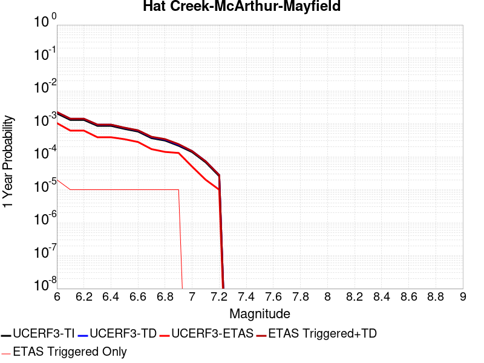 |  |

| Magnitude | 1 wk TI Prob | 1 wk TD Prob | 1 wk ETAS Prob | 1 wk ETAS/TD Gain | 1 wk ETAS Triggered+TD | 1 wk ETAS Triggered Only | 1 mo TI Prob | 1 mo TD Prob | 1 mo ETAS Prob | 1 mo ETAS/TD Gain | 1 mo ETAS Triggered+TD | 1 mo ETAS Triggered Only | 1 yr TI Prob | 1 yr TD Prob | 1 yr ETAS Prob | 1 yr ETAS/TD Gain | 1 yr ETAS Triggered+TD | 1 yr ETAS Triggered Only | 10 yr TI Prob | 10 yr TD Prob | 10 yr ETAS Prob | 10 yr ETAS/TD Gain | 10 yr ETAS Triggered+TD | 10 yr ETAS Triggered Only |
|-----|-----|-----|-----|-----|-----|-----|-----|-----|-----|-----|-----|-----|-----|-----|-----|-----|-----|-----|-----|-----|-----|-----|-----|-----|
| 6.0 | 3.967457E-5 | 4.315831E-5 | 5.0E-5 | 1.1585255 | 5.3157877E-5 | 1.0E-5 | 1.7002279E-4 | 1.8495171E-4 | 1.0E-4 | 0.54068166 | 1.9494987E-4 | 1.0E-5 | 0.002068062 | 0.002249576 | 0.00105 | 0.46675465 | 0.002269531 | 2.0E-5 | 0.02048922 | 0.022280399 | 0.01178 | 0.52871585 | 0.022299953 | 2.0E-5 |
| 6.1 | 2.5044013E-5 | 2.7071164E-5 | 3.0E-5 | 1.1081903 | 3.7070895E-5 | 1.0E-5 | 1.0732707E-4 | 1.1601429E-4 | 7.0E-5 | 0.60337394 | 1.2601314E-4 | 1.0E-5 | 0.0013059238 | 0.0014115906 | 6.2E-4 | 0.43922082 | 0.0014215765 | 1.0E-5 | 0.01298276 | 0.01402966 | 0.00743 | 0.5295923 | 0.01403952 | 1.0E-5 |
| 6.2 | 2.5044013E-5 | 2.7071164E-5 | 3.0E-5 | 1.1081903 | 3.7070895E-5 | 1.0E-5 | 1.0732707E-4 | 1.1601429E-4 | 7.0E-5 | 0.60337394 | 1.2601314E-4 | 1.0E-5 | 0.0013059238 | 0.0014115906 | 6.2E-4 | 0.43922082 | 0.0014215765 | 1.0E-5 | 0.01298276 | 0.01402966 | 0.00743 | 0.5295923 | 0.01403952 | 1.0E-5 |
| 6.3 | 1.6624012E-5 | 1.7891072E-5 | 2.0E-5 | 1.117876 | 2.7890892E-5 | 1.0E-5 | 7.124382E-5 | 7.6673816E-5 | 6.0E-5 | 0.78253573 | 8.667305E-5 | 1.0E-5 | 8.670483E-4 | 9.331125E-4 | 3.9E-4 | 0.41795602 | 9.4310316E-4 | 1.0E-5 | 0.008636732 | 0.009292879 | 0.00501 | 0.53912246 | 0.009302787 | 1.0E-5 |
| 6.4 | 1.6624012E-5 | 1.7891072E-5 | 2.0E-5 | 1.117876 | 2.7890892E-5 | 1.0E-5 | 7.124382E-5 | 7.6673816E-5 | 6.0E-5 | 0.78253573 | 8.667305E-5 | 1.0E-5 | 8.670483E-4 | 9.331125E-4 | 3.9E-4 | 0.41795602 | 9.4310316E-4 | 1.0E-5 | 0.008636732 | 0.009292879 | 0.00501 | 0.53912246 | 0.009302787 | 1.0E-5 |
| 6.5 | 1.3394842E-5 | 1.4392137E-5 | 2.0E-5 | 1.3896477 | 2.4391993E-5 | 1.0E-5 | 5.7405203E-5 | 6.167916E-5 | 6.0E-5 | 0.9727759 | 7.167854E-5 | 1.0E-5 | 6.986842E-4 | 7.506906E-4 | 3.4E-4 | 0.4529163 | 7.606831E-4 | 1.0E-5 | 0.006964916 | 0.0074821403 | 0.00407 | 0.543962 | 0.007492066 | 1.0E-5 |
| 6.6 | 1.1137514E-5 | 1.1954546E-5 | 1.0E-5 | 0.8365019 | 2.1954425E-5 | 1.0E-5 | 4.7731326E-5 | 5.1232782E-5 | 4.0E-5 | 0.7807501 | 6.123227E-5 | 1.0E-5 | 5.809739E-4 | 6.2358467E-4 | 2.8E-4 | 0.44901684 | 6.335784E-4 | 1.0E-5 | 0.005794574 | 0.00621877 | 0.00335 | 0.5386917 | 0.0062287077 | 1.0E-5 |
| 6.7 | 7.0200663E-6 | 7.5242897E-6 | 1.0E-5 | 1.3290291 | 1.7524215E-5 | 1.0E-5 | 3.008565E-5 | 3.2246568E-5 | 3.0E-5 | 0.9303316 | 4.2246244E-5 | 1.0E-5 | 3.6623122E-4 | 3.925328E-4 | 1.7E-4 | 0.43308482 | 4.0252888E-4 | 1.0E-5 | 0.0036562826 | 0.0039185574 | 0.00202 | 0.51549584 | 0.003928518 | 1.0E-5 |
| 6.8 | 5.940172E-6 | 6.3654766E-6 | 1.0E-5 | 1.5709742 | 1.6365413E-5 | 1.0E-5 | 2.545763E-5 | 2.7280335E-5 | 3.0E-5 | 1.0996932 | 3.7280064E-5 | 1.0E-5 | 3.0990256E-4 | 3.3208873E-4 | 1.4E-4 | 0.42157406 | 3.420854E-4 | 1.0E-5 | 0.0030947074 | 0.0033160534 | 0.00174 | 0.52472013 | 0.0033260202 | 1.0E-5 |
| 6.9 | 4.129831E-6 | 4.423547E-6 | 1.0E-5 | 2.2606292 | 1.4423503E-5 | 1.0E-5 | 1.7699154E-5 | 1.8957926E-5 | 3.0E-5 | 1.5824516 | 2.8957737E-5 | 1.0E-5 | 2.154659E-4 | 2.3078908E-4 | 1.3E-4 | 0.5632849 | 2.4078677E-4 | 1.0E-5 | 0.002152571 | 0.0023055724 | 0.00122 | 0.52915275 | 0.0023155494 | 1.0E-5 |
| 7.0 | 2.6512955E-6 | 2.8374002E-6 | 0.0 | 0.0 | 2.8374002E-6 | 0.0 | 1.1362646E-5 | 1.2160232E-5 | 1.0E-5 | 0.8223527 | 1.2160232E-5 | 0.0 | 1.3833142E-4 | 1.480412E-4 | 5.0E-5 | 0.33774382 | 1.480412E-4 | 0.0 | 0.0013824535 | 0.0014794683 | 7.3E-4 | 0.4934205 | 0.0014794683 | 0.0 |
| 7.1 | 1.2992575E-6 | 1.3909317E-6 | 0.0 | 0.0 | 1.3909317E-6 | 0.0 | 5.568235E-6 | 5.961124E-6 | 0.0 | 0.0 | 5.961124E-6 | 0.0 | 6.779115E-5 | 7.257448E-5 | 2.0E-5 | 0.27557895 | 7.257448E-5 | 0.0 | 6.7770475E-4 | 7.2552945E-4 | 3.7E-4 | 0.5099724 | 7.2552945E-4 | 0.0 |
| 7.2 | 4.968191E-7 | 5.3271475E-7 | 0.0 | 0.0 | 5.3271475E-7 | 0.0 | 2.1292228E-6 | 2.283062E-6 | 0.0 | 0.0 | 2.283062E-6 | 0.0 | 2.592298E-5 | 2.7796052E-5 | 1.0E-5 | 0.35976332 | 2.7796052E-5 | 0.0 | 2.5919956E-4 | 2.7793812E-4 | 1.5E-4 | 0.53968847 | 2.7793812E-4 | 0.0 |

## South Cuyama
*[(top)](#table-of-contents)*

| 1 Week | 1 Month | 1 Year | 10 Year |
|-----|-----|-----|-----|
|  |  |  |  |

| Magnitude | 1 wk TI Prob | 1 wk TD Prob | 1 wk ETAS Prob | 1 wk ETAS/TD Gain | 1 wk ETAS Triggered+TD | 1 wk ETAS Triggered Only | 1 mo TI Prob | 1 mo TD Prob | 1 mo ETAS Prob | 1 mo ETAS/TD Gain | 1 mo ETAS Triggered+TD | 1 mo ETAS Triggered Only | 1 yr TI Prob | 1 yr TD Prob | 1 yr ETAS Prob | 1 yr ETAS/TD Gain | 1 yr ETAS Triggered+TD | 1 yr ETAS Triggered Only | 10 yr TI Prob | 10 yr TD Prob | 10 yr ETAS Prob | 10 yr ETAS/TD Gain | 10 yr ETAS Triggered+TD | 10 yr ETAS Triggered Only |
|-----|-----|-----|-----|-----|-----|-----|-----|-----|-----|-----|-----|-----|-----|-----|-----|-----|-----|-----|-----|-----|-----|-----|-----|-----|
| 6.0 | 1.2747308E-6 | 1.2818697E-6 | 1.0E-5 | 7.801105 | 1.1281857E-5 | 1.0E-5 | 5.4631205E-6 | 5.4937163E-6 | 1.0E-5 | 1.8202615 | 1.549366E-5 | 1.0E-5 | 6.6511464E-5 | 6.6884015E-5 | 5.0E-5 | 0.7475628 | 8.6882676E-5 | 2.0E-5 | 6.649156E-4 | 6.686458E-4 | 3.7E-4 | 0.55335724 | 6.886324E-4 | 2.0E-5 |
| 6.1 | 1.2747308E-6 | 1.2818697E-6 | 1.0E-5 | 7.801105 | 1.1281857E-5 | 1.0E-5 | 5.4631205E-6 | 5.4937163E-6 | 1.0E-5 | 1.8202615 | 1.549366E-5 | 1.0E-5 | 6.6511464E-5 | 6.6884015E-5 | 5.0E-5 | 0.7475628 | 8.6882676E-5 | 2.0E-5 | 6.649156E-4 | 6.686458E-4 | 3.7E-4 | 0.55335724 | 6.886324E-4 | 2.0E-5 |
| 6.2 | 1.2747308E-6 | 1.2818697E-6 | 1.0E-5 | 7.801105 | 1.1281857E-5 | 1.0E-5 | 5.4631205E-6 | 5.4937163E-6 | 1.0E-5 | 1.8202615 | 1.549366E-5 | 1.0E-5 | 6.6511464E-5 | 6.6884015E-5 | 5.0E-5 | 0.7475628 | 8.6882676E-5 | 2.0E-5 | 6.649156E-4 | 6.686458E-4 | 3.7E-4 | 0.55335724 | 6.886324E-4 | 2.0E-5 |
| 6.3 | 1.2747308E-6 | 1.2818697E-6 | 1.0E-5 | 7.801105 | 1.1281857E-5 | 1.0E-5 | 5.4631205E-6 | 5.4937163E-6 | 1.0E-5 | 1.8202615 | 1.549366E-5 | 1.0E-5 | 6.6511464E-5 | 6.6884015E-5 | 5.0E-5 | 0.7475628 | 8.6882676E-5 | 2.0E-5 | 6.649156E-4 | 6.686458E-4 | 3.7E-4 | 0.55335724 | 6.886324E-4 | 2.0E-5 |
| 6.4 | 1.2747308E-6 | 1.2818697E-6 | 1.0E-5 | 7.801105 | 1.1281857E-5 | 1.0E-5 | 5.4631205E-6 | 5.4937163E-6 | 1.0E-5 | 1.8202615 | 1.549366E-5 | 1.0E-5 | 6.6511464E-5 | 6.6884015E-5 | 5.0E-5 | 0.7475628 | 8.6882676E-5 | 2.0E-5 | 6.649156E-4 | 6.686458E-4 | 3.7E-4 | 0.55335724 | 6.886324E-4 | 2.0E-5 |
| 6.5 | 1.2747308E-6 | 1.2818697E-6 | 1.0E-5 | 7.801105 | 1.1281857E-5 | 1.0E-5 | 5.4631205E-6 | 5.4937163E-6 | 1.0E-5 | 1.8202615 | 1.549366E-5 | 1.0E-5 | 6.6511464E-5 | 6.6884015E-5 | 5.0E-5 | 0.7475628 | 8.6882676E-5 | 2.0E-5 | 6.649156E-4 | 6.686458E-4 | 3.7E-4 | 0.55335724 | 6.886324E-4 | 2.0E-5 |
| 6.6 | 1.2747308E-6 | 1.2818697E-6 | 1.0E-5 | 7.801105 | 1.1281857E-5 | 1.0E-5 | 5.4631205E-6 | 5.4937163E-6 | 1.0E-5 | 1.8202615 | 1.549366E-5 | 1.0E-5 | 6.6511464E-5 | 6.6884015E-5 | 5.0E-5 | 0.7475628 | 8.6882676E-5 | 2.0E-5 | 6.649156E-4 | 6.686458E-4 | 3.7E-4 | 0.55335724 | 6.886324E-4 | 2.0E-5 |
| 6.7 | 1.2747308E-6 | 1.2818697E-6 | 1.0E-5 | 7.801105 | 1.1281857E-5 | 1.0E-5 | 5.4631205E-6 | 5.4937163E-6 | 1.0E-5 | 1.8202615 | 1.549366E-5 | 1.0E-5 | 6.6511464E-5 | 6.6884015E-5 | 5.0E-5 | 0.7475628 | 8.6882676E-5 | 2.0E-5 | 6.649156E-4 | 6.686458E-4 | 3.7E-4 | 0.55335724 | 6.886324E-4 | 2.0E-5 |
| 6.8 | 1.2747308E-6 | 1.2818697E-6 | 1.0E-5 | 7.801105 | 1.1281857E-5 | 1.0E-5 | 5.4631205E-6 | 5.4937163E-6 | 1.0E-5 | 1.8202615 | 1.549366E-5 | 1.0E-5 | 6.6511464E-5 | 6.6884015E-5 | 5.0E-5 | 0.7475628 | 8.6882676E-5 | 2.0E-5 | 6.649156E-4 | 6.686458E-4 | 3.7E-4 | 0.55335724 | 6.886324E-4 | 2.0E-5 |
| 6.9 | 8.4566324E-7 | 8.507883E-7 | 1.0E-5 | 11.753806 | 1.085078E-5 | 1.0E-5 | 3.624266E-6 | 3.6462304E-6 | 1.0E-5 | 2.7425585 | 1.3646194E-5 | 1.0E-5 | 4.4124543E-5 | 4.439196E-5 | 4.0E-5 | 0.90106404 | 6.4391075E-5 | 2.0E-5 | 4.4115784E-4 | 4.4383196E-4 | 2.9E-4 | 0.6534004 | 4.638231E-4 | 2.0E-5 |
| 7.0 | 8.2277904E-7 | 8.27782E-7 | 1.0E-5 | 12.080476 | 1.0827774E-5 | 1.0E-5 | 3.526191E-6 | 3.5476323E-6 | 1.0E-5 | 2.8187814 | 1.3547597E-5 | 1.0E-5 | 4.293053E-5 | 4.3191576E-5 | 4.0E-5 | 0.9261065 | 6.319072E-5 | 2.0E-5 | 4.292224E-4 | 4.3183283E-4 | 2.8E-4 | 0.64839906 | 4.518242E-4 | 2.0E-5 |
| 7.1 | 6.7661887E-7 | 6.80913E-7 | 1.0E-5 | 14.686164 | 1.0680907E-5 | 1.0E-5 | 2.899792E-6 | 2.9181954E-6 | 1.0E-5 | 3.4267755 | 1.2918166E-5 | 1.0E-5 | 3.5304394E-5 | 3.5528454E-5 | 4.0E-5 | 1.1258582 | 5.5527744E-5 | 2.0E-5 | 3.5298787E-4 | 3.552281E-4 | 2.2E-4 | 0.61932033 | 3.7522102E-4 | 2.0E-5 |
| 7.2 | 5.783336E-7 | 5.8211907E-7 | 1.0E-5 | 17.178616 | 1.0582114E-5 | 1.0E-5 | 2.4785702E-6 | 2.4947938E-6 | 1.0E-5 | 4.0083475 | 1.2494768E-5 | 1.0E-5 | 3.0176174E-5 | 3.0373692E-5 | 3.0E-5 | 0.9876969 | 5.0373084E-5 | 2.0E-5 | 3.0172078E-4 | 3.0369565E-4 | 2.0E-4 | 0.658554 | 3.2368957E-4 | 2.0E-5 |
| 7.3 | 5.136759E-7 | 5.170938E-7 | 1.0E-5 | 19.338852 | 1.0517088E-5 | 1.0E-5 | 2.2014663E-6 | 2.2161144E-6 | 1.0E-5 | 4.5124025 | 1.2216092E-5 | 1.0E-5 | 2.6802521E-5 | 2.698086E-5 | 3.0E-5 | 1.1118993 | 4.698032E-5 | 2.0E-5 | 2.679929E-4 | 2.6977606E-4 | 1.8E-4 | 0.66722006 | 2.8977066E-4 | 2.0E-5 |
| 7.4 | 4.3370295E-7 | 4.3665364E-7 | 1.0E-5 | 22.901447 | 1.0436649E-5 | 1.0E-5 | 1.8587256E-6 | 1.8713713E-6 | 1.0E-5 | 5.3436747 | 1.1871352E-5 | 1.0E-5 | 2.2629749E-5 | 2.278371E-5 | 3.0E-5 | 1.3167303 | 4.2783253E-5 | 2.0E-5 | 2.2627445E-4 | 2.278139E-4 | 1.5E-4 | 0.6584322 | 2.4780934E-4 | 2.0E-5 |
| 7.5 | 3.3242574E-7 | 3.3476465E-7 | 1.0E-5 | 29.871733 | 1.0334761E-5 | 1.0E-5 | 1.4246809E-6 | 1.4347048E-6 | 1.0E-5 | 6.9700747 | 1.143469E-5 | 1.0E-5 | 1.7345352E-5 | 1.7467393E-5 | 3.0E-5 | 1.7174859 | 3.746704E-5 | 2.0E-5 | 1.7343998E-4 | 1.7466032E-4 | 1.0E-4 | 0.57253987 | 1.9465684E-4 | 2.0E-5 |
| 7.6 | 2.0627535E-7 | 2.07789E-7 | 0.0 | 0.0 | 2.07789E-7 | 0.0 | 8.840369E-7 | 8.90524E-7 | 0.0 | 0.0 | 8.90524E-7 | 0.0 | 1.0763096E-5 | 1.0842076E-5 | 1.0E-5 | 0.9223325 | 1.0842076E-5 | 0.0 | 1.0762575E-4 | 1.0841556E-4 | 5.0E-5 | 0.4611884 | 1.0841556E-4 | 0.0 |
| 7.7 | 6.15236E-8 | 6.1983044E-8 | 0.0 | 0.0 | 6.1983044E-8 | 0.0 | 2.6367252E-7 | 2.656416E-7 | 0.0 | 0.0 | 2.656416E-7 | 0.0 | 3.2102084E-6 | 3.2341818E-6 | 0.0 | 0.0 | 3.2341818E-6 | 0.0 | 3.210162E-5 | 3.234136E-5 | 2.0E-5 | 0.61840326 | 3.234136E-5 | 0.0 |
| 7.8 | 1.1765573E-8 | 1.1873414E-8 | 0.0 | 0.0 | 1.1873414E-8 | 0.0 | 5.0423886E-8 | 5.0886058E-8 | 0.0 | 0.0 | 5.0886058E-8 | 0.0 | 6.1391063E-7 | 6.195376E-7 | 0.0 | 0.0 | 6.195376E-7 | 0.0 | 6.1390897E-6 | 6.19536E-6 | 1.0E-5 | 1.6141112 | 6.19536E-6 | 0.0 |
| 7.9 | 6.0381755E-10 | 6.10058E-10 | 0.0 | 0.0 | 6.10058E-10 | 0.0 | 2.5877895E-9 | 2.614534E-9 | 0.0 | 0.0 | 2.614534E-9 | 0.0 | 3.1506335E-8 | 3.1831952E-8 | 0.0 | 0.0 | 3.1831952E-8 | 0.0 | 3.1506332E-7 | 3.183195E-7 | 0.0 | 0.0 | 3.183195E-7 | 0.0 |

## Green Valley 2011 CFM
*[(top)](#table-of-contents)*

| 1 Week | 1 Month | 1 Year | 10 Year |
|-----|-----|-----|-----|
|  |  |  |  |

| Magnitude | 1 wk TI Prob | 1 wk TD Prob | 1 wk ETAS Prob | 1 wk ETAS/TD Gain | 1 wk ETAS Triggered+TD | 1 wk ETAS Triggered Only | 1 mo TI Prob | 1 mo TD Prob | 1 mo ETAS Prob | 1 mo ETAS/TD Gain | 1 mo ETAS Triggered+TD | 1 mo ETAS Triggered Only | 1 yr TI Prob | 1 yr TD Prob | 1 yr ETAS Prob | 1 yr ETAS/TD Gain | 1 yr ETAS Triggered+TD | 1 yr ETAS Triggered Only | 10 yr TI Prob | 10 yr TD Prob | 10 yr ETAS Prob | 10 yr ETAS/TD Gain | 10 yr ETAS Triggered+TD | 10 yr ETAS Triggered Only |
|-----|-----|-----|-----|-----|-----|-----|-----|-----|-----|-----|-----|-----|-----|-----|-----|-----|-----|-----|-----|-----|-----|-----|-----|-----|
| 6.0 | 9.9629346E-5 | 1.7302863E-4 | 3.0E-5 | 0.17338172 | 1.8302689E-4 | 1.0E-5 | 4.2691303E-4 | 7.41326E-4 | 2.1E-4 | 0.28327617 | 7.513186E-4 | 1.0E-5 | 0.0051852856 | 0.00898692 | 0.00481 | 0.5352223 | 0.00900674 | 2.0E-5 | 0.050659515 | 0.08553951 | 0.05219 | 0.6101274 | 0.0855578 | 2.0E-5 |
| 6.1 | 9.88615E-5 | 1.7150163E-4 | 3.0E-5 | 0.17492545 | 1.8149991E-4 | 1.0E-5 | 4.2362334E-4 | 7.347854E-4 | 2.1E-4 | 0.28579772 | 7.447781E-4 | 1.0E-5 | 0.0051454236 | 0.008907947 | 0.00473 | 0.53098655 | 0.008927769 | 2.0E-5 | 0.050279044 | 0.08482712 | 0.05119 | 0.6034627 | 0.084845416 | 2.0E-5 |
| 6.2 | 9.696895E-5 | 1.6789208E-4 | 3.0E-5 | 0.1786862 | 1.7789041E-4 | 1.0E-5 | 4.15515E-4 | 7.1932544E-4 | 2.1E-4 | 0.29194018 | 7.2931824E-4 | 1.0E-5 | 0.0050471667 | 0.00872133 | 0.00466 | 0.5343222 | 0.008741155 | 2.0E-5 | 0.04934063 | 0.08313578 | 0.05027 | 0.60467345 | 0.08315412 | 2.0E-5 |
| 6.3 | 9.275224E-5 | 1.5968543E-4 | 1.0E-5 | 0.06262312 | 1.5968543E-4 | 0.0 | 3.9744904E-4 | 6.841728E-4 | 1.9E-4 | 0.27770764 | 6.841728E-4 | 0.0 | 0.0048282105 | 0.008296652 | 0.00447 | 0.53877157 | 0.0083065685 | 1.0E-5 | 0.047246475 | 0.07927481 | 0.04805 | 0.6061194 | 0.07928401 | 1.0E-5 |
| 6.4 | 8.391499E-5 | 1.4365884E-4 | 1.0E-5 | 0.06960937 | 1.4365884E-4 | 0.0 | 3.595861E-4 | 6.155238E-4 | 1.8E-4 | 0.29243386 | 6.155238E-4 | 0.0 | 0.004369175 | 0.007467181 | 0.00406 | 0.54371256 | 0.007477106 | 1.0E-5 | 0.04284265 | 0.07164672 | 0.04355 | 0.60784364 | 0.071656 | 1.0E-5 |
| 6.5 | 5.9519385E-5 | 9.932622E-5 | 1.0E-5 | 0.10067835 | 9.932622E-5 | 0.0 | 2.5505814E-4 | 4.2560388E-4 | 1.1E-4 | 0.2584563 | 4.2560388E-4 | 0.0 | 0.0031009112 | 0.005168341 | 0.00285 | 0.5514342 | 0.0051782895 | 1.0E-5 | 0.030579966 | 0.05014692 | 0.03072 | 0.6125999 | 0.05015642 | 1.0E-5 |
| 6.6 | 4.5361558E-5 | 7.4019794E-5 | 1.0E-5 | 0.135099 | 7.4019794E-5 | 0.0 | 1.9439218E-4 | 3.1717744E-4 | 1.1E-4 | 0.34680903 | 3.1717744E-4 | 0.0 | 0.0023641558 | 0.0038538678 | 0.00217 | 0.5630707 | 0.0038538678 | 0.0 | 0.023391623 | 0.03766727 | 0.02348 | 0.6233529 | 0.03766727 | 0.0 |
| 6.7 | 3.8808106E-5 | 6.264382E-5 | 1.0E-5 | 0.15963267 | 6.264382E-5 | 0.0 | 1.6630985E-4 | 2.6843755E-4 | 1.1E-4 | 0.4097787 | 2.6843755E-4 | 0.0 | 0.0020229418 | 0.0032627317 | 0.00182 | 0.5578148 | 0.0032627317 | 0.0 | 0.020046256 | 0.032007415 | 0.01981 | 0.6189191 | 0.032007415 | 0.0 |
| 6.8 | 2.2284667E-5 | 3.128574E-5 | 0.0 | 0.0 | 3.128574E-5 | 0.0 | 9.550222E-5 | 1.3407487E-4 | 5.0E-5 | 0.37292597 | 1.3407487E-4 | 0.0 | 0.0011621192 | 0.0016311383 | 8.2E-4 | 0.5027164 | 0.0016311383 | 0.0 | 0.011560607 | 0.01616672 | 0.00923 | 0.57092595 | 0.01616672 | 0.0 |
| 6.9 | 1.8050168E-5 | 2.4448536E-5 | 0.0 | 0.0 | 2.4448536E-5 | 0.0 | 7.735557E-5 | 1.0477527E-4 | 4.0E-5 | 0.3817695 | 1.0477527E-4 | 0.0 | 9.4139716E-4 | 0.0012748954 | 6.6E-4 | 0.5176895 | 0.0012748954 | 0.0 | 0.009374191 | 0.012669067 | 0.0073 | 0.5762066 | 0.012669067 | 0.0 |
| 7.0 | 1.4763166E-5 | 1.9583236E-5 | 0.0 | 0.0 | 1.9583236E-5 | 0.0 | 6.326917E-5 | 8.3925464E-5 | 3.0E-5 | 0.35746002 | 8.3925464E-5 | 0.0 | 7.7002996E-4 | 0.001021315 | 5.1E-4 | 0.4993562 | 0.001021315 | 0.0 | 0.007673672 | 0.01016625 | 0.00589 | 0.579368 | 0.01016625 | 0.0 |
| 7.1 | 1.2399713E-5 | 1.6304042E-5 | 0.0 | 0.0 | 1.6304042E-5 | 0.0 | 5.3140546E-5 | 6.987261E-5 | 3.0E-5 | 0.42935282 | 6.987261E-5 | 0.0 | 6.467941E-4 | 8.5036893E-4 | 4.2E-4 | 0.49390328 | 8.5036893E-4 | 0.0 | 0.006449148 | 0.008471781 | 0.00492 | 0.58075154 | 0.008471781 | 0.0 |
| 7.2 | 1.0584195E-5 | 1.39220465E-5 | 0.0 | 0.0 | 1.39220465E-5 | 0.0 | 4.5360044E-5 | 5.966456E-5 | 2.0E-5 | 0.33520737 | 5.966456E-5 | 0.0 | 5.521186E-4 | 7.2617555E-4 | 3.5E-4 | 0.48197713 | 7.2617555E-4 | 0.0 | 0.0055074887 | 0.0072386027 | 0.00421 | 0.58160394 | 0.0072386027 | 0.0 |
| 7.3 | 7.998173E-6 | 1.0544255E-5 | 0.0 | 0.0 | 1.0544255E-5 | 0.0 | 3.4277433E-5 | 4.5188888E-5 | 2.0E-5 | 0.4425867 | 4.5188888E-5 | 0.0 | 4.1724785E-4 | 5.500369E-4 | 3.0E-4 | 0.54541796 | 5.500369E-4 | 0.0 | 0.004164653 | 0.005487135 | 0.00304 | 0.55402315 | 0.005487135 | 0.0 |
| 7.4 | 6.7571127E-6 | 8.932903E-6 | 0.0 | 0.0 | 8.932903E-6 | 0.0 | 2.8958733E-5 | 3.8283313E-5 | 1.0E-5 | 0.2612104 | 3.8283313E-5 | 0.0 | 3.5251552E-4 | 4.660006E-4 | 2.4E-4 | 0.5150208 | 4.660006E-4 | 0.0 | 0.0035195686 | 0.004650633 | 0.00266 | 0.57196516 | 0.004650633 | 0.0 |
| 7.5 | 5.69878E-6 | 7.516483E-6 | 0.0 | 0.0 | 7.516483E-6 | 0.0 | 2.4423114E-5 | 3.2213105E-5 | 0.0 | 0.0 | 3.2213105E-5 | 0.0 | 2.9731085E-4 | 3.9212484E-4 | 1.8E-4 | 0.45903745 | 3.9212484E-4 | 0.0 | 0.002969134 | 0.0039147018 | 0.00217 | 0.5543207 | 0.0039147018 | 0.0 |
| 7.6 | 4.503664E-6 | 5.9358217E-6 | 0.0 | 0.0 | 5.9358217E-6 | 0.0 | 1.9301275E-5 | 2.5438992E-5 | 0.0 | 0.0 | 2.5438992E-5 | 0.0 | 2.3496768E-4 | 3.0967654E-4 | 1.3E-4 | 0.41979283 | 3.0967654E-4 | 0.0 | 0.002347194 | 0.0030927279 | 0.00178 | 0.5755437 | 0.0030927279 | 0.0 |
| 7.7 | 1.0873546E-6 | 1.410754E-6 | 0.0 | 0.0 | 1.410754E-6 | 0.0 | 4.6600826E-6 | 6.0460743E-6 | 0.0 | 0.0 | 6.0460743E-6 | 0.0 | 5.6735033E-5 | 7.36085E-5 | 2.0E-5 | 0.27170774 | 7.36085E-5 | 0.0 | 5.672055E-4 | 7.3587085E-4 | 4.2E-4 | 0.5707523 | 7.3587085E-4 | 0.0 |
| 7.8 | 4.9373917E-8 | 6.177967E-8 | 0.0 | 0.0 | 6.177967E-8 | 0.0 | 2.1160248E-7 | 2.6477002E-7 | 0.0 | 0.0 | 2.6477002E-7 | 0.0 | 2.5762572E-6 | 3.2235714E-6 | 0.0 | 0.0 | 3.2235714E-6 | 0.0 | 2.5762274E-5 | 3.2228E-5 | 2.0E-5 | 0.62057835 | 3.2228E-5 | 0.0 |

## San Jacinto (Clark) rev
*[(top)](#table-of-contents)*

| 1 Week | 1 Month | 1 Year | 10 Year |
|-----|-----|-----|-----|
|  | 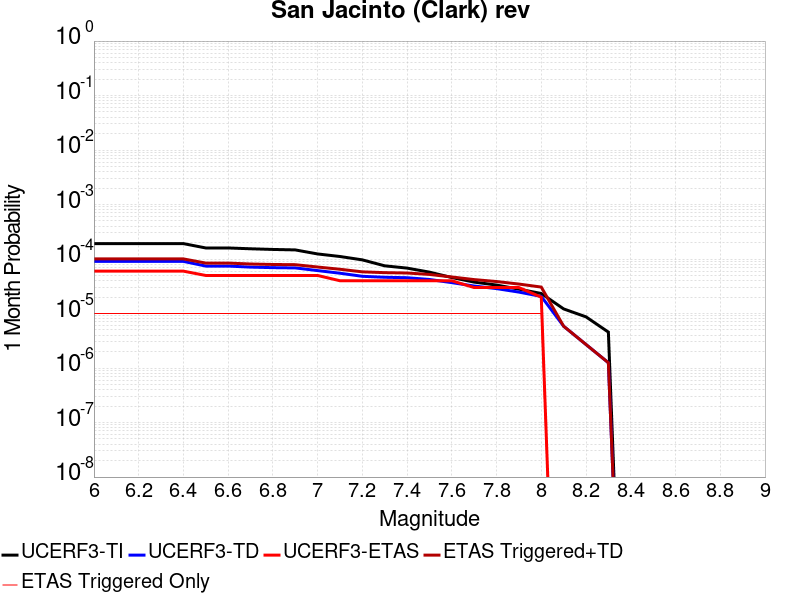 |  |  |

| Magnitude | 1 wk TI Prob | 1 wk TD Prob | 1 wk ETAS Prob | 1 wk ETAS/TD Gain | 1 wk ETAS Triggered+TD | 1 wk ETAS Triggered Only | 1 mo TI Prob | 1 mo TD Prob | 1 mo ETAS Prob | 1 mo ETAS/TD Gain | 1 mo ETAS Triggered+TD | 1 mo ETAS Triggered Only | 1 yr TI Prob | 1 yr TD Prob | 1 yr ETAS Prob | 1 yr ETAS/TD Gain | 1 yr ETAS Triggered+TD | 1 yr ETAS Triggered Only | 10 yr TI Prob | 10 yr TD Prob | 10 yr ETAS Prob | 10 yr ETAS/TD Gain | 10 yr ETAS Triggered+TD | 10 yr ETAS Triggered Only |
|-----|-----|-----|-----|-----|-----|-----|-----|-----|-----|-----|-----|-----|-----|-----|-----|-----|-----|-----|-----|-----|-----|-----|-----|-----|
| 6.0 | 4.482615E-5 | 2.1153059E-5 | 3.0E-5 | 1.4182346 | 2.1153059E-5 | 0.0 | 1.9209793E-4 | 9.065287E-5 | 6.0E-5 | 0.6618654 | 1.0065197E-4 | 1.0E-5 | 0.0023362834 | 0.0011031491 | 5.8E-4 | 0.52576756 | 0.0011231271 | 2.0E-5 | 0.02311874 | 0.011485709 | 0.00606 | 0.5276122 | 0.011505479 | 2.0E-5 |
| 6.1 | 4.482615E-5 | 2.1153059E-5 | 3.0E-5 | 1.4182346 | 2.1153059E-5 | 0.0 | 1.9209793E-4 | 9.065287E-5 | 6.0E-5 | 0.6618654 | 1.0065197E-4 | 1.0E-5 | 0.0023362834 | 0.0011031491 | 5.8E-4 | 0.52576756 | 0.0011231271 | 2.0E-5 | 0.02311874 | 0.011485709 | 0.00606 | 0.5276122 | 0.011505479 | 2.0E-5 |
| 6.2 | 4.482615E-5 | 2.1153059E-5 | 3.0E-5 | 1.4182346 | 2.1153059E-5 | 0.0 | 1.9209793E-4 | 9.065287E-5 | 6.0E-5 | 0.6618654 | 1.0065197E-4 | 1.0E-5 | 0.0023362834 | 0.0011031491 | 5.8E-4 | 0.52576756 | 0.0011231271 | 2.0E-5 | 0.02311874 | 0.011485709 | 0.00606 | 0.5276122 | 0.011505479 | 2.0E-5 |
| 6.3 | 4.482615E-5 | 2.1153059E-5 | 3.0E-5 | 1.4182346 | 2.1153059E-5 | 0.0 | 1.9209793E-4 | 9.065287E-5 | 6.0E-5 | 0.6618654 | 1.0065197E-4 | 1.0E-5 | 0.0023362834 | 0.0011031491 | 5.8E-4 | 0.52576756 | 0.0011231271 | 2.0E-5 | 0.02311874 | 0.011485709 | 0.00606 | 0.5276122 | 0.011505479 | 2.0E-5 |
| 6.4 | 4.482615E-5 | 2.1153059E-5 | 3.0E-5 | 1.4182346 | 2.1153059E-5 | 0.0 | 1.9209793E-4 | 9.065287E-5 | 6.0E-5 | 0.6618654 | 1.0065197E-4 | 1.0E-5 | 0.0023362834 | 0.0011031491 | 5.8E-4 | 0.52576756 | 0.0011231271 | 2.0E-5 | 0.02311874 | 0.011485709 | 0.00606 | 0.5276122 | 0.011505479 | 2.0E-5 |
| 6.5 | 3.7294863E-5 | 1.7354667E-5 | 2.0E-5 | 1.1524278 | 1.7354667E-5 | 0.0 | 1.5982533E-4 | 7.437504E-5 | 5.0E-5 | 0.6722685 | 8.4374304E-5 | 1.0E-5 | 0.0019441366 | 9.051445E-4 | 5.0E-4 | 0.552398 | 9.2512637E-4 | 2.0E-5 | 0.01927216 | 0.009485902 | 0.00505 | 0.53236896 | 0.009505713 | 2.0E-5 |
| 6.6 | 3.7294863E-5 | 1.7354667E-5 | 2.0E-5 | 1.1524278 | 1.7354667E-5 | 0.0 | 1.5982533E-4 | 7.437504E-5 | 5.0E-5 | 0.6722685 | 8.4374304E-5 | 1.0E-5 | 0.0019441366 | 9.051445E-4 | 5.0E-4 | 0.552398 | 9.2512637E-4 | 2.0E-5 | 0.01927216 | 0.009485902 | 0.00505 | 0.53236896 | 0.009505713 | 2.0E-5 |
| 6.7 | 3.6039248E-5 | 1.6602684E-5 | 2.0E-5 | 1.2046245 | 1.6602684E-5 | 0.0 | 1.5444479E-4 | 7.115244E-5 | 5.0E-5 | 0.7027166 | 8.115173E-5 | 1.0E-5 | 0.0018787434 | 8.659408E-4 | 4.4E-4 | 0.50811785 | 8.859235E-4 | 2.0E-5 | 0.01862939 | 0.009088189 | 0.00481 | 0.5292584 | 0.009108008 | 2.0E-5 |
| 6.8 | 3.5031844E-5 | 1.6231123E-5 | 2.0E-5 | 1.2322006 | 1.6231123E-5 | 0.0 | 1.5012783E-4 | 6.956012E-5 | 5.0E-5 | 0.71880263 | 7.9559424E-5 | 1.0E-5 | 0.0018262739 | 8.4656954E-4 | 4.4E-4 | 0.5197447 | 8.665526E-4 | 2.0E-5 | 0.01811338 | 0.008888788 | 0.00468 | 0.526506 | 0.00890861 | 2.0E-5 |
| 6.9 | 3.435112E-5 | 1.6061658E-5 | 2.0E-5 | 1.2452015 | 1.6061658E-5 | 0.0 | 1.4721078E-4 | 6.8833884E-5 | 5.0E-5 | 0.7263864 | 7.8833196E-5 | 1.0E-5 | 0.0017908178 | 8.377344E-4 | 4.4E-4 | 0.5252261 | 8.5771765E-4 | 2.0E-5 | 0.017764548 | 0.008796512 | 0.00467 | 0.53089225 | 0.008816336 | 2.0E-5 |
| 7.0 | 2.8959772E-5 | 1.43355255E-5 | 2.0E-5 | 1.3951355 | 1.43355255E-5 | 0.0 | 1.241074E-4 | 6.1436534E-5 | 5.0E-5 | 0.813848 | 7.143592E-5 | 1.0E-5 | 0.0015099603 | 7.477359E-4 | 3.9E-4 | 0.52157456 | 7.677209E-4 | 2.0E-5 | 0.014997416 | 0.007868331 | 0.00402 | 0.51090884 | 0.007888174 | 2.0E-5 |
| 7.1 | 2.6002877E-5 | 1.2827699E-5 | 2.0E-5 | 1.5591261 | 1.2827699E-5 | 0.0 | 1.11436144E-4 | 5.4974706E-5 | 4.0E-5 | 0.72760737 | 6.4974156E-5 | 1.0E-5 | 0.0013558907 | 6.6911365E-4 | 3.5E-4 | 0.52308005 | 6.8910024E-4 | 2.0E-5 | 0.013476475 | 0.0070483433 | 0.00366 | 0.51927096 | 0.0070682024 | 2.0E-5 |
| 7.2 | 2.2544838E-5 | 1.1260331E-5 | 2.0E-5 | 1.7761467 | 1.1260331E-5 | 0.0 | 9.661716E-5 | 4.825768E-5 | 4.0E-5 | 0.82888365 | 5.8257196E-5 | 1.0E-5 | 0.001175679 | 5.873803E-4 | 3.5E-4 | 0.5958661 | 6.0736854E-4 | 2.0E-5 | 0.011694785 | 0.00619256 | 0.00327 | 0.52805305 | 0.006212436 | 2.0E-5 |
| 7.3 | 1.75334E-5 | 1.0810585E-5 | 2.0E-5 | 1.8500386 | 1.0810585E-5 | 0.0 | 7.514098E-5 | 4.6330264E-5 | 4.0E-5 | 0.86336654 | 5.63298E-5 | 1.0E-5 | 9.144575E-4 | 5.6392635E-4 | 3.5E-4 | 0.6206484 | 5.839151E-4 | 2.0E-5 | 0.009107036 | 0.0059332196 | 0.00314 | 0.5292236 | 0.0059531005 | 2.0E-5 |
| 7.4 | 1.5924552E-5 | 1.0610475E-5 | 2.0E-5 | 1.8849298 | 1.0610475E-5 | 0.0 | 6.82463E-5 | 4.547268E-5 | 4.0E-5 | 0.87964904 | 5.5472225E-5 | 1.0E-5 | 8.305819E-4 | 5.534906E-4 | 3.5E-4 | 0.6323504 | 5.7347957E-4 | 2.0E-5 | 0.008274844 | 0.0058205863 | 0.00308 | 0.5291563 | 0.0058404696 | 2.0E-5 |
| 7.5 | 1.3428931E-5 | 9.851045E-6 | 2.0E-5 | 2.0302415 | 9.851045E-6 | 0.0 | 5.7551293E-5 | 4.221809E-5 | 4.0E-5 | 0.9474612 | 5.2217667E-5 | 1.0E-5 | 7.004617E-4 | 5.1388505E-4 | 3.5E-4 | 0.6810861 | 5.338748E-4 | 2.0E-5 | 0.006982579 | 0.005406209 | 0.00294 | 0.5438192 | 0.0054261005 | 2.0E-5 |
| 7.6 | 1.0688787E-5 | 8.614091E-6 | 2.0E-5 | 2.3217773 | 8.614091E-6 | 0.0 | 4.5808283E-5 | 3.6917012E-5 | 4.0E-5 | 1.0835114 | 4.691664E-5 | 1.0E-5 | 5.5757316E-4 | 4.4937237E-4 | 3.1E-4 | 0.68985105 | 4.6936338E-4 | 2.0E-5 | 0.005561762 | 0.0047413614 | 0.00257 | 0.5420384 | 0.0047612665 | 2.0E-5 |
| 7.7 | 8.81236E-6 | 7.4673385E-6 | 1.0E-5 | 1.3391652 | 7.4673385E-6 | 0.0 | 3.776671E-5 | 3.200249E-5 | 3.0E-5 | 0.9374271 | 4.2002168E-5 | 1.0E-5 | 4.597127E-4 | 3.8956082E-4 | 2.2E-4 | 0.5647385 | 4.0955303E-4 | 2.0E-5 | 0.0045876284 | 0.0041344194 | 0.00211 | 0.5103498 | 0.0041543366 | 2.0E-5 |
| 7.8 | 7.780431E-6 | 6.695928E-6 | 1.0E-5 | 1.493445 | 6.695928E-6 | 0.0 | 3.3344273E-5 | 2.8696519E-5 | 3.0E-5 | 1.045423 | 3.869623E-5 | 1.0E-5 | 4.0589093E-4 | 3.4932428E-4 | 2.1E-4 | 0.60116065 | 3.693173E-4 | 2.0E-5 | 0.0040515037 | 0.0037226272 | 0.00194 | 0.52113736 | 0.0037425528 | 2.0E-5 |
| 7.9 | 6.5437994E-6 | 5.7797783E-6 | 1.0E-5 | 1.7301701 | 5.7797783E-6 | 0.0 | 2.8044553E-5 | 2.4770245E-5 | 3.0E-5 | 1.2111306 | 3.4769997E-5 | 1.0E-5 | 3.4138895E-4 | 3.0153614E-4 | 1.7E-4 | 0.56377983 | 3.2153013E-4 | 2.0E-5 | 0.0034086495 | 0.0032343294 | 0.0017 | 0.5256113 | 0.0032542646 | 2.0E-5 |
| 8.0 | 5.4488164E-6 | 4.812793E-6 | 0.0 | 0.0 | 4.812793E-6 | 0.0 | 2.3351862E-5 | 2.0626094E-5 | 2.0E-5 | 0.96964556 | 3.0625888E-5 | 1.0E-5 | 2.8427184E-4 | 2.510939E-4 | 1.4E-4 | 0.5575603 | 2.7108888E-4 | 2.0E-5 | 0.0028390845 | 0.0027107038 | 0.00146 | 0.5386055 | 0.0027306494 | 2.0E-5 |
| 8.1 | 2.8397242E-6 | 1.3665673E-6 | 0.0 | 0.0 | 1.3665673E-6 | 0.0 | 1.217019E-5 | 5.856704E-6 | 0.0 | 0.0 | 5.856704E-6 | 0.0 | 1.4816198E-4 | 7.1303046E-5 | 2.0E-5 | 0.28049293 | 7.1303046E-5 | 0.0 | 0.0014806325 | 8.113543E-4 | 4.3E-4 | 0.5299781 | 8.113543E-4 | 0.0 |
| 8.2 | 2.030244E-6 | 6.3151083E-7 | 0.0 | 0.0 | 6.3151083E-7 | 0.0 | 8.701017E-6 | 2.7064723E-6 | 0.0 | 0.0 | 2.7064723E-6 | 0.0 | 1.05929736E-4 | 3.2950808E-5 | 0.0 | 0.0 | 3.2950808E-5 | 0.0 | 0.0010587925 | 3.9470522E-4 | 2.2E-4 | 0.557378 | 3.9470522E-4 | 0.0 |
| 8.3 | 1.0659804E-6 | 2.9230563E-7 | 0.0 | 0.0 | 2.9230563E-7 | 0.0 | 4.568479E-6 | 1.2527379E-6 | 0.0 | 0.0 | 1.2527379E-6 | 0.0 | 5.5619817E-5 | 1.5251981E-5 | 0.0 | 0.0 | 1.5251981E-5 | 0.0 | 5.5605895E-4 | 1.8556409E-4 | 8.0E-5 | 0.43111792 | 1.8556409E-4 | 0.0 |

## Emerson-Copper Mtn 2011
*[(top)](#table-of-contents)*

| 1 Week | 1 Month | 1 Year | 10 Year |
|-----|-----|-----|-----|
|  |  |  |  |

| Magnitude | 1 wk TI Prob | 1 wk TD Prob | 1 wk ETAS Prob | 1 wk ETAS/TD Gain | 1 wk ETAS Triggered+TD | 1 wk ETAS Triggered Only | 1 mo TI Prob | 1 mo TD Prob | 1 mo ETAS Prob | 1 mo ETAS/TD Gain | 1 mo ETAS Triggered+TD | 1 mo ETAS Triggered Only | 1 yr TI Prob | 1 yr TD Prob | 1 yr ETAS Prob | 1 yr ETAS/TD Gain | 1 yr ETAS Triggered+TD | 1 yr ETAS Triggered Only | 10 yr TI Prob | 10 yr TD Prob | 10 yr ETAS Prob | 10 yr ETAS/TD Gain | 10 yr ETAS Triggered+TD | 10 yr ETAS Triggered Only |
|-----|-----|-----|-----|-----|-----|-----|-----|-----|-----|-----|-----|-----|-----|-----|-----|-----|-----|-----|-----|-----|-----|-----|-----|-----|
| 6.0 | 2.1364202E-5 | 9.967999E-6 | 1.0E-5 | 1.0032104 | 1.99679E-5 | 1.0E-5 | 9.1557646E-5 | 4.2719344E-5 | 4.0E-5 | 0.9363439 | 6.271849E-5 | 2.0E-5 | 0.0011141442 | 5.1999267E-4 | 2.1E-4 | 0.40385187 | 5.399822E-4 | 2.0E-5 | 0.011085749 | 0.0051886286 | 0.00282 | 0.5434962 | 0.005208525 | 2.0E-5 |
| 6.1 | 2.1364202E-5 | 9.967999E-6 | 1.0E-5 | 1.0032104 | 1.99679E-5 | 1.0E-5 | 9.1557646E-5 | 4.2719344E-5 | 4.0E-5 | 0.9363439 | 6.271849E-5 | 2.0E-5 | 0.0011141442 | 5.1999267E-4 | 2.1E-4 | 0.40385187 | 5.399822E-4 | 2.0E-5 | 0.011085749 | 0.0051886286 | 0.00282 | 0.5434962 | 0.005208525 | 2.0E-5 |
| 6.2 | 2.1364202E-5 | 9.967999E-6 | 1.0E-5 | 1.0032104 | 1.99679E-5 | 1.0E-5 | 9.1557646E-5 | 4.2719344E-5 | 4.0E-5 | 0.9363439 | 6.271849E-5 | 2.0E-5 | 0.0011141442 | 5.1999267E-4 | 2.1E-4 | 0.40385187 | 5.399822E-4 | 2.0E-5 | 0.011085749 | 0.0051886286 | 0.00282 | 0.5434962 | 0.005208525 | 2.0E-5 |
| 6.3 | 1.7751237E-5 | 8.089109E-6 | 1.0E-5 | 1.2362301 | 1.8089027E-5 | 1.0E-5 | 7.607452E-5 | 3.4667184E-5 | 3.0E-5 | 0.86537176 | 5.466649E-5 | 2.0E-5 | 9.258136E-4 | 4.2199748E-4 | 1.5E-4 | 0.35545236 | 4.4198905E-4 | 2.0E-5 | 0.00921966 | 0.004212584 | 0.00224 | 0.5317401 | 0.0042324997 | 2.0E-5 |
| 6.4 | 1.7751237E-5 | 8.089109E-6 | 1.0E-5 | 1.2362301 | 1.8089027E-5 | 1.0E-5 | 7.607452E-5 | 3.4667184E-5 | 3.0E-5 | 0.86537176 | 5.466649E-5 | 2.0E-5 | 9.258136E-4 | 4.2199748E-4 | 1.5E-4 | 0.35545236 | 4.4198905E-4 | 2.0E-5 | 0.00921966 | 0.004212584 | 0.00224 | 0.5317401 | 0.0042324997 | 2.0E-5 |
| 6.5 | 1.5886664E-5 | 6.6037437E-6 | 1.0E-5 | 1.5142925 | 1.6603677E-5 | 1.0E-5 | 6.808392E-5 | 2.830148E-5 | 3.0E-5 | 1.0600153 | 4.8300913E-5 | 2.0E-5 | 8.286065E-4 | 3.4452073E-4 | 1.4E-4 | 0.4063616 | 3.6451383E-4 | 2.0E-5 | 0.008255237 | 0.0034403303 | 0.00187 | 0.54355246 | 0.0034602615 | 2.0E-5 |
| 6.6 | 1.5886664E-5 | 6.6037437E-6 | 1.0E-5 | 1.5142925 | 1.6603677E-5 | 1.0E-5 | 6.808392E-5 | 2.830148E-5 | 3.0E-5 | 1.0600153 | 4.8300913E-5 | 2.0E-5 | 8.286065E-4 | 3.4452073E-4 | 1.4E-4 | 0.4063616 | 3.6451383E-4 | 2.0E-5 | 0.008255237 | 0.0034403303 | 0.00187 | 0.54355246 | 0.0034602615 | 2.0E-5 |
| 6.7 | 1.428471E-5 | 5.4703055E-6 | 0.0 | 0.0 | 5.4703055E-6 | 0.0 | 6.121875E-5 | 2.3443978E-5 | 2.0E-5 | 0.85309756 | 3.3443743E-5 | 1.0E-5 | 7.450834E-4 | 2.8539696E-4 | 1.1E-4 | 0.38542804 | 2.9539413E-4 | 1.0E-5 | 0.007425902 | 0.0028506925 | 0.00162 | 0.56828296 | 0.002860664 | 1.0E-5 |
| 6.8 | 1.3490684E-5 | 5.0735894E-6 | 0.0 | 0.0 | 5.0735894E-6 | 0.0 | 5.7815934E-5 | 2.1743796E-5 | 1.0E-5 | 0.4599013 | 2.1743796E-5 | 0.0 | 7.0368167E-4 | 2.6470242E-4 | 9.0E-5 | 0.34000444 | 2.6470242E-4 | 0.0 | 0.007014576 | 0.002644252 | 0.00151 | 0.5710499 | 0.002644252 | 0.0 |
| 6.9 | 1.2235421E-5 | 4.289545E-6 | 0.0 | 0.0 | 4.289545E-6 | 0.0 | 5.2436466E-5 | 1.8383655E-5 | 1.0E-5 | 0.5439615 | 1.8383655E-5 | 0.0 | 6.38227E-4 | 2.238016E-4 | 8.0E-5 | 0.35745946 | 2.238016E-4 | 0.0 | 0.0063639707 | 0.0022361164 | 0.00129 | 0.57689303 | 0.0022361164 | 0.0 |
| 7.0 | 1.1009851E-5 | 3.7188345E-6 | 0.0 | 0.0 | 3.7188345E-6 | 0.0 | 4.7184225E-5 | 1.5937783E-5 | 1.0E-5 | 0.6274398 | 1.5937783E-5 | 0.0 | 5.743165E-4 | 1.9402867E-4 | 8.0E-5 | 0.41231018 | 1.9402867E-4 | 0.0 | 0.005728345 | 0.0019389305 | 0.00117 | 0.60342544 | 0.0019389305 | 0.0 |
| 7.1 | 9.726373E-6 | 3.2115693E-6 | 0.0 | 0.0 | 3.2115693E-6 | 0.0 | 4.168379E-5 | 1.3763814E-5 | 1.0E-5 | 0.7265428 | 1.3763814E-5 | 0.0 | 5.07382E-4 | 1.6756494E-4 | 7.0E-5 | 0.4177485 | 1.6756494E-4 | 0.0 | 0.0050622504 | 0.0016747171 | 0.001 | 0.5971158 | 0.0016747171 | 0.0 |
| 7.2 | 3.9335127E-6 | 1.1524114E-6 | 0.0 | 0.0 | 1.1524114E-6 | 0.0 | 1.6857803E-5 | 4.9388973E-6 | 0.0 | 0.0 | 4.9388973E-6 | 0.0 | 2.0522442E-4 | 6.0129474E-5 | 1.0E-5 | 0.16630779 | 6.0129474E-5 | 0.0 | 0.00205035 | 6.01138E-4 | 3.5E-4 | 0.582229 | 6.01138E-4 | 0.0 |
| 7.3 | 2.661632E-6 | 6.91098E-7 | 0.0 | 0.0 | 6.91098E-7 | 0.0 | 1.14069435E-5 | 2.9618452E-6 | 0.0 | 0.0 | 2.9618452E-6 | 0.0 | 1.3887069E-4 | 3.605988E-5 | 1.0E-5 | 0.2773165 | 3.605988E-5 | 0.0 | 0.0013878393 | 3.6054134E-4 | 2.1E-4 | 0.5824575 | 3.6054134E-4 | 0.0 |
| 7.4 | 2.0893426E-6 | 5.4614605E-7 | 0.0 | 0.0 | 5.4614605E-7 | 0.0 | 8.954295E-6 | 2.340624E-6 | 0.0 | 0.0 | 2.340624E-6 | 0.0 | 1.0901308E-4 | 2.8496728E-5 | 1.0E-5 | 0.35091746 | 2.8496728E-5 | 0.0 | 0.0010895962 | 2.849313E-4 | 1.7E-4 | 0.59663504 | 2.849313E-4 | 0.0 |
| 7.5 | 1.1681728E-6 | 3.6028484E-7 | 0.0 | 0.0 | 3.6028484E-7 | 0.0 | 5.0064455E-6 | 1.544077E-6 | 0.0 | 0.0 | 1.544077E-6 | 0.0 | 6.0951766E-5 | 1.879898E-5 | 1.0E-5 | 0.53194374 | 1.879898E-5 | 0.0 | 6.093505E-4 | 1.8797436E-4 | 1.2E-4 | 0.63838494 | 1.8797436E-4 | 0.0 |
| 7.6 | 1.3154387E-7 | 7.1196716E-8 | 0.0 | 0.0 | 7.1196716E-8 | 0.0 | 5.6375933E-7 | 3.0512876E-7 | 0.0 | 0.0 | 3.0512876E-7 | 0.0 | 6.863748E-6 | 3.714938E-6 | 0.0 | 0.0 | 3.714938E-6 | 0.0 | 6.863536E-5 | 3.7148915E-5 | 4.0E-5 | 1.0767474 | 3.7148915E-5 | 0.0 |

## Elsinore (Temecula) rev
*[(top)](#table-of-contents)*

| 1 Week | 1 Month | 1 Year | 10 Year |
|-----|-----|-----|-----|
|  |  | 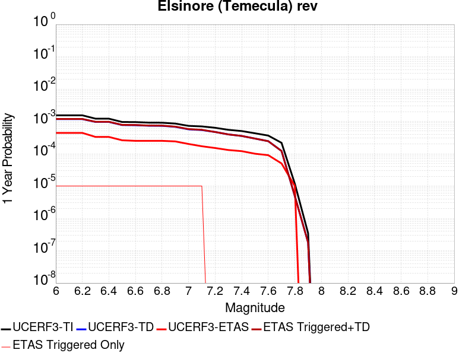 |  |

| Magnitude | 1 wk TI Prob | 1 wk TD Prob | 1 wk ETAS Prob | 1 wk ETAS/TD Gain | 1 wk ETAS Triggered+TD | 1 wk ETAS Triggered Only | 1 mo TI Prob | 1 mo TD Prob | 1 mo ETAS Prob | 1 mo ETAS/TD Gain | 1 mo ETAS Triggered+TD | 1 mo ETAS Triggered Only | 1 yr TI Prob | 1 yr TD Prob | 1 yr ETAS Prob | 1 yr ETAS/TD Gain | 1 yr ETAS Triggered+TD | 1 yr ETAS Triggered Only | 10 yr TI Prob | 10 yr TD Prob | 10 yr ETAS Prob | 10 yr ETAS/TD Gain | 10 yr ETAS Triggered+TD | 10 yr ETAS Triggered Only |
|-----|-----|-----|-----|-----|-----|-----|-----|-----|-----|-----|-----|-----|-----|-----|-----|-----|-----|-----|-----|-----|-----|-----|-----|-----|
| 6.0 | 2.9514995E-5 | 2.251887E-5 | 0.0 | 0.0 | 2.251887E-5 | 0.0 | 1.264867E-4 | 9.6505995E-5 | 6.0E-5 | 0.621723 | 1.0650503E-4 | 1.0E-5 | 0.0015388876 | 0.0011743492 | 4.4E-4 | 0.3746756 | 0.0011843374 | 1.0E-5 | 0.015282745 | 0.011688135 | 0.00639 | 0.5467083 | 0.011707901 | 2.0E-5 |
| 6.1 | 2.9514995E-5 | 2.251887E-5 | 0.0 | 0.0 | 2.251887E-5 | 0.0 | 1.264867E-4 | 9.6505995E-5 | 6.0E-5 | 0.621723 | 1.0650503E-4 | 1.0E-5 | 0.0015388876 | 0.0011743492 | 4.4E-4 | 0.3746756 | 0.0011843374 | 1.0E-5 | 0.015282745 | 0.011688135 | 0.00639 | 0.5467083 | 0.011707901 | 2.0E-5 |
| 6.2 | 2.9514995E-5 | 2.251887E-5 | 0.0 | 0.0 | 2.251887E-5 | 0.0 | 1.264867E-4 | 9.6505995E-5 | 6.0E-5 | 0.621723 | 1.0650503E-4 | 1.0E-5 | 0.0015388876 | 0.0011743492 | 4.4E-4 | 0.3746756 | 0.0011843374 | 1.0E-5 | 0.015282745 | 0.011688135 | 0.00639 | 0.5467083 | 0.011707901 | 2.0E-5 |
| 6.3 | 2.3223649E-5 | 1.840822E-5 | 0.0 | 0.0 | 1.840822E-5 | 0.0 | 9.952613E-5 | 7.889008E-5 | 3.0E-5 | 0.38027593 | 8.888929E-5 | 1.0E-5 | 0.001211057 | 9.600807E-4 | 3.3E-4 | 0.34372112 | 9.700711E-4 | 1.0E-5 | 0.012044783 | 0.009551284 | 0.00531 | 0.55594623 | 0.009571092 | 2.0E-5 |
| 6.4 | 2.3223649E-5 | 1.840822E-5 | 0.0 | 0.0 | 1.840822E-5 | 0.0 | 9.952613E-5 | 7.889008E-5 | 3.0E-5 | 0.38027593 | 8.888929E-5 | 1.0E-5 | 0.001211057 | 9.600807E-4 | 3.3E-4 | 0.34372112 | 9.700711E-4 | 1.0E-5 | 0.012044783 | 0.009551284 | 0.00531 | 0.55594623 | 0.009571092 | 2.0E-5 |
| 6.5 | 1.8338875E-5 | 1.4750074E-5 | 0.0 | 0.0 | 1.4750074E-5 | 0.0 | 7.8592806E-5 | 6.321312E-5 | 2.0E-5 | 0.31639 | 7.321249E-5 | 1.0E-5 | 9.5644733E-4 | 7.6935673E-4 | 2.6E-4 | 0.33794466 | 7.7934907E-4 | 1.0E-5 | 0.009523412 | 0.0076699676 | 0.0044 | 0.57366604 | 0.007689814 | 2.0E-5 |
| 6.6 | 1.8223333E-5 | 1.461263E-5 | 0.0 | 0.0 | 1.461263E-5 | 0.0 | 7.809766E-5 | 6.26241E-5 | 2.0E-5 | 0.31936586 | 7.262348E-5 | 1.0E-5 | 9.504242E-4 | 7.621905E-4 | 2.5E-4 | 0.32800198 | 7.721829E-4 | 1.0E-5 | 0.009463696 | 0.007598796 | 0.00439 | 0.5777231 | 0.0076186443 | 2.0E-5 |
| 6.7 | 1.7512752E-5 | 1.4026963E-5 | 0.0 | 0.0 | 1.4026963E-5 | 0.0 | 7.505249E-5 | 6.0114216E-5 | 2.0E-5 | 0.33269998 | 7.0113616E-5 | 1.0E-5 | 9.13381E-4 | 7.316534E-4 | 2.5E-4 | 0.34169182 | 7.416461E-4 | 1.0E-5 | 0.00909636 | 0.0072983317 | 0.00423 | 0.57958454 | 0.0073181856 | 2.0E-5 |
| 6.8 | 1.7417142E-5 | 1.395093E-5 | 0.0 | 0.0 | 1.395093E-5 | 0.0 | 7.4642754E-5 | 5.978838E-5 | 2.0E-5 | 0.33451316 | 6.9787784E-5 | 1.0E-5 | 9.083966E-4 | 7.27689E-4 | 2.5E-4 | 0.34355336 | 7.376817E-4 | 1.0E-5 | 0.009046922 | 0.007259359 | 0.00422 | 0.5813185 | 0.007279214 | 2.0E-5 |
| 6.9 | 1.6402591E-5 | 1.29883665E-5 | 0.0 | 0.0 | 1.29883665E-5 | 0.0 | 7.0294926E-5 | 5.5663284E-5 | 2.0E-5 | 0.35930327 | 6.566273E-5 | 1.0E-5 | 8.5550465E-4 | 6.774974E-4 | 2.4E-4 | 0.3542449 | 6.874907E-4 | 1.0E-5 | 0.008522186 | 0.0067598647 | 0.00393 | 0.5813726 | 0.0067797294 | 2.0E-5 |
| 7.0 | 1.3912486E-5 | 1.0878067E-5 | 0.0 | 0.0 | 1.0878067E-5 | 0.0 | 5.9623577E-5 | 4.661947E-5 | 2.0E-5 | 0.4290053 | 5.6619003E-5 | 1.0E-5 | 7.2567526E-4 | 5.674469E-4 | 2.0E-4 | 0.35245585 | 5.774413E-4 | 1.0E-5 | 0.0072331014 | 0.0056635314 | 0.00325 | 0.5738469 | 0.0056834184 | 2.0E-5 |
| 7.1 | 1.3405147E-5 | 1.0327192E-5 | 0.0 | 0.0 | 1.0327192E-5 | 0.0 | 5.7449364E-5 | 4.4258657E-5 | 2.0E-5 | 0.45188898 | 5.4258217E-5 | 1.0E-5 | 6.9922156E-4 | 5.3871854E-4 | 1.7E-4 | 0.31556368 | 5.4871314E-4 | 1.0E-5 | 0.0069702556 | 0.005377366 | 0.00309 | 0.57463074 | 0.005397259 | 2.0E-5 |
| 7.2 | 1.21402E-5 | 8.996479E-6 | 0.0 | 0.0 | 8.996479E-6 | 0.0 | 5.202839E-5 | 3.8555776E-5 | 1.0E-5 | 0.25936452 | 3.8555776E-5 | 0.0 | 6.332616E-4 | 4.6931725E-4 | 1.5E-4 | 0.31961322 | 4.6931725E-4 | 0.0 | 0.0063146 | 0.0046847262 | 0.00267 | 0.5699372 | 0.0046847262 | 0.0 |
| 7.3 | 1.05047775E-5 | 7.571515E-6 | 0.0 | 0.0 | 7.571515E-6 | 0.0 | 4.5019697E-5 | 3.2448956E-5 | 1.0E-5 | 0.30817634 | 3.2448956E-5 | 0.0 | 5.4797693E-4 | 3.9499588E-4 | 1.3E-4 | 0.32911736 | 3.9499588E-4 | 0.0 | 0.005466277 | 0.003943348 | 0.00229 | 0.58072484 | 0.003943348 | 0.0 |
| 7.4 | 9.624483E-6 | 6.786621E-6 | 0.0 | 0.0 | 6.786621E-6 | 0.0 | 4.124713E-5 | 2.90852E-5 | 1.0E-5 | 0.34381747 | 2.90852E-5 | 0.0 | 5.0206814E-4 | 3.5405616E-4 | 1.2E-4 | 0.33892927 | 3.5405616E-4 | 0.0 | 0.005009353 | 0.0035350726 | 0.00208 | 0.58838964 | 0.0035350726 | 0.0 |
| 7.5 | 8.215151E-6 | 5.6353133E-6 | 0.0 | 0.0 | 5.6353133E-6 | 0.0 | 3.5207315E-5 | 2.4151126E-5 | 1.0E-5 | 0.41405937 | 2.4151126E-5 | 0.0 | 4.2856473E-4 | 2.9400157E-4 | 1.0E-4 | 0.34013426 | 2.9400157E-4 | 0.0 | 0.004277392 | 0.002936254 | 0.00176 | 0.5994032 | 0.002936254 | 0.0 |
| 7.6 | 6.975058E-6 | 4.675836E-6 | 0.0 | 0.0 | 4.675836E-6 | 0.0 | 2.9892764E-5 | 2.003915E-5 | 0.0 | 0.0 | 2.003915E-5 | 0.0 | 3.6388362E-4 | 2.439505E-4 | 9.0E-5 | 0.3689273 | 2.439505E-4 | 0.0 | 0.0036328835 | 0.0024369434 | 0.00142 | 0.58269715 | 0.0024369434 | 0.0 |
| 7.7 | 4.159604E-6 | 2.326789E-6 | 0.0 | 0.0 | 2.326789E-6 | 0.0 | 1.7826753E-5 | 9.971919E-6 | 0.0 | 0.0 | 9.971919E-6 | 0.0 | 2.1701909E-4 | 1.2140209E-4 | 5.0E-5 | 0.41185454 | 1.2140209E-4 | 0.0 | 0.0021680726 | 0.0012134308 | 7.7E-4 | 0.63456446 | 0.0012134308 | 0.0 |
| 7.8 | 2.2692414E-7 | 9.384417E-8 | 0.0 | 0.0 | 9.384417E-8 | 0.0 | 9.725317E-7 | 4.0218927E-7 | 0.0 | 0.0 | 4.0218927E-7 | 0.0 | 1.1840509E-5 | 4.8966467E-6 | 1.0E-5 | 2.042214 | 4.8966467E-6 | 0.0 | 1.1839878E-4 | 4.8965718E-5 | 2.0E-5 | 0.40844905 | 4.8965718E-5 | 0.0 |
| 7.9 | 6.676829E-9 | 3.4397174E-9 | 0.0 | 0.0 | 3.4397174E-9 | 0.0 | 2.861498E-8 | 1.4741646E-8 | 0.0 | 0.0 | 1.4741646E-8 | 0.0 | 3.4838732E-7 | 1.7947953E-7 | 0.0 | 0.0 | 1.7947953E-7 | 0.0 | 3.4838679E-6 | 1.794794E-6 | 0.0 | 0.0 | 1.794794E-6 | 0.0 |

## Big Lagoon - Bald Mtn 2011 CFM
*[(top)](#table-of-contents)*

| 1 Week | 1 Month | 1 Year | 10 Year |
|-----|-----|-----|-----|
|  |  |  |  |

| Magnitude | 1 wk TI Prob | 1 wk TD Prob | 1 wk ETAS Prob | 1 wk ETAS/TD Gain | 1 wk ETAS Triggered+TD | 1 wk ETAS Triggered Only | 1 mo TI Prob | 1 mo TD Prob | 1 mo ETAS Prob | 1 mo ETAS/TD Gain | 1 mo ETAS Triggered+TD | 1 mo ETAS Triggered Only | 1 yr TI Prob | 1 yr TD Prob | 1 yr ETAS Prob | 1 yr ETAS/TD Gain | 1 yr ETAS Triggered+TD | 1 yr ETAS Triggered Only | 10 yr TI Prob | 10 yr TD Prob | 10 yr ETAS Prob | 10 yr ETAS/TD Gain | 10 yr ETAS Triggered+TD | 10 yr ETAS Triggered Only |
|-----|-----|-----|-----|-----|-----|-----|-----|-----|-----|-----|-----|-----|-----|-----|-----|-----|-----|-----|-----|-----|-----|-----|-----|-----|
| 6.0 | 1.8699735E-5 | 1.985018E-5 | 0.0 | 0.0 | 1.985018E-5 | 0.0 | 8.013926E-5 | 8.5069645E-5 | 6.0E-5 | 0.7053045 | 8.5069645E-5 | 0.0 | 9.752587E-4 | 0.0010352687 | 4.7E-4 | 0.45398846 | 0.0010452583 | 1.0E-5 | 0.009709897 | 0.010308274 | 0.00645 | 0.62571096 | 0.010318171 | 1.0E-5 |
| 6.1 | 1.8699735E-5 | 1.985018E-5 | 0.0 | 0.0 | 1.985018E-5 | 0.0 | 8.013926E-5 | 8.5069645E-5 | 6.0E-5 | 0.7053045 | 8.5069645E-5 | 0.0 | 9.752587E-4 | 0.0010352687 | 4.7E-4 | 0.45398846 | 0.0010452583 | 1.0E-5 | 0.009709897 | 0.010308274 | 0.00645 | 0.62571096 | 0.010318171 | 1.0E-5 |
| 6.2 | 1.8699735E-5 | 1.985018E-5 | 0.0 | 0.0 | 1.985018E-5 | 0.0 | 8.013926E-5 | 8.5069645E-5 | 6.0E-5 | 0.7053045 | 8.5069645E-5 | 0.0 | 9.752587E-4 | 0.0010352687 | 4.7E-4 | 0.45398846 | 0.0010452583 | 1.0E-5 | 0.009709897 | 0.010308274 | 0.00645 | 0.62571096 | 0.010318171 | 1.0E-5 |
| 6.3 | 1.8699735E-5 | 1.985018E-5 | 0.0 | 0.0 | 1.985018E-5 | 0.0 | 8.013926E-5 | 8.5069645E-5 | 6.0E-5 | 0.7053045 | 8.5069645E-5 | 0.0 | 9.752587E-4 | 0.0010352687 | 4.7E-4 | 0.45398846 | 0.0010452583 | 1.0E-5 | 0.009709897 | 0.010308274 | 0.00645 | 0.62571096 | 0.010318171 | 1.0E-5 |
| 6.4 | 1.8699735E-5 | 1.985018E-5 | 0.0 | 0.0 | 1.985018E-5 | 0.0 | 8.013926E-5 | 8.5069645E-5 | 6.0E-5 | 0.7053045 | 8.5069645E-5 | 0.0 | 9.752587E-4 | 0.0010352687 | 4.7E-4 | 0.45398846 | 0.0010452583 | 1.0E-5 | 0.009709897 | 0.010308274 | 0.00645 | 0.62571096 | 0.010318171 | 1.0E-5 |
| 6.5 | 1.8699735E-5 | 1.985018E-5 | 0.0 | 0.0 | 1.985018E-5 | 0.0 | 8.013926E-5 | 8.5069645E-5 | 6.0E-5 | 0.7053045 | 8.5069645E-5 | 0.0 | 9.752587E-4 | 0.0010352687 | 4.7E-4 | 0.45398846 | 0.0010452583 | 1.0E-5 | 0.009709897 | 0.010308274 | 0.00645 | 0.62571096 | 0.010318171 | 1.0E-5 |
| 6.6 | 1.8699735E-5 | 1.985018E-5 | 0.0 | 0.0 | 1.985018E-5 | 0.0 | 8.013926E-5 | 8.5069645E-5 | 6.0E-5 | 0.7053045 | 8.5069645E-5 | 0.0 | 9.752587E-4 | 0.0010352687 | 4.7E-4 | 0.45398846 | 0.0010452583 | 1.0E-5 | 0.009709897 | 0.010308274 | 0.00645 | 0.62571096 | 0.010318171 | 1.0E-5 |
| 6.7 | 1.8699735E-5 | 1.985018E-5 | 0.0 | 0.0 | 1.985018E-5 | 0.0 | 8.013926E-5 | 8.5069645E-5 | 6.0E-5 | 0.7053045 | 8.5069645E-5 | 0.0 | 9.752587E-4 | 0.0010352687 | 4.7E-4 | 0.45398846 | 0.0010452583 | 1.0E-5 | 0.009709897 | 0.010308274 | 0.00645 | 0.62571096 | 0.010318171 | 1.0E-5 |
| 6.8 | 1.18505095E-5 | 1.2499804E-5 | 0.0 | 0.0 | 1.2499804E-5 | 0.0 | 5.078691E-5 | 5.3569514E-5 | 5.0E-5 | 0.93336666 | 5.3569514E-5 | 0.0 | 6.181552E-4 | 6.520185E-4 | 3.5E-4 | 0.5367946 | 6.6201197E-4 | 1.0E-5 | 0.006164385 | 0.0065015587 | 0.00437 | 0.6721465 | 0.0065114936 | 1.0E-5 |
| 6.9 | 1.18505095E-5 | 1.2499804E-5 | 0.0 | 0.0 | 1.2499804E-5 | 0.0 | 5.078691E-5 | 5.3569514E-5 | 5.0E-5 | 0.93336666 | 5.3569514E-5 | 0.0 | 6.181552E-4 | 6.520185E-4 | 3.5E-4 | 0.5367946 | 6.6201197E-4 | 1.0E-5 | 0.006164385 | 0.0065015587 | 0.00437 | 0.6721465 | 0.0065114936 | 1.0E-5 |
| 7.0 | 9.719786E-6 | 1.0235487E-5 | 0.0 | 0.0 | 1.0235487E-5 | 0.0 | 4.1655563E-5 | 4.386565E-5 | 5.0E-5 | 1.1398441 | 4.386565E-5 | 0.0 | 5.0703844E-4 | 5.3393573E-4 | 2.6E-4 | 0.48694998 | 5.3393573E-4 | 0.0 | 0.005058831 | 0.0053267754 | 0.00368 | 0.6908495 | 0.0053267754 | 0.0 |
| 7.1 | 8.523418E-6 | 8.969463E-6 | 0.0 | 0.0 | 8.969463E-6 | 0.0 | 3.652842E-5 | 3.844E-5 | 5.0E-5 | 1.3007284 | 3.844E-5 | 0.0 | 4.4464276E-4 | 4.6790804E-4 | 2.2E-4 | 0.47017786 | 4.6790804E-4 | 0.0 | 0.0044375416 | 0.004669392 | 0.00331 | 0.7088717 | 0.004669392 | 0.0 |
| 7.2 | 7.378894E-6 | 7.761112E-6 | 0.0 | 0.0 | 7.761112E-6 | 0.0 | 3.162345E-5 | 3.326149E-5 | 4.0E-5 | 1.2025919 | 3.326149E-5 | 0.0 | 3.8494746E-4 | 4.048843E-4 | 1.6E-4 | 0.39517462 | 4.048843E-4 | 0.0 | 0.0038428132 | 0.0040415623 | 0.00286 | 0.70764714 | 0.0040415623 | 0.0 |
| 7.3 | 6.4640294E-6 | 6.7924434E-6 | 0.0 | 0.0 | 6.7924434E-6 | 0.0 | 2.7702688E-5 | 2.9110151E-5 | 4.0E-5 | 1.3740911 | 2.9110151E-5 | 0.0 | 3.3722803E-4 | 3.5435913E-4 | 1.5E-4 | 0.4232994 | 3.5435913E-4 | 0.0 | 0.0033671674 | 0.0035380109 | 0.00255 | 0.720744 | 0.0035380109 | 0.0 |
| 7.4 | 5.9959093E-6 | 6.2988E-6 | 0.0 | 0.0 | 6.2988E-6 | 0.0 | 2.5696501E-5 | 2.6994581E-5 | 3.0E-5 | 1.1113341 | 2.6994581E-5 | 0.0 | 3.1280998E-4 | 3.2861007E-4 | 1.2E-4 | 0.36517447 | 3.2861007E-4 | 0.0 | 0.0031237002 | 0.0032813034 | 0.00234 | 0.71313125 | 0.0032813034 | 0.0 |
| 7.5 | 4.929265E-6 | 5.176396E-6 | 0.0 | 0.0 | 5.176396E-6 | 0.0 | 2.112525E-5 | 2.2184367E-5 | 2.0E-5 | 0.90153575 | 2.2184367E-5 | 0.0 | 2.5716957E-4 | 2.700616E-4 | 9.0E-5 | 0.33325732 | 2.700616E-4 | 0.0 | 0.0025687215 | 0.002697375 | 0.00202 | 0.7488763 | 0.002697375 | 0.0 |
| 7.6 | 3.8982403E-6 | 4.0889267E-6 | 0.0 | 0.0 | 4.0889267E-6 | 0.0 | 1.6706637E-5 | 1.7523857E-5 | 2.0E-5 | 1.1413013 | 1.7523857E-5 | 0.0 | 2.0338432E-4 | 2.1333233E-4 | 7.0E-5 | 0.32812655 | 2.1333233E-4 | 0.0 | 0.0020319829 | 0.002131303 | 0.00154 | 0.7225626 | 0.002131303 | 0.0 |
| 7.7 | 2.820968E-6 | 2.9572116E-6 | 0.0 | 0.0 | 2.9572116E-6 | 0.0 | 1.2089806E-5 | 1.2673704E-5 | 2.0E-5 | 1.5780706 | 1.2673704E-5 | 0.0 | 1.4718344E-4 | 1.5429159E-4 | 5.0E-5 | 0.32406172 | 1.5429159E-4 | 0.0 | 0.00147086 | 0.0015418624 | 0.00113 | 0.73287994 | 0.0015418624 | 0.0 |
| 7.8 | 1.9314455E-6 | 2.0260186E-6 | 0.0 | 0.0 | 2.0260186E-6 | 0.0 | 8.277597E-6 | 8.682909E-6 | 2.0E-5 | 2.3033757 | 8.682909E-6 | 0.0 | 1.0077508E-4 | 1.0570941E-4 | 3.0E-5 | 0.28379688 | 1.0570941E-4 | 0.0 | 0.0010072939 | 0.0010566041 | 6.6E-4 | 0.62464267 | 0.0010566041 | 0.0 |
| 7.9 | 4.9586197E-7 | 5.2189216E-7 | 0.0 | 0.0 | 5.2189216E-7 | 0.0 | 2.125121E-6 | 2.2366787E-6 | 2.0E-5 | 8.94183 | 2.2366787E-6 | 0.0 | 2.5873042E-5 | 2.7231245E-5 | 2.0E-5 | 0.73445046 | 2.7231245E-5 | 0.0 | 2.5870028E-4 | 2.7228118E-4 | 1.9E-4 | 0.6978081 | 2.7228118E-4 | 0.0 |

## San Gregorio (North) 2011 CFM
*[(top)](#table-of-contents)*

| 1 Week | 1 Month | 1 Year | 10 Year |
|-----|-----|-----|-----|
|  |  |  |  |

| Magnitude | 1 wk TI Prob | 1 wk TD Prob | 1 wk ETAS Prob | 1 wk ETAS/TD Gain | 1 wk ETAS Triggered+TD | 1 wk ETAS Triggered Only | 1 mo TI Prob | 1 mo TD Prob | 1 mo ETAS Prob | 1 mo ETAS/TD Gain | 1 mo ETAS Triggered+TD | 1 mo ETAS Triggered Only | 1 yr TI Prob | 1 yr TD Prob | 1 yr ETAS Prob | 1 yr ETAS/TD Gain | 1 yr ETAS Triggered+TD | 1 yr ETAS Triggered Only | 10 yr TI Prob | 10 yr TD Prob | 10 yr ETAS Prob | 10 yr ETAS/TD Gain | 10 yr ETAS Triggered+TD | 10 yr ETAS Triggered Only |
|-----|-----|-----|-----|-----|-----|-----|-----|-----|-----|-----|-----|-----|-----|-----|-----|-----|-----|-----|-----|-----|-----|-----|-----|-----|
| 6.0 | 5.0283932E-5 | 4.3057098E-5 | 4.0E-5 | 0.928999 | 4.3057098E-5 | 0.0 | 2.1548476E-4 | 1.8451746E-4 | 1.0E-4 | 0.54195416 | 1.8451746E-4 | 0.0 | 0.0026203706 | 0.002244199 | 0.00106 | 0.47232887 | 0.0022541767 | 1.0E-5 | 0.02589687 | 0.022295918 | 0.0122 | 0.54718536 | 0.022315472 | 2.0E-5 |
| 6.1 | 5.0283932E-5 | 4.3057098E-5 | 4.0E-5 | 0.928999 | 4.3057098E-5 | 0.0 | 2.1548476E-4 | 1.8451746E-4 | 1.0E-4 | 0.54195416 | 1.8451746E-4 | 0.0 | 0.0026203706 | 0.002244199 | 0.00106 | 0.47232887 | 0.0022541767 | 1.0E-5 | 0.02589687 | 0.022295918 | 0.0122 | 0.54718536 | 0.022315472 | 2.0E-5 |
| 6.2 | 4.2998647E-5 | 3.4440873E-5 | 2.0E-5 | 0.5807054 | 3.4440873E-5 | 0.0 | 1.842669E-4 | 1.4759546E-4 | 7.0E-5 | 0.47426933 | 1.4759546E-4 | 0.0 | 0.0022411412 | 0.001795506 | 8.6E-4 | 0.47897363 | 0.001805488 | 1.0E-5 | 0.022186736 | 0.017884884 | 0.00962 | 0.5378844 | 0.017904526 | 2.0E-5 |
| 6.3 | 4.2998647E-5 | 3.4440873E-5 | 2.0E-5 | 0.5807054 | 3.4440873E-5 | 0.0 | 1.842669E-4 | 1.4759546E-4 | 7.0E-5 | 0.47426933 | 1.4759546E-4 | 0.0 | 0.0022411412 | 0.001795506 | 8.6E-4 | 0.47897363 | 0.001805488 | 1.0E-5 | 0.022186736 | 0.017884884 | 0.00962 | 0.5378844 | 0.017904526 | 2.0E-5 |
| 6.4 | 4.1101295E-5 | 3.2326076E-5 | 2.0E-5 | 0.6186956 | 3.2326076E-5 | 0.0 | 1.7613651E-4 | 1.3853304E-4 | 7.0E-5 | 0.5052946 | 1.3853304E-4 | 0.0 | 0.0021423528 | 0.0016853481 | 8.4E-4 | 0.49841335 | 0.0016953313 | 1.0E-5 | 0.02121817 | 0.016800618 | 0.00895 | 0.5327185 | 0.016820282 | 2.0E-5 |
| 6.5 | 4.1032585E-5 | 3.224411E-5 | 2.0E-5 | 0.62026834 | 3.224411E-5 | 0.0 | 1.7584208E-4 | 1.381818E-4 | 7.0E-5 | 0.50657904 | 1.381818E-4 | 0.0 | 0.0021387753 | 0.0016810785 | 8.4E-4 | 0.49967924 | 0.0016910617 | 1.0E-5 | 0.021183075 | 0.01675857 | 0.00894 | 0.53345835 | 0.016778236 | 2.0E-5 |
| 6.6 | 4.011629E-5 | 3.1265718E-5 | 2.0E-5 | 0.6396783 | 3.1265718E-5 | 0.0 | 1.7191563E-4 | 1.3398913E-4 | 6.0E-5 | 0.44779754 | 1.3398913E-4 | 0.0 | 0.0020910634 | 0.0016301107 | 8.2E-4 | 0.50303334 | 0.0016400943 | 1.0E-5 | 0.020714961 | 0.016257357 | 0.00863 | 0.5308366 | 0.016277032 | 2.0E-5 |
| 6.7 | 3.8583938E-5 | 2.9452754E-5 | 2.0E-5 | 0.67905366 | 2.9452754E-5 | 0.0 | 1.6534925E-4 | 1.2622007E-4 | 6.0E-5 | 0.47536024 | 1.2622007E-4 | 0.0 | 0.0020112682 | 0.0015356604 | 7.6E-4 | 0.49490112 | 0.001545645 | 1.0E-5 | 0.019931622 | 0.015326062 | 0.00807 | 0.52655405 | 0.015345756 | 2.0E-5 |
| 6.8 | 3.44341E-5 | 2.4450024E-5 | 1.0E-5 | 0.40899754 | 2.4450024E-5 | 0.0 | 1.4756636E-4 | 1.0478167E-4 | 5.0E-5 | 0.47718272 | 1.0478167E-4 | 0.0 | 0.0017951399 | 0.0012749807 | 6.4E-4 | 0.5019684 | 0.001284968 | 1.0E-5 | 0.017807078 | 0.012751525 | 0.00697 | 0.5466013 | 0.01277127 | 2.0E-5 |
| 6.9 | 3.221199E-5 | 2.1777196E-5 | 1.0E-5 | 0.45919594 | 2.1777196E-5 | 0.0 | 1.3804408E-4 | 9.3327544E-5 | 5.0E-5 | 0.5357475 | 9.3327544E-5 | 0.0 | 0.0016793909 | 0.0011356788 | 6.4E-4 | 0.5635396 | 0.0011456675 | 1.0E-5 | 0.01666756 | 0.011372544 | 0.00618 | 0.54341406 | 0.011392316 | 2.0E-5 |
| 7.0 | 2.9186718E-5 | 1.814604E-5 | 1.0E-5 | 0.5510844 | 1.814604E-5 | 0.0 | 1.2507994E-4 | 7.776645E-5 | 4.0E-5 | 0.5143606 | 7.776645E-5 | 0.0 | 0.0015217843 | 9.463997E-4 | 5.6E-4 | 0.5917162 | 9.463997E-4 | 0.0 | 0.015114053 | 0.0094966395 | 0.00523 | 0.5507211 | 0.009506545 | 1.0E-5 |
| 7.1 | 2.6840138E-5 | 1.5283675E-5 | 1.0E-5 | 0.6542929 | 1.5283675E-5 | 0.0 | 1.1502409E-4 | 6.549983E-5 | 4.0E-5 | 0.61068857 | 6.549983E-5 | 0.0 | 0.0013995186 | 7.971706E-4 | 4.9E-4 | 0.6146739 | 7.971706E-4 | 0.0 | 0.013907375 | 0.0080155255 | 0.00425 | 0.530221 | 0.008025446 | 1.0E-5 |
| 7.2 | 2.453002E-5 | 1.2605825E-5 | 1.0E-5 | 0.79328406 | 1.2605825E-5 | 0.0 | 1.05124425E-4 | 5.4023847E-5 | 4.0E-5 | 0.7404138 | 5.4023847E-5 | 0.0 | 0.0012791384 | 6.5754243E-4 | 3.7E-4 | 0.56270134 | 6.5754243E-4 | 0.0 | 0.012718005 | 0.006627395 | 0.00351 | 0.5296199 | 0.0066373283 | 1.0E-5 |
| 7.3 | 2.3330727E-5 | 1.1487833E-5 | 1.0E-5 | 0.8704862 | 1.1487833E-5 | 0.0 | 9.9985E-5 | 4.923264E-5 | 4.0E-5 | 0.8124691 | 4.923264E-5 | 0.0 | 0.0012166376 | 5.99243E-4 | 3.4E-4 | 0.5673825 | 5.99243E-4 | 0.0 | 0.012099981 | 0.0060462817 | 0.00315 | 0.5209814 | 0.006056221 | 1.0E-5 |
| 7.4 | 2.2136466E-5 | 1.0368137E-5 | 1.0E-5 | 0.96449345 | 1.0368137E-5 | 0.0 | 9.486712E-5 | 4.4434113E-5 | 4.0E-5 | 0.90020925 | 4.4434113E-5 | 0.0 | 0.0011543952 | 5.408513E-4 | 3.1E-4 | 0.5731705 | 5.408513E-4 | 0.0 | 0.011484168 | 0.0054640025 | 0.00284 | 0.5197655 | 0.0054640025 | 0.0 |
| 7.5 | 2.0994974E-5 | 9.426374E-6 | 1.0E-5 | 1.0608532 | 9.426374E-6 | 0.0 | 8.997535E-5 | 4.0398125E-5 | 4.0E-5 | 0.990145 | 4.0398125E-5 | 0.0 | 0.0010948994 | 4.917364E-4 | 2.8E-4 | 0.5694108 | 4.917364E-4 | 0.0 | 0.010895205 | 0.004973108 | 0.0025 | 0.5027037 | 0.004973108 | 0.0 |
| 7.6 | 1.7091823E-5 | 6.892992E-6 | 1.0E-5 | 1.4507488 | 6.892992E-6 | 0.0 | 7.3248615E-5 | 2.9541061E-5 | 4.0E-5 | 1.3540475 | 2.9541061E-5 | 0.0 | 8.9143694E-4 | 3.5960317E-4 | 2.2E-4 | 0.6117855 | 3.5960317E-4 | 0.0 | 0.008878695 | 0.0036480771 | 0.00174 | 0.4769636 | 0.0036480771 | 0.0 |
| 7.7 | 1.2772179E-5 | 4.0202267E-6 | 1.0E-5 | 2.487422 | 4.0202267E-6 | 0.0 | 5.473676E-5 | 1.722943E-5 | 2.0E-5 | 1.1608046 | 1.722943E-5 | 0.0 | 6.6621625E-4 | 2.0974813E-4 | 1.3E-4 | 0.619791 | 2.0974813E-4 | 0.0 | 0.006642225 | 0.0021365841 | 0.0011 | 0.5148405 | 0.0021365841 | 0.0 |
| 7.8 | 7.041923E-6 | 1.9402341E-6 | 1.0E-5 | 5.154017 | 1.9402341E-6 | 0.0 | 3.017932E-5 | 8.315263E-6 | 2.0E-5 | 2.4052157 | 8.315263E-6 | 0.0 | 3.6737128E-4 | 1.01233614E-4 | 1.0E-4 | 0.9878142 | 1.01233614E-4 | 0.0 | 0.0036676454 | 0.0010376878 | 6.4E-4 | 0.61675584 | 0.0010376878 | 0.0 |
| 7.9 | 2.946768E-6 | 1.0031822E-6 | 0.0 | 0.0 | 1.0031822E-6 | 0.0 | 1.2628945E-5 | 4.299345E-6 | 1.0E-5 | 2.3259356 | 4.299345E-6 | 0.0 | 1.5374656E-4 | 5.2343268E-5 | 7.0E-5 | 1.3373257 | 5.2343268E-5 | 0.0 | 0.0015364023 | 5.339059E-4 | 3.5E-4 | 0.6555462 | 5.339059E-4 | 0.0 |
| 8.0 | 1.1433375E-6 | 5.180804E-7 | 0.0 | 0.0 | 5.180804E-7 | 0.0 | 4.9000087E-6 | 2.2203426E-6 | 0.0 | 0.0 | 2.2203426E-6 | 0.0 | 5.965597E-5 | 2.7032334E-5 | 3.0E-5 | 1.1097821 | 2.7032334E-5 | 0.0 | 5.963996E-4 | 2.7394458E-4 | 1.9E-4 | 0.693571 | 2.7394458E-4 | 0.0 |
| 8.1 | 2.6675295E-7 | 1.6288074E-7 | 0.0 | 0.0 | 1.6288074E-7 | 0.0 | 1.1432264E-6 | 6.9806015E-7 | 0.0 | 0.0 | 6.9806015E-7 | 0.0 | 1.3918692E-5 | 8.498849E-6 | 0.0 | 0.0 | 8.498849E-6 | 0.0 | 1.391782E-4 | 8.6366665E-5 | 5.0E-5 | 0.57892704 | 8.6366665E-5 | 0.0 |
| 8.2 | 1.2704569E-8 | 9.429871E-9 | 0.0 | 0.0 | 9.429871E-9 | 0.0 | 5.444815E-8 | 4.041373E-8 | 0.0 | 0.0 | 4.041373E-8 | 0.0 | 6.629061E-7 | 4.920371E-7 | 0.0 | 0.0 | 4.920371E-7 | 0.0 | 6.629041E-6 | 5.1106863E-6 | 0.0 | 0.0 | 5.1106863E-6 | 0.0 |

## San Andreas (Santa Cruz Mts) 2011 CFM
*[(top)](#table-of-contents)*

| 1 Week | 1 Month | 1 Year | 10 Year |
|-----|-----|-----|-----|
|  |  |  |  |

| Magnitude | 1 wk TI Prob | 1 wk TD Prob | 1 wk ETAS Prob | 1 wk ETAS/TD Gain | 1 wk ETAS Triggered+TD | 1 wk ETAS Triggered Only | 1 mo TI Prob | 1 mo TD Prob | 1 mo ETAS Prob | 1 mo ETAS/TD Gain | 1 mo ETAS Triggered+TD | 1 mo ETAS Triggered Only | 1 yr TI Prob | 1 yr TD Prob | 1 yr ETAS Prob | 1 yr ETAS/TD Gain | 1 yr ETAS Triggered+TD | 1 yr ETAS Triggered Only | 10 yr TI Prob | 10 yr TD Prob | 10 yr ETAS Prob | 10 yr ETAS/TD Gain | 10 yr ETAS Triggered+TD | 10 yr ETAS Triggered Only |
|-----|-----|-----|-----|-----|-----|-----|-----|-----|-----|-----|-----|-----|-----|-----|-----|-----|-----|-----|-----|-----|-----|-----|-----|-----|
| 6.0 | 1.7221631E-4 | 1.3792426E-4 | 6.0E-5 | 0.43502137 | 1.3792426E-4 | 0.0 | 7.378611E-4 | 5.9097214E-4 | 2.2E-4 | 0.372268 | 6.009662E-4 | 1.0E-5 | 0.008946515 | 0.0071717235 | 0.00341 | 0.47547844 | 0.007181652 | 1.0E-5 | 0.08594794 | 0.07054796 | 0.03689 | 0.52290666 | 0.07056655 | 2.0E-5 |
| 6.1 | 1.7221631E-4 | 1.3792426E-4 | 6.0E-5 | 0.43502137 | 1.3792426E-4 | 0.0 | 7.378611E-4 | 5.9097214E-4 | 2.2E-4 | 0.372268 | 6.009662E-4 | 1.0E-5 | 0.008946515 | 0.0071717235 | 0.00341 | 0.47547844 | 0.007181652 | 1.0E-5 | 0.08594794 | 0.07054796 | 0.03689 | 0.52290666 | 0.07056655 | 2.0E-5 |
| 6.2 | 1.7221631E-4 | 1.3792426E-4 | 6.0E-5 | 0.43502137 | 1.3792426E-4 | 0.0 | 7.378611E-4 | 5.9097214E-4 | 2.2E-4 | 0.372268 | 6.009662E-4 | 1.0E-5 | 0.008946515 | 0.0071717235 | 0.00341 | 0.47547844 | 0.007181652 | 1.0E-5 | 0.08594794 | 0.07054796 | 0.03689 | 0.52290666 | 0.07056655 | 2.0E-5 |
| 6.3 | 1.716926E-4 | 1.3711878E-4 | 6.0E-5 | 0.4375768 | 1.3711878E-4 | 0.0 | 7.3561794E-4 | 5.8752164E-4 | 2.2E-4 | 0.3744543 | 5.975158E-4 | 1.0E-5 | 0.008919428 | 0.007129989 | 0.00339 | 0.47545654 | 0.007139918 | 1.0E-5 | 0.08569809 | 0.07015993 | 0.03675 | 0.5238033 | 0.07017852 | 2.0E-5 |
| 6.4 | 1.6392978E-4 | 1.3587909E-4 | 6.0E-5 | 0.44156903 | 1.3587909E-4 | 0.0 | 7.02367E-4 | 5.82211E-4 | 2.2E-4 | 0.37786984 | 5.922052E-4 | 1.0E-5 | 0.008517839 | 0.0070657525 | 0.00337 | 0.4769485 | 0.007075682 | 1.0E-5 | 0.08198654 | 0.069394976 | 0.03642 | 0.5248219 | 0.06941359 | 2.0E-5 |
| 6.5 | 1.5742714E-4 | 1.2647794E-4 | 6.0E-5 | 0.474391 | 1.2647794E-4 | 0.0 | 6.745133E-4 | 5.419374E-4 | 2.1E-4 | 0.3874986 | 5.51932E-4 | 1.0E-5 | 0.00818132 | 0.0065784375 | 0.00311 | 0.47275665 | 0.0065883715 | 1.0E-5 | 0.078865945 | 0.06486093 | 0.03377 | 0.5206524 | 0.06487963 | 2.0E-5 |
| 6.6 | 1.3038084E-4 | 1.1587992E-4 | 6.0E-5 | 0.5177774 | 1.1587992E-4 | 0.0 | 5.5865536E-4 | 4.96535E-4 | 1.9E-4 | 0.38265178 | 5.0653005E-4 | 1.0E-5 | 0.006780438 | 0.006028784 | 0.00279 | 0.46277988 | 0.006038724 | 1.0E-5 | 0.0657725 | 0.059330538 | 0.03053 | 0.5145748 | 0.05934935 | 2.0E-5 |
| 6.7 | 1.2867592E-4 | 1.1314491E-4 | 6.0E-5 | 0.5302934 | 1.1314491E-4 | 0.0 | 5.5135164E-4 | 4.8481792E-4 | 1.9E-4 | 0.3918997 | 4.948131E-4 | 1.0E-5 | 0.0066920654 | 0.005886907 | 0.00271 | 0.4603436 | 0.005896848 | 1.0E-5 | 0.06494093 | 0.058041416 | 0.02976 | 0.51273733 | 0.058060255 | 2.0E-5 |
| 6.8 | 1.2801298E-4 | 1.12520516E-4 | 6.0E-5 | 0.5332361 | 1.12520516E-4 | 0.0 | 5.485117E-4 | 4.8214293E-4 | 1.9E-4 | 0.39407402 | 4.921381E-4 | 1.0E-5 | 0.0066577005 | 0.0058545293 | 0.0027 | 0.46118137 | 0.0058644707 | 1.0E-5 | 0.06461738 | 0.05775524 | 0.02966 | 0.51354647 | 0.057774086 | 2.0E-5 |
| 6.9 | 1.269149E-4 | 1.1094256E-4 | 6.0E-5 | 0.5408204 | 1.1094256E-4 | 0.0 | 5.4380763E-4 | 4.7538272E-4 | 1.9E-4 | 0.39967796 | 4.8537797E-4 | 1.0E-5 | 0.006600777 | 0.005772663 | 0.00268 | 0.46425715 | 0.005782605 | 1.0E-5 | 0.06408122 | 0.057027116 | 0.02914 | 0.51098496 | 0.057045978 | 2.0E-5 |
| 7.0 | 1.2030331E-4 | 1.0824356E-4 | 5.0E-5 | 0.46192122 | 1.0824356E-4 | 0.0 | 5.154837E-4 | 4.638198E-4 | 1.8E-4 | 0.38808176 | 4.7381516E-4 | 1.0E-5 | 0.006257969 | 0.0056326203 | 0.00259 | 0.45982152 | 0.005642564 | 1.0E-5 | 0.06084648 | 0.055699922 | 0.02835 | 0.50897735 | 0.05571881 | 2.0E-5 |
| 7.1 | 8.049617E-5 | 5.392429E-5 | 2.0E-5 | 0.37089038 | 5.392429E-5 | 0.0 | 3.4493793E-4 | 2.3108382E-4 | 9.0E-5 | 0.38946906 | 2.410815E-4 | 1.0E-5 | 0.0041915346 | 0.0028098505 | 0.00126 | 0.44842243 | 0.0028198224 | 1.0E-5 | 0.041133516 | 0.029618833 | 0.01452 | 0.49022865 | 0.02963824 | 2.0E-5 |
| 7.2 | 7.093979E-5 | 4.2935415E-5 | 2.0E-5 | 0.46581593 | 4.2935415E-5 | 0.0 | 3.0399222E-4 | 1.8399608E-4 | 9.0E-5 | 0.48914087 | 1.9399423E-4 | 1.0E-5 | 0.0036948253 | 0.0022378736 | 9.7E-4 | 0.43344718 | 0.002247851 | 1.0E-5 | 0.03633994 | 0.023941126 | 0.01154 | 0.48201576 | 0.023960648 | 2.0E-5 |
| 7.3 | 6.193693E-5 | 2.8891074E-5 | 2.0E-5 | 0.6922553 | 2.8891074E-5 | 0.0 | 2.6541698E-4 | 1.2381302E-4 | 5.0E-5 | 0.40383476 | 1.3381179E-4 | 1.0E-5 | 0.0032266637 | 0.001506383 | 6.5E-4 | 0.4314972 | 0.0015163679 | 1.0E-5 | 0.031802133 | 0.016497677 | 0.00798 | 0.48370445 | 0.016517347 | 2.0E-5 |
| 7.4 | 5.906492E-5 | 2.7020369E-5 | 1.0E-5 | 0.37009117 | 2.7020369E-5 | 0.0 | 2.5311083E-4 | 1.1579645E-4 | 4.0E-5 | 0.34543374 | 1.2579528E-4 | 1.0E-5 | 0.0030772698 | 0.0014089114 | 5.9E-4 | 0.418763 | 0.0014188973 | 1.0E-5 | 0.030350044 | 0.0154695045 | 0.00748 | 0.48353198 | 0.0154891955 | 2.0E-5 |
| 7.5 | 5.424296E-5 | 2.4675093E-5 | 1.0E-5 | 0.40526694 | 2.4675093E-5 | 0.0 | 2.324491E-4 | 1.0574612E-4 | 4.0E-5 | 0.37826446 | 1.1574506E-4 | 1.0E-5 | 0.002826395 | 0.0012866998 | 5.5E-4 | 0.42745012 | 0.0012966869 | 1.0E-5 | 0.027907165 | 0.014161854 | 0.00673 | 0.47522026 | 0.014181571 | 2.0E-5 |
| 7.6 | 4.43084E-5 | 1.990151E-5 | 1.0E-5 | 0.5024744 | 1.990151E-5 | 0.0 | 1.8987931E-4 | 8.528939E-5 | 4.0E-5 | 0.46899146 | 9.5288546E-5 | 1.0E-5 | 0.0023093296 | 0.001037904 | 4.8E-4 | 0.46247053 | 0.0010478937 | 1.0E-5 | 0.022854783 | 0.011411123 | 0.00543 | 0.4758515 | 0.011430895 | 2.0E-5 |
| 7.7 | 4.118098E-5 | 1.8933848E-5 | 1.0E-5 | 0.5281547 | 1.8933848E-5 | 0.0 | 1.7647797E-4 | 8.1142534E-5 | 4.0E-5 | 0.4929597 | 9.114172E-5 | 1.0E-5 | 0.002146502 | 9.874629E-4 | 4.7E-4 | 0.47596726 | 9.97453E-4 | 1.0E-5 | 0.021258866 | 0.010868995 | 0.00513 | 0.47198474 | 0.010888778 | 2.0E-5 |
| 7.8 | 3.5408906E-5 | 1.856201E-5 | 1.0E-5 | 0.53873473 | 1.856201E-5 | 0.0 | 1.5174363E-4 | 7.954905E-5 | 4.0E-5 | 0.50283444 | 8.954825E-5 | 1.0E-5 | 0.0018459131 | 9.6807955E-4 | 4.5E-4 | 0.46483782 | 9.780698E-4 | 1.0E-5 | 0.018306552 | 0.0106506655 | 0.00501 | 0.47039312 | 0.010670452 | 2.0E-5 |
| 7.9 | 2.5860836E-5 | 1.7313954E-5 | 0.0 | 0.0 | 1.7313954E-5 | 0.0 | 1.10827445E-4 | 7.420055E-5 | 3.0E-5 | 0.40430966 | 8.419981E-5 | 1.0E-5 | 0.001348489 | 9.030175E-4 | 4.2E-4 | 0.46510726 | 9.130085E-4 | 1.0E-5 | 0.013403354 | 0.009906601 | 0.0047 | 0.47443113 | 0.009916502 | 1.0E-5 |
| 8.0 | 1.9777332E-5 | 1.4837888E-5 | 0.0 | 0.0 | 1.4837888E-5 | 0.0 | 8.4757245E-5 | 6.3589396E-5 | 2.0E-5 | 0.31451786 | 7.358876E-5 | 1.0E-5 | 0.0010314309 | 7.739261E-4 | 3.3E-4 | 0.4263973 | 7.8391837E-4 | 1.0E-5 | 0.010266567 | 0.008508087 | 0.00411 | 0.4830698 | 0.008518002 | 1.0E-5 |
| 8.1 | 1.468494E-5 | 1.2105831E-5 | 0.0 | 0.0 | 1.2105831E-5 | 0.0 | 6.293394E-5 | 5.1881103E-5 | 2.0E-5 | 0.38549682 | 6.1880586E-5 | 1.0E-5 | 7.6595135E-4 | 6.3146953E-4 | 2.6E-4 | 0.41173798 | 6.414632E-4 | 1.0E-5 | 0.0076331664 | 0.0069684954 | 0.00349 | 0.50082546 | 0.006978426 | 1.0E-5 |
| 8.2 | 8.63836E-6 | 5.4678667E-6 | 0.0 | 0.0 | 5.4678667E-6 | 0.0 | 3.7021015E-5 | 2.3433504E-5 | 1.0E-5 | 0.42673942 | 3.343327E-5 | 1.0E-5 | 4.5063766E-4 | 2.8526565E-4 | 1.5E-4 | 0.5258257 | 2.9526278E-4 | 1.0E-5 | 0.004497249 | 0.003245162 | 0.00171 | 0.5269382 | 0.0032551298 | 1.0E-5 |
| 8.3 | 1.983087E-6 | 7.6564595E-7 | 0.0 | 0.0 | 7.6564595E-7 | 0.0 | 8.498917E-6 | 3.281336E-6 | 0.0 | 0.0 | 3.281336E-6 | 0.0 | 1.034694E-4 | 3.9949547E-5 | 1.0E-5 | 0.25031573 | 3.9949547E-5 | 0.0 | 0.0010342124 | 4.717979E-4 | 2.0E-4 | 0.42391032 | 4.717979E-4 | 0.0 |

## Santa Susana alt 1
*[(top)](#table-of-contents)*

| 1 Week | 1 Month | 1 Year | 10 Year |
|-----|-----|-----|-----|
|  |  |  |  |

| Magnitude | 1 wk TI Prob | 1 wk TD Prob | 1 wk ETAS Prob | 1 wk ETAS/TD Gain | 1 wk ETAS Triggered+TD | 1 wk ETAS Triggered Only | 1 mo TI Prob | 1 mo TD Prob | 1 mo ETAS Prob | 1 mo ETAS/TD Gain | 1 mo ETAS Triggered+TD | 1 mo ETAS Triggered Only | 1 yr TI Prob | 1 yr TD Prob | 1 yr ETAS Prob | 1 yr ETAS/TD Gain | 1 yr ETAS Triggered+TD | 1 yr ETAS Triggered Only | 10 yr TI Prob | 10 yr TD Prob | 10 yr ETAS Prob | 10 yr ETAS/TD Gain | 10 yr ETAS Triggered+TD | 10 yr ETAS Triggered Only |
|-----|-----|-----|-----|-----|-----|-----|-----|-----|-----|-----|-----|-----|-----|-----|-----|-----|-----|-----|-----|-----|-----|-----|-----|-----|
| 6.0 | 2.674877E-5 | 2.7198214E-5 | 1.0E-5 | 0.36767122 | 2.7198214E-5 | 0.0 | 1.1463255E-4 | 1.16559204E-4 | 1.0E-4 | 0.8579331 | 1.2655804E-4 | 1.0E-5 | 0.0013947578 | 0.0014182981 | 7.6E-4 | 0.5358535 | 0.001428284 | 1.0E-5 | 0.013860362 | 0.014104388 | 0.00775 | 0.5494744 | 0.014124106 | 2.0E-5 |
| 6.1 | 2.674877E-5 | 2.7198214E-5 | 1.0E-5 | 0.36767122 | 2.7198214E-5 | 0.0 | 1.1463255E-4 | 1.16559204E-4 | 1.0E-4 | 0.8579331 | 1.2655804E-4 | 1.0E-5 | 0.0013947578 | 0.0014182981 | 7.6E-4 | 0.5358535 | 0.001428284 | 1.0E-5 | 0.013860362 | 0.014104388 | 0.00775 | 0.5494744 | 0.014124106 | 2.0E-5 |
| 6.2 | 2.674877E-5 | 2.7198214E-5 | 1.0E-5 | 0.36767122 | 2.7198214E-5 | 0.0 | 1.1463255E-4 | 1.16559204E-4 | 1.0E-4 | 0.8579331 | 1.2655804E-4 | 1.0E-5 | 0.0013947578 | 0.0014182981 | 7.6E-4 | 0.5358535 | 0.001428284 | 1.0E-5 | 0.013860362 | 0.014104388 | 0.00775 | 0.5494744 | 0.014124106 | 2.0E-5 |
| 6.3 | 2.674877E-5 | 2.7198214E-5 | 1.0E-5 | 0.36767122 | 2.7198214E-5 | 0.0 | 1.1463255E-4 | 1.16559204E-4 | 1.0E-4 | 0.8579331 | 1.2655804E-4 | 1.0E-5 | 0.0013947578 | 0.0014182981 | 7.6E-4 | 0.5358535 | 0.001428284 | 1.0E-5 | 0.013860362 | 0.014104388 | 0.00775 | 0.5494744 | 0.014124106 | 2.0E-5 |
| 6.4 | 2.674877E-5 | 2.7198214E-5 | 1.0E-5 | 0.36767122 | 2.7198214E-5 | 0.0 | 1.1463255E-4 | 1.16559204E-4 | 1.0E-4 | 0.8579331 | 1.2655804E-4 | 1.0E-5 | 0.0013947578 | 0.0014182981 | 7.6E-4 | 0.5358535 | 0.001428284 | 1.0E-5 | 0.013860362 | 0.014104388 | 0.00775 | 0.5494744 | 0.014124106 | 2.0E-5 |
| 6.5 | 2.674877E-5 | 2.7198214E-5 | 1.0E-5 | 0.36767122 | 2.7198214E-5 | 0.0 | 1.1463255E-4 | 1.16559204E-4 | 1.0E-4 | 0.8579331 | 1.2655804E-4 | 1.0E-5 | 0.0013947578 | 0.0014182981 | 7.6E-4 | 0.5358535 | 0.001428284 | 1.0E-5 | 0.013860362 | 0.014104388 | 0.00775 | 0.5494744 | 0.014124106 | 2.0E-5 |
| 6.6 | 2.6647976E-5 | 2.7074553E-5 | 1.0E-5 | 0.36935052 | 2.7074553E-5 | 0.0 | 1.14200615E-4 | 1.16029274E-4 | 1.0E-4 | 0.86185145 | 1.2602811E-4 | 1.0E-5 | 0.0013895056 | 0.0014118546 | 7.5E-4 | 0.53121614 | 0.0014218405 | 1.0E-5 | 0.013808494 | 0.014040773 | 0.00771 | 0.54911506 | 0.014060492 | 2.0E-5 |
| 6.7 | 2.6647976E-5 | 2.7074553E-5 | 1.0E-5 | 0.36935052 | 2.7074553E-5 | 0.0 | 1.14200615E-4 | 1.16029274E-4 | 1.0E-4 | 0.86185145 | 1.2602811E-4 | 1.0E-5 | 0.0013895056 | 0.0014118546 | 7.5E-4 | 0.53121614 | 0.0014218405 | 1.0E-5 | 0.013808494 | 0.014040773 | 0.00771 | 0.54911506 | 0.014060492 | 2.0E-5 |
| 6.8 | 1.9073179E-5 | 1.7637467E-5 | 1.0E-5 | 0.5669749 | 1.7637467E-5 | 0.0 | 8.1739636E-5 | 7.558706E-5 | 6.0E-5 | 0.7937867 | 8.5586296E-5 | 1.0E-5 | 9.947256E-4 | 9.19902E-4 | 5.1E-4 | 0.5544069 | 9.2989276E-4 | 1.0E-5 | 0.009902848 | 0.009163361 | 0.0054 | 0.5893034 | 0.009183178 | 2.0E-5 |
| 6.9 | 1.9041876E-5 | 1.7619597E-5 | 1.0E-5 | 0.5675498 | 1.7619597E-5 | 0.0 | 8.160549E-5 | 7.551048E-5 | 6.0E-5 | 0.79459167 | 8.5509724E-5 | 1.0E-5 | 9.930939E-4 | 9.189705E-4 | 5.1E-4 | 0.55496883 | 9.2896126E-4 | 1.0E-5 | 0.0098866755 | 0.009154123 | 0.00539 | 0.58880574 | 0.00917394 | 2.0E-5 |
| 7.0 | 1.5917482E-5 | 1.3864049E-5 | 1.0E-5 | 0.72129 | 1.3864049E-5 | 0.0 | 6.8215995E-5 | 5.9416023E-5 | 5.0E-5 | 0.8415238 | 6.941543E-5 | 1.0E-5 | 8.302132E-4 | 7.2315463E-4 | 4.6E-4 | 0.63610184 | 7.3314743E-4 | 1.0E-5 | 0.008271185 | 0.0072090672 | 0.00432 | 0.59924537 | 0.007228923 | 2.0E-5 |
| 7.1 | 1.577788E-5 | 1.3744056E-5 | 1.0E-5 | 0.7275873 | 1.3744056E-5 | 0.0 | 6.761774E-5 | 5.890179E-5 | 5.0E-5 | 0.84887064 | 6.89012E-5 | 1.0E-5 | 8.2293496E-4 | 7.16898E-4 | 4.6E-4 | 0.64165336 | 7.2689087E-4 | 1.0E-5 | 0.008198941 | 0.0071469042 | 0.00428 | 0.5988607 | 0.0071667614 | 2.0E-5 |
| 7.2 | 1.5416446E-5 | 1.34701295E-5 | 1.0E-5 | 0.74238336 | 1.34701295E-5 | 0.0 | 6.606882E-5 | 5.7727877E-5 | 5.0E-5 | 0.8661327 | 6.77273E-5 | 1.0E-5 | 8.0409093E-4 | 7.026149E-4 | 4.5E-4 | 0.64046466 | 7.1260787E-4 | 1.0E-5 | 0.008011877 | 0.0070049763 | 0.0042 | 0.59957373 | 0.0070248363 | 2.0E-5 |
| 7.3 | 1.4534083E-5 | 1.2718032E-5 | 1.0E-5 | 0.7862852 | 1.2718032E-5 | 0.0 | 6.228744E-5 | 5.4504737E-5 | 5.0E-5 | 0.9173515 | 6.450419E-5 | 1.0E-5 | 7.580857E-4 | 6.633976E-4 | 4.3E-4 | 0.64817846 | 6.733909E-4 | 1.0E-5 | 0.007555048 | 0.0066151717 | 0.004 | 0.60467064 | 0.006635039 | 2.0E-5 |
| 7.4 | 1.2858995E-5 | 1.1229814E-5 | 1.0E-5 | 0.8904867 | 1.1229814E-5 | 0.0 | 5.5108816E-5 | 4.812691E-5 | 4.0E-5 | 0.83113587 | 5.812643E-5 | 1.0E-5 | 6.7074323E-4 | 5.8579154E-4 | 3.9E-4 | 0.6657659 | 5.957857E-4 | 1.0E-5 | 0.0066872234 | 0.0058433902 | 0.0035 | 0.5989673 | 0.005853332 | 1.0E-5 |
| 7.5 | 8.827668E-6 | 7.805494E-6 | 1.0E-5 | 1.2811489 | 7.805494E-6 | 0.0 | 3.7832317E-5 | 3.3451703E-5 | 4.0E-5 | 1.1957538 | 4.3451368E-5 | 1.0E-5 | 4.605111E-4 | 4.072008E-4 | 2.8E-4 | 0.6876214 | 4.1719674E-4 | 1.0E-5 | 0.0045955796 | 0.0040648985 | 0.00246 | 0.60518116 | 0.004074858 | 1.0E-5 |
| 7.6 | 3.2533426E-6 | 2.8720106E-6 | 0.0 | 0.0 | 2.8720106E-6 | 0.0 | 1.3942822E-5 | 1.230856E-5 | 1.0E-5 | 0.8124427 | 2.2308437E-5 | 1.0E-5 | 1.6974064E-4 | 1.4984679E-4 | 2.0E-5 | 0.13346966 | 1.598453E-4 | 1.0E-5 | 0.0016961104 | 0.0014974943 | 8.6E-4 | 0.57429266 | 0.0015074793 | 1.0E-5 |
| 7.7 | 1.2751709E-6 | 1.1491339E-6 | 0.0 | 0.0 | 1.1491339E-6 | 0.0 | 5.4650063E-6 | 4.9248506E-6 | 1.0E-5 | 2.0305183 | 1.4924802E-5 | 1.0E-5 | 6.653442E-5 | 5.99585E-5 | 2.0E-5 | 0.33356404 | 6.99579E-5 | 1.0E-5 | 6.6514505E-4 | 5.9943215E-4 | 3.7E-4 | 0.61725086 | 6.094261E-4 | 1.0E-5 |
| 7.8 | 3.067544E-7 | 3.240052E-7 | 0.0 | 0.0 | 3.240052E-7 | 0.0 | 1.3146611E-6 | 1.3885931E-6 | 0.0 | 0.0 | 1.3885931E-6 | 0.0 | 1.600588E-5 | 1.6906E-5 | 0.0 | 0.0 | 1.6906E-5 | 0.0 | 1.6004729E-4 | 1.6904817E-4 | 1.1E-4 | 0.6507021 | 1.6904817E-4 | 0.0 |
| 7.9 | 7.622999E-8 | 8.0879715E-8 | 0.0 | 0.0 | 8.0879715E-8 | 0.0 | 3.2669993E-7 | 3.4662733E-7 | 0.0 | 0.0 | 3.4662733E-7 | 0.0 | 3.977564E-6 | 4.220182E-6 | 0.0 | 0.0 | 4.220182E-6 | 0.0 | 3.977493E-5 | 4.2201224E-5 | 3.0E-5 | 0.71087986 | 4.2201224E-5 | 0.0 |

## Great Valley 10 (Panoche)
*[(top)](#table-of-contents)*

| 1 Week | 1 Month | 1 Year | 10 Year |
|-----|-----|-----|-----|
|  |  |  |  |

| Magnitude | 1 wk TI Prob | 1 wk TD Prob | 1 wk ETAS Prob | 1 wk ETAS/TD Gain | 1 wk ETAS Triggered+TD | 1 wk ETAS Triggered Only | 1 mo TI Prob | 1 mo TD Prob | 1 mo ETAS Prob | 1 mo ETAS/TD Gain | 1 mo ETAS Triggered+TD | 1 mo ETAS Triggered Only | 1 yr TI Prob | 1 yr TD Prob | 1 yr ETAS Prob | 1 yr ETAS/TD Gain | 1 yr ETAS Triggered+TD | 1 yr ETAS Triggered Only | 10 yr TI Prob | 10 yr TD Prob | 10 yr ETAS Prob | 10 yr ETAS/TD Gain | 10 yr ETAS Triggered+TD | 10 yr ETAS Triggered Only |
|-----|-----|-----|-----|-----|-----|-----|-----|-----|-----|-----|-----|-----|-----|-----|-----|-----|-----|-----|-----|-----|-----|-----|-----|-----|
| 6.0 | 1.6014626E-5 | 1.6575357E-5 | 1.0E-5 | 0.6033053 | 2.6575191E-5 | 1.0E-5 | 6.863231E-5 | 7.103534E-5 | 2.0E-5 | 0.28155 | 8.103463E-5 | 1.0E-5 | 8.35278E-4 | 8.6451764E-4 | 3.7E-4 | 0.42798433 | 8.8450033E-4 | 2.0E-5 | 0.008321454 | 0.008612158 | 0.00485 | 0.5631573 | 0.008631986 | 2.0E-5 |
| 6.1 | 1.6014626E-5 | 1.6575357E-5 | 1.0E-5 | 0.6033053 | 2.6575191E-5 | 1.0E-5 | 6.863231E-5 | 7.103534E-5 | 2.0E-5 | 0.28155 | 8.103463E-5 | 1.0E-5 | 8.35278E-4 | 8.6451764E-4 | 3.7E-4 | 0.42798433 | 8.8450033E-4 | 2.0E-5 | 0.008321454 | 0.008612158 | 0.0048 | 0.5573516 | 0.008631986 | 2.0E-5 |
| 6.2 | 1.56782E-5 | 1.6198404E-5 | 1.0E-5 | 0.6173448 | 2.6198242E-5 | 1.0E-5 | 6.719056E-5 | 6.941991E-5 | 2.0E-5 | 0.28810176 | 7.9419224E-5 | 1.0E-5 | 8.17738E-4 | 8.4486516E-4 | 3.7E-4 | 0.4379397 | 8.6484826E-4 | 2.0E-5 | 0.008147354 | 0.008417133 | 0.00471 | 0.55957294 | 0.008436965 | 2.0E-5 |
| 6.3 | 1.5263338E-5 | 1.5723472E-5 | 0.0 | 0.0 | 1.5723472E-5 | 0.0 | 6.541267E-5 | 6.73846E-5 | 1.0E-5 | 0.14840186 | 6.73846E-5 | 0.0 | 7.961082E-4 | 8.201041E-4 | 3.6E-4 | 0.4389687 | 8.3009584E-4 | 1.0E-5 | 0.007932622 | 0.008171363 | 0.00459 | 0.5617178 | 0.008181281 | 1.0E-5 |
| 6.4 | 1.4720723E-5 | 1.5099334E-5 | 0.0 | 0.0 | 1.5099334E-5 | 0.0 | 6.308728E-5 | 6.470986E-5 | 1.0E-5 | 0.15453596 | 6.470986E-5 | 0.0 | 7.67817E-4 | 7.87563E-4 | 3.6E-4 | 0.4571063 | 7.975551E-4 | 1.0E-5 | 0.007651695 | 0.007848289 | 0.00441 | 0.5619059 | 0.00785821 | 1.0E-5 |
| 6.5 | 1.408264E-5 | 1.4355928E-5 | 0.0 | 0.0 | 1.4355928E-5 | 0.0 | 6.0352773E-5 | 6.1523984E-5 | 1.0E-5 | 0.16253823 | 6.1523984E-5 | 0.0 | 7.3454727E-4 | 7.488022E-4 | 3.6E-4 | 0.4807678 | 7.587948E-4 | 1.0E-5 | 0.0073212404 | 0.0074633416 | 0.00419 | 0.5614107 | 0.007473267 | 1.0E-5 |
| 6.6 | 1.3197086E-5 | 1.33218455E-5 | 0.0 | 0.0 | 1.33218455E-5 | 0.0 | 5.6557717E-5 | 5.7092402E-5 | 1.0E-5 | 0.17515466 | 5.7092402E-5 | 0.0 | 6.8837265E-4 | 6.948834E-4 | 3.6E-4 | 0.51807255 | 7.0487644E-4 | 1.0E-5 | 0.006862442 | 0.0069276392 | 0.00386 | 0.5571884 | 0.00693757 | 1.0E-5 |
| 6.7 | 1.017583E-5 | 9.745348E-6 | 0.0 | 0.0 | 9.745348E-6 | 0.0 | 4.360997E-5 | 4.176512E-5 | 1.0E-5 | 0.23943424 | 4.176512E-5 | 0.0 | 5.30822E-4 | 5.083741E-4 | 3.3E-4 | 0.64912826 | 5.18369E-4 | 1.0E-5 | 0.0052955584 | 0.0050723637 | 0.00287 | 0.56581116 | 0.005082313 | 1.0E-5 |
| 6.8 | 8.557912E-6 | 7.8726725E-6 | 0.0 | 0.0 | 7.8726725E-6 | 0.0 | 3.667625E-5 | 3.37396E-5 | 1.0E-5 | 0.2963876 | 3.37396E-5 | 0.0 | 4.4644187E-4 | 4.1070423E-4 | 2.6E-4 | 0.63305897 | 4.2070015E-4 | 1.0E-5 | 0.0044554602 | 0.004099659 | 0.00232 | 0.56590074 | 0.0041096183 | 1.0E-5 |
| 6.9 | 6.14664E-6 | 5.0920366E-6 | 0.0 | 0.0 | 5.0920366E-6 | 0.0 | 2.6342475E-5 | 2.182284E-5 | 1.0E-5 | 0.4582355 | 2.182284E-5 | 0.0 | 3.2067244E-4 | 2.6566206E-4 | 1.5E-4 | 0.5646271 | 2.756594E-4 | 1.0E-5 | 0.003202101 | 0.0026535832 | 0.00157 | 0.5916528 | 0.0026635567 | 1.0E-5 |
| 7.0 | 3.2310581E-6 | 1.6950871E-6 | 0.0 | 0.0 | 1.6950871E-6 | 0.0 | 1.3847319E-5 | 7.2646394E-6 | 0.0 | 0.0 | 7.2646394E-6 | 0.0 | 1.6857806E-4 | 8.844349E-5 | 6.0E-5 | 0.67839926 | 9.844261E-5 | 1.0E-5 | 0.0016845023 | 8.840923E-4 | 5.9E-4 | 0.6673511 | 8.9408347E-4 | 1.0E-5 |
| 7.1 | 2.544492E-6 | 9.188573E-7 | 0.0 | 0.0 | 9.188573E-7 | 0.0 | 1.090492E-5 | 3.9379543E-6 | 0.0 | 0.0 | 3.9379543E-6 | 0.0 | 1.327593E-4 | 4.7943588E-5 | 3.0E-5 | 0.6257354 | 5.7943107E-5 | 1.0E-5 | 0.0013268003 | 4.793372E-4 | 3.7E-4 | 0.7718992 | 4.893324E-4 | 1.0E-5 |
| 7.2 | 2.4479045E-6 | 8.840978E-7 | 0.0 | 0.0 | 8.840978E-7 | 0.0 | 1.0490977E-5 | 3.7889852E-6 | 0.0 | 0.0 | 3.7889852E-6 | 0.0 | 1.2772017E-4 | 4.6129968E-5 | 3.0E-5 | 0.65033644 | 5.6129506E-5 | 1.0E-5 | 0.0012764678 | 4.6120866E-4 | 3.5E-4 | 0.7588756 | 4.7120402E-4 | 1.0E-5 |
| 7.3 | 2.0559578E-6 | 7.892521E-7 | 0.0 | 0.0 | 7.892521E-7 | 0.0 | 8.811218E-6 | 3.382505E-6 | 0.0 | 0.0 | 3.382505E-6 | 0.0 | 1.072713E-4 | 4.1181265E-5 | 3.0E-5 | 0.7284866 | 5.1180854E-5 | 1.0E-5 | 0.0010721954 | 4.1174097E-4 | 3.1E-4 | 0.75290054 | 4.2173686E-4 | 1.0E-5 |
| 7.4 | 1.727687E-6 | 7.3875697E-7 | 0.0 | 0.0 | 7.3875697E-7 | 0.0 | 7.404352E-6 | 3.1660977E-6 | 0.0 | 0.0 | 3.1660977E-6 | 0.0 | 9.0144255E-5 | 3.8546605E-5 | 3.0E-5 | 0.77827865 | 4.854622E-5 | 1.0E-5 | 9.0107694E-4 | 3.854038E-4 | 2.7E-4 | 0.7005639 | 3.9539995E-4 | 1.0E-5 |
| 7.5 | 1.5002679E-6 | 6.545985E-7 | 0.0 | 0.0 | 6.545985E-7 | 0.0 | 6.4297037E-6 | 2.8054194E-6 | 0.0 | 0.0 | 2.8054194E-6 | 0.0 | 7.827883E-5 | 3.4155488E-5 | 1.0E-5 | 0.2927787 | 3.4155488E-5 | 0.0 | 7.825126E-4 | 3.4150656E-4 | 2.4E-4 | 0.7027684 | 3.4150656E-4 | 0.0 |

## Ozena
*[(top)](#table-of-contents)*

| 1 Week | 1 Month | 1 Year | 10 Year |
|-----|-----|-----|-----|
| 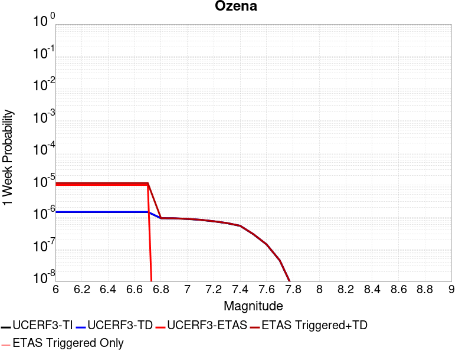 |  |  |  |

| Magnitude | 1 wk TI Prob | 1 wk TD Prob | 1 wk ETAS Prob | 1 wk ETAS/TD Gain | 1 wk ETAS Triggered+TD | 1 wk ETAS Triggered Only | 1 mo TI Prob | 1 mo TD Prob | 1 mo ETAS Prob | 1 mo ETAS/TD Gain | 1 mo ETAS Triggered+TD | 1 mo ETAS Triggered Only | 1 yr TI Prob | 1 yr TD Prob | 1 yr ETAS Prob | 1 yr ETAS/TD Gain | 1 yr ETAS Triggered+TD | 1 yr ETAS Triggered Only | 10 yr TI Prob | 10 yr TD Prob | 10 yr ETAS Prob | 10 yr ETAS/TD Gain | 10 yr ETAS Triggered+TD | 10 yr ETAS Triggered Only |
|-----|-----|-----|-----|-----|-----|-----|-----|-----|-----|-----|-----|-----|-----|-----|-----|-----|-----|-----|-----|-----|-----|-----|-----|-----|
| 6.0 | 1.4377547E-6 | 1.4513782E-6 | 1.0E-5 | 6.8900023 | 1.1451364E-5 | 1.0E-5 | 6.161791E-6 | 6.2201793E-6 | 2.0E-5 | 3.2153413 | 2.6220056E-5 | 2.0E-5 | 7.5017226E-5 | 7.572832E-5 | 7.0E-5 | 0.92435694 | 9.5726806E-5 | 2.0E-5 | 7.4991904E-4 | 7.570518E-4 | 4.1E-4 | 0.5415746 | 7.7703665E-4 | 2.0E-5 |
| 6.1 | 1.4377547E-6 | 1.4513782E-6 | 1.0E-5 | 6.8900023 | 1.1451364E-5 | 1.0E-5 | 6.161791E-6 | 6.2201793E-6 | 2.0E-5 | 3.2153413 | 2.6220056E-5 | 2.0E-5 | 7.5017226E-5 | 7.572832E-5 | 7.0E-5 | 0.92435694 | 9.5726806E-5 | 2.0E-5 | 7.4991904E-4 | 7.570518E-4 | 4.1E-4 | 0.5415746 | 7.7703665E-4 | 2.0E-5 |
| 6.2 | 1.4377547E-6 | 1.4513782E-6 | 1.0E-5 | 6.8900023 | 1.1451364E-5 | 1.0E-5 | 6.161791E-6 | 6.2201793E-6 | 2.0E-5 | 3.2153413 | 2.6220056E-5 | 2.0E-5 | 7.5017226E-5 | 7.572832E-5 | 7.0E-5 | 0.92435694 | 9.5726806E-5 | 2.0E-5 | 7.4991904E-4 | 7.570518E-4 | 4.1E-4 | 0.5415746 | 7.7703665E-4 | 2.0E-5 |
| 6.3 | 1.4377547E-6 | 1.4513782E-6 | 1.0E-5 | 6.8900023 | 1.1451364E-5 | 1.0E-5 | 6.161791E-6 | 6.2201793E-6 | 2.0E-5 | 3.2153413 | 2.6220056E-5 | 2.0E-5 | 7.5017226E-5 | 7.572832E-5 | 7.0E-5 | 0.92435694 | 9.5726806E-5 | 2.0E-5 | 7.4991904E-4 | 7.570518E-4 | 4.1E-4 | 0.5415746 | 7.7703665E-4 | 2.0E-5 |
| 6.4 | 1.4377547E-6 | 1.4513782E-6 | 1.0E-5 | 6.8900023 | 1.1451364E-5 | 1.0E-5 | 6.161791E-6 | 6.2201793E-6 | 2.0E-5 | 3.2153413 | 2.6220056E-5 | 2.0E-5 | 7.5017226E-5 | 7.572832E-5 | 7.0E-5 | 0.92435694 | 9.5726806E-5 | 2.0E-5 | 7.4991904E-4 | 7.570518E-4 | 4.1E-4 | 0.5415746 | 7.7703665E-4 | 2.0E-5 |
| 6.5 | 1.4377547E-6 | 1.4513782E-6 | 1.0E-5 | 6.8900023 | 1.1451364E-5 | 1.0E-5 | 6.161791E-6 | 6.2201793E-6 | 2.0E-5 | 3.2153413 | 2.6220056E-5 | 2.0E-5 | 7.5017226E-5 | 7.572832E-5 | 7.0E-5 | 0.92435694 | 9.5726806E-5 | 2.0E-5 | 7.4991904E-4 | 7.570518E-4 | 4.1E-4 | 0.5415746 | 7.7703665E-4 | 2.0E-5 |
| 6.6 | 1.4377547E-6 | 1.4513782E-6 | 1.0E-5 | 6.8900023 | 1.1451364E-5 | 1.0E-5 | 6.161791E-6 | 6.2201793E-6 | 2.0E-5 | 3.2153413 | 2.6220056E-5 | 2.0E-5 | 7.5017226E-5 | 7.572832E-5 | 7.0E-5 | 0.92435694 | 9.5726806E-5 | 2.0E-5 | 7.4991904E-4 | 7.570518E-4 | 4.1E-4 | 0.5415746 | 7.7703665E-4 | 2.0E-5 |
| 6.7 | 1.4377547E-6 | 1.4513782E-6 | 1.0E-5 | 6.8900023 | 1.1451364E-5 | 1.0E-5 | 6.161791E-6 | 6.2201793E-6 | 2.0E-5 | 3.2153413 | 2.6220056E-5 | 2.0E-5 | 7.5017226E-5 | 7.572832E-5 | 7.0E-5 | 0.92435694 | 9.5726806E-5 | 2.0E-5 | 7.4991904E-4 | 7.570518E-4 | 4.1E-4 | 0.5415746 | 7.7703665E-4 | 2.0E-5 |
| 6.8 | 9.223257E-7 | 9.317624E-7 | 0.0 | 0.0 | 9.317624E-7 | 0.0 | 3.9528186E-6 | 3.9932615E-6 | 0.0 | 0.0 | 3.9932615E-6 | 0.0 | 4.81245E-5 | 4.8616912E-5 | 2.0E-5 | 0.41137946 | 4.8616912E-5 | 0.0 | 4.811408E-4 | 4.860668E-4 | 2.1E-4 | 0.43203938 | 4.860668E-4 | 0.0 |
| 6.9 | 9.141515E-7 | 9.235371E-7 | 0.0 | 0.0 | 9.235371E-7 | 0.0 | 3.917786E-6 | 3.9580104E-6 | 0.0 | 0.0 | 3.9580104E-6 | 0.0 | 4.7698002E-5 | 4.818775E-5 | 2.0E-5 | 0.41504323 | 4.818775E-5 | 0.0 | 4.7687767E-4 | 4.8177704E-4 | 2.1E-4 | 0.43588626 | 4.8177704E-4 | 0.0 |
| 7.0 | 8.767648E-7 | 8.8585773E-7 | 0.0 | 0.0 | 8.8585773E-7 | 0.0 | 3.757558E-6 | 3.7965276E-6 | 0.0 | 0.0 | 3.7965276E-6 | 0.0 | 4.5747307E-5 | 4.6221783E-5 | 2.0E-5 | 0.4326964 | 4.6221783E-5 | 0.0 | 4.5737892E-4 | 4.6212564E-4 | 2.0E-4 | 0.43278274 | 4.6212564E-4 | 0.0 |
| 7.1 | 8.199402E-7 | 8.2853984E-7 | 0.0 | 0.0 | 8.2853984E-7 | 0.0 | 3.5140247E-6 | 3.5508804E-6 | 0.0 | 0.0 | 3.5508804E-6 | 0.0 | 4.2782412E-5 | 4.323115E-5 | 2.0E-5 | 0.46262938 | 4.323115E-5 | 0.0 | 4.2774176E-4 | 4.322311E-4 | 2.0E-4 | 0.46271542 | 4.322311E-4 | 0.0 |
| 7.2 | 7.38705E-7 | 7.464262E-7 | 0.0 | 0.0 | 7.464262E-7 | 0.0 | 3.1658747E-6 | 3.198966E-6 | 0.0 | 0.0 | 3.198966E-6 | 0.0 | 3.8543843E-5 | 3.894675E-5 | 2.0E-5 | 0.5135217 | 3.894675E-5 | 0.0 | 3.853716E-4 | 3.8940276E-4 | 2.0E-4 | 0.5136071 | 3.8940276E-4 | 0.0 |
| 7.3 | 6.490017E-7 | 6.557802E-7 | 0.0 | 0.0 | 6.557802E-7 | 0.0 | 2.7814328E-6 | 2.8104837E-6 | 0.0 | 0.0 | 2.8104837E-6 | 0.0 | 3.386342E-5 | 3.4217133E-5 | 2.0E-5 | 0.58450246 | 3.4217133E-5 | 0.0 | 3.3858258E-4 | 3.4212202E-4 | 1.8E-4 | 0.52612805 | 3.4212202E-4 | 0.0 |
| 7.4 | 5.346736E-7 | 5.4022604E-7 | 0.0 | 0.0 | 5.4022604E-7 | 0.0 | 2.291456E-6 | 2.3152527E-6 | 0.0 | 0.0 | 2.3152527E-6 | 0.0 | 2.789812E-5 | 2.8187867E-5 | 1.0E-5 | 0.35476255 | 2.8187867E-5 | 0.0 | 2.789462E-4 | 2.8184598E-4 | 1.6E-4 | 0.56768596 | 2.8184598E-4 | 0.0 |
| 7.5 | 2.939325E-7 | 2.9666057E-7 | 0.0 | 0.0 | 2.9666057E-7 | 0.0 | 1.25971E-6 | 1.271402E-6 | 0.0 | 0.0 | 1.271402E-6 | 0.0 | 1.5336862E-5 | 1.5479225E-5 | 1.0E-5 | 0.64602715 | 1.5479225E-5 | 0.0 | 1.5335804E-4 | 1.5478309E-4 | 8.0E-5 | 0.5168523 | 1.5478309E-4 | 0.0 |
| 7.6 | 1.4151905E-7 | 1.4253266E-7 | 0.0 | 0.0 | 1.4253266E-7 | 0.0 | 6.065101E-7 | 6.108541E-7 | 0.0 | 0.0 | 6.108541E-7 | 0.0 | 7.3842357E-6 | 7.4371237E-6 | 1.0E-5 | 1.3446058 | 7.4371237E-6 | 0.0 | 7.38399E-5 | 7.436883E-5 | 4.0E-5 | 0.5378598 | 7.436883E-5 | 0.0 |
| 7.7 | 4.4957577E-8 | 4.5252243E-8 | 0.0 | 0.0 | 4.5252243E-8 | 0.0 | 1.9267533E-7 | 1.9393818E-7 | 0.0 | 0.0 | 1.9393818E-7 | 0.0 | 2.3458194E-6 | 2.3611947E-6 | 0.0 | 0.0 | 2.3611947E-6 | 0.0 | 2.3457947E-5 | 2.3611707E-5 | 2.0E-5 | 0.8470375 | 2.3611707E-5 | 0.0 |
| 7.8 | 5.9993255E-9 | 6.0412972E-9 | 0.0 | 0.0 | 6.0412972E-9 | 0.0 | 2.5711394E-8 | 2.5891273E-8 | 0.0 | 0.0 | 2.5891273E-8 | 0.0 | 3.1303617E-7 | 3.1522623E-7 | 0.0 | 0.0 | 3.1522623E-7 | 0.0 | 3.1303573E-6 | 3.1522588E-6 | 1.0E-5 | 3.1723282 | 3.1522588E-6 | 0.0 |

## Elsinore (Coyote Mountains)
*[(top)](#table-of-contents)*

| 1 Week | 1 Month | 1 Year | 10 Year |
|-----|-----|-----|-----|
|  |  |  |  |

| Magnitude | 1 wk TI Prob | 1 wk TD Prob | 1 wk ETAS Prob | 1 wk ETAS/TD Gain | 1 wk ETAS Triggered+TD | 1 wk ETAS Triggered Only | 1 mo TI Prob | 1 mo TD Prob | 1 mo ETAS Prob | 1 mo ETAS/TD Gain | 1 mo ETAS Triggered+TD | 1 mo ETAS Triggered Only | 1 yr TI Prob | 1 yr TD Prob | 1 yr ETAS Prob | 1 yr ETAS/TD Gain | 1 yr ETAS Triggered+TD | 1 yr ETAS Triggered Only | 10 yr TI Prob | 10 yr TD Prob | 10 yr ETAS Prob | 10 yr ETAS/TD Gain | 10 yr ETAS Triggered+TD | 10 yr ETAS Triggered Only |
|-----|-----|-----|-----|-----|-----|-----|-----|-----|-----|-----|-----|-----|-----|-----|-----|-----|-----|-----|-----|-----|-----|-----|-----|-----|
| 6.0 | 4.20513E-5 | 4.8630944E-5 | 3.0E-5 | 0.6168912 | 4.8630944E-5 | 0.0 | 1.8020741E-4 | 2.0840492E-4 | 1.1E-4 | 0.5278186 | 2.0840492E-4 | 0.0 | 0.0021918174 | 0.0025349057 | 0.0013 | 0.51283956 | 0.0025448804 | 1.0E-5 | 0.021703249 | 0.025111204 | 0.0128 | 0.50973266 | 0.0251307 | 2.0E-5 |
| 6.1 | 4.20513E-5 | 4.8630944E-5 | 3.0E-5 | 0.6168912 | 4.8630944E-5 | 0.0 | 1.8020741E-4 | 2.0840492E-4 | 1.1E-4 | 0.5278186 | 2.0840492E-4 | 0.0 | 0.0021918174 | 0.0025349057 | 0.0013 | 0.51283956 | 0.0025448804 | 1.0E-5 | 0.021703249 | 0.025111204 | 0.0128 | 0.50973266 | 0.0251307 | 2.0E-5 |
| 6.2 | 2.3413893E-5 | 2.4695422E-5 | 1.0E-5 | 0.40493333 | 2.4695422E-5 | 0.0 | 1.0034139E-4 | 1.0583377E-4 | 3.0E-5 | 0.2834634 | 1.0583377E-4 | 0.0 | 0.0012209718 | 0.0012878523 | 5.8E-4 | 0.45036224 | 0.0012878523 | 0.0 | 0.012142851 | 0.012812569 | 0.00662 | 0.5166802 | 0.012812569 | 0.0 |
| 6.3 | 2.3413893E-5 | 2.4695422E-5 | 1.0E-5 | 0.40493333 | 2.4695422E-5 | 0.0 | 1.0034139E-4 | 1.0583377E-4 | 3.0E-5 | 0.2834634 | 1.0583377E-4 | 0.0 | 0.0012209718 | 0.0012878523 | 5.8E-4 | 0.45036224 | 0.0012878523 | 0.0 | 0.012142851 | 0.012812569 | 0.00662 | 0.5166802 | 0.012812569 | 0.0 |
| 6.4 | 1.6894814E-5 | 1.6568214E-5 | 0.0 | 0.0 | 1.6568214E-5 | 0.0 | 7.240433E-5 | 7.100491E-5 | 2.0E-5 | 0.28167063 | 7.100491E-5 | 0.0 | 8.811662E-4 | 8.641788E-4 | 3.9E-4 | 0.4512955 | 8.641788E-4 | 0.0 | 0.0087768035 | 0.008611842 | 0.00439 | 0.5097632 | 0.008611842 | 0.0 |
| 6.5 | 1.6894814E-5 | 1.6568214E-5 | 0.0 | 0.0 | 1.6568214E-5 | 0.0 | 7.240433E-5 | 7.100491E-5 | 2.0E-5 | 0.28167063 | 7.100491E-5 | 0.0 | 8.811662E-4 | 8.641788E-4 | 3.9E-4 | 0.4512955 | 8.641788E-4 | 0.0 | 0.0087768035 | 0.008611842 | 0.00439 | 0.5097632 | 0.008611842 | 0.0 |
| 6.6 | 1.1910969E-5 | 1.0530538E-5 | 0.0 | 0.0 | 1.0530538E-5 | 0.0 | 5.1046012E-5 | 4.513017E-5 | 1.0E-5 | 0.22158125 | 4.513017E-5 | 0.0 | 6.21308E-4 | 5.493346E-4 | 2.3E-4 | 0.41868833 | 5.493346E-4 | 0.0 | 0.0061957375 | 0.0054810685 | 0.00299 | 0.5455141 | 0.0054810685 | 0.0 |
| 6.7 | 9.1486E-6 | 7.2026473E-6 | 0.0 | 0.0 | 7.2026473E-6 | 0.0 | 3.9207694E-5 | 3.0868145E-5 | 0.0 | 0.0 | 3.0868145E-5 | 0.0 | 4.7724912E-4 | 3.7575865E-4 | 1.4E-4 | 0.37257957 | 3.7575865E-4 | 0.0 | 0.0047622547 | 0.0037516125 | 0.00204 | 0.5437662 | 0.0037516125 | 0.0 |
| 6.8 | 7.90441E-6 | 5.7288153E-6 | 0.0 | 0.0 | 5.7288153E-6 | 0.0 | 3.3875604E-5 | 2.4551842E-5 | 0.0 | 0.0 | 2.4551842E-5 | 0.0 | 4.1235742E-4 | 2.9887896E-4 | 1.1E-4 | 0.36804196 | 2.9887896E-4 | 0.0 | 0.0041159308 | 0.0029848986 | 0.00164 | 0.5494324 | 0.0029848986 | 0.0 |
| 6.9 | 7.77015E-6 | 5.5827695E-6 | 0.0 | 0.0 | 5.5827695E-6 | 0.0 | 3.3300217E-5 | 2.3925944E-5 | 0.0 | 0.0 | 2.3925944E-5 | 0.0 | 4.0535472E-4 | 2.912607E-4 | 1.0E-4 | 0.34333503 | 2.912607E-4 | 0.0 | 0.004046161 | 0.0029089167 | 0.0016 | 0.550033 | 0.0029089167 | 0.0 |
| 7.0 | 7.675798E-6 | 5.4796283E-6 | 0.0 | 0.0 | 5.4796283E-6 | 0.0 | 3.289586E-5 | 2.3483917E-5 | 0.0 | 0.0 | 2.3483917E-5 | 0.0 | 4.004335E-4 | 2.8588044E-4 | 1.0E-4 | 0.3497966 | 2.8588044E-4 | 0.0 | 0.003997127 | 0.0028552532 | 0.00158 | 0.55336595 | 0.0028552532 | 0.0 |
| 7.1 | 7.447814E-6 | 5.2385003E-6 | 0.0 | 0.0 | 5.2385003E-6 | 0.0 | 3.191881E-5 | 2.245053E-5 | 0.0 | 0.0 | 2.245053E-5 | 0.0 | 3.8854225E-4 | 2.7330214E-4 | 1.0E-4 | 0.36589542 | 2.7330214E-4 | 0.0 | 0.003878636 | 0.0027297847 | 0.00153 | 0.56048375 | 0.0027297847 | 0.0 |
| 7.2 | 7.128185E-6 | 4.905146E-6 | 0.0 | 0.0 | 4.905146E-6 | 0.0 | 3.0549007E-5 | 2.1021891E-5 | 0.0 | 0.0 | 2.1021891E-5 | 0.0 | 3.7187067E-4 | 2.5591266E-4 | 9.0E-5 | 0.35168248 | 2.5591266E-4 | 0.0 | 0.00371249 | 0.002556298 | 0.0014 | 0.54766697 | 0.002556298 | 0.0 |
| 7.3 | 7.0913875E-6 | 4.873821E-6 | 0.0 | 0.0 | 4.873821E-6 | 0.0 | 3.0391306E-5 | 2.0887644E-5 | 0.0 | 0.0 | 2.0887644E-5 | 0.0 | 3.6995133E-4 | 2.542786E-4 | 9.0E-5 | 0.3539425 | 2.542786E-4 | 0.0 | 0.0036933604 | 0.0025399947 | 0.0014 | 0.55118227 | 0.0025399947 | 0.0 |
| 7.4 | 7.051521E-6 | 4.837673E-6 | 0.0 | 0.0 | 4.837673E-6 | 0.0 | 3.0220453E-5 | 2.0732725E-5 | 0.0 | 0.0 | 2.0732725E-5 | 0.0 | 3.6787192E-4 | 2.5239287E-4 | 9.0E-5 | 0.35658693 | 2.5239287E-4 | 0.0 | 0.0036726352 | 0.0025211805 | 0.00139 | 0.551329 | 0.0025211805 | 0.0 |
| 7.5 | 6.910666E-6 | 4.7332255E-6 | 0.0 | 0.0 | 4.7332255E-6 | 0.0 | 2.9616802E-5 | 2.02851E-5 | 0.0 | 0.0 | 2.02851E-5 | 0.0 | 3.605249E-4 | 2.4694428E-4 | 9.0E-5 | 0.36445466 | 2.4694428E-4 | 0.0 | 0.0035994058 | 0.002466817 | 0.00137 | 0.5553716 | 0.002466817 | 0.0 |
| 7.6 | 6.341753E-6 | 4.306345E-6 | 0.0 | 0.0 | 4.306345E-6 | 0.0 | 2.7178658E-5 | 1.8455641E-5 | 0.0 | 0.0 | 1.8455641E-5 | 0.0 | 3.3084993E-4 | 2.2467543E-4 | 9.0E-5 | 0.40057784 | 2.2467543E-4 | 0.0 | 0.0033035777 | 0.002244598 | 0.0013 | 0.5791683 | 0.002244598 | 0.0 |
| 7.7 | 3.9205916E-6 | 2.2437468E-6 | 0.0 | 0.0 | 2.2437468E-6 | 0.0 | 1.6802427E-5 | 9.616027E-6 | 0.0 | 0.0 | 9.616027E-6 | 0.0 | 2.0455034E-4 | 1.17069576E-4 | 5.0E-5 | 0.42709646 | 1.17069576E-4 | 0.0 | 0.0020436216 | 0.001170152 | 7.4E-4 | 0.63239646 | 0.001170152 | 0.0 |
| 7.8 | 2.0846227E-7 | 8.4853966E-8 | 0.0 | 0.0 | 8.4853966E-8 | 0.0 | 8.9340944E-7 | 3.6365984E-7 | 0.0 | 0.0 | 3.6365984E-7 | 0.0 | 1.0877206E-5 | 4.427553E-6 | 1.0E-5 | 2.258584 | 4.427553E-6 | 0.0 | 1.0876673E-4 | 4.4274973E-5 | 2.0E-5 | 0.45172247 | 4.4274973E-5 | 0.0 |
| 7.9 | 4.4969806E-9 | 2.269088E-9 | 0.0 | 0.0 | 2.269088E-9 | 0.0 | 1.9272775E-8 | 9.724664E-9 | 0.0 | 0.0 | 9.724664E-9 | 0.0 | 2.3464601E-7 | 1.1839777E-7 | 0.0 | 0.0 | 1.1839777E-7 | 0.0 | 2.3464577E-6 | 1.1839772E-6 | 0.0 | 0.0 | 1.1839772E-6 | 0.0 |

## Burnt Mtn
*[(top)](#table-of-contents)*

| 1 Week | 1 Month | 1 Year | 10 Year |
|-----|-----|-----|-----|
|  |  |  |  |

| Magnitude | 1 wk TI Prob | 1 wk TD Prob | 1 wk ETAS Prob | 1 wk ETAS/TD Gain | 1 wk ETAS Triggered+TD | 1 wk ETAS Triggered Only | 1 mo TI Prob | 1 mo TD Prob | 1 mo ETAS Prob | 1 mo ETAS/TD Gain | 1 mo ETAS Triggered+TD | 1 mo ETAS Triggered Only | 1 yr TI Prob | 1 yr TD Prob | 1 yr ETAS Prob | 1 yr ETAS/TD Gain | 1 yr ETAS Triggered+TD | 1 yr ETAS Triggered Only | 10 yr TI Prob | 10 yr TD Prob | 10 yr ETAS Prob | 10 yr ETAS/TD Gain | 10 yr ETAS Triggered+TD | 10 yr ETAS Triggered Only |
|-----|-----|-----|-----|-----|-----|-----|-----|-----|-----|-----|-----|-----|-----|-----|-----|-----|-----|-----|-----|-----|-----|-----|-----|-----|
| 6.0 | 1.5673151E-5 | 1.1749247E-5 | 1.0E-5 | 0.8511184 | 1.1749247E-5 | 0.0 | 6.716892E-5 | 5.0353672E-5 | 1.0E-5 | 0.19859526 | 5.0353672E-5 | 0.0 | 8.1747473E-4 | 6.130124E-4 | 3.4E-4 | 0.554638 | 6.2300626E-4 | 1.0E-5 | 0.008144741 | 0.006125855 | 0.00368 | 0.6007325 | 0.006145732 | 2.0E-5 |
| 6.1 | 1.5673151E-5 | 1.1749247E-5 | 1.0E-5 | 0.8511184 | 1.1749247E-5 | 0.0 | 6.716892E-5 | 5.0353672E-5 | 1.0E-5 | 0.19859526 | 5.0353672E-5 | 0.0 | 8.1747473E-4 | 6.130124E-4 | 3.4E-4 | 0.554638 | 6.2300626E-4 | 1.0E-5 | 0.008144741 | 0.006125855 | 0.00368 | 0.6007325 | 0.006145732 | 2.0E-5 |
| 6.2 | 1.5673151E-5 | 1.1749247E-5 | 1.0E-5 | 0.8511184 | 1.1749247E-5 | 0.0 | 6.716892E-5 | 5.0353672E-5 | 1.0E-5 | 0.19859526 | 5.0353672E-5 | 0.0 | 8.1747473E-4 | 6.130124E-4 | 3.4E-4 | 0.554638 | 6.2300626E-4 | 1.0E-5 | 0.008144741 | 0.006125855 | 0.00368 | 0.6007325 | 0.006145732 | 2.0E-5 |
| 6.3 | 1.5673151E-5 | 1.1749247E-5 | 1.0E-5 | 0.8511184 | 1.1749247E-5 | 0.0 | 6.716892E-5 | 5.0353672E-5 | 1.0E-5 | 0.19859526 | 5.0353672E-5 | 0.0 | 8.1747473E-4 | 6.130124E-4 | 3.4E-4 | 0.554638 | 6.2300626E-4 | 1.0E-5 | 0.008144741 | 0.006125855 | 0.00368 | 0.6007325 | 0.006145732 | 2.0E-5 |
| 6.4 | 1.5673151E-5 | 1.1749247E-5 | 1.0E-5 | 0.8511184 | 1.1749247E-5 | 0.0 | 6.716892E-5 | 5.0353672E-5 | 1.0E-5 | 0.19859526 | 5.0353672E-5 | 0.0 | 8.1747473E-4 | 6.130124E-4 | 3.4E-4 | 0.554638 | 6.2300626E-4 | 1.0E-5 | 0.008144741 | 0.006125855 | 0.00368 | 0.6007325 | 0.006145732 | 2.0E-5 |
| 6.5 | 1.36191375E-5 | 1.007816E-5 | 1.0E-5 | 0.99224466 | 1.007816E-5 | 0.0 | 5.8366426E-5 | 4.319211E-5 | 1.0E-5 | 0.23152375 | 4.319211E-5 | 0.0 | 7.103795E-4 | 5.2586396E-4 | 3.2E-4 | 0.6085224 | 5.358587E-4 | 1.0E-5 | 0.0070811296 | 0.00525864 | 0.00331 | 0.62944037 | 0.0052785343 | 2.0E-5 |

## Gillem - Big Crack 2011 CFM
*[(top)](#table-of-contents)*

| 1 Week | 1 Month | 1 Year | 10 Year |
|-----|-----|-----|-----|
|  |  |  |  |

| Magnitude | 1 wk TI Prob | 1 wk TD Prob | 1 wk ETAS Prob | 1 wk ETAS/TD Gain | 1 wk ETAS Triggered+TD | 1 wk ETAS Triggered Only | 1 mo TI Prob | 1 mo TD Prob | 1 mo ETAS Prob | 1 mo ETAS/TD Gain | 1 mo ETAS Triggered+TD | 1 mo ETAS Triggered Only | 1 yr TI Prob | 1 yr TD Prob | 1 yr ETAS Prob | 1 yr ETAS/TD Gain | 1 yr ETAS Triggered+TD | 1 yr ETAS Triggered Only | 10 yr TI Prob | 10 yr TD Prob | 10 yr ETAS Prob | 10 yr ETAS/TD Gain | 10 yr ETAS Triggered+TD | 10 yr ETAS Triggered Only |
|-----|-----|-----|-----|-----|-----|-----|-----|-----|-----|-----|-----|-----|-----|-----|-----|-----|-----|-----|-----|-----|-----|-----|-----|-----|
| 6.0 | 2.196852E-5 | 2.3604485E-5 | 2.0E-5 | 0.8472966 | 3.360425E-5 | 1.0E-5 | 9.4147406E-5 | 1.01158665E-4 | 7.0E-5 | 0.69198227 | 1.1115765E-4 | 1.0E-5 | 0.0011456419 | 0.0012309998 | 6.6E-4 | 0.53614956 | 0.0012409874 | 1.0E-5 | 0.011397537 | 0.012250669 | 0.00682 | 0.5567043 | 0.012260547 | 1.0E-5 |
| 6.1 | 9.992795E-6 | 1.071189E-5 | 1.0E-5 | 0.9335421 | 2.0711783E-5 | 1.0E-5 | 4.2825563E-5 | 4.5907396E-5 | 4.0E-5 | 0.8713193 | 5.5906938E-5 | 1.0E-5 | 5.2127644E-4 | 5.587975E-4 | 3.2E-4 | 0.57265824 | 5.6879193E-4 | 1.0E-5 | 0.0052005537 | 0.0055757347 | 0.00339 | 0.60799164 | 0.005585679 | 1.0E-5 |
| 6.2 | 9.992795E-6 | 1.071189E-5 | 1.0E-5 | 0.9335421 | 2.0711783E-5 | 1.0E-5 | 4.2825563E-5 | 4.5907396E-5 | 4.0E-5 | 0.8713193 | 5.5906938E-5 | 1.0E-5 | 5.2127644E-4 | 5.587975E-4 | 3.2E-4 | 0.57265824 | 5.6879193E-4 | 1.0E-5 | 0.0052005537 | 0.0055757347 | 0.00339 | 0.60799164 | 0.005585679 | 1.0E-5 |
| 6.3 | 4.6127884E-6 | 4.942657E-6 | 0.0 | 0.0 | 4.942657E-6 | 0.0 | 1.9768944E-5 | 2.1182668E-5 | 1.0E-5 | 0.47208405 | 2.1182668E-5 | 0.0 | 2.406603E-4 | 2.5787292E-4 | 1.6E-4 | 0.6204606 | 2.5787292E-4 | 0.0 | 0.0024039985 | 0.0025761751 | 0.00168 | 0.6521296 | 0.0025761751 | 0.0 |
| 6.4 | 4.6127884E-6 | 4.942657E-6 | 0.0 | 0.0 | 4.942657E-6 | 0.0 | 1.9768944E-5 | 2.1182668E-5 | 1.0E-5 | 0.47208405 | 2.1182668E-5 | 0.0 | 2.406603E-4 | 2.5787292E-4 | 1.6E-4 | 0.6204606 | 2.5787292E-4 | 0.0 | 0.0024039985 | 0.0025761751 | 0.00168 | 0.6521296 | 0.0025761751 | 0.0 |
| 6.5 | 2.716712E-6 | 2.9111113E-6 | 0.0 | 0.0 | 2.9111113E-6 | 0.0 | 1.1643E-5 | 1.24761455E-5 | 1.0E-5 | 0.8015296 | 1.24761455E-5 | 0.0 | 1.417443E-4 | 1.5188892E-4 | 6.0E-5 | 0.39502555 | 1.5188892E-4 | 0.0 | 0.0014165393 | 0.001518089 | 9.6E-4 | 0.632374 | 0.001518089 | 0.0 |
| 6.6 | 1.3818255E-6 | 1.4820689E-6 | 0.0 | 0.0 | 1.4820689E-6 | 0.0 | 5.922096E-6 | 6.3517155E-6 | 0.0 | 0.0 | 6.3517155E-6 | 0.0 | 7.209913E-5 | 7.7330624E-5 | 2.0E-5 | 0.25862974 | 7.7330624E-5 | 0.0 | 7.2075747E-4 | 7.7315804E-4 | 5.0E-4 | 0.6466983 | 7.7315804E-4 | 0.0 |

## Thirty Mile Bank
*[(top)](#table-of-contents)*

| 1 Week | 1 Month | 1 Year | 10 Year |
|-----|-----|-----|-----|
|  |  |  |  |

| Magnitude | 1 wk TI Prob | 1 wk TD Prob | 1 wk ETAS Prob | 1 wk ETAS/TD Gain | 1 wk ETAS Triggered+TD | 1 wk ETAS Triggered Only | 1 mo TI Prob | 1 mo TD Prob | 1 mo ETAS Prob | 1 mo ETAS/TD Gain | 1 mo ETAS Triggered+TD | 1 mo ETAS Triggered Only | 1 yr TI Prob | 1 yr TD Prob | 1 yr ETAS Prob | 1 yr ETAS/TD Gain | 1 yr ETAS Triggered+TD | 1 yr ETAS Triggered Only | 10 yr TI Prob | 10 yr TD Prob | 10 yr ETAS Prob | 10 yr ETAS/TD Gain | 10 yr ETAS Triggered+TD | 10 yr ETAS Triggered Only |
|-----|-----|-----|-----|-----|-----|-----|-----|-----|-----|-----|-----|-----|-----|-----|-----|-----|-----|-----|-----|-----|-----|-----|-----|-----|
| 6.0 | 6.5124755E-6 | 6.6592643E-6 | 1.0E-5 | 1.5016674 | 6.6592643E-6 | 0.0 | 2.791031E-5 | 2.8539416E-5 | 3.0E-5 | 1.0511777 | 3.8539132E-5 | 1.0E-5 | 3.3975503E-4 | 3.4741635E-4 | 2.0E-4 | 0.5756781 | 3.5741288E-4 | 1.0E-5 | 0.0033923604 | 0.003469164 | 0.00216 | 0.6226284 | 0.0034791294 | 1.0E-5 |
| 6.1 | 6.5124755E-6 | 6.6592643E-6 | 1.0E-5 | 1.5016674 | 6.6592643E-6 | 0.0 | 2.791031E-5 | 2.8539416E-5 | 3.0E-5 | 1.0511777 | 3.8539132E-5 | 1.0E-5 | 3.3975503E-4 | 3.4741635E-4 | 2.0E-4 | 0.5756781 | 3.5741288E-4 | 1.0E-5 | 0.0033923604 | 0.003469164 | 0.00216 | 0.6226284 | 0.0034791294 | 1.0E-5 |
| 6.2 | 6.5124755E-6 | 6.6592643E-6 | 1.0E-5 | 1.5016674 | 6.6592643E-6 | 0.0 | 2.791031E-5 | 2.8539416E-5 | 3.0E-5 | 1.0511777 | 3.8539132E-5 | 1.0E-5 | 3.3975503E-4 | 3.4741635E-4 | 2.0E-4 | 0.5756781 | 3.5741288E-4 | 1.0E-5 | 0.0033923604 | 0.003469164 | 0.00216 | 0.6226284 | 0.0034791294 | 1.0E-5 |
| 6.3 | 6.5124755E-6 | 6.6592643E-6 | 1.0E-5 | 1.5016674 | 6.6592643E-6 | 0.0 | 2.791031E-5 | 2.8539416E-5 | 3.0E-5 | 1.0511777 | 3.8539132E-5 | 1.0E-5 | 3.3975503E-4 | 3.4741635E-4 | 2.0E-4 | 0.5756781 | 3.5741288E-4 | 1.0E-5 | 0.0033923604 | 0.003469164 | 0.00216 | 0.6226284 | 0.0034791294 | 1.0E-5 |
| 6.4 | 6.5124755E-6 | 6.6592643E-6 | 1.0E-5 | 1.5016674 | 6.6592643E-6 | 0.0 | 2.791031E-5 | 2.8539416E-5 | 3.0E-5 | 1.0511777 | 3.8539132E-5 | 1.0E-5 | 3.3975503E-4 | 3.4741635E-4 | 2.0E-4 | 0.5756781 | 3.5741288E-4 | 1.0E-5 | 0.0033923604 | 0.003469164 | 0.00216 | 0.6226284 | 0.0034791294 | 1.0E-5 |
| 6.5 | 6.5124755E-6 | 6.6592643E-6 | 1.0E-5 | 1.5016674 | 6.6592643E-6 | 0.0 | 2.791031E-5 | 2.8539416E-5 | 3.0E-5 | 1.0511777 | 3.8539132E-5 | 1.0E-5 | 3.3975503E-4 | 3.4741635E-4 | 2.0E-4 | 0.5756781 | 3.5741288E-4 | 1.0E-5 | 0.0033923604 | 0.003469164 | 0.00216 | 0.6226284 | 0.0034791294 | 1.0E-5 |
| 6.6 | 6.5124755E-6 | 6.6592643E-6 | 1.0E-5 | 1.5016674 | 6.6592643E-6 | 0.0 | 2.791031E-5 | 2.8539416E-5 | 3.0E-5 | 1.0511777 | 3.8539132E-5 | 1.0E-5 | 3.3975503E-4 | 3.4741635E-4 | 2.0E-4 | 0.5756781 | 3.5741288E-4 | 1.0E-5 | 0.0033923604 | 0.003469164 | 0.00216 | 0.6226284 | 0.0034791294 | 1.0E-5 |
| 6.7 | 3.5261137E-6 | 3.6098995E-6 | 0.0 | 0.0 | 3.6098995E-6 | 0.0 | 1.5111828E-5 | 1.547091E-5 | 2.0E-5 | 1.2927488 | 2.5470756E-5 | 1.0E-5 | 1.8397097E-4 | 1.883427E-4 | 9.0E-5 | 0.4778523 | 1.9834083E-4 | 1.0E-5 | 0.0018381875 | 0.0018818958 | 0.00104 | 0.5526342 | 0.001891877 | 1.0E-5 |
| 6.8 | 3.370743E-6 | 3.4509355E-6 | 0.0 | 0.0 | 3.4509355E-6 | 0.0 | 1.4445961E-5 | 1.47896435E-5 | 2.0E-5 | 1.3522977 | 2.4789495E-5 | 1.0E-5 | 1.7586538E-4 | 1.8004965E-4 | 9.0E-5 | 0.4998621 | 1.9004785E-4 | 1.0E-5 | 0.0017572626 | 0.0017990996 | 9.6E-4 | 0.5336003 | 0.0018090816 | 1.0E-5 |
| 6.9 | 2.2756835E-6 | 2.333161E-6 | 0.0 | 0.0 | 2.333161E-6 | 0.0 | 9.752893E-6 | 9.999225E-6 | 1.0E-5 | 1.0000775 | 9.999225E-6 | 0.0 | 1.18735006E-4 | 1.2173401E-4 | 5.0E-5 | 0.41073155 | 1.2173401E-4 | 0.0 | 0.0011867158 | 0.0012166979 | 5.7E-4 | 0.46848112 | 0.0012166979 | 0.0 |
| 7.0 | 2.1617404E-6 | 2.21598E-6 | 0.0 | 0.0 | 2.21598E-6 | 0.0 | 9.264569E-6 | 9.497024E-6 | 1.0E-5 | 1.0529615 | 9.497024E-6 | 0.0 | 1.1279029E-4 | 1.1562037E-4 | 3.0E-5 | 0.25946984 | 1.1562037E-4 | 0.0 | 0.0011273306 | 0.0011556263 | 5.1E-4 | 0.44131914 | 0.0011556263 | 0.0 |
| 7.1 | 1.5900777E-6 | 1.6327014E-6 | 0.0 | 0.0 | 1.6327014E-6 | 0.0 | 6.814601E-6 | 6.997274E-6 | 0.0 | 0.0 | 6.997274E-6 | 0.0 | 8.296461E-5 | 8.518861E-5 | 1.0E-5 | 0.117386594 | 8.518861E-5 | 0.0 | 8.293364E-4 | 8.5157226E-4 | 4.0E-4 | 0.46971938 | 8.5157226E-4 | 0.0 |
| 7.2 | 1.2971728E-6 | 1.3328992E-6 | 0.0 | 0.0 | 1.3328992E-6 | 0.0 | 5.5593005E-6 | 5.712413E-6 | 0.0 | 0.0 | 5.712413E-6 | 0.0 | 6.768238E-5 | 6.954651E-5 | 1.0E-5 | 0.14378867 | 6.954651E-5 | 0.0 | 6.7661767E-4 | 6.952578E-4 | 3.3E-4 | 0.47464406 | 6.952578E-4 | 0.0 |
| 7.3 | 8.2454284E-7 | 8.448891E-7 | 0.0 | 0.0 | 8.448891E-7 | 0.0 | 3.5337503E-6 | 3.6209485E-6 | 0.0 | 0.0 | 3.6209485E-6 | 0.0 | 4.302256E-5 | 4.408422E-5 | 1.0E-5 | 0.22683854 | 4.408422E-5 | 0.0 | 4.301423E-4 | 4.4076078E-4 | 2.1E-4 | 0.47644892 | 4.4076078E-4 | 0.0 |
| 7.4 | 4.2619024E-7 | 4.3863466E-7 | 0.0 | 0.0 | 4.3863466E-7 | 0.0 | 1.8265283E-6 | 1.8798615E-6 | 0.0 | 0.0 | 1.8798615E-6 | 0.0 | 2.2237757E-5 | 2.2887078E-5 | 0.0 | 0.0 | 2.2887078E-5 | 0.0 | 2.223553E-4 | 2.288476E-4 | 1.4E-4 | 0.61176085 | 2.288476E-4 | 0.0 |
| 7.5 | 2.993922E-7 | 3.086453E-7 | 0.0 | 0.0 | 3.086453E-7 | 0.0 | 1.2831089E-6 | 1.3227649E-6 | 0.0 | 0.0 | 1.3227649E-6 | 0.0 | 1.5621737E-5 | 1.6104546E-5 | 0.0 | 0.0 | 1.6104546E-5 | 0.0 | 1.562064E-4 | 1.6103406E-4 | 1.1E-4 | 0.6830853 | 1.6103406E-4 | 0.0 |
| 7.6 | 1.6988751E-7 | 1.7533823E-7 | 0.0 | 0.0 | 1.7533823E-7 | 0.0 | 7.2808916E-7 | 7.5144936E-7 | 0.0 | 0.0 | 7.5144936E-7 | 0.0 | 8.864449E-6 | 9.14886E-6 | 0.0 | 0.0 | 9.14886E-6 | 0.0 | 8.8640954E-5 | 9.1485024E-5 | 7.0E-5 | 0.7651525 | 9.1485024E-5 | 0.0 |

## Morales (East)
*[(top)](#table-of-contents)*

| 1 Week | 1 Month | 1 Year | 10 Year |
|-----|-----|-----|-----|
|  |  |  |  |

| Magnitude | 1 wk TI Prob | 1 wk TD Prob | 1 wk ETAS Prob | 1 wk ETAS/TD Gain | 1 wk ETAS Triggered+TD | 1 wk ETAS Triggered Only | 1 mo TI Prob | 1 mo TD Prob | 1 mo ETAS Prob | 1 mo ETAS/TD Gain | 1 mo ETAS Triggered+TD | 1 mo ETAS Triggered Only | 1 yr TI Prob | 1 yr TD Prob | 1 yr ETAS Prob | 1 yr ETAS/TD Gain | 1 yr ETAS Triggered+TD | 1 yr ETAS Triggered Only | 10 yr TI Prob | 10 yr TD Prob | 10 yr ETAS Prob | 10 yr ETAS/TD Gain | 10 yr ETAS Triggered+TD | 10 yr ETAS Triggered Only |
|-----|-----|-----|-----|-----|-----|-----|-----|-----|-----|-----|-----|-----|-----|-----|-----|-----|-----|-----|-----|-----|-----|-----|-----|-----|
| 6.0 | 1.4942771E-6 | 2.123544E-6 | 0.0 | 0.0 | 2.123544E-6 | 0.0 | 6.404029E-6 | 9.100874E-6 | 0.0 | 0.0 | 9.100874E-6 | 0.0 | 7.7966266E-5 | 1.1079809E-4 | 9.0E-5 | 0.81228834 | 1.1079809E-4 | 0.0 | 7.793892E-4 | 0.0011074883 | 0.00152 | 1.372475 | 0.0011174772 | 1.0E-5 |
| 6.1 | 1.4942771E-6 | 2.123544E-6 | 0.0 | 0.0 | 2.123544E-6 | 0.0 | 6.404029E-6 | 9.100874E-6 | 0.0 | 0.0 | 9.100874E-6 | 0.0 | 7.7966266E-5 | 1.1079809E-4 | 9.0E-5 | 0.81228834 | 1.1079809E-4 | 0.0 | 7.793892E-4 | 0.0011074883 | 0.00152 | 1.372475 | 0.0011174772 | 1.0E-5 |
| 6.2 | 1.4942771E-6 | 2.123544E-6 | 0.0 | 0.0 | 2.123544E-6 | 0.0 | 6.404029E-6 | 9.100874E-6 | 0.0 | 0.0 | 9.100874E-6 | 0.0 | 7.7966266E-5 | 1.1079809E-4 | 9.0E-5 | 0.81228834 | 1.1079809E-4 | 0.0 | 7.793892E-4 | 0.0011074883 | 0.00152 | 1.372475 | 0.0011174772 | 1.0E-5 |
| 6.3 | 1.4942771E-6 | 2.123544E-6 | 0.0 | 0.0 | 2.123544E-6 | 0.0 | 6.404029E-6 | 9.100874E-6 | 0.0 | 0.0 | 9.100874E-6 | 0.0 | 7.7966266E-5 | 1.1079809E-4 | 9.0E-5 | 0.81228834 | 1.1079809E-4 | 0.0 | 7.793892E-4 | 0.0011074883 | 0.00152 | 1.372475 | 0.0011174772 | 1.0E-5 |
| 6.4 | 8.798845E-7 | 1.5023381E-6 | 0.0 | 0.0 | 1.5023381E-6 | 0.0 | 3.7709283E-6 | 6.4385767E-6 | 0.0 | 0.0 | 6.4385767E-6 | 0.0 | 4.5910085E-5 | 7.838696E-5 | 2.0E-5 | 0.25514448 | 7.838696E-5 | 0.0 | 4.59006E-4 | 7.836066E-4 | 6.5E-4 | 0.8294979 | 7.836066E-4 | 0.0 |
| 6.5 | 7.1751725E-7 | 1.3384879E-6 | 0.0 | 0.0 | 1.3384879E-6 | 0.0 | 3.0750705E-6 | 5.7363645E-6 | 0.0 | 0.0 | 5.7363645E-6 | 0.0 | 3.7438338E-5 | 6.9838075E-5 | 2.0E-5 | 0.2863767 | 6.9838075E-5 | 0.0 | 3.743203E-4 | 6.981715E-4 | 4.9E-4 | 0.7018333 | 6.981715E-4 | 0.0 |
| 6.6 | 7.1751725E-7 | 1.3384879E-6 | 0.0 | 0.0 | 1.3384879E-6 | 0.0 | 3.0750705E-6 | 5.7363645E-6 | 0.0 | 0.0 | 5.7363645E-6 | 0.0 | 3.7438338E-5 | 6.9838075E-5 | 2.0E-5 | 0.2863767 | 6.9838075E-5 | 0.0 | 3.743203E-4 | 6.981715E-4 | 4.9E-4 | 0.7018333 | 6.981715E-4 | 0.0 |
| 6.7 | 7.159057E-7 | 1.3359539E-6 | 0.0 | 0.0 | 1.3359539E-6 | 0.0 | 3.0681638E-6 | 5.7255043E-6 | 0.0 | 0.0 | 5.7255043E-6 | 0.0 | 3.7354253E-5 | 6.9705864E-5 | 2.0E-5 | 0.28691992 | 6.9705864E-5 | 0.0 | 3.7347974E-4 | 6.968502E-4 | 4.8E-4 | 0.6888138 | 6.968502E-4 | 0.0 |
| 6.8 | 7.032203E-7 | 1.3175089E-6 | 0.0 | 0.0 | 1.3175089E-6 | 0.0 | 3.0137978E-6 | 5.646455E-6 | 0.0 | 0.0 | 5.646455E-6 | 0.0 | 3.669237E-5 | 6.87435E-5 | 2.0E-5 | 0.2909366 | 6.87435E-5 | 0.0 | 3.6686313E-4 | 6.872325E-4 | 4.7E-4 | 0.6839025 | 6.872325E-4 | 0.0 |
| 6.9 | 6.941549E-7 | 1.3025701E-6 | 0.0 | 0.0 | 1.3025701E-6 | 0.0 | 2.974946E-6 | 5.5824316E-6 | 0.0 | 0.0 | 5.5824316E-6 | 0.0 | 3.6219368E-5 | 6.7964065E-5 | 2.0E-5 | 0.29427317 | 6.7964065E-5 | 0.0 | 3.6213463E-4 | 6.794429E-4 | 4.7E-4 | 0.6917432 | 6.794429E-4 | 0.0 |
| 7.0 | 6.2932247E-7 | 1.1877994E-6 | 0.0 | 0.0 | 1.1877994E-6 | 0.0 | 2.6970936E-6 | 5.090559E-6 | 0.0 | 0.0 | 5.090559E-6 | 0.0 | 3.283662E-5 | 6.197586E-5 | 2.0E-5 | 0.3227063 | 6.197586E-5 | 0.0 | 3.283177E-4 | 6.1959465E-4 | 4.3E-4 | 0.69400215 | 6.1959465E-4 | 0.0 |
| 7.1 | 5.6200963E-7 | 1.064093E-6 | 0.0 | 0.0 | 1.064093E-6 | 0.0 | 2.4086105E-6 | 4.560391E-6 | 0.0 | 0.0 | 4.560391E-6 | 0.0 | 2.9324437E-5 | 5.5521392E-5 | 1.0E-5 | 0.18011075 | 5.5521392E-5 | 0.0 | 2.9320567E-4 | 5.5508246E-4 | 3.4E-4 | 0.6125216 | 5.5508246E-4 | 0.0 |
| 7.2 | 4.91044E-7 | 9.2862194E-7 | 0.0 | 0.0 | 9.2862194E-7 | 0.0 | 2.1044725E-6 | 3.9798024E-6 | 0.0 | 0.0 | 3.9798024E-6 | 0.0 | 2.5621652E-5 | 4.8453054E-5 | 1.0E-5 | 0.20638533 | 4.8453054E-5 | 0.0 | 2.56187E-4 | 4.8443122E-4 | 2.8E-4 | 0.5779974 | 4.8443122E-4 | 0.0 |
| 7.3 | 4.2978448E-7 | 7.974413E-7 | 0.0 | 0.0 | 7.974413E-7 | 0.0 | 1.8419321E-6 | 3.4176012E-6 | 0.0 | 0.0 | 3.4176012E-6 | 0.0 | 2.2425293E-5 | 4.160853E-5 | 1.0E-5 | 0.24033532 | 4.160853E-5 | 0.0 | 2.242303E-4 | 4.1601306E-4 | 2.3E-4 | 0.55286723 | 4.1601306E-4 | 0.0 |
| 7.4 | 3.774317E-7 | 6.807105E-7 | 0.0 | 0.0 | 6.807105E-7 | 0.0 | 1.6175634E-6 | 2.9173275E-6 | 0.0 | 0.0 | 2.9173275E-6 | 0.0 | 1.9693656E-5 | 3.551791E-5 | 1.0E-5 | 0.28154808 | 3.551791E-5 | 0.0 | 1.969191E-4 | 3.5512767E-4 | 2.1E-4 | 0.59133667 | 3.5512767E-4 | 0.0 |
| 7.5 | 1.0603232E-7 | 9.8406424E-8 | 0.0 | 0.0 | 9.8406424E-8 | 0.0 | 4.5442414E-7 | 4.2174173E-7 | 0.0 | 0.0 | 4.2174173E-7 | 0.0 | 5.5326E-6 | 5.1346938E-6 | 0.0 | 0.0 | 5.1346938E-6 | 0.0 | 5.532462E-5 | 5.1348336E-5 | 3.0E-5 | 0.58424485 | 5.1348336E-5 | 0.0 |
| 7.6 | 9.960384E-8 | 8.755028E-8 | 0.0 | 0.0 | 8.755028E-8 | 0.0 | 4.2687353E-7 | 3.7521542E-7 | 0.0 | 0.0 | 3.7521542E-7 | 0.0 | 5.197173E-6 | 4.568238E-6 | 0.0 | 0.0 | 4.568238E-6 | 0.0 | 5.1970514E-5 | 4.5684028E-5 | 3.0E-5 | 0.65668464 | 4.5684028E-5 | 0.0 |
| 7.7 | 6.499468E-8 | 4.103351E-8 | 0.0 | 0.0 | 4.103351E-8 | 0.0 | 2.785486E-7 | 1.7585788E-7 | 0.0 | 0.0 | 1.7585788E-7 | 0.0 | 3.3913238E-6 | 2.1410676E-6 | 0.0 | 0.0 | 2.1410676E-6 | 0.0 | 3.3912722E-5 | 2.1413045E-5 | 2.0E-5 | 0.9340101 | 2.1413045E-5 | 0.0 |
| 7.8 | 2.2517119E-8 | 7.1293824E-9 | 0.0 | 0.0 | 7.1293824E-9 | 0.0 | 9.6501935E-8 | 3.0554492E-8 | 0.0 | 0.0 | 3.0554492E-8 | 0.0 | 1.1749105E-6 | 3.720009E-7 | 0.0 | 0.0 | 3.720009E-7 | 0.0 | 1.1749043E-5 | 3.7225666E-6 | 2.0E-5 | 5.3726373 | 3.7225666E-6 | 0.0 |
| 7.9 | 8.493023E-9 | 9.962774E-10 | 0.0 | 0.0 | 9.962774E-10 | 0.0 | 3.639867E-8 | 4.2697574E-9 | 0.0 | 0.0 | 4.2697574E-9 | 0.0 | 4.4315374E-7 | 5.19843E-8 | 0.0 | 0.0 | 5.19843E-8 | 0.0 | 4.4315284E-6 | 5.2196486E-7 | 0.0 | 0.0 | 5.2196486E-7 | 0.0 |
| 8.0 | 1.4971842E-9 | 5.5340177E-11 | 0.0 | 0.0 | 5.5340177E-11 | 0.0 | 6.4165038E-9 | 2.3717173E-10 | 0.0 | 0.0 | 2.3717173E-10 | 0.0 | 7.812093E-8 | 2.887568E-9 | 0.0 | 0.0 | 2.887568E-9 | 0.0 | 7.81209E-7 | 3.0142694E-8 | 0.0 | 0.0 | 3.0142694E-8 | 0.0 |

## Peralta Hills
*[(top)](#table-of-contents)*

| 1 Week | 1 Month | 1 Year | 10 Year |
|-----|-----|-----|-----|
|  |  |  |  |

| Magnitude | 1 wk TI Prob | 1 wk TD Prob | 1 wk ETAS Prob | 1 wk ETAS/TD Gain | 1 wk ETAS Triggered+TD | 1 wk ETAS Triggered Only | 1 mo TI Prob | 1 mo TD Prob | 1 mo ETAS Prob | 1 mo ETAS/TD Gain | 1 mo ETAS Triggered+TD | 1 mo ETAS Triggered Only | 1 yr TI Prob | 1 yr TD Prob | 1 yr ETAS Prob | 1 yr ETAS/TD Gain | 1 yr ETAS Triggered+TD | 1 yr ETAS Triggered Only | 10 yr TI Prob | 10 yr TD Prob | 10 yr ETAS Prob | 10 yr ETAS/TD Gain | 10 yr ETAS Triggered+TD | 10 yr ETAS Triggered Only |
|-----|-----|-----|-----|-----|-----|-----|-----|-----|-----|-----|-----|-----|-----|-----|-----|-----|-----|-----|-----|-----|-----|-----|-----|-----|
| 6.0 | 3.8850067E-6 | 3.8395046E-6 | 0.0 | 0.0 | 3.8395046E-6 | 0.0 | 1.6649923E-5 | 1.6454958E-5 | 1.0E-5 | 0.60771954 | 1.6454958E-5 | 0.0 | 2.0269395E-4 | 2.0032811E-4 | 9.0E-5 | 0.44926295 | 2.0032811E-4 | 0.0 | 0.0020250916 | 0.002002203 | 0.00113 | 0.5643783 | 0.002012183 | 1.0E-5 |
| 6.1 | 3.8850067E-6 | 3.8395046E-6 | 0.0 | 0.0 | 3.8395046E-6 | 0.0 | 1.6649923E-5 | 1.6454958E-5 | 1.0E-5 | 0.60771954 | 1.6454958E-5 | 0.0 | 2.0269395E-4 | 2.0032811E-4 | 9.0E-5 | 0.44926295 | 2.0032811E-4 | 0.0 | 0.0020250916 | 0.002002203 | 0.00113 | 0.5643783 | 0.002012183 | 1.0E-5 |
| 6.2 | 3.8850067E-6 | 3.8395046E-6 | 0.0 | 0.0 | 3.8395046E-6 | 0.0 | 1.6649923E-5 | 1.6454958E-5 | 1.0E-5 | 0.60771954 | 1.6454958E-5 | 0.0 | 2.0269395E-4 | 2.0032811E-4 | 9.0E-5 | 0.44926295 | 2.0032811E-4 | 0.0 | 0.0020250916 | 0.002002203 | 0.00113 | 0.5643783 | 0.002012183 | 1.0E-5 |
| 6.3 | 3.8850067E-6 | 3.8395046E-6 | 0.0 | 0.0 | 3.8395046E-6 | 0.0 | 1.6649923E-5 | 1.6454958E-5 | 1.0E-5 | 0.60771954 | 1.6454958E-5 | 0.0 | 2.0269395E-4 | 2.0032811E-4 | 9.0E-5 | 0.44926295 | 2.0032811E-4 | 0.0 | 0.0020250916 | 0.002002203 | 0.00113 | 0.5643783 | 0.002012183 | 1.0E-5 |
| 6.4 | 3.8850067E-6 | 3.8395046E-6 | 0.0 | 0.0 | 3.8395046E-6 | 0.0 | 1.6649923E-5 | 1.6454958E-5 | 1.0E-5 | 0.60771954 | 1.6454958E-5 | 0.0 | 2.0269395E-4 | 2.0032811E-4 | 9.0E-5 | 0.44926295 | 2.0032811E-4 | 0.0 | 0.0020250916 | 0.002002203 | 0.00113 | 0.5643783 | 0.002012183 | 1.0E-5 |
| 6.5 | 1.5587785E-6 | 1.4430725E-6 | 0.0 | 0.0 | 1.4430725E-6 | 0.0 | 6.6804623E-6 | 6.184583E-6 | 0.0 | 0.0 | 6.184583E-6 | 0.0 | 8.133159E-5 | 7.529494E-5 | 4.0E-5 | 0.5312442 | 7.529494E-5 | 0.0 | 8.1301836E-4 | 7.527183E-4 | 3.9E-4 | 0.51812214 | 7.527183E-4 | 0.0 |
| 6.6 | 1.5587785E-6 | 1.4430725E-6 | 0.0 | 0.0 | 1.4430725E-6 | 0.0 | 6.6804623E-6 | 6.184583E-6 | 0.0 | 0.0 | 6.184583E-6 | 0.0 | 8.133159E-5 | 7.529494E-5 | 4.0E-5 | 0.5312442 | 7.529494E-5 | 0.0 | 8.1301836E-4 | 7.527183E-4 | 3.9E-4 | 0.51812214 | 7.527183E-4 | 0.0 |
| 6.7 | 1.5018579E-6 | 1.3836951E-6 | 0.0 | 0.0 | 1.3836951E-6 | 0.0 | 6.436518E-6 | 5.9301096E-6 | 0.0 | 0.0 | 5.9301096E-6 | 0.0 | 7.836179E-5 | 7.219693E-5 | 3.0E-5 | 0.41553012 | 7.219693E-5 | 0.0 | 7.833416E-4 | 7.2175835E-4 | 3.6E-4 | 0.49878192 | 7.2175835E-4 | 0.0 |
| 6.8 | 1.4584314E-6 | 1.3381272E-6 | 0.0 | 0.0 | 1.3381272E-6 | 0.0 | 6.250405E-6 | 5.7348193E-6 | 0.0 | 0.0 | 5.7348193E-6 | 0.0 | 7.6096025E-5 | 6.981943E-5 | 3.0E-5 | 0.4296798 | 6.981943E-5 | 0.0 | 7.6069974E-4 | 6.9799833E-4 | 3.6E-4 | 0.51576054 | 6.9799833E-4 | 0.0 |
| 6.9 | 1.1382393E-6 | 9.862176E-7 | 0.0 | 0.0 | 9.862176E-7 | 0.0 | 4.8781594E-6 | 4.2266406E-6 | 0.0 | 0.0 | 4.2266406E-6 | 0.0 | 5.9389975E-5 | 5.145822E-5 | 3.0E-5 | 0.58299726 | 5.145822E-5 | 0.0 | 5.93741E-4 | 5.1447126E-4 | 2.6E-4 | 0.50537324 | 5.1447126E-4 | 0.0 |
| 7.0 | 9.970413E-7 | 8.3095136E-7 | 0.0 | 0.0 | 8.3095136E-7 | 0.0 | 4.273027E-6 | 3.5612156E-6 | 0.0 | 0.0 | 3.5612156E-6 | 0.0 | 5.2022864E-5 | 4.3357006E-5 | 2.0E-5 | 0.46128646 | 4.3357006E-5 | 0.0 | 5.2010687E-4 | 4.3349227E-4 | 2.2E-4 | 0.50750613 | 4.3349227E-4 | 0.0 |
| 7.1 | 9.684443E-7 | 7.993957E-7 | 0.0 | 0.0 | 7.993957E-7 | 0.0 | 4.150469E-6 | 3.4259774E-6 | 0.0 | 0.0 | 3.4259774E-6 | 0.0 | 5.053079E-5 | 4.1710548E-5 | 2.0E-5 | 0.47949505 | 4.1710548E-5 | 0.0 | 5.05193E-4 | 4.170339E-4 | 2.0E-4 | 0.47957733 | 4.170339E-4 | 0.0 |
| 7.2 | 9.240811E-7 | 7.503015E-7 | 0.0 | 0.0 | 7.503015E-7 | 0.0 | 3.960342E-6 | 3.2155742E-6 | 0.0 | 0.0 | 3.2155742E-6 | 0.0 | 4.8216094E-5 | 3.914898E-5 | 2.0E-5 | 0.51086897 | 3.914898E-5 | 0.0 | 4.8205635E-4 | 3.9142737E-4 | 2.0E-4 | 0.51095045 | 3.9142737E-4 | 0.0 |
| 7.3 | 8.158643E-7 | 6.34986E-7 | 0.0 | 0.0 | 6.34986E-7 | 0.0 | 3.4965567E-6 | 2.7213662E-6 | 0.0 | 0.0 | 2.7213662E-6 | 0.0 | 4.2569747E-5 | 3.3132193E-5 | 1.0E-5 | 0.30182126 | 3.3132193E-5 | 0.0 | 4.2561593E-4 | 3.3127866E-4 | 1.4E-4 | 0.42260495 | 3.3127866E-4 | 0.0 |
| 7.4 | 6.3822824E-7 | 4.79557E-7 | 0.0 | 0.0 | 4.79557E-7 | 0.0 | 2.7352612E-6 | 2.0552432E-6 | 0.0 | 0.0 | 2.0552432E-6 | 0.0 | 3.3301294E-5 | 2.502235E-5 | 1.0E-5 | 0.39964274 | 2.502235E-5 | 0.0 | 3.3296304E-4 | 2.5020045E-4 | 1.3E-4 | 0.51958334 | 2.5020045E-4 | 0.0 |
| 7.5 | 4.0292628E-7 | 2.7844956E-7 | 0.0 | 0.0 | 2.7844956E-7 | 0.0 | 1.7268258E-6 | 1.1933548E-6 | 0.0 | 0.0 | 1.1933548E-6 | 0.0 | 2.1023901E-5 | 1.4529027E-5 | 1.0E-5 | 0.68827736 | 1.4529027E-5 | 0.0 | 2.1021912E-4 | 1.4528356E-4 | 8.0E-5 | 0.5506473 | 1.4528356E-4 | 0.0 |
| 7.6 | 3.672993E-7 | 2.4854202E-7 | 0.0 | 0.0 | 2.4854202E-7 | 0.0 | 1.5741389E-6 | 1.0651798E-6 | 0.0 | 0.0 | 1.0651798E-6 | 0.0 | 1.9164972E-5 | 1.2968516E-5 | 1.0E-5 | 0.77109826 | 1.2968516E-5 | 0.0 | 1.916332E-4 | 1.2968031E-4 | 8.0E-5 | 0.6169017 | 1.2968031E-4 | 0.0 |
| 7.7 | 2.8466823E-7 | 1.7858805E-7 | 0.0 | 0.0 | 1.7858805E-7 | 0.0 | 1.2200061E-6 | 7.653773E-7 | 0.0 | 0.0 | 7.653773E-7 | 0.0 | 1.4853474E-5 | 9.318455E-6 | 1.0E-5 | 1.0731393 | 9.318455E-6 | 0.0 | 1.485248E-4 | 9.318324E-5 | 7.0E-5 | 0.751208 | 9.318324E-5 | 0.0 |

## Yorba Linda
*[(top)](#table-of-contents)*

| 1 Week | 1 Month | 1 Year | 10 Year |
|-----|-----|-----|-----|
|  |  |  |  |

| Magnitude | 1 wk TI Prob | 1 wk TD Prob | 1 wk ETAS Prob | 1 wk ETAS/TD Gain | 1 wk ETAS Triggered+TD | 1 wk ETAS Triggered Only | 1 mo TI Prob | 1 mo TD Prob | 1 mo ETAS Prob | 1 mo ETAS/TD Gain | 1 mo ETAS Triggered+TD | 1 mo ETAS Triggered Only | 1 yr TI Prob | 1 yr TD Prob | 1 yr ETAS Prob | 1 yr ETAS/TD Gain | 1 yr ETAS Triggered+TD | 1 yr ETAS Triggered Only | 10 yr TI Prob | 10 yr TD Prob | 10 yr ETAS Prob | 10 yr ETAS/TD Gain | 10 yr ETAS Triggered+TD | 10 yr ETAS Triggered Only |
|-----|-----|-----|-----|-----|-----|-----|-----|-----|-----|-----|-----|-----|-----|-----|-----|-----|-----|-----|-----|-----|-----|-----|-----|-----|
| 6.0 | 1.9346849E-6 | 1.6909112E-6 | 0.0 | 0.0 | 1.6909112E-6 | 0.0 | 8.29148E-6 | 7.2467474E-6 | 0.0 | 0.0 | 7.2467474E-6 | 0.0 | 1.009441E-4 | 8.822652E-5 | 3.0E-5 | 0.3400338 | 8.822652E-5 | 0.0 | 0.0010089825 | 8.8200805E-4 | 5.2E-4 | 0.5895638 | 8.919992E-4 | 1.0E-5 |
| 6.1 | 1.9346849E-6 | 1.6909112E-6 | 0.0 | 0.0 | 1.6909112E-6 | 0.0 | 8.29148E-6 | 7.2467474E-6 | 0.0 | 0.0 | 7.2467474E-6 | 0.0 | 1.009441E-4 | 8.822652E-5 | 3.0E-5 | 0.3400338 | 8.822652E-5 | 0.0 | 0.0010089825 | 8.8200805E-4 | 5.2E-4 | 0.5895638 | 8.919992E-4 | 1.0E-5 |
| 6.2 | 1.9346849E-6 | 1.6909112E-6 | 0.0 | 0.0 | 1.6909112E-6 | 0.0 | 8.29148E-6 | 7.2467474E-6 | 0.0 | 0.0 | 7.2467474E-6 | 0.0 | 1.009441E-4 | 8.822652E-5 | 3.0E-5 | 0.3400338 | 8.822652E-5 | 0.0 | 0.0010089825 | 8.8200805E-4 | 5.2E-4 | 0.5895638 | 8.919992E-4 | 1.0E-5 |
| 6.3 | 1.1028608E-6 | 8.481863E-7 | 0.0 | 0.0 | 8.481863E-7 | 0.0 | 4.7265376E-6 | 3.6350793E-6 | 0.0 | 0.0 | 3.6350793E-6 | 0.0 | 5.754407E-5 | 4.425626E-5 | 3.0E-5 | 0.6778702 | 4.425626E-5 | 0.0 | 5.7529175E-4 | 4.42481E-4 | 2.5E-4 | 0.56499606 | 4.42481E-4 | 0.0 |
| 6.4 | 1.1028608E-6 | 8.481863E-7 | 0.0 | 0.0 | 8.481863E-7 | 0.0 | 4.7265376E-6 | 3.6350793E-6 | 0.0 | 0.0 | 3.6350793E-6 | 0.0 | 5.754407E-5 | 4.425626E-5 | 3.0E-5 | 0.6778702 | 4.425626E-5 | 0.0 | 5.7529175E-4 | 4.42481E-4 | 2.5E-4 | 0.56499606 | 4.42481E-4 | 0.0 |
| 6.5 | 8.4451364E-7 | 5.869109E-7 | 0.0 | 0.0 | 5.869109E-7 | 0.0 | 3.619339E-6 | 2.5153304E-6 | 0.0 | 0.0 | 2.5153304E-6 | 0.0 | 4.406456E-5 | 3.0623738E-5 | 2.0E-5 | 0.65308815 | 3.0623738E-5 | 0.0 | 4.4055824E-4 | 3.0619733E-4 | 2.1E-4 | 0.68583226 | 3.0619733E-4 | 0.0 |
| 6.6 | 8.422957E-7 | 5.844643E-7 | 0.0 | 0.0 | 5.844643E-7 | 0.0 | 3.6098338E-6 | 2.5048448E-6 | 0.0 | 0.0 | 2.5048448E-6 | 0.0 | 4.3948843E-5 | 3.049608E-5 | 2.0E-5 | 0.655822 | 3.049608E-5 | 0.0 | 4.394015E-4 | 3.049211E-4 | 2.1E-4 | 0.68870276 | 3.049211E-4 | 0.0 |
| 6.7 | 8.4119705E-7 | 5.832485E-7 | 0.0 | 0.0 | 5.832485E-7 | 0.0 | 3.6051254E-6 | 2.499634E-6 | 0.0 | 0.0 | 2.499634E-6 | 0.0 | 4.3891516E-5 | 3.0432642E-5 | 2.0E-5 | 0.6571891 | 3.0432642E-5 | 0.0 | 4.388285E-4 | 3.042869E-4 | 2.1E-4 | 0.6901382 | 3.042869E-4 | 0.0 |
| 6.8 | 7.5919155E-7 | 4.9949944E-7 | 0.0 | 0.0 | 4.9949944E-7 | 0.0 | 3.253674E-6 | 2.1407102E-6 | 0.0 | 0.0 | 2.1407102E-6 | 0.0 | 3.961276E-5 | 2.6062853E-5 | 2.0E-5 | 0.7673757 | 2.6062853E-5 | 0.0 | 3.9605703E-4 | 2.6059969E-4 | 1.7E-4 | 0.65234154 | 2.6059969E-4 | 0.0 |
| 6.9 | 7.5804564E-7 | 4.981178E-7 | 0.0 | 0.0 | 4.981178E-7 | 0.0 | 3.248763E-6 | 2.134789E-6 | 0.0 | 0.0 | 2.134789E-6 | 0.0 | 3.955297E-5 | 2.5990763E-5 | 2.0E-5 | 0.76950413 | 2.5990763E-5 | 0.0 | 3.9545933E-4 | 2.5987893E-4 | 1.7E-4 | 0.6541507 | 2.5987893E-4 | 0.0 |
| 7.0 | 7.539293E-7 | 4.943313E-7 | 0.0 | 0.0 | 4.943313E-7 | 0.0 | 3.2311218E-6 | 2.118561E-6 | 0.0 | 0.0 | 2.118561E-6 | 0.0 | 3.9338196E-5 | 2.5793192E-5 | 2.0E-5 | 0.77539843 | 2.5793192E-5 | 0.0 | 3.9331234E-4 | 2.579037E-4 | 1.7E-4 | 0.6591608 | 2.579037E-4 | 0.0 |
| 7.1 | 6.0900885E-7 | 3.7817128E-7 | 0.0 | 0.0 | 3.7817128E-7 | 0.0 | 2.6100352E-6 | 1.6207331E-6 | 0.0 | 0.0 | 1.6207331E-6 | 0.0 | 3.1776715E-5 | 1.973225E-5 | 2.0E-5 | 1.0135691 | 1.973225E-5 | 0.0 | 3.1772171E-4 | 1.9730533E-4 | 1.2E-4 | 0.6081944 | 1.9730533E-4 | 0.0 |
| 7.2 | 5.849925E-7 | 3.5878818E-7 | 0.0 | 0.0 | 3.5878818E-7 | 0.0 | 2.5071083E-6 | 1.5376628E-6 | 0.0 | 0.0 | 1.5376628E-6 | 0.0 | 3.0523614E-5 | 1.8720886E-5 | 2.0E-5 | 1.0683254 | 1.8720886E-5 | 0.0 | 3.0519423E-4 | 1.8719342E-4 | 1.1E-4 | 0.5876275 | 1.8719342E-4 | 0.0 |
| 7.3 | 4.89808E-7 | 3.0379488E-7 | 0.0 | 0.0 | 3.0379488E-7 | 0.0 | 2.0991754E-6 | 1.3019775E-6 | 0.0 | 0.0 | 1.3019775E-6 | 0.0 | 2.5557161E-5 | 1.5851463E-5 | 1.0E-5 | 0.63085663 | 1.5851463E-5 | 0.0 | 2.5554223E-4 | 1.5850355E-4 | 1.0E-4 | 0.6309007 | 1.5850355E-4 | 0.0 |
| 7.4 | 3.8700415E-7 | 2.4722343E-7 | 0.0 | 0.0 | 2.4722343E-7 | 0.0 | 1.6585881E-6 | 1.0595286E-6 | 0.0 | 0.0 | 1.0595286E-6 | 0.0 | 2.0193123E-5 | 1.2899685E-5 | 1.0E-5 | 0.7752127 | 1.2899685E-5 | 0.0 | 2.0191289E-4 | 1.2898949E-4 | 8.0E-5 | 0.6202056 | 1.2898949E-4 | 0.0 |
| 7.5 | 2.900565E-7 | 1.8637462E-7 | 0.0 | 0.0 | 1.8637462E-7 | 0.0 | 1.2430987E-6 | 7.9874815E-7 | 0.0 | 0.0 | 7.9874815E-7 | 0.0 | 1.5134622E-5 | 9.724716E-6 | 1.0E-5 | 1.0283077 | 9.724716E-6 | 0.0 | 1.5133592E-4 | 9.7242984E-5 | 8.0E-5 | 0.8226814 | 9.7242984E-5 | 0.0 |
| 7.6 | 2.2770318E-7 | 1.4814276E-7 | 0.0 | 0.0 | 1.4814276E-7 | 0.0 | 9.758704E-7 | 6.348974E-7 | 0.0 | 0.0 | 6.348974E-7 | 0.0 | 1.1881158E-5 | 7.729848E-6 | 1.0E-5 | 1.2936864 | 7.729848E-6 | 0.0 | 1.1880523E-4 | 7.729585E-5 | 5.0E-5 | 0.64686525 | 7.729585E-5 | 0.0 |
| 7.7 | 1.5017194E-7 | 8.7355275E-8 | 0.0 | 0.0 | 8.7355275E-8 | 0.0 | 6.4359386E-7 | 3.7437968E-7 | 0.0 | 0.0 | 3.7437968E-7 | 0.0 | 7.835727E-6 | 4.5580637E-6 | 1.0E-5 | 2.1939142 | 4.5580637E-6 | 0.0 | 7.835451E-5 | 4.5579727E-5 | 2.0E-5 | 0.43879157 | 4.5579727E-5 | 0.0 |
| 7.8 | 3.895753E-8 | 1.8532088E-8 | 0.0 | 0.0 | 1.8532088E-8 | 0.0 | 1.6696083E-7 | 7.942323E-8 | 0.0 | 0.0 | 7.942323E-8 | 0.0 | 2.0327461E-6 | 9.669774E-7 | 0.0 | 0.0 | 9.669774E-7 | 0.0 | 2.0327276E-5 | 9.669734E-6 | 0.0 | 0.0 | 9.669734E-6 | 0.0 |
| 7.9 | 6.648505E-9 | 3.4183114E-9 | 0.0 | 0.0 | 3.4183114E-9 | 0.0 | 2.8493591E-8 | 1.4649906E-8 | 0.0 | 0.0 | 1.4649906E-8 | 0.0 | 3.4690942E-7 | 1.783626E-7 | 0.0 | 0.0 | 1.783626E-7 | 0.0 | 3.4690888E-6 | 1.7836247E-6 | 0.0 | 0.0 | 1.7836247E-6 | 0.0 |

## Los Alamos 2011 CFM
*[(top)](#table-of-contents)*

| 1 Week | 1 Month | 1 Year | 10 Year |
|-----|-----|-----|-----|
|  |  |  |  |

| Magnitude | 1 wk TI Prob | 1 wk TD Prob | 1 wk ETAS Prob | 1 wk ETAS/TD Gain | 1 wk ETAS Triggered+TD | 1 wk ETAS Triggered Only | 1 mo TI Prob | 1 mo TD Prob | 1 mo ETAS Prob | 1 mo ETAS/TD Gain | 1 mo ETAS Triggered+TD | 1 mo ETAS Triggered Only | 1 yr TI Prob | 1 yr TD Prob | 1 yr ETAS Prob | 1 yr ETAS/TD Gain | 1 yr ETAS Triggered+TD | 1 yr ETAS Triggered Only | 10 yr TI Prob | 10 yr TD Prob | 10 yr ETAS Prob | 10 yr ETAS/TD Gain | 10 yr ETAS Triggered+TD | 10 yr ETAS Triggered Only |
|-----|-----|-----|-----|-----|-----|-----|-----|-----|-----|-----|-----|-----|-----|-----|-----|-----|-----|-----|-----|-----|-----|-----|-----|-----|
| 6.0 | 4.6284417E-6 | 4.7517333E-6 | 1.0E-5 | 2.1044953 | 1.4751686E-5 | 1.0E-5 | 1.9836029E-5 | 2.0364423E-5 | 2.0E-5 | 0.98210496 | 3.036422E-5 | 1.0E-5 | 2.4147688E-4 | 2.479104E-4 | 2.4E-4 | 0.9680917 | 2.5790793E-4 | 1.0E-5 | 0.0024121467 | 0.0024765125 | 0.00255 | 1.0296738 | 0.0024864879 | 1.0E-5 |
| 6.1 | 4.6284417E-6 | 4.7517333E-6 | 1.0E-5 | 2.1044953 | 1.4751686E-5 | 1.0E-5 | 1.9836029E-5 | 2.0364423E-5 | 2.0E-5 | 0.98210496 | 3.036422E-5 | 1.0E-5 | 2.4147688E-4 | 2.479104E-4 | 2.4E-4 | 0.9680917 | 2.5790793E-4 | 1.0E-5 | 0.0024121467 | 0.0024765125 | 0.00255 | 1.0296738 | 0.0024864879 | 1.0E-5 |
| 6.2 | 4.6284417E-6 | 4.7517333E-6 | 1.0E-5 | 2.1044953 | 1.4751686E-5 | 1.0E-5 | 1.9836029E-5 | 2.0364423E-5 | 2.0E-5 | 0.98210496 | 3.036422E-5 | 1.0E-5 | 2.4147688E-4 | 2.479104E-4 | 2.4E-4 | 0.9680917 | 2.5790793E-4 | 1.0E-5 | 0.0024121467 | 0.0024765125 | 0.00255 | 1.0296738 | 0.0024864879 | 1.0E-5 |
| 6.3 | 4.6284417E-6 | 4.7517333E-6 | 1.0E-5 | 2.1044953 | 1.4751686E-5 | 1.0E-5 | 1.9836029E-5 | 2.0364423E-5 | 2.0E-5 | 0.98210496 | 3.036422E-5 | 1.0E-5 | 2.4147688E-4 | 2.479104E-4 | 2.4E-4 | 0.9680917 | 2.5790793E-4 | 1.0E-5 | 0.0024121467 | 0.0024765125 | 0.00255 | 1.0296738 | 0.0024864879 | 1.0E-5 |
| 6.4 | 4.6284417E-6 | 4.7517333E-6 | 1.0E-5 | 2.1044953 | 1.4751686E-5 | 1.0E-5 | 1.9836029E-5 | 2.0364423E-5 | 2.0E-5 | 0.98210496 | 3.036422E-5 | 1.0E-5 | 2.4147688E-4 | 2.479104E-4 | 2.4E-4 | 0.9680917 | 2.5790793E-4 | 1.0E-5 | 0.0024121467 | 0.0024765125 | 0.00255 | 1.0296738 | 0.0024864879 | 1.0E-5 |
| 6.5 | 4.6284417E-6 | 4.7517333E-6 | 1.0E-5 | 2.1044953 | 1.4751686E-5 | 1.0E-5 | 1.9836029E-5 | 2.0364423E-5 | 2.0E-5 | 0.98210496 | 3.036422E-5 | 1.0E-5 | 2.4147688E-4 | 2.479104E-4 | 2.4E-4 | 0.9680917 | 2.5790793E-4 | 1.0E-5 | 0.0024121467 | 0.0024765125 | 0.00255 | 1.0296738 | 0.0024864879 | 1.0E-5 |
| 6.6 | 4.6284417E-6 | 4.7517333E-6 | 1.0E-5 | 2.1044953 | 1.4751686E-5 | 1.0E-5 | 1.9836029E-5 | 2.0364423E-5 | 2.0E-5 | 0.98210496 | 3.036422E-5 | 1.0E-5 | 2.4147688E-4 | 2.479104E-4 | 2.4E-4 | 0.9680917 | 2.5790793E-4 | 1.0E-5 | 0.0024121467 | 0.0024765125 | 0.00255 | 1.0296738 | 0.0024864879 | 1.0E-5 |
| 6.7 | 4.062321E-6 | 4.166351E-6 | 1.0E-5 | 2.4001818 | 1.41663095E-5 | 1.0E-5 | 1.7409831E-5 | 1.7855677E-5 | 2.0E-5 | 1.120092 | 2.7855498E-5 | 1.0E-5 | 2.1194408E-4 | 2.1737268E-4 | 2.3E-4 | 1.0580906 | 2.2737052E-4 | 1.0E-5 | 0.0021174205 | 0.0021717504 | 0.00226 | 1.0406352 | 0.0021817286 | 1.0E-5 |
| 6.8 | 4.062321E-6 | 4.166351E-6 | 1.0E-5 | 2.4001818 | 1.41663095E-5 | 1.0E-5 | 1.7409831E-5 | 1.7855677E-5 | 2.0E-5 | 1.120092 | 2.7855498E-5 | 1.0E-5 | 2.1194408E-4 | 2.1737268E-4 | 2.3E-4 | 1.0580906 | 2.2737052E-4 | 1.0E-5 | 0.0021174205 | 0.0021717504 | 0.00226 | 1.0406352 | 0.0021817286 | 1.0E-5 |
| 6.9 | 3.2936077E-6 | 3.37296E-6 | 1.0E-5 | 2.964755 | 1.3372926E-5 | 1.0E-5 | 1.4115385E-5 | 1.4455468E-5 | 2.0E-5 | 1.3835595 | 2.4455323E-5 | 1.0E-5 | 1.7184127E-4 | 1.7598206E-4 | 1.9E-4 | 1.0796555 | 1.8598029E-4 | 1.0E-5 | 0.0017170844 | 0.0017585196 | 0.00186 | 1.0577079 | 0.0017685019 | 1.0E-5 |
| 7.0 | 3.1687898E-6 | 3.2448177E-6 | 1.0E-5 | 3.0818372 | 1.3244785E-5 | 1.0E-5 | 1.3580457E-5 | 1.3906293E-5 | 2.0E-5 | 1.4381979 | 2.3906154E-5 | 1.0E-5 | 1.6532952E-4 | 1.692969E-4 | 1.9E-4 | 1.1222888 | 1.792952E-4 | 1.0E-5 | 0.0016520657 | 0.0016917707 | 0.00183 | 1.0817069 | 0.0017017538 | 1.0E-5 |
| 7.1 | 2.9379228E-6 | 3.007328E-6 | 1.0E-5 | 3.325211 | 1.3007298E-5 | 1.0E-5 | 1.25910365E-5 | 1.288849E-5 | 2.0E-5 | 1.5517721 | 2.2888362E-5 | 1.0E-5 | 1.5328509E-4 | 1.5690697E-4 | 1.8E-4 | 1.1471765 | 1.669054E-4 | 1.0E-5 | 0.001531794 | 0.001568051 | 0.00174 | 1.1096578 | 0.0015780353 | 1.0E-5 |
| 7.2 | 2.0020686E-6 | 2.041632E-6 | 1.0E-5 | 4.898042 | 1.2041612E-5 | 1.0E-5 | 8.580266E-6 | 8.749822E-6 | 2.0E-5 | 2.2857606 | 1.8749735E-5 | 1.0E-5 | 1.0445973E-4 | 1.0652392E-4 | 1.4E-4 | 1.3142588 | 1.1652285E-4 | 1.0E-5 | 0.0010441064 | 0.001064733 | 0.00112 | 1.0519068 | 0.0010747224 | 1.0E-5 |
| 7.3 | 1.7364243E-6 | 1.7678824E-6 | 1.0E-5 | 5.6564846 | 1.1767865E-5 | 1.0E-5 | 7.441797E-6 | 7.576617E-6 | 2.0E-5 | 2.6397004 | 1.7576542E-5 | 1.0E-5 | 9.0600115E-5 | 9.224144E-5 | 1.1E-4 | 1.1925226 | 1.0224052E-4 | 1.0E-5 | 9.0563187E-4 | 9.2203467E-4 | 9.3E-4 | 1.0086389 | 9.3202543E-4 | 1.0E-5 |
| 7.4 | 1.5718434E-6 | 1.5983198E-6 | 0.0 | 0.0 | 1.5983198E-6 | 0.0 | 6.7364545E-6 | 6.8499244E-6 | 1.0E-5 | 1.4598701 | 6.8499244E-6 | 0.0 | 8.201325E-5 | 8.339467E-5 | 8.0E-5 | 0.95929396 | 8.339467E-5 | 0.0 | 8.198299E-4 | 8.3363673E-4 | 8.1E-4 | 0.97164625 | 8.3363673E-4 | 0.0 |
| 7.5 | 1.3841119E-6 | 1.4042814E-6 | 0.0 | 0.0 | 1.4042814E-6 | 0.0 | 5.9318945E-6 | 6.018335E-6 | 1.0E-5 | 1.661589 | 6.018335E-6 | 0.0 | 7.221842E-5 | 7.327079E-5 | 6.0E-5 | 0.81888014 | 7.327079E-5 | 0.0 | 7.2194956E-4 | 7.3246926E-4 | 6.7E-4 | 0.91471416 | 7.3246926E-4 | 0.0 |
| 7.6 | 1.0843726E-6 | 1.0934443E-6 | 0.0 | 0.0 | 1.0934443E-6 | 0.0 | 4.647303E-6 | 4.6861815E-6 | 1.0E-5 | 2.1339335 | 4.6861815E-6 | 0.0 | 5.6579443E-5 | 5.705279E-5 | 5.0E-5 | 0.8763813 | 5.705279E-5 | 0.0 | 5.656504E-4 | 5.70384E-4 | 5.3E-4 | 0.9291985 | 5.70384E-4 | 0.0 |
| 7.7 | 5.544814E-7 | 5.501884E-7 | 0.0 | 0.0 | 5.501884E-7 | 0.0 | 2.3763469E-6 | 2.3579482E-6 | 1.0E-5 | 4.2409754 | 2.3579482E-6 | 0.0 | 2.8931638E-5 | 2.8707644E-5 | 3.0E-5 | 1.0450178 | 2.8707644E-5 | 0.0 | 2.8927872E-4 | 2.870395E-4 | 3.0E-4 | 1.0451523 | 2.870395E-4 | 0.0 |
| 7.8 | 2.0707465E-7 | 1.9778598E-7 | 0.0 | 0.0 | 1.9778598E-7 | 0.0 | 8.874625E-7 | 8.476539E-7 | 0.0 | 0.0 | 8.476539E-7 | 0.0 | 1.08048025E-5 | 1.0320137E-5 | 0.0 | 0.0 | 1.0320137E-5 | 0.0 | 1.0804277E-4 | 1.0319663E-4 | 1.1E-4 | 1.0659263 | 1.0319663E-4 | 0.0 |
| 7.9 | 3.9821284E-8 | 3.4331528E-8 | 0.0 | 0.0 | 3.4331528E-8 | 0.0 | 1.7066264E-7 | 1.4713511E-7 | 0.0 | 0.0 | 1.4713511E-7 | 0.0 | 2.0778157E-6 | 1.7913685E-6 | 0.0 | 0.0 | 1.7913685E-6 | 0.0 | 2.0777963E-5 | 1.7913546E-5 | 0.0 | 0.0 | 1.7913546E-5 | 0.0 |
| 8.0 | 7.880441E-11 | 8.2353124E-11 | 0.0 | 0.0 | 8.2353124E-11 | 0.0 | 3.3773329E-10 | 3.52942E-10 | 0.0 | 0.0 | 3.52942E-10 | 0.0 | 4.1119033E-9 | 4.2970694E-9 | 0.0 | 0.0 | 4.2970694E-9 | 0.0 | 4.1119034E-8 | 4.2970694E-8 | 0.0 | 0.0 | 4.2970694E-8 | 0.0 |

## Malibu Coast alt 1
*[(top)](#table-of-contents)*

| 1 Week | 1 Month | 1 Year | 10 Year |
|-----|-----|-----|-----|
|  |  |  |  |

| Magnitude | 1 wk TI Prob | 1 wk TD Prob | 1 wk ETAS Prob | 1 wk ETAS/TD Gain | 1 wk ETAS Triggered+TD | 1 wk ETAS Triggered Only | 1 mo TI Prob | 1 mo TD Prob | 1 mo ETAS Prob | 1 mo ETAS/TD Gain | 1 mo ETAS Triggered+TD | 1 mo ETAS Triggered Only | 1 yr TI Prob | 1 yr TD Prob | 1 yr ETAS Prob | 1 yr ETAS/TD Gain | 1 yr ETAS Triggered+TD | 1 yr ETAS Triggered Only | 10 yr TI Prob | 10 yr TD Prob | 10 yr ETAS Prob | 10 yr ETAS/TD Gain | 10 yr ETAS Triggered+TD | 10 yr ETAS Triggered Only |
|-----|-----|-----|-----|-----|-----|-----|-----|-----|-----|-----|-----|-----|-----|-----|-----|-----|-----|-----|-----|-----|-----|-----|-----|-----|
| 6.0 | 1.6572556E-5 | 1.759807E-5 | 2.0E-5 | 1.1364883 | 2.7597893E-5 | 1.0E-5 | 7.102331E-5 | 7.5418226E-5 | 6.0E-5 | 0.7955637 | 8.5417465E-5 | 1.0E-5 | 8.6436566E-4 | 9.1784896E-4 | 6.2E-4 | 0.6754924 | 9.278398E-4 | 1.0E-5 | 0.0086101135 | 0.009142514 | 0.00674 | 0.73721516 | 0.009152423 | 1.0E-5 |
| 6.1 | 1.6572556E-5 | 1.759807E-5 | 2.0E-5 | 1.1364883 | 2.7597893E-5 | 1.0E-5 | 7.102331E-5 | 7.5418226E-5 | 4.0E-5 | 0.5303758 | 8.5417465E-5 | 1.0E-5 | 8.6436566E-4 | 9.1784896E-4 | 4.2E-4 | 0.45759162 | 9.278398E-4 | 1.0E-5 | 0.0086101135 | 0.009142514 | 0.00473 | 0.51736313 | 0.009152423 | 1.0E-5 |
| 6.2 | 1.1085717E-5 | 1.155715E-5 | 2.0E-5 | 1.7305304 | 2.1557034E-5 | 1.0E-5 | 4.750935E-5 | 4.9529724E-5 | 4.0E-5 | 0.80759585 | 5.9529226E-5 | 1.0E-5 | 5.782728E-4 | 6.0286105E-4 | 2.8E-4 | 0.46445197 | 6.12855E-4 | 1.0E-5 | 0.0057677035 | 0.0060126274 | 0.00308 | 0.51225525 | 0.0060225674 | 1.0E-5 |
| 6.3 | 1.0208568E-5 | 1.0592241E-5 | 2.0E-5 | 1.8881747 | 2.0592135E-5 | 1.0E-5 | 4.375027E-5 | 4.5394543E-5 | 4.0E-5 | 0.8811632 | 5.5394088E-5 | 1.0E-5 | 5.325294E-4 | 5.5254134E-4 | 2.7E-4 | 0.48865122 | 5.6253583E-4 | 1.0E-5 | 0.0053125503 | 0.0055119833 | 0.00287 | 0.52068377 | 0.005521928 | 1.0E-5 |
| 6.4 | 9.0682315E-6 | 9.342641E-6 | 2.0E-5 | 2.1407225 | 1.9342548E-5 | 1.0E-5 | 3.8863272E-5 | 4.0039286E-5 | 4.0E-5 | 0.99901885 | 5.0038885E-5 | 1.0E-5 | 4.730576E-4 | 4.873713E-4 | 2.5E-4 | 0.51295596 | 4.973664E-4 | 1.0E-5 | 0.0047205184 | 0.004863238 | 0.00249 | 0.51200455 | 0.004873189 | 1.0E-5 |
| 6.5 | 7.605796E-6 | 7.74859E-6 | 2.0E-5 | 2.5811145 | 1.7748513E-5 | 1.0E-5 | 3.259586E-5 | 3.320783E-5 | 4.0E-5 | 1.2045352 | 4.3207496E-5 | 1.0E-5 | 3.9678233E-4 | 4.0423166E-4 | 2.4E-4 | 0.593719 | 4.142276E-4 | 1.0E-5 | 0.0039607463 | 0.0040351013 | 0.0022 | 0.54521555 | 0.004045061 | 1.0E-5 |
| 6.6 | 5.889873E-6 | 5.8795417E-6 | 2.0E-5 | 3.4016256 | 1.5879483E-5 | 1.0E-5 | 2.5242069E-5 | 2.5197793E-5 | 3.0E-5 | 1.1905805 | 3.519754E-5 | 1.0E-5 | 3.0727885E-4 | 3.0674002E-4 | 2.1E-4 | 0.68461883 | 3.1673696E-4 | 1.0E-5 | 0.003068543 | 0.0030631793 | 0.00177 | 0.57783103 | 0.0030731487 | 1.0E-5 |
| 6.7 | 5.66586E-6 | 5.6416443E-6 | 2.0E-5 | 3.5450656 | 1.5641588E-5 | 1.0E-5 | 2.428203E-5 | 2.4178253E-5 | 3.0E-5 | 1.2407845 | 3.417801E-5 | 1.0E-5 | 2.955936E-4 | 2.9433056E-4 | 2.1E-4 | 0.7134836 | 3.043276E-4 | 1.0E-5 | 0.0029520073 | 0.0029394194 | 0.00169 | 0.5749435 | 0.0029493899 | 1.0E-5 |
| 6.8 | 5.521556E-6 | 5.48943E-6 | 2.0E-5 | 3.6433656 | 1.5489375E-5 | 1.0E-5 | 2.3663597E-5 | 2.3525918E-5 | 3.0E-5 | 1.2751894 | 3.352568E-5 | 1.0E-5 | 2.880662E-4 | 2.8639048E-4 | 2.1E-4 | 0.7332646 | 2.9638762E-4 | 1.0E-5 | 0.0028769306 | 0.0028602257 | 0.00166 | 0.58037376 | 0.0028701972 | 1.0E-5 |
| 6.9 | 5.29752E-6 | 5.2499345E-6 | 2.0E-5 | 3.8095713 | 1.5249882E-5 | 1.0E-5 | 2.270346E-5 | 2.2499526E-5 | 3.0E-5 | 1.3333614 | 3.24993E-5 | 1.0E-5 | 2.7637955E-4 | 2.7389737E-4 | 2.0E-4 | 0.7302005 | 2.8389462E-4 | 1.0E-5 | 0.0027603607 | 0.0027356083 | 0.00158 | 0.57756805 | 0.0027455809 | 1.0E-5 |
| 7.0 | 5.106743E-6 | 5.0476815E-6 | 2.0E-5 | 3.962215 | 1.5047631E-5 | 1.0E-5 | 2.1885859E-5 | 2.1632743E-5 | 3.0E-5 | 1.3867867 | 3.1632528E-5 | 1.0E-5 | 2.6642776E-4 | 2.6334688E-4 | 2.0E-4 | 0.7594546 | 2.7334425E-4 | 1.0E-5 | 0.0026610855 | 0.0026303576 | 0.00155 | 0.58927345 | 0.0026403314 | 1.0E-5 |
| 7.1 | 4.8469647E-6 | 4.770376E-6 | 2.0E-5 | 4.1925416 | 1.4770329E-5 | 1.0E-5 | 2.0772539E-5 | 2.044431E-5 | 3.0E-5 | 1.467401 | 3.0444104E-5 | 1.0E-5 | 2.528763E-4 | 2.488811E-4 | 1.9E-4 | 0.76341677 | 2.588786E-4 | 1.0E-5 | 0.0025258875 | 0.0024860317 | 0.00148 | 0.59532624 | 0.002496007 | 1.0E-5 |
| 7.2 | 4.545514E-6 | 4.4481967E-6 | 2.0E-5 | 4.496204 | 1.4448152E-5 | 1.0E-5 | 1.9480629E-5 | 1.906356E-5 | 3.0E-5 | 1.5736829 | 2.906337E-5 | 1.0E-5 | 2.3715083E-4 | 2.3207419E-4 | 1.9E-4 | 0.8187037 | 2.4207187E-4 | 1.0E-5 | 0.0023689792 | 0.002318326 | 0.00138 | 0.5952571 | 0.0023283027 | 1.0E-5 |
| 7.3 | 3.794097E-6 | 3.6519373E-6 | 1.0E-5 | 2.7382727 | 1.3651901E-5 | 1.0E-5 | 1.6260314E-5 | 1.5651065E-5 | 2.0E-5 | 1.2778683 | 2.565091E-5 | 1.0E-5 | 1.9795135E-4 | 1.9053511E-4 | 1.6E-4 | 0.8397403 | 2.0053319E-4 | 1.0E-5 | 0.001977751 | 0.0019037221 | 0.00113 | 0.59357405 | 0.001913703 | 1.0E-5 |
| 7.4 | 2.808217E-6 | 2.7190777E-6 | 1.0E-5 | 3.677718 | 1.2719051E-5 | 1.0E-5 | 1.203516E-5 | 1.1653137E-5 | 2.0E-5 | 1.7162759 | 2.165302E-5 | 1.0E-5 | 1.4651821E-4 | 1.4186774E-4 | 1.2E-4 | 0.8458583 | 1.5186632E-4 | 1.0E-5 | 0.0014642165 | 0.0014177744 | 9.3E-4 | 0.6559577 | 0.0014277602 | 1.0E-5 |
| 7.5 | 1.83809E-6 | 1.8190703E-6 | 1.0E-5 | 5.4973135 | 1.1819052E-5 | 1.0E-5 | 7.877505E-6 | 7.795992E-6 | 1.0E-5 | 1.2827103 | 1.7795914E-5 | 1.0E-5 | 9.59044E-5 | 9.4912095E-5 | 7.0E-5 | 0.73752457 | 1.04911145E-4 | 1.0E-5 | 9.5863023E-4 | 9.487176E-4 | 5.9E-4 | 0.62189215 | 9.587081E-4 | 1.0E-5 |
| 7.6 | 1.1292672E-6 | 1.1001456E-6 | 1.0E-5 | 9.089705 | 1.11001345E-5 | 1.0E-5 | 4.839708E-6 | 4.7149015E-6 | 1.0E-5 | 2.1209352 | 1.4714854E-5 | 1.0E-5 | 5.8921847E-5 | 5.7402427E-5 | 4.0E-5 | 0.6968346 | 6.740185E-5 | 1.0E-5 | 5.890623E-4 | 5.7387765E-4 | 3.3E-4 | 0.57503545 | 5.838719E-4 | 1.0E-5 |
| 7.7 | 5.065272E-7 | 4.6091537E-7 | 0.0 | 0.0 | 4.6091537E-7 | 0.0 | 2.170829E-6 | 1.9753502E-6 | 0.0 | 0.0 | 1.9753502E-6 | 0.0 | 2.6429525E-5 | 2.4049634E-5 | 2.0E-5 | 0.8316135 | 2.4049634E-5 | 0.0 | 2.642638E-4 | 2.4047145E-4 | 1.8E-4 | 0.7485296 | 2.4047145E-4 | 0.0 |
| 7.8 | 8.952991E-8 | 6.707853E-8 | 0.0 | 0.0 | 6.707853E-8 | 0.0 | 3.8369956E-7 | 2.874794E-7 | 0.0 | 0.0 | 2.874794E-7 | 0.0 | 4.671532E-6 | 3.5000562E-6 | 0.0 | 0.0 | 3.5000562E-6 | 0.0 | 4.671434E-5 | 3.500003E-5 | 1.0E-5 | 0.28571403 | 3.500003E-5 | 0.0 |
| 7.9 | 8.007447E-10 | 6.161581E-10 | 0.0 | 0.0 | 6.161581E-10 | 0.0 | 3.4317629E-9 | 2.640678E-9 | 0.0 | 0.0 | 2.640678E-9 | 0.0 | 4.1781714E-8 | 3.2150254E-8 | 0.0 | 0.0 | 3.2150254E-8 | 0.0 | 4.1781706E-7 | 3.2150248E-7 | 0.0 | 0.0 | 3.2150248E-7 | 0.0 |

## Greenville (So) 2011 CFM
*[(top)](#table-of-contents)*

| 1 Week | 1 Month | 1 Year | 10 Year |
|-----|-----|-----|-----|
|  |  |  |  |

| Magnitude | 1 wk TI Prob | 1 wk TD Prob | 1 wk ETAS Prob | 1 wk ETAS/TD Gain | 1 wk ETAS Triggered+TD | 1 wk ETAS Triggered Only | 1 mo TI Prob | 1 mo TD Prob | 1 mo ETAS Prob | 1 mo ETAS/TD Gain | 1 mo ETAS Triggered+TD | 1 mo ETAS Triggered Only | 1 yr TI Prob | 1 yr TD Prob | 1 yr ETAS Prob | 1 yr ETAS/TD Gain | 1 yr ETAS Triggered+TD | 1 yr ETAS Triggered Only | 10 yr TI Prob | 10 yr TD Prob | 10 yr ETAS Prob | 10 yr ETAS/TD Gain | 10 yr ETAS Triggered+TD | 10 yr ETAS Triggered Only |
|-----|-----|-----|-----|-----|-----|-----|-----|-----|-----|-----|-----|-----|-----|-----|-----|-----|-----|-----|-----|-----|-----|-----|-----|-----|
| 6.0 | 4.279693E-5 | 5.5040568E-5 | 8.0E-5 | 1.4534733 | 6.504002E-5 | 1.0E-5 | 1.8340252E-4 | 2.3586866E-4 | 1.8E-4 | 0.76313657 | 2.458663E-4 | 1.0E-5 | 0.0022306389 | 0.0028681692 | 0.00139 | 0.48462972 | 0.0028781404 | 1.0E-5 | 0.022083808 | 0.028338658 | 0.01508 | 0.5321353 | 0.028348375 | 1.0E-5 |
| 6.1 | 3.4037297E-5 | 4.319238E-5 | 5.0E-5 | 1.1576116 | 5.319195E-5 | 1.0E-5 | 1.4586597E-4 | 1.8509808E-4 | 1.4E-4 | 0.7563558 | 1.9509622E-4 | 1.0E-5 | 0.0017744715 | 0.0022513992 | 0.00113 | 0.50191015 | 0.0022613765 | 1.0E-5 | 0.01760369 | 0.022303047 | 0.01189 | 0.53311104 | 0.022312824 | 1.0E-5 |
| 6.2 | 3.4037297E-5 | 4.319238E-5 | 5.0E-5 | 1.1576116 | 5.319195E-5 | 1.0E-5 | 1.4586597E-4 | 1.8509808E-4 | 1.4E-4 | 0.7563558 | 1.9509622E-4 | 1.0E-5 | 0.0017744715 | 0.0022513992 | 0.00113 | 0.50191015 | 0.0022613765 | 1.0E-5 | 0.01760369 | 0.022303047 | 0.01189 | 0.53311104 | 0.022312824 | 1.0E-5 |
| 6.3 | 2.5956324E-5 | 3.242939E-5 | 3.0E-5 | 0.9250868 | 3.242939E-5 | 0.0 | 1.11236644E-4 | 1.3897609E-4 | 1.2E-4 | 0.8634579 | 1.3897609E-4 | 0.0 | 0.0013534647 | 0.0016907848 | 8.6E-4 | 0.5086396 | 0.0016907848 | 0.0 | 0.013452509 | 0.016786316 | 0.00914 | 0.5444911 | 0.016786316 | 0.0 |
| 6.4 | 2.1145053E-5 | 2.6197793E-5 | 2.0E-5 | 0.7634231 | 2.6197793E-5 | 0.0 | 9.061851E-5 | 1.1227157E-4 | 7.0E-5 | 0.6234882 | 1.1227157E-4 | 0.0 | 0.0011027219 | 0.0013660807 | 6.3E-4 | 0.46117336 | 0.0013660807 | 0.0 | 0.01097266 | 0.013580576 | 0.0076 | 0.5596228 | 0.013580576 | 0.0 |
| 6.5 | 2.0030959E-5 | 2.4795921E-5 | 2.0E-5 | 0.80658424 | 2.4795921E-5 | 0.0 | 8.584414E-5 | 1.0626408E-4 | 7.0E-5 | 0.6587362 | 1.0626408E-4 | 0.0 | 0.0010446513 | 0.0012930284 | 5.8E-4 | 0.4485594 | 0.0012930284 | 0.0 | 0.010397541 | 0.01285873 | 0.00721 | 0.5607086 | 0.01285873 | 0.0 |
| 6.6 | 1.8395405E-5 | 2.275458E-5 | 1.0E-5 | 0.43947196 | 2.275458E-5 | 0.0 | 7.8835066E-5 | 9.7516146E-5 | 4.0E-5 | 0.41018847 | 9.7516146E-5 | 0.0 | 9.5939427E-4 | 0.0011866409 | 5.1E-4 | 0.4297846 | 0.0011866409 | 0.0 | 0.009552629 | 0.01180643 | 0.00654 | 0.55393547 | 0.01180643 | 0.0 |
| 6.7 | 1.7883482E-5 | 2.2125625E-5 | 1.0E-5 | 0.45196465 | 2.2125625E-5 | 0.0 | 7.664124E-5 | 9.482082E-5 | 4.0E-5 | 0.4218483 | 9.482082E-5 | 0.0 | 9.3270757E-4 | 0.0011538607 | 4.8E-4 | 0.41599476 | 0.0011538607 | 0.0 | 0.009288026 | 0.011482077 | 0.0063 | 0.54868126 | 0.011482077 | 0.0 |
| 6.8 | 1.3373564E-5 | 1.650608E-5 | 0.0 | 0.0 | 1.650608E-5 | 0.0 | 5.7314013E-5 | 7.0738504E-5 | 2.0E-5 | 0.28273144 | 7.0738504E-5 | 0.0 | 6.975747E-4 | 8.609158E-4 | 3.2E-4 | 0.37169722 | 8.609158E-4 | 0.0 | 0.0069538904 | 0.008577745 | 0.00455 | 0.5304424 | 0.008577745 | 0.0 |
| 6.9 | 1.06692905E-5 | 1.3152695E-5 | 0.0 | 0.0 | 1.3152695E-5 | 0.0 | 4.5724726E-5 | 5.636754E-5 | 2.0E-5 | 0.35481414 | 5.636754E-5 | 0.0 | 5.5655633E-4 | 6.8606995E-4 | 2.7E-4 | 0.39354587 | 6.8606995E-4 | 0.0 | 0.005551645 | 0.006841082 | 0.0036 | 0.52623254 | 0.006841082 | 0.0 |
| 7.0 | 8.157512E-6 | 1.0062752E-5 | 0.0 | 0.0 | 1.0062752E-5 | 0.0 | 3.4960296E-5 | 4.312539E-5 | 2.0E-5 | 0.46376392 | 4.312539E-5 | 0.0 | 4.2555845E-4 | 5.2492885E-4 | 2.1E-4 | 0.40005422 | 5.2492885E-4 | 0.0 | 0.004247444 | 0.0052376967 | 0.00283 | 0.54031384 | 0.0052376967 | 0.0 |
| 7.1 | 6.1467113E-6 | 7.627545E-6 | 0.0 | 0.0 | 7.627545E-6 | 0.0 | 2.6342783E-5 | 3.2689073E-5 | 2.0E-5 | 0.6118252 | 3.2689073E-5 | 0.0 | 3.206762E-4 | 3.9791764E-4 | 1.9E-4 | 0.47748575 | 3.9791764E-4 | 0.0 | 0.0032021382 | 0.0039725704 | 0.00226 | 0.5689012 | 0.0039725704 | 0.0 |
| 7.2 | 4.713467E-6 | 5.9142685E-6 | 0.0 | 0.0 | 5.9142685E-6 | 0.0 | 2.0200418E-5 | 2.5346622E-5 | 1.0E-5 | 0.39452988 | 2.5346622E-5 | 0.0 | 2.4591232E-4 | 3.0855203E-4 | 1.6E-4 | 0.5185511 | 3.0855203E-4 | 0.0 | 0.0024564038 | 0.0030816782 | 0.00178 | 0.57760733 | 0.0030816782 | 0.0 |
| 7.3 | 2.3266216E-6 | 2.954067E-6 | 0.0 | 0.0 | 2.954067E-6 | 0.0 | 9.971197E-6 | 1.2660226E-5 | 1.0E-5 | 0.78987527 | 1.2660226E-5 | 0.0 | 1.2139256E-4 | 1.541275E-4 | 1.1E-4 | 0.7136948 | 1.541275E-4 | 0.0 | 0.0012132627 | 0.0015404817 | 9.0E-4 | 0.58423287 | 0.0015404817 | 0.0 |
| 7.4 | 1.3314E-6 | 1.7179866E-6 | 0.0 | 0.0 | 1.7179866E-6 | 0.0 | 5.7059874E-6 | 7.362779E-6 | 0.0 | 0.0 | 7.362779E-6 | 0.0 | 6.946818E-5 | 8.96382E-5 | 7.0E-5 | 0.7809171 | 8.96382E-5 | 0.0 | 6.9446466E-4 | 8.963211E-4 | 6.1E-4 | 0.6805597 | 8.963211E-4 | 0.0 |
| 7.5 | 1.0362941E-6 | 1.3469155E-6 | 0.0 | 0.0 | 1.3469155E-6 | 0.0 | 4.4412527E-6 | 5.7724824E-6 | 0.0 | 0.0 | 5.7724824E-6 | 0.0 | 5.407091E-5 | 7.0277754E-5 | 5.0E-5 | 0.7114627 | 7.0277754E-5 | 0.0 | 5.405776E-4 | 7.028451E-4 | 4.6E-4 | 0.6544827 | 7.028451E-4 | 0.0 |
| 7.6 | 7.764784E-7 | 1.0088881E-6 | 0.0 | 0.0 | 1.0088881E-6 | 0.0 | 3.3277602E-6 | 4.3237997E-6 | 0.0 | 0.0 | 4.3237997E-6 | 0.0 | 4.0514726E-5 | 5.264103E-5 | 4.0E-5 | 0.75986356 | 5.264103E-5 | 0.0 | 4.050734E-4 | 5.265317E-4 | 3.6E-4 | 0.6837195 | 5.265317E-4 | 0.0 |
| 7.7 | 1.6927763E-7 | 2.2140186E-7 | 0.0 | 0.0 | 2.2140186E-7 | 0.0 | 7.2547533E-7 | 9.488648E-7 | 0.0 | 0.0 | 9.488648E-7 | 0.0 | 8.832627E-6 | 1.1552371E-5 | 1.0E-5 | 0.8656232 | 1.1552371E-5 | 0.0 | 8.8322755E-5 | 1.1554653E-4 | 8.0E-5 | 0.6923618 | 1.1554653E-4 | 0.0 |

## Mad River (alt1)
*[(top)](#table-of-contents)*

| 1 Week | 1 Month | 1 Year | 10 Year |
|-----|-----|-----|-----|
|  |  |  |  |

| Magnitude | 1 wk TI Prob | 1 wk TD Prob | 1 wk ETAS Prob | 1 wk ETAS/TD Gain | 1 wk ETAS Triggered+TD | 1 wk ETAS Triggered Only | 1 mo TI Prob | 1 mo TD Prob | 1 mo ETAS Prob | 1 mo ETAS/TD Gain | 1 mo ETAS Triggered+TD | 1 mo ETAS Triggered Only | 1 yr TI Prob | 1 yr TD Prob | 1 yr ETAS Prob | 1 yr ETAS/TD Gain | 1 yr ETAS Triggered+TD | 1 yr ETAS Triggered Only | 10 yr TI Prob | 10 yr TD Prob | 10 yr ETAS Prob | 10 yr ETAS/TD Gain | 10 yr ETAS Triggered+TD | 10 yr ETAS Triggered Only |
|-----|-----|-----|-----|-----|-----|-----|-----|-----|-----|-----|-----|-----|-----|-----|-----|-----|-----|-----|-----|-----|-----|-----|-----|-----|
| 6.0 | 1.1255216E-5 | 1.2039658E-5 | 1.0E-5 | 0.83058834 | 1.2039658E-5 | 0.0 | 4.8235746E-5 | 5.1597595E-5 | 2.0E-5 | 0.38761497 | 5.1597595E-5 | 0.0 | 5.87112E-4 | 6.280341E-4 | 4.0E-4 | 0.6369081 | 6.280341E-4 | 0.0 | 0.0058556325 | 0.006264031 | 0.00501 | 0.79980445 | 0.0062739686 | 1.0E-5 |
| 6.1 | 1.1255216E-5 | 1.2039658E-5 | 1.0E-5 | 0.83058834 | 1.2039658E-5 | 0.0 | 4.8235746E-5 | 5.1597595E-5 | 2.0E-5 | 0.38761497 | 5.1597595E-5 | 0.0 | 5.87112E-4 | 6.280341E-4 | 4.0E-4 | 0.6369081 | 6.280341E-4 | 0.0 | 0.0058556325 | 0.006264031 | 0.00501 | 0.79980445 | 0.0062739686 | 1.0E-5 |
| 6.2 | 1.1255216E-5 | 1.2039658E-5 | 1.0E-5 | 0.83058834 | 1.2039658E-5 | 0.0 | 4.8235746E-5 | 5.1597595E-5 | 2.0E-5 | 0.38761497 | 5.1597595E-5 | 0.0 | 5.87112E-4 | 6.280341E-4 | 4.0E-4 | 0.6369081 | 6.280341E-4 | 0.0 | 0.0058556325 | 0.006264031 | 0.00501 | 0.79980445 | 0.0062739686 | 1.0E-5 |
| 6.3 | 1.1255216E-5 | 1.2039658E-5 | 1.0E-5 | 0.83058834 | 1.2039658E-5 | 0.0 | 4.8235746E-5 | 5.1597595E-5 | 2.0E-5 | 0.38761497 | 5.1597595E-5 | 0.0 | 5.87112E-4 | 6.280341E-4 | 4.0E-4 | 0.6369081 | 6.280341E-4 | 0.0 | 0.0058556325 | 0.006264031 | 0.00501 | 0.79980445 | 0.0062739686 | 1.0E-5 |
| 6.4 | 1.1255216E-5 | 1.2039658E-5 | 1.0E-5 | 0.83058834 | 1.2039658E-5 | 0.0 | 4.8235746E-5 | 5.1597595E-5 | 2.0E-5 | 0.38761497 | 5.1597595E-5 | 0.0 | 5.87112E-4 | 6.280341E-4 | 4.0E-4 | 0.6369081 | 6.280341E-4 | 0.0 | 0.0058556325 | 0.006264031 | 0.00501 | 0.79980445 | 0.0062739686 | 1.0E-5 |
| 6.5 | 1.1255216E-5 | 1.2039658E-5 | 1.0E-5 | 0.83058834 | 1.2039658E-5 | 0.0 | 4.8235746E-5 | 5.1597595E-5 | 2.0E-5 | 0.38761497 | 5.1597595E-5 | 0.0 | 5.87112E-4 | 6.280341E-4 | 4.0E-4 | 0.6369081 | 6.280341E-4 | 0.0 | 0.0058556325 | 0.006264031 | 0.00501 | 0.79980445 | 0.0062739686 | 1.0E-5 |
| 6.6 | 1.1255216E-5 | 1.2039658E-5 | 1.0E-5 | 0.83058834 | 1.2039658E-5 | 0.0 | 4.8235746E-5 | 5.1597595E-5 | 2.0E-5 | 0.38761497 | 5.1597595E-5 | 0.0 | 5.87112E-4 | 6.280341E-4 | 4.0E-4 | 0.6369081 | 6.280341E-4 | 0.0 | 0.0058556325 | 0.006264031 | 0.00501 | 0.79980445 | 0.0062739686 | 1.0E-5 |
| 6.7 | 7.0564884E-6 | 7.6054325E-6 | 0.0 | 0.0 | 7.6054325E-6 | 0.0 | 3.0241743E-5 | 3.2594315E-5 | 0.0 | 0.0 | 3.2594315E-5 | 0.0 | 3.68131E-4 | 3.967657E-4 | 2.2E-4 | 0.55448335 | 3.967657E-4 | 0.0 | 0.0036752177 | 0.0039607957 | 0.00287 | 0.7246019 | 0.0039607957 | 0.0 |
| 6.8 | 7.0564884E-6 | 7.6054325E-6 | 0.0 | 0.0 | 7.6054325E-6 | 0.0 | 3.0241743E-5 | 3.2594315E-5 | 0.0 | 0.0 | 3.2594315E-5 | 0.0 | 3.68131E-4 | 3.967657E-4 | 2.2E-4 | 0.55448335 | 3.967657E-4 | 0.0 | 0.0036752177 | 0.0039607957 | 0.00287 | 0.7246019 | 0.0039607957 | 0.0 |
| 6.9 | 6.727494E-6 | 7.2572843E-6 | 0.0 | 0.0 | 7.2572843E-6 | 0.0 | 2.8831799E-5 | 3.110229E-5 | 0.0 | 0.0 | 3.110229E-5 | 0.0 | 3.509706E-4 | 3.786067E-4 | 1.9E-4 | 0.50184005 | 3.786067E-4 | 0.0 | 0.003504168 | 0.0037798323 | 0.00271 | 0.71696305 | 0.0037798323 | 0.0 |
| 7.0 | 6.7021124E-6 | 7.2301245E-6 | 0.0 | 0.0 | 7.2301245E-6 | 0.0 | 2.8723021E-5 | 3.098589E-5 | 0.0 | 0.0 | 3.098589E-5 | 0.0 | 3.4964667E-4 | 3.7719007E-4 | 1.9E-4 | 0.5037248 | 3.7719007E-4 | 0.0 | 0.0034909705 | 0.003765714 | 0.00271 | 0.71965104 | 0.003765714 | 0.0 |
| 7.1 | 5.2784667E-6 | 5.7322395E-6 | 0.0 | 0.0 | 5.7322395E-6 | 0.0 | 2.2621804E-5 | 2.4566516E-5 | 0.0 | 0.0 | 2.4566516E-5 | 0.0 | 2.7538565E-4 | 2.990572E-4 | 1.3E-4 | 0.43469948 | 2.990572E-4 | 0.0 | 0.0027504463 | 0.0029866395 | 0.00218 | 0.72991735 | 0.0029866395 | 0.0 |
| 7.2 | 4.4085446E-6 | 4.819547E-6 | 0.0 | 0.0 | 4.819547E-6 | 0.0 | 1.8893625E-5 | 2.0655041E-5 | 0.0 | 0.0 | 2.0655041E-5 | 0.0 | 2.3000561E-4 | 2.514465E-4 | 9.0E-5 | 0.35792902 | 2.514465E-4 | 0.0 | 0.0022976769 | 0.0025116608 | 0.00176 | 0.7007316 | 0.0025116608 | 0.0 |
| 7.3 | 3.4060627E-6 | 3.7531752E-6 | 0.0 | 0.0 | 3.7531752E-6 | 0.0 | 1.459733E-5 | 1.6084938E-5 | 0.0 | 0.0 | 1.6084938E-5 | 0.0 | 1.77708E-4 | 1.9581676E-4 | 4.0E-5 | 0.20427261 | 1.9581676E-4 | 0.0 | 0.0017756595 | 0.0019564657 | 0.00124 | 0.633796 | 0.0019564657 | 0.0 |
| 7.4 | 3.0570902E-6 | 3.3802967E-6 | 0.0 | 0.0 | 3.3802967E-6 | 0.0 | 1.310175E-5 | 1.4486906E-5 | 0.0 | 0.0 | 1.4486906E-5 | 0.0 | 1.5950213E-4 | 1.7636403E-4 | 4.0E-5 | 0.22680362 | 1.7636403E-4 | 0.0 | 0.0015938769 | 0.0017622622 | 0.00114 | 0.64689577 | 0.0017622622 | 0.0 |
| 7.5 | 2.674048E-6 | 2.9692678E-6 | 0.0 | 0.0 | 2.9692678E-6 | 0.0 | 1.1460155E-5 | 1.27253725E-5 | 0.0 | 0.0 | 1.27253725E-5 | 0.0 | 1.3951845E-4 | 1.5492059E-4 | 3.0E-5 | 0.1936476 | 1.5492059E-4 | 0.0 | 0.0013943089 | 0.0015481455 | 0.001 | 0.6459341 | 0.0015481455 | 0.0 |
| 7.6 | 1.8806261E-6 | 2.1046062E-6 | 0.0 | 0.0 | 2.1046062E-6 | 0.0 | 8.059801E-6 | 9.01971E-6 | 0.0 | 0.0 | 9.01971E-6 | 0.0 | 9.812366E-5 | 1.0980956E-4 | 1.0E-5 | 0.09106675 | 1.0980956E-4 | 0.0 | 9.808034E-4 | 0.0010975654 | 6.7E-4 | 0.6104419 | 0.0010975654 | 0.0 |
| 7.7 | 6.461283E-7 | 7.3407836E-7 | 0.0 | 0.0 | 7.3407836E-7 | 0.0 | 2.7691183E-6 | 3.1460463E-6 | 0.0 | 0.0 | 3.1460463E-6 | 0.0 | 3.371349E-5 | 3.8302456E-5 | 1.0E-5 | 0.26107988 | 3.8302456E-5 | 0.0 | 3.370838E-4 | 3.8296005E-4 | 2.2E-4 | 0.5744724 | 3.8296005E-4 | 0.0 |
| 7.8 | 3.0785324E-7 | 3.5290012E-7 | 0.0 | 0.0 | 3.5290012E-7 | 0.0 | 1.3193703E-6 | 1.5124282E-6 | 0.0 | 0.0 | 1.5124282E-6 | 0.0 | 1.6063215E-5 | 1.8413664E-5 | 0.0 | 0.0 | 1.8413664E-5 | 0.0 | 1.6062055E-4 | 1.8412202E-4 | 1.3E-4 | 0.70605356 | 1.8412202E-4 | 0.0 |

## Mount Diablo Thrust South
*[(top)](#table-of-contents)*

| 1 Week | 1 Month | 1 Year | 10 Year |
|-----|-----|-----|-----|
|  |  |  |  |

| Magnitude | 1 wk TI Prob | 1 wk TD Prob | 1 wk ETAS Prob | 1 wk ETAS/TD Gain | 1 wk ETAS Triggered+TD | 1 wk ETAS Triggered Only | 1 mo TI Prob | 1 mo TD Prob | 1 mo ETAS Prob | 1 mo ETAS/TD Gain | 1 mo ETAS Triggered+TD | 1 mo ETAS Triggered Only | 1 yr TI Prob | 1 yr TD Prob | 1 yr ETAS Prob | 1 yr ETAS/TD Gain | 1 yr ETAS Triggered+TD | 1 yr ETAS Triggered Only | 10 yr TI Prob | 10 yr TD Prob | 10 yr ETAS Prob | 10 yr ETAS/TD Gain | 10 yr ETAS Triggered+TD | 10 yr ETAS Triggered Only |
|-----|-----|-----|-----|-----|-----|-----|-----|-----|-----|-----|-----|-----|-----|-----|-----|-----|-----|-----|-----|-----|-----|-----|-----|-----|
| 6.0 | 2.2377444E-5 | 2.6956272E-5 | 1.0E-5 | 0.3709712 | 2.6956272E-5 | 0.0 | 9.5899806E-5 | 1.1552288E-4 | 4.0E-5 | 0.34625176 | 1.2552172E-4 | 1.0E-5 | 0.0011669548 | 0.0014057814 | 7.5E-4 | 0.53351116 | 0.0014157672 | 1.0E-5 | 0.011608457 | 0.013988668 | 0.00988 | 0.70628595 | 0.013998529 | 1.0E-5 |
| 6.1 | 2.2377444E-5 | 2.6956272E-5 | 1.0E-5 | 0.3709712 | 2.6956272E-5 | 0.0 | 9.5899806E-5 | 1.1552288E-4 | 4.0E-5 | 0.34625176 | 1.2552172E-4 | 1.0E-5 | 0.0011669548 | 0.0014057814 | 7.5E-4 | 0.53351116 | 0.0014157672 | 1.0E-5 | 0.011608457 | 0.013988668 | 0.00988 | 0.70628595 | 0.013998529 | 1.0E-5 |
| 6.2 | 2.2377444E-5 | 2.6956272E-5 | 1.0E-5 | 0.3709712 | 2.6956272E-5 | 0.0 | 9.5899806E-5 | 1.1552288E-4 | 4.0E-5 | 0.34625176 | 1.2552172E-4 | 1.0E-5 | 0.0011669548 | 0.0014057814 | 7.5E-4 | 0.53351116 | 0.0014157672 | 1.0E-5 | 0.011608457 | 0.013988668 | 0.00988 | 0.70628595 | 0.013998529 | 1.0E-5 |
| 6.3 | 2.2377444E-5 | 2.6956272E-5 | 1.0E-5 | 0.3709712 | 2.6956272E-5 | 0.0 | 9.5899806E-5 | 1.1552288E-4 | 4.0E-5 | 0.34625176 | 1.2552172E-4 | 1.0E-5 | 0.0011669548 | 0.0014057814 | 7.5E-4 | 0.53351116 | 0.0014157672 | 1.0E-5 | 0.011608457 | 0.013988668 | 0.00988 | 0.70628595 | 0.013998529 | 1.0E-5 |
| 6.4 | 1.2228463E-5 | 1.4747731E-5 | 0.0 | 0.0 | 1.4747731E-5 | 0.0 | 5.2406645E-5 | 6.320311E-5 | 1.0E-5 | 0.15822008 | 6.320311E-5 | 0.0 | 6.378641E-4 | 7.69239E-4 | 3.2E-4 | 0.41599557 | 7.69239E-4 | 0.0 | 0.0063603627 | 0.007667325 | 0.00423 | 0.5516918 | 0.007667325 | 0.0 |
| 6.5 | 1.2228463E-5 | 1.4747731E-5 | 0.0 | 0.0 | 1.4747731E-5 | 0.0 | 5.2406645E-5 | 6.320311E-5 | 1.0E-5 | 0.15822008 | 6.320311E-5 | 0.0 | 6.378641E-4 | 7.69239E-4 | 3.2E-4 | 0.41599557 | 7.69239E-4 | 0.0 | 0.0063603627 | 0.007667325 | 0.00423 | 0.5516918 | 0.007667325 | 0.0 |
| 6.6 | 1.2068118E-5 | 1.455253E-5 | 0.0 | 0.0 | 1.455253E-5 | 0.0 | 5.1719482E-5 | 6.236657E-5 | 1.0E-5 | 0.16034232 | 6.236657E-5 | 0.0 | 6.2950276E-4 | 7.5906125E-4 | 3.2E-4 | 0.42157334 | 7.5906125E-4 | 0.0 | 0.006277225 | 0.0075662453 | 0.00418 | 0.5524537 | 0.0075662453 | 0.0 |
| 6.7 | 1.1499428E-5 | 1.3875192E-5 | 0.0 | 0.0 | 1.3875192E-5 | 0.0 | 4.9282335E-5 | 5.9463826E-5 | 1.0E-5 | 0.16816947 | 5.9463826E-5 | 0.0 | 5.9984723E-4 | 7.2374434E-4 | 3.2E-4 | 0.44214508 | 7.2374434E-4 | 0.0 | 0.0059823063 | 0.007215418 | 0.00393 | 0.544667 | 0.007215418 | 0.0 |
| 6.8 | 8.82118E-6 | 1.0830484E-5 | 0.0 | 0.0 | 1.0830484E-5 | 0.0 | 3.780451E-5 | 4.6415564E-5 | 0.0 | 0.0 | 4.6415564E-5 | 0.0 | 4.601727E-4 | 5.6496856E-4 | 2.1E-4 | 0.37170208 | 5.6496856E-4 | 0.0 | 0.0045922096 | 0.00563615 | 0.00294 | 0.5216327 | 0.00563615 | 0.0 |
| 6.9 | 8.047112E-6 | 9.939452E-6 | 0.0 | 0.0 | 9.939452E-6 | 0.0 | 3.4487166E-5 | 4.2596985E-5 | 0.0 | 0.0 | 4.2596985E-5 | 0.0 | 4.1980037E-4 | 5.1850016E-4 | 1.9E-4 | 0.36644155 | 5.1850016E-4 | 0.0 | 0.004190082 | 0.005173695 | 0.00264 | 0.51027364 | 0.005173695 | 0.0 |
| 7.0 | 6.2574763E-6 | 7.748516E-6 | 0.0 | 0.0 | 7.748516E-6 | 0.0 | 2.681748E-5 | 3.320752E-5 | 0.0 | 0.0 | 3.320752E-5 | 0.0 | 3.264539E-4 | 4.0423026E-4 | 1.6E-4 | 0.395814 | 4.0423026E-4 | 0.0 | 0.0032597475 | 0.004035568 | 0.00208 | 0.5154169 | 0.004035568 | 0.0 |
| 7.1 | 3.6485903E-6 | 4.5129427E-6 | 0.0 | 0.0 | 4.5129427E-6 | 0.0 | 1.5636722E-5 | 1.9341043E-5 | 0.0 | 0.0 | 1.9341043E-5 | 0.0 | 1.9036046E-4 | 2.3545216E-4 | 1.0E-4 | 0.42471474 | 2.3545216E-4 | 0.0 | 0.0019019748 | 0.0023519797 | 0.00126 | 0.5357189 | 0.0023519797 | 0.0 |
| 7.2 | 2.3034274E-6 | 2.905533E-6 | 0.0 | 0.0 | 2.905533E-6 | 0.0 | 9.871795E-6 | 1.2452226E-5 | 0.0 | 0.0 | 1.2452226E-5 | 0.0 | 1.2018247E-4 | 1.5159555E-4 | 5.0E-5 | 0.32982498 | 1.5159555E-4 | 0.0 | 0.0012011749 | 0.0015148793 | 8.0E-4 | 0.5280949 | 0.0015148793 | 0.0 |
| 7.3 | 1.224035E-6 | 1.5679833E-6 | 0.0 | 0.0 | 1.5679833E-6 | 0.0 | 5.245854E-6 | 6.7199117E-6 | 0.0 | 0.0 | 6.7199117E-6 | 0.0 | 6.38664E-5 | 8.1811966E-5 | 2.0E-5 | 0.24446303 | 8.1811966E-5 | 0.0 | 6.384805E-4 | 8.1778906E-4 | 3.5E-4 | 0.42798322 | 8.1778906E-4 | 0.0 |
| 7.4 | 5.1601154E-7 | 6.723377E-7 | 0.0 | 0.0 | 6.723377E-7 | 0.0 | 2.2114762E-6 | 2.8814443E-6 | 0.0 | 0.0 | 2.8814443E-6 | 0.0 | 2.6924388E-5 | 3.5081033E-5 | 0.0 | 0.0 | 3.5081033E-5 | 0.0 | 2.6921128E-4 | 3.5073838E-4 | 1.6E-4 | 0.45618048 | 3.5073838E-4 | 0.0 |
| 7.5 | 3.552894E-7 | 4.6653233E-7 | 0.0 | 0.0 | 4.6653233E-7 | 0.0 | 1.5226678E-6 | 1.999423E-6 | 0.0 | 0.0 | 1.999423E-6 | 0.0 | 1.8538323E-5 | 2.4342717E-5 | 0.0 | 0.0 | 2.4342717E-5 | 0.0 | 1.8536777E-4 | 2.4340842E-4 | 9.0E-5 | 0.36974892 | 2.4340842E-4 | 0.0 |
| 7.6 | 1.3124082E-7 | 1.719204E-7 | 0.0 | 0.0 | 1.719204E-7 | 0.0 | 5.6246057E-7 | 7.368016E-7 | 0.0 | 0.0 | 7.368016E-7 | 0.0 | 6.8479358E-6 | 8.970531E-6 | 0.0 | 0.0 | 8.970531E-6 | 0.0 | 6.8477246E-5 | 8.967385E-5 | 3.0E-5 | 0.3345457 | 8.967385E-5 | 0.0 |
| 7.7 | 3.6193022E-8 | 4.7334765E-8 | 0.0 | 0.0 | 4.7334765E-8 | 0.0 | 1.5511293E-7 | 2.0286328E-7 | 0.0 | 0.0 | 2.0286328E-7 | 0.0 | 1.8884983E-6 | 2.4698586E-6 | 0.0 | 0.0 | 2.4698586E-6 | 0.0 | 1.8884823E-5 | 2.469954E-5 | 1.0E-5 | 0.40486583 | 2.469954E-5 | 0.0 |

## Shoreline
*[(top)](#table-of-contents)*

| 1 Week | 1 Month | 1 Year | 10 Year |
|-----|-----|-----|-----|
|  |  |  |  |

| Magnitude | 1 wk TI Prob | 1 wk TD Prob | 1 wk ETAS Prob | 1 wk ETAS/TD Gain | 1 wk ETAS Triggered+TD | 1 wk ETAS Triggered Only | 1 mo TI Prob | 1 mo TD Prob | 1 mo ETAS Prob | 1 mo ETAS/TD Gain | 1 mo ETAS Triggered+TD | 1 mo ETAS Triggered Only | 1 yr TI Prob | 1 yr TD Prob | 1 yr ETAS Prob | 1 yr ETAS/TD Gain | 1 yr ETAS Triggered+TD | 1 yr ETAS Triggered Only | 10 yr TI Prob | 10 yr TD Prob | 10 yr ETAS Prob | 10 yr ETAS/TD Gain | 10 yr ETAS Triggered+TD | 10 yr ETAS Triggered Only |
|-----|-----|-----|-----|-----|-----|-----|-----|-----|-----|-----|-----|-----|-----|-----|-----|-----|-----|-----|-----|-----|-----|-----|-----|-----|
| 6.0 | 3.9888673E-6 | 4.0479285E-6 | 0.0 | 0.0 | 4.0479285E-6 | 0.0 | 1.7095033E-5 | 1.7348182E-5 | 0.0 | 0.0 | 1.7348182E-5 | 0.0 | 2.0811215E-4 | 2.1119922E-4 | 1.3E-4 | 0.6155326 | 2.2119712E-4 | 1.0E-5 | 0.0020791737 | 0.0021105339 | 0.00146 | 0.6917681 | 0.0021205128 | 1.0E-5 |
| 6.1 | 3.9888673E-6 | 4.0479285E-6 | 0.0 | 0.0 | 4.0479285E-6 | 0.0 | 1.7095033E-5 | 1.7348182E-5 | 0.0 | 0.0 | 1.7348182E-5 | 0.0 | 2.0811215E-4 | 2.1119922E-4 | 1.3E-4 | 0.6155326 | 2.2119712E-4 | 1.0E-5 | 0.0020791737 | 0.0021105339 | 0.00146 | 0.6917681 | 0.0021205128 | 1.0E-5 |
| 6.2 | 1.4039653E-6 | 1.4100885E-6 | 0.0 | 0.0 | 1.4100885E-6 | 0.0 | 6.0169805E-6 | 6.043223E-6 | 0.0 | 0.0 | 6.043223E-6 | 0.0 | 7.325427E-5 | 7.357382E-5 | 2.0E-5 | 0.27183583 | 8.357308E-5 | 1.0E-5 | 7.3230127E-4 | 7.355006E-4 | 4.6E-4 | 0.6254244 | 7.454933E-4 | 1.0E-5 |
| 6.3 | 1.4039653E-6 | 1.4100885E-6 | 0.0 | 0.0 | 1.4100885E-6 | 0.0 | 6.0169805E-6 | 6.043223E-6 | 0.0 | 0.0 | 6.043223E-6 | 0.0 | 7.325427E-5 | 7.357382E-5 | 2.0E-5 | 0.27183583 | 8.357308E-5 | 1.0E-5 | 7.3230127E-4 | 7.355006E-4 | 4.6E-4 | 0.6254244 | 7.454933E-4 | 1.0E-5 |
| 6.4 | 1.3314152E-6 | 1.33616E-6 | 0.0 | 0.0 | 1.33616E-6 | 0.0 | 5.7060524E-6 | 5.726388E-6 | 0.0 | 0.0 | 5.726388E-6 | 0.0 | 6.946897E-5 | 6.9716596E-5 | 1.0E-5 | 0.14343788 | 7.9715894E-5 | 1.0E-5 | 6.9447263E-4 | 6.9695263E-4 | 4.3E-4 | 0.6169716 | 7.0694566E-4 | 1.0E-5 |
| 6.5 | 1.1187026E-6 | 1.1203634E-6 | 0.0 | 0.0 | 1.1203634E-6 | 0.0 | 4.794431E-6 | 4.801549E-6 | 0.0 | 0.0 | 4.801549E-6 | 0.0 | 5.8370628E-5 | 5.8457317E-5 | 1.0E-5 | 0.17106499 | 6.8456735E-5 | 1.0E-5 | 5.83553E-4 | 5.844219E-4 | 3.0E-4 | 0.5133278 | 5.9441605E-4 | 1.0E-5 |
| 6.6 | 9.793089E-7 | 9.784915E-7 | 0.0 | 0.0 | 9.784915E-7 | 0.0 | 4.1970316E-6 | 4.193528E-6 | 0.0 | 0.0 | 4.193528E-6 | 0.0 | 5.1097657E-5 | 5.1055024E-5 | 1.0E-5 | 0.19586712 | 6.105451E-5 | 1.0E-5 | 5.108591E-4 | 5.104342E-4 | 2.5E-4 | 0.48977908 | 5.204291E-4 | 1.0E-5 |
| 6.7 | 8.995986E-7 | 8.972795E-7 | 0.0 | 0.0 | 8.972795E-7 | 0.0 | 3.8554167E-6 | 3.8454777E-6 | 0.0 | 0.0 | 3.8454777E-6 | 0.0 | 4.693869E-5 | 4.68177E-5 | 1.0E-5 | 0.21359444 | 5.681723E-5 | 1.0E-5 | 4.6928777E-4 | 4.680793E-4 | 2.2E-4 | 0.47000584 | 4.7807462E-4 | 1.0E-5 |
| 6.8 | 7.931612E-7 | 7.8803976E-7 | 0.0 | 0.0 | 7.8803976E-7 | 0.0 | 3.3992578E-6 | 3.377309E-6 | 0.0 | 0.0 | 3.377309E-6 | 0.0 | 4.1385178E-5 | 4.1117964E-5 | 1.0E-5 | 0.24320269 | 5.1117553E-5 | 1.0E-5 | 4.1377472E-4 | 4.1110412E-4 | 1.8E-4 | 0.43784526 | 4.211E-4 | 1.0E-5 |
| 6.9 | 7.1465956E-7 | 7.078001E-7 | 0.0 | 0.0 | 7.078001E-7 | 0.0 | 3.062823E-6 | 3.0334254E-6 | 0.0 | 0.0 | 3.0334254E-6 | 0.0 | 3.7289232E-5 | 3.693133E-5 | 1.0E-5 | 0.27077278 | 4.6930963E-5 | 1.0E-5 | 3.7282976E-4 | 3.6925232E-4 | 1.5E-4 | 0.4062263 | 3.792486E-4 | 1.0E-5 |
| 7.0 | 6.389046E-7 | 6.299453E-7 | 0.0 | 0.0 | 6.299453E-7 | 0.0 | 2.7381598E-6 | 2.699763E-6 | 0.0 | 0.0 | 2.699763E-6 | 0.0 | 3.3336586E-5 | 3.286912E-5 | 1.0E-5 | 0.30423692 | 4.286879E-5 | 1.0E-5 | 3.3331584E-4 | 3.286428E-4 | 1.4E-4 | 0.4259944 | 3.3863954E-4 | 1.0E-5 |
| 7.1 | 5.4300875E-7 | 5.311126E-7 | 0.0 | 0.0 | 5.311126E-7 | 0.0 | 2.3271782E-6 | 2.276195E-6 | 0.0 | 0.0 | 2.276195E-6 | 0.0 | 2.8333026E-5 | 2.7712322E-5 | 1.0E-5 | 0.36085033 | 3.7712045E-5 | 1.0E-5 | 2.8329415E-4 | 2.7708875E-4 | 1.3E-4 | 0.46916375 | 2.8708598E-4 | 1.0E-5 |
| 7.2 | 4.6768855E-7 | 4.5348904E-7 | 0.0 | 0.0 | 4.5348904E-7 | 0.0 | 2.0043778E-6 | 1.9435229E-6 | 0.0 | 0.0 | 1.9435229E-6 | 0.0 | 2.4403027E-5 | 2.3662134E-5 | 1.0E-5 | 0.42261612 | 3.3661898E-5 | 1.0E-5 | 2.4400349E-4 | 2.3659621E-4 | 1.3E-4 | 0.54945934 | 2.4659385E-4 | 1.0E-5 |
| 7.3 | 4.0966103E-7 | 3.9385614E-7 | 0.0 | 0.0 | 3.9385614E-7 | 0.0 | 1.7556889E-6 | 1.6879537E-6 | 0.0 | 0.0 | 1.6879537E-6 | 0.0 | 2.1375303E-5 | 2.0550642E-5 | 1.0E-5 | 0.48660278 | 3.0550436E-5 | 1.0E-5 | 2.1373246E-4 | 2.0548746E-4 | 1.1E-4 | 0.5353125 | 2.1548542E-4 | 1.0E-5 |
| 7.4 | 3.5105785E-7 | 3.3363924E-7 | 0.0 | 0.0 | 3.3363924E-7 | 0.0 | 1.5045327E-6 | 1.4298816E-6 | 0.0 | 0.0 | 1.4298816E-6 | 0.0 | 1.8317533E-5 | 1.7408669E-5 | 1.0E-5 | 0.5744264 | 2.7408496E-5 | 1.0E-5 | 1.8316023E-4 | 1.740731E-4 | 1.1E-4 | 0.6319185 | 1.8407135E-4 | 1.0E-5 |
| 7.5 | 2.8737534E-7 | 2.681999E-7 | 0.0 | 0.0 | 2.681999E-7 | 0.0 | 1.2316079E-6 | 1.1494276E-6 | 0.0 | 0.0 | 1.1494276E-6 | 0.0 | 1.4994724E-5 | 1.399419E-5 | 1.0E-5 | 0.7145822 | 2.3994051E-5 | 1.0E-5 | 1.4993713E-4 | 1.3993312E-4 | 9.0E-5 | 0.6431644 | 1.4993171E-4 | 1.0E-5 |
| 7.6 | 2.0924051E-7 | 1.8778938E-7 | 0.0 | 0.0 | 1.8778938E-7 | 0.0 | 8.967448E-7 | 8.0481135E-7 | 0.0 | 0.0 | 8.0481135E-7 | 0.0 | 1.0917813E-5 | 9.798534E-6 | 0.0 | 0.0 | 9.798534E-6 | 0.0 | 1.0917276E-4 | 9.798103E-5 | 5.0E-5 | 0.51030284 | 9.798103E-5 | 0.0 |
| 7.7 | 1.392265E-7 | 1.1543341E-7 | 0.0 | 0.0 | 1.1543341E-7 | 0.0 | 5.9668486E-7 | 4.9471447E-7 | 0.0 | 0.0 | 4.9471447E-7 | 0.0 | 7.2646135E-6 | 6.0231323E-6 | 0.0 | 0.0 | 6.0231323E-6 | 0.0 | 7.2643765E-5 | 6.0229693E-5 | 2.0E-5 | 0.33206213 | 6.0229693E-5 | 0.0 |
| 7.8 | 8.1080074E-8 | 5.5866355E-8 | 0.0 | 0.0 | 5.5866355E-8 | 0.0 | 3.4748598E-7 | 2.394272E-7 | 0.0 | 0.0 | 2.394272E-7 | 0.0 | 4.2306337E-6 | 2.9150222E-6 | 0.0 | 0.0 | 2.9150222E-6 | 0.0 | 4.230553E-5 | 2.9149842E-5 | 2.0E-5 | 0.6861101 | 2.9149842E-5 | 0.0 |
| 7.9 | 5.0859036E-8 | 2.7243395E-8 | 0.0 | 0.0 | 2.7243395E-8 | 0.0 | 2.1796728E-7 | 1.16757406E-7 | 0.0 | 0.0 | 1.16757406E-7 | 0.0 | 2.6537484E-6 | 1.4215204E-6 | 0.0 | 0.0 | 1.4215204E-6 | 0.0 | 2.6537167E-5 | 1.4215115E-5 | 1.0E-5 | 0.70347655 | 1.4215115E-5 | 0.0 |
| 8.0 | 3.1760536E-8 | 1.3575991E-8 | 0.0 | 0.0 | 1.3575991E-8 | 0.0 | 1.3611657E-7 | 5.8182817E-8 | 0.0 | 0.0 | 5.8182817E-8 | 0.0 | 1.6572179E-6 | 7.083755E-7 | 0.0 | 0.0 | 7.083755E-7 | 0.0 | 1.6572056E-5 | 7.083733E-6 | 1.0E-5 | 1.411685 | 7.083733E-6 | 0.0 |
| 8.1 | 1.2947896E-8 | 5.6625185E-9 | 0.0 | 0.0 | 5.6625185E-9 | 0.0 | 5.5490982E-8 | 2.4267937E-8 | 0.0 | 0.0 | 2.4267937E-8 | 0.0 | 6.756025E-7 | 2.954621E-7 | 0.0 | 0.0 | 2.954621E-7 | 0.0 | 6.7560045E-6 | 2.9546172E-6 | 1.0E-5 | 3.3845332 | 2.9546172E-6 | 0.0 |

## Great Valley 13 (Coalinga)
*[(top)](#table-of-contents)*

| 1 Week | 1 Month | 1 Year | 10 Year |
|-----|-----|-----|-----|
|  |  |  | 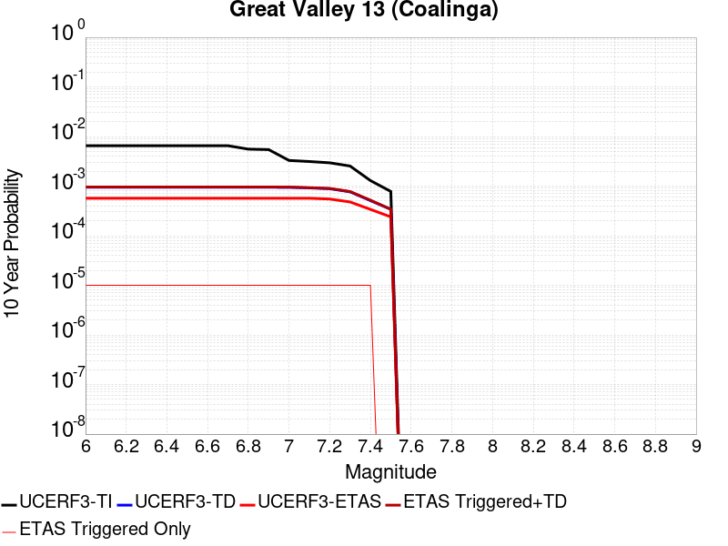 |

| Magnitude | 1 wk TI Prob | 1 wk TD Prob | 1 wk ETAS Prob | 1 wk ETAS/TD Gain | 1 wk ETAS Triggered+TD | 1 wk ETAS Triggered Only | 1 mo TI Prob | 1 mo TD Prob | 1 mo ETAS Prob | 1 mo ETAS/TD Gain | 1 mo ETAS Triggered+TD | 1 mo ETAS Triggered Only | 1 yr TI Prob | 1 yr TD Prob | 1 yr ETAS Prob | 1 yr ETAS/TD Gain | 1 yr ETAS Triggered+TD | 1 yr ETAS Triggered Only | 10 yr TI Prob | 10 yr TD Prob | 10 yr ETAS Prob | 10 yr ETAS/TD Gain | 10 yr ETAS Triggered+TD | 10 yr ETAS Triggered Only |
|-----|-----|-----|-----|-----|-----|-----|-----|-----|-----|-----|-----|-----|-----|-----|-----|-----|-----|-----|-----|-----|-----|-----|-----|-----|
| 6.0 | 1.25701345E-5 | 1.8250131E-6 | 0.0 | 0.0 | 1.8250131E-6 | 0.0 | 5.3870892E-5 | 7.8214625E-6 | 0.0 | 0.0 | 7.8214625E-6 | 0.0 | 6.556807E-4 | 9.522234E-5 | 6.0E-5 | 0.63010424 | 1.05221385E-4 | 1.0E-5 | 0.006537495 | 9.5183466E-4 | 5.7E-4 | 0.5988435 | 9.6182514E-4 | 1.0E-5 |
| 6.1 | 1.25701345E-5 | 1.8250131E-6 | 0.0 | 0.0 | 1.8250131E-6 | 0.0 | 5.3870892E-5 | 7.8214625E-6 | 0.0 | 0.0 | 7.8214625E-6 | 0.0 | 6.556807E-4 | 9.522234E-5 | 6.0E-5 | 0.63010424 | 1.05221385E-4 | 1.0E-5 | 0.006537495 | 9.5183466E-4 | 5.7E-4 | 0.5988435 | 9.6182514E-4 | 1.0E-5 |
| 6.2 | 1.25701345E-5 | 1.8250131E-6 | 0.0 | 0.0 | 1.8250131E-6 | 0.0 | 5.3870892E-5 | 7.8214625E-6 | 0.0 | 0.0 | 7.8214625E-6 | 0.0 | 6.556807E-4 | 9.522234E-5 | 6.0E-5 | 0.63010424 | 1.05221385E-4 | 1.0E-5 | 0.006537495 | 9.5183466E-4 | 5.7E-4 | 0.5988435 | 9.6182514E-4 | 1.0E-5 |
| 6.3 | 1.25701345E-5 | 1.8250131E-6 | 0.0 | 0.0 | 1.8250131E-6 | 0.0 | 5.3870892E-5 | 7.8214625E-6 | 0.0 | 0.0 | 7.8214625E-6 | 0.0 | 6.556807E-4 | 9.522234E-5 | 6.0E-5 | 0.63010424 | 1.05221385E-4 | 1.0E-5 | 0.006537495 | 9.5183466E-4 | 5.7E-4 | 0.5988435 | 9.6182514E-4 | 1.0E-5 |
| 6.4 | 1.25701345E-5 | 1.8250131E-6 | 0.0 | 0.0 | 1.8250131E-6 | 0.0 | 5.3870892E-5 | 7.8214625E-6 | 0.0 | 0.0 | 7.8214625E-6 | 0.0 | 6.556807E-4 | 9.522234E-5 | 6.0E-5 | 0.63010424 | 1.05221385E-4 | 1.0E-5 | 0.006537495 | 9.5183466E-4 | 5.7E-4 | 0.5988435 | 9.6182514E-4 | 1.0E-5 |
| 6.5 | 1.25701345E-5 | 1.8250131E-6 | 0.0 | 0.0 | 1.8250131E-6 | 0.0 | 5.3870892E-5 | 7.8214625E-6 | 0.0 | 0.0 | 7.8214625E-6 | 0.0 | 6.556807E-4 | 9.522234E-5 | 6.0E-5 | 0.63010424 | 1.05221385E-4 | 1.0E-5 | 0.006537495 | 9.5183466E-4 | 5.7E-4 | 0.5988435 | 9.6182514E-4 | 1.0E-5 |
| 6.6 | 1.25701345E-5 | 1.8250131E-6 | 0.0 | 0.0 | 1.8250131E-6 | 0.0 | 5.3870892E-5 | 7.8214625E-6 | 0.0 | 0.0 | 7.8214625E-6 | 0.0 | 6.556807E-4 | 9.522234E-5 | 6.0E-5 | 0.63010424 | 1.05221385E-4 | 1.0E-5 | 0.006537495 | 9.5183466E-4 | 5.7E-4 | 0.5988435 | 9.6182514E-4 | 1.0E-5 |
| 6.7 | 1.25701345E-5 | 1.8250131E-6 | 0.0 | 0.0 | 1.8250131E-6 | 0.0 | 5.3870892E-5 | 7.8214625E-6 | 0.0 | 0.0 | 7.8214625E-6 | 0.0 | 6.556807E-4 | 9.522234E-5 | 6.0E-5 | 0.63010424 | 1.05221385E-4 | 1.0E-5 | 0.006537495 | 9.5183466E-4 | 5.7E-4 | 0.5988435 | 9.6182514E-4 | 1.0E-5 |
| 6.8 | 1.0720415E-5 | 1.8250131E-6 | 0.0 | 0.0 | 1.8250131E-6 | 0.0 | 4.5943823E-5 | 7.8214625E-6 | 0.0 | 0.0 | 7.8214625E-6 | 0.0 | 5.592225E-4 | 9.522234E-5 | 6.0E-5 | 0.63010424 | 1.05221385E-4 | 1.0E-5 | 0.005578173 | 9.5183466E-4 | 5.7E-4 | 0.5988435 | 9.6182514E-4 | 1.0E-5 |
| 6.9 | 1.0485409E-5 | 1.8209261E-6 | 0.0 | 0.0 | 1.8209261E-6 | 0.0 | 4.4936693E-5 | 7.803947E-6 | 0.0 | 0.0 | 7.803947E-6 | 0.0 | 5.469669E-4 | 9.5009105E-5 | 6.0E-5 | 0.6315184 | 1.05008156E-4 | 1.0E-5 | 0.005456226 | 9.4970415E-4 | 5.7E-4 | 0.60018694 | 9.596946E-4 | 1.0E-5 |
| 7.0 | 6.3302773E-6 | 1.8157988E-6 | 0.0 | 0.0 | 1.8157988E-6 | 0.0 | 2.7129478E-5 | 7.781973E-6 | 0.0 | 0.0 | 7.781973E-6 | 0.0 | 3.3025132E-4 | 9.47416E-5 | 6.0E-5 | 0.63330156 | 1.0474065E-4 | 1.0E-5 | 0.0032976097 | 9.4703137E-4 | 5.7E-4 | 0.6018808 | 9.570219E-4 | 1.0E-5 |
| 7.1 | 6.022003E-6 | 1.7661073E-6 | 0.0 | 0.0 | 1.7661073E-6 | 0.0 | 2.5808331E-5 | 7.56901E-6 | 0.0 | 0.0 | 7.56901E-6 | 0.0 | 3.141711E-4 | 9.2149E-5 | 6.0E-5 | 0.6511194 | 1.0214807E-4 | 1.0E-5 | 0.0031372732 | 9.2112704E-4 | 5.7E-4 | 0.61880714 | 9.311178E-4 | 1.0E-5 |
| 7.2 | 5.671345E-6 | 1.7059417E-6 | 0.0 | 0.0 | 1.7059417E-6 | 0.0 | 2.4305538E-5 | 7.3111596E-6 | 0.0 | 0.0 | 7.3111596E-6 | 0.0 | 2.9587973E-4 | 8.9009925E-5 | 6.0E-5 | 0.6740821 | 9.9009034E-5 | 1.0E-5 | 0.002954861 | 8.8976184E-4 | 5.5E-4 | 0.61814296 | 8.9975295E-4 | 1.0E-5 |
| 7.3 | 4.8831785E-6 | 1.4730596E-6 | 0.0 | 0.0 | 1.4730596E-6 | 0.0 | 2.092774E-5 | 6.313098E-6 | 0.0 | 0.0 | 6.313098E-6 | 0.0 | 2.5476544E-4 | 7.6859425E-5 | 3.0E-5 | 0.39032298 | 8.685866E-5 | 1.0E-5 | 0.0025447358 | 7.683451E-4 | 4.8E-4 | 0.6247193 | 7.7833736E-4 | 1.0E-5 |
| 7.4 | 2.4837766E-6 | 9.80032E-7 | 0.0 | 0.0 | 9.80032E-7 | 0.0 | 1.0644713E-5 | 4.2001307E-6 | 0.0 | 0.0 | 4.2001307E-6 | 0.0 | 1.2959167E-4 | 5.113546E-5 | 3.0E-5 | 0.586677 | 6.1134946E-5 | 1.0E-5 | 0.0012951613 | 5.1124353E-4 | 3.4E-4 | 0.66504514 | 5.212384E-4 | 1.0E-5 |
| 7.5 | 1.5002679E-6 | 6.545985E-7 | 0.0 | 0.0 | 6.545985E-7 | 0.0 | 6.4297037E-6 | 2.8054194E-6 | 0.0 | 0.0 | 2.8054194E-6 | 0.0 | 7.827883E-5 | 3.4155488E-5 | 1.0E-5 | 0.2927787 | 3.4155488E-5 | 0.0 | 7.825126E-4 | 3.4150656E-4 | 2.4E-4 | 0.7027684 | 3.4150656E-4 | 0.0 |

## Swain Ravine - Spenceville
*[(top)](#table-of-contents)*

| 1 Week | 1 Month | 1 Year | 10 Year |
|-----|-----|-----|-----|
|  |  |  |  |

| Magnitude | 1 wk TI Prob | 1 wk TD Prob | 1 wk ETAS Prob | 1 wk ETAS/TD Gain | 1 wk ETAS Triggered+TD | 1 wk ETAS Triggered Only | 1 mo TI Prob | 1 mo TD Prob | 1 mo ETAS Prob | 1 mo ETAS/TD Gain | 1 mo ETAS Triggered+TD | 1 mo ETAS Triggered Only | 1 yr TI Prob | 1 yr TD Prob | 1 yr ETAS Prob | 1 yr ETAS/TD Gain | 1 yr ETAS Triggered+TD | 1 yr ETAS Triggered Only | 10 yr TI Prob | 10 yr TD Prob | 10 yr ETAS Prob | 10 yr ETAS/TD Gain | 10 yr ETAS Triggered+TD | 10 yr ETAS Triggered Only |
|-----|-----|-----|-----|-----|-----|-----|-----|-----|-----|-----|-----|-----|-----|-----|-----|-----|-----|-----|-----|-----|-----|-----|-----|-----|
| 6.0 | 5.596169E-6 | 5.663794E-6 | 1.0E-5 | 1.7656008 | 1.5663738E-5 | 1.0E-5 | 2.398336E-5 | 2.4273193E-5 | 2.0E-5 | 0.8239542 | 3.427295E-5 | 1.0E-5 | 2.9195828E-4 | 2.9548878E-4 | 1.7E-4 | 0.575318 | 3.0548582E-4 | 1.0E-5 | 0.00291575 | 0.002951228 | 0.00183 | 0.6200808 | 0.0029611986 | 1.0E-5 |
| 6.1 | 5.596169E-6 | 5.663794E-6 | 1.0E-5 | 1.7656008 | 1.5663738E-5 | 1.0E-5 | 2.398336E-5 | 2.4273193E-5 | 2.0E-5 | 0.8239542 | 3.427295E-5 | 1.0E-5 | 2.9195828E-4 | 2.9548878E-4 | 1.7E-4 | 0.575318 | 3.0548582E-4 | 1.0E-5 | 0.00291575 | 0.002951228 | 0.00183 | 0.6200808 | 0.0029611986 | 1.0E-5 |
| 6.2 | 5.596169E-6 | 5.663794E-6 | 1.0E-5 | 1.7656008 | 1.5663738E-5 | 1.0E-5 | 2.398336E-5 | 2.4273193E-5 | 2.0E-5 | 0.8239542 | 3.427295E-5 | 1.0E-5 | 2.9195828E-4 | 2.9548878E-4 | 1.7E-4 | 0.575318 | 3.0548582E-4 | 1.0E-5 | 0.00291575 | 0.002951228 | 0.00183 | 0.6200808 | 0.0029611986 | 1.0E-5 |
| 6.3 | 5.596169E-6 | 5.663794E-6 | 1.0E-5 | 1.7656008 | 1.5663738E-5 | 1.0E-5 | 2.398336E-5 | 2.4273193E-5 | 2.0E-5 | 0.8239542 | 3.427295E-5 | 1.0E-5 | 2.9195828E-4 | 2.9548878E-4 | 1.7E-4 | 0.575318 | 3.0548582E-4 | 1.0E-5 | 0.00291575 | 0.002951228 | 0.00183 | 0.6200808 | 0.0029611986 | 1.0E-5 |
| 6.4 | 2.8426775E-6 | 2.874144E-6 | 0.0 | 0.0 | 2.874144E-6 | 0.0 | 1.2182847E-5 | 1.2317704E-5 | 1.0E-5 | 0.81183964 | 1.2317704E-5 | 0.0 | 1.4831607E-4 | 1.4995811E-4 | 8.0E-5 | 0.5334823 | 1.4995811E-4 | 0.0 | 0.0014821711 | 0.0014986077 | 0.00104 | 0.6939775 | 0.0014986077 | 0.0 |
| 6.5 | 1.9210793E-6 | 1.9414147E-6 | 0.0 | 0.0 | 1.9414147E-6 | 0.0 | 8.233172E-6 | 8.320323E-6 | 1.0E-5 | 1.2018764 | 8.320323E-6 | 0.0 | 1.0023425E-4 | 1.0129536E-4 | 8.0E-5 | 0.78976965 | 1.0129536E-4 | 0.0 | 0.0010018905 | 0.0010125053 | 7.7E-4 | 0.7604899 | 0.0010125053 | 0.0 |
| 6.6 | 1.9210793E-6 | 1.9414147E-6 | 0.0 | 0.0 | 1.9414147E-6 | 0.0 | 8.233172E-6 | 8.320323E-6 | 1.0E-5 | 1.2018764 | 8.320323E-6 | 0.0 | 1.0023425E-4 | 1.0129536E-4 | 8.0E-5 | 0.78976965 | 1.0129536E-4 | 0.0 | 0.0010018905 | 0.0010125053 | 7.7E-4 | 0.7604899 | 0.0010125053 | 0.0 |
| 6.7 | 1.4667394E-6 | 1.4818934E-6 | 0.0 | 0.0 | 1.4818934E-6 | 0.0 | 6.286011E-6 | 6.3509565E-6 | 1.0E-5 | 1.574566 | 6.3509565E-6 | 0.0 | 7.65295E-5 | 7.732023E-5 | 7.0E-5 | 0.90532583 | 7.732023E-5 | 0.0 | 7.6503144E-4 | 7.72941E-4 | 5.8E-4 | 0.7503807 | 7.72941E-4 | 0.0 |
| 6.8 | 1.1076943E-6 | 1.1189535E-6 | 0.0 | 0.0 | 1.1189535E-6 | 0.0 | 4.747252E-6 | 4.7955064E-6 | 1.0E-5 | 2.0852857 | 4.7955064E-6 | 0.0 | 5.7796264E-5 | 5.838377E-5 | 5.0E-5 | 0.8564024 | 5.838377E-5 | 0.0 | 5.778124E-4 | 5.836887E-4 | 4.6E-4 | 0.78809124 | 5.836887E-4 | 0.0 |
| 6.9 | 8.514296E-7 | 8.600095E-7 | 0.0 | 0.0 | 8.600095E-7 | 0.0 | 3.648979E-6 | 3.6857498E-6 | 1.0E-5 | 2.7131522 | 3.6857498E-6 | 0.0 | 4.442541E-5 | 4.4873108E-5 | 5.0E-5 | 1.114253 | 4.4873108E-5 | 0.0 | 4.441653E-4 | 4.4864335E-4 | 4.1E-4 | 0.9138662 | 4.4864335E-4 | 0.0 |
| 7.0 | 4.8544706E-7 | 4.9033E-7 | 0.0 | 0.0 | 4.9033E-7 | 0.0 | 2.0804857E-6 | 2.1014127E-6 | 0.0 | 0.0 | 2.1014127E-6 | 0.0 | 2.532962E-5 | 2.5584413E-5 | 3.0E-5 | 1.172589 | 2.5584413E-5 | 0.0 | 2.5326732E-4 | 2.5581598E-4 | 2.8E-4 | 1.0945368 | 2.5581598E-4 | 0.0 |
| 7.1 | 3.829186E-7 | 3.8678783E-7 | 0.0 | 0.0 | 3.8678783E-7 | 0.0 | 1.6410787E-6 | 1.6576612E-6 | 0.0 | 0.0 | 1.6576612E-6 | 0.0 | 1.997995E-5 | 2.0181848E-5 | 2.0E-5 | 0.9909895 | 2.0181848E-5 | 0.0 | 1.9978154E-4 | 2.0180122E-4 | 1.8E-4 | 0.8919669 | 2.0180122E-4 | 0.0 |
| 7.2 | 1.4726595E-7 | 1.4879437E-7 | 0.0 | 0.0 | 1.4879437E-7 | 0.0 | 6.3113964E-7 | 6.3769005E-7 | 0.0 | 0.0 | 6.3769005E-7 | 0.0 | 7.684098E-6 | 7.763854E-6 | 2.0E-5 | 2.57604 | 7.763854E-6 | 0.0 | 7.6838325E-5 | 7.763636E-5 | 7.0E-5 | 0.90163934 | 7.763636E-5 | 0.0 |
| 7.3 | 4.1880604E-8 | 4.2324306E-8 | 0.0 | 0.0 | 4.2324306E-8 | 0.0 | 1.7948828E-7 | 1.8138988E-7 | 0.0 | 0.0 | 1.8138988E-7 | 0.0 | 2.1852677E-6 | 2.2084218E-6 | 0.0 | 0.0 | 2.2084218E-6 | 0.0 | 2.1852462E-5 | 2.2084218E-5 | 0.0 | 0.0 | 2.2084218E-5 | 0.0 |

## San Gorgonio Pass
*[(top)](#table-of-contents)*

| 1 Week | 1 Month | 1 Year | 10 Year |
|-----|-----|-----|-----|
|  |  |  |  |

| Magnitude | 1 wk TI Prob | 1 wk TD Prob | 1 wk ETAS Prob | 1 wk ETAS/TD Gain | 1 wk ETAS Triggered+TD | 1 wk ETAS Triggered Only | 1 mo TI Prob | 1 mo TD Prob | 1 mo ETAS Prob | 1 mo ETAS/TD Gain | 1 mo ETAS Triggered+TD | 1 mo ETAS Triggered Only | 1 yr TI Prob | 1 yr TD Prob | 1 yr ETAS Prob | 1 yr ETAS/TD Gain | 1 yr ETAS Triggered+TD | 1 yr ETAS Triggered Only | 10 yr TI Prob | 10 yr TD Prob | 10 yr ETAS Prob | 10 yr ETAS/TD Gain | 10 yr ETAS Triggered+TD | 10 yr ETAS Triggered Only |
|-----|-----|-----|-----|-----|-----|-----|-----|-----|-----|-----|-----|-----|-----|-----|-----|-----|-----|-----|-----|-----|-----|-----|-----|-----|
| 6.0 | 7.644328E-6 | 1.331474E-5 | 2.0E-5 | 1.5020947 | 2.3314606E-5 | 1.0E-5 | 3.2760996E-5 | 5.706197E-5 | 4.0E-5 | 0.7009923 | 6.7061395E-5 | 1.0E-5 | 3.987921E-4 | 6.945166E-4 | 3.6E-4 | 0.51834613 | 7.045097E-4 | 1.0E-5 | 0.003980772 | 0.006930024 | 0.00378 | 0.54545265 | 0.0069399546 | 1.0E-5 |
| 6.1 | 7.644328E-6 | 1.331474E-5 | 2.0E-5 | 1.5020947 | 2.3314606E-5 | 1.0E-5 | 3.2760996E-5 | 5.706197E-5 | 4.0E-5 | 0.7009923 | 6.7061395E-5 | 1.0E-5 | 3.987921E-4 | 6.945166E-4 | 3.6E-4 | 0.51834613 | 7.045097E-4 | 1.0E-5 | 0.003980772 | 0.006930024 | 0.00378 | 0.54545265 | 0.0069399546 | 1.0E-5 |
| 6.2 | 7.644328E-6 | 1.331474E-5 | 2.0E-5 | 1.5020947 | 2.3314606E-5 | 1.0E-5 | 3.2760996E-5 | 5.706197E-5 | 4.0E-5 | 0.7009923 | 6.7061395E-5 | 1.0E-5 | 3.987921E-4 | 6.945166E-4 | 3.6E-4 | 0.51834613 | 7.045097E-4 | 1.0E-5 | 0.003980772 | 0.006930024 | 0.00378 | 0.54545265 | 0.0069399546 | 1.0E-5 |
| 6.3 | 7.644328E-6 | 1.331474E-5 | 2.0E-5 | 1.5020947 | 2.3314606E-5 | 1.0E-5 | 3.2760996E-5 | 5.706197E-5 | 4.0E-5 | 0.7009923 | 6.7061395E-5 | 1.0E-5 | 3.987921E-4 | 6.945166E-4 | 3.6E-4 | 0.51834613 | 7.045097E-4 | 1.0E-5 | 0.003980772 | 0.006930024 | 0.00378 | 0.54545265 | 0.0069399546 | 1.0E-5 |
| 6.4 | 7.644328E-6 | 1.331474E-5 | 2.0E-5 | 1.5020947 | 2.3314606E-5 | 1.0E-5 | 3.2760996E-5 | 5.706197E-5 | 4.0E-5 | 0.7009923 | 6.7061395E-5 | 1.0E-5 | 3.987921E-4 | 6.945166E-4 | 3.6E-4 | 0.51834613 | 7.045097E-4 | 1.0E-5 | 0.003980772 | 0.006930024 | 0.00378 | 0.54545265 | 0.0069399546 | 1.0E-5 |
| 6.5 | 7.644328E-6 | 1.331474E-5 | 2.0E-5 | 1.5020947 | 2.3314606E-5 | 1.0E-5 | 3.2760996E-5 | 5.706197E-5 | 4.0E-5 | 0.7009923 | 6.7061395E-5 | 1.0E-5 | 3.987921E-4 | 6.945166E-4 | 3.6E-4 | 0.51834613 | 7.045097E-4 | 1.0E-5 | 0.003980772 | 0.006930024 | 0.00378 | 0.54545265 | 0.0069399546 | 1.0E-5 |
| 6.6 | 7.644328E-6 | 1.331474E-5 | 2.0E-5 | 1.5020947 | 2.3314606E-5 | 1.0E-5 | 3.2760996E-5 | 5.706197E-5 | 4.0E-5 | 0.7009923 | 6.7061395E-5 | 1.0E-5 | 3.987921E-4 | 6.945166E-4 | 3.6E-4 | 0.51834613 | 7.045097E-4 | 1.0E-5 | 0.003980772 | 0.006930024 | 0.00378 | 0.54545265 | 0.0069399546 | 1.0E-5 |
| 6.7 | 6.987586E-6 | 1.2619013E-5 | 1.0E-5 | 0.79245496 | 1.2619013E-5 | 0.0 | 2.9946454E-5 | 5.408041E-5 | 3.0E-5 | 0.5547295 | 5.408041E-5 | 0.0 | 3.645371E-4 | 6.582382E-4 | 3.4E-4 | 0.51653033 | 6.582382E-4 | 0.0 | 0.0036393967 | 0.0065694 | 0.00362 | 0.5510397 | 0.0065694 | 0.0 |
| 6.8 | 6.987586E-6 | 1.2619013E-5 | 1.0E-5 | 0.79245496 | 1.2619013E-5 | 0.0 | 2.9946454E-5 | 5.408041E-5 | 3.0E-5 | 0.5547295 | 5.408041E-5 | 0.0 | 3.645371E-4 | 6.582382E-4 | 3.4E-4 | 0.51653033 | 6.582382E-4 | 0.0 | 0.0036393967 | 0.0065694 | 0.00362 | 0.5510397 | 0.0065694 | 0.0 |
| 6.9 | 5.504702E-6 | 1.1049877E-5 | 1.0E-5 | 0.90498745 | 1.1049877E-5 | 0.0 | 2.3591367E-5 | 4.7355785E-5 | 3.0E-5 | 0.63350236 | 4.7355785E-5 | 0.0 | 2.8718702E-4 | 5.764092E-4 | 3.0E-4 | 0.5204636 | 5.764092E-4 | 0.0 | 0.0028681618 | 0.0057553523 | 0.00307 | 0.5334165 | 0.0057553523 | 0.0 |
| 7.0 | 5.4825764E-6 | 1.1026218E-5 | 1.0E-5 | 0.9069293 | 1.1026218E-5 | 0.0 | 2.3496545E-5 | 4.725439E-5 | 3.0E-5 | 0.63486165 | 4.725439E-5 | 0.0 | 2.8603288E-4 | 5.751754E-4 | 3.0E-4 | 0.52158004 | 5.751754E-4 | 0.0 | 0.00285665 | 0.0057430784 | 0.00306 | 0.5328153 | 0.0057430784 | 0.0 |
| 7.1 | 5.4692787E-6 | 1.1011928E-5 | 1.0E-5 | 0.9081062 | 1.1011928E-5 | 0.0 | 2.3439556E-5 | 4.719315E-5 | 3.0E-5 | 0.63568544 | 4.719315E-5 | 0.0 | 2.8533922E-4 | 5.744302E-4 | 3.0E-4 | 0.5222567 | 5.744302E-4 | 0.0 | 0.0028497311 | 0.0057356646 | 0.00305 | 0.5317605 | 0.0057356646 | 0.0 |
| 7.2 | 5.453661E-6 | 1.0994954E-5 | 1.0E-5 | 0.9095081 | 1.0994954E-5 | 0.0 | 2.3372622E-5 | 4.712041E-5 | 3.0E-5 | 0.6366668 | 4.712041E-5 | 0.0 | 2.8452452E-4 | 5.7354505E-4 | 3.0E-4 | 0.52306265 | 5.7354505E-4 | 0.0 | 0.002841605 | 0.005726859 | 0.00305 | 0.5325782 | 0.005726859 | 0.0 |
| 7.3 | 5.4422303E-6 | 1.09818775E-5 | 1.0E-5 | 0.9105911 | 1.09818775E-5 | 0.0 | 2.3323635E-5 | 4.7064368E-5 | 3.0E-5 | 0.6374249 | 4.7064368E-5 | 0.0 | 2.8392827E-4 | 5.728631E-4 | 3.0E-4 | 0.52368534 | 5.728631E-4 | 0.0 | 0.0028356577 | 0.0057200743 | 0.00305 | 0.53320986 | 0.0057200743 | 0.0 |
| 7.4 | 5.398595E-6 | 1.0929241E-5 | 1.0E-5 | 0.91497654 | 1.0929241E-5 | 0.0 | 2.313663E-5 | 4.6838795E-5 | 3.0E-5 | 0.6404947 | 4.6838795E-5 | 0.0 | 2.8165206E-4 | 5.701182E-4 | 3.0E-4 | 0.5262067 | 5.701182E-4 | 0.0 | 0.0028129534 | 0.0056927665 | 0.00305 | 0.5357676 | 0.0056927665 | 0.0 |
| 7.5 | 5.3578788E-6 | 1.0855785E-5 | 1.0E-5 | 0.9211678 | 1.0855785E-5 | 0.0 | 2.2962136E-5 | 4.6523994E-5 | 3.0E-5 | 0.64482856 | 4.6523994E-5 | 0.0 | 2.7952815E-4 | 5.662875E-4 | 3.0E-4 | 0.52976626 | 5.662875E-4 | 0.0 | 0.002791768 | 0.0056546913 | 0.00303 | 0.53583825 | 0.0056546913 | 0.0 |
| 7.6 | 4.8091474E-6 | 9.604131E-6 | 1.0E-5 | 1.0412185 | 9.604131E-6 | 0.0 | 2.0610469E-5 | 4.1159943E-5 | 3.0E-5 | 0.728864 | 4.1159943E-5 | 0.0 | 2.5090357E-4 | 5.010119E-4 | 2.8E-4 | 0.558869 | 5.010119E-4 | 0.0 | 0.0025062046 | 0.0050054584 | 0.00265 | 0.52942204 | 0.0050054584 | 0.0 |
| 7.7 | 1.5991155E-6 | 3.353035E-6 | 1.0E-5 | 2.9823725 | 3.353035E-6 | 0.0 | 6.853334E-6 | 1.4370073E-5 | 3.0E-5 | 2.0876722 | 1.4370073E-5 | 0.0 | 8.343615E-5 | 1.7494184E-4 | 9.0E-5 | 0.5144567 | 1.7494184E-4 | 0.0 | 8.340483E-4 | 0.0017535852 | 9.7E-4 | 0.5531525 | 0.0017535852 | 0.0 |
| 7.8 | 9.258398E-7 | 2.0581049E-6 | 0.0 | 0.0 | 2.0581049E-6 | 0.0 | 3.967879E-6 | 8.82042E-6 | 1.0E-5 | 1.1337329 | 8.82042E-6 | 0.0 | 4.8307855E-5 | 1.0738334E-4 | 5.0E-5 | 0.4656216 | 1.0738334E-4 | 0.0 | 4.8297356E-4 | 0.0010788103 | 6.3E-4 | 0.5839766 | 0.0010788103 | 0.0 |
| 7.9 | 5.975575E-7 | 1.2292295E-6 | 0.0 | 0.0 | 1.2292295E-6 | 0.0 | 2.5609581E-6 | 5.2681157E-6 | 1.0E-5 | 1.898212 | 5.2681157E-6 | 0.0 | 3.117922E-5 | 6.413743E-5 | 3.0E-5 | 0.46774557 | 6.413743E-5 | 0.0 | 3.1174847E-4 | 6.464778E-4 | 3.6E-4 | 0.55686367 | 6.464778E-4 | 0.0 |
| 8.0 | 3.4413725E-7 | 6.714992E-7 | 0.0 | 0.0 | 6.714992E-7 | 0.0 | 1.4748731E-6 | 2.8778506E-6 | 1.0E-5 | 3.4748156 | 2.8778506E-6 | 0.0 | 1.7956432E-5 | 3.5037272E-5 | 2.0E-5 | 0.5708207 | 3.5037272E-5 | 0.0 | 1.7954981E-4 | 3.5392298E-4 | 2.7E-4 | 0.7628778 | 3.5392298E-4 | 0.0 |
| 8.1 | 1.1787731E-8 | 9.6332045E-9 | 0.0 | 0.0 | 9.6332045E-9 | 0.0 | 5.0518846E-8 | 4.1285162E-8 | 0.0 | 0.0 | 4.1285162E-8 | 0.0 | 6.1506677E-7 | 5.0264674E-7 | 0.0 | 0.0 | 5.0264674E-7 | 0.0 | 6.1506507E-6 | 5.2417968E-6 | 0.0 | 0.0 | 5.2417968E-6 | 0.0 |

## Monte Vista - Shannon 2011 CFM
*[(top)](#table-of-contents)*

| 1 Week | 1 Month | 1 Year | 10 Year |
|-----|-----|-----|-----|
| 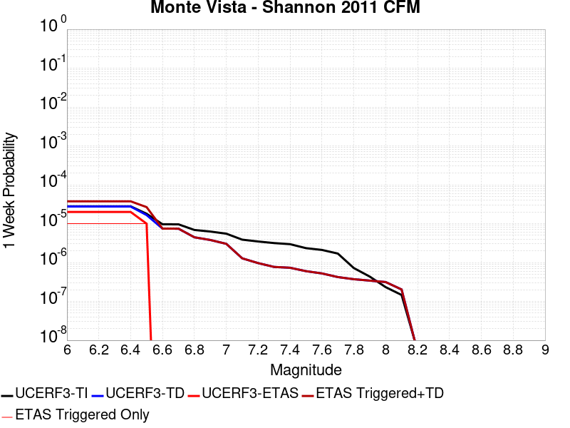 |  |  |  |

| Magnitude | 1 wk TI Prob | 1 wk TD Prob | 1 wk ETAS Prob | 1 wk ETAS/TD Gain | 1 wk ETAS Triggered+TD | 1 wk ETAS Triggered Only | 1 mo TI Prob | 1 mo TD Prob | 1 mo ETAS Prob | 1 mo ETAS/TD Gain | 1 mo ETAS Triggered+TD | 1 mo ETAS Triggered Only | 1 yr TI Prob | 1 yr TD Prob | 1 yr ETAS Prob | 1 yr ETAS/TD Gain | 1 yr ETAS Triggered+TD | 1 yr ETAS Triggered Only | 10 yr TI Prob | 10 yr TD Prob | 10 yr ETAS Prob | 10 yr ETAS/TD Gain | 10 yr ETAS Triggered+TD | 10 yr ETAS Triggered Only |
|-----|-----|-----|-----|-----|-----|-----|-----|-----|-----|-----|-----|-----|-----|-----|-----|-----|-----|-----|-----|-----|-----|-----|-----|-----|
| 6.0 | 2.7907707E-5 | 2.7584067E-5 | 2.0E-5 | 0.7250563 | 3.758379E-5 | 1.0E-5 | 1.19598975E-4 | 1.1821277E-4 | 4.0E-5 | 0.33837292 | 1.2821158E-4 | 1.0E-5 | 0.0014551448 | 0.001438414 | 9.1E-4 | 0.63264126 | 0.0014483996 | 1.0E-5 | 0.014456532 | 0.014320111 | 0.01089 | 0.76046896 | 0.014329968 | 1.0E-5 |
| 6.1 | 2.7907707E-5 | 2.7584067E-5 | 2.0E-5 | 0.7250563 | 3.758379E-5 | 1.0E-5 | 1.19598975E-4 | 1.1821277E-4 | 4.0E-5 | 0.33837292 | 1.2821158E-4 | 1.0E-5 | 0.0014551448 | 0.001438414 | 9.1E-4 | 0.63264126 | 0.0014483996 | 1.0E-5 | 0.014456532 | 0.014320111 | 0.01089 | 0.76046896 | 0.014329968 | 1.0E-5 |
| 6.2 | 2.7907707E-5 | 2.7584067E-5 | 2.0E-5 | 0.7250563 | 3.758379E-5 | 1.0E-5 | 1.19598975E-4 | 1.1821277E-4 | 4.0E-5 | 0.33837292 | 1.2821158E-4 | 1.0E-5 | 0.0014551448 | 0.001438414 | 9.1E-4 | 0.63264126 | 0.0014483996 | 1.0E-5 | 0.014456532 | 0.014320111 | 0.01089 | 0.76046896 | 0.014329968 | 1.0E-5 |
| 6.3 | 2.7907707E-5 | 2.7584067E-5 | 2.0E-5 | 0.7250563 | 3.758379E-5 | 1.0E-5 | 1.19598975E-4 | 1.1821277E-4 | 4.0E-5 | 0.33837292 | 1.2821158E-4 | 1.0E-5 | 0.0014551448 | 0.001438414 | 9.1E-4 | 0.63264126 | 0.0014483996 | 1.0E-5 | 0.014456532 | 0.014320111 | 0.01089 | 0.76046896 | 0.014329968 | 1.0E-5 |
| 6.4 | 2.7907707E-5 | 2.7584067E-5 | 2.0E-5 | 0.7250563 | 3.758379E-5 | 1.0E-5 | 1.19598975E-4 | 1.1821277E-4 | 4.0E-5 | 0.33837292 | 1.2821158E-4 | 1.0E-5 | 0.0014551448 | 0.001438414 | 9.1E-4 | 0.63264126 | 0.0014483996 | 1.0E-5 | 0.014456532 | 0.014320111 | 0.01089 | 0.76046896 | 0.014329968 | 1.0E-5 |
| 6.5 | 1.7990213E-5 | 1.6639742E-5 | 1.0E-5 | 0.60097086 | 2.6639576E-5 | 1.0E-5 | 7.709863E-5 | 7.13116E-5 | 2.0E-5 | 0.28045925 | 8.131089E-5 | 1.0E-5 | 9.382716E-4 | 8.679393E-4 | 5.4E-4 | 0.62216336 | 8.779306E-4 | 1.0E-5 | 0.0093431985 | 0.008668857 | 0.00678 | 0.78211004 | 0.008678771 | 1.0E-5 |
| 6.6 | 9.650407E-6 | 7.457001E-6 | 0.0 | 0.0 | 7.457001E-6 | 0.0 | 4.135823E-5 | 3.195823E-5 | 1.0E-5 | 0.31290844 | 3.195823E-5 | 0.0 | 5.0342013E-4 | 3.890298E-4 | 1.9E-4 | 0.48839444 | 3.890298E-4 | 0.0 | 0.005022812 | 0.0039011573 | 0.00297 | 0.76131254 | 0.0039011573 | 0.0 |
| 6.7 | 9.62828E-6 | 7.434916E-6 | 0.0 | 0.0 | 7.434916E-6 | 0.0 | 4.1263404E-5 | 3.186358E-5 | 1.0E-5 | 0.31383795 | 3.186358E-5 | 0.0 | 5.022661E-4 | 3.8787787E-4 | 1.9E-4 | 0.48984492 | 3.8787787E-4 | 0.0 | 0.0050113243 | 0.003889678 | 0.00296 | 0.7609884 | 0.003889678 | 0.0 |
| 6.8 | 6.887523E-6 | 4.461425E-6 | 0.0 | 0.0 | 4.461425E-6 | 0.0 | 2.9517621E-5 | 1.9120265E-5 | 1.0E-5 | 0.5230053 | 1.9120265E-5 | 0.0 | 3.5931775E-4 | 2.3276659E-4 | 1.2E-4 | 0.5155379 | 2.3276659E-4 | 0.0 | 0.0035873733 | 0.0023423703 | 0.00174 | 0.74283725 | 0.0023423703 | 0.0 |
| 6.9 | 6.2722347E-6 | 3.8032956E-6 | 0.0 | 0.0 | 3.8032956E-6 | 0.0 | 2.6880729E-5 | 1.6299748E-5 | 1.0E-5 | 0.61350644 | 1.6299748E-5 | 0.0 | 3.2722374E-4 | 1.9843338E-4 | 8.0E-5 | 0.40315798 | 1.9843338E-4 | 0.0 | 0.003267423 | 0.0019996904 | 0.00141 | 0.7051091 | 0.0019996904 | 0.0 |
| 7.0 | 5.5320347E-6 | 3.0304461E-6 | 0.0 | 0.0 | 3.0304461E-6 | 0.0 | 2.3708504E-5 | 1.2987572E-5 | 0.0 | 0.0 | 1.2987572E-5 | 0.0 | 2.8861282E-4 | 1.5811404E-4 | 5.0E-5 | 0.31622744 | 1.5811404E-4 | 0.0 | 0.0028823826 | 0.0015971304 | 0.00118 | 0.738825 | 0.0015971304 | 0.0 |
| 7.1 | 3.8794055E-6 | 1.283645E-6 | 0.0 | 0.0 | 1.283645E-6 | 0.0 | 1.6625918E-5 | 5.5013243E-6 | 0.0 | 0.0 | 5.5013243E-6 | 0.0 | 2.0240174E-4 | 6.697658E-5 | 1.0E-5 | 0.14930592 | 6.697658E-5 | 0.0 | 0.002022175 | 6.86504E-4 | 4.2E-4 | 0.6117954 | 6.86504E-4 | 0.0 |
| 7.2 | 3.4813652E-6 | 9.669686E-7 | 0.0 | 0.0 | 9.669686E-7 | 0.0 | 1.49200505E-5 | 4.144145E-6 | 0.0 | 0.0 | 4.144145E-6 | 0.0 | 1.8163648E-4 | 5.0453804E-5 | 1.0E-5 | 0.19820112 | 5.0453804E-5 | 0.0 | 0.0018148809 | 5.213506E-4 | 2.3E-4 | 0.44116184 | 5.213506E-4 | 0.0 |
| 7.3 | 3.1682148E-6 | 7.7177793E-7 | 0.0 | 0.0 | 7.7177793E-7 | 0.0 | 1.3577992E-5 | 3.3076153E-6 | 0.0 | 0.0 | 3.3076153E-6 | 0.0 | 1.6529951E-4 | 4.0269475E-5 | 1.0E-5 | 0.24832705 | 4.0269475E-5 | 0.0 | 0.0016517661 | 4.195245E-4 | 1.4E-4 | 0.33371115 | 4.195245E-4 | 0.0 |
| 7.4 | 2.9707667E-6 | 7.344474E-7 | 0.0 | 0.0 | 7.344474E-7 | 0.0 | 1.2731795E-5 | 3.147628E-6 | 0.0 | 0.0 | 3.147628E-6 | 0.0 | 1.5499859E-4 | 3.8321698E-5 | 1.0E-5 | 0.26094878 | 3.8321698E-5 | 0.0 | 0.0015489052 | 3.998471E-4 | 1.2E-4 | 0.3001147 | 3.998471E-4 | 0.0 |
| 7.5 | 2.3462758E-6 | 6.0069135E-7 | 0.0 | 0.0 | 6.0069135E-7 | 0.0 | 1.0055429E-5 | 2.5743889E-6 | 0.0 | 0.0 | 2.5743889E-6 | 0.0 | 1.2241797E-4 | 3.1342737E-5 | 1.0E-5 | 0.31905317 | 3.1342737E-5 | 0.0 | 0.0012235056 | 3.2833643E-4 | 7.0E-5 | 0.21319596 | 3.2833643E-4 | 0.0 |
| 7.6 | 2.112783E-6 | 5.250731E-7 | 0.0 | 0.0 | 5.250731E-7 | 0.0 | 9.054753E-6 | 2.2503114E-6 | 0.0 | 0.0 | 2.2503114E-6 | 0.0 | 1.1023604E-4 | 2.7397198E-5 | 1.0E-5 | 0.3650008 | 2.7397198E-5 | 0.0 | 0.0011018137 | 2.8845918E-4 | 7.0E-5 | 0.24266866 | 2.8845918E-4 | 0.0 |
| 7.7 | 1.7022471E-6 | 4.23102E-7 | 0.0 | 0.0 | 4.23102E-7 | 0.0 | 7.2953244E-6 | 1.8132929E-6 | 0.0 | 0.0 | 1.8132929E-6 | 0.0 | 8.881695E-5 | 2.207662E-5 | 1.0E-5 | 0.4529679 | 2.207662E-5 | 0.0 | 8.878146E-4 | 2.3394964E-4 | 5.0E-5 | 0.21372122 | 2.3394964E-4 | 0.0 |
| 7.8 | 7.230914E-7 | 3.728293E-7 | 0.0 | 0.0 | 3.728293E-7 | 0.0 | 3.0989595E-6 | 1.597839E-6 | 0.0 | 0.0 | 1.597839E-6 | 0.0 | 3.772918E-5 | 1.9453517E-5 | 0.0 | 0.0 | 1.9453517E-5 | 0.0 | 3.7722773E-4 | 2.072548E-4 | 3.0E-5 | 0.14474937 | 2.072548E-4 | 0.0 |
| 7.9 | 4.3588446E-7 | 3.4304335E-7 | 0.0 | 0.0 | 3.4304335E-7 | 0.0 | 1.868075E-6 | 1.4701849E-6 | 0.0 | 0.0 | 1.4701849E-6 | 0.0 | 2.2743576E-5 | 1.7899356E-5 | 0.0 | 0.0 | 1.7899356E-5 | 0.0 | 2.2741247E-4 | 1.899464E-4 | 3.0E-5 | 0.1579393 | 1.899464E-4 | 0.0 |
| 8.0 | 2.3317523E-7 | 3.1513432E-7 | 0.0 | 0.0 | 3.1513432E-7 | 0.0 | 9.99322E-7 | 1.350575E-6 | 0.0 | 0.0 | 1.350575E-6 | 0.0 | 1.2166677E-5 | 1.6443128E-5 | 0.0 | 0.0 | 1.6443128E-5 | 0.0 | 1.21660116E-4 | 1.7399403E-4 | 2.0E-5 | 0.11494647 | 1.7399403E-4 | 0.0 |
| 8.1 | 1.4662456E-7 | 2.03077E-7 | 0.0 | 0.0 | 2.03077E-7 | 0.0 | 6.283908E-7 | 8.703297E-7 | 0.0 | 0.0 | 8.703297E-7 | 0.0 | 7.650631E-6 | 1.05962135E-5 | 0.0 | 0.0 | 1.05962135E-5 | 0.0 | 7.650368E-5 | 1.1132272E-4 | 1.0E-5 | 0.08982892 | 1.1132272E-4 | 0.0 |
| 8.2 | 5.4931775E-9 | 5.0752176E-9 | 0.0 | 0.0 | 5.0752176E-9 | 0.0 | 2.3542189E-8 | 2.1750932E-8 | 0.0 | 0.0 | 2.1750932E-8 | 0.0 | 2.8662612E-7 | 2.6481757E-7 | 0.0 | 0.0 | 2.6481757E-7 | 0.0 | 2.8662573E-6 | 2.754138E-6 | 0.0 | 0.0 | 2.754138E-6 | 0.0 |

## Elysian Park (Lower CFM)
*[(top)](#table-of-contents)*

| 1 Week | 1 Month | 1 Year | 10 Year |
|-----|-----|-----|-----|
|  |  |  |  |

| Magnitude | 1 wk TI Prob | 1 wk TD Prob | 1 wk ETAS Prob | 1 wk ETAS/TD Gain | 1 wk ETAS Triggered+TD | 1 wk ETAS Triggered Only | 1 mo TI Prob | 1 mo TD Prob | 1 mo ETAS Prob | 1 mo ETAS/TD Gain | 1 mo ETAS Triggered+TD | 1 mo ETAS Triggered Only | 1 yr TI Prob | 1 yr TD Prob | 1 yr ETAS Prob | 1 yr ETAS/TD Gain | 1 yr ETAS Triggered+TD | 1 yr ETAS Triggered Only | 10 yr TI Prob | 10 yr TD Prob | 10 yr ETAS Prob | 10 yr ETAS/TD Gain | 10 yr ETAS Triggered+TD | 10 yr ETAS Triggered Only |
|-----|-----|-----|-----|-----|-----|-----|-----|-----|-----|-----|-----|-----|-----|-----|-----|-----|-----|-----|-----|-----|-----|-----|-----|-----|
| 6.0 | 2.1766498E-6 | 2.1037895E-6 | 0.0 | 0.0 | 2.1037895E-6 | 0.0 | 9.328466E-6 | 9.0162175E-6 | 0.0 | 0.0 | 9.0162175E-6 | 0.0 | 1.1356815E-4 | 1.0976836E-4 | 3.0E-5 | 0.2733028 | 1.0976836E-4 | 0.0 | 0.0011351013 | 0.0010972833 | 5.7E-4 | 0.51946473 | 0.0011072723 | 1.0E-5 |
| 6.1 | 2.1766498E-6 | 2.1037895E-6 | 0.0 | 0.0 | 2.1037895E-6 | 0.0 | 9.328466E-6 | 9.0162175E-6 | 0.0 | 0.0 | 9.0162175E-6 | 0.0 | 1.1356815E-4 | 1.0976836E-4 | 3.0E-5 | 0.2733028 | 1.0976836E-4 | 0.0 | 0.0011351013 | 0.0010972833 | 5.7E-4 | 0.51946473 | 0.0011072723 | 1.0E-5 |
| 6.2 | 1.0031182E-6 | 9.186213E-7 | 0.0 | 0.0 | 9.186213E-7 | 0.0 | 4.299071E-6 | 3.936943E-6 | 0.0 | 0.0 | 3.936943E-6 | 0.0 | 5.2339932E-5 | 4.7931328E-5 | 1.0E-5 | 0.20863181 | 4.7931328E-5 | 0.0 | 5.2327604E-4 | 4.7921969E-4 | 2.3E-4 | 0.47994688 | 4.892149E-4 | 1.0E-5 |
| 6.3 | 1.0031182E-6 | 9.186213E-7 | 0.0 | 0.0 | 9.186213E-7 | 0.0 | 4.299071E-6 | 3.936943E-6 | 0.0 | 0.0 | 3.936943E-6 | 0.0 | 5.2339932E-5 | 4.7931328E-5 | 1.0E-5 | 0.20863181 | 4.7931328E-5 | 0.0 | 5.2327604E-4 | 4.7921969E-4 | 2.3E-4 | 0.47994688 | 4.892149E-4 | 1.0E-5 |
| 6.4 | 6.9606244E-7 | 6.091942E-7 | 0.0 | 0.0 | 6.091942E-7 | 0.0 | 2.9831212E-6 | 2.6108296E-6 | 0.0 | 0.0 | 2.6108296E-6 | 0.0 | 3.6318896E-5 | 3.178639E-5 | 0.0 | 0.0 | 3.178639E-5 | 0.0 | 3.6312963E-4 | 3.1781866E-4 | 1.0E-4 | 0.3146448 | 3.1781866E-4 | 0.0 |
| 6.5 | 6.901879E-7 | 6.0326255E-7 | 0.0 | 0.0 | 6.0326255E-7 | 0.0 | 2.9579448E-6 | 2.5854083E-6 | 0.0 | 0.0 | 2.5854083E-6 | 0.0 | 3.6012385E-5 | 3.1476895E-5 | 0.0 | 0.0 | 3.1476895E-5 | 0.0 | 3.600655E-4 | 3.147246E-4 | 1.0E-4 | 0.31773812 | 3.147246E-4 | 0.0 |
| 6.6 | 6.4198554E-7 | 5.5466086E-7 | 0.0 | 0.0 | 5.5466086E-7 | 0.0 | 2.7513638E-6 | 2.3771156E-6 | 0.0 | 0.0 | 2.3771156E-6 | 0.0 | 3.3497337E-5 | 2.8941E-5 | 0.0 | 0.0 | 2.8941E-5 | 0.0 | 3.349229E-4 | 2.8937246E-4 | 9.0E-5 | 0.31101784 | 2.8937246E-4 | 0.0 |
| 6.7 | 6.138733E-7 | 5.263416E-7 | 0.0 | 0.0 | 5.263416E-7 | 0.0 | 2.6308828E-6 | 2.2557474E-6 | 0.0 | 0.0 | 2.2557474E-6 | 0.0 | 3.203053E-5 | 2.746338E-5 | 0.0 | 0.0 | 2.746338E-5 | 0.0 | 3.2025913E-4 | 2.746E-4 | 8.0E-5 | 0.29133284 | 2.746E-4 | 0.0 |
| 6.8 | 5.84778E-7 | 5.0029365E-7 | 0.0 | 0.0 | 5.0029365E-7 | 0.0 | 2.506189E-6 | 2.1441138E-6 | 0.0 | 0.0 | 2.1441138E-6 | 0.0 | 3.0512423E-5 | 2.6104273E-5 | 0.0 | 0.0 | 2.6104273E-5 | 0.0 | 3.0508233E-4 | 2.6101217E-4 | 8.0E-5 | 0.3064991 | 2.6101217E-4 | 0.0 |
| 6.9 | 5.322785E-7 | 4.5800792E-7 | 0.0 | 0.0 | 4.5800792E-7 | 0.0 | 2.2811914E-6 | 1.9628894E-6 | 0.0 | 0.0 | 1.9628894E-6 | 0.0 | 2.7773152E-5 | 2.389792E-5 | 0.0 | 0.0 | 2.389792E-5 | 0.0 | 2.7769682E-4 | 2.3895358E-4 | 7.0E-5 | 0.29294392 | 2.3895358E-4 | 0.0 |
| 7.0 | 4.8147206E-7 | 4.1124093E-7 | 0.0 | 0.0 | 4.1124093E-7 | 0.0 | 2.06345E-6 | 1.7624599E-6 | 0.0 | 0.0 | 1.7624599E-6 | 0.0 | 2.5122214E-5 | 2.1457738E-5 | 0.0 | 0.0 | 2.1457738E-5 | 0.0 | 2.5119373E-4 | 2.1455674E-4 | 6.0E-5 | 0.2796463 | 2.1455674E-4 | 0.0 |
| 7.1 | 4.1932955E-7 | 3.5455687E-7 | 0.0 | 0.0 | 3.5455687E-7 | 0.0 | 1.7971255E-6 | 1.5195285E-6 | 0.0 | 0.0 | 1.5195285E-6 | 0.0 | 2.1879783E-5 | 1.8500103E-5 | 0.0 | 0.0 | 1.8500103E-5 | 0.0 | 2.1877629E-4 | 1.8498568E-4 | 5.0E-5 | 0.27029118 | 1.8498568E-4 | 0.0 |
| 7.2 | 3.426051E-7 | 2.7810242E-7 | 0.0 | 0.0 | 2.7810242E-7 | 0.0 | 1.4683067E-6 | 1.1918669E-6 | 0.0 | 0.0 | 1.1918669E-6 | 0.0 | 1.7876488E-5 | 1.45108825E-5 | 0.0 | 0.0 | 1.45108825E-5 | 0.0 | 1.787505E-4 | 1.4509937E-4 | 3.0E-5 | 0.20675485 | 1.4509937E-4 | 0.0 |
| 7.3 | 2.7771645E-7 | 2.2096455E-7 | 0.0 | 0.0 | 2.2096455E-7 | 0.0 | 1.1902127E-6 | 9.4699055E-7 | 0.0 | 0.0 | 9.4699055E-7 | 0.0 | 1.4490744E-5 | 1.1529549E-5 | 0.0 | 0.0 | 1.1529549E-5 | 0.0 | 1.4489799E-4 | 1.1528953E-4 | 2.0E-5 | 0.1734763 | 1.1528953E-4 | 0.0 |
| 7.4 | 2.2756493E-7 | 1.7839739E-7 | 0.0 | 0.0 | 1.7839739E-7 | 0.0 | 9.752779E-7 | 7.6455996E-7 | 0.0 | 0.0 | 7.6455996E-7 | 0.0 | 1.1873944E-5 | 9.308478E-6 | 0.0 | 0.0 | 9.308478E-6 | 0.0 | 1.18733085E-4 | 9.30809E-5 | 1.0E-5 | 0.10743343 | 9.30809E-5 | 0.0 |
| 7.5 | 1.7874558E-7 | 1.354262E-7 | 0.0 | 0.0 | 1.354262E-7 | 0.0 | 7.660522E-7 | 5.803979E-7 | 0.0 | 0.0 | 5.803979E-7 | 0.0 | 9.326646E-6 | 7.0663214E-6 | 0.0 | 0.0 | 7.0663214E-6 | 0.0 | 9.326255E-5 | 7.0660986E-5 | 1.0E-5 | 0.14152081 | 7.0660986E-5 | 0.0 |
| 7.6 | 1.3124549E-7 | 9.250717E-8 | 0.0 | 0.0 | 9.250717E-8 | 0.0 | 5.624805E-7 | 3.9645926E-7 | 0.0 | 0.0 | 3.9645926E-7 | 0.0 | 6.8481786E-6 | 4.8268807E-6 | 0.0 | 0.0 | 4.8268807E-6 | 0.0 | 6.8479676E-5 | 4.8267775E-5 | 1.0E-5 | 0.20717756 | 4.8267775E-5 | 0.0 |
| 7.7 | 8.439993E-8 | 5.0898713E-8 | 0.0 | 0.0 | 5.0898713E-8 | 0.0 | 3.6171392E-7 | 2.1813733E-7 | 0.0 | 0.0 | 2.1813733E-7 | 0.0 | 4.403858E-6 | 2.655819E-6 | 0.0 | 0.0 | 2.655819E-6 | 0.0 | 4.4037708E-5 | 2.6557884E-5 | 0.0 | 0.0 | 2.6557884E-5 | 0.0 |
| 7.8 | 1.2591407E-8 | 7.2273507E-9 | 0.0 | 0.0 | 7.2273507E-9 | 0.0 | 5.3963173E-8 | 3.0974363E-8 | 0.0 | 0.0 | 3.0974363E-8 | 0.0 | 6.570014E-7 | 3.7711277E-7 | 0.0 | 0.0 | 3.7711277E-7 | 0.0 | 6.5699946E-6 | 3.7711216E-6 | 0.0 | 0.0 | 3.7711216E-6 | 0.0 |
| 7.9 | 2.8324232E-11 | 2.1405877E-11 | 0.0 | 0.0 | 2.1405877E-11 | 0.0 | 1.2138957E-10 | 9.1739616E-11 | 0.0 | 0.0 | 9.1739616E-11 | 0.0 | 1.4779177E-9 | 1.1169302E-9 | 0.0 | 0.0 | 1.1169302E-9 | 0.0 | 1.4779177E-8 | 1.1169303E-8 | 0.0 | 0.0 | 1.1169303E-8 | 0.0 |

## Great Valley 12
*[(top)](#table-of-contents)*

| 1 Week | 1 Month | 1 Year | 10 Year |
|-----|-----|-----|-----|
|  | 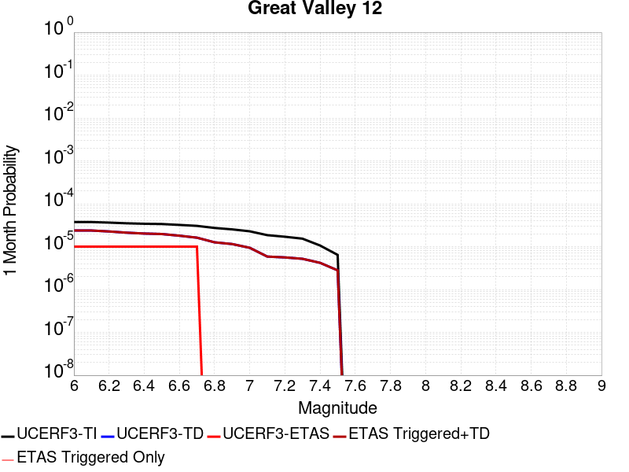 |  |  |

| Magnitude | 1 wk TI Prob | 1 wk TD Prob | 1 wk ETAS Prob | 1 wk ETAS/TD Gain | 1 wk ETAS Triggered+TD | 1 wk ETAS Triggered Only | 1 mo TI Prob | 1 mo TD Prob | 1 mo ETAS Prob | 1 mo ETAS/TD Gain | 1 mo ETAS Triggered+TD | 1 mo ETAS Triggered Only | 1 yr TI Prob | 1 yr TD Prob | 1 yr ETAS Prob | 1 yr ETAS/TD Gain | 1 yr ETAS Triggered+TD | 1 yr ETAS Triggered Only | 10 yr TI Prob | 10 yr TD Prob | 10 yr ETAS Prob | 10 yr ETAS/TD Gain | 10 yr ETAS Triggered+TD | 10 yr ETAS Triggered Only |
|-----|-----|-----|-----|-----|-----|-----|-----|-----|-----|-----|-----|-----|-----|-----|-----|-----|-----|-----|-----|-----|-----|-----|-----|-----|
| 6.0 | 8.757157E-6 | 5.55499E-6 | 0.0 | 0.0 | 5.55499E-6 | 0.0 | 3.7530135E-5 | 2.380689E-5 | 1.0E-5 | 0.42004648 | 2.380689E-5 | 0.0 | 4.5683357E-4 | 2.8981152E-4 | 1.1E-4 | 0.379557 | 2.9980863E-4 | 1.0E-5 | 0.004558956 | 0.0028944567 | 0.00163 | 0.5631454 | 0.002904428 | 1.0E-5 |
| 6.1 | 8.757157E-6 | 5.55499E-6 | 0.0 | 0.0 | 5.55499E-6 | 0.0 | 3.7530135E-5 | 2.380689E-5 | 1.0E-5 | 0.42004648 | 2.380689E-5 | 0.0 | 4.5683357E-4 | 2.8981152E-4 | 1.1E-4 | 0.379557 | 2.9980863E-4 | 1.0E-5 | 0.004558956 | 0.0028944567 | 0.00152 | 0.5251417 | 0.002904428 | 1.0E-5 |
| 6.2 | 8.499136E-6 | 5.280658E-6 | 0.0 | 0.0 | 5.280658E-6 | 0.0 | 3.642436E-5 | 2.2631202E-5 | 1.0E-5 | 0.4418678 | 2.2631202E-5 | 0.0 | 4.4337637E-4 | 2.755012E-4 | 1.1E-4 | 0.3992723 | 2.8549845E-4 | 1.0E-5 | 0.0044249278 | 0.002751711 | 0.00151 | 0.54874945 | 0.0027616837 | 1.0E-5 |
| 6.3 | 8.186883E-6 | 4.9488035E-6 | 0.0 | 0.0 | 4.9488035E-6 | 0.0 | 3.508617E-5 | 2.120899E-5 | 1.0E-5 | 0.47149816 | 2.120899E-5 | 0.0 | 4.270904E-4 | 2.581899E-4 | 1.0E-4 | 0.38731185 | 2.681873E-4 | 1.0E-5 | 0.004262705 | 0.0025789998 | 0.00138 | 0.53509116 | 0.0025889738 | 1.0E-5 |
| 6.4 | 7.979878E-6 | 4.720807E-6 | 0.0 | 0.0 | 4.720807E-6 | 0.0 | 3.419903E-5 | 2.0231879E-5 | 1.0E-5 | 0.4942695 | 2.0231879E-5 | 0.0 | 4.1629362E-4 | 2.4629623E-4 | 1.0E-4 | 0.40601516 | 2.5629374E-4 | 1.0E-5 | 0.0041551464 | 0.0024603265 | 0.00131 | 0.53244966 | 0.002470302 | 1.0E-5 |
| 6.5 | 7.871003E-6 | 4.6007817E-6 | 0.0 | 0.0 | 4.6007817E-6 | 0.0 | 3.373243E-5 | 1.9717492E-5 | 1.0E-5 | 0.5071639 | 1.9717492E-5 | 0.0 | 4.1061494E-4 | 2.4003495E-4 | 1.0E-4 | 0.41660598 | 2.5003255E-4 | 1.0E-5 | 0.0040985704 | 0.00239785 | 0.00129 | 0.5379819 | 0.002407826 | 1.0E-5 |
| 6.6 | 7.508221E-6 | 4.204166E-6 | 0.0 | 0.0 | 4.204166E-6 | 0.0 | 3.2177693E-5 | 1.8017736E-5 | 1.0E-5 | 0.5550087 | 1.8017736E-5 | 0.0 | 3.91693E-4 | 2.1934473E-4 | 1.0E-4 | 0.45590338 | 2.2934254E-4 | 1.0E-5 | 0.003910033 | 0.0021913685 | 0.0012 | 0.547603 | 0.0022013467 | 1.0E-5 |
| 6.7 | 7.1297914E-6 | 3.7818884E-6 | 0.0 | 0.0 | 3.7818884E-6 | 0.0 | 3.055589E-5 | 1.6207996E-5 | 1.0E-5 | 0.6169794 | 1.6207996E-5 | 0.0 | 3.7195446E-4 | 1.9731528E-4 | 9.0E-5 | 0.4561228 | 2.0731331E-4 | 1.0E-5 | 0.0037133251 | 0.0019714797 | 0.00109 | 0.55288416 | 0.00198146 | 1.0E-5 |
| 6.8 | 6.376581E-6 | 2.9484618E-6 | 0.0 | 0.0 | 2.9484618E-6 | 0.0 | 2.7327918E-5 | 1.2636205E-5 | 0.0 | 0.0 | 1.2636205E-5 | 0.0 | 3.326666E-4 | 1.5383509E-4 | 7.0E-5 | 0.4550327 | 1.6383355E-4 | 1.0E-5 | 0.0033216903 | 0.0015373026 | 9.1E-4 | 0.5919459 | 0.0015472873 | 1.0E-5 |
| 6.9 | 5.9095E-6 | 2.6865296E-6 | 0.0 | 0.0 | 2.6865296E-6 | 0.0 | 2.5326184E-5 | 1.1513648E-5 | 0.0 | 0.0 | 1.1513648E-5 | 0.0 | 3.0830267E-4 | 1.4016981E-4 | 7.0E-5 | 0.4993943 | 1.501684E-4 | 1.0E-5 | 0.003078753 | 0.0014008294 | 8.2E-4 | 0.5853675 | 0.0014108154 | 1.0E-5 |
| 7.0 | 5.3239864E-6 | 2.1966623E-6 | 0.0 | 0.0 | 2.1966623E-6 | 0.0 | 2.2816885E-5 | 9.414233E-6 | 0.0 | 0.0 | 9.414233E-6 | 0.0 | 2.7776015E-4 | 1.146124E-4 | 6.0E-5 | 0.52350354 | 1.2461125E-4 | 1.0E-5 | 0.0027741324 | 0.0011455463 | 7.4E-4 | 0.64597994 | 0.0011555349 | 1.0E-5 |
| 7.1 | 4.329147E-6 | 1.3707412E-6 | 0.0 | 0.0 | 1.3707412E-6 | 0.0 | 1.8553355E-5 | 5.8745923E-6 | 0.0 | 0.0 | 5.8745923E-6 | 0.0 | 2.2586368E-4 | 7.15209E-5 | 3.0E-5 | 0.4194578 | 8.1520186E-5 | 1.0E-5 | 0.0022563424 | 7.149875E-4 | 5.2E-4 | 0.72728544 | 7.249804E-4 | 1.0E-5 |
| 7.2 | 3.978488E-6 | 1.3105756E-6 | 0.0 | 0.0 | 1.3105756E-6 | 0.0 | 1.7050552E-5 | 5.6167414E-6 | 0.0 | 0.0 | 5.6167414E-6 | 0.0 | 2.075707E-4 | 6.838176E-5 | 3.0E-5 | 0.43871343 | 7.838108E-5 | 1.0E-5 | 0.0020737692 | 6.8361586E-4 | 5.0E-4 | 0.73140496 | 6.93609E-4 | 1.0E-5 |
| 7.3 | 3.586542E-6 | 1.21573E-6 | 0.0 | 0.0 | 1.21573E-6 | 0.0 | 1.5370804E-5 | 5.2102614E-6 | 0.0 | 0.0 | 5.2102614E-6 | 0.0 | 1.8712347E-4 | 6.343317E-5 | 3.0E-5 | 0.47293866 | 7.343254E-5 | 1.0E-5 | 0.0018696598 | 6.341592E-4 | 4.6E-4 | 0.72536993 | 6.441528E-4 | 1.0E-5 |
| 7.4 | 2.4837766E-6 | 9.80032E-7 | 0.0 | 0.0 | 9.80032E-7 | 0.0 | 1.0644713E-5 | 4.2001307E-6 | 0.0 | 0.0 | 4.2001307E-6 | 0.0 | 1.2959167E-4 | 5.113546E-5 | 3.0E-5 | 0.586677 | 6.1134946E-5 | 1.0E-5 | 0.0012951613 | 5.1124353E-4 | 3.4E-4 | 0.66504514 | 5.212384E-4 | 1.0E-5 |
| 7.5 | 1.5002679E-6 | 6.545985E-7 | 0.0 | 0.0 | 6.545985E-7 | 0.0 | 6.4297037E-6 | 2.8054194E-6 | 0.0 | 0.0 | 2.8054194E-6 | 0.0 | 7.827883E-5 | 3.4155488E-5 | 1.0E-5 | 0.2927787 | 3.4155488E-5 | 0.0 | 7.825126E-4 | 3.4150656E-4 | 2.4E-4 | 0.7027684 | 3.4150656E-4 | 0.0 |

## Great Valley 11
*[(top)](#table-of-contents)*

| 1 Week | 1 Month | 1 Year | 10 Year |
|-----|-----|-----|-----|
|  |  |  |  |

| Magnitude | 1 wk TI Prob | 1 wk TD Prob | 1 wk ETAS Prob | 1 wk ETAS/TD Gain | 1 wk ETAS Triggered+TD | 1 wk ETAS Triggered Only | 1 mo TI Prob | 1 mo TD Prob | 1 mo ETAS Prob | 1 mo ETAS/TD Gain | 1 mo ETAS Triggered+TD | 1 mo ETAS Triggered Only | 1 yr TI Prob | 1 yr TD Prob | 1 yr ETAS Prob | 1 yr ETAS/TD Gain | 1 yr ETAS Triggered+TD | 1 yr ETAS Triggered Only | 10 yr TI Prob | 10 yr TD Prob | 10 yr ETAS Prob | 10 yr ETAS/TD Gain | 10 yr ETAS Triggered+TD | 10 yr ETAS Triggered Only |
|-----|-----|-----|-----|-----|-----|-----|-----|-----|-----|-----|-----|-----|-----|-----|-----|-----|-----|-----|-----|-----|-----|-----|-----|-----|
| 6.0 | 2.8099583E-5 | 2.983214E-5 | 0.0 | 0.0 | 2.983214E-5 | 0.0 | 1.20421224E-4 | 1.2784619E-4 | 3.0E-5 | 0.23465699 | 1.2784619E-4 | 0.0 | 0.0014651422 | 0.0015554894 | 6.9E-4 | 0.44359028 | 0.0015654739 | 1.0E-5 | 0.0145552 | 0.015453546 | 0.00782 | 0.5060327 | 0.015463391 | 1.0E-5 |
| 6.1 | 2.483194E-5 | 2.5907144E-5 | 0.0 | 0.0 | 2.5907144E-5 | 0.0 | 1.0641825E-4 | 1.11026246E-4 | 3.0E-5 | 0.27020636 | 1.11026246E-4 | 0.0 | 0.0012948721 | 0.0013509697 | 6.4E-4 | 0.47373378 | 0.0013609562 | 1.0E-5 | 0.012873529 | 0.013433979 | 0.0069 | 0.513623 | 0.013443844 | 1.0E-5 |
| 6.2 | 2.483194E-5 | 2.5907144E-5 | 0.0 | 0.0 | 2.5907144E-5 | 0.0 | 1.0641825E-4 | 1.11026246E-4 | 3.0E-5 | 0.27020636 | 1.11026246E-4 | 0.0 | 0.0012948721 | 0.0013509697 | 6.4E-4 | 0.47373378 | 0.0013609562 | 1.0E-5 | 0.012873529 | 0.013433979 | 0.0069 | 0.513623 | 0.013443844 | 1.0E-5 |
| 6.3 | 2.0257901E-5 | 2.0398915E-5 | 0.0 | 0.0 | 2.0398915E-5 | 0.0 | 8.681669E-5 | 8.742122E-5 | 3.0E-5 | 0.3431661 | 8.742122E-5 | 0.0 | 0.0010564806 | 0.0010638753 | 5.1E-4 | 0.47937948 | 0.0010738646 | 1.0E-5 | 0.01051472 | 0.010591993 | 0.00553 | 0.52209246 | 0.0106018875 | 1.0E-5 |
| 6.4 | 1.8054898E-5 | 1.7780852E-5 | 0.0 | 0.0 | 1.7780852E-5 | 0.0 | 7.737584E-5 | 7.6201635E-5 | 3.0E-5 | 0.39369234 | 7.6201635E-5 | 0.0 | 9.416436E-4 | 9.2739763E-4 | 4.7E-4 | 0.50679445 | 9.3738834E-4 | 1.0E-5 | 0.009376635 | 0.009239015 | 0.0049 | 0.53035957 | 0.009248923 | 1.0E-5 |
| 6.5 | 1.34804895E-5 | 1.2321004E-5 | 0.0 | 0.0 | 1.2321004E-5 | 0.0 | 5.777225E-5 | 5.2803258E-5 | 2.0E-5 | 0.3787645 | 5.2803258E-5 | 0.0 | 7.031501E-4 | 6.426942E-4 | 3.3E-4 | 0.5134635 | 6.5268774E-4 | 1.0E-5 | 0.007009294 | 0.006408792 | 0.00351 | 0.5476851 | 0.0064187283 | 1.0E-5 |
| 6.6 | 1.294883E-5 | 1.1732261E-5 | 0.0 | 0.0 | 1.1732261E-5 | 0.0 | 5.5493805E-5 | 5.028017E-5 | 2.0E-5 | 0.39777112 | 5.028017E-5 | 0.0 | 6.754276E-4 | 6.1199325E-4 | 3.3E-4 | 0.53922164 | 6.219871E-4 | 1.0E-5 | 0.006733784 | 0.0061035044 | 0.00333 | 0.5455882 | 0.0061134435 | 1.0E-5 |
| 6.7 | 1.1272237E-5 | 9.811834E-6 | 0.0 | 0.0 | 9.811834E-6 | 0.0 | 4.8308695E-5 | 4.205006E-5 | 2.0E-5 | 0.4756236 | 4.205006E-5 | 0.0 | 5.879996E-4 | 5.1184196E-4 | 3.2E-4 | 0.625193 | 5.218368E-4 | 1.0E-5 | 0.005864462 | 0.005106915 | 0.00285 | 0.5580669 | 0.0051168636 | 1.0E-5 |
| 6.8 | 9.8337505E-6 | 8.193719E-6 | 0.0 | 0.0 | 8.193719E-6 | 0.0 | 4.2143965E-5 | 3.5115478E-5 | 1.0E-5 | 0.28477472 | 3.5115478E-5 | 0.0 | 5.1298196E-4 | 4.2744912E-4 | 2.6E-4 | 0.60825956 | 4.3744483E-4 | 1.0E-5 | 0.005117994 | 0.0042664795 | 0.00239 | 0.56018084 | 0.0042764368 | 1.0E-5 |
| 6.9 | 7.4224813E-6 | 5.4130837E-6 | 0.0 | 0.0 | 5.4130837E-6 | 0.0 | 3.1810247E-5 | 2.3198732E-5 | 1.0E-5 | 0.43105805 | 2.3198732E-5 | 0.0 | 3.872209E-4 | 2.8240937E-4 | 1.5E-4 | 0.53114384 | 2.9240653E-4 | 1.0E-5 | 0.0038654688 | 0.0028206457 | 0.00164 | 0.58142716 | 0.0028306174 | 1.0E-5 |
| 7.0 | 4.4628923E-6 | 2.0110294E-6 | 0.0 | 0.0 | 2.0110294E-6 | 0.0 | 1.912654E-5 | 8.61867E-6 | 0.0 | 0.0 | 8.61867E-6 | 0.0 | 2.3284076E-4 | 1.0492737E-4 | 6.0E-5 | 0.57182413 | 1.1492632E-4 | 1.0E-5 | 0.0023259693 | 0.0010487898 | 6.6E-4 | 0.6292967 | 0.0010587793 | 1.0E-5 |
| 7.1 | 3.5546527E-6 | 1.1855383E-6 | 0.0 | 0.0 | 1.1855383E-6 | 0.0 | 1.5234136E-5 | 5.080869E-6 | 0.0 | 0.0 | 5.080869E-6 | 0.0 | 1.8545982E-4 | 6.185789E-5 | 3.0E-5 | 0.48498258 | 7.185727E-5 | 1.0E-5 | 0.0018530512 | 6.1841356E-4 | 4.4E-4 | 0.711498 | 6.2840735E-4 | 1.0E-5 |
| 7.2 | 3.2039936E-6 | 1.1253728E-6 | 0.0 | 0.0 | 1.1253728E-6 | 0.0 | 1.3731329E-5 | 4.8230177E-6 | 0.0 | 0.0 | 4.8230177E-6 | 0.0 | 1.671661E-4 | 5.8718724E-5 | 3.0E-5 | 0.5109103 | 6.871814E-5 | 1.0E-5 | 0.0016704041 | 5.870388E-4 | 4.2E-4 | 0.71545523 | 5.9703295E-4 | 1.0E-5 |
| 7.3 | 2.8120473E-6 | 1.0305271E-6 | 0.0 | 0.0 | 1.0305271E-6 | 0.0 | 1.2051575E-5 | 4.4165376E-6 | 0.0 | 0.0 | 4.4165376E-6 | 0.0 | 1.4671806E-4 | 5.3770087E-5 | 3.0E-5 | 0.557931 | 6.376955E-5 | 1.0E-5 | 0.0014662122 | 5.375774E-4 | 3.8E-4 | 0.70687497 | 5.47572E-4 | 1.0E-5 |
| 7.4 | 2.4837766E-6 | 9.80032E-7 | 0.0 | 0.0 | 9.80032E-7 | 0.0 | 1.0644713E-5 | 4.2001307E-6 | 0.0 | 0.0 | 4.2001307E-6 | 0.0 | 1.2959167E-4 | 5.113546E-5 | 3.0E-5 | 0.586677 | 6.1134946E-5 | 1.0E-5 | 0.0012951613 | 5.1124353E-4 | 3.4E-4 | 0.66504514 | 5.212384E-4 | 1.0E-5 |
| 7.5 | 1.5002679E-6 | 6.545985E-7 | 0.0 | 0.0 | 6.545985E-7 | 0.0 | 6.4297037E-6 | 2.8054194E-6 | 0.0 | 0.0 | 2.8054194E-6 | 0.0 | 7.827883E-5 | 3.4155488E-5 | 1.0E-5 | 0.2927787 | 3.4155488E-5 | 0.0 | 7.825126E-4 | 3.4150656E-4 | 2.4E-4 | 0.7027684 | 3.4150656E-4 | 0.0 |

## San Andreas (Offshore) 2011 CFM
*[(top)](#table-of-contents)*

| 1 Week | 1 Month | 1 Year | 10 Year |
|-----|-----|-----|-----|
|  |  |  |  |

| Magnitude | 1 wk TI Prob | 1 wk TD Prob | 1 wk ETAS Prob | 1 wk ETAS/TD Gain | 1 wk ETAS Triggered+TD | 1 wk ETAS Triggered Only | 1 mo TI Prob | 1 mo TD Prob | 1 mo ETAS Prob | 1 mo ETAS/TD Gain | 1 mo ETAS Triggered+TD | 1 mo ETAS Triggered Only | 1 yr TI Prob | 1 yr TD Prob | 1 yr ETAS Prob | 1 yr ETAS/TD Gain | 1 yr ETAS Triggered+TD | 1 yr ETAS Triggered Only | 10 yr TI Prob | 10 yr TD Prob | 10 yr ETAS Prob | 10 yr ETAS/TD Gain | 10 yr ETAS Triggered+TD | 10 yr ETAS Triggered Only |
|-----|-----|-----|-----|-----|-----|-----|-----|-----|-----|-----|-----|-----|-----|-----|-----|-----|-----|-----|-----|-----|-----|-----|-----|-----|
| 6.0 | 1.7072787E-4 | 1.9226626E-4 | 6.0E-5 | 0.3120672 | 1.9226626E-4 | 0.0 | 7.3148566E-4 | 8.237405E-4 | 3.4E-4 | 0.41275135 | 8.237405E-4 | 0.0 | 0.008869528 | 0.009983436 | 0.00483 | 0.48380136 | 0.009993336 | 1.0E-5 | 0.085237645 | 0.09681613 | 0.04904 | 0.5065271 | 0.09682517 | 1.0E-5 |
| 6.1 | 1.7072787E-4 | 1.9226626E-4 | 6.0E-5 | 0.3120672 | 1.9226626E-4 | 0.0 | 7.3148566E-4 | 8.237405E-4 | 3.4E-4 | 0.41275135 | 8.237405E-4 | 0.0 | 0.008869528 | 0.009983436 | 0.00483 | 0.48380136 | 0.009993336 | 1.0E-5 | 0.085237645 | 0.09681613 | 0.04904 | 0.5065271 | 0.09682517 | 1.0E-5 |
| 6.2 | 1.6312556E-4 | 1.8408237E-4 | 6.0E-5 | 0.32594106 | 1.8408237E-4 | 0.0 | 6.989222E-4 | 7.8868825E-4 | 3.4E-4 | 0.43109554 | 7.8868825E-4 | 0.0 | 0.008476226 | 0.0095605 | 0.00457 | 0.47800845 | 0.009570405 | 1.0E-5 | 0.08160117 | 0.092837214 | 0.0468 | 0.5041082 | 0.09284629 | 1.0E-5 |
| 6.3 | 1.5103363E-4 | 1.6881147E-4 | 5.0E-5 | 0.2961884 | 1.6881147E-4 | 0.0 | 6.471264E-4 | 7.232793E-4 | 3.2E-4 | 0.44242933 | 7.232793E-4 | 0.0 | 0.007850339 | 0.008770814 | 0.00418 | 0.4765806 | 0.008780727 | 1.0E-5 | 0.075787395 | 0.08546859 | 0.04284 | 0.50123674 | 0.08547774 | 1.0E-5 |
| 6.4 | 1.5047993E-4 | 1.6767075E-4 | 5.0E-5 | 0.29820347 | 1.6767075E-4 | 0.0 | 6.4475456E-4 | 7.183932E-4 | 3.2E-4 | 0.44543853 | 7.183932E-4 | 0.0 | 0.007821669 | 0.008711802 | 0.00414 | 0.47521743 | 0.008721715 | 1.0E-5 | 0.0755203 | 0.08494888 | 0.04255 | 0.5008895 | 0.08495803 | 1.0E-5 |
| 6.5 | 1.2760791E-4 | 1.3734949E-4 | 4.0E-5 | 0.29122788 | 1.3734949E-4 | 0.0 | 5.467764E-4 | 5.8850925E-4 | 2.7E-4 | 0.45878634 | 5.8850925E-4 | 0.0 | 0.0066367025 | 0.007141834 | 0.00327 | 0.45786557 | 0.007141834 | 0.0 | 0.064419635 | 0.07024954 | 0.03438 | 0.4893982 | 0.07024954 | 0.0 |
| 6.6 | 1.1063525E-4 | 1.15565475E-4 | 2.0E-5 | 0.17306206 | 1.15565475E-4 | 0.0 | 4.740649E-4 | 4.9518765E-4 | 2.1E-4 | 0.42408165 | 4.9518765E-4 | 0.0 | 0.0057564764 | 0.006012446 | 0.00269 | 0.44740528 | 0.006012446 | 0.0 | 0.05609626 | 0.059496127 | 0.02856 | 0.48003125 | 0.059496127 | 0.0 |
| 6.7 | 1.0391049E-4 | 1.0645875E-4 | 2.0E-5 | 0.1878662 | 1.0645875E-4 | 0.0 | 4.4525467E-4 | 4.56173E-4 | 1.8E-4 | 0.39458713 | 4.56173E-4 | 0.0 | 0.0054075094 | 0.0055399504 | 0.00248 | 0.44765744 | 0.0055399504 | 0.0 | 0.052778035 | 0.05498844 | 0.02613 | 0.4751908 | 0.05498844 | 0.0 |
| 6.8 | 1.0096706E-4 | 1.01582154E-4 | 2.0E-5 | 0.19688497 | 1.01582154E-4 | 0.0 | 4.3264418E-4 | 4.3528038E-4 | 1.7E-4 | 0.39055285 | 4.3528038E-4 | 0.0 | 0.0052547283 | 0.0052868384 | 0.00235 | 0.44450006 | 0.0052868384 | 0.0 | 0.051321987 | 0.052686825 | 0.0249 | 0.47260392 | 0.052686825 | 0.0 |
| 6.9 | 9.800265E-5 | 9.588697E-5 | 2.0E-5 | 0.20857891 | 9.588697E-5 | 0.0 | 4.1994374E-4 | 4.1088034E-4 | 1.6E-4 | 0.38940778 | 4.1088034E-4 | 0.0 | 0.0051008356 | 0.004991162 | 0.00229 | 0.45881096 | 0.004991162 | 0.0 | 0.049853306 | 0.05001508 | 0.02362 | 0.47225758 | 0.05001508 | 0.0 |
| 7.0 | 9.4642375E-5 | 9.002096E-5 | 2.0E-5 | 0.22217047 | 9.002096E-5 | 0.0 | 4.0554712E-4 | 3.8574796E-4 | 1.4E-4 | 0.36293128 | 3.8574796E-4 | 0.0 | 0.004926363 | 0.00468653 | 0.00216 | 0.46089536 | 0.00468653 | 0.0 | 0.048185747 | 0.047194667 | 0.02223 | 0.47102782 | 0.047194667 | 0.0 |
| 7.1 | 9.0996844E-5 | 8.354119E-5 | 2.0E-5 | 0.23940286 | 8.354119E-5 | 0.0 | 3.8992817E-4 | 3.579854E-4 | 1.3E-4 | 0.3631433 | 3.579854E-4 | 0.0 | 0.004737046 | 0.0043499186 | 0.00197 | 0.45288205 | 0.0043499186 | 0.0 | 0.04637333 | 0.04404688 | 0.02058 | 0.4672295 | 0.04404688 | 0.0 |
| 7.2 | 8.848287E-5 | 7.981761E-5 | 2.0E-5 | 0.25057125 | 7.981761E-5 | 0.0 | 3.791572E-4 | 3.420315E-4 | 1.2E-4 | 0.3508449 | 3.420315E-4 | 0.0 | 0.004606472 | 0.0041564363 | 0.00188 | 0.45231056 | 0.0041564363 | 0.0 | 0.045121472 | 0.042189904 | 0.01955 | 0.46338102 | 0.042189904 | 0.0 |
| 7.3 | 7.9280784E-5 | 6.1274885E-5 | 1.0E-5 | 0.16319901 | 6.1274885E-5 | 0.0 | 3.3973053E-4 | 2.6258078E-4 | 8.0E-5 | 0.30466816 | 2.6258078E-4 | 0.0 | 0.004128377 | 0.003192337 | 0.0015 | 0.46987522 | 0.003192337 | 0.0 | 0.040525194 | 0.03290183 | 0.01527 | 0.4641079 | 0.03290183 | 0.0 |
| 7.4 | 6.468038E-5 | 3.7930724E-5 | 0.0 | 0.0 | 3.7930724E-5 | 0.0 | 2.771722E-4 | 1.6255044E-4 | 4.0E-5 | 0.24607748 | 1.6255044E-4 | 0.0 | 0.0033693502 | 0.0019773128 | 9.5E-4 | 0.48045 | 0.0019773128 | 0.0 | 0.0331872 | 0.02081734 | 0.0097 | 0.4659577 | 0.02081734 | 0.0 |
| 7.5 | 4.930574E-5 | 1.2699263E-5 | 0.0 | 0.0 | 1.2699263E-5 | 0.0 | 2.1129321E-4 | 5.4424287E-5 | 0.0 | 0.0 | 5.4424287E-5 | 0.0 | 0.0025694598 | 6.6241587E-4 | 3.4E-4 | 0.51327276 | 6.6241587E-4 | 0.0 | 0.02539953 | 0.0074798525 | 0.00339 | 0.4532175 | 0.0074798525 | 0.0 |
| 7.6 | 4.612566E-5 | 1.0332297E-5 | 0.0 | 0.0 | 1.0332297E-5 | 0.0 | 1.9766642E-4 | 4.428053E-5 | 0.0 | 0.0 | 4.428053E-5 | 0.0 | 0.0024039324 | 5.3898344E-4 | 2.6E-4 | 0.48238957 | 5.3898344E-4 | 0.0 | 0.023780935 | 0.006170428 | 0.00283 | 0.45863917 | 0.006170428 | 0.0 |
| 7.7 | 3.9435414E-5 | 5.5710498E-6 | 0.0 | 0.0 | 5.5710498E-6 | 0.0 | 1.6899795E-4 | 2.3875711E-5 | 0.0 | 0.0 | 2.3875711E-5 | 0.0 | 0.0020556084 | 2.906482E-4 | 1.9E-4 | 0.65371126 | 2.906482E-4 | 0.0 | 0.020366974 | 0.0035397834 | 0.00154 | 0.43505487 | 0.0035397834 | 0.0 |
| 7.8 | 2.7787428E-5 | 3.7526645E-6 | 0.0 | 0.0 | 3.7526645E-6 | 0.0 | 1.1908354E-4 | 1.6082748E-5 | 0.0 | 0.0 | 1.6082748E-5 | 0.0 | 0.0014488777 | 1.9578991E-4 | 1.4E-4 | 0.7150522 | 1.9578991E-4 | 0.0 | 0.014394675 | 0.0023862 | 0.00111 | 0.46517476 | 0.0023862 | 0.0 |
| 7.9 | 1.590671E-5 | 3.0391298E-6 | 0.0 | 0.0 | 3.0391298E-6 | 0.0 | 6.816983E-5 | 1.3024777E-5 | 0.0 | 0.0 | 1.3024777E-5 | 0.0 | 8.2965166E-4 | 1.5856515E-4 | 1.2E-4 | 0.7567867 | 1.5856515E-4 | 0.0 | 0.008265611 | 0.0019033558 | 8.7E-4 | 0.45708743 | 0.0019033558 | 0.0 |
| 8.0 | 9.193638E-6 | 2.5908973E-6 | 0.0 | 0.0 | 2.5908973E-6 | 0.0 | 3.940071E-5 | 1.1103798E-5 | 0.0 | 0.0 | 1.1103798E-5 | 0.0 | 4.7959806E-4 | 1.3518038E-4 | 1.0E-4 | 0.7397523 | 1.3518038E-4 | 0.0 | 0.0047856434 | 0.0016108477 | 7.2E-4 | 0.44696966 | 0.0016108477 | 0.0 |
| 8.1 | 5.601576E-6 | 2.2333788E-6 | 0.0 | 0.0 | 2.2333788E-6 | 0.0 | 2.4006533E-5 | 9.571589E-6 | 0.0 | 0.0 | 9.571589E-6 | 0.0 | 2.9224035E-4 | 1.1652788E-4 | 7.0E-5 | 0.60071456 | 1.1652788E-4 | 0.0 | 0.0029185633 | 0.0014015464 | 6.1E-4 | 0.43523356 | 0.0014015464 | 0.0 |
| 8.2 | 4.3508785E-6 | 1.8568232E-6 | 0.0 | 0.0 | 1.8568232E-6 | 0.0 | 1.864649E-5 | 7.957789E-6 | 0.0 | 0.0 | 7.957789E-6 | 0.0 | 2.2699735E-4 | 9.6881806E-5 | 6.0E-5 | 0.61931133 | 9.6881806E-5 | 0.0 | 0.0022676561 | 0.0011590312 | 5.3E-4 | 0.4572785 | 0.0011590312 | 0.0 |
| 8.3 | 1.9573292E-6 | 7.511501E-7 | 0.0 | 0.0 | 7.511501E-7 | 0.0 | 8.388526E-6 | 3.2192108E-6 | 0.0 | 0.0 | 3.2192108E-6 | 0.0 | 1.0212552E-4 | 3.9193204E-5 | 1.0E-5 | 0.25514627 | 3.9193204E-5 | 0.0 | 0.001020786 | 4.6391718E-4 | 1.9E-4 | 0.40955585 | 4.6391718E-4 | 0.0 |

## Northridge Hills
*[(top)](#table-of-contents)*

| 1 Week | 1 Month | 1 Year | 10 Year |
|-----|-----|-----|-----|
|  |  |  |  |

| Magnitude | 1 wk TI Prob | 1 wk TD Prob | 1 wk ETAS Prob | 1 wk ETAS/TD Gain | 1 wk ETAS Triggered+TD | 1 wk ETAS Triggered Only | 1 mo TI Prob | 1 mo TD Prob | 1 mo ETAS Prob | 1 mo ETAS/TD Gain | 1 mo ETAS Triggered+TD | 1 mo ETAS Triggered Only | 1 yr TI Prob | 1 yr TD Prob | 1 yr ETAS Prob | 1 yr ETAS/TD Gain | 1 yr ETAS Triggered+TD | 1 yr ETAS Triggered Only | 10 yr TI Prob | 10 yr TD Prob | 10 yr ETAS Prob | 10 yr ETAS/TD Gain | 10 yr ETAS Triggered+TD | 10 yr ETAS Triggered Only |
|-----|-----|-----|-----|-----|-----|-----|-----|-----|-----|-----|-----|-----|-----|-----|-----|-----|-----|-----|-----|-----|-----|-----|-----|-----|
| 6.0 | 5.095982E-6 | 3.6152135E-6 | 0.0 | 0.0 | 3.6152135E-6 | 0.0 | 2.183974E-5 | 1.549368E-5 | 0.0 | 0.0 | 1.549368E-5 | 0.0 | 2.658664E-4 | 1.8861935E-4 | 4.0E-5 | 0.21206732 | 1.9861746E-4 | 1.0E-5 | 0.0026554854 | 0.0018846049 | 0.00111 | 0.5889828 | 0.0018945861 | 1.0E-5 |
| 6.1 | 5.095982E-6 | 3.6152135E-6 | 0.0 | 0.0 | 3.6152135E-6 | 0.0 | 2.183974E-5 | 1.549368E-5 | 0.0 | 0.0 | 1.549368E-5 | 0.0 | 2.658664E-4 | 1.8861935E-4 | 4.0E-5 | 0.21206732 | 1.9861746E-4 | 1.0E-5 | 0.0026554854 | 0.0018846049 | 0.00111 | 0.5889828 | 0.0018945861 | 1.0E-5 |
| 6.2 | 5.095982E-6 | 3.6152135E-6 | 0.0 | 0.0 | 3.6152135E-6 | 0.0 | 2.183974E-5 | 1.549368E-5 | 0.0 | 0.0 | 1.549368E-5 | 0.0 | 2.658664E-4 | 1.8861935E-4 | 4.0E-5 | 0.21206732 | 1.9861746E-4 | 1.0E-5 | 0.0026554854 | 0.0018846049 | 0.00111 | 0.5889828 | 0.0018945861 | 1.0E-5 |
| 6.3 | 5.095982E-6 | 3.6152135E-6 | 0.0 | 0.0 | 3.6152135E-6 | 0.0 | 2.183974E-5 | 1.549368E-5 | 0.0 | 0.0 | 1.549368E-5 | 0.0 | 2.658664E-4 | 1.8861935E-4 | 4.0E-5 | 0.21206732 | 1.9861746E-4 | 1.0E-5 | 0.0026554854 | 0.0018846049 | 0.00111 | 0.5889828 | 0.0018945861 | 1.0E-5 |
| 6.4 | 5.095982E-6 | 3.6152135E-6 | 0.0 | 0.0 | 3.6152135E-6 | 0.0 | 2.183974E-5 | 1.549368E-5 | 0.0 | 0.0 | 1.549368E-5 | 0.0 | 2.658664E-4 | 1.8861935E-4 | 4.0E-5 | 0.21206732 | 1.9861746E-4 | 1.0E-5 | 0.0026554854 | 0.0018846049 | 0.00111 | 0.5889828 | 0.0018945861 | 1.0E-5 |
| 6.5 | 5.095982E-6 | 3.6152135E-6 | 0.0 | 0.0 | 3.6152135E-6 | 0.0 | 2.183974E-5 | 1.549368E-5 | 0.0 | 0.0 | 1.549368E-5 | 0.0 | 2.658664E-4 | 1.8861935E-4 | 4.0E-5 | 0.21206732 | 1.9861746E-4 | 1.0E-5 | 0.0026554854 | 0.0018846049 | 0.00111 | 0.5889828 | 0.0018945861 | 1.0E-5 |
| 6.6 | 5.095982E-6 | 3.6152135E-6 | 0.0 | 0.0 | 3.6152135E-6 | 0.0 | 2.183974E-5 | 1.549368E-5 | 0.0 | 0.0 | 1.549368E-5 | 0.0 | 2.658664E-4 | 1.8861935E-4 | 4.0E-5 | 0.21206732 | 1.9861746E-4 | 1.0E-5 | 0.0026554854 | 0.0018846049 | 0.00111 | 0.5889828 | 0.0018945861 | 1.0E-5 |
| 6.7 | 5.095982E-6 | 3.6152135E-6 | 0.0 | 0.0 | 3.6152135E-6 | 0.0 | 2.183974E-5 | 1.549368E-5 | 0.0 | 0.0 | 1.549368E-5 | 0.0 | 2.658664E-4 | 1.8861935E-4 | 4.0E-5 | 0.21206732 | 1.9861746E-4 | 1.0E-5 | 0.0026554854 | 0.0018846049 | 0.00111 | 0.5889828 | 0.0018945861 | 1.0E-5 |
| 6.8 | 5.095982E-6 | 3.6152135E-6 | 0.0 | 0.0 | 3.6152135E-6 | 0.0 | 2.183974E-5 | 1.549368E-5 | 0.0 | 0.0 | 1.549368E-5 | 0.0 | 2.658664E-4 | 1.8861935E-4 | 4.0E-5 | 0.21206732 | 1.9861746E-4 | 1.0E-5 | 0.0026554854 | 0.0018846049 | 0.00111 | 0.5889828 | 0.0018945861 | 1.0E-5 |
| 6.9 | 5.0942654E-6 | 3.6134284E-6 | 0.0 | 0.0 | 3.6134284E-6 | 0.0 | 2.1832384E-5 | 1.548603E-5 | 0.0 | 0.0 | 1.548603E-5 | 0.0 | 2.6577685E-4 | 1.8852622E-4 | 4.0E-5 | 0.21217208 | 1.9852434E-4 | 1.0E-5 | 0.002654592 | 0.0018836753 | 0.00111 | 0.5892735 | 0.0018936564 | 1.0E-5 |
| 7.0 | 4.851143E-6 | 3.3587432E-6 | 0.0 | 0.0 | 3.3587432E-6 | 0.0 | 2.0790447E-5 | 1.4394534E-5 | 0.0 | 0.0 | 1.4394534E-5 | 0.0 | 2.5309427E-4 | 1.752394E-4 | 4.0E-5 | 0.22825916 | 1.8523766E-4 | 1.0E-5 | 0.0025280623 | 0.0017510166 | 0.00103 | 0.5882297 | 0.0017609991 | 1.0E-5 |
| 7.1 | 4.7910607E-6 | 3.2970245E-6 | 0.0 | 0.0 | 3.2970245E-6 | 0.0 | 2.0532956E-5 | 1.4130029E-5 | 0.0 | 0.0 | 1.4130029E-5 | 0.0 | 2.4996005E-4 | 1.7201956E-4 | 4.0E-5 | 0.23253171 | 1.8201783E-4 | 1.0E-5 | 0.0024967908 | 0.0017188682 | 0.00101 | 0.587596 | 0.0017288509 | 1.0E-5 |
| 7.2 | 4.580079E-6 | 3.106803E-6 | 0.0 | 0.0 | 3.106803E-6 | 0.0 | 1.9628762E-5 | 1.3314802E-5 | 0.0 | 0.0 | 1.3314802E-5 | 0.0 | 2.3895396E-4 | 1.6209569E-4 | 4.0E-5 | 0.24676783 | 1.7209406E-4 | 1.0E-5 | 0.0023869718 | 0.001619778 | 9.5E-4 | 0.5865001 | 0.0016297618 | 1.0E-5 |
| 7.3 | 4.290062E-6 | 2.8682362E-6 | 0.0 | 0.0 | 2.8682362E-6 | 0.0 | 1.838585E-5 | 1.2292383E-5 | 0.0 | 0.0 | 1.2292383E-5 | 0.0 | 2.2382473E-4 | 1.4964951E-4 | 4.0E-5 | 0.26729122 | 1.5964801E-4 | 1.0E-5 | 0.0022359942 | 0.0014954903 | 9.1E-4 | 0.60849607 | 0.0015054754 | 1.0E-5 |
| 7.4 | 4.0259683E-6 | 2.6739135E-6 | 0.0 | 0.0 | 2.6739135E-6 | 0.0 | 1.7254037E-5 | 1.1459579E-5 | 0.0 | 0.0 | 1.1459579E-5 | 0.0 | 2.1004764E-4 | 1.3951147E-4 | 4.0E-5 | 0.2867148 | 1.4951007E-4 | 1.0E-5 | 0.002098492 | 0.0013942417 | 8.5E-4 | 0.60965043 | 0.0014042277 | 1.0E-5 |
| 7.5 | 3.5477108E-6 | 2.285198E-6 | 0.0 | 0.0 | 2.285198E-6 | 0.0 | 1.5204386E-5 | 9.793668E-6 | 0.0 | 0.0 | 9.793668E-6 | 0.0 | 1.8509767E-4 | 1.192314E-4 | 4.0E-5 | 0.3354821 | 1.292302E-4 | 1.0E-5 | 0.0018494357 | 0.0011916759 | 7.8E-4 | 0.6545404 | 0.001201664 | 1.0E-5 |
| 7.6 | 2.9990608E-6 | 1.8528159E-6 | 0.0 | 0.0 | 1.8528159E-6 | 0.0 | 1.2853055E-5 | 7.940615E-6 | 0.0 | 0.0 | 7.940615E-6 | 0.0 | 1.564747E-4 | 9.667271E-5 | 4.0E-5 | 0.41376725 | 1.06671745E-4 | 1.0E-5 | 0.0015636457 | 9.6630736E-4 | 6.5E-4 | 0.6726638 | 9.762977E-4 | 1.0E-5 |
| 7.7 | 2.4542855E-6 | 1.4461142E-6 | 0.0 | 0.0 | 1.4461142E-6 | 0.0 | 1.05183235E-5 | 6.1976175E-6 | 0.0 | 0.0 | 6.1976175E-6 | 0.0 | 1.2805307E-4 | 7.545339E-5 | 3.0E-5 | 0.39759648 | 8.545263E-5 | 1.0E-5 | 0.001279793 | 7.5427827E-4 | 4.8E-4 | 0.63636994 | 7.642707E-4 | 1.0E-5 |
| 7.8 | 1.3623128E-6 | 8.0160027E-7 | 0.0 | 0.0 | 8.0160027E-7 | 0.0 | 5.8384703E-6 | 3.4354252E-6 | 0.0 | 0.0 | 3.4354252E-6 | 0.0 | 7.108106E-5 | 4.18255E-5 | 1.0E-5 | 0.23908858 | 4.18255E-5 | 0.0 | 7.1058323E-4 | 4.1817653E-4 | 3.0E-4 | 0.71740043 | 4.1817653E-4 | 0.0 |
| 7.9 | 7.716622E-7 | 4.218644E-7 | 0.0 | 0.0 | 4.218644E-7 | 0.0 | 3.3071194E-6 | 1.807989E-6 | 0.0 | 0.0 | 1.807989E-6 | 0.0 | 4.0263436E-5 | 2.2012046E-5 | 1.0E-5 | 0.45429674 | 2.2012046E-5 | 0.0 | 4.0256142E-4 | 2.2009875E-4 | 1.4E-4 | 0.6360781 | 2.2009875E-4 | 0.0 |
| 8.0 | 1.2117711E-7 | 6.6217325E-8 | 0.0 | 0.0 | 6.6217325E-8 | 0.0 | 5.1933034E-7 | 2.8378852E-7 | 0.0 | 0.0 | 2.8378852E-7 | 0.0 | 6.3228285E-6 | 3.45512E-6 | 1.0E-5 | 2.8942556 | 3.45512E-6 | 0.0 | 6.3226486E-5 | 3.4550678E-5 | 4.0E-5 | 1.1577196 | 3.4550678E-5 | 0.0 |

## North Frontal  (West)
*[(top)](#table-of-contents)*

| 1 Week | 1 Month | 1 Year | 10 Year |
|-----|-----|-----|-----|
|  |  |  |  |

| Magnitude | 1 wk TI Prob | 1 wk TD Prob | 1 wk ETAS Prob | 1 wk ETAS/TD Gain | 1 wk ETAS Triggered+TD | 1 wk ETAS Triggered Only | 1 mo TI Prob | 1 mo TD Prob | 1 mo ETAS Prob | 1 mo ETAS/TD Gain | 1 mo ETAS Triggered+TD | 1 mo ETAS Triggered Only | 1 yr TI Prob | 1 yr TD Prob | 1 yr ETAS Prob | 1 yr ETAS/TD Gain | 1 yr ETAS Triggered+TD | 1 yr ETAS Triggered Only | 10 yr TI Prob | 10 yr TD Prob | 10 yr ETAS Prob | 10 yr ETAS/TD Gain | 10 yr ETAS Triggered+TD | 10 yr ETAS Triggered Only |
|-----|-----|-----|-----|-----|-----|-----|-----|-----|-----|-----|-----|-----|-----|-----|-----|-----|-----|-----|-----|-----|-----|-----|-----|-----|
| 6.0 | 4.7316266E-6 | 4.852674E-6 | 1.0E-5 | 2.0607195 | 4.852674E-6 | 0.0 | 2.0278241E-5 | 2.0797017E-5 | 1.0E-5 | 0.48083818 | 2.0797017E-5 | 0.0 | 2.4685962E-4 | 2.5317573E-4 | 1.6E-4 | 0.6319721 | 2.5317573E-4 | 0.0 | 0.0024658558 | 0.002529019 | 0.00157 | 0.62079406 | 0.0025389937 | 1.0E-5 |
| 6.1 | 4.7316266E-6 | 4.852674E-6 | 1.0E-5 | 2.0607195 | 4.852674E-6 | 0.0 | 2.0278241E-5 | 2.0797017E-5 | 1.0E-5 | 0.48083818 | 2.0797017E-5 | 0.0 | 2.4685962E-4 | 2.5317573E-4 | 1.6E-4 | 0.6319721 | 2.5317573E-4 | 0.0 | 0.0024658558 | 0.002529019 | 0.00157 | 0.62079406 | 0.0025389937 | 1.0E-5 |
| 6.2 | 4.7316266E-6 | 4.852674E-6 | 1.0E-5 | 2.0607195 | 4.852674E-6 | 0.0 | 2.0278241E-5 | 2.0797017E-5 | 1.0E-5 | 0.48083818 | 2.0797017E-5 | 0.0 | 2.4685962E-4 | 2.5317573E-4 | 1.6E-4 | 0.6319721 | 2.5317573E-4 | 0.0 | 0.0024658558 | 0.002529019 | 0.00157 | 0.62079406 | 0.0025389937 | 1.0E-5 |
| 6.3 | 4.7316266E-6 | 4.852674E-6 | 1.0E-5 | 2.0607195 | 4.852674E-6 | 0.0 | 2.0278241E-5 | 2.0797017E-5 | 1.0E-5 | 0.48083818 | 2.0797017E-5 | 0.0 | 2.4685962E-4 | 2.5317573E-4 | 1.6E-4 | 0.6319721 | 2.5317573E-4 | 0.0 | 0.0024658558 | 0.002529019 | 0.00157 | 0.62079406 | 0.0025389937 | 1.0E-5 |
| 6.4 | 4.7316266E-6 | 4.852674E-6 | 1.0E-5 | 2.0607195 | 4.852674E-6 | 0.0 | 2.0278241E-5 | 2.0797017E-5 | 1.0E-5 | 0.48083818 | 2.0797017E-5 | 0.0 | 2.4685962E-4 | 2.5317573E-4 | 1.6E-4 | 0.6319721 | 2.5317573E-4 | 0.0 | 0.0024658558 | 0.002529019 | 0.00157 | 0.62079406 | 0.0025389937 | 1.0E-5 |
| 6.5 | 4.7316266E-6 | 4.852674E-6 | 1.0E-5 | 2.0607195 | 4.852674E-6 | 0.0 | 2.0278241E-5 | 2.0797017E-5 | 1.0E-5 | 0.48083818 | 2.0797017E-5 | 0.0 | 2.4685962E-4 | 2.5317573E-4 | 1.6E-4 | 0.6319721 | 2.5317573E-4 | 0.0 | 0.0024658558 | 0.002529019 | 0.00157 | 0.62079406 | 0.0025389937 | 1.0E-5 |
| 6.6 | 4.7316266E-6 | 4.852674E-6 | 1.0E-5 | 2.0607195 | 4.852674E-6 | 0.0 | 2.0278241E-5 | 2.0797017E-5 | 1.0E-5 | 0.48083818 | 2.0797017E-5 | 0.0 | 2.4685962E-4 | 2.5317573E-4 | 1.6E-4 | 0.6319721 | 2.5317573E-4 | 0.0 | 0.0024658558 | 0.002529019 | 0.00157 | 0.62079406 | 0.0025389937 | 1.0E-5 |
| 6.7 | 3.5382777E-6 | 3.6308872E-6 | 1.0E-5 | 2.7541478 | 3.6308872E-6 | 0.0 | 1.516396E-5 | 1.5560858E-5 | 1.0E-5 | 0.64263815 | 1.5560858E-5 | 0.0 | 1.8460557E-4 | 1.8943775E-4 | 1.4E-4 | 0.73902905 | 1.8943775E-4 | 0.0 | 0.0018445229 | 0.0018928396 | 0.00116 | 0.6128359 | 0.0018928396 | 0.0 |
| 6.8 | 3.5382777E-6 | 3.6308872E-6 | 1.0E-5 | 2.7541478 | 3.6308872E-6 | 0.0 | 1.516396E-5 | 1.5560858E-5 | 1.0E-5 | 0.64263815 | 1.5560858E-5 | 0.0 | 1.8460557E-4 | 1.8943775E-4 | 1.4E-4 | 0.73902905 | 1.8943775E-4 | 0.0 | 0.0018445229 | 0.0018928396 | 0.00116 | 0.6128359 | 0.0018928396 | 0.0 |
| 6.9 | 3.0428037E-6 | 3.1227619E-6 | 1.0E-5 | 3.2022934 | 3.1227619E-6 | 0.0 | 1.30405215E-5 | 1.3383201E-5 | 1.0E-5 | 0.74720544 | 1.3383201E-5 | 0.0 | 1.5875678E-4 | 1.6292896E-4 | 8.0E-5 | 0.49101153 | 1.6292896E-4 | 0.0 | 0.0015864341 | 0.0016281622 | 9.6E-4 | 0.58962184 | 0.0016281622 | 0.0 |
| 7.0 | 2.538778E-6 | 2.6060916E-6 | 1.0E-5 | 3.8371634 | 2.6060916E-6 | 0.0 | 1.0880432E-5 | 1.116892E-5 | 1.0E-5 | 0.89534175 | 1.116892E-5 | 0.0 | 1.324612E-4 | 1.3597358E-4 | 6.0E-5 | 0.4412622 | 1.3597358E-4 | 0.0 | 0.0013238228 | 0.0013589506 | 8.3E-4 | 0.6107654 | 0.0013589506 | 0.0 |
| 7.1 | 2.2418935E-6 | 2.3012087E-6 | 1.0E-5 | 4.3455424 | 2.3012087E-6 | 0.0 | 9.60808E-6 | 9.862288E-6 | 1.0E-5 | 1.0139635 | 9.862288E-6 | 0.0 | 1.1697209E-4 | 1.2006718E-4 | 5.0E-5 | 0.4164335 | 1.2006718E-4 | 0.0 | 0.0011691054 | 0.0012000671 | 6.8E-4 | 0.566635 | 0.0012000671 | 0.0 |
| 7.2 | 1.6526745E-6 | 1.6924864E-6 | 1.0E-5 | 5.908467 | 1.6924864E-6 | 0.0 | 7.082872E-6 | 7.2534945E-6 | 1.0E-5 | 1.3786458 | 7.2534945E-6 | 0.0 | 8.623055E-5 | 8.830797E-5 | 5.0E-5 | 0.5662003 | 8.830797E-5 | 0.0 | 8.61971E-4 | 8.8275387E-4 | 5.7E-4 | 0.6457066 | 8.8275387E-4 | 0.0 |
| 7.3 | 1.0246019E-6 | 1.0442274E-6 | 0.0 | 0.0 | 1.0442274E-6 | 0.0 | 4.391144E-6 | 4.4752533E-6 | 0.0 | 0.0 | 4.4752533E-6 | 0.0 | 5.3460866E-5 | 5.4484964E-5 | 3.0E-5 | 0.55061066 | 5.4484964E-5 | 0.0 | 5.344801E-4 | 5.4472755E-4 | 3.4E-4 | 0.62416524 | 5.4472755E-4 | 0.0 |
| 7.4 | 8.9045164E-7 | 9.056572E-7 | 0.0 | 0.0 | 9.056572E-7 | 0.0 | 3.8162157E-6 | 3.881383E-6 | 0.0 | 0.0 | 3.881383E-6 | 0.0 | 4.646144E-5 | 4.725492E-5 | 2.0E-5 | 0.42323634 | 4.725492E-5 | 0.0 | 4.6451724E-4 | 4.7245962E-4 | 2.8E-4 | 0.59264326 | 4.7245962E-4 | 0.0 |
| 7.5 | 6.3357E-7 | 6.4027137E-7 | 0.0 | 0.0 | 6.4027137E-7 | 0.0 | 2.7152971E-6 | 2.7440176E-6 | 0.0 | 0.0 | 2.7440176E-6 | 0.0 | 3.305824E-5 | 3.340797E-5 | 1.0E-5 | 0.29932976 | 3.340797E-5 | 0.0 | 3.3053322E-4 | 3.3403604E-4 | 2.1E-4 | 0.6286746 | 3.3403604E-4 | 0.0 |
| 7.6 | 2.5087024E-7 | 2.436123E-7 | 0.0 | 0.0 | 2.436123E-7 | 0.0 | 1.0751578E-6 | 1.0440525E-6 | 0.0 | 0.0 | 1.0440525E-6 | 0.0 | 1.3089967E-5 | 1.2711286E-5 | 1.0E-5 | 0.78670245 | 1.2711286E-5 | 0.0 | 1.3089196E-4 | 1.2710765E-4 | 1.0E-4 | 0.7867347 | 1.2710765E-4 | 0.0 |
| 7.7 | 3.282987E-8 | 2.2875435E-8 | 0.0 | 0.0 | 2.2875435E-8 | 0.0 | 1.4069944E-7 | 9.8037575E-8 | 0.0 | 0.0 | 9.8037575E-8 | 0.0 | 1.7130144E-6 | 1.193607E-6 | 0.0 | 0.0 | 1.193607E-6 | 0.0 | 1.7130013E-5 | 1.1936014E-5 | 0.0 | 0.0 | 1.1936014E-5 | 0.0 |
| 7.8 | 8.77499E-9 | 5.6817466E-9 | 0.0 | 0.0 | 5.6817466E-9 | 0.0 | 3.7607098E-8 | 2.4350342E-8 | 0.0 | 0.0 | 2.4350342E-8 | 0.0 | 4.578663E-7 | 2.964654E-7 | 0.0 | 0.0 | 2.964654E-7 | 0.0 | 4.5786537E-6 | 2.9646512E-6 | 0.0 | 0.0 | 2.9646512E-6 | 0.0 |

## Pittville 2011 CFM
*[(top)](#table-of-contents)*

| 1 Week | 1 Month | 1 Year | 10 Year |
|-----|-----|-----|-----|
|  |  |  |  |

| Magnitude | 1 wk TI Prob | 1 wk TD Prob | 1 wk ETAS Prob | 1 wk ETAS/TD Gain | 1 wk ETAS Triggered+TD | 1 wk ETAS Triggered Only | 1 mo TI Prob | 1 mo TD Prob | 1 mo ETAS Prob | 1 mo ETAS/TD Gain | 1 mo ETAS Triggered+TD | 1 mo ETAS Triggered Only | 1 yr TI Prob | 1 yr TD Prob | 1 yr ETAS Prob | 1 yr ETAS/TD Gain | 1 yr ETAS Triggered+TD | 1 yr ETAS Triggered Only | 10 yr TI Prob | 10 yr TD Prob | 10 yr ETAS Prob | 10 yr ETAS/TD Gain | 10 yr ETAS Triggered+TD | 10 yr ETAS Triggered Only |
|-----|-----|-----|-----|-----|-----|-----|-----|-----|-----|-----|-----|-----|-----|-----|-----|-----|-----|-----|-----|-----|-----|-----|-----|-----|
| 6.0 | 2.5031832E-5 | 2.7056969E-5 | 1.0E-5 | 0.36959055 | 3.70567E-5 | 1.0E-5 | 1.0727487E-4 | 1.1595384E-4 | 6.0E-5 | 0.5174473 | 1.2595268E-4 | 1.0E-5 | 0.001305289 | 0.0014109211 | 6.4E-4 | 0.4536044 | 0.001420907 | 1.0E-5 | 0.012976485 | 0.014029415 | 0.00744 | 0.5303143 | 0.014039275 | 1.0E-5 |
| 6.1 | 1.2540113E-5 | 1.3513067E-5 | 0.0 | 0.0 | 1.3513067E-5 | 0.0 | 5.3742235E-5 | 5.7911984E-5 | 3.0E-5 | 0.5180275 | 5.7911984E-5 | 0.0 | 6.541153E-4 | 7.048728E-4 | 3.7E-4 | 0.5249174 | 7.048728E-4 | 0.0 | 0.0065219323 | 0.0070286044 | 0.00398 | 0.56625754 | 0.0070286044 | 0.0 |
| 6.2 | 6.603218E-6 | 7.107189E-6 | 0.0 | 0.0 | 7.107189E-6 | 0.0 | 2.8299199E-5 | 3.0459063E-5 | 2.0E-5 | 0.656619 | 3.0459063E-5 | 0.0 | 3.4448825E-4 | 3.7078248E-4 | 1.2E-4 | 0.3236399 | 3.7078248E-4 | 0.0 | 0.0034395473 | 0.0037022792 | 0.00206 | 0.556414 | 0.0037022792 | 0.0 |
| 6.3 | 6.603218E-6 | 7.107189E-6 | 0.0 | 0.0 | 7.107189E-6 | 0.0 | 2.8299199E-5 | 3.0459063E-5 | 2.0E-5 | 0.656619 | 3.0459063E-5 | 0.0 | 3.4448825E-4 | 3.7078248E-4 | 1.2E-4 | 0.3236399 | 3.7078248E-4 | 0.0 | 0.0034395473 | 0.0037022792 | 0.00206 | 0.556414 | 0.0037022792 | 0.0 |
| 6.4 | 3.9389015E-6 | 4.239175E-6 | 0.0 | 0.0 | 4.239175E-6 | 0.0 | 1.6880897E-5 | 1.8167784E-5 | 1.0E-5 | 0.5504249 | 1.8167784E-5 | 0.0 | 2.0550552E-4 | 2.2117342E-4 | 8.0E-5 | 0.36170712 | 2.2117342E-4 | 0.0 | 0.0020531558 | 0.002209838 | 0.00134 | 0.60637933 | 0.002209838 | 0.0 |
| 6.5 | 2.4533072E-6 | 2.6412686E-6 | 0.0 | 0.0 | 2.6412686E-6 | 0.0 | 1.0514132E-5 | 1.1319685E-5 | 1.0E-5 | 0.88341683 | 1.1319685E-5 | 0.0 | 1.2800204E-4 | 1.3781038E-4 | 5.0E-5 | 0.36281738 | 1.3781038E-4 | 0.0 | 0.0012792832 | 0.0013774394 | 8.1E-4 | 0.5880477 | 0.0013774394 | 0.0 |
| 6.6 | 1.3482367E-6 | 1.452993E-6 | 0.0 | 0.0 | 1.452993E-6 | 0.0 | 5.778144E-6 | 6.2271047E-6 | 1.0E-5 | 1.6058828 | 6.2271047E-6 | 0.0 | 7.0346636E-5 | 7.58135E-5 | 5.0E-5 | 0.6595132 | 7.58135E-5 | 0.0 | 7.032437E-4 | 7.5798744E-4 | 4.3E-4 | 0.56729174 | 7.5798744E-4 | 0.0 |

## Hollywood
*[(top)](#table-of-contents)*

| 1 Week | 1 Month | 1 Year | 10 Year |
|-----|-----|-----|-----|
|  |  |  |  |

| Magnitude | 1 wk TI Prob | 1 wk TD Prob | 1 wk ETAS Prob | 1 wk ETAS/TD Gain | 1 wk ETAS Triggered+TD | 1 wk ETAS Triggered Only | 1 mo TI Prob | 1 mo TD Prob | 1 mo ETAS Prob | 1 mo ETAS/TD Gain | 1 mo ETAS Triggered+TD | 1 mo ETAS Triggered Only | 1 yr TI Prob | 1 yr TD Prob | 1 yr ETAS Prob | 1 yr ETAS/TD Gain | 1 yr ETAS Triggered+TD | 1 yr ETAS Triggered Only | 10 yr TI Prob | 10 yr TD Prob | 10 yr ETAS Prob | 10 yr ETAS/TD Gain | 10 yr ETAS Triggered+TD | 10 yr ETAS Triggered Only |
|-----|-----|-----|-----|-----|-----|-----|-----|-----|-----|-----|-----|-----|-----|-----|-----|-----|-----|-----|-----|-----|-----|-----|-----|-----|
| 6.0 | 1.24487615E-5 | 1.2593229E-5 | 2.0E-5 | 1.588155 | 2.2593103E-5 | 1.0E-5 | 5.3350745E-5 | 5.3969892E-5 | 3.0E-5 | 0.55586547 | 6.396935E-5 | 1.0E-5 | 6.4935174E-4 | 6.5689E-4 | 3.9E-4 | 0.5937067 | 6.668834E-4 | 1.0E-5 | 0.0064745755 | 0.0065499707 | 0.00383 | 0.58473545 | 0.006559905 | 1.0E-5 |
| 6.1 | 1.24487615E-5 | 1.2593229E-5 | 2.0E-5 | 1.588155 | 2.2593103E-5 | 1.0E-5 | 5.3350745E-5 | 5.3969892E-5 | 3.0E-5 | 0.55586547 | 6.396935E-5 | 1.0E-5 | 6.4935174E-4 | 6.5689E-4 | 3.9E-4 | 0.5937067 | 6.668834E-4 | 1.0E-5 | 0.0064745755 | 0.0065499707 | 0.00383 | 0.58473545 | 0.006559905 | 1.0E-5 |
| 6.2 | 1.24487615E-5 | 1.2593229E-5 | 2.0E-5 | 1.588155 | 2.2593103E-5 | 1.0E-5 | 5.3350745E-5 | 5.3969892E-5 | 3.0E-5 | 0.55586547 | 6.396935E-5 | 1.0E-5 | 6.4935174E-4 | 6.5689E-4 | 3.9E-4 | 0.5937067 | 6.668834E-4 | 1.0E-5 | 0.0064745755 | 0.0065499707 | 0.00383 | 0.58473545 | 0.006559905 | 1.0E-5 |
| 6.3 | 1.24487615E-5 | 1.2593229E-5 | 2.0E-5 | 1.588155 | 2.2593103E-5 | 1.0E-5 | 5.3350745E-5 | 5.3969892E-5 | 3.0E-5 | 0.55586547 | 6.396935E-5 | 1.0E-5 | 6.4935174E-4 | 6.5689E-4 | 3.9E-4 | 0.5937067 | 6.668834E-4 | 1.0E-5 | 0.0064745755 | 0.0065499707 | 0.00383 | 0.58473545 | 0.006559905 | 1.0E-5 |
| 6.4 | 1.2431024E-5 | 1.25738425E-5 | 2.0E-5 | 1.5906036 | 2.2573717E-5 | 1.0E-5 | 5.327473E-5 | 5.388681E-5 | 3.0E-5 | 0.5567225 | 6.388627E-5 | 1.0E-5 | 6.4842677E-4 | 6.558791E-4 | 3.9E-4 | 0.5946218 | 6.6587253E-4 | 1.0E-5 | 0.0064653796 | 0.0065399213 | 0.00382 | 0.5841049 | 0.0065498557 | 1.0E-5 |
| 6.5 | 1.1242222E-5 | 1.1317804E-5 | 2.0E-5 | 1.7671273 | 2.131769E-5 | 1.0E-5 | 4.8180063E-5 | 4.8503985E-5 | 3.0E-5 | 0.61850584 | 5.85035E-5 | 1.0E-5 | 5.864344E-4 | 5.903787E-4 | 3.8E-4 | 0.64365464 | 6.003728E-4 | 1.0E-5 | 0.0058488925 | 0.00588839 | 0.00355 | 0.6028813 | 0.005898331 | 1.0E-5 |
| 6.6 | 1.1234066E-5 | 1.1308918E-5 | 2.0E-5 | 1.7685158 | 2.1308804E-5 | 1.0E-5 | 4.8145106E-5 | 4.8465907E-5 | 3.0E-5 | 0.61899185 | 5.846542E-5 | 1.0E-5 | 5.86009E-4 | 5.899153E-4 | 3.8E-4 | 0.6441603 | 5.999094E-4 | 1.0E-5 | 0.005844661 | 0.0058837803 | 0.00355 | 0.60335356 | 0.0058937217 | 1.0E-5 |
| 6.7 | 1.12294E-5 | 1.1303661E-5 | 2.0E-5 | 1.7693383 | 2.1303547E-5 | 1.0E-5 | 4.812511E-5 | 4.8443377E-5 | 3.0E-5 | 0.6192797 | 5.8442893E-5 | 1.0E-5 | 5.857657E-4 | 5.896412E-4 | 3.8E-4 | 0.6444597 | 5.996353E-4 | 1.0E-5 | 0.0058422405 | 0.005881054 | 0.00355 | 0.60363334 | 0.005890995 | 1.0E-5 |
| 6.8 | 1.0252819E-5 | 1.0218449E-5 | 2.0E-5 | 1.9572444 | 2.0218346E-5 | 1.0E-5 | 4.3939912E-5 | 4.3792625E-5 | 3.0E-5 | 0.68504685 | 5.3792188E-5 | 1.0E-5 | 5.3483713E-4 | 5.330469E-4 | 3.3E-4 | 0.61908245 | 5.4304156E-4 | 1.0E-5 | 0.005335517 | 0.0053179096 | 0.00333 | 0.6261859 | 0.005327856 | 1.0E-5 |
| 6.9 | 9.252289E-6 | 9.110309E-6 | 2.0E-5 | 2.1953151 | 1.9110219E-5 | 1.0E-5 | 3.9652066E-5 | 3.9043607E-5 | 3.0E-5 | 0.7683716 | 4.9043218E-5 | 1.0E-5 | 4.8265693E-4 | 4.752539E-4 | 3.2E-4 | 0.6733243 | 4.8524915E-4 | 1.0E-5 | 0.0048161 | 0.004742549 | 0.00303 | 0.63889694 | 0.0047525014 | 1.0E-5 |
| 7.0 | 8.474604E-6 | 8.25826E-6 | 2.0E-5 | 2.4218175 | 1.8258177E-5 | 1.0E-5 | 3.6319227E-5 | 3.5392073E-5 | 3.0E-5 | 0.8476474 | 4.539172E-5 | 1.0E-5 | 4.4209688E-4 | 4.3081472E-4 | 3.0E-4 | 0.69635504 | 4.4081043E-4 | 1.0E-5 | 0.004412184 | 0.0042999457 | 0.00269 | 0.62558925 | 0.004309903 | 1.0E-5 |
| 7.1 | 6.643643E-6 | 6.2683707E-6 | 2.0E-5 | 3.1906219 | 1.6268308E-5 | 1.0E-5 | 2.8472443E-5 | 2.686417E-5 | 3.0E-5 | 1.116729 | 3.68639E-5 | 1.0E-5 | 3.4659685E-4 | 3.2702263E-4 | 2.6E-4 | 0.79505205 | 3.3701936E-4 | 1.0E-5 | 0.0034605677 | 0.0032654598 | 0.0021 | 0.6430947 | 0.0032754273 | 1.0E-5 |
| 7.2 | 5.549002E-6 | 5.1087086E-6 | 2.0E-5 | 3.9148839 | 1.5108657E-5 | 1.0E-5 | 2.378122E-5 | 2.1894282E-5 | 3.0E-5 | 1.3702208 | 3.1894062E-5 | 1.0E-5 | 2.8949787E-4 | 2.665304E-4 | 2.1E-4 | 0.78790253 | 2.7652775E-4 | 1.0E-5 | 0.0028912104 | 0.002662124 | 0.00167 | 0.6273186 | 0.0026720974 | 1.0E-5 |
| 7.3 | 4.3059727E-6 | 3.9598913E-6 | 1.0E-5 | 2.5253217 | 1.39598515E-5 | 1.0E-5 | 1.8454039E-5 | 1.6970853E-5 | 2.0E-5 | 1.1784911 | 2.6970683E-5 | 1.0E-5 | 2.2465475E-4 | 2.0660064E-4 | 1.7E-4 | 0.8228435 | 2.1659858E-4 | 1.0E-5 | 0.0022442779 | 0.0020640958 | 0.00128 | 0.62012625 | 0.0020740752 | 1.0E-5 |
| 7.4 | 2.8550733E-6 | 2.7013002E-6 | 1.0E-5 | 3.7019212 | 1.2701273E-5 | 1.0E-5 | 1.2235971E-5 | 1.1576949E-5 | 2.0E-5 | 1.7275708 | 2.1576834E-5 | 1.0E-5 | 1.4896276E-4 | 1.4094029E-4 | 1.3E-4 | 0.9223764 | 1.5093888E-4 | 1.0E-5 | 0.0014886294 | 0.0014085141 | 9.1E-4 | 0.6460709 | 0.0014185001 | 1.0E-5 |
| 7.5 | 1.9927045E-6 | 1.8976393E-6 | 1.0E-5 | 5.2697053 | 1.189762E-5 | 1.0E-5 | 8.540134E-6 | 8.132714E-6 | 1.0E-5 | 1.2296017 | 1.8132634E-5 | 1.0E-5 | 1.0397117E-4 | 9.901134E-5 | 7.0E-5 | 0.70698977 | 1.0901035E-4 | 1.0E-5 | 0.0010392254 | 9.896759E-4 | 6.3E-4 | 0.63657206 | 9.996659E-4 | 1.0E-5 |
| 7.6 | 1.345084E-6 | 1.2216018E-6 | 1.0E-5 | 8.185973 | 1.1221589E-5 | 1.0E-5 | 5.764633E-6 | 5.2354258E-6 | 1.0E-5 | 1.9100642 | 1.5235373E-5 | 1.0E-5 | 7.018215E-5 | 6.373946E-5 | 4.0E-5 | 0.62755466 | 7.3738825E-5 | 1.0E-5 | 7.0159987E-4 | 6.372138E-4 | 3.9E-4 | 0.61203945 | 6.4720743E-4 | 1.0E-5 |
| 7.7 | 7.6835164E-7 | 6.2777013E-7 | 0.0 | 0.0 | 6.2777013E-7 | 0.0 | 3.2929315E-6 | 2.6904406E-6 | 0.0 | 0.0 | 2.6904406E-6 | 0.0 | 4.00907E-5 | 3.2755637E-5 | 2.0E-5 | 0.61058193 | 3.2755637E-5 | 0.0 | 4.0083472E-4 | 3.2750957E-4 | 2.4E-4 | 0.732803 | 3.2750957E-4 | 0.0 |
| 7.8 | 3.6562128E-7 | 2.4534745E-7 | 0.0 | 0.0 | 2.4534745E-7 | 0.0 | 1.5669474E-6 | 1.0514887E-6 | 0.0 | 0.0 | 1.0514887E-6 | 0.0 | 1.9077417E-5 | 1.2801803E-5 | 0.0 | 0.0 | 1.2801803E-5 | 0.0 | 1.907578E-4 | 1.2801103E-4 | 7.0E-5 | 0.5468279 | 1.2801103E-4 | 0.0 |
| 7.9 | 7.5024424E-8 | 5.381742E-8 | 0.0 | 0.0 | 5.381742E-8 | 0.0 | 3.215332E-7 | 2.3064608E-7 | 0.0 | 0.0 | 2.3064608E-7 | 0.0 | 3.91466E-6 | 2.8081138E-6 | 0.0 | 0.0 | 2.8081138E-6 | 0.0 | 3.9145907E-5 | 2.8080913E-5 | 2.0E-5 | 0.7122276 | 2.8080913E-5 | 0.0 |

## Trinidad (alt1)
*[(top)](#table-of-contents)*

| 1 Week | 1 Month | 1 Year | 10 Year |
|-----|-----|-----|-----|
|  |  |  |  |

| Magnitude | 1 wk TI Prob | 1 wk TD Prob | 1 wk ETAS Prob | 1 wk ETAS/TD Gain | 1 wk ETAS Triggered+TD | 1 wk ETAS Triggered Only | 1 mo TI Prob | 1 mo TD Prob | 1 mo ETAS Prob | 1 mo ETAS/TD Gain | 1 mo ETAS Triggered+TD | 1 mo ETAS Triggered Only | 1 yr TI Prob | 1 yr TD Prob | 1 yr ETAS Prob | 1 yr ETAS/TD Gain | 1 yr ETAS Triggered+TD | 1 yr ETAS Triggered Only | 10 yr TI Prob | 10 yr TD Prob | 10 yr ETAS Prob | 10 yr ETAS/TD Gain | 10 yr ETAS Triggered+TD | 10 yr ETAS Triggered Only |
|-----|-----|-----|-----|-----|-----|-----|-----|-----|-----|-----|-----|-----|-----|-----|-----|-----|-----|-----|-----|-----|-----|-----|-----|-----|
| 6.0 | 3.0167168E-5 | 3.4033183E-5 | 2.0E-5 | 0.58766174 | 3.4033183E-5 | 0.0 | 1.2928146E-4 | 1.4584929E-4 | 1.0E-4 | 0.6856392 | 1.4584929E-4 | 0.0 | 0.0015728653 | 0.0017744373 | 0.001 | 0.56355894 | 0.0017844195 | 1.0E-5 | 0.0156177925 | 0.017619645 | 0.01207 | 0.6850308 | 0.017629469 | 1.0E-5 |
| 6.1 | 3.0167168E-5 | 3.4033183E-5 | 2.0E-5 | 0.58766174 | 3.4033183E-5 | 0.0 | 1.2928146E-4 | 1.4584929E-4 | 1.0E-4 | 0.6856392 | 1.4584929E-4 | 0.0 | 0.0015728653 | 0.0017744373 | 0.001 | 0.56355894 | 0.0017844195 | 1.0E-5 | 0.0156177925 | 0.017619645 | 0.01207 | 0.6850308 | 0.017629469 | 1.0E-5 |
| 6.2 | 3.0167168E-5 | 3.4033183E-5 | 2.0E-5 | 0.58766174 | 3.4033183E-5 | 0.0 | 1.2928146E-4 | 1.4584929E-4 | 1.0E-4 | 0.6856392 | 1.4584929E-4 | 0.0 | 0.0015728653 | 0.0017744373 | 0.001 | 0.56355894 | 0.0017844195 | 1.0E-5 | 0.0156177925 | 0.017619645 | 0.01207 | 0.6850308 | 0.017629469 | 1.0E-5 |
| 6.3 | 3.0167168E-5 | 3.4033183E-5 | 2.0E-5 | 0.58766174 | 3.4033183E-5 | 0.0 | 1.2928146E-4 | 1.4584929E-4 | 1.0E-4 | 0.6856392 | 1.4584929E-4 | 0.0 | 0.0015728653 | 0.0017744373 | 0.001 | 0.56355894 | 0.0017844195 | 1.0E-5 | 0.0156177925 | 0.017619645 | 0.01207 | 0.6850308 | 0.017629469 | 1.0E-5 |
| 6.4 | 3.0167168E-5 | 3.4033183E-5 | 2.0E-5 | 0.58766174 | 3.4033183E-5 | 0.0 | 1.2928146E-4 | 1.4584929E-4 | 1.0E-4 | 0.6856392 | 1.4584929E-4 | 0.0 | 0.0015728653 | 0.0017744373 | 0.001 | 0.56355894 | 0.0017844195 | 1.0E-5 | 0.0156177925 | 0.017619645 | 0.01207 | 0.6850308 | 0.017629469 | 1.0E-5 |
| 6.5 | 3.0167168E-5 | 3.4033183E-5 | 2.0E-5 | 0.58766174 | 3.4033183E-5 | 0.0 | 1.2928146E-4 | 1.4584929E-4 | 1.0E-4 | 0.6856392 | 1.4584929E-4 | 0.0 | 0.0015728653 | 0.0017744373 | 0.001 | 0.56355894 | 0.0017844195 | 1.0E-5 | 0.0156177925 | 0.017619645 | 0.01207 | 0.6850308 | 0.017629469 | 1.0E-5 |
| 6.6 | 3.0167168E-5 | 3.4033183E-5 | 2.0E-5 | 0.58766174 | 3.4033183E-5 | 0.0 | 1.2928146E-4 | 1.4584929E-4 | 1.0E-4 | 0.6856392 | 1.4584929E-4 | 0.0 | 0.0015728653 | 0.0017744373 | 0.001 | 0.56355894 | 0.0017844195 | 1.0E-5 | 0.0156177925 | 0.017619645 | 0.01207 | 0.6850308 | 0.017629469 | 1.0E-5 |
| 6.7 | 3.0167168E-5 | 3.4033183E-5 | 2.0E-5 | 0.58766174 | 3.4033183E-5 | 0.0 | 1.2928146E-4 | 1.4584929E-4 | 1.0E-4 | 0.6856392 | 1.4584929E-4 | 0.0 | 0.0015728653 | 0.0017744373 | 0.001 | 0.56355894 | 0.0017844195 | 1.0E-5 | 0.0156177925 | 0.017619645 | 0.01207 | 0.6850308 | 0.017629469 | 1.0E-5 |
| 6.8 | 1.717077E-5 | 1.9195684E-5 | 2.0E-5 | 1.0419009 | 1.9195684E-5 | 0.0 | 7.358694E-5 | 8.226487E-5 | 6.0E-5 | 0.7293514 | 8.226487E-5 | 0.0 | 8.9555274E-4 | 0.0010011591 | 6.5E-4 | 0.64924747 | 0.0010111491 | 1.0E-5 | 0.008919522 | 0.009970939 | 0.00717 | 0.71908975 | 0.009980839 | 1.0E-5 |
| 6.9 | 1.717077E-5 | 1.9195684E-5 | 2.0E-5 | 1.0419009 | 1.9195684E-5 | 0.0 | 7.358694E-5 | 8.226487E-5 | 6.0E-5 | 0.7293514 | 8.226487E-5 | 0.0 | 8.9555274E-4 | 0.0010011591 | 6.5E-4 | 0.64924747 | 0.0010111491 | 1.0E-5 | 0.008919522 | 0.009970939 | 0.00717 | 0.71908975 | 0.009980839 | 1.0E-5 |
| 7.0 | 1.2858572E-5 | 1.433737E-5 | 2.0E-5 | 1.394956 | 1.433737E-5 | 0.0 | 5.5107E-5 | 6.14446E-5 | 5.0E-5 | 0.8137411 | 6.14446E-5 | 0.0 | 6.707212E-4 | 7.478634E-4 | 5.1E-4 | 0.6819427 | 7.5785595E-4 | 1.0E-5 | 0.006687004 | 0.0074566454 | 0.00565 | 0.7577134 | 0.007466571 | 1.0E-5 |
| 7.1 | 1.0588431E-5 | 1.1801269E-5 | 2.0E-5 | 1.694733 | 1.1801269E-5 | 0.0 | 4.53782E-5 | 5.057605E-5 | 5.0E-5 | 0.9886102 | 5.057605E-5 | 0.0 | 5.5233954E-4 | 6.156183E-4 | 4.1E-4 | 0.6659971 | 6.2561216E-4 | 1.0E-5 | 0.005509687 | 0.006141979 | 0.00486 | 0.7912759 | 0.0061519174 | 1.0E-5 |
| 7.2 | 8.138061E-6 | 9.067213E-6 | 1.0E-5 | 1.1028746 | 9.067213E-6 | 0.0 | 3.487694E-5 | 3.8859045E-5 | 3.0E-5 | 0.772021 | 3.8859045E-5 | 0.0 | 4.2454398E-4 | 4.7303102E-4 | 3.0E-4 | 0.63420784 | 4.830263E-4 | 1.0E-5 | 0.0042373384 | 0.0047226823 | 0.00364 | 0.77074844 | 0.0047326353 | 1.0E-5 |
| 7.3 | 5.787542E-6 | 6.46032E-6 | 1.0E-5 | 1.5479109 | 6.46032E-6 | 0.0 | 2.4803514E-5 | 2.7686914E-5 | 1.0E-5 | 0.36118147 | 2.7686914E-5 | 0.0 | 3.0194095E-4 | 3.3705754E-4 | 1.7E-4 | 0.5043649 | 3.4705419E-4 | 1.0E-5 | 0.00301531 | 0.0033675742 | 0.00254 | 0.75425214 | 0.0033775405 | 1.0E-5 |
| 7.4 | 4.303563E-6 | 4.800851E-6 | 1.0E-5 | 2.082964 | 4.800851E-6 | 0.0 | 1.844371E-5 | 2.0575026E-5 | 1.0E-5 | 0.48602614 | 2.0575026E-5 | 0.0 | 2.2452902E-4 | 2.504919E-4 | 1.0E-4 | 0.3992145 | 2.6048938E-4 | 1.0E-5 | 0.0022430231 | 0.0025040337 | 0.00178 | 0.71085304 | 0.0025140087 | 1.0E-5 |
| 7.5 | 5.6063425E-7 | 6.142982E-7 | 0.0 | 0.0 | 6.142982E-7 | 0.0 | 2.402716E-6 | 2.632704E-6 | 0.0 | 0.0 | 2.632704E-6 | 0.0 | 2.9252675E-5 | 3.2052718E-5 | 1.0E-5 | 0.31198603 | 3.2052718E-5 | 0.0 | 2.9248823E-4 | 3.2048248E-4 | 2.2E-4 | 0.68646497 | 3.2048248E-4 | 0.0 |
| 7.6 | 4.6699128E-7 | 5.1257996E-7 | 0.0 | 0.0 | 5.1257996E-7 | 0.0 | 2.0013897E-6 | 2.1967694E-6 | 0.0 | 0.0 | 2.1967694E-6 | 0.0 | 2.4366647E-5 | 2.6745354E-5 | 1.0E-5 | 0.37389672 | 2.6745354E-5 | 0.0 | 2.4363975E-4 | 2.6742276E-4 | 1.6E-4 | 0.5983036 | 2.6742276E-4 | 0.0 |
| 7.7 | 2.2080937E-7 | 2.4346897E-7 | 0.0 | 0.0 | 2.4346897E-7 | 0.0 | 9.4632554E-7 | 1.043438E-6 | 0.0 | 0.0 | 1.043438E-6 | 0.0 | 1.15214525E-5 | 1.270379E-5 | 1.0E-5 | 0.78716666 | 1.270379E-5 | 0.0 | 1.1520855E-4 | 1.2703124E-4 | 8.0E-5 | 0.62976635 | 1.2703124E-4 | 0.0 |
| 7.8 | 1.1438307E-8 | 1.2682963E-8 | 0.0 | 0.0 | 1.2682963E-8 | 0.0 | 4.9021317E-8 | 5.4355557E-8 | 0.0 | 0.0 | 5.4355557E-8 | 0.0 | 5.9683435E-7 | 6.6177887E-7 | 0.0 | 0.0 | 6.6177887E-7 | 0.0 | 5.9683275E-6 | 6.617789E-6 | 0.0 | 0.0 | 6.617789E-6 | 0.0 |

## Surprise Valley 2011 CFM
*[(top)](#table-of-contents)*

| 1 Week | 1 Month | 1 Year | 10 Year |
|-----|-----|-----|-----|
|  |  |  |  |

| Magnitude | 1 wk TI Prob | 1 wk TD Prob | 1 wk ETAS Prob | 1 wk ETAS/TD Gain | 1 wk ETAS Triggered+TD | 1 wk ETAS Triggered Only | 1 mo TI Prob | 1 mo TD Prob | 1 mo ETAS Prob | 1 mo ETAS/TD Gain | 1 mo ETAS Triggered+TD | 1 mo ETAS Triggered Only | 1 yr TI Prob | 1 yr TD Prob | 1 yr ETAS Prob | 1 yr ETAS/TD Gain | 1 yr ETAS Triggered+TD | 1 yr ETAS Triggered Only | 10 yr TI Prob | 10 yr TD Prob | 10 yr ETAS Prob | 10 yr ETAS/TD Gain | 10 yr ETAS Triggered+TD | 10 yr ETAS Triggered Only |
|-----|-----|-----|-----|-----|-----|-----|-----|-----|-----|-----|-----|-----|-----|-----|-----|-----|-----|-----|-----|-----|-----|-----|-----|-----|
| 6.0 | 4.0396248E-5 | 4.485131E-5 | 3.0E-5 | 0.6688768 | 5.485086E-5 | 1.0E-5 | 1.7311527E-4 | 1.9220692E-4 | 1.4E-4 | 0.7283817 | 2.02205E-4 | 1.0E-5 | 0.002105641 | 0.0023378176 | 0.00112 | 0.47907928 | 0.0023477941 | 1.0E-5 | 0.020858008 | 0.023153966 | 0.01215 | 0.5247481 | 0.023163736 | 1.0E-5 |
| 6.1 | 4.0396248E-5 | 4.485131E-5 | 3.0E-5 | 0.6688768 | 5.485086E-5 | 1.0E-5 | 1.7311527E-4 | 1.9220692E-4 | 1.4E-4 | 0.7283817 | 2.02205E-4 | 1.0E-5 | 0.002105641 | 0.0023378176 | 0.00112 | 0.47907928 | 0.0023477941 | 1.0E-5 | 0.020858008 | 0.023153966 | 0.01215 | 0.5247481 | 0.023163736 | 1.0E-5 |
| 6.2 | 2.2295266E-5 | 2.440125E-5 | 1.0E-5 | 0.40981507 | 3.4401004E-5 | 1.0E-5 | 9.554764E-5 | 1.0457276E-4 | 8.0E-5 | 0.76501757 | 1.1457172E-4 | 1.0E-5 | 0.0011626717 | 0.0012724606 | 6.1E-4 | 0.47938618 | 0.0012824478 | 1.0E-5 | 0.011566074 | 0.012654981 | 0.00687 | 0.54286927 | 0.0126648545 | 1.0E-5 |
| 6.3 | 1.572643E-5 | 1.7096807E-5 | 0.0 | 0.0 | 1.7096807E-5 | 0.0 | 6.7397246E-5 | 7.327003E-5 | 3.0E-5 | 0.40944436 | 7.327003E-5 | 0.0 | 8.202525E-4 | 8.91708E-4 | 3.3E-4 | 0.3700763 | 8.91708E-4 | 0.0 | 0.008172315 | 0.008882407 | 0.0049 | 0.5516523 | 0.008882407 | 0.0 |
| 6.4 | 1.5714395E-5 | 1.7084629E-5 | 0.0 | 0.0 | 1.7084629E-5 | 0.0 | 6.734567E-5 | 7.3217845E-5 | 3.0E-5 | 0.4097362 | 7.3217845E-5 | 0.0 | 8.1962504E-4 | 8.9107314E-4 | 3.3E-4 | 0.37033996 | 8.9107314E-4 | 0.0 | 0.008166086 | 0.008876109 | 0.0049 | 0.55204374 | 0.008876109 | 0.0 |
| 6.5 | 1.2733495E-5 | 1.38016E-5 | 0.0 | 0.0 | 1.38016E-5 | 0.0 | 5.457098E-5 | 5.9148413E-5 | 2.0E-5 | 0.3381325 | 5.9148413E-5 | 0.0 | 6.641992E-4 | 7.1990065E-4 | 2.6E-4 | 0.36116096 | 7.1990065E-4 | 0.0 | 0.0066221743 | 0.0071763797 | 0.00394 | 0.54902333 | 0.0071763797 | 0.0 |
| 6.6 | 1.0983784E-5 | 1.1886554E-5 | 0.0 | 0.0 | 1.1886554E-5 | 0.0 | 4.7072506E-5 | 5.094141E-5 | 2.0E-5 | 0.3926079 | 5.094141E-5 | 0.0 | 5.7295704E-4 | 6.200405E-4 | 2.6E-4 | 0.41932744 | 6.200405E-4 | 0.0 | 0.0057148207 | 0.0061836545 | 0.00344 | 0.55630535 | 0.0061836545 | 0.0 |
| 6.7 | 9.104806E-6 | 9.839491E-6 | 0.0 | 0.0 | 9.839491E-6 | 0.0 | 3.902001E-5 | 4.2168587E-5 | 2.0E-5 | 0.47428668 | 4.2168587E-5 | 0.0 | 4.7496508E-4 | 5.132855E-4 | 2.4E-4 | 0.46757603 | 5.132855E-4 | 0.0 | 0.004739512 | 0.005121397 | 0.00278 | 0.54282063 | 0.005121397 | 0.0 |
| 6.8 | 6.2162403E-6 | 6.7041337E-6 | 0.0 | 0.0 | 6.7041337E-6 | 0.0 | 2.6640759E-5 | 2.8731698E-5 | 1.0E-5 | 0.34804764 | 2.8731698E-5 | 0.0 | 3.2430296E-4 | 3.497545E-4 | 1.8E-4 | 0.5146467 | 3.497545E-4 | 0.0 | 0.003238301 | 0.0034922638 | 0.00198 | 0.5669675 | 0.0034922638 | 0.0 |
| 6.9 | 4.1792696E-6 | 4.50323E-6 | 0.0 | 0.0 | 4.50323E-6 | 0.0 | 1.7911032E-5 | 1.9299423E-5 | 1.0E-5 | 0.5181502 | 1.9299423E-5 | 0.0 | 2.1804498E-4 | 2.3494668E-4 | 1.3E-4 | 0.553317 | 2.3494668E-4 | 0.0 | 0.0021783116 | 0.0023471361 | 0.00129 | 0.54960597 | 0.0023471361 | 0.0 |
| 7.0 | 2.7478413E-6 | 2.9622424E-6 | 0.0 | 0.0 | 2.9622424E-6 | 0.0 | 1.177641E-5 | 1.269527E-5 | 1.0E-5 | 0.78769493 | 1.269527E-5 | 0.0 | 1.4336836E-4 | 1.545552E-4 | 1.1E-4 | 0.7117199 | 1.545552E-4 | 0.0 | 0.001432759 | 0.0015445995 | 8.5E-4 | 0.5503045 | 0.0015445995 | 0.0 |
| 7.1 | 8.128648E-7 | 8.724922E-7 | 0.0 | 0.0 | 8.724922E-7 | 0.0 | 3.4837017E-6 | 3.7392501E-6 | 0.0 | 0.0 | 3.7392501E-6 | 0.0 | 4.2413245E-5 | 4.552502E-5 | 3.0E-5 | 0.6589783 | 4.552502E-5 | 0.0 | 4.2405148E-4 | 4.5521575E-4 | 2.2E-4 | 0.4832873 | 4.5521575E-4 | 0.0 |
| 7.2 | 4.8641045E-8 | 4.9402068E-8 | 0.0 | 0.0 | 4.9402068E-8 | 0.0 | 2.084616E-7 | 2.1172312E-7 | 0.0 | 0.0 | 2.1172312E-7 | 0.0 | 2.538017E-6 | 2.577726E-6 | 0.0 | 0.0 | 2.577726E-6 | 0.0 | 2.537988E-5 | 2.5776973E-5 | 0.0 | 0.0 | 2.5776973E-5 | 0.0 |
| 7.3 | 5.3911844E-9 | 5.4758145E-9 | 0.0 | 0.0 | 5.4758145E-9 | 0.0 | 2.3105075E-8 | 2.3467775E-8 | 0.0 | 0.0 | 2.3467775E-8 | 0.0 | 2.8130427E-7 | 2.8572015E-7 | 0.0 | 0.0 | 2.8572015E-7 | 0.0 | 2.8130391E-6 | 2.8571992E-6 | 0.0 | 0.0 | 2.8571992E-6 | 0.0 |

## West Tahoe
*[(top)](#table-of-contents)*

| 1 Week | 1 Month | 1 Year | 10 Year |
|-----|-----|-----|-----|
|  |  |  |  |

| Magnitude | 1 wk TI Prob | 1 wk TD Prob | 1 wk ETAS Prob | 1 wk ETAS/TD Gain | 1 wk ETAS Triggered+TD | 1 wk ETAS Triggered Only | 1 mo TI Prob | 1 mo TD Prob | 1 mo ETAS Prob | 1 mo ETAS/TD Gain | 1 mo ETAS Triggered+TD | 1 mo ETAS Triggered Only | 1 yr TI Prob | 1 yr TD Prob | 1 yr ETAS Prob | 1 yr ETAS/TD Gain | 1 yr ETAS Triggered+TD | 1 yr ETAS Triggered Only | 10 yr TI Prob | 10 yr TD Prob | 10 yr ETAS Prob | 10 yr ETAS/TD Gain | 10 yr ETAS Triggered+TD | 10 yr ETAS Triggered Only |
|-----|-----|-----|-----|-----|-----|-----|-----|-----|-----|-----|-----|-----|-----|-----|-----|-----|-----|-----|-----|-----|-----|-----|-----|-----|
| 6.0 | 1.952444E-5 | 2.118317E-5 | 2.0E-5 | 0.94414574 | 3.1182957E-5 | 1.0E-5 | 8.367348E-5 | 9.078217E-5 | 6.0E-5 | 0.66092277 | 1.0078125E-4 | 1.0E-5 | 0.0010182485 | 0.0011047672 | 6.1E-4 | 0.5521526 | 0.0011147561 | 1.0E-5 | 0.010135954 | 0.010998235 | 0.00633 | 0.57554686 | 0.011008126 | 1.0E-5 |
| 6.1 | 1.952444E-5 | 2.118317E-5 | 2.0E-5 | 0.94414574 | 3.1182957E-5 | 1.0E-5 | 8.367348E-5 | 9.078217E-5 | 6.0E-5 | 0.66092277 | 1.0078125E-4 | 1.0E-5 | 0.0010182485 | 0.0011047672 | 6.1E-4 | 0.5521526 | 0.0011147561 | 1.0E-5 | 0.010135954 | 0.010998235 | 0.00633 | 0.57554686 | 0.011008126 | 1.0E-5 |
| 6.2 | 1.952444E-5 | 2.118317E-5 | 2.0E-5 | 0.94414574 | 3.1182957E-5 | 1.0E-5 | 8.367348E-5 | 9.078217E-5 | 6.0E-5 | 0.66092277 | 1.0078125E-4 | 1.0E-5 | 0.0010182485 | 0.0011047672 | 6.1E-4 | 0.5521526 | 0.0011147561 | 1.0E-5 | 0.010135954 | 0.010998235 | 0.00633 | 0.57554686 | 0.011008126 | 1.0E-5 |
| 6.3 | 1.952444E-5 | 2.118317E-5 | 2.0E-5 | 0.94414574 | 3.1182957E-5 | 1.0E-5 | 8.367348E-5 | 9.078217E-5 | 6.0E-5 | 0.66092277 | 1.0078125E-4 | 1.0E-5 | 0.0010182485 | 0.0011047672 | 6.1E-4 | 0.5521526 | 0.0011147561 | 1.0E-5 | 0.010135954 | 0.010998235 | 0.00633 | 0.57554686 | 0.011008126 | 1.0E-5 |
| 6.4 | 1.952444E-5 | 2.118317E-5 | 2.0E-5 | 0.94414574 | 3.1182957E-5 | 1.0E-5 | 8.367348E-5 | 9.078217E-5 | 6.0E-5 | 0.66092277 | 1.0078125E-4 | 1.0E-5 | 0.0010182485 | 0.0011047672 | 6.1E-4 | 0.5521526 | 0.0011147561 | 1.0E-5 | 0.010135954 | 0.010998235 | 0.00633 | 0.57554686 | 0.011008126 | 1.0E-5 |
| 6.5 | 1.2685271E-5 | 1.3690627E-5 | 2.0E-5 | 1.4608535 | 2.369049E-5 | 1.0E-5 | 5.4364315E-5 | 5.8672893E-5 | 4.0E-5 | 0.6817458 | 6.867231E-5 | 1.0E-5 | 6.616845E-4 | 7.141248E-4 | 3.8E-4 | 0.53211987 | 7.241177E-4 | 1.0E-5 | 0.0065971776 | 0.00711995 | 0.00403 | 0.56601524 | 0.0071298787 | 1.0E-5 |
| 6.6 | 1.2685271E-5 | 1.3690627E-5 | 2.0E-5 | 1.4608535 | 2.369049E-5 | 1.0E-5 | 5.4364315E-5 | 5.8672893E-5 | 4.0E-5 | 0.6817458 | 6.867231E-5 | 1.0E-5 | 6.616845E-4 | 7.141248E-4 | 3.8E-4 | 0.53211987 | 7.241177E-4 | 1.0E-5 | 0.0065971776 | 0.00711995 | 0.00403 | 0.56601524 | 0.0071298787 | 1.0E-5 |
| 6.7 | 9.117886E-6 | 9.809846E-6 | 1.0E-5 | 1.0193839 | 9.809846E-6 | 0.0 | 3.9076072E-5 | 4.2041564E-5 | 3.0E-5 | 0.7135796 | 4.2041564E-5 | 0.0 | 4.756473E-4 | 5.11743E-4 | 3.2E-4 | 0.6253139 | 5.11743E-4 | 0.0 | 0.0047463053 | 0.0051063634 | 0.00289 | 0.56596047 | 0.0051063634 | 0.0 |
| 6.8 | 8.786828E-6 | 9.457863E-6 | 1.0E-5 | 1.0573213 | 9.457863E-6 | 0.0 | 3.7657293E-5 | 4.053311E-5 | 2.0E-5 | 0.4934238 | 4.053311E-5 | 0.0 | 4.5838108E-4 | 4.933859E-4 | 2.9E-4 | 0.58777523 | 4.933859E-4 | 0.0 | 0.0045743673 | 0.0049236063 | 0.00278 | 0.5646268 | 0.0049236063 | 0.0 |
| 6.9 | 6.7562123E-6 | 7.2638086E-6 | 0.0 | 0.0 | 7.2638086E-6 | 0.0 | 2.8954875E-5 | 3.1130265E-5 | 0.0 | 0.0 | 3.1130265E-5 | 0.0 | 3.5246857E-4 | 3.789498E-4 | 1.8E-4 | 0.47499695 | 3.789498E-4 | 0.0 | 0.0035191004 | 0.0037835082 | 0.00198 | 0.52332383 | 0.0037835082 | 0.0 |
| 7.0 | 5.1792854E-6 | 5.567338E-6 | 0.0 | 0.0 | 5.567338E-6 | 0.0 | 2.2196748E-5 | 2.3859824E-5 | 0.0 | 0.0 | 2.3859824E-5 | 0.0 | 2.702119E-4 | 2.9045844E-4 | 1.4E-4 | 0.48199666 | 2.9045844E-4 | 0.0 | 0.0026988357 | 0.0029011632 | 0.00151 | 0.5204809 | 0.0029011632 | 0.0 |
| 7.1 | 4.090765E-6 | 4.3974223E-6 | 0.0 | 0.0 | 4.3974223E-6 | 0.0 | 1.7531731E-5 | 1.884598E-5 | 0.0 | 0.0 | 1.884598E-5 | 0.0 | 2.134279E-4 | 2.2942905E-4 | 1.2E-4 | 0.52303755 | 2.2942905E-4 | 0.0 | 0.0021322304 | 0.0022922563 | 0.00127 | 0.5540393 | 0.0022922563 | 0.0 |
| 7.2 | 2.2356758E-6 | 2.4023684E-6 | 0.0 | 0.0 | 2.4023684E-6 | 0.0 | 9.581432E-6 | 1.0295834E-5 | 0.0 | 0.0 | 1.0295834E-5 | 0.0 | 1.1664769E-4 | 1.2534647E-4 | 9.0E-5 | 0.7180099 | 1.2534647E-4 | 0.0 | 0.0011658648 | 0.0012529434 | 7.5E-4 | 0.5985905 | 0.0012529434 | 0.0 |

## Holser alt 1
*[(top)](#table-of-contents)*

| 1 Week | 1 Month | 1 Year | 10 Year |
|-----|-----|-----|-----|
|  |  |  |  |

| Magnitude | 1 wk TI Prob | 1 wk TD Prob | 1 wk ETAS Prob | 1 wk ETAS/TD Gain | 1 wk ETAS Triggered+TD | 1 wk ETAS Triggered Only | 1 mo TI Prob | 1 mo TD Prob | 1 mo ETAS Prob | 1 mo ETAS/TD Gain | 1 mo ETAS Triggered+TD | 1 mo ETAS Triggered Only | 1 yr TI Prob | 1 yr TD Prob | 1 yr ETAS Prob | 1 yr ETAS/TD Gain | 1 yr ETAS Triggered+TD | 1 yr ETAS Triggered Only | 10 yr TI Prob | 10 yr TD Prob | 10 yr ETAS Prob | 10 yr ETAS/TD Gain | 10 yr ETAS Triggered+TD | 10 yr ETAS Triggered Only |
|-----|-----|-----|-----|-----|-----|-----|-----|-----|-----|-----|-----|-----|-----|-----|-----|-----|-----|-----|-----|-----|-----|-----|-----|-----|
| 6.0 | 6.2746653E-6 | 5.7899742E-6 | 0.0 | 0.0 | 5.7899742E-6 | 0.0 | 2.6891146E-5 | 2.4814004E-5 | 0.0 | 0.0 | 2.4814004E-5 | 0.0 | 3.273505E-4 | 3.0208015E-4 | 1.6E-4 | 0.52966076 | 3.1207714E-4 | 1.0E-5 | 0.0032686873 | 0.003017828 | 0.00163 | 0.5401235 | 0.003027798 | 1.0E-5 |
| 6.1 | 6.2746653E-6 | 5.7899742E-6 | 0.0 | 0.0 | 5.7899742E-6 | 0.0 | 2.6891146E-5 | 2.4814004E-5 | 0.0 | 0.0 | 2.4814004E-5 | 0.0 | 3.273505E-4 | 3.0208015E-4 | 1.6E-4 | 0.52966076 | 3.1207714E-4 | 1.0E-5 | 0.0032686873 | 0.003017828 | 0.00163 | 0.5401235 | 0.003027798 | 1.0E-5 |
| 6.2 | 6.2746653E-6 | 5.7899742E-6 | 0.0 | 0.0 | 5.7899742E-6 | 0.0 | 2.6891146E-5 | 2.4814004E-5 | 0.0 | 0.0 | 2.4814004E-5 | 0.0 | 3.273505E-4 | 3.0208015E-4 | 1.6E-4 | 0.52966076 | 3.1207714E-4 | 1.0E-5 | 0.0032686873 | 0.003017828 | 0.00163 | 0.5401235 | 0.003027798 | 1.0E-5 |
| 6.3 | 6.2746653E-6 | 5.7899742E-6 | 0.0 | 0.0 | 5.7899742E-6 | 0.0 | 2.6891146E-5 | 2.4814004E-5 | 0.0 | 0.0 | 2.4814004E-5 | 0.0 | 3.273505E-4 | 3.0208015E-4 | 1.6E-4 | 0.52966076 | 3.1207714E-4 | 1.0E-5 | 0.0032686873 | 0.003017828 | 0.00163 | 0.5401235 | 0.003027798 | 1.0E-5 |
| 6.4 | 6.2746653E-6 | 5.7899742E-6 | 0.0 | 0.0 | 5.7899742E-6 | 0.0 | 2.6891146E-5 | 2.4814004E-5 | 0.0 | 0.0 | 2.4814004E-5 | 0.0 | 3.273505E-4 | 3.0208015E-4 | 1.6E-4 | 0.52966076 | 3.1207714E-4 | 1.0E-5 | 0.0032686873 | 0.003017828 | 0.00163 | 0.5401235 | 0.003027798 | 1.0E-5 |
| 6.5 | 6.2746653E-6 | 5.7899742E-6 | 0.0 | 0.0 | 5.7899742E-6 | 0.0 | 2.6891146E-5 | 2.4814004E-5 | 0.0 | 0.0 | 2.4814004E-5 | 0.0 | 3.273505E-4 | 3.0208015E-4 | 1.6E-4 | 0.52966076 | 3.1207714E-4 | 1.0E-5 | 0.0032686873 | 0.003017828 | 0.00163 | 0.5401235 | 0.003027798 | 1.0E-5 |
| 6.6 | 3.375825E-6 | 2.7711988E-6 | 0.0 | 0.0 | 2.7711988E-6 | 0.0 | 1.4467741E-5 | 1.1876513E-5 | 0.0 | 0.0 | 1.1876513E-5 | 0.0 | 1.761305E-4 | 1.4458712E-4 | 6.0E-5 | 0.41497472 | 1.5458568E-4 | 1.0E-5 | 0.0017599097 | 0.0014449474 | 8.2E-4 | 0.5674947 | 0.001454933 | 1.0E-5 |
| 6.7 | 3.375825E-6 | 2.7711988E-6 | 0.0 | 0.0 | 2.7711988E-6 | 0.0 | 1.4467741E-5 | 1.1876513E-5 | 0.0 | 0.0 | 1.1876513E-5 | 0.0 | 1.761305E-4 | 1.4458712E-4 | 6.0E-5 | 0.41497472 | 1.5458568E-4 | 1.0E-5 | 0.0017599097 | 0.0014449474 | 8.2E-4 | 0.5674947 | 0.001454933 | 1.0E-5 |
| 6.8 | 3.366533E-6 | 2.7615984E-6 | 0.0 | 0.0 | 2.7615984E-6 | 0.0 | 1.4427919E-5 | 1.1835369E-5 | 0.0 | 0.0 | 1.1835369E-5 | 0.0 | 1.7564575E-4 | 1.4408625E-4 | 6.0E-5 | 0.41641724 | 1.5408482E-4 | 1.0E-5 | 0.0017550698 | 0.0014399453 | 8.2E-4 | 0.56946605 | 0.0014499308 | 1.0E-5 |
| 6.9 | 3.253174E-6 | 2.6438204E-6 | 0.0 | 0.0 | 2.6438204E-6 | 0.0 | 1.39421E-5 | 1.13306105E-5 | 0.0 | 0.0 | 1.13306105E-5 | 0.0 | 1.6973184E-4 | 1.379416E-4 | 5.0E-5 | 0.3624722 | 1.4794023E-4 | 1.0E-5 | 0.0016960226 | 0.0013785758 | 7.6E-4 | 0.5512936 | 0.001388562 | 1.0E-5 |
| 7.0 | 2.9336593E-6 | 2.3118082E-6 | 0.0 | 0.0 | 2.3118082E-6 | 0.0 | 1.2572766E-5 | 9.907712E-6 | 0.0 | 0.0 | 9.907712E-6 | 0.0 | 1.5306266E-4 | 1.2061974E-4 | 5.0E-5 | 0.41452584 | 1.3061853E-4 | 1.0E-5 | 0.0015295728 | 0.0012055453 | 6.9E-4 | 0.57235515 | 0.0012155332 | 1.0E-5 |
| 7.1 | 2.9087812E-6 | 2.2876604E-6 | 0.0 | 0.0 | 2.2876604E-6 | 0.0 | 1.2466146E-5 | 9.804223E-6 | 0.0 | 0.0 | 9.804223E-6 | 0.0 | 1.5176475E-4 | 1.19359895E-4 | 5.0E-5 | 0.41890118 | 1.293587E-4 | 1.0E-5 | 0.0015166114 | 0.0011929603 | 6.8E-4 | 0.5700106 | 0.0012029484 | 1.0E-5 |
| 7.2 | 2.8674524E-6 | 2.247552E-6 | 0.0 | 0.0 | 2.247552E-6 | 0.0 | 1.2289024E-5 | 9.63233E-6 | 0.0 | 0.0 | 9.63233E-6 | 0.0 | 1.4960859E-4 | 1.1726733E-4 | 5.0E-5 | 0.42637622 | 1.2726616E-4 | 1.0E-5 | 0.0014950791 | 0.0011720568 | 6.5E-4 | 0.5545806 | 0.0011820451 | 1.0E-5 |
| 7.3 | 2.8057775E-6 | 2.1954418E-6 | 0.0 | 0.0 | 2.1954418E-6 | 0.0 | 1.2024705E-5 | 9.409002E-6 | 0.0 | 0.0 | 9.409002E-6 | 0.0 | 1.4639096E-4 | 1.145486E-4 | 5.0E-5 | 0.43649593 | 1.2454746E-4 | 1.0E-5 | 0.0014629456 | 0.0011448979 | 6.3E-4 | 0.55026746 | 0.0011548864 | 1.0E-5 |
| 7.4 | 2.683666E-6 | 2.1092408E-6 | 0.0 | 0.0 | 2.1092408E-6 | 0.0 | 1.1501375E-5 | 9.0395715E-6 | 0.0 | 0.0 | 9.0395715E-6 | 0.0 | 1.4002025E-4 | 1.1005125E-4 | 5.0E-5 | 0.45433378 | 1.2005015E-4 | 1.0E-5 | 0.0013993206 | 0.0010999697 | 6.2E-4 | 0.5636519 | 0.0011099587 | 1.0E-5 |
| 7.5 | 2.434495E-6 | 1.9195488E-6 | 0.0 | 0.0 | 1.9195488E-6 | 0.0 | 1.0433508E-5 | 8.226612E-6 | 0.0 | 0.0 | 8.226612E-6 | 0.0 | 1.2702055E-4 | 1.0015442E-4 | 5.0E-5 | 0.49922907 | 1.1015342E-4 | 1.0E-5 | 0.0012694797 | 0.0010010948 | 5.8E-4 | 0.5793657 | 0.0010110849 | 1.0E-5 |
| 7.6 | 1.9914562E-6 | 1.5731545E-6 | 0.0 | 0.0 | 1.5731545E-6 | 0.0 | 8.534785E-6 | 6.7420733E-6 | 0.0 | 0.0 | 6.7420733E-6 | 0.0 | 1.03906044E-4 | 8.2081664E-5 | 3.0E-5 | 0.36548966 | 8.2081664E-5 | 0.0 | 0.0010385747 | 8.2051504E-4 | 4.3E-4 | 0.5240611 | 8.2051504E-4 | 0.0 |
| 7.7 | 1.5229501E-6 | 1.1896134E-6 | 0.0 | 0.0 | 1.1896134E-6 | 0.0 | 6.526913E-6 | 5.098333E-6 | 0.0 | 0.0 | 5.098333E-6 | 0.0 | 7.946226E-5 | 6.207045E-5 | 2.0E-5 | 0.3222145 | 6.207045E-5 | 0.0 | 7.943385E-4 | 6.2053243E-4 | 3.4E-4 | 0.5479166 | 6.2053243E-4 | 0.0 |
| 7.8 | 6.3489426E-7 | 4.6878412E-7 | 0.0 | 0.0 | 4.6878412E-7 | 0.0 | 2.7209726E-6 | 2.0090733E-6 | 0.0 | 0.0 | 2.0090733E-6 | 0.0 | 3.312734E-5 | 2.4460194E-5 | 0.0 | 0.0 | 2.4460194E-5 | 0.0 | 3.31224E-4 | 2.445752E-4 | 1.7E-4 | 0.6950828 | 2.445752E-4 | 0.0 |
| 7.9 | 1.5459432E-7 | 1.01936465E-7 | 0.0 | 0.0 | 1.01936465E-7 | 0.0 | 6.6254694E-7 | 4.3687047E-7 | 0.0 | 0.0 | 4.3687047E-7 | 0.0 | 8.066479E-6 | 5.318885E-6 | 0.0 | 0.0 | 5.318885E-6 | 0.0 | 8.066186E-5 | 5.3187596E-5 | 4.0E-5 | 0.75205505 | 5.3187596E-5 | 0.0 |
| 8.0 | 1.8307812E-8 | 9.690041E-9 | 0.0 | 0.0 | 9.690041E-9 | 0.0 | 7.846205E-8 | 4.1528747E-8 | 0.0 | 0.0 | 4.1528747E-8 | 0.0 | 9.55275E-7 | 5.056124E-7 | 0.0 | 0.0 | 5.056124E-7 | 0.0 | 9.552709E-6 | 5.0561125E-6 | 1.0E-5 | 1.9778041 | 5.0561125E-6 | 0.0 |

## Anaheim
*[(top)](#table-of-contents)*

| 1 Week | 1 Month | 1 Year | 10 Year |
|-----|-----|-----|-----|
|  |  |  |  |

| Magnitude | 1 wk TI Prob | 1 wk TD Prob | 1 wk ETAS Prob | 1 wk ETAS/TD Gain | 1 wk ETAS Triggered+TD | 1 wk ETAS Triggered Only | 1 mo TI Prob | 1 mo TD Prob | 1 mo ETAS Prob | 1 mo ETAS/TD Gain | 1 mo ETAS Triggered+TD | 1 mo ETAS Triggered Only | 1 yr TI Prob | 1 yr TD Prob | 1 yr ETAS Prob | 1 yr ETAS/TD Gain | 1 yr ETAS Triggered+TD | 1 yr ETAS Triggered Only | 10 yr TI Prob | 10 yr TD Prob | 10 yr ETAS Prob | 10 yr ETAS/TD Gain | 10 yr ETAS Triggered+TD | 10 yr ETAS Triggered Only |
|-----|-----|-----|-----|-----|-----|-----|-----|-----|-----|-----|-----|-----|-----|-----|-----|-----|-----|-----|-----|-----|-----|-----|-----|-----|
| 6.0 | 2.9254998E-6 | 2.5122672E-6 | 0.0 | 0.0 | 2.5122672E-6 | 0.0 | 1.25377965E-5 | 1.0766828E-5 | 0.0 | 0.0 | 1.0766828E-5 | 0.0 | 1.5263697E-4 | 1.310806E-4 | 8.0E-5 | 0.6103115 | 1.4107929E-4 | 1.0E-5 | 0.0015253217 | 0.001310263 | 6.9E-4 | 0.5266118 | 0.0013202499 | 1.0E-5 |
| 6.1 | 1.6729715E-6 | 1.2337158E-6 | 0.0 | 0.0 | 1.2337158E-6 | 0.0 | 7.1698582E-6 | 5.287345E-6 | 0.0 | 0.0 | 5.287345E-6 | 0.0 | 8.7289525E-5 | 6.437194E-5 | 2.0E-5 | 0.31069437 | 6.437194E-5 | 0.0 | 8.7255245E-4 | 6.435739E-4 | 3.3E-4 | 0.51276165 | 6.435739E-4 | 0.0 |
| 6.2 | 1.6729715E-6 | 1.2337158E-6 | 0.0 | 0.0 | 1.2337158E-6 | 0.0 | 7.1698582E-6 | 5.287345E-6 | 0.0 | 0.0 | 5.287345E-6 | 0.0 | 8.7289525E-5 | 6.437194E-5 | 2.0E-5 | 0.31069437 | 6.437194E-5 | 0.0 | 8.7255245E-4 | 6.435739E-4 | 3.3E-4 | 0.51276165 | 6.435739E-4 | 0.0 |
| 6.3 | 1.1444064E-6 | 6.9594773E-7 | 0.0 | 0.0 | 6.9594773E-7 | 0.0 | 4.9045893E-6 | 2.9826301E-6 | 0.0 | 0.0 | 2.9826301E-6 | 0.0 | 5.971174E-5 | 3.6312973E-5 | 1.0E-5 | 0.27538368 | 3.6312973E-5 | 0.0 | 5.96957E-4 | 3.6307587E-4 | 2.1E-4 | 0.5783915 | 3.6307587E-4 | 0.0 |
| 6.4 | 1.1444064E-6 | 6.9594773E-7 | 0.0 | 0.0 | 6.9594773E-7 | 0.0 | 4.9045893E-6 | 2.9826301E-6 | 0.0 | 0.0 | 2.9826301E-6 | 0.0 | 5.971174E-5 | 3.6312973E-5 | 1.0E-5 | 0.27538368 | 3.6312973E-5 | 0.0 | 5.96957E-4 | 3.6307587E-4 | 2.1E-4 | 0.5783915 | 3.6307587E-4 | 0.0 |
| 6.5 | 1.1385318E-6 | 6.9001607E-7 | 0.0 | 0.0 | 6.9001607E-7 | 0.0 | 4.879413E-6 | 2.9572088E-6 | 0.0 | 0.0 | 2.9572088E-6 | 0.0 | 5.9405233E-5 | 3.600348E-5 | 1.0E-5 | 0.27775094 | 3.600348E-5 | 0.0 | 5.938936E-4 | 3.5998193E-4 | 2.1E-4 | 0.5833626 | 3.5998193E-4 | 0.0 |
| 6.6 | 1.1165511E-6 | 6.678032E-7 | 0.0 | 0.0 | 6.678032E-7 | 0.0 | 4.78521E-6 | 2.862011E-6 | 0.0 | 0.0 | 2.862011E-6 | 0.0 | 5.8258374E-5 | 3.484448E-5 | 1.0E-5 | 0.28698948 | 3.484448E-5 | 0.0 | 5.8243104E-4 | 3.483956E-4 | 2.1E-4 | 0.60276306 | 3.483956E-4 | 0.0 |
| 6.7 | 1.1098243E-6 | 6.610226E-7 | 0.0 | 0.0 | 6.610226E-7 | 0.0 | 4.7563813E-6 | 2.8329514E-6 | 0.0 | 0.0 | 2.8329514E-6 | 0.0 | 5.7907404E-5 | 3.449069E-5 | 1.0E-5 | 0.2899333 | 3.449069E-5 | 0.0 | 5.7892315E-4 | 3.4485882E-4 | 2.1E-4 | 0.60894483 | 3.4485882E-4 | 0.0 |
| 6.8 | 1.1077587E-6 | 6.5894295E-7 | 0.0 | 0.0 | 6.5894295E-7 | 0.0 | 4.7475287E-6 | 2.8240383E-6 | 0.0 | 0.0 | 2.8240383E-6 | 0.0 | 5.779963E-5 | 3.438218E-5 | 1.0E-5 | 0.29084834 | 3.438218E-5 | 0.0 | 5.77846E-4 | 3.4377404E-4 | 2.1E-4 | 0.61086637 | 3.4377404E-4 | 0.0 |
| 6.9 | 1.1024468E-6 | 6.5360064E-7 | 0.0 | 0.0 | 6.5360064E-7 | 0.0 | 4.7247636E-6 | 2.801143E-6 | 0.0 | 0.0 | 2.801143E-6 | 0.0 | 5.752248E-5 | 3.4103436E-5 | 1.0E-5 | 0.2932256 | 3.4103436E-5 | 0.0 | 5.750759E-4 | 3.4098746E-4 | 2.1E-4 | 0.61585844 | 3.4098746E-4 | 0.0 |
| 7.0 | 1.0993066E-6 | 6.5101136E-7 | 0.0 | 0.0 | 6.5101136E-7 | 0.0 | 4.7113053E-6 | 2.790046E-6 | 0.0 | 0.0 | 2.790046E-6 | 0.0 | 5.7358633E-5 | 3.3968336E-5 | 1.0E-5 | 0.2943918 | 3.3968336E-5 | 0.0 | 5.734383E-4 | 3.3963687E-4 | 2.1E-4 | 0.6183074 | 3.3963687E-4 | 0.0 |
| 7.1 | 8.334877E-7 | 4.4046894E-7 | 0.0 | 0.0 | 4.4046894E-7 | 0.0 | 3.5720855E-6 | 1.8877229E-6 | 0.0 | 0.0 | 1.8877229E-6 | 0.0 | 4.348927E-5 | 2.2982806E-5 | 1.0E-5 | 0.4351079 | 2.2982806E-5 | 0.0 | 4.3480762E-4 | 2.2980652E-4 | 1.2E-4 | 0.5221784 | 2.2980652E-4 | 0.0 |
| 7.2 | 7.794411E-7 | 3.997425E-7 | 0.0 | 0.0 | 3.997425E-7 | 0.0 | 3.3404576E-6 | 1.7131812E-6 | 0.0 | 0.0 | 1.7131812E-6 | 0.0 | 4.0669314E-5 | 2.0857802E-5 | 1.0E-5 | 0.4794369 | 2.0857802E-5 | 0.0 | 4.066187E-4 | 2.085605E-4 | 1.2E-4 | 0.57537264 | 2.085605E-4 | 0.0 |
| 7.3 | 5.01704E-7 | 2.5571964E-7 | 0.0 | 0.0 | 2.5571964E-7 | 0.0 | 2.150158E-6 | 1.095941E-6 | 0.0 | 0.0 | 1.095941E-6 | 0.0 | 2.617786E-5 | 1.3343012E-5 | 1.0E-5 | 0.7494559 | 1.3343012E-5 | 0.0 | 2.6174777E-4 | 1.3342335E-4 | 6.0E-5 | 0.4496964 | 1.3342335E-4 | 0.0 |
| 7.4 | 2.4008182E-7 | 1.2367195E-7 | 0.0 | 0.0 | 1.2367195E-7 | 0.0 | 1.0289217E-6 | 5.300226E-7 | 0.0 | 0.0 | 5.300226E-7 | 0.0 | 1.252705E-5 | 6.4530136E-6 | 1.0E-5 | 1.5496635 | 6.4530136E-6 | 0.0 | 1.2526344E-4 | 6.452902E-5 | 2.0E-5 | 0.30993804 | 6.452902E-5 | 0.0 |
| 7.5 | 2.0263876E-8 | 1.6121012E-8 | 0.0 | 0.0 | 1.6121012E-8 | 0.0 | 8.684518E-8 | 6.909005E-8 | 0.0 | 0.0 | 6.909005E-8 | 0.0 | 1.0573395E-6 | 8.4117113E-7 | 0.0 | 0.0 | 8.4117113E-7 | 0.0 | 1.0573345E-5 | 8.411688E-6 | 0.0 | 0.0 | 8.411688E-6 | 0.0 |
| 7.6 | 1.4871431E-9 | 1.508418E-9 | 0.0 | 0.0 | 1.508418E-9 | 0.0 | 6.37347E-9 | 6.4646484E-9 | 0.0 | 0.0 | 6.4646484E-9 | 0.0 | 7.7596994E-8 | 7.870709E-8 | 0.0 | 0.0 | 7.870709E-8 | 0.0 | 7.759697E-7 | 7.8707063E-7 | 0.0 | 0.0 | 7.8707063E-7 | 0.0 |
| 7.7 | 1.5093293E-10 | 1.5333512E-10 | 0.0 | 0.0 | 1.5333512E-10 | 0.0 | 6.4685546E-10 | 6.571509E-10 | 0.0 | 0.0 | 6.571509E-10 | 0.0 | 7.875465E-9 | 8.0008125E-9 | 0.0 | 0.0 | 8.0008125E-9 | 0.0 | 7.8754645E-8 | 8.000812E-8 | 0.0 | 0.0 | 8.000812E-8 | 0.0 |

## Great Valley 14 (Kettleman Hills)
*[(top)](#table-of-contents)*

| 1 Week | 1 Month | 1 Year | 10 Year |
|-----|-----|-----|-----|
|  |  |  |  |

| Magnitude | 1 wk TI Prob | 1 wk TD Prob | 1 wk ETAS Prob | 1 wk ETAS/TD Gain | 1 wk ETAS Triggered+TD | 1 wk ETAS Triggered Only | 1 mo TI Prob | 1 mo TD Prob | 1 mo ETAS Prob | 1 mo ETAS/TD Gain | 1 mo ETAS Triggered+TD | 1 mo ETAS Triggered Only | 1 yr TI Prob | 1 yr TD Prob | 1 yr ETAS Prob | 1 yr ETAS/TD Gain | 1 yr ETAS Triggered+TD | 1 yr ETAS Triggered Only | 10 yr TI Prob | 10 yr TD Prob | 10 yr ETAS Prob | 10 yr ETAS/TD Gain | 10 yr ETAS Triggered+TD | 10 yr ETAS Triggered Only |
|-----|-----|-----|-----|-----|-----|-----|-----|-----|-----|-----|-----|-----|-----|-----|-----|-----|-----|-----|-----|-----|-----|-----|-----|-----|
| 6.0 | 6.2057843E-6 | 2.8768522E-6 | 0.0 | 0.0 | 2.8768522E-6 | 0.0 | 2.6595946E-5 | 1.2329322E-5 | 0.0 | 0.0 | 1.2329322E-5 | 0.0 | 3.2375753E-4 | 1.501015E-4 | 6.0E-5 | 0.3997295 | 1.6010001E-4 | 1.0E-5 | 0.0032328626 | 0.0015002326 | 8.4E-4 | 0.55991316 | 0.0015102176 | 1.0E-5 |
| 6.1 | 6.2057843E-6 | 2.8768522E-6 | 0.0 | 0.0 | 2.8768522E-6 | 0.0 | 2.6595946E-5 | 1.2329322E-5 | 0.0 | 0.0 | 1.2329322E-5 | 0.0 | 3.2375753E-4 | 1.501015E-4 | 6.0E-5 | 0.3997295 | 1.6010001E-4 | 1.0E-5 | 0.0032328626 | 0.0015002326 | 8.4E-4 | 0.55991316 | 0.0015102176 | 1.0E-5 |
| 6.2 | 6.2057843E-6 | 2.8768522E-6 | 0.0 | 0.0 | 2.8768522E-6 | 0.0 | 2.6595946E-5 | 1.2329322E-5 | 0.0 | 0.0 | 1.2329322E-5 | 0.0 | 3.2375753E-4 | 1.501015E-4 | 6.0E-5 | 0.3997295 | 1.6010001E-4 | 1.0E-5 | 0.0032328626 | 0.0015002326 | 8.4E-4 | 0.55991316 | 0.0015102176 | 1.0E-5 |
| 6.3 | 6.2057843E-6 | 2.8768522E-6 | 0.0 | 0.0 | 2.8768522E-6 | 0.0 | 2.6595946E-5 | 1.2329322E-5 | 0.0 | 0.0 | 1.2329322E-5 | 0.0 | 3.2375753E-4 | 1.501015E-4 | 6.0E-5 | 0.3997295 | 1.6010001E-4 | 1.0E-5 | 0.0032328626 | 0.0015002326 | 8.4E-4 | 0.55991316 | 0.0015102176 | 1.0E-5 |
| 6.4 | 6.2057843E-6 | 2.8768522E-6 | 0.0 | 0.0 | 2.8768522E-6 | 0.0 | 2.6595946E-5 | 1.2329322E-5 | 0.0 | 0.0 | 1.2329322E-5 | 0.0 | 3.2375753E-4 | 1.501015E-4 | 6.0E-5 | 0.3997295 | 1.6010001E-4 | 1.0E-5 | 0.0032328626 | 0.0015002326 | 8.4E-4 | 0.55991316 | 0.0015102176 | 1.0E-5 |
| 6.5 | 6.2057843E-6 | 2.8768522E-6 | 0.0 | 0.0 | 2.8768522E-6 | 0.0 | 2.6595946E-5 | 1.2329322E-5 | 0.0 | 0.0 | 1.2329322E-5 | 0.0 | 3.2375753E-4 | 1.501015E-4 | 6.0E-5 | 0.3997295 | 1.6010001E-4 | 1.0E-5 | 0.0032328626 | 0.0015002326 | 8.4E-4 | 0.55991316 | 0.0015102176 | 1.0E-5 |
| 6.6 | 6.2057843E-6 | 2.8768522E-6 | 0.0 | 0.0 | 2.8768522E-6 | 0.0 | 2.6595946E-5 | 1.2329322E-5 | 0.0 | 0.0 | 1.2329322E-5 | 0.0 | 3.2375753E-4 | 1.501015E-4 | 6.0E-5 | 0.3997295 | 1.6010001E-4 | 1.0E-5 | 0.0032328626 | 0.0015002326 | 8.4E-4 | 0.55991316 | 0.0015102176 | 1.0E-5 |
| 6.7 | 6.2057843E-6 | 2.8768522E-6 | 0.0 | 0.0 | 2.8768522E-6 | 0.0 | 2.6595946E-5 | 1.2329322E-5 | 0.0 | 0.0 | 1.2329322E-5 | 0.0 | 3.2375753E-4 | 1.501015E-4 | 6.0E-5 | 0.3997295 | 1.6010001E-4 | 1.0E-5 | 0.0032328626 | 0.0015002326 | 8.4E-4 | 0.55991316 | 0.0015102176 | 1.0E-5 |
| 6.8 | 6.2057843E-6 | 2.8768522E-6 | 0.0 | 0.0 | 2.8768522E-6 | 0.0 | 2.6595946E-5 | 1.2329322E-5 | 0.0 | 0.0 | 1.2329322E-5 | 0.0 | 3.2375753E-4 | 1.501015E-4 | 6.0E-5 | 0.3997295 | 1.6010001E-4 | 1.0E-5 | 0.0032328626 | 0.0015002326 | 8.4E-4 | 0.55991316 | 0.0015102176 | 1.0E-5 |
| 6.9 | 6.2057843E-6 | 2.8768522E-6 | 0.0 | 0.0 | 2.8768522E-6 | 0.0 | 2.6595946E-5 | 1.2329322E-5 | 0.0 | 0.0 | 1.2329322E-5 | 0.0 | 3.2375753E-4 | 1.501015E-4 | 6.0E-5 | 0.3997295 | 1.6010001E-4 | 1.0E-5 | 0.0032328626 | 0.0015002326 | 8.4E-4 | 0.55991316 | 0.0015102176 | 1.0E-5 |
| 7.0 | 6.2057843E-6 | 2.8768522E-6 | 0.0 | 0.0 | 2.8768522E-6 | 0.0 | 2.6595946E-5 | 1.2329322E-5 | 0.0 | 0.0 | 1.2329322E-5 | 0.0 | 3.2375753E-4 | 1.501015E-4 | 6.0E-5 | 0.3997295 | 1.6010001E-4 | 1.0E-5 | 0.0032328626 | 0.0015002326 | 8.4E-4 | 0.55991316 | 0.0015102176 | 1.0E-5 |
| 7.1 | 4.95113E-6 | 1.560601E-6 | 0.0 | 0.0 | 1.560601E-6 | 0.0 | 2.1218955E-5 | 6.6882744E-6 | 0.0 | 0.0 | 6.6882744E-6 | 0.0 | 2.5831014E-4 | 8.1426886E-5 | 6.0E-5 | 0.73685735 | 9.1426075E-5 | 1.0E-5 | 0.0025801011 | 8.139895E-4 | 4.7E-4 | 0.57740307 | 8.239813E-4 | 1.0E-5 |
| 7.2 | 4.95113E-6 | 1.560601E-6 | 0.0 | 0.0 | 1.560601E-6 | 0.0 | 2.1218955E-5 | 6.6882744E-6 | 0.0 | 0.0 | 6.6882744E-6 | 0.0 | 2.5831014E-4 | 8.1426886E-5 | 6.0E-5 | 0.73685735 | 9.1426075E-5 | 1.0E-5 | 0.0025801011 | 8.139895E-4 | 4.7E-4 | 0.57740307 | 8.239813E-4 | 1.0E-5 |
| 7.3 | 4.5549086E-6 | 1.4225644E-6 | 0.0 | 0.0 | 1.4225644E-6 | 0.0 | 1.9520892E-5 | 6.0966913E-6 | 0.0 | 0.0 | 6.0966913E-6 | 0.0 | 2.3764092E-4 | 7.422486E-5 | 3.0E-5 | 0.40417725 | 8.422412E-5 | 1.0E-5 | 0.0023738695 | 7.420173E-4 | 4.4E-4 | 0.5929781 | 7.5200986E-4 | 1.0E-5 |
| 7.4 | 2.4837766E-6 | 9.80032E-7 | 0.0 | 0.0 | 9.80032E-7 | 0.0 | 1.0644713E-5 | 4.2001307E-6 | 0.0 | 0.0 | 4.2001307E-6 | 0.0 | 1.2959167E-4 | 5.113546E-5 | 3.0E-5 | 0.586677 | 6.1134946E-5 | 1.0E-5 | 0.0012951613 | 5.1124353E-4 | 3.4E-4 | 0.66504514 | 5.212384E-4 | 1.0E-5 |
| 7.5 | 1.5002679E-6 | 6.545985E-7 | 0.0 | 0.0 | 6.545985E-7 | 0.0 | 6.4297037E-6 | 2.8054194E-6 | 0.0 | 0.0 | 2.8054194E-6 | 0.0 | 7.827883E-5 | 3.4155488E-5 | 1.0E-5 | 0.2927787 | 3.4155488E-5 | 0.0 | 7.825126E-4 | 3.4150656E-4 | 2.4E-4 | 0.7027684 | 3.4150656E-4 | 0.0 |

## San Luis Range - Oceano 2011 CFM
*[(top)](#table-of-contents)*

| 1 Week | 1 Month | 1 Year | 10 Year |
|-----|-----|-----|-----|
|  |  |  |  |

| Magnitude | 1 wk TI Prob | 1 wk TD Prob | 1 wk ETAS Prob | 1 wk ETAS/TD Gain | 1 wk ETAS Triggered+TD | 1 wk ETAS Triggered Only | 1 mo TI Prob | 1 mo TD Prob | 1 mo ETAS Prob | 1 mo ETAS/TD Gain | 1 mo ETAS Triggered+TD | 1 mo ETAS Triggered Only | 1 yr TI Prob | 1 yr TD Prob | 1 yr ETAS Prob | 1 yr ETAS/TD Gain | 1 yr ETAS Triggered+TD | 1 yr ETAS Triggered Only | 10 yr TI Prob | 10 yr TD Prob | 10 yr ETAS Prob | 10 yr ETAS/TD Gain | 10 yr ETAS Triggered+TD | 10 yr ETAS Triggered Only |
|-----|-----|-----|-----|-----|-----|-----|-----|-----|-----|-----|-----|-----|-----|-----|-----|-----|-----|-----|-----|-----|-----|-----|-----|-----|
| 6.0 | 1.6025788E-6 | 1.620119E-6 | 1.0E-5 | 6.172386 | 1.1620103E-5 | 1.0E-5 | 6.8681766E-6 | 6.943351E-6 | 1.0E-5 | 1.4402268 | 1.694328E-5 | 1.0E-5 | 8.361684E-5 | 8.453243E-5 | 4.0E-5 | 0.47319117 | 9.4531584E-5 | 1.0E-5 | 8.3585386E-4 | 8.4504357E-4 | 6.2E-4 | 0.73368996 | 8.5503515E-4 | 1.0E-5 |
| 6.1 | 1.6025788E-6 | 1.620119E-6 | 1.0E-5 | 6.172386 | 1.1620103E-5 | 1.0E-5 | 6.8681766E-6 | 6.943351E-6 | 1.0E-5 | 1.4402268 | 1.694328E-5 | 1.0E-5 | 8.361684E-5 | 8.453243E-5 | 4.0E-5 | 0.47319117 | 9.4531584E-5 | 1.0E-5 | 8.3585386E-4 | 8.4504357E-4 | 6.2E-4 | 0.73368996 | 8.5503515E-4 | 1.0E-5 |
| 6.2 | 1.6025788E-6 | 1.620119E-6 | 1.0E-5 | 6.172386 | 1.1620103E-5 | 1.0E-5 | 6.8681766E-6 | 6.943351E-6 | 1.0E-5 | 1.4402268 | 1.694328E-5 | 1.0E-5 | 8.361684E-5 | 8.453243E-5 | 4.0E-5 | 0.47319117 | 9.4531584E-5 | 1.0E-5 | 8.3585386E-4 | 8.4504357E-4 | 6.2E-4 | 0.73368996 | 8.5503515E-4 | 1.0E-5 |
| 6.3 | 1.6025788E-6 | 1.620119E-6 | 1.0E-5 | 6.172386 | 1.1620103E-5 | 1.0E-5 | 6.8681766E-6 | 6.943351E-6 | 1.0E-5 | 1.4402268 | 1.694328E-5 | 1.0E-5 | 8.361684E-5 | 8.453243E-5 | 4.0E-5 | 0.47319117 | 9.4531584E-5 | 1.0E-5 | 8.3585386E-4 | 8.4504357E-4 | 6.2E-4 | 0.73368996 | 8.5503515E-4 | 1.0E-5 |
| 6.4 | 1.1621186E-6 | 1.1749894E-6 | 0.0 | 0.0 | 1.1749894E-6 | 0.0 | 4.980499E-6 | 5.0356607E-6 | 0.0 | 0.0 | 5.0356607E-6 | 0.0 | 6.0635884E-5 | 6.130771E-5 | 1.0E-5 | 0.16311161 | 6.130771E-5 | 0.0 | 6.0619344E-4 | 6.1293464E-4 | 3.7E-4 | 0.60365325 | 6.1293464E-4 | 0.0 |
| 6.5 | 1.1621186E-6 | 1.1749894E-6 | 0.0 | 0.0 | 1.1749894E-6 | 0.0 | 4.980499E-6 | 5.0356607E-6 | 0.0 | 0.0 | 5.0356607E-6 | 0.0 | 6.0635884E-5 | 6.130771E-5 | 1.0E-5 | 0.16311161 | 6.130771E-5 | 0.0 | 6.0619344E-4 | 6.1293464E-4 | 3.7E-4 | 0.60365325 | 6.1293464E-4 | 0.0 |
| 6.6 | 7.164729E-7 | 7.2485784E-7 | 0.0 | 0.0 | 7.2485784E-7 | 0.0 | 3.0705946E-6 | 3.10653E-6 | 0.0 | 0.0 | 3.10653E-6 | 0.0 | 3.738385E-5 | 3.7821363E-5 | 1.0E-5 | 0.26440084 | 3.7821363E-5 | 0.0 | 3.737756E-4 | 3.7815105E-4 | 2.4E-4 | 0.63466704 | 3.7815105E-4 | 0.0 |
| 6.7 | 7.164729E-7 | 7.2485784E-7 | 0.0 | 0.0 | 7.2485784E-7 | 0.0 | 3.0705946E-6 | 3.10653E-6 | 0.0 | 0.0 | 3.10653E-6 | 0.0 | 3.738385E-5 | 3.7821363E-5 | 1.0E-5 | 0.26440084 | 3.7821363E-5 | 0.0 | 3.737756E-4 | 3.7815105E-4 | 2.4E-4 | 0.63466704 | 3.7815105E-4 | 0.0 |
| 6.8 | 6.700177E-7 | 6.7774397E-7 | 0.0 | 0.0 | 6.7774397E-7 | 0.0 | 2.8715012E-6 | 2.904614E-6 | 0.0 | 0.0 | 2.904614E-6 | 0.0 | 3.495997E-5 | 3.536312E-5 | 1.0E-5 | 0.2827805 | 3.536312E-5 | 0.0 | 3.495447E-4 | 3.5357653E-4 | 2.2E-4 | 0.62221324 | 3.5357653E-4 | 0.0 |
| 6.9 | 5.657865E-7 | 5.7217864E-7 | 0.0 | 0.0 | 5.7217864E-7 | 0.0 | 2.424797E-6 | 2.452192E-6 | 0.0 | 0.0 | 2.452192E-6 | 0.0 | 2.9521503E-5 | 2.9855039E-5 | 0.0 | 0.0 | 2.9855039E-5 | 0.0 | 2.9517582E-4 | 2.9851135E-4 | 1.7E-4 | 0.5694926 | 2.9851135E-4 | 0.0 |
| 7.0 | 4.608413E-7 | 4.660169E-7 | 0.0 | 0.0 | 4.660169E-7 | 0.0 | 1.9750328E-6 | 1.9972138E-6 | 0.0 | 0.0 | 1.9972138E-6 | 0.0 | 2.4045758E-5 | 2.431581E-5 | 0.0 | 0.0 | 2.431581E-5 | 0.0 | 2.4043156E-4 | 2.4313178E-4 | 1.4E-4 | 0.57581943 | 2.4313178E-4 | 0.0 |
| 7.1 | 3.9177846E-7 | 3.9621602E-7 | 0.0 | 0.0 | 3.9621602E-7 | 0.0 | 1.6790494E-6 | 1.6980675E-6 | 0.0 | 0.0 | 1.6980675E-6 | 0.0 | 2.0442236E-5 | 2.0673779E-5 | 0.0 | 0.0 | 2.0673779E-5 | 0.0 | 2.0440355E-4 | 2.067187E-4 | 1.2E-4 | 0.580499 | 2.067187E-4 | 0.0 |
| 7.2 | 3.3974752E-7 | 3.436653E-7 | 0.0 | 0.0 | 3.436653E-7 | 0.0 | 1.45606E-6 | 1.4728505E-6 | 0.0 | 0.0 | 1.4728505E-6 | 0.0 | 1.7727387E-5 | 1.7931809E-5 | 0.0 | 0.0 | 1.7931809E-5 | 0.0 | 1.7725973E-4 | 1.7930372E-4 | 1.2E-4 | 0.6692555 | 1.7930372E-4 | 0.0 |
| 7.3 | 2.8900928E-7 | 2.923402E-7 | 0.0 | 0.0 | 2.923402E-7 | 0.0 | 1.2386106E-6 | 1.2528859E-6 | 0.0 | 0.0 | 1.2528859E-6 | 0.0 | 1.5079979E-5 | 1.525378E-5 | 0.0 | 0.0 | 1.525378E-5 | 0.0 | 1.5078956E-4 | 1.5252741E-4 | 1.0E-4 | 0.65561986 | 1.5252741E-4 | 0.0 |
| 7.4 | 2.1881527E-7 | 2.2139594E-7 | 0.0 | 0.0 | 2.2139594E-7 | 0.0 | 9.3777936E-7 | 9.488394E-7 | 0.0 | 0.0 | 9.488394E-7 | 0.0 | 1.14174045E-5 | 1.1552059E-5 | 0.0 | 0.0 | 1.1552059E-5 | 0.0 | 1.1416818E-4 | 1.1551464E-4 | 9.0E-5 | 0.779122 | 1.1551464E-4 | 0.0 |
| 7.5 | 1.356398E-7 | 1.3718639E-7 | 0.0 | 0.0 | 1.3718639E-7 | 0.0 | 5.813133E-7 | 5.8794154E-7 | 0.0 | 0.0 | 5.8794154E-7 | 0.0 | 7.0774663E-6 | 7.158165E-6 | 0.0 | 0.0 | 7.158165E-6 | 0.0 | 7.077241E-5 | 7.157937E-5 | 4.0E-5 | 0.5588202 | 7.157937E-5 | 0.0 |
| 7.6 | 5.9269272E-8 | 6.001364E-8 | 0.0 | 0.0 | 6.001364E-8 | 0.0 | 2.5401116E-7 | 2.572013E-7 | 0.0 | 0.0 | 2.572013E-7 | 0.0 | 3.0925814E-6 | 3.1314214E-6 | 0.0 | 0.0 | 3.1314214E-6 | 0.0 | 3.0925385E-5 | 3.1313786E-5 | 1.0E-5 | 0.31934816 | 3.1313786E-5 | 0.0 |
| 7.7 | 5.946232E-9 | 6.036928E-9 | 0.0 | 0.0 | 6.036928E-9 | 0.0 | 2.5483851E-8 | 2.5872547E-8 | 0.0 | 0.0 | 2.5872547E-8 | 0.0 | 3.1026585E-7 | 3.1499823E-7 | 0.0 | 0.0 | 3.1499823E-7 | 0.0 | 3.102654E-6 | 3.1499787E-6 | 0.0 | 0.0 | 3.1499787E-6 | 0.0 |

## Verdugo
*[(top)](#table-of-contents)*

| 1 Week | 1 Month | 1 Year | 10 Year |
|-----|-----|-----|-----|
|  |  |  |  |

| Magnitude | 1 wk TI Prob | 1 wk TD Prob | 1 wk ETAS Prob | 1 wk ETAS/TD Gain | 1 wk ETAS Triggered+TD | 1 wk ETAS Triggered Only | 1 mo TI Prob | 1 mo TD Prob | 1 mo ETAS Prob | 1 mo ETAS/TD Gain | 1 mo ETAS Triggered+TD | 1 mo ETAS Triggered Only | 1 yr TI Prob | 1 yr TD Prob | 1 yr ETAS Prob | 1 yr ETAS/TD Gain | 1 yr ETAS Triggered+TD | 1 yr ETAS Triggered Only | 10 yr TI Prob | 10 yr TD Prob | 10 yr ETAS Prob | 10 yr ETAS/TD Gain | 10 yr ETAS Triggered+TD | 10 yr ETAS Triggered Only |
|-----|-----|-----|-----|-----|-----|-----|-----|-----|-----|-----|-----|-----|-----|-----|-----|-----|-----|-----|-----|-----|-----|-----|-----|-----|
| 6.0 | 5.392987E-6 | 4.2164934E-6 | 1.0E-5 | 2.371639 | 4.2164934E-6 | 0.0 | 2.3112598E-5 | 1.8070563E-5 | 1.0E-5 | 0.55338615 | 1.8070563E-5 | 0.0 | 2.8135953E-4 | 2.1998737E-4 | 1.1E-4 | 0.50002867 | 2.1998737E-4 | 0.0 | 0.0028100356 | 0.0021977439 | 0.00146 | 0.66431767 | 0.0022077218 | 1.0E-5 |
| 6.1 | 5.392987E-6 | 4.2164934E-6 | 1.0E-5 | 2.371639 | 4.2164934E-6 | 0.0 | 2.3112598E-5 | 1.8070563E-5 | 1.0E-5 | 0.55338615 | 1.8070563E-5 | 0.0 | 2.8135953E-4 | 2.1998737E-4 | 1.1E-4 | 0.50002867 | 2.1998737E-4 | 0.0 | 0.0028100356 | 0.0021977439 | 0.00146 | 0.66431767 | 0.0022077218 | 1.0E-5 |
| 6.2 | 5.392987E-6 | 4.2164934E-6 | 1.0E-5 | 2.371639 | 4.2164934E-6 | 0.0 | 2.3112598E-5 | 1.8070563E-5 | 1.0E-5 | 0.55338615 | 1.8070563E-5 | 0.0 | 2.8135953E-4 | 2.1998737E-4 | 1.1E-4 | 0.50002867 | 2.1998737E-4 | 0.0 | 0.0028100356 | 0.0021977439 | 0.00146 | 0.66431767 | 0.0022077218 | 1.0E-5 |
| 6.3 | 5.392987E-6 | 4.2164934E-6 | 1.0E-5 | 2.371639 | 4.2164934E-6 | 0.0 | 2.3112598E-5 | 1.8070563E-5 | 1.0E-5 | 0.55338615 | 1.8070563E-5 | 0.0 | 2.8135953E-4 | 2.1998737E-4 | 1.1E-4 | 0.50002867 | 2.1998737E-4 | 0.0 | 0.0028100356 | 0.0021977439 | 0.00146 | 0.66431767 | 0.0022077218 | 1.0E-5 |
| 6.4 | 5.392987E-6 | 4.2164934E-6 | 1.0E-5 | 2.371639 | 4.2164934E-6 | 0.0 | 2.3112598E-5 | 1.8070563E-5 | 1.0E-5 | 0.55338615 | 1.8070563E-5 | 0.0 | 2.8135953E-4 | 2.1998737E-4 | 1.1E-4 | 0.50002867 | 2.1998737E-4 | 0.0 | 0.0028100356 | 0.0021977439 | 0.00146 | 0.66431767 | 0.0022077218 | 1.0E-5 |
| 6.5 | 4.9154837E-6 | 3.7224413E-6 | 1.0E-5 | 2.686409 | 3.7224413E-6 | 0.0 | 2.1066187E-5 | 1.5953223E-5 | 1.0E-5 | 0.62683254 | 1.5953223E-5 | 0.0 | 2.5645064E-4 | 1.9421338E-4 | 7.0E-5 | 0.3604283 | 1.9421338E-4 | 0.0 | 0.002561549 | 0.0019404575 | 0.00113 | 0.5823369 | 0.001950438 | 1.0E-5 |
| 6.6 | 4.9154837E-6 | 3.7224413E-6 | 1.0E-5 | 2.686409 | 3.7224413E-6 | 0.0 | 2.1066187E-5 | 1.5953223E-5 | 1.0E-5 | 0.62683254 | 1.5953223E-5 | 0.0 | 2.5645064E-4 | 1.9421338E-4 | 7.0E-5 | 0.3604283 | 1.9421338E-4 | 0.0 | 0.002561549 | 0.0019404575 | 0.00113 | 0.5823369 | 0.001950438 | 1.0E-5 |
| 6.7 | 4.817006E-6 | 3.620628E-6 | 1.0E-5 | 2.761952 | 3.620628E-6 | 0.0 | 2.0644147E-5 | 1.5516885E-5 | 1.0E-5 | 0.6444592 | 1.5516885E-5 | 0.0 | 2.513135E-4 | 1.889019E-4 | 7.0E-5 | 0.3705627 | 1.889019E-4 | 0.0 | 0.0025102948 | 0.0018874329 | 0.00109 | 0.577504 | 0.0018974141 | 1.0E-5 |
| 6.8 | 4.507407E-6 | 3.3070805E-6 | 1.0E-5 | 3.0238152 | 3.3070805E-6 | 0.0 | 1.9317316E-5 | 1.4173126E-5 | 1.0E-5 | 0.7055606 | 1.4173126E-5 | 0.0 | 2.3516294E-4 | 1.7254429E-4 | 5.0E-5 | 0.28978068 | 1.7254429E-4 | 0.0 | 0.0023491425 | 0.0017241176 | 9.9E-4 | 0.5742068 | 0.0017341003 | 1.0E-5 |
| 6.9 | 4.3573054E-6 | 3.1609877E-6 | 1.0E-5 | 3.1635683 | 3.1609877E-6 | 0.0 | 1.8674033E-5 | 1.354702E-5 | 1.0E-5 | 0.7381697 | 1.354702E-5 | 0.0 | 2.2733262E-4 | 1.649226E-4 | 5.0E-5 | 0.3031725 | 1.649226E-4 | 0.0 | 0.0022710022 | 0.0016480145 | 9.3E-4 | 0.56431544 | 0.0016579981 | 1.0E-5 |
| 7.0 | 4.171527E-6 | 2.9836467E-6 | 1.0E-5 | 3.351603 | 2.9836467E-6 | 0.0 | 1.787785E-5 | 1.2786995E-5 | 1.0E-5 | 0.78204453 | 1.2786995E-5 | 0.0 | 2.1764109E-4 | 1.5567066E-4 | 3.0E-5 | 0.19271454 | 1.5567066E-4 | 0.0 | 0.0021742806 | 0.0015556274 | 8.5E-4 | 0.5464033 | 0.0015656119 | 1.0E-5 |
| 7.1 | 4.0405484E-6 | 2.882238E-6 | 1.0E-5 | 3.469526 | 2.882238E-6 | 0.0 | 1.731652E-5 | 1.23523905E-5 | 1.0E-5 | 0.8095599 | 1.23523905E-5 | 0.0 | 2.1080824E-4 | 1.5038009E-4 | 3.0E-5 | 0.1994945 | 1.5038009E-4 | 0.0 | 0.0021060838 | 0.0015027943 | 8.1E-4 | 0.5389959 | 0.0015127793 | 1.0E-5 |
| 7.2 | 3.8306007E-6 | 2.701823E-6 | 1.0E-5 | 3.7012048 | 2.701823E-6 | 0.0 | 1.6416758E-5 | 1.157919E-5 | 1.0E-5 | 0.86361825 | 1.157919E-5 | 0.0 | 1.9985568E-4 | 1.4096762E-4 | 3.0E-5 | 0.21281482 | 1.4096762E-4 | 0.0 | 0.0019967605 | 0.0014087928 | 7.4E-4 | 0.5252724 | 0.0014087928 | 0.0 |
| 7.3 | 3.5750938E-6 | 2.512154E-6 | 1.0E-5 | 3.9806478 | 2.512154E-6 | 0.0 | 1.532174E-5 | 1.076633E-5 | 1.0E-5 | 0.92882156 | 1.076633E-5 | 0.0 | 1.8652623E-4 | 1.3107229E-4 | 3.0E-5 | 0.22888133 | 1.3107229E-4 | 0.0 | 0.0018636974 | 0.0013099604 | 7.1E-4 | 0.5420011 | 0.0013099604 | 0.0 |
| 7.4 | 3.3510041E-6 | 2.340838E-6 | 1.0E-5 | 4.2719746 | 2.340838E-6 | 0.0 | 1.4361368E-5 | 1.0032124E-5 | 1.0E-5 | 0.99679786 | 1.0032124E-5 | 0.0 | 1.7483562E-4 | 1.2213437E-4 | 3.0E-5 | 0.2456311 | 1.2213437E-4 | 0.0 | 0.0017469813 | 0.0012206829 | 6.9E-4 | 0.5652574 | 0.0012206829 | 0.0 |
| 7.5 | 2.948287E-6 | 2.0390912E-6 | 1.0E-5 | 4.9041457 | 2.0390912E-6 | 0.0 | 1.2635454E-5 | 8.7389335E-6 | 1.0E-5 | 1.1443044 | 8.7389335E-6 | 0.0 | 1.538258E-4 | 1.06391424E-4 | 2.0E-5 | 0.18798508 | 1.06391424E-4 | 0.0 | 0.0015371935 | 0.0010634151 | 5.9E-4 | 0.55481625 | 0.0010634151 | 0.0 |
| 7.6 | 2.0134323E-6 | 1.4471086E-6 | 0.0 | 0.0 | 1.4471086E-6 | 0.0 | 8.628967E-6 | 6.20188E-6 | 0.0 | 0.0 | 6.20188E-6 | 0.0 | 1.05052604E-4 | 7.550536E-5 | 1.0E-5 | 0.13244092 | 7.550536E-5 | 0.0 | 0.0010500296 | 7.548059E-4 | 4.0E-4 | 0.52993757 | 7.548059E-4 | 0.0 |
| 7.7 | 5.726436E-7 | 4.0453273E-7 | 0.0 | 0.0 | 4.0453273E-7 | 0.0 | 2.4541846E-6 | 1.7337106E-6 | 0.0 | 0.0 | 1.7337106E-6 | 0.0 | 2.9879287E-5 | 2.110775E-5 | 1.0E-5 | 0.47375965 | 2.110775E-5 | 0.0 | 2.987527E-4 | 2.1105999E-4 | 1.1E-4 | 0.52117884 | 2.1105999E-4 | 0.0 |
| 7.8 | 1.6248204E-7 | 1.06879604E-7 | 0.0 | 0.0 | 1.06879604E-7 | 0.0 | 6.963514E-7 | 4.5805535E-7 | 0.0 | 0.0 | 4.5805535E-7 | 0.0 | 8.478045E-6 | 5.57681E-6 | 0.0 | 0.0 | 5.57681E-6 | 0.0 | 8.477722E-5 | 5.5766737E-5 | 2.0E-5 | 0.35863674 | 5.5766737E-5 | 0.0 |
| 7.9 | 4.4475744E-8 | 3.037888E-8 | 0.0 | 0.0 | 3.037888E-8 | 0.0 | 1.9061031E-7 | 1.301952E-7 | 0.0 | 0.0 | 1.301952E-7 | 0.0 | 2.320678E-6 | 1.5851255E-6 | 0.0 | 0.0 | 1.5851255E-6 | 0.0 | 2.3206538E-5 | 1.5851156E-5 | 1.0E-5 | 0.63086885 | 1.5851156E-5 | 0.0 |

## Concord 2011 CFM
*[(top)](#table-of-contents)*

| 1 Week | 1 Month | 1 Year | 10 Year |
|-----|-----|-----|-----|
|  |  | 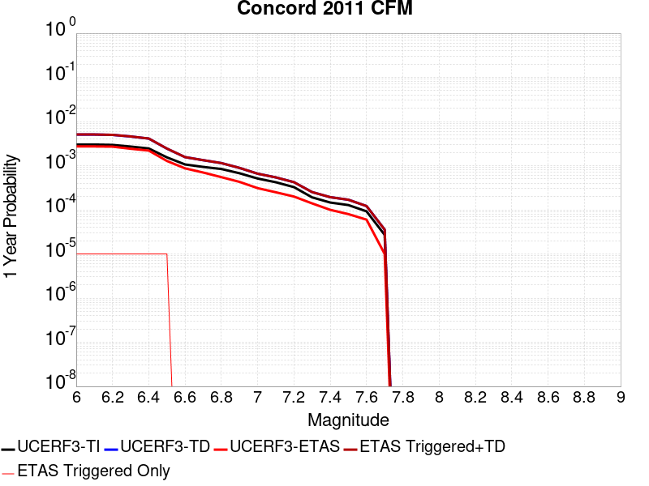 |  |

| Magnitude | 1 wk TI Prob | 1 wk TD Prob | 1 wk ETAS Prob | 1 wk ETAS/TD Gain | 1 wk ETAS Triggered+TD | 1 wk ETAS Triggered Only | 1 mo TI Prob | 1 mo TD Prob | 1 mo ETAS Prob | 1 mo ETAS/TD Gain | 1 mo ETAS Triggered+TD | 1 mo ETAS Triggered Only | 1 yr TI Prob | 1 yr TD Prob | 1 yr ETAS Prob | 1 yr ETAS/TD Gain | 1 yr ETAS Triggered+TD | 1 yr ETAS Triggered Only | 10 yr TI Prob | 10 yr TD Prob | 10 yr ETAS Prob | 10 yr ETAS/TD Gain | 10 yr ETAS Triggered+TD | 10 yr ETAS Triggered Only |
|-----|-----|-----|-----|-----|-----|-----|-----|-----|-----|-----|-----|-----|-----|-----|-----|-----|-----|-----|-----|-----|-----|-----|-----|-----|
| 6.0 | 5.7865112E-5 | 9.7585355E-5 | 2.0E-5 | 0.20494878 | 9.7585355E-5 | 0.0 | 2.4796976E-4 | 4.181607E-4 | 1.4E-4 | 0.33479953 | 4.181607E-4 | 0.0 | 0.0030148525 | 0.005079743 | 0.00273 | 0.53742874 | 0.0050896923 | 1.0E-5 | 0.029742775 | 0.049266078 | 0.02779 | 0.5640798 | 0.049275585 | 1.0E-5 |
| 6.1 | 5.7865112E-5 | 9.7585355E-5 | 2.0E-5 | 0.20494878 | 9.7585355E-5 | 0.0 | 2.4796976E-4 | 4.181607E-4 | 1.4E-4 | 0.33479953 | 4.181607E-4 | 0.0 | 0.0030148525 | 0.005079743 | 0.00273 | 0.53742874 | 0.0050896923 | 1.0E-5 | 0.029742775 | 0.049266078 | 0.02777 | 0.56367385 | 0.049275585 | 1.0E-5 |
| 6.2 | 5.6789337E-5 | 9.578793E-5 | 2.0E-5 | 0.20879458 | 9.578793E-5 | 0.0 | 2.4336016E-4 | 4.1045985E-4 | 1.4E-4 | 0.34108084 | 4.1045985E-4 | 0.0 | 0.0029588845 | 0.0049864696 | 0.0027 | 0.5414653 | 0.0049964194 | 1.0E-5 | 0.029197963 | 0.04838257 | 0.02736 | 0.5654929 | 0.048392083 | 1.0E-5 |
| 6.3 | 5.203322E-5 | 8.803241E-5 | 0.0 | 0.0 | 8.803241E-5 | 0.0 | 2.2298045E-4 | 3.772316E-4 | 9.0E-5 | 0.23858024 | 3.772316E-4 | 0.0 | 0.0027114071 | 0.0045839064 | 0.00242 | 0.527934 | 0.0045938604 | 1.0E-5 | 0.026785625 | 0.04455397 | 0.02524 | 0.56650394 | 0.044563524 | 1.0E-5 |
| 6.4 | 4.7120942E-5 | 7.897583E-5 | 0.0 | 0.0 | 7.897583E-5 | 0.0 | 2.0193127E-4 | 3.3842813E-4 | 9.0E-5 | 0.26593536 | 3.3842813E-4 | 0.0 | 0.0024557412 | 0.004113323 | 0.0022 | 0.5348474 | 0.0041232817 | 1.0E-5 | 0.024287801 | 0.040080756 | 0.02282 | 0.56935054 | 0.040090356 | 1.0E-5 |
| 6.5 | 2.9598437E-5 | 4.6675777E-5 | 0.0 | 0.0 | 4.6675777E-5 | 0.0 | 1.2684427E-4 | 2.000249E-4 | 3.0E-5 | 0.14998133 | 2.000249E-4 | 0.0 | 0.001543235 | 0.0024327936 | 0.00128 | 0.52614415 | 0.0024427692 | 1.0E-5 | 0.015325619 | 0.023909668 | 0.0133 | 0.55626035 | 0.02391943 | 1.0E-5 |
| 6.6 | 2.0443718E-5 | 2.9984873E-5 | 0.0 | 0.0 | 2.9984873E-5 | 0.0 | 8.7613E-5 | 1.2850047E-4 | 3.0E-5 | 0.23346217 | 1.2850047E-4 | 0.0 | 0.0010661662 | 0.0015634067 | 8.7E-4 | 0.55647707 | 0.0015634067 | 0.0 | 0.010610655 | 0.0154669015 | 0.00866 | 0.5599053 | 0.0154669015 | 0.0 |
| 6.7 | 1.798539E-5 | 2.5557883E-5 | 0.0 | 0.0 | 2.5557883E-5 | 0.0 | 7.7077966E-5 | 1.0952931E-4 | 3.0E-5 | 0.2738993 | 1.0952931E-4 | 0.0 | 9.380202E-4 | 0.0013327252 | 7.0E-4 | 0.5252396 | 0.0013327252 | 0.0 | 0.009340706 | 0.013217516 | 0.00736 | 0.55683684 | 0.013217516 | 0.0 |
| 6.8 | 1.613555E-5 | 2.1959608E-5 | 0.0 | 0.0 | 2.1959608E-5 | 0.0 | 6.915052E-5 | 9.4109295E-5 | 2.0E-5 | 0.21251887 | 9.4109295E-5 | 0.0 | 8.4158237E-4 | 0.0011451923 | 5.5E-4 | 0.4802687 | 0.0011451923 | 0.0 | 0.008384023 | 0.011378321 | 0.0063 | 0.55368453 | 0.011378321 | 0.0 |
| 6.9 | 1.2916435E-5 | 1.708134E-5 | 0.0 | 0.0 | 1.708134E-5 | 0.0 | 5.5354973E-5 | 7.320372E-5 | 2.0E-5 | 0.27321017 | 7.320372E-5 | 0.0 | 6.7373837E-4 | 8.908967E-4 | 4.3E-4 | 0.4826598 | 8.908967E-4 | 0.0 | 0.006716994 | 0.008867833 | 0.005 | 0.5638356 | 0.008867833 | 0.0 |
| 7.0 | 9.81129E-6 | 1.2631038E-5 | 0.0 | 0.0 | 1.2631038E-5 | 0.0 | 4.2047708E-5 | 5.4131906E-5 | 2.0E-5 | 0.36946785 | 5.4131906E-5 | 0.0 | 5.118106E-4 | 6.588583E-4 | 3.1E-4 | 0.47051087 | 6.588583E-4 | 0.0 | 0.005106334 | 0.0065697595 | 0.00374 | 0.569275 | 0.0065697595 | 0.0 |
| 7.1 | 8.0889195E-6 | 1.04184555E-5 | 0.0 | 0.0 | 1.04184555E-5 | 0.0 | 3.4666336E-5 | 4.4649765E-5 | 2.0E-5 | 0.4479307 | 4.4649765E-5 | 0.0 | 4.219809E-4 | 5.434764E-4 | 2.5E-4 | 0.46000162 | 5.434764E-4 | 0.0 | 0.004211805 | 0.0054219896 | 0.00309 | 0.5699015 | 0.0054219896 | 0.0 |
| 7.2 | 6.267438E-6 | 8.115879E-6 | 0.0 | 0.0 | 8.115879E-6 | 0.0 | 2.6860173E-5 | 3.478188E-5 | 1.0E-5 | 0.28750604 | 3.478188E-5 | 0.0 | 3.2697353E-4 | 4.2338783E-4 | 2.0E-4 | 0.47238013 | 4.2338783E-4 | 0.0 | 0.0032649285 | 0.004226169 | 0.00246 | 0.58208746 | 0.004226169 | 0.0 |
| 7.3 | 3.6761196E-6 | 4.840281E-6 | 0.0 | 0.0 | 4.840281E-6 | 0.0 | 1.5754704E-5 | 2.0743897E-5 | 1.0E-5 | 0.4820695 | 2.0743897E-5 | 0.0 | 1.9179663E-4 | 2.5252788E-4 | 1.4E-4 | 0.5543942 | 2.5252788E-4 | 0.0 | 0.0019163118 | 0.0025226264 | 0.00137 | 0.5430848 | 0.0025226264 | 0.0 |
| 7.4 | 2.8044356E-6 | 3.7096993E-6 | 0.0 | 0.0 | 3.7096993E-6 | 0.0 | 1.2018954E-5 | 1.5898615E-5 | 0.0 | 0.0 | 1.5898615E-5 | 0.0 | 1.4632095E-4 | 1.9354856E-4 | 1.0E-4 | 0.51666623 | 1.9354856E-4 | 0.0 | 0.0014622464 | 0.0019340349 | 0.00108 | 0.5584181 | 0.0019340349 | 0.0 |
| 7.5 | 2.4578699E-6 | 3.2448306E-6 | 0.0 | 0.0 | 3.2448306E-6 | 0.0 | 1.0533685E-5 | 1.3906343E-5 | 0.0 | 0.0 | 1.3906343E-5 | 0.0 | 1.2824008E-4 | 1.6929668E-4 | 8.0E-5 | 0.4725432 | 1.6929668E-4 | 0.0 | 0.0012816609 | 0.0016918926 | 9.4E-4 | 0.5555908 | 0.0016918926 | 0.0 |
| 7.6 | 1.7713267E-6 | 2.335189E-6 | 0.0 | 0.0 | 2.335189E-6 | 0.0 | 7.591378E-6 | 1.0007916E-5 | 0.0 | 0.0 | 1.0007916E-5 | 0.0 | 9.2421105E-5 | 1.2183965E-4 | 6.0E-5 | 0.49245054 | 1.2183965E-4 | 0.0 | 9.2382677E-4 | 0.0012178655 | 7.4E-4 | 0.6076205 | 0.0012178655 | 0.0 |
| 7.7 | 5.1912366E-7 | 6.829346E-7 | 0.0 | 0.0 | 6.829346E-7 | 0.0 | 2.2248137E-6 | 2.9268595E-6 | 0.0 | 0.0 | 2.9268595E-6 | 0.0 | 2.708677E-5 | 3.5633944E-5 | 1.0E-5 | 0.2806313 | 3.5633944E-5 | 0.0 | 2.708347E-4 | 3.5630353E-4 | 2.0E-4 | 0.5613192 | 3.5630353E-4 | 0.0 |

## South Klamath Lake West
*[(top)](#table-of-contents)*

| 1 Week | 1 Month | 1 Year | 10 Year |
|-----|-----|-----|-----|
|  |  |  |  |

| Magnitude | 1 wk TI Prob | 1 wk TD Prob | 1 wk ETAS Prob | 1 wk ETAS/TD Gain | 1 wk ETAS Triggered+TD | 1 wk ETAS Triggered Only | 1 mo TI Prob | 1 mo TD Prob | 1 mo ETAS Prob | 1 mo ETAS/TD Gain | 1 mo ETAS Triggered+TD | 1 mo ETAS Triggered Only | 1 yr TI Prob | 1 yr TD Prob | 1 yr ETAS Prob | 1 yr ETAS/TD Gain | 1 yr ETAS Triggered+TD | 1 yr ETAS Triggered Only | 10 yr TI Prob | 10 yr TD Prob | 10 yr ETAS Prob | 10 yr ETAS/TD Gain | 10 yr ETAS Triggered+TD | 10 yr ETAS Triggered Only |
|-----|-----|-----|-----|-----|-----|-----|-----|-----|-----|-----|-----|-----|-----|-----|-----|-----|-----|-----|-----|-----|-----|-----|-----|-----|
| 6.0 | 2.174025E-5 | 2.3042025E-5 | 3.0E-5 | 1.3019689 | 2.3042025E-5 | 0.0 | 9.3169176E-5 | 9.874817E-5 | 7.0E-5 | 0.70887387 | 9.874817E-5 | 0.0 | 0.0011337444 | 0.0012016617 | 7.9E-4 | 0.65742296 | 0.0012016617 | 0.0 | 0.011279777 | 0.0119582405 | 0.00925 | 0.7735252 | 0.011968121 | 1.0E-5 |
| 6.1 | 2.174025E-5 | 2.3042025E-5 | 3.0E-5 | 1.3019689 | 2.3042025E-5 | 0.0 | 9.3169176E-5 | 9.874817E-5 | 7.0E-5 | 0.70887387 | 9.874817E-5 | 0.0 | 0.0011337444 | 0.0012016617 | 7.9E-4 | 0.65742296 | 0.0012016617 | 0.0 | 0.011279777 | 0.0119582405 | 0.00925 | 0.7735252 | 0.011968121 | 1.0E-5 |
| 6.2 | 9.834929E-6 | 1.0393841E-5 | 2.0E-5 | 1.9242164 | 1.0393841E-5 | 0.0 | 4.2149015E-5 | 4.4544326E-5 | 5.0E-5 | 1.1224774 | 4.4544326E-5 | 0.0 | 5.1304343E-4 | 5.422012E-4 | 3.2E-4 | 0.5901868 | 5.422012E-4 | 0.0 | 0.0051186057 | 0.0054096854 | 0.00436 | 0.80596185 | 0.0054096854 | 0.0 |
| 6.3 | 9.834929E-6 | 1.0393841E-5 | 2.0E-5 | 1.9242164 | 1.0393841E-5 | 0.0 | 4.2149015E-5 | 4.4544326E-5 | 5.0E-5 | 1.1224774 | 4.4544326E-5 | 0.0 | 5.1304343E-4 | 5.422012E-4 | 3.2E-4 | 0.5901868 | 5.422012E-4 | 0.0 | 0.0051186057 | 0.0054096854 | 0.00436 | 0.80596185 | 0.0054096854 | 0.0 |
| 6.4 | 6.066321E-6 | 6.40043E-6 | 1.0E-5 | 1.5623951 | 6.40043E-6 | 0.0 | 2.5998259E-5 | 2.743014E-5 | 2.0E-5 | 0.72912496 | 2.743014E-5 | 0.0 | 3.1648282E-4 | 3.3391351E-4 | 2.2E-4 | 0.6588533 | 3.3391351E-4 | 0.0 | 0.0031603249 | 0.0033343881 | 0.00278 | 0.8337362 | 0.0033343881 | 0.0 |
| 6.5 | 6.066321E-6 | 6.40043E-6 | 1.0E-5 | 1.5623951 | 6.40043E-6 | 0.0 | 2.5998259E-5 | 2.743014E-5 | 2.0E-5 | 0.72912496 | 2.743014E-5 | 0.0 | 3.1648282E-4 | 3.3391351E-4 | 2.2E-4 | 0.6588533 | 3.3391351E-4 | 0.0 | 0.0031603249 | 0.0033343881 | 0.00278 | 0.8337362 | 0.0033343881 | 0.0 |
| 6.6 | 4.2321803E-6 | 4.461291E-6 | 0.0 | 0.0 | 4.461291E-6 | 0.0 | 1.8137789E-5 | 1.9119685E-5 | 0.0 | 0.0 | 1.9119685E-5 | 0.0 | 2.208052E-4 | 2.3275832E-4 | 1.3E-4 | 0.55851924 | 2.3275832E-4 | 0.0 | 0.0022058594 | 0.0023252473 | 0.00189 | 0.81281674 | 0.0023252473 | 0.0 |
| 6.7 | 3.186646E-6 | 3.360305E-6 | 0.0 | 0.0 | 3.360305E-6 | 0.0 | 1.3656982E-5 | 1.4401232E-5 | 0.0 | 0.0 | 1.4401232E-5 | 0.0 | 1.6626107E-4 | 1.7532158E-4 | 1.2E-4 | 0.6844565 | 1.7532158E-4 | 0.0 | 0.0016613674 | 0.0017518997 | 0.00142 | 0.81054866 | 0.0017518997 | 0.0 |
| 6.8 | 2.380121E-6 | 2.510907E-6 | 0.0 | 0.0 | 2.510907E-6 | 0.0 | 1.0200479E-5 | 1.07609885E-5 | 0.0 | 0.0 | 1.07609885E-5 | 0.0 | 1.2418375E-4 | 1.3100762E-4 | 1.1E-4 | 0.8396458 | 1.3100762E-4 | 0.0 | 0.0012411437 | 0.0013093497 | 0.00111 | 0.84774905 | 0.0013093497 | 0.0 |
| 6.9 | 8.928287E-7 | 9.4302504E-7 | 0.0 | 0.0 | 9.4302504E-7 | 0.0 | 3.826403E-6 | 4.0415307E-6 | 0.0 | 0.0 | 4.0415307E-6 | 0.0 | 4.658546E-5 | 4.9204747E-5 | 6.0E-5 | 1.2193946 | 4.9204747E-5 | 0.0 | 4.6575698E-4 | 4.9196015E-4 | 5.3E-4 | 1.077323 | 4.9196015E-4 | 0.0 |

## Los Osos 2011
*[(top)](#table-of-contents)*

| 1 Week | 1 Month | 1 Year | 10 Year |
|-----|-----|-----|-----|
|  |  |  |  |

| Magnitude | 1 wk TI Prob | 1 wk TD Prob | 1 wk ETAS Prob | 1 wk ETAS/TD Gain | 1 wk ETAS Triggered+TD | 1 wk ETAS Triggered Only | 1 mo TI Prob | 1 mo TD Prob | 1 mo ETAS Prob | 1 mo ETAS/TD Gain | 1 mo ETAS Triggered+TD | 1 mo ETAS Triggered Only | 1 yr TI Prob | 1 yr TD Prob | 1 yr ETAS Prob | 1 yr ETAS/TD Gain | 1 yr ETAS Triggered+TD | 1 yr ETAS Triggered Only | 10 yr TI Prob | 10 yr TD Prob | 10 yr ETAS Prob | 10 yr ETAS/TD Gain | 10 yr ETAS Triggered+TD | 10 yr ETAS Triggered Only |
|-----|-----|-----|-----|-----|-----|-----|-----|-----|-----|-----|-----|-----|-----|-----|-----|-----|-----|-----|-----|-----|-----|-----|-----|-----|
| 6.0 | 4.8871775E-6 | 4.9814826E-6 | 0.0 | 0.0 | 4.9814826E-6 | 0.0 | 2.0944879E-5 | 2.1349053E-5 | 2.0E-5 | 0.9368097 | 2.1349053E-5 | 0.0 | 2.5497406E-4 | 2.598965E-4 | 1.6E-4 | 0.6156297 | 2.598965E-4 | 0.0 | 0.002546817 | 0.0025962 | 0.00149 | 0.5739157 | 0.002606174 | 1.0E-5 |
| 6.1 | 4.8871775E-6 | 4.9814826E-6 | 0.0 | 0.0 | 4.9814826E-6 | 0.0 | 2.0944879E-5 | 2.1349053E-5 | 2.0E-5 | 0.9368097 | 2.1349053E-5 | 0.0 | 2.5497406E-4 | 2.598965E-4 | 1.6E-4 | 0.6156297 | 2.598965E-4 | 0.0 | 0.002546817 | 0.0025962 | 0.00149 | 0.5739157 | 0.002606174 | 1.0E-5 |
| 6.2 | 4.8871775E-6 | 4.9814826E-6 | 0.0 | 0.0 | 4.9814826E-6 | 0.0 | 2.0944879E-5 | 2.1349053E-5 | 2.0E-5 | 0.9368097 | 2.1349053E-5 | 0.0 | 2.5497406E-4 | 2.598965E-4 | 1.6E-4 | 0.6156297 | 2.598965E-4 | 0.0 | 0.002546817 | 0.0025962 | 0.00149 | 0.5739157 | 0.002606174 | 1.0E-5 |
| 6.3 | 4.8871775E-6 | 4.9814826E-6 | 0.0 | 0.0 | 4.9814826E-6 | 0.0 | 2.0944879E-5 | 2.1349053E-5 | 2.0E-5 | 0.9368097 | 2.1349053E-5 | 0.0 | 2.5497406E-4 | 2.598965E-4 | 1.6E-4 | 0.6156297 | 2.598965E-4 | 0.0 | 0.002546817 | 0.0025962 | 0.00149 | 0.5739157 | 0.002606174 | 1.0E-5 |
| 6.4 | 4.8871775E-6 | 4.9814826E-6 | 0.0 | 0.0 | 4.9814826E-6 | 0.0 | 2.0944879E-5 | 2.1349053E-5 | 2.0E-5 | 0.9368097 | 2.1349053E-5 | 0.0 | 2.5497406E-4 | 2.598965E-4 | 1.6E-4 | 0.6156297 | 2.598965E-4 | 0.0 | 0.002546817 | 0.0025962 | 0.00149 | 0.5739157 | 0.002606174 | 1.0E-5 |
| 6.5 | 3.1724062E-6 | 3.2233943E-6 | 0.0 | 0.0 | 3.2233943E-6 | 0.0 | 1.3595956E-5 | 1.3814474E-5 | 2.0E-5 | 1.4477569 | 1.3814474E-5 | 0.0 | 1.6551818E-4 | 1.6817838E-4 | 1.1E-4 | 0.65406746 | 1.6817838E-4 | 0.0 | 0.0016539496 | 0.0016805246 | 9.7E-4 | 0.5772007 | 0.0016805246 | 0.0 |
| 6.6 | 3.1022591E-6 | 3.1511038E-6 | 0.0 | 0.0 | 3.1511038E-6 | 0.0 | 1.3295328E-5 | 1.3504661E-5 | 2.0E-5 | 1.4809701 | 1.3504661E-5 | 0.0 | 1.618586E-4 | 1.6440697E-4 | 1.0E-4 | 0.60824674 | 1.6440697E-4 | 0.0 | 0.0016174077 | 0.0016428662 | 9.3E-4 | 0.56608385 | 0.0016428662 | 0.0 |
| 6.7 | 2.611518E-6 | 2.6491825E-6 | 0.0 | 0.0 | 2.6491825E-6 | 0.0 | 1.1192172E-5 | 1.1353591E-5 | 0.0 | 0.0 | 1.1353591E-5 | 0.0 | 1.3625617E-4 | 1.3822124E-4 | 5.0E-5 | 0.36173892 | 1.3822124E-4 | 0.0 | 0.0013617266 | 0.0013813572 | 6.8E-4 | 0.4922695 | 0.0013813572 | 0.0 |
| 6.8 | 2.4780884E-6 | 2.5121587E-6 | 0.0 | 0.0 | 2.5121587E-6 | 0.0 | 1.0620336E-5 | 1.076635E-5 | 0.0 | 0.0 | 1.076635E-5 | 0.0 | 1.2929492E-4 | 1.3107246E-4 | 4.0E-5 | 0.3051747 | 1.3107246E-4 | 0.0 | 0.0012921972 | 0.0013099556 | 6.4E-4 | 0.48856616 | 0.0013099556 | 0.0 |
| 6.9 | 2.1376322E-6 | 2.1635049E-6 | 0.0 | 0.0 | 2.1635049E-6 | 0.0 | 9.161248E-6 | 9.272131E-6 | 0.0 | 0.0 | 9.272131E-6 | 0.0 | 1.1153249E-4 | 1.1288237E-4 | 3.0E-5 | 0.26576337 | 1.1288237E-4 | 0.0 | 0.0011147653 | 0.0011282521 | 5.1E-4 | 0.4520266 | 0.0011282521 | 0.0 |
| 7.0 | 1.9282882E-6 | 1.949458E-6 | 0.0 | 0.0 | 1.949458E-6 | 0.0 | 8.264066E-6 | 8.354793E-6 | 0.0 | 0.0 | 8.354793E-6 | 0.0 | 1.0061036E-4 | 1.0171487E-4 | 3.0E-5 | 0.29494214 | 1.0171487E-4 | 0.0 | 0.0010056482 | 0.0010166845 | 4.5E-4 | 0.44261518 | 0.0010166845 | 0.0 |
| 7.1 | 1.6353226E-6 | 1.6501111E-6 | 0.0 | 0.0 | 1.6501111E-6 | 0.0 | 7.0085066E-6 | 7.0718856E-6 | 0.0 | 0.0 | 7.0718856E-6 | 0.0 | 8.532523E-5 | 8.6096814E-5 | 3.0E-5 | 0.34844494 | 8.6096814E-5 | 0.0 | 8.529247E-4 | 8.6063537E-4 | 3.9E-4 | 0.45315358 | 8.6063537E-4 | 0.0 |
| 7.2 | 1.4446276E-6 | 1.4553335E-6 | 0.0 | 0.0 | 1.4553335E-6 | 0.0 | 6.191247E-6 | 6.2371287E-6 | 0.0 | 0.0 | 6.2371287E-6 | 0.0 | 7.537582E-5 | 7.59344E-5 | 3.0E-5 | 0.39507785 | 7.59344E-5 | 0.0 | 7.535026E-4 | 7.590851E-4 | 3.7E-4 | 0.48742887 | 7.590851E-4 | 0.0 |
| 7.3 | 1.2014582E-6 | 1.2069066E-6 | 0.0 | 0.0 | 1.2069066E-6 | 0.0 | 5.149096E-6 | 5.172447E-6 | 0.0 | 0.0 | 5.172447E-6 | 0.0 | 6.268844E-5 | 6.297272E-5 | 3.0E-5 | 0.47639674 | 6.297272E-5 | 0.0 | 6.267076E-4 | 6.295492E-4 | 3.1E-4 | 0.49241585 | 6.295492E-4 | 0.0 |
| 7.4 | 9.707733E-7 | 9.709767E-7 | 0.0 | 0.0 | 9.709767E-7 | 0.0 | 4.16045E-6 | 4.161322E-6 | 0.0 | 0.0 | 4.161322E-6 | 0.0 | 5.0652303E-5 | 5.066292E-5 | 3.0E-5 | 0.5921491 | 5.066292E-5 | 0.0 | 5.064076E-4 | 5.065139E-4 | 2.6E-4 | 0.51331264 | 5.065139E-4 | 0.0 |
| 7.5 | 7.174908E-7 | 7.114907E-7 | 0.0 | 0.0 | 7.114907E-7 | 0.0 | 3.074957E-6 | 3.0492424E-6 | 0.0 | 0.0 | 3.0492424E-6 | 0.0 | 3.743696E-5 | 3.7123897E-5 | 3.0E-5 | 0.8081049 | 3.7123897E-5 | 0.0 | 3.7430652E-4 | 3.7117713E-4 | 1.6E-4 | 0.43106106 | 3.7117713E-4 | 0.0 |
| 7.6 | 4.5535776E-7 | 4.4207857E-7 | 0.0 | 0.0 | 4.4207857E-7 | 0.0 | 1.9515319E-6 | 1.8946212E-6 | 0.0 | 0.0 | 1.8946212E-6 | 0.0 | 2.3759641E-5 | 2.3066768E-5 | 2.0E-5 | 0.8670482 | 2.3066768E-5 | 0.0 | 2.37571E-4 | 2.3064384E-4 | 9.0E-5 | 0.39021203 | 2.3064384E-4 | 0.0 |
| 7.7 | 2.1173553E-7 | 1.9060734E-7 | 0.0 | 0.0 | 1.9060734E-7 | 0.0 | 9.0743765E-7 | 8.1688836E-7 | 0.0 | 0.0 | 8.1688836E-7 | 0.0 | 1.1047998E-5 | 9.94557E-6 | 1.0E-5 | 1.0054728 | 9.94557E-6 | 0.0 | 1.1047449E-4 | 9.945128E-5 | 4.0E-5 | 0.402207 | 9.945128E-5 | 0.0 |
| 7.8 | 9.873608E-8 | 7.367457E-8 | 0.0 | 0.0 | 7.367457E-8 | 0.0 | 4.2315455E-7 | 3.1574814E-7 | 0.0 | 0.0 | 3.1574814E-7 | 0.0 | 5.1518946E-6 | 3.8442267E-6 | 0.0 | 0.0 | 3.8442267E-6 | 0.0 | 5.1517753E-5 | 3.844161E-5 | 2.0E-5 | 0.5202696 | 3.844161E-5 | 0.0 |
| 7.9 | 5.4399106E-8 | 3.187941E-8 | 0.0 | 0.0 | 3.187941E-8 | 0.0 | 2.33139E-7 | 1.3662603E-7 | 0.0 | 0.0 | 1.3662603E-7 | 0.0 | 2.8384638E-6 | 1.6634207E-6 | 0.0 | 0.0 | 1.6634207E-6 | 0.0 | 2.8384275E-5 | 1.6634083E-5 | 1.0E-5 | 0.6011753 | 1.6634083E-5 | 0.0 |
| 8.0 | 1.817203E-8 | 8.420079E-9 | 0.0 | 0.0 | 8.420079E-9 | 0.0 | 7.7880124E-8 | 3.6086053E-8 | 0.0 | 0.0 | 3.6086053E-8 | 0.0 | 9.481901E-7 | 4.393476E-7 | 0.0 | 0.0 | 4.393476E-7 | 0.0 | 9.481861E-6 | 4.393468E-6 | 1.0E-5 | 2.2761064 | 4.393468E-6 | 0.0 |

## Great Valley 03a Dunnigan Hills
*[(top)](#table-of-contents)*

| 1 Week | 1 Month | 1 Year | 10 Year |
|-----|-----|-----|-----|
|  |  |  |  |

| Magnitude | 1 wk TI Prob | 1 wk TD Prob | 1 wk ETAS Prob | 1 wk ETAS/TD Gain | 1 wk ETAS Triggered+TD | 1 wk ETAS Triggered Only | 1 mo TI Prob | 1 mo TD Prob | 1 mo ETAS Prob | 1 mo ETAS/TD Gain | 1 mo ETAS Triggered+TD | 1 mo ETAS Triggered Only | 1 yr TI Prob | 1 yr TD Prob | 1 yr ETAS Prob | 1 yr ETAS/TD Gain | 1 yr ETAS Triggered+TD | 1 yr ETAS Triggered Only | 10 yr TI Prob | 10 yr TD Prob | 10 yr ETAS Prob | 10 yr ETAS/TD Gain | 10 yr ETAS Triggered+TD | 10 yr ETAS Triggered Only |
|-----|-----|-----|-----|-----|-----|-----|-----|-----|-----|-----|-----|-----|-----|-----|-----|-----|-----|-----|-----|-----|-----|-----|-----|-----|
| 6.0 | 1.6591328E-5 | 1.8107954E-5 | 0.0 | 0.0 | 1.8107954E-5 | 0.0 | 7.110376E-5 | 7.7603596E-5 | 5.0E-5 | 0.64430004 | 7.7603596E-5 | 0.0 | 8.6534437E-4 | 9.444834E-4 | 6.0E-4 | 0.6352679 | 9.444834E-4 | 0.0 | 0.008619824 | 0.009411525 | 0.00905 | 0.961587 | 0.0094214305 | 1.0E-5 |
| 6.1 | 8.041125E-6 | 8.769726E-6 | 0.0 | 0.0 | 8.769726E-6 | 0.0 | 3.4461507E-5 | 3.7584115E-5 | 2.0E-5 | 0.5321397 | 3.7584115E-5 | 0.0 | 4.194881E-4 | 4.5751085E-4 | 2.4E-4 | 0.52457774 | 4.5751085E-4 | 0.0 | 0.004186971 | 0.004567687 | 0.00353 | 0.77282 | 0.004567687 | 0.0 |
| 6.2 | 3.2807004E-6 | 3.5795688E-6 | 0.0 | 0.0 | 3.5795688E-6 | 0.0 | 1.4060069E-5 | 1.5340942E-5 | 1.0E-5 | 0.65185046 | 1.5340942E-5 | 0.0 | 1.7116789E-4 | 1.8676413E-4 | 8.0E-5 | 0.4283478 | 1.8676413E-4 | 0.0 | 0.0017103611 | 0.0018664796 | 0.00132 | 0.7072137 | 0.0018664796 | 0.0 |
| 6.3 | 1.9339366E-6 | 2.1103806E-6 | 0.0 | 0.0 | 2.1103806E-6 | 0.0 | 8.288273E-6 | 9.044474E-6 | 1.0E-5 | 1.1056476 | 9.044474E-6 | 0.0 | 1.00905054E-4 | 1.1011375E-4 | 3.0E-5 | 0.27244553 | 1.1011375E-4 | 0.0 | 0.0010085925 | 0.0011008718 | 7.2E-4 | 0.65402704 | 0.0011008718 | 0.0 |
| 6.4 | 1.3142635E-6 | 1.4339867E-6 | 0.0 | 0.0 | 1.4339867E-6 | 0.0 | 5.6325457E-6 | 6.145657E-6 | 1.0E-5 | 1.6271653 | 6.145657E-6 | 0.0 | 6.857408E-5 | 7.482337E-5 | 3.0E-5 | 0.40094423 | 7.482337E-5 | 0.0 | 6.8552926E-4 | 7.4823375E-4 | 4.5E-4 | 0.60141635 | 7.4823375E-4 | 0.0 |

## Anacapa-Dume alt 1
*[(top)](#table-of-contents)*

| 1 Week | 1 Month | 1 Year | 10 Year |
|-----|-----|-----|-----|
|  |  |  | 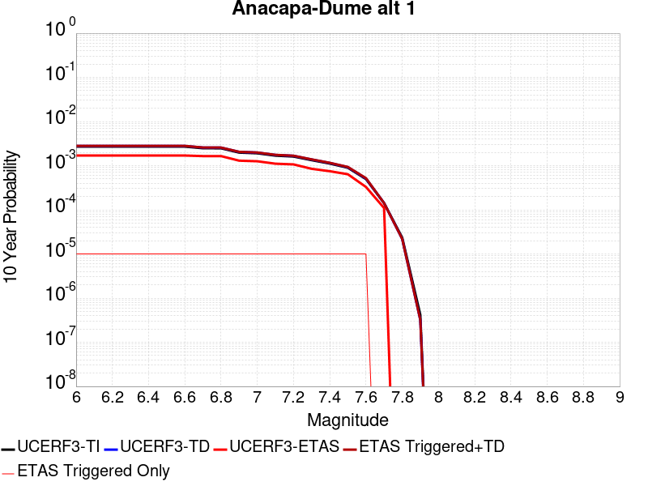 |

| Magnitude | 1 wk TI Prob | 1 wk TD Prob | 1 wk ETAS Prob | 1 wk ETAS/TD Gain | 1 wk ETAS Triggered+TD | 1 wk ETAS Triggered Only | 1 mo TI Prob | 1 mo TD Prob | 1 mo ETAS Prob | 1 mo ETAS/TD Gain | 1 mo ETAS Triggered+TD | 1 mo ETAS Triggered Only | 1 yr TI Prob | 1 yr TD Prob | 1 yr ETAS Prob | 1 yr ETAS/TD Gain | 1 yr ETAS Triggered+TD | 1 yr ETAS Triggered Only | 10 yr TI Prob | 10 yr TD Prob | 10 yr ETAS Prob | 10 yr ETAS/TD Gain | 10 yr ETAS Triggered+TD | 10 yr ETAS Triggered Only |
|-----|-----|-----|-----|-----|-----|-----|-----|-----|-----|-----|-----|-----|-----|-----|-----|-----|-----|-----|-----|-----|-----|-----|-----|-----|
| 6.0 | 5.1871802E-6 | 5.3673916E-6 | 0.0 | 0.0 | 5.3673916E-6 | 0.0 | 2.2230583E-5 | 2.3002909E-5 | 1.0E-5 | 0.4347276 | 2.3002909E-5 | 0.0 | 2.7062374E-4 | 2.8002527E-4 | 1.7E-4 | 0.6070881 | 2.8002527E-4 | 0.0 | 0.002702944 | 0.0027968097 | 0.0017 | 0.6078355 | 0.0028067816 | 1.0E-5 |
| 6.1 | 5.1871802E-6 | 5.3673916E-6 | 0.0 | 0.0 | 5.3673916E-6 | 0.0 | 2.2230583E-5 | 2.3002909E-5 | 1.0E-5 | 0.4347276 | 2.3002909E-5 | 0.0 | 2.7062374E-4 | 2.8002527E-4 | 1.7E-4 | 0.6070881 | 2.8002527E-4 | 0.0 | 0.002702944 | 0.0027968097 | 0.0017 | 0.6078355 | 0.0028067816 | 1.0E-5 |
| 6.2 | 5.1871802E-6 | 5.3673916E-6 | 0.0 | 0.0 | 5.3673916E-6 | 0.0 | 2.2230583E-5 | 2.3002909E-5 | 1.0E-5 | 0.4347276 | 2.3002909E-5 | 0.0 | 2.7062374E-4 | 2.8002527E-4 | 1.7E-4 | 0.6070881 | 2.8002527E-4 | 0.0 | 0.002702944 | 0.0027968097 | 0.0017 | 0.6078355 | 0.0028067816 | 1.0E-5 |
| 6.3 | 5.1871802E-6 | 5.3673916E-6 | 0.0 | 0.0 | 5.3673916E-6 | 0.0 | 2.2230583E-5 | 2.3002909E-5 | 1.0E-5 | 0.4347276 | 2.3002909E-5 | 0.0 | 2.7062374E-4 | 2.8002527E-4 | 1.7E-4 | 0.6070881 | 2.8002527E-4 | 0.0 | 0.002702944 | 0.0027968097 | 0.0017 | 0.6078355 | 0.0028067816 | 1.0E-5 |
| 6.4 | 5.1871802E-6 | 5.3673916E-6 | 0.0 | 0.0 | 5.3673916E-6 | 0.0 | 2.2230583E-5 | 2.3002909E-5 | 1.0E-5 | 0.4347276 | 2.3002909E-5 | 0.0 | 2.7062374E-4 | 2.8002527E-4 | 1.7E-4 | 0.6070881 | 2.8002527E-4 | 0.0 | 0.002702944 | 0.0027968097 | 0.0017 | 0.6078355 | 0.0028067816 | 1.0E-5 |
| 6.5 | 5.1871802E-6 | 5.3673916E-6 | 0.0 | 0.0 | 5.3673916E-6 | 0.0 | 2.2230583E-5 | 2.3002909E-5 | 1.0E-5 | 0.4347276 | 2.3002909E-5 | 0.0 | 2.7062374E-4 | 2.8002527E-4 | 1.7E-4 | 0.6070881 | 2.8002527E-4 | 0.0 | 0.002702944 | 0.0027968097 | 0.0017 | 0.6078355 | 0.0028067816 | 1.0E-5 |
| 6.6 | 5.1871802E-6 | 5.3673916E-6 | 0.0 | 0.0 | 5.3673916E-6 | 0.0 | 2.2230583E-5 | 2.3002909E-5 | 1.0E-5 | 0.4347276 | 2.3002909E-5 | 0.0 | 2.7062374E-4 | 2.8002527E-4 | 1.7E-4 | 0.6070881 | 2.8002527E-4 | 0.0 | 0.002702944 | 0.0027968097 | 0.0017 | 0.6078355 | 0.0028067816 | 1.0E-5 |
| 6.7 | 4.7693475E-6 | 4.9366927E-6 | 0.0 | 0.0 | 4.9366927E-6 | 0.0 | 2.04399E-5 | 2.1157086E-5 | 1.0E-5 | 0.47265488 | 2.1157086E-5 | 0.0 | 2.4882736E-4 | 2.5755784E-4 | 1.6E-4 | 0.6212197 | 2.5755784E-4 | 0.0 | 0.0024854892 | 0.0025726694 | 0.00165 | 0.6413572 | 0.0025826436 | 1.0E-5 |
| 6.8 | 4.753408E-6 | 4.920241E-6 | 0.0 | 0.0 | 4.920241E-6 | 0.0 | 2.037159E-5 | 2.108658E-5 | 1.0E-5 | 0.47423527 | 2.108658E-5 | 0.0 | 2.4799586E-4 | 2.5669963E-4 | 1.6E-4 | 0.6232966 | 2.5669963E-4 | 0.0 | 0.002477193 | 0.002564107 | 0.00165 | 0.6434989 | 0.0025740813 | 1.0E-5 |
| 6.9 | 3.800069E-6 | 3.937127E-6 | 0.0 | 0.0 | 3.937127E-6 | 0.0 | 1.6285909E-5 | 1.6873293E-5 | 1.0E-5 | 0.59265256 | 1.6873293E-5 | 0.0 | 1.9826289E-4 | 2.054132E-4 | 1.4E-4 | 0.68155307 | 2.054132E-4 | 0.0 | 0.001980861 | 0.0020522573 | 0.0013 | 0.63344884 | 0.0020622367 | 1.0E-5 |
| 7.0 | 3.6671938E-6 | 3.799919E-6 | 0.0 | 0.0 | 3.799919E-6 | 0.0 | 1.571645E-5 | 1.6285267E-5 | 1.0E-5 | 0.61405194 | 1.6285267E-5 | 0.0 | 1.9133097E-4 | 1.9825532E-4 | 1.4E-4 | 0.7061601 | 1.9825532E-4 | 0.0 | 0.0019116632 | 0.0019808079 | 0.00126 | 0.6361041 | 0.001990788 | 1.0E-5 |
| 7.1 | 3.2394885E-6 | 3.3587942E-6 | 0.0 | 0.0 | 3.3587942E-6 | 0.0 | 1.3883448E-5 | 1.4394753E-5 | 1.0E-5 | 0.69469756 | 1.4394753E-5 | 0.0 | 1.6901788E-4 | 1.7524212E-4 | 1.2E-4 | 0.6847668 | 1.7524212E-4 | 0.0 | 0.0016888938 | 0.0017510506 | 0.00111 | 0.6339052 | 0.0017610331 | 1.0E-5 |
| 7.2 | 3.0935948E-6 | 3.2079267E-6 | 0.0 | 0.0 | 3.2079267E-6 | 0.0 | 1.3258196E-5 | 1.3748186E-5 | 1.0E-5 | 0.7273687 | 1.3748186E-5 | 0.0 | 1.6140658E-4 | 1.6737141E-4 | 1.2E-4 | 0.71696836 | 1.6737141E-4 | 0.0 | 0.001612894 | 0.0016724645 | 0.00107 | 0.6397744 | 0.0016824479 | 1.0E-5 |
| 7.3 | 2.5604163E-6 | 2.6470739E-6 | 0.0 | 0.0 | 2.6470739E-6 | 0.0 | 1.0973167E-5 | 1.1344553E-5 | 1.0E-5 | 0.8814803 | 1.1344553E-5 | 0.0 | 1.3359012E-4 | 1.3811122E-4 | 1.1E-4 | 0.7964595 | 1.3811122E-4 | 0.0 | 0.0013350984 | 0.0013802585 | 8.5E-4 | 0.61582667 | 0.0013902447 | 1.0E-5 |
| 7.4 | 2.1429005E-6 | 2.2106035E-6 | 0.0 | 0.0 | 2.2106035E-6 | 0.0 | 9.1838265E-6 | 9.473981E-6 | 1.0E-5 | 1.0555224 | 9.473981E-6 | 0.0 | 1.11807356E-4 | 1.1533964E-4 | 9.0E-5 | 0.7803042 | 1.1533964E-4 | 0.0 | 0.0011175112 | 0.0011528004 | 7.5E-4 | 0.65058964 | 0.0011627888 | 1.0E-5 |
| 7.5 | 1.7237151E-6 | 1.7761457E-6 | 0.0 | 0.0 | 1.7761457E-6 | 0.0 | 7.3873293E-6 | 7.6120314E-6 | 1.0E-5 | 1.3137099 | 7.6120314E-6 | 0.0 | 8.993702E-5 | 9.267256E-5 | 7.0E-5 | 0.7553476 | 9.267256E-5 | 0.0 | 8.990063E-4 | 9.263415E-4 | 6.4E-4 | 0.6908899 | 9.363322E-4 | 1.0E-5 |
| 7.6 | 9.541696E-7 | 9.823211E-7 | 0.0 | 0.0 | 9.823211E-7 | 0.0 | 4.089292E-6 | 4.2099414E-6 | 0.0 | 0.0 | 4.2099414E-6 | 0.0 | 4.9785995E-5 | 5.125484E-5 | 3.0E-5 | 0.5853106 | 5.125484E-5 | 0.0 | 4.9774844E-4 | 5.124315E-4 | 3.3E-4 | 0.64398855 | 5.2242633E-4 | 1.0E-5 |
| 7.7 | 2.7226676E-7 | 2.7172473E-7 | 0.0 | 0.0 | 2.7172473E-7 | 0.0 | 1.166857E-6 | 1.1645341E-6 | 0.0 | 0.0 | 1.1645341E-6 | 0.0 | 1.4206392E-5 | 1.4178111E-5 | 1.0E-5 | 0.7053126 | 1.4178111E-5 | 0.0 | 1.4205484E-4 | 1.4177214E-4 | 1.1E-4 | 0.775893 | 1.4177214E-4 | 0.0 |
| 7.8 | 4.5017995E-8 | 4.215797E-8 | 0.0 | 0.0 | 4.215797E-8 | 0.0 | 1.9293425E-7 | 1.80677E-7 | 0.0 | 0.0 | 1.80677E-7 | 0.0 | 2.348972E-6 | 2.1997405E-6 | 0.0 | 0.0 | 2.1997405E-6 | 0.0 | 2.348947E-5 | 2.1997208E-5 | 0.0 | 0.0 | 2.1997208E-5 | 0.0 |
| 7.9 | 8.007447E-10 | 6.161581E-10 | 0.0 | 0.0 | 6.161581E-10 | 0.0 | 3.4317629E-9 | 2.640678E-9 | 0.0 | 0.0 | 2.640678E-9 | 0.0 | 4.1781714E-8 | 3.2150254E-8 | 0.0 | 0.0 | 3.2150254E-8 | 0.0 | 4.1781706E-7 | 3.2150248E-7 | 0.0 | 0.0 | 3.2150248E-7 | 0.0 |

## Santa Monica alt 1
*[(top)](#table-of-contents)*

| 1 Week | 1 Month | 1 Year | 10 Year |
|-----|-----|-----|-----|
|  |  |  |  |

| Magnitude | 1 wk TI Prob | 1 wk TD Prob | 1 wk ETAS Prob | 1 wk ETAS/TD Gain | 1 wk ETAS Triggered+TD | 1 wk ETAS Triggered Only | 1 mo TI Prob | 1 mo TD Prob | 1 mo ETAS Prob | 1 mo ETAS/TD Gain | 1 mo ETAS Triggered+TD | 1 mo ETAS Triggered Only | 1 yr TI Prob | 1 yr TD Prob | 1 yr ETAS Prob | 1 yr ETAS/TD Gain | 1 yr ETAS Triggered+TD | 1 yr ETAS Triggered Only | 10 yr TI Prob | 10 yr TD Prob | 10 yr ETAS Prob | 10 yr ETAS/TD Gain | 10 yr ETAS Triggered+TD | 10 yr ETAS Triggered Only |
|-----|-----|-----|-----|-----|-----|-----|-----|-----|-----|-----|-----|-----|-----|-----|-----|-----|-----|-----|-----|-----|-----|-----|-----|-----|
| 6.0 | 1.1066008E-5 | 1.1480312E-5 | 2.0E-5 | 1.7421129 | 2.1480198E-5 | 1.0E-5 | 4.742488E-5 | 4.920049E-5 | 4.0E-5 | 0.813 | 5.92E-5 | 1.0E-5 | 5.7724497E-4 | 5.9886527E-4 | 3.7E-4 | 0.6178351 | 6.088593E-4 | 1.0E-5 | 0.005757478 | 0.0059739016 | 0.00325 | 0.54403305 | 0.0059838416 | 1.0E-5 |
| 6.1 | 1.1066008E-5 | 1.1480312E-5 | 2.0E-5 | 1.7421129 | 2.1480198E-5 | 1.0E-5 | 4.742488E-5 | 4.920049E-5 | 4.0E-5 | 0.813 | 5.92E-5 | 1.0E-5 | 5.7724497E-4 | 5.9886527E-4 | 3.7E-4 | 0.6178351 | 6.088593E-4 | 1.0E-5 | 0.005757478 | 0.0059739016 | 0.00325 | 0.54403305 | 0.0059838416 | 1.0E-5 |
| 6.2 | 1.1066008E-5 | 1.1480312E-5 | 2.0E-5 | 1.7421129 | 2.1480198E-5 | 1.0E-5 | 4.742488E-5 | 4.920049E-5 | 4.0E-5 | 0.813 | 5.92E-5 | 1.0E-5 | 5.7724497E-4 | 5.9886527E-4 | 3.7E-4 | 0.6178351 | 6.088593E-4 | 1.0E-5 | 0.005757478 | 0.0059739016 | 0.00325 | 0.54403305 | 0.0059838416 | 1.0E-5 |
| 6.3 | 1.1066008E-5 | 1.1480312E-5 | 2.0E-5 | 1.7421129 | 2.1480198E-5 | 1.0E-5 | 4.742488E-5 | 4.920049E-5 | 4.0E-5 | 0.813 | 5.92E-5 | 1.0E-5 | 5.7724497E-4 | 5.9886527E-4 | 3.7E-4 | 0.6178351 | 6.088593E-4 | 1.0E-5 | 0.005757478 | 0.0059739016 | 0.00325 | 0.54403305 | 0.0059838416 | 1.0E-5 |
| 6.4 | 1.1066008E-5 | 1.1480312E-5 | 2.0E-5 | 1.7421129 | 2.1480198E-5 | 1.0E-5 | 4.742488E-5 | 4.920049E-5 | 4.0E-5 | 0.813 | 5.92E-5 | 1.0E-5 | 5.7724497E-4 | 5.9886527E-4 | 3.7E-4 | 0.6178351 | 6.088593E-4 | 1.0E-5 | 0.005757478 | 0.0059739016 | 0.00325 | 0.54403305 | 0.0059838416 | 1.0E-5 |
| 6.5 | 8.183544E-6 | 8.335434E-6 | 2.0E-5 | 2.3993952 | 1.8335351E-5 | 1.0E-5 | 3.5071862E-5 | 3.572281E-5 | 3.0E-5 | 0.8397996 | 4.5722452E-5 | 1.0E-5 | 4.2691626E-4 | 4.3483998E-4 | 3.0E-4 | 0.689909 | 4.4483563E-4 | 1.0E-5 | 0.0042609703 | 0.004340057 | 0.00249 | 0.57372516 | 0.0043500136 | 1.0E-5 |
| 6.6 | 8.1543285E-6 | 8.303648E-6 | 2.0E-5 | 2.4085798 | 1.8303565E-5 | 1.0E-5 | 3.4946657E-5 | 3.558659E-5 | 3.0E-5 | 0.84301424 | 4.5586232E-5 | 1.0E-5 | 4.2539247E-4 | 4.3318217E-4 | 3.0E-4 | 0.6925493 | 4.4317782E-4 | 1.0E-5 | 0.0042457907 | 0.004323543 | 0.00247 | 0.5712907 | 0.0043335 | 1.0E-5 |
| 6.7 | 8.110878E-6 | 8.257045E-6 | 2.0E-5 | 2.422174 | 1.8256962E-5 | 1.0E-5 | 3.4760444E-5 | 3.5386864E-5 | 3.0E-5 | 0.84777224 | 4.538651E-5 | 1.0E-5 | 4.231262E-4 | 4.3075148E-4 | 3.0E-4 | 0.69645727 | 4.407472E-4 | 1.0E-5 | 0.0042232145 | 0.004299331 | 0.00245 | 0.5698561 | 0.0043092878 | 1.0E-5 |
| 6.8 | 7.644036E-6 | 7.751063E-6 | 2.0E-5 | 2.5802913 | 1.7750985E-5 | 1.0E-5 | 3.275974E-5 | 3.3218425E-5 | 3.0E-5 | 0.90311325 | 4.3218093E-5 | 1.0E-5 | 3.9877684E-4 | 4.043607E-4 | 2.8E-4 | 0.69245106 | 4.1435665E-4 | 1.0E-5 | 0.00398062 | 0.004036396 | 0.00235 | 0.58220255 | 0.0040463554 | 1.0E-5 |
| 6.9 | 7.3698293E-6 | 7.4557215E-6 | 2.0E-5 | 2.6825037 | 1.7455646E-5 | 1.0E-5 | 3.15846E-5 | 3.195271E-5 | 3.0E-5 | 0.93888754 | 4.195239E-5 | 1.0E-5 | 3.8447464E-4 | 3.889562E-4 | 2.7E-4 | 0.6941656 | 3.9895228E-4 | 1.0E-5 | 0.0038381014 | 0.0038828978 | 0.00227 | 0.58461493 | 0.003892859 | 1.0E-5 |
| 7.0 | 7.209872E-6 | 7.2856283E-6 | 2.0E-5 | 2.7451305 | 1.7285556E-5 | 1.0E-5 | 3.0899086E-5 | 3.1223753E-5 | 3.0E-5 | 0.9608069 | 4.1223444E-5 | 1.0E-5 | 3.7613141E-4 | 3.800843E-4 | 2.7E-4 | 0.71036875 | 3.900805E-4 | 1.0E-5 | 0.0037549543 | 0.003794485 | 0.00225 | 0.59296584 | 0.003804447 | 1.0E-5 |
| 7.1 | 5.603456E-6 | 5.5238947E-6 | 2.0E-5 | 3.6206336 | 1.552384E-5 | 1.0E-5 | 2.4014591E-5 | 2.3673623E-5 | 3.0E-5 | 1.2672331 | 3.3673386E-5 | 1.0E-5 | 2.923384E-4 | 2.8818863E-4 | 2.4E-4 | 0.8327879 | 2.9818574E-4 | 1.0E-5 | 0.0029195412 | 0.002878191 | 0.00177 | 0.6149697 | 0.0028881622 | 1.0E-5 |
| 7.2 | 4.7483613E-6 | 4.591135E-6 | 2.0E-5 | 4.356221 | 1.4591089E-5 | 1.0E-5 | 2.0349962E-5 | 1.9676147E-5 | 3.0E-5 | 1.5246888 | 2.967595E-5 | 1.0E-5 | 2.4773262E-4 | 2.3953087E-4 | 2.1E-4 | 0.8767137 | 2.4952847E-4 | 1.0E-5 | 0.0024745662 | 0.0023927412 | 0.00146 | 0.6101788 | 0.0024027172 | 1.0E-5 |
| 7.3 | 3.829015E-6 | 3.6342271E-6 | 1.0E-5 | 2.7516167 | 1.36341905E-5 | 1.0E-5 | 1.6409962E-5 | 1.5575166E-5 | 2.0E-5 | 1.2840954 | 2.5575011E-5 | 1.0E-5 | 1.9977297E-4 | 1.8961124E-4 | 1.7E-4 | 0.89657134 | 1.9960933E-4 | 1.0E-5 | 0.0019959346 | 0.0018945034 | 0.00117 | 0.61757606 | 0.0019044845 | 1.0E-5 |
| 7.4 | 2.610755E-6 | 2.4995722E-6 | 1.0E-5 | 4.0006847 | 1.2499547E-5 | 1.0E-5 | 1.1188902E-5 | 1.0712408E-5 | 2.0E-5 | 1.8669938 | 2.0712301E-5 | 1.0E-5 | 1.3621636E-4 | 1.304158E-4 | 1.2E-4 | 0.9201338 | 1.404145E-4 | 1.0E-5 | 0.001361329 | 0.0013033971 | 8.4E-4 | 0.64446974 | 0.0013133842 | 1.0E-5 |
| 7.5 | 1.792146E-6 | 1.7584194E-6 | 1.0E-5 | 5.6869254 | 1.1758402E-5 | 1.0E-5 | 7.680603E-6 | 7.5360617E-6 | 1.0E-5 | 1.326953 | 1.7535986E-5 | 1.0E-5 | 9.3507326E-5 | 9.174772E-5 | 7.0E-5 | 0.76296175 | 1.017468E-4 | 1.0E-5 | 9.3467993E-4 | 9.1710157E-4 | 5.8E-4 | 0.6324272 | 9.270924E-4 | 1.0E-5 |
| 7.6 | 1.1473018E-6 | 1.102916E-6 | 1.0E-5 | 9.066874 | 1.1102905E-5 | 1.0E-5 | 4.9169985E-6 | 4.7267745E-6 | 1.0E-5 | 2.1156075 | 1.4726727E-5 | 1.0E-5 | 5.986281E-5 | 5.7546975E-5 | 4.0E-5 | 0.69508433 | 6.75464E-5 | 1.0E-5 | 5.984669E-4 | 5.753224E-4 | 3.3E-4 | 0.5735914 | 5.853166E-4 | 1.0E-5 |
| 7.7 | 5.330919E-7 | 4.7452562E-7 | 0.0 | 0.0 | 4.7452562E-7 | 0.0 | 2.2846775E-6 | 2.0336797E-6 | 0.0 | 0.0 | 2.0336797E-6 | 0.0 | 2.7815593E-5 | 2.4759782E-5 | 2.0E-5 | 0.8077616 | 2.4759782E-5 | 0.0 | 2.7812112E-4 | 2.4757136E-4 | 1.8E-4 | 0.7270631 | 2.4757136E-4 | 0.0 |
| 7.8 | 1.1668574E-7 | 8.296564E-8 | 0.0 | 0.0 | 8.296564E-8 | 0.0 | 5.000816E-7 | 3.5556698E-7 | 0.0 | 0.0 | 3.5556698E-7 | 0.0 | 6.0884768E-6 | 4.3290197E-6 | 0.0 | 0.0 | 4.3290197E-6 | 0.0 | 6.08831E-5 | 4.3289383E-5 | 1.0E-5 | 0.23100351 | 4.3289383E-5 | 0.0 |
| 7.9 | 8.007447E-10 | 6.161581E-10 | 0.0 | 0.0 | 6.161581E-10 | 0.0 | 3.4317629E-9 | 2.640678E-9 | 0.0 | 0.0 | 2.640678E-9 | 0.0 | 4.1781714E-8 | 3.2150254E-8 | 0.0 | 0.0 | 3.2150254E-8 | 0.0 | 4.1781706E-7 | 3.2150248E-7 | 0.0 | 0.0 | 3.2150248E-7 | 0.0 |

## Pilarcitos 2011 CFM
*[(top)](#table-of-contents)*

| 1 Week | 1 Month | 1 Year | 10 Year |
|-----|-----|-----|-----|
|  |  |  |  |

| Magnitude | 1 wk TI Prob | 1 wk TD Prob | 1 wk ETAS Prob | 1 wk ETAS/TD Gain | 1 wk ETAS Triggered+TD | 1 wk ETAS Triggered Only | 1 mo TI Prob | 1 mo TD Prob | 1 mo ETAS Prob | 1 mo ETAS/TD Gain | 1 mo ETAS Triggered+TD | 1 mo ETAS Triggered Only | 1 yr TI Prob | 1 yr TD Prob | 1 yr ETAS Prob | 1 yr ETAS/TD Gain | 1 yr ETAS Triggered+TD | 1 yr ETAS Triggered Only | 10 yr TI Prob | 10 yr TD Prob | 10 yr ETAS Prob | 10 yr ETAS/TD Gain | 10 yr ETAS Triggered+TD | 10 yr ETAS Triggered Only |
|-----|-----|-----|-----|-----|-----|-----|-----|-----|-----|-----|-----|-----|-----|-----|-----|-----|-----|-----|-----|-----|-----|-----|-----|-----|
| 6.0 | 4.9150476E-6 | 3.2016114E-6 | 0.0 | 0.0 | 3.2016114E-6 | 0.0 | 2.1064321E-5 | 1.3721121E-5 | 3.0E-5 | 2.1864104 | 2.3720984E-5 | 1.0E-5 | 2.564279E-4 | 1.6704215E-4 | 1.0E-4 | 0.5986513 | 1.7704048E-4 | 1.0E-5 | 0.0025613222 | 0.0016816513 | 0.00108 | 0.64222586 | 0.0016916345 | 1.0E-5 |
| 6.1 | 4.9150476E-6 | 3.2016114E-6 | 0.0 | 0.0 | 3.2016114E-6 | 0.0 | 2.1064321E-5 | 1.3721121E-5 | 3.0E-5 | 2.1864104 | 2.3720984E-5 | 1.0E-5 | 2.564279E-4 | 1.6704215E-4 | 7.0E-5 | 0.4190559 | 1.7704048E-4 | 1.0E-5 | 0.0025613222 | 0.0016816513 | 9.3E-4 | 0.5530278 | 0.0016916345 | 1.0E-5 |
| 6.2 | 4.162343E-6 | 2.4300016E-6 | 0.0 | 0.0 | 2.4300016E-6 | 0.0 | 1.783849E-5 | 1.0414251E-5 | 2.0E-5 | 1.9204454 | 2.0414147E-5 | 1.0E-5 | 2.1716199E-4 | 1.2678621E-4 | 5.0E-5 | 0.39436468 | 1.3678493E-4 | 1.0E-5 | 0.002169499 | 0.001279606 | 6.9E-4 | 0.53922844 | 0.0012895933 | 1.0E-5 |
| 6.3 | 4.162343E-6 | 2.4300016E-6 | 0.0 | 0.0 | 2.4300016E-6 | 0.0 | 1.783849E-5 | 1.0414251E-5 | 2.0E-5 | 1.9204454 | 2.0414147E-5 | 1.0E-5 | 2.1716199E-4 | 1.2678621E-4 | 5.0E-5 | 0.39436468 | 1.3678493E-4 | 1.0E-5 | 0.002169499 | 0.001279606 | 6.9E-4 | 0.53922844 | 0.0012895933 | 1.0E-5 |
| 6.4 | 3.8768926E-6 | 2.137421E-6 | 0.0 | 0.0 | 2.137421E-6 | 0.0 | 1.6615148E-5 | 9.160343E-6 | 1.0E-5 | 1.0916622 | 9.160343E-6 | 0.0 | 2.0227065E-4 | 1.1152151E-4 | 4.0E-5 | 0.35867518 | 1.1152151E-4 | 0.0 | 0.0020208664 | 0.001127121 | 6.3E-4 | 0.5589462 | 0.001127121 | 0.0 |
| 6.5 | 3.7137002E-6 | 1.9707802E-6 | 0.0 | 0.0 | 1.9707802E-6 | 0.0 | 1.591576E-5 | 8.4461735E-6 | 0.0 | 0.0 | 8.4461735E-6 | 0.0 | 1.9375715E-4 | 1.0282734E-4 | 3.0E-5 | 0.2917512 | 1.0282734E-4 | 0.0 | 0.001935883 | 0.0010402631 | 5.5E-4 | 0.5287124 | 0.0010402631 | 0.0 |
| 6.6 | 3.5048733E-6 | 1.7557347E-6 | 0.0 | 0.0 | 1.7557347E-6 | 0.0 | 1.5020799E-5 | 7.5245557E-6 | 0.0 | 0.0 | 7.5245557E-6 | 0.0 | 1.8286289E-4 | 9.160764E-5 | 3.0E-5 | 0.3274836 | 9.160764E-5 | 0.0 | 0.0018271249 | 9.2816487E-4 | 4.6E-4 | 0.4956016 | 9.2816487E-4 | 0.0 |
| 6.7 | 3.3908584E-6 | 1.6394266E-6 | 0.0 | 0.0 | 1.6394266E-6 | 0.0 | 1.453217E-5 | 7.0260953E-6 | 0.0 | 0.0 | 7.0260953E-6 | 0.0 | 1.7691481E-4 | 8.553937E-5 | 3.0E-5 | 0.3507157 | 8.553937E-5 | 0.0 | 0.0017677402 | 8.675308E-4 | 4.3E-4 | 0.49565965 | 8.675308E-4 | 0.0 |
| 6.8 | 3.2451449E-6 | 1.492648E-6 | 0.0 | 0.0 | 1.492648E-6 | 0.0 | 1.3907689E-5 | 6.3970474E-6 | 0.0 | 0.0 | 6.3970474E-6 | 0.0 | 1.6931296E-4 | 7.7881276E-5 | 3.0E-5 | 0.3852017 | 7.7881276E-5 | 0.0 | 0.0016918402 | 7.9100643E-4 | 3.8E-4 | 0.48040065 | 7.9100643E-4 | 0.0 |
| 6.9 | 3.1239128E-6 | 1.3691754E-6 | 0.0 | 0.0 | 1.3691754E-6 | 0.0 | 1.3388129E-5 | 5.867881E-6 | 0.0 | 0.0 | 5.867881E-6 | 0.0 | 1.6298829E-4 | 7.143912E-5 | 3.0E-5 | 0.419938 | 7.143912E-5 | 0.0 | 0.001628688 | 7.2662864E-4 | 3.4E-4 | 0.4679144 | 7.2662864E-4 | 0.0 |
| 7.0 | 2.9940109E-6 | 1.2404895E-6 | 0.0 | 0.0 | 1.2404895E-6 | 0.0 | 1.2831412E-5 | 5.3163726E-6 | 0.0 | 0.0 | 5.3163726E-6 | 0.0 | 1.5621124E-4 | 6.472491E-5 | 3.0E-5 | 0.46350005 | 6.472491E-5 | 0.0 | 0.0015610148 | 6.5952796E-4 | 3.0E-4 | 0.45487076 | 6.5952796E-4 | 0.0 |
| 7.1 | 2.7471217E-6 | 1.1522303E-6 | 0.0 | 0.0 | 1.1522303E-6 | 0.0 | 1.1773326E-5 | 4.9381206E-6 | 0.0 | 0.0 | 4.9381206E-6 | 0.0 | 1.4333082E-4 | 6.011996E-5 | 2.0E-5 | 0.33266822 | 6.011996E-5 | 0.0 | 0.001432384 | 6.134525E-4 | 2.8E-4 | 0.45643303 | 6.134525E-4 | 0.0 |
| 7.2 | 2.592675E-6 | 1.0182824E-6 | 0.0 | 0.0 | 1.0182824E-6 | 0.0 | 1.1111417E-5 | 4.36406E-6 | 0.0 | 0.0 | 4.36406E-6 | 0.0 | 1.3527309E-4 | 5.3131134E-5 | 2.0E-5 | 0.3764271 | 5.3131134E-5 | 0.0 | 0.0013519078 | 5.436006E-4 | 2.4E-4 | 0.44150063 | 5.436006E-4 | 0.0 |
| 7.3 | 2.4518663E-6 | 9.0924055E-7 | 0.0 | 0.0 | 9.0924055E-7 | 0.0 | 1.0507956E-5 | 3.8967396E-6 | 0.0 | 0.0 | 3.8967396E-6 | 0.0 | 1.2792686E-4 | 4.744177E-5 | 2.0E-5 | 0.42156944 | 4.744177E-5 | 0.0 | 0.0012785323 | 4.8673138E-4 | 2.1E-4 | 0.43144947 | 4.8673138E-4 | 0.0 |
| 7.4 | 2.3349535E-6 | 8.714187E-7 | 0.0 | 0.0 | 8.714187E-7 | 0.0 | 1.0006905E-5 | 3.7346463E-6 | 0.0 | 0.0 | 3.7346463E-6 | 0.0 | 1.2182725E-4 | 4.546837E-5 | 2.0E-5 | 0.43986621 | 4.546837E-5 | 0.0 | 0.0012176048 | 4.6698053E-4 | 1.9E-4 | 0.4068692 | 4.6698053E-4 | 0.0 |
| 7.5 | 2.1358665E-6 | 8.234828E-7 | 0.0 | 0.0 | 8.234828E-7 | 0.0 | 9.15368E-6 | 3.529207E-6 | 0.0 | 0.0 | 3.529207E-6 | 0.0 | 1.11440364E-4 | 4.296725E-5 | 2.0E-5 | 0.4654708 | 4.296725E-5 | 0.0 | 0.0011138449 | 4.4188576E-4 | 1.8E-4 | 0.40734512 | 4.4188576E-4 | 0.0 |
| 7.6 | 1.6445446E-6 | 6.777282E-7 | 0.0 | 0.0 | 6.777282E-7 | 0.0 | 7.048029E-6 | 2.9045461E-6 | 0.0 | 0.0 | 2.9045461E-6 | 0.0 | 8.580638E-5 | 3.5362275E-5 | 2.0E-5 | 0.56557447 | 3.5362275E-5 | 0.0 | 8.5773255E-4 | 3.657945E-4 | 1.4E-4 | 0.38272855 | 3.657945E-4 | 0.0 |
| 7.7 | 1.3650961E-6 | 5.7706814E-7 | 0.0 | 0.0 | 5.7706814E-7 | 0.0 | 5.850399E-6 | 2.4731469E-6 | 0.0 | 0.0 | 2.4731469E-6 | 0.0 | 7.122628E-5 | 3.0110148E-5 | 1.0E-5 | 0.33211395 | 3.0110148E-5 | 0.0 | 7.120345E-4 | 3.1317066E-4 | 1.1E-4 | 0.35124618 | 3.1317066E-4 | 0.0 |
| 7.8 | 1.0500993E-6 | 5.4866143E-7 | 0.0 | 0.0 | 5.4866143E-7 | 0.0 | 4.5004176E-6 | 2.351404E-6 | 0.0 | 0.0 | 2.351404E-6 | 0.0 | 5.4791206E-5 | 2.8627966E-5 | 1.0E-5 | 0.34930876 | 2.8627966E-5 | 0.0 | 5.47777E-4 | 2.9822122E-4 | 1.1E-4 | 0.3688537 | 2.9822122E-4 | 0.0 |
| 7.9 | 5.856431E-7 | 5.128745E-7 | 0.0 | 0.0 | 5.128745E-7 | 0.0 | 2.5098966E-6 | 2.1980318E-6 | 0.0 | 0.0 | 2.1980318E-6 | 0.0 | 3.0557563E-5 | 2.676071E-5 | 1.0E-5 | 0.37368217 | 2.676071E-5 | 0.0 | 3.055336E-4 | 2.7880984E-4 | 9.0E-5 | 0.32280067 | 2.7880984E-4 | 0.0 |
| 8.0 | 4.4768265E-7 | 4.835379E-7 | 0.0 | 0.0 | 4.835379E-7 | 0.0 | 1.9186384E-6 | 2.0723037E-6 | 0.0 | 0.0 | 2.0723037E-6 | 0.0 | 2.3359173E-5 | 2.5230007E-5 | 1.0E-5 | 0.39635345 | 2.5230007E-5 | 0.0 | 2.3356717E-4 | 2.629721E-4 | 9.0E-5 | 0.34224162 | 2.629721E-4 | 0.0 |
| 8.1 | 2.6692538E-7 | 3.3572303E-7 | 0.0 | 0.0 | 3.3572303E-7 | 0.0 | 1.1439654E-6 | 1.4388122E-6 | 0.0 | 0.0 | 1.4388122E-6 | 0.0 | 1.392769E-5 | 1.75174E-5 | 1.0E-5 | 0.570861 | 1.75174E-5 | 0.0 | 1.3926817E-4 | 1.8253841E-4 | 5.0E-5 | 0.27391493 | 1.8253841E-4 | 0.0 |
| 8.2 | 1.3198862E-8 | 1.0823697E-8 | 0.0 | 0.0 | 1.0823697E-8 | 0.0 | 5.656655E-8 | 4.6387267E-8 | 0.0 | 0.0 | 4.6387267E-8 | 0.0 | 6.886975E-7 | 5.647649E-7 | 0.0 | 0.0 | 5.647649E-7 | 0.0 | 6.8869535E-6 | 5.880692E-6 | 0.0 | 0.0 | 5.880692E-6 | 0.0 |

## Goose Lake 2011 CFM
*[(top)](#table-of-contents)*

| 1 Week | 1 Month | 1 Year | 10 Year |
|-----|-----|-----|-----|
|  |  |  |  |

| Magnitude | 1 wk TI Prob | 1 wk TD Prob | 1 wk ETAS Prob | 1 wk ETAS/TD Gain | 1 wk ETAS Triggered+TD | 1 wk ETAS Triggered Only | 1 mo TI Prob | 1 mo TD Prob | 1 mo ETAS Prob | 1 mo ETAS/TD Gain | 1 mo ETAS Triggered+TD | 1 mo ETAS Triggered Only | 1 yr TI Prob | 1 yr TD Prob | 1 yr ETAS Prob | 1 yr ETAS/TD Gain | 1 yr ETAS Triggered+TD | 1 yr ETAS Triggered Only | 10 yr TI Prob | 10 yr TD Prob | 10 yr ETAS Prob | 10 yr ETAS/TD Gain | 10 yr ETAS Triggered+TD | 10 yr ETAS Triggered Only |
|-----|-----|-----|-----|-----|-----|-----|-----|-----|-----|-----|-----|-----|-----|-----|-----|-----|-----|-----|-----|-----|-----|-----|-----|-----|
| 6.0 | 3.780968E-6 | 3.8230223E-6 | 0.0 | 0.0 | 3.8230223E-6 | 0.0 | 1.6204049E-5 | 1.6384285E-5 | 0.0 | 0.0 | 1.6384285E-5 | 0.0 | 1.9726643E-4 | 1.994615E-4 | 1.3E-4 | 0.65175486 | 2.0945951E-4 | 1.0E-5 | 0.001970914 | 0.001992933 | 0.00143 | 0.71753544 | 0.002002913 | 1.0E-5 |
| 6.1 | 2.2035124E-6 | 2.229801E-6 | 0.0 | 0.0 | 2.229801E-6 | 0.0 | 9.443591E-6 | 9.556257E-6 | 0.0 | 0.0 | 9.556257E-6 | 0.0 | 1.1496965E-4 | 1.163414E-4 | 1.0E-4 | 0.8595393 | 1.2634024E-4 | 1.0E-5 | 0.0011491019 | 0.0011628233 | 7.8E-4 | 0.67078125 | 0.0011728116 | 1.0E-5 |
| 6.2 | 1.5624689E-6 | 1.5826923E-6 | 0.0 | 0.0 | 1.5826923E-6 | 0.0 | 6.6962784E-6 | 6.7829496E-6 | 0.0 | 0.0 | 6.7829496E-6 | 0.0 | 8.152414E-5 | 8.2579325E-5 | 6.0E-5 | 0.72657406 | 9.25785E-5 | 1.0E-5 | 8.1494235E-4 | 8.2549086E-4 | 5.0E-4 | 0.60570025 | 8.354826E-4 | 1.0E-5 |
| 6.3 | 1.5624689E-6 | 1.5826923E-6 | 0.0 | 0.0 | 1.5826923E-6 | 0.0 | 6.6962784E-6 | 6.7829496E-6 | 0.0 | 0.0 | 6.7829496E-6 | 0.0 | 8.152414E-5 | 8.2579325E-5 | 6.0E-5 | 0.72657406 | 9.25785E-5 | 1.0E-5 | 8.1494235E-4 | 8.2549086E-4 | 5.0E-4 | 0.60570025 | 8.354826E-4 | 1.0E-5 |
| 6.4 | 1.256464E-6 | 1.2738695E-6 | 0.0 | 0.0 | 1.2738695E-6 | 0.0 | 5.3848344E-6 | 5.4594293E-6 | 0.0 | 0.0 | 5.4594293E-6 | 0.0 | 6.5558386E-5 | 6.646655E-5 | 5.0E-5 | 0.7522581 | 7.646588E-5 | 1.0E-5 | 6.553905E-4 | 6.644687E-4 | 4.0E-4 | 0.60198474 | 6.7446206E-4 | 1.0E-5 |
| 6.5 | 1.0910911E-6 | 1.1069404E-6 | 0.0 | 0.0 | 1.1069404E-6 | 0.0 | 4.6760965E-6 | 4.7440217E-6 | 0.0 | 0.0 | 4.7440217E-6 | 0.0 | 5.692999E-5 | 5.7756948E-5 | 4.0E-5 | 0.6925574 | 6.775637E-5 | 1.0E-5 | 5.6915404E-4 | 5.7742064E-4 | 3.8E-4 | 0.6580991 | 5.8741483E-4 | 1.0E-5 |
| 6.6 | 9.546601E-7 | 9.691246E-7 | 0.0 | 0.0 | 9.691246E-7 | 0.0 | 4.091394E-6 | 4.1533845E-6 | 0.0 | 0.0 | 4.1533845E-6 | 0.0 | 4.9811584E-5 | 5.056629E-5 | 3.0E-5 | 0.5932806 | 6.0565784E-5 | 1.0E-5 | 4.980042E-4 | 5.055487E-4 | 2.9E-4 | 0.5736341 | 5.155437E-4 | 1.0E-5 |
| 6.7 | 7.790316E-7 | 7.9159634E-7 | 0.0 | 0.0 | 7.9159634E-7 | 0.0 | 3.3387028E-6 | 3.3925514E-6 | 0.0 | 0.0 | 3.3925514E-6 | 0.0 | 4.0647945E-5 | 4.1303538E-5 | 2.0E-5 | 0.48422006 | 4.1303538E-5 | 0.0 | 4.0640513E-4 | 4.129592E-4 | 2.2E-4 | 0.5327403 | 4.129592E-4 | 0.0 |
| 6.8 | 6.3714384E-7 | 6.4787395E-7 | 0.0 | 0.0 | 6.4787395E-7 | 0.0 | 2.7306137E-6 | 2.7765998E-6 | 0.0 | 0.0 | 2.7765998E-6 | 0.0 | 3.3244716E-5 | 3.3804583E-5 | 2.0E-5 | 0.59163576 | 3.3804583E-5 | 0.0 | 3.323974E-4 | 3.379949E-4 | 1.8E-4 | 0.5325524 | 3.379949E-4 | 0.0 |
| 6.9 | 4.92586E-7 | 5.0139147E-7 | 0.0 | 0.0 | 5.0139147E-7 | 0.0 | 2.1110811E-6 | 2.1488188E-6 | 0.0 | 0.0 | 2.1488188E-6 | 0.0 | 2.5702111E-5 | 2.616156E-5 | 0.0 | 0.0 | 2.616156E-5 | 0.0 | 2.569914E-4 | 2.6158517E-4 | 9.0E-5 | 0.3440562 | 2.6158517E-4 | 0.0 |
| 7.0 | 3.130245E-7 | 3.190354E-7 | 0.0 | 0.0 | 3.190354E-7 | 0.0 | 1.3415328E-6 | 1.3672939E-6 | 0.0 | 0.0 | 1.3672939E-6 | 0.0 | 1.6333039E-5 | 1.6646678E-5 | 0.0 | 0.0 | 1.6646678E-5 | 0.0 | 1.6331839E-4 | 1.6645451E-4 | 3.0E-5 | 0.18022943 | 1.6645451E-4 | 0.0 |
| 7.1 | 1.7680084E-7 | 1.8023923E-7 | 0.0 | 0.0 | 1.8023923E-7 | 0.0 | 7.5771766E-7 | 7.724536E-7 | 0.0 | 0.0 | 7.724536E-7 | 0.0 | 9.225173E-6 | 9.404583E-6 | 0.0 | 0.0 | 9.404583E-6 | 0.0 | 9.22479E-5 | 9.4041956E-5 | 1.0E-5 | 0.10633551 | 9.4041956E-5 | 0.0 |
| 7.2 | 4.8641045E-8 | 4.9402068E-8 | 0.0 | 0.0 | 4.9402068E-8 | 0.0 | 2.084616E-7 | 2.1172312E-7 | 0.0 | 0.0 | 2.1172312E-7 | 0.0 | 2.538017E-6 | 2.577726E-6 | 0.0 | 0.0 | 2.577726E-6 | 0.0 | 2.537988E-5 | 2.5776973E-5 | 0.0 | 0.0 | 2.5776973E-5 | 0.0 |
| 7.3 | 5.3911844E-9 | 5.4758145E-9 | 0.0 | 0.0 | 5.4758145E-9 | 0.0 | 2.3105075E-8 | 2.3467775E-8 | 0.0 | 0.0 | 2.3467775E-8 | 0.0 | 2.8130427E-7 | 2.8572015E-7 | 0.0 | 0.0 | 2.8572015E-7 | 0.0 | 2.8130391E-6 | 2.8571992E-6 | 0.0 | 0.0 | 2.8571992E-6 | 0.0 |

## Great Valley 05 Pittsburg - Kirby Hills alt1
*[(top)](#table-of-contents)*

| 1 Week | 1 Month | 1 Year | 10 Year |
|-----|-----|-----|-----|
|  |  | 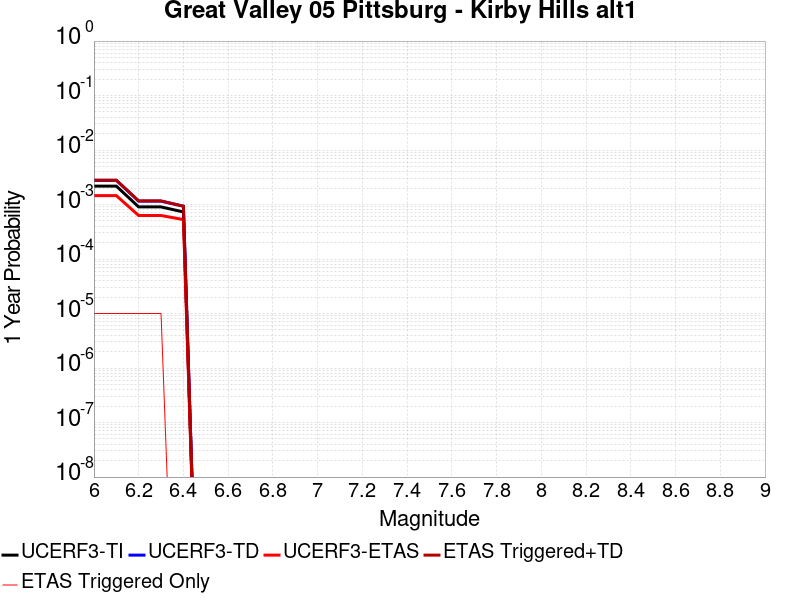 |  |

| Magnitude | 1 wk TI Prob | 1 wk TD Prob | 1 wk ETAS Prob | 1 wk ETAS/TD Gain | 1 wk ETAS Triggered+TD | 1 wk ETAS Triggered Only | 1 mo TI Prob | 1 mo TD Prob | 1 mo ETAS Prob | 1 mo ETAS/TD Gain | 1 mo ETAS Triggered+TD | 1 mo ETAS Triggered Only | 1 yr TI Prob | 1 yr TD Prob | 1 yr ETAS Prob | 1 yr ETAS/TD Gain | 1 yr ETAS Triggered+TD | 1 yr ETAS Triggered Only | 10 yr TI Prob | 10 yr TD Prob | 10 yr ETAS Prob | 10 yr ETAS/TD Gain | 10 yr ETAS Triggered+TD | 10 yr ETAS Triggered Only |
|-----|-----|-----|-----|-----|-----|-----|-----|-----|-----|-----|-----|-----|-----|-----|-----|-----|-----|-----|-----|-----|-----|-----|-----|-----|
| 6.0 | 4.187212E-5 | 5.344289E-5 | 5.0E-5 | 0.9355781 | 5.344289E-5 | 0.0 | 1.794396E-4 | 2.2902661E-4 | 1.3E-4 | 0.5676196 | 2.2902661E-4 | 0.0 | 0.002182488 | 0.0027857998 | 0.00146 | 0.5240865 | 0.002795772 | 1.0E-5 | 0.021611776 | 0.027603218 | 0.01545 | 0.55971736 | 0.027612941 | 1.0E-5 |
| 6.1 | 4.187212E-5 | 5.344289E-5 | 5.0E-5 | 0.9355781 | 5.344289E-5 | 0.0 | 1.794396E-4 | 2.2902661E-4 | 1.3E-4 | 0.5676196 | 2.2902661E-4 | 0.0 | 0.002182488 | 0.0027857998 | 0.00146 | 0.5240865 | 0.002795772 | 1.0E-5 | 0.021611776 | 0.027603218 | 0.01545 | 0.55971736 | 0.027612941 | 1.0E-5 |
| 6.2 | 1.7353306E-5 | 2.2154672E-5 | 3.0E-5 | 1.3541162 | 2.2154672E-5 | 0.0 | 7.436919E-5 | 9.4947456E-5 | 6.0E-5 | 0.63192844 | 9.4947456E-5 | 0.0 | 9.050688E-4 | 0.0011557573 | 6.3E-4 | 0.5450971 | 0.0011657458 | 1.0E-5 | 0.009013915 | 0.0115352 | 0.00689 | 0.59730214 | 0.011545085 | 1.0E-5 |
| 6.3 | 1.7353306E-5 | 2.2154672E-5 | 3.0E-5 | 1.3541162 | 2.2154672E-5 | 0.0 | 7.436919E-5 | 9.4947456E-5 | 6.0E-5 | 0.63192844 | 9.4947456E-5 | 0.0 | 9.050688E-4 | 0.0011557573 | 6.3E-4 | 0.5450971 | 0.0011657458 | 1.0E-5 | 0.009013915 | 0.0115352 | 0.00689 | 0.59730214 | 0.011545085 | 1.0E-5 |
| 6.4 | 1.4028824E-5 | 1.7901062E-5 | 2.0E-5 | 1.1172522 | 1.7901062E-5 | 0.0 | 6.0122147E-5 | 7.671883E-5 | 5.0E-5 | 0.6517304 | 7.671883E-5 | 0.0 | 7.3174125E-4 | 9.340303E-4 | 5.3E-4 | 0.5674334 | 9.340303E-4 | 0.0 | 0.0072933645 | 0.009338211 | 0.00568 | 0.60825354 | 0.009338211 | 0.0 |

## Sierra Madre (San Fernando)
*[(top)](#table-of-contents)*

| 1 Week | 1 Month | 1 Year | 10 Year |
|-----|-----|-----|-----|
|  |  |  |  |

| Magnitude | 1 wk TI Prob | 1 wk TD Prob | 1 wk ETAS Prob | 1 wk ETAS/TD Gain | 1 wk ETAS Triggered+TD | 1 wk ETAS Triggered Only | 1 mo TI Prob | 1 mo TD Prob | 1 mo ETAS Prob | 1 mo ETAS/TD Gain | 1 mo ETAS Triggered+TD | 1 mo ETAS Triggered Only | 1 yr TI Prob | 1 yr TD Prob | 1 yr ETAS Prob | 1 yr ETAS/TD Gain | 1 yr ETAS Triggered+TD | 1 yr ETAS Triggered Only | 10 yr TI Prob | 10 yr TD Prob | 10 yr ETAS Prob | 10 yr ETAS/TD Gain | 10 yr ETAS Triggered+TD | 10 yr ETAS Triggered Only |
|-----|-----|-----|-----|-----|-----|-----|-----|-----|-----|-----|-----|-----|-----|-----|-----|-----|-----|-----|-----|-----|-----|-----|-----|-----|
| 6.0 | 1.0346413E-5 | 6.2872386E-6 | 0.0 | 0.0 | 6.2872386E-6 | 0.0 | 4.4341014E-5 | 2.6945036E-5 | 0.0 | 0.0 | 2.6945036E-5 | 0.0 | 5.3971814E-4 | 3.2800753E-4 | 1.6E-4 | 0.48779365 | 3.3800426E-4 | 1.0E-5 | 0.0053840918 | 0.0032753467 | 0.00203 | 0.61978173 | 0.003285314 | 1.0E-5 |
| 6.1 | 1.0346413E-5 | 6.2872386E-6 | 0.0 | 0.0 | 6.2872386E-6 | 0.0 | 4.4341014E-5 | 2.6945036E-5 | 0.0 | 0.0 | 2.6945036E-5 | 0.0 | 5.3971814E-4 | 3.2800753E-4 | 1.6E-4 | 0.48779365 | 3.3800426E-4 | 1.0E-5 | 0.0053840918 | 0.0032753467 | 0.00203 | 0.61978173 | 0.003285314 | 1.0E-5 |
| 6.2 | 1.0346413E-5 | 6.2872386E-6 | 0.0 | 0.0 | 6.2872386E-6 | 0.0 | 4.4341014E-5 | 2.6945036E-5 | 0.0 | 0.0 | 2.6945036E-5 | 0.0 | 5.3971814E-4 | 3.2800753E-4 | 1.6E-4 | 0.48779365 | 3.3800426E-4 | 1.0E-5 | 0.0053840918 | 0.0032753467 | 0.00203 | 0.61978173 | 0.003285314 | 1.0E-5 |
| 6.3 | 1.0346413E-5 | 6.2872386E-6 | 0.0 | 0.0 | 6.2872386E-6 | 0.0 | 4.4341014E-5 | 2.6945036E-5 | 0.0 | 0.0 | 2.6945036E-5 | 0.0 | 5.3971814E-4 | 3.2800753E-4 | 1.6E-4 | 0.48779365 | 3.3800426E-4 | 1.0E-5 | 0.0053840918 | 0.0032753467 | 0.00203 | 0.61978173 | 0.003285314 | 1.0E-5 |
| 6.4 | 1.0249558E-5 | 6.2872386E-6 | 0.0 | 0.0 | 6.2872386E-6 | 0.0 | 4.392594E-5 | 2.6945036E-5 | 0.0 | 0.0 | 2.6945036E-5 | 0.0 | 5.3466705E-4 | 3.2800753E-4 | 1.6E-4 | 0.48779365 | 3.3800426E-4 | 1.0E-5 | 0.0053338245 | 0.0032753467 | 0.00203 | 0.61978173 | 0.003285314 | 1.0E-5 |
| 6.5 | 1.0249558E-5 | 6.2872386E-6 | 0.0 | 0.0 | 6.2872386E-6 | 0.0 | 4.392594E-5 | 2.6945036E-5 | 0.0 | 0.0 | 2.6945036E-5 | 0.0 | 5.3466705E-4 | 3.2800753E-4 | 1.6E-4 | 0.48779365 | 3.3800426E-4 | 1.0E-5 | 0.0053338245 | 0.0032753467 | 0.00203 | 0.61978173 | 0.003285314 | 1.0E-5 |
| 6.6 | 9.9035515E-6 | 6.2872386E-6 | 0.0 | 0.0 | 6.2872386E-6 | 0.0 | 4.2443102E-5 | 2.6945036E-5 | 0.0 | 0.0 | 2.6945036E-5 | 0.0 | 5.166222E-4 | 3.2800753E-4 | 1.6E-4 | 0.48779365 | 3.3800426E-4 | 1.0E-5 | 0.0051542283 | 0.0032753467 | 0.00203 | 0.61978173 | 0.003285314 | 1.0E-5 |
| 6.7 | 9.87217E-6 | 6.274661E-6 | 0.0 | 0.0 | 6.274661E-6 | 0.0 | 4.2308613E-5 | 2.6891132E-5 | 0.0 | 0.0 | 2.6891132E-5 | 0.0 | 5.149856E-4 | 3.2735144E-4 | 1.6E-4 | 0.48877132 | 3.3734817E-4 | 1.0E-5 | 0.005137938 | 0.003268805 | 0.00203 | 0.62102205 | 0.0032787723 | 1.0E-5 |
| 6.8 | 9.4359175E-6 | 6.1786473E-6 | 0.0 | 0.0 | 6.1786473E-6 | 0.0 | 4.043902E-5 | 2.6479653E-5 | 0.0 | 0.0 | 2.6479653E-5 | 0.0 | 4.9223384E-4 | 3.223432E-4 | 1.5E-4 | 0.46534255 | 3.3233996E-4 | 1.0E-5 | 0.0049114493 | 0.0032188678 | 0.00199 | 0.6182298 | 0.0032288358 | 1.0E-5 |
| 6.9 | 8.700447E-6 | 6.0399334E-6 | 0.0 | 0.0 | 6.0399334E-6 | 0.0 | 3.72871E-5 | 2.5885178E-5 | 0.0 | 0.0 | 2.5885178E-5 | 0.0 | 4.5387587E-4 | 3.1510755E-4 | 1.4E-4 | 0.44429278 | 3.251044E-4 | 1.0E-5 | 0.0045295 | 0.0031467169 | 0.00194 | 0.6165156 | 0.0031566853 | 1.0E-5 |
| 7.0 | 8.648878E-6 | 6.014848E-6 | 0.0 | 0.0 | 6.014848E-6 | 0.0 | 3.7066096E-5 | 2.5777672E-5 | 0.0 | 0.0 | 2.5777672E-5 | 0.0 | 4.5118626E-4 | 3.1379904E-4 | 1.4E-4 | 0.4461454 | 3.2379592E-4 | 1.0E-5 | 0.004502713 | 0.0031336688 | 0.00194 | 0.6190826 | 0.0031436374 | 1.0E-5 |
| 7.1 | 8.505786E-6 | 5.9244794E-6 | 0.0 | 0.0 | 5.9244794E-6 | 0.0 | 3.645286E-5 | 2.5390384E-5 | 0.0 | 0.0 | 2.5390384E-5 | 0.0 | 4.437232E-4 | 3.0908515E-4 | 1.4E-4 | 0.4529496 | 3.1908206E-4 | 1.0E-5 | 0.0044283825 | 0.0030866617 | 0.00189 | 0.612312 | 0.0030966308 | 1.0E-5 |
| 7.2 | 8.139752E-6 | 5.698777E-6 | 0.0 | 0.0 | 5.698777E-6 | 0.0 | 3.4884186E-5 | 2.4423107E-5 | 0.0 | 0.0 | 2.4423107E-5 | 0.0 | 4.246322E-4 | 2.973118E-4 | 1.4E-4 | 0.4708861 | 3.0730883E-4 | 1.0E-5 | 0.004238217 | 0.0029692466 | 0.00182 | 0.6129501 | 0.0029792169 | 1.0E-5 |
| 7.3 | 7.8816E-6 | 5.5520936E-6 | 0.0 | 0.0 | 5.5520936E-6 | 0.0 | 3.3777847E-5 | 2.3794475E-5 | 0.0 | 0.0 | 2.3794475E-5 | 0.0 | 4.111677E-4 | 2.8966027E-4 | 1.4E-4 | 0.48332483 | 2.9965737E-4 | 1.0E-5 | 0.004104078 | 0.0028929329 | 0.00178 | 0.61529255 | 0.0029029038 | 1.0E-5 |
| 7.4 | 7.5810603E-6 | 5.356333E-6 | 0.0 | 0.0 | 5.356333E-6 | 0.0 | 3.2489854E-5 | 2.2955517E-5 | 0.0 | 0.0 | 2.2955517E-5 | 0.0 | 3.9549218E-4 | 2.7944864E-4 | 1.4E-4 | 0.5009865 | 2.8944583E-4 | 1.0E-5 | 0.0039478904 | 0.0027910774 | 0.00172 | 0.6162495 | 0.0028010495 | 1.0E-5 |
| 7.5 | 6.349153E-6 | 4.4075887E-6 | 0.0 | 0.0 | 4.4075887E-6 | 0.0 | 2.7210372E-5 | 1.8889532E-5 | 0.0 | 0.0 | 1.8889532E-5 | 0.0 | 3.312359E-4 | 2.2995661E-4 | 1.2E-4 | 0.5218376 | 2.3995432E-4 | 1.0E-5 | 0.0033074263 | 0.0022972687 | 0.00151 | 0.6573023 | 0.0023072457 | 1.0E-5 |
| 7.6 | 4.430576E-6 | 2.8905786E-6 | 0.0 | 0.0 | 2.8905786E-6 | 0.0 | 1.8988047E-5 | 1.23881355E-5 | 0.0 | 0.0 | 1.23881355E-5 | 0.0 | 2.3115493E-4 | 1.5081534E-4 | 5.0E-5 | 0.33153126 | 1.6081383E-4 | 1.0E-5 | 0.0023091463 | 0.0015071525 | 0.00103 | 0.68340796 | 0.0015171374 | 1.0E-5 |
| 7.7 | 3.005066E-6 | 1.7509823E-6 | 0.0 | 0.0 | 1.7509823E-6 | 0.0 | 1.2878791E-5 | 7.504188E-6 | 0.0 | 0.0 | 7.504188E-6 | 0.0 | 1.56788E-4 | 9.135967E-5 | 5.0E-5 | 0.54728746 | 1.0135875E-4 | 1.0E-5 | 0.0015667742 | 9.1322226E-4 | 6.4E-4 | 0.70081514 | 9.2321314E-4 | 1.0E-5 |
| 7.8 | 1.8459098E-6 | 1.0581826E-6 | 0.0 | 0.0 | 1.0581826E-6 | 0.0 | 7.911018E-6 | 4.5350607E-6 | 0.0 | 0.0 | 4.5350607E-6 | 0.0 | 9.631238E-5 | 5.5212968E-5 | 3.0E-5 | 0.54335064 | 5.5212968E-5 | 0.0 | 9.627065E-4 | 5.5199297E-4 | 4.0E-4 | 0.7246469 | 5.5199297E-4 | 0.0 |
| 7.9 | 9.839262E-7 | 5.2340516E-7 | 0.0 | 0.0 | 5.2340516E-7 | 0.0 | 4.2168194E-6 | 2.243163E-6 | 0.0 | 0.0 | 2.243163E-6 | 0.0 | 5.1338568E-5 | 2.731017E-5 | 2.0E-5 | 0.73232794 | 2.731017E-5 | 0.0 | 5.132671E-4 | 2.7306844E-4 | 1.8E-4 | 0.65917546 | 2.7306844E-4 | 0.0 |
| 8.0 | 1.210983E-7 | 6.613497E-8 | 0.0 | 0.0 | 6.613497E-8 | 0.0 | 5.1899264E-7 | 2.8343558E-7 | 0.0 | 0.0 | 2.8343558E-7 | 0.0 | 6.3187167E-6 | 3.4508228E-6 | 1.0E-5 | 2.8978596 | 3.4508228E-6 | 0.0 | 6.318537E-5 | 3.450771E-5 | 4.0E-5 | 1.1591612 | 3.450771E-5 | 0.0 |

## San Gregorio (South) 2011 CFM
*[(top)](#table-of-contents)*

| 1 Week | 1 Month | 1 Year | 10 Year |
|-----|-----|-----|-----|
|  |  |  |  |

| Magnitude | 1 wk TI Prob | 1 wk TD Prob | 1 wk ETAS Prob | 1 wk ETAS/TD Gain | 1 wk ETAS Triggered+TD | 1 wk ETAS Triggered Only | 1 mo TI Prob | 1 mo TD Prob | 1 mo ETAS Prob | 1 mo ETAS/TD Gain | 1 mo ETAS Triggered+TD | 1 mo ETAS Triggered Only | 1 yr TI Prob | 1 yr TD Prob | 1 yr ETAS Prob | 1 yr ETAS/TD Gain | 1 yr ETAS Triggered+TD | 1 yr ETAS Triggered Only | 10 yr TI Prob | 10 yr TD Prob | 10 yr ETAS Prob | 10 yr ETAS/TD Gain | 10 yr ETAS Triggered+TD | 10 yr ETAS Triggered Only |
|-----|-----|-----|-----|-----|-----|-----|-----|-----|-----|-----|-----|-----|-----|-----|-----|-----|-----|-----|-----|-----|-----|-----|-----|-----|
| 6.0 | 1.8770423E-5 | 1.6279559E-5 | 1.0E-5 | 0.6142673 | 1.6279559E-5 | 0.0 | 8.044219E-5 | 6.9767695E-5 | 6.0E-5 | 0.8599969 | 6.9767695E-5 | 0.0 | 9.789435E-4 | 8.490944E-4 | 4.9E-4 | 0.57708544 | 8.490944E-4 | 0.0 | 0.009746423 | 0.008471475 | 0.00451 | 0.5323748 | 0.008481391 | 1.0E-5 |
| 6.1 | 1.8770423E-5 | 1.6279559E-5 | 1.0E-5 | 0.6142673 | 1.6279559E-5 | 0.0 | 8.044219E-5 | 6.9767695E-5 | 6.0E-5 | 0.8599969 | 6.9767695E-5 | 0.0 | 9.789435E-4 | 8.490944E-4 | 4.9E-4 | 0.57708544 | 8.490944E-4 | 0.0 | 0.009746423 | 0.008471475 | 0.00451 | 0.5323748 | 0.008481391 | 1.0E-5 |
| 6.2 | 1.7508692E-5 | 1.4899064E-5 | 0.0 | 0.0 | 1.4899064E-5 | 0.0 | 7.5035096E-5 | 6.3851585E-5 | 5.0E-5 | 0.7830659 | 6.3851585E-5 | 0.0 | 9.1316935E-4 | 7.7711884E-4 | 3.8E-4 | 0.48898572 | 7.7711884E-4 | 0.0 | 0.00909426 | 0.007756904 | 0.00404 | 0.5208264 | 0.007766826 | 1.0E-5 |
| 6.3 | 1.7508692E-5 | 1.4899064E-5 | 0.0 | 0.0 | 1.4899064E-5 | 0.0 | 7.5035096E-5 | 6.3851585E-5 | 5.0E-5 | 0.7830659 | 6.3851585E-5 | 0.0 | 9.1316935E-4 | 7.7711884E-4 | 3.8E-4 | 0.48898572 | 7.7711884E-4 | 0.0 | 0.00909426 | 0.007756904 | 0.00404 | 0.5208264 | 0.007766826 | 1.0E-5 |
| 6.4 | 1.6004591E-5 | 1.3248901E-5 | 0.0 | 0.0 | 1.3248901E-5 | 0.0 | 6.85893E-5 | 5.6779776E-5 | 4.0E-5 | 0.7044762 | 5.6779776E-5 | 0.0 | 8.347548E-4 | 6.910755E-4 | 3.5E-4 | 0.5064569 | 6.910755E-4 | 0.0 | 0.008316261 | 0.0069019548 | 0.00346 | 0.50130725 | 0.006911886 | 1.0E-5 |
| 6.5 | 1.6004591E-5 | 1.3248901E-5 | 0.0 | 0.0 | 1.3248901E-5 | 0.0 | 6.85893E-5 | 5.6779776E-5 | 4.0E-5 | 0.7044762 | 5.6779776E-5 | 0.0 | 8.347548E-4 | 6.910755E-4 | 3.5E-4 | 0.5064569 | 6.910755E-4 | 0.0 | 0.008316261 | 0.0069019548 | 0.00346 | 0.50130725 | 0.006911886 | 1.0E-5 |
| 6.6 | 1.5442201E-5 | 1.2633533E-5 | 0.0 | 0.0 | 1.2633533E-5 | 0.0 | 6.617918E-5 | 5.414259E-5 | 4.0E-5 | 0.7387899 | 5.414259E-5 | 0.0 | 8.0543366E-4 | 6.5898756E-4 | 3.5E-4 | 0.5311178 | 6.5898756E-4 | 0.0 | 0.008025207 | 0.0065830066 | 0.00337 | 0.51192415 | 0.0065929405 | 1.0E-5 |
| 6.7 | 1.489921E-5 | 1.2042042E-5 | 0.0 | 0.0 | 1.2042042E-5 | 0.0 | 6.3852196E-5 | 5.1607734E-5 | 4.0E-5 | 0.77507764 | 5.1607734E-5 | 0.0 | 7.7712315E-4 | 6.281437E-4 | 3.4E-4 | 0.5412774 | 6.281437E-4 | 0.0 | 0.0077441116 | 0.0062763398 | 0.00317 | 0.50507146 | 0.006286277 | 1.0E-5 |
| 6.8 | 1.3876024E-5 | 1.0920992E-5 | 0.0 | 0.0 | 1.0920992E-5 | 0.0 | 5.9467322E-5 | 4.6803412E-5 | 4.0E-5 | 0.8546385 | 4.6803412E-5 | 0.0 | 7.237741E-4 | 5.696829E-4 | 3.2E-4 | 0.56171596 | 5.696829E-4 | 0.0 | 0.0072142133 | 0.005694849 | 0.00286 | 0.50220823 | 0.0057047918 | 1.0E-5 |
| 6.9 | 1.33922495E-5 | 1.0392495E-5 | 0.0 | 0.0 | 1.0392495E-5 | 0.0 | 5.7394092E-5 | 4.4538505E-5 | 4.0E-5 | 0.89809936 | 4.4538505E-5 | 0.0 | 6.9854903E-4 | 5.4212165E-4 | 3.2E-4 | 0.59027344 | 5.4212165E-4 | 0.0 | 0.0069635725 | 0.0054206066 | 0.00274 | 0.5054785 | 0.005430552 | 1.0E-5 |
| 7.0 | 1.2807324E-5 | 9.752456E-6 | 0.0 | 0.0 | 9.752456E-6 | 0.0 | 5.4887376E-5 | 4.179557E-5 | 3.0E-5 | 0.7177794 | 4.179557E-5 | 0.0 | 6.680489E-4 | 5.0874247E-4 | 3.1E-4 | 0.6093457 | 5.0874247E-4 | 0.0 | 0.006660442 | 0.0050883847 | 0.0026 | 0.5109676 | 0.005098334 | 1.0E-5 |
| 7.1 | 1.2191438E-5 | 9.061344E-6 | 0.0 | 0.0 | 9.061344E-6 | 0.0 | 5.224797E-5 | 3.8833754E-5 | 3.0E-5 | 0.7725238 | 3.8833754E-5 | 0.0 | 6.3593336E-4 | 4.7269845E-4 | 3.0E-4 | 0.63465405 | 4.7269845E-4 | 0.0 | 0.0063411663 | 0.004729529 | 0.00239 | 0.50533575 | 0.0047394815 | 1.0E-5 |
| 7.2 | 1.1769438E-5 | 8.581538E-6 | 0.0 | 0.0 | 8.581538E-6 | 0.0 | 5.0439474E-5 | 3.6777503E-5 | 3.0E-5 | 0.815716 | 3.6777503E-5 | 0.0 | 6.1392755E-4 | 4.476742E-4 | 2.6E-4 | 0.58077955 | 4.476742E-4 | 0.0 | 0.0061223423 | 0.0044803214 | 0.00223 | 0.49773213 | 0.004490277 | 1.0E-5 |
| 7.3 | 1.150374E-5 | 8.296966E-6 | 0.0 | 0.0 | 8.296966E-6 | 0.0 | 4.9300812E-5 | 3.5557943E-5 | 3.0E-5 | 0.8436934 | 3.5557943E-5 | 0.0 | 6.0007203E-4 | 4.3283202E-4 | 2.5E-4 | 0.5775913 | 4.3283202E-4 | 0.0 | 0.0059845424 | 0.004332466 | 0.00211 | 0.48702055 | 0.004342423 | 1.0E-5 |
| 7.4 | 1.12514E-5 | 8.042707E-6 | 0.0 | 0.0 | 8.042707E-6 | 0.0 | 4.8219394E-5 | 3.446829E-5 | 3.0E-5 | 0.87036526 | 3.446829E-5 | 0.0 | 5.8691297E-4 | 4.1957066E-4 | 2.5E-4 | 0.5958472 | 4.1957066E-4 | 0.0 | 0.005853653 | 0.0042003556 | 0.00207 | 0.49281538 | 0.004210314 | 1.0E-5 |
| 7.5 | 1.059696E-5 | 7.39299E-6 | 0.0 | 0.0 | 7.39299E-6 | 0.0 | 4.5414752E-5 | 3.168386E-5 | 3.0E-5 | 0.94685435 | 3.168386E-5 | 0.0 | 5.5278436E-4 | 3.8568274E-4 | 2.3E-4 | 0.59634507 | 3.8568274E-4 | 0.0 | 0.0055141128 | 0.003862607 | 0.00185 | 0.47895113 | 0.0038725685 | 1.0E-5 |
| 7.6 | 9.018592E-6 | 5.836751E-6 | 0.0 | 0.0 | 5.836751E-6 | 0.0 | 3.8650534E-5 | 2.5014408E-5 | 3.0E-5 | 1.1993089 | 2.5014408E-5 | 0.0 | 4.7046866E-4 | 3.0450788E-4 | 2.1E-4 | 0.6896373 | 3.0450788E-4 | 0.0 | 0.004694739 | 0.0030530049 | 0.00148 | 0.4847683 | 0.0030629744 | 1.0E-5 |
| 7.7 | 6.243489E-6 | 3.239351E-6 | 0.0 | 0.0 | 3.239351E-6 | 0.0 | 2.6757538E-5 | 1.3882858E-5 | 1.0E-5 | 0.7203128 | 1.3882858E-5 | 0.0 | 3.257243E-4 | 1.690107E-4 | 1.1E-4 | 0.65084636 | 1.690107E-4 | 0.0 | 0.003252473 | 0.0016990631 | 8.3E-4 | 0.4885045 | 0.0016990631 | 0.0 |
| 7.8 | 3.1941963E-6 | 1.380876E-6 | 0.0 | 0.0 | 1.380876E-6 | 0.0 | 1.368934E-5 | 5.9180265E-6 | 1.0E-5 | 1.6897525 | 5.9180265E-6 | 0.0 | 1.6665498E-4 | 7.2049595E-5 | 7.0E-5 | 0.971553 | 7.2049595E-5 | 0.0 | 0.0016653005 | 7.2625576E-4 | 3.7E-4 | 0.5094624 | 7.2625576E-4 | 0.0 |
| 7.9 | 2.0098398E-6 | 6.915071E-7 | 0.0 | 0.0 | 6.915071E-7 | 0.0 | 8.6135715E-6 | 2.9635985E-6 | 1.0E-5 | 3.3742762 | 2.9635985E-6 | 0.0 | 1.0486518E-4 | 3.6081216E-5 | 5.0E-5 | 1.3857627 | 3.6081216E-5 | 0.0 | 0.0010481571 | 3.6566515E-4 | 2.1E-4 | 0.57429594 | 3.6566515E-4 | 0.0 |
| 8.0 | 8.353119E-7 | 3.1619197E-7 | 0.0 | 0.0 | 3.1619197E-7 | 0.0 | 3.579903E-6 | 1.3551078E-6 | 0.0 | 0.0 | 1.3551078E-6 | 0.0 | 4.358445E-5 | 1.6498312E-5 | 2.0E-5 | 1.2122452 | 1.6498312E-5 | 0.0 | 4.3575902E-4 | 1.6616881E-4 | 9.0E-5 | 0.5416179 | 1.6616881E-4 | 0.0 |
| 8.1 | 1.5033264E-7 | 6.52693E-8 | 0.0 | 0.0 | 6.52693E-8 | 0.0 | 6.442826E-7 | 2.7972553E-7 | 0.0 | 0.0 | 2.7972553E-7 | 0.0 | 7.844113E-6 | 3.4056532E-6 | 0.0 | 0.0 | 3.4056532E-6 | 0.0 | 7.843835E-5 | 3.4072833E-5 | 1.0E-5 | 0.29348895 | 3.4072833E-5 | 0.0 |

## San Jose
*[(top)](#table-of-contents)*

| 1 Week | 1 Month | 1 Year | 10 Year |
|-----|-----|-----|-----|
|  |  |  |  |

| Magnitude | 1 wk TI Prob | 1 wk TD Prob | 1 wk ETAS Prob | 1 wk ETAS/TD Gain | 1 wk ETAS Triggered+TD | 1 wk ETAS Triggered Only | 1 mo TI Prob | 1 mo TD Prob | 1 mo ETAS Prob | 1 mo ETAS/TD Gain | 1 mo ETAS Triggered+TD | 1 mo ETAS Triggered Only | 1 yr TI Prob | 1 yr TD Prob | 1 yr ETAS Prob | 1 yr ETAS/TD Gain | 1 yr ETAS Triggered+TD | 1 yr ETAS Triggered Only | 10 yr TI Prob | 10 yr TD Prob | 10 yr ETAS Prob | 10 yr ETAS/TD Gain | 10 yr ETAS Triggered+TD | 10 yr ETAS Triggered Only |
|-----|-----|-----|-----|-----|-----|-----|-----|-----|-----|-----|-----|-----|-----|-----|-----|-----|-----|-----|-----|-----|-----|-----|-----|-----|
| 6.0 | 5.0851277E-6 | 4.125642E-6 | 0.0 | 0.0 | 4.125642E-6 | 0.0 | 2.1793223E-5 | 1.768122E-5 | 2.0E-5 | 1.1311438 | 2.7681042E-5 | 1.0E-5 | 2.653002E-4 | 2.152502E-4 | 1.3E-4 | 0.60394835 | 2.2524805E-4 | 1.0E-5 | 0.0026498367 | 0.0021507454 | 0.00128 | 0.5951425 | 0.002160724 | 1.0E-5 |
| 6.1 | 5.0851277E-6 | 4.125642E-6 | 0.0 | 0.0 | 4.125642E-6 | 0.0 | 2.1793223E-5 | 1.768122E-5 | 2.0E-5 | 1.1311438 | 2.7681042E-5 | 1.0E-5 | 2.653002E-4 | 2.152502E-4 | 1.3E-4 | 0.60394835 | 2.2524805E-4 | 1.0E-5 | 0.0026498367 | 0.0021507454 | 0.00128 | 0.5951425 | 0.002160724 | 1.0E-5 |
| 6.2 | 5.0851277E-6 | 4.125642E-6 | 0.0 | 0.0 | 4.125642E-6 | 0.0 | 2.1793223E-5 | 1.768122E-5 | 2.0E-5 | 1.1311438 | 2.7681042E-5 | 1.0E-5 | 2.653002E-4 | 2.152502E-4 | 1.3E-4 | 0.60394835 | 2.2524805E-4 | 1.0E-5 | 0.0026498367 | 0.0021507454 | 0.00128 | 0.5951425 | 0.002160724 | 1.0E-5 |
| 6.3 | 5.0851277E-6 | 4.125642E-6 | 0.0 | 0.0 | 4.125642E-6 | 0.0 | 2.1793223E-5 | 1.768122E-5 | 2.0E-5 | 1.1311438 | 2.7681042E-5 | 1.0E-5 | 2.653002E-4 | 2.152502E-4 | 1.3E-4 | 0.60394835 | 2.2524805E-4 | 1.0E-5 | 0.0026498367 | 0.0021507454 | 0.00128 | 0.5951425 | 0.002160724 | 1.0E-5 |
| 6.4 | 4.3115124E-6 | 3.3237525E-6 | 0.0 | 0.0 | 3.3237525E-6 | 0.0 | 1.8477778E-5 | 1.4244589E-5 | 2.0E-5 | 1.404042 | 2.4244446E-5 | 1.0E-5 | 2.2494372E-4 | 1.7341628E-4 | 1.2E-4 | 0.69197655 | 1.8341454E-4 | 1.0E-5 | 0.0022471617 | 0.0017330965 | 0.00106 | 0.61162204 | 0.0017430792 | 1.0E-5 |
| 6.5 | 4.3115124E-6 | 3.3237525E-6 | 0.0 | 0.0 | 3.3237525E-6 | 0.0 | 1.8477778E-5 | 1.4244589E-5 | 2.0E-5 | 1.404042 | 2.4244446E-5 | 1.0E-5 | 2.2494372E-4 | 1.7341628E-4 | 1.2E-4 | 0.69197655 | 1.8341454E-4 | 1.0E-5 | 0.0022471617 | 0.0017330965 | 0.00106 | 0.61162204 | 0.0017430792 | 1.0E-5 |
| 6.6 | 3.110396E-6 | 2.0799562E-6 | 0.0 | 0.0 | 2.0799562E-6 | 0.0 | 1.33302E-5 | 8.9140685E-6 | 1.0E-5 | 1.1218222 | 8.9140685E-6 | 0.0 | 1.622831E-4 | 1.0852366E-4 | 6.0E-5 | 0.5528748 | 1.0852366E-4 | 0.0 | 0.0016216465 | 0.001084804 | 6.0E-4 | 0.55309534 | 0.001084804 | 0.0 |
| 6.7 | 3.110396E-6 | 2.0799562E-6 | 0.0 | 0.0 | 2.0799562E-6 | 0.0 | 1.33302E-5 | 8.9140685E-6 | 1.0E-5 | 1.1218222 | 8.9140685E-6 | 0.0 | 1.622831E-4 | 1.0852366E-4 | 6.0E-5 | 0.5528748 | 1.0852366E-4 | 0.0 | 0.0016216465 | 0.001084804 | 6.0E-4 | 0.55309534 | 0.001084804 | 0.0 |
| 6.8 | 2.856651E-6 | 1.9024077E-6 | 0.0 | 0.0 | 1.9024077E-6 | 0.0 | 1.2242733E-5 | 8.153152E-6 | 1.0E-5 | 1.2265196 | 8.153152E-6 | 0.0 | 1.4904508E-4 | 9.926035E-5 | 4.0E-5 | 0.40298066 | 9.926035E-5 | 0.0 | 0.0014894515 | 9.922545E-4 | 5.3E-4 | 0.5341372 | 9.922545E-4 | 0.0 |
| 6.9 | 2.1618725E-6 | 1.4186406E-6 | 0.0 | 0.0 | 1.4186406E-6 | 0.0 | 9.265135E-6 | 6.0798748E-6 | 0.0 | 0.0 | 6.0798748E-6 | 0.0 | 1.12797185E-4 | 7.402005E-5 | 2.0E-5 | 0.27019706 | 7.402005E-5 | 0.0 | 0.0011273995 | 7.4003247E-4 | 3.5E-4 | 0.47295222 | 7.4003247E-4 | 0.0 |
| 7.0 | 1.9684312E-6 | 1.3256082E-6 | 0.0 | 0.0 | 1.3256082E-6 | 0.0 | 8.436106E-6 | 5.681166E-6 | 0.0 | 0.0 | 5.681166E-6 | 0.0 | 1.02704755E-4 | 6.916608E-5 | 2.0E-5 | 0.28915906 | 6.916608E-5 | 0.0 | 0.001026573 | 6.9152354E-4 | 3.2E-4 | 0.46274635 | 6.9152354E-4 | 0.0 |
| 7.1 | 1.6070337E-6 | 1.1154867E-6 | 0.0 | 0.0 | 1.1154867E-6 | 0.0 | 6.887269E-6 | 4.7806493E-6 | 0.0 | 0.0 | 4.7806493E-6 | 0.0 | 8.384928E-5 | 5.8202913E-5 | 2.0E-5 | 0.34362543 | 5.8202913E-5 | 0.0 | 8.3817646E-4 | 5.819527E-4 | 2.7E-4 | 0.46395525 | 5.819527E-4 | 0.0 |
| 7.2 | 1.0631658E-6 | 6.403567E-7 | 0.0 | 0.0 | 6.403567E-7 | 0.0 | 4.556417E-6 | 2.744383E-6 | 0.0 | 0.0 | 2.744383E-6 | 0.0 | 5.5472963E-5 | 3.3412365E-5 | 2.0E-5 | 0.59858084 | 3.3412365E-5 | 0.0 | 5.545912E-4 | 3.3414463E-4 | 1.8E-4 | 0.5386889 | 3.3414463E-4 | 0.0 |
| 7.3 | 7.060711E-7 | 4.5823228E-7 | 0.0 | 0.0 | 4.5823228E-7 | 0.0 | 3.0260155E-6 | 1.9638512E-6 | 0.0 | 0.0 | 1.9638512E-6 | 0.0 | 3.6841117E-5 | 2.3909635E-5 | 1.0E-5 | 0.41824144 | 2.3909635E-5 | 0.0 | 3.6835007E-4 | 2.3914136E-4 | 1.3E-4 | 0.5436115 | 2.3914136E-4 | 0.0 |
| 7.4 | 3.3677085E-7 | 2.3231999E-7 | 0.0 | 0.0 | 2.3231999E-7 | 0.0 | 1.4433028E-6 | 9.956567E-7 | 0.0 | 0.0 | 9.956567E-7 | 0.0 | 1.757207E-5 | 1.2122056E-5 | 0.0 | 0.0 | 1.2122056E-5 | 0.0 | 1.7570681E-4 | 1.2128407E-4 | 7.0E-5 | 0.5771574 | 1.2128407E-4 | 0.0 |
| 7.5 | 3.129161E-7 | 1.9529637E-7 | 0.0 | 0.0 | 1.9529637E-7 | 0.0 | 1.3410682E-6 | 8.3698416E-7 | 0.0 | 0.0 | 8.3698416E-7 | 0.0 | 1.6327383E-5 | 1.0190237E-5 | 0.0 | 0.0 | 1.0190237E-5 | 0.0 | 1.6326184E-4 | 1.0196777E-4 | 6.0E-5 | 0.58842117 | 1.0196777E-4 | 0.0 |
| 7.6 | 2.8008668E-7 | 1.4240818E-7 | 0.0 | 0.0 | 1.4240818E-7 | 0.0 | 1.2003709E-6 | 6.103206E-7 | 0.0 | 0.0 | 6.103206E-7 | 0.0 | 1.46144175E-5 | 7.43063E-6 | 0.0 | 0.0 | 7.43063E-6 | 0.0 | 1.4613457E-4 | 7.43735E-5 | 4.0E-5 | 0.537826 | 7.43735E-5 | 0.0 |
| 7.7 | 2.7852005E-7 | 1.4015403E-7 | 0.0 | 0.0 | 1.4015403E-7 | 0.0 | 1.1936568E-6 | 6.0066003E-7 | 0.0 | 0.0 | 6.0066003E-7 | 0.0 | 1.4532674E-5 | 7.3130127E-6 | 0.0 | 0.0 | 7.3130127E-6 | 0.0 | 1.4531724E-4 | 7.31974E-5 | 4.0E-5 | 0.5464675 | 7.31974E-5 | 0.0 |
| 7.8 | 1.1810797E-7 | 7.5187074E-8 | 0.0 | 0.0 | 7.5187074E-8 | 0.0 | 5.0617695E-7 | 3.2223028E-7 | 0.0 | 0.0 | 3.2223028E-7 | 0.0 | 6.1626865E-6 | 3.9231472E-6 | 0.0 | 0.0 | 3.9231472E-6 | 0.0 | 6.162516E-5 | 3.9271265E-5 | 3.0E-5 | 0.7639174 | 3.9271265E-5 | 0.0 |

## San Joaquin Hills
*[(top)](#table-of-contents)*

| 1 Week | 1 Month | 1 Year | 10 Year |
|-----|-----|-----|-----|
|  |  |  |  |

| Magnitude | 1 wk TI Prob | 1 wk TD Prob | 1 wk ETAS Prob | 1 wk ETAS/TD Gain | 1 wk ETAS Triggered+TD | 1 wk ETAS Triggered Only | 1 mo TI Prob | 1 mo TD Prob | 1 mo ETAS Prob | 1 mo ETAS/TD Gain | 1 mo ETAS Triggered+TD | 1 mo ETAS Triggered Only | 1 yr TI Prob | 1 yr TD Prob | 1 yr ETAS Prob | 1 yr ETAS/TD Gain | 1 yr ETAS Triggered+TD | 1 yr ETAS Triggered Only | 10 yr TI Prob | 10 yr TD Prob | 10 yr ETAS Prob | 10 yr ETAS/TD Gain | 10 yr ETAS Triggered+TD | 10 yr ETAS Triggered Only |
|-----|-----|-----|-----|-----|-----|-----|-----|-----|-----|-----|-----|-----|-----|-----|-----|-----|-----|-----|-----|-----|-----|-----|-----|-----|
| 6.0 | 3.4525704E-6 | 2.8139727E-6 | 1.0E-5 | 3.5536947 | 1.28139445E-5 | 1.0E-5 | 1.4796647E-5 | 1.2059828E-5 | 1.0E-5 | 0.8291992 | 2.2059707E-5 | 1.0E-5 | 1.8013427E-4 | 1.4681864E-4 | 1.0E-4 | 0.6811124 | 1.5681717E-4 | 1.0E-5 | 0.0017998833 | 0.0014672297 | 8.5E-4 | 0.57932305 | 0.0014772151 | 1.0E-5 |
| 6.1 | 3.4525704E-6 | 2.8139727E-6 | 1.0E-5 | 3.5536947 | 1.28139445E-5 | 1.0E-5 | 1.4796647E-5 | 1.2059828E-5 | 1.0E-5 | 0.8291992 | 2.2059707E-5 | 1.0E-5 | 1.8013427E-4 | 1.4681864E-4 | 1.0E-4 | 0.6811124 | 1.5681717E-4 | 1.0E-5 | 0.0017998833 | 0.0014672297 | 8.5E-4 | 0.57932305 | 0.0014772151 | 1.0E-5 |
| 6.2 | 3.4525704E-6 | 2.8139727E-6 | 1.0E-5 | 3.5536947 | 1.28139445E-5 | 1.0E-5 | 1.4796647E-5 | 1.2059828E-5 | 1.0E-5 | 0.8291992 | 2.2059707E-5 | 1.0E-5 | 1.8013427E-4 | 1.4681864E-4 | 1.0E-4 | 0.6811124 | 1.5681717E-4 | 1.0E-5 | 0.0017998833 | 0.0014672297 | 8.5E-4 | 0.57932305 | 0.0014772151 | 1.0E-5 |
| 6.3 | 3.4525704E-6 | 2.8139727E-6 | 1.0E-5 | 3.5536947 | 1.28139445E-5 | 1.0E-5 | 1.4796647E-5 | 1.2059828E-5 | 1.0E-5 | 0.8291992 | 2.2059707E-5 | 1.0E-5 | 1.8013427E-4 | 1.4681864E-4 | 1.0E-4 | 0.6811124 | 1.5681717E-4 | 1.0E-5 | 0.0017998833 | 0.0014672297 | 8.5E-4 | 0.57932305 | 0.0014772151 | 1.0E-5 |
| 6.4 | 3.4525704E-6 | 2.8139727E-6 | 1.0E-5 | 3.5536947 | 1.28139445E-5 | 1.0E-5 | 1.4796647E-5 | 1.2059828E-5 | 1.0E-5 | 0.8291992 | 2.2059707E-5 | 1.0E-5 | 1.8013427E-4 | 1.4681864E-4 | 1.0E-4 | 0.6811124 | 1.5681717E-4 | 1.0E-5 | 0.0017998833 | 0.0014672297 | 8.5E-4 | 0.57932305 | 0.0014772151 | 1.0E-5 |
| 6.5 | 3.4525704E-6 | 2.8139727E-6 | 1.0E-5 | 3.5536947 | 1.28139445E-5 | 1.0E-5 | 1.4796647E-5 | 1.2059828E-5 | 1.0E-5 | 0.8291992 | 2.2059707E-5 | 1.0E-5 | 1.8013427E-4 | 1.4681864E-4 | 1.0E-4 | 0.6811124 | 1.5681717E-4 | 1.0E-5 | 0.0017998833 | 0.0014672297 | 8.5E-4 | 0.57932305 | 0.0014772151 | 1.0E-5 |
| 6.6 | 3.4525704E-6 | 2.8139727E-6 | 1.0E-5 | 3.5536947 | 1.28139445E-5 | 1.0E-5 | 1.4796647E-5 | 1.2059828E-5 | 1.0E-5 | 0.8291992 | 2.2059707E-5 | 1.0E-5 | 1.8013427E-4 | 1.4681864E-4 | 1.0E-4 | 0.6811124 | 1.5681717E-4 | 1.0E-5 | 0.0017998833 | 0.0014672297 | 8.5E-4 | 0.57932305 | 0.0014772151 | 1.0E-5 |
| 6.7 | 3.4525704E-6 | 2.8139727E-6 | 1.0E-5 | 3.5536947 | 1.28139445E-5 | 1.0E-5 | 1.4796647E-5 | 1.2059828E-5 | 1.0E-5 | 0.8291992 | 2.2059707E-5 | 1.0E-5 | 1.8013427E-4 | 1.4681864E-4 | 1.0E-4 | 0.6811124 | 1.5681717E-4 | 1.0E-5 | 0.0017998833 | 0.0014672297 | 8.5E-4 | 0.57932305 | 0.0014772151 | 1.0E-5 |
| 6.8 | 3.388654E-6 | 2.7484111E-6 | 1.0E-5 | 3.638466 | 1.2748384E-5 | 1.0E-5 | 1.4522722E-5 | 1.1778852E-5 | 1.0E-5 | 0.8489792 | 2.1778735E-5 | 1.0E-5 | 1.767998E-4 | 1.4339821E-4 | 1.0E-4 | 0.6973587 | 1.5339679E-4 | 1.0E-5 | 0.001766592 | 0.0014330697 | 8.5E-4 | 0.5931323 | 0.0014430553 | 1.0E-5 |
| 6.9 | 3.2694352E-6 | 2.6283255E-6 | 1.0E-5 | 3.804704 | 1.2628299E-5 | 1.0E-5 | 1.401179E-5 | 1.1264204E-5 | 1.0E-5 | 0.88776803 | 2.1264092E-5 | 1.0E-5 | 1.7058018E-4 | 1.3713316E-4 | 9.0E-5 | 0.6562964 | 1.471318E-4 | 1.0E-5 | 0.0017044931 | 0.0013704967 | 7.9E-4 | 0.57643336 | 0.001380483 | 1.0E-5 |
| 7.0 | 3.246912E-6 | 2.6069824E-6 | 1.0E-5 | 3.8358524 | 1.2606956E-5 | 1.0E-5 | 1.39152635E-5 | 1.1172735E-5 | 1.0E-5 | 0.895036 | 2.1172624E-5 | 1.0E-5 | 1.6940516E-4 | 1.3601968E-4 | 9.0E-5 | 0.661669 | 1.4601831E-4 | 1.0E-5 | 0.0016927607 | 0.0013593754 | 7.9E-4 | 0.5811492 | 0.0013693619 | 1.0E-5 |
| 7.1 | 3.1864927E-6 | 2.5523102E-6 | 1.0E-5 | 3.9180188 | 1.2552285E-5 | 1.0E-5 | 1.3656326E-5 | 1.0938427E-5 | 1.0E-5 | 0.9142082 | 2.0938318E-5 | 1.0E-5 | 1.6625308E-4 | 1.3316733E-4 | 9.0E-5 | 0.67584145 | 1.4316599E-4 | 1.0E-5 | 0.0016612876 | 0.0013308863 | 7.9E-4 | 0.5935894 | 0.001340873 | 1.0E-5 |
| 7.2 | 3.0220644E-6 | 2.3991581E-6 | 0.0 | 0.0 | 2.3991581E-6 | 0.0 | 1.295164E-5 | 1.0282067E-5 | 0.0 | 0.0 | 1.0282067E-5 | 0.0 | 1.576748E-4 | 1.2517707E-4 | 8.0E-5 | 0.6390947 | 1.2517707E-4 | 0.0 | 0.0015756298 | 0.001251076 | 7.4E-4 | 0.59149086 | 0.001251076 | 0.0 |
| 7.3 | 2.787619E-6 | 2.2173751E-6 | 0.0 | 0.0 | 2.2173751E-6 | 0.0 | 1.1946884E-5 | 9.503003E-6 | 0.0 | 0.0 | 9.503003E-6 | 0.0 | 1.454436E-4 | 1.1569301E-4 | 8.0E-5 | 0.69148517 | 1.1569301E-4 | 0.0 | 0.0014534845 | 0.0011563377 | 6.9E-4 | 0.5967115 | 0.0011563377 | 0.0 |
| 7.4 | 2.4593792E-6 | 1.9226163E-6 | 0.0 | 0.0 | 1.9226163E-6 | 0.0 | 1.0540153E-5 | 8.239759E-6 | 0.0 | 0.0 | 8.239759E-6 | 0.0 | 1.2831882E-4 | 1.0031454E-4 | 8.0E-5 | 0.7974916 | 1.0031454E-4 | 0.0 | 0.0012824474 | 0.0010027013 | 6.3E-4 | 0.62830275 | 0.0010027013 | 0.0 |
| 7.5 | 1.926764E-6 | 1.4383043E-6 | 0.0 | 0.0 | 1.4383043E-6 | 0.0 | 8.257534E-6 | 6.1641467E-6 | 0.0 | 0.0 | 6.1641467E-6 | 0.0 | 1.00530844E-4 | 7.5045966E-5 | 7.0E-5 | 0.93276167 | 7.5045966E-5 | 0.0 | 0.0010048538 | 7.502126E-4 | 4.8E-4 | 0.63981867 | 7.502126E-4 | 0.0 |
| 7.6 | 1.1609359E-6 | 8.145649E-7 | 0.0 | 0.0 | 8.145649E-7 | 0.0 | 4.97543E-6 | 3.4909879E-6 | 0.0 | 0.0 | 3.4909879E-6 | 0.0 | 6.0574173E-5 | 4.2501993E-5 | 4.0E-5 | 0.94113237 | 4.2501993E-5 | 0.0 | 6.055767E-4 | 4.24943E-4 | 3.2E-4 | 0.7530422 | 4.24943E-4 | 0.0 |
| 7.7 | 5.1168536E-7 | 2.7155397E-7 | 0.0 | 0.0 | 2.7155397E-7 | 0.0 | 2.1929354E-6 | 1.1638023E-6 | 0.0 | 0.0 | 1.1638023E-6 | 0.0 | 2.669866E-5 | 1.4169214E-5 | 1.0E-5 | 0.7057554 | 1.4169214E-5 | 0.0 | 2.6695454E-4 | 1.4168446E-4 | 1.3E-4 | 0.9175318 | 1.4168446E-4 | 0.0 |
| 7.8 | 1.16056995E-8 | 9.782997E-9 | 0.0 | 0.0 | 9.782997E-9 | 0.0 | 4.9738713E-8 | 4.1927127E-8 | 0.0 | 0.0 | 4.1927127E-8 | 0.0 | 6.0556863E-7 | 5.1046277E-7 | 0.0 | 0.0 | 5.1046277E-7 | 0.0 | 6.05567E-6 | 5.1046277E-6 | 1.0E-5 | 1.9590067 | 5.1046277E-6 | 0.0 |

## South Klamath Lake East
*[(top)](#table-of-contents)*

| 1 Week | 1 Month | 1 Year | 10 Year |
|-----|-----|-----|-----|
|  |  |  |  |

| Magnitude | 1 wk TI Prob | 1 wk TD Prob | 1 wk ETAS Prob | 1 wk ETAS/TD Gain | 1 wk ETAS Triggered+TD | 1 wk ETAS Triggered Only | 1 mo TI Prob | 1 mo TD Prob | 1 mo ETAS Prob | 1 mo ETAS/TD Gain | 1 mo ETAS Triggered+TD | 1 mo ETAS Triggered Only | 1 yr TI Prob | 1 yr TD Prob | 1 yr ETAS Prob | 1 yr ETAS/TD Gain | 1 yr ETAS Triggered+TD | 1 yr ETAS Triggered Only | 10 yr TI Prob | 10 yr TD Prob | 10 yr ETAS Prob | 10 yr ETAS/TD Gain | 10 yr ETAS Triggered+TD | 10 yr ETAS Triggered Only |
|-----|-----|-----|-----|-----|-----|-----|-----|-----|-----|-----|-----|-----|-----|-----|-----|-----|-----|-----|-----|-----|-----|-----|-----|-----|
| 6.0 | 2.3539369E-5 | 2.5047308E-5 | 2.0E-5 | 0.79848903 | 2.5047308E-5 | 0.0 | 1.0087911E-4 | 1.0734166E-4 | 5.0E-5 | 0.4658024 | 1.0734166E-4 | 0.0 | 0.0012275111 | 0.0013061843 | 8.0E-4 | 0.612471 | 0.0013161713 | 1.0E-5 | 0.012207527 | 0.012993417 | 0.00951 | 0.7319091 | 0.013003287 | 1.0E-5 |
| 6.1 | 2.3539369E-5 | 2.5047308E-5 | 2.0E-5 | 0.79848903 | 2.5047308E-5 | 0.0 | 1.0087911E-4 | 1.0734166E-4 | 5.0E-5 | 0.4658024 | 1.0734166E-4 | 0.0 | 0.0012275111 | 0.0013061843 | 8.0E-4 | 0.612471 | 0.0013161713 | 1.0E-5 | 0.012207527 | 0.012993417 | 0.00951 | 0.7319091 | 0.013003287 | 1.0E-5 |
| 6.2 | 2.3539369E-5 | 2.5047308E-5 | 2.0E-5 | 0.79848903 | 2.5047308E-5 | 0.0 | 1.0087911E-4 | 1.0734166E-4 | 5.0E-5 | 0.4658024 | 1.0734166E-4 | 0.0 | 0.0012275111 | 0.0013061843 | 8.0E-4 | 0.612471 | 0.0013161713 | 1.0E-5 | 0.012207527 | 0.012993417 | 0.00951 | 0.7319091 | 0.013003287 | 1.0E-5 |
| 6.3 | 9.807823E-6 | 1.0396044E-5 | 1.0E-5 | 0.9619044 | 1.0396044E-5 | 0.0 | 4.2032847E-5 | 4.455376E-5 | 3.0E-5 | 0.6733439 | 4.455376E-5 | 0.0 | 5.1162974E-4 | 5.4231536E-4 | 3.8E-4 | 0.7006993 | 5.4231536E-4 | 0.0 | 0.005104534 | 0.005410756 | 0.00443 | 0.81873953 | 0.005410756 | 0.0 |
| 6.4 | 9.807823E-6 | 1.0396044E-5 | 1.0E-5 | 0.9619044 | 1.0396044E-5 | 0.0 | 4.2032847E-5 | 4.455376E-5 | 3.0E-5 | 0.6733439 | 4.455376E-5 | 0.0 | 5.1162974E-4 | 5.4231536E-4 | 3.8E-4 | 0.7006993 | 5.4231536E-4 | 0.0 | 0.005104534 | 0.005410756 | 0.00443 | 0.81873953 | 0.005410756 | 0.0 |
| 6.5 | 6.191981E-6 | 6.5508398E-6 | 1.0E-5 | 1.5265218 | 6.5508398E-6 | 0.0 | 2.653679E-5 | 2.8074743E-5 | 2.0E-5 | 0.7123841 | 2.8074743E-5 | 0.0 | 3.2303753E-4 | 3.4175918E-4 | 2.5E-4 | 0.73150927 | 3.4175918E-4 | 0.0 | 0.0032256835 | 0.003412614 | 0.00276 | 0.80876416 | 0.003412614 | 0.0 |
| 6.6 | 4.3693776E-6 | 4.6165574E-6 | 1.0E-5 | 2.1661162 | 4.6165574E-6 | 0.0 | 1.8725768E-5 | 1.9785102E-5 | 2.0E-5 | 1.0108616 | 1.9785102E-5 | 0.0 | 2.2796239E-4 | 2.4085813E-4 | 2.1E-4 | 0.87188256 | 2.4085813E-4 | 0.0 | 0.0022772867 | 0.0024060833 | 0.00201 | 0.8353825 | 0.0024060833 | 0.0 |
| 6.7 | 3.360834E-6 | 3.5512403E-6 | 0.0 | 0.0 | 3.5512403E-6 | 0.0 | 1.4403494E-5 | 1.5219517E-5 | 1.0E-5 | 0.6570511 | 1.5219517E-5 | 0.0 | 1.7534842E-4 | 1.8528267E-4 | 1.3E-4 | 0.70163065 | 1.8528267E-4 | 0.0 | 0.0017521014 | 0.0018513618 | 0.00157 | 0.84802437 | 0.0018513618 | 0.0 |
| 6.8 | 2.57873E-6 | 2.7251708E-6 | 0.0 | 0.0 | 2.7251708E-6 | 0.0 | 1.1051653E-5 | 1.1679254E-5 | 1.0E-5 | 0.856219 | 1.1679254E-5 | 0.0 | 1.3454557E-4 | 1.4218627E-4 | 1.0E-4 | 0.7033028 | 1.4218627E-4 | 0.0 | 0.0013446413 | 0.0014210136 | 0.00122 | 0.8585421 | 0.0014210136 | 0.0 |
| 6.9 | 9.987825E-7 | 1.0566213E-6 | 0.0 | 0.0 | 1.0566213E-6 | 0.0 | 4.2804895E-6 | 4.528371E-6 | 1.0E-5 | 2.2082996 | 4.528371E-6 | 0.0 | 5.211371E-5 | 5.5131848E-5 | 5.0E-5 | 0.9069168 | 5.5131848E-5 | 0.0 | 5.210149E-4 | 5.5121386E-4 | 5.3E-4 | 0.96151423 | 5.5121386E-4 | 0.0 |

