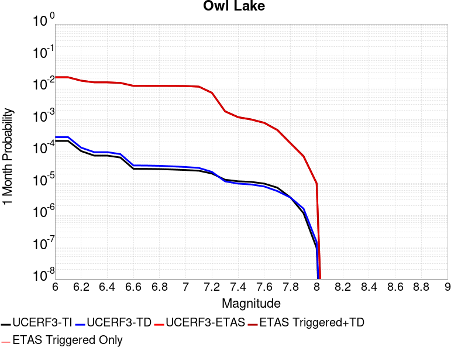
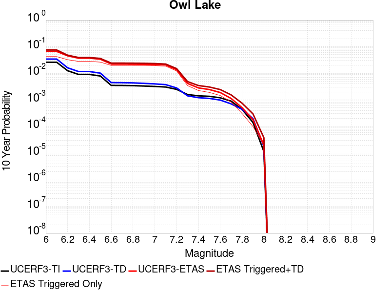
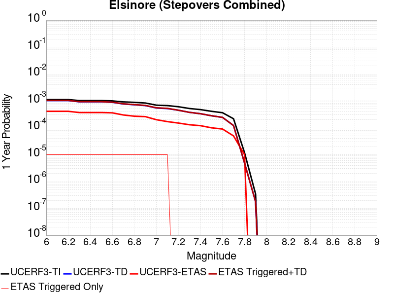
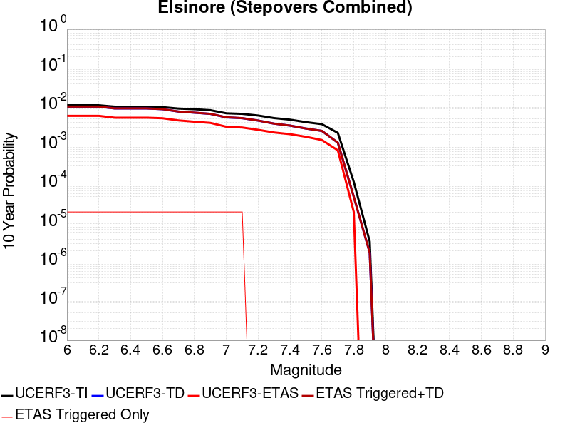
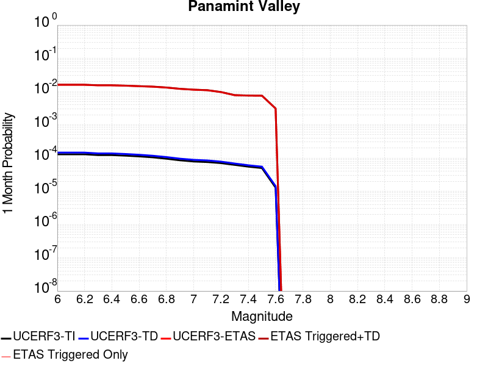
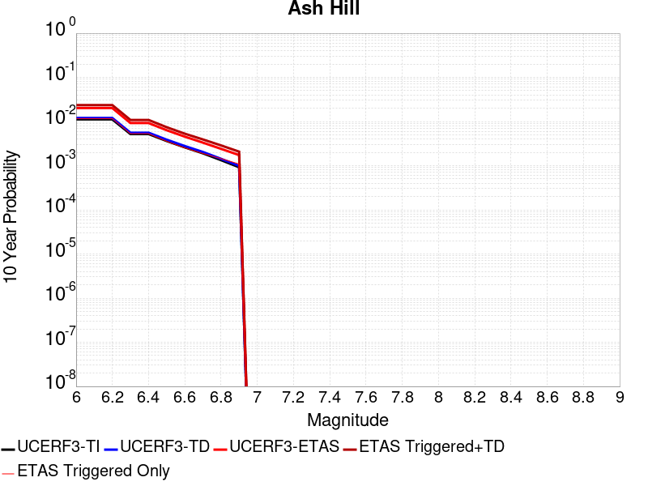

# Parent Section Magnitude-Probability Distributions

Only fault sections with at least one triggered aftershock are plotted. Sections are sorted by total supraseismogenic trigger rate (decreasing)

## Table Of Contents

* [Garlock (Central)](#garlock-central)
* [Tank Canyon](#tank-canyon)
* [Owl Lake](#owl-lake)
* [Elsinore (Stepovers Combined)](#elsinore-stepovers-combined)
* [Elsinore (Temecula) rev](#elsinore-temecula-rev)
* [Elsinore (Glen Ivy) rev](#elsinore-glen-ivy-rev)
* [Panamint Valley](#panamint-valley)
* [Ash Hill](#ash-hill)

## Garlock (Central)
*[(top)](#table-of-contents)*

| 1 Week | 1 Month | 1 Year | 10 Year |
|-----|-----|-----|-----|
|  |  |  |  |

| Magnitude | 1 wk TI Prob | 1 wk TD Prob | 1 wk ETAS Prob | 1 wk ETAS/TD Gain | 1 wk ETAS Triggered+TD | 1 wk ETAS Triggered Only | 1 mo TI Prob | 1 mo TD Prob | 1 mo ETAS Prob | 1 mo ETAS/TD Gain | 1 mo ETAS Triggered+TD | 1 mo ETAS Triggered Only | 1 yr TI Prob | 1 yr TD Prob | 1 yr ETAS Prob | 1 yr ETAS/TD Gain | 1 yr ETAS Triggered+TD | 1 yr ETAS Triggered Only | 10 yr TI Prob | 10 yr TD Prob | 10 yr ETAS Prob | 10 yr ETAS/TD Gain | 10 yr ETAS Triggered+TD | 10 yr ETAS Triggered Only |
|-----|-----|-----|-----|-----|-----|-----|-----|-----|-----|-----|-----|-----|-----|-----|-----|-----|-----|-----|-----|-----|-----|-----|-----|-----|
| 6.0 | 5.5131142E-5 | 7.024681E-5 | 0.0 | 0.0 | 7.024681E-5 | 0.0 | 2.3625491E-4 | 3.010234E-4 | 1.0E-5 | 0.03322001 | 3.1102038E-4 | 1.0E-5 | 0.0028726095 | 0.0036588663 | 3.0E-5 | 0.0081992615 | 0.0036887566 | 3.0E-5 | 0.028357591 | 0.036079824 | 4.0E-5 | 0.0011086528 | 0.03611838 | 4.0E-5 |
| 6.1 | 5.5131142E-5 | 7.024681E-5 | 0.0 | 0.0 | 7.024681E-5 | 0.0 | 2.3625491E-4 | 3.010234E-4 | 1.0E-5 | 0.03322001 | 3.1102038E-4 | 1.0E-5 | 0.0028726095 | 0.0036588663 | 3.0E-5 | 0.0081992615 | 0.0036887566 | 3.0E-5 | 0.028357591 | 0.036079824 | 4.0E-5 | 0.0011086528 | 0.03611838 | 4.0E-5 |
| 6.2 | 4.216245E-5 | 5.1661493E-5 | 0.0 | 0.0 | 5.1661493E-5 | 0.0 | 1.806837E-4 | 2.2138779E-4 | 1.0E-5 | 0.04516961 | 2.3138558E-4 | 1.0E-5 | 0.0021976046 | 0.0026920962 | 3.0E-5 | 0.011143732 | 0.0027220156 | 3.0E-5 | 0.021759989 | 0.026689773 | 3.0E-5 | 0.001124026 | 0.026718974 | 3.0E-5 |
| 6.3 | 4.216245E-5 | 5.1661493E-5 | 0.0 | 0.0 | 5.1661493E-5 | 0.0 | 1.806837E-4 | 2.2138779E-4 | 1.0E-5 | 0.04516961 | 2.3138558E-4 | 1.0E-5 | 0.0021976046 | 0.0026920962 | 3.0E-5 | 0.011143732 | 0.0027220156 | 3.0E-5 | 0.021759989 | 0.026689773 | 3.0E-5 | 0.001124026 | 0.026718974 | 3.0E-5 |
| 6.4 | 3.6858168E-5 | 4.411054E-5 | 0.0 | 0.0 | 4.411054E-5 | 0.0 | 1.5795401E-4 | 1.8903162E-4 | 0.0 | 0.0 | 1.8903162E-4 | 0.0 | 0.0019213937 | 0.002299056 | 2.0E-5 | 0.0086992225 | 0.00231901 | 2.0E-5 | 0.019048655 | 0.02284894 | 2.0E-5 | 8.753141E-4 | 0.022868482 | 2.0E-5 |
| 6.5 | 3.39199E-5 | 4.0018083E-5 | 0.0 | 0.0 | 4.0018083E-5 | 0.0 | 1.453629E-4 | 1.7149492E-4 | 0.0 | 0.0 | 1.7149492E-4 | 0.0 | 0.0017683565 | 0.002085973 | 2.0E-5 | 0.009587852 | 0.0021059313 | 2.0E-5 | 0.017543508 | 0.020759864 | 2.0E-5 | 9.6339744E-4 | 0.020779448 | 2.0E-5 |
| 6.6 | 3.3571985E-5 | 3.9472274E-5 | 0.0 | 0.0 | 3.9472274E-5 | 0.0 | 1.4387199E-4 | 1.6915603E-4 | 0.0 | 0.0 | 1.6915603E-4 | 0.0 | 0.0017502342 | 0.0020575512 | 2.0E-5 | 0.009720293 | 0.0020775099 | 2.0E-5 | 0.017365133 | 0.020481179 | 2.0E-5 | 9.765063E-4 | 0.02050077 | 2.0E-5 |
| 6.7 | 3.2580007E-5 | 3.8088703E-5 | 0.0 | 0.0 | 3.8088703E-5 | 0.0 | 1.3962112E-4 | 1.632272E-4 | 0.0 | 0.0 | 1.632272E-4 | 0.0 | 0.0016985617 | 0.0019855013 | 2.0E-5 | 0.010073023 | 0.0020054616 | 2.0E-5 | 0.016856372 | 0.019773813 | 2.0E-5 | 0.0010114387 | 0.01979342 | 2.0E-5 |
| 6.8 | 3.2185937E-5 | 3.7515918E-5 | 0.0 | 0.0 | 3.7515918E-5 | 0.0 | 1.3793244E-4 | 1.6077272E-4 | 0.0 | 0.0 | 1.6077272E-4 | 0.0 | 0.0016780337 | 0.001955672 | 2.0E-5 | 0.010226663 | 0.001975633 | 2.0E-5 | 0.016654192 | 0.019480614 | 2.0E-5 | 0.0010266617 | 0.019500224 | 2.0E-5 |
| 6.9 | 3.165394E-5 | 3.6720503E-5 | 0.0 | 0.0 | 3.6720503E-5 | 0.0 | 1.3565269E-4 | 1.5736422E-4 | 0.0 | 0.0 | 1.5736422E-4 | 0.0 | 0.0016503202 | 0.001914247 | 2.0E-5 | 0.0104479715 | 0.0019342088 | 2.0E-5 | 0.01638118 | 0.019073246 | 2.0E-5 | 0.0010485891 | 0.019092865 | 2.0E-5 |
| 7.0 | 3.0903822E-5 | 3.5625766E-5 | 0.0 | 0.0 | 3.5625766E-5 | 0.0 | 1.3243823E-4 | 1.5267303E-4 | 0.0 | 0.0 | 1.5267303E-4 | 0.0 | 0.0016112428 | 0.0018572307 | 2.0E-5 | 0.010768722 | 0.0018771936 | 2.0E-5 | 0.015996104 | 0.018512413 | 2.0E-5 | 0.0010803562 | 0.018532043 | 2.0E-5 |
| 7.1 | 3.0069863E-5 | 3.4392073E-5 | 0.0 | 0.0 | 3.4392073E-5 | 0.0 | 1.2886449E-4 | 1.4738638E-4 | 0.0 | 0.0 | 1.4738638E-4 | 0.0 | 0.0015677959 | 0.0017929734 | 1.0E-5 | 0.0055773277 | 0.0018029554 | 1.0E-5 | 0.01556781 | 0.017880075 | 1.0E-5 | 5.592818E-4 | 0.017889896 | 1.0E-5 |
| 7.2 | 2.7957109E-5 | 3.128145E-5 | 0.0 | 0.0 | 3.128145E-5 | 0.0 | 1.1981068E-4 | 1.340566E-4 | 0.0 | 0.0 | 1.340566E-4 | 0.0 | 0.0014577188 | 0.0016309366 | 0.0 | 0.0 | 0.0016309366 | 0.0 | 0.014481937 | 0.016283695 | 0.0 | 0.0 | 0.016283695 | 0.0 |
| 7.3 | 2.4519275E-5 | 2.6714795E-5 | 0.0 | 0.0 | 2.6714795E-5 | 0.0 | 1.0507837E-4 | 1.1448703E-4 | 0.0 | 0.0 | 1.1448703E-4 | 0.0 | 0.0012785783 | 0.001393003 | 0.0 | 0.0 | 0.001393003 | 0.0 | 0.012712469 | 0.013928054 | 0.0 | 0.0 | 0.013928054 | 0.0 |
| 7.4 | 2.3225532E-5 | 2.51994E-5 | 0.0 | 0.0 | 2.51994E-5 | 0.0 | 9.95342E-5 | 1.0799304E-4 | 0.0 | 0.0 | 1.0799304E-4 | 0.0 | 0.0012111551 | 0.0013140367 | 0.0 | 0.0 | 0.0013140367 | 0.0 | 0.012045753 | 0.013145725 | 0.0 | 0.0 | 0.013145725 | 0.0 |
| 7.5 | 2.097765E-5 | 2.2483688E-5 | 0.0 | 0.0 | 2.2483688E-5 | 0.0 | 8.9901114E-5 | 9.635517E-5 | 0.0 | 0.0 | 9.635517E-5 | 0.0 | 0.0010939965 | 0.0011725046 | 0.0 | 0.0 | 0.0011725046 | 0.0 | 0.010886264 | 0.011740365 | 0.0 | 0.0 | 0.011740365 | 0.0 |
| 7.6 | 1.511254E-5 | 1.5991332E-5 | 0.0 | 0.0 | 1.5991332E-5 | 0.0 | 6.476642E-5 | 6.853253E-5 | 0.0 | 0.0 | 6.853253E-5 | 0.0 | 7.882459E-4 | 8.3407195E-4 | 0.0 | 0.0 | 8.3407195E-4 | 0.0 | 0.007854558 | 0.008383559 | 0.0 | 0.0 | 0.008383559 | 0.0 |
| 7.7 | 9.934069E-6 | 1.0678794E-5 | 0.0 | 0.0 | 1.0678794E-5 | 0.0 | 4.2573887E-5 | 4.5765457E-5 | 0.0 | 0.0 | 4.5765457E-5 | 0.0 | 5.182138E-4 | 5.570524E-4 | 0.0 | 0.0 | 5.570524E-4 | 0.0 | 0.00517007 | 0.005627684 | 0.0 | 0.0 | 0.005627684 | 0.0 |
| 7.8 | 6.7562896E-6 | 8.428449E-6 | 0.0 | 0.0 | 8.428449E-6 | 0.0 | 2.8955206E-5 | 3.6121426E-5 | 0.0 | 0.0 | 3.6121426E-5 | 0.0 | 3.5247262E-4 | 4.3968976E-4 | 0.0 | 0.0 | 4.3968976E-4 | 0.0 | 0.0035191406 | 0.004446654 | 0.0 | 0.0 | 0.004446654 | 0.0 |
| 7.9 | 3.975453E-6 | 5.37103E-6 | 0.0 | 0.0 | 5.37103E-6 | 0.0 | 1.7037546E-5 | 2.3018498E-5 | 0.0 | 0.0 | 2.3018498E-5 | 0.0 | 2.0741238E-4 | 2.8021427E-4 | 0.0 | 0.0 | 2.8021427E-4 | 0.0 | 0.002072189 | 0.0028336283 | 0.0 | 0.0 | 0.0028336283 | 0.0 |
| 8.0 | 1.6729537E-6 | 2.0775144E-6 | 0.0 | 0.0 | 2.0775144E-6 | 0.0 | 7.169782E-6 | 8.903603E-6 | 0.0 | 0.0 | 8.903603E-6 | 0.0 | 8.7288594E-5 | 1.0839601E-4 | 0.0 | 0.0 | 1.0839601E-4 | 0.0 | 8.7254314E-4 | 0.0010969337 | 0.0 | 0.0 | 0.0010969337 | 0.0 |
| 8.1 | 3.6733252E-7 | 3.1489964E-7 | 0.0 | 0.0 | 3.1489964E-7 | 0.0 | 1.5742813E-6 | 1.3495693E-6 | 0.0 | 0.0 | 1.3495693E-6 | 0.0 | 1.9166706E-5 | 1.6430899E-5 | 0.0 | 0.0 | 1.6430899E-5 | 0.0 | 1.9165053E-4 | 1.6638759E-4 | 0.0 | 0.0 | 1.6638759E-4 | 0.0 |

## Tank Canyon
*[(top)](#table-of-contents)*

| 1 Week | 1 Month | 1 Year | 10 Year |
|-----|-----|-----|-----|
|  |  |  |  |

| Magnitude | 1 wk TI Prob | 1 wk TD Prob | 1 wk ETAS Prob | 1 wk ETAS/TD Gain | 1 wk ETAS Triggered+TD | 1 wk ETAS Triggered Only | 1 mo TI Prob | 1 mo TD Prob | 1 mo ETAS Prob | 1 mo ETAS/TD Gain | 1 mo ETAS Triggered+TD | 1 mo ETAS Triggered Only | 1 yr TI Prob | 1 yr TD Prob | 1 yr ETAS Prob | 1 yr ETAS/TD Gain | 1 yr ETAS Triggered+TD | 1 yr ETAS Triggered Only | 10 yr TI Prob | 10 yr TD Prob | 10 yr ETAS Prob | 10 yr ETAS/TD Gain | 10 yr ETAS Triggered+TD | 10 yr ETAS Triggered Only |
|-----|-----|-----|-----|-----|-----|-----|-----|-----|-----|-----|-----|-----|-----|-----|-----|-----|-----|-----|-----|-----|-----|-----|-----|-----|
| 6.0 | 4.8284557E-5 | 5.7964822E-5 | 1.0E-5 | 0.17251842 | 6.796425E-5 | 1.0E-5 | 2.0691741E-4 | 2.4840087E-4 | 1.0E-5 | 0.04025751 | 2.583984E-4 | 1.0E-5 | 0.0025163088 | 0.0030207601 | 1.0E-5 | 0.003310425 | 0.00303073 | 1.0E-5 | 0.02488006 | 0.029863637 | 3.0E-5 | 0.0010045662 | 0.02989274 | 3.0E-5 |
| 6.1 | 1.7796336E-5 | 2.0873314E-5 | 1.0E-5 | 0.4790806 | 3.0873107E-5 | 1.0E-5 | 7.626778E-5 | 8.945422E-5 | 1.0E-5 | 0.111789025 | 9.9453326E-5 | 1.0E-5 | 9.281647E-4 | 0.0010885983 | 1.0E-5 | 0.009186125 | 0.0010985873 | 1.0E-5 | 0.009242975 | 0.010836744 | 3.0E-5 | 0.0027683591 | 0.0108664185 | 3.0E-5 |
| 6.2 | 1.7796336E-5 | 2.0873314E-5 | 1.0E-5 | 0.4790806 | 3.0873107E-5 | 1.0E-5 | 7.626778E-5 | 8.945422E-5 | 1.0E-5 | 0.111789025 | 9.9453326E-5 | 1.0E-5 | 9.281647E-4 | 0.0010885983 | 1.0E-5 | 0.009186125 | 0.0010985873 | 1.0E-5 | 0.009242975 | 0.010836744 | 3.0E-5 | 0.0027683591 | 0.0108664185 | 3.0E-5 |
| 6.3 | 1.3515912E-5 | 1.5759564E-5 | 1.0E-5 | 0.6345353 | 2.5759407E-5 | 1.0E-5 | 5.792405E-5 | 6.753938E-5 | 1.0E-5 | 0.14806177 | 7.75387E-5 | 1.0E-5 | 7.049971E-4 | 8.2200574E-4 | 1.0E-5 | 0.012165365 | 8.3199755E-4 | 1.0E-5 | 0.007027647 | 0.0081922645 | 3.0E-5 | 0.003661991 | 0.008222018 | 3.0E-5 |
| 6.4 | 1.0870146E-5 | 1.2618021E-5 | 1.0E-5 | 0.7925173 | 2.2617895E-5 | 1.0E-5 | 4.658551E-5 | 5.4076212E-5 | 1.0E-5 | 0.1849242 | 6.407567E-5 | 1.0E-5 | 5.67031E-4 | 6.581969E-4 | 1.0E-5 | 0.015193022 | 6.6819036E-4 | 1.0E-5 | 0.005655863 | 0.0065644905 | 3.0E-5 | 0.0045700422 | 0.0065942938 | 3.0E-5 |
| 6.5 | 7.964826E-6 | 9.196094E-6 | 1.0E-5 | 1.0874182 | 1.9196003E-5 | 1.0E-5 | 3.4134522E-5 | 3.9411298E-5 | 1.0E-5 | 0.25373435 | 4.94109E-5 | 1.0E-5 | 4.1550855E-4 | 4.7973756E-4 | 1.0E-5 | 0.02084473 | 4.897328E-4 | 1.0E-5 | 0.0041473247 | 0.004788321 | 1.0E-5 | 0.0020884147 | 0.004798273 | 1.0E-5 |
| 6.6 | 6.6317E-6 | 7.6122988E-6 | 1.0E-5 | 1.3136636 | 1.7612223E-5 | 1.0E-5 | 2.8421264E-5 | 3.2623782E-5 | 1.0E-5 | 0.30652487 | 4.2623455E-5 | 1.0E-5 | 3.4597394E-4 | 3.9713128E-4 | 1.0E-5 | 0.025180591 | 4.071273E-4 | 1.0E-5 | 0.0034543579 | 0.003965368 | 1.0E-5 | 0.002521834 | 0.0039753285 | 1.0E-5 |
| 6.7 | 4.793663E-6 | 5.4307857E-6 | 1.0E-5 | 1.8413543 | 1.543073E-5 | 1.0E-5 | 2.0544108E-5 | 2.3274613E-5 | 1.0E-5 | 0.4296527 | 3.327438E-5 | 1.0E-5 | 2.500958E-4 | 2.8333595E-4 | 1.0E-5 | 0.03529379 | 2.933331E-4 | 1.0E-5 | 0.0024981452 | 0.0028304397 | 1.0E-5 | 0.00353302 | 0.0028404114 | 1.0E-5 |
| 6.8 | 4.382823E-6 | 4.9692567E-6 | 1.0E-5 | 2.0123734 | 1.4969207E-5 | 1.0E-5 | 1.8783392E-5 | 2.1296666E-5 | 1.0E-5 | 0.46955708 | 3.129645E-5 | 1.0E-5 | 2.286638E-4 | 2.5926033E-4 | 1.0E-5 | 0.038571272 | 2.6925773E-4 | 1.0E-5 | 0.0022842865 | 0.002590253 | 1.0E-5 | 0.0038606268 | 0.002600227 | 1.0E-5 |
| 6.9 | 2.729601E-6 | 3.0735416E-6 | 0.0 | 0.0 | 3.0735416E-6 | 0.0 | 1.1698237E-5 | 1.3172262E-5 | 0.0 | 0.0 | 1.3172262E-5 | 0.0 | 1.4241673E-4 | 1.6036171E-4 | 0.0 | 0.0 | 1.6036171E-4 | 0.0 | 0.001423255 | 0.0016026258 | 0.0 | 0.0 | 0.0016026258 | 0.0 |
| 7.0 | 1.8987357E-6 | 2.126939E-6 | 0.0 | 0.0 | 2.126939E-6 | 0.0 | 8.137413E-6 | 9.115425E-6 | 0.0 | 0.0 | 9.115425E-6 | 0.0 | 9.90685E-5 | 1.1097535E-4 | 0.0 | 0.0 | 1.1097535E-4 | 0.0 | 9.902435E-4 | 0.0011092679 | 0.0 | 0.0 | 0.0011092679 | 0.0 |
| 7.1 | 1.4928986E-6 | 1.6641272E-6 | 0.0 | 0.0 | 1.6641272E-6 | 0.0 | 6.398121E-6 | 7.1319573E-6 | 0.0 | 0.0 | 7.1319573E-6 | 0.0 | 7.789434E-5 | 8.682871E-5 | 0.0 | 0.0 | 8.682871E-5 | 0.0 | 7.786704E-4 | 8.6800574E-4 | 0.0 | 0.0 | 8.6800574E-4 | 0.0 |
| 7.2 | 1.069082E-6 | 1.1828573E-6 | 0.0 | 0.0 | 1.1828573E-6 | 0.0 | 4.581772E-6 | 5.0693816E-6 | 0.0 | 0.0 | 5.0693816E-6 | 0.0 | 5.5781646E-5 | 6.171851E-5 | 0.0 | 0.0 | 6.171851E-5 | 0.0 | 5.576765E-4 | 6.170659E-4 | 0.0 | 0.0 | 6.170659E-4 | 0.0 |
| 7.3 | 8.776551E-7 | 9.770005E-7 | 0.0 | 0.0 | 9.770005E-7 | 0.0 | 3.7613736E-6 | 4.1871413E-6 | 0.0 | 0.0 | 4.1871413E-6 | 0.0 | 4.579376E-5 | 5.097777E-5 | 0.0 | 0.0 | 5.097777E-5 | 0.0 | 4.5784327E-4 | 5.097118E-4 | 0.0 | 0.0 | 5.097118E-4 | 0.0 |
| 7.4 | 7.55721E-7 | 8.510244E-7 | 0.0 | 0.0 | 8.510244E-7 | 0.0 | 3.2388E-6 | 3.6472454E-6 | 0.0 | 0.0 | 3.6472454E-6 | 0.0 | 3.9431678E-5 | 4.4404827E-5 | 0.0 | 0.0 | 4.4404827E-5 | 0.0 | 3.942468E-4 | 4.440104E-4 | 0.0 | 0.0 | 4.440104E-4 | 0.0 |
| 7.5 | 5.587665E-7 | 6.305619E-7 | 0.0 | 0.0 | 6.305619E-7 | 0.0 | 2.3947114E-6 | 2.702408E-6 | 0.0 | 0.0 | 2.702408E-6 | 0.0 | 2.915522E-5 | 3.290182E-5 | 0.0 | 0.0 | 3.290182E-5 | 0.0 | 2.9151395E-4 | 3.290182E-4 | 0.0 | 0.0 | 3.290182E-4 | 0.0 |

## Owl Lake
*[(top)](#table-of-contents)*

| 1 Week | 1 Month | 1 Year | 10 Year |
|-----|-----|-----|-----|
|  |  |  |  |

| Magnitude | 1 wk TI Prob | 1 wk TD Prob | 1 wk ETAS Prob | 1 wk ETAS/TD Gain | 1 wk ETAS Triggered+TD | 1 wk ETAS Triggered Only | 1 mo TI Prob | 1 mo TD Prob | 1 mo ETAS Prob | 1 mo ETAS/TD Gain | 1 mo ETAS Triggered+TD | 1 mo ETAS Triggered Only | 1 yr TI Prob | 1 yr TD Prob | 1 yr ETAS Prob | 1 yr ETAS/TD Gain | 1 yr ETAS Triggered+TD | 1 yr ETAS Triggered Only | 10 yr TI Prob | 10 yr TD Prob | 10 yr ETAS Prob | 10 yr ETAS/TD Gain | 10 yr ETAS Triggered+TD | 10 yr ETAS Triggered Only |
|-----|-----|-----|-----|-----|-----|-----|-----|-----|-----|-----|-----|-----|-----|-----|-----|-----|-----|-----|-----|-----|-----|-----|-----|-----|
| 6.0 | 5.0320643E-5 | 6.635816E-5 | 0.0 | 0.0 | 6.635816E-5 | 0.0 | 2.1564208E-4 | 2.843674E-4 | 0.0 | 0.0 | 2.843674E-4 | 0.0 | 0.0026222812 | 0.0034577388 | 1.0E-5 | 0.0028920635 | 0.0034677042 | 1.0E-5 | 0.02591553 | 0.034140717 | 1.0E-5 | 2.9290537E-4 | 0.034150377 | 1.0E-5 |
| 6.1 | 5.0320643E-5 | 6.635816E-5 | 0.0 | 0.0 | 6.635816E-5 | 0.0 | 2.1564208E-4 | 2.843674E-4 | 0.0 | 0.0 | 2.843674E-4 | 0.0 | 0.0026222812 | 0.0034577388 | 1.0E-5 | 0.0028920635 | 0.0034677042 | 1.0E-5 | 0.02591553 | 0.034140717 | 1.0E-5 | 2.9290537E-4 | 0.034150377 | 1.0E-5 |
| 6.2 | 2.4125871E-5 | 3.0981035E-5 | 0.0 | 0.0 | 3.0981035E-5 | 0.0 | 1.0339249E-4 | 1.3277028E-4 | 0.0 | 0.0 | 1.3277028E-4 | 0.0 | 0.0012580766 | 0.001615439 | 1.0E-5 | 0.006190268 | 0.0016254229 | 1.0E-5 | 0.012509781 | 0.016070465 | 1.0E-5 | 6.2225957E-4 | 0.016080303 | 1.0E-5 |
| 6.3 | 1.7433485E-5 | 2.2355514E-5 | 0.0 | 0.0 | 2.2355514E-5 | 0.0 | 7.471279E-5 | 9.580672E-5 | 0.0 | 0.0 | 9.580672E-5 | 0.0 | 9.0924866E-4 | 0.0011659743 | 1.0E-5 | 0.008576518 | 0.0011759626 | 1.0E-5 | 0.009055373 | 0.011628896 | 1.0E-5 | 8.5992686E-4 | 0.01163878 | 1.0E-5 |
| 6.4 | 1.7433485E-5 | 2.2355514E-5 | 0.0 | 0.0 | 2.2355514E-5 | 0.0 | 7.471279E-5 | 9.580672E-5 | 0.0 | 0.0 | 9.580672E-5 | 0.0 | 9.0924866E-4 | 0.0011659743 | 1.0E-5 | 0.008576518 | 0.0011759626 | 1.0E-5 | 0.009055373 | 0.011628896 | 1.0E-5 | 8.5992686E-4 | 0.01163878 | 1.0E-5 |
| 6.5 | 1.5182742E-5 | 1.9429144E-5 | 0.0 | 0.0 | 1.9429144E-5 | 0.0 | 6.506727E-5 | 8.326596E-5 | 0.0 | 0.0 | 8.326596E-5 | 0.0 | 7.919061E-4 | 0.0010134429 | 1.0E-5 | 0.009867354 | 0.0010234327 | 1.0E-5 | 0.0078909 | 0.010118429 | 1.0E-5 | 9.882958E-4 | 0.010128328 | 1.0E-5 |
| 6.6 | 6.7271576E-6 | 8.547361E-6 | 0.0 | 0.0 | 8.547361E-6 | 0.0 | 2.8830356E-5 | 3.6631063E-5 | 0.0 | 0.0 | 3.6631063E-5 | 0.0 | 3.5095305E-4 | 4.458976E-4 | 1.0E-5 | 0.022426674 | 4.5589314E-4 | 1.0E-5 | 0.0035039932 | 0.004467813 | 1.0E-5 | 0.0022382317 | 0.0044777677 | 1.0E-5 |
| 6.7 | 6.682835E-6 | 8.479807E-6 | 0.0 | 0.0 | 8.479807E-6 | 0.0 | 2.8640408E-5 | 3.6341557E-5 | 0.0 | 0.0 | 3.6341557E-5 | 0.0 | 3.4864116E-4 | 4.4237426E-4 | 1.0E-5 | 0.022605292 | 4.5236986E-4 | 1.0E-5 | 0.003480947 | 0.0044327388 | 1.0E-5 | 0.0022559415 | 0.0044426946 | 1.0E-5 |
| 6.8 | 6.5774975E-6 | 8.32628E-6 | 0.0 | 0.0 | 8.32628E-6 | 0.0 | 2.8188972E-5 | 3.5683603E-5 | 0.0 | 0.0 | 3.5683603E-5 | 0.0 | 3.4314668E-4 | 4.343669E-4 | 1.0E-5 | 0.023022013 | 4.4436255E-4 | 1.0E-5 | 0.0034261728 | 0.004352885 | 1.0E-5 | 0.0022973272 | 0.004362841 | 1.0E-5 |
| 6.9 | 6.363419E-6 | 7.999454E-6 | 0.0 | 0.0 | 7.999454E-6 | 0.0 | 2.727151E-5 | 3.428296E-5 | 0.0 | 0.0 | 3.428296E-5 | 0.0 | 3.3198006E-4 | 4.1732067E-4 | 1.0E-5 | 0.02396239 | 4.273165E-4 | 1.0E-5 | 0.0033148455 | 0.0041828766 | 1.0E-5 | 0.0023906992 | 0.0041928347 | 1.0E-5 |
| 7.0 | 6.1342453E-6 | 7.6316555E-6 | 0.0 | 0.0 | 7.6316555E-6 | 0.0 | 2.6289357E-5 | 3.2706717E-5 | 0.0 | 0.0 | 3.2706717E-5 | 0.0 | 3.2002592E-4 | 3.9813702E-4 | 1.0E-5 | 0.025116982 | 4.0813303E-4 | 1.0E-5 | 0.0031956544 | 0.003991571 | 1.0E-5 | 0.0025052794 | 0.004001531 | 1.0E-5 |
| 7.1 | 5.842926E-6 | 7.142211E-6 | 0.0 | 0.0 | 7.142211E-6 | 0.0 | 2.504087E-5 | 3.0609146E-5 | 0.0 | 0.0 | 3.0609146E-5 | 0.0 | 3.0482994E-4 | 3.7260808E-4 | 1.0E-5 | 0.026837852 | 3.8260434E-4 | 1.0E-5 | 0.0030441214 | 0.0037370329 | 1.0E-5 | 0.0026759198 | 0.0037469955 | 1.0E-5 |
| 7.2 | 4.77173E-6 | 5.358483E-6 | 0.0 | 0.0 | 5.358483E-6 | 0.0 | 2.045011E-5 | 2.2964748E-5 | 0.0 | 0.0 | 2.2964748E-5 | 0.0 | 2.4895166E-4 | 2.79564E-4 | 0.0 | 0.0 | 2.79564E-4 | 0.0 | 0.0024867293 | 0.002808645 | 0.0 | 0.0 | 0.002808645 | 0.0 |
| 7.3 | 3.0494948E-6 | 2.710463E-6 | 0.0 | 0.0 | 2.710463E-6 | 0.0 | 1.3069198E-5 | 1.1616219E-5 | 0.0 | 0.0 | 1.1616219E-5 | 0.0 | 1.5910587E-4 | 1.4141845E-4 | 0.0 | 0.0 | 1.4141845E-4 | 0.0 | 0.0015899199 | 0.0014232415 | 0.0 | 0.0 | 0.0014232415 | 0.0 |
| 7.4 | 2.7263884E-6 | 2.3056762E-6 | 0.0 | 0.0 | 2.3056762E-6 | 0.0 | 1.1684469E-5 | 9.881433E-6 | 0.0 | 0.0 | 9.881433E-6 | 0.0 | 1.4224913E-4 | 1.20299905E-4 | 0.0 | 0.0 | 1.20299905E-4 | 0.0 | 0.0014215811 | 0.0012112238 | 0.0 | 0.0 | 0.0012112238 | 0.0 |
| 7.5 | 2.6090431E-6 | 2.1656133E-6 | 0.0 | 0.0 | 2.1656133E-6 | 0.0 | 1.1181565E-5 | 9.281167E-6 | 0.0 | 0.0 | 9.281167E-6 | 0.0 | 1.3612706E-4 | 1.1299244E-4 | 0.0 | 0.0 | 1.1299244E-4 | 0.0 | 0.001360437 | 0.0011379806 | 0.0 | 0.0 | 0.0011379806 | 0.0 |
| 7.6 | 2.3008756E-6 | 1.8727933E-6 | 0.0 | 0.0 | 1.8727933E-6 | 0.0 | 9.860858E-6 | 8.0262325E-6 | 0.0 | 0.0 | 8.0262325E-6 | 0.0 | 1.20049335E-4 | 9.7715085E-5 | 0.0 | 0.0 | 9.7715085E-5 | 0.0 | 0.001199845 | 9.849932E-4 | 0.0 | 0.0 | 9.849932E-4 | 0.0 |
| 7.7 | 1.7184348E-6 | 1.3419171E-6 | 0.0 | 0.0 | 1.3419171E-6 | 0.0 | 7.3646997E-6 | 5.7510606E-6 | 0.0 | 0.0 | 5.7510606E-6 | 0.0 | 8.966153E-5 | 7.0016955E-5 | 0.0 | 0.0 | 7.0016955E-5 | 0.0 | 8.962536E-4 | 7.078345E-4 | 0.0 | 0.0 | 7.078345E-4 | 0.0 |
| 7.8 | 8.4612907E-7 | 8.4058576E-7 | 0.0 | 0.0 | 8.4058576E-7 | 0.0 | 3.6262625E-6 | 3.6025056E-6 | 0.0 | 0.0 | 3.6025056E-6 | 0.0 | 4.4148852E-5 | 4.3859643E-5 | 0.0 | 0.0 | 4.3859643E-5 | 0.0 | 4.414008E-4 | 4.4398365E-4 | 0.0 | 0.0 | 4.4398365E-4 | 0.0 |
| 7.9 | 2.716738E-7 | 3.768106E-7 | 0.0 | 0.0 | 3.768106E-7 | 0.0 | 1.1643157E-6 | 1.6149015E-6 | 0.0 | 0.0 | 1.6149015E-6 | 0.0 | 1.4175452E-5 | 1.966126E-5 | 0.0 | 0.0 | 1.966126E-5 | 0.0 | 1.4174548E-4 | 1.9836679E-4 | 0.0 | 0.0 | 1.9836679E-4 | 0.0 |
| 8.0 | 2.1995428E-8 | 3.384878E-8 | 0.0 | 0.0 | 3.384878E-8 | 0.0 | 9.426611E-8 | 1.4506621E-7 | 0.0 | 0.0 | 1.4506621E-7 | 0.0 | 1.1476893E-6 | 1.7661803E-6 | 0.0 | 0.0 | 1.7661803E-6 | 0.0 | 1.14768345E-5 | 1.7963059E-5 | 0.0 | 0.0 | 1.7963059E-5 | 0.0 |

## Elsinore (Stepovers Combined)
*[(top)](#table-of-contents)*

| 1 Week | 1 Month | 1 Year | 10 Year |
|-----|-----|-----|-----|
|  |  |  |  |

| Magnitude | 1 wk TI Prob | 1 wk TD Prob | 1 wk ETAS Prob | 1 wk ETAS/TD Gain | 1 wk ETAS Triggered+TD | 1 wk ETAS Triggered Only | 1 mo TI Prob | 1 mo TD Prob | 1 mo ETAS Prob | 1 mo ETAS/TD Gain | 1 mo ETAS Triggered+TD | 1 mo ETAS Triggered Only | 1 yr TI Prob | 1 yr TD Prob | 1 yr ETAS Prob | 1 yr ETAS/TD Gain | 1 yr ETAS Triggered+TD | 1 yr ETAS Triggered Only | 10 yr TI Prob | 10 yr TD Prob | 10 yr ETAS Prob | 10 yr ETAS/TD Gain | 10 yr ETAS Triggered+TD | 10 yr ETAS Triggered Only |
|-----|-----|-----|-----|-----|-----|-----|-----|-----|-----|-----|-----|-----|-----|-----|-----|-----|-----|-----|-----|-----|-----|-----|-----|-----|
| 6.0 | 2.144392E-5 | 1.9760193E-5 | 0.0 | 0.0 | 1.9760193E-5 | 0.0 | 9.189928E-5 | 8.468392E-5 | 0.0 | 0.0 | 8.468392E-5 | 0.0 | 0.0011182994 | 0.0010305607 | 0.0 | 0.0 | 0.0010305607 | 0.0 | 0.011126885 | 0.010264917 | 1.0E-5 | 9.7419193E-4 | 0.010274814 | 1.0E-5 |
| 6.1 | 2.144392E-5 | 1.9760193E-5 | 0.0 | 0.0 | 1.9760193E-5 | 0.0 | 9.189928E-5 | 8.468392E-5 | 0.0 | 0.0 | 8.468392E-5 | 0.0 | 0.0011182994 | 0.0010305607 | 0.0 | 0.0 | 0.0010305607 | 0.0 | 0.011126885 | 0.010264917 | 1.0E-5 | 9.7419193E-4 | 0.010274814 | 1.0E-5 |
| 6.2 | 2.144392E-5 | 1.9760193E-5 | 0.0 | 0.0 | 1.9760193E-5 | 0.0 | 9.189928E-5 | 8.468392E-5 | 0.0 | 0.0 | 8.468392E-5 | 0.0 | 0.0011182994 | 0.0010305607 | 0.0 | 0.0 | 0.0010305607 | 0.0 | 0.011126885 | 0.010264917 | 1.0E-5 | 9.7419193E-4 | 0.010274814 | 1.0E-5 |
| 6.3 | 1.9751555E-5 | 1.7741453E-5 | 0.0 | 0.0 | 1.7741453E-5 | 0.0 | 8.4646774E-5 | 7.603267E-5 | 0.0 | 0.0 | 7.603267E-5 | 0.0 | 0.0010300872 | 9.253213E-4 | 0.0 | 0.0 | 9.253213E-4 | 0.0 | 0.010253254 | 0.009221276 | 1.0E-5 | 0.0010844485 | 0.009231185 | 1.0E-5 |
| 6.4 | 1.9751555E-5 | 1.7741453E-5 | 0.0 | 0.0 | 1.7741453E-5 | 0.0 | 8.4646774E-5 | 7.603267E-5 | 0.0 | 0.0 | 7.603267E-5 | 0.0 | 0.0010300872 | 9.253213E-4 | 0.0 | 0.0 | 9.253213E-4 | 0.0 | 0.010253254 | 0.009221276 | 1.0E-5 | 0.0010844485 | 0.009231185 | 1.0E-5 |
| 6.5 | 1.9751555E-5 | 1.7741453E-5 | 0.0 | 0.0 | 1.7741453E-5 | 0.0 | 8.4646774E-5 | 7.603267E-5 | 0.0 | 0.0 | 7.603267E-5 | 0.0 | 0.0010300872 | 9.253213E-4 | 0.0 | 0.0 | 9.253213E-4 | 0.0 | 0.010253254 | 0.009221276 | 1.0E-5 | 0.0010844485 | 0.009231185 | 1.0E-5 |
| 6.6 | 1.9188685E-5 | 1.7003393E-5 | 0.0 | 0.0 | 1.7003393E-5 | 0.0 | 8.2234634E-5 | 7.286974E-5 | 0.0 | 0.0 | 7.286974E-5 | 0.0 | 0.0010007467 | 8.868442E-4 | 0.0 | 0.0 | 8.868442E-4 | 0.0 | 0.00996252 | 0.0088398475 | 1.0E-5 | 0.0011312412 | 0.008849759 | 1.0E-5 |
| 6.7 | 1.7608272E-5 | 1.4732616E-5 | 0.0 | 0.0 | 1.4732616E-5 | 0.0 | 7.546184E-5 | 6.3138315E-5 | 0.0 | 0.0 | 6.3138315E-5 | 0.0 | 9.183606E-4 | 7.684476E-4 | 0.0 | 0.0 | 7.684476E-4 | 0.0 | 0.009145746 | 0.00766491 | 1.0E-5 | 0.0013046467 | 0.0076748333 | 1.0E-5 |
| 6.8 | 1.697165E-5 | 1.3783365E-5 | 0.0 | 0.0 | 1.3783365E-5 | 0.0 | 7.273361E-5 | 5.9070277E-5 | 0.0 | 0.0 | 5.9070277E-5 | 0.0 | 8.8517193E-4 | 7.18952E-4 | 0.0 | 0.0 | 7.18952E-4 | 0.0 | 0.008816543 | 0.007172675 | 1.0E-5 | 0.00139418 | 0.0071826032 | 1.0E-5 |
| 6.9 | 1.600365E-5 | 1.2846671E-5 | 0.0 | 0.0 | 1.2846671E-5 | 0.0 | 6.858527E-5 | 5.5056043E-5 | 0.0 | 0.0 | 5.5056043E-5 | 0.0 | 8.347058E-4 | 6.7010894E-4 | 0.0 | 0.0 | 6.7010894E-4 | 0.0 | 0.008315775 | 0.0066867657 | 1.0E-5 | 0.0014954912 | 0.006696699 | 1.0E-5 |
| 7.0 | 1.3314581E-5 | 1.0447548E-5 | 0.0 | 0.0 | 1.0447548E-5 | 0.0 | 5.7061243E-5 | 4.4774453E-5 | 0.0 | 0.0 | 4.4774453E-5 | 0.0 | 6.944992E-4 | 5.449953E-4 | 0.0 | 0.0 | 5.449953E-4 | 0.0 | 0.006923327 | 0.0054405155 | 1.0E-5 | 0.0018380613 | 0.005450461 | 1.0E-5 |
| 7.1 | 1.2865345E-5 | 9.937536E-6 | 0.0 | 0.0 | 9.937536E-6 | 0.0 | 5.5136024E-5 | 4.258876E-5 | 0.0 | 0.0 | 4.258876E-5 | 0.0 | 6.710743E-4 | 5.183973E-4 | 0.0 | 0.0 | 5.183973E-4 | 0.0 | 0.0066905143 | 0.0051752133 | 1.0E-5 | 0.0019322875 | 0.0051851617 | 1.0E-5 |
| 7.2 | 1.1650051E-5 | 8.633809E-6 | 0.0 | 0.0 | 8.633809E-6 | 0.0 | 4.9927836E-5 | 3.7001522E-5 | 0.0 | 0.0 | 3.7001522E-5 | 0.0 | 6.0770183E-4 | 4.504022E-4 | 0.0 | 0.0 | 4.504022E-4 | 0.0 | 0.0060604266 | 0.0044963174 | 0.0 | 0.0 | 0.0044963174 | 0.0 |
| 7.3 | 1.0008533E-5 | 7.2010425E-6 | 0.0 | 0.0 | 7.2010425E-6 | 0.0 | 4.2893007E-5 | 3.0861254E-5 | 0.0 | 0.0 | 3.0861254E-5 | 0.0 | 5.220972E-4 | 3.7567242E-4 | 0.0 | 0.0 | 3.7567242E-4 | 0.0 | 0.005208723 | 0.003750761 | 0.0 | 0.0 | 0.003750761 | 0.0 |
| 7.4 | 9.116759E-6 | 6.410068E-6 | 0.0 | 0.0 | 6.410068E-6 | 0.0 | 3.907124E-5 | 2.747144E-5 | 0.0 | 0.0 | 2.747144E-5 | 0.0 | 4.7558855E-4 | 3.3441483E-4 | 0.0 | 0.0 | 3.3441483E-4 | 0.0 | 0.00474572 | 0.0033392678 | 0.0 | 0.0 | 0.0033392678 | 0.0 |
| 7.5 | 7.870524E-6 | 5.3825365E-6 | 0.0 | 0.0 | 5.3825365E-6 | 0.0 | 3.3730383E-5 | 2.3067816E-5 | 0.0 | 0.0 | 2.3067816E-5 | 0.0 | 4.1059E-4 | 2.8081573E-4 | 0.0 | 0.0 | 2.8081573E-4 | 0.0 | 0.0040983222 | 0.0028047354 | 0.0 | 0.0 | 0.0028047354 | 0.0 |
| 7.6 | 6.9774537E-6 | 4.6776067E-6 | 0.0 | 0.0 | 4.6776067E-6 | 0.0 | 2.990303E-5 | 2.0046738E-5 | 0.0 | 0.0 | 2.0046738E-5 | 0.0 | 3.640086E-4 | 2.4404288E-4 | 0.0 | 0.0 | 2.4404288E-4 | 0.0 | 0.003634129 | 0.0024378651 | 0.0 | 0.0 | 0.0024378651 | 0.0 |
| 7.7 | 4.1616954E-6 | 2.32834E-6 | 0.0 | 0.0 | 2.32834E-6 | 0.0 | 1.7835715E-5 | 9.978567E-6 | 0.0 | 0.0 | 9.978567E-6 | 0.0 | 2.171282E-4 | 1.2148302E-4 | 0.0 | 0.0 | 1.2148302E-4 | 0.0 | 0.0021691616 | 0.0012142392 | 0.0 | 0.0 | 0.0012142392 | 0.0 |
| 7.8 | 2.2692414E-7 | 9.3854695E-8 | 0.0 | 0.0 | 9.3854695E-8 | 0.0 | 9.725317E-7 | 4.0223435E-7 | 0.0 | 0.0 | 4.0223435E-7 | 0.0 | 1.1840509E-5 | 4.8971956E-6 | 0.0 | 0.0 | 4.8971956E-6 | 0.0 | 1.1839878E-4 | 4.8971204E-5 | 0.0 | 0.0 | 4.8971204E-5 | 0.0 |
| 7.9 | 6.676829E-9 | 3.439853E-9 | 0.0 | 0.0 | 3.439853E-9 | 0.0 | 2.861498E-8 | 1.4742227E-8 | 0.0 | 0.0 | 1.4742227E-8 | 0.0 | 3.4838732E-7 | 1.7948659E-7 | 0.0 | 0.0 | 1.7948659E-7 | 0.0 | 3.4838679E-6 | 1.7948646E-6 | 0.0 | 0.0 | 1.7948646E-6 | 0.0 |

## Elsinore (Temecula) rev
*[(top)](#table-of-contents)*

| 1 Week | 1 Month | 1 Year | 10 Year |
|-----|-----|-----|-----|
|  |  |  |  |

| Magnitude | 1 wk TI Prob | 1 wk TD Prob | 1 wk ETAS Prob | 1 wk ETAS/TD Gain | 1 wk ETAS Triggered+TD | 1 wk ETAS Triggered Only | 1 mo TI Prob | 1 mo TD Prob | 1 mo ETAS Prob | 1 mo ETAS/TD Gain | 1 mo ETAS Triggered+TD | 1 mo ETAS Triggered Only | 1 yr TI Prob | 1 yr TD Prob | 1 yr ETAS Prob | 1 yr ETAS/TD Gain | 1 yr ETAS Triggered+TD | 1 yr ETAS Triggered Only | 10 yr TI Prob | 10 yr TD Prob | 10 yr ETAS Prob | 10 yr ETAS/TD Gain | 10 yr ETAS Triggered+TD | 10 yr ETAS Triggered Only |
|-----|-----|-----|-----|-----|-----|-----|-----|-----|-----|-----|-----|-----|-----|-----|-----|-----|-----|-----|-----|-----|-----|-----|-----|-----|
| 6.0 | 2.9514995E-5 | 2.2517117E-5 | 0.0 | 0.0 | 2.2517117E-5 | 0.0 | 1.264867E-4 | 9.649849E-5 | 0.0 | 0.0 | 9.649849E-5 | 0.0 | 0.0015388876 | 0.0011742581 | 0.0 | 0.0 | 0.0011742581 | 0.0 | 0.015282745 | 0.011696897 | 1.0E-5 | 8.549275E-4 | 0.011706781 | 1.0E-5 |
| 6.1 | 2.9514995E-5 | 2.2517117E-5 | 0.0 | 0.0 | 2.2517117E-5 | 0.0 | 1.264867E-4 | 9.649849E-5 | 0.0 | 0.0 | 9.649849E-5 | 0.0 | 0.0015388876 | 0.0011742581 | 0.0 | 0.0 | 0.0011742581 | 0.0 | 0.015282745 | 0.011696897 | 1.0E-5 | 8.549275E-4 | 0.011706781 | 1.0E-5 |
| 6.2 | 2.9514995E-5 | 2.2517117E-5 | 0.0 | 0.0 | 2.2517117E-5 | 0.0 | 1.264867E-4 | 9.649849E-5 | 0.0 | 0.0 | 9.649849E-5 | 0.0 | 0.0015388876 | 0.0011742581 | 0.0 | 0.0 | 0.0011742581 | 0.0 | 0.015282745 | 0.011696897 | 1.0E-5 | 8.549275E-4 | 0.011706781 | 1.0E-5 |
| 6.3 | 2.3223649E-5 | 1.8406454E-5 | 0.0 | 0.0 | 1.8406454E-5 | 0.0 | 9.952613E-5 | 7.888251E-5 | 0.0 | 0.0 | 7.888251E-5 | 0.0 | 0.001211057 | 9.599888E-4 | 0.0 | 0.0 | 9.599888E-4 | 0.0 | 0.012044783 | 0.009569948 | 1.0E-5 | 0.0010449378 | 0.009579852 | 1.0E-5 |
| 6.4 | 2.3223649E-5 | 1.8406454E-5 | 0.0 | 0.0 | 1.8406454E-5 | 0.0 | 9.952613E-5 | 7.888251E-5 | 0.0 | 0.0 | 7.888251E-5 | 0.0 | 0.001211057 | 9.599888E-4 | 0.0 | 0.0 | 9.599888E-4 | 0.0 | 0.012044783 | 0.009569948 | 1.0E-5 | 0.0010449378 | 0.009579852 | 1.0E-5 |
| 6.5 | 1.8338875E-5 | 1.4750118E-5 | 0.0 | 0.0 | 1.4750118E-5 | 0.0 | 7.8592806E-5 | 6.321331E-5 | 0.0 | 0.0 | 6.321331E-5 | 0.0 | 9.5644733E-4 | 7.69359E-4 | 0.0 | 0.0 | 7.69359E-4 | 0.0 | 0.009523412 | 0.0076739118 | 1.0E-5 | 0.0013031163 | 0.007683835 | 1.0E-5 |
| 6.6 | 1.8223333E-5 | 1.4612673E-5 | 0.0 | 0.0 | 1.4612673E-5 | 0.0 | 7.809766E-5 | 6.262429E-5 | 0.0 | 0.0 | 6.262429E-5 | 0.0 | 9.504242E-4 | 7.6219277E-4 | 0.0 | 0.0 | 7.6219277E-4 | 0.0 | 0.009463696 | 0.0076027405 | 1.0E-5 | 0.0013153151 | 0.0076126647 | 1.0E-5 |
| 6.7 | 1.7512752E-5 | 1.402721E-5 | 0.0 | 0.0 | 1.402721E-5 | 0.0 | 7.505249E-5 | 6.011528E-5 | 0.0 | 0.0 | 6.011528E-5 | 0.0 | 9.13381E-4 | 7.3166634E-4 | 0.0 | 0.0 | 7.3166634E-4 | 0.0 | 0.00909636 | 0.00729892 | 1.0E-5 | 0.0013700657 | 0.007308847 | 1.0E-5 |
| 6.8 | 1.7417142E-5 | 1.3951195E-5 | 0.0 | 0.0 | 1.3951195E-5 | 0.0 | 7.4642754E-5 | 5.9789512E-5 | 0.0 | 0.0 | 5.9789512E-5 | 0.0 | 9.083966E-4 | 7.277028E-4 | 0.0 | 0.0 | 7.277028E-4 | 0.0 | 0.009046922 | 0.0072594886 | 1.0E-5 | 0.0013775075 | 0.007269416 | 1.0E-5 |
| 6.9 | 1.6402591E-5 | 1.2988613E-5 | 0.0 | 0.0 | 1.2988613E-5 | 0.0 | 7.0294926E-5 | 5.5664343E-5 | 0.0 | 0.0 | 5.5664343E-5 | 0.0 | 8.5550465E-4 | 6.775103E-4 | 0.0 | 0.0 | 6.775103E-4 | 0.0 | 0.008522186 | 0.006760169 | 1.0E-5 | 0.001479253 | 0.0067701014 | 1.0E-5 |
| 7.0 | 1.3912486E-5 | 1.0878233E-5 | 0.0 | 0.0 | 1.0878233E-5 | 0.0 | 5.9623577E-5 | 4.6620182E-5 | 0.0 | 0.0 | 4.6620182E-5 | 0.0 | 7.2567526E-4 | 5.674556E-4 | 0.0 | 0.0 | 5.674556E-4 | 0.0 | 0.0072331014 | 0.005663986 | 1.0E-5 | 0.0017655412 | 0.005673929 | 1.0E-5 |
| 7.1 | 1.3405147E-5 | 1.03274215E-5 | 0.0 | 0.0 | 1.03274215E-5 | 0.0 | 5.7449364E-5 | 4.425964E-5 | 0.0 | 0.0 | 4.425964E-5 | 0.0 | 6.9922156E-4 | 5.3873047E-4 | 0.0 | 0.0 | 5.3873047E-4 | 0.0 | 0.0069702556 | 0.005377577 | 1.0E-5 | 0.0018595735 | 0.005387523 | 1.0E-5 |
| 7.2 | 1.21402E-5 | 8.996737E-6 | 0.0 | 0.0 | 8.996737E-6 | 0.0 | 5.202839E-5 | 3.8556886E-5 | 0.0 | 0.0 | 3.8556886E-5 | 0.0 | 6.332616E-4 | 4.6933076E-4 | 0.0 | 0.0 | 4.6933076E-4 | 0.0 | 0.0063146 | 0.004684821 | 0.0 | 0.0 | 0.004684821 | 0.0 |
| 7.3 | 1.05047775E-5 | 7.571771E-6 | 0.0 | 0.0 | 7.571771E-6 | 0.0 | 4.5019697E-5 | 3.245005E-5 | 0.0 | 0.0 | 3.245005E-5 | 0.0 | 5.4797693E-4 | 3.950092E-4 | 0.0 | 0.0 | 3.950092E-4 | 0.0 | 0.005466277 | 0.00394346 | 0.0 | 0.0 | 0.00394346 | 0.0 |
| 7.4 | 9.624483E-6 | 6.7868696E-6 | 0.0 | 0.0 | 6.7868696E-6 | 0.0 | 4.124713E-5 | 2.9086266E-5 | 0.0 | 0.0 | 2.9086266E-5 | 0.0 | 5.0206814E-4 | 3.5406914E-4 | 0.0 | 0.0 | 3.5406914E-4 | 0.0 | 0.005009353 | 0.003535204 | 0.0 | 0.0 | 0.003535204 | 0.0 |
| 7.5 | 8.215151E-6 | 5.635538E-6 | 0.0 | 0.0 | 5.635538E-6 | 0.0 | 3.5207315E-5 | 2.4152088E-5 | 0.0 | 0.0 | 2.4152088E-5 | 0.0 | 4.2856473E-4 | 2.9401327E-4 | 0.0 | 0.0 | 2.9401327E-4 | 0.0 | 0.004277392 | 0.002936371 | 0.0 | 0.0 | 0.002936371 | 0.0 |
| 7.6 | 6.975058E-6 | 4.676045E-6 | 0.0 | 0.0 | 4.676045E-6 | 0.0 | 2.9892764E-5 | 2.0040046E-5 | 0.0 | 0.0 | 2.0040046E-5 | 0.0 | 3.6388362E-4 | 2.439614E-4 | 0.0 | 0.0 | 2.439614E-4 | 0.0 | 0.0036328835 | 0.002437052 | 0.0 | 0.0 | 0.002437052 | 0.0 |
| 7.7 | 4.159604E-6 | 2.3269924E-6 | 0.0 | 0.0 | 2.3269924E-6 | 0.0 | 1.7826753E-5 | 9.97279E-6 | 0.0 | 0.0 | 9.97279E-6 | 0.0 | 2.1701909E-4 | 1.21412704E-4 | 0.0 | 0.0 | 1.21412704E-4 | 0.0 | 0.0021680726 | 0.0012135367 | 0.0 | 0.0 | 0.0012135367 | 0.0 |
| 7.8 | 2.2692414E-7 | 9.3854695E-8 | 0.0 | 0.0 | 9.3854695E-8 | 0.0 | 9.725317E-7 | 4.0223435E-7 | 0.0 | 0.0 | 4.0223435E-7 | 0.0 | 1.1840509E-5 | 4.8971956E-6 | 0.0 | 0.0 | 4.8971956E-6 | 0.0 | 1.1839878E-4 | 4.8971204E-5 | 0.0 | 0.0 | 4.8971204E-5 | 0.0 |
| 7.9 | 6.676829E-9 | 3.439853E-9 | 0.0 | 0.0 | 3.439853E-9 | 0.0 | 2.861498E-8 | 1.4742227E-8 | 0.0 | 0.0 | 1.4742227E-8 | 0.0 | 3.4838732E-7 | 1.7948659E-7 | 0.0 | 0.0 | 1.7948659E-7 | 0.0 | 3.4838679E-6 | 1.7948646E-6 | 0.0 | 0.0 | 1.7948646E-6 | 0.0 |

## Elsinore (Glen Ivy) rev
*[(top)](#table-of-contents)*

| 1 Week | 1 Month | 1 Year | 10 Year |
|-----|-----|-----|-----|
|  |  |  |  |

| Magnitude | 1 wk TI Prob | 1 wk TD Prob | 1 wk ETAS Prob | 1 wk ETAS/TD Gain | 1 wk ETAS Triggered+TD | 1 wk ETAS Triggered Only | 1 mo TI Prob | 1 mo TD Prob | 1 mo ETAS Prob | 1 mo ETAS/TD Gain | 1 mo ETAS Triggered+TD | 1 mo ETAS Triggered Only | 1 yr TI Prob | 1 yr TD Prob | 1 yr ETAS Prob | 1 yr ETAS/TD Gain | 1 yr ETAS Triggered+TD | 1 yr ETAS Triggered Only | 10 yr TI Prob | 10 yr TD Prob | 10 yr ETAS Prob | 10 yr ETAS/TD Gain | 10 yr ETAS Triggered+TD | 10 yr ETAS Triggered Only |
|-----|-----|-----|-----|-----|-----|-----|-----|-----|-----|-----|-----|-----|-----|-----|-----|-----|-----|-----|-----|-----|-----|-----|-----|-----|
| 6.0 | 1.6204086E-4 | 2.9360707E-4 | 0.0 | 0.0 | 2.9360707E-4 | 0.0 | 6.94276E-4 | 0.0012578638 | 0.0 | 0.0 | 0.0012578638 | 0.0 | 0.008420097 | 0.015234485 | 0.0 | 0.0 | 0.015234485 | 0.0 | 0.081081145 | 0.13969168 | 1.0E-5 | 7.1586226E-5 | 0.13970028 | 1.0E-5 |
| 6.1 | 1.6204086E-4 | 2.9360707E-4 | 0.0 | 0.0 | 2.9360707E-4 | 0.0 | 6.94276E-4 | 0.0012578638 | 0.0 | 0.0 | 0.0012578638 | 0.0 | 0.008420097 | 0.015234485 | 0.0 | 0.0 | 0.015234485 | 0.0 | 0.081081145 | 0.13969168 | 1.0E-5 | 7.1586226E-5 | 0.13970028 | 1.0E-5 |
| 6.2 | 1.6204086E-4 | 2.9360707E-4 | 0.0 | 0.0 | 2.9360707E-4 | 0.0 | 6.94276E-4 | 0.0012578638 | 0.0 | 0.0 | 0.0012578638 | 0.0 | 0.008420097 | 0.015234485 | 0.0 | 0.0 | 0.015234485 | 0.0 | 0.081081145 | 0.13969168 | 1.0E-5 | 7.1586226E-5 | 0.13970028 | 1.0E-5 |
| 6.3 | 1.0111737E-4 | 1.7703383E-4 | 0.0 | 0.0 | 1.7703383E-4 | 0.0 | 4.332882E-4 | 7.5861247E-4 | 0.0 | 0.0 | 7.5861247E-4 | 0.0 | 0.005262531 | 0.009217682 | 0.0 | 0.0 | 0.009217682 | 0.0 | 0.0513964 | 0.0870191 | 1.0E-5 | 1.14917304E-4 | 0.08702823 | 1.0E-5 |
| 6.4 | 1.0111737E-4 | 1.7703383E-4 | 0.0 | 0.0 | 1.7703383E-4 | 0.0 | 4.332882E-4 | 7.5861247E-4 | 0.0 | 0.0 | 7.5861247E-4 | 0.0 | 0.005262531 | 0.009217682 | 0.0 | 0.0 | 0.009217682 | 0.0 | 0.0513964 | 0.0870191 | 1.0E-5 | 1.14917304E-4 | 0.08702823 | 1.0E-5 |
| 6.5 | 3.6624708E-5 | 4.6391084E-5 | 0.0 | 0.0 | 4.6391084E-5 | 0.0 | 1.569536E-4 | 1.9880582E-4 | 0.0 | 0.0 | 1.9880582E-4 | 0.0 | 0.001909235 | 0.0024181372 | 0.0 | 0.0 | 0.0024181372 | 0.0 | 0.01892915 | 0.023739954 | 1.0E-5 | 4.212308E-4 | 0.023749717 | 1.0E-5 |
| 6.6 | 2.5051324E-5 | 2.614772E-5 | 0.0 | 0.0 | 2.614772E-5 | 0.0 | 1.073584E-4 | 1.12057096E-4 | 0.0 | 0.0 | 1.12057096E-4 | 0.0 | 0.0013063047 | 0.0013634858 | 0.0 | 0.0 | 0.0013634858 | 0.0 | 0.012986525 | 0.013564618 | 1.0E-5 | 7.372121E-4 | 0.013574483 | 1.0E-5 |
| 6.7 | 2.2189772E-5 | 2.2072849E-5 | 0.0 | 0.0 | 2.2072849E-5 | 0.0 | 9.509556E-5 | 9.4594696E-5 | 0.0 | 0.0 | 9.4594696E-5 | 0.0 | 0.0011571734 | 0.0011511183 | 0.0 | 0.0 | 0.0011511183 | 0.0 | 0.011511663 | 0.011465415 | 1.0E-5 | 8.721882E-4 | 0.0114753 | 1.0E-5 |
| 6.8 | 1.6654378E-5 | 1.4437705E-5 | 0.0 | 0.0 | 1.4437705E-5 | 0.0 | 7.137396E-5 | 6.187444E-5 | 0.0 | 0.0 | 6.187444E-5 | 0.0 | 8.686314E-4 | 7.530661E-4 | 0.0 | 0.0 | 7.530661E-4 | 0.0 | 0.008652439 | 0.00751048 | 1.0E-5 | 0.0013314728 | 0.007520405 | 1.0E-5 |
| 6.9 | 1.5042909E-5 | 1.2332022E-5 | 0.0 | 0.0 | 1.2332022E-5 | 0.0 | 6.446802E-5 | 5.285047E-5 | 0.0 | 0.0 | 5.285047E-5 | 0.0 | 7.8461546E-4 | 6.4326765E-4 | 0.0 | 0.0 | 6.4326765E-4 | 0.0 | 0.007818509 | 0.00641828 | 1.0E-5 | 0.0015580498 | 0.0064282157 | 1.0E-5 |
| 7.0 | 1.4361385E-5 | 1.1451324E-5 | 0.0 | 0.0 | 1.1451324E-5 | 0.0 | 6.154734E-5 | 4.9076196E-5 | 0.0 | 0.0 | 4.9076196E-5 | 0.0 | 7.490812E-4 | 5.973418E-4 | 0.0 | 0.0 | 5.973418E-4 | 0.0 | 0.007465612 | 0.0059613534 | 1.0E-5 | 0.0016774714 | 0.005971294 | 1.0E-5 |
| 7.1 | 1.3265571E-5 | 1.0244926E-5 | 0.0 | 0.0 | 1.0244926E-5 | 0.0 | 5.6851208E-5 | 4.39061E-5 | 0.0 | 0.0 | 4.39061E-5 | 0.0 | 6.919436E-4 | 5.344282E-4 | 0.0 | 0.0 | 5.344282E-4 | 0.0 | 0.006897931 | 0.0053347866 | 1.0E-5 | 0.0018744892 | 0.005344733 | 1.0E-5 |
| 7.2 | 1.1596403E-5 | 8.505067E-6 | 0.0 | 0.0 | 8.505067E-6 | 0.0 | 4.9697923E-5 | 3.6449786E-5 | 0.0 | 0.0 | 3.6449786E-5 | 0.0 | 6.049042E-4 | 4.436875E-4 | 0.0 | 0.0 | 4.436875E-4 | 0.0 | 0.006032603 | 0.0044294316 | 0.0 | 0.0 | 0.0044294316 | 0.0 |
| 7.3 | 1.0150827E-5 | 7.2387597E-6 | 0.0 | 0.0 | 7.2387597E-6 | 0.0 | 4.3502816E-5 | 3.1022897E-5 | 0.0 | 0.0 | 3.1022897E-5 | 0.0 | 5.2951806E-4 | 3.7763975E-4 | 0.0 | 0.0 | 3.7763975E-4 | 0.0 | 0.005282581 | 0.0037703665 | 0.0 | 0.0 | 0.0037703665 | 0.0 |
| 7.4 | 9.080705E-6 | 6.352519E-6 | 0.0 | 0.0 | 6.352519E-6 | 0.0 | 3.8916725E-5 | 2.7224805E-5 | 0.0 | 0.0 | 2.7224805E-5 | 0.0 | 4.7370812E-4 | 3.3141294E-4 | 0.0 | 0.0 | 3.3141294E-4 | 0.0 | 0.004726996 | 0.0033093381 | 0.0 | 0.0 | 0.0033093381 | 0.0 |
| 7.5 | 7.671649E-6 | 5.2256332E-6 | 0.0 | 0.0 | 5.2256332E-6 | 0.0 | 3.287808E-5 | 2.2395385E-5 | 0.0 | 0.0 | 2.2395385E-5 | 0.0 | 4.0021708E-4 | 2.7263095E-4 | 0.0 | 0.0 | 2.7263095E-4 | 0.0 | 0.0039949706 | 0.00272309 | 0.0 | 0.0 | 0.00272309 | 0.0 |
| 7.6 | 6.990086E-6 | 4.687545E-6 | 0.0 | 0.0 | 4.687545E-6 | 0.0 | 2.9957167E-5 | 2.008933E-5 | 0.0 | 0.0 | 2.008933E-5 | 0.0 | 3.6466747E-4 | 2.445613E-4 | 0.0 | 0.0 | 2.445613E-4 | 0.0 | 0.0036406964 | 0.002443038 | 0.0 | 0.0 | 0.002443038 | 0.0 |
| 7.7 | 4.163505E-6 | 2.3295343E-6 | 0.0 | 0.0 | 2.3295343E-6 | 0.0 | 1.7843471E-5 | 9.983683E-6 | 0.0 | 0.0 | 9.983683E-6 | 0.0 | 2.172226E-4 | 1.21545316E-4 | 0.0 | 0.0 | 1.21545316E-4 | 0.0 | 0.0021701038 | 0.0012148614 | 0.0 | 0.0 | 0.0012148614 | 0.0 |
| 7.8 | 2.2692414E-7 | 9.3854695E-8 | 0.0 | 0.0 | 9.3854695E-8 | 0.0 | 9.725317E-7 | 4.0223435E-7 | 0.0 | 0.0 | 4.0223435E-7 | 0.0 | 1.1840509E-5 | 4.8971956E-6 | 0.0 | 0.0 | 4.8971956E-6 | 0.0 | 1.1839878E-4 | 4.8971204E-5 | 0.0 | 0.0 | 4.8971204E-5 | 0.0 |
| 7.9 | 6.676829E-9 | 3.439853E-9 | 0.0 | 0.0 | 3.439853E-9 | 0.0 | 2.861498E-8 | 1.4742227E-8 | 0.0 | 0.0 | 1.4742227E-8 | 0.0 | 3.4838732E-7 | 1.7948659E-7 | 0.0 | 0.0 | 1.7948659E-7 | 0.0 | 3.4838679E-6 | 1.7948646E-6 | 0.0 | 0.0 | 1.7948646E-6 | 0.0 |

## Panamint Valley
*[(top)](#table-of-contents)*

| 1 Week | 1 Month | 1 Year | 10 Year |
|-----|-----|-----|-----|
|  |  |  |  |

| Magnitude | 1 wk TI Prob | 1 wk TD Prob | 1 wk ETAS Prob | 1 wk ETAS/TD Gain | 1 wk ETAS Triggered+TD | 1 wk ETAS Triggered Only | 1 mo TI Prob | 1 mo TD Prob | 1 mo ETAS Prob | 1 mo ETAS/TD Gain | 1 mo ETAS Triggered+TD | 1 mo ETAS Triggered Only | 1 yr TI Prob | 1 yr TD Prob | 1 yr ETAS Prob | 1 yr ETAS/TD Gain | 1 yr ETAS Triggered+TD | 1 yr ETAS Triggered Only | 10 yr TI Prob | 10 yr TD Prob | 10 yr ETAS Prob | 10 yr ETAS/TD Gain | 10 yr ETAS Triggered+TD | 10 yr ETAS Triggered Only |
|-----|-----|-----|-----|-----|-----|-----|-----|-----|-----|-----|-----|-----|-----|-----|-----|-----|-----|-----|-----|-----|-----|-----|-----|-----|
| 6.0 | 3.0211835E-5 | 3.3984514E-5 | 1.0E-5 | 0.29425168 | 4.398417E-5 | 1.0E-5 | 1.2947287E-4 | 1.4563995E-4 | 1.0E-5 | 0.06866248 | 1.556385E-4 | 1.0E-5 | 0.0015751923 | 0.0017717537 | 1.0E-5 | 0.0056441254 | 0.001781736 | 1.0E-5 | 0.015640736 | 0.017583137 | 1.0E-5 | 5.6872674E-4 | 0.017592961 | 1.0E-5 |
| 6.1 | 3.0211835E-5 | 3.3984514E-5 | 1.0E-5 | 0.29425168 | 4.398417E-5 | 1.0E-5 | 1.2947287E-4 | 1.4563995E-4 | 1.0E-5 | 0.06866248 | 1.556385E-4 | 1.0E-5 | 0.0015751923 | 0.0017717537 | 1.0E-5 | 0.0056441254 | 0.001781736 | 1.0E-5 | 0.015640736 | 0.017583137 | 1.0E-5 | 5.6872674E-4 | 0.017592961 | 1.0E-5 |
| 6.2 | 3.0211835E-5 | 3.3984514E-5 | 1.0E-5 | 0.29425168 | 4.398417E-5 | 1.0E-5 | 1.2947287E-4 | 1.4563995E-4 | 1.0E-5 | 0.06866248 | 1.556385E-4 | 1.0E-5 | 0.0015751923 | 0.0017717537 | 1.0E-5 | 0.0056441254 | 0.001781736 | 1.0E-5 | 0.015640736 | 0.017583137 | 1.0E-5 | 5.6872674E-4 | 0.017592961 | 1.0E-5 |
| 6.3 | 2.8573924E-5 | 3.210268E-5 | 1.0E-5 | 0.3115005 | 4.2102358E-5 | 1.0E-5 | 1.2245393E-4 | 1.3757581E-4 | 1.0E-5 | 0.072687194 | 1.4757444E-4 | 1.0E-5 | 0.001489857 | 0.0016737265 | 1.0E-5 | 0.005974692 | 0.0016837097 | 1.0E-5 | 0.01479908 | 0.016617801 | 1.0E-5 | 6.0176436E-4 | 0.016627634 | 1.0E-5 |
| 6.4 | 2.8573924E-5 | 3.210268E-5 | 1.0E-5 | 0.3115005 | 4.2102358E-5 | 1.0E-5 | 1.2245393E-4 | 1.3757581E-4 | 1.0E-5 | 0.072687194 | 1.4757444E-4 | 1.0E-5 | 0.001489857 | 0.0016737265 | 1.0E-5 | 0.005974692 | 0.0016837097 | 1.0E-5 | 0.01479908 | 0.016617801 | 1.0E-5 | 6.0176436E-4 | 0.016627634 | 1.0E-5 |
| 6.5 | 2.7468774E-5 | 3.0828433E-5 | 1.0E-5 | 0.32437587 | 4.0828127E-5 | 1.0E-5 | 1.1771801E-4 | 1.3211532E-4 | 1.0E-5 | 0.07569145 | 1.42114E-4 | 1.0E-5 | 0.0014322745 | 0.0016073446 | 1.0E-5 | 0.006221441 | 0.0016173285 | 1.0E-5 | 0.014230782 | 0.015963677 | 1.0E-5 | 6.264221E-4 | 0.015973518 | 1.0E-5 |
| 6.6 | 2.6135967E-5 | 2.925248E-5 | 1.0E-5 | 0.34185135 | 3.9252187E-5 | 1.0E-5 | 1.1200648E-4 | 1.253619E-4 | 1.0E-5 | 0.07976905 | 1.3536065E-4 | 1.0E-5 | 0.0013628257 | 0.0015252391 | 1.0E-5 | 0.0065563493 | 0.0015352238 | 1.0E-5 | 0.013544982 | 0.015154043 | 1.0E-5 | 6.598899E-4 | 0.015163892 | 1.0E-5 |
| 6.7 | 2.4498746E-5 | 2.7341335E-5 | 1.0E-5 | 0.3657466 | 3.7341062E-5 | 1.0E-5 | 1.04990395E-4 | 1.1717203E-4 | 1.0E-5 | 0.0853446 | 1.2717086E-4 | 1.0E-5 | 0.0012775084 | 0.0014256609 | 1.0E-5 | 0.0070142904 | 0.0014356467 | 1.0E-5 | 0.012701893 | 0.014171274 | 1.0E-5 | 7.056528E-4 | 0.014181133 | 1.0E-5 |
| 6.8 | 2.2244329E-5 | 2.4935423E-5 | 1.0E-5 | 0.40103588 | 3.4935176E-5 | 1.0E-5 | 9.532935E-5 | 1.0686185E-4 | 1.0E-5 | 0.09357876 | 1.1686078E-4 | 1.0E-5 | 0.0011600169 | 0.0013002884 | 1.0E-5 | 0.007690602 | 0.0013102753 | 1.0E-5 | 0.011539802 | 0.0129325185 | 1.0E-5 | 7.7324454E-4 | 0.01294239 | 1.0E-5 |
| 6.9 | 1.9902658E-5 | 2.2290267E-5 | 0.0 | 0.0 | 2.2290267E-5 | 0.0 | 8.529431E-5 | 9.552632E-5 | 0.0 | 0.0 | 9.552632E-5 | 0.0 | 0.0010379635 | 0.0011624309 | 0.0 | 0.0 | 0.0011624309 | 0.0 | 0.010331288 | 0.011568608 | 0.0 | 0.0 | 0.011568608 | 0.0 |
| 7.0 | 1.8353881E-5 | 2.0566185E-5 | 0.0 | 0.0 | 2.0566185E-5 | 0.0 | 7.865712E-5 | 8.813792E-5 | 0.0 | 0.0 | 8.813792E-5 | 0.0 | 9.5722964E-4 | 0.0010725686 | 0.0 | 0.0 | 0.0010725686 | 0.0 | 0.009531168 | 0.010678849 | 0.0 | 0.0 | 0.010678849 | 0.0 |
| 7.1 | 1.7667631E-5 | 1.9772613E-5 | 0.0 | 0.0 | 1.9772613E-5 | 0.0 | 7.571623E-5 | 8.473711E-5 | 0.0 | 0.0 | 8.473711E-5 | 0.0 | 9.2145515E-4 | 0.0010312037 | 0.0 | 0.0 | 0.0010312037 | 0.0 | 0.009176437 | 0.010269073 | 0.0 | 0.0 | 0.010269073 | 0.0 |
| 7.2 | 1.6381597E-5 | 1.8158249E-5 | 0.0 | 0.0 | 1.8158249E-5 | 0.0 | 7.020495E-5 | 7.781885E-5 | 0.0 | 0.0 | 7.781885E-5 | 0.0 | 8.544101E-4 | 9.4704994E-4 | 0.0 | 0.0 | 9.4704994E-4 | 0.0 | 0.008511325 | 0.009434792 | 0.0 | 0.0 | 0.009434792 | 0.0 |
| 7.3 | 1.4520491E-5 | 1.5966476E-5 | 0.0 | 0.0 | 1.5966476E-5 | 0.0 | 6.222919E-5 | 6.842605E-5 | 0.0 | 0.0 | 6.842605E-5 | 0.0 | 7.57377E-4 | 8.327849E-4 | 0.0 | 0.0 | 8.327849E-4 | 0.0 | 0.0075480095 | 0.00829975 | 0.0 | 0.0 | 0.00829975 | 0.0 |
| 7.4 | 1.2852287E-5 | 1.4145411E-5 | 0.0 | 0.0 | 1.4145411E-5 | 0.0 | 5.5080065E-5 | 6.062187E-5 | 0.0 | 0.0 | 6.062187E-5 | 0.0 | 6.7039346E-4 | 7.378371E-4 | 0.0 | 0.0 | 7.378371E-4 | 0.0 | 0.0066837464 | 0.0073567946 | 0.0 | 0.0 | 0.0073567946 | 0.0 |
| 7.5 | 1.1637851E-5 | 1.2836797E-5 | 0.0 | 0.0 | 1.2836797E-5 | 0.0 | 4.987555E-5 | 5.5013777E-5 | 0.0 | 0.0 | 5.5013777E-5 | 0.0 | 6.070656E-4 | 6.6960254E-4 | 0.0 | 0.0 | 6.6960254E-4 | 0.0 | 0.006054099 | 0.0066787465 | 0.0 | 0.0 | 0.0066787465 | 0.0 |
| 7.6 | 3.0068115E-6 | 3.3330316E-6 | 0.0 | 0.0 | 3.3330316E-6 | 0.0 | 1.2886271E-5 | 1.4284384E-5 | 0.0 | 0.0 | 1.4284384E-5 | 0.0 | 1.5687906E-4 | 1.7390578E-4 | 0.0 | 0.0 | 1.7390578E-4 | 0.0 | 0.0015676835 | 0.0017391363 | 0.0 | 0.0 | 0.0017391363 | 0.0 |

## Ash Hill
*[(top)](#table-of-contents)*

| 1 Week | 1 Month | 1 Year | 10 Year |
|-----|-----|-----|-----|
|  |  |  |  |

| Magnitude | 1 wk TI Prob | 1 wk TD Prob | 1 wk ETAS Prob | 1 wk ETAS/TD Gain | 1 wk ETAS Triggered+TD | 1 wk ETAS Triggered Only | 1 mo TI Prob | 1 mo TD Prob | 1 mo ETAS Prob | 1 mo ETAS/TD Gain | 1 mo ETAS Triggered+TD | 1 mo ETAS Triggered Only | 1 yr TI Prob | 1 yr TD Prob | 1 yr ETAS Prob | 1 yr ETAS/TD Gain | 1 yr ETAS Triggered+TD | 1 yr ETAS Triggered Only | 10 yr TI Prob | 10 yr TD Prob | 10 yr ETAS Prob | 10 yr ETAS/TD Gain | 10 yr ETAS Triggered+TD | 10 yr ETAS Triggered Only |
|-----|-----|-----|-----|-----|-----|-----|-----|-----|-----|-----|-----|-----|-----|-----|-----|-----|-----|-----|-----|-----|-----|-----|-----|-----|
| 6.0 | 2.1545662E-5 | 2.3194447E-5 | 0.0 | 0.0 | 2.3194447E-5 | 0.0 | 9.2335285E-5 | 9.940143E-5 | 0.0 | 0.0 | 9.940143E-5 | 0.0 | 0.0011236023 | 0.0012096206 | 0.0 | 0.0 | 0.0012096206 | 0.0 | 0.011179381 | 0.012038348 | 1.0E-5 | 8.3067873E-4 | 0.012048229 | 1.0E-5 |
| 6.1 | 2.1545662E-5 | 2.3194447E-5 | 0.0 | 0.0 | 2.3194447E-5 | 0.0 | 9.2335285E-5 | 9.940143E-5 | 0.0 | 0.0 | 9.940143E-5 | 0.0 | 0.0011236023 | 0.0012096206 | 0.0 | 0.0 | 0.0012096206 | 0.0 | 0.011179381 | 0.012038348 | 1.0E-5 | 8.3067873E-4 | 0.012048229 | 1.0E-5 |
| 6.2 | 2.1545662E-5 | 2.3194447E-5 | 0.0 | 0.0 | 2.3194447E-5 | 0.0 | 9.2335285E-5 | 9.940143E-5 | 0.0 | 0.0 | 9.940143E-5 | 0.0 | 0.0011236023 | 0.0012096206 | 0.0 | 0.0 | 0.0012096206 | 0.0 | 0.011179381 | 0.012038348 | 1.0E-5 | 8.3067873E-4 | 0.012048229 | 1.0E-5 |
| 6.3 | 1.0025529E-5 | 1.0746934E-5 | 0.0 | 0.0 | 1.0746934E-5 | 0.0 | 4.2965847E-5 | 4.605755E-5 | 0.0 | 0.0 | 4.605755E-5 | 0.0 | 5.229836E-4 | 5.6061964E-4 | 0.0 | 0.0 | 5.6061964E-4 | 0.0 | 0.005217545 | 0.0055933665 | 0.0 | 0.0 | 0.0055933665 | 0.0 |
| 6.4 | 1.0025529E-5 | 1.0746934E-5 | 0.0 | 0.0 | 1.0746934E-5 | 0.0 | 4.2965847E-5 | 4.605755E-5 | 0.0 | 0.0 | 4.605755E-5 | 0.0 | 5.229836E-4 | 5.6061964E-4 | 0.0 | 0.0 | 5.6061964E-4 | 0.0 | 0.005217545 | 0.0055933665 | 0.0 | 0.0 | 0.0055933665 | 0.0 |
| 6.5 | 6.9617327E-6 | 7.456634E-6 | 0.0 | 0.0 | 7.456634E-6 | 0.0 | 2.9835655E-5 | 3.195666E-5 | 0.0 | 0.0 | 3.195666E-5 | 0.0 | 3.6318856E-4 | 3.8901155E-4 | 0.0 | 0.0 | 3.8901155E-4 | 0.0 | 0.0036259557 | 0.0038841602 | 0.0 | 0.0 | 0.0038841602 | 0.0 |
| 6.6 | 4.9919777E-6 | 5.3466883E-6 | 0.0 | 0.0 | 5.3466883E-6 | 0.0 | 2.1394015E-5 | 2.2914215E-5 | 0.0 | 0.0 | 2.2914215E-5 | 0.0 | 2.60441E-4 | 2.7895154E-4 | 0.0 | 0.0 | 2.7895154E-4 | 0.0 | 0.0026013597 | 0.0027866727 | 0.0 | 0.0 | 0.0027866727 | 0.0 |
| 6.7 | 3.6630722E-6 | 3.924624E-6 | 0.0 | 0.0 | 3.924624E-6 | 0.0 | 1.5698786E-5 | 1.681974E-5 | 0.0 | 0.0 | 1.681974E-5 | 0.0 | 1.9111596E-4 | 2.0476682E-4 | 0.0 | 0.0 | 2.0476682E-4 | 0.0 | 0.0019095168 | 0.0020463446 | 0.0 | 0.0 | 0.0020463446 | 0.0 |
| 6.8 | 2.5599613E-6 | 2.744925E-6 | 0.0 | 0.0 | 2.744925E-6 | 0.0 | 1.0971216E-5 | 1.1763939E-5 | 0.0 | 0.0 | 1.1763939E-5 | 0.0 | 1.3356637E-4 | 1.4322149E-4 | 0.0 | 0.0 | 1.4322149E-4 | 0.0 | 0.0013348613 | 0.0014317769 | 0.0 | 0.0 | 0.0014317769 | 0.0 |
| 6.9 | 1.7684905E-6 | 1.8968707E-6 | 0.0 | 0.0 | 1.8968707E-6 | 0.0 | 7.579223E-6 | 8.129446E-6 | 0.0 | 0.0 | 8.129446E-6 | 0.0 | 9.2273134E-5 | 9.8976E-5 | 0.0 | 0.0 | 9.8976E-5 | 0.0 | 9.223483E-4 | 9.8976E-4 | 0.0 | 0.0 | 9.8976E-4 | 0.0 |

