# Parent Section Magnitude-Probability Distributions

Only fault sections with at least one triggered aftershock are plotted. Sections are sorted by total supraseismogenic trigger rate (decreasing)

## Table Of Contents

* [Garlock (Central)](#garlock-central)
* [Tank Canyon](#tank-canyon)
* [Little Lake](#little-lake)
* [Airport Lake](#airport-lake)
* [Owl Lake](#owl-lake)
* [Panamint Valley](#panamint-valley)
* [Garlock (East)](#garlock-east)
* [Blackwater](#blackwater)
* [Hunter Mountain-Saline Valley](#hunter-mountain-saline-valley)
* [Garlock (West)](#garlock-west)
* [Ash Hill](#ash-hill)
* [McLean Lake](#mclean-lake)
* [Goldstone Lake](#goldstone-lake)
* [Gravel Hills-Harper Lk](#gravel-hills-harper-lk)
* [San Andreas (Mojave S)](#san-andreas-mojave-s)
* [San Andreas (Mojave N)](#san-andreas-mojave-n)
* [Towne Pass](#towne-pass)
* [So Sierra Nevada](#so-sierra-nevada)
* [Death Valley (So)](#death-valley-so)
* [Coyote Canyon](#coyote-canyon)
* [Nelson Lake](#nelson-lake)
* [San Andreas (San Bernardino N)](#san-andreas-san-bernardino-n)
* [Lenwood-Lockhart-Old Woman Springs](#lenwood-lockhart-old-woman-springs)
* [Bicycle Lake](#bicycle-lake)
* [Garlic Springs](#garlic-springs)
* [Paradise](#paradise)
* [Death Valley (No)](#death-valley-no)
* [Death Valley (Black Mtns Frontal)](#death-valley-black-mtns-frontal)
* [Coyote Lake](#coyote-lake)
* [San Andreas (San Bernardino S)](#san-andreas-san-bernardino-s)
* [Lake Isabella (Seismicity)](#lake-isabella-seismicity)
* [Death Valley (Fish Lake Valley)](#death-valley-fish-lake-valley)
* [Scodie Lineament](#scodie-lineament)
* [San Andreas (North Branch Mill Creek)](#san-andreas-north-branch-mill-creek)
* [Red Pass](#red-pass)
* [Simi-Santa Rosa](#simi-santa-rosa)
* [Helendale-So Lockhart](#helendale-so-lockhart)
* [Whittier alt 1](#whittier-alt-1)
* [San Andreas (San Gorgonio Pass-Garnet HIll)](#san-andreas-san-gorgonio-pass-garnet-hill)
* [Santa Ynez (West)](#santa-ynez-west)
* [Pinto Mtn](#pinto-mtn)
* [Cady](#cady)
* [San Andreas (Offshore) 2011 CFM](#san-andreas-offshore-2011-cfm)
* [San Jacinto (Coyote Creek)](#san-jacinto-coyote-creek)
* [Calico-Hidalgo](#calico-hidalgo)
* [Baker](#baker)
* [San Andreas (Big Bend)](#san-andreas-big-bend)
* [Sisar](#sisar)
* [Oak Ridge (Onshore)](#oak-ridge-onshore)
* [Earthquake Valley (So Extension)](#earthquake-valley-so-extension)
* [Raymond](#raymond)
* [Manix-Afton Hills](#manix-afton-hills)
* [Great Valley 09 (Laguna Seca)](#great-valley-09-laguna-seca)
* [Ventura-Pitas Point](#ventura-pitas-point)
* [San Jacinto (Anza) rev](#san-jacinto-anza-rev)
* [Rose Canyon](#rose-canyon)
* [Hollywood](#hollywood)
* [San Jacinto (Stepovers Combined)](#san-jacinto-stepovers-combined)
* [Malibu Coast (Extension) alt 1](#malibu-coast-extension-alt-1)
* [San Jacinto (San Jacinto Valley) rev](#san-jacinto-san-jacinto-valley-rev)
* [San Jacinto (San Bernardino)](#san-jacinto-san-bernardino)
* [Elmore Ranch](#elmore-ranch)
* [Sierra Nevada  (No Extension)](#sierra-nevada--no-extension)
* [Earthquake Valley](#earthquake-valley)
* [San Jacinto (Superstition Mtn)](#san-jacinto-superstition-mtn)
* [Chino alt 1](#chino-alt-1)
* [Santa Monica alt 1](#santa-monica-alt-1)
* [Pisgah-Bullion Mtn-Mesquite Lk](#pisgah-bullion-mtn-mesquite-lk)
* [Rinconada 2011 CFM](#rinconada-2011-cfm)
* [San Andreas (Parkfield)](#san-andreas-parkfield)

## Garlock (Central)
*[(top)](#table-of-contents)*

| 1 Week | 1 Month | 1 Year | 10 Year |
|-----|-----|-----|-----|
|  |  |  | 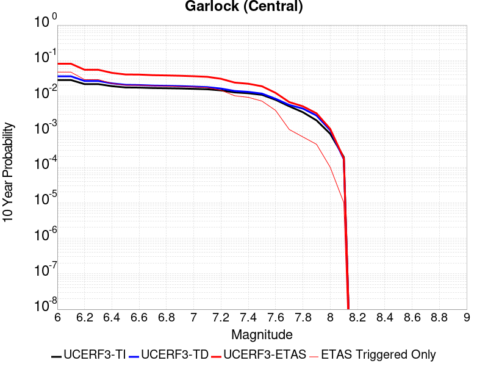 |

| Magnitude | 1 wk TI Prob | 1 wk TD Prob | 1 wk ETAS Prob | 1 wk ETAS/TD Gain | 1 wk ETAS Triggered Only | 1 mo TI Prob | 1 mo TD Prob | 1 mo ETAS Prob | 1 mo ETAS/TD Gain | 1 mo ETAS Triggered Only | 1 yr TI Prob | 1 yr TD Prob | 1 yr ETAS Prob | 1 yr ETAS/TD Gain | 1 yr ETAS Triggered Only | 10 yr TI Prob | 10 yr TD Prob | 10 yr ETAS Prob | 10 yr ETAS/TD Gain | 10 yr ETAS Triggered Only |
|-----|-----|-----|-----|-----|-----|-----|-----|-----|-----|-----|-----|-----|-----|-----|-----|-----|-----|-----|-----|-----|
| 6.0 | 5.5131142E-5 | 7.029038E-5 | 0.0014817897 | 21.080976 | 0.0014115986 | 2.3625491E-4 | 3.0121006E-4 | 0.005240317 | 17.39755 | 0.004940595 | 0.0028726095 | 0.0036611315 | 0.026046818 | 7.1144176 | 0.022467945 | 0.028357591 | 0.036101688 | 0.080889344 | 2.2405972 | 0.04646512 |
| 6.1 | 5.5131142E-5 | 7.029038E-5 | 0.0014817897 | 21.080976 | 0.0014115986 | 2.3625491E-4 | 3.0121006E-4 | 0.005240317 | 17.39755 | 0.004940595 | 0.0028726095 | 0.0036611315 | 0.026046818 | 7.1144176 | 0.022467945 | 0.028357591 | 0.036101688 | 0.080889344 | 2.2405972 | 0.04646512 |
| 6.2 | 4.216245E-5 | 5.170099E-5 | 9.92718E-4 | 19.201143 | 9.410658E-4 | 1.806837E-4 | 2.2155703E-4 | 0.0035145574 | 15.862992 | 0.00329373 | 0.0021976046 | 0.0026941518 | 0.016772108 | 6.2253757 | 0.014115986 | 0.021759989 | 0.026709838 | 0.054531213 | 2.0416152 | 0.028584871 |
| 6.3 | 4.216245E-5 | 5.170099E-5 | 9.92718E-4 | 19.201143 | 9.410658E-4 | 1.806837E-4 | 2.2155703E-4 | 0.0035145574 | 15.862992 | 0.00329373 | 0.0021976046 | 0.0026941518 | 0.016772108 | 6.2253757 | 0.014115986 | 0.021759989 | 0.026709838 | 0.054531213 | 2.0416152 | 0.028584871 |
| 6.4 | 3.6858168E-5 | 4.4148466E-5 | 9.851727E-4 | 22.314993 | 9.410658E-4 | 1.5795401E-4 | 1.8919414E-4 | 0.0030118572 | 15.919401 | 0.0028231973 | 0.0019213937 | 0.0023010303 | 0.013450472 | 5.8454127 | 0.011175156 | 0.019048655 | 0.022868259 | 0.045052286 | 1.9700794 | 0.022703212 |
| 6.5 | 3.39199E-5 | 4.005532E-5 | 7.4582634E-4 | 18.619907 | 7.057993E-4 | 1.453629E-4 | 1.716545E-4 | 0.0026415281 | 15.388634 | 0.0024702975 | 0.0017683565 | 0.002087912 | 0.011478921 | 5.497799 | 0.009410658 | 0.017543508 | 0.020778878 | 0.039669864 | 1.9091437 | 0.019291848 |
| 6.6 | 3.3571985E-5 | 3.9509418E-5 | 7.452808E-4 | 18.863373 | 7.057993E-4 | 1.4387199E-4 | 1.693152E-4 | 0.0026391945 | 15.587463 | 0.0024702975 | 0.0017502342 | 0.0020594853 | 0.011333371 | 5.503011 | 0.009293024 | 0.017365133 | 0.02050015 | 0.03928129 | 1.9161465 | 0.019174214 |
| 6.7 | 3.2580007E-5 | 3.8125607E-5 | 7.4389804E-4 | 19.511768 | 7.057993E-4 | 1.3962112E-4 | 1.6338535E-4 | 0.0025156653 | 15.397129 | 0.0023526645 | 0.0016985617 | 0.0019874233 | 0.01102718 | 5.5484805 | 0.009057758 | 0.016856372 | 0.019792678 | 0.038010858 | 1.9204506 | 0.018586049 |
| 6.8 | 3.2185937E-5 | 3.755269E-5 | 7.433255E-4 | 19.7942 | 7.057993E-4 | 1.3793244E-4 | 1.609303E-4 | 0.002513216 | 15.616798 | 0.0023526645 | 0.0016780337 | 0.001957587 | 0.01088021 | 5.55797 | 0.008940125 | 0.016654192 | 0.019499416 | 0.03737703 | 1.9168282 | 0.018233148 |
| 6.9 | 3.165394E-5 | 3.675708E-5 | 7.4253045E-4 | 20.20102 | 7.057993E-4 | 1.3565269E-4 | 1.5752095E-4 | 0.0025098147 | 15.933212 | 0.0023526645 | 0.0016503202 | 0.001916152 | 0.01060433 | 5.53418 | 0.008704858 | 0.01638118 | 0.019091954 | 0.036630835 | 1.9186529 | 0.01788025 |
| 7.0 | 3.0903822E-5 | 3.566208E-5 | 7.414362E-4 | 20.790606 | 7.057993E-4 | 1.3243823E-4 | 1.5282865E-4 | 0.0025051334 | 16.391779 | 0.0023526645 | 0.0016112428 | 0.0018591221 | 0.010430383 | 5.6103806 | 0.008587225 | 0.015996104 | 0.018531 | 0.035849005 | 1.9345423 | 0.017644983 |
| 7.1 | 3.0069863E-5 | 3.442808E-5 | 7.402031E-4 | 21.499983 | 7.057993E-4 | 1.2886449E-4 | 1.4754069E-4 | 0.002499858 | 16.943516 | 0.0023526645 | 0.0015677959 | 0.0017948489 | 0.010014395 | 5.5795197 | 0.008234326 | 0.01556781 | 0.017898519 | 0.034650043 | 1.9359168 | 0.017056817 |
| 7.2 | 2.7957109E-5 | 3.1316675E-5 | 6.194644E-4 | 19.780655 | 5.881661E-4 | 1.1981068E-4 | 1.3420753E-4 | 0.0022513212 | 16.774925 | 0.002117398 | 0.0014577188 | 0.0016327716 | 0.008326917 | 5.099867 | 0.0067050937 | 0.014481937 | 0.016301768 | 0.030187638 | 1.8518015 | 0.014115986 |
| 7.3 | 2.4519275E-5 | 2.6747934E-5 | 3.7963816E-4 | 14.193176 | 3.5289966E-4 | 1.0507837E-4 | 1.1462905E-4 | 0.0012908264 | 11.260901 | 0.0011763322 | 0.0012785783 | 0.00139473 | 0.0058585578 | 4.200496 | 0.0044700624 | 0.012712469 | 0.0139451 | 0.02426846 | 1.7402859 | 0.010469357 |
| 7.4 | 2.3225532E-5 | 2.5231879E-5 | 3.7812264E-4 | 14.9859085 | 3.5289966E-4 | 9.95342E-5 | 1.08132226E-4 | 0.0011667167 | 10.789722 | 0.001058699 | 0.0012111551 | 0.0013157292 | 0.005544953 | 4.2143574 | 0.004234796 | 0.012045753 | 0.013162446 | 0.022797491 | 1.7320102 | 0.009763557 |
| 7.5 | 2.097765E-5 | 2.2514592E-5 | 3.754063E-4 | 16.67391 | 3.5289966E-4 | 8.9901114E-5 | 9.648761E-5 | 0.0010374626 | 10.752288 | 9.410658E-4 | 0.0010939965 | 0.0011741153 | 0.0045814733 | 3.902064 | 0.0034113633 | 0.010886264 | 0.0117563 | 0.019196318 | 1.6328537 | 0.0075285262 |
| 7.6 | 1.511254E-5 | 1.6020109E-5 | 3.689141E-4 | 23.02819 | 3.5289966E-4 | 6.476642E-5 | 6.865585E-5 | 7.744067E-4 | 11.279545 | 7.057993E-4 | 7.882459E-4 | 8.355722E-4 | 0.0034213406 | 4.094608 | 0.0025879308 | 0.007854558 | 0.008398446 | 0.0129476115 | 1.5416676 | 0.0045876955 |
| 7.7 | 9.934069E-6 | 1.0705563E-5 | 1.0705563E-5 | 1.0 | 0.0 | 4.2573887E-5 | 4.588018E-5 | 4.588018E-5 | 1.0 | 0.0 | 5.182138E-4 | 5.5844843E-4 | 0.0014989886 | 2.6842024 | 9.410658E-4 | 0.00517007 | 0.0056415712 | 0.0071621756 | 1.2695357 | 0.0015292319 |
| 7.8 | 6.7562896E-6 | 8.450407E-6 | 8.450407E-6 | 1.0 | 0.0 | 2.8955206E-5 | 3.621553E-5 | 3.621553E-5 | 1.0 | 0.0 | 3.5247262E-4 | 4.4083502E-4 | 0.0012639045 | 2.8670692 | 8.234325E-4 | 0.0035191406 | 0.0044580507 | 0.0057462472 | 1.2889596 | 0.0012939654 |
| 7.9 | 3.975453E-6 | 5.384719E-6 | 5.384719E-6 | 1.0 | 0.0 | 1.7037546E-5 | 2.3077164E-5 | 2.3077164E-5 | 1.0 | 0.0 | 2.0741238E-4 | 2.8092833E-4 | 7.51329E-4 | 2.6744509 | 4.705329E-4 | 0.002072189 | 0.0028407406 | 0.003544535 | 1.2477503 | 7.057993E-4 |
| 8.0 | 1.6729537E-6 | 2.0820012E-6 | 2.0820012E-6 | 1.0 | 0.0 | 7.169782E-6 | 8.9228315E-6 | 8.9228315E-6 | 1.0 | 0.0 | 8.7288594E-5 | 1.0863009E-4 | 2.2625053E-4 | 2.082761 | 1.1763322E-4 | 8.7254314E-4 | 0.0010992672 | 0.0012167711 | 1.106893 | 1.1763322E-4 |
| 8.1 | 3.6733252E-7 | 3.1554555E-7 | 3.1554555E-7 | 1.0 | 0.0 | 1.5742813E-6 | 1.3523374E-6 | 1.3523374E-6 | 1.0 | 0.0 | 1.9166706E-5 | 1.64646E-5 | 1.64646E-5 | 1.0 | 0.0 | 1.9165053E-4 | 1.6672608E-4 | 1.6672608E-4 | 1.0 | 0.0 |

## Tank Canyon
*[(top)](#table-of-contents)*

| 1 Week | 1 Month | 1 Year | 10 Year |
|-----|-----|-----|-----|
|  |  |  |  |

| Magnitude | 1 wk TI Prob | 1 wk TD Prob | 1 wk ETAS Prob | 1 wk ETAS/TD Gain | 1 wk ETAS Triggered Only | 1 mo TI Prob | 1 mo TD Prob | 1 mo ETAS Prob | 1 mo ETAS/TD Gain | 1 mo ETAS Triggered Only | 1 yr TI Prob | 1 yr TD Prob | 1 yr ETAS Prob | 1 yr ETAS/TD Gain | 1 yr ETAS Triggered Only | 10 yr TI Prob | 10 yr TD Prob | 10 yr ETAS Prob | 10 yr ETAS/TD Gain | 10 yr ETAS Triggered Only |
|-----|-----|-----|-----|-----|-----|-----|-----|-----|-----|-----|-----|-----|-----|-----|-----|-----|-----|-----|-----|-----|
| 6.0 | 4.8284557E-5 | 5.79755E-5 | 0.0012342395 | 21.288984 | 0.0011763322 | 2.0691741E-4 | 2.484466E-4 | 0.0031885465 | 12.83393 | 0.0029408305 | 0.0025163088 | 0.0030212996 | 0.017446471 | 5.774492 | 0.014468886 | 0.02488006 | 0.029869013 | 0.06319194 | 2.1156356 | 0.0343489 |
| 6.1 | 1.7796336E-5 | 2.0876454E-5 | 4.913995E-4 | 23.538456 | 4.705329E-4 | 7.626778E-5 | 8.946767E-5 | 0.0013833173 | 15.461644 | 0.0012939654 | 9.281647E-4 | 0.0010887611 | 0.0069640186 | 6.3962774 | 0.005881661 | 0.009242975 | 0.0108383605 | 0.024452278 | 2.2560863 | 0.013763087 |
| 6.2 | 1.7796336E-5 | 2.0876454E-5 | 4.913995E-4 | 23.538456 | 4.705329E-4 | 7.626778E-5 | 8.946767E-5 | 0.0013833173 | 15.461644 | 0.0012939654 | 9.281647E-4 | 0.0010887611 | 0.0069640186 | 6.3962774 | 0.005881661 | 0.009242975 | 0.0108383605 | 0.024452278 | 2.2560863 | 0.013763087 |
| 6.3 | 1.3515912E-5 | 1.5761776E-5 | 1.3339314E-4 | 8.463078 | 1.1763322E-4 | 5.792405E-5 | 6.7548855E-5 | 8.9092576E-4 | 13.189354 | 8.234325E-4 | 7.049971E-4 | 8.2212104E-4 | 0.005170972 | 6.289794 | 0.004352429 | 0.007027647 | 0.008193407 | 0.017643629 | 2.1533933 | 0.0095282905 |
| 6.4 | 1.0870146E-5 | 1.2619685E-5 | 1.2619685E-5 | 1.0 | 0.0 | 4.658551E-5 | 5.4083343E-5 | 7.598445E-4 | 14.049511 | 7.057993E-4 | 5.67031E-4 | 6.5828365E-4 | 0.003714734 | 5.6430597 | 0.0030584638 | 0.005655863 | 0.0065653524 | 0.014161312 | 2.1569767 | 0.0076461593 |
| 6.5 | 7.964826E-6 | 9.197196E-6 | 9.197196E-6 | 1.0 | 0.0 | 3.4134522E-5 | 3.9416016E-5 | 5.0993037E-4 | 12.937136 | 4.705329E-4 | 4.1550855E-4 | 4.79795E-4 | 0.0022434467 | 4.675844 | 0.0017644983 | 0.0041473247 | 0.004788893 | 0.010174108 | 2.124522 | 0.005411128 |
| 6.6 | 6.6317E-6 | 7.613136E-6 | 7.613136E-6 | 1.0 | 0.0 | 2.8421264E-5 | 3.262737E-5 | 3.855155E-4 | 11.815709 | 3.5289966E-4 | 3.4597394E-4 | 3.9717494E-4 | 0.0014554535 | 3.6645148 | 0.001058699 | 0.0034543579 | 0.0039658025 | 0.007949471 | 2.004505 | 0.0039995294 |
| 6.7 | 4.793663E-6 | 5.4312663E-6 | 5.4312663E-6 | 1.0 | 0.0 | 2.0544108E-5 | 2.3276672E-5 | 1.4090716E-4 | 6.053578 | 1.1763322E-4 | 2.500958E-4 | 2.8336103E-4 | 4.009609E-4 | 1.4150178 | 1.1763322E-4 | 0.0024981452 | 0.0028306895 | 0.0043555927 | 1.5387038 | 0.0015292319 |
| 6.8 | 4.382823E-6 | 4.9696696E-6 | 4.9696696E-6 | 1.0 | 0.0 | 1.8783392E-5 | 2.1298434E-5 | 1.3892914E-4 | 6.522975 | 1.1763322E-4 | 2.286638E-4 | 2.5928183E-4 | 3.7688456E-4 | 1.453571 | 1.1763322E-4 | 0.0022842865 | 0.0025904672 | 0.0037637523 | 1.452924 | 0.0011763322 |
| 6.9 | 2.729601E-6 | 3.073735E-6 | 3.073735E-6 | 1.0 | 0.0 | 1.1698237E-5 | 1.317309E-5 | 1.3080476E-4 | 9.929694 | 1.1763322E-4 | 1.4241673E-4 | 1.603718E-4 | 2.7798614E-4 | 1.7333856 | 1.1763322E-4 | 0.001423255 | 0.0016027264 | 0.0023073945 | 1.4396684 | 7.057993E-4 |
| 7.0 | 1.8987357E-6 | 2.127044E-6 | 2.127044E-6 | 1.0 | 0.0 | 8.137413E-6 | 9.1158745E-6 | 1.2674803E-4 | 13.904099 | 1.1763322E-4 | 9.90685E-5 | 1.10980814E-4 | 2.2860098E-4 | 2.0598242 | 1.1763322E-4 | 9.902435E-4 | 0.0011093225 | 0.0014618308 | 1.3177688 | 3.5289966E-4 |
| 7.1 | 1.4928986E-6 | 1.6641992E-6 | 1.6641992E-6 | 1.0 | 0.0 | 6.398121E-6 | 7.132266E-6 | 1.2476464E-4 | 17.492989 | 1.1763322E-4 | 7.789434E-5 | 8.683247E-5 | 2.0445547E-4 | 2.354597 | 1.1763322E-4 | 7.786704E-4 | 8.680433E-4 | 0.0012206367 | 1.4061933 | 3.5289966E-4 |
| 7.2 | 1.069082E-6 | 1.182903E-6 | 1.182903E-6 | 1.0 | 0.0 | 4.581772E-6 | 5.069577E-6 | 1.227022E-4 | 24.203636 | 1.1763322E-4 | 5.5781646E-5 | 6.1720886E-5 | 1.7934685E-4 | 2.9057722 | 1.1763322E-4 | 5.576765E-4 | 6.1708974E-4 | 8.52211E-4 | 1.3810164 | 2.3526645E-4 |
| 7.3 | 8.776551E-7 | 9.770338E-7 | 9.770338E-7 | 1.0 | 0.0 | 3.7613736E-6 | 4.1872836E-6 | 1.2182001E-4 | 29.092848 | 1.1763322E-4 | 4.579376E-5 | 5.0979506E-5 | 1.6860673E-4 | 3.3073432 | 1.1763322E-4 | 4.5784327E-4 | 5.0972914E-4 | 7.4487564E-4 | 1.4613166 | 2.3526645E-4 |
| 7.4 | 7.55721E-7 | 8.5105205E-7 | 8.5105205E-7 | 1.0 | 0.0 | 3.2388E-6 | 3.6473637E-6 | 3.6473637E-6 | 1.0 | 0.0 | 3.9431678E-5 | 4.4406268E-5 | 4.4406268E-5 | 1.0 | 0.0 | 3.942468E-4 | 4.4402477E-4 | 5.616058E-4 | 1.2648072 | 1.1763322E-4 |
| 7.5 | 5.587665E-7 | 6.305819E-7 | 6.305819E-7 | 1.0 | 0.0 | 2.3947114E-6 | 2.702494E-6 | 2.702494E-6 | 1.0 | 0.0 | 2.915522E-5 | 3.2902863E-5 | 3.2902863E-5 | 1.0 | 0.0 | 2.9151395E-4 | 3.290286E-4 | 4.4662313E-4 | 1.357399 | 1.1763322E-4 |

## Little Lake
*[(top)](#table-of-contents)*

| 1 Week | 1 Month | 1 Year | 10 Year |
|-----|-----|-----|-----|
|  |  |  |  |

| Magnitude | 1 wk TI Prob | 1 wk TD Prob | 1 wk ETAS Prob | 1 wk ETAS/TD Gain | 1 wk ETAS Triggered Only | 1 mo TI Prob | 1 mo TD Prob | 1 mo ETAS Prob | 1 mo ETAS/TD Gain | 1 mo ETAS Triggered Only | 1 yr TI Prob | 1 yr TD Prob | 1 yr ETAS Prob | 1 yr ETAS/TD Gain | 1 yr ETAS Triggered Only | 10 yr TI Prob | 10 yr TD Prob | 10 yr ETAS Prob | 10 yr ETAS/TD Gain | 10 yr ETAS Triggered Only |
|-----|-----|-----|-----|-----|-----|-----|-----|-----|-----|-----|-----|-----|-----|-----|-----|-----|-----|-----|-----|-----|
| 6.0 | 2.8424427E-5 | 3.1208794E-5 | 0.0013251338 | 42.46027 | 0.0012939654 | 1.2181328E-4 | 1.3374587E-4 | 0.003309418 | 24.744076 | 0.0031760968 | 0.0014820677 | 0.0016272729 | 0.012079593 | 7.423213 | 0.010469357 | 0.014722223 | 0.016166981 | 0.03780876 | 2.3386407 | 0.021997413 |
| 6.1 | 2.8424427E-5 | 3.1208794E-5 | 0.0013251338 | 42.46027 | 0.0012939654 | 1.2181328E-4 | 1.3374587E-4 | 0.003309418 | 24.744076 | 0.0031760968 | 0.0014820677 | 0.0016272729 | 0.012079593 | 7.423213 | 0.010469357 | 0.014722223 | 0.016166981 | 0.03780876 | 2.3386407 | 0.021997413 |
| 6.2 | 2.8424427E-5 | 3.1208794E-5 | 0.0013251338 | 42.46027 | 0.0012939654 | 1.2181328E-4 | 1.3374587E-4 | 0.003309418 | 24.744076 | 0.0031760968 | 0.0014820677 | 0.0016272729 | 0.012079593 | 7.423213 | 0.010469357 | 0.014722223 | 0.016166981 | 0.03780876 | 2.3386407 | 0.021997413 |
| 6.3 | 1.48860645E-5 | 1.6082817E-5 | 7.218708E-4 | 44.884598 | 7.057993E-4 | 6.379586E-5 | 6.8924695E-5 | 0.0019509265 | 28.305187 | 0.0018821316 | 7.7643775E-4 | 8.388633E-4 | 0.007303263 | 8.706141 | 0.006469827 | 0.007737305 | 0.008359787 | 0.022591067 | 2.7023494 | 0.0143512525 |
| 6.4 | 1.48860645E-5 | 1.6082817E-5 | 7.218708E-4 | 44.884598 | 7.057993E-4 | 6.379586E-5 | 6.8924695E-5 | 0.0019509265 | 28.305187 | 0.0018821316 | 7.7643775E-4 | 8.388633E-4 | 0.007303263 | 8.706141 | 0.006469827 | 0.007737305 | 0.008359787 | 0.022591067 | 2.7023494 | 0.0143512525 |
| 6.5 | 1.2797581E-5 | 1.37667585E-5 | 7.1955635E-4 | 52.26767 | 7.057993E-4 | 5.4845623E-5 | 5.8999205E-5 | 0.0018233934 | 30.90539 | 0.0017644983 | 6.675408E-4 | 7.1810425E-4 | 0.006477993 | 9.020964 | 0.0057640276 | 0.006655392 | 0.007160389 | 0.02012418 | 2.810487 | 0.013057288 |
| 6.6 | 9.661896E-6 | 1.028988E-5 | 7.1608194E-4 | 69.59089 | 7.057993E-4 | 4.1407468E-5 | 4.4098833E-5 | 0.0016908913 | 38.34322 | 0.001646865 | 5.040193E-4 | 5.3678727E-4 | 0.0054747304 | 10.199069 | 0.004940595 | 0.005028777 | 0.005356512 | 0.016705815 | 3.1187859 | 0.011410423 |
| 6.7 | 7.767871E-6 | 8.200329E-6 | 7.1399385E-4 | 87.068924 | 7.057993E-4 | 3.329045E-5 | 3.5143872E-5 | 0.001564322 | 44.511944 | 0.0015292319 | 4.0523586E-4 | 4.2780637E-4 | 0.0047783735 | 11.169477 | 0.004352429 | 0.004044977 | 0.00427118 | 0.014110167 | 3.3035755 | 0.00988119 |
| 6.8 | 6.4235196E-6 | 6.7362653E-6 | 7.125308E-4 | 105.775345 | 7.057993E-4 | 2.752908E-5 | 2.8869463E-5 | 0.0014404274 | 49.8945 | 0.0014115986 | 3.35115E-4 | 3.5144185E-4 | 0.00399679 | 11.37255 | 0.0036466299 | 0.003346101 | 0.0035101213 | 0.011715543 | 3.3376462 | 0.008234326 |
| 6.9 | 3.1283696E-6 | 3.1123648E-6 | 5.912766E-4 | 189.97665 | 5.881661E-4 | 1.3407229E-5 | 1.3338647E-5 | 9.5439184E-4 | 71.55088 | 9.410658E-4 | 1.6322079E-4 | 1.6238743E-4 | 0.0025146697 | 15.485619 | 0.0023526645 | 0.0016310095 | 0.001622836 | 0.0063205287 | 3.8947427 | 0.004705329 |
| 7.0 | 2.290603E-6 | 2.2288211E-6 | 4.7276064E-4 | 212.11243 | 4.705329E-4 | 9.816834E-6 | 9.552061E-6 | 7.153446E-4 | 74.88904 | 7.057993E-4 | 1.19513395E-4 | 1.1629118E-4 | 0.0018805843 | 16.17134 | 0.0017644983 | 0.0011944914 | 0.0011624055 | 0.003747328 | 3.2237704 | 0.0025879308 |
| 7.1 | 1.293693E-6 | 1.1777693E-6 | 3.5407703E-4 | 300.6336 | 3.5289966E-4 | 5.5443866E-6 | 5.047577E-6 | 4.7557807E-4 | 94.219086 | 4.705329E-4 | 6.750081E-5 | 6.145321E-5 | 0.0013553391 | 22.054813 | 0.0012939654 | 6.7480316E-4 | 6.144307E-4 | 0.0022602838 | 3.6786637 | 0.001646865 |
| 7.2 | 4.715842E-7 | 3.0921956E-7 | 3.0921956E-7 | 1.0 | 0.0 | 2.0210737E-6 | 1.325226E-6 | 1.325226E-6 | 1.0 | 0.0 | 2.4606294E-5 | 1.6134512E-5 | 1.6134512E-5 | 1.0 | 0.0 | 2.460357E-4 | 1.6133396E-4 | 1.6133396E-4 | 1.0 | 0.0 |
| 7.3 | 3.9430947E-7 | 2.3101252E-7 | 2.3101252E-7 | 1.0 | 0.0 | 1.6898966E-6 | 9.900533E-7 | 9.900533E-7 | 1.0 | 0.0 | 2.0574296E-5 | 1.20538325E-5 | 1.20538325E-5 | 1.0 | 0.0 | 2.0572392E-4 | 1.2053186E-4 | 1.2053186E-4 | 1.0 | 0.0 |
| 7.4 | 3.547123E-7 | 1.968263E-7 | 1.968263E-7 | 1.0 | 0.0 | 1.5201948E-6 | 8.4354105E-7 | 8.4354105E-7 | 1.0 | 0.0 | 1.8508214E-5 | 1.0270064E-5 | 1.0270064E-5 | 1.0 | 0.0 | 1.8506673E-4 | 1.02695965E-4 | 1.02695965E-4 | 1.0 | 0.0 |
| 7.5 | 2.6354266E-7 | 1.4425584E-7 | 1.4425584E-7 | 1.0 | 0.0 | 1.129468E-6 | 6.1823914E-7 | 6.1823914E-7 | 1.0 | 0.0 | 1.3751187E-5 | 7.527036E-6 | 7.527036E-6 | 1.0 | 0.0 | 1.3750336E-4 | 7.526786E-5 | 7.526786E-5 | 1.0 | 0.0 |
| 7.6 | 1.269913E-7 | 7.573594E-8 | 7.573594E-8 | 1.0 | 0.0 | 5.4424834E-7 | 3.2458257E-7 | 3.2458257E-7 | 1.0 | 0.0 | 6.6262032E-6 | 3.951786E-6 | 3.951786E-6 | 1.0 | 0.0 | 6.626006E-5 | 3.9517192E-5 | 3.9517192E-5 | 1.0 | 0.0 |

## Airport Lake
*[(top)](#table-of-contents)*

| 1 Week | 1 Month | 1 Year | 10 Year |
|-----|-----|-----|-----|
|  |  |  |  |

| Magnitude | 1 wk TI Prob | 1 wk TD Prob | 1 wk ETAS Prob | 1 wk ETAS/TD Gain | 1 wk ETAS Triggered Only | 1 mo TI Prob | 1 mo TD Prob | 1 mo ETAS Prob | 1 mo ETAS/TD Gain | 1 mo ETAS Triggered Only | 1 yr TI Prob | 1 yr TD Prob | 1 yr ETAS Prob | 1 yr ETAS/TD Gain | 1 yr ETAS Triggered Only | 10 yr TI Prob | 10 yr TD Prob | 10 yr ETAS Prob | 10 yr ETAS/TD Gain | 10 yr ETAS Triggered Only |
|-----|-----|-----|-----|-----|-----|-----|-----|-----|-----|-----|-----|-----|-----|-----|-----|-----|-----|-----|-----|-----|
| 6.0 | 1.2387061E-5 | 1.31038605E-5 | 0.0015423157 | 117.69933 | 0.0015292319 | 5.3086325E-5 | 5.6158355E-5 | 0.0027615705 | 49.174706 | 0.002705564 | 6.461343E-4 | 6.835419E-4 | 0.011145743 | 16.305866 | 0.010469357 | 0.0064425888 | 0.0068172044 | 0.026211198 | 3.8448603 | 0.019527115 |
| 6.1 | 1.2387061E-5 | 1.31038605E-5 | 0.0015423157 | 117.69933 | 0.0015292319 | 5.3086325E-5 | 5.6158355E-5 | 0.0027615705 | 49.174706 | 0.002705564 | 6.461343E-4 | 6.835419E-4 | 0.011145743 | 16.305866 | 0.010469357 | 0.0064425888 | 0.0068172044 | 0.026211198 | 3.8448603 | 0.019527115 |
| 6.2 | 1.2387061E-5 | 1.31038605E-5 | 0.0015423157 | 117.69933 | 0.0015292319 | 5.3086325E-5 | 5.6158355E-5 | 0.0027615705 | 49.174706 | 0.002705564 | 6.461343E-4 | 6.835419E-4 | 0.011145743 | 16.305866 | 0.010469357 | 0.0064425888 | 0.0068172044 | 0.026211198 | 3.8448603 | 0.019527115 |
| 6.3 | 1.2387061E-5 | 1.31038605E-5 | 0.0015423157 | 117.69933 | 0.0015292319 | 5.3086325E-5 | 5.6158355E-5 | 0.0027615705 | 49.174706 | 0.002705564 | 6.461343E-4 | 6.835419E-4 | 0.011145743 | 16.305866 | 0.010469357 | 0.0064425888 | 0.0068172044 | 0.026211198 | 3.8448603 | 0.019527115 |
| 6.4 | 1.2387061E-5 | 1.31038605E-5 | 0.0015423157 | 117.69933 | 0.0015292319 | 5.3086325E-5 | 5.6158355E-5 | 0.0027615705 | 49.174706 | 0.002705564 | 6.461343E-4 | 6.835419E-4 | 0.011145743 | 16.305866 | 0.010469357 | 0.0064425888 | 0.0068172044 | 0.026211198 | 3.8448603 | 0.019527115 |
| 6.5 | 6.9922594E-6 | 7.3853103E-6 | 0.0010660765 | 144.35094 | 0.001058699 | 2.996648E-5 | 3.1650976E-5 | 0.001913723 | 60.463314 | 0.0018821316 | 3.6478083E-4 | 3.8528792E-4 | 0.0075581498 | 19.616886 | 0.0071756262 | 0.003641826 | 0.0038467369 | 0.0174397 | 4.5336347 | 0.013645453 |
| 6.6 | 6.9922594E-6 | 7.3853103E-6 | 0.0010660765 | 144.35094 | 0.001058699 | 2.996648E-5 | 3.1650976E-5 | 0.001913723 | 60.463314 | 0.0018821316 | 3.6478083E-4 | 3.8528792E-4 | 0.0075581498 | 19.616886 | 0.0071756262 | 0.003641826 | 0.0038467369 | 0.0174397 | 4.5336347 | 0.013645453 |
| 6.7 | 5.477277E-6 | 5.7863713E-6 | 9.468467E-4 | 163.63393 | 9.410658E-4 | 2.3473833E-5 | 2.479852E-5 | 0.0017892531 | 72.1516 | 0.0017644983 | 2.8575645E-4 | 3.0188405E-4 | 0.0061817695 | 20.477297 | 0.005881661 | 0.0028538927 | 0.0030151235 | 0.014977534 | 4.9674697 | 0.011998588 |
| 6.8 | 3.9950432E-6 | 4.219307E-6 | 7.1001565E-4 | 168.2778 | 7.057993E-4 | 1.7121502E-5 | 1.8082634E-5 | 0.0013120247 | 72.55717 | 0.0012939654 | 2.0843433E-4 | 2.2013657E-4 | 0.0046892148 | 21.30139 | 0.0044700624 | 0.0020823893 | 0.002199456 | 0.011354666 | 5.162488 | 0.009175391 |
| 6.9 | 2.95695E-6 | 3.123187E-6 | 5.9128745E-4 | 189.32181 | 5.881661E-4 | 1.2672582E-5 | 1.3385032E-5 | 0.0010720699 | 80.09468 | 0.001058699 | 1.5427776E-4 | 1.6295284E-4 | 0.0032209181 | 19.765953 | 0.0030584638 | 0.001541707 | 0.001628556 | 0.007852963 | 4.8220406 | 0.0062345606 |
| 7.0 | 1.456072E-6 | 1.5408953E-6 | 4.7207304E-4 | 306.36285 | 4.705329E-4 | 6.2402937E-6 | 6.6038256E-6 | 7.123985E-4 | 107.87663 | 7.057993E-4 | 7.597293E-5 | 8.039962E-5 | 0.0018447561 | 22.944836 | 0.0017644983 | 7.594696E-4 | 8.0380426E-4 | 0.0031545775 | 3.9245596 | 0.0023526645 |
| 7.1 | 6.995192E-7 | 7.409381E-7 | 3.5364032E-4 | 477.28726 | 3.5289966E-4 | 2.997936E-6 | 3.1754491E-6 | 4.7370684E-4 | 149.1779 | 4.705329E-4 | 3.649926E-5 | 3.8661092E-5 | 0.0013325765 | 34.468155 | 0.0012939654 | 3.6493264E-4 | 3.8661092E-4 | 0.0020328392 | 5.258101 | 0.001646865 |

## Owl Lake
*[(top)](#table-of-contents)*

| 1 Week | 1 Month | 1 Year | 10 Year |
|-----|-----|-----|-----|
|  |  |  |  |

| Magnitude | 1 wk TI Prob | 1 wk TD Prob | 1 wk ETAS Prob | 1 wk ETAS/TD Gain | 1 wk ETAS Triggered Only | 1 mo TI Prob | 1 mo TD Prob | 1 mo ETAS Prob | 1 mo ETAS/TD Gain | 1 mo ETAS Triggered Only | 1 yr TI Prob | 1 yr TD Prob | 1 yr ETAS Prob | 1 yr ETAS/TD Gain | 1 yr ETAS Triggered Only | 10 yr TI Prob | 10 yr TD Prob | 10 yr ETAS Prob | 10 yr ETAS/TD Gain | 10 yr ETAS Triggered Only |
|-----|-----|-----|-----|-----|-----|-----|-----|-----|-----|-----|-----|-----|-----|-----|-----|-----|-----|-----|-----|-----|
| 6.0 | 5.0320643E-5 | 6.638159E-5 | 3.0163242E-4 | 4.5439167 | 2.3526645E-4 | 2.1564208E-4 | 2.8446777E-4 | 0.0014604654 | 5.1340275 | 0.0011763322 | 0.0026222812 | 0.0034589402 | 0.009906389 | 2.8639953 | 0.006469827 | 0.02591553 | 0.03415182 | 0.047785718 | 1.3992145 | 0.014115986 |
| 6.1 | 5.0320643E-5 | 6.638159E-5 | 3.0163242E-4 | 4.5439167 | 2.3526645E-4 | 2.1564208E-4 | 2.8446777E-4 | 0.0014604654 | 5.1340275 | 0.0011763322 | 0.0026222812 | 0.0034589402 | 0.009906389 | 2.8639953 | 0.006469827 | 0.02591553 | 0.03415182 | 0.047785718 | 1.3992145 | 0.014115986 |
| 6.2 | 2.4125871E-5 | 3.099268E-5 | 2.6625182E-4 | 8.590797 | 2.3526645E-4 | 1.0339249E-4 | 1.3282018E-4 | 0.0010737609 | 8.084321 | 9.410658E-4 | 0.0012580766 | 0.0016160287 | 0.00654864 | 4.0523043 | 0.004940595 | 0.012509781 | 0.016076323 | 0.026493113 | 1.6479585 | 0.01058699 |
| 6.3 | 1.7433485E-5 | 2.2364824E-5 | 2.57626E-4 | 11.51925 | 2.3526645E-4 | 7.471279E-5 | 9.584662E-5 | 0.0010368222 | 10.817514 | 9.410658E-4 | 9.0924866E-4 | 0.0011664558 | 0.005513808 | 4.7269754 | 0.004352429 | 0.009055373 | 0.011633637 | 0.020586021 | 1.7695258 | 0.009057758 |
| 6.4 | 1.7433485E-5 | 2.2364824E-5 | 2.57626E-4 | 11.51925 | 2.3526645E-4 | 7.471279E-5 | 9.584662E-5 | 0.0010368222 | 10.817514 | 9.410658E-4 | 9.0924866E-4 | 0.0011664558 | 0.005513808 | 4.7269754 | 0.004352429 | 0.009055373 | 0.011633637 | 0.020586021 | 1.7695258 | 0.009057758 |
| 6.5 | 1.5182742E-5 | 1.9437655E-5 | 2.5469952E-4 | 13.103408 | 2.3526645E-4 | 6.506727E-5 | 8.330243E-5 | 9.066664E-4 | 10.884032 | 8.234325E-4 | 7.919061E-4 | 0.0010138866 | 0.0052443887 | 5.1725597 | 0.004234796 | 0.0078909 | 0.010122783 | 0.018739523 | 1.8512225 | 0.008704858 |
| 6.6 | 6.7271576E-6 | 8.552988E-6 | 2.4381741E-4 | 28.506693 | 2.3526645E-4 | 2.8830356E-5 | 3.6655183E-5 | 8.6005754E-4 | 23.463465 | 8.234325E-4 | 3.5095305E-4 | 4.4619112E-4 | 0.0038560324 | 8.642109 | 0.0034113633 | 0.0035039932 | 0.0044707335 | 0.010560314 | 2.3620987 | 0.0061169276 |
| 6.7 | 6.682835E-6 | 8.4854255E-6 | 2.4374986E-4 | 28.72571 | 2.3526645E-4 | 2.8640408E-5 | 3.6365633E-5 | 8.5976825E-4 | 23.642328 | 8.234325E-4 | 3.4864116E-4 | 4.426673E-4 | 0.0038525206 | 8.7029705 | 0.0034113633 | 0.003480947 | 0.004435655 | 0.01052545 | 2.3729188 | 0.0061169276 |
| 6.8 | 6.5774975E-6 | 8.331873E-6 | 2.4359635E-4 | 29.236689 | 2.3526645E-4 | 2.8188972E-5 | 3.5707566E-5 | 8.591107E-4 | 24.059626 | 8.234325E-4 | 3.4314668E-4 | 4.3465855E-4 | 0.0038445392 | 8.844964 | 0.0034113633 | 0.0034261728 | 0.0043557878 | 0.010446071 | 2.3982048 | 0.0061169276 |
| 6.9 | 6.363419E-6 | 8.004978E-6 | 2.4326953E-4 | 30.389782 | 2.3526645E-4 | 2.727151E-5 | 3.4306628E-5 | 8.577109E-4 | 25.001318 | 8.234325E-4 | 3.3198006E-4 | 4.1760874E-4 | 0.0038275474 | 9.165391 | 0.0034113633 | 0.0033148455 | 0.0041857446 | 0.010277068 | 2.4552543 | 0.0061169276 |
| 7.0 | 6.1342453E-6 | 7.63709E-6 | 2.4290173E-4 | 31.805534 | 2.3526645E-4 | 2.6289357E-5 | 3.2730004E-5 | 8.5613556E-4 | 26.157515 | 8.234325E-4 | 3.2002592E-4 | 3.9842047E-4 | 0.0038084246 | 9.558808 | 0.0034113633 | 0.0031956544 | 0.0039943936 | 0.009969724 | 2.4959292 | 0.005999294 |
| 7.1 | 5.842926E-6 | 7.147514E-6 | 2.4241226E-4 | 33.915604 | 2.3526645E-4 | 2.504087E-5 | 3.0631876E-5 | 8.540392E-4 | 27.880735 | 8.234325E-4 | 3.0482994E-4 | 3.7288468E-4 | 0.0036653867 | 9.829813 | 0.00329373 | 0.0030441214 | 0.0037397894 | 0.009599454 | 2.5668435 | 0.005881661 |
| 7.2 | 4.77173E-6 | 5.3632994E-6 | 1.2299589E-4 | 22.932877 | 1.1763322E-4 | 2.045011E-5 | 2.298539E-5 | 7.287685E-4 | 31.705727 | 7.057993E-4 | 2.4895166E-4 | 2.7981526E-4 | 0.0022790204 | 8.144732 | 0.0019997647 | 0.0024867293 | 0.002811154 | 0.00633023 | 2.2518263 | 0.0035289966 |
| 7.3 | 3.0494948E-6 | 2.7140309E-6 | 2.7140309E-6 | 1.0 | 0.0 | 1.3069198E-5 | 1.16315105E-5 | 1.2926337E-4 | 11.113205 | 1.1763322E-4 | 1.5910587E-4 | 1.416046E-4 | 3.7683774E-4 | 2.661197 | 2.3526645E-4 | 0.0015899199 | 0.001425103 | 0.0022473622 | 1.5769821 | 8.234325E-4 |
| 7.4 | 2.7263884E-6 | 2.3090297E-6 | 2.3090297E-6 | 1.0 | 0.0 | 1.1684469E-5 | 9.895805E-6 | 9.895805E-6 | 1.0 | 0.0 | 1.4224913E-4 | 1.2047487E-4 | 2.3809391E-4 | 1.9762954 | 1.1763322E-4 | 0.0014215811 | 0.0012129741 | 0.0016829362 | 1.3874462 | 4.705329E-4 |
| 7.5 | 2.6090431E-6 | 2.1689061E-6 | 2.1689061E-6 | 1.0 | 0.0 | 1.1181565E-5 | 9.29528E-6 | 9.29528E-6 | 1.0 | 0.0 | 1.3612706E-4 | 1.1316425E-4 | 1.1316425E-4 | 1.0 | 0.0 | 0.001360437 | 0.0011396994 | 0.0013746977 | 1.2061932 | 2.3526645E-4 |
| 7.6 | 2.3008756E-6 | 1.8759047E-6 | 1.8759047E-6 | 1.0 | 0.0 | 9.860858E-6 | 8.039567E-6 | 8.039567E-6 | 1.0 | 0.0 | 1.20049335E-4 | 9.787741E-5 | 9.787741E-5 | 1.0 | 0.0 | 0.001199845 | 9.866174E-4 | 0.0011041345 | 1.1191112 | 1.1763322E-4 |
| 7.7 | 1.7184348E-6 | 1.3447964E-6 | 1.3447964E-6 | 1.0 | 0.0 | 7.3646997E-6 | 5.7634006E-6 | 5.7634006E-6 | 1.0 | 0.0 | 8.966153E-5 | 7.016719E-5 | 7.016719E-5 | 1.0 | 0.0 | 8.962536E-4 | 7.093401E-4 | 8.268899E-4 | 1.1657171 | 1.1763322E-4 |
| 7.8 | 8.4612907E-7 | 8.4264127E-7 | 8.4264127E-7 | 1.0 | 0.0 | 3.6262625E-6 | 3.611315E-6 | 3.611315E-6 | 1.0 | 0.0 | 4.4148852E-5 | 4.396689E-5 | 4.396689E-5 | 1.0 | 0.0 | 4.414008E-4 | 4.450584E-4 | 5.6263927E-4 | 1.264192 | 1.1763322E-4 |
| 7.9 | 2.716738E-7 | 3.7771878E-7 | 3.7771878E-7 | 1.0 | 0.0 | 1.1643157E-6 | 1.6187938E-6 | 1.6187938E-6 | 1.0 | 0.0 | 1.4175452E-5 | 1.9708647E-5 | 1.9708647E-5 | 1.0 | 0.0 | 1.4174548E-4 | 1.9884022E-4 | 3.1645005E-4 | 1.5914791 | 1.1763322E-4 |
| 8.0 | 2.1995428E-8 | 3.392825E-8 | 3.392825E-8 | 1.0 | 0.0 | 9.426611E-8 | 1.4540677E-7 | 1.4540677E-7 | 1.0 | 0.0 | 1.1476893E-6 | 1.7703268E-6 | 1.7703268E-6 | 1.0 | 0.0 | 1.14768345E-5 | 1.8004324E-5 | 1.8004324E-5 | 1.0 | 0.0 |

## Panamint Valley
*[(top)](#table-of-contents)*

| 1 Week | 1 Month | 1 Year | 10 Year |
|-----|-----|-----|-----|
|  |  |  |  |

| Magnitude | 1 wk TI Prob | 1 wk TD Prob | 1 wk ETAS Prob | 1 wk ETAS/TD Gain | 1 wk ETAS Triggered Only | 1 mo TI Prob | 1 mo TD Prob | 1 mo ETAS Prob | 1 mo ETAS/TD Gain | 1 mo ETAS Triggered Only | 1 yr TI Prob | 1 yr TD Prob | 1 yr ETAS Prob | 1 yr ETAS/TD Gain | 1 yr ETAS Triggered Only | 10 yr TI Prob | 10 yr TD Prob | 10 yr ETAS Prob | 10 yr ETAS/TD Gain | 10 yr ETAS Triggered Only |
|-----|-----|-----|-----|-----|-----|-----|-----|-----|-----|-----|-----|-----|-----|-----|-----|-----|-----|-----|-----|-----|
| 6.0 | 3.0211835E-5 | 3.3990338E-5 | 5.045072E-4 | 14.842665 | 4.705329E-4 | 1.2947287E-4 | 1.4566492E-4 | 0.001674674 | 11.496756 | 0.0015292319 | 0.0015751923 | 0.0017720573 | 0.006351623 | 3.5843217 | 0.0045876955 | 0.015640736 | 0.017586125 | 0.028680317 | 1.6308492 | 0.011292789 |
| 6.1 | 3.0211835E-5 | 3.3990338E-5 | 5.045072E-4 | 14.842665 | 4.705329E-4 | 1.2947287E-4 | 1.4566492E-4 | 0.001674674 | 11.496756 | 0.0015292319 | 0.0015751923 | 0.0017720573 | 0.006351623 | 3.5843217 | 0.0045876955 | 0.015640736 | 0.017586125 | 0.028680317 | 1.6308492 | 0.011292789 |
| 6.2 | 3.0211835E-5 | 3.3990338E-5 | 5.045072E-4 | 14.842665 | 4.705329E-4 | 1.2947287E-4 | 1.4566492E-4 | 0.001674674 | 11.496756 | 0.0015292319 | 0.0015751923 | 0.0017720573 | 0.006351623 | 3.5843217 | 0.0045876955 | 0.015640736 | 0.017586125 | 0.028680317 | 1.6308492 | 0.011292789 |
| 6.3 | 2.8573924E-5 | 3.2108197E-5 | 5.0262595E-4 | 15.654132 | 4.705329E-4 | 1.2245393E-4 | 1.3759946E-4 | 0.001666621 | 12.112118 | 0.0015292319 | 0.001489857 | 0.001674014 | 0.005901721 | 3.5254908 | 0.004234796 | 0.01479908 | 0.016620632 | 0.026568947 | 1.5985521 | 0.010116457 |
| 6.4 | 2.8573924E-5 | 3.2108197E-5 | 5.0262595E-4 | 15.654132 | 4.705329E-4 | 1.2245393E-4 | 1.3759946E-4 | 0.001666621 | 12.112118 | 0.0015292319 | 0.001489857 | 0.001674014 | 0.005901721 | 3.5254908 | 0.004234796 | 0.01479908 | 0.016620632 | 0.026568947 | 1.5985521 | 0.010116457 |
| 6.5 | 2.7468774E-5 | 3.083374E-5 | 5.0135213E-4 | 16.259853 | 4.705329E-4 | 1.1771801E-4 | 1.3213806E-4 | 0.0016611678 | 12.571457 | 0.0015292319 | 0.0014322745 | 0.001607621 | 0.005718165 | 3.556911 | 0.004117163 | 0.014230782 | 0.0159664 | 0.02557407 | 1.6017429 | 0.009763557 |
| 6.6 | 2.6135967E-5 | 2.925755E-5 | 4.997767E-4 | 17.081972 | 4.705329E-4 | 1.1200648E-4 | 1.2538362E-4 | 0.0016544238 | 13.194895 | 0.0015292319 | 0.0013628257 | 0.0015255031 | 0.0055189314 | 3.6177778 | 0.0039995294 | 0.013544982 | 0.015156649 | 0.024424672 | 1.6114824 | 0.009410658 |
| 6.7 | 2.4498746E-5 | 2.7346232E-5 | 4.9786625E-4 | 18.206026 | 4.705329E-4 | 1.04990395E-4 | 1.1719302E-4 | 0.0016462457 | 14.047301 | 0.0015292319 | 0.0012775084 | 0.0014259162 | 0.0049498808 | 3.4713686 | 0.0035289966 | 0.012701893 | 0.014173795 | 0.022871237 | 1.6136284 | 0.008822491 |
| 6.8 | 2.2244329E-5 | 2.494001E-5 | 3.7783087E-4 | 15.149589 | 3.5289966E-4 | 9.532935E-5 | 1.06881496E-4 | 0.0015183293 | 14.205727 | 0.0014115986 | 0.0011600169 | 0.0013005272 | 0.0044724937 | 3.4389849 | 0.0031760968 | 0.011539802 | 0.01293488 | 0.020830473 | 1.6104109 | 0.007999059 |
| 6.9 | 1.9902658E-5 | 2.2294498E-5 | 3.751863E-4 | 16.82865 | 3.5289966E-4 | 8.529431E-5 | 9.5544456E-5 | 0.0015070082 | 15.772849 | 0.0014115986 | 0.0010379635 | 0.0011626515 | 0.0043350556 | 3.7285943 | 0.0031760968 | 0.010331288 | 0.011570791 | 0.018895933 | 1.6330719 | 0.0074108928 |
| 7.0 | 1.8353881E-5 | 2.0570176E-5 | 3.7346256E-4 | 18.155537 | 3.5289966E-4 | 7.865712E-5 | 8.8155015E-5 | 0.0014996292 | 17.011274 | 0.0014115986 | 9.5722964E-4 | 0.0010727766 | 0.004245466 | 3.957456 | 0.0031760968 | 0.009531168 | 0.010680909 | 0.01754714 | 1.6428508 | 0.00694036 |
| 7.1 | 1.7667631E-5 | 1.9776491E-5 | 3.7266916E-4 | 18.84405 | 3.5289966E-4 | 7.571623E-5 | 8.475373E-5 | 0.0014962327 | 17.653887 | 0.0014115986 | 9.2145515E-4 | 0.0010314058 | 0.003969203 | 3.848343 | 0.0029408305 | 0.009176437 | 0.010271076 | 0.016790876 | 1.6347728 | 0.00658746 |
| 7.2 | 1.6381597E-5 | 1.816187E-5 | 3.7105512E-4 | 20.430445 | 3.5289966E-4 | 7.020495E-5 | 7.783437E-5 | 0.001371699 | 17.623308 | 0.0012939654 | 8.544101E-4 | 9.472387E-4 | 0.00365024 | 3.8535585 | 0.002705564 | 0.008511325 | 0.009436665 | 0.015262823 | 1.6173959 | 0.005881661 |
| 7.3 | 1.4520491E-5 | 1.596943E-5 | 2.5123212E-4 | 15.732066 | 2.3526645E-4 | 6.222919E-5 | 6.8438705E-5 | 0.00100944 | 14.749549 | 9.410658E-4 | 7.57377E-4 | 8.3293894E-4 | 0.0030661086 | 3.6810722 | 0.0022350312 | 0.0075480095 | 0.008301281 | 0.013084207 | 1.5761671 | 0.004822962 |
| 7.4 | 1.2852287E-5 | 1.41480405E-5 | 2.4941115E-4 | 17.628672 | 2.3526645E-4 | 5.5080065E-5 | 6.0633138E-5 | 8.8401575E-4 | 14.579746 | 8.234325E-4 | 6.7039346E-4 | 7.3797425E-4 | 0.0027362632 | 3.7078032 | 0.0019997647 | 0.0066837464 | 0.0073581585 | 0.011912097 | 1.6188965 | 0.0045876955 |
| 7.5 | 1.1637851E-5 | 1.2839261E-5 | 2.4810267E-4 | 19.323751 | 2.3526645E-4 | 4.987555E-5 | 5.502433E-5 | 8.784116E-4 | 15.964057 | 8.234325E-4 | 6.070656E-4 | 6.69731E-4 | 0.0026681565 | 3.9839225 | 0.0019997647 | 0.006054099 | 0.0066800253 | 0.011237075 | 1.6821905 | 0.0045876955 |
| 7.6 | 3.0068115E-6 | 3.3339925E-6 | 2.3859965E-4 | 71.56574 | 2.3526645E-4 | 1.2886271E-5 | 1.4288502E-5 | 4.8481466E-4 | 33.930405 | 4.705329E-4 | 1.5687906E-4 | 1.7395591E-4 | 0.0014676963 | 8.437174 | 0.0012939654 | 0.0015676835 | 0.001739639 | 0.0038533534 | 2.2150304 | 0.002117398 |

## Garlock (East)
*[(top)](#table-of-contents)*

| 1 Week | 1 Month | 1 Year | 10 Year |
|-----|-----|-----|-----|
|  |  |  |  |

| Magnitude | 1 wk TI Prob | 1 wk TD Prob | 1 wk ETAS Prob | 1 wk ETAS/TD Gain | 1 wk ETAS Triggered Only | 1 mo TI Prob | 1 mo TD Prob | 1 mo ETAS Prob | 1 mo ETAS/TD Gain | 1 mo ETAS Triggered Only | 1 yr TI Prob | 1 yr TD Prob | 1 yr ETAS Prob | 1 yr ETAS/TD Gain | 1 yr ETAS Triggered Only | 10 yr TI Prob | 10 yr TD Prob | 10 yr ETAS Prob | 10 yr ETAS/TD Gain | 10 yr ETAS Triggered Only |
|-----|-----|-----|-----|-----|-----|-----|-----|-----|-----|-----|-----|-----|-----|-----|-----|-----|-----|-----|-----|-----|
| 6.0 | 4.5092507E-5 | 6.292806E-5 | 6.292806E-5 | 1.0 | 0.0 | 1.9323928E-4 | 2.696663E-4 | 8.576738E-4 | 3.1805003 | 5.881661E-4 | 0.0023501497 | 0.0032786906 | 0.0067961165 | 2.0728142 | 0.0035289966 | 0.023254504 | 0.03236442 | 0.041015204 | 1.267293 | 0.008940125 |
| 6.1 | 4.5092507E-5 | 6.292806E-5 | 6.292806E-5 | 1.0 | 0.0 | 1.9323928E-4 | 2.696663E-4 | 8.576738E-4 | 3.1805003 | 5.881661E-4 | 0.0023501497 | 0.0032786906 | 0.0067961165 | 2.0728142 | 0.0035289966 | 0.023254504 | 0.03236442 | 0.041015204 | 1.267293 | 0.008940125 |
| 6.2 | 2.6674514E-5 | 3.4529334E-5 | 3.4529334E-5 | 1.0 | 0.0 | 1.1431433E-4 | 1.4797466E-4 | 5.008221E-4 | 3.3845127 | 3.5289966E-4 | 0.0013908884 | 0.0018001358 | 0.0047356724 | 2.6307306 | 0.0029408305 | 0.01382215 | 0.017900338 | 0.024023298 | 1.3420583 | 0.0062345606 |
| 6.3 | 2.6674514E-5 | 3.4529334E-5 | 3.4529334E-5 | 1.0 | 0.0 | 1.1431433E-4 | 1.4797466E-4 | 5.008221E-4 | 3.3845127 | 3.5289966E-4 | 0.0013908884 | 0.0018001358 | 0.0047356724 | 2.6307306 | 0.0029408305 | 0.01382215 | 0.017900338 | 0.024023298 | 1.3420583 | 0.0062345606 |
| 6.4 | 2.5312667E-5 | 3.2358148E-5 | 3.2358148E-5 | 1.0 | 0.0 | 1.0847834E-4 | 1.3867058E-4 | 3.739044E-4 | 2.6963499 | 2.3526645E-4 | 0.0013199237 | 0.0016870362 | 0.004505471 | 2.6706424 | 0.0028231973 | 0.013121112 | 0.016788166 | 0.022802401 | 1.3582425 | 0.0061169276 |
| 6.5 | 2.5312667E-5 | 3.2358148E-5 | 3.2358148E-5 | 1.0 | 0.0 | 1.0847834E-4 | 1.3867058E-4 | 3.739044E-4 | 2.6963499 | 2.3526645E-4 | 0.0013199237 | 0.0016870362 | 0.004505471 | 2.6706424 | 0.0028231973 | 0.013121112 | 0.016788166 | 0.022802401 | 1.3582425 | 0.0061169276 |
| 6.6 | 2.246556E-5 | 2.8152277E-5 | 2.8152277E-5 | 1.0 | 0.0 | 9.627742E-5 | 1.2064717E-4 | 3.5588522E-4 | 2.9498017 | 2.3526645E-4 | 0.0011715472 | 0.0014679132 | 0.0042869663 | 2.9204495 | 0.0028231973 | 0.011653901 | 0.0146281505 | 0.020655598 | 1.4120444 | 0.0061169276 |
| 6.7 | 2.2241198E-5 | 2.7821967E-5 | 2.7821967E-5 | 1.0 | 0.0 | 9.531594E-5 | 1.19231685E-4 | 3.5447007E-4 | 2.972952 | 2.3526645E-4 | 0.0011598538 | 0.0014507027 | 0.0042698043 | 2.9432664 | 0.0028231973 | 0.011538187 | 0.014458317 | 0.020486804 | 1.4169563 | 0.0061169276 |
| 6.8 | 1.9528685E-5 | 2.3915427E-5 | 2.3915427E-5 | 1.0 | 0.0 | 8.369167E-5 | 1.0249077E-4 | 3.377331E-4 | 3.2952538 | 2.3526645E-4 | 0.0010184698 | 0.0012471306 | 0.0039493204 | 3.1667259 | 0.002705564 | 0.010138147 | 0.012445298 | 0.018369928 | 1.4760538 | 0.005999294 |
| 6.9 | 1.3318621E-5 | 1.5213745E-5 | 1.5213745E-5 | 1.0 | 0.0 | 5.7078556E-5 | 6.520017E-5 | 3.0045127E-4 | 4.6081367 | 2.3526645E-4 | 6.9470983E-4 | 7.935286E-4 | 0.0026741666 | 3.3699687 | 0.0018821316 | 0.0069254204 | 0.007947576 | 0.012848906 | 1.6167074 | 0.004940595 |
| 7.0 | 1.1760853E-5 | 1.3122138E-5 | 1.3122138E-5 | 1.0 | 0.0 | 5.0402683E-5 | 5.623655E-5 | 2.9148976E-4 | 5.1832795 | 2.3526645E-4 | 6.134799E-4 | 6.8446994E-4 | 0.0024477604 | 3.5761404 | 0.0017644983 | 0.0061178906 | 0.0068639526 | 0.01165381 | 1.6978278 | 0.004822962 |
| 7.1 | 1.0064758E-5 | 1.09167895E-5 | 1.09167895E-5 | 1.0 | 0.0 | 4.3133965E-5 | 4.678542E-5 | 2.8204086E-4 | 6.028392 | 2.3526645E-4 | 5.2502943E-4 | 5.6946714E-4 | 0.0022153943 | 3.8902936 | 0.001646865 | 0.005237907 | 0.0057201856 | 0.010281638 | 1.797431 | 0.0045876955 |
| 7.2 | 9.768808E-6 | 1.0512569E-5 | 1.0512569E-5 | 1.0 | 0.0 | 4.186565E-5 | 4.505311E-5 | 2.8030894E-4 | 6.2217445 | 2.3526645E-4 | 5.095951E-4 | 5.4838706E-4 | 0.002194349 | 4.00146 | 0.001646865 | 0.0050842804 | 0.0055104033 | 0.010072819 | 1.827964 | 0.0045876955 |
| 7.3 | 9.344516E-6 | 9.957968E-6 | 9.957968E-6 | 1.0 | 0.0 | 4.004731E-5 | 4.267633E-5 | 2.7793273E-4 | 6.5125732 | 2.3526645E-4 | 4.8746695E-4 | 5.194639E-4 | 0.0021654735 | 4.1686697 | 0.001646865 | 0.0048639905 | 0.00522195 | 0.0097856885 | 1.873953 | 0.0045876955 |
| 7.4 | 9.023491E-6 | 9.5038895E-6 | 9.5038895E-6 | 1.0 | 0.0 | 3.867153E-5 | 4.0730338E-5 | 2.759872E-4 | 6.775961 | 2.3526645E-4 | 4.7072413E-4 | 4.957824E-4 | 0.002141831 | 4.3201027 | 0.001646865 | 0.004697283 | 0.004985264 | 0.0093159955 | 1.8687065 | 0.004352429 |
| 7.5 | 7.081253E-6 | 7.0994397E-6 | 7.0994397E-6 | 1.0 | 0.0 | 3.0347876E-5 | 3.042582E-5 | 1.4805546E-4 | 4.8661127 | 1.1763322E-4 | 3.6942272E-4 | 3.7037212E-4 | 0.0013110894 | 3.5399244 | 9.410658E-4 | 0.003688092 | 0.0037304326 | 0.0060743205 | 1.6283153 | 0.0023526645 |
| 7.6 | 6.116396E-6 | 5.9704294E-6 | 5.9704294E-6 | 1.0 | 0.0 | 2.6212863E-5 | 2.5587306E-5 | 1.4321752E-4 | 5.59721 | 1.1763322E-4 | 3.1909486E-4 | 3.1148118E-4 | 0.0010170606 | 3.2652395 | 7.057993E-4 | 0.0031863707 | 0.003141574 | 0.004548738 | 1.4479169 | 0.0014115986 |
| 7.7 | 4.797145E-6 | 4.767864E-6 | 4.767864E-6 | 1.0 | 0.0 | 2.055903E-5 | 2.0433545E-5 | 2.0433545E-5 | 1.0 | 0.0 | 2.5027743E-4 | 2.4875012E-4 | 7.1916595E-4 | 2.891118 | 4.705329E-4 | 0.0024999576 | 0.0025148564 | 0.0032188809 | 1.2799461 | 7.057993E-4 |
| 7.8 | 3.4028885E-6 | 3.9879E-6 | 3.9879E-6 | 1.0 | 0.0 | 1.4583726E-5 | 1.709089E-5 | 1.709089E-5 | 1.0 | 0.0 | 1.775424E-4 | 2.0806179E-4 | 5.6088803E-4 | 2.6957762 | 3.5289966E-4 | 0.0017740062 | 0.0021061352 | 0.0026930626 | 1.2786751 | 5.881661E-4 |
| 7.9 | 2.5928412E-6 | 3.3804265E-6 | 3.3804265E-6 | 1.0 | 0.0 | 1.1112129E-5 | 1.4487462E-5 | 1.4487462E-5 | 1.0 | 0.0 | 1.3528178E-4 | 1.7637064E-4 | 2.9398312E-4 | 1.6668484 | 1.1763322E-4 | 0.0013519945 | 0.0017853905 | 0.0020202368 | 1.1315378 | 2.3526645E-4 |
| 8.0 | 1.3743648E-6 | 1.6770913E-6 | 1.6770913E-6 | 1.0 | 0.0 | 5.8901214E-6 | 7.1875147E-6 | 7.1875147E-6 | 1.0 | 0.0 | 7.1709874E-5 | 8.750451E-5 | 8.750451E-5 | 1.0 | 0.0 | 7.1686733E-4 | 8.8560587E-4 | 8.8560587E-4 | 1.0 | 0.0 |
| 8.1 | 3.6733252E-7 | 3.1554555E-7 | 3.1554555E-7 | 1.0 | 0.0 | 1.5742813E-6 | 1.3523374E-6 | 1.3523374E-6 | 1.0 | 0.0 | 1.9166706E-5 | 1.64646E-5 | 1.64646E-5 | 1.0 | 0.0 | 1.9165053E-4 | 1.6672608E-4 | 1.6672608E-4 | 1.0 | 0.0 |

## Blackwater
*[(top)](#table-of-contents)*

| 1 Week | 1 Month | 1 Year | 10 Year |
|-----|-----|-----|-----|
|  |  |  |  |

| Magnitude | 1 wk TI Prob | 1 wk TD Prob | 1 wk ETAS Prob | 1 wk ETAS/TD Gain | 1 wk ETAS Triggered Only | 1 mo TI Prob | 1 mo TD Prob | 1 mo ETAS Prob | 1 mo ETAS/TD Gain | 1 mo ETAS Triggered Only | 1 yr TI Prob | 1 yr TD Prob | 1 yr ETAS Prob | 1 yr ETAS/TD Gain | 1 yr ETAS Triggered Only | 10 yr TI Prob | 10 yr TD Prob | 10 yr ETAS Prob | 10 yr ETAS/TD Gain | 10 yr ETAS Triggered Only |
|-----|-----|-----|-----|-----|-----|-----|-----|-----|-----|-----|-----|-----|-----|-----|-----|-----|-----|-----|-----|-----|
| 6.0 | 3.0708583E-5 | 3.309824E-5 | 1.5072757E-4 | 4.553945 | 1.1763322E-4 | 1.3160157E-4 | 1.4184265E-4 | 6.123088E-4 | 4.316817 | 4.705329E-4 | 0.0016010714 | 0.0017257031 | 0.0036045867 | 2.088764 | 0.0018821316 | 0.015895851 | 0.017136863 | 0.022570878 | 1.3170952 | 0.0055287615 |
| 6.1 | 3.0708583E-5 | 3.309824E-5 | 1.5072757E-4 | 4.553945 | 1.1763322E-4 | 1.3160157E-4 | 1.4184265E-4 | 6.123088E-4 | 4.316817 | 4.705329E-4 | 0.0016010714 | 0.0017257031 | 0.0036045867 | 2.088764 | 0.0018821316 | 0.015895851 | 0.017136863 | 0.022570878 | 1.3170952 | 0.0055287615 |
| 6.2 | 1.1707779E-5 | 1.25459555E-5 | 1.301777E-4 | 10.376069 | 1.1763322E-4 | 5.017523E-5 | 5.376733E-5 | 1.7139422E-4 | 3.1877022 | 1.1763322E-4 | 6.107122E-4 | 6.544302E-4 | 0.0012422114 | 1.8981571 | 5.881661E-4 | 0.006090366 | 0.0065260017 | 0.008512716 | 1.3044305 | 0.0019997647 |
| 6.3 | 1.1707779E-5 | 1.25459555E-5 | 1.301777E-4 | 10.376069 | 1.1763322E-4 | 5.017523E-5 | 5.376733E-5 | 1.7139422E-4 | 3.1877022 | 1.1763322E-4 | 6.107122E-4 | 6.544302E-4 | 0.0012422114 | 1.8981571 | 5.881661E-4 | 0.006090366 | 0.0065260017 | 0.008512716 | 1.3044305 | 0.0019997647 |
| 6.4 | 7.929244E-6 | 8.480645E-6 | 1.2611286E-4 | 14.870669 | 1.1763322E-4 | 3.3982033E-5 | 3.634514E-5 | 1.5397408E-4 | 4.236442 | 1.1763322E-4 | 4.136527E-4 | 4.4241626E-4 | 0.0010303222 | 2.3288524 | 5.881661E-4 | 0.0041288356 | 0.0044157603 | 0.0058211256 | 1.3182613 | 0.0014115986 |
| 6.5 | 5.8832115E-6 | 6.2863905E-6 | 6.2863905E-6 | 1.0 | 0.0 | 2.521352E-5 | 2.694141E-5 | 2.694141E-5 | 1.0 | 0.0 | 3.0693135E-4 | 3.2796484E-4 | 7.983434E-4 | 2.4342346 | 4.705329E-4 | 0.0030650778 | 0.0032750617 | 0.004447541 | 1.3580023 | 0.0011763322 |
| 6.6 | 5.8832115E-6 | 6.2863905E-6 | 6.2863905E-6 | 1.0 | 0.0 | 2.521352E-5 | 2.694141E-5 | 2.694141E-5 | 1.0 | 0.0 | 3.0693135E-4 | 3.2796484E-4 | 7.983434E-4 | 2.4342346 | 4.705329E-4 | 0.0030650778 | 0.0032750617 | 0.004447541 | 1.3580023 | 0.0011763322 |
| 6.7 | 3.0715053E-6 | 3.2816745E-6 | 3.2816745E-6 | 1.0 | 0.0 | 1.3163528E-5 | 1.406425E-5 | 1.406425E-5 | 1.0 | 0.0 | 1.6025416E-4 | 1.7121994E-4 | 5.2405917E-4 | 3.0607367 | 3.5289966E-4 | 0.0016013865 | 0.0017109949 | 0.0022981546 | 1.3431686 | 5.881661E-4 |
| 6.8 | 2.2722281E-6 | 2.428909E-6 | 2.428909E-6 | 1.0 | 0.0 | 9.738084E-6 | 1.0409573E-5 | 1.0409573E-5 | 1.0 | 0.0 | 1.1855473E-4 | 1.2673011E-4 | 4.7958505E-4 | 3.7843025 | 3.5289966E-4 | 0.001184915 | 0.0012666686 | 0.0018540897 | 1.4637527 | 5.881661E-4 |
| 6.9 | 9.952399E-7 | 1.0654186E-6 | 1.0654186E-6 | 1.0 | 0.0 | 4.265307E-6 | 4.5660745E-6 | 4.5660745E-6 | 1.0 | 0.0 | 5.1928873E-5 | 5.5591052E-5 | 1.7321773E-4 | 3.1159282 | 1.1763322E-4 | 5.191674E-4 | 5.558221E-4 | 7.9095777E-4 | 1.4230412 | 2.3526645E-4 |
| 7.0 | 4.7385504E-7 | 5.0758945E-7 | 5.0758945E-7 | 1.0 | 0.0 | 2.0308057E-6 | 2.1753833E-6 | 2.1753833E-6 | 1.0 | 0.0 | 2.4724779E-5 | 2.6485293E-5 | 2.6485293E-5 | 1.0 | 0.0 | 2.4722028E-4 | 2.6485292E-4 | 2.6485292E-4 | 1.0 | 0.0 |

## Hunter Mountain-Saline Valley
*[(top)](#table-of-contents)*

| 1 Week | 1 Month | 1 Year | 10 Year |
|-----|-----|-----|-----|
|  |  |  |  |

| Magnitude | 1 wk TI Prob | 1 wk TD Prob | 1 wk ETAS Prob | 1 wk ETAS/TD Gain | 1 wk ETAS Triggered Only | 1 mo TI Prob | 1 mo TD Prob | 1 mo ETAS Prob | 1 mo ETAS/TD Gain | 1 mo ETAS Triggered Only | 1 yr TI Prob | 1 yr TD Prob | 1 yr ETAS Prob | 1 yr ETAS/TD Gain | 1 yr ETAS Triggered Only | 10 yr TI Prob | 10 yr TD Prob | 10 yr ETAS Prob | 10 yr ETAS/TD Gain | 10 yr ETAS Triggered Only |
|-----|-----|-----|-----|-----|-----|-----|-----|-----|-----|-----|-----|-----|-----|-----|-----|-----|-----|-----|-----|-----|
| 6.0 | 4.5103672E-5 | 5.458046E-5 | 2.8983405E-4 | 5.3102164 | 2.3526645E-4 | 1.9328714E-4 | 2.338965E-4 | 0.0010571365 | 4.519676 | 8.234325E-4 | 0.002350731 | 0.0028441283 | 0.0048382054 | 1.7011207 | 0.0019997647 | 0.023260195 | 0.028097961 | 0.03278541 | 1.1668252 | 0.004822962 |
| 6.1 | 4.5103672E-5 | 5.458046E-5 | 2.8983405E-4 | 5.3102164 | 2.3526645E-4 | 1.9328714E-4 | 2.338965E-4 | 0.0010571365 | 4.519676 | 8.234325E-4 | 0.002350731 | 0.0028441283 | 0.0048382054 | 1.7011207 | 0.0019997647 | 0.023260195 | 0.028097961 | 0.03278541 | 1.1668252 | 0.004822962 |
| 6.2 | 3.9363465E-5 | 4.7071488E-5 | 2.8232686E-4 | 5.9978313 | 2.3526645E-4 | 1.6868966E-4 | 2.0172024E-4 | 0.0010249866 | 5.0812287 | 8.234325E-4 | 0.002051862 | 0.002453333 | 0.0044481917 | 1.8131218 | 0.0019997647 | 0.020330196 | 0.024278546 | 0.028869636 | 1.1891007 | 0.004705329 |
| 6.3 | 3.9363465E-5 | 4.7071488E-5 | 2.8232686E-4 | 5.9978313 | 2.3526645E-4 | 1.6868966E-4 | 2.0172024E-4 | 0.0010249866 | 5.0812287 | 8.234325E-4 | 0.002051862 | 0.002453333 | 0.0044481917 | 1.8131218 | 0.0019997647 | 0.020330196 | 0.024278546 | 0.028869636 | 1.1891007 | 0.004705329 |
| 6.4 | 3.2311684E-5 | 3.795858E-5 | 2.7321608E-4 | 7.1977425 | 2.3526645E-4 | 1.384713E-4 | 1.626699E-4 | 9.859685E-4 | 6.061161 | 8.234325E-4 | 0.0016845843 | 0.0019787797 | 0.003974587 | 2.0086052 | 0.0019997647 | 0.016718714 | 0.019620348 | 0.02411803 | 1.2292356 | 0.0045876955 |
| 6.5 | 3.2311684E-5 | 3.795858E-5 | 2.7321608E-4 | 7.1977425 | 2.3526645E-4 | 1.384713E-4 | 1.626699E-4 | 9.859685E-4 | 6.061161 | 8.234325E-4 | 0.0016845843 | 0.0019787797 | 0.003974587 | 2.0086052 | 0.0019997647 | 0.016718714 | 0.019620348 | 0.02411803 | 1.2292356 | 0.0045876955 |
| 6.6 | 2.9305844E-5 | 3.4188528E-5 | 2.6944693E-4 | 7.881209 | 2.3526645E-4 | 1.2559042E-4 | 1.4651439E-4 | 9.698263E-4 | 6.6193247 | 8.234325E-4 | 0.0015279909 | 0.0017824158 | 0.0037786162 | 2.1199408 | 0.0019997647 | 0.015175272 | 0.017689124 | 0.022080114 | 1.248231 | 0.0044700624 |
| 6.7 | 2.7826512E-5 | 3.2350556E-5 | 2.6760937E-4 | 8.272173 | 2.3526645E-4 | 1.19251024E-4 | 1.3863822E-4 | 9.6195657E-4 | 6.9386106 | 8.234325E-4 | 0.0014509142 | 0.0016866736 | 0.0036830655 | 2.1836267 | 0.0019997647 | 0.014414776 | 0.016746413 | 0.021141618 | 1.2624565 | 0.0044700624 |
| 6.8 | 2.3389874E-5 | 2.6871801E-5 | 2.621319E-4 | 9.754907 | 2.3526645E-4 | 1.0023846E-4 | 1.15160045E-4 | 9.384978E-4 | 8.149508 | 8.234325E-4 | 0.00121972 | 0.001401219 | 0.0033981816 | 2.425161 | 0.0019997647 | 0.01213047 | 0.013930054 | 0.01833785 | 1.3164233 | 0.0044700624 |
| 6.9 | 2.069209E-5 | 2.357444E-5 | 2.5883532E-4 | 10.979491 | 2.3526645E-4 | 8.867737E-5 | 1.010296E-4 | 9.243789E-4 | 9.149586 | 8.234325E-4 | 0.0010791123 | 0.0012293775 | 0.0032266837 | 2.6246486 | 0.0019997647 | 0.010738871 | 0.012230798 | 0.016646188 | 1.3610059 | 0.0044700624 |
| 7.0 | 1.7462342E-5 | 1.9637153E-5 | 2.5489897E-4 | 12.980445 | 2.3526645E-4 | 7.483646E-5 | 8.4156636E-5 | 9.075199E-4 | 10.783699 | 8.234325E-4 | 9.1075303E-4 | 0.0010241481 | 0.0030218647 | 2.950613 | 0.0019997647 | 0.009070295 | 0.010197918 | 0.014622395 | 1.4338608 | 0.0044700624 |
| 7.1 | 1.4807709E-5 | 1.6444756E-5 | 2.5170733E-4 | 15.306236 | 2.3526645E-4 | 6.3460066E-5 | 7.047572E-5 | 8.938502E-4 | 12.683095 | 8.234325E-4 | 7.723524E-4 | 8.5772056E-4 | 0.00285577 | 3.3294878 | 0.0019997647 | 0.007696735 | 0.008547089 | 0.012978946 | 1.5185223 | 0.0044700624 |
| 7.2 | 1.4180048E-5 | 1.5701216E-5 | 2.5096396E-4 | 15.983727 | 2.3526645E-4 | 6.077022E-5 | 6.7289286E-5 | 8.906664E-4 | 13.236379 | 8.234325E-4 | 7.396263E-4 | 8.189553E-4 | 0.0028170822 | 3.4398487 | 0.0019997647 | 0.0073716943 | 0.008162326 | 0.012595902 | 1.5431756 | 0.0044700624 |
| 7.3 | 1.3730402E-5 | 1.5174872E-5 | 2.5043773E-4 | 16.50345 | 2.3526645E-4 | 5.8843252E-5 | 6.503363E-5 | 8.8841264E-4 | 13.660818 | 8.234325E-4 | 7.161811E-4 | 7.9151295E-4 | 0.0027896948 | 3.5245094 | 0.0019997647 | 0.007138774 | 0.007889872 | 0.012324667 | 1.5620869 | 0.0044700624 |
| 7.4 | 1.2810095E-5 | 1.4111889E-5 | 2.49375E-4 | 17.67127 | 2.3526645E-4 | 5.489925E-5 | 6.0478214E-5 | 8.83861E-4 | 14.614535 | 8.234325E-4 | 6.681934E-4 | 7.360893E-4 | 0.002734382 | 3.7147422 | 0.0019997647 | 0.006661878 | 0.0073394086 | 0.011776663 | 1.6045793 | 0.0044700624 |
| 7.5 | 1.1595659E-5 | 1.2803111E-5 | 2.4806653E-4 | 19.37549 | 2.3526645E-4 | 4.9694736E-5 | 5.4869408E-5 | 8.7825675E-4 | 16.006311 | 8.234325E-4 | 6.0486543E-4 | 6.6784595E-4 | 0.0026662752 | 3.9923506 | 0.0019997647 | 0.006032217 | 0.0066612624 | 0.011101549 | 1.6665833 | 0.0044700624 |
| 7.6 | 2.997694E-6 | 3.3261156E-6 | 2.3859178E-4 | 71.73286 | 2.3526645E-4 | 1.28471975E-5 | 1.4254744E-5 | 4.847809E-4 | 34.008392 | 4.705329E-4 | 1.564034E-4 | 1.7354496E-4 | 0.0014672858 | 8.454787 | 0.0012939654 | 0.0015629337 | 0.001735532 | 0.0038492552 | 2.2179108 | 0.002117398 |

## Garlock (West)
*[(top)](#table-of-contents)*

| 1 Week | 1 Month | 1 Year | 10 Year |
|-----|-----|-----|-----|
|  |  |  | 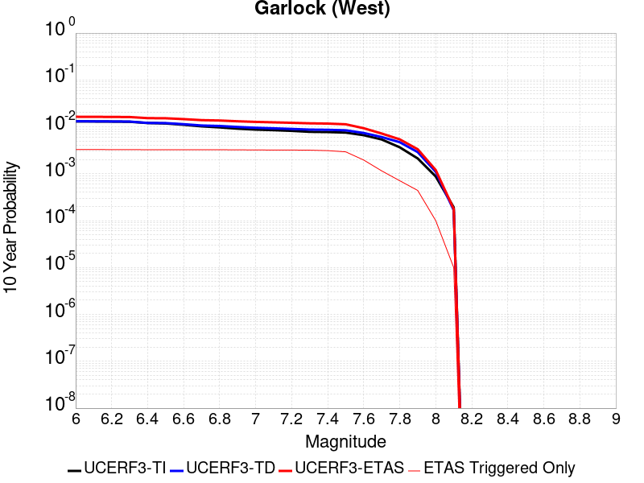 |

| Magnitude | 1 wk TI Prob | 1 wk TD Prob | 1 wk ETAS Prob | 1 wk ETAS/TD Gain | 1 wk ETAS Triggered Only | 1 mo TI Prob | 1 mo TD Prob | 1 mo ETAS Prob | 1 mo ETAS/TD Gain | 1 mo ETAS Triggered Only | 1 yr TI Prob | 1 yr TD Prob | 1 yr ETAS Prob | 1 yr ETAS/TD Gain | 1 yr ETAS Triggered Only | 10 yr TI Prob | 10 yr TD Prob | 10 yr ETAS Prob | 10 yr ETAS/TD Gain | 10 yr ETAS Triggered Only |
|-----|-----|-----|-----|-----|-----|-----|-----|-----|-----|-----|-----|-----|-----|-----|-----|-----|-----|-----|-----|-----|
| 6.0 | 2.5181727E-5 | 2.5232022E-5 | 1.4286228E-4 | 5.661943 | 1.1763322E-4 | 1.0791722E-4 | 1.0813278E-4 | 3.4337377E-4 | 3.1754827 | 2.3526645E-4 | 0.0013131002 | 0.0013157249 | 0.0029604232 | 2.250032 | 0.001646865 | 0.013053683 | 0.013159796 | 0.016990608 | 1.2910995 | 0.0038818961 |
| 6.1 | 2.5077732E-5 | 2.513308E-5 | 1.4276334E-4 | 5.6802964 | 1.1763322E-4 | 1.0747157E-4 | 1.0770877E-4 | 3.4294988E-4 | 3.1840477 | 2.3526645E-4 | 0.001307681 | 0.0013105689 | 0.0029552756 | 2.2549562 | 0.001646865 | 0.013000126 | 0.013108846 | 0.016939854 | 1.2922461 | 0.0038818961 |
| 6.2 | 2.494612E-5 | 2.5014735E-5 | 1.4264502E-4 | 5.70244 | 1.1763322E-4 | 1.0690756E-4 | 1.0720162E-4 | 3.4244283E-4 | 3.1943812 | 2.3526645E-4 | 0.0013008224 | 0.0013044017 | 0.0029491186 | 2.2608976 | 0.001646865 | 0.012932341 | 0.013047898 | 0.016879145 | 1.2936293 | 0.0038818961 |
| 6.3 | 2.4733758E-5 | 2.4834064E-5 | 1.4246436E-4 | 5.7366514 | 1.1763322E-4 | 1.0599751E-4 | 1.0642738E-4 | 3.4166878E-4 | 3.2103467 | 2.3526645E-4 | 0.0012897556 | 0.0012949866 | 0.002939719 | 2.2700768 | 0.001646865 | 0.012822957 | 0.012954849 | 0.016786456 | 1.2957662 | 0.0038818961 |
| 6.4 | 2.3237335E-5 | 2.3213131E-5 | 1.4084362E-4 | 6.0674114 | 1.1763322E-4 | 9.958477E-5 | 9.9481076E-5 | 3.347241E-4 | 3.3647013 | 2.3526645E-4 | 0.0012117702 | 0.0012105119 | 0.0028553836 | 2.358823 | 0.001646865 | 0.012051838 | 0.012119588 | 0.015954439 | 1.3164175 | 0.0038818961 |
| 6.5 | 2.2732203E-5 | 2.302753E-5 | 1.4065804E-4 | 6.108256 | 1.1763322E-4 | 9.742009E-5 | 9.86857E-5 | 3.339289E-4 | 3.3837621 | 2.3526645E-4 | 0.0011854442 | 0.001200839 | 0.0028457264 | 2.369782 | 0.001646865 | 0.011791403 | 0.012023909 | 0.01585913 | 1.3189662 | 0.0038818961 |
| 6.6 | 2.1319436E-5 | 2.1807444E-5 | 1.394381E-4 | 6.3940597 | 1.1763322E-4 | 9.136581E-5 | 9.3457136E-5 | 3.287016E-4 | 3.5171373 | 2.3526645E-4 | 0.001111811 | 0.001137249 | 0.0027822412 | 2.4464662 | 0.001646865 | 0.011062649 | 0.011394676 | 0.0152323395 | 1.3367944 | 0.0038818961 |
| 6.7 | 1.970802E-5 | 2.0426989E-5 | 1.380578E-4 | 6.758598 | 1.1763322E-4 | 8.446021E-5 | 8.754131E-5 | 3.2278715E-4 | 3.6872551 | 2.3526645E-4 | 0.001027818 | 0.001065296 | 0.0027104067 | 2.5442755 | 0.001646865 | 0.010230771 | 0.010682246 | 0.0145226745 | 1.3595152 | 0.0038818961 |
| 6.8 | 1.8744462E-5 | 1.993445E-5 | 1.3756532E-4 | 6.900884 | 1.1763322E-4 | 8.033094E-5 | 8.543057E-5 | 3.2067692E-4 | 3.7536554 | 2.3526645E-4 | 9.775903E-4 | 0.0010396226 | 0.0026847755 | 2.5824523 | 0.001646865 | 0.009733009 | 0.010427939 | 0.014269355 | 1.3683773 | 0.0038818961 |
| 6.9 | 1.7559682E-5 | 1.89866E-5 | 1.3661759E-4 | 7.1954737 | 1.1763322E-4 | 7.5253614E-5 | 8.136861E-5 | 3.1661591E-4 | 3.8911307 | 2.3526645E-4 | 9.158276E-4 | 9.902141E-4 | 0.0026354485 | 2.6614935 | 0.001646865 | 0.0091206245 | 0.009938315 | 0.013781631 | 1.3867171 | 0.0038818961 |
| 7.0 | 1.6794445E-5 | 1.8249186E-5 | 1.3588025E-4 | 7.4458256 | 1.1763322E-4 | 7.197421E-5 | 7.820846E-5 | 3.134565E-4 | 4.0079613 | 2.3526645E-4 | 8.759337E-4 | 9.517734E-4 | 0.002597071 | 2.728665 | 0.001646865 | 0.008724891 | 0.009557109 | 0.013401906 | 1.402297 | 0.0038818961 |
| 7.1 | 1.6337795E-5 | 1.7749819E-5 | 1.3538095E-4 | 7.6271734 | 1.1763322E-4 | 7.0017246E-5 | 7.606844E-5 | 3.1131698E-4 | 4.0925903 | 2.3526645E-4 | 8.521265E-4 | 9.257411E-4 | 0.0025710817 | 2.7773225 | 0.001646865 | 0.008488664 | 0.009298879 | 0.013144678 | 1.4135766 | 0.0038818961 |
| 7.2 | 1.5780008E-5 | 1.7198334E-5 | 1.3482953E-4 | 7.8396854 | 1.1763322E-4 | 6.762685E-5 | 7.370507E-5 | 3.089542E-4 | 4.1917624 | 2.3526645E-4 | 8.2304585E-4 | 8.969911E-4 | 0.002542379 | 2.8343413 | 0.001646865 | 0.008200042 | 0.009013661 | 0.012860567 | 1.4267862 | 0.0038818961 |
| 7.3 | 1.5058865E-5 | 1.6651169E-5 | 1.3428243E-4 | 8.064445 | 1.1763322E-4 | 6.45364E-5 | 7.1360206E-5 | 3.0660984E-4 | 4.2966504 | 2.3526645E-4 | 7.854473E-4 | 8.684654E-4 | 0.0025139002 | 2.8946464 | 0.001646865 | 0.00782677 | 0.008730242 | 0.012578249 | 1.4407674 | 0.0038818961 |
| 7.4 | 1.4887923E-5 | 1.6487036E-5 | 1.3411832E-4 | 8.134774 | 1.1763322E-4 | 6.380382E-5 | 7.0656824E-5 | 3.0590664E-4 | 4.3294706 | 2.3526645E-4 | 7.7653467E-4 | 8.5990847E-4 | 0.0025053574 | 2.9135163 | 0.001646865 | 0.0077382675 | 0.008645052 | 0.012493389 | 1.4451491 | 0.0038818961 |
| 7.5 | 1.4509299E-5 | 1.6078842E-5 | 1.3371017E-4 | 8.3159075 | 1.1763322E-4 | 6.218123E-5 | 6.890751E-5 | 3.0415773E-4 | 4.4139996 | 2.3526645E-4 | 7.567935E-4 | 8.386272E-4 | 0.0023665766 | 2.821965 | 0.0015292319 | 0.0075422134 | 0.008433252 | 0.012049128 | 1.4287642 | 0.0036466299 |
| 7.6 | 1.2756717E-5 | 1.4081641E-5 | 1.317132E-4 | 9.353541 | 1.1763322E-4 | 5.4670498E-5 | 6.0348495E-5 | 2.9560074E-4 | 4.8982286 | 2.3526645E-4 | 6.6541E-4 | 7.3449593E-4 | 0.002027511 | 2.7604115 | 0.0012939654 | 0.006634211 | 0.0073975893 | 0.009849613 | 1.3314625 | 0.0024702975 |
| 7.7 | 1.0328985E-5 | 1.148949E-5 | 1.148949E-5 | 1.0 | 0.0 | 4.4266326E-5 | 4.9239745E-5 | 4.9239745E-5 | 1.0 | 0.0 | 5.388092E-4 | 5.9932936E-4 | 0.0015398312 | 2.5692568 | 9.410658E-4 | 0.0053750467 | 0.006053493 | 0.007573467 | 1.2510905 | 0.0015292319 |
| 7.8 | 7.0306583E-6 | 8.922903E-6 | 8.922903E-6 | 1.0 | 0.0 | 3.0131043E-5 | 3.8240454E-5 | 3.8240454E-5 | 1.0 | 0.0 | 3.667837E-4 | 4.6547825E-4 | 0.0012885275 | 2.76818 | 8.234325E-4 | 0.003661789 | 0.004707357 | 0.005995231 | 1.2735876 | 0.0012939654 |
| 7.9 | 4.060633E-6 | 5.4793654E-6 | 5.4793654E-6 | 1.0 | 0.0 | 1.7402595E-5 | 2.3482784E-5 | 2.3482784E-5 | 1.0 | 0.0 | 2.11856E-4 | 2.8586548E-4 | 7.5626385E-4 | 2.6455235 | 4.705329E-4 | 0.0021165414 | 0.0028914614 | 0.00359522 | 1.243392 | 7.057993E-4 |
| 8.0 | 1.6729537E-6 | 2.0820012E-6 | 2.0820012E-6 | 1.0 | 0.0 | 7.169782E-6 | 8.9228315E-6 | 8.9228315E-6 | 1.0 | 0.0 | 8.7288594E-5 | 1.0863009E-4 | 2.2625053E-4 | 2.082761 | 1.1763322E-4 | 8.7254314E-4 | 0.0010992672 | 0.0012167711 | 1.106893 | 1.1763322E-4 |
| 8.1 | 3.6733252E-7 | 3.1554555E-7 | 3.1554555E-7 | 1.0 | 0.0 | 1.5742813E-6 | 1.3523374E-6 | 1.3523374E-6 | 1.0 | 0.0 | 1.9166706E-5 | 1.64646E-5 | 1.64646E-5 | 1.0 | 0.0 | 1.9165053E-4 | 1.6672608E-4 | 1.6672608E-4 | 1.0 | 0.0 |

## Ash Hill
*[(top)](#table-of-contents)*

| 1 Week | 1 Month | 1 Year | 10 Year |
|-----|-----|-----|-----|
|  | 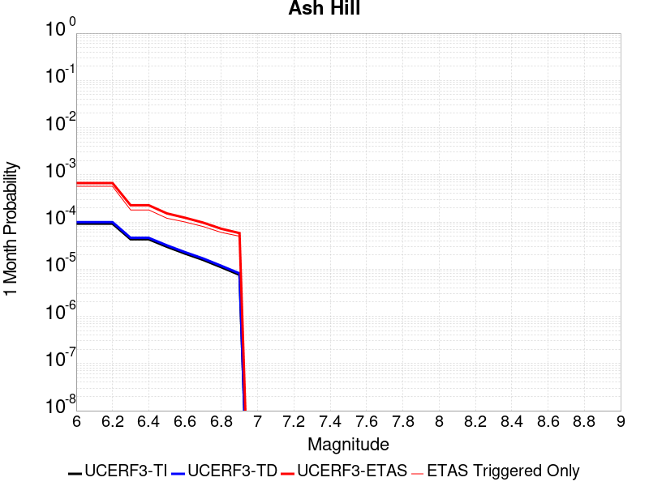 |  |  |

| Magnitude | 1 wk TI Prob | 1 wk TD Prob | 1 wk ETAS Prob | 1 wk ETAS/TD Gain | 1 wk ETAS Triggered Only | 1 mo TI Prob | 1 mo TD Prob | 1 mo ETAS Prob | 1 mo ETAS/TD Gain | 1 mo ETAS Triggered Only | 1 yr TI Prob | 1 yr TD Prob | 1 yr ETAS Prob | 1 yr ETAS/TD Gain | 1 yr ETAS Triggered Only | 10 yr TI Prob | 10 yr TD Prob | 10 yr ETAS Prob | 10 yr ETAS/TD Gain | 10 yr ETAS Triggered Only |
|-----|-----|-----|-----|-----|-----|-----|-----|-----|-----|-----|-----|-----|-----|-----|-----|-----|-----|-----|-----|-----|
| 6.0 | 2.1545662E-5 | 2.3196095E-5 | 2.3196095E-5 | 1.0 | 0.0 | 9.2335285E-5 | 9.94085E-5 | 3.3465156E-4 | 3.366428 | 2.3526645E-4 | 0.0011236023 | 0.0012097065 | 0.0026195976 | 2.1654818 | 0.0014115986 | 0.011179381 | 0.0120392 | 0.015874362 | 1.3185562 | 0.0038818961 |
| 6.1 | 2.1545662E-5 | 2.3196095E-5 | 2.3196095E-5 | 1.0 | 0.0 | 9.2335285E-5 | 9.94085E-5 | 3.3465156E-4 | 3.366428 | 2.3526645E-4 | 0.0011236023 | 0.0012097065 | 0.0026195976 | 2.1654818 | 0.0014115986 | 0.011179381 | 0.0120392 | 0.015874362 | 1.3185562 | 0.0038818961 |
| 6.2 | 2.1545662E-5 | 2.3196095E-5 | 2.3196095E-5 | 1.0 | 0.0 | 9.2335285E-5 | 9.94085E-5 | 3.3465156E-4 | 3.366428 | 2.3526645E-4 | 0.0011236023 | 0.0012097065 | 0.0026195976 | 2.1654818 | 0.0014115986 | 0.011179381 | 0.0120392 | 0.015874362 | 1.3185562 | 0.0038818961 |
| 6.3 | 1.0025529E-5 | 1.0747653E-5 | 1.0747653E-5 | 1.0 | 0.0 | 4.2965847E-5 | 4.6060628E-5 | 4.6060628E-5 | 1.0 | 0.0 | 5.229836E-4 | 5.6065706E-4 | 0.0010309261 | 1.838782 | 4.705329E-4 | 0.005217545 | 0.005593739 | 0.0065295408 | 1.1672945 | 9.410658E-4 |
| 6.4 | 1.0025529E-5 | 1.0747653E-5 | 1.0747653E-5 | 1.0 | 0.0 | 4.2965847E-5 | 4.6060628E-5 | 4.6060628E-5 | 1.0 | 0.0 | 5.229836E-4 | 5.6065706E-4 | 0.0010309261 | 1.838782 | 4.705329E-4 | 0.005217545 | 0.005593739 | 0.0065295408 | 1.1672945 | 9.410658E-4 |
| 6.5 | 6.9617327E-6 | 7.4571262E-6 | 7.4571262E-6 | 1.0 | 0.0 | 2.9835655E-5 | 3.195877E-5 | 3.195877E-5 | 1.0 | 0.0 | 3.6318856E-4 | 3.8903722E-4 | 7.417996E-4 | 1.9067574 | 3.5289966E-4 | 0.0036259557 | 0.0038844163 | 0.0044702976 | 1.1508287 | 5.881661E-4 |
| 6.6 | 4.9919777E-6 | 5.3470408E-6 | 5.3470408E-6 | 1.0 | 0.0 | 2.1394015E-5 | 2.2915727E-5 | 2.2915727E-5 | 1.0 | 0.0 | 2.60441E-4 | 2.7896996E-4 | 5.1417074E-4 | 1.8431045 | 2.3526645E-4 | 0.0026013597 | 0.0027868561 | 0.0032560779 | 1.1683695 | 4.705329E-4 |
| 6.7 | 3.6630722E-6 | 3.924884E-6 | 3.924884E-6 | 1.0 | 0.0 | 1.5698786E-5 | 1.6820855E-5 | 1.6820855E-5 | 1.0 | 0.0 | 1.9111596E-4 | 2.047804E-4 | 4.3999866E-4 | 2.1486366 | 2.3526645E-4 | 0.0019095168 | 0.00204648 | 0.0023986576 | 1.1720893 | 3.5289966E-4 |
| 6.8 | 2.5599613E-6 | 2.7451092E-6 | 2.7451092E-6 | 1.0 | 0.0 | 1.0971216E-5 | 1.1764729E-5 | 1.1764729E-5 | 1.0 | 0.0 | 1.3356637E-4 | 1.432311E-4 | 3.7846385E-4 | 2.64233 | 2.3526645E-4 | 0.0013348613 | 0.001431873 | 0.0017842673 | 1.2461073 | 3.5289966E-4 |
| 6.9 | 1.7684905E-6 | 1.8969986E-6 | 1.8969986E-6 | 1.0 | 0.0 | 7.579223E-6 | 8.129994E-6 | 8.129994E-6 | 1.0 | 0.0 | 9.2273134E-5 | 9.898267E-5 | 2.1660425E-4 | 2.1883047 | 1.1763322E-4 | 9.223483E-4 | 9.898267E-4 | 0.0011073436 | 1.1187246 | 1.1763322E-4 |

## McLean Lake
*[(top)](#table-of-contents)*

| 1 Week | 1 Month | 1 Year | 10 Year |
|-----|-----|-----|-----|
|  |  |  |  |

| Magnitude | 1 wk TI Prob | 1 wk TD Prob | 1 wk ETAS Prob | 1 wk ETAS/TD Gain | 1 wk ETAS Triggered Only | 1 mo TI Prob | 1 mo TD Prob | 1 mo ETAS Prob | 1 mo ETAS/TD Gain | 1 mo ETAS Triggered Only | 1 yr TI Prob | 1 yr TD Prob | 1 yr ETAS Prob | 1 yr ETAS/TD Gain | 1 yr ETAS Triggered Only | 10 yr TI Prob | 10 yr TD Prob | 10 yr ETAS Prob | 10 yr ETAS/TD Gain | 10 yr ETAS Triggered Only |
|-----|-----|-----|-----|-----|-----|-----|-----|-----|-----|-----|-----|-----|-----|-----|-----|-----|-----|-----|-----|-----|
| 6.0 | 1.7360222E-5 | 1.8502758E-5 | 1.8502758E-5 | 1.0 | 0.0 | 7.439883E-5 | 7.92954E-5 | 1.969193E-4 | 2.4833634 | 1.1763322E-4 | 9.0542925E-4 | 9.6504256E-4 | 0.0021402396 | 2.217767 | 0.0011763322 | 0.009017491 | 0.00961336 | 0.012875427 | 1.3393264 | 0.00329373 |
| 6.1 | 9.062689E-6 | 9.592714E-6 | 9.592714E-6 | 1.0 | 0.0 | 3.8839516E-5 | 4.1111034E-5 | 4.1111034E-5 | 1.0 | 0.0 | 4.727685E-4 | 5.004208E-4 | 9.707182E-4 | 1.939804 | 4.705329E-4 | 0.0047176396 | 0.0049938224 | 0.0063983714 | 1.2812574 | 0.0014115986 |
| 6.2 | 9.062689E-6 | 9.592714E-6 | 9.592714E-6 | 1.0 | 0.0 | 3.8839516E-5 | 4.1111034E-5 | 4.1111034E-5 | 1.0 | 0.0 | 4.727685E-4 | 5.004208E-4 | 9.707182E-4 | 1.939804 | 4.705329E-4 | 0.0047176396 | 0.0049938224 | 0.0063983714 | 1.2812574 | 0.0014115986 |
| 6.3 | 7.2575485E-6 | 7.668112E-6 | 7.668112E-6 | 1.0 | 0.0 | 3.110341E-5 | 3.2862965E-5 | 3.2862965E-5 | 1.0 | 0.0 | 3.786182E-4 | 4.0004024E-4 | 8.703849E-4 | 2.1757433 | 4.705329E-4 | 0.0037797375 | 0.003993906 | 0.005399867 | 1.3520265 | 0.0014115986 |
| 6.4 | 7.2575485E-6 | 7.668112E-6 | 7.668112E-6 | 1.0 | 0.0 | 3.110341E-5 | 3.2862965E-5 | 3.2862965E-5 | 1.0 | 0.0 | 3.786182E-4 | 4.0004024E-4 | 8.703849E-4 | 2.1757433 | 4.705329E-4 | 0.0037797375 | 0.003993906 | 0.005399867 | 1.3520265 | 0.0014115986 |
| 6.5 | 6.06582E-6 | 6.4042088E-6 | 6.4042088E-6 | 1.0 | 0.0 | 2.5996113E-5 | 2.7446356E-5 | 2.7446356E-5 | 1.0 | 0.0 | 3.164567E-4 | 3.3411465E-4 | 8.044903E-4 | 2.4078271 | 4.705329E-4 | 0.0031600643 | 0.0033367618 | 0.00474365 | 1.4216329 | 0.0014115986 |
| 6.6 | 5.598744E-6 | 5.910568E-6 | 5.910568E-6 | 1.0 | 0.0 | 2.3994397E-5 | 2.5330795E-5 | 2.5330795E-5 | 1.0 | 0.0 | 2.9209262E-4 | 3.0836518E-4 | 7.7875296E-4 | 2.5254245 | 4.705329E-4 | 0.0029170897 | 0.003080002 | 0.004369982 | 1.4188244 | 0.0012939654 |
| 6.7 | 5.246996E-6 | 5.5394485E-6 | 5.5394485E-6 | 1.0 | 0.0 | 2.2486933E-5 | 2.3740315E-5 | 2.3740315E-5 | 1.0 | 0.0 | 2.73744E-4 | 2.8900633E-4 | 7.594032E-4 | 2.6276352 | 4.705329E-4 | 0.0027340704 | 0.0028869289 | 0.004059865 | 1.4062921 | 0.0011763322 |
| 6.8 | 4.02324E-6 | 4.247124E-6 | 4.247124E-6 | 1.0 | 0.0 | 1.7242342E-5 | 1.8201867E-5 | 1.8201867E-5 | 1.0 | 0.0 | 2.099053E-4 | 2.2159114E-4 | 5.744126E-4 | 2.5922184 | 3.5289966E-4 | 0.0020970714 | 0.0022142862 | 0.0030358955 | 1.3710493 | 8.234325E-4 |
| 6.9 | 6.835972E-7 | 7.140223E-7 | 7.140223E-7 | 1.0 | 0.0 | 2.9296991E-6 | 3.0600938E-6 | 3.0600938E-6 | 1.0 | 0.0 | 3.56685E-5 | 3.7256323E-5 | 3.7256323E-5 | 1.0 | 0.0 | 3.5662777E-4 | 3.7253203E-4 | 3.7253203E-4 | 1.0 | 0.0 |

## Goldstone Lake
*[(top)](#table-of-contents)*

| 1 Week | 1 Month | 1 Year | 10 Year |
|-----|-----|-----|-----|
|  |  |  |  |

| Magnitude | 1 wk TI Prob | 1 wk TD Prob | 1 wk ETAS Prob | 1 wk ETAS/TD Gain | 1 wk ETAS Triggered Only | 1 mo TI Prob | 1 mo TD Prob | 1 mo ETAS Prob | 1 mo ETAS/TD Gain | 1 mo ETAS Triggered Only | 1 yr TI Prob | 1 yr TD Prob | 1 yr ETAS Prob | 1 yr ETAS/TD Gain | 1 yr ETAS Triggered Only | 10 yr TI Prob | 10 yr TD Prob | 10 yr ETAS Prob | 10 yr ETAS/TD Gain | 10 yr ETAS Triggered Only |
|-----|-----|-----|-----|-----|-----|-----|-----|-----|-----|-----|-----|-----|-----|-----|-----|-----|-----|-----|-----|-----|
| 6.0 | 2.671352E-5 | 3.0379857E-5 | 3.0379857E-5 | 1.0 | 0.0 | 1.1448149E-4 | 1.30194E-4 | 2.478119E-4 | 1.903405 | 1.1763322E-4 | 0.001392921 | 0.0015841558 | 0.002406284 | 1.5189692 | 8.234325E-4 | 0.013842222 | 0.015748136 | 0.018179532 | 1.1543926 | 0.0024702975 |
| 6.1 | 2.671352E-5 | 3.0379857E-5 | 3.0379857E-5 | 1.0 | 0.0 | 1.1448149E-4 | 1.30194E-4 | 2.478119E-4 | 1.903405 | 1.1763322E-4 | 0.001392921 | 0.0015841558 | 0.002406284 | 1.5189692 | 8.234325E-4 | 0.013842222 | 0.015748136 | 0.018179532 | 1.1543926 | 0.0024702975 |
| 6.2 | 1.4197047E-5 | 1.6098144E-5 | 1.6098144E-5 | 1.0 | 0.0 | 6.0843064E-5 | 6.8990776E-5 | 6.8990776E-5 | 1.0 | 0.0 | 7.4051257E-4 | 8.3973765E-4 | 0.0010748066 | 1.2799313 | 2.3526645E-4 | 0.007380498 | 0.008375344 | 0.009891768 | 1.1810582 | 0.0015292319 |
| 6.3 | 1.4197047E-5 | 1.6098144E-5 | 1.6098144E-5 | 1.0 | 0.0 | 6.0843064E-5 | 6.8990776E-5 | 6.8990776E-5 | 1.0 | 0.0 | 7.4051257E-4 | 8.3973765E-4 | 0.0010748066 | 1.2799313 | 2.3526645E-4 | 0.007380498 | 0.008375344 | 0.009891768 | 1.1810582 | 0.0015292319 |
| 6.4 | 1.3238931E-5 | 1.5010221E-5 | 1.5010221E-5 | 1.0 | 0.0 | 5.6737044E-5 | 6.432849E-5 | 6.432849E-5 | 1.0 | 0.0 | 6.9055456E-4 | 7.830159E-4 | 0.0010180981 | 1.3002266 | 2.3526645E-4 | 0.006884126 | 0.0078121983 | 0.009329484 | 1.19422 | 0.0015292319 |
| 6.5 | 1.3238931E-5 | 1.5010221E-5 | 1.5010221E-5 | 1.0 | 0.0 | 5.6737044E-5 | 6.432849E-5 | 6.432849E-5 | 1.0 | 0.0 | 6.9055456E-4 | 7.830159E-4 | 0.0010180981 | 1.3002266 | 2.3526645E-4 | 0.006884126 | 0.0078121983 | 0.009329484 | 1.19422 | 0.0015292319 |
| 6.6 | 1.1328278E-5 | 1.28566735E-5 | 1.28566735E-5 | 1.0 | 0.0 | 4.8548856E-5 | 5.5099405E-5 | 5.5099405E-5 | 1.0 | 0.0 | 5.90922E-4 | 6.707245E-4 | 9.0583315E-4 | 1.3505294 | 2.3526645E-4 | 0.0058935313 | 0.006696393 | 0.007864848 | 1.1744902 | 0.0011763322 |
| 6.7 | 8.651175E-6 | 9.8257005E-6 | 9.8257005E-6 | 1.0 | 0.0 | 3.707594E-5 | 4.2109976E-5 | 4.2109976E-5 | 1.0 | 0.0 | 4.5130608E-4 | 5.126589E-4 | 7.4780476E-4 | 1.458679 | 2.3526645E-4 | 0.0045039062 | 0.005123643 | 0.0060598874 | 1.1827302 | 9.410658E-4 |
| 6.8 | 1.0215377E-6 | 1.1755332E-6 | 1.1755332E-6 | 1.0 | 0.0 | 4.378012E-6 | 5.0379904E-6 | 5.0379904E-6 | 1.0 | 0.0 | 5.3300988E-5 | 6.133592E-5 | 6.133592E-5 | 1.0 | 0.0 | 5.3288206E-4 | 6.132012E-4 | 7.3076226E-4 | 1.191717 | 1.1763322E-4 |
| 6.9 | 7.9360774E-7 | 9.283833E-7 | 9.283833E-7 | 1.0 | 0.0 | 3.4011714E-6 | 3.9787797E-6 | 3.9787797E-6 | 1.0 | 0.0 | 4.1408475E-5 | 4.844064E-5 | 4.844064E-5 | 1.0 | 0.0 | 4.140076E-4 | 4.843078E-4 | 4.843078E-4 | 1.0 | 0.0 |
| 7.0 | 7.4382757E-7 | 8.747727E-7 | 8.747727E-7 | 1.0 | 0.0 | 3.1878285E-6 | 3.7490208E-6 | 3.7490208E-6 | 1.0 | 0.0 | 3.8811122E-5 | 4.564344E-5 | 4.564344E-5 | 1.0 | 0.0 | 3.8804344E-4 | 4.5634728E-4 | 4.5634728E-4 | 1.0 | 0.0 |
| 7.1 | 6.4709513E-7 | 7.71163E-7 | 7.71163E-7 | 1.0 | 0.0 | 2.773262E-6 | 3.3049803E-6 | 3.3049803E-6 | 1.0 | 0.0 | 3.376394E-5 | 4.0237454E-5 | 4.0237454E-5 | 1.0 | 0.0 | 3.375881E-4 | 4.0230763E-4 | 4.0230763E-4 | 1.0 | 0.0 |
| 7.2 | 6.356704E-7 | 7.5886805E-7 | 7.5886805E-7 | 1.0 | 0.0 | 2.7242988E-6 | 3.252288E-6 | 3.252288E-6 | 1.0 | 0.0 | 3.3167835E-5 | 3.9595947E-5 | 3.9595947E-5 | 1.0 | 0.0 | 3.3162883E-4 | 3.9589487E-4 | 3.9589487E-4 | 1.0 | 0.0 |
| 7.3 | 5.7695723E-7 | 6.8968615E-7 | 6.8968615E-7 | 1.0 | 0.0 | 2.4726714E-6 | 2.9557948E-6 | 2.9557948E-6 | 1.0 | 0.0 | 3.0104358E-5 | 3.5986264E-5 | 3.5986264E-5 | 1.0 | 0.0 | 3.0100282E-4 | 3.598101E-4 | 3.598101E-4 | 1.0 | 0.0 |
| 7.4 | 5.209647E-7 | 6.1937635E-7 | 6.1937635E-7 | 1.0 | 0.0 | 2.232704E-6 | 2.6544676E-6 | 2.6544676E-6 | 1.0 | 0.0 | 2.718283E-5 | 3.2317723E-5 | 3.2317723E-5 | 1.0 | 0.0 | 2.7179506E-4 | 3.2313578E-4 | 3.2313578E-4 | 1.0 | 0.0 |
| 7.5 | 4.512955E-7 | 5.349091E-7 | 5.349091E-7 | 1.0 | 0.0 | 1.934122E-6 | 2.2924658E-6 | 2.2924658E-6 | 1.0 | 0.0 | 2.3547682E-5 | 2.7910468E-5 | 2.7910468E-5 | 1.0 | 0.0 | 2.3545188E-4 | 2.7907494E-4 | 2.7907494E-4 | 1.0 | 0.0 |
| 7.6 | 2.21172E-7 | 2.6040513E-7 | 2.6040513E-7 | 1.0 | 0.0 | 9.478797E-7 | 1.1160216E-6 | 1.1160216E-6 | 1.0 | 0.0 | 1.1540374E-5 | 1.3587508E-5 | 1.3587508E-5 | 1.0 | 0.0 | 1.1539775E-4 | 1.3586959E-4 | 1.3586959E-4 | 1.0 | 0.0 |

## Gravel Hills-Harper Lk
*[(top)](#table-of-contents)*

| 1 Week | 1 Month | 1 Year | 10 Year |
|-----|-----|-----|-----|
| 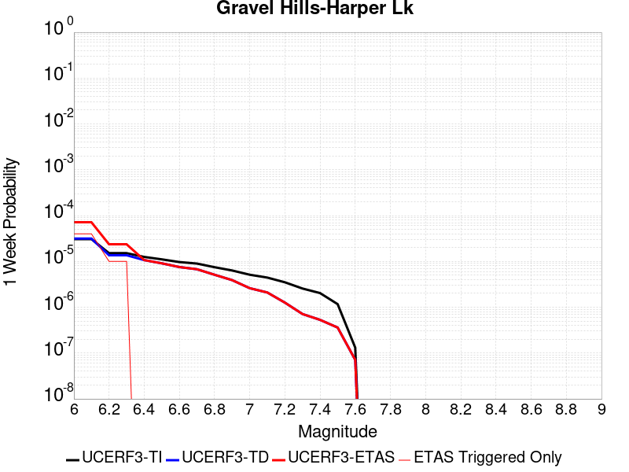 |  |  |  |

| Magnitude | 1 wk TI Prob | 1 wk TD Prob | 1 wk ETAS Prob | 1 wk ETAS/TD Gain | 1 wk ETAS Triggered Only | 1 mo TI Prob | 1 mo TD Prob | 1 mo ETAS Prob | 1 mo ETAS/TD Gain | 1 mo ETAS Triggered Only | 1 yr TI Prob | 1 yr TD Prob | 1 yr ETAS Prob | 1 yr ETAS/TD Gain | 1 yr ETAS Triggered Only | 10 yr TI Prob | 10 yr TD Prob | 10 yr ETAS Prob | 10 yr ETAS/TD Gain | 10 yr ETAS Triggered Only |
|-----|-----|-----|-----|-----|-----|-----|-----|-----|-----|-----|-----|-----|-----|-----|-----|-----|-----|-----|-----|-----|
| 6.0 | 3.0679566E-5 | 3.146842E-5 | 3.146842E-5 | 1.0 | 0.0 | 1.3147724E-4 | 1.348589E-4 | 2.5247625E-4 | 1.8721513 | 1.1763322E-4 | 0.0015995599 | 0.0016408868 | 0.0025804082 | 1.5725694 | 9.410658E-4 | 0.015880952 | 0.01630928 | 0.018392146 | 1.1277103 | 0.002117398 |
| 6.1 | 3.0679566E-5 | 3.146842E-5 | 3.146842E-5 | 1.0 | 0.0 | 1.3147724E-4 | 1.348589E-4 | 2.5247625E-4 | 1.8721513 | 1.1763322E-4 | 0.0015995599 | 0.0016408868 | 0.0025804082 | 1.5725694 | 9.410658E-4 | 0.015880952 | 0.01630928 | 0.018392146 | 1.1277103 | 0.002117398 |
| 6.2 | 1.514536E-5 | 1.3636506E-5 | 1.3636506E-5 | 1.0 | 0.0 | 6.490707E-5 | 5.8440924E-5 | 5.8440924E-5 | 1.0 | 0.0 | 7.8995706E-4 | 7.1129785E-4 | 9.4639696E-4 | 1.3305213 | 2.3526645E-4 | 0.007871548 | 0.0070914137 | 0.007675409 | 1.0823524 | 5.881661E-4 |
| 6.3 | 1.514536E-5 | 1.3636506E-5 | 1.3636506E-5 | 1.0 | 0.0 | 6.490707E-5 | 5.8440924E-5 | 5.8440924E-5 | 1.0 | 0.0 | 7.8995706E-4 | 7.1129785E-4 | 9.4639696E-4 | 1.3305213 | 2.3526645E-4 | 0.007871548 | 0.0070914137 | 0.007675409 | 1.0823524 | 5.881661E-4 |
| 6.4 | 1.2532521E-5 | 1.0690639E-5 | 1.0690639E-5 | 1.0 | 0.0 | 5.37097E-5 | 4.5816254E-5 | 4.5816254E-5 | 1.0 | 0.0 | 6.537194E-4 | 5.5767596E-4 | 6.7524356E-4 | 1.2108171 | 1.1763322E-4 | 0.0065179965 | 0.005563355 | 0.0059142914 | 1.06308 | 3.5289966E-4 |
| 6.5 | 1.1094058E-5 | 9.084438E-6 | 9.084438E-6 | 1.0 | 0.0 | 4.7545094E-5 | 3.8932747E-5 | 3.8932747E-5 | 1.0 | 0.0 | 5.787078E-4 | 4.7390713E-4 | 5.914846E-4 | 1.2481023 | 1.1763322E-4 | 0.0057720304 | 0.0047293724 | 0.0049635265 | 1.0495105 | 2.3526645E-4 |
| 6.6 | 9.688328E-6 | 7.5323187E-6 | 7.5323187E-6 | 1.0 | 0.0 | 4.1520743E-5 | 3.2280983E-5 | 3.2280983E-5 | 1.0 | 0.0 | 5.053978E-4 | 3.929526E-4 | 3.929526E-4 | 1.0 | 0.0 | 0.0050424994 | 0.0039228345 | 0.0040400065 | 1.0298692 | 1.1763322E-4 |
| 6.7 | 8.974824E-6 | 6.7499664E-6 | 6.7499664E-6 | 1.0 | 0.0 | 3.8462964E-5 | 2.892812E-5 | 2.892812E-5 | 1.0 | 0.0 | 4.6818596E-4 | 3.5214514E-4 | 3.5214514E-4 | 1.0 | 0.0 | 0.004672008 | 0.0035160924 | 0.003633312 | 1.0333381 | 1.1763322E-4 |
| 6.8 | 7.4780046E-6 | 5.1166085E-6 | 5.1166085E-6 | 1.0 | 0.0 | 3.20482E-5 | 2.1928145E-5 | 2.1928145E-5 | 1.0 | 0.0 | 3.9011694E-4 | 2.6694385E-4 | 2.6694385E-4 | 1.0 | 0.0 | 0.0038943281 | 0.0026663702 | 0.0026663702 | 1.0 | 0.0 |
| 6.9 | 6.3409307E-6 | 3.9078204E-6 | 3.9078204E-6 | 1.0 | 0.0 | 2.7175134E-5 | 1.67477E-5 | 1.67477E-5 | 1.0 | 0.0 | 3.3080703E-4 | 2.0388517E-4 | 2.0388517E-4 | 1.0 | 0.0 | 0.0033031502 | 0.0020370793 | 0.0020370793 | 1.0 | 0.0 |
| 7.0 | 5.1239335E-6 | 2.6060832E-6 | 2.6060832E-6 | 1.0 | 0.0 | 2.195953E-5 | 1.1168881E-5 | 1.1168881E-5 | 1.0 | 0.0 | 2.6732447E-4 | 1.3597289E-4 | 1.3597289E-4 | 1.0 | 0.0 | 0.0026700313 | 0.0013589222 | 0.0013589222 | 1.0 | 0.0 |
| 7.1 | 4.438899E-6 | 2.0986622E-6 | 2.0986622E-6 | 1.0 | 0.0 | 1.9023713E-5 | 8.994237E-6 | 8.994237E-6 | 1.0 | 0.0 | 2.315891E-4 | 1.0949955E-4 | 1.0949955E-4 | 1.0 | 0.0 | 0.002313479 | 0.001094478 | 0.001094478 | 1.0 | 0.0 |
| 7.2 | 3.50367E-6 | 1.261711E-6 | 1.261711E-6 | 1.0 | 0.0 | 1.5015643E-5 | 5.407322E-6 | 5.407322E-6 | 1.0 | 0.0 | 1.8280011E-4 | 6.583224E-5 | 6.583224E-5 | 1.0 | 0.0 | 0.0018264982 | 6.581356E-4 | 6.581356E-4 | 1.0 | 0.0 |
| 7.3 | 2.561638E-6 | 7.120225E-7 | 7.120225E-7 | 1.0 | 0.0 | 1.0978401E-5 | 3.0515216E-6 | 3.0515216E-6 | 1.0 | 0.0 | 1.3365384E-4 | 3.715166E-5 | 3.715166E-5 | 1.0 | 0.0 | 0.0013357349 | 3.714565E-4 | 3.714565E-4 | 1.0 | 0.0 |
| 7.4 | 2.0368864E-6 | 5.305691E-7 | 5.305691E-7 | 1.0 | 0.0 | 8.729483E-6 | 2.2738657E-6 | 2.2738657E-6 | 1.0 | 0.0 | 1.06276275E-4 | 2.7683967E-5 | 2.7683967E-5 | 1.0 | 0.0 | 0.0010622547 | 2.7680572E-4 | 2.7680572E-4 | 1.0 | 0.0 |
| 7.5 | 1.1681728E-6 | 3.60355E-7 | 3.60355E-7 | 1.0 | 0.0 | 5.0064455E-6 | 1.5443777E-6 | 1.5443777E-6 | 1.0 | 0.0 | 6.0951766E-5 | 1.880264E-5 | 1.880264E-5 | 1.0 | 0.0 | 6.093505E-4 | 1.8801096E-4 | 1.8801096E-4 | 1.0 | 0.0 |
| 7.6 | 1.3154387E-7 | 7.120354E-8 | 7.120354E-8 | 1.0 | 0.0 | 5.6375933E-7 | 3.0515798E-7 | 3.0515798E-7 | 1.0 | 0.0 | 6.863748E-6 | 3.7152938E-6 | 3.7152938E-6 | 1.0 | 0.0 | 6.863536E-5 | 3.7152477E-5 | 3.7152477E-5 | 1.0 | 0.0 |

## San Andreas (Mojave S)
*[(top)](#table-of-contents)*

| 1 Week | 1 Month | 1 Year | 10 Year |
|-----|-----|-----|-----|
|  |  |  | 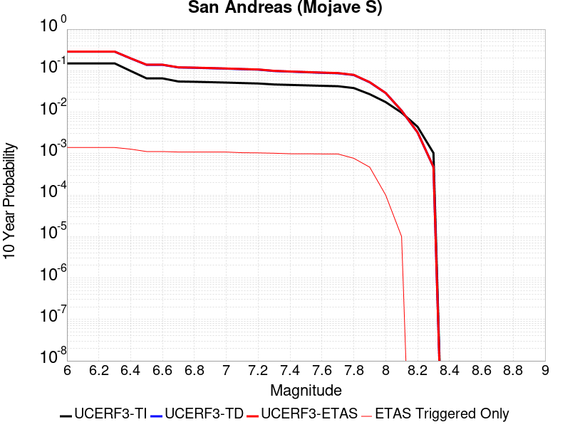 |

| Magnitude | 1 wk TI Prob | 1 wk TD Prob | 1 wk ETAS Prob | 1 wk ETAS/TD Gain | 1 wk ETAS Triggered Only | 1 mo TI Prob | 1 mo TD Prob | 1 mo ETAS Prob | 1 mo ETAS/TD Gain | 1 mo ETAS Triggered Only | 1 yr TI Prob | 1 yr TD Prob | 1 yr ETAS Prob | 1 yr ETAS/TD Gain | 1 yr ETAS Triggered Only | 10 yr TI Prob | 10 yr TD Prob | 10 yr ETAS Prob | 10 yr ETAS/TD Gain | 10 yr ETAS Triggered Only |
|-----|-----|-----|-----|-----|-----|-----|-----|-----|-----|-----|-----|-----|-----|-----|-----|-----|-----|-----|-----|-----|
| 6.0 | 3.1064058E-4 | 6.7528774E-4 | 7.928415E-4 | 1.1740795 | 1.1763322E-4 | 0.0013306376 | 0.0028910087 | 0.0030083018 | 1.0405717 | 1.1763322E-4 | 0.016080605 | 0.034656145 | 0.03579171 | 1.0327666 | 0.0011763322 | 0.1496549 | 0.2868376 | 0.28834766 | 1.0052645 | 0.002117398 |
| 6.1 | 3.1064058E-4 | 6.7528774E-4 | 7.928415E-4 | 1.1740795 | 1.1763322E-4 | 0.0013306376 | 0.0028910087 | 0.0030083018 | 1.0405717 | 1.1763322E-4 | 0.016080605 | 0.034656145 | 0.03579171 | 1.0327666 | 0.0011763322 | 0.1496549 | 0.2868376 | 0.28834766 | 1.0052645 | 0.002117398 |
| 6.2 | 3.1064058E-4 | 6.7528774E-4 | 7.928415E-4 | 1.1740795 | 1.1763322E-4 | 0.0013306376 | 0.0028910087 | 0.0030083018 | 1.0405717 | 1.1763322E-4 | 0.016080605 | 0.034656145 | 0.03579171 | 1.0327666 | 0.0011763322 | 0.1496549 | 0.2868376 | 0.28834766 | 1.0052645 | 0.002117398 |
| 6.3 | 3.1064058E-4 | 6.7528774E-4 | 7.928415E-4 | 1.1740795 | 1.1763322E-4 | 0.0013306376 | 0.0028910087 | 0.0030083018 | 1.0405717 | 1.1763322E-4 | 0.016080605 | 0.034656145 | 0.03579171 | 1.0327666 | 0.0011763322 | 0.1496549 | 0.2868376 | 0.28834766 | 1.0052645 | 0.002117398 |
| 6.4 | 1.9872203E-4 | 4.3243993E-4 | 5.500223E-4 | 1.2719045 | 1.1763322E-4 | 8.5138786E-4 | 0.0018520259 | 0.0019694413 | 1.0633984 | 1.1763322E-4 | 0.010316478 | 0.022321431 | 0.023471504 | 1.0515233 | 0.0011763322 | 0.098504856 | 0.19724585 | 0.19875674 | 1.0076599 | 0.0018821316 |
| 6.5 | 1.291105E-4 | 2.8813988E-4 | 2.8813988E-4 | 1.0 | 0.0 | 5.5321335E-4 | 0.0012343036 | 0.0012343036 | 1.0 | 0.0 | 0.006714592 | 0.014924928 | 0.015851948 | 1.0621122 | 9.410658E-4 | 0.065152965 | 0.13828829 | 0.13960604 | 1.0095291 | 0.0015292319 |
| 6.6 | 1.291105E-4 | 2.8813988E-4 | 2.8813988E-4 | 1.0 | 0.0 | 5.5321335E-4 | 0.0012343036 | 0.0012343036 | 1.0 | 0.0 | 0.006714592 | 0.014924928 | 0.015851948 | 1.0621122 | 9.410658E-4 | 0.065152965 | 0.13828829 | 0.13960604 | 1.0095291 | 0.0015292319 |
| 6.7 | 1.08001186E-4 | 2.4394269E-4 | 2.4394269E-4 | 1.0 | 0.0 | 4.6278012E-4 | 0.0010450503 | 0.0010450503 | 1.0 | 0.0 | 0.0056198016 | 0.012649561 | 0.013578723 | 1.073454 | 9.410658E-4 | 0.054797906 | 0.11943314 | 0.12077974 | 1.0112748 | 0.0015292319 |
| 6.8 | 1.0624356E-4 | 2.3911761E-4 | 2.3911761E-4 | 1.0 | 0.0 | 4.5525006E-4 | 0.0010243878 | 0.0010243878 | 1.0 | 0.0 | 0.0055285925 | 0.012400877 | 0.013330272 | 1.0749459 | 9.410658E-4 | 0.053930566 | 0.11738223 | 0.11873195 | 1.0114986 | 0.0015292319 |
| 6.9 | 1.0393785E-4 | 2.3281875E-4 | 2.3281875E-4 | 1.0 | 0.0 | 4.4537184E-4 | 9.974135E-4 | 9.974135E-4 | 1.0 | 0.0 | 0.0054089287 | 0.012076146 | 0.013005847 | 1.0769866 | 9.410658E-4 | 0.05279156 | 0.114679605 | 0.116033465 | 1.0118055 | 0.0015292319 |
| 7.0 | 1.0155622E-4 | 2.2651139E-4 | 2.2651139E-4 | 1.0 | 0.0 | 4.3516833E-4 | 9.704023E-4 | 9.704023E-4 | 1.0 | 0.0 | 0.005285311 | 0.011750873 | 0.01268088 | 1.0791436 | 9.410658E-4 | 0.05161361 | 0.1119395 | 0.11329755 | 1.012132 | 0.0015292319 |
| 7.1 | 9.885595E-5 | 2.193923E-4 | 2.193923E-4 | 1.0 | 0.0 | 4.2359953E-4 | 9.3991426E-4 | 9.3991426E-4 | 1.0 | 0.0 | 0.0051451353 | 0.011383613 | 0.012313966 | 1.0817274 | 9.410658E-4 | 0.05027629 | 0.108823694 | 0.11018651 | 1.0125232 | 0.0015292319 |
| 7.2 | 9.6411415E-5 | 2.1301924E-4 | 2.1301924E-4 | 1.0 | 0.0 | 4.1312634E-4 | 9.126205E-4 | 9.126205E-4 | 1.0 | 0.0 | 0.005018219 | 0.011054731 | 0.011985393 | 1.0841868 | 9.410658E-4 | 0.049064007 | 0.10601311 | 0.107380226 | 1.0128957 | 0.0015292319 |
| 7.3 | 9.1180635E-5 | 1.9528683E-4 | 1.9528683E-4 | 1.0 | 0.0 | 3.907156E-4 | 8.3667523E-4 | 8.3667523E-4 | 1.0 | 0.0 | 0.004746591 | 0.0101390565 | 0.01107058 | 1.0918748 | 9.410658E-4 | 0.046464786 | 0.098202206 | 0.099581264 | 1.0140431 | 0.0015292319 |
| 7.4 | 8.887388E-5 | 1.8776611E-4 | 1.8776611E-4 | 1.0 | 0.0 | 3.8083247E-4 | 8.044638E-4 | 8.044638E-4 | 1.0 | 0.0 | 0.0046267817 | 0.00975046 | 0.01068235 | 1.0955739 | 9.410658E-4 | 0.045316286 | 0.09483534 | 0.09621955 | 1.0145959 | 0.0015292319 |
| 7.5 | 8.6750515E-5 | 1.8107575E-4 | 1.8107575E-4 | 1.0 | 0.0 | 3.7173493E-4 | 7.7580824E-4 | 7.7580824E-4 | 1.0 | 0.0 | 0.004516484 | 0.009404644 | 0.01033686 | 1.0991229 | 9.410658E-4 | 0.04425787 | 0.09179742 | 0.09318627 | 1.0151296 | 0.0015292319 |
| 7.6 | 8.453092E-5 | 1.7494464E-4 | 1.7494464E-4 | 1.0 | 0.0 | 3.6222505E-4 | 7.495473E-4 | 7.495473E-4 | 1.0 | 0.0 | 0.0044011753 | 0.00908763 | 0.010020143 | 1.1026136 | 9.410658E-4 | 0.04315024 | 0.08895424 | 0.09034744 | 1.015662 | 0.0015292319 |
| 7.7 | 8.259102E-5 | 1.7015988E-4 | 1.7015988E-4 | 1.0 | 0.0 | 3.539135E-4 | 7.290529E-4 | 7.290529E-4 | 1.0 | 0.0 | 0.004300386 | 0.008840162 | 0.009772909 | 1.1055124 | 9.410658E-4 | 0.042181134 | 0.08670297 | 0.088099614 | 1.0161084 | 0.0015292319 |
| 7.8 | 7.444844E-5 | 1.5333407E-4 | 1.5333407E-4 | 1.0 | 0.0 | 3.1902574E-4 | 6.5698056E-4 | 6.5698056E-4 | 1.0 | 0.0 | 0.0038772223 | 0.007969453 | 0.008786323 | 1.1025002 | 8.234325E-4 | 0.03810269 | 0.07851438 | 0.07970675 | 1.0151867 | 0.0012939654 |
| 7.9 | 5.2586525E-5 | 1.00405494E-4 | 1.00405494E-4 | 1.0 | 0.0 | 2.2535135E-4 | 4.3023832E-4 | 4.3023832E-4 | 1.0 | 0.0 | 0.0027402006 | 0.0052255816 | 0.005693656 | 1.0895736 | 4.705329E-4 | 0.027066574 | 0.052359387 | 0.05302823 | 1.0127741 | 7.057993E-4 |
| 8.0 | 3.379877E-5 | 5.4271262E-5 | 5.4271262E-5 | 1.0 | 0.0 | 1.4484383E-4 | 2.325704E-4 | 2.325704E-4 | 1.0 | 0.0 | 0.0017620471 | 0.0028278697 | 0.0029451703 | 1.0414802 | 1.1763322E-4 | 0.017481409 | 0.028931491 | 0.029045722 | 1.0039483 | 1.1763322E-4 |
| 8.1 | 1.8668277E-5 | 1.940311E-5 | 1.940311E-5 | 1.0 | 0.0 | 8.000444E-5 | 8.315354E-5 | 8.315354E-5 | 1.0 | 0.0 | 9.736188E-4 | 0.0010119248 | 0.0010119248 | 1.0 | 0.0 | 0.009693642 | 0.01084796 | 0.01084796 | 1.0 | 0.0 |
| 8.2 | 8.541571E-6 | 5.497103E-6 | 5.497103E-6 | 1.0 | 0.0 | 3.660622E-5 | 2.35588E-5 | 2.35588E-5 | 1.0 | 0.0 | 4.455896E-4 | 2.8679072E-4 | 2.8679072E-4 | 1.0 | 0.0 | 0.0044469717 | 0.0032606535 | 0.0032606535 | 1.0 | 0.0 |
| 8.3 | 1.983087E-6 | 7.7188406E-7 | 7.7188406E-7 | 1.0 | 0.0 | 8.498917E-6 | 3.3080703E-6 | 3.3080703E-6 | 1.0 | 0.0 | 1.034694E-4 | 4.027503E-5 | 4.027503E-5 | 1.0 | 0.0 | 0.0010342124 | 4.7534908E-4 | 4.7534908E-4 | 1.0 | 0.0 |

## San Andreas (Mojave N)
*[(top)](#table-of-contents)*

| 1 Week | 1 Month | 1 Year | 10 Year |
|-----|-----|-----|-----|
|  |  |  |  |

| Magnitude | 1 wk TI Prob | 1 wk TD Prob | 1 wk ETAS Prob | 1 wk ETAS/TD Gain | 1 wk ETAS Triggered Only | 1 mo TI Prob | 1 mo TD Prob | 1 mo ETAS Prob | 1 mo ETAS/TD Gain | 1 mo ETAS Triggered Only | 1 yr TI Prob | 1 yr TD Prob | 1 yr ETAS Prob | 1 yr ETAS/TD Gain | 1 yr ETAS Triggered Only | 10 yr TI Prob | 10 yr TD Prob | 10 yr ETAS Prob | 10 yr ETAS/TD Gain | 10 yr ETAS Triggered Only |
|-----|-----|-----|-----|-----|-----|-----|-----|-----|-----|-----|-----|-----|-----|-----|-----|-----|-----|-----|-----|-----|
| 6.0 | 9.877682E-5 | 1.9461679E-4 | 3.1222712E-4 | 1.6043174 | 1.1763322E-4 | 4.2326056E-4 | 8.338056E-4 | 0.0010688759 | 1.2819246 | 2.3526645E-4 | 0.0051410277 | 0.010104459 | 0.011268904 | 1.1152408 | 0.0011763322 | 0.05023708 | 0.09858153 | 0.10027812 | 1.01721 | 0.0018821316 |
| 6.1 | 9.877682E-5 | 1.9461679E-4 | 3.1222712E-4 | 1.6043174 | 1.1763322E-4 | 4.2326056E-4 | 8.338056E-4 | 0.0010688759 | 1.2819246 | 2.3526645E-4 | 0.0051410277 | 0.010104459 | 0.011268904 | 1.1152408 | 0.0011763322 | 0.05023708 | 0.09858153 | 0.10027812 | 1.01721 | 0.0018821316 |
| 6.2 | 9.877682E-5 | 1.9461679E-4 | 3.1222712E-4 | 1.6043174 | 1.1763322E-4 | 4.2326056E-4 | 8.338056E-4 | 0.0010688759 | 1.2819246 | 2.3526645E-4 | 0.0051410277 | 0.010104459 | 0.011268904 | 1.1152408 | 0.0011763322 | 0.05023708 | 0.09858153 | 0.10027812 | 1.01721 | 0.0018821316 |
| 6.3 | 9.877682E-5 | 1.9461679E-4 | 3.1222712E-4 | 1.6043174 | 1.1763322E-4 | 4.2326056E-4 | 8.338056E-4 | 0.0010688759 | 1.2819246 | 2.3526645E-4 | 0.0051410277 | 0.010104459 | 0.011268904 | 1.1152408 | 0.0011763322 | 0.05023708 | 0.09858153 | 0.10027812 | 1.01721 | 0.0018821316 |
| 6.4 | 9.877682E-5 | 1.9461679E-4 | 3.1222712E-4 | 1.6043174 | 1.1763322E-4 | 4.2326056E-4 | 8.338056E-4 | 0.0010688759 | 1.2819246 | 2.3526645E-4 | 0.0051410277 | 0.010104459 | 0.011268904 | 1.1152408 | 0.0011763322 | 0.05023708 | 0.09858153 | 0.10027812 | 1.01721 | 0.0018821316 |
| 6.5 | 9.861474E-5 | 1.9435427E-4 | 3.1196463E-4 | 1.6051339 | 1.1763322E-4 | 4.2256617E-4 | 8.326812E-4 | 0.0010677517 | 1.2823056 | 2.3526645E-4 | 0.0051326132 | 0.010090896 | 0.011255358 | 1.1153973 | 0.0011763322 | 0.050156746 | 0.09845929 | 0.100156106 | 1.0172337 | 0.0018821316 |
| 6.6 | 9.861474E-5 | 1.9435427E-4 | 3.1196463E-4 | 1.6051339 | 1.1763322E-4 | 4.2256617E-4 | 8.326812E-4 | 0.0010677517 | 1.2823056 | 2.3526645E-4 | 0.0051326132 | 0.010090896 | 0.011255358 | 1.1153973 | 0.0011763322 | 0.050156746 | 0.09845929 | 0.100156106 | 1.0172337 | 0.0018821316 |
| 6.7 | 9.8552715E-5 | 1.9425373E-4 | 3.118641E-4 | 1.6054472 | 1.1763322E-4 | 4.223004E-4 | 8.322506E-4 | 0.0010673212 | 1.2824517 | 2.3526645E-4 | 0.0051293927 | 0.010085702 | 0.01125017 | 1.1154573 | 0.0011763322 | 0.050125998 | 0.098412454 | 0.10010936 | 1.0172428 | 0.0018821316 |
| 6.8 | 9.8464974E-5 | 1.9410519E-4 | 3.1171556E-4 | 1.6059105 | 1.1763322E-4 | 4.219245E-4 | 8.316143E-4 | 0.0010666851 | 1.282668 | 2.3526645E-4 | 0.0051248376 | 0.010078028 | 0.011242504 | 1.1155461 | 0.0011763322 | 0.05008251 | 0.098342426 | 0.10003946 | 1.0172564 | 0.0018821316 |
| 6.9 | 9.825824E-5 | 1.9378494E-4 | 3.113954E-4 | 1.606912 | 1.1763322E-4 | 4.2103877E-4 | 8.3024276E-4 | 0.0010653139 | 1.2831354 | 2.3526645E-4 | 0.0051141046 | 0.010061483 | 0.01122598 | 1.115738 | 0.0011763322 | 0.049980022 | 0.09819142 | 0.09988874 | 1.0172858 | 0.0018821316 |
| 7.0 | 9.781462E-5 | 1.930979E-4 | 3.1070842E-4 | 1.6090719 | 1.1763322E-4 | 4.1913814E-4 | 8.273002E-4 | 0.001062372 | 1.2841433 | 2.3526645E-4 | 0.005091073 | 0.010025987 | 0.011190525 | 1.1161519 | 0.0011763322 | 0.04976007 | 0.097867586 | 0.09956551 | 1.0173492 | 0.0018821316 |
| 7.1 | 9.7121134E-5 | 1.9211406E-4 | 3.0972468E-4 | 1.6121916 | 1.1763322E-4 | 4.1616702E-4 | 8.230864E-4 | 0.0010581592 | 1.2855991 | 2.3526645E-4 | 0.005055068 | 0.009975156 | 0.011139754 | 1.1167499 | 0.0011763322 | 0.04941613 | 0.097403795 | 0.0991026 | 1.0174408 | 0.0018821316 |
| 7.2 | 9.663819E-5 | 1.9142123E-4 | 3.0903195E-4 | 1.6144078 | 1.1763322E-4 | 4.1409794E-4 | 8.20119E-4 | 0.0010551924 | 1.2866334 | 2.3526645E-4 | 0.0050299936 | 0.009939358 | 0.011103998 | 1.1171746 | 0.0011763322 | 0.049176537 | 0.09707684 | 0.09877626 | 1.0175059 | 0.0018821316 |
| 7.3 | 9.6277574E-5 | 1.909455E-4 | 3.0855628E-4 | 1.6159389 | 1.1763322E-4 | 4.125529E-4 | 8.1808143E-4 | 0.0010531554 | 1.2873479 | 2.3526645E-4 | 0.0050112694 | 0.009914776 | 0.0110794455 | 1.117468 | 0.0011763322 | 0.04899759 | 0.09684997 | 0.09854982 | 1.0175513 | 0.0018821316 |
| 7.4 | 9.593308E-5 | 1.9034237E-4 | 3.079532E-4 | 1.617891 | 1.1763322E-4 | 4.1107697E-4 | 8.154982E-4 | 0.0010505727 | 1.2882589 | 2.3526645E-4 | 0.0049933824 | 0.009883611 | 0.011048317 | 1.1178421 | 0.0011763322 | 0.04882661 | 0.096567824 | 0.0982682 | 1.0176082 | 0.0018821316 |
| 7.5 | 9.561707E-5 | 1.8980232E-4 | 3.0741323E-4 | 1.6196494 | 1.1763322E-4 | 4.0972308E-4 | 8.131851E-4 | 0.0010482603 | 1.2890794 | 2.3526645E-4 | 0.0049769743 | 0.009855705 | 0.011020443 | 1.1181791 | 0.0011763322 | 0.048669744 | 0.0963137 | 0.098014556 | 1.0176595 | 0.0018821316 |
| 7.6 | 9.418194E-5 | 1.8631996E-4 | 3.0393127E-4 | 1.631233 | 1.1763322E-4 | 4.0357444E-4 | 7.9826993E-4 | 0.0010333486 | 1.2944851 | 2.3526645E-4 | 0.004902454 | 0.009675738 | 0.010840689 | 1.1203991 | 0.0011763322 | 0.047957025 | 0.094694376 | 0.09639828 | 1.0179937 | 0.0018821316 |
| 7.7 | 8.202141E-5 | 1.607603E-4 | 1.607603E-4 | 1.0 | 0.0 | 3.51473E-4 | 6.8879087E-4 | 6.8879087E-4 | 1.0 | 0.0 | 0.00427079 | 0.008353841 | 0.009287045 | 1.1117096 | 9.410658E-4 | 0.04189639 | 0.08247718 | 0.08388029 | 1.017012 | 0.0015292319 |
| 7.8 | 7.2859846E-5 | 1.4565673E-4 | 1.4565673E-4 | 1.0 | 0.0 | 3.1221908E-4 | 6.240938E-4 | 6.240938E-4 | 1.0 | 0.0 | 0.003794643 | 0.007571912 | 0.00838911 | 1.1079248 | 8.234325E-4 | 0.037304975 | 0.07494667 | 0.07614366 | 1.0159712 | 0.0012939654 |
| 7.9 | 5.3874453E-5 | 1.00801924E-4 | 1.00801924E-4 | 1.0 | 0.0 | 2.3087008E-4 | 4.3193673E-4 | 4.3193673E-4 | 1.0 | 0.0 | 0.0028072202 | 0.0052461606 | 0.005714225 | 1.0892204 | 4.705329E-4 | 0.02772022 | 0.05258583 | 0.053254515 | 1.012716 | 7.057993E-4 |
| 8.0 | 3.468538E-5 | 5.445956E-5 | 5.445956E-5 | 1.0 | 0.0 | 1.4864317E-4 | 2.3337724E-4 | 2.3337724E-4 | 1.0 | 0.0 | 0.0018082283 | 0.0028376677 | 0.002954967 | 1.0413365 | 1.1763322E-4 | 0.017935853 | 0.029045342 | 0.029159557 | 1.0039324 | 1.1763322E-4 |
| 8.1 | 1.9152367E-5 | 1.949763E-5 | 1.949763E-5 | 1.0 | 0.0 | 8.207899E-5 | 8.355859E-5 | 8.355859E-5 | 1.0 | 0.0 | 9.988535E-4 | 0.0010168517 | 0.0010168517 | 1.0 | 0.0 | 0.009943757 | 0.010906066 | 0.010906066 | 1.0 | 0.0 |
| 8.2 | 8.643924E-6 | 5.5112705E-6 | 5.5112705E-6 | 1.0 | 0.0 | 3.704486E-5 | 2.3619517E-5 | 2.3619517E-5 | 1.0 | 0.0 | 4.5092785E-4 | 2.8752975E-4 | 2.8752975E-4 | 1.0 | 0.0 | 0.0045001395 | 0.0032686237 | 0.0032686237 | 1.0 | 0.0 |
| 8.3 | 1.983087E-6 | 7.7188406E-7 | 7.7188406E-7 | 1.0 | 0.0 | 8.498917E-6 | 3.3080703E-6 | 3.3080703E-6 | 1.0 | 0.0 | 1.034694E-4 | 4.027503E-5 | 4.027503E-5 | 1.0 | 0.0 | 0.0010342124 | 4.7534908E-4 | 4.7534908E-4 | 1.0 | 0.0 |

## Towne Pass
*[(top)](#table-of-contents)*

| 1 Week | 1 Month | 1 Year | 10 Year |
|-----|-----|-----|-----|
|  |  |  |  |

| Magnitude | 1 wk TI Prob | 1 wk TD Prob | 1 wk ETAS Prob | 1 wk ETAS/TD Gain | 1 wk ETAS Triggered Only | 1 mo TI Prob | 1 mo TD Prob | 1 mo ETAS Prob | 1 mo ETAS/TD Gain | 1 mo ETAS Triggered Only | 1 yr TI Prob | 1 yr TD Prob | 1 yr ETAS Prob | 1 yr ETAS/TD Gain | 1 yr ETAS Triggered Only | 10 yr TI Prob | 10 yr TD Prob | 10 yr ETAS Prob | 10 yr ETAS/TD Gain | 10 yr ETAS Triggered Only |
|-----|-----|-----|-----|-----|-----|-----|-----|-----|-----|-----|-----|-----|-----|-----|-----|-----|-----|-----|-----|-----|
| 6.0 | 3.849728E-6 | 3.894599E-6 | 1.2152736E-4 | 31.204075 | 1.1763322E-4 | 1.649873E-5 | 1.6691056E-5 | 3.6958483E-4 | 22.142685 | 3.5289966E-4 | 2.0085352E-4 | 2.0319904E-4 | 9.0885494E-4 | 4.4727325 | 7.057993E-4 | 0.0020067208 | 0.0020305614 | 0.0037914768 | 1.8672061 | 0.0017644983 |
| 6.1 | 3.849728E-6 | 3.894599E-6 | 1.2152736E-4 | 31.204075 | 1.1763322E-4 | 1.649873E-5 | 1.6691056E-5 | 3.6958483E-4 | 22.142685 | 3.5289966E-4 | 2.0085352E-4 | 2.0319904E-4 | 9.0885494E-4 | 4.4727325 | 7.057993E-4 | 0.0020067208 | 0.0020305614 | 0.0037914768 | 1.8672061 | 0.0017644983 |
| 6.2 | 3.849728E-6 | 3.894599E-6 | 1.2152736E-4 | 31.204075 | 1.1763322E-4 | 1.649873E-5 | 1.6691056E-5 | 3.6958483E-4 | 22.142685 | 3.5289966E-4 | 2.0085352E-4 | 2.0319904E-4 | 9.0885494E-4 | 4.4727325 | 7.057993E-4 | 0.0020067208 | 0.0020305614 | 0.0037914768 | 1.8672061 | 0.0017644983 |
| 6.3 | 3.849728E-6 | 3.894599E-6 | 1.2152736E-4 | 31.204075 | 1.1763322E-4 | 1.649873E-5 | 1.6691056E-5 | 3.6958483E-4 | 22.142685 | 3.5289966E-4 | 2.0085352E-4 | 2.0319904E-4 | 9.0885494E-4 | 4.4727325 | 7.057993E-4 | 0.0020067208 | 0.0020305614 | 0.0037914768 | 1.8672061 | 0.0017644983 |
| 6.4 | 3.849728E-6 | 3.894599E-6 | 1.2152736E-4 | 31.204075 | 1.1763322E-4 | 1.649873E-5 | 1.6691056E-5 | 3.6958483E-4 | 22.142685 | 3.5289966E-4 | 2.0085352E-4 | 2.0319904E-4 | 9.0885494E-4 | 4.4727325 | 7.057993E-4 | 0.0020067208 | 0.0020305614 | 0.0037914768 | 1.8672061 | 0.0017644983 |
| 6.5 | 1.1953545E-6 | 1.2030748E-6 | 1.2030748E-6 | 1.0 | 0.0 | 5.1229376E-6 | 5.156025E-6 | 1.2278864E-4 | 23.814592 | 1.1763322E-4 | 6.236998E-5 | 6.277292E-5 | 1.8039875E-4 | 2.873831 | 1.1763322E-4 | 6.235248E-4 | 6.2756357E-4 | 9.802418E-4 | 1.56198 | 3.5289966E-4 |
| 6.6 | 1.1953545E-6 | 1.2030748E-6 | 1.2030748E-6 | 1.0 | 0.0 | 5.1229376E-6 | 5.156025E-6 | 1.2278864E-4 | 23.814592 | 1.1763322E-4 | 6.236998E-5 | 6.277292E-5 | 1.8039875E-4 | 2.873831 | 1.1763322E-4 | 6.235248E-4 | 6.2756357E-4 | 9.802418E-4 | 1.56198 | 3.5289966E-4 |
| 6.7 | 8.375951E-7 | 8.4108586E-7 | 8.4108586E-7 | 1.0 | 0.0 | 3.5896885E-6 | 3.604649E-6 | 1.2123744E-4 | 33.633633 | 1.1763322E-4 | 4.370358E-5 | 4.3885775E-5 | 1.6151383E-4 | 3.6803231 | 1.1763322E-4 | 4.3694986E-4 | 4.387768E-4 | 7.915216E-4 | 1.8039277 | 3.5289966E-4 |
| 6.8 | 6.38041E-7 | 6.3923227E-7 | 6.3923227E-7 | 1.0 | 0.0 | 2.7344586E-6 | 2.7395643E-6 | 1.2037246E-4 | 43.93854 | 1.1763322E-4 | 3.3291526E-5 | 3.3353725E-5 | 1.5098302E-4 | 4.5267215 | 1.1763322E-4 | 3.3286537E-4 | 3.3349099E-4 | 5.6867895E-4 | 1.7052304 | 2.3526645E-4 |
| 6.9 | 5.3460053E-7 | 5.345488E-7 | 5.345488E-7 | 1.0 | 0.0 | 2.2911431E-6 | 2.2909214E-6 | 1.1992387E-4 | 52.34744 | 1.1763322E-4 | 2.789431E-5 | 2.7891647E-5 | 1.4552158E-4 | 5.2173896 | 1.1763322E-4 | 2.789081E-4 | 2.7888478E-4 | 5.140856E-4 | 1.843362 | 2.3526645E-4 |
| 7.0 | 3.557783E-7 | 3.5325542E-7 | 3.5325542E-7 | 1.0 | 0.0 | 1.5247632E-6 | 1.5139509E-6 | 1.1914699E-4 | 78.69938 | 1.1763322E-4 | 1.8563835E-5 | 1.8432205E-5 | 1.3606326E-4 | 7.381822 | 1.1763322E-4 | 1.8562283E-4 | 1.843076E-4 | 3.0191915E-4 | 1.6381264 | 1.1763322E-4 |
| 7.1 | 3.037942E-7 | 3.0003415E-7 | 3.0003415E-7 | 1.0 | 0.0 | 1.3019744E-6 | 1.2858601E-6 | 1.1891893E-4 | 92.48202 | 1.1763322E-4 | 1.5851423E-5 | 1.5655241E-5 | 1.3328662E-4 | 8.513865 | 1.1763322E-4 | 1.5850292E-4 | 1.5654213E-4 | 2.7415695E-4 | 1.75133 | 1.1763322E-4 |
| 7.2 | 2.0808248E-7 | 2.0218674E-7 | 2.0218674E-7 | 1.0 | 0.0 | 8.917818E-7 | 8.665143E-7 | 1.1849963E-4 | 136.75438 | 1.1763322E-4 | 1.0857389E-5 | 1.0549766E-5 | 1.2818174E-4 | 12.150198 | 1.1763322E-4 | 1.0856859E-4 | 1.0549311E-4 | 2.2311392E-4 | 2.114962 | 1.1763322E-4 |
| 7.3 | 1.1162073E-7 | 1.0637519E-7 | 1.0637519E-7 | 1.0 | 0.0 | 4.7837443E-7 | 4.558936E-7 | 1.1808906E-4 | 259.02768 | 1.1763322E-4 | 5.8241935E-6 | 5.5504925E-6 | 1.2318305E-4 | 22.193176 | 1.1763322E-4 | 5.8240406E-5 | 5.5503737E-5 | 1.7313042E-4 | 3.1192572 | 1.1763322E-4 |

## So Sierra Nevada
*[(top)](#table-of-contents)*

| 1 Week | 1 Month | 1 Year | 10 Year |
|-----|-----|-----|-----|
|  | 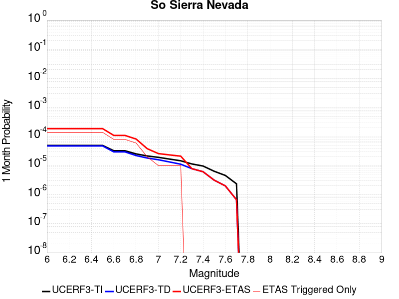 |  |  |

| Magnitude | 1 wk TI Prob | 1 wk TD Prob | 1 wk ETAS Prob | 1 wk ETAS/TD Gain | 1 wk ETAS Triggered Only | 1 mo TI Prob | 1 mo TD Prob | 1 mo ETAS Prob | 1 mo ETAS/TD Gain | 1 mo ETAS Triggered Only | 1 yr TI Prob | 1 yr TD Prob | 1 yr ETAS Prob | 1 yr ETAS/TD Gain | 1 yr ETAS Triggered Only | 10 yr TI Prob | 10 yr TD Prob | 10 yr ETAS Prob | 10 yr ETAS/TD Gain | 10 yr ETAS Triggered Only |
|-----|-----|-----|-----|-----|-----|-----|-----|-----|-----|-----|-----|-----|-----|-----|-----|-----|-----|-----|-----|-----|
| 6.0 | 1.15488665E-5 | 1.1080196E-5 | 1.1080196E-5 | 1.0 | 0.0 | 4.9494203E-5 | 4.7485762E-5 | 2.8274104E-4 | 5.9542274 | 2.3526645E-4 | 6.024253E-4 | 5.779986E-4 | 0.0014009551 | 2.4238038 | 8.234325E-4 | 0.006007948 | 0.0057662213 | 0.0075205453 | 1.3042415 | 0.0017644983 |
| 6.1 | 1.15488665E-5 | 1.1080196E-5 | 1.1080196E-5 | 1.0 | 0.0 | 4.9494203E-5 | 4.7485762E-5 | 2.8274104E-4 | 5.9542274 | 2.3526645E-4 | 6.024253E-4 | 5.779986E-4 | 0.0014009551 | 2.4238038 | 8.234325E-4 | 0.006007948 | 0.0057662213 | 0.0075205453 | 1.3042415 | 0.0017644983 |
| 6.2 | 1.15488665E-5 | 1.1080196E-5 | 1.1080196E-5 | 1.0 | 0.0 | 4.9494203E-5 | 4.7485762E-5 | 2.8274104E-4 | 5.9542274 | 2.3526645E-4 | 6.024253E-4 | 5.779986E-4 | 0.0014009551 | 2.4238038 | 8.234325E-4 | 0.006007948 | 0.0057662213 | 0.0075205453 | 1.3042415 | 0.0017644983 |
| 6.3 | 1.15488665E-5 | 1.1080196E-5 | 1.1080196E-5 | 1.0 | 0.0 | 4.9494203E-5 | 4.7485762E-5 | 2.8274104E-4 | 5.9542274 | 2.3526645E-4 | 6.024253E-4 | 5.779986E-4 | 0.0014009551 | 2.4238038 | 8.234325E-4 | 0.006007948 | 0.0057662213 | 0.0075205453 | 1.3042415 | 0.0017644983 |
| 6.4 | 1.15488665E-5 | 1.1080196E-5 | 1.1080196E-5 | 1.0 | 0.0 | 4.9494203E-5 | 4.7485762E-5 | 2.8274104E-4 | 5.9542274 | 2.3526645E-4 | 6.024253E-4 | 5.779986E-4 | 0.0014009551 | 2.4238038 | 8.234325E-4 | 0.006007948 | 0.0057662213 | 0.0075205453 | 1.3042415 | 0.0017644983 |
| 6.5 | 1.15488665E-5 | 1.1080196E-5 | 1.1080196E-5 | 1.0 | 0.0 | 4.9494203E-5 | 4.7485762E-5 | 2.8274104E-4 | 5.9542274 | 2.3526645E-4 | 6.024253E-4 | 5.779986E-4 | 0.0014009551 | 2.4238038 | 8.234325E-4 | 0.006007948 | 0.0057662213 | 0.0075205453 | 1.3042415 | 0.0017644983 |
| 6.6 | 7.587044E-6 | 6.9360117E-6 | 6.9360117E-6 | 1.0 | 0.0 | 3.2515498E-5 | 2.9725441E-5 | 2.6498488E-4 | 8.914413 | 2.3526645E-4 | 3.9580427E-4 | 3.6185008E-4 | 8.322127E-4 | 2.2998827 | 4.705329E-4 | 0.003951 | 0.0036129006 | 0.0045505664 | 1.2595327 | 9.410658E-4 |
| 6.7 | 7.587044E-6 | 6.9360117E-6 | 6.9360117E-6 | 1.0 | 0.0 | 3.2515498E-5 | 2.9725441E-5 | 2.6498488E-4 | 8.914413 | 2.3526645E-4 | 3.9580427E-4 | 3.6185008E-4 | 8.322127E-4 | 2.2998827 | 4.705329E-4 | 0.003951 | 0.0036129006 | 0.0045505664 | 1.2595327 | 9.410658E-4 |
| 6.8 | 5.9026956E-6 | 5.179699E-6 | 5.179699E-6 | 1.0 | 0.0 | 2.5297022E-5 | 2.219853E-5 | 2.5745976E-4 | 11.598054 | 2.3526645E-4 | 3.0794772E-4 | 2.7023474E-4 | 7.4064045E-4 | 2.74073 | 4.705329E-4 | 0.0030752132 | 0.0026991775 | 0.0034030718 | 1.260781 | 7.057993E-4 |
| 6.9 | 5.0118915E-6 | 4.252697E-6 | 4.252697E-6 | 1.0 | 0.0 | 2.1479358E-5 | 1.822572E-5 | 2.5348787E-4 | 13.908249 | 2.3526645E-4 | 2.614798E-4 | 2.2187628E-4 | 5.746976E-4 | 2.5901716 | 3.5289966E-4 | 0.0026117235 | 0.0022166201 | 0.0028034826 | 1.2647555 | 5.881661E-4 |
| 7.0 | 4.4924795E-6 | 3.7141706E-6 | 3.7141706E-6 | 1.0 | 0.0 | 1.925334E-5 | 1.5917782E-5 | 1.3354913E-4 | 8.389934 | 1.1763322E-4 | 2.3438422E-4 | 1.9378238E-4 | 4.2900324E-4 | 2.2138402 | 2.3526645E-4 | 0.0023413717 | 0.0019361969 | 0.0024058188 | 1.2425486 | 4.705329E-4 |
| 7.1 | 3.9118436E-6 | 3.1122083E-6 | 3.1122083E-6 | 1.0 | 0.0 | 1.6764936E-5 | 1.3337971E-5 | 1.3096962E-4 | 9.819306 | 1.1763322E-4 | 2.0409399E-4 | 1.6237826E-4 | 3.976065E-4 | 2.4486437 | 2.3526645E-4 | 0.0020390663 | 0.0016226523 | 0.001857537 | 1.1447536 | 2.3526645E-4 |
| 7.2 | 3.4200818E-6 | 2.6056673E-6 | 2.6056673E-6 | 1.0 | 0.0 | 1.4657411E-5 | 1.1167101E-5 | 1.28799E-4 | 11.533792 | 1.1763322E-4 | 1.7843937E-4 | 1.3595147E-4 | 3.7118592E-4 | 2.7302825 | 2.3526645E-4 | 0.0017829615 | 0.0013587327 | 0.0015936795 | 1.172916 | 2.3526645E-4 |
| 7.3 | 2.6593618E-6 | 1.8286062E-6 | 1.8286062E-6 | 1.0 | 0.0 | 1.13972155E-5 | 7.836862E-6 | 7.836862E-6 | 1.0 | 0.0 | 1.3875226E-4 | 9.540991E-5 | 2.130319E-4 | 2.232807 | 1.1763322E-4 | 0.0013866565 | 9.537184E-4 | 0.0010712395 | 1.123224 | 1.1763322E-4 |
| 7.4 | 2.2577992E-6 | 1.4366076E-6 | 1.4366076E-6 | 1.0 | 0.0 | 9.676246E-6 | 6.1568767E-6 | 6.1568767E-6 | 1.0 | 0.0 | 1.1780193E-4 | 7.495765E-5 | 1.9258205E-4 | 2.5692115 | 1.1763322E-4 | 0.001177395 | 7.493487E-4 | 8.668938E-4 | 1.156863 | 1.1763322E-4 |
| 7.5 | 1.489319E-6 | 7.355268E-7 | 7.355268E-7 | 1.0 | 0.0 | 6.3827797E-6 | 3.1522538E-6 | 3.1522538E-6 | 1.0 | 0.0 | 7.770758E-5 | 3.8378017E-5 | 1.5600672E-4 | 4.065002 | 1.1763322E-4 | 7.7680405E-4 | 3.8371433E-4 | 5.013024E-4 | 1.3064469 | 1.1763322E-4 |
| 7.6 | 1.0680322E-6 | 4.6606402E-7 | 4.6606402E-7 | 1.0 | 0.0 | 4.577273E-6 | 1.9974157E-6 | 1.9974157E-6 | 1.0 | 0.0 | 5.5726876E-5 | 2.4318268E-5 | 2.4318268E-5 | 1.0 | 0.0 | 5.5712904E-4 | 2.4315632E-4 | 2.4315632E-4 | 1.0 | 0.0 |
| 7.7 | 5.509146E-7 | 1.5585482E-7 | 1.5585482E-7 | 1.0 | 0.0 | 2.3610605E-6 | 6.679491E-7 | 6.679491E-7 | 1.0 | 0.0 | 2.8745531E-5 | 8.132251E-6 | 8.132251E-6 | 1.0 | 0.0 | 2.8741814E-4 | 8.1319646E-5 | 8.1319646E-5 | 1.0 | 0.0 |

## Death Valley (So)
*[(top)](#table-of-contents)*

| 1 Week | 1 Month | 1 Year | 10 Year |
|-----|-----|-----|-----|
|  | 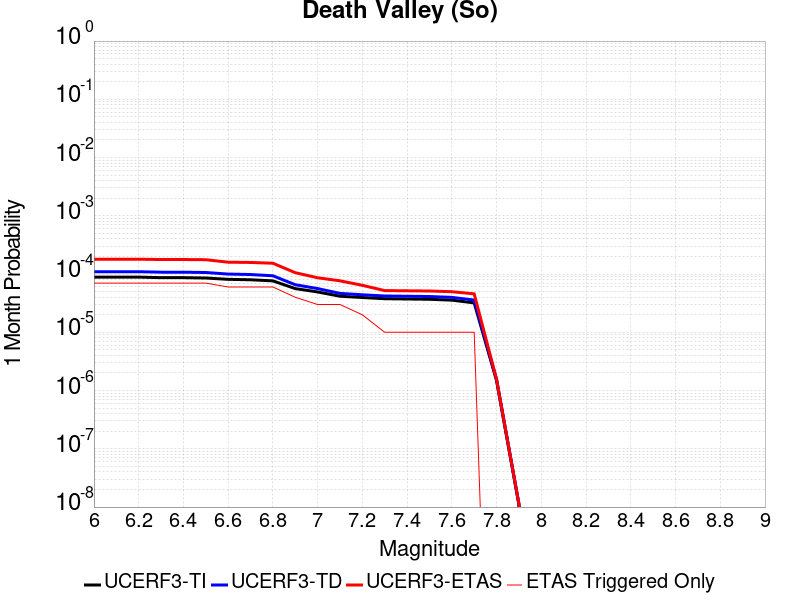 |  |  |

| Magnitude | 1 wk TI Prob | 1 wk TD Prob | 1 wk ETAS Prob | 1 wk ETAS/TD Gain | 1 wk ETAS Triggered Only | 1 mo TI Prob | 1 mo TD Prob | 1 mo ETAS Prob | 1 mo ETAS/TD Gain | 1 mo ETAS Triggered Only | 1 yr TI Prob | 1 yr TD Prob | 1 yr ETAS Prob | 1 yr ETAS/TD Gain | 1 yr ETAS Triggered Only | 10 yr TI Prob | 10 yr TD Prob | 10 yr ETAS Prob | 10 yr ETAS/TD Gain | 10 yr ETAS Triggered Only |
|-----|-----|-----|-----|-----|-----|-----|-----|-----|-----|-----|-----|-----|-----|-----|-----|-----|-----|-----|-----|-----|
| 6.0 | 2.0684236E-5 | 2.56223E-5 | 2.56223E-5 | 1.0 | 0.0 | 8.864371E-5 | 1.09805325E-4 | 1.09805325E-4 | 1.0 | 0.0 | 0.0010787029 | 0.0013360769 | 0.0021584092 | 1.6154828 | 8.234325E-4 | 0.010734817 | 0.013283722 | 0.014792641 | 1.1135916 | 0.0015292319 |
| 6.1 | 2.0684236E-5 | 2.56223E-5 | 2.56223E-5 | 1.0 | 0.0 | 8.864371E-5 | 1.09805325E-4 | 1.09805325E-4 | 1.0 | 0.0 | 0.0010787029 | 0.0013360769 | 0.0021584092 | 1.6154828 | 8.234325E-4 | 0.010734817 | 0.013283722 | 0.014792641 | 1.1135916 | 0.0015292319 |
| 6.2 | 2.0684236E-5 | 2.56223E-5 | 2.56223E-5 | 1.0 | 0.0 | 8.864371E-5 | 1.09805325E-4 | 1.09805325E-4 | 1.0 | 0.0 | 0.0010787029 | 0.0013360769 | 0.0021584092 | 1.6154828 | 8.234325E-4 | 0.010734817 | 0.013283722 | 0.014792641 | 1.1135916 | 0.0015292319 |
| 6.3 | 2.0240292E-5 | 2.5122325E-5 | 2.5122325E-5 | 1.0 | 0.0 | 8.6741224E-5 | 1.0766276E-4 | 1.0766276E-4 | 1.0 | 0.0 | 0.0010555626 | 0.0013100227 | 0.0021323764 | 1.6277401 | 8.234325E-4 | 0.010505628 | 0.013026252 | 0.014419463 | 1.1069541 | 0.0014115986 |
| 6.4 | 2.0240292E-5 | 2.5122325E-5 | 2.5122325E-5 | 1.0 | 0.0 | 8.6741224E-5 | 1.0766276E-4 | 1.0766276E-4 | 1.0 | 0.0 | 0.0010555626 | 0.0013100227 | 0.0021323764 | 1.6277401 | 8.234325E-4 | 0.010505628 | 0.013026252 | 0.014419463 | 1.1069541 | 0.0014115986 |
| 6.5 | 1.9962767E-5 | 2.4811543E-5 | 2.4811543E-5 | 1.0 | 0.0 | 8.55519E-5 | 1.0633095E-4 | 1.0633095E-4 | 1.0 | 0.0 | 0.0010410968 | 0.0012938272 | 0.0021161942 | 1.6356082 | 8.234325E-4 | 0.010362327 | 0.012866181 | 0.014259618 | 1.1083022 | 0.0014115986 |
| 6.6 | 1.8937297E-5 | 2.3315191E-5 | 2.3315191E-5 | 1.0 | 0.0 | 8.115732E-5 | 9.991851E-5 | 9.991851E-5 | 1.0 | 0.0 | 9.876423E-4 | 0.0012158435 | 0.002038275 | 1.6764287 | 8.234325E-4 | 0.009832645 | 0.012094965 | 0.01337328 | 1.1056899 | 0.0012939654 |
| 6.7 | 1.8621096E-5 | 2.2915787E-5 | 2.2915787E-5 | 1.0 | 0.0 | 7.980225E-5 | 9.82069E-5 | 9.82069E-5 | 1.0 | 0.0 | 9.711593E-4 | 0.0011950277 | 0.0018999836 | 1.5899075 | 7.057993E-4 | 0.009669261 | 0.011889057 | 0.013051405 | 1.097766 | 0.0011763322 |
| 6.8 | 1.7830353E-5 | 2.1809607E-5 | 2.1809607E-5 | 1.0 | 0.0 | 7.641356E-5 | 9.346647E-5 | 9.346647E-5 | 1.0 | 0.0 | 9.29938E-4 | 0.0011373743 | 0.0018423708 | 1.6198457 | 7.057993E-4 | 0.009260561 | 0.011318374 | 0.012481392 | 1.1027548 | 0.0011763322 |
| 6.9 | 1.3135183E-5 | 1.530614E-5 | 1.530614E-5 | 1.0 | 0.0 | 5.6292425E-5 | 6.559613E-5 | 6.559613E-5 | 1.0 | 0.0 | 6.8514474E-4 | 7.983467E-4 | 0.0011509646 | 1.4416852 | 3.5289966E-4 | 0.006830362 | 0.007955794 | 0.008772676 | 1.1026776 | 8.234325E-4 |
| 7.0 | 1.1507512E-5 | 1.3155912E-5 | 1.3155912E-5 | 1.0 | 0.0 | 4.9316975E-5 | 5.638129E-5 | 5.638129E-5 | 1.0 | 0.0 | 6.002687E-4 | 6.862318E-4 | 9.213368E-4 | 1.3426028 | 2.3526645E-4 | 0.0059864987 | 0.006841829 | 0.007542799 | 1.1024537 | 7.057993E-4 |
| 7.1 | 9.715903E-6 | 1.0866509E-5 | 1.0866509E-5 | 1.0 | 0.0 | 4.1638916E-5 | 4.6569945E-5 | 4.6569945E-5 | 1.0 | 0.0 | 5.068359E-4 | 5.668458E-4 | 6.844124E-4 | 1.2074047 | 1.1763322E-4 | 0.0050568148 | 0.0056544533 | 0.0061223255 | 1.082744 | 4.705329E-4 |
| 7.2 | 9.233269E-6 | 1.0287449E-5 | 1.0287449E-5 | 1.0 | 0.0 | 3.9570554E-5 | 4.4088345E-5 | 4.4088345E-5 | 1.0 | 0.0 | 4.81665E-4 | 5.366476E-4 | 6.542177E-4 | 1.2190825 | 1.1763322E-4 | 0.0048062233 | 0.0053539486 | 0.0058219624 | 1.0874146 | 4.705329E-4 |
| 7.3 | 8.8041315E-6 | 9.809208E-6 | 9.809208E-6 | 1.0 | 0.0 | 3.7731446E-5 | 4.2038806E-5 | 4.2038806E-5 | 1.0 | 0.0 | 4.592835E-4 | 5.1170646E-4 | 6.2927953E-4 | 1.2297665 | 1.1763322E-4 | 0.0045833546 | 0.005105709 | 0.0055738394 | 1.0916877 | 4.705329E-4 |
| 7.4 | 8.708749E-6 | 9.708213E-6 | 9.708213E-6 | 1.0 | 0.0 | 3.7322676E-5 | 4.160599E-5 | 4.160599E-5 | 1.0 | 0.0 | 4.5430884E-4 | 5.0643936E-4 | 6.24013E-4 | 1.2321573 | 1.1763322E-4 | 0.004533812 | 0.0050532785 | 0.005521434 | 1.0926439 | 4.705329E-4 |
| 7.5 | 8.612678E-6 | 9.605849E-6 | 9.605849E-6 | 1.0 | 0.0 | 3.6910955E-5 | 4.11673E-5 | 4.11673E-5 | 1.0 | 0.0 | 4.492982E-4 | 5.011008E-4 | 6.186751E-4 | 1.234632 | 1.1763322E-4 | 0.004483909 | 0.0050001345 | 0.0054683145 | 1.0936335 | 4.705329E-4 |
| 7.6 | 8.319024E-6 | 9.2849195E-6 | 9.2849195E-6 | 1.0 | 0.0 | 3.5652476E-5 | 3.9791932E-5 | 3.9791932E-5 | 1.0 | 0.0 | 4.3398244E-4 | 4.8436326E-4 | 6.019395E-4 | 1.242744 | 1.1763322E-4 | 0.0043313587 | 0.0048334994 | 0.005301758 | 1.0968777 | 4.705329E-4 |
| 7.7 | 7.4718328E-6 | 8.346079E-6 | 8.346079E-6 | 1.0 | 0.0 | 3.2021748E-5 | 3.576844E-5 | 3.576844E-5 | 1.0 | 0.0 | 3.8979502E-4 | 4.353978E-4 | 5.529798E-4 | 1.2700565 | 1.1763322E-4 | 0.00389112 | 0.004345853 | 0.004697219 | 1.0808508 | 3.5289966E-4 |
| 7.8 | 3.4586725E-7 | 3.648448E-7 | 3.648448E-7 | 1.0 | 0.0 | 1.4822873E-6 | 1.5636197E-6 | 1.5636197E-6 | 1.0 | 0.0 | 1.80467E-5 | 1.9036908E-5 | 1.9036908E-5 | 1.0 | 0.0 | 1.8045233E-4 | 1.9035321E-4 | 1.9035321E-4 | 1.0 | 0.0 |
| 7.9 | 2.5591178E-9 | 2.6697788E-9 | 2.6697788E-9 | 1.0 | 0.0 | 1.0967647E-8 | 1.144191E-8 | 1.144191E-8 | 1.0 | 0.0 | 1.335311E-7 | 1.3930524E-7 | 1.3930524E-7 | 1.0 | 0.0 | 1.3353102E-6 | 1.3930525E-6 | 1.3930525E-6 | 1.0 | 0.0 |

## Coyote Canyon
*[(top)](#table-of-contents)*

| 1 Week | 1 Month | 1 Year | 10 Year |
|-----|-----|-----|-----|
|  |  |  |  |

| Magnitude | 1 wk TI Prob | 1 wk TD Prob | 1 wk ETAS Prob | 1 wk ETAS/TD Gain | 1 wk ETAS Triggered Only | 1 mo TI Prob | 1 mo TD Prob | 1 mo ETAS Prob | 1 mo ETAS/TD Gain | 1 mo ETAS Triggered Only | 1 yr TI Prob | 1 yr TD Prob | 1 yr ETAS Prob | 1 yr ETAS/TD Gain | 1 yr ETAS Triggered Only | 10 yr TI Prob | 10 yr TD Prob | 10 yr ETAS Prob | 10 yr ETAS/TD Gain | 10 yr ETAS Triggered Only |
|-----|-----|-----|-----|-----|-----|-----|-----|-----|-----|-----|-----|-----|-----|-----|-----|-----|-----|-----|-----|-----|
| 6.0 | 3.5090034E-5 | 4.0369963E-5 | 4.0369963E-5 | 1.0 | 0.0 | 1.503772E-4 | 1.7300405E-4 | 1.7300405E-4 | 1.0 | 0.0 | 0.0018293047 | 0.0021045462 | 0.0024567032 | 1.1673316 | 3.5289966E-4 | 0.018143194 | 0.02087209 | 0.02202387 | 1.0551828 | 0.0011763322 |
| 6.1 | 3.5090034E-5 | 4.0369963E-5 | 4.0369963E-5 | 1.0 | 0.0 | 1.503772E-4 | 1.7300405E-4 | 1.7300405E-4 | 1.0 | 0.0 | 0.0018293047 | 0.0021045462 | 0.0024567032 | 1.1673316 | 3.5289966E-4 | 0.018143194 | 0.02087209 | 0.02202387 | 1.0551828 | 0.0011763322 |
| 6.2 | 1.841879E-5 | 2.1062599E-5 | 2.1062599E-5 | 1.0 | 0.0 | 7.8935285E-5 | 9.0265734E-5 | 9.0265734E-5 | 1.0 | 0.0 | 9.606133E-4 | 0.0010985332 | 0.0013335411 | 1.2139289 | 2.3526645E-4 | 0.0095647145 | 0.010941117 | 0.011522848 | 1.0531693 | 5.881661E-4 |
| 6.3 | 1.841879E-5 | 2.1062599E-5 | 2.1062599E-5 | 1.0 | 0.0 | 7.8935285E-5 | 9.0265734E-5 | 9.0265734E-5 | 1.0 | 0.0 | 9.606133E-4 | 0.0010985332 | 0.0013335411 | 1.2139289 | 2.3526645E-4 | 0.0095647145 | 0.010941117 | 0.011522848 | 1.0531693 | 5.881661E-4 |
| 6.4 | 1.712201E-5 | 1.9567804E-5 | 1.9567804E-5 | 1.0 | 0.0 | 7.337798E-5 | 8.385989E-5 | 8.385989E-5 | 1.0 | 0.0 | 8.930107E-4 | 0.0010206165 | 0.0012556429 | 1.2302787 | 2.3526645E-4 | 0.008894307 | 0.010169213 | 0.010751397 | 1.0572498 | 5.881661E-4 |
| 6.5 | 1.4744935E-5 | 1.683919E-5 | 1.683919E-5 | 1.0 | 0.0 | 6.3191044E-5 | 7.216649E-5 | 7.216649E-5 | 1.0 | 0.0 | 7.6907943E-4 | 8.7836635E-4 | 0.0011134262 | 1.2676102 | 2.3526645E-4 | 0.007664232 | 0.008758144 | 0.00934116 | 1.0665683 | 5.881661E-4 |
| 6.6 | 1.2017839E-5 | 1.3725899E-5 | 1.3725899E-5 | 1.0 | 0.0 | 5.150401E-5 | 5.8824455E-5 | 5.8824455E-5 | 1.0 | 0.0 | 6.268809E-4 | 7.16041E-4 | 9.5113897E-4 | 1.3283303 | 2.3526645E-4 | 0.0062511545 | 0.007146034 | 0.007729997 | 1.0817184 | 5.881661E-4 |
| 6.7 | 1.00956095E-5 | 1.1535042E-5 | 1.1535042E-5 | 1.0 | 0.0 | 4.326618E-5 | 4.943545E-5 | 4.943545E-5 | 1.0 | 0.0 | 5.266384E-4 | 6.0179736E-4 | 7.193598E-4 | 1.1953522 | 1.1763322E-4 | 0.005253921 | 0.0060102064 | 0.0064779115 | 1.0778184 | 4.705329E-4 |

## Nelson Lake
*[(top)](#table-of-contents)*

| 1 Week | 1 Month | 1 Year | 10 Year |
|-----|-----|-----|-----|
|  |  |  |  |

| Magnitude | 1 wk TI Prob | 1 wk TD Prob | 1 wk ETAS Prob | 1 wk ETAS/TD Gain | 1 wk ETAS Triggered Only | 1 mo TI Prob | 1 mo TD Prob | 1 mo ETAS Prob | 1 mo ETAS/TD Gain | 1 mo ETAS Triggered Only | 1 yr TI Prob | 1 yr TD Prob | 1 yr ETAS Prob | 1 yr ETAS/TD Gain | 1 yr ETAS Triggered Only | 10 yr TI Prob | 10 yr TD Prob | 10 yr ETAS Prob | 10 yr ETAS/TD Gain | 10 yr ETAS Triggered Only |
|-----|-----|-----|-----|-----|-----|-----|-----|-----|-----|-----|-----|-----|-----|-----|-----|-----|-----|-----|-----|-----|
| 6.0 | 9.913453E-6 | 1.0192522E-5 | 1.0192522E-5 | 1.0 | 0.0 | 4.2485535E-5 | 4.3681564E-5 | 4.3681564E-5 | 1.0 | 0.0 | 5.1713863E-4 | 5.317036E-4 | 0.001119557 | 2.1056035 | 5.881661E-4 | 0.0051593683 | 0.0053053424 | 0.0064754337 | 1.2205496 | 0.0011763322 |
| 6.1 | 9.913453E-6 | 1.0192522E-5 | 1.0192522E-5 | 1.0 | 0.0 | 4.2485535E-5 | 4.3681564E-5 | 4.3681564E-5 | 1.0 | 0.0 | 5.1713863E-4 | 5.317036E-4 | 0.001119557 | 2.1056035 | 5.881661E-4 | 0.0051593683 | 0.0053053424 | 0.0064754337 | 1.2205496 | 0.0011763322 |
| 6.2 | 4.5596407E-6 | 4.696444E-6 | 4.696444E-6 | 1.0 | 0.0 | 1.954117E-5 | 2.0127469E-5 | 2.0127469E-5 | 1.0 | 0.0 | 2.3788778E-4 | 2.4502564E-4 | 3.6263006E-4 | 1.4799677 | 1.1763322E-4 | 0.0023763329 | 0.002447681 | 0.0026823715 | 1.0958828 | 2.3526645E-4 |
| 6.3 | 4.5596407E-6 | 4.696444E-6 | 4.696444E-6 | 1.0 | 0.0 | 1.954117E-5 | 2.0127469E-5 | 2.0127469E-5 | 1.0 | 0.0 | 2.3788778E-4 | 2.4502564E-4 | 3.6263006E-4 | 1.4799677 | 1.1763322E-4 | 0.0023763329 | 0.002447681 | 0.0026823715 | 1.0958828 | 2.3526645E-4 |
| 6.4 | 3.4025713E-6 | 3.5100002E-6 | 3.5100002E-6 | 1.0 | 0.0 | 1.4582367E-5 | 1.5042776E-5 | 1.5042776E-5 | 1.0 | 0.0 | 1.7752586E-4 | 1.8313125E-4 | 3.0074292E-4 | 1.6422261 | 1.1763322E-4 | 0.001773841 | 0.0018298863 | 0.0020647224 | 1.1283336 | 2.3526645E-4 |
| 6.5 | 2.8352947E-6 | 2.927945E-6 | 2.927945E-6 | 1.0 | 0.0 | 1.2151207E-5 | 1.254828E-5 | 1.254828E-5 | 1.0 | 0.0 | 1.479309E-4 | 1.5276535E-4 | 2.7038058E-4 | 1.769908 | 1.1763322E-4 | 0.0014783246 | 0.0015266772 | 0.0017615844 | 1.1538683 | 2.3526645E-4 |
| 6.6 | 2.251518E-6 | 2.3291423E-6 | 2.3291423E-6 | 1.0 | 0.0 | 9.649328E-6 | 9.982004E-6 | 9.982004E-6 | 1.0 | 0.0 | 1.1747423E-4 | 1.2152474E-4 | 2.3914367E-4 | 1.9678599 | 1.1763322E-4 | 0.0011741214 | 0.0012146446 | 0.0013321349 | 1.0967282 | 1.1763322E-4 |
| 6.7 | 1.8911853E-6 | 1.959205E-6 | 1.959205E-6 | 1.0 | 0.0 | 8.105055E-6 | 8.39657E-6 | 8.39657E-6 | 1.0 | 0.0 | 9.867457E-5 | 1.02224025E-4 | 1.02224025E-4 | 1.0 | 0.0 | 9.863076E-4 | 0.0010218276 | 0.0010218276 | 1.0 | 0.0 |
| 6.8 | 1.4874814E-6 | 1.5438849E-6 | 1.5438849E-6 | 1.0 | 0.0 | 6.374905E-6 | 6.616636E-6 | 6.616636E-6 | 1.0 | 0.0 | 7.76117E-5 | 8.055508E-5 | 8.055508E-5 | 1.0 | 0.0 | 7.75846E-4 | 8.053099E-4 | 8.053099E-4 | 1.0 | 0.0 |
| 6.9 | 6.835972E-7 | 7.140223E-7 | 7.140223E-7 | 1.0 | 0.0 | 2.9296991E-6 | 3.0600938E-6 | 3.0600938E-6 | 1.0 | 0.0 | 3.56685E-5 | 3.7256323E-5 | 3.7256323E-5 | 1.0 | 0.0 | 3.5662777E-4 | 3.7253203E-4 | 3.7253203E-4 | 1.0 | 0.0 |

## San Andreas (San Bernardino N)
*[(top)](#table-of-contents)*

| 1 Week | 1 Month | 1 Year | 10 Year |
|-----|-----|-----|-----|
|  |  |  |  |

| Magnitude | 1 wk TI Prob | 1 wk TD Prob | 1 wk ETAS Prob | 1 wk ETAS/TD Gain | 1 wk ETAS Triggered Only | 1 mo TI Prob | 1 mo TD Prob | 1 mo ETAS Prob | 1 mo ETAS/TD Gain | 1 mo ETAS Triggered Only | 1 yr TI Prob | 1 yr TD Prob | 1 yr ETAS Prob | 1 yr ETAS/TD Gain | 1 yr ETAS Triggered Only | 10 yr TI Prob | 10 yr TD Prob | 10 yr ETAS Prob | 10 yr ETAS/TD Gain | 10 yr ETAS Triggered Only |
|-----|-----|-----|-----|-----|-----|-----|-----|-----|-----|-----|-----|-----|-----|-----|-----|-----|-----|-----|-----|-----|
| 6.0 | 1.4273766E-4 | 3.1657895E-4 | 3.1657895E-4 | 1.0 | 0.0 | 6.115894E-4 | 0.0013560674 | 0.0013560674 | 1.0 | 0.0 | 0.0074207084 | 0.016386637 | 0.016965166 | 1.0353049 | 5.881661E-4 | 0.07177748 | 0.15047675 | 0.15127622 | 1.0053128 | 9.410658E-4 |
| 6.1 | 1.4273766E-4 | 3.1657895E-4 | 3.1657895E-4 | 1.0 | 0.0 | 6.115894E-4 | 0.0013560674 | 0.0013560674 | 1.0 | 0.0 | 0.0074207084 | 0.016386637 | 0.016965166 | 1.0353049 | 5.881661E-4 | 0.07177748 | 0.15047675 | 0.15127622 | 1.0053128 | 9.410658E-4 |
| 6.2 | 1.4273766E-4 | 3.1657895E-4 | 3.1657895E-4 | 1.0 | 0.0 | 6.115894E-4 | 0.0013560674 | 0.0013560674 | 1.0 | 0.0 | 0.0074207084 | 0.016386637 | 0.016965166 | 1.0353049 | 5.881661E-4 | 0.07177748 | 0.15047675 | 0.15127622 | 1.0053128 | 9.410658E-4 |
| 6.3 | 1.3730655E-4 | 3.0562485E-4 | 3.0562485E-4 | 1.0 | 0.0 | 5.883239E-4 | 0.001309169 | 0.001309169 | 1.0 | 0.0 | 0.0071393442 | 0.015824046 | 0.016402906 | 1.0365809 | 5.881661E-4 | 0.06914291 | 0.14577667 | 0.14658056 | 1.0055145 | 9.410658E-4 |
| 6.4 | 1.3730655E-4 | 3.0562485E-4 | 3.0562485E-4 | 1.0 | 0.0 | 5.883239E-4 | 0.001309169 | 0.001309169 | 1.0 | 0.0 | 0.0071393442 | 0.015824046 | 0.016402906 | 1.0365809 | 5.881661E-4 | 0.06914291 | 0.14577667 | 0.14658056 | 1.0055145 | 9.410658E-4 |
| 6.5 | 1.2942807E-4 | 2.8976568E-4 | 2.8976568E-4 | 1.0 | 0.0 | 5.545738E-4 | 0.0012412671 | 0.0012412671 | 1.0 | 0.0 | 0.0067310524 | 0.015008957 | 0.015588296 | 1.0385995 | 5.881661E-4 | 0.06530788 | 0.13891955 | 0.13972989 | 1.0058331 | 9.410658E-4 |
| 6.6 | 1.1125901E-4 | 2.5414478E-4 | 2.5414478E-4 | 1.0 | 0.0 | 4.767372E-4 | 0.0010887395 | 0.0010887395 | 1.0 | 0.0 | 0.005788839 | 0.0131754745 | 0.0137558915 | 1.0440528 | 5.881661E-4 | 0.056403454 | 0.123209246 | 0.12403437 | 1.0066969 | 9.410658E-4 |
| 6.7 | 1.02209575E-4 | 2.3549075E-4 | 2.3549075E-4 | 1.0 | 0.0 | 4.3796748E-4 | 0.0010088572 | 0.0010088572 | 1.0 | 0.0 | 0.0053192247 | 0.012214084 | 0.012795066 | 1.0475665 | 5.881661E-4 | 0.051936906 | 0.11500142 | 0.11583426 | 1.007242 | 9.410658E-4 |
| 6.8 | 9.610582E-5 | 2.2074205E-4 | 2.2074205E-4 | 1.0 | 0.0 | 4.1181705E-4 | 9.4569504E-4 | 9.4569504E-4 | 1.0 | 0.0 | 0.0050023515 | 0.011453319 | 0.012034749 | 1.0507652 | 5.881661E-4 | 0.048912346 | 0.10840221 | 0.109241255 | 1.0077401 | 9.410658E-4 |
| 6.9 | 9.3877505E-5 | 2.1529532E-4 | 2.1529532E-4 | 1.0 | 0.0 | 4.0227012E-4 | 9.223686E-4 | 9.223686E-4 | 1.0 | 0.0 | 0.0048866454 | 0.011172262 | 0.011753857 | 1.052057 | 5.881661E-4 | 0.04780577 | 0.105992176 | 0.106833495 | 1.0079376 | 9.410658E-4 |
| 7.0 | 9.1019785E-5 | 2.0856115E-4 | 2.0856115E-4 | 1.0 | 0.0 | 3.900265E-4 | 8.9352793E-4 | 8.9352793E-4 | 1.0 | 0.0 | 0.0047382377 | 0.0108246645 | 0.0114064645 | 1.0537475 | 5.881661E-4 | 0.046384744 | 0.102961764 | 0.10380594 | 1.0081989 | 9.410658E-4 |
| 7.1 | 8.771155E-5 | 2.0030304E-4 | 2.0030304E-4 | 1.0 | 0.0 | 3.758525E-4 | 8.5815974E-4 | 8.5815974E-4 | 1.0 | 0.0 | 0.0045664064 | 0.01039824 | 0.01098029 | 1.0559758 | 5.881661E-4 | 0.044737056 | 0.09927276 | 0.1001204 | 1.0085385 | 9.410658E-4 |
| 7.2 | 8.0830236E-5 | 1.8435127E-4 | 1.8435127E-4 | 1.0 | 0.0 | 3.4636928E-4 | 7.898378E-4 | 7.898378E-4 | 1.0 | 0.0 | 0.0042088944 | 0.009573982 | 0.010156517 | 1.0608456 | 5.881661E-4 | 0.041300658 | 0.09200184 | 0.092856325 | 1.0092877 | 9.410658E-4 |
| 7.3 | 7.7668235E-5 | 1.7377833E-4 | 1.7377833E-4 | 1.0 | 0.0 | 3.328214E-4 | 7.445518E-4 | 7.445518E-4 | 1.0 | 0.0 | 0.0040445733 | 0.009027321 | 0.009610177 | 1.0645659 | 5.881661E-4 | 0.03971748 | 0.08726679 | 0.08812573 | 1.0098428 | 9.410658E-4 |
| 7.4 | 7.520177E-5 | 1.6597293E-4 | 1.6597293E-4 | 1.0 | 0.0 | 3.2225347E-4 | 7.1111874E-4 | 7.1111874E-4 | 1.0 | 0.0 | 0.0039163795 | 0.008623568 | 0.009206662 | 1.0676163 | 5.881661E-4 | 0.038480744 | 0.08372108 | 0.084583364 | 1.0102994 | 9.410658E-4 |
| 7.5 | 7.274697E-5 | 1.5884354E-4 | 1.5884354E-4 | 1.0 | 0.0 | 3.1173544E-4 | 6.805805E-4 | 6.805805E-4 | 1.0 | 0.0 | 0.003788775 | 0.0082546435 | 0.008837955 | 1.0706646 | 5.881661E-4 | 0.03724827 | 0.08043605 | 0.08130142 | 1.0107585 | 9.410658E-4 |
| 7.6 | 7.1185845E-5 | 1.5453836E-4 | 1.5453836E-4 | 1.0 | 0.0 | 3.0504653E-4 | 6.6213915E-4 | 6.6213915E-4 | 1.0 | 0.0 | 0.0037076178 | 0.0080317985 | 0.00861524 | 1.0726415 | 5.881661E-4 | 0.036463667 | 0.07842452 | 0.07929178 | 1.0110586 | 9.410658E-4 |
| 7.7 | 6.709961E-5 | 1.4361642E-4 | 1.4361642E-4 | 1.0 | 0.0 | 2.8753807E-4 | 6.1535375E-4 | 6.1535375E-4 | 1.0 | 0.0 | 0.003495157 | 0.007466235 | 0.008050011 | 1.0781887 | 5.881661E-4 | 0.034406938 | 0.07324966 | 0.074121796 | 1.0119063 | 9.410658E-4 |
| 7.8 | 6.300812E-5 | 1.3243512E-4 | 1.3243512E-4 | 1.0 | 0.0 | 2.7000686E-4 | 5.6745566E-4 | 5.6745566E-4 | 1.0 | 0.0 | 0.0032823787 | 0.0068869162 | 0.0074710315 | 1.0848153 | 5.881661E-4 | 0.032343175 | 0.06789981 | 0.06877698 | 1.0129186 | 9.410658E-4 |
| 7.9 | 4.983037E-5 | 9.755923E-5 | 9.755923E-5 | 1.0 | 0.0 | 2.1354125E-4 | 4.18044E-4 | 4.18044E-4 | 1.0 | 0.0 | 0.0025967648 | 0.005077818 | 0.0055459617 | 1.0921938 | 4.705329E-4 | 0.025666296 | 0.050799936 | 0.05146988 | 1.0131879 | 7.057993E-4 |
| 8.0 | 3.2211527E-5 | 5.3494157E-5 | 5.3494157E-5 | 1.0 | 0.0 | 1.380421E-4 | 2.2924054E-4 | 2.2924054E-4 | 1.0 | 0.0 | 0.0016793669 | 0.002787433 | 0.0029047385 | 1.0420836 | 1.1763322E-4 | 0.016667323 | 0.02845379 | 0.028568076 | 1.0040165 | 1.1763322E-4 |
| 8.1 | 1.743376E-5 | 1.891248E-5 | 1.891248E-5 | 1.0 | 0.0 | 7.471398E-5 | 8.1050974E-5 | 8.1050974E-5 | 1.0 | 0.0 | 9.0926304E-4 | 9.863495E-4 | 9.863495E-4 | 1.0 | 0.0 | 0.009055517 | 0.01052989 | 0.01052989 | 1.0 | 0.0 |
| 8.2 | 7.831616E-6 | 5.188014E-6 | 5.188014E-6 | 1.0 | 0.0 | 3.3563636E-5 | 2.2234157E-5 | 2.2234157E-5 | 1.0 | 0.0 | 4.0856065E-4 | 2.706673E-4 | 2.706673E-4 | 1.0 | 0.0 | 0.004078103 | 0.0030597039 | 0.0030597039 | 1.0 | 0.0 |
| 8.3 | 1.983087E-6 | 7.7188406E-7 | 7.7188406E-7 | 1.0 | 0.0 | 8.498917E-6 | 3.3080703E-6 | 3.3080703E-6 | 1.0 | 0.0 | 1.034694E-4 | 4.027503E-5 | 4.027503E-5 | 1.0 | 0.0 | 0.0010342124 | 4.7534908E-4 | 4.7534908E-4 | 1.0 | 0.0 |

## Lenwood-Lockhart-Old Woman Springs
*[(top)](#table-of-contents)*

| 1 Week | 1 Month | 1 Year | 10 Year |
|-----|-----|-----|-----|
|  |  |  |  |

| Magnitude | 1 wk TI Prob | 1 wk TD Prob | 1 wk ETAS Prob | 1 wk ETAS/TD Gain | 1 wk ETAS Triggered Only | 1 mo TI Prob | 1 mo TD Prob | 1 mo ETAS Prob | 1 mo ETAS/TD Gain | 1 mo ETAS Triggered Only | 1 yr TI Prob | 1 yr TD Prob | 1 yr ETAS Prob | 1 yr ETAS/TD Gain | 1 yr ETAS Triggered Only | 10 yr TI Prob | 10 yr TD Prob | 10 yr ETAS Prob | 10 yr ETAS/TD Gain | 10 yr ETAS Triggered Only |
|-----|-----|-----|-----|-----|-----|-----|-----|-----|-----|-----|-----|-----|-----|-----|-----|-----|-----|-----|-----|-----|
| 6.0 | 3.744542E-5 | 4.3965647E-5 | 1.6159369E-4 | 3.6754537 | 1.1763322E-4 | 1.604705E-4 | 1.8841156E-4 | 3.0602262E-4 | 1.6242242 | 1.1763322E-4 | 0.0019519776 | 0.0022916696 | 0.0027611242 | 1.2048527 | 4.705329E-4 | 0.019349206 | 0.022698386 | 0.02361809 | 1.0405185 | 9.410658E-4 |
| 6.1 | 3.744542E-5 | 4.3965647E-5 | 1.6159369E-4 | 3.6754537 | 1.1763322E-4 | 1.604705E-4 | 1.8841156E-4 | 3.0602262E-4 | 1.6242242 | 1.1763322E-4 | 0.0019519776 | 0.0022916696 | 0.0027611242 | 1.2048527 | 4.705329E-4 | 0.019349206 | 0.022698386 | 0.02361809 | 1.0405185 | 9.410658E-4 |
| 6.2 | 3.744542E-5 | 4.3965647E-5 | 1.6159369E-4 | 3.6754537 | 1.1763322E-4 | 1.604705E-4 | 1.8841156E-4 | 3.0602262E-4 | 1.6242242 | 1.1763322E-4 | 0.0019519776 | 0.0022916696 | 0.0027611242 | 1.2048527 | 4.705329E-4 | 0.019349206 | 0.022698386 | 0.02361809 | 1.0405185 | 9.410658E-4 |
| 6.3 | 2.1079984E-5 | 2.5354573E-5 | 1.429848E-4 | 5.639409 | 1.1763322E-4 | 9.0339665E-5 | 1.0865804E-4 | 2.2627848E-4 | 2.0824826 | 1.1763322E-4 | 0.0010993304 | 0.0013221288 | 0.0016745619 | 1.2665648 | 3.5289966E-4 | 0.010939079 | 0.013144844 | 0.013841365 | 1.0529882 | 7.057993E-4 |
| 6.4 | 2.1079984E-5 | 2.5354573E-5 | 1.429848E-4 | 5.639409 | 1.1763322E-4 | 9.0339665E-5 | 1.0865804E-4 | 2.2627848E-4 | 2.0824826 | 1.1763322E-4 | 0.0010993304 | 0.0013221288 | 0.0016745619 | 1.2665648 | 3.5289966E-4 | 0.010939079 | 0.013144844 | 0.013841365 | 1.0529882 | 7.057993E-4 |
| 6.5 | 1.7397282E-5 | 2.066329E-5 | 1.3829408E-4 | 6.6927423 | 1.1763322E-4 | 7.455765E-5 | 8.855402E-5 | 2.0617682E-4 | 2.3282604 | 1.1763322E-4 | 9.073613E-4 | 0.0010776237 | 0.001430143 | 1.3271266 | 3.5289966E-4 | 0.009036654 | 0.010725276 | 0.011423505 | 1.0651013 | 7.057993E-4 |
| 6.6 | 1.52050325E-5 | 1.7680433E-5 | 1.3531157E-4 | 7.653182 | 1.1763322E-4 | 6.51628E-5 | 7.5771124E-5 | 1.9339543E-4 | 2.5523632 | 1.1763322E-4 | 7.9306826E-4 | 9.2213094E-4 | 0.0012747052 | 1.3823472 | 3.5289966E-4 | 0.007902439 | 0.009183909 | 0.009883226 | 1.0761459 | 7.057993E-4 |
| 6.7 | 1.332523E-5 | 1.5264624E-5 | 1.3289605E-4 | 8.706146 | 1.1763322E-4 | 5.7106878E-5 | 6.5418215E-5 | 1.8304374E-4 | 2.7980547 | 1.1763322E-4 | 6.950544E-4 | 7.9618156E-4 | 0.0011488002 | 1.4428873 | 3.5289966E-4 | 0.006928845 | 0.007933921 | 0.00863412 | 1.0882539 | 7.057993E-4 |
| 6.8 | 1.1525329E-5 | 1.3031474E-5 | 1.3031474E-5 | 1.0 | 0.0 | 4.9393333E-5 | 5.5848002E-5 | 5.5848002E-5 | 1.0 | 0.0 | 6.011979E-4 | 6.7974156E-4 | 9.1484806E-4 | 1.3458763 | 2.3526645E-4 | 0.00599574 | 0.0067770756 | 0.0073612556 | 1.0861994 | 5.881661E-4 |
| 6.9 | 1.0253909E-5 | 1.1514853E-5 | 1.1514853E-5 | 1.0 | 0.0 | 4.3944583E-5 | 4.934846E-5 | 4.934846E-5 | 1.0 | 0.0 | 5.3489394E-4 | 6.006555E-4 | 8.3578064E-4 | 1.3914475 | 2.3526645E-4 | 0.0053360825 | 0.0059906994 | 0.006341485 | 1.058555 | 3.5289966E-4 |
| 7.0 | 8.104563E-6 | 8.991571E-6 | 8.991571E-6 | 1.0 | 0.0 | 3.4733377E-5 | 3.853475E-5 | 3.853475E-5 | 1.0 | 0.0 | 4.2279682E-4 | 4.6906198E-4 | 5.8664003E-4 | 1.2506663 | 1.1763322E-4 | 0.0042199334 | 0.0046809674 | 0.0049151327 | 1.050025 | 2.3526645E-4 |
| 7.1 | 6.7986157E-6 | 7.5160438E-6 | 7.5160438E-6 | 1.0 | 0.0 | 2.91366E-5 | 3.221123E-5 | 3.221123E-5 | 1.0 | 0.0 | 3.5468035E-4 | 3.9210328E-4 | 3.9210328E-4 | 1.0 | 0.0 | 0.003541148 | 0.003914331 | 0.0040315036 | 1.0299343 | 1.1763322E-4 |
| 7.2 | 5.6893327E-6 | 6.2801914E-6 | 6.2801914E-6 | 1.0 | 0.0 | 2.4382627E-5 | 2.6914839E-5 | 2.6914839E-5 | 1.0 | 0.0 | 2.9681803E-4 | 3.2764088E-4 | 3.2764088E-4 | 1.0 | 0.0 | 0.002964219 | 0.003271777 | 0.0033890253 | 1.0358363 | 1.1763322E-4 |
| 7.3 | 4.253348E-6 | 4.707026E-6 | 4.707026E-6 | 1.0 | 0.0 | 1.8228506E-5 | 2.0172823E-5 | 2.0172823E-5 | 1.0 | 0.0 | 2.2190946E-4 | 2.455783E-4 | 2.455783E-4 | 1.0 | 0.0 | 0.00221688 | 0.00245325 | 0.00245325 | 1.0 | 0.0 |
| 7.4 | 2.5448119E-6 | 2.8521038E-6 | 2.8521038E-6 | 1.0 | 0.0 | 1.0906291E-5 | 1.2223254E-5 | 1.2223254E-5 | 1.0 | 0.0 | 1.3277601E-4 | 1.488096E-4 | 1.488096E-4 | 1.0 | 0.0 | 0.001326967 | 0.0014872618 | 0.0014872618 | 1.0 | 0.0 |
| 7.5 | 4.3706837E-8 | 4.5630955E-8 | 4.5630955E-8 | 1.0 | 0.0 | 1.8731501E-7 | 1.9556123E-7 | 1.9556123E-7 | 1.0 | 0.0 | 2.2805577E-6 | 2.380956E-6 | 2.380956E-6 | 1.0 | 0.0 | 2.2805343E-5 | 2.3809358E-5 | 2.3809358E-5 | 1.0 | 0.0 |

## Bicycle Lake
*[(top)](#table-of-contents)*

| 1 Week | 1 Month | 1 Year | 10 Year |
|-----|-----|-----|-----|
|  |  |  |  |

| Magnitude | 1 wk TI Prob | 1 wk TD Prob | 1 wk ETAS Prob | 1 wk ETAS/TD Gain | 1 wk ETAS Triggered Only | 1 mo TI Prob | 1 mo TD Prob | 1 mo ETAS Prob | 1 mo ETAS/TD Gain | 1 mo ETAS Triggered Only | 1 yr TI Prob | 1 yr TD Prob | 1 yr ETAS Prob | 1 yr ETAS/TD Gain | 1 yr ETAS Triggered Only | 10 yr TI Prob | 10 yr TD Prob | 10 yr ETAS Prob | 10 yr ETAS/TD Gain | 10 yr ETAS Triggered Only |
|-----|-----|-----|-----|-----|-----|-----|-----|-----|-----|-----|-----|-----|-----|-----|-----|-----|-----|-----|-----|-----|
| 6.0 | 1.9621975E-5 | 2.2099668E-5 | 2.2099668E-5 | 1.0 | 0.0 | 8.4091465E-5 | 9.471019E-5 | 9.471019E-5 | 1.0 | 0.0 | 0.0010233327 | 0.0011526216 | 0.0013876169 | 1.203879 | 2.3526645E-4 | 0.01018633 | 0.0114797475 | 0.012293727 | 1.0709057 | 8.234325E-4 |
| 6.1 | 1.9621975E-5 | 2.2099668E-5 | 2.2099668E-5 | 1.0 | 0.0 | 8.4091465E-5 | 9.471019E-5 | 9.471019E-5 | 1.0 | 0.0 | 0.0010233327 | 0.0011526216 | 0.0013876169 | 1.203879 | 2.3526645E-4 | 0.01018633 | 0.0114797475 | 0.012293727 | 1.0709057 | 8.234325E-4 |
| 6.2 | 9.9971285E-6 | 1.1256955E-5 | 1.1256955E-5 | 1.0 | 0.0 | 4.2844134E-5 | 4.8243495E-5 | 4.8243495E-5 | 1.0 | 0.0 | 5.2150246E-4 | 5.872583E-4 | 8.223866E-4 | 1.4003831 | 2.3526645E-4 | 0.0052028033 | 0.0058621704 | 0.0064468887 | 1.0997443 | 5.881661E-4 |
| 6.3 | 9.589428E-6 | 1.079961E-5 | 1.079961E-5 | 1.0 | 0.0 | 4.10969E-5 | 4.6283516E-5 | 4.6283516E-5 | 1.0 | 0.0 | 5.002399E-4 | 5.6340796E-4 | 7.985419E-4 | 1.4173422 | 2.3526645E-4 | 0.0049911533 | 0.005624887 | 0.0062097446 | 1.1039768 | 5.881661E-4 |
| 6.4 | 9.589428E-6 | 1.079961E-5 | 1.079961E-5 | 1.0 | 0.0 | 4.10969E-5 | 4.6283516E-5 | 4.6283516E-5 | 1.0 | 0.0 | 5.002399E-4 | 5.6340796E-4 | 7.985419E-4 | 1.4173422 | 2.3526645E-4 | 0.0049911533 | 0.005624887 | 0.0062097446 | 1.1039768 | 5.881661E-4 |
| 6.5 | 5.557707E-6 | 6.286366E-6 | 6.286366E-6 | 1.0 | 0.0 | 2.3818526E-5 | 2.6941441E-5 | 2.6941441E-5 | 1.0 | 0.0 | 2.8995197E-4 | 3.2798958E-4 | 5.6317885E-4 | 1.7170633 | 2.3526645E-4 | 0.0028957394 | 0.0032776915 | 0.0037466823 | 1.1430856 | 4.705329E-4 |
| 6.6 | 4.8742945E-6 | 5.513961E-6 | 5.513961E-6 | 1.0 | 0.0 | 2.0889667E-5 | 2.3631193E-5 | 2.3631193E-5 | 1.0 | 0.0 | 2.54302E-4 | 2.87698E-4 | 5.2289676E-4 | 1.8175195 | 2.3526645E-4 | 0.002540112 | 0.002875825 | 0.0033450047 | 1.1631461 | 4.705329E-4 |
| 6.7 | 3.991108E-6 | 4.5164616E-6 | 4.5164616E-6 | 1.0 | 0.0 | 1.7104636E-5 | 1.9356265E-5 | 1.9356265E-5 | 1.0 | 0.0 | 2.0822904E-4 | 2.3566252E-4 | 3.5326803E-4 | 1.499042 | 1.1763322E-4 | 0.0020803404 | 0.0023566252 | 0.0027086933 | 1.149395 | 3.5289966E-4 |

## Garlic Springs
*[(top)](#table-of-contents)*

| 1 Week | 1 Month | 1 Year | 10 Year |
|-----|-----|-----|-----|
|  |  |  |  |

| Magnitude | 1 wk TI Prob | 1 wk TD Prob | 1 wk ETAS Prob | 1 wk ETAS/TD Gain | 1 wk ETAS Triggered Only | 1 mo TI Prob | 1 mo TD Prob | 1 mo ETAS Prob | 1 mo ETAS/TD Gain | 1 mo ETAS Triggered Only | 1 yr TI Prob | 1 yr TD Prob | 1 yr ETAS Prob | 1 yr ETAS/TD Gain | 1 yr ETAS Triggered Only | 10 yr TI Prob | 10 yr TD Prob | 10 yr ETAS Prob | 10 yr ETAS/TD Gain | 10 yr ETAS Triggered Only |
|-----|-----|-----|-----|-----|-----|-----|-----|-----|-----|-----|-----|-----|-----|-----|-----|-----|-----|-----|-----|-----|
| 6.0 | 1.6760017E-5 | 1.8778932E-5 | 1.8778932E-5 | 1.0 | 0.0 | 7.182667E-5 | 8.0479316E-5 | 8.0479316E-5 | 1.0 | 0.0 | 8.7413884E-4 | 9.795127E-4 | 0.0014495846 | 1.4799039 | 4.705329E-4 | 0.008707083 | 0.009763501 | 0.010578893 | 1.0835145 | 8.234325E-4 |
| 6.1 | 9.852767E-6 | 1.0974746E-5 | 1.0974746E-5 | 1.0 | 0.0 | 4.222546E-5 | 4.703418E-5 | 4.703418E-5 | 1.0 | 0.0 | 5.139737E-4 | 5.7256164E-4 | 9.2525926E-4 | 1.6159993 | 3.5289966E-4 | 0.005127866 | 0.0057178247 | 0.0064195883 | 1.1227326 | 7.057993E-4 |
| 6.2 | 9.852767E-6 | 1.0974746E-5 | 1.0974746E-5 | 1.0 | 0.0 | 4.222546E-5 | 4.703418E-5 | 4.703418E-5 | 1.0 | 0.0 | 5.139737E-4 | 5.7256164E-4 | 9.2525926E-4 | 1.6159993 | 3.5289966E-4 | 0.005127866 | 0.0057178247 | 0.0064195883 | 1.1227326 | 7.057993E-4 |
| 6.3 | 4.3167724E-6 | 4.7785024E-6 | 4.7785024E-6 | 1.0 | 0.0 | 1.8500323E-5 | 2.0479267E-5 | 2.0479267E-5 | 1.0 | 0.0 | 2.2521814E-4 | 2.4932958E-4 | 3.6693347E-4 | 1.4716805 | 1.1763322E-4 | 0.0022499003 | 0.002492757 | 0.002727437 | 1.0941447 | 2.3526645E-4 |
| 6.4 | 4.3167724E-6 | 4.7785024E-6 | 4.7785024E-6 | 1.0 | 0.0 | 1.8500323E-5 | 2.0479267E-5 | 2.0479267E-5 | 1.0 | 0.0 | 2.2521814E-4 | 2.4932958E-4 | 3.6693347E-4 | 1.4716805 | 1.1763322E-4 | 0.0022499003 | 0.002492757 | 0.002727437 | 1.0941447 | 2.3526645E-4 |
| 6.5 | 4.3167724E-6 | 4.7785024E-6 | 4.7785024E-6 | 1.0 | 0.0 | 1.8500323E-5 | 2.0479267E-5 | 2.0479267E-5 | 1.0 | 0.0 | 2.2521814E-4 | 2.4932958E-4 | 3.6693347E-4 | 1.4716805 | 1.1763322E-4 | 0.0022499003 | 0.002492757 | 0.002727437 | 1.0941447 | 2.3526645E-4 |
| 6.6 | 4.301311E-6 | 4.7613694E-6 | 4.7613694E-6 | 1.0 | 0.0 | 1.8434059E-5 | 2.040584E-5 | 2.040584E-5 | 1.0 | 0.0 | 2.2441156E-4 | 2.484358E-4 | 3.660398E-4 | 1.4733778 | 1.1763322E-4 | 0.0022418506 | 0.0024838394 | 0.0027185215 | 1.0944836 | 2.3526645E-4 |
| 6.7 | 3.8599724E-6 | 4.2714823E-6 | 4.2714823E-6 | 1.0 | 0.0 | 1.6542634E-5 | 1.8306351E-5 | 1.8306351E-5 | 1.0 | 0.0 | 2.0138794E-4 | 2.2287984E-4 | 3.4048685E-4 | 1.52767 | 1.1763322E-4 | 0.0020120554 | 0.0022287983 | 0.0024635405 | 1.1053222 | 2.3526645E-4 |

## Paradise
*[(top)](#table-of-contents)*

| 1 Week | 1 Month | 1 Year | 10 Year |
|-----|-----|-----|-----|
|  |  |  |  |

| Magnitude | 1 wk TI Prob | 1 wk TD Prob | 1 wk ETAS Prob | 1 wk ETAS/TD Gain | 1 wk ETAS Triggered Only | 1 mo TI Prob | 1 mo TD Prob | 1 mo ETAS Prob | 1 mo ETAS/TD Gain | 1 mo ETAS Triggered Only | 1 yr TI Prob | 1 yr TD Prob | 1 yr ETAS Prob | 1 yr ETAS/TD Gain | 1 yr ETAS Triggered Only | 10 yr TI Prob | 10 yr TD Prob | 10 yr ETAS Prob | 10 yr ETAS/TD Gain | 10 yr ETAS Triggered Only |
|-----|-----|-----|-----|-----|-----|-----|-----|-----|-----|-----|-----|-----|-----|-----|-----|-----|-----|-----|-----|-----|
| 6.0 | 1.4851273E-5 | 1.6695827E-5 | 1.6695827E-5 | 1.0 | 0.0 | 6.364676E-5 | 7.1551716E-5 | 7.1551716E-5 | 1.0 | 0.0 | 7.7462377E-4 | 8.7081763E-4 | 9.883484E-4 | 1.134966 | 1.1763322E-4 | 0.0077192914 | 0.008676433 | 0.0094927205 | 1.094081 | 8.234325E-4 |
| 6.1 | 1.4851273E-5 | 1.6695827E-5 | 1.6695827E-5 | 1.0 | 0.0 | 6.364676E-5 | 7.1551716E-5 | 7.1551716E-5 | 1.0 | 0.0 | 7.7462377E-4 | 8.7081763E-4 | 9.883484E-4 | 1.134966 | 1.1763322E-4 | 0.0077192914 | 0.008676433 | 0.0094927205 | 1.094081 | 8.234325E-4 |
| 6.2 | 1.4851273E-5 | 1.6695827E-5 | 1.6695827E-5 | 1.0 | 0.0 | 6.364676E-5 | 7.1551716E-5 | 7.1551716E-5 | 1.0 | 0.0 | 7.7462377E-4 | 8.7081763E-4 | 9.883484E-4 | 1.134966 | 1.1763322E-4 | 0.0077192914 | 0.008676433 | 0.0094927205 | 1.094081 | 8.234325E-4 |
| 6.3 | 1.0426831E-5 | 1.1889371E-5 | 1.1889371E-5 | 1.0 | 0.0 | 4.4685654E-5 | 5.0953488E-5 | 5.0953488E-5 | 1.0 | 0.0 | 5.43912E-4 | 6.201881E-4 | 7.3774834E-4 | 1.1895559 | 1.1763322E-4 | 0.0054258266 | 0.006185181 | 0.0066528036 | 1.0756037 | 4.705329E-4 |
| 6.4 | 1.0426831E-5 | 1.1889371E-5 | 1.1889371E-5 | 1.0 | 0.0 | 4.4685654E-5 | 5.0953488E-5 | 5.0953488E-5 | 1.0 | 0.0 | 5.43912E-4 | 6.201881E-4 | 7.3774834E-4 | 1.1895559 | 1.1763322E-4 | 0.0054258266 | 0.006185181 | 0.0066528036 | 1.0756037 | 4.705329E-4 |
| 6.5 | 9.25027E-6 | 1.0620619E-5 | 1.0620619E-5 | 1.0 | 0.0 | 3.964341E-5 | 4.551617E-5 | 4.551617E-5 | 1.0 | 0.0 | 4.8255164E-4 | 5.5402337E-4 | 6.7159144E-4 | 1.2122078 | 1.1763322E-4 | 0.0048150513 | 0.0055269212 | 0.0058778706 | 1.0634981 | 3.5289966E-4 |
| 6.6 | 7.904275E-6 | 9.160068E-6 | 9.160068E-6 | 1.0 | 0.0 | 3.3875025E-5 | 3.9256865E-5 | 3.9256865E-5 | 1.0 | 0.0 | 4.1235037E-4 | 4.7785146E-4 | 5.9542846E-4 | 1.2460535 | 1.1763322E-4 | 0.0041158604 | 0.0047686365 | 0.005002781 | 1.049101 | 2.3526645E-4 |
| 6.7 | 7.2061953E-6 | 8.407737E-6 | 8.407737E-6 | 1.0 | 0.0 | 3.088333E-5 | 3.603268E-5 | 3.603268E-5 | 1.0 | 0.0 | 3.7593965E-4 | 4.3861326E-4 | 4.3861326E-4 | 1.0 | 0.0 | 0.003753043 | 0.0043778447 | 0.004494963 | 1.0267525 | 1.1763322E-4 |
| 6.8 | 6.6948724E-6 | 7.8426165E-6 | 7.8426165E-6 | 1.0 | 0.0 | 2.8691995E-5 | 3.36108E-5 | 3.36108E-5 | 1.0 | 0.0 | 3.4926904E-4 | 4.091382E-4 | 4.091382E-4 | 1.0 | 0.0 | 0.003487206 | 0.004084207 | 0.00420136 | 1.0286844 | 1.1763322E-4 |
| 6.9 | 6.0421025E-6 | 7.131023E-6 | 7.131023E-6 | 1.0 | 0.0 | 2.5894467E-5 | 3.0561187E-5 | 3.0561187E-5 | 1.0 | 0.0 | 3.1521954E-4 | 3.7202233E-4 | 3.7202233E-4 | 1.0 | 0.0 | 0.0031477278 | 0.0037143338 | 0.0037143338 | 1.0 | 0.0 |
| 7.0 | 4.134091E-6 | 5.0805884E-6 | 5.0805884E-6 | 1.0 | 0.0 | 1.7717413E-5 | 2.1773776E-5 | 2.1773776E-5 | 1.0 | 0.0 | 2.1568815E-4 | 2.6506503E-4 | 2.6506503E-4 | 1.0 | 0.0 | 0.0021547892 | 0.0026476418 | 0.0026476418 | 1.0 | 0.0 |
| 7.1 | 3.7674888E-6 | 4.632121E-6 | 4.632121E-6 | 1.0 | 0.0 | 1.6146281E-5 | 1.9851805E-5 | 1.9851805E-5 | 1.0 | 0.0 | 1.9656324E-4 | 2.4167044E-4 | 2.4167044E-4 | 1.0 | 0.0 | 0.0019638946 | 0.002414227 | 0.002414227 | 1.0 | 0.0 |
| 7.2 | 3.4065345E-6 | 4.156948E-6 | 4.156948E-6 | 1.0 | 0.0 | 1.4599351E-5 | 1.7815379E-5 | 1.7815379E-5 | 1.0 | 0.0 | 1.777326E-4 | 2.1688214E-4 | 2.1688214E-4 | 1.0 | 0.0 | 0.0017759053 | 0.002166853 | 0.002166853 | 1.0 | 0.0 |
| 7.3 | 2.9934936E-6 | 3.6295025E-6 | 3.6295025E-6 | 1.0 | 0.0 | 1.2829195E-5 | 1.5554926E-5 | 1.5554926E-5 | 1.0 | 0.0 | 1.5618425E-4 | 1.8936626E-4 | 1.8936626E-4 | 1.0 | 0.0 | 0.0015607453 | 0.0018921942 | 0.0018921942 | 1.0 | 0.0 |
| 7.4 | 2.4049796E-6 | 2.8891204E-6 | 2.8891204E-6 | 1.0 | 0.0 | 1.0307015E-5 | 1.23818945E-5 | 1.23818945E-5 | 1.0 | 0.0 | 1.2548068E-4 | 1.5074057E-4 | 1.5074057E-4 | 1.0 | 0.0 | 0.0012540985 | 0.0015065247 | 0.0015065247 | 1.0 | 0.0 |
| 7.5 | 1.2710091E-6 | 1.5135332E-6 | 1.5135332E-6 | 1.0 | 0.0 | 5.44717E-6 | 6.486562E-6 | 6.486562E-6 | 1.0 | 0.0 | 6.631728E-5 | 7.897228E-5 | 7.897228E-5 | 1.0 | 0.0 | 6.6297496E-4 | 7.895648E-4 | 7.895648E-4 | 1.0 | 0.0 |
| 7.6 | 2.21172E-7 | 2.6040513E-7 | 2.6040513E-7 | 1.0 | 0.0 | 9.478797E-7 | 1.1160216E-6 | 1.1160216E-6 | 1.0 | 0.0 | 1.1540374E-5 | 1.3587508E-5 | 1.3587508E-5 | 1.0 | 0.0 | 1.1539775E-4 | 1.3586959E-4 | 1.3586959E-4 | 1.0 | 0.0 |

## Death Valley (No)
*[(top)](#table-of-contents)*

| 1 Week | 1 Month | 1 Year | 10 Year |
|-----|-----|-----|-----|
|  |  |  |  |

| Magnitude | 1 wk TI Prob | 1 wk TD Prob | 1 wk ETAS Prob | 1 wk ETAS/TD Gain | 1 wk ETAS Triggered Only | 1 mo TI Prob | 1 mo TD Prob | 1 mo ETAS Prob | 1 mo ETAS/TD Gain | 1 mo ETAS Triggered Only | 1 yr TI Prob | 1 yr TD Prob | 1 yr ETAS Prob | 1 yr ETAS/TD Gain | 1 yr ETAS Triggered Only | 10 yr TI Prob | 10 yr TD Prob | 10 yr ETAS Prob | 10 yr ETAS/TD Gain | 10 yr ETAS Triggered Only |
|-----|-----|-----|-----|-----|-----|-----|-----|-----|-----|-----|-----|-----|-----|-----|-----|-----|-----|-----|-----|-----|
| 6.0 | 2.0074807E-5 | 2.250262E-5 | 2.250262E-5 | 1.0 | 0.0 | 8.603206E-5 | 9.643627E-5 | 9.643627E-5 | 1.0 | 0.0 | 0.001046937 | 0.0011734866 | 0.0012909818 | 1.1001248 | 1.1763322E-4 | 0.010420183 | 0.011673815 | 0.012138855 | 1.0398362 | 4.705329E-4 |
| 6.1 | 2.0074807E-5 | 2.250262E-5 | 2.250262E-5 | 1.0 | 0.0 | 8.603206E-5 | 9.643627E-5 | 9.643627E-5 | 1.0 | 0.0 | 0.001046937 | 0.0011734866 | 0.0012909818 | 1.1001248 | 1.1763322E-4 | 0.010420183 | 0.011673815 | 0.012138855 | 1.0398362 | 4.705329E-4 |
| 6.2 | 2.0074807E-5 | 2.250262E-5 | 2.250262E-5 | 1.0 | 0.0 | 8.603206E-5 | 9.643627E-5 | 9.643627E-5 | 1.0 | 0.0 | 0.001046937 | 0.0011734866 | 0.0012909818 | 1.1001248 | 1.1763322E-4 | 0.010420183 | 0.011673815 | 0.012138855 | 1.0398362 | 4.705329E-4 |
| 6.3 | 1.9050609E-5 | 2.1339336E-5 | 2.1339336E-5 | 1.0 | 0.0 | 8.164292E-5 | 9.145113E-5 | 9.145113E-5 | 1.0 | 0.0 | 9.935491E-4 | 0.0011128556 | 0.0012303579 | 1.1055863 | 1.1763322E-4 | 0.009891188 | 0.011073652 | 0.011538974 | 1.0420207 | 4.705329E-4 |
| 6.4 | 1.9050609E-5 | 2.1339336E-5 | 2.1339336E-5 | 1.0 | 0.0 | 8.164292E-5 | 9.145113E-5 | 9.145113E-5 | 1.0 | 0.0 | 9.935491E-4 | 0.0011128556 | 0.0012303579 | 1.1055863 | 1.1763322E-4 | 0.009891188 | 0.011073652 | 0.011538974 | 1.0420207 | 4.705329E-4 |
| 6.5 | 1.8367004E-5 | 2.05633E-5 | 2.05633E-5 | 1.0 | 0.0 | 7.8713354E-5 | 8.812549E-5 | 8.812549E-5 | 1.0 | 0.0 | 9.5791375E-4 | 0.0010724063 | 0.0011899134 | 1.1095732 | 1.1763322E-4 | 0.009537951 | 0.010673099 | 0.01113861 | 1.0436153 | 4.705329E-4 |
| 6.6 | 1.779439E-5 | 1.9913137E-5 | 1.9913137E-5 | 1.0 | 0.0 | 7.625944E-5 | 8.533926E-5 | 8.533926E-5 | 1.0 | 0.0 | 9.280632E-4 | 0.0010385168 | 0.0011560278 | 1.1131527 | 1.1763322E-4 | 0.009241969 | 0.010337394 | 0.010803063 | 1.045047 | 4.705329E-4 |
| 6.7 | 1.7025437E-5 | 1.9045532E-5 | 1.9045532E-5 | 1.0 | 0.0 | 7.296412E-5 | 8.162119E-5 | 8.162119E-5 | 1.0 | 0.0 | 8.87976E-4 | 9.932911E-4 | 0.0011108075 | 1.1183101 | 1.1763322E-4 | 0.008844362 | 0.009889234 | 0.010355113 | 1.0471098 | 4.705329E-4 |
| 6.8 | 1.6545107E-5 | 1.8514598E-5 | 1.8514598E-5 | 1.0 | 0.0 | 7.090568E-5 | 7.9345904E-5 | 7.9345904E-5 | 1.0 | 0.0 | 8.629347E-4 | 9.6561434E-4 | 0.001083134 | 1.1217046 | 1.1763322E-4 | 0.008595915 | 0.00961489 | 0.010080899 | 1.0484674 | 4.705329E-4 |
| 6.9 | 1.615478E-5 | 1.8089611E-5 | 1.8089611E-5 | 1.0 | 0.0 | 6.9232934E-5 | 7.752464E-5 | 7.752464E-5 | 1.0 | 0.0 | 8.4258494E-4 | 9.434598E-4 | 0.0010609821 | 1.1245651 | 1.1763322E-4 | 0.008393973 | 0.009395239 | 0.009861351 | 1.0496116 | 4.705329E-4 |
| 7.0 | 1.5894311E-5 | 1.7807544E-5 | 1.7807544E-5 | 1.0 | 0.0 | 6.81167E-5 | 7.631585E-5 | 7.631585E-5 | 1.0 | 0.0 | 8.2900526E-4 | 9.287555E-4 | 0.0010462794 | 1.1265392 | 1.1763322E-4 | 0.008259195 | 0.009249429 | 0.00971561 | 1.050401 | 4.705329E-4 |
| 7.1 | 1.5602263E-5 | 1.7485467E-5 | 1.7485467E-5 | 1.0 | 0.0 | 6.6865134E-5 | 7.49356E-5 | 7.49356E-5 | 1.0 | 0.0 | 8.137789E-4 | 9.119651E-4 | 0.0010294911 | 1.1288711 | 1.1763322E-4 | 0.008108052 | 0.00908291 | 0.009549169 | 1.0513337 | 4.705329E-4 |
| 7.2 | 1.5323829E-5 | 1.7172559E-5 | 1.7172559E-5 | 1.0 | 0.0 | 6.56719E-5 | 7.359464E-5 | 7.359464E-5 | 1.0 | 0.0 | 7.99262E-4 | 8.956524E-4 | 0.0010131802 | 1.1312203 | 1.1763322E-4 | 0.007963934 | 0.008921104 | 0.009387439 | 1.0522733 | 4.705329E-4 |
| 7.3 | 1.4556212E-5 | 1.6304277E-5 | 1.6304277E-5 | 1.0 | 0.0 | 6.238227E-5 | 6.987363E-5 | 6.987363E-5 | 1.0 | 0.0 | 7.592395E-4 | 8.5038535E-4 | 9.6791855E-4 | 1.1382117 | 1.1763322E-4 | 0.0075665074 | 0.008471957 | 0.008938503 | 1.0550696 | 4.705329E-4 |
| 7.4 | 1.411725E-5 | 1.5809725E-5 | 1.5809725E-5 | 1.0 | 0.0 | 6.0501097E-5 | 6.7754234E-5 | 6.7754234E-5 | 1.0 | 0.0 | 7.363519E-4 | 8.246014E-4 | 9.421376E-4 | 1.142537 | 1.1763322E-4 | 0.0073391674 | 0.008216051 | 0.0086827185 | 1.0567994 | 4.705329E-4 |
| 7.5 | 1.3503312E-5 | 1.5127982E-5 | 1.5127982E-5 | 1.0 | 0.0 | 5.7870053E-5 | 6.483263E-5 | 6.483263E-5 | 1.0 | 0.0 | 7.043401E-4 | 7.8905723E-4 | 9.0659765E-4 | 1.1489631 | 1.1763322E-4 | 0.007021119 | 0.007863181 | 0.008330014 | 1.0593694 | 4.705329E-4 |
| 7.6 | 1.1279839E-5 | 1.262773E-5 | 1.262773E-5 | 1.0 | 0.0 | 4.834127E-5 | 5.411775E-5 | 5.411775E-5 | 1.0 | 0.0 | 5.88396E-4 | 6.5868977E-4 | 7.762455E-4 | 1.1784691 | 1.1763322E-4 | 0.005868405 | 0.006567926 | 0.0070353686 | 1.0711704 | 4.705329E-4 |
| 7.7 | 9.189108E-6 | 1.0284499E-5 | 1.0284499E-5 | 1.0 | 0.0 | 3.93813E-5 | 4.4075707E-5 | 4.4075707E-5 | 1.0 | 0.0 | 4.7936183E-4 | 5.3649466E-4 | 6.5406476E-4 | 1.2191449 | 1.1763322E-4 | 0.004783291 | 0.005352506 | 0.005703517 | 1.0655788 | 3.5289966E-4 |
| 7.8 | 3.4586725E-7 | 3.648448E-7 | 3.648448E-7 | 1.0 | 0.0 | 1.4822873E-6 | 1.5636197E-6 | 1.5636197E-6 | 1.0 | 0.0 | 1.80467E-5 | 1.9036908E-5 | 1.9036908E-5 | 1.0 | 0.0 | 1.8045233E-4 | 1.9035321E-4 | 1.9035321E-4 | 1.0 | 0.0 |
| 7.9 | 2.5591178E-9 | 2.6697788E-9 | 2.6697788E-9 | 1.0 | 0.0 | 1.0967647E-8 | 1.144191E-8 | 1.144191E-8 | 1.0 | 0.0 | 1.335311E-7 | 1.3930524E-7 | 1.3930524E-7 | 1.0 | 0.0 | 1.3353102E-6 | 1.3930525E-6 | 1.3930525E-6 | 1.0 | 0.0 |

## Death Valley (Black Mtns Frontal)
*[(top)](#table-of-contents)*

| 1 Week | 1 Month | 1 Year | 10 Year |
|-----|-----|-----|-----|
|  |  |  |  |

| Magnitude | 1 wk TI Prob | 1 wk TD Prob | 1 wk ETAS Prob | 1 wk ETAS/TD Gain | 1 wk ETAS Triggered Only | 1 mo TI Prob | 1 mo TD Prob | 1 mo ETAS Prob | 1 mo ETAS/TD Gain | 1 mo ETAS Triggered Only | 1 yr TI Prob | 1 yr TD Prob | 1 yr ETAS Prob | 1 yr ETAS/TD Gain | 1 yr ETAS Triggered Only | 10 yr TI Prob | 10 yr TD Prob | 10 yr ETAS Prob | 10 yr ETAS/TD Gain | 10 yr ETAS Triggered Only |
|-----|-----|-----|-----|-----|-----|-----|-----|-----|-----|-----|-----|-----|-----|-----|-----|-----|-----|-----|-----|-----|
| 6.0 | 1.6707214E-5 | 1.867231E-5 | 1.867231E-5 | 1.0 | 0.0 | 7.160038E-5 | 8.0021775E-5 | 8.0021775E-5 | 1.0 | 0.0 | 8.71386E-4 | 9.7383733E-4 | 0.0010913559 | 1.1206759 | 1.1763322E-4 | 0.00867977 | 0.0096965525 | 0.010162523 | 1.0480553 | 4.705329E-4 |
| 6.1 | 1.6707214E-5 | 1.867231E-5 | 1.867231E-5 | 1.0 | 0.0 | 7.160038E-5 | 8.0021775E-5 | 8.0021775E-5 | 1.0 | 0.0 | 8.71386E-4 | 9.7383733E-4 | 0.0010913559 | 1.1206759 | 1.1763322E-4 | 0.00867977 | 0.0096965525 | 0.010162523 | 1.0480553 | 4.705329E-4 |
| 6.2 | 1.6707214E-5 | 1.867231E-5 | 1.867231E-5 | 1.0 | 0.0 | 7.160038E-5 | 8.0021775E-5 | 8.0021775E-5 | 1.0 | 0.0 | 8.71386E-4 | 9.7383733E-4 | 0.0010913559 | 1.1206759 | 1.1763322E-4 | 0.00867977 | 0.0096965525 | 0.010162523 | 1.0480553 | 4.705329E-4 |
| 6.3 | 1.6707214E-5 | 1.867231E-5 | 1.867231E-5 | 1.0 | 0.0 | 7.160038E-5 | 8.0021775E-5 | 8.0021775E-5 | 1.0 | 0.0 | 8.71386E-4 | 9.7383733E-4 | 0.0010913559 | 1.1206759 | 1.1763322E-4 | 0.00867977 | 0.0096965525 | 0.010162523 | 1.0480553 | 4.705329E-4 |
| 6.4 | 1.5515609E-5 | 1.734011E-5 | 1.734011E-5 | 1.0 | 0.0 | 6.649377E-5 | 7.431267E-5 | 7.431267E-5 | 1.0 | 0.0 | 8.0926094E-4 | 9.043874E-4 | 0.0010219142 | 1.1299518 | 1.1763322E-4 | 0.008063202 | 0.009007754 | 0.009474048 | 1.0517659 | 4.705329E-4 |
| 6.5 | 1.5515609E-5 | 1.734011E-5 | 1.734011E-5 | 1.0 | 0.0 | 6.649377E-5 | 7.431267E-5 | 7.431267E-5 | 1.0 | 0.0 | 8.0926094E-4 | 9.043874E-4 | 0.0010219142 | 1.1299518 | 1.1763322E-4 | 0.008063202 | 0.009007754 | 0.009474048 | 1.0517659 | 4.705329E-4 |
| 6.6 | 1.5041828E-5 | 1.6810984E-5 | 1.6810984E-5 | 1.0 | 0.0 | 6.4463384E-5 | 7.204512E-5 | 7.204512E-5 | 1.0 | 0.0 | 7.8455906E-4 | 8.768022E-4 | 9.943323E-4 | 1.134044 | 1.1763322E-4 | 0.00781795 | 0.008734084 | 0.009200507 | 1.0534027 | 4.705329E-4 |
| 6.7 | 1.4634985E-5 | 1.6357808E-5 | 1.6357808E-5 | 1.0 | 0.0 | 6.271985E-5 | 7.010304E-5 | 7.010304E-5 | 1.0 | 0.0 | 7.6334673E-4 | 8.5317605E-4 | 9.707089E-4 | 1.1377592 | 1.1763322E-4 | 0.007607299 | 0.008499643 | 0.008966176 | 1.0548886 | 4.705329E-4 |
| 6.8 | 1.4209158E-5 | 1.5883788E-5 | 1.5883788E-5 | 1.0 | 0.0 | 6.089497E-5 | 6.807164E-5 | 6.807164E-5 | 1.0 | 0.0 | 7.4114406E-4 | 8.2846265E-4 | 9.459984E-4 | 1.1418722 | 1.1763322E-4 | 0.007386771 | 0.008254358 | 0.008721007 | 1.0565337 | 4.705329E-4 |
| 6.9 | 1.3780098E-5 | 1.5406285E-5 | 1.5406285E-5 | 1.0 | 0.0 | 5.9056227E-5 | 6.602529E-5 | 6.602529E-5 | 1.0 | 0.0 | 7.1877235E-4 | 8.0356695E-4 | 9.211056E-4 | 1.1462712 | 1.1763322E-4 | 0.0071645193 | 0.008007209 | 0.008473974 | 1.0582931 | 4.705329E-4 |
| 7.0 | 1.3585064E-5 | 1.5189825E-5 | 1.5189825E-5 | 1.0 | 0.0 | 5.8220405E-5 | 6.509766E-5 | 6.509766E-5 | 1.0 | 0.0 | 7.086029E-4 | 7.9228124E-4 | 9.0982125E-4 | 1.1483564 | 1.1763322E-4 | 0.007063476 | 0.007895159 | 0.008361977 | 1.0591271 | 4.705329E-4 |
| 7.1 | 1.3398601E-5 | 1.4982988E-5 | 1.4982988E-5 | 1.0 | 0.0 | 5.742131E-5 | 6.421126E-5 | 6.421126E-5 | 1.0 | 0.0 | 6.9888023E-4 | 7.814971E-4 | 8.990384E-4 | 1.1504053 | 1.1763322E-4 | 0.0069668638 | 0.007788078 | 0.008254946 | 1.0599465 | 4.705329E-4 |
| 7.2 | 1.3126312E-5 | 1.4681179E-5 | 1.4681179E-5 | 1.0 | 0.0 | 5.6254412E-5 | 6.2917854E-5 | 6.2917854E-5 | 1.0 | 0.0 | 6.846822E-4 | 7.6576107E-4 | 8.833042E-4 | 1.1534984 | 1.1763322E-4 | 0.006825765 | 0.007631808 | 0.00809875 | 1.0611837 | 4.705329E-4 |
| 7.3 | 1.2922429E-5 | 1.4455383E-5 | 1.4455383E-5 | 1.0 | 0.0 | 5.5380664E-5 | 6.19502E-5 | 6.19502E-5 | 1.0 | 0.0 | 6.74051E-4 | 7.5398816E-4 | 8.7153265E-4 | 1.155897 | 1.1763322E-4 | 0.006720101 | 0.0075148814 | 0.007981878 | 1.062143 | 4.705329E-4 |
| 7.4 | 1.2768878E-5 | 1.428535E-5 | 1.428535E-5 | 1.0 | 0.0 | 5.4722615E-5 | 6.122152E-5 | 6.122152E-5 | 1.0 | 0.0 | 6.660441E-4 | 7.4512255E-4 | 8.6266815E-4 | 1.1577533 | 1.1763322E-4 | 0.0066405144 | 0.007426821 | 0.007893859 | 1.0628854 | 4.705329E-4 |
| 7.5 | 1.2521929E-5 | 1.4013568E-5 | 1.4013568E-5 | 1.0 | 0.0 | 5.366431E-5 | 6.00568E-5 | 6.00568E-5 | 1.0 | 0.0 | 6.531671E-4 | 7.309516E-4 | 8.4849884E-4 | 1.1608139 | 1.1763322E-4 | 0.006512506 | 0.0072860504 | 0.0077531547 | 1.0641094 | 4.705329E-4 |
| 7.6 | 1.1301089E-5 | 1.2649552E-5 | 1.2649552E-5 | 1.0 | 0.0 | 4.8432343E-5 | 5.4211272E-5 | 5.4211272E-5 | 1.0 | 0.0 | 5.895042E-4 | 6.5982767E-4 | 7.773833E-4 | 1.178161 | 1.1763322E-4 | 0.0058794282 | 0.006579238 | 0.0070466753 | 1.0710473 | 4.705329E-4 |
| 7.7 | 9.189108E-6 | 1.0284499E-5 | 1.0284499E-5 | 1.0 | 0.0 | 3.93813E-5 | 4.4075707E-5 | 4.4075707E-5 | 1.0 | 0.0 | 4.7936183E-4 | 5.3649466E-4 | 6.5406476E-4 | 1.2191449 | 1.1763322E-4 | 0.004783291 | 0.005352506 | 0.005703517 | 1.0655788 | 3.5289966E-4 |
| 7.8 | 3.4586725E-7 | 3.648448E-7 | 3.648448E-7 | 1.0 | 0.0 | 1.4822873E-6 | 1.5636197E-6 | 1.5636197E-6 | 1.0 | 0.0 | 1.80467E-5 | 1.9036908E-5 | 1.9036908E-5 | 1.0 | 0.0 | 1.8045233E-4 | 1.9035321E-4 | 1.9035321E-4 | 1.0 | 0.0 |
| 7.9 | 2.5591178E-9 | 2.6697788E-9 | 2.6697788E-9 | 1.0 | 0.0 | 1.0967647E-8 | 1.144191E-8 | 1.144191E-8 | 1.0 | 0.0 | 1.335311E-7 | 1.3930524E-7 | 1.3930524E-7 | 1.0 | 0.0 | 1.3353102E-6 | 1.3930525E-6 | 1.3930525E-6 | 1.0 | 0.0 |

## Coyote Lake
*[(top)](#table-of-contents)*

| 1 Week | 1 Month | 1 Year | 10 Year |
|-----|-----|-----|-----|
|  |  |  |  |

| Magnitude | 1 wk TI Prob | 1 wk TD Prob | 1 wk ETAS Prob | 1 wk ETAS/TD Gain | 1 wk ETAS Triggered Only | 1 mo TI Prob | 1 mo TD Prob | 1 mo ETAS Prob | 1 mo ETAS/TD Gain | 1 mo ETAS Triggered Only | 1 yr TI Prob | 1 yr TD Prob | 1 yr ETAS Prob | 1 yr ETAS/TD Gain | 1 yr ETAS Triggered Only | 10 yr TI Prob | 10 yr TD Prob | 10 yr ETAS Prob | 10 yr ETAS/TD Gain | 10 yr ETAS Triggered Only |
|-----|-----|-----|-----|-----|-----|-----|-----|-----|-----|-----|-----|-----|-----|-----|-----|-----|-----|-----|-----|-----|
| 6.0 | 1.980352E-5 | 2.1708682E-5 | 2.1708682E-5 | 1.0 | 0.0 | 8.486947E-5 | 9.30343E-5 | 9.30343E-5 | 1.0 | 0.0 | 0.0010327959 | 0.001132176 | 0.0013671762 | 1.207565 | 2.3526645E-4 | 0.010280091 | 0.011271259 | 0.011620181 | 1.0309567 | 3.5289966E-4 |
| 6.1 | 1.980352E-5 | 2.1708682E-5 | 2.1708682E-5 | 1.0 | 0.0 | 8.486947E-5 | 9.30343E-5 | 9.30343E-5 | 1.0 | 0.0 | 0.0010327959 | 0.001132176 | 0.0013671762 | 1.207565 | 2.3526645E-4 | 0.010280091 | 0.011271259 | 0.011620181 | 1.0309567 | 3.5289966E-4 |
| 6.2 | 1.980352E-5 | 2.1708682E-5 | 2.1708682E-5 | 1.0 | 0.0 | 8.486947E-5 | 9.30343E-5 | 9.30343E-5 | 1.0 | 0.0 | 0.0010327959 | 0.001132176 | 0.0013671762 | 1.207565 | 2.3526645E-4 | 0.010280091 | 0.011271259 | 0.011620181 | 1.0309567 | 3.5289966E-4 |
| 6.3 | 1.5344787E-5 | 1.6822172E-5 | 1.6822172E-5 | 1.0 | 0.0 | 6.576172E-5 | 7.2093375E-5 | 7.2093375E-5 | 1.0 | 0.0 | 8.003548E-4 | 8.7744463E-4 | 0.0011125046 | 1.2678915 | 2.3526645E-4 | 0.007974784 | 0.008745847 | 0.009095661 | 1.0399977 | 3.5289966E-4 |
| 6.4 | 1.5344787E-5 | 1.6822172E-5 | 1.6822172E-5 | 1.0 | 0.0 | 6.576172E-5 | 7.2093375E-5 | 7.2093375E-5 | 1.0 | 0.0 | 8.003548E-4 | 8.7744463E-4 | 0.0011125046 | 1.2678915 | 2.3526645E-4 | 0.007974784 | 0.008745847 | 0.009095661 | 1.0399977 | 3.5289966E-4 |
| 6.5 | 1.4189697E-5 | 1.555938E-5 | 1.555938E-5 | 1.0 | 0.0 | 6.081157E-5 | 6.668169E-5 | 6.668169E-5 | 1.0 | 0.0 | 7.401293E-4 | 8.116075E-4 | 0.001046683 | 1.2896419 | 2.3526645E-4 | 0.0073766913 | 0.008092378 | 0.008442422 | 1.043256 | 3.5289966E-4 |
| 6.6 | 1.3469301E-5 | 1.4772904E-5 | 1.4772904E-5 | 1.0 | 0.0 | 5.7724297E-5 | 6.331125E-5 | 6.331125E-5 | 1.0 | 0.0 | 7.025667E-4 | 7.706018E-4 | 0.0010056869 | 1.305067 | 2.3526645E-4 | 0.0070034964 | 0.007685202 | 0.00803539 | 1.0455664 | 3.5289966E-4 |
| 6.7 | 1.3027966E-5 | 1.4283021E-5 | 1.4283021E-5 | 1.0 | 0.0 | 5.5832945E-5 | 6.121185E-5 | 6.121185E-5 | 1.0 | 0.0 | 6.7955407E-4 | 7.450592E-4 | 9.801503E-4 | 1.3155335 | 2.3526645E-4 | 0.006774798 | 0.0074314913 | 0.007781768 | 1.0471342 | 3.5289966E-4 |
| 6.8 | 5.695434E-6 | 6.2249546E-6 | 6.2249546E-6 | 1.0 | 0.0 | 2.4408775E-5 | 2.6678274E-5 | 2.6678274E-5 | 1.0 | 0.0 | 2.971363E-4 | 3.2478955E-4 | 3.2478955E-4 | 1.0 | 0.0 | 0.0029673933 | 0.0032460901 | 0.0032460901 | 1.0 | 0.0 |
| 6.9 | 4.385688E-6 | 4.7934686E-6 | 4.7934686E-6 | 1.0 | 0.0 | 1.879567E-5 | 2.0543437E-5 | 2.0543437E-5 | 1.0 | 0.0 | 2.2881327E-4 | 2.5011634E-4 | 2.5011634E-4 | 1.0 | 0.0 | 0.002285778 | 0.0025011634 | 0.0025011634 | 1.0 | 0.0 |

## San Andreas (San Bernardino S)
*[(top)](#table-of-contents)*

| 1 Week | 1 Month | 1 Year | 10 Year |
|-----|-----|-----|-----|
|  |  |  |  |

| Magnitude | 1 wk TI Prob | 1 wk TD Prob | 1 wk ETAS Prob | 1 wk ETAS/TD Gain | 1 wk ETAS Triggered Only | 1 mo TI Prob | 1 mo TD Prob | 1 mo ETAS Prob | 1 mo ETAS/TD Gain | 1 mo ETAS Triggered Only | 1 yr TI Prob | 1 yr TD Prob | 1 yr ETAS Prob | 1 yr ETAS/TD Gain | 1 yr ETAS Triggered Only | 10 yr TI Prob | 10 yr TD Prob | 10 yr ETAS Prob | 10 yr ETAS/TD Gain | 10 yr ETAS Triggered Only |
|-----|-----|-----|-----|-----|-----|-----|-----|-----|-----|-----|-----|-----|-----|-----|-----|-----|-----|-----|-----|-----|
| 6.0 | 1.2336002E-4 | 3.0038194E-4 | 3.0038194E-4 | 1.0 | 0.0 | 5.2857865E-4 | 0.0012867422 | 0.0012867422 | 1.0 | 0.0 | 0.006416472 | 0.015558517 | 0.015905926 | 1.0223292 | 3.5289966E-4 | 0.06234337 | 0.14297168 | 0.14327411 | 1.0021154 | 3.5289966E-4 |
| 6.1 | 1.2336002E-4 | 3.0038194E-4 | 3.0038194E-4 | 1.0 | 0.0 | 5.2857865E-4 | 0.0012867422 | 0.0012867422 | 1.0 | 0.0 | 0.006416472 | 0.015558517 | 0.015905926 | 1.0223292 | 3.5289966E-4 | 0.06234337 | 0.14297168 | 0.14327411 | 1.0021154 | 3.5289966E-4 |
| 6.2 | 1.2336002E-4 | 3.0038194E-4 | 3.0038194E-4 | 1.0 | 0.0 | 5.2857865E-4 | 0.0012867422 | 0.0012867422 | 1.0 | 0.0 | 0.006416472 | 0.015558517 | 0.015905926 | 1.0223292 | 3.5289966E-4 | 0.06234337 | 0.14297168 | 0.14327411 | 1.0021154 | 3.5289966E-4 |
| 6.3 | 1.1712257E-4 | 2.882614E-4 | 2.882614E-4 | 1.0 | 0.0 | 5.018573E-4 | 0.0012348468 | 0.0012348468 | 1.0 | 0.0 | 0.006093008 | 0.014935469 | 0.015283098 | 1.0232754 | 3.5289966E-4 | 0.059286322 | 0.13767976 | 0.13798407 | 1.0022103 | 3.5289966E-4 |
| 6.4 | 1.1712257E-4 | 2.882614E-4 | 2.882614E-4 | 1.0 | 0.0 | 5.018573E-4 | 0.0012348468 | 0.0012348468 | 1.0 | 0.0 | 0.006093008 | 0.014935469 | 0.015283098 | 1.0232754 | 3.5289966E-4 | 0.059286322 | 0.13767976 | 0.13798407 | 1.0022103 | 3.5289966E-4 |
| 6.5 | 1.0689076E-4 | 2.683841E-4 | 2.683841E-4 | 1.0 | 0.0 | 4.5802278E-4 | 0.0011497352 | 0.0011497352 | 1.0 | 0.0 | 0.0055621783 | 0.013912805 | 0.014260795 | 1.0250123 | 3.5289966E-4 | 0.05425003 | 0.12892582 | 0.12923321 | 1.0023843 | 3.5289966E-4 |
| 6.6 | 9.7648895E-5 | 2.5082647E-4 | 2.5082647E-4 | 1.0 | 0.0 | 4.1842813E-4 | 0.0010745514 | 0.0010745514 | 1.0 | 0.0 | 0.005082469 | 0.013008555 | 0.013356864 | 1.0267754 | 3.5289966E-4 | 0.049677886 | 0.12108453 | 0.1213947 | 1.0025616 | 3.5289966E-4 |
| 6.7 | 8.757013E-5 | 2.315288E-4 | 2.315288E-4 | 1.0 | 0.0 | 3.7524657E-4 | 9.919113E-4 | 9.919113E-4 | 1.0 | 0.0 | 0.00455906 | 0.012013739 | 0.012362399 | 1.0290217 | 3.5289966E-4 | 0.04466656 | 0.11239208 | 0.11270532 | 1.002787 | 3.5289966E-4 |
| 6.8 | 8.562978E-5 | 2.2712523E-4 | 2.2712523E-4 | 1.0 | 0.0 | 3.6693315E-4 | 9.73053E-4 | 9.73053E-4 | 1.0 | 0.0 | 0.004458263 | 0.011786639 | 0.012135379 | 1.0295877 | 3.5289966E-4 | 0.043698758 | 0.11040163 | 0.110715576 | 1.0028436 | 3.5289966E-4 |
| 6.9 | 6.124075E-5 | 1.7094344E-4 | 1.7094344E-4 | 1.0 | 0.0 | 2.6243398E-4 | 7.324099E-4 | 7.324099E-4 | 1.0 | 0.0 | 0.0031904527 | 0.00888084 | 0.009230605 | 1.0393842 | 3.5289966E-4 | 0.031450346 | 0.08430445 | 0.0846276 | 1.003833 | 3.5289966E-4 |
| 7.0 | 5.8598747E-5 | 1.652306E-4 | 1.652306E-4 | 1.0 | 0.0 | 2.5111332E-4 | 7.079398E-4 | 7.079398E-4 | 1.0 | 0.0 | 0.0030530186 | 0.008585299 | 0.008935169 | 1.0407522 | 3.5289966E-4 | 0.03011414 | 0.08162119 | 0.08194529 | 1.0039707 | 3.5289966E-4 |
| 7.1 | 5.613814E-5 | 1.5941328E-4 | 1.5941328E-4 | 1.0 | 0.0 | 2.4056983E-4 | 6.830216E-4 | 6.830216E-4 | 1.0 | 0.0 | 0.0029250039 | 0.008284262 | 0.0086342385 | 1.0422459 | 3.5289966E-4 | 0.028868021 | 0.07891935 | 0.0792444 | 1.0041188 | 3.5289966E-4 |
| 7.2 | 4.991222E-5 | 1.4547125E-4 | 1.4547125E-4 | 1.0 | 0.0 | 2.1389198E-4 | 6.232996E-4 | 6.232996E-4 | 1.0 | 0.0 | 0.002601025 | 0.007562372 | 0.007912602 | 1.0463123 | 3.5289966E-4 | 0.025707912 | 0.07237094 | 0.072698295 | 1.0045234 | 3.5289966E-4 |
| 7.3 | 4.7410045E-5 | 1.3740729E-4 | 1.3740729E-4 | 1.0 | 0.0 | 2.0317009E-4 | 5.887558E-4 | 5.887558E-4 | 1.0 | 0.0 | 0.0024707897 | 0.0071446286 | 0.007495007 | 1.0490408 | 3.5289966E-4 | 0.024434982 | 0.0686515 | 0.068980165 | 1.0047876 | 3.5289966E-4 |
| 7.4 | 4.5556746E-5 | 1.3148173E-4 | 1.3148173E-4 | 1.0 | 0.0 | 1.952286E-4 | 5.633718E-4 | 5.633718E-4 | 1.0 | 0.0 | 0.002374317 | 0.0068375594 | 0.007188046 | 1.051259 | 3.5289966E-4 | 0.023491086 | 0.06590233 | 0.06623197 | 1.005002 | 3.5289966E-4 |
| 7.5 | 4.3084514E-5 | 1.2382954E-4 | 1.2382954E-4 | 1.0 | 0.0 | 1.8463485E-4 | 5.3059036E-4 | 5.3059036E-4 | 1.0 | 0.0 | 0.0022456115 | 0.0064408756 | 0.0067915022 | 1.0544378 | 3.5289966E-4 | 0.022230545 | 0.062301207 | 0.06263212 | 1.0053115 | 3.5289966E-4 |
| 7.6 | 3.408608E-5 | 9.859129E-5 | 9.859129E-5 | 1.0 | 0.0 | 1.4607502E-4 | 4.224658E-4 | 4.224658E-4 | 1.0 | 0.0 | 0.0017770125 | 0.005131416 | 0.005482505 | 1.0684195 | 3.5289966E-4 | 0.017628696 | 0.05012485 | 0.05046006 | 1.0066875 | 3.5289966E-4 |
| 7.7 | 2.8315713E-5 | 8.2708604E-5 | 8.2708604E-5 | 1.0 | 0.0 | 1.2134742E-4 | 3.5441734E-4 | 3.5441734E-4 | 1.0 | 0.0 | 0.0014764034 | 0.0043065026 | 0.0046578827 | 1.0815929 | 3.5289966E-4 | 0.01466633 | 0.042370427 | 0.042708375 | 1.007976 | 3.5289966E-4 |
| 7.8 | 2.6222975E-5 | 7.483839E-5 | 7.483839E-5 | 1.0 | 0.0 | 1.1237934E-4 | 3.2069656E-4 | 3.2069656E-4 | 1.0 | 0.0 | 0.0013673597 | 0.0038974965 | 0.0042490205 | 1.0901923 | 3.5289966E-4 | 0.013589768 | 0.038529858 | 0.03886916 | 1.0088062 | 3.5289966E-4 |
| 7.9 | 2.1469694E-5 | 5.8051988E-5 | 5.8051988E-5 | 1.0 | 0.0 | 9.200973E-5 | 2.4877052E-4 | 2.4877052E-4 | 1.0 | 0.0 | 0.0011196428 | 0.0030245776 | 0.0032591324 | 1.0775496 | 2.3526645E-4 | 0.011140184 | 0.030230949 | 0.030459104 | 1.007547 | 2.3526645E-4 |
| 8.0 | 1.2420249E-5 | 3.141475E-5 | 3.141475E-5 | 1.0 | 0.0 | 5.322855E-5 | 1.3462771E-4 | 1.3462771E-4 | 1.0 | 0.0 | 6.478649E-4 | 0.001637861 | 0.001637861 | 1.0 | 0.0 | 0.0064597935 | 0.016567199 | 0.016567199 | 1.0 | 0.0 |
| 8.1 | 4.9197724E-6 | 7.8572575E-6 | 7.8572575E-6 | 1.0 | 0.0 | 2.1084568E-5 | 3.3673525E-5 | 3.3673525E-5 | 1.0 | 0.0 | 2.566744E-4 | 4.0989817E-4 | 4.0989817E-4 | 1.0 | 0.0 | 0.002563781 | 0.004401913 | 0.004401913 | 1.0 | 0.0 |
| 8.2 | 2.5634774E-6 | 2.9229354E-6 | 2.9229354E-6 | 1.0 | 0.0 | 1.0986286E-5 | 1.2526806E-5 | 1.2526806E-5 | 1.0 | 0.0 | 1.3374983E-4 | 1.5250323E-4 | 1.5250323E-4 | 1.0 | 0.0 | 0.0013366934 | 0.0017134835 | 0.0017134835 | 1.0 | 0.0 |
| 8.3 | 5.2850464E-7 | 3.230398E-7 | 3.230398E-7 | 1.0 | 0.0 | 2.2650179E-6 | 1.3844557E-6 | 1.3844557E-6 | 1.0 | 0.0 | 2.7576245E-5 | 1.6855629E-5 | 1.6855629E-5 | 1.0 | 0.0 | 2.7572823E-4 | 1.9991709E-4 | 1.9991709E-4 | 1.0 | 0.0 |

## Lake Isabella (Seismicity)
*[(top)](#table-of-contents)*

| 1 Week | 1 Month | 1 Year | 10 Year |
|-----|-----|-----|-----|
|  |  |  |  |

| Magnitude | 1 wk TI Prob | 1 wk TD Prob | 1 wk ETAS Prob | 1 wk ETAS/TD Gain | 1 wk ETAS Triggered Only | 1 mo TI Prob | 1 mo TD Prob | 1 mo ETAS Prob | 1 mo ETAS/TD Gain | 1 mo ETAS Triggered Only | 1 yr TI Prob | 1 yr TD Prob | 1 yr ETAS Prob | 1 yr ETAS/TD Gain | 1 yr ETAS Triggered Only | 10 yr TI Prob | 10 yr TD Prob | 10 yr ETAS Prob | 10 yr ETAS/TD Gain | 10 yr ETAS Triggered Only |
|-----|-----|-----|-----|-----|-----|-----|-----|-----|-----|-----|-----|-----|-----|-----|-----|-----|-----|-----|-----|-----|
| 6.0 | 9.431637E-6 | 9.741949E-6 | 9.741949E-6 | 1.0 | 0.0 | 4.0420677E-5 | 4.1750616E-5 | 4.1750616E-5 | 1.0 | 0.0 | 4.920106E-4 | 5.082083E-4 | 5.082083E-4 | 1.0 | 0.0 | 0.004909227 | 0.005071753 | 0.005422863 | 1.0692285 | 3.5289966E-4 |
| 6.1 | 9.431637E-6 | 9.741949E-6 | 9.741949E-6 | 1.0 | 0.0 | 4.0420677E-5 | 4.1750616E-5 | 4.1750616E-5 | 1.0 | 0.0 | 4.920106E-4 | 5.082083E-4 | 5.082083E-4 | 1.0 | 0.0 | 0.004909227 | 0.005071753 | 0.005422863 | 1.0692285 | 3.5289966E-4 |
| 6.2 | 9.431637E-6 | 9.741949E-6 | 9.741949E-6 | 1.0 | 0.0 | 4.0420677E-5 | 4.1750616E-5 | 4.1750616E-5 | 1.0 | 0.0 | 4.920106E-4 | 5.082083E-4 | 5.082083E-4 | 1.0 | 0.0 | 0.004909227 | 0.005071753 | 0.005422863 | 1.0692285 | 3.5289966E-4 |
| 6.3 | 9.431637E-6 | 9.741949E-6 | 9.741949E-6 | 1.0 | 0.0 | 4.0420677E-5 | 4.1750616E-5 | 4.1750616E-5 | 1.0 | 0.0 | 4.920106E-4 | 5.082083E-4 | 5.082083E-4 | 1.0 | 0.0 | 0.004909227 | 0.005071753 | 0.005422863 | 1.0692285 | 3.5289966E-4 |
| 6.4 | 5.144063E-6 | 5.3002254E-6 | 5.3002254E-6 | 1.0 | 0.0 | 2.2045799E-5 | 2.2715074E-5 | 2.2715074E-5 | 1.0 | 0.0 | 2.6837454E-4 | 2.7652437E-4 | 2.7652437E-4 | 1.0 | 0.0 | 0.0026805066 | 0.0027621435 | 0.00299676 | 1.0849401 | 2.3526645E-4 |
| 6.5 | 5.144063E-6 | 5.3002254E-6 | 5.3002254E-6 | 1.0 | 0.0 | 2.2045799E-5 | 2.2715074E-5 | 2.2715074E-5 | 1.0 | 0.0 | 2.6837454E-4 | 2.7652437E-4 | 2.7652437E-4 | 1.0 | 0.0 | 0.0026805066 | 0.0027621435 | 0.00299676 | 1.0849401 | 2.3526645E-4 |
| 6.6 | 3.4009804E-6 | 3.4988796E-6 | 3.4988796E-6 | 1.0 | 0.0 | 1.4575549E-5 | 1.4995121E-5 | 1.4995121E-5 | 1.0 | 0.0 | 1.7744285E-4 | 1.8255191E-4 | 1.8255191E-4 | 1.0 | 0.0 | 0.0017730123 | 0.0018241772 | 0.0020590145 | 1.128736 | 2.3526645E-4 |
| 6.7 | 3.3880428E-6 | 3.485746E-6 | 3.485746E-6 | 1.0 | 0.0 | 1.4520103E-5 | 1.4938835E-5 | 1.4938835E-5 | 1.0 | 0.0 | 1.767679E-4 | 1.8186674E-4 | 1.8186674E-4 | 1.0 | 0.0 | 0.0017662736 | 0.0018173368 | 0.0020521756 | 1.1292214 | 2.3526645E-4 |
| 6.8 | 2.6582E-6 | 2.7337724E-6 | 2.7337724E-6 | 1.0 | 0.0 | 1.1392236E-5 | 1.1716122E-5 | 1.1716122E-5 | 1.0 | 0.0 | 1.3869164E-4 | 1.4263579E-4 | 1.4263579E-4 | 1.0 | 0.0 | 0.0013860512 | 0.0014255745 | 0.0016605055 | 1.1647974 | 2.3526645E-4 |
| 6.9 | 2.406011E-6 | 2.474394E-6 | 2.474394E-6 | 1.0 | 0.0 | 1.0311434E-5 | 1.0604511E-5 | 1.0604511E-5 | 1.0 | 0.0 | 1.2553448E-4 | 1.2910359E-4 | 1.2910359E-4 | 1.0 | 0.0 | 0.0012546359 | 0.0012904154 | 0.0015253783 | 1.1820831 | 2.3526645E-4 |
| 7.0 | 1.6953097E-6 | 1.7429827E-6 | 1.7429827E-6 | 1.0 | 0.0 | 7.265593E-6 | 7.46991E-6 | 7.46991E-6 | 1.0 | 0.0 | 8.8455E-5 | 9.094341E-5 | 9.094341E-5 | 1.0 | 0.0 | 8.84198E-4 | 9.0916466E-4 | 0.0011442172 | 1.2585368 | 2.3526645E-4 |
| 7.1 | 3.5013824E-7 | 3.5715487E-7 | 3.5715487E-7 | 1.0 | 0.0 | 1.5005916E-6 | 1.5306629E-6 | 1.5306629E-6 | 1.0 | 0.0 | 1.826955E-5 | 1.8635663E-5 | 1.8635663E-5 | 1.0 | 0.0 | 1.8268047E-4 | 1.8634126E-4 | 1.8634126E-4 | 1.0 | 0.0 |
| 7.2 | 2.2321095E-7 | 2.275098E-7 | 2.275098E-7 | 1.0 | 0.0 | 9.56618E-7 | 9.750416E-7 | 9.750416E-7 | 1.0 | 0.0 | 1.1646762E-5 | 1.1871069E-5 | 1.1871069E-5 | 1.0 | 0.0 | 1.1646151E-4 | 1.1870445E-4 | 1.1870445E-4 | 1.0 | 0.0 |
| 7.3 | 1.5760406E-7 | 1.6061206E-7 | 1.6061206E-7 | 1.0 | 0.0 | 6.7544585E-7 | 6.8833725E-7 | 6.8833725E-7 | 1.0 | 0.0 | 8.223522E-6 | 8.380474E-6 | 8.380474E-6 | 1.0 | 0.0 | 8.2232174E-5 | 8.380164E-5 | 8.380164E-5 | 1.0 | 0.0 |
| 7.4 | 1.1216497E-7 | 1.143191E-7 | 1.143191E-7 | 1.0 | 0.0 | 4.8070694E-7 | 4.899389E-7 | 4.899389E-7 | 1.0 | 0.0 | 5.852591E-6 | 5.96499E-6 | 5.96499E-6 | 1.0 | 0.0 | 5.8524372E-5 | 5.9648344E-5 | 5.9648344E-5 | 1.0 | 0.0 |
| 7.5 | 4.885185E-8 | 4.978862E-8 | 4.978862E-8 | 1.0 | 0.0 | 2.0936506E-7 | 2.1337979E-7 | 2.1337979E-7 | 1.0 | 0.0 | 2.5490165E-6 | 2.5978961E-6 | 2.5978961E-6 | 1.0 | 0.0 | 2.5489873E-5 | 2.5978676E-5 | 2.5978676E-5 | 1.0 | 0.0 |
| 7.6 | 1.504641E-9 | 1.5318159E-9 | 1.5318159E-9 | 1.0 | 0.0 | 6.4484613E-9 | 6.5649255E-9 | 6.5649255E-9 | 1.0 | 0.0 | 7.851001E-8 | 7.9927965E-8 | 7.9927965E-8 | 1.0 | 0.0 | 7.8509987E-7 | 7.992797E-7 | 7.992797E-7 | 1.0 | 0.0 |

## Death Valley (Fish Lake Valley)
*[(top)](#table-of-contents)*

| 1 Week | 1 Month | 1 Year | 10 Year |
|-----|-----|-----|-----|
| 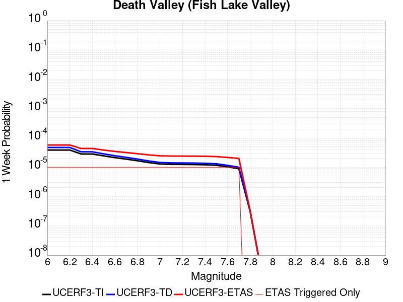 |  |  |  |

| Magnitude | 1 wk TI Prob | 1 wk TD Prob | 1 wk ETAS Prob | 1 wk ETAS/TD Gain | 1 wk ETAS Triggered Only | 1 mo TI Prob | 1 mo TD Prob | 1 mo ETAS Prob | 1 mo ETAS/TD Gain | 1 mo ETAS Triggered Only | 1 yr TI Prob | 1 yr TD Prob | 1 yr ETAS Prob | 1 yr ETAS/TD Gain | 1 yr ETAS Triggered Only | 10 yr TI Prob | 10 yr TD Prob | 10 yr ETAS Prob | 10 yr ETAS/TD Gain | 10 yr ETAS Triggered Only |
|-----|-----|-----|-----|-----|-----|-----|-----|-----|-----|-----|-----|-----|-----|-----|-----|-----|-----|-----|-----|-----|
| 6.0 | 3.872328E-5 | 4.7277426E-5 | 4.7277426E-5 | 1.0 | 0.0 | 1.6594635E-4 | 2.0260349E-4 | 2.0260349E-4 | 1.0 | 0.0 | 0.0020185246 | 0.002464023 | 0.0025813663 | 1.0476227 | 1.1763322E-4 | 0.02000288 | 0.02439309 | 0.02473738 | 1.0141143 | 3.5289966E-4 |
| 6.1 | 3.872328E-5 | 4.7277426E-5 | 4.7277426E-5 | 1.0 | 0.0 | 1.6594635E-4 | 2.0260349E-4 | 2.0260349E-4 | 1.0 | 0.0 | 0.0020185246 | 0.002464023 | 0.0025813663 | 1.0476227 | 1.1763322E-4 | 0.02000288 | 0.02439309 | 0.02473738 | 1.0141143 | 3.5289966E-4 |
| 6.2 | 3.872328E-5 | 4.7277426E-5 | 4.7277426E-5 | 1.0 | 0.0 | 1.6594635E-4 | 2.0260349E-4 | 2.0260349E-4 | 1.0 | 0.0 | 0.0020185246 | 0.002464023 | 0.0025813663 | 1.0476227 | 1.1763322E-4 | 0.02000288 | 0.02439309 | 0.02473738 | 1.0141143 | 3.5289966E-4 |
| 6.3 | 2.8356371E-5 | 3.361575E-5 | 3.361575E-5 | 1.0 | 0.0 | 1.2152165E-4 | 1.4405999E-4 | 1.4405999E-4 | 1.0 | 0.0 | 0.0014785219 | 0.0017525983 | 0.0018700254 | 1.0670017 | 1.1763322E-4 | 0.014687235 | 0.017394776 | 0.017741537 | 1.0199348 | 3.5289966E-4 |
| 6.4 | 2.8356371E-5 | 3.361575E-5 | 3.361575E-5 | 1.0 | 0.0 | 1.2152165E-4 | 1.4405999E-4 | 1.4405999E-4 | 1.0 | 0.0 | 0.0014785219 | 0.0017525983 | 0.0018700254 | 1.0670017 | 1.1763322E-4 | 0.014687235 | 0.017394776 | 0.017741537 | 1.0199348 | 3.5289966E-4 |
| 6.5 | 2.4448687E-5 | 2.8612143E-5 | 2.8612143E-5 | 1.0 | 0.0 | 1.0477588E-4 | 1.2261799E-4 | 1.2261799E-4 | 1.0 | 0.0 | 0.0012748998 | 0.0014919023 | 0.0016093601 | 1.0787302 | 1.1763322E-4 | 0.012676105 | 0.0148237245 | 0.015171393 | 1.0234535 | 3.5289966E-4 |
| 6.6 | 2.1298161E-5 | 2.4663745E-5 | 2.4663745E-5 | 1.0 | 0.0 | 9.127464E-5 | 1.0569767E-4 | 1.0569767E-4 | 1.0 | 0.0 | 0.0011107022 | 0.0012861433 | 0.0014036252 | 1.0913444 | 1.1763322E-4 | 0.011051672 | 0.012790408 | 0.013138794 | 1.027238 | 3.5289966E-4 |
| 6.7 | 1.8959729E-5 | 2.1784066E-5 | 2.1784066E-5 | 1.0 | 0.0 | 8.125345E-5 | 9.3357085E-5 | 9.3357085E-5 | 1.0 | 0.0 | 9.888117E-4 | 0.0011360554 | 0.001253555 | 1.1034276 | 1.1763322E-4 | 0.009844234 | 0.011305139 | 0.011654049 | 1.0308629 | 3.5289966E-4 |
| 6.8 | 1.6691629E-5 | 1.9020832E-5 | 1.9020832E-5 | 1.0 | 0.0 | 7.153359E-5 | 8.15154E-5 | 8.15154E-5 | 1.0 | 0.0 | 8.7057345E-4 | 9.92015E-4 | 0.0011095315 | 1.1184624 | 1.1763322E-4 | 0.008671708 | 0.009877626 | 0.010227039 | 1.0353743 | 3.5289966E-4 |
| 6.9 | 1.450505E-5 | 1.6391527E-5 | 1.6391527E-5 | 1.0 | 0.0 | 6.216302E-5 | 7.024756E-5 | 7.024756E-5 | 1.0 | 0.0 | 7.5657194E-4 | 8.549372E-4 | 9.7246986E-4 | 1.1374751 | 1.1763322E-4 | 0.007540013 | 0.008517413 | 0.008867308 | 1.0410799 | 3.5289966E-4 |
| 7.0 | 1.2940855E-5 | 1.45396425E-5 | 1.45396425E-5 | 1.0 | 0.0 | 5.545963E-5 | 6.2311294E-5 | 6.2311294E-5 | 1.0 | 0.0 | 6.750118E-4 | 7.583818E-4 | 8.759258E-4 | 1.1549932 | 1.1763322E-4 | 0.006729651 | 0.0075585553 | 0.007908788 | 1.0463358 | 3.5289966E-4 |
| 7.1 | 1.2544658E-5 | 1.4079809E-5 | 1.4079809E-5 | 1.0 | 0.0 | 5.3761712E-5 | 6.0340677E-5 | 6.0340677E-5 | 1.0 | 0.0 | 6.5435225E-4 | 7.344057E-4 | 8.519525E-4 | 1.1600571 | 1.1763322E-4 | 0.006524288 | 0.007320381 | 0.0076706973 | 1.0478549 | 3.5289966E-4 |
| 7.2 | 1.2489416E-5 | 1.4017269E-5 | 1.4017269E-5 | 1.0 | 0.0 | 5.3524967E-5 | 6.0072656E-5 | 6.0072656E-5 | 1.0 | 0.0 | 6.514716E-4 | 7.3114474E-4 | 8.4869197E-4 | 1.1607715 | 1.1763322E-4 | 0.006495651 | 0.0072879856 | 0.0076383133 | 1.0480692 | 3.5289966E-4 |
| 7.3 | 1.2368307E-5 | 1.3881391E-5 | 1.3881391E-5 | 1.0 | 0.0 | 5.3005948E-5 | 5.949035E-5 | 5.949035E-5 | 1.0 | 0.0 | 6.451563E-4 | 7.2405994E-4 | 8.41608E-4 | 1.1623458 | 1.1763322E-4 | 0.0064328653 | 0.0072176 | 0.0075679524 | 1.0485414 | 3.5289966E-4 |
| 7.4 | 1.2161707E-5 | 1.364942E-5 | 1.364942E-5 | 1.0 | 0.0 | 5.212056E-5 | 5.8496233E-5 | 5.8496233E-5 | 1.0 | 0.0 | 6.3438306E-4 | 7.119645E-4 | 8.29514E-4 | 1.1651058 | 1.1763322E-4 | 0.006325751 | 0.007097425 | 0.0074478197 | 1.0493693 | 3.5289966E-4 |
| 7.5 | 1.1707948E-5 | 1.3147017E-5 | 1.3147017E-5 | 1.0 | 0.0 | 5.0175953E-5 | 5.634317E-5 | 5.634317E-5 | 1.0 | 0.0 | 6.10721E-4 | 6.857678E-4 | 8.033203E-4 | 1.1714175 | 1.1763322E-4 | 0.0060904534 | 0.0068370993 | 0.0071875863 | 1.0512625 | 3.5289966E-4 |
| 7.6 | 1.0319538E-5 | 1.1580937E-5 | 1.1580937E-5 | 1.0 | 0.0 | 4.4225842E-5 | 4.963167E-5 | 4.963167E-5 | 1.0 | 0.0 | 5.383166E-4 | 6.0410326E-4 | 7.216654E-4 | 1.1946061 | 1.1763322E-4 | 0.0053701443 | 0.0060251425 | 0.006375916 | 1.0582182 | 3.5289966E-4 |
| 7.7 | 8.937764E-6 | 1.002391E-5 | 1.002391E-5 | 1.0 | 0.0 | 3.830414E-5 | 4.2958938E-5 | 4.2958938E-5 | 1.0 | 0.0 | 4.6625308E-4 | 5.2290456E-4 | 6.404763E-4 | 1.2248435 | 1.1763322E-4 | 0.0046527605 | 0.005217252 | 0.00556831 | 1.067288 | 3.5289966E-4 |
| 7.8 | 3.108007E-7 | 3.284828E-7 | 3.284828E-7 | 1.0 | 0.0 | 1.3320023E-6 | 1.4077827E-6 | 1.4077827E-6 | 1.0 | 0.0 | 1.6217007E-5 | 1.7139624E-5 | 1.7139624E-5 | 1.0 | 0.0 | 1.6215823E-4 | 1.713834E-4 | 1.713834E-4 | 1.0 | 0.0 |
| 7.9 | 2.5591178E-9 | 2.6697788E-9 | 2.6697788E-9 | 1.0 | 0.0 | 1.0967647E-8 | 1.144191E-8 | 1.144191E-8 | 1.0 | 0.0 | 1.335311E-7 | 1.3930524E-7 | 1.3930524E-7 | 1.0 | 0.0 | 1.3353102E-6 | 1.3930525E-6 | 1.3930525E-6 | 1.0 | 0.0 |

## Scodie Lineament
*[(top)](#table-of-contents)*

| 1 Week | 1 Month | 1 Year | 10 Year |
|-----|-----|-----|-----|
|  |  |  |  |

| Magnitude | 1 wk TI Prob | 1 wk TD Prob | 1 wk ETAS Prob | 1 wk ETAS/TD Gain | 1 wk ETAS Triggered Only | 1 mo TI Prob | 1 mo TD Prob | 1 mo ETAS Prob | 1 mo ETAS/TD Gain | 1 mo ETAS Triggered Only | 1 yr TI Prob | 1 yr TD Prob | 1 yr ETAS Prob | 1 yr ETAS/TD Gain | 1 yr ETAS Triggered Only | 10 yr TI Prob | 10 yr TD Prob | 10 yr ETAS Prob | 10 yr ETAS/TD Gain | 10 yr ETAS Triggered Only |
|-----|-----|-----|-----|-----|-----|-----|-----|-----|-----|-----|-----|-----|-----|-----|-----|-----|-----|-----|-----|-----|
| 6.0 | 3.2919327E-6 | 3.013442E-6 | 3.013442E-6 | 1.0 | 0.0 | 1.4108206E-5 | 1.2914706E-5 | 1.2914706E-5 | 1.0 | 0.0 | 1.7175387E-4 | 1.5722837E-4 | 1.5722837E-4 | 1.0 | 0.0 | 0.0017162118 | 0.0015714829 | 0.0018063795 | 1.1494746 | 2.3526645E-4 |
| 6.1 | 1.8663811E-6 | 1.5491127E-6 | 1.5491127E-6 | 1.0 | 0.0 | 7.998751E-6 | 6.6390403E-6 | 6.6390403E-6 | 1.0 | 0.0 | 9.738045E-5 | 8.082781E-5 | 8.082781E-5 | 1.0 | 0.0 | 9.7337784E-4 | 8.08033E-4 | 8.08033E-4 | 1.0 | 0.0 |
| 6.2 | 1.8663811E-6 | 1.5491127E-6 | 1.5491127E-6 | 1.0 | 0.0 | 7.998751E-6 | 6.6390403E-6 | 6.6390403E-6 | 1.0 | 0.0 | 9.738045E-5 | 8.082781E-5 | 8.082781E-5 | 1.0 | 0.0 | 9.7337784E-4 | 8.08033E-4 | 8.08033E-4 | 1.0 | 0.0 |
| 6.3 | 1.8663811E-6 | 1.5491127E-6 | 1.5491127E-6 | 1.0 | 0.0 | 7.998751E-6 | 6.6390403E-6 | 6.6390403E-6 | 1.0 | 0.0 | 9.738045E-5 | 8.082781E-5 | 8.082781E-5 | 1.0 | 0.0 | 9.7337784E-4 | 8.08033E-4 | 8.08033E-4 | 1.0 | 0.0 |
| 6.4 | 1.8663811E-6 | 1.5491127E-6 | 1.5491127E-6 | 1.0 | 0.0 | 7.998751E-6 | 6.6390403E-6 | 6.6390403E-6 | 1.0 | 0.0 | 9.738045E-5 | 8.082781E-5 | 8.082781E-5 | 1.0 | 0.0 | 9.7337784E-4 | 8.08033E-4 | 8.08033E-4 | 1.0 | 0.0 |
| 6.5 | 1.8106311E-6 | 1.4910445E-6 | 1.4910445E-6 | 1.0 | 0.0 | 7.759824E-6 | 6.390178E-6 | 6.390178E-6 | 1.0 | 0.0 | 9.447177E-5 | 7.779813E-5 | 7.779813E-5 | 1.0 | 0.0 | 9.4431615E-4 | 7.7775767E-4 | 7.7775767E-4 | 1.0 | 0.0 |
| 6.6 | 1.2414679E-6 | 8.99795E-7 | 8.99795E-7 | 1.0 | 0.0 | 5.320566E-6 | 3.8562594E-6 | 3.8562594E-6 | 1.0 | 0.0 | 6.477596E-5 | 4.6949033E-5 | 4.6949033E-5 | 1.0 | 0.0 | 6.475708E-4 | 4.693998E-4 | 4.693998E-4 | 1.0 | 0.0 |
| 6.7 | 1.1062215E-6 | 7.594655E-7 | 7.594655E-7 | 1.0 | 0.0 | 4.7409408E-6 | 3.2548483E-6 | 3.2548483E-6 | 1.0 | 0.0 | 5.7719422E-5 | 3.9627128E-5 | 3.9627128E-5 | 1.0 | 0.0 | 5.770443E-4 | 3.9620762E-4 | 3.9620762E-4 | 1.0 | 0.0 |
| 6.8 | 1.0006736E-6 | 6.500703E-7 | 6.500703E-7 | 1.0 | 0.0 | 4.288594E-6 | 2.786013E-6 | 2.786013E-6 | 1.0 | 0.0 | 5.221238E-5 | 3.3919245E-5 | 3.3919245E-5 | 1.0 | 0.0 | 5.220012E-4 | 3.3914673E-4 | 3.3914673E-4 | 1.0 | 0.0 |
| 6.9 | 9.167364E-7 | 5.631903E-7 | 5.631903E-7 | 1.0 | 0.0 | 3.9288643E-6 | 2.413671E-6 | 2.413671E-6 | 1.0 | 0.0 | 4.7832873E-5 | 2.9386105E-5 | 2.9386105E-5 | 1.0 | 0.0 | 4.782258E-4 | 2.9382785E-4 | 2.9382785E-4 | 1.0 | 0.0 |
| 7.0 | 7.6987664E-7 | 4.1136138E-7 | 4.1136138E-7 | 1.0 | 0.0 | 3.2994672E-6 | 1.7629764E-6 | 1.7629764E-6 | 1.0 | 0.0 | 4.0170275E-5 | 2.1464064E-5 | 2.1464064E-5 | 1.0 | 0.0 | 4.0163012E-4 | 2.1462377E-4 | 2.1462377E-4 | 1.0 | 0.0 |
| 7.1 | 7.1038727E-7 | 3.5213617E-7 | 3.5213617E-7 | 1.0 | 0.0 | 3.0445133E-6 | 1.5091543E-6 | 1.5091543E-6 | 1.0 | 0.0 | 3.706632E-5 | 1.8373834E-5 | 1.8373834E-5 | 1.0 | 0.0 | 3.7060137E-4 | 1.8372665E-4 | 1.8372665E-4 | 1.0 | 0.0 |
| 7.2 | 2.0799602E-7 | 3.1192688E-8 | 3.1192688E-8 | 1.0 | 0.0 | 8.914113E-7 | 1.3368295E-7 | 1.3368295E-7 | 1.0 | 0.0 | 1.0852878E-5 | 1.6275886E-6 | 1.6275886E-6 | 1.0 | 0.0 | 1.08523476E-4 | 1.6275775E-5 | 1.6275775E-5 | 1.0 | 0.0 |
| 7.3 | 1.5048182E-7 | 1.5949661E-8 | 1.5949661E-8 | 1.0 | 0.0 | 6.449219E-7 | 6.835568E-8 | 6.835568E-8 | 1.0 | 0.0 | 7.851896E-6 | 8.3223017E-7 | 8.3223017E-7 | 1.0 | 0.0 | 7.851618E-5 | 8.322273E-6 | 8.322273E-6 | 1.0 | 0.0 |
| 7.4 | 5.9334678E-8 | 4.869818E-9 | 4.869818E-9 | 1.0 | 0.0 | 2.5429145E-7 | 2.0870647E-8 | 2.0870647E-8 | 1.0 | 0.0 | 3.095994E-6 | 2.5410012E-7 | 2.5410012E-7 | 1.0 | 0.0 | 3.095951E-5 | 2.5409995E-6 | 2.5409995E-6 | 1.0 | 0.0 |

## San Andreas (North Branch Mill Creek)
*[(top)](#table-of-contents)*

| 1 Week | 1 Month | 1 Year | 10 Year |
|-----|-----|-----|-----|
| 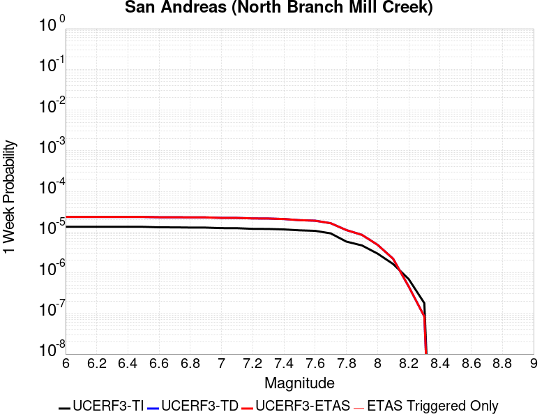 |  |  |  |

| Magnitude | 1 wk TI Prob | 1 wk TD Prob | 1 wk ETAS Prob | 1 wk ETAS/TD Gain | 1 wk ETAS Triggered Only | 1 mo TI Prob | 1 mo TD Prob | 1 mo ETAS Prob | 1 mo ETAS/TD Gain | 1 mo ETAS Triggered Only | 1 yr TI Prob | 1 yr TD Prob | 1 yr ETAS Prob | 1 yr ETAS/TD Gain | 1 yr ETAS Triggered Only | 10 yr TI Prob | 10 yr TD Prob | 10 yr ETAS Prob | 10 yr ETAS/TD Gain | 10 yr ETAS Triggered Only |
|-----|-----|-----|-----|-----|-----|-----|-----|-----|-----|-----|-----|-----|-----|-----|-----|-----|-----|-----|-----|-----|
| 6.0 | 1.3461156E-5 | 2.3548055E-5 | 2.3548055E-5 | 1.0 | 0.0 | 5.7689394E-5 | 1.00916346E-4 | 1.00916346E-4 | 1.0 | 0.0 | 7.02142E-4 | 0.0012279673 | 0.0012279673 | 1.0 | 0.0 | 0.0069992766 | 0.012254227 | 0.012486611 | 1.0189636 | 2.3526645E-4 |
| 6.1 | 1.3461156E-5 | 2.3548055E-5 | 2.3548055E-5 | 1.0 | 0.0 | 5.7689394E-5 | 1.00916346E-4 | 1.00916346E-4 | 1.0 | 0.0 | 7.02142E-4 | 0.0012279673 | 0.0012279673 | 1.0 | 0.0 | 0.0069992766 | 0.012254227 | 0.012486611 | 1.0189636 | 2.3526645E-4 |
| 6.2 | 1.3461156E-5 | 2.3548055E-5 | 2.3548055E-5 | 1.0 | 0.0 | 5.7689394E-5 | 1.00916346E-4 | 1.00916346E-4 | 1.0 | 0.0 | 7.02142E-4 | 0.0012279673 | 0.0012279673 | 1.0 | 0.0 | 0.0069992766 | 0.012254227 | 0.012486611 | 1.0189636 | 2.3526645E-4 |
| 6.3 | 1.3461156E-5 | 2.3548055E-5 | 2.3548055E-5 | 1.0 | 0.0 | 5.7689394E-5 | 1.00916346E-4 | 1.00916346E-4 | 1.0 | 0.0 | 7.02142E-4 | 0.0012279673 | 0.0012279673 | 1.0 | 0.0 | 0.0069992766 | 0.012254227 | 0.012486611 | 1.0189636 | 2.3526645E-4 |
| 6.4 | 1.3461156E-5 | 2.3548055E-5 | 2.3548055E-5 | 1.0 | 0.0 | 5.7689394E-5 | 1.00916346E-4 | 1.00916346E-4 | 1.0 | 0.0 | 7.02142E-4 | 0.0012279673 | 0.0012279673 | 1.0 | 0.0 | 0.0069992766 | 0.012254227 | 0.012486611 | 1.0189636 | 2.3526645E-4 |
| 6.5 | 1.3450706E-5 | 2.3537013E-5 | 2.3537013E-5 | 1.0 | 0.0 | 5.764461E-5 | 1.0086904E-4 | 1.0086904E-4 | 1.0 | 0.0 | 7.0159714E-4 | 0.001227392 | 0.001227392 | 1.0 | 0.0 | 0.006993862 | 0.012248537 | 0.012480921 | 1.0189724 | 2.3526645E-4 |
| 6.6 | 1.3074523E-5 | 2.3151279E-5 | 2.3151279E-5 | 1.0 | 0.0 | 5.6032466E-5 | 9.921601E-5 | 9.921601E-5 | 1.0 | 0.0 | 6.8198174E-4 | 0.0012072888 | 0.0012072888 | 1.0 | 0.0 | 0.006798926 | 0.012049697 | 0.012282129 | 1.0192894 | 2.3526645E-4 |
| 6.7 | 1.3050216E-5 | 2.3126573E-5 | 2.3126573E-5 | 1.0 | 0.0 | 5.59283E-5 | 9.911013E-5 | 9.911013E-5 | 1.0 | 0.0 | 6.8071426E-4 | 0.0012060012 | 0.0012060012 | 1.0 | 0.0 | 0.0067863287 | 0.012036961 | 0.012269395 | 1.0193101 | 2.3526645E-4 |
| 6.8 | 1.29049395E-5 | 2.2974971E-5 | 2.2974971E-5 | 1.0 | 0.0 | 5.530571E-5 | 9.846047E-5 | 9.846047E-5 | 1.0 | 0.0 | 6.73139E-4 | 0.0011981002 | 0.0011981002 | 1.0 | 0.0 | 0.0067110364 | 0.011958803 | 0.012191256 | 1.0194378 | 2.3526645E-4 |
| 6.9 | 1.2867369E-5 | 2.2934368E-5 | 2.2934368E-5 | 1.0 | 0.0 | 5.51447E-5 | 9.8286466E-5 | 9.8286466E-5 | 1.0 | 0.0 | 6.711799E-4 | 0.001195984 | 0.001195984 | 1.0 | 0.0 | 0.006691564 | 0.011937869 | 0.012170327 | 1.0194724 | 2.3526645E-4 |
| 7.0 | 1.2495996E-5 | 2.2334114E-5 | 2.2334114E-5 | 1.0 | 0.0 | 5.3553173E-5 | 9.571414E-5 | 9.571414E-5 | 1.0 | 0.0 | 6.518148E-4 | 0.0011646996 | 0.0011646996 | 1.0 | 0.0 | 0.0064990623 | 0.011628309 | 0.01186084 | 1.019997 | 2.3526645E-4 |
| 7.1 | 1.2452067E-5 | 2.2279173E-5 | 2.2279173E-5 | 1.0 | 0.0 | 5.3364907E-5 | 9.547869E-5 | 9.547869E-5 | 1.0 | 0.0 | 6.4952404E-4 | 0.001161836 | 0.001161836 | 1.0 | 0.0 | 0.0064762887 | 0.011599974 | 0.011832511 | 1.0200464 | 2.3526645E-4 |
| 7.2 | 1.2002777E-5 | 2.165748E-5 | 2.165748E-5 | 1.0 | 0.0 | 5.143946E-5 | 9.281449E-5 | 9.281449E-5 | 1.0 | 0.0 | 6.2609545E-4 | 0.0011294333 | 0.0011294333 | 1.0 | 0.0 | 0.006243344 | 0.011279272 | 0.011511885 | 1.0206231 | 2.3526645E-4 |
| 7.3 | 1.1923425E-5 | 2.1527258E-5 | 2.1527258E-5 | 1.0 | 0.0 | 5.109939E-5 | 9.225643E-5 | 9.225643E-5 | 1.0 | 0.0 | 6.219575E-4 | 0.0011226459 | 0.0011226459 | 1.0 | 0.0 | 0.0062021962 | 0.011212112 | 0.011444742 | 1.020748 | 2.3526645E-4 |
| 7.4 | 1.16105175E-5 | 2.0900772E-5 | 2.0900772E-5 | 1.0 | 0.0 | 4.975841E-5 | 8.957168E-5 | 8.957168E-5 | 1.0 | 0.0 | 6.0564023E-4 | 0.0010899922 | 0.0010899922 | 1.0 | 0.0 | 0.006039923 | 0.010889493 | 0.011122197 | 1.0213697 | 2.3526645E-4 |
| 7.5 | 1.1037265E-5 | 1.9599263E-5 | 1.9599263E-5 | 1.0 | 0.0 | 4.7301706E-5 | 8.399415E-5 | 8.399415E-5 | 1.0 | 0.0 | 5.757461E-4 | 0.0010221512 | 0.0010221512 | 1.0 | 0.0 | 0.005742567 | 0.0102181705 | 0.010451033 | 1.022789 | 2.3526645E-4 |
| 7.6 | 1.0720915E-5 | 1.9040608E-5 | 1.9040608E-5 | 1.0 | 0.0 | 4.5945973E-5 | 8.160007E-5 | 8.160007E-5 | 1.0 | 0.0 | 5.592486E-4 | 9.930301E-4 | 9.930301E-4 | 1.0 | 0.0 | 0.005578433 | 0.009929609 | 0.010162539 | 1.0234581 | 2.3526645E-4 |
| 7.7 | 9.276279E-6 | 1.64843E-5 | 1.64843E-5 | 1.0 | 0.0 | 3.9754876E-5 | 7.0645096E-5 | 7.0645096E-5 | 1.0 | 0.0 | 4.839081E-4 | 8.597663E-4 | 8.597663E-4 | 1.0 | 0.0 | 0.0048285574 | 0.008607952 | 0.008841193 | 1.027096 | 2.3526645E-4 |
| 7.8 | 5.8346777E-6 | 1.118965E-5 | 1.118965E-5 | 1.0 | 0.0 | 2.5005522E-5 | 4.795476E-5 | 4.795476E-5 | 1.0 | 0.0 | 3.043997E-4 | 5.836929E-4 | 5.836929E-4 | 1.0 | 0.0 | 0.0030398308 | 0.0058647413 | 0.006098628 | 1.0398802 | 2.3526645E-4 |
| 7.9 | 4.690204E-6 | 8.53796E-6 | 8.53796E-6 | 1.0 | 0.0 | 2.0100719E-5 | 3.659074E-5 | 3.659074E-5 | 1.0 | 0.0 | 2.4469878E-4 | 4.454013E-4 | 4.454013E-4 | 1.0 | 0.0 | 0.002444295 | 0.004485608 | 0.0046027135 | 1.026107 | 1.1763322E-4 |
| 8.0 | 2.9570454E-6 | 4.86459E-6 | 4.86459E-6 | 1.0 | 0.0 | 1.267299E-5 | 2.0848078E-5 | 2.0848078E-5 | 1.0 | 0.0 | 1.5428272E-4 | 2.537958E-4 | 2.537958E-4 | 1.0 | 0.0 | 0.0015417566 | 0.0025588202 | 0.0025588202 | 1.0 | 0.0 |
| 8.1 | 1.6376824E-6 | 2.2061524E-6 | 2.2061524E-6 | 1.0 | 0.0 | 7.01862E-6 | 9.454904E-6 | 9.454904E-6 | 1.0 | 0.0 | 8.544835E-5 | 1.15107396E-4 | 1.15107396E-4 | 1.0 | 0.0 | 8.54155E-4 | 0.0011655022 | 0.0011655022 | 1.0 | 0.0 |
| 8.2 | 6.9631557E-7 | 4.564967E-7 | 4.564967E-7 | 1.0 | 0.0 | 2.984206E-6 | 1.956413E-6 | 1.956413E-6 | 1.0 | 0.0 | 3.63321E-5 | 2.3819068E-5 | 2.3819068E-5 | 1.0 | 0.0 | 3.6326164E-4 | 2.466932E-4 | 2.466932E-4 | 1.0 | 0.0 |
| 8.3 | 1.7876137E-7 | 8.4190965E-8 | 8.4190965E-8 | 1.0 | 0.0 | 7.661199E-7 | 3.6081838E-7 | 3.6081838E-7 | 1.0 | 0.0 | 9.32747E-6 | 4.3929554E-6 | 4.3929554E-6 | 1.0 | 0.0 | 9.3270784E-5 | 4.6131998E-5 | 4.6131998E-5 | 1.0 | 0.0 |

## Red Pass
*[(top)](#table-of-contents)*

| 1 Week | 1 Month | 1 Year | 10 Year |
|-----|-----|-----|-----|
|  |  |  |  |

| Magnitude | 1 wk TI Prob | 1 wk TD Prob | 1 wk ETAS Prob | 1 wk ETAS/TD Gain | 1 wk ETAS Triggered Only | 1 mo TI Prob | 1 mo TD Prob | 1 mo ETAS Prob | 1 mo ETAS/TD Gain | 1 mo ETAS Triggered Only | 1 yr TI Prob | 1 yr TD Prob | 1 yr ETAS Prob | 1 yr ETAS/TD Gain | 1 yr ETAS Triggered Only | 10 yr TI Prob | 10 yr TD Prob | 10 yr ETAS Prob | 10 yr ETAS/TD Gain | 10 yr ETAS Triggered Only |
|-----|-----|-----|-----|-----|-----|-----|-----|-----|-----|-----|-----|-----|-----|-----|-----|-----|-----|-----|-----|-----|
| 6.0 | 8.258278E-6 | 8.551547E-6 | 8.551547E-6 | 1.0 | 0.0 | 3.539214E-5 | 3.664907E-5 | 3.664907E-5 | 1.0 | 0.0 | 4.308141E-4 | 4.4612895E-4 | 4.4612895E-4 | 1.0 | 0.0 | 0.0042997985 | 0.004454091 | 0.00468831 | 1.052585 | 2.3526645E-4 |
| 6.1 | 3.649988E-6 | 3.7754364E-6 | 3.7754364E-6 | 1.0 | 0.0 | 1.5642712E-5 | 1.618037E-5 | 1.618037E-5 | 1.0 | 0.0 | 1.9043336E-4 | 1.9698295E-4 | 1.9698295E-4 | 1.0 | 0.0 | 0.0019027026 | 0.0019685507 | 0.0019685507 | 1.0 | 0.0 |
| 6.2 | 3.649988E-6 | 3.7754364E-6 | 3.7754364E-6 | 1.0 | 0.0 | 1.5642712E-5 | 1.618037E-5 | 1.618037E-5 | 1.0 | 0.0 | 1.9043336E-4 | 1.9698295E-4 | 1.9698295E-4 | 1.0 | 0.0 | 0.0019027026 | 0.0019685507 | 0.0019685507 | 1.0 | 0.0 |
| 6.3 | 1.3924937E-6 | 1.4411634E-6 | 1.4411634E-6 | 1.0 | 0.0 | 5.9678164E-6 | 6.1764076E-6 | 6.1764076E-6 | 1.0 | 0.0 | 7.265574E-5 | 7.5196585E-5 | 7.5196585E-5 | 1.0 | 0.0 | 7.263199E-4 | 7.518502E-4 | 7.518502E-4 | 1.0 | 0.0 |
| 6.4 | 1.3924937E-6 | 1.4411634E-6 | 1.4411634E-6 | 1.0 | 0.0 | 5.9678164E-6 | 6.1764076E-6 | 6.1764076E-6 | 1.0 | 0.0 | 7.265574E-5 | 7.5196585E-5 | 7.5196585E-5 | 1.0 | 0.0 | 7.263199E-4 | 7.518502E-4 | 7.518502E-4 | 1.0 | 0.0 |
| 6.5 | 9.876812E-7 | 1.0222244E-6 | 1.0222244E-6 | 1.0 | 0.0 | 4.2329125E-6 | 4.3809614E-6 | 4.3809614E-6 | 1.0 | 0.0 | 5.153449E-5 | 5.3338208E-5 | 5.3338208E-5 | 1.0 | 0.0 | 5.1522546E-4 | 5.3338206E-4 | 5.3338206E-4 | 1.0 | 0.0 |

## Simi-Santa Rosa
*[(top)](#table-of-contents)*

| 1 Week | 1 Month | 1 Year | 10 Year |
|-----|-----|-----|-----|
| 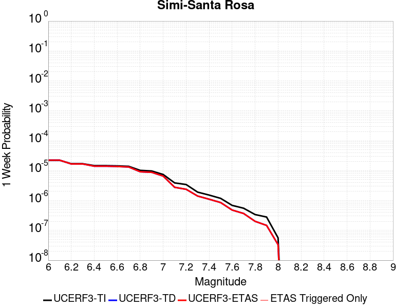 |  |  |  |

| Magnitude | 1 wk TI Prob | 1 wk TD Prob | 1 wk ETAS Prob | 1 wk ETAS/TD Gain | 1 wk ETAS Triggered Only | 1 mo TI Prob | 1 mo TD Prob | 1 mo ETAS Prob | 1 mo ETAS/TD Gain | 1 mo ETAS Triggered Only | 1 yr TI Prob | 1 yr TD Prob | 1 yr ETAS Prob | 1 yr ETAS/TD Gain | 1 yr ETAS Triggered Only | 10 yr TI Prob | 10 yr TD Prob | 10 yr ETAS Prob | 10 yr ETAS/TD Gain | 10 yr ETAS Triggered Only |
|-----|-----|-----|-----|-----|-----|-----|-----|-----|-----|-----|-----|-----|-----|-----|-----|-----|-----|-----|-----|-----|
| 6.0 | 2.198912E-5 | 2.227831E-5 | 2.227831E-5 | 1.0 | 0.0 | 9.4235686E-5 | 9.5475225E-5 | 9.5475225E-5 | 1.0 | 0.0 | 0.0011467156 | 0.0011618348 | 0.0012793314 | 1.1011301 | 1.1763322E-4 | 0.011408163 | 0.011562055 | 0.011678328 | 1.0100565 | 1.1763322E-4 |
| 6.1 | 2.198912E-5 | 2.227831E-5 | 2.227831E-5 | 1.0 | 0.0 | 9.4235686E-5 | 9.5475225E-5 | 9.5475225E-5 | 1.0 | 0.0 | 0.0011467156 | 0.0011618348 | 0.0012793314 | 1.1011301 | 1.1763322E-4 | 0.011408163 | 0.011562055 | 0.011678328 | 1.0100565 | 1.1763322E-4 |
| 6.2 | 1.69983E-5 | 1.6670783E-5 | 1.6670783E-5 | 1.0 | 0.0 | 7.284782E-5 | 7.1444425E-5 | 7.1444425E-5 | 1.0 | 0.0 | 8.865613E-4 | 8.695179E-4 | 9.870488E-4 | 1.135168 | 1.1763322E-4 | 0.008830327 | 0.008664079 | 0.008780693 | 1.0134594 | 1.1763322E-4 |
| 6.3 | 1.69983E-5 | 1.6670783E-5 | 1.6670783E-5 | 1.0 | 0.0 | 7.284782E-5 | 7.1444425E-5 | 7.1444425E-5 | 1.0 | 0.0 | 8.865613E-4 | 8.695179E-4 | 9.870488E-4 | 1.135168 | 1.1763322E-4 | 0.008830327 | 0.008664079 | 0.008780693 | 1.0134594 | 1.1763322E-4 |
| 6.4 | 1.4666188E-5 | 1.4054472E-5 | 1.4054472E-5 | 1.0 | 0.0 | 6.285358E-5 | 6.02322E-5 | 6.02322E-5 | 1.0 | 0.0 | 7.6497364E-4 | 7.331052E-4 | 8.5065217E-4 | 1.1603413 | 1.1763322E-4 | 0.0076234564 | 0.0073093437 | 0.007426117 | 1.015976 | 1.1763322E-4 |
| 6.5 | 1.4666188E-5 | 1.4054472E-5 | 1.4054472E-5 | 1.0 | 0.0 | 6.285358E-5 | 6.02322E-5 | 6.02322E-5 | 1.0 | 0.0 | 7.6497364E-4 | 7.331052E-4 | 8.5065217E-4 | 1.1603413 | 1.1763322E-4 | 0.0076234564 | 0.0073093437 | 0.007426117 | 1.015976 | 1.1763322E-4 |
| 6.6 | 1.4377586E-5 | 1.37314755E-5 | 1.37314755E-5 | 1.0 | 0.0 | 6.1616774E-5 | 5.8847992E-5 | 5.8847992E-5 | 1.0 | 0.0 | 7.4992597E-4 | 7.1626366E-4 | 8.3381264E-4 | 1.1641141 | 1.1763322E-4 | 0.007474003 | 0.00714202 | 0.007258813 | 1.0163529 | 1.1763322E-4 |
| 6.7 | 1.3881404E-5 | 1.3209385E-5 | 1.3209385E-5 | 1.0 | 0.0 | 5.9490372E-5 | 5.661056E-5 | 5.661056E-5 | 1.0 | 0.0 | 7.240546E-4 | 6.890403E-4 | 8.0659246E-4 | 1.1706028 | 1.1763322E-4 | 0.007217 | 0.0068714893 | 0.006988314 | 1.0170014 | 1.1763322E-4 |
| 6.8 | 1.0176516E-5 | 9.1555075E-6 | 9.1555075E-6 | 1.0 | 0.0 | 4.3612912E-5 | 3.9237395E-5 | 3.9237395E-5 | 1.0 | 0.0 | 5.308578E-4 | 4.7762712E-4 | 5.952042E-4 | 1.2461691 | 1.1763322E-4 | 0.0052959146 | 0.0047676396 | 0.004884712 | 1.0245557 | 1.1763322E-4 |
| 6.9 | 9.699797E-6 | 8.77602E-6 | 8.77602E-6 | 1.0 | 0.0 | 4.15699E-5 | 3.7611066E-5 | 3.7611066E-5 | 1.0 | 0.0 | 5.05996E-4 | 4.5783492E-4 | 5.754143E-4 | 1.256816 | 1.1763322E-4 | 0.005048454 | 0.0045705354 | 0.004687631 | 1.0256196 | 1.1763322E-4 |
| 7.0 | 7.4049476E-6 | 6.5603285E-6 | 6.5603285E-6 | 1.0 | 0.0 | 3.1735104E-5 | 2.8115463E-5 | 2.8115463E-5 | 1.0 | 0.0 | 3.8630638E-4 | 3.4226466E-4 | 4.598576E-4 | 1.3435732 | 1.1763322E-4 | 0.0038563553 | 0.0034186176 | 0.0035358488 | 1.034292 | 1.1763322E-4 |
| 7.1 | 3.873439E-6 | 2.7600042E-6 | 2.7600042E-6 | 1.0 | 0.0 | 1.6600346E-5 | 1.1828537E-5 | 1.1828537E-5 | 1.0 | 0.0 | 2.0209046E-4 | 1.4400315E-4 | 1.4400315E-4 | 1.0 | 0.0 | 0.0020190678 | 0.001439122 | 0.001439122 | 1.0 | 0.0 |
| 7.2 | 3.417706E-6 | 2.3681023E-6 | 2.3681023E-6 | 1.0 | 0.0 | 1.4647229E-5 | 1.0148972E-5 | 1.0148972E-5 | 1.0 | 0.0 | 1.7831543E-4 | 1.2355695E-4 | 1.2355695E-4 | 1.0 | 0.0 | 0.0017817242 | 0.0012349049 | 0.0012349049 | 1.0 | 0.0 |
| 7.3 | 1.90225E-6 | 1.4077283E-6 | 1.4077283E-6 | 1.0 | 0.0 | 8.152474E-6 | 6.033107E-6 | 6.033107E-6 | 1.0 | 0.0 | 9.9251854E-5 | 7.3450625E-5 | 7.3450625E-5 | 1.0 | 0.0 | 9.920754E-4 | 7.342658E-4 | 7.342658E-4 | 1.0 | 0.0 |
| 7.4 | 1.5170556E-6 | 1.1028078E-6 | 1.1028078E-6 | 1.0 | 0.0 | 6.5016507E-6 | 4.7263106E-6 | 4.7263106E-6 | 1.0 | 0.0 | 7.915472E-5 | 5.754132E-5 | 5.754132E-5 | 1.0 | 0.0 | 7.9126534E-4 | 5.752654E-4 | 5.752654E-4 | 1.0 | 0.0 |
| 7.5 | 1.178732E-6 | 8.5382646E-7 | 8.5382646E-7 | 1.0 | 0.0 | 5.0516987E-6 | 3.659251E-6 | 3.659251E-6 | 1.0 | 0.0 | 6.1502695E-5 | 4.455048E-5 | 4.455048E-5 | 1.0 | 0.0 | 6.148568E-4 | 4.4541643E-4 | 4.4541643E-4 | 1.0 | 0.0 |
| 7.6 | 6.8722386E-7 | 4.7961464E-7 | 4.7961464E-7 | 1.0 | 0.0 | 2.9452417E-6 | 2.0554896E-6 | 2.0554896E-6 | 1.0 | 0.0 | 3.5857727E-5 | 2.5025302E-5 | 2.5025302E-5 | 1.0 | 0.0 | 3.5851944E-4 | 2.5022496E-4 | 2.5022496E-4 | 1.0 | 0.0 |
| 7.7 | 5.5126515E-7 | 3.6760147E-7 | 3.6760147E-7 | 1.0 | 0.0 | 2.3625628E-6 | 1.575434E-6 | 1.575434E-6 | 1.0 | 0.0 | 2.8763823E-5 | 1.9180741E-5 | 1.9180741E-5 | 1.0 | 0.0 | 2.87601E-4 | 1.9179097E-4 | 1.9179097E-4 | 1.0 | 0.0 |
| 7.8 | 3.3860243E-7 | 2.0096766E-7 | 2.0096766E-7 | 1.0 | 0.0 | 1.4511525E-6 | 8.612897E-7 | 8.612897E-7 | 1.0 | 0.0 | 1.7667637E-5 | 1.0486152E-5 | 1.0486152E-5 | 1.0 | 0.0 | 1.7666233E-4 | 1.0485663E-4 | 1.0485663E-4 | 1.0 | 0.0 |
| 7.9 | 2.7955386E-7 | 1.4668863E-7 | 1.4668863E-7 | 1.0 | 0.0 | 1.1980875E-6 | 6.286654E-7 | 6.286654E-7 | 1.0 | 0.0 | 1.4586617E-5 | 7.653975E-6 | 7.653975E-6 | 1.0 | 0.0 | 1.458566E-4 | 7.653716E-5 | 7.653716E-5 | 1.0 | 0.0 |
| 8.0 | 5.6259015E-8 | 3.336768E-8 | 3.336768E-8 | 1.0 | 0.0 | 2.4111003E-7 | 1.4300434E-7 | 1.4300434E-7 | 1.0 | 0.0 | 2.9355108E-6 | 1.7410766E-6 | 1.7410766E-6 | 1.0 | 0.0 | 2.935472E-5 | 1.7410643E-5 | 1.7410643E-5 | 1.0 | 0.0 |

## Helendale-So Lockhart
*[(top)](#table-of-contents)*

| 1 Week | 1 Month | 1 Year | 10 Year |
|-----|-----|-----|-----|
|  |  | 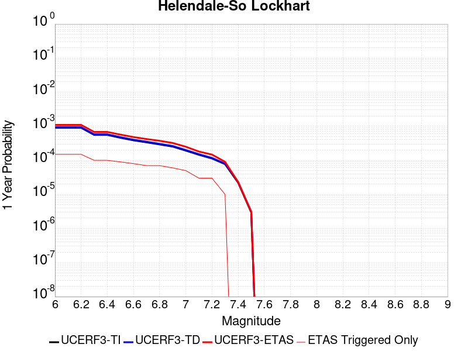 | 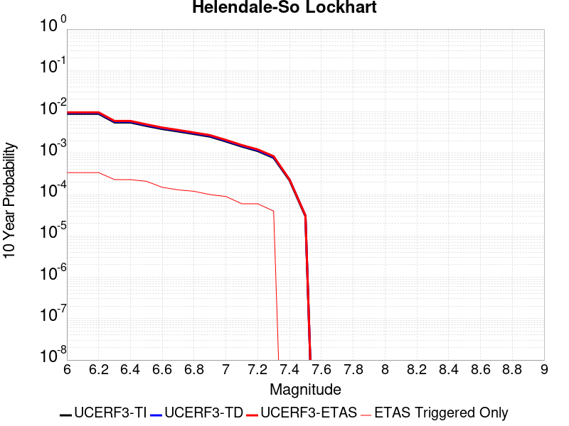 |

| Magnitude | 1 wk TI Prob | 1 wk TD Prob | 1 wk ETAS Prob | 1 wk ETAS/TD Gain | 1 wk ETAS Triggered Only | 1 mo TI Prob | 1 mo TD Prob | 1 mo ETAS Prob | 1 mo ETAS/TD Gain | 1 mo ETAS Triggered Only | 1 yr TI Prob | 1 yr TD Prob | 1 yr ETAS Prob | 1 yr ETAS/TD Gain | 1 yr ETAS Triggered Only | 10 yr TI Prob | 10 yr TD Prob | 10 yr ETAS Prob | 10 yr ETAS/TD Gain | 10 yr ETAS Triggered Only |
|-----|-----|-----|-----|-----|-----|-----|-----|-----|-----|-----|-----|-----|-----|-----|-----|-----|-----|-----|-----|-----|
| 6.0 | 1.7296055E-5 | 1.8104516E-5 | 1.8104516E-5 | 1.0 | 0.0 | 7.412385E-5 | 7.758859E-5 | 7.758859E-5 | 1.0 | 0.0 | 9.0208417E-4 | 9.442525E-4 | 0.0010617746 | 1.1244605 | 1.1763322E-4 | 0.008984311 | 0.009404523 | 0.009637577 | 1.024781 | 2.3526645E-4 |
| 6.1 | 1.7296055E-5 | 1.8104516E-5 | 1.8104516E-5 | 1.0 | 0.0 | 7.412385E-5 | 7.758859E-5 | 7.758859E-5 | 1.0 | 0.0 | 9.0208417E-4 | 9.442525E-4 | 0.0010617746 | 1.1244605 | 1.1763322E-4 | 0.008984311 | 0.009404523 | 0.009637577 | 1.024781 | 2.3526645E-4 |
| 6.2 | 1.7296055E-5 | 1.8104516E-5 | 1.8104516E-5 | 1.0 | 0.0 | 7.412385E-5 | 7.758859E-5 | 7.758859E-5 | 1.0 | 0.0 | 9.0208417E-4 | 9.442525E-4 | 0.0010617746 | 1.1244605 | 1.1763322E-4 | 0.008984311 | 0.009404523 | 0.009637577 | 1.024781 | 2.3526645E-4 |
| 6.3 | 1.0669118E-5 | 1.1135877E-5 | 1.1135877E-5 | 1.0 | 0.0 | 4.5723988E-5 | 4.772433E-5 | 4.772433E-5 | 1.0 | 0.0 | 5.5654737E-4 | 5.808916E-4 | 6.984565E-4 | 1.202387 | 1.1763322E-4 | 0.0055515557 | 0.0057940283 | 0.006027932 | 1.0403697 | 2.3526645E-4 |
| 6.4 | 1.0669118E-5 | 1.1135877E-5 | 1.1135877E-5 | 1.0 | 0.0 | 4.5723988E-5 | 4.772433E-5 | 4.772433E-5 | 1.0 | 0.0 | 5.5654737E-4 | 5.808916E-4 | 6.984565E-4 | 1.202387 | 1.1763322E-4 | 0.0055515557 | 0.0057940283 | 0.006027932 | 1.0403697 | 2.3526645E-4 |
| 6.5 | 8.790038E-6 | 9.170565E-6 | 9.170565E-6 | 1.0 | 0.0 | 3.767105E-5 | 3.930184E-5 | 3.930184E-5 | 1.0 | 0.0 | 4.585485E-4 | 4.783964E-4 | 5.9597334E-4 | 1.2457731 | 1.1763322E-4 | 0.0045760344 | 0.00477383 | 0.0050079734 | 1.0490472 | 2.3526645E-4 |
| 6.6 | 7.396949E-6 | 7.715846E-6 | 7.715846E-6 | 1.0 | 0.0 | 3.1700827E-5 | 3.30675E-5 | 3.30675E-5 | 1.0 | 0.0 | 3.858892E-4 | 4.0252344E-4 | 5.201093E-4 | 1.2921218 | 1.1763322E-4 | 0.003852198 | 0.00401805 | 0.0042523714 | 1.0583171 | 2.3526645E-4 |
| 6.7 | 6.4600285E-6 | 6.7383007E-6 | 6.7383007E-6 | 1.0 | 0.0 | 2.7685543E-5 | 2.8878116E-5 | 2.8878116E-5 | 1.0 | 0.0 | 3.3701936E-4 | 3.5153513E-4 | 4.69127E-4 | 1.3345096 | 1.1763322E-4 | 0.0033650869 | 0.0035098721 | 0.0037443128 | 1.0667946 | 2.3526645E-4 |
| 6.8 | 5.600104E-6 | 5.836238E-6 | 5.836238E-6 | 1.0 | 0.0 | 2.4000226E-5 | 2.5012212E-5 | 2.5012212E-5 | 1.0 | 0.0 | 2.9216358E-4 | 3.044817E-4 | 4.2207912E-4 | 1.3862215 | 1.1763322E-4 | 0.0029177975 | 0.003040707 | 0.003275258 | 1.077137 | 2.3526645E-4 |
| 6.9 | 4.839122E-6 | 5.039703E-6 | 5.039703E-6 | 1.0 | 0.0 | 2.0738931E-5 | 2.1598551E-5 | 2.1598551E-5 | 1.0 | 0.0 | 2.5246723E-4 | 2.629311E-4 | 3.805334E-4 | 1.4472742 | 1.1763322E-4 | 0.002521806 | 0.0026262477 | 0.002743572 | 1.0446737 | 1.1763322E-4 |
| 7.0 | 3.6937633E-6 | 3.8453545E-6 | 3.8453545E-6 | 1.0 | 0.0 | 1.5830317E-5 | 1.6479988E-5 | 1.6479988E-5 | 1.0 | 0.0 | 1.9271708E-4 | 2.006257E-4 | 3.182353E-4 | 1.5862142 | 1.1763322E-4 | 0.0019255003 | 0.0020044772 | 0.0021218746 | 1.0585676 | 1.1763322E-4 |
| 7.1 | 2.7858857E-6 | 2.8979618E-6 | 2.8979618E-6 | 1.0 | 0.0 | 1.1939455E-5 | 1.2419779E-5 | 1.2419779E-5 | 1.0 | 0.0 | 1.4535317E-4 | 1.5120053E-4 | 1.5120053E-4 | 1.0 | 0.0 | 0.0014525814 | 0.0015109981 | 0.0015109981 | 1.0 | 0.0 |
| 7.2 | 2.1672065E-6 | 2.2540967E-6 | 2.2540967E-6 | 1.0 | 0.0 | 9.2879945E-6 | 9.660379E-6 | 9.660379E-6 | 1.0 | 0.0 | 1.1307546E-4 | 1.1760896E-4 | 1.1760896E-4 | 1.0 | 0.0 | 0.0011301794 | 0.0011754853 | 0.0011754853 | 1.0 | 0.0 |
| 7.3 | 1.4823496E-6 | 1.542268E-6 | 1.542268E-6 | 1.0 | 0.0 | 6.3529114E-6 | 6.609704E-6 | 6.609704E-6 | 1.0 | 0.0 | 7.734395E-5 | 8.047033E-5 | 8.047033E-5 | 1.0 | 0.0 | 7.731704E-4 | 8.04427E-4 | 8.04427E-4 | 1.0 | 0.0 |
| 7.4 | 4.2321457E-7 | 4.4110496E-7 | 4.4110496E-7 | 1.0 | 0.0 | 1.8137755E-6 | 1.8904486E-6 | 1.8904486E-6 | 1.0 | 0.0 | 2.2082493E-5 | 2.3016015E-5 | 2.3016015E-5 | 1.0 | 0.0 | 2.2080299E-4 | 2.3014084E-4 | 2.3014084E-4 | 1.0 | 0.0 |
| 7.5 | 5.6942316E-8 | 5.9418042E-8 | 5.9418042E-8 | 1.0 | 0.0 | 2.440385E-7 | 2.5464874E-7 | 2.5464874E-7 | 1.0 | 0.0 | 2.9711643E-6 | 3.1003447E-6 | 3.1003447E-6 | 1.0 | 0.0 | 2.9711247E-5 | 3.1003092E-5 | 3.1003092E-5 | 1.0 | 0.0 |

## Whittier alt 1
*[(top)](#table-of-contents)*

| 1 Week | 1 Month | 1 Year | 10 Year |
|-----|-----|-----|-----|
|  |  |  |  |

| Magnitude | 1 wk TI Prob | 1 wk TD Prob | 1 wk ETAS Prob | 1 wk ETAS/TD Gain | 1 wk ETAS Triggered Only | 1 mo TI Prob | 1 mo TD Prob | 1 mo ETAS Prob | 1 mo ETAS/TD Gain | 1 mo ETAS Triggered Only | 1 yr TI Prob | 1 yr TD Prob | 1 yr ETAS Prob | 1 yr ETAS/TD Gain | 1 yr ETAS Triggered Only | 10 yr TI Prob | 10 yr TD Prob | 10 yr ETAS Prob | 10 yr ETAS/TD Gain | 10 yr ETAS Triggered Only |
|-----|-----|-----|-----|-----|-----|-----|-----|-----|-----|-----|-----|-----|-----|-----|-----|-----|-----|-----|-----|-----|
| 6.0 | 4.2554693E-5 | 4.7260703E-5 | 4.7260703E-5 | 1.0 | 0.0 | 1.8236451E-4 | 2.0253197E-4 | 2.0253197E-4 | 1.0 | 0.0 | 0.002218027 | 0.0024633587 | 0.0024633587 | 1.0 | 0.0 | 0.02196019 | 0.024394577 | 0.024509342 | 1.0047045 | 1.1763322E-4 |
| 6.1 | 4.2554693E-5 | 4.7260703E-5 | 4.7260703E-5 | 1.0 | 0.0 | 1.8236451E-4 | 2.0253197E-4 | 2.0253197E-4 | 1.0 | 0.0 | 0.002218027 | 0.0024633587 | 0.0024633587 | 1.0 | 0.0 | 0.02196019 | 0.024394577 | 0.024509342 | 1.0047045 | 1.1763322E-4 |
| 6.2 | 4.2554693E-5 | 4.7260703E-5 | 4.7260703E-5 | 1.0 | 0.0 | 1.8236451E-4 | 2.0253197E-4 | 2.0253197E-4 | 1.0 | 0.0 | 0.002218027 | 0.0024633587 | 0.0024633587 | 1.0 | 0.0 | 0.02196019 | 0.024394577 | 0.024509342 | 1.0047045 | 1.1763322E-4 |
| 6.3 | 1.9617712E-5 | 1.8273182E-5 | 1.8273182E-5 | 1.0 | 0.0 | 8.40732E-5 | 7.8311394E-5 | 7.8311394E-5 | 1.0 | 0.0 | 0.0010231105 | 9.530432E-4 | 9.530432E-4 | 1.0 | 0.0 | 0.01018413 | 0.009492843 | 0.009492843 | 1.0 | 0.0 |
| 6.4 | 1.5611336E-5 | 1.3608165E-5 | 1.3608165E-5 | 1.0 | 0.0 | 6.690401E-5 | 5.831944E-5 | 5.831944E-5 | 1.0 | 0.0 | 8.142519E-4 | 7.0981384E-4 | 7.0981384E-4 | 1.0 | 0.0 | 0.008112748 | 0.007077429 | 0.007077429 | 1.0 | 0.0 |
| 6.5 | 1.5150166E-5 | 1.31047755E-5 | 1.31047755E-5 | 1.0 | 0.0 | 6.492767E-5 | 5.616215E-5 | 5.616215E-5 | 1.0 | 0.0 | 7.9020765E-4 | 6.835655E-4 | 6.835655E-4 | 1.0 | 0.0 | 0.007874036 | 0.0068165762 | 0.0068165762 | 1.0 | 0.0 |
| 6.6 | 1.295588E-5 | 1.0383929E-5 | 1.0383929E-5 | 1.0 | 0.0 | 5.552402E-5 | 4.450181E-5 | 4.450181E-5 | 1.0 | 0.0 | 6.7579525E-4 | 5.4167677E-4 | 5.4167677E-4 | 1.0 | 0.0 | 0.006737438 | 0.0054049976 | 0.0054049976 | 1.0 | 0.0 |
| 6.7 | 1.2542085E-5 | 9.902496E-6 | 9.902496E-6 | 1.0 | 0.0 | 5.3750682E-5 | 4.2438587E-5 | 4.2438587E-5 | 1.0 | 0.0 | 6.542181E-4 | 5.165692E-4 | 5.165692E-4 | 1.0 | 0.0 | 0.006522954 | 0.005155102 | 0.005155102 | 1.0 | 0.0 |
| 6.8 | 1.2195878E-5 | 9.498438E-6 | 9.498438E-6 | 1.0 | 0.0 | 5.2267E-5 | 4.0706967E-5 | 4.0706967E-5 | 1.0 | 0.0 | 6.36165E-4 | 4.954965E-4 | 4.954965E-4 | 1.0 | 0.0 | 0.0063434686 | 0.004945258 | 0.004945258 | 1.0 | 0.0 |
| 6.9 | 1.1580298E-5 | 8.775757E-6 | 8.775757E-6 | 1.0 | 0.0 | 4.9628903E-5 | 3.7609854E-5 | 3.7609854E-5 | 1.0 | 0.0 | 6.040644E-4 | 4.578054E-4 | 4.578054E-4 | 1.0 | 0.0 | 0.00602425 | 0.0045698825 | 0.0045698825 | 1.0 | 0.0 |
| 7.0 | 1.0964795E-5 | 8.086678E-6 | 8.086678E-6 | 1.0 | 0.0 | 4.6991136E-5 | 3.4656736E-5 | 3.4656736E-5 | 1.0 | 0.0 | 5.7196687E-4 | 4.218656E-4 | 4.218656E-4 | 1.0 | 0.0 | 0.0057049696 | 0.004211856 | 0.004211856 | 1.0 | 0.0 |
| 7.1 | 1.0230601E-5 | 7.329039E-6 | 7.329039E-6 | 1.0 | 0.0 | 4.3844695E-5 | 3.1409796E-5 | 3.1409796E-5 | 1.0 | 0.0 | 5.336784E-4 | 3.8234846E-4 | 3.8234846E-4 | 1.0 | 0.0 | 0.005323986 | 0.0038180696 | 0.0038180696 | 1.0 | 0.0 |
| 7.2 | 9.40865E-6 | 6.545452E-6 | 6.545452E-6 | 1.0 | 0.0 | 4.032216E-5 | 2.8051643E-5 | 2.8051643E-5 | 1.0 | 0.0 | 4.908117E-4 | 3.4147644E-4 | 3.4147644E-4 | 1.0 | 0.0 | 0.0048972913 | 0.00341061 | 0.00341061 | 1.0 | 0.0 |
| 7.3 | 8.237384E-6 | 5.5996256E-6 | 5.5996256E-6 | 1.0 | 0.0 | 3.5302593E-5 | 2.3998182E-5 | 2.3998182E-5 | 1.0 | 0.0 | 4.2972428E-4 | 2.9213974E-4 | 2.9213974E-4 | 1.0 | 0.0 | 0.0042889426 | 0.0029178779 | 0.0029178779 | 1.0 | 0.0 |
| 7.4 | 7.5316966E-6 | 5.0295293E-6 | 5.0295293E-6 | 1.0 | 0.0 | 3.2278298E-5 | 2.1554953E-5 | 2.1554953E-5 | 1.0 | 0.0 | 3.9291743E-4 | 2.6240098E-4 | 2.6240098E-4 | 1.0 | 0.0 | 0.0039222343 | 0.0026210235 | 0.0026210235 | 1.0 | 0.0 |
| 7.5 | 6.149649E-6 | 3.9352226E-6 | 3.9352226E-6 | 1.0 | 0.0 | 2.6355372E-5 | 1.6865137E-5 | 1.6865137E-5 | 1.0 | 0.0 | 3.208294E-4 | 2.0531459E-4 | 2.0531459E-4 | 1.0 | 0.0 | 0.003203666 | 0.0020513383 | 0.0020513383 | 1.0 | 0.0 |
| 7.6 | 5.457711E-6 | 3.3966078E-6 | 3.3966078E-6 | 1.0 | 0.0 | 2.338998E-5 | 1.4556815E-5 | 1.4556815E-5 | 1.0 | 0.0 | 2.8473578E-4 | 1.7721562E-4 | 1.7721562E-4 | 1.0 | 0.0 | 0.0028437122 | 0.0017708237 | 0.0017708237 | 1.0 | 0.0 |
| 7.7 | 4.1676276E-6 | 2.334181E-6 | 2.334181E-6 | 1.0 | 0.0 | 1.7861139E-5 | 1.0003599E-5 | 1.0003599E-5 | 1.0 | 0.0 | 2.1743766E-4 | 1.2178775E-4 | 1.2178775E-4 | 1.0 | 0.0 | 0.0021722503 | 0.0012172832 | 0.0012172832 | 1.0 | 0.0 |
| 7.8 | 2.2692414E-7 | 9.388808E-8 | 9.388808E-8 | 1.0 | 0.0 | 9.725317E-7 | 4.0237745E-7 | 4.0237745E-7 | 1.0 | 0.0 | 1.1840509E-5 | 4.8989377E-6 | 4.8989377E-6 | 1.0 | 0.0 | 1.1839878E-4 | 4.8988626E-5 | 4.8988626E-5 | 1.0 | 0.0 |
| 7.9 | 6.676829E-9 | 3.4407224E-9 | 3.4407224E-9 | 1.0 | 0.0 | 2.861498E-8 | 1.4745954E-8 | 1.4745954E-8 | 1.0 | 0.0 | 3.4838732E-7 | 1.7953197E-7 | 1.7953197E-7 | 1.0 | 0.0 | 3.4838679E-6 | 1.7953184E-6 | 1.7953184E-6 | 1.0 | 0.0 |

## San Andreas (San Gorgonio Pass-Garnet HIll)
*[(top)](#table-of-contents)*

| 1 Week | 1 Month | 1 Year | 10 Year |
|-----|-----|-----|-----|
|  |  |  |  |

| Magnitude | 1 wk TI Prob | 1 wk TD Prob | 1 wk ETAS Prob | 1 wk ETAS/TD Gain | 1 wk ETAS Triggered Only | 1 mo TI Prob | 1 mo TD Prob | 1 mo ETAS Prob | 1 mo ETAS/TD Gain | 1 mo ETAS Triggered Only | 1 yr TI Prob | 1 yr TD Prob | 1 yr ETAS Prob | 1 yr ETAS/TD Gain | 1 yr ETAS Triggered Only | 10 yr TI Prob | 10 yr TD Prob | 10 yr ETAS Prob | 10 yr ETAS/TD Gain | 10 yr ETAS Triggered Only |
|-----|-----|-----|-----|-----|-----|-----|-----|-----|-----|-----|-----|-----|-----|-----|-----|-----|-----|-----|-----|-----|
| 6.0 | 8.31567E-5 | 2.3410414E-4 | 2.3410414E-4 | 1.0 | 0.0 | 3.5633717E-4 | 0.0010029199 | 0.0010029199 | 1.0 | 0.0 | 0.004329778 | 0.012142156 | 0.012258361 | 1.0095704 | 1.1763322E-4 | 0.042463828 | 0.11269214 | 0.11279652 | 1.0009263 | 1.1763322E-4 |
| 6.1 | 8.31567E-5 | 2.3410414E-4 | 2.3410414E-4 | 1.0 | 0.0 | 3.5633717E-4 | 0.0010029199 | 0.0010029199 | 1.0 | 0.0 | 0.004329778 | 0.012142156 | 0.012258361 | 1.0095704 | 1.1763322E-4 | 0.042463828 | 0.11269214 | 0.11279652 | 1.0009263 | 1.1763322E-4 |
| 6.2 | 8.31567E-5 | 2.3410414E-4 | 2.3410414E-4 | 1.0 | 0.0 | 3.5633717E-4 | 0.0010029199 | 0.0010029199 | 1.0 | 0.0 | 0.004329778 | 0.012142156 | 0.012258361 | 1.0095704 | 1.1763322E-4 | 0.042463828 | 0.11269214 | 0.11279652 | 1.0009263 | 1.1763322E-4 |
| 6.3 | 8.31567E-5 | 2.3410414E-4 | 2.3410414E-4 | 1.0 | 0.0 | 3.5633717E-4 | 0.0010029199 | 0.0010029199 | 1.0 | 0.0 | 0.004329778 | 0.012142156 | 0.012258361 | 1.0095704 | 1.1763322E-4 | 0.042463828 | 0.11269214 | 0.11279652 | 1.0009263 | 1.1763322E-4 |
| 6.4 | 8.059055E-5 | 2.2968411E-4 | 2.2968411E-4 | 1.0 | 0.0 | 3.4534236E-4 | 9.839915E-4 | 9.839915E-4 | 1.0 | 0.0 | 0.0041964394 | 0.011914243 | 0.012030475 | 1.0097557 | 1.1763322E-4 | 0.041180745 | 0.11067289 | 0.11077751 | 1.0009452 | 1.1763322E-4 |
| 6.5 | 8.059055E-5 | 2.2968411E-4 | 2.2968411E-4 | 1.0 | 0.0 | 3.4534236E-4 | 9.839915E-4 | 9.839915E-4 | 1.0 | 0.0 | 0.0041964394 | 0.011914243 | 0.012030475 | 1.0097557 | 1.1763322E-4 | 0.041180745 | 0.11067289 | 0.11077751 | 1.0009452 | 1.1763322E-4 |
| 6.6 | 7.619237E-5 | 2.2212318E-4 | 2.2212318E-4 | 1.0 | 0.0 | 3.2649786E-4 | 9.516115E-4 | 9.516115E-4 | 1.0 | 0.0 | 0.0039678677 | 0.011524876 | 0.011641153 | 1.0100893 | 1.1763322E-4 | 0.03897764 | 0.10720898 | 0.107314005 | 1.0009795 | 1.1763322E-4 |
| 6.7 | 7.440636E-5 | 2.1888081E-4 | 2.1888081E-4 | 1.0 | 0.0 | 3.188454E-4 | 9.3772565E-4 | 9.3772565E-4 | 1.0 | 0.0 | 0.0038750346 | 0.011357584 | 0.011473881 | 1.0102396 | 1.1763322E-4 | 0.038081564 | 0.10571735 | 0.10582255 | 1.000995 | 1.1763322E-4 |
| 6.8 | 7.3735864E-5 | 2.1735218E-4 | 2.1735218E-4 | 1.0 | 0.0 | 3.1597257E-4 | 9.3117903E-4 | 9.3117903E-4 | 1.0 | 0.0 | 0.0038401815 | 0.011278707 | 0.011395013 | 1.0103121 | 1.1763322E-4 | 0.03774495 | 0.10501884 | 0.105124116 | 1.0010024 | 1.1763322E-4 |
| 6.9 | 7.27575E-5 | 2.1504147E-4 | 2.1504147E-4 | 1.0 | 0.0 | 3.117806E-4 | 9.2128303E-4 | 9.2128303E-4 | 1.0 | 0.0 | 0.003789323 | 0.011159464 | 0.011275784 | 1.0104235 | 1.1763322E-4 | 0.037253562 | 0.1039667 | 0.1040721 | 1.0010139 | 1.1763322E-4 |
| 7.0 | 7.102591E-5 | 2.1088071E-4 | 2.1088071E-4 | 1.0 | 0.0 | 3.0436125E-4 | 9.034637E-4 | 9.034637E-4 | 1.0 | 0.0 | 0.003699303 | 0.01094471 | 0.0110610565 | 1.0106304 | 1.1763322E-4 | 0.03638325 | 0.10206863 | 0.10217426 | 1.0010349 | 1.1763322E-4 |
| 7.1 | 7.028513E-5 | 2.0923663E-4 | 2.0923663E-4 | 1.0 | 0.0 | 3.0118722E-4 | 8.964225E-4 | 8.964225E-4 | 1.0 | 0.0 | 0.0036607897 | 0.0108598415 | 0.010976197 | 1.0107143 | 1.1763322E-4 | 0.036010686 | 0.10131153 | 0.10141724 | 1.0010434 | 1.1763322E-4 |
| 7.2 | 6.8498244E-5 | 2.0531406E-4 | 2.0531406E-4 | 1.0 | 0.0 | 2.9353087E-4 | 8.7962294E-4 | 8.7962294E-4 | 1.0 | 0.0 | 0.003567883 | 0.010657323 | 0.0107737025 | 1.0109202 | 1.1763322E-4 | 0.035111405 | 0.09950322 | 0.099609144 | 1.0010645 | 1.1763322E-4 |
| 7.3 | 6.622592E-5 | 1.9758358E-4 | 1.9758358E-4 | 1.0 | 0.0 | 2.8379448E-4 | 8.465141E-4 | 8.465141E-4 | 1.0 | 0.0 | 0.0034497243 | 0.010258088 | 0.010374514 | 1.0113497 | 1.1763322E-4 | 0.033966612 | 0.09599869 | 0.096105024 | 1.0011077 | 1.1763322E-4 |
| 7.4 | 5.1050705E-5 | 1.4711749E-4 | 1.4711749E-4 | 1.0 | 0.0 | 2.1877038E-4 | 6.3035206E-4 | 6.3035206E-4 | 1.0 | 0.0 | 0.002660276 | 0.007647724 | 0.0077644573 | 1.0152638 | 1.1763322E-4 | 0.02628654 | 0.07296115 | 0.073070206 | 1.0014946 | 1.1763322E-4 |
| 7.5 | 3.9302922E-5 | 1.1149603E-4 | 1.1149603E-4 | 1.0 | 0.0 | 1.6843023E-4 | 4.7775294E-4 | 4.7775294E-4 | 1.0 | 0.0 | 0.0020487092 | 0.005801199 | 0.00591815 | 1.0201597 | 1.1763322E-4 | 0.020299247 | 0.05609674 | 0.056207772 | 1.0019794 | 1.1763322E-4 |
| 7.6 | 2.9851626E-5 | 8.512565E-5 | 8.512565E-5 | 1.0 | 0.0 | 1.2792926E-4 | 3.6477332E-4 | 3.6477332E-4 | 1.0 | 0.0 | 0.0015564259 | 0.004432097 | 0.004549209 | 1.0264236 | 1.1763322E-4 | 0.0154556995 | 0.04327243 | 0.043384973 | 1.0026008 | 1.1763322E-4 |
| 7.7 | 2.1135214E-5 | 6.36853E-5 | 6.36853E-5 | 1.0 | 0.0 | 9.0576345E-5 | 2.7290848E-4 | 2.7290848E-4 | 1.0 | 0.0 | 0.0011022091 | 0.0033176036 | 0.0034348466 | 1.0353396 | 1.1763322E-4 | 0.010967582 | 0.03265299 | 0.032766778 | 1.0034848 | 1.1763322E-4 |
| 7.8 | 1.883379E-5 | 5.5783697E-5 | 5.5783697E-5 | 1.0 | 0.0 | 8.0713755E-5 | 2.3905109E-4 | 2.3905109E-4 | 1.0 | 0.0 | 9.822468E-4 | 0.0029065658 | 0.0030238573 | 1.0403539 | 1.1763322E-4 | 0.0097791655 | 0.028760133 | 0.028874384 | 1.0039725 | 1.1763322E-4 |
| 7.9 | 1.5156185E-5 | 4.17765E-5 | 4.17765E-5 | 1.0 | 0.0 | 6.495346E-5 | 1.7902986E-4 | 1.7902986E-4 | 1.0 | 0.0 | 7.9052144E-4 | 0.0021775109 | 0.002294888 | 1.0539043 | 1.1763322E-4 | 0.007877152 | 0.021813648 | 0.021928715 | 1.005275 | 1.1763322E-4 |
| 8.0 | 1.1405907E-5 | 3.0062678E-5 | 3.0062678E-5 | 1.0 | 0.0 | 4.8881542E-5 | 1.288337E-4 | 1.288337E-4 | 1.0 | 0.0 | 5.9497025E-4 | 0.0015674226 | 0.0015674226 | 1.0 | 0.0 | 0.005933798 | 0.015813893 | 0.015813893 | 1.0 | 0.0 |
| 8.1 | 4.3511436E-6 | 7.4008362E-6 | 7.4008362E-6 | 1.0 | 0.0 | 1.8647626E-5 | 3.1717485E-5 | 3.1717485E-5 | 1.0 | 0.0 | 2.2701119E-4 | 3.8609208E-4 | 3.8609208E-4 | 1.0 | 0.0 | 0.0022677942 | 0.004132099 | 0.004132099 | 1.0 | 0.0 |
| 8.2 | 2.3042528E-6 | 2.747699E-6 | 2.747699E-6 | 1.0 | 0.0 | 9.875332E-6 | 1.17758E-5 | 1.17758E-5 | 1.0 | 0.0 | 1.2022553E-4 | 1.4336099E-4 | 1.4336099E-4 | 1.0 | 0.0 | 0.0012016051 | 0.0016056811 | 0.0016056811 | 1.0 | 0.0 |
| 8.3 | 5.202968E-7 | 3.1810086E-7 | 3.1810086E-7 | 1.0 | 0.0 | 2.2298414E-6 | 1.3632887E-6 | 1.3632887E-6 | 1.0 | 0.0 | 2.714798E-5 | 1.6597925E-5 | 1.6597925E-5 | 1.0 | 0.0 | 2.7144665E-4 | 1.9682536E-4 | 1.9682536E-4 | 1.0 | 0.0 |

## Santa Ynez (West)
*[(top)](#table-of-contents)*

| 1 Week | 1 Month | 1 Year | 10 Year |
|-----|-----|-----|-----|
|  |  |  |  |

| Magnitude | 1 wk TI Prob | 1 wk TD Prob | 1 wk ETAS Prob | 1 wk ETAS/TD Gain | 1 wk ETAS Triggered Only | 1 mo TI Prob | 1 mo TD Prob | 1 mo ETAS Prob | 1 mo ETAS/TD Gain | 1 mo ETAS Triggered Only | 1 yr TI Prob | 1 yr TD Prob | 1 yr ETAS Prob | 1 yr ETAS/TD Gain | 1 yr ETAS Triggered Only | 10 yr TI Prob | 10 yr TD Prob | 10 yr ETAS Prob | 10 yr ETAS/TD Gain | 10 yr ETAS Triggered Only |
|-----|-----|-----|-----|-----|-----|-----|-----|-----|-----|-----|-----|-----|-----|-----|-----|-----|-----|-----|-----|-----|
| 6.0 | 4.7352758E-5 | 5.4981716E-5 | 5.4981716E-5 | 1.0 | 0.0 | 2.0292461E-4 | 2.3561627E-4 | 2.3561627E-4 | 1.0 | 0.0 | 0.0024678076 | 0.0028650062 | 0.0028650062 | 1.0 | 0.0 | 0.024405818 | 0.02830918 | 0.028423483 | 1.0040376 | 1.1763322E-4 |
| 6.1 | 4.7352758E-5 | 5.4981716E-5 | 5.4981716E-5 | 1.0 | 0.0 | 2.0292461E-4 | 2.3561627E-4 | 2.3561627E-4 | 1.0 | 0.0 | 0.0024678076 | 0.0028650062 | 0.0028650062 | 1.0 | 0.0 | 0.024405818 | 0.02830918 | 0.02830918 | 1.0 | 0.0 |
| 6.2 | 3.0415853E-5 | 3.3929857E-5 | 3.3929857E-5 | 1.0 | 0.0 | 1.3034715E-4 | 1.4540575E-4 | 1.4540575E-4 | 1.0 | 0.0 | 0.0015858212 | 0.0017689128 | 0.0017689128 | 1.0 | 0.0 | 0.015745522 | 0.017552229 | 0.017552229 | 1.0 | 0.0 |
| 6.3 | 3.0415853E-5 | 3.3929857E-5 | 3.3929857E-5 | 1.0 | 0.0 | 1.3034715E-4 | 1.4540575E-4 | 1.4540575E-4 | 1.0 | 0.0 | 0.0015858212 | 0.0017689128 | 0.0017689128 | 1.0 | 0.0 | 0.015745522 | 0.017552229 | 0.017552229 | 1.0 | 0.0 |
| 6.4 | 2.5452082E-5 | 2.791597E-5 | 2.791597E-5 | 1.0 | 0.0 | 1.09075794E-4 | 1.1963445E-4 | 1.1963445E-4 | 1.0 | 0.0 | 0.0013271887 | 0.0014555932 | 0.0014555932 | 1.0 | 0.0 | 0.013192902 | 0.014462772 | 0.014462772 | 1.0 | 0.0 |
| 6.5 | 2.3143784E-5 | 2.5131267E-5 | 2.5131267E-5 | 1.0 | 0.0 | 9.9183875E-5 | 1.07701024E-4 | 1.07701024E-4 | 1.0 | 0.0 | 0.0012068948 | 0.0013104831 | 0.0013104831 | 1.0 | 0.0 | 0.012003611 | 0.013029228 | 0.013029228 | 1.0 | 0.0 |
| 6.6 | 1.9118515E-5 | 2.0356518E-5 | 2.0356518E-5 | 1.0 | 0.0 | 8.193392E-5 | 8.723935E-5 | 8.723935E-5 | 1.0 | 0.0 | 9.97089E-4 | 0.0010616295 | 0.0010616295 | 1.0 | 0.0 | 0.00992627 | 0.01056649 | 0.01056649 | 1.0 | 0.0 |
| 6.7 | 1.722807E-5 | 1.814818E-5 | 1.814818E-5 | 1.0 | 0.0 | 7.3832496E-5 | 7.777562E-5 | 7.777562E-5 | 1.0 | 0.0 | 8.985399E-4 | 9.465124E-4 | 9.465124E-4 | 1.0 | 0.0 | 0.008949154 | 0.009425457 | 0.009425457 | 1.0 | 0.0 |
| 6.8 | 1.5317364E-5 | 1.592798E-5 | 1.592798E-5 | 1.0 | 0.0 | 6.56442E-5 | 6.826101E-5 | 6.826101E-5 | 1.0 | 0.0 | 7.98925E-4 | 8.307652E-4 | 8.307652E-4 | 1.0 | 0.0 | 0.007960589 | 0.008277084 | 0.008277084 | 1.0 | 0.0 |
| 6.9 | 1.3071226E-5 | 1.333074E-5 | 1.333074E-5 | 1.0 | 0.0 | 5.6018336E-5 | 5.7130503E-5 | 5.7130503E-5 | 1.0 | 0.0 | 6.8180985E-4 | 6.953442E-4 | 6.953442E-4 | 1.0 | 0.0 | 0.0067972173 | 0.006931945 | 0.006931945 | 1.0 | 0.0 |
| 7.0 | 1.1836986E-5 | 1.1933726E-5 | 1.1933726E-5 | 1.0 | 0.0 | 5.0728955E-5 | 5.1143543E-5 | 5.1143543E-5 | 1.0 | 0.0 | 6.1745E-4 | 6.224964E-4 | 6.224964E-4 | 1.0 | 0.0 | 0.006157372 | 0.0062077204 | 0.0062077204 | 1.0 | 0.0 |
| 7.1 | 1.0597169E-5 | 1.0542986E-5 | 1.0542986E-5 | 1.0 | 0.0 | 4.541565E-5 | 4.518345E-5 | 4.518345E-5 | 1.0 | 0.0 | 5.5279525E-4 | 5.499708E-4 | 5.499708E-4 | 1.0 | 0.0 | 0.0055142213 | 0.005486228 | 0.005486228 | 1.0 | 0.0 |
| 7.2 | 9.59113E-6 | 9.459851E-6 | 9.459851E-6 | 1.0 | 0.0 | 4.11042E-5 | 4.0541596E-5 | 4.0541596E-5 | 1.0 | 0.0 | 5.0032866E-4 | 4.934832E-4 | 4.934832E-4 | 1.0 | 0.0 | 0.004992037 | 0.0049239923 | 0.0049239923 | 1.0 | 0.0 |
| 7.3 | 8.586084E-6 | 8.380215E-6 | 8.380215E-6 | 1.0 | 0.0 | 3.679698E-5 | 3.591472E-5 | 3.591472E-5 | 1.0 | 0.0 | 4.4791115E-4 | 4.37175E-4 | 4.37175E-4 | 1.0 | 0.0 | 0.004470094 | 0.004363261 | 0.004363261 | 1.0 | 0.0 |
| 7.4 | 7.2622997E-6 | 6.9520675E-6 | 6.9520675E-6 | 1.0 | 0.0 | 3.112377E-5 | 2.9794239E-5 | 2.9794239E-5 | 1.0 | 0.0 | 3.78866E-4 | 3.6268544E-4 | 3.6268544E-4 | 1.0 | 0.0 | 0.0037822074 | 0.0036210357 | 0.0036210357 | 1.0 | 0.0 |
| 7.5 | 5.627296E-6 | 5.251976E-6 | 5.251976E-6 | 1.0 | 0.0 | 2.411676E-5 | 2.2508279E-5 | 2.2508279E-5 | 1.0 | 0.0 | 2.9358198E-4 | 2.7400453E-4 | 2.7400453E-4 | 1.0 | 0.0 | 0.0029319443 | 0.0027367389 | 0.0027367389 | 1.0 | 0.0 |
| 7.6 | 2.265244E-6 | 2.0610048E-6 | 2.0610048E-6 | 1.0 | 0.0 | 9.708152E-6 | 8.832848E-6 | 8.832848E-6 | 1.0 | 0.0 | 1.18190335E-4 | 1.075347E-4 | 1.075347E-4 | 1.0 | 0.0 | 0.001181275 | 0.0010748353 | 0.0010748353 | 1.0 | 0.0 |
| 7.7 | 1.3099874E-6 | 1.101695E-6 | 1.101695E-6 | 1.0 | 0.0 | 5.61422E-6 | 4.7215417E-6 | 4.7215417E-6 | 1.0 | 0.0 | 6.8350986E-5 | 5.748328E-5 | 5.748328E-5 | 1.0 | 0.0 | 6.832996E-4 | 5.746865E-4 | 5.746865E-4 | 1.0 | 0.0 |
| 7.8 | 7.903951E-7 | 6.0714854E-7 | 6.0714854E-7 | 1.0 | 0.0 | 3.3874032E-6 | 2.6020628E-6 | 2.6020628E-6 | 1.0 | 0.0 | 4.1240855E-5 | 3.1679665E-5 | 3.1679665E-5 | 1.0 | 0.0 | 4.12332E-4 | 3.1675282E-4 | 3.1675282E-4 | 1.0 | 0.0 |
| 7.9 | 7.0753297E-9 | 5.0901643E-9 | 5.0901643E-9 | 1.0 | 0.0 | 3.032284E-8 | 2.1814989E-8 | 2.1814989E-8 | 1.0 | 0.0 | 3.6918053E-7 | 2.6559746E-7 | 2.6559746E-7 | 1.0 | 0.0 | 3.691799E-6 | 2.6559726E-6 | 2.6559726E-6 | 1.0 | 0.0 |

## Pinto Mtn
*[(top)](#table-of-contents)*

| 1 Week | 1 Month | 1 Year | 10 Year |
|-----|-----|-----|-----|
|  |  |  |  |

| Magnitude | 1 wk TI Prob | 1 wk TD Prob | 1 wk ETAS Prob | 1 wk ETAS/TD Gain | 1 wk ETAS Triggered Only | 1 mo TI Prob | 1 mo TD Prob | 1 mo ETAS Prob | 1 mo ETAS/TD Gain | 1 mo ETAS Triggered Only | 1 yr TI Prob | 1 yr TD Prob | 1 yr ETAS Prob | 1 yr ETAS/TD Gain | 1 yr ETAS Triggered Only | 10 yr TI Prob | 10 yr TD Prob | 10 yr ETAS Prob | 10 yr ETAS/TD Gain | 10 yr ETAS Triggered Only |
|-----|-----|-----|-----|-----|-----|-----|-----|-----|-----|-----|-----|-----|-----|-----|-----|-----|-----|-----|-----|-----|
| 6.0 | 4.4194956E-5 | 4.786489E-5 | 4.786489E-5 | 1.0 | 0.0 | 1.893932E-4 | 2.0512004E-4 | 2.0512004E-4 | 1.0 | 0.0 | 0.0023034236 | 0.0024946409 | 0.0024946409 | 1.0 | 0.0 | 0.022796938 | 0.024683883 | 0.024798613 | 1.004648 | 1.1763322E-4 |
| 6.1 | 4.4194956E-5 | 4.786489E-5 | 4.786489E-5 | 1.0 | 0.0 | 1.893932E-4 | 2.0512004E-4 | 2.0512004E-4 | 1.0 | 0.0 | 0.0023034236 | 0.0024946409 | 0.0024946409 | 1.0 | 0.0 | 0.022796938 | 0.024683883 | 0.024798613 | 1.004648 | 1.1763322E-4 |
| 6.2 | 4.4194956E-5 | 4.786489E-5 | 4.786489E-5 | 1.0 | 0.0 | 1.893932E-4 | 2.0512004E-4 | 2.0512004E-4 | 1.0 | 0.0 | 0.0023034236 | 0.0024946409 | 0.0024946409 | 1.0 | 0.0 | 0.022796938 | 0.024683883 | 0.024798613 | 1.004648 | 1.1763322E-4 |
| 6.3 | 4.4194956E-5 | 4.786489E-5 | 4.786489E-5 | 1.0 | 0.0 | 1.893932E-4 | 2.0512004E-4 | 2.0512004E-4 | 1.0 | 0.0 | 0.0023034236 | 0.0024946409 | 0.0024946409 | 1.0 | 0.0 | 0.022796938 | 0.024683883 | 0.024798613 | 1.004648 | 1.1763322E-4 |
| 6.4 | 3.729929E-5 | 3.9612947E-5 | 3.9612947E-5 | 1.0 | 0.0 | 1.5984432E-4 | 1.6975927E-4 | 1.6975927E-4 | 1.0 | 0.0 | 0.0019443673 | 0.0020649533 | 0.0020649533 | 1.0 | 0.0 | 0.019274427 | 0.020467682 | 0.020467682 | 1.0 | 0.0 |
| 6.5 | 3.729929E-5 | 3.9612947E-5 | 3.9612947E-5 | 1.0 | 0.0 | 1.5984432E-4 | 1.6975927E-4 | 1.6975927E-4 | 1.0 | 0.0 | 0.0019443673 | 0.0020649533 | 0.0020649533 | 1.0 | 0.0 | 0.019274427 | 0.020467682 | 0.020467682 | 1.0 | 0.0 |
| 6.6 | 3.0204548E-5 | 3.1213625E-5 | 3.1213625E-5 | 1.0 | 0.0 | 1.2944164E-4 | 1.3376602E-4 | 1.3376602E-4 | 1.0 | 0.0 | 0.0015748127 | 0.0016274193 | 0.0016274193 | 1.0 | 0.0 | 0.015636992 | 0.016158886 | 0.016158886 | 1.0 | 0.0 |
| 6.7 | 2.9857754E-5 | 3.0822965E-5 | 3.0822965E-5 | 1.0 | 0.0 | 1.2795553E-4 | 1.3209193E-4 | 1.3209193E-4 | 1.0 | 0.0 | 0.0015567453 | 0.0016070674 | 0.0016070674 | 1.0 | 0.0 | 0.015458848 | 0.015958302 | 0.015958302 | 1.0 | 0.0 |
| 6.8 | 2.4819734E-5 | 2.501682E-5 | 2.501682E-5 | 1.0 | 0.0 | 1.0636595E-4 | 1.0721066E-4 | 1.0721066E-4 | 1.0 | 0.0 | 0.0012942362 | 0.0013045298 | 0.0013045298 | 1.0 | 0.0 | 0.012867244 | 0.012971088 | 0.012971088 | 1.0 | 0.0 |
| 6.9 | 2.331124E-5 | 2.334493E-5 | 2.334493E-5 | 1.0 | 0.0 | 9.990149E-5 | 1.0004598E-4 | 1.0004598E-4 | 1.0 | 0.0 | 0.001215622 | 0.0012173996 | 0.0012173996 | 1.0 | 0.0 | 0.012089936 | 0.0121094985 | 0.0121094985 | 1.0 | 0.0 |
| 7.0 | 2.1818534E-5 | 2.1767919E-5 | 2.1767919E-5 | 1.0 | 0.0 | 9.3504656E-5 | 9.328786E-5 | 9.328786E-5 | 1.0 | 0.0 | 0.0011378246 | 0.0011352077 | 0.0011352077 | 1.0 | 0.0 | 0.011320163 | 0.011296192 | 0.011296192 | 1.0 | 0.0 |
| 7.1 | 2.066081E-5 | 2.0547432E-5 | 2.0547432E-5 | 1.0 | 0.0 | 8.854332E-5 | 8.805755E-5 | 8.805755E-5 | 1.0 | 0.0 | 0.0010774818 | 0.001071593 | 0.001071593 | 1.0 | 0.0 | 0.010722724 | 0.01066631 | 0.01066631 | 1.0 | 0.0 |
| 7.2 | 1.8990233E-5 | 1.906058E-5 | 1.906058E-5 | 1.0 | 0.0 | 8.138417E-5 | 8.168575E-5 | 8.168575E-5 | 1.0 | 0.0 | 9.904018E-4 | 9.940896E-4 | 9.940896E-4 | 1.0 | 0.0 | 0.009859995 | 0.009898428 | 0.009898428 | 1.0 | 0.0 |
| 7.3 | 1.3335872E-5 | 1.4912702E-5 | 1.4912702E-5 | 1.0 | 0.0 | 5.7152483E-5 | 6.391008E-5 | 6.391008E-5 | 1.0 | 0.0 | 6.956093E-4 | 7.7784027E-4 | 7.7784027E-4 | 1.0 | 0.0 | 0.006934359 | 0.0077524777 | 0.0077524777 | 1.0 | 0.0 |
| 7.4 | 9.414066E-6 | 1.1866629E-5 | 1.1866629E-5 | 1.0 | 0.0 | 4.0345374E-5 | 5.0856044E-5 | 5.0856044E-5 | 1.0 | 0.0 | 4.910942E-4 | 6.190059E-4 | 6.190059E-4 | 1.0 | 0.0 | 0.0049001034 | 0.0061737658 | 0.0061737658 | 1.0 | 0.0 |
| 7.5 | 7.2101157E-6 | 9.1637685E-6 | 9.1637685E-6 | 1.0 | 0.0 | 3.090013E-5 | 3.9272745E-5 | 3.9272745E-5 | 1.0 | 0.0 | 3.7614413E-4 | 4.7804858E-4 | 4.7804858E-4 | 1.0 | 0.0 | 0.0037550807 | 0.0047709784 | 0.0047709784 | 1.0 | 0.0 |
| 7.6 | 3.296375E-6 | 4.5509482E-6 | 4.5509482E-6 | 1.0 | 0.0 | 1.4127245E-5 | 1.9503927E-5 | 1.9503927E-5 | 1.0 | 0.0 | 1.7198564E-4 | 2.3743582E-4 | 2.3743582E-4 | 1.0 | 0.0 | 0.0017185259 | 0.0023719592 | 0.0023719592 | 1.0 | 0.0 |
| 7.7 | 2.5741092E-6 | 3.5895557E-6 | 3.5895557E-6 | 1.0 | 0.0 | 1.103185E-5 | 1.5383726E-5 | 1.5383726E-5 | 1.0 | 0.0 | 1.3430449E-4 | 1.872821E-4 | 1.872821E-4 | 1.0 | 0.0 | 0.0013422335 | 0.0018713729 | 0.0018713729 | 1.0 | 0.0 |

## Cady
*[(top)](#table-of-contents)*

| 1 Week | 1 Month | 1 Year | 10 Year |
|-----|-----|-----|-----|
|  |  |  |  |

| Magnitude | 1 wk TI Prob | 1 wk TD Prob | 1 wk ETAS Prob | 1 wk ETAS/TD Gain | 1 wk ETAS Triggered Only | 1 mo TI Prob | 1 mo TD Prob | 1 mo ETAS Prob | 1 mo ETAS/TD Gain | 1 mo ETAS Triggered Only | 1 yr TI Prob | 1 yr TD Prob | 1 yr ETAS Prob | 1 yr ETAS/TD Gain | 1 yr ETAS Triggered Only | 10 yr TI Prob | 10 yr TD Prob | 10 yr ETAS Prob | 10 yr ETAS/TD Gain | 10 yr ETAS Triggered Only |
|-----|-----|-----|-----|-----|-----|-----|-----|-----|-----|-----|-----|-----|-----|-----|-----|-----|-----|-----|-----|-----|
| 6.0 | 1.9892565E-5 | 2.1860737E-5 | 2.1860737E-5 | 1.0 | 0.0 | 8.525106E-5 | 9.3686016E-5 | 9.3686016E-5 | 1.0 | 0.0 | 0.0010374374 | 0.0011401214 | 0.0011401214 | 1.0 | 0.0 | 0.010326075 | 0.011351738 | 0.011468036 | 1.010245 | 1.1763322E-4 |
| 6.1 | 1.9892565E-5 | 2.1860737E-5 | 2.1860737E-5 | 1.0 | 0.0 | 8.525106E-5 | 9.3686016E-5 | 9.3686016E-5 | 1.0 | 0.0 | 0.0010374374 | 0.0011401214 | 0.0011401214 | 1.0 | 0.0 | 0.010326075 | 0.011351738 | 0.011468036 | 1.010245 | 1.1763322E-4 |
| 6.2 | 1.9892565E-5 | 2.1860737E-5 | 2.1860737E-5 | 1.0 | 0.0 | 8.525106E-5 | 9.3686016E-5 | 9.3686016E-5 | 1.0 | 0.0 | 0.0010374374 | 0.0011401214 | 0.0011401214 | 1.0 | 0.0 | 0.010326075 | 0.011351738 | 0.011468036 | 1.010245 | 1.1763322E-4 |
| 6.3 | 1.1117327E-5 | 1.2177661E-5 | 1.2177661E-5 | 1.0 | 0.0 | 4.764482E-5 | 5.2189112E-5 | 5.2189112E-5 | 1.0 | 0.0 | 5.7992124E-4 | 6.352487E-4 | 6.352487E-4 | 1.0 | 0.0 | 0.0057841022 | 0.006337435 | 0.0064543225 | 1.0184441 | 1.1763322E-4 |
| 6.4 | 1.1117327E-5 | 1.2177661E-5 | 1.2177661E-5 | 1.0 | 0.0 | 4.764482E-5 | 5.2189112E-5 | 5.2189112E-5 | 1.0 | 0.0 | 5.7992124E-4 | 6.352487E-4 | 6.352487E-4 | 1.0 | 0.0 | 0.0057841022 | 0.006337435 | 0.0064543225 | 1.0184441 | 1.1763322E-4 |
| 6.5 | 6.103093E-6 | 6.672599E-6 | 6.672599E-6 | 1.0 | 0.0 | 2.615585E-5 | 2.8596609E-5 | 2.8596609E-5 | 1.0 | 0.0 | 3.1840094E-4 | 3.4812064E-4 | 3.4812064E-4 | 1.0 | 0.0 | 0.0031794512 | 0.0034769874 | 0.0034769874 | 1.0 | 0.0 |
| 6.6 | 5.817237E-6 | 6.366216E-6 | 6.366216E-6 | 1.0 | 0.0 | 2.4930776E-5 | 2.7283568E-5 | 2.7283568E-5 | 1.0 | 0.0 | 3.034899E-4 | 3.3213926E-4 | 3.3213926E-4 | 1.0 | 0.0 | 0.0030307577 | 0.0033176509 | 0.0033176509 | 1.0 | 0.0 |
| 6.7 | 4.8846314E-6 | 5.3410313E-6 | 5.3410313E-6 | 1.0 | 0.0 | 2.0933967E-5 | 2.289E-5 | 2.289E-5 | 1.0 | 0.0 | 2.5484123E-4 | 2.786619E-4 | 2.786619E-4 | 1.0 | 0.0 | 0.0025454918 | 0.0027842803 | 0.0027842803 | 1.0 | 0.0 |
| 6.8 | 1.7788773E-6 | 1.9400711E-6 | 1.9400711E-6 | 1.0 | 0.0 | 7.6237375E-6 | 8.314573E-6 | 8.314573E-6 | 1.0 | 0.0 | 9.281505E-5 | 1.012268E-4 | 1.012268E-4 | 1.0 | 0.0 | 9.2776294E-4 | 0.0010119616 | 0.0010119616 | 1.0 | 0.0 |
| 6.9 | 7.5455404E-7 | 8.2978596E-7 | 8.2978596E-7 | 1.0 | 0.0 | 3.233799E-6 | 3.5562225E-6 | 3.5562225E-6 | 1.0 | 0.0 | 3.937079E-5 | 4.3296484E-5 | 4.3296484E-5 | 1.0 | 0.0 | 3.9363815E-4 | 4.3291345E-4 | 4.3291345E-4 | 1.0 | 0.0 |
| 7.0 | 6.8578805E-7 | 7.5425146E-7 | 7.5425146E-7 | 1.0 | 0.0 | 2.9390883E-6 | 3.232504E-6 | 3.232504E-6 | 1.0 | 0.0 | 3.578281E-5 | 3.9355356E-5 | 3.9355356E-5 | 1.0 | 0.0 | 3.577705E-4 | 3.9351635E-4 | 3.9351635E-4 | 1.0 | 0.0 |

## San Andreas (Offshore) 2011 CFM
*[(top)](#table-of-contents)*

| 1 Week | 1 Month | 1 Year | 10 Year |
|-----|-----|-----|-----|
|  |  |  |  |

| Magnitude | 1 wk TI Prob | 1 wk TD Prob | 1 wk ETAS Prob | 1 wk ETAS/TD Gain | 1 wk ETAS Triggered Only | 1 mo TI Prob | 1 mo TD Prob | 1 mo ETAS Prob | 1 mo ETAS/TD Gain | 1 mo ETAS Triggered Only | 1 yr TI Prob | 1 yr TD Prob | 1 yr ETAS Prob | 1 yr ETAS/TD Gain | 1 yr ETAS Triggered Only | 10 yr TI Prob | 10 yr TD Prob | 10 yr ETAS Prob | 10 yr ETAS/TD Gain | 10 yr ETAS Triggered Only |
|-----|-----|-----|-----|-----|-----|-----|-----|-----|-----|-----|-----|-----|-----|-----|-----|-----|-----|-----|-----|-----|
| 6.0 | 1.7072787E-4 | 1.925961E-4 | 1.925961E-4 | 1.0 | 0.0 | 7.3148566E-4 | 8.2515314E-4 | 8.2515314E-4 | 1.0 | 0.0 | 0.008869528 | 0.0100004785 | 0.010116936 | 1.0116451 | 1.1763322E-4 | 0.085237645 | 0.09697889 | 0.09708511 | 1.0010953 | 1.1763322E-4 |
| 6.1 | 1.7072787E-4 | 1.925961E-4 | 1.925961E-4 | 1.0 | 0.0 | 7.3148566E-4 | 8.2515314E-4 | 8.2515314E-4 | 1.0 | 0.0 | 0.008869528 | 0.0100004785 | 0.010116936 | 1.0116451 | 1.1763322E-4 | 0.085237645 | 0.09697889 | 0.09708511 | 1.0010953 | 1.1763322E-4 |
| 6.2 | 1.6312556E-4 | 1.8439793E-4 | 1.8439793E-4 | 1.0 | 0.0 | 6.989222E-4 | 7.9003983E-4 | 7.9003983E-4 | 1.0 | 0.0 | 0.008476226 | 0.009576812 | 0.009693319 | 1.0121655 | 1.1763322E-4 | 0.08160117 | 0.09299351 | 0.093100205 | 1.0011473 | 1.1763322E-4 |
| 6.3 | 1.5103363E-4 | 1.691036E-4 | 1.691036E-4 | 1.0 | 0.0 | 6.471264E-4 | 7.245306E-4 | 7.245306E-4 | 1.0 | 0.0 | 0.007850339 | 0.008785928 | 0.008902527 | 1.0132712 | 1.1763322E-4 | 0.075787395 | 0.0856254 | 0.08573297 | 1.0012562 | 1.1763322E-4 |
| 6.4 | 1.5047993E-4 | 1.6796135E-4 | 1.6796135E-4 | 1.0 | 0.0 | 6.4475456E-4 | 7.1963796E-4 | 7.1963796E-4 | 1.0 | 0.0 | 0.007821669 | 0.008726836 | 0.008843443 | 1.0133618 | 1.1763322E-4 | 0.0755203 | 0.08510506 | 0.085212685 | 1.0012646 | 1.1763322E-4 |
| 6.5 | 1.2760791E-4 | 1.3760154E-4 | 1.3760154E-4 | 1.0 | 0.0 | 5.467764E-4 | 5.89589E-4 | 5.89589E-4 | 1.0 | 0.0 | 0.0066367025 | 0.0071548945 | 0.007271686 | 1.0163233 | 1.1763322E-4 | 0.064419635 | 0.07036923 | 0.07047859 | 1.001554 | 1.1763322E-4 |
| 6.6 | 1.1063525E-4 | 1.157834E-4 | 1.157834E-4 | 1.0 | 0.0 | 4.740649E-4 | 4.9612124E-4 | 4.9612124E-4 | 1.0 | 0.0 | 0.0057564764 | 0.0060237497 | 0.0061406745 | 1.0194106 | 1.1763322E-4 | 0.05609626 | 0.05959451 | 0.05970513 | 1.0018562 | 1.1763322E-4 |
| 6.7 | 1.0391049E-4 | 1.0666366E-4 | 1.0666366E-4 | 1.0 | 0.0 | 4.4525467E-4 | 4.570509E-4 | 4.570509E-4 | 1.0 | 0.0 | 0.0054075094 | 0.0055505848 | 0.0055505848 | 1.0 | 0.0 | 0.052778035 | 0.055089284 | 0.055089284 | 1.0 | 0.0 |
| 6.8 | 1.0096706E-4 | 1.01782214E-4 | 1.01782214E-4 | 1.0 | 0.0 | 4.3264418E-4 | 4.3613752E-4 | 4.3613752E-4 | 1.0 | 0.0 | 0.0052547283 | 0.0052972236 | 0.0052972236 | 1.0 | 0.0 | 0.051321987 | 0.052786008 | 0.052786008 | 1.0 | 0.0 |
| 6.9 | 9.800265E-5 | 9.608295E-5 | 9.608295E-5 | 1.0 | 0.0 | 4.1994374E-4 | 4.1172E-4 | 4.1172E-4 | 1.0 | 0.0 | 0.0051008356 | 0.0050013387 | 0.0050013387 | 1.0 | 0.0 | 0.049853306 | 0.050111815 | 0.050111815 | 1.0 | 0.0 |
| 7.0 | 9.4642375E-5 | 9.021218E-5 | 9.021218E-5 | 1.0 | 0.0 | 4.0554712E-4 | 3.8656723E-4 | 3.8656723E-4 | 1.0 | 0.0 | 0.004926363 | 0.0046964623 | 0.0046964623 | 1.0 | 0.0 | 0.048185747 | 0.047290854 | 0.047290854 | 1.0 | 0.0 |
| 7.1 | 9.0996844E-5 | 8.372742E-5 | 8.372742E-5 | 1.0 | 0.0 | 3.8992817E-4 | 3.5878332E-4 | 3.5878332E-4 | 1.0 | 0.0 | 0.004737046 | 0.0043595945 | 0.0043595945 | 1.0 | 0.0 | 0.04637333 | 0.044140402 | 0.044140402 | 1.0 | 0.0 |
| 7.2 | 8.848287E-5 | 7.999942E-5 | 7.999942E-5 | 1.0 | 0.0 | 3.791572E-4 | 3.4281047E-4 | 3.4281047E-4 | 1.0 | 0.0 | 0.004606472 | 0.004165884 | 0.004165884 | 1.0 | 0.0 | 0.045121472 | 0.042282406 | 0.042282406 | 1.0 | 0.0 |
| 7.3 | 7.9280784E-5 | 6.143362E-5 | 6.143362E-5 | 1.0 | 0.0 | 3.3973053E-4 | 2.6326094E-4 | 2.6326094E-4 | 1.0 | 0.0 | 0.004128377 | 0.0032005939 | 0.0032005939 | 1.0 | 0.0 | 0.040525194 | 0.032985196 | 0.032985196 | 1.0 | 0.0 |
| 7.4 | 6.468038E-5 | 3.8048784E-5 | 3.8048784E-5 | 1.0 | 0.0 | 2.771722E-4 | 1.6305635E-4 | 1.6305635E-4 | 1.0 | 0.0 | 0.0033693502 | 0.0019834614 | 0.0019834614 | 1.0 | 0.0 | 0.0331872 | 0.020883573 | 0.020883573 | 1.0 | 0.0 |
| 7.5 | 4.930574E-5 | 1.2769499E-5 | 1.2769499E-5 | 1.0 | 0.0 | 2.1129321E-4 | 5.4725286E-5 | 5.4725286E-5 | 1.0 | 0.0 | 0.0025694598 | 6.660783E-4 | 6.660783E-4 | 1.0 | 0.0 | 0.02539953 | 0.007520096 | 0.007520096 | 1.0 | 0.0 |
| 7.6 | 4.612566E-5 | 1.0396627E-5 | 1.0396627E-5 | 1.0 | 0.0 | 1.9766642E-4 | 4.455622E-5 | 4.455622E-5 | 1.0 | 0.0 | 0.0024039324 | 5.423383E-4 | 5.423383E-4 | 1.0 | 0.0 | 0.023780935 | 0.0062077832 | 0.0062077832 | 1.0 | 0.0 |
| 7.7 | 3.9435414E-5 | 5.6209105E-6 | 5.6209105E-6 | 1.0 | 0.0 | 1.6899795E-4 | 2.4089395E-5 | 2.4089395E-5 | 1.0 | 0.0 | 0.0020556084 | 2.932491E-4 | 2.932491E-4 | 1.0 | 0.0 | 0.020366974 | 0.0035701317 | 0.0035701317 | 1.0 | 0.0 |
| 7.8 | 2.7787428E-5 | 3.7892153E-6 | 3.7892153E-6 | 1.0 | 0.0 | 1.1908354E-4 | 1.6239392E-5 | 1.6239392E-5 | 1.0 | 0.0 | 0.0014488777 | 1.976967E-4 | 1.976967E-4 | 1.0 | 0.0 | 0.014394675 | 0.0024083029 | 0.0024083029 | 1.0 | 0.0 |
| 7.9 | 1.590671E-5 | 3.0680594E-6 | 3.0680594E-6 | 1.0 | 0.0 | 6.816983E-5 | 1.314876E-5 | 1.314876E-5 | 1.0 | 0.0 | 8.2965166E-4 | 1.6007443E-4 | 1.6007443E-4 | 1.0 | 0.0 | 0.008265611 | 0.0019204757 | 0.0019204757 | 1.0 | 0.0 |
| 8.0 | 9.193638E-6 | 2.6148427E-6 | 2.6148427E-6 | 1.0 | 0.0 | 3.940071E-5 | 1.1206421E-5 | 1.1206421E-5 | 1.0 | 0.0 | 4.7959806E-4 | 1.3642966E-4 | 1.3642966E-4 | 1.0 | 0.0 | 0.0047856434 | 0.0016247741 | 0.0016247741 | 1.0 | 0.0 |
| 8.1 | 5.601576E-6 | 2.2551617E-6 | 2.2551617E-6 | 1.0 | 0.0 | 2.4006533E-5 | 9.664943E-6 | 9.664943E-6 | 1.0 | 0.0 | 2.9224035E-4 | 1.1766435E-4 | 1.1766435E-4 | 1.0 | 0.0 | 0.0029185633 | 0.0014141148 | 0.0014141148 | 1.0 | 0.0 |
| 8.2 | 4.3508785E-6 | 1.8733906E-6 | 1.8733906E-6 | 1.0 | 0.0 | 1.864649E-5 | 8.028792E-6 | 8.028792E-6 | 1.0 | 0.0 | 2.2699735E-4 | 9.774619E-5 | 9.774619E-5 | 1.0 | 0.0 | 0.0022676561 | 0.0011684668 | 0.0011684668 | 1.0 | 0.0 |
| 8.3 | 1.9573292E-6 | 7.572816E-7 | 7.572816E-7 | 1.0 | 0.0 | 8.388526E-6 | 3.2454886E-6 | 3.2454886E-6 | 1.0 | 0.0 | 1.0212552E-4 | 3.9513125E-5 | 3.9513125E-5 | 1.0 | 0.0 | 0.001020786 | 4.6741046E-4 | 4.6741046E-4 | 1.0 | 0.0 |

## San Jacinto (Coyote Creek)
*[(top)](#table-of-contents)*

| 1 Week | 1 Month | 1 Year | 10 Year |
|-----|-----|-----|-----|
|  |  |  |  |

| Magnitude | 1 wk TI Prob | 1 wk TD Prob | 1 wk ETAS Prob | 1 wk ETAS/TD Gain | 1 wk ETAS Triggered Only | 1 mo TI Prob | 1 mo TD Prob | 1 mo ETAS Prob | 1 mo ETAS/TD Gain | 1 mo ETAS Triggered Only | 1 yr TI Prob | 1 yr TD Prob | 1 yr ETAS Prob | 1 yr ETAS/TD Gain | 1 yr ETAS Triggered Only | 10 yr TI Prob | 10 yr TD Prob | 10 yr ETAS Prob | 10 yr ETAS/TD Gain | 10 yr ETAS Triggered Only |
|-----|-----|-----|-----|-----|-----|-----|-----|-----|-----|-----|-----|-----|-----|-----|-----|-----|-----|-----|-----|-----|
| 6.0 | 2.7374346E-5 | 2.4201245E-5 | 2.4201245E-5 | 1.0 | 0.0 | 1.1731335E-4 | 1.0371551E-4 | 1.0371551E-4 | 1.0 | 0.0 | 0.0014273542 | 0.0012620075 | 0.0013794922 | 1.0930935 | 1.1763322E-4 | 0.01418221 | 0.012957485 | 0.013073594 | 1.0089607 | 1.1763322E-4 |
| 6.1 | 2.7374346E-5 | 2.4201245E-5 | 2.4201245E-5 | 1.0 | 0.0 | 1.1731335E-4 | 1.0371551E-4 | 1.0371551E-4 | 1.0 | 0.0 | 0.0014273542 | 0.0012620075 | 0.0013794922 | 1.0930935 | 1.1763322E-4 | 0.01418221 | 0.012957485 | 0.013073594 | 1.0089607 | 1.1763322E-4 |
| 6.2 | 2.7374346E-5 | 2.4201245E-5 | 2.4201245E-5 | 1.0 | 0.0 | 1.1731335E-4 | 1.0371551E-4 | 1.0371551E-4 | 1.0 | 0.0 | 0.0014273542 | 0.0012620075 | 0.0013794922 | 1.0930935 | 1.1763322E-4 | 0.01418221 | 0.012957485 | 0.013073594 | 1.0089607 | 1.1763322E-4 |
| 6.3 | 2.7374346E-5 | 2.4201245E-5 | 2.4201245E-5 | 1.0 | 0.0 | 1.1731335E-4 | 1.0371551E-4 | 1.0371551E-4 | 1.0 | 0.0 | 0.0014273542 | 0.0012620075 | 0.0013794922 | 1.0930935 | 1.1763322E-4 | 0.01418221 | 0.012957485 | 0.013073594 | 1.0089607 | 1.1763322E-4 |
| 6.4 | 2.7374346E-5 | 2.4201245E-5 | 2.4201245E-5 | 1.0 | 0.0 | 1.1731335E-4 | 1.0371551E-4 | 1.0371551E-4 | 1.0 | 0.0 | 0.0014273542 | 0.0012620075 | 0.0013794922 | 1.0930935 | 1.1763322E-4 | 0.01418221 | 0.012957485 | 0.013073594 | 1.0089607 | 1.1763322E-4 |
| 6.5 | 2.7282445E-5 | 2.4087298E-5 | 2.4087298E-5 | 1.0 | 0.0 | 1.16919524E-4 | 1.03227205E-4 | 1.03227205E-4 | 1.0 | 0.0 | 0.0014225657 | 0.0012560693 | 0.0013735547 | 1.0935342 | 1.1763322E-4 | 0.014134934 | 0.012898802 | 0.013014917 | 1.0090021 | 1.1763322E-4 |
| 6.6 | 2.7282445E-5 | 2.4087298E-5 | 2.4087298E-5 | 1.0 | 0.0 | 1.16919524E-4 | 1.03227205E-4 | 1.03227205E-4 | 1.0 | 0.0 | 0.0014225657 | 0.0012560693 | 0.0013735547 | 1.0935342 | 1.1763322E-4 | 0.014134934 | 0.012898802 | 0.013014917 | 1.0090021 | 1.1763322E-4 |
| 6.7 | 2.7216198E-5 | 2.4012403E-5 | 2.4012403E-5 | 1.0 | 0.0 | 1.1663563E-4 | 1.0290625E-4 | 1.0290625E-4 | 1.0 | 0.0 | 0.0014191137 | 0.0012521661 | 0.0013696521 | 1.0938262 | 1.1763322E-4 | 0.014100855 | 0.012860205 | 0.012976326 | 1.0090294 | 1.1763322E-4 |
| 6.8 | 2.7078617E-5 | 2.3929586E-5 | 2.3929586E-5 | 1.0 | 0.0 | 1.1604605E-4 | 1.0255135E-4 | 1.0255135E-4 | 1.0 | 0.0 | 0.001411945 | 0.0012478502 | 0.0013653366 | 1.094151 | 1.1763322E-4 | 0.014030075 | 0.012817332 | 0.012933457 | 1.00906 | 1.1763322E-4 |
| 6.9 | 2.6982952E-5 | 2.3849061E-5 | 2.3849061E-5 | 1.0 | 0.0 | 1.15636096E-4 | 1.0220627E-4 | 1.0220627E-4 | 1.0 | 0.0 | 0.0014069602 | 0.0012436537 | 0.0013611406 | 1.0944692 | 1.1763322E-4 | 0.013980856 | 0.01277563 | 0.01289176 | 1.00909 | 1.1763322E-4 |
| 7.0 | 2.6449972E-5 | 2.3425959E-5 | 2.3425959E-5 | 1.0 | 0.0 | 1.1335209E-4 | 1.0039312E-4 | 1.0039312E-4 | 1.0 | 0.0 | 0.001379188 | 0.0012216035 | 0.001339093 | 1.0961765 | 1.1763322E-4 | 0.0137065975 | 0.012556934 | 0.01267309 | 1.0092504 | 1.1763322E-4 |
| 7.1 | 2.6257849E-5 | 2.3251938E-5 | 2.3251938E-5 | 1.0 | 0.0 | 1.1252879E-4 | 9.9647375E-5 | 9.9647375E-5 | 1.0 | 0.0 | 0.0013691769 | 0.0012125341 | 0.0013300247 | 1.0968968 | 1.1763322E-4 | 0.013607717 | 0.012466772 | 0.012582939 | 1.0093181 | 1.1763322E-4 |
| 7.2 | 2.5270041E-5 | 2.2446282E-5 | 2.2446282E-5 | 1.0 | 0.0 | 1.0829568E-4 | 9.619482E-5 | 9.619482E-5 | 1.0 | 0.0 | 0.0013177024 | 0.0011705451 | 0.0012880405 | 1.1003767 | 1.1763322E-4 | 0.013099162 | 0.012047604 | 0.01216382 | 1.0096464 | 1.1763322E-4 |
| 7.3 | 2.339701E-5 | 2.1177344E-5 | 2.1177344E-5 | 1.0 | 0.0 | 1.0026905E-4 | 9.07569E-5 | 9.07569E-5 | 1.0 | 0.0 | 0.001220092 | 0.0011044072 | 0.0012219106 | 1.1063949 | 1.1763322E-4 | 0.012134149 | 0.011386134 | 0.011502427 | 1.0102136 | 1.1763322E-4 |
| 7.4 | 2.296333E-5 | 2.0907499E-5 | 2.0907499E-5 | 1.0 | 0.0 | 9.841056E-5 | 8.96005E-5 | 8.96005E-5 | 1.0 | 0.0 | 0.0011974899 | 0.0010903423 | 0.0012078473 | 1.1077689 | 1.1763322E-4 | 0.011910575 | 0.011245146 | 0.011361457 | 1.0103432 | 1.1763322E-4 |
| 7.5 | 2.2188895E-5 | 2.042997E-5 | 2.042997E-5 | 1.0 | 0.0 | 9.50918E-5 | 8.755409E-5 | 8.755409E-5 | 1.0 | 0.0 | 0.0011571277 | 0.0010654519 | 0.0011829598 | 1.1102892 | 1.1763322E-4 | 0.011511209 | 0.010994537 | 0.011110877 | 1.0105816 | 1.1763322E-4 |
| 7.6 | 2.0013189E-5 | 1.9015033E-5 | 1.9015033E-5 | 1.0 | 0.0 | 8.5767984E-5 | 8.149046E-5 | 8.149046E-5 | 1.0 | 0.0 | 0.001043725 | 9.916966E-4 | 0.0011092131 | 1.1185005 | 1.1763322E-4 | 0.010388365 | 0.010251934 | 0.010368361 | 1.0113566 | 1.1763322E-4 |
| 7.7 | 1.7230794E-5 | 1.679477E-5 | 1.679477E-5 | 1.0 | 0.0 | 7.384417E-5 | 7.19756E-5 | 7.19756E-5 | 1.0 | 0.0 | 8.986819E-4 | 8.7595143E-4 | 9.934816E-4 | 1.1341743 | 1.1763322E-4 | 0.008950562 | 0.009089651 | 0.009206214 | 1.0128238 | 1.1763322E-4 |
| 7.8 | 1.4478809E-5 | 1.5040239E-5 | 1.5040239E-5 | 1.0 | 0.0 | 6.205057E-5 | 6.445658E-5 | 6.445658E-5 | 1.0 | 0.0 | 7.552038E-4 | 7.844769E-4 | 9.0201787E-4 | 1.1498336 | 1.1763322E-4 | 0.0075264242 | 0.008167172 | 0.008283844 | 1.0142856 | 1.1763322E-4 |
| 7.9 | 1.1114467E-5 | 1.1688853E-5 | 1.1688853E-5 | 1.0 | 0.0 | 4.7632562E-5 | 5.0094128E-5 | 5.0094128E-5 | 1.0 | 0.0 | 5.797721E-4 | 6.097259E-4 | 7.272874E-4 | 1.1928104 | 1.1763322E-4 | 0.0057826187 | 0.006403302 | 0.006520182 | 1.0182531 | 1.1763322E-4 |
| 8.0 | 9.327402E-6 | 9.938787E-6 | 9.938787E-6 | 1.0 | 0.0 | 3.9973966E-5 | 4.259411E-5 | 4.259411E-5 | 1.0 | 0.0 | 4.8657437E-4 | 5.184604E-4 | 6.3603267E-4 | 1.2267718 | 1.1763322E-4 | 0.0048551033 | 0.0054708044 | 0.0055877944 | 1.0213844 | 1.1763322E-4 |
| 8.1 | 7.0235833E-6 | 6.8568274E-6 | 6.8568274E-6 | 1.0 | 0.0 | 3.0100724E-5 | 2.9386076E-5 | 2.9386076E-5 | 1.0 | 0.0 | 3.664147E-4 | 3.5771725E-4 | 3.5771725E-4 | 1.0 | 0.0 | 0.003658111 | 0.0038031635 | 0.0038031635 | 1.0 | 0.0 |
| 8.2 | 2.0358202E-6 | 9.054121E-7 | 9.054121E-7 | 1.0 | 0.0 | 8.724915E-6 | 3.880332E-6 | 3.880332E-6 | 1.0 | 0.0 | 1.06220665E-4 | 4.724204E-5 | 4.724204E-5 | 1.0 | 0.0 | 0.001061699 | 5.358857E-4 | 5.358857E-4 | 1.0 | 0.0 |
| 8.3 | 2.0051264E-7 | 6.66786E-8 | 6.66786E-8 | 1.0 | 0.0 | 8.5933965E-7 | 2.857654E-7 | 2.857654E-7 | 1.0 | 0.0 | 1.046241E-5 | 3.4791885E-6 | 3.4791885E-6 | 1.0 | 0.0 | 1.0461917E-4 | 4.0428782E-5 | 4.0428782E-5 | 1.0 | 0.0 |

## Calico-Hidalgo
*[(top)](#table-of-contents)*

| 1 Week | 1 Month | 1 Year | 10 Year |
|-----|-----|-----|-----|
|  | 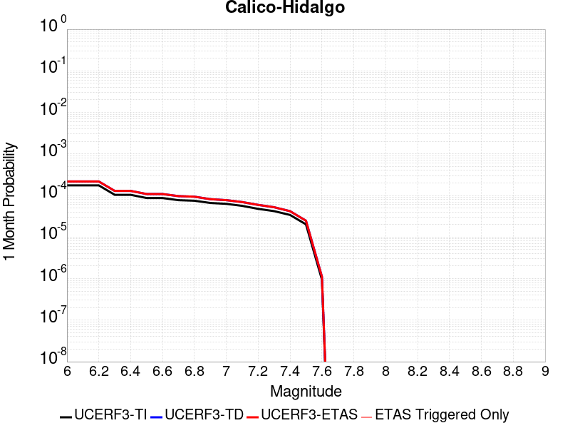 |  |  |

| Magnitude | 1 wk TI Prob | 1 wk TD Prob | 1 wk ETAS Prob | 1 wk ETAS/TD Gain | 1 wk ETAS Triggered Only | 1 mo TI Prob | 1 mo TD Prob | 1 mo ETAS Prob | 1 mo ETAS/TD Gain | 1 mo ETAS Triggered Only | 1 yr TI Prob | 1 yr TD Prob | 1 yr ETAS Prob | 1 yr ETAS/TD Gain | 1 yr ETAS Triggered Only | 10 yr TI Prob | 10 yr TD Prob | 10 yr ETAS Prob | 10 yr ETAS/TD Gain | 10 yr ETAS Triggered Only |
|-----|-----|-----|-----|-----|-----|-----|-----|-----|-----|-----|-----|-----|-----|-----|-----|-----|-----|-----|-----|-----|
| 6.0 | 4.0906612E-5 | 5.071044E-5 | 5.071044E-5 | 1.0 | 0.0 | 1.7530227E-4 | 2.1731463E-4 | 2.1731463E-4 | 1.0 | 0.0 | 0.0021322158 | 0.0026429992 | 0.0027603214 | 1.0443898 | 1.1763322E-4 | 0.02111873 | 0.026156036 | 0.026270593 | 1.0043797 | 1.1763322E-4 |
| 6.1 | 4.0906612E-5 | 5.071044E-5 | 5.071044E-5 | 1.0 | 0.0 | 1.7530227E-4 | 2.1731463E-4 | 2.1731463E-4 | 1.0 | 0.0 | 0.0021322158 | 0.0026429992 | 0.0027603214 | 1.0443898 | 1.1763322E-4 | 0.02111873 | 0.026156036 | 0.026270593 | 1.0043797 | 1.1763322E-4 |
| 6.2 | 4.0906612E-5 | 5.071044E-5 | 5.071044E-5 | 1.0 | 0.0 | 1.7530227E-4 | 2.1731463E-4 | 2.1731463E-4 | 1.0 | 0.0 | 0.0021322158 | 0.0026429992 | 0.0027603214 | 1.0443898 | 1.1763322E-4 | 0.02111873 | 0.026156036 | 0.026270593 | 1.0043797 | 1.1763322E-4 |
| 6.3 | 2.4242801E-5 | 3.0093212E-5 | 3.0093212E-5 | 1.0 | 0.0 | 1.0389358E-4 | 1.2896472E-4 | 1.2896472E-4 | 1.0 | 0.0 | 0.0012641704 | 0.0015690471 | 0.0015690471 | 1.0 | 0.0 | 0.01257003 | 0.015583365 | 0.015583365 | 1.0 | 0.0 |
| 6.4 | 2.4242801E-5 | 3.0093212E-5 | 3.0093212E-5 | 1.0 | 0.0 | 1.0389358E-4 | 1.2896472E-4 | 1.2896472E-4 | 1.0 | 0.0 | 0.0012641704 | 0.0015690471 | 0.0015690471 | 1.0 | 0.0 | 0.01257003 | 0.015583365 | 0.015583365 | 1.0 | 0.0 |
| 6.5 | 2.0286952E-5 | 2.531747E-5 | 2.531747E-5 | 1.0 | 0.0 | 8.694118E-5 | 1.0849902E-4 | 1.0849902E-4 | 1.0 | 0.0 | 0.0010579949 | 0.0013201922 | 0.0013201922 | 1.0 | 0.0 | 0.010529719 | 0.013125429 | 0.013125429 | 1.0 | 0.0 |
| 6.6 | 2.0269223E-5 | 2.5298417E-5 | 2.5298417E-5 | 1.0 | 0.0 | 8.6865206E-5 | 1.0841738E-4 | 1.0841738E-4 | 1.0 | 0.0 | 0.0010570707 | 0.0013191995 | 0.0013191995 | 1.0 | 0.0 | 0.010520565 | 0.013115618 | 0.013115618 | 1.0 | 0.0 |
| 6.7 | 1.799852E-5 | 2.2542E-5 | 2.2542E-5 | 1.0 | 0.0 | 7.713423E-5 | 9.660509E-5 | 9.660509E-5 | 1.0 | 0.0 | 9.3870464E-4 | 0.0011755469 | 0.0011755469 | 1.0 | 0.0 | 0.009347493 | 0.011694896 | 0.011694896 | 1.0 | 0.0 |
| 6.8 | 1.7458793E-5 | 2.184347E-5 | 2.184347E-5 | 1.0 | 0.0 | 7.4821255E-5 | 9.36116E-5 | 9.36116E-5 | 1.0 | 0.0 | 9.10568E-4 | 0.0011391398 | 0.0011391398 | 1.0 | 0.0 | 0.009068459 | 0.011334591 | 0.011334591 | 1.0 | 0.0 |
| 6.9 | 1.542884E-5 | 1.9027046E-5 | 1.9027046E-5 | 1.0 | 0.0 | 6.612192E-5 | 8.1542006E-5 | 8.1542006E-5 | 1.0 | 0.0 | 8.04737E-4 | 9.923349E-4 | 9.923349E-4 | 1.0 | 0.0 | 0.008018291 | 0.009880436 | 0.009880436 | 1.0 | 0.0 |
| 7.0 | 1.468253E-5 | 1.8031635E-5 | 1.8031635E-5 | 1.0 | 0.0 | 6.292361E-5 | 7.727622E-5 | 7.727622E-5 | 1.0 | 0.0 | 7.658257E-4 | 9.404449E-4 | 9.404449E-4 | 1.0 | 0.0 | 0.0076319184 | 0.009366017 | 0.009366017 | 1.0 | 0.0 |
| 7.1 | 1.3139281E-5 | 1.6201831E-5 | 1.6201831E-5 | 1.0 | 0.0 | 5.6309986E-5 | 6.943464E-5 | 6.943464E-5 | 1.0 | 0.0 | 6.853584E-4 | 8.450514E-4 | 8.450514E-4 | 1.0 | 0.0 | 0.0068324856 | 0.008419678 | 0.008419678 | 1.0 | 0.0 |
| 7.2 | 1.1127404E-5 | 1.3867336E-5 | 1.3867336E-5 | 1.0 | 0.0 | 4.7688E-5 | 5.9430145E-5 | 5.9430145E-5 | 1.0 | 0.0 | 5.8044674E-4 | 7.233327E-4 | 7.233327E-4 | 1.0 | 0.0 | 0.0057893298 | 0.007210891 | 0.007210891 | 1.0 | 0.0 |
| 7.3 | 9.808154E-6 | 1.2176818E-5 | 1.2176818E-5 | 1.0 | 0.0 | 4.2034266E-5 | 5.218538E-5 | 5.218538E-5 | 1.0 | 0.0 | 5.11647E-4 | 6.351825E-4 | 6.351825E-4 | 1.0 | 0.0 | 0.0051047057 | 0.006334746 | 0.006334746 | 1.0 | 0.0 |
| 7.4 | 7.942452E-6 | 9.792593E-6 | 9.792593E-6 | 1.0 | 0.0 | 3.4038632E-5 | 4.1967636E-5 | 4.1967636E-5 | 1.0 | 0.0 | 4.1434157E-4 | 5.108456E-4 | 5.108456E-4 | 1.0 | 0.0 | 0.0041356985 | 0.0050976546 | 0.0050976546 | 1.0 | 0.0 |
| 7.5 | 4.7121216E-6 | 5.7730804E-6 | 5.7730804E-6 | 1.0 | 0.0 | 2.019465E-5 | 2.4741581E-5 | 2.4741581E-5 | 1.0 | 0.0 | 2.4584212E-4 | 3.0119478E-4 | 3.0119478E-4 | 1.0 | 0.0 | 0.0024557032 | 0.003008618 | 0.003008618 | 1.0 | 0.0 |
| 7.6 | 2.21172E-7 | 2.6040513E-7 | 2.6040513E-7 | 1.0 | 0.0 | 9.478797E-7 | 1.1160216E-6 | 1.1160216E-6 | 1.0 | 0.0 | 1.1540374E-5 | 1.3587508E-5 | 1.3587508E-5 | 1.0 | 0.0 | 1.1539775E-4 | 1.3586959E-4 | 1.3586959E-4 | 1.0 | 0.0 |

## Baker
*[(top)](#table-of-contents)*

| 1 Week | 1 Month | 1 Year | 10 Year |
|-----|-----|-----|-----|
|  |  |  |  |

| Magnitude | 1 wk TI Prob | 1 wk TD Prob | 1 wk ETAS Prob | 1 wk ETAS/TD Gain | 1 wk ETAS Triggered Only | 1 mo TI Prob | 1 mo TD Prob | 1 mo ETAS Prob | 1 mo ETAS/TD Gain | 1 mo ETAS Triggered Only | 1 yr TI Prob | 1 yr TD Prob | 1 yr ETAS Prob | 1 yr ETAS/TD Gain | 1 yr ETAS Triggered Only | 10 yr TI Prob | 10 yr TD Prob | 10 yr ETAS Prob | 10 yr ETAS/TD Gain | 10 yr ETAS Triggered Only |
|-----|-----|-----|-----|-----|-----|-----|-----|-----|-----|-----|-----|-----|-----|-----|-----|-----|-----|-----|-----|-----|
| 6.0 | 5.695525E-6 | 5.8349706E-6 | 5.8349706E-6 | 1.0 | 0.0 | 2.4409164E-5 | 2.5006799E-5 | 2.5006799E-5 | 1.0 | 0.0 | 2.9714106E-4 | 3.0441926E-4 | 3.0441926E-4 | 1.0 | 0.0 | 0.0029674405 | 0.003040418 | 0.0031576937 | 1.0385722 | 1.1763322E-4 |
| 6.1 | 5.695525E-6 | 5.8349706E-6 | 5.8349706E-6 | 1.0 | 0.0 | 2.4409164E-5 | 2.5006799E-5 | 2.5006799E-5 | 1.0 | 0.0 | 2.9714106E-4 | 3.0441926E-4 | 3.0441926E-4 | 1.0 | 0.0 | 0.0029674405 | 0.003040418 | 0.0031576937 | 1.0385722 | 1.1763322E-4 |
| 6.2 | 5.695525E-6 | 5.8349706E-6 | 5.8349706E-6 | 1.0 | 0.0 | 2.4409164E-5 | 2.5006799E-5 | 2.5006799E-5 | 1.0 | 0.0 | 2.9714106E-4 | 3.0441926E-4 | 3.0441926E-4 | 1.0 | 0.0 | 0.0029674405 | 0.003040418 | 0.0031576937 | 1.0385722 | 1.1763322E-4 |
| 6.3 | 3.2995713E-6 | 3.383748E-6 | 3.383748E-6 | 1.0 | 0.0 | 1.4140943E-5 | 1.4501698E-5 | 1.4501698E-5 | 1.0 | 0.0 | 1.7215237E-4 | 1.7654434E-4 | 1.7654434E-4 | 1.0 | 0.0 | 0.0017201907 | 0.001764088 | 0.001764088 | 1.0 | 0.0 |
| 6.4 | 3.2995713E-6 | 3.383748E-6 | 3.383748E-6 | 1.0 | 0.0 | 1.4140943E-5 | 1.4501698E-5 | 1.4501698E-5 | 1.0 | 0.0 | 1.7215237E-4 | 1.7654434E-4 | 1.7654434E-4 | 1.0 | 0.0 | 0.0017201907 | 0.001764088 | 0.001764088 | 1.0 | 0.0 |
| 6.5 | 2.782202E-6 | 2.8559114E-6 | 2.8559114E-6 | 1.0 | 0.0 | 1.1923668E-5 | 1.2239564E-5 | 1.2239564E-5 | 1.0 | 0.0 | 1.4516099E-4 | 1.4900684E-4 | 1.4900684E-4 | 1.0 | 0.0 | 0.001450662 | 0.001489102 | 0.001489102 | 1.0 | 0.0 |
| 6.6 | 2.3163404E-6 | 2.3809823E-6 | 2.3809823E-6 | 1.0 | 0.0 | 9.927136E-6 | 1.0204171E-5 | 1.0204171E-5 | 1.0 | 0.0 | 1.20856166E-4 | 1.242289E-4 | 1.242289E-4 | 1.0 | 0.0 | 0.0012079047 | 0.0012416148 | 0.0012416148 | 1.0 | 0.0 |
| 6.7 | 2.037056E-6 | 2.0965579E-6 | 2.0965579E-6 | 1.0 | 0.0 | 8.7302105E-6 | 8.985218E-6 | 8.985218E-6 | 1.0 | 0.0 | 1.0628513E-4 | 1.093897E-4 | 1.093897E-4 | 1.0 | 0.0 | 0.0010623431 | 0.0010933747 | 0.0010933747 | 1.0 | 0.0 |
| 6.8 | 1.8356744E-6 | 1.8915827E-6 | 1.8915827E-6 | 1.0 | 0.0 | 7.867153E-6 | 8.106758E-6 | 8.106758E-6 | 1.0 | 0.0 | 9.577837E-5 | 9.8695455E-5 | 9.8695455E-5 | 1.0 | 0.0 | 9.57371E-4 | 9.865302E-4 | 9.865302E-4 | 1.0 | 0.0 |
| 6.9 | 1.6310546E-6 | 1.6832578E-6 | 1.6832578E-6 | 1.0 | 0.0 | 6.9902153E-6 | 7.2139424E-6 | 7.2139424E-6 | 1.0 | 0.0 | 8.510255E-5 | 8.782632E-5 | 8.782632E-5 | 1.0 | 0.0 | 8.5069967E-4 | 8.779274E-4 | 8.779274E-4 | 1.0 | 0.0 |
| 7.0 | 1.2058036E-6 | 1.2509104E-6 | 1.2509104E-6 | 1.0 | 0.0 | 5.1677193E-6 | 5.361034E-6 | 5.361034E-6 | 1.0 | 0.0 | 6.291517E-5 | 6.526865E-5 | 6.526865E-5 | 1.0 | 0.0 | 6.289736E-4 | 6.5249717E-4 | 6.5249717E-4 | 1.0 | 0.0 |
| 7.1 | 1.052382E-6 | 1.0952025E-6 | 1.0952025E-6 | 1.0 | 0.0 | 4.5102006E-6 | 4.6937166E-6 | 4.6937166E-6 | 1.0 | 0.0 | 5.491031E-5 | 5.7144513E-5 | 5.7144513E-5 | 1.0 | 0.0 | 5.4896745E-4 | 5.7129905E-4 | 5.7129905E-4 | 1.0 | 0.0 |
| 7.2 | 1.0067454E-6 | 1.048812E-6 | 1.048812E-6 | 1.0 | 0.0 | 4.3146156E-6 | 4.494901E-6 | 4.494901E-6 | 1.0 | 0.0 | 5.252918E-5 | 5.4724056E-5 | 5.4724056E-5 | 1.0 | 0.0 | 5.251676E-4 | 5.4710667E-4 | 5.4710667E-4 | 1.0 | 0.0 |
| 7.3 | 9.3596316E-7 | 9.768122E-7 | 9.768122E-7 | 1.0 | 0.0 | 4.0112645E-6 | 4.1863314E-6 | 4.1863314E-6 | 1.0 | 0.0 | 4.8836053E-5 | 5.09674E-5 | 5.09674E-5 | 1.0 | 0.0 | 4.8825322E-4 | 5.095579E-4 | 5.095579E-4 | 1.0 | 0.0 |
| 7.4 | 8.8117395E-7 | 9.20805E-7 | 9.20805E-7 | 1.0 | 0.0 | 3.7764542E-6 | 3.946301E-6 | 3.946301E-6 | 1.0 | 0.0 | 4.5977362E-5 | 4.8045167E-5 | 4.8045167E-5 | 1.0 | 0.0 | 4.596785E-4 | 4.8034854E-4 | 4.8034854E-4 | 1.0 | 0.0 |
| 7.5 | 8.292386E-7 | 8.674969E-7 | 8.674969E-7 | 1.0 | 0.0 | 3.5538749E-6 | 3.7178388E-6 | 3.7178388E-6 | 1.0 | 0.0 | 4.326757E-5 | 4.5263754E-5 | 4.5263754E-5 | 1.0 | 0.0 | 4.3259145E-4 | 4.5254608E-4 | 4.5254608E-4 | 1.0 | 0.0 |
| 7.6 | 7.553842E-7 | 7.9148236E-7 | 7.9148236E-7 | 1.0 | 0.0 | 3.2373566E-6 | 3.3920628E-6 | 3.3920628E-6 | 1.0 | 0.0 | 3.9414106E-5 | 4.129759E-5 | 4.129759E-5 | 1.0 | 0.0 | 3.9407116E-4 | 4.1289986E-4 | 4.1289986E-4 | 1.0 | 0.0 |
| 7.7 | 6.5285366E-7 | 6.853115E-7 | 6.853115E-7 | 1.0 | 0.0 | 2.797941E-6 | 2.9370458E-6 | 2.9370458E-6 | 1.0 | 0.0 | 3.40644E-5 | 3.5757952E-5 | 3.5757952E-5 | 1.0 | 0.0 | 3.405918E-4 | 3.5752266E-4 | 3.5752266E-4 | 1.0 | 0.0 |
| 7.8 | 3.4586725E-7 | 3.648448E-7 | 3.648448E-7 | 1.0 | 0.0 | 1.4822873E-6 | 1.5636197E-6 | 1.5636197E-6 | 1.0 | 0.0 | 1.80467E-5 | 1.9036908E-5 | 1.9036908E-5 | 1.0 | 0.0 | 1.8045233E-4 | 1.9035321E-4 | 1.9035321E-4 | 1.0 | 0.0 |
| 7.9 | 2.5591178E-9 | 2.6697788E-9 | 2.6697788E-9 | 1.0 | 0.0 | 1.0967647E-8 | 1.144191E-8 | 1.144191E-8 | 1.0 | 0.0 | 1.335311E-7 | 1.3930524E-7 | 1.3930524E-7 | 1.0 | 0.0 | 1.3353102E-6 | 1.3930525E-6 | 1.3930525E-6 | 1.0 | 0.0 |

## San Andreas (Big Bend)
*[(top)](#table-of-contents)*

| 1 Week | 1 Month | 1 Year | 10 Year |
|-----|-----|-----|-----|
|  |  |  |  |

| Magnitude | 1 wk TI Prob | 1 wk TD Prob | 1 wk ETAS Prob | 1 wk ETAS/TD Gain | 1 wk ETAS Triggered Only | 1 mo TI Prob | 1 mo TD Prob | 1 mo ETAS Prob | 1 mo ETAS/TD Gain | 1 mo ETAS Triggered Only | 1 yr TI Prob | 1 yr TD Prob | 1 yr ETAS Prob | 1 yr ETAS/TD Gain | 1 yr ETAS Triggered Only | 10 yr TI Prob | 10 yr TD Prob | 10 yr ETAS Prob | 10 yr ETAS/TD Gain | 10 yr ETAS Triggered Only |
|-----|-----|-----|-----|-----|-----|-----|-----|-----|-----|-----|-----|-----|-----|-----|-----|-----|-----|-----|-----|-----|
| 6.0 | 1.0179969E-4 | 2.0131959E-4 | 2.0131959E-4 | 1.0 | 0.0 | 4.362114E-4 | 8.6251396E-4 | 8.6251396E-4 | 1.0 | 0.0 | 0.0052979486 | 0.010450831 | 0.010567235 | 1.0111382 | 1.1763322E-4 | 0.051734097 | 0.101709 | 0.101814665 | 1.0010389 | 1.1763322E-4 |
| 6.1 | 1.0179969E-4 | 2.0131959E-4 | 2.0131959E-4 | 1.0 | 0.0 | 4.362114E-4 | 8.6251396E-4 | 8.6251396E-4 | 1.0 | 0.0 | 0.0052979486 | 0.010450831 | 0.010567235 | 1.0111382 | 1.1763322E-4 | 0.051734097 | 0.101709 | 0.101814665 | 1.0010389 | 1.1763322E-4 |
| 6.2 | 1.0179969E-4 | 2.0131959E-4 | 2.0131959E-4 | 1.0 | 0.0 | 4.362114E-4 | 8.6251396E-4 | 8.6251396E-4 | 1.0 | 0.0 | 0.0052979486 | 0.010450831 | 0.010567235 | 1.0111382 | 1.1763322E-4 | 0.051734097 | 0.101709 | 0.101814665 | 1.0010389 | 1.1763322E-4 |
| 6.3 | 1.0179969E-4 | 2.0131959E-4 | 2.0131959E-4 | 1.0 | 0.0 | 4.362114E-4 | 8.6251396E-4 | 8.6251396E-4 | 1.0 | 0.0 | 0.0052979486 | 0.010450831 | 0.010567235 | 1.0111382 | 1.1763322E-4 | 0.051734097 | 0.101709 | 0.101814665 | 1.0010389 | 1.1763322E-4 |
| 6.4 | 9.1639464E-5 | 1.8488058E-4 | 1.8488058E-4 | 1.0 | 0.0 | 3.9268145E-4 | 7.92105E-4 | 7.92105E-4 | 1.0 | 0.0 | 0.0047704205 | 0.009601353 | 0.009601353 | 1.0 | 0.0 | 0.046693064 | 0.09403238 | 0.09403238 | 1.0 | 0.0 |
| 6.5 | 9.1639464E-5 | 1.8488058E-4 | 1.8488058E-4 | 1.0 | 0.0 | 3.9268145E-4 | 7.92105E-4 | 7.92105E-4 | 1.0 | 0.0 | 0.0047704205 | 0.009601353 | 0.009601353 | 1.0 | 0.0 | 0.046693064 | 0.09403238 | 0.09403238 | 1.0 | 0.0 |
| 6.6 | 9.042622E-5 | 1.829497E-4 | 1.829497E-4 | 1.0 | 0.0 | 3.8748336E-4 | 7.838348E-4 | 7.838348E-4 | 1.0 | 0.0 | 0.0047074095 | 0.009501544 | 0.009501544 | 1.0 | 0.0 | 0.046089325 | 0.09312604 | 0.09312604 | 1.0 | 0.0 |
| 6.7 | 8.9836685E-5 | 1.8209257E-4 | 1.8209257E-4 | 1.0 | 0.0 | 3.8495753E-4 | 7.8016357E-4 | 7.8016357E-4 | 1.0 | 0.0 | 0.00467679 | 0.009457235 | 0.009457235 | 1.0 | 0.0 | 0.045795817 | 0.092720196 | 0.092720196 | 1.0 | 0.0 |
| 6.8 | 8.9471854E-5 | 1.8155984E-4 | 1.8155984E-4 | 1.0 | 0.0 | 3.8339442E-4 | 7.7788177E-4 | 7.7788177E-4 | 1.0 | 0.0 | 0.004657841 | 0.009429695 | 0.009429695 | 1.0 | 0.0 | 0.04561414 | 0.092467226 | 0.092467226 | 1.0 | 0.0 |
| 6.9 | 8.858234E-5 | 1.8037861E-4 | 1.8037861E-4 | 1.0 | 0.0 | 3.7958333E-4 | 7.728224E-4 | 7.728224E-4 | 1.0 | 0.0 | 0.004611638 | 0.009368628 | 0.009368628 | 1.0 | 0.0 | 0.04517103 | 0.09190706 | 0.09190706 | 1.0 | 0.0 |
| 7.0 | 8.7433385E-5 | 1.7876514E-4 | 1.7876514E-4 | 1.0 | 0.0 | 3.746607E-4 | 7.659116E-4 | 7.659116E-4 | 1.0 | 0.0 | 0.004551957 | 0.009285209 | 0.009285209 | 1.0 | 0.0 | 0.044598386 | 0.09114104 | 0.09114104 | 1.0 | 0.0 |
| 7.1 | 8.684964E-5 | 1.7788376E-4 | 1.7788376E-4 | 1.0 | 0.0 | 3.7215967E-4 | 7.621365E-4 | 7.621365E-4 | 1.0 | 0.0 | 0.0045216335 | 0.009239637 | 0.009239637 | 1.0 | 0.0 | 0.04430731 | 0.09072227 | 0.09072227 | 1.0 | 0.0 |
| 7.2 | 8.606521E-5 | 1.7678899E-4 | 1.7678899E-4 | 1.0 | 0.0 | 3.6879873E-4 | 7.5744727E-4 | 7.5744727E-4 | 1.0 | 0.0 | 0.0044808835 | 0.00918303 | 0.00918303 | 1.0 | 0.0 | 0.043916024 | 0.09020251 | 0.09020251 | 1.0 | 0.0 |
| 7.3 | 8.568266E-5 | 1.7620796E-4 | 1.7620796E-4 | 1.0 | 0.0 | 3.6715972E-4 | 7.549586E-4 | 7.549586E-4 | 1.0 | 0.0 | 0.0044610105 | 0.009152985 | 0.009152985 | 1.0 | 0.0 | 0.043725148 | 0.089923255 | 0.089923255 | 1.0 | 0.0 |
| 7.4 | 8.5432206E-5 | 1.7583313E-4 | 1.7583313E-4 | 1.0 | 0.0 | 3.6608664E-4 | 7.533532E-4 | 7.533532E-4 | 1.0 | 0.0 | 0.004447999 | 0.0091336025 | 0.0091336025 | 1.0 | 0.0 | 0.043600157 | 0.08974317 | 0.08974317 | 1.0 | 0.0 |
| 7.5 | 8.4791965E-5 | 1.7452403E-4 | 1.7452403E-4 | 1.0 | 0.0 | 3.633435E-4 | 7.477459E-4 | 7.477459E-4 | 1.0 | 0.0 | 0.0044147377 | 0.009065905 | 0.009065905 | 1.0 | 0.0 | 0.043280575 | 0.08911997 | 0.08911997 | 1.0 | 0.0 |
| 7.6 | 8.241105E-5 | 1.6896869E-4 | 1.6896869E-4 | 1.0 | 0.0 | 3.531424E-4 | 7.2395074E-4 | 7.2395074E-4 | 1.0 | 0.0 | 0.0042910352 | 0.008778568 | 0.008778568 | 1.0 | 0.0 | 0.042091176 | 0.08649363 | 0.08649363 | 1.0 | 0.0 |
| 7.7 | 7.00432E-5 | 1.4255449E-4 | 1.4255449E-4 | 1.0 | 0.0 | 3.001506E-4 | 6.108048E-4 | 6.108048E-4 | 1.0 | 0.0 | 0.0036482112 | 0.0074112318 | 0.0074112318 | 1.0 | 0.0 | 0.035888977 | 0.07374726 | 0.07374726 | 1.0 | 0.0 |
| 7.8 | 6.415362E-5 | 1.3014876E-4 | 1.3014876E-4 | 1.0 | 0.0 | 2.749151E-4 | 5.5766123E-4 | 5.5766123E-4 | 1.0 | 0.0 | 0.0033419547 | 0.006768419 | 0.006768419 | 1.0 | 0.0 | 0.03292141 | 0.06746108 | 0.06746108 | 1.0 | 0.0 |
| 7.9 | 4.939911E-5 | 9.374107E-5 | 9.374107E-5 | 1.0 | 0.0 | 2.116933E-4 | 4.0168563E-4 | 4.0168563E-4 | 1.0 | 0.0 | 0.0025743195 | 0.004879565 | 0.004879565 | 1.0 | 0.0 | 0.025447013 | 0.049068946 | 0.049068946 | 1.0 | 0.0 |
| 8.0 | 3.344983E-5 | 5.2423515E-5 | 5.2423515E-5 | 1.0 | 0.0 | 1.4334853E-4 | 2.2465286E-4 | 2.2465286E-4 | 1.0 | 0.0 | 0.0017438711 | 0.0027317198 | 0.0027317198 | 1.0 | 0.0 | 0.017302496 | 0.028018981 | 0.028018981 | 1.0 | 0.0 |
| 8.1 | 1.9104898E-5 | 1.9269055E-5 | 1.9269055E-5 | 1.0 | 0.0 | 8.1875565E-5 | 8.257905E-5 | 8.257905E-5 | 1.0 | 0.0 | 9.963791E-4 | 0.0010049369 | 0.0010049369 | 1.0 | 0.0 | 0.009919235 | 0.0108002825 | 0.0108002825 | 1.0 | 0.0 |
| 8.2 | 8.643924E-6 | 5.5112705E-6 | 5.5112705E-6 | 1.0 | 0.0 | 3.704486E-5 | 2.3619517E-5 | 2.3619517E-5 | 1.0 | 0.0 | 4.5092785E-4 | 2.8752975E-4 | 2.8752975E-4 | 1.0 | 0.0 | 0.0045001395 | 0.0032686237 | 0.0032686237 | 1.0 | 0.0 |
| 8.3 | 1.983087E-6 | 7.7188406E-7 | 7.7188406E-7 | 1.0 | 0.0 | 8.498917E-6 | 3.3080703E-6 | 3.3080703E-6 | 1.0 | 0.0 | 1.034694E-4 | 4.027503E-5 | 4.027503E-5 | 1.0 | 0.0 | 0.0010342124 | 4.7534908E-4 | 4.7534908E-4 | 1.0 | 0.0 |

## Sisar
*[(top)](#table-of-contents)*

| 1 Week | 1 Month | 1 Year | 10 Year |
|-----|-----|-----|-----|
|  |  | 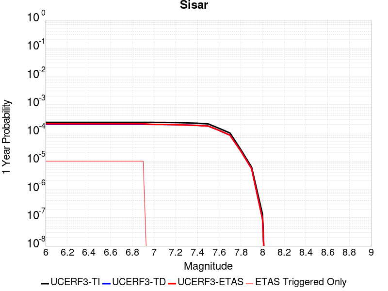 |  |

| Magnitude | 1 wk TI Prob | 1 wk TD Prob | 1 wk ETAS Prob | 1 wk ETAS/TD Gain | 1 wk ETAS Triggered Only | 1 mo TI Prob | 1 mo TD Prob | 1 mo ETAS Prob | 1 mo ETAS/TD Gain | 1 mo ETAS Triggered Only | 1 yr TI Prob | 1 yr TD Prob | 1 yr ETAS Prob | 1 yr ETAS/TD Gain | 1 yr ETAS Triggered Only | 10 yr TI Prob | 10 yr TD Prob | 10 yr ETAS Prob | 10 yr ETAS/TD Gain | 10 yr ETAS Triggered Only |
|-----|-----|-----|-----|-----|-----|-----|-----|-----|-----|-----|-----|-----|-----|-----|-----|-----|-----|-----|-----|-----|
| 6.0 | 4.544193E-6 | 3.8398925E-6 | 3.8398925E-6 | 1.0 | 0.0 | 1.9474966E-5 | 1.645658E-5 | 1.645658E-5 | 1.0 | 0.0 | 2.3708193E-4 | 2.0034079E-4 | 3.1795044E-4 | 1.5870479 | 1.1763322E-4 | 0.0023682916 | 0.0020016355 | 0.0021190334 | 1.058651 | 1.1763322E-4 |
| 6.1 | 4.544193E-6 | 3.8398925E-6 | 3.8398925E-6 | 1.0 | 0.0 | 1.9474966E-5 | 1.645658E-5 | 1.645658E-5 | 1.0 | 0.0 | 2.3708193E-4 | 2.0034079E-4 | 3.1795044E-4 | 1.5870479 | 1.1763322E-4 | 0.0023682916 | 0.0020016355 | 0.0021190334 | 1.058651 | 1.1763322E-4 |
| 6.2 | 4.544193E-6 | 3.8398925E-6 | 3.8398925E-6 | 1.0 | 0.0 | 1.9474966E-5 | 1.645658E-5 | 1.645658E-5 | 1.0 | 0.0 | 2.3708193E-4 | 2.0034079E-4 | 3.1795044E-4 | 1.5870479 | 1.1763322E-4 | 0.0023682916 | 0.0020016355 | 0.0021190334 | 1.058651 | 1.1763322E-4 |
| 6.3 | 4.544193E-6 | 3.8398925E-6 | 3.8398925E-6 | 1.0 | 0.0 | 1.9474966E-5 | 1.645658E-5 | 1.645658E-5 | 1.0 | 0.0 | 2.3708193E-4 | 2.0034079E-4 | 3.1795044E-4 | 1.5870479 | 1.1763322E-4 | 0.0023682916 | 0.0020016355 | 0.0021190334 | 1.058651 | 1.1763322E-4 |
| 6.4 | 4.544193E-6 | 3.8398925E-6 | 3.8398925E-6 | 1.0 | 0.0 | 1.9474966E-5 | 1.645658E-5 | 1.645658E-5 | 1.0 | 0.0 | 2.3708193E-4 | 2.0034079E-4 | 3.1795044E-4 | 1.5870479 | 1.1763322E-4 | 0.0023682916 | 0.0020016355 | 0.0021190334 | 1.058651 | 1.1763322E-4 |
| 6.5 | 4.544193E-6 | 3.8398925E-6 | 3.8398925E-6 | 1.0 | 0.0 | 1.9474966E-5 | 1.645658E-5 | 1.645658E-5 | 1.0 | 0.0 | 2.3708193E-4 | 2.0034079E-4 | 3.1795044E-4 | 1.5870479 | 1.1763322E-4 | 0.0023682916 | 0.0020016355 | 0.0021190334 | 1.058651 | 1.1763322E-4 |
| 6.6 | 4.544193E-6 | 3.8398925E-6 | 3.8398925E-6 | 1.0 | 0.0 | 1.9474966E-5 | 1.645658E-5 | 1.645658E-5 | 1.0 | 0.0 | 2.3708193E-4 | 2.0034079E-4 | 3.1795044E-4 | 1.5870479 | 1.1763322E-4 | 0.0023682916 | 0.0020016355 | 0.0021190334 | 1.058651 | 1.1763322E-4 |
| 6.7 | 4.544193E-6 | 3.8398925E-6 | 3.8398925E-6 | 1.0 | 0.0 | 1.9474966E-5 | 1.645658E-5 | 1.645658E-5 | 1.0 | 0.0 | 2.3708193E-4 | 2.0034079E-4 | 3.1795044E-4 | 1.5870479 | 1.1763322E-4 | 0.0023682916 | 0.0020016355 | 0.0021190334 | 1.058651 | 1.1763322E-4 |
| 6.8 | 4.544193E-6 | 3.8398925E-6 | 3.8398925E-6 | 1.0 | 0.0 | 1.9474966E-5 | 1.645658E-5 | 1.645658E-5 | 1.0 | 0.0 | 2.3708193E-4 | 2.0034079E-4 | 3.1795044E-4 | 1.5870479 | 1.1763322E-4 | 0.0023682916 | 0.0020016355 | 0.0021190334 | 1.058651 | 1.1763322E-4 |
| 6.9 | 4.542225E-6 | 3.8378544E-6 | 3.8378544E-6 | 1.0 | 0.0 | 1.9466532E-5 | 1.6447846E-5 | 1.6447846E-5 | 1.0 | 0.0 | 2.3697925E-4 | 2.0023446E-4 | 3.1784413E-4 | 1.5873598 | 1.1763322E-4 | 0.002367267 | 0.0020005743 | 0.0021179721 | 1.0586821 | 1.1763322E-4 |
| 7.0 | 4.5278484E-6 | 3.8229177E-6 | 3.8229177E-6 | 1.0 | 0.0 | 1.940492E-5 | 1.6383832E-5 | 1.6383832E-5 | 1.0 | 0.0 | 2.3622929E-4 | 1.9945524E-4 | 1.9945524E-4 | 1.0 | 0.0 | 0.0023597833 | 0.001992796 | 0.001992796 | 1.0 | 0.0 |
| 7.1 | 4.5132488E-6 | 3.8077048E-6 | 3.8077048E-6 | 1.0 | 0.0 | 1.9342351E-5 | 1.6318634E-5 | 1.6318634E-5 | 1.0 | 0.0 | 2.3546767E-4 | 1.986616E-4 | 1.986616E-4 | 1.0 | 0.0 | 0.0023521832 | 0.0019848738 | 0.0019848738 | 1.0 | 0.0 |
| 7.2 | 4.448859E-6 | 3.7401621E-6 | 3.7401621E-6 | 1.0 | 0.0 | 1.9066398E-5 | 1.602917E-5 | 1.602917E-5 | 1.0 | 0.0 | 2.3210866E-4 | 1.95138E-4 | 1.95138E-4 | 1.0 | 0.0 | 0.0023186638 | 0.0019497001 | 0.0019497001 | 1.0 | 0.0 |
| 7.3 | 4.3424366E-6 | 3.633991E-6 | 3.633991E-6 | 1.0 | 0.0 | 1.861031E-5 | 1.5574155E-5 | 1.5574155E-5 | 1.0 | 0.0 | 2.2655698E-4 | 1.8959917E-4 | 1.8959917E-4 | 1.0 | 0.0 | 0.0022632615 | 0.0018944077 | 0.0018944077 | 1.0 | 0.0 |
| 7.4 | 4.218641E-6 | 3.5333355E-6 | 3.5333355E-6 | 1.0 | 0.0 | 1.8079765E-5 | 1.514278E-5 | 1.514278E-5 | 1.0 | 0.0 | 2.2009891E-4 | 1.8434809E-4 | 1.8434809E-4 | 1.0 | 0.0 | 0.0021988105 | 0.0018419849 | 0.0018419849 | 1.0 | 0.0 |
| 7.5 | 3.983779E-6 | 3.3480885E-6 | 3.3480885E-6 | 1.0 | 0.0 | 1.7073227E-5 | 1.4348873E-5 | 1.4348873E-5 | 1.0 | 0.0 | 2.0784672E-4 | 1.7468387E-4 | 1.7468387E-4 | 1.0 | 0.0 | 0.0020765243 | 0.0017454985 | 0.0017454985 | 1.0 | 0.0 |
| 7.6 | 2.777393E-6 | 2.3524497E-6 | 2.3524497E-6 | 1.0 | 0.0 | 1.1903058E-5 | 1.0081888E-5 | 1.0081888E-5 | 1.0 | 0.0 | 1.449101E-4 | 1.2274015E-4 | 1.2274015E-4 | 1.0 | 0.0 | 0.0014481564 | 0.0012267313 | 0.0012267313 | 1.0 | 0.0 |
| 7.7 | 1.9028433E-6 | 1.5939935E-6 | 1.5939935E-6 | 1.0 | 0.0 | 8.155017E-6 | 6.831383E-6 | 6.831383E-6 | 1.0 | 0.0 | 9.928281E-5 | 8.316896E-5 | 8.316896E-5 | 1.0 | 0.0 | 9.923846E-4 | 8.313831E-4 | 8.313831E-4 | 1.0 | 0.0 |
| 7.8 | 4.9095956E-7 | 4.358607E-7 | 4.358607E-7 | 1.0 | 0.0 | 2.1041105E-6 | 1.8679731E-6 | 1.8679731E-6 | 1.0 | 0.0 | 2.5617246E-5 | 2.2742337E-5 | 2.2742337E-5 | 1.0 | 0.0 | 2.5614293E-4 | 2.2740028E-4 | 2.2740028E-4 | 1.0 | 0.0 |
| 7.9 | 1.16657894E-7 | 1.0336398E-7 | 1.0336398E-7 | 1.0 | 0.0 | 4.999623E-7 | 4.429884E-7 | 4.429884E-7 | 1.0 | 0.0 | 6.087024E-6 | 5.393371E-6 | 5.393371E-6 | 1.0 | 0.0 | 6.0868573E-5 | 5.393243E-5 | 5.393243E-5 | 1.0 | 0.0 |
| 8.0 | 2.5100346E-9 | 1.7071163E-9 | 1.7071163E-9 | 1.0 | 0.0 | 1.0757291E-8 | 7.3162125E-9 | 7.3162125E-9 | 1.0 | 0.0 | 1.3097001E-7 | 8.907489E-8 | 8.907489E-8 | 1.0 | 0.0 | 1.3096993E-6 | 8.9074854E-7 | 8.9074854E-7 | 1.0 | 0.0 |

## Oak Ridge (Onshore)
*[(top)](#table-of-contents)*

| 1 Week | 1 Month | 1 Year | 10 Year |
|-----|-----|-----|-----|
|  | 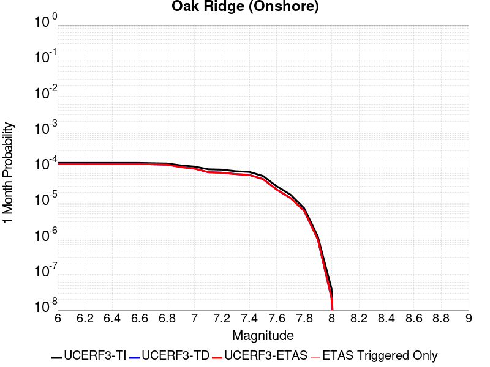 |  |  |

| Magnitude | 1 wk TI Prob | 1 wk TD Prob | 1 wk ETAS Prob | 1 wk ETAS/TD Gain | 1 wk ETAS Triggered Only | 1 mo TI Prob | 1 mo TD Prob | 1 mo ETAS Prob | 1 mo ETAS/TD Gain | 1 mo ETAS Triggered Only | 1 yr TI Prob | 1 yr TD Prob | 1 yr ETAS Prob | 1 yr ETAS/TD Gain | 1 yr ETAS Triggered Only | 10 yr TI Prob | 10 yr TD Prob | 10 yr ETAS Prob | 10 yr ETAS/TD Gain | 10 yr ETAS Triggered Only |
|-----|-----|-----|-----|-----|-----|-----|-----|-----|-----|-----|-----|-----|-----|-----|-----|-----|-----|-----|-----|-----|
| 6.0 | 3.155064E-5 | 2.9531044E-5 | 2.9531044E-5 | 1.0 | 0.0 | 1.3521002E-4 | 1.265557E-4 | 1.265557E-4 | 1.0 | 0.0 | 0.001644939 | 0.0015397646 | 0.0016572166 | 1.0762793 | 1.1763322E-4 | 0.01632816 | 0.015295465 | 0.015411299 | 1.0075731 | 1.1763322E-4 |
| 6.1 | 3.155064E-5 | 2.9531044E-5 | 2.9531044E-5 | 1.0 | 0.0 | 1.3521002E-4 | 1.265557E-4 | 1.265557E-4 | 1.0 | 0.0 | 0.001644939 | 0.0015397646 | 0.0016572166 | 1.0762793 | 1.1763322E-4 | 0.01632816 | 0.015295465 | 0.015411299 | 1.0075731 | 1.1763322E-4 |
| 6.2 | 3.155064E-5 | 2.9531044E-5 | 2.9531044E-5 | 1.0 | 0.0 | 1.3521002E-4 | 1.265557E-4 | 1.265557E-4 | 1.0 | 0.0 | 0.001644939 | 0.0015397646 | 0.0016572166 | 1.0762793 | 1.1763322E-4 | 0.01632816 | 0.015295465 | 0.015411299 | 1.0075731 | 1.1763322E-4 |
| 6.3 | 3.155064E-5 | 2.9531044E-5 | 2.9531044E-5 | 1.0 | 0.0 | 1.3521002E-4 | 1.265557E-4 | 1.265557E-4 | 1.0 | 0.0 | 0.001644939 | 0.0015397646 | 0.0016572166 | 1.0762793 | 1.1763322E-4 | 0.01632816 | 0.015295465 | 0.015411299 | 1.0075731 | 1.1763322E-4 |
| 6.4 | 3.155064E-5 | 2.9531044E-5 | 2.9531044E-5 | 1.0 | 0.0 | 1.3521002E-4 | 1.265557E-4 | 1.265557E-4 | 1.0 | 0.0 | 0.001644939 | 0.0015397646 | 0.0016572166 | 1.0762793 | 1.1763322E-4 | 0.01632816 | 0.015295465 | 0.015411299 | 1.0075731 | 1.1763322E-4 |
| 6.5 | 3.155064E-5 | 2.9531044E-5 | 2.9531044E-5 | 1.0 | 0.0 | 1.3521002E-4 | 1.265557E-4 | 1.265557E-4 | 1.0 | 0.0 | 0.001644939 | 0.0015397646 | 0.0016572166 | 1.0762793 | 1.1763322E-4 | 0.01632816 | 0.015295465 | 0.015411299 | 1.0075731 | 1.1763322E-4 |
| 6.6 | 3.155064E-5 | 2.9531044E-5 | 2.9531044E-5 | 1.0 | 0.0 | 1.3521002E-4 | 1.265557E-4 | 1.265557E-4 | 1.0 | 0.0 | 0.001644939 | 0.0015397646 | 0.0016572166 | 1.0762793 | 1.1763322E-4 | 0.01632816 | 0.015295465 | 0.015411299 | 1.0075731 | 1.1763322E-4 |
| 6.7 | 3.098897E-5 | 2.8869135E-5 | 2.8869135E-5 | 1.0 | 0.0 | 1.328031E-4 | 1.237192E-4 | 1.237192E-4 | 1.0 | 0.0 | 0.0016156785 | 0.0015052783 | 0.0016227345 | 1.0780295 | 1.1763322E-4 | 0.016039822 | 0.0149552645 | 0.015071139 | 1.007748 | 1.1763322E-4 |
| 6.8 | 3.0449872E-5 | 2.824424E-5 | 2.824424E-5 | 1.0 | 0.0 | 1.3049292E-4 | 1.2104134E-4 | 1.2104134E-4 | 1.0 | 0.0 | 0.0015875935 | 0.0014727192 | 0.0015901793 | 1.0797572 | 1.1763322E-4 | 0.015762992 | 0.014633966 | 0.014749877 | 1.0079207 | 1.1763322E-4 |
| 6.9 | 2.697928E-5 | 2.422405E-5 | 2.422405E-5 | 1.0 | 0.0 | 1.15620365E-4 | 1.0381334E-4 | 1.0381334E-4 | 1.0 | 0.0 | 0.0014067689 | 0.0012632161 | 0.0013807007 | 1.0930043 | 1.1763322E-4 | 0.0139789665 | 0.012563073 | 0.012679229 | 1.0092458 | 1.1763322E-4 |
| 7.0 | 2.4893961E-5 | 2.1865993E-5 | 2.1865993E-5 | 1.0 | 0.0 | 1.0668404E-4 | 9.3708135E-5 | 9.3708135E-5 | 1.0 | 0.0 | 0.0012981043 | 0.0011403172 | 0.0012578162 | 1.1030407 | 1.1763322E-4 | 0.012905477 | 0.011346945 | 0.011463243 | 1.0102494 | 1.1763322E-4 |
| 7.1 | 2.0945363E-5 | 1.7357834E-5 | 1.7357834E-5 | 1.0 | 0.0 | 8.976275E-5 | 7.438862E-5 | 7.438862E-5 | 1.0 | 0.0 | 0.0010923136 | 9.0530986E-4 | 9.0530986E-4 | 1.0 | 0.0 | 0.0108696 | 0.009017154 | 0.009017154 | 1.0 | 0.0 |
| 7.2 | 2.0439404E-5 | 1.68127E-5 | 1.68127E-5 | 1.0 | 0.0 | 8.7594504E-5 | 7.205247E-5 | 7.205247E-5 | 1.0 | 0.0 | 0.0010659413 | 8.7689044E-4 | 8.7689044E-4 | 1.0 | 0.0 | 0.010608427 | 0.008735222 | 0.008735222 | 1.0 | 0.0 |
| 7.3 | 1.8463334E-5 | 1.5383524E-5 | 1.5383524E-5 | 1.0 | 0.0 | 7.912617E-5 | 6.592775E-5 | 6.592775E-5 | 1.0 | 0.0 | 9.6293533E-4 | 8.023791E-4 | 8.023791E-4 | 1.0 | 0.0 | 0.009587734 | 0.007995685 | 0.007995685 | 1.0 | 0.0 |
| 7.4 | 1.763139E-5 | 1.4518336E-5 | 1.4518336E-5 | 1.0 | 0.0 | 7.556091E-5 | 6.221998E-5 | 6.221998E-5 | 1.0 | 0.0 | 9.1956573E-4 | 7.572689E-4 | 7.572689E-4 | 1.0 | 0.0 | 0.009157699 | 0.0075476887 | 0.0075476887 | 1.0 | 0.0 |
| 7.5 | 1.3594944E-5 | 1.1164352E-5 | 1.1164352E-5 | 1.0 | 0.0 | 5.8262744E-5 | 4.7846363E-5 | 4.7846363E-5 | 1.0 | 0.0 | 7.0911803E-4 | 5.8237626E-4 | 5.8237626E-4 | 1.0 | 0.0 | 0.007068595 | 0.0058087725 | 0.0058087725 | 1.0 | 0.0 |
| 7.6 | 6.9889534E-6 | 5.6371114E-6 | 5.6371114E-6 | 1.0 | 0.0 | 2.9952313E-5 | 2.4158828E-5 | 2.4158828E-5 | 1.0 | 0.0 | 3.646084E-4 | 2.9409444E-4 | 2.9409444E-4 | 1.0 | 0.0 | 0.0036401073 | 0.0029370964 | 0.0029370964 | 1.0 | 0.0 |
| 7.7 | 4.0824193E-6 | 3.283474E-6 | 3.283474E-6 | 1.0 | 0.0 | 1.7495966E-5 | 1.4071956E-5 | 1.4071956E-5 | 1.0 | 0.0 | 2.1299256E-4 | 1.7131273E-4 | 1.7131273E-4 | 1.0 | 0.0 | 0.0021278851 | 0.00171182 | 0.00171182 | 1.0 | 0.0 |
| 7.8 | 1.7023609E-6 | 1.4371285E-6 | 1.4371285E-6 | 1.0 | 0.0 | 7.295812E-6 | 6.1591077E-6 | 6.1591077E-6 | 1.0 | 0.0 | 8.882289E-5 | 7.4984586E-5 | 7.4984586E-5 | 1.0 | 0.0 | 8.8787393E-4 | 7.4959564E-4 | 7.4959564E-4 | 1.0 | 0.0 |
| 7.9 | 2.721225E-7 | 2.2618393E-7 | 2.2618393E-7 | 1.0 | 0.0 | 1.1662388E-6 | 9.693593E-7 | 9.693593E-7 | 1.0 | 0.0 | 1.4198865E-5 | 1.1801889E-5 | 1.1801889E-5 | 1.0 | 0.0 | 1.4197957E-4 | 1.18012904E-4 | 1.18012904E-4 | 1.0 | 0.0 |
| 8.0 | 9.364255E-9 | 5.122464E-9 | 5.122464E-9 | 1.0 | 0.0 | 4.0132523E-8 | 2.1953415E-8 | 2.1953415E-8 | 1.0 | 0.0 | 4.8861335E-7 | 2.672828E-7 | 2.672828E-7 | 1.0 | 0.0 | 4.8861225E-6 | 2.672825E-6 | 2.672825E-6 | 1.0 | 0.0 |

## Earthquake Valley (So Extension)
*[(top)](#table-of-contents)*

| 1 Week | 1 Month | 1 Year | 10 Year |
|-----|-----|-----|-----|
|  | 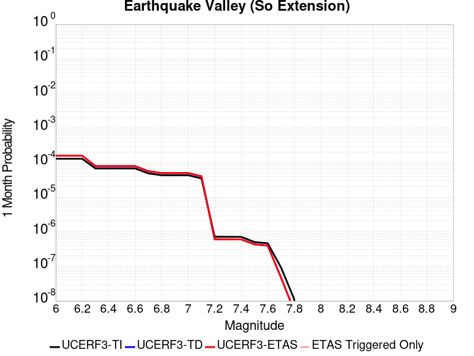 |  |  |

| Magnitude | 1 wk TI Prob | 1 wk TD Prob | 1 wk ETAS Prob | 1 wk ETAS/TD Gain | 1 wk ETAS Triggered Only | 1 mo TI Prob | 1 mo TD Prob | 1 mo ETAS Prob | 1 mo ETAS/TD Gain | 1 mo ETAS Triggered Only | 1 yr TI Prob | 1 yr TD Prob | 1 yr ETAS Prob | 1 yr ETAS/TD Gain | 1 yr ETAS Triggered Only | 10 yr TI Prob | 10 yr TD Prob | 10 yr ETAS Prob | 10 yr ETAS/TD Gain | 10 yr ETAS Triggered Only |
|-----|-----|-----|-----|-----|-----|-----|-----|-----|-----|-----|-----|-----|-----|-----|-----|-----|-----|-----|-----|-----|
| 6.0 | 3.0194888E-5 | 3.708015E-5 | 3.708015E-5 | 1.0 | 0.0 | 1.2940024E-4 | 1.5890833E-4 | 1.5890833E-4 | 1.0 | 0.0 | 0.0015743093 | 0.0019335363 | 0.002050942 | 1.0607208 | 1.1763322E-4 | 0.01563203 | 0.019217065 | 0.019332437 | 1.0060036 | 1.1763322E-4 |
| 6.1 | 3.0194888E-5 | 3.708015E-5 | 3.708015E-5 | 1.0 | 0.0 | 1.2940024E-4 | 1.5890833E-4 | 1.5890833E-4 | 1.0 | 0.0 | 0.0015743093 | 0.0019335363 | 0.002050942 | 1.0607208 | 1.1763322E-4 | 0.01563203 | 0.019217065 | 0.019332437 | 1.0060036 | 1.1763322E-4 |
| 6.2 | 3.0194888E-5 | 3.708015E-5 | 3.708015E-5 | 1.0 | 0.0 | 1.2940024E-4 | 1.5890833E-4 | 1.5890833E-4 | 1.0 | 0.0 | 0.0015743093 | 0.0019335363 | 0.002050942 | 1.0607208 | 1.1763322E-4 | 0.01563203 | 0.019217065 | 0.019332437 | 1.0060036 | 1.1763322E-4 |
| 6.3 | 1.5795305E-5 | 1.8449526E-5 | 1.8449526E-5 | 1.0 | 0.0 | 6.769241E-5 | 7.906763E-5 | 7.906763E-5 | 1.0 | 0.0 | 8.238434E-4 | 9.623345E-4 | 0.0010798546 | 1.1221197 | 1.1763322E-4 | 0.008207959 | 0.009592585 | 0.00970909 | 1.0121453 | 1.1763322E-4 |
| 6.4 | 1.5795305E-5 | 1.8449526E-5 | 1.8449526E-5 | 1.0 | 0.0 | 6.769241E-5 | 7.906763E-5 | 7.906763E-5 | 1.0 | 0.0 | 8.238434E-4 | 9.623345E-4 | 0.0010798546 | 1.1221197 | 1.1763322E-4 | 0.008207959 | 0.009592585 | 0.00970909 | 1.0121453 | 1.1763322E-4 |
| 6.5 | 1.5795305E-5 | 1.8449526E-5 | 1.8449526E-5 | 1.0 | 0.0 | 6.769241E-5 | 7.906763E-5 | 7.906763E-5 | 1.0 | 0.0 | 8.238434E-4 | 9.623345E-4 | 0.0010798546 | 1.1221197 | 1.1763322E-4 | 0.008207959 | 0.009592585 | 0.00970909 | 1.0121453 | 1.1763322E-4 |
| 6.6 | 1.5795305E-5 | 1.8449526E-5 | 1.8449526E-5 | 1.0 | 0.0 | 6.769241E-5 | 7.906763E-5 | 7.906763E-5 | 1.0 | 0.0 | 8.238434E-4 | 9.623345E-4 | 0.0010798546 | 1.1221197 | 1.1763322E-4 | 0.008207959 | 0.009592585 | 0.00970909 | 1.0121453 | 1.1763322E-4 |
| 6.7 | 1.1363076E-5 | 1.3140264E-5 | 1.3140264E-5 | 1.0 | 0.0 | 4.8697988E-5 | 5.631463E-5 | 5.631463E-5 | 1.0 | 0.0 | 5.927367E-4 | 6.854911E-4 | 6.854911E-4 | 1.0 | 0.0 | 0.0059115817 | 0.0068412414 | 0.0068412414 | 1.0 | 0.0 |
| 6.8 | 1.0049611E-5 | 1.1596052E-5 | 1.1596052E-5 | 1.0 | 0.0 | 4.306905E-5 | 4.969683E-5 | 4.969683E-5 | 1.0 | 0.0 | 5.242395E-4 | 6.0496415E-4 | 6.0496415E-4 | 1.0 | 0.0 | 0.0052300454 | 0.0060403515 | 0.0060403515 | 1.0 | 0.0 |
| 6.9 | 1.0049611E-5 | 1.1596052E-5 | 1.1596052E-5 | 1.0 | 0.0 | 4.306905E-5 | 4.969683E-5 | 4.969683E-5 | 1.0 | 0.0 | 5.242395E-4 | 6.0496415E-4 | 6.0496415E-4 | 1.0 | 0.0 | 0.0052300454 | 0.0060403515 | 0.0060403515 | 1.0 | 0.0 |
| 7.0 | 1.0049611E-5 | 1.1596052E-5 | 1.1596052E-5 | 1.0 | 0.0 | 4.306905E-5 | 4.969683E-5 | 4.969683E-5 | 1.0 | 0.0 | 5.242395E-4 | 6.0496415E-4 | 6.0496415E-4 | 1.0 | 0.0 | 0.0052300454 | 0.0060403515 | 0.0060403515 | 1.0 | 0.0 |
| 7.1 | 8.140254E-6 | 9.384852E-6 | 9.384852E-6 | 1.0 | 0.0 | 3.4886336E-5 | 4.022055E-5 | 4.022055E-5 | 1.0 | 0.0 | 4.2465836E-4 | 4.8964226E-4 | 4.8964226E-4 | 1.0 | 0.0 | 0.0042384774 | 0.004892213 | 0.004892213 | 1.0 | 0.0 |
| 7.2 | 1.673835E-7 | 1.4156977E-7 | 1.4156977E-7 | 1.0 | 0.0 | 7.173577E-7 | 6.067275E-7 | 6.067275E-7 | 1.0 | 0.0 | 8.733795E-6 | 7.386886E-6 | 7.386886E-6 | 1.0 | 0.0 | 8.733451E-5 | 7.386676E-5 | 7.386676E-5 | 1.0 | 0.0 |
| 7.3 | 1.6632116E-7 | 1.4055196E-7 | 1.4055196E-7 | 1.0 | 0.0 | 7.1280476E-7 | 6.0236545E-7 | 6.0236545E-7 | 1.0 | 0.0 | 8.678364E-6 | 7.3337783E-6 | 7.3337783E-6 | 1.0 | 0.0 | 8.6780245E-5 | 7.3335716E-5 | 7.3335716E-5 | 1.0 | 0.0 |
| 7.4 | 1.6569169E-7 | 1.3999818E-7 | 1.3999818E-7 | 1.0 | 0.0 | 7.1010703E-7 | 5.9999206E-7 | 5.9999206E-7 | 1.0 | 0.0 | 8.645519E-6 | 7.3048827E-6 | 7.3048827E-6 | 1.0 | 0.0 | 8.645182E-5 | 7.304678E-5 | 7.304678E-5 | 1.0 | 0.0 |
| 7.5 | 1.1764555E-7 | 1.009812E-7 | 1.009812E-7 | 1.0 | 0.0 | 5.041951E-7 | 4.3277652E-7 | 4.3277652E-7 | 1.0 | 0.0 | 6.138558E-6 | 5.2690434E-6 | 5.2690434E-6 | 1.0 | 0.0 | 6.1383886E-5 | 5.26894E-5 | 5.26894E-5 | 1.0 | 0.0 |
| 7.6 | 1.07927605E-7 | 9.262808E-8 | 9.262808E-8 | 1.0 | 0.0 | 4.6254678E-7 | 3.969774E-7 | 3.969774E-7 | 1.0 | 0.0 | 5.6314925E-6 | 4.8331917E-6 | 4.8331917E-6 | 1.0 | 0.0 | 5.63135E-5 | 4.8331076E-5 | 4.8331076E-5 | 1.0 | 0.0 |
| 7.7 | 2.1826905E-8 | 1.1184433E-8 | 1.1184433E-8 | 1.0 | 0.0 | 9.3543875E-8 | 4.793328E-8 | 4.793328E-8 | 1.0 | 0.0 | 1.1388961E-6 | 5.835876E-7 | 5.835876E-7 | 1.0 | 0.0 | 1.1388902E-5 | 5.835866E-6 | 5.835866E-6 | 1.0 | 0.0 |
| 7.8 | 2.6169649E-9 | 1.1973574E-9 | 1.1973574E-9 | 1.0 | 0.0 | 1.1215564E-8 | 5.1315316E-9 | 5.1315316E-9 | 1.0 | 0.0 | 1.3654947E-7 | 6.24764E-8 | 6.24764E-8 | 1.0 | 0.0 | 1.365494E-6 | 6.2476397E-7 | 6.2476397E-7 | 1.0 | 0.0 |

## Raymond
*[(top)](#table-of-contents)*

| 1 Week | 1 Month | 1 Year | 10 Year |
|-----|-----|-----|-----|
|  | 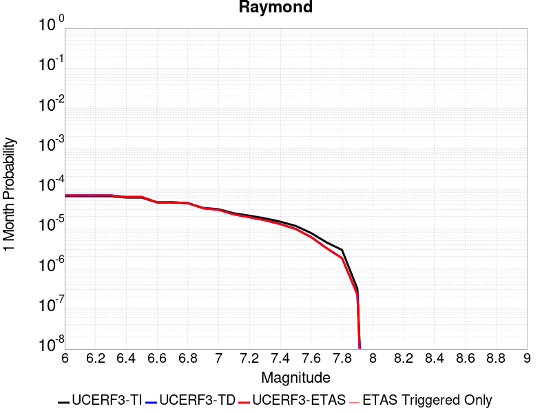 |  |  |

| Magnitude | 1 wk TI Prob | 1 wk TD Prob | 1 wk ETAS Prob | 1 wk ETAS/TD Gain | 1 wk ETAS Triggered Only | 1 mo TI Prob | 1 mo TD Prob | 1 mo ETAS Prob | 1 mo ETAS/TD Gain | 1 mo ETAS Triggered Only | 1 yr TI Prob | 1 yr TD Prob | 1 yr ETAS Prob | 1 yr ETAS/TD Gain | 1 yr ETAS Triggered Only | 10 yr TI Prob | 10 yr TD Prob | 10 yr ETAS Prob | 10 yr ETAS/TD Gain | 10 yr ETAS Triggered Only |
|-----|-----|-----|-----|-----|-----|-----|-----|-----|-----|-----|-----|-----|-----|-----|-----|-----|-----|-----|-----|-----|
| 6.0 | 1.5157413E-5 | 1.5811958E-5 | 1.5811958E-5 | 1.0 | 0.0 | 6.4958724E-5 | 6.776392E-5 | 6.776392E-5 | 1.0 | 0.0 | 7.905855E-4 | 8.2473847E-4 | 9.422747E-4 | 1.1425133 | 1.1763322E-4 | 0.007877788 | 0.008219296 | 0.008335963 | 1.0141943 | 1.1763322E-4 |
| 6.1 | 1.5157413E-5 | 1.5811958E-5 | 1.5811958E-5 | 1.0 | 0.0 | 6.4958724E-5 | 6.776392E-5 | 6.776392E-5 | 1.0 | 0.0 | 7.905855E-4 | 8.2473847E-4 | 9.422747E-4 | 1.1425133 | 1.1763322E-4 | 0.007877788 | 0.008219296 | 0.008335963 | 1.0141943 | 1.1763322E-4 |
| 6.2 | 1.5157413E-5 | 1.5811958E-5 | 1.5811958E-5 | 1.0 | 0.0 | 6.4958724E-5 | 6.776392E-5 | 6.776392E-5 | 1.0 | 0.0 | 7.905855E-4 | 8.2473847E-4 | 9.422747E-4 | 1.1425133 | 1.1763322E-4 | 0.007877788 | 0.008219296 | 0.008335963 | 1.0141943 | 1.1763322E-4 |
| 6.3 | 1.5157413E-5 | 1.5811958E-5 | 1.5811958E-5 | 1.0 | 0.0 | 6.4958724E-5 | 6.776392E-5 | 6.776392E-5 | 1.0 | 0.0 | 7.905855E-4 | 8.2473847E-4 | 9.422747E-4 | 1.1425133 | 1.1763322E-4 | 0.007877788 | 0.008219296 | 0.008335963 | 1.0141943 | 1.1763322E-4 |
| 6.4 | 1.3941944E-5 | 1.4456376E-5 | 1.4456376E-5 | 1.0 | 0.0 | 5.9749822E-5 | 6.195456E-5 | 6.195456E-5 | 1.0 | 0.0 | 7.2721124E-4 | 7.5405906E-4 | 8.7160355E-4 | 1.1558824 | 1.1763322E-4 | 0.007248361 | 0.0075173383 | 0.007634087 | 1.0155306 | 1.1763322E-4 |
| 6.5 | 1.3941944E-5 | 1.4456376E-5 | 1.4456376E-5 | 1.0 | 0.0 | 5.9749822E-5 | 6.195456E-5 | 6.195456E-5 | 1.0 | 0.0 | 7.2721124E-4 | 7.5405906E-4 | 8.7160355E-4 | 1.1558824 | 1.1763322E-4 | 0.007248361 | 0.0075173383 | 0.007634087 | 1.0155306 | 1.1763322E-4 |
| 6.6 | 1.0542609E-5 | 1.0672402E-5 | 1.0672402E-5 | 1.0 | 0.0 | 4.5181827E-5 | 4.5738092E-5 | 4.5738092E-5 | 1.0 | 0.0 | 5.499499E-4 | 5.5672444E-4 | 6.742922E-4 | 1.2111776 | 1.1763322E-4 | 0.005485909 | 0.005553859 | 0.005670839 | 1.0210629 | 1.1763322E-4 |
| 6.7 | 1.0542609E-5 | 1.0672402E-5 | 1.0672402E-5 | 1.0 | 0.0 | 4.5181827E-5 | 4.5738092E-5 | 4.5738092E-5 | 1.0 | 0.0 | 5.499499E-4 | 5.5672444E-4 | 6.742922E-4 | 1.2111776 | 1.1763322E-4 | 0.005485909 | 0.005553859 | 0.005670839 | 1.0210629 | 1.1763322E-4 |
| 6.8 | 1.0079132E-5 | 1.0177903E-5 | 1.0177903E-5 | 1.0 | 0.0 | 4.3195567E-5 | 4.3618886E-5 | 4.3618886E-5 | 1.0 | 0.0 | 5.257791E-4 | 5.309359E-4 | 6.485067E-4 | 1.2214406 | 1.1763322E-4 | 0.0052453685 | 0.005297224 | 0.005414234 | 1.022089 | 1.1763322E-4 |
| 6.9 | 7.721598E-6 | 7.5498792E-6 | 7.5498792E-6 | 1.0 | 0.0 | 3.3092143E-5 | 3.235623E-5 | 3.235623E-5 | 1.0 | 0.0 | 4.0282236E-4 | 3.938671E-4 | 5.11454E-4 | 1.2985445 | 1.1763322E-4 | 0.0040209293 | 0.003931824 | 0.0040489947 | 1.0298007 | 1.1763322E-4 |
| 7.0 | 7.137566E-6 | 6.9122257E-6 | 6.9122257E-6 | 1.0 | 0.0 | 3.058921E-5 | 2.9623494E-5 | 2.9623494E-5 | 1.0 | 0.0 | 3.7236E-4 | 3.6060743E-4 | 4.7819823E-4 | 1.3260909 | 1.1763322E-4 | 0.0037173668 | 0.003600341 | 0.0037175508 | 1.0325552 | 1.1763322E-4 |
| 7.1 | 5.654976E-6 | 5.3003296E-6 | 5.3003296E-6 | 1.0 | 0.0 | 2.4235387E-5 | 2.2715501E-5 | 2.2715501E-5 | 1.0 | 0.0 | 2.9502588E-4 | 2.7652635E-4 | 2.7652635E-4 | 1.0 | 0.0 | 0.0029463451 | 0.0027618536 | 0.0027618536 | 1.0 | 0.0 |
| 7.2 | 4.9358455E-6 | 4.5273864E-6 | 4.5273864E-6 | 1.0 | 0.0 | 2.1153453E-5 | 1.9402942E-5 | 1.9402942E-5 | 1.0 | 0.0 | 2.5751285E-4 | 2.3620535E-4 | 2.3620535E-4 | 1.0 | 0.0 | 0.0025721465 | 0.0023595649 | 0.0023595649 | 1.0 | 0.0 |
| 7.3 | 4.2368597E-6 | 3.8062944E-6 | 3.8062944E-6 | 1.0 | 0.0 | 1.8157843E-5 | 1.6312588E-5 | 1.6312588E-5 | 1.0 | 0.0 | 2.2104931E-4 | 1.9858778E-4 | 1.9858778E-4 | 1.0 | 0.0 | 0.0022082955 | 0.0019841217 | 0.0019841217 | 1.0 | 0.0 |
| 7.4 | 3.4999923E-6 | 3.0443584E-6 | 3.0443584E-6 | 1.0 | 0.0 | 1.49998805E-5 | 1.3047185E-5 | 1.3047185E-5 | 1.0 | 0.0 | 1.8260824E-4 | 1.5883798E-4 | 1.5883798E-4 | 1.0 | 0.0 | 0.0018245826 | 0.0015872603 | 0.0015872603 | 1.0 | 0.0 |
| 7.5 | 2.738017E-6 | 2.302492E-6 | 2.302492E-6 | 1.0 | 0.0 | 1.1734306E-5 | 9.867786E-6 | 9.867786E-6 | 1.0 | 0.0 | 1.428558E-4 | 1.20133736E-4 | 1.20133736E-4 | 1.0 | 0.0 | 0.0014276401 | 0.0012007023 | 0.0012007023 | 1.0 | 0.0 |
| 7.6 | 1.8186392E-6 | 1.4426239E-6 | 1.4426239E-6 | 1.0 | 0.0 | 7.794145E-6 | 6.1826595E-6 | 6.1826595E-6 | 1.0 | 0.0 | 9.488958E-5 | 7.527132E-5 | 7.527132E-5 | 1.0 | 0.0 | 9.4849075E-4 | 7.5246976E-4 | 7.5246976E-4 | 1.0 | 0.0 |
| 7.7 | 1.0660348E-6 | 7.6463243E-7 | 7.6463243E-7 | 1.0 | 0.0 | 4.5687125E-6 | 3.276992E-6 | 3.276992E-6 | 1.0 | 0.0 | 5.5622655E-5 | 3.9896666E-5 | 3.9896666E-5 | 1.0 | 0.0 | 5.5608735E-4 | 3.9890414E-4 | 3.9890414E-4 | 1.0 | 0.0 |
| 7.8 | 6.913602E-7 | 4.322519E-7 | 4.322519E-7 | 1.0 | 0.0 | 2.962969E-6 | 1.8525069E-6 | 1.8525069E-6 | 1.0 | 0.0 | 3.607355E-5 | 2.2554044E-5 | 2.2554044E-5 | 1.0 | 0.0 | 3.6067693E-4 | 2.2552541E-4 | 2.2552541E-4 | 1.0 | 0.0 |
| 7.9 | 7.425201E-8 | 5.324345E-8 | 5.324345E-8 | 1.0 | 0.0 | 3.1822285E-7 | 2.2818621E-7 | 2.2818621E-7 | 1.0 | 0.0 | 3.874356E-6 | 2.7781648E-6 | 2.7781648E-6 | 1.0 | 0.0 | 3.8742884E-5 | 2.778143E-5 | 2.778143E-5 | 1.0 | 0.0 |

## Manix-Afton Hills
*[(top)](#table-of-contents)*

| 1 Week | 1 Month | 1 Year | 10 Year |
|-----|-----|-----|-----|
|  |  |  | 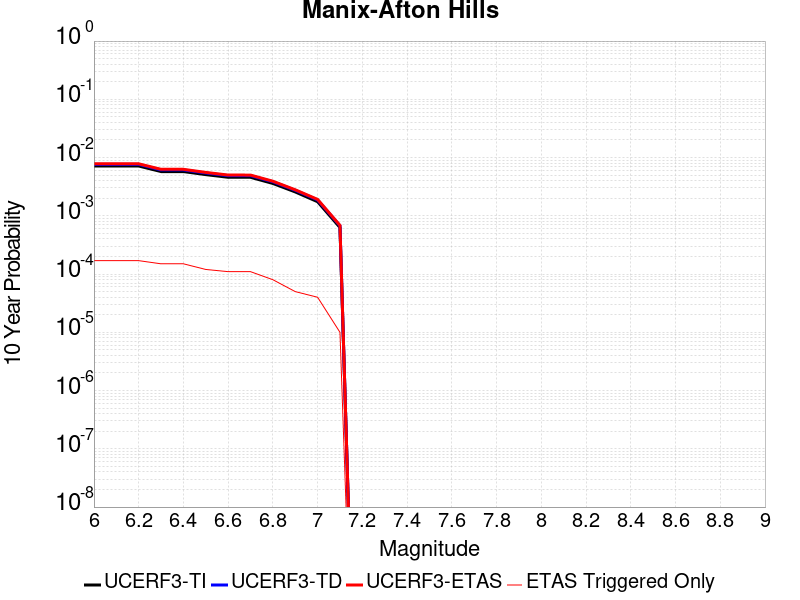 |

| Magnitude | 1 wk TI Prob | 1 wk TD Prob | 1 wk ETAS Prob | 1 wk ETAS/TD Gain | 1 wk ETAS Triggered Only | 1 mo TI Prob | 1 mo TD Prob | 1 mo ETAS Prob | 1 mo ETAS/TD Gain | 1 mo ETAS Triggered Only | 1 yr TI Prob | 1 yr TD Prob | 1 yr ETAS Prob | 1 yr ETAS/TD Gain | 1 yr ETAS Triggered Only | 10 yr TI Prob | 10 yr TD Prob | 10 yr ETAS Prob | 10 yr ETAS/TD Gain | 10 yr ETAS Triggered Only |
|-----|-----|-----|-----|-----|-----|-----|-----|-----|-----|-----|-----|-----|-----|-----|-----|-----|-----|-----|-----|-----|
| 6.0 | 1.3783202E-5 | 1.4712011E-5 | 1.4712011E-5 | 1.0 | 0.0 | 5.906953E-5 | 6.305005E-5 | 6.305005E-5 | 1.0 | 0.0 | 7.189342E-4 | 7.6738145E-4 | 8.8492443E-4 | 1.153174 | 1.1763322E-4 | 0.0071661277 | 0.007649073 | 0.0077658067 | 1.0152612 | 1.1763322E-4 |
| 6.1 | 1.3783202E-5 | 1.4712011E-5 | 1.4712011E-5 | 1.0 | 0.0 | 5.906953E-5 | 6.305005E-5 | 6.305005E-5 | 1.0 | 0.0 | 7.189342E-4 | 7.6738145E-4 | 8.8492443E-4 | 1.153174 | 1.1763322E-4 | 0.0071661277 | 0.007649073 | 0.0077658067 | 1.0152612 | 1.1763322E-4 |
| 6.2 | 1.3783202E-5 | 1.4712011E-5 | 1.4712011E-5 | 1.0 | 0.0 | 5.906953E-5 | 6.305005E-5 | 6.305005E-5 | 1.0 | 0.0 | 7.189342E-4 | 7.6738145E-4 | 8.8492443E-4 | 1.153174 | 1.1763322E-4 | 0.0071661277 | 0.007649073 | 0.0077658067 | 1.0152612 | 1.1763322E-4 |
| 6.3 | 1.10494875E-5 | 1.1793874E-5 | 1.1793874E-5 | 1.0 | 0.0 | 4.7354086E-5 | 5.0544255E-5 | 5.0544255E-5 | 1.0 | 0.0 | 5.763835E-4 | 6.1521295E-4 | 7.327738E-4 | 1.1910897 | 1.1763322E-4 | 0.005748908 | 0.0061361385 | 0.00625305 | 1.019053 | 1.1763322E-4 |
| 6.4 | 1.10494875E-5 | 1.1793874E-5 | 1.1793874E-5 | 1.0 | 0.0 | 4.7354086E-5 | 5.0544255E-5 | 5.0544255E-5 | 1.0 | 0.0 | 5.763835E-4 | 6.1521295E-4 | 7.327738E-4 | 1.1910897 | 1.1763322E-4 | 0.005748908 | 0.0061361385 | 0.00625305 | 1.019053 | 1.1763322E-4 |
| 6.5 | 9.788949E-6 | 1.0454981E-5 | 1.0454981E-5 | 1.0 | 0.0 | 4.1951964E-5 | 4.4806344E-5 | 4.4806344E-5 | 1.0 | 0.0 | 5.1064545E-4 | 5.4539E-4 | 5.4539E-4 | 1.0 | 0.0 | 0.0050947363 | 0.005441442 | 0.005441442 | 1.0 | 0.0 |
| 6.6 | 8.810006E-6 | 9.414229E-6 | 9.414229E-6 | 1.0 | 0.0 | 3.775662E-5 | 4.034612E-5 | 4.034612E-5 | 1.0 | 0.0 | 4.5958988E-4 | 4.911122E-4 | 4.911122E-4 | 1.0 | 0.0 | 0.0045864056 | 0.004901151 | 0.004901151 | 1.0 | 0.0 |
| 6.7 | 8.80128E-6 | 9.404707E-6 | 9.404707E-6 | 1.0 | 0.0 | 3.7719226E-5 | 4.0305316E-5 | 4.0305316E-5 | 1.0 | 0.0 | 4.591348E-4 | 4.906156E-4 | 4.906156E-4 | 1.0 | 0.0 | 0.004581874 | 0.0048962072 | 0.0048962072 | 1.0 | 0.0 |
| 6.8 | 6.8994877E-6 | 7.3805545E-6 | 7.3805545E-6 | 1.0 | 0.0 | 2.9568899E-5 | 3.163061E-5 | 3.163061E-5 | 1.0 | 0.0 | 3.5994186E-4 | 3.850428E-4 | 3.850428E-4 | 1.0 | 0.0 | 0.003593594 | 0.0038445618 | 0.0038445618 | 1.0 | 0.0 |
| 6.9 | 4.9328037E-6 | 5.271298E-6 | 5.271298E-6 | 1.0 | 0.0 | 2.1140417E-5 | 2.2591115E-5 | 2.2591115E-5 | 1.0 | 0.0 | 2.5735417E-4 | 2.7501828E-4 | 2.7501828E-4 | 1.0 | 0.0 | 0.0025705635 | 0.0027473846 | 0.0027473846 | 1.0 | 0.0 |
| 7.0 | 3.347973E-6 | 3.5902717E-6 | 3.5902717E-6 | 1.0 | 0.0 | 1.4348378E-5 | 1.5386811E-5 | 1.5386811E-5 | 1.0 | 0.0 | 1.746775E-4 | 1.8732242E-4 | 1.8732242E-4 | 1.0 | 0.0 | 0.0017454025 | 0.0018720479 | 0.0018720479 | 1.0 | 0.0 |
| 7.1 | 1.2073567E-6 | 1.2935677E-6 | 1.2935677E-6 | 1.0 | 0.0 | 5.1743755E-6 | 5.543859E-6 | 5.543859E-6 | 1.0 | 0.0 | 6.29962E-5 | 6.7496025E-5 | 6.7496025E-5 | 1.0 | 0.0 | 6.297835E-4 | 6.7491544E-4 | 6.7491544E-4 | 1.0 | 0.0 |

## Great Valley 09 (Laguna Seca)
*[(top)](#table-of-contents)*

| 1 Week | 1 Month | 1 Year | 10 Year |
|-----|-----|-----|-----|
|  |  | 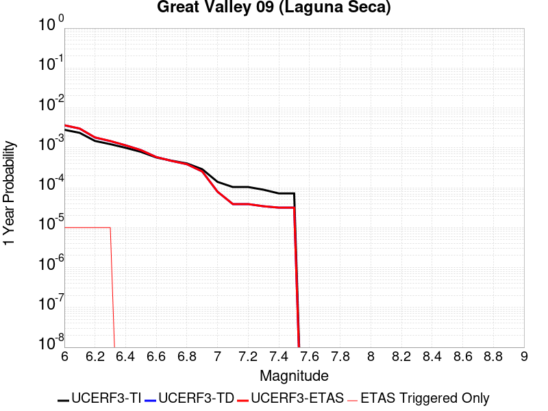 |  |

| Magnitude | 1 wk TI Prob | 1 wk TD Prob | 1 wk ETAS Prob | 1 wk ETAS/TD Gain | 1 wk ETAS Triggered Only | 1 mo TI Prob | 1 mo TD Prob | 1 mo ETAS Prob | 1 mo ETAS/TD Gain | 1 mo ETAS Triggered Only | 1 yr TI Prob | 1 yr TD Prob | 1 yr ETAS Prob | 1 yr ETAS/TD Gain | 1 yr ETAS Triggered Only | 10 yr TI Prob | 10 yr TD Prob | 10 yr ETAS Prob | 10 yr ETAS/TD Gain | 10 yr ETAS Triggered Only |
|-----|-----|-----|-----|-----|-----|-----|-----|-----|-----|-----|-----|-----|-----|-----|-----|-----|-----|-----|-----|-----|
| 6.0 | 5.4353277E-5 | 7.0522445E-5 | 7.0522445E-5 | 1.0 | 0.0 | 2.3292181E-4 | 3.0220623E-4 | 4.198039E-4 | 1.3891306 | 1.1763322E-4 | 0.0028321352 | 0.0036731926 | 0.0037903937 | 1.0319072 | 1.1763322E-4 | 0.02796312 | 0.03612556 | 0.036238946 | 1.0031385 | 1.1763322E-4 |
| 6.1 | 4.5578287E-5 | 5.823676E-5 | 5.823676E-5 | 1.0 | 0.0 | 1.953209E-4 | 2.4956377E-4 | 3.6716764E-4 | 1.4712377 | 1.1763322E-4 | 0.0023754383 | 0.0030342632 | 0.0031515395 | 1.0386506 | 1.1763322E-4 | 0.023502063 | 0.02992766 | 0.030041773 | 1.0038129 | 1.1763322E-4 |
| 6.2 | 2.8536782E-5 | 3.474441E-5 | 3.474441E-5 | 1.0 | 0.0 | 1.2229476E-4 | 1.488966E-4 | 2.665123E-4 | 1.7899153 | 1.1763322E-4 | 0.0014879217 | 0.001811268 | 0.0019286881 | 1.0648276 | 1.1763322E-4 | 0.014779986 | 0.01796253 | 0.01807805 | 1.0064312 | 1.1763322E-4 |
| 6.3 | 2.3698774E-5 | 2.821827E-5 | 2.821827E-5 | 1.0 | 0.0 | 1.01562226E-4 | 1.2093017E-4 | 2.3854917E-4 | 1.972619 | 1.1763322E-4 | 0.0012358186 | 0.0014713865 | 0.0015888466 | 1.0798296 | 1.1763322E-4 | 0.012289686 | 0.014614772 | 0.014730686 | 1.0079314 | 1.1763322E-4 |
| 6.4 | 1.9191197E-5 | 2.212613E-5 | 2.212613E-5 | 1.0 | 0.0 | 8.2245395E-5 | 9.482308E-5 | 9.482308E-5 | 1.0 | 0.0 | 0.0010008777 | 0.0011539026 | 0.0011539026 | 1.0 | 0.0 | 0.009963818 | 0.011479452 | 0.011479452 | 1.0 | 0.0 |
| 6.5 | 1.5203241E-5 | 1.6803468E-5 | 1.6803468E-5 | 1.0 | 0.0 | 6.5155116E-5 | 7.2013056E-5 | 7.2013056E-5 | 1.0 | 0.0 | 7.9297484E-4 | 8.764382E-4 | 8.764382E-4 | 1.0 | 0.0 | 0.007901512 | 0.008731223 | 0.008731223 | 1.0 | 0.0 |
| 6.6 | 1.0984925E-5 | 1.1244301E-5 | 1.1244301E-5 | 1.0 | 0.0 | 4.70774E-5 | 4.8188995E-5 | 4.8188995E-5 | 1.0 | 0.0 | 5.730166E-4 | 5.865472E-4 | 5.865472E-4 | 1.0 | 0.0 | 0.005715413 | 0.005850388 | 0.005850388 | 1.0 | 0.0 |
| 6.7 | 9.134616E-6 | 9.02122E-6 | 9.02122E-6 | 1.0 | 0.0 | 3.9147766E-5 | 3.866181E-5 | 3.866181E-5 | 1.0 | 0.0 | 4.7651984E-4 | 4.7060824E-4 | 4.7060824E-4 | 1.0 | 0.0 | 0.004754993 | 0.0046963617 | 0.0046963617 | 1.0 | 0.0 |
| 6.8 | 7.785589E-6 | 7.4530335E-6 | 7.4530335E-6 | 1.0 | 0.0 | 3.3366385E-5 | 3.1941192E-5 | 3.1941192E-5 | 1.0 | 0.0 | 4.0616E-4 | 3.8881664E-4 | 3.8881664E-4 | 1.0 | 0.0 | 0.0040541845 | 0.0038815676 | 0.0038815676 | 1.0 | 0.0 |
| 6.9 | 5.579095E-6 | 4.8992083E-6 | 4.8992083E-6 | 1.0 | 0.0 | 2.3910188E-5 | 2.0996446E-5 | 2.0996446E-5 | 1.0 | 0.0 | 2.9106764E-4 | 2.5560314E-4 | 2.5560314E-4 | 1.0 | 0.0 | 0.002906867 | 0.0025532288 | 0.0025532288 | 1.0 | 0.0 |
| 7.0 | 2.6816688E-6 | 1.521809E-6 | 1.521809E-6 | 1.0 | 0.0 | 1.1492816E-5 | 6.522023E-6 | 6.522023E-6 | 1.0 | 0.0 | 1.3991605E-4 | 7.9402824E-5 | 7.9402824E-5 | 1.0 | 0.0 | 0.0013982799 | 7.9375325E-4 | 7.9375325E-4 | 1.0 | 0.0 |
| 7.1 | 1.9951021E-6 | 7.4548484E-7 | 7.4548484E-7 | 1.0 | 0.0 | 8.55041E-6 | 3.1949314E-6 | 3.1949314E-6 | 1.0 | 0.0 | 1.0409627E-4 | 3.8897637E-5 | 3.8897637E-5 | 1.0 | 0.0 | 0.0010404752 | 3.8891242E-4 | 3.8891242E-4 | 1.0 | 0.0 |
| 7.2 | 1.9951021E-6 | 7.4548484E-7 | 7.4548484E-7 | 1.0 | 0.0 | 8.55041E-6 | 3.1949314E-6 | 3.1949314E-6 | 1.0 | 0.0 | 1.0409627E-4 | 3.8897637E-5 | 3.8897637E-5 | 1.0 | 0.0 | 0.0010404752 | 3.8891242E-4 | 3.8891242E-4 | 1.0 | 0.0 |
| 7.3 | 1.7087556E-6 | 6.579735E-7 | 6.579735E-7 | 1.0 | 0.0 | 7.3232177E-6 | 2.8198835E-6 | 2.8198835E-6 | 1.0 | 0.0 | 8.915652E-5 | 3.433158E-5 | 3.433158E-5 | 1.0 | 0.0 | 8.9120766E-4 | 3.4326682E-4 | 3.4326682E-4 | 1.0 | 0.0 |
| 7.4 | 1.3804846E-6 | 6.0745566E-7 | 6.0745566E-7 | 1.0 | 0.0 | 5.916349E-6 | 2.6033792E-6 | 2.6033792E-6 | 1.0 | 0.0 | 7.2029165E-5 | 3.169572E-5 | 3.169572E-5 | 1.0 | 0.0 | 7.200583E-4 | 3.1691603E-4 | 3.1691603E-4 | 1.0 | 0.0 |
| 7.5 | 1.3804846E-6 | 6.0745566E-7 | 6.0745566E-7 | 1.0 | 0.0 | 5.916349E-6 | 2.6033792E-6 | 2.6033792E-6 | 1.0 | 0.0 | 7.2029165E-5 | 3.169572E-5 | 3.169572E-5 | 1.0 | 0.0 | 7.200583E-4 | 3.1691603E-4 | 3.1691603E-4 | 1.0 | 0.0 |

## Ventura-Pitas Point
*[(top)](#table-of-contents)*

| 1 Week | 1 Month | 1 Year | 10 Year |
|-----|-----|-----|-----|
|  | 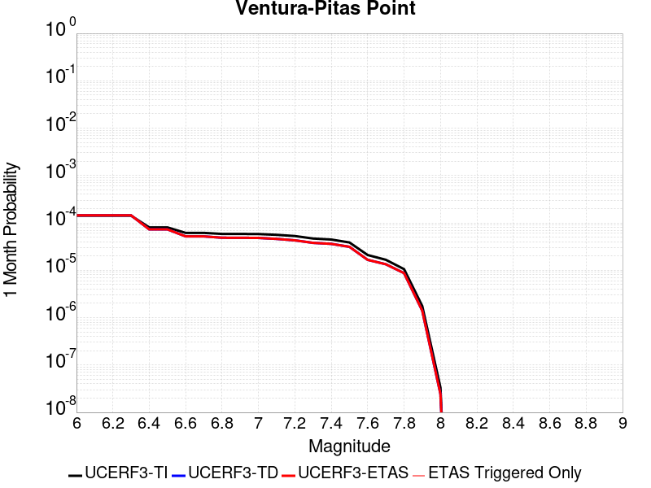 |  |  |

| Magnitude | 1 wk TI Prob | 1 wk TD Prob | 1 wk ETAS Prob | 1 wk ETAS/TD Gain | 1 wk ETAS Triggered Only | 1 mo TI Prob | 1 mo TD Prob | 1 mo ETAS Prob | 1 mo ETAS/TD Gain | 1 mo ETAS Triggered Only | 1 yr TI Prob | 1 yr TD Prob | 1 yr ETAS Prob | 1 yr ETAS/TD Gain | 1 yr ETAS Triggered Only | 10 yr TI Prob | 10 yr TD Prob | 10 yr ETAS Prob | 10 yr ETAS/TD Gain | 10 yr ETAS Triggered Only |
|-----|-----|-----|-----|-----|-----|-----|-----|-----|-----|-----|-----|-----|-----|-----|-----|-----|-----|-----|-----|-----|
| 6.0 | 3.3179622E-5 | 3.3740926E-5 | 3.3740926E-5 | 1.0 | 0.0 | 1.4219063E-4 | 1.445974E-4 | 1.445974E-4 | 1.0 | 0.0 | 0.0017297962 | 0.0017593087 | 0.001876735 | 1.0667456 | 1.1763322E-4 | 0.017163932 | 0.01747935 | 0.017594928 | 1.0066122 | 1.1763322E-4 |
| 6.1 | 3.3179622E-5 | 3.3740926E-5 | 3.3740926E-5 | 1.0 | 0.0 | 1.4219063E-4 | 1.445974E-4 | 1.445974E-4 | 1.0 | 0.0 | 0.0017297962 | 0.0017593087 | 0.001876735 | 1.0667456 | 1.1763322E-4 | 0.017163932 | 0.01747935 | 0.017594928 | 1.0066122 | 1.1763322E-4 |
| 6.2 | 3.3179622E-5 | 3.3740926E-5 | 3.3740926E-5 | 1.0 | 0.0 | 1.4219063E-4 | 1.445974E-4 | 1.445974E-4 | 1.0 | 0.0 | 0.0017297962 | 0.0017593087 | 0.001876735 | 1.0667456 | 1.1763322E-4 | 0.017163932 | 0.01747935 | 0.017594928 | 1.0066122 | 1.1763322E-4 |
| 6.3 | 3.3179622E-5 | 3.3740926E-5 | 3.3740926E-5 | 1.0 | 0.0 | 1.4219063E-4 | 1.445974E-4 | 1.445974E-4 | 1.0 | 0.0 | 0.0017297962 | 0.0017593087 | 0.001876735 | 1.0667456 | 1.1763322E-4 | 0.017163932 | 0.01747935 | 0.017594928 | 1.0066122 | 1.1763322E-4 |
| 6.4 | 1.8754668E-5 | 1.702288E-5 | 1.702288E-5 | 1.0 | 0.0 | 8.037467E-5 | 7.295329E-5 | 7.295329E-5 | 1.0 | 0.0 | 9.781223E-4 | 8.8786747E-4 | 8.8786747E-4 | 1.0 | 0.0 | 0.009738282 | 0.008845539 | 0.008845539 | 1.0 | 0.0 |
| 6.5 | 1.8754668E-5 | 1.702288E-5 | 1.702288E-5 | 1.0 | 0.0 | 8.037467E-5 | 7.295329E-5 | 7.295329E-5 | 1.0 | 0.0 | 9.781223E-4 | 8.8786747E-4 | 8.8786747E-4 | 1.0 | 0.0 | 0.009738282 | 0.008845539 | 0.008845539 | 1.0 | 0.0 |
| 6.6 | 1.4361558E-5 | 1.2125022E-5 | 1.2125022E-5 | 1.0 | 0.0 | 6.154808E-5 | 5.1963358E-5 | 5.1963358E-5 | 1.0 | 0.0 | 7.490902E-4 | 6.324725E-4 | 6.324725E-4 | 1.0 | 0.0 | 0.0074657016 | 0.006306982 | 0.006306982 | 1.0 | 0.0 |
| 6.7 | 1.4361558E-5 | 1.2125022E-5 | 1.2125022E-5 | 1.0 | 0.0 | 6.154808E-5 | 5.1963358E-5 | 5.1963358E-5 | 1.0 | 0.0 | 7.490902E-4 | 6.324725E-4 | 6.324725E-4 | 1.0 | 0.0 | 0.0074657016 | 0.006306982 | 0.006306982 | 1.0 | 0.0 |
| 6.8 | 1.3663846E-5 | 1.1347082E-5 | 1.1347082E-5 | 1.0 | 0.0 | 5.8558027E-5 | 4.8629456E-5 | 4.8629456E-5 | 1.0 | 0.0 | 7.127108E-4 | 5.9190474E-4 | 5.9190474E-4 | 1.0 | 0.0 | 0.007104293 | 0.0059034983 | 0.0059034983 | 1.0 | 0.0 |
| 6.9 | 1.3644157E-5 | 1.1325181E-5 | 1.1325181E-5 | 1.0 | 0.0 | 5.8473648E-5 | 4.8535596E-5 | 4.8535596E-5 | 1.0 | 0.0 | 7.116841E-4 | 5.907626E-4 | 5.907626E-4 | 1.0 | 0.0 | 0.007094092 | 0.0058921375 | 0.0058921375 | 1.0 | 0.0 |
| 7.0 | 1.3568845E-5 | 1.1244737E-5 | 1.1244737E-5 | 1.0 | 0.0 | 5.8150898E-5 | 4.819085E-5 | 4.819085E-5 | 1.0 | 0.0 | 7.077572E-4 | 5.8656756E-4 | 5.8656756E-4 | 1.0 | 0.0 | 0.007055073 | 0.005850409 | 0.005850409 | 1.0 | 0.0 |
| 7.1 | 1.306572E-5 | 1.0723127E-5 | 1.0723127E-5 | 1.0 | 0.0 | 5.599474E-5 | 4.595546E-5 | 4.595546E-5 | 1.0 | 0.0 | 6.815227E-4 | 5.5936596E-4 | 5.5936596E-4 | 1.0 | 0.0 | 0.0067943637 | 0.005579785 | 0.005579785 | 1.0 | 0.0 |
| 7.2 | 1.232604E-5 | 9.997614E-6 | 9.997614E-6 | 1.0 | 0.0 | 5.2824813E-5 | 4.2846223E-5 | 4.2846223E-5 | 1.0 | 0.0 | 6.429523E-4 | 5.215297E-4 | 5.215297E-4 | 1.0 | 0.0 | 0.0064109527 | 0.0052032494 | 0.0052032494 | 1.0 | 0.0 |
| 7.3 | 1.0917261E-5 | 8.844802E-6 | 8.844802E-6 | 1.0 | 0.0 | 4.678742E-5 | 3.7905753E-5 | 3.7905753E-5 | 1.0 | 0.0 | 5.69488E-4 | 4.614064E-4 | 4.614064E-4 | 1.0 | 0.0 | 0.0056803077 | 0.0046046497 | 0.0046046497 | 1.0 | 0.0 |
| 7.4 | 1.039959E-5 | 8.424458E-6 | 8.424458E-6 | 1.0 | 0.0 | 4.456891E-5 | 3.610433E-5 | 3.610433E-5 | 1.0 | 0.0 | 5.424914E-4 | 4.3948312E-4 | 4.3948312E-4 | 1.0 | 0.0 | 0.0054116896 | 0.0043863016 | 0.0043863016 | 1.0 | 0.0 |
| 7.5 | 9.015877E-6 | 7.2982207E-6 | 7.2982207E-6 | 1.0 | 0.0 | 3.86389E-5 | 3.1277723E-5 | 3.1277723E-5 | 1.0 | 0.0 | 4.7032707E-4 | 3.807411E-4 | 3.807411E-4 | 1.0 | 0.0 | 0.004693329 | 0.0038010331 | 0.0038010331 | 1.0 | 0.0 |
| 7.6 | 4.900162E-6 | 3.8743833E-6 | 3.8743833E-6 | 1.0 | 0.0 | 2.1000526E-5 | 1.6604394E-5 | 1.6604394E-5 | 1.0 | 0.0 | 2.556514E-4 | 2.0213988E-4 | 2.0213988E-4 | 1.0 | 0.0 | 0.0025535747 | 0.0020195737 | 0.0020195737 | 1.0 | 0.0 |
| 7.7 | 3.8850626E-6 | 3.1269326E-6 | 3.1269326E-6 | 1.0 | 0.0 | 1.6650163E-5 | 1.3401072E-5 | 1.3401072E-5 | 1.0 | 0.0 | 2.0269687E-4 | 1.6314592E-4 | 1.6314592E-4 | 1.0 | 0.0 | 0.002025121 | 0.0016302709 | 0.0016302709 | 1.0 | 0.0 |
| 7.8 | 2.4654719E-6 | 2.0299967E-6 | 2.0299967E-6 | 1.0 | 0.0 | 1.0566265E-5 | 8.699957E-6 | 8.699957E-6 | 1.0 | 0.0 | 1.2863669E-4 | 1.0591687E-4 | 1.0591687E-4 | 1.0 | 0.0 | 0.0012856225 | 0.0010586686 | 0.0010586686 | 1.0 | 0.0 |
| 7.9 | 4.095894E-7 | 3.2767122E-7 | 3.2767122E-7 | 1.0 | 0.0 | 1.7553821E-6 | 1.4043045E-6 | 1.4043045E-6 | 1.0 | 0.0 | 2.1371567E-5 | 1.7097276E-5 | 1.7097276E-5 | 1.0 | 0.0 | 2.1369511E-4 | 1.7095992E-4 | 1.7095992E-4 | 1.0 | 0.0 |
| 8.0 | 7.791402E-9 | 5.6838902E-9 | 5.6838902E-9 | 1.0 | 0.0 | 3.3391725E-8 | 2.435953E-8 | 2.435953E-8 | 1.0 | 0.0 | 4.0654416E-7 | 2.9657724E-7 | 2.9657724E-7 | 1.0 | 0.0 | 4.065434E-6 | 2.9657706E-6 | 2.9657706E-6 | 1.0 | 0.0 |

## San Jacinto (Anza) rev
*[(top)](#table-of-contents)*

| 1 Week | 1 Month | 1 Year | 10 Year |
|-----|-----|-----|-----|
|  |  |  |  |

| Magnitude | 1 wk TI Prob | 1 wk TD Prob | 1 wk ETAS Prob | 1 wk ETAS/TD Gain | 1 wk ETAS Triggered Only | 1 mo TI Prob | 1 mo TD Prob | 1 mo ETAS Prob | 1 mo ETAS/TD Gain | 1 mo ETAS Triggered Only | 1 yr TI Prob | 1 yr TD Prob | 1 yr ETAS Prob | 1 yr ETAS/TD Gain | 1 yr ETAS Triggered Only | 10 yr TI Prob | 10 yr TD Prob | 10 yr ETAS Prob | 10 yr ETAS/TD Gain | 10 yr ETAS Triggered Only |
|-----|-----|-----|-----|-----|-----|-----|-----|-----|-----|-----|-----|-----|-----|-----|-----|-----|-----|-----|-----|-----|
| 6.0 | 6.3015636E-5 | 4.3428E-5 | 4.3428E-5 | 1.0 | 0.0 | 2.7003905E-4 | 1.8610679E-4 | 1.8610679E-4 | 1.0 | 0.0 | 0.0032827691 | 0.0022635076 | 0.0023808745 | 1.0518517 | 1.1763322E-4 | 0.032346968 | 0.023360996 | 0.023475882 | 1.0049179 | 1.1763322E-4 |
| 6.1 | 6.3015636E-5 | 4.3428E-5 | 4.3428E-5 | 1.0 | 0.0 | 2.7003905E-4 | 1.8610679E-4 | 1.8610679E-4 | 1.0 | 0.0 | 0.0032827691 | 0.0022635076 | 0.0023808745 | 1.0518517 | 1.1763322E-4 | 0.032346968 | 0.023360996 | 0.023475882 | 1.0049179 | 1.1763322E-4 |
| 6.2 | 6.3015636E-5 | 4.3428E-5 | 4.3428E-5 | 1.0 | 0.0 | 2.7003905E-4 | 1.8610679E-4 | 1.8610679E-4 | 1.0 | 0.0 | 0.0032827691 | 0.0022635076 | 0.0023808745 | 1.0518517 | 1.1763322E-4 | 0.032346968 | 0.023360996 | 0.023475882 | 1.0049179 | 1.1763322E-4 |
| 6.3 | 6.3015636E-5 | 4.3428E-5 | 4.3428E-5 | 1.0 | 0.0 | 2.7003905E-4 | 1.8610679E-4 | 1.8610679E-4 | 1.0 | 0.0 | 0.0032827691 | 0.0022635076 | 0.0023808745 | 1.0518517 | 1.1763322E-4 | 0.032346968 | 0.023360996 | 0.023475882 | 1.0049179 | 1.1763322E-4 |
| 6.4 | 6.3015636E-5 | 4.3428E-5 | 4.3428E-5 | 1.0 | 0.0 | 2.7003905E-4 | 1.8610679E-4 | 1.8610679E-4 | 1.0 | 0.0 | 0.0032827691 | 0.0022635076 | 0.0023808745 | 1.0518517 | 1.1763322E-4 | 0.032346968 | 0.023360996 | 0.023475882 | 1.0049179 | 1.1763322E-4 |
| 6.5 | 5.811017E-5 | 4.020185E-5 | 4.020185E-5 | 1.0 | 0.0 | 2.4901982E-4 | 1.7228229E-4 | 1.7228229E-4 | 1.0 | 0.0 | 0.0030276014 | 0.0020955247 | 0.0022129116 | 1.0560178 | 1.1763322E-4 | 0.02986684 | 0.021655614 | 0.021770699 | 1.0053144 | 1.1763322E-4 |
| 6.6 | 5.811017E-5 | 4.020185E-5 | 4.020185E-5 | 1.0 | 0.0 | 2.4901982E-4 | 1.7228229E-4 | 1.7228229E-4 | 1.0 | 0.0 | 0.0030276014 | 0.0020955247 | 0.0022129116 | 1.0560178 | 1.1763322E-4 | 0.02986684 | 0.021655614 | 0.021770699 | 1.0053144 | 1.1763322E-4 |
| 6.7 | 5.712442E-5 | 3.9623283E-5 | 3.9623283E-5 | 1.0 | 0.0 | 2.4479596E-4 | 1.6980304E-4 | 1.6980304E-4 | 1.0 | 0.0 | 0.0029763177 | 0.0020653973 | 0.0021827875 | 1.0568366 | 1.1763322E-4 | 0.029367693 | 0.021346811 | 0.021461934 | 1.0053929 | 1.1763322E-4 |
| 6.8 | 5.6967532E-5 | 3.9479477E-5 | 3.9479477E-5 | 1.0 | 0.0 | 2.4412372E-4 | 1.6918682E-4 | 1.6918682E-4 | 1.0 | 0.0 | 0.0029681553 | 0.002057909 | 0.0021753001 | 1.0570439 | 1.1763322E-4 | 0.029288229 | 0.021271437 | 0.02138657 | 1.0054125 | 1.1763322E-4 |
| 6.9 | 5.6211324E-5 | 3.918348E-5 | 3.918348E-5 | 1.0 | 0.0 | 2.4088343E-4 | 1.6791842E-4 | 1.6791842E-4 | 1.0 | 0.0 | 0.0029288116 | 0.0020424952 | 0.0021598882 | 1.0574752 | 1.1763322E-4 | 0.028905109 | 0.021110468 | 0.021225618 | 1.0054547 | 1.1763322E-4 |
| 7.0 | 5.4383527E-5 | 3.8041388E-5 | 3.8041388E-5 | 1.0 | 0.0 | 2.3305144E-4 | 1.6302435E-4 | 1.6302435E-4 | 1.0 | 0.0 | 0.0028337094 | 0.0019830195 | 0.0021004195 | 1.0592027 | 1.1763322E-4 | 0.027978465 | 0.020500116 | 0.020615337 | 1.0056206 | 1.1763322E-4 |
| 7.1 | 5.1393665E-5 | 3.650025E-5 | 3.650025E-5 | 1.0 | 0.0 | 2.2023996E-4 | 1.5642028E-4 | 1.5642028E-4 | 1.0 | 0.0 | 0.0026781242 | 0.0019027577 | 0.002020167 | 1.0617049 | 1.1763322E-4 | 0.026460782 | 0.01967177 | 0.019787088 | 1.0058621 | 1.1763322E-4 |
| 7.2 | 4.785222E-5 | 3.4847708E-5 | 3.4847708E-5 | 1.0 | 0.0 | 2.0506482E-4 | 1.4933878E-4 | 1.4933878E-4 | 1.0 | 0.0 | 0.0024938055 | 0.0018166869 | 0.0019341065 | 1.0646338 | 1.1763322E-4 | 0.024660049 | 0.01878418 | 0.018899603 | 1.0061448 | 1.1763322E-4 |
| 7.3 | 4.2143256E-5 | 3.3939174E-5 | 3.3939174E-5 | 1.0 | 0.0 | 1.8060145E-4 | 1.4544552E-4 | 1.4544552E-4 | 1.0 | 0.0 | 0.002196605 | 0.0017693643 | 0.0018867893 | 1.0663657 | 1.1763322E-4 | 0.02175019 | 0.018290773 | 0.018406253 | 1.0063137 | 1.1763322E-4 |
| 7.4 | 4.0264713E-5 | 3.3576394E-5 | 3.3576394E-5 | 1.0 | 0.0 | 1.7255165E-4 | 1.4389091E-4 | 1.4389091E-4 | 1.0 | 0.0 | 0.002098792 | 0.0017504676 | 0.0018678949 | 1.0670834 | 1.1763322E-4 | 0.020790804 | 0.01809483 | 0.018210335 | 1.0063833 | 1.1763322E-4 |
| 7.5 | 3.694492E-5 | 3.2287433E-5 | 3.2287433E-5 | 1.0 | 0.0 | 1.5832575E-4 | 1.383674E-4 | 1.383674E-4 | 1.0 | 0.0 | 0.0019259118 | 0.0016833243 | 0.0018007596 | 1.0697639 | 1.1763322E-4 | 0.01909306 | 0.017409757 | 0.017525341 | 1.0066391 | 1.1763322E-4 |
| 7.6 | 3.200565E-5 | 2.9594363E-5 | 2.9594363E-5 | 1.0 | 0.0 | 1.3715986E-4 | 1.2682682E-4 | 1.2682682E-4 | 1.0 | 0.0 | 0.001668642 | 0.0015430251 | 0.0016604769 | 1.0761179 | 1.1763322E-4 | 0.01656168 | 0.015993277 | 0.016109029 | 1.0072376 | 1.1763322E-4 |
| 7.7 | 2.731642E-5 | 2.6180345E-5 | 2.6180345E-5 | 1.0 | 0.0 | 1.1706512E-4 | 1.12196656E-4 | 1.12196656E-4 | 1.0 | 0.0 | 0.001424336 | 0.0013651394 | 0.001482612 | 1.0860517 | 1.1763322E-4 | 0.014152412 | 0.014212666 | 0.014328627 | 1.008159 | 1.1763322E-4 |
| 7.8 | 2.3466424E-5 | 2.3588831E-5 | 2.3588831E-5 | 1.0 | 0.0 | 1.0056651E-4 | 1.0109108E-4 | 1.0109108E-4 | 1.0 | 0.0 | 0.0012237094 | 0.0012300898 | 0.0013475782 | 1.0955122 | 1.1763322E-4 | 0.012169928 | 0.012852781 | 0.0129689025 | 1.0090348 | 1.1763322E-4 |
| 7.9 | 1.8611925E-5 | 1.8983887E-5 | 1.8983887E-5 | 1.0 | 0.0 | 7.9762955E-5 | 8.135698E-5 | 8.135698E-5 | 1.0 | 0.0 | 9.7068126E-4 | 9.900718E-4 | 0.0011075885 | 1.1186951 | 1.1763322E-4 | 0.0096645225 | 0.010433564 | 0.01054997 | 1.0111569 | 1.1763322E-4 |
| 8.0 | 1.5460775E-5 | 1.5808117E-5 | 1.5808117E-5 | 1.0 | 0.0 | 6.6258784E-5 | 6.7747314E-5 | 6.7747314E-5 | 1.0 | 0.0 | 8.0640207E-4 | 8.245121E-4 | 9.420483E-4 | 1.1425525 | 1.1763322E-4 | 0.008034821 | 0.008738231 | 0.008854836 | 1.0133443 | 1.1763322E-4 |
| 8.1 | 9.983884E-6 | 8.3092755E-6 | 8.3092755E-6 | 1.0 | 0.0 | 4.2787375E-5 | 3.5610698E-5 | 3.5610698E-5 | 1.0 | 0.0 | 5.2081177E-4 | 4.3347452E-4 | 4.3347452E-4 | 1.0 | 0.0 | 0.0051959283 | 0.0046611596 | 0.0046611596 | 1.0 | 0.0 |
| 8.2 | 4.1226E-6 | 1.5644688E-6 | 1.5644688E-6 | 1.0 | 0.0 | 1.7668166E-5 | 6.704849E-6 | 6.704849E-6 | 1.0 | 0.0 | 2.1508869E-4 | 8.162851E-5 | 8.162851E-5 | 1.0 | 0.0 | 0.0021488064 | 9.4706635E-4 | 9.4706635E-4 | 1.0 | 0.0 |
| 8.3 | 1.2750878E-6 | 3.6436526E-7 | 3.6436526E-7 | 1.0 | 0.0 | 5.4646503E-6 | 1.5615645E-6 | 1.5615645E-6 | 1.0 | 0.0 | 6.653009E-5 | 1.9011886E-5 | 1.9011886E-5 | 1.0 | 0.0 | 6.6510175E-4 | 2.291941E-4 | 2.291941E-4 | 1.0 | 0.0 |

## Rose Canyon
*[(top)](#table-of-contents)*

| 1 Week | 1 Month | 1 Year | 10 Year |
|-----|-----|-----|-----|
|  |  |  |  |

| Magnitude | 1 wk TI Prob | 1 wk TD Prob | 1 wk ETAS Prob | 1 wk ETAS/TD Gain | 1 wk ETAS Triggered Only | 1 mo TI Prob | 1 mo TD Prob | 1 mo ETAS Prob | 1 mo ETAS/TD Gain | 1 mo ETAS Triggered Only | 1 yr TI Prob | 1 yr TD Prob | 1 yr ETAS Prob | 1 yr ETAS/TD Gain | 1 yr ETAS Triggered Only | 10 yr TI Prob | 10 yr TD Prob | 10 yr ETAS Prob | 10 yr ETAS/TD Gain | 10 yr ETAS Triggered Only |
|-----|-----|-----|-----|-----|-----|-----|-----|-----|-----|-----|-----|-----|-----|-----|-----|-----|-----|-----|-----|-----|
| 6.0 | 4.5923203E-5 | 4.9788014E-5 | 4.9788014E-5 | 1.0 | 0.0 | 1.9679888E-4 | 2.1336111E-4 | 2.1336111E-4 | 1.0 | 0.0 | 0.0023933933 | 0.0025947844 | 0.0027121124 | 1.0452168 | 1.1763322E-4 | 0.023677798 | 0.025677606 | 0.02579222 | 1.0044636 | 1.1763322E-4 |
| 6.1 | 4.5923203E-5 | 4.9788014E-5 | 4.9788014E-5 | 1.0 | 0.0 | 1.9679888E-4 | 2.1336111E-4 | 2.1336111E-4 | 1.0 | 0.0 | 0.0023933933 | 0.0025947844 | 0.0025947844 | 1.0 | 0.0 | 0.023677798 | 0.025677606 | 0.025677606 | 1.0 | 0.0 |
| 6.2 | 2.8844734E-5 | 2.973638E-5 | 2.973638E-5 | 1.0 | 0.0 | 1.2361443E-4 | 1.274356E-4 | 1.274356E-4 | 1.0 | 0.0 | 0.0015039665 | 0.0015504593 | 0.0015504593 | 1.0 | 0.0 | 0.0149382865 | 0.015409305 | 0.015409305 | 1.0 | 0.0 |
| 6.3 | 2.3171577E-5 | 2.3227845E-5 | 2.3227845E-5 | 1.0 | 0.0 | 9.9302975E-5 | 9.954419E-5 | 9.954419E-5 | 1.0 | 0.0 | 0.0012083431 | 0.0012112902 | 0.0012112902 | 1.0 | 0.0 | 0.012017938 | 0.012056646 | 0.012056646 | 1.0 | 0.0 |
| 6.4 | 2.0066604E-5 | 1.9707251E-5 | 1.9707251E-5 | 1.0 | 0.0 | 8.599689E-5 | 8.445697E-5 | 8.445697E-5 | 1.0 | 0.0 | 0.0010465092 | 0.0010277887 | 0.0010277887 | 1.0 | 0.0 | 0.010415946 | 0.010238266 | 0.010238266 | 1.0 | 0.0 |
| 6.5 | 1.776989E-5 | 1.7137463E-5 | 1.7137463E-5 | 1.0 | 0.0 | 7.615444E-5 | 7.3444244E-5 | 7.3444244E-5 | 1.0 | 0.0 | 9.267859E-4 | 8.9382386E-4 | 8.9382386E-4 | 1.0 | 0.0 | 0.009229303 | 0.008908412 | 0.008908412 | 1.0 | 0.0 |
| 6.6 | 1.5227364E-5 | 1.4346652E-5 | 1.4346652E-5 | 1.0 | 0.0 | 6.52585E-5 | 6.1484236E-5 | 6.1484236E-5 | 1.0 | 0.0 | 7.942326E-4 | 7.483186E-4 | 7.483186E-4 | 1.0 | 0.0 | 0.007914 | 0.007462183 | 0.007462183 | 1.0 | 0.0 |
| 6.7 | 1.2703898E-5 | 1.16745105E-5 | 1.16745105E-5 | 1.0 | 0.0 | 5.4444143E-5 | 5.003268E-5 | 5.003268E-5 | 1.0 | 0.0 | 6.626558E-4 | 6.089819E-4 | 6.089819E-4 | 1.0 | 0.0 | 0.006606833 | 0.0060757245 | 0.0060757245 | 1.0 | 0.0 |
| 6.8 | 1.1554917E-5 | 1.0610374E-5 | 1.0610374E-5 | 1.0 | 0.0 | 4.9520135E-5 | 4.547226E-5 | 4.547226E-5 | 1.0 | 0.0 | 6.0274085E-4 | 5.534882E-4 | 5.534882E-4 | 1.0 | 0.0 | 0.0060110865 | 0.0055231047 | 0.0055231047 | 1.0 | 0.0 |
| 6.9 | 8.732078E-6 | 7.881992E-6 | 7.881992E-6 | 1.0 | 0.0 | 3.7422655E-5 | 3.3779546E-5 | 3.3779546E-5 | 1.0 | 0.0 | 4.5552556E-4 | 4.111913E-4 | 4.111913E-4 | 1.0 | 0.0 | 0.0045459294 | 0.004105137 | 0.004105137 | 1.0 | 0.0 |
| 7.0 | 5.9337494E-6 | 5.1078046E-6 | 5.1078046E-6 | 1.0 | 0.0 | 2.5430107E-5 | 2.1890408E-5 | 2.1890408E-5 | 1.0 | 0.0 | 3.0956755E-4 | 2.6648326E-4 | 2.6648326E-4 | 1.0 | 0.0 | 0.0030913667 | 0.0026616526 | 0.0026616526 | 1.0 | 0.0 |
| 7.1 | 5.013409E-6 | 4.1776366E-6 | 4.1776366E-6 | 1.0 | 0.0 | 2.1485863E-5 | 1.7904034E-5 | 1.7904034E-5 | 1.0 | 0.0 | 2.6155898E-4 | 2.1795991E-4 | 2.1795991E-4 | 1.0 | 0.0 | 0.0026125133 | 0.0021774732 | 0.0021774732 | 1.0 | 0.0 |
| 7.2 | 4.120763E-6 | 3.2823436E-6 | 3.2823436E-6 | 1.0 | 0.0 | 1.7660293E-5 | 1.4067112E-5 | 1.4067112E-5 | 1.0 | 0.0 | 2.1499286E-4 | 1.7125372E-4 | 1.7125372E-4 | 1.0 | 0.0 | 0.0021478499 | 0.001711227 | 0.001711227 | 1.0 | 0.0 |
| 7.3 | 3.2081239E-6 | 2.4406936E-6 | 2.4406936E-6 | 1.0 | 0.0 | 1.374903E-5 | 1.0460074E-5 | 1.0460074E-5 | 1.0 | 0.0 | 1.6738157E-4 | 1.2734403E-4 | 1.2734403E-4 | 1.0 | 0.0 | 0.0016725556 | 0.0012727176 | 0.0012727176 | 1.0 | 0.0 |
| 7.4 | 2.4194755E-6 | 1.7681823E-6 | 1.7681823E-6 | 1.0 | 0.0 | 1.0369139E-5 | 7.577902E-6 | 7.577902E-6 | 1.0 | 0.0 | 1.2623696E-4 | 9.2257105E-5 | 9.2257105E-5 | 1.0 | 0.0 | 0.0012616527 | 9.221934E-4 | 9.221934E-4 | 1.0 | 0.0 |
| 7.5 | 1.3842889E-6 | 9.379397E-7 | 9.379397E-7 | 1.0 | 0.0 | 5.9326535E-6 | 4.0197356E-6 | 4.0197356E-6 | 1.0 | 0.0 | 7.222766E-5 | 4.893922E-5 | 4.893922E-5 | 1.0 | 0.0 | 7.220419E-4 | 4.8928795E-4 | 4.8928795E-4 | 1.0 | 0.0 |
| 7.6 | 1.0021575E-6 | 6.412061E-7 | 6.412061E-7 | 1.0 | 0.0 | 4.2949537E-6 | 2.7480235E-6 | 2.7480235E-6 | 1.0 | 0.0 | 5.2289808E-5 | 3.3456694E-5 | 3.3456694E-5 | 1.0 | 0.0 | 5.2277505E-4 | 3.345187E-4 | 3.345187E-4 | 1.0 | 0.0 |
| 7.7 | 8.7620116E-8 | 6.4495445E-8 | 6.4495445E-8 | 1.0 | 0.0 | 3.7551473E-7 | 2.7640903E-7 | 2.7640903E-7 | 1.0 | 0.0 | 4.5718825E-6 | 3.365275E-6 | 3.365275E-6 | 1.0 | 0.0 | 4.5717883E-5 | 3.3652268E-5 | 3.3652268E-5 | 1.0 | 0.0 |

## Hollywood
*[(top)](#table-of-contents)*

| 1 Week | 1 Month | 1 Year | 10 Year |
|-----|-----|-----|-----|
| 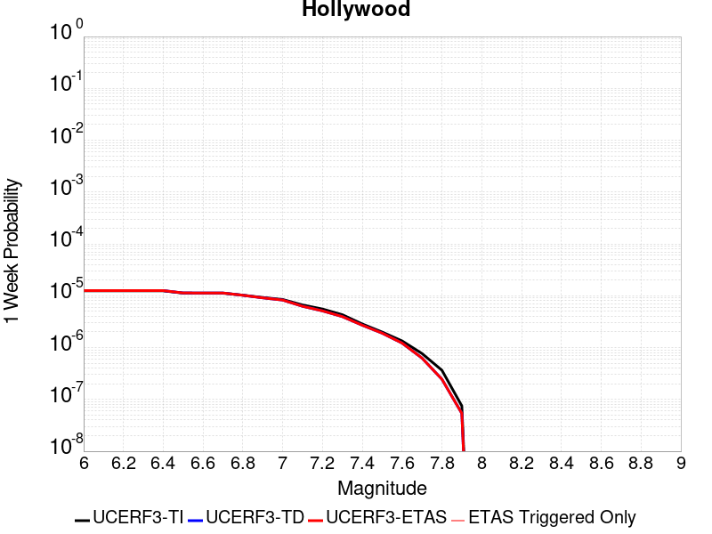 |  |  |  |

| Magnitude | 1 wk TI Prob | 1 wk TD Prob | 1 wk ETAS Prob | 1 wk ETAS/TD Gain | 1 wk ETAS Triggered Only | 1 mo TI Prob | 1 mo TD Prob | 1 mo ETAS Prob | 1 mo ETAS/TD Gain | 1 mo ETAS Triggered Only | 1 yr TI Prob | 1 yr TD Prob | 1 yr ETAS Prob | 1 yr ETAS/TD Gain | 1 yr ETAS Triggered Only | 10 yr TI Prob | 10 yr TD Prob | 10 yr ETAS Prob | 10 yr ETAS/TD Gain | 10 yr ETAS Triggered Only |
|-----|-----|-----|-----|-----|-----|-----|-----|-----|-----|-----|-----|-----|-----|-----|-----|-----|-----|-----|-----|-----|
| 6.0 | 1.24487615E-5 | 1.2594315E-5 | 1.2594315E-5 | 1.0 | 0.0 | 5.3350745E-5 | 5.3974545E-5 | 5.3974545E-5 | 1.0 | 0.0 | 6.4935174E-4 | 6.569466E-4 | 7.745026E-4 | 1.1789429 | 1.1763322E-4 | 0.0064745755 | 0.0065505337 | 0.0066673965 | 1.0178401 | 1.1763322E-4 |
| 6.1 | 1.24487615E-5 | 1.2594315E-5 | 1.2594315E-5 | 1.0 | 0.0 | 5.3350745E-5 | 5.3974545E-5 | 5.3974545E-5 | 1.0 | 0.0 | 6.4935174E-4 | 6.569466E-4 | 7.745026E-4 | 1.1789429 | 1.1763322E-4 | 0.0064745755 | 0.0065505337 | 0.0066673965 | 1.0178401 | 1.1763322E-4 |
| 6.2 | 1.24487615E-5 | 1.2594315E-5 | 1.2594315E-5 | 1.0 | 0.0 | 5.3350745E-5 | 5.3974545E-5 | 5.3974545E-5 | 1.0 | 0.0 | 6.4935174E-4 | 6.569466E-4 | 7.745026E-4 | 1.1789429 | 1.1763322E-4 | 0.0064745755 | 0.0065505337 | 0.0066673965 | 1.0178401 | 1.1763322E-4 |
| 6.3 | 1.24487615E-5 | 1.2594315E-5 | 1.2594315E-5 | 1.0 | 0.0 | 5.3350745E-5 | 5.3974545E-5 | 5.3974545E-5 | 1.0 | 0.0 | 6.4935174E-4 | 6.569466E-4 | 7.745026E-4 | 1.1789429 | 1.1763322E-4 | 0.0064745755 | 0.0065505337 | 0.0066673965 | 1.0178401 | 1.1763322E-4 |
| 6.4 | 1.2431024E-5 | 1.2574927E-5 | 1.2574927E-5 | 1.0 | 0.0 | 5.327473E-5 | 5.3891457E-5 | 5.3891457E-5 | 1.0 | 0.0 | 6.4842677E-4 | 6.559356E-4 | 7.734917E-4 | 1.1792189 | 1.1763322E-4 | 0.0064653796 | 0.0065404833 | 0.006657347 | 1.0178678 | 1.1763322E-4 |
| 6.5 | 1.1242222E-5 | 1.1318822E-5 | 1.1318822E-5 | 1.0 | 0.0 | 4.8180063E-5 | 4.850835E-5 | 4.850835E-5 | 1.0 | 0.0 | 5.864344E-4 | 5.904318E-4 | 7.0799555E-4 | 1.1991149 | 1.1763322E-4 | 0.0058488925 | 0.005888918 | 0.0060058585 | 1.0198578 | 1.1763322E-4 |
| 6.6 | 1.1234066E-5 | 1.1309935E-5 | 1.1309935E-5 | 1.0 | 0.0 | 4.8145106E-5 | 4.8470265E-5 | 4.8470265E-5 | 1.0 | 0.0 | 5.86009E-4 | 5.8996835E-4 | 7.0753216E-4 | 1.1992714 | 1.1763322E-4 | 0.005844661 | 0.0058843084 | 0.006001249 | 1.0198734 | 1.1763322E-4 |
| 6.7 | 1.12294E-5 | 1.1304678E-5 | 1.1304678E-5 | 1.0 | 0.0 | 4.812511E-5 | 4.8447735E-5 | 4.8447735E-5 | 1.0 | 0.0 | 5.857657E-4 | 5.896942E-4 | 7.0725806E-4 | 1.1993641 | 1.1763322E-4 | 0.0058422405 | 0.005881581 | 0.0059985225 | 1.0198827 | 1.1763322E-4 |
| 6.8 | 1.0252819E-5 | 1.0219352E-5 | 1.0219352E-5 | 1.0 | 0.0 | 4.3939912E-5 | 4.37965E-5 | 4.37965E-5 | 1.0 | 0.0 | 5.3483713E-4 | 5.3309405E-4 | 6.5066456E-4 | 1.2205436 | 1.1763322E-4 | 0.005335517 | 0.0053183786 | 0.005435386 | 1.0220007 | 1.1763322E-4 |
| 6.9 | 9.252289E-6 | 9.111102E-6 | 9.111102E-6 | 1.0 | 0.0 | 3.9652066E-5 | 3.904701E-5 | 3.904701E-5 | 1.0 | 0.0 | 4.8265693E-4 | 4.7529524E-4 | 5.9287256E-4 | 1.2473774 | 1.1763322E-4 | 0.0048161 | 0.0047429604 | 0.004860036 | 1.024684 | 1.1763322E-4 |
| 7.0 | 8.474604E-6 | 8.258978E-6 | 8.258978E-6 | 1.0 | 0.0 | 3.6319227E-5 | 3.5395147E-5 | 3.5395147E-5 | 1.0 | 0.0 | 4.4209688E-4 | 4.3085212E-4 | 5.484347E-4 | 1.2729069 | 1.1763322E-4 | 0.004412184 | 0.004300318 | 0.0044174455 | 1.0272369 | 1.1763322E-4 |
| 7.1 | 6.643643E-6 | 6.268914E-6 | 6.268914E-6 | 1.0 | 0.0 | 2.8472443E-5 | 2.68665E-5 | 2.68665E-5 | 1.0 | 0.0 | 3.4659685E-4 | 3.2705098E-4 | 3.2705098E-4 | 1.0 | 0.0 | 0.0034605677 | 0.0032657427 | 0.0032657427 | 1.0 | 0.0 |
| 7.2 | 5.549002E-6 | 5.109165E-6 | 5.109165E-6 | 1.0 | 0.0 | 2.378122E-5 | 2.189624E-5 | 2.189624E-5 | 1.0 | 0.0 | 2.8949787E-4 | 2.6655424E-4 | 2.6655424E-4 | 1.0 | 0.0 | 0.0028912104 | 0.0026623618 | 0.0026623618 | 1.0 | 0.0 |
| 7.3 | 4.3059727E-6 | 3.960264E-6 | 3.960264E-6 | 1.0 | 0.0 | 1.8454039E-5 | 1.6972452E-5 | 1.6972452E-5 | 1.0 | 0.0 | 2.2465475E-4 | 2.066201E-4 | 2.066201E-4 | 1.0 | 0.0 | 0.0022442779 | 0.00206429 | 0.00206429 | 1.0 | 0.0 |
| 7.4 | 2.8550733E-6 | 2.7015933E-6 | 2.7015933E-6 | 1.0 | 0.0 | 1.2235971E-5 | 1.1578206E-5 | 1.1578206E-5 | 1.0 | 0.0 | 1.4896276E-4 | 1.4095558E-4 | 1.4095558E-4 | 1.0 | 0.0 | 0.0014886294 | 0.0014086668 | 0.0014086668 | 1.0 | 0.0 |
| 7.5 | 1.9927045E-6 | 1.8978717E-6 | 1.8978717E-6 | 1.0 | 0.0 | 8.540134E-6 | 8.133711E-6 | 8.133711E-6 | 1.0 | 0.0 | 1.0397117E-4 | 9.902346E-5 | 9.902346E-5 | 1.0 | 0.0 | 0.0010392254 | 9.897971E-4 | 9.897971E-4 | 1.0 | 0.0 |
| 7.6 | 1.345084E-6 | 1.2217639E-6 | 1.2217639E-6 | 1.0 | 0.0 | 5.764633E-6 | 5.2361206E-6 | 5.2361206E-6 | 1.0 | 0.0 | 7.018215E-5 | 6.3747924E-5 | 6.3747924E-5 | 1.0 | 0.0 | 7.0159987E-4 | 6.3729833E-4 | 6.3729833E-4 | 1.0 | 0.0 |
| 7.7 | 7.6835164E-7 | 6.27892E-7 | 6.27892E-7 | 1.0 | 0.0 | 3.2929315E-6 | 2.6909631E-6 | 2.6909631E-6 | 1.0 | 0.0 | 4.00907E-5 | 3.2761996E-5 | 3.2761996E-5 | 1.0 | 0.0 | 4.0083472E-4 | 3.2757316E-4 | 3.2757316E-4 | 1.0 | 0.0 |
| 7.8 | 3.6562128E-7 | 2.454486E-7 | 2.454486E-7 | 1.0 | 0.0 | 1.5669474E-6 | 1.0519221E-6 | 1.0519221E-6 | 1.0 | 0.0 | 1.9077417E-5 | 1.28070815E-5 | 1.28070815E-5 | 1.0 | 0.0 | 1.907578E-4 | 1.280638E-4 | 1.280638E-4 | 1.0 | 0.0 |
| 7.9 | 7.5024424E-8 | 5.3838157E-8 | 5.3838157E-8 | 1.0 | 0.0 | 3.215332E-7 | 2.3073494E-7 | 2.3073494E-7 | 1.0 | 0.0 | 3.91466E-6 | 2.8091956E-6 | 2.8091956E-6 | 1.0 | 0.0 | 3.9145907E-5 | 2.809173E-5 | 2.809173E-5 | 1.0 | 0.0 |

## San Jacinto (Stepovers Combined)
*[(top)](#table-of-contents)*

| 1 Week | 1 Month | 1 Year | 10 Year |
|-----|-----|-----|-----|
|  | 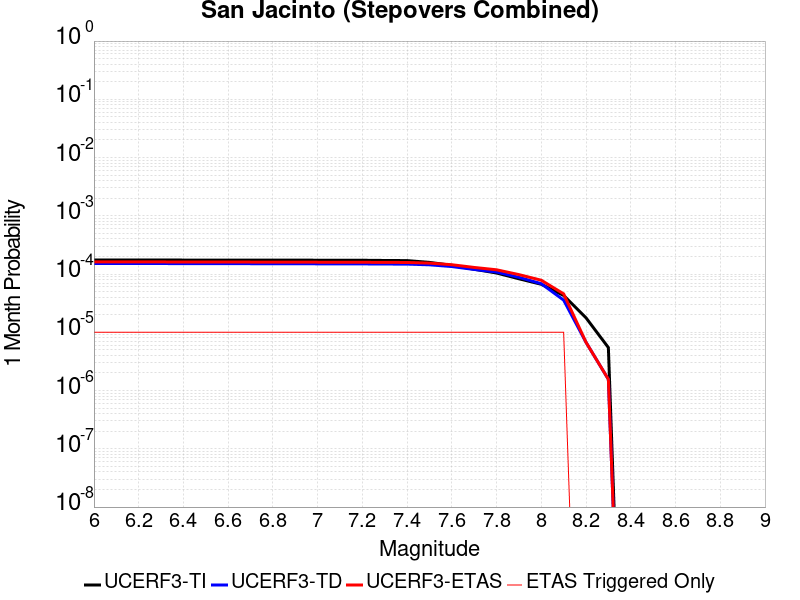 |  |  |

| Magnitude | 1 wk TI Prob | 1 wk TD Prob | 1 wk ETAS Prob | 1 wk ETAS/TD Gain | 1 wk ETAS Triggered Only | 1 mo TI Prob | 1 mo TD Prob | 1 mo ETAS Prob | 1 mo ETAS/TD Gain | 1 mo ETAS Triggered Only | 1 yr TI Prob | 1 yr TD Prob | 1 yr ETAS Prob | 1 yr ETAS/TD Gain | 1 yr ETAS Triggered Only | 10 yr TI Prob | 10 yr TD Prob | 10 yr ETAS Prob | 10 yr ETAS/TD Gain | 10 yr ETAS Triggered Only |
|-----|-----|-----|-----|-----|-----|-----|-----|-----|-----|-----|-----|-----|-----|-----|-----|-----|-----|-----|-----|-----|
| 6.0 | 4.0667746E-5 | 3.5380344E-5 | 3.5380344E-5 | 1.0 | 0.0 | 1.742787E-4 | 1.5162116E-4 | 1.5162116E-4 | 1.0 | 0.0 | 0.0021197782 | 0.0018444263 | 0.0019618424 | 1.06366 | 1.1763322E-4 | 0.020996714 | 0.01904263 | 0.019158022 | 1.0060598 | 1.1763322E-4 |
| 6.1 | 4.0667746E-5 | 3.5380344E-5 | 3.5380344E-5 | 1.0 | 0.0 | 1.742787E-4 | 1.5162116E-4 | 1.5162116E-4 | 1.0 | 0.0 | 0.0021197782 | 0.0018444263 | 0.0019618424 | 1.06366 | 1.1763322E-4 | 0.020996714 | 0.01904263 | 0.019158022 | 1.0060598 | 1.1763322E-4 |
| 6.2 | 4.0667746E-5 | 3.5380344E-5 | 3.5380344E-5 | 1.0 | 0.0 | 1.742787E-4 | 1.5162116E-4 | 1.5162116E-4 | 1.0 | 0.0 | 0.0021197782 | 0.0018444263 | 0.0019618424 | 1.06366 | 1.1763322E-4 | 0.020996714 | 0.01904263 | 0.019158022 | 1.0060598 | 1.1763322E-4 |
| 6.3 | 4.0667746E-5 | 3.5380344E-5 | 3.5380344E-5 | 1.0 | 0.0 | 1.742787E-4 | 1.5162116E-4 | 1.5162116E-4 | 1.0 | 0.0 | 0.0021197782 | 0.0018444263 | 0.0019618424 | 1.06366 | 1.1763322E-4 | 0.020996714 | 0.01904263 | 0.019158022 | 1.0060598 | 1.1763322E-4 |
| 6.4 | 4.0577226E-5 | 3.5252193E-5 | 3.5252193E-5 | 1.0 | 0.0 | 1.738908E-4 | 1.5107209E-4 | 1.5107209E-4 | 1.0 | 0.0 | 0.0021150648 | 0.0018377536 | 0.0019551707 | 1.0638916 | 1.1763322E-4 | 0.020950472 | 0.01897718 | 0.01909258 | 1.006081 | 1.1763322E-4 |
| 6.5 | 4.0577226E-5 | 3.5252193E-5 | 3.5252193E-5 | 1.0 | 0.0 | 1.738908E-4 | 1.5107209E-4 | 1.5107209E-4 | 1.0 | 0.0 | 0.0021150648 | 0.0018377536 | 0.0019551707 | 1.0638916 | 1.1763322E-4 | 0.020950472 | 0.01897718 | 0.01909258 | 1.006081 | 1.1763322E-4 |
| 6.6 | 4.053861E-5 | 3.5197518E-5 | 3.5197518E-5 | 1.0 | 0.0 | 1.7372532E-4 | 1.508378E-4 | 1.508378E-4 | 1.0 | 0.0 | 0.0021130538 | 0.0018349059 | 0.0019523232 | 1.063991 | 1.1763322E-4 | 0.020930743 | 0.01894925 | 0.019064654 | 1.0060902 | 1.1763322E-4 |
| 6.7 | 4.0516545E-5 | 3.5166573E-5 | 3.5166573E-5 | 1.0 | 0.0 | 1.7363077E-4 | 1.507052E-4 | 1.507052E-4 | 1.0 | 0.0 | 0.002111905 | 0.0018332949 | 0.0019507124 | 1.0640473 | 1.1763322E-4 | 0.020919468 | 0.018933441 | 0.01904885 | 1.0060954 | 1.1763322E-4 |
| 6.8 | 4.049434E-5 | 3.5138124E-5 | 3.5138124E-5 | 1.0 | 0.0 | 1.7353562E-4 | 1.5058329E-4 | 1.5058329E-4 | 1.0 | 0.0 | 0.0021107488 | 0.0018318131 | 0.0019492309 | 1.0640992 | 1.1763322E-4 | 0.020908125 | 0.018918851 | 0.019034259 | 1.0061002 | 1.1763322E-4 |
| 6.9 | 4.046386E-5 | 3.510067E-5 | 3.510067E-5 | 1.0 | 0.0 | 1.73405E-4 | 1.504228E-4 | 1.504228E-4 | 1.0 | 0.0 | 0.0021091616 | 0.0018298625 | 0.0019472804 | 1.0641676 | 1.1763322E-4 | 0.020892553 | 0.018899618 | 0.01901503 | 1.0061065 | 1.1763322E-4 |
| 7.0 | 4.036382E-5 | 3.4981196E-5 | 3.4981196E-5 | 1.0 | 0.0 | 1.7297632E-4 | 1.4991082E-4 | 1.4991082E-4 | 1.0 | 0.0 | 0.0021039525 | 0.0018236395 | 0.0019410582 | 1.064387 | 1.1763322E-4 | 0.02084144 | 0.01883821 | 0.018953627 | 1.0061268 | 1.1763322E-4 |
| 7.1 | 4.0343282E-5 | 3.495965E-5 | 3.495965E-5 | 1.0 | 0.0 | 1.7288832E-4 | 1.4981849E-4 | 1.4981849E-4 | 1.0 | 0.0 | 0.002102883 | 0.0018225173 | 0.0019399361 | 1.0644268 | 1.1763322E-4 | 0.020830948 | 0.018827083 | 0.018942501 | 1.0061305 | 1.1763322E-4 |
| 7.2 | 4.0257353E-5 | 3.4864024E-5 | 3.4864024E-5 | 1.0 | 0.0 | 1.725201E-4 | 1.494087E-4 | 1.494087E-4 | 1.0 | 0.0 | 0.0020984085 | 0.0018175367 | 0.0019349561 | 1.0646036 | 1.1763322E-4 | 0.020787042 | 0.01877776 | 0.018893184 | 1.0061469 | 1.1763322E-4 |
| 7.3 | 3.9940667E-5 | 3.469128E-5 | 3.469128E-5 | 1.0 | 0.0 | 1.7116306E-4 | 1.4866845E-4 | 1.4866845E-4 | 1.0 | 0.0 | 0.0020819185 | 0.0018085389 | 0.0019259594 | 1.0649256 | 1.1763322E-4 | 0.020625217 | 0.018686187 | 0.018801622 | 1.0061775 | 1.1763322E-4 |
| 7.4 | 3.9721202E-5 | 3.4576467E-5 | 3.4576467E-5 | 1.0 | 0.0 | 1.7022261E-4 | 1.4817646E-4 | 1.4817646E-4 | 1.0 | 0.0 | 0.0020704903 | 0.0018025589 | 0.00191998 | 1.0651414 | 1.1763322E-4 | 0.020513052 | 0.018625207 | 0.018740648 | 1.0061982 | 1.1763322E-4 |
| 7.5 | 3.7036873E-5 | 3.3641296E-5 | 3.3641296E-5 | 1.0 | 0.0 | 1.5871979E-4 | 1.4416903E-4 | 1.4416903E-4 | 1.0 | 0.0 | 0.0019307006 | 0.0017538477 | 0.0018712747 | 1.0669539 | 1.1763322E-4 | 0.019140124 | 0.018125426 | 0.018240927 | 1.0063723 | 1.1763322E-4 |
| 7.6 | 3.2940967E-5 | 3.141389E-5 | 3.141389E-5 | 1.0 | 0.0 | 1.4116794E-4 | 1.3462402E-4 | 1.3462402E-4 | 1.0 | 0.0 | 0.0017173645 | 0.0016378174 | 0.001755258 | 1.0717056 | 1.1763322E-4 | 0.01704153 | 0.016954063 | 0.017069701 | 1.0068207 | 1.1763322E-4 |
| 7.7 | 2.8236149E-5 | 2.7977081E-5 | 2.7977081E-5 | 1.0 | 0.0 | 1.2100645E-4 | 1.1989627E-4 | 1.1989627E-4 | 1.0 | 0.0 | 0.0014722579 | 0.0014587607 | 0.0015762222 | 1.0805215 | 1.1763322E-4 | 0.014625421 | 0.015163489 | 0.015279339 | 1.00764 | 1.1763322E-4 |
| 7.8 | 2.4329287E-5 | 2.5297024E-5 | 2.5297024E-5 | 1.0 | 0.0 | 1.042642E-4 | 1.0841132E-4 | 1.0841132E-4 | 1.0 | 0.0 | 0.0012686774 | 0.0013191095 | 0.0014365874 | 1.0890586 | 1.1763322E-4 | 0.012614589 | 0.013758943 | 0.013874958 | 1.0084319 | 1.1763322E-4 |
| 7.9 | 1.9370926E-5 | 2.0502179E-5 | 2.0502179E-5 | 1.0 | 0.0 | 8.301561E-5 | 8.7863526E-5 | 8.7863526E-5 | 1.0 | 0.0 | 0.0010102465 | 0.0010692142 | 0.0011867216 | 1.1099007 | 1.1763322E-4 | 0.0100566605 | 0.011241638 | 0.011357949 | 1.0103464 | 1.1763322E-4 |
| 8.0 | 1.5583017E-5 | 1.5954185E-5 | 1.5954185E-5 | 1.0 | 0.0 | 6.6782646E-5 | 6.837329E-5 | 6.837329E-5 | 1.0 | 0.0 | 8.127754E-4 | 8.321275E-4 | 9.496629E-4 | 1.1412468 | 1.1763322E-4 | 0.008098091 | 0.008817447 | 0.008934043 | 1.0132233 | 1.1763322E-4 |
| 8.1 | 1.0024873E-5 | 8.33189E-6 | 8.33189E-6 | 1.0 | 0.0 | 4.2963035E-5 | 3.5707613E-5 | 3.5707613E-5 | 1.0 | 0.0 | 5.229494E-4 | 4.3465398E-4 | 4.3465398E-4 | 1.0 | 0.0 | 0.0052172043 | 0.004674638 | 0.004674638 | 1.0 | 0.0 |
| 8.2 | 4.142796E-6 | 1.5725606E-6 | 1.5725606E-6 | 1.0 | 0.0 | 1.775472E-5 | 6.739528E-6 | 6.739528E-6 | 1.0 | 0.0 | 2.1614227E-4 | 8.205069E-5 | 8.205069E-5 | 1.0 | 0.0 | 0.0021593217 | 9.520677E-4 | 9.520677E-4 | 1.0 | 0.0 |
| 8.3 | 1.2750878E-6 | 3.6436526E-7 | 3.6436526E-7 | 1.0 | 0.0 | 5.4646503E-6 | 1.5615645E-6 | 1.5615645E-6 | 1.0 | 0.0 | 6.653009E-5 | 1.9011886E-5 | 1.9011886E-5 | 1.0 | 0.0 | 6.6510175E-4 | 2.291941E-4 | 2.291941E-4 | 1.0 | 0.0 |

## Malibu Coast (Extension) alt 1
*[(top)](#table-of-contents)*

| 1 Week | 1 Month | 1 Year | 10 Year |
|-----|-----|-----|-----|
| 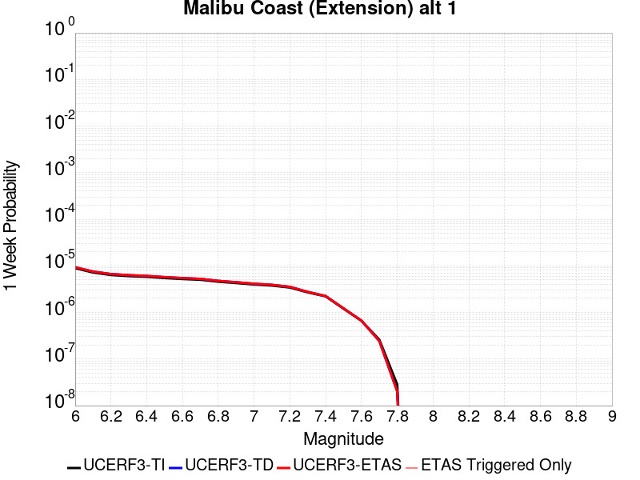 | 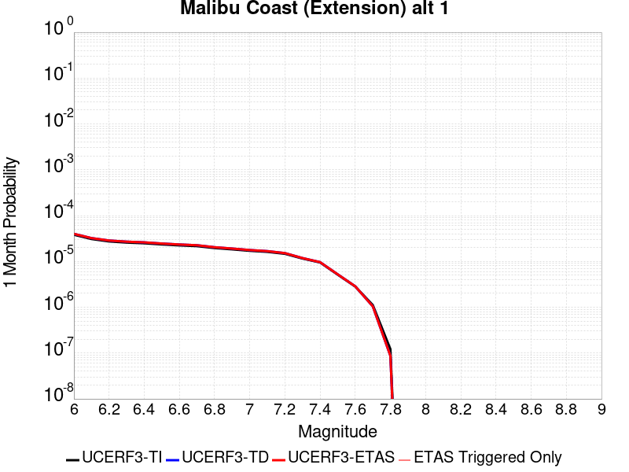 | 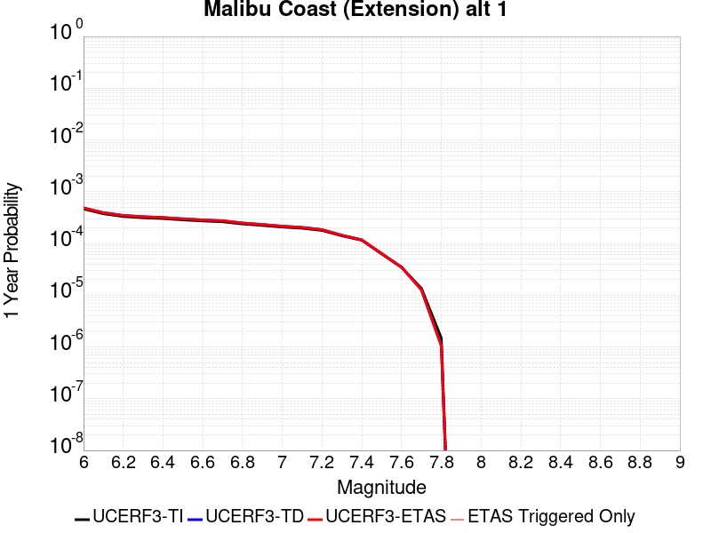 |  |

| Magnitude | 1 wk TI Prob | 1 wk TD Prob | 1 wk ETAS Prob | 1 wk ETAS/TD Gain | 1 wk ETAS Triggered Only | 1 mo TI Prob | 1 mo TD Prob | 1 mo ETAS Prob | 1 mo ETAS/TD Gain | 1 mo ETAS Triggered Only | 1 yr TI Prob | 1 yr TD Prob | 1 yr ETAS Prob | 1 yr ETAS/TD Gain | 1 yr ETAS Triggered Only | 10 yr TI Prob | 10 yr TD Prob | 10 yr ETAS Prob | 10 yr ETAS/TD Gain | 10 yr ETAS Triggered Only |
|-----|-----|-----|-----|-----|-----|-----|-----|-----|-----|-----|-----|-----|-----|-----|-----|-----|-----|-----|-----|-----|
| 6.0 | 8.930738E-6 | 9.329764E-6 | 9.329764E-6 | 1.0 | 0.0 | 3.827403E-5 | 3.9984097E-5 | 3.9984097E-5 | 1.0 | 0.0 | 4.6588664E-4 | 4.866994E-4 | 4.866994E-4 | 1.0 | 0.0 | 0.0046491115 | 0.0048565175 | 0.004973579 | 1.0241041 | 1.1763322E-4 |
| 6.1 | 7.199952E-6 | 7.5307184E-6 | 7.5307184E-6 | 1.0 | 0.0 | 3.0856572E-5 | 3.227411E-5 | 3.227411E-5 | 1.0 | 0.0 | 3.75614E-4 | 3.9286708E-4 | 3.9286708E-4 | 1.0 | 0.0 | 0.0037497976 | 0.003921792 | 0.003921792 | 1.0 | 0.0 |
| 6.2 | 6.3721413E-6 | 6.667179E-6 | 6.667179E-6 | 1.0 | 0.0 | 2.7308892E-5 | 2.8573313E-5 | 2.8573313E-5 | 1.0 | 0.0 | 3.3243504E-4 | 3.478249E-4 | 3.478249E-4 | 1.0 | 0.0 | 0.0033193815 | 0.0034728453 | 0.0034728453 | 1.0 | 0.0 |
| 6.3 | 6.016345E-6 | 6.2955305E-6 | 6.2955305E-6 | 1.0 | 0.0 | 2.578408E-5 | 2.6980568E-5 | 2.6980568E-5 | 1.0 | 0.0 | 3.1387596E-4 | 3.2843923E-4 | 3.2843923E-4 | 1.0 | 0.0 | 0.00313433 | 0.0032795742 | 0.0032795742 | 1.0 | 0.0 |
| 6.4 | 5.8104883E-6 | 6.079907E-6 | 6.079907E-6 | 1.0 | 0.0 | 2.4901856E-5 | 2.6056487E-5 | 2.6056487E-5 | 1.0 | 0.0 | 3.031379E-4 | 3.1719185E-4 | 3.1719185E-4 | 1.0 | 0.0 | 0.0030272473 | 0.003167426 | 0.003167426 | 1.0 | 0.0 |
| 6.5 | 5.476925E-6 | 5.7278576E-6 | 5.7278576E-6 | 1.0 | 0.0 | 2.3472323E-5 | 2.4547731E-5 | 2.4547731E-5 | 1.0 | 0.0 | 2.8573806E-4 | 2.9882794E-4 | 2.9882794E-4 | 1.0 | 0.0 | 0.0028537093 | 0.002984293 | 0.002984293 | 1.0 | 0.0 |
| 6.6 | 5.222387E-6 | 5.45891E-6 | 5.45891E-6 | 1.0 | 0.0 | 2.2381464E-5 | 2.3395121E-5 | 2.3395121E-5 | 1.0 | 0.0 | 2.7246025E-4 | 2.8479865E-4 | 2.8479865E-4 | 1.0 | 0.0 | 0.0027212645 | 0.0028443674 | 0.0028443674 | 1.0 | 0.0 |
| 6.7 | 5.0337076E-6 | 5.259423E-6 | 5.259423E-6 | 1.0 | 0.0 | 2.1572854E-5 | 2.2540191E-5 | 2.2540191E-5 | 1.0 | 0.0 | 2.6261783E-4 | 2.7439254E-4 | 2.7439254E-4 | 1.0 | 0.0 | 0.002623077 | 0.0027405676 | 0.0027405676 | 1.0 | 0.0 |
| 6.8 | 4.5675624E-6 | 4.759002E-6 | 4.759002E-6 | 1.0 | 0.0 | 1.9575122E-5 | 2.0395564E-5 | 2.0395564E-5 | 1.0 | 0.0 | 2.3830103E-4 | 2.482879E-4 | 2.482879E-4 | 1.0 | 0.0 | 0.0023804565 | 0.0024801246 | 0.0024801246 | 1.0 | 0.0 |
| 6.9 | 4.2802412E-6 | 4.4522867E-6 | 4.4522867E-6 | 1.0 | 0.0 | 1.8343762E-5 | 1.9081092E-5 | 1.9081092E-5 | 1.0 | 0.0 | 2.2331243E-4 | 2.3228767E-4 | 2.3228767E-4 | 1.0 | 0.0 | 0.0022308815 | 0.0023204654 | 0.0023204654 | 1.0 | 0.0 |
| 7.0 | 3.9794063E-6 | 4.130344E-6 | 4.130344E-6 | 1.0 | 0.0 | 1.7054486E-5 | 1.7701357E-5 | 1.7701357E-5 | 1.0 | 0.0 | 2.0761859E-4 | 2.1549284E-4 | 2.1549284E-4 | 1.0 | 0.0 | 0.0020742472 | 0.0021528522 | 0.0021528522 | 1.0 | 0.0 |
| 7.1 | 3.7730424E-6 | 3.91145E-6 | 3.91145E-6 | 1.0 | 0.0 | 1.6170083E-5 | 1.676325E-5 | 1.676325E-5 | 1.0 | 0.0 | 1.9685295E-4 | 2.0407357E-4 | 2.0407357E-4 | 1.0 | 0.0 | 0.0019667868 | 0.0020388747 | 0.0020388747 | 1.0 | 0.0 |
| 7.2 | 3.424985E-6 | 3.5415485E-6 | 3.5415485E-6 | 1.0 | 0.0 | 1.4678424E-5 | 1.5177977E-5 | 1.5177977E-5 | 1.0 | 0.0 | 1.7869516E-4 | 1.8477632E-4 | 1.8477632E-4 | 1.0 | 0.0 | 0.0017855153 | 0.0018462389 | 0.0018462389 | 1.0 | 0.0 |
| 7.3 | 2.6966375E-6 | 2.7598114E-6 | 2.7598114E-6 | 1.0 | 0.0 | 1.15569665E-5 | 1.1827709E-5 | 1.1827709E-5 | 1.0 | 0.0 | 1.4069698E-4 | 1.4399289E-4 | 1.4399289E-4 | 1.0 | 0.0 | 0.0014060794 | 0.001439 | 0.001439 | 1.0 | 0.0 |
| 7.4 | 2.215957E-6 | 2.2495053E-6 | 2.2495053E-6 | 1.0 | 0.0 | 9.496924E-6 | 9.640701E-6 | 9.640701E-6 | 1.0 | 0.0 | 1.1561892E-4 | 1.1736925E-4 | 1.1736925E-4 | 1.0 | 0.0 | 0.0011555878 | 0.0011730763 | 0.0011730763 | 1.0 | 0.0 |
| 7.5 | 1.2040218E-6 | 1.221979E-6 | 1.221979E-6 | 1.0 | 0.0 | 5.160083E-6 | 5.2370424E-6 | 5.2370424E-6 | 1.0 | 0.0 | 6.2822204E-5 | 6.3759144E-5 | 6.3759144E-5 | 1.0 | 0.0 | 6.280445E-4 | 6.374104E-4 | 6.374104E-4 | 1.0 | 0.0 |
| 7.6 | 6.6157446E-7 | 6.679384E-7 | 6.679384E-7 | 1.0 | 0.0 | 2.835316E-6 | 2.8625902E-6 | 2.8625902E-6 | 1.0 | 0.0 | 3.4519428E-5 | 3.4851495E-5 | 3.4851495E-5 | 1.0 | 0.0 | 3.4514067E-4 | 3.4846182E-4 | 3.4846182E-4 | 1.0 | 0.0 |
| 7.7 | 2.6012302E-7 | 2.4359008E-7 | 2.4359008E-7 | 1.0 | 0.0 | 1.1148124E-6 | 1.0439571E-6 | 1.0439571E-6 | 1.0 | 0.0 | 1.3572758E-5 | 1.2710114E-5 | 1.2710114E-5 | 1.0 | 0.0 | 1.3571928E-4 | 1.2709494E-4 | 1.2709494E-4 | 1.0 | 0.0 |
| 7.8 | 2.8323132E-8 | 2.0267912E-8 | 2.0267912E-8 | 1.0 | 0.0 | 1.2138484E-7 | 8.686248E-8 | 8.686248E-8 | 1.0 | 0.0 | 1.4778595E-6 | 1.0575502E-6 | 1.0575502E-6 | 1.0 | 0.0 | 1.4778497E-5 | 1.057546E-5 | 1.057546E-5 | 1.0 | 0.0 |

## San Jacinto (San Jacinto Valley) rev
*[(top)](#table-of-contents)*

| 1 Week | 1 Month | 1 Year | 10 Year |
|-----|-----|-----|-----|
|  |  |  |  |

| Magnitude | 1 wk TI Prob | 1 wk TD Prob | 1 wk ETAS Prob | 1 wk ETAS/TD Gain | 1 wk ETAS Triggered Only | 1 mo TI Prob | 1 mo TD Prob | 1 mo ETAS Prob | 1 mo ETAS/TD Gain | 1 mo ETAS Triggered Only | 1 yr TI Prob | 1 yr TD Prob | 1 yr ETAS Prob | 1 yr ETAS/TD Gain | 1 yr ETAS Triggered Only | 10 yr TI Prob | 10 yr TD Prob | 10 yr ETAS Prob | 10 yr ETAS/TD Gain | 10 yr ETAS Triggered Only |
|-----|-----|-----|-----|-----|-----|-----|-----|-----|-----|-----|-----|-----|-----|-----|-----|-----|-----|-----|-----|-----|
| 6.0 | 3.652694E-5 | 3.4511515E-5 | 3.4511515E-5 | 1.0 | 0.0 | 1.5653463E-4 | 1.4789813E-4 | 1.4789813E-4 | 1.0 | 0.0 | 0.0019041431 | 0.0017991741 | 0.0019165957 | 1.0652641 | 1.1763322E-4 | 0.018879099 | 0.018582989 | 0.018698437 | 1.0062125 | 1.1763322E-4 |
| 6.1 | 3.652694E-5 | 3.4511515E-5 | 3.4511515E-5 | 1.0 | 0.0 | 1.5653463E-4 | 1.4789813E-4 | 1.4789813E-4 | 1.0 | 0.0 | 0.0019041431 | 0.0017991741 | 0.0019165957 | 1.0652641 | 1.1763322E-4 | 0.018879099 | 0.018582989 | 0.018698437 | 1.0062125 | 1.1763322E-4 |
| 6.2 | 3.652694E-5 | 3.4511515E-5 | 3.4511515E-5 | 1.0 | 0.0 | 1.5653463E-4 | 1.4789813E-4 | 1.4789813E-4 | 1.0 | 0.0 | 0.0019041431 | 0.0017991741 | 0.0019165957 | 1.0652641 | 1.1763322E-4 | 0.018879099 | 0.018582989 | 0.018698437 | 1.0062125 | 1.1763322E-4 |
| 6.3 | 3.652694E-5 | 3.4511515E-5 | 3.4511515E-5 | 1.0 | 0.0 | 1.5653463E-4 | 1.4789813E-4 | 1.4789813E-4 | 1.0 | 0.0 | 0.0019041431 | 0.0017991741 | 0.0019165957 | 1.0652641 | 1.1763322E-4 | 0.018879099 | 0.018582989 | 0.018698437 | 1.0062125 | 1.1763322E-4 |
| 6.4 | 3.646941E-5 | 3.4433066E-5 | 3.4433066E-5 | 1.0 | 0.0 | 1.5628811E-4 | 1.4756195E-4 | 1.4756195E-4 | 1.0 | 0.0 | 0.0019011468 | 0.0017950885 | 0.0019125106 | 1.065413 | 1.1763322E-4 | 0.018849645 | 0.01854286 | 0.018658312 | 1.0062262 | 1.1763322E-4 |
| 6.5 | 3.646941E-5 | 3.4433066E-5 | 3.4433066E-5 | 1.0 | 0.0 | 1.5628811E-4 | 1.4756195E-4 | 1.4756195E-4 | 1.0 | 0.0 | 0.0019011468 | 0.0017950885 | 0.0019125106 | 1.065413 | 1.1763322E-4 | 0.018849645 | 0.01854286 | 0.018658312 | 1.0062262 | 1.1763322E-4 |
| 6.6 | 3.6442503E-5 | 3.439644E-5 | 3.439644E-5 | 1.0 | 0.0 | 1.561728E-4 | 1.47405E-4 | 1.47405E-4 | 1.0 | 0.0 | 0.0018997455 | 0.0017931808 | 0.0019106031 | 1.0654827 | 1.1763322E-4 | 0.018835869 | 0.018524125 | 0.01863958 | 1.0062326 | 1.1763322E-4 |
| 6.7 | 3.6432113E-5 | 3.4382007E-5 | 3.4382007E-5 | 1.0 | 0.0 | 1.5612828E-4 | 1.4734315E-4 | 1.4734315E-4 | 1.0 | 0.0 | 0.0018992044 | 0.0017924294 | 0.0019098518 | 1.0655102 | 1.1763322E-4 | 0.018830549 | 0.018516747 | 0.018632201 | 1.0062351 | 1.1763322E-4 |
| 6.8 | 3.6409598E-5 | 3.435105E-5 | 3.435105E-5 | 1.0 | 0.0 | 1.560318E-4 | 1.4721049E-4 | 1.4721049E-4 | 1.0 | 0.0 | 0.0018980318 | 0.001790817 | 0.0019082397 | 1.0655693 | 1.1763322E-4 | 0.018819023 | 0.018500896 | 0.018616354 | 1.0062406 | 1.1763322E-4 |
| 6.9 | 3.638078E-5 | 3.4311463E-5 | 3.4311463E-5 | 1.0 | 0.0 | 1.5590832E-4 | 1.4704085E-4 | 1.4704085E-4 | 1.0 | 0.0 | 0.0018965311 | 0.001788755 | 0.0019061777 | 1.065645 | 1.1763322E-4 | 0.018804269 | 0.018480625 | 0.018596085 | 1.0062476 | 1.1763322E-4 |
| 7.0 | 3.6294874E-5 | 3.4193446E-5 | 3.4193446E-5 | 1.0 | 0.0 | 1.5554018E-4 | 1.4653512E-4 | 1.4653512E-4 | 1.0 | 0.0 | 0.0018920569 | 0.0017826079 | 0.0019000313 | 1.0658717 | 1.1763322E-4 | 0.018760284 | 0.01842019 | 0.018535657 | 1.0062685 | 1.1763322E-4 |
| 7.1 | 3.6260717E-5 | 3.4149718E-5 | 3.4149718E-5 | 1.0 | 0.0 | 1.5539382E-4 | 1.4634774E-4 | 1.4634774E-4 | 1.0 | 0.0 | 0.001890278 | 0.0017803301 | 0.0018977539 | 1.0659562 | 1.1763322E-4 | 0.018742796 | 0.018397786 | 0.018513255 | 1.0062762 | 1.1763322E-4 |
| 7.2 | 3.6210204E-5 | 3.4083838E-5 | 3.4083838E-5 | 1.0 | 0.0 | 1.5517735E-4 | 1.4606542E-4 | 1.4606542E-4 | 1.0 | 0.0 | 0.001887647 | 0.0017768986 | 0.0018943228 | 1.0660838 | 1.1763322E-4 | 0.01871693 | 0.018364016 | 0.018479489 | 1.006288 | 1.1763322E-4 |
| 7.3 | 3.6119454E-5 | 3.3971908E-5 | 3.3971908E-5 | 1.0 | 0.0 | 1.5478847E-4 | 1.4558579E-4 | 1.4558579E-4 | 1.0 | 0.0 | 0.0018829206 | 0.0017710685 | 0.0018884934 | 1.0663017 | 1.1763322E-4 | 0.018670462 | 0.018306464 | 0.018421942 | 1.0063082 | 1.1763322E-4 |
| 7.4 | 3.607848E-5 | 3.391935E-5 | 3.391935E-5 | 1.0 | 0.0 | 1.5461289E-4 | 1.4536057E-4 | 1.4536057E-4 | 1.0 | 0.0 | 0.0018807866 | 0.0017683309 | 0.0018857562 | 1.0664046 | 1.1763322E-4 | 0.018649481 | 0.01827943 | 0.018394912 | 1.0063176 | 1.1763322E-4 |
| 7.5 | 3.5856774E-5 | 3.3728124E-5 | 3.3728124E-5 | 1.0 | 0.0 | 1.5366284E-4 | 1.4454112E-4 | 1.4454112E-4 | 1.0 | 0.0 | 0.0018692396 | 0.0017583702 | 0.0018757966 | 1.0667814 | 1.1763322E-4 | 0.018535944 | 0.01818001 | 0.018295506 | 1.0063528 | 1.1763322E-4 |
| 7.6 | 3.286655E-5 | 3.2243464E-5 | 3.2243464E-5 | 1.0 | 0.0 | 1.4084904E-4 | 1.3817896E-4 | 1.3817896E-4 | 1.0 | 0.0 | 0.001713488 | 0.0016810328 | 0.0017984683 | 1.0698591 | 1.1763322E-4 | 0.017003361 | 0.017395703 | 0.01751129 | 1.0066446 | 1.1763322E-4 |
| 7.7 | 2.8882527E-5 | 2.9333987E-5 | 2.9333987E-5 | 1.0 | 0.0 | 1.237764E-4 | 1.2571104E-4 | 1.2571104E-4 | 1.0 | 0.0 | 0.0015059357 | 0.0015294584 | 0.0016469117 | 1.076794 | 1.1763322E-4 | 0.014957713 | 0.01588101 | 0.015996775 | 1.0072895 | 1.1763322E-4 |
| 7.8 | 2.4950225E-5 | 2.6621141E-5 | 2.6621141E-5 | 1.0 | 0.0 | 1.0692515E-4 | 1.1408562E-4 | 1.1408562E-4 | 1.0 | 0.0 | 0.0013010362 | 0.0013881082 | 0.0015055782 | 1.084626 | 1.1763322E-4 | 0.012934455 | 0.014460438 | 0.01457637 | 1.0080172 | 1.1763322E-4 |
| 7.9 | 1.9881603E-5 | 2.1591917E-5 | 2.1591917E-5 | 1.0 | 0.0 | 8.520408E-5 | 9.2533504E-5 | 9.2533504E-5 | 1.0 | 0.0 | 0.001036866 | 0.0011260139 | 0.0012435147 | 1.104351 | 1.1763322E-4 | 0.010320415 | 0.011820986 | 0.011937228 | 1.0098336 | 1.1763322E-4 |
| 8.0 | 1.563292E-5 | 1.600534E-5 | 1.600534E-5 | 1.0 | 0.0 | 6.6996516E-5 | 6.859251E-5 | 6.859251E-5 | 1.0 | 0.0 | 8.153773E-4 | 8.3479454E-4 | 9.523296E-4 | 1.1407951 | 1.1763322E-4 | 0.00812392 | 0.0088462895 | 0.008962882 | 1.0131798 | 1.1763322E-4 |
| 8.1 | 1.0045313E-5 | 8.341364E-6 | 8.341364E-6 | 1.0 | 0.0 | 4.305063E-5 | 3.5748217E-5 | 3.5748217E-5 | 1.0 | 0.0 | 5.2401534E-4 | 4.351481E-4 | 4.351481E-4 | 1.0 | 0.0 | 0.0052278144 | 0.0046803835 | 0.0046803835 | 1.0 | 0.0 |
| 8.2 | 4.1554413E-6 | 1.5771562E-6 | 1.5771562E-6 | 1.0 | 0.0 | 1.7808914E-5 | 6.7592237E-6 | 6.7592237E-6 | 1.0 | 0.0 | 2.1680194E-4 | 8.229047E-5 | 8.229047E-5 | 1.0 | 0.0 | 0.0021659054 | 9.549161E-4 | 9.549161E-4 | 1.0 | 0.0 |
| 8.3 | 1.2758221E-6 | 3.6465343E-7 | 3.6465343E-7 | 1.0 | 0.0 | 5.4677976E-6 | 1.5627995E-6 | 1.5627995E-6 | 1.0 | 0.0 | 6.65684E-5 | 1.9026922E-5 | 1.9026922E-5 | 1.0 | 0.0 | 6.6548464E-4 | 2.2936566E-4 | 2.2936566E-4 | 1.0 | 0.0 |

## San Jacinto (San Bernardino)
*[(top)](#table-of-contents)*

| 1 Week | 1 Month | 1 Year | 10 Year |
|-----|-----|-----|-----|
|  | 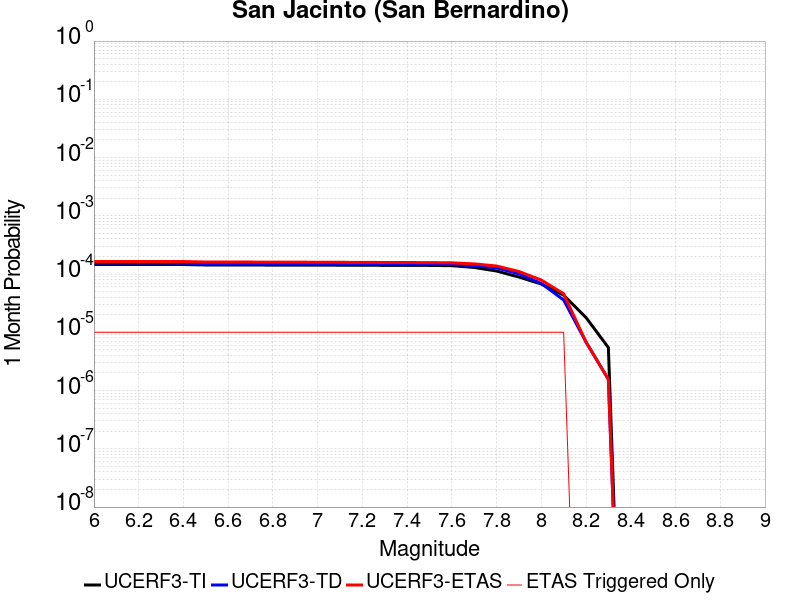 |  |  |

| Magnitude | 1 wk TI Prob | 1 wk TD Prob | 1 wk ETAS Prob | 1 wk ETAS/TD Gain | 1 wk ETAS Triggered Only | 1 mo TI Prob | 1 mo TD Prob | 1 mo ETAS Prob | 1 mo ETAS/TD Gain | 1 mo ETAS Triggered Only | 1 yr TI Prob | 1 yr TD Prob | 1 yr ETAS Prob | 1 yr ETAS/TD Gain | 1 yr ETAS Triggered Only | 10 yr TI Prob | 10 yr TD Prob | 10 yr ETAS Prob | 10 yr ETAS/TD Gain | 10 yr ETAS Triggered Only |
|-----|-----|-----|-----|-----|-----|-----|-----|-----|-----|-----|-----|-----|-----|-----|-----|-----|-----|-----|-----|-----|
| 6.0 | 3.409352E-5 | 3.609742E-5 | 3.609742E-5 | 1.0 | 0.0 | 1.461069E-4 | 1.5469406E-4 | 1.5469406E-4 | 1.0 | 0.0 | 0.0017774 | 0.001881775 | 0.0019991868 | 1.0623943 | 1.1763322E-4 | 0.01763251 | 0.019406606 | 0.019521957 | 1.0059439 | 1.1763322E-4 |
| 6.1 | 3.409352E-5 | 3.609742E-5 | 3.609742E-5 | 1.0 | 0.0 | 1.461069E-4 | 1.5469406E-4 | 1.5469406E-4 | 1.0 | 0.0 | 0.0017774 | 0.001881775 | 0.0019991868 | 1.0623943 | 1.1763322E-4 | 0.01763251 | 0.019406606 | 0.019521957 | 1.0059439 | 1.1763322E-4 |
| 6.2 | 3.409352E-5 | 3.609742E-5 | 3.609742E-5 | 1.0 | 0.0 | 1.461069E-4 | 1.5469406E-4 | 1.5469406E-4 | 1.0 | 0.0 | 0.0017774 | 0.001881775 | 0.0019991868 | 1.0623943 | 1.1763322E-4 | 0.01763251 | 0.019406606 | 0.019521957 | 1.0059439 | 1.1763322E-4 |
| 6.3 | 3.409352E-5 | 3.609742E-5 | 3.609742E-5 | 1.0 | 0.0 | 1.461069E-4 | 1.5469406E-4 | 1.5469406E-4 | 1.0 | 0.0 | 0.0017774 | 0.001881775 | 0.0019991868 | 1.0623943 | 1.1763322E-4 | 0.01763251 | 0.019406606 | 0.019521957 | 1.0059439 | 1.1763322E-4 |
| 6.4 | 3.400795E-5 | 3.5990055E-5 | 3.5990055E-5 | 1.0 | 0.0 | 1.4574021E-4 | 1.5423399E-4 | 1.5423399E-4 | 1.0 | 0.0 | 0.0017729428 | 0.0018761834 | 0.001993596 | 1.0625805 | 1.1763322E-4 | 0.017588645 | 0.019351678 | 0.019467035 | 1.0059611 | 1.1763322E-4 |
| 6.5 | 3.341482E-5 | 3.5250523E-5 | 3.5250523E-5 | 1.0 | 0.0 | 1.4319851E-4 | 1.5106493E-4 | 1.5106493E-4 | 1.0 | 0.0 | 0.0017420477 | 0.0018376654 | 0.0019550824 | 1.0638946 | 1.1763322E-4 | 0.017284546 | 0.018973157 | 0.019088559 | 1.0060823 | 1.1763322E-4 |
| 6.6 | 3.3364955E-5 | 3.5187728E-5 | 3.5187728E-5 | 1.0 | 0.0 | 1.4298483E-4 | 1.5079584E-4 | 1.5079584E-4 | 1.0 | 0.0 | 0.0017394501 | 0.0018343948 | 0.0019518122 | 1.0640088 | 1.1763322E-4 | 0.017258976 | 0.018941017 | 0.01905642 | 1.0060929 | 1.1763322E-4 |
| 6.7 | 3.335922E-5 | 3.51775E-5 | 3.51775E-5 | 1.0 | 0.0 | 1.4296026E-4 | 1.50752E-4 | 1.50752E-4 | 1.0 | 0.0 | 0.0017391514 | 0.001833862 | 0.0019512795 | 1.0640274 | 1.1763322E-4 | 0.017256035 | 0.018935807 | 0.019051213 | 1.0060946 | 1.1763322E-4 |
| 6.8 | 3.327683E-5 | 3.5071538E-5 | 3.5071538E-5 | 1.0 | 0.0 | 1.4260718E-4 | 1.5029794E-4 | 1.5029794E-4 | 1.0 | 0.0 | 0.0017348597 | 0.001828343 | 0.0019457611 | 1.064221 | 1.1763322E-4 | 0.017213784 | 0.018881567 | 0.01899698 | 1.0061125 | 1.1763322E-4 |
| 6.9 | 3.3235785E-5 | 3.5012476E-5 | 3.5012476E-5 | 1.0 | 0.0 | 1.4243131E-4 | 1.5004484E-4 | 1.5004484E-4 | 1.0 | 0.0 | 0.0017327217 | 0.0018252668 | 0.0019426853 | 1.0643295 | 1.1763322E-4 | 0.017192734 | 0.01885143 | 0.018966846 | 1.0061224 | 1.1763322E-4 |
| 7.0 | 3.3197095E-5 | 3.4952387E-5 | 3.4952387E-5 | 1.0 | 0.0 | 1.422655E-4 | 1.4978735E-4 | 1.4978735E-4 | 1.0 | 0.0 | 0.0017307063 | 0.001822137 | 0.0019395559 | 1.0644403 | 1.1763322E-4 | 0.017172894 | 0.0188208 | 0.018936219 | 1.0061325 | 1.1763322E-4 |
| 7.1 | 3.3129716E-5 | 3.4832556E-5 | 3.4832556E-5 | 1.0 | 0.0 | 1.4197677E-4 | 1.4927384E-4 | 1.4927384E-4 | 1.0 | 0.0 | 0.0017271966 | 0.0018158954 | 0.0019333151 | 1.0646621 | 1.1763322E-4 | 0.017138338 | 0.01875986 | 0.018875288 | 1.0061529 | 1.1763322E-4 |
| 7.2 | 3.3034008E-5 | 3.4699966E-5 | 3.4699966E-5 | 1.0 | 0.0 | 1.4156665E-4 | 1.4870567E-4 | 1.4870567E-4 | 1.0 | 0.0 | 0.0017222111 | 0.0018089896 | 0.00192641 | 1.0649093 | 1.1763322E-4 | 0.017089253 | 0.01869224 | 0.018807674 | 1.0061755 | 1.1763322E-4 |
| 7.3 | 3.2956614E-5 | 3.456766E-5 | 3.456766E-5 | 1.0 | 0.0 | 1.4123498E-4 | 1.481387E-4 | 1.481387E-4 | 1.0 | 0.0 | 0.0017181796 | 0.0018020981 | 0.0019195194 | 1.065158 | 1.1763322E-4 | 0.017049557 | 0.01862496 | 0.018740403 | 1.0061983 | 1.1763322E-4 |
| 7.4 | 3.2915937E-5 | 3.44893E-5 | 3.44893E-5 | 1.0 | 0.0 | 1.4106068E-4 | 1.4780293E-4 | 1.4780293E-4 | 1.0 | 0.0 | 0.0017160608 | 0.0017980168 | 0.0019154386 | 1.0653062 | 1.1763322E-4 | 0.017028693 | 0.018585203 | 0.01870065 | 1.0062118 | 1.1763322E-4 |
| 7.5 | 3.281791E-5 | 3.435414E-5 | 3.435414E-5 | 1.0 | 0.0 | 1.406406E-4 | 1.4722372E-4 | 1.4722372E-4 | 1.0 | 0.0 | 0.0017109542 | 0.0017909766 | 0.0019083992 | 1.0655634 | 1.1763322E-4 | 0.016978411 | 0.018516054 | 0.01863151 | 1.0062354 | 1.1763322E-4 |
| 7.6 | 3.2521442E-5 | 3.4078876E-5 | 3.4078876E-5 | 1.0 | 0.0 | 1.3937015E-4 | 1.4604416E-4 | 1.4604416E-4 | 1.0 | 0.0 | 0.0016955109 | 0.0017766389 | 0.0018940631 | 1.0660934 | 1.1763322E-4 | 0.016826328 | 0.018373583 | 0.018489053 | 1.0062847 | 1.1763322E-4 |
| 7.7 | 3.0287873E-5 | 3.2561624E-5 | 3.2561624E-5 | 1.0 | 0.0 | 1.297987E-4 | 1.3954236E-4 | 1.3954236E-4 | 1.0 | 0.0 | 0.0015791537 | 0.0016976055 | 0.0018150391 | 1.069176 | 1.1763322E-4 | 0.01567979 | 0.017583825 | 0.017699389 | 1.0065722 | 1.1763322E-4 |
| 7.8 | 2.6316151E-5 | 2.9768464E-5 | 2.9768464E-5 | 1.0 | 0.0 | 1.1277862E-4 | 1.275729E-4 | 1.275729E-4 | 1.0 | 0.0 | 0.0013722149 | 0.0015520945 | 0.0016695451 | 1.0756724 | 1.1763322E-4 | 0.013637724 | 0.016123403 | 0.01623914 | 1.0071782 | 1.1763322E-4 |
| 7.9 | 2.0761147E-5 | 2.350958E-5 | 2.350958E-5 | 1.0 | 0.0 | 8.897331E-5 | 1.0075145E-4 | 1.0075145E-4 | 1.0 | 0.0 | 0.0010827117 | 0.0012259595 | 0.0013434485 | 1.0958344 | 1.1763322E-4 | 0.010774517 | 0.012840435 | 0.012956558 | 1.0090436 | 1.1763322E-4 |
| 8.0 | 1.5738568E-5 | 1.6102143E-5 | 1.6102143E-5 | 1.0 | 0.0 | 6.744926E-5 | 6.9007365E-5 | 6.9007365E-5 | 1.0 | 0.0 | 8.2088535E-4 | 8.3984155E-4 | 9.57376E-4 | 1.1399484 | 1.1763322E-4 | 0.008178596 | 0.0089020105 | 0.009018596 | 1.0130966 | 1.1763322E-4 |
| 8.1 | 1.0105832E-5 | 8.370304E-6 | 8.370304E-6 | 1.0 | 0.0 | 4.3309992E-5 | 3.5872243E-5 | 3.5872243E-5 | 1.0 | 0.0 | 5.2717153E-4 | 4.3665757E-4 | 4.3665757E-4 | 1.0 | 0.0 | 0.005259227 | 0.004698642 | 0.004698642 | 1.0 | 0.0 |
| 8.2 | 4.189207E-6 | 1.5901481E-6 | 1.5901481E-6 | 1.0 | 0.0 | 1.7953622E-5 | 6.814903E-6 | 6.814903E-6 | 1.0 | 0.0 | 2.1856341E-4 | 8.296831E-5 | 8.296831E-5 | 1.0 | 0.0 | 0.0021834858 | 9.6328073E-4 | 9.6328073E-4 | 1.0 | 0.0 |
| 8.3 | 1.2758221E-6 | 3.6465343E-7 | 3.6465343E-7 | 1.0 | 0.0 | 5.4677976E-6 | 1.5627995E-6 | 1.5627995E-6 | 1.0 | 0.0 | 6.65684E-5 | 1.9026922E-5 | 1.9026922E-5 | 1.0 | 0.0 | 6.6548464E-4 | 2.2936566E-4 | 2.2936566E-4 | 1.0 | 0.0 |

## Elmore Ranch
*[(top)](#table-of-contents)*

| 1 Week | 1 Month | 1 Year | 10 Year |
|-----|-----|-----|-----|
|  | 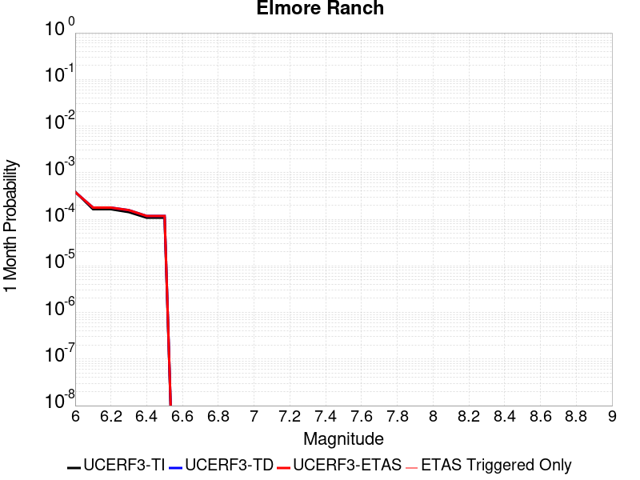 |  |  |

| Magnitude | 1 wk TI Prob | 1 wk TD Prob | 1 wk ETAS Prob | 1 wk ETAS/TD Gain | 1 wk ETAS Triggered Only | 1 mo TI Prob | 1 mo TD Prob | 1 mo ETAS Prob | 1 mo ETAS/TD Gain | 1 mo ETAS Triggered Only | 1 yr TI Prob | 1 yr TD Prob | 1 yr ETAS Prob | 1 yr ETAS/TD Gain | 1 yr ETAS Triggered Only | 10 yr TI Prob | 10 yr TD Prob | 10 yr ETAS Prob | 10 yr ETAS/TD Gain | 10 yr ETAS Triggered Only |
|-----|-----|-----|-----|-----|-----|-----|-----|-----|-----|-----|-----|-----|-----|-----|-----|-----|-----|-----|-----|-----|
| 6.0 | 9.102099E-5 | 8.956369E-5 | 8.956369E-5 | 1.0 | 0.0 | 3.9003167E-4 | 3.8379105E-4 | 3.8379105E-4 | 1.0 | 0.0 | 0.0047383 | 0.004664101 | 0.004664101 | 1.0 | 0.0 | 0.046385348 | 0.045887828 | 0.046000063 | 1.0024458 | 1.1763322E-4 |
| 6.1 | 3.8306698E-5 | 4.1515465E-5 | 4.1515465E-5 | 1.0 | 0.0 | 1.6416123E-4 | 1.7791537E-4 | 1.7791537E-4 | 1.0 | 0.0 | 0.0019968306 | 0.0021638772 | 0.0021638772 | 1.0 | 0.0 | 0.019789828 | 0.021636104 | 0.021751191 | 1.0053192 | 1.1763322E-4 |
| 6.2 | 3.8306698E-5 | 4.1515465E-5 | 4.1515465E-5 | 1.0 | 0.0 | 1.6416123E-4 | 1.7791537E-4 | 1.7791537E-4 | 1.0 | 0.0 | 0.0019968306 | 0.0021638772 | 0.0021638772 | 1.0 | 0.0 | 0.019789828 | 0.021636104 | 0.021751191 | 1.0053192 | 1.1763322E-4 |
| 6.3 | 3.3197924E-5 | 3.656767E-5 | 3.656767E-5 | 1.0 | 0.0 | 1.4226905E-4 | 1.5671315E-4 | 1.5671315E-4 | 1.0 | 0.0 | 0.0017307495 | 0.0019065277 | 0.0019065277 | 1.0 | 0.0 | 0.017173318 | 0.01909636 | 0.019211745 | 1.0060424 | 1.1763322E-4 |
| 6.4 | 2.5148964E-5 | 2.742868E-5 | 2.742868E-5 | 1.0 | 0.0 | 1.0777682E-4 | 1.1754984E-4 | 1.1754984E-4 | 1.0 | 0.0 | 0.0013113929 | 0.0014308781 | 0.0014308781 | 1.0 | 0.0 | 0.01303681 | 0.01439143 | 0.01450737 | 1.0080562 | 1.1763322E-4 |
| 6.5 | 2.5148964E-5 | 2.742868E-5 | 2.742868E-5 | 1.0 | 0.0 | 1.0777682E-4 | 1.1754984E-4 | 1.1754984E-4 | 1.0 | 0.0 | 0.0013113929 | 0.0014308781 | 0.0014308781 | 1.0 | 0.0 | 0.01303681 | 0.01439143 | 0.01450737 | 1.0080562 | 1.1763322E-4 |

## Sierra Nevada  (No Extension)
*[(top)](#table-of-contents)*

| 1 Week | 1 Month | 1 Year | 10 Year |
|-----|-----|-----|-----|
| 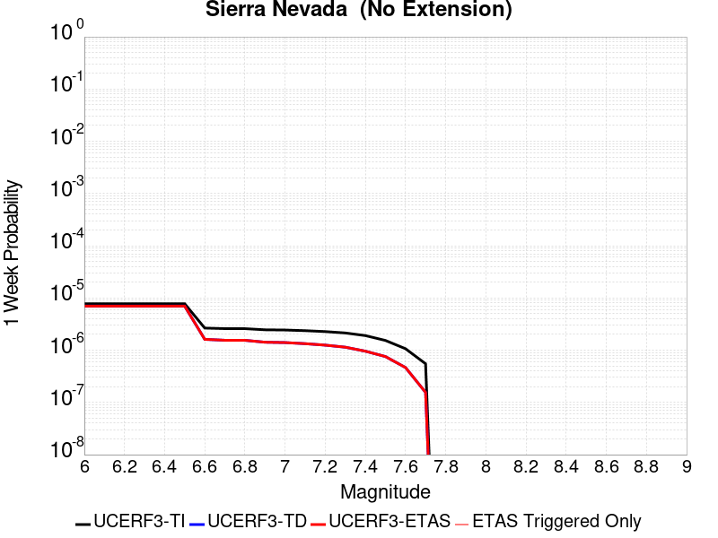 |  |  |  |

| Magnitude | 1 wk TI Prob | 1 wk TD Prob | 1 wk ETAS Prob | 1 wk ETAS/TD Gain | 1 wk ETAS Triggered Only | 1 mo TI Prob | 1 mo TD Prob | 1 mo ETAS Prob | 1 mo ETAS/TD Gain | 1 mo ETAS Triggered Only | 1 yr TI Prob | 1 yr TD Prob | 1 yr ETAS Prob | 1 yr ETAS/TD Gain | 1 yr ETAS Triggered Only | 10 yr TI Prob | 10 yr TD Prob | 10 yr ETAS Prob | 10 yr ETAS/TD Gain | 10 yr ETAS Triggered Only |
|-----|-----|-----|-----|-----|-----|-----|-----|-----|-----|-----|-----|-----|-----|-----|-----|-----|-----|-----|-----|-----|
| 6.0 | 7.7690465E-6 | 6.976752E-6 | 6.976752E-6 | 1.0 | 0.0 | 3.329549E-5 | 2.9900226E-5 | 2.9900226E-5 | 1.0 | 0.0 | 4.0529718E-4 | 3.6401028E-4 | 4.816007E-4 | 1.3230414 | 1.1763322E-4 | 0.004045588 | 0.0036376568 | 0.0037548621 | 1.03222 | 1.1763322E-4 |
| 6.1 | 7.7690465E-6 | 6.976752E-6 | 6.976752E-6 | 1.0 | 0.0 | 3.329549E-5 | 2.9900226E-5 | 2.9900226E-5 | 1.0 | 0.0 | 4.0529718E-4 | 3.6401028E-4 | 4.816007E-4 | 1.3230414 | 1.1763322E-4 | 0.004045588 | 0.0036376568 | 0.0037548621 | 1.03222 | 1.1763322E-4 |
| 6.2 | 7.7690465E-6 | 6.976752E-6 | 6.976752E-6 | 1.0 | 0.0 | 3.329549E-5 | 2.9900226E-5 | 2.9900226E-5 | 1.0 | 0.0 | 4.0529718E-4 | 3.6401028E-4 | 4.816007E-4 | 1.3230414 | 1.1763322E-4 | 0.004045588 | 0.0036376568 | 0.0037548621 | 1.03222 | 1.1763322E-4 |
| 6.3 | 7.7690465E-6 | 6.976752E-6 | 6.976752E-6 | 1.0 | 0.0 | 3.329549E-5 | 2.9900226E-5 | 2.9900226E-5 | 1.0 | 0.0 | 4.0529718E-4 | 3.6401028E-4 | 4.816007E-4 | 1.3230414 | 1.1763322E-4 | 0.004045588 | 0.0036376568 | 0.0037548621 | 1.03222 | 1.1763322E-4 |
| 6.4 | 7.7690465E-6 | 6.976752E-6 | 6.976752E-6 | 1.0 | 0.0 | 3.329549E-5 | 2.9900226E-5 | 2.9900226E-5 | 1.0 | 0.0 | 4.0529718E-4 | 3.6401028E-4 | 4.816007E-4 | 1.3230414 | 1.1763322E-4 | 0.004045588 | 0.0036376568 | 0.0037548621 | 1.03222 | 1.1763322E-4 |
| 6.5 | 7.7690465E-6 | 6.976752E-6 | 6.976752E-6 | 1.0 | 0.0 | 3.329549E-5 | 2.9900226E-5 | 2.9900226E-5 | 1.0 | 0.0 | 4.0529718E-4 | 3.6401028E-4 | 4.816007E-4 | 1.3230414 | 1.1763322E-4 | 0.004045588 | 0.0036376568 | 0.0037548621 | 1.03222 | 1.1763322E-4 |
| 6.6 | 2.653E-6 | 1.6150456E-6 | 1.6150456E-6 | 1.0 | 0.0 | 1.136995E-5 | 6.9216057E-6 | 6.9216057E-6 | 1.0 | 0.0 | 1.3842035E-4 | 8.4267325E-5 | 2.0189064E-4 | 2.3958352 | 1.1763322E-4 | 0.0013833415 | 8.4235717E-4 | 9.598913E-4 | 1.1395301 | 1.1763322E-4 |
| 6.7 | 2.5902466E-6 | 1.5503773E-6 | 1.5503773E-6 | 1.0 | 0.0 | 1.11010095E-5 | 6.6444572E-6 | 6.6444572E-6 | 1.0 | 0.0 | 1.351464E-4 | 8.08933E-5 | 1.98517E-4 | 2.45406 | 1.1763322E-4 | 0.0013506424 | 8.086415E-4 | 9.261796E-4 | 1.1453526 | 1.1763322E-4 |
| 6.8 | 2.5853892E-6 | 1.5471767E-6 | 1.5471767E-6 | 1.0 | 0.0 | 1.1080193E-5 | 6.6307402E-6 | 6.6307402E-6 | 1.0 | 0.0 | 1.34893E-4 | 8.0726306E-5 | 1.9835003E-4 | 2.4570682 | 1.1763322E-4 | 0.0013481114 | 8.069728E-4 | 9.2451106E-4 | 1.1456534 | 1.1763322E-4 |
| 6.9 | 2.458257E-6 | 1.4222467E-6 | 1.4222467E-6 | 1.0 | 0.0 | 1.0535345E-5 | 6.095329E-6 | 6.095329E-6 | 1.0 | 0.0 | 1.2826028E-4 | 7.420812E-5 | 1.9183262E-4 | 2.5850623 | 1.1763322E-4 | 0.0012818627 | 7.4183533E-4 | 8.5938134E-4 | 1.1584529 | 1.1763322E-4 |
| 7.0 | 2.4341468E-6 | 1.3992096E-6 | 1.3992096E-6 | 1.0 | 0.0 | 1.0432016E-5 | 5.996599E-6 | 5.996599E-6 | 1.0 | 0.0 | 1.270024E-4 | 7.3006166E-5 | 1.906308E-4 | 2.6111603 | 1.1763322E-4 | 0.0012692984 | 7.298237E-4 | 8.473711E-4 | 1.1610627 | 1.1763322E-4 |
| 7.1 | 2.3652476E-6 | 1.3341567E-6 | 1.3341567E-6 | 1.0 | 0.0 | 1.0136736E-5 | 5.7178017E-6 | 5.7178017E-6 | 1.0 | 0.0 | 1.2340778E-4 | 6.9612026E-5 | 1.8723706E-4 | 2.6897228 | 1.1763322E-4 | 0.0012333926 | 6.9590396E-4 | 8.1345526E-4 | 1.168919 | 1.1763322E-4 |
| 7.2 | 2.272158E-6 | 1.250459E-6 | 1.250459E-6 | 1.0 | 0.0 | 9.737784E-6 | 5.3590993E-6 | 5.3590993E-6 | 1.0 | 0.0 | 1.1855107E-4 | 6.52451E-5 | 1.8287064E-4 | 2.802826 | 1.1763322E-4 | 0.0011848784 | 6.522609E-4 | 7.698174E-4 | 1.1802292 | 1.1763322E-4 |
| 7.3 | 2.1382127E-6 | 1.1421416E-6 | 1.1421416E-6 | 1.0 | 0.0 | 9.163737E-6 | 4.8948837E-6 | 4.8948837E-6 | 1.0 | 0.0 | 1.1156279E-4 | 5.959359E-5 | 1.772198E-4 | 2.9738064 | 1.1763322E-4 | 0.001115068 | 5.957773E-4 | 7.133404E-4 | 1.1973274 | 1.1763322E-4 |
| 7.4 | 1.9048055E-6 | 9.576864E-7 | 9.576864E-7 | 1.0 | 0.0 | 8.163426E-6 | 4.104364E-6 | 4.104364E-6 | 1.0 | 0.0 | 9.9385186E-5 | 4.9969494E-5 | 1.6759684E-4 | 3.353983 | 1.1763322E-4 | 9.934074E-4 | 4.9958326E-4 | 6.171577E-4 | 1.235345 | 1.1763322E-4 |
| 7.5 | 1.5373403E-6 | 7.561424E-7 | 7.561424E-7 | 1.0 | 0.0 | 6.5885843E-6 | 3.2406062E-6 | 3.2406062E-6 | 1.0 | 0.0 | 8.021306E-5 | 3.9453673E-5 | 1.5708225E-4 | 3.9814355 | 1.1763322E-4 | 8.0184115E-4 | 3.9446715E-4 | 5.1205396E-4 | 1.2980902 | 1.1763322E-4 |
| 7.6 | 1.0680322E-6 | 4.6606402E-7 | 4.6606402E-7 | 1.0 | 0.0 | 4.577273E-6 | 1.9974157E-6 | 1.9974157E-6 | 1.0 | 0.0 | 5.5726876E-5 | 2.4318268E-5 | 2.4318268E-5 | 1.0 | 0.0 | 5.5712904E-4 | 2.4315632E-4 | 2.4315632E-4 | 1.0 | 0.0 |
| 7.7 | 5.509146E-7 | 1.5585482E-7 | 1.5585482E-7 | 1.0 | 0.0 | 2.3610605E-6 | 6.679491E-7 | 6.679491E-7 | 1.0 | 0.0 | 2.8745531E-5 | 8.132251E-6 | 8.132251E-6 | 1.0 | 0.0 | 2.8741814E-4 | 8.1319646E-5 | 8.1319646E-5 | 1.0 | 0.0 |

## Earthquake Valley
*[(top)](#table-of-contents)*

| 1 Week | 1 Month | 1 Year | 10 Year |
|-----|-----|-----|-----|
|  |  |  | 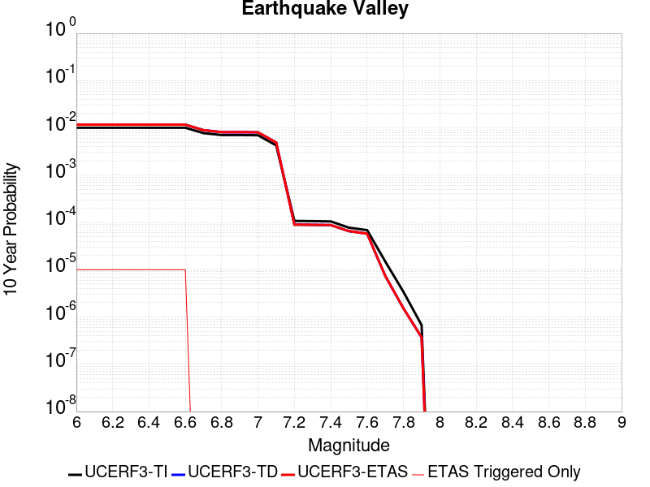 |

| Magnitude | 1 wk TI Prob | 1 wk TD Prob | 1 wk ETAS Prob | 1 wk ETAS/TD Gain | 1 wk ETAS Triggered Only | 1 mo TI Prob | 1 mo TD Prob | 1 mo ETAS Prob | 1 mo ETAS/TD Gain | 1 mo ETAS Triggered Only | 1 yr TI Prob | 1 yr TD Prob | 1 yr ETAS Prob | 1 yr ETAS/TD Gain | 1 yr ETAS Triggered Only | 10 yr TI Prob | 10 yr TD Prob | 10 yr ETAS Prob | 10 yr ETAS/TD Gain | 10 yr ETAS Triggered Only |
|-----|-----|-----|-----|-----|-----|-----|-----|-----|-----|-----|-----|-----|-----|-----|-----|-----|-----|-----|-----|-----|
| 6.0 | 1.9416384E-5 | 2.2587592E-5 | 2.2587592E-5 | 1.0 | 0.0 | 8.321042E-5 | 9.680105E-5 | 9.680105E-5 | 1.0 | 0.0 | 0.001012616 | 0.0011780359 | 0.0012955305 | 1.0997378 | 1.1763322E-4 | 0.010080142 | 0.011729757 | 0.011846011 | 1.009911 | 1.1763322E-4 |
| 6.1 | 1.9416384E-5 | 2.2587592E-5 | 2.2587592E-5 | 1.0 | 0.0 | 8.321042E-5 | 9.680105E-5 | 9.680105E-5 | 1.0 | 0.0 | 0.001012616 | 0.0011780359 | 0.0012955305 | 1.0997378 | 1.1763322E-4 | 0.010080142 | 0.011729757 | 0.011846011 | 1.009911 | 1.1763322E-4 |
| 6.2 | 1.9416384E-5 | 2.2587592E-5 | 2.2587592E-5 | 1.0 | 0.0 | 8.321042E-5 | 9.680105E-5 | 9.680105E-5 | 1.0 | 0.0 | 0.001012616 | 0.0011780359 | 0.0012955305 | 1.0997378 | 1.1763322E-4 | 0.010080142 | 0.011729757 | 0.011846011 | 1.009911 | 1.1763322E-4 |
| 6.3 | 1.9416384E-5 | 2.2587592E-5 | 2.2587592E-5 | 1.0 | 0.0 | 8.321042E-5 | 9.680105E-5 | 9.680105E-5 | 1.0 | 0.0 | 0.001012616 | 0.0011780359 | 0.0012955305 | 1.0997378 | 1.1763322E-4 | 0.010080142 | 0.011729757 | 0.011846011 | 1.009911 | 1.1763322E-4 |
| 6.4 | 1.9416384E-5 | 2.2587592E-5 | 2.2587592E-5 | 1.0 | 0.0 | 8.321042E-5 | 9.680105E-5 | 9.680105E-5 | 1.0 | 0.0 | 0.001012616 | 0.0011780359 | 0.0012955305 | 1.0997378 | 1.1763322E-4 | 0.010080142 | 0.011729757 | 0.011846011 | 1.009911 | 1.1763322E-4 |
| 6.5 | 1.9389157E-5 | 2.2556176E-5 | 2.2556176E-5 | 1.0 | 0.0 | 8.309374E-5 | 9.666642E-5 | 9.666642E-5 | 1.0 | 0.0 | 0.0010111968 | 0.0011763985 | 0.0012938933 | 1.0998768 | 1.1763322E-4 | 0.010066078 | 0.011713557 | 0.011829812 | 1.0099249 | 1.1763322E-4 |
| 6.6 | 1.9389157E-5 | 2.2556176E-5 | 2.2556176E-5 | 1.0 | 0.0 | 8.309374E-5 | 9.666642E-5 | 9.666642E-5 | 1.0 | 0.0 | 0.0010111968 | 0.0011763985 | 0.0012938933 | 1.0998768 | 1.1763322E-4 | 0.010066078 | 0.011713557 | 0.011829812 | 1.0099249 | 1.1763322E-4 |
| 6.7 | 1.4925434E-5 | 1.7210756E-5 | 1.7210756E-5 | 1.0 | 0.0 | 6.396457E-5 | 7.3758776E-5 | 7.3758776E-5 | 1.0 | 0.0 | 7.7849044E-4 | 8.977282E-4 | 8.977282E-4 | 1.0 | 0.0 | 0.007757689 | 0.008949395 | 0.008949395 | 1.0 | 0.0 |
| 6.8 | 1.3570335E-5 | 1.5619114E-5 | 1.5619114E-5 | 1.0 | 0.0 | 5.8157282E-5 | 6.6937806E-5 | 6.6937806E-5 | 1.0 | 0.0 | 7.0783484E-4 | 8.1474514E-4 | 8.1474514E-4 | 1.0 | 0.0 | 0.0070558446 | 0.008125654 | 0.008125654 | 1.0 | 0.0 |
| 6.9 | 1.3570335E-5 | 1.5619114E-5 | 1.5619114E-5 | 1.0 | 0.0 | 5.8157282E-5 | 6.6937806E-5 | 6.6937806E-5 | 1.0 | 0.0 | 7.0783484E-4 | 8.1474514E-4 | 8.1474514E-4 | 1.0 | 0.0 | 0.0070558446 | 0.008125654 | 0.008125654 | 1.0 | 0.0 |
| 7.0 | 1.3433392E-5 | 1.5462638E-5 | 1.5462638E-5 | 1.0 | 0.0 | 5.757041E-5 | 6.6267225E-5 | 6.6267225E-5 | 1.0 | 0.0 | 7.0069433E-4 | 8.065869E-4 | 8.065869E-4 | 1.0 | 0.0 | 0.006984891 | 0.008044664 | 0.008044664 | 1.0 | 0.0 |
| 7.1 | 8.181609E-6 | 9.418255E-6 | 9.418255E-6 | 1.0 | 0.0 | 3.5063567E-5 | 4.0363702E-5 | 4.0363702E-5 | 1.0 | 0.0 | 4.268153E-4 | 4.9138436E-4 | 4.9138436E-4 | 1.0 | 0.0 | 0.0042599645 | 0.004909557 | 0.004909557 | 1.0 | 0.0 |
| 7.2 | 2.0663983E-7 | 1.7266771E-7 | 1.7266771E-7 | 1.0 | 0.0 | 8.855989E-7 | 7.400043E-7 | 7.400043E-7 | 1.0 | 0.0 | 1.0782113E-5 | 9.009518E-6 | 9.009518E-6 | 1.0 | 0.0 | 1.07815904E-4 | 9.009189E-5 | 9.009189E-5 | 1.0 | 0.0 |
| 7.3 | 2.0462376E-7 | 1.7082242E-7 | 1.7082242E-7 | 1.0 | 0.0 | 8.7695867E-7 | 7.320959E-7 | 7.320959E-7 | 1.0 | 0.0 | 1.0676919E-5 | 8.9132345E-6 | 8.9132345E-6 | 1.0 | 0.0 | 1.0676406E-4 | 8.912913E-5 | 8.912913E-5 | 1.0 | 0.0 |
| 7.4 | 2.0171088E-7 | 1.6864676E-7 | 1.6864676E-7 | 1.0 | 0.0 | 8.644749E-7 | 7.227717E-7 | 7.227717E-7 | 1.0 | 0.0 | 1.0524931E-5 | 8.799713E-6 | 8.799713E-6 | 1.0 | 0.0 | 1.05244326E-4 | 8.7994005E-5 | 8.7994005E-5 | 1.0 | 0.0 |
| 7.5 | 1.4847944E-7 | 1.256233E-7 | 1.256233E-7 | 1.0 | 0.0 | 6.363403E-7 | 5.3838545E-7 | 5.3838545E-7 | 1.0 | 0.0 | 7.747416E-6 | 6.5548256E-6 | 6.5548256E-6 | 1.0 | 0.0 | 7.747146E-5 | 6.554654E-5 | 6.554654E-5 | 1.0 | 0.0 |
| 7.6 | 1.3185847E-7 | 1.11259844E-7 | 1.11259844E-7 | 1.0 | 0.0 | 5.6510765E-7 | 4.7682784E-7 | 4.7682784E-7 | 1.0 | 0.0 | 6.8801637E-6 | 5.8053656E-6 | 5.8053656E-6 | 1.0 | 0.0 | 6.8799505E-5 | 5.8052352E-5 | 5.8052352E-5 | 1.0 | 0.0 |
| 7.7 | 2.8609954E-8 | 1.4175916E-8 | 1.4175916E-8 | 1.0 | 0.0 | 1.2261408E-7 | 6.0753926E-8 | 6.0753926E-8 | 1.0 | 0.0 | 1.4928254E-6 | 7.3967885E-7 | 7.3967885E-7 | 1.0 | 0.0 | 1.4928154E-5 | 7.3967694E-6 | 7.3967694E-6 | 1.0 | 0.0 |
| 7.8 | 6.527266E-9 | 2.9243843E-9 | 2.9243843E-9 | 1.0 | 0.0 | 2.7973995E-8 | 1.2533076E-8 | 1.2533076E-8 | 1.0 | 0.0 | 3.4058334E-7 | 1.5259019E-7 | 1.5259019E-7 | 1.0 | 0.0 | 3.4058282E-6 | 1.5259011E-6 | 1.5259011E-6 | 1.0 | 0.0 |
| 7.9 | 1.2898267E-9 | 7.1293726E-10 | 7.1293726E-10 | 1.0 | 0.0 | 5.527829E-9 | 3.0554452E-9 | 3.0554452E-9 | 1.0 | 0.0 | 6.7301315E-8 | 3.7200046E-8 | 3.7200046E-8 | 1.0 | 0.0 | 6.7301295E-7 | 3.7200047E-7 | 3.7200047E-7 | 1.0 | 0.0 |

## San Jacinto (Superstition Mtn)
*[(top)](#table-of-contents)*

| 1 Week | 1 Month | 1 Year | 10 Year |
|-----|-----|-----|-----|
|  |  |  |  |

| Magnitude | 1 wk TI Prob | 1 wk TD Prob | 1 wk ETAS Prob | 1 wk ETAS/TD Gain | 1 wk ETAS Triggered Only | 1 mo TI Prob | 1 mo TD Prob | 1 mo ETAS Prob | 1 mo ETAS/TD Gain | 1 mo ETAS Triggered Only | 1 yr TI Prob | 1 yr TD Prob | 1 yr ETAS Prob | 1 yr ETAS/TD Gain | 1 yr ETAS Triggered Only | 10 yr TI Prob | 10 yr TD Prob | 10 yr ETAS Prob | 10 yr ETAS/TD Gain | 10 yr ETAS Triggered Only |
|-----|-----|-----|-----|-----|-----|-----|-----|-----|-----|-----|-----|-----|-----|-----|-----|-----|-----|-----|-----|-----|
| 6.0 | 6.4193904E-5 | 9.604509E-5 | 9.604509E-5 | 1.0 | 0.0 | 2.7508775E-4 | 4.1156667E-4 | 4.1156667E-4 | 1.0 | 0.0 | 0.0033440501 | 0.005000645 | 0.005000645 | 1.0 | 0.0 | 0.03294174 | 0.048848573 | 0.04896046 | 1.0022905 | 1.1763322E-4 |
| 6.1 | 6.4193904E-5 | 9.604509E-5 | 9.604509E-5 | 1.0 | 0.0 | 2.7508775E-4 | 4.1156667E-4 | 4.1156667E-4 | 1.0 | 0.0 | 0.0033440501 | 0.005000645 | 0.005000645 | 1.0 | 0.0 | 0.03294174 | 0.048848573 | 0.04896046 | 1.0022905 | 1.1763322E-4 |
| 6.2 | 5.7023593E-5 | 8.319097E-5 | 8.319097E-5 | 1.0 | 0.0 | 2.4436394E-4 | 3.5649343E-4 | 3.5649343E-4 | 1.0 | 0.0 | 0.002971072 | 0.004333299 | 0.004333299 | 1.0 | 0.0 | 0.029316625 | 0.042527277 | 0.042639907 | 1.0026485 | 1.1763322E-4 |
| 6.3 | 5.6940098E-5 | 8.3036306E-5 | 8.3036306E-5 | 1.0 | 0.0 | 2.4400617E-4 | 3.5583074E-4 | 3.5583074E-4 | 1.0 | 0.0 | 0.002966728 | 0.0043252627 | 0.0043252627 | 1.0 | 0.0 | 0.029274331 | 0.042450514 | 0.04256315 | 1.0026535 | 1.1763322E-4 |
| 6.4 | 5.4171585E-5 | 7.752936E-5 | 7.752936E-5 | 1.0 | 0.0 | 2.3214328E-4 | 3.3223568E-4 | 3.3223568E-4 | 1.0 | 0.0 | 0.0028226813 | 0.0040391157 | 0.0040391157 | 1.0 | 0.0 | 0.02787096 | 0.039739568 | 0.039852526 | 1.0028424 | 1.1763322E-4 |
| 6.5 | 4.375144E-5 | 5.6465793E-5 | 5.6465793E-5 | 1.0 | 0.0 | 1.874927E-4 | 2.4198045E-4 | 2.4198045E-4 | 1.0 | 0.0 | 0.0022803338 | 0.0029433076 | 0.0029433076 | 1.0 | 0.0 | 0.022570757 | 0.029259454 | 0.029259454 | 1.0 | 0.0 |
| 6.6 | 2.772192E-5 | 2.5530666E-5 | 2.5530666E-5 | 1.0 | 0.0 | 1.1880282E-4 | 1.09412664E-4 | 1.09412664E-4 | 1.0 | 0.0 | 0.0014454646 | 0.0013313045 | 0.0013313045 | 1.0 | 0.0 | 0.014360986 | 0.013562454 | 0.013562454 | 1.0 | 0.0 |
| 6.7 | 2.7124124E-5 | 2.47415E-5 | 2.47415E-5 | 1.0 | 0.0 | 1.1624106E-4 | 1.0603079E-4 | 1.0603079E-4 | 1.0 | 0.0 | 0.0014143161 | 0.0012901797 | 0.0012901797 | 1.0 | 0.0 | 0.014053487 | 0.013155818 | 0.013155818 | 1.0 | 0.0 |
| 6.8 | 2.5475807E-5 | 2.220555E-5 | 2.220555E-5 | 1.0 | 0.0 | 1.0917746E-4 | 9.516323E-5 | 9.516323E-5 | 1.0 | 0.0 | 0.001328425 | 0.0011580086 | 0.0011580086 | 1.0 | 0.0 | 0.0132051185 | 0.011843571 | 0.011843571 | 1.0 | 0.0 |
| 6.9 | 2.1162023E-5 | 1.7664179E-5 | 1.7664179E-5 | 1.0 | 0.0 | 9.069123E-5 | 7.570144E-5 | 7.570144E-5 | 1.0 | 0.0 | 0.0011036064 | 9.212792E-4 | 9.212792E-4 | 1.0 | 0.0 | 0.010981417 | 0.009466708 | 0.009466708 | 1.0 | 0.0 |
| 7.0 | 1.8754288E-5 | 1.6197775E-5 | 1.6197775E-5 | 1.0 | 0.0 | 8.037304E-5 | 6.9417205E-5 | 6.9417205E-5 | 1.0 | 0.0 | 9.781026E-4 | 8.448292E-4 | 8.448292E-4 | 1.0 | 0.0 | 0.009738087 | 0.008688975 | 0.008688975 | 1.0 | 0.0 |
| 7.1 | 1.8678527E-5 | 1.6122882E-5 | 1.6122882E-5 | 1.0 | 0.0 | 8.0048376E-5 | 6.909625E-5 | 6.909625E-5 | 1.0 | 0.0 | 9.7415317E-4 | 8.409246E-4 | 8.409246E-4 | 1.0 | 0.0 | 0.009698939 | 0.0086499145 | 0.0086499145 | 1.0 | 0.0 |
| 7.2 | 1.7804578E-5 | 1.5417074E-5 | 1.5417074E-5 | 1.0 | 0.0 | 7.6303106E-5 | 6.6071516E-5 | 6.6071516E-5 | 1.0 | 0.0 | 9.285943E-4 | 8.041261E-4 | 8.041261E-4 | 1.0 | 0.0 | 0.009247236 | 0.008281034 | 0.008281034 | 1.0 | 0.0 |
| 7.3 | 1.6583685E-5 | 1.4565759E-5 | 1.4565759E-5 | 1.0 | 0.0 | 7.1070994E-5 | 6.24232E-5 | 6.24232E-5 | 1.0 | 0.0 | 8.649459E-4 | 7.597394E-4 | 7.597394E-4 | 1.0 | 0.0 | 0.00861587 | 0.007836135 | 0.007836135 | 1.0 | 0.0 |
| 7.4 | 1.6387552E-5 | 1.4430574E-5 | 1.4430574E-5 | 1.0 | 0.0 | 7.023047E-5 | 6.1843864E-5 | 6.1843864E-5 | 1.0 | 0.0 | 8.5472054E-4 | 7.5269095E-4 | 7.5269095E-4 | 1.0 | 0.0 | 0.008514405 | 0.007765482 | 0.007765482 | 1.0 | 0.0 |
| 7.5 | 1.5790754E-5 | 1.4070897E-5 | 1.4070897E-5 | 1.0 | 0.0 | 6.767291E-5 | 6.030246E-5 | 6.030246E-5 | 1.0 | 0.0 | 8.236062E-4 | 7.3393714E-4 | 7.3393714E-4 | 1.0 | 0.0 | 0.008205604 | 0.007575858 | 0.007575858 | 1.0 | 0.0 |
| 7.6 | 1.4248672E-5 | 1.3088949E-5 | 1.3088949E-5 | 1.0 | 0.0 | 6.106431E-5 | 5.60943E-5 | 5.60943E-5 | 1.0 | 0.0 | 7.432043E-4 | 6.827359E-4 | 6.827359E-4 | 1.0 | 0.0 | 0.007407237 | 0.0070579755 | 0.0070579755 | 1.0 | 0.0 |
| 7.7 | 1.15449975E-5 | 1.0936122E-5 | 1.0936122E-5 | 1.0 | 0.0 | 4.947762E-5 | 4.6868256E-5 | 4.6868256E-5 | 1.0 | 0.0 | 6.022235E-4 | 5.704724E-4 | 5.704724E-4 | 1.0 | 0.0 | 0.006005941 | 0.005927197 | 0.005927197 | 1.0 | 0.0 |
| 7.8 | 9.1391985E-6 | 9.545476E-6 | 9.545476E-6 | 1.0 | 0.0 | 3.9167408E-5 | 4.0908544E-5 | 4.0908544E-5 | 1.0 | 0.0 | 4.767588E-4 | 4.979483E-4 | 4.979483E-4 | 1.0 | 0.0 | 0.0047573727 | 0.0051930523 | 0.0051930523 | 1.0 | 0.0 |
| 7.9 | 6.973017E-6 | 7.40991E-6 | 7.40991E-6 | 1.0 | 0.0 | 2.9884017E-5 | 3.175637E-5 | 3.175637E-5 | 1.0 | 0.0 | 3.6377716E-4 | 3.8656578E-4 | 3.8656578E-4 | 1.0 | 0.0 | 0.0036318225 | 0.0040663844 | 0.0040663844 | 1.0 | 0.0 |
| 8.0 | 5.7638235E-6 | 6.2851814E-6 | 6.2851814E-6 | 1.0 | 0.0 | 2.4701867E-5 | 2.6936215E-5 | 2.6936215E-5 | 1.0 | 0.0 | 3.0070372E-4 | 3.278996E-4 | 3.278996E-4 | 1.0 | 0.0 | 0.0030029714 | 0.0034667295 | 0.0034667295 | 1.0 | 0.0 |
| 8.1 | 5.1124434E-6 | 5.518618E-6 | 5.518618E-6 | 1.0 | 0.0 | 2.1910288E-5 | 2.3651008E-5 | 2.3651008E-5 | 1.0 | 0.0 | 2.6672508E-4 | 2.8791346E-4 | 2.8791346E-4 | 1.0 | 0.0 | 0.0026640517 | 0.003052441 | 0.003052441 | 1.0 | 0.0 |
| 8.2 | 1.1075938E-6 | 5.370242E-7 | 5.370242E-7 | 1.0 | 0.0 | 4.7468216E-6 | 2.3015305E-6 | 2.3015305E-6 | 1.0 | 0.0 | 5.779102E-5 | 2.8020793E-5 | 2.8020793E-5 | 1.0 | 0.0 | 5.777599E-4 | 3.153418E-4 | 3.153418E-4 | 1.0 | 0.0 |
| 8.3 | 1.3584393E-8 | 4.506021E-9 | 4.506021E-9 | 1.0 | 0.0 | 5.8218827E-8 | 1.931152E-8 | 1.931152E-8 | 1.0 | 0.0 | 7.0881396E-7 | 2.3511774E-7 | 2.3511774E-7 | 1.0 | 0.0 | 7.0881174E-6 | 2.634354E-6 | 2.634354E-6 | 1.0 | 0.0 |

## Chino alt 1
*[(top)](#table-of-contents)*

| 1 Week | 1 Month | 1 Year | 10 Year |
|-----|-----|-----|-----|
|  |  |  |  |

| Magnitude | 1 wk TI Prob | 1 wk TD Prob | 1 wk ETAS Prob | 1 wk ETAS/TD Gain | 1 wk ETAS Triggered Only | 1 mo TI Prob | 1 mo TD Prob | 1 mo ETAS Prob | 1 mo ETAS/TD Gain | 1 mo ETAS Triggered Only | 1 yr TI Prob | 1 yr TD Prob | 1 yr ETAS Prob | 1 yr ETAS/TD Gain | 1 yr ETAS Triggered Only | 10 yr TI Prob | 10 yr TD Prob | 10 yr ETAS Prob | 10 yr ETAS/TD Gain | 10 yr ETAS Triggered Only |
|-----|-----|-----|-----|-----|-----|-----|-----|-----|-----|-----|-----|-----|-----|-----|-----|-----|-----|-----|-----|-----|
| 6.0 | 3.939946E-5 | 4.8961843E-5 | 4.8961843E-5 | 1.0 | 0.0 | 1.6884391E-4 | 2.0982254E-4 | 2.0982254E-4 | 1.0 | 0.0 | 0.0020537362 | 0.0025520772 | 0.0025520772 | 1.0 | 0.0 | 0.020348595 | 0.02528456 | 0.02539922 | 1.0045347 | 1.1763322E-4 |
| 6.1 | 2.1505624E-5 | 2.688751E-5 | 2.688751E-5 | 1.0 | 0.0 | 9.2163704E-5 | 1.15227725E-4 | 1.15227725E-4 | 1.0 | 0.0 | 0.0011215154 | 0.0014021061 | 0.0014021061 | 1.0 | 0.0 | 0.011158722 | 0.013949474 | 0.013949474 | 1.0 | 0.0 |
| 6.2 | 2.1505624E-5 | 2.688751E-5 | 2.688751E-5 | 1.0 | 0.0 | 9.2163704E-5 | 1.15227725E-4 | 1.15227725E-4 | 1.0 | 0.0 | 0.0011215154 | 0.0014021061 | 0.0014021061 | 1.0 | 0.0 | 0.011158722 | 0.013949474 | 0.013949474 | 1.0 | 0.0 |
| 6.3 | 1.4290785E-5 | 1.8171926E-5 | 1.8171926E-5 | 1.0 | 0.0 | 6.1244784E-5 | 7.7877616E-5 | 7.7877616E-5 | 1.0 | 0.0 | 7.454001E-4 | 9.477929E-4 | 9.477929E-4 | 1.0 | 0.0 | 0.007429048 | 0.009447941 | 0.009447941 | 1.0 | 0.0 |
| 6.4 | 1.4290785E-5 | 1.8171926E-5 | 1.8171926E-5 | 1.0 | 0.0 | 6.1244784E-5 | 7.7877616E-5 | 7.7877616E-5 | 1.0 | 0.0 | 7.454001E-4 | 9.477929E-4 | 9.477929E-4 | 1.0 | 0.0 | 0.007429048 | 0.009447941 | 0.009447941 | 1.0 | 0.0 |
| 6.5 | 1.3017944E-5 | 1.665862E-5 | 1.665862E-5 | 1.0 | 0.0 | 5.5789995E-5 | 7.139238E-5 | 7.139238E-5 | 1.0 | 0.0 | 6.790315E-4 | 8.6889946E-4 | 8.6889946E-4 | 1.0 | 0.0 | 0.0067696036 | 0.008665298 | 0.008665298 | 1.0 | 0.0 |
| 6.6 | 9.470016E-6 | 1.204444E-5 | 1.204444E-5 | 1.0 | 0.0 | 4.058515E-5 | 5.1618197E-5 | 5.1618197E-5 | 1.0 | 0.0 | 4.940122E-4 | 6.283043E-4 | 6.283043E-4 | 1.0 | 0.0 | 0.004929154 | 0.006274481 | 0.006274481 | 1.0 | 0.0 |
| 6.7 | 8.314155E-6 | 1.0412219E-5 | 1.0412219E-5 | 1.0 | 0.0 | 3.5631605E-5 | 4.4623215E-5 | 4.4623215E-5 | 1.0 | 0.0 | 4.3372845E-4 | 5.4318446E-4 | 5.4318446E-4 | 1.0 | 0.0 | 0.004328829 | 0.005428088 | 0.005428088 | 1.0 | 0.0 |
| 6.8 | 3.4856364E-6 | 3.815124E-6 | 3.815124E-6 | 1.0 | 0.0 | 1.4938357E-5 | 1.635044E-5 | 1.635044E-5 | 1.0 | 0.0 | 1.8185932E-4 | 1.9905048E-4 | 1.9905048E-4 | 1.0 | 0.0 | 0.0018171056 | 0.001990398 | 0.001990398 | 1.0 | 0.0 |
| 6.9 | 2.2645952E-6 | 2.154167E-6 | 2.154167E-6 | 1.0 | 0.0 | 9.705372E-6 | 9.232113E-6 | 9.232113E-6 | 1.0 | 0.0 | 1.18156495E-4 | 1.123954E-4 | 1.123954E-4 | 1.0 | 0.0 | 0.0011809369 | 0.0011240017 | 0.0011240017 | 1.0 | 0.0 |
| 7.0 | 1.7864003E-6 | 1.5442189E-6 | 1.5442189E-6 | 1.0 | 0.0 | 7.655979E-6 | 6.6180646E-6 | 6.6180646E-6 | 1.0 | 0.0 | 9.3207556E-5 | 8.057201E-5 | 8.057201E-5 | 1.0 | 0.0 | 9.316847E-4 | 8.058752E-4 | 8.058752E-4 | 1.0 | 0.0 |
| 7.1 | 1.7315456E-6 | 1.4744763E-6 | 1.4744763E-6 | 1.0 | 0.0 | 7.420889E-6 | 6.319169E-6 | 6.319169E-6 | 1.0 | 0.0 | 9.034557E-5 | 7.6933226E-5 | 7.6933226E-5 | 1.0 | 0.0 | 9.0308854E-4 | 7.695039E-4 | 7.695039E-4 | 1.0 | 0.0 |
| 7.2 | 1.6008337E-6 | 1.3584987E-6 | 1.3584987E-6 | 1.0 | 0.0 | 6.860698E-6 | 5.8221244E-6 | 5.8221244E-6 | 1.0 | 0.0 | 8.352579E-5 | 7.088212E-5 | 7.088212E-5 | 1.0 | 0.0 | 8.34944E-4 | 7.0901937E-4 | 7.0901937E-4 | 1.0 | 0.0 |
| 7.3 | 1.3320939E-6 | 1.1227842E-6 | 1.1227842E-6 | 1.0 | 0.0 | 5.7089615E-6 | 4.8119236E-6 | 4.8119236E-6 | 1.0 | 0.0 | 6.9504385E-5 | 5.8583642E-5 | 5.8583642E-5 | 1.0 | 0.0 | 6.9482654E-4 | 5.8582664E-4 | 5.8582664E-4 | 1.0 | 0.0 |
| 7.4 | 1.114294E-6 | 9.246506E-7 | 9.246506E-7 | 1.0 | 0.0 | 4.775537E-6 | 3.9627826E-6 | 3.9627826E-6 | 1.0 | 0.0 | 5.8140613E-5 | 4.8245845E-5 | 4.8245845E-5 | 1.0 | 0.0 | 5.81254E-4 | 4.823705E-4 | 4.823705E-4 | 1.0 | 0.0 |
| 7.5 | 9.354081E-7 | 7.632324E-7 | 7.632324E-7 | 1.0 | 0.0 | 4.0088858E-6 | 3.2709918E-6 | 3.2709918E-6 | 1.0 | 0.0 | 4.8807087E-5 | 3.9823633E-5 | 3.9823633E-5 | 1.0 | 0.0 | 4.879637E-4 | 3.9816837E-4 | 3.9816837E-4 | 1.0 | 0.0 |
| 7.6 | 8.521771E-7 | 6.88939E-7 | 6.88939E-7 | 1.0 | 0.0 | 3.6521824E-6 | 2.9525925E-6 | 2.9525925E-6 | 1.0 | 0.0 | 4.4464414E-5 | 3.5947254E-5 | 3.5947254E-5 | 1.0 | 0.0 | 4.4455516E-4 | 3.5941755E-4 | 3.5941755E-4 | 1.0 | 0.0 |
| 7.7 | 2.1803626E-7 | 1.4210343E-7 | 1.4210343E-7 | 1.0 | 0.0 | 9.344408E-7 | 6.090146E-7 | 6.090146E-7 | 1.0 | 0.0 | 1.1376757E-5 | 7.4147374E-6 | 7.4147374E-6 | 1.0 | 0.0 | 1.13761744E-4 | 7.414586E-5 | 7.414586E-5 | 1.0 | 0.0 |

## Santa Monica alt 1
*[(top)](#table-of-contents)*

| 1 Week | 1 Month | 1 Year | 10 Year |
|-----|-----|-----|-----|
|  |  |  |  |

| Magnitude | 1 wk TI Prob | 1 wk TD Prob | 1 wk ETAS Prob | 1 wk ETAS/TD Gain | 1 wk ETAS Triggered Only | 1 mo TI Prob | 1 mo TD Prob | 1 mo ETAS Prob | 1 mo ETAS/TD Gain | 1 mo ETAS Triggered Only | 1 yr TI Prob | 1 yr TD Prob | 1 yr ETAS Prob | 1 yr ETAS/TD Gain | 1 yr ETAS Triggered Only | 10 yr TI Prob | 10 yr TD Prob | 10 yr ETAS Prob | 10 yr ETAS/TD Gain | 10 yr ETAS Triggered Only |
|-----|-----|-----|-----|-----|-----|-----|-----|-----|-----|-----|-----|-----|-----|-----|-----|-----|-----|-----|-----|-----|
| 6.0 | 1.1066008E-5 | 1.148119E-5 | 1.148119E-5 | 1.0 | 0.0 | 4.742488E-5 | 4.920425E-5 | 4.920425E-5 | 1.0 | 0.0 | 5.7724497E-4 | 5.98911E-4 | 7.164738E-4 | 1.1962942 | 1.1763322E-4 | 0.005757478 | 0.0059743566 | 0.0060912874 | 1.019572 | 1.1763322E-4 |
| 6.1 | 1.1066008E-5 | 1.148119E-5 | 1.148119E-5 | 1.0 | 0.0 | 4.742488E-5 | 4.920425E-5 | 4.920425E-5 | 1.0 | 0.0 | 5.7724497E-4 | 5.98911E-4 | 7.164738E-4 | 1.1962942 | 1.1763322E-4 | 0.005757478 | 0.0059743566 | 0.0060912874 | 1.019572 | 1.1763322E-4 |
| 6.2 | 1.1066008E-5 | 1.148119E-5 | 1.148119E-5 | 1.0 | 0.0 | 4.742488E-5 | 4.920425E-5 | 4.920425E-5 | 1.0 | 0.0 | 5.7724497E-4 | 5.98911E-4 | 7.164738E-4 | 1.1962942 | 1.1763322E-4 | 0.005757478 | 0.0059743566 | 0.0060912874 | 1.019572 | 1.1763322E-4 |
| 6.3 | 1.1066008E-5 | 1.148119E-5 | 1.148119E-5 | 1.0 | 0.0 | 4.742488E-5 | 4.920425E-5 | 4.920425E-5 | 1.0 | 0.0 | 5.7724497E-4 | 5.98911E-4 | 7.164738E-4 | 1.1962942 | 1.1763322E-4 | 0.005757478 | 0.0059743566 | 0.0060912874 | 1.019572 | 1.1763322E-4 |
| 6.4 | 1.1066008E-5 | 1.148119E-5 | 1.148119E-5 | 1.0 | 0.0 | 4.742488E-5 | 4.920425E-5 | 4.920425E-5 | 1.0 | 0.0 | 5.7724497E-4 | 5.98911E-4 | 7.164738E-4 | 1.1962942 | 1.1763322E-4 | 0.005757478 | 0.0059743566 | 0.0060912874 | 1.019572 | 1.1763322E-4 |
| 6.5 | 8.183544E-6 | 8.3360455E-6 | 8.3360455E-6 | 1.0 | 0.0 | 3.5071862E-5 | 3.572543E-5 | 3.572543E-5 | 1.0 | 0.0 | 4.2691626E-4 | 4.3487188E-4 | 5.524539E-4 | 1.2703832 | 1.1763322E-4 | 0.0042609703 | 0.004340375 | 0.0044574975 | 1.0269845 | 1.1763322E-4 |
| 6.6 | 8.1543285E-6 | 8.304257E-6 | 8.304257E-6 | 1.0 | 0.0 | 3.4946657E-5 | 3.5589197E-5 | 3.5589197E-5 | 1.0 | 0.0 | 4.2539247E-4 | 4.3321392E-4 | 5.5079616E-4 | 1.2714185 | 1.1763322E-4 | 0.0042457907 | 0.0043238597 | 0.004440984 | 1.0270879 | 1.1763322E-4 |
| 6.7 | 8.110878E-6 | 8.257651E-6 | 8.257651E-6 | 1.0 | 0.0 | 3.4760444E-5 | 3.538946E-5 | 3.538946E-5 | 1.0 | 0.0 | 4.231262E-4 | 4.3078308E-4 | 5.4836564E-4 | 1.2729506 | 1.1763322E-4 | 0.0042232145 | 0.0042996453 | 0.004416773 | 1.0272412 | 1.1763322E-4 |
| 6.8 | 7.644036E-6 | 7.751629E-6 | 7.751629E-6 | 1.0 | 0.0 | 3.275974E-5 | 3.322085E-5 | 3.322085E-5 | 1.0 | 0.0 | 3.9877684E-4 | 4.0439024E-4 | 5.2197586E-4 | 1.2907727 | 1.1763322E-4 | 0.00398062 | 0.00403669 | 0.004153848 | 1.0290234 | 1.1763322E-4 |
| 6.9 | 7.3698293E-6 | 7.4562663E-6 | 7.4562663E-6 | 1.0 | 0.0 | 3.15846E-5 | 3.1955045E-5 | 3.1955045E-5 | 1.0 | 0.0 | 3.8447464E-4 | 3.889846E-4 | 5.065721E-4 | 1.3022933 | 1.1763322E-4 | 0.0038381014 | 0.003883181 | 0.0040003574 | 1.0301753 | 1.1763322E-4 |
| 7.0 | 7.209872E-6 | 7.286163E-6 | 7.286163E-6 | 1.0 | 0.0 | 3.0899086E-5 | 3.1226045E-5 | 3.1226045E-5 | 1.0 | 0.0 | 3.7613141E-4 | 3.8011218E-4 | 4.977007E-4 | 1.3093522 | 1.1763322E-4 | 0.0037549543 | 0.003794763 | 0.0039119497 | 1.0308812 | 1.1763322E-4 |
| 7.1 | 5.603456E-6 | 5.5242713E-6 | 5.5242713E-6 | 1.0 | 0.0 | 2.4014591E-5 | 2.3675235E-5 | 2.3675235E-5 | 1.0 | 0.0 | 2.923384E-4 | 2.8820828E-4 | 2.8820828E-4 | 1.0 | 0.0 | 0.0029195412 | 0.0028783868 | 0.0028783868 | 1.0 | 0.0 |
| 7.2 | 4.7483613E-6 | 4.5914326E-6 | 4.5914326E-6 | 1.0 | 0.0 | 2.0349962E-5 | 1.967742E-5 | 1.967742E-5 | 1.0 | 0.0 | 2.4773262E-4 | 2.3954638E-4 | 2.3954638E-4 | 1.0 | 0.0 | 0.0024745662 | 0.0023928958 | 0.0023928958 | 1.0 | 0.0 |
| 7.3 | 3.829015E-6 | 3.6344604E-6 | 3.6344604E-6 | 1.0 | 0.0 | 1.6409962E-5 | 1.5576166E-5 | 1.5576166E-5 | 1.0 | 0.0 | 1.9977297E-4 | 1.896234E-4 | 1.896234E-4 | 1.0 | 0.0 | 0.0019959346 | 0.0018946249 | 0.0018946249 | 1.0 | 0.0 |
| 7.4 | 2.610755E-6 | 2.4997362E-6 | 2.4997362E-6 | 1.0 | 0.0 | 1.1188902E-5 | 1.0713111E-5 | 1.0713111E-5 | 1.0 | 0.0 | 1.3621636E-4 | 1.3042436E-4 | 1.3042436E-4 | 1.0 | 0.0 | 0.001361329 | 0.0013034827 | 0.0013034827 | 1.0 | 0.0 |
| 7.5 | 1.792146E-6 | 1.7585403E-6 | 1.7585403E-6 | 1.0 | 0.0 | 7.680603E-6 | 7.5365797E-6 | 7.5365797E-6 | 1.0 | 0.0 | 9.3507326E-5 | 9.1754024E-5 | 9.1754024E-5 | 1.0 | 0.0 | 9.3467993E-4 | 9.171646E-4 | 9.171646E-4 | 1.0 | 0.0 |
| 7.6 | 1.1473018E-6 | 1.1029961E-6 | 1.1029961E-6 | 1.0 | 0.0 | 4.9169985E-6 | 4.7271174E-6 | 4.7271174E-6 | 1.0 | 0.0 | 5.986281E-5 | 5.755115E-5 | 5.755115E-5 | 1.0 | 0.0 | 5.984669E-4 | 5.7536416E-4 | 5.7536416E-4 | 1.0 | 0.0 |
| 7.7 | 5.330919E-7 | 4.745708E-7 | 4.745708E-7 | 1.0 | 0.0 | 2.2846775E-6 | 2.0338734E-6 | 2.0338734E-6 | 1.0 | 0.0 | 2.7815593E-5 | 2.4762137E-5 | 2.4762137E-5 | 1.0 | 0.0 | 2.7812112E-4 | 2.4759493E-4 | 2.4759493E-4 | 1.0 | 0.0 |
| 7.8 | 1.1668574E-7 | 8.298897E-8 | 8.298897E-8 | 1.0 | 0.0 | 5.000816E-7 | 3.5566694E-7 | 3.5566694E-7 | 1.0 | 0.0 | 6.0884768E-6 | 4.330237E-6 | 4.330237E-6 | 1.0 | 0.0 | 6.08831E-5 | 4.3301556E-5 | 4.3301556E-5 | 1.0 | 0.0 |
| 7.9 | 8.007447E-10 | 6.161137E-10 | 6.161137E-10 | 1.0 | 0.0 | 3.4317629E-9 | 2.640488E-9 | 2.640488E-9 | 1.0 | 0.0 | 4.1781714E-8 | 3.214794E-8 | 3.214794E-8 | 1.0 | 0.0 | 4.1781706E-7 | 3.2147938E-7 | 3.2147938E-7 | 1.0 | 0.0 |

## Pisgah-Bullion Mtn-Mesquite Lk
*[(top)](#table-of-contents)*

| 1 Week | 1 Month | 1 Year | 10 Year |
|-----|-----|-----|-----|
|  |  |  |  |

| Magnitude | 1 wk TI Prob | 1 wk TD Prob | 1 wk ETAS Prob | 1 wk ETAS/TD Gain | 1 wk ETAS Triggered Only | 1 mo TI Prob | 1 mo TD Prob | 1 mo ETAS Prob | 1 mo ETAS/TD Gain | 1 mo ETAS Triggered Only | 1 yr TI Prob | 1 yr TD Prob | 1 yr ETAS Prob | 1 yr ETAS/TD Gain | 1 yr ETAS Triggered Only | 10 yr TI Prob | 10 yr TD Prob | 10 yr ETAS Prob | 10 yr ETAS/TD Gain | 10 yr ETAS Triggered Only |
|-----|-----|-----|-----|-----|-----|-----|-----|-----|-----|-----|-----|-----|-----|-----|-----|-----|-----|-----|-----|-----|
| 6.0 | 3.0240792E-5 | 2.4093786E-5 | 2.4093786E-5 | 1.0 | 0.0 | 1.2959696E-4 | 1.0325557E-4 | 1.0325557E-4 | 1.0 | 0.0 | 0.0015767008 | 0.0012565119 | 0.0012565119 | 1.0 | 0.0 | 0.015655609 | 0.0125041 | 0.012620263 | 1.00929 | 1.1763322E-4 |
| 6.1 | 3.0240792E-5 | 2.4093786E-5 | 2.4093786E-5 | 1.0 | 0.0 | 1.2959696E-4 | 1.0325557E-4 | 1.0325557E-4 | 1.0 | 0.0 | 0.0015767008 | 0.0012565119 | 0.0012565119 | 1.0 | 0.0 | 0.015655609 | 0.0125041 | 0.012620263 | 1.00929 | 1.1763322E-4 |
| 6.2 | 3.0240792E-5 | 2.4093786E-5 | 2.4093786E-5 | 1.0 | 0.0 | 1.2959696E-4 | 1.0325557E-4 | 1.0325557E-4 | 1.0 | 0.0 | 0.0015767008 | 0.0012565119 | 0.0012565119 | 1.0 | 0.0 | 0.015655609 | 0.0125041 | 0.012620263 | 1.00929 | 1.1763322E-4 |
| 6.3 | 2.0498217E-5 | 1.3639363E-5 | 1.3639363E-5 | 1.0 | 0.0 | 8.784654E-5 | 5.8453195E-5 | 5.8453195E-5 | 1.0 | 0.0 | 0.0010690069 | 7.114515E-4 | 7.114515E-4 | 1.0 | 0.0 | 0.01063879 | 0.007093365 | 0.007093365 | 1.0 | 0.0 |
| 6.4 | 2.0498217E-5 | 1.3639363E-5 | 1.3639363E-5 | 1.0 | 0.0 | 8.784654E-5 | 5.8453195E-5 | 5.8453195E-5 | 1.0 | 0.0 | 0.0010690069 | 7.114515E-4 | 7.114515E-4 | 1.0 | 0.0 | 0.01063879 | 0.007093365 | 0.007093365 | 1.0 | 0.0 |
| 6.5 | 1.7316182E-5 | 1.04779865E-5 | 1.04779865E-5 | 1.0 | 0.0 | 7.42101E-5 | 4.490494E-5 | 4.490494E-5 | 1.0 | 0.0 | 9.0313336E-4 | 5.465905E-4 | 5.465905E-4 | 1.0 | 0.0 | 0.008994718 | 0.005453457 | 0.005453457 | 1.0 | 0.0 |
| 6.6 | 1.5251077E-5 | 8.415006E-6 | 8.415006E-6 | 1.0 | 0.0 | 6.536012E-5 | 3.6063855E-5 | 3.6063855E-5 | 1.0 | 0.0 | 7.9546886E-4 | 4.3899618E-4 | 4.3899618E-4 | 1.0 | 0.0 | 0.007926274 | 0.0043820073 | 0.0043820073 | 1.0 | 0.0 |
| 6.7 | 1.2997425E-5 | 6.4120336E-6 | 6.4120336E-6 | 1.0 | 0.0 | 5.570206E-5 | 2.747988E-5 | 2.747988E-5 | 1.0 | 0.0 | 6.7796157E-4 | 3.3452085E-4 | 3.3452085E-4 | 1.0 | 0.0 | 0.0067589693 | 0.0033406331 | 0.0033406331 | 1.0 | 0.0 |
| 6.8 | 1.035386E-5 | 4.333664E-6 | 4.333664E-6 | 1.0 | 0.0 | 4.437293E-5 | 1.8572719E-5 | 1.8572719E-5 | 1.0 | 0.0 | 5.401065E-4 | 2.2610025E-4 | 2.2610025E-4 | 1.0 | 0.0 | 0.0053879567 | 0.002258789 | 0.002258789 | 1.0 | 0.0 |
| 6.9 | 8.816252E-6 | 3.5810178E-6 | 3.5810178E-6 | 1.0 | 0.0 | 3.778339E-5 | 1.5347132E-5 | 1.5347132E-5 | 1.0 | 0.0 | 4.5991567E-4 | 1.8683591E-4 | 1.8683591E-4 | 1.0 | 0.0 | 0.00458965 | 0.0018668467 | 0.0018668467 | 1.0 | 0.0 |
| 7.0 | 6.8232207E-6 | 2.567874E-6 | 2.567874E-6 | 1.0 | 0.0 | 2.9242048E-5 | 1.1005129E-5 | 1.1005129E-5 | 1.0 | 0.0 | 3.5596377E-4 | 1.3397953E-4 | 1.3397953E-4 | 1.0 | 0.0 | 0.0035539411 | 0.0013390186 | 0.0013390186 | 1.0 | 0.0 |
| 7.1 | 5.837013E-6 | 2.2276292E-6 | 2.2276292E-6 | 1.0 | 0.0 | 2.501553E-5 | 9.5469495E-6 | 9.5469495E-6 | 1.0 | 0.0 | 3.045215E-4 | 1.16228206E-4 | 1.16228206E-4 | 1.0 | 0.0 | 0.0030410455 | 0.0011617033 | 0.0011617033 | 1.0 | 0.0 |
| 7.2 | 4.278052E-6 | 1.6277489E-6 | 1.6277489E-6 | 1.0 | 0.0 | 1.833438E-5 | 6.97605E-6 | 6.97605E-6 | 1.0 | 0.0 | 2.231982E-4 | 8.493033E-5 | 8.493033E-5 | 1.0 | 0.0 | 0.0022297418 | 8.490019E-4 | 8.490019E-4 | 1.0 | 0.0 |
| 7.3 | 1.8803692E-6 | 8.345715E-7 | 8.345715E-7 | 1.0 | 0.0 | 8.0587E-6 | 3.576731E-6 | 3.576731E-6 | 1.0 | 0.0 | 9.811026E-5 | 4.3545977E-5 | 4.3545977E-5 | 1.0 | 0.0 | 9.806695E-4 | 4.353889E-4 | 4.353889E-4 | 1.0 | 0.0 |

## Rinconada 2011 CFM
*[(top)](#table-of-contents)*

| 1 Week | 1 Month | 1 Year | 10 Year |
|-----|-----|-----|-----|
|  |  |  |  |

| Magnitude | 1 wk TI Prob | 1 wk TD Prob | 1 wk ETAS Prob | 1 wk ETAS/TD Gain | 1 wk ETAS Triggered Only | 1 mo TI Prob | 1 mo TD Prob | 1 mo ETAS Prob | 1 mo ETAS/TD Gain | 1 mo ETAS Triggered Only | 1 yr TI Prob | 1 yr TD Prob | 1 yr ETAS Prob | 1 yr ETAS/TD Gain | 1 yr ETAS Triggered Only | 10 yr TI Prob | 10 yr TD Prob | 10 yr ETAS Prob | 10 yr ETAS/TD Gain | 10 yr ETAS Triggered Only |
|-----|-----|-----|-----|-----|-----|-----|-----|-----|-----|-----|-----|-----|-----|-----|-----|-----|-----|-----|-----|-----|
| 6.0 | 1.5752368E-5 | 1.6275219E-5 | 1.6275219E-5 | 1.0 | 0.0 | 6.75084E-5 | 6.974909E-5 | 6.974909E-5 | 1.0 | 0.0 | 8.2160486E-4 | 8.4886746E-4 | 8.4886746E-4 | 1.0 | 0.0 | 0.008185739 | 0.008456631 | 0.008573269 | 1.0137925 | 1.1763322E-4 |
| 6.1 | 1.0966133E-5 | 1.1323374E-5 | 1.1323374E-5 | 1.0 | 0.0 | 4.6996865E-5 | 4.8527843E-5 | 4.8527843E-5 | 1.0 | 0.0 | 5.720366E-4 | 5.9066707E-4 | 5.9066707E-4 | 1.0 | 0.0 | 0.0057056635 | 0.0058910674 | 0.0060080076 | 1.0198504 | 1.1763322E-4 |
| 6.2 | 1.0966133E-5 | 1.1323374E-5 | 1.1323374E-5 | 1.0 | 0.0 | 4.6996865E-5 | 4.8527843E-5 | 4.8527843E-5 | 1.0 | 0.0 | 5.720366E-4 | 5.9066707E-4 | 5.9066707E-4 | 1.0 | 0.0 | 0.0057056635 | 0.0058910674 | 0.0060080076 | 1.0198504 | 1.1763322E-4 |
| 6.3 | 8.926149E-6 | 9.2130485E-6 | 9.2130485E-6 | 1.0 | 0.0 | 3.8254362E-5 | 3.9483897E-5 | 3.9483897E-5 | 1.0 | 0.0 | 4.6564735E-4 | 4.8061073E-4 | 4.8061073E-4 | 1.0 | 0.0 | 0.0046467283 | 0.004795758 | 0.004912827 | 1.024411 | 1.1763322E-4 |
| 6.4 | 7.676955E-6 | 7.9204265E-6 | 7.9204265E-6 | 1.0 | 0.0 | 3.290082E-5 | 3.394424E-5 | 3.394424E-5 | 1.0 | 0.0 | 4.0049385E-4 | 4.1319296E-4 | 4.1319296E-4 | 1.0 | 0.0 | 0.0039977287 | 0.0041242735 | 0.0042414214 | 1.0284046 | 1.1763322E-4 |
| 6.5 | 6.1671026E-6 | 6.3591406E-6 | 6.3591406E-6 | 1.0 | 0.0 | 2.6430173E-5 | 2.7253176E-5 | 2.7253176E-5 | 1.0 | 0.0 | 3.2173982E-4 | 3.3175698E-4 | 3.3175698E-4 | 1.0 | 0.0 | 0.003212744 | 0.0033126292 | 0.0034298727 | 1.0353929 | 1.1763322E-4 |
| 6.6 | 5.553456E-6 | 5.7249786E-6 | 5.7249786E-6 | 1.0 | 0.0 | 2.3800309E-5 | 2.4535393E-5 | 2.4535393E-5 | 1.0 | 0.0 | 2.897302E-4 | 2.986775E-4 | 2.986775E-4 | 1.0 | 0.0 | 0.0028935277 | 0.0029827696 | 0.003100052 | 1.03932 | 1.1763322E-4 |
| 6.7 | 4.787857E-6 | 4.933451E-6 | 4.933451E-6 | 1.0 | 0.0 | 2.0519226E-5 | 2.1143189E-5 | 2.1143189E-5 | 1.0 | 0.0 | 2.4979294E-4 | 2.5738796E-4 | 2.5738796E-4 | 1.0 | 0.0 | 0.0024951235 | 0.0025709043 | 0.0026882351 | 1.045638 | 1.1763322E-4 |
| 6.8 | 3.9955166E-6 | 4.113591E-6 | 4.113591E-6 | 1.0 | 0.0 | 1.7123532E-5 | 1.7629556E-5 | 1.7629556E-5 | 1.0 | 0.0 | 2.0845905E-4 | 2.1461873E-4 | 2.1461873E-4 | 1.0 | 0.0 | 0.002082636 | 0.0021441183 | 0.0022614992 | 1.0547456 | 1.1763322E-4 |
| 6.9 | 3.4250072E-6 | 3.5225414E-6 | 3.5225414E-6 | 1.0 | 0.0 | 1.46785205E-5 | 1.5096518E-5 | 1.5096518E-5 | 1.0 | 0.0 | 1.7869633E-4 | 1.8378462E-4 | 1.8378462E-4 | 1.0 | 0.0 | 0.001785527 | 0.0018363289 | 0.001953746 | 1.0639412 | 1.1763322E-4 |
| 7.0 | 2.7712713E-6 | 2.8467737E-6 | 2.8467737E-6 | 1.0 | 0.0 | 1.1876823E-5 | 1.2200402E-5 | 1.2200402E-5 | 1.0 | 0.0 | 1.4459073E-4 | 1.4852978E-4 | 1.4852978E-4 | 1.0 | 0.0 | 0.0014449668 | 0.0014843066 | 0.0014843066 | 1.0 | 0.0 |
| 7.1 | 2.227358E-6 | 2.285756E-6 | 2.285756E-6 | 1.0 | 0.0 | 9.545785E-6 | 9.79606E-6 | 9.79606E-6 | 1.0 | 0.0 | 1.16213734E-4 | 1.1926051E-4 | 1.1926051E-4 | 1.0 | 0.0 | 0.0011615298 | 0.0011919661 | 0.0011919661 | 1.0 | 0.0 |
| 7.2 | 1.581796E-6 | 1.6209401E-6 | 1.6209401E-6 | 1.0 | 0.0 | 6.779108E-6 | 6.946868E-6 | 6.946868E-6 | 1.0 | 0.0 | 8.253252E-5 | 8.457484E-5 | 8.457484E-5 | 1.0 | 0.0 | 8.250187E-4 | 8.4542704E-4 | 8.4542704E-4 | 1.0 | 0.0 |
| 7.3 | 1.0306567E-6 | 1.0546722E-6 | 1.0546722E-6 | 1.0 | 0.0 | 4.4170924E-6 | 4.520016E-6 | 4.520016E-6 | 1.0 | 0.0 | 5.3776774E-5 | 5.5029803E-5 | 5.5029803E-5 | 1.0 | 0.0 | 5.376376E-4 | 5.5016205E-4 | 5.5016205E-4 | 1.0 | 0.0 |
| 7.4 | 6.535541E-7 | 6.6828983E-7 | 6.6828983E-7 | 1.0 | 0.0 | 2.800943E-6 | 2.8640961E-6 | 2.8640961E-6 | 1.0 | 0.0 | 3.4100947E-5 | 3.4869812E-5 | 3.4869812E-5 | 1.0 | 0.0 | 3.4095717E-4 | 3.4864355E-4 | 3.4864355E-4 | 1.0 | 0.0 |
| 7.5 | 3.2656962E-7 | 3.3317477E-7 | 3.3317477E-7 | 1.0 | 0.0 | 1.3995833E-6 | 1.4278911E-6 | 1.4278911E-6 | 1.0 | 0.0 | 1.7039794E-5 | 1.7384436E-5 | 1.7384436E-5 | 1.0 | 0.0 | 1.7038487E-4 | 1.7383079E-4 | 1.7383079E-4 | 1.0 | 0.0 |
| 7.6 | 9.754343E-8 | 9.8212155E-8 | 9.8212155E-8 | 1.0 | 0.0 | 4.180432E-7 | 4.2090915E-7 | 4.2090915E-7 | 1.0 | 0.0 | 5.089664E-6 | 5.124557E-6 | 5.124557E-6 | 1.0 | 0.0 | 5.0895473E-5 | 5.1244395E-5 | 5.1244395E-5 | 1.0 | 0.0 |
| 7.7 | 6.0001453E-9 | 5.849224E-9 | 5.849224E-9 | 1.0 | 0.0 | 2.5714908E-8 | 2.5068102E-8 | 2.5068102E-8 | 1.0 | 0.0 | 3.1307894E-7 | 3.052041E-7 | 3.052041E-7 | 1.0 | 0.0 | 3.1307852E-6 | 3.052037E-6 | 3.052037E-6 | 1.0 | 0.0 |
| 7.8 | 7.400003E-11 | 7.465506E-11 | 7.465506E-11 | 1.0 | 0.0 | 3.171432E-10 | 3.199503E-10 | 3.199503E-10 | 1.0 | 0.0 | 3.861218E-9 | 3.895395E-9 | 3.895395E-9 | 1.0 | 0.0 | 3.861218E-8 | 3.895395E-8 | 3.895395E-8 | 1.0 | 0.0 |

## San Andreas (Parkfield)
*[(top)](#table-of-contents)*

| 1 Week | 1 Month | 1 Year | 10 Year |
|-----|-----|-----|-----|
|  |  |  |  |

| Magnitude | 1 wk TI Prob | 1 wk TD Prob | 1 wk ETAS Prob | 1 wk ETAS/TD Gain | 1 wk ETAS Triggered Only | 1 mo TI Prob | 1 mo TD Prob | 1 mo ETAS Prob | 1 mo ETAS/TD Gain | 1 mo ETAS Triggered Only | 1 yr TI Prob | 1 yr TD Prob | 1 yr ETAS Prob | 1 yr ETAS/TD Gain | 1 yr ETAS Triggered Only | 10 yr TI Prob | 10 yr TD Prob | 10 yr ETAS Prob | 10 yr ETAS/TD Gain | 10 yr ETAS Triggered Only |
|-----|-----|-----|-----|-----|-----|-----|-----|-----|-----|-----|-----|-----|-----|-----|-----|-----|-----|-----|-----|-----|
| 6.0 | 5.556969E-4 | 7.8494387E-4 | 7.8494387E-4 | 1.0 | 0.0 | 0.0023793848 | 0.0033602684 | 0.0033602684 | 1.0 | 0.0 | 0.028586963 | 0.040528994 | 0.040528994 | 1.0 | 0.0 | 0.25176284 | 0.3382302 | 0.33830804 | 1.0002302 | 1.1763322E-4 |
| 6.1 | 1.925858E-4 | 3.047553E-4 | 3.047553E-4 | 1.0 | 0.0 | 8.2510663E-4 | 0.0013055365 | 0.0013055365 | 1.0 | 0.0 | 0.0099994885 | 0.01587639 | 0.01587639 | 1.0 | 0.0 | 0.095613256 | 0.15020716 | 0.15020716 | 1.0 | 0.0 |
| 6.2 | 9.4306815E-5 | 1.8296414E-4 | 1.8296414E-4 | 1.0 | 0.0 | 4.0410945E-4 | 7.8389765E-4 | 7.8389765E-4 | 1.0 | 0.0 | 0.0049089384 | 0.009502398 | 0.009502398 | 1.0 | 0.0 | 0.048019063 | 0.09208664 | 0.09208664 | 1.0 | 0.0 |
| 6.3 | 9.283051E-5 | 1.7992748E-4 | 1.7992748E-4 | 1.0 | 0.0 | 3.9778434E-4 | 7.708911E-4 | 7.708911E-4 | 1.0 | 0.0 | 0.0048322747 | 0.009345412 | 0.009345412 | 1.0 | 0.0 | 0.047285385 | 0.09073928 | 0.09073928 | 1.0 | 0.0 |
| 6.4 | 9.138826E-5 | 1.7754584E-4 | 1.7754584E-4 | 1.0 | 0.0 | 3.916052E-4 | 7.6069E-4 | 7.6069E-4 | 1.0 | 0.0 | 0.0047573745 | 0.009222273 | 0.009222273 | 1.0 | 0.0 | 0.046568092 | 0.089640334 | 0.089640334 | 1.0 | 0.0 |
| 6.5 | 9.000255E-5 | 1.7512313E-4 | 1.7512313E-4 | 1.0 | 0.0 | 3.8566816E-4 | 7.50313E-4 | 7.50313E-4 | 1.0 | 0.0 | 0.0046854047 | 0.009097004 | 0.009097004 | 1.0 | 0.0 | 0.045878403 | 0.088525146 | 0.088525146 | 1.0 | 0.0 |
| 6.6 | 8.8109264E-5 | 1.71928E-4 | 1.71928E-4 | 1.0 | 0.0 | 3.7755648E-4 | 7.366273E-4 | 7.366273E-4 | 1.0 | 0.0 | 0.0045870654 | 0.008931775 | 0.008931775 | 1.0 | 0.0 | 0.04493529 | 0.0870545 | 0.0870545 | 1.0 | 0.0 |
| 6.7 | 8.738073E-5 | 1.7059728E-4 | 1.7059728E-4 | 1.0 | 0.0 | 3.7443507E-4 | 7.309275E-4 | 7.309275E-4 | 1.0 | 0.0 | 0.0045492216 | 0.008862987 | 0.008862987 | 1.0 | 0.0 | 0.04457213 | 0.08645442 | 0.08645442 | 1.0 | 0.0 |
| 6.8 | 8.710195E-5 | 1.7005109E-4 | 1.7005109E-4 | 1.0 | 0.0 | 3.7324068E-4 | 7.28588E-4 | 7.28588E-4 | 1.0 | 0.0 | 0.0045347405 | 0.008834744 | 0.008834744 | 1.0 | 0.0 | 0.04443313 | 0.08620161 | 0.08620161 | 1.0 | 0.0 |
| 6.9 | 8.6801556E-5 | 1.6945954E-4 | 1.6945954E-4 | 1.0 | 0.0 | 3.7195362E-4 | 7.260542E-4 | 7.260542E-4 | 1.0 | 0.0 | 0.0045191357 | 0.008804144 | 0.008804144 | 1.0 | 0.0 | 0.044283327 | 0.08592729 | 0.08592729 | 1.0 | 0.0 |
| 7.0 | 8.5571606E-5 | 1.6698343E-4 | 1.6698343E-4 | 1.0 | 0.0 | 3.6668387E-4 | 7.154481E-4 | 7.154481E-4 | 1.0 | 0.0 | 0.004455241 | 0.00867605 | 0.00867605 | 1.0 | 0.0 | 0.043669727 | 0.084774174 | 0.084774174 | 1.0 | 0.0 |
| 7.1 | 7.82589E-5 | 1.5177482E-4 | 1.5177482E-4 | 1.0 | 0.0 | 3.3535215E-4 | 6.5030204E-4 | 6.5030204E-4 | 1.0 | 0.0 | 0.0040752706 | 0.007888856 | 0.007888856 | 1.0 | 0.0 | 0.040013418 | 0.077680334 | 0.077680334 | 1.0 | 0.0 |
| 7.2 | 7.690929E-5 | 1.4914433E-4 | 1.4914433E-4 | 1.0 | 0.0 | 3.2956956E-4 | 6.390341E-4 | 6.390341E-4 | 1.0 | 0.0 | 0.004005129 | 0.007752653 | 0.007752653 | 1.0 | 0.0 | 0.0393371 | 0.07645258 | 0.07645258 | 1.0 | 0.0 |
| 7.3 | 7.5543794E-5 | 1.4610426E-4 | 1.4610426E-4 | 1.0 | 0.0 | 3.2371894E-4 | 6.260116E-4 | 6.260116E-4 | 1.0 | 0.0 | 0.003934157 | 0.007595219 | 0.007595219 | 1.0 | 0.0 | 0.038652334 | 0.07501357 | 0.07501357 | 1.0 | 0.0 |
| 7.4 | 7.4214564E-5 | 1.431075E-4 | 1.431075E-4 | 1.0 | 0.0 | 3.1802364E-4 | 6.1317446E-4 | 6.1317446E-4 | 1.0 | 0.0 | 0.003865065 | 0.0074400045 | 0.0074400045 | 1.0 | 0.0 | 0.03798529 | 0.07358508 | 0.07358508 | 1.0 | 0.0 |
| 7.5 | 6.149578E-5 | 1.1231917E-4 | 1.1231917E-4 | 1.0 | 0.0 | 2.6352672E-4 | 4.8127916E-4 | 4.8127916E-4 | 1.0 | 0.0 | 0.0032037178 | 0.005843863 | 0.005843863 | 1.0 | 0.0 | 0.03157923 | 0.058747258 | 0.058747258 | 1.0 | 0.0 |
| 7.6 | 6.0643448E-5 | 1.1060165E-4 | 1.1060165E-4 | 1.0 | 0.0 | 2.598746E-4 | 4.7392107E-4 | 4.7392107E-4 | 1.0 | 0.0 | 0.0031593828 | 0.005754755 | 0.005754755 | 1.0 | 0.0 | 0.031148417 | 0.05790668 | 0.05790668 | 1.0 | 0.0 |
| 7.7 | 5.1652263E-5 | 9.2113165E-5 | 9.2113165E-5 | 1.0 | 0.0 | 2.2134806E-4 | 3.9471098E-4 | 3.9471098E-4 | 1.0 | 0.0 | 0.002691582 | 0.0047950274 | 0.0047950274 | 1.0 | 0.0 | 0.026592141 | 0.04870769 | 0.04870769 | 1.0 | 0.0 |
| 7.8 | 4.8090482E-5 | 8.5933505E-5 | 8.5933505E-5 | 1.0 | 0.0 | 2.060858E-4 | 3.682345E-4 | 3.682345E-4 | 1.0 | 0.0 | 0.0025062072 | 0.004474047 | 0.004474047 | 1.0 | 0.0 | 0.024781305 | 0.045460854 | 0.045460854 | 1.0 | 0.0 |
| 7.9 | 3.970278E-5 | 6.776668E-5 | 6.776668E-5 | 1.0 | 0.0 | 1.7014367E-4 | 2.9039633E-4 | 2.9039633E-4 | 1.0 | 0.0 | 0.002069531 | 0.0035298474 | 0.0035298474 | 1.0 | 0.0 | 0.020503636 | 0.03600716 | 0.03600716 | 1.0 | 0.0 |
| 8.0 | 2.8982335E-5 | 4.08647E-5 | 4.08647E-5 | 1.0 | 0.0 | 1.2420409E-4 | 1.7512268E-4 | 1.7512268E-4 | 1.0 | 0.0 | 0.0015111357 | 0.0021300348 | 0.0021300348 | 1.0 | 0.0 | 0.015009012 | 0.02209412 | 0.02209412 | 1.0 | 0.0 |
| 8.1 | 1.8836186E-5 | 1.877564E-5 | 1.877564E-5 | 1.0 | 0.0 | 8.0724014E-5 | 8.0464546E-5 | 8.0464546E-5 | 1.0 | 0.0 | 9.823717E-4 | 9.792162E-4 | 9.792162E-4 | 1.0 | 0.0 | 0.009780403 | 0.010537866 | 0.010537866 | 1.0 | 0.0 |
| 8.2 | 8.643924E-6 | 5.5112705E-6 | 5.5112705E-6 | 1.0 | 0.0 | 3.704486E-5 | 2.3619517E-5 | 2.3619517E-5 | 1.0 | 0.0 | 4.5092785E-4 | 2.8752975E-4 | 2.8752975E-4 | 1.0 | 0.0 | 0.0045001395 | 0.0032686237 | 0.0032686237 | 1.0 | 0.0 |
| 8.3 | 1.983087E-6 | 7.7188406E-7 | 7.7188406E-7 | 1.0 | 0.0 | 8.498917E-6 | 3.3080703E-6 | 3.3080703E-6 | 1.0 | 0.0 | 1.034694E-4 | 4.027503E-5 | 4.027503E-5 | 1.0 | 0.0 | 0.0010342124 | 4.7534908E-4 | 4.7534908E-4 | 1.0 | 0.0 |

