# Parent Section Magnitude-Probability Distributions

Only fault sections with at least one triggered aftershock are plotted. Sections are sorted by total supraseismogenic trigger rate (decreasing)

## Table Of Contents

* [Garlock (Central)](#garlock-central)
* [Tank Canyon](#tank-canyon)
* [Little Lake](#little-lake)
* [Airport Lake](#airport-lake)
* [Owl Lake](#owl-lake)
* [Panamint Valley](#panamint-valley)
* [Garlock (East)](#garlock-east)
* [Ash Hill](#ash-hill)
* [Hunter Mountain-Saline Valley](#hunter-mountain-saline-valley)
* [Blackwater](#blackwater)
* [Garlock (West)](#garlock-west)
* [McLean Lake](#mclean-lake)
* [Gravel Hills-Harper Lk](#gravel-hills-harper-lk)
* [Goldstone Lake](#goldstone-lake)
* [So Sierra Nevada](#so-sierra-nevada)
* [Coyote Canyon](#coyote-canyon)
* [San Andreas (Mojave S)](#san-andreas-mojave-s)
* [San Andreas (Mojave N)](#san-andreas-mojave-n)
* [Death Valley (So)](#death-valley-so)
* [Nelson Lake](#nelson-lake)
* [Towne Pass](#towne-pass)
* [Lenwood-Lockhart-Old Woman Springs](#lenwood-lockhart-old-woman-springs)
* [San Andreas (San Bernardino N)](#san-andreas-san-bernardino-n)
* [Bicycle Lake](#bicycle-lake)
* [Garlic Springs](#garlic-springs)
* [Paradise](#paradise)
* [Death Valley (Black Mtns Frontal)](#death-valley-black-mtns-frontal)
* [San Andreas (San Bernardino S)](#san-andreas-san-bernardino-s)
* [Helendale-So Lockhart](#helendale-so-lockhart)
* [Coyote Lake](#coyote-lake)
* [Death Valley (No)](#death-valley-no)
* [San Andreas (Big Bend)](#san-andreas-big-bend)
* [Red Pass](#red-pass)
* [Scodie Lineament](#scodie-lineament)
* [Manix-Afton Hills](#manix-afton-hills)
* [San Andreas (Parkfield)](#san-andreas-parkfield)
* [Elsinore (Glen Ivy) rev](#elsinore-glen-ivy-rev)
* [Baker](#baker)
* [Death Valley (Fish Lake Valley)](#death-valley-fish-lake-valley)
* [Sierra Nevada  (No Extension)](#sierra-nevada--no-extension)
* [San Andreas (Carrizo) rev](#san-andreas-carrizo-rev)
* [Ludlow](#ludlow)
* [Calico-Hidalgo](#calico-hidalgo)
* [San Andreas (San Gorgonio Pass-Garnet HIll)](#san-andreas-san-gorgonio-pass-garnet-hill)
* [San Jacinto (San Bernardino)](#san-jacinto-san-bernardino)
* [Lake Isabella (Seismicity)](#lake-isabella-seismicity)
* [San Andreas (Cholame) rev](#san-andreas-cholame-rev)
* [White Wolf (Extension)](#white-wolf-extension)
* [Cady](#cady)
* [White Mountains](#white-mountains)
* [Independence rev 2011](#independence-rev-2011)
* [San Andreas (Coachella) rev](#san-andreas-coachella-rev)
* [Cleghorn Lake](#cleghorn-lake)
* [Palos Verdes](#palos-verdes)
* [Santa Ynez (West)](#santa-ynez-west)
* [Owens Valley](#owens-valley)
* [Ventura-Pitas Point](#ventura-pitas-point)
* [San Andreas (North Branch Mill Creek)](#san-andreas-north-branch-mill-creek)
* [Red Mountain](#red-mountain)
* [Mission Creek](#mission-creek)
* [Mission Ridge-Arroyo Parida-Santa Ana](#mission-ridge-arroyo-parida-santa-ana)
* [Oceanic - West Huasna](#oceanic---west-huasna)
* [Pinto Mtn](#pinto-mtn)
* [Deep Springs](#deep-springs)
* [Lost Hills](#lost-hills)
* [Chino alt 1](#chino-alt-1)
* [San Andreas (Creeping Section) 2011 CFM](#san-andreas-creeping-section-2011-cfm)
* [Santa Ynez (East)](#santa-ynez-east)
* [San Jacinto (San Jacinto Valley) rev](#san-jacinto-san-jacinto-valley-rev)
* [Rose Canyon](#rose-canyon)
* [Bullion Mountains](#bullion-mountains)
* [Camp Rock 2011](#camp-rock-2011)
* [Big Pine (Central)](#big-pine-central)
* [Tin Mountain](#tin-mountain)
* [Blue Cut](#blue-cut)
* [Hayward (So) 2011 CFM](#hayward-so-2011-cfm)
* [Cleghorn Pass](#cleghorn-pass)
* [Great Valley 09 (Laguna Seca)](#great-valley-09-laguna-seca)
* [San Jacinto (Stepovers Combined)](#san-jacinto-stepovers-combined)
* [San Clemente](#san-clemente)
* [Kern Canyon (North Kern) 2011](#kern-canyon-north-kern-2011)
* [San Diego Trough north alt1](#san-diego-trough-north-alt1)
* [San Jacinto (Lytle Creek connector)](#san-jacinto-lytle-creek-connector)
* [Pisgah-Bullion Mtn-Mesquite Lk](#pisgah-bullion-mtn-mesquite-lk)
* [Whittier alt 1](#whittier-alt-1)
* [Santa Ynez River](#santa-ynez-river)
* [Robinson Creek](#robinson-creek)
* [Dry Mountain](#dry-mountain)
* [Santa Rosa Island](#santa-rosa-island)
* [Great Valley 03a Dunnigan Hills](#great-valley-03a-dunnigan-hills)
* [San Luis Range 2011 CFM](#san-luis-range-2011-cfm)
* [Big Pine (East)](#big-pine-east)
* [San Jacinto (Anza) rev](#san-jacinto-anza-rev)
* [Los Osos 2011](#los-osos-2011)
* [Pleito](#pleito)
* [Simi-Santa Rosa](#simi-santa-rosa)
* [Santa Cruz Island](#santa-cruz-island)
* [Cucamonga](#cucamonga)
* [North Frontal  (West)](#north-frontal--west)
* [Pine Mtn](#pine-mtn)
* [Santa Cruz Catalina Ridge alt1](#santa-cruz-catalina-ridge-alt1)
* [San Jacinto (Coyote Creek)](#san-jacinto-coyote-creek)
* [Raymond](#raymond)
* [Earthquake Valley (No  Extension)](#earthquake-valley-no--extension)
* [San Gabriel](#san-gabriel)
* [Gillem - Big Crack 2011 CFM](#gillem---big-crack-2011-cfm)
* [Elysian Park (Upper)](#elysian-park-upper)
* [Likely 2011 CFM](#likely-2011-cfm)
* [McKinleyville (alt1)](#mckinleyville-alt1)
* [Trinidad (alt1)](#trinidad-alt1)
* [Shoreline](#shoreline)
* [Sisar](#sisar)
* [Contra Costa Shear Zone (connector) 2011 CFM](#contra-costa-shear-zone-connector-2011-cfm)
* [Big Pine (West)](#big-pine-west)
* [Quien Sabe 2011 CFM](#quien-sabe-2011-cfm)
* [Bartlett Springs 2011 CFM](#bartlett-springs-2011-cfm)
* [Malibu Coast (Extension) alt 1](#malibu-coast-extension-alt-1)
* [Verdugo](#verdugo)
* [San Cayetano](#san-cayetano)
* [Elsinore (Stepovers Combined)](#elsinore-stepovers-combined)
* [Elsinore (Coyote Mountains)](#elsinore-coyote-mountains)
* [Carson Range (Genoa)](#carson-range-genoa)
* [Elysian Park (Lower CFM)](#elysian-park-lower-cfm)
* [San Diego Trough south](#san-diego-trough-south)
* [Hosgri (Extension)](#hosgri-extension)
* [Hector Mine](#hector-mine)
* [Los Alamos 2011 CFM](#los-alamos-2011-cfm)
* [Calaveras (So) 2011 CFM](#calaveras-so-2011-cfm)
* [Ortigalita (South)](#ortigalita-south)
* [Hat Creek-McArthur-Mayfield](#hat-creek-mcarthur-mayfield)
* [San Pedro Basin](#san-pedro-basin)
* [San Gregorio (North) 2011 CFM](#san-gregorio-north-2011-cfm)
* [Great Valley 05 Pittsburg - Kirby Hills alt1](#great-valley-05-pittsburg---kirby-hills-alt1)
* [Great Valley 04a Trout Creek](#great-valley-04a-trout-creek)
* [White Wolf](#white-wolf)
* [Antelope Valley 2011](#antelope-valley-2011)
* [Calaveras (Central) 2011 CFM](#calaveras-central-2011-cfm)
* [La Panza 2011](#la-panza-2011)
* [Brawley (Seismic Zone) alt 1](#brawley-seismic-zone-alt-1)
* [Kern Canyon (South Kern) 2011](#kern-canyon-south-kern-2011)
* [Eaton Roughs 2011 CFM](#eaton-roughs-2011-cfm)
* [Newport-Inglewood alt 1](#newport-inglewood-alt-1)
* [Clamshell-Sawpit](#clamshell-sawpit)
* [Rodgers Creek - Healdsburg 2011 CFM](#rodgers-creek---healdsburg-2011-cfm)
* [Cleghorn](#cleghorn)
* [Sheephole](#sheephole)
* [San Andreas (Offshore) 2011 CFM](#san-andreas-offshore-2011-cfm)
* [Oak Ridge (Onshore)](#oak-ridge-onshore)
* [Earthquake Valley (So Extension)](#earthquake-valley-so-extension)
* [Channel Islands Thrust](#channel-islands-thrust)
* [Swain Ravine - Spenceville](#swain-ravine---spenceville)
* [Hollywood](#hollywood)
* [Elsinore (Temecula) rev](#elsinore-temecula-rev)
* [San Luis Range - Oceano 2011 CFM](#san-luis-range---oceano-2011-cfm)
* [Elmore Ranch](#elmore-ranch)
* [San Jose](#san-jose)
* [Hayward (No) 2011 CFM](#hayward-no-2011-cfm)
* [Great Valley 03 Mysterious Ridge](#great-valley-03-mysterious-ridge)
* [Santa Susana East (connector)](#santa-susana-east-connector)
* [Earthquake Valley](#earthquake-valley)
* [San Andreas (Santa Cruz Mts) 2011 CFM](#san-andreas-santa-cruz-mts-2011-cfm)
* [Hunting Creek - Bartlett Springs connector 2011](#hunting-creek---bartlett-springs-connector-2011)
* [San Jacinto (Superstition Mtn)](#san-jacinto-superstition-mtn)
* [Santa Monica alt 1](#santa-monica-alt-1)
* [Emerson-Copper Mtn 2011](#emerson-copper-mtn-2011)
* [Pitas Point (Lower West)](#pitas-point-lower-west)
* [Hunting Creek - Berryessa 2011 CFM](#hunting-creek---berryessa-2011-cfm)
* [Rinconada 2011 CFM](#rinconada-2011-cfm)
* [Ortigalita (North)](#ortigalita-north)

## Garlock (Central)
*[(top)](#table-of-contents)*

| 1 Week | 1 Month | 1 Year | 10 Year |
|-----|-----|-----|-----|
|  |  | 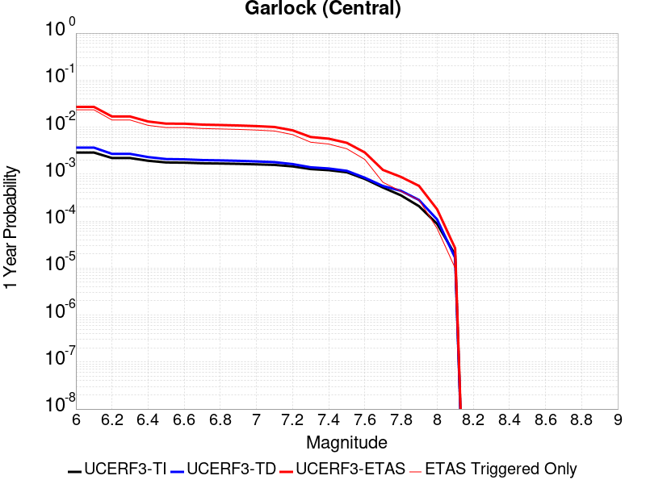 |  |

| Magnitude | 1 wk TI Prob | 1 wk TD Prob | 1 wk ETAS Prob | 1 wk ETAS/TD Gain | 1 wk ETAS Triggered Only | 1 mo TI Prob | 1 mo TD Prob | 1 mo ETAS Prob | 1 mo ETAS/TD Gain | 1 mo ETAS Triggered Only | 1 yr TI Prob | 1 yr TD Prob | 1 yr ETAS Prob | 1 yr ETAS/TD Gain | 1 yr ETAS Triggered Only | 10 yr TI Prob | 10 yr TD Prob | 10 yr ETAS Prob | 10 yr ETAS/TD Gain | 10 yr ETAS Triggered Only |
|-----|-----|-----|-----|-----|-----|-----|-----|-----|-----|-----|-----|-----|-----|-----|-----|-----|-----|-----|-----|-----|
| 6.0 | 5.5131142E-5 | 7.029038E-5 | 0.0013502004 | 19.208893 | 0.00128 | 2.3625491E-4 | 3.0121006E-4 | 0.0054496587 | 18.092552 | 0.00515 | 0.0028726095 | 0.0036611315 | 0.026925644 | 7.35446 | 0.02335 | 0.028357591 | 0.036101688 | 0.08161697 | 2.260752 | 0.04722 |
| 6.1 | 5.5131142E-5 | 7.029038E-5 | 0.0013502004 | 19.208893 | 0.00128 | 2.3625491E-4 | 3.0121006E-4 | 0.0054496587 | 18.092552 | 0.00515 | 0.0028726095 | 0.0036611315 | 0.026925644 | 7.35446 | 0.02335 | 0.028357591 | 0.036101688 | 0.08161697 | 2.260752 | 0.04722 |
| 6.2 | 4.216245E-5 | 5.170099E-5 | 8.116617E-4 | 15.699152 | 7.6E-4 | 1.806837E-4 | 2.2155703E-4 | 0.0033008747 | 14.898532 | 0.00308 | 0.0021976046 | 0.0026941518 | 0.016825976 | 6.2453704 | 0.01417 | 0.021759989 | 0.026709838 | 0.055120178 | 2.0636656 | 0.02919 |
| 6.3 | 4.216245E-5 | 5.170099E-5 | 8.116617E-4 | 15.699152 | 7.6E-4 | 1.806837E-4 | 2.2155703E-4 | 0.0033008747 | 14.898532 | 0.00308 | 0.0021976046 | 0.0026941518 | 0.016825976 | 6.2453704 | 0.01417 | 0.021759989 | 0.026709838 | 0.055120178 | 2.0636656 | 0.02919 |
| 6.4 | 3.6858168E-5 | 4.4148466E-5 | 6.741207E-4 | 15.269402 | 6.3E-4 | 1.5795401E-4 | 1.8919414E-4 | 0.002678723 | 14.158595 | 0.00249 | 0.0019213937 | 0.0023010303 | 0.013155995 | 5.717437 | 0.01088 | 0.019048655 | 0.022868259 | 0.045137092 | 1.9737878 | 0.02279 |
| 6.5 | 3.39199E-5 | 4.005532E-5 | 6.1003247E-4 | 15.229749 | 5.7E-4 | 1.453629E-4 | 1.716545E-4 | 0.0024712598 | 14.3967085 | 0.0023 | 0.0017683565 | 0.002087912 | 0.011847492 | 5.6743255 | 0.00978 | 0.017543508 | 0.020778878 | 0.040627692 | 1.9552398 | 0.02027 |
| 6.6 | 3.3571985E-5 | 3.9509418E-5 | 6.094869E-4 | 15.426371 | 5.7E-4 | 1.4387199E-4 | 1.693152E-4 | 0.0024689257 | 14.581831 | 0.0023 | 0.0017502342 | 0.0020594853 | 0.011809364 | 5.7341337 | 0.00977 | 0.017365133 | 0.02050015 | 0.040344816 | 1.9680254 | 0.02026 |
| 6.7 | 3.2580007E-5 | 3.8125607E-5 | 5.7810504E-4 | 15.163169 | 5.4E-4 | 1.3962112E-4 | 1.6338535E-4 | 0.0023330308 | 14.279314 | 0.00217 | 0.0016985617 | 0.0019874233 | 0.011298881 | 5.6851907 | 0.00933 | 0.016856372 | 0.019792678 | 0.038838103 | 1.9622462 | 0.01943 |
| 6.8 | 3.2185937E-5 | 3.755269E-5 | 5.775324E-4 | 15.379255 | 5.4E-4 | 1.3793244E-4 | 1.609303E-4 | 0.0023205827 | 14.4198 | 0.00216 | 0.0016780337 | 0.001957587 | 0.011079695 | 5.6598735 | 0.00914 | 0.016654192 | 0.019499416 | 0.038197562 | 1.9589081 | 0.01907 |
| 6.9 | 3.165394E-5 | 3.675708E-5 | 5.667376E-4 | 15.418461 | 5.3E-4 | 1.3565269E-4 | 1.5752095E-4 | 0.002297184 | 14.583355 | 0.00214 | 0.0016503202 | 0.001916152 | 0.010829041 | 5.651452 | 0.00893 | 0.01638118 | 0.019091954 | 0.03737608 | 1.9576875 | 0.01864 |
| 7.0 | 3.0903822E-5 | 3.566208E-5 | 5.556435E-4 | 15.580794 | 5.2E-4 | 1.3243823E-4 | 1.5282865E-4 | 0.0022525077 | 14.738779 | 0.0021 | 0.0016112428 | 0.0018591221 | 0.010493041 | 5.644084 | 0.00865 | 0.015996104 | 0.018531 | 0.03627596 | 1.9575825 | 0.01808 |
| 7.1 | 3.0069863E-5 | 3.442808E-5 | 5.244112E-4 | 15.232079 | 4.9E-4 | 1.2886449E-4 | 1.4754069E-4 | 0.002137247 | 14.485815 | 0.00199 | 0.0015677959 | 0.0017948489 | 0.010050005 | 5.59936 | 0.00827 | 0.01556781 | 0.017898519 | 0.034879055 | 1.9487118 | 0.01729 |
| 7.2 | 2.7957109E-5 | 3.1316675E-5 | 4.2130446E-4 | 13.453039 | 3.9E-4 | 1.1981068E-4 | 1.3420753E-4 | 0.0018539767 | 13.814253 | 0.00172 | 0.0014577188 | 0.0016327716 | 0.008541473 | 5.231272 | 0.00692 | 0.014481937 | 0.016301768 | 0.030693272 | 1.8828187 | 0.01463 |
| 7.3 | 2.4519275E-5 | 2.6747934E-5 | 2.967407E-4 | 11.093967 | 2.7E-4 | 1.0507837E-4 | 1.1462905E-4 | 0.0012544984 | 10.943983 | 0.00114 | 0.0012785783 | 0.00139473 | 0.006158077 | 4.415247 | 0.00477 | 0.012712469 | 0.0139451 | 0.024042303 | 1.7240682 | 0.01024 |
| 7.4 | 2.3225532E-5 | 2.5231879E-5 | 2.5522607E-4 | 10.115223 | 2.3E-4 | 9.95342E-5 | 1.08132226E-4 | 0.001128022 | 10.431876 | 0.00102 | 0.0012111551 | 0.0013157292 | 0.0056699924 | 4.309392 | 0.00436 | 0.012045753 | 0.013162446 | 0.022280825 | 1.6927571 | 0.00924 |
| 7.5 | 2.097765E-5 | 2.2514592E-5 | 2.3250986E-4 | 10.327074 | 2.1E-4 | 8.9901114E-5 | 9.648761E-5 | 8.864114E-4 | 9.1867895 | 7.9E-4 | 0.0010939965 | 0.0011741153 | 0.004630053 | 3.9434395 | 0.00346 | 0.010886264 | 0.0117563 | 0.018911185 | 1.6086 | 0.00724 |
| 7.6 | 1.511254E-5 | 1.6020109E-5 | 1.5601786E-4 | 9.738877 | 1.4E-4 | 6.476642E-5 | 6.865585E-5 | 5.4862286E-4 | 7.990913 | 4.8E-4 | 7.882459E-4 | 8.355722E-4 | 0.0028838592 | 3.4513586 | 0.00205 | 0.007854558 | 0.008398446 | 0.012325188 | 1.4675558 | 0.00396 |
| 7.7 | 9.934069E-6 | 1.0705563E-5 | 6.0705028E-5 | 5.6704187 | 5.0E-5 | 4.2573887E-5 | 4.588018E-5 | 1.7587421E-4 | 3.8333375 | 1.3E-4 | 5.182138E-4 | 5.5844843E-4 | 0.0012280743 | 2.1990826 | 6.7E-4 | 0.00517007 | 0.0056415712 | 0.0067850836 | 1.2026939 | 0.00115 |
| 7.8 | 6.7562896E-6 | 8.450407E-6 | 4.845007E-5 | 5.73346 | 4.0E-5 | 2.8955206E-5 | 3.621553E-5 | 1.3621191E-4 | 3.7611465 | 1.0E-4 | 3.5247262E-4 | 4.4083502E-4 | 8.7064545E-4 | 1.9749917 | 4.3E-4 | 0.0035191406 | 0.0044580507 | 0.0051648854 | 1.1585524 | 7.1E-4 |
| 7.9 | 3.975453E-6 | 5.384719E-6 | 2.5384612E-5 | 4.7141943 | 2.0E-5 | 1.7037546E-5 | 2.3077164E-5 | 8.307578E-5 | 3.599913 | 6.0E-5 | 2.0741238E-4 | 2.8092833E-4 | 5.608497E-4 | 1.9964155 | 2.8E-4 | 0.002072189 | 0.0028407406 | 0.0032794906 | 1.1544492 | 4.4E-4 |
| 8.0 | 1.6729537E-6 | 2.0820012E-6 | 1.20819805E-5 | 5.8030615 | 1.0E-5 | 7.169782E-6 | 8.9228315E-6 | 3.8922564E-5 | 4.3621316 | 3.0E-5 | 8.7288594E-5 | 1.0863009E-4 | 1.7862249E-4 | 1.6443187 | 7.0E-5 | 8.7254314E-4 | 0.0010992672 | 0.0011991572 | 1.0908697 | 1.0E-4 |
| 8.1 | 3.6733252E-7 | 3.1554555E-7 | 3.1554555E-7 | 1.0 | 0.0 | 1.5742813E-6 | 1.3523374E-6 | 1.1352324E-5 | 8.394594 | 1.0E-5 | 1.9166706E-5 | 1.64646E-5 | 2.6464437E-5 | 1.6073537 | 1.0E-5 | 1.9165053E-4 | 1.6672608E-4 | 1.7672442E-4 | 1.0599686 | 1.0E-5 |

## Tank Canyon
*[(top)](#table-of-contents)*

| 1 Week | 1 Month | 1 Year | 10 Year |
|-----|-----|-----|-----|
|  |  |  |  |

| Magnitude | 1 wk TI Prob | 1 wk TD Prob | 1 wk ETAS Prob | 1 wk ETAS/TD Gain | 1 wk ETAS Triggered Only | 1 mo TI Prob | 1 mo TD Prob | 1 mo ETAS Prob | 1 mo ETAS/TD Gain | 1 mo ETAS Triggered Only | 1 yr TI Prob | 1 yr TD Prob | 1 yr ETAS Prob | 1 yr ETAS/TD Gain | 1 yr ETAS Triggered Only | 10 yr TI Prob | 10 yr TD Prob | 10 yr ETAS Prob | 10 yr ETAS/TD Gain | 10 yr ETAS Triggered Only |
|-----|-----|-----|-----|-----|-----|-----|-----|-----|-----|-----|-----|-----|-----|-----|-----|-----|-----|-----|-----|-----|
| 6.0 | 4.8284557E-5 | 5.79755E-5 | 9.2792505E-4 | 16.005468 | 8.7E-4 | 2.0691741E-4 | 2.484466E-4 | 0.003417659 | 13.756111 | 0.00317 | 0.0025163088 | 0.0030212996 | 0.01892311 | 6.263235 | 0.01595 | 0.02488006 | 0.029869013 | 0.06400792 | 2.142954 | 0.03519 |
| 6.1 | 1.7796336E-5 | 2.0876454E-5 | 2.908708E-4 | 13.9329605 | 2.7E-4 | 7.626778E-5 | 8.946767E-5 | 0.0012993594 | 14.523229 | 0.00121 | 9.281647E-4 | 0.0010887611 | 0.006922403 | 6.358054 | 0.00584 | 0.009242975 | 0.0108383605 | 0.02356887 | 2.174579 | 0.01287 |
| 6.2 | 1.7796336E-5 | 2.0876454E-5 | 2.908708E-4 | 13.9329605 | 2.7E-4 | 7.626778E-5 | 8.946767E-5 | 0.0012993594 | 14.523229 | 0.00121 | 9.281647E-4 | 0.0010887611 | 0.006922403 | 6.358054 | 0.00584 | 0.009242975 | 0.0108383605 | 0.02356887 | 2.174579 | 0.01287 |
| 6.3 | 1.3515912E-5 | 1.5761776E-5 | 2.0575878E-4 | 13.054289 | 1.9E-4 | 5.792405E-5 | 6.7548855E-5 | 8.674948E-4 | 12.84248 | 8.0E-4 | 7.049971E-4 | 8.2212104E-4 | 0.0051785368 | 6.2989955 | 0.00436 | 0.007027647 | 0.008193407 | 0.017784178 | 2.1705472 | 0.00967 |
| 6.4 | 1.0870146E-5 | 1.2619685E-5 | 1.8261754E-4 | 14.470848 | 1.7E-4 | 4.658551E-5 | 5.4083343E-5 | 7.2404713E-4 | 13.387618 | 6.7E-4 | 5.67031E-4 | 6.5828365E-4 | 0.004016072 | 6.1008224 | 0.00336 | 0.005655863 | 0.0065653524 | 0.01396644 | 2.1272948 | 0.00745 |
| 6.5 | 7.964826E-6 | 9.197196E-6 | 1.4919591E-4 | 16.221891 | 1.4E-4 | 3.4134522E-5 | 3.9416016E-5 | 4.3940026E-4 | 11.1477585 | 4.0E-4 | 4.1550855E-4 | 4.79795E-4 | 0.0025987779 | 5.416434 | 0.00212 | 0.0041473247 | 0.004788893 | 0.009695283 | 2.0245357 | 0.00493 |
| 6.6 | 6.6317E-6 | 7.613136E-6 | 9.761245E-5 | 12.821583 | 9.0E-5 | 2.8421264E-5 | 3.262737E-5 | 3.0261857E-4 | 9.274991 | 2.7E-4 | 3.4597394E-4 | 3.9717494E-4 | 0.0018865832 | 4.7500057 | 0.00149 | 0.0034543579 | 0.0039658025 | 0.0075714467 | 1.9091839 | 0.00362 |
| 6.7 | 4.793663E-6 | 5.4312663E-6 | 3.5431105E-5 | 6.5235434 | 3.0E-5 | 2.0544108E-5 | 2.3276672E-5 | 1.2327435E-4 | 5.2960467 | 1.0E-4 | 2.500958E-4 | 2.8336103E-4 | 0.0010331485 | 3.6460502 | 7.5E-4 | 0.0024981452 | 0.0028306895 | 0.0046455376 | 1.6411328 | 0.00182 |
| 6.8 | 4.382823E-6 | 4.9696696E-6 | 3.4969522E-5 | 7.0365887 | 3.0E-5 | 1.8783392E-5 | 2.1298434E-5 | 1.212963E-4 | 5.695081 | 1.0E-4 | 2.286638E-4 | 2.5928183E-4 | 9.391055E-4 | 3.6219487 | 6.8E-4 | 0.0022842865 | 0.0025904672 | 0.004216245 | 1.6276001 | 0.00163 |
| 6.9 | 2.729601E-6 | 3.073735E-6 | 2.3073673E-5 | 7.506722 | 2.0E-5 | 1.1698237E-5 | 1.317309E-5 | 8.317217E-5 | 6.313793 | 7.0E-5 | 1.4241673E-4 | 1.603718E-4 | 5.903028E-4 | 3.6808395 | 4.3E-4 | 0.001423255 | 0.0016027264 | 0.002471332 | 1.541955 | 8.7E-4 |
| 7.0 | 1.8987357E-6 | 2.127044E-6 | 2.127044E-6 | 1.0 | 0.0 | 8.137413E-6 | 9.1158745E-6 | 3.91156E-5 | 4.2909327 | 3.0E-5 | 9.90685E-5 | 1.10980814E-4 | 3.209575E-4 | 2.892009 | 2.1E-4 | 9.902435E-4 | 0.0011093225 | 0.0014889011 | 1.3421714 | 3.8E-4 |
| 7.1 | 1.4928986E-6 | 1.6641992E-6 | 1.6641992E-6 | 1.0 | 0.0 | 6.398121E-6 | 7.132266E-6 | 2.7132124E-5 | 3.8041377 | 2.0E-5 | 7.789434E-5 | 8.683247E-5 | 2.1682118E-4 | 2.4970057 | 1.3E-4 | 7.786704E-4 | 8.680433E-4 | 0.0011178263 | 1.287754 | 2.5E-4 |
| 7.2 | 1.069082E-6 | 1.182903E-6 | 1.182903E-6 | 1.0 | 0.0 | 4.581772E-6 | 5.069577E-6 | 1.5069527E-5 | 2.972541 | 1.0E-5 | 5.5781646E-5 | 6.1720886E-5 | 1.2171719E-4 | 1.9720582 | 6.0E-5 | 5.576765E-4 | 6.1708974E-4 | 7.370157E-4 | 1.1943412 | 1.2E-4 |
| 7.3 | 8.776551E-7 | 9.770338E-7 | 9.770338E-7 | 1.0 | 0.0 | 3.7613736E-6 | 4.1872836E-6 | 1.41872415E-5 | 3.388173 | 1.0E-5 | 4.579376E-5 | 5.0979506E-5 | 1.00976955E-4 | 1.9807363 | 5.0E-5 | 4.5784327E-4 | 5.0972914E-4 | 5.8968837E-4 | 1.1568661 | 8.0E-5 |
| 7.4 | 7.55721E-7 | 8.5105205E-7 | 8.5105205E-7 | 1.0 | 0.0 | 3.2388E-6 | 3.6473637E-6 | 3.6473637E-6 | 1.0 | 0.0 | 3.9431678E-5 | 4.4406268E-5 | 7.440493E-5 | 1.6755503 | 3.0E-5 | 3.942468E-4 | 4.4402477E-4 | 5.0399813E-4 | 1.1350676 | 6.0E-5 |
| 7.5 | 5.587665E-7 | 6.305819E-7 | 6.305819E-7 | 1.0 | 0.0 | 2.3947114E-6 | 2.702494E-6 | 2.702494E-6 | 1.0 | 0.0 | 2.915522E-5 | 3.2902863E-5 | 5.2902204E-5 | 1.6078298 | 2.0E-5 | 2.9151395E-4 | 3.290286E-4 | 3.7901217E-4 | 1.1519125 | 5.0E-5 |

## Little Lake
*[(top)](#table-of-contents)*

| 1 Week | 1 Month | 1 Year | 10 Year |
|-----|-----|-----|-----|
|  | 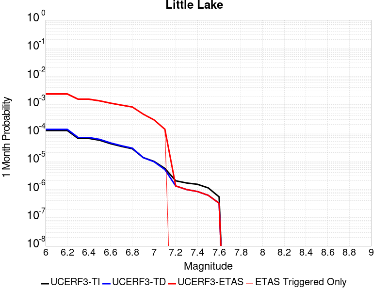 |  |  |

| Magnitude | 1 wk TI Prob | 1 wk TD Prob | 1 wk ETAS Prob | 1 wk ETAS/TD Gain | 1 wk ETAS Triggered Only | 1 mo TI Prob | 1 mo TD Prob | 1 mo ETAS Prob | 1 mo ETAS/TD Gain | 1 mo ETAS Triggered Only | 1 yr TI Prob | 1 yr TD Prob | 1 yr ETAS Prob | 1 yr ETAS/TD Gain | 1 yr ETAS Triggered Only | 10 yr TI Prob | 10 yr TD Prob | 10 yr ETAS Prob | 10 yr ETAS/TD Gain | 10 yr ETAS Triggered Only |
|-----|-----|-----|-----|-----|-----|-----|-----|-----|-----|-----|-----|-----|-----|-----|-----|-----|-----|-----|-----|-----|
| 6.0 | 2.8424427E-5 | 3.1208794E-5 | 7.5118634E-4 | 24.0697 | 7.2E-4 | 1.2181328E-4 | 1.3374587E-4 | 0.002413441 | 18.044975 | 0.00228 | 0.0014820677 | 0.0016272729 | 0.0121201705 | 7.4481487 | 0.01051 | 0.014722223 | 0.016166981 | 0.03803759 | 2.3527946 | 0.02223 |
| 6.1 | 2.8424427E-5 | 3.1208794E-5 | 7.5118634E-4 | 24.0697 | 7.2E-4 | 1.2181328E-4 | 1.3374587E-4 | 0.002413441 | 18.044975 | 0.00228 | 0.0014820677 | 0.0016272729 | 0.0121201705 | 7.4481487 | 0.01051 | 0.014722223 | 0.016166981 | 0.03803759 | 2.3527946 | 0.02223 |
| 6.2 | 2.8424427E-5 | 3.1208794E-5 | 7.5118634E-4 | 24.0697 | 7.2E-4 | 1.2181328E-4 | 1.3374587E-4 | 0.002413441 | 18.044975 | 0.00228 | 0.0014820677 | 0.0016272729 | 0.0121201705 | 7.4481487 | 0.01051 | 0.014722223 | 0.016166981 | 0.03803759 | 2.3527946 | 0.02223 |
| 6.3 | 1.48860645E-5 | 1.6082817E-5 | 4.960751E-4 | 30.845037 | 4.8E-4 | 6.379586E-5 | 6.8924695E-5 | 0.0015688213 | 22.761381 | 0.0015 | 7.7643775E-4 | 8.388633E-4 | 0.0076931086 | 9.170873 | 0.00686 | 0.007737305 | 0.008359787 | 0.022688989 | 2.714063 | 0.01445 |
| 6.4 | 1.48860645E-5 | 1.6082817E-5 | 4.960751E-4 | 30.845037 | 4.8E-4 | 6.379586E-5 | 6.8924695E-5 | 0.0015688213 | 22.761381 | 0.0015 | 7.7643775E-4 | 8.388633E-4 | 0.0076931086 | 9.170873 | 0.00686 | 0.007737305 | 0.008359787 | 0.022688989 | 2.714063 | 0.01445 |
| 6.5 | 1.2797581E-5 | 1.37667585E-5 | 4.1376124E-4 | 30.055096 | 4.0E-4 | 5.4845623E-5 | 5.8999205E-5 | 0.001368922 | 23.20238 | 0.00131 | 6.675408E-4 | 7.1810425E-4 | 0.0069436305 | 9.669391 | 0.00623 | 0.006655392 | 0.007160389 | 0.020196373 | 2.8205693 | 0.01313 |
| 6.6 | 9.661896E-6 | 1.028988E-5 | 3.202867E-4 | 31.126377 | 3.1E-4 | 4.1407468E-5 | 4.4098833E-5 | 0.0011340508 | 25.716118 | 0.00109 | 5.040193E-4 | 5.3678727E-4 | 0.0058339424 | 10.8682575 | 0.0053 | 0.005028777 | 0.005356512 | 0.016307537 | 3.044432 | 0.01101 |
| 6.7 | 7.767871E-6 | 8.200329E-6 | 2.681982E-4 | 32.705784 | 2.6E-4 | 3.329045E-5 | 3.5143872E-5 | 9.651112E-4 | 27.461721 | 9.3E-4 | 4.0523586E-4 | 4.2780637E-4 | 0.0051158 | 11.958214 | 0.00469 | 0.004044977 | 0.00427118 | 0.013760475 | 3.2217035 | 0.00953 |
| 6.8 | 6.4235196E-6 | 6.7362653E-6 | 2.3673472E-4 | 35.14332 | 2.3E-4 | 2.752908E-5 | 2.8869463E-5 | 8.2884636E-4 | 28.710142 | 8.0E-4 | 3.35115E-4 | 3.5144185E-4 | 0.0039801663 | 11.325249 | 0.00363 | 0.003346101 | 0.0035101213 | 0.011153199 | 3.1774397 | 0.00767 |
| 6.9 | 3.1283696E-6 | 3.1123648E-6 | 1.4311193E-4 | 45.981735 | 1.4E-4 | 1.3407229E-5 | 1.3338647E-5 | 4.6333263E-4 | 34.736107 | 4.5E-4 | 1.6322079E-4 | 1.6238743E-4 | 0.0022720448 | 13.991507 | 0.00211 | 0.0016310095 | 0.001622836 | 0.0060256794 | 3.713055 | 0.00441 |
| 7.0 | 2.290603E-6 | 2.2288211E-6 | 1.12228576E-4 | 50.353336 | 1.1E-4 | 9.816834E-6 | 9.552061E-6 | 2.8954938E-4 | 30.312765 | 2.8E-4 | 1.19513395E-4 | 1.1629118E-4 | 0.0014961307 | 12.865384 | 0.00138 | 0.0011944914 | 0.0011624055 | 0.0038792437 | 3.3372552 | 0.00272 |
| 7.1 | 1.293693E-6 | 1.1777693E-6 | 6.11777E-5 | 51.943703 | 6.0E-5 | 5.5443866E-6 | 5.047577E-6 | 1.3504692E-4 | 26.754803 | 1.3E-4 | 6.750081E-5 | 6.145321E-5 | 8.314059E-4 | 13.529087 | 7.7E-4 | 6.7480316E-4 | 6.144307E-4 | 0.0019636012 | 3.1958058 | 0.00135 |
| 7.2 | 4.715842E-7 | 3.0921956E-7 | 3.0921956E-7 | 1.0 | 0.0 | 2.0210737E-6 | 1.325226E-6 | 1.325226E-6 | 1.0 | 0.0 | 2.4606294E-5 | 1.6134512E-5 | 3.6134188E-5 | 2.239559 | 2.0E-5 | 2.460357E-4 | 1.6133396E-4 | 2.013275E-4 | 1.247893 | 4.0E-5 |
| 7.3 | 3.9430947E-7 | 2.3101252E-7 | 2.3101252E-7 | 1.0 | 0.0 | 1.6898966E-6 | 9.900533E-7 | 9.900533E-7 | 1.0 | 0.0 | 2.0574296E-5 | 1.20538325E-5 | 2.2053713E-5 | 1.8296016 | 1.0E-5 | 2.0572392E-4 | 1.2053186E-4 | 1.5052824E-4 | 1.2488668 | 3.0E-5 |
| 7.4 | 3.547123E-7 | 1.968263E-7 | 1.968263E-7 | 1.0 | 0.0 | 1.5201948E-6 | 8.4354105E-7 | 8.4354105E-7 | 1.0 | 0.0 | 1.8508214E-5 | 1.0270064E-5 | 2.0269961E-5 | 1.9736937 | 1.0E-5 | 1.8506673E-4 | 1.02695965E-4 | 1.3269288E-4 | 1.2920945 | 3.0E-5 |
| 7.5 | 2.6354266E-7 | 1.4425584E-7 | 1.4425584E-7 | 1.0 | 0.0 | 1.129468E-6 | 6.1823914E-7 | 6.1823914E-7 | 1.0 | 0.0 | 1.3751187E-5 | 7.527036E-6 | 1.7526962E-5 | 2.3285341 | 1.0E-5 | 1.3750336E-4 | 7.526786E-5 | 1.0526561E-4 | 1.3985465 | 3.0E-5 |
| 7.6 | 1.269913E-7 | 7.573594E-8 | 7.573594E-8 | 1.0 | 0.0 | 5.4424834E-7 | 3.2458257E-7 | 3.2458257E-7 | 1.0 | 0.0 | 6.6262032E-6 | 3.951786E-6 | 1.3951746E-5 | 3.5304916 | 1.0E-5 | 6.626006E-5 | 3.9517192E-5 | 5.9516402E-5 | 1.5060889 | 2.0E-5 |

## Airport Lake
*[(top)](#table-of-contents)*

| 1 Week | 1 Month | 1 Year | 10 Year |
|-----|-----|-----|-----|
|  |  |  |  |

| Magnitude | 1 wk TI Prob | 1 wk TD Prob | 1 wk ETAS Prob | 1 wk ETAS/TD Gain | 1 wk ETAS Triggered Only | 1 mo TI Prob | 1 mo TD Prob | 1 mo ETAS Prob | 1 mo ETAS/TD Gain | 1 mo ETAS Triggered Only | 1 yr TI Prob | 1 yr TD Prob | 1 yr ETAS Prob | 1 yr ETAS/TD Gain | 1 yr ETAS Triggered Only | 10 yr TI Prob | 10 yr TD Prob | 10 yr ETAS Prob | 10 yr ETAS/TD Gain | 10 yr ETAS Triggered Only |
|-----|-----|-----|-----|-----|-----|-----|-----|-----|-----|-----|-----|-----|-----|-----|-----|-----|-----|-----|-----|-----|
| 6.0 | 1.2387061E-5 | 1.31038605E-5 | 5.730965E-4 | 43.73494 | 5.6E-4 | 5.3086325E-5 | 5.6158355E-5 | 0.0020060488 | 35.72129 | 0.00195 | 6.461343E-4 | 6.835419E-4 | 0.009667397 | 14.143094 | 0.00899 | 0.0064425888 | 0.0068172044 | 0.024416404 | 3.581586 | 0.01772 |
| 6.1 | 1.2387061E-5 | 1.31038605E-5 | 5.730965E-4 | 43.73494 | 5.6E-4 | 5.3086325E-5 | 5.6158355E-5 | 0.0020060488 | 35.72129 | 0.00195 | 6.461343E-4 | 6.835419E-4 | 0.009667397 | 14.143094 | 0.00899 | 0.0064425888 | 0.0068172044 | 0.024416404 | 3.581586 | 0.01772 |
| 6.2 | 1.2387061E-5 | 1.31038605E-5 | 5.730965E-4 | 43.73494 | 5.6E-4 | 5.3086325E-5 | 5.6158355E-5 | 0.0020060488 | 35.72129 | 0.00195 | 6.461343E-4 | 6.835419E-4 | 0.009667397 | 14.143094 | 0.00899 | 0.0064425888 | 0.0068172044 | 0.024416404 | 3.581586 | 0.01772 |
| 6.3 | 1.2387061E-5 | 1.31038605E-5 | 5.730965E-4 | 43.73494 | 5.6E-4 | 5.3086325E-5 | 5.6158355E-5 | 0.0020060488 | 35.72129 | 0.00195 | 6.461343E-4 | 6.835419E-4 | 0.009667397 | 14.143094 | 0.00899 | 0.0064425888 | 0.0068172044 | 0.024416404 | 3.581586 | 0.01772 |
| 6.4 | 1.2387061E-5 | 1.31038605E-5 | 5.730965E-4 | 43.73494 | 5.6E-4 | 5.3086325E-5 | 5.6158355E-5 | 0.0020060488 | 35.72129 | 0.00195 | 6.461343E-4 | 6.835419E-4 | 0.009667397 | 14.143094 | 0.00899 | 0.0064425888 | 0.0068172044 | 0.024416404 | 3.581586 | 0.01772 |
| 6.5 | 6.9922594E-6 | 7.3853103E-6 | 4.0738235E-4 | 55.16117 | 4.0E-4 | 2.996648E-5 | 3.1650976E-5 | 0.0015216038 | 48.074467 | 0.00149 | 3.6478083E-4 | 3.8528792E-4 | 0.0071726716 | 18.616394 | 0.00679 | 0.003641826 | 0.0038467369 | 0.016976036 | 4.4131007 | 0.01318 |
| 6.6 | 6.9922594E-6 | 7.3853103E-6 | 4.0738235E-4 | 55.16117 | 4.0E-4 | 2.996648E-5 | 3.1650976E-5 | 0.0015216038 | 48.074467 | 0.00149 | 3.6478083E-4 | 3.8528792E-4 | 0.0071726716 | 18.616394 | 0.00679 | 0.003641826 | 0.0038467369 | 0.016976036 | 4.4131007 | 0.01318 |
| 6.7 | 5.477277E-6 | 5.7863713E-6 | 3.0578463E-4 | 52.845665 | 3.0E-4 | 2.3473833E-5 | 2.479852E-5 | 0.00117477 | 47.372585 | 0.00115 | 2.8575645E-4 | 3.0188405E-4 | 0.0059501785 | 19.710146 | 0.00565 | 0.0028538927 | 0.0030151235 | 0.0141614145 | 4.696794 | 0.01118 |
| 6.8 | 3.9950432E-6 | 4.219307E-6 | 2.442183E-4 | 57.88114 | 2.4E-4 | 1.7121502E-5 | 1.8082634E-5 | 8.9806673E-4 | 49.664597 | 8.8E-4 | 2.0843433E-4 | 2.2013657E-4 | 0.004279243 | 19.439035 | 0.00406 | 0.0020823893 | 0.002199456 | 0.010541068 | 4.7925797 | 0.00836 |
| 6.9 | 2.95695E-6 | 3.123187E-6 | 1.931226E-4 | 61.835102 | 1.9E-4 | 1.2672582E-5 | 1.3385032E-5 | 6.6337636E-4 | 49.561058 | 6.5E-4 | 1.5427776E-4 | 1.6295284E-4 | 0.0029325015 | 17.996014 | 0.00277 | 0.001541707 | 0.001628556 | 0.007429094 | 4.5617676 | 0.00581 |
| 7.0 | 1.456072E-6 | 1.5408953E-6 | 1.1154073E-4 | 72.38696 | 1.1E-4 | 6.2402937E-6 | 6.6038256E-6 | 2.8660198E-4 | 43.399384 | 2.8E-4 | 7.597293E-5 | 8.039962E-5 | 0.0013502975 | 16.794825 | 0.00127 | 7.594696E-4 | 8.0380426E-4 | 0.0033317707 | 4.1450024 | 0.00253 |
| 7.1 | 6.995192E-7 | 7.409381E-7 | 6.0740895E-5 | 81.97836 | 6.0E-5 | 2.997936E-6 | 3.1754491E-6 | 1.3317504E-4 | 41.93896 | 1.3E-4 | 3.649926E-5 | 3.8661092E-5 | 7.286344E-4 | 18.84671 | 6.9E-4 | 3.6493264E-4 | 3.8661092E-4 | 0.0016361277 | 4.2319746 | 0.00125 |

## Owl Lake
*[(top)](#table-of-contents)*

| 1 Week | 1 Month | 1 Year | 10 Year |
|-----|-----|-----|-----|
|  |  |  |  |

| Magnitude | 1 wk TI Prob | 1 wk TD Prob | 1 wk ETAS Prob | 1 wk ETAS/TD Gain | 1 wk ETAS Triggered Only | 1 mo TI Prob | 1 mo TD Prob | 1 mo ETAS Prob | 1 mo ETAS/TD Gain | 1 mo ETAS Triggered Only | 1 yr TI Prob | 1 yr TD Prob | 1 yr ETAS Prob | 1 yr ETAS/TD Gain | 1 yr ETAS Triggered Only | 10 yr TI Prob | 10 yr TD Prob | 10 yr ETAS Prob | 10 yr ETAS/TD Gain | 10 yr ETAS Triggered Only |
|-----|-----|-----|-----|-----|-----|-----|-----|-----|-----|-----|-----|-----|-----|-----|-----|-----|-----|-----|-----|-----|
| 6.0 | 5.0320643E-5 | 6.638159E-5 | 3.3636365E-4 | 5.067123 | 2.7E-4 | 2.1564208E-4 | 2.8446777E-4 | 0.0016040923 | 5.6389246 | 0.00132 | 0.0026222812 | 0.0034589402 | 0.009796942 | 2.8323534 | 0.00636 | 0.02591553 | 0.03415182 | 0.04744189 | 1.3891468 | 0.01376 |
| 6.1 | 5.0320643E-5 | 6.638159E-5 | 3.3636365E-4 | 5.067123 | 2.7E-4 | 2.1564208E-4 | 2.8446777E-4 | 0.0016040923 | 5.6389246 | 0.00132 | 0.0026222812 | 0.0034589402 | 0.009796942 | 2.8323534 | 0.00636 | 0.02591553 | 0.03415182 | 0.04744189 | 1.3891468 | 0.01376 |
| 6.2 | 2.4125871E-5 | 3.099268E-5 | 2.5098588E-4 | 8.09823 | 2.2E-4 | 1.0339249E-4 | 1.3282018E-4 | 0.00111269 | 8.377418 | 9.8E-4 | 0.0012580766 | 0.0016160287 | 0.006338385 | 3.9221983 | 0.00473 | 0.012509781 | 0.016076323 | 0.02591556 | 1.6120328 | 0.01 |
| 6.3 | 1.7433485E-5 | 2.2364824E-5 | 2.2236035E-4 | 9.942414 | 2.0E-4 | 7.471279E-5 | 9.584662E-5 | 0.0010057593 | 10.493425 | 9.1E-4 | 9.0924866E-4 | 0.0011664558 | 0.0052716616 | 4.519384 | 0.00411 | 0.009055373 | 0.011633637 | 0.02019289 | 1.7357332 | 0.00866 |
| 6.4 | 1.7433485E-5 | 2.2364824E-5 | 2.2236035E-4 | 9.942414 | 2.0E-4 | 7.471279E-5 | 9.584662E-5 | 0.0010057593 | 10.493425 | 9.1E-4 | 9.0924866E-4 | 0.0011664558 | 0.0052716616 | 4.519384 | 0.00411 | 0.009055373 | 0.011633637 | 0.02019289 | 1.7357332 | 0.00866 |
| 6.5 | 1.5182742E-5 | 1.9437655E-5 | 2.0943396E-4 | 10.774652 | 1.9E-4 | 6.506727E-5 | 8.330243E-5 | 9.5322996E-4 | 11.443003 | 8.7E-4 | 7.919061E-4 | 0.0010138866 | 0.0049898513 | 4.9215083 | 0.00398 | 0.0078909 | 0.010122783 | 0.018328864 | 1.8106548 | 0.00829 |
| 6.6 | 6.7271576E-6 | 8.552988E-6 | 1.9855137E-4 | 23.214268 | 1.9E-4 | 2.8830356E-5 | 3.6655183E-5 | 8.06627E-4 | 22.00581 | 7.7E-4 | 3.5095305E-4 | 4.4619112E-4 | 0.0035947857 | 8.056605 | 0.00315 | 0.0035039932 | 0.0044707335 | 0.010772434 | 2.409545 | 0.00633 |
| 6.7 | 6.682835E-6 | 8.4854255E-6 | 1.9848382E-4 | 23.391146 | 1.9E-4 | 2.8640408E-5 | 3.6365633E-5 | 8.0633763E-4 | 22.173067 | 7.7E-4 | 3.4864116E-4 | 4.426673E-4 | 0.003591273 | 8.112803 | 0.00315 | 0.003480947 | 0.004435655 | 0.010727622 | 2.4184976 | 0.00632 |
| 6.8 | 6.5774975E-6 | 8.331873E-6 | 1.983303E-4 | 23.803808 | 1.9E-4 | 2.8188972E-5 | 3.5707566E-5 | 8.0568006E-4 | 22.563286 | 7.7E-4 | 3.4314668E-4 | 4.3465855E-4 | 0.0035632981 | 8.197925 | 0.00313 | 0.0034261728 | 0.0043557878 | 0.010628346 | 2.4400516 | 0.0063 |
| 6.9 | 6.363419E-6 | 8.004978E-6 | 1.9800346E-4 | 24.73504 | 1.9E-4 | 2.727151E-5 | 3.4306628E-5 | 8.042802E-4 | 23.443872 | 7.7E-4 | 3.3198006E-4 | 4.1760874E-4 | 0.0035463017 | 8.491924 | 0.00313 | 0.0033148455 | 0.0041857446 | 0.010449416 | 2.4964294 | 0.00629 |
| 7.0 | 6.1342453E-6 | 7.63709E-6 | 1.9763564E-4 | 25.878397 | 1.9E-4 | 2.6289357E-5 | 3.2730004E-5 | 7.927051E-4 | 24.219522 | 7.6E-4 | 3.2002592E-4 | 3.9842047E-4 | 0.0034871893 | 8.752536 | 0.00309 | 0.0031956544 | 0.0039943936 | 0.010179589 | 2.548469 | 0.00621 |
| 7.1 | 5.842926E-6 | 7.147514E-6 | 1.771463E-4 | 24.784323 | 1.7E-4 | 2.504087E-5 | 3.0631876E-5 | 7.206107E-4 | 23.524866 | 6.9E-4 | 3.0482994E-4 | 3.7288468E-4 | 0.0032817996 | 8.801111 | 0.00291 | 0.0030441214 | 0.0037397894 | 0.009617724 | 2.571729 | 0.0059 |
| 7.2 | 4.77173E-6 | 5.3632994E-6 | 9.536282E-5 | 17.780624 | 9.0E-5 | 2.045011E-5 | 2.298539E-5 | 4.929746E-4 | 21.447302 | 4.7E-4 | 2.4895166E-4 | 2.7981526E-4 | 0.002149292 | 7.6811113 | 0.00187 | 0.0024867293 | 0.002811154 | 0.006670275 | 2.372789 | 0.00387 |
| 7.3 | 3.0494948E-6 | 2.7140309E-6 | 4.2713924E-5 | 15.738186 | 4.0E-5 | 1.3069198E-5 | 1.16315105E-5 | 1.4163E-4 | 12.176407 | 1.3E-4 | 1.5910587E-4 | 1.416046E-4 | 6.1153807E-4 | 4.318631 | 4.7E-4 | 0.0015899199 | 0.001425103 | 0.0023937207 | 1.6796826 | 9.7E-4 |
| 7.4 | 2.7263884E-6 | 2.3090297E-6 | 2.2308983E-5 | 9.661627 | 2.0E-5 | 1.1684469E-5 | 9.895805E-6 | 7.9895115E-5 | 8.073634 | 7.0E-5 | 1.4224913E-4 | 1.2047487E-4 | 4.4043633E-4 | 3.6558356 | 3.2E-4 | 0.0014215811 | 0.0012129741 | 0.0018621857 | 1.5352229 | 6.5E-4 |
| 7.5 | 2.6090431E-6 | 2.1689061E-6 | 2.2168862E-5 | 10.221218 | 2.0E-5 | 1.1181565E-5 | 9.29528E-6 | 6.929472E-5 | 7.454829 | 6.0E-5 | 1.3612706E-4 | 1.1316425E-4 | 3.6313594E-4 | 3.2089283 | 2.5E-4 | 0.001360437 | 0.0011396994 | 0.001679084 | 1.4732691 | 5.4E-4 |
| 7.6 | 2.3008756E-6 | 1.8759047E-6 | 2.1875867E-5 | 11.661503 | 2.0E-5 | 9.860858E-6 | 8.039567E-6 | 6.803909E-5 | 8.463029 | 6.0E-5 | 1.20049335E-4 | 9.787741E-5 | 3.0785686E-4 | 3.145331 | 2.1E-4 | 0.001199845 | 9.866174E-4 | 0.0014461635 | 1.4657795 | 4.6E-4 |
| 7.7 | 1.7184348E-6 | 1.3447964E-6 | 2.134477E-5 | 15.87212 | 2.0E-5 | 7.3646997E-6 | 5.7634006E-6 | 3.5763227E-5 | 6.20523 | 3.0E-5 | 8.966153E-5 | 7.016719E-5 | 1.7016017E-4 | 2.4250677 | 1.0E-4 | 8.962536E-4 | 7.093401E-4 | 9.191911E-4 | 1.2958398 | 2.1E-4 |
| 7.8 | 8.4612907E-7 | 8.4264127E-7 | 2.0842625E-5 | 24.734873 | 2.0E-5 | 3.6262625E-6 | 3.611315E-6 | 3.3611206E-5 | 9.307194 | 3.0E-5 | 4.4148852E-5 | 4.396689E-5 | 7.396557E-5 | 1.6823016 | 3.0E-5 | 4.414008E-4 | 4.450584E-4 | 5.1502726E-4 | 1.1572127 | 7.0E-5 |
| 7.9 | 2.716738E-7 | 3.7771878E-7 | 3.7771878E-7 | 1.0 | 0.0 | 1.1643157E-6 | 1.6187938E-6 | 1.6187938E-6 | 1.0 | 0.0 | 1.4175452E-5 | 1.9708647E-5 | 1.9708647E-5 | 1.0 | 0.0 | 1.4174548E-4 | 1.9884022E-4 | 2.0883825E-4 | 1.0502816 | 1.0E-5 |
| 8.0 | 2.1995428E-8 | 3.392825E-8 | 3.392825E-8 | 1.0 | 0.0 | 9.426611E-8 | 1.4540677E-7 | 1.4540677E-7 | 1.0 | 0.0 | 1.1476893E-6 | 1.7703268E-6 | 1.7703268E-6 | 1.0 | 0.0 | 1.14768345E-5 | 1.8004324E-5 | 1.8004324E-5 | 1.0 | 0.0 |

## Panamint Valley
*[(top)](#table-of-contents)*

| 1 Week | 1 Month | 1 Year | 10 Year |
|-----|-----|-----|-----|
|  |  |  |  |

| Magnitude | 1 wk TI Prob | 1 wk TD Prob | 1 wk ETAS Prob | 1 wk ETAS/TD Gain | 1 wk ETAS Triggered Only | 1 mo TI Prob | 1 mo TD Prob | 1 mo ETAS Prob | 1 mo ETAS/TD Gain | 1 mo ETAS Triggered Only | 1 yr TI Prob | 1 yr TD Prob | 1 yr ETAS Prob | 1 yr ETAS/TD Gain | 1 yr ETAS Triggered Only | 10 yr TI Prob | 10 yr TD Prob | 10 yr ETAS Prob | 10 yr ETAS/TD Gain | 10 yr ETAS Triggered Only |
|-----|-----|-----|-----|-----|-----|-----|-----|-----|-----|-----|-----|-----|-----|-----|-----|-----|-----|-----|-----|-----|
| 6.0 | 3.0211835E-5 | 3.3990338E-5 | 3.3398013E-4 | 9.825737 | 3.0E-4 | 1.2947287E-4 | 1.4566492E-4 | 0.001195512 | 8.207274 | 0.00105 | 0.0015751923 | 0.0017720573 | 0.006723268 | 3.7940466 | 0.00496 | 0.015640736 | 0.017586125 | 0.028618632 | 1.6273416 | 0.01123 |
| 6.1 | 3.0211835E-5 | 3.3990338E-5 | 3.3398013E-4 | 9.825737 | 3.0E-4 | 1.2947287E-4 | 1.4566492E-4 | 0.001195512 | 8.207274 | 0.00105 | 0.0015751923 | 0.0017720573 | 0.006723268 | 3.7940466 | 0.00496 | 0.015640736 | 0.017586125 | 0.028618632 | 1.6273416 | 0.01123 |
| 6.2 | 3.0211835E-5 | 3.3990338E-5 | 3.3398013E-4 | 9.825737 | 3.0E-4 | 1.2947287E-4 | 1.4566492E-4 | 0.001195512 | 8.207274 | 0.00105 | 0.0015751923 | 0.0017720573 | 0.006723268 | 3.7940466 | 0.00496 | 0.015640736 | 0.017586125 | 0.028618632 | 1.6273416 | 0.01123 |
| 6.3 | 2.8573924E-5 | 3.2108197E-5 | 3.3209857E-4 | 10.343108 | 3.0E-4 | 1.2245393E-4 | 1.3759946E-4 | 0.0011774563 | 8.557129 | 0.00104 | 0.001489857 | 0.001674014 | 0.0063661463 | 3.802923 | 0.0047 | 0.01479908 | 0.016620632 | 0.027014954 | 1.6253865 | 0.01057 |
| 6.4 | 2.8573924E-5 | 3.2108197E-5 | 3.3209857E-4 | 10.343108 | 3.0E-4 | 1.2245393E-4 | 1.3759946E-4 | 0.0011774563 | 8.557129 | 0.00104 | 0.001489857 | 0.001674014 | 0.0063661463 | 3.802923 | 0.0047 | 0.01479908 | 0.016620632 | 0.027014954 | 1.6253865 | 0.01057 |
| 6.5 | 2.7468774E-5 | 3.083374E-5 | 3.208248E-4 | 10.404991 | 2.9E-4 | 1.1771801E-4 | 1.3213806E-4 | 0.0011420046 | 8.64251 | 0.00101 | 0.0014322745 | 0.001607621 | 0.0061602904 | 3.8319294 | 0.00456 | 0.014230782 | 0.0159664 | 0.026111787 | 1.635421 | 0.01031 |
| 6.6 | 2.6135967E-5 | 2.925755E-5 | 3.1924905E-4 | 10.911681 | 2.9E-4 | 1.1200648E-4 | 1.2538362E-4 | 0.0011052608 | 8.815033 | 9.8E-4 | 0.0013628257 | 0.0015255031 | 0.005988684 | 3.9257107 | 0.00447 | 0.013544982 | 0.015156649 | 0.02502478 | 1.651076 | 0.01002 |
| 6.7 | 2.4498746E-5 | 2.7346232E-5 | 2.9733885E-4 | 10.873119 | 2.7E-4 | 1.04990395E-4 | 1.1719302E-4 | 0.0010670817 | 9.105335 | 9.5E-4 | 0.0012775084 | 0.0014259162 | 0.0057197846 | 4.011305 | 0.0043 | 0.012701893 | 0.014173795 | 0.023568718 | 1.6628376 | 0.00953 |
| 6.8 | 2.2244329E-5 | 2.494001E-5 | 2.849335E-4 | 11.424757 | 2.6E-4 | 9.532935E-5 | 1.06881496E-4 | 0.0010167842 | 9.513192 | 9.1E-4 | 0.0011600169 | 0.0013005272 | 0.005275351 | 4.0563173 | 0.00398 | 0.011539802 | 0.01293488 | 0.021690149 | 1.6768727 | 0.00887 |
| 6.9 | 1.9902658E-5 | 2.2294498E-5 | 2.7228892E-4 | 12.213279 | 2.5E-4 | 8.529431E-5 | 9.5544456E-5 | 9.654613E-4 | 10.104839 | 8.7E-4 | 0.0010379635 | 0.0011626515 | 0.004818396 | 4.144317 | 0.00366 | 0.010331288 | 0.011570791 | 0.01941892 | 1.6782707 | 0.00794 |
| 7.0 | 1.8353881E-5 | 2.0570176E-5 | 2.5056544E-4 | 12.181006 | 2.3E-4 | 7.865712E-5 | 8.8155015E-5 | 9.0808276E-4 | 10.300976 | 8.2E-4 | 9.5722964E-4 | 0.0010727766 | 0.0044891075 | 4.184569 | 0.00342 | 0.009531168 | 0.010680909 | 0.017982084 | 1.6835724 | 0.00738 |
| 7.1 | 1.7667631E-5 | 1.9776491E-5 | 2.3977214E-4 | 12.1241 | 2.2E-4 | 7.571623E-5 | 8.475373E-5 | 8.7468675E-4 | 10.3203335 | 7.9E-4 | 9.2145515E-4 | 0.0010314058 | 0.0042880434 | 4.1574745 | 0.00326 | 0.009176437 | 0.010271076 | 0.017308049 | 1.6851251 | 0.00711 |
| 7.2 | 1.6381597E-5 | 1.816187E-5 | 2.1815824E-4 | 12.011881 | 2.0E-4 | 7.020495E-5 | 7.783437E-5 | 8.077776E-4 | 10.37816 | 7.3E-4 | 8.544101E-4 | 9.472387E-4 | 0.0038644727 | 4.0797243 | 0.00292 | 0.008511325 | 0.009436665 | 0.015736647 | 1.667607 | 0.00636 |
| 7.3 | 1.4520491E-5 | 1.596943E-5 | 1.559672E-4 | 9.76661 | 1.4E-4 | 6.222919E-5 | 6.8438705E-5 | 6.2840036E-4 | 9.181944 | 5.6E-4 | 7.57377E-4 | 8.3293894E-4 | 0.0032009648 | 3.8429766 | 0.00237 | 0.0075480095 | 0.008301281 | 0.01340853 | 1.6152362 | 0.00515 |
| 7.4 | 1.2852287E-5 | 1.41480405E-5 | 1.5414607E-4 | 10.895224 | 1.4E-4 | 5.5080065E-5 | 6.0633138E-5 | 6.006004E-4 | 9.905481 | 5.4E-4 | 6.7039346E-4 | 7.3797425E-4 | 0.003006299 | 4.073718 | 0.00227 | 0.0066837464 | 0.0073581585 | 0.012162545 | 1.6529332 | 0.00484 |
| 7.5 | 1.1637851E-5 | 1.2839261E-5 | 1.5283747E-4 | 11.903914 | 1.4E-4 | 4.987555E-5 | 5.502433E-5 | 5.9499464E-4 | 10.8133 | 5.4E-4 | 6.070656E-4 | 6.69731E-4 | 0.0029082308 | 4.3423862 | 0.00224 | 0.006054099 | 0.0066800253 | 0.011418162 | 1.7092992 | 0.00477 |
| 7.6 | 3.0068115E-6 | 3.3339925E-6 | 7.333376E-5 | 21.995777 | 7.0E-5 | 1.2886271E-5 | 1.4288502E-5 | 2.6428493E-4 | 18.496336 | 2.5E-4 | 1.5687906E-4 | 1.7395591E-4 | 0.0011937785 | 6.8625345 | 0.00102 | 0.0015676835 | 0.001739639 | 0.0037561248 | 2.1591406 | 0.00202 |

## Garlock (East)
*[(top)](#table-of-contents)*

| 1 Week | 1 Month | 1 Year | 10 Year |
|-----|-----|-----|-----|
|  |  |  |  |

| Magnitude | 1 wk TI Prob | 1 wk TD Prob | 1 wk ETAS Prob | 1 wk ETAS/TD Gain | 1 wk ETAS Triggered Only | 1 mo TI Prob | 1 mo TD Prob | 1 mo ETAS Prob | 1 mo ETAS/TD Gain | 1 mo ETAS Triggered Only | 1 yr TI Prob | 1 yr TD Prob | 1 yr ETAS Prob | 1 yr ETAS/TD Gain | 1 yr ETAS Triggered Only | 10 yr TI Prob | 10 yr TD Prob | 10 yr ETAS Prob | 10 yr ETAS/TD Gain | 10 yr ETAS Triggered Only |
|-----|-----|-----|-----|-----|-----|-----|-----|-----|-----|-----|-----|-----|-----|-----|-----|-----|-----|-----|-----|-----|
| 6.0 | 4.5092507E-5 | 6.292806E-5 | 2.0291925E-4 | 3.2246227 | 1.4E-4 | 1.9323928E-4 | 2.696663E-4 | 0.0010894452 | 4.039975 | 8.2E-4 | 0.0023501497 | 0.0032786906 | 0.0073054447 | 2.2281592 | 0.00404 | 0.023254504 | 0.03236442 | 0.04121829 | 1.2735679 | 0.00915 |
| 6.1 | 4.5092507E-5 | 6.292806E-5 | 2.0291925E-4 | 3.2246227 | 1.4E-4 | 1.9323928E-4 | 2.696663E-4 | 0.0010894452 | 4.039975 | 8.2E-4 | 0.0023501497 | 0.0032786906 | 0.0073054447 | 2.2281592 | 0.00404 | 0.023254504 | 0.03236442 | 0.04121829 | 1.2735679 | 0.00915 |
| 6.2 | 2.6674514E-5 | 3.4529334E-5 | 1.3452588E-4 | 3.8959882 | 1.0E-4 | 1.1431433E-4 | 1.4797466E-4 | 7.4788585E-4 | 5.054148 | 6.0E-4 | 0.0013908884 | 0.0018001358 | 0.004664969 | 2.5914543 | 0.00287 | 0.01382215 | 0.017900338 | 0.024175957 | 1.3505865 | 0.00639 |
| 6.3 | 2.6674514E-5 | 3.4529334E-5 | 1.3452588E-4 | 3.8959882 | 1.0E-4 | 1.1431433E-4 | 1.4797466E-4 | 7.4788585E-4 | 5.054148 | 6.0E-4 | 0.0013908884 | 0.0018001358 | 0.004664969 | 2.5914543 | 0.00287 | 0.01382215 | 0.017900338 | 0.024175957 | 1.3505865 | 0.00639 |
| 6.4 | 2.5312667E-5 | 3.2358148E-5 | 1.3235491E-4 | 4.0903115 | 1.0E-4 | 1.0847834E-4 | 1.3867058E-4 | 7.285888E-4 | 5.2540975 | 5.9E-4 | 0.0013199237 | 0.0016870362 | 0.004512262 | 2.674668 | 0.00283 | 0.013121112 | 0.016788166 | 0.023002064 | 1.3701357 | 0.00632 |
| 6.5 | 2.5312667E-5 | 3.2358148E-5 | 1.3235491E-4 | 4.0903115 | 1.0E-4 | 1.0847834E-4 | 1.3867058E-4 | 7.285888E-4 | 5.2540975 | 5.9E-4 | 0.0013199237 | 0.0016870362 | 0.004512262 | 2.674668 | 0.00283 | 0.013121112 | 0.016788166 | 0.023002064 | 1.3701357 | 0.00632 |
| 6.6 | 2.246556E-5 | 2.8152277E-5 | 1.2814946E-4 | 4.5520105 | 1.0E-4 | 9.627742E-5 | 1.2064717E-4 | 6.8057963E-4 | 5.6410737 | 5.6E-4 | 0.0011715472 | 0.0014679132 | 0.0041539646 | 2.8298435 | 0.00269 | 0.011653901 | 0.0146281505 | 0.02056009 | 1.4055153 | 0.00602 |
| 6.7 | 2.2241198E-5 | 2.7821967E-5 | 1.2781918E-4 | 4.594182 | 1.0E-4 | 9.531594E-5 | 1.19231685E-4 | 6.691661E-4 | 5.612318 | 5.5E-4 | 0.0011598538 | 0.0014507027 | 0.0041168295 | 2.8378174 | 0.00267 | 0.011538187 | 0.014458317 | 0.020361712 | 1.4083045 | 0.00599 |
| 6.8 | 1.9528685E-5 | 2.3915427E-5 | 1.2391304E-4 | 5.1813016 | 1.0E-4 | 8.369167E-5 | 1.0249077E-4 | 6.324365E-4 | 6.170667 | 5.3E-4 | 0.0010184698 | 0.0012471306 | 0.0038139254 | 3.0581605 | 0.00257 | 0.010138147 | 0.012445298 | 0.01811386 | 1.4554784 | 0.00574 |
| 6.9 | 1.3318621E-5 | 1.5213745E-5 | 9.521253E-5 | 6.2583227 | 8.0E-5 | 5.7078556E-5 | 6.520017E-5 | 5.751669E-4 | 8.821556 | 5.1E-4 | 6.9470983E-4 | 7.935286E-4 | 0.0031316718 | 3.946514 | 0.00234 | 0.0069254204 | 0.007947576 | 0.0129772825 | 1.6328603 | 0.00507 |
| 7.0 | 1.1760853E-5 | 1.3122138E-5 | 8.312122E-5 | 6.334427 | 7.0E-5 | 5.0402683E-5 | 5.623655E-5 | 5.562084E-4 | 9.890515 | 5.0E-4 | 6.134799E-4 | 6.8446994E-4 | 0.002952916 | 4.314165 | 0.00227 | 0.0061178906 | 0.0068639526 | 0.011720388 | 1.7075275 | 0.00489 |
| 7.1 | 1.0064758E-5 | 1.09167895E-5 | 8.091603E-5 | 7.4120717 | 7.0E-5 | 4.3133965E-5 | 4.678542E-5 | 5.46762E-4 | 11.68659 | 5.0E-4 | 5.2502943E-4 | 5.6946714E-4 | 0.0027682143 | 4.8610606 | 0.0022 | 0.005237907 | 0.0057201856 | 0.010403244 | 1.8186898 | 0.00471 |
| 7.2 | 9.768808E-6 | 1.0512569E-5 | 8.051183E-5 | 7.6586256 | 7.0E-5 | 4.186565E-5 | 4.505311E-5 | 5.450306E-4 | 12.097513 | 5.0E-4 | 5.095951E-4 | 5.4838706E-4 | 0.0027171972 | 4.9548893 | 0.00217 | 0.0050842804 | 0.0055104033 | 0.010104945 | 1.8337941 | 0.00462 |
| 7.3 | 9.344516E-6 | 9.957968E-6 | 6.995737E-5 | 7.025265 | 6.0E-5 | 4.004731E-5 | 4.267633E-5 | 4.7265796E-4 | 11.075414 | 4.3E-4 | 4.8746695E-4 | 5.194639E-4 | 0.0024584562 | 4.7326794 | 0.00194 | 0.0048639905 | 0.00522195 | 0.009370174 | 1.7943822 | 0.00417 |
| 7.4 | 9.023491E-6 | 9.5038895E-6 | 5.9503414E-5 | 6.260954 | 5.0E-5 | 3.867153E-5 | 4.0730338E-5 | 4.3071446E-4 | 10.574781 | 3.9E-4 | 4.7072413E-4 | 4.957824E-4 | 0.0022549098 | 4.5481844 | 0.00176 | 0.004697283 | 0.004985264 | 0.008686719 | 1.7424792 | 0.00372 |
| 7.5 | 7.081253E-6 | 7.0994397E-6 | 3.7099227E-5 | 5.2256556 | 3.0E-5 | 3.0347876E-5 | 3.042582E-5 | 2.0042065E-4 | 6.5871897 | 1.7E-4 | 3.6942272E-4 | 3.7037212E-4 | 0.0013000277 | 3.5100582 | 9.3E-4 | 0.003688092 | 0.0037304326 | 0.005583494 | 1.4967417 | 0.00186 |
| 7.6 | 6.116396E-6 | 5.9704294E-6 | 2.597031E-5 | 4.349823 | 2.0E-5 | 2.6212863E-5 | 2.5587306E-5 | 1.3558449E-4 | 5.298897 | 1.1E-4 | 3.1909486E-4 | 3.1148118E-4 | 9.3128806E-4 | 2.9898696 | 6.2E-4 | 0.0031863707 | 0.003141574 | 0.004248087 | 1.3522161 | 0.00111 |
| 7.7 | 4.797145E-6 | 4.767864E-6 | 1.47678165E-5 | 3.0973651 | 1.0E-5 | 2.055903E-5 | 2.0433545E-5 | 8.043232E-5 | 3.936288 | 6.0E-5 | 2.5027743E-4 | 2.4875012E-4 | 6.6864566E-4 | 2.6880214 | 4.2E-4 | 0.0024999576 | 0.0025148564 | 0.0031532468 | 1.2538477 | 6.4E-4 |
| 7.8 | 3.4028885E-6 | 3.9879E-6 | 3.9879E-6 | 1.0 | 0.0 | 1.4583726E-5 | 1.709089E-5 | 4.7090376E-5 | 2.7552912 | 3.0E-5 | 1.775424E-4 | 2.0806179E-4 | 4.5800977E-4 | 2.201316 | 2.5E-4 | 0.0017740062 | 0.0021061352 | 0.002495314 | 1.1847833 | 3.9E-4 |
| 7.9 | 2.5928412E-6 | 3.3804265E-6 | 3.3804265E-6 | 1.0 | 0.0 | 1.1112129E-5 | 1.4487462E-5 | 3.4487173E-5 | 2.380484 | 2.0E-5 | 1.3528178E-4 | 1.7637064E-4 | 3.6633713E-4 | 2.077087 | 1.9E-4 | 0.0013519945 | 0.0017853905 | 0.0020848548 | 1.1677305 | 3.0E-4 |
| 8.0 | 1.3743648E-6 | 1.6770913E-6 | 1.6770913E-6 | 1.0 | 0.0 | 5.8901214E-6 | 7.1875147E-6 | 2.718737E-5 | 3.782583 | 2.0E-5 | 7.1709874E-5 | 8.750451E-5 | 1.3750013E-4 | 1.5713491 | 5.0E-5 | 7.1686733E-4 | 8.8560587E-4 | 9.65535E-4 | 1.0902536 | 8.0E-5 |
| 8.1 | 3.6733252E-7 | 3.1554555E-7 | 3.1554555E-7 | 1.0 | 0.0 | 1.5742813E-6 | 1.3523374E-6 | 1.1352324E-5 | 8.394594 | 1.0E-5 | 1.9166706E-5 | 1.64646E-5 | 2.6464437E-5 | 1.6073537 | 1.0E-5 | 1.9165053E-4 | 1.6672608E-4 | 1.7672442E-4 | 1.0599686 | 1.0E-5 |

## Ash Hill
*[(top)](#table-of-contents)*

| 1 Week | 1 Month | 1 Year | 10 Year |
|-----|-----|-----|-----|
|  |  |  | 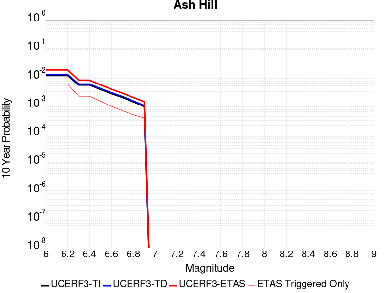 |

| Magnitude | 1 wk TI Prob | 1 wk TD Prob | 1 wk ETAS Prob | 1 wk ETAS/TD Gain | 1 wk ETAS Triggered Only | 1 mo TI Prob | 1 mo TD Prob | 1 mo ETAS Prob | 1 mo ETAS/TD Gain | 1 mo ETAS Triggered Only | 1 yr TI Prob | 1 yr TD Prob | 1 yr ETAS Prob | 1 yr ETAS/TD Gain | 1 yr ETAS Triggered Only | 10 yr TI Prob | 10 yr TD Prob | 10 yr ETAS Prob | 10 yr ETAS/TD Gain | 10 yr ETAS Triggered Only |
|-----|-----|-----|-----|-----|-----|-----|-----|-----|-----|-----|-----|-----|-----|-----|-----|-----|-----|-----|-----|-----|
| 6.0 | 2.1545662E-5 | 2.3196095E-5 | 1.8319239E-4 | 7.8975525 | 1.6E-4 | 9.2335285E-5 | 9.94085E-5 | 6.6935184E-4 | 6.733346 | 5.7E-4 | 0.0011236023 | 0.0012097065 | 0.003736646 | 3.0888863 | 0.00253 | 0.011179381 | 0.0120392 | 0.01758166 | 1.4603678 | 0.00561 |
| 6.1 | 2.1545662E-5 | 2.3196095E-5 | 1.8319239E-4 | 7.8975525 | 1.6E-4 | 9.2335285E-5 | 9.94085E-5 | 6.6935184E-4 | 6.733346 | 5.7E-4 | 0.0011236023 | 0.0012097065 | 0.003736646 | 3.0888863 | 0.00253 | 0.011179381 | 0.0120392 | 0.01758166 | 1.4603678 | 0.00561 |
| 6.2 | 2.1545662E-5 | 2.3196095E-5 | 1.8319239E-4 | 7.8975525 | 1.6E-4 | 9.2335285E-5 | 9.94085E-5 | 6.6935184E-4 | 6.733346 | 5.7E-4 | 0.0011236023 | 0.0012097065 | 0.003736646 | 3.0888863 | 0.00253 | 0.011179381 | 0.0120392 | 0.01758166 | 1.4603678 | 0.00561 |
| 6.3 | 1.0025529E-5 | 1.0747653E-5 | 5.074722E-5 | 4.721703 | 4.0E-5 | 4.2965847E-5 | 4.6060628E-5 | 2.2605233E-4 | 4.907713 | 1.8E-4 | 5.229836E-4 | 5.6065706E-4 | 0.0015401077 | 2.746969 | 9.8E-4 | 0.005217545 | 0.005593739 | 0.0076819924 | 1.3733197 | 0.0021 |
| 6.4 | 1.0025529E-5 | 1.0747653E-5 | 5.074722E-5 | 4.721703 | 4.0E-5 | 4.2965847E-5 | 4.6060628E-5 | 2.2605233E-4 | 4.907713 | 1.8E-4 | 5.229836E-4 | 5.6065706E-4 | 0.0015401077 | 2.746969 | 9.8E-4 | 0.005217545 | 0.005593739 | 0.0076819924 | 1.3733197 | 0.0021 |
| 6.5 | 6.9617327E-6 | 7.4571262E-6 | 3.7456903E-5 | 5.0229673 | 3.0E-5 | 2.9835655E-5 | 3.195877E-5 | 1.5195494E-4 | 4.754718 | 1.2E-4 | 3.6318856E-4 | 3.8903722E-4 | 0.001008796 | 2.5930579 | 6.2E-4 | 0.0036259557 | 0.0038844163 | 0.005269017 | 1.3564501 | 0.00139 |
| 6.6 | 4.9919777E-6 | 5.3470408E-6 | 3.5346882E-5 | 6.61055 | 3.0E-5 | 2.1394015E-5 | 2.2915727E-5 | 1.2291344E-4 | 5.363715 | 1.0E-4 | 2.60441E-4 | 2.7896996E-4 | 7.188472E-4 | 2.5767908 | 4.4E-4 | 0.0026013597 | 0.0027868561 | 0.0037142644 | 1.3327794 | 9.3E-4 |
| 6.7 | 3.6630722E-6 | 3.924884E-6 | 2.3924806E-5 | 6.095672 | 2.0E-5 | 1.5698786E-5 | 1.6820855E-5 | 9.681951E-5 | 5.755921 | 8.0E-5 | 1.9111596E-4 | 2.047804E-4 | 5.04719E-4 | 2.464684 | 3.0E-4 | 0.0019095168 | 0.00204648 | 0.00269515 | 1.3169686 | 6.5E-4 |
| 6.8 | 2.5599613E-6 | 2.7451092E-6 | 1.2745082E-5 | 4.6428323 | 1.0E-5 | 1.0971216E-5 | 1.1764729E-5 | 7.176402E-5 | 6.0999303 | 6.0E-5 | 1.3356637E-4 | 1.432311E-4 | 3.631996E-4 | 2.5357592 | 2.2E-4 | 0.0013348613 | 0.001431873 | 0.0019011999 | 1.3277714 | 4.7E-4 |
| 6.9 | 1.7684905E-6 | 1.8969986E-6 | 1.8969986E-6 | 1.0 | 0.0 | 7.579223E-6 | 8.129994E-6 | 5.8129586E-5 | 7.1500163 | 5.0E-5 | 9.2273134E-5 | 9.898267E-5 | 2.6896584E-4 | 2.7173023 | 1.7E-4 | 9.223483E-4 | 9.898267E-4 | 0.0013494705 | 1.36334 | 3.6E-4 |

## Hunter Mountain-Saline Valley
*[(top)](#table-of-contents)*

| 1 Week | 1 Month | 1 Year | 10 Year |
|-----|-----|-----|-----|
|  |  | 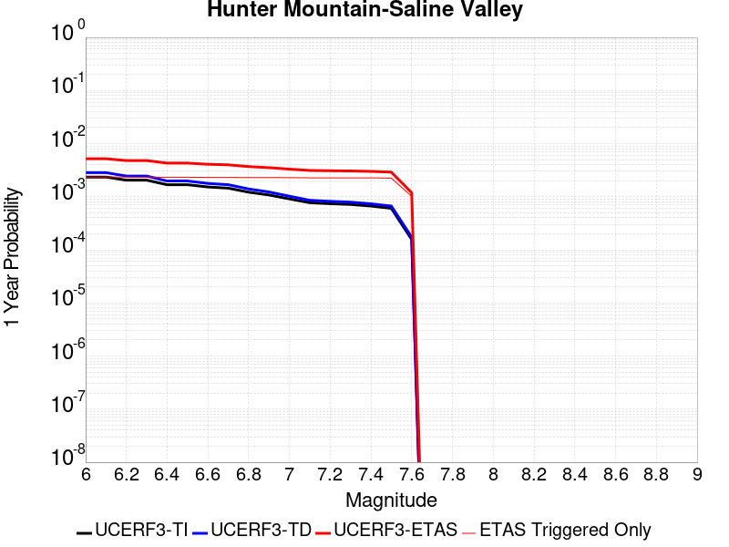 |  |

| Magnitude | 1 wk TI Prob | 1 wk TD Prob | 1 wk ETAS Prob | 1 wk ETAS/TD Gain | 1 wk ETAS Triggered Only | 1 mo TI Prob | 1 mo TD Prob | 1 mo ETAS Prob | 1 mo ETAS/TD Gain | 1 mo ETAS Triggered Only | 1 yr TI Prob | 1 yr TD Prob | 1 yr ETAS Prob | 1 yr ETAS/TD Gain | 1 yr ETAS Triggered Only | 10 yr TI Prob | 10 yr TD Prob | 10 yr ETAS Prob | 10 yr ETAS/TD Gain | 10 yr ETAS Triggered Only |
|-----|-----|-----|-----|-----|-----|-----|-----|-----|-----|-----|-----|-----|-----|-----|-----|-----|-----|-----|-----|-----|
| 6.0 | 4.5103672E-5 | 5.458046E-5 | 1.9457281E-4 | 3.5648806 | 1.4E-4 | 1.9328714E-4 | 2.338965E-4 | 7.8376784E-4 | 3.3509176 | 5.5E-4 | 0.002350731 | 0.0028441283 | 0.005197416 | 1.8274198 | 0.00236 | 0.023260195 | 0.028097961 | 0.03305466 | 1.1764078 | 0.0051 |
| 6.1 | 4.5103672E-5 | 5.458046E-5 | 1.9457281E-4 | 3.5648806 | 1.4E-4 | 1.9328714E-4 | 2.338965E-4 | 7.8376784E-4 | 3.3509176 | 5.5E-4 | 0.002350731 | 0.0028441283 | 0.005197416 | 1.8274198 | 0.00236 | 0.023260195 | 0.028097961 | 0.03305466 | 1.1764078 | 0.0051 |
| 6.2 | 3.9363465E-5 | 4.7071488E-5 | 1.870649E-4 | 3.9740596 | 1.4E-4 | 1.6868966E-4 | 2.0172024E-4 | 7.516093E-4 | 3.7259986 | 5.5E-4 | 0.002051862 | 0.002453333 | 0.0047975676 | 1.9555305 | 0.00235 | 0.020330196 | 0.024278546 | 0.029235212 | 1.2041582 | 0.00508 |
| 6.3 | 3.9363465E-5 | 4.7071488E-5 | 1.870649E-4 | 3.9740596 | 1.4E-4 | 1.6868966E-4 | 2.0172024E-4 | 7.516093E-4 | 3.7259986 | 5.5E-4 | 0.002051862 | 0.002453333 | 0.0047975676 | 1.9555305 | 0.00235 | 0.020330196 | 0.024278546 | 0.029235212 | 1.2041582 | 0.00508 |
| 6.4 | 3.2311684E-5 | 3.795858E-5 | 1.7795326E-4 | 4.688091 | 1.4E-4 | 1.384713E-4 | 1.626699E-4 | 7.1258046E-4 | 4.3805304 | 5.5E-4 | 0.0016845843 | 0.0019787797 | 0.004304169 | 2.1751633 | 0.00233 | 0.016718714 | 0.019620348 | 0.024561461 | 1.2518362 | 0.00504 |
| 6.5 | 3.2311684E-5 | 3.795858E-5 | 1.7795326E-4 | 4.688091 | 1.4E-4 | 1.384713E-4 | 1.626699E-4 | 7.1258046E-4 | 4.3805304 | 5.5E-4 | 0.0016845843 | 0.0019787797 | 0.004304169 | 2.1751633 | 0.00233 | 0.016718714 | 0.019620348 | 0.024561461 | 1.2518362 | 0.00504 |
| 6.6 | 2.9305844E-5 | 3.4188528E-5 | 1.7418375E-4 | 5.094801 | 1.4E-4 | 1.2559042E-4 | 1.4651439E-4 | 6.964338E-4 | 4.7533474 | 5.5E-4 | 0.0015279909 | 0.0017824158 | 0.0040882984 | 2.2936838 | 0.00231 | 0.015175272 | 0.017689124 | 0.0226105 | 1.2782149 | 0.00501 |
| 6.7 | 2.7826512E-5 | 3.2350556E-5 | 1.7234603E-4 | 5.3274517 | 1.4E-4 | 1.19251024E-4 | 1.3863822E-4 | 6.8856194E-4 | 4.96661 | 5.5E-4 | 0.0014509142 | 0.0016866736 | 0.0039927773 | 2.3672495 | 0.00231 | 0.014414776 | 0.016746413 | 0.021652848 | 1.2929842 | 0.00499 |
| 6.8 | 2.3389874E-5 | 2.6871801E-5 | 1.6686803E-4 | 6.2097826 | 1.4E-4 | 1.0023846E-4 | 1.15160045E-4 | 6.650967E-4 | 5.775412 | 5.5E-4 | 0.00121972 | 0.001401219 | 0.0036979963 | 2.639128 | 0.0023 | 0.01213047 | 0.013930054 | 0.018811101 | 1.3503968 | 0.00495 |
| 6.9 | 2.069209E-5 | 2.357444E-5 | 1.6357114E-4 | 6.9384956 | 1.4E-4 | 8.867737E-5 | 1.010296E-4 | 6.5097405E-4 | 6.443399 | 5.5E-4 | 0.0010791123 | 0.0012293775 | 0.0035265498 | 2.8685656 | 0.0023 | 0.010738871 | 0.012230798 | 0.017120255 | 1.3997661 | 0.00495 |
| 7.0 | 1.7462342E-5 | 1.9637153E-5 | 1.5963441E-4 | 8.129203 | 1.4E-4 | 7.483646E-5 | 8.4156636E-5 | 6.241112E-4 | 7.416066 | 5.4E-4 | 9.1075303E-4 | 0.0010241481 | 0.0033118029 | 3.2337148 | 0.00229 | 0.009070295 | 0.010197918 | 0.015067744 | 1.4775314 | 0.00492 |
| 7.1 | 1.4807709E-5 | 1.6444756E-5 | 1.5644246E-4 | 9.513212 | 1.4E-4 | 6.3460066E-5 | 7.047572E-5 | 6.1043765E-4 | 8.661674 | 5.4E-4 | 7.723524E-4 | 8.5772056E-4 | 0.0031257735 | 3.6442795 | 0.00227 | 0.007696735 | 0.008547089 | 0.013395295 | 1.5672346 | 0.00489 |
| 7.2 | 1.4180048E-5 | 1.5701216E-5 | 1.5569902E-4 | 9.916367 | 1.4E-4 | 6.077022E-5 | 6.7289286E-5 | 6.0725294E-4 | 9.024512 | 5.4E-4 | 7.396263E-4 | 8.189553E-4 | 0.0030870964 | 3.7695541 | 0.00227 | 0.0073716943 | 0.008162326 | 0.013012412 | 1.594204 | 0.00489 |
| 7.3 | 1.3730402E-5 | 1.5174872E-5 | 1.5517275E-4 | 10.225638 | 1.4E-4 | 5.8843252E-5 | 6.503363E-5 | 6.049985E-4 | 9.3028555 | 5.4E-4 | 7.161811E-4 | 7.9151295E-4 | 0.0030597162 | 3.8656554 | 0.00227 | 0.007138774 | 0.007889872 | 0.01273137 | 1.6136345 | 0.00488 |
| 7.4 | 1.2810095E-5 | 1.4111889E-5 | 1.5410992E-4 | 10.920572 | 1.4E-4 | 5.489925E-5 | 6.0478214E-5 | 6.0044555E-4 | 9.928295 | 5.4E-4 | 6.681934E-4 | 7.360893E-4 | 0.0030044185 | 4.081595 | 0.00227 | 0.006661878 | 0.0073394086 | 0.012124033 | 1.6519086 | 0.00482 |
| 7.5 | 1.1595659E-5 | 1.2803111E-5 | 1.5280132E-4 | 11.934703 | 1.4E-4 | 4.9694736E-5 | 5.4869408E-5 | 5.948398E-4 | 10.84101 | 5.4E-4 | 6.0486543E-4 | 6.6784595E-4 | 0.00290635 | 4.351827 | 0.00224 | 0.006032217 | 0.0066612624 | 0.011379621 | 1.708328 | 0.00475 |
| 7.6 | 2.997694E-6 | 3.3261156E-6 | 7.3325886E-5 | 22.045502 | 7.0E-5 | 1.28471975E-5 | 1.4254744E-5 | 2.6425117E-4 | 18.537771 | 2.5E-4 | 1.564034E-4 | 1.7354496E-4 | 0.001193368 | 6.876419 | 0.00102 | 0.0015629337 | 0.001735532 | 0.0037420434 | 2.1561363 | 0.00201 |

## Blackwater
*[(top)](#table-of-contents)*

| 1 Week | 1 Month | 1 Year | 10 Year |
|-----|-----|-----|-----|
|  |  |  |  |

| Magnitude | 1 wk TI Prob | 1 wk TD Prob | 1 wk ETAS Prob | 1 wk ETAS/TD Gain | 1 wk ETAS Triggered Only | 1 mo TI Prob | 1 mo TD Prob | 1 mo ETAS Prob | 1 mo ETAS/TD Gain | 1 mo ETAS Triggered Only | 1 yr TI Prob | 1 yr TD Prob | 1 yr ETAS Prob | 1 yr ETAS/TD Gain | 1 yr ETAS Triggered Only | 10 yr TI Prob | 10 yr TD Prob | 10 yr ETAS Prob | 10 yr ETAS/TD Gain | 10 yr ETAS Triggered Only |
|-----|-----|-----|-----|-----|-----|-----|-----|-----|-----|-----|-----|-----|-----|-----|-----|-----|-----|-----|-----|-----|
| 6.0 | 3.0708583E-5 | 3.309824E-5 | 8.309659E-5 | 2.5106044 | 5.0E-5 | 1.3160157E-4 | 1.4184265E-4 | 3.818086E-4 | 2.6917756 | 2.4E-4 | 0.0016010714 | 0.0017257031 | 0.0032929939 | 1.9082041 | 0.00157 | 0.015895851 | 0.017136863 | 0.021235403 | 1.2391651 | 0.00417 |
| 6.1 | 3.0708583E-5 | 3.309824E-5 | 8.309659E-5 | 2.5106044 | 5.0E-5 | 1.3160157E-4 | 1.4184265E-4 | 3.818086E-4 | 2.6917756 | 2.4E-4 | 0.0016010714 | 0.0017257031 | 0.0032929939 | 1.9082041 | 0.00157 | 0.015895851 | 0.017136863 | 0.021235403 | 1.2391651 | 0.00417 |
| 6.2 | 1.1707779E-5 | 1.25459555E-5 | 5.2545452E-5 | 4.1882386 | 4.0E-5 | 5.017523E-5 | 5.376733E-5 | 1.6376142E-4 | 3.045742 | 1.1E-4 | 6.107122E-4 | 6.544302E-4 | 0.0012540376 | 1.916228 | 6.0E-4 | 0.006090366 | 0.0065260017 | 0.008175168 | 1.2527071 | 0.00166 |
| 6.3 | 1.1707779E-5 | 1.25459555E-5 | 5.2545452E-5 | 4.1882386 | 4.0E-5 | 5.017523E-5 | 5.376733E-5 | 1.6376142E-4 | 3.045742 | 1.1E-4 | 6.107122E-4 | 6.544302E-4 | 0.0012540376 | 1.916228 | 6.0E-4 | 0.006090366 | 0.0065260017 | 0.008175168 | 1.2527071 | 0.00166 |
| 6.4 | 7.929244E-6 | 8.480645E-6 | 4.8480306E-5 | 5.7165823 | 4.0E-5 | 3.3982033E-5 | 3.634514E-5 | 1.2634187E-4 | 3.4761696 | 9.0E-5 | 4.136527E-4 | 4.4241626E-4 | 8.422393E-4 | 1.9037259 | 4.0E-4 | 0.0041288356 | 0.0044157603 | 0.0055905497 | 1.2660446 | 0.00118 |
| 6.5 | 5.8832115E-6 | 6.2863905E-6 | 2.6286265E-5 | 4.181456 | 2.0E-5 | 2.521352E-5 | 2.694141E-5 | 8.693979E-5 | 3.226995 | 6.0E-5 | 3.0693135E-4 | 3.2796484E-4 | 6.378632E-4 | 1.9449133 | 3.1E-4 | 0.0030650778 | 0.0032750617 | 0.004211983 | 1.2860775 | 9.4E-4 |
| 6.6 | 5.8832115E-6 | 6.2863905E-6 | 2.6286265E-5 | 4.181456 | 2.0E-5 | 2.521352E-5 | 2.694141E-5 | 8.693979E-5 | 3.226995 | 6.0E-5 | 3.0693135E-4 | 3.2796484E-4 | 6.378632E-4 | 1.9449133 | 3.1E-4 | 0.0030650778 | 0.0032750617 | 0.004211983 | 1.2860775 | 9.4E-4 |
| 6.7 | 3.0715053E-6 | 3.2816745E-6 | 1.3281641E-5 | 4.047215 | 1.0E-5 | 1.3163528E-5 | 1.406425E-5 | 3.4063967E-5 | 2.4220252 | 2.0E-5 | 1.6025416E-4 | 1.7121994E-4 | 3.611874E-4 | 2.1094937 | 1.9E-4 | 0.0016013865 | 0.0017109949 | 0.0021801908 | 1.2742239 | 4.7E-4 |
| 6.8 | 2.2722281E-6 | 2.428909E-6 | 2.428909E-6 | 1.0 | 0.0 | 9.738084E-6 | 1.0409573E-5 | 2.040947E-5 | 1.9606441 | 1.0E-5 | 1.1855473E-4 | 1.2673011E-4 | 2.767111E-4 | 2.1834676 | 1.5E-4 | 0.001184915 | 0.0012666686 | 0.0016162252 | 1.2759653 | 3.5E-4 |
| 6.9 | 9.952399E-7 | 1.0654186E-6 | 1.0654186E-6 | 1.0 | 0.0 | 4.265307E-6 | 4.5660745E-6 | 4.5660745E-6 | 1.0 | 0.0 | 5.1928873E-5 | 5.5591052E-5 | 1.1558772E-4 | 2.0792503 | 6.0E-5 | 5.191674E-4 | 5.558221E-4 | 6.8574987E-4 | 1.2337577 | 1.3E-4 |
| 7.0 | 4.7385504E-7 | 5.0758945E-7 | 5.0758945E-7 | 1.0 | 0.0 | 2.0308057E-6 | 2.1753833E-6 | 2.1753833E-6 | 1.0 | 0.0 | 2.4724779E-5 | 2.6485293E-5 | 3.6485028E-5 | 1.377558 | 1.0E-5 | 2.4722028E-4 | 2.6485292E-4 | 3.0484234E-4 | 1.1509873 | 4.0E-5 |

## Garlock (West)
*[(top)](#table-of-contents)*

| 1 Week | 1 Month | 1 Year | 10 Year |
|-----|-----|-----|-----|
|  |  |  |  |

| Magnitude | 1 wk TI Prob | 1 wk TD Prob | 1 wk ETAS Prob | 1 wk ETAS/TD Gain | 1 wk ETAS Triggered Only | 1 mo TI Prob | 1 mo TD Prob | 1 mo ETAS Prob | 1 mo ETAS/TD Gain | 1 mo ETAS Triggered Only | 1 yr TI Prob | 1 yr TD Prob | 1 yr ETAS Prob | 1 yr ETAS/TD Gain | 1 yr ETAS Triggered Only | 10 yr TI Prob | 10 yr TD Prob | 10 yr ETAS Prob | 10 yr ETAS/TD Gain | 10 yr ETAS Triggered Only |
|-----|-----|-----|-----|-----|-----|-----|-----|-----|-----|-----|-----|-----|-----|-----|-----|-----|-----|-----|-----|-----|
| 6.0 | 2.5181727E-5 | 2.5232022E-5 | 1.15229755E-4 | 4.566806 | 9.0E-5 | 1.0791722E-4 | 1.0813278E-4 | 4.4809602E-4 | 4.1439424 | 3.4E-4 | 0.0013131002 | 0.0013157249 | 0.002893646 | 2.1992788 | 0.00158 | 0.013053683 | 0.013159796 | 0.016396632 | 1.2459639 | 0.00328 |
| 6.1 | 2.5077732E-5 | 2.513308E-5 | 1.1513082E-4 | 4.5808477 | 9.0E-5 | 1.0747157E-4 | 1.0770877E-4 | 4.4767215E-4 | 4.15632 | 3.4E-4 | 0.001307681 | 0.0013105689 | 0.0028884981 | 2.2040033 | 0.00158 | 0.013000126 | 0.013108846 | 0.01634585 | 1.2469327 | 0.00328 |
| 6.2 | 2.494612E-5 | 2.5014735E-5 | 1.1501248E-4 | 4.5977893 | 9.0E-5 | 1.0690756E-4 | 1.0720162E-4 | 4.4716516E-4 | 4.1712537 | 3.4E-4 | 0.0013008224 | 0.0013044017 | 0.0028823407 | 2.2097032 | 0.00158 | 0.012932341 | 0.013047898 | 0.016275233 | 1.2473451 | 0.00327 |
| 6.3 | 2.4733758E-5 | 2.4834064E-5 | 1.14831826E-4 | 4.6239643 | 9.0E-5 | 1.0599751E-4 | 1.0642738E-4 | 4.463912E-4 | 4.194327 | 3.4E-4 | 0.0012897556 | 0.0012949866 | 0.0028729404 | 2.21851 | 0.00158 | 0.012822957 | 0.012954849 | 0.016182486 | 1.2491452 | 0.00327 |
| 6.4 | 2.3237335E-5 | 2.3213131E-5 | 1.1321104E-4 | 4.8770256 | 9.0E-5 | 9.958477E-5 | 9.9481076E-5 | 4.3944726E-4 | 4.4173956 | 3.4E-4 | 0.0012117702 | 0.0012105119 | 0.0027786114 | 2.295402 | 0.00157 | 0.012051838 | 0.012119588 | 0.0153302 | 1.2649109 | 0.00325 |
| 6.5 | 2.2732203E-5 | 2.302753E-5 | 1.1302546E-4 | 4.908275 | 9.0E-5 | 9.742009E-5 | 9.86857E-5 | 4.3865215E-4 | 4.4449415 | 3.4E-4 | 0.0011854442 | 0.001200839 | 0.0027689536 | 2.3058493 | 0.00157 | 0.011791403 | 0.012023909 | 0.015234832 | 1.2670448 | 0.00325 |
| 6.6 | 2.1319436E-5 | 2.1807444E-5 | 1.1180548E-4 | 5.126941 | 9.0E-5 | 9.136581E-5 | 9.3457136E-5 | 4.3342536E-4 | 4.6376915 | 3.4E-4 | 0.001111811 | 0.001137249 | 0.0027054634 | 2.3789544 | 0.00157 | 0.011062649 | 0.011394676 | 0.014607644 | 1.281971 | 0.00325 |
| 6.7 | 1.970802E-5 | 2.0426989E-5 | 1.1042515E-4 | 5.4058456 | 9.0E-5 | 8.446021E-5 | 8.754131E-5 | 4.2751155E-4 | 4.8835406 | 3.4E-4 | 0.001027818 | 0.001065296 | 0.0026336235 | 2.4721987 | 0.00157 | 0.010230771 | 0.010682246 | 0.013897528 | 1.3009932 | 0.00325 |
| 6.8 | 1.8744462E-5 | 1.993445E-5 | 1.09932655E-4 | 5.514707 | 9.0E-5 | 8.033094E-5 | 8.543057E-5 | 4.2540152E-4 | 4.9795003 | 3.4E-4 | 9.775903E-4 | 0.0010396226 | 0.0026079903 | 2.5085936 | 0.00157 | 0.009733009 | 0.010427939 | 0.013644048 | 1.3084128 | 0.00325 |
| 6.9 | 1.7559682E-5 | 1.89866E-5 | 1.0898489E-4 | 5.740095 | 9.0E-5 | 7.5253614E-5 | 8.136861E-5 | 4.1134175E-4 | 5.055288 | 3.3E-4 | 9.158276E-4 | 9.902141E-4 | 0.0025486695 | 2.5738568 | 0.00156 | 0.0091206245 | 0.009938315 | 0.013136215 | 1.3217748 | 0.00323 |
| 7.0 | 1.6794445E-5 | 1.8249186E-5 | 1.0824754E-4 | 5.931637 | 9.0E-5 | 7.197421E-5 | 7.820846E-5 | 4.0818265E-4 | 5.2191625 | 3.3E-4 | 8.759337E-4 | 9.517734E-4 | 0.0025102887 | 2.6374855 | 0.00156 | 0.008724891 | 0.009557109 | 0.012746335 | 1.333702 | 0.00322 |
| 7.1 | 1.6337795E-5 | 1.7749819E-5 | 1.0774822E-4 | 6.070384 | 9.0E-5 | 7.0017246E-5 | 7.606844E-5 | 4.0604334E-4 | 5.337868 | 3.3E-4 | 8.521265E-4 | 9.257411E-4 | 0.002484297 | 2.6835763 | 0.00156 | 0.008488664 | 0.009298879 | 0.012469123 | 1.3409275 | 0.0032 |
| 7.2 | 1.5780008E-5 | 1.7198334E-5 | 1.07196785E-4 | 6.232975 | 9.0E-5 | 6.762685E-5 | 7.370507E-5 | 4.0368075E-4 | 5.4769735 | 3.3E-4 | 8.2304585E-4 | 8.969911E-4 | 0.002455592 | 2.7375877 | 0.00156 | 0.008200042 | 0.009013661 | 0.012184817 | 1.3518167 | 0.0032 |
| 7.3 | 1.5058865E-5 | 1.6651169E-5 | 1.0664967E-4 | 6.404936 | 9.0E-5 | 6.45364E-5 | 7.1360206E-5 | 4.0133667E-4 | 5.624096 | 3.3E-4 | 7.854473E-4 | 8.684654E-4 | 0.0024171192 | 2.7832074 | 0.00155 | 0.00782677 | 0.008730242 | 0.01188248 | 1.3610711 | 0.00318 |
| 7.4 | 1.4887923E-5 | 1.6487036E-5 | 9.648572E-5 | 5.852217 | 8.0E-5 | 6.380382E-5 | 7.0656824E-5 | 3.906342E-4 | 5.528613 | 3.2E-4 | 7.7653467E-4 | 8.5990847E-4 | 0.0023885928 | 2.777729 | 0.00153 | 0.0077382675 | 0.008645052 | 0.011728166 | 1.3566333 | 0.00311 |
| 7.5 | 1.4509299E-5 | 1.6078842E-5 | 9.607756E-5 | 5.9754024 | 8.0E-5 | 6.218123E-5 | 6.890751E-5 | 3.6888683E-4 | 5.3533616 | 3.0E-4 | 7.567935E-4 | 8.386272E-4 | 0.0022874111 | 2.7275662 | 0.00145 | 0.0075422134 | 0.008433252 | 0.011338542 | 1.3445042 | 0.00293 |
| 7.6 | 1.2756717E-5 | 1.4081641E-5 | 8.408065E-5 | 5.9709415 | 7.0E-5 | 5.4670498E-5 | 6.0348495E-5 | 3.00334E-4 | 4.976661 | 2.4E-4 | 6.6541E-4 | 7.3449593E-4 | 0.001773732 | 2.414897 | 0.00104 | 0.006634211 | 0.0073975893 | 0.0093430905 | 1.2629912 | 0.00196 |
| 7.7 | 1.0328985E-5 | 1.148949E-5 | 6.1488914E-5 | 5.351753 | 5.0E-5 | 4.4266326E-5 | 4.9239745E-5 | 1.7923335E-4 | 3.6400137 | 1.3E-4 | 5.388092E-4 | 5.9932936E-4 | 0.0012689278 | 2.1172462 | 6.7E-4 | 0.0053750467 | 0.006053493 | 0.007196531 | 1.188823 | 0.00115 |
| 7.8 | 7.0306583E-6 | 8.922903E-6 | 4.8922546E-5 | 5.4828057 | 4.0E-5 | 3.0131043E-5 | 3.8240454E-5 | 1.3823663E-4 | 3.6149316 | 1.0E-4 | 3.667837E-4 | 4.6547825E-4 | 8.9527806E-4 | 1.923351 | 4.3E-4 | 0.003661789 | 0.004707357 | 0.0054140147 | 1.1501178 | 7.1E-4 |
| 7.9 | 4.060633E-6 | 5.4793654E-6 | 2.5479256E-5 | 4.650038 | 2.0E-5 | 1.7402595E-5 | 2.3482784E-5 | 8.3481376E-5 | 3.5550034 | 6.0E-5 | 2.11856E-4 | 2.8586548E-4 | 5.6578545E-4 | 1.9792017 | 2.8E-4 | 0.0021165414 | 0.0028914614 | 0.0033301893 | 1.1517322 | 4.4E-4 |
| 8.0 | 1.6729537E-6 | 2.0820012E-6 | 1.20819805E-5 | 5.8030615 | 1.0E-5 | 7.169782E-6 | 8.9228315E-6 | 3.8922564E-5 | 4.3621316 | 3.0E-5 | 8.7288594E-5 | 1.0863009E-4 | 1.7862249E-4 | 1.6443187 | 7.0E-5 | 8.7254314E-4 | 0.0010992672 | 0.0011991572 | 1.0908697 | 1.0E-4 |
| 8.1 | 3.6733252E-7 | 3.1554555E-7 | 3.1554555E-7 | 1.0 | 0.0 | 1.5742813E-6 | 1.3523374E-6 | 1.1352324E-5 | 8.394594 | 1.0E-5 | 1.9166706E-5 | 1.64646E-5 | 2.6464437E-5 | 1.6073537 | 1.0E-5 | 1.9165053E-4 | 1.6672608E-4 | 1.7672442E-4 | 1.0599686 | 1.0E-5 |

## McLean Lake
*[(top)](#table-of-contents)*

| 1 Week | 1 Month | 1 Year | 10 Year |
|-----|-----|-----|-----|
| 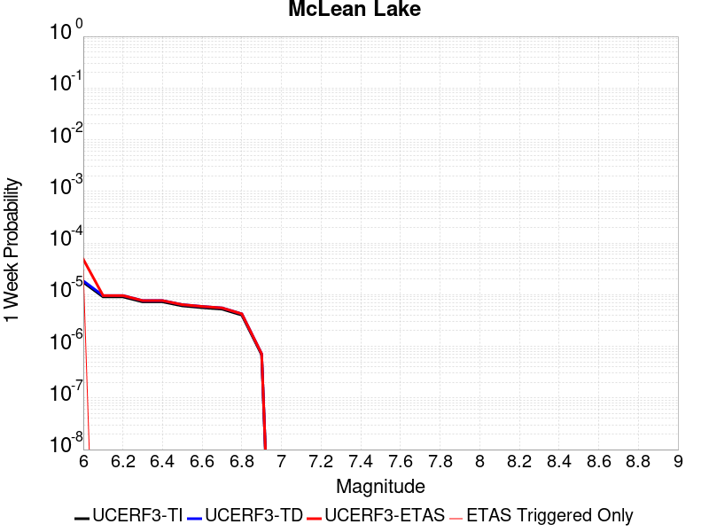 |  | 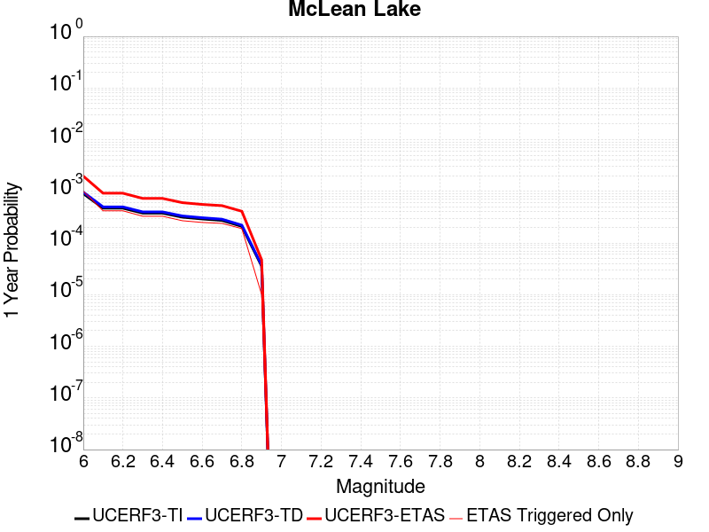 |  |

| Magnitude | 1 wk TI Prob | 1 wk TD Prob | 1 wk ETAS Prob | 1 wk ETAS/TD Gain | 1 wk ETAS Triggered Only | 1 mo TI Prob | 1 mo TD Prob | 1 mo ETAS Prob | 1 mo ETAS/TD Gain | 1 mo ETAS Triggered Only | 1 yr TI Prob | 1 yr TD Prob | 1 yr ETAS Prob | 1 yr ETAS/TD Gain | 1 yr ETAS Triggered Only | 10 yr TI Prob | 10 yr TD Prob | 10 yr ETAS Prob | 10 yr ETAS/TD Gain | 10 yr ETAS Triggered Only |
|-----|-----|-----|-----|-----|-----|-----|-----|-----|-----|-----|-----|-----|-----|-----|-----|-----|-----|-----|-----|-----|
| 6.0 | 1.7360222E-5 | 1.8502758E-5 | 4.8502203E-5 | 2.6213498 | 3.0E-5 | 7.439883E-5 | 7.92954E-5 | 1.8928669E-4 | 2.3871078 | 1.1E-4 | 9.0542925E-4 | 9.6504256E-4 | 0.0019740679 | 2.0455759 | 0.00101 | 0.009017491 | 0.00961336 | 0.012396347 | 1.2894915 | 0.00281 |
| 6.1 | 9.062689E-6 | 9.592714E-6 | 9.592714E-6 | 1.0 | 0.0 | 3.8839516E-5 | 4.1111034E-5 | 8.110939E-5 | 1.9729347 | 4.0E-5 | 4.727685E-4 | 5.004208E-4 | 9.202106E-4 | 1.8388736 | 4.2E-4 | 0.0047176396 | 0.0049938224 | 0.0064365813 | 1.2889087 | 0.00145 |
| 6.2 | 9.062689E-6 | 9.592714E-6 | 9.592714E-6 | 1.0 | 0.0 | 3.8839516E-5 | 4.1111034E-5 | 8.110939E-5 | 1.9729347 | 4.0E-5 | 4.727685E-4 | 5.004208E-4 | 9.202106E-4 | 1.8388736 | 4.2E-4 | 0.0047176396 | 0.0049938224 | 0.0064365813 | 1.2889087 | 0.00145 |
| 6.3 | 7.2575485E-6 | 7.668112E-6 | 7.668112E-6 | 1.0 | 0.0 | 3.110341E-5 | 3.2862965E-5 | 6.2861975E-5 | 1.9128518 | 3.0E-5 | 3.786182E-4 | 4.0004024E-4 | 7.2990824E-4 | 1.824587 | 3.3E-4 | 0.0037797375 | 0.003993906 | 0.005129353 | 1.2842948 | 0.00114 |
| 6.4 | 7.2575485E-6 | 7.668112E-6 | 7.668112E-6 | 1.0 | 0.0 | 3.110341E-5 | 3.2862965E-5 | 6.2861975E-5 | 1.9128518 | 3.0E-5 | 3.786182E-4 | 4.0004024E-4 | 7.2990824E-4 | 1.824587 | 3.3E-4 | 0.0037797375 | 0.003993906 | 0.005129353 | 1.2842948 | 0.00114 |
| 6.5 | 6.06582E-6 | 6.4042088E-6 | 6.4042088E-6 | 1.0 | 0.0 | 2.5996113E-5 | 2.7446356E-5 | 3.7446083E-5 | 1.3643371 | 1.0E-5 | 3.164567E-4 | 3.3411465E-4 | 6.0402445E-4 | 1.8078358 | 2.7E-4 | 0.0031600643 | 0.0033367618 | 0.004303525 | 1.289731 | 9.7E-4 |
| 6.6 | 5.598744E-6 | 5.910568E-6 | 5.910568E-6 | 1.0 | 0.0 | 2.3994397E-5 | 2.5330795E-5 | 3.533054E-5 | 1.3947664 | 1.0E-5 | 2.9209262E-4 | 3.0836518E-4 | 5.5828807E-4 | 1.810477 | 2.5E-4 | 0.0029170897 | 0.003080002 | 0.0039971685 | 1.2977811 | 9.2E-4 |
| 6.7 | 5.246996E-6 | 5.5394485E-6 | 5.5394485E-6 | 1.0 | 0.0 | 2.2486933E-5 | 2.3740315E-5 | 3.3740078E-5 | 1.4212145 | 1.0E-5 | 2.73744E-4 | 2.8900633E-4 | 5.28937E-4 | 1.8301916 | 2.4E-4 | 0.0027340704 | 0.0028869289 | 0.0037643884 | 1.3039422 | 8.8E-4 |
| 6.8 | 4.02324E-6 | 4.247124E-6 | 4.247124E-6 | 1.0 | 0.0 | 1.7242342E-5 | 1.8201867E-5 | 2.8201684E-5 | 1.5493842 | 1.0E-5 | 2.099053E-4 | 2.2159114E-4 | 4.1154903E-4 | 1.857245 | 1.9E-4 | 0.0020970714 | 0.0022142862 | 0.002872825 | 1.2974044 | 6.6E-4 |
| 6.9 | 6.835972E-7 | 7.140223E-7 | 7.140223E-7 | 1.0 | 0.0 | 2.9296991E-6 | 3.0600938E-6 | 3.0600938E-6 | 1.0 | 0.0 | 3.56685E-5 | 3.7256323E-5 | 4.725595E-5 | 1.2684008 | 1.0E-5 | 3.5662777E-4 | 3.7253203E-4 | 4.9248734E-4 | 1.3219999 | 1.2E-4 |

## Gravel Hills-Harper Lk
*[(top)](#table-of-contents)*

| 1 Week | 1 Month | 1 Year | 10 Year |
|-----|-----|-----|-----|
|  |  |  |  |

| Magnitude | 1 wk TI Prob | 1 wk TD Prob | 1 wk ETAS Prob | 1 wk ETAS/TD Gain | 1 wk ETAS Triggered Only | 1 mo TI Prob | 1 mo TD Prob | 1 mo ETAS Prob | 1 mo ETAS/TD Gain | 1 mo ETAS Triggered Only | 1 yr TI Prob | 1 yr TD Prob | 1 yr ETAS Prob | 1 yr ETAS/TD Gain | 1 yr ETAS Triggered Only | 10 yr TI Prob | 10 yr TD Prob | 10 yr ETAS Prob | 10 yr ETAS/TD Gain | 10 yr ETAS Triggered Only |
|-----|-----|-----|-----|-----|-----|-----|-----|-----|-----|-----|-----|-----|-----|-----|-----|-----|-----|-----|-----|-----|
| 6.0 | 3.0679566E-5 | 3.146842E-5 | 7.1467155E-5 | 2.2710757 | 4.0E-5 | 1.3147724E-4 | 1.348589E-4 | 3.2483327E-4 | 2.40869 | 1.9E-4 | 0.0015995599 | 0.0016408868 | 0.002689164 | 1.638848 | 0.00105 | 0.015880952 | 0.01630928 | 0.018679975 | 1.1453587 | 0.00241 |
| 6.1 | 3.0679566E-5 | 3.146842E-5 | 7.1467155E-5 | 2.2710757 | 4.0E-5 | 1.3147724E-4 | 1.348589E-4 | 3.2483327E-4 | 2.40869 | 1.9E-4 | 0.0015995599 | 0.0016408868 | 0.002689164 | 1.638848 | 0.00105 | 0.015880952 | 0.01630928 | 0.018679975 | 1.1453587 | 0.00241 |
| 6.2 | 1.514536E-5 | 1.3636506E-5 | 2.3636368E-5 | 1.7333157 | 1.0E-5 | 6.490707E-5 | 5.8440924E-5 | 9.8438584E-5 | 1.6844119 | 4.0E-5 | 7.8995706E-4 | 7.1129785E-4 | 0.0010310702 | 1.4495618 | 3.2E-4 | 0.007871548 | 0.0070914137 | 0.007796379 | 1.0994111 | 7.1E-4 |
| 6.3 | 1.514536E-5 | 1.3636506E-5 | 2.3636368E-5 | 1.7333157 | 1.0E-5 | 6.490707E-5 | 5.8440924E-5 | 9.8438584E-5 | 1.6844119 | 4.0E-5 | 7.8995706E-4 | 7.1129785E-4 | 0.0010310702 | 1.4495618 | 3.2E-4 | 0.007871548 | 0.0070914137 | 0.007796379 | 1.0994111 | 7.1E-4 |
| 6.4 | 1.2532521E-5 | 1.0690639E-5 | 1.0690639E-5 | 1.0 | 0.0 | 5.37097E-5 | 4.5816254E-5 | 5.5815795E-5 | 1.2182531 | 1.0E-5 | 6.537194E-4 | 5.5767596E-4 | 7.4757E-4 | 1.3405097 | 1.9E-4 | 0.0065179965 | 0.005563355 | 0.005990963 | 1.0768615 | 4.3E-4 |
| 6.5 | 1.1094058E-5 | 9.084438E-6 | 9.084438E-6 | 1.0 | 0.0 | 4.7545094E-5 | 3.8932747E-5 | 4.8932357E-5 | 1.2568432 | 1.0E-5 | 5.787078E-4 | 4.7390713E-4 | 5.938503E-4 | 1.2530942 | 1.2E-4 | 0.0057720304 | 0.0047293724 | 0.004998096 | 1.05682 | 2.7E-4 |
| 6.6 | 9.688328E-6 | 7.5323187E-6 | 7.5323187E-6 | 1.0 | 0.0 | 4.1520743E-5 | 3.2280983E-5 | 4.228066E-5 | 1.3097699 | 1.0E-5 | 5.053978E-4 | 3.929526E-4 | 4.6292512E-4 | 1.1780685 | 7.0E-5 | 0.0050424994 | 0.0039228345 | 0.0040622856 | 1.0355484 | 1.4E-4 |
| 6.7 | 8.974824E-6 | 6.7499664E-6 | 6.7499664E-6 | 1.0 | 0.0 | 3.8462964E-5 | 2.892812E-5 | 2.892812E-5 | 1.0 | 0.0 | 4.6818596E-4 | 3.5214514E-4 | 3.9213104E-4 | 1.1135495 | 4.0E-5 | 0.004672008 | 0.0035160924 | 0.0036157407 | 1.0283407 | 1.0E-4 |
| 6.8 | 7.4780046E-6 | 5.1166085E-6 | 5.1166085E-6 | 1.0 | 0.0 | 3.20482E-5 | 2.1928145E-5 | 2.1928145E-5 | 1.0 | 0.0 | 3.9011694E-4 | 2.6694385E-4 | 2.869385E-4 | 1.0749022 | 2.0E-5 | 0.0038943281 | 0.0026663702 | 0.0027062634 | 1.0149617 | 4.0E-5 |
| 6.9 | 6.3409307E-6 | 3.9078204E-6 | 3.9078204E-6 | 1.0 | 0.0 | 2.7175134E-5 | 1.67477E-5 | 1.67477E-5 | 1.0 | 0.0 | 3.3080703E-4 | 2.0388517E-4 | 2.2388108E-4 | 1.0980744 | 2.0E-5 | 0.0033031502 | 0.0020370793 | 0.0020769977 | 1.019596 | 4.0E-5 |
| 7.0 | 5.1239335E-6 | 2.6060832E-6 | 2.6060832E-6 | 1.0 | 0.0 | 2.195953E-5 | 1.1168881E-5 | 1.1168881E-5 | 1.0 | 0.0 | 2.6732447E-4 | 1.3597289E-4 | 1.4597154E-4 | 1.073534 | 1.0E-5 | 0.0026700313 | 0.0013589222 | 0.0013888815 | 1.0220463 | 3.0E-5 |
| 7.1 | 4.438899E-6 | 2.0986622E-6 | 2.0986622E-6 | 1.0 | 0.0 | 1.9023713E-5 | 8.994237E-6 | 8.994237E-6 | 1.0 | 0.0 | 2.315891E-4 | 1.0949955E-4 | 1.0949955E-4 | 1.0 | 0.0 | 0.002313479 | 0.001094478 | 0.001114456 | 1.0182536 | 2.0E-5 |
| 7.2 | 3.50367E-6 | 1.261711E-6 | 1.261711E-6 | 1.0 | 0.0 | 1.5015643E-5 | 5.407322E-6 | 5.407322E-6 | 1.0 | 0.0 | 1.8280011E-4 | 6.583224E-5 | 6.583224E-5 | 1.0 | 0.0 | 0.0018264982 | 6.581356E-4 | 6.7812245E-4 | 1.0303689 | 2.0E-5 |
| 7.3 | 2.561638E-6 | 7.120225E-7 | 7.120225E-7 | 1.0 | 0.0 | 1.0978401E-5 | 3.0515216E-6 | 3.0515216E-6 | 1.0 | 0.0 | 1.3365384E-4 | 3.715166E-5 | 3.715166E-5 | 1.0 | 0.0 | 0.0013357349 | 3.714565E-4 | 3.814528E-4 | 1.026911 | 1.0E-5 |
| 7.4 | 2.0368864E-6 | 5.305691E-7 | 5.305691E-7 | 1.0 | 0.0 | 8.729483E-6 | 2.2738657E-6 | 2.2738657E-6 | 1.0 | 0.0 | 1.06276275E-4 | 2.7683967E-5 | 2.7683967E-5 | 1.0 | 0.0 | 0.0010622547 | 2.7680572E-4 | 2.8680297E-4 | 1.0361164 | 1.0E-5 |
| 7.5 | 1.1681728E-6 | 3.60355E-7 | 3.60355E-7 | 1.0 | 0.0 | 5.0064455E-6 | 1.5443777E-6 | 1.5443777E-6 | 1.0 | 0.0 | 6.0951766E-5 | 1.880264E-5 | 1.880264E-5 | 1.0 | 0.0 | 6.093505E-4 | 1.8801096E-4 | 1.8801096E-4 | 1.0 | 0.0 |
| 7.6 | 1.3154387E-7 | 7.120354E-8 | 7.120354E-8 | 1.0 | 0.0 | 5.6375933E-7 | 3.0515798E-7 | 3.0515798E-7 | 1.0 | 0.0 | 6.863748E-6 | 3.7152938E-6 | 3.7152938E-6 | 1.0 | 0.0 | 6.863536E-5 | 3.7152477E-5 | 3.7152477E-5 | 1.0 | 0.0 |

## Goldstone Lake
*[(top)](#table-of-contents)*

| 1 Week | 1 Month | 1 Year | 10 Year |
|-----|-----|-----|-----|
|  |  |  |  |

| Magnitude | 1 wk TI Prob | 1 wk TD Prob | 1 wk ETAS Prob | 1 wk ETAS/TD Gain | 1 wk ETAS Triggered Only | 1 mo TI Prob | 1 mo TD Prob | 1 mo ETAS Prob | 1 mo ETAS/TD Gain | 1 mo ETAS Triggered Only | 1 yr TI Prob | 1 yr TD Prob | 1 yr ETAS Prob | 1 yr ETAS/TD Gain | 1 yr ETAS Triggered Only | 10 yr TI Prob | 10 yr TD Prob | 10 yr ETAS Prob | 10 yr ETAS/TD Gain | 10 yr ETAS Triggered Only |
|-----|-----|-----|-----|-----|-----|-----|-----|-----|-----|-----|-----|-----|-----|-----|-----|-----|-----|-----|-----|-----|
| 6.0 | 2.671352E-5 | 3.0379857E-5 | 7.037864E-5 | 2.3166218 | 4.0E-5 | 1.1448149E-4 | 1.30194E-4 | 2.8017448E-4 | 2.1519768 | 1.5E-4 | 0.001392921 | 0.0015841558 | 0.0023030152 | 1.4537808 | 7.2E-4 | 0.013842222 | 0.015748136 | 0.017667428 | 1.1218742 | 0.00195 |
| 6.1 | 2.671352E-5 | 3.0379857E-5 | 7.037864E-5 | 2.3166218 | 4.0E-5 | 1.1448149E-4 | 1.30194E-4 | 2.8017448E-4 | 2.1519768 | 1.5E-4 | 0.001392921 | 0.0015841558 | 0.0023030152 | 1.4537808 | 7.2E-4 | 0.013842222 | 0.015748136 | 0.017667428 | 1.1218742 | 0.00195 |
| 6.2 | 1.4197047E-5 | 1.6098144E-5 | 2.6097981E-5 | 1.6211797 | 1.0E-5 | 6.0843064E-5 | 6.8990776E-5 | 1.3898594E-4 | 2.0145583 | 7.0E-5 | 7.4051257E-4 | 8.3973765E-4 | 0.0011594689 | 1.3807514 | 3.2E-4 | 0.007380498 | 0.008375344 | 0.009347136 | 1.1160301 | 9.8E-4 |
| 6.3 | 1.4197047E-5 | 1.6098144E-5 | 2.6097981E-5 | 1.6211797 | 1.0E-5 | 6.0843064E-5 | 6.8990776E-5 | 1.3898594E-4 | 2.0145583 | 7.0E-5 | 7.4051257E-4 | 8.3973765E-4 | 0.0011594689 | 1.3807514 | 3.2E-4 | 0.007380498 | 0.008375344 | 0.009347136 | 1.1160301 | 9.8E-4 |
| 6.4 | 1.3238931E-5 | 1.5010221E-5 | 2.5010071E-5 | 1.6662027 | 1.0E-5 | 5.6737044E-5 | 6.432849E-5 | 1.3432399E-4 | 2.088095 | 7.0E-5 | 6.9055456E-4 | 7.830159E-4 | 0.0010727888 | 1.3700728 | 2.9E-4 | 0.006884126 | 0.0078121983 | 0.008725011 | 1.1168445 | 9.2E-4 |
| 6.5 | 1.3238931E-5 | 1.5010221E-5 | 2.5010071E-5 | 1.6662027 | 1.0E-5 | 5.6737044E-5 | 6.432849E-5 | 1.3432399E-4 | 2.088095 | 7.0E-5 | 6.9055456E-4 | 7.830159E-4 | 0.0010727888 | 1.3700728 | 2.9E-4 | 0.006884126 | 0.0078121983 | 0.008725011 | 1.1168445 | 9.2E-4 |
| 6.6 | 1.1328278E-5 | 1.28566735E-5 | 2.2856544E-5 | 1.7777961 | 1.0E-5 | 4.8548856E-5 | 5.5099405E-5 | 1.2509555E-4 | 2.2703612 | 7.0E-5 | 5.90922E-4 | 6.707245E-4 | 9.105635E-4 | 1.3575821 | 2.4E-4 | 0.0058935313 | 0.006696393 | 0.0074811024 | 1.1171839 | 7.9E-4 |
| 6.7 | 8.651175E-6 | 9.8257005E-6 | 1.9825602E-5 | 2.017729 | 1.0E-5 | 3.707594E-5 | 4.2109976E-5 | 9.210787E-5 | 2.1873171 | 5.0E-5 | 4.5130608E-4 | 5.126589E-4 | 7.1255636E-4 | 1.389923 | 2.0E-4 | 0.0045039062 | 0.005123643 | 0.005730518 | 1.1184459 | 6.1E-4 |
| 6.8 | 1.0215377E-6 | 1.1755332E-6 | 1.1755332E-6 | 1.0 | 0.0 | 4.378012E-6 | 5.0379904E-6 | 5.0379904E-6 | 1.0 | 0.0 | 5.3300988E-5 | 6.133592E-5 | 6.133592E-5 | 1.0 | 0.0 | 5.3288206E-4 | 6.132012E-4 | 6.431828E-4 | 1.0488936 | 3.0E-5 |
| 6.9 | 7.9360774E-7 | 9.283833E-7 | 9.283833E-7 | 1.0 | 0.0 | 3.4011714E-6 | 3.9787797E-6 | 3.9787797E-6 | 1.0 | 0.0 | 4.1408475E-5 | 4.844064E-5 | 4.844064E-5 | 1.0 | 0.0 | 4.140076E-4 | 4.843078E-4 | 4.9430295E-4 | 1.020638 | 1.0E-5 |
| 7.0 | 7.4382757E-7 | 8.747727E-7 | 8.747727E-7 | 1.0 | 0.0 | 3.1878285E-6 | 3.7490208E-6 | 3.7490208E-6 | 1.0 | 0.0 | 3.8811122E-5 | 4.564344E-5 | 4.564344E-5 | 1.0 | 0.0 | 3.8804344E-4 | 4.5634728E-4 | 4.6634272E-4 | 1.0219032 | 1.0E-5 |
| 7.1 | 6.4709513E-7 | 7.71163E-7 | 7.71163E-7 | 1.0 | 0.0 | 2.773262E-6 | 3.3049803E-6 | 3.3049803E-6 | 1.0 | 0.0 | 3.376394E-5 | 4.0237454E-5 | 4.0237454E-5 | 1.0 | 0.0 | 3.375881E-4 | 4.0230763E-4 | 4.123036E-4 | 1.0248466 | 1.0E-5 |
| 7.2 | 6.356704E-7 | 7.5886805E-7 | 7.5886805E-7 | 1.0 | 0.0 | 2.7242988E-6 | 3.252288E-6 | 3.252288E-6 | 1.0 | 0.0 | 3.3167835E-5 | 3.9595947E-5 | 3.9595947E-5 | 1.0 | 0.0 | 3.3162883E-4 | 3.9589487E-4 | 4.058909E-4 | 1.0252492 | 1.0E-5 |
| 7.3 | 5.7695723E-7 | 6.8968615E-7 | 6.8968615E-7 | 1.0 | 0.0 | 2.4726714E-6 | 2.9557948E-6 | 2.9557948E-6 | 1.0 | 0.0 | 3.0104358E-5 | 3.5986264E-5 | 3.5986264E-5 | 1.0 | 0.0 | 3.0100282E-4 | 3.598101E-4 | 3.698065E-4 | 1.0277824 | 1.0E-5 |
| 7.4 | 5.209647E-7 | 6.1937635E-7 | 6.1937635E-7 | 1.0 | 0.0 | 2.232704E-6 | 2.6544676E-6 | 2.6544676E-6 | 1.0 | 0.0 | 2.718283E-5 | 3.2317723E-5 | 3.2317723E-5 | 1.0 | 0.0 | 2.7179506E-4 | 3.2313578E-4 | 3.2313578E-4 | 1.0 | 0.0 |
| 7.5 | 4.512955E-7 | 5.349091E-7 | 5.349091E-7 | 1.0 | 0.0 | 1.934122E-6 | 2.2924658E-6 | 2.2924658E-6 | 1.0 | 0.0 | 2.3547682E-5 | 2.7910468E-5 | 2.7910468E-5 | 1.0 | 0.0 | 2.3545188E-4 | 2.7907494E-4 | 2.7907494E-4 | 1.0 | 0.0 |
| 7.6 | 2.21172E-7 | 2.6040513E-7 | 2.6040513E-7 | 1.0 | 0.0 | 9.478797E-7 | 1.1160216E-6 | 1.1160216E-6 | 1.0 | 0.0 | 1.1540374E-5 | 1.3587508E-5 | 1.3587508E-5 | 1.0 | 0.0 | 1.1539775E-4 | 1.3586959E-4 | 1.3586959E-4 | 1.0 | 0.0 |

## So Sierra Nevada
*[(top)](#table-of-contents)*

| 1 Week | 1 Month | 1 Year | 10 Year |
|-----|-----|-----|-----|
|  |  | 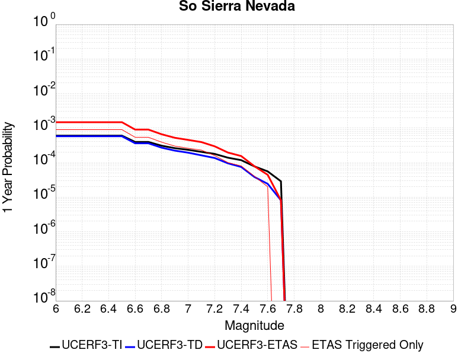 |  |

| Magnitude | 1 wk TI Prob | 1 wk TD Prob | 1 wk ETAS Prob | 1 wk ETAS/TD Gain | 1 wk ETAS Triggered Only | 1 mo TI Prob | 1 mo TD Prob | 1 mo ETAS Prob | 1 mo ETAS/TD Gain | 1 mo ETAS Triggered Only | 1 yr TI Prob | 1 yr TD Prob | 1 yr ETAS Prob | 1 yr ETAS/TD Gain | 1 yr ETAS Triggered Only | 10 yr TI Prob | 10 yr TD Prob | 10 yr ETAS Prob | 10 yr ETAS/TD Gain | 10 yr ETAS Triggered Only |
|-----|-----|-----|-----|-----|-----|-----|-----|-----|-----|-----|-----|-----|-----|-----|-----|-----|-----|-----|-----|-----|
| 6.0 | 1.15488665E-5 | 1.1080196E-5 | 6.107964E-5 | 5.5125055 | 5.0E-5 | 4.9494203E-5 | 4.7485762E-5 | 1.8747912E-4 | 3.9481122 | 1.4E-4 | 6.024253E-4 | 5.779986E-4 | 0.0014774783 | 2.5561974 | 9.0E-4 | 0.006007948 | 0.0057662213 | 0.0076850927 | 1.332778 | 0.00193 |
| 6.1 | 1.15488665E-5 | 1.1080196E-5 | 6.107964E-5 | 5.5125055 | 5.0E-5 | 4.9494203E-5 | 4.7485762E-5 | 1.8747912E-4 | 3.9481122 | 1.4E-4 | 6.024253E-4 | 5.779986E-4 | 0.0014774783 | 2.5561974 | 9.0E-4 | 0.006007948 | 0.0057662213 | 0.0076850927 | 1.332778 | 0.00193 |
| 6.2 | 1.15488665E-5 | 1.1080196E-5 | 6.107964E-5 | 5.5125055 | 5.0E-5 | 4.9494203E-5 | 4.7485762E-5 | 1.8747912E-4 | 3.9481122 | 1.4E-4 | 6.024253E-4 | 5.779986E-4 | 0.0014774783 | 2.5561974 | 9.0E-4 | 0.006007948 | 0.0057662213 | 0.0076850927 | 1.332778 | 0.00193 |
| 6.3 | 1.15488665E-5 | 1.1080196E-5 | 6.107964E-5 | 5.5125055 | 5.0E-5 | 4.9494203E-5 | 4.7485762E-5 | 1.8747912E-4 | 3.9481122 | 1.4E-4 | 6.024253E-4 | 5.779986E-4 | 0.0014774783 | 2.5561974 | 9.0E-4 | 0.006007948 | 0.0057662213 | 0.0076850927 | 1.332778 | 0.00193 |
| 6.4 | 1.15488665E-5 | 1.1080196E-5 | 6.107964E-5 | 5.5125055 | 5.0E-5 | 4.9494203E-5 | 4.7485762E-5 | 1.8747912E-4 | 3.9481122 | 1.4E-4 | 6.024253E-4 | 5.779986E-4 | 0.0014774783 | 2.5561974 | 9.0E-4 | 0.006007948 | 0.0057662213 | 0.0076850927 | 1.332778 | 0.00193 |
| 6.5 | 1.15488665E-5 | 1.1080196E-5 | 6.107964E-5 | 5.5125055 | 5.0E-5 | 4.9494203E-5 | 4.7485762E-5 | 1.8747912E-4 | 3.9481122 | 1.4E-4 | 6.024253E-4 | 5.779986E-4 | 0.0014774783 | 2.5561974 | 9.0E-4 | 0.006007948 | 0.0057662213 | 0.0076850927 | 1.332778 | 0.00193 |
| 6.6 | 7.587044E-6 | 6.9360117E-6 | 3.6935802E-5 | 5.3252225 | 3.0E-5 | 3.2515498E-5 | 2.9725441E-5 | 1.0972306E-4 | 3.6912172 | 8.0E-5 | 3.9580427E-4 | 3.6185008E-4 | 9.0165465E-4 | 2.4917908 | 5.4E-4 | 0.003951 | 0.0036129006 | 0.0046889987 | 1.2978488 | 0.00108 |
| 6.7 | 7.587044E-6 | 6.9360117E-6 | 3.6935802E-5 | 5.3252225 | 3.0E-5 | 3.2515498E-5 | 2.9725441E-5 | 1.0972306E-4 | 3.6912172 | 8.0E-5 | 3.9580427E-4 | 3.6185008E-4 | 9.0165465E-4 | 2.4917908 | 5.4E-4 | 0.003951 | 0.0036129006 | 0.0046889987 | 1.2978488 | 0.00108 |
| 6.8 | 5.9026956E-6 | 5.179699E-6 | 3.5179542E-5 | 6.791812 | 3.0E-5 | 2.5297022E-5 | 2.219853E-5 | 8.21972E-5 | 3.7028217 | 6.0E-5 | 3.0794772E-4 | 2.7023474E-4 | 6.6012936E-4 | 2.4427998 | 3.9E-4 | 0.0030752132 | 0.0026991775 | 0.00343718 | 1.2734176 | 7.4E-4 |
| 6.9 | 5.0118915E-6 | 4.252697E-6 | 4.252697E-6 | 1.0 | 0.0 | 2.1479358E-5 | 1.822572E-5 | 3.8225357E-5 | 2.0973303 | 2.0E-5 | 2.614798E-4 | 2.2187628E-4 | 5.2180974E-4 | 2.3518047 | 3.0E-4 | 0.0026117235 | 0.0022166201 | 0.002825268 | 1.2745837 | 6.1E-4 |
| 7.0 | 4.4924795E-6 | 3.7141706E-6 | 3.7141706E-6 | 1.0 | 0.0 | 1.925334E-5 | 1.5917782E-5 | 2.5917621E-5 | 1.6282183 | 1.0E-5 | 2.3438422E-4 | 1.9378238E-4 | 4.53732E-4 | 2.3414512 | 2.6E-4 | 0.0023413717 | 0.0019361969 | 0.00245519 | 1.2680477 | 5.2E-4 |
| 7.1 | 3.9118436E-6 | 3.1122083E-6 | 3.1122083E-6 | 1.0 | 0.0 | 1.6764936E-5 | 1.3337971E-5 | 2.3337838E-5 | 1.7497293 | 1.0E-5 | 2.0409399E-4 | 1.6237826E-4 | 3.923409E-4 | 2.4162157 | 2.3E-4 | 0.0020390663 | 0.0016226523 | 0.002031987 | 1.2522627 | 4.1E-4 |
| 7.2 | 3.4200818E-6 | 2.6056673E-6 | 2.6056673E-6 | 1.0 | 0.0 | 1.4657411E-5 | 1.1167101E-5 | 2.1166989E-5 | 1.8954777 | 1.0E-5 | 1.7843937E-4 | 1.3595147E-4 | 2.9592973E-4 | 2.1767306 | 1.6E-4 | 0.0017829615 | 0.0013587327 | 0.0016782979 | 1.2351936 | 3.2E-4 |
| 7.3 | 2.6593618E-6 | 1.8286062E-6 | 1.8286062E-6 | 1.0 | 0.0 | 1.13972155E-5 | 7.836862E-6 | 7.836862E-6 | 1.0 | 0.0 | 1.3875226E-4 | 9.540991E-5 | 1.9540037E-4 | 2.0480092 | 1.0E-4 | 0.0013866565 | 9.537184E-4 | 0.0011435372 | 1.1990303 | 1.9E-4 |
| 7.4 | 2.2577992E-6 | 1.4366076E-6 | 1.4366076E-6 | 1.0 | 0.0 | 9.676246E-6 | 6.1568767E-6 | 6.1568767E-6 | 1.0 | 0.0 | 1.1780193E-4 | 7.495765E-5 | 1.5495165E-4 | 2.0671892 | 8.0E-5 | 0.001177395 | 7.493487E-4 | 8.992363E-4 | 1.2000238 | 1.5E-4 |
| 7.5 | 1.489319E-6 | 7.355268E-7 | 7.355268E-7 | 1.0 | 0.0 | 6.3827797E-6 | 3.1522538E-6 | 3.1522538E-6 | 1.0 | 0.0 | 7.770758E-5 | 3.8378017E-5 | 7.8376484E-5 | 2.0422232 | 4.0E-5 | 7.7680405E-4 | 3.8371433E-4 | 4.6368365E-4 | 1.2084085 | 8.0E-5 |
| 7.6 | 1.0680322E-6 | 4.6606402E-7 | 4.6606402E-7 | 1.0 | 0.0 | 4.577273E-6 | 1.9974157E-6 | 1.9974157E-6 | 1.0 | 0.0 | 5.5726876E-5 | 2.4318268E-5 | 4.431778E-5 | 1.822407 | 2.0E-5 | 5.5712904E-4 | 2.4315632E-4 | 2.9314417E-4 | 1.205579 | 5.0E-5 |
| 7.7 | 5.509146E-7 | 1.5585482E-7 | 1.5585482E-7 | 1.0 | 0.0 | 2.3610605E-6 | 6.679491E-7 | 6.679491E-7 | 1.0 | 0.0 | 2.8745531E-5 | 8.132251E-6 | 8.132251E-6 | 1.0 | 0.0 | 2.8741814E-4 | 8.1319646E-5 | 8.1319646E-5 | 1.0 | 0.0 |

## Coyote Canyon
*[(top)](#table-of-contents)*

| 1 Week | 1 Month | 1 Year | 10 Year |
|-----|-----|-----|-----|
| 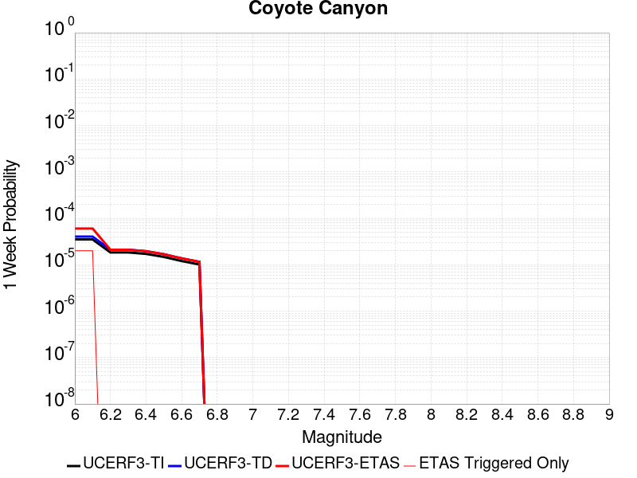 |  |  |  |

| Magnitude | 1 wk TI Prob | 1 wk TD Prob | 1 wk ETAS Prob | 1 wk ETAS/TD Gain | 1 wk ETAS Triggered Only | 1 mo TI Prob | 1 mo TD Prob | 1 mo ETAS Prob | 1 mo ETAS/TD Gain | 1 mo ETAS Triggered Only | 1 yr TI Prob | 1 yr TD Prob | 1 yr ETAS Prob | 1 yr ETAS/TD Gain | 1 yr ETAS Triggered Only | 10 yr TI Prob | 10 yr TD Prob | 10 yr ETAS Prob | 10 yr ETAS/TD Gain | 10 yr ETAS Triggered Only |
|-----|-----|-----|-----|-----|-----|-----|-----|-----|-----|-----|-----|-----|-----|-----|-----|-----|-----|-----|-----|-----|
| 6.0 | 3.5090034E-5 | 4.0369963E-5 | 6.0369155E-5 | 1.4953978 | 2.0E-5 | 1.503772E-4 | 1.7300405E-4 | 2.7298674E-4 | 1.5779212 | 1.0E-4 | 0.0018293047 | 0.0021045462 | 0.00264341 | 1.2560474 | 5.4E-4 | 0.018143194 | 0.02087209 | 0.0223212 | 1.0694281 | 0.00148 |
| 6.1 | 3.5090034E-5 | 4.0369963E-5 | 6.0369155E-5 | 1.4953978 | 2.0E-5 | 1.503772E-4 | 1.7300405E-4 | 2.7298674E-4 | 1.5779212 | 1.0E-4 | 0.0018293047 | 0.0021045462 | 0.00264341 | 1.2560474 | 5.4E-4 | 0.018143194 | 0.02087209 | 0.0223212 | 1.0694281 | 0.00148 |
| 6.2 | 1.841879E-5 | 2.1062599E-5 | 2.1062599E-5 | 1.0 | 0.0 | 7.8935285E-5 | 9.0265734E-5 | 1.2026302E-4 | 1.332322 | 3.0E-5 | 9.606133E-4 | 0.0010985332 | 0.0014081927 | 1.2818844 | 3.1E-4 | 0.0095647145 | 0.010941117 | 0.011762036 | 1.0750306 | 8.3E-4 |
| 6.3 | 1.841879E-5 | 2.1062599E-5 | 2.1062599E-5 | 1.0 | 0.0 | 7.8935285E-5 | 9.0265734E-5 | 1.2026302E-4 | 1.332322 | 3.0E-5 | 9.606133E-4 | 0.0010985332 | 0.0014081927 | 1.2818844 | 3.1E-4 | 0.0095647145 | 0.010941117 | 0.011762036 | 1.0750306 | 8.3E-4 |
| 6.4 | 1.712201E-5 | 1.9567804E-5 | 1.9567804E-5 | 1.0 | 0.0 | 7.337798E-5 | 8.385989E-5 | 1.1385738E-4 | 1.3577095 | 3.0E-5 | 8.930107E-4 | 0.0010206165 | 0.0013303001 | 1.3034279 | 3.1E-4 | 0.008894307 | 0.010169213 | 0.010980874 | 1.0798155 | 8.2E-4 |
| 6.5 | 1.4744935E-5 | 1.683919E-5 | 1.683919E-5 | 1.0 | 0.0 | 6.3191044E-5 | 7.216649E-5 | 1.02164326E-4 | 1.4156754 | 3.0E-5 | 7.6907943E-4 | 8.7836635E-4 | 0.0011681116 | 1.3298683 | 2.9E-4 | 0.007664232 | 0.008758144 | 0.009521401 | 1.0871482 | 7.7E-4 |
| 6.6 | 1.2017839E-5 | 1.3725899E-5 | 1.3725899E-5 | 1.0 | 0.0 | 5.150401E-5 | 5.8824455E-5 | 6.8823865E-5 | 1.1699873 | 1.0E-5 | 6.268809E-4 | 7.16041E-4 | 9.358835E-4 | 1.307025 | 2.2E-4 | 0.0062511545 | 0.007146034 | 0.0077814604 | 1.0889201 | 6.4E-4 |
| 6.7 | 1.00956095E-5 | 1.1535042E-5 | 1.1535042E-5 | 1.0 | 0.0 | 4.326618E-5 | 4.943545E-5 | 5.9434955E-5 | 1.202274 | 1.0E-5 | 5.266384E-4 | 6.0179736E-4 | 7.9168304E-4 | 1.3155309 | 1.9E-4 | 0.005253921 | 0.0060102064 | 0.0065767807 | 1.0942687 | 5.7E-4 |

## San Andreas (Mojave S)
*[(top)](#table-of-contents)*

| 1 Week | 1 Month | 1 Year | 10 Year |
|-----|-----|-----|-----|
|  |  |  |  |

| Magnitude | 1 wk TI Prob | 1 wk TD Prob | 1 wk ETAS Prob | 1 wk ETAS/TD Gain | 1 wk ETAS Triggered Only | 1 mo TI Prob | 1 mo TD Prob | 1 mo ETAS Prob | 1 mo ETAS/TD Gain | 1 mo ETAS Triggered Only | 1 yr TI Prob | 1 yr TD Prob | 1 yr ETAS Prob | 1 yr ETAS/TD Gain | 1 yr ETAS Triggered Only | 10 yr TI Prob | 10 yr TD Prob | 10 yr ETAS Prob | 10 yr ETAS/TD Gain | 10 yr ETAS Triggered Only |
|-----|-----|-----|-----|-----|-----|-----|-----|-----|-----|-----|-----|-----|-----|-----|-----|-----|-----|-----|-----|-----|
| 6.0 | 3.1064058E-4 | 6.7528774E-4 | 7.352472E-4 | 1.088791 | 6.0E-5 | 0.0013306376 | 0.0028910087 | 0.0030505462 | 1.055184 | 1.6E-4 | 0.016080605 | 0.034656145 | 0.03542842 | 1.0222839 | 8.0E-4 | 0.1496549 | 0.2868376 | 0.28783605 | 1.0034808 | 0.0014 |
| 6.1 | 3.1064058E-4 | 6.7528774E-4 | 7.352472E-4 | 1.088791 | 6.0E-5 | 0.0013306376 | 0.0028910087 | 0.0030505462 | 1.055184 | 1.6E-4 | 0.016080605 | 0.034656145 | 0.03542842 | 1.0222839 | 8.0E-4 | 0.1496549 | 0.2868376 | 0.28783605 | 1.0034808 | 0.0014 |
| 6.2 | 3.1064058E-4 | 6.7528774E-4 | 7.352472E-4 | 1.088791 | 6.0E-5 | 0.0013306376 | 0.0028910087 | 0.0030505462 | 1.055184 | 1.6E-4 | 0.016080605 | 0.034656145 | 0.03542842 | 1.0222839 | 8.0E-4 | 0.1496549 | 0.2868376 | 0.28783605 | 1.0034808 | 0.0014 |
| 6.3 | 3.1064058E-4 | 6.7528774E-4 | 7.352472E-4 | 1.088791 | 6.0E-5 | 0.0013306376 | 0.0028910087 | 0.0030505462 | 1.055184 | 1.6E-4 | 0.016080605 | 0.034656145 | 0.03542842 | 1.0222839 | 8.0E-4 | 0.1496549 | 0.2868376 | 0.28783605 | 1.0034808 | 0.0014 |
| 6.4 | 1.9872203E-4 | 4.3243993E-4 | 4.92414E-4 | 1.1386876 | 6.0E-5 | 8.5138786E-4 | 0.0018520259 | 0.0020017482 | 1.0808424 | 1.5E-4 | 0.010316478 | 0.022321431 | 0.023025358 | 1.031536 | 7.2E-4 | 0.098504856 | 0.19724585 | 0.19827338 | 1.0052093 | 0.00128 |
| 6.5 | 1.291105E-4 | 2.8813988E-4 | 3.3812548E-4 | 1.1734768 | 5.0E-5 | 5.5321335E-4 | 0.0012343036 | 0.0013441679 | 1.089009 | 1.1E-4 | 0.006714592 | 0.014924928 | 0.015535674 | 1.0409212 | 6.2E-4 | 0.065152965 | 0.13828829 | 0.13925341 | 1.006979 | 0.00112 |
| 6.6 | 1.291105E-4 | 2.8813988E-4 | 3.3812548E-4 | 1.1734768 | 5.0E-5 | 5.5321335E-4 | 0.0012343036 | 0.0013441679 | 1.089009 | 1.1E-4 | 0.006714592 | 0.014924928 | 0.015535674 | 1.0409212 | 6.2E-4 | 0.065152965 | 0.13828829 | 0.13925341 | 1.006979 | 0.00112 |
| 6.7 | 1.08001186E-4 | 2.4394269E-4 | 2.939305E-4 | 1.2049161 | 5.0E-5 | 4.6278012E-4 | 0.0010450503 | 0.0011549355 | 1.1051481 | 1.1E-4 | 0.0056198016 | 0.012649561 | 0.013241972 | 1.0468324 | 6.0E-4 | 0.054797906 | 0.11943314 | 0.12039296 | 1.0080365 | 0.00109 |
| 6.8 | 1.0624356E-4 | 2.3911761E-4 | 2.8910566E-4 | 1.2090521 | 5.0E-5 | 4.5525006E-4 | 0.0010243878 | 0.0011342751 | 1.1072712 | 1.1E-4 | 0.0055285925 | 0.012400877 | 0.012993436 | 1.0477837 | 6.0E-4 | 0.053930566 | 0.11738223 | 0.11834428 | 1.0081959 | 0.00109 |
| 6.9 | 1.0393785E-4 | 2.3281875E-4 | 2.828071E-4 | 1.2147093 | 5.0E-5 | 4.4537184E-4 | 9.974135E-4 | 0.0011073038 | 1.1101753 | 1.1E-4 | 0.0054089287 | 0.012076146 | 0.0126689 | 1.0490848 | 6.0E-4 | 0.05279156 | 0.114679605 | 0.115644604 | 1.0084147 | 0.00109 |
| 7.0 | 1.0155622E-4 | 2.2651139E-4 | 2.7650007E-4 | 1.2206894 | 5.0E-5 | 4.3516833E-4 | 9.704023E-4 | 0.0010802955 | 1.113245 | 1.1E-4 | 0.005285311 | 0.011750873 | 0.012343822 | 1.05046 | 6.0E-4 | 0.05161361 | 0.1119395 | 0.112907484 | 1.0086474 | 0.00109 |
| 7.1 | 9.885595E-5 | 2.193923E-4 | 2.6938133E-4 | 1.2278522 | 5.0E-5 | 4.2359953E-4 | 9.3991426E-4 | 0.0010498109 | 1.1169219 | 1.1E-4 | 0.0051451353 | 0.011383613 | 0.011976782 | 1.0521073 | 6.0E-4 | 0.05027629 | 0.108823694 | 0.10975943 | 1.0085987 | 0.00105 |
| 7.2 | 9.6411415E-5 | 2.1301924E-4 | 2.630086E-4 | 1.2346705 | 5.0E-5 | 4.1312634E-4 | 9.126205E-4 | 0.0010225201 | 1.120422 | 1.1E-4 | 0.005018219 | 0.011054731 | 0.011638208 | 1.0527809 | 5.9E-4 | 0.049064007 | 0.10601311 | 0.106942855 | 1.0087701 | 0.00104 |
| 7.3 | 9.1180635E-5 | 1.9528683E-4 | 2.4527707E-4 | 1.2559836 | 5.0E-5 | 3.907156E-4 | 8.3667523E-4 | 9.465832E-4 | 1.1313628 | 1.1E-4 | 0.004746591 | 0.0101390565 | 0.010713176 | 1.0566245 | 5.8E-4 | 0.046464786 | 0.098202206 | 0.09912204 | 1.0093668 | 0.00102 |
| 7.4 | 8.887388E-5 | 1.8776611E-4 | 2.3775673E-4 | 1.2662387 | 5.0E-5 | 3.8083247E-4 | 8.044638E-4 | 9.143753E-4 | 1.1366271 | 1.1E-4 | 0.0046267817 | 0.00975046 | 0.010314902 | 1.0578887 | 5.7E-4 | 0.045316286 | 0.09483534 | 0.09573145 | 1.0094491 | 9.9E-4 |
| 7.5 | 8.6750515E-5 | 1.8107575E-4 | 2.310667E-4 | 1.2760775 | 5.0E-5 | 3.7173493E-4 | 7.7580824E-4 | 8.8572287E-4 | 1.1416776 | 1.1E-4 | 0.004516484 | 0.009404644 | 0.009969284 | 1.0600383 | 5.7E-4 | 0.04425787 | 0.09179742 | 0.09269654 | 1.0097946 | 9.9E-4 |
| 7.6 | 8.453092E-5 | 1.7494464E-4 | 2.249359E-4 | 1.2857547 | 5.0E-5 | 3.6222505E-4 | 7.495473E-4 | 8.594649E-4 | 1.1466452 | 1.1E-4 | 0.0044011753 | 0.00908763 | 0.00965245 | 1.0621526 | 5.7E-4 | 0.04315024 | 0.08895424 | 0.089847066 | 1.010037 | 9.8E-4 |
| 7.7 | 8.259102E-5 | 1.7015988E-4 | 2.2015137E-4 | 1.2937913 | 5.0E-5 | 3.539135E-4 | 7.290529E-4 | 8.389727E-4 | 1.1507707 | 1.1E-4 | 0.004300386 | 0.008840162 | 0.009405124 | 1.0639085 | 5.7E-4 | 0.042181134 | 0.08670297 | 0.087598 | 1.0103229 | 9.8E-4 |
| 7.8 | 7.444844E-5 | 1.5333407E-4 | 1.9332794E-4 | 1.2608283 | 4.0E-5 | 3.1902574E-4 | 6.5698056E-4 | 7.569149E-4 | 1.1521115 | 1.0E-4 | 0.0038772223 | 0.007969453 | 0.008425787 | 1.0572604 | 4.6E-4 | 0.03810269 | 0.07851438 | 0.07922393 | 1.0090371 | 7.7E-4 |
| 7.9 | 5.2586525E-5 | 1.00405494E-4 | 1.20403485E-4 | 1.1991723 | 2.0E-5 | 2.2535135E-4 | 4.3023832E-4 | 4.9021246E-4 | 1.1393976 | 6.0E-5 | 0.0027402006 | 0.0052255816 | 0.005514066 | 1.0552062 | 2.9E-4 | 0.027066574 | 0.052359387 | 0.05280478 | 1.0085064 | 4.7E-4 |
| 8.0 | 3.379877E-5 | 5.4271262E-5 | 6.4270724E-5 | 1.1842495 | 1.0E-5 | 1.4484383E-4 | 2.325704E-4 | 2.6256344E-4 | 1.1289632 | 3.0E-5 | 0.0017620471 | 0.0028278697 | 0.002897672 | 1.0246836 | 7.0E-5 | 0.017481409 | 0.028931491 | 0.029028598 | 1.0033565 | 1.0E-4 |
| 8.1 | 1.8668277E-5 | 1.940311E-5 | 1.940311E-5 | 1.0 | 0.0 | 8.000444E-5 | 8.315354E-5 | 9.315271E-5 | 1.1202495 | 1.0E-5 | 9.736188E-4 | 0.0010119248 | 0.0010219148 | 1.0098722 | 1.0E-5 | 0.009693642 | 0.01084796 | 0.010857851 | 1.0009118 | 1.0E-5 |
| 8.2 | 8.541571E-6 | 5.497103E-6 | 5.497103E-6 | 1.0 | 0.0 | 3.660622E-5 | 2.35588E-5 | 2.35588E-5 | 1.0 | 0.0 | 4.455896E-4 | 2.8679072E-4 | 2.8679072E-4 | 1.0 | 0.0 | 0.0044469717 | 0.0032606535 | 0.0032606535 | 1.0 | 0.0 |
| 8.3 | 1.983087E-6 | 7.7188406E-7 | 7.7188406E-7 | 1.0 | 0.0 | 8.498917E-6 | 3.3080703E-6 | 3.3080703E-6 | 1.0 | 0.0 | 1.034694E-4 | 4.027503E-5 | 4.027503E-5 | 1.0 | 0.0 | 0.0010342124 | 4.7534908E-4 | 4.7534908E-4 | 1.0 | 0.0 |

## San Andreas (Mojave N)
*[(top)](#table-of-contents)*

| 1 Week | 1 Month | 1 Year | 10 Year |
|-----|-----|-----|-----|
|  |  |  | 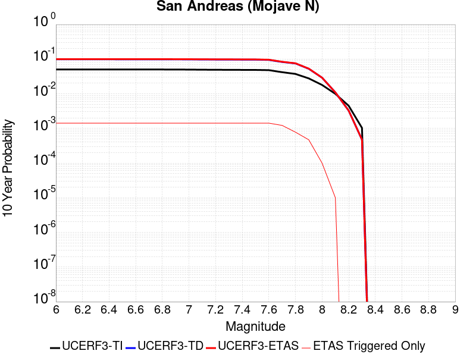 |

| Magnitude | 1 wk TI Prob | 1 wk TD Prob | 1 wk ETAS Prob | 1 wk ETAS/TD Gain | 1 wk ETAS Triggered Only | 1 mo TI Prob | 1 mo TD Prob | 1 mo ETAS Prob | 1 mo ETAS/TD Gain | 1 mo ETAS Triggered Only | 1 yr TI Prob | 1 yr TD Prob | 1 yr ETAS Prob | 1 yr ETAS/TD Gain | 1 yr ETAS Triggered Only | 10 yr TI Prob | 10 yr TD Prob | 10 yr ETAS Prob | 10 yr ETAS/TD Gain | 10 yr ETAS Triggered Only |
|-----|-----|-----|-----|-----|-----|-----|-----|-----|-----|-----|-----|-----|-----|-----|-----|-----|-----|-----|-----|-----|
| 6.0 | 9.877682E-5 | 1.9461679E-4 | 2.546051E-4 | 1.3082381 | 6.0E-5 | 4.2326056E-4 | 8.338056E-4 | 0.0010236471 | 1.2276809 | 1.9E-4 | 0.0051410277 | 0.010104459 | 0.010916173 | 1.0803323 | 8.2E-4 | 0.05023708 | 0.09858153 | 0.09986155 | 1.0129843 | 0.00142 |
| 6.1 | 9.877682E-5 | 1.9461679E-4 | 2.546051E-4 | 1.3082381 | 6.0E-5 | 4.2326056E-4 | 8.338056E-4 | 0.0010236471 | 1.2276809 | 1.9E-4 | 0.0051410277 | 0.010104459 | 0.010916173 | 1.0803323 | 8.2E-4 | 0.05023708 | 0.09858153 | 0.09986155 | 1.0129843 | 0.00142 |
| 6.2 | 9.877682E-5 | 1.9461679E-4 | 2.546051E-4 | 1.3082381 | 6.0E-5 | 4.2326056E-4 | 8.338056E-4 | 0.0010236471 | 1.2276809 | 1.9E-4 | 0.0051410277 | 0.010104459 | 0.010916173 | 1.0803323 | 8.2E-4 | 0.05023708 | 0.09858153 | 0.09986155 | 1.0129843 | 0.00142 |
| 6.3 | 9.877682E-5 | 1.9461679E-4 | 2.546051E-4 | 1.3082381 | 6.0E-5 | 4.2326056E-4 | 8.338056E-4 | 0.0010236471 | 1.2276809 | 1.9E-4 | 0.0051410277 | 0.010104459 | 0.010916173 | 1.0803323 | 8.2E-4 | 0.05023708 | 0.09858153 | 0.09986155 | 1.0129843 | 0.00142 |
| 6.4 | 9.877682E-5 | 1.9461679E-4 | 2.546051E-4 | 1.3082381 | 6.0E-5 | 4.2326056E-4 | 8.338056E-4 | 0.0010236471 | 1.2276809 | 1.9E-4 | 0.0051410277 | 0.010104459 | 0.010916173 | 1.0803323 | 8.2E-4 | 0.05023708 | 0.09858153 | 0.09986155 | 1.0129843 | 0.00142 |
| 6.5 | 9.861474E-5 | 1.9435427E-4 | 2.5434262E-4 | 1.3086545 | 6.0E-5 | 4.2256617E-4 | 8.326812E-4 | 0.0010225229 | 1.2279886 | 1.9E-4 | 0.0051326132 | 0.010090896 | 0.010902622 | 1.0804414 | 8.2E-4 | 0.050156746 | 0.09845929 | 0.09973947 | 1.0130022 | 0.00142 |
| 6.6 | 9.861474E-5 | 1.9435427E-4 | 2.5434262E-4 | 1.3086545 | 6.0E-5 | 4.2256617E-4 | 8.326812E-4 | 0.0010225229 | 1.2279886 | 1.9E-4 | 0.0051326132 | 0.010090896 | 0.010902622 | 1.0804414 | 8.2E-4 | 0.050156746 | 0.09845929 | 0.09973947 | 1.0130022 | 0.00142 |
| 6.7 | 9.8552715E-5 | 1.9425373E-4 | 2.5424207E-4 | 1.3088144 | 6.0E-5 | 4.223004E-4 | 8.322506E-4 | 0.0010220924 | 1.2281066 | 1.9E-4 | 0.0051293927 | 0.010085702 | 0.0108974315 | 1.0804832 | 8.2E-4 | 0.050125998 | 0.098412454 | 0.09969271 | 1.0130091 | 0.00142 |
| 6.8 | 9.8464974E-5 | 1.9410519E-4 | 2.5409352E-4 | 1.3090508 | 6.0E-5 | 4.219245E-4 | 8.316143E-4 | 0.0010214563 | 1.2282813 | 1.9E-4 | 0.0051248376 | 0.010078028 | 0.010889764 | 1.0805452 | 8.2E-4 | 0.05008251 | 0.098342426 | 0.09962278 | 1.0130193 | 0.00142 |
| 6.9 | 9.825824E-5 | 1.9378494E-4 | 2.5377332E-4 | 1.3095616 | 6.0E-5 | 4.2103877E-4 | 8.3024276E-4 | 0.0010200851 | 1.2286587 | 1.9E-4 | 0.0051141046 | 0.010061483 | 0.010873233 | 1.0806789 | 8.2E-4 | 0.049980022 | 0.09819142 | 0.09947199 | 1.0130415 | 0.00142 |
| 7.0 | 9.781462E-5 | 1.930979E-4 | 2.5308633E-4 | 1.3106632 | 6.0E-5 | 4.1913814E-4 | 8.273002E-4 | 0.001017143 | 1.2294728 | 1.9E-4 | 0.005091073 | 0.010025987 | 0.010837766 | 1.0809674 | 8.2E-4 | 0.04976007 | 0.097867586 | 0.099148616 | 1.0130894 | 0.00142 |
| 7.1 | 9.7121134E-5 | 1.9211406E-4 | 2.5210253E-4 | 1.3122544 | 6.0E-5 | 4.1616702E-4 | 8.230864E-4 | 0.0010129301 | 1.2306485 | 1.9E-4 | 0.005055068 | 0.009975156 | 0.010786976 | 1.0813842 | 8.2E-4 | 0.04941613 | 0.097403795 | 0.09868548 | 1.0131584 | 0.00142 |
| 7.2 | 9.663819E-5 | 1.9142123E-4 | 2.5140974E-4 | 1.3133849 | 6.0E-5 | 4.1409794E-4 | 8.20119E-4 | 0.0010099632 | 1.2314837 | 1.9E-4 | 0.0050299936 | 0.009939358 | 0.010751207 | 1.0816803 | 8.2E-4 | 0.049176537 | 0.09707684 | 0.09835899 | 1.0132076 | 0.00142 |
| 7.3 | 9.6277574E-5 | 1.909455E-4 | 2.5093404E-4 | 1.3141658 | 6.0E-5 | 4.125529E-4 | 8.1808143E-4 | 0.001007926 | 1.2320607 | 1.9E-4 | 0.0050112694 | 0.009914776 | 0.0107266465 | 1.0818849 | 8.2E-4 | 0.04899759 | 0.09684997 | 0.09813245 | 1.0132419 | 0.00142 |
| 7.4 | 9.593308E-5 | 1.9034237E-4 | 2.5033095E-4 | 1.3151615 | 6.0E-5 | 4.1107697E-4 | 8.154982E-4 | 0.0010053433 | 1.2327964 | 1.9E-4 | 0.0049933824 | 0.009883611 | 0.010695507 | 1.0821456 | 8.2E-4 | 0.04882661 | 0.096567824 | 0.097850695 | 1.0132847 | 0.00142 |
| 7.5 | 9.561707E-5 | 1.8980232E-4 | 2.4979093E-4 | 1.3160584 | 6.0E-5 | 4.0972308E-4 | 8.131851E-4 | 0.0010030306 | 1.2334591 | 1.9E-4 | 0.0049769743 | 0.009855705 | 0.010667623 | 1.0823805 | 8.2E-4 | 0.048669744 | 0.0963137 | 0.097596936 | 1.0133235 | 0.00142 |
| 7.6 | 9.418194E-5 | 1.8631996E-4 | 2.4630877E-4 | 1.3219666 | 6.0E-5 | 4.0357444E-4 | 7.9826993E-4 | 9.881182E-4 | 1.2378247 | 1.9E-4 | 0.004902454 | 0.009675738 | 0.010487805 | 1.0839281 | 8.2E-4 | 0.047957025 | 0.094694376 | 0.095979914 | 1.0135756 | 0.00142 |
| 7.7 | 8.202141E-5 | 1.607603E-4 | 2.1075227E-4 | 1.3109721 | 5.0E-5 | 3.51473E-4 | 6.8879087E-4 | 8.1870134E-4 | 1.1886065 | 1.3E-4 | 0.00427079 | 0.008353841 | 0.009057909 | 1.0842808 | 7.1E-4 | 0.04189639 | 0.08247718 | 0.083596565 | 1.013572 | 0.00122 |
| 7.8 | 7.2859846E-5 | 1.4565673E-4 | 1.856509E-4 | 1.2745782 | 4.0E-5 | 3.1221908E-4 | 6.240938E-4 | 7.240314E-4 | 1.1601323 | 1.0E-4 | 0.003794643 | 0.007571912 | 0.008038353 | 1.0616015 | 4.7E-4 | 0.037304975 | 0.07494667 | 0.075668216 | 1.0096273 | 7.8E-4 |
| 7.9 | 5.3874453E-5 | 1.00801924E-4 | 1.2079991E-4 | 1.1983889 | 2.0E-5 | 2.3087008E-4 | 4.3193673E-4 | 4.9191085E-4 | 1.1388493 | 6.0E-5 | 0.0028072202 | 0.0052461606 | 0.005534639 | 1.0549885 | 2.9E-4 | 0.02772022 | 0.05258583 | 0.053031113 | 1.0084678 | 4.7E-4 |
| 8.0 | 3.468538E-5 | 5.445956E-5 | 6.445902E-5 | 1.1836125 | 1.0E-5 | 1.4864317E-4 | 2.3337724E-4 | 2.6337025E-4 | 1.1285173 | 3.0E-5 | 0.0018082283 | 0.0028376677 | 0.002907469 | 1.0245981 | 7.0E-5 | 0.017935853 | 0.029045342 | 0.029142436 | 1.0033429 | 1.0E-4 |
| 8.1 | 1.9152367E-5 | 1.949763E-5 | 1.949763E-5 | 1.0 | 0.0 | 8.207899E-5 | 8.355859E-5 | 9.3557755E-5 | 1.1196665 | 1.0E-5 | 9.988535E-4 | 0.0010168517 | 0.0010268416 | 1.0098243 | 1.0E-5 | 0.009943757 | 0.010906066 | 0.010915956 | 1.000907 | 1.0E-5 |
| 8.2 | 8.643924E-6 | 5.5112705E-6 | 5.5112705E-6 | 1.0 | 0.0 | 3.704486E-5 | 2.3619517E-5 | 2.3619517E-5 | 1.0 | 0.0 | 4.5092785E-4 | 2.8752975E-4 | 2.8752975E-4 | 1.0 | 0.0 | 0.0045001395 | 0.0032686237 | 0.0032686237 | 1.0 | 0.0 |
| 8.3 | 1.983087E-6 | 7.7188406E-7 | 7.7188406E-7 | 1.0 | 0.0 | 8.498917E-6 | 3.3080703E-6 | 3.3080703E-6 | 1.0 | 0.0 | 1.034694E-4 | 4.027503E-5 | 4.027503E-5 | 1.0 | 0.0 | 0.0010342124 | 4.7534908E-4 | 4.7534908E-4 | 1.0 | 0.0 |

## Death Valley (So)
*[(top)](#table-of-contents)*

| 1 Week | 1 Month | 1 Year | 10 Year |
|-----|-----|-----|-----|
|  |  |  |  |

| Magnitude | 1 wk TI Prob | 1 wk TD Prob | 1 wk ETAS Prob | 1 wk ETAS/TD Gain | 1 wk ETAS Triggered Only | 1 mo TI Prob | 1 mo TD Prob | 1 mo ETAS Prob | 1 mo ETAS/TD Gain | 1 mo ETAS Triggered Only | 1 yr TI Prob | 1 yr TD Prob | 1 yr ETAS Prob | 1 yr ETAS/TD Gain | 1 yr ETAS Triggered Only | 10 yr TI Prob | 10 yr TD Prob | 10 yr ETAS Prob | 10 yr ETAS/TD Gain | 10 yr ETAS Triggered Only |
|-----|-----|-----|-----|-----|-----|-----|-----|-----|-----|-----|-----|-----|-----|-----|-----|-----|-----|-----|-----|-----|
| 6.0 | 2.0684236E-5 | 2.56223E-5 | 5.562153E-5 | 2.170825 | 3.0E-5 | 8.864371E-5 | 1.09805325E-4 | 1.7979764E-4 | 1.6374218 | 7.0E-5 | 0.0010787029 | 0.0013360769 | 0.0018753554 | 1.4036283 | 5.4E-4 | 0.010734817 | 0.013283722 | 0.014635524 | 1.1017637 | 0.00137 |
| 6.1 | 2.0684236E-5 | 2.56223E-5 | 5.562153E-5 | 2.170825 | 3.0E-5 | 8.864371E-5 | 1.09805325E-4 | 1.7979764E-4 | 1.6374218 | 7.0E-5 | 0.0010787029 | 0.0013360769 | 0.0018753554 | 1.4036283 | 5.4E-4 | 0.010734817 | 0.013283722 | 0.014635524 | 1.1017637 | 0.00137 |
| 6.2 | 2.0684236E-5 | 2.56223E-5 | 5.562153E-5 | 2.170825 | 3.0E-5 | 8.864371E-5 | 1.09805325E-4 | 1.7979764E-4 | 1.6374218 | 7.0E-5 | 0.0010787029 | 0.0013360769 | 0.0018753554 | 1.4036283 | 5.4E-4 | 0.010734817 | 0.013283722 | 0.014635524 | 1.1017637 | 0.00137 |
| 6.3 | 2.0240292E-5 | 2.5122325E-5 | 5.512157E-5 | 2.194127 | 3.0E-5 | 8.6741224E-5 | 1.0766276E-4 | 1.7765522E-4 | 1.6501085 | 7.0E-5 | 0.0010555626 | 0.0013100227 | 0.0018393283 | 1.4040432 | 5.3E-4 | 0.010505628 | 0.013026252 | 0.014319188 | 1.0992562 | 0.00131 |
| 6.4 | 2.0240292E-5 | 2.5122325E-5 | 5.512157E-5 | 2.194127 | 3.0E-5 | 8.6741224E-5 | 1.0766276E-4 | 1.7765522E-4 | 1.6501085 | 7.0E-5 | 0.0010555626 | 0.0013100227 | 0.0018393283 | 1.4040432 | 5.3E-4 | 0.010505628 | 0.013026252 | 0.014319188 | 1.0992562 | 0.00131 |
| 6.5 | 1.9962767E-5 | 2.4811543E-5 | 5.48108E-5 | 2.2090845 | 3.0E-5 | 8.55519E-5 | 1.0633095E-4 | 1.763235E-4 | 1.658252 | 7.0E-5 | 0.0010410968 | 0.0012938272 | 0.0018131544 | 1.4013884 | 5.2E-4 | 0.010362327 | 0.012866181 | 0.014139584 | 1.0989728 | 0.00129 |
| 6.6 | 1.8937297E-5 | 2.3315191E-5 | 5.3314492E-5 | 2.2866848 | 3.0E-5 | 8.115732E-5 | 9.991851E-5 | 1.5991251E-4 | 1.6004294 | 6.0E-5 | 9.876423E-4 | 0.0012158435 | 0.001685272 | 1.3860929 | 4.7E-4 | 0.009832645 | 0.012094965 | 0.013260693 | 1.0963813 | 0.00118 |
| 6.7 | 1.8621096E-5 | 2.2915787E-5 | 5.29151E-5 | 2.309111 | 3.0E-5 | 7.980225E-5 | 9.82069E-5 | 1.5820102E-4 | 1.610895 | 6.0E-5 | 9.711593E-4 | 0.0011950277 | 0.0016345019 | 1.3677523 | 4.4E-4 | 0.009669261 | 0.011889057 | 0.012995741 | 1.0930842 | 0.00112 |
| 6.8 | 1.7830353E-5 | 2.1809607E-5 | 5.180895E-5 | 2.3755107 | 3.0E-5 | 7.641356E-5 | 9.346647E-5 | 1.5346086E-4 | 1.6418815 | 6.0E-5 | 9.29938E-4 | 0.0011373743 | 0.0015469079 | 1.3600694 | 4.1E-4 | 0.009260561 | 0.011318374 | 0.012376264 | 1.0934665 | 0.00107 |
| 6.9 | 1.3135183E-5 | 1.530614E-5 | 3.5305835E-5 | 2.3066452 | 2.0E-5 | 5.6292425E-5 | 6.559613E-5 | 1.05593506E-4 | 1.609752 | 4.0E-5 | 6.8514474E-4 | 7.983467E-4 | 0.0010681312 | 1.3379289 | 2.7E-4 | 0.006830362 | 0.007955794 | 0.008660146 | 1.0885332 | 7.1E-4 |
| 7.0 | 1.1507512E-5 | 1.3155912E-5 | 2.315578E-5 | 1.7601045 | 1.0E-5 | 4.9316975E-5 | 5.638129E-5 | 8.63796E-5 | 1.5320613 | 3.0E-5 | 6.002687E-4 | 6.862318E-4 | 8.960877E-4 | 1.305809 | 2.1E-4 | 0.0059864987 | 0.006841829 | 0.007368203 | 1.0769347 | 5.3E-4 |
| 7.1 | 9.715903E-6 | 1.0866509E-5 | 2.08664E-5 | 1.9202487 | 1.0E-5 | 4.1638916E-5 | 4.6569945E-5 | 7.656855E-5 | 1.6441623 | 3.0E-5 | 5.068359E-4 | 5.668458E-4 | 6.967721E-4 | 1.2292093 | 1.3E-4 | 0.0050568148 | 0.0056544533 | 0.006002474 | 1.0615481 | 3.5E-4 |
| 7.2 | 9.233269E-6 | 1.0287449E-5 | 2.0287345E-5 | 1.9720483 | 1.0E-5 | 3.9570554E-5 | 4.4088345E-5 | 6.4087464E-5 | 1.4536146 | 2.0E-5 | 4.81665E-4 | 5.366476E-4 | 6.066101E-4 | 1.1303694 | 7.0E-5 | 0.0048062233 | 0.0053539486 | 0.0056026103 | 1.0464445 | 2.5E-4 |
| 7.3 | 8.8041315E-6 | 9.809208E-6 | 1.980911E-5 | 2.0194404 | 1.0E-5 | 3.7731446E-5 | 4.2038806E-5 | 5.2038387E-5 | 1.2378654 | 1.0E-5 | 4.592835E-4 | 5.1170646E-4 | 5.616809E-4 | 1.0976622 | 5.0E-5 | 0.0045833546 | 0.005105709 | 0.005314637 | 1.0409204 | 2.1E-4 |
| 7.4 | 8.708749E-6 | 9.708213E-6 | 1.9708115E-5 | 2.0300457 | 1.0E-5 | 3.7322676E-5 | 4.160599E-5 | 5.160557E-5 | 1.24034 | 1.0E-5 | 4.5430884E-4 | 5.0643936E-4 | 5.56414E-4 | 1.0986785 | 5.0E-5 | 0.004533812 | 0.0050532785 | 0.005252268 | 1.0393783 | 2.0E-4 |
| 7.5 | 8.612678E-6 | 9.605849E-6 | 1.9605754E-5 | 2.0410223 | 1.0E-5 | 3.6910955E-5 | 4.11673E-5 | 5.1166888E-5 | 1.2429012 | 1.0E-5 | 4.492982E-4 | 5.011008E-4 | 5.5107573E-4 | 1.0997304 | 5.0E-5 | 0.004483909 | 0.0050001345 | 0.0051991343 | 1.039799 | 2.0E-4 |
| 7.6 | 8.319024E-6 | 9.2849195E-6 | 1.9284827E-5 | 2.0770051 | 1.0E-5 | 3.5652476E-5 | 3.9791932E-5 | 4.979153E-5 | 1.2512972 | 1.0E-5 | 4.3398244E-4 | 4.8436326E-4 | 5.3433905E-4 | 1.1031783 | 5.0E-5 | 0.0043313587 | 0.0048334994 | 0.005022581 | 1.039119 | 1.9E-4 |
| 7.7 | 7.4718328E-6 | 8.346079E-6 | 1.8345996E-5 | 2.1981575 | 1.0E-5 | 3.2021748E-5 | 3.576844E-5 | 4.5768084E-5 | 1.279566 | 1.0E-5 | 3.8979502E-4 | 4.353978E-4 | 4.8537602E-4 | 1.1147875 | 5.0E-5 | 0.00389112 | 0.004345853 | 0.0045151142 | 1.0389477 | 1.7E-4 |
| 7.8 | 3.4586725E-7 | 3.648448E-7 | 3.648448E-7 | 1.0 | 0.0 | 1.4822873E-6 | 1.5636197E-6 | 1.5636197E-6 | 1.0 | 0.0 | 1.80467E-5 | 1.9036908E-5 | 1.9036908E-5 | 1.0 | 0.0 | 1.8045233E-4 | 1.9035321E-4 | 2.0035131E-4 | 1.052524 | 1.0E-5 |
| 7.9 | 2.5591178E-9 | 2.6697788E-9 | 2.6697788E-9 | 1.0 | 0.0 | 1.0967647E-8 | 1.144191E-8 | 1.144191E-8 | 1.0 | 0.0 | 1.335311E-7 | 1.3930524E-7 | 1.3930524E-7 | 1.0 | 0.0 | 1.3353102E-6 | 1.3930525E-6 | 1.3930525E-6 | 1.0 | 0.0 |

## Nelson Lake
*[(top)](#table-of-contents)*

| 1 Week | 1 Month | 1 Year | 10 Year |
|-----|-----|-----|-----|
| 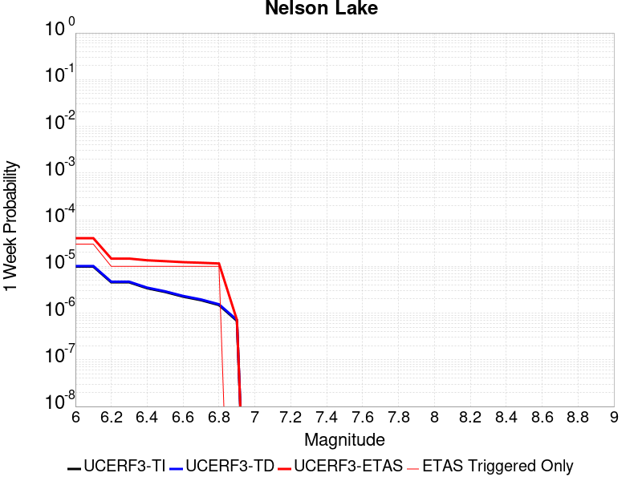 |  |  |  |

| Magnitude | 1 wk TI Prob | 1 wk TD Prob | 1 wk ETAS Prob | 1 wk ETAS/TD Gain | 1 wk ETAS Triggered Only | 1 mo TI Prob | 1 mo TD Prob | 1 mo ETAS Prob | 1 mo ETAS/TD Gain | 1 mo ETAS Triggered Only | 1 yr TI Prob | 1 yr TD Prob | 1 yr ETAS Prob | 1 yr ETAS/TD Gain | 1 yr ETAS Triggered Only | 10 yr TI Prob | 10 yr TD Prob | 10 yr ETAS Prob | 10 yr ETAS/TD Gain | 10 yr ETAS Triggered Only |
|-----|-----|-----|-----|-----|-----|-----|-----|-----|-----|-----|-----|-----|-----|-----|-----|-----|-----|-----|-----|-----|
| 6.0 | 9.913453E-6 | 1.0192522E-5 | 4.0192215E-5 | 3.9433043 | 3.0E-5 | 4.2485535E-5 | 4.3681564E-5 | 9.367938E-5 | 2.1445978 | 5.0E-5 | 5.1713863E-4 | 5.317036E-4 | 9.2149625E-4 | 1.7331014 | 3.9E-4 | 0.0051593683 | 0.0053053424 | 0.0065188697 | 1.2287369 | 0.00122 |
| 6.1 | 9.913453E-6 | 1.0192522E-5 | 4.0192215E-5 | 3.9433043 | 3.0E-5 | 4.2485535E-5 | 4.3681564E-5 | 9.367938E-5 | 2.1445978 | 5.0E-5 | 5.1713863E-4 | 5.317036E-4 | 9.2149625E-4 | 1.7331014 | 3.9E-4 | 0.0051593683 | 0.0053053424 | 0.0065188697 | 1.2287369 | 0.00122 |
| 6.2 | 4.5596407E-6 | 4.696444E-6 | 1.4696397E-5 | 3.1292605 | 1.0E-5 | 1.954117E-5 | 2.0127469E-5 | 4.0127066E-5 | 1.9936469 | 2.0E-5 | 2.3788778E-4 | 2.4502564E-4 | 3.749938E-4 | 1.5304267 | 1.3E-4 | 0.0023763329 | 0.002447681 | 0.0029664082 | 1.211926 | 5.2E-4 |
| 6.3 | 4.5596407E-6 | 4.696444E-6 | 1.4696397E-5 | 3.1292605 | 1.0E-5 | 1.954117E-5 | 2.0127469E-5 | 4.0127066E-5 | 1.9936469 | 2.0E-5 | 2.3788778E-4 | 2.4502564E-4 | 3.749938E-4 | 1.5304267 | 1.3E-4 | 0.0023763329 | 0.002447681 | 0.0029664082 | 1.211926 | 5.2E-4 |
| 6.4 | 3.4025713E-6 | 3.5100002E-6 | 1.3509965E-5 | 3.8489926 | 1.0E-5 | 1.4582367E-5 | 1.5042776E-5 | 2.5042626E-5 | 1.664761 | 1.0E-5 | 1.7752586E-4 | 1.8313125E-4 | 2.931111E-4 | 1.6005521 | 1.1E-4 | 0.001773841 | 0.0018298863 | 0.0021992093 | 1.2018284 | 3.7E-4 |
| 6.5 | 2.8352947E-6 | 2.927945E-6 | 1.2927916E-5 | 4.4153547 | 1.0E-5 | 1.2151207E-5 | 1.254828E-5 | 2.2548154E-5 | 1.796912 | 1.0E-5 | 1.479309E-4 | 1.5276535E-4 | 2.6274854E-4 | 1.7199486 | 1.1E-4 | 0.0014783246 | 0.0015266772 | 0.0018661581 | 1.2223659 | 3.4E-4 |
| 6.6 | 2.251518E-6 | 2.3291423E-6 | 1.2329119E-5 | 5.293416 | 1.0E-5 | 9.649328E-6 | 9.982004E-6 | 1.9981904E-5 | 2.001793 | 1.0E-5 | 1.1747423E-4 | 1.2152474E-4 | 2.0151502E-4 | 1.6582222 | 8.0E-5 | 0.0011741214 | 0.0012146446 | 0.0014743288 | 1.2137944 | 2.6E-4 |
| 6.7 | 1.8911853E-6 | 1.959205E-6 | 1.1959186E-5 | 6.1041007 | 1.0E-5 | 8.105055E-6 | 8.39657E-6 | 1.8396486E-5 | 2.1909525 | 1.0E-5 | 9.867457E-5 | 1.02224025E-4 | 1.622179E-4 | 1.5868862 | 6.0E-5 | 9.863076E-4 | 0.0010218276 | 0.0012416028 | 1.2150805 | 2.2E-4 |
| 6.8 | 1.4874814E-6 | 1.5438849E-6 | 1.154387E-5 | 7.4771566 | 1.0E-5 | 6.374905E-6 | 6.616636E-6 | 1.661657E-5 | 2.511332 | 1.0E-5 | 7.76117E-5 | 8.055508E-5 | 1.0055347E-4 | 1.2482573 | 2.0E-5 | 7.75846E-4 | 8.053099E-4 | 9.75173E-4 | 1.2109288 | 1.7E-4 |
| 6.9 | 6.835972E-7 | 7.140223E-7 | 7.140223E-7 | 1.0 | 0.0 | 2.9296991E-6 | 3.0600938E-6 | 3.0600938E-6 | 1.0 | 0.0 | 3.56685E-5 | 3.7256323E-5 | 4.725595E-5 | 1.2684008 | 1.0E-5 | 3.5662777E-4 | 3.7253203E-4 | 4.9248734E-4 | 1.3219999 | 1.2E-4 |

## Towne Pass
*[(top)](#table-of-contents)*

| 1 Week | 1 Month | 1 Year | 10 Year |
|-----|-----|-----|-----|
|  |  |  |  |

| Magnitude | 1 wk TI Prob | 1 wk TD Prob | 1 wk ETAS Prob | 1 wk ETAS/TD Gain | 1 wk ETAS Triggered Only | 1 mo TI Prob | 1 mo TD Prob | 1 mo ETAS Prob | 1 mo ETAS/TD Gain | 1 mo ETAS Triggered Only | 1 yr TI Prob | 1 yr TD Prob | 1 yr ETAS Prob | 1 yr ETAS/TD Gain | 1 yr ETAS Triggered Only | 10 yr TI Prob | 10 yr TD Prob | 10 yr ETAS Prob | 10 yr ETAS/TD Gain | 10 yr ETAS Triggered Only |
|-----|-----|-----|-----|-----|-----|-----|-----|-----|-----|-----|-----|-----|-----|-----|-----|-----|-----|-----|-----|-----|
| 6.0 | 3.849728E-6 | 3.894599E-6 | 2.3894521E-5 | 6.135297 | 2.0E-5 | 1.649873E-5 | 1.6691056E-5 | 1.16689385E-4 | 6.9911323 | 1.0E-4 | 2.0085352E-4 | 2.0319904E-4 | 6.9309946E-4 | 3.4109387 | 4.9E-4 | 0.0020067208 | 0.0020305614 | 0.003258064 | 1.6045138 | 0.00123 |
| 6.1 | 3.849728E-6 | 3.894599E-6 | 2.3894521E-5 | 6.135297 | 2.0E-5 | 1.649873E-5 | 1.6691056E-5 | 1.16689385E-4 | 6.9911323 | 1.0E-4 | 2.0085352E-4 | 2.0319904E-4 | 6.9309946E-4 | 3.4109387 | 4.9E-4 | 0.0020067208 | 0.0020305614 | 0.003258064 | 1.6045138 | 0.00123 |
| 6.2 | 3.849728E-6 | 3.894599E-6 | 2.3894521E-5 | 6.135297 | 2.0E-5 | 1.649873E-5 | 1.6691056E-5 | 1.16689385E-4 | 6.9911323 | 1.0E-4 | 2.0085352E-4 | 2.0319904E-4 | 6.9309946E-4 | 3.4109387 | 4.9E-4 | 0.0020067208 | 0.0020305614 | 0.003258064 | 1.6045138 | 0.00123 |
| 6.3 | 3.849728E-6 | 3.894599E-6 | 2.3894521E-5 | 6.135297 | 2.0E-5 | 1.649873E-5 | 1.6691056E-5 | 1.16689385E-4 | 6.9911323 | 1.0E-4 | 2.0085352E-4 | 2.0319904E-4 | 6.9309946E-4 | 3.4109387 | 4.9E-4 | 0.0020067208 | 0.0020305614 | 0.003258064 | 1.6045138 | 0.00123 |
| 6.4 | 3.849728E-6 | 3.894599E-6 | 2.3894521E-5 | 6.135297 | 2.0E-5 | 1.649873E-5 | 1.6691056E-5 | 1.16689385E-4 | 6.9911323 | 1.0E-4 | 2.0085352E-4 | 2.0319904E-4 | 6.9309946E-4 | 3.4109387 | 4.9E-4 | 0.0020067208 | 0.0020305614 | 0.003258064 | 1.6045138 | 0.00123 |
| 6.5 | 1.1953545E-6 | 1.2030748E-6 | 1.2030748E-6 | 1.0 | 0.0 | 5.1229376E-6 | 5.156025E-6 | 2.5155921E-5 | 4.878937 | 2.0E-5 | 6.236998E-5 | 6.277292E-5 | 1.9276475E-4 | 3.0708268 | 1.3E-4 | 6.235248E-4 | 6.2756357E-4 | 8.874004E-4 | 1.4140407 | 2.6E-4 |
| 6.6 | 1.1953545E-6 | 1.2030748E-6 | 1.2030748E-6 | 1.0 | 0.0 | 5.1229376E-6 | 5.156025E-6 | 2.5155921E-5 | 4.878937 | 2.0E-5 | 6.236998E-5 | 6.277292E-5 | 1.9276475E-4 | 3.0708268 | 1.3E-4 | 6.235248E-4 | 6.2756357E-4 | 8.874004E-4 | 1.4140407 | 2.6E-4 |
| 6.7 | 8.375951E-7 | 8.4108586E-7 | 8.4108586E-7 | 1.0 | 0.0 | 3.5896885E-6 | 3.604649E-6 | 1.3604613E-5 | 3.7741852 | 1.0E-5 | 4.370358E-5 | 4.3885775E-5 | 1.1388271E-4 | 2.5949798 | 7.0E-5 | 4.3694986E-4 | 4.387768E-4 | 5.88711E-4 | 1.3417095 | 1.5E-4 |
| 6.8 | 6.38041E-7 | 6.3923227E-7 | 6.3923227E-7 | 1.0 | 0.0 | 2.7344586E-6 | 2.7395643E-6 | 1.2739537E-5 | 4.6502056 | 1.0E-5 | 3.3291526E-5 | 3.3353725E-5 | 9.335172E-5 | 2.7988396 | 6.0E-5 | 3.3286537E-4 | 3.3349099E-4 | 4.5345095E-4 | 1.3597099 | 1.2E-4 |
| 6.9 | 5.3460053E-7 | 5.345488E-7 | 5.345488E-7 | 1.0 | 0.0 | 2.2911431E-6 | 2.2909214E-6 | 1.2290899E-5 | 5.3650455 | 1.0E-5 | 2.789431E-5 | 2.7891647E-5 | 7.7890254E-5 | 2.7926013 | 5.0E-5 | 2.789081E-4 | 2.7888478E-4 | 3.888541E-4 | 1.3943181 | 1.1E-4 |
| 7.0 | 3.557783E-7 | 3.5325542E-7 | 3.5325542E-7 | 1.0 | 0.0 | 1.5247632E-6 | 1.5139509E-6 | 1.15139355E-5 | 7.605224 | 1.0E-5 | 1.8563835E-5 | 1.8432205E-5 | 5.8431466E-5 | 3.1700747 | 4.0E-5 | 1.8562283E-4 | 1.843076E-4 | 2.4429653E-4 | 1.3254827 | 6.0E-5 |
| 7.1 | 3.037942E-7 | 3.0003415E-7 | 3.0003415E-7 | 1.0 | 0.0 | 1.3019744E-6 | 1.2858601E-6 | 1.1285847E-5 | 8.776886 | 1.0E-5 | 1.5851423E-5 | 1.5655241E-5 | 5.5654615E-5 | 3.5550148 | 4.0E-5 | 1.5850292E-4 | 1.5654213E-4 | 2.1653273E-4 | 1.3832234 | 6.0E-5 |
| 7.2 | 2.0808248E-7 | 2.0218674E-7 | 2.0218674E-7 | 1.0 | 0.0 | 8.917818E-7 | 8.665143E-7 | 1.0866505E-5 | 12.540481 | 1.0E-5 | 1.0857389E-5 | 1.0549766E-5 | 4.054945E-5 | 3.843635 | 3.0E-5 | 1.0856859E-4 | 1.0549311E-4 | 1.4548888E-4 | 1.3791317 | 4.0E-5 |
| 7.3 | 1.1162073E-7 | 1.0637519E-7 | 1.0637519E-7 | 1.0 | 0.0 | 4.7837443E-7 | 4.558936E-7 | 1.0455889E-5 | 22.934933 | 1.0E-5 | 5.8241935E-6 | 5.5504925E-6 | 3.5550325E-5 | 6.404896 | 3.0E-5 | 5.8240406E-5 | 5.5503737E-5 | 8.550207E-5 | 1.5404742 | 3.0E-5 |

## Lenwood-Lockhart-Old Woman Springs
*[(top)](#table-of-contents)*

| 1 Week | 1 Month | 1 Year | 10 Year |
|-----|-----|-----|-----|
|  |  |  |  |

| Magnitude | 1 wk TI Prob | 1 wk TD Prob | 1 wk ETAS Prob | 1 wk ETAS/TD Gain | 1 wk ETAS Triggered Only | 1 mo TI Prob | 1 mo TD Prob | 1 mo ETAS Prob | 1 mo ETAS/TD Gain | 1 mo ETAS Triggered Only | 1 yr TI Prob | 1 yr TD Prob | 1 yr ETAS Prob | 1 yr ETAS/TD Gain | 1 yr ETAS Triggered Only | 10 yr TI Prob | 10 yr TD Prob | 10 yr ETAS Prob | 10 yr ETAS/TD Gain | 10 yr ETAS Triggered Only |
|-----|-----|-----|-----|-----|-----|-----|-----|-----|-----|-----|-----|-----|-----|-----|-----|-----|-----|-----|-----|-----|
| 6.0 | 3.744542E-5 | 4.3965647E-5 | 7.396433E-5 | 1.682321 | 3.0E-5 | 1.604705E-4 | 1.8841156E-4 | 2.883927E-4 | 1.530653 | 1.0E-4 | 0.0019519776 | 0.0022916696 | 0.0027905237 | 1.2176815 | 5.0E-4 | 0.019349206 | 0.022698386 | 0.02368546 | 1.0434866 | 0.00101 |
| 6.1 | 3.744542E-5 | 4.3965647E-5 | 7.396433E-5 | 1.682321 | 3.0E-5 | 1.604705E-4 | 1.8841156E-4 | 2.883927E-4 | 1.530653 | 1.0E-4 | 0.0019519776 | 0.0022916696 | 0.0027905237 | 1.2176815 | 5.0E-4 | 0.019349206 | 0.022698386 | 0.02368546 | 1.0434866 | 0.00101 |
| 6.2 | 3.744542E-5 | 4.3965647E-5 | 7.396433E-5 | 1.682321 | 3.0E-5 | 1.604705E-4 | 1.8841156E-4 | 2.883927E-4 | 1.530653 | 1.0E-4 | 0.0019519776 | 0.0022916696 | 0.0027905237 | 1.2176815 | 5.0E-4 | 0.019349206 | 0.022698386 | 0.02368546 | 1.0434866 | 0.00101 |
| 6.3 | 2.1079984E-5 | 2.5354573E-5 | 3.535432E-5 | 1.3943962 | 1.0E-5 | 9.0339665E-5 | 1.0865804E-4 | 1.586526E-4 | 1.4601092 | 5.0E-5 | 0.0010993304 | 0.0013221288 | 0.0015518247 | 1.1737319 | 2.3E-4 | 0.010939079 | 0.013144844 | 0.013588929 | 1.0337839 | 4.5E-4 |
| 6.4 | 2.1079984E-5 | 2.5354573E-5 | 3.535432E-5 | 1.3943962 | 1.0E-5 | 9.0339665E-5 | 1.0865804E-4 | 1.586526E-4 | 1.4601092 | 5.0E-5 | 0.0010993304 | 0.0013221288 | 0.0015518247 | 1.1737319 | 2.3E-4 | 0.010939079 | 0.013144844 | 0.013588929 | 1.0337839 | 4.5E-4 |
| 6.5 | 1.7397282E-5 | 2.066329E-5 | 3.0663083E-5 | 1.48394 | 1.0E-5 | 7.455765E-5 | 8.855402E-5 | 1.2855048E-4 | 1.4516617 | 4.0E-5 | 9.073613E-4 | 0.0010776237 | 0.0012474405 | 1.1575845 | 1.7E-4 | 0.009036654 | 0.010725276 | 0.011051737 | 1.0304384 | 3.3E-4 |
| 6.6 | 1.52050325E-5 | 1.7680433E-5 | 2.7680257E-5 | 1.565587 | 1.0E-5 | 6.51628E-5 | 7.5771124E-5 | 1.15768096E-4 | 1.5278655 | 4.0E-5 | 7.9306826E-4 | 9.2213094E-4 | 0.0010819833 | 1.1733512 | 1.6E-4 | 0.007902439 | 0.009183909 | 0.009451428 | 1.0291293 | 2.7E-4 |
| 6.7 | 1.332523E-5 | 1.5264624E-5 | 2.5264471E-5 | 1.6550995 | 1.0E-5 | 5.7106878E-5 | 6.5418215E-5 | 1.05415595E-4 | 1.6114105 | 4.0E-5 | 6.950544E-4 | 7.9618156E-4 | 9.3607005E-4 | 1.1756994 | 1.4E-4 | 0.006928845 | 0.007933921 | 0.008172017 | 1.0300099 | 2.4E-4 |
| 6.8 | 1.1525329E-5 | 1.3031474E-5 | 1.3031474E-5 | 1.0 | 0.0 | 4.9393333E-5 | 5.5848002E-5 | 8.5846325E-5 | 1.5371423 | 3.0E-5 | 6.011979E-4 | 6.7974156E-4 | 8.096532E-4 | 1.1911192 | 1.3E-4 | 0.00599574 | 0.0067770756 | 0.0069856527 | 1.0307769 | 2.1E-4 |
| 6.9 | 1.0253909E-5 | 1.1514853E-5 | 1.1514853E-5 | 1.0 | 0.0 | 4.3944583E-5 | 4.934846E-5 | 7.934698E-5 | 1.6078917 | 3.0E-5 | 5.3489394E-4 | 6.006555E-4 | 7.0059544E-4 | 1.1663848 | 1.0E-4 | 0.0053360825 | 0.0059906994 | 0.006149741 | 1.026548 | 1.6E-4 |
| 7.0 | 8.104563E-6 | 8.991571E-6 | 8.991571E-6 | 1.0 | 0.0 | 3.4733377E-5 | 3.853475E-5 | 6.853359E-5 | 1.7784882 | 3.0E-5 | 4.2279682E-4 | 4.6906198E-4 | 5.4902444E-4 | 1.1704731 | 8.0E-5 | 0.0042199334 | 0.0046809674 | 0.004820312 | 1.0297683 | 1.4E-4 |
| 7.1 | 6.7986157E-6 | 7.5160438E-6 | 7.5160438E-6 | 1.0 | 0.0 | 2.91366E-5 | 3.221123E-5 | 4.2210908E-5 | 1.3104408 | 1.0E-5 | 3.5468035E-4 | 3.9210328E-4 | 4.420837E-4 | 1.1274674 | 5.0E-5 | 0.003541148 | 0.003914331 | 0.0040139398 | 1.0254471 | 1.0E-4 |
| 7.2 | 5.6893327E-6 | 6.2801914E-6 | 6.2801914E-6 | 1.0 | 0.0 | 2.4382627E-5 | 2.6914839E-5 | 3.691457E-5 | 1.3715322 | 1.0E-5 | 2.9681803E-4 | 3.2764088E-4 | 3.776245E-4 | 1.1525561 | 5.0E-5 | 0.002964219 | 0.003271777 | 0.0033714497 | 1.0304644 | 1.0E-4 |
| 7.3 | 4.253348E-6 | 4.707026E-6 | 4.707026E-6 | 1.0 | 0.0 | 1.8228506E-5 | 2.0172823E-5 | 3.0172623E-5 | 1.4957064 | 1.0E-5 | 2.2190946E-4 | 2.455783E-4 | 2.6557338E-4 | 1.0814204 | 2.0E-5 | 0.00221688 | 0.00245325 | 0.0025031273 | 1.0203311 | 5.0E-5 |
| 7.4 | 2.5448119E-6 | 2.8521038E-6 | 2.8521038E-6 | 1.0 | 0.0 | 1.0906291E-5 | 1.2223254E-5 | 1.2223254E-5 | 1.0 | 0.0 | 1.3277601E-4 | 1.488096E-4 | 1.5880812E-4 | 1.0671899 | 1.0E-5 | 0.001326967 | 0.0014872618 | 0.0014972469 | 1.0067137 | 1.0E-5 |
| 7.5 | 4.3706837E-8 | 4.5630955E-8 | 4.5630955E-8 | 1.0 | 0.0 | 1.8731501E-7 | 1.9556123E-7 | 1.9556123E-7 | 1.0 | 0.0 | 2.2805577E-6 | 2.380956E-6 | 2.380956E-6 | 1.0 | 0.0 | 2.2805343E-5 | 2.3809358E-5 | 2.3809358E-5 | 1.0 | 0.0 |

## San Andreas (San Bernardino N)
*[(top)](#table-of-contents)*

| 1 Week | 1 Month | 1 Year | 10 Year |
|-----|-----|-----|-----|
|  |  |  |  |

| Magnitude | 1 wk TI Prob | 1 wk TD Prob | 1 wk ETAS Prob | 1 wk ETAS/TD Gain | 1 wk ETAS Triggered Only | 1 mo TI Prob | 1 mo TD Prob | 1 mo ETAS Prob | 1 mo ETAS/TD Gain | 1 mo ETAS Triggered Only | 1 yr TI Prob | 1 yr TD Prob | 1 yr ETAS Prob | 1 yr ETAS/TD Gain | 1 yr ETAS Triggered Only | 10 yr TI Prob | 10 yr TD Prob | 10 yr ETAS Prob | 10 yr ETAS/TD Gain | 10 yr ETAS Triggered Only |
|-----|-----|-----|-----|-----|-----|-----|-----|-----|-----|-----|-----|-----|-----|-----|-----|-----|-----|-----|-----|-----|
| 6.0 | 1.4273766E-4 | 3.1657895E-4 | 3.3657262E-4 | 1.0631554 | 2.0E-5 | 6.115894E-4 | 0.0013560674 | 0.001415986 | 1.0441856 | 6.0E-5 | 0.0074207084 | 0.016386637 | 0.016750574 | 1.0222094 | 3.7E-4 | 0.07177748 | 0.15047675 | 0.15106292 | 1.0038954 | 6.9E-4 |
| 6.1 | 1.4273766E-4 | 3.1657895E-4 | 3.3657262E-4 | 1.0631554 | 2.0E-5 | 6.115894E-4 | 0.0013560674 | 0.001415986 | 1.0441856 | 6.0E-5 | 0.0074207084 | 0.016386637 | 0.016750574 | 1.0222094 | 3.7E-4 | 0.07177748 | 0.15047675 | 0.15106292 | 1.0038954 | 6.9E-4 |
| 6.2 | 1.4273766E-4 | 3.1657895E-4 | 3.3657262E-4 | 1.0631554 | 2.0E-5 | 6.115894E-4 | 0.0013560674 | 0.001415986 | 1.0441856 | 6.0E-5 | 0.0074207084 | 0.016386637 | 0.016750574 | 1.0222094 | 3.7E-4 | 0.07177748 | 0.15047675 | 0.15106292 | 1.0038954 | 6.9E-4 |
| 6.3 | 1.3730655E-4 | 3.0562485E-4 | 3.2561875E-4 | 1.0654197 | 2.0E-5 | 5.883239E-4 | 0.001309169 | 0.0013690904 | 1.0457706 | 6.0E-5 | 0.0071393442 | 0.015824046 | 0.01617835 | 1.0223901 | 3.6E-4 | 0.06914291 | 0.14577667 | 0.14635755 | 1.0039847 | 6.8E-4 |
| 6.4 | 1.3730655E-4 | 3.0562485E-4 | 3.2561875E-4 | 1.0654197 | 2.0E-5 | 5.883239E-4 | 0.001309169 | 0.0013690904 | 1.0457706 | 6.0E-5 | 0.0071393442 | 0.015824046 | 0.01617835 | 1.0223901 | 3.6E-4 | 0.06914291 | 0.14577667 | 0.14635755 | 1.0039847 | 6.8E-4 |
| 6.5 | 1.2942807E-4 | 2.8976568E-4 | 3.097599E-4 | 1.0690013 | 2.0E-5 | 5.545738E-4 | 0.0012412671 | 0.0013011926 | 1.0482777 | 6.0E-5 | 0.0067310524 | 0.015008957 | 0.0153635545 | 1.0236257 | 3.6E-4 | 0.06530788 | 0.13891955 | 0.13950509 | 1.0042149 | 6.8E-4 |
| 6.6 | 1.1125901E-4 | 2.5414478E-4 | 2.741397E-4 | 1.0786753 | 2.0E-5 | 4.767372E-4 | 0.0010887395 | 0.0011486742 | 1.0550497 | 6.0E-5 | 0.005788839 | 0.0131754745 | 0.013530731 | 1.0269635 | 3.6E-4 | 0.056403454 | 0.123209246 | 0.123796694 | 1.0047679 | 6.7E-4 |
| 6.7 | 1.02209575E-4 | 2.3549075E-4 | 2.5548605E-4 | 1.0849091 | 2.0E-5 | 4.3796748E-4 | 0.0010088572 | 0.0010687966 | 1.0594132 | 6.0E-5 | 0.0053192247 | 0.012214084 | 0.012569687 | 1.0291141 | 3.6E-4 | 0.051936906 | 0.11500142 | 0.11558551 | 1.005079 | 6.6E-4 |
| 6.8 | 9.610582E-5 | 2.2074205E-4 | 2.4073763E-4 | 1.0905834 | 2.0E-5 | 4.1181705E-4 | 9.4569504E-4 | 0.0010056383 | 1.0633854 | 6.0E-5 | 0.0050023515 | 0.011453319 | 0.011809196 | 1.0310719 | 3.6E-4 | 0.048912346 | 0.10840221 | 0.10899066 | 1.0054284 | 6.6E-4 |
| 6.9 | 9.3877505E-5 | 2.1529532E-4 | 2.3529102E-4 | 1.0928756 | 2.0E-5 | 4.0227012E-4 | 9.223686E-4 | 9.823133E-4 | 1.0649899 | 6.0E-5 | 0.0048866454 | 0.011172262 | 0.0115282405 | 1.0318626 | 3.6E-4 | 0.04780577 | 0.105992176 | 0.10658222 | 1.0055668 | 6.6E-4 |
| 7.0 | 9.1019785E-5 | 2.0856115E-4 | 2.2855698E-4 | 1.0958751 | 2.0E-5 | 3.900265E-4 | 8.9352793E-4 | 9.534743E-4 | 1.0670896 | 6.0E-5 | 0.0047382377 | 0.0108246645 | 0.011180768 | 1.0328974 | 3.6E-4 | 0.046384744 | 0.102961764 | 0.10355381 | 1.0057502 | 6.6E-4 |
| 7.1 | 8.771155E-5 | 2.0030304E-4 | 2.2029903E-4 | 1.0998287 | 2.0E-5 | 3.758525E-4 | 8.5815974E-4 | 9.181082E-4 | 1.069857 | 6.0E-5 | 0.0045664064 | 0.01039824 | 0.010754497 | 1.0342612 | 3.6E-4 | 0.044737056 | 0.09927276 | 0.09983121 | 1.0056254 | 6.2E-4 |
| 7.2 | 8.0830236E-5 | 1.8435127E-4 | 2.0434758E-4 | 1.1084685 | 2.0E-5 | 3.4636928E-4 | 7.898378E-4 | 8.497904E-4 | 1.075905 | 6.0E-5 | 0.0042088944 | 0.009573982 | 0.009920631 | 1.0362074 | 3.5E-4 | 0.041300658 | 0.09200184 | 0.09255572 | 1.0060203 | 6.1E-4 |
| 7.3 | 7.7668235E-5 | 1.7377833E-4 | 1.9377486E-4 | 1.1150692 | 2.0E-5 | 3.328214E-4 | 7.445518E-4 | 8.045071E-4 | 1.0805254 | 6.0E-5 | 0.0040445733 | 0.009027321 | 0.009374161 | 1.0384212 | 3.5E-4 | 0.03971748 | 0.08726679 | 0.087823555 | 1.0063801 | 6.1E-4 |
| 7.4 | 7.520177E-5 | 1.6597293E-4 | 1.859696E-4 | 1.1204816 | 2.0E-5 | 3.2225347E-4 | 7.1111874E-4 | 7.7107607E-4 | 1.0843141 | 6.0E-5 | 0.0039163795 | 0.008623568 | 0.008960636 | 1.0390868 | 3.4E-4 | 0.038480744 | 0.08372108 | 0.08425252 | 1.0063478 | 5.8E-4 |
| 7.5 | 7.274697E-5 | 1.5884354E-4 | 1.7884036E-4 | 1.12589 | 2.0E-5 | 3.1173544E-4 | 6.805805E-4 | 7.4053963E-4 | 1.0881001 | 6.0E-5 | 0.003788775 | 0.0082546435 | 0.008591837 | 1.040849 | 3.4E-4 | 0.03724827 | 0.08043605 | 0.0809694 | 1.0066307 | 5.8E-4 |
| 7.6 | 7.1185845E-5 | 1.5453836E-4 | 1.7453526E-4 | 1.1293977 | 2.0E-5 | 3.0504653E-4 | 6.6213915E-4 | 7.2209944E-4 | 1.0905554 | 6.0E-5 | 0.0037076178 | 0.0080317985 | 0.008369068 | 1.0419917 | 3.4E-4 | 0.036463667 | 0.07842452 | 0.078949824 | 1.0066981 | 5.7E-4 |
| 7.7 | 6.709961E-5 | 1.4361642E-4 | 1.6361354E-4 | 1.1392398 | 2.0E-5 | 2.8753807E-4 | 6.1535375E-4 | 6.7531684E-4 | 1.0974449 | 6.0E-5 | 0.003495157 | 0.007466235 | 0.0078036967 | 1.0451983 | 3.4E-4 | 0.034406938 | 0.07324966 | 0.073777914 | 1.0072116 | 5.7E-4 |
| 7.8 | 6.300812E-5 | 1.3243512E-4 | 1.5243248E-4 | 1.1509974 | 2.0E-5 | 2.7000686E-4 | 5.6745566E-4 | 6.274216E-4 | 1.1056751 | 6.0E-5 | 0.0032823787 | 0.0068869162 | 0.0072245747 | 1.049029 | 3.4E-4 | 0.032343175 | 0.06789981 | 0.06843111 | 1.0078248 | 5.7E-4 |
| 7.9 | 4.983037E-5 | 9.755923E-5 | 1.17557276E-4 | 1.2049837 | 2.0E-5 | 2.1354125E-4 | 4.18044E-4 | 4.7801892E-4 | 1.1434655 | 6.0E-5 | 0.0025967648 | 0.005077818 | 0.005356396 | 1.0548618 | 2.8E-4 | 0.025666296 | 0.050799936 | 0.05123657 | 1.0085951 | 4.6E-4 |
| 8.0 | 3.2211527E-5 | 5.3494157E-5 | 6.349362E-5 | 1.1869262 | 1.0E-5 | 1.380421E-4 | 2.2924054E-4 | 2.5923367E-4 | 1.130837 | 3.0E-5 | 0.0016793669 | 0.002787433 | 0.002857238 | 1.0250427 | 7.0E-5 | 0.016667323 | 0.02845379 | 0.028550943 | 1.0034145 | 1.0E-4 |
| 8.1 | 1.743376E-5 | 1.891248E-5 | 1.891248E-5 | 1.0 | 0.0 | 7.471398E-5 | 8.1050974E-5 | 9.105016E-5 | 1.1233691 | 1.0E-5 | 9.0926304E-4 | 9.863495E-4 | 9.963396E-4 | 1.0101284 | 1.0E-5 | 0.009055517 | 0.01052989 | 0.010539784 | 1.0009397 | 1.0E-5 |
| 8.2 | 7.831616E-6 | 5.188014E-6 | 5.188014E-6 | 1.0 | 0.0 | 3.3563636E-5 | 2.2234157E-5 | 2.2234157E-5 | 1.0 | 0.0 | 4.0856065E-4 | 2.706673E-4 | 2.706673E-4 | 1.0 | 0.0 | 0.004078103 | 0.0030597039 | 0.0030597039 | 1.0 | 0.0 |
| 8.3 | 1.983087E-6 | 7.7188406E-7 | 7.7188406E-7 | 1.0 | 0.0 | 8.498917E-6 | 3.3080703E-6 | 3.3080703E-6 | 1.0 | 0.0 | 1.034694E-4 | 4.027503E-5 | 4.027503E-5 | 1.0 | 0.0 | 0.0010342124 | 4.7534908E-4 | 4.7534908E-4 | 1.0 | 0.0 |

## Bicycle Lake
*[(top)](#table-of-contents)*

| 1 Week | 1 Month | 1 Year | 10 Year |
|-----|-----|-----|-----|
|  |  |  |  |

| Magnitude | 1 wk TI Prob | 1 wk TD Prob | 1 wk ETAS Prob | 1 wk ETAS/TD Gain | 1 wk ETAS Triggered Only | 1 mo TI Prob | 1 mo TD Prob | 1 mo ETAS Prob | 1 mo ETAS/TD Gain | 1 mo ETAS Triggered Only | 1 yr TI Prob | 1 yr TD Prob | 1 yr ETAS Prob | 1 yr ETAS/TD Gain | 1 yr ETAS Triggered Only | 10 yr TI Prob | 10 yr TD Prob | 10 yr ETAS Prob | 10 yr ETAS/TD Gain | 10 yr ETAS Triggered Only |
|-----|-----|-----|-----|-----|-----|-----|-----|-----|-----|-----|-----|-----|-----|-----|-----|-----|-----|-----|-----|-----|
| 6.0 | 1.9621975E-5 | 2.2099668E-5 | 2.2099668E-5 | 1.0 | 0.0 | 8.4091465E-5 | 9.471019E-5 | 1.0470924E-4 | 1.1055753 | 1.0E-5 | 0.0010233327 | 0.0011526216 | 0.0014023334 | 1.2166469 | 2.5E-4 | 0.01018633 | 0.0114797475 | 0.012161826 | 1.0594158 | 6.9E-4 |
| 6.1 | 1.9621975E-5 | 2.2099668E-5 | 2.2099668E-5 | 1.0 | 0.0 | 8.4091465E-5 | 9.471019E-5 | 1.0470924E-4 | 1.1055753 | 1.0E-5 | 0.0010233327 | 0.0011526216 | 0.0014023334 | 1.2166469 | 2.5E-4 | 0.01018633 | 0.0114797475 | 0.012161826 | 1.0594158 | 6.9E-4 |
| 6.2 | 9.9971285E-6 | 1.1256955E-5 | 1.1256955E-5 | 1.0 | 0.0 | 4.2844134E-5 | 4.8243495E-5 | 5.8243015E-5 | 1.2072718 | 1.0E-5 | 5.2150246E-4 | 5.872583E-4 | 7.471643E-4 | 1.2722925 | 1.6E-4 | 0.0052028033 | 0.0058621704 | 0.0063294154 | 1.0797051 | 4.7E-4 |
| 6.3 | 9.589428E-6 | 1.079961E-5 | 1.079961E-5 | 1.0 | 0.0 | 4.10969E-5 | 4.6283516E-5 | 5.6283054E-5 | 1.2160497 | 1.0E-5 | 5.002399E-4 | 5.6340796E-4 | 7.2331785E-4 | 1.283826 | 1.6E-4 | 0.0049911533 | 0.005624887 | 0.0060922434 | 1.0830872 | 4.7E-4 |
| 6.4 | 9.589428E-6 | 1.079961E-5 | 1.079961E-5 | 1.0 | 0.0 | 4.10969E-5 | 4.6283516E-5 | 5.6283054E-5 | 1.2160497 | 1.0E-5 | 5.002399E-4 | 5.6340796E-4 | 7.2331785E-4 | 1.283826 | 1.6E-4 | 0.0049911533 | 0.005624887 | 0.0060922434 | 1.0830872 | 4.7E-4 |
| 6.5 | 5.557707E-6 | 6.286366E-6 | 6.286366E-6 | 1.0 | 0.0 | 2.3818526E-5 | 2.6941441E-5 | 3.6941172E-5 | 1.3711654 | 1.0E-5 | 2.8995197E-4 | 3.2798958E-4 | 4.479502E-4 | 1.3657453 | 1.2E-4 | 0.0028957394 | 0.0032776915 | 0.003566741 | 1.0881869 | 2.9E-4 |
| 6.6 | 4.8742945E-6 | 5.513961E-6 | 5.513961E-6 | 1.0 | 0.0 | 2.0889667E-5 | 2.3631193E-5 | 2.3631193E-5 | 1.0 | 0.0 | 2.54302E-4 | 2.87698E-4 | 3.8766925E-4 | 1.3474867 | 1.0E-4 | 0.002540112 | 0.002875825 | 0.0031450486 | 1.0936161 | 2.7E-4 |
| 6.7 | 3.991108E-6 | 4.5164616E-6 | 4.5164616E-6 | 1.0 | 0.0 | 1.7104636E-5 | 1.9356265E-5 | 1.9356265E-5 | 1.0 | 0.0 | 2.0822904E-4 | 2.3566252E-4 | 3.05646E-4 | 1.2969649 | 7.0E-5 | 0.0020803404 | 0.0023566252 | 0.0025761067 | 1.0931338 | 2.2E-4 |

## Garlic Springs
*[(top)](#table-of-contents)*

| 1 Week | 1 Month | 1 Year | 10 Year |
|-----|-----|-----|-----|
|  |  |  |  |

| Magnitude | 1 wk TI Prob | 1 wk TD Prob | 1 wk ETAS Prob | 1 wk ETAS/TD Gain | 1 wk ETAS Triggered Only | 1 mo TI Prob | 1 mo TD Prob | 1 mo ETAS Prob | 1 mo ETAS/TD Gain | 1 mo ETAS Triggered Only | 1 yr TI Prob | 1 yr TD Prob | 1 yr ETAS Prob | 1 yr ETAS/TD Gain | 1 yr ETAS Triggered Only | 10 yr TI Prob | 10 yr TD Prob | 10 yr ETAS Prob | 10 yr ETAS/TD Gain | 10 yr ETAS Triggered Only |
|-----|-----|-----|-----|-----|-----|-----|-----|-----|-----|-----|-----|-----|-----|-----|-----|-----|-----|-----|-----|-----|
| 6.0 | 1.6760017E-5 | 1.8778932E-5 | 2.8778744E-5 | 1.5325017 | 1.0E-5 | 7.182667E-5 | 8.0479316E-5 | 1.104769E-4 | 1.3727366 | 3.0E-5 | 8.7413884E-4 | 9.795127E-4 | 0.0012991992 | 1.3263731 | 3.2E-4 | 0.008707083 | 0.009763501 | 0.010466568 | 1.0720098 | 7.1E-4 |
| 6.1 | 9.852767E-6 | 1.0974746E-5 | 1.0974746E-5 | 1.0 | 0.0 | 4.222546E-5 | 4.703418E-5 | 4.703418E-5 | 1.0 | 0.0 | 5.139737E-4 | 5.7256164E-4 | 7.2247576E-4 | 1.2618306 | 1.5E-4 | 0.005127866 | 0.0057178247 | 0.0061254804 | 1.0712956 | 4.1E-4 |
| 6.2 | 9.852767E-6 | 1.0974746E-5 | 1.0974746E-5 | 1.0 | 0.0 | 4.222546E-5 | 4.703418E-5 | 4.703418E-5 | 1.0 | 0.0 | 5.139737E-4 | 5.7256164E-4 | 7.2247576E-4 | 1.2618306 | 1.5E-4 | 0.005127866 | 0.0057178247 | 0.0061254804 | 1.0712956 | 4.1E-4 |
| 6.3 | 4.3167724E-6 | 4.7785024E-6 | 4.7785024E-6 | 1.0 | 0.0 | 1.8500323E-5 | 2.0479267E-5 | 2.0479267E-5 | 1.0 | 0.0 | 2.2521814E-4 | 2.4932958E-4 | 3.093146E-4 | 1.2405853 | 6.0E-5 | 0.0022499003 | 0.002492757 | 0.0026324082 | 1.0560228 | 1.4E-4 |
| 6.4 | 4.3167724E-6 | 4.7785024E-6 | 4.7785024E-6 | 1.0 | 0.0 | 1.8500323E-5 | 2.0479267E-5 | 2.0479267E-5 | 1.0 | 0.0 | 2.2521814E-4 | 2.4932958E-4 | 3.093146E-4 | 1.2405853 | 6.0E-5 | 0.0022499003 | 0.002492757 | 0.0026324082 | 1.0560228 | 1.4E-4 |
| 6.5 | 4.3167724E-6 | 4.7785024E-6 | 4.7785024E-6 | 1.0 | 0.0 | 1.8500323E-5 | 2.0479267E-5 | 2.0479267E-5 | 1.0 | 0.0 | 2.2521814E-4 | 2.4932958E-4 | 3.093146E-4 | 1.2405853 | 6.0E-5 | 0.0022499003 | 0.002492757 | 0.0026324082 | 1.0560228 | 1.4E-4 |
| 6.6 | 4.301311E-6 | 4.7613694E-6 | 4.7613694E-6 | 1.0 | 0.0 | 1.8434059E-5 | 2.040584E-5 | 2.040584E-5 | 1.0 | 0.0 | 2.2441156E-4 | 2.484358E-4 | 3.084209E-4 | 1.2414511 | 6.0E-5 | 0.0022418506 | 0.0024838394 | 0.0026234917 | 1.0562243 | 1.4E-4 |
| 6.7 | 3.8599724E-6 | 4.2714823E-6 | 4.2714823E-6 | 1.0 | 0.0 | 1.6542634E-5 | 1.8306351E-5 | 1.8306351E-5 | 1.0 | 0.0 | 2.0138794E-4 | 2.2287984E-4 | 2.8286647E-4 | 1.2691433 | 6.0E-5 | 0.0020120554 | 0.0022287983 | 0.0023585085 | 1.0581974 | 1.3E-4 |

## Paradise
*[(top)](#table-of-contents)*

| 1 Week | 1 Month | 1 Year | 10 Year |
|-----|-----|-----|-----|
|  |  |  |  |

| Magnitude | 1 wk TI Prob | 1 wk TD Prob | 1 wk ETAS Prob | 1 wk ETAS/TD Gain | 1 wk ETAS Triggered Only | 1 mo TI Prob | 1 mo TD Prob | 1 mo ETAS Prob | 1 mo ETAS/TD Gain | 1 mo ETAS Triggered Only | 1 yr TI Prob | 1 yr TD Prob | 1 yr ETAS Prob | 1 yr ETAS/TD Gain | 1 yr ETAS Triggered Only | 10 yr TI Prob | 10 yr TD Prob | 10 yr ETAS Prob | 10 yr ETAS/TD Gain | 10 yr ETAS Triggered Only |
|-----|-----|-----|-----|-----|-----|-----|-----|-----|-----|-----|-----|-----|-----|-----|-----|-----|-----|-----|-----|-----|
| 6.0 | 1.4851273E-5 | 1.6695827E-5 | 3.6695496E-5 | 2.197884 | 2.0E-5 | 6.364676E-5 | 7.1551716E-5 | 1.0154957E-4 | 1.4192472 | 3.0E-5 | 7.7462377E-4 | 8.7081763E-4 | 0.0010406696 | 1.1950488 | 1.7E-4 | 0.0077192914 | 0.008676433 | 0.00934062 | 1.0765507 | 6.7E-4 |
| 6.1 | 1.4851273E-5 | 1.6695827E-5 | 3.6695496E-5 | 2.197884 | 2.0E-5 | 6.364676E-5 | 7.1551716E-5 | 1.0154957E-4 | 1.4192472 | 3.0E-5 | 7.7462377E-4 | 8.7081763E-4 | 0.0010406696 | 1.1950488 | 1.7E-4 | 0.0077192914 | 0.008676433 | 0.00934062 | 1.0765507 | 6.7E-4 |
| 6.2 | 1.4851273E-5 | 1.6695827E-5 | 3.6695496E-5 | 2.197884 | 2.0E-5 | 6.364676E-5 | 7.1551716E-5 | 1.0154957E-4 | 1.4192472 | 3.0E-5 | 7.7462377E-4 | 8.7081763E-4 | 0.0010406696 | 1.1950488 | 1.7E-4 | 0.0077192914 | 0.008676433 | 0.00934062 | 1.0765507 | 6.7E-4 |
| 6.3 | 1.0426831E-5 | 1.1889371E-5 | 1.1889371E-5 | 1.0 | 0.0 | 4.4685654E-5 | 5.0953488E-5 | 6.0952978E-5 | 1.1962475 | 1.0E-5 | 5.43912E-4 | 6.201881E-4 | 6.801509E-4 | 1.0966848 | 6.0E-5 | 0.0054258266 | 0.006185181 | 0.0064833257 | 1.048203 | 3.0E-4 |
| 6.4 | 1.0426831E-5 | 1.1889371E-5 | 1.1889371E-5 | 1.0 | 0.0 | 4.4685654E-5 | 5.0953488E-5 | 6.0952978E-5 | 1.1962475 | 1.0E-5 | 5.43912E-4 | 6.201881E-4 | 6.801509E-4 | 1.0966848 | 6.0E-5 | 0.0054258266 | 0.006185181 | 0.0064833257 | 1.048203 | 3.0E-4 |
| 6.5 | 9.25027E-6 | 1.0620619E-5 | 1.0620619E-5 | 1.0 | 0.0 | 3.964341E-5 | 4.551617E-5 | 5.5515713E-5 | 1.2196921 | 1.0E-5 | 4.8255164E-4 | 5.5402337E-4 | 5.840068E-4 | 1.0541193 | 3.0E-5 | 0.0048150513 | 0.0055269212 | 0.005745705 | 1.0395851 | 2.2E-4 |
| 6.6 | 7.904275E-6 | 9.160068E-6 | 9.160068E-6 | 1.0 | 0.0 | 3.3875025E-5 | 3.9256865E-5 | 4.9256472E-5 | 1.2547225 | 1.0E-5 | 4.1235037E-4 | 4.7785146E-4 | 4.978419E-4 | 1.041834 | 2.0E-5 | 0.0041158604 | 0.0047686365 | 0.004888064 | 1.0250444 | 1.2E-4 |
| 6.7 | 7.2061953E-6 | 8.407737E-6 | 8.407737E-6 | 1.0 | 0.0 | 3.088333E-5 | 3.603268E-5 | 3.603268E-5 | 1.0 | 0.0 | 3.7593965E-4 | 4.3861326E-4 | 4.3861326E-4 | 1.0 | 0.0 | 0.003753043 | 0.0043778447 | 0.004467451 | 1.0204681 | 9.0E-5 |
| 6.8 | 6.6948724E-6 | 7.8426165E-6 | 7.8426165E-6 | 1.0 | 0.0 | 2.8691995E-5 | 3.36108E-5 | 3.36108E-5 | 1.0 | 0.0 | 3.4926904E-4 | 4.091382E-4 | 4.091382E-4 | 1.0 | 0.0 | 0.003487206 | 0.004084207 | 0.0041638804 | 1.0195076 | 8.0E-5 |
| 6.9 | 6.0421025E-6 | 7.131023E-6 | 7.131023E-6 | 1.0 | 0.0 | 2.5894467E-5 | 3.0561187E-5 | 3.0561187E-5 | 1.0 | 0.0 | 3.1521954E-4 | 3.7202233E-4 | 3.7202233E-4 | 1.0 | 0.0 | 0.0031477278 | 0.0037143338 | 0.0037641479 | 1.0134114 | 5.0E-5 |
| 7.0 | 4.134091E-6 | 5.0805884E-6 | 5.0805884E-6 | 1.0 | 0.0 | 1.7717413E-5 | 2.1773776E-5 | 2.1773776E-5 | 1.0 | 0.0 | 2.1568815E-4 | 2.6506503E-4 | 2.6506503E-4 | 1.0 | 0.0 | 0.0021547892 | 0.0026476418 | 0.0026675889 | 1.0075339 | 2.0E-5 |
| 7.1 | 3.7674888E-6 | 4.632121E-6 | 4.632121E-6 | 1.0 | 0.0 | 1.6146281E-5 | 1.9851805E-5 | 1.9851805E-5 | 1.0 | 0.0 | 1.9656324E-4 | 2.4167044E-4 | 2.4167044E-4 | 1.0 | 0.0 | 0.0019638946 | 0.002414227 | 0.0024341787 | 1.0082642 | 2.0E-5 |
| 7.2 | 3.4065345E-6 | 4.156948E-6 | 4.156948E-6 | 1.0 | 0.0 | 1.4599351E-5 | 1.7815379E-5 | 1.7815379E-5 | 1.0 | 0.0 | 1.777326E-4 | 2.1688214E-4 | 2.1688214E-4 | 1.0 | 0.0 | 0.0017759053 | 0.002166853 | 0.0021868097 | 1.00921 | 2.0E-5 |
| 7.3 | 2.9934936E-6 | 3.6295025E-6 | 3.6295025E-6 | 1.0 | 0.0 | 1.2829195E-5 | 1.5554926E-5 | 1.5554926E-5 | 1.0 | 0.0 | 1.5618425E-4 | 1.8936626E-4 | 1.8936626E-4 | 1.0 | 0.0 | 0.0015607453 | 0.0018921942 | 0.0019121564 | 1.0105498 | 2.0E-5 |
| 7.4 | 2.4049796E-6 | 2.8891204E-6 | 2.8891204E-6 | 1.0 | 0.0 | 1.0307015E-5 | 1.23818945E-5 | 1.23818945E-5 | 1.0 | 0.0 | 1.2548068E-4 | 1.5074057E-4 | 1.5074057E-4 | 1.0 | 0.0 | 0.0012540985 | 0.0015065247 | 0.0015165097 | 1.0066278 | 1.0E-5 |
| 7.5 | 1.2710091E-6 | 1.5135332E-6 | 1.5135332E-6 | 1.0 | 0.0 | 5.44717E-6 | 6.486562E-6 | 6.486562E-6 | 1.0 | 0.0 | 6.631728E-5 | 7.897228E-5 | 7.897228E-5 | 1.0 | 0.0 | 6.6297496E-4 | 7.895648E-4 | 7.995569E-4 | 1.0126553 | 1.0E-5 |
| 7.6 | 2.21172E-7 | 2.6040513E-7 | 2.6040513E-7 | 1.0 | 0.0 | 9.478797E-7 | 1.1160216E-6 | 1.1160216E-6 | 1.0 | 0.0 | 1.1540374E-5 | 1.3587508E-5 | 1.3587508E-5 | 1.0 | 0.0 | 1.1539775E-4 | 1.3586959E-4 | 1.3586959E-4 | 1.0 | 0.0 |

## Death Valley (Black Mtns Frontal)
*[(top)](#table-of-contents)*

| 1 Week | 1 Month | 1 Year | 10 Year |
|-----|-----|-----|-----|
|  |  |  |  |

| Magnitude | 1 wk TI Prob | 1 wk TD Prob | 1 wk ETAS Prob | 1 wk ETAS/TD Gain | 1 wk ETAS Triggered Only | 1 mo TI Prob | 1 mo TD Prob | 1 mo ETAS Prob | 1 mo ETAS/TD Gain | 1 mo ETAS Triggered Only | 1 yr TI Prob | 1 yr TD Prob | 1 yr ETAS Prob | 1 yr ETAS/TD Gain | 1 yr ETAS Triggered Only | 10 yr TI Prob | 10 yr TD Prob | 10 yr ETAS Prob | 10 yr ETAS/TD Gain | 10 yr ETAS Triggered Only |
|-----|-----|-----|-----|-----|-----|-----|-----|-----|-----|-----|-----|-----|-----|-----|-----|-----|-----|-----|-----|-----|
| 6.0 | 1.6707214E-5 | 1.867231E-5 | 2.8672124E-5 | 1.5355424 | 1.0E-5 | 7.160038E-5 | 8.0021775E-5 | 1.0002018E-4 | 1.2499119 | 2.0E-5 | 8.71386E-4 | 9.7383733E-4 | 0.001113701 | 1.1436212 | 1.4E-4 | 0.00867977 | 0.0096965525 | 0.010082771 | 1.0398304 | 3.9E-4 |
| 6.1 | 1.6707214E-5 | 1.867231E-5 | 2.8672124E-5 | 1.5355424 | 1.0E-5 | 7.160038E-5 | 8.0021775E-5 | 1.0002018E-4 | 1.2499119 | 2.0E-5 | 8.71386E-4 | 9.7383733E-4 | 0.001113701 | 1.1436212 | 1.4E-4 | 0.00867977 | 0.0096965525 | 0.010082771 | 1.0398304 | 3.9E-4 |
| 6.2 | 1.6707214E-5 | 1.867231E-5 | 2.8672124E-5 | 1.5355424 | 1.0E-5 | 7.160038E-5 | 8.0021775E-5 | 1.0002018E-4 | 1.2499119 | 2.0E-5 | 8.71386E-4 | 9.7383733E-4 | 0.001113701 | 1.1436212 | 1.4E-4 | 0.00867977 | 0.0096965525 | 0.010082771 | 1.0398304 | 3.9E-4 |
| 6.3 | 1.6707214E-5 | 1.867231E-5 | 2.8672124E-5 | 1.5355424 | 1.0E-5 | 7.160038E-5 | 8.0021775E-5 | 1.0002018E-4 | 1.2499119 | 2.0E-5 | 8.71386E-4 | 9.7383733E-4 | 0.001113701 | 1.1436212 | 1.4E-4 | 0.00867977 | 0.0096965525 | 0.010082771 | 1.0398304 | 3.9E-4 |
| 6.4 | 1.5515609E-5 | 1.734011E-5 | 2.7339936E-5 | 1.5766876 | 1.0E-5 | 6.649377E-5 | 7.431267E-5 | 9.431119E-5 | 1.2691131 | 2.0E-5 | 8.0926094E-4 | 9.043874E-4 | 0.0010242788 | 1.1325665 | 1.2E-4 | 0.008063202 | 0.009007754 | 0.009344691 | 1.0374053 | 3.4E-4 |
| 6.5 | 1.5515609E-5 | 1.734011E-5 | 2.7339936E-5 | 1.5766876 | 1.0E-5 | 6.649377E-5 | 7.431267E-5 | 9.431119E-5 | 1.2691131 | 2.0E-5 | 8.0926094E-4 | 9.043874E-4 | 0.0010242788 | 1.1325665 | 1.2E-4 | 0.008063202 | 0.009007754 | 0.009344691 | 1.0374053 | 3.4E-4 |
| 6.6 | 1.5041828E-5 | 1.6810984E-5 | 2.6810816E-5 | 1.5948392 | 1.0E-5 | 6.4463384E-5 | 7.204512E-5 | 9.204368E-5 | 1.2775838 | 2.0E-5 | 7.8455906E-4 | 8.768022E-4 | 9.867058E-4 | 1.125346 | 1.1E-4 | 0.00781795 | 0.008734084 | 0.0090612015 | 1.037453 | 3.3E-4 |
| 6.7 | 1.4634985E-5 | 1.6357808E-5 | 2.6357644E-5 | 1.6113188 | 1.0E-5 | 6.271985E-5 | 7.010304E-5 | 9.010164E-5 | 1.2852744 | 2.0E-5 | 7.6334673E-4 | 8.5317605E-4 | 9.4309926E-4 | 1.1053982 | 9.0E-5 | 0.007607299 | 0.008499643 | 0.0087871775 | 1.0338291 | 2.9E-4 |
| 6.8 | 1.4209158E-5 | 1.5883788E-5 | 2.588363E-5 | 1.6295627 | 1.0E-5 | 6.089497E-5 | 6.807164E-5 | 8.807028E-5 | 1.2937881 | 2.0E-5 | 7.4114406E-4 | 8.2846265E-4 | 9.1838813E-4 | 1.108545 | 9.0E-5 | 0.007386771 | 0.008254358 | 0.008502294 | 1.030037 | 2.5E-4 |
| 6.9 | 1.3780098E-5 | 1.5406285E-5 | 2.540613E-5 | 1.6490757 | 1.0E-5 | 5.9056227E-5 | 6.602529E-5 | 8.6023974E-5 | 1.3028942 | 2.0E-5 | 7.1877235E-4 | 8.0356695E-4 | 8.9349464E-4 | 1.1119106 | 9.0E-5 | 0.0071645193 | 0.008007209 | 0.008255207 | 1.0309719 | 2.5E-4 |
| 7.0 | 1.3585064E-5 | 1.5189825E-5 | 2.5189673E-5 | 1.6583254 | 1.0E-5 | 5.8220405E-5 | 6.509766E-5 | 8.5096355E-5 | 1.3072107 | 2.0E-5 | 7.086029E-4 | 7.9228124E-4 | 8.822099E-4 | 1.1135061 | 9.0E-5 | 0.007063476 | 0.007895159 | 0.008143185 | 1.031415 | 2.5E-4 |
| 7.1 | 1.3398601E-5 | 1.4982988E-5 | 2.4982839E-5 | 1.6674136 | 1.0E-5 | 5.742131E-5 | 6.421126E-5 | 8.420997E-5 | 1.3114519 | 2.0E-5 | 6.9888023E-4 | 7.814971E-4 | 8.714268E-4 | 1.1150736 | 9.0E-5 | 0.0069668638 | 0.007788078 | 0.008036131 | 1.0318503 | 2.5E-4 |
| 7.2 | 1.3126312E-5 | 1.4681179E-5 | 2.4681032E-5 | 1.6811342 | 1.0E-5 | 5.6254412E-5 | 6.2917854E-5 | 7.2917224E-5 | 1.1589274 | 1.0E-5 | 6.846822E-4 | 7.6576107E-4 | 8.1572274E-4 | 1.0652446 | 5.0E-5 | 0.006825765 | 0.007631808 | 0.007840206 | 1.0273064 | 2.1E-4 |
| 7.3 | 1.2922429E-5 | 1.4455383E-5 | 2.445524E-5 | 1.6917738 | 1.0E-5 | 5.5380664E-5 | 6.19502E-5 | 7.194959E-5 | 1.16141 | 1.0E-5 | 6.74051E-4 | 7.5398816E-4 | 8.039505E-4 | 1.066264 | 5.0E-5 | 0.006720101 | 0.0075148814 | 0.0077133784 | 1.0264139 | 2.0E-4 |
| 7.4 | 1.2768878E-5 | 1.428535E-5 | 2.4285207E-5 | 1.7000078 | 1.0E-5 | 5.4722615E-5 | 6.122152E-5 | 7.122091E-5 | 1.1633313 | 1.0E-5 | 6.660441E-4 | 7.4512255E-4 | 7.950853E-4 | 1.0670531 | 5.0E-5 | 0.0066405144 | 0.007426821 | 0.007625336 | 1.0267295 | 2.0E-4 |
| 7.5 | 1.2521929E-5 | 1.4013568E-5 | 2.4013429E-5 | 1.7135842 | 1.0E-5 | 5.366431E-5 | 6.00568E-5 | 7.0056194E-5 | 1.166499 | 1.0E-5 | 6.531671E-4 | 7.309516E-4 | 7.809151E-4 | 1.068354 | 5.0E-5 | 0.006512506 | 0.0072860504 | 0.007484593 | 1.0272497 | 2.0E-4 |
| 7.6 | 1.1301089E-5 | 1.2649552E-5 | 2.2649427E-5 | 1.7905318 | 1.0E-5 | 4.8432343E-5 | 5.4211272E-5 | 6.421073E-5 | 1.1844535 | 1.0E-5 | 5.895042E-4 | 6.5982767E-4 | 7.097947E-4 | 1.0757273 | 5.0E-5 | 0.0058794282 | 0.006579238 | 0.006767988 | 1.0286887 | 1.9E-4 |
| 7.7 | 9.189108E-6 | 1.0284499E-5 | 2.0284397E-5 | 1.9723271 | 1.0E-5 | 3.93813E-5 | 4.4075707E-5 | 5.4075266E-5 | 1.2268723 | 1.0E-5 | 4.7936183E-4 | 5.3649466E-4 | 5.864678E-4 | 1.0931475 | 5.0E-5 | 0.004783291 | 0.005352506 | 0.005521596 | 1.0315908 | 1.7E-4 |
| 7.8 | 3.4586725E-7 | 3.648448E-7 | 3.648448E-7 | 1.0 | 0.0 | 1.4822873E-6 | 1.5636197E-6 | 1.5636197E-6 | 1.0 | 0.0 | 1.80467E-5 | 1.9036908E-5 | 1.9036908E-5 | 1.0 | 0.0 | 1.8045233E-4 | 1.9035321E-4 | 2.0035131E-4 | 1.052524 | 1.0E-5 |
| 7.9 | 2.5591178E-9 | 2.6697788E-9 | 2.6697788E-9 | 1.0 | 0.0 | 1.0967647E-8 | 1.144191E-8 | 1.144191E-8 | 1.0 | 0.0 | 1.335311E-7 | 1.3930524E-7 | 1.3930524E-7 | 1.0 | 0.0 | 1.3353102E-6 | 1.3930525E-6 | 1.3930525E-6 | 1.0 | 0.0 |

## San Andreas (San Bernardino S)
*[(top)](#table-of-contents)*

| 1 Week | 1 Month | 1 Year | 10 Year |
|-----|-----|-----|-----|
|  | 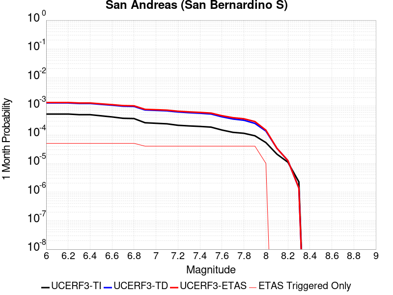 |  |  |

| Magnitude | 1 wk TI Prob | 1 wk TD Prob | 1 wk ETAS Prob | 1 wk ETAS/TD Gain | 1 wk ETAS Triggered Only | 1 mo TI Prob | 1 mo TD Prob | 1 mo ETAS Prob | 1 mo ETAS/TD Gain | 1 mo ETAS Triggered Only | 1 yr TI Prob | 1 yr TD Prob | 1 yr ETAS Prob | 1 yr ETAS/TD Gain | 1 yr ETAS Triggered Only | 10 yr TI Prob | 10 yr TD Prob | 10 yr ETAS Prob | 10 yr ETAS/TD Gain | 10 yr ETAS Triggered Only |
|-----|-----|-----|-----|-----|-----|-----|-----|-----|-----|-----|-----|-----|-----|-----|-----|-----|-----|-----|-----|-----|
| 6.0 | 1.2336002E-4 | 3.0038194E-4 | 3.2037593E-4 | 1.0665619 | 2.0E-5 | 5.2857865E-4 | 0.0012867422 | 0.0013366778 | 1.0388079 | 5.0E-5 | 0.006416472 | 0.015558517 | 0.01576525 | 1.0132874 | 2.1E-4 | 0.06234337 | 0.14297168 | 0.14326306 | 1.0020381 | 3.4E-4 |
| 6.1 | 1.2336002E-4 | 3.0038194E-4 | 3.2037593E-4 | 1.0665619 | 2.0E-5 | 5.2857865E-4 | 0.0012867422 | 0.0013366778 | 1.0388079 | 5.0E-5 | 0.006416472 | 0.015558517 | 0.01576525 | 1.0132874 | 2.1E-4 | 0.06234337 | 0.14297168 | 0.14326306 | 1.0020381 | 3.4E-4 |
| 6.2 | 1.2336002E-4 | 3.0038194E-4 | 3.2037593E-4 | 1.0665619 | 2.0E-5 | 5.2857865E-4 | 0.0012867422 | 0.0013366778 | 1.0388079 | 5.0E-5 | 0.006416472 | 0.015558517 | 0.01576525 | 1.0132874 | 2.1E-4 | 0.06234337 | 0.14297168 | 0.14326306 | 1.0020381 | 3.4E-4 |
| 6.3 | 1.1712257E-4 | 2.882614E-4 | 3.082556E-4 | 1.0693614 | 2.0E-5 | 5.018573E-4 | 0.0012348468 | 0.001284785 | 1.0404408 | 5.0E-5 | 0.006093008 | 0.014935469 | 0.015142333 | 1.0138505 | 2.1E-4 | 0.059286322 | 0.13767976 | 0.13797294 | 1.0021296 | 3.4E-4 |
| 6.4 | 1.1712257E-4 | 2.882614E-4 | 3.082556E-4 | 1.0693614 | 2.0E-5 | 5.018573E-4 | 0.0012348468 | 0.001284785 | 1.0404408 | 5.0E-5 | 0.006093008 | 0.014935469 | 0.015142333 | 1.0138505 | 2.1E-4 | 0.059286322 | 0.13767976 | 0.13797294 | 1.0021296 | 3.4E-4 |
| 6.5 | 1.0689076E-4 | 2.683841E-4 | 2.883787E-4 | 1.0745001 | 2.0E-5 | 4.5802278E-4 | 0.0011497352 | 0.0011996777 | 1.0434383 | 5.0E-5 | 0.0055621783 | 0.013912805 | 0.014110023 | 1.0141753 | 2.0E-4 | 0.05425003 | 0.12892582 | 0.12921327 | 1.0022296 | 3.3E-4 |
| 6.6 | 9.7648895E-5 | 2.5082647E-4 | 2.7082145E-4 | 1.0797164 | 2.0E-5 | 4.1842813E-4 | 0.0010745514 | 0.0011244976 | 1.046481 | 5.0E-5 | 0.005082469 | 0.013008555 | 0.013205954 | 1.0151745 | 2.0E-4 | 0.049677886 | 0.12108453 | 0.12137458 | 1.0023954 | 3.3E-4 |
| 6.7 | 8.757013E-5 | 2.315288E-4 | 2.5152418E-4 | 1.0863624 | 2.0E-5 | 3.7524657E-4 | 9.919113E-4 | 0.0010418617 | 1.0503577 | 5.0E-5 | 0.00455906 | 0.012013739 | 0.012211336 | 1.0164477 | 2.0E-4 | 0.04466656 | 0.11239208 | 0.112684995 | 1.0026062 | 3.3E-4 |
| 6.8 | 8.562978E-5 | 2.2712523E-4 | 2.4712068E-4 | 1.0880371 | 2.0E-5 | 3.6693315E-4 | 9.73053E-4 | 0.0010230043 | 1.0513346 | 5.0E-5 | 0.004458263 | 0.011786639 | 0.011984281 | 1.0167683 | 2.0E-4 | 0.043698758 | 0.11040163 | 0.1106952 | 1.0026591 | 3.3E-4 |
| 6.9 | 6.124075E-5 | 1.7094344E-4 | 1.9094002E-4 | 1.1169778 | 2.0E-5 | 2.6243398E-4 | 7.324099E-4 | 7.7238056E-4 | 1.0545743 | 4.0E-5 | 0.0031904527 | 0.00888084 | 0.009069152 | 1.0212044 | 1.9E-4 | 0.031450346 | 0.08430445 | 0.08458831 | 1.0033672 | 3.1E-4 |
| 7.0 | 5.8598747E-5 | 1.652306E-4 | 1.852273E-4 | 1.1210229 | 2.0E-5 | 2.5111332E-4 | 7.079398E-4 | 7.4791146E-4 | 1.0564619 | 4.0E-5 | 0.0030530186 | 0.008585299 | 0.008773669 | 1.0219408 | 1.9E-4 | 0.03011414 | 0.08162119 | 0.081905894 | 1.0034881 | 3.1E-4 |
| 7.1 | 5.613814E-5 | 1.5941328E-4 | 1.7941008E-4 | 1.1254401 | 2.0E-5 | 2.4056983E-4 | 6.830216E-4 | 7.229943E-4 | 1.0585233 | 4.0E-5 | 0.0029250039 | 0.008284262 | 0.0084726885 | 1.022745 | 1.9E-4 | 0.028868021 | 0.07891935 | 0.07919568 | 1.0035013 | 3.0E-4 |
| 7.2 | 4.991222E-5 | 1.4547125E-4 | 1.6546834E-4 | 1.1374642 | 2.0E-5 | 2.1389198E-4 | 6.232996E-4 | 6.632747E-4 | 1.0641346 | 4.0E-5 | 0.002601025 | 0.007562372 | 0.007750935 | 1.0249344 | 1.9E-4 | 0.025707912 | 0.07237094 | 0.072649226 | 1.0038453 | 3.0E-4 |
| 7.3 | 4.7410045E-5 | 1.3740729E-4 | 1.5740455E-4 | 1.1455327 | 2.0E-5 | 2.0317009E-4 | 5.887558E-4 | 6.2873226E-4 | 1.0679 | 4.0E-5 | 0.0024707897 | 0.0071446286 | 0.007333271 | 1.0264034 | 1.9E-4 | 0.024434982 | 0.0686515 | 0.0689309 | 1.0040699 | 3.0E-4 |
| 7.4 | 4.5556746E-5 | 1.3148173E-4 | 1.5147911E-4 | 1.1520923 | 2.0E-5 | 1.952286E-4 | 5.633718E-4 | 6.0334924E-4 | 1.0709611 | 4.0E-5 | 0.002374317 | 0.0068375594 | 0.0070163286 | 1.0261452 | 1.8E-4 | 0.023491086 | 0.06590233 | 0.066163875 | 1.0039687 | 2.8E-4 |
| 7.5 | 4.3084514E-5 | 1.2382954E-4 | 1.4382706E-4 | 1.1614923 | 2.0E-5 | 1.8463485E-4 | 5.3059036E-4 | 5.7056913E-4 | 1.0753478 | 4.0E-5 | 0.0022456115 | 0.0064408756 | 0.006619716 | 1.0277665 | 1.8E-4 | 0.022230545 | 0.062301207 | 0.06256376 | 1.0042143 | 2.8E-4 |
| 7.6 | 3.408608E-5 | 9.859129E-5 | 1.1858932E-4 | 1.2028377 | 2.0E-5 | 1.4607502E-4 | 4.224658E-4 | 4.6244886E-4 | 1.0946423 | 4.0E-5 | 0.0017770125 | 0.005131416 | 0.0053104926 | 1.034898 | 1.8E-4 | 0.017628696 | 0.05012485 | 0.050381318 | 1.0051166 | 2.7E-4 |
| 7.7 | 2.8315713E-5 | 8.2708604E-5 | 1.0270695E-4 | 1.2417928 | 2.0E-5 | 1.2134742E-4 | 3.5441734E-4 | 3.9440315E-4 | 1.1128213 | 4.0E-5 | 0.0014764034 | 0.0043065026 | 0.0044857273 | 1.0416173 | 1.8E-4 | 0.01466633 | 0.042370427 | 0.04262899 | 1.0061023 | 2.7E-4 |
| 7.8 | 2.6222975E-5 | 7.483839E-5 | 9.483689E-5 | 1.2672225 | 2.0E-5 | 1.1237934E-4 | 3.2069656E-4 | 3.606837E-4 | 1.1246885 | 4.0E-5 | 0.0013673597 | 0.0038974965 | 0.0040767947 | 1.0460035 | 1.8E-4 | 0.013589768 | 0.038529858 | 0.038789455 | 1.0067376 | 2.7E-4 |
| 7.9 | 2.1469694E-5 | 5.8051988E-5 | 7.805083E-5 | 1.3444988 | 2.0E-5 | 9.200973E-5 | 2.4877052E-4 | 2.8876058E-4 | 1.1607507 | 4.0E-5 | 0.0011196428 | 0.0030245776 | 0.0031940634 | 1.0560362 | 1.7E-4 | 0.011140184 | 0.030230949 | 0.030473392 | 1.0080197 | 2.5E-4 |
| 8.0 | 1.2420249E-5 | 3.141475E-5 | 4.1414438E-5 | 1.3183118 | 1.0E-5 | 5.322855E-5 | 1.3462771E-4 | 1.4462636E-4 | 1.0742689 | 1.0E-5 | 6.478649E-4 | 0.001637861 | 0.0016777955 | 1.0243821 | 4.0E-5 | 0.0064597935 | 0.016567199 | 0.016626205 | 1.0035616 | 6.0E-5 |
| 8.1 | 4.9197724E-6 | 7.8572575E-6 | 7.8572575E-6 | 1.0 | 0.0 | 2.1084568E-5 | 3.3673525E-5 | 3.3673525E-5 | 1.0 | 0.0 | 2.566744E-4 | 4.0989817E-4 | 4.0989817E-4 | 1.0 | 0.0 | 0.002563781 | 0.004401913 | 0.004401913 | 1.0 | 0.0 |
| 8.2 | 2.5634774E-6 | 2.9229354E-6 | 2.9229354E-6 | 1.0 | 0.0 | 1.0986286E-5 | 1.2526806E-5 | 1.2526806E-5 | 1.0 | 0.0 | 1.3374983E-4 | 1.5250323E-4 | 1.5250323E-4 | 1.0 | 0.0 | 0.0013366934 | 0.0017134835 | 0.0017134835 | 1.0 | 0.0 |
| 8.3 | 5.2850464E-7 | 3.230398E-7 | 3.230398E-7 | 1.0 | 0.0 | 2.2650179E-6 | 1.3844557E-6 | 1.3844557E-6 | 1.0 | 0.0 | 2.7576245E-5 | 1.6855629E-5 | 1.6855629E-5 | 1.0 | 0.0 | 2.7572823E-4 | 1.9991709E-4 | 1.9991709E-4 | 1.0 | 0.0 |

## Helendale-So Lockhart
*[(top)](#table-of-contents)*

| 1 Week | 1 Month | 1 Year | 10 Year |
|-----|-----|-----|-----|
|  |  |  |  |

| Magnitude | 1 wk TI Prob | 1 wk TD Prob | 1 wk ETAS Prob | 1 wk ETAS/TD Gain | 1 wk ETAS Triggered Only | 1 mo TI Prob | 1 mo TD Prob | 1 mo ETAS Prob | 1 mo ETAS/TD Gain | 1 mo ETAS Triggered Only | 1 yr TI Prob | 1 yr TD Prob | 1 yr ETAS Prob | 1 yr ETAS/TD Gain | 1 yr ETAS Triggered Only | 10 yr TI Prob | 10 yr TD Prob | 10 yr ETAS Prob | 10 yr ETAS/TD Gain | 10 yr ETAS Triggered Only |
|-----|-----|-----|-----|-----|-----|-----|-----|-----|-----|-----|-----|-----|-----|-----|-----|-----|-----|-----|-----|-----|
| 6.0 | 1.7296055E-5 | 1.8104516E-5 | 1.8104516E-5 | 1.0 | 0.0 | 7.412385E-5 | 7.758859E-5 | 9.758704E-5 | 1.2577498 | 2.0E-5 | 9.0208417E-4 | 9.442525E-4 | 0.0010941108 | 1.1587058 | 1.5E-4 | 0.008984311 | 0.009404523 | 0.009741326 | 1.0358129 | 3.4E-4 |
| 6.1 | 1.7296055E-5 | 1.8104516E-5 | 1.8104516E-5 | 1.0 | 0.0 | 7.412385E-5 | 7.758859E-5 | 9.758704E-5 | 1.2577498 | 2.0E-5 | 9.0208417E-4 | 9.442525E-4 | 0.0010941108 | 1.1587058 | 1.5E-4 | 0.008984311 | 0.009404523 | 0.009741326 | 1.0358129 | 3.4E-4 |
| 6.2 | 1.7296055E-5 | 1.8104516E-5 | 1.8104516E-5 | 1.0 | 0.0 | 7.412385E-5 | 7.758859E-5 | 9.758704E-5 | 1.2577498 | 2.0E-5 | 9.0208417E-4 | 9.442525E-4 | 0.0010941108 | 1.1587058 | 1.5E-4 | 0.008984311 | 0.009404523 | 0.009741326 | 1.0358129 | 3.4E-4 |
| 6.3 | 1.0669118E-5 | 1.1135877E-5 | 1.1135877E-5 | 1.0 | 0.0 | 4.5723988E-5 | 4.772433E-5 | 6.772338E-5 | 1.4190534 | 2.0E-5 | 5.5654737E-4 | 5.808916E-4 | 6.8083353E-4 | 1.1720492 | 1.0E-4 | 0.0055515557 | 0.0057940283 | 0.006022696 | 1.039466 | 2.3E-4 |
| 6.4 | 1.0669118E-5 | 1.1135877E-5 | 1.1135877E-5 | 1.0 | 0.0 | 4.5723988E-5 | 4.772433E-5 | 6.772338E-5 | 1.4190534 | 2.0E-5 | 5.5654737E-4 | 5.808916E-4 | 6.8083353E-4 | 1.1720492 | 1.0E-4 | 0.0055515557 | 0.0057940283 | 0.006022696 | 1.039466 | 2.3E-4 |
| 6.5 | 8.790038E-6 | 9.170565E-6 | 9.170565E-6 | 1.0 | 0.0 | 3.767105E-5 | 3.930184E-5 | 5.9301055E-5 | 1.508862 | 2.0E-5 | 4.585485E-4 | 4.783964E-4 | 5.6835334E-4 | 1.1880385 | 9.0E-5 | 0.0045760344 | 0.00477383 | 0.004982827 | 1.0437799 | 2.1E-4 |
| 6.6 | 7.396949E-6 | 7.715846E-6 | 7.715846E-6 | 1.0 | 0.0 | 3.1700827E-5 | 3.30675E-5 | 5.3066837E-5 | 1.6048036 | 2.0E-5 | 3.858892E-4 | 4.0252344E-4 | 4.8249122E-4 | 1.1986662 | 8.0E-5 | 0.003852198 | 0.00401805 | 0.004167448 | 1.0371815 | 1.5E-4 |
| 6.7 | 6.4600285E-6 | 6.7383007E-6 | 6.7383007E-6 | 1.0 | 0.0 | 2.7685543E-5 | 2.8878116E-5 | 4.8877537E-5 | 1.692546 | 2.0E-5 | 3.3701936E-4 | 3.5153513E-4 | 4.2151051E-4 | 1.1990566 | 7.0E-5 | 0.0033650869 | 0.0035098721 | 0.0036394158 | 1.0369084 | 1.3E-4 |
| 6.8 | 5.600104E-6 | 5.836238E-6 | 5.836238E-6 | 1.0 | 0.0 | 2.4000226E-5 | 2.5012212E-5 | 4.501171E-5 | 1.7995894 | 2.0E-5 | 2.9216358E-4 | 3.044817E-4 | 3.744604E-4 | 1.2298288 | 7.0E-5 | 0.0029177975 | 0.003040707 | 0.003160342 | 1.0393445 | 1.2E-4 |
| 6.9 | 4.839122E-6 | 5.039703E-6 | 5.039703E-6 | 1.0 | 0.0 | 2.0738931E-5 | 2.1598551E-5 | 4.159812E-5 | 1.925968 | 2.0E-5 | 2.5246723E-4 | 2.629311E-4 | 3.2291532E-4 | 1.2281367 | 6.0E-5 | 0.002521806 | 0.0026262477 | 0.0027259851 | 1.0379771 | 1.0E-4 |
| 7.0 | 3.6937633E-6 | 3.8453545E-6 | 3.8453545E-6 | 1.0 | 0.0 | 1.5830317E-5 | 1.6479988E-5 | 3.6479658E-5 | 2.2135732 | 2.0E-5 | 1.9271708E-4 | 2.006257E-4 | 2.5061567E-4 | 1.2491703 | 5.0E-5 | 0.0019255003 | 0.0020044772 | 0.0020942967 | 1.0448095 | 9.0E-5 |
| 7.1 | 2.7858857E-6 | 2.8979618E-6 | 2.8979618E-6 | 1.0 | 0.0 | 1.1939455E-5 | 1.2419779E-5 | 2.2419656E-5 | 1.8051573 | 1.0E-5 | 1.4535317E-4 | 1.5120053E-4 | 1.81196E-4 | 1.198382 | 3.0E-5 | 0.0014525814 | 0.0015109981 | 0.0015709074 | 1.0396489 | 6.0E-5 |
| 7.2 | 2.1672065E-6 | 2.2540967E-6 | 2.2540967E-6 | 1.0 | 0.0 | 9.2879945E-6 | 9.660379E-6 | 1.9660283E-5 | 2.035146 | 1.0E-5 | 1.1307546E-4 | 1.1760896E-4 | 1.4760543E-4 | 1.2550526 | 3.0E-5 | 0.0011301794 | 0.0011754853 | 0.0012354148 | 1.0509827 | 6.0E-5 |
| 7.3 | 1.4823496E-6 | 1.542268E-6 | 1.542268E-6 | 1.0 | 0.0 | 6.3529114E-6 | 6.609704E-6 | 1.6609638E-5 | 2.512917 | 1.0E-5 | 7.734395E-5 | 8.047033E-5 | 9.0469526E-5 | 1.1242594 | 1.0E-5 | 7.731704E-4 | 8.04427E-4 | 8.4439485E-4 | 1.0496849 | 4.0E-5 |
| 7.4 | 4.2321457E-7 | 4.4110496E-7 | 4.4110496E-7 | 1.0 | 0.0 | 1.8137755E-6 | 1.8904486E-6 | 1.8904486E-6 | 1.0 | 0.0 | 2.2082493E-5 | 2.3016015E-5 | 2.3016015E-5 | 1.0 | 0.0 | 2.2080299E-4 | 2.3014084E-4 | 2.3014084E-4 | 1.0 | 0.0 |
| 7.5 | 5.6942316E-8 | 5.9418042E-8 | 5.9418042E-8 | 1.0 | 0.0 | 2.440385E-7 | 2.5464874E-7 | 2.5464874E-7 | 1.0 | 0.0 | 2.9711643E-6 | 3.1003447E-6 | 3.1003447E-6 | 1.0 | 0.0 | 2.9711247E-5 | 3.1003092E-5 | 3.1003092E-5 | 1.0 | 0.0 |

## Coyote Lake
*[(top)](#table-of-contents)*

| 1 Week | 1 Month | 1 Year | 10 Year |
|-----|-----|-----|-----|
|  |  | 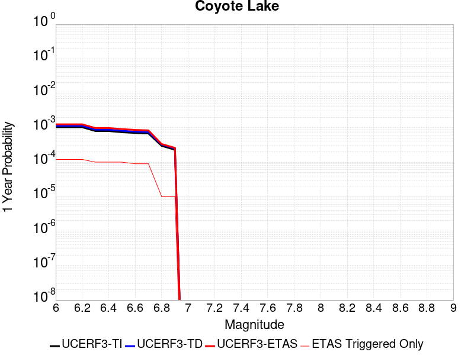 |  |

| Magnitude | 1 wk TI Prob | 1 wk TD Prob | 1 wk ETAS Prob | 1 wk ETAS/TD Gain | 1 wk ETAS Triggered Only | 1 mo TI Prob | 1 mo TD Prob | 1 mo ETAS Prob | 1 mo ETAS/TD Gain | 1 mo ETAS Triggered Only | 1 yr TI Prob | 1 yr TD Prob | 1 yr ETAS Prob | 1 yr ETAS/TD Gain | 1 yr ETAS Triggered Only | 10 yr TI Prob | 10 yr TD Prob | 10 yr ETAS Prob | 10 yr ETAS/TD Gain | 10 yr ETAS Triggered Only |
|-----|-----|-----|-----|-----|-----|-----|-----|-----|-----|-----|-----|-----|-----|-----|-----|-----|-----|-----|-----|-----|
| 6.0 | 1.980352E-5 | 2.1708682E-5 | 2.1708682E-5 | 1.0 | 0.0 | 8.486947E-5 | 9.30343E-5 | 1.03033366E-4 | 1.1074772 | 1.0E-5 | 0.0010327959 | 0.001132176 | 0.0012520402 | 1.1058706 | 1.2E-4 | 0.010280091 | 0.011271259 | 0.011557991 | 1.0254391 | 2.9E-4 |
| 6.1 | 1.980352E-5 | 2.1708682E-5 | 2.1708682E-5 | 1.0 | 0.0 | 8.486947E-5 | 9.30343E-5 | 1.03033366E-4 | 1.1074772 | 1.0E-5 | 0.0010327959 | 0.001132176 | 0.0012520402 | 1.1058706 | 1.2E-4 | 0.010280091 | 0.011271259 | 0.011557991 | 1.0254391 | 2.9E-4 |
| 6.2 | 1.980352E-5 | 2.1708682E-5 | 2.1708682E-5 | 1.0 | 0.0 | 8.486947E-5 | 9.30343E-5 | 1.03033366E-4 | 1.1074772 | 1.0E-5 | 0.0010327959 | 0.001132176 | 0.0012520402 | 1.1058706 | 1.2E-4 | 0.010280091 | 0.011271259 | 0.011557991 | 1.0254391 | 2.9E-4 |
| 6.3 | 1.5344787E-5 | 1.6822172E-5 | 1.6822172E-5 | 1.0 | 0.0 | 6.576172E-5 | 7.2093375E-5 | 7.2093375E-5 | 1.0 | 0.0 | 8.003548E-4 | 8.7744463E-4 | 9.773568E-4 | 1.1138673 | 1.0E-4 | 0.007974784 | 0.008745847 | 0.008993661 | 1.028335 | 2.5E-4 |
| 6.4 | 1.5344787E-5 | 1.6822172E-5 | 1.6822172E-5 | 1.0 | 0.0 | 6.576172E-5 | 7.2093375E-5 | 7.2093375E-5 | 1.0 | 0.0 | 8.003548E-4 | 8.7744463E-4 | 9.773568E-4 | 1.1138673 | 1.0E-4 | 0.007974784 | 0.008745847 | 0.008993661 | 1.028335 | 2.5E-4 |
| 6.5 | 1.4189697E-5 | 1.555938E-5 | 1.555938E-5 | 1.0 | 0.0 | 6.081157E-5 | 6.668169E-5 | 6.668169E-5 | 1.0 | 0.0 | 7.401293E-4 | 8.116075E-4 | 9.115264E-4 | 1.1231122 | 1.0E-4 | 0.0073766913 | 0.008092378 | 0.008330436 | 1.0294175 | 2.4E-4 |
| 6.6 | 1.3469301E-5 | 1.4772904E-5 | 1.4772904E-5 | 1.0 | 0.0 | 5.7724297E-5 | 6.331125E-5 | 6.331125E-5 | 1.0 | 0.0 | 7.025667E-4 | 7.706018E-4 | 8.6053245E-4 | 1.1167018 | 9.0E-5 | 0.0070034964 | 0.007685202 | 0.007903512 | 1.0284065 | 2.2E-4 |
| 6.7 | 1.3027966E-5 | 1.4283021E-5 | 1.4283021E-5 | 1.0 | 0.0 | 5.5832945E-5 | 6.121185E-5 | 6.121185E-5 | 1.0 | 0.0 | 6.7955407E-4 | 7.450592E-4 | 8.3499216E-4 | 1.1207057 | 9.0E-5 | 0.006774798 | 0.0074314913 | 0.0076399306 | 1.0280482 | 2.1E-4 |
| 6.8 | 5.695434E-6 | 6.2249546E-6 | 6.2249546E-6 | 1.0 | 0.0 | 2.4408775E-5 | 2.6678274E-5 | 2.6678274E-5 | 1.0 | 0.0 | 2.971363E-4 | 3.2478955E-4 | 3.347863E-4 | 1.0307791 | 1.0E-5 | 0.0029673933 | 0.0032460901 | 0.0032859603 | 1.0122825 | 4.0E-5 |
| 6.9 | 4.385688E-6 | 4.7934686E-6 | 4.7934686E-6 | 1.0 | 0.0 | 1.879567E-5 | 2.0543437E-5 | 2.0543437E-5 | 1.0 | 0.0 | 2.2881327E-4 | 2.5011634E-4 | 2.6011385E-4 | 1.0399714 | 1.0E-5 | 0.002285778 | 0.0025011634 | 0.0025310884 | 1.0119644 | 3.0E-5 |

## Death Valley (No)
*[(top)](#table-of-contents)*

| 1 Week | 1 Month | 1 Year | 10 Year |
|-----|-----|-----|-----|
|  |  |  | 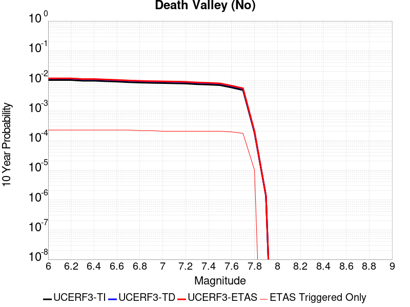 |

| Magnitude | 1 wk TI Prob | 1 wk TD Prob | 1 wk ETAS Prob | 1 wk ETAS/TD Gain | 1 wk ETAS Triggered Only | 1 mo TI Prob | 1 mo TD Prob | 1 mo ETAS Prob | 1 mo ETAS/TD Gain | 1 mo ETAS Triggered Only | 1 yr TI Prob | 1 yr TD Prob | 1 yr ETAS Prob | 1 yr ETAS/TD Gain | 1 yr ETAS Triggered Only | 10 yr TI Prob | 10 yr TD Prob | 10 yr ETAS Prob | 10 yr ETAS/TD Gain | 10 yr ETAS Triggered Only |
|-----|-----|-----|-----|-----|-----|-----|-----|-----|-----|-----|-----|-----|-----|-----|-----|-----|-----|-----|-----|-----|
| 6.0 | 2.0074807E-5 | 2.250262E-5 | 3.2502394E-5 | 1.4443827 | 1.0E-5 | 8.603206E-5 | 9.643627E-5 | 1.06435305E-4 | 1.1036854 | 1.0E-5 | 0.001046937 | 0.0011734866 | 0.0012334163 | 1.0510697 | 6.0E-5 | 0.010420183 | 0.011673815 | 0.011891246 | 1.0186256 | 2.2E-4 |
| 6.1 | 2.0074807E-5 | 2.250262E-5 | 3.2502394E-5 | 1.4443827 | 1.0E-5 | 8.603206E-5 | 9.643627E-5 | 1.06435305E-4 | 1.1036854 | 1.0E-5 | 0.001046937 | 0.0011734866 | 0.0012334163 | 1.0510697 | 6.0E-5 | 0.010420183 | 0.011673815 | 0.011891246 | 1.0186256 | 2.2E-4 |
| 6.2 | 2.0074807E-5 | 2.250262E-5 | 3.2502394E-5 | 1.4443827 | 1.0E-5 | 8.603206E-5 | 9.643627E-5 | 1.06435305E-4 | 1.1036854 | 1.0E-5 | 0.001046937 | 0.0011734866 | 0.0012334163 | 1.0510697 | 6.0E-5 | 0.010420183 | 0.011673815 | 0.011891246 | 1.0186256 | 2.2E-4 |
| 6.3 | 1.9050609E-5 | 2.1339336E-5 | 3.1339125E-5 | 1.4686081 | 1.0E-5 | 8.164292E-5 | 9.145113E-5 | 1.0145022E-4 | 1.109338 | 1.0E-5 | 9.935491E-4 | 0.0011128556 | 0.0011727888 | 1.0538553 | 6.0E-5 | 0.009891188 | 0.011073652 | 0.011291215 | 1.019647 | 2.2E-4 |
| 6.4 | 1.9050609E-5 | 2.1339336E-5 | 3.1339125E-5 | 1.4686081 | 1.0E-5 | 8.164292E-5 | 9.145113E-5 | 1.0145022E-4 | 1.109338 | 1.0E-5 | 9.935491E-4 | 0.0011128556 | 0.0011727888 | 1.0538553 | 6.0E-5 | 0.009891188 | 0.011073652 | 0.011291215 | 1.019647 | 2.2E-4 |
| 6.5 | 1.8367004E-5 | 2.05633E-5 | 3.0563093E-5 | 1.4862933 | 1.0E-5 | 7.8713354E-5 | 8.812549E-5 | 9.8124605E-5 | 1.1134646 | 1.0E-5 | 9.5791375E-4 | 0.0010724063 | 0.0011323419 | 1.0558889 | 6.0E-5 | 0.009537951 | 0.010673099 | 0.010890751 | 1.0203925 | 2.2E-4 |
| 6.6 | 1.779439E-5 | 1.9913137E-5 | 2.9912939E-5 | 1.502171 | 1.0E-5 | 7.625944E-5 | 8.533926E-5 | 9.5338415E-5 | 1.1171694 | 1.0E-5 | 9.280632E-4 | 0.0010385168 | 0.0010984543 | 1.0577147 | 6.0E-5 | 0.009241969 | 0.010337394 | 0.01055512 | 1.021062 | 2.2E-4 |
| 6.7 | 1.7025437E-5 | 1.9045532E-5 | 2.904534E-5 | 1.5250475 | 1.0E-5 | 7.296412E-5 | 8.162119E-5 | 9.162037E-5 | 1.1225072 | 1.0E-5 | 8.87976E-4 | 9.932911E-4 | 0.0010532315 | 1.0603453 | 6.0E-5 | 0.008844362 | 0.009889234 | 0.010107058 | 1.0220264 | 2.2E-4 |
| 6.8 | 1.6545107E-5 | 1.8514598E-5 | 2.8514414E-5 | 1.5401043 | 1.0E-5 | 7.090568E-5 | 7.9345904E-5 | 8.934511E-5 | 1.1260204 | 1.0E-5 | 8.629347E-4 | 9.6561434E-4 | 0.0010255564 | 1.0620766 | 6.0E-5 | 0.008595915 | 0.00961489 | 0.009822871 | 1.0216311 | 2.1E-4 |
| 6.9 | 1.615478E-5 | 1.8089611E-5 | 2.8089431E-5 | 1.5527935 | 1.0E-5 | 6.9232934E-5 | 7.752464E-5 | 8.752386E-5 | 1.1289812 | 1.0E-5 | 8.4258494E-4 | 9.434598E-4 | 0.0010034032 | 1.0635357 | 6.0E-5 | 0.008393973 | 0.009395239 | 0.009603266 | 1.0221417 | 2.1E-4 |
| 7.0 | 1.5894311E-5 | 1.7807544E-5 | 2.7807368E-5 | 1.5615497 | 1.0E-5 | 6.81167E-5 | 7.631585E-5 | 8.6315085E-5 | 1.1310244 | 1.0E-5 | 8.2900526E-4 | 9.287555E-4 | 9.787091E-4 | 1.0537854 | 5.0E-5 | 0.008259195 | 0.009249429 | 0.009447579 | 1.021423 | 2.0E-4 |
| 7.1 | 1.5602263E-5 | 1.7485467E-5 | 2.7485292E-5 | 1.5718935 | 1.0E-5 | 6.6865134E-5 | 7.49356E-5 | 8.493485E-5 | 1.1334379 | 1.0E-5 | 8.137789E-4 | 9.119651E-4 | 9.619195E-4 | 1.0547767 | 5.0E-5 | 0.008108052 | 0.00908291 | 0.009281093 | 1.0218194 | 2.0E-4 |
| 7.2 | 1.5323829E-5 | 1.7172559E-5 | 2.7172386E-5 | 1.5823144 | 1.0E-5 | 6.56719E-5 | 7.359464E-5 | 8.35939E-5 | 1.1358695 | 1.0E-5 | 7.99262E-4 | 8.956524E-4 | 9.456076E-4 | 1.0557753 | 5.0E-5 | 0.007963934 | 0.008921104 | 0.00911932 | 1.0222187 | 2.0E-4 |
| 7.3 | 1.4556212E-5 | 1.6304277E-5 | 2.6304115E-5 | 1.613326 | 1.0E-5 | 6.238227E-5 | 6.987363E-5 | 7.987294E-5 | 1.1431055 | 1.0E-5 | 7.592395E-4 | 8.5038535E-4 | 9.003428E-4 | 1.0587469 | 5.0E-5 | 0.0075665074 | 0.008471957 | 0.008670263 | 1.0234073 | 2.0E-4 |
| 7.4 | 1.411725E-5 | 1.5809725E-5 | 2.5809566E-5 | 1.6325121 | 1.0E-5 | 6.0501097E-5 | 6.7754234E-5 | 7.775355E-5 | 1.1475823 | 1.0E-5 | 7.363519E-4 | 8.246014E-4 | 8.7456015E-4 | 1.0605854 | 5.0E-5 | 0.0073391674 | 0.008216051 | 0.008414408 | 1.0241426 | 2.0E-4 |
| 7.5 | 1.3503312E-5 | 1.5127982E-5 | 2.512783E-5 | 1.6610167 | 1.0E-5 | 5.7870053E-5 | 6.483263E-5 | 7.483198E-5 | 1.1542333 | 1.0E-5 | 7.043401E-4 | 7.8905723E-4 | 8.390178E-4 | 1.0633167 | 5.0E-5 | 0.007021119 | 0.007863181 | 0.008061608 | 1.025235 | 2.0E-4 |
| 7.6 | 1.1279839E-5 | 1.262773E-5 | 2.2627604E-5 | 1.7918979 | 1.0E-5 | 4.834127E-5 | 5.411775E-5 | 6.411721E-5 | 1.1847723 | 1.0E-5 | 5.88396E-4 | 6.5868977E-4 | 7.086568E-4 | 1.0758582 | 5.0E-5 | 0.005868405 | 0.006567926 | 0.006756678 | 1.0287385 | 1.9E-4 |
| 7.7 | 9.189108E-6 | 1.0284499E-5 | 2.0284397E-5 | 1.9723271 | 1.0E-5 | 3.93813E-5 | 4.4075707E-5 | 5.4075266E-5 | 1.2268723 | 1.0E-5 | 4.7936183E-4 | 5.3649466E-4 | 5.864678E-4 | 1.0931475 | 5.0E-5 | 0.004783291 | 0.005352506 | 0.005521596 | 1.0315908 | 1.7E-4 |
| 7.8 | 3.4586725E-7 | 3.648448E-7 | 3.648448E-7 | 1.0 | 0.0 | 1.4822873E-6 | 1.5636197E-6 | 1.5636197E-6 | 1.0 | 0.0 | 1.80467E-5 | 1.9036908E-5 | 1.9036908E-5 | 1.0 | 0.0 | 1.8045233E-4 | 1.9035321E-4 | 2.0035131E-4 | 1.052524 | 1.0E-5 |
| 7.9 | 2.5591178E-9 | 2.6697788E-9 | 2.6697788E-9 | 1.0 | 0.0 | 1.0967647E-8 | 1.144191E-8 | 1.144191E-8 | 1.0 | 0.0 | 1.335311E-7 | 1.3930524E-7 | 1.3930524E-7 | 1.0 | 0.0 | 1.3353102E-6 | 1.3930525E-6 | 1.3930525E-6 | 1.0 | 0.0 |

## San Andreas (Big Bend)
*[(top)](#table-of-contents)*

| 1 Week | 1 Month | 1 Year | 10 Year |
|-----|-----|-----|-----|
|  |  |  |  |

| Magnitude | 1 wk TI Prob | 1 wk TD Prob | 1 wk ETAS Prob | 1 wk ETAS/TD Gain | 1 wk ETAS Triggered Only | 1 mo TI Prob | 1 mo TD Prob | 1 mo ETAS Prob | 1 mo ETAS/TD Gain | 1 mo ETAS Triggered Only | 1 yr TI Prob | 1 yr TD Prob | 1 yr ETAS Prob | 1 yr ETAS/TD Gain | 1 yr ETAS Triggered Only | 10 yr TI Prob | 10 yr TD Prob | 10 yr ETAS Prob | 10 yr ETAS/TD Gain | 10 yr ETAS Triggered Only |
|-----|-----|-----|-----|-----|-----|-----|-----|-----|-----|-----|-----|-----|-----|-----|-----|-----|-----|-----|-----|-----|
| 6.0 | 1.0179969E-4 | 2.0131959E-4 | 2.0131959E-4 | 1.0 | 0.0 | 4.362114E-4 | 8.6251396E-4 | 8.6251396E-4 | 1.0 | 0.0 | 0.0052979486 | 0.010450831 | 0.010529995 | 1.0075749 | 8.0E-5 | 0.051734097 | 0.101709 | 0.10188866 | 1.0017664 | 2.0E-4 |
| 6.1 | 1.0179969E-4 | 2.0131959E-4 | 2.0131959E-4 | 1.0 | 0.0 | 4.362114E-4 | 8.6251396E-4 | 8.6251396E-4 | 1.0 | 0.0 | 0.0052979486 | 0.010450831 | 0.010529995 | 1.0075749 | 8.0E-5 | 0.051734097 | 0.101709 | 0.10188866 | 1.0017664 | 2.0E-4 |
| 6.2 | 1.0179969E-4 | 2.0131959E-4 | 2.0131959E-4 | 1.0 | 0.0 | 4.362114E-4 | 8.6251396E-4 | 8.6251396E-4 | 1.0 | 0.0 | 0.0052979486 | 0.010450831 | 0.010529995 | 1.0075749 | 8.0E-5 | 0.051734097 | 0.101709 | 0.10188866 | 1.0017664 | 2.0E-4 |
| 6.3 | 1.0179969E-4 | 2.0131959E-4 | 2.0131959E-4 | 1.0 | 0.0 | 4.362114E-4 | 8.6251396E-4 | 8.6251396E-4 | 1.0 | 0.0 | 0.0052979486 | 0.010450831 | 0.010529995 | 1.0075749 | 8.0E-5 | 0.051734097 | 0.101709 | 0.10188866 | 1.0017664 | 2.0E-4 |
| 6.4 | 9.1639464E-5 | 1.8488058E-4 | 1.8488058E-4 | 1.0 | 0.0 | 3.9268145E-4 | 7.92105E-4 | 7.92105E-4 | 1.0 | 0.0 | 0.0047704205 | 0.009601353 | 0.009660777 | 1.0061891 | 6.0E-5 | 0.046693064 | 0.09403238 | 0.09414109 | 1.0011562 | 1.2E-4 |
| 6.5 | 9.1639464E-5 | 1.8488058E-4 | 1.8488058E-4 | 1.0 | 0.0 | 3.9268145E-4 | 7.92105E-4 | 7.92105E-4 | 1.0 | 0.0 | 0.0047704205 | 0.009601353 | 0.009660777 | 1.0061891 | 6.0E-5 | 0.046693064 | 0.09403238 | 0.09414109 | 1.0011562 | 1.2E-4 |
| 6.6 | 9.042622E-5 | 1.829497E-4 | 1.829497E-4 | 1.0 | 0.0 | 3.8748336E-4 | 7.838348E-4 | 7.838348E-4 | 1.0 | 0.0 | 0.0047074095 | 0.009501544 | 0.009551069 | 1.0052123 | 5.0E-5 | 0.046089325 | 0.09312604 | 0.09321673 | 1.0009738 | 1.0E-4 |
| 6.7 | 8.9836685E-5 | 1.8209257E-4 | 1.8209257E-4 | 1.0 | 0.0 | 3.8495753E-4 | 7.8016357E-4 | 7.8016357E-4 | 1.0 | 0.0 | 0.00467679 | 0.009457235 | 0.009506762 | 1.005237 | 5.0E-5 | 0.045795817 | 0.092720196 | 0.09281092 | 1.0009785 | 1.0E-4 |
| 6.8 | 8.9471854E-5 | 1.8155984E-4 | 1.8155984E-4 | 1.0 | 0.0 | 3.8339442E-4 | 7.7788177E-4 | 7.7788177E-4 | 1.0 | 0.0 | 0.004657841 | 0.009429695 | 0.009479224 | 1.0052524 | 5.0E-5 | 0.04561414 | 0.092467226 | 0.092557974 | 1.0009815 | 1.0E-4 |
| 6.9 | 8.858234E-5 | 1.8037861E-4 | 1.8037861E-4 | 1.0 | 0.0 | 3.7958333E-4 | 7.728224E-4 | 7.728224E-4 | 1.0 | 0.0 | 0.004611638 | 0.009368628 | 0.00941816 | 1.0052869 | 5.0E-5 | 0.04517103 | 0.09190706 | 0.09198879 | 1.0008893 | 9.0E-5 |
| 7.0 | 8.7433385E-5 | 1.7876514E-4 | 1.7876514E-4 | 1.0 | 0.0 | 3.746607E-4 | 7.659116E-4 | 7.659116E-4 | 1.0 | 0.0 | 0.004551957 | 0.009285209 | 0.009334745 | 1.0053349 | 5.0E-5 | 0.044598386 | 0.09114104 | 0.09122283 | 1.0008975 | 9.0E-5 |
| 7.1 | 8.684964E-5 | 1.7788376E-4 | 1.7788376E-4 | 1.0 | 0.0 | 3.7215967E-4 | 7.621365E-4 | 7.621365E-4 | 1.0 | 0.0 | 0.0045216335 | 0.009239637 | 0.009289175 | 1.0053614 | 5.0E-5 | 0.04430731 | 0.09072227 | 0.09080411 | 1.000902 | 9.0E-5 |
| 7.2 | 8.606521E-5 | 1.7678899E-4 | 1.7678899E-4 | 1.0 | 0.0 | 3.6879873E-4 | 7.5744727E-4 | 7.5744727E-4 | 1.0 | 0.0 | 0.0044808835 | 0.00918303 | 0.00923257 | 1.0053948 | 5.0E-5 | 0.043916024 | 0.09020251 | 0.09028439 | 1.0009078 | 9.0E-5 |
| 7.3 | 8.568266E-5 | 1.7620796E-4 | 1.7620796E-4 | 1.0 | 0.0 | 3.6715972E-4 | 7.549586E-4 | 7.549586E-4 | 1.0 | 0.0 | 0.0044610105 | 0.009152985 | 0.009202528 | 1.0054127 | 5.0E-5 | 0.043725148 | 0.089923255 | 0.09000516 | 1.0009109 | 9.0E-5 |
| 7.4 | 8.5432206E-5 | 1.7583313E-4 | 1.7583313E-4 | 1.0 | 0.0 | 3.6608664E-4 | 7.533532E-4 | 7.533532E-4 | 1.0 | 0.0 | 0.004447999 | 0.0091336025 | 0.009183146 | 1.0054243 | 5.0E-5 | 0.043600157 | 0.08974317 | 0.089825094 | 1.0009129 | 9.0E-5 |
| 7.5 | 8.4791965E-5 | 1.7452403E-4 | 1.7452403E-4 | 1.0 | 0.0 | 3.633435E-4 | 7.477459E-4 | 7.477459E-4 | 1.0 | 0.0 | 0.0044147377 | 0.009065905 | 0.009115452 | 1.0054651 | 5.0E-5 | 0.043280575 | 0.08911997 | 0.08920195 | 1.0009198 | 9.0E-5 |
| 7.6 | 8.241105E-5 | 1.6896869E-4 | 1.6896869E-4 | 1.0 | 0.0 | 3.531424E-4 | 7.2395074E-4 | 7.2395074E-4 | 1.0 | 0.0 | 0.0042910352 | 0.008778568 | 0.00882813 | 1.0056456 | 5.0E-5 | 0.042091176 | 0.08649363 | 0.08656672 | 1.000845 | 8.0E-5 |
| 7.7 | 7.00432E-5 | 1.4255449E-4 | 1.4255449E-4 | 1.0 | 0.0 | 3.001506E-4 | 6.108048E-4 | 6.108048E-4 | 1.0 | 0.0 | 0.0036482112 | 0.0074112318 | 0.0074509354 | 1.0053573 | 4.0E-5 | 0.035888977 | 0.07374726 | 0.073812105 | 1.0008792 | 7.0E-5 |
| 7.8 | 6.415362E-5 | 1.3014876E-4 | 1.3014876E-4 | 1.0 | 0.0 | 2.749151E-4 | 5.5766123E-4 | 5.5766123E-4 | 1.0 | 0.0 | 0.0033419547 | 0.006768419 | 0.006808148 | 1.0058697 | 4.0E-5 | 0.03292141 | 0.06746108 | 0.067526355 | 1.0009676 | 7.0E-5 |
| 7.9 | 4.939911E-5 | 9.374107E-5 | 9.374107E-5 | 1.0 | 0.0 | 2.116933E-4 | 4.0168563E-4 | 4.0168563E-4 | 1.0 | 0.0 | 0.0025743195 | 0.004879565 | 0.004889516 | 1.0020393 | 1.0E-5 | 0.025447013 | 0.049068946 | 0.049097475 | 1.0005814 | 3.0E-5 |
| 8.0 | 3.344983E-5 | 5.2423515E-5 | 5.2423515E-5 | 1.0 | 0.0 | 1.4334853E-4 | 2.2465286E-4 | 2.2465286E-4 | 1.0 | 0.0 | 0.0017438711 | 0.0027317198 | 0.0027317198 | 1.0 | 0.0 | 0.017302496 | 0.028018981 | 0.028018981 | 1.0 | 0.0 |
| 8.1 | 1.9104898E-5 | 1.9269055E-5 | 1.9269055E-5 | 1.0 | 0.0 | 8.1875565E-5 | 8.257905E-5 | 8.257905E-5 | 1.0 | 0.0 | 9.963791E-4 | 0.0010049369 | 0.0010049369 | 1.0 | 0.0 | 0.009919235 | 0.0108002825 | 0.0108002825 | 1.0 | 0.0 |
| 8.2 | 8.643924E-6 | 5.5112705E-6 | 5.5112705E-6 | 1.0 | 0.0 | 3.704486E-5 | 2.3619517E-5 | 2.3619517E-5 | 1.0 | 0.0 | 4.5092785E-4 | 2.8752975E-4 | 2.8752975E-4 | 1.0 | 0.0 | 0.0045001395 | 0.0032686237 | 0.0032686237 | 1.0 | 0.0 |
| 8.3 | 1.983087E-6 | 7.7188406E-7 | 7.7188406E-7 | 1.0 | 0.0 | 8.498917E-6 | 3.3080703E-6 | 3.3080703E-6 | 1.0 | 0.0 | 1.034694E-4 | 4.027503E-5 | 4.027503E-5 | 1.0 | 0.0 | 0.0010342124 | 4.7534908E-4 | 4.7534908E-4 | 1.0 | 0.0 |

## Red Pass
*[(top)](#table-of-contents)*

| 1 Week | 1 Month | 1 Year | 10 Year |
|-----|-----|-----|-----|
|  |  |  |  |

| Magnitude | 1 wk TI Prob | 1 wk TD Prob | 1 wk ETAS Prob | 1 wk ETAS/TD Gain | 1 wk ETAS Triggered Only | 1 mo TI Prob | 1 mo TD Prob | 1 mo ETAS Prob | 1 mo ETAS/TD Gain | 1 mo ETAS Triggered Only | 1 yr TI Prob | 1 yr TD Prob | 1 yr ETAS Prob | 1 yr ETAS/TD Gain | 1 yr ETAS Triggered Only | 10 yr TI Prob | 10 yr TD Prob | 10 yr ETAS Prob | 10 yr ETAS/TD Gain | 10 yr ETAS Triggered Only |
|-----|-----|-----|-----|-----|-----|-----|-----|-----|-----|-----|-----|-----|-----|-----|-----|-----|-----|-----|-----|-----|
| 6.0 | 8.258278E-6 | 8.551547E-6 | 8.551547E-6 | 1.0 | 0.0 | 3.539214E-5 | 3.664907E-5 | 3.664907E-5 | 1.0 | 0.0 | 4.308141E-4 | 4.4612895E-4 | 5.0610217E-4 | 1.1344303 | 6.0E-5 | 0.0042997985 | 0.004454091 | 0.004643245 | 1.0424674 | 1.9E-4 |
| 6.1 | 3.649988E-6 | 3.7754364E-6 | 3.7754364E-6 | 1.0 | 0.0 | 1.5642712E-5 | 1.618037E-5 | 1.618037E-5 | 1.0 | 0.0 | 1.9043336E-4 | 1.9698295E-4 | 2.0698097E-4 | 1.0507559 | 1.0E-5 | 0.0019027026 | 0.0019685507 | 0.0020284327 | 1.0304192 | 6.0E-5 |
| 6.2 | 3.649988E-6 | 3.7754364E-6 | 3.7754364E-6 | 1.0 | 0.0 | 1.5642712E-5 | 1.618037E-5 | 1.618037E-5 | 1.0 | 0.0 | 1.9043336E-4 | 1.9698295E-4 | 2.0698097E-4 | 1.0507559 | 1.0E-5 | 0.0019027026 | 0.0019685507 | 0.0020284327 | 1.0304192 | 6.0E-5 |
| 6.3 | 1.3924937E-6 | 1.4411634E-6 | 1.4411634E-6 | 1.0 | 0.0 | 5.9678164E-6 | 6.1764076E-6 | 6.1764076E-6 | 1.0 | 0.0 | 7.265574E-5 | 7.5196585E-5 | 8.519583E-5 | 1.1329747 | 1.0E-5 | 7.263199E-4 | 7.518502E-4 | 7.7183516E-4 | 1.026581 | 2.0E-5 |
| 6.4 | 1.3924937E-6 | 1.4411634E-6 | 1.4411634E-6 | 1.0 | 0.0 | 5.9678164E-6 | 6.1764076E-6 | 6.1764076E-6 | 1.0 | 0.0 | 7.265574E-5 | 7.5196585E-5 | 8.519583E-5 | 1.1329747 | 1.0E-5 | 7.263199E-4 | 7.518502E-4 | 7.7183516E-4 | 1.026581 | 2.0E-5 |
| 6.5 | 9.876812E-7 | 1.0222244E-6 | 1.0222244E-6 | 1.0 | 0.0 | 4.2329125E-6 | 4.3809614E-6 | 4.3809614E-6 | 1.0 | 0.0 | 5.153449E-5 | 5.3338208E-5 | 6.333768E-5 | 1.1874728 | 1.0E-5 | 5.1522546E-4 | 5.3338206E-4 | 5.433767E-4 | 1.0187383 | 1.0E-5 |

## Scodie Lineament
*[(top)](#table-of-contents)*

| 1 Week | 1 Month | 1 Year | 10 Year |
|-----|-----|-----|-----|
|  |  |  |  |

| Magnitude | 1 wk TI Prob | 1 wk TD Prob | 1 wk ETAS Prob | 1 wk ETAS/TD Gain | 1 wk ETAS Triggered Only | 1 mo TI Prob | 1 mo TD Prob | 1 mo ETAS Prob | 1 mo ETAS/TD Gain | 1 mo ETAS Triggered Only | 1 yr TI Prob | 1 yr TD Prob | 1 yr ETAS Prob | 1 yr ETAS/TD Gain | 1 yr ETAS Triggered Only | 10 yr TI Prob | 10 yr TD Prob | 10 yr ETAS Prob | 10 yr ETAS/TD Gain | 10 yr ETAS Triggered Only |
|-----|-----|-----|-----|-----|-----|-----|-----|-----|-----|-----|-----|-----|-----|-----|-----|-----|-----|-----|-----|-----|
| 6.0 | 3.2919327E-6 | 3.013442E-6 | 3.013442E-6 | 1.0 | 0.0 | 1.4108206E-5 | 1.2914706E-5 | 1.2914706E-5 | 1.0 | 0.0 | 1.7175387E-4 | 1.5722837E-4 | 1.7722523E-4 | 1.1271836 | 2.0E-5 | 0.0017162118 | 0.0015714829 | 0.0017412157 | 1.108008 | 1.7E-4 |
| 6.1 | 1.8663811E-6 | 1.5491127E-6 | 1.5491127E-6 | 1.0 | 0.0 | 7.998751E-6 | 6.6390403E-6 | 6.6390403E-6 | 1.0 | 0.0 | 9.738045E-5 | 8.082781E-5 | 9.082701E-5 | 1.1237098 | 1.0E-5 | 9.7337784E-4 | 8.08033E-4 | 8.5799256E-4 | 1.0618286 | 5.0E-5 |
| 6.2 | 1.8663811E-6 | 1.5491127E-6 | 1.5491127E-6 | 1.0 | 0.0 | 7.998751E-6 | 6.6390403E-6 | 6.6390403E-6 | 1.0 | 0.0 | 9.738045E-5 | 8.082781E-5 | 9.082701E-5 | 1.1237098 | 1.0E-5 | 9.7337784E-4 | 8.08033E-4 | 8.5799256E-4 | 1.0618286 | 5.0E-5 |
| 6.3 | 1.8663811E-6 | 1.5491127E-6 | 1.5491127E-6 | 1.0 | 0.0 | 7.998751E-6 | 6.6390403E-6 | 6.6390403E-6 | 1.0 | 0.0 | 9.738045E-5 | 8.082781E-5 | 9.082701E-5 | 1.1237098 | 1.0E-5 | 9.7337784E-4 | 8.08033E-4 | 8.5799256E-4 | 1.0618286 | 5.0E-5 |
| 6.4 | 1.8663811E-6 | 1.5491127E-6 | 1.5491127E-6 | 1.0 | 0.0 | 7.998751E-6 | 6.6390403E-6 | 6.6390403E-6 | 1.0 | 0.0 | 9.738045E-5 | 8.082781E-5 | 9.082701E-5 | 1.1237098 | 1.0E-5 | 9.7337784E-4 | 8.08033E-4 | 8.5799256E-4 | 1.0618286 | 5.0E-5 |
| 6.5 | 1.8106311E-6 | 1.4910445E-6 | 1.4910445E-6 | 1.0 | 0.0 | 7.759824E-6 | 6.390178E-6 | 6.390178E-6 | 1.0 | 0.0 | 9.447177E-5 | 7.779813E-5 | 8.779736E-5 | 1.1285278 | 1.0E-5 | 9.4431615E-4 | 7.7775767E-4 | 8.2771876E-4 | 1.0642374 | 5.0E-5 |
| 6.6 | 1.2414679E-6 | 8.99795E-7 | 8.99795E-7 | 1.0 | 0.0 | 5.320566E-6 | 3.8562594E-6 | 3.8562594E-6 | 1.0 | 0.0 | 6.477596E-5 | 4.6949033E-5 | 4.6949033E-5 | 1.0 | 0.0 | 6.475708E-4 | 4.693998E-4 | 4.993857E-4 | 1.0638814 | 3.0E-5 |
| 6.7 | 1.1062215E-6 | 7.594655E-7 | 7.594655E-7 | 1.0 | 0.0 | 4.7409408E-6 | 3.2548483E-6 | 3.2548483E-6 | 1.0 | 0.0 | 5.7719422E-5 | 3.9627128E-5 | 3.9627128E-5 | 1.0 | 0.0 | 5.770443E-4 | 3.9620762E-4 | 4.1619968E-4 | 1.0504586 | 2.0E-5 |
| 6.8 | 1.0006736E-6 | 6.500703E-7 | 6.500703E-7 | 1.0 | 0.0 | 4.288594E-6 | 2.786013E-6 | 2.786013E-6 | 1.0 | 0.0 | 5.221238E-5 | 3.3919245E-5 | 3.3919245E-5 | 1.0 | 0.0 | 5.220012E-4 | 3.3914673E-4 | 3.4914335E-4 | 1.0294758 | 1.0E-5 |
| 6.9 | 9.167364E-7 | 5.631903E-7 | 5.631903E-7 | 1.0 | 0.0 | 3.9288643E-6 | 2.413671E-6 | 2.413671E-6 | 1.0 | 0.0 | 4.7832873E-5 | 2.9386105E-5 | 2.9386105E-5 | 1.0 | 0.0 | 4.782258E-4 | 2.9382785E-4 | 3.0382493E-4 | 1.0340235 | 1.0E-5 |
| 7.0 | 7.6987664E-7 | 4.1136138E-7 | 4.1136138E-7 | 1.0 | 0.0 | 3.2994672E-6 | 1.7629764E-6 | 1.7629764E-6 | 1.0 | 0.0 | 4.0170275E-5 | 2.1464064E-5 | 2.1464064E-5 | 1.0 | 0.0 | 4.0163012E-4 | 2.1462377E-4 | 2.2462163E-4 | 1.0465832 | 1.0E-5 |
| 7.1 | 7.1038727E-7 | 3.5213617E-7 | 3.5213617E-7 | 1.0 | 0.0 | 3.0445133E-6 | 1.5091543E-6 | 1.5091543E-6 | 1.0 | 0.0 | 3.706632E-5 | 1.8373834E-5 | 1.8373834E-5 | 1.0 | 0.0 | 3.7060137E-4 | 1.8372665E-4 | 1.9372482E-4 | 1.0544187 | 1.0E-5 |
| 7.2 | 2.0799602E-7 | 3.1192688E-8 | 3.1192688E-8 | 1.0 | 0.0 | 8.914113E-7 | 1.3368295E-7 | 1.3368295E-7 | 1.0 | 0.0 | 1.0852878E-5 | 1.6275886E-6 | 1.6275886E-6 | 1.0 | 0.0 | 1.08523476E-4 | 1.6275775E-5 | 1.6275775E-5 | 1.0 | 0.0 |
| 7.3 | 1.5048182E-7 | 1.5949661E-8 | 1.5949661E-8 | 1.0 | 0.0 | 6.449219E-7 | 6.835568E-8 | 6.835568E-8 | 1.0 | 0.0 | 7.851896E-6 | 8.3223017E-7 | 8.3223017E-7 | 1.0 | 0.0 | 7.851618E-5 | 8.322273E-6 | 8.322273E-6 | 1.0 | 0.0 |
| 7.4 | 5.9334678E-8 | 4.869818E-9 | 4.869818E-9 | 1.0 | 0.0 | 2.5429145E-7 | 2.0870647E-8 | 2.0870647E-8 | 1.0 | 0.0 | 3.095994E-6 | 2.5410012E-7 | 2.5410012E-7 | 1.0 | 0.0 | 3.095951E-5 | 2.5409995E-6 | 2.5409995E-6 | 1.0 | 0.0 |

## Manix-Afton Hills
*[(top)](#table-of-contents)*

| 1 Week | 1 Month | 1 Year | 10 Year |
|-----|-----|-----|-----|
|  |  |  |  |

| Magnitude | 1 wk TI Prob | 1 wk TD Prob | 1 wk ETAS Prob | 1 wk ETAS/TD Gain | 1 wk ETAS Triggered Only | 1 mo TI Prob | 1 mo TD Prob | 1 mo ETAS Prob | 1 mo ETAS/TD Gain | 1 mo ETAS Triggered Only | 1 yr TI Prob | 1 yr TD Prob | 1 yr ETAS Prob | 1 yr ETAS/TD Gain | 1 yr ETAS Triggered Only | 10 yr TI Prob | 10 yr TD Prob | 10 yr ETAS Prob | 10 yr ETAS/TD Gain | 10 yr ETAS Triggered Only |
|-----|-----|-----|-----|-----|-----|-----|-----|-----|-----|-----|-----|-----|-----|-----|-----|-----|-----|-----|-----|-----|
| 6.0 | 1.3783202E-5 | 1.4712011E-5 | 1.4712011E-5 | 1.0 | 0.0 | 5.906953E-5 | 6.305005E-5 | 7.304942E-5 | 1.1585941 | 1.0E-5 | 7.189342E-4 | 7.6738145E-4 | 8.173431E-4 | 1.0651066 | 5.0E-5 | 0.0071661277 | 0.007649073 | 0.007817773 | 1.0220549 | 1.7E-4 |
| 6.1 | 1.3783202E-5 | 1.4712011E-5 | 1.4712011E-5 | 1.0 | 0.0 | 5.906953E-5 | 6.305005E-5 | 7.304942E-5 | 1.1585941 | 1.0E-5 | 7.189342E-4 | 7.6738145E-4 | 8.173431E-4 | 1.0651066 | 5.0E-5 | 0.0071661277 | 0.007649073 | 0.007817773 | 1.0220549 | 1.7E-4 |
| 6.2 | 1.3783202E-5 | 1.4712011E-5 | 1.4712011E-5 | 1.0 | 0.0 | 5.906953E-5 | 6.305005E-5 | 7.304942E-5 | 1.1585941 | 1.0E-5 | 7.189342E-4 | 7.6738145E-4 | 8.173431E-4 | 1.0651066 | 5.0E-5 | 0.0071661277 | 0.007649073 | 0.007817773 | 1.0220549 | 1.7E-4 |
| 6.3 | 1.10494875E-5 | 1.1793874E-5 | 1.1793874E-5 | 1.0 | 0.0 | 4.7354086E-5 | 5.0544255E-5 | 6.054375E-5 | 1.1978364 | 1.0E-5 | 5.763835E-4 | 6.1521295E-4 | 6.651822E-4 | 1.0812227 | 5.0E-5 | 0.005748908 | 0.0061361385 | 0.006285218 | 1.0242953 | 1.5E-4 |
| 6.4 | 1.10494875E-5 | 1.1793874E-5 | 1.1793874E-5 | 1.0 | 0.0 | 4.7354086E-5 | 5.0544255E-5 | 6.054375E-5 | 1.1978364 | 1.0E-5 | 5.763835E-4 | 6.1521295E-4 | 6.651822E-4 | 1.0812227 | 5.0E-5 | 0.005748908 | 0.0061361385 | 0.006285218 | 1.0242953 | 1.5E-4 |
| 6.5 | 9.788949E-6 | 1.0454981E-5 | 1.0454981E-5 | 1.0 | 0.0 | 4.1951964E-5 | 4.4806344E-5 | 5.4805896E-5 | 1.2231727 | 1.0E-5 | 5.1064545E-4 | 5.4539E-4 | 5.7537365E-4 | 1.0549765 | 3.0E-5 | 0.0050947363 | 0.005441442 | 0.005560789 | 1.021933 | 1.2E-4 |
| 6.6 | 8.810006E-6 | 9.414229E-6 | 9.414229E-6 | 1.0 | 0.0 | 3.775662E-5 | 4.034612E-5 | 5.0345716E-5 | 1.2478453 | 1.0E-5 | 4.5958988E-4 | 4.911122E-4 | 5.111024E-4 | 1.0407039 | 2.0E-5 | 0.0045864056 | 0.004901151 | 0.005010612 | 1.0223337 | 1.1E-4 |
| 6.7 | 8.80128E-6 | 9.404707E-6 | 9.404707E-6 | 1.0 | 0.0 | 3.7719226E-5 | 4.0305316E-5 | 5.0304912E-5 | 1.2480962 | 1.0E-5 | 4.591348E-4 | 4.906156E-4 | 5.106058E-4 | 1.0407451 | 2.0E-5 | 0.004581874 | 0.0048962072 | 0.005005669 | 1.0223564 | 1.1E-4 |
| 6.8 | 6.8994877E-6 | 7.3805545E-6 | 7.3805545E-6 | 1.0 | 0.0 | 2.9568899E-5 | 3.163061E-5 | 3.163061E-5 | 1.0 | 0.0 | 3.5994186E-4 | 3.850428E-4 | 3.9503895E-4 | 1.0259612 | 1.0E-5 | 0.003593594 | 0.0038445618 | 0.0039242543 | 1.0207286 | 8.0E-5 |
| 6.9 | 4.9328037E-6 | 5.271298E-6 | 5.271298E-6 | 1.0 | 0.0 | 2.1140417E-5 | 2.2591115E-5 | 2.2591115E-5 | 1.0 | 0.0 | 2.5735417E-4 | 2.7501828E-4 | 2.8501553E-4 | 1.0363512 | 1.0E-5 | 0.0025705635 | 0.0027473846 | 0.0027972471 | 1.0181491 | 5.0E-5 |
| 7.0 | 3.347973E-6 | 3.5902717E-6 | 3.5902717E-6 | 1.0 | 0.0 | 1.4348378E-5 | 1.5386811E-5 | 1.5386811E-5 | 1.0 | 0.0 | 1.746775E-4 | 1.8732242E-4 | 1.9732055E-4 | 1.0533739 | 1.0E-5 | 0.0017454025 | 0.0018720479 | 0.001911973 | 1.021327 | 4.0E-5 |
| 7.1 | 1.2073567E-6 | 1.2935677E-6 | 1.2935677E-6 | 1.0 | 0.0 | 5.1743755E-6 | 5.543859E-6 | 5.543859E-6 | 1.0 | 0.0 | 6.29962E-5 | 6.7496025E-5 | 6.7496025E-5 | 1.0 | 0.0 | 6.297835E-4 | 6.7491544E-4 | 6.849087E-4 | 1.0148066 | 1.0E-5 |

## San Andreas (Parkfield)
*[(top)](#table-of-contents)*

| 1 Week | 1 Month | 1 Year | 10 Year |
|-----|-----|-----|-----|
|  |  |  |  |

| Magnitude | 1 wk TI Prob | 1 wk TD Prob | 1 wk ETAS Prob | 1 wk ETAS/TD Gain | 1 wk ETAS Triggered Only | 1 mo TI Prob | 1 mo TD Prob | 1 mo ETAS Prob | 1 mo ETAS/TD Gain | 1 mo ETAS Triggered Only | 1 yr TI Prob | 1 yr TD Prob | 1 yr ETAS Prob | 1 yr ETAS/TD Gain | 1 yr ETAS Triggered Only | 10 yr TI Prob | 10 yr TD Prob | 10 yr ETAS Prob | 10 yr ETAS/TD Gain | 10 yr ETAS Triggered Only |
|-----|-----|-----|-----|-----|-----|-----|-----|-----|-----|-----|-----|-----|-----|-----|-----|-----|-----|-----|-----|-----|
| 6.0 | 5.556969E-4 | 7.8494387E-4 | 7.8494387E-4 | 1.0 | 0.0 | 0.0023793848 | 0.0033602684 | 0.003370235 | 1.0029659 | 1.0E-5 | 0.028586963 | 0.040528994 | 0.040596157 | 1.0016571 | 7.0E-5 | 0.25176284 | 0.3382302 | 0.3383427 | 1.0003326 | 1.7E-4 |
| 6.1 | 1.925858E-4 | 3.047553E-4 | 3.047553E-4 | 1.0 | 0.0 | 8.2510663E-4 | 0.0013055365 | 0.0013155234 | 1.0076497 | 1.0E-5 | 0.0099994885 | 0.01587639 | 0.015925597 | 1.0030993 | 5.0E-5 | 0.095613256 | 0.15020716 | 0.15027514 | 1.0004526 | 8.0E-5 |
| 6.2 | 9.4306815E-5 | 1.8296414E-4 | 1.8296414E-4 | 1.0 | 0.0 | 4.0410945E-4 | 7.8389765E-4 | 7.8389765E-4 | 1.0 | 0.0 | 0.0049089384 | 0.009502398 | 0.009542017 | 1.0041695 | 4.0E-5 | 0.048019063 | 0.09208664 | 0.0921502 | 1.0006901 | 7.0E-5 |
| 6.3 | 9.283051E-5 | 1.7992748E-4 | 1.7992748E-4 | 1.0 | 0.0 | 3.9778434E-4 | 7.708911E-4 | 7.708911E-4 | 1.0 | 0.0 | 0.0048322747 | 0.009345412 | 0.009385038 | 1.0042402 | 4.0E-5 | 0.047285385 | 0.09073928 | 0.09080293 | 1.0007014 | 7.0E-5 |
| 6.4 | 9.138826E-5 | 1.7754584E-4 | 1.7754584E-4 | 1.0 | 0.0 | 3.916052E-4 | 7.6069E-4 | 7.6069E-4 | 1.0 | 0.0 | 0.0047573745 | 0.009222273 | 0.009261903 | 1.0042974 | 4.0E-5 | 0.046568092 | 0.089640334 | 0.08970406 | 1.0007108 | 7.0E-5 |
| 6.5 | 9.000255E-5 | 1.7512313E-4 | 1.7512313E-4 | 1.0 | 0.0 | 3.8566816E-4 | 7.50313E-4 | 7.50313E-4 | 1.0 | 0.0 | 0.0046854047 | 0.009097004 | 0.0091366405 | 1.0043571 | 4.0E-5 | 0.045878403 | 0.088525146 | 0.088588946 | 1.0007207 | 7.0E-5 |
| 6.6 | 8.8109264E-5 | 1.71928E-4 | 1.71928E-4 | 1.0 | 0.0 | 3.7755648E-4 | 7.366273E-4 | 7.366273E-4 | 1.0 | 0.0 | 0.0045870654 | 0.008931775 | 0.008971417 | 1.0044384 | 4.0E-5 | 0.04493529 | 0.0870545 | 0.0871184 | 1.0007341 | 7.0E-5 |
| 6.7 | 8.738073E-5 | 1.7059728E-4 | 1.7059728E-4 | 1.0 | 0.0 | 3.7443507E-4 | 7.309275E-4 | 7.309275E-4 | 1.0 | 0.0 | 0.0045492216 | 0.008862987 | 0.008902633 | 1.0044732 | 4.0E-5 | 0.04457213 | 0.08645442 | 0.08651837 | 1.0007397 | 7.0E-5 |
| 6.8 | 8.710195E-5 | 1.7005109E-4 | 1.7005109E-4 | 1.0 | 0.0 | 3.7324068E-4 | 7.28588E-4 | 7.28588E-4 | 1.0 | 0.0 | 0.0045347405 | 0.008834744 | 0.00887439 | 1.0044876 | 4.0E-5 | 0.04443313 | 0.08620161 | 0.08626557 | 1.0007421 | 7.0E-5 |
| 6.9 | 8.6801556E-5 | 1.6945954E-4 | 1.6945954E-4 | 1.0 | 0.0 | 3.7195362E-4 | 7.260542E-4 | 7.260542E-4 | 1.0 | 0.0 | 0.0045191357 | 0.008804144 | 0.008843792 | 1.0045034 | 4.0E-5 | 0.044283327 | 0.08592729 | 0.08599128 | 1.0007447 | 7.0E-5 |
| 7.0 | 8.5571606E-5 | 1.6698343E-4 | 1.6698343E-4 | 1.0 | 0.0 | 3.6668387E-4 | 7.154481E-4 | 7.154481E-4 | 1.0 | 0.0 | 0.004455241 | 0.00867605 | 0.008715703 | 1.0045704 | 4.0E-5 | 0.043669727 | 0.084774174 | 0.08483824 | 1.0007557 | 7.0E-5 |
| 7.1 | 7.82589E-5 | 1.5177482E-4 | 1.5177482E-4 | 1.0 | 0.0 | 3.3535215E-4 | 6.5030204E-4 | 6.5030204E-4 | 1.0 | 0.0 | 0.0040752706 | 0.007888856 | 0.0079186205 | 1.0037729 | 3.0E-5 | 0.040013418 | 0.077680334 | 0.07773567 | 1.0007124 | 6.0E-5 |
| 7.2 | 7.690929E-5 | 1.4914433E-4 | 1.4914433E-4 | 1.0 | 0.0 | 3.2956956E-4 | 6.390341E-4 | 6.390341E-4 | 1.0 | 0.0 | 0.004005129 | 0.007752653 | 0.0077824206 | 1.0038396 | 3.0E-5 | 0.0393371 | 0.07645258 | 0.07650799 | 1.0007248 | 6.0E-5 |
| 7.3 | 7.5543794E-5 | 1.4610426E-4 | 1.4610426E-4 | 1.0 | 0.0 | 3.2371894E-4 | 6.260116E-4 | 6.260116E-4 | 1.0 | 0.0 | 0.003934157 | 0.007595219 | 0.0076249912 | 1.0039198 | 3.0E-5 | 0.038652334 | 0.07501357 | 0.07506907 | 1.0007398 | 6.0E-5 |
| 7.4 | 7.4214564E-5 | 1.431075E-4 | 1.431075E-4 | 1.0 | 0.0 | 3.1802364E-4 | 6.1317446E-4 | 6.1317446E-4 | 1.0 | 0.0 | 0.003865065 | 0.0074400045 | 0.007469781 | 1.0040022 | 3.0E-5 | 0.03798529 | 0.07358508 | 0.07364067 | 1.0007554 | 6.0E-5 |
| 7.5 | 6.149578E-5 | 1.1231917E-4 | 1.1231917E-4 | 1.0 | 0.0 | 2.6352672E-4 | 4.8127916E-4 | 4.8127916E-4 | 1.0 | 0.0 | 0.0032037178 | 0.005843863 | 0.0058736876 | 1.0051036 | 3.0E-5 | 0.03157923 | 0.058747258 | 0.05879432 | 1.0008011 | 5.0E-5 |
| 7.6 | 6.0643448E-5 | 1.1060165E-4 | 1.1060165E-4 | 1.0 | 0.0 | 2.598746E-4 | 4.7392107E-4 | 4.7392107E-4 | 1.0 | 0.0 | 0.0031593828 | 0.005754755 | 0.0057845823 | 1.0051831 | 3.0E-5 | 0.031148417 | 0.05790668 | 0.057953786 | 1.0008135 | 5.0E-5 |
| 7.7 | 5.1652263E-5 | 9.2113165E-5 | 9.2113165E-5 | 1.0 | 0.0 | 2.2134806E-4 | 3.9471098E-4 | 3.9471098E-4 | 1.0 | 0.0 | 0.002691582 | 0.0047950274 | 0.0048149317 | 1.004151 | 2.0E-5 | 0.026592141 | 0.04870769 | 0.048745744 | 1.0007812 | 4.0E-5 |
| 7.8 | 4.8090482E-5 | 8.5933505E-5 | 8.5933505E-5 | 1.0 | 0.0 | 2.060858E-4 | 3.682345E-4 | 3.682345E-4 | 1.0 | 0.0 | 0.0025062072 | 0.004474047 | 0.0044939574 | 1.0044502 | 2.0E-5 | 0.024781305 | 0.045460854 | 0.045499038 | 1.0008398 | 4.0E-5 |
| 7.9 | 3.970278E-5 | 6.776668E-5 | 6.776668E-5 | 1.0 | 0.0 | 1.7014367E-4 | 2.9039633E-4 | 2.9039633E-4 | 1.0 | 0.0 | 0.002069531 | 0.0035298474 | 0.003539812 | 1.002823 | 1.0E-5 | 0.020503636 | 0.03600716 | 0.036026437 | 1.0005355 | 2.0E-5 |
| 8.0 | 2.8982335E-5 | 4.08647E-5 | 4.08647E-5 | 1.0 | 0.0 | 1.2420409E-4 | 1.7512268E-4 | 1.7512268E-4 | 1.0 | 0.0 | 0.0015111357 | 0.0021300348 | 0.0021300348 | 1.0 | 0.0 | 0.015009012 | 0.02209412 | 0.02209412 | 1.0 | 0.0 |
| 8.1 | 1.8836186E-5 | 1.877564E-5 | 1.877564E-5 | 1.0 | 0.0 | 8.0724014E-5 | 8.0464546E-5 | 8.0464546E-5 | 1.0 | 0.0 | 9.823717E-4 | 9.792162E-4 | 9.792162E-4 | 1.0 | 0.0 | 0.009780403 | 0.010537866 | 0.010537866 | 1.0 | 0.0 |
| 8.2 | 8.643924E-6 | 5.5112705E-6 | 5.5112705E-6 | 1.0 | 0.0 | 3.704486E-5 | 2.3619517E-5 | 2.3619517E-5 | 1.0 | 0.0 | 4.5092785E-4 | 2.8752975E-4 | 2.8752975E-4 | 1.0 | 0.0 | 0.0045001395 | 0.0032686237 | 0.0032686237 | 1.0 | 0.0 |
| 8.3 | 1.983087E-6 | 7.7188406E-7 | 7.7188406E-7 | 1.0 | 0.0 | 8.498917E-6 | 3.3080703E-6 | 3.3080703E-6 | 1.0 | 0.0 | 1.034694E-4 | 4.027503E-5 | 4.027503E-5 | 1.0 | 0.0 | 0.0010342124 | 4.7534908E-4 | 4.7534908E-4 | 1.0 | 0.0 |

## Elsinore (Glen Ivy) rev
*[(top)](#table-of-contents)*

| 1 Week | 1 Month | 1 Year | 10 Year |
|-----|-----|-----|-----|
| 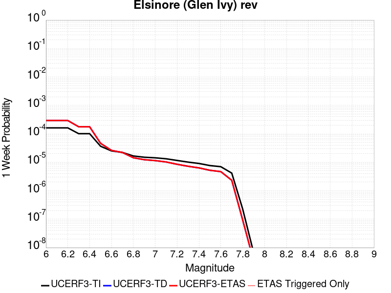 |  |  |  |

| Magnitude | 1 wk TI Prob | 1 wk TD Prob | 1 wk ETAS Prob | 1 wk ETAS/TD Gain | 1 wk ETAS Triggered Only | 1 mo TI Prob | 1 mo TD Prob | 1 mo ETAS Prob | 1 mo ETAS/TD Gain | 1 mo ETAS Triggered Only | 1 yr TI Prob | 1 yr TD Prob | 1 yr ETAS Prob | 1 yr ETAS/TD Gain | 1 yr ETAS Triggered Only | 10 yr TI Prob | 10 yr TD Prob | 10 yr ETAS Prob | 10 yr ETAS/TD Gain | 10 yr ETAS Triggered Only |
|-----|-----|-----|-----|-----|-----|-----|-----|-----|-----|-----|-----|-----|-----|-----|-----|-----|-----|-----|-----|-----|
| 6.0 | 1.6204086E-4 | 2.9369915E-4 | 2.9369915E-4 | 1.0 | 0.0 | 6.94276E-4 | 0.0012582582 | 0.0012682456 | 1.0079376 | 1.0E-5 | 0.008420097 | 0.0152386045 | 0.015287843 | 1.0032312 | 5.0E-5 | 0.081081145 | 0.13971579 | 0.13981903 | 1.0007389 | 1.2E-4 |
| 6.1 | 1.6204086E-4 | 2.9369915E-4 | 2.9369915E-4 | 1.0 | 0.0 | 6.94276E-4 | 0.0012582582 | 0.0012682456 | 1.0079376 | 1.0E-5 | 0.008420097 | 0.0152386045 | 0.015287843 | 1.0032312 | 5.0E-5 | 0.081081145 | 0.13971579 | 0.13981903 | 1.0007389 | 1.2E-4 |
| 6.2 | 1.6204086E-4 | 2.9369915E-4 | 2.9369915E-4 | 1.0 | 0.0 | 6.94276E-4 | 0.0012582582 | 0.0012682456 | 1.0079376 | 1.0E-5 | 0.008420097 | 0.0152386045 | 0.015287843 | 1.0032312 | 5.0E-5 | 0.081081145 | 0.13971579 | 0.13981903 | 1.0007389 | 1.2E-4 |
| 6.3 | 1.0111737E-4 | 1.7706092E-4 | 1.7706092E-4 | 1.0 | 0.0 | 4.332882E-4 | 7.5872854E-4 | 7.68721E-4 | 1.0131699 | 1.0E-5 | 0.005262531 | 0.009219088 | 0.009258719 | 1.0042988 | 4.0E-5 | 0.0513964 | 0.08703119 | 0.08713162 | 1.001154 | 1.1E-4 |
| 6.4 | 1.0111737E-4 | 1.7706092E-4 | 1.7706092E-4 | 1.0 | 0.0 | 4.332882E-4 | 7.5872854E-4 | 7.68721E-4 | 1.0131699 | 1.0E-5 | 0.005262531 | 0.009219088 | 0.009258719 | 1.0042988 | 4.0E-5 | 0.0513964 | 0.08703119 | 0.08713162 | 1.001154 | 1.1E-4 |
| 6.5 | 3.6624708E-5 | 4.6404577E-5 | 4.6404577E-5 | 1.0 | 0.0 | 1.569536E-4 | 1.9886365E-4 | 2.0886166E-4 | 1.0502757 | 1.0E-5 | 0.001909235 | 0.0024188396 | 0.0024288155 | 1.0041242 | 1.0E-5 | 0.01892915 | 0.023746667 | 0.023775956 | 1.0012333 | 3.0E-5 |
| 6.6 | 2.5051324E-5 | 2.615726E-5 | 2.615726E-5 | 1.0 | 0.0 | 1.073584E-4 | 1.1209798E-4 | 1.1209798E-4 | 1.0 | 0.0 | 0.0013063047 | 0.0013639829 | 0.0013639829 | 1.0 | 0.0 | 0.012986525 | 0.013569498 | 0.013579363 | 1.0007269 | 1.0E-5 |
| 6.7 | 2.2189772E-5 | 2.2081127E-5 | 2.2081127E-5 | 1.0 | 0.0 | 9.509556E-5 | 9.463017E-5 | 9.463017E-5 | 1.0 | 0.0 | 0.0011571734 | 0.0011515499 | 0.0011515499 | 1.0 | 0.0 | 0.011511663 | 0.011469669 | 0.011479555 | 1.0008619 | 1.0E-5 |
| 6.8 | 1.6654378E-5 | 1.4442895E-5 | 1.4442895E-5 | 1.0 | 0.0 | 7.137396E-5 | 6.189668E-5 | 6.189668E-5 | 1.0 | 0.0 | 8.686314E-4 | 7.533367E-4 | 7.533367E-4 | 1.0 | 0.0 | 0.008652439 | 0.0075131655 | 0.0075230906 | 1.001321 | 1.0E-5 |
| 6.9 | 1.5042909E-5 | 1.2336598E-5 | 1.2336598E-5 | 1.0 | 0.0 | 6.446802E-5 | 5.287008E-5 | 5.287008E-5 | 1.0 | 0.0 | 7.8461546E-4 | 6.435063E-4 | 6.435063E-4 | 1.0 | 0.0 | 0.007818509 | 0.0064206515 | 0.0064305873 | 1.0015475 | 1.0E-5 |
| 7.0 | 1.4361385E-5 | 1.1455669E-5 | 1.1455669E-5 | 1.0 | 0.0 | 6.154734E-5 | 4.9094815E-5 | 4.9094815E-5 | 1.0 | 0.0 | 7.490812E-4 | 5.9756835E-4 | 5.9756835E-4 | 1.0 | 0.0 | 0.007465612 | 0.005963606 | 0.0059735463 | 1.0016668 | 1.0E-5 |
| 7.1 | 1.3265571E-5 | 1.0248802E-5 | 1.0248802E-5 | 1.0 | 0.0 | 5.6851208E-5 | 4.392271E-5 | 4.392271E-5 | 1.0 | 0.0 | 6.919436E-4 | 5.346303E-4 | 5.346303E-4 | 1.0 | 0.0 | 0.006897931 | 0.005336798 | 0.0053467443 | 1.0018638 | 1.0E-5 |
| 7.2 | 1.1596403E-5 | 8.508368E-6 | 8.508368E-6 | 1.0 | 0.0 | 4.9697923E-5 | 3.6463935E-5 | 3.6463935E-5 | 1.0 | 0.0 | 6.049042E-4 | 4.4385967E-4 | 4.4385967E-4 | 1.0 | 0.0 | 0.006032603 | 0.0044311467 | 0.0044411025 | 1.0022467 | 1.0E-5 |
| 7.3 | 1.0150827E-5 | 7.2416165E-6 | 7.2416165E-6 | 1.0 | 0.0 | 4.3502816E-5 | 3.103514E-5 | 3.103514E-5 | 1.0 | 0.0 | 5.2951806E-4 | 3.7778873E-4 | 3.7778873E-4 | 1.0 | 0.0 | 0.005282581 | 0.0037718515 | 0.0037718515 | 1.0 | 0.0 |
| 7.4 | 9.080705E-6 | 6.3550674E-6 | 6.3550674E-6 | 1.0 | 0.0 | 3.8916725E-5 | 2.7235727E-5 | 2.7235727E-5 | 1.0 | 0.0 | 4.7370812E-4 | 3.315459E-4 | 3.315459E-4 | 1.0 | 0.0 | 0.004726996 | 0.0033106634 | 0.0033106634 | 1.0 | 0.0 |
| 7.5 | 7.671649E-6 | 5.2278356E-6 | 5.2278356E-6 | 1.0 | 0.0 | 3.287808E-5 | 2.2404824E-5 | 2.2404824E-5 | 1.0 | 0.0 | 4.0021708E-4 | 2.7274585E-4 | 2.7274585E-4 | 1.0 | 0.0 | 0.0039949706 | 0.002724236 | 0.002724236 | 1.0 | 0.0 |
| 7.6 | 6.990086E-6 | 4.689591E-6 | 4.689591E-6 | 1.0 | 0.0 | 2.9957167E-5 | 2.00981E-5 | 2.00981E-5 | 1.0 | 0.0 | 3.6466747E-4 | 2.4466804E-4 | 2.4466804E-4 | 1.0 | 0.0 | 0.0036406964 | 0.0024441031 | 0.0024441031 | 1.0 | 0.0 |
| 7.7 | 4.163505E-6 | 2.33052E-6 | 2.33052E-6 | 1.0 | 0.0 | 1.7843471E-5 | 9.987909E-6 | 9.987909E-6 | 1.0 | 0.0 | 2.172226E-4 | 1.2159675E-4 | 1.2159675E-4 | 1.0 | 0.0 | 0.0021701038 | 0.0012153753 | 0.0012153753 | 1.0 | 0.0 |
| 7.8 | 2.2692414E-7 | 9.388808E-8 | 9.388808E-8 | 1.0 | 0.0 | 9.725317E-7 | 4.0237745E-7 | 4.0237745E-7 | 1.0 | 0.0 | 1.1840509E-5 | 4.8989377E-6 | 4.8989377E-6 | 1.0 | 0.0 | 1.1839878E-4 | 4.8988626E-5 | 4.8988626E-5 | 1.0 | 0.0 |
| 7.9 | 6.676829E-9 | 3.4407224E-9 | 3.4407224E-9 | 1.0 | 0.0 | 2.861498E-8 | 1.4745954E-8 | 1.4745954E-8 | 1.0 | 0.0 | 3.4838732E-7 | 1.7953197E-7 | 1.7953197E-7 | 1.0 | 0.0 | 3.4838679E-6 | 1.7953184E-6 | 1.7953184E-6 | 1.0 | 0.0 |

## Baker
*[(top)](#table-of-contents)*

| 1 Week | 1 Month | 1 Year | 10 Year |
|-----|-----|-----|-----|
|  | 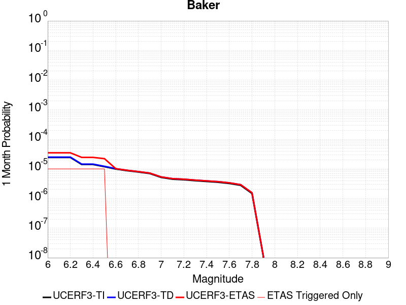 |  | 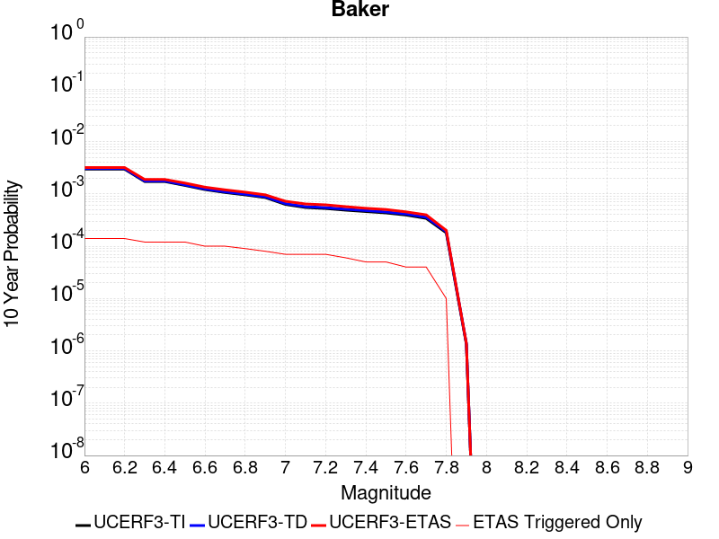 |

| Magnitude | 1 wk TI Prob | 1 wk TD Prob | 1 wk ETAS Prob | 1 wk ETAS/TD Gain | 1 wk ETAS Triggered Only | 1 mo TI Prob | 1 mo TD Prob | 1 mo ETAS Prob | 1 mo ETAS/TD Gain | 1 mo ETAS Triggered Only | 1 yr TI Prob | 1 yr TD Prob | 1 yr ETAS Prob | 1 yr ETAS/TD Gain | 1 yr ETAS Triggered Only | 10 yr TI Prob | 10 yr TD Prob | 10 yr ETAS Prob | 10 yr ETAS/TD Gain | 10 yr ETAS Triggered Only |
|-----|-----|-----|-----|-----|-----|-----|-----|-----|-----|-----|-----|-----|-----|-----|-----|-----|-----|-----|-----|-----|
| 6.0 | 5.695525E-6 | 5.8349706E-6 | 5.8349706E-6 | 1.0 | 0.0 | 2.4409164E-5 | 2.5006799E-5 | 3.500655E-5 | 1.3998812 | 1.0E-5 | 2.9714106E-4 | 3.0441926E-4 | 3.4440708E-4 | 1.1313578 | 4.0E-5 | 0.0029674405 | 0.003040418 | 0.0031799925 | 1.0459063 | 1.4E-4 |
| 6.1 | 5.695525E-6 | 5.8349706E-6 | 5.8349706E-6 | 1.0 | 0.0 | 2.4409164E-5 | 2.5006799E-5 | 3.500655E-5 | 1.3998812 | 1.0E-5 | 2.9714106E-4 | 3.0441926E-4 | 3.4440708E-4 | 1.1313578 | 4.0E-5 | 0.0029674405 | 0.003040418 | 0.0031799925 | 1.0459063 | 1.4E-4 |
| 6.2 | 5.695525E-6 | 5.8349706E-6 | 5.8349706E-6 | 1.0 | 0.0 | 2.4409164E-5 | 2.5006799E-5 | 3.500655E-5 | 1.3998812 | 1.0E-5 | 2.9714106E-4 | 3.0441926E-4 | 3.4440708E-4 | 1.1313578 | 4.0E-5 | 0.0029674405 | 0.003040418 | 0.0031799925 | 1.0459063 | 1.4E-4 |
| 6.3 | 3.2995713E-6 | 3.383748E-6 | 3.383748E-6 | 1.0 | 0.0 | 1.4140943E-5 | 1.4501698E-5 | 2.4501554E-5 | 1.6895643 | 1.0E-5 | 1.7215237E-4 | 1.7654434E-4 | 2.1653729E-4 | 1.226532 | 4.0E-5 | 0.0017201907 | 0.001764088 | 0.0018838764 | 1.0679038 | 1.2E-4 |
| 6.4 | 3.2995713E-6 | 3.383748E-6 | 3.383748E-6 | 1.0 | 0.0 | 1.4140943E-5 | 1.4501698E-5 | 2.4501554E-5 | 1.6895643 | 1.0E-5 | 1.7215237E-4 | 1.7654434E-4 | 2.1653729E-4 | 1.226532 | 4.0E-5 | 0.0017201907 | 0.001764088 | 0.0018838764 | 1.0679038 | 1.2E-4 |
| 6.5 | 2.782202E-6 | 2.8559114E-6 | 2.8559114E-6 | 1.0 | 0.0 | 1.1923668E-5 | 1.2239564E-5 | 2.2239441E-5 | 1.8170125 | 1.0E-5 | 1.4516099E-4 | 1.4900684E-4 | 1.8900087E-4 | 1.268404 | 4.0E-5 | 0.001450662 | 0.001489102 | 0.0016089233 | 1.0804654 | 1.2E-4 |
| 6.6 | 2.3163404E-6 | 2.3809823E-6 | 2.3809823E-6 | 1.0 | 0.0 | 9.927136E-6 | 1.0204171E-5 | 1.0204171E-5 | 1.0 | 0.0 | 1.20856166E-4 | 1.242289E-4 | 1.5422517E-4 | 1.2414597 | 3.0E-5 | 0.0012079047 | 0.0012416148 | 0.0013414907 | 1.0804403 | 1.0E-4 |
| 6.7 | 2.037056E-6 | 2.0965579E-6 | 2.0965579E-6 | 1.0 | 0.0 | 8.7302105E-6 | 8.985218E-6 | 8.985218E-6 | 1.0 | 0.0 | 1.0628513E-4 | 1.093897E-4 | 1.3938642E-4 | 1.2742188 | 3.0E-5 | 0.0010623431 | 0.0010933747 | 0.0011932653 | 1.09136 | 1.0E-4 |
| 6.8 | 1.8356744E-6 | 1.8915827E-6 | 1.8915827E-6 | 1.0 | 0.0 | 7.867153E-6 | 8.106758E-6 | 8.106758E-6 | 1.0 | 0.0 | 9.577837E-5 | 9.8695455E-5 | 1.1869348E-4 | 1.2026236 | 2.0E-5 | 9.57371E-4 | 9.865302E-4 | 0.0010764414 | 1.0911388 | 9.0E-5 |
| 6.9 | 1.6310546E-6 | 1.6832578E-6 | 1.6832578E-6 | 1.0 | 0.0 | 6.9902153E-6 | 7.2139424E-6 | 7.2139424E-6 | 1.0 | 0.0 | 8.510255E-5 | 8.782632E-5 | 1.0782457E-4 | 1.2277021 | 2.0E-5 | 8.5069967E-4 | 8.779274E-4 | 9.578572E-4 | 1.0910437 | 8.0E-5 |
| 7.0 | 1.2058036E-6 | 1.2509104E-6 | 1.2509104E-6 | 1.0 | 0.0 | 5.1677193E-6 | 5.361034E-6 | 5.361034E-6 | 1.0 | 0.0 | 6.291517E-5 | 6.526865E-5 | 8.526735E-5 | 1.3064058 | 2.0E-5 | 6.289736E-4 | 6.5249717E-4 | 7.224515E-4 | 1.1072102 | 7.0E-5 |
| 7.1 | 1.052382E-6 | 1.0952025E-6 | 1.0952025E-6 | 1.0 | 0.0 | 4.5102006E-6 | 4.6937166E-6 | 4.6937166E-6 | 1.0 | 0.0 | 5.491031E-5 | 5.7144513E-5 | 7.714337E-5 | 1.3499699 | 2.0E-5 | 5.4896745E-4 | 5.7129905E-4 | 6.412591E-4 | 1.1224577 | 7.0E-5 |
| 7.2 | 1.0067454E-6 | 1.048812E-6 | 1.048812E-6 | 1.0 | 0.0 | 4.3146156E-6 | 4.494901E-6 | 4.494901E-6 | 1.0 | 0.0 | 5.252918E-5 | 5.4724056E-5 | 7.472296E-5 | 1.36545 | 2.0E-5 | 5.251676E-4 | 5.4710667E-4 | 6.170684E-4 | 1.1278758 | 7.0E-5 |
| 7.3 | 9.3596316E-7 | 9.768122E-7 | 9.768122E-7 | 1.0 | 0.0 | 4.0112645E-6 | 4.1863314E-6 | 4.1863314E-6 | 1.0 | 0.0 | 4.8836053E-5 | 5.09674E-5 | 6.096689E-5 | 1.1961938 | 1.0E-5 | 4.8825322E-4 | 5.095579E-4 | 5.6952727E-4 | 1.1176891 | 6.0E-5 |
| 7.4 | 8.8117395E-7 | 9.20805E-7 | 9.20805E-7 | 1.0 | 0.0 | 3.7764542E-6 | 3.946301E-6 | 3.946301E-6 | 1.0 | 0.0 | 4.5977362E-5 | 4.8045167E-5 | 5.8044687E-5 | 1.2081275 | 1.0E-5 | 4.596785E-4 | 4.8034854E-4 | 5.303245E-4 | 1.1040411 | 5.0E-5 |
| 7.5 | 8.292386E-7 | 8.674969E-7 | 8.674969E-7 | 1.0 | 0.0 | 3.5538749E-6 | 3.7178388E-6 | 3.7178388E-6 | 1.0 | 0.0 | 4.326757E-5 | 4.5263754E-5 | 5.52633E-5 | 1.2209173 | 1.0E-5 | 4.3259145E-4 | 4.5254608E-4 | 5.0252344E-4 | 1.110436 | 5.0E-5 |
| 7.6 | 7.553842E-7 | 7.9148236E-7 | 7.9148236E-7 | 1.0 | 0.0 | 3.2373566E-6 | 3.3920628E-6 | 3.3920628E-6 | 1.0 | 0.0 | 3.9414106E-5 | 4.129759E-5 | 5.1297175E-5 | 1.2421349 | 1.0E-5 | 3.9407116E-4 | 4.1289986E-4 | 4.5288334E-4 | 1.0968357 | 4.0E-5 |
| 7.7 | 6.5285366E-7 | 6.853115E-7 | 6.853115E-7 | 1.0 | 0.0 | 2.797941E-6 | 2.9370458E-6 | 2.9370458E-6 | 1.0 | 0.0 | 3.40644E-5 | 3.5757952E-5 | 4.5757595E-5 | 1.2796481 | 1.0E-5 | 3.405918E-4 | 3.5752266E-4 | 3.9750835E-4 | 1.1118411 | 4.0E-5 |
| 7.8 | 3.4586725E-7 | 3.648448E-7 | 3.648448E-7 | 1.0 | 0.0 | 1.4822873E-6 | 1.5636197E-6 | 1.5636197E-6 | 1.0 | 0.0 | 1.80467E-5 | 1.9036908E-5 | 1.9036908E-5 | 1.0 | 0.0 | 1.8045233E-4 | 1.9035321E-4 | 2.0035131E-4 | 1.052524 | 1.0E-5 |
| 7.9 | 2.5591178E-9 | 2.6697788E-9 | 2.6697788E-9 | 1.0 | 0.0 | 1.0967647E-8 | 1.144191E-8 | 1.144191E-8 | 1.0 | 0.0 | 1.335311E-7 | 1.3930524E-7 | 1.3930524E-7 | 1.0 | 0.0 | 1.3353102E-6 | 1.3930525E-6 | 1.3930525E-6 | 1.0 | 0.0 |

## Death Valley (Fish Lake Valley)
*[(top)](#table-of-contents)*

| 1 Week | 1 Month | 1 Year | 10 Year |
|-----|-----|-----|-----|
|  | 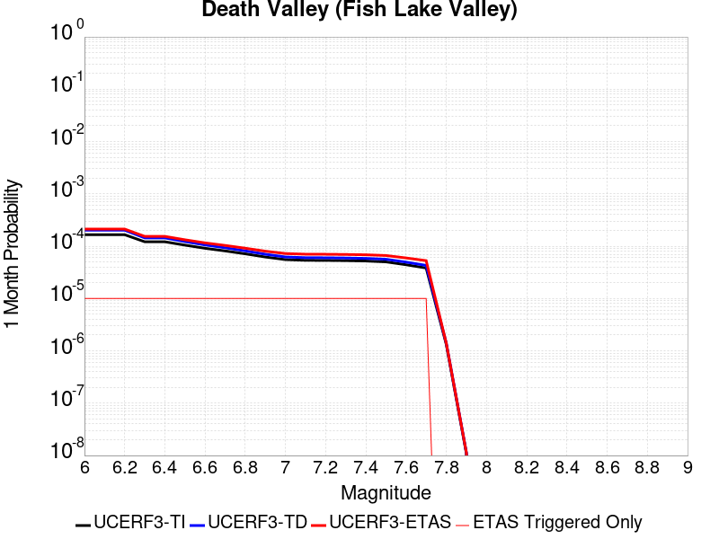 | 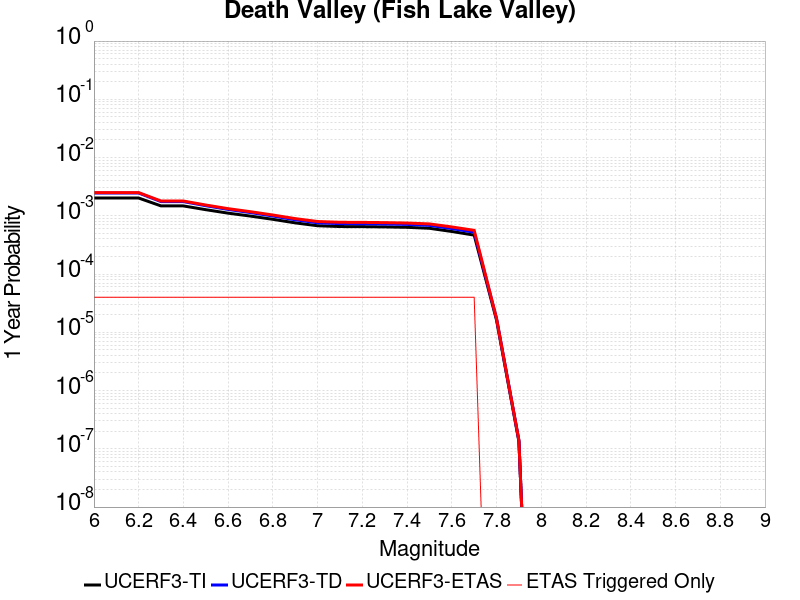 |  |

| Magnitude | 1 wk TI Prob | 1 wk TD Prob | 1 wk ETAS Prob | 1 wk ETAS/TD Gain | 1 wk ETAS Triggered Only | 1 mo TI Prob | 1 mo TD Prob | 1 mo ETAS Prob | 1 mo ETAS/TD Gain | 1 mo ETAS Triggered Only | 1 yr TI Prob | 1 yr TD Prob | 1 yr ETAS Prob | 1 yr ETAS/TD Gain | 1 yr ETAS Triggered Only | 10 yr TI Prob | 10 yr TD Prob | 10 yr ETAS Prob | 10 yr ETAS/TD Gain | 10 yr ETAS Triggered Only |
|-----|-----|-----|-----|-----|-----|-----|-----|-----|-----|-----|-----|-----|-----|-----|-----|-----|-----|-----|-----|-----|
| 6.0 | 3.872328E-5 | 4.7277426E-5 | 5.7276953E-5 | 1.2115074 | 1.0E-5 | 1.6594635E-4 | 2.0260349E-4 | 2.1260147E-4 | 1.0493475 | 1.0E-5 | 0.0020185246 | 0.002464023 | 0.0025039243 | 1.0161936 | 4.0E-5 | 0.02000288 | 0.02439309 | 0.024529675 | 1.0055994 | 1.4E-4 |
| 6.1 | 3.872328E-5 | 4.7277426E-5 | 5.7276953E-5 | 1.2115074 | 1.0E-5 | 1.6594635E-4 | 2.0260349E-4 | 2.1260147E-4 | 1.0493475 | 1.0E-5 | 0.0020185246 | 0.002464023 | 0.0025039243 | 1.0161936 | 4.0E-5 | 0.02000288 | 0.02439309 | 0.024529675 | 1.0055994 | 1.4E-4 |
| 6.2 | 3.872328E-5 | 4.7277426E-5 | 5.7276953E-5 | 1.2115074 | 1.0E-5 | 1.6594635E-4 | 2.0260349E-4 | 2.1260147E-4 | 1.0493475 | 1.0E-5 | 0.0020185246 | 0.002464023 | 0.0025039243 | 1.0161936 | 4.0E-5 | 0.02000288 | 0.02439309 | 0.024529675 | 1.0055994 | 1.4E-4 |
| 6.3 | 2.8356371E-5 | 3.361575E-5 | 4.3615415E-5 | 1.2974696 | 1.0E-5 | 1.2152165E-4 | 1.4405999E-4 | 1.5405855E-4 | 1.0694056 | 1.0E-5 | 0.0014785219 | 0.0017525983 | 0.0017925283 | 1.0227833 | 4.0E-5 | 0.014687235 | 0.017394776 | 0.01753234 | 1.0079083 | 1.4E-4 |
| 6.4 | 2.8356371E-5 | 3.361575E-5 | 4.3615415E-5 | 1.2974696 | 1.0E-5 | 1.2152165E-4 | 1.4405999E-4 | 1.5405855E-4 | 1.0694056 | 1.0E-5 | 0.0014785219 | 0.0017525983 | 0.0017925283 | 1.0227833 | 4.0E-5 | 0.014687235 | 0.017394776 | 0.01753234 | 1.0079083 | 1.4E-4 |
| 6.5 | 2.4448687E-5 | 2.8612143E-5 | 3.861186E-5 | 1.349492 | 1.0E-5 | 1.0477588E-4 | 1.2261799E-4 | 1.3261677E-4 | 1.081544 | 1.0E-5 | 0.0012748998 | 0.0014919023 | 0.0015318426 | 1.0267714 | 4.0E-5 | 0.012676105 | 0.0148237245 | 0.01496165 | 1.0093043 | 1.4E-4 |
| 6.6 | 2.1298161E-5 | 2.4663745E-5 | 3.46635E-5 | 1.4054434 | 1.0E-5 | 9.127464E-5 | 1.0569767E-4 | 1.1569661E-4 | 1.0945995 | 1.0E-5 | 0.0011107022 | 0.0012861433 | 0.0013260918 | 1.0310607 | 4.0E-5 | 0.011051672 | 0.012790408 | 0.012928617 | 1.0108057 | 1.4E-4 |
| 6.7 | 1.8959729E-5 | 2.1784066E-5 | 3.178385E-5 | 1.4590411 | 1.0E-5 | 8.125345E-5 | 9.3357085E-5 | 1.0335615E-4 | 1.1071056 | 1.0E-5 | 9.888117E-4 | 0.0011360554 | 0.00117601 | 1.0351696 | 4.0E-5 | 0.009844234 | 0.011305139 | 0.011443556 | 1.0122437 | 1.4E-4 |
| 6.8 | 1.6691629E-5 | 1.9020832E-5 | 2.9020643E-5 | 1.5257293 | 1.0E-5 | 7.153359E-5 | 8.15154E-5 | 9.151459E-5 | 1.1226662 | 1.0E-5 | 8.7057345E-4 | 9.92015E-4 | 0.0010319753 | 1.040282 | 4.0E-5 | 0.008671708 | 0.009877626 | 0.010016243 | 1.0140334 | 1.4E-4 |
| 6.9 | 1.450505E-5 | 1.6391527E-5 | 2.6391363E-5 | 1.6100613 | 1.0E-5 | 6.216302E-5 | 7.024756E-5 | 8.024686E-5 | 1.1423438 | 1.0E-5 | 7.5657194E-4 | 8.549372E-4 | 8.94903E-4 | 1.0467471 | 4.0E-5 | 0.007540013 | 0.008517413 | 0.008656221 | 1.0162969 | 1.4E-4 |
| 7.0 | 1.2940855E-5 | 1.45396425E-5 | 2.4539497E-5 | 1.6877649 | 1.0E-5 | 5.545963E-5 | 6.2311294E-5 | 7.231067E-5 | 1.1604745 | 1.0E-5 | 6.750118E-4 | 7.583818E-4 | 7.983514E-4 | 1.0527039 | 4.0E-5 | 0.006729651 | 0.0075585553 | 0.007697497 | 1.0183821 | 1.4E-4 |
| 7.1 | 1.2544658E-5 | 1.4079809E-5 | 2.4079669E-5 | 1.7102269 | 1.0E-5 | 5.3761712E-5 | 6.0340677E-5 | 7.034007E-5 | 1.1657157 | 1.0E-5 | 6.5435225E-4 | 7.344057E-4 | 7.743763E-4 | 1.0544258 | 4.0E-5 | 0.006524288 | 0.007320381 | 0.007459356 | 1.0189847 | 1.4E-4 |
| 7.2 | 1.2489416E-5 | 1.4017269E-5 | 2.4017128E-5 | 1.7133957 | 1.0E-5 | 5.3524967E-5 | 6.0072656E-5 | 7.0072056E-5 | 1.166455 | 1.0E-5 | 6.514716E-4 | 7.3114474E-4 | 7.7111553E-4 | 1.0546688 | 4.0E-5 | 0.006495651 | 0.0072879856 | 0.0074269655 | 1.0190697 | 1.4E-4 |
| 7.3 | 1.2368307E-5 | 1.3881391E-5 | 2.3881252E-5 | 1.7203789 | 1.0E-5 | 5.3005948E-5 | 5.949035E-5 | 6.948975E-5 | 1.1680845 | 1.0E-5 | 6.451563E-4 | 7.2405994E-4 | 7.6403096E-4 | 1.055204 | 4.0E-5 | 0.0064328653 | 0.0072176 | 0.007356589 | 1.0192571 | 1.4E-4 |
| 7.4 | 1.2161707E-5 | 1.364942E-5 | 2.3649283E-5 | 1.7326219 | 1.0E-5 | 5.212056E-5 | 5.8496233E-5 | 6.849565E-5 | 1.1709412 | 1.0E-5 | 6.3438306E-4 | 7.119645E-4 | 7.5193605E-4 | 1.0561426 | 4.0E-5 | 0.006325751 | 0.007097425 | 0.0072364314 | 1.0195855 | 1.4E-4 |
| 7.5 | 1.1707948E-5 | 1.3147017E-5 | 2.3146886E-5 | 1.7606188 | 1.0E-5 | 5.0175953E-5 | 5.634317E-5 | 6.634261E-5 | 1.1774738 | 1.0E-5 | 6.10721E-4 | 6.857678E-4 | 7.2574033E-4 | 1.0582888 | 4.0E-5 | 0.0060904534 | 0.0068370993 | 0.006976142 | 1.0203365 | 1.4E-4 |
| 7.6 | 1.0319538E-5 | 1.1580937E-5 | 2.1580821E-5 | 1.863478 | 1.0E-5 | 4.4225842E-5 | 4.963167E-5 | 5.9631177E-5 | 1.2014742 | 1.0E-5 | 5.383166E-4 | 6.0410326E-4 | 6.4407906E-4 | 1.0661738 | 4.0E-5 | 0.0053701443 | 0.0060251425 | 0.006164299 | 1.023096 | 1.4E-4 |
| 7.7 | 8.937764E-6 | 1.002391E-5 | 2.002381E-5 | 1.9976046 | 1.0E-5 | 3.830414E-5 | 4.2958938E-5 | 5.295851E-5 | 1.2327704 | 1.0E-5 | 4.6625308E-4 | 5.2290456E-4 | 5.628837E-4 | 1.0764558 | 4.0E-5 | 0.0046527605 | 0.005217252 | 0.0053565213 | 1.026694 | 1.4E-4 |
| 7.8 | 3.108007E-7 | 3.284828E-7 | 3.284828E-7 | 1.0 | 0.0 | 1.3320023E-6 | 1.4077827E-6 | 1.4077827E-6 | 1.0 | 0.0 | 1.6217007E-5 | 1.7139624E-5 | 1.7139624E-5 | 1.0 | 0.0 | 1.6215823E-4 | 1.713834E-4 | 1.8138169E-4 | 1.0583388 | 1.0E-5 |
| 7.9 | 2.5591178E-9 | 2.6697788E-9 | 2.6697788E-9 | 1.0 | 0.0 | 1.0967647E-8 | 1.144191E-8 | 1.144191E-8 | 1.0 | 0.0 | 1.335311E-7 | 1.3930524E-7 | 1.3930524E-7 | 1.0 | 0.0 | 1.3353102E-6 | 1.3930525E-6 | 1.3930525E-6 | 1.0 | 0.0 |

## Sierra Nevada  (No Extension)
*[(top)](#table-of-contents)*

| 1 Week | 1 Month | 1 Year | 10 Year |
|-----|-----|-----|-----|
|  |  |  | 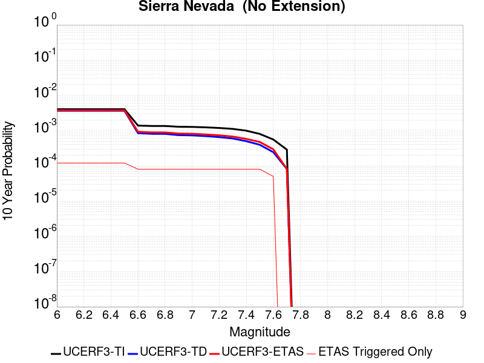 |

| Magnitude | 1 wk TI Prob | 1 wk TD Prob | 1 wk ETAS Prob | 1 wk ETAS/TD Gain | 1 wk ETAS Triggered Only | 1 mo TI Prob | 1 mo TD Prob | 1 mo ETAS Prob | 1 mo ETAS/TD Gain | 1 mo ETAS Triggered Only | 1 yr TI Prob | 1 yr TD Prob | 1 yr ETAS Prob | 1 yr ETAS/TD Gain | 1 yr ETAS Triggered Only | 10 yr TI Prob | 10 yr TD Prob | 10 yr ETAS Prob | 10 yr ETAS/TD Gain | 10 yr ETAS Triggered Only |
|-----|-----|-----|-----|-----|-----|-----|-----|-----|-----|-----|-----|-----|-----|-----|-----|-----|-----|-----|-----|-----|
| 6.0 | 7.7690465E-6 | 6.976752E-6 | 6.976752E-6 | 1.0 | 0.0 | 3.329549E-5 | 2.9900226E-5 | 2.9900226E-5 | 1.0 | 0.0 | 4.0529718E-4 | 3.6401028E-4 | 4.2398844E-4 | 1.1647705 | 6.0E-5 | 0.004045588 | 0.0036376568 | 0.0037572202 | 1.0328683 | 1.2E-4 |
| 6.1 | 7.7690465E-6 | 6.976752E-6 | 6.976752E-6 | 1.0 | 0.0 | 3.329549E-5 | 2.9900226E-5 | 2.9900226E-5 | 1.0 | 0.0 | 4.0529718E-4 | 3.6401028E-4 | 4.2398844E-4 | 1.1647705 | 6.0E-5 | 0.004045588 | 0.0036376568 | 0.0037572202 | 1.0328683 | 1.2E-4 |
| 6.2 | 7.7690465E-6 | 6.976752E-6 | 6.976752E-6 | 1.0 | 0.0 | 3.329549E-5 | 2.9900226E-5 | 2.9900226E-5 | 1.0 | 0.0 | 4.0529718E-4 | 3.6401028E-4 | 4.2398844E-4 | 1.1647705 | 6.0E-5 | 0.004045588 | 0.0036376568 | 0.0037572202 | 1.0328683 | 1.2E-4 |
| 6.3 | 7.7690465E-6 | 6.976752E-6 | 6.976752E-6 | 1.0 | 0.0 | 3.329549E-5 | 2.9900226E-5 | 2.9900226E-5 | 1.0 | 0.0 | 4.0529718E-4 | 3.6401028E-4 | 4.2398844E-4 | 1.1647705 | 6.0E-5 | 0.004045588 | 0.0036376568 | 0.0037572202 | 1.0328683 | 1.2E-4 |
| 6.4 | 7.7690465E-6 | 6.976752E-6 | 6.976752E-6 | 1.0 | 0.0 | 3.329549E-5 | 2.9900226E-5 | 2.9900226E-5 | 1.0 | 0.0 | 4.0529718E-4 | 3.6401028E-4 | 4.2398844E-4 | 1.1647705 | 6.0E-5 | 0.004045588 | 0.0036376568 | 0.0037572202 | 1.0328683 | 1.2E-4 |
| 6.5 | 7.7690465E-6 | 6.976752E-6 | 6.976752E-6 | 1.0 | 0.0 | 3.329549E-5 | 2.9900226E-5 | 2.9900226E-5 | 1.0 | 0.0 | 4.0529718E-4 | 3.6401028E-4 | 4.2398844E-4 | 1.1647705 | 6.0E-5 | 0.004045588 | 0.0036376568 | 0.0037572202 | 1.0328683 | 1.2E-4 |
| 6.6 | 2.653E-6 | 1.6150456E-6 | 1.6150456E-6 | 1.0 | 0.0 | 1.136995E-5 | 6.9216057E-6 | 6.9216057E-6 | 1.0 | 0.0 | 1.3842035E-4 | 8.4267325E-5 | 1.2426396E-4 | 1.4746398 | 4.0E-5 | 0.0013833415 | 8.4235717E-4 | 9.222898E-4 | 1.0948915 | 8.0E-5 |
| 6.7 | 2.5902466E-6 | 1.5503773E-6 | 1.5503773E-6 | 1.0 | 0.0 | 1.11010095E-5 | 6.6444572E-6 | 6.6444572E-6 | 1.0 | 0.0 | 1.351464E-4 | 8.08933E-5 | 1.2089006E-4 | 1.4944385 | 4.0E-5 | 0.0013506424 | 8.086415E-4 | 8.885768E-4 | 1.0988513 | 8.0E-5 |
| 6.8 | 2.5853892E-6 | 1.5471767E-6 | 1.5471767E-6 | 1.0 | 0.0 | 1.1080193E-5 | 6.6307402E-6 | 6.6307402E-6 | 1.0 | 0.0 | 1.34893E-4 | 8.0726306E-5 | 1.20723074E-4 | 1.4954615 | 4.0E-5 | 0.0013481114 | 8.069728E-4 | 8.869082E-4 | 1.0990559 | 8.0E-5 |
| 6.9 | 2.458257E-6 | 1.4222467E-6 | 1.4222467E-6 | 1.0 | 0.0 | 1.0535345E-5 | 6.095329E-6 | 6.095329E-6 | 1.0 | 0.0 | 1.2826028E-4 | 7.420812E-5 | 1.14205155E-4 | 1.5389845 | 4.0E-5 | 0.0012818627 | 7.4183533E-4 | 8.21776E-4 | 1.1077607 | 8.0E-5 |
| 7.0 | 2.4341468E-6 | 1.3992096E-6 | 1.3992096E-6 | 1.0 | 0.0 | 1.0432016E-5 | 5.996599E-6 | 5.996599E-6 | 1.0 | 0.0 | 1.270024E-4 | 7.3006166E-5 | 1.1300325E-4 | 1.547859 | 4.0E-5 | 0.0012692984 | 7.298237E-4 | 8.0976536E-4 | 1.1095355 | 8.0E-5 |
| 7.1 | 2.3652476E-6 | 1.3341567E-6 | 1.3341567E-6 | 1.0 | 0.0 | 1.0136736E-5 | 5.7178017E-6 | 5.7178017E-6 | 1.0 | 0.0 | 1.2340778E-4 | 6.9612026E-5 | 1.09609246E-4 | 1.5745733 | 4.0E-5 | 0.0012333926 | 6.9590396E-4 | 7.758483E-4 | 1.1148784 | 8.0E-5 |
| 7.2 | 2.272158E-6 | 1.250459E-6 | 1.250459E-6 | 1.0 | 0.0 | 9.737784E-6 | 5.3590993E-6 | 5.3590993E-6 | 1.0 | 0.0 | 1.1855107E-4 | 6.52451E-5 | 1.05242485E-4 | 1.6130329 | 4.0E-5 | 0.0011848784 | 6.522609E-4 | 7.322087E-4 | 1.1225703 | 8.0E-5 |
| 7.3 | 2.1382127E-6 | 1.1421416E-6 | 1.1421416E-6 | 1.0 | 0.0 | 9.163737E-6 | 4.8948837E-6 | 4.8948837E-6 | 1.0 | 0.0 | 1.1156279E-4 | 5.959359E-5 | 9.9591205E-5 | 1.6711731 | 4.0E-5 | 0.001115068 | 5.957773E-4 | 6.757296E-4 | 1.1341984 | 8.0E-5 |
| 7.4 | 1.9048055E-6 | 9.576864E-7 | 9.576864E-7 | 1.0 | 0.0 | 8.163426E-6 | 4.104364E-6 | 4.104364E-6 | 1.0 | 0.0 | 9.9385186E-5 | 4.9969494E-5 | 8.99675E-5 | 1.8004484 | 4.0E-5 | 9.934074E-4 | 4.9958326E-4 | 5.795433E-4 | 1.1600535 | 8.0E-5 |
| 7.5 | 1.5373403E-6 | 7.561424E-7 | 7.561424E-7 | 1.0 | 0.0 | 6.5885843E-6 | 3.2406062E-6 | 3.2406062E-6 | 1.0 | 0.0 | 8.021306E-5 | 3.9453673E-5 | 7.94521E-5 | 2.0138073 | 4.0E-5 | 8.0184115E-4 | 3.9446715E-4 | 4.744356E-4 | 1.2027252 | 8.0E-5 |
| 7.6 | 1.0680322E-6 | 4.6606402E-7 | 4.6606402E-7 | 1.0 | 0.0 | 4.577273E-6 | 1.9974157E-6 | 1.9974157E-6 | 1.0 | 0.0 | 5.5726876E-5 | 2.4318268E-5 | 4.431778E-5 | 1.822407 | 2.0E-5 | 5.5712904E-4 | 2.4315632E-4 | 2.9314417E-4 | 1.205579 | 5.0E-5 |
| 7.7 | 5.509146E-7 | 1.5585482E-7 | 1.5585482E-7 | 1.0 | 0.0 | 2.3610605E-6 | 6.679491E-7 | 6.679491E-7 | 1.0 | 0.0 | 2.8745531E-5 | 8.132251E-6 | 8.132251E-6 | 1.0 | 0.0 | 2.8741814E-4 | 8.1319646E-5 | 8.1319646E-5 | 1.0 | 0.0 |

## San Andreas (Carrizo) rev
*[(top)](#table-of-contents)*

| 1 Week | 1 Month | 1 Year | 10 Year |
|-----|-----|-----|-----|
|  |  |  |  |

| Magnitude | 1 wk TI Prob | 1 wk TD Prob | 1 wk ETAS Prob | 1 wk ETAS/TD Gain | 1 wk ETAS Triggered Only | 1 mo TI Prob | 1 mo TD Prob | 1 mo ETAS Prob | 1 mo ETAS/TD Gain | 1 mo ETAS Triggered Only | 1 yr TI Prob | 1 yr TD Prob | 1 yr ETAS Prob | 1 yr ETAS/TD Gain | 1 yr ETAS Triggered Only | 10 yr TI Prob | 10 yr TD Prob | 10 yr ETAS Prob | 10 yr ETAS/TD Gain | 10 yr ETAS Triggered Only |
|-----|-----|-----|-----|-----|-----|-----|-----|-----|-----|-----|-----|-----|-----|-----|-----|-----|-----|-----|-----|-----|
| 6.0 | 1.1674632E-4 | 2.4390139E-4 | 2.4390139E-4 | 1.0 | 0.0 | 5.002454E-4 | 0.0010448745 | 0.0010448745 | 1.0 | 0.0 | 0.006073493 | 0.012647631 | 0.012706872 | 1.004684 | 6.0E-5 | 0.0591016 | 0.12089661 | 0.12099331 | 1.0007999 | 1.1E-4 |
| 6.1 | 1.1674632E-4 | 2.4390139E-4 | 2.4390139E-4 | 1.0 | 0.0 | 5.002454E-4 | 0.0010448745 | 0.0010448745 | 1.0 | 0.0 | 0.006073493 | 0.012647631 | 0.012706872 | 1.004684 | 6.0E-5 | 0.0591016 | 0.12089661 | 0.12099331 | 1.0007999 | 1.1E-4 |
| 6.2 | 1.1674632E-4 | 2.4390139E-4 | 2.4390139E-4 | 1.0 | 0.0 | 5.002454E-4 | 0.0010448745 | 0.0010448745 | 1.0 | 0.0 | 0.006073493 | 0.012647631 | 0.012706872 | 1.004684 | 6.0E-5 | 0.0591016 | 0.12089661 | 0.12099331 | 1.0007999 | 1.1E-4 |
| 6.3 | 1.1674632E-4 | 2.4390139E-4 | 2.4390139E-4 | 1.0 | 0.0 | 5.002454E-4 | 0.0010448745 | 0.0010448745 | 1.0 | 0.0 | 0.006073493 | 0.012647631 | 0.012706872 | 1.004684 | 6.0E-5 | 0.0591016 | 0.12089661 | 0.12099331 | 1.0007999 | 1.1E-4 |
| 6.4 | 1.1674632E-4 | 2.4390139E-4 | 2.4390139E-4 | 1.0 | 0.0 | 5.002454E-4 | 0.0010448745 | 0.0010448745 | 1.0 | 0.0 | 0.006073493 | 0.012647631 | 0.012706872 | 1.004684 | 6.0E-5 | 0.0591016 | 0.12089661 | 0.12099331 | 1.0007999 | 1.1E-4 |
| 6.5 | 1.13136164E-4 | 2.3709849E-4 | 2.3709849E-4 | 1.0 | 0.0 | 4.847792E-4 | 0.0010157422 | 0.0010157422 | 1.0 | 0.0 | 0.0058862255 | 0.01229699 | 0.0123562515 | 1.0048193 | 6.0E-5 | 0.057327334 | 0.11786769 | 0.11796473 | 1.0008233 | 1.1E-4 |
| 6.6 | 1.13136164E-4 | 2.3709849E-4 | 2.3709849E-4 | 1.0 | 0.0 | 4.847792E-4 | 0.0010157422 | 0.0010157422 | 1.0 | 0.0 | 0.0058862255 | 0.01229699 | 0.0123562515 | 1.0048193 | 6.0E-5 | 0.057327334 | 0.11786769 | 0.11796473 | 1.0008233 | 1.1E-4 |
| 6.7 | 1.1149675E-4 | 2.3400935E-4 | 2.3400935E-4 | 1.0 | 0.0 | 4.777557E-4 | 0.0010025133 | 0.0010025133 | 1.0 | 0.0 | 0.0058011734 | 0.01213773 | 0.012197002 | 1.0048833 | 6.0E-5 | 0.05652051 | 0.11648909 | 0.11658628 | 1.0008343 | 1.1E-4 |
| 6.8 | 1.1103589E-4 | 2.3303014E-4 | 2.3303014E-4 | 1.0 | 0.0 | 4.7578133E-4 | 9.983198E-4 | 9.983198E-4 | 1.0 | 0.0 | 0.005777263 | 0.012087242 | 0.012146517 | 1.0049039 | 6.0E-5 | 0.056293584 | 0.116049215 | 0.11614645 | 1.0008379 | 1.1E-4 |
| 6.9 | 1.1053259E-4 | 2.3195306E-4 | 2.3195306E-4 | 1.0 | 0.0 | 4.7362508E-4 | 9.937073E-4 | 9.937073E-4 | 1.0 | 0.0 | 0.0057511497 | 0.012031707 | 0.012090985 | 1.0049268 | 6.0E-5 | 0.05604569 | 0.11556522 | 0.1156625 | 1.0008419 | 1.1E-4 |
| 7.0 | 1.1005377E-4 | 2.3096065E-4 | 2.3096065E-4 | 1.0 | 0.0 | 4.7157376E-4 | 9.894574E-4 | 9.894574E-4 | 1.0 | 0.0 | 0.0057263062 | 0.011980534 | 0.012039815 | 1.0049481 | 6.0E-5 | 0.055809796 | 0.115117334 | 0.11521467 | 1.0008456 | 1.1E-4 |
| 7.1 | 1.0308142E-4 | 2.1604523E-4 | 2.1604523E-4 | 1.0 | 0.0 | 4.417027E-4 | 9.255806E-4 | 9.255806E-4 | 1.0 | 0.0 | 0.0053644776 | 0.011211034 | 0.011260474 | 1.0044099 | 5.0E-5 | 0.052368138 | 0.10837081 | 0.10845997 | 1.0008228 | 1.0E-4 |
| 7.2 | 1.0027479E-4 | 2.1011905E-4 | 2.1011905E-4 | 1.0 | 0.0 | 4.296783E-4 | 9.002004E-4 | 9.002004E-4 | 1.0 | 0.0 | 0.0052187922 | 0.010905163 | 0.0109546175 | 1.004535 | 5.0E-5 | 0.050979212 | 0.10567355 | 0.10576299 | 1.0008463 | 1.0E-4 |
| 7.3 | 9.816942E-5 | 2.0486223E-4 | 2.0486223E-4 | 1.0 | 0.0 | 4.2065824E-4 | 8.7768654E-4 | 8.7768654E-4 | 1.0 | 0.0 | 0.005109493 | 0.010633764 | 0.010683232 | 1.004652 | 5.0E-5 | 0.049935985 | 0.10325444 | 0.10334411 | 1.0008684 | 1.0E-4 |
| 7.4 | 9.5634205E-5 | 1.985459E-4 | 1.985459E-4 | 1.0 | 0.0 | 4.0979648E-4 | 8.506344E-4 | 8.506344E-4 | 1.0 | 0.0 | 0.0049778637 | 0.01030756 | 0.010357045 | 1.0048008 | 5.0E-5 | 0.048678253 | 0.10033698 | 0.10042694 | 1.0008967 | 1.0E-4 |
| 7.5 | 8.052417E-5 | 1.6167655E-4 | 1.6167655E-4 | 1.0 | 0.0 | 3.4505792E-4 | 6.9271564E-4 | 6.9271564E-4 | 1.0 | 0.0 | 0.0041929903 | 0.008401281 | 0.008450861 | 1.0059015 | 5.0E-5 | 0.04114753 | 0.08305556 | 0.083138086 | 1.0009936 | 9.0E-5 |
| 7.6 | 7.897024E-5 | 1.5820184E-4 | 1.5820184E-4 | 1.0 | 0.0 | 3.384E-4 | 6.778319E-4 | 6.778319E-4 | 1.0 | 0.0 | 0.0041122385 | 0.008221453 | 0.008271041 | 1.0060316 | 5.0E-5 | 0.040369697 | 0.081394225 | 0.08146772 | 1.0009029 | 8.0E-5 |
| 7.7 | 6.707427E-5 | 1.3325052E-4 | 1.3325052E-4 | 1.0 | 0.0 | 2.8742946E-4 | 5.709487E-4 | 5.709487E-4 | 1.0 | 0.0 | 0.003493839 | 0.006929178 | 0.006968901 | 1.0057327 | 4.0E-5 | 0.034394164 | 0.06927038 | 0.06933553 | 1.0009406 | 7.0E-5 |
| 7.8 | 6.147705E-5 | 1.2241788E-4 | 1.2241788E-4 | 1.0 | 0.0 | 2.6344648E-4 | 5.2454264E-4 | 5.2454264E-4 | 1.0 | 0.0 | 0.0032027436 | 0.0063676313 | 0.0064073764 | 1.0062418 | 4.0E-5 | 0.031569764 | 0.06371698 | 0.06378252 | 1.0010287 | 7.0E-5 |
| 7.9 | 4.7636717E-5 | 8.911715E-5 | 8.911715E-5 | 1.0 | 0.0 | 2.0414138E-4 | 3.8187476E-4 | 3.8187476E-4 | 1.0 | 0.0 | 0.0024825884 | 0.0046394216 | 0.004649375 | 1.0021454 | 1.0E-5 | 0.024550365 | 0.04677847 | 0.046807066 | 1.0006113 | 3.0E-5 |
| 8.0 | 3.3554235E-5 | 5.2333788E-5 | 5.2333788E-5 | 1.0 | 0.0 | 1.4379594E-4 | 2.2426838E-4 | 2.2426838E-4 | 1.0 | 0.0 | 0.0017493097 | 0.0027270506 | 0.0027270506 | 1.0 | 0.0 | 0.017356034 | 0.027977921 | 0.027977921 | 1.0 | 0.0 |
| 8.1 | 1.9175432E-5 | 1.9281162E-5 | 1.9281162E-5 | 1.0 | 0.0 | 8.217783E-5 | 8.263094E-5 | 8.263094E-5 | 1.0 | 0.0 | 0.0010000558 | 0.001005568 | 0.001005568 | 1.0 | 0.0 | 0.009955673 | 0.01080863 | 0.01080863 | 1.0 | 0.0 |
| 8.2 | 8.643924E-6 | 5.5112705E-6 | 5.5112705E-6 | 1.0 | 0.0 | 3.704486E-5 | 2.3619517E-5 | 2.3619517E-5 | 1.0 | 0.0 | 4.5092785E-4 | 2.8752975E-4 | 2.8752975E-4 | 1.0 | 0.0 | 0.0045001395 | 0.0032686237 | 0.0032686237 | 1.0 | 0.0 |
| 8.3 | 1.983087E-6 | 7.7188406E-7 | 7.7188406E-7 | 1.0 | 0.0 | 8.498917E-6 | 3.3080703E-6 | 3.3080703E-6 | 1.0 | 0.0 | 1.034694E-4 | 4.027503E-5 | 4.027503E-5 | 1.0 | 0.0 | 0.0010342124 | 4.7534908E-4 | 4.7534908E-4 | 1.0 | 0.0 |

## Ludlow
*[(top)](#table-of-contents)*

| 1 Week | 1 Month | 1 Year | 10 Year |
|-----|-----|-----|-----|
|  |  |  |  |

| Magnitude | 1 wk TI Prob | 1 wk TD Prob | 1 wk ETAS Prob | 1 wk ETAS/TD Gain | 1 wk ETAS Triggered Only | 1 mo TI Prob | 1 mo TD Prob | 1 mo ETAS Prob | 1 mo ETAS/TD Gain | 1 mo ETAS Triggered Only | 1 yr TI Prob | 1 yr TD Prob | 1 yr ETAS Prob | 1 yr ETAS/TD Gain | 1 yr ETAS Triggered Only | 10 yr TI Prob | 10 yr TD Prob | 10 yr ETAS Prob | 10 yr ETAS/TD Gain | 10 yr ETAS Triggered Only |
|-----|-----|-----|-----|-----|-----|-----|-----|-----|-----|-----|-----|-----|-----|-----|-----|-----|-----|-----|-----|-----|
| 6.0 | 2.2407607E-5 | 2.3658478E-5 | 2.3658478E-5 | 1.0 | 0.0 | 9.602906E-5 | 1.0138979E-4 | 1.1138878E-4 | 1.0986192 | 1.0E-5 | 0.0011685267 | 0.0012337659 | 0.0012936918 | 1.0485716 | 6.0E-5 | 0.011624013 | 0.012273674 | 0.012382324 | 1.0088522 | 1.1E-4 |
| 6.1 | 2.2407607E-5 | 2.3658478E-5 | 2.3658478E-5 | 1.0 | 0.0 | 9.602906E-5 | 1.0138979E-4 | 1.1138878E-4 | 1.0986192 | 1.0E-5 | 0.0011685267 | 0.0012337659 | 0.0012936918 | 1.0485716 | 6.0E-5 | 0.011624013 | 0.012273674 | 0.012382324 | 1.0088522 | 1.1E-4 |
| 6.2 | 1.0781252E-5 | 1.1366236E-5 | 1.1366236E-5 | 1.0 | 0.0 | 4.620455E-5 | 4.8711554E-5 | 4.8711554E-5 | 1.0 | 0.0 | 5.623952E-4 | 5.929058E-4 | 6.328821E-4 | 1.0674243 | 4.0E-5 | 0.00560974 | 0.005913658 | 0.005953422 | 1.006724 | 4.0E-5 |
| 6.3 | 1.0781252E-5 | 1.1366236E-5 | 1.1366236E-5 | 1.0 | 0.0 | 4.620455E-5 | 4.8711554E-5 | 4.8711554E-5 | 1.0 | 0.0 | 5.623952E-4 | 5.929058E-4 | 6.328821E-4 | 1.0674243 | 4.0E-5 | 0.00560974 | 0.005913658 | 0.005953422 | 1.006724 | 4.0E-5 |
| 6.4 | 7.814439E-6 | 8.238143E-6 | 8.238143E-6 | 1.0 | 0.0 | 3.3490025E-5 | 3.530586E-5 | 3.530586E-5 | 1.0 | 0.0 | 4.0766477E-4 | 4.2976544E-4 | 4.6974825E-4 | 1.093034 | 4.0E-5 | 0.0040691774 | 0.0042894897 | 0.004329318 | 1.0092851 | 4.0E-5 |
| 6.5 | 6.4986366E-6 | 6.8512645E-6 | 6.8512645E-6 | 1.0 | 0.0 | 2.7851002E-5 | 2.9362238E-5 | 2.9362238E-5 | 1.0 | 0.0 | 3.390332E-4 | 3.5742752E-4 | 3.9741324E-4 | 1.1118708 | 4.0E-5 | 0.003385164 | 0.0035686227 | 0.0036084799 | 1.0111688 | 4.0E-5 |
| 6.6 | 5.582177E-6 | 5.8863034E-6 | 5.8863034E-6 | 1.0 | 0.0 | 2.3923398E-5 | 2.5226775E-5 | 2.5226775E-5 | 1.0 | 0.0 | 2.9122844E-4 | 3.070934E-4 | 3.3708417E-4 | 1.0976602 | 3.0E-5 | 0.0029084706 | 0.0030667637 | 0.0030966718 | 1.0097523 | 3.0E-5 |
| 6.7 | 4.6858763E-6 | 4.9406767E-6 | 4.9406767E-6 | 1.0 | 0.0 | 2.0082172E-5 | 2.1174159E-5 | 2.1174159E-5 | 1.0 | 0.0 | 2.4447302E-4 | 2.5776544E-4 | 2.777603E-4 | 1.07757 | 2.0E-5 | 0.0024420423 | 0.0025747211 | 0.0025946696 | 1.0077479 | 2.0E-5 |
| 6.8 | 3.5584908E-6 | 3.752208E-6 | 3.752208E-6 | 1.0 | 0.0 | 1.5250586E-5 | 1.6080794E-5 | 1.6080794E-5 | 1.0 | 0.0 | 1.8566006E-4 | 1.957665E-4 | 2.0576453E-4 | 1.0510713 | 1.0E-5 | 0.0018550502 | 0.0019559814 | 0.001965962 | 1.0051025 | 1.0E-5 |
| 6.9 | 2.532834E-6 | 2.6711389E-6 | 2.6711389E-6 | 1.0 | 0.0 | 1.0854958E-5 | 1.1447689E-5 | 1.1447689E-5 | 1.0 | 0.0 | 1.3215111E-4 | 1.3936698E-4 | 1.3936698E-4 | 1.0 | 0.0 | 0.0013207254 | 0.0013928234 | 0.0013928234 | 1.0 | 0.0 |
| 7.0 | 1.7083285E-6 | 1.8020355E-6 | 1.8020355E-6 | 1.0 | 0.0 | 7.3213873E-6 | 7.722988E-6 | 7.722988E-6 | 1.0 | 0.0 | 8.913424E-5 | 9.402348E-5 | 9.402348E-5 | 1.0 | 0.0 | 8.9098496E-4 | 9.3985355E-4 | 9.3985355E-4 | 1.0 | 0.0 |
| 7.1 | 1.0905424E-6 | 1.1498199E-6 | 1.1498199E-6 | 1.0 | 0.0 | 4.6737446E-6 | 4.927791E-6 | 4.927791E-6 | 1.0 | 0.0 | 5.6901354E-5 | 5.9994305E-5 | 5.9994305E-5 | 1.0 | 0.0 | 5.6886784E-4 | 5.9979083E-4 | 5.9979083E-4 | 1.0 | 0.0 |
| 7.2 | 6.06668E-7 | 6.387591E-7 | 6.387591E-7 | 1.0 | 0.0 | 2.600003E-6 | 2.7375365E-6 | 2.7375365E-6 | 1.0 | 0.0 | 3.1654577E-5 | 3.3329066E-5 | 3.3329066E-5 | 1.0 | 0.0 | 3.1650066E-4 | 3.3324753E-4 | 3.3324753E-4 | 1.0 | 0.0 |

## Calico-Hidalgo
*[(top)](#table-of-contents)*

| 1 Week | 1 Month | 1 Year | 10 Year |
|-----|-----|-----|-----|
|  |  |  |  |

| Magnitude | 1 wk TI Prob | 1 wk TD Prob | 1 wk ETAS Prob | 1 wk ETAS/TD Gain | 1 wk ETAS Triggered Only | 1 mo TI Prob | 1 mo TD Prob | 1 mo ETAS Prob | 1 mo ETAS/TD Gain | 1 mo ETAS Triggered Only | 1 yr TI Prob | 1 yr TD Prob | 1 yr ETAS Prob | 1 yr ETAS/TD Gain | 1 yr ETAS Triggered Only | 10 yr TI Prob | 10 yr TD Prob | 10 yr ETAS Prob | 10 yr ETAS/TD Gain | 10 yr ETAS Triggered Only |
|-----|-----|-----|-----|-----|-----|-----|-----|-----|-----|-----|-----|-----|-----|-----|-----|-----|-----|-----|-----|-----|
| 6.0 | 4.0906612E-5 | 5.071044E-5 | 5.071044E-5 | 1.0 | 0.0 | 1.7530227E-4 | 2.1731463E-4 | 2.1731463E-4 | 1.0 | 0.0 | 0.0021322158 | 0.0026429992 | 0.0026629462 | 1.0075471 | 2.0E-5 | 0.02111873 | 0.026156036 | 0.026263159 | 1.0040956 | 1.1E-4 |
| 6.1 | 4.0906612E-5 | 5.071044E-5 | 5.071044E-5 | 1.0 | 0.0 | 1.7530227E-4 | 2.1731463E-4 | 2.1731463E-4 | 1.0 | 0.0 | 0.0021322158 | 0.0026429992 | 0.0026629462 | 1.0075471 | 2.0E-5 | 0.02111873 | 0.026156036 | 0.026263159 | 1.0040956 | 1.1E-4 |
| 6.2 | 4.0906612E-5 | 5.071044E-5 | 5.071044E-5 | 1.0 | 0.0 | 1.7530227E-4 | 2.1731463E-4 | 2.1731463E-4 | 1.0 | 0.0 | 0.0021322158 | 0.0026429992 | 0.0026629462 | 1.0075471 | 2.0E-5 | 0.02111873 | 0.026156036 | 0.026263159 | 1.0040956 | 1.1E-4 |
| 6.3 | 2.4242801E-5 | 3.0093212E-5 | 3.0093212E-5 | 1.0 | 0.0 | 1.0389358E-4 | 1.2896472E-4 | 1.2896472E-4 | 1.0 | 0.0 | 0.0012641704 | 0.0015690471 | 0.0015690471 | 1.0 | 0.0 | 0.01257003 | 0.015583365 | 0.01564243 | 1.0037903 | 6.0E-5 |
| 6.4 | 2.4242801E-5 | 3.0093212E-5 | 3.0093212E-5 | 1.0 | 0.0 | 1.0389358E-4 | 1.2896472E-4 | 1.2896472E-4 | 1.0 | 0.0 | 0.0012641704 | 0.0015690471 | 0.0015690471 | 1.0 | 0.0 | 0.01257003 | 0.015583365 | 0.01564243 | 1.0037903 | 6.0E-5 |
| 6.5 | 2.0286952E-5 | 2.531747E-5 | 2.531747E-5 | 1.0 | 0.0 | 8.694118E-5 | 1.0849902E-4 | 1.0849902E-4 | 1.0 | 0.0 | 0.0010579949 | 0.0013201922 | 0.0013201922 | 1.0 | 0.0 | 0.010529719 | 0.013125429 | 0.013164904 | 1.0030075 | 4.0E-5 |
| 6.6 | 2.0269223E-5 | 2.5298417E-5 | 2.5298417E-5 | 1.0 | 0.0 | 8.6865206E-5 | 1.0841738E-4 | 1.0841738E-4 | 1.0 | 0.0 | 0.0010570707 | 0.0013191995 | 0.0013191995 | 1.0 | 0.0 | 0.010520565 | 0.013115618 | 0.013155093 | 1.0030098 | 4.0E-5 |
| 6.7 | 1.799852E-5 | 2.2542E-5 | 2.2542E-5 | 1.0 | 0.0 | 7.713423E-5 | 9.660509E-5 | 9.660509E-5 | 1.0 | 0.0 | 9.3870464E-4 | 0.0011755469 | 0.0011755469 | 1.0 | 0.0 | 0.009347493 | 0.011694896 | 0.011734429 | 1.0033803 | 4.0E-5 |
| 6.8 | 1.7458793E-5 | 2.184347E-5 | 2.184347E-5 | 1.0 | 0.0 | 7.4821255E-5 | 9.36116E-5 | 9.36116E-5 | 1.0 | 0.0 | 9.10568E-4 | 0.0011391398 | 0.0011391398 | 1.0 | 0.0 | 0.009068459 | 0.011334591 | 0.011374137 | 1.003489 | 4.0E-5 |
| 6.9 | 1.542884E-5 | 1.9027046E-5 | 1.9027046E-5 | 1.0 | 0.0 | 6.612192E-5 | 8.1542006E-5 | 8.1542006E-5 | 1.0 | 0.0 | 8.04737E-4 | 9.923349E-4 | 9.923349E-4 | 1.0 | 0.0 | 0.008018291 | 0.009880436 | 0.009910139 | 1.0030063 | 3.0E-5 |
| 7.0 | 1.468253E-5 | 1.8031635E-5 | 1.8031635E-5 | 1.0 | 0.0 | 6.292361E-5 | 7.727622E-5 | 7.727622E-5 | 1.0 | 0.0 | 7.658257E-4 | 9.404449E-4 | 9.404449E-4 | 1.0 | 0.0 | 0.0076319184 | 0.009366017 | 0.009395736 | 1.0031731 | 3.0E-5 |
| 7.1 | 1.3139281E-5 | 1.6201831E-5 | 1.6201831E-5 | 1.0 | 0.0 | 5.6309986E-5 | 6.943464E-5 | 6.943464E-5 | 1.0 | 0.0 | 6.853584E-4 | 8.450514E-4 | 8.450514E-4 | 1.0 | 0.0 | 0.0068324856 | 0.008419678 | 0.008449426 | 1.0035331 | 3.0E-5 |
| 7.2 | 1.1127404E-5 | 1.3867336E-5 | 1.3867336E-5 | 1.0 | 0.0 | 4.7688E-5 | 5.9430145E-5 | 5.9430145E-5 | 1.0 | 0.0 | 5.8044674E-4 | 7.233327E-4 | 7.233327E-4 | 1.0 | 0.0 | 0.0057893298 | 0.007210891 | 0.007230747 | 1.0027536 | 2.0E-5 |
| 7.3 | 9.808154E-6 | 1.2176818E-5 | 1.2176818E-5 | 1.0 | 0.0 | 4.2034266E-5 | 5.218538E-5 | 5.218538E-5 | 1.0 | 0.0 | 5.11647E-4 | 6.351825E-4 | 6.351825E-4 | 1.0 | 0.0 | 0.0051047057 | 0.006334746 | 0.0063546193 | 1.0031372 | 2.0E-5 |
| 7.4 | 7.942452E-6 | 9.792593E-6 | 9.792593E-6 | 1.0 | 0.0 | 3.4038632E-5 | 4.1967636E-5 | 4.1967636E-5 | 1.0 | 0.0 | 4.1434157E-4 | 5.108456E-4 | 5.108456E-4 | 1.0 | 0.0 | 0.0041356985 | 0.0050976546 | 0.005107604 | 1.0019517 | 1.0E-5 |
| 7.5 | 4.7121216E-6 | 5.7730804E-6 | 5.7730804E-6 | 1.0 | 0.0 | 2.019465E-5 | 2.4741581E-5 | 2.4741581E-5 | 1.0 | 0.0 | 2.4584212E-4 | 3.0119478E-4 | 3.0119478E-4 | 1.0 | 0.0 | 0.0024557032 | 0.003008618 | 0.003018588 | 1.0033138 | 1.0E-5 |
| 7.6 | 2.21172E-7 | 2.6040513E-7 | 2.6040513E-7 | 1.0 | 0.0 | 9.478797E-7 | 1.1160216E-6 | 1.1160216E-6 | 1.0 | 0.0 | 1.1540374E-5 | 1.3587508E-5 | 1.3587508E-5 | 1.0 | 0.0 | 1.1539775E-4 | 1.3586959E-4 | 1.3586959E-4 | 1.0 | 0.0 |

## San Andreas (San Gorgonio Pass-Garnet HIll)
*[(top)](#table-of-contents)*

| 1 Week | 1 Month | 1 Year | 10 Year |
|-----|-----|-----|-----|
|  | 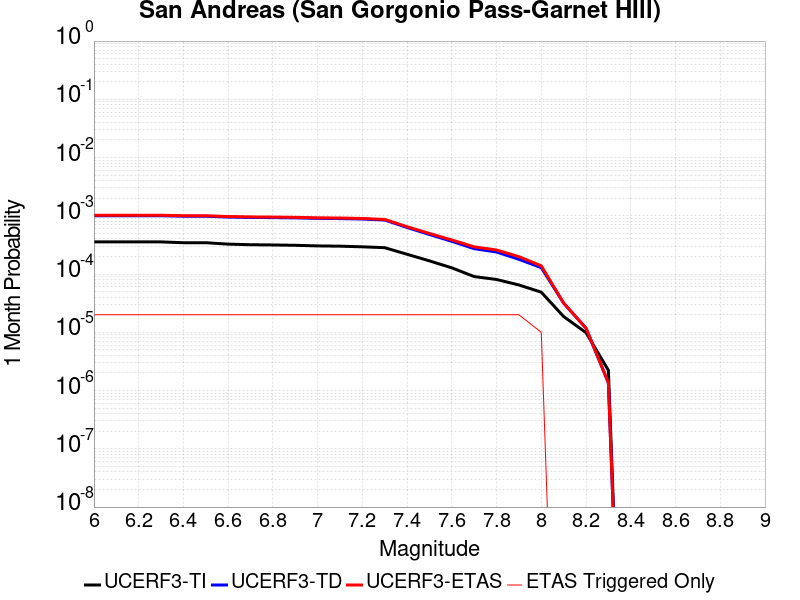 |  | 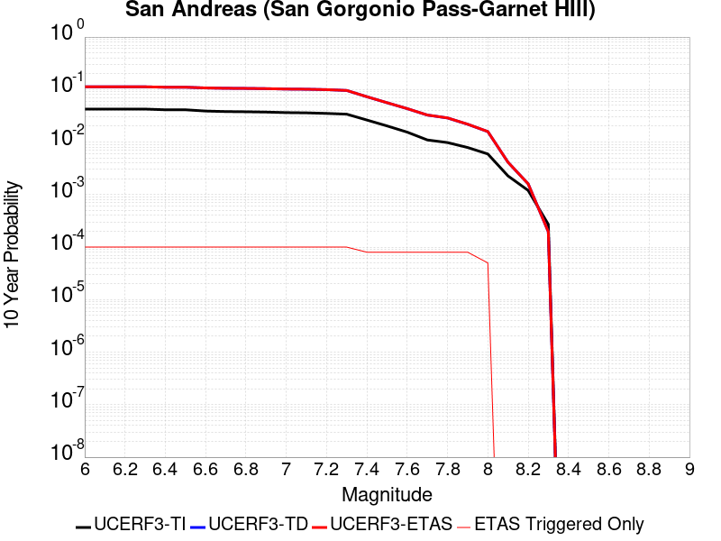 |

| Magnitude | 1 wk TI Prob | 1 wk TD Prob | 1 wk ETAS Prob | 1 wk ETAS/TD Gain | 1 wk ETAS Triggered Only | 1 mo TI Prob | 1 mo TD Prob | 1 mo ETAS Prob | 1 mo ETAS/TD Gain | 1 mo ETAS Triggered Only | 1 yr TI Prob | 1 yr TD Prob | 1 yr ETAS Prob | 1 yr ETAS/TD Gain | 1 yr ETAS Triggered Only | 10 yr TI Prob | 10 yr TD Prob | 10 yr ETAS Prob | 10 yr ETAS/TD Gain | 10 yr ETAS Triggered Only |
|-----|-----|-----|-----|-----|-----|-----|-----|-----|-----|-----|-----|-----|-----|-----|-----|-----|-----|-----|-----|-----|
| 6.0 | 8.31567E-5 | 2.3410414E-4 | 2.441018E-4 | 1.042706 | 1.0E-5 | 3.5633717E-4 | 0.0010029199 | 0.0010228998 | 1.0199218 | 2.0E-5 | 0.004329778 | 0.012142156 | 0.012211306 | 1.005695 | 7.0E-5 | 0.042463828 | 0.11269214 | 0.11278088 | 1.0007874 | 1.0E-4 |
| 6.1 | 8.31567E-5 | 2.3410414E-4 | 2.441018E-4 | 1.042706 | 1.0E-5 | 3.5633717E-4 | 0.0010029199 | 0.0010228998 | 1.0199218 | 2.0E-5 | 0.004329778 | 0.012142156 | 0.012211306 | 1.005695 | 7.0E-5 | 0.042463828 | 0.11269214 | 0.11278088 | 1.0007874 | 1.0E-4 |
| 6.2 | 8.31567E-5 | 2.3410414E-4 | 2.441018E-4 | 1.042706 | 1.0E-5 | 3.5633717E-4 | 0.0010029199 | 0.0010228998 | 1.0199218 | 2.0E-5 | 0.004329778 | 0.012142156 | 0.012211306 | 1.005695 | 7.0E-5 | 0.042463828 | 0.11269214 | 0.11278088 | 1.0007874 | 1.0E-4 |
| 6.3 | 8.31567E-5 | 2.3410414E-4 | 2.441018E-4 | 1.042706 | 1.0E-5 | 3.5633717E-4 | 0.0010029199 | 0.0010228998 | 1.0199218 | 2.0E-5 | 0.004329778 | 0.012142156 | 0.012211306 | 1.005695 | 7.0E-5 | 0.042463828 | 0.11269214 | 0.11278088 | 1.0007874 | 1.0E-4 |
| 6.4 | 8.059055E-5 | 2.2968411E-4 | 2.3968182E-4 | 1.0435281 | 1.0E-5 | 3.4534236E-4 | 9.839915E-4 | 0.0010039719 | 1.0203054 | 2.0E-5 | 0.0041964394 | 0.011914243 | 0.011983409 | 1.0058054 | 7.0E-5 | 0.041180745 | 0.11067289 | 0.11076183 | 1.0008036 | 1.0E-4 |
| 6.5 | 8.059055E-5 | 2.2968411E-4 | 2.3968182E-4 | 1.0435281 | 1.0E-5 | 3.4534236E-4 | 9.839915E-4 | 0.0010039719 | 1.0203054 | 2.0E-5 | 0.0041964394 | 0.011914243 | 0.011983409 | 1.0058054 | 7.0E-5 | 0.041180745 | 0.11067289 | 0.11076183 | 1.0008036 | 1.0E-4 |
| 6.6 | 7.619237E-5 | 2.2212318E-4 | 2.3212096E-4 | 1.0450101 | 1.0E-5 | 3.2649786E-4 | 9.516115E-4 | 9.715925E-4 | 1.0209969 | 2.0E-5 | 0.0039678677 | 0.011524876 | 0.011594069 | 1.0060039 | 7.0E-5 | 0.03897764 | 0.10720898 | 0.10729826 | 1.0008328 | 1.0E-4 |
| 6.7 | 7.440636E-5 | 2.1888081E-4 | 2.2887863E-4 | 1.045677 | 1.0E-5 | 3.188454E-4 | 9.3772565E-4 | 9.577069E-4 | 1.0213082 | 2.0E-5 | 0.0038750346 | 0.011357584 | 0.011426789 | 1.0060933 | 7.0E-5 | 0.038081564 | 0.10571735 | 0.105806775 | 1.0008459 | 1.0E-4 |
| 6.8 | 7.3735864E-5 | 2.1735218E-4 | 2.2735E-4 | 1.0459983 | 1.0E-5 | 3.1597257E-4 | 9.3117903E-4 | 9.5116044E-4 | 1.0214581 | 2.0E-5 | 0.0038401815 | 0.011278707 | 0.011347918 | 1.0061364 | 7.0E-5 | 0.03774495 | 0.10501884 | 0.105108336 | 1.0008522 | 1.0E-4 |
| 6.9 | 7.27575E-5 | 2.1504147E-4 | 2.2503932E-4 | 1.0464927 | 1.0E-5 | 3.117806E-4 | 9.2128303E-4 | 9.412646E-4 | 1.0216888 | 2.0E-5 | 0.003789323 | 0.011159464 | 0.0112286825 | 1.0062027 | 7.0E-5 | 0.037253562 | 0.1039667 | 0.1040563 | 1.0008619 | 1.0E-4 |
| 7.0 | 7.102591E-5 | 2.1088071E-4 | 2.208786E-4 | 1.0474101 | 1.0E-5 | 3.0436125E-4 | 9.034637E-4 | 9.234456E-4 | 1.022117 | 2.0E-5 | 0.003699303 | 0.01094471 | 0.011013945 | 1.0063258 | 7.0E-5 | 0.03638325 | 0.10206863 | 0.10215843 | 1.0008798 | 1.0E-4 |
| 7.1 | 7.028513E-5 | 2.0923663E-4 | 2.1923454E-4 | 1.0477828 | 1.0E-5 | 3.0118722E-4 | 8.964225E-4 | 9.164046E-4 | 1.022291 | 2.0E-5 | 0.0036607897 | 0.0108598415 | 0.010929082 | 1.0063758 | 7.0E-5 | 0.036010686 | 0.10131153 | 0.101401396 | 1.000887 | 1.0E-4 |
| 7.2 | 6.8498244E-5 | 2.0531406E-4 | 2.1531201E-4 | 1.0486959 | 1.0E-5 | 2.9353087E-4 | 8.7962294E-4 | 8.9960534E-4 | 1.022717 | 2.0E-5 | 0.003567883 | 0.010657323 | 0.010726577 | 1.0064982 | 7.0E-5 | 0.035111405 | 0.09950322 | 0.09959327 | 1.000905 | 1.0E-4 |
| 7.3 | 6.622592E-5 | 1.9758358E-4 | 2.075816E-4 | 1.0506015 | 1.0E-5 | 2.8379448E-4 | 8.465141E-4 | 8.6649717E-4 | 1.0236063 | 2.0E-5 | 0.0034497243 | 0.010258088 | 0.010327369 | 1.0067539 | 7.0E-5 | 0.033966612 | 0.09599869 | 0.09608909 | 1.0009416 | 1.0E-4 |
| 7.4 | 5.1050705E-5 | 1.4711749E-4 | 1.5711601E-4 | 1.0679629 | 1.0E-5 | 2.1877038E-4 | 6.3035206E-4 | 6.5033947E-4 | 1.0317084 | 2.0E-5 | 0.002660276 | 0.007647724 | 0.0077072647 | 1.0077854 | 6.0E-5 | 0.02628654 | 0.07296115 | 0.073035315 | 1.0010165 | 8.0E-5 |
| 7.5 | 3.9302922E-5 | 1.1149603E-4 | 1.21494915E-4 | 1.0896792 | 1.0E-5 | 1.6843023E-4 | 4.7775294E-4 | 4.977434E-4 | 1.0418427 | 2.0E-5 | 0.0020487092 | 0.005801199 | 0.0058608507 | 1.0102826 | 6.0E-5 | 0.020299247 | 0.05609674 | 0.05617225 | 1.0013461 | 8.0E-5 |
| 7.6 | 2.9851626E-5 | 8.512565E-5 | 9.51248E-5 | 1.1174634 | 1.0E-5 | 1.2792926E-4 | 3.6477332E-4 | 3.8476603E-4 | 1.0548086 | 2.0E-5 | 0.0015564259 | 0.004432097 | 0.004491831 | 1.0134776 | 6.0E-5 | 0.0154556995 | 0.04327243 | 0.043348968 | 1.0017687 | 8.0E-5 |
| 7.7 | 2.1135214E-5 | 6.36853E-5 | 7.368466E-5 | 1.1570121 | 1.0E-5 | 9.0576345E-5 | 2.7290848E-4 | 2.9290302E-4 | 1.0732646 | 2.0E-5 | 0.0011022091 | 0.0033176036 | 0.0033774045 | 1.0180254 | 6.0E-5 | 0.010967582 | 0.03265299 | 0.032730374 | 1.00237 | 8.0E-5 |
| 7.8 | 1.883379E-5 | 5.5783697E-5 | 6.578314E-5 | 1.1792538 | 1.0E-5 | 8.0713755E-5 | 2.3905109E-4 | 2.590463E-4 | 1.0836442 | 2.0E-5 | 9.822468E-4 | 0.0029065658 | 0.0029663914 | 1.0205829 | 6.0E-5 | 0.0097791655 | 0.028760133 | 0.028837834 | 1.0027016 | 8.0E-5 |
| 7.9 | 1.5156185E-5 | 4.17765E-5 | 5.177608E-5 | 1.239359 | 1.0E-5 | 6.495346E-5 | 1.7902986E-4 | 1.9902628E-4 | 1.1116933 | 2.0E-5 | 7.9052144E-4 | 0.0021775109 | 0.0022373802 | 1.0274944 | 6.0E-5 | 0.007877152 | 0.021813648 | 0.021891903 | 1.0035875 | 8.0E-5 |
| 8.0 | 1.1405907E-5 | 3.0062678E-5 | 4.006238E-5 | 1.3326284 | 1.0E-5 | 4.8881542E-5 | 1.288337E-4 | 1.388324E-4 | 1.0776094 | 1.0E-5 | 5.9497025E-4 | 0.0015674226 | 0.0015973756 | 1.0191097 | 3.0E-5 | 0.005933798 | 0.015813893 | 0.015863102 | 1.0031117 | 5.0E-5 |
| 8.1 | 4.3511436E-6 | 7.4008362E-6 | 7.4008362E-6 | 1.0 | 0.0 | 1.8647626E-5 | 3.1717485E-5 | 3.1717485E-5 | 1.0 | 0.0 | 2.2701119E-4 | 3.8609208E-4 | 3.8609208E-4 | 1.0 | 0.0 | 0.0022677942 | 0.004132099 | 0.004132099 | 1.0 | 0.0 |
| 8.2 | 2.3042528E-6 | 2.747699E-6 | 2.747699E-6 | 1.0 | 0.0 | 9.875332E-6 | 1.17758E-5 | 1.17758E-5 | 1.0 | 0.0 | 1.2022553E-4 | 1.4336099E-4 | 1.4336099E-4 | 1.0 | 0.0 | 0.0012016051 | 0.0016056811 | 0.0016056811 | 1.0 | 0.0 |
| 8.3 | 5.202968E-7 | 3.1810086E-7 | 3.1810086E-7 | 1.0 | 0.0 | 2.2298414E-6 | 1.3632887E-6 | 1.3632887E-6 | 1.0 | 0.0 | 2.714798E-5 | 1.6597925E-5 | 1.6597925E-5 | 1.0 | 0.0 | 2.7144665E-4 | 1.9682536E-4 | 1.9682536E-4 | 1.0 | 0.0 |

## San Jacinto (San Bernardino)
*[(top)](#table-of-contents)*

| 1 Week | 1 Month | 1 Year | 10 Year |
|-----|-----|-----|-----|
|  |  |  |  |

| Magnitude | 1 wk TI Prob | 1 wk TD Prob | 1 wk ETAS Prob | 1 wk ETAS/TD Gain | 1 wk ETAS Triggered Only | 1 mo TI Prob | 1 mo TD Prob | 1 mo ETAS Prob | 1 mo ETAS/TD Gain | 1 mo ETAS Triggered Only | 1 yr TI Prob | 1 yr TD Prob | 1 yr ETAS Prob | 1 yr ETAS/TD Gain | 1 yr ETAS Triggered Only | 10 yr TI Prob | 10 yr TD Prob | 10 yr ETAS Prob | 10 yr ETAS/TD Gain | 10 yr ETAS Triggered Only |
|-----|-----|-----|-----|-----|-----|-----|-----|-----|-----|-----|-----|-----|-----|-----|-----|-----|-----|-----|-----|-----|
| 6.0 | 3.409352E-5 | 3.609742E-5 | 3.609742E-5 | 1.0 | 0.0 | 1.461069E-4 | 1.5469406E-4 | 1.6469251E-4 | 1.0646337 | 1.0E-5 | 0.0017774 | 0.001881775 | 0.001931681 | 1.0265206 | 5.0E-5 | 0.01763251 | 0.019406606 | 0.019504666 | 1.0050529 | 1.0E-4 |
| 6.1 | 3.409352E-5 | 3.609742E-5 | 3.609742E-5 | 1.0 | 0.0 | 1.461069E-4 | 1.5469406E-4 | 1.6469251E-4 | 1.0646337 | 1.0E-5 | 0.0017774 | 0.001881775 | 0.001931681 | 1.0265206 | 5.0E-5 | 0.01763251 | 0.019406606 | 0.019504666 | 1.0050529 | 1.0E-4 |
| 6.2 | 3.409352E-5 | 3.609742E-5 | 3.609742E-5 | 1.0 | 0.0 | 1.461069E-4 | 1.5469406E-4 | 1.6469251E-4 | 1.0646337 | 1.0E-5 | 0.0017774 | 0.001881775 | 0.001931681 | 1.0265206 | 5.0E-5 | 0.01763251 | 0.019406606 | 0.019504666 | 1.0050529 | 1.0E-4 |
| 6.3 | 3.409352E-5 | 3.609742E-5 | 3.609742E-5 | 1.0 | 0.0 | 1.461069E-4 | 1.5469406E-4 | 1.6469251E-4 | 1.0646337 | 1.0E-5 | 0.0017774 | 0.001881775 | 0.001931681 | 1.0265206 | 5.0E-5 | 0.01763251 | 0.019406606 | 0.019504666 | 1.0050529 | 1.0E-4 |
| 6.4 | 3.400795E-5 | 3.5990055E-5 | 3.5990055E-5 | 1.0 | 0.0 | 1.4574021E-4 | 1.5423399E-4 | 1.6423245E-4 | 1.0648266 | 1.0E-5 | 0.0017729428 | 0.0018761834 | 0.0019260896 | 1.0265999 | 5.0E-5 | 0.017588645 | 0.019351678 | 0.019449743 | 1.0050675 | 1.0E-4 |
| 6.5 | 3.341482E-5 | 3.5250523E-5 | 3.5250523E-5 | 1.0 | 0.0 | 1.4319851E-4 | 1.5106493E-4 | 1.6106342E-4 | 1.0661867 | 1.0E-5 | 0.0017420477 | 0.0018376654 | 0.0018875736 | 1.0271584 | 5.0E-5 | 0.017284546 | 0.018973157 | 0.01907126 | 1.0051706 | 1.0E-4 |
| 6.6 | 3.3364955E-5 | 3.5187728E-5 | 3.5187728E-5 | 1.0 | 0.0 | 1.4298483E-4 | 1.5079584E-4 | 1.6079433E-4 | 1.0663048 | 1.0E-5 | 0.0017394501 | 0.0018343948 | 0.001884303 | 1.0272069 | 5.0E-5 | 0.017258976 | 0.018941017 | 0.019039122 | 1.0051795 | 1.0E-4 |
| 6.7 | 3.335922E-5 | 3.51775E-5 | 3.51775E-5 | 1.0 | 0.0 | 1.4296026E-4 | 1.50752E-4 | 1.607505E-4 | 1.0663241 | 1.0E-5 | 0.0017391514 | 0.001833862 | 0.0018837703 | 1.0272149 | 5.0E-5 | 0.017256035 | 0.018935807 | 0.019033913 | 1.005181 | 1.0E-4 |
| 6.8 | 3.327683E-5 | 3.5071538E-5 | 3.5071538E-5 | 1.0 | 0.0 | 1.4260718E-4 | 1.5029794E-4 | 1.6029645E-4 | 1.0665245 | 1.0E-5 | 0.0017348597 | 0.001828343 | 0.0018782517 | 1.0272971 | 5.0E-5 | 0.017213784 | 0.018881567 | 0.01897968 | 1.0051962 | 1.0E-4 |
| 6.9 | 3.3235785E-5 | 3.5012476E-5 | 3.5012476E-5 | 1.0 | 0.0 | 1.4243131E-4 | 1.5004484E-4 | 1.6004335E-4 | 1.0666367 | 1.0E-5 | 0.0017327217 | 0.0018252668 | 0.0018751755 | 1.0273433 | 5.0E-5 | 0.017192734 | 0.01885143 | 0.018949544 | 1.0052047 | 1.0E-4 |
| 7.0 | 3.3197095E-5 | 3.4952387E-5 | 3.4952387E-5 | 1.0 | 0.0 | 1.422655E-4 | 1.4978735E-4 | 1.5978585E-4 | 1.0667514 | 1.0E-5 | 0.0017307063 | 0.001822137 | 0.0018720459 | 1.0273904 | 5.0E-5 | 0.017172894 | 0.0188208 | 0.018918917 | 1.0052133 | 1.0E-4 |
| 7.1 | 3.3129716E-5 | 3.4832556E-5 | 3.4832556E-5 | 1.0 | 0.0 | 1.4197677E-4 | 1.4927384E-4 | 1.5927234E-4 | 1.066981 | 1.0E-5 | 0.0017271966 | 0.0018158954 | 0.0018658047 | 1.0274847 | 5.0E-5 | 0.017138338 | 0.01875986 | 0.018857984 | 1.0052305 | 1.0E-4 |
| 7.2 | 3.3034008E-5 | 3.4699966E-5 | 3.4699966E-5 | 1.0 | 0.0 | 1.4156665E-4 | 1.4870567E-4 | 1.5870419E-4 | 1.0672369 | 1.0E-5 | 0.0017222111 | 0.0018089896 | 0.0018588991 | 1.0275898 | 5.0E-5 | 0.017089253 | 0.01869224 | 0.01879037 | 1.0052499 | 1.0E-4 |
| 7.3 | 3.2956614E-5 | 3.456766E-5 | 3.456766E-5 | 1.0 | 0.0 | 1.4123498E-4 | 1.481387E-4 | 1.5813722E-4 | 1.0674943 | 1.0E-5 | 0.0017181796 | 0.0018020981 | 0.001852008 | 1.0276954 | 5.0E-5 | 0.017049557 | 0.01862496 | 0.018723097 | 1.0052692 | 1.0E-4 |
| 7.4 | 3.2915937E-5 | 3.44893E-5 | 3.44893E-5 | 1.0 | 0.0 | 1.4106068E-4 | 1.4780293E-4 | 1.5780145E-4 | 1.0676477 | 1.0E-5 | 0.0017160608 | 0.0017980168 | 0.001847927 | 1.0277584 | 5.0E-5 | 0.017028693 | 0.018585203 | 0.018683344 | 1.0052806 | 1.0E-4 |
| 7.5 | 3.281791E-5 | 3.435414E-5 | 3.435414E-5 | 1.0 | 0.0 | 1.406406E-4 | 1.4722372E-4 | 1.5722225E-4 | 1.0679139 | 1.0E-5 | 0.0017109542 | 0.0017909766 | 0.001840887 | 1.0278677 | 5.0E-5 | 0.016978411 | 0.018516054 | 0.018614203 | 1.0053008 | 1.0E-4 |
| 7.6 | 3.2521442E-5 | 3.4078876E-5 | 3.4078876E-5 | 1.0 | 0.0 | 1.3937015E-4 | 1.4604416E-4 | 1.5604269E-4 | 1.0684625 | 1.0E-5 | 0.0016955109 | 0.0017766389 | 0.00182655 | 1.028093 | 5.0E-5 | 0.016826328 | 0.018373583 | 0.018471744 | 1.0053426 | 1.0E-4 |
| 7.7 | 3.0287873E-5 | 3.2561624E-5 | 3.2561624E-5 | 1.0 | 0.0 | 1.297987E-4 | 1.3954236E-4 | 1.4954097E-4 | 1.0716528 | 1.0E-5 | 0.0015791537 | 0.0016976055 | 0.0017475206 | 1.0294032 | 5.0E-5 | 0.01567979 | 0.017583825 | 0.017682066 | 1.0055871 | 1.0E-4 |
| 7.8 | 2.6316151E-5 | 2.9768464E-5 | 2.9768464E-5 | 1.0 | 0.0 | 1.1277862E-4 | 1.275729E-4 | 1.3757162E-4 | 1.0783765 | 1.0E-5 | 0.0013722149 | 0.0015520945 | 0.0016020169 | 1.0321646 | 5.0E-5 | 0.013637724 | 0.016123403 | 0.016221792 | 1.0061022 | 1.0E-4 |
| 7.9 | 2.0761147E-5 | 2.350958E-5 | 2.350958E-5 | 1.0 | 0.0 | 8.897331E-5 | 1.0075145E-4 | 1.1075044E-4 | 1.0992441 | 1.0E-5 | 0.0010827117 | 0.0012259595 | 0.0012659105 | 1.0325875 | 4.0E-5 | 0.010774517 | 0.012840435 | 0.012919408 | 1.0061504 | 8.0E-5 |
| 8.0 | 1.5738568E-5 | 1.6102143E-5 | 1.6102143E-5 | 1.0 | 0.0 | 6.744926E-5 | 6.9007365E-5 | 7.900668E-5 | 1.1449021 | 1.0E-5 | 8.2088535E-4 | 8.3984155E-4 | 8.5982477E-4 | 1.023794 | 2.0E-5 | 0.008178596 | 0.0089020105 | 0.008921832 | 1.0022267 | 2.0E-5 |
| 8.1 | 1.0105832E-5 | 8.370304E-6 | 8.370304E-6 | 1.0 | 0.0 | 4.3309992E-5 | 3.5872243E-5 | 4.5871886E-5 | 1.2787571 | 1.0E-5 | 5.2717153E-4 | 4.3665757E-4 | 4.466532E-4 | 1.0228913 | 1.0E-5 | 0.005259227 | 0.004698642 | 0.004708595 | 1.0021182 | 1.0E-5 |
| 8.2 | 4.189207E-6 | 1.5901481E-6 | 1.5901481E-6 | 1.0 | 0.0 | 1.7953622E-5 | 6.814903E-6 | 6.814903E-6 | 1.0 | 0.0 | 2.1856341E-4 | 8.296831E-5 | 8.296831E-5 | 1.0 | 0.0 | 0.0021834858 | 9.6328073E-4 | 9.6328073E-4 | 1.0 | 0.0 |
| 8.3 | 1.2758221E-6 | 3.6465343E-7 | 3.6465343E-7 | 1.0 | 0.0 | 5.4677976E-6 | 1.5627995E-6 | 1.5627995E-6 | 1.0 | 0.0 | 6.65684E-5 | 1.9026922E-5 | 1.9026922E-5 | 1.0 | 0.0 | 6.6548464E-4 | 2.2936566E-4 | 2.2936566E-4 | 1.0 | 0.0 |

## Lake Isabella (Seismicity)
*[(top)](#table-of-contents)*

| 1 Week | 1 Month | 1 Year | 10 Year |
|-----|-----|-----|-----|
|  |  |  |  |

| Magnitude | 1 wk TI Prob | 1 wk TD Prob | 1 wk ETAS Prob | 1 wk ETAS/TD Gain | 1 wk ETAS Triggered Only | 1 mo TI Prob | 1 mo TD Prob | 1 mo ETAS Prob | 1 mo ETAS/TD Gain | 1 mo ETAS Triggered Only | 1 yr TI Prob | 1 yr TD Prob | 1 yr ETAS Prob | 1 yr ETAS/TD Gain | 1 yr ETAS Triggered Only | 10 yr TI Prob | 10 yr TD Prob | 10 yr ETAS Prob | 10 yr ETAS/TD Gain | 10 yr ETAS Triggered Only |
|-----|-----|-----|-----|-----|-----|-----|-----|-----|-----|-----|-----|-----|-----|-----|-----|-----|-----|-----|-----|-----|
| 6.0 | 9.431637E-6 | 9.741949E-6 | 9.741949E-6 | 1.0 | 0.0 | 4.0420677E-5 | 4.1750616E-5 | 4.1750616E-5 | 1.0 | 0.0 | 4.920106E-4 | 5.082083E-4 | 5.3819304E-4 | 1.059001 | 3.0E-5 | 0.004909227 | 0.005071753 | 0.0051712464 | 1.0196171 | 1.0E-4 |
| 6.1 | 9.431637E-6 | 9.741949E-6 | 9.741949E-6 | 1.0 | 0.0 | 4.0420677E-5 | 4.1750616E-5 | 4.1750616E-5 | 1.0 | 0.0 | 4.920106E-4 | 5.082083E-4 | 5.3819304E-4 | 1.059001 | 3.0E-5 | 0.004909227 | 0.005071753 | 0.0051712464 | 1.0196171 | 1.0E-4 |
| 6.2 | 9.431637E-6 | 9.741949E-6 | 9.741949E-6 | 1.0 | 0.0 | 4.0420677E-5 | 4.1750616E-5 | 4.1750616E-5 | 1.0 | 0.0 | 4.920106E-4 | 5.082083E-4 | 5.3819304E-4 | 1.059001 | 3.0E-5 | 0.004909227 | 0.005071753 | 0.0051712464 | 1.0196171 | 1.0E-4 |
| 6.3 | 9.431637E-6 | 9.741949E-6 | 9.741949E-6 | 1.0 | 0.0 | 4.0420677E-5 | 4.1750616E-5 | 4.1750616E-5 | 1.0 | 0.0 | 4.920106E-4 | 5.082083E-4 | 5.3819304E-4 | 1.059001 | 3.0E-5 | 0.004909227 | 0.005071753 | 0.0051712464 | 1.0196171 | 1.0E-4 |
| 6.4 | 5.144063E-6 | 5.3002254E-6 | 5.3002254E-6 | 1.0 | 0.0 | 2.2045799E-5 | 2.2715074E-5 | 2.2715074E-5 | 1.0 | 0.0 | 2.6837454E-4 | 2.7652437E-4 | 2.8652162E-4 | 1.0361532 | 1.0E-5 | 0.0026805066 | 0.0027621435 | 0.002802033 | 1.0144415 | 4.0E-5 |
| 6.5 | 5.144063E-6 | 5.3002254E-6 | 5.3002254E-6 | 1.0 | 0.0 | 2.2045799E-5 | 2.2715074E-5 | 2.2715074E-5 | 1.0 | 0.0 | 2.6837454E-4 | 2.7652437E-4 | 2.8652162E-4 | 1.0361532 | 1.0E-5 | 0.0026805066 | 0.0027621435 | 0.002802033 | 1.0144415 | 4.0E-5 |
| 6.6 | 3.4009804E-6 | 3.4988796E-6 | 3.4988796E-6 | 1.0 | 0.0 | 1.4575549E-5 | 1.4995121E-5 | 1.4995121E-5 | 1.0 | 0.0 | 1.7744285E-4 | 1.8255191E-4 | 1.9255008E-4 | 1.0547689 | 1.0E-5 | 0.0017730123 | 0.0018241772 | 0.0018641043 | 1.0218877 | 4.0E-5 |
| 6.7 | 3.3880428E-6 | 3.485746E-6 | 3.485746E-6 | 1.0 | 0.0 | 1.4520103E-5 | 1.4938835E-5 | 1.4938835E-5 | 1.0 | 0.0 | 1.767679E-4 | 1.8186674E-4 | 1.9186492E-4 | 1.0549753 | 1.0E-5 | 0.0017662736 | 0.0018173368 | 0.0018572641 | 1.0219703 | 4.0E-5 |
| 6.8 | 2.6582E-6 | 2.7337724E-6 | 2.7337724E-6 | 1.0 | 0.0 | 1.1392236E-5 | 1.1716122E-5 | 1.1716122E-5 | 1.0 | 0.0 | 1.3869164E-4 | 1.4263579E-4 | 1.5263437E-4 | 1.0700986 | 1.0E-5 | 0.0013860512 | 0.0014255745 | 0.0014555318 | 1.0210141 | 3.0E-5 |
| 6.9 | 2.406011E-6 | 2.474394E-6 | 2.474394E-6 | 1.0 | 0.0 | 1.0311434E-5 | 1.0604511E-5 | 1.0604511E-5 | 1.0 | 0.0 | 1.2553448E-4 | 1.2910359E-4 | 1.391023E-4 | 1.0774472 | 1.0E-5 | 0.0012546359 | 0.0012904154 | 0.0013203768 | 1.0232183 | 3.0E-5 |
| 7.0 | 1.6953097E-6 | 1.7429827E-6 | 1.7429827E-6 | 1.0 | 0.0 | 7.265593E-6 | 7.46991E-6 | 7.46991E-6 | 1.0 | 0.0 | 8.8455E-5 | 9.094341E-5 | 9.094341E-5 | 1.0 | 0.0 | 8.84198E-4 | 9.0916466E-4 | 9.291465E-4 | 1.0219783 | 2.0E-5 |
| 7.1 | 3.5013824E-7 | 3.5715487E-7 | 3.5715487E-7 | 1.0 | 0.0 | 1.5005916E-6 | 1.5306629E-6 | 1.5306629E-6 | 1.0 | 0.0 | 1.826955E-5 | 1.8635663E-5 | 1.8635663E-5 | 1.0 | 0.0 | 1.8268047E-4 | 1.8634126E-4 | 1.8634126E-4 | 1.0 | 0.0 |
| 7.2 | 2.2321095E-7 | 2.275098E-7 | 2.275098E-7 | 1.0 | 0.0 | 9.56618E-7 | 9.750416E-7 | 9.750416E-7 | 1.0 | 0.0 | 1.1646762E-5 | 1.1871069E-5 | 1.1871069E-5 | 1.0 | 0.0 | 1.1646151E-4 | 1.1870445E-4 | 1.1870445E-4 | 1.0 | 0.0 |
| 7.3 | 1.5760406E-7 | 1.6061206E-7 | 1.6061206E-7 | 1.0 | 0.0 | 6.7544585E-7 | 6.8833725E-7 | 6.8833725E-7 | 1.0 | 0.0 | 8.223522E-6 | 8.380474E-6 | 8.380474E-6 | 1.0 | 0.0 | 8.2232174E-5 | 8.380164E-5 | 8.380164E-5 | 1.0 | 0.0 |
| 7.4 | 1.1216497E-7 | 1.143191E-7 | 1.143191E-7 | 1.0 | 0.0 | 4.8070694E-7 | 4.899389E-7 | 4.899389E-7 | 1.0 | 0.0 | 5.852591E-6 | 5.96499E-6 | 5.96499E-6 | 1.0 | 0.0 | 5.8524372E-5 | 5.9648344E-5 | 5.9648344E-5 | 1.0 | 0.0 |
| 7.5 | 4.885185E-8 | 4.978862E-8 | 4.978862E-8 | 1.0 | 0.0 | 2.0936506E-7 | 2.1337979E-7 | 2.1337979E-7 | 1.0 | 0.0 | 2.5490165E-6 | 2.5978961E-6 | 2.5978961E-6 | 1.0 | 0.0 | 2.5489873E-5 | 2.5978676E-5 | 2.5978676E-5 | 1.0 | 0.0 |
| 7.6 | 1.504641E-9 | 1.5318159E-9 | 1.5318159E-9 | 1.0 | 0.0 | 6.4484613E-9 | 6.5649255E-9 | 6.5649255E-9 | 1.0 | 0.0 | 7.851001E-8 | 7.9927965E-8 | 7.9927965E-8 | 1.0 | 0.0 | 7.8509987E-7 | 7.992797E-7 | 7.992797E-7 | 1.0 | 0.0 |

## San Andreas (Cholame) rev
*[(top)](#table-of-contents)*

| 1 Week | 1 Month | 1 Year | 10 Year |
|-----|-----|-----|-----|
|  |  |  |  |

| Magnitude | 1 wk TI Prob | 1 wk TD Prob | 1 wk ETAS Prob | 1 wk ETAS/TD Gain | 1 wk ETAS Triggered Only | 1 mo TI Prob | 1 mo TD Prob | 1 mo ETAS Prob | 1 mo ETAS/TD Gain | 1 mo ETAS Triggered Only | 1 yr TI Prob | 1 yr TD Prob | 1 yr ETAS Prob | 1 yr ETAS/TD Gain | 1 yr ETAS Triggered Only | 10 yr TI Prob | 10 yr TD Prob | 10 yr ETAS Prob | 10 yr ETAS/TD Gain | 10 yr ETAS Triggered Only |
|-----|-----|-----|-----|-----|-----|-----|-----|-----|-----|-----|-----|-----|-----|-----|-----|-----|-----|-----|-----|-----|
| 6.0 | 1.2302514E-4 | 2.527211E-4 | 2.527211E-4 | 1.0 | 0.0 | 5.27144E-4 | 0.0010826425 | 0.0010826425 | 1.0 | 0.0 | 0.0063991086 | 0.013102018 | 0.0131513635 | 1.0037662 | 5.0E-5 | 0.06217949 | 0.12467336 | 0.124760896 | 1.0007021 | 1.0E-4 |
| 6.1 | 1.2302514E-4 | 2.527211E-4 | 2.527211E-4 | 1.0 | 0.0 | 5.27144E-4 | 0.0010826425 | 0.0010826425 | 1.0 | 0.0 | 0.0063991086 | 0.013102018 | 0.0131513635 | 1.0037662 | 5.0E-5 | 0.06217949 | 0.12467336 | 0.124760896 | 1.0007021 | 1.0E-4 |
| 6.2 | 1.2203569E-4 | 2.508882E-4 | 2.508882E-4 | 1.0 | 0.0 | 5.2290526E-4 | 0.0010747936 | 0.0010747936 | 1.0 | 0.0 | 0.006347804 | 0.013007604 | 0.013056953 | 1.003794 | 5.0E-5 | 0.061695136 | 0.123859465 | 0.123947084 | 1.0007074 | 1.0E-4 |
| 6.3 | 1.2142645E-4 | 2.497474E-4 | 2.497474E-4 | 1.0 | 0.0 | 5.202953E-4 | 0.0010699086 | 0.0010699086 | 1.0 | 0.0 | 0.006316212 | 0.012948836 | 0.012998189 | 1.0038114 | 5.0E-5 | 0.06139677 | 0.12335354 | 0.12344121 | 1.0007107 | 1.0E-4 |
| 6.4 | 1.1865206E-4 | 2.4479858E-4 | 2.4479858E-4 | 1.0 | 0.0 | 5.0840975E-4 | 0.0010487166 | 0.0010487166 | 1.0 | 0.0 | 0.006172335 | 0.012693855 | 0.012743221 | 1.003889 | 5.0E-5 | 0.060036868 | 0.1211454 | 0.12122449 | 1.0006529 | 9.0E-5 |
| 6.5 | 1.17443946E-4 | 2.427289E-4 | 2.427289E-4 | 1.0 | 0.0 | 5.032341E-4 | 0.0010398536 | 0.0010398536 | 1.0 | 0.0 | 0.006109677 | 0.012587197 | 0.0126365675 | 1.0039223 | 5.0E-5 | 0.059444077 | 0.12021883 | 0.120298006 | 1.0006586 | 9.0E-5 |
| 6.6 | 1.13579066E-4 | 2.3581105E-4 | 2.3581105E-4 | 1.0 | 0.0 | 4.866766E-4 | 0.0010102289 | 0.0010102289 | 1.0 | 0.0 | 0.0059092017 | 0.012230619 | 0.012280007 | 1.0040381 | 5.0E-5 | 0.057545185 | 0.11713085 | 0.117210306 | 1.0006784 | 9.0E-5 |
| 6.7 | 1.1271412E-4 | 2.3425255E-4 | 2.3425255E-4 | 1.0 | 0.0 | 4.829711E-4 | 0.0010035548 | 0.0010035548 | 1.0 | 0.0 | 0.005864331 | 0.012150271 | 0.012199664 | 1.0040652 | 5.0E-5 | 0.057119697 | 0.116434015 | 0.116513535 | 1.000683 | 9.0E-5 |
| 6.8 | 1.1217975E-4 | 2.3313517E-4 | 2.3313517E-4 | 1.0 | 0.0 | 4.8068175E-4 | 9.987697E-4 | 9.987697E-4 | 1.0 | 0.0 | 0.005836608 | 0.012092661 | 0.012142056 | 1.0040847 | 5.0E-5 | 0.056856725 | 0.1159318 | 0.11601137 | 1.0006863 | 9.0E-5 |
| 6.9 | 1.1146753E-4 | 2.3162088E-4 | 2.3162088E-4 | 1.0 | 0.0 | 4.7763053E-4 | 9.922847E-4 | 9.922847E-4 | 1.0 | 0.0 | 0.0057996577 | 0.012014581 | 0.01206398 | 1.0041116 | 5.0E-5 | 0.056506127 | 0.11525174 | 0.11533137 | 1.0006909 | 9.0E-5 |
| 7.0 | 1.0965793E-4 | 2.27849E-4 | 2.27849E-4 | 1.0 | 0.0 | 4.698779E-4 | 9.761318E-4 | 9.761318E-4 | 1.0 | 0.0 | 0.005705768 | 0.011820069 | 0.011869478 | 1.0041801 | 5.0E-5 | 0.055614736 | 0.11355178 | 0.11363156 | 1.0007026 | 9.0E-5 |
| 7.1 | 9.927982E-5 | 2.0601551E-4 | 2.0601551E-4 | 1.0 | 0.0 | 4.2541555E-4 | 8.826259E-4 | 8.826259E-4 | 1.0 | 0.0 | 0.0051671406 | 0.010693318 | 0.01073289 | 1.0037006 | 4.0E-5 | 0.05048634 | 0.10363974 | 0.10371145 | 1.0006919 | 8.0E-5 |
| 7.2 | 9.696786E-5 | 2.0105357E-4 | 2.0105357E-4 | 1.0 | 0.0 | 4.1551032E-4 | 8.613746E-4 | 8.613746E-4 | 1.0 | 0.0 | 0.00504711 | 0.010437091 | 0.010476673 | 1.0037925 | 4.0E-5 | 0.04934009 | 0.10137658 | 0.10144847 | 1.0007092 | 8.0E-5 |
| 7.3 | 9.4727984E-5 | 1.9533654E-4 | 1.9533654E-4 | 1.0 | 0.0 | 4.0591392E-4 | 8.36889E-4 | 8.36889E-4 | 1.0 | 0.0 | 0.0049308087 | 0.010141792 | 0.010181386 | 1.0039041 | 4.0E-5 | 0.048228268 | 0.098744355 | 0.09881646 | 1.0007302 | 8.0E-5 |
| 7.4 | 9.220358E-5 | 1.8903094E-4 | 1.8903094E-4 | 1.0 | 0.0 | 3.9509835E-4 | 8.09882E-4 | 8.09882E-4 | 1.0 | 0.0 | 0.004799717 | 0.009815983 | 0.00985559 | 1.004035 | 4.0E-5 | 0.046973653 | 0.0958185 | 0.095890835 | 1.000755 | 8.0E-5 |
| 7.5 | 7.71631E-5 | 1.5230462E-4 | 1.5230462E-4 | 1.0 | 0.0 | 3.306571E-4 | 6.52571E-4 | 6.52571E-4 | 1.0 | 0.0 | 0.0040183207 | 0.00791618 | 0.007955864 | 1.005013 | 4.0E-5 | 0.03946433 | 0.07852047 | 0.07858498 | 1.0008215 | 7.0E-5 |
| 7.6 | 7.5634416E-5 | 1.4889227E-4 | 1.4889227E-4 | 1.0 | 0.0 | 3.241072E-4 | 6.3795387E-4 | 6.3795387E-4 | 1.0 | 0.0 | 0.0039388672 | 0.007739495 | 0.007779185 | 1.0051283 | 4.0E-5 | 0.038697794 | 0.07688133 | 0.076945946 | 1.0008405 | 7.0E-5 |
| 7.7 | 6.3783E-5 | 1.2405147E-4 | 1.2405147E-4 | 1.0 | 0.0 | 2.7332708E-4 | 5.3154083E-4 | 5.3154083E-4 | 1.0 | 0.0 | 0.0033226798 | 0.0064523336 | 0.00648214 | 1.0046195 | 3.0E-5 | 0.032734364 | 0.06475253 | 0.06480864 | 1.0008667 | 6.0E-5 |
| 7.8 | 5.863422E-5 | 1.1458314E-4 | 1.1458314E-4 | 1.0 | 0.0 | 2.512653E-4 | 4.909782E-4 | 4.909782E-4 | 1.0 | 0.0 | 0.003054864 | 0.005961297 | 0.005991118 | 1.0050025 | 3.0E-5 | 0.030132094 | 0.059853055 | 0.059909463 | 1.0009425 | 6.0E-5 |
| 7.9 | 4.595283E-5 | 8.457162E-5 | 8.457162E-5 | 1.0 | 0.0 | 1.9692584E-4 | 3.6239944E-4 | 3.6239944E-4 | 1.0 | 0.0 | 0.0023949358 | 0.0044032936 | 0.00441325 | 1.002261 | 1.0E-5 | 0.023692891 | 0.044507682 | 0.04453635 | 1.0006441 | 3.0E-5 |
| 8.0 | 3.2950178E-5 | 5.0966137E-5 | 5.0966137E-5 | 1.0 | 0.0 | 1.412074E-4 | 2.1840802E-4 | 2.1840802E-4 | 1.0 | 0.0 | 0.0017178444 | 0.0026558768 | 0.0026558768 | 1.0 | 0.0 | 0.017046256 | 0.02727544 | 0.02727544 | 1.0 | 0.0 |
| 8.1 | 1.9177472E-5 | 1.9281335E-5 | 1.9281335E-5 | 1.0 | 0.0 | 8.218658E-5 | 8.2631675E-5 | 8.2631675E-5 | 1.0 | 0.0 | 0.0010001622 | 0.0010055769 | 0.0010055769 | 1.0 | 0.0 | 0.009956728 | 0.010808746 | 0.010808746 | 1.0 | 0.0 |
| 8.2 | 8.643924E-6 | 5.5112705E-6 | 5.5112705E-6 | 1.0 | 0.0 | 3.704486E-5 | 2.3619517E-5 | 2.3619517E-5 | 1.0 | 0.0 | 4.5092785E-4 | 2.8752975E-4 | 2.8752975E-4 | 1.0 | 0.0 | 0.0045001395 | 0.0032686237 | 0.0032686237 | 1.0 | 0.0 |
| 8.3 | 1.983087E-6 | 7.7188406E-7 | 7.7188406E-7 | 1.0 | 0.0 | 8.498917E-6 | 3.3080703E-6 | 3.3080703E-6 | 1.0 | 0.0 | 1.034694E-4 | 4.027503E-5 | 4.027503E-5 | 1.0 | 0.0 | 0.0010342124 | 4.7534908E-4 | 4.7534908E-4 | 1.0 | 0.0 |

## White Wolf (Extension)
*[(top)](#table-of-contents)*

| 1 Week | 1 Month | 1 Year | 10 Year |
|-----|-----|-----|-----|
|  | 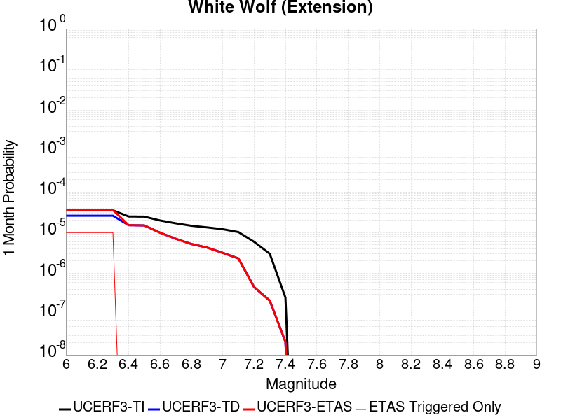 |  |  |

| Magnitude | 1 wk TI Prob | 1 wk TD Prob | 1 wk ETAS Prob | 1 wk ETAS/TD Gain | 1 wk ETAS Triggered Only | 1 mo TI Prob | 1 mo TD Prob | 1 mo ETAS Prob | 1 mo ETAS/TD Gain | 1 mo ETAS Triggered Only | 1 yr TI Prob | 1 yr TD Prob | 1 yr ETAS Prob | 1 yr ETAS/TD Gain | 1 yr ETAS Triggered Only | 10 yr TI Prob | 10 yr TD Prob | 10 yr ETAS Prob | 10 yr ETAS/TD Gain | 10 yr ETAS Triggered Only |
|-----|-----|-----|-----|-----|-----|-----|-----|-----|-----|-----|-----|-----|-----|-----|-----|-----|-----|-----|-----|-----|
| 6.0 | 8.222555E-6 | 6.066947E-6 | 1.6066886E-5 | 2.6482654 | 1.0E-5 | 3.5239045E-5 | 2.600098E-5 | 3.600072E-5 | 1.3845909 | 1.0E-5 | 4.289509E-4 | 3.1652258E-4 | 3.565099E-4 | 1.1263332 | 4.0E-5 | 0.0042812387 | 0.0031613694 | 0.0032610532 | 1.0315318 | 1.0E-4 |
| 6.1 | 8.222555E-6 | 6.066947E-6 | 1.6066886E-5 | 2.6482654 | 1.0E-5 | 3.5239045E-5 | 2.600098E-5 | 3.600072E-5 | 1.3845909 | 1.0E-5 | 4.289509E-4 | 3.1652258E-4 | 3.565099E-4 | 1.1263332 | 4.0E-5 | 0.0042812387 | 0.0031613694 | 0.0032610532 | 1.0315318 | 1.0E-4 |
| 6.2 | 8.222555E-6 | 6.066947E-6 | 1.6066886E-5 | 2.6482654 | 1.0E-5 | 3.5239045E-5 | 2.600098E-5 | 3.600072E-5 | 1.3845909 | 1.0E-5 | 4.289509E-4 | 3.1652258E-4 | 3.565099E-4 | 1.1263332 | 4.0E-5 | 0.0042812387 | 0.0031613694 | 0.0032610532 | 1.0315318 | 1.0E-4 |
| 6.3 | 8.222555E-6 | 6.066947E-6 | 1.6066886E-5 | 2.6482654 | 1.0E-5 | 3.5239045E-5 | 2.600098E-5 | 3.600072E-5 | 1.3845909 | 1.0E-5 | 4.289509E-4 | 3.1652258E-4 | 3.565099E-4 | 1.1263332 | 4.0E-5 | 0.0042812387 | 0.0031613694 | 0.0032610532 | 1.0315318 | 1.0E-4 |
| 6.4 | 5.821773E-6 | 3.5573523E-6 | 3.5573523E-6 | 1.0 | 0.0 | 2.4950215E-5 | 1.5245713E-5 | 1.5245713E-5 | 1.0 | 0.0 | 3.0372653E-4 | 1.8560184E-4 | 1.9559999E-4 | 1.0538688 | 1.0E-5 | 0.0030331176 | 0.0018545766 | 0.0019244469 | 1.0376744 | 7.0E-5 |
| 6.5 | 5.766023E-6 | 3.4992843E-6 | 3.4992843E-6 | 1.0 | 0.0 | 2.4711293E-5 | 1.4996853E-5 | 1.4996853E-5 | 1.0 | 0.0 | 3.0081844E-4 | 1.8257248E-4 | 1.9257065E-4 | 1.0547627 | 1.0E-5 | 0.0030041158 | 0.001824333 | 0.0018942053 | 1.0383002 | 7.0E-5 |
| 6.6 | 4.643576E-6 | 2.3327552E-6 | 2.3327552E-6 | 1.0 | 0.0 | 1.9900888E-5 | 9.997486E-6 | 9.997486E-6 | 1.0 | 0.0 | 2.4226638E-4 | 1.2171303E-4 | 1.2171303E-4 | 1.0 | 0.0 | 0.0024200242 | 0.0012165061 | 0.0012564574 | 1.0328411 | 4.0E-5 |
| 6.7 | 3.9529173E-6 | 1.6484531E-6 | 1.6484531E-6 | 1.0 | 0.0 | 1.6940963E-5 | 7.064781E-6 | 7.064781E-6 | 1.0 | 0.0 | 2.0623671E-4 | 8.60105E-5 | 8.60105E-5 | 1.0 | 0.0 | 0.002060454 | 8.5979066E-4 | 8.7977346E-4 | 1.0232415 | 2.0E-5 |
| 6.8 | 3.4377522E-6 | 1.2246109E-6 | 1.2246109E-6 | 1.0 | 0.0 | 1.473314E-5 | 5.2483224E-6 | 5.2483224E-6 | 1.0 | 0.0 | 1.7936122E-4 | 6.389654E-5 | 6.389654E-5 | 1.0 | 0.0 | 0.0017921652 | 6.3879084E-4 | 6.4878445E-4 | 1.0156446 | 1.0E-5 |
| 6.9 | 3.1367306E-6 | 1.0034549E-6 | 1.0034549E-6 | 1.0 | 0.0 | 1.3443062E-5 | 4.300515E-6 | 4.300515E-6 | 1.0 | 0.0 | 1.63657E-4 | 5.2357587E-5 | 5.2357587E-5 | 1.0 | 0.0 | 0.0016353652 | 5.2346016E-4 | 5.3345494E-4 | 1.0190936 | 1.0E-5 |
| 7.0 | 2.8298145E-6 | 7.42933E-7 | 7.42933E-7 | 1.0 | 0.0 | 1.2127721E-5 | 3.1839952E-6 | 3.1839952E-6 | 1.0 | 0.0 | 1.47645E-4 | 3.87645E-5 | 3.87645E-5 | 1.0 | 0.0 | 0.0014754693 | 3.875824E-4 | 3.9757852E-4 | 1.0257909 | 1.0E-5 |
| 7.1 | 2.4091064E-6 | 5.423287E-7 | 5.423287E-7 | 1.0 | 0.0 | 1.03247E-5 | 2.324264E-6 | 2.324264E-6 | 1.0 | 0.0 | 1.2569598E-4 | 2.8297587E-5 | 2.8297587E-5 | 1.0 | 0.0 | 0.001256249 | 2.829439E-4 | 2.9294105E-4 | 1.0353327 | 1.0E-5 |
| 7.2 | 1.3875518E-6 | 1.07456884E-7 | 1.07456884E-7 | 1.0 | 0.0 | 5.9466374E-6 | 4.6052944E-7 | 4.6052944E-7 | 1.0 | 0.0 | 7.23979E-5 | 5.6069325E-6 | 5.6069325E-6 | 1.0 | 0.0 | 7.2374323E-4 | 5.6068027E-5 | 5.6068027E-5 | 1.0 | 0.0 |
| 7.3 | 7.056077E-7 | 5.003542E-8 | 5.003542E-8 | 1.0 | 0.0 | 3.0240296E-6 | 2.144375E-7 | 2.144375E-7 | 1.0 | 0.0 | 3.681694E-5 | 2.6107741E-6 | 2.6107741E-6 | 1.0 | 0.0 | 3.681084E-4 | 2.610748E-5 | 2.610748E-5 | 1.0 | 0.0 |
| 7.4 | 5.9334678E-8 | 4.869818E-9 | 4.869818E-9 | 1.0 | 0.0 | 2.5429145E-7 | 2.0870647E-8 | 2.0870647E-8 | 1.0 | 0.0 | 3.095994E-6 | 2.5410012E-7 | 2.5410012E-7 | 1.0 | 0.0 | 3.095951E-5 | 2.5409995E-6 | 2.5409995E-6 | 1.0 | 0.0 |

## Cady
*[(top)](#table-of-contents)*

| 1 Week | 1 Month | 1 Year | 10 Year |
|-----|-----|-----|-----|
|  |  |  |  |

| Magnitude | 1 wk TI Prob | 1 wk TD Prob | 1 wk ETAS Prob | 1 wk ETAS/TD Gain | 1 wk ETAS Triggered Only | 1 mo TI Prob | 1 mo TD Prob | 1 mo ETAS Prob | 1 mo ETAS/TD Gain | 1 mo ETAS Triggered Only | 1 yr TI Prob | 1 yr TD Prob | 1 yr ETAS Prob | 1 yr ETAS/TD Gain | 1 yr ETAS Triggered Only | 10 yr TI Prob | 10 yr TD Prob | 10 yr ETAS Prob | 10 yr ETAS/TD Gain | 10 yr ETAS Triggered Only |
|-----|-----|-----|-----|-----|-----|-----|-----|-----|-----|-----|-----|-----|-----|-----|-----|-----|-----|-----|-----|-----|
| 6.0 | 1.9892565E-5 | 2.1860737E-5 | 2.1860737E-5 | 1.0 | 0.0 | 8.525106E-5 | 9.3686016E-5 | 1.0368508E-4 | 1.1067295 | 1.0E-5 | 0.0010374374 | 0.0011401214 | 0.0011501099 | 1.008761 | 1.0E-5 | 0.010326075 | 0.011351738 | 0.011440716 | 1.0078382 | 9.0E-5 |
| 6.1 | 1.9892565E-5 | 2.1860737E-5 | 2.1860737E-5 | 1.0 | 0.0 | 8.525106E-5 | 9.3686016E-5 | 1.0368508E-4 | 1.1067295 | 1.0E-5 | 0.0010374374 | 0.0011401214 | 0.0011501099 | 1.008761 | 1.0E-5 | 0.010326075 | 0.011351738 | 0.011440716 | 1.0078382 | 9.0E-5 |
| 6.2 | 1.9892565E-5 | 2.1860737E-5 | 2.1860737E-5 | 1.0 | 0.0 | 8.525106E-5 | 9.3686016E-5 | 1.0368508E-4 | 1.1067295 | 1.0E-5 | 0.0010374374 | 0.0011401214 | 0.0011501099 | 1.008761 | 1.0E-5 | 0.010326075 | 0.011351738 | 0.011440716 | 1.0078382 | 9.0E-5 |
| 6.3 | 1.1117327E-5 | 1.2177661E-5 | 1.2177661E-5 | 1.0 | 0.0 | 4.764482E-5 | 5.2189112E-5 | 6.218859E-5 | 1.1916008 | 1.0E-5 | 5.7992124E-4 | 6.352487E-4 | 6.4524234E-4 | 1.0157318 | 1.0E-5 | 0.0057841022 | 0.006337435 | 0.006387118 | 1.0078397 | 5.0E-5 |
| 6.4 | 1.1117327E-5 | 1.2177661E-5 | 1.2177661E-5 | 1.0 | 0.0 | 4.764482E-5 | 5.2189112E-5 | 6.218859E-5 | 1.1916008 | 1.0E-5 | 5.7992124E-4 | 6.352487E-4 | 6.4524234E-4 | 1.0157318 | 1.0E-5 | 0.0057841022 | 0.006337435 | 0.006387118 | 1.0078397 | 5.0E-5 |
| 6.5 | 6.103093E-6 | 6.672599E-6 | 6.672599E-6 | 1.0 | 0.0 | 2.615585E-5 | 2.8596609E-5 | 3.859632E-5 | 1.3496819 | 1.0E-5 | 3.1840094E-4 | 3.4812064E-4 | 3.5811716E-4 | 1.0287157 | 1.0E-5 | 0.0031794512 | 0.0034769874 | 0.003496918 | 1.005732 | 2.0E-5 |
| 6.6 | 5.817237E-6 | 6.366216E-6 | 6.366216E-6 | 1.0 | 0.0 | 2.4930776E-5 | 2.7283568E-5 | 3.7283295E-5 | 1.366511 | 1.0E-5 | 3.034899E-4 | 3.3213926E-4 | 3.4213593E-4 | 1.0300978 | 1.0E-5 | 0.0030307577 | 0.0033176509 | 0.0033375844 | 1.0060084 | 2.0E-5 |
| 6.7 | 4.8846314E-6 | 5.3410313E-6 | 5.3410313E-6 | 1.0 | 0.0 | 2.0933967E-5 | 2.289E-5 | 3.288977E-5 | 1.436862 | 1.0E-5 | 2.5484123E-4 | 2.786619E-4 | 2.886591E-4 | 1.0358758 | 1.0E-5 | 0.0025454918 | 0.0027842803 | 0.0028042246 | 1.0071632 | 2.0E-5 |
| 6.8 | 1.7788773E-6 | 1.9400711E-6 | 1.9400711E-6 | 1.0 | 0.0 | 7.6237375E-6 | 8.314573E-6 | 8.314573E-6 | 1.0 | 0.0 | 9.281505E-5 | 1.012268E-4 | 1.012268E-4 | 1.0 | 0.0 | 9.2776294E-4 | 0.0010119616 | 0.0010119616 | 1.0 | 0.0 |
| 6.9 | 7.5455404E-7 | 8.2978596E-7 | 8.2978596E-7 | 1.0 | 0.0 | 3.233799E-6 | 3.5562225E-6 | 3.5562225E-6 | 1.0 | 0.0 | 3.937079E-5 | 4.3296484E-5 | 4.3296484E-5 | 1.0 | 0.0 | 3.9363815E-4 | 4.3291345E-4 | 4.3291345E-4 | 1.0 | 0.0 |
| 7.0 | 6.8578805E-7 | 7.5425146E-7 | 7.5425146E-7 | 1.0 | 0.0 | 2.9390883E-6 | 3.232504E-6 | 3.232504E-6 | 1.0 | 0.0 | 3.578281E-5 | 3.9355356E-5 | 3.9355356E-5 | 1.0 | 0.0 | 3.577705E-4 | 3.9351635E-4 | 3.9351635E-4 | 1.0 | 0.0 |

## White Mountains
*[(top)](#table-of-contents)*

| 1 Week | 1 Month | 1 Year | 10 Year |
|-----|-----|-----|-----|
| 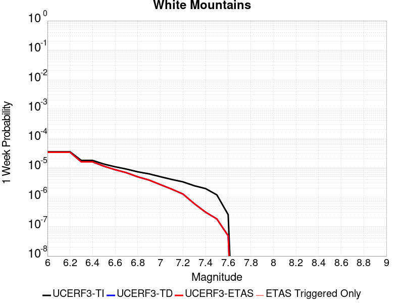 |  |  |  |

| Magnitude | 1 wk TI Prob | 1 wk TD Prob | 1 wk ETAS Prob | 1 wk ETAS/TD Gain | 1 wk ETAS Triggered Only | 1 mo TI Prob | 1 mo TD Prob | 1 mo ETAS Prob | 1 mo ETAS/TD Gain | 1 mo ETAS Triggered Only | 1 yr TI Prob | 1 yr TD Prob | 1 yr ETAS Prob | 1 yr ETAS/TD Gain | 1 yr ETAS Triggered Only | 10 yr TI Prob | 10 yr TD Prob | 10 yr ETAS Prob | 10 yr ETAS/TD Gain | 10 yr ETAS Triggered Only |
|-----|-----|-----|-----|-----|-----|-----|-----|-----|-----|-----|-----|-----|-----|-----|-----|-----|-----|-----|-----|-----|
| 6.0 | 3.503579E-5 | 3.378682E-5 | 3.378682E-5 | 1.0 | 0.0 | 1.5014476E-4 | 1.4479329E-4 | 1.4479329E-4 | 1.0 | 0.0 | 0.0018264796 | 0.0017615537 | 0.0018014832 | 1.0226672 | 4.0E-5 | 0.018115403 | 0.01748824 | 0.017557016 | 1.0039327 | 7.0E-5 |
| 6.1 | 3.503579E-5 | 3.378682E-5 | 3.378682E-5 | 1.0 | 0.0 | 1.5014476E-4 | 1.4479329E-4 | 1.4479329E-4 | 1.0 | 0.0 | 0.0018264796 | 0.0017615537 | 0.0018014832 | 1.0226672 | 4.0E-5 | 0.018115403 | 0.01748824 | 0.017557016 | 1.0039327 | 7.0E-5 |
| 6.2 | 3.503579E-5 | 3.378682E-5 | 3.378682E-5 | 1.0 | 0.0 | 1.5014476E-4 | 1.4479329E-4 | 1.4479329E-4 | 1.0 | 0.0 | 0.0018264796 | 0.0017615537 | 0.0018014832 | 1.0226672 | 4.0E-5 | 0.018115403 | 0.01748824 | 0.017557016 | 1.0039327 | 7.0E-5 |
| 6.3 | 1.7818425E-5 | 1.5917356E-5 | 1.5917356E-5 | 1.0 | 0.0 | 7.636245E-5 | 6.821554E-5 | 6.821554E-5 | 1.0 | 0.0 | 9.293162E-4 | 8.30222E-4 | 8.6019706E-4 | 1.0361049 | 3.0E-5 | 0.009254395 | 0.008272662 | 0.0083123315 | 1.0047952 | 4.0E-5 |
| 6.4 | 1.7818425E-5 | 1.5917356E-5 | 1.5917356E-5 | 1.0 | 0.0 | 7.636245E-5 | 6.821554E-5 | 6.821554E-5 | 1.0 | 0.0 | 9.293162E-4 | 8.30222E-4 | 8.6019706E-4 | 1.0361049 | 3.0E-5 | 0.009254395 | 0.008272662 | 0.0083123315 | 1.0047952 | 4.0E-5 |
| 6.5 | 1.3397557E-5 | 1.13372025E-5 | 1.13372025E-5 | 1.0 | 0.0 | 5.741684E-5 | 4.8587146E-5 | 4.8587146E-5 | 1.0 | 0.0 | 6.988258E-4 | 5.913949E-4 | 6.01389E-4 | 1.0168992 | 1.0E-5 | 0.006966323 | 0.0058989166 | 0.0059088576 | 1.0016853 | 1.0E-5 |
| 6.6 | 1.0818695E-5 | 8.626033E-6 | 8.626033E-6 | 1.0 | 0.0 | 4.6365014E-5 | 3.6968217E-5 | 3.6968217E-5 | 1.0 | 0.0 | 5.6434784E-4 | 4.499994E-4 | 4.499994E-4 | 1.0 | 0.0 | 0.005629168 | 0.0044913185 | 0.0044913185 | 1.0 | 0.0 |
| 6.7 | 9.067908E-6 | 6.802944E-6 | 6.802944E-6 | 1.0 | 0.0 | 3.8861883E-5 | 2.9155166E-5 | 2.9155166E-5 | 1.0 | 0.0 | 4.7304068E-4 | 3.549095E-4 | 3.549095E-4 | 1.0 | 0.0 | 0.00472035 | 0.0035437443 | 0.0035437443 | 1.0 | 0.0 |
| 6.8 | 7.295947E-6 | 4.936747E-6 | 4.936747E-6 | 1.0 | 0.0 | 3.126797E-5 | 2.1157322E-5 | 2.1157322E-5 | 1.0 | 0.0 | 3.8062103E-4 | 2.5756107E-4 | 2.5756107E-4 | 1.0 | 0.0 | 0.0037996976 | 0.0025727386 | 0.0025727386 | 1.0 | 0.0 |
| 6.9 | 6.2243444E-6 | 3.832505E-6 | 3.832505E-6 | 1.0 | 0.0 | 2.6675489E-5 | 1.6424921E-5 | 1.6424921E-5 | 1.0 | 0.0 | 3.2472567E-4 | 1.999556E-4 | 1.999556E-4 | 1.0 | 0.0 | 0.0032425157 | 0.0019978094 | 0.0019978094 | 1.0 | 0.0 |
| 7.0 | 4.9878413E-6 | 2.6797832E-6 | 2.6797832E-6 | 1.0 | 0.0 | 2.1376287E-5 | 1.1484736E-5 | 1.1484736E-5 | 1.0 | 0.0 | 2.602252E-4 | 1.3981794E-4 | 1.3981794E-4 | 1.0 | 0.0 | 0.002599207 | 0.0013973261 | 0.0013973261 | 1.0 | 0.0 |
| 7.1 | 4.0252844E-6 | 1.8859856E-6 | 1.8859856E-6 | 1.0 | 0.0 | 1.7251105E-5 | 8.082771E-6 | 8.082771E-6 | 1.0 | 0.0 | 2.1001195E-4 | 9.840343E-5 | 9.840343E-5 | 1.0 | 0.0 | 0.0020981359 | 9.836113E-4 | 9.836113E-4 | 1.0 | 0.0 |
| 7.2 | 3.3284066E-6 | 1.282176E-6 | 1.282176E-6 | 1.0 | 0.0 | 1.4264522E-5 | 5.4950287E-6 | 5.4950287E-6 | 1.0 | 0.0 | 1.736567E-4 | 6.690003E-5 | 6.690003E-5 | 1.0 | 0.0 | 0.0017352107 | 6.6880893E-4 | 6.6880893E-4 | 1.0 | 0.0 |
| 7.3 | 2.458226E-6 | 6.0591293E-7 | 6.0591293E-7 | 1.0 | 0.0 | 1.0535211E-5 | 2.5967674E-6 | 2.5967674E-6 | 1.0 | 0.0 | 1.2825865E-4 | 3.161522E-5 | 3.161522E-5 | 1.0 | 0.0 | 0.0012818464 | 3.16111E-4 | 3.16111E-4 | 1.0 | 0.0 |
| 7.4 | 1.965953E-6 | 3.110586E-7 | 3.110586E-7 | 1.0 | 0.0 | 8.425486E-6 | 1.3331077E-6 | 1.3331077E-6 | 1.0 | 0.0 | 1.0257547E-4 | 1.6230466E-5 | 1.6230466E-5 | 1.0 | 0.0 | 0.0010252813 | 1.6229294E-4 | 1.6229294E-4 | 1.0 | 0.0 |
| 7.5 | 1.2014192E-6 | 1.8255713E-7 | 1.8255713E-7 | 1.0 | 0.0 | 5.148929E-6 | 7.823875E-7 | 7.823875E-7 | 1.0 | 0.0 | 6.2686406E-5 | 9.525526E-6 | 9.525526E-6 | 1.0 | 0.0 | 6.266873E-4 | 9.5251264E-5 | 9.5251264E-5 | 1.0 | 0.0 |
| 7.6 | 2.5612175E-7 | 4.8976712E-8 | 4.8976712E-8 | 1.0 | 0.0 | 1.0976642E-6 | 2.099002E-7 | 2.099002E-7 | 1.0 | 0.0 | 1.3363979E-5 | 2.555532E-6 | 2.555532E-6 | 1.0 | 0.0 | 1.3363175E-4 | 2.5555064E-5 | 2.5555064E-5 | 1.0 | 0.0 |

## Independence rev 2011
*[(top)](#table-of-contents)*

| 1 Week | 1 Month | 1 Year | 10 Year |
|-----|-----|-----|-----|
|  |  | 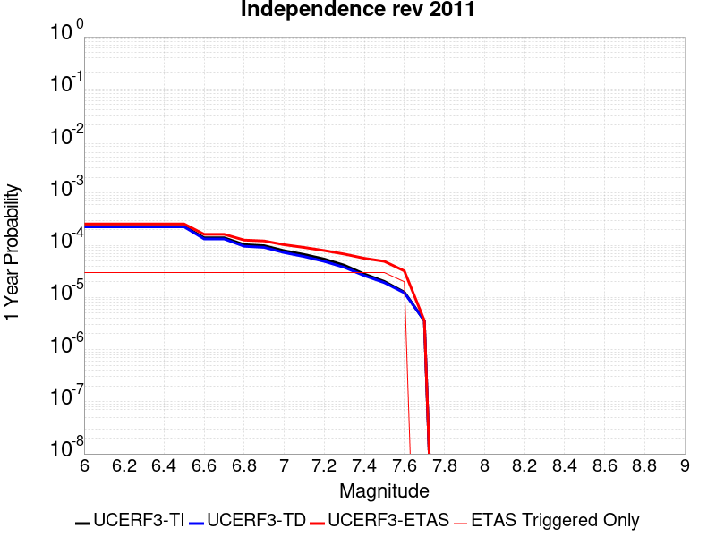 |  |

| Magnitude | 1 wk TI Prob | 1 wk TD Prob | 1 wk ETAS Prob | 1 wk ETAS/TD Gain | 1 wk ETAS Triggered Only | 1 mo TI Prob | 1 mo TD Prob | 1 mo ETAS Prob | 1 mo ETAS/TD Gain | 1 mo ETAS Triggered Only | 1 yr TI Prob | 1 yr TD Prob | 1 yr ETAS Prob | 1 yr ETAS/TD Gain | 1 yr ETAS Triggered Only | 10 yr TI Prob | 10 yr TD Prob | 10 yr ETAS Prob | 10 yr ETAS/TD Gain | 10 yr ETAS Triggered Only |
|-----|-----|-----|-----|-----|-----|-----|-----|-----|-----|-----|-----|-----|-----|-----|-----|-----|-----|-----|-----|-----|
| 6.0 | 4.422171E-6 | 4.326355E-6 | 4.326355E-6 | 1.0 | 0.0 | 1.8952025E-5 | 1.8541406E-5 | 1.8541406E-5 | 1.0 | 0.0 | 2.3071647E-4 | 2.2572123E-4 | 2.5571446E-4 | 1.1328773 | 3.0E-5 | 0.0023047708 | 0.0022552132 | 0.0023250554 | 1.0309691 | 7.0E-5 |
| 6.1 | 4.422171E-6 | 4.326355E-6 | 4.326355E-6 | 1.0 | 0.0 | 1.8952025E-5 | 1.8541406E-5 | 1.8541406E-5 | 1.0 | 0.0 | 2.3071647E-4 | 2.2572123E-4 | 2.5571446E-4 | 1.1328773 | 3.0E-5 | 0.0023047708 | 0.0022552132 | 0.0023250554 | 1.0309691 | 7.0E-5 |
| 6.2 | 4.422171E-6 | 4.326355E-6 | 4.326355E-6 | 1.0 | 0.0 | 1.8952025E-5 | 1.8541406E-5 | 1.8541406E-5 | 1.0 | 0.0 | 2.3071647E-4 | 2.2572123E-4 | 2.5571446E-4 | 1.1328773 | 3.0E-5 | 0.0023047708 | 0.0022552132 | 0.0023250554 | 1.0309691 | 7.0E-5 |
| 6.3 | 4.422171E-6 | 4.326355E-6 | 4.326355E-6 | 1.0 | 0.0 | 1.8952025E-5 | 1.8541406E-5 | 1.8541406E-5 | 1.0 | 0.0 | 2.3071647E-4 | 2.2572123E-4 | 2.5571446E-4 | 1.1328773 | 3.0E-5 | 0.0023047708 | 0.0022552132 | 0.0023250554 | 1.0309691 | 7.0E-5 |
| 6.4 | 4.422171E-6 | 4.326355E-6 | 4.326355E-6 | 1.0 | 0.0 | 1.8952025E-5 | 1.8541406E-5 | 1.8541406E-5 | 1.0 | 0.0 | 2.3071647E-4 | 2.2572123E-4 | 2.5571446E-4 | 1.1328773 | 3.0E-5 | 0.0023047708 | 0.0022552132 | 0.0023250554 | 1.0309691 | 7.0E-5 |
| 6.5 | 4.422171E-6 | 4.326355E-6 | 4.326355E-6 | 1.0 | 0.0 | 1.8952025E-5 | 1.8541406E-5 | 1.8541406E-5 | 1.0 | 0.0 | 2.3071647E-4 | 2.2572123E-4 | 2.5571446E-4 | 1.1328773 | 3.0E-5 | 0.0023047708 | 0.0022552132 | 0.0023250554 | 1.0309691 | 7.0E-5 |
| 6.6 | 2.663744E-6 | 2.5320803E-6 | 2.5320803E-6 | 1.0 | 0.0 | 1.1415996E-5 | 1.0851731E-5 | 1.0851731E-5 | 1.0 | 0.0 | 1.3898089E-4 | 1.321123E-4 | 1.6210834E-4 | 1.2270496 | 3.0E-5 | 0.0013889399 | 0.0013203858 | 0.0013902934 | 1.0529448 | 7.0E-5 |
| 6.7 | 2.663744E-6 | 2.5320803E-6 | 2.5320803E-6 | 1.0 | 0.0 | 1.1415996E-5 | 1.0851731E-5 | 1.0851731E-5 | 1.0 | 0.0 | 1.3898089E-4 | 1.321123E-4 | 1.6210834E-4 | 1.2270496 | 3.0E-5 | 0.0013889399 | 0.0013203858 | 0.0013902934 | 1.0529448 | 7.0E-5 |
| 6.8 | 1.9716529E-6 | 1.832339E-6 | 1.832339E-6 | 1.0 | 0.0 | 8.449913E-6 | 7.852858E-6 | 7.852858E-6 | 1.0 | 0.0 | 1.0287284E-4 | 9.560449E-5 | 1.2560163E-4 | 1.3137628 | 3.0E-5 | 0.0010282523 | 9.5564645E-4 | 0.0010255795 | 1.0731789 | 7.0E-5 |
| 6.9 | 1.8788617E-6 | 1.7430767E-6 | 1.7430767E-6 | 1.0 | 0.0 | 8.0522395E-6 | 7.470308E-6 | 7.470308E-6 | 1.0 | 0.0 | 9.80316E-5 | 9.0947324E-5 | 1.209446E-4 | 1.3298312 | 3.0E-5 | 9.798837E-4 | 9.091131E-4 | 9.790495E-4 | 1.0769281 | 7.0E-5 |
| 7.0 | 1.5045488E-6 | 1.3850145E-6 | 1.3850145E-6 | 1.0 | 0.0 | 6.44805E-6 | 5.935763E-6 | 5.935763E-6 | 1.0 | 0.0 | 7.8502184E-5 | 7.226557E-5 | 1.022634E-4 | 1.4151055 | 3.0E-5 | 7.8474457E-4 | 7.224258E-4 | 7.9237524E-4 | 1.0968257 | 7.0E-5 |
| 7.1 | 1.272341E-6 | 1.1625655E-6 | 1.1625655E-6 | 1.0 | 0.0 | 5.4528787E-6 | 4.9824143E-6 | 4.9824143E-6 | 1.0 | 0.0 | 6.6386776E-5 | 6.0659237E-5 | 9.065742E-5 | 1.494536 | 3.0E-5 | 6.636695E-4 | 6.0643E-4 | 6.763876E-4 | 1.1153597 | 7.0E-5 |
| 7.2 | 1.0416892E-6 | 9.4103615E-7 | 9.4103615E-7 | 1.0 | 0.0 | 4.464375E-6 | 4.033006E-6 | 4.033006E-6 | 1.0 | 0.0 | 5.4352407E-5 | 4.910076E-5 | 7.9099285E-5 | 1.6109585 | 3.0E-5 | 5.4339116E-4 | 4.9090094E-4 | 5.608666E-4 | 1.142525 | 7.0E-5 |
| 7.3 | 7.9450155E-7 | 7.235362E-7 | 7.235362E-7 | 1.0 | 0.0 | 3.4050022E-6 | 3.1008658E-6 | 3.1008658E-6 | 1.0 | 0.0 | 4.1455114E-5 | 3.7752397E-5 | 6.7751265E-5 | 1.7946215 | 3.0E-5 | 4.144738E-4 | 3.7746096E-4 | 4.4743455E-4 | 1.1853796 | 7.0E-5 |
| 7.4 | 5.3893444E-7 | 5.019736E-7 | 5.019736E-7 | 1.0 | 0.0 | 2.309717E-6 | 2.1513138E-6 | 2.1513138E-6 | 1.0 | 0.0 | 2.8120441E-5 | 2.6191936E-5 | 5.619115E-5 | 2.1453607 | 3.0E-5 | 2.8116882E-4 | 2.6188893E-4 | 3.318706E-4 | 1.2672188 | 7.0E-5 |
| 7.5 | 3.8852085E-7 | 3.6827004E-7 | 3.6827004E-7 | 1.0 | 0.0 | 1.6650882E-6 | 1.5782992E-6 | 1.5782992E-6 | 1.0 | 0.0 | 2.027226E-5 | 1.9215626E-5 | 4.921505E-5 | 2.5611994 | 3.0E-5 | 2.0270412E-4 | 1.9213985E-4 | 2.621264E-4 | 1.3642479 | 7.0E-5 |
| 7.6 | 2.414929E-7 | 2.3458315E-7 | 2.3458315E-7 | 1.0 | 0.0 | 1.0349692E-6 | 1.005356E-6 | 1.005356E-6 | 1.0 | 0.0 | 1.2600677E-5 | 1.2240142E-5 | 3.2239896E-5 | 2.633948 | 2.0E-5 | 1.2599962E-4 | 1.2239479E-4 | 1.7238868E-4 | 1.4084641 | 5.0E-5 |
| 7.7 | 6.8298014E-8 | 6.8591305E-8 | 6.8591305E-8 | 1.0 | 0.0 | 2.9270575E-7 | 2.939627E-7 | 2.939627E-7 | 1.0 | 0.0 | 3.5636867E-6 | 3.5789906E-6 | 3.5789906E-6 | 1.0 | 0.0 | 3.5636294E-5 | 3.5789377E-5 | 3.5789377E-5 | 1.0 | 0.0 |

## San Andreas (Coachella) rev
*[(top)](#table-of-contents)*

| 1 Week | 1 Month | 1 Year | 10 Year |
|-----|-----|-----|-----|
| 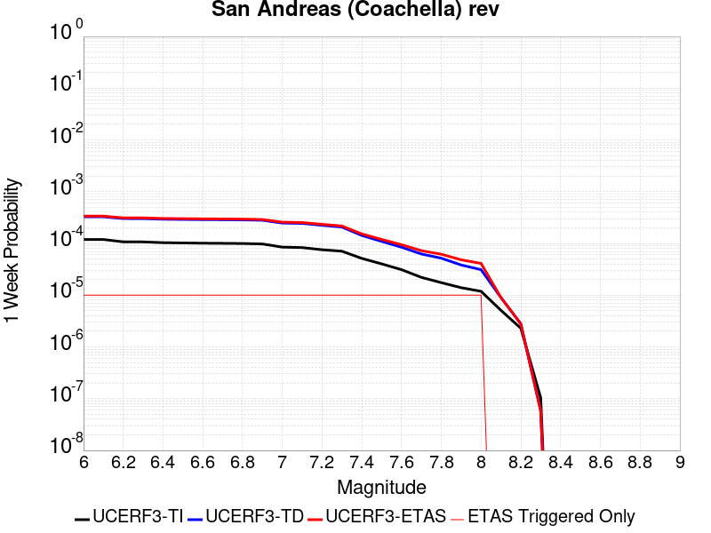 |  |  |  |

| Magnitude | 1 wk TI Prob | 1 wk TD Prob | 1 wk ETAS Prob | 1 wk ETAS/TD Gain | 1 wk ETAS Triggered Only | 1 mo TI Prob | 1 mo TD Prob | 1 mo ETAS Prob | 1 mo ETAS/TD Gain | 1 mo ETAS Triggered Only | 1 yr TI Prob | 1 yr TD Prob | 1 yr ETAS Prob | 1 yr ETAS/TD Gain | 1 yr ETAS Triggered Only | 10 yr TI Prob | 10 yr TD Prob | 10 yr ETAS Prob | 10 yr ETAS/TD Gain | 10 yr ETAS Triggered Only |
|-----|-----|-----|-----|-----|-----|-----|-----|-----|-----|-----|-----|-----|-----|-----|-----|-----|-----|-----|-----|-----|
| 6.0 | 1.1925945E-4 | 3.276026E-4 | 3.3759934E-4 | 1.0305148 | 1.0E-5 | 5.110118E-4 | 0.0014032605 | 0.0014232324 | 1.0142325 | 2.0E-5 | 0.0062038354 | 0.0169522 | 0.016991522 | 1.0023196 | 4.0E-5 | 0.060334753 | 0.15277351 | 0.15283282 | 1.0003881 | 7.0E-5 |
| 6.1 | 1.1925945E-4 | 3.276026E-4 | 3.3759934E-4 | 1.0305148 | 1.0E-5 | 5.110118E-4 | 0.0014032605 | 0.0014232324 | 1.0142325 | 2.0E-5 | 0.0062038354 | 0.0169522 | 0.016991522 | 1.0023196 | 4.0E-5 | 0.060334753 | 0.15277351 | 0.15283282 | 1.0003881 | 7.0E-5 |
| 6.2 | 1.07432395E-4 | 3.0260795E-4 | 3.126049E-4 | 1.0330361 | 1.0E-5 | 4.603433E-4 | 0.0012962506 | 0.0013162247 | 1.0154091 | 2.0E-5 | 0.005590286 | 0.015668752 | 0.015708124 | 1.0025128 | 4.0E-5 | 0.05451731 | 0.14194496 | 0.14200503 | 1.0004232 | 7.0E-5 |
| 6.3 | 1.0718766E-4 | 3.0206097E-4 | 3.1205796E-4 | 1.033096 | 1.0E-5 | 4.592948E-4 | 0.0012939088 | 0.001313883 | 1.015437 | 2.0E-5 | 0.005577586 | 0.01564065 | 0.015680024 | 1.0025175 | 4.0E-5 | 0.054396555 | 0.14171325 | 0.14177331 | 1.0004239 | 7.0E-5 |
| 6.4 | 1.0355944E-4 | 2.9414144E-4 | 3.041385E-4 | 1.0339873 | 1.0E-5 | 4.4375064E-4 | 0.0012600011 | 0.0012799759 | 1.015853 | 2.0E-5 | 0.0053892885 | 0.015233666 | 0.015273057 | 1.0025858 | 4.0E-5 | 0.052604496 | 0.13827357 | 0.13833389 | 1.0004362 | 7.0E-5 |
| 6.5 | 1.0227914E-4 | 2.9133563E-4 | 3.013327E-4 | 1.0343146 | 1.0E-5 | 4.382655E-4 | 0.0012479877 | 0.0012679627 | 1.0160058 | 2.0E-5 | 0.0053228354 | 0.015089439 | 0.015128835 | 1.0026108 | 4.0E-5 | 0.051971316 | 0.13705285 | 0.13711326 | 1.0004407 | 7.0E-5 |
| 6.6 | 1.0116757E-4 | 2.8899297E-4 | 2.989901E-4 | 1.0345929 | 1.0E-5 | 4.3350324E-4 | 0.0012379574 | 0.0012579326 | 1.0161357 | 2.0E-5 | 0.0052651367 | 0.014969003 | 0.015008405 | 1.0026321 | 4.0E-5 | 0.051421247 | 0.1360311 | 0.13609159 | 1.0004445 | 7.0E-5 |
| 6.7 | 1.0050676E-4 | 2.8757853E-4 | 2.9757567E-4 | 1.0347631 | 1.0E-5 | 4.3067214E-4 | 0.0012319012 | 0.0012518766 | 1.0162151 | 2.0E-5 | 0.005230834 | 0.01489628 | 0.014935684 | 1.0026453 | 4.0E-5 | 0.051094085 | 0.13541588 | 0.13547641 | 1.0004469 | 7.0E-5 |
| 6.8 | 9.976819E-5 | 2.8561472E-4 | 2.9561188E-4 | 1.0350022 | 1.0E-5 | 4.2750788E-4 | 0.0012234928 | 0.0012434684 | 1.0163267 | 2.0E-5 | 0.0051924936 | 0.014795303 | 0.014834711 | 1.0026636 | 4.0E-5 | 0.050728295 | 0.13456754 | 0.13462813 | 1.0004501 | 7.0E-5 |
| 6.9 | 9.77719E-5 | 2.805817E-4 | 2.905789E-4 | 1.0356302 | 1.0E-5 | 4.1895514E-4 | 0.0012019428 | 0.0012219187 | 1.0166197 | 2.0E-5 | 0.0050888555 | 0.014536463 | 0.014575881 | 1.0027117 | 4.0E-5 | 0.049738888 | 0.13239557 | 0.1324563 | 1.0004587 | 7.0E-5 |
| 7.0 | 8.500761E-5 | 2.4791094E-4 | 2.5790845E-4 | 1.0403271 | 1.0E-5 | 3.6426744E-4 | 0.001062046 | 0.0010820248 | 1.0188116 | 2.0E-5 | 0.0044259406 | 0.012854526 | 0.01288414 | 1.0023038 | 3.0E-5 | 0.04338823 | 0.11824919 | 0.1183021 | 1.0004474 | 6.0E-5 |
| 7.1 | 8.319876E-5 | 2.439351E-4 | 2.5393267E-4 | 1.0409845 | 1.0E-5 | 3.5651738E-4 | 0.0010450205 | 0.0010649996 | 1.0191184 | 2.0E-5 | 0.004331963 | 0.012649666 | 0.012679286 | 1.0023416 | 3.0E-5 | 0.042484846 | 0.116468385 | 0.116521396 | 1.0004551 | 6.0E-5 |
| 7.2 | 7.563917E-5 | 2.244109E-4 | 2.3440865E-4 | 1.0445511 | 1.0E-5 | 3.2412758E-4 | 9.614096E-4 | 9.813904E-4 | 1.0207828 | 2.0E-5 | 0.0039391145 | 0.011643032 | 0.011672682 | 1.0025467 | 3.0E-5 | 0.03870018 | 0.10787237 | 0.1079259 | 1.0004963 | 6.0E-5 |
| 7.3 | 7.082985E-5 | 2.0756187E-4 | 2.1755979E-4 | 1.0481684 | 1.0E-5 | 3.0352117E-4 | 8.892505E-4 | 9.092327E-4 | 1.0224708 | 2.0E-5 | 0.0036891096 | 0.010773506 | 0.010803184 | 1.0027546 | 3.0E-5 | 0.03628465 | 0.100391835 | 0.100445814 | 1.0005376 | 6.0E-5 |
| 7.4 | 5.146215E-5 | 1.4295257E-4 | 1.5295115E-4 | 1.0699433 | 1.0E-5 | 2.2053342E-4 | 6.1251095E-4 | 6.324987E-4 | 1.0326325 | 2.0E-5 | 0.0026816884 | 0.0074320114 | 0.0074617886 | 1.0040066 | 3.0E-5 | 0.02649557 | 0.070943184 | 0.07099893 | 1.0007857 | 6.0E-5 |
| 7.5 | 4.0285166E-5 | 1.0960223E-4 | 1.19601136E-4 | 1.091229 | 1.0E-5 | 1.7263928E-4 | 4.696396E-4 | 4.896302E-4 | 1.0425658 | 2.0E-5 | 0.002099857 | 0.005702941 | 0.00573277 | 1.0052304 | 3.0E-5 | 0.020801254 | 0.055094037 | 0.055150732 | 1.001029 | 6.0E-5 |
| 7.6 | 3.1168736E-5 | 8.455466E-5 | 9.455381E-5 | 1.1182567 | 1.0E-5 | 1.3357346E-4 | 3.6232691E-4 | 3.8231965E-4 | 1.0551788 | 2.0E-5 | 0.0016250437 | 0.004402434 | 0.004432302 | 1.0067844 | 3.0E-5 | 0.016132116 | 0.042884674 | 0.0429421 | 1.0013391 | 6.0E-5 |
| 7.7 | 2.2100989E-5 | 6.253315E-5 | 7.253252E-5 | 1.1599052 | 1.0E-5 | 9.4715084E-5 | 2.679717E-4 | 2.8796637E-4 | 1.0746148 | 2.0E-5 | 0.001152546 | 0.0032576811 | 0.0032875836 | 1.009179 | 3.0E-5 | 0.011465867 | 0.031966314 | 0.032024395 | 1.001817 | 6.0E-5 |
| 7.8 | 1.7484861E-5 | 5.192554E-5 | 6.192502E-5 | 1.1925734 | 1.0E-5 | 7.493296E-5 | 2.2251907E-4 | 2.4251462E-4 | 1.08986 | 2.0E-5 | 9.1192697E-4 | 0.0027058069 | 0.0027357256 | 1.0110573 | 3.0E-5 | 0.009081938 | 0.026699238 | 0.026757637 | 1.0021873 | 6.0E-5 |
| 7.9 | 1.3967285E-5 | 3.8328933E-5 | 4.832855E-5 | 1.2608895 | 1.0E-5 | 5.985842E-5 | 1.6425652E-4 | 1.8425324E-4 | 1.1217408 | 2.0E-5 | 7.2853256E-4 | 0.00199799 | 0.0020279302 | 1.0149851 | 3.0E-5 | 0.0072614877 | 0.019958619 | 0.02001742 | 1.0029463 | 6.0E-5 |
| 8.0 | 1.1887396E-5 | 3.1156596E-5 | 4.1156287E-5 | 1.3209493 | 1.0E-5 | 5.094499E-5 | 1.3352145E-4 | 1.5351878E-4 | 1.1497687 | 2.0E-5 | 6.200787E-4 | 0.0016244124 | 0.0016543637 | 1.0184382 | 3.0E-5 | 0.006183513 | 0.016321857 | 0.016380876 | 1.0036161 | 6.0E-5 |
| 8.1 | 5.100864E-6 | 9.010413E-6 | 9.010413E-6 | 1.0 | 0.0 | 2.1860664E-5 | 3.8615486E-5 | 3.8615486E-5 | 1.0 | 0.0 | 2.6612106E-4 | 4.7004226E-4 | 4.7004226E-4 | 1.0 | 0.0 | 0.002658026 | 0.0049361736 | 0.0049361736 | 1.0 | 0.0 |
| 8.2 | 2.3004484E-6 | 2.8013471E-6 | 2.8013471E-6 | 1.0 | 0.0 | 9.859027E-6 | 1.2005718E-5 | 1.2005718E-5 | 1.0 | 0.0 | 1.2002704E-4 | 1.4615984E-4 | 1.4615984E-4 | 1.0 | 0.0 | 0.0011996223 | 0.0016050831 | 0.0016050831 | 1.0 | 0.0 |
| 8.3 | 1.0424446E-7 | 5.856872E-8 | 5.856872E-8 | 1.0 | 0.0 | 4.4676187E-7 | 2.5100877E-7 | 2.5100877E-7 | 1.0 | 0.0 | 5.439312E-6 | 3.0560277E-6 | 3.0560277E-6 | 1.0 | 0.0 | 5.4391792E-5 | 3.212467E-5 | 3.212467E-5 | 1.0 | 0.0 |

## Cleghorn Lake
*[(top)](#table-of-contents)*

| 1 Week | 1 Month | 1 Year | 10 Year |
|-----|-----|-----|-----|
|  |  |  |  |

| Magnitude | 1 wk TI Prob | 1 wk TD Prob | 1 wk ETAS Prob | 1 wk ETAS/TD Gain | 1 wk ETAS Triggered Only | 1 mo TI Prob | 1 mo TD Prob | 1 mo ETAS Prob | 1 mo ETAS/TD Gain | 1 mo ETAS Triggered Only | 1 yr TI Prob | 1 yr TD Prob | 1 yr ETAS Prob | 1 yr ETAS/TD Gain | 1 yr ETAS Triggered Only | 10 yr TI Prob | 10 yr TD Prob | 10 yr ETAS Prob | 10 yr ETAS/TD Gain | 10 yr ETAS Triggered Only |
|-----|-----|-----|-----|-----|-----|-----|-----|-----|-----|-----|-----|-----|-----|-----|-----|-----|-----|-----|-----|-----|
| 6.0 | 1.5467183E-5 | 1.6795546E-5 | 1.6795546E-5 | 1.0 | 0.0 | 6.6286244E-5 | 7.197924E-5 | 7.197924E-5 | 1.0 | 0.0 | 8.067362E-4 | 8.760497E-4 | 9.1601466E-4 | 1.0456195 | 4.0E-5 | 0.008038137 | 0.00873139 | 0.0088007795 | 1.0079471 | 7.0E-5 |
| 6.1 | 1.5467183E-5 | 1.6795546E-5 | 1.6795546E-5 | 1.0 | 0.0 | 6.6286244E-5 | 7.197924E-5 | 7.197924E-5 | 1.0 | 0.0 | 8.067362E-4 | 8.760497E-4 | 9.1601466E-4 | 1.0456195 | 4.0E-5 | 0.008038137 | 0.00873139 | 0.0088007795 | 1.0079471 | 7.0E-5 |
| 6.2 | 1.2624631E-5 | 1.3682612E-5 | 1.3682612E-5 | 1.0 | 0.0 | 5.410444E-5 | 5.863872E-5 | 5.863872E-5 | 1.0 | 0.0 | 6.585225E-4 | 7.137413E-4 | 7.4371987E-4 | 1.0420021 | 3.0E-5 | 0.0065657445 | 0.007119286 | 0.0071788584 | 1.0083678 | 6.0E-5 |
| 6.3 | 1.2624631E-5 | 1.3682612E-5 | 1.3682612E-5 | 1.0 | 0.0 | 5.410444E-5 | 5.863872E-5 | 5.863872E-5 | 1.0 | 0.0 | 6.585225E-4 | 7.137413E-4 | 7.4371987E-4 | 1.0420021 | 3.0E-5 | 0.0065657445 | 0.007119286 | 0.0071788584 | 1.0083678 | 6.0E-5 |
| 6.4 | 9.417684E-6 | 1.0170876E-5 | 1.0170876E-5 | 1.0 | 0.0 | 4.036088E-5 | 4.358897E-5 | 4.358897E-5 | 1.0 | 0.0 | 4.912829E-4 | 5.306076E-4 | 5.6059164E-4 | 1.0565089 | 3.0E-5 | 0.004901982 | 0.0052974434 | 0.0053471783 | 1.0093886 | 5.0E-5 |
| 6.5 | 9.368219E-6 | 1.01182995E-5 | 1.01182995E-5 | 1.0 | 0.0 | 4.014889E-5 | 4.336365E-5 | 4.336365E-5 | 1.0 | 0.0 | 4.8870314E-4 | 5.2786566E-4 | 5.578498E-4 | 1.0568026 | 3.0E-5 | 0.004876298 | 0.005270154 | 0.0053198906 | 1.0094374 | 5.0E-5 |
| 6.6 | 7.803798E-6 | 8.442475E-6 | 8.442475E-6 | 1.0 | 0.0 | 3.3444423E-5 | 3.6181755E-5 | 3.6181755E-5 | 1.0 | 0.0 | 4.0710976E-4 | 4.4046377E-4 | 4.7045056E-4 | 1.0680801 | 3.0E-5 | 0.0040636472 | 0.0043998254 | 0.0044496055 | 1.011314 | 5.0E-5 |
| 6.7 | 2.3108669E-6 | 2.4439644E-6 | 2.4439644E-6 | 1.0 | 0.0 | 9.903678E-6 | 1.0474092E-5 | 1.0474092E-5 | 1.0 | 0.0 | 1.205706E-4 | 1.275148E-4 | 1.3751352E-4 | 1.0784123 | 1.0E-5 | 0.001205052 | 0.0012744348 | 0.0012844221 | 1.0078366 | 1.0E-5 |
| 6.8 | 2.0882828E-6 | 2.206398E-6 | 2.206398E-6 | 1.0 | 0.0 | 8.949753E-6 | 9.455958E-6 | 9.455958E-6 | 1.0 | 0.0 | 1.08957785E-4 | 1.15120376E-4 | 1.15120376E-4 | 1.0 | 0.0 | 0.0010890438 | 0.0011506242 | 0.0011506242 | 1.0 | 0.0 |
| 6.9 | 1.876935E-6 | 1.981153E-6 | 1.981153E-6 | 1.0 | 0.0 | 8.043982E-6 | 8.49063E-6 | 8.49063E-6 | 1.0 | 0.0 | 9.7931086E-5 | 1.0336867E-4 | 1.0336867E-4 | 1.0 | 0.0 | 9.788794E-4 | 0.0010332218 | 0.0010332218 | 1.0 | 0.0 |
| 7.0 | 1.5357559E-6 | 1.6203635E-6 | 1.6203635E-6 | 1.0 | 0.0 | 6.5817944E-6 | 6.9443972E-6 | 6.9443972E-6 | 1.0 | 0.0 | 8.01304E-5 | 8.454488E-5 | 8.454488E-5 | 1.0 | 0.0 | 8.010151E-4 | 8.451397E-4 | 8.451397E-4 | 1.0 | 0.0 |
| 7.1 | 1.0905424E-6 | 1.1498199E-6 | 1.1498199E-6 | 1.0 | 0.0 | 4.6737446E-6 | 4.927791E-6 | 4.927791E-6 | 1.0 | 0.0 | 5.6901354E-5 | 5.9994305E-5 | 5.9994305E-5 | 1.0 | 0.0 | 5.6886784E-4 | 5.9979083E-4 | 5.9979083E-4 | 1.0 | 0.0 |
| 7.2 | 6.06668E-7 | 6.387591E-7 | 6.387591E-7 | 1.0 | 0.0 | 2.600003E-6 | 2.7375365E-6 | 2.7375365E-6 | 1.0 | 0.0 | 3.1654577E-5 | 3.3329066E-5 | 3.3329066E-5 | 1.0 | 0.0 | 3.1650066E-4 | 3.3324753E-4 | 3.3324753E-4 | 1.0 | 0.0 |

## Palos Verdes
*[(top)](#table-of-contents)*

| 1 Week | 1 Month | 1 Year | 10 Year |
|-----|-----|-----|-----|
| 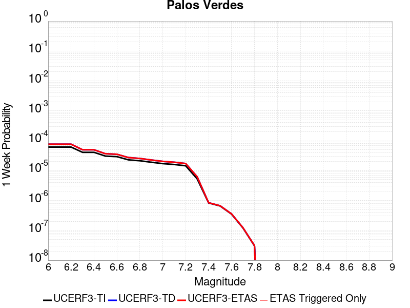 |  |  |  |

| Magnitude | 1 wk TI Prob | 1 wk TD Prob | 1 wk ETAS Prob | 1 wk ETAS/TD Gain | 1 wk ETAS Triggered Only | 1 mo TI Prob | 1 mo TD Prob | 1 mo ETAS Prob | 1 mo ETAS/TD Gain | 1 mo ETAS Triggered Only | 1 yr TI Prob | 1 yr TD Prob | 1 yr ETAS Prob | 1 yr ETAS/TD Gain | 1 yr ETAS Triggered Only | 10 yr TI Prob | 10 yr TD Prob | 10 yr ETAS Prob | 10 yr ETAS/TD Gain | 10 yr ETAS Triggered Only |
|-----|-----|-----|-----|-----|-----|-----|-----|-----|-----|-----|-----|-----|-----|-----|-----|-----|-----|-----|-----|-----|
| 6.0 | 6.126063E-5 | 7.6243654E-5 | 7.6243654E-5 | 1.0 | 0.0 | 2.6251914E-4 | 3.2672097E-4 | 3.2672097E-4 | 1.0 | 0.0 | 0.0031914865 | 0.0039710505 | 0.003990971 | 1.0050164 | 2.0E-5 | 0.031460393 | 0.039057482 | 0.03911514 | 1.0014762 | 6.0E-5 |
| 6.1 | 6.126063E-5 | 7.6243654E-5 | 7.6243654E-5 | 1.0 | 0.0 | 2.6251914E-4 | 3.2672097E-4 | 3.2672097E-4 | 1.0 | 0.0 | 0.0031914865 | 0.0039710505 | 0.003990971 | 1.0050164 | 2.0E-5 | 0.031460393 | 0.039057482 | 0.03911514 | 1.0014762 | 6.0E-5 |
| 6.2 | 6.126063E-5 | 7.6243654E-5 | 7.6243654E-5 | 1.0 | 0.0 | 2.6251914E-4 | 3.2672097E-4 | 3.2672097E-4 | 1.0 | 0.0 | 0.0031914865 | 0.0039710505 | 0.003990971 | 1.0050164 | 2.0E-5 | 0.031460393 | 0.039057482 | 0.03911514 | 1.0014762 | 6.0E-5 |
| 6.3 | 4.0838047E-5 | 4.9759634E-5 | 4.9759634E-5 | 1.0 | 0.0 | 1.7500846E-4 | 2.1323941E-4 | 2.1323941E-4 | 1.0 | 0.0 | 0.0021286458 | 0.002593297 | 0.002613245 | 1.0076922 | 2.0E-5 | 0.021083709 | 0.025651814 | 0.025700532 | 1.0018991 | 5.0E-5 |
| 6.4 | 4.0838047E-5 | 4.9759634E-5 | 4.9759634E-5 | 1.0 | 0.0 | 1.7500846E-4 | 2.1323941E-4 | 2.1323941E-4 | 1.0 | 0.0 | 0.0021286458 | 0.002593297 | 0.002613245 | 1.0076922 | 2.0E-5 | 0.021083709 | 0.025651814 | 0.025700532 | 1.0018991 | 5.0E-5 |
| 6.5 | 3.0512005E-5 | 3.6568417E-5 | 3.6568417E-5 | 1.0 | 0.0 | 1.3075917E-4 | 1.5671305E-4 | 1.5671305E-4 | 1.0 | 0.0 | 0.0015908304 | 0.0019064287 | 0.0019263906 | 1.0104709 | 2.0E-5 | 0.015794903 | 0.018912623 | 0.018951867 | 1.002075 | 4.0E-5 |
| 6.6 | 2.9255087E-5 | 3.5161058E-5 | 3.5161058E-5 | 1.0 | 0.0 | 1.2537291E-4 | 1.5068222E-4 | 1.5068222E-4 | 1.0 | 0.0 | 0.0015253464 | 0.0018331268 | 0.0018530901 | 1.0108904 | 2.0E-5 | 0.015149189 | 0.018191617 | 0.018230889 | 1.0021588 | 4.0E-5 |
| 6.7 | 2.287198E-5 | 2.725316E-5 | 2.725316E-5 | 1.0 | 0.0 | 9.801909E-5 | 1.16794545E-4 | 1.16794545E-4 | 1.0 | 0.0 | 0.001192729 | 0.0014211377 | 0.0014411093 | 1.0140532 | 2.0E-5 | 0.011863477 | 0.014129732 | 0.014159308 | 1.0020932 | 3.0E-5 |
| 6.8 | 2.1325764E-5 | 2.543646E-5 | 2.543646E-5 | 1.0 | 0.0 | 9.139293E-5 | 1.0900936E-4 | 1.0900936E-4 | 1.0 | 0.0 | 0.001112141 | 0.0013264711 | 0.0013464446 | 1.0150576 | 2.0E-5 | 0.011065915 | 0.013194575 | 0.013224179 | 1.0022436 | 3.0E-5 |
| 6.9 | 1.9009392E-5 | 2.2617563E-5 | 2.2617563E-5 | 1.0 | 0.0 | 8.1466285E-5 | 9.69293E-5 | 9.69293E-5 | 1.0 | 0.0 | 9.914007E-4 | 0.0011795628 | 0.0011995392 | 1.0169355 | 2.0E-5 | 0.009869894 | 0.011741707 | 0.011771355 | 1.002525 | 3.0E-5 |
| 7.0 | 1.7098473E-5 | 2.0322943E-5 | 2.0322943E-5 | 1.0 | 0.0 | 7.3277115E-5 | 8.7095905E-5 | 8.7095905E-5 | 1.0 | 0.0 | 8.917837E-4 | 0.001059962 | 0.0010799408 | 1.0188487 | 2.0E-5 | 0.008882134 | 0.0105575025 | 0.010587186 | 1.0028116 | 3.0E-5 |
| 7.1 | 1.5982785E-5 | 1.8998117E-5 | 1.8998117E-5 | 1.0 | 0.0 | 6.849585E-5 | 8.141843E-5 | 8.141843E-5 | 1.0 | 0.0 | 8.336179E-4 | 9.909034E-4 | 0.0010108836 | 1.0201637 | 2.0E-5 | 0.008304977 | 0.009873217 | 0.009902921 | 1.0030085 | 3.0E-5 |
| 7.2 | 1.4468002E-5 | 1.7200278E-5 | 1.7200278E-5 | 1.0 | 0.0 | 6.200425E-5 | 7.371387E-5 | 7.371387E-5 | 1.0 | 0.0 | 7.546402E-4 | 8.971809E-4 | 9.171629E-4 | 1.022272 | 2.0E-5 | 0.007520827 | 0.00894386 | 0.008973592 | 1.0033243 | 3.0E-5 |
| 7.3 | 5.288233E-6 | 6.2046975E-6 | 6.2046975E-6 | 1.0 | 0.0 | 2.2663658E-5 | 2.6591486E-5 | 2.6591486E-5 | 1.0 | 0.0 | 2.7589512E-4 | 3.2373815E-4 | 3.2373815E-4 | 1.0 | 0.0 | 0.0027555283 | 0.0032360894 | 0.003246057 | 1.0030801 | 1.0E-5 |
| 7.4 | 8.279556E-7 | 8.408468E-7 | 8.408468E-7 | 1.0 | 0.0 | 3.5483763E-6 | 3.6036247E-6 | 3.6036247E-6 | 1.0 | 0.0 | 4.3200624E-5 | 4.387332E-5 | 4.387332E-5 | 1.0 | 0.0 | 4.3192226E-4 | 4.386538E-4 | 4.386538E-4 | 1.0 | 0.0 |
| 7.5 | 6.559831E-7 | 6.66733E-7 | 6.66733E-7 | 1.0 | 0.0 | 2.8113532E-6 | 2.8574245E-6 | 2.8574245E-6 | 1.0 | 0.0 | 3.4227687E-5 | 3.4788656E-5 | 3.4788656E-5 | 1.0 | 0.0 | 3.4222414E-4 | 3.478387E-4 | 3.478387E-4 | 1.0 | 0.0 |
| 7.6 | 3.5018968E-7 | 3.5620596E-7 | 3.5620596E-7 | 1.0 | 0.0 | 1.500812E-6 | 1.5265963E-6 | 1.5265963E-6 | 1.0 | 0.0 | 1.8272232E-5 | 1.8586199E-5 | 1.8586199E-5 | 1.0 | 0.0 | 1.8270731E-4 | 1.8585104E-4 | 1.8585104E-4 | 1.0 | 0.0 |
| 7.7 | 1.1986104E-7 | 1.2198578E-7 | 1.2198578E-7 | 1.0 | 0.0 | 5.1369005E-7 | 5.227961E-7 | 5.227961E-7 | 1.0 | 0.0 | 6.2541585E-6 | 6.3650236E-6 | 6.3650236E-6 | 1.0 | 0.0 | 6.2539824E-5 | 6.3648455E-5 | 6.3648455E-5 | 1.0 | 0.0 |
| 7.8 | 3.0445005E-8 | 3.1028137E-8 | 3.1028137E-8 | 1.0 | 0.0 | 1.3047858E-7 | 1.3297772E-7 | 1.3297772E-7 | 1.0 | 0.0 | 1.5885756E-6 | 1.6190027E-6 | 1.6190027E-6 | 1.0 | 0.0 | 1.5885644E-5 | 1.618993E-5 | 1.618993E-5 | 1.0 | 0.0 |

## Santa Ynez (West)
*[(top)](#table-of-contents)*

| 1 Week | 1 Month | 1 Year | 10 Year |
|-----|-----|-----|-----|
|  | 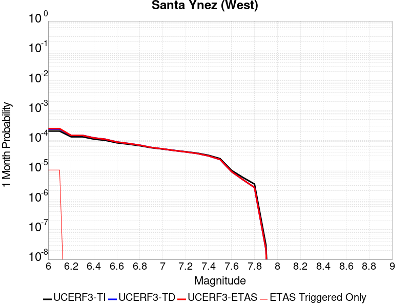 |  |  |

| Magnitude | 1 wk TI Prob | 1 wk TD Prob | 1 wk ETAS Prob | 1 wk ETAS/TD Gain | 1 wk ETAS Triggered Only | 1 mo TI Prob | 1 mo TD Prob | 1 mo ETAS Prob | 1 mo ETAS/TD Gain | 1 mo ETAS Triggered Only | 1 yr TI Prob | 1 yr TD Prob | 1 yr ETAS Prob | 1 yr ETAS/TD Gain | 1 yr ETAS Triggered Only | 10 yr TI Prob | 10 yr TD Prob | 10 yr ETAS Prob | 10 yr ETAS/TD Gain | 10 yr ETAS Triggered Only |
|-----|-----|-----|-----|-----|-----|-----|-----|-----|-----|-----|-----|-----|-----|-----|-----|-----|-----|-----|-----|-----|
| 6.0 | 4.7352758E-5 | 5.4981716E-5 | 5.4981716E-5 | 1.0 | 0.0 | 2.0292461E-4 | 2.3561627E-4 | 2.4561392E-4 | 1.0424318 | 1.0E-5 | 0.0024678076 | 0.0028650062 | 0.002884949 | 1.0069607 | 2.0E-5 | 0.024405818 | 0.02830918 | 0.028357765 | 1.0017163 | 5.0E-5 |
| 6.1 | 4.7352758E-5 | 5.4981716E-5 | 5.4981716E-5 | 1.0 | 0.0 | 2.0292461E-4 | 2.3561627E-4 | 2.4561392E-4 | 1.0424318 | 1.0E-5 | 0.0024678076 | 0.0028650062 | 0.002884949 | 1.0069607 | 2.0E-5 | 0.024405818 | 0.02830918 | 0.028348047 | 1.0013729 | 4.0E-5 |
| 6.2 | 3.0415853E-5 | 3.3929857E-5 | 3.3929857E-5 | 1.0 | 0.0 | 1.3034715E-4 | 1.4540575E-4 | 1.4540575E-4 | 1.0 | 0.0 | 0.0015858212 | 0.0017689128 | 0.0017788952 | 1.0056432 | 1.0E-5 | 0.015745522 | 0.017552229 | 0.017581701 | 1.0016792 | 3.0E-5 |
| 6.3 | 3.0415853E-5 | 3.3929857E-5 | 3.3929857E-5 | 1.0 | 0.0 | 1.3034715E-4 | 1.4540575E-4 | 1.4540575E-4 | 1.0 | 0.0 | 0.0015858212 | 0.0017689128 | 0.0017788952 | 1.0056432 | 1.0E-5 | 0.015745522 | 0.017552229 | 0.017581701 | 1.0016792 | 3.0E-5 |
| 6.4 | 2.5452082E-5 | 2.791597E-5 | 2.791597E-5 | 1.0 | 0.0 | 1.09075794E-4 | 1.1963445E-4 | 1.1963445E-4 | 1.0 | 0.0 | 0.0013271887 | 0.0014555932 | 0.0014555932 | 1.0 | 0.0 | 0.013192902 | 0.014462772 | 0.014472627 | 1.0006814 | 1.0E-5 |
| 6.5 | 2.3143784E-5 | 2.5131267E-5 | 2.5131267E-5 | 1.0 | 0.0 | 9.9183875E-5 | 1.07701024E-4 | 1.07701024E-4 | 1.0 | 0.0 | 0.0012068948 | 0.0013104831 | 0.0013104831 | 1.0 | 0.0 | 0.012003611 | 0.013029228 | 0.013039098 | 1.0007575 | 1.0E-5 |
| 6.6 | 1.9118515E-5 | 2.0356518E-5 | 2.0356518E-5 | 1.0 | 0.0 | 8.193392E-5 | 8.723935E-5 | 8.723935E-5 | 1.0 | 0.0 | 9.97089E-4 | 0.0010616295 | 0.0010616295 | 1.0 | 0.0 | 0.00992627 | 0.01056649 | 0.01056649 | 1.0 | 0.0 |
| 6.7 | 1.722807E-5 | 1.814818E-5 | 1.814818E-5 | 1.0 | 0.0 | 7.3832496E-5 | 7.777562E-5 | 7.777562E-5 | 1.0 | 0.0 | 8.985399E-4 | 9.465124E-4 | 9.465124E-4 | 1.0 | 0.0 | 0.008949154 | 0.009425457 | 0.009425457 | 1.0 | 0.0 |
| 6.8 | 1.5317364E-5 | 1.592798E-5 | 1.592798E-5 | 1.0 | 0.0 | 6.56442E-5 | 6.826101E-5 | 6.826101E-5 | 1.0 | 0.0 | 7.98925E-4 | 8.307652E-4 | 8.307652E-4 | 1.0 | 0.0 | 0.007960589 | 0.008277084 | 0.008277084 | 1.0 | 0.0 |
| 6.9 | 1.3071226E-5 | 1.333074E-5 | 1.333074E-5 | 1.0 | 0.0 | 5.6018336E-5 | 5.7130503E-5 | 5.7130503E-5 | 1.0 | 0.0 | 6.8180985E-4 | 6.953442E-4 | 6.953442E-4 | 1.0 | 0.0 | 0.0067972173 | 0.006931945 | 0.006931945 | 1.0 | 0.0 |
| 7.0 | 1.1836986E-5 | 1.1933726E-5 | 1.1933726E-5 | 1.0 | 0.0 | 5.0728955E-5 | 5.1143543E-5 | 5.1143543E-5 | 1.0 | 0.0 | 6.1745E-4 | 6.224964E-4 | 6.224964E-4 | 1.0 | 0.0 | 0.006157372 | 0.0062077204 | 0.0062077204 | 1.0 | 0.0 |
| 7.1 | 1.0597169E-5 | 1.0542986E-5 | 1.0542986E-5 | 1.0 | 0.0 | 4.541565E-5 | 4.518345E-5 | 4.518345E-5 | 1.0 | 0.0 | 5.5279525E-4 | 5.499708E-4 | 5.499708E-4 | 1.0 | 0.0 | 0.0055142213 | 0.005486228 | 0.005486228 | 1.0 | 0.0 |
| 7.2 | 9.59113E-6 | 9.459851E-6 | 9.459851E-6 | 1.0 | 0.0 | 4.11042E-5 | 4.0541596E-5 | 4.0541596E-5 | 1.0 | 0.0 | 5.0032866E-4 | 4.934832E-4 | 4.934832E-4 | 1.0 | 0.0 | 0.004992037 | 0.0049239923 | 0.0049239923 | 1.0 | 0.0 |
| 7.3 | 8.586084E-6 | 8.380215E-6 | 8.380215E-6 | 1.0 | 0.0 | 3.679698E-5 | 3.591472E-5 | 3.591472E-5 | 1.0 | 0.0 | 4.4791115E-4 | 4.37175E-4 | 4.37175E-4 | 1.0 | 0.0 | 0.004470094 | 0.004363261 | 0.004363261 | 1.0 | 0.0 |
| 7.4 | 7.2622997E-6 | 6.9520675E-6 | 6.9520675E-6 | 1.0 | 0.0 | 3.112377E-5 | 2.9794239E-5 | 2.9794239E-5 | 1.0 | 0.0 | 3.78866E-4 | 3.6268544E-4 | 3.6268544E-4 | 1.0 | 0.0 | 0.0037822074 | 0.0036210357 | 0.0036210357 | 1.0 | 0.0 |
| 7.5 | 5.627296E-6 | 5.251976E-6 | 5.251976E-6 | 1.0 | 0.0 | 2.411676E-5 | 2.2508279E-5 | 2.2508279E-5 | 1.0 | 0.0 | 2.9358198E-4 | 2.7400453E-4 | 2.7400453E-4 | 1.0 | 0.0 | 0.0029319443 | 0.0027367389 | 0.0027367389 | 1.0 | 0.0 |
| 7.6 | 2.265244E-6 | 2.0610048E-6 | 2.0610048E-6 | 1.0 | 0.0 | 9.708152E-6 | 8.832848E-6 | 8.832848E-6 | 1.0 | 0.0 | 1.18190335E-4 | 1.075347E-4 | 1.075347E-4 | 1.0 | 0.0 | 0.001181275 | 0.0010748353 | 0.0010748353 | 1.0 | 0.0 |
| 7.7 | 1.3099874E-6 | 1.101695E-6 | 1.101695E-6 | 1.0 | 0.0 | 5.61422E-6 | 4.7215417E-6 | 4.7215417E-6 | 1.0 | 0.0 | 6.8350986E-5 | 5.748328E-5 | 5.748328E-5 | 1.0 | 0.0 | 6.832996E-4 | 5.746865E-4 | 5.746865E-4 | 1.0 | 0.0 |
| 7.8 | 7.903951E-7 | 6.0714854E-7 | 6.0714854E-7 | 1.0 | 0.0 | 3.3874032E-6 | 2.6020628E-6 | 2.6020628E-6 | 1.0 | 0.0 | 4.1240855E-5 | 3.1679665E-5 | 3.1679665E-5 | 1.0 | 0.0 | 4.12332E-4 | 3.1675282E-4 | 3.1675282E-4 | 1.0 | 0.0 |
| 7.9 | 7.0753297E-9 | 5.0901643E-9 | 5.0901643E-9 | 1.0 | 0.0 | 3.032284E-8 | 2.1814989E-8 | 2.1814989E-8 | 1.0 | 0.0 | 3.6918053E-7 | 2.6559746E-7 | 2.6559746E-7 | 1.0 | 0.0 | 3.691799E-6 | 2.6559726E-6 | 2.6559726E-6 | 1.0 | 0.0 |

## Owens Valley
*[(top)](#table-of-contents)*

| 1 Week | 1 Month | 1 Year | 10 Year |
|-----|-----|-----|-----|
|  | 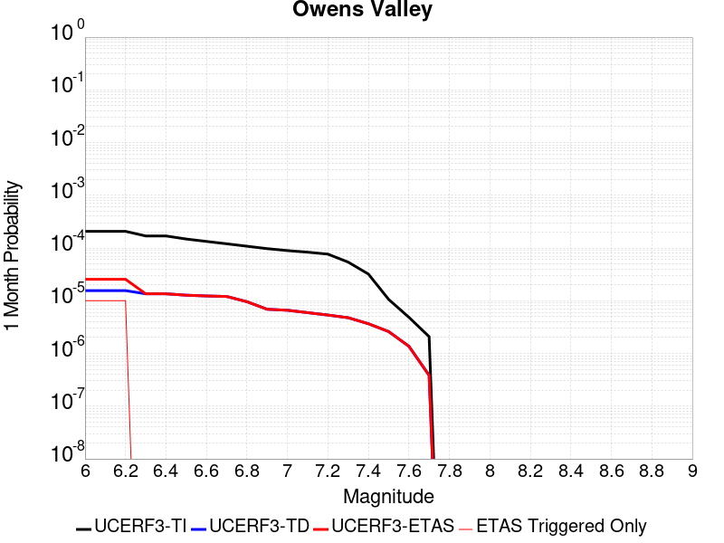 | 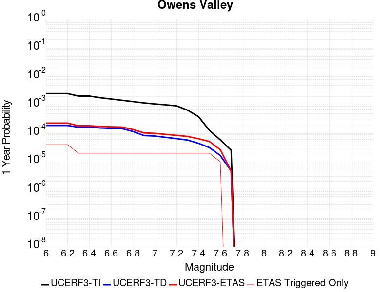 |  |

| Magnitude | 1 wk TI Prob | 1 wk TD Prob | 1 wk ETAS Prob | 1 wk ETAS/TD Gain | 1 wk ETAS Triggered Only | 1 mo TI Prob | 1 mo TD Prob | 1 mo ETAS Prob | 1 mo ETAS/TD Gain | 1 mo ETAS Triggered Only | 1 yr TI Prob | 1 yr TD Prob | 1 yr ETAS Prob | 1 yr ETAS/TD Gain | 1 yr ETAS Triggered Only | 10 yr TI Prob | 10 yr TD Prob | 10 yr ETAS Prob | 10 yr ETAS/TD Gain | 10 yr ETAS Triggered Only |
|-----|-----|-----|-----|-----|-----|-----|-----|-----|-----|-----|-----|-----|-----|-----|-----|-----|-----|-----|-----|-----|
| 6.0 | 4.83821E-5 | 3.6323709E-6 | 3.6323709E-6 | 1.0 | 0.0 | 2.0733538E-4 | 1.5567217E-5 | 2.556706E-5 | 1.6423656 | 1.0E-5 | 0.002521386 | 1.8951538E-4 | 2.295078E-4 | 1.2110246 | 4.0E-5 | 0.024929691 | 0.0019280115 | 0.001987896 | 1.0310601 | 6.0E-5 |
| 6.1 | 4.83821E-5 | 3.6323709E-6 | 3.6323709E-6 | 1.0 | 0.0 | 2.0733538E-4 | 1.5567217E-5 | 2.556706E-5 | 1.6423656 | 1.0E-5 | 0.002521386 | 1.8951538E-4 | 2.295078E-4 | 1.2110246 | 4.0E-5 | 0.024929691 | 0.0019280115 | 0.001987896 | 1.0310601 | 6.0E-5 |
| 6.2 | 4.83821E-5 | 3.6323709E-6 | 3.6323709E-6 | 1.0 | 0.0 | 2.0733538E-4 | 1.5567217E-5 | 2.556706E-5 | 1.6423656 | 1.0E-5 | 0.002521386 | 1.8951538E-4 | 2.295078E-4 | 1.2110246 | 4.0E-5 | 0.024929691 | 0.0019280115 | 0.001987896 | 1.0310601 | 6.0E-5 |
| 6.3 | 3.953008E-5 | 3.1585441E-6 | 3.1585441E-6 | 1.0 | 0.0 | 1.6940363E-4 | 1.3536552E-5 | 1.3536552E-5 | 1.0 | 0.0 | 0.002060538 | 1.6479578E-4 | 1.8479249E-4 | 1.1213423 | 2.0E-5 | 0.020415364 | 0.0016608762 | 0.0016908264 | 1.0180328 | 3.0E-5 |
| 6.4 | 3.953008E-5 | 3.1585441E-6 | 3.1585441E-6 | 1.0 | 0.0 | 1.6940363E-4 | 1.3536552E-5 | 1.3536552E-5 | 1.0 | 0.0 | 0.002060538 | 1.6479578E-4 | 1.8479249E-4 | 1.1213423 | 2.0E-5 | 0.020415364 | 0.0016608762 | 0.0016908264 | 1.0180328 | 3.0E-5 |
| 6.5 | 3.457342E-5 | 2.973637E-6 | 2.973637E-6 | 1.0 | 0.0 | 1.4816338E-4 | 1.2744101E-5 | 1.2744101E-5 | 1.0 | 0.0 | 0.0018023965 | 1.5514907E-4 | 1.7514598E-4 | 1.1288882 | 2.0E-5 | 0.017878477 | 0.0015568237 | 0.0015867769 | 1.01924 | 3.0E-5 |
| 6.6 | 3.1127765E-5 | 2.8759255E-6 | 2.8759255E-6 | 1.0 | 0.0 | 1.3339789E-4 | 1.232534E-5 | 1.232534E-5 | 1.0 | 0.0 | 0.0016229092 | 1.5005138E-4 | 1.7004837E-4 | 1.1332676 | 2.0E-5 | 0.016111081 | 0.0015020196 | 0.0015319745 | 1.0199431 | 3.0E-5 |
| 6.7 | 2.806885E-5 | 2.811482E-6 | 2.811482E-6 | 1.0 | 0.0 | 1.2028952E-4 | 1.2049158E-5 | 1.2049158E-5 | 1.0 | 0.0 | 0.001463541 | 1.466893E-4 | 1.6668637E-4 | 1.1363226 | 2.0E-5 | 0.014539397 | 0.0014663105 | 0.0014962665 | 1.0204295 | 3.0E-5 |
| 6.8 | 2.524524E-5 | 2.2362938E-6 | 2.2362938E-6 | 1.0 | 0.0 | 1.0818939E-4 | 9.584082E-6 | 9.584082E-6 | 1.0 | 0.0 | 0.0013164099 | 1.1668026E-4 | 1.3667792E-4 | 1.1713886 | 2.0E-5 | 0.01308639 | 0.001166464 | 0.001196429 | 1.0256888 | 3.0E-5 |
| 6.9 | 2.2704568E-5 | 1.60885E-6 | 1.60885E-6 | 1.0 | 0.0 | 9.730166E-5 | 6.8950535E-6 | 6.8950535E-6 | 1.0 | 0.0 | 0.0011840039 | 8.394406E-5 | 1.0394238E-4 | 1.2382339 | 2.0E-5 | 0.011777153 | 8.393368E-4 | 8.693116E-4 | 1.0357125 | 3.0E-5 |
| 7.0 | 2.0871712E-5 | 1.5401896E-6 | 1.5401896E-6 | 1.0 | 0.0 | 8.944713E-5 | 6.600796E-6 | 6.600796E-6 | 1.0 | 0.0 | 0.0010884746 | 8.0361744E-5 | 1.00360136E-4 | 1.2488546 | 2.0E-5 | 0.010831586 | 8.03501E-4 | 8.334769E-4 | 1.0373065 | 3.0E-5 |
| 7.1 | 1.944928E-5 | 1.3869685E-6 | 1.3869685E-6 | 1.0 | 0.0 | 8.335139E-5 | 5.9441377E-6 | 5.9441377E-6 | 1.0 | 0.0 | 0.0010143308 | 7.236748E-5 | 9.2366034E-5 | 1.2763473 | 2.0E-5 | 0.010097133 | 7.2359905E-4 | 7.5357733E-4 | 1.0414294 | 3.0E-5 |
| 7.2 | 1.7876306E-5 | 1.2493987E-6 | 1.2493987E-6 | 1.0 | 0.0 | 7.6610486E-5 | 5.354555E-6 | 5.354555E-6 | 1.0 | 0.0 | 9.3233347E-4 | 6.5189764E-5 | 8.518846E-5 | 1.3067766 | 2.0E-5 | 0.009284316 | 6.518455E-4 | 6.818259E-4 | 1.0459932 | 3.0E-5 |
| 7.3 | 1.2618672E-5 | 1.1119708E-6 | 1.1119708E-6 | 1.0 | 0.0 | 5.40789E-5 | 4.7655803E-6 | 4.7655803E-6 | 1.0 | 0.0 | 6.582117E-4 | 5.8019406E-5 | 7.8018245E-5 | 1.3446922 | 2.0E-5 | 0.0065626553 | 5.801767E-4 | 6.101593E-4 | 1.0516784 | 3.0E-5 |
| 7.4 | 7.4874442E-6 | 8.552428E-7 | 8.552428E-7 | 1.0 | 0.0 | 3.208865E-5 | 3.665321E-6 | 3.665321E-6 | 1.0 | 0.0 | 3.906093E-4 | 4.4624372E-5 | 6.4623484E-5 | 1.4481655 | 2.0E-5 | 0.003899234 | 4.4624778E-4 | 4.762344E-4 | 1.0671972 | 3.0E-5 |
| 7.5 | 2.4734156E-6 | 6.071134E-7 | 6.071134E-7 | 1.0 | 0.0 | 1.060031E-5 | 2.601912E-6 | 2.601912E-6 | 1.0 | 0.0 | 1.2905113E-4 | 3.167782E-5 | 5.1677187E-5 | 1.6313366 | 2.0E-5 | 0.0012897621 | 3.1673338E-4 | 3.467239E-4 | 1.0946869 | 3.0E-5 |
| 7.6 | 1.1328841E-6 | 3.1977802E-7 | 3.1977802E-7 | 1.0 | 0.0 | 4.8552088E-6 | 1.3704765E-6 | 1.3704765E-6 | 1.0 | 0.0 | 5.9110564E-5 | 1.6685426E-5 | 2.668526E-5 | 1.5993154 | 1.0E-5 | 5.9094845E-4 | 1.6684193E-4 | 1.8683859E-4 | 1.119854 | 2.0E-5 |
| 7.7 | 4.8613185E-7 | 8.9695554E-8 | 8.9695554E-8 | 1.0 | 0.0 | 2.0834207E-6 | 3.8440947E-7 | 3.8440947E-7 | 1.0 | 0.0 | 2.536535E-5 | 4.680176E-6 | 4.680176E-6 | 1.0 | 0.0 | 2.5362454E-4 | 4.680084E-5 | 4.680084E-5 | 1.0 | 0.0 |

## Ventura-Pitas Point
*[(top)](#table-of-contents)*

| 1 Week | 1 Month | 1 Year | 10 Year |
|-----|-----|-----|-----|
|  |  |  |  |

| Magnitude | 1 wk TI Prob | 1 wk TD Prob | 1 wk ETAS Prob | 1 wk ETAS/TD Gain | 1 wk ETAS Triggered Only | 1 mo TI Prob | 1 mo TD Prob | 1 mo ETAS Prob | 1 mo ETAS/TD Gain | 1 mo ETAS Triggered Only | 1 yr TI Prob | 1 yr TD Prob | 1 yr ETAS Prob | 1 yr ETAS/TD Gain | 1 yr ETAS Triggered Only | 10 yr TI Prob | 10 yr TD Prob | 10 yr ETAS Prob | 10 yr ETAS/TD Gain | 10 yr ETAS Triggered Only |
|-----|-----|-----|-----|-----|-----|-----|-----|-----|-----|-----|-----|-----|-----|-----|-----|-----|-----|-----|-----|-----|
| 6.0 | 3.3179622E-5 | 3.3740926E-5 | 3.3740926E-5 | 1.0 | 0.0 | 1.4219063E-4 | 1.445974E-4 | 1.445974E-4 | 1.0 | 0.0 | 0.0017297962 | 0.0017593087 | 0.001789256 | 1.0170221 | 3.0E-5 | 0.017163932 | 0.01747935 | 0.017538302 | 1.0033727 | 6.0E-5 |
| 6.1 | 3.3179622E-5 | 3.3740926E-5 | 3.3740926E-5 | 1.0 | 0.0 | 1.4219063E-4 | 1.445974E-4 | 1.445974E-4 | 1.0 | 0.0 | 0.0017297962 | 0.0017593087 | 0.001789256 | 1.0170221 | 3.0E-5 | 0.017163932 | 0.01747935 | 0.017538302 | 1.0033727 | 6.0E-5 |
| 6.2 | 3.3179622E-5 | 3.3740926E-5 | 3.3740926E-5 | 1.0 | 0.0 | 1.4219063E-4 | 1.445974E-4 | 1.445974E-4 | 1.0 | 0.0 | 0.0017297962 | 0.0017593087 | 0.001789256 | 1.0170221 | 3.0E-5 | 0.017163932 | 0.01747935 | 0.017538302 | 1.0033727 | 6.0E-5 |
| 6.3 | 3.3179622E-5 | 3.3740926E-5 | 3.3740926E-5 | 1.0 | 0.0 | 1.4219063E-4 | 1.445974E-4 | 1.445974E-4 | 1.0 | 0.0 | 0.0017297962 | 0.0017593087 | 0.001789256 | 1.0170221 | 3.0E-5 | 0.017163932 | 0.01747935 | 0.017538302 | 1.0033727 | 6.0E-5 |
| 6.4 | 1.8754668E-5 | 1.702288E-5 | 1.702288E-5 | 1.0 | 0.0 | 8.037467E-5 | 7.295329E-5 | 7.295329E-5 | 1.0 | 0.0 | 9.781223E-4 | 8.8786747E-4 | 8.8786747E-4 | 1.0 | 0.0 | 0.009738282 | 0.008845539 | 0.008865362 | 1.002241 | 2.0E-5 |
| 6.5 | 1.8754668E-5 | 1.702288E-5 | 1.702288E-5 | 1.0 | 0.0 | 8.037467E-5 | 7.295329E-5 | 7.295329E-5 | 1.0 | 0.0 | 9.781223E-4 | 8.8786747E-4 | 8.8786747E-4 | 1.0 | 0.0 | 0.009738282 | 0.008845539 | 0.008865362 | 1.002241 | 2.0E-5 |
| 6.6 | 1.4361558E-5 | 1.2125022E-5 | 1.2125022E-5 | 1.0 | 0.0 | 6.154808E-5 | 5.1963358E-5 | 5.1963358E-5 | 1.0 | 0.0 | 7.490902E-4 | 6.324725E-4 | 6.324725E-4 | 1.0 | 0.0 | 0.0074657016 | 0.006306982 | 0.006316919 | 1.0015756 | 1.0E-5 |
| 6.7 | 1.4361558E-5 | 1.2125022E-5 | 1.2125022E-5 | 1.0 | 0.0 | 6.154808E-5 | 5.1963358E-5 | 5.1963358E-5 | 1.0 | 0.0 | 7.490902E-4 | 6.324725E-4 | 6.324725E-4 | 1.0 | 0.0 | 0.0074657016 | 0.006306982 | 0.006316919 | 1.0015756 | 1.0E-5 |
| 6.8 | 1.3663846E-5 | 1.1347082E-5 | 1.1347082E-5 | 1.0 | 0.0 | 5.8558027E-5 | 4.8629456E-5 | 4.8629456E-5 | 1.0 | 0.0 | 7.127108E-4 | 5.9190474E-4 | 5.9190474E-4 | 1.0 | 0.0 | 0.007104293 | 0.0059034983 | 0.005913439 | 1.001684 | 1.0E-5 |
| 6.9 | 1.3644157E-5 | 1.1325181E-5 | 1.1325181E-5 | 1.0 | 0.0 | 5.8473648E-5 | 4.8535596E-5 | 4.8535596E-5 | 1.0 | 0.0 | 7.116841E-4 | 5.907626E-4 | 5.907626E-4 | 1.0 | 0.0 | 0.007094092 | 0.0058921375 | 0.0059020785 | 1.0016872 | 1.0E-5 |
| 7.0 | 1.3568845E-5 | 1.1244737E-5 | 1.1244737E-5 | 1.0 | 0.0 | 5.8150898E-5 | 4.819085E-5 | 4.819085E-5 | 1.0 | 0.0 | 7.077572E-4 | 5.8656756E-4 | 5.8656756E-4 | 1.0 | 0.0 | 0.007055073 | 0.005850409 | 0.0058603506 | 1.0016993 | 1.0E-5 |
| 7.1 | 1.306572E-5 | 1.0723127E-5 | 1.0723127E-5 | 1.0 | 0.0 | 5.599474E-5 | 4.595546E-5 | 4.595546E-5 | 1.0 | 0.0 | 6.815227E-4 | 5.5936596E-4 | 5.5936596E-4 | 1.0 | 0.0 | 0.0067943637 | 0.005579785 | 0.005579785 | 1.0 | 0.0 |
| 7.2 | 1.232604E-5 | 9.997614E-6 | 9.997614E-6 | 1.0 | 0.0 | 5.2824813E-5 | 4.2846223E-5 | 4.2846223E-5 | 1.0 | 0.0 | 6.429523E-4 | 5.215297E-4 | 5.215297E-4 | 1.0 | 0.0 | 0.0064109527 | 0.0052032494 | 0.0052032494 | 1.0 | 0.0 |
| 7.3 | 1.0917261E-5 | 8.844802E-6 | 8.844802E-6 | 1.0 | 0.0 | 4.678742E-5 | 3.7905753E-5 | 3.7905753E-5 | 1.0 | 0.0 | 5.69488E-4 | 4.614064E-4 | 4.614064E-4 | 1.0 | 0.0 | 0.0056803077 | 0.0046046497 | 0.0046046497 | 1.0 | 0.0 |
| 7.4 | 1.039959E-5 | 8.424458E-6 | 8.424458E-6 | 1.0 | 0.0 | 4.456891E-5 | 3.610433E-5 | 3.610433E-5 | 1.0 | 0.0 | 5.424914E-4 | 4.3948312E-4 | 4.3948312E-4 | 1.0 | 0.0 | 0.0054116896 | 0.0043863016 | 0.0043863016 | 1.0 | 0.0 |
| 7.5 | 9.015877E-6 | 7.2982207E-6 | 7.2982207E-6 | 1.0 | 0.0 | 3.86389E-5 | 3.1277723E-5 | 3.1277723E-5 | 1.0 | 0.0 | 4.7032707E-4 | 3.807411E-4 | 3.807411E-4 | 1.0 | 0.0 | 0.004693329 | 0.0038010331 | 0.0038010331 | 1.0 | 0.0 |
| 7.6 | 4.900162E-6 | 3.8743833E-6 | 3.8743833E-6 | 1.0 | 0.0 | 2.1000526E-5 | 1.6604394E-5 | 1.6604394E-5 | 1.0 | 0.0 | 2.556514E-4 | 2.0213988E-4 | 2.0213988E-4 | 1.0 | 0.0 | 0.0025535747 | 0.0020195737 | 0.0020195737 | 1.0 | 0.0 |
| 7.7 | 3.8850626E-6 | 3.1269326E-6 | 3.1269326E-6 | 1.0 | 0.0 | 1.6650163E-5 | 1.3401072E-5 | 1.3401072E-5 | 1.0 | 0.0 | 2.0269687E-4 | 1.6314592E-4 | 1.6314592E-4 | 1.0 | 0.0 | 0.002025121 | 0.0016302709 | 0.0016302709 | 1.0 | 0.0 |
| 7.8 | 2.4654719E-6 | 2.0299967E-6 | 2.0299967E-6 | 1.0 | 0.0 | 1.0566265E-5 | 8.699957E-6 | 8.699957E-6 | 1.0 | 0.0 | 1.2863669E-4 | 1.0591687E-4 | 1.0591687E-4 | 1.0 | 0.0 | 0.0012856225 | 0.0010586686 | 0.0010586686 | 1.0 | 0.0 |
| 7.9 | 4.095894E-7 | 3.2767122E-7 | 3.2767122E-7 | 1.0 | 0.0 | 1.7553821E-6 | 1.4043045E-6 | 1.4043045E-6 | 1.0 | 0.0 | 2.1371567E-5 | 1.7097276E-5 | 1.7097276E-5 | 1.0 | 0.0 | 2.1369511E-4 | 1.7095992E-4 | 1.7095992E-4 | 1.0 | 0.0 |
| 8.0 | 7.791402E-9 | 5.6838902E-9 | 5.6838902E-9 | 1.0 | 0.0 | 3.3391725E-8 | 2.435953E-8 | 2.435953E-8 | 1.0 | 0.0 | 4.0654416E-7 | 2.9657724E-7 | 2.9657724E-7 | 1.0 | 0.0 | 4.065434E-6 | 2.9657706E-6 | 2.9657706E-6 | 1.0 | 0.0 |

## San Andreas (North Branch Mill Creek)
*[(top)](#table-of-contents)*

| 1 Week | 1 Month | 1 Year | 10 Year |
|-----|-----|-----|-----|
|  |  |  |  |

| Magnitude | 1 wk TI Prob | 1 wk TD Prob | 1 wk ETAS Prob | 1 wk ETAS/TD Gain | 1 wk ETAS Triggered Only | 1 mo TI Prob | 1 mo TD Prob | 1 mo ETAS Prob | 1 mo ETAS/TD Gain | 1 mo ETAS Triggered Only | 1 yr TI Prob | 1 yr TD Prob | 1 yr ETAS Prob | 1 yr ETAS/TD Gain | 1 yr ETAS Triggered Only | 10 yr TI Prob | 10 yr TD Prob | 10 yr ETAS Prob | 10 yr ETAS/TD Gain | 10 yr ETAS Triggered Only |
|-----|-----|-----|-----|-----|-----|-----|-----|-----|-----|-----|-----|-----|-----|-----|-----|-----|-----|-----|-----|-----|
| 6.0 | 1.3461156E-5 | 2.3548055E-5 | 2.3548055E-5 | 1.0 | 0.0 | 5.7689394E-5 | 1.00916346E-4 | 1.1091534E-4 | 1.099082 | 1.0E-5 | 7.02142E-4 | 0.0012279673 | 0.0012479428 | 1.0162671 | 2.0E-5 | 0.0069992766 | 0.012254227 | 0.012313492 | 1.0048363 | 6.0E-5 |
| 6.1 | 1.3461156E-5 | 2.3548055E-5 | 2.3548055E-5 | 1.0 | 0.0 | 5.7689394E-5 | 1.00916346E-4 | 1.1091534E-4 | 1.099082 | 1.0E-5 | 7.02142E-4 | 0.0012279673 | 0.0012479428 | 1.0162671 | 2.0E-5 | 0.0069992766 | 0.012254227 | 0.012313492 | 1.0048363 | 6.0E-5 |
| 6.2 | 1.3461156E-5 | 2.3548055E-5 | 2.3548055E-5 | 1.0 | 0.0 | 5.7689394E-5 | 1.00916346E-4 | 1.1091534E-4 | 1.099082 | 1.0E-5 | 7.02142E-4 | 0.0012279673 | 0.0012479428 | 1.0162671 | 2.0E-5 | 0.0069992766 | 0.012254227 | 0.012313492 | 1.0048363 | 6.0E-5 |
| 6.3 | 1.3461156E-5 | 2.3548055E-5 | 2.3548055E-5 | 1.0 | 0.0 | 5.7689394E-5 | 1.00916346E-4 | 1.1091534E-4 | 1.099082 | 1.0E-5 | 7.02142E-4 | 0.0012279673 | 0.0012479428 | 1.0162671 | 2.0E-5 | 0.0069992766 | 0.012254227 | 0.012313492 | 1.0048363 | 6.0E-5 |
| 6.4 | 1.3461156E-5 | 2.3548055E-5 | 2.3548055E-5 | 1.0 | 0.0 | 5.7689394E-5 | 1.00916346E-4 | 1.1091534E-4 | 1.099082 | 1.0E-5 | 7.02142E-4 | 0.0012279673 | 0.0012479428 | 1.0162671 | 2.0E-5 | 0.0069992766 | 0.012254227 | 0.012313492 | 1.0048363 | 6.0E-5 |
| 6.5 | 1.3450706E-5 | 2.3537013E-5 | 2.3537013E-5 | 1.0 | 0.0 | 5.764461E-5 | 1.0086904E-4 | 1.1086803E-4 | 1.0991285 | 1.0E-5 | 7.0159714E-4 | 0.001227392 | 0.0012473675 | 1.0162747 | 2.0E-5 | 0.006993862 | 0.012248537 | 0.012307802 | 1.0048386 | 6.0E-5 |
| 6.6 | 1.3074523E-5 | 2.3151279E-5 | 2.3151279E-5 | 1.0 | 0.0 | 5.6032466E-5 | 9.921601E-5 | 1.0921502E-4 | 1.1007801 | 1.0E-5 | 6.8198174E-4 | 0.0012072888 | 0.0012272646 | 1.016546 | 2.0E-5 | 0.006798926 | 0.012049697 | 0.012108975 | 1.0049194 | 6.0E-5 |
| 6.7 | 1.3050216E-5 | 2.3126573E-5 | 2.3126573E-5 | 1.0 | 0.0 | 5.59283E-5 | 9.911013E-5 | 1.0910915E-4 | 1.1008879 | 1.0E-5 | 6.8071426E-4 | 0.0012060012 | 0.0012259771 | 1.0165638 | 2.0E-5 | 0.0067863287 | 0.012036961 | 0.012096238 | 1.0049247 | 6.0E-5 |
| 6.8 | 1.29049395E-5 | 2.2974971E-5 | 2.2974971E-5 | 1.0 | 0.0 | 5.530571E-5 | 9.846047E-5 | 1.08459484E-4 | 1.1015536 | 1.0E-5 | 6.73139E-4 | 0.0011981002 | 0.0012180762 | 1.0166731 | 2.0E-5 | 0.0067110364 | 0.011958803 | 0.012018085 | 1.0049572 | 6.0E-5 |
| 6.9 | 1.2867369E-5 | 2.2934368E-5 | 2.2934368E-5 | 1.0 | 0.0 | 5.51447E-5 | 9.8286466E-5 | 1.0828548E-4 | 1.1017334 | 1.0E-5 | 6.711799E-4 | 0.001195984 | 0.0012159601 | 1.0167027 | 2.0E-5 | 0.006691564 | 0.011937869 | 0.011997153 | 1.004966 | 6.0E-5 |
| 7.0 | 1.2495996E-5 | 2.2334114E-5 | 2.2334114E-5 | 1.0 | 0.0 | 5.3553173E-5 | 9.571414E-5 | 1.0571318E-4 | 1.1044677 | 1.0E-5 | 6.518148E-4 | 0.0011646996 | 0.0011846762 | 1.0171518 | 2.0E-5 | 0.0064990623 | 0.011628309 | 0.011687611 | 1.0050998 | 6.0E-5 |
| 7.1 | 1.2452067E-5 | 2.2279173E-5 | 2.2279173E-5 | 1.0 | 0.0 | 5.3364907E-5 | 9.547869E-5 | 1.0547774E-4 | 1.1047254 | 1.0E-5 | 6.4952404E-4 | 0.001161836 | 0.0011818127 | 1.0171942 | 2.0E-5 | 0.0064762887 | 0.011599974 | 0.011659278 | 1.0051124 | 6.0E-5 |
| 7.2 | 1.2002777E-5 | 2.165748E-5 | 2.165748E-5 | 1.0 | 0.0 | 5.143946E-5 | 9.281449E-5 | 1.0281356E-4 | 1.1077318 | 1.0E-5 | 6.2609545E-4 | 0.0011294333 | 0.001139422 | 1.008844 | 1.0E-5 | 0.006243344 | 0.011279272 | 0.011328707 | 1.004383 | 5.0E-5 |
| 7.3 | 1.1923425E-5 | 2.1527258E-5 | 2.1527258E-5 | 1.0 | 0.0 | 5.109939E-5 | 9.225643E-5 | 1.0225551E-4 | 1.1083835 | 1.0E-5 | 6.219575E-4 | 0.0011226459 | 0.0011326347 | 1.0088975 | 1.0E-5 | 0.0062021962 | 0.011212112 | 0.011261553 | 1.0044094 | 5.0E-5 |
| 7.4 | 1.16105175E-5 | 2.0900772E-5 | 2.0900772E-5 | 1.0 | 0.0 | 4.975841E-5 | 8.957168E-5 | 9.957078E-5 | 1.1116325 | 1.0E-5 | 6.0564023E-4 | 0.0010899922 | 0.0010999813 | 1.0091643 | 1.0E-5 | 0.006039923 | 0.010889493 | 0.010938948 | 1.0045416 | 5.0E-5 |
| 7.5 | 1.1037265E-5 | 1.9599263E-5 | 1.9599263E-5 | 1.0 | 0.0 | 4.7301706E-5 | 8.399415E-5 | 9.399331E-5 | 1.1190459 | 1.0E-5 | 5.757461E-4 | 0.0010221512 | 0.001032141 | 1.0097733 | 1.0E-5 | 0.005742567 | 0.0102181705 | 0.010267659 | 1.0048432 | 5.0E-5 |
| 7.6 | 1.0720915E-5 | 1.9040608E-5 | 1.9040608E-5 | 1.0 | 0.0 | 4.5945973E-5 | 8.160007E-5 | 9.159925E-5 | 1.1225389 | 1.0E-5 | 5.592486E-4 | 9.930301E-4 | 0.0010030202 | 1.0100602 | 1.0E-5 | 0.005578433 | 0.009929609 | 0.009979112 | 1.0049855 | 5.0E-5 |
| 7.7 | 9.276279E-6 | 1.64843E-5 | 1.64843E-5 | 1.0 | 0.0 | 3.9754876E-5 | 7.0645096E-5 | 8.064439E-5 | 1.1415427 | 1.0E-5 | 4.839081E-4 | 8.597663E-4 | 8.697577E-4 | 1.0116211 | 1.0E-5 | 0.0048285574 | 0.008607952 | 0.008657522 | 1.0057585 | 5.0E-5 |
| 7.8 | 5.8346777E-6 | 1.118965E-5 | 1.118965E-5 | 1.0 | 0.0 | 2.5005522E-5 | 4.795476E-5 | 5.7954283E-5 | 1.2085198 | 1.0E-5 | 3.043997E-4 | 5.836929E-4 | 5.936871E-4 | 1.0171223 | 1.0E-5 | 0.0030398308 | 0.0058647413 | 0.0059144483 | 1.0084755 | 5.0E-5 |
| 7.9 | 4.690204E-6 | 8.53796E-6 | 8.53796E-6 | 1.0 | 0.0 | 2.0100719E-5 | 3.659074E-5 | 4.6590376E-5 | 1.2732831 | 1.0E-5 | 2.4469878E-4 | 4.454013E-4 | 4.5539686E-4 | 1.0224416 | 1.0E-5 | 0.002444295 | 0.004485608 | 0.0045254286 | 1.0088774 | 4.0E-5 |
| 8.0 | 2.9570454E-6 | 4.86459E-6 | 4.86459E-6 | 1.0 | 0.0 | 1.267299E-5 | 2.0848078E-5 | 3.084787E-5 | 1.4796505 | 1.0E-5 | 1.5428272E-4 | 2.537958E-4 | 2.6379328E-4 | 1.0393918 | 1.0E-5 | 0.0015417566 | 0.0025588202 | 0.0025787689 | 1.007796 | 2.0E-5 |
| 8.1 | 1.6376824E-6 | 2.2061524E-6 | 2.2061524E-6 | 1.0 | 0.0 | 7.01862E-6 | 9.454904E-6 | 9.454904E-6 | 1.0 | 0.0 | 8.544835E-5 | 1.15107396E-4 | 1.15107396E-4 | 1.0 | 0.0 | 8.54155E-4 | 0.0011655022 | 0.0011655022 | 1.0 | 0.0 |
| 8.2 | 6.9631557E-7 | 4.564967E-7 | 4.564967E-7 | 1.0 | 0.0 | 2.984206E-6 | 1.956413E-6 | 1.956413E-6 | 1.0 | 0.0 | 3.63321E-5 | 2.3819068E-5 | 2.3819068E-5 | 1.0 | 0.0 | 3.6326164E-4 | 2.466932E-4 | 2.466932E-4 | 1.0 | 0.0 |
| 8.3 | 1.7876137E-7 | 8.4190965E-8 | 8.4190965E-8 | 1.0 | 0.0 | 7.661199E-7 | 3.6081838E-7 | 3.6081838E-7 | 1.0 | 0.0 | 9.32747E-6 | 4.3929554E-6 | 4.3929554E-6 | 1.0 | 0.0 | 9.3270784E-5 | 4.6131998E-5 | 4.6131998E-5 | 1.0 | 0.0 |

## Red Mountain
*[(top)](#table-of-contents)*

| 1 Week | 1 Month | 1 Year | 10 Year |
|-----|-----|-----|-----|
|  |  |  |  |

| Magnitude | 1 wk TI Prob | 1 wk TD Prob | 1 wk ETAS Prob | 1 wk ETAS/TD Gain | 1 wk ETAS Triggered Only | 1 mo TI Prob | 1 mo TD Prob | 1 mo ETAS Prob | 1 mo ETAS/TD Gain | 1 mo ETAS Triggered Only | 1 yr TI Prob | 1 yr TD Prob | 1 yr ETAS Prob | 1 yr ETAS/TD Gain | 1 yr ETAS Triggered Only | 10 yr TI Prob | 10 yr TD Prob | 10 yr ETAS Prob | 10 yr ETAS/TD Gain | 10 yr ETAS Triggered Only |
|-----|-----|-----|-----|-----|-----|-----|-----|-----|-----|-----|-----|-----|-----|-----|-----|-----|-----|-----|-----|-----|
| 6.0 | 4.1810763E-5 | 4.759736E-5 | 4.759736E-5 | 1.0 | 0.0 | 1.7917668E-4 | 2.0397367E-4 | 2.1397164E-4 | 1.0490159 | 1.0E-5 | 0.0021792934 | 0.002480717 | 0.0025106424 | 1.0120633 | 3.0E-5 | 0.021580452 | 0.02454787 | 0.024606397 | 1.0023842 | 6.0E-5 |
| 6.1 | 4.1810763E-5 | 4.759736E-5 | 4.759736E-5 | 1.0 | 0.0 | 1.7917668E-4 | 2.0397367E-4 | 2.1397164E-4 | 1.0490159 | 1.0E-5 | 0.0021792934 | 0.002480717 | 0.0025106424 | 1.0120633 | 3.0E-5 | 0.021580452 | 0.02454787 | 0.024606397 | 1.0023842 | 6.0E-5 |
| 6.2 | 4.1810763E-5 | 4.759736E-5 | 4.759736E-5 | 1.0 | 0.0 | 1.7917668E-4 | 2.0397367E-4 | 2.1397164E-4 | 1.0490159 | 1.0E-5 | 0.0021792934 | 0.002480717 | 0.0025106424 | 1.0120633 | 3.0E-5 | 0.021580452 | 0.02454787 | 0.024606397 | 1.0023842 | 6.0E-5 |
| 6.3 | 4.1810763E-5 | 4.759736E-5 | 4.759736E-5 | 1.0 | 0.0 | 1.7917668E-4 | 2.0397367E-4 | 2.1397164E-4 | 1.0490159 | 1.0E-5 | 0.0021792934 | 0.002480717 | 0.0025106424 | 1.0120633 | 3.0E-5 | 0.021580452 | 0.02454787 | 0.024606397 | 1.0023842 | 6.0E-5 |
| 6.4 | 4.1810763E-5 | 4.759736E-5 | 4.759736E-5 | 1.0 | 0.0 | 1.7917668E-4 | 2.0397367E-4 | 2.1397164E-4 | 1.0490159 | 1.0E-5 | 0.0021792934 | 0.002480717 | 0.0025106424 | 1.0120633 | 3.0E-5 | 0.021580452 | 0.02454787 | 0.024606397 | 1.0023842 | 6.0E-5 |
| 6.5 | 3.154503E-5 | 3.5364967E-5 | 3.5364967E-5 | 1.0 | 0.0 | 1.3518598E-4 | 1.5155585E-4 | 1.6155434E-4 | 1.0659723 | 1.0E-5 | 0.0016446467 | 0.0018437232 | 0.0018736679 | 1.0162414 | 3.0E-5 | 0.01632528 | 0.018293923 | 0.018343007 | 1.0026832 | 5.0E-5 |
| 6.6 | 3.1535834E-5 | 3.5354347E-5 | 3.5354347E-5 | 1.0 | 0.0 | 1.3514658E-4 | 1.5151035E-4 | 1.6150884E-4 | 1.0659921 | 1.0E-5 | 0.0016441676 | 0.0018431701 | 0.0018731148 | 1.0162463 | 3.0E-5 | 0.01632056 | 0.018288482 | 0.018337568 | 1.002684 | 5.0E-5 |
| 6.7 | 2.8267326E-5 | 3.1473908E-5 | 3.1473908E-5 | 1.0 | 0.0 | 1.2114006E-4 | 1.3488167E-4 | 1.3488167E-4 | 1.0 | 0.0 | 0.0014738824 | 0.0016410325 | 0.0016609997 | 1.0121675 | 2.0E-5 | 0.014641452 | 0.01629791 | 0.016337259 | 1.0024143 | 4.0E-5 |
| 6.8 | 2.8212884E-5 | 3.1411786E-5 | 3.1411786E-5 | 1.0 | 0.0 | 1.20906756E-4 | 1.3461547E-4 | 1.3461547E-4 | 1.0 | 0.0 | 0.0014710457 | 0.0016377963 | 0.0016577635 | 1.0121915 | 2.0E-5 | 0.014613459 | 0.016266024 | 0.016305372 | 1.0024191 | 4.0E-5 |
| 6.9 | 2.4227871E-5 | 2.6710753E-5 | 2.6710753E-5 | 1.0 | 0.0 | 1.03829596E-4 | 1.14470065E-4 | 1.14470065E-4 | 1.0 | 0.0 | 0.0012633923 | 0.001392858 | 0.0014128301 | 1.014339 | 2.0E-5 | 0.012562336 | 0.013848972 | 0.013878556 | 1.0021362 | 3.0E-5 |
| 7.0 | 2.348524E-5 | 2.5839397E-5 | 2.5839397E-5 | 1.0 | 0.0 | 1.0064714E-4 | 1.1073601E-4 | 1.1073601E-4 | 1.0 | 0.0 | 0.0012246901 | 0.0013474526 | 0.0013674258 | 1.0148228 | 2.0E-5 | 0.012179627 | 0.013400464 | 0.013430062 | 1.0022087 | 3.0E-5 |
| 7.1 | 2.2311642E-5 | 2.4466246E-5 | 2.4466246E-5 | 1.0 | 0.0 | 9.561782E-5 | 1.04851555E-4 | 1.04851555E-4 | 1.0 | 0.0 | 0.0011635252 | 0.0012758949 | 0.0012958694 | 1.0156553 | 2.0E-5 | 0.01157452 | 0.012693215 | 0.012722834 | 1.0023335 | 3.0E-5 |
| 7.2 | 1.6533986E-5 | 1.7672655E-5 | 1.7672655E-5 | 1.0 | 0.0 | 7.085802E-5 | 7.573811E-5 | 7.573811E-5 | 1.0 | 0.0 | 8.623549E-4 | 9.217849E-4 | 9.3177566E-4 | 1.0108385 | 1.0E-5 | 0.008590161 | 0.009185895 | 0.009205711 | 1.0021572 | 2.0E-5 |
| 7.3 | 1.4703092E-5 | 1.5561527E-5 | 1.5561527E-5 | 1.0 | 0.0 | 6.301173E-5 | 6.66909E-5 | 6.66909E-5 | 1.0 | 0.0 | 7.668978E-4 | 8.117209E-4 | 8.217128E-4 | 1.0123096 | 1.0E-5 | 0.0076425658 | 0.0080936365 | 0.008113475 | 1.0024511 | 2.0E-5 |
| 7.4 | 6.1331984E-6 | 5.5292867E-6 | 5.5292867E-6 | 1.0 | 0.0 | 2.6284872E-5 | 2.369673E-5 | 2.369673E-5 | 1.0 | 0.0 | 3.199713E-4 | 2.8847004E-4 | 2.8847004E-4 | 1.0 | 0.0 | 0.0031951098 | 0.00288101 | 0.00288101 | 1.0 | 0.0 |
| 7.5 | 5.954766E-6 | 5.3389012E-6 | 5.3389012E-6 | 1.0 | 0.0 | 2.5520176E-5 | 2.2880808E-5 | 2.2880808E-5 | 1.0 | 0.0 | 3.1066386E-4 | 2.7853876E-4 | 2.7853876E-4 | 1.0 | 0.0 | 0.003102299 | 0.0027819504 | 0.0027819504 | 1.0 | 0.0 |
| 7.6 | 4.9726646E-6 | 4.3156206E-6 | 4.3156206E-6 | 1.0 | 0.0 | 2.1311245E-5 | 1.8495388E-5 | 1.8495388E-5 | 1.0 | 0.0 | 2.5943352E-4 | 2.2515841E-4 | 2.2515841E-4 | 1.0 | 0.0 | 0.0025913084 | 0.0022493375 | 0.0022493375 | 1.0 | 0.0 |
| 7.7 | 3.3613894E-6 | 2.8528796E-6 | 2.8528796E-6 | 1.0 | 0.0 | 1.4405875E-5 | 1.2226571E-5 | 1.2226571E-5 | 1.0 | 0.0 | 1.7537741E-4 | 1.488486E-4 | 1.488486E-4 | 1.0 | 0.0 | 0.0017523908 | 0.0014875153 | 0.0014875153 | 1.0 | 0.0 |
| 7.8 | 1.1828961E-6 | 1.0123377E-6 | 1.0123377E-6 | 1.0 | 0.0 | 5.069545E-6 | 4.3385835E-6 | 4.3385835E-6 | 1.0 | 0.0 | 6.171996E-5 | 5.2821004E-5 | 5.2821004E-5 | 1.0 | 0.0 | 6.170282E-4 | 5.280874E-4 | 5.280874E-4 | 1.0 | 0.0 |
| 7.9 | 2.2967266E-7 | 1.8620112E-7 | 1.8620112E-7 | 1.0 | 0.0 | 9.843111E-7 | 7.980046E-7 | 7.980046E-7 | 1.0 | 0.0 | 1.19839215E-5 | 9.715665E-6 | 9.715665E-6 | 1.0 | 0.0 | 1.1983275E-4 | 9.71527E-5 | 9.71527E-5 | 1.0 | 0.0 |

## Mission Creek
*[(top)](#table-of-contents)*

| 1 Week | 1 Month | 1 Year | 10 Year |
|-----|-----|-----|-----|
|  |  | 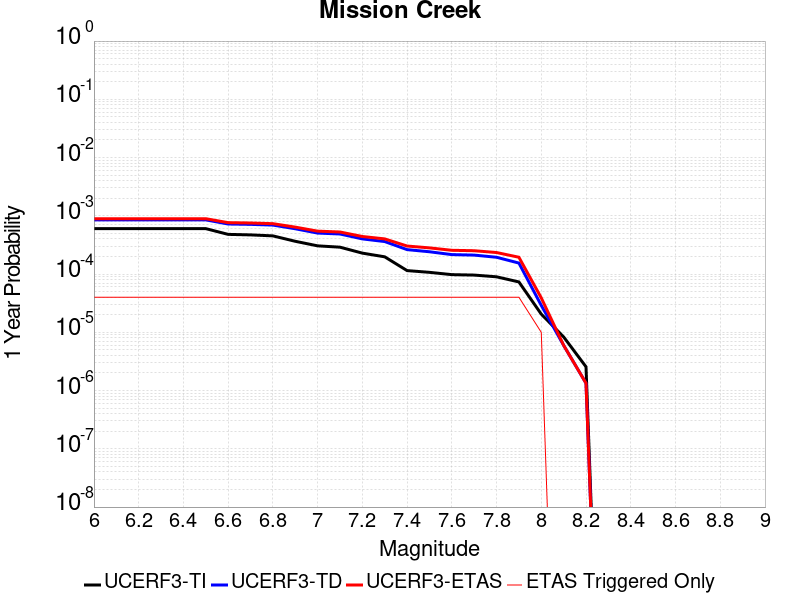 |  |

| Magnitude | 1 wk TI Prob | 1 wk TD Prob | 1 wk ETAS Prob | 1 wk ETAS/TD Gain | 1 wk ETAS Triggered Only | 1 mo TI Prob | 1 mo TD Prob | 1 mo ETAS Prob | 1 mo ETAS/TD Gain | 1 mo ETAS Triggered Only | 1 yr TI Prob | 1 yr TD Prob | 1 yr ETAS Prob | 1 yr ETAS/TD Gain | 1 yr ETAS Triggered Only | 10 yr TI Prob | 10 yr TD Prob | 10 yr ETAS Prob | 10 yr ETAS/TD Gain | 10 yr ETAS Triggered Only |
|-----|-----|-----|-----|-----|-----|-----|-----|-----|-----|-----|-----|-----|-----|-----|-----|-----|-----|-----|-----|-----|
| 6.0 | 1.1549387E-5 | 1.6338769E-5 | 1.6338769E-5 | 1.0 | 0.0 | 4.9496433E-5 | 7.00215E-5 | 8.00208E-5 | 1.1428033 | 1.0E-5 | 6.0245243E-4 | 8.5219333E-4 | 8.9215924E-4 | 1.0468976 | 4.0E-5 | 0.006008218 | 0.008518299 | 0.008577788 | 1.0069836 | 6.0E-5 |
| 6.1 | 1.1549387E-5 | 1.6338769E-5 | 1.6338769E-5 | 1.0 | 0.0 | 4.9496433E-5 | 7.00215E-5 | 8.00208E-5 | 1.1428033 | 1.0E-5 | 6.0245243E-4 | 8.5219333E-4 | 8.9215924E-4 | 1.0468976 | 4.0E-5 | 0.006008218 | 0.008518299 | 0.008577788 | 1.0069836 | 6.0E-5 |
| 6.2 | 1.1549387E-5 | 1.6338769E-5 | 1.6338769E-5 | 1.0 | 0.0 | 4.9496433E-5 | 7.00215E-5 | 8.00208E-5 | 1.1428033 | 1.0E-5 | 6.0245243E-4 | 8.5219333E-4 | 8.9215924E-4 | 1.0468976 | 4.0E-5 | 0.006008218 | 0.008518299 | 0.008577788 | 1.0069836 | 6.0E-5 |
| 6.3 | 1.1549387E-5 | 1.6338769E-5 | 1.6338769E-5 | 1.0 | 0.0 | 4.9496433E-5 | 7.00215E-5 | 8.00208E-5 | 1.1428033 | 1.0E-5 | 6.0245243E-4 | 8.5219333E-4 | 8.9215924E-4 | 1.0468976 | 4.0E-5 | 0.006008218 | 0.008518299 | 0.008577788 | 1.0069836 | 6.0E-5 |
| 6.4 | 1.1549387E-5 | 1.6338769E-5 | 1.6338769E-5 | 1.0 | 0.0 | 4.9496433E-5 | 7.00215E-5 | 8.00208E-5 | 1.1428033 | 1.0E-5 | 6.0245243E-4 | 8.5219333E-4 | 8.9215924E-4 | 1.0468976 | 4.0E-5 | 0.006008218 | 0.008518299 | 0.008577788 | 1.0069836 | 6.0E-5 |
| 6.5 | 1.1549387E-5 | 1.6338769E-5 | 1.6338769E-5 | 1.0 | 0.0 | 4.9496433E-5 | 7.00215E-5 | 8.00208E-5 | 1.1428033 | 1.0E-5 | 6.0245243E-4 | 8.5219333E-4 | 8.9215924E-4 | 1.0468976 | 4.0E-5 | 0.006008218 | 0.008518299 | 0.008577788 | 1.0069836 | 6.0E-5 |
| 6.6 | 9.202681E-6 | 1.3861918E-5 | 1.3861918E-5 | 1.0 | 0.0 | 3.9439463E-5 | 5.9406917E-5 | 6.940633E-5 | 1.1683205 | 1.0E-5 | 4.800697E-4 | 7.2304823E-4 | 7.630193E-4 | 1.0552814 | 4.0E-5 | 0.004790339 | 0.0072354274 | 0.0072949934 | 1.0082325 | 6.0E-5 |
| 6.7 | 9.019164E-6 | 1.3667577E-5 | 1.3667577E-5 | 1.0 | 0.0 | 3.8652986E-5 | 5.8574064E-5 | 6.857348E-5 | 1.170714 | 1.0E-5 | 4.7049852E-4 | 7.129149E-4 | 7.528864E-4 | 1.0560677 | 4.0E-5 | 0.004695036 | 0.007134747 | 0.0071943193 | 1.0083495 | 6.0E-5 |
| 6.8 | 8.673558E-6 | 1.3289653E-5 | 1.3289653E-5 | 1.0 | 0.0 | 3.717186E-5 | 5.695446E-5 | 6.695389E-5 | 1.1755688 | 1.0E-5 | 4.524734E-4 | 6.932088E-4 | 7.331811E-4 | 1.0576627 | 4.0E-5 | 0.0045155324 | 0.006938919 | 0.0069985026 | 1.0085869 | 6.0E-5 |
| 6.9 | 7.002255E-6 | 1.14937575E-5 | 1.14937575E-5 | 1.0 | 0.0 | 3.000932E-5 | 4.925807E-5 | 5.9257574E-5 | 1.2030025 | 1.0E-5 | 3.653022E-4 | 5.995588E-4 | 6.3953485E-4 | 1.0666758 | 4.0E-5 | 0.0036470229 | 0.006007685 | 0.0060673244 | 1.0099272 | 6.0E-5 |
| 7.0 | 5.84644E-6 | 9.6902595E-6 | 9.6902595E-6 | 1.0 | 0.0 | 2.5055931E-5 | 4.152905E-5 | 5.1528634E-5 | 1.2407854 | 1.0E-5 | 3.0501327E-4 | 5.0550344E-4 | 5.454832E-4 | 1.079089 | 4.0E-5 | 0.0030459496 | 0.005071601 | 0.0051312963 | 1.0117706 | 6.0E-5 |
| 7.1 | 5.54703E-6 | 9.34468E-6 | 9.34468E-6 | 1.0 | 0.0 | 2.377277E-5 | 4.004804E-5 | 5.0047638E-5 | 1.2496902 | 1.0E-5 | 2.8939504E-4 | 4.8748025E-4 | 5.2746077E-4 | 1.0820146 | 4.0E-5 | 0.0028901845 | 0.0048921676 | 0.004951874 | 1.0122045 | 6.0E-5 |
| 7.2 | 4.384709E-6 | 7.696116E-6 | 7.696116E-6 | 1.0 | 0.0 | 1.8791474E-5 | 3.298296E-5 | 4.298263E-5 | 1.3031769 | 1.0E-5 | 2.2876218E-4 | 4.014972E-4 | 4.4148113E-4 | 1.0995871 | 4.0E-5 | 0.0022852682 | 0.004035741 | 0.004095499 | 1.0148071 | 6.0E-5 |
| 7.3 | 3.7888456E-6 | 6.9297107E-6 | 6.9297107E-6 | 1.0 | 0.0 | 1.623781E-5 | 2.9698442E-5 | 3.9698145E-5 | 1.336708 | 1.0E-5 | 1.9767738E-4 | 3.6152187E-4 | 4.0150742E-4 | 1.1106033 | 4.0E-5 | 0.0019750162 | 0.0036373446 | 0.0036971264 | 1.0164355 | 6.0E-5 |
| 7.4 | 2.1982462E-6 | 5.0376125E-6 | 5.0376125E-6 | 1.0 | 0.0 | 9.421021E-6 | 2.158959E-5 | 3.1589374E-5 | 1.4631761 | 1.0E-5 | 1.1469489E-4 | 2.6282176E-4 | 3.0281124E-4 | 1.1521544 | 4.0E-5 | 0.0011463572 | 0.0026529012 | 0.002712742 | 1.0225568 | 6.0E-5 |
| 7.5 | 2.051923E-6 | 4.628476E-6 | 4.628476E-6 | 1.0 | 0.0 | 8.793926E-6 | 1.9836176E-5 | 2.9835977E-5 | 1.5041194 | 1.0E-5 | 1.0706078E-4 | 2.4147882E-4 | 2.8146914E-4 | 1.165606 | 4.0E-5 | 0.0010700922 | 0.0024403657 | 0.0025002193 | 1.0245265 | 6.0E-5 |
| 7.6 | 1.8733427E-6 | 4.136374E-6 | 4.136374E-6 | 1.0 | 0.0 | 8.028587E-6 | 1.7727198E-5 | 2.7727021E-5 | 1.5640949 | 1.0E-5 | 9.774366E-5 | 2.1580735E-4 | 2.5579872E-4 | 1.1853105 | 4.0E-5 | 9.770069E-4 | 0.0021846683 | 0.0022445372 | 1.0274041 | 6.0E-5 |
| 7.7 | 1.8411953E-6 | 4.055962E-6 | 4.055962E-6 | 1.0 | 0.0 | 7.890813E-6 | 1.738258E-5 | 2.7382406E-5 | 1.5752786 | 1.0E-5 | 9.606641E-5 | 2.1161244E-4 | 2.5160398E-4 | 1.1889848 | 4.0E-5 | 9.6024893E-4 | 0.0021429092 | 0.0022027807 | 1.0279393 | 6.0E-5 |
| 7.8 | 1.7194251E-6 | 3.7224547E-6 | 3.7224547E-6 | 1.0 | 0.0 | 7.368944E-6 | 1.5953281E-5 | 2.595312E-5 | 1.6268203 | 1.0E-5 | 8.97132E-5 | 1.9421395E-4 | 2.3420618E-4 | 1.2059184 | 4.0E-5 | 8.967699E-4 | 0.001968446 | 0.002028328 | 1.0304209 | 6.0E-5 |
| 7.9 | 1.4035052E-6 | 2.9599234E-6 | 2.9599234E-6 | 1.0 | 0.0 | 6.0150082E-6 | 1.2685326E-5 | 2.2685199E-5 | 1.7883024 | 1.0E-5 | 7.3230265E-5 | 1.5443296E-4 | 1.9442677E-4 | 1.258972 | 4.0E-5 | 7.3206134E-4 | 0.0015681027 | 0.0016280087 | 1.0382028 | 6.0E-5 |
| 8.0 | 3.9318823E-7 | 5.5525703E-7 | 5.5525703E-7 | 1.0 | 0.0 | 1.6850913E-6 | 2.3796708E-6 | 2.3796708E-6 | 1.0 | 0.0 | 2.0515794E-5 | 2.8972114E-5 | 3.8971823E-5 | 1.3451495 | 1.0E-5 | 2.0513899E-4 | 3.00248E-4 | 3.10245E-4 | 1.0332958 | 1.0E-5 |
| 8.1 | 1.596793E-7 | 1.1463439E-7 | 1.1463439E-7 | 1.0 | 0.0 | 6.8433974E-7 | 4.912901E-7 | 4.912901E-7 | 1.0 | 0.0 | 8.331805E-6 | 5.9814415E-6 | 5.9814415E-6 | 1.0 | 0.0 | 8.331492E-5 | 6.595295E-5 | 6.595295E-5 | 1.0 | 0.0 |
| 8.2 | 4.9003038E-8 | 2.5656652E-8 | 2.5656652E-8 | 1.0 | 0.0 | 2.10013E-7 | 1.0995708E-7 | 1.0995708E-7 | 1.0 | 0.0 | 2.5569052E-6 | 1.3387266E-6 | 1.3387266E-6 | 1.0 | 0.0 | 2.556876E-5 | 1.5073674E-5 | 1.5073674E-5 | 1.0 | 0.0 |

## Mission Ridge-Arroyo Parida-Santa Ana
*[(top)](#table-of-contents)*

| 1 Week | 1 Month | 1 Year | 10 Year |
|-----|-----|-----|-----|
|  | 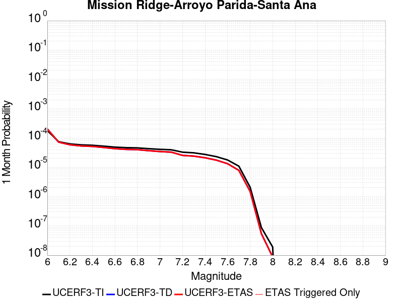 |  |  |

| Magnitude | 1 wk TI Prob | 1 wk TD Prob | 1 wk ETAS Prob | 1 wk ETAS/TD Gain | 1 wk ETAS Triggered Only | 1 mo TI Prob | 1 mo TD Prob | 1 mo ETAS Prob | 1 mo ETAS/TD Gain | 1 mo ETAS Triggered Only | 1 yr TI Prob | 1 yr TD Prob | 1 yr ETAS Prob | 1 yr ETAS/TD Gain | 1 yr ETAS Triggered Only | 10 yr TI Prob | 10 yr TD Prob | 10 yr ETAS Prob | 10 yr ETAS/TD Gain | 10 yr ETAS Triggered Only |
|-----|-----|-----|-----|-----|-----|-----|-----|-----|-----|-----|-----|-----|-----|-----|-----|-----|-----|-----|-----|-----|
| 6.0 | 4.169034E-5 | 4.7147558E-5 | 4.7147558E-5 | 1.0 | 0.0 | 1.7866064E-4 | 2.0205017E-4 | 2.0205017E-4 | 1.0 | 0.0 | 0.0021730233 | 0.0024579063 | 0.002477857 | 1.008117 | 2.0E-5 | 0.021518968 | 0.024389295 | 0.02442832 | 1.0016 | 4.0E-5 |
| 6.1 | 1.73813E-5 | 1.6856457E-5 | 1.6856457E-5 | 1.0 | 0.0 | 7.4489166E-5 | 7.2240015E-5 | 7.2240015E-5 | 1.0 | 0.0 | 9.065282E-4 | 8.791781E-4 | 8.891693E-4 | 1.0113642 | 1.0E-5 | 0.009028391 | 0.008758142 | 0.008777967 | 1.0022635 | 2.0E-5 |
| 6.2 | 1.4622182E-5 | 1.3675061E-5 | 1.3675061E-5 | 1.0 | 0.0 | 6.2664985E-5 | 5.8606114E-5 | 5.8606114E-5 | 1.0 | 0.0 | 7.6267915E-4 | 7.1329967E-4 | 7.232926E-4 | 1.0140094 | 1.0E-5 | 0.007600669 | 0.0071105454 | 0.007130403 | 1.0027927 | 2.0E-5 |
| 6.3 | 1.3552434E-5 | 1.2483846E-5 | 1.2483846E-5 | 1.0 | 0.0 | 5.8080568E-5 | 5.3501117E-5 | 5.3501117E-5 | 1.0 | 0.0 | 7.069015E-4 | 6.511846E-4 | 6.611781E-4 | 1.0153466 | 1.0E-5 | 0.00704657 | 0.006493128 | 0.006512998 | 1.0030602 | 2.0E-5 |
| 6.4 | 1.30977305E-5 | 1.1980751E-5 | 1.1980751E-5 | 1.0 | 0.0 | 5.613192E-5 | 5.1345083E-5 | 5.1345083E-5 | 1.0 | 0.0 | 6.831918E-4 | 6.249501E-4 | 6.3494383E-4 | 1.0159913 | 1.0E-5 | 0.006810953 | 0.0062322714 | 0.006252147 | 1.0031891 | 2.0E-5 |
| 6.5 | 1.225205E-5 | 1.10503115E-5 | 1.10503115E-5 | 1.0 | 0.0 | 5.2507727E-5 | 4.7357633E-5 | 4.7357633E-5 | 1.0 | 0.0 | 6.3909404E-4 | 5.7642936E-4 | 5.8642356E-4 | 1.0173382 | 1.0E-5 | 0.006372592 | 0.0057496517 | 0.005769537 | 1.0034585 | 2.0E-5 |
| 6.6 | 1.1352241E-5 | 1.0064957E-5 | 1.0064957E-5 | 1.0 | 0.0 | 4.8651553E-5 | 4.3134827E-5 | 4.3134827E-5 | 1.0 | 0.0 | 5.921717E-4 | 5.2504207E-4 | 5.350368E-4 | 1.019036 | 1.0E-5 | 0.0059059616 | 0.005238262 | 0.0052581574 | 1.003798 | 2.0E-5 |
| 6.7 | 1.0864116E-5 | 9.518387E-6 | 9.518387E-6 | 1.0 | 0.0 | 4.6559664E-5 | 4.079246E-5 | 4.079246E-5 | 1.0 | 0.0 | 5.667165E-4 | 4.96537E-4 | 5.065321E-4 | 1.0201294 | 1.0E-5 | 0.005652734 | 0.00495451 | 0.004974411 | 1.0040168 | 2.0E-5 |
| 6.8 | 1.0666365E-5 | 9.301119E-6 | 9.301119E-6 | 1.0 | 0.0 | 4.571219E-5 | 3.9861337E-5 | 3.9861337E-5 | 1.0 | 0.0 | 5.564038E-4 | 4.8520573E-4 | 4.9520086E-4 | 1.0205998 | 1.0E-5 | 0.005550127 | 0.004841696 | 0.004861599 | 1.0041108 | 2.0E-5 |
| 6.9 | 1.0038665E-5 | 8.593301E-6 | 8.593301E-6 | 1.0 | 0.0 | 4.302214E-5 | 3.682792E-5 | 3.682792E-5 | 1.0 | 0.0 | 5.236687E-4 | 4.4828953E-4 | 4.5828504E-4 | 1.022297 | 1.0E-5 | 0.005224364 | 0.004474063 | 0.0044840183 | 1.0022252 | 1.0E-5 |
| 7.0 | 9.5379955E-6 | 8.026255E-6 | 8.026255E-6 | 1.0 | 0.0 | 4.0876483E-5 | 3.4397795E-5 | 3.4397795E-5 | 1.0 | 0.0 | 4.975576E-4 | 4.1871436E-4 | 4.287102E-4 | 1.0238726 | 1.0E-5 | 0.00496445 | 0.004179454 | 0.004189412 | 1.0023826 | 1.0E-5 |
| 7.1 | 9.207389E-6 | 7.653507E-6 | 7.653507E-6 | 1.0 | 0.0 | 3.945964E-5 | 3.2800344E-5 | 3.2800344E-5 | 1.0 | 0.0 | 4.803152E-4 | 3.9927269E-4 | 4.0926872E-4 | 1.0250355 | 1.0E-5 | 0.004792784 | 0.0039857496 | 0.0039957096 | 1.002499 | 1.0E-5 |
| 7.2 | 7.638091E-6 | 5.9319927E-6 | 5.9319927E-6 | 1.0 | 0.0 | 3.2734264E-5 | 2.542258E-5 | 2.542258E-5 | 1.0 | 0.0 | 3.984668E-4 | 3.0947628E-4 | 3.1947318E-4 | 1.0323026 | 1.0E-5 | 0.0039775306 | 0.0030905097 | 0.0031004788 | 1.0032257 | 1.0E-5 |
| 7.3 | 7.2500147E-6 | 5.5969795E-6 | 5.5969795E-6 | 1.0 | 0.0 | 3.1071122E-5 | 2.3986835E-5 | 2.3986835E-5 | 1.0 | 0.0 | 3.7822526E-4 | 2.9200088E-4 | 3.0199796E-4 | 1.0342364 | 1.0E-5 | 0.0037758215 | 0.0029162276 | 0.0029261983 | 1.003419 | 1.0E-5 |
| 7.4 | 6.3899715E-6 | 4.9192213E-6 | 4.9192213E-6 | 1.0 | 0.0 | 2.7385306E-5 | 2.1082207E-5 | 2.1082207E-5 | 1.0 | 0.0 | 3.3336508E-4 | 2.5664584E-4 | 2.5664584E-4 | 1.0 | 0.0 | 0.0033286542 | 0.002563539 | 0.002563539 | 1.0 | 0.0 |
| 7.5 | 5.379025E-6 | 4.084437E-6 | 4.084437E-6 | 1.0 | 0.0 | 2.305276E-5 | 1.7504613E-5 | 1.7504613E-5 | 1.0 | 0.0 | 2.806312E-4 | 2.1309793E-4 | 2.1309793E-4 | 1.0 | 0.0 | 0.0028027708 | 0.002128947 | 0.002128947 | 1.0 | 0.0 |
| 7.6 | 4.1270696E-6 | 3.0887365E-6 | 3.0887365E-6 | 1.0 | 0.0 | 1.768732E-5 | 1.3237375E-5 | 1.3237375E-5 | 1.0 | 0.0 | 2.1532185E-4 | 1.611532E-4 | 1.611532E-4 | 1.0 | 0.0 | 0.0021511333 | 0.0016103715 | 0.0016103715 | 1.0 | 0.0 |
| 7.7 | 2.5406805E-6 | 1.8284234E-6 | 1.8284234E-6 | 1.0 | 0.0 | 1.0888585E-5 | 7.836077E-6 | 7.836077E-6 | 1.0 | 0.0 | 1.3256045E-4 | 9.540012E-5 | 9.540012E-5 | 1.0 | 0.0 | 0.0013248142 | 9.5359783E-4 | 9.5359783E-4 | 1.0 | 0.0 |
| 7.8 | 4.8608285E-7 | 3.510195E-7 | 3.510195E-7 | 1.0 | 0.0 | 2.0832106E-6 | 1.5043684E-6 | 1.5043684E-6 | 1.0 | 0.0 | 2.5362791E-5 | 1.8315532E-5 | 1.8315532E-5 | 1.0 | 0.0 | 2.5359896E-4 | 1.8314035E-4 | 1.8314035E-4 | 1.0 | 0.0 |
| 7.9 | 2.0472514E-8 | 1.2690956E-8 | 1.2690956E-8 | 1.0 | 0.0 | 8.7739345E-8 | 5.4389808E-8 | 5.4389808E-8 | 1.0 | 0.0 | 1.068226E-6 | 6.621957E-7 | 6.621957E-7 | 1.0 | 0.0 | 1.0682209E-5 | 6.621938E-6 | 6.621938E-6 | 1.0 | 0.0 |
| 8.0 | 4.443582E-9 | 2.0331004E-9 | 2.0331004E-9 | 1.0 | 0.0 | 1.9043922E-8 | 8.713287E-9 | 8.713287E-9 | 1.0 | 0.0 | 2.3185973E-7 | 1.06084265E-7 | 1.06084265E-7 | 1.0 | 0.0 | 2.3185949E-6 | 1.0608422E-6 | 1.0608422E-6 | 1.0 | 0.0 |

## Oceanic - West Huasna
*[(top)](#table-of-contents)*

| 1 Week | 1 Month | 1 Year | 10 Year |
|-----|-----|-----|-----|
|  |  |  |  |

| Magnitude | 1 wk TI Prob | 1 wk TD Prob | 1 wk ETAS Prob | 1 wk ETAS/TD Gain | 1 wk ETAS Triggered Only | 1 mo TI Prob | 1 mo TD Prob | 1 mo ETAS Prob | 1 mo ETAS/TD Gain | 1 mo ETAS Triggered Only | 1 yr TI Prob | 1 yr TD Prob | 1 yr ETAS Prob | 1 yr ETAS/TD Gain | 1 yr ETAS Triggered Only | 10 yr TI Prob | 10 yr TD Prob | 10 yr ETAS Prob | 10 yr ETAS/TD Gain | 10 yr ETAS Triggered Only |
|-----|-----|-----|-----|-----|-----|-----|-----|-----|-----|-----|-----|-----|-----|-----|-----|-----|-----|-----|-----|-----|
| 6.0 | 3.195567E-5 | 2.7928902E-5 | 3.7928625E-5 | 1.358042 | 1.0E-5 | 1.3694567E-4 | 1.1969005E-4 | 1.2968885E-4 | 1.0835391 | 1.0E-5 | 0.0016660384 | 0.0014562954 | 0.0014862517 | 1.0205702 | 3.0E-5 | 0.016536033 | 0.014472075 | 0.014531206 | 1.0040859 | 6.0E-5 |
| 6.1 | 2.1156782E-5 | 1.7574697E-5 | 2.757452E-5 | 1.5689899 | 1.0E-5 | 9.066878E-5 | 7.531801E-5 | 8.531725E-5 | 1.1327604 | 1.0E-5 | 0.0011033333 | 9.166203E-4 | 9.266112E-4 | 1.0108997 | 1.0E-5 | 0.010978713 | 0.009129404 | 0.00915913 | 1.0032561 | 3.0E-5 |
| 6.2 | 1.6195117E-5 | 1.3328005E-5 | 2.3327872E-5 | 1.7502898 | 1.0E-5 | 6.9405796E-5 | 5.7118785E-5 | 6.711821E-5 | 1.1750637 | 1.0E-5 | 8.44688E-4 | 6.952019E-4 | 7.0519495E-4 | 1.0143743 | 1.0E-5 | 0.008414844 | 0.006930565 | 0.0069504264 | 1.0028658 | 2.0E-5 |
| 6.3 | 1.3559345E-5 | 1.1179818E-5 | 2.1179707E-5 | 1.8944589 | 1.0E-5 | 5.811018E-5 | 4.7912632E-5 | 5.791215E-5 | 1.2087033 | 1.0E-5 | 7.072618E-4 | 5.831811E-4 | 5.931753E-4 | 1.0171373 | 1.0E-5 | 0.0070501505 | 0.0058166254 | 0.005836509 | 1.0034184 | 2.0E-5 |
| 6.4 | 1.2120619E-5 | 1.0001563E-5 | 2.0001464E-5 | 1.9998337 | 1.0E-5 | 5.1944477E-5 | 4.286314E-5 | 5.2862713E-5 | 1.2332907 | 1.0E-5 | 6.322405E-4 | 5.217343E-4 | 5.317291E-4 | 1.0191568 | 1.0E-5 | 0.006304447 | 0.0052051614 | 0.0052250572 | 1.0038223 | 2.0E-5 |
| 6.5 | 1.13511915E-5 | 9.368018E-6 | 9.368018E-6 | 1.0 | 0.0 | 4.8647056E-5 | 4.0148032E-5 | 4.0148032E-5 | 1.0 | 0.0 | 5.9211696E-4 | 4.886931E-4 | 4.886931E-4 | 1.0 | 0.0 | 0.0059054173 | 0.0048762434 | 0.0048861946 | 1.0020407 | 1.0E-5 |
| 6.6 | 9.850605E-6 | 8.135886E-6 | 8.135886E-6 | 1.0 | 0.0 | 4.2216197E-5 | 3.4867615E-5 | 3.4867615E-5 | 1.0 | 0.0 | 5.1386096E-4 | 4.2443076E-4 | 4.2443076E-4 | 1.0 | 0.0 | 0.0051267436 | 0.004236234 | 0.0042461916 | 1.0023506 | 1.0E-5 |
| 6.7 | 8.8558645E-6 | 7.318854E-6 | 7.318854E-6 | 1.0 | 0.0 | 3.7953152E-5 | 3.136614E-5 | 3.136614E-5 | 1.0 | 0.0 | 4.6198163E-4 | 3.8181603E-4 | 3.8181603E-4 | 1.0 | 0.0 | 0.004610224 | 0.0038116255 | 0.0038116255 | 1.0 | 0.0 |
| 6.8 | 7.67136E-6 | 6.3921275E-6 | 6.3921275E-6 | 1.0 | 0.0 | 3.2876844E-5 | 2.7394546E-5 | 2.7394546E-5 | 1.0 | 0.0 | 4.0020206E-4 | 3.334777E-4 | 3.334777E-4 | 1.0 | 0.0 | 0.003994821 | 0.003329794 | 0.003329794 | 1.0 | 0.0 |
| 6.9 | 6.534529E-6 | 5.4586544E-6 | 5.4586544E-6 | 1.0 | 0.0 | 2.8004823E-5 | 2.3394025E-5 | 2.3394025E-5 | 1.0 | 0.0 | 3.4090536E-4 | 2.8478514E-4 | 2.8478514E-4 | 1.0 | 0.0 | 0.0034038287 | 0.0028442186 | 0.0028442186 | 1.0 | 0.0 |
| 7.0 | 5.460525E-6 | 4.5702373E-6 | 4.5702373E-6 | 1.0 | 0.0 | 2.3402039E-5 | 1.9586585E-5 | 1.9586585E-5 | 1.0 | 0.0 | 2.8488258E-4 | 2.3844068E-4 | 2.3844068E-4 | 1.0 | 0.0 | 0.0028451765 | 0.0023818624 | 0.0023818624 | 1.0 | 0.0 |
| 7.1 | 4.4825083E-6 | 3.752703E-6 | 3.752703E-6 | 1.0 | 0.0 | 1.9210609E-5 | 1.6082913E-5 | 1.6082913E-5 | 1.0 | 0.0 | 2.3386406E-4 | 1.9579197E-4 | 1.9579197E-4 | 1.0 | 0.0 | 0.002336181 | 0.0019562067 | 0.0019562067 | 1.0 | 0.0 |
| 7.2 | 2.821708E-6 | 2.4251485E-6 | 2.4251485E-6 | 1.0 | 0.0 | 1.2092979E-5 | 1.0393452E-5 | 1.0393452E-5 | 1.0 | 0.0 | 1.4722206E-4 | 1.2653293E-4 | 1.2653293E-4 | 1.0 | 0.0 | 0.0014712457 | 0.0012646114 | 0.0012646114 | 1.0 | 0.0 |
| 7.3 | 2.0644757E-6 | 1.768936E-6 | 1.768936E-6 | 1.0 | 0.0 | 8.847723E-6 | 7.5811326E-6 | 7.5811326E-6 | 1.0 | 0.0 | 1.0771569E-4 | 9.229638E-5 | 9.229638E-5 | 1.0 | 0.0 | 0.001076635 | 9.225822E-4 | 9.225822E-4 | 1.0 | 0.0 |
| 7.4 | 1.6980367E-6 | 1.4381669E-6 | 1.4381669E-6 | 1.0 | 0.0 | 7.27728E-6 | 6.163558E-6 | 6.163558E-6 | 1.0 | 0.0 | 8.8597284E-5 | 7.503873E-5 | 7.503873E-5 | 1.0 | 0.0 | 8.8561967E-4 | 7.501356E-4 | 7.501356E-4 | 1.0 | 0.0 |
| 7.5 | 1.3637683E-6 | 1.1304342E-6 | 1.1304342E-6 | 1.0 | 0.0 | 5.844708E-6 | 4.8447087E-6 | 4.8447087E-6 | 1.0 | 0.0 | 7.1156996E-5 | 5.8982736E-5 | 5.8982736E-5 | 1.0 | 0.0 | 7.1134215E-4 | 5.896723E-4 | 5.896723E-4 | 1.0 | 0.0 |
| 7.6 | 9.802994E-7 | 7.6788587E-7 | 7.6788587E-7 | 1.0 | 0.0 | 4.2012766E-6 | 3.2909352E-6 | 3.2909352E-6 | 1.0 | 0.0 | 5.1149345E-5 | 4.00664E-5 | 4.00664E-5 | 1.0 | 0.0 | 5.113757E-4 | 4.0059318E-4 | 4.0059318E-4 | 1.0 | 0.0 |
| 7.7 | 5.986191E-7 | 4.0063287E-7 | 4.0063287E-7 | 1.0 | 0.0 | 2.5655079E-6 | 1.7169968E-6 | 1.7169968E-6 | 1.0 | 0.0 | 3.1234613E-5 | 2.0904237E-5 | 2.0904237E-5 | 1.0 | 0.0 | 3.123022E-4 | 2.0902406E-4 | 2.0902406E-4 | 1.0 | 0.0 |
| 7.8 | 2.9189815E-7 | 1.5296746E-7 | 1.5296746E-7 | 1.0 | 0.0 | 1.2509914E-6 | 6.5557464E-7 | 6.5557464E-7 | 1.0 | 0.0 | 1.5230714E-5 | 7.981593E-6 | 7.981593E-6 | 1.0 | 0.0 | 1.522967E-4 | 7.981437E-5 | 7.981437E-5 | 1.0 | 0.0 |
| 7.9 | 1.2057845E-7 | 4.6273293E-8 | 4.6273293E-8 | 1.0 | 0.0 | 5.1676466E-7 | 1.983141E-7 | 1.983141E-7 | 1.0 | 0.0 | 6.2915915E-6 | 2.4144715E-6 | 2.4144715E-6 | 1.0 | 0.0 | 6.2914136E-5 | 2.4145758E-5 | 2.4145758E-5 | 1.0 | 0.0 |
| 8.0 | 3.3806387E-9 | 9.0348906E-10 | 9.0348906E-10 | 1.0 | 0.0 | 1.4488451E-8 | 3.8720973E-9 | 3.8720973E-9 | 1.0 | 0.0 | 1.7639688E-7 | 4.7142784E-8 | 4.7142784E-8 | 1.0 | 0.0 | 1.7639674E-6 | 4.7252215E-7 | 4.7252215E-7 | 1.0 | 0.0 |

## Pinto Mtn
*[(top)](#table-of-contents)*

| 1 Week | 1 Month | 1 Year | 10 Year |
|-----|-----|-----|-----|
| 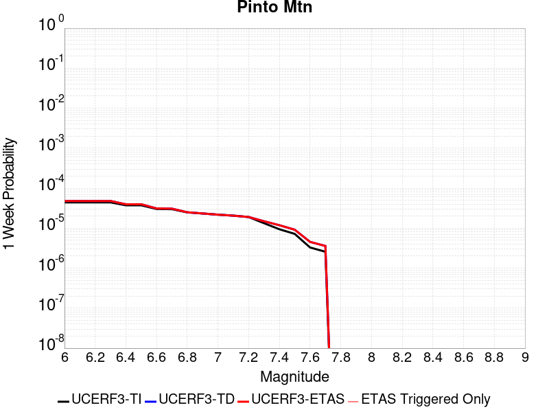 |  |  |  |

| Magnitude | 1 wk TI Prob | 1 wk TD Prob | 1 wk ETAS Prob | 1 wk ETAS/TD Gain | 1 wk ETAS Triggered Only | 1 mo TI Prob | 1 mo TD Prob | 1 mo ETAS Prob | 1 mo ETAS/TD Gain | 1 mo ETAS Triggered Only | 1 yr TI Prob | 1 yr TD Prob | 1 yr ETAS Prob | 1 yr ETAS/TD Gain | 1 yr ETAS Triggered Only | 10 yr TI Prob | 10 yr TD Prob | 10 yr ETAS Prob | 10 yr ETAS/TD Gain | 10 yr ETAS Triggered Only |
|-----|-----|-----|-----|-----|-----|-----|-----|-----|-----|-----|-----|-----|-----|-----|-----|-----|-----|-----|-----|-----|
| 6.0 | 4.4194956E-5 | 4.786489E-5 | 4.786489E-5 | 1.0 | 0.0 | 1.893932E-4 | 2.0512004E-4 | 2.0512004E-4 | 1.0 | 0.0 | 0.0023034236 | 0.0024946409 | 0.002514591 | 1.0079972 | 2.0E-5 | 0.022796938 | 0.024683883 | 0.02473265 | 1.0019757 | 5.0E-5 |
| 6.1 | 4.4194956E-5 | 4.786489E-5 | 4.786489E-5 | 1.0 | 0.0 | 1.893932E-4 | 2.0512004E-4 | 2.0512004E-4 | 1.0 | 0.0 | 0.0023034236 | 0.0024946409 | 0.002514591 | 1.0079972 | 2.0E-5 | 0.022796938 | 0.024683883 | 0.02473265 | 1.0019757 | 5.0E-5 |
| 6.2 | 4.4194956E-5 | 4.786489E-5 | 4.786489E-5 | 1.0 | 0.0 | 1.893932E-4 | 2.0512004E-4 | 2.0512004E-4 | 1.0 | 0.0 | 0.0023034236 | 0.0024946409 | 0.002514591 | 1.0079972 | 2.0E-5 | 0.022796938 | 0.024683883 | 0.02473265 | 1.0019757 | 5.0E-5 |
| 6.3 | 4.4194956E-5 | 4.786489E-5 | 4.786489E-5 | 1.0 | 0.0 | 1.893932E-4 | 2.0512004E-4 | 2.0512004E-4 | 1.0 | 0.0 | 0.0023034236 | 0.0024946409 | 0.002514591 | 1.0079972 | 2.0E-5 | 0.022796938 | 0.024683883 | 0.02473265 | 1.0019757 | 5.0E-5 |
| 6.4 | 3.729929E-5 | 3.9612947E-5 | 3.9612947E-5 | 1.0 | 0.0 | 1.5984432E-4 | 1.6975927E-4 | 1.6975927E-4 | 1.0 | 0.0 | 0.0019443673 | 0.0020649533 | 0.0020749327 | 1.0048327 | 1.0E-5 | 0.019274427 | 0.020467682 | 0.020497069 | 1.0014358 | 3.0E-5 |
| 6.5 | 3.729929E-5 | 3.9612947E-5 | 3.9612947E-5 | 1.0 | 0.0 | 1.5984432E-4 | 1.6975927E-4 | 1.6975927E-4 | 1.0 | 0.0 | 0.0019443673 | 0.0020649533 | 0.0020749327 | 1.0048327 | 1.0E-5 | 0.019274427 | 0.020467682 | 0.020497069 | 1.0014358 | 3.0E-5 |
| 6.6 | 3.0204548E-5 | 3.1213625E-5 | 3.1213625E-5 | 1.0 | 0.0 | 1.2944164E-4 | 1.3376602E-4 | 1.3376602E-4 | 1.0 | 0.0 | 0.0015748127 | 0.0016274193 | 0.001637403 | 1.0061347 | 1.0E-5 | 0.015636992 | 0.016158886 | 0.016178561 | 1.0012177 | 2.0E-5 |
| 6.7 | 2.9857754E-5 | 3.0822965E-5 | 3.0822965E-5 | 1.0 | 0.0 | 1.2795553E-4 | 1.3209193E-4 | 1.3209193E-4 | 1.0 | 0.0 | 0.0015567453 | 0.0016070674 | 0.0016170513 | 1.0062125 | 1.0E-5 | 0.015458848 | 0.015958302 | 0.015977984 | 1.0012332 | 2.0E-5 |
| 6.8 | 2.4819734E-5 | 2.501682E-5 | 2.501682E-5 | 1.0 | 0.0 | 1.0636595E-4 | 1.0721066E-4 | 1.0721066E-4 | 1.0 | 0.0 | 0.0012942362 | 0.0013045298 | 0.0013045298 | 1.0 | 0.0 | 0.012867244 | 0.012971088 | 0.012980958 | 1.0007609 | 1.0E-5 |
| 6.9 | 2.331124E-5 | 2.334493E-5 | 2.334493E-5 | 1.0 | 0.0 | 9.990149E-5 | 1.0004598E-4 | 1.0004598E-4 | 1.0 | 0.0 | 0.001215622 | 0.0012173996 | 0.0012173996 | 1.0 | 0.0 | 0.012089936 | 0.0121094985 | 0.012119378 | 1.0008157 | 1.0E-5 |
| 7.0 | 2.1818534E-5 | 2.1767919E-5 | 2.1767919E-5 | 1.0 | 0.0 | 9.3504656E-5 | 9.328786E-5 | 9.328786E-5 | 1.0 | 0.0 | 0.0011378246 | 0.0011352077 | 0.0011352077 | 1.0 | 0.0 | 0.011320163 | 0.011296192 | 0.011306079 | 1.0008752 | 1.0E-5 |
| 7.1 | 2.066081E-5 | 2.0547432E-5 | 2.0547432E-5 | 1.0 | 0.0 | 8.854332E-5 | 8.805755E-5 | 8.805755E-5 | 1.0 | 0.0 | 0.0010774818 | 0.001071593 | 0.001071593 | 1.0 | 0.0 | 0.010722724 | 0.01066631 | 0.010676203 | 1.0009276 | 1.0E-5 |
| 7.2 | 1.8990233E-5 | 1.906058E-5 | 1.906058E-5 | 1.0 | 0.0 | 8.138417E-5 | 8.168575E-5 | 8.168575E-5 | 1.0 | 0.0 | 9.904018E-4 | 9.940896E-4 | 9.940896E-4 | 1.0 | 0.0 | 0.009859995 | 0.009898428 | 0.009908329 | 1.0010003 | 1.0E-5 |
| 7.3 | 1.3335872E-5 | 1.4912702E-5 | 1.4912702E-5 | 1.0 | 0.0 | 5.7152483E-5 | 6.391008E-5 | 6.391008E-5 | 1.0 | 0.0 | 6.956093E-4 | 7.7784027E-4 | 7.7784027E-4 | 1.0 | 0.0 | 0.006934359 | 0.0077524777 | 0.0077524777 | 1.0 | 0.0 |
| 7.4 | 9.414066E-6 | 1.1866629E-5 | 1.1866629E-5 | 1.0 | 0.0 | 4.0345374E-5 | 5.0856044E-5 | 5.0856044E-5 | 1.0 | 0.0 | 4.910942E-4 | 6.190059E-4 | 6.190059E-4 | 1.0 | 0.0 | 0.0049001034 | 0.0061737658 | 0.0061737658 | 1.0 | 0.0 |
| 7.5 | 7.2101157E-6 | 9.1637685E-6 | 9.1637685E-6 | 1.0 | 0.0 | 3.090013E-5 | 3.9272745E-5 | 3.9272745E-5 | 1.0 | 0.0 | 3.7614413E-4 | 4.7804858E-4 | 4.7804858E-4 | 1.0 | 0.0 | 0.0037550807 | 0.0047709784 | 0.0047709784 | 1.0 | 0.0 |
| 7.6 | 3.296375E-6 | 4.5509482E-6 | 4.5509482E-6 | 1.0 | 0.0 | 1.4127245E-5 | 1.9503927E-5 | 1.9503927E-5 | 1.0 | 0.0 | 1.7198564E-4 | 2.3743582E-4 | 2.3743582E-4 | 1.0 | 0.0 | 0.0017185259 | 0.0023719592 | 0.0023719592 | 1.0 | 0.0 |
| 7.7 | 2.5741092E-6 | 3.5895557E-6 | 3.5895557E-6 | 1.0 | 0.0 | 1.103185E-5 | 1.5383726E-5 | 1.5383726E-5 | 1.0 | 0.0 | 1.3430449E-4 | 1.872821E-4 | 1.872821E-4 | 1.0 | 0.0 | 0.0013422335 | 0.0018713729 | 0.0018713729 | 1.0 | 0.0 |

## Deep Springs
*[(top)](#table-of-contents)*

| 1 Week | 1 Month | 1 Year | 10 Year |
|-----|-----|-----|-----|
|  |  |  |  |

| Magnitude | 1 wk TI Prob | 1 wk TD Prob | 1 wk ETAS Prob | 1 wk ETAS/TD Gain | 1 wk ETAS Triggered Only | 1 mo TI Prob | 1 mo TD Prob | 1 mo ETAS Prob | 1 mo ETAS/TD Gain | 1 mo ETAS Triggered Only | 1 yr TI Prob | 1 yr TD Prob | 1 yr ETAS Prob | 1 yr ETAS/TD Gain | 1 yr ETAS Triggered Only | 10 yr TI Prob | 10 yr TD Prob | 10 yr ETAS Prob | 10 yr ETAS/TD Gain | 10 yr ETAS Triggered Only |
|-----|-----|-----|-----|-----|-----|-----|-----|-----|-----|-----|-----|-----|-----|-----|-----|-----|-----|-----|-----|-----|
| 6.0 | 1.9810619E-5 | 2.3116098E-5 | 2.3116098E-5 | 1.0 | 0.0 | 8.489989E-5 | 9.9068086E-5 | 1.090671E-4 | 1.1009307 | 1.0E-5 | 0.001033166 | 0.0012059944 | 0.0012359583 | 1.0248457 | 3.0E-5 | 0.010283757 | 0.0120442845 | 0.012093682 | 1.0041014 | 5.0E-5 |
| 6.1 | 1.9810619E-5 | 2.3116098E-5 | 2.3116098E-5 | 1.0 | 0.0 | 8.489989E-5 | 9.9068086E-5 | 1.090671E-4 | 1.1009307 | 1.0E-5 | 0.001033166 | 0.0012059944 | 0.0012359583 | 1.0248457 | 3.0E-5 | 0.010283757 | 0.0120442845 | 0.012093682 | 1.0041014 | 5.0E-5 |
| 6.2 | 1.9810619E-5 | 2.3116098E-5 | 2.3116098E-5 | 1.0 | 0.0 | 8.489989E-5 | 9.9068086E-5 | 1.090671E-4 | 1.1009307 | 1.0E-5 | 0.001033166 | 0.0012059944 | 0.0012359583 | 1.0248457 | 3.0E-5 | 0.010283757 | 0.0120442845 | 0.012093682 | 1.0041014 | 5.0E-5 |
| 6.3 | 1.9810619E-5 | 2.3116098E-5 | 2.3116098E-5 | 1.0 | 0.0 | 8.489989E-5 | 9.9068086E-5 | 1.090671E-4 | 1.1009307 | 1.0E-5 | 0.001033166 | 0.0012059944 | 0.0012359583 | 1.0248457 | 3.0E-5 | 0.010283757 | 0.0120442845 | 0.012093682 | 1.0041014 | 5.0E-5 |
| 6.4 | 1.9810619E-5 | 2.3116098E-5 | 2.3116098E-5 | 1.0 | 0.0 | 8.489989E-5 | 9.9068086E-5 | 1.090671E-4 | 1.1009307 | 1.0E-5 | 0.001033166 | 0.0012059944 | 0.0012359583 | 1.0248457 | 3.0E-5 | 0.010283757 | 0.0120442845 | 0.012093682 | 1.0041014 | 5.0E-5 |
| 6.5 | 1.7190405E-5 | 2.0053652E-5 | 2.0053652E-5 | 1.0 | 0.0 | 7.367108E-5 | 8.594423E-5 | 9.594337E-5 | 1.1163446 | 1.0E-5 | 8.9657627E-4 | 0.001046371 | 0.0010763396 | 1.0286405 | 3.0E-5 | 0.008929676 | 0.010463671 | 0.010503253 | 1.0037827 | 4.0E-5 |
| 6.6 | 1.7190405E-5 | 2.0053652E-5 | 2.0053652E-5 | 1.0 | 0.0 | 7.367108E-5 | 8.594423E-5 | 9.594337E-5 | 1.1163446 | 1.0E-5 | 8.9657627E-4 | 0.001046371 | 0.0010763396 | 1.0286405 | 3.0E-5 | 0.008929676 | 0.010463671 | 0.010503253 | 1.0037827 | 4.0E-5 |

## Lost Hills
*[(top)](#table-of-contents)*

| 1 Week | 1 Month | 1 Year | 10 Year |
|-----|-----|-----|-----|
|  |  |  |  |

| Magnitude | 1 wk TI Prob | 1 wk TD Prob | 1 wk ETAS Prob | 1 wk ETAS/TD Gain | 1 wk ETAS Triggered Only | 1 mo TI Prob | 1 mo TD Prob | 1 mo ETAS Prob | 1 mo ETAS/TD Gain | 1 mo ETAS Triggered Only | 1 yr TI Prob | 1 yr TD Prob | 1 yr ETAS Prob | 1 yr ETAS/TD Gain | 1 yr ETAS Triggered Only | 10 yr TI Prob | 10 yr TD Prob | 10 yr ETAS Prob | 10 yr ETAS/TD Gain | 10 yr ETAS Triggered Only |
|-----|-----|-----|-----|-----|-----|-----|-----|-----|-----|-----|-----|-----|-----|-----|-----|-----|-----|-----|-----|-----|
| 6.0 | 2.233523E-5 | 2.5109475E-5 | 2.5109475E-5 | 1.0 | 0.0 | 9.571891E-5 | 1.0760855E-4 | 1.0760855E-4 | 1.0 | 0.0 | 0.0011647546 | 0.0013095147 | 0.0013294886 | 1.0152528 | 2.0E-5 | 0.011586686 | 0.013034585 | 0.013083933 | 1.003786 | 5.0E-5 |
| 6.1 | 2.233523E-5 | 2.5109475E-5 | 2.5109475E-5 | 1.0 | 0.0 | 9.571891E-5 | 1.0760855E-4 | 1.0760855E-4 | 1.0 | 0.0 | 0.0011647546 | 0.0013095147 | 0.0013294886 | 1.0152528 | 2.0E-5 | 0.011586686 | 0.013034585 | 0.013083933 | 1.003786 | 5.0E-5 |
| 6.2 | 2.233523E-5 | 2.5109475E-5 | 2.5109475E-5 | 1.0 | 0.0 | 9.571891E-5 | 1.0760855E-4 | 1.0760855E-4 | 1.0 | 0.0 | 0.0011647546 | 0.0013095147 | 0.0013294886 | 1.0152528 | 2.0E-5 | 0.011586686 | 0.013034585 | 0.013083933 | 1.003786 | 5.0E-5 |
| 6.3 | 2.233523E-5 | 2.5109475E-5 | 2.5109475E-5 | 1.0 | 0.0 | 9.571891E-5 | 1.0760855E-4 | 1.0760855E-4 | 1.0 | 0.0 | 0.0011647546 | 0.0013095147 | 0.0013294886 | 1.0152528 | 2.0E-5 | 0.011586686 | 0.013034585 | 0.013083933 | 1.003786 | 5.0E-5 |
| 6.4 | 1.2288092E-5 | 1.3782662E-5 | 1.3782662E-5 | 1.0 | 0.0 | 5.2662188E-5 | 5.9067745E-5 | 5.9067745E-5 | 1.0 | 0.0 | 6.409735E-4 | 7.190063E-4 | 7.3899195E-4 | 1.0277961 | 2.0E-5 | 0.006391279 | 0.0071760085 | 0.007205793 | 1.0041506 | 3.0E-5 |
| 6.5 | 1.2288092E-5 | 1.3782662E-5 | 1.3782662E-5 | 1.0 | 0.0 | 5.2662188E-5 | 5.9067745E-5 | 5.9067745E-5 | 1.0 | 0.0 | 6.409735E-4 | 7.190063E-4 | 7.3899195E-4 | 1.0277961 | 2.0E-5 | 0.006391279 | 0.0071760085 | 0.007205793 | 1.0041506 | 3.0E-5 |
| 6.6 | 8.58281E-6 | 9.634865E-6 | 9.634865E-6 | 1.0 | 0.0 | 3.6782953E-5 | 4.1292096E-5 | 4.1292096E-5 | 1.0 | 0.0 | 4.4774043E-4 | 5.0269853E-4 | 5.126935E-4 | 1.0198827 | 1.0E-5 | 0.0044683935 | 0.0050237756 | 0.005043675 | 1.0039611 | 2.0E-5 |
| 6.7 | 7.205685E-6 | 8.089221E-6 | 8.089221E-6 | 1.0 | 0.0 | 3.088114E-5 | 3.4668094E-5 | 3.4668094E-5 | 1.0 | 0.0 | 3.7591302E-4 | 4.2208403E-4 | 4.320798E-4 | 1.023682 | 1.0E-5 | 0.0037527776 | 0.00422084 | 0.004240756 | 1.0047184 | 2.0E-5 |

## Chino alt 1
*[(top)](#table-of-contents)*

| 1 Week | 1 Month | 1 Year | 10 Year |
|-----|-----|-----|-----|
|  | 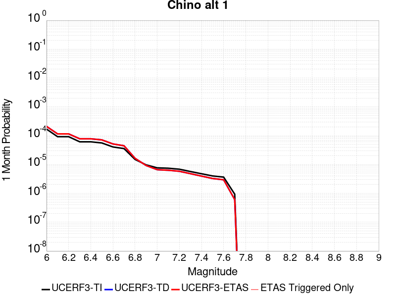 |  |  |

| Magnitude | 1 wk TI Prob | 1 wk TD Prob | 1 wk ETAS Prob | 1 wk ETAS/TD Gain | 1 wk ETAS Triggered Only | 1 mo TI Prob | 1 mo TD Prob | 1 mo ETAS Prob | 1 mo ETAS/TD Gain | 1 mo ETAS Triggered Only | 1 yr TI Prob | 1 yr TD Prob | 1 yr ETAS Prob | 1 yr ETAS/TD Gain | 1 yr ETAS Triggered Only | 10 yr TI Prob | 10 yr TD Prob | 10 yr ETAS Prob | 10 yr ETAS/TD Gain | 10 yr ETAS Triggered Only |
|-----|-----|-----|-----|-----|-----|-----|-----|-----|-----|-----|-----|-----|-----|-----|-----|-----|-----|-----|-----|-----|
| 6.0 | 3.939946E-5 | 4.8961843E-5 | 4.8961843E-5 | 1.0 | 0.0 | 1.6884391E-4 | 2.0982254E-4 | 2.0982254E-4 | 1.0 | 0.0 | 0.0020537362 | 0.0025520772 | 0.0025620516 | 1.0039084 | 1.0E-5 | 0.020348595 | 0.02528456 | 0.025333295 | 1.0019275 | 5.0E-5 |
| 6.1 | 2.1505624E-5 | 2.688751E-5 | 2.688751E-5 | 1.0 | 0.0 | 9.2163704E-5 | 1.15227725E-4 | 1.15227725E-4 | 1.0 | 0.0 | 0.0011215154 | 0.0014021061 | 0.0014021061 | 1.0 | 0.0 | 0.011158722 | 0.013949474 | 0.013969195 | 1.0014137 | 2.0E-5 |
| 6.2 | 2.1505624E-5 | 2.688751E-5 | 2.688751E-5 | 1.0 | 0.0 | 9.2163704E-5 | 1.15227725E-4 | 1.15227725E-4 | 1.0 | 0.0 | 0.0011215154 | 0.0014021061 | 0.0014021061 | 1.0 | 0.0 | 0.011158722 | 0.013949474 | 0.013969195 | 1.0014137 | 2.0E-5 |
| 6.3 | 1.4290785E-5 | 1.8171926E-5 | 1.8171926E-5 | 1.0 | 0.0 | 6.1244784E-5 | 7.7877616E-5 | 7.7877616E-5 | 1.0 | 0.0 | 7.454001E-4 | 9.477929E-4 | 9.477929E-4 | 1.0 | 0.0 | 0.007429048 | 0.009447941 | 0.009467752 | 1.0020969 | 2.0E-5 |
| 6.4 | 1.4290785E-5 | 1.8171926E-5 | 1.8171926E-5 | 1.0 | 0.0 | 6.1244784E-5 | 7.7877616E-5 | 7.7877616E-5 | 1.0 | 0.0 | 7.454001E-4 | 9.477929E-4 | 9.477929E-4 | 1.0 | 0.0 | 0.007429048 | 0.009447941 | 0.009467752 | 1.0020969 | 2.0E-5 |
| 6.5 | 1.3017944E-5 | 1.665862E-5 | 1.665862E-5 | 1.0 | 0.0 | 5.5789995E-5 | 7.139238E-5 | 7.139238E-5 | 1.0 | 0.0 | 6.790315E-4 | 8.6889946E-4 | 8.6889946E-4 | 1.0 | 0.0 | 0.0067696036 | 0.008665298 | 0.008685124 | 1.0022881 | 2.0E-5 |
| 6.6 | 9.470016E-6 | 1.204444E-5 | 1.204444E-5 | 1.0 | 0.0 | 4.058515E-5 | 5.1618197E-5 | 5.1618197E-5 | 1.0 | 0.0 | 4.940122E-4 | 6.283043E-4 | 6.283043E-4 | 1.0 | 0.0 | 0.004929154 | 0.006274481 | 0.006284418 | 1.0015838 | 1.0E-5 |
| 6.7 | 8.314155E-6 | 1.0412219E-5 | 1.0412219E-5 | 1.0 | 0.0 | 3.5631605E-5 | 4.4623215E-5 | 4.4623215E-5 | 1.0 | 0.0 | 4.3372845E-4 | 5.4318446E-4 | 5.4318446E-4 | 1.0 | 0.0 | 0.004328829 | 0.005428088 | 0.005438034 | 1.0018322 | 1.0E-5 |
| 6.8 | 3.4856364E-6 | 3.815124E-6 | 3.815124E-6 | 1.0 | 0.0 | 1.4938357E-5 | 1.635044E-5 | 1.635044E-5 | 1.0 | 0.0 | 1.8185932E-4 | 1.9905048E-4 | 1.9905048E-4 | 1.0 | 0.0 | 0.0018171056 | 0.001990398 | 0.002000378 | 1.0050141 | 1.0E-5 |
| 6.9 | 2.2645952E-6 | 2.154167E-6 | 2.154167E-6 | 1.0 | 0.0 | 9.705372E-6 | 9.232113E-6 | 9.232113E-6 | 1.0 | 0.0 | 1.18156495E-4 | 1.123954E-4 | 1.123954E-4 | 1.0 | 0.0 | 0.0011809369 | 0.0011240017 | 0.0011339905 | 1.0088868 | 1.0E-5 |
| 7.0 | 1.7864003E-6 | 1.5442189E-6 | 1.5442189E-6 | 1.0 | 0.0 | 7.655979E-6 | 6.6180646E-6 | 6.6180646E-6 | 1.0 | 0.0 | 9.3207556E-5 | 8.057201E-5 | 8.057201E-5 | 1.0 | 0.0 | 9.316847E-4 | 8.058752E-4 | 8.1586716E-4 | 1.0123988 | 1.0E-5 |
| 7.1 | 1.7315456E-6 | 1.4744763E-6 | 1.4744763E-6 | 1.0 | 0.0 | 7.420889E-6 | 6.319169E-6 | 6.319169E-6 | 1.0 | 0.0 | 9.034557E-5 | 7.6933226E-5 | 7.6933226E-5 | 1.0 | 0.0 | 9.0308854E-4 | 7.695039E-4 | 7.794962E-4 | 1.0129853 | 1.0E-5 |
| 7.2 | 1.6008337E-6 | 1.3584987E-6 | 1.3584987E-6 | 1.0 | 0.0 | 6.860698E-6 | 5.8221244E-6 | 5.8221244E-6 | 1.0 | 0.0 | 8.352579E-5 | 7.088212E-5 | 7.088212E-5 | 1.0 | 0.0 | 8.34944E-4 | 7.0901937E-4 | 7.190123E-4 | 1.014094 | 1.0E-5 |
| 7.3 | 1.3320939E-6 | 1.1227842E-6 | 1.1227842E-6 | 1.0 | 0.0 | 5.7089615E-6 | 4.8119236E-6 | 4.8119236E-6 | 1.0 | 0.0 | 6.9504385E-5 | 5.8583642E-5 | 5.8583642E-5 | 1.0 | 0.0 | 6.9482654E-4 | 5.8582664E-4 | 5.8582664E-4 | 1.0 | 0.0 |
| 7.4 | 1.114294E-6 | 9.246506E-7 | 9.246506E-7 | 1.0 | 0.0 | 4.775537E-6 | 3.9627826E-6 | 3.9627826E-6 | 1.0 | 0.0 | 5.8140613E-5 | 4.8245845E-5 | 4.8245845E-5 | 1.0 | 0.0 | 5.81254E-4 | 4.823705E-4 | 4.823705E-4 | 1.0 | 0.0 |
| 7.5 | 9.354081E-7 | 7.632324E-7 | 7.632324E-7 | 1.0 | 0.0 | 4.0088858E-6 | 3.2709918E-6 | 3.2709918E-6 | 1.0 | 0.0 | 4.8807087E-5 | 3.9823633E-5 | 3.9823633E-5 | 1.0 | 0.0 | 4.879637E-4 | 3.9816837E-4 | 3.9816837E-4 | 1.0 | 0.0 |
| 7.6 | 8.521771E-7 | 6.88939E-7 | 6.88939E-7 | 1.0 | 0.0 | 3.6521824E-6 | 2.9525925E-6 | 2.9525925E-6 | 1.0 | 0.0 | 4.4464414E-5 | 3.5947254E-5 | 3.5947254E-5 | 1.0 | 0.0 | 4.4455516E-4 | 3.5941755E-4 | 3.5941755E-4 | 1.0 | 0.0 |
| 7.7 | 2.1803626E-7 | 1.4210343E-7 | 1.4210343E-7 | 1.0 | 0.0 | 9.344408E-7 | 6.090146E-7 | 6.090146E-7 | 1.0 | 0.0 | 1.1376757E-5 | 7.4147374E-6 | 7.4147374E-6 | 1.0 | 0.0 | 1.13761744E-4 | 7.414586E-5 | 7.414586E-5 | 1.0 | 0.0 |

## San Andreas (Creeping Section) 2011 CFM
*[(top)](#table-of-contents)*

| 1 Week | 1 Month | 1 Year | 10 Year |
|-----|-----|-----|-----|
|  |  |  | 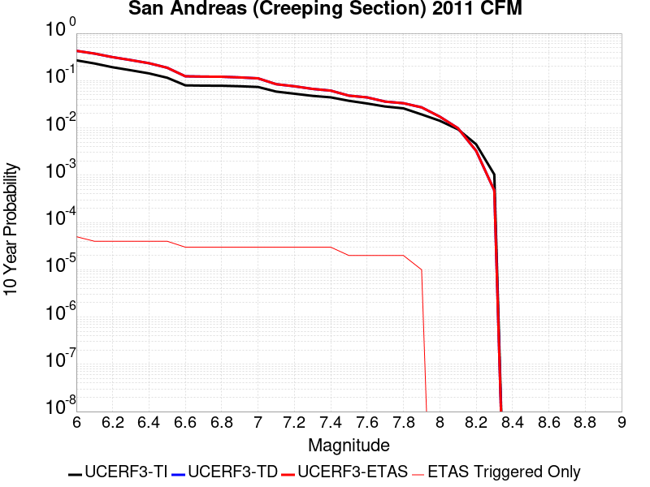 |

| Magnitude | 1 wk TI Prob | 1 wk TD Prob | 1 wk ETAS Prob | 1 wk ETAS/TD Gain | 1 wk ETAS Triggered Only | 1 mo TI Prob | 1 mo TD Prob | 1 mo ETAS Prob | 1 mo ETAS/TD Gain | 1 mo ETAS Triggered Only | 1 yr TI Prob | 1 yr TD Prob | 1 yr ETAS Prob | 1 yr ETAS/TD Gain | 1 yr ETAS Triggered Only | 10 yr TI Prob | 10 yr TD Prob | 10 yr ETAS Prob | 10 yr ETAS/TD Gain | 10 yr ETAS Triggered Only |
|-----|-----|-----|-----|-----|-----|-----|-----|-----|-----|-----|-----|-----|-----|-----|-----|-----|-----|-----|-----|-----|
| 6.0 | 5.986481E-4 | 0.0012279243 | 0.0012279243 | 1.0 | 0.0 | 0.0025631124 | 0.0052476428 | 0.0052476428 | 1.0 | 0.0 | 0.030762846 | 0.06124967 | 0.061277833 | 1.0004598 | 3.0E-5 | 0.26835477 | 0.42616206 | 0.42619076 | 1.0000674 | 5.0E-5 |
| 6.1 | 5.015945E-4 | 0.0010222215 | 0.0010222215 | 1.0 | 0.0 | 0.00214792 | 0.0043694214 | 0.0043694214 | 1.0 | 0.0 | 0.025839351 | 0.051286288 | 0.05130526 | 1.00037 | 2.0E-5 | 0.23032776 | 0.37307632 | 0.3731014 | 1.0000672 | 4.0E-5 |
| 6.2 | 4.073338E-4 | 8.1114867E-4 | 8.1114867E-4 | 1.0 | 0.0 | 0.0017445484 | 0.0034698262 | 0.0034698262 | 1.0 | 0.0 | 0.021034058 | 0.040970687 | 0.040989865 | 1.0004681 | 2.0E-5 | 0.19150782 | 0.3132712 | 0.31329867 | 1.0000877 | 4.0E-5 |
| 6.3 | 3.464099E-4 | 6.745372E-4 | 6.745372E-4 | 1.0 | 0.0 | 0.0014837692 | 0.0028859451 | 0.0028859451 | 1.0 | 0.0 | 0.017915873 | 0.034227774 | 0.03424709 | 1.0005643 | 2.0E-5 | 0.16538359 | 0.27156863 | 0.27159777 | 1.0001073 | 4.0E-5 |
| 6.4 | 2.935057E-4 | 5.549232E-4 | 5.549232E-4 | 1.0 | 0.0 | 0.0012572751 | 0.002375956 | 0.002375956 | 1.0 | 0.0 | 0.015200248 | 0.02830308 | 0.028322512 | 1.0006866 | 2.0E-5 | 0.14201577 | 0.23325148 | 0.23328215 | 1.0001315 | 4.0E-5 |
| 6.5 | 2.3409708E-4 | 4.216508E-4 | 4.216508E-4 | 1.0 | 0.0 | 0.0010028875 | 0.0018056892 | 0.0018056892 | 1.0 | 0.0 | 0.012141965 | 0.021625686 | 0.021645254 | 1.0009048 | 2.0E-5 | 0.11499573 | 0.18710569 | 0.1871382 | 1.0001738 | 4.0E-5 |
| 6.6 | 1.5842178E-4 | 2.5143448E-4 | 2.5143448E-4 | 1.0 | 0.0 | 6.7877385E-4 | 0.0010771039 | 0.0010771039 | 1.0 | 0.0 | 0.0082328 | 0.013033407 | 0.013053146 | 1.0015146 | 2.0E-5 | 0.07934396 | 0.123448685 | 0.12347498 | 1.000213 | 3.0E-5 |
| 6.7 | 1.5616413E-4 | 2.4679524E-4 | 2.4679524E-4 | 1.0 | 0.0 | 6.691031E-4 | 0.0010572379 | 0.0010572379 | 1.0 | 0.0 | 0.0081159435 | 0.012795179 | 0.012814923 | 1.001543 | 2.0E-5 | 0.0782586 | 0.12147582 | 0.121502176 | 1.000217 | 3.0E-5 |
| 6.8 | 1.5538467E-4 | 2.4503225E-4 | 2.4503225E-4 | 1.0 | 0.0 | 6.6576427E-4 | 0.0010496916 | 0.0010496916 | 1.0 | 0.0 | 0.008075596 | 0.0127044935 | 0.012724239 | 1.0015543 | 2.0E-5 | 0.07788358 | 0.120706424 | 0.1207328 | 1.0002185 | 3.0E-5 |
| 6.9 | 1.5153569E-4 | 2.3611508E-4 | 2.3611508E-4 | 1.0 | 0.0 | 6.49277E-4 | 0.0010115315 | 0.0010115315 | 1.0 | 0.0 | 0.007876333 | 0.012246382 | 0.012266138 | 1.0016131 | 2.0E-5 | 0.07602952 | 0.116775535 | 0.11680204 | 1.0002269 | 3.0E-5 |
| 7.0 | 1.4588932E-4 | 2.2468044E-4 | 2.2468044E-4 | 1.0 | 0.0 | 6.250901E-4 | 9.625628E-4 | 9.625628E-4 | 1.0 | 0.0 | 0.0075839474 | 0.01165673 | 0.011676497 | 1.0016958 | 2.0E-5 | 0.073302895 | 0.11162082 | 0.11164747 | 1.0002388 | 3.0E-5 |
| 7.1 | 1.1565079E-4 | 1.6341933E-4 | 1.6341933E-4 | 1.0 | 0.0 | 4.955521E-4 | 7.0018147E-4 | 7.0018147E-4 | 1.0 | 0.0 | 0.006016669 | 0.008491592 | 0.008511422 | 1.0023353 | 2.0E-5 | 0.058563538 | 0.083937235 | 0.08396471 | 1.0003275 | 3.0E-5 |
| 7.2 | 1.0393792E-4 | 1.4672677E-4 | 1.4672677E-4 | 1.0 | 0.0 | 4.4537216E-4 | 6.2867824E-4 | 6.2867824E-4 | 1.0 | 0.0 | 0.005408933 | 0.0076274658 | 0.007647313 | 1.0026021 | 2.0E-5 | 0.052791595 | 0.07587518 | 0.0759029 | 1.0003654 | 3.0E-5 |
| 7.3 | 9.332884E-5 | 1.2829727E-4 | 1.2829727E-4 | 1.0 | 0.0 | 3.999194E-4 | 5.497302E-4 | 5.497302E-4 | 1.0 | 0.0 | 0.0048581534 | 0.0066725616 | 0.006692428 | 1.0029774 | 2.0E-5 | 0.047533102 | 0.06670731 | 0.06673531 | 1.0004197 | 3.0E-5 |
| 7.4 | 8.670252E-5 | 1.1747288E-4 | 1.1747288E-4 | 1.0 | 0.0 | 3.715293E-4 | 5.0335866E-4 | 5.0335866E-4 | 1.0 | 0.0 | 0.004513991 | 0.0061112926 | 0.0061311703 | 1.0032526 | 2.0E-5 | 0.044233937 | 0.06135535 | 0.06138351 | 1.000459 | 3.0E-5 |
| 7.5 | 7.3036405E-5 | 9.042717E-5 | 9.042717E-5 | 1.0 | 0.0 | 3.129756E-4 | 3.8748755E-4 | 3.8748755E-4 | 1.0 | 0.0 | 0.0038038217 | 0.0047074775 | 0.004727383 | 1.0042286 | 2.0E-5 | 0.03739367 | 0.048053123 | 0.048072163 | 1.0003963 | 2.0E-5 |
| 7.6 | 6.3935775E-5 | 8.3126084E-5 | 8.3126084E-5 | 1.0 | 0.0 | 2.7398168E-4 | 3.562061E-4 | 3.562061E-4 | 1.0 | 0.0 | 0.0033306254 | 0.004328204 | 0.0043481174 | 1.0046009 | 2.0E-5 | 0.032811474 | 0.04414528 | 0.044164397 | 1.0004331 | 2.0E-5 |
| 7.7 | 5.5050095E-5 | 6.690396E-5 | 6.690396E-5 | 1.0 | 0.0 | 2.3590765E-4 | 2.8669977E-4 | 2.8669977E-4 | 1.0 | 0.0 | 0.0028683927 | 0.003484987 | 0.0035049173 | 1.005719 | 2.0E-5 | 0.0283165 | 0.03593445 | 0.035953727 | 1.0005366 | 2.0E-5 |
| 7.8 | 5.027131E-5 | 6.188968E-5 | 6.188968E-5 | 1.0 | 0.0 | 2.1543067E-4 | 2.6521456E-4 | 2.6521456E-4 | 1.0 | 0.0 | 0.0026197135 | 0.0032242094 | 0.003244145 | 1.006183 | 2.0E-5 | 0.025890453 | 0.033253387 | 0.03327272 | 1.0005814 | 2.0E-5 |
| 7.9 | 3.7271806E-5 | 5.043476E-5 | 5.043476E-5 | 1.0 | 0.0 | 1.5972654E-4 | 2.1613107E-4 | 2.1613107E-4 | 1.0 | 0.0 | 0.0019429359 | 0.0026282226 | 0.002638196 | 1.0037949 | 1.0E-5 | 0.019260362 | 0.027170233 | 0.027179962 | 1.0003581 | 1.0E-5 |
| 8.0 | 2.7310243E-5 | 3.156779E-5 | 3.156779E-5 | 1.0 | 0.0 | 1.17038646E-4 | 1.3528352E-4 | 1.3528352E-4 | 1.0 | 0.0 | 0.0014240141 | 0.0016458334 | 0.0016458334 | 1.0 | 0.0 | 0.014149235 | 0.017284866 | 0.017284866 | 1.0 | 0.0 |
| 8.1 | 1.7940547E-5 | 1.7490544E-5 | 1.7490544E-5 | 1.0 | 0.0 | 7.688579E-5 | 7.4957316E-5 | 7.4957316E-5 | 1.0 | 0.0 | 9.3568244E-4 | 9.1222377E-4 | 9.1222377E-4 | 1.0 | 0.0 | 0.009317525 | 0.0098464005 | 0.0098464005 | 1.0 | 0.0 |
| 8.2 | 8.643924E-6 | 5.5112705E-6 | 5.5112705E-6 | 1.0 | 0.0 | 3.704486E-5 | 2.3619517E-5 | 2.3619517E-5 | 1.0 | 0.0 | 4.5092785E-4 | 2.8752975E-4 | 2.8752975E-4 | 1.0 | 0.0 | 0.0045001395 | 0.0032686237 | 0.0032686237 | 1.0 | 0.0 |
| 8.3 | 1.983087E-6 | 7.7188406E-7 | 7.7188406E-7 | 1.0 | 0.0 | 8.498917E-6 | 3.3080703E-6 | 3.3080703E-6 | 1.0 | 0.0 | 1.034694E-4 | 4.027503E-5 | 4.027503E-5 | 1.0 | 0.0 | 0.0010342124 | 4.7534908E-4 | 4.7534908E-4 | 1.0 | 0.0 |

## Santa Ynez (East)
*[(top)](#table-of-contents)*

| 1 Week | 1 Month | 1 Year | 10 Year |
|-----|-----|-----|-----|
|  |  |  |  |

| Magnitude | 1 wk TI Prob | 1 wk TD Prob | 1 wk ETAS Prob | 1 wk ETAS/TD Gain | 1 wk ETAS Triggered Only | 1 mo TI Prob | 1 mo TD Prob | 1 mo ETAS Prob | 1 mo ETAS/TD Gain | 1 mo ETAS Triggered Only | 1 yr TI Prob | 1 yr TD Prob | 1 yr ETAS Prob | 1 yr ETAS/TD Gain | 1 yr ETAS Triggered Only | 10 yr TI Prob | 10 yr TD Prob | 10 yr ETAS Prob | 10 yr ETAS/TD Gain | 10 yr ETAS Triggered Only |
|-----|-----|-----|-----|-----|-----|-----|-----|-----|-----|-----|-----|-----|-----|-----|-----|-----|-----|-----|-----|-----|
| 6.0 | 3.2269712E-5 | 3.6756413E-5 | 3.6756413E-5 | 1.0 | 0.0 | 1.3829143E-4 | 1.5752131E-4 | 1.5752131E-4 | 1.0 | 0.0 | 0.0016823979 | 0.0019167247 | 0.0019167247 | 1.0 | 0.0 | 0.016697178 | 0.019059477 | 0.019108525 | 1.0025734 | 5.0E-5 |
| 6.1 | 3.2269712E-5 | 3.6756413E-5 | 3.6756413E-5 | 1.0 | 0.0 | 1.3829143E-4 | 1.5752131E-4 | 1.5752131E-4 | 1.0 | 0.0 | 0.0016823979 | 0.0019167247 | 0.0019167247 | 1.0 | 0.0 | 0.016697178 | 0.019059477 | 0.019108525 | 1.0025734 | 5.0E-5 |
| 6.2 | 3.2269712E-5 | 3.6756413E-5 | 3.6756413E-5 | 1.0 | 0.0 | 1.3829143E-4 | 1.5752131E-4 | 1.5752131E-4 | 1.0 | 0.0 | 0.0016823979 | 0.0019167247 | 0.0019167247 | 1.0 | 0.0 | 0.016697178 | 0.019059477 | 0.019108525 | 1.0025734 | 5.0E-5 |
| 6.3 | 3.2269712E-5 | 3.6756413E-5 | 3.6756413E-5 | 1.0 | 0.0 | 1.3829143E-4 | 1.5752131E-4 | 1.5752131E-4 | 1.0 | 0.0 | 0.0016823979 | 0.0019167247 | 0.0019167247 | 1.0 | 0.0 | 0.016697178 | 0.019059477 | 0.019108525 | 1.0025734 | 5.0E-5 |
| 6.4 | 1.4404779E-5 | 1.48506915E-5 | 1.48506915E-5 | 1.0 | 0.0 | 6.1733306E-5 | 6.36443E-5 | 6.36443E-5 | 1.0 | 0.0 | 7.513438E-4 | 7.7459886E-4 | 7.7459886E-4 | 1.0 | 0.0 | 0.0074880854 | 0.00771954 | 0.00771954 | 1.0 | 0.0 |
| 6.5 | 1.4404779E-5 | 1.48506915E-5 | 1.48506915E-5 | 1.0 | 0.0 | 6.1733306E-5 | 6.36443E-5 | 6.36443E-5 | 1.0 | 0.0 | 7.513438E-4 | 7.7459886E-4 | 7.7459886E-4 | 1.0 | 0.0 | 0.0074880854 | 0.00771954 | 0.00771954 | 1.0 | 0.0 |
| 6.6 | 1.280208E-5 | 1.3013006E-5 | 1.3013006E-5 | 1.0 | 0.0 | 5.4864904E-5 | 5.5768844E-5 | 5.5768844E-5 | 1.0 | 0.0 | 6.6777546E-4 | 6.787759E-4 | 6.787759E-4 | 1.0 | 0.0 | 0.006657724 | 0.006767237 | 0.006767237 | 1.0 | 0.0 |
| 6.7 | 1.2457027E-5 | 1.2629486E-5 | 1.2629486E-5 | 1.0 | 0.0 | 5.3386164E-5 | 5.4125256E-5 | 5.4125256E-5 | 1.0 | 0.0 | 6.497827E-4 | 6.587774E-4 | 6.587774E-4 | 1.0 | 0.0 | 0.00647886 | 0.006568443 | 0.006568443 | 1.0 | 0.0 |
| 6.8 | 1.2095134E-5 | 1.2231897E-5 | 1.2231897E-5 | 1.0 | 0.0 | 5.1835254E-5 | 5.2421372E-5 | 5.2421372E-5 | 1.0 | 0.0 | 6.309115E-4 | 6.380449E-4 | 6.380449E-4 | 1.0 | 0.0 | 0.0062912325 | 0.0063623185 | 0.0063623185 | 1.0 | 0.0 |
| 6.9 | 1.1104036E-5 | 1.1158246E-5 | 1.1158246E-5 | 1.0 | 0.0 | 4.758786E-5 | 4.7820184E-5 | 4.7820184E-5 | 1.0 | 0.0 | 5.7922816E-4 | 5.820564E-4 | 5.820564E-4 | 1.0 | 0.0 | 0.005777207 | 0.005805465 | 0.005805465 | 1.0 | 0.0 |
| 7.0 | 1.0577444E-5 | 1.0582528E-5 | 1.0582528E-5 | 1.0 | 0.0 | 4.5331115E-5 | 4.535291E-5 | 4.535291E-5 | 1.0 | 0.0 | 5.5176654E-4 | 5.52033E-4 | 5.52033E-4 | 1.0 | 0.0 | 0.0055039856 | 0.005506756 | 0.005506756 | 1.0 | 0.0 |
| 7.1 | 1.0021775E-5 | 9.98179E-6 | 9.98179E-6 | 1.0 | 0.0 | 4.294976E-5 | 4.2778403E-5 | 4.2778403E-5 | 1.0 | 0.0 | 5.2278786E-4 | 5.207038E-4 | 5.207038E-4 | 1.0 | 0.0 | 0.0052155964 | 0.00519497 | 0.00519497 | 1.0 | 0.0 |
| 7.2 | 8.874109E-6 | 8.7495E-6 | 8.7495E-6 | 1.0 | 0.0 | 3.8031343E-5 | 3.7497324E-5 | 3.7497324E-5 | 1.0 | 0.0 | 4.629332E-4 | 4.5643537E-4 | 4.5643537E-4 | 1.0 | 0.0 | 0.0046197 | 0.0045550973 | 0.0045550973 | 1.0 | 0.0 |
| 7.3 | 7.5504267E-6 | 7.5056873E-6 | 7.5056873E-6 | 1.0 | 0.0 | 3.235857E-5 | 3.216684E-5 | 3.216684E-5 | 1.0 | 0.0 | 3.9389438E-4 | 3.9156192E-4 | 3.9156192E-4 | 1.0 | 0.0 | 0.0039319694 | 0.003908827 | 0.003908827 | 1.0 | 0.0 |
| 7.4 | 6.309394E-6 | 6.1836167E-6 | 6.1836167E-6 | 1.0 | 0.0 | 2.703998E-5 | 2.650095E-5 | 2.650095E-5 | 1.0 | 0.0 | 3.2916202E-4 | 3.2260225E-4 | 3.2260225E-4 | 1.0 | 0.0 | 0.003286749 | 0.0032214366 | 0.0032214366 | 1.0 | 0.0 |
| 7.5 | 4.6103073E-6 | 4.4412027E-6 | 4.4412027E-6 | 1.0 | 0.0 | 1.975831E-5 | 1.903359E-5 | 1.903359E-5 | 1.0 | 0.0 | 2.4053088E-4 | 2.3171002E-4 | 2.3171002E-4 | 1.0 | 0.0 | 0.002402707 | 0.0023147536 | 0.0023147536 | 1.0 | 0.0 |
| 7.6 | 1.2858658E-6 | 1.3008839E-6 | 1.3008839E-6 | 1.0 | 0.0 | 5.5108417E-6 | 5.5752053E-6 | 5.5752053E-6 | 1.0 | 0.0 | 6.7092435E-5 | 6.787608E-5 | 6.787608E-5 | 1.0 | 0.0 | 6.707218E-4 | 6.7856035E-4 | 6.7856035E-4 | 1.0 | 0.0 |
| 7.7 | 5.3302307E-7 | 5.6124156E-7 | 5.6124156E-7 | 1.0 | 0.0 | 2.2843826E-6 | 2.4053188E-6 | 2.4053188E-6 | 1.0 | 0.0 | 2.7812002E-5 | 2.92844E-5 | 2.92844E-5 | 1.0 | 0.0 | 2.7808524E-4 | 2.9280898E-4 | 2.9280898E-4 | 1.0 | 0.0 |
| 7.8 | 4.613933E-8 | 4.8031925E-8 | 4.8031925E-8 | 1.0 | 0.0 | 1.9773998E-7 | 2.058511E-7 | 2.058511E-7 | 1.0 | 0.0 | 2.4074816E-6 | 2.5062343E-6 | 2.5062343E-6 | 1.0 | 0.0 | 2.4074554E-5 | 2.506207E-5 | 2.506207E-5 | 1.0 | 0.0 |

## San Jacinto (San Jacinto Valley) rev
*[(top)](#table-of-contents)*

| 1 Week | 1 Month | 1 Year | 10 Year |
|-----|-----|-----|-----|
|  |  |  |  |

| Magnitude | 1 wk TI Prob | 1 wk TD Prob | 1 wk ETAS Prob | 1 wk ETAS/TD Gain | 1 wk ETAS Triggered Only | 1 mo TI Prob | 1 mo TD Prob | 1 mo ETAS Prob | 1 mo ETAS/TD Gain | 1 mo ETAS Triggered Only | 1 yr TI Prob | 1 yr TD Prob | 1 yr ETAS Prob | 1 yr ETAS/TD Gain | 1 yr ETAS Triggered Only | 10 yr TI Prob | 10 yr TD Prob | 10 yr ETAS Prob | 10 yr ETAS/TD Gain | 10 yr ETAS Triggered Only |
|-----|-----|-----|-----|-----|-----|-----|-----|-----|-----|-----|-----|-----|-----|-----|-----|-----|-----|-----|-----|-----|
| 6.0 | 3.652694E-5 | 3.4511515E-5 | 3.4511515E-5 | 1.0 | 0.0 | 1.5653463E-4 | 1.4789813E-4 | 1.5789665E-4 | 1.0676041 | 1.0E-5 | 0.0019041431 | 0.0017991741 | 0.0018291202 | 1.0166444 | 3.0E-5 | 0.018879099 | 0.018582989 | 0.01863206 | 1.0026406 | 5.0E-5 |
| 6.1 | 3.652694E-5 | 3.4511515E-5 | 3.4511515E-5 | 1.0 | 0.0 | 1.5653463E-4 | 1.4789813E-4 | 1.5789665E-4 | 1.0676041 | 1.0E-5 | 0.0019041431 | 0.0017991741 | 0.0018291202 | 1.0166444 | 3.0E-5 | 0.018879099 | 0.018582989 | 0.01863206 | 1.0026406 | 5.0E-5 |
| 6.2 | 3.652694E-5 | 3.4511515E-5 | 3.4511515E-5 | 1.0 | 0.0 | 1.5653463E-4 | 1.4789813E-4 | 1.5789665E-4 | 1.0676041 | 1.0E-5 | 0.0019041431 | 0.0017991741 | 0.0018291202 | 1.0166444 | 3.0E-5 | 0.018879099 | 0.018582989 | 0.01863206 | 1.0026406 | 5.0E-5 |
| 6.3 | 3.652694E-5 | 3.4511515E-5 | 3.4511515E-5 | 1.0 | 0.0 | 1.5653463E-4 | 1.4789813E-4 | 1.5789665E-4 | 1.0676041 | 1.0E-5 | 0.0019041431 | 0.0017991741 | 0.0018291202 | 1.0166444 | 3.0E-5 | 0.018879099 | 0.018582989 | 0.01863206 | 1.0026406 | 5.0E-5 |
| 6.4 | 3.646941E-5 | 3.4433066E-5 | 3.4433066E-5 | 1.0 | 0.0 | 1.5628811E-4 | 1.4756195E-4 | 1.5756048E-4 | 1.0677582 | 1.0E-5 | 0.0019011468 | 0.0017950885 | 0.0018250347 | 1.0166823 | 3.0E-5 | 0.018849645 | 0.01854286 | 0.018591933 | 1.0026464 | 5.0E-5 |
| 6.5 | 3.646941E-5 | 3.4433066E-5 | 3.4433066E-5 | 1.0 | 0.0 | 1.5628811E-4 | 1.4756195E-4 | 1.5756048E-4 | 1.0677582 | 1.0E-5 | 0.0019011468 | 0.0017950885 | 0.0018250347 | 1.0166823 | 3.0E-5 | 0.018849645 | 0.01854286 | 0.018591933 | 1.0026464 | 5.0E-5 |
| 6.6 | 3.6442503E-5 | 3.439644E-5 | 3.439644E-5 | 1.0 | 0.0 | 1.561728E-4 | 1.47405E-4 | 1.5740353E-4 | 1.0678303 | 1.0E-5 | 0.0018997455 | 0.0017931808 | 0.001823127 | 1.0167 | 3.0E-5 | 0.018835869 | 0.018524125 | 0.018573198 | 1.0026492 | 5.0E-5 |
| 6.7 | 3.6432113E-5 | 3.4382007E-5 | 3.4382007E-5 | 1.0 | 0.0 | 1.5612828E-4 | 1.4734315E-4 | 1.5734168E-4 | 1.0678588 | 1.0E-5 | 0.0018992044 | 0.0017924294 | 0.0018223756 | 1.0167071 | 3.0E-5 | 0.018830549 | 0.018516747 | 0.01856582 | 1.0026503 | 5.0E-5 |
| 6.8 | 3.6409598E-5 | 3.435105E-5 | 3.435105E-5 | 1.0 | 0.0 | 1.560318E-4 | 1.4721049E-4 | 1.5720903E-4 | 1.06792 | 1.0E-5 | 0.0018980318 | 0.001790817 | 0.0018207633 | 1.0167221 | 3.0E-5 | 0.018819023 | 0.018500896 | 0.018549971 | 1.0026525 | 5.0E-5 |
| 6.9 | 3.638078E-5 | 3.4311463E-5 | 3.4311463E-5 | 1.0 | 0.0 | 1.5590832E-4 | 1.4704085E-4 | 1.5703938E-4 | 1.0679983 | 1.0E-5 | 0.0018965311 | 0.001788755 | 0.0018187013 | 1.0167414 | 3.0E-5 | 0.018804269 | 0.018480625 | 0.0185297 | 1.0026555 | 5.0E-5 |
| 7.0 | 3.6294874E-5 | 3.4193446E-5 | 3.4193446E-5 | 1.0 | 0.0 | 1.5554018E-4 | 1.4653512E-4 | 1.5653366E-4 | 1.068233 | 1.0E-5 | 0.0018920569 | 0.0017826079 | 0.0018125543 | 1.0167993 | 3.0E-5 | 0.018760284 | 0.01842019 | 0.018469268 | 1.0026644 | 5.0E-5 |
| 7.1 | 3.6260717E-5 | 3.4149718E-5 | 3.4149718E-5 | 1.0 | 0.0 | 1.5539382E-4 | 1.4634774E-4 | 1.5634627E-4 | 1.0683204 | 1.0E-5 | 0.001890278 | 0.0017803301 | 0.0018102768 | 1.0168208 | 3.0E-5 | 0.018742796 | 0.018397786 | 0.018446866 | 1.0026677 | 5.0E-5 |
| 7.2 | 3.6210204E-5 | 3.4083838E-5 | 3.4083838E-5 | 1.0 | 0.0 | 1.5517735E-4 | 1.4606542E-4 | 1.5606396E-4 | 1.0684525 | 1.0E-5 | 0.001887647 | 0.0017768986 | 0.0018068453 | 1.0168533 | 3.0E-5 | 0.01871693 | 0.018364016 | 0.018413099 | 1.0026727 | 5.0E-5 |
| 7.3 | 3.6119454E-5 | 3.3971908E-5 | 3.3971908E-5 | 1.0 | 0.0 | 1.5478847E-4 | 1.4558579E-4 | 1.5558433E-4 | 1.068678 | 1.0E-5 | 0.0018829206 | 0.0017710685 | 0.0018010155 | 1.0169089 | 3.0E-5 | 0.018670462 | 0.018306464 | 0.018355548 | 1.0026813 | 5.0E-5 |
| 7.4 | 3.607848E-5 | 3.391935E-5 | 3.391935E-5 | 1.0 | 0.0 | 1.5461289E-4 | 1.4536057E-4 | 1.5535911E-4 | 1.0687845 | 1.0E-5 | 0.0018807866 | 0.0017683309 | 0.0017982778 | 1.0169351 | 3.0E-5 | 0.018649481 | 0.01827943 | 0.018328516 | 1.0026853 | 5.0E-5 |
| 7.5 | 3.5856774E-5 | 3.3728124E-5 | 3.3728124E-5 | 1.0 | 0.0 | 1.5366284E-4 | 1.4454112E-4 | 1.5453967E-4 | 1.0691745 | 1.0E-5 | 0.0018692396 | 0.0017583702 | 0.0017883175 | 1.0170313 | 3.0E-5 | 0.018535944 | 0.01818001 | 0.018229103 | 1.0027003 | 5.0E-5 |
| 7.6 | 3.286655E-5 | 3.2243464E-5 | 3.2243464E-5 | 1.0 | 0.0 | 1.4084904E-4 | 1.3817896E-4 | 1.4817758E-4 | 1.0723599 | 1.0E-5 | 0.001713488 | 0.0016810328 | 0.0017109824 | 1.0178162 | 3.0E-5 | 0.017003361 | 0.017395703 | 0.017444834 | 1.0028243 | 5.0E-5 |
| 7.7 | 2.8882527E-5 | 2.9333987E-5 | 2.9333987E-5 | 1.0 | 0.0 | 1.237764E-4 | 1.2571104E-4 | 1.3570978E-4 | 1.0795375 | 1.0E-5 | 0.0015059357 | 0.0015294584 | 0.0015594125 | 1.0195848 | 3.0E-5 | 0.014957713 | 0.01588101 | 0.015930217 | 1.0030984 | 5.0E-5 |
| 7.8 | 2.4950225E-5 | 2.6621141E-5 | 2.6621141E-5 | 1.0 | 0.0 | 1.0692515E-4 | 1.1408562E-4 | 1.2408447E-4 | 1.0876435 | 1.0E-5 | 0.0013010362 | 0.0013881082 | 0.0014180666 | 1.0215821 | 3.0E-5 | 0.012934455 | 0.014460438 | 0.014509715 | 1.0034077 | 5.0E-5 |
| 7.9 | 1.9881603E-5 | 2.1591917E-5 | 2.1591917E-5 | 1.0 | 0.0 | 8.520408E-5 | 9.2533504E-5 | 1.02532584E-4 | 1.1080589 | 1.0E-5 | 0.001036866 | 0.0011260139 | 0.0011559802 | 1.0266126 | 3.0E-5 | 0.010320415 | 0.011820986 | 0.011870394 | 1.0041797 | 5.0E-5 |
| 8.0 | 1.563292E-5 | 1.600534E-5 | 1.600534E-5 | 1.0 | 0.0 | 6.6996516E-5 | 6.859251E-5 | 7.8591824E-5 | 1.1457785 | 1.0E-5 | 8.153773E-4 | 8.3479454E-4 | 8.5477787E-4 | 1.023938 | 2.0E-5 | 0.00812392 | 0.0088462895 | 0.008866113 | 1.0022408 | 2.0E-5 |
| 8.1 | 1.0045313E-5 | 8.341364E-6 | 8.341364E-6 | 1.0 | 0.0 | 4.305063E-5 | 3.5748217E-5 | 4.5747856E-5 | 1.2797242 | 1.0E-5 | 5.2401534E-4 | 4.351481E-4 | 4.4514376E-4 | 1.0229707 | 1.0E-5 | 0.0052278144 | 0.0046803835 | 0.004690337 | 1.0021266 | 1.0E-5 |
| 8.2 | 4.1554413E-6 | 1.5771562E-6 | 1.5771562E-6 | 1.0 | 0.0 | 1.7808914E-5 | 6.7592237E-6 | 6.7592237E-6 | 1.0 | 0.0 | 2.1680194E-4 | 8.229047E-5 | 8.229047E-5 | 1.0 | 0.0 | 0.0021659054 | 9.549161E-4 | 9.549161E-4 | 1.0 | 0.0 |
| 8.3 | 1.2758221E-6 | 3.6465343E-7 | 3.6465343E-7 | 1.0 | 0.0 | 5.4677976E-6 | 1.5627995E-6 | 1.5627995E-6 | 1.0 | 0.0 | 6.65684E-5 | 1.9026922E-5 | 1.9026922E-5 | 1.0 | 0.0 | 6.6548464E-4 | 2.2936566E-4 | 2.2936566E-4 | 1.0 | 0.0 |

## Rose Canyon
*[(top)](#table-of-contents)*

| 1 Week | 1 Month | 1 Year | 10 Year |
|-----|-----|-----|-----|
|  | 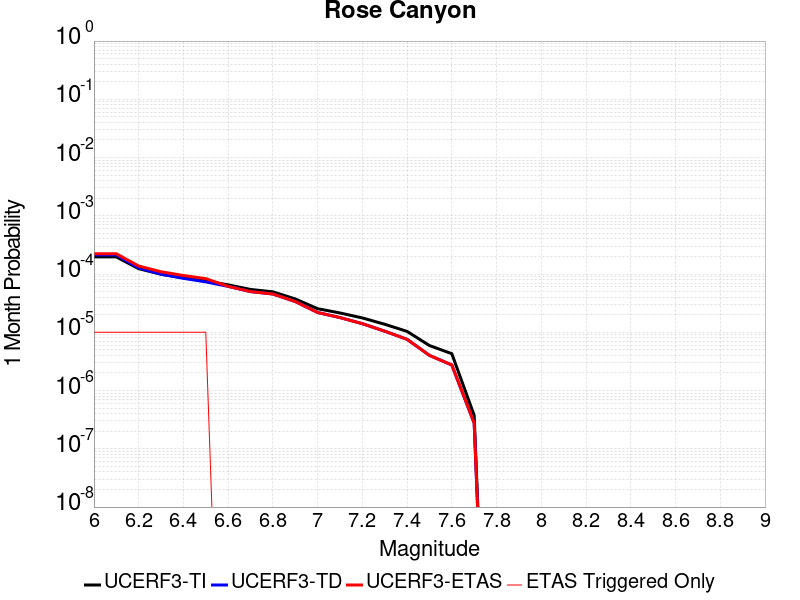 | 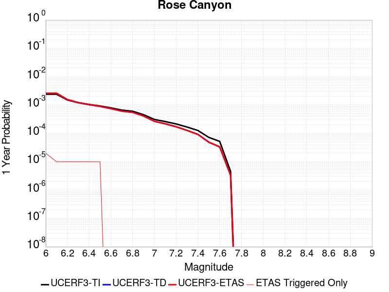 |  |

| Magnitude | 1 wk TI Prob | 1 wk TD Prob | 1 wk ETAS Prob | 1 wk ETAS/TD Gain | 1 wk ETAS Triggered Only | 1 mo TI Prob | 1 mo TD Prob | 1 mo ETAS Prob | 1 mo ETAS/TD Gain | 1 mo ETAS Triggered Only | 1 yr TI Prob | 1 yr TD Prob | 1 yr ETAS Prob | 1 yr ETAS/TD Gain | 1 yr ETAS Triggered Only | 10 yr TI Prob | 10 yr TD Prob | 10 yr ETAS Prob | 10 yr ETAS/TD Gain | 10 yr ETAS Triggered Only |
|-----|-----|-----|-----|-----|-----|-----|-----|-----|-----|-----|-----|-----|-----|-----|-----|-----|-----|-----|-----|-----|
| 6.0 | 4.5923203E-5 | 4.9788014E-5 | 4.9788014E-5 | 1.0 | 0.0 | 1.9679888E-4 | 2.1336111E-4 | 2.2335898E-4 | 1.0468589 | 1.0E-5 | 0.0023933933 | 0.0025947844 | 0.0026147326 | 1.0076878 | 2.0E-5 | 0.023677798 | 0.025677606 | 0.02571658 | 1.0015178 | 4.0E-5 |
| 6.1 | 4.5923203E-5 | 4.9788014E-5 | 4.9788014E-5 | 1.0 | 0.0 | 1.9679888E-4 | 2.1336111E-4 | 2.2335898E-4 | 1.0468589 | 1.0E-5 | 0.0023933933 | 0.0025947844 | 0.0026047584 | 1.0038439 | 1.0E-5 | 0.023677798 | 0.025677606 | 0.025706837 | 1.0011383 | 3.0E-5 |
| 6.2 | 2.8844734E-5 | 2.973638E-5 | 2.973638E-5 | 1.0 | 0.0 | 1.2361443E-4 | 1.274356E-4 | 1.3743433E-4 | 1.078461 | 1.0E-5 | 0.0015039665 | 0.0015504593 | 0.0015604438 | 1.0064397 | 1.0E-5 | 0.0149382865 | 0.015409305 | 0.015428997 | 1.0012779 | 2.0E-5 |
| 6.3 | 2.3171577E-5 | 2.3227845E-5 | 2.3227845E-5 | 1.0 | 0.0 | 9.9302975E-5 | 9.954419E-5 | 1.09543194E-4 | 1.1004479 | 1.0E-5 | 0.0012083431 | 0.0012112902 | 0.0012212781 | 1.0082457 | 1.0E-5 | 0.012017938 | 0.012056646 | 0.012066525 | 1.0008194 | 1.0E-5 |
| 6.4 | 2.0066604E-5 | 1.9707251E-5 | 1.9707251E-5 | 1.0 | 0.0 | 8.599689E-5 | 8.445697E-5 | 9.445613E-5 | 1.1183935 | 1.0E-5 | 0.0010465092 | 0.0010277887 | 0.0010377784 | 1.0097196 | 1.0E-5 | 0.010415946 | 0.010238266 | 0.010248163 | 1.0009668 | 1.0E-5 |
| 6.5 | 1.776989E-5 | 1.7137463E-5 | 1.7137463E-5 | 1.0 | 0.0 | 7.615444E-5 | 7.3444244E-5 | 8.344351E-5 | 1.1361477 | 1.0E-5 | 9.267859E-4 | 8.9382386E-4 | 9.038149E-4 | 1.0111779 | 1.0E-5 | 0.009229303 | 0.008908412 | 0.008918324 | 1.0011126 | 1.0E-5 |
| 6.6 | 1.5227364E-5 | 1.4346652E-5 | 1.4346652E-5 | 1.0 | 0.0 | 6.52585E-5 | 6.1484236E-5 | 6.1484236E-5 | 1.0 | 0.0 | 7.942326E-4 | 7.483186E-4 | 7.483186E-4 | 1.0 | 0.0 | 0.007914 | 0.007462183 | 0.007462183 | 1.0 | 0.0 |
| 6.7 | 1.2703898E-5 | 1.16745105E-5 | 1.16745105E-5 | 1.0 | 0.0 | 5.4444143E-5 | 5.003268E-5 | 5.003268E-5 | 1.0 | 0.0 | 6.626558E-4 | 6.089819E-4 | 6.089819E-4 | 1.0 | 0.0 | 0.006606833 | 0.0060757245 | 0.0060757245 | 1.0 | 0.0 |
| 6.8 | 1.1554917E-5 | 1.0610374E-5 | 1.0610374E-5 | 1.0 | 0.0 | 4.9520135E-5 | 4.547226E-5 | 4.547226E-5 | 1.0 | 0.0 | 6.0274085E-4 | 5.534882E-4 | 5.534882E-4 | 1.0 | 0.0 | 0.0060110865 | 0.0055231047 | 0.0055231047 | 1.0 | 0.0 |
| 6.9 | 8.732078E-6 | 7.881992E-6 | 7.881992E-6 | 1.0 | 0.0 | 3.7422655E-5 | 3.3779546E-5 | 3.3779546E-5 | 1.0 | 0.0 | 4.5552556E-4 | 4.111913E-4 | 4.111913E-4 | 1.0 | 0.0 | 0.0045459294 | 0.004105137 | 0.004105137 | 1.0 | 0.0 |
| 7.0 | 5.9337494E-6 | 5.1078046E-6 | 5.1078046E-6 | 1.0 | 0.0 | 2.5430107E-5 | 2.1890408E-5 | 2.1890408E-5 | 1.0 | 0.0 | 3.0956755E-4 | 2.6648326E-4 | 2.6648326E-4 | 1.0 | 0.0 | 0.0030913667 | 0.0026616526 | 0.0026616526 | 1.0 | 0.0 |
| 7.1 | 5.013409E-6 | 4.1776366E-6 | 4.1776366E-6 | 1.0 | 0.0 | 2.1485863E-5 | 1.7904034E-5 | 1.7904034E-5 | 1.0 | 0.0 | 2.6155898E-4 | 2.1795991E-4 | 2.1795991E-4 | 1.0 | 0.0 | 0.0026125133 | 0.0021774732 | 0.0021774732 | 1.0 | 0.0 |
| 7.2 | 4.120763E-6 | 3.2823436E-6 | 3.2823436E-6 | 1.0 | 0.0 | 1.7660293E-5 | 1.4067112E-5 | 1.4067112E-5 | 1.0 | 0.0 | 2.1499286E-4 | 1.7125372E-4 | 1.7125372E-4 | 1.0 | 0.0 | 0.0021478499 | 0.001711227 | 0.001711227 | 1.0 | 0.0 |
| 7.3 | 3.2081239E-6 | 2.4406936E-6 | 2.4406936E-6 | 1.0 | 0.0 | 1.374903E-5 | 1.0460074E-5 | 1.0460074E-5 | 1.0 | 0.0 | 1.6738157E-4 | 1.2734403E-4 | 1.2734403E-4 | 1.0 | 0.0 | 0.0016725556 | 0.0012727176 | 0.0012727176 | 1.0 | 0.0 |
| 7.4 | 2.4194755E-6 | 1.7681823E-6 | 1.7681823E-6 | 1.0 | 0.0 | 1.0369139E-5 | 7.577902E-6 | 7.577902E-6 | 1.0 | 0.0 | 1.2623696E-4 | 9.2257105E-5 | 9.2257105E-5 | 1.0 | 0.0 | 0.0012616527 | 9.221934E-4 | 9.221934E-4 | 1.0 | 0.0 |
| 7.5 | 1.3842889E-6 | 9.379397E-7 | 9.379397E-7 | 1.0 | 0.0 | 5.9326535E-6 | 4.0197356E-6 | 4.0197356E-6 | 1.0 | 0.0 | 7.222766E-5 | 4.893922E-5 | 4.893922E-5 | 1.0 | 0.0 | 7.220419E-4 | 4.8928795E-4 | 4.8928795E-4 | 1.0 | 0.0 |
| 7.6 | 1.0021575E-6 | 6.412061E-7 | 6.412061E-7 | 1.0 | 0.0 | 4.2949537E-6 | 2.7480235E-6 | 2.7480235E-6 | 1.0 | 0.0 | 5.2289808E-5 | 3.3456694E-5 | 3.3456694E-5 | 1.0 | 0.0 | 5.2277505E-4 | 3.345187E-4 | 3.345187E-4 | 1.0 | 0.0 |
| 7.7 | 8.7620116E-8 | 6.4495445E-8 | 6.4495445E-8 | 1.0 | 0.0 | 3.7551473E-7 | 2.7640903E-7 | 2.7640903E-7 | 1.0 | 0.0 | 4.5718825E-6 | 3.365275E-6 | 3.365275E-6 | 1.0 | 0.0 | 4.5717883E-5 | 3.3652268E-5 | 3.3652268E-5 | 1.0 | 0.0 |

## Bullion Mountains
*[(top)](#table-of-contents)*

| 1 Week | 1 Month | 1 Year | 10 Year |
|-----|-----|-----|-----|
|  |  | 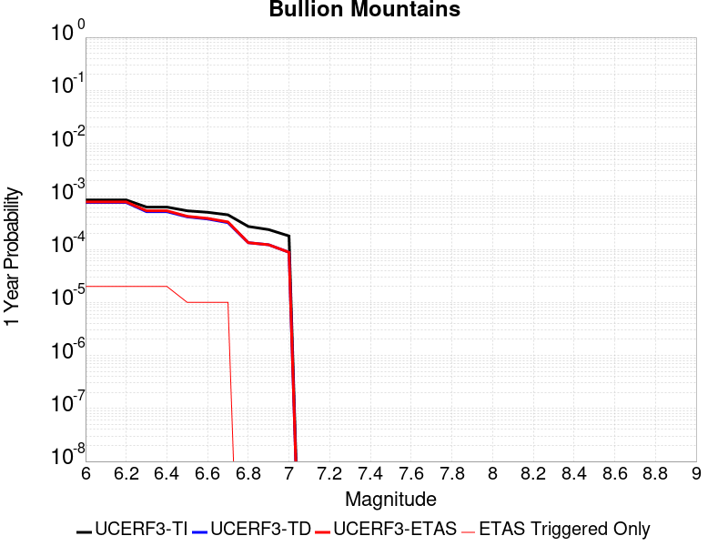 |  |

| Magnitude | 1 wk TI Prob | 1 wk TD Prob | 1 wk ETAS Prob | 1 wk ETAS/TD Gain | 1 wk ETAS Triggered Only | 1 mo TI Prob | 1 mo TD Prob | 1 mo ETAS Prob | 1 mo ETAS/TD Gain | 1 mo ETAS Triggered Only | 1 yr TI Prob | 1 yr TD Prob | 1 yr ETAS Prob | 1 yr ETAS/TD Gain | 1 yr ETAS Triggered Only | 10 yr TI Prob | 10 yr TD Prob | 10 yr ETAS Prob | 10 yr ETAS/TD Gain | 10 yr ETAS Triggered Only |
|-----|-----|-----|-----|-----|-----|-----|-----|-----|-----|-----|-----|-----|-----|-----|-----|-----|-----|-----|-----|-----|
| 6.0 | 1.6420427E-5 | 1.46936045E-5 | 1.46936045E-5 | 1.0 | 0.0 | 7.037136E-5 | 6.297129E-5 | 6.297129E-5 | 1.0 | 0.0 | 8.5643446E-4 | 7.6644414E-4 | 7.864288E-4 | 1.0260745 | 2.0E-5 | 0.008531413 | 0.0076418016 | 0.007681496 | 1.0051944 | 4.0E-5 |
| 6.1 | 1.6420427E-5 | 1.46936045E-5 | 1.46936045E-5 | 1.0 | 0.0 | 7.037136E-5 | 6.297129E-5 | 6.297129E-5 | 1.0 | 0.0 | 8.5643446E-4 | 7.6644414E-4 | 7.864288E-4 | 1.0260745 | 2.0E-5 | 0.008531413 | 0.0076418016 | 0.007681496 | 1.0051944 | 4.0E-5 |
| 6.2 | 1.6420427E-5 | 1.46936045E-5 | 1.46936045E-5 | 1.0 | 0.0 | 7.037136E-5 | 6.297129E-5 | 6.297129E-5 | 1.0 | 0.0 | 8.5643446E-4 | 7.6644414E-4 | 7.864288E-4 | 1.0260745 | 2.0E-5 | 0.008531413 | 0.0076418016 | 0.007681496 | 1.0051944 | 4.0E-5 |
| 6.3 | 1.2046778E-5 | 9.863383E-6 | 9.863383E-6 | 1.0 | 0.0 | 5.1628023E-5 | 4.2271084E-5 | 4.2271084E-5 | 1.0 | 0.0 | 6.283899E-4 | 5.145521E-4 | 5.3454185E-4 | 1.0388488 | 2.0E-5 | 0.0062661595 | 0.005135889 | 0.0051557864 | 1.0038742 | 2.0E-5 |
| 6.4 | 1.2046778E-5 | 9.863383E-6 | 9.863383E-6 | 1.0 | 0.0 | 5.1628023E-5 | 4.2271084E-5 | 4.2271084E-5 | 1.0 | 0.0 | 6.283899E-4 | 5.145521E-4 | 5.3454185E-4 | 1.0388488 | 2.0E-5 | 0.0062661595 | 0.005135889 | 0.0051557864 | 1.0038742 | 2.0E-5 |
| 6.5 | 1.0244343E-5 | 7.880321E-6 | 7.880321E-6 | 1.0 | 0.0 | 4.390359E-5 | 3.3772485E-5 | 3.3772485E-5 | 1.0 | 0.0 | 5.343951E-4 | 4.1112312E-4 | 4.21119E-4 | 1.0243136 | 1.0E-5 | 0.005331118 | 0.004105657 | 0.004115616 | 1.0024257 | 1.0E-5 |
| 6.6 | 9.605408E-6 | 7.178295E-6 | 7.178295E-6 | 1.0 | 0.0 | 4.1165385E-5 | 3.0763873E-5 | 3.0763873E-5 | 1.0 | 0.0 | 5.010733E-4 | 3.7450614E-4 | 3.845024E-4 | 1.0266918 | 1.0E-5 | 0.00499945 | 0.0037407477 | 0.0037507103 | 1.0026633 | 1.0E-5 |
| 6.7 | 8.60418E-6 | 6.124703E-6 | 6.124703E-6 | 1.0 | 0.0 | 3.687454E-5 | 2.6248572E-5 | 2.6248572E-5 | 1.0 | 0.0 | 4.48855E-4 | 3.19549E-4 | 3.295458E-4 | 1.0312841 | 1.0E-5 | 0.004479495 | 0.0031928073 | 0.0032027755 | 1.0031221 | 1.0E-5 |
| 6.8 | 5.187994E-6 | 2.563536E-6 | 2.563536E-6 | 1.0 | 0.0 | 2.223407E-5 | 1.098656E-5 | 1.098656E-5 | 1.0 | 0.0 | 2.7066618E-4 | 1.3375714E-4 | 1.3375714E-4 | 1.0 | 0.0 | 0.0027033675 | 0.001337158 | 0.001337158 | 1.0 | 0.0 |
| 6.9 | 4.5302368E-6 | 2.3446362E-6 | 2.3446362E-6 | 1.0 | 0.0 | 1.9415156E-5 | 1.0048425E-5 | 1.0048425E-5 | 1.0 | 0.0 | 2.3635388E-4 | 1.2233667E-4 | 1.2233667E-4 | 1.0 | 0.0 | 0.0023610266 | 0.0012230824 | 0.0012230824 | 1.0 | 0.0 |
| 7.0 | 3.431668E-6 | 1.6884884E-6 | 1.6884884E-6 | 1.0 | 0.0 | 1.4707065E-5 | 7.2363787E-6 | 7.2363787E-6 | 1.0 | 0.0 | 1.7904381E-4 | 8.810291E-5 | 8.810291E-5 | 1.0 | 0.0 | 0.0017889962 | 8.810291E-4 | 8.810291E-4 | 1.0 | 0.0 |

## Camp Rock 2011
*[(top)](#table-of-contents)*

| 1 Week | 1 Month | 1 Year | 10 Year |
|-----|-----|-----|-----|
|  |  |  | 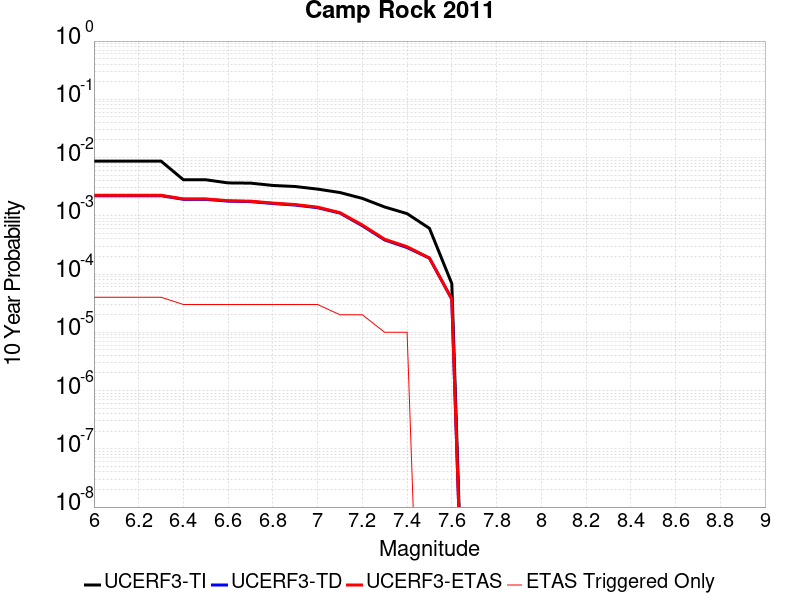 |

| Magnitude | 1 wk TI Prob | 1 wk TD Prob | 1 wk ETAS Prob | 1 wk ETAS/TD Gain | 1 wk ETAS Triggered Only | 1 mo TI Prob | 1 mo TD Prob | 1 mo ETAS Prob | 1 mo ETAS/TD Gain | 1 mo ETAS Triggered Only | 1 yr TI Prob | 1 yr TD Prob | 1 yr ETAS Prob | 1 yr ETAS/TD Gain | 1 yr ETAS Triggered Only | 10 yr TI Prob | 10 yr TD Prob | 10 yr ETAS Prob | 10 yr ETAS/TD Gain | 10 yr ETAS Triggered Only |
|-----|-----|-----|-----|-----|-----|-----|-----|-----|-----|-----|-----|-----|-----|-----|-----|-----|-----|-----|-----|-----|
| 6.0 | 1.6710783E-5 | 4.2506153E-6 | 4.2506153E-6 | 1.0 | 0.0 | 7.161568E-5 | 1.8216799E-5 | 1.8216799E-5 | 1.0 | 0.0 | 8.7157206E-4 | 2.2176749E-4 | 2.3176527E-4 | 1.0450823 | 1.0E-5 | 0.008681616 | 0.0022155147 | 0.002255426 | 1.0180146 | 4.0E-5 |
| 6.1 | 1.6710783E-5 | 4.2506153E-6 | 4.2506153E-6 | 1.0 | 0.0 | 7.161568E-5 | 1.8216799E-5 | 1.8216799E-5 | 1.0 | 0.0 | 8.7157206E-4 | 2.2176749E-4 | 2.3176527E-4 | 1.0450823 | 1.0E-5 | 0.008681616 | 0.0022155147 | 0.002255426 | 1.0180146 | 4.0E-5 |
| 6.2 | 1.6710783E-5 | 4.2506153E-6 | 4.2506153E-6 | 1.0 | 0.0 | 7.161568E-5 | 1.8216799E-5 | 1.8216799E-5 | 1.0 | 0.0 | 8.7157206E-4 | 2.2176749E-4 | 2.3176527E-4 | 1.0450823 | 1.0E-5 | 0.008681616 | 0.0022155147 | 0.002255426 | 1.0180146 | 4.0E-5 |
| 6.3 | 1.6710783E-5 | 4.2506153E-6 | 4.2506153E-6 | 1.0 | 0.0 | 7.161568E-5 | 1.8216799E-5 | 1.8216799E-5 | 1.0 | 0.0 | 8.7157206E-4 | 2.2176749E-4 | 2.3176527E-4 | 1.0450823 | 1.0E-5 | 0.008681616 | 0.0022155147 | 0.002255426 | 1.0180146 | 4.0E-5 |
| 6.4 | 7.982846E-6 | 3.6824015E-6 | 3.6824015E-6 | 1.0 | 0.0 | 3.421175E-5 | 1.5781627E-5 | 1.5781627E-5 | 1.0 | 0.0 | 4.1644843E-4 | 1.9212472E-4 | 2.0212278E-4 | 1.0520395 | 1.0E-5 | 0.0041566887 | 0.001919621 | 0.0019495634 | 1.015598 | 3.0E-5 |
| 6.5 | 7.982846E-6 | 3.6824015E-6 | 3.6824015E-6 | 1.0 | 0.0 | 3.421175E-5 | 1.5781627E-5 | 1.5781627E-5 | 1.0 | 0.0 | 4.1644843E-4 | 1.9212472E-4 | 2.0212278E-4 | 1.0520395 | 1.0E-5 | 0.0041566887 | 0.001919621 | 0.0019495634 | 1.015598 | 3.0E-5 |
| 6.6 | 7.048869E-6 | 3.4246566E-6 | 3.4246566E-6 | 1.0 | 0.0 | 3.0209088E-5 | 1.4677019E-5 | 1.4677019E-5 | 1.0 | 0.0 | 3.677336E-4 | 1.7867837E-4 | 1.8867658E-4 | 1.0559565 | 1.0E-5 | 0.0036712566 | 0.0017853788 | 0.0018153252 | 1.0167731 | 3.0E-5 |
| 6.7 | 6.987307E-6 | 3.3626309E-6 | 3.3626309E-6 | 1.0 | 0.0 | 2.9945259E-5 | 1.4411197E-5 | 1.4411197E-5 | 1.0 | 0.0 | 3.6452254E-4 | 1.754425E-4 | 1.8544076E-4 | 1.0569887 | 1.0E-5 | 0.0036392517 | 0.0017530712 | 0.0017830186 | 1.0170828 | 3.0E-5 |
| 6.8 | 6.3737602E-6 | 3.1181867E-6 | 3.1181867E-6 | 1.0 | 0.0 | 2.731583E-5 | 1.336359E-5 | 1.336359E-5 | 1.0 | 0.0 | 3.3251947E-4 | 1.6268986E-4 | 1.7268823E-4 | 1.0614567 | 1.0E-5 | 0.0033202237 | 0.0016257361 | 0.0016556873 | 1.0184232 | 3.0E-5 |
| 6.9 | 6.112211E-6 | 2.9333833E-6 | 2.9333833E-6 | 1.0 | 0.0 | 2.6194928E-5 | 1.2571583E-5 | 1.2571583E-5 | 1.0 | 0.0 | 3.1887658E-4 | 1.5304856E-4 | 1.6304702E-4 | 1.0653287 | 1.0E-5 | 0.003184194 | 0.0015294593 | 0.0015594134 | 1.0195848 | 3.0E-5 |
| 7.0 | 5.5140117E-6 | 2.642159E-6 | 2.642159E-6 | 1.0 | 0.0 | 2.3631264E-5 | 1.132349E-5 | 1.132349E-5 | 1.0 | 0.0 | 2.8767265E-4 | 1.3785502E-4 | 1.4785364E-4 | 1.07253 | 1.0E-5 | 0.0028730053 | 0.0013777204 | 0.001407679 | 1.0217451 | 3.0E-5 |
| 7.1 | 4.8151105E-6 | 2.134469E-6 | 2.134469E-6 | 1.0 | 0.0 | 2.0636026E-5 | 9.147693E-6 | 9.147693E-6 | 1.0 | 0.0 | 2.5121463E-4 | 1.113677E-4 | 1.113677E-4 | 1.0 | 0.0 | 0.0025093083 | 0.0011131408 | 0.0011331185 | 1.0179472 | 2.0E-5 |
| 7.2 | 3.818335E-6 | 1.2938895E-6 | 1.2938895E-6 | 1.0 | 0.0 | 1.6364189E-5 | 5.545229E-6 | 5.545229E-6 | 1.0 | 0.0 | 1.9921579E-4 | 6.751116E-5 | 6.751116E-5 | 1.0 | 0.0 | 0.0019903728 | 6.749147E-4 | 6.949012E-4 | 1.0296134 | 2.0E-5 |
| 7.3 | 2.7166698E-6 | 7.3846985E-7 | 7.3846985E-7 | 1.0 | 0.0 | 1.1642818E-5 | 3.1648672E-6 | 3.1648672E-6 | 1.0 | 0.0 | 1.4174209E-4 | 3.8531598E-5 | 3.8531598E-5 | 1.0 | 0.0 | 0.0014165172 | 3.8525116E-4 | 3.952473E-4 | 1.0259471 | 1.0E-5 |
| 7.4 | 2.0893426E-6 | 5.46272E-7 | 5.46272E-7 | 1.0 | 0.0 | 8.954295E-6 | 2.3411637E-6 | 2.3411637E-6 | 1.0 | 0.0 | 1.0901308E-4 | 2.85033E-5 | 2.85033E-5 | 1.0 | 0.0 | 0.0010895962 | 2.84997E-4 | 2.9499413E-4 | 1.035078 | 1.0E-5 |
| 7.5 | 1.1681728E-6 | 3.60355E-7 | 3.60355E-7 | 1.0 | 0.0 | 5.0064455E-6 | 1.5443777E-6 | 1.5443777E-6 | 1.0 | 0.0 | 6.0951766E-5 | 1.880264E-5 | 1.880264E-5 | 1.0 | 0.0 | 6.093505E-4 | 1.8801096E-4 | 1.8801096E-4 | 1.0 | 0.0 |
| 7.6 | 1.3154387E-7 | 7.120354E-8 | 7.120354E-8 | 1.0 | 0.0 | 5.6375933E-7 | 3.0515798E-7 | 3.0515798E-7 | 1.0 | 0.0 | 6.863748E-6 | 3.7152938E-6 | 3.7152938E-6 | 1.0 | 0.0 | 6.863536E-5 | 3.7152477E-5 | 3.7152477E-5 | 1.0 | 0.0 |

## Big Pine (Central)
*[(top)](#table-of-contents)*

| 1 Week | 1 Month | 1 Year | 10 Year |
|-----|-----|-----|-----|
|  |  |  |  |

| Magnitude | 1 wk TI Prob | 1 wk TD Prob | 1 wk ETAS Prob | 1 wk ETAS/TD Gain | 1 wk ETAS Triggered Only | 1 mo TI Prob | 1 mo TD Prob | 1 mo ETAS Prob | 1 mo ETAS/TD Gain | 1 mo ETAS Triggered Only | 1 yr TI Prob | 1 yr TD Prob | 1 yr ETAS Prob | 1 yr ETAS/TD Gain | 1 yr ETAS Triggered Only | 10 yr TI Prob | 10 yr TD Prob | 10 yr ETAS Prob | 10 yr ETAS/TD Gain | 10 yr ETAS Triggered Only |
|-----|-----|-----|-----|-----|-----|-----|-----|-----|-----|-----|-----|-----|-----|-----|-----|-----|-----|-----|-----|-----|
| 6.0 | 1.2706755E-5 | 1.4253915E-5 | 1.4253915E-5 | 1.0 | 0.0 | 5.4456385E-5 | 6.108698E-5 | 6.108698E-5 | 1.0 | 0.0 | 6.628048E-4 | 7.435168E-4 | 7.5350935E-4 | 1.0134395 | 1.0E-5 | 0.006608314 | 0.0074153 | 0.007455003 | 1.0053543 | 4.0E-5 |
| 6.1 | 8.342579E-6 | 9.513769E-6 | 9.513769E-6 | 1.0 | 0.0 | 3.5753423E-5 | 4.0772782E-5 | 4.0772782E-5 | 1.0 | 0.0 | 4.3521097E-4 | 4.963173E-4 | 4.963173E-4 | 1.0 | 0.0 | 0.0043435963 | 0.004955623 | 0.004965573 | 1.002008 | 1.0E-5 |
| 6.2 | 6.923899E-6 | 7.9700285E-6 | 7.9700285E-6 | 1.0 | 0.0 | 2.9673516E-5 | 3.415693E-5 | 3.415693E-5 | 1.0 | 0.0 | 3.6121515E-4 | 4.158005E-4 | 4.158005E-4 | 1.0 | 0.0 | 0.003606286 | 0.0041535124 | 0.004163471 | 1.0023977 | 1.0E-5 |
| 6.3 | 2.728396E-6 | 3.426823E-6 | 3.426823E-6 | 1.0 | 0.0 | 1.1693074E-5 | 1.4686307E-5 | 1.4686307E-5 | 1.0 | 0.0 | 1.4235388E-4 | 1.7879199E-4 | 1.7879199E-4 | 1.0 | 0.0 | 0.0014226272 | 0.0017879676 | 0.0017879676 | 1.0 | 0.0 |
| 6.4 | 2.7136944E-6 | 3.4111156E-6 | 3.4111156E-6 | 1.0 | 0.0 | 1.1630066E-5 | 1.461899E-5 | 1.461899E-5 | 1.0 | 0.0 | 1.4158686E-4 | 1.7797253E-4 | 1.7797253E-4 | 1.0 | 0.0 | 0.0014149669 | 0.0017797862 | 0.0017797862 | 1.0 | 0.0 |
| 6.5 | 2.6971882E-6 | 3.3934596E-6 | 3.3934596E-6 | 1.0 | 0.0 | 1.1559327E-5 | 1.4543321E-5 | 1.4543321E-5 | 1.0 | 0.0 | 1.4072572E-4 | 1.7705142E-4 | 1.7705142E-4 | 1.0 | 0.0 | 0.0014063664 | 0.0017705898 | 0.0017705898 | 1.0 | 0.0 |
| 6.6 | 2.669092E-6 | 3.363478E-6 | 3.363478E-6 | 1.0 | 0.0 | 1.1438916E-5 | 1.4414831E-5 | 1.4414831E-5 | 1.0 | 0.0 | 1.3925991E-4 | 1.7548731E-4 | 1.7548731E-4 | 1.0 | 0.0 | 0.0013917267 | 0.0017549734 | 0.0017549734 | 1.0 | 0.0 |
| 6.7 | 2.6408059E-6 | 3.333502E-6 | 3.333502E-6 | 1.0 | 0.0 | 1.1317691E-5 | 1.4286364E-5 | 1.4286364E-5 | 1.0 | 0.0 | 1.3778417E-4 | 1.7392347E-4 | 1.7392347E-4 | 1.0 | 0.0 | 0.0013769877 | 0.0017393596 | 0.0017393596 | 1.0 | 0.0 |
| 6.8 | 2.1786943E-6 | 2.8569455E-6 | 2.8569455E-6 | 1.0 | 0.0 | 9.337228E-6 | 1.2243999E-5 | 1.2243999E-5 | 1.0 | 0.0 | 1.1367482E-4 | 1.4906122E-4 | 1.4906122E-4 | 1.0 | 0.0 | 0.0011361669 | 0.0014910849 | 0.0014910849 | 1.0 | 0.0 |
| 6.9 | 1.4411696E-6 | 2.0709006E-6 | 2.0709006E-6 | 1.0 | 0.0 | 6.1764263E-6 | 8.8752595E-6 | 8.8752595E-6 | 1.0 | 0.0 | 7.51954E-5 | 1.08051194E-4 | 1.08051194E-4 | 1.0 | 0.0 | 7.5169955E-4 | 0.0010814145 | 0.0010814145 | 1.0 | 0.0 |
| 7.0 | 1.0073411E-6 | 1.5564054E-6 | 1.5564054E-6 | 1.0 | 0.0 | 4.317169E-6 | 6.670293E-6 | 6.670293E-6 | 1.0 | 0.0 | 5.2560266E-5 | 8.120794E-5 | 8.120794E-5 | 1.0 | 0.0 | 5.2547833E-4 | 8.131994E-4 | 8.131994E-4 | 1.0 | 0.0 |
| 7.1 | 8.947104E-7 | 1.4323633E-6 | 1.4323633E-6 | 1.0 | 0.0 | 3.834468E-6 | 6.1386863E-6 | 6.1386863E-6 | 1.0 | 0.0 | 4.6683643E-5 | 7.47361E-5 | 7.47361E-5 | 1.0 | 0.0 | 4.6673836E-4 | 7.4852613E-4 | 7.4852613E-4 | 1.0 | 0.0 |
| 7.2 | 5.215166E-7 | 1.0131406E-6 | 1.0131406E-6 | 1.0 | 0.0 | 2.2350691E-6 | 4.342024E-6 | 4.342024E-6 | 1.0 | 0.0 | 2.7211627E-5 | 5.2862906E-5 | 5.2862906E-5 | 1.0 | 0.0 | 2.7208295E-4 | 5.299097E-4 | 5.299097E-4 | 1.0 | 0.0 |
| 7.3 | 4.4024807E-7 | 9.238731E-7 | 9.238731E-7 | 1.0 | 0.0 | 1.8867761E-6 | 3.95945E-6 | 3.95945E-6 | 1.0 | 0.0 | 2.2971257E-5 | 4.8205282E-5 | 4.8205282E-5 | 1.0 | 0.0 | 2.2968883E-4 | 4.8335444E-4 | 4.8335444E-4 | 1.0 | 0.0 |
| 7.4 | 3.6130905E-7 | 8.3770703E-7 | 8.3770703E-7 | 1.0 | 0.0 | 1.5484665E-6 | 3.5901685E-6 | 3.5901685E-6 | 1.0 | 0.0 | 1.8852415E-5 | 4.3709464E-5 | 4.3709464E-5 | 1.0 | 0.0 | 1.8850817E-4 | 4.3840526E-4 | 4.3840526E-4 | 1.0 | 0.0 |
| 7.5 | 3.408184E-7 | 8.126289E-7 | 8.126289E-7 | 1.0 | 0.0 | 1.4606494E-6 | 3.482691E-6 | 3.482691E-6 | 1.0 | 0.0 | 1.7783263E-5 | 4.2400978E-5 | 4.2400978E-5 | 1.0 | 0.0 | 1.778184E-4 | 4.2530405E-4 | 4.2530405E-4 | 1.0 | 0.0 |
| 7.6 | 3.1428627E-7 | 7.749099E-7 | 7.749099E-7 | 1.0 | 0.0 | 1.3469405E-6 | 3.3210383E-6 | 3.3210383E-6 | 1.0 | 0.0 | 1.6398877E-5 | 4.043293E-5 | 4.043293E-5 | 1.0 | 0.0 | 1.6397667E-4 | 4.0560216E-4 | 4.0560216E-4 | 1.0 | 0.0 |
| 7.7 | 1.7972785E-7 | 5.0911257E-7 | 5.0911257E-7 | 1.0 | 0.0 | 7.70262E-7 | 2.1819092E-6 | 2.1819092E-6 | 1.0 | 0.0 | 9.377899E-6 | 2.6564432E-5 | 2.6564432E-5 | 1.0 | 0.0 | 9.377503E-5 | 2.669669E-4 | 2.669669E-4 | 1.0 | 0.0 |
| 7.8 | 4.9230927E-8 | 1.2012349E-7 | 1.2012349E-7 | 1.0 | 0.0 | 2.1098968E-7 | 5.148149E-7 | 5.148149E-7 | 1.0 | 0.0 | 2.5687964E-6 | 6.2678546E-6 | 6.2678546E-6 | 1.0 | 0.0 | 2.5687666E-5 | 6.311565E-5 | 6.311565E-5 | 1.0 | 0.0 |
| 7.9 | 3.6805972E-9 | 4.1177284E-9 | 4.1177284E-9 | 1.0 | 0.0 | 1.5773987E-8 | 1.7647407E-8 | 1.7647407E-8 | 1.0 | 0.0 | 1.9204828E-7 | 2.1485715E-7 | 2.1485715E-7 | 1.0 | 0.0 | 1.920481E-6 | 2.196581E-6 | 2.196581E-6 | 1.0 | 0.0 |

## Tin Mountain
*[(top)](#table-of-contents)*

| 1 Week | 1 Month | 1 Year | 10 Year |
|-----|-----|-----|-----|
|  |  |  |  |

| Magnitude | 1 wk TI Prob | 1 wk TD Prob | 1 wk ETAS Prob | 1 wk ETAS/TD Gain | 1 wk ETAS Triggered Only | 1 mo TI Prob | 1 mo TD Prob | 1 mo ETAS Prob | 1 mo ETAS/TD Gain | 1 mo ETAS Triggered Only | 1 yr TI Prob | 1 yr TD Prob | 1 yr ETAS Prob | 1 yr ETAS/TD Gain | 1 yr ETAS Triggered Only | 10 yr TI Prob | 10 yr TD Prob | 10 yr ETAS Prob | 10 yr ETAS/TD Gain | 10 yr ETAS Triggered Only |
|-----|-----|-----|-----|-----|-----|-----|-----|-----|-----|-----|-----|-----|-----|-----|-----|-----|-----|-----|-----|-----|
| 6.0 | 4.083776E-6 | 4.1816297E-6 | 1.4181588E-5 | 3.391402 | 1.0E-5 | 1.750178E-5 | 1.792117E-5 | 2.7920989E-5 | 1.5579894 | 1.0E-5 | 2.1306332E-4 | 2.181721E-4 | 2.5816337E-4 | 1.1833014 | 4.0E-5 | 0.0021285915 | 0.002179945 | 0.0022198576 | 1.0183091 | 4.0E-5 |
| 6.1 | 4.083776E-6 | 4.1816297E-6 | 1.4181588E-5 | 3.391402 | 1.0E-5 | 1.750178E-5 | 1.792117E-5 | 2.7920989E-5 | 1.5579894 | 1.0E-5 | 2.1306332E-4 | 2.181721E-4 | 2.5816337E-4 | 1.1833014 | 4.0E-5 | 0.0021285915 | 0.002179945 | 0.0022198576 | 1.0183091 | 4.0E-5 |
| 6.2 | 4.083776E-6 | 4.1816297E-6 | 1.4181588E-5 | 3.391402 | 1.0E-5 | 1.750178E-5 | 1.792117E-5 | 2.7920989E-5 | 1.5579894 | 1.0E-5 | 2.1306332E-4 | 2.181721E-4 | 2.5816337E-4 | 1.1833014 | 4.0E-5 | 0.0021285915 | 0.002179945 | 0.0022198576 | 1.0183091 | 4.0E-5 |
| 6.3 | 4.083776E-6 | 4.1816297E-6 | 1.4181588E-5 | 3.391402 | 1.0E-5 | 1.750178E-5 | 1.792117E-5 | 2.7920989E-5 | 1.5579894 | 1.0E-5 | 2.1306332E-4 | 2.181721E-4 | 2.5816337E-4 | 1.1833014 | 4.0E-5 | 0.0021285915 | 0.002179945 | 0.0022198576 | 1.0183091 | 4.0E-5 |
| 6.4 | 4.083776E-6 | 4.1816297E-6 | 1.4181588E-5 | 3.391402 | 1.0E-5 | 1.750178E-5 | 1.792117E-5 | 2.7920989E-5 | 1.5579894 | 1.0E-5 | 2.1306332E-4 | 2.181721E-4 | 2.5816337E-4 | 1.1833014 | 4.0E-5 | 0.0021285915 | 0.002179945 | 0.0022198576 | 1.0183091 | 4.0E-5 |
| 6.5 | 2.3143427E-6 | 2.3732134E-6 | 1.237319E-5 | 5.213686 | 1.0E-5 | 9.9185745E-6 | 1.0170879E-5 | 2.0170777E-5 | 1.9831891 | 1.0E-5 | 1.2075195E-4 | 1.238242E-4 | 1.4382172E-4 | 1.1614994 | 2.0E-5 | 0.0012068636 | 0.0012376279 | 0.0012576032 | 1.01614 | 2.0E-5 |
| 6.6 | 2.3143427E-6 | 2.3732134E-6 | 1.237319E-5 | 5.213686 | 1.0E-5 | 9.9185745E-6 | 1.0170879E-5 | 2.0170777E-5 | 1.9831891 | 1.0E-5 | 1.2075195E-4 | 1.238242E-4 | 1.4382172E-4 | 1.1614994 | 2.0E-5 | 0.0012068636 | 0.0012376279 | 0.0012576032 | 1.01614 | 2.0E-5 |
| 6.7 | 1.7029532E-6 | 1.7498364E-6 | 1.1749819E-5 | 6.71481 | 1.0E-5 | 7.2983503E-6 | 7.4992804E-6 | 1.7499206E-5 | 2.3334513 | 1.0E-5 | 8.885379E-5 | 9.130045E-5 | 1.1129862E-4 | 1.2190369 | 2.0E-5 | 8.881827E-4 | 9.1268204E-4 | 9.326638E-4 | 1.0218934 | 2.0E-5 |
| 6.8 | 1.2914646E-6 | 1.3299749E-6 | 1.3299749E-6 | 1.0 | 0.0 | 5.534837E-6 | 5.6998824E-6 | 5.6998824E-6 | 1.0 | 0.0 | 6.738455E-5 | 6.93943E-5 | 6.93943E-5 | 1.0 | 0.0 | 6.736412E-4 | 6.9376966E-4 | 6.9376966E-4 | 1.0 | 0.0 |
| 6.9 | 5.8708974E-7 | 6.1172324E-7 | 6.1172324E-7 | 1.0 | 0.0 | 2.5160964E-6 | 2.6216685E-6 | 2.6216685E-6 | 1.0 | 0.0 | 3.0633044E-5 | 3.191839E-5 | 3.191839E-5 | 1.0 | 0.0 | 3.0628822E-4 | 3.1914216E-4 | 3.1914216E-4 | 1.0 | 0.0 |
| 7.0 | 4.6248786E-7 | 4.8322164E-7 | 4.8322164E-7 | 1.0 | 0.0 | 1.9820893E-6 | 2.0709485E-6 | 2.0709485E-6 | 1.0 | 0.0 | 2.413167E-5 | 2.5213543E-5 | 2.5213543E-5 | 1.0 | 0.0 | 2.412905E-4 | 2.5211053E-4 | 2.5211053E-4 | 1.0 | 0.0 |
| 7.1 | 3.804606E-7 | 3.9873248E-7 | 3.9873248E-7 | 1.0 | 0.0 | 1.6305444E-6 | 1.7088526E-6 | 1.7088526E-6 | 1.0 | 0.0 | 1.9851697E-5 | 2.0805115E-5 | 2.0805115E-5 | 1.0 | 0.0 | 1.9849923E-4 | 2.0803504E-4 | 2.0803504E-4 | 1.0 | 0.0 |
| 7.2 | 3.5864858E-7 | 3.761857E-7 | 3.761857E-7 | 1.0 | 0.0 | 1.5370645E-6 | 1.6122236E-6 | 1.6122236E-6 | 1.0 | 0.0 | 1.87136E-5 | 1.962868E-5 | 1.962868E-5 | 1.0 | 0.0 | 1.8712023E-4 | 1.9627277E-4 | 1.9627277E-4 | 1.0 | 0.0 |
| 7.3 | 3.342063E-7 | 3.5065074E-7 | 3.5065074E-7 | 1.0 | 0.0 | 1.4323119E-6 | 1.5027882E-6 | 1.5027882E-6 | 1.0 | 0.0 | 1.7438259E-5 | 1.8296327E-5 | 1.8296327E-5 | 1.0 | 0.0 | 1.743689E-4 | 1.829515E-4 | 1.829515E-4 | 1.0 | 0.0 |
| 7.4 | 2.971242E-7 | 3.1167232E-7 | 3.1167232E-7 | 1.0 | 0.0 | 1.2733886E-6 | 1.3357381E-6 | 1.3357381E-6 | 1.0 | 0.0 | 1.5503398E-5 | 1.6262524E-5 | 1.6262524E-5 | 1.0 | 0.0 | 1.5502315E-4 | 1.6261662E-4 | 1.6261662E-4 | 1.0 | 0.0 |
| 7.5 | 1.4326713E-7 | 1.5013191E-7 | 1.5013191E-7 | 1.0 | 0.0 | 6.140018E-7 | 6.434225E-7 | 6.434225E-7 | 1.0 | 0.0 | 7.4754466E-6 | 7.833669E-6 | 7.833669E-6 | 1.0 | 0.0 | 7.475195E-5 | 7.8336685E-5 | 7.8336685E-5 | 1.0 | 0.0 |

## Blue Cut
*[(top)](#table-of-contents)*

| 1 Week | 1 Month | 1 Year | 10 Year |
|-----|-----|-----|-----|
| 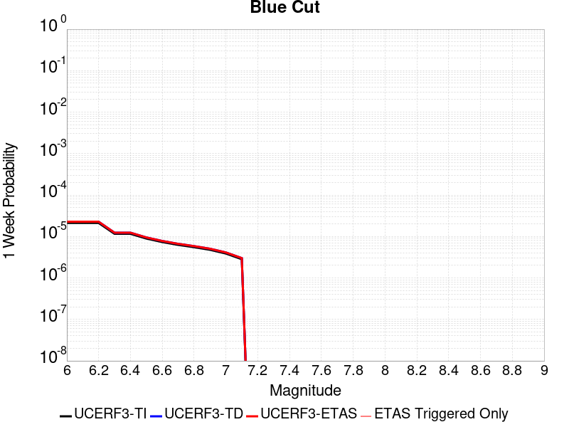 |  |  |  |

| Magnitude | 1 wk TI Prob | 1 wk TD Prob | 1 wk ETAS Prob | 1 wk ETAS/TD Gain | 1 wk ETAS Triggered Only | 1 mo TI Prob | 1 mo TD Prob | 1 mo ETAS Prob | 1 mo ETAS/TD Gain | 1 mo ETAS Triggered Only | 1 yr TI Prob | 1 yr TD Prob | 1 yr ETAS Prob | 1 yr ETAS/TD Gain | 1 yr ETAS Triggered Only | 10 yr TI Prob | 10 yr TD Prob | 10 yr ETAS Prob | 10 yr ETAS/TD Gain | 10 yr ETAS Triggered Only |
|-----|-----|-----|-----|-----|-----|-----|-----|-----|-----|-----|-----|-----|-----|-----|-----|-----|-----|-----|-----|-----|
| 6.0 | 2.1227985E-5 | 2.2721058E-5 | 2.2721058E-5 | 1.0 | 0.0 | 9.097391E-5 | 9.7372664E-5 | 1.07371685E-4 | 1.1026882 | 1.0E-5 | 0.0011070445 | 0.0011849254 | 0.0011949136 | 1.0084294 | 1.0E-5 | 0.011015458 | 0.011791918 | 0.011831447 | 1.0033522 | 4.0E-5 |
| 6.1 | 2.1227985E-5 | 2.2721058E-5 | 2.2721058E-5 | 1.0 | 0.0 | 9.097391E-5 | 9.7372664E-5 | 1.07371685E-4 | 1.1026882 | 1.0E-5 | 0.0011070445 | 0.0011849254 | 0.0011949136 | 1.0084294 | 1.0E-5 | 0.011015458 | 0.011791918 | 0.011831447 | 1.0033522 | 4.0E-5 |
| 6.2 | 2.1227985E-5 | 2.2721058E-5 | 2.2721058E-5 | 1.0 | 0.0 | 9.097391E-5 | 9.7372664E-5 | 1.07371685E-4 | 1.1026882 | 1.0E-5 | 0.0011070445 | 0.0011849254 | 0.0011949136 | 1.0084294 | 1.0E-5 | 0.011015458 | 0.011791918 | 0.011831447 | 1.0033522 | 4.0E-5 |
| 6.3 | 1.1613981E-5 | 1.2354273E-5 | 1.2354273E-5 | 1.0 | 0.0 | 4.9773254E-5 | 5.2945878E-5 | 6.294535E-5 | 1.1888621 | 1.0E-5 | 6.0582085E-4 | 6.4443785E-4 | 6.544314E-4 | 1.0155073 | 1.0E-5 | 0.0060417196 | 0.0064269383 | 0.0064567453 | 1.0046378 | 3.0E-5 |
| 6.4 | 1.1613981E-5 | 1.2354273E-5 | 1.2354273E-5 | 1.0 | 0.0 | 4.9773254E-5 | 5.2945878E-5 | 6.294535E-5 | 1.1888621 | 1.0E-5 | 6.0582085E-4 | 6.4443785E-4 | 6.544314E-4 | 1.0155073 | 1.0E-5 | 0.0060417196 | 0.0064269383 | 0.0064567453 | 1.0046378 | 3.0E-5 |
| 6.5 | 8.931326E-6 | 9.482143E-6 | 9.482143E-6 | 1.0 | 0.0 | 3.8276554E-5 | 4.063717E-5 | 5.0636765E-5 | 1.2460701 | 1.0E-5 | 4.6591737E-4 | 4.946544E-4 | 5.046495E-4 | 1.0202061 | 1.0E-5 | 0.0046494175 | 0.0049364427 | 0.004966295 | 1.0060472 | 3.0E-5 |
| 6.6 | 7.345353E-6 | 7.790717E-6 | 7.790717E-6 | 1.0 | 0.0 | 3.1479703E-5 | 3.3388405E-5 | 4.3388074E-5 | 1.2994951 | 1.0E-5 | 3.83198E-4 | 4.0643604E-4 | 4.1643198E-4 | 1.0245941 | 1.0E-5 | 0.0038253788 | 0.0040577184 | 0.0040875967 | 1.0073633 | 3.0E-5 |
| 6.7 | 6.2775666E-6 | 6.655521E-6 | 6.655521E-6 | 1.0 | 0.0 | 2.690358E-5 | 2.8523391E-5 | 2.8523391E-5 | 1.0 | 0.0 | 3.2750185E-4 | 3.4722447E-4 | 3.4722447E-4 | 1.0 | 0.0 | 0.0032701963 | 0.0034675605 | 0.003487491 | 1.0057478 | 2.0E-5 |
| 6.8 | 5.5234095E-6 | 5.855438E-6 | 5.855438E-6 | 1.0 | 0.0 | 2.367154E-5 | 2.5094532E-5 | 2.5094532E-5 | 1.0 | 0.0 | 2.8816288E-4 | 3.054904E-4 | 3.054904E-4 | 1.0 | 0.0 | 0.002877895 | 0.0030514204 | 0.00306139 | 1.0032672 | 1.0E-5 |
| 6.9 | 4.7780054E-6 | 5.0657036E-6 | 5.0657036E-6 | 1.0 | 0.0 | 2.0477004E-5 | 2.1710017E-5 | 2.1710017E-5 | 1.0 | 0.0 | 2.4927902E-4 | 2.6429445E-4 | 2.6429445E-4 | 1.0 | 0.0 | 0.0024899957 | 0.0026404934 | 0.002650467 | 1.0037771 | 1.0E-5 |
| 7.0 | 3.883171E-6 | 4.1187186E-6 | 4.1187186E-6 | 1.0 | 0.0 | 1.6642054E-5 | 1.7651571E-5 | 1.7651571E-5 | 1.0 | 0.0 | 2.0259817E-4 | 2.1489357E-4 | 2.1489357E-4 | 1.0 | 0.0 | 0.0020241356 | 0.0021475335 | 0.0021575121 | 1.0046465 | 1.0E-5 |
| 7.1 | 2.8358215E-6 | 3.0098872E-6 | 3.0098872E-6 | 1.0 | 0.0 | 1.2153464E-5 | 1.289949E-5 | 1.289949E-5 | 1.0 | 0.0 | 1.4795837E-4 | 1.5704655E-4 | 1.5704655E-4 | 1.0 | 0.0 | 0.001478599 | 0.001570001 | 0.0015799853 | 1.0063595 | 1.0E-5 |

## Hayward (So) 2011 CFM
*[(top)](#table-of-contents)*

| 1 Week | 1 Month | 1 Year | 10 Year |
|-----|-----|-----|-----|
|  | 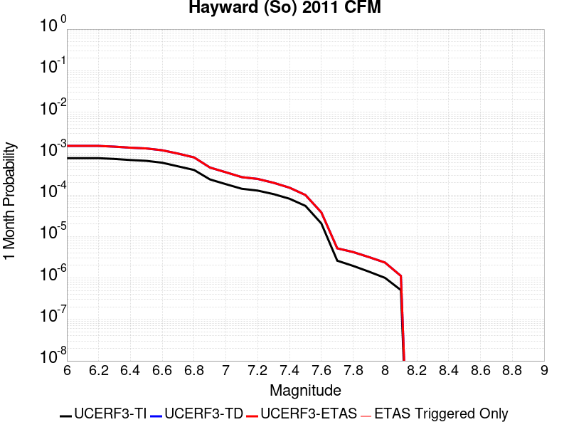 |  |  |

| Magnitude | 1 wk TI Prob | 1 wk TD Prob | 1 wk ETAS Prob | 1 wk ETAS/TD Gain | 1 wk ETAS Triggered Only | 1 mo TI Prob | 1 mo TD Prob | 1 mo ETAS Prob | 1 mo ETAS/TD Gain | 1 mo ETAS Triggered Only | 1 yr TI Prob | 1 yr TD Prob | 1 yr ETAS Prob | 1 yr ETAS/TD Gain | 1 yr ETAS Triggered Only | 10 yr TI Prob | 10 yr TD Prob | 10 yr ETAS Prob | 10 yr ETAS/TD Gain | 10 yr ETAS Triggered Only |
|-----|-----|-----|-----|-----|-----|-----|-----|-----|-----|-----|-----|-----|-----|-----|-----|-----|-----|-----|-----|-----|
| 6.0 | 1.8091932E-4 | 3.5736256E-4 | 3.5736256E-4 | 1.0 | 0.0 | 7.751381E-4 | 0.0015306649 | 0.0015306649 | 1.0 | 0.0 | 0.00939654 | 0.018479016 | 0.018479016 | 1.0 | 0.0 | 0.090090066 | 0.16685034 | 0.16687535 | 1.0001498 | 3.0E-5 |
| 6.1 | 1.8091932E-4 | 3.5736256E-4 | 3.5736256E-4 | 1.0 | 0.0 | 7.751381E-4 | 0.0015306649 | 0.0015306649 | 1.0 | 0.0 | 0.00939654 | 0.018479016 | 0.018479016 | 1.0 | 0.0 | 0.090090066 | 0.16685034 | 0.16687535 | 1.0001498 | 3.0E-5 |
| 6.2 | 1.8091932E-4 | 3.5736256E-4 | 3.5736256E-4 | 1.0 | 0.0 | 7.751381E-4 | 0.0015306649 | 0.0015306649 | 1.0 | 0.0 | 0.00939654 | 0.018479016 | 0.018479016 | 1.0 | 0.0 | 0.090090066 | 0.16685034 | 0.16687535 | 1.0001498 | 3.0E-5 |
| 6.3 | 1.7322872E-4 | 3.4292502E-4 | 3.4292502E-4 | 1.0 | 0.0 | 7.4219756E-4 | 0.0014688604 | 0.0014688604 | 1.0 | 0.0 | 0.0089988755 | 0.017739011 | 0.017739011 | 1.0 | 0.0 | 0.08643075 | 0.1607845 | 0.16080967 | 1.0001566 | 3.0E-5 |
| 6.4 | 1.6334097E-4 | 3.2373497E-4 | 3.2373497E-4 | 1.0 | 0.0 | 6.998449E-4 | 0.0013867066 | 0.0013867066 | 1.0 | 0.0 | 0.008487372 | 0.016754469 | 0.016754469 | 1.0 | 0.0 | 0.081704415 | 0.15267134 | 0.15269674 | 1.0001665 | 3.0E-5 |
| 6.5 | 1.5600289E-4 | 3.1047518E-4 | 3.1047518E-4 | 1.0 | 0.0 | 6.684125E-4 | 0.0013299378 | 0.0013299378 | 1.0 | 0.0 | 0.008107598 | 0.016073672 | 0.016073672 | 1.0 | 0.0 | 0.078181036 | 0.14694619 | 0.14697179 | 1.0001742 | 3.0E-5 |
| 6.6 | 1.4046066E-4 | 2.8060217E-4 | 2.8060217E-4 | 1.0 | 0.0 | 6.018354E-4 | 0.0012020333 | 0.0012020333 | 1.0 | 0.0 | 0.0073027555 | 0.014538055 | 0.014538055 | 1.0 | 0.0 | 0.07067384 | 0.13402991 | 0.13405588 | 1.0001938 | 3.0E-5 |
| 6.7 | 1.14696966E-4 | 2.3296075E-4 | 2.3296075E-4 | 1.0 | 0.0 | 4.914658E-4 | 9.980263E-4 | 9.980263E-4 | 1.0 | 0.0 | 0.0059671924 | 0.012084338 | 0.012084338 | 1.0 | 0.0 | 0.058094822 | 0.11284859 | 0.11286633 | 1.0001572 | 2.0E-5 |
| 6.8 | 9.3874296E-5 | 1.888177E-4 | 1.888177E-4 | 1.0 | 0.0 | 4.0225635E-4 | 8.0897147E-4 | 8.0897147E-4 | 1.0 | 0.0 | 0.0048864787 | 0.009805485 | 0.009805485 | 1.0 | 0.0 | 0.047804173 | 0.09268516 | 0.09269424 | 1.0000979 | 1.0E-5 |
| 6.9 | 5.551852E-5 | 1.0741493E-4 | 1.0741493E-4 | 1.0 | 0.0 | 2.3791482E-4 | 4.602691E-4 | 4.602691E-4 | 1.0 | 0.0 | 0.0028927654 | 0.005589497 | 0.005589497 | 1.0 | 0.0 | 0.028553981 | 0.05430026 | 0.05430972 | 1.0001742 | 1.0E-5 |
| 7.0 | 4.2662363E-5 | 8.255887E-5 | 8.255887E-5 | 1.0 | 0.0 | 1.8282588E-4 | 3.5377615E-4 | 3.5377615E-4 | 1.0 | 0.0 | 0.0022236328 | 0.0042987918 | 0.0042987918 | 1.0 | 0.0 | 0.022015138 | 0.04210857 | 0.042118147 | 1.0002275 | 1.0E-5 |
| 7.1 | 3.305886E-5 | 6.3096595E-5 | 6.3096595E-5 | 1.0 | 0.0 | 1.4167312E-4 | 2.7038605E-4 | 2.7038605E-4 | 1.0 | 0.0 | 0.0017235056 | 0.0032869999 | 0.0032869999 | 1.0 | 0.0 | 0.017101998 | 0.03248982 | 0.032499496 | 1.0002978 | 1.0E-5 |
| 7.2 | 2.9856887E-5 | 5.7087607E-5 | 5.7087607E-5 | 1.0 | 0.0 | 1.2795182E-4 | 2.4463833E-4 | 2.4463833E-4 | 1.0 | 0.0 | 0.0015567001 | 0.0029744203 | 0.0029744203 | 1.0 | 0.0 | 0.015458403 | 0.029489005 | 0.029498711 | 1.0003291 | 1.0E-5 |
| 7.3 | 2.4559737E-5 | 4.605261E-5 | 4.605261E-5 | 1.0 | 0.0 | 1.0525176E-4 | 1.9735347E-4 | 1.9735347E-4 | 1.0 | 0.0 | 0.0012806869 | 0.0024001438 | 0.0024001438 | 1.0 | 0.0 | 0.012733313 | 0.023887435 | 0.023897195 | 1.0004086 | 1.0E-5 |
| 7.4 | 1.9002231E-5 | 3.5101173E-5 | 3.5101173E-5 | 1.0 | 0.0 | 8.143559E-5 | 1.5042498E-4 | 1.5042498E-4 | 1.0 | 0.0 | 9.910273E-4 | 0.0018298955 | 0.0018298955 | 1.0 | 0.0 | 0.009866194 | 0.018283712 | 0.018283712 | 1.0 | 0.0 |
| 7.5 | 1.2783333E-5 | 2.3369597E-5 | 2.3369597E-5 | 1.0 | 0.0 | 5.4784563E-5 | 1.0015161E-4 | 1.0015161E-4 | 1.0 | 0.0 | 6.667979E-4 | 0.0012186696 | 0.0012186696 | 1.0 | 0.0 | 0.006648007 | 0.012229102 | 0.012229102 | 1.0 | 0.0 |
| 7.6 | 4.8149627E-6 | 8.902628E-6 | 8.902628E-6 | 1.0 | 0.0 | 2.063539E-5 | 3.815357E-5 | 3.815357E-5 | 1.0 | 0.0 | 2.5120692E-4 | 4.644219E-4 | 4.644219E-4 | 1.0 | 0.0 | 0.0025092314 | 0.0046886466 | 0.0046886466 | 1.0 | 0.0 |
| 7.7 | 6.0838227E-7 | 1.2096127E-6 | 1.2096127E-6 | 1.0 | 0.0 | 2.6073499E-6 | 5.184044E-6 | 5.184044E-6 | 1.0 | 0.0 | 3.174402E-5 | 6.311391E-5 | 6.311391E-5 | 1.0 | 0.0 | 3.1739488E-4 | 6.548472E-4 | 6.548472E-4 | 1.0 | 0.0 |
| 7.8 | 4.5542808E-7 | 9.826696E-7 | 9.826696E-7 | 1.0 | 0.0 | 1.9518332E-6 | 4.2114343E-6 | 4.2114343E-6 | 1.0 | 0.0 | 2.376331E-5 | 5.1273008E-5 | 5.1273008E-5 | 1.0 | 0.0 | 2.3760769E-4 | 5.338075E-4 | 5.338075E-4 | 1.0 | 0.0 |
| 7.9 | 3.3016747E-7 | 7.4117384E-7 | 7.4117384E-7 | 1.0 | 0.0 | 1.4150027E-6 | 3.1764553E-6 | 3.1764553E-6 | 1.0 | 0.0 | 1.7227521E-5 | 3.867266E-5 | 3.867266E-5 | 1.0 | 0.0 | 1.7226185E-4 | 4.0053247E-4 | 4.0053247E-4 | 1.0 | 0.0 |
| 8.0 | 2.347038E-7 | 5.489257E-7 | 5.489257E-7 | 1.0 | 0.0 | 1.0058731E-6 | 2.3525365E-6 | 2.3525365E-6 | 1.0 | 0.0 | 1.2246436E-5 | 2.8641756E-5 | 2.8641756E-5 | 1.0 | 0.0 | 1.2245761E-4 | 2.944067E-4 | 2.944067E-4 | 1.0 | 0.0 |
| 8.1 | 1.18822804E-7 | 2.6138306E-7 | 2.6138306E-7 | 1.0 | 0.0 | 5.092405E-7 | 1.1202126E-6 | 1.1202126E-6 | 1.0 | 0.0 | 6.1999854E-6 | 1.3638503E-5 | 1.3638503E-5 | 1.0 | 0.0 | 6.199812E-5 | 1.3956647E-4 | 1.3956647E-4 | 1.0 | 0.0 |

## Cleghorn Pass
*[(top)](#table-of-contents)*

| 1 Week | 1 Month | 1 Year | 10 Year |
|-----|-----|-----|-----|
|  | 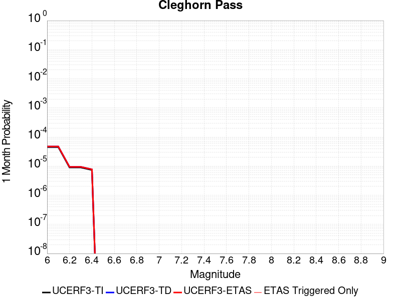 |  |  |

| Magnitude | 1 wk TI Prob | 1 wk TD Prob | 1 wk ETAS Prob | 1 wk ETAS/TD Gain | 1 wk ETAS Triggered Only | 1 mo TI Prob | 1 mo TD Prob | 1 mo ETAS Prob | 1 mo ETAS/TD Gain | 1 mo ETAS Triggered Only | 1 yr TI Prob | 1 yr TD Prob | 1 yr ETAS Prob | 1 yr ETAS/TD Gain | 1 yr ETAS Triggered Only | 10 yr TI Prob | 10 yr TD Prob | 10 yr ETAS Prob | 10 yr ETAS/TD Gain | 10 yr ETAS Triggered Only |
|-----|-----|-----|-----|-----|-----|-----|-----|-----|-----|-----|-----|-----|-----|-----|-----|-----|-----|-----|-----|-----|
| 6.0 | 1.0522846E-5 | 1.1041146E-5 | 1.1041146E-5 | 1.0 | 0.0 | 4.509713E-5 | 4.7318637E-5 | 4.7318637E-5 | 1.0 | 0.0 | 5.4891926E-4 | 5.7600474E-4 | 5.7600474E-4 | 1.0 | 0.0 | 0.0054756533 | 0.005750284 | 0.0057801115 | 1.0051872 | 3.0E-5 |
| 6.1 | 1.0522846E-5 | 1.1041146E-5 | 1.1041146E-5 | 1.0 | 0.0 | 4.509713E-5 | 4.7318637E-5 | 4.7318637E-5 | 1.0 | 0.0 | 5.4891926E-4 | 5.7600474E-4 | 5.7600474E-4 | 1.0 | 0.0 | 0.0054756533 | 0.005750284 | 0.0057801115 | 1.0051872 | 3.0E-5 |
| 6.2 | 2.1045846E-6 | 2.2083034E-6 | 2.2083034E-6 | 1.0 | 0.0 | 9.019617E-6 | 9.464146E-6 | 9.464146E-6 | 1.0 | 0.0 | 1.098083E-4 | 1.1522409E-4 | 1.1522409E-4 | 1.0 | 0.0 | 0.0010975406 | 0.0011520549 | 0.0011520549 | 1.0 | 0.0 |
| 6.3 | 2.1045846E-6 | 2.2083034E-6 | 2.2083034E-6 | 1.0 | 0.0 | 9.019617E-6 | 9.464146E-6 | 9.464146E-6 | 1.0 | 0.0 | 1.098083E-4 | 1.1522409E-4 | 1.1522409E-4 | 1.0 | 0.0 | 0.0010975406 | 0.0011520549 | 0.0011520549 | 1.0 | 0.0 |
| 6.4 | 1.7259927E-6 | 1.8109598E-6 | 1.8109598E-6 | 1.0 | 0.0 | 7.3970905E-6 | 7.761256E-6 | 7.761256E-6 | 1.0 | 0.0 | 9.005586E-5 | 9.449329E-5 | 9.449329E-5 | 1.0 | 0.0 | 9.001937E-4 | 9.449329E-4 | 9.449329E-4 | 1.0 | 0.0 |

## Great Valley 09 (Laguna Seca)
*[(top)](#table-of-contents)*

| 1 Week | 1 Month | 1 Year | 10 Year |
|-----|-----|-----|-----|
| 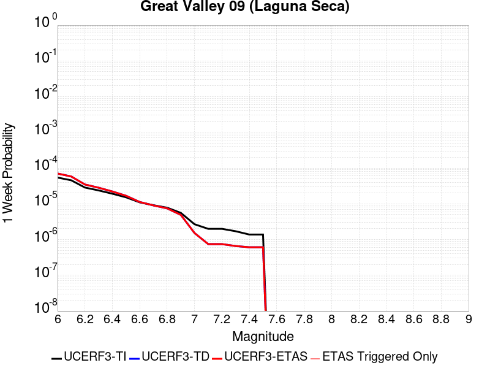 |  |  | 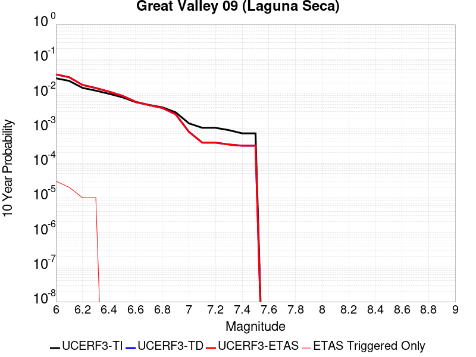 |

| Magnitude | 1 wk TI Prob | 1 wk TD Prob | 1 wk ETAS Prob | 1 wk ETAS/TD Gain | 1 wk ETAS Triggered Only | 1 mo TI Prob | 1 mo TD Prob | 1 mo ETAS Prob | 1 mo ETAS/TD Gain | 1 mo ETAS Triggered Only | 1 yr TI Prob | 1 yr TD Prob | 1 yr ETAS Prob | 1 yr ETAS/TD Gain | 1 yr ETAS Triggered Only | 10 yr TI Prob | 10 yr TD Prob | 10 yr ETAS Prob | 10 yr ETAS/TD Gain | 10 yr ETAS Triggered Only |
|-----|-----|-----|-----|-----|-----|-----|-----|-----|-----|-----|-----|-----|-----|-----|-----|-----|-----|-----|-----|-----|
| 6.0 | 5.4353277E-5 | 7.0522445E-5 | 7.0522445E-5 | 1.0 | 0.0 | 2.3292181E-4 | 3.0220623E-4 | 3.122032E-4 | 1.03308 | 1.0E-5 | 0.0028321352 | 0.0036731926 | 0.0036831559 | 1.0027124 | 1.0E-5 | 0.02796312 | 0.03612556 | 0.03615448 | 1.0008005 | 3.0E-5 |
| 6.1 | 4.5578287E-5 | 5.823676E-5 | 5.823676E-5 | 1.0 | 0.0 | 1.953209E-4 | 2.4956377E-4 | 2.595613E-4 | 1.0400599 | 1.0E-5 | 0.0023754383 | 0.0030342632 | 0.0030442327 | 1.0032856 | 1.0E-5 | 0.023502063 | 0.02992766 | 0.029947061 | 1.0006483 | 2.0E-5 |
| 6.2 | 2.8536782E-5 | 3.474441E-5 | 3.474441E-5 | 1.0 | 0.0 | 1.2229476E-4 | 1.488966E-4 | 1.588951E-4 | 1.0671507 | 1.0E-5 | 0.0014879217 | 0.001811268 | 0.00182125 | 1.005511 | 1.0E-5 | 0.014779986 | 0.01796253 | 0.01797235 | 1.0005467 | 1.0E-5 |
| 6.3 | 2.3698774E-5 | 2.821827E-5 | 2.821827E-5 | 1.0 | 0.0 | 1.01562226E-4 | 1.2093017E-4 | 1.3092897E-4 | 1.0826824 | 1.0E-5 | 0.0012358186 | 0.0014713865 | 0.0014813718 | 1.0067863 | 1.0E-5 | 0.012289686 | 0.014614772 | 0.014624625 | 1.0006742 | 1.0E-5 |
| 6.4 | 1.9191197E-5 | 2.212613E-5 | 2.212613E-5 | 1.0 | 0.0 | 8.2245395E-5 | 9.482308E-5 | 9.482308E-5 | 1.0 | 0.0 | 0.0010008777 | 0.0011539026 | 0.0011539026 | 1.0 | 0.0 | 0.009963818 | 0.011479452 | 0.011479452 | 1.0 | 0.0 |
| 6.5 | 1.5203241E-5 | 1.6803468E-5 | 1.6803468E-5 | 1.0 | 0.0 | 6.5155116E-5 | 7.2013056E-5 | 7.2013056E-5 | 1.0 | 0.0 | 7.9297484E-4 | 8.764382E-4 | 8.764382E-4 | 1.0 | 0.0 | 0.007901512 | 0.008731223 | 0.008731223 | 1.0 | 0.0 |
| 6.6 | 1.0984925E-5 | 1.1244301E-5 | 1.1244301E-5 | 1.0 | 0.0 | 4.70774E-5 | 4.8188995E-5 | 4.8188995E-5 | 1.0 | 0.0 | 5.730166E-4 | 5.865472E-4 | 5.865472E-4 | 1.0 | 0.0 | 0.005715413 | 0.005850388 | 0.005850388 | 1.0 | 0.0 |
| 6.7 | 9.134616E-6 | 9.02122E-6 | 9.02122E-6 | 1.0 | 0.0 | 3.9147766E-5 | 3.866181E-5 | 3.866181E-5 | 1.0 | 0.0 | 4.7651984E-4 | 4.7060824E-4 | 4.7060824E-4 | 1.0 | 0.0 | 0.004754993 | 0.0046963617 | 0.0046963617 | 1.0 | 0.0 |
| 6.8 | 7.785589E-6 | 7.4530335E-6 | 7.4530335E-6 | 1.0 | 0.0 | 3.3366385E-5 | 3.1941192E-5 | 3.1941192E-5 | 1.0 | 0.0 | 4.0616E-4 | 3.8881664E-4 | 3.8881664E-4 | 1.0 | 0.0 | 0.0040541845 | 0.0038815676 | 0.0038815676 | 1.0 | 0.0 |
| 6.9 | 5.579095E-6 | 4.8992083E-6 | 4.8992083E-6 | 1.0 | 0.0 | 2.3910188E-5 | 2.0996446E-5 | 2.0996446E-5 | 1.0 | 0.0 | 2.9106764E-4 | 2.5560314E-4 | 2.5560314E-4 | 1.0 | 0.0 | 0.002906867 | 0.0025532288 | 0.0025532288 | 1.0 | 0.0 |
| 7.0 | 2.6816688E-6 | 1.521809E-6 | 1.521809E-6 | 1.0 | 0.0 | 1.1492816E-5 | 6.522023E-6 | 6.522023E-6 | 1.0 | 0.0 | 1.3991605E-4 | 7.9402824E-5 | 7.9402824E-5 | 1.0 | 0.0 | 0.0013982799 | 7.9375325E-4 | 7.9375325E-4 | 1.0 | 0.0 |
| 7.1 | 1.9951021E-6 | 7.4548484E-7 | 7.4548484E-7 | 1.0 | 0.0 | 8.55041E-6 | 3.1949314E-6 | 3.1949314E-6 | 1.0 | 0.0 | 1.0409627E-4 | 3.8897637E-5 | 3.8897637E-5 | 1.0 | 0.0 | 0.0010404752 | 3.8891242E-4 | 3.8891242E-4 | 1.0 | 0.0 |
| 7.2 | 1.9951021E-6 | 7.4548484E-7 | 7.4548484E-7 | 1.0 | 0.0 | 8.55041E-6 | 3.1949314E-6 | 3.1949314E-6 | 1.0 | 0.0 | 1.0409627E-4 | 3.8897637E-5 | 3.8897637E-5 | 1.0 | 0.0 | 0.0010404752 | 3.8891242E-4 | 3.8891242E-4 | 1.0 | 0.0 |
| 7.3 | 1.7087556E-6 | 6.579735E-7 | 6.579735E-7 | 1.0 | 0.0 | 7.3232177E-6 | 2.8198835E-6 | 2.8198835E-6 | 1.0 | 0.0 | 8.915652E-5 | 3.433158E-5 | 3.433158E-5 | 1.0 | 0.0 | 8.9120766E-4 | 3.4326682E-4 | 3.4326682E-4 | 1.0 | 0.0 |
| 7.4 | 1.3804846E-6 | 6.0745566E-7 | 6.0745566E-7 | 1.0 | 0.0 | 5.916349E-6 | 2.6033792E-6 | 2.6033792E-6 | 1.0 | 0.0 | 7.2029165E-5 | 3.169572E-5 | 3.169572E-5 | 1.0 | 0.0 | 7.200583E-4 | 3.1691603E-4 | 3.1691603E-4 | 1.0 | 0.0 |
| 7.5 | 1.3804846E-6 | 6.0745566E-7 | 6.0745566E-7 | 1.0 | 0.0 | 5.916349E-6 | 2.6033792E-6 | 2.6033792E-6 | 1.0 | 0.0 | 7.2029165E-5 | 3.169572E-5 | 3.169572E-5 | 1.0 | 0.0 | 7.200583E-4 | 3.1691603E-4 | 3.1691603E-4 | 1.0 | 0.0 |

## San Jacinto (Stepovers Combined)
*[(top)](#table-of-contents)*

| 1 Week | 1 Month | 1 Year | 10 Year |
|-----|-----|-----|-----|
|  |  | 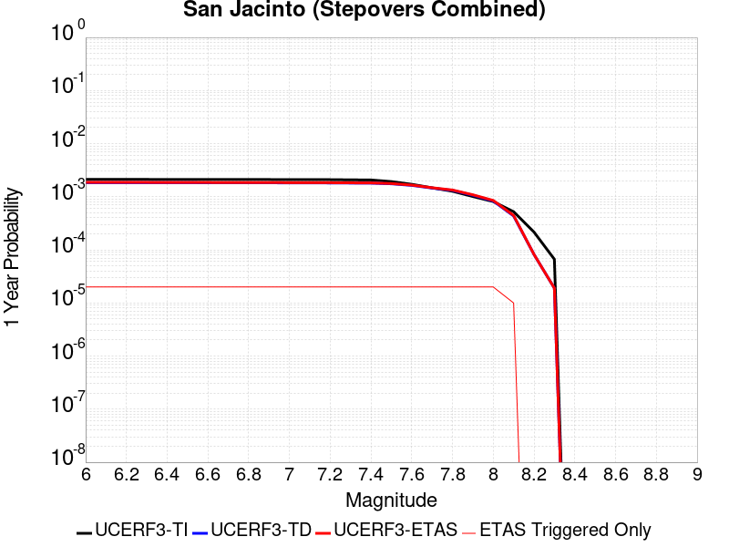 |  |

| Magnitude | 1 wk TI Prob | 1 wk TD Prob | 1 wk ETAS Prob | 1 wk ETAS/TD Gain | 1 wk ETAS Triggered Only | 1 mo TI Prob | 1 mo TD Prob | 1 mo ETAS Prob | 1 mo ETAS/TD Gain | 1 mo ETAS Triggered Only | 1 yr TI Prob | 1 yr TD Prob | 1 yr ETAS Prob | 1 yr ETAS/TD Gain | 1 yr ETAS Triggered Only | 10 yr TI Prob | 10 yr TD Prob | 10 yr ETAS Prob | 10 yr ETAS/TD Gain | 10 yr ETAS Triggered Only |
|-----|-----|-----|-----|-----|-----|-----|-----|-----|-----|-----|-----|-----|-----|-----|-----|-----|-----|-----|-----|-----|
| 6.0 | 4.0667746E-5 | 3.5380344E-5 | 3.5380344E-5 | 1.0 | 0.0 | 1.742787E-4 | 1.5162116E-4 | 1.6161965E-4 | 1.0659438 | 1.0E-5 | 0.0021197782 | 0.0018444263 | 0.0018643894 | 1.0108235 | 2.0E-5 | 0.020996714 | 0.01904263 | 0.019072058 | 1.0015454 | 3.0E-5 |
| 6.1 | 4.0667746E-5 | 3.5380344E-5 | 3.5380344E-5 | 1.0 | 0.0 | 1.742787E-4 | 1.5162116E-4 | 1.6161965E-4 | 1.0659438 | 1.0E-5 | 0.0021197782 | 0.0018444263 | 0.0018643894 | 1.0108235 | 2.0E-5 | 0.020996714 | 0.01904263 | 0.019072058 | 1.0015454 | 3.0E-5 |
| 6.2 | 4.0667746E-5 | 3.5380344E-5 | 3.5380344E-5 | 1.0 | 0.0 | 1.742787E-4 | 1.5162116E-4 | 1.6161965E-4 | 1.0659438 | 1.0E-5 | 0.0021197782 | 0.0018444263 | 0.0018643894 | 1.0108235 | 2.0E-5 | 0.020996714 | 0.01904263 | 0.019072058 | 1.0015454 | 3.0E-5 |
| 6.3 | 4.0667746E-5 | 3.5380344E-5 | 3.5380344E-5 | 1.0 | 0.0 | 1.742787E-4 | 1.5162116E-4 | 1.6161965E-4 | 1.0659438 | 1.0E-5 | 0.0021197782 | 0.0018444263 | 0.0018643894 | 1.0108235 | 2.0E-5 | 0.020996714 | 0.01904263 | 0.019072058 | 1.0015454 | 3.0E-5 |
| 6.4 | 4.0577226E-5 | 3.5252193E-5 | 3.5252193E-5 | 1.0 | 0.0 | 1.738908E-4 | 1.5107209E-4 | 1.6107058E-4 | 1.0661836 | 1.0E-5 | 0.0021150648 | 0.0018377536 | 0.0018577168 | 1.0108628 | 2.0E-5 | 0.020950472 | 0.01897718 | 0.01900661 | 1.0015508 | 3.0E-5 |
| 6.5 | 4.0577226E-5 | 3.5252193E-5 | 3.5252193E-5 | 1.0 | 0.0 | 1.738908E-4 | 1.5107209E-4 | 1.6107058E-4 | 1.0661836 | 1.0E-5 | 0.0021150648 | 0.0018377536 | 0.0018577168 | 1.0108628 | 2.0E-5 | 0.020950472 | 0.01897718 | 0.01900661 | 1.0015508 | 3.0E-5 |
| 6.6 | 4.053861E-5 | 3.5197518E-5 | 3.5197518E-5 | 1.0 | 0.0 | 1.7372532E-4 | 1.508378E-4 | 1.608363E-4 | 1.0662863 | 1.0E-5 | 0.0021130538 | 0.0018349059 | 0.0018548692 | 1.0108798 | 2.0E-5 | 0.020930743 | 0.01894925 | 0.018978681 | 1.0015532 | 3.0E-5 |
| 6.7 | 4.0516545E-5 | 3.5166573E-5 | 3.5166573E-5 | 1.0 | 0.0 | 1.7363077E-4 | 1.507052E-4 | 1.6070368E-4 | 1.0663447 | 1.0E-5 | 0.002111905 | 0.0018332949 | 0.0018532582 | 1.0108893 | 2.0E-5 | 0.020919468 | 0.018933441 | 0.018962875 | 1.0015545 | 3.0E-5 |
| 6.8 | 4.049434E-5 | 3.5138124E-5 | 3.5138124E-5 | 1.0 | 0.0 | 1.7353562E-4 | 1.5058329E-4 | 1.6058178E-4 | 1.0663984 | 1.0E-5 | 0.0021107488 | 0.0018318131 | 0.0018517765 | 1.0108981 | 2.0E-5 | 0.020908125 | 0.018918851 | 0.018948283 | 1.0015557 | 3.0E-5 |
| 6.9 | 4.046386E-5 | 3.510067E-5 | 3.510067E-5 | 1.0 | 0.0 | 1.73405E-4 | 1.504228E-4 | 1.6042129E-4 | 1.0664693 | 1.0E-5 | 0.0021091616 | 0.0018298625 | 0.0018498258 | 1.0109098 | 2.0E-5 | 0.020892553 | 0.018899618 | 0.018929051 | 1.0015574 | 3.0E-5 |
| 7.0 | 4.036382E-5 | 3.4981196E-5 | 3.4981196E-5 | 1.0 | 0.0 | 1.7297632E-4 | 1.4991082E-4 | 1.5990932E-4 | 1.0666963 | 1.0E-5 | 0.0021039525 | 0.0018236395 | 0.0018436031 | 1.0109471 | 2.0E-5 | 0.02084144 | 0.01883821 | 0.018867645 | 1.0015625 | 3.0E-5 |
| 7.1 | 4.0343282E-5 | 3.495965E-5 | 3.495965E-5 | 1.0 | 0.0 | 1.7288832E-4 | 1.4981849E-4 | 1.5981699E-4 | 1.0667374 | 1.0E-5 | 0.002102883 | 0.0018225173 | 0.0018424809 | 1.0109538 | 2.0E-5 | 0.020830948 | 0.018827083 | 0.018856518 | 1.0015634 | 3.0E-5 |
| 7.2 | 4.0257353E-5 | 3.4864024E-5 | 3.4864024E-5 | 1.0 | 0.0 | 1.725201E-4 | 1.494087E-4 | 1.5940722E-4 | 1.0669205 | 1.0E-5 | 0.0020984085 | 0.0018175367 | 0.0018375003 | 1.010984 | 2.0E-5 | 0.020787042 | 0.01877776 | 0.018807197 | 1.0015676 | 3.0E-5 |
| 7.3 | 3.9940667E-5 | 3.469128E-5 | 3.469128E-5 | 1.0 | 0.0 | 1.7116306E-4 | 1.4866845E-4 | 1.5866697E-4 | 1.0672537 | 1.0E-5 | 0.0020819185 | 0.0018085389 | 0.0018285027 | 1.0110387 | 2.0E-5 | 0.020625217 | 0.018686187 | 0.018715626 | 1.0015755 | 3.0E-5 |
| 7.4 | 3.9721202E-5 | 3.4576467E-5 | 3.4576467E-5 | 1.0 | 0.0 | 1.7022261E-4 | 1.4817646E-4 | 1.5817498E-4 | 1.0674771 | 1.0E-5 | 0.0020704903 | 0.0018025589 | 0.0018225228 | 1.0110754 | 2.0E-5 | 0.020513052 | 0.018625207 | 0.018654648 | 1.0015807 | 3.0E-5 |
| 7.5 | 3.7036873E-5 | 3.3641296E-5 | 3.3641296E-5 | 1.0 | 0.0 | 1.5871979E-4 | 1.4416903E-4 | 1.5416759E-4 | 1.069353 | 1.0E-5 | 0.0019307006 | 0.0017538477 | 0.0017738126 | 1.0113835 | 2.0E-5 | 0.019140124 | 0.018125426 | 0.018154882 | 1.0016252 | 3.0E-5 |
| 7.6 | 3.2940967E-5 | 3.141389E-5 | 3.141389E-5 | 1.0 | 0.0 | 1.4116794E-4 | 1.3462402E-4 | 1.4462267E-4 | 1.074271 | 1.0E-5 | 0.0017173645 | 0.0016378174 | 0.0016577847 | 1.0121914 | 2.0E-5 | 0.01704153 | 0.016954063 | 0.016983554 | 1.0017395 | 3.0E-5 |
| 7.7 | 2.8236149E-5 | 2.7977081E-5 | 2.7977081E-5 | 1.0 | 0.0 | 1.2100645E-4 | 1.1989627E-4 | 1.2989507E-4 | 1.0833955 | 1.0E-5 | 0.0014722579 | 0.0014587607 | 0.0014787315 | 1.0136902 | 2.0E-5 | 0.014625421 | 0.015163489 | 0.015193034 | 1.0019485 | 3.0E-5 |
| 7.8 | 2.4329287E-5 | 2.5297024E-5 | 2.5297024E-5 | 1.0 | 0.0 | 1.042642E-4 | 1.0841132E-4 | 1.1841023E-4 | 1.0922313 | 1.0E-5 | 0.0012686774 | 0.0013191095 | 0.0013390831 | 1.0151417 | 2.0E-5 | 0.012614589 | 0.013758943 | 0.013788531 | 1.0021504 | 3.0E-5 |
| 7.9 | 1.9370926E-5 | 2.0502179E-5 | 2.0502179E-5 | 1.0 | 0.0 | 8.301561E-5 | 8.7863526E-5 | 9.786265E-5 | 1.1138029 | 1.0E-5 | 0.0010102465 | 0.0010692142 | 0.0010891928 | 1.0186853 | 2.0E-5 | 0.0100566605 | 0.011241638 | 0.011271301 | 1.0026387 | 3.0E-5 |
| 8.0 | 1.5583017E-5 | 1.5954185E-5 | 1.5954185E-5 | 1.0 | 0.0 | 6.6782646E-5 | 6.837329E-5 | 7.837261E-5 | 1.146246 | 1.0E-5 | 8.127754E-4 | 8.321275E-4 | 8.521109E-4 | 1.0240148 | 2.0E-5 | 0.008098091 | 0.008817447 | 0.008837271 | 1.0022483 | 2.0E-5 |
| 8.1 | 1.0024873E-5 | 8.33189E-6 | 8.33189E-6 | 1.0 | 0.0 | 4.2963035E-5 | 3.5707613E-5 | 4.5707257E-5 | 1.2800423 | 1.0E-5 | 5.229494E-4 | 4.3465398E-4 | 4.4464963E-4 | 1.0229968 | 1.0E-5 | 0.0052172043 | 0.004674638 | 0.004684591 | 1.0021292 | 1.0E-5 |
| 8.2 | 4.142796E-6 | 1.5725606E-6 | 1.5725606E-6 | 1.0 | 0.0 | 1.775472E-5 | 6.739528E-6 | 6.739528E-6 | 1.0 | 0.0 | 2.1614227E-4 | 8.205069E-5 | 8.205069E-5 | 1.0 | 0.0 | 0.0021593217 | 9.520677E-4 | 9.520677E-4 | 1.0 | 0.0 |
| 8.3 | 1.2750878E-6 | 3.6436526E-7 | 3.6436526E-7 | 1.0 | 0.0 | 5.4646503E-6 | 1.5615645E-6 | 1.5615645E-6 | 1.0 | 0.0 | 6.653009E-5 | 1.9011886E-5 | 1.9011886E-5 | 1.0 | 0.0 | 6.6510175E-4 | 2.291941E-4 | 2.291941E-4 | 1.0 | 0.0 |

## San Clemente
*[(top)](#table-of-contents)*

| 1 Week | 1 Month | 1 Year | 10 Year |
|-----|-----|-----|-----|
|  |  | 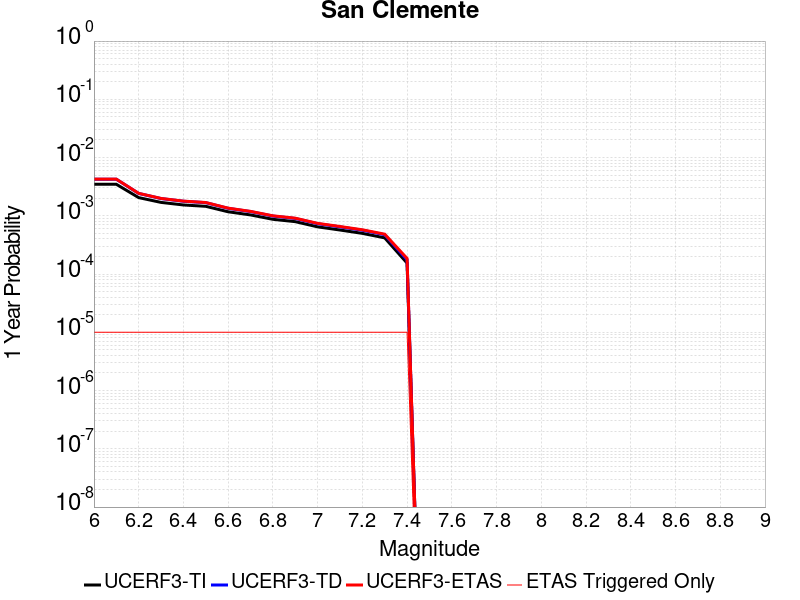 |  |

| Magnitude | 1 wk TI Prob | 1 wk TD Prob | 1 wk ETAS Prob | 1 wk ETAS/TD Gain | 1 wk ETAS Triggered Only | 1 mo TI Prob | 1 mo TD Prob | 1 mo ETAS Prob | 1 mo ETAS/TD Gain | 1 mo ETAS Triggered Only | 1 yr TI Prob | 1 yr TD Prob | 1 yr ETAS Prob | 1 yr ETAS/TD Gain | 1 yr ETAS Triggered Only | 10 yr TI Prob | 10 yr TD Prob | 10 yr ETAS Prob | 10 yr ETAS/TD Gain | 10 yr ETAS Triggered Only |
|-----|-----|-----|-----|-----|-----|-----|-----|-----|-----|-----|-----|-----|-----|-----|-----|-----|-----|-----|-----|-----|
| 6.0 | 6.681379E-5 | 8.165149E-5 | 8.165149E-5 | 1.0 | 0.0 | 2.8631336E-4 | 3.4989126E-4 | 3.4989126E-4 | 1.0 | 0.0 | 0.003480294 | 0.0042521846 | 0.004262142 | 1.0023417 | 1.0E-5 | 0.03426291 | 0.041764125 | 0.041792873 | 1.0006883 | 3.0E-5 |
| 6.1 | 6.681379E-5 | 8.165149E-5 | 8.165149E-5 | 1.0 | 0.0 | 2.8631336E-4 | 3.4989126E-4 | 3.4989126E-4 | 1.0 | 0.0 | 0.003480294 | 0.0042521846 | 0.004262142 | 1.0023417 | 1.0E-5 | 0.03426291 | 0.041764125 | 0.041792873 | 1.0006883 | 3.0E-5 |
| 6.2 | 3.9400576E-5 | 4.645981E-5 | 4.645981E-5 | 1.0 | 0.0 | 1.6884868E-4 | 1.990986E-4 | 1.990986E-4 | 1.0 | 0.0 | 0.0020537945 | 0.002421392 | 0.0024313675 | 1.0041199 | 1.0E-5 | 0.020349167 | 0.023956815 | 0.023976335 | 1.0008148 | 2.0E-5 |
| 6.3 | 3.2590255E-5 | 3.7934897E-5 | 3.7934897E-5 | 1.0 | 0.0 | 1.3966505E-4 | 1.6256815E-4 | 1.6256815E-4 | 1.0 | 0.0 | 0.0016990956 | 0.0019775007 | 0.0019874808 | 1.0050468 | 1.0E-5 | 0.01686163 | 0.019602833 | 0.019622441 | 1.0010003 | 2.0E-5 |
| 6.4 | 2.9454652E-5 | 3.4102788E-5 | 3.4102788E-5 | 1.0 | 0.0 | 1.2622811E-4 | 1.4614673E-4 | 1.4614673E-4 | 1.0 | 0.0 | 0.0015357438 | 0.0017779089 | 0.0017878911 | 1.0056146 | 1.0E-5 | 0.015251739 | 0.017640028 | 0.017659675 | 1.0011138 | 2.0E-5 |
| 6.5 | 2.790836E-5 | 3.225213E-5 | 3.225213E-5 | 1.0 | 0.0 | 1.1960178E-4 | 1.3821622E-4 | 1.3821622E-4 | 1.0 | 0.0 | 0.001455179 | 0.0016815085 | 0.0016914916 | 1.0059371 | 1.0E-5 | 0.014456868 | 0.016690874 | 0.01671054 | 1.0011783 | 2.0E-5 |
| 6.6 | 2.2492153E-5 | 2.5766192E-5 | 2.5766192E-5 | 1.0 | 0.0 | 9.639138E-5 | 1.1042192E-4 | 1.1042192E-4 | 1.0 | 0.0 | 0.0011729331 | 0.0013435725 | 0.0013535591 | 1.0074328 | 1.0E-5 | 0.011667615 | 0.013356212 | 0.013375944 | 1.0014775 | 2.0E-5 |
| 6.7 | 1.9862755E-5 | 2.26694E-5 | 2.26694E-5 | 1.0 | 0.0 | 8.512331E-5 | 9.715101E-5 | 9.715101E-5 | 1.0 | 0.0 | 0.0010358836 | 0.001182183 | 0.0011921712 | 1.008449 | 1.0E-5 | 0.010310682 | 0.011760236 | 0.01178 | 1.0016806 | 2.0E-5 |
| 6.8 | 1.6697575E-5 | 1.8980118E-5 | 1.8980118E-5 | 1.0 | 0.0 | 7.155907E-5 | 8.134088E-5 | 8.134088E-5 | 1.0 | 0.0 | 8.7088346E-4 | 9.898846E-4 | 9.998747E-4 | 1.0100921 | 1.0E-5 | 0.008674784 | 0.009855782 | 0.009875584 | 1.0020093 | 2.0E-5 |
| 6.9 | 1.5218415E-5 | 1.7271563E-5 | 1.7271563E-5 | 1.0 | 0.0 | 6.522015E-5 | 7.4018935E-5 | 7.4018935E-5 | 1.0 | 0.0 | 7.93766E-4 | 9.008167E-4 | 9.108077E-4 | 1.011091 | 1.0E-5 | 0.007909367 | 0.008972598 | 0.008992419 | 1.0022091 | 2.0E-5 |
| 7.0 | 1.2392958E-5 | 1.403474E-5 | 1.403474E-5 | 1.0 | 0.0 | 5.3111595E-5 | 6.014754E-5 | 6.014754E-5 | 1.0 | 0.0 | 6.4644177E-4 | 7.3205784E-4 | 7.420505E-4 | 1.0136502 | 1.0E-5 | 0.0064456454 | 0.00729725 | 0.007307177 | 1.0013604 | 1.0E-5 |
| 7.1 | 1.0934128E-5 | 1.2376652E-5 | 1.2376652E-5 | 1.0 | 0.0 | 4.6859706E-5 | 5.304176E-5 | 5.304176E-5 | 1.0 | 0.0 | 5.7036756E-4 | 6.455994E-4 | 6.5559294E-4 | 1.0154794 | 1.0E-5 | 0.0056890585 | 0.006437985 | 0.0064479206 | 1.0015433 | 1.0E-5 |
| 7.2 | 9.5798805E-6 | 1.08462655E-5 | 1.08462655E-5 | 1.0 | 0.0 | 4.1055984E-5 | 4.6483205E-5 | 4.6483205E-5 | 1.0 | 0.0 | 4.9974193E-4 | 5.6579325E-4 | 5.757876E-4 | 1.0176643 | 1.0E-5 | 0.0049861963 | 0.0056442516 | 0.0056541953 | 1.0017617 | 1.0E-5 |
| 7.3 | 8.0167365E-6 | 9.08504E-6 | 9.08504E-6 | 1.0 | 0.0 | 3.4356988E-5 | 3.8935344E-5 | 3.8935344E-5 | 1.0 | 0.0 | 4.1821605E-4 | 4.739418E-4 | 4.8393704E-4 | 1.0210897 | 1.0E-5 | 0.0041742986 | 0.004730013 | 0.004739966 | 1.0021042 | 1.0E-5 |
| 7.4 | 2.9581017E-6 | 3.362806E-6 | 3.362806E-6 | 1.0 | 0.0 | 1.2677518E-5 | 1.4411974E-5 | 1.4411974E-5 | 1.0 | 0.0 | 1.5433785E-4 | 1.754567E-4 | 1.8545495E-4 | 1.0569841 | 1.0E-5 | 0.001542307 | 0.0017536769 | 0.0017636594 | 1.0056924 | 1.0E-5 |

## Kern Canyon (North Kern) 2011
*[(top)](#table-of-contents)*

| 1 Week | 1 Month | 1 Year | 10 Year |
|-----|-----|-----|-----|
|  |  |  |  |

| Magnitude | 1 wk TI Prob | 1 wk TD Prob | 1 wk ETAS Prob | 1 wk ETAS/TD Gain | 1 wk ETAS Triggered Only | 1 mo TI Prob | 1 mo TD Prob | 1 mo ETAS Prob | 1 mo ETAS/TD Gain | 1 mo ETAS Triggered Only | 1 yr TI Prob | 1 yr TD Prob | 1 yr ETAS Prob | 1 yr ETAS/TD Gain | 1 yr ETAS Triggered Only | 10 yr TI Prob | 10 yr TD Prob | 10 yr ETAS Prob | 10 yr ETAS/TD Gain | 10 yr ETAS Triggered Only |
|-----|-----|-----|-----|-----|-----|-----|-----|-----|-----|-----|-----|-----|-----|-----|-----|-----|-----|-----|-----|-----|
| 6.0 | 6.6264497E-6 | 6.75748E-6 | 6.75748E-6 | 1.0 | 0.0 | 2.8398761E-5 | 2.8960352E-5 | 2.8960352E-5 | 1.0 | 0.0 | 3.4570007E-4 | 3.5254325E-4 | 3.6253972E-4 | 1.0283554 | 1.0E-5 | 0.0034516277 | 0.0035206282 | 0.0035505227 | 1.0084912 | 3.0E-5 |
| 6.1 | 6.6264497E-6 | 6.75748E-6 | 6.75748E-6 | 1.0 | 0.0 | 2.8398761E-5 | 2.8960352E-5 | 2.8960352E-5 | 1.0 | 0.0 | 3.4570007E-4 | 3.5254325E-4 | 3.6253972E-4 | 1.0283554 | 1.0E-5 | 0.0034516277 | 0.0035206282 | 0.0035505227 | 1.0084912 | 3.0E-5 |
| 6.2 | 6.6264497E-6 | 6.75748E-6 | 6.75748E-6 | 1.0 | 0.0 | 2.8398761E-5 | 2.8960352E-5 | 2.8960352E-5 | 1.0 | 0.0 | 3.4570007E-4 | 3.5254325E-4 | 3.6253972E-4 | 1.0283554 | 1.0E-5 | 0.0034516277 | 0.0035206282 | 0.0035505227 | 1.0084912 | 3.0E-5 |
| 6.3 | 6.6264497E-6 | 6.75748E-6 | 6.75748E-6 | 1.0 | 0.0 | 2.8398761E-5 | 2.8960352E-5 | 2.8960352E-5 | 1.0 | 0.0 | 3.4570007E-4 | 3.5254325E-4 | 3.6253972E-4 | 1.0283554 | 1.0E-5 | 0.0034516277 | 0.0035206282 | 0.0035505227 | 1.0084912 | 3.0E-5 |
| 6.4 | 6.6264497E-6 | 6.75748E-6 | 6.75748E-6 | 1.0 | 0.0 | 2.8398761E-5 | 2.8960352E-5 | 2.8960352E-5 | 1.0 | 0.0 | 3.4570007E-4 | 3.5254325E-4 | 3.6253972E-4 | 1.0283554 | 1.0E-5 | 0.0034516277 | 0.0035206282 | 0.0035505227 | 1.0084912 | 3.0E-5 |
| 6.5 | 3.2162225E-6 | 3.2571556E-6 | 3.2571556E-6 | 1.0 | 0.0 | 1.3783738E-5 | 1.3959168E-5 | 1.3959168E-5 | 1.0 | 0.0 | 1.6780409E-4 | 1.6994042E-4 | 1.7993872E-4 | 1.0588342 | 1.0E-5 | 0.0016767744 | 0.0016981844 | 0.0017081674 | 1.0058787 | 1.0E-5 |
| 6.6 | 3.2162225E-6 | 3.2571556E-6 | 3.2571556E-6 | 1.0 | 0.0 | 1.3783738E-5 | 1.3959168E-5 | 1.3959168E-5 | 1.0 | 0.0 | 1.6780409E-4 | 1.6994042E-4 | 1.7993872E-4 | 1.0588342 | 1.0E-5 | 0.0016767744 | 0.0016981844 | 0.0017081674 | 1.0058787 | 1.0E-5 |
| 6.7 | 2.1908265E-6 | 2.2071629E-6 | 2.2071629E-6 | 1.0 | 0.0 | 9.389223E-6 | 9.459237E-6 | 9.459237E-6 | 1.0 | 0.0 | 1.1430779E-4 | 1.15160314E-4 | 1.15160314E-4 | 1.0 | 0.0 | 0.0011424901 | 0.0011510258 | 0.0011510258 | 1.0 | 0.0 |
| 6.8 | 1.7303895E-6 | 1.7365841E-6 | 1.7365841E-6 | 1.0 | 0.0 | 7.415934E-6 | 7.4424825E-6 | 7.4424825E-6 | 1.0 | 0.0 | 9.028525E-5 | 9.0608555E-5 | 9.0608555E-5 | 1.0 | 0.0 | 9.024858E-4 | 9.057258E-4 | 9.057258E-4 | 1.0 | 0.0 |
| 6.9 | 1.3700314E-6 | 1.3688865E-6 | 1.3688865E-6 | 1.0 | 0.0 | 5.87155E-6 | 5.8666433E-6 | 5.8666433E-6 | 1.0 | 0.0 | 7.148377E-5 | 7.142409E-5 | 7.142409E-5 | 1.0 | 0.0 | 7.146078E-4 | 7.1401586E-4 | 7.1401586E-4 | 1.0 | 0.0 |
| 7.0 | 1.1467797E-6 | 1.1414006E-6 | 1.1414006E-6 | 1.0 | 0.0 | 4.9147607E-6 | 4.891708E-6 | 4.891708E-6 | 1.0 | 0.0 | 5.983557E-5 | 5.955495E-5 | 5.955495E-5 | 1.0 | 0.0 | 5.981946E-4 | 5.9539307E-4 | 5.9539307E-4 | 1.0 | 0.0 |
| 7.1 | 9.3952065E-7 | 9.3028564E-7 | 9.3028564E-7 | 1.0 | 0.0 | 4.026511E-6 | 3.9869324E-6 | 3.9869324E-6 | 1.0 | 0.0 | 4.9021666E-5 | 4.8539838E-5 | 4.8539838E-5 | 1.0 | 0.0 | 4.901085E-4 | 4.8529412E-4 | 4.8529412E-4 | 1.0 | 0.0 |
| 7.2 | 6.858055E-7 | 6.7194225E-7 | 6.7194225E-7 | 1.0 | 0.0 | 2.939163E-6 | 2.8797494E-6 | 2.8797494E-6 | 1.0 | 0.0 | 3.5783723E-5 | 3.5060395E-5 | 3.5060395E-5 | 1.0 | 0.0 | 3.5777962E-4 | 3.505495E-4 | 3.505495E-4 | 1.0 | 0.0 |
| 7.3 | 5.1101983E-7 | 4.939391E-7 | 4.939391E-7 | 1.0 | 0.0 | 2.1900833E-6 | 2.1168803E-6 | 2.1168803E-6 | 1.0 | 0.0 | 2.6663936E-5 | 2.5772719E-5 | 2.5772719E-5 | 1.0 | 0.0 | 2.6660739E-4 | 2.5769777E-4 | 2.5769777E-4 | 1.0 | 0.0 |
| 7.4 | 3.4999414E-7 | 3.2996545E-7 | 3.2996545E-7 | 1.0 | 0.0 | 1.499974E-6 | 1.4141368E-6 | 1.4141368E-6 | 1.0 | 0.0 | 1.8262032E-5 | 1.7216982E-5 | 1.7216982E-5 | 1.0 | 0.0 | 1.826053E-4 | 1.7215672E-4 | 1.7215672E-4 | 1.0 | 0.0 |
| 7.5 | 1.7021522E-7 | 1.475037E-7 | 1.475037E-7 | 1.0 | 0.0 | 7.2949354E-7 | 6.3215856E-7 | 6.3215856E-7 | 1.0 | 0.0 | 8.881548E-6 | 7.696504E-6 | 7.696504E-6 | 1.0 | 0.0 | 8.8811925E-5 | 7.696245E-5 | 7.696245E-5 | 1.0 | 0.0 |
| 7.6 | 2.572245E-8 | 1.735313E-8 | 1.735313E-8 | 1.0 | 0.0 | 1.10239064E-7 | 7.4370554E-8 | 7.4370554E-8 | 1.0 | 0.0 | 1.3421597E-6 | 9.054612E-7 | 9.054612E-7 | 1.0 | 0.0 | 1.3421517E-5 | 9.054581E-6 | 9.054581E-6 | 1.0 | 0.0 |

## San Diego Trough north alt1
*[(top)](#table-of-contents)*

| 1 Week | 1 Month | 1 Year | 10 Year |
|-----|-----|-----|-----|
|  |  |  |  |

| Magnitude | 1 wk TI Prob | 1 wk TD Prob | 1 wk ETAS Prob | 1 wk ETAS/TD Gain | 1 wk ETAS Triggered Only | 1 mo TI Prob | 1 mo TD Prob | 1 mo ETAS Prob | 1 mo ETAS/TD Gain | 1 mo ETAS Triggered Only | 1 yr TI Prob | 1 yr TD Prob | 1 yr ETAS Prob | 1 yr ETAS/TD Gain | 1 yr ETAS Triggered Only | 10 yr TI Prob | 10 yr TD Prob | 10 yr ETAS Prob | 10 yr ETAS/TD Gain | 10 yr ETAS Triggered Only |
|-----|-----|-----|-----|-----|-----|-----|-----|-----|-----|-----|-----|-----|-----|-----|-----|-----|-----|-----|-----|-----|
| 6.0 | 7.329252E-5 | 8.8228146E-5 | 8.8228146E-5 | 1.0 | 0.0 | 3.14073E-4 | 3.780695E-4 | 3.780695E-4 | 1.0 | 0.0 | 0.0038171355 | 0.004593918 | 0.004613826 | 1.0043336 | 2.0E-5 | 0.03752231 | 0.04505337 | 0.045082018 | 1.0006359 | 3.0E-5 |
| 6.1 | 3.7940346E-5 | 4.489284E-5 | 4.489284E-5 | 1.0 | 0.0 | 1.6259136E-4 | 1.9238425E-4 | 1.9238425E-4 | 1.0 | 0.0 | 0.0019777524 | 0.0023398479 | 0.002359801 | 1.0085275 | 2.0E-5 | 0.019602431 | 0.02316062 | 0.023180157 | 1.0008435 | 2.0E-5 |
| 6.2 | 2.8645263E-5 | 3.3301898E-5 | 3.3301898E-5 | 1.0 | 0.0 | 1.2275964E-4 | 1.4271477E-4 | 1.4271477E-4 | 1.0 | 0.0 | 0.0014935739 | 0.001736182 | 0.0017561472 | 1.0114995 | 2.0E-5 | 0.0148357535 | 0.017228855 | 0.01724851 | 1.0011408 | 2.0E-5 |
| 6.3 | 2.8645263E-5 | 3.3301898E-5 | 3.3301898E-5 | 1.0 | 0.0 | 1.2275964E-4 | 1.4271477E-4 | 1.4271477E-4 | 1.0 | 0.0 | 0.0014935739 | 0.001736182 | 0.0017561472 | 1.0114995 | 2.0E-5 | 0.0148357535 | 0.017228855 | 0.01724851 | 1.0011408 | 2.0E-5 |
| 6.4 | 2.2204576E-5 | 2.5451813E-5 | 2.5451813E-5 | 1.0 | 0.0 | 9.5159E-5 | 1.0907469E-4 | 1.0907469E-4 | 1.0 | 0.0 | 0.001157945 | 0.0013271853 | 0.0013471588 | 1.0150495 | 2.0E-5 | 0.011519298 | 0.013193751 | 0.013213486 | 1.0014958 | 2.0E-5 |
| 6.5 | 2.1004838E-5 | 2.4027939E-5 | 2.4027939E-5 | 1.0 | 0.0 | 9.0017624E-5 | 1.0297287E-4 | 1.0297287E-4 | 1.0 | 0.0 | 0.0010954136 | 0.0012529828 | 0.0012729578 | 1.0159419 | 2.0E-5 | 0.010900296 | 0.012460258 | 0.012480008 | 1.0015851 | 2.0E-5 |
| 6.6 | 1.820557E-5 | 2.070745E-5 | 2.070745E-5 | 1.0 | 0.0 | 7.802154E-5 | 8.8743225E-5 | 8.8743225E-5 | 1.0 | 0.0 | 9.4949827E-4 | 0.0010799188 | 0.0010998972 | 1.0185 | 2.0E-5 | 0.009454516 | 0.010747379 | 0.010767165 | 1.001841 | 2.0E-5 |
| 6.7 | 1.5884485E-5 | 1.7985873E-5 | 1.7985873E-5 | 1.0 | 0.0 | 6.807459E-5 | 7.708005E-5 | 7.708005E-5 | 1.0 | 0.0 | 8.284929E-4 | 9.380483E-4 | 9.5802953E-4 | 1.0213009 | 2.0E-5 | 0.008254109 | 0.009341254 | 0.009361067 | 1.0021211 | 2.0E-5 |
| 6.8 | 1.4331171E-5 | 1.6203043E-5 | 1.6203043E-5 | 1.0 | 0.0 | 6.141786E-5 | 6.9439775E-5 | 6.9439775E-5 | 1.0 | 0.0 | 7.4750587E-4 | 8.4510335E-4 | 8.5509487E-4 | 1.0118228 | 1.0E-5 | 0.0074499645 | 0.008419163 | 0.008429078 | 1.0011778 | 1.0E-5 |
| 6.9 | 1.2574203E-5 | 1.4207558E-5 | 1.4207558E-5 | 1.0 | 0.0 | 5.3888325E-5 | 6.0888124E-5 | 6.0888124E-5 | 1.0 | 0.0 | 6.558929E-4 | 7.4106216E-4 | 7.5105473E-4 | 1.0134841 | 1.0E-5 | 0.0065396037 | 0.007386096 | 0.007396022 | 1.0013438 | 1.0E-5 |
| 7.0 | 1.0883844E-5 | 1.2290745E-5 | 1.2290745E-5 | 1.0 | 0.0 | 4.664421E-5 | 5.2673564E-5 | 5.2673564E-5 | 1.0 | 0.0 | 5.677453E-4 | 6.411129E-4 | 6.5110653E-4 | 1.0155879 | 1.0E-5 | 0.00566297 | 0.006392762 | 0.006402698 | 1.0015543 | 1.0E-5 |
| 7.1 | 9.393088E-6 | 1.0608303E-5 | 1.0608303E-5 | 1.0 | 0.0 | 4.025547E-5 | 4.5463363E-5 | 4.5463363E-5 | 1.0 | 0.0 | 4.900001E-4 | 5.533767E-4 | 5.633711E-4 | 1.0180609 | 1.0E-5 | 0.0048892107 | 0.0055200835 | 0.005530028 | 1.0018016 | 1.0E-5 |
| 7.2 | 8.190791E-6 | 9.259755E-6 | 9.259755E-6 | 1.0 | 0.0 | 3.510292E-5 | 3.9684066E-5 | 3.9684066E-5 | 1.0 | 0.0 | 4.2729423E-4 | 4.8304707E-4 | 4.9304223E-4 | 1.0206919 | 1.0E-5 | 0.0042647356 | 0.004820051 | 0.004830003 | 1.0020647 | 1.0E-5 |
| 7.3 | 6.268162E-6 | 7.0905844E-6 | 7.0905844E-6 | 1.0 | 0.0 | 2.6863276E-5 | 3.0387868E-5 | 3.0387868E-5 | 1.0 | 0.0 | 3.2701128E-4 | 3.699099E-4 | 3.7990618E-4 | 1.0270236 | 1.0E-5 | 0.003265305 | 0.0036929876 | 0.0037029507 | 1.0026978 | 1.0E-5 |
| 7.4 | 4.985186E-6 | 5.6433773E-6 | 5.6433773E-6 | 1.0 | 0.0 | 2.1364907E-5 | 2.418568E-5 | 2.418568E-5 | 1.0 | 0.0 | 2.600867E-4 | 2.9442125E-4 | 3.0441832E-4 | 1.033955 | 1.0E-5 | 0.002597825 | 0.0029403532 | 0.002950324 | 1.0033909 | 1.0E-5 |
| 7.5 | 1.7489613E-6 | 1.9699116E-6 | 1.9699116E-6 | 1.0 | 0.0 | 7.495527E-6 | 8.442453E-6 | 8.442453E-6 | 1.0 | 0.0 | 9.125422E-5 | 1.02782236E-4 | 1.02782236E-4 | 1.0 | 0.0 | 9.1216754E-4 | 0.001027369 | 0.001027369 | 1.0 | 0.0 |
| 7.6 | 1.6988751E-7 | 1.7534346E-7 | 1.7534346E-7 | 1.0 | 0.0 | 7.2808916E-7 | 7.5147176E-7 | 7.5147176E-7 | 1.0 | 0.0 | 8.864449E-6 | 9.149132E-6 | 9.149132E-6 | 1.0 | 0.0 | 8.8640954E-5 | 9.148775E-5 | 9.148775E-5 | 1.0 | 0.0 |

## San Jacinto (Lytle Creek connector)
*[(top)](#table-of-contents)*

| 1 Week | 1 Month | 1 Year | 10 Year |
|-----|-----|-----|-----|
|  |  |  |  |

| Magnitude | 1 wk TI Prob | 1 wk TD Prob | 1 wk ETAS Prob | 1 wk ETAS/TD Gain | 1 wk ETAS Triggered Only | 1 mo TI Prob | 1 mo TD Prob | 1 mo ETAS Prob | 1 mo ETAS/TD Gain | 1 mo ETAS Triggered Only | 1 yr TI Prob | 1 yr TD Prob | 1 yr ETAS Prob | 1 yr ETAS/TD Gain | 1 yr ETAS Triggered Only | 10 yr TI Prob | 10 yr TD Prob | 10 yr ETAS Prob | 10 yr ETAS/TD Gain | 10 yr ETAS Triggered Only |
|-----|-----|-----|-----|-----|-----|-----|-----|-----|-----|-----|-----|-----|-----|-----|-----|-----|-----|-----|-----|-----|
| 6.0 | 6.693995E-6 | 6.679126E-6 | 6.679126E-6 | 1.0 | 0.0 | 2.8688235E-5 | 2.862451E-5 | 3.8624225E-5 | 1.3493409 | 1.0E-5 | 3.492233E-4 | 3.4844776E-4 | 3.584443E-4 | 1.0286887 | 1.0E-5 | 0.00348675 | 0.0035592052 | 0.0035890983 | 1.0083989 | 3.0E-5 |
| 6.1 | 6.693995E-6 | 6.679126E-6 | 6.679126E-6 | 1.0 | 0.0 | 2.8688235E-5 | 2.862451E-5 | 3.8624225E-5 | 1.3493409 | 1.0E-5 | 3.492233E-4 | 3.4844776E-4 | 3.584443E-4 | 1.0286887 | 1.0E-5 | 0.00348675 | 0.0035592052 | 0.0035890983 | 1.0083989 | 3.0E-5 |
| 6.2 | 6.693995E-6 | 6.679126E-6 | 6.679126E-6 | 1.0 | 0.0 | 2.8688235E-5 | 2.862451E-5 | 3.8624225E-5 | 1.3493409 | 1.0E-5 | 3.492233E-4 | 3.4844776E-4 | 3.584443E-4 | 1.0286887 | 1.0E-5 | 0.00348675 | 0.0035592052 | 0.0035890983 | 1.0083989 | 3.0E-5 |
| 6.3 | 6.693995E-6 | 6.679126E-6 | 6.679126E-6 | 1.0 | 0.0 | 2.8688235E-5 | 2.862451E-5 | 3.8624225E-5 | 1.3493409 | 1.0E-5 | 3.492233E-4 | 3.4844776E-4 | 3.584443E-4 | 1.0286887 | 1.0E-5 | 0.00348675 | 0.0035592052 | 0.0035890983 | 1.0083989 | 3.0E-5 |
| 6.4 | 6.693995E-6 | 6.679126E-6 | 6.679126E-6 | 1.0 | 0.0 | 2.8688235E-5 | 2.862451E-5 | 3.8624225E-5 | 1.3493409 | 1.0E-5 | 3.492233E-4 | 3.4844776E-4 | 3.584443E-4 | 1.0286887 | 1.0E-5 | 0.00348675 | 0.0035592052 | 0.0035890983 | 1.0083989 | 3.0E-5 |
| 6.5 | 6.6561875E-6 | 6.639342E-6 | 6.639342E-6 | 1.0 | 0.0 | 2.8526205E-5 | 2.8454013E-5 | 3.8453727E-5 | 1.3514342 | 1.0E-5 | 3.472512E-4 | 3.463726E-4 | 3.5636916E-4 | 1.0288607 | 1.0E-5 | 0.0034670907 | 0.0035385198 | 0.0035684137 | 1.0084481 | 3.0E-5 |
| 6.6 | 6.6561875E-6 | 6.639342E-6 | 6.639342E-6 | 1.0 | 0.0 | 2.8526205E-5 | 2.8454013E-5 | 3.8453727E-5 | 1.3514342 | 1.0E-5 | 3.472512E-4 | 3.463726E-4 | 3.5636916E-4 | 1.0288607 | 1.0E-5 | 0.0034670907 | 0.0035385198 | 0.0035684137 | 1.0084481 | 3.0E-5 |
| 6.7 | 6.5802237E-6 | 6.558514E-6 | 6.558514E-6 | 1.0 | 0.0 | 2.8200653E-5 | 2.8107615E-5 | 3.8107333E-5 | 1.3557655 | 1.0E-5 | 3.4328885E-4 | 3.4215653E-4 | 3.5215312E-4 | 1.0292164 | 1.0E-5 | 0.0034275902 | 0.0034964923 | 0.0035263875 | 1.00855 | 3.0E-5 |
| 6.8 | 6.575632E-6 | 6.5530025E-6 | 6.5530025E-6 | 1.0 | 0.0 | 2.8180975E-5 | 2.8083996E-5 | 3.8083715E-5 | 1.3560647 | 1.0E-5 | 3.4304935E-4 | 3.4186908E-4 | 3.5186566E-4 | 1.029241 | 1.0E-5 | 0.0034252026 | 0.0034936266 | 0.0035235218 | 1.0085571 | 3.0E-5 |
| 6.9 | 6.570433E-6 | 6.544394E-6 | 6.544394E-6 | 1.0 | 0.0 | 2.8158694E-5 | 2.8047101E-5 | 3.8046823E-5 | 1.356533 | 1.0E-5 | 3.4277816E-4 | 3.4142003E-4 | 3.5141662E-4 | 1.0292795 | 1.0E-5 | 0.0034224992 | 0.0034891504 | 0.0035190457 | 1.008568 | 3.0E-5 |
| 7.0 | 6.5643826E-6 | 6.534512E-6 | 6.534512E-6 | 1.0 | 0.0 | 2.8132765E-5 | 2.8004752E-5 | 3.800447E-5 | 1.3570722 | 1.0E-5 | 3.424626E-4 | 3.4090457E-4 | 3.5090116E-4 | 1.0293237 | 1.0E-5 | 0.0034193532 | 0.0034840119 | 0.0035139075 | 1.0085808 | 3.0E-5 |
| 7.1 | 6.557402E-6 | 6.5232207E-6 | 6.5232207E-6 | 1.0 | 0.0 | 2.8102848E-5 | 2.7956361E-5 | 3.795608E-5 | 1.3576903 | 1.0E-5 | 3.4209844E-4 | 3.403156E-4 | 3.5031218E-4 | 1.0293745 | 1.0E-5 | 0.0034157229 | 0.0034781417 | 0.0035080374 | 1.0085953 | 3.0E-5 |
| 7.2 | 6.546394E-6 | 6.505181E-6 | 6.505181E-6 | 1.0 | 0.0 | 2.8055672E-5 | 2.7879049E-5 | 3.787877E-5 | 1.3586823 | 1.0E-5 | 3.4152428E-4 | 3.3937462E-4 | 3.4937123E-4 | 1.029456 | 1.0E-5 | 0.0034099987 | 0.0034687659 | 0.0034986618 | 1.0086186 | 3.0E-5 |
| 7.3 | 6.5364216E-6 | 6.4859546E-6 | 6.4859546E-6 | 1.0 | 0.0 | 2.8012933E-5 | 2.7796652E-5 | 3.7796373E-5 | 1.3597455 | 1.0E-5 | 3.4100408E-4 | 3.3837176E-4 | 3.4836837E-4 | 1.0295433 | 1.0E-5 | 0.003404813 | 0.0034587814 | 0.0034886776 | 1.0086436 | 3.0E-5 |
| 7.4 | 6.5269523E-6 | 6.467028E-6 | 6.467028E-6 | 1.0 | 0.0 | 2.7972354E-5 | 2.771554E-5 | 3.7715265E-5 | 1.3607984 | 1.0E-5 | 3.4051016E-4 | 3.3738452E-4 | 3.4738114E-4 | 1.0296298 | 1.0E-5 | 0.0033998888 | 0.0034489564 | 0.003478853 | 1.0086683 | 3.0E-5 |
| 7.5 | 6.5111835E-6 | 6.4432875E-6 | 6.4432875E-6 | 1.0 | 0.0 | 2.7904773E-5 | 2.7613798E-5 | 3.761352E-5 | 1.3621278 | 1.0E-5 | 3.3968766E-4 | 3.361462E-4 | 3.4614283E-4 | 1.0297389 | 1.0E-5 | 0.0033916887 | 0.0034366222 | 0.003466519 | 1.0086995 | 3.0E-5 |
| 7.6 | 6.4768806E-6 | 6.4023743E-6 | 6.4023743E-6 | 1.0 | 0.0 | 2.7757764E-5 | 2.7438458E-5 | 3.7438185E-5 | 1.364442 | 1.0E-5 | 3.3789838E-4 | 3.340121E-4 | 3.4400876E-4 | 1.029929 | 1.0E-5 | 0.0033738504 | 0.003415343 | 0.0034452404 | 1.0087539 | 3.0E-5 |
| 7.7 | 6.1655364E-6 | 6.1947103E-6 | 6.1947103E-6 | 1.0 | 0.0 | 2.642346E-5 | 2.6548489E-5 | 3.6548223E-5 | 1.3766593 | 1.0E-5 | 3.2165812E-4 | 3.2317996E-4 | 3.3317675E-4 | 1.0309325 | 1.0E-5 | 0.0032119295 | 0.0033068808 | 0.0033367816 | 1.009042 | 3.0E-5 |
| 7.8 | 5.5043524E-6 | 5.7552456E-6 | 5.7552456E-6 | 1.0 | 0.0 | 2.3589868E-5 | 2.4665105E-5 | 3.466486E-5 | 1.405421 | 1.0E-5 | 2.871688E-4 | 3.0025633E-4 | 3.1025332E-4 | 1.0332949 | 1.0E-5 | 0.0028679797 | 0.0030767114 | 0.003106619 | 1.0097207 | 3.0E-5 |
| 7.9 | 3.889249E-6 | 4.0915534E-6 | 4.0915534E-6 | 1.0 | 0.0 | 1.6668104E-5 | 1.753511E-5 | 2.7534936E-5 | 1.5702744 | 1.0E-5 | 2.0291525E-4 | 2.134691E-4 | 2.2346697E-4 | 1.0468352 | 1.0E-5 | 0.0020273007 | 0.0022020596 | 0.0022319935 | 1.0135936 | 3.0E-5 |
| 8.0 | 2.668535E-6 | 2.5417835E-6 | 2.5417835E-6 | 1.0 | 0.0 | 1.1436528E-5 | 1.0893312E-5 | 2.0893203E-5 | 1.9179845 | 1.0E-5 | 1.3923083E-4 | 1.3261804E-4 | 1.426167E-4 | 1.0753945 | 1.0E-5 | 0.0013914363 | 0.0013812308 | 0.001391217 | 1.0072299 | 1.0E-5 |
| 8.1 | 1.5911459E-6 | 1.2241956E-6 | 1.2241956E-6 | 1.0 | 0.0 | 6.8191785E-6 | 5.2465416E-6 | 1.5246489E-5 | 2.9060075 | 1.0E-5 | 8.3020335E-5 | 6.3874795E-5 | 7.387416E-5 | 1.1565462 | 1.0E-5 | 8.298933E-4 | 6.7229534E-4 | 6.8228866E-4 | 1.0148644 | 1.0E-5 |
| 8.2 | 6.1294963E-7 | 2.1974706E-7 | 2.1974706E-7 | 1.0 | 0.0 | 2.6269242E-6 | 9.417728E-7 | 9.417728E-7 | 1.0 | 0.0 | 3.1982334E-5 | 1.1466023E-5 | 1.1466023E-5 | 1.0 | 0.0 | 3.1977732E-4 | 1.287581E-4 | 1.287581E-4 | 1.0 | 0.0 |
| 8.3 | 1.762871E-7 | 4.795978E-8 | 4.795978E-8 | 1.0 | 0.0 | 7.5551594E-7 | 2.055419E-7 | 2.055419E-7 | 1.0 | 0.0 | 9.1983675E-6 | 2.5024697E-6 | 2.5024697E-6 | 1.0 | 0.0 | 9.197987E-5 | 2.8924647E-5 | 2.8924647E-5 | 1.0 | 0.0 |

## Pisgah-Bullion Mtn-Mesquite Lk
*[(top)](#table-of-contents)*

| 1 Week | 1 Month | 1 Year | 10 Year |
|-----|-----|-----|-----|
|  |  |  | 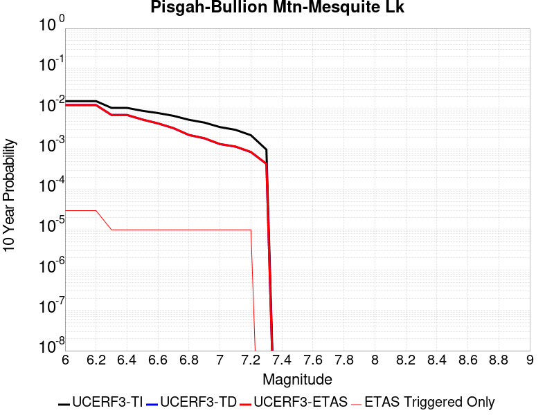 |

| Magnitude | 1 wk TI Prob | 1 wk TD Prob | 1 wk ETAS Prob | 1 wk ETAS/TD Gain | 1 wk ETAS Triggered Only | 1 mo TI Prob | 1 mo TD Prob | 1 mo ETAS Prob | 1 mo ETAS/TD Gain | 1 mo ETAS Triggered Only | 1 yr TI Prob | 1 yr TD Prob | 1 yr ETAS Prob | 1 yr ETAS/TD Gain | 1 yr ETAS Triggered Only | 10 yr TI Prob | 10 yr TD Prob | 10 yr ETAS Prob | 10 yr ETAS/TD Gain | 10 yr ETAS Triggered Only |
|-----|-----|-----|-----|-----|-----|-----|-----|-----|-----|-----|-----|-----|-----|-----|-----|-----|-----|-----|-----|-----|
| 6.0 | 3.0240792E-5 | 2.4093786E-5 | 2.4093786E-5 | 1.0 | 0.0 | 1.2959696E-4 | 1.0325557E-4 | 1.0325557E-4 | 1.0 | 0.0 | 0.0015767008 | 0.0012565119 | 0.0012565119 | 1.0 | 0.0 | 0.015655609 | 0.0125041 | 0.012533725 | 1.0023692 | 3.0E-5 |
| 6.1 | 3.0240792E-5 | 2.4093786E-5 | 2.4093786E-5 | 1.0 | 0.0 | 1.2959696E-4 | 1.0325557E-4 | 1.0325557E-4 | 1.0 | 0.0 | 0.0015767008 | 0.0012565119 | 0.0012565119 | 1.0 | 0.0 | 0.015655609 | 0.0125041 | 0.012533725 | 1.0023692 | 3.0E-5 |
| 6.2 | 3.0240792E-5 | 2.4093786E-5 | 2.4093786E-5 | 1.0 | 0.0 | 1.2959696E-4 | 1.0325557E-4 | 1.0325557E-4 | 1.0 | 0.0 | 0.0015767008 | 0.0012565119 | 0.0012565119 | 1.0 | 0.0 | 0.015655609 | 0.0125041 | 0.012533725 | 1.0023692 | 3.0E-5 |
| 6.3 | 2.0498217E-5 | 1.3639363E-5 | 1.3639363E-5 | 1.0 | 0.0 | 8.784654E-5 | 5.8453195E-5 | 5.8453195E-5 | 1.0 | 0.0 | 0.0010690069 | 7.114515E-4 | 7.114515E-4 | 1.0 | 0.0 | 0.01063879 | 0.007093365 | 0.007103294 | 1.0013998 | 1.0E-5 |
| 6.4 | 2.0498217E-5 | 1.3639363E-5 | 1.3639363E-5 | 1.0 | 0.0 | 8.784654E-5 | 5.8453195E-5 | 5.8453195E-5 | 1.0 | 0.0 | 0.0010690069 | 7.114515E-4 | 7.114515E-4 | 1.0 | 0.0 | 0.01063879 | 0.007093365 | 0.007103294 | 1.0013998 | 1.0E-5 |
| 6.5 | 1.7316182E-5 | 1.04779865E-5 | 1.04779865E-5 | 1.0 | 0.0 | 7.42101E-5 | 4.490494E-5 | 4.490494E-5 | 1.0 | 0.0 | 9.0313336E-4 | 5.465905E-4 | 5.465905E-4 | 1.0 | 0.0 | 0.008994718 | 0.005453457 | 0.0054634027 | 1.0018237 | 1.0E-5 |
| 6.6 | 1.5251077E-5 | 8.415006E-6 | 8.415006E-6 | 1.0 | 0.0 | 6.536012E-5 | 3.6063855E-5 | 3.6063855E-5 | 1.0 | 0.0 | 7.9546886E-4 | 4.3899618E-4 | 4.3899618E-4 | 1.0 | 0.0 | 0.007926274 | 0.0043820073 | 0.0043919636 | 1.002272 | 1.0E-5 |
| 6.7 | 1.2997425E-5 | 6.4120336E-6 | 6.4120336E-6 | 1.0 | 0.0 | 5.570206E-5 | 2.747988E-5 | 2.747988E-5 | 1.0 | 0.0 | 6.7796157E-4 | 3.3452085E-4 | 3.3452085E-4 | 1.0 | 0.0 | 0.0067589693 | 0.0033406331 | 0.0033505997 | 1.0029835 | 1.0E-5 |
| 6.8 | 1.035386E-5 | 4.333664E-6 | 4.333664E-6 | 1.0 | 0.0 | 4.437293E-5 | 1.8572719E-5 | 1.8572719E-5 | 1.0 | 0.0 | 5.401065E-4 | 2.2610025E-4 | 2.2610025E-4 | 1.0 | 0.0 | 0.0053879567 | 0.002258789 | 0.0022687663 | 1.0044172 | 1.0E-5 |
| 6.9 | 8.816252E-6 | 3.5810178E-6 | 3.5810178E-6 | 1.0 | 0.0 | 3.778339E-5 | 1.5347132E-5 | 1.5347132E-5 | 1.0 | 0.0 | 4.5991567E-4 | 1.8683591E-4 | 1.8683591E-4 | 1.0 | 0.0 | 0.00458965 | 0.0018668467 | 0.001876828 | 1.0053467 | 1.0E-5 |
| 7.0 | 6.8232207E-6 | 2.567874E-6 | 2.567874E-6 | 1.0 | 0.0 | 2.9242048E-5 | 1.1005129E-5 | 1.1005129E-5 | 1.0 | 0.0 | 3.5596377E-4 | 1.3397953E-4 | 1.3397953E-4 | 1.0 | 0.0 | 0.0035539411 | 0.0013390186 | 0.0013490051 | 1.0074582 | 1.0E-5 |
| 7.1 | 5.837013E-6 | 2.2276292E-6 | 2.2276292E-6 | 1.0 | 0.0 | 2.501553E-5 | 9.5469495E-6 | 9.5469495E-6 | 1.0 | 0.0 | 3.045215E-4 | 1.16228206E-4 | 1.16228206E-4 | 1.0 | 0.0 | 0.0030410455 | 0.0011617033 | 0.0011716916 | 1.0085981 | 1.0E-5 |
| 7.2 | 4.278052E-6 | 1.6277489E-6 | 1.6277489E-6 | 1.0 | 0.0 | 1.833438E-5 | 6.97605E-6 | 6.97605E-6 | 1.0 | 0.0 | 2.231982E-4 | 8.493033E-5 | 8.493033E-5 | 1.0 | 0.0 | 0.0022297418 | 8.490019E-4 | 8.5899344E-4 | 1.0117686 | 1.0E-5 |
| 7.3 | 1.8803692E-6 | 8.345715E-7 | 8.345715E-7 | 1.0 | 0.0 | 8.0587E-6 | 3.576731E-6 | 3.576731E-6 | 1.0 | 0.0 | 9.811026E-5 | 4.3545977E-5 | 4.3545977E-5 | 1.0 | 0.0 | 9.806695E-4 | 4.353889E-4 | 4.353889E-4 | 1.0 | 0.0 |

## Whittier alt 1
*[(top)](#table-of-contents)*

| 1 Week | 1 Month | 1 Year | 10 Year |
|-----|-----|-----|-----|
|  |  |  |  |

| Magnitude | 1 wk TI Prob | 1 wk TD Prob | 1 wk ETAS Prob | 1 wk ETAS/TD Gain | 1 wk ETAS Triggered Only | 1 mo TI Prob | 1 mo TD Prob | 1 mo ETAS Prob | 1 mo ETAS/TD Gain | 1 mo ETAS Triggered Only | 1 yr TI Prob | 1 yr TD Prob | 1 yr ETAS Prob | 1 yr ETAS/TD Gain | 1 yr ETAS Triggered Only | 10 yr TI Prob | 10 yr TD Prob | 10 yr ETAS Prob | 10 yr ETAS/TD Gain | 10 yr ETAS Triggered Only |
|-----|-----|-----|-----|-----|-----|-----|-----|-----|-----|-----|-----|-----|-----|-----|-----|-----|-----|-----|-----|-----|
| 6.0 | 4.2554693E-5 | 4.7260703E-5 | 4.7260703E-5 | 1.0 | 0.0 | 1.8236451E-4 | 2.0253197E-4 | 2.0253197E-4 | 1.0 | 0.0 | 0.002218027 | 0.0024633587 | 0.0024633587 | 1.0 | 0.0 | 0.02196019 | 0.024394577 | 0.024423847 | 1.0011997 | 3.0E-5 |
| 6.1 | 4.2554693E-5 | 4.7260703E-5 | 4.7260703E-5 | 1.0 | 0.0 | 1.8236451E-4 | 2.0253197E-4 | 2.0253197E-4 | 1.0 | 0.0 | 0.002218027 | 0.0024633587 | 0.0024633587 | 1.0 | 0.0 | 0.02196019 | 0.024394577 | 0.024423847 | 1.0011997 | 3.0E-5 |
| 6.2 | 4.2554693E-5 | 4.7260703E-5 | 4.7260703E-5 | 1.0 | 0.0 | 1.8236451E-4 | 2.0253197E-4 | 2.0253197E-4 | 1.0 | 0.0 | 0.002218027 | 0.0024633587 | 0.0024633587 | 1.0 | 0.0 | 0.02196019 | 0.024394577 | 0.024423847 | 1.0011997 | 3.0E-5 |
| 6.3 | 1.9617712E-5 | 1.8273182E-5 | 1.8273182E-5 | 1.0 | 0.0 | 8.40732E-5 | 7.8311394E-5 | 7.8311394E-5 | 1.0 | 0.0 | 0.0010231105 | 9.530432E-4 | 9.530432E-4 | 1.0 | 0.0 | 0.01018413 | 0.009492843 | 0.009492843 | 1.0 | 0.0 |
| 6.4 | 1.5611336E-5 | 1.3608165E-5 | 1.3608165E-5 | 1.0 | 0.0 | 6.690401E-5 | 5.831944E-5 | 5.831944E-5 | 1.0 | 0.0 | 8.142519E-4 | 7.0981384E-4 | 7.0981384E-4 | 1.0 | 0.0 | 0.008112748 | 0.007077429 | 0.007077429 | 1.0 | 0.0 |
| 6.5 | 1.5150166E-5 | 1.31047755E-5 | 1.31047755E-5 | 1.0 | 0.0 | 6.492767E-5 | 5.616215E-5 | 5.616215E-5 | 1.0 | 0.0 | 7.9020765E-4 | 6.835655E-4 | 6.835655E-4 | 1.0 | 0.0 | 0.007874036 | 0.0068165762 | 0.0068165762 | 1.0 | 0.0 |
| 6.6 | 1.295588E-5 | 1.0383929E-5 | 1.0383929E-5 | 1.0 | 0.0 | 5.552402E-5 | 4.450181E-5 | 4.450181E-5 | 1.0 | 0.0 | 6.7579525E-4 | 5.4167677E-4 | 5.4167677E-4 | 1.0 | 0.0 | 0.006737438 | 0.0054049976 | 0.0054049976 | 1.0 | 0.0 |
| 6.7 | 1.2542085E-5 | 9.902496E-6 | 9.902496E-6 | 1.0 | 0.0 | 5.3750682E-5 | 4.2438587E-5 | 4.2438587E-5 | 1.0 | 0.0 | 6.542181E-4 | 5.165692E-4 | 5.165692E-4 | 1.0 | 0.0 | 0.006522954 | 0.005155102 | 0.005155102 | 1.0 | 0.0 |
| 6.8 | 1.2195878E-5 | 9.498438E-6 | 9.498438E-6 | 1.0 | 0.0 | 5.2267E-5 | 4.0706967E-5 | 4.0706967E-5 | 1.0 | 0.0 | 6.36165E-4 | 4.954965E-4 | 4.954965E-4 | 1.0 | 0.0 | 0.0063434686 | 0.004945258 | 0.004945258 | 1.0 | 0.0 |
| 6.9 | 1.1580298E-5 | 8.775757E-6 | 8.775757E-6 | 1.0 | 0.0 | 4.9628903E-5 | 3.7609854E-5 | 3.7609854E-5 | 1.0 | 0.0 | 6.040644E-4 | 4.578054E-4 | 4.578054E-4 | 1.0 | 0.0 | 0.00602425 | 0.0045698825 | 0.0045698825 | 1.0 | 0.0 |
| 7.0 | 1.0964795E-5 | 8.086678E-6 | 8.086678E-6 | 1.0 | 0.0 | 4.6991136E-5 | 3.4656736E-5 | 3.4656736E-5 | 1.0 | 0.0 | 5.7196687E-4 | 4.218656E-4 | 4.218656E-4 | 1.0 | 0.0 | 0.0057049696 | 0.004211856 | 0.004211856 | 1.0 | 0.0 |
| 7.1 | 1.0230601E-5 | 7.329039E-6 | 7.329039E-6 | 1.0 | 0.0 | 4.3844695E-5 | 3.1409796E-5 | 3.1409796E-5 | 1.0 | 0.0 | 5.336784E-4 | 3.8234846E-4 | 3.8234846E-4 | 1.0 | 0.0 | 0.005323986 | 0.0038180696 | 0.0038180696 | 1.0 | 0.0 |
| 7.2 | 9.40865E-6 | 6.545452E-6 | 6.545452E-6 | 1.0 | 0.0 | 4.032216E-5 | 2.8051643E-5 | 2.8051643E-5 | 1.0 | 0.0 | 4.908117E-4 | 3.4147644E-4 | 3.4147644E-4 | 1.0 | 0.0 | 0.0048972913 | 0.00341061 | 0.00341061 | 1.0 | 0.0 |
| 7.3 | 8.237384E-6 | 5.5996256E-6 | 5.5996256E-6 | 1.0 | 0.0 | 3.5302593E-5 | 2.3998182E-5 | 2.3998182E-5 | 1.0 | 0.0 | 4.2972428E-4 | 2.9213974E-4 | 2.9213974E-4 | 1.0 | 0.0 | 0.0042889426 | 0.0029178779 | 0.0029178779 | 1.0 | 0.0 |
| 7.4 | 7.5316966E-6 | 5.0295293E-6 | 5.0295293E-6 | 1.0 | 0.0 | 3.2278298E-5 | 2.1554953E-5 | 2.1554953E-5 | 1.0 | 0.0 | 3.9291743E-4 | 2.6240098E-4 | 2.6240098E-4 | 1.0 | 0.0 | 0.0039222343 | 0.0026210235 | 0.0026210235 | 1.0 | 0.0 |
| 7.5 | 6.149649E-6 | 3.9352226E-6 | 3.9352226E-6 | 1.0 | 0.0 | 2.6355372E-5 | 1.6865137E-5 | 1.6865137E-5 | 1.0 | 0.0 | 3.208294E-4 | 2.0531459E-4 | 2.0531459E-4 | 1.0 | 0.0 | 0.003203666 | 0.0020513383 | 0.0020513383 | 1.0 | 0.0 |
| 7.6 | 5.457711E-6 | 3.3966078E-6 | 3.3966078E-6 | 1.0 | 0.0 | 2.338998E-5 | 1.4556815E-5 | 1.4556815E-5 | 1.0 | 0.0 | 2.8473578E-4 | 1.7721562E-4 | 1.7721562E-4 | 1.0 | 0.0 | 0.0028437122 | 0.0017708237 | 0.0017708237 | 1.0 | 0.0 |
| 7.7 | 4.1676276E-6 | 2.334181E-6 | 2.334181E-6 | 1.0 | 0.0 | 1.7861139E-5 | 1.0003599E-5 | 1.0003599E-5 | 1.0 | 0.0 | 2.1743766E-4 | 1.2178775E-4 | 1.2178775E-4 | 1.0 | 0.0 | 0.0021722503 | 0.0012172832 | 0.0012172832 | 1.0 | 0.0 |
| 7.8 | 2.2692414E-7 | 9.388808E-8 | 9.388808E-8 | 1.0 | 0.0 | 9.725317E-7 | 4.0237745E-7 | 4.0237745E-7 | 1.0 | 0.0 | 1.1840509E-5 | 4.8989377E-6 | 4.8989377E-6 | 1.0 | 0.0 | 1.1839878E-4 | 4.8988626E-5 | 4.8988626E-5 | 1.0 | 0.0 |
| 7.9 | 6.676829E-9 | 3.4407224E-9 | 3.4407224E-9 | 1.0 | 0.0 | 2.861498E-8 | 1.4745954E-8 | 1.4745954E-8 | 1.0 | 0.0 | 3.4838732E-7 | 1.7953197E-7 | 1.7953197E-7 | 1.0 | 0.0 | 3.4838679E-6 | 1.7953184E-6 | 1.7953184E-6 | 1.0 | 0.0 |

## Santa Ynez River
*[(top)](#table-of-contents)*

| 1 Week | 1 Month | 1 Year | 10 Year |
|-----|-----|-----|-----|
|  |  | 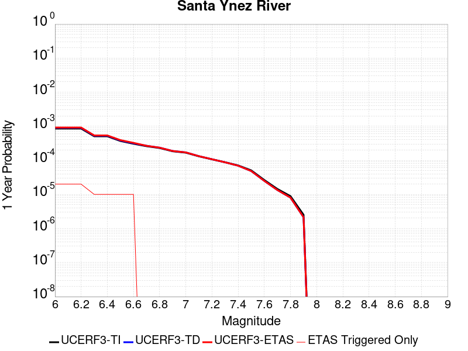 |  |

| Magnitude | 1 wk TI Prob | 1 wk TD Prob | 1 wk ETAS Prob | 1 wk ETAS/TD Gain | 1 wk ETAS Triggered Only | 1 mo TI Prob | 1 mo TD Prob | 1 mo ETAS Prob | 1 mo ETAS/TD Gain | 1 mo ETAS Triggered Only | 1 yr TI Prob | 1 yr TD Prob | 1 yr ETAS Prob | 1 yr ETAS/TD Gain | 1 yr ETAS Triggered Only | 10 yr TI Prob | 10 yr TD Prob | 10 yr ETAS Prob | 10 yr ETAS/TD Gain | 10 yr ETAS Triggered Only |
|-----|-----|-----|-----|-----|-----|-----|-----|-----|-----|-----|-----|-----|-----|-----|-----|-----|-----|-----|-----|-----|
| 6.0 | 1.6396456E-5 | 1.721034E-5 | 1.721034E-5 | 1.0 | 0.0 | 7.026863E-5 | 7.375671E-5 | 8.375598E-5 | 1.1355709 | 1.0E-5 | 8.551848E-4 | 8.976536E-4 | 9.176356E-4 | 1.0222603 | 2.0E-5 | 0.0085190125 | 0.008943826 | 0.0089735575 | 1.0033243 | 3.0E-5 |
| 6.1 | 1.6396456E-5 | 1.721034E-5 | 1.721034E-5 | 1.0 | 0.0 | 7.026863E-5 | 7.375671E-5 | 8.375598E-5 | 1.1355709 | 1.0E-5 | 8.551848E-4 | 8.976536E-4 | 9.176356E-4 | 1.0222603 | 2.0E-5 | 0.0085190125 | 0.008943826 | 0.0089735575 | 1.0033243 | 3.0E-5 |
| 6.2 | 1.6396456E-5 | 1.721034E-5 | 1.721034E-5 | 1.0 | 0.0 | 7.026863E-5 | 7.375671E-5 | 8.375598E-5 | 1.1355709 | 1.0E-5 | 8.551848E-4 | 8.976536E-4 | 9.176356E-4 | 1.0222603 | 2.0E-5 | 0.0085190125 | 0.008943826 | 0.0089735575 | 1.0033243 | 3.0E-5 |
| 6.3 | 9.736976E-6 | 1.012281E-5 | 1.012281E-5 | 1.0 | 0.0 | 4.172923E-5 | 4.3382777E-5 | 4.3382777E-5 | 1.0 | 0.0 | 5.0793495E-4 | 5.280623E-4 | 5.38057E-4 | 1.0189272 | 1.0E-5 | 0.005067755 | 0.005268581 | 0.0052884757 | 1.0037761 | 2.0E-5 |
| 6.4 | 9.736976E-6 | 1.012281E-5 | 1.012281E-5 | 1.0 | 0.0 | 4.172923E-5 | 4.3382777E-5 | 4.3382777E-5 | 1.0 | 0.0 | 5.0793495E-4 | 5.280623E-4 | 5.38057E-4 | 1.0189272 | 1.0E-5 | 0.005067755 | 0.005268581 | 0.0052884757 | 1.0037761 | 2.0E-5 |
| 6.5 | 7.081964E-6 | 7.3302417E-6 | 7.3302417E-6 | 1.0 | 0.0 | 3.035092E-5 | 3.141495E-5 | 3.141495E-5 | 1.0 | 0.0 | 3.694598E-4 | 3.824115E-4 | 3.9240767E-4 | 1.0261399 | 1.0E-5 | 0.0036884616 | 0.0038176961 | 0.003827658 | 1.0026094 | 1.0E-5 |
| 6.6 | 5.873247E-6 | 6.060028E-6 | 6.060028E-6 | 1.0 | 0.0 | 2.5170815E-5 | 2.5971296E-5 | 2.5971296E-5 | 1.0 | 0.0 | 3.064116E-4 | 3.161555E-4 | 3.2615234E-4 | 1.03162 | 1.0E-5 | 0.0030598943 | 0.0031571446 | 0.003167113 | 1.0031574 | 1.0E-5 |
| 6.7 | 4.973277E-6 | 5.1161433E-6 | 5.1161433E-6 | 1.0 | 0.0 | 2.1313872E-5 | 2.1926147E-5 | 2.1926147E-5 | 1.0 | 0.0 | 2.5946548E-4 | 2.6691862E-4 | 2.6691862E-4 | 1.0 | 0.0 | 0.0025916274 | 0.0026660294 | 0.0026660294 | 1.0 | 0.0 |
| 6.8 | 4.396492E-6 | 4.511193E-6 | 4.511193E-6 | 1.0 | 0.0 | 1.884197E-5 | 1.9333542E-5 | 1.9333542E-5 | 1.0 | 0.0 | 2.2937685E-4 | 2.3536079E-4 | 2.3536079E-4 | 1.0 | 0.0 | 0.0022914023 | 0.0023511506 | 0.0023511506 | 1.0 | 0.0 |
| 6.9 | 3.5255632E-6 | 3.6015106E-6 | 3.6015106E-6 | 1.0 | 0.0 | 1.5109469E-5 | 1.5434955E-5 | 1.5434955E-5 | 1.0 | 0.0 | 1.8394225E-4 | 1.8790453E-4 | 1.8790453E-4 | 1.0 | 0.0 | 0.0018379007 | 0.0018774727 | 0.0018774727 | 1.0 | 0.0 |
| 7.0 | 3.211603E-6 | 3.273818E-6 | 3.273818E-6 | 1.0 | 0.0 | 1.376394E-5 | 1.4030575E-5 | 1.4030575E-5 | 1.0 | 0.0 | 1.6756308E-4 | 1.70809E-4 | 1.70809E-4 | 1.0 | 0.0 | 0.0016743679 | 0.0017067912 | 0.0017067912 | 1.0 | 0.0 |
| 7.1 | 2.5094619E-6 | 2.5410548E-6 | 2.5410548E-6 | 1.0 | 0.0 | 1.0754793E-5 | 1.08901895E-5 | 1.08901895E-5 | 1.0 | 0.0 | 1.3093173E-4 | 1.3258005E-4 | 1.3258005E-4 | 1.0 | 0.0 | 0.0013085462 | 0.0013250156 | 0.0013250156 | 1.0 | 0.0 |
| 7.2 | 2.0515774E-6 | 2.0620514E-6 | 2.0620514E-6 | 1.0 | 0.0 | 8.792445E-6 | 8.837334E-6 | 8.837334E-6 | 1.0 | 0.0 | 1.0704277E-4 | 1.07589265E-4 | 1.07589265E-4 | 1.0 | 0.0 | 0.0010699122 | 0.001075376 | 0.001075376 | 1.0 | 0.0 |
| 7.3 | 1.6845745E-6 | 1.6774874E-6 | 1.6774874E-6 | 1.0 | 0.0 | 7.219585E-6 | 7.1892123E-6 | 7.1892123E-6 | 1.0 | 0.0 | 8.78949E-5 | 8.752517E-5 | 8.752517E-5 | 1.0 | 0.0 | 8.7860145E-4 | 8.7490986E-4 | 8.7490986E-4 | 1.0 | 0.0 |
| 7.4 | 1.3600285E-6 | 1.3334133E-6 | 1.3334133E-6 | 1.0 | 0.0 | 5.82868E-6 | 5.714616E-6 | 5.714616E-6 | 1.0 | 0.0 | 7.096187E-5 | 6.9573245E-5 | 6.9573245E-5 | 1.0 | 0.0 | 7.0939213E-4 | 6.955169E-4 | 6.955169E-4 | 1.0 | 0.0 |
| 7.5 | 9.735342E-7 | 9.2906635E-7 | 9.2906635E-7 | 1.0 | 0.0 | 4.172283E-6 | 3.981707E-6 | 3.981707E-6 | 1.0 | 0.0 | 5.079636E-5 | 4.847622E-5 | 4.847622E-5 | 1.0 | 0.0 | 5.0784746E-4 | 4.8465817E-4 | 4.8465817E-4 | 1.0 | 0.0 |
| 7.6 | 5.067187E-7 | 4.7788274E-7 | 4.7788274E-7 | 1.0 | 0.0 | 2.1716498E-6 | 2.0480672E-6 | 2.0480672E-6 | 1.0 | 0.0 | 2.6439517E-5 | 2.4934941E-5 | 2.4934941E-5 | 1.0 | 0.0 | 2.643637E-4 | 2.4932218E-4 | 2.4932218E-4 | 1.0 | 0.0 |
| 7.7 | 2.769089E-7 | 2.576042E-7 | 2.576042E-7 | 1.0 | 0.0 | 1.1867519E-6 | 1.1040175E-6 | 1.1040175E-6 | 1.0 | 0.0 | 1.4448608E-5 | 1.344133E-5 | 1.344133E-5 | 1.0 | 0.0 | 1.444767E-4 | 1.3440521E-4 | 1.3440521E-4 | 1.0 | 0.0 |
| 7.8 | 1.7044663E-7 | 1.5449795E-7 | 1.5449795E-7 | 1.0 | 0.0 | 7.3048534E-7 | 6.621339E-7 | 6.621339E-7 | 1.0 | 0.0 | 8.893623E-6 | 8.061451E-6 | 8.061451E-6 | 1.0 | 0.0 | 8.893267E-5 | 8.06116E-5 | 8.06116E-5 | 1.0 | 0.0 |
| 7.9 | 4.8344287E-8 | 4.091312E-8 | 4.091312E-8 | 1.0 | 0.0 | 2.0718979E-7 | 1.7534192E-7 | 1.7534192E-7 | 1.0 | 0.0 | 2.5225327E-6 | 2.134786E-6 | 2.134786E-6 | 1.0 | 0.0 | 2.5225041E-5 | 2.1347658E-5 | 2.1347658E-5 | 1.0 | 0.0 |

## Robinson Creek
*[(top)](#table-of-contents)*

| 1 Week | 1 Month | 1 Year | 10 Year |
|-----|-----|-----|-----|
|  |  |  | 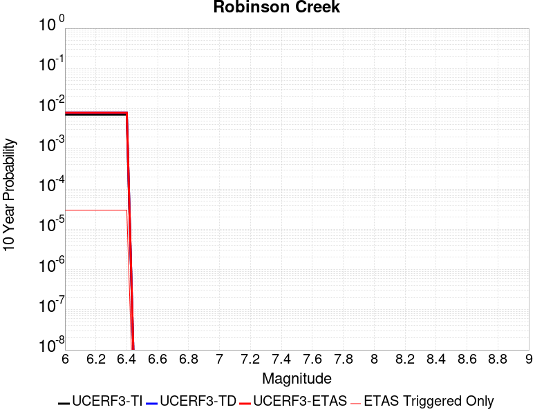 |

| Magnitude | 1 wk TI Prob | 1 wk TD Prob | 1 wk ETAS Prob | 1 wk ETAS/TD Gain | 1 wk ETAS Triggered Only | 1 mo TI Prob | 1 mo TD Prob | 1 mo ETAS Prob | 1 mo ETAS/TD Gain | 1 mo ETAS Triggered Only | 1 yr TI Prob | 1 yr TD Prob | 1 yr ETAS Prob | 1 yr ETAS/TD Gain | 1 yr ETAS Triggered Only | 10 yr TI Prob | 10 yr TD Prob | 10 yr ETAS Prob | 10 yr ETAS/TD Gain | 10 yr ETAS Triggered Only |
|-----|-----|-----|-----|-----|-----|-----|-----|-----|-----|-----|-----|-----|-----|-----|-----|-----|-----|-----|-----|-----|
| 6.0 | 1.3705327E-5 | 1.5286649E-5 | 1.5286649E-5 | 1.0 | 0.0 | 5.8735794E-5 | 6.551421E-5 | 6.551421E-5 | 1.0 | 0.0 | 7.1487366E-4 | 7.976355E-4 | 8.076275E-4 | 1.0125271 | 1.0E-5 | 0.0071257832 | 0.007976355 | 0.008006115 | 1.0037311 | 3.0E-5 |
| 6.1 | 1.3705327E-5 | 1.5286649E-5 | 1.5286649E-5 | 1.0 | 0.0 | 5.8735794E-5 | 6.551421E-5 | 6.551421E-5 | 1.0 | 0.0 | 7.1487366E-4 | 7.976355E-4 | 8.076275E-4 | 1.0125271 | 1.0E-5 | 0.0071257832 | 0.007976355 | 0.008006115 | 1.0037311 | 3.0E-5 |
| 6.2 | 1.3705327E-5 | 1.5286649E-5 | 1.5286649E-5 | 1.0 | 0.0 | 5.8735794E-5 | 6.551421E-5 | 6.551421E-5 | 1.0 | 0.0 | 7.1487366E-4 | 7.976355E-4 | 8.076275E-4 | 1.0125271 | 1.0E-5 | 0.0071257832 | 0.007976355 | 0.008006115 | 1.0037311 | 3.0E-5 |
| 6.3 | 1.3705327E-5 | 1.5286649E-5 | 1.5286649E-5 | 1.0 | 0.0 | 5.8735794E-5 | 6.551421E-5 | 6.551421E-5 | 1.0 | 0.0 | 7.1487366E-4 | 7.976355E-4 | 8.076275E-4 | 1.0125271 | 1.0E-5 | 0.0071257832 | 0.007976355 | 0.008006115 | 1.0037311 | 3.0E-5 |
| 6.4 | 1.3705327E-5 | 1.5286649E-5 | 1.5286649E-5 | 1.0 | 0.0 | 5.8735794E-5 | 6.551421E-5 | 6.551421E-5 | 1.0 | 0.0 | 7.1487366E-4 | 7.976355E-4 | 8.076275E-4 | 1.0125271 | 1.0E-5 | 0.0071257832 | 0.007976355 | 0.008006115 | 1.0037311 | 3.0E-5 |

## Dry Mountain
*[(top)](#table-of-contents)*

| 1 Week | 1 Month | 1 Year | 10 Year |
|-----|-----|-----|-----|
| 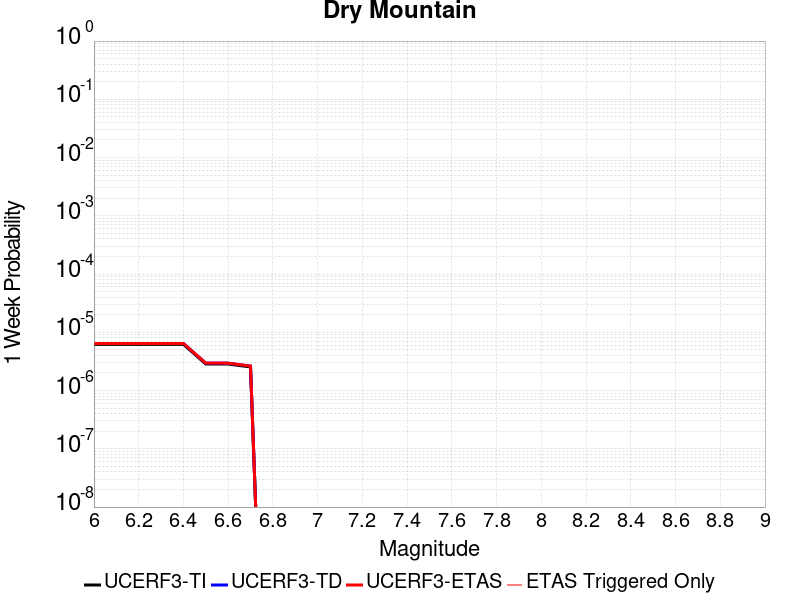 |  |  |  |

| Magnitude | 1 wk TI Prob | 1 wk TD Prob | 1 wk ETAS Prob | 1 wk ETAS/TD Gain | 1 wk ETAS Triggered Only | 1 mo TI Prob | 1 mo TD Prob | 1 mo ETAS Prob | 1 mo ETAS/TD Gain | 1 mo ETAS Triggered Only | 1 yr TI Prob | 1 yr TD Prob | 1 yr ETAS Prob | 1 yr ETAS/TD Gain | 1 yr ETAS Triggered Only | 10 yr TI Prob | 10 yr TD Prob | 10 yr ETAS Prob | 10 yr ETAS/TD Gain | 10 yr ETAS Triggered Only |
|-----|-----|-----|-----|-----|-----|-----|-----|-----|-----|-----|-----|-----|-----|-----|-----|-----|-----|-----|-----|-----|
| 6.0 | 6.222801E-6 | 6.4395895E-6 | 6.4395895E-6 | 1.0 | 0.0 | 2.6668875E-5 | 2.7598038E-5 | 2.7598038E-5 | 1.0 | 0.0 | 3.2464517E-4 | 3.3597022E-4 | 3.4596687E-4 | 1.0297545 | 1.0E-5 | 0.0032417132 | 0.003356185 | 0.0033860845 | 1.0089087 | 3.0E-5 |
| 6.1 | 6.222801E-6 | 6.4395895E-6 | 6.4395895E-6 | 1.0 | 0.0 | 2.6668875E-5 | 2.7598038E-5 | 2.7598038E-5 | 1.0 | 0.0 | 3.2464517E-4 | 3.3597022E-4 | 3.4596687E-4 | 1.0297545 | 1.0E-5 | 0.0032417132 | 0.003356185 | 0.0033860845 | 1.0089087 | 3.0E-5 |
| 6.2 | 6.222801E-6 | 6.4395895E-6 | 6.4395895E-6 | 1.0 | 0.0 | 2.6668875E-5 | 2.7598038E-5 | 2.7598038E-5 | 1.0 | 0.0 | 3.2464517E-4 | 3.3597022E-4 | 3.4596687E-4 | 1.0297545 | 1.0E-5 | 0.0032417132 | 0.003356185 | 0.0033860845 | 1.0089087 | 3.0E-5 |
| 6.3 | 6.222801E-6 | 6.4395895E-6 | 6.4395895E-6 | 1.0 | 0.0 | 2.6668875E-5 | 2.7598038E-5 | 2.7598038E-5 | 1.0 | 0.0 | 3.2464517E-4 | 3.3597022E-4 | 3.4596687E-4 | 1.0297545 | 1.0E-5 | 0.0032417132 | 0.003356185 | 0.0033860845 | 1.0089087 | 3.0E-5 |
| 6.4 | 6.222801E-6 | 6.4395895E-6 | 6.4395895E-6 | 1.0 | 0.0 | 2.6668875E-5 | 2.7598038E-5 | 2.7598038E-5 | 1.0 | 0.0 | 3.2464517E-4 | 3.3597022E-4 | 3.4596687E-4 | 1.0297545 | 1.0E-5 | 0.0032417132 | 0.003356185 | 0.0033860845 | 1.0089087 | 3.0E-5 |
| 6.5 | 2.8528623E-6 | 2.9522637E-6 | 2.9522637E-6 | 1.0 | 0.0 | 1.22264955E-5 | 1.26525465E-5 | 1.26525465E-5 | 1.0 | 0.0 | 1.4884741E-4 | 1.5404257E-4 | 1.5404257E-4 | 1.0 | 0.0 | 0.0014874774 | 0.0015402114 | 0.001550196 | 1.0064826 | 1.0E-5 |
| 6.6 | 2.8528623E-6 | 2.9522637E-6 | 2.9522637E-6 | 1.0 | 0.0 | 1.22264955E-5 | 1.26525465E-5 | 1.26525465E-5 | 1.0 | 0.0 | 1.4884741E-4 | 1.5404257E-4 | 1.5404257E-4 | 1.0 | 0.0 | 0.0014874774 | 0.0015402114 | 0.001550196 | 1.0064826 | 1.0E-5 |
| 6.7 | 2.541E-6 | 2.6294429E-6 | 2.6294429E-6 | 1.0 | 0.0 | 1.0889954E-5 | 1.126904E-5 | 1.126904E-5 | 1.0 | 0.0 | 1.3257713E-4 | 1.3720056E-4 | 1.3720056E-4 | 1.0 | 0.0 | 0.0013249806 | 0.0013720057 | 0.0013819919 | 1.0072786 | 1.0E-5 |

## Santa Rosa Island
*[(top)](#table-of-contents)*

| 1 Week | 1 Month | 1 Year | 10 Year |
|-----|-----|-----|-----|
|  |  |  | 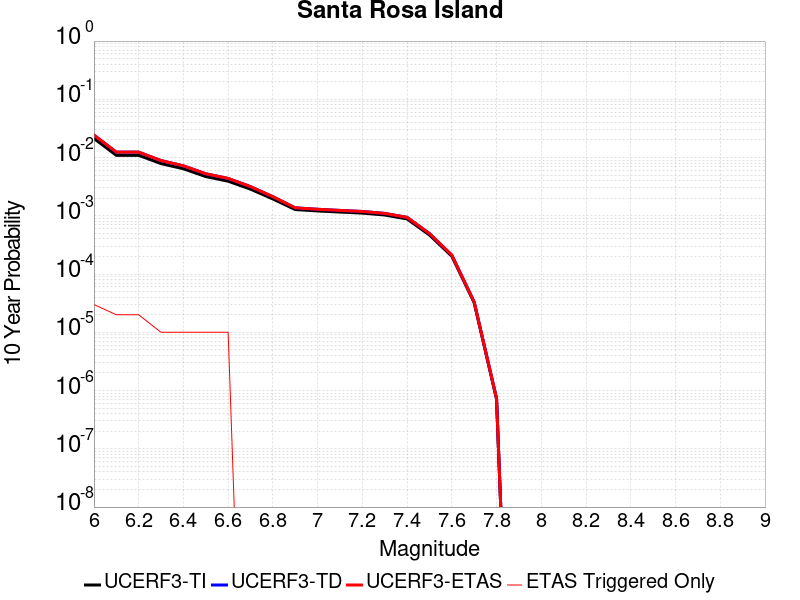 |

| Magnitude | 1 wk TI Prob | 1 wk TD Prob | 1 wk ETAS Prob | 1 wk ETAS/TD Gain | 1 wk ETAS Triggered Only | 1 mo TI Prob | 1 mo TD Prob | 1 mo ETAS Prob | 1 mo ETAS/TD Gain | 1 mo ETAS Triggered Only | 1 yr TI Prob | 1 yr TD Prob | 1 yr ETAS Prob | 1 yr ETAS/TD Gain | 1 yr ETAS Triggered Only | 10 yr TI Prob | 10 yr TD Prob | 10 yr ETAS Prob | 10 yr ETAS/TD Gain | 10 yr ETAS Triggered Only |
|-----|-----|-----|-----|-----|-----|-----|-----|-----|-----|-----|-----|-----|-----|-----|-----|-----|-----|-----|-----|-----|
| 6.0 | 4.1143165E-5 | 4.7097492E-5 | 4.7097492E-5 | 1.0 | 0.0 | 1.7631594E-4 | 2.0183189E-4 | 2.0183189E-4 | 1.0 | 0.0 | 0.002144533 | 0.002454731 | 0.0024647063 | 1.0040637 | 1.0E-5 | 0.021239553 | 0.024296792 | 0.024326064 | 1.0012047 | 3.0E-5 |
| 6.1 | 2.1061249E-5 | 2.3867926E-5 | 2.3867926E-5 | 1.0 | 0.0 | 9.0259375E-5 | 1.0228727E-4 | 1.0228727E-4 | 1.0 | 0.0 | 0.0010983539 | 0.001244665 | 0.0012546525 | 1.0080243 | 1.0E-5 | 0.01092941 | 0.012379978 | 0.01239973 | 1.0015955 | 2.0E-5 |
| 6.2 | 2.1061249E-5 | 2.3867926E-5 | 2.3867926E-5 | 1.0 | 0.0 | 9.0259375E-5 | 1.0228727E-4 | 1.0228727E-4 | 1.0 | 0.0 | 0.0010983539 | 0.001244665 | 0.0012546525 | 1.0080243 | 1.0E-5 | 0.01092941 | 0.012379978 | 0.01239973 | 1.0015955 | 2.0E-5 |
| 6.3 | 1.5158236E-5 | 1.7076436E-5 | 1.7076436E-5 | 1.0 | 0.0 | 6.496225E-5 | 7.318274E-5 | 7.318274E-5 | 1.0 | 0.0 | 7.906284E-4 | 8.906475E-4 | 9.0063864E-4 | 1.0112178 | 1.0E-5 | 0.007878214 | 0.008872032 | 0.008881943 | 1.0011171 | 1.0E-5 |
| 6.4 | 1.2341918E-5 | 1.3854502E-5 | 1.3854502E-5 | 1.0 | 0.0 | 5.2892858E-5 | 5.937513E-5 | 5.937513E-5 | 1.0 | 0.0 | 6.437803E-4 | 7.2266057E-4 | 7.3265337E-4 | 1.0138278 | 1.0E-5 | 0.006419184 | 0.0072039426 | 0.0072138705 | 1.0013782 | 1.0E-5 |
| 6.5 | 9.061158E-6 | 1.0118134E-5 | 1.0118134E-5 | 1.0 | 0.0 | 3.883296E-5 | 4.3362743E-5 | 4.3362743E-5 | 1.0 | 0.0 | 4.726887E-4 | 5.2781886E-4 | 5.378136E-4 | 1.0189359 | 1.0E-5 | 0.004716845 | 0.00526619 | 0.0052761375 | 1.0018889 | 1.0E-5 |
| 6.6 | 7.5461685E-6 | 8.401626E-6 | 8.401626E-6 | 1.0 | 0.0 | 3.2340322E-5 | 3.600649E-5 | 3.600649E-5 | 1.0 | 0.0 | 3.936723E-4 | 4.3829516E-4 | 4.4829078E-4 | 1.0228057 | 1.0E-5 | 0.003929756 | 0.004374737 | 0.004384693 | 1.0022758 | 1.0E-5 |
| 6.7 | 5.5023775E-6 | 6.087989E-6 | 6.087989E-6 | 1.0 | 0.0 | 2.3581404E-5 | 2.6091138E-5 | 2.6091138E-5 | 1.0 | 0.0 | 2.8706578E-4 | 3.1761656E-4 | 3.1761656E-4 | 1.0 | 0.0 | 0.0028669522 | 0.003171948 | 0.003171948 | 1.0 | 0.0 |
| 6.8 | 3.7351679E-6 | 4.083499E-6 | 4.083499E-6 | 1.0 | 0.0 | 1.6007763E-5 | 1.7500606E-5 | 1.7500606E-5 | 1.0 | 0.0 | 1.948771E-4 | 2.1305155E-4 | 2.1305155E-4 | 1.0 | 0.0 | 0.0019470629 | 0.0021287182 | 0.0021287182 | 1.0 | 0.0 |
| 6.9 | 2.456366E-6 | 2.6294445E-6 | 2.6294445E-6 | 1.0 | 0.0 | 1.0527241E-5 | 1.1268999E-5 | 1.1268999E-5 | 1.0 | 0.0 | 1.2816161E-4 | 1.3719145E-4 | 1.3719145E-4 | 1.0 | 0.0 | 0.0012808773 | 0.0013710705 | 0.0013710705 | 1.0 | 0.0 |
| 7.0 | 2.3245157E-6 | 2.482937E-6 | 2.482937E-6 | 1.0 | 0.0 | 9.962172E-6 | 1.0641115E-5 | 1.0641115E-5 | 1.0 | 0.0 | 1.2128269E-4 | 1.295479E-4 | 1.295479E-4 | 1.0 | 0.0 | 0.0012121652 | 0.001294726 | 0.001294726 | 1.0 | 0.0 |
| 7.1 | 2.2248344E-6 | 2.3733985E-6 | 2.3733985E-6 | 1.0 | 0.0 | 9.53497E-6 | 1.0171669E-5 | 1.0171669E-5 | 1.0 | 0.0 | 1.1608207E-4 | 1.2383304E-4 | 1.2383304E-4 | 1.0 | 0.0 | 0.0011602144 | 0.0012376424 | 0.0012376424 | 1.0 | 0.0 |
| 7.2 | 2.1350402E-6 | 2.2762952E-6 | 2.2762952E-6 | 1.0 | 0.0 | 9.150141E-6 | 9.755515E-6 | 9.755515E-6 | 1.0 | 0.0 | 1.1139726E-4 | 1.1876693E-4 | 1.1876693E-4 | 1.0 | 0.0 | 0.0011134144 | 0.0011870365 | 0.0011870365 | 1.0 | 0.0 |
| 7.3 | 1.9793572E-6 | 2.1088485E-6 | 2.1088485E-6 | 1.0 | 0.0 | 8.482932E-6 | 9.037891E-6 | 9.037891E-6 | 1.0 | 0.0 | 1.032748E-4 | 1.10030785E-4 | 1.10030785E-4 | 1.0 | 0.0 | 0.0010322682 | 0.0010997648 | 0.0010997648 | 1.0 | 0.0 |
| 7.4 | 1.6951194E-6 | 1.804683E-6 | 1.804683E-6 | 1.0 | 0.0 | 7.264777E-6 | 7.734333E-6 | 7.734333E-6 | 1.0 | 0.0 | 8.844508E-5 | 9.416145E-5 | 9.416145E-5 | 1.0 | 0.0 | 8.840988E-4 | 9.4121724E-4 | 9.4121724E-4 | 1.0 | 0.0 |
| 7.5 | 8.987207E-7 | 9.512744E-7 | 9.512744E-7 | 1.0 | 0.0 | 3.8516546E-6 | 4.076884E-6 | 4.076884E-6 | 1.0 | 0.0 | 4.6892885E-5 | 4.9634942E-5 | 4.9634942E-5 | 1.0 | 0.0 | 4.688299E-4 | 4.9623975E-4 | 4.9623975E-4 | 1.0 | 0.0 |
| 7.6 | 3.8783037E-7 | 4.0531128E-7 | 4.0531128E-7 | 1.0 | 0.0 | 1.6621291E-6 | 1.7370472E-6 | 1.7370472E-6 | 1.0 | 0.0 | 2.0236233E-5 | 2.1148351E-5 | 2.1148351E-5 | 1.0 | 0.0 | 2.023439E-4 | 2.1146404E-4 | 2.1146404E-4 | 1.0 | 0.0 |
| 7.7 | 6.181804E-8 | 6.339254E-8 | 6.339254E-8 | 1.0 | 0.0 | 2.6493444E-7 | 2.716823E-7 | 2.716823E-7 | 1.0 | 0.0 | 3.225572E-6 | 3.307727E-6 | 3.307727E-6 | 1.0 | 0.0 | 3.225525E-5 | 3.3076783E-5 | 3.3076783E-5 | 1.0 | 0.0 |
| 7.8 | 1.3704449E-9 | 1.3964399E-9 | 1.3964399E-9 | 1.0 | 0.0 | 5.873335E-9 | 5.9847425E-9 | 5.9847425E-9 | 1.0 | 0.0 | 7.1507856E-8 | 7.286424E-8 | 7.286424E-8 | 1.0 | 0.0 | 7.1507833E-7 | 7.286422E-7 | 7.286422E-7 | 1.0 | 0.0 |

## Great Valley 03a Dunnigan Hills
*[(top)](#table-of-contents)*

| 1 Week | 1 Month | 1 Year | 10 Year |
|-----|-----|-----|-----|
|  |  |  |  |

| Magnitude | 1 wk TI Prob | 1 wk TD Prob | 1 wk ETAS Prob | 1 wk ETAS/TD Gain | 1 wk ETAS Triggered Only | 1 mo TI Prob | 1 mo TD Prob | 1 mo ETAS Prob | 1 mo ETAS/TD Gain | 1 mo ETAS Triggered Only | 1 yr TI Prob | 1 yr TD Prob | 1 yr ETAS Prob | 1 yr ETAS/TD Gain | 1 yr ETAS Triggered Only | 10 yr TI Prob | 10 yr TD Prob | 10 yr ETAS Prob | 10 yr ETAS/TD Gain | 10 yr ETAS Triggered Only |
|-----|-----|-----|-----|-----|-----|-----|-----|-----|-----|-----|-----|-----|-----|-----|-----|-----|-----|-----|-----|-----|
| 6.0 | 1.6591328E-5 | 1.8109491E-5 | 1.8109491E-5 | 1.0 | 0.0 | 7.110376E-5 | 7.761019E-5 | 7.761019E-5 | 1.0 | 0.0 | 8.6534437E-4 | 9.4456354E-4 | 9.5455407E-4 | 1.0105768 | 1.0E-5 | 0.008619824 | 0.00941232 | 0.009442038 | 1.0031573 | 3.0E-5 |
| 6.1 | 8.041125E-6 | 8.770465E-6 | 8.770465E-6 | 1.0 | 0.0 | 3.4461507E-5 | 3.7587277E-5 | 3.7587277E-5 | 1.0 | 0.0 | 4.194881E-4 | 4.5754932E-4 | 4.5754932E-4 | 1.0 | 0.0 | 0.004186971 | 0.0045680706 | 0.004578025 | 1.0021791 | 1.0E-5 |
| 6.2 | 3.2807004E-6 | 3.5798716E-6 | 3.5798716E-6 | 1.0 | 0.0 | 1.4060069E-5 | 1.534224E-5 | 1.534224E-5 | 1.0 | 0.0 | 1.7116789E-4 | 1.8677991E-4 | 1.8677991E-4 | 1.0 | 0.0 | 0.0017103611 | 0.0018666374 | 0.0018666374 | 1.0 | 0.0 |
| 6.3 | 1.9339366E-6 | 2.1105595E-6 | 2.1105595E-6 | 1.0 | 0.0 | 8.288273E-6 | 9.0452395E-6 | 9.0452395E-6 | 1.0 | 0.0 | 1.00905054E-4 | 1.1012308E-4 | 1.1012308E-4 | 1.0 | 0.0 | 0.0010085925 | 0.0011009651 | 0.0011009651 | 1.0 | 0.0 |
| 6.4 | 1.3142635E-6 | 1.434108E-6 | 1.434108E-6 | 1.0 | 0.0 | 5.6325457E-6 | 6.146177E-6 | 6.146177E-6 | 1.0 | 0.0 | 6.857408E-5 | 7.48297E-5 | 7.48297E-5 | 1.0 | 0.0 | 6.8552926E-4 | 7.48297E-4 | 7.48297E-4 | 1.0 | 0.0 |

## San Luis Range 2011 CFM
*[(top)](#table-of-contents)*

| 1 Week | 1 Month | 1 Year | 10 Year |
|-----|-----|-----|-----|
|  | 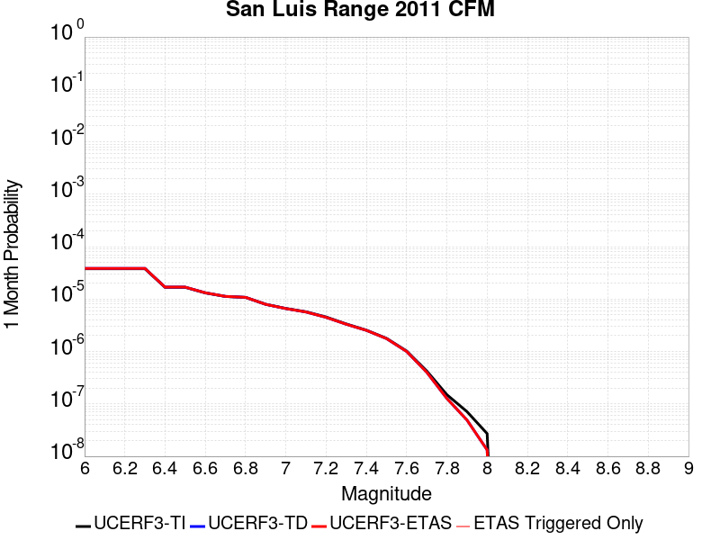 |  |  |

| Magnitude | 1 wk TI Prob | 1 wk TD Prob | 1 wk ETAS Prob | 1 wk ETAS/TD Gain | 1 wk ETAS Triggered Only | 1 mo TI Prob | 1 mo TD Prob | 1 mo ETAS Prob | 1 mo ETAS/TD Gain | 1 mo ETAS Triggered Only | 1 yr TI Prob | 1 yr TD Prob | 1 yr ETAS Prob | 1 yr ETAS/TD Gain | 1 yr ETAS Triggered Only | 10 yr TI Prob | 10 yr TD Prob | 10 yr ETAS Prob | 10 yr ETAS/TD Gain | 10 yr ETAS Triggered Only |
|-----|-----|-----|-----|-----|-----|-----|-----|-----|-----|-----|-----|-----|-----|-----|-----|-----|-----|-----|-----|-----|
| 6.0 | 8.8368415E-6 | 8.965619E-6 | 8.965619E-6 | 1.0 | 0.0 | 3.787163E-5 | 3.8423557E-5 | 3.8423557E-5 | 1.0 | 0.0 | 4.609895E-4 | 4.677143E-4 | 4.677143E-4 | 1.0 | 0.0 | 0.0046003438 | 0.004668082 | 0.0046879887 | 1.0042645 | 2.0E-5 |
| 6.1 | 8.8368415E-6 | 8.965619E-6 | 8.965619E-6 | 1.0 | 0.0 | 3.787163E-5 | 3.8423557E-5 | 3.8423557E-5 | 1.0 | 0.0 | 4.609895E-4 | 4.677143E-4 | 4.677143E-4 | 1.0 | 0.0 | 0.0046003438 | 0.004668082 | 0.0046879887 | 1.0042645 | 2.0E-5 |
| 6.2 | 8.8368415E-6 | 8.965619E-6 | 8.965619E-6 | 1.0 | 0.0 | 3.787163E-5 | 3.8423557E-5 | 3.8423557E-5 | 1.0 | 0.0 | 4.609895E-4 | 4.677143E-4 | 4.677143E-4 | 1.0 | 0.0 | 0.0046003438 | 0.004668082 | 0.0046879887 | 1.0042645 | 2.0E-5 |
| 6.3 | 8.8368415E-6 | 8.965619E-6 | 8.965619E-6 | 1.0 | 0.0 | 3.787163E-5 | 3.8423557E-5 | 3.8423557E-5 | 1.0 | 0.0 | 4.609895E-4 | 4.677143E-4 | 4.677143E-4 | 1.0 | 0.0 | 0.0046003438 | 0.004668082 | 0.0046879887 | 1.0042645 | 2.0E-5 |
| 6.4 | 3.9094193E-6 | 3.9412757E-6 | 3.9412757E-6 | 1.0 | 0.0 | 1.6754546E-5 | 1.6891076E-5 | 1.6891076E-5 | 1.0 | 0.0 | 2.039675E-4 | 2.0562971E-4 | 2.0562971E-4 | 1.0 | 0.0 | 0.0020378039 | 0.0020544233 | 0.0020644027 | 1.0048575 | 1.0E-5 |
| 6.5 | 3.9094193E-6 | 3.9412757E-6 | 3.9412757E-6 | 1.0 | 0.0 | 1.6754546E-5 | 1.6891076E-5 | 1.6891076E-5 | 1.0 | 0.0 | 2.039675E-4 | 2.0562971E-4 | 2.0562971E-4 | 1.0 | 0.0 | 0.0020378039 | 0.0020544233 | 0.0020644027 | 1.0048575 | 1.0E-5 |
| 6.6 | 3.0587726E-6 | 3.0754472E-6 | 3.0754472E-6 | 1.0 | 0.0 | 1.3108959E-5 | 1.3180422E-5 | 1.3180422E-5 | 1.0 | 0.0 | 1.595899E-4 | 1.6045994E-4 | 1.6045994E-4 | 1.0 | 0.0 | 0.0015947534 | 0.0016034528 | 0.0016134367 | 1.0062265 | 1.0E-5 |
| 6.7 | 2.6160574E-6 | 2.6251791E-6 | 2.6251791E-6 | 1.0 | 0.0 | 1.1211626E-5 | 1.125072E-5 | 1.125072E-5 | 1.0 | 0.0 | 1.3649299E-4 | 1.3696896E-4 | 1.3696896E-4 | 1.0 | 0.0 | 0.0013640919 | 0.0013688515 | 0.0013788379 | 1.0072954 | 1.0E-5 |
| 6.8 | 2.5110312E-6 | 2.51819E-6 | 2.51819E-6 | 1.0 | 0.0 | 1.0761518E-5 | 1.0792199E-5 | 1.0792199E-5 | 1.0 | 0.0 | 1.310136E-4 | 1.3138716E-4 | 1.3138716E-4 | 1.0 | 0.0 | 0.0013093639 | 0.0013131007 | 0.0013230875 | 1.0076056 | 1.0E-5 |
| 6.9 | 1.8564405E-6 | 1.8525265E-6 | 1.8525265E-6 | 1.0 | 0.0 | 7.95615E-6 | 7.939375E-6 | 7.939375E-6 | 1.0 | 0.0 | 9.686181E-5 | 9.6657626E-5 | 9.6657626E-5 | 1.0 | 0.0 | 9.68196E-4 | 9.661579E-4 | 9.661579E-4 | 1.0 | 0.0 |
| 7.0 | 1.546127E-6 | 1.5369883E-6 | 1.5369883E-6 | 1.0 | 0.0 | 6.626242E-6 | 6.5870763E-6 | 6.5870763E-6 | 1.0 | 0.0 | 8.06715E-5 | 8.019471E-5 | 8.019471E-5 | 1.0 | 0.0 | 8.0642226E-4 | 8.016584E-4 | 8.016584E-4 | 1.0 | 0.0 |
| 7.1 | 1.3368208E-6 | 1.3235632E-6 | 1.3235632E-6 | 1.0 | 0.0 | 5.7292195E-6 | 5.6724016E-6 | 5.6724016E-6 | 1.0 | 0.0 | 6.975101E-5 | 6.905931E-5 | 6.905931E-5 | 1.0 | 0.0 | 6.972912E-4 | 6.9037895E-4 | 6.9037895E-4 | 1.0 | 0.0 |
| 7.2 | 1.0623363E-6 | 1.0454623E-6 | 1.0454623E-6 | 1.0 | 0.0 | 4.5528623E-6 | 4.480545E-6 | 4.480545E-6 | 1.0 | 0.0 | 5.5429686E-5 | 5.4549277E-5 | 5.4549277E-5 | 1.0 | 0.0 | 5.5415864E-4 | 5.4535916E-4 | 5.4535916E-4 | 1.0 | 0.0 |
| 7.3 | 7.831679E-7 | 7.727596E-7 | 7.727596E-7 | 1.0 | 0.0 | 3.3564295E-6 | 3.3118226E-6 | 3.3118226E-6 | 1.0 | 0.0 | 4.086376E-5 | 4.0320698E-5 | 4.0320698E-5 | 1.0 | 0.0 | 4.0856248E-4 | 4.0313395E-4 | 4.0313395E-4 | 1.0 | 0.0 |
| 7.4 | 5.9558846E-7 | 5.910808E-7 | 5.910808E-7 | 1.0 | 0.0 | 2.5525194E-6 | 2.5332008E-6 | 2.5332008E-6 | 1.0 | 0.0 | 3.107648E-5 | 3.0841285E-5 | 3.0841285E-5 | 1.0 | 0.0 | 3.1072134E-4 | 3.0837013E-4 | 3.0837013E-4 | 1.0 | 0.0 |
| 7.5 | 4.1616502E-7 | 4.119771E-7 | 4.119771E-7 | 1.0 | 0.0 | 1.7835631E-6 | 1.765615E-6 | 1.765615E-6 | 1.0 | 0.0 | 2.1714664E-5 | 2.1496151E-5 | 2.1496151E-5 | 1.0 | 0.0 | 2.1712543E-4 | 2.1494077E-4 | 2.1494077E-4 | 1.0 | 0.0 |
| 7.6 | 2.3816014E-7 | 2.3377628E-7 | 2.3377628E-7 | 1.0 | 0.0 | 1.0206859E-6 | 1.0018979E-6 | 1.0018979E-6 | 1.0 | 0.0 | 1.242678E-5 | 1.2198039E-5 | 1.2198039E-5 | 1.0 | 0.0 | 1.2426086E-4 | 1.2197372E-4 | 1.2197372E-4 | 1.0 | 0.0 |
| 7.7 | 9.918777E-8 | 9.3875734E-8 | 9.3875734E-8 | 1.0 | 0.0 | 4.2509038E-7 | 4.023245E-7 | 4.023245E-7 | 1.0 | 0.0 | 5.1754632E-6 | 4.8982897E-6 | 4.8982897E-6 | 1.0 | 0.0 | 5.1753424E-5 | 4.898182E-5 | 4.898182E-5 | 1.0 | 0.0 |
| 7.8 | 3.4982556E-8 | 2.969326E-8 | 2.969326E-8 | 1.0 | 0.0 | 1.4992524E-7 | 1.2725683E-7 | 1.2725683E-7 | 1.0 | 0.0 | 1.8253382E-6 | 1.5493507E-6 | 1.5493507E-6 | 1.0 | 0.0 | 1.8253233E-5 | 1.5493399E-5 | 1.5493399E-5 | 1.0 | 0.0 |
| 7.9 | 1.6624908E-8 | 1.1483165E-8 | 1.1483165E-8 | 1.0 | 0.0 | 7.12496E-8 | 4.9213565E-8 | 4.9213565E-8 | 1.0 | 0.0 | 8.6746354E-7 | 5.9917494E-7 | 5.9917494E-7 | 1.0 | 0.0 | 8.674601E-6 | 5.9917334E-6 | 5.9917334E-6 | 1.0 | 0.0 |
| 8.0 | 6.3352315E-9 | 3.0923917E-9 | 3.0923917E-9 | 1.0 | 0.0 | 2.715099E-8 | 1.3253108E-8 | 1.3253108E-8 | 1.0 | 0.0 | 3.3056327E-7 | 1.6135657E-7 | 1.6135657E-7 | 1.0 | 0.0 | 3.3056278E-6 | 1.6135646E-6 | 1.6135646E-6 | 1.0 | 0.0 |

## Big Pine (East)
*[(top)](#table-of-contents)*

| 1 Week | 1 Month | 1 Year | 10 Year |
|-----|-----|-----|-----|
|  |  | 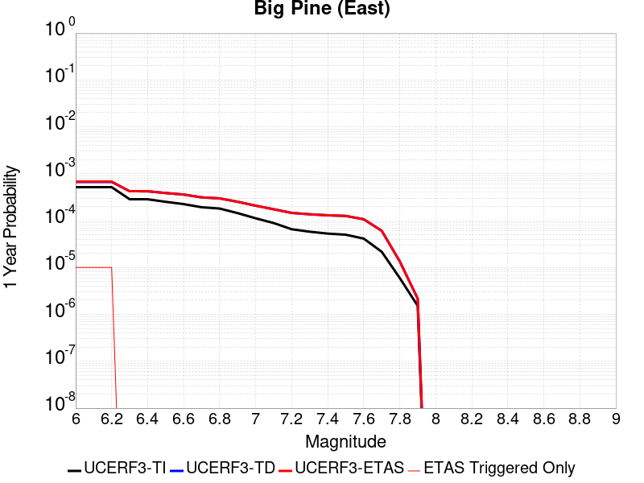 |  |

| Magnitude | 1 wk TI Prob | 1 wk TD Prob | 1 wk ETAS Prob | 1 wk ETAS/TD Gain | 1 wk ETAS Triggered Only | 1 mo TI Prob | 1 mo TD Prob | 1 mo ETAS Prob | 1 mo ETAS/TD Gain | 1 mo ETAS Triggered Only | 1 yr TI Prob | 1 yr TD Prob | 1 yr ETAS Prob | 1 yr ETAS/TD Gain | 1 yr ETAS Triggered Only | 10 yr TI Prob | 10 yr TD Prob | 10 yr ETAS Prob | 10 yr ETAS/TD Gain | 10 yr ETAS Triggered Only |
|-----|-----|-----|-----|-----|-----|-----|-----|-----|-----|-----|-----|-----|-----|-----|-----|-----|-----|-----|-----|-----|
| 6.0 | 9.916913E-6 | 1.2825709E-5 | 1.2825709E-5 | 1.0 | 0.0 | 4.250036E-5 | 5.496629E-5 | 5.496629E-5 | 1.0 | 0.0 | 5.173191E-4 | 6.6903123E-4 | 6.790245E-4 | 1.014937 | 1.0E-5 | 0.0051611643 | 0.0066748885 | 0.006694755 | 1.0029763 | 2.0E-5 |
| 6.1 | 9.916913E-6 | 1.2825709E-5 | 1.2825709E-5 | 1.0 | 0.0 | 4.250036E-5 | 5.496629E-5 | 5.496629E-5 | 1.0 | 0.0 | 5.173191E-4 | 6.6903123E-4 | 6.790245E-4 | 1.014937 | 1.0E-5 | 0.0051611643 | 0.0066748885 | 0.006694755 | 1.0029763 | 2.0E-5 |
| 6.2 | 9.916913E-6 | 1.2825709E-5 | 1.2825709E-5 | 1.0 | 0.0 | 4.250036E-5 | 5.496629E-5 | 5.496629E-5 | 1.0 | 0.0 | 5.173191E-4 | 6.6903123E-4 | 6.790245E-4 | 1.014937 | 1.0E-5 | 0.0051611643 | 0.0066748885 | 0.006694755 | 1.0029763 | 2.0E-5 |
| 6.3 | 5.479711E-6 | 8.121413E-6 | 8.121413E-6 | 1.0 | 0.0 | 2.3484265E-5 | 3.480561E-5 | 3.480561E-5 | 1.0 | 0.0 | 2.858834E-4 | 4.236791E-4 | 4.236791E-4 | 1.0 | 0.0 | 0.0028551589 | 0.004231565 | 0.004241523 | 1.0023532 | 1.0E-5 |
| 6.4 | 5.465009E-6 | 8.105705E-6 | 8.105705E-6 | 1.0 | 0.0 | 2.3421257E-5 | 3.4738292E-5 | 3.4738292E-5 | 1.0 | 0.0 | 2.851165E-4 | 4.2285983E-4 | 4.2285983E-4 | 1.0 | 0.0 | 0.0028475097 | 0.0042234035 | 0.004233361 | 1.0023577 | 1.0E-5 |
| 6.5 | 4.826767E-6 | 7.430726E-6 | 7.430726E-6 | 1.0 | 0.0 | 2.068598E-5 | 3.1845593E-5 | 3.1845593E-5 | 1.0 | 0.0 | 2.518227E-4 | 3.876539E-4 | 3.876539E-4 | 1.0 | 0.0 | 0.0025153751 | 0.0038725866 | 0.003882548 | 1.0025723 | 1.0E-5 |
| 6.6 | 4.3146847E-6 | 6.8906343E-6 | 6.8906343E-6 | 1.0 | 0.0 | 1.8491375E-5 | 2.953097E-5 | 2.953097E-5 | 1.0 | 0.0 | 2.2510924E-4 | 3.5948268E-4 | 3.5948268E-4 | 1.0 | 0.0 | 0.0022488134 | 0.0035917892 | 0.0036017534 | 1.0027741 | 1.0E-5 |
| 6.7 | 3.6968106E-6 | 6.0033744E-6 | 6.0033744E-6 | 1.0 | 0.0 | 1.5843378E-5 | 2.5728503E-5 | 2.5728503E-5 | 1.0 | 0.0 | 1.9287605E-4 | 3.1320105E-4 | 3.1320105E-4 | 1.0 | 0.0 | 0.0019270873 | 0.0031302832 | 0.0031402519 | 1.0031846 | 1.0E-5 |
| 6.8 | 3.4671132E-6 | 5.7098646E-6 | 5.7098646E-6 | 1.0 | 0.0 | 1.4858972E-5 | 2.4470628E-5 | 2.4470628E-5 | 1.0 | 0.0 | 1.8089297E-4 | 2.978906E-4 | 2.978906E-4 | 1.0 | 0.0 | 0.0018074579 | 0.0029775912 | 0.0029875615 | 1.0033485 | 1.0E-5 |
| 6.9 | 2.7686972E-6 | 4.832321E-6 | 4.832321E-6 | 1.0 | 0.0 | 1.1865792E-5 | 2.0709786E-5 | 2.0709786E-5 | 1.0 | 0.0 | 1.4445644E-4 | 2.5211324E-4 | 2.5211324E-4 | 1.0 | 0.0 | 0.0014436257 | 0.0025208825 | 0.0025208825 | 1.0 | 0.0 |
| 7.0 | 2.1472624E-6 | 3.9914885E-6 | 3.9914885E-6 | 1.0 | 0.0 | 9.20252E-6 | 1.710627E-5 | 1.710627E-5 | 1.0 | 0.0 | 1.12034926E-4 | 2.0824946E-4 | 2.0824946E-4 | 1.0 | 0.0 | 0.0011197845 | 0.0020831213 | 0.0020831213 | 1.0 | 0.0 |
| 7.1 | 1.7018335E-6 | 3.3507438E-6 | 3.3507438E-6 | 1.0 | 0.0 | 7.293552E-6 | 1.4360253E-5 | 1.4360253E-5 | 1.0 | 0.0 | 8.879537E-5 | 1.7482242E-4 | 1.7482242E-4 | 1.0 | 0.0 | 8.87599E-4 | 0.0017493955 | 0.0017493955 | 1.0 | 0.0 |
| 7.2 | 1.25603E-6 | 2.8000272E-6 | 2.8000272E-6 | 1.0 | 0.0 | 5.3829745E-6 | 1.2000062E-5 | 1.2000062E-5 | 1.0 | 0.0 | 6.553574E-5 | 1.4609119E-4 | 1.4609119E-4 | 1.0 | 0.0 | 6.551642E-4 | 0.0014624739 | 0.0014624739 | 1.0 | 0.0 |
| 7.3 | 1.112297E-6 | 2.6155662E-6 | 2.6155662E-6 | 1.0 | 0.0 | 4.7669787E-6 | 1.1209522E-5 | 1.1209522E-5 | 1.0 | 0.0 | 5.803642E-5 | 1.364676E-4 | 1.364676E-4 | 1.0 | 0.0 | 5.802127E-4 | 0.0013661919 | 0.0013661919 | 1.0 | 0.0 |
| 7.4 | 1.0137181E-6 | 2.4885014E-6 | 2.4885014E-6 | 1.0 | 0.0 | 4.3444993E-6 | 1.0664963E-5 | 1.0664963E-5 | 1.0 | 0.0 | 5.2892992E-5 | 1.298384E-4 | 1.298384E-4 | 1.0 | 0.0 | 5.288041E-4 | 0.0012997637 | 0.0012997637 | 1.0 | 0.0 |
| 7.5 | 9.598608E-7 | 2.4120086E-6 | 2.4120086E-6 | 1.0 | 0.0 | 4.1136827E-6 | 1.033714E-5 | 1.033714E-5 | 1.0 | 0.0 | 5.0082934E-5 | 1.2584763E-4 | 1.2584763E-4 | 1.0 | 0.0 | 5.007165E-4 | 0.0012597104 | 0.0012597104 | 1.0 | 0.0 |
| 7.6 | 7.929459E-7 | 2.0491518E-6 | 2.0491518E-6 | 1.0 | 0.0 | 3.3983351E-6 | 8.78205E-6 | 8.78205E-6 | 1.0 | 0.0 | 4.1373947E-5 | 1.0691639E-4 | 1.0691639E-4 | 1.0 | 0.0 | 4.1366243E-4 | 0.0010706924 | 0.0010706924 | 1.0 | 0.0 |
| 7.7 | 4.155788E-7 | 1.1636025E-6 | 1.1636025E-6 | 1.0 | 0.0 | 1.7810507E-6 | 4.9868586E-6 | 4.9868586E-6 | 1.0 | 0.0 | 2.1684076E-5 | 6.071335E-5 | 6.071335E-5 | 1.0 | 0.0 | 2.1681961E-4 | 6.1010936E-4 | 6.1010936E-4 | 1.0 | 0.0 |
| 7.8 | 1.14666925E-7 | 2.5988516E-7 | 2.5988516E-7 | 1.0 | 0.0 | 4.914296E-7 | 1.113793E-6 | 1.113793E-6 | 1.0 | 0.0 | 5.9831386E-6 | 1.356035E-5 | 1.356035E-5 | 1.0 | 0.0 | 5.9829777E-5 | 1.3669157E-4 | 1.3669157E-4 | 1.0 | 0.0 |
| 7.9 | 2.9231824E-8 | 4.1577984E-8 | 4.1577984E-8 | 1.0 | 0.0 | 1.2527924E-7 | 1.7819136E-7 | 1.7819136E-7 | 1.0 | 0.0 | 1.5252737E-6 | 2.1694777E-6 | 2.1694777E-6 | 1.0 | 0.0 | 1.5252632E-5 | 2.2027418E-5 | 2.2027418E-5 | 1.0 | 0.0 |

## San Jacinto (Anza) rev
*[(top)](#table-of-contents)*

| 1 Week | 1 Month | 1 Year | 10 Year |
|-----|-----|-----|-----|
| 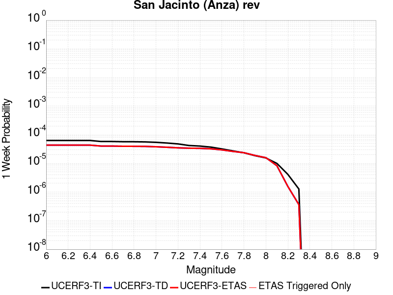 |  |  |  |

| Magnitude | 1 wk TI Prob | 1 wk TD Prob | 1 wk ETAS Prob | 1 wk ETAS/TD Gain | 1 wk ETAS Triggered Only | 1 mo TI Prob | 1 mo TD Prob | 1 mo ETAS Prob | 1 mo ETAS/TD Gain | 1 mo ETAS Triggered Only | 1 yr TI Prob | 1 yr TD Prob | 1 yr ETAS Prob | 1 yr ETAS/TD Gain | 1 yr ETAS Triggered Only | 10 yr TI Prob | 10 yr TD Prob | 10 yr ETAS Prob | 10 yr ETAS/TD Gain | 10 yr ETAS Triggered Only |
|-----|-----|-----|-----|-----|-----|-----|-----|-----|-----|-----|-----|-----|-----|-----|-----|-----|-----|-----|-----|-----|
| 6.0 | 6.3015636E-5 | 4.3428E-5 | 4.3428E-5 | 1.0 | 0.0 | 2.7003905E-4 | 1.8610679E-4 | 1.9610493E-4 | 1.0537226 | 1.0E-5 | 0.0032827691 | 0.0022635076 | 0.0022834623 | 1.0088159 | 2.0E-5 | 0.032346968 | 0.023360996 | 0.02338053 | 1.0008361 | 2.0E-5 |
| 6.1 | 6.3015636E-5 | 4.3428E-5 | 4.3428E-5 | 1.0 | 0.0 | 2.7003905E-4 | 1.8610679E-4 | 1.9610493E-4 | 1.0537226 | 1.0E-5 | 0.0032827691 | 0.0022635076 | 0.0022834623 | 1.0088159 | 2.0E-5 | 0.032346968 | 0.023360996 | 0.02338053 | 1.0008361 | 2.0E-5 |
| 6.2 | 6.3015636E-5 | 4.3428E-5 | 4.3428E-5 | 1.0 | 0.0 | 2.7003905E-4 | 1.8610679E-4 | 1.9610493E-4 | 1.0537226 | 1.0E-5 | 0.0032827691 | 0.0022635076 | 0.0022834623 | 1.0088159 | 2.0E-5 | 0.032346968 | 0.023360996 | 0.02338053 | 1.0008361 | 2.0E-5 |
| 6.3 | 6.3015636E-5 | 4.3428E-5 | 4.3428E-5 | 1.0 | 0.0 | 2.7003905E-4 | 1.8610679E-4 | 1.9610493E-4 | 1.0537226 | 1.0E-5 | 0.0032827691 | 0.0022635076 | 0.0022834623 | 1.0088159 | 2.0E-5 | 0.032346968 | 0.023360996 | 0.02338053 | 1.0008361 | 2.0E-5 |
| 6.4 | 6.3015636E-5 | 4.3428E-5 | 4.3428E-5 | 1.0 | 0.0 | 2.7003905E-4 | 1.8610679E-4 | 1.9610493E-4 | 1.0537226 | 1.0E-5 | 0.0032827691 | 0.0022635076 | 0.0022834623 | 1.0088159 | 2.0E-5 | 0.032346968 | 0.023360996 | 0.02338053 | 1.0008361 | 2.0E-5 |
| 6.5 | 5.811017E-5 | 4.020185E-5 | 4.020185E-5 | 1.0 | 0.0 | 2.4901982E-4 | 1.7228229E-4 | 1.8228058E-4 | 1.0580343 | 1.0E-5 | 0.0030276014 | 0.0020955247 | 0.002115483 | 1.0095241 | 2.0E-5 | 0.02986684 | 0.021655614 | 0.02167518 | 1.0009036 | 2.0E-5 |
| 6.6 | 5.811017E-5 | 4.020185E-5 | 4.020185E-5 | 1.0 | 0.0 | 2.4901982E-4 | 1.7228229E-4 | 1.8228058E-4 | 1.0580343 | 1.0E-5 | 0.0030276014 | 0.0020955247 | 0.002115483 | 1.0095241 | 2.0E-5 | 0.02986684 | 0.021655614 | 0.02167518 | 1.0009036 | 2.0E-5 |
| 6.7 | 5.712442E-5 | 3.9623283E-5 | 3.9623283E-5 | 1.0 | 0.0 | 2.4479596E-4 | 1.6980304E-4 | 1.7980134E-4 | 1.0588818 | 1.0E-5 | 0.0029763177 | 0.0020653973 | 0.002085356 | 1.0096633 | 2.0E-5 | 0.029367693 | 0.021346811 | 0.021366384 | 1.000917 | 2.0E-5 |
| 6.8 | 5.6967532E-5 | 3.9479477E-5 | 3.9479477E-5 | 1.0 | 0.0 | 2.4412372E-4 | 1.6918682E-4 | 1.7918512E-4 | 1.0590962 | 1.0E-5 | 0.0029681553 | 0.002057909 | 0.002077868 | 1.0096986 | 2.0E-5 | 0.029288229 | 0.021271437 | 0.021291012 | 1.0009202 | 2.0E-5 |
| 6.9 | 5.6211324E-5 | 3.918348E-5 | 3.918348E-5 | 1.0 | 0.0 | 2.4088343E-4 | 1.6791842E-4 | 1.7791674E-4 | 1.0595428 | 1.0E-5 | 0.0029288116 | 0.0020424952 | 0.0020624544 | 1.009772 | 2.0E-5 | 0.028905109 | 0.021110468 | 0.021130046 | 1.0009274 | 2.0E-5 |
| 7.0 | 5.4383527E-5 | 3.8041388E-5 | 3.8041388E-5 | 1.0 | 0.0 | 2.3305144E-4 | 1.6302435E-4 | 1.7302272E-4 | 1.0613306 | 1.0E-5 | 0.0028337094 | 0.0019830195 | 0.0020029799 | 1.0100657 | 2.0E-5 | 0.027978465 | 0.020500116 | 0.020519705 | 1.0009556 | 2.0E-5 |
| 7.1 | 5.1393665E-5 | 3.650025E-5 | 3.650025E-5 | 1.0 | 0.0 | 2.2023996E-4 | 1.5642028E-4 | 1.6641871E-4 | 1.0639204 | 1.0E-5 | 0.0026781242 | 0.0019027577 | 0.0019227196 | 1.010491 | 2.0E-5 | 0.026460782 | 0.01967177 | 0.019691376 | 1.0009967 | 2.0E-5 |
| 7.2 | 4.785222E-5 | 3.4847708E-5 | 3.4847708E-5 | 1.0 | 0.0 | 2.0506482E-4 | 1.4933878E-4 | 1.5933729E-4 | 1.0669519 | 1.0E-5 | 0.0024938055 | 0.0018166869 | 0.0018366507 | 1.0109891 | 2.0E-5 | 0.024660049 | 0.01878418 | 0.018803803 | 1.0010448 | 2.0E-5 |
| 7.3 | 4.2143256E-5 | 3.3939174E-5 | 3.3939174E-5 | 1.0 | 0.0 | 1.8060145E-4 | 1.4544552E-4 | 1.5544405E-4 | 1.0687443 | 1.0E-5 | 0.002196605 | 0.0017693643 | 0.0017893289 | 1.0112835 | 2.0E-5 | 0.02175019 | 0.018290773 | 0.018310407 | 1.0010735 | 2.0E-5 |
| 7.4 | 4.0264713E-5 | 3.3576394E-5 | 3.3576394E-5 | 1.0 | 0.0 | 1.7255165E-4 | 1.4389091E-4 | 1.5388947E-4 | 1.0694871 | 1.0E-5 | 0.002098792 | 0.0017504676 | 0.0017704326 | 1.0114055 | 2.0E-5 | 0.020790804 | 0.01809483 | 0.018114468 | 1.0010853 | 2.0E-5 |
| 7.5 | 3.694492E-5 | 3.2287433E-5 | 3.2287433E-5 | 1.0 | 0.0 | 1.5832575E-4 | 1.383674E-4 | 1.48366E-4 | 1.0722613 | 1.0E-5 | 0.0019259118 | 0.0016833243 | 0.0017032906 | 1.0118612 | 2.0E-5 | 0.01909306 | 0.017409757 | 0.017429408 | 1.0011288 | 2.0E-5 |
| 7.6 | 3.200565E-5 | 2.9594363E-5 | 2.9594363E-5 | 1.0 | 0.0 | 1.3715986E-4 | 1.2682682E-4 | 1.3682556E-4 | 1.0788376 | 1.0E-5 | 0.001668642 | 0.0015430251 | 0.0015629943 | 1.0129416 | 2.0E-5 | 0.01656168 | 0.015993277 | 0.016012957 | 1.0012305 | 2.0E-5 |
| 7.7 | 2.731642E-5 | 2.6180345E-5 | 2.6180345E-5 | 1.0 | 0.0 | 1.1706512E-4 | 1.12196656E-4 | 1.2219553E-4 | 1.0891192 | 1.0E-5 | 0.001424336 | 0.0013651394 | 0.0013851121 | 1.0146306 | 2.0E-5 | 0.014152412 | 0.014212666 | 0.014232381 | 1.0013872 | 2.0E-5 |
| 7.8 | 2.3466424E-5 | 2.3588831E-5 | 2.3588831E-5 | 1.0 | 0.0 | 1.0056651E-4 | 1.0109108E-4 | 1.1109007E-4 | 1.0989107 | 1.0E-5 | 0.0012237094 | 0.0012300898 | 0.0012500652 | 1.0162389 | 2.0E-5 | 0.012169928 | 0.012852781 | 0.012872525 | 1.0015361 | 2.0E-5 |
| 7.9 | 1.8611925E-5 | 1.8983887E-5 | 1.8983887E-5 | 1.0 | 0.0 | 7.9762955E-5 | 8.135698E-5 | 9.135617E-5 | 1.1229051 | 1.0E-5 | 9.7068126E-4 | 9.900718E-4 | 0.001010052 | 1.0201806 | 2.0E-5 | 0.0096645225 | 0.010433564 | 0.0104533555 | 1.0018969 | 2.0E-5 |
| 8.0 | 1.5460775E-5 | 1.5808117E-5 | 1.5808117E-5 | 1.0 | 0.0 | 6.6258784E-5 | 6.7747314E-5 | 7.774664E-5 | 1.1475973 | 1.0E-5 | 8.0640207E-4 | 8.245121E-4 | 8.444956E-4 | 1.0242368 | 2.0E-5 | 0.008034821 | 0.008738231 | 0.008758056 | 1.0022688 | 2.0E-5 |
| 8.1 | 9.983884E-6 | 8.3092755E-6 | 8.3092755E-6 | 1.0 | 0.0 | 4.2787375E-5 | 3.5610698E-5 | 4.561034E-5 | 1.2808045 | 1.0E-5 | 5.2081177E-4 | 4.3347452E-4 | 4.4347017E-4 | 1.0230594 | 1.0E-5 | 0.0051959283 | 0.0046611596 | 0.004671113 | 1.0021354 | 1.0E-5 |
| 8.2 | 4.1226E-6 | 1.5644688E-6 | 1.5644688E-6 | 1.0 | 0.0 | 1.7668166E-5 | 6.704849E-6 | 6.704849E-6 | 1.0 | 0.0 | 2.1508869E-4 | 8.162851E-5 | 8.162851E-5 | 1.0 | 0.0 | 0.0021488064 | 9.4706635E-4 | 9.4706635E-4 | 1.0 | 0.0 |
| 8.3 | 1.2750878E-6 | 3.6436526E-7 | 3.6436526E-7 | 1.0 | 0.0 | 5.4646503E-6 | 1.5615645E-6 | 1.5615645E-6 | 1.0 | 0.0 | 6.653009E-5 | 1.9011886E-5 | 1.9011886E-5 | 1.0 | 0.0 | 6.6510175E-4 | 2.291941E-4 | 2.291941E-4 | 1.0 | 0.0 |

## Los Osos 2011
*[(top)](#table-of-contents)*

| 1 Week | 1 Month | 1 Year | 10 Year |
|-----|-----|-----|-----|
|  |  |  | 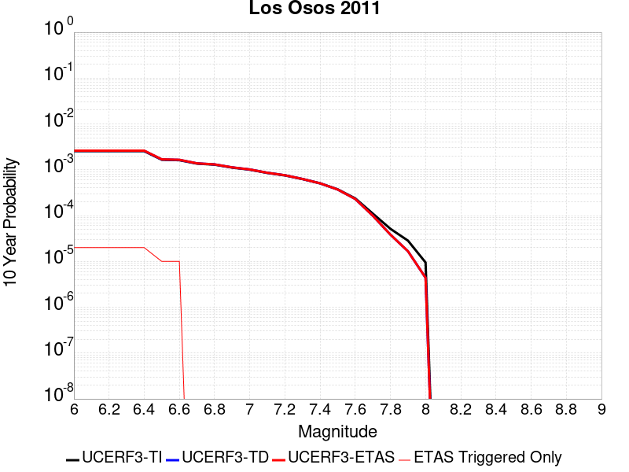 |

| Magnitude | 1 wk TI Prob | 1 wk TD Prob | 1 wk ETAS Prob | 1 wk ETAS/TD Gain | 1 wk ETAS Triggered Only | 1 mo TI Prob | 1 mo TD Prob | 1 mo ETAS Prob | 1 mo ETAS/TD Gain | 1 mo ETAS Triggered Only | 1 yr TI Prob | 1 yr TD Prob | 1 yr ETAS Prob | 1 yr ETAS/TD Gain | 1 yr ETAS Triggered Only | 10 yr TI Prob | 10 yr TD Prob | 10 yr ETAS Prob | 10 yr ETAS/TD Gain | 10 yr ETAS Triggered Only |
|-----|-----|-----|-----|-----|-----|-----|-----|-----|-----|-----|-----|-----|-----|-----|-----|-----|-----|-----|-----|-----|
| 6.0 | 4.8871775E-6 | 4.981626E-6 | 4.981626E-6 | 1.0 | 0.0 | 2.0944879E-5 | 2.1349666E-5 | 2.1349666E-5 | 1.0 | 0.0 | 2.5497406E-4 | 2.5990396E-4 | 2.5990396E-4 | 1.0 | 0.0 | 0.002546817 | 0.0025962745 | 0.0026162225 | 1.0076834 | 2.0E-5 |
| 6.1 | 4.8871775E-6 | 4.981626E-6 | 4.981626E-6 | 1.0 | 0.0 | 2.0944879E-5 | 2.1349666E-5 | 2.1349666E-5 | 1.0 | 0.0 | 2.5497406E-4 | 2.5990396E-4 | 2.5990396E-4 | 1.0 | 0.0 | 0.002546817 | 0.0025962745 | 0.0026162225 | 1.0076834 | 2.0E-5 |
| 6.2 | 4.8871775E-6 | 4.981626E-6 | 4.981626E-6 | 1.0 | 0.0 | 2.0944879E-5 | 2.1349666E-5 | 2.1349666E-5 | 1.0 | 0.0 | 2.5497406E-4 | 2.5990396E-4 | 2.5990396E-4 | 1.0 | 0.0 | 0.002546817 | 0.0025962745 | 0.0026162225 | 1.0076834 | 2.0E-5 |
| 6.3 | 4.8871775E-6 | 4.981626E-6 | 4.981626E-6 | 1.0 | 0.0 | 2.0944879E-5 | 2.1349666E-5 | 2.1349666E-5 | 1.0 | 0.0 | 2.5497406E-4 | 2.5990396E-4 | 2.5990396E-4 | 1.0 | 0.0 | 0.002546817 | 0.0025962745 | 0.0026162225 | 1.0076834 | 2.0E-5 |
| 6.4 | 4.8871775E-6 | 4.981626E-6 | 4.981626E-6 | 1.0 | 0.0 | 2.0944879E-5 | 2.1349666E-5 | 2.1349666E-5 | 1.0 | 0.0 | 2.5497406E-4 | 2.5990396E-4 | 2.5990396E-4 | 1.0 | 0.0 | 0.002546817 | 0.0025962745 | 0.0026162225 | 1.0076834 | 2.0E-5 |
| 6.5 | 3.1724062E-6 | 3.223496E-6 | 3.223496E-6 | 1.0 | 0.0 | 1.3595956E-5 | 1.3814911E-5 | 1.3814911E-5 | 1.0 | 0.0 | 1.6551818E-4 | 1.6818369E-4 | 1.6818369E-4 | 1.0 | 0.0 | 0.0016539496 | 0.0016805775 | 0.0016905607 | 1.0059403 | 1.0E-5 |
| 6.6 | 3.1022591E-6 | 3.1512034E-6 | 3.1512034E-6 | 1.0 | 0.0 | 1.3295328E-5 | 1.3505089E-5 | 1.3505089E-5 | 1.0 | 0.0 | 1.618586E-4 | 1.6441217E-4 | 1.6441217E-4 | 1.0 | 0.0 | 0.0016174077 | 0.0016429181 | 0.0016529018 | 1.0060767 | 1.0E-5 |
| 6.7 | 2.611518E-6 | 2.6492717E-6 | 2.6492717E-6 | 1.0 | 0.0 | 1.1192172E-5 | 1.1353972E-5 | 1.1353972E-5 | 1.0 | 0.0 | 1.3625617E-4 | 1.3822588E-4 | 1.3822588E-4 | 1.0 | 0.0 | 0.0013617266 | 0.0013814037 | 0.0013814037 | 1.0 | 0.0 |
| 6.8 | 2.4780884E-6 | 2.5122442E-6 | 2.5122442E-6 | 1.0 | 0.0 | 1.0620336E-5 | 1.07667165E-5 | 1.07667165E-5 | 1.0 | 0.0 | 1.2929492E-4 | 1.3107693E-4 | 1.3107693E-4 | 1.0 | 0.0 | 0.0012921972 | 0.0013100003 | 0.0013100003 | 1.0 | 0.0 |
| 6.9 | 2.1376322E-6 | 2.1635828E-6 | 2.1635828E-6 | 1.0 | 0.0 | 9.161248E-6 | 9.272465E-6 | 9.272465E-6 | 1.0 | 0.0 | 1.1153249E-4 | 1.12886424E-4 | 1.12886424E-4 | 1.0 | 0.0 | 0.0011147653 | 0.0011282928 | 0.0011282928 | 1.0 | 0.0 |
| 7.0 | 1.9282882E-6 | 1.9495312E-6 | 1.9495312E-6 | 1.0 | 0.0 | 8.264066E-6 | 8.355107E-6 | 8.355107E-6 | 1.0 | 0.0 | 1.0061036E-4 | 1.01718695E-4 | 1.01718695E-4 | 1.0 | 0.0 | 0.0010056482 | 0.0010167228 | 0.0010167228 | 1.0 | 0.0 |
| 7.1 | 1.6353226E-6 | 1.6501784E-6 | 1.6501784E-6 | 1.0 | 0.0 | 7.0085066E-6 | 7.072174E-6 | 7.072174E-6 | 1.0 | 0.0 | 8.532523E-5 | 8.610033E-5 | 8.610033E-5 | 1.0 | 0.0 | 8.529247E-4 | 8.606704E-4 | 8.606704E-4 | 1.0 | 0.0 |
| 7.2 | 1.4446276E-6 | 1.4553968E-6 | 1.4553968E-6 | 1.0 | 0.0 | 6.191247E-6 | 6.2374E-6 | 6.2374E-6 | 1.0 | 0.0 | 7.537582E-5 | 7.593771E-5 | 7.593771E-5 | 1.0 | 0.0 | 7.535026E-4 | 7.591182E-4 | 7.591182E-4 | 1.0 | 0.0 |
| 7.3 | 1.2014582E-6 | 1.2069651E-6 | 1.2069651E-6 | 1.0 | 0.0 | 5.149096E-6 | 5.172697E-6 | 5.172697E-6 | 1.0 | 0.0 | 6.268844E-5 | 6.297577E-5 | 6.297577E-5 | 1.0 | 0.0 | 6.267076E-4 | 6.2957965E-4 | 6.2957965E-4 | 1.0 | 0.0 |
| 7.4 | 9.707733E-7 | 9.710301E-7 | 9.710301E-7 | 1.0 | 0.0 | 4.16045E-6 | 4.161551E-6 | 4.161551E-6 | 1.0 | 0.0 | 5.0652303E-5 | 5.0665705E-5 | 5.0665705E-5 | 1.0 | 0.0 | 5.064076E-4 | 5.065418E-4 | 5.065418E-4 | 1.0 | 0.0 |
| 7.5 | 7.174908E-7 | 7.1153823E-7 | 7.1153823E-7 | 1.0 | 0.0 | 3.074957E-6 | 3.049446E-6 | 3.049446E-6 | 1.0 | 0.0 | 3.743696E-5 | 3.7126374E-5 | 3.7126374E-5 | 1.0 | 0.0 | 3.7430652E-4 | 3.712019E-4 | 3.712019E-4 | 1.0 | 0.0 |
| 7.6 | 4.5535776E-7 | 4.4211913E-7 | 4.4211913E-7 | 1.0 | 0.0 | 1.9515319E-6 | 1.8947949E-6 | 1.8947949E-6 | 1.0 | 0.0 | 2.3759641E-5 | 2.3068884E-5 | 2.3068884E-5 | 1.0 | 0.0 | 2.37571E-4 | 2.3066498E-4 | 2.3066498E-4 | 1.0 | 0.0 |
| 7.7 | 2.1173553E-7 | 1.9064034E-7 | 1.9064034E-7 | 1.0 | 0.0 | 9.0743765E-7 | 8.1702973E-7 | 8.1702973E-7 | 1.0 | 0.0 | 1.1047998E-5 | 9.947292E-6 | 9.947292E-6 | 1.0 | 0.0 | 1.1047449E-4 | 9.946849E-5 | 9.946849E-5 | 1.0 | 0.0 |
| 7.8 | 9.873608E-8 | 7.370383E-8 | 7.370383E-8 | 1.0 | 0.0 | 4.2315455E-7 | 3.158735E-7 | 3.158735E-7 | 1.0 | 0.0 | 5.1518946E-6 | 3.8457533E-6 | 3.8457533E-6 | 1.0 | 0.0 | 5.1517753E-5 | 3.8456874E-5 | 3.8456874E-5 | 1.0 | 0.0 |
| 7.9 | 5.4399106E-8 | 3.190516E-8 | 3.190516E-8 | 1.0 | 0.0 | 2.33139E-7 | 1.3673639E-7 | 1.3673639E-7 | 1.0 | 0.0 | 2.8384638E-6 | 1.6647642E-6 | 1.6647642E-6 | 1.0 | 0.0 | 2.8384275E-5 | 1.6647518E-5 | 1.6647518E-5 | 1.0 | 0.0 |
| 8.0 | 1.817203E-8 | 8.431308E-9 | 8.431308E-9 | 1.0 | 0.0 | 7.7880124E-8 | 3.613418E-8 | 3.613418E-8 | 1.0 | 0.0 | 9.481901E-7 | 4.3993353E-7 | 4.3993353E-7 | 1.0 | 0.0 | 9.481861E-6 | 4.3993273E-6 | 4.3993273E-6 | 1.0 | 0.0 |

## Pleito
*[(top)](#table-of-contents)*

| 1 Week | 1 Month | 1 Year | 10 Year |
|-----|-----|-----|-----|
|  | 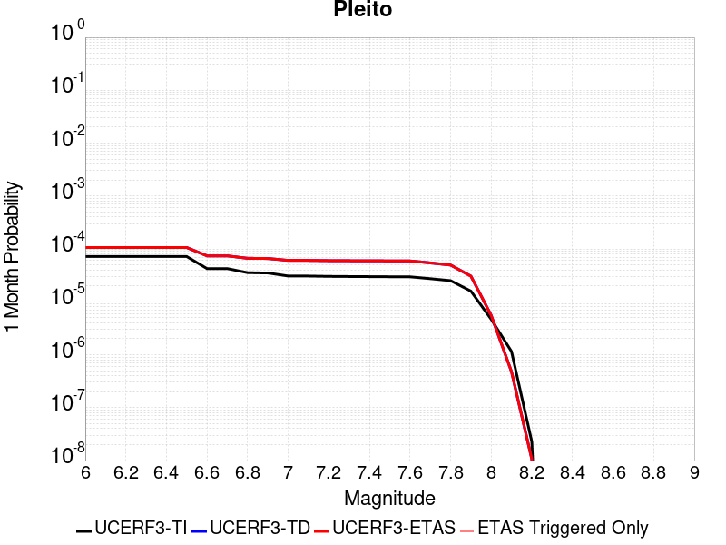 |  | 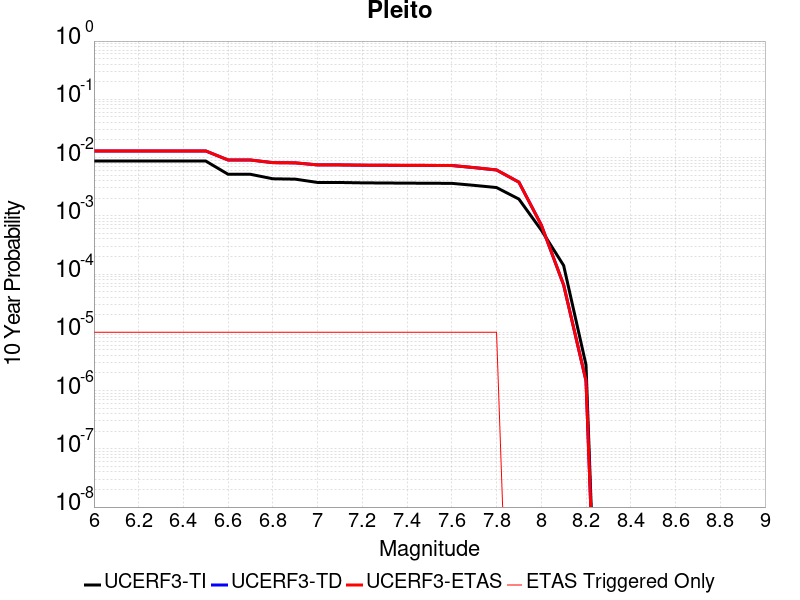 |

| Magnitude | 1 wk TI Prob | 1 wk TD Prob | 1 wk ETAS Prob | 1 wk ETAS/TD Gain | 1 wk ETAS Triggered Only | 1 mo TI Prob | 1 mo TD Prob | 1 mo ETAS Prob | 1 mo ETAS/TD Gain | 1 mo ETAS Triggered Only | 1 yr TI Prob | 1 yr TD Prob | 1 yr ETAS Prob | 1 yr ETAS/TD Gain | 1 yr ETAS Triggered Only | 10 yr TI Prob | 10 yr TD Prob | 10 yr ETAS Prob | 10 yr ETAS/TD Gain | 10 yr ETAS Triggered Only |
|-----|-----|-----|-----|-----|-----|-----|-----|-----|-----|-----|-----|-----|-----|-----|-----|-----|-----|-----|-----|-----|
| 6.0 | 1.6763008E-5 | 2.4810548E-5 | 2.4810548E-5 | 1.0 | 0.0 | 7.183948E-5 | 1.06326996E-4 | 1.06326996E-4 | 1.0 | 0.0 | 8.742947E-4 | 0.0012938344 | 0.0013038216 | 1.0077189 | 1.0E-5 | 0.00870863 | 0.01297747 | 0.01298734 | 1.0007606 | 1.0E-5 |
| 6.1 | 1.6763008E-5 | 2.4810548E-5 | 2.4810548E-5 | 1.0 | 0.0 | 7.183948E-5 | 1.06326996E-4 | 1.06326996E-4 | 1.0 | 0.0 | 8.742947E-4 | 0.0012938344 | 0.0013038216 | 1.0077189 | 1.0E-5 | 0.00870863 | 0.01297747 | 0.01298734 | 1.0007606 | 1.0E-5 |
| 6.2 | 1.6763008E-5 | 2.4810548E-5 | 2.4810548E-5 | 1.0 | 0.0 | 7.183948E-5 | 1.06326996E-4 | 1.06326996E-4 | 1.0 | 0.0 | 8.742947E-4 | 0.0012938344 | 0.0013038216 | 1.0077189 | 1.0E-5 | 0.00870863 | 0.01297747 | 0.01298734 | 1.0007606 | 1.0E-5 |
| 6.3 | 1.6763008E-5 | 2.4810548E-5 | 2.4810548E-5 | 1.0 | 0.0 | 7.183948E-5 | 1.06326996E-4 | 1.06326996E-4 | 1.0 | 0.0 | 8.742947E-4 | 0.0012938344 | 0.0013038216 | 1.0077189 | 1.0E-5 | 0.00870863 | 0.01297747 | 0.01298734 | 1.0007606 | 1.0E-5 |
| 6.4 | 1.6763008E-5 | 2.4810548E-5 | 2.4810548E-5 | 1.0 | 0.0 | 7.183948E-5 | 1.06326996E-4 | 1.06326996E-4 | 1.0 | 0.0 | 8.742947E-4 | 0.0012938344 | 0.0013038216 | 1.0077189 | 1.0E-5 | 0.00870863 | 0.01297747 | 0.01298734 | 1.0007606 | 1.0E-5 |
| 6.5 | 1.6763008E-5 | 2.4810548E-5 | 2.4810548E-5 | 1.0 | 0.0 | 7.183948E-5 | 1.06326996E-4 | 1.06326996E-4 | 1.0 | 0.0 | 8.742947E-4 | 0.0012938344 | 0.0013038216 | 1.0077189 | 1.0E-5 | 0.00870863 | 0.01297747 | 0.01298734 | 1.0007606 | 1.0E-5 |
| 6.6 | 9.910213E-6 | 1.7260621E-5 | 1.7260621E-5 | 1.0 | 0.0 | 4.247165E-5 | 7.397201E-5 | 7.397201E-5 | 1.0 | 0.0 | 5.169696E-4 | 9.0024085E-4 | 9.1023184E-4 | 1.0110981 | 1.0E-5 | 0.0051576863 | 0.009074004 | 0.009083914 | 1.0010921 | 1.0E-5 |
| 6.7 | 9.910213E-6 | 1.7260621E-5 | 1.7260621E-5 | 1.0 | 0.0 | 4.247165E-5 | 7.397201E-5 | 7.397201E-5 | 1.0 | 0.0 | 5.169696E-4 | 9.0024085E-4 | 9.1023184E-4 | 1.0110981 | 1.0E-5 | 0.0051576863 | 0.009074004 | 0.009083914 | 1.0010921 | 1.0E-5 |
| 6.8 | 8.300162E-6 | 1.55201E-5 | 1.55201E-5 | 1.0 | 0.0 | 3.557164E-5 | 6.651302E-5 | 6.651302E-5 | 1.0 | 0.0 | 4.3299864E-4 | 8.094966E-4 | 8.1948854E-4 | 1.0123434 | 1.0E-5 | 0.004321559 | 0.008173395 | 0.0081833135 | 1.0012134 | 1.0E-5 |
| 6.9 | 8.183114E-6 | 1.5391293E-5 | 1.5391293E-5 | 1.0 | 0.0 | 3.5070017E-5 | 6.596102E-5 | 6.596102E-5 | 1.0 | 0.0 | 4.2689382E-4 | 8.02781E-4 | 8.1277295E-4 | 1.0124466 | 1.0E-5 | 0.0042607468 | 0.008106731 | 0.008116649 | 1.0012236 | 1.0E-5 |
| 7.0 | 7.1748823E-6 | 1.4177708E-5 | 1.4177708E-5 | 1.0 | 0.0 | 3.0749135E-5 | 6.0760194E-5 | 6.0760194E-5 | 1.0 | 0.0 | 3.743064E-4 | 7.395048E-4 | 7.4949744E-4 | 1.0135126 | 1.0E-5 | 0.0037367654 | 0.0074779023 | 0.0074878274 | 1.0013273 | 1.0E-5 |
| 7.1 | 7.1671807E-6 | 1.4168073E-5 | 1.4168073E-5 | 1.0 | 0.0 | 3.0716128E-5 | 6.0718903E-5 | 6.0718903E-5 | 1.0 | 0.0 | 3.7390468E-4 | 7.390024E-4 | 7.4899505E-4 | 1.0135218 | 1.0E-5 | 0.0037327618 | 0.0074729123 | 0.0074828374 | 1.0013281 | 1.0E-5 |
| 7.2 | 7.0649667E-6 | 1.4015213E-5 | 1.4015213E-5 | 1.0 | 0.0 | 3.0278077E-5 | 6.0063823E-5 | 6.0063823E-5 | 1.0 | 0.0 | 3.6857324E-4 | 7.3103217E-4 | 7.4102485E-4 | 1.0136693 | 1.0E-5 | 0.0036796255 | 0.0073935944 | 0.0074035204 | 1.0013425 | 1.0E-5 |
| 7.3 | 7.02082E-6 | 1.3958581E-5 | 1.3958581E-5 | 1.0 | 0.0 | 3.008888E-5 | 5.9821123E-5 | 5.9821123E-5 | 1.0 | 0.0 | 3.6627054E-4 | 7.280793E-4 | 7.3807203E-4 | 1.0137248 | 1.0E-5 | 0.0036566744 | 0.0073640496 | 0.007373976 | 1.0013479 | 1.0E-5 |
| 7.4 | 6.987146E-6 | 1.3918094E-5 | 1.3918094E-5 | 1.0 | 0.0 | 2.9944567E-5 | 5.964761E-5 | 5.964761E-5 | 1.0 | 0.0 | 3.6451413E-4 | 7.259682E-4 | 7.3596096E-4 | 1.0137647 | 1.0E-5 | 0.0036391679 | 0.00734296 | 0.0073528867 | 1.0013518 | 1.0E-5 |
| 7.5 | 6.9494554E-6 | 1.3874961E-5 | 1.3874961E-5 | 1.0 | 0.0 | 2.9783041E-5 | 5.9462767E-5 | 5.9462767E-5 | 1.0 | 0.0 | 3.625482E-4 | 7.2371925E-4 | 7.33712E-4 | 1.0138075 | 1.0E-5 | 0.0036195726 | 0.00732057 | 0.0073304963 | 1.001356 | 1.0E-5 |
| 7.6 | 6.92694E-6 | 1.3834006E-5 | 1.3834006E-5 | 1.0 | 0.0 | 2.9686547E-5 | 5.928725E-5 | 5.928725E-5 | 1.0 | 0.0 | 3.6137376E-4 | 7.215837E-4 | 7.315765E-4 | 1.0138484 | 1.0E-5 | 0.0036078666 | 0.0072992877 | 0.0073092147 | 1.0013599 | 1.0E-5 |
| 7.7 | 6.395867E-6 | 1.2711179E-5 | 1.2711179E-5 | 1.0 | 0.0 | 2.741057E-5 | 5.4475346E-5 | 5.4475346E-5 | 1.0 | 0.0 | 3.336726E-4 | 6.630358E-4 | 6.7302916E-4 | 1.0150721 | 1.0E-5 | 0.0033317201 | 0.006716999 | 0.006726932 | 1.0014788 | 1.0E-5 |
| 7.8 | 5.8664327E-6 | 1.1575091E-5 | 1.1575091E-5 | 1.0 | 0.0 | 2.5141611E-5 | 4.9606588E-5 | 4.9606588E-5 | 1.0 | 0.0 | 3.060561E-4 | 6.037931E-4 | 6.1378704E-4 | 1.016552 | 1.0E-5 | 0.0030563495 | 0.0061206035 | 0.006130542 | 1.0016239 | 1.0E-5 |
| 7.9 | 3.7167474E-6 | 7.137821E-6 | 7.137821E-6 | 1.0 | 0.0 | 1.592882E-5 | 3.05903E-5 | 3.05903E-5 | 1.0 | 0.0 | 1.9391612E-4 | 3.7237344E-4 | 3.7237344E-4 | 1.0 | 0.0 | 0.0019374699 | 0.0037795657 | 0.0037795657 | 1.0 | 0.0 |
| 8.0 | 1.0903841E-6 | 1.2931532E-6 | 1.2931532E-6 | 1.0 | 0.0 | 4.6730665E-6 | 5.5420737E-6 | 5.5420737E-6 | 1.0 | 0.0 | 5.68931E-5 | 6.747267E-5 | 6.747267E-5 | 1.0 | 0.0 | 5.6878536E-4 | 6.9693354E-4 | 6.9693354E-4 | 1.0 | 0.0 |
| 8.1 | 2.6894583E-7 | 1.1148504E-7 | 1.1148504E-7 | 1.0 | 0.0 | 1.1526245E-6 | 4.777929E-7 | 4.777929E-7 | 1.0 | 0.0 | 1.4033113E-5 | 5.8171136E-6 | 5.8171136E-6 | 1.0 | 0.0 | 1.4032227E-4 | 6.50614E-5 | 6.50614E-5 | 1.0 | 0.0 |
| 8.2 | 5.2967013E-9 | 2.4789126E-9 | 2.4789126E-9 | 1.0 | 0.0 | 2.2700148E-8 | 1.06239115E-8 | 1.06239115E-8 | 1.0 | 0.0 | 2.7637427E-7 | 1.2934612E-7 | 1.2934612E-7 | 1.0 | 0.0 | 2.7637393E-6 | 1.4710677E-6 | 1.4710677E-6 | 1.0 | 0.0 |

## Simi-Santa Rosa
*[(top)](#table-of-contents)*

| 1 Week | 1 Month | 1 Year | 10 Year |
|-----|-----|-----|-----|
|  | 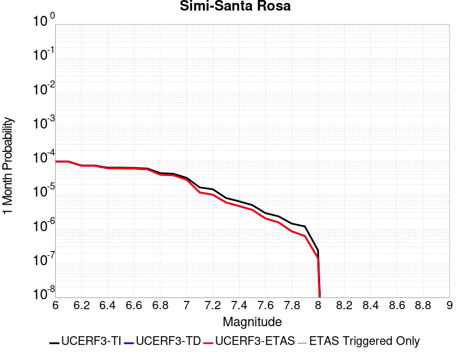 |  |  |

| Magnitude | 1 wk TI Prob | 1 wk TD Prob | 1 wk ETAS Prob | 1 wk ETAS/TD Gain | 1 wk ETAS Triggered Only | 1 mo TI Prob | 1 mo TD Prob | 1 mo ETAS Prob | 1 mo ETAS/TD Gain | 1 mo ETAS Triggered Only | 1 yr TI Prob | 1 yr TD Prob | 1 yr ETAS Prob | 1 yr ETAS/TD Gain | 1 yr ETAS Triggered Only | 10 yr TI Prob | 10 yr TD Prob | 10 yr ETAS Prob | 10 yr ETAS/TD Gain | 10 yr ETAS Triggered Only |
|-----|-----|-----|-----|-----|-----|-----|-----|-----|-----|-----|-----|-----|-----|-----|-----|-----|-----|-----|-----|-----|
| 6.0 | 2.198912E-5 | 2.227831E-5 | 2.227831E-5 | 1.0 | 0.0 | 9.4235686E-5 | 9.5475225E-5 | 9.5475225E-5 | 1.0 | 0.0 | 0.0011467156 | 0.0011618348 | 0.0011718232 | 1.008597 | 1.0E-5 | 0.011408163 | 0.011562055 | 0.011571939 | 1.0008548 | 1.0E-5 |
| 6.1 | 2.198912E-5 | 2.227831E-5 | 2.227831E-5 | 1.0 | 0.0 | 9.4235686E-5 | 9.5475225E-5 | 9.5475225E-5 | 1.0 | 0.0 | 0.0011467156 | 0.0011618348 | 0.0011718232 | 1.008597 | 1.0E-5 | 0.011408163 | 0.011562055 | 0.011571939 | 1.0008548 | 1.0E-5 |
| 6.2 | 1.69983E-5 | 1.6670783E-5 | 1.6670783E-5 | 1.0 | 0.0 | 7.284782E-5 | 7.1444425E-5 | 7.1444425E-5 | 1.0 | 0.0 | 8.865613E-4 | 8.695179E-4 | 8.795092E-4 | 1.0114906 | 1.0E-5 | 0.008830327 | 0.008664079 | 0.008673992 | 1.0011442 | 1.0E-5 |
| 6.3 | 1.69983E-5 | 1.6670783E-5 | 1.6670783E-5 | 1.0 | 0.0 | 7.284782E-5 | 7.1444425E-5 | 7.1444425E-5 | 1.0 | 0.0 | 8.865613E-4 | 8.695179E-4 | 8.795092E-4 | 1.0114906 | 1.0E-5 | 0.008830327 | 0.008664079 | 0.008673992 | 1.0011442 | 1.0E-5 |
| 6.4 | 1.4666188E-5 | 1.4054472E-5 | 1.4054472E-5 | 1.0 | 0.0 | 6.285358E-5 | 6.02322E-5 | 6.02322E-5 | 1.0 | 0.0 | 7.6497364E-4 | 7.331052E-4 | 7.4309786E-4 | 1.0136306 | 1.0E-5 | 0.0076234564 | 0.0073093437 | 0.0073192706 | 1.0013582 | 1.0E-5 |
| 6.5 | 1.4666188E-5 | 1.4054472E-5 | 1.4054472E-5 | 1.0 | 0.0 | 6.285358E-5 | 6.02322E-5 | 6.02322E-5 | 1.0 | 0.0 | 7.6497364E-4 | 7.331052E-4 | 7.4309786E-4 | 1.0136306 | 1.0E-5 | 0.0076234564 | 0.0073093437 | 0.0073192706 | 1.0013582 | 1.0E-5 |
| 6.6 | 1.4377586E-5 | 1.37314755E-5 | 1.37314755E-5 | 1.0 | 0.0 | 6.1616774E-5 | 5.8847992E-5 | 5.8847992E-5 | 1.0 | 0.0 | 7.4992597E-4 | 7.1626366E-4 | 7.2625646E-4 | 1.0139513 | 1.0E-5 | 0.007474003 | 0.00714202 | 0.0071519483 | 1.0013902 | 1.0E-5 |
| 6.7 | 1.3881404E-5 | 1.3209385E-5 | 1.3209385E-5 | 1.0 | 0.0 | 5.9490372E-5 | 5.661056E-5 | 5.661056E-5 | 1.0 | 0.0 | 7.240546E-4 | 6.890403E-4 | 6.9903344E-4 | 1.0145029 | 1.0E-5 | 0.007217 | 0.0068714893 | 0.0068814205 | 1.0014453 | 1.0E-5 |
| 6.8 | 1.0176516E-5 | 9.1555075E-6 | 9.1555075E-6 | 1.0 | 0.0 | 4.3612912E-5 | 3.9237395E-5 | 3.9237395E-5 | 1.0 | 0.0 | 5.308578E-4 | 4.7762712E-4 | 4.8762237E-4 | 1.0209268 | 1.0E-5 | 0.0052959146 | 0.0047676396 | 0.004777592 | 1.0020875 | 1.0E-5 |
| 6.9 | 9.699797E-6 | 8.77602E-6 | 8.77602E-6 | 1.0 | 0.0 | 4.15699E-5 | 3.7611066E-5 | 3.7611066E-5 | 1.0 | 0.0 | 5.05996E-4 | 4.5783492E-4 | 4.6783034E-4 | 1.021832 | 1.0E-5 | 0.005048454 | 0.0045705354 | 0.00458049 | 1.002178 | 1.0E-5 |
| 7.0 | 7.4049476E-6 | 6.5603285E-6 | 6.5603285E-6 | 1.0 | 0.0 | 3.1735104E-5 | 2.8115463E-5 | 2.8115463E-5 | 1.0 | 0.0 | 3.8630638E-4 | 3.4226466E-4 | 3.522612E-4 | 1.0292071 | 1.0E-5 | 0.0038563553 | 0.0034186176 | 0.0034285835 | 1.0029151 | 1.0E-5 |
| 7.1 | 3.873439E-6 | 2.7600042E-6 | 2.7600042E-6 | 1.0 | 0.0 | 1.6600346E-5 | 1.1828537E-5 | 1.1828537E-5 | 1.0 | 0.0 | 2.0209046E-4 | 1.4400315E-4 | 1.4400315E-4 | 1.0 | 0.0 | 0.0020190678 | 0.001439122 | 0.001439122 | 1.0 | 0.0 |
| 7.2 | 3.417706E-6 | 2.3681023E-6 | 2.3681023E-6 | 1.0 | 0.0 | 1.4647229E-5 | 1.0148972E-5 | 1.0148972E-5 | 1.0 | 0.0 | 1.7831543E-4 | 1.2355695E-4 | 1.2355695E-4 | 1.0 | 0.0 | 0.0017817242 | 0.0012349049 | 0.0012349049 | 1.0 | 0.0 |
| 7.3 | 1.90225E-6 | 1.4077283E-6 | 1.4077283E-6 | 1.0 | 0.0 | 8.152474E-6 | 6.033107E-6 | 6.033107E-6 | 1.0 | 0.0 | 9.9251854E-5 | 7.3450625E-5 | 7.3450625E-5 | 1.0 | 0.0 | 9.920754E-4 | 7.342658E-4 | 7.342658E-4 | 1.0 | 0.0 |
| 7.4 | 1.5170556E-6 | 1.1028078E-6 | 1.1028078E-6 | 1.0 | 0.0 | 6.5016507E-6 | 4.7263106E-6 | 4.7263106E-6 | 1.0 | 0.0 | 7.915472E-5 | 5.754132E-5 | 5.754132E-5 | 1.0 | 0.0 | 7.9126534E-4 | 5.752654E-4 | 5.752654E-4 | 1.0 | 0.0 |
| 7.5 | 1.178732E-6 | 8.5382646E-7 | 8.5382646E-7 | 1.0 | 0.0 | 5.0516987E-6 | 3.659251E-6 | 3.659251E-6 | 1.0 | 0.0 | 6.1502695E-5 | 4.455048E-5 | 4.455048E-5 | 1.0 | 0.0 | 6.148568E-4 | 4.4541643E-4 | 4.4541643E-4 | 1.0 | 0.0 |
| 7.6 | 6.8722386E-7 | 4.7961464E-7 | 4.7961464E-7 | 1.0 | 0.0 | 2.9452417E-6 | 2.0554896E-6 | 2.0554896E-6 | 1.0 | 0.0 | 3.5857727E-5 | 2.5025302E-5 | 2.5025302E-5 | 1.0 | 0.0 | 3.5851944E-4 | 2.5022496E-4 | 2.5022496E-4 | 1.0 | 0.0 |
| 7.7 | 5.5126515E-7 | 3.6760147E-7 | 3.6760147E-7 | 1.0 | 0.0 | 2.3625628E-6 | 1.575434E-6 | 1.575434E-6 | 1.0 | 0.0 | 2.8763823E-5 | 1.9180741E-5 | 1.9180741E-5 | 1.0 | 0.0 | 2.87601E-4 | 1.9179097E-4 | 1.9179097E-4 | 1.0 | 0.0 |
| 7.8 | 3.3860243E-7 | 2.0096766E-7 | 2.0096766E-7 | 1.0 | 0.0 | 1.4511525E-6 | 8.612897E-7 | 8.612897E-7 | 1.0 | 0.0 | 1.7667637E-5 | 1.0486152E-5 | 1.0486152E-5 | 1.0 | 0.0 | 1.7666233E-4 | 1.0485663E-4 | 1.0485663E-4 | 1.0 | 0.0 |
| 7.9 | 2.7955386E-7 | 1.4668863E-7 | 1.4668863E-7 | 1.0 | 0.0 | 1.1980875E-6 | 6.286654E-7 | 6.286654E-7 | 1.0 | 0.0 | 1.4586617E-5 | 7.653975E-6 | 7.653975E-6 | 1.0 | 0.0 | 1.458566E-4 | 7.653716E-5 | 7.653716E-5 | 1.0 | 0.0 |
| 8.0 | 5.6259015E-8 | 3.336768E-8 | 3.336768E-8 | 1.0 | 0.0 | 2.4111003E-7 | 1.4300434E-7 | 1.4300434E-7 | 1.0 | 0.0 | 2.9355108E-6 | 1.7410766E-6 | 1.7410766E-6 | 1.0 | 0.0 | 2.935472E-5 | 1.7410643E-5 | 1.7410643E-5 | 1.0 | 0.0 |

## Santa Cruz Island
*[(top)](#table-of-contents)*

| 1 Week | 1 Month | 1 Year | 10 Year |
|-----|-----|-----|-----|
|  |  |  |  |

| Magnitude | 1 wk TI Prob | 1 wk TD Prob | 1 wk ETAS Prob | 1 wk ETAS/TD Gain | 1 wk ETAS Triggered Only | 1 mo TI Prob | 1 mo TD Prob | 1 mo ETAS Prob | 1 mo ETAS/TD Gain | 1 mo ETAS Triggered Only | 1 yr TI Prob | 1 yr TD Prob | 1 yr ETAS Prob | 1 yr ETAS/TD Gain | 1 yr ETAS Triggered Only | 10 yr TI Prob | 10 yr TD Prob | 10 yr ETAS Prob | 10 yr ETAS/TD Gain | 10 yr ETAS Triggered Only |
|-----|-----|-----|-----|-----|-----|-----|-----|-----|-----|-----|-----|-----|-----|-----|-----|-----|-----|-----|-----|-----|
| 6.0 | 2.9164563E-5 | 3.1602212E-5 | 3.1602212E-5 | 1.0 | 0.0 | 1.2498499E-4 | 1.354318E-4 | 1.354318E-4 | 1.0 | 0.0 | 0.0015206301 | 0.0016477712 | 0.0016477712 | 1.0 | 0.0 | 0.015102667 | 0.016369268 | 0.016388942 | 1.0012017 | 2.0E-5 |
| 6.1 | 2.9164563E-5 | 3.1602212E-5 | 3.1602212E-5 | 1.0 | 0.0 | 1.2498499E-4 | 1.354318E-4 | 1.354318E-4 | 1.0 | 0.0 | 0.0015206301 | 0.0016477712 | 0.0016477712 | 1.0 | 0.0 | 0.015102667 | 0.016369268 | 0.016388942 | 1.0012017 | 2.0E-5 |
| 6.2 | 2.9164563E-5 | 3.1602212E-5 | 3.1602212E-5 | 1.0 | 0.0 | 1.2498499E-4 | 1.354318E-4 | 1.354318E-4 | 1.0 | 0.0 | 0.0015206301 | 0.0016477712 | 0.0016477712 | 1.0 | 0.0 | 0.015102667 | 0.016369268 | 0.016388942 | 1.0012017 | 2.0E-5 |
| 6.3 | 1.6635553E-5 | 1.780553E-5 | 1.780553E-5 | 1.0 | 0.0 | 7.1293274E-5 | 7.630729E-5 | 7.630729E-5 | 1.0 | 0.0 | 8.6765E-4 | 9.286635E-4 | 9.286635E-4 | 1.0 | 0.0 | 0.008642701 | 0.009249699 | 0.009259607 | 1.0010711 | 1.0E-5 |
| 6.4 | 1.6635553E-5 | 1.780553E-5 | 1.780553E-5 | 1.0 | 0.0 | 7.1293274E-5 | 7.630729E-5 | 7.630729E-5 | 1.0 | 0.0 | 8.6765E-4 | 9.286635E-4 | 9.286635E-4 | 1.0 | 0.0 | 0.008642701 | 0.009249699 | 0.009259607 | 1.0010711 | 1.0E-5 |
| 6.5 | 1.2238748E-5 | 1.30438E-5 | 1.30438E-5 | 1.0 | 0.0 | 5.2450723E-5 | 5.5900826E-5 | 5.5900826E-5 | 1.0 | 0.0 | 6.3840044E-4 | 6.803837E-4 | 6.803837E-4 | 1.0 | 0.0 | 0.0063656955 | 0.006783405 | 0.0067933374 | 1.0014641 | 1.0E-5 |
| 6.6 | 1.0489767E-5 | 1.1157304E-5 | 1.1157304E-5 | 1.0 | 0.0 | 4.495537E-5 | 4.781615E-5 | 4.781615E-5 | 1.0 | 0.0 | 5.4719415E-4 | 5.8200833E-4 | 5.8200833E-4 | 1.0 | 0.0 | 0.005458487 | 0.005805082 | 0.005805082 | 1.0 | 0.0 |
| 6.7 | 8.699222E-6 | 9.23732E-6 | 9.23732E-6 | 1.0 | 0.0 | 3.7281847E-5 | 3.9587918E-5 | 3.9587918E-5 | 1.0 | 0.0 | 4.5381195E-4 | 4.8187686E-4 | 4.8187686E-4 | 1.0 | 0.0 | 0.0045288634 | 0.0048083877 | 0.0048083877 | 1.0 | 0.0 |
| 6.8 | 8.307732E-6 | 8.817415E-6 | 8.817415E-6 | 1.0 | 0.0 | 3.560408E-5 | 3.7788373E-5 | 3.7788373E-5 | 1.0 | 0.0 | 4.3339343E-4 | 4.5997676E-4 | 4.5997676E-4 | 1.0 | 0.0 | 0.004325492 | 0.0045903004 | 0.0045903004 | 1.0 | 0.0 |
| 6.9 | 8.073121E-6 | 8.565432E-6 | 8.565432E-6 | 1.0 | 0.0 | 3.459863E-5 | 3.670848E-5 | 3.670848E-5 | 1.0 | 0.0 | 4.2115687E-4 | 4.468345E-4 | 4.468345E-4 | 1.0 | 0.0 | 0.004203596 | 0.004459412 | 0.004459412 | 1.0 | 0.0 |
| 7.0 | 7.617019E-6 | 8.075122E-6 | 8.075122E-6 | 1.0 | 0.0 | 3.264396E-5 | 3.4607212E-5 | 3.4607212E-5 | 1.0 | 0.0 | 3.9736772E-4 | 4.2126174E-4 | 4.2126174E-4 | 1.0 | 0.0 | 0.003966579 | 0.0042046793 | 0.0042046793 | 1.0 | 0.0 |
| 7.1 | 7.1224836E-6 | 7.5462117E-6 | 7.5462117E-6 | 1.0 | 0.0 | 3.052457E-5 | 3.2340507E-5 | 3.2340507E-5 | 1.0 | 0.0 | 3.715733E-4 | 3.936749E-4 | 3.936749E-4 | 1.0 | 0.0 | 0.003709526 | 0.0039298185 | 0.0039298185 | 1.0 | 0.0 |
| 7.2 | 6.441115E-6 | 6.827771E-6 | 6.827771E-6 | 1.0 | 0.0 | 2.7604487E-5 | 2.9261548E-5 | 2.9261548E-5 | 1.0 | 0.0 | 3.360328E-4 | 3.5620134E-4 | 3.5620134E-4 | 1.0 | 0.0 | 0.0033552512 | 0.0035563326 | 0.0035563326 | 1.0 | 0.0 |
| 7.3 | 5.494274E-6 | 5.820322E-6 | 5.820322E-6 | 1.0 | 0.0 | 2.3546674E-5 | 2.4944E-5 | 2.4944E-5 | 1.0 | 0.0 | 2.8664304E-4 | 3.0365106E-4 | 3.0365106E-4 | 1.0 | 0.0 | 0.002862736 | 0.0030323847 | 0.0030323847 | 1.0 | 0.0 |
| 7.4 | 4.0802624E-6 | 4.3124905E-6 | 4.3124905E-6 | 1.0 | 0.0 | 1.7486722E-5 | 1.8481973E-5 | 1.8481973E-5 | 1.0 | 0.0 | 2.1288003E-4 | 2.2499486E-4 | 2.2499486E-4 | 1.0 | 0.0 | 0.0021267622 | 0.0022476795 | 0.0022476795 | 1.0 | 0.0 |
| 7.5 | 2.3584746E-6 | 2.47543E-6 | 2.47543E-6 | 1.0 | 0.0 | 1.0107709E-5 | 1.0608942E-5 | 1.0608942E-5 | 1.0 | 0.0 | 1.2305441E-4 | 1.2915627E-4 | 1.2915627E-4 | 1.0 | 0.0 | 0.0012298629 | 0.001290817 | 0.001290817 | 1.0 | 0.0 |
| 7.6 | 9.4981914E-7 | 9.861335E-7 | 9.861335E-7 | 1.0 | 0.0 | 4.0706473E-6 | 4.2262795E-6 | 4.2262795E-6 | 1.0 | 0.0 | 4.9559E-5 | 5.145375E-5 | 5.145375E-5 | 1.0 | 0.0 | 4.954795E-4 | 5.144197E-4 | 5.144197E-4 | 1.0 | 0.0 |
| 7.7 | 2.6013532E-7 | 2.6417413E-7 | 2.6417413E-7 | 1.0 | 0.0 | 1.1148652E-6 | 1.1321744E-6 | 1.1321744E-6 | 1.0 | 0.0 | 1.3573399E-5 | 1.3784137E-5 | 1.3784137E-5 | 1.0 | 0.0 | 1.357257E-4 | 1.3783289E-4 | 1.3783289E-4 | 1.0 | 0.0 |
| 7.8 | 4.1522263E-8 | 3.9657692E-8 | 3.9657692E-8 | 1.0 | 0.0 | 1.7795254E-7 | 1.6996152E-7 | 1.6996152E-7 | 1.0 | 0.0 | 2.16657E-6 | 2.0692798E-6 | 2.0692798E-6 | 1.0 | 0.0 | 2.1665488E-5 | 2.0692627E-5 | 2.0692627E-5 | 1.0 | 0.0 |
| 7.9 | 7.7242046E-10 | 5.9470395E-10 | 5.9470395E-10 | 1.0 | 0.0 | 3.3103735E-9 | 2.5487317E-9 | 2.5487317E-9 | 1.0 | 0.0 | 4.0303796E-8 | 3.1030808E-8 | 3.1030808E-8 | 1.0 | 0.0 | 4.030379E-7 | 3.1030805E-7 | 3.1030805E-7 | 1.0 | 0.0 |

## Cucamonga
*[(top)](#table-of-contents)*

| 1 Week | 1 Month | 1 Year | 10 Year |
|-----|-----|-----|-----|
|  | 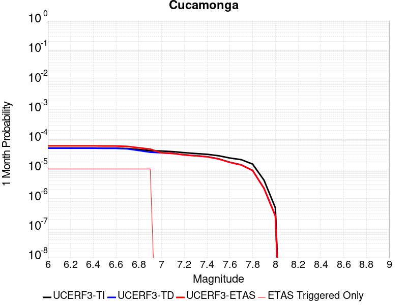 | 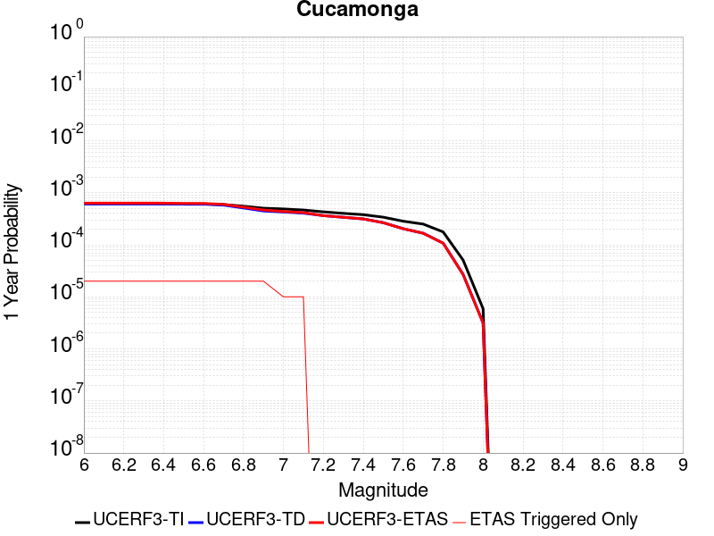 |  |

| Magnitude | 1 wk TI Prob | 1 wk TD Prob | 1 wk ETAS Prob | 1 wk ETAS/TD Gain | 1 wk ETAS Triggered Only | 1 mo TI Prob | 1 mo TD Prob | 1 mo ETAS Prob | 1 mo ETAS/TD Gain | 1 mo ETAS Triggered Only | 1 yr TI Prob | 1 yr TD Prob | 1 yr ETAS Prob | 1 yr ETAS/TD Gain | 1 yr ETAS Triggered Only | 10 yr TI Prob | 10 yr TD Prob | 10 yr ETAS Prob | 10 yr ETAS/TD Gain | 10 yr ETAS Triggered Only |
|-----|-----|-----|-----|-----|-----|-----|-----|-----|-----|-----|-----|-----|-----|-----|-----|-----|-----|-----|-----|-----|
| 6.0 | 1.1848348E-5 | 1.17417885E-5 | 2.1741671E-5 | 1.851649 | 1.0E-5 | 5.0777642E-5 | 5.0320996E-5 | 6.0320494E-5 | 1.1987143 | 1.0E-5 | 6.180424E-4 | 6.124886E-4 | 6.3247635E-4 | 1.0326337 | 2.0E-5 | 0.0061632637 | 0.006109173 | 0.0061290506 | 1.0032538 | 2.0E-5 |
| 6.1 | 1.1848348E-5 | 1.17417885E-5 | 2.1741671E-5 | 1.851649 | 1.0E-5 | 5.0777642E-5 | 5.0320996E-5 | 6.0320494E-5 | 1.1987143 | 1.0E-5 | 6.180424E-4 | 6.124886E-4 | 6.3247635E-4 | 1.0326337 | 2.0E-5 | 0.0061632637 | 0.006109173 | 0.0061290506 | 1.0032538 | 2.0E-5 |
| 6.2 | 1.1848348E-5 | 1.17417885E-5 | 2.1741671E-5 | 1.851649 | 1.0E-5 | 5.0777642E-5 | 5.0320996E-5 | 6.0320494E-5 | 1.1987143 | 1.0E-5 | 6.180424E-4 | 6.124886E-4 | 6.3247635E-4 | 1.0326337 | 2.0E-5 | 0.0061632637 | 0.006109173 | 0.0061290506 | 1.0032538 | 2.0E-5 |
| 6.3 | 1.1848348E-5 | 1.17417885E-5 | 2.1741671E-5 | 1.851649 | 1.0E-5 | 5.0777642E-5 | 5.0320996E-5 | 6.0320494E-5 | 1.1987143 | 1.0E-5 | 6.180424E-4 | 6.124886E-4 | 6.3247635E-4 | 1.0326337 | 2.0E-5 | 0.0061632637 | 0.006109173 | 0.0061290506 | 1.0032538 | 2.0E-5 |
| 6.4 | 1.1848348E-5 | 1.17417885E-5 | 2.1741671E-5 | 1.851649 | 1.0E-5 | 5.0777642E-5 | 5.0320996E-5 | 6.0320494E-5 | 1.1987143 | 1.0E-5 | 6.180424E-4 | 6.124886E-4 | 6.3247635E-4 | 1.0326337 | 2.0E-5 | 0.0061632637 | 0.006109173 | 0.0061290506 | 1.0032538 | 2.0E-5 |
| 6.5 | 1.16988695E-5 | 1.1580808E-5 | 2.1580692E-5 | 1.8634876 | 1.0E-5 | 5.013705E-5 | 4.9631108E-5 | 5.963061E-5 | 1.2014766 | 1.0E-5 | 6.102476E-4 | 6.040939E-4 | 6.2408176E-4 | 1.0330875 | 2.0E-5 | 0.006085745 | 0.0060256817 | 0.006045561 | 1.0032991 | 2.0E-5 |
| 6.6 | 1.16988695E-5 | 1.1580808E-5 | 2.1580692E-5 | 1.8634876 | 1.0E-5 | 5.013705E-5 | 4.9631108E-5 | 5.963061E-5 | 1.2014766 | 1.0E-5 | 6.102476E-4 | 6.040939E-4 | 6.2408176E-4 | 1.0330875 | 2.0E-5 | 0.006085745 | 0.0060256817 | 0.006045561 | 1.0032991 | 2.0E-5 |
| 6.7 | 1.1397107E-5 | 1.1119596E-5 | 2.1119486E-5 | 1.8993032 | 1.0E-5 | 4.884383E-5 | 4.7654557E-5 | 5.765408E-5 | 1.2098335 | 1.0E-5 | 5.9451134E-4 | 5.8004225E-4 | 6.0003065E-4 | 1.0344602 | 2.0E-5 | 0.005929234 | 0.0057864264 | 0.0058063106 | 1.0034363 | 2.0E-5 |
| 6.8 | 1.058387E-5 | 9.789085E-6 | 1.9788988E-5 | 2.0215359 | 1.0E-5 | 4.5358654E-5 | 4.1952553E-5 | 5.1952135E-5 | 1.2383546 | 1.0E-5 | 5.521017E-4 | 5.106538E-4 | 5.3064356E-4 | 1.0391455 | 2.0E-5 | 0.00550732 | 0.0050958046 | 0.0051157027 | 1.0039048 | 2.0E-5 |
| 6.9 | 9.690046E-6 | 8.583211E-6 | 1.8583125E-5 | 2.1650553 | 1.0E-5 | 4.1528107E-5 | 3.678467E-5 | 4.6784302E-5 | 1.2718424 | 1.0E-5 | 5.054874E-4 | 4.4776173E-4 | 4.6775278E-4 | 1.0446466 | 2.0E-5 | 0.005043391 | 0.004469523 | 0.004489434 | 1.0044547 | 2.0E-5 |
| 7.0 | 9.381461E-6 | 8.190734E-6 | 8.190734E-6 | 1.0 | 0.0 | 4.020564E-5 | 3.5102676E-5 | 3.5102676E-5 | 1.0 | 0.0 | 4.893937E-4 | 4.2729164E-4 | 4.3728735E-4 | 1.0233933 | 1.0E-5 | 0.0048831734 | 0.004265627 | 0.004275584 | 1.0023344 | 1.0E-5 |
| 7.1 | 8.946492E-6 | 7.785447E-6 | 7.785447E-6 | 1.0 | 0.0 | 3.8341543E-5 | 3.336578E-5 | 3.336578E-5 | 1.0 | 0.0 | 4.667083E-4 | 4.0615295E-4 | 4.161489E-4 | 1.0246112 | 1.0E-5 | 0.0046572937 | 0.004055035 | 0.0040649944 | 1.0024561 | 1.0E-5 |
| 7.2 | 8.251016E-6 | 6.9786042E-6 | 6.9786042E-6 | 1.0 | 0.0 | 3.5361016E-5 | 2.9907962E-5 | 2.9907962E-5 | 1.0 | 0.0 | 4.3043532E-4 | 3.6406884E-4 | 3.6406884E-4 | 1.0 | 0.0 | 0.0042960253 | 0.0036356493 | 0.0036356493 | 1.0 | 0.0 |
| 7.3 | 7.717881E-6 | 6.4895694E-6 | 6.4895694E-6 | 1.0 | 0.0 | 3.3076216E-5 | 2.7812146E-5 | 2.7812146E-5 | 1.0 | 0.0 | 4.026285E-4 | 3.385605E-4 | 3.385605E-4 | 1.0 | 0.0 | 0.004018998 | 0.003381376 | 0.003381376 | 1.0 | 0.0 |
| 7.4 | 7.275623E-6 | 6.0350894E-6 | 6.0350894E-6 | 1.0 | 0.0 | 3.118087E-5 | 2.5864414E-5 | 2.5864414E-5 | 1.0 | 0.0 | 3.7956095E-4 | 3.1485397E-4 | 3.1485397E-4 | 1.0 | 0.0 | 0.0037891332 | 0.0031450067 | 0.0031450067 | 1.0 | 0.0 |
| 7.5 | 6.5109502E-6 | 5.103351E-6 | 5.103351E-6 | 1.0 | 0.0 | 2.7903774E-5 | 2.1871321E-5 | 2.1871321E-5 | 1.0 | 0.0 | 3.3967546E-4 | 2.6625095E-4 | 2.6625095E-4 | 1.0 | 0.0 | 0.0033915674 | 0.0026602359 | 0.0026602359 | 1.0 | 0.0 |
| 7.6 | 5.4495326E-6 | 3.9110173E-6 | 3.9110173E-6 | 1.0 | 0.0 | 2.335493E-5 | 1.6761394E-5 | 1.6761394E-5 | 1.0 | 0.0 | 2.8430918E-4 | 2.0405094E-4 | 2.0405094E-4 | 1.0 | 0.0 | 0.0028394572 | 0.0020395485 | 0.0020395485 | 1.0 | 0.0 |
| 7.7 | 4.7997164E-6 | 3.202466E-6 | 3.202466E-6 | 1.0 | 0.0 | 2.057005E-5 | 1.3724782E-5 | 1.3724782E-5 | 1.0 | 0.0 | 2.504116E-4 | 1.6708644E-4 | 1.6708644E-4 | 1.0 | 0.0 | 0.002501296 | 0.0016705322 | 0.0016705322 | 1.0 | 0.0 |
| 7.8 | 3.3941733E-6 | 2.065506E-6 | 2.065506E-6 | 1.0 | 0.0 | 1.4546376E-5 | 8.852138E-6 | 8.852138E-6 | 1.0 | 0.0 | 1.7708774E-4 | 1.0776947E-4 | 1.0776947E-4 | 1.0 | 0.0 | 0.0017694668 | 0.0010774093 | 0.0010774093 | 1.0 | 0.0 |
| 7.9 | 9.750552E-7 | 5.160341E-7 | 5.160341E-7 | 1.0 | 0.0 | 4.178801E-6 | 2.2115728E-6 | 2.2115728E-6 | 1.0 | 0.0 | 5.0875715E-5 | 2.692557E-5 | 2.692557E-5 | 1.0 | 0.0 | 5.086407E-4 | 2.692235E-4 | 2.692235E-4 | 1.0 | 0.0 |
| 8.0 | 1.133857E-7 | 6.056122E-8 | 6.056122E-8 | 1.0 | 0.0 | 4.8593864E-7 | 2.5954807E-7 | 2.5954807E-7 | 1.0 | 0.0 | 5.9162867E-6 | 3.1599932E-6 | 3.1599932E-6 | 1.0 | 0.0 | 5.916129E-5 | 3.15995E-5 | 3.15995E-5 | 1.0 | 0.0 |

## North Frontal  (West)
*[(top)](#table-of-contents)*

| 1 Week | 1 Month | 1 Year | 10 Year |
|-----|-----|-----|-----|
|  |  |  | 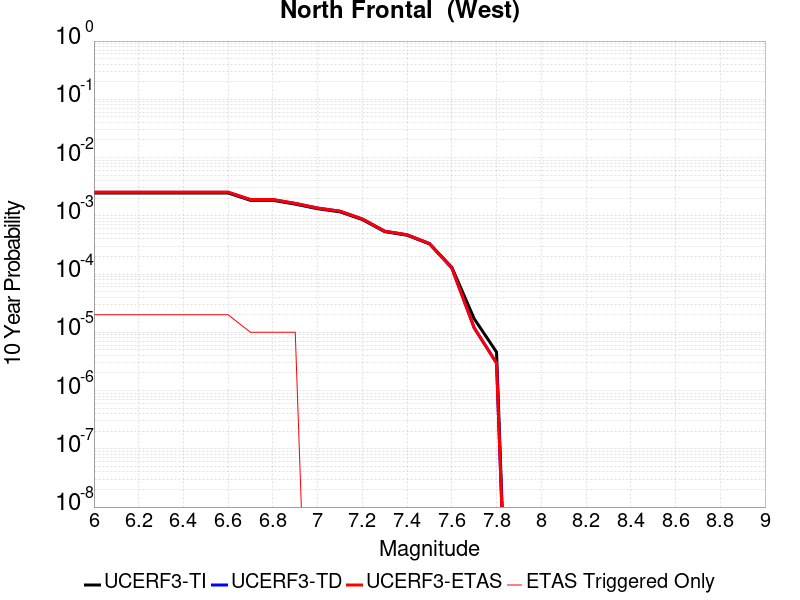 |

| Magnitude | 1 wk TI Prob | 1 wk TD Prob | 1 wk ETAS Prob | 1 wk ETAS/TD Gain | 1 wk ETAS Triggered Only | 1 mo TI Prob | 1 mo TD Prob | 1 mo ETAS Prob | 1 mo ETAS/TD Gain | 1 mo ETAS Triggered Only | 1 yr TI Prob | 1 yr TD Prob | 1 yr ETAS Prob | 1 yr ETAS/TD Gain | 1 yr ETAS Triggered Only | 10 yr TI Prob | 10 yr TD Prob | 10 yr ETAS Prob | 10 yr ETAS/TD Gain | 10 yr ETAS Triggered Only |
|-----|-----|-----|-----|-----|-----|-----|-----|-----|-----|-----|-----|-----|-----|-----|-----|-----|-----|-----|-----|-----|
| 6.0 | 4.7316266E-6 | 4.852804E-6 | 4.852804E-6 | 1.0 | 0.0 | 2.0278241E-5 | 2.0797574E-5 | 2.0797574E-5 | 1.0 | 0.0 | 2.4685962E-4 | 2.5318252E-4 | 2.5318252E-4 | 1.0 | 0.0 | 0.0024658558 | 0.0025290868 | 0.0025490362 | 1.007888 | 2.0E-5 |
| 6.1 | 4.7316266E-6 | 4.852804E-6 | 4.852804E-6 | 1.0 | 0.0 | 2.0278241E-5 | 2.0797574E-5 | 2.0797574E-5 | 1.0 | 0.0 | 2.4685962E-4 | 2.5318252E-4 | 2.5318252E-4 | 1.0 | 0.0 | 0.0024658558 | 0.0025290868 | 0.0025490362 | 1.007888 | 2.0E-5 |
| 6.2 | 4.7316266E-6 | 4.852804E-6 | 4.852804E-6 | 1.0 | 0.0 | 2.0278241E-5 | 2.0797574E-5 | 2.0797574E-5 | 1.0 | 0.0 | 2.4685962E-4 | 2.5318252E-4 | 2.5318252E-4 | 1.0 | 0.0 | 0.0024658558 | 0.0025290868 | 0.0025490362 | 1.007888 | 2.0E-5 |
| 6.3 | 4.7316266E-6 | 4.852804E-6 | 4.852804E-6 | 1.0 | 0.0 | 2.0278241E-5 | 2.0797574E-5 | 2.0797574E-5 | 1.0 | 0.0 | 2.4685962E-4 | 2.5318252E-4 | 2.5318252E-4 | 1.0 | 0.0 | 0.0024658558 | 0.0025290868 | 0.0025490362 | 1.007888 | 2.0E-5 |
| 6.4 | 4.7316266E-6 | 4.852804E-6 | 4.852804E-6 | 1.0 | 0.0 | 2.0278241E-5 | 2.0797574E-5 | 2.0797574E-5 | 1.0 | 0.0 | 2.4685962E-4 | 2.5318252E-4 | 2.5318252E-4 | 1.0 | 0.0 | 0.0024658558 | 0.0025290868 | 0.0025490362 | 1.007888 | 2.0E-5 |
| 6.5 | 4.7316266E-6 | 4.852804E-6 | 4.852804E-6 | 1.0 | 0.0 | 2.0278241E-5 | 2.0797574E-5 | 2.0797574E-5 | 1.0 | 0.0 | 2.4685962E-4 | 2.5318252E-4 | 2.5318252E-4 | 1.0 | 0.0 | 0.0024658558 | 0.0025290868 | 0.0025490362 | 1.007888 | 2.0E-5 |
| 6.6 | 4.7316266E-6 | 4.852804E-6 | 4.852804E-6 | 1.0 | 0.0 | 2.0278241E-5 | 2.0797574E-5 | 2.0797574E-5 | 1.0 | 0.0 | 2.4685962E-4 | 2.5318252E-4 | 2.5318252E-4 | 1.0 | 0.0 | 0.0024658558 | 0.0025290868 | 0.0025490362 | 1.007888 | 2.0E-5 |
| 6.7 | 3.5382777E-6 | 3.6309902E-6 | 3.6309902E-6 | 1.0 | 0.0 | 1.516396E-5 | 1.5561298E-5 | 1.5561298E-5 | 1.0 | 0.0 | 1.8460557E-4 | 1.894431E-4 | 1.894431E-4 | 1.0 | 0.0 | 0.0018445229 | 0.0018928931 | 0.0019028742 | 1.0052729 | 1.0E-5 |
| 6.8 | 3.5382777E-6 | 3.6309902E-6 | 3.6309902E-6 | 1.0 | 0.0 | 1.516396E-5 | 1.5561298E-5 | 1.5561298E-5 | 1.0 | 0.0 | 1.8460557E-4 | 1.894431E-4 | 1.894431E-4 | 1.0 | 0.0 | 0.0018445229 | 0.0018928931 | 0.0019028742 | 1.0052729 | 1.0E-5 |
| 6.9 | 3.0428037E-6 | 3.1228528E-6 | 3.1228528E-6 | 1.0 | 0.0 | 1.30405215E-5 | 1.338359E-5 | 1.338359E-5 | 1.0 | 0.0 | 1.5875678E-4 | 1.629337E-4 | 1.629337E-4 | 1.0 | 0.0 | 0.0015864341 | 0.0016282096 | 0.0016381933 | 1.0061318 | 1.0E-5 |
| 7.0 | 2.538778E-6 | 2.6061705E-6 | 2.6061705E-6 | 1.0 | 0.0 | 1.0880432E-5 | 1.1169257E-5 | 1.1169257E-5 | 1.0 | 0.0 | 1.324612E-4 | 1.359777E-4 | 1.359777E-4 | 1.0 | 0.0 | 0.0013238228 | 0.0013589917 | 0.0013589917 | 1.0 | 0.0 |
| 7.1 | 2.2418935E-6 | 2.30128E-6 | 2.30128E-6 | 1.0 | 0.0 | 9.60808E-6 | 9.862593E-6 | 9.862593E-6 | 1.0 | 0.0 | 1.1697209E-4 | 1.200709E-4 | 1.200709E-4 | 1.0 | 0.0 | 0.0011691054 | 0.0012001041 | 0.0012001041 | 1.0 | 0.0 |
| 7.2 | 1.6526745E-6 | 1.692539E-6 | 1.692539E-6 | 1.0 | 0.0 | 7.082872E-6 | 7.2537196E-6 | 7.2537196E-6 | 1.0 | 0.0 | 8.623055E-5 | 8.831071E-5 | 8.831071E-5 | 1.0 | 0.0 | 8.61971E-4 | 8.827812E-4 | 8.827812E-4 | 1.0 | 0.0 |
| 7.3 | 1.0246019E-6 | 1.0442606E-6 | 1.0442606E-6 | 1.0 | 0.0 | 4.391144E-6 | 4.475395E-6 | 4.475395E-6 | 1.0 | 0.0 | 5.3460866E-5 | 5.4486693E-5 | 5.4486693E-5 | 1.0 | 0.0 | 5.344801E-4 | 5.447448E-4 | 5.447448E-4 | 1.0 | 0.0 |
| 7.4 | 8.9045164E-7 | 9.056861E-7 | 9.056861E-7 | 1.0 | 0.0 | 3.8162157E-6 | 3.8815065E-6 | 3.8815065E-6 | 1.0 | 0.0 | 4.646144E-5 | 4.7256428E-5 | 4.7256428E-5 | 1.0 | 0.0 | 4.6451724E-4 | 4.7247467E-4 | 4.7247467E-4 | 1.0 | 0.0 |
| 7.5 | 6.3357E-7 | 6.402921E-7 | 6.402921E-7 | 1.0 | 0.0 | 2.7152971E-6 | 2.7441065E-6 | 2.7441065E-6 | 1.0 | 0.0 | 3.305824E-5 | 3.340905E-5 | 3.340905E-5 | 1.0 | 0.0 | 3.3053322E-4 | 3.3404687E-4 | 3.3404687E-4 | 1.0 | 0.0 |
| 7.6 | 2.5087024E-7 | 2.436196E-7 | 2.436196E-7 | 1.0 | 0.0 | 1.0751578E-6 | 1.0440838E-6 | 1.0440838E-6 | 1.0 | 0.0 | 1.3089967E-5 | 1.2711666E-5 | 1.2711666E-5 | 1.0 | 0.0 | 1.3089196E-4 | 1.2711145E-4 | 1.2711145E-4 | 1.0 | 0.0 |
| 7.7 | 3.282987E-8 | 2.2875222E-8 | 2.2875222E-8 | 1.0 | 0.0 | 1.4069944E-7 | 9.803666E-8 | 9.803666E-8 | 1.0 | 0.0 | 1.7130144E-6 | 1.1935958E-6 | 1.1935958E-6 | 1.0 | 0.0 | 1.7130013E-5 | 1.1935902E-5 | 1.1935902E-5 | 1.0 | 0.0 |
| 7.8 | 8.77499E-9 | 5.682039E-9 | 5.682039E-9 | 1.0 | 0.0 | 3.7607098E-8 | 2.4351595E-8 | 2.4351595E-8 | 1.0 | 0.0 | 4.578663E-7 | 2.9648064E-7 | 2.9648064E-7 | 1.0 | 0.0 | 4.5786537E-6 | 2.9648038E-6 | 2.9648038E-6 | 1.0 | 0.0 |

## Pine Mtn
*[(top)](#table-of-contents)*

| 1 Week | 1 Month | 1 Year | 10 Year |
|-----|-----|-----|-----|
|  |  |  |  |

| Magnitude | 1 wk TI Prob | 1 wk TD Prob | 1 wk ETAS Prob | 1 wk ETAS/TD Gain | 1 wk ETAS Triggered Only | 1 mo TI Prob | 1 mo TD Prob | 1 mo ETAS Prob | 1 mo ETAS/TD Gain | 1 mo ETAS Triggered Only | 1 yr TI Prob | 1 yr TD Prob | 1 yr ETAS Prob | 1 yr ETAS/TD Gain | 1 yr ETAS Triggered Only | 10 yr TI Prob | 10 yr TD Prob | 10 yr ETAS Prob | 10 yr ETAS/TD Gain | 10 yr ETAS Triggered Only |
|-----|-----|-----|-----|-----|-----|-----|-----|-----|-----|-----|-----|-----|-----|-----|-----|-----|-----|-----|-----|-----|
| 6.0 | 6.894797E-6 | 7.226177E-6 | 7.226177E-6 | 1.0 | 0.0 | 2.9548795E-5 | 3.096898E-5 | 3.096898E-5 | 1.0 | 0.0 | 3.596972E-4 | 3.7698506E-4 | 3.7698506E-4 | 1.0 | 0.0 | 0.0035911554 | 0.003763753 | 0.0037836777 | 1.0052938 | 2.0E-5 |
| 6.1 | 6.894797E-6 | 7.226177E-6 | 7.226177E-6 | 1.0 | 0.0 | 2.9548795E-5 | 3.096898E-5 | 3.096898E-5 | 1.0 | 0.0 | 3.596972E-4 | 3.7698506E-4 | 3.7698506E-4 | 1.0 | 0.0 | 0.0035911554 | 0.003763753 | 0.0037836777 | 1.0052938 | 2.0E-5 |
| 6.2 | 6.894797E-6 | 7.226177E-6 | 7.226177E-6 | 1.0 | 0.0 | 2.9548795E-5 | 3.096898E-5 | 3.096898E-5 | 1.0 | 0.0 | 3.596972E-4 | 3.7698506E-4 | 3.7698506E-4 | 1.0 | 0.0 | 0.0035911554 | 0.003763753 | 0.0037836777 | 1.0052938 | 2.0E-5 |
| 6.3 | 6.894797E-6 | 7.226177E-6 | 7.226177E-6 | 1.0 | 0.0 | 2.9548795E-5 | 3.096898E-5 | 3.096898E-5 | 1.0 | 0.0 | 3.596972E-4 | 3.7698506E-4 | 3.7698506E-4 | 1.0 | 0.0 | 0.0035911554 | 0.003763753 | 0.0037836777 | 1.0052938 | 2.0E-5 |
| 6.4 | 6.894797E-6 | 7.226177E-6 | 7.226177E-6 | 1.0 | 0.0 | 2.9548795E-5 | 3.096898E-5 | 3.096898E-5 | 1.0 | 0.0 | 3.596972E-4 | 3.7698506E-4 | 3.7698506E-4 | 1.0 | 0.0 | 0.0035911554 | 0.003763753 | 0.0037836777 | 1.0052938 | 2.0E-5 |
| 6.5 | 6.894797E-6 | 7.226177E-6 | 7.226177E-6 | 1.0 | 0.0 | 2.9548795E-5 | 3.096898E-5 | 3.096898E-5 | 1.0 | 0.0 | 3.596972E-4 | 3.7698506E-4 | 3.7698506E-4 | 1.0 | 0.0 | 0.0035911554 | 0.003763753 | 0.0037836777 | 1.0052938 | 2.0E-5 |
| 6.6 | 6.894797E-6 | 7.226177E-6 | 7.226177E-6 | 1.0 | 0.0 | 2.9548795E-5 | 3.096898E-5 | 3.096898E-5 | 1.0 | 0.0 | 3.596972E-4 | 3.7698506E-4 | 3.7698506E-4 | 1.0 | 0.0 | 0.0035911554 | 0.003763753 | 0.0037836777 | 1.0052938 | 2.0E-5 |
| 6.7 | 6.0867933E-6 | 6.3978096E-6 | 6.3978096E-6 | 1.0 | 0.0 | 2.6085996E-5 | 2.7418908E-5 | 2.7418908E-5 | 1.0 | 0.0 | 3.1755073E-4 | 3.3377626E-4 | 3.3377626E-4 | 1.0 | 0.0 | 0.0031709734 | 0.0033329686 | 0.003352902 | 1.0059806 | 2.0E-5 |
| 6.8 | 5.6530425E-6 | 5.95128E-6 | 5.95128E-6 | 1.0 | 0.0 | 2.42271E-5 | 2.5505247E-5 | 2.5505247E-5 | 1.0 | 0.0 | 2.94925E-4 | 3.104842E-4 | 3.104842E-4 | 1.0 | 0.0 | 0.002945339 | 0.0031007088 | 0.0031206468 | 1.0064301 | 2.0E-5 |
| 6.9 | 4.6015225E-6 | 4.8644843E-6 | 4.8644843E-6 | 1.0 | 0.0 | 1.9720663E-5 | 2.0847632E-5 | 2.0847632E-5 | 1.0 | 0.0 | 2.4007261E-4 | 2.537918E-4 | 2.537918E-4 | 1.0 | 0.0 | 0.0023981342 | 0.002535164 | 0.0025551133 | 1.007869 | 2.0E-5 |
| 7.0 | 4.4875965E-6 | 4.7481212E-6 | 4.7481212E-6 | 1.0 | 0.0 | 1.9232413E-5 | 2.034894E-5 | 2.034894E-5 | 1.0 | 0.0 | 2.3412947E-4 | 2.4772162E-4 | 2.4772162E-4 | 1.0 | 0.0 | 0.0023388295 | 0.0024745988 | 0.0024945491 | 1.0080621 | 2.0E-5 |
| 7.1 | 3.203907E-6 | 3.4300247E-6 | 3.4300247E-6 | 1.0 | 0.0 | 1.3730958E-5 | 1.4700027E-5 | 1.4700027E-5 | 1.0 | 0.0 | 1.6716159E-4 | 1.789588E-4 | 1.789588E-4 | 1.0 | 0.0 | 0.0016703589 | 0.001788213 | 0.001788213 | 1.0 | 0.0 |
| 7.2 | 2.2060601E-6 | 2.3789846E-6 | 2.3789846E-6 | 1.0 | 0.0 | 9.4545085E-6 | 1.0195611E-5 | 1.0195611E-5 | 1.0 | 0.0 | 1.15102564E-4 | 1.2412496E-4 | 1.2412496E-4 | 1.0 | 0.0 | 0.0011504296 | 0.0012406011 | 0.0012406011 | 1.0 | 0.0 |
| 7.3 | 1.3765207E-6 | 1.5221007E-6 | 1.5221007E-6 | 1.0 | 0.0 | 5.899361E-6 | 6.5232725E-6 | 6.5232725E-6 | 1.0 | 0.0 | 7.182235E-5 | 7.941804E-5 | 7.941804E-5 | 1.0 | 0.0 | 7.1799144E-4 | 7.939057E-4 | 7.939057E-4 | 1.0 | 0.0 |
| 7.4 | 1.1245983E-6 | 1.2591149E-6 | 1.2591149E-6 | 1.0 | 0.0 | 4.819698E-6 | 5.3961962E-6 | 5.3961962E-6 | 1.0 | 0.0 | 5.8678244E-5 | 6.569679E-5 | 6.569679E-5 | 1.0 | 0.0 | 5.866275E-4 | 6.56782E-4 | 6.56782E-4 | 1.0 | 0.0 |
| 7.5 | 8.031682E-7 | 9.280756E-7 | 9.280756E-7 | 1.0 | 0.0 | 3.4421448E-6 | 3.9774613E-6 | 3.9774613E-6 | 1.0 | 0.0 | 4.1907308E-5 | 4.8424583E-5 | 4.8424583E-5 | 1.0 | 0.0 | 4.1899405E-4 | 4.8414708E-4 | 4.8414708E-4 | 1.0 | 0.0 |
| 7.6 | 4.8953444E-7 | 6.006385E-7 | 6.006385E-7 | 1.0 | 0.0 | 2.098003E-6 | 2.5741629E-6 | 2.5741629E-6 | 1.0 | 0.0 | 2.5542888E-5 | 3.134003E-5 | 3.134003E-5 | 1.0 | 0.0 | 2.5539953E-4 | 3.1336097E-4 | 3.1336097E-4 | 1.0 | 0.0 |
| 7.7 | 6.634529E-8 | 6.788974E-8 | 6.788974E-8 | 1.0 | 0.0 | 2.843369E-7 | 2.90956E-7 | 2.90956E-7 | 1.0 | 0.0 | 3.4617963E-6 | 3.5423839E-6 | 3.5423839E-6 | 1.0 | 0.0 | 3.4617424E-5 | 3.5423323E-5 | 3.5423323E-5 | 1.0 | 0.0 |
| 7.8 | 9.235578E-9 | 9.4888115E-9 | 9.4888115E-9 | 1.0 | 0.0 | 3.9581046E-8 | 4.0666336E-8 | 4.0666336E-8 | 1.0 | 0.0 | 4.818991E-7 | 4.9511254E-7 | 4.9511254E-7 | 1.0 | 0.0 | 4.8189804E-6 | 4.951116E-6 | 4.951116E-6 | 1.0 | 0.0 |

## Santa Cruz Catalina Ridge alt1
*[(top)](#table-of-contents)*

| 1 Week | 1 Month | 1 Year | 10 Year |
|-----|-----|-----|-----|
| 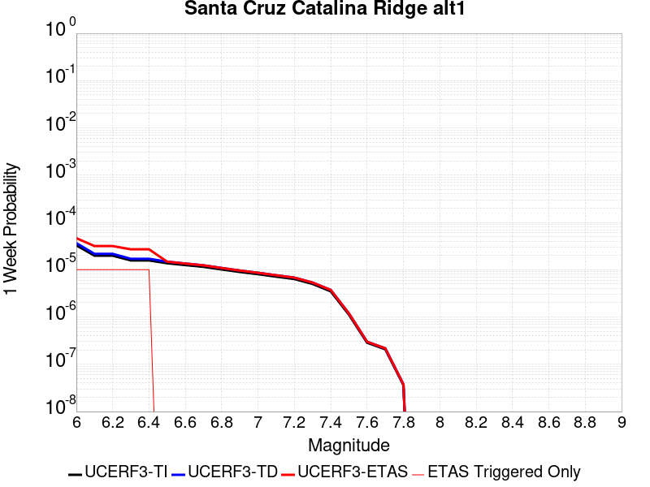 | 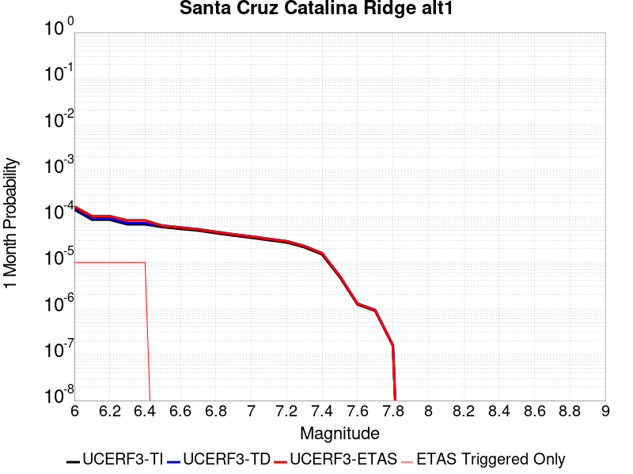 | 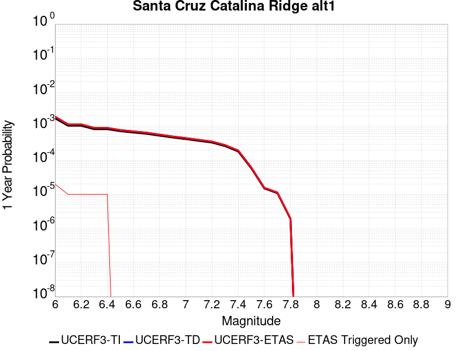 |  |

| Magnitude | 1 wk TI Prob | 1 wk TD Prob | 1 wk ETAS Prob | 1 wk ETAS/TD Gain | 1 wk ETAS Triggered Only | 1 mo TI Prob | 1 mo TD Prob | 1 mo ETAS Prob | 1 mo ETAS/TD Gain | 1 mo ETAS Triggered Only | 1 yr TI Prob | 1 yr TD Prob | 1 yr ETAS Prob | 1 yr ETAS/TD Gain | 1 yr ETAS Triggered Only | 10 yr TI Prob | 10 yr TD Prob | 10 yr ETAS Prob | 10 yr ETAS/TD Gain | 10 yr ETAS Triggered Only |
|-----|-----|-----|-----|-----|-----|-----|-----|-----|-----|-----|-----|-----|-----|-----|-----|-----|-----|-----|-----|-----|
| 6.0 | 3.2833184E-5 | 3.656231E-5 | 4.656194E-5 | 1.2734957 | 1.0E-5 | 1.4070606E-4 | 1.5668714E-4 | 1.6668557E-4 | 1.0638114 | 1.0E-5 | 0.00171175 | 0.0019061633 | 0.0019261251 | 1.0104723 | 2.0E-5 | 0.016986247 | 0.018915037 | 0.018934658 | 1.0010374 | 2.0E-5 |
| 6.1 | 1.9835548E-5 | 2.166137E-5 | 3.166115E-5 | 1.4616413 | 1.0E-5 | 8.500672E-5 | 9.283125E-5 | 1.0283032E-4 | 1.1077124 | 1.0E-5 | 0.0010344655 | 0.0011296547 | 0.0011396434 | 1.0088422 | 1.0E-5 | 0.010296632 | 0.011241258 | 0.011251145 | 1.0008795 | 1.0E-5 |
| 6.2 | 1.9835548E-5 | 2.166137E-5 | 3.166115E-5 | 1.4616413 | 1.0E-5 | 8.500672E-5 | 9.283125E-5 | 1.0283032E-4 | 1.1077124 | 1.0E-5 | 0.0010344655 | 0.0011296547 | 0.0011396434 | 1.0088422 | 1.0E-5 | 0.010296632 | 0.011241258 | 0.011251145 | 1.0008795 | 1.0E-5 |
| 6.3 | 1.5728183E-5 | 1.7035269E-5 | 2.7035097E-5 | 1.5870075 | 1.0E-5 | 6.7404755E-5 | 7.300628E-5 | 8.300555E-5 | 1.1369646 | 1.0E-5 | 8.2034385E-4 | 8.884951E-4 | 8.984863E-4 | 1.011245 | 1.0E-5 | 0.008173222 | 0.008850109 | 0.008860021 | 1.00112 | 1.0E-5 |
| 6.4 | 1.5728183E-5 | 1.7035269E-5 | 2.7035097E-5 | 1.5870075 | 1.0E-5 | 6.7404755E-5 | 7.300628E-5 | 8.300555E-5 | 1.1369646 | 1.0E-5 | 8.2034385E-4 | 8.884951E-4 | 8.984863E-4 | 1.011245 | 1.0E-5 | 0.008173222 | 0.008850109 | 0.008860021 | 1.00112 | 1.0E-5 |
| 6.5 | 1.3707734E-5 | 1.4795614E-5 | 1.4795614E-5 | 1.0 | 0.0 | 5.8746107E-5 | 6.340825E-5 | 6.340825E-5 | 1.0 | 0.0 | 7.1499916E-4 | 7.717256E-4 | 7.717256E-4 | 1.0 | 0.0 | 0.0071270303 | 0.0076908553 | 0.0076908553 | 1.0 | 0.0 |
| 6.6 | 1.2539813E-5 | 1.3511192E-5 | 1.3511192E-5 | 1.0 | 0.0 | 5.3740947E-5 | 5.7903842E-5 | 5.7903842E-5 | 1.0 | 0.0 | 6.540996E-4 | 7.047539E-4 | 7.047539E-4 | 1.0 | 0.0 | 0.0065217763 | 0.007025493 | 0.007025493 | 1.0 | 0.0 |
| 6.7 | 1.1504083E-5 | 1.2378249E-5 | 1.2378249E-5 | 1.0 | 0.0 | 4.930228E-5 | 5.3048574E-5 | 5.3048574E-5 | 1.0 | 0.0 | 6.0008996E-4 | 6.45677E-4 | 6.45677E-4 | 1.0 | 0.0 | 0.005984721 | 0.0064382395 | 0.0064382395 | 1.0 | 0.0 |
| 6.8 | 1.012739E-5 | 1.087782E-5 | 1.087782E-5 | 1.0 | 0.0 | 4.340238E-5 | 4.6618406E-5 | 4.6618406E-5 | 1.0 | 0.0 | 5.282958E-4 | 5.674328E-4 | 5.674328E-4 | 1.0 | 0.0 | 0.0052704164 | 0.005660008 | 0.005660008 | 1.0 | 0.0 |
| 6.9 | 8.9607865E-6 | 9.609764E-6 | 9.609764E-6 | 1.0 | 0.0 | 3.8402806E-5 | 4.118406E-5 | 4.118406E-5 | 1.0 | 0.0 | 4.6745385E-4 | 5.013016E-4 | 5.013016E-4 | 1.0 | 0.0 | 0.0046647177 | 0.0050018276 | 0.0050018276 | 1.0 | 0.0 |
| 7.0 | 8.046829E-6 | 8.620316E-6 | 8.620316E-6 | 1.0 | 0.0 | 3.4485955E-5 | 3.6943697E-5 | 3.6943697E-5 | 1.0 | 0.0 | 4.1978562E-4 | 4.496975E-4 | 4.496975E-4 | 1.0 | 0.0 | 0.004189935 | 0.0044879653 | 0.0044879653 | 1.0 | 0.0 |
| 7.1 | 7.136131E-6 | 7.638156E-6 | 7.638156E-6 | 1.0 | 0.0 | 3.0583058E-5 | 3.2734544E-5 | 3.2734544E-5 | 1.0 | 0.0 | 3.7228514E-4 | 3.984709E-4 | 3.984709E-4 | 1.0 | 0.0 | 0.0037166206 | 0.0039776405 | 0.0039776405 | 1.0 | 0.0 |
| 7.2 | 6.362014E-6 | 6.805399E-6 | 6.805399E-6 | 1.0 | 0.0 | 2.726549E-5 | 2.9165674E-5 | 2.9165674E-5 | 1.0 | 0.0 | 3.3190678E-4 | 3.5503486E-4 | 3.5503486E-4 | 1.0 | 0.0 | 0.0033141149 | 0.0035447453 | 0.0035447453 | 1.0 | 0.0 |
| 7.3 | 5.004101E-6 | 5.3520607E-6 | 5.3520607E-6 | 1.0 | 0.0 | 2.1445969E-5 | 2.2937205E-5 | 2.2937205E-5 | 1.0 | 0.0 | 2.6107338E-4 | 2.792252E-4 | 2.792252E-4 | 1.0 | 0.0 | 0.002607669 | 0.0027887987 | 0.0027887987 | 1.0 | 0.0 |
| 7.4 | 3.4901443E-6 | 3.7322932E-6 | 3.7322932E-6 | 1.0 | 0.0 | 1.4957676E-5 | 1.5995447E-5 | 1.5995447E-5 | 1.0 | 0.0 | 1.8209449E-4 | 1.9472755E-4 | 1.9472755E-4 | 1.0 | 0.0 | 0.0018194534 | 0.0019456077 | 0.0019456077 | 1.0 | 0.0 |
| 7.5 | 1.1215045E-6 | 1.1894541E-6 | 1.1894541E-6 | 1.0 | 0.0 | 4.806439E-6 | 5.097651E-6 | 5.097651E-6 | 1.0 | 0.0 | 5.851682E-5 | 6.2062165E-5 | 6.2062165E-5 | 1.0 | 0.0 | 5.850142E-4 | 6.2045135E-4 | 6.2045135E-4 | 1.0 | 0.0 |
| 7.6 | 2.8599047E-7 | 2.995331E-7 | 2.995331E-7 | 1.0 | 0.0 | 1.2256729E-6 | 1.2837127E-6 | 1.2837127E-6 | 1.0 | 0.0 | 1.4922465E-5 | 1.562909E-5 | 1.562909E-5 | 1.0 | 0.0 | 1.4921463E-4 | 1.5628005E-4 | 1.5628005E-4 | 1.0 | 0.0 |
| 7.7 | 2.0781519E-7 | 2.174526E-7 | 2.174526E-7 | 1.0 | 0.0 | 8.906362E-7 | 9.319393E-7 | 9.319393E-7 | 1.0 | 0.0 | 1.08434415E-5 | 1.1346303E-5 | 1.1346303E-5 | 1.0 | 0.0 | 1.0842913E-4 | 1.1345733E-4 | 1.1345733E-4 | 1.0 | 0.0 |
| 7.8 | 3.614776E-8 | 3.764246E-8 | 3.764246E-8 | 1.0 | 0.0 | 1.5491896E-7 | 1.6132483E-7 | 1.6132483E-7 | 1.0 | 0.0 | 1.8861368E-6 | 1.9641282E-6 | 1.9641282E-6 | 1.0 | 0.0 | 1.8861208E-5 | 1.964112E-5 | 1.964112E-5 | 1.0 | 0.0 |

## San Jacinto (Coyote Creek)
*[(top)](#table-of-contents)*

| 1 Week | 1 Month | 1 Year | 10 Year |
|-----|-----|-----|-----|
|  |  |  |  |

| Magnitude | 1 wk TI Prob | 1 wk TD Prob | 1 wk ETAS Prob | 1 wk ETAS/TD Gain | 1 wk ETAS Triggered Only | 1 mo TI Prob | 1 mo TD Prob | 1 mo ETAS Prob | 1 mo ETAS/TD Gain | 1 mo ETAS Triggered Only | 1 yr TI Prob | 1 yr TD Prob | 1 yr ETAS Prob | 1 yr ETAS/TD Gain | 1 yr ETAS Triggered Only | 10 yr TI Prob | 10 yr TD Prob | 10 yr ETAS Prob | 10 yr ETAS/TD Gain | 10 yr ETAS Triggered Only |
|-----|-----|-----|-----|-----|-----|-----|-----|-----|-----|-----|-----|-----|-----|-----|-----|-----|-----|-----|-----|-----|
| 6.0 | 2.7374346E-5 | 2.4201245E-5 | 2.4201245E-5 | 1.0 | 0.0 | 1.1731335E-4 | 1.0371551E-4 | 1.1371447E-4 | 1.0964077 | 1.0E-5 | 0.0014273542 | 0.0012620075 | 0.0012819822 | 1.0158278 | 2.0E-5 | 0.01418221 | 0.012957485 | 0.012977226 | 1.0015235 | 2.0E-5 |
| 6.1 | 2.7374346E-5 | 2.4201245E-5 | 2.4201245E-5 | 1.0 | 0.0 | 1.1731335E-4 | 1.0371551E-4 | 1.1371447E-4 | 1.0964077 | 1.0E-5 | 0.0014273542 | 0.0012620075 | 0.0012819822 | 1.0158278 | 2.0E-5 | 0.01418221 | 0.012957485 | 0.012977226 | 1.0015235 | 2.0E-5 |
| 6.2 | 2.7374346E-5 | 2.4201245E-5 | 2.4201245E-5 | 1.0 | 0.0 | 1.1731335E-4 | 1.0371551E-4 | 1.1371447E-4 | 1.0964077 | 1.0E-5 | 0.0014273542 | 0.0012620075 | 0.0012819822 | 1.0158278 | 2.0E-5 | 0.01418221 | 0.012957485 | 0.012977226 | 1.0015235 | 2.0E-5 |
| 6.3 | 2.7374346E-5 | 2.4201245E-5 | 2.4201245E-5 | 1.0 | 0.0 | 1.1731335E-4 | 1.0371551E-4 | 1.1371447E-4 | 1.0964077 | 1.0E-5 | 0.0014273542 | 0.0012620075 | 0.0012819822 | 1.0158278 | 2.0E-5 | 0.01418221 | 0.012957485 | 0.012977226 | 1.0015235 | 2.0E-5 |
| 6.4 | 2.7374346E-5 | 2.4201245E-5 | 2.4201245E-5 | 1.0 | 0.0 | 1.1731335E-4 | 1.0371551E-4 | 1.1371447E-4 | 1.0964077 | 1.0E-5 | 0.0014273542 | 0.0012620075 | 0.0012819822 | 1.0158278 | 2.0E-5 | 0.01418221 | 0.012957485 | 0.012977226 | 1.0015235 | 2.0E-5 |
| 6.5 | 2.7282445E-5 | 2.4087298E-5 | 2.4087298E-5 | 1.0 | 0.0 | 1.16919524E-4 | 1.03227205E-4 | 1.13226175E-4 | 1.0968637 | 1.0E-5 | 0.0014225657 | 0.0012560693 | 0.0012760442 | 1.0159026 | 2.0E-5 | 0.014134934 | 0.012898802 | 0.012918544 | 1.0015305 | 2.0E-5 |
| 6.6 | 2.7282445E-5 | 2.4087298E-5 | 2.4087298E-5 | 1.0 | 0.0 | 1.16919524E-4 | 1.03227205E-4 | 1.13226175E-4 | 1.0968637 | 1.0E-5 | 0.0014225657 | 0.0012560693 | 0.0012760442 | 1.0159026 | 2.0E-5 | 0.014134934 | 0.012898802 | 0.012918544 | 1.0015305 | 2.0E-5 |
| 6.7 | 2.7216198E-5 | 2.4012403E-5 | 2.4012403E-5 | 1.0 | 0.0 | 1.1663563E-4 | 1.0290625E-4 | 1.1290522E-4 | 1.0971658 | 1.0E-5 | 0.0014191137 | 0.0012521661 | 0.0012721411 | 1.0159523 | 2.0E-5 | 0.014100855 | 0.012860205 | 0.012879948 | 1.0015352 | 2.0E-5 |
| 6.8 | 2.7078617E-5 | 2.3929586E-5 | 2.3929586E-5 | 1.0 | 0.0 | 1.1604605E-4 | 1.0255135E-4 | 1.12550326E-4 | 1.0975021 | 1.0E-5 | 0.001411945 | 0.0012478502 | 0.0012678253 | 1.0160075 | 2.0E-5 | 0.014030075 | 0.012817332 | 0.012837075 | 1.0015404 | 2.0E-5 |
| 6.9 | 2.6982952E-5 | 2.3849061E-5 | 2.3849061E-5 | 1.0 | 0.0 | 1.15636096E-4 | 1.0220627E-4 | 1.1220525E-4 | 1.0978314 | 1.0E-5 | 0.0014069602 | 0.0012436537 | 0.0012636288 | 1.0160617 | 2.0E-5 | 0.013980856 | 0.01277563 | 0.012795375 | 1.0015454 | 2.0E-5 |
| 7.0 | 2.6449972E-5 | 2.3425959E-5 | 2.3425959E-5 | 1.0 | 0.0 | 1.1335209E-4 | 1.0039312E-4 | 1.1039212E-4 | 1.0995984 | 1.0E-5 | 0.001379188 | 0.0012216035 | 0.0012415791 | 1.0163519 | 2.0E-5 | 0.0137065975 | 0.012556934 | 0.012576683 | 1.0015727 | 2.0E-5 |
| 7.1 | 2.6257849E-5 | 2.3251938E-5 | 2.3251938E-5 | 1.0 | 0.0 | 1.1252879E-4 | 9.9647375E-5 | 1.09646375E-4 | 1.1003438 | 1.0E-5 | 0.0013691769 | 0.0012125341 | 0.0012325099 | 1.0164744 | 2.0E-5 | 0.013607717 | 0.012466772 | 0.012486523 | 1.0015843 | 2.0E-5 |
| 7.2 | 2.5270041E-5 | 2.2446282E-5 | 2.2446282E-5 | 1.0 | 0.0 | 1.0829568E-4 | 9.619482E-5 | 1.0619386E-4 | 1.1039457 | 1.0E-5 | 0.0013177024 | 0.0011705451 | 0.0011905216 | 1.017066 | 2.0E-5 | 0.013099162 | 0.012047604 | 0.012067363 | 1.0016401 | 2.0E-5 |
| 7.3 | 2.339701E-5 | 2.1177344E-5 | 2.1177344E-5 | 1.0 | 0.0 | 1.0026905E-4 | 9.07569E-5 | 1.0075599E-4 | 1.1101744 | 1.0E-5 | 0.001220092 | 0.0011044072 | 0.0011243852 | 1.0180893 | 2.0E-5 | 0.012134149 | 0.011386134 | 0.011405906 | 1.0017365 | 2.0E-5 |
| 7.4 | 2.296333E-5 | 2.0907499E-5 | 2.0907499E-5 | 1.0 | 0.0 | 9.841056E-5 | 8.96005E-5 | 9.959961E-5 | 1.1115965 | 1.0E-5 | 0.0011974899 | 0.0010903423 | 0.0011103204 | 1.0183228 | 2.0E-5 | 0.011910575 | 0.011245146 | 0.011264922 | 1.0017586 | 2.0E-5 |
| 7.5 | 2.2188895E-5 | 2.042997E-5 | 2.042997E-5 | 1.0 | 0.0 | 9.50918E-5 | 8.755409E-5 | 9.755322E-5 | 1.1142051 | 1.0E-5 | 0.0011571277 | 0.0010654519 | 0.0010854305 | 1.0187514 | 2.0E-5 | 0.011511209 | 0.010994537 | 0.011014317 | 1.0017991 | 2.0E-5 |
| 7.6 | 2.0013189E-5 | 1.9015033E-5 | 1.9015033E-5 | 1.0 | 0.0 | 8.5767984E-5 | 8.149046E-5 | 9.148965E-5 | 1.1227038 | 1.0E-5 | 0.001043725 | 9.916966E-4 | 0.0010116767 | 1.0201474 | 2.0E-5 | 0.010388365 | 0.010251934 | 0.010271729 | 1.0019308 | 2.0E-5 |
| 7.7 | 1.7230794E-5 | 1.679477E-5 | 1.679477E-5 | 1.0 | 0.0 | 7.384417E-5 | 7.19756E-5 | 8.197488E-5 | 1.138926 | 1.0E-5 | 8.986819E-4 | 8.7595143E-4 | 8.959339E-4 | 1.0228124 | 2.0E-5 | 0.008950562 | 0.009089651 | 0.009109468 | 1.0021803 | 2.0E-5 |
| 7.8 | 1.4478809E-5 | 1.5040239E-5 | 1.5040239E-5 | 1.0 | 0.0 | 6.205057E-5 | 6.445658E-5 | 7.445594E-5 | 1.1551332 | 1.0E-5 | 7.552038E-4 | 7.844769E-4 | 8.0446125E-4 | 1.0254747 | 2.0E-5 | 0.0075264242 | 0.008167172 | 0.008187008 | 1.0024288 | 2.0E-5 |
| 7.9 | 1.1114467E-5 | 1.1688853E-5 | 1.1688853E-5 | 1.0 | 0.0 | 4.7632562E-5 | 5.0094128E-5 | 6.0093626E-5 | 1.1996142 | 1.0E-5 | 5.797721E-4 | 6.097259E-4 | 6.297137E-4 | 1.0327816 | 2.0E-5 | 0.0057826187 | 0.006403302 | 0.006423174 | 1.0031034 | 2.0E-5 |
| 8.0 | 9.327402E-6 | 9.938787E-6 | 9.938787E-6 | 1.0 | 0.0 | 3.9973966E-5 | 4.259411E-5 | 5.2593685E-5 | 1.2347642 | 1.0E-5 | 4.8657437E-4 | 5.184604E-4 | 5.384501E-4 | 1.0385557 | 2.0E-5 | 0.0048551033 | 0.0054708044 | 0.005490695 | 1.0036358 | 2.0E-5 |
| 8.1 | 7.0235833E-6 | 6.8568274E-6 | 6.8568274E-6 | 1.0 | 0.0 | 3.0100724E-5 | 2.9386076E-5 | 3.938578E-5 | 1.3402872 | 1.0E-5 | 3.664147E-4 | 3.5771725E-4 | 3.6771366E-4 | 1.027945 | 1.0E-5 | 0.003658111 | 0.0038031635 | 0.0038131254 | 1.0026194 | 1.0E-5 |
| 8.2 | 2.0358202E-6 | 9.054121E-7 | 9.054121E-7 | 1.0 | 0.0 | 8.724915E-6 | 3.880332E-6 | 3.880332E-6 | 1.0 | 0.0 | 1.06220665E-4 | 4.724204E-5 | 4.724204E-5 | 1.0 | 0.0 | 0.001061699 | 5.358857E-4 | 5.358857E-4 | 1.0 | 0.0 |
| 8.3 | 2.0051264E-7 | 6.66786E-8 | 6.66786E-8 | 1.0 | 0.0 | 8.5933965E-7 | 2.857654E-7 | 2.857654E-7 | 1.0 | 0.0 | 1.046241E-5 | 3.4791885E-6 | 3.4791885E-6 | 1.0 | 0.0 | 1.0461917E-4 | 4.0428782E-5 | 4.0428782E-5 | 1.0 | 0.0 |

## Raymond
*[(top)](#table-of-contents)*

| 1 Week | 1 Month | 1 Year | 10 Year |
|-----|-----|-----|-----|
|  |  |  |  |

| Magnitude | 1 wk TI Prob | 1 wk TD Prob | 1 wk ETAS Prob | 1 wk ETAS/TD Gain | 1 wk ETAS Triggered Only | 1 mo TI Prob | 1 mo TD Prob | 1 mo ETAS Prob | 1 mo ETAS/TD Gain | 1 mo ETAS Triggered Only | 1 yr TI Prob | 1 yr TD Prob | 1 yr ETAS Prob | 1 yr ETAS/TD Gain | 1 yr ETAS Triggered Only | 10 yr TI Prob | 10 yr TD Prob | 10 yr ETAS Prob | 10 yr ETAS/TD Gain | 10 yr ETAS Triggered Only |
|-----|-----|-----|-----|-----|-----|-----|-----|-----|-----|-----|-----|-----|-----|-----|-----|-----|-----|-----|-----|-----|
| 6.0 | 1.5157413E-5 | 1.5811958E-5 | 1.5811958E-5 | 1.0 | 0.0 | 6.4958724E-5 | 6.776392E-5 | 6.776392E-5 | 1.0 | 0.0 | 7.905855E-4 | 8.2473847E-4 | 8.347302E-4 | 1.012115 | 1.0E-5 | 0.007877788 | 0.008219296 | 0.008239131 | 1.0024133 | 2.0E-5 |
| 6.1 | 1.5157413E-5 | 1.5811958E-5 | 1.5811958E-5 | 1.0 | 0.0 | 6.4958724E-5 | 6.776392E-5 | 6.776392E-5 | 1.0 | 0.0 | 7.905855E-4 | 8.2473847E-4 | 8.347302E-4 | 1.012115 | 1.0E-5 | 0.007877788 | 0.008219296 | 0.008239131 | 1.0024133 | 2.0E-5 |
| 6.2 | 1.5157413E-5 | 1.5811958E-5 | 1.5811958E-5 | 1.0 | 0.0 | 6.4958724E-5 | 6.776392E-5 | 6.776392E-5 | 1.0 | 0.0 | 7.905855E-4 | 8.2473847E-4 | 8.347302E-4 | 1.012115 | 1.0E-5 | 0.007877788 | 0.008219296 | 0.008239131 | 1.0024133 | 2.0E-5 |
| 6.3 | 1.5157413E-5 | 1.5811958E-5 | 1.5811958E-5 | 1.0 | 0.0 | 6.4958724E-5 | 6.776392E-5 | 6.776392E-5 | 1.0 | 0.0 | 7.905855E-4 | 8.2473847E-4 | 8.347302E-4 | 1.012115 | 1.0E-5 | 0.007877788 | 0.008219296 | 0.008239131 | 1.0024133 | 2.0E-5 |
| 6.4 | 1.3941944E-5 | 1.4456376E-5 | 1.4456376E-5 | 1.0 | 0.0 | 5.9749822E-5 | 6.195456E-5 | 6.195456E-5 | 1.0 | 0.0 | 7.2721124E-4 | 7.5405906E-4 | 7.640515E-4 | 1.0132515 | 1.0E-5 | 0.007248361 | 0.0075173383 | 0.007537188 | 1.0026405 | 2.0E-5 |
| 6.5 | 1.3941944E-5 | 1.4456376E-5 | 1.4456376E-5 | 1.0 | 0.0 | 5.9749822E-5 | 6.195456E-5 | 6.195456E-5 | 1.0 | 0.0 | 7.2721124E-4 | 7.5405906E-4 | 7.640515E-4 | 1.0132515 | 1.0E-5 | 0.007248361 | 0.0075173383 | 0.007537188 | 1.0026405 | 2.0E-5 |
| 6.6 | 1.0542609E-5 | 1.0672402E-5 | 1.0672402E-5 | 1.0 | 0.0 | 4.5181827E-5 | 4.5738092E-5 | 4.5738092E-5 | 1.0 | 0.0 | 5.499499E-4 | 5.5672444E-4 | 5.6671887E-4 | 1.0179522 | 1.0E-5 | 0.005485909 | 0.005553859 | 0.005573748 | 1.003581 | 2.0E-5 |
| 6.7 | 1.0542609E-5 | 1.0672402E-5 | 1.0672402E-5 | 1.0 | 0.0 | 4.5181827E-5 | 4.5738092E-5 | 4.5738092E-5 | 1.0 | 0.0 | 5.499499E-4 | 5.5672444E-4 | 5.6671887E-4 | 1.0179522 | 1.0E-5 | 0.005485909 | 0.005553859 | 0.005573748 | 1.003581 | 2.0E-5 |
| 6.8 | 1.0079132E-5 | 1.0177903E-5 | 1.0177903E-5 | 1.0 | 0.0 | 4.3195567E-5 | 4.3618886E-5 | 4.3618886E-5 | 1.0 | 0.0 | 5.257791E-4 | 5.309359E-4 | 5.409306E-4 | 1.0188247 | 1.0E-5 | 0.0052453685 | 0.005297224 | 0.005317118 | 1.0037556 | 2.0E-5 |
| 6.9 | 7.721598E-6 | 7.5498792E-6 | 7.5498792E-6 | 1.0 | 0.0 | 3.3092143E-5 | 3.235623E-5 | 3.235623E-5 | 1.0 | 0.0 | 4.0282236E-4 | 3.938671E-4 | 4.0386317E-4 | 1.0253793 | 1.0E-5 | 0.0040209293 | 0.003931824 | 0.0039517456 | 1.0050668 | 2.0E-5 |
| 7.0 | 7.137566E-6 | 6.9122257E-6 | 6.9122257E-6 | 1.0 | 0.0 | 3.058921E-5 | 2.9623494E-5 | 2.9623494E-5 | 1.0 | 0.0 | 3.7236E-4 | 3.6060743E-4 | 3.706038E-4 | 1.0277209 | 1.0E-5 | 0.0037173668 | 0.003600341 | 0.003620269 | 1.005535 | 2.0E-5 |
| 7.1 | 5.654976E-6 | 5.3003296E-6 | 5.3003296E-6 | 1.0 | 0.0 | 2.4235387E-5 | 2.2715501E-5 | 2.2715501E-5 | 1.0 | 0.0 | 2.9502588E-4 | 2.7652635E-4 | 2.7652635E-4 | 1.0 | 0.0 | 0.0029463451 | 0.0027618536 | 0.0027618536 | 1.0 | 0.0 |
| 7.2 | 4.9358455E-6 | 4.5273864E-6 | 4.5273864E-6 | 1.0 | 0.0 | 2.1153453E-5 | 1.9402942E-5 | 1.9402942E-5 | 1.0 | 0.0 | 2.5751285E-4 | 2.3620535E-4 | 2.3620535E-4 | 1.0 | 0.0 | 0.0025721465 | 0.0023595649 | 0.0023595649 | 1.0 | 0.0 |
| 7.3 | 4.2368597E-6 | 3.8062944E-6 | 3.8062944E-6 | 1.0 | 0.0 | 1.8157843E-5 | 1.6312588E-5 | 1.6312588E-5 | 1.0 | 0.0 | 2.2104931E-4 | 1.9858778E-4 | 1.9858778E-4 | 1.0 | 0.0 | 0.0022082955 | 0.0019841217 | 0.0019841217 | 1.0 | 0.0 |
| 7.4 | 3.4999923E-6 | 3.0443584E-6 | 3.0443584E-6 | 1.0 | 0.0 | 1.49998805E-5 | 1.3047185E-5 | 1.3047185E-5 | 1.0 | 0.0 | 1.8260824E-4 | 1.5883798E-4 | 1.5883798E-4 | 1.0 | 0.0 | 0.0018245826 | 0.0015872603 | 0.0015872603 | 1.0 | 0.0 |
| 7.5 | 2.738017E-6 | 2.302492E-6 | 2.302492E-6 | 1.0 | 0.0 | 1.1734306E-5 | 9.867786E-6 | 9.867786E-6 | 1.0 | 0.0 | 1.428558E-4 | 1.20133736E-4 | 1.20133736E-4 | 1.0 | 0.0 | 0.0014276401 | 0.0012007023 | 0.0012007023 | 1.0 | 0.0 |
| 7.6 | 1.8186392E-6 | 1.4426239E-6 | 1.4426239E-6 | 1.0 | 0.0 | 7.794145E-6 | 6.1826595E-6 | 6.1826595E-6 | 1.0 | 0.0 | 9.488958E-5 | 7.527132E-5 | 7.527132E-5 | 1.0 | 0.0 | 9.4849075E-4 | 7.5246976E-4 | 7.5246976E-4 | 1.0 | 0.0 |
| 7.7 | 1.0660348E-6 | 7.6463243E-7 | 7.6463243E-7 | 1.0 | 0.0 | 4.5687125E-6 | 3.276992E-6 | 3.276992E-6 | 1.0 | 0.0 | 5.5622655E-5 | 3.9896666E-5 | 3.9896666E-5 | 1.0 | 0.0 | 5.5608735E-4 | 3.9890414E-4 | 3.9890414E-4 | 1.0 | 0.0 |
| 7.8 | 6.913602E-7 | 4.322519E-7 | 4.322519E-7 | 1.0 | 0.0 | 2.962969E-6 | 1.8525069E-6 | 1.8525069E-6 | 1.0 | 0.0 | 3.607355E-5 | 2.2554044E-5 | 2.2554044E-5 | 1.0 | 0.0 | 3.6067693E-4 | 2.2552541E-4 | 2.2552541E-4 | 1.0 | 0.0 |
| 7.9 | 7.425201E-8 | 5.324345E-8 | 5.324345E-8 | 1.0 | 0.0 | 3.1822285E-7 | 2.2818621E-7 | 2.2818621E-7 | 1.0 | 0.0 | 3.874356E-6 | 2.7781648E-6 | 2.7781648E-6 | 1.0 | 0.0 | 3.8742884E-5 | 2.778143E-5 | 2.778143E-5 | 1.0 | 0.0 |

## Earthquake Valley (No  Extension)
*[(top)](#table-of-contents)*

| 1 Week | 1 Month | 1 Year | 10 Year |
|-----|-----|-----|-----|
|  |  |  |  |

| Magnitude | 1 wk TI Prob | 1 wk TD Prob | 1 wk ETAS Prob | 1 wk ETAS/TD Gain | 1 wk ETAS Triggered Only | 1 mo TI Prob | 1 mo TD Prob | 1 mo ETAS Prob | 1 mo ETAS/TD Gain | 1 mo ETAS Triggered Only | 1 yr TI Prob | 1 yr TD Prob | 1 yr ETAS Prob | 1 yr ETAS/TD Gain | 1 yr ETAS Triggered Only | 10 yr TI Prob | 10 yr TD Prob | 10 yr ETAS Prob | 10 yr ETAS/TD Gain | 10 yr ETAS Triggered Only |
|-----|-----|-----|-----|-----|-----|-----|-----|-----|-----|-----|-----|-----|-----|-----|-----|-----|-----|-----|-----|-----|
| 6.0 | 2.1859703E-5 | 2.5202033E-5 | 2.5202033E-5 | 1.0 | 0.0 | 9.3681076E-5 | 1.0800506E-4 | 1.0800506E-4 | 1.0 | 0.0 | 0.0011399703 | 0.0013143133 | 0.0013243002 | 1.0075985 | 1.0E-5 | 0.011341401 | 0.013079766 | 0.013099505 | 1.0015091 | 2.0E-5 |
| 6.1 | 2.1859703E-5 | 2.5202033E-5 | 2.5202033E-5 | 1.0 | 0.0 | 9.3681076E-5 | 1.0800506E-4 | 1.0800506E-4 | 1.0 | 0.0 | 0.0011399703 | 0.0013143133 | 0.0013243002 | 1.0075985 | 1.0E-5 | 0.011341401 | 0.013079766 | 0.013099505 | 1.0015091 | 2.0E-5 |
| 6.2 | 2.1859703E-5 | 2.5202033E-5 | 2.5202033E-5 | 1.0 | 0.0 | 9.3681076E-5 | 1.0800506E-4 | 1.0800506E-4 | 1.0 | 0.0 | 0.0011399703 | 0.0013143133 | 0.0013243002 | 1.0075985 | 1.0E-5 | 0.011341401 | 0.013079766 | 0.013099505 | 1.0015091 | 2.0E-5 |
| 6.3 | 2.1859703E-5 | 2.5202033E-5 | 2.5202033E-5 | 1.0 | 0.0 | 9.3681076E-5 | 1.0800506E-4 | 1.0800506E-4 | 1.0 | 0.0 | 0.0011399703 | 0.0013143133 | 0.0013243002 | 1.0075985 | 1.0E-5 | 0.011341401 | 0.013079766 | 0.013099505 | 1.0015091 | 2.0E-5 |
| 6.4 | 2.1859703E-5 | 2.5202033E-5 | 2.5202033E-5 | 1.0 | 0.0 | 9.3681076E-5 | 1.0800506E-4 | 1.0800506E-4 | 1.0 | 0.0 | 0.0011399703 | 0.0013143133 | 0.0013243002 | 1.0075985 | 1.0E-5 | 0.011341401 | 0.013079766 | 0.013099505 | 1.0015091 | 2.0E-5 |
| 6.5 | 2.1859703E-5 | 2.5202033E-5 | 2.5202033E-5 | 1.0 | 0.0 | 9.3681076E-5 | 1.0800506E-4 | 1.0800506E-4 | 1.0 | 0.0 | 0.0011399703 | 0.0013143133 | 0.0013243002 | 1.0075985 | 1.0E-5 | 0.011341401 | 0.013079766 | 0.013099505 | 1.0015091 | 2.0E-5 |
| 6.6 | 1.597E-5 | 1.835892E-5 | 1.835892E-5 | 1.0 | 0.0 | 6.8441055E-5 | 7.86792E-5 | 7.86792E-5 | 1.0 | 0.0 | 8.329513E-4 | 9.5758564E-4 | 9.5758564E-4 | 1.0 | 0.0 | 0.008298361 | 0.009543205 | 0.009543205 | 1.0 | 0.0 |
| 6.7 | 1.597E-5 | 1.835892E-5 | 1.835892E-5 | 1.0 | 0.0 | 6.8441055E-5 | 7.86792E-5 | 7.86792E-5 | 1.0 | 0.0 | 8.329513E-4 | 9.5758564E-4 | 9.5758564E-4 | 1.0 | 0.0 | 0.008298361 | 0.009543205 | 0.009543205 | 1.0 | 0.0 |
| 6.8 | 1.5315149E-5 | 1.7604629E-5 | 1.7604629E-5 | 1.0 | 0.0 | 6.5634704E-5 | 7.544672E-5 | 7.544672E-5 | 1.0 | 0.0 | 7.988095E-4 | 9.182634E-4 | 9.182634E-4 | 1.0 | 0.0 | 0.007959441 | 0.009153234 | 0.009153234 | 1.0 | 0.0 |
| 6.9 | 1.3634728E-5 | 1.5678097E-5 | 1.5678097E-5 | 1.0 | 0.0 | 5.8433237E-5 | 6.719058E-5 | 6.719058E-5 | 1.0 | 0.0 | 7.1119244E-4 | 8.178204E-4 | 8.178204E-4 | 1.0 | 0.0 | 0.007089207 | 0.008156181 | 0.008156181 | 1.0 | 0.0 |
| 7.0 | 1.3496271E-5 | 1.5520109E-5 | 1.5520109E-5 | 1.0 | 0.0 | 5.783988E-5 | 6.6513516E-5 | 6.6513516E-5 | 1.0 | 0.0 | 7.03973E-4 | 8.095833E-4 | 8.095833E-4 | 1.0 | 0.0 | 0.007017471 | 0.00807441 | 0.00807441 | 1.0 | 0.0 |
| 7.1 | 8.242798E-6 | 9.474009E-6 | 9.474009E-6 | 1.0 | 0.0 | 3.53258E-5 | 4.060264E-5 | 4.060264E-5 | 1.0 | 0.0 | 4.300067E-4 | 4.942921E-4 | 4.942921E-4 | 1.0 | 0.0 | 0.004291756 | 0.004938505 | 0.004938505 | 1.0 | 0.0 |
| 7.2 | 2.6506527E-7 | 2.2564552E-7 | 2.2564552E-7 | 1.0 | 0.0 | 1.1359936E-6 | 9.67052E-7 | 9.67052E-7 | 1.0 | 0.0 | 1.3830633E-5 | 1.1773797E-5 | 1.1773797E-5 | 1.0 | 0.0 | 1.3829772E-4 | 1.17732154E-4 | 1.17732154E-4 | 1.0 | 0.0 |
| 7.3 | 2.5810488E-7 | 2.1959627E-7 | 2.1959627E-7 | 1.0 | 0.0 | 1.1061633E-6 | 9.411266E-7 | 9.411266E-7 | 1.0 | 0.0 | 1.3467455E-5 | 1.145816E-5 | 1.145816E-5 | 1.0 | 0.0 | 1.3466639E-4 | 1.14576105E-4 | 1.14576105E-4 | 1.0 | 0.0 |
| 7.4 | 2.2676066E-7 | 1.9114611E-7 | 1.9114611E-7 | 1.0 | 0.0 | 9.71831E-7 | 8.191974E-7 | 8.191974E-7 | 1.0 | 0.0 | 1.1831979E-5 | 9.973686E-6 | 9.973686E-6 | 1.0 | 0.0 | 1.1831349E-4 | 9.973278E-5 | 9.973278E-5 | 1.0 | 0.0 |
| 7.5 | 1.5553917E-7 | 1.311531E-7 | 1.311531E-7 | 1.0 | 0.0 | 6.6659624E-7 | 5.620846E-7 | 5.620846E-7 | 1.0 | 0.0 | 8.115779E-6 | 6.8433606E-6 | 6.8433606E-6 | 1.0 | 0.0 | 8.115482E-5 | 6.843172E-5 | 6.843172E-5 | 1.0 | 0.0 |
| 7.6 | 1.3448629E-7 | 1.1291239E-7 | 1.1291239E-7 | 1.0 | 0.0 | 5.7636964E-7 | 4.839101E-7 | 4.839101E-7 | 1.0 | 0.0 | 7.017278E-6 | 5.8915925E-6 | 5.8915925E-6 | 1.0 | 0.0 | 7.0170565E-5 | 5.8914575E-5 | 5.8914575E-5 | 1.0 | 0.0 |
| 7.7 | 2.9719402E-8 | 1.4587182E-8 | 1.4587182E-8 | 1.0 | 0.0 | 1.2736886E-7 | 6.251649E-8 | 6.251649E-8 | 1.0 | 0.0 | 1.5507147E-6 | 7.611381E-7 | 7.611381E-7 | 1.0 | 0.0 | 1.550704E-5 | 7.61136E-6 | 7.61136E-6 | 1.0 | 0.0 |
| 7.8 | 7.4390196E-9 | 3.2513112E-9 | 3.2513112E-9 | 1.0 | 0.0 | 3.1881513E-8 | 1.3934191E-8 | 1.3934191E-8 | 1.0 | 0.0 | 3.8815733E-7 | 1.6964877E-7 | 1.6964877E-7 | 1.0 | 0.0 | 3.8815665E-6 | 1.6964866E-6 | 1.6964866E-6 | 1.0 | 0.0 |
| 7.9 | 1.5373532E-9 | 8.442185E-10 | 8.442185E-10 | 1.0 | 0.0 | 6.5886567E-9 | 3.6180792E-9 | 3.6180792E-9 | 1.0 | 0.0 | 8.021689E-8 | 4.4050115E-8 | 4.4050115E-8 | 1.0 | 0.0 | 8.0216864E-7 | 4.405011E-7 | 4.405011E-7 | 1.0 | 0.0 |

## San Gabriel
*[(top)](#table-of-contents)*

| 1 Week | 1 Month | 1 Year | 10 Year |
|-----|-----|-----|-----|
| 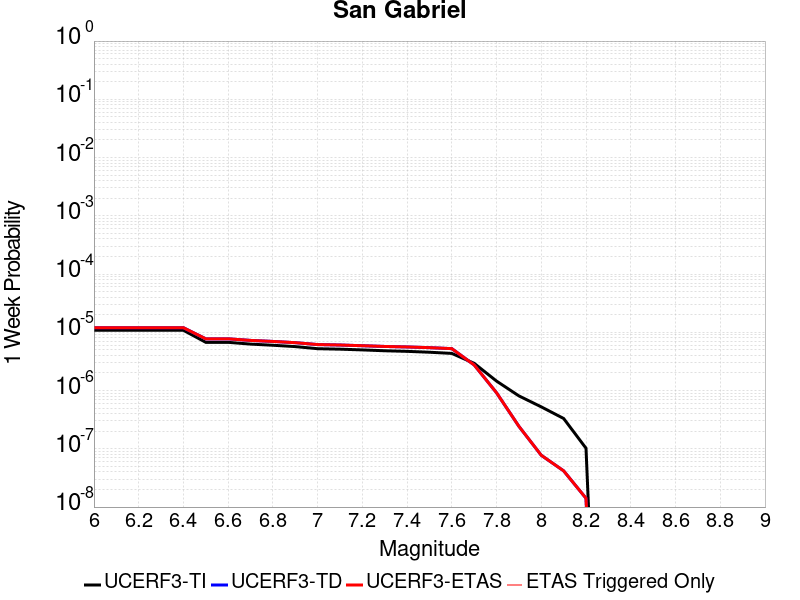 |  | 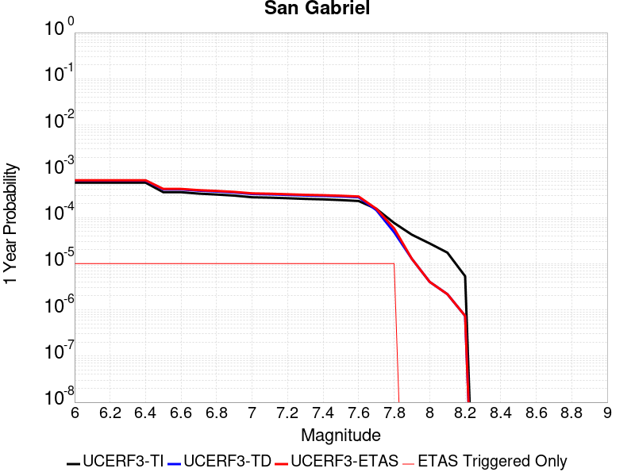 |  |

| Magnitude | 1 wk TI Prob | 1 wk TD Prob | 1 wk ETAS Prob | 1 wk ETAS/TD Gain | 1 wk ETAS Triggered Only | 1 mo TI Prob | 1 mo TD Prob | 1 mo ETAS Prob | 1 mo ETAS/TD Gain | 1 mo ETAS Triggered Only | 1 yr TI Prob | 1 yr TD Prob | 1 yr ETAS Prob | 1 yr ETAS/TD Gain | 1 yr ETAS Triggered Only | 10 yr TI Prob | 10 yr TD Prob | 10 yr ETAS Prob | 10 yr ETAS/TD Gain | 10 yr ETAS Triggered Only |
|-----|-----|-----|-----|-----|-----|-----|-----|-----|-----|-----|-----|-----|-----|-----|-----|-----|-----|-----|-----|-----|
| 6.0 | 1.083775E-5 | 1.2000172E-5 | 1.2000172E-5 | 1.0 | 0.0 | 4.6446676E-5 | 5.142836E-5 | 5.142836E-5 | 1.0 | 0.0 | 5.653415E-4 | 6.2597176E-4 | 6.359655E-4 | 1.0159651 | 1.0E-5 | 0.0056390543 | 0.006254164 | 0.006274039 | 1.0031779 | 2.0E-5 |
| 6.1 | 1.083775E-5 | 1.2000172E-5 | 1.2000172E-5 | 1.0 | 0.0 | 4.6446676E-5 | 5.142836E-5 | 5.142836E-5 | 1.0 | 0.0 | 5.653415E-4 | 6.2597176E-4 | 6.359655E-4 | 1.0159651 | 1.0E-5 | 0.0056390543 | 0.006254164 | 0.006274039 | 1.0031779 | 2.0E-5 |
| 6.2 | 1.083775E-5 | 1.2000172E-5 | 1.2000172E-5 | 1.0 | 0.0 | 4.6446676E-5 | 5.142836E-5 | 5.142836E-5 | 1.0 | 0.0 | 5.653415E-4 | 6.2597176E-4 | 6.359655E-4 | 1.0159651 | 1.0E-5 | 0.0056390543 | 0.006254164 | 0.006274039 | 1.0031779 | 2.0E-5 |
| 6.3 | 1.083775E-5 | 1.2000172E-5 | 1.2000172E-5 | 1.0 | 0.0 | 4.6446676E-5 | 5.142836E-5 | 5.142836E-5 | 1.0 | 0.0 | 5.653415E-4 | 6.2597176E-4 | 6.359655E-4 | 1.0159651 | 1.0E-5 | 0.0056390543 | 0.006254164 | 0.006274039 | 1.0031779 | 2.0E-5 |
| 6.4 | 1.083775E-5 | 1.2000172E-5 | 1.2000172E-5 | 1.0 | 0.0 | 4.6446676E-5 | 5.142836E-5 | 5.142836E-5 | 1.0 | 0.0 | 5.653415E-4 | 6.2597176E-4 | 6.359655E-4 | 1.0159651 | 1.0E-5 | 0.0056390543 | 0.006254164 | 0.006274039 | 1.0031779 | 2.0E-5 |
| 6.5 | 6.7317824E-6 | 7.731773E-6 | 7.731773E-6 | 1.0 | 0.0 | 2.8850178E-5 | 3.3135755E-5 | 3.3135755E-5 | 1.0 | 0.0 | 3.511943E-4 | 4.033542E-4 | 4.1335015E-4 | 1.0247821 | 1.0E-5 | 0.003506398 | 0.0040373006 | 0.00404726 | 1.0024669 | 1.0E-5 |
| 6.6 | 6.7317824E-6 | 7.731773E-6 | 7.731773E-6 | 1.0 | 0.0 | 2.8850178E-5 | 3.3135755E-5 | 3.3135755E-5 | 1.0 | 0.0 | 3.511943E-4 | 4.033542E-4 | 4.1335015E-4 | 1.0247821 | 1.0E-5 | 0.003506398 | 0.0040373006 | 0.00404726 | 1.0024669 | 1.0E-5 |
| 6.7 | 6.274881E-6 | 7.26068E-6 | 7.26068E-6 | 1.0 | 0.0 | 2.6892068E-5 | 3.1116833E-5 | 3.1116833E-5 | 1.0 | 0.0 | 3.2736175E-4 | 3.7878254E-4 | 3.8877878E-4 | 1.0263903 | 1.0E-5 | 0.0032687993 | 0.0037924421 | 0.003802404 | 1.0026268 | 1.0E-5 |
| 6.8 | 5.996209E-6 | 6.9733915E-6 | 6.9733915E-6 | 1.0 | 0.0 | 2.5697784E-5 | 2.9885627E-5 | 2.9885627E-5 | 1.0 | 0.0 | 3.128256E-4 | 3.637977E-4 | 3.7379406E-4 | 1.0274779 | 1.0E-5 | 0.003123856 | 0.0036430918 | 0.0036530555 | 1.0027349 | 1.0E-5 |
| 6.9 | 5.686331E-6 | 6.6383795E-6 | 6.6383795E-6 | 1.0 | 0.0 | 2.4369761E-5 | 2.8449893E-5 | 2.8449893E-5 | 1.0 | 0.0 | 2.9666146E-4 | 3.463233E-4 | 3.5631983E-4 | 1.0288647 | 1.0E-5 | 0.0029626573 | 0.0034689046 | 0.00347887 | 1.0028727 | 1.0E-5 |
| 7.0 | 5.2329838E-6 | 6.1622245E-6 | 6.1622245E-6 | 1.0 | 0.0 | 2.242688E-5 | 2.640927E-5 | 2.640927E-5 | 1.0 | 0.0 | 2.7301308E-4 | 3.214862E-4 | 3.31483E-4 | 1.0310955 | 1.0E-5 | 0.002726779 | 0.0032212678 | 0.0032312355 | 1.0030943 | 1.0E-5 |
| 7.1 | 5.135671E-6 | 6.052312E-6 | 6.052312E-6 | 1.0 | 0.0 | 2.2009834E-5 | 2.5938225E-5 | 2.5938225E-5 | 1.0 | 0.0 | 2.6793676E-4 | 3.157529E-4 | 3.2574974E-4 | 1.0316603 | 1.0E-5 | 0.0026761394 | 0.0031640995 | 0.003174068 | 1.0031505 | 1.0E-5 |
| 7.2 | 4.989062E-6 | 5.885626E-6 | 5.885626E-6 | 1.0 | 0.0 | 2.1381518E-5 | 2.522387E-5 | 2.522387E-5 | 1.0 | 0.0 | 2.6028889E-4 | 3.070581E-4 | 3.1705503E-4 | 1.0325571 | 1.0E-5 | 0.0025998424 | 0.003077395 | 0.0030873644 | 1.0032395 | 1.0E-5 |
| 7.3 | 4.8219395E-6 | 5.717121E-6 | 5.717121E-6 | 1.0 | 0.0 | 2.0665291E-5 | 2.450172E-5 | 2.450172E-5 | 1.0 | 0.0 | 2.5157086E-4 | 2.9826837E-4 | 3.082654E-4 | 1.0335169 | 1.0E-5 | 0.0025128627 | 0.0029897375 | 0.0029997076 | 1.0033348 | 1.0E-5 |
| 7.4 | 4.7118383E-6 | 5.605626E-6 | 5.605626E-6 | 1.0 | 0.0 | 2.0193436E-5 | 2.4023895E-5 | 2.4023895E-5 | 1.0 | 0.0 | 2.4582737E-4 | 2.924524E-4 | 3.0244948E-4 | 1.0341836 | 1.0E-5 | 0.002455556 | 0.0029317315 | 0.0029417023 | 1.0034009 | 1.0E-5 |
| 7.5 | 4.5506545E-6 | 5.450921E-6 | 5.450921E-6 | 1.0 | 0.0 | 1.9502659E-5 | 2.3360884E-5 | 2.3360884E-5 | 1.0 | 0.0 | 2.37419E-4 | 2.843824E-4 | 2.9437954E-4 | 1.0351539 | 1.0E-5 | 0.002371655 | 0.00285124 | 0.0028612118 | 1.0034972 | 1.0E-5 |
| 7.6 | 4.343636E-6 | 5.2436794E-6 | 5.2436794E-6 | 1.0 | 0.0 | 1.861545E-5 | 2.2472723E-5 | 2.2472723E-5 | 1.0 | 0.0 | 2.2661954E-4 | 2.7357182E-4 | 2.8356907E-4 | 1.0365435 | 1.0E-5 | 0.0022638857 | 0.0027433971 | 0.0027533697 | 1.0036352 | 1.0E-5 |
| 7.7 | 2.936235E-6 | 2.7536796E-6 | 2.7536796E-6 | 1.0 | 0.0 | 1.2583803E-5 | 1.180143E-5 | 1.180143E-5 | 1.0 | 0.0 | 1.5319703E-4 | 1.4367298E-4 | 1.5367154E-4 | 1.0695925 | 1.0E-5 | 0.0015309147 | 0.0014431232 | 0.0014531089 | 1.0069194 | 1.0E-5 |
| 7.8 | 1.4541639E-6 | 9.162697E-7 | 9.162697E-7 | 1.0 | 0.0 | 6.232116E-6 | 3.926864E-6 | 3.926864E-6 | 1.0 | 0.0 | 7.587337E-5 | 4.7808524E-5 | 5.7808047E-5 | 1.2091577 | 1.0E-5 | 7.584747E-4 | 4.8291517E-4 | 4.9291033E-4 | 1.0206976 | 1.0E-5 |
| 7.9 | 8.098958E-7 | 2.4327238E-7 | 2.4327238E-7 | 1.0 | 0.0 | 3.4709774E-6 | 1.0425954E-6 | 1.0425954E-6 | 1.0 | 0.0 | 4.225833E-5 | 1.2693526E-5 | 1.2693526E-5 | 1.0 | 0.0 | 4.2250296E-4 | 1.300362E-4 | 1.300362E-4 | 1.0 | 0.0 |
| 8.0 | 5.2473234E-7 | 7.749677E-8 | 7.749677E-8 | 1.0 | 0.0 | 2.248851E-6 | 3.3212896E-7 | 3.3212896E-7 | 1.0 | 0.0 | 2.7379416E-5 | 4.0436626E-6 | 4.0436626E-6 | 1.0 | 0.0 | 2.7376044E-4 | 4.2577678E-5 | 4.2577678E-5 | 1.0 | 0.0 |
| 8.1 | 3.3162388E-7 | 4.188853E-8 | 4.188853E-8 | 1.0 | 0.0 | 1.4212444E-6 | 1.7952226E-7 | 1.7952226E-7 | 1.0 | 0.0 | 1.7303513E-5 | 2.1856813E-6 | 2.1856813E-6 | 1.0 | 0.0 | 1.7302166E-4 | 2.3181034E-5 | 2.3181034E-5 | 1.0 | 0.0 |
| 8.2 | 1.0235345E-7 | 1.4167647E-8 | 1.4167647E-8 | 1.0 | 0.0 | 4.3865757E-7 | 6.0718484E-8 | 6.0718484E-8 | 1.0 | 0.0 | 5.340643E-6 | 7.3924735E-7 | 7.3924735E-7 | 1.0 | 0.0 | 5.3405143E-5 | 7.996221E-6 | 7.996221E-6 | 1.0 | 0.0 |

## Gillem - Big Crack 2011 CFM
*[(top)](#table-of-contents)*

| 1 Week | 1 Month | 1 Year | 10 Year |
|-----|-----|-----|-----|
|  | 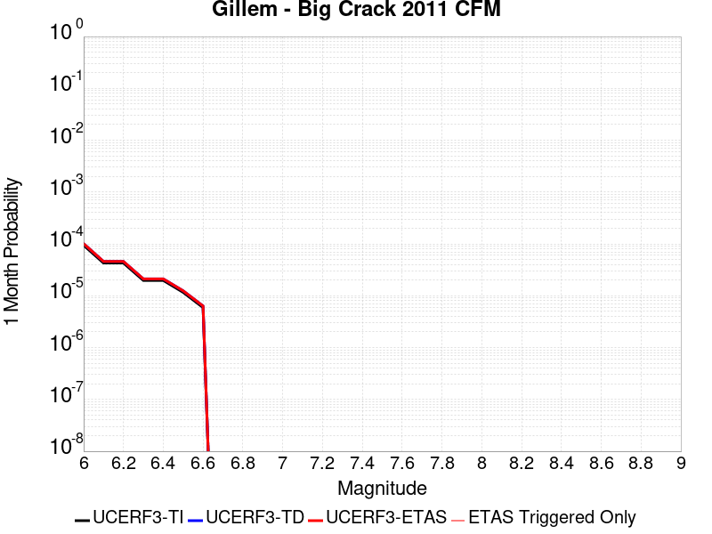 |  | 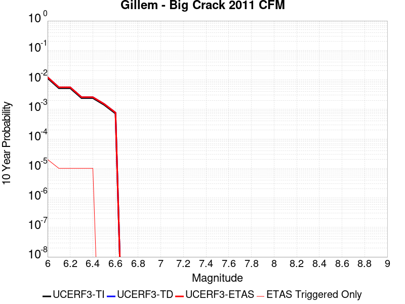 |

| Magnitude | 1 wk TI Prob | 1 wk TD Prob | 1 wk ETAS Prob | 1 wk ETAS/TD Gain | 1 wk ETAS Triggered Only | 1 mo TI Prob | 1 mo TD Prob | 1 mo ETAS Prob | 1 mo ETAS/TD Gain | 1 mo ETAS Triggered Only | 1 yr TI Prob | 1 yr TD Prob | 1 yr ETAS Prob | 1 yr ETAS/TD Gain | 1 yr ETAS Triggered Only | 10 yr TI Prob | 10 yr TD Prob | 10 yr ETAS Prob | 10 yr ETAS/TD Gain | 10 yr ETAS Triggered Only |
|-----|-----|-----|-----|-----|-----|-----|-----|-----|-----|-----|-----|-----|-----|-----|-----|-----|-----|-----|-----|-----|
| 6.0 | 2.196852E-5 | 2.3606119E-5 | 2.3606119E-5 | 1.0 | 0.0 | 9.4147406E-5 | 1.0116566E-4 | 1.0116566E-4 | 1.0 | 0.0 | 0.0011456419 | 0.0012310848 | 0.0012310848 | 1.0 | 0.0 | 0.011397537 | 0.012251512 | 0.012271267 | 1.0016124 | 2.0E-5 |
| 6.1 | 9.992795E-6 | 1.0712606E-5 | 1.0712606E-5 | 1.0 | 0.0 | 4.2825563E-5 | 4.5910463E-5 | 4.5910463E-5 | 1.0 | 0.0 | 5.2127644E-4 | 5.588349E-4 | 5.588349E-4 | 1.0 | 0.0 | 0.0052005537 | 0.0055761063 | 0.0055860505 | 1.0017834 | 1.0E-5 |
| 6.2 | 9.992795E-6 | 1.0712606E-5 | 1.0712606E-5 | 1.0 | 0.0 | 4.2825563E-5 | 4.5910463E-5 | 4.5910463E-5 | 1.0 | 0.0 | 5.2127644E-4 | 5.588349E-4 | 5.588349E-4 | 1.0 | 0.0 | 0.0052005537 | 0.0055761063 | 0.0055860505 | 1.0017834 | 1.0E-5 |
| 6.3 | 4.6127884E-6 | 4.942985E-6 | 4.942985E-6 | 1.0 | 0.0 | 1.9768944E-5 | 2.1184076E-5 | 2.1184076E-5 | 1.0 | 0.0 | 2.406603E-4 | 2.5789006E-4 | 2.5789006E-4 | 1.0 | 0.0 | 0.0024039985 | 0.002576346 | 0.0025863203 | 1.0038714 | 1.0E-5 |
| 6.4 | 4.6127884E-6 | 4.942985E-6 | 4.942985E-6 | 1.0 | 0.0 | 1.9768944E-5 | 2.1184076E-5 | 2.1184076E-5 | 1.0 | 0.0 | 2.406603E-4 | 2.5789006E-4 | 2.5789006E-4 | 1.0 | 0.0 | 0.0024039985 | 0.002576346 | 0.0025863203 | 1.0038714 | 1.0E-5 |
| 6.5 | 2.716712E-6 | 2.9113048E-6 | 2.9113048E-6 | 1.0 | 0.0 | 1.1643E-5 | 1.2476975E-5 | 1.2476975E-5 | 1.0 | 0.0 | 1.417443E-4 | 1.51899E-4 | 1.51899E-4 | 1.0 | 0.0 | 0.0014165393 | 0.0015181898 | 0.0015181898 | 1.0 | 0.0 |
| 6.6 | 1.3818255E-6 | 1.4821687E-6 | 1.4821687E-6 | 1.0 | 0.0 | 5.922096E-6 | 6.3521434E-6 | 6.3521434E-6 | 1.0 | 0.0 | 7.209913E-5 | 7.733583E-5 | 7.733583E-5 | 1.0 | 0.0 | 7.2075747E-4 | 7.732101E-4 | 7.732101E-4 | 1.0 | 0.0 |

## Elysian Park (Upper)
*[(top)](#table-of-contents)*

| 1 Week | 1 Month | 1 Year | 10 Year |
|-----|-----|-----|-----|
|  |  | 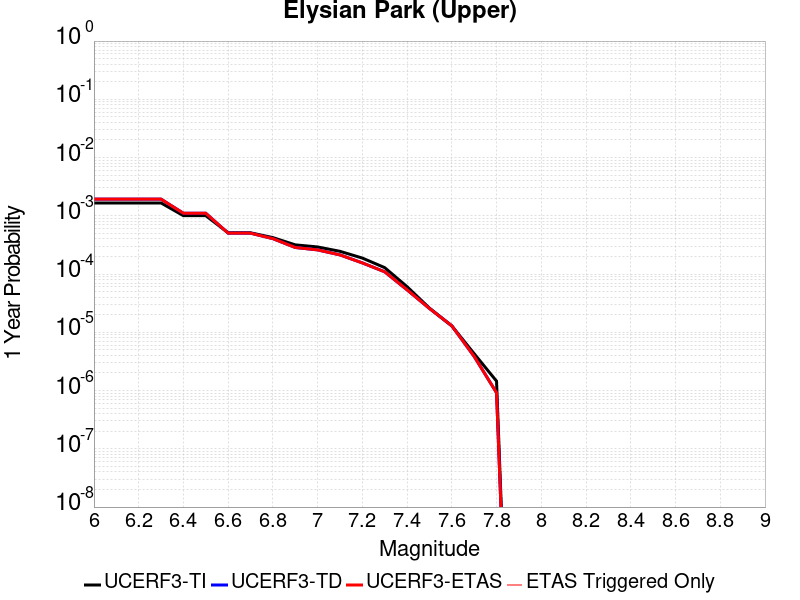 |  |

| Magnitude | 1 wk TI Prob | 1 wk TD Prob | 1 wk ETAS Prob | 1 wk ETAS/TD Gain | 1 wk ETAS Triggered Only | 1 mo TI Prob | 1 mo TD Prob | 1 mo ETAS Prob | 1 mo ETAS/TD Gain | 1 mo ETAS Triggered Only | 1 yr TI Prob | 1 yr TD Prob | 1 yr ETAS Prob | 1 yr ETAS/TD Gain | 1 yr ETAS Triggered Only | 10 yr TI Prob | 10 yr TD Prob | 10 yr ETAS Prob | 10 yr ETAS/TD Gain | 10 yr ETAS Triggered Only |
|-----|-----|-----|-----|-----|-----|-----|-----|-----|-----|-----|-----|-----|-----|-----|-----|-----|-----|-----|-----|-----|
| 6.0 | 3.1876025E-5 | 3.7042544E-5 | 3.7042544E-5 | 1.0 | 0.0 | 1.3660437E-4 | 1.5874684E-4 | 1.5874684E-4 | 1.0 | 0.0 | 0.0016618895 | 0.0019314638 | 0.0019314638 | 1.0 | 0.0 | 0.016495159 | 0.019193362 | 0.01920317 | 1.000511 | 1.0E-5 |
| 6.1 | 3.1876025E-5 | 3.7042544E-5 | 3.7042544E-5 | 1.0 | 0.0 | 1.3660437E-4 | 1.5874684E-4 | 1.5874684E-4 | 1.0 | 0.0 | 0.0016618895 | 0.0019314638 | 0.0019314638 | 1.0 | 0.0 | 0.016495159 | 0.019193362 | 0.01920317 | 1.000511 | 1.0E-5 |
| 6.2 | 3.1876025E-5 | 3.7042544E-5 | 3.7042544E-5 | 1.0 | 0.0 | 1.3660437E-4 | 1.5874684E-4 | 1.5874684E-4 | 1.0 | 0.0 | 0.0016618895 | 0.0019314638 | 0.0019314638 | 1.0 | 0.0 | 0.016495159 | 0.019193362 | 0.01920317 | 1.000511 | 1.0E-5 |
| 6.3 | 3.1876025E-5 | 3.7042544E-5 | 3.7042544E-5 | 1.0 | 0.0 | 1.3660437E-4 | 1.5874684E-4 | 1.5874684E-4 | 1.0 | 0.0 | 0.0016618895 | 0.0019314638 | 0.0019314638 | 1.0 | 0.0 | 0.016495159 | 0.019193362 | 0.01920317 | 1.000511 | 1.0E-5 |
| 6.4 | 1.9273462E-5 | 2.1205524E-5 | 2.1205524E-5 | 1.0 | 0.0 | 8.259794E-5 | 9.0878624E-5 | 9.0878624E-5 | 1.0 | 0.0 | 0.001005166 | 0.0011060591 | 0.0011060591 | 1.0 | 0.0 | 0.010006315 | 0.011022405 | 0.0110322945 | 1.0008973 | 1.0E-5 |
| 6.5 | 1.9273462E-5 | 2.1205524E-5 | 2.1205524E-5 | 1.0 | 0.0 | 8.259794E-5 | 9.0878624E-5 | 9.0878624E-5 | 1.0 | 0.0 | 0.001005166 | 0.0011060591 | 0.0011060591 | 1.0 | 0.0 | 0.010006315 | 0.011022405 | 0.0110322945 | 1.0008973 | 1.0E-5 |
| 6.6 | 9.813258E-6 | 9.6665035E-6 | 9.6665035E-6 | 1.0 | 0.0 | 4.205614E-5 | 4.1427254E-5 | 4.1427254E-5 | 1.0 | 0.0 | 5.119132E-4 | 5.0426734E-4 | 5.0426734E-4 | 1.0 | 0.0 | 0.005107356 | 0.005031955 | 0.0050419047 | 1.0019773 | 1.0E-5 |
| 6.7 | 9.801478E-6 | 9.6540725E-6 | 9.6540725E-6 | 1.0 | 0.0 | 4.2005657E-5 | 4.137398E-5 | 4.137398E-5 | 1.0 | 0.0 | 5.112989E-4 | 5.03619E-4 | 5.03619E-4 | 1.0 | 0.0 | 0.0051012407 | 0.005025501 | 0.0050354507 | 1.0019798 | 1.0E-5 |
| 6.8 | 8.102489E-6 | 7.773721E-6 | 7.773721E-6 | 1.0 | 0.0 | 3.4724493E-5 | 3.331555E-5 | 3.331555E-5 | 1.0 | 0.0 | 4.2268867E-4 | 4.055463E-4 | 4.055463E-4 | 1.0 | 0.0 | 0.004218856 | 0.0040485566 | 0.0040485566 | 1.0 | 0.0 |
| 6.9 | 6.08275E-6 | 5.481882E-6 | 5.481882E-6 | 1.0 | 0.0 | 2.6068668E-5 | 2.3493574E-5 | 2.3493574E-5 | 1.0 | 0.0 | 3.173398E-4 | 2.859975E-4 | 2.859975E-4 | 1.0 | 0.0 | 0.0031688702 | 0.002856372 | 0.002856372 | 1.0 | 0.0 |
| 7.0 | 5.5995934E-6 | 4.9831697E-6 | 4.9831697E-6 | 1.0 | 0.0 | 2.3998036E-5 | 2.1356269E-5 | 2.1356269E-5 | 1.0 | 0.0 | 2.9213692E-4 | 2.5998222E-4 | 2.5998222E-4 | 1.0 | 0.0 | 0.0029175316 | 0.0025968482 | 0.0025968482 | 1.0 | 0.0 |
| 7.1 | 4.709881E-6 | 4.0877185E-6 | 4.0877185E-6 | 1.0 | 0.0 | 2.0185047E-5 | 1.7518678E-5 | 1.7518678E-5 | 1.0 | 0.0 | 2.4572524E-4 | 2.1326944E-4 | 2.1326944E-4 | 1.0 | 0.0 | 0.002454537 | 0.002130689 | 0.002130689 | 1.0 | 0.0 |
| 7.2 | 3.6063436E-6 | 2.9781793E-6 | 2.9781793E-6 | 1.0 | 0.0 | 1.5455667E-5 | 1.2763564E-5 | 1.2763564E-5 | 1.0 | 0.0 | 1.881565E-4 | 1.5538542E-4 | 1.5538542E-4 | 1.0 | 0.0 | 0.0018799726 | 0.001552779 | 0.001552779 | 1.0 | 0.0 |
| 7.3 | 2.471135E-6 | 2.0956197E-6 | 2.0956197E-6 | 1.0 | 0.0 | 1.0590536E-5 | 8.981197E-6 | 8.981197E-6 | 1.0 | 0.0 | 1.2893214E-4 | 1.0934066E-4 | 1.0934066E-4 | 1.0 | 0.0 | 0.0012885736 | 0.0010928758 | 0.0010928758 | 1.0 | 0.0 |
| 7.4 | 1.163943E-6 | 1.0275936E-6 | 1.0275936E-6 | 1.0 | 0.0 | 4.988318E-6 | 4.4039652E-6 | 4.4039652E-6 | 1.0 | 0.0 | 6.0731076E-5 | 5.361699E-5 | 5.361699E-5 | 1.0 | 0.0 | 6.071448E-4 | 5.360435E-4 | 5.360435E-4 | 1.0 | 0.0 |
| 7.5 | 4.99459E-7 | 4.918001E-7 | 4.918001E-7 | 1.0 | 0.0 | 2.140537E-6 | 2.107713E-6 | 2.107713E-6 | 1.0 | 0.0 | 2.6060725E-5 | 2.566112E-5 | 2.566112E-5 | 1.0 | 0.0 | 2.605767E-4 | 2.5658312E-4 | 2.5658312E-4 | 1.0 | 0.0 |
| 7.6 | 2.4667852E-7 | 2.4780707E-7 | 2.4780707E-7 | 1.0 | 0.0 | 1.0571932E-6 | 1.0620299E-6 | 1.0620299E-6 | 1.0 | 0.0 | 1.2871251E-5 | 1.2930142E-5 | 1.2930142E-5 | 1.0 | 0.0 | 1.2870505E-4 | 1.2929426E-4 | 1.2929426E-4 | 1.0 | 0.0 |
| 7.7 | 8.2312795E-8 | 7.387732E-8 | 7.387732E-8 | 1.0 | 0.0 | 3.527691E-7 | 3.1661705E-7 | 3.1661705E-7 | 1.0 | 0.0 | 4.294955E-6 | 3.854807E-6 | 3.854807E-6 | 1.0 | 0.0 | 4.2948723E-5 | 3.8547514E-5 | 3.8547514E-5 | 1.0 | 0.0 |
| 7.8 | 2.7819295E-8 | 1.7575115E-8 | 1.7575115E-8 | 1.0 | 0.0 | 1.1922555E-7 | 7.532192E-8 | 7.532192E-8 | 1.0 | 0.0 | 1.45157E-6 | 9.1704413E-7 | 9.1704413E-7 | 1.0 | 0.0 | 1.45156055E-5 | 9.170419E-6 | 9.170419E-6 | 1.0 | 0.0 |

## Likely 2011 CFM
*[(top)](#table-of-contents)*

| 1 Week | 1 Month | 1 Year | 10 Year |
|-----|-----|-----|-----|
|  |  |  | 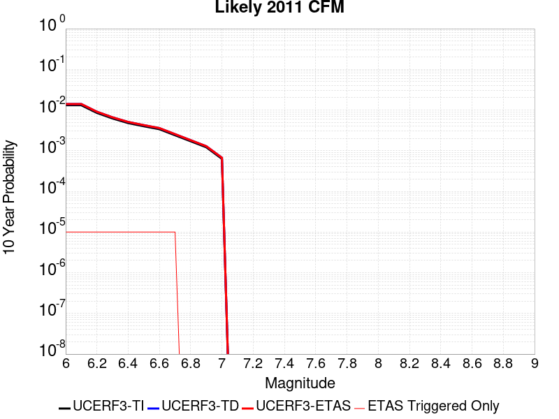 |

| Magnitude | 1 wk TI Prob | 1 wk TD Prob | 1 wk ETAS Prob | 1 wk ETAS/TD Gain | 1 wk ETAS Triggered Only | 1 mo TI Prob | 1 mo TD Prob | 1 mo ETAS Prob | 1 mo ETAS/TD Gain | 1 mo ETAS Triggered Only | 1 yr TI Prob | 1 yr TD Prob | 1 yr ETAS Prob | 1 yr ETAS/TD Gain | 1 yr ETAS Triggered Only | 10 yr TI Prob | 10 yr TD Prob | 10 yr ETAS Prob | 10 yr ETAS/TD Gain | 10 yr ETAS Triggered Only |
|-----|-----|-----|-----|-----|-----|-----|-----|-----|-----|-----|-----|-----|-----|-----|-----|-----|-----|-----|-----|-----|
| 6.0 | 2.5315949E-5 | 2.710653E-5 | 2.710653E-5 | 1.0 | 0.0 | 1.0849241E-4 | 1.1616592E-4 | 1.1616592E-4 | 1.0 | 0.0 | 0.0013200947 | 0.001413447 | 0.001413447 | 1.0 | 0.0 | 0.013122803 | 0.014049227 | 0.014059087 | 1.0007018 | 1.0E-5 |
| 6.1 | 2.5315949E-5 | 2.710653E-5 | 2.710653E-5 | 1.0 | 0.0 | 1.0849241E-4 | 1.1616592E-4 | 1.1616592E-4 | 1.0 | 0.0 | 0.0013200947 | 0.001413447 | 0.001413447 | 1.0 | 0.0 | 0.013122803 | 0.014049227 | 0.014059087 | 1.0007018 | 1.0E-5 |
| 6.2 | 1.6375941E-5 | 1.7466922E-5 | 1.7466922E-5 | 1.0 | 0.0 | 7.0180715E-5 | 7.485616E-5 | 7.485616E-5 | 1.0 | 0.0 | 8.5411523E-4 | 9.1100496E-4 | 9.1100496E-4 | 1.0 | 0.0 | 0.008508399 | 0.009073991 | 0.009083901 | 1.0010921 | 1.0E-5 |
| 6.3 | 1.1945543E-5 | 1.2713345E-5 | 1.2713345E-5 | 1.0 | 0.0 | 5.119418E-5 | 5.4484655E-5 | 5.4484655E-5 | 1.0 | 0.0 | 6.2311086E-4 | 6.631541E-4 | 6.631541E-4 | 1.0 | 0.0 | 0.0062136655 | 0.0066123074 | 0.0066222413 | 1.0015023 | 1.0E-5 |
| 6.4 | 9.192729E-6 | 9.769056E-6 | 9.769056E-6 | 1.0 | 0.0 | 3.939681E-5 | 4.1866726E-5 | 4.1866726E-5 | 1.0 | 0.0 | 4.7955062E-4 | 5.096109E-4 | 5.096109E-4 | 1.0 | 0.0 | 0.004785171 | 0.005084704 | 0.0050946535 | 1.0019567 | 1.0E-5 |
| 6.5 | 7.67906E-6 | 8.153089E-6 | 8.153089E-6 | 1.0 | 0.0 | 3.2909844E-5 | 3.4941353E-5 | 3.4941353E-5 | 1.0 | 0.0 | 4.006037E-4 | 4.253298E-4 | 4.253298E-4 | 1.0 | 0.0 | 0.0039988225 | 0.0042453506 | 0.0042553083 | 1.0023456 | 1.0E-5 |
| 6.6 | 6.4884057E-6 | 6.885141E-6 | 6.885141E-6 | 1.0 | 0.0 | 2.7807157E-5 | 2.9507422E-5 | 2.9507422E-5 | 1.0 | 0.0 | 3.3849955E-4 | 3.5919505E-4 | 3.5919505E-4 | 1.0 | 0.0 | 0.003379844 | 0.0035862897 | 0.003596254 | 1.0027784 | 1.0E-5 |
| 6.7 | 4.6060636E-6 | 4.884315E-6 | 4.884315E-6 | 1.0 | 0.0 | 1.9740122E-5 | 2.0932615E-5 | 2.0932615E-5 | 1.0 | 0.0 | 2.403095E-4 | 2.548256E-4 | 2.548256E-4 | 1.0 | 0.0 | 0.002400498 | 0.002545417 | 0.0025553918 | 1.0039186 | 1.0E-5 |
| 6.8 | 3.2795615E-6 | 3.4775678E-6 | 3.4775678E-6 | 1.0 | 0.0 | 1.4055187E-5 | 1.49037805E-5 | 1.49037805E-5 | 1.0 | 0.0 | 1.7110848E-4 | 1.8143897E-4 | 1.8143897E-4 | 1.0 | 0.0 | 0.0017097679 | 0.0018129636 | 0.0018129636 | 1.0 | 0.0 |
| 6.9 | 2.3289967E-6 | 2.4706962E-6 | 2.4706962E-6 | 1.0 | 0.0 | 9.981376E-6 | 1.05886575E-5 | 1.05886575E-5 | 1.0 | 0.0 | 1.2151648E-4 | 1.2890971E-4 | 1.2890971E-4 | 1.0 | 0.0 | 0.0012145005 | 0.0012883923 | 0.0012883923 | 1.0 | 0.0 |
| 7.0 | 1.211292E-6 | 1.2864698E-6 | 1.2864698E-6 | 1.0 | 0.0 | 5.1912407E-6 | 5.513432E-6 | 5.513432E-6 | 1.0 | 0.0 | 6.320152E-5 | 6.7124274E-5 | 6.7124274E-5 | 1.0 | 0.0 | 6.3183554E-4 | 6.7106984E-4 | 6.7106984E-4 | 1.0 | 0.0 |

## McKinleyville (alt1)
*[(top)](#table-of-contents)*

| 1 Week | 1 Month | 1 Year | 10 Year |
|-----|-----|-----|-----|
|  |  |  |  |

| Magnitude | 1 wk TI Prob | 1 wk TD Prob | 1 wk ETAS Prob | 1 wk ETAS/TD Gain | 1 wk ETAS Triggered Only | 1 mo TI Prob | 1 mo TD Prob | 1 mo ETAS Prob | 1 mo ETAS/TD Gain | 1 mo ETAS Triggered Only | 1 yr TI Prob | 1 yr TD Prob | 1 yr ETAS Prob | 1 yr ETAS/TD Gain | 1 yr ETAS Triggered Only | 10 yr TI Prob | 10 yr TD Prob | 10 yr ETAS Prob | 10 yr ETAS/TD Gain | 10 yr ETAS Triggered Only |
|-----|-----|-----|-----|-----|-----|-----|-----|-----|-----|-----|-----|-----|-----|-----|-----|-----|-----|-----|-----|-----|
| 6.0 | 1.1028524E-5 | 1.172845E-5 | 1.172845E-5 | 1.0 | 0.0 | 4.7264242E-5 | 5.026396E-5 | 5.026396E-5 | 1.0 | 0.0 | 5.7529024E-4 | 6.118173E-4 | 6.118173E-4 | 1.0 | 0.0 | 0.005738032 | 0.006103839 | 0.0061137774 | 1.0016283 | 1.0E-5 |
| 6.1 | 1.1028524E-5 | 1.172845E-5 | 1.172845E-5 | 1.0 | 0.0 | 4.7264242E-5 | 5.026396E-5 | 5.026396E-5 | 1.0 | 0.0 | 5.7529024E-4 | 6.118173E-4 | 6.118173E-4 | 1.0 | 0.0 | 0.005738032 | 0.006103839 | 0.0061137774 | 1.0016283 | 1.0E-5 |
| 6.2 | 1.1028524E-5 | 1.172845E-5 | 1.172845E-5 | 1.0 | 0.0 | 4.7264242E-5 | 5.026396E-5 | 5.026396E-5 | 1.0 | 0.0 | 5.7529024E-4 | 6.118173E-4 | 6.118173E-4 | 1.0 | 0.0 | 0.005738032 | 0.006103839 | 0.0061137774 | 1.0016283 | 1.0E-5 |
| 6.3 | 1.1028524E-5 | 1.172845E-5 | 1.172845E-5 | 1.0 | 0.0 | 4.7264242E-5 | 5.026396E-5 | 5.026396E-5 | 1.0 | 0.0 | 5.7529024E-4 | 6.118173E-4 | 6.118173E-4 | 1.0 | 0.0 | 0.005738032 | 0.006103839 | 0.0061137774 | 1.0016283 | 1.0E-5 |
| 6.4 | 1.1028524E-5 | 1.172845E-5 | 1.172845E-5 | 1.0 | 0.0 | 4.7264242E-5 | 5.026396E-5 | 5.026396E-5 | 1.0 | 0.0 | 5.7529024E-4 | 6.118173E-4 | 6.118173E-4 | 1.0 | 0.0 | 0.005738032 | 0.006103839 | 0.0061137774 | 1.0016283 | 1.0E-5 |
| 6.5 | 1.1028524E-5 | 1.172845E-5 | 1.172845E-5 | 1.0 | 0.0 | 4.7264242E-5 | 5.026396E-5 | 5.026396E-5 | 1.0 | 0.0 | 5.7529024E-4 | 6.118173E-4 | 6.118173E-4 | 1.0 | 0.0 | 0.005738032 | 0.006103839 | 0.0061137774 | 1.0016283 | 1.0E-5 |
| 6.6 | 1.1028524E-5 | 1.172845E-5 | 1.172845E-5 | 1.0 | 0.0 | 4.7264242E-5 | 5.026396E-5 | 5.026396E-5 | 1.0 | 0.0 | 5.7529024E-4 | 6.118173E-4 | 6.118173E-4 | 1.0 | 0.0 | 0.005738032 | 0.006103839 | 0.0061137774 | 1.0016283 | 1.0E-5 |
| 6.7 | 6.483374E-6 | 6.917515E-6 | 6.917515E-6 | 1.0 | 0.0 | 2.7785592E-5 | 2.964619E-5 | 2.964619E-5 | 1.0 | 0.0 | 3.3823706E-4 | 3.6088878E-4 | 3.6088878E-4 | 1.0 | 0.0 | 0.003377227 | 0.00360364 | 0.003613604 | 1.0027649 | 1.0E-5 |
| 6.8 | 6.483374E-6 | 6.917515E-6 | 6.917515E-6 | 1.0 | 0.0 | 2.7785592E-5 | 2.964619E-5 | 2.964619E-5 | 1.0 | 0.0 | 3.3823706E-4 | 3.6088878E-4 | 3.6088878E-4 | 1.0 | 0.0 | 0.003377227 | 0.00360364 | 0.003613604 | 1.0027649 | 1.0E-5 |
| 6.9 | 4.0394048E-6 | 4.3456503E-6 | 4.3456503E-6 | 1.0 | 0.0 | 1.731162E-5 | 1.8624085E-5 | 1.8624085E-5 | 1.0 | 0.0 | 2.1074859E-4 | 2.267252E-4 | 2.267252E-4 | 1.0 | 0.0 | 0.0021054882 | 0.0022649937 | 0.002274971 | 1.004405 | 1.0E-5 |
| 7.0 | 3.7791233E-6 | 4.072494E-6 | 4.072494E-6 | 1.0 | 0.0 | 1.6196142E-5 | 1.7453433E-5 | 1.7453433E-5 | 1.0 | 0.0 | 1.9717019E-4 | 2.1247531E-4 | 2.1247531E-4 | 1.0 | 0.0 | 0.0019699533 | 0.0021227715 | 0.0021327503 | 1.0047008 | 1.0E-5 |
| 7.1 | 3.675443E-6 | 3.9637894E-6 | 3.9637894E-6 | 1.0 | 0.0 | 1.5751802E-5 | 1.698756E-5 | 1.698756E-5 | 1.0 | 0.0 | 1.9176133E-4 | 2.0680441E-4 | 2.0680441E-4 | 1.0 | 0.0 | 0.0019159593 | 0.0020661692 | 0.0020761485 | 1.0048299 | 1.0E-5 |
| 7.2 | 3.0165843E-6 | 3.2723585E-6 | 3.2723585E-6 | 1.0 | 0.0 | 1.2928153E-5 | 1.4024319E-5 | 1.4024319E-5 | 1.0 | 0.0 | 1.573889E-4 | 1.7073289E-4 | 1.7073289E-4 | 1.0 | 0.0 | 0.0015727748 | 0.001706036 | 0.001716019 | 1.0058515 | 1.0E-5 |
| 7.3 | 2.307633E-6 | 2.5191296E-6 | 2.5191296E-6 | 1.0 | 0.0 | 9.889818E-6 | 1.0796225E-5 | 1.0796225E-5 | 1.0 | 0.0 | 1.2040188E-4 | 1.314362E-4 | 1.314362E-4 | 1.0 | 0.0 | 0.0012033667 | 0.001313593 | 0.0013235799 | 1.0076027 | 1.0E-5 |
| 7.4 | 2.0568484E-6 | 2.251922E-6 | 2.251922E-6 | 1.0 | 0.0 | 8.8150355E-6 | 9.651059E-6 | 9.651059E-6 | 1.0 | 0.0 | 1.0731777E-4 | 1.1749539E-4 | 1.1749539E-4 | 1.0 | 0.0 | 0.0010726595 | 0.0011743403 | 0.0011843286 | 1.0085055 | 1.0E-5 |
| 7.5 | 1.7674889E-6 | 1.9416036E-6 | 1.9416036E-6 | 1.0 | 0.0 | 7.5749304E-6 | 8.321132E-6 | 8.321132E-6 | 1.0 | 0.0 | 9.222087E-5 | 1.0130514E-4 | 1.0130514E-4 | 1.0 | 0.0 | 9.218261E-4 | 0.0010125962 | 0.0010225861 | 1.0098656 | 1.0E-5 |
| 7.6 | 1.2944297E-6 | 1.4297776E-6 | 1.4297776E-6 | 1.0 | 0.0 | 5.547544E-6 | 6.127604E-6 | 6.127604E-6 | 1.0 | 0.0 | 6.753925E-5 | 7.460108E-5 | 7.460108E-5 | 1.0 | 0.0 | 6.7518733E-4 | 7.4576517E-4 | 7.5575773E-4 | 1.013399 | 1.0E-5 |
| 7.7 | 5.806243E-7 | 6.461687E-7 | 6.461687E-7 | 1.0 | 0.0 | 2.4883875E-6 | 2.7692915E-6 | 2.7692915E-6 | 1.0 | 0.0 | 3.0295698E-5 | 3.371562E-5 | 3.371562E-5 | 1.0 | 0.0 | 3.0291567E-4 | 3.3710673E-4 | 3.3710673E-4 | 1.0 | 0.0 |
| 7.8 | 1.6121008E-7 | 1.8185658E-7 | 1.8185658E-7 | 1.0 | 0.0 | 6.909002E-7 | 7.793851E-7 | 7.793851E-7 | 1.0 | 0.0 | 8.411677E-6 | 9.488975E-6 | 9.488975E-6 | 1.0 | 0.0 | 8.411359E-5 | 9.4885945E-5 | 9.4885945E-5 | 1.0 | 0.0 |

## Trinidad (alt1)
*[(top)](#table-of-contents)*

| 1 Week | 1 Month | 1 Year | 10 Year |
|-----|-----|-----|-----|
|  | 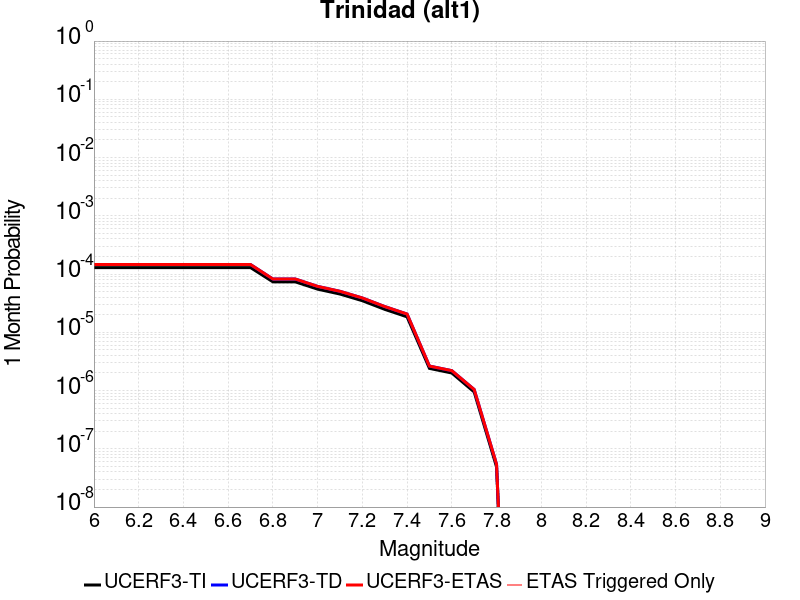 |  |  |

| Magnitude | 1 wk TI Prob | 1 wk TD Prob | 1 wk ETAS Prob | 1 wk ETAS/TD Gain | 1 wk ETAS Triggered Only | 1 mo TI Prob | 1 mo TD Prob | 1 mo ETAS Prob | 1 mo ETAS/TD Gain | 1 mo ETAS Triggered Only | 1 yr TI Prob | 1 yr TD Prob | 1 yr ETAS Prob | 1 yr ETAS/TD Gain | 1 yr ETAS Triggered Only | 10 yr TI Prob | 10 yr TD Prob | 10 yr ETAS Prob | 10 yr ETAS/TD Gain | 10 yr ETAS Triggered Only |
|-----|-----|-----|-----|-----|-----|-----|-----|-----|-----|-----|-----|-----|-----|-----|-----|-----|-----|-----|-----|-----|
| 6.0 | 3.0167168E-5 | 3.403724E-5 | 3.403724E-5 | 1.0 | 0.0 | 1.2928146E-4 | 1.4586668E-4 | 1.4586668E-4 | 1.0 | 0.0 | 0.0015728653 | 0.0017746487 | 0.0017746487 | 1.0 | 0.0 | 0.0156177925 | 0.01762173 | 0.017631553 | 1.0005574 | 1.0E-5 |
| 6.1 | 3.0167168E-5 | 3.403724E-5 | 3.403724E-5 | 1.0 | 0.0 | 1.2928146E-4 | 1.4586668E-4 | 1.4586668E-4 | 1.0 | 0.0 | 0.0015728653 | 0.0017746487 | 0.0017746487 | 1.0 | 0.0 | 0.0156177925 | 0.01762173 | 0.017631553 | 1.0005574 | 1.0E-5 |
| 6.2 | 3.0167168E-5 | 3.403724E-5 | 3.403724E-5 | 1.0 | 0.0 | 1.2928146E-4 | 1.4586668E-4 | 1.4586668E-4 | 1.0 | 0.0 | 0.0015728653 | 0.0017746487 | 0.0017746487 | 1.0 | 0.0 | 0.0156177925 | 0.01762173 | 0.017631553 | 1.0005574 | 1.0E-5 |
| 6.3 | 3.0167168E-5 | 3.403724E-5 | 3.403724E-5 | 1.0 | 0.0 | 1.2928146E-4 | 1.4586668E-4 | 1.4586668E-4 | 1.0 | 0.0 | 0.0015728653 | 0.0017746487 | 0.0017746487 | 1.0 | 0.0 | 0.0156177925 | 0.01762173 | 0.017631553 | 1.0005574 | 1.0E-5 |
| 6.4 | 3.0167168E-5 | 3.403724E-5 | 3.403724E-5 | 1.0 | 0.0 | 1.2928146E-4 | 1.4586668E-4 | 1.4586668E-4 | 1.0 | 0.0 | 0.0015728653 | 0.0017746487 | 0.0017746487 | 1.0 | 0.0 | 0.0156177925 | 0.01762173 | 0.017631553 | 1.0005574 | 1.0E-5 |
| 6.5 | 3.0167168E-5 | 3.403724E-5 | 3.403724E-5 | 1.0 | 0.0 | 1.2928146E-4 | 1.4586668E-4 | 1.4586668E-4 | 1.0 | 0.0 | 0.0015728653 | 0.0017746487 | 0.0017746487 | 1.0 | 0.0 | 0.0156177925 | 0.01762173 | 0.017631553 | 1.0005574 | 1.0E-5 |
| 6.6 | 3.0167168E-5 | 3.403724E-5 | 3.403724E-5 | 1.0 | 0.0 | 1.2928146E-4 | 1.4586668E-4 | 1.4586668E-4 | 1.0 | 0.0 | 0.0015728653 | 0.0017746487 | 0.0017746487 | 1.0 | 0.0 | 0.0156177925 | 0.01762173 | 0.017631553 | 1.0005574 | 1.0E-5 |
| 6.7 | 3.0167168E-5 | 3.403724E-5 | 3.403724E-5 | 1.0 | 0.0 | 1.2928146E-4 | 1.4586668E-4 | 1.4586668E-4 | 1.0 | 0.0 | 0.0015728653 | 0.0017746487 | 0.0017746487 | 1.0 | 0.0 | 0.0156177925 | 0.01762173 | 0.017631553 | 1.0005574 | 1.0E-5 |
| 6.8 | 1.717077E-5 | 1.9197787E-5 | 1.9197787E-5 | 1.0 | 0.0 | 7.358694E-5 | 8.227389E-5 | 8.227389E-5 | 1.0 | 0.0 | 8.9555274E-4 | 0.0010012687 | 0.0010012687 | 1.0 | 0.0 | 0.008919522 | 0.009972027 | 0.0099819265 | 1.0009928 | 1.0E-5 |
| 6.9 | 1.717077E-5 | 1.9197787E-5 | 1.9197787E-5 | 1.0 | 0.0 | 7.358694E-5 | 8.227389E-5 | 8.227389E-5 | 1.0 | 0.0 | 8.9555274E-4 | 0.0010012687 | 0.0010012687 | 1.0 | 0.0 | 0.008919522 | 0.009972027 | 0.0099819265 | 1.0009928 | 1.0E-5 |
| 7.0 | 1.2858572E-5 | 1.43389025E-5 | 1.43389025E-5 | 1.0 | 0.0 | 5.5107E-5 | 6.1451174E-5 | 6.1451174E-5 | 1.0 | 0.0 | 6.707212E-4 | 7.479433E-4 | 7.479433E-4 | 1.0 | 0.0 | 0.006687004 | 0.00745744 | 0.0074673654 | 1.001331 | 1.0E-5 |
| 7.1 | 1.0588431E-5 | 1.18025255E-5 | 1.18025255E-5 | 1.0 | 0.0 | 4.53782E-5 | 5.0581435E-5 | 5.0581435E-5 | 1.0 | 0.0 | 5.5233954E-4 | 6.1568385E-4 | 6.1568385E-4 | 1.0 | 0.0 | 0.005509687 | 0.006142631 | 0.00615257 | 1.0016179 | 1.0E-5 |
| 7.2 | 8.138061E-6 | 9.068176E-6 | 9.068176E-6 | 1.0 | 0.0 | 3.487694E-5 | 3.886317E-5 | 3.886317E-5 | 1.0 | 0.0 | 4.2454398E-4 | 4.7308122E-4 | 4.7308122E-4 | 1.0 | 0.0 | 0.0042373384 | 0.004723183 | 0.0047331355 | 1.0021073 | 1.0E-5 |
| 7.3 | 5.787542E-6 | 6.461018E-6 | 6.461018E-6 | 1.0 | 0.0 | 2.4803514E-5 | 2.7689905E-5 | 2.7689905E-5 | 1.0 | 0.0 | 3.0194095E-4 | 3.3709395E-4 | 3.3709395E-4 | 1.0 | 0.0 | 0.00301531 | 0.0033679376 | 0.003377904 | 1.0029591 | 1.0E-5 |
| 7.4 | 4.303563E-6 | 4.8013667E-6 | 4.8013667E-6 | 1.0 | 0.0 | 1.844371E-5 | 2.0577234E-5 | 2.0577234E-5 | 1.0 | 0.0 | 2.2452902E-4 | 2.505188E-4 | 2.505188E-4 | 1.0 | 0.0 | 0.0022430231 | 0.0025043027 | 0.0025043027 | 1.0 | 0.0 |
| 7.5 | 5.6063425E-7 | 6.143528E-7 | 6.143528E-7 | 1.0 | 0.0 | 2.402716E-6 | 2.632938E-6 | 2.632938E-6 | 1.0 | 0.0 | 2.9252675E-5 | 3.2055566E-5 | 3.2055566E-5 | 1.0 | 0.0 | 2.9248823E-4 | 3.2051097E-4 | 3.2051097E-4 | 1.0 | 0.0 |
| 7.6 | 4.6699128E-7 | 5.126264E-7 | 5.126264E-7 | 1.0 | 0.0 | 2.0013897E-6 | 2.1969686E-6 | 2.1969686E-6 | 1.0 | 0.0 | 2.4366647E-5 | 2.6747779E-5 | 2.6747779E-5 | 1.0 | 0.0 | 2.4363975E-4 | 2.67447E-4 | 2.67447E-4 | 1.0 | 0.0 |
| 7.7 | 2.2080937E-7 | 2.4349217E-7 | 2.4349217E-7 | 1.0 | 0.0 | 9.4632554E-7 | 1.0435375E-6 | 1.0435375E-6 | 1.0 | 0.0 | 1.15214525E-5 | 1.2705001E-5 | 1.2705001E-5 | 1.0 | 0.0 | 1.1520855E-4 | 1.2704334E-4 | 1.2704334E-4 | 1.0 | 0.0 |
| 7.8 | 1.1438307E-8 | 1.2684245E-8 | 1.2684245E-8 | 1.0 | 0.0 | 4.9021317E-8 | 5.436105E-8 | 5.436105E-8 | 1.0 | 0.0 | 5.9683435E-7 | 6.618458E-7 | 6.618458E-7 | 1.0 | 0.0 | 5.9683275E-6 | 6.6184575E-6 | 6.6184575E-6 | 1.0 | 0.0 |

## Shoreline
*[(top)](#table-of-contents)*

| 1 Week | 1 Month | 1 Year | 10 Year |
|-----|-----|-----|-----|
|  |  |  |  |

| Magnitude | 1 wk TI Prob | 1 wk TD Prob | 1 wk ETAS Prob | 1 wk ETAS/TD Gain | 1 wk ETAS Triggered Only | 1 mo TI Prob | 1 mo TD Prob | 1 mo ETAS Prob | 1 mo ETAS/TD Gain | 1 mo ETAS Triggered Only | 1 yr TI Prob | 1 yr TD Prob | 1 yr ETAS Prob | 1 yr ETAS/TD Gain | 1 yr ETAS Triggered Only | 10 yr TI Prob | 10 yr TD Prob | 10 yr ETAS Prob | 10 yr ETAS/TD Gain | 10 yr ETAS Triggered Only |
|-----|-----|-----|-----|-----|-----|-----|-----|-----|-----|-----|-----|-----|-----|-----|-----|-----|-----|-----|-----|-----|
| 6.0 | 3.9888673E-6 | 4.0480413E-6 | 4.0480413E-6 | 1.0 | 0.0 | 1.7095033E-5 | 1.7348664E-5 | 1.7348664E-5 | 1.0 | 0.0 | 2.0811215E-4 | 2.112051E-4 | 2.112051E-4 | 1.0 | 0.0 | 0.0020791737 | 0.0021105926 | 0.0021205714 | 1.004728 | 1.0E-5 |
| 6.1 | 3.9888673E-6 | 4.0480413E-6 | 4.0480413E-6 | 1.0 | 0.0 | 1.7095033E-5 | 1.7348664E-5 | 1.7348664E-5 | 1.0 | 0.0 | 2.0811215E-4 | 2.112051E-4 | 2.112051E-4 | 1.0 | 0.0 | 0.0020791737 | 0.0021105926 | 0.0021205714 | 1.004728 | 1.0E-5 |
| 6.2 | 1.4039653E-6 | 1.410151E-6 | 1.410151E-6 | 1.0 | 0.0 | 6.0169805E-6 | 6.0434904E-6 | 6.0434904E-6 | 1.0 | 0.0 | 7.325427E-5 | 7.357707E-5 | 7.357707E-5 | 1.0 | 0.0 | 7.3230127E-4 | 7.3553313E-4 | 7.3553313E-4 | 1.0 | 0.0 |
| 6.3 | 1.4039653E-6 | 1.410151E-6 | 1.410151E-6 | 1.0 | 0.0 | 6.0169805E-6 | 6.0434904E-6 | 6.0434904E-6 | 1.0 | 0.0 | 7.325427E-5 | 7.357707E-5 | 7.357707E-5 | 1.0 | 0.0 | 7.3230127E-4 | 7.3553313E-4 | 7.3553313E-4 | 1.0 | 0.0 |
| 6.4 | 1.3314152E-6 | 1.3362211E-6 | 1.3362211E-6 | 1.0 | 0.0 | 5.7060524E-6 | 5.7266493E-6 | 5.7266493E-6 | 1.0 | 0.0 | 6.946897E-5 | 6.971978E-5 | 6.971978E-5 | 1.0 | 0.0 | 6.9447263E-4 | 6.9698447E-4 | 6.9698447E-4 | 1.0 | 0.0 |
| 6.5 | 1.1187026E-6 | 1.1204216E-6 | 1.1204216E-6 | 1.0 | 0.0 | 4.794431E-6 | 4.8017982E-6 | 4.8017982E-6 | 1.0 | 0.0 | 5.8370628E-5 | 5.846035E-5 | 5.846035E-5 | 1.0 | 0.0 | 5.83553E-4 | 5.8445224E-4 | 5.8445224E-4 | 1.0 | 0.0 |
| 6.6 | 9.793089E-7 | 9.785473E-7 | 9.785473E-7 | 1.0 | 0.0 | 4.1970316E-6 | 4.1937674E-6 | 4.1937674E-6 | 1.0 | 0.0 | 5.1097657E-5 | 5.1057934E-5 | 5.1057934E-5 | 1.0 | 0.0 | 5.108591E-4 | 5.104633E-4 | 5.104633E-4 | 1.0 | 0.0 |
| 6.7 | 8.995986E-7 | 8.973339E-7 | 8.973339E-7 | 1.0 | 0.0 | 3.8554167E-6 | 3.845711E-6 | 3.845711E-6 | 1.0 | 0.0 | 4.693869E-5 | 4.6820536E-5 | 4.6820536E-5 | 1.0 | 0.0 | 4.6928777E-4 | 4.6810767E-4 | 4.6810767E-4 | 1.0 | 0.0 |
| 6.8 | 7.931612E-7 | 7.880915E-7 | 7.880915E-7 | 1.0 | 0.0 | 3.3992578E-6 | 3.3775307E-6 | 3.3775307E-6 | 1.0 | 0.0 | 4.1385178E-5 | 4.1120664E-5 | 4.1120664E-5 | 1.0 | 0.0 | 4.1377472E-4 | 4.111311E-4 | 4.111311E-4 | 1.0 | 0.0 |
| 6.9 | 7.1465956E-7 | 7.078502E-7 | 7.078502E-7 | 1.0 | 0.0 | 3.062823E-6 | 3.03364E-6 | 3.03364E-6 | 1.0 | 0.0 | 3.7289232E-5 | 3.6933947E-5 | 3.6933947E-5 | 1.0 | 0.0 | 3.7282976E-4 | 3.6927842E-4 | 3.6927842E-4 | 1.0 | 0.0 |
| 7.0 | 6.389046E-7 | 6.299934E-7 | 6.299934E-7 | 1.0 | 0.0 | 2.7381598E-6 | 2.699969E-6 | 2.699969E-6 | 1.0 | 0.0 | 3.3336586E-5 | 3.2871627E-5 | 3.2871627E-5 | 1.0 | 0.0 | 3.3331584E-4 | 3.286679E-4 | 3.286679E-4 | 1.0 | 0.0 |
| 7.1 | 5.4300875E-7 | 5.3115787E-7 | 5.3115787E-7 | 1.0 | 0.0 | 2.3271782E-6 | 2.2763888E-6 | 2.2763888E-6 | 1.0 | 0.0 | 2.8333026E-5 | 2.7714683E-5 | 2.7714683E-5 | 1.0 | 0.0 | 2.8329415E-4 | 2.7711235E-4 | 2.7711235E-4 | 1.0 | 0.0 |
| 7.2 | 4.6768855E-7 | 4.5353207E-7 | 4.5353207E-7 | 1.0 | 0.0 | 2.0043778E-6 | 1.9437075E-6 | 1.9437075E-6 | 1.0 | 0.0 | 2.4403027E-5 | 2.3664381E-5 | 2.3664381E-5 | 1.0 | 0.0 | 2.4400349E-4 | 2.3661867E-4 | 2.3661867E-4 | 1.0 | 0.0 |
| 7.3 | 4.0966103E-7 | 3.9389764E-7 | 3.9389764E-7 | 1.0 | 0.0 | 1.7556889E-6 | 1.6881316E-6 | 1.6881316E-6 | 1.0 | 0.0 | 2.1375303E-5 | 2.0552809E-5 | 2.0552809E-5 | 1.0 | 0.0 | 2.1373246E-4 | 2.0550912E-4 | 2.0550912E-4 | 1.0 | 0.0 |
| 7.4 | 3.5105785E-7 | 3.336792E-7 | 3.336792E-7 | 1.0 | 0.0 | 1.5045327E-6 | 1.4300529E-6 | 1.4300529E-6 | 1.0 | 0.0 | 1.8317533E-5 | 1.7410755E-5 | 1.7410755E-5 | 1.0 | 0.0 | 1.8316023E-4 | 1.7409393E-4 | 1.7409393E-4 | 1.0 | 0.0 |
| 7.5 | 2.8737534E-7 | 2.6823815E-7 | 2.6823815E-7 | 1.0 | 0.0 | 1.2316079E-6 | 1.1495915E-6 | 1.1495915E-6 | 1.0 | 0.0 | 1.4994724E-5 | 1.3996188E-5 | 1.3996188E-5 | 1.0 | 0.0 | 1.4993713E-4 | 1.3995309E-4 | 1.3995309E-4 | 1.0 | 0.0 |
| 7.6 | 2.0924051E-7 | 1.8782545E-7 | 1.8782545E-7 | 1.0 | 0.0 | 8.967448E-7 | 8.0496596E-7 | 8.0496596E-7 | 1.0 | 0.0 | 1.0917813E-5 | 9.800417E-6 | 9.800417E-6 | 1.0 | 0.0 | 1.0917276E-4 | 9.799985E-5 | 9.799985E-5 | 1.0 | 0.0 |
| 7.7 | 1.392265E-7 | 1.154672E-7 | 1.154672E-7 | 1.0 | 0.0 | 5.9668486E-7 | 4.9485936E-7 | 4.9485936E-7 | 1.0 | 0.0 | 7.2646135E-6 | 6.024896E-6 | 6.024896E-6 | 1.0 | 0.0 | 7.2643765E-5 | 6.024733E-5 | 6.024733E-5 | 1.0 | 0.0 |
| 7.8 | 8.1080074E-8 | 5.589849E-8 | 5.589849E-8 | 1.0 | 0.0 | 3.4748598E-7 | 2.3956494E-7 | 2.3956494E-7 | 1.0 | 0.0 | 4.2306337E-6 | 2.916699E-6 | 2.916699E-6 | 1.0 | 0.0 | 4.230553E-5 | 2.916661E-5 | 2.916661E-5 | 1.0 | 0.0 |
| 7.9 | 5.0859036E-8 | 2.7272984E-8 | 2.7272984E-8 | 1.0 | 0.0 | 2.1796728E-7 | 1.16884216E-7 | 1.16884216E-7 | 1.0 | 0.0 | 2.6537484E-6 | 1.4230643E-6 | 1.4230643E-6 | 1.0 | 0.0 | 2.6537167E-5 | 1.4230553E-5 | 1.4230553E-5 | 1.0 | 0.0 |
| 8.0 | 3.1760536E-8 | 1.3599104E-8 | 1.3599104E-8 | 1.0 | 0.0 | 1.3611657E-7 | 5.8281874E-8 | 5.8281874E-8 | 1.0 | 0.0 | 1.6572179E-6 | 7.0958157E-7 | 7.0958157E-7 | 1.0 | 0.0 | 1.6572056E-5 | 7.095793E-6 | 7.095793E-6 | 1.0 | 0.0 |
| 8.1 | 1.2947896E-8 | 5.672185E-9 | 5.672185E-9 | 1.0 | 0.0 | 5.5490982E-8 | 2.4309365E-8 | 2.4309365E-8 | 1.0 | 0.0 | 6.756025E-7 | 2.9596646E-7 | 2.9596646E-7 | 1.0 | 0.0 | 6.7560045E-6 | 2.959661E-6 | 2.959661E-6 | 1.0 | 0.0 |

## Sisar
*[(top)](#table-of-contents)*

| 1 Week | 1 Month | 1 Year | 10 Year |
|-----|-----|-----|-----|
|  |  |  |  |

| Magnitude | 1 wk TI Prob | 1 wk TD Prob | 1 wk ETAS Prob | 1 wk ETAS/TD Gain | 1 wk ETAS Triggered Only | 1 mo TI Prob | 1 mo TD Prob | 1 mo ETAS Prob | 1 mo ETAS/TD Gain | 1 mo ETAS Triggered Only | 1 yr TI Prob | 1 yr TD Prob | 1 yr ETAS Prob | 1 yr ETAS/TD Gain | 1 yr ETAS Triggered Only | 10 yr TI Prob | 10 yr TD Prob | 10 yr ETAS Prob | 10 yr ETAS/TD Gain | 10 yr ETAS Triggered Only |
|-----|-----|-----|-----|-----|-----|-----|-----|-----|-----|-----|-----|-----|-----|-----|-----|-----|-----|-----|-----|-----|
| 6.0 | 4.544193E-6 | 3.8398925E-6 | 3.8398925E-6 | 1.0 | 0.0 | 1.9474966E-5 | 1.645658E-5 | 1.645658E-5 | 1.0 | 0.0 | 2.3708193E-4 | 2.0034079E-4 | 2.1033878E-4 | 1.049905 | 1.0E-5 | 0.0023682916 | 0.0020016355 | 0.0020116156 | 1.0049859 | 1.0E-5 |
| 6.1 | 4.544193E-6 | 3.8398925E-6 | 3.8398925E-6 | 1.0 | 0.0 | 1.9474966E-5 | 1.645658E-5 | 1.645658E-5 | 1.0 | 0.0 | 2.3708193E-4 | 2.0034079E-4 | 2.1033878E-4 | 1.049905 | 1.0E-5 | 0.0023682916 | 0.0020016355 | 0.0020116156 | 1.0049859 | 1.0E-5 |
| 6.2 | 4.544193E-6 | 3.8398925E-6 | 3.8398925E-6 | 1.0 | 0.0 | 1.9474966E-5 | 1.645658E-5 | 1.645658E-5 | 1.0 | 0.0 | 2.3708193E-4 | 2.0034079E-4 | 2.1033878E-4 | 1.049905 | 1.0E-5 | 0.0023682916 | 0.0020016355 | 0.0020116156 | 1.0049859 | 1.0E-5 |
| 6.3 | 4.544193E-6 | 3.8398925E-6 | 3.8398925E-6 | 1.0 | 0.0 | 1.9474966E-5 | 1.645658E-5 | 1.645658E-5 | 1.0 | 0.0 | 2.3708193E-4 | 2.0034079E-4 | 2.1033878E-4 | 1.049905 | 1.0E-5 | 0.0023682916 | 0.0020016355 | 0.0020116156 | 1.0049859 | 1.0E-5 |
| 6.4 | 4.544193E-6 | 3.8398925E-6 | 3.8398925E-6 | 1.0 | 0.0 | 1.9474966E-5 | 1.645658E-5 | 1.645658E-5 | 1.0 | 0.0 | 2.3708193E-4 | 2.0034079E-4 | 2.1033878E-4 | 1.049905 | 1.0E-5 | 0.0023682916 | 0.0020016355 | 0.0020116156 | 1.0049859 | 1.0E-5 |
| 6.5 | 4.544193E-6 | 3.8398925E-6 | 3.8398925E-6 | 1.0 | 0.0 | 1.9474966E-5 | 1.645658E-5 | 1.645658E-5 | 1.0 | 0.0 | 2.3708193E-4 | 2.0034079E-4 | 2.1033878E-4 | 1.049905 | 1.0E-5 | 0.0023682916 | 0.0020016355 | 0.0020116156 | 1.0049859 | 1.0E-5 |
| 6.6 | 4.544193E-6 | 3.8398925E-6 | 3.8398925E-6 | 1.0 | 0.0 | 1.9474966E-5 | 1.645658E-5 | 1.645658E-5 | 1.0 | 0.0 | 2.3708193E-4 | 2.0034079E-4 | 2.1033878E-4 | 1.049905 | 1.0E-5 | 0.0023682916 | 0.0020016355 | 0.0020116156 | 1.0049859 | 1.0E-5 |
| 6.7 | 4.544193E-6 | 3.8398925E-6 | 3.8398925E-6 | 1.0 | 0.0 | 1.9474966E-5 | 1.645658E-5 | 1.645658E-5 | 1.0 | 0.0 | 2.3708193E-4 | 2.0034079E-4 | 2.1033878E-4 | 1.049905 | 1.0E-5 | 0.0023682916 | 0.0020016355 | 0.0020116156 | 1.0049859 | 1.0E-5 |
| 6.8 | 4.544193E-6 | 3.8398925E-6 | 3.8398925E-6 | 1.0 | 0.0 | 1.9474966E-5 | 1.645658E-5 | 1.645658E-5 | 1.0 | 0.0 | 2.3708193E-4 | 2.0034079E-4 | 2.1033878E-4 | 1.049905 | 1.0E-5 | 0.0023682916 | 0.0020016355 | 0.0020116156 | 1.0049859 | 1.0E-5 |
| 6.9 | 4.542225E-6 | 3.8378544E-6 | 3.8378544E-6 | 1.0 | 0.0 | 1.9466532E-5 | 1.6447846E-5 | 1.6447846E-5 | 1.0 | 0.0 | 2.3697925E-4 | 2.0023446E-4 | 2.1023245E-4 | 1.0499314 | 1.0E-5 | 0.002367267 | 0.0020005743 | 0.002010554 | 1.0049886 | 1.0E-5 |
| 7.0 | 4.5278484E-6 | 3.8229177E-6 | 3.8229177E-6 | 1.0 | 0.0 | 1.940492E-5 | 1.6383832E-5 | 1.6383832E-5 | 1.0 | 0.0 | 2.3622929E-4 | 1.9945524E-4 | 1.9945524E-4 | 1.0 | 0.0 | 0.0023597833 | 0.001992796 | 0.001992796 | 1.0 | 0.0 |
| 7.1 | 4.5132488E-6 | 3.8077048E-6 | 3.8077048E-6 | 1.0 | 0.0 | 1.9342351E-5 | 1.6318634E-5 | 1.6318634E-5 | 1.0 | 0.0 | 2.3546767E-4 | 1.986616E-4 | 1.986616E-4 | 1.0 | 0.0 | 0.0023521832 | 0.0019848738 | 0.0019848738 | 1.0 | 0.0 |
| 7.2 | 4.448859E-6 | 3.7401621E-6 | 3.7401621E-6 | 1.0 | 0.0 | 1.9066398E-5 | 1.602917E-5 | 1.602917E-5 | 1.0 | 0.0 | 2.3210866E-4 | 1.95138E-4 | 1.95138E-4 | 1.0 | 0.0 | 0.0023186638 | 0.0019497001 | 0.0019497001 | 1.0 | 0.0 |
| 7.3 | 4.3424366E-6 | 3.633991E-6 | 3.633991E-6 | 1.0 | 0.0 | 1.861031E-5 | 1.5574155E-5 | 1.5574155E-5 | 1.0 | 0.0 | 2.2655698E-4 | 1.8959917E-4 | 1.8959917E-4 | 1.0 | 0.0 | 0.0022632615 | 0.0018944077 | 0.0018944077 | 1.0 | 0.0 |
| 7.4 | 4.218641E-6 | 3.5333355E-6 | 3.5333355E-6 | 1.0 | 0.0 | 1.8079765E-5 | 1.514278E-5 | 1.514278E-5 | 1.0 | 0.0 | 2.2009891E-4 | 1.8434809E-4 | 1.8434809E-4 | 1.0 | 0.0 | 0.0021988105 | 0.0018419849 | 0.0018419849 | 1.0 | 0.0 |
| 7.5 | 3.983779E-6 | 3.3480885E-6 | 3.3480885E-6 | 1.0 | 0.0 | 1.7073227E-5 | 1.4348873E-5 | 1.4348873E-5 | 1.0 | 0.0 | 2.0784672E-4 | 1.7468387E-4 | 1.7468387E-4 | 1.0 | 0.0 | 0.0020765243 | 0.0017454985 | 0.0017454985 | 1.0 | 0.0 |
| 7.6 | 2.777393E-6 | 2.3524497E-6 | 2.3524497E-6 | 1.0 | 0.0 | 1.1903058E-5 | 1.0081888E-5 | 1.0081888E-5 | 1.0 | 0.0 | 1.449101E-4 | 1.2274015E-4 | 1.2274015E-4 | 1.0 | 0.0 | 0.0014481564 | 0.0012267313 | 0.0012267313 | 1.0 | 0.0 |
| 7.7 | 1.9028433E-6 | 1.5939935E-6 | 1.5939935E-6 | 1.0 | 0.0 | 8.155017E-6 | 6.831383E-6 | 6.831383E-6 | 1.0 | 0.0 | 9.928281E-5 | 8.316896E-5 | 8.316896E-5 | 1.0 | 0.0 | 9.923846E-4 | 8.313831E-4 | 8.313831E-4 | 1.0 | 0.0 |
| 7.8 | 4.9095956E-7 | 4.358607E-7 | 4.358607E-7 | 1.0 | 0.0 | 2.1041105E-6 | 1.8679731E-6 | 1.8679731E-6 | 1.0 | 0.0 | 2.5617246E-5 | 2.2742337E-5 | 2.2742337E-5 | 1.0 | 0.0 | 2.5614293E-4 | 2.2740028E-4 | 2.2740028E-4 | 1.0 | 0.0 |
| 7.9 | 1.16657894E-7 | 1.0336398E-7 | 1.0336398E-7 | 1.0 | 0.0 | 4.999623E-7 | 4.429884E-7 | 4.429884E-7 | 1.0 | 0.0 | 6.087024E-6 | 5.393371E-6 | 5.393371E-6 | 1.0 | 0.0 | 6.0868573E-5 | 5.393243E-5 | 5.393243E-5 | 1.0 | 0.0 |
| 8.0 | 2.5100346E-9 | 1.7071163E-9 | 1.7071163E-9 | 1.0 | 0.0 | 1.0757291E-8 | 7.3162125E-9 | 7.3162125E-9 | 1.0 | 0.0 | 1.3097001E-7 | 8.907489E-8 | 8.907489E-8 | 1.0 | 0.0 | 1.3096993E-6 | 8.9074854E-7 | 8.9074854E-7 | 1.0 | 0.0 |

## Contra Costa Shear Zone (connector) 2011 CFM
*[(top)](#table-of-contents)*

| 1 Week | 1 Month | 1 Year | 10 Year |
|-----|-----|-----|-----|
|  |  |  | 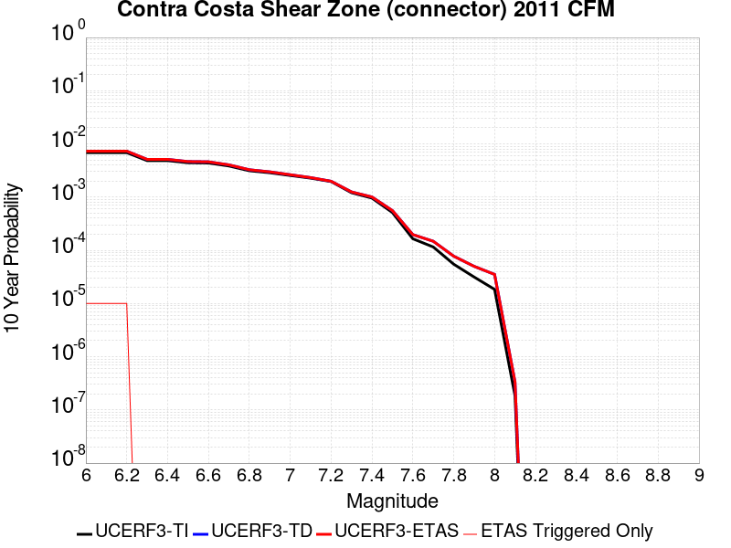 |

| Magnitude | 1 wk TI Prob | 1 wk TD Prob | 1 wk ETAS Prob | 1 wk ETAS/TD Gain | 1 wk ETAS Triggered Only | 1 mo TI Prob | 1 mo TD Prob | 1 mo ETAS Prob | 1 mo ETAS/TD Gain | 1 mo ETAS Triggered Only | 1 yr TI Prob | 1 yr TD Prob | 1 yr ETAS Prob | 1 yr ETAS/TD Gain | 1 yr ETAS Triggered Only | 10 yr TI Prob | 10 yr TD Prob | 10 yr ETAS Prob | 10 yr ETAS/TD Gain | 10 yr ETAS Triggered Only |
|-----|-----|-----|-----|-----|-----|-----|-----|-----|-----|-----|-----|-----|-----|-----|-----|-----|-----|-----|-----|-----|
| 6.0 | 1.3187427E-5 | 1.4044601E-5 | 1.4044601E-5 | 1.0 | 0.0 | 5.6516317E-5 | 6.0189886E-5 | 6.0189886E-5 | 1.0 | 0.0 | 6.878689E-4 | 7.325883E-4 | 7.325883E-4 | 1.0 | 0.0 | 0.006857436 | 0.0073081837 | 0.0073181107 | 1.0013583 | 1.0E-5 |
| 6.1 | 1.3187427E-5 | 1.4044601E-5 | 1.4044601E-5 | 1.0 | 0.0 | 5.6516317E-5 | 6.0189886E-5 | 6.0189886E-5 | 1.0 | 0.0 | 6.878689E-4 | 7.325883E-4 | 7.325883E-4 | 1.0 | 0.0 | 0.006857436 | 0.0073081837 | 0.0073181107 | 1.0013583 | 1.0E-5 |
| 6.2 | 1.3187427E-5 | 1.4044601E-5 | 1.4044601E-5 | 1.0 | 0.0 | 5.6516317E-5 | 6.0189886E-5 | 6.0189886E-5 | 1.0 | 0.0 | 6.878689E-4 | 7.325883E-4 | 7.325883E-4 | 1.0 | 0.0 | 0.006857436 | 0.0073081837 | 0.0073181107 | 1.0013583 | 1.0E-5 |
| 6.3 | 9.315374E-6 | 9.827181E-6 | 9.827181E-6 | 1.0 | 0.0 | 3.992242E-5 | 4.2115833E-5 | 4.2115833E-5 | 1.0 | 0.0 | 4.8594706E-4 | 5.126438E-4 | 5.126438E-4 | 1.0 | 0.0 | 0.004848858 | 0.005119218 | 0.005119218 | 1.0 | 0.0 |
| 6.4 | 9.315374E-6 | 9.827181E-6 | 9.827181E-6 | 1.0 | 0.0 | 3.992242E-5 | 4.2115833E-5 | 4.2115833E-5 | 1.0 | 0.0 | 4.8594706E-4 | 5.126438E-4 | 5.126438E-4 | 1.0 | 0.0 | 0.004848858 | 0.005119218 | 0.005119218 | 1.0 | 0.0 |
| 6.5 | 8.492638E-6 | 8.9407995E-6 | 8.9407995E-6 | 1.0 | 0.0 | 3.639651E-5 | 3.831717E-5 | 3.831717E-5 | 1.0 | 0.0 | 4.430374E-4 | 4.6641505E-4 | 4.6641505E-4 | 1.0 | 0.0 | 0.0044215517 | 0.0046588914 | 0.0046588914 | 1.0 | 0.0 |
| 6.6 | 8.402072E-6 | 8.841591E-6 | 8.841591E-6 | 1.0 | 0.0 | 3.6008387E-5 | 3.7892E-5 | 3.7892E-5 | 1.0 | 0.0 | 4.383139E-4 | 4.6124082E-4 | 4.6124082E-4 | 1.0 | 0.0 | 0.0043745036 | 0.004607365 | 0.004607365 | 1.0 | 0.0 |
| 6.7 | 7.383587E-6 | 7.749114E-6 | 7.749114E-6 | 1.0 | 0.0 | 3.164356E-5 | 3.3210075E-5 | 3.3210075E-5 | 1.0 | 0.0 | 3.8519225E-4 | 4.0425977E-4 | 4.0425977E-4 | 1.0 | 0.0 | 0.0038452526 | 0.004039648 | 0.004039648 | 1.0 | 0.0 |
| 6.8 | 6.004921E-6 | 6.266689E-6 | 6.266689E-6 | 1.0 | 0.0 | 2.5735122E-5 | 2.6856964E-5 | 2.6856964E-5 | 1.0 | 0.0 | 3.1328006E-4 | 3.26935E-4 | 3.26935E-4 | 1.0 | 0.0 | 0.0031283877 | 0.0032687911 | 0.0032687911 | 1.0 | 0.0 |
| 6.9 | 5.505255E-6 | 5.719049E-6 | 5.719049E-6 | 1.0 | 0.0 | 2.3593739E-5 | 2.4509984E-5 | 2.4509984E-5 | 1.0 | 0.0 | 2.872159E-4 | 2.9836863E-4 | 2.9836863E-4 | 1.0 | 0.0 | 0.0028684495 | 0.0029839221 | 0.0029839221 | 1.0 | 0.0 |
| 7.0 | 4.891922E-6 | 5.049668E-6 | 5.049668E-6 | 1.0 | 0.0 | 2.096521E-5 | 2.1641255E-5 | 2.1641255E-5 | 1.0 | 0.0 | 2.5522153E-4 | 2.6345078E-4 | 2.6345078E-4 | 1.0 | 0.0 | 0.0025492862 | 0.0026356184 | 0.0026356184 | 1.0 | 0.0 |
| 7.1 | 4.3599E-6 | 4.45362E-6 | 4.45362E-6 | 1.0 | 0.0 | 1.868515E-5 | 1.9086805E-5 | 1.9086805E-5 | 1.0 | 0.0 | 2.2746796E-4 | 2.3235734E-4 | 2.3235734E-4 | 1.0 | 0.0 | 0.0022723526 | 0.0023253711 | 0.0023253711 | 1.0 | 0.0 |
| 7.2 | 3.7647926E-6 | 3.8045903E-6 | 3.8045903E-6 | 1.0 | 0.0 | 1.6134725E-5 | 1.6305286E-5 | 1.6305286E-5 | 1.0 | 0.0 | 1.9642258E-4 | 1.9849902E-4 | 1.9849902E-4 | 1.0 | 0.0 | 0.0019624906 | 0.001987433 | 0.001987433 | 1.0 | 0.0 |
| 7.3 | 2.3179882E-6 | 2.3926925E-6 | 2.3926925E-6 | 1.0 | 0.0 | 9.934198E-6 | 1.0254356E-5 | 1.0254356E-5 | 1.0 | 0.0 | 1.20942146E-4 | 1.2483969E-4 | 1.2483969E-4 | 1.0 | 0.0 | 0.0012087635 | 0.0012518893 | 0.0012518893 | 1.0 | 0.0 |
| 7.4 | 1.8378355E-6 | 1.9197716E-6 | 1.9197716E-6 | 1.0 | 0.0 | 7.876414E-6 | 8.227567E-6 | 8.227567E-6 | 1.0 | 0.0 | 9.5891126E-5 | 1.00166064E-4 | 1.00166064E-4 | 1.0 | 0.0 | 9.584976E-4 | 0.0010053153 | 0.0010053153 | 1.0 | 0.0 |
| 7.5 | 9.840493E-7 | 1.0637306E-6 | 1.0637306E-6 | 1.0 | 0.0 | 4.2173474E-6 | 4.558837E-6 | 4.558837E-6 | 1.0 | 0.0 | 5.1344992E-5 | 5.550244E-5 | 5.550244E-5 | 1.0 | 0.0 | 5.133313E-4 | 5.5863045E-4 | 5.5863045E-4 | 1.0 | 0.0 |
| 7.6 | 3.1602997E-7 | 3.713912E-7 | 3.713912E-7 | 1.0 | 0.0 | 1.3544135E-6 | 1.5916755E-6 | 1.5916755E-6 | 1.0 | 0.0 | 1.648986E-5 | 1.937848E-5 | 1.937848E-5 | 1.0 | 0.0 | 1.6488635E-4 | 1.9731671E-4 | 1.9731671E-4 | 1.0 | 0.0 |
| 7.7 | 2.2125788E-7 | 2.7678408E-7 | 2.7678408E-7 | 1.0 | 0.0 | 9.482477E-7 | 1.1862169E-6 | 1.1862169E-6 | 1.0 | 0.0 | 1.1544855E-5 | 1.44420965E-5 | 1.44420965E-5 | 1.0 | 0.0 | 1.1544255E-4 | 1.4792306E-4 | 1.4792306E-4 | 1.0 | 0.0 |
| 7.8 | 1.0509553E-7 | 1.4428271E-7 | 1.4428271E-7 | 1.0 | 0.0 | 4.5040935E-7 | 6.183543E-7 | 6.183543E-7 | 1.0 | 0.0 | 5.48372E-6 | 7.528438E-6 | 7.528438E-6 | 1.0 | 0.0 | 5.4835844E-5 | 7.758283E-5 | 7.758283E-5 | 1.0 | 0.0 |
| 7.9 | 6.029319E-8 | 9.273099E-8 | 9.273099E-8 | 1.0 | 0.0 | 2.5839938E-7 | 3.974185E-7 | 3.974185E-7 | 1.0 | 0.0 | 3.1460077E-6 | 4.8385596E-6 | 4.8385596E-6 | 1.0 | 0.0 | 3.1459633E-5 | 4.996475E-5 | 4.996475E-5 | 1.0 | 0.0 |
| 8.0 | 3.531068E-8 | 6.531953E-8 | 6.531953E-8 | 1.0 | 0.0 | 1.5133148E-7 | 2.7994082E-7 | 2.7994082E-7 | 1.0 | 0.0 | 1.8424593E-6 | 3.408274E-6 | 3.408274E-6 | 1.0 | 0.0 | 1.842444E-5 | 3.5221416E-5 | 3.5221416E-5 | 1.0 | 0.0 |
| 8.1 | 3.5238246E-10 | 6.2781547E-10 | 6.2781547E-10 | 1.0 | 0.0 | 1.5102107E-9 | 2.690638E-9 | 2.690638E-9 | 1.0 | 0.0 | 1.8386816E-8 | 3.2758518E-8 | 3.2758518E-8 | 1.0 | 0.0 | 1.8386814E-7 | 3.3554426E-7 | 3.3554426E-7 | 1.0 | 0.0 |

## Big Pine (West)
*[(top)](#table-of-contents)*

| 1 Week | 1 Month | 1 Year | 10 Year |
|-----|-----|-----|-----|
|  | 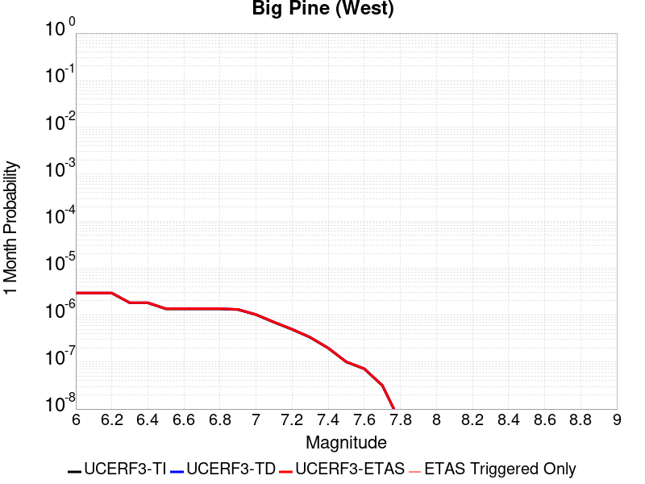 |  |  |

| Magnitude | 1 wk TI Prob | 1 wk TD Prob | 1 wk ETAS Prob | 1 wk ETAS/TD Gain | 1 wk ETAS Triggered Only | 1 mo TI Prob | 1 mo TD Prob | 1 mo ETAS Prob | 1 mo ETAS/TD Gain | 1 mo ETAS Triggered Only | 1 yr TI Prob | 1 yr TD Prob | 1 yr ETAS Prob | 1 yr ETAS/TD Gain | 1 yr ETAS Triggered Only | 10 yr TI Prob | 10 yr TD Prob | 10 yr ETAS Prob | 10 yr ETAS/TD Gain | 10 yr ETAS Triggered Only |
|-----|-----|-----|-----|-----|-----|-----|-----|-----|-----|-----|-----|-----|-----|-----|-----|-----|-----|-----|-----|-----|
| 6.0 | 6.8306974E-7 | 6.881878E-7 | 6.881878E-7 | 1.0 | 0.0 | 2.9274386E-6 | 2.9493735E-6 | 2.9493735E-6 | 1.0 | 0.0 | 3.564098E-5 | 3.5908128E-5 | 3.5908128E-5 | 1.0 | 0.0 | 3.5635266E-4 | 3.5903262E-4 | 3.6902903E-4 | 1.0278426 | 1.0E-5 |
| 6.1 | 6.8306974E-7 | 6.881878E-7 | 6.881878E-7 | 1.0 | 0.0 | 2.9274386E-6 | 2.9493735E-6 | 2.9493735E-6 | 1.0 | 0.0 | 3.564098E-5 | 3.5908128E-5 | 3.5908128E-5 | 1.0 | 0.0 | 3.5635266E-4 | 3.5903262E-4 | 3.6902903E-4 | 1.0278426 | 1.0E-5 |
| 6.2 | 6.8306974E-7 | 6.881878E-7 | 6.881878E-7 | 1.0 | 0.0 | 2.9274386E-6 | 2.9493735E-6 | 2.9493735E-6 | 1.0 | 0.0 | 3.564098E-5 | 3.5908128E-5 | 3.5908128E-5 | 1.0 | 0.0 | 3.5635266E-4 | 3.5903262E-4 | 3.6902903E-4 | 1.0278426 | 1.0E-5 |
| 6.3 | 4.227652E-7 | 4.2665968E-7 | 4.2665968E-7 | 1.0 | 0.0 | 1.8118495E-6 | 1.8285403E-6 | 1.8285403E-6 | 1.0 | 0.0 | 2.2059045E-5 | 2.226227E-5 | 2.226227E-5 | 1.0 | 0.0 | 2.2056856E-4 | 2.2260222E-4 | 2.326E-4 | 1.0449132 | 1.0E-5 |
| 6.4 | 4.227652E-7 | 4.2665968E-7 | 4.2665968E-7 | 1.0 | 0.0 | 1.8118495E-6 | 1.8285403E-6 | 1.8285403E-6 | 1.0 | 0.0 | 2.2059045E-5 | 2.226227E-5 | 2.226227E-5 | 1.0 | 0.0 | 2.2056856E-4 | 2.2260222E-4 | 2.326E-4 | 1.0449132 | 1.0E-5 |
| 6.5 | 3.1538403E-7 | 3.1884852E-7 | 3.1884852E-7 | 1.0 | 0.0 | 1.3516451E-6 | 1.3664929E-6 | 1.3664929E-6 | 1.0 | 0.0 | 1.6456155E-5 | 1.6636928E-5 | 1.6636928E-5 | 1.0 | 0.0 | 1.6454936E-4 | 1.6635723E-4 | 1.7635558E-4 | 1.0601016 | 1.0E-5 |
| 6.6 | 3.1538403E-7 | 3.1884852E-7 | 3.1884852E-7 | 1.0 | 0.0 | 1.3516451E-6 | 1.3664929E-6 | 1.3664929E-6 | 1.0 | 0.0 | 1.6456155E-5 | 1.6636928E-5 | 1.6636928E-5 | 1.0 | 0.0 | 1.6454936E-4 | 1.6635723E-4 | 1.7635558E-4 | 1.0601016 | 1.0E-5 |
| 6.7 | 3.1538403E-7 | 3.1884852E-7 | 3.1884852E-7 | 1.0 | 0.0 | 1.3516451E-6 | 1.3664929E-6 | 1.3664929E-6 | 1.0 | 0.0 | 1.6456155E-5 | 1.6636928E-5 | 1.6636928E-5 | 1.0 | 0.0 | 1.6454936E-4 | 1.6635723E-4 | 1.7635558E-4 | 1.0601016 | 1.0E-5 |
| 6.8 | 3.1538403E-7 | 3.1884852E-7 | 3.1884852E-7 | 1.0 | 0.0 | 1.3516451E-6 | 1.3664929E-6 | 1.3664929E-6 | 1.0 | 0.0 | 1.6456155E-5 | 1.6636928E-5 | 1.6636928E-5 | 1.0 | 0.0 | 1.6454936E-4 | 1.6635723E-4 | 1.7635558E-4 | 1.0601016 | 1.0E-5 |
| 6.9 | 3.0402092E-7 | 3.0740114E-7 | 3.0740114E-7 | 1.0 | 0.0 | 1.3029462E-6 | 1.3174329E-6 | 1.3174329E-6 | 1.0 | 0.0 | 1.5863254E-5 | 1.603963E-5 | 1.603963E-5 | 1.0 | 0.0 | 1.5862122E-4 | 1.6038513E-4 | 1.7038352E-4 | 1.0623399 | 1.0E-5 |
| 7.0 | 2.3673063E-7 | 2.3944568E-7 | 2.3944568E-7 | 1.0 | 0.0 | 1.0145594E-6 | 1.0261955E-6 | 1.0261955E-6 | 1.0 | 0.0 | 1.235219E-5 | 1.2493861E-5 | 1.2493861E-5 | 1.0 | 0.0 | 1.2351504E-4 | 1.2493186E-4 | 1.3493061E-4 | 1.0800337 | 1.0E-5 |
| 7.1 | 1.632138E-7 | 1.6514693E-7 | 1.6514693E-7 | 1.0 | 0.0 | 6.9948754E-7 | 7.0777236E-7 | 7.0777236E-7 | 1.0 | 0.0 | 8.516227E-6 | 8.617097E-6 | 8.617097E-6 | 1.0 | 0.0 | 8.5159016E-5 | 8.61678E-5 | 8.61678E-5 | 1.0 | 0.0 |
| 7.2 | 1.1523723E-7 | 1.165729E-7 | 1.165729E-7 | 1.0 | 0.0 | 4.9387376E-7 | 4.9959806E-7 | 4.9959806E-7 | 1.0 | 0.0 | 6.0128964E-6 | 6.0825905E-6 | 6.0825905E-6 | 1.0 | 0.0 | 6.0127335E-5 | 6.082435E-5 | 6.082435E-5 | 1.0 | 0.0 |
| 7.3 | 7.777805E-8 | 7.8625256E-8 | 7.8625256E-8 | 1.0 | 0.0 | 3.3333444E-7 | 3.3696534E-7 | 3.3696534E-7 | 1.0 | 0.0 | 4.0583395E-6 | 4.102546E-6 | 4.102546E-6 | 1.0 | 0.0 | 4.0582654E-5 | 4.1024756E-5 | 4.1024756E-5 | 1.0 | 0.0 |
| 7.4 | 4.609946E-8 | 4.652253E-8 | 4.652253E-8 | 1.0 | 0.0 | 1.975691E-7 | 1.9938226E-7 | 1.9938226E-7 | 1.0 | 0.0 | 2.4054011E-6 | 2.4274764E-6 | 2.4274764E-6 | 1.0 | 0.0 | 2.405375E-5 | 2.4274517E-5 | 2.4274517E-5 | 1.0 | 0.0 |
| 7.5 | 2.3439137E-8 | 2.3608443E-8 | 2.3608443E-8 | 1.0 | 0.0 | 1.00453434E-7 | 1.0117903E-7 | 1.0117903E-7 | 1.0 | 0.0 | 1.2230199E-6 | 1.2318541E-6 | 1.2318541E-6 | 1.0 | 0.0 | 1.2230132E-5 | 1.2318475E-5 | 1.2318475E-5 | 1.0 | 0.0 |
| 7.6 | 1.6699769E-8 | 1.6817182E-8 | 1.6817182E-8 | 1.0 | 0.0 | 7.157044E-8 | 7.207363E-8 | 7.207363E-8 | 1.0 | 0.0 | 8.713697E-7 | 8.774962E-7 | 8.774962E-7 | 1.0 | 0.0 | 8.713663E-6 | 8.774929E-6 | 8.774929E-6 | 1.0 | 0.0 |
| 7.7 | 7.4061512E-9 | 7.454209E-9 | 7.454209E-9 | 1.0 | 0.0 | 3.1740647E-8 | 3.194661E-8 | 3.194661E-8 | 1.0 | 0.0 | 3.864423E-7 | 3.889499E-7 | 3.889499E-7 | 1.0 | 0.0 | 3.8644166E-6 | 3.8894927E-6 | 3.8894927E-6 | 1.0 | 0.0 |
| 7.8 | 1.2189427E-9 | 1.2270839E-9 | 1.2270839E-9 | 1.0 | 0.0 | 5.2240403E-9 | 5.258931E-9 | 5.258931E-9 | 1.0 | 0.0 | 6.3602684E-8 | 6.402748E-8 | 6.402748E-8 | 1.0 | 0.0 | 6.360267E-7 | 6.402747E-7 | 6.402747E-7 | 1.0 | 0.0 |

## Quien Sabe 2011 CFM
*[(top)](#table-of-contents)*

| 1 Week | 1 Month | 1 Year | 10 Year |
|-----|-----|-----|-----|
|  | 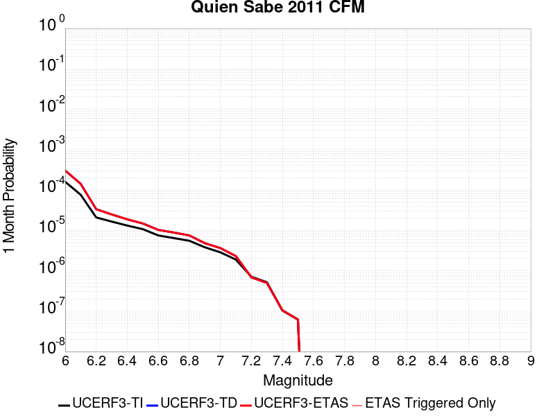 |  |  |

| Magnitude | 1 wk TI Prob | 1 wk TD Prob | 1 wk ETAS Prob | 1 wk ETAS/TD Gain | 1 wk ETAS Triggered Only | 1 mo TI Prob | 1 mo TD Prob | 1 mo ETAS Prob | 1 mo ETAS/TD Gain | 1 mo ETAS Triggered Only | 1 yr TI Prob | 1 yr TD Prob | 1 yr ETAS Prob | 1 yr ETAS/TD Gain | 1 yr ETAS Triggered Only | 10 yr TI Prob | 10 yr TD Prob | 10 yr ETAS Prob | 10 yr ETAS/TD Gain | 10 yr ETAS Triggered Only |
|-----|-----|-----|-----|-----|-----|-----|-----|-----|-----|-----|-----|-----|-----|-----|-----|-----|-----|-----|-----|-----|
| 6.0 | 3.729899E-5 | 7.095916E-5 | 7.095916E-5 | 1.0 | 0.0 | 1.5984301E-4 | 3.0408442E-4 | 3.0408442E-4 | 1.0 | 0.0 | 0.0019443515 | 0.0036861862 | 0.0036961492 | 1.0027028 | 1.0E-5 | 0.019274272 | 0.035361063 | 0.03537071 | 1.0002728 | 1.0E-5 |
| 6.1 | 1.7825725E-5 | 3.318274E-5 | 3.318274E-5 | 1.0 | 0.0 | 7.639373E-5 | 1.4220653E-4 | 1.4220653E-4 | 1.0 | 0.0 | 9.296967E-4 | 0.0017272342 | 0.001737217 | 1.0057796 | 1.0E-5 | 0.009258169 | 0.01670438 | 0.016714213 | 1.0005887 | 1.0E-5 |
| 6.2 | 4.8865336E-6 | 7.81058E-6 | 7.81058E-6 | 1.0 | 0.0 | 2.0942118E-5 | 3.3473538E-5 | 3.3473538E-5 | 1.0 | 0.0 | 2.5494045E-4 | 4.0710086E-4 | 4.0710086E-4 | 1.0 | 0.0 | 0.0025464818 | 0.00401532 | 0.00401532 | 1.0 | 0.0 |
| 6.3 | 3.858491E-6 | 5.7926386E-6 | 5.7926386E-6 | 1.0 | 0.0 | 1.6536285E-5 | 2.4825385E-5 | 2.4825385E-5 | 1.0 | 0.0 | 2.0131067E-4 | 3.0221182E-4 | 3.0221182E-4 | 1.0 | 0.0 | 0.002011284 | 0.0030034885 | 0.0030034885 | 1.0 | 0.0 |
| 6.4 | 3.0771805E-6 | 4.3877462E-6 | 4.3877462E-6 | 1.0 | 0.0 | 1.318785E-5 | 1.8804505E-5 | 1.8804505E-5 | 1.0 | 0.0 | 1.6055023E-4 | 2.2892324E-4 | 2.2892324E-4 | 1.0 | 0.0 | 0.001604343 | 0.0022879273 | 0.0022879273 | 1.0 | 0.0 |
| 6.5 | 2.5081235E-6 | 3.4662248E-6 | 3.4662248E-6 | 1.0 | 0.0 | 1.0749056E-5 | 1.4855173E-5 | 1.4855173E-5 | 1.0 | 0.0 | 1.308619E-4 | 1.8084819E-4 | 1.8084819E-4 | 1.0 | 0.0 | 0.0013078486 | 0.0018136567 | 0.0018136567 | 1.0 | 0.0 |
| 6.6 | 1.7505364E-6 | 2.4044907E-6 | 2.4044907E-6 | 1.0 | 0.0 | 7.502277E-6 | 1.0304923E-5 | 1.0304923E-5 | 1.0 | 0.0 | 9.13364E-5 | 1.2545593E-4 | 1.2545593E-4 | 1.0 | 0.0 | 9.129886E-4 | 0.0012593821 | 0.0012593821 | 1.0 | 0.0 |
| 6.7 | 1.505737E-6 | 2.065759E-6 | 2.065759E-6 | 1.0 | 0.0 | 6.4531428E-6 | 8.853226E-6 | 8.853226E-6 | 1.0 | 0.0 | 7.8564175E-5 | 1.077833E-4 | 1.077833E-4 | 1.0 | 0.0 | 7.853641E-4 | 0.0010828333 | 0.0010828333 | 1.0 | 0.0 |
| 6.8 | 1.2924105E-6 | 1.7502639E-6 | 1.7502639E-6 | 1.0 | 0.0 | 5.5388905E-6 | 7.5011126E-6 | 7.5011126E-6 | 1.0 | 0.0 | 6.74339E-5 | 9.132276E-5 | 9.132276E-5 | 1.0 | 0.0 | 6.741344E-4 | 9.1703667E-4 | 9.1703667E-4 | 1.0 | 0.0 |
| 6.9 | 8.9075286E-7 | 1.1262816E-6 | 1.1262816E-6 | 1.0 | 0.0 | 3.8175067E-6 | 4.8269135E-6 | 4.8269135E-6 | 1.0 | 0.0 | 4.6477155E-5 | 5.876631E-5 | 5.876631E-5 | 1.0 | 0.0 | 4.6467435E-4 | 5.9104664E-4 | 5.9104664E-4 | 1.0 | 0.0 |
| 7.0 | 6.6891175E-7 | 8.528126E-7 | 8.528126E-7 | 1.0 | 0.0 | 2.8667614E-6 | 3.654907E-6 | 3.654907E-6 | 1.0 | 0.0 | 3.4902263E-5 | 4.449778E-5 | 4.449778E-5 | 1.0 | 0.0 | 3.4896782E-4 | 4.4736915E-4 | 4.4736915E-4 | 1.0 | 0.0 |
| 7.1 | 4.4205015E-7 | 5.394402E-7 | 5.394402E-7 | 1.0 | 0.0 | 1.8944993E-6 | 2.3118853E-6 | 2.3118853E-6 | 1.0 | 0.0 | 2.3065284E-5 | 2.814701E-5 | 2.814701E-5 | 1.0 | 0.0 | 2.3062891E-4 | 2.8281743E-4 | 2.8281743E-4 | 1.0 | 0.0 |
| 7.2 | 1.6620965E-7 | 1.6000094E-7 | 1.6000094E-7 | 1.0 | 0.0 | 7.123269E-7 | 6.8571813E-7 | 6.8571813E-7 | 1.0 | 0.0 | 8.672545E-6 | 8.34859E-6 | 8.34859E-6 | 1.0 | 0.0 | 8.6722066E-5 | 8.363844E-5 | 8.363844E-5 | 1.0 | 0.0 |
| 7.3 | 1.2142488E-7 | 1.1730515E-7 | 1.1730515E-7 | 1.0 | 0.0 | 5.2039223E-7 | 5.0273627E-7 | 5.0273627E-7 | 1.0 | 0.0 | 6.335757E-6 | 6.1208007E-6 | 6.1208007E-6 | 1.0 | 0.0 | 6.3355765E-5 | 6.126942E-5 | 6.126942E-5 | 1.0 | 0.0 |
| 7.4 | 2.4192937E-8 | 2.4550305E-8 | 2.4550305E-8 | 1.0 | 0.0 | 1.0368401E-7 | 1.0521559E-7 | 1.0521559E-7 | 1.0 | 0.0 | 1.2623522E-6 | 1.2809992E-6 | 1.2809992E-6 | 1.0 | 0.0 | 1.2623449E-5 | 1.2816262E-5 | 1.2816262E-5 | 1.0 | 0.0 |
| 7.5 | 1.4432802E-8 | 1.4509122E-8 | 1.4509122E-8 | 1.0 | 0.0 | 6.185486E-8 | 6.2181954E-8 | 6.2181954E-8 | 1.0 | 0.0 | 7.530827E-7 | 7.570651E-7 | 7.570651E-7 | 1.0 | 0.0 | 7.530801E-6 | 7.5749003E-6 | 7.5749003E-6 | 1.0 | 0.0 |

## Bartlett Springs 2011 CFM
*[(top)](#table-of-contents)*

| 1 Week | 1 Month | 1 Year | 10 Year |
|-----|-----|-----|-----|
|  |  |  |  |

| Magnitude | 1 wk TI Prob | 1 wk TD Prob | 1 wk ETAS Prob | 1 wk ETAS/TD Gain | 1 wk ETAS Triggered Only | 1 mo TI Prob | 1 mo TD Prob | 1 mo ETAS Prob | 1 mo ETAS/TD Gain | 1 mo ETAS Triggered Only | 1 yr TI Prob | 1 yr TD Prob | 1 yr ETAS Prob | 1 yr ETAS/TD Gain | 1 yr ETAS Triggered Only | 10 yr TI Prob | 10 yr TD Prob | 10 yr ETAS Prob | 10 yr ETAS/TD Gain | 10 yr ETAS Triggered Only |
|-----|-----|-----|-----|-----|-----|-----|-----|-----|-----|-----|-----|-----|-----|-----|-----|-----|-----|-----|-----|-----|
| 6.0 | 6.2326144E-5 | 8.0626734E-5 | 8.0626734E-5 | 1.0 | 0.0 | 2.6708472E-4 | 3.4549818E-4 | 3.4549818E-4 | 1.0 | 0.0 | 0.003246908 | 0.0041984636 | 0.0041984636 | 1.0 | 0.0 | 0.031998757 | 0.041207846 | 0.041217435 | 1.0002327 | 1.0E-5 |
| 6.1 | 6.227657E-5 | 8.056422E-5 | 8.056422E-5 | 1.0 | 0.0 | 2.668723E-4 | 3.452303E-4 | 3.452303E-4 | 1.0 | 0.0 | 0.0032443295 | 0.004195215 | 0.004195215 | 1.0 | 0.0 | 0.031973712 | 0.041176572 | 0.04118616 | 1.0002328 | 1.0E-5 |
| 6.2 | 6.22452E-5 | 8.052481E-5 | 8.052481E-5 | 1.0 | 0.0 | 2.6673786E-4 | 3.4506147E-4 | 3.4506147E-4 | 1.0 | 0.0 | 0.0032426978 | 0.0041931677 | 0.0041931677 | 1.0 | 0.0 | 0.03195787 | 0.041156862 | 0.04116645 | 1.0002329 | 1.0E-5 |
| 6.3 | 6.219006E-5 | 8.045463E-5 | 8.045463E-5 | 1.0 | 0.0 | 2.6650162E-4 | 3.4476077E-4 | 3.4476077E-4 | 1.0 | 0.0 | 0.00323983 | 0.0041895206 | 0.0041895206 | 1.0 | 0.0 | 0.031930014 | 0.041121755 | 0.041131344 | 1.0002332 | 1.0E-5 |
| 6.4 | 5.2175856E-5 | 6.727007E-5 | 6.727007E-5 | 1.0 | 0.0 | 2.2359163E-4 | 2.8826878E-4 | 2.8826878E-4 | 1.0 | 0.0 | 0.0027188298 | 0.0035040756 | 0.0035040756 | 1.0 | 0.0 | 0.026858058 | 0.03449757 | 0.034507222 | 1.0002799 | 1.0E-5 |
| 6.5 | 5.205166E-5 | 6.7112705E-5 | 6.7112705E-5 | 1.0 | 0.0 | 2.2305945E-4 | 2.875945E-4 | 2.875945E-4 | 1.0 | 0.0 | 0.0027123666 | 0.0034958927 | 0.0034958927 | 1.0 | 0.0 | 0.026794989 | 0.034418296 | 0.034427952 | 1.0002805 | 1.0E-5 |
| 6.6 | 5.0085426E-5 | 6.45086E-5 | 6.45086E-5 | 1.0 | 0.0 | 2.1463417E-4 | 2.7643642E-4 | 2.7643642E-4 | 1.0 | 0.0 | 0.0026100394 | 0.003360467 | 0.003360467 | 1.0 | 0.0 | 0.025795965 | 0.033105537 | 0.033115204 | 1.0002921 | 1.0E-5 |
| 6.7 | 4.8930866E-5 | 6.3032836E-5 | 6.3032836E-5 | 1.0 | 0.0 | 2.0968684E-4 | 2.7011306E-4 | 2.7011306E-4 | 1.0 | 0.0 | 0.0025499484 | 0.0032837202 | 0.0032837202 | 1.0 | 0.0 | 0.025208864 | 0.03236072 | 0.032370396 | 1.000299 | 1.0E-5 |
| 6.8 | 4.5679535E-5 | 5.875605E-5 | 5.875605E-5 | 1.0 | 0.0 | 1.9575475E-4 | 2.5178754E-4 | 2.5178754E-4 | 1.0 | 0.0 | 0.002380709 | 0.0030612443 | 0.0030612443 | 1.0 | 0.0 | 0.023553653 | 0.030197589 | 0.030207286 | 1.0003211 | 1.0E-5 |
| 6.9 | 4.1439176E-5 | 5.3232736E-5 | 5.3232736E-5 | 1.0 | 0.0 | 1.7758438E-4 | 2.2812048E-4 | 2.2812048E-4 | 1.0 | 0.0 | 0.002159946 | 0.0027738565 | 0.0027738565 | 1.0 | 0.0 | 0.021390721 | 0.027397176 | 0.027406903 | 1.000355 | 1.0E-5 |
| 7.0 | 3.5920104E-5 | 4.6019293E-5 | 4.6019293E-5 | 1.0 | 0.0 | 1.5393422E-4 | 1.9721071E-4 | 1.9721071E-4 | 1.0 | 0.0 | 0.001872538 | 0.0023984131 | 0.0023984131 | 1.0 | 0.0 | 0.018568378 | 0.02372839 | 0.023738151 | 1.0004114 | 1.0E-5 |
| 7.1 | 3.338812E-5 | 4.26992E-5 | 4.26992E-5 | 1.0 | 0.0 | 1.430841E-4 | 1.8298381E-4 | 1.8298381E-4 | 1.0 | 0.0 | 0.0017406568 | 0.0022255664 | 0.0022255664 | 1.0 | 0.0 | 0.017270854 | 0.022035446 | 0.022045225 | 1.0004438 | 1.0E-5 |
| 7.2 | 2.8619615E-5 | 3.6409616E-5 | 3.6409616E-5 | 1.0 | 0.0 | 1.2264973E-4 | 1.5603194E-4 | 1.5603194E-4 | 1.0 | 0.0 | 0.0014922376 | 0.0018980432 | 0.0018980432 | 1.0 | 0.0 | 0.014822568 | 0.018820208 | 0.01883002 | 1.0005213 | 1.0E-5 |
| 7.3 | 2.6376783E-5 | 3.343011E-5 | 3.343011E-5 | 1.0 | 0.0 | 1.13038455E-4 | 1.4326409E-4 | 1.4326409E-4 | 1.0 | 0.0 | 0.0013753743 | 0.001742854 | 0.001742854 | 1.0 | 0.0 | 0.01366893 | 0.017293492 | 0.017303318 | 1.0005683 | 1.0E-5 |
| 7.4 | 2.3738676E-5 | 2.9985498E-5 | 2.9985498E-5 | 1.0 | 0.0 | 1.0173322E-4 | 1.2850299E-4 | 1.2850299E-4 | 1.0 | 0.0 | 0.0012378981 | 0.0015634091 | 0.0015634091 | 1.0 | 0.0 | 0.012310251 | 0.015525425 | 0.015535269 | 1.0006341 | 1.0E-5 |
| 7.5 | 2.1789481E-5 | 2.7445401E-5 | 2.7445401E-5 | 1.0 | 0.0 | 9.338015E-5 | 1.1761789E-4 | 1.1761789E-4 | 1.0 | 0.0 | 0.0011363103 | 0.0014310651 | 0.0014310651 | 1.0 | 0.0 | 0.011305175 | 0.01421967 | 0.014229527 | 1.0006932 | 1.0E-5 |
| 7.6 | 1.3895281E-5 | 1.7372044E-5 | 1.7372044E-5 | 1.0 | 0.0 | 5.9549846E-5 | 7.444951E-5 | 7.444951E-5 | 1.0 | 0.0 | 7.2477816E-4 | 9.060487E-4 | 9.060487E-4 | 1.0 | 0.0 | 0.0072241887 | 0.009023956 | 0.009033865 | 1.0010982 | 1.0E-5 |
| 7.7 | 4.245981E-6 | 5.1635125E-6 | 5.1635125E-6 | 1.0 | 0.0 | 1.8196934E-5 | 2.2129152E-5 | 2.2129152E-5 | 1.0 | 0.0 | 2.2152514E-4 | 2.693893E-4 | 2.693893E-4 | 1.0 | 0.0 | 0.0022130446 | 0.002690647 | 0.002690647 | 1.0 | 0.0 |
| 7.8 | 6.145192E-7 | 7.04788E-7 | 7.04788E-7 | 1.0 | 0.0 | 2.633651E-6 | 3.0205167E-6 | 3.0205167E-6 | 1.0 | 0.0 | 3.206423E-5 | 3.677418E-5 | 3.677418E-5 | 1.0 | 0.0 | 3.2059604E-4 | 3.676804E-4 | 3.676804E-4 | 1.0 | 0.0 |

## Malibu Coast (Extension) alt 1
*[(top)](#table-of-contents)*

| 1 Week | 1 Month | 1 Year | 10 Year |
|-----|-----|-----|-----|
|  |  |  |  |

| Magnitude | 1 wk TI Prob | 1 wk TD Prob | 1 wk ETAS Prob | 1 wk ETAS/TD Gain | 1 wk ETAS Triggered Only | 1 mo TI Prob | 1 mo TD Prob | 1 mo ETAS Prob | 1 mo ETAS/TD Gain | 1 mo ETAS Triggered Only | 1 yr TI Prob | 1 yr TD Prob | 1 yr ETAS Prob | 1 yr ETAS/TD Gain | 1 yr ETAS Triggered Only | 10 yr TI Prob | 10 yr TD Prob | 10 yr ETAS Prob | 10 yr ETAS/TD Gain | 10 yr ETAS Triggered Only |
|-----|-----|-----|-----|-----|-----|-----|-----|-----|-----|-----|-----|-----|-----|-----|-----|-----|-----|-----|-----|-----|
| 6.0 | 8.930738E-6 | 9.329764E-6 | 9.329764E-6 | 1.0 | 0.0 | 3.827403E-5 | 3.9984097E-5 | 3.9984097E-5 | 1.0 | 0.0 | 4.6588664E-4 | 4.866994E-4 | 4.866994E-4 | 1.0 | 0.0 | 0.0046491115 | 0.0048565175 | 0.0048664687 | 1.0020491 | 1.0E-5 |
| 6.1 | 7.199952E-6 | 7.5307184E-6 | 7.5307184E-6 | 1.0 | 0.0 | 3.0856572E-5 | 3.227411E-5 | 3.227411E-5 | 1.0 | 0.0 | 3.75614E-4 | 3.9286708E-4 | 3.9286708E-4 | 1.0 | 0.0 | 0.0037497976 | 0.003921792 | 0.003921792 | 1.0 | 0.0 |
| 6.2 | 6.3721413E-6 | 6.667179E-6 | 6.667179E-6 | 1.0 | 0.0 | 2.7308892E-5 | 2.8573313E-5 | 2.8573313E-5 | 1.0 | 0.0 | 3.3243504E-4 | 3.478249E-4 | 3.478249E-4 | 1.0 | 0.0 | 0.0033193815 | 0.0034728453 | 0.0034728453 | 1.0 | 0.0 |
| 6.3 | 6.016345E-6 | 6.2955305E-6 | 6.2955305E-6 | 1.0 | 0.0 | 2.578408E-5 | 2.6980568E-5 | 2.6980568E-5 | 1.0 | 0.0 | 3.1387596E-4 | 3.2843923E-4 | 3.2843923E-4 | 1.0 | 0.0 | 0.00313433 | 0.0032795742 | 0.0032795742 | 1.0 | 0.0 |
| 6.4 | 5.8104883E-6 | 6.079907E-6 | 6.079907E-6 | 1.0 | 0.0 | 2.4901856E-5 | 2.6056487E-5 | 2.6056487E-5 | 1.0 | 0.0 | 3.031379E-4 | 3.1719185E-4 | 3.1719185E-4 | 1.0 | 0.0 | 0.0030272473 | 0.003167426 | 0.003167426 | 1.0 | 0.0 |
| 6.5 | 5.476925E-6 | 5.7278576E-6 | 5.7278576E-6 | 1.0 | 0.0 | 2.3472323E-5 | 2.4547731E-5 | 2.4547731E-5 | 1.0 | 0.0 | 2.8573806E-4 | 2.9882794E-4 | 2.9882794E-4 | 1.0 | 0.0 | 0.0028537093 | 0.002984293 | 0.002984293 | 1.0 | 0.0 |
| 6.6 | 5.222387E-6 | 5.45891E-6 | 5.45891E-6 | 1.0 | 0.0 | 2.2381464E-5 | 2.3395121E-5 | 2.3395121E-5 | 1.0 | 0.0 | 2.7246025E-4 | 2.8479865E-4 | 2.8479865E-4 | 1.0 | 0.0 | 0.0027212645 | 0.0028443674 | 0.0028443674 | 1.0 | 0.0 |
| 6.7 | 5.0337076E-6 | 5.259423E-6 | 5.259423E-6 | 1.0 | 0.0 | 2.1572854E-5 | 2.2540191E-5 | 2.2540191E-5 | 1.0 | 0.0 | 2.6261783E-4 | 2.7439254E-4 | 2.7439254E-4 | 1.0 | 0.0 | 0.002623077 | 0.0027405676 | 0.0027405676 | 1.0 | 0.0 |
| 6.8 | 4.5675624E-6 | 4.759002E-6 | 4.759002E-6 | 1.0 | 0.0 | 1.9575122E-5 | 2.0395564E-5 | 2.0395564E-5 | 1.0 | 0.0 | 2.3830103E-4 | 2.482879E-4 | 2.482879E-4 | 1.0 | 0.0 | 0.0023804565 | 0.0024801246 | 0.0024801246 | 1.0 | 0.0 |
| 6.9 | 4.2802412E-6 | 4.4522867E-6 | 4.4522867E-6 | 1.0 | 0.0 | 1.8343762E-5 | 1.9081092E-5 | 1.9081092E-5 | 1.0 | 0.0 | 2.2331243E-4 | 2.3228767E-4 | 2.3228767E-4 | 1.0 | 0.0 | 0.0022308815 | 0.0023204654 | 0.0023204654 | 1.0 | 0.0 |
| 7.0 | 3.9794063E-6 | 4.130344E-6 | 4.130344E-6 | 1.0 | 0.0 | 1.7054486E-5 | 1.7701357E-5 | 1.7701357E-5 | 1.0 | 0.0 | 2.0761859E-4 | 2.1549284E-4 | 2.1549284E-4 | 1.0 | 0.0 | 0.0020742472 | 0.0021528522 | 0.0021528522 | 1.0 | 0.0 |
| 7.1 | 3.7730424E-6 | 3.91145E-6 | 3.91145E-6 | 1.0 | 0.0 | 1.6170083E-5 | 1.676325E-5 | 1.676325E-5 | 1.0 | 0.0 | 1.9685295E-4 | 2.0407357E-4 | 2.0407357E-4 | 1.0 | 0.0 | 0.0019667868 | 0.0020388747 | 0.0020388747 | 1.0 | 0.0 |
| 7.2 | 3.424985E-6 | 3.5415485E-6 | 3.5415485E-6 | 1.0 | 0.0 | 1.4678424E-5 | 1.5177977E-5 | 1.5177977E-5 | 1.0 | 0.0 | 1.7869516E-4 | 1.8477632E-4 | 1.8477632E-4 | 1.0 | 0.0 | 0.0017855153 | 0.0018462389 | 0.0018462389 | 1.0 | 0.0 |
| 7.3 | 2.6966375E-6 | 2.7598114E-6 | 2.7598114E-6 | 1.0 | 0.0 | 1.15569665E-5 | 1.1827709E-5 | 1.1827709E-5 | 1.0 | 0.0 | 1.4069698E-4 | 1.4399289E-4 | 1.4399289E-4 | 1.0 | 0.0 | 0.0014060794 | 0.001439 | 0.001439 | 1.0 | 0.0 |
| 7.4 | 2.215957E-6 | 2.2495053E-6 | 2.2495053E-6 | 1.0 | 0.0 | 9.496924E-6 | 9.640701E-6 | 9.640701E-6 | 1.0 | 0.0 | 1.1561892E-4 | 1.1736925E-4 | 1.1736925E-4 | 1.0 | 0.0 | 0.0011555878 | 0.0011730763 | 0.0011730763 | 1.0 | 0.0 |
| 7.5 | 1.2040218E-6 | 1.221979E-6 | 1.221979E-6 | 1.0 | 0.0 | 5.160083E-6 | 5.2370424E-6 | 5.2370424E-6 | 1.0 | 0.0 | 6.2822204E-5 | 6.3759144E-5 | 6.3759144E-5 | 1.0 | 0.0 | 6.280445E-4 | 6.374104E-4 | 6.374104E-4 | 1.0 | 0.0 |
| 7.6 | 6.6157446E-7 | 6.679384E-7 | 6.679384E-7 | 1.0 | 0.0 | 2.835316E-6 | 2.8625902E-6 | 2.8625902E-6 | 1.0 | 0.0 | 3.4519428E-5 | 3.4851495E-5 | 3.4851495E-5 | 1.0 | 0.0 | 3.4514067E-4 | 3.4846182E-4 | 3.4846182E-4 | 1.0 | 0.0 |
| 7.7 | 2.6012302E-7 | 2.4359008E-7 | 2.4359008E-7 | 1.0 | 0.0 | 1.1148124E-6 | 1.0439571E-6 | 1.0439571E-6 | 1.0 | 0.0 | 1.3572758E-5 | 1.2710114E-5 | 1.2710114E-5 | 1.0 | 0.0 | 1.3571928E-4 | 1.2709494E-4 | 1.2709494E-4 | 1.0 | 0.0 |
| 7.8 | 2.8323132E-8 | 2.0267912E-8 | 2.0267912E-8 | 1.0 | 0.0 | 1.2138484E-7 | 8.686248E-8 | 8.686248E-8 | 1.0 | 0.0 | 1.4778595E-6 | 1.0575502E-6 | 1.0575502E-6 | 1.0 | 0.0 | 1.4778497E-5 | 1.057546E-5 | 1.057546E-5 | 1.0 | 0.0 |

## Verdugo
*[(top)](#table-of-contents)*

| 1 Week | 1 Month | 1 Year | 10 Year |
|-----|-----|-----|-----|
|  |  |  | 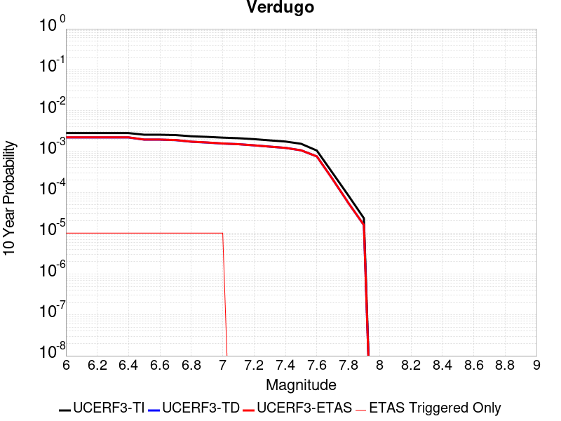 |

| Magnitude | 1 wk TI Prob | 1 wk TD Prob | 1 wk ETAS Prob | 1 wk ETAS/TD Gain | 1 wk ETAS Triggered Only | 1 mo TI Prob | 1 mo TD Prob | 1 mo ETAS Prob | 1 mo ETAS/TD Gain | 1 mo ETAS Triggered Only | 1 yr TI Prob | 1 yr TD Prob | 1 yr ETAS Prob | 1 yr ETAS/TD Gain | 1 yr ETAS Triggered Only | 10 yr TI Prob | 10 yr TD Prob | 10 yr ETAS Prob | 10 yr ETAS/TD Gain | 10 yr ETAS Triggered Only |
|-----|-----|-----|-----|-----|-----|-----|-----|-----|-----|-----|-----|-----|-----|-----|-----|-----|-----|-----|-----|-----|
| 6.0 | 5.392987E-6 | 4.2169722E-6 | 4.2169722E-6 | 1.0 | 0.0 | 2.3112598E-5 | 1.8072615E-5 | 1.8072615E-5 | 1.0 | 0.0 | 2.8135953E-4 | 2.2001234E-4 | 2.2001234E-4 | 1.0 | 0.0 | 0.0028100356 | 0.002197993 | 0.002207971 | 1.0045396 | 1.0E-5 |
| 6.1 | 5.392987E-6 | 4.2169722E-6 | 4.2169722E-6 | 1.0 | 0.0 | 2.3112598E-5 | 1.8072615E-5 | 1.8072615E-5 | 1.0 | 0.0 | 2.8135953E-4 | 2.2001234E-4 | 2.2001234E-4 | 1.0 | 0.0 | 0.0028100356 | 0.002197993 | 0.002207971 | 1.0045396 | 1.0E-5 |
| 6.2 | 5.392987E-6 | 4.2169722E-6 | 4.2169722E-6 | 1.0 | 0.0 | 2.3112598E-5 | 1.8072615E-5 | 1.8072615E-5 | 1.0 | 0.0 | 2.8135953E-4 | 2.2001234E-4 | 2.2001234E-4 | 1.0 | 0.0 | 0.0028100356 | 0.002197993 | 0.002207971 | 1.0045396 | 1.0E-5 |
| 6.3 | 5.392987E-6 | 4.2169722E-6 | 4.2169722E-6 | 1.0 | 0.0 | 2.3112598E-5 | 1.8072615E-5 | 1.8072615E-5 | 1.0 | 0.0 | 2.8135953E-4 | 2.2001234E-4 | 2.2001234E-4 | 1.0 | 0.0 | 0.0028100356 | 0.002197993 | 0.002207971 | 1.0045396 | 1.0E-5 |
| 6.4 | 5.392987E-6 | 4.2169722E-6 | 4.2169722E-6 | 1.0 | 0.0 | 2.3112598E-5 | 1.8072615E-5 | 1.8072615E-5 | 1.0 | 0.0 | 2.8135953E-4 | 2.2001234E-4 | 2.2001234E-4 | 1.0 | 0.0 | 0.0028100356 | 0.002197993 | 0.002207971 | 1.0045396 | 1.0E-5 |
| 6.5 | 4.9154837E-6 | 3.722904E-6 | 3.722904E-6 | 1.0 | 0.0 | 2.1066187E-5 | 1.5955207E-5 | 1.5955207E-5 | 1.0 | 0.0 | 2.5645064E-4 | 1.9423752E-4 | 1.9423752E-4 | 1.0 | 0.0 | 0.002561549 | 0.0019406985 | 0.001950679 | 1.0051428 | 1.0E-5 |
| 6.6 | 4.9154837E-6 | 3.722904E-6 | 3.722904E-6 | 1.0 | 0.0 | 2.1066187E-5 | 1.5955207E-5 | 1.5955207E-5 | 1.0 | 0.0 | 2.5645064E-4 | 1.9423752E-4 | 1.9423752E-4 | 1.0 | 0.0 | 0.002561549 | 0.0019406985 | 0.001950679 | 1.0051428 | 1.0E-5 |
| 6.7 | 4.817006E-6 | 3.6210874E-6 | 3.6210874E-6 | 1.0 | 0.0 | 2.0644147E-5 | 1.5518855E-5 | 1.5518855E-5 | 1.0 | 0.0 | 2.513135E-4 | 1.8892587E-4 | 1.8892587E-4 | 1.0 | 0.0 | 0.0025102948 | 0.0018876722 | 0.0018976534 | 1.0052875 | 1.0E-5 |
| 6.8 | 4.507407E-6 | 3.3075246E-6 | 3.3075246E-6 | 1.0 | 0.0 | 1.9317316E-5 | 1.417503E-5 | 1.417503E-5 | 1.0 | 0.0 | 2.3516294E-4 | 1.7256745E-4 | 1.7256745E-4 | 1.0 | 0.0 | 0.0023491425 | 0.0017243489 | 0.0017343316 | 1.0057893 | 1.0E-5 |
| 6.9 | 4.3573054E-6 | 3.1614245E-6 | 3.1614245E-6 | 1.0 | 0.0 | 1.8674033E-5 | 1.3548892E-5 | 1.3548892E-5 | 1.0 | 0.0 | 2.2733262E-4 | 1.6494539E-4 | 1.6494539E-4 | 1.0 | 0.0 | 0.0022710022 | 0.0016482421 | 0.0016582255 | 1.006057 | 1.0E-5 |
| 7.0 | 4.171527E-6 | 2.9840755E-6 | 2.9840755E-6 | 1.0 | 0.0 | 1.787785E-5 | 1.27888325E-5 | 1.27888325E-5 | 1.0 | 0.0 | 2.1764109E-4 | 1.5569302E-4 | 1.5569302E-4 | 1.0 | 0.0 | 0.0021742806 | 0.0015558507 | 0.0015658352 | 1.0064174 | 1.0E-5 |
| 7.1 | 4.0405484E-6 | 2.8826596E-6 | 2.8826596E-6 | 1.0 | 0.0 | 1.731652E-5 | 1.2354198E-5 | 1.2354198E-5 | 1.0 | 0.0 | 2.1080824E-4 | 1.5040208E-4 | 1.5040208E-4 | 1.0 | 0.0 | 0.0021060838 | 0.001503014 | 0.001503014 | 1.0 | 0.0 |
| 7.2 | 3.8306007E-6 | 2.7022331E-6 | 2.7022331E-6 | 1.0 | 0.0 | 1.6416758E-5 | 1.1580948E-5 | 1.1580948E-5 | 1.0 | 0.0 | 1.9985568E-4 | 1.4098902E-4 | 1.4098902E-4 | 1.0 | 0.0 | 0.0019967605 | 0.0014090065 | 0.0014090065 | 1.0 | 0.0 |
| 7.3 | 3.5750938E-6 | 2.512551E-6 | 2.512551E-6 | 1.0 | 0.0 | 1.532174E-5 | 1.0768032E-5 | 1.0768032E-5 | 1.0 | 0.0 | 1.8652623E-4 | 1.3109301E-4 | 1.3109301E-4 | 1.0 | 0.0 | 0.0018636974 | 0.0013101673 | 0.0013101673 | 1.0 | 0.0 |
| 7.4 | 3.3510041E-6 | 2.3412224E-6 | 2.3412224E-6 | 1.0 | 0.0 | 1.4361368E-5 | 1.0033773E-5 | 1.0033773E-5 | 1.0 | 0.0 | 1.7483562E-4 | 1.2215444E-4 | 1.2215444E-4 | 1.0 | 0.0 | 0.0017469813 | 0.0012208833 | 0.0012208833 | 1.0 | 0.0 |
| 7.5 | 2.948287E-6 | 2.0393304E-6 | 2.0393304E-6 | 1.0 | 0.0 | 1.2635454E-5 | 8.7399585E-6 | 8.7399585E-6 | 1.0 | 0.0 | 1.538258E-4 | 1.064039E-4 | 1.064039E-4 | 1.0 | 0.0 | 0.0015371935 | 0.0010635398 | 0.0010635398 | 1.0 | 0.0 |
| 7.6 | 2.0134323E-6 | 1.4472786E-6 | 1.4472786E-6 | 1.0 | 0.0 | 8.628967E-6 | 6.202608E-6 | 6.202608E-6 | 1.0 | 0.0 | 1.05052604E-4 | 7.5514225E-5 | 7.5514225E-5 | 1.0 | 0.0 | 0.0010500296 | 7.5489446E-4 | 7.5489446E-4 | 1.0 | 0.0 |
| 7.7 | 5.726436E-7 | 4.045678E-7 | 4.045678E-7 | 1.0 | 0.0 | 2.4541846E-6 | 1.733861E-6 | 1.733861E-6 | 1.0 | 0.0 | 2.9879287E-5 | 2.110958E-5 | 2.110958E-5 | 1.0 | 0.0 | 2.987527E-4 | 2.1107828E-4 | 2.1107828E-4 | 1.0 | 0.0 |
| 7.8 | 1.6248204E-7 | 1.0690455E-7 | 1.0690455E-7 | 1.0 | 0.0 | 6.963514E-7 | 4.5816228E-7 | 4.5816228E-7 | 1.0 | 0.0 | 8.478045E-6 | 5.5781115E-6 | 5.5781115E-6 | 1.0 | 0.0 | 8.477722E-5 | 5.577975E-5 | 5.577975E-5 | 1.0 | 0.0 |
| 7.9 | 4.4475744E-8 | 3.0377116E-8 | 3.0377116E-8 | 1.0 | 0.0 | 1.9061031E-7 | 1.3018764E-7 | 1.3018764E-7 | 1.0 | 0.0 | 2.320678E-6 | 1.5850335E-6 | 1.5850335E-6 | 1.0 | 0.0 | 2.3206538E-5 | 1.5850235E-5 | 1.5850235E-5 | 1.0 | 0.0 |

## San Cayetano
*[(top)](#table-of-contents)*

| 1 Week | 1 Month | 1 Year | 10 Year |
|-----|-----|-----|-----|
|  |  |  | 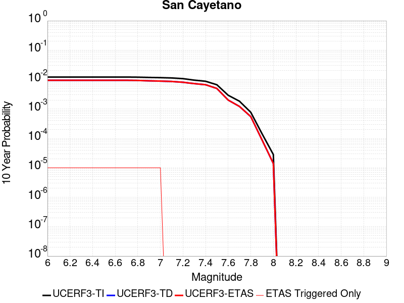 |

| Magnitude | 1 wk TI Prob | 1 wk TD Prob | 1 wk ETAS Prob | 1 wk ETAS/TD Gain | 1 wk ETAS Triggered Only | 1 mo TI Prob | 1 mo TD Prob | 1 mo ETAS Prob | 1 mo ETAS/TD Gain | 1 mo ETAS Triggered Only | 1 yr TI Prob | 1 yr TD Prob | 1 yr ETAS Prob | 1 yr ETAS/TD Gain | 1 yr ETAS Triggered Only | 10 yr TI Prob | 10 yr TD Prob | 10 yr ETAS Prob | 10 yr ETAS/TD Gain | 10 yr ETAS Triggered Only |
|-----|-----|-----|-----|-----|-----|-----|-----|-----|-----|-----|-----|-----|-----|-----|-----|-----|-----|-----|-----|-----|
| 6.0 | 2.3476267E-5 | 1.8173438E-5 | 1.8173438E-5 | 1.0 | 0.0 | 1.0060869E-4 | 7.788386E-5 | 7.788386E-5 | 1.0 | 0.0 | 0.0012242225 | 9.4782707E-4 | 9.4782707E-4 | 1.0 | 0.0 | 0.012175002 | 0.009438734 | 0.009448639 | 1.0010495 | 1.0E-5 |
| 6.1 | 2.3476267E-5 | 1.8173438E-5 | 1.8173438E-5 | 1.0 | 0.0 | 1.0060869E-4 | 7.788386E-5 | 7.788386E-5 | 1.0 | 0.0 | 0.0012242225 | 9.4782707E-4 | 9.4782707E-4 | 1.0 | 0.0 | 0.012175002 | 0.009438734 | 0.009448639 | 1.0010495 | 1.0E-5 |
| 6.2 | 2.3476267E-5 | 1.8173438E-5 | 1.8173438E-5 | 1.0 | 0.0 | 1.0060869E-4 | 7.788386E-5 | 7.788386E-5 | 1.0 | 0.0 | 0.0012242225 | 9.4782707E-4 | 9.4782707E-4 | 1.0 | 0.0 | 0.012175002 | 0.009438734 | 0.009448639 | 1.0010495 | 1.0E-5 |
| 6.3 | 2.3476267E-5 | 1.8173438E-5 | 1.8173438E-5 | 1.0 | 0.0 | 1.0060869E-4 | 7.788386E-5 | 7.788386E-5 | 1.0 | 0.0 | 0.0012242225 | 9.4782707E-4 | 9.4782707E-4 | 1.0 | 0.0 | 0.012175002 | 0.009438734 | 0.009448639 | 1.0010495 | 1.0E-5 |
| 6.4 | 2.3476267E-5 | 1.8173438E-5 | 1.8173438E-5 | 1.0 | 0.0 | 1.0060869E-4 | 7.788386E-5 | 7.788386E-5 | 1.0 | 0.0 | 0.0012242225 | 9.4782707E-4 | 9.4782707E-4 | 1.0 | 0.0 | 0.012175002 | 0.009438734 | 0.009448639 | 1.0010495 | 1.0E-5 |
| 6.5 | 2.3476267E-5 | 1.8173438E-5 | 1.8173438E-5 | 1.0 | 0.0 | 1.0060869E-4 | 7.788386E-5 | 7.788386E-5 | 1.0 | 0.0 | 0.0012242225 | 9.4782707E-4 | 9.4782707E-4 | 1.0 | 0.0 | 0.012175002 | 0.009438734 | 0.009448639 | 1.0010495 | 1.0E-5 |
| 6.6 | 2.3476267E-5 | 1.8173438E-5 | 1.8173438E-5 | 1.0 | 0.0 | 1.0060869E-4 | 7.788386E-5 | 7.788386E-5 | 1.0 | 0.0 | 0.0012242225 | 9.4782707E-4 | 9.4782707E-4 | 1.0 | 0.0 | 0.012175002 | 0.009438734 | 0.009448639 | 1.0010495 | 1.0E-5 |
| 6.7 | 2.3476267E-5 | 1.8173438E-5 | 1.8173438E-5 | 1.0 | 0.0 | 1.0060869E-4 | 7.788386E-5 | 7.788386E-5 | 1.0 | 0.0 | 0.0012242225 | 9.4782707E-4 | 9.4782707E-4 | 1.0 | 0.0 | 0.012175002 | 0.009438734 | 0.009448639 | 1.0010495 | 1.0E-5 |
| 6.8 | 2.3241924E-5 | 1.79411E-5 | 1.79411E-5 | 1.0 | 0.0 | 9.960445E-5 | 7.688818E-5 | 7.688818E-5 | 1.0 | 0.0 | 0.0012120095 | 9.3571516E-4 | 9.3571516E-4 | 1.0 | 0.0 | 0.012054204 | 0.009318608 | 0.009328514 | 1.0010631 | 1.0E-5 |
| 6.9 | 2.2761007E-5 | 1.7436463E-5 | 1.7436463E-5 | 1.0 | 0.0 | 9.7543525E-5 | 7.472558E-5 | 7.472558E-5 | 1.0 | 0.0 | 0.0011869454 | 9.094077E-4 | 9.094077E-4 | 1.0 | 0.0 | 0.011806256 | 0.009057692 | 0.0090676015 | 1.001094 | 1.0E-5 |
| 7.0 | 2.240283E-5 | 1.7070162E-5 | 1.7070162E-5 | 1.0 | 0.0 | 9.600859E-5 | 7.31558E-5 | 7.31558E-5 | 1.0 | 0.0 | 0.0011682777 | 8.9031144E-4 | 8.9031144E-4 | 1.0 | 0.0 | 0.011621549 | 0.008868261 | 0.008878172 | 1.0011176 | 1.0E-5 |
| 7.1 | 2.1871154E-5 | 1.6589933E-5 | 1.6589933E-5 | 1.0 | 0.0 | 9.373015E-5 | 7.10978E-5 | 7.10978E-5 | 1.0 | 0.0 | 0.0011405671 | 8.652753E-4 | 8.652753E-4 | 1.0 | 0.0 | 0.011347309 | 0.0086198645 | 0.0086198645 | 1.0 | 0.0 |
| 7.2 | 2.0714133E-5 | 1.5568314E-5 | 1.5568314E-5 | 1.0 | 0.0 | 8.8771834E-5 | 6.671966E-5 | 6.671966E-5 | 1.0 | 0.0 | 0.0010802611 | 8.120123E-4 | 8.120123E-4 | 1.0 | 0.0 | 0.010750249 | 0.008091228 | 0.008091228 | 1.0 | 0.0 |
| 7.3 | 1.8408395E-5 | 1.39989215E-5 | 1.39989215E-5 | 1.0 | 0.0 | 7.8890735E-5 | 5.9994014E-5 | 5.9994014E-5 | 1.0 | 0.0 | 9.600714E-4 | 7.301853E-4 | 7.301853E-4 | 1.0 | 0.0 | 0.009559342 | 0.007278581 | 0.007278581 | 1.0 | 0.0 |
| 7.4 | 1.6856795E-5 | 1.2851856E-5 | 1.2851856E-5 | 1.0 | 0.0 | 7.2241404E-5 | 5.5078235E-5 | 5.5078235E-5 | 1.0 | 0.0 | 8.7918417E-4 | 6.703741E-4 | 6.703741E-4 | 1.0 | 0.0 | 0.00875714 | 0.0066841985 | 0.0066841985 | 1.0 | 0.0 |
| 7.5 | 1.2822778E-5 | 9.578771E-6 | 9.578771E-6 | 1.0 | 0.0 | 5.495361E-5 | 4.105124E-5 | 4.105124E-5 | 1.0 | 0.0 | 6.688548E-4 | 4.996858E-4 | 4.996858E-4 | 1.0 | 0.0 | 0.006668452 | 0.0049857935 | 0.0049857935 | 1.0 | 0.0 |
| 7.6 | 5.6272684E-6 | 3.855415E-6 | 3.855415E-6 | 1.0 | 0.0 | 2.4116642E-5 | 1.6523103E-5 | 1.6523103E-5 | 1.0 | 0.0 | 2.9358055E-4 | 2.0115031E-4 | 2.0115031E-4 | 1.0 | 0.0 | 0.0029319301 | 0.0020096933 | 0.0020096933 | 1.0 | 0.0 |
| 7.7 | 3.5261346E-6 | 2.3410216E-6 | 2.3410216E-6 | 1.0 | 0.0 | 1.5111918E-5 | 1.0032912E-5 | 1.0032912E-5 | 1.0 | 0.0 | 1.8397206E-4 | 1.2214393E-4 | 1.2214393E-4 | 1.0 | 0.0 | 0.0018381984 | 0.0012207753 | 0.0012207753 | 1.0 | 0.0 |
| 7.8 | 1.4826929E-6 | 1.0565519E-6 | 1.0565519E-6 | 1.0 | 0.0 | 6.354383E-6 | 4.5280717E-6 | 4.5280717E-6 | 1.0 | 0.0 | 7.736187E-5 | 5.51279E-5 | 5.51279E-5 | 1.0 | 0.0 | 7.733494E-4 | 5.511443E-4 | 5.511443E-4 | 1.0 | 0.0 |
| 7.9 | 2.7568166E-7 | 1.6981232E-7 | 1.6981232E-7 | 1.0 | 0.0 | 1.1814923E-6 | 7.277669E-7 | 7.277669E-7 | 1.0 | 0.0 | 1.4384574E-5 | 8.860527E-6 | 8.860527E-6 | 1.0 | 0.0 | 1.4383643E-4 | 8.8601766E-5 | 8.8601766E-5 | 1.0 | 0.0 |
| 8.0 | 5.407832E-8 | 2.6897766E-8 | 2.6897766E-8 | 1.0 | 0.0 | 2.3176422E-7 | 1.1527614E-7 | 1.1527614E-7 | 1.0 | 0.0 | 2.8217257E-6 | 1.4034861E-6 | 1.4034861E-6 | 1.0 | 0.0 | 2.8216898E-5 | 1.40347765E-5 | 1.40347765E-5 | 1.0 | 0.0 |

## Elsinore (Stepovers Combined)
*[(top)](#table-of-contents)*

| 1 Week | 1 Month | 1 Year | 10 Year |
|-----|-----|-----|-----|
|  |  |  |  |

| Magnitude | 1 wk TI Prob | 1 wk TD Prob | 1 wk ETAS Prob | 1 wk ETAS/TD Gain | 1 wk ETAS Triggered Only | 1 mo TI Prob | 1 mo TD Prob | 1 mo ETAS Prob | 1 mo ETAS/TD Gain | 1 mo ETAS Triggered Only | 1 yr TI Prob | 1 yr TD Prob | 1 yr ETAS Prob | 1 yr ETAS/TD Gain | 1 yr ETAS Triggered Only | 10 yr TI Prob | 10 yr TD Prob | 10 yr ETAS Prob | 10 yr ETAS/TD Gain | 10 yr ETAS Triggered Only |
|-----|-----|-----|-----|-----|-----|-----|-----|-----|-----|-----|-----|-----|-----|-----|-----|-----|-----|-----|-----|-----|
| 6.0 | 2.144392E-5 | 1.9766418E-5 | 1.9766418E-5 | 1.0 | 0.0 | 9.189928E-5 | 8.471059E-5 | 8.471059E-5 | 1.0 | 0.0 | 0.0011182994 | 0.0010308851 | 0.0010308851 | 1.0 | 0.0 | 0.011126885 | 0.010268115 | 0.010278013 | 1.0009639 | 1.0E-5 |
| 6.1 | 2.144392E-5 | 1.9766418E-5 | 1.9766418E-5 | 1.0 | 0.0 | 9.189928E-5 | 8.471059E-5 | 8.471059E-5 | 1.0 | 0.0 | 0.0011182994 | 0.0010308851 | 0.0010308851 | 1.0 | 0.0 | 0.011126885 | 0.010268115 | 0.010278013 | 1.0009639 | 1.0E-5 |
| 6.2 | 2.144392E-5 | 1.9766418E-5 | 1.9766418E-5 | 1.0 | 0.0 | 9.189928E-5 | 8.471059E-5 | 8.471059E-5 | 1.0 | 0.0 | 0.0011182994 | 0.0010308851 | 0.0010308851 | 1.0 | 0.0 | 0.011126885 | 0.010268115 | 0.010278013 | 1.0009639 | 1.0E-5 |
| 6.3 | 1.9751555E-5 | 1.7747316E-5 | 1.7747316E-5 | 1.0 | 0.0 | 8.4646774E-5 | 7.60578E-5 | 7.60578E-5 | 1.0 | 0.0 | 0.0010300872 | 9.2562695E-4 | 9.2562695E-4 | 1.0 | 0.0 | 0.010253254 | 0.009224291 | 0.009234199 | 1.0010741 | 1.0E-5 |
| 6.4 | 1.9751555E-5 | 1.7747316E-5 | 1.7747316E-5 | 1.0 | 0.0 | 8.4646774E-5 | 7.60578E-5 | 7.60578E-5 | 1.0 | 0.0 | 0.0010300872 | 9.2562695E-4 | 9.2562695E-4 | 1.0 | 0.0 | 0.010253254 | 0.009224291 | 0.009234199 | 1.0010741 | 1.0E-5 |
| 6.5 | 1.9751555E-5 | 1.7747316E-5 | 1.7747316E-5 | 1.0 | 0.0 | 8.4646774E-5 | 7.60578E-5 | 7.60578E-5 | 1.0 | 0.0 | 0.0010300872 | 9.2562695E-4 | 9.2562695E-4 | 1.0 | 0.0 | 0.010253254 | 0.009224291 | 0.009234199 | 1.0010741 | 1.0E-5 |
| 6.6 | 1.9188685E-5 | 1.7009039E-5 | 1.7009039E-5 | 1.0 | 0.0 | 8.2234634E-5 | 7.2893934E-5 | 7.2893934E-5 | 1.0 | 0.0 | 0.0010007467 | 8.8713854E-4 | 8.8713854E-4 | 1.0 | 0.0 | 0.00996252 | 0.00884276 | 0.008852672 | 1.0011209 | 1.0E-5 |
| 6.7 | 1.7608272E-5 | 1.4737597E-5 | 1.4737597E-5 | 1.0 | 0.0 | 7.546184E-5 | 6.3159656E-5 | 6.3159656E-5 | 1.0 | 0.0 | 9.183606E-4 | 7.6870725E-4 | 7.6870725E-4 | 1.0 | 0.0 | 0.009145746 | 0.0076674893 | 0.0076774126 | 1.0012943 | 1.0E-5 |
| 6.8 | 1.697165E-5 | 1.3788029E-5 | 1.3788029E-5 | 1.0 | 0.0 | 7.273361E-5 | 5.9090264E-5 | 5.9090264E-5 | 1.0 | 0.0 | 8.8517193E-4 | 7.191952E-4 | 7.191952E-4 | 1.0 | 0.0 | 0.008816543 | 0.0071750935 | 0.007185022 | 1.0013837 | 1.0E-5 |
| 6.9 | 1.600365E-5 | 1.2851192E-5 | 1.2851192E-5 | 1.0 | 0.0 | 6.858527E-5 | 5.507542E-5 | 5.507542E-5 | 1.0 | 0.0 | 8.347058E-4 | 6.703447E-4 | 6.703447E-4 | 1.0 | 0.0 | 0.008315775 | 0.0066891117 | 0.0066990447 | 1.001485 | 1.0E-5 |
| 7.0 | 1.3314581E-5 | 1.0451547E-5 | 1.0451547E-5 | 1.0 | 0.0 | 5.7061243E-5 | 4.4791588E-5 | 4.4791588E-5 | 1.0 | 0.0 | 6.944992E-4 | 5.452038E-4 | 5.452038E-4 | 1.0 | 0.0 | 0.006923327 | 0.005442589 | 0.0054525346 | 1.0018274 | 1.0E-5 |
| 7.1 | 1.2865345E-5 | 9.941276E-6 | 9.941276E-6 | 1.0 | 0.0 | 5.5136024E-5 | 4.2604788E-5 | 4.2604788E-5 | 1.0 | 0.0 | 6.710743E-4 | 5.1859237E-4 | 5.1859237E-4 | 1.0 | 0.0 | 0.0066905143 | 0.005177154 | 0.0051871026 | 1.0019215 | 1.0E-5 |
| 7.2 | 1.1650051E-5 | 8.637108E-6 | 8.637108E-6 | 1.0 | 0.0 | 4.9927836E-5 | 3.7015663E-5 | 3.7015663E-5 | 1.0 | 0.0 | 6.0770183E-4 | 4.5057427E-4 | 4.5057427E-4 | 1.0 | 0.0 | 0.0060604266 | 0.004498031 | 0.004507986 | 1.0022132 | 1.0E-5 |
| 7.3 | 1.0008533E-5 | 7.203859E-6 | 7.203859E-6 | 1.0 | 0.0 | 4.2893007E-5 | 3.087332E-5 | 3.087332E-5 | 1.0 | 0.0 | 5.220972E-4 | 3.7581933E-4 | 3.7581933E-4 | 1.0 | 0.0 | 0.005208723 | 0.003752225 | 0.003752225 | 1.0 | 0.0 |
| 7.4 | 9.116759E-6 | 6.4126107E-6 | 6.4126107E-6 | 1.0 | 0.0 | 3.907124E-5 | 2.7482336E-5 | 2.7482336E-5 | 1.0 | 0.0 | 4.7558855E-4 | 3.3454745E-4 | 3.3454745E-4 | 1.0 | 0.0 | 0.00474572 | 0.0033405903 | 0.0033405903 | 1.0 | 0.0 |
| 7.5 | 7.870524E-6 | 5.384763E-6 | 5.384763E-6 | 1.0 | 0.0 | 3.3730383E-5 | 2.3077358E-5 | 2.3077358E-5 | 1.0 | 0.0 | 4.1059E-4 | 2.8093188E-4 | 2.8093188E-4 | 1.0 | 0.0 | 0.0040983222 | 0.002805894 | 0.002805894 | 1.0 | 0.0 |
| 7.6 | 6.9774537E-6 | 4.6796517E-6 | 4.6796517E-6 | 1.0 | 0.0 | 2.990303E-5 | 2.0055502E-5 | 2.0055502E-5 | 1.0 | 0.0 | 3.640086E-4 | 2.4414956E-4 | 2.4414956E-4 | 1.0 | 0.0 | 0.003634129 | 0.0024389296 | 0.0024389296 | 1.0 | 0.0 |
| 7.7 | 4.1616954E-6 | 2.3293258E-6 | 2.3293258E-6 | 1.0 | 0.0 | 1.7835715E-5 | 9.98279E-6 | 9.98279E-6 | 1.0 | 0.0 | 2.171282E-4 | 1.2153444E-4 | 1.2153444E-4 | 1.0 | 0.0 | 0.0021691616 | 0.0012147529 | 0.0012147529 | 1.0 | 0.0 |
| 7.8 | 2.2692414E-7 | 9.388808E-8 | 9.388808E-8 | 1.0 | 0.0 | 9.725317E-7 | 4.0237745E-7 | 4.0237745E-7 | 1.0 | 0.0 | 1.1840509E-5 | 4.8989377E-6 | 4.8989377E-6 | 1.0 | 0.0 | 1.1839878E-4 | 4.8988626E-5 | 4.8988626E-5 | 1.0 | 0.0 |
| 7.9 | 6.676829E-9 | 3.4407224E-9 | 3.4407224E-9 | 1.0 | 0.0 | 2.861498E-8 | 1.4745954E-8 | 1.4745954E-8 | 1.0 | 0.0 | 3.4838732E-7 | 1.7953197E-7 | 1.7953197E-7 | 1.0 | 0.0 | 3.4838679E-6 | 1.7953184E-6 | 1.7953184E-6 | 1.0 | 0.0 |

## Elsinore (Coyote Mountains)
*[(top)](#table-of-contents)*

| 1 Week | 1 Month | 1 Year | 10 Year |
|-----|-----|-----|-----|
|  | 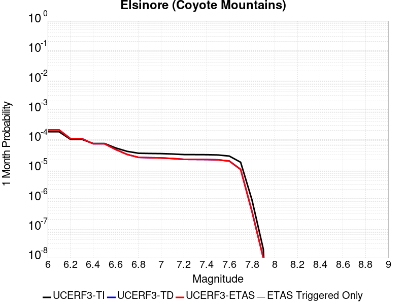 |  | 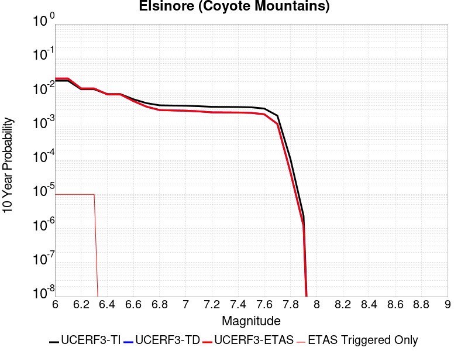 |

| Magnitude | 1 wk TI Prob | 1 wk TD Prob | 1 wk ETAS Prob | 1 wk ETAS/TD Gain | 1 wk ETAS Triggered Only | 1 mo TI Prob | 1 mo TD Prob | 1 mo ETAS Prob | 1 mo ETAS/TD Gain | 1 mo ETAS Triggered Only | 1 yr TI Prob | 1 yr TD Prob | 1 yr ETAS Prob | 1 yr ETAS/TD Gain | 1 yr ETAS Triggered Only | 10 yr TI Prob | 10 yr TD Prob | 10 yr ETAS Prob | 10 yr ETAS/TD Gain | 10 yr ETAS Triggered Only |
|-----|-----|-----|-----|-----|-----|-----|-----|-----|-----|-----|-----|-----|-----|-----|-----|-----|-----|-----|-----|-----|
| 6.0 | 4.20513E-5 | 4.8644404E-5 | 4.8644404E-5 | 1.0 | 0.0 | 1.8020741E-4 | 2.084626E-4 | 2.084626E-4 | 1.0 | 0.0 | 0.0021918174 | 0.0025356514 | 0.0025356514 | 1.0 | 0.0 | 0.021703249 | 0.025117494 | 0.025127243 | 1.0003881 | 1.0E-5 |
| 6.1 | 4.20513E-5 | 4.8644404E-5 | 4.8644404E-5 | 1.0 | 0.0 | 1.8020741E-4 | 2.084626E-4 | 2.084626E-4 | 1.0 | 0.0 | 0.0021918174 | 0.0025356514 | 0.0025356514 | 1.0 | 0.0 | 0.021703249 | 0.025117494 | 0.025127243 | 1.0003881 | 1.0E-5 |
| 6.2 | 2.3413893E-5 | 2.470175E-5 | 2.470175E-5 | 1.0 | 0.0 | 1.0034139E-4 | 1.0586089E-4 | 1.0586089E-4 | 1.0 | 0.0 | 0.0012209718 | 0.0012881876 | 0.0012881876 | 1.0 | 0.0 | 0.012142851 | 0.012815754 | 0.012825626 | 1.0007703 | 1.0E-5 |
| 6.3 | 2.3413893E-5 | 2.470175E-5 | 2.470175E-5 | 1.0 | 0.0 | 1.0034139E-4 | 1.0586089E-4 | 1.0586089E-4 | 1.0 | 0.0 | 0.0012209718 | 0.0012881876 | 0.0012881876 | 1.0 | 0.0 | 0.012142851 | 0.012815754 | 0.012825626 | 1.0007703 | 1.0E-5 |
| 6.4 | 1.6894814E-5 | 1.6572572E-5 | 1.6572572E-5 | 1.0 | 0.0 | 7.240433E-5 | 7.10236E-5 | 7.10236E-5 | 1.0 | 0.0 | 8.811662E-4 | 8.6440565E-4 | 8.6440565E-4 | 1.0 | 0.0 | 0.0087768035 | 0.0086141145 | 0.0086141145 | 1.0 | 0.0 |
| 6.5 | 1.6894814E-5 | 1.6572572E-5 | 1.6572572E-5 | 1.0 | 0.0 | 7.240433E-5 | 7.10236E-5 | 7.10236E-5 | 1.0 | 0.0 | 8.811662E-4 | 8.6440565E-4 | 8.6440565E-4 | 1.0 | 0.0 | 0.0087768035 | 0.0086141145 | 0.0086141145 | 1.0 | 0.0 |
| 6.6 | 1.1910969E-5 | 1.0533792E-5 | 1.0533792E-5 | 1.0 | 0.0 | 5.1046012E-5 | 4.514412E-5 | 4.514412E-5 | 1.0 | 0.0 | 6.21308E-4 | 5.4950215E-4 | 5.4950215E-4 | 1.0 | 0.0 | 0.0061957375 | 0.00548274 | 0.00548274 | 1.0 | 0.0 |
| 6.7 | 9.1486E-6 | 7.205245E-6 | 7.205245E-6 | 1.0 | 0.0 | 3.9207694E-5 | 3.0879277E-5 | 3.0879277E-5 | 1.0 | 0.0 | 4.7724912E-4 | 3.7589416E-4 | 3.7589416E-4 | 1.0 | 0.0 | 0.0047622547 | 0.0037529632 | 0.0037529632 | 1.0 | 0.0 |
| 6.8 | 7.90441E-6 | 5.7311604E-6 | 5.7311604E-6 | 1.0 | 0.0 | 3.3875604E-5 | 2.456189E-5 | 2.456189E-5 | 1.0 | 0.0 | 4.1235742E-4 | 2.9900126E-4 | 2.9900126E-4 | 1.0 | 0.0 | 0.0041159308 | 0.0029861184 | 0.0029861184 | 1.0 | 0.0 |
| 6.9 | 7.77015E-6 | 5.5851024E-6 | 5.5851024E-6 | 1.0 | 0.0 | 3.3300217E-5 | 2.3935941E-5 | 2.3935941E-5 | 1.0 | 0.0 | 4.0535472E-4 | 2.9138237E-4 | 2.9138237E-4 | 1.0 | 0.0 | 0.004046161 | 0.0029101304 | 0.0029101304 | 1.0 | 0.0 |
| 7.0 | 7.675798E-6 | 5.481952E-6 | 5.481952E-6 | 1.0 | 0.0 | 3.289586E-5 | 2.3493876E-5 | 2.3493876E-5 | 1.0 | 0.0 | 4.004335E-4 | 2.8600165E-4 | 2.8600165E-4 | 1.0 | 0.0 | 0.003997127 | 0.0028564625 | 0.0028564625 | 1.0 | 0.0 |
| 7.1 | 7.447814E-6 | 5.2408122E-6 | 5.2408122E-6 | 1.0 | 0.0 | 3.191881E-5 | 2.2460437E-5 | 2.2460437E-5 | 1.0 | 0.0 | 3.8854225E-4 | 2.7342275E-4 | 2.7342275E-4 | 1.0 | 0.0 | 0.003878636 | 0.002730988 | 0.002730988 | 1.0 | 0.0 |
| 7.2 | 7.128185E-6 | 4.9074624E-6 | 4.9074624E-6 | 1.0 | 0.0 | 3.0549007E-5 | 2.103182E-5 | 2.103182E-5 | 1.0 | 0.0 | 3.7187067E-4 | 2.560335E-4 | 2.560335E-4 | 1.0 | 0.0 | 0.00371249 | 0.0025575038 | 0.0025575038 | 1.0 | 0.0 |
| 7.3 | 7.0913875E-6 | 4.8761353E-6 | 4.8761353E-6 | 1.0 | 0.0 | 3.0391306E-5 | 2.0897562E-5 | 2.0897562E-5 | 1.0 | 0.0 | 3.6995133E-4 | 2.543993E-4 | 2.543993E-4 | 1.0 | 0.0 | 0.0036933604 | 0.002541199 | 0.002541199 | 1.0 | 0.0 |
| 7.4 | 7.051521E-6 | 4.8399843E-6 | 4.8399843E-6 | 1.0 | 0.0 | 3.0220453E-5 | 2.0742631E-5 | 2.0742631E-5 | 1.0 | 0.0 | 3.6787192E-4 | 2.5251348E-4 | 2.5251348E-4 | 1.0 | 0.0 | 0.0036726352 | 0.0025223838 | 0.0025223838 | 1.0 | 0.0 |
| 7.5 | 6.910666E-6 | 4.7354515E-6 | 4.7354515E-6 | 1.0 | 0.0 | 2.9616802E-5 | 2.0294641E-5 | 2.0294641E-5 | 1.0 | 0.0 | 3.605249E-4 | 2.4706044E-4 | 2.4706044E-4 | 1.0 | 0.0 | 0.0035994058 | 0.0024679757 | 0.0024679757 | 1.0 | 0.0 |
| 7.6 | 6.341753E-6 | 4.3084856E-6 | 4.3084856E-6 | 1.0 | 0.0 | 2.7178658E-5 | 1.8464814E-5 | 1.8464814E-5 | 1.0 | 0.0 | 3.3084993E-4 | 2.2478709E-4 | 2.2478709E-4 | 1.0 | 0.0 | 0.0033035777 | 0.0022457126 | 0.0022457126 | 1.0 | 0.0 |
| 7.7 | 3.9205916E-6 | 2.2448908E-6 | 2.2448908E-6 | 1.0 | 0.0 | 1.6802427E-5 | 9.620929E-6 | 9.620929E-6 | 1.0 | 0.0 | 2.0455034E-4 | 1.1712926E-4 | 1.1712926E-4 | 1.0 | 0.0 | 0.0020436216 | 0.0011707483 | 0.0011707483 | 1.0 | 0.0 |
| 7.8 | 2.0846227E-7 | 8.489491E-8 | 8.489491E-8 | 1.0 | 0.0 | 8.9340944E-7 | 3.6383528E-7 | 3.6383528E-7 | 1.0 | 0.0 | 1.0877206E-5 | 4.429689E-6 | 4.429689E-6 | 1.0 | 0.0 | 1.0876673E-4 | 4.4296332E-5 | 4.4296332E-5 | 1.0 | 0.0 |
| 7.9 | 4.4969806E-9 | 2.2697666E-9 | 2.2697666E-9 | 1.0 | 0.0 | 1.9272775E-8 | 9.727572E-9 | 9.727572E-9 | 1.0 | 0.0 | 2.3464601E-7 | 1.1843318E-7 | 1.1843318E-7 | 1.0 | 0.0 | 2.3464577E-6 | 1.1843313E-6 | 1.1843313E-6 | 1.0 | 0.0 |

## Carson Range (Genoa)
*[(top)](#table-of-contents)*

| 1 Week | 1 Month | 1 Year | 10 Year |
|-----|-----|-----|-----|
|  |  |  |  |

| Magnitude | 1 wk TI Prob | 1 wk TD Prob | 1 wk ETAS Prob | 1 wk ETAS/TD Gain | 1 wk ETAS Triggered Only | 1 mo TI Prob | 1 mo TD Prob | 1 mo ETAS Prob | 1 mo ETAS/TD Gain | 1 mo ETAS Triggered Only | 1 yr TI Prob | 1 yr TD Prob | 1 yr ETAS Prob | 1 yr ETAS/TD Gain | 1 yr ETAS Triggered Only | 10 yr TI Prob | 10 yr TD Prob | 10 yr ETAS Prob | 10 yr ETAS/TD Gain | 10 yr ETAS Triggered Only |
|-----|-----|-----|-----|-----|-----|-----|-----|-----|-----|-----|-----|-----|-----|-----|-----|-----|-----|-----|-----|-----|
| 6.0 | 4.1268457E-5 | 5.015692E-5 | 5.015692E-5 | 1.0 | 0.0 | 1.7685282E-4 | 2.1494277E-4 | 2.1494277E-4 | 1.0 | 0.0 | 0.0021510567 | 0.0026141738 | 0.0026141738 | 1.0 | 0.0 | 0.02130354 | 0.025873907 | 0.025883649 | 1.0003765 | 1.0E-5 |
| 6.1 | 4.1268457E-5 | 5.015692E-5 | 5.015692E-5 | 1.0 | 0.0 | 1.7685282E-4 | 2.1494277E-4 | 2.1494277E-4 | 1.0 | 0.0 | 0.0021510567 | 0.0026141738 | 0.0026141738 | 1.0 | 0.0 | 0.02130354 | 0.025873907 | 0.025883649 | 1.0003765 | 1.0E-5 |
| 6.2 | 4.1268457E-5 | 5.015692E-5 | 5.015692E-5 | 1.0 | 0.0 | 1.7685282E-4 | 2.1494277E-4 | 2.1494277E-4 | 1.0 | 0.0 | 0.0021510567 | 0.0026141738 | 0.0026141738 | 1.0 | 0.0 | 0.02130354 | 0.025873907 | 0.025883649 | 1.0003765 | 1.0E-5 |
| 6.3 | 4.1268457E-5 | 5.015692E-5 | 5.015692E-5 | 1.0 | 0.0 | 1.7685282E-4 | 2.1494277E-4 | 2.1494277E-4 | 1.0 | 0.0 | 0.0021510567 | 0.0026141738 | 0.0026141738 | 1.0 | 0.0 | 0.02130354 | 0.025873907 | 0.025883649 | 1.0003765 | 1.0E-5 |
| 6.4 | 4.1268457E-5 | 5.015692E-5 | 5.015692E-5 | 1.0 | 0.0 | 1.7685282E-4 | 2.1494277E-4 | 2.1494277E-4 | 1.0 | 0.0 | 0.0021510567 | 0.0026141738 | 0.0026141738 | 1.0 | 0.0 | 0.02130354 | 0.025873907 | 0.025883649 | 1.0003765 | 1.0E-5 |
| 6.5 | 2.5677185E-5 | 3.0984236E-5 | 3.0984236E-5 | 1.0 | 0.0 | 1.1004044E-4 | 1.3278384E-4 | 1.3278384E-4 | 1.0 | 0.0 | 0.0013389189 | 0.0016156224 | 0.0016156224 | 1.0 | 0.0 | 0.0133088045 | 0.016056703 | 0.016056703 | 1.0 | 0.0 |
| 6.6 | 2.5677185E-5 | 3.0984236E-5 | 3.0984236E-5 | 1.0 | 0.0 | 1.1004044E-4 | 1.3278384E-4 | 1.3278384E-4 | 1.0 | 0.0 | 0.0013389189 | 0.0016156224 | 0.0016156224 | 1.0 | 0.0 | 0.0133088045 | 0.016056703 | 0.016056703 | 1.0 | 0.0 |
| 6.7 | 1.9969408E-5 | 2.4068053E-5 | 2.4068053E-5 | 1.0 | 0.0 | 8.558037E-5 | 1.0314558E-4 | 1.0314558E-4 | 1.0 | 0.0 | 0.0010414429 | 0.0012552276 | 0.0012552276 | 1.0 | 0.0 | 0.010365757 | 0.01249654 | 0.01249654 | 1.0 | 0.0 |
| 6.8 | 1.4783156E-5 | 1.7820965E-5 | 1.7820965E-5 | 1.0 | 0.0 | 6.335485E-5 | 7.637406E-5 | 7.637406E-5 | 1.0 | 0.0 | 7.710722E-4 | 9.2958775E-4 | 9.2958775E-4 | 1.0 | 0.0 | 0.0076840227 | 0.009269785 | 0.009269785 | 1.0 | 0.0 |
| 6.9 | 1.06660555E-5 | 1.28795045E-5 | 1.28795045E-5 | 1.0 | 0.0 | 4.5710865E-5 | 5.519736E-5 | 5.519736E-5 | 1.0 | 0.0 | 5.5638765E-4 | 6.719359E-4 | 6.719359E-4 | 1.0 | 0.0 | 0.005549967 | 0.0067103454 | 0.0067103454 | 1.0 | 0.0 |
| 7.0 | 7.664838E-6 | 9.260094E-6 | 9.260094E-6 | 1.0 | 0.0 | 3.2848893E-5 | 3.9686114E-5 | 3.9686114E-5 | 1.0 | 0.0 | 3.998619E-4 | 4.8317845E-4 | 4.8317845E-4 | 1.0 | 0.0 | 0.0039914316 | 0.004831782 | 0.004831782 | 1.0 | 0.0 |

## Elysian Park (Lower CFM)
*[(top)](#table-of-contents)*

| 1 Week | 1 Month | 1 Year | 10 Year |
|-----|-----|-----|-----|
| 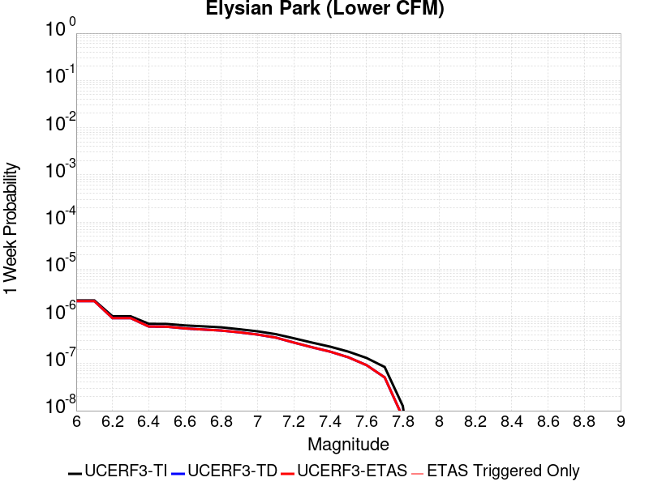 | 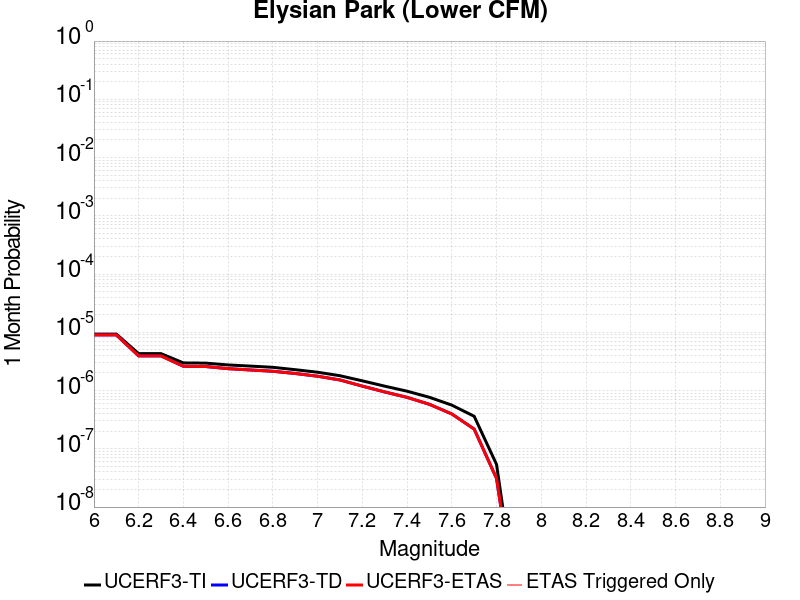 |  | 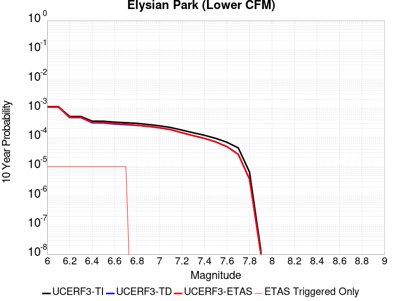 |

| Magnitude | 1 wk TI Prob | 1 wk TD Prob | 1 wk ETAS Prob | 1 wk ETAS/TD Gain | 1 wk ETAS Triggered Only | 1 mo TI Prob | 1 mo TD Prob | 1 mo ETAS Prob | 1 mo ETAS/TD Gain | 1 mo ETAS Triggered Only | 1 yr TI Prob | 1 yr TD Prob | 1 yr ETAS Prob | 1 yr ETAS/TD Gain | 1 yr ETAS Triggered Only | 10 yr TI Prob | 10 yr TD Prob | 10 yr ETAS Prob | 10 yr ETAS/TD Gain | 10 yr ETAS Triggered Only |
|-----|-----|-----|-----|-----|-----|-----|-----|-----|-----|-----|-----|-----|-----|-----|-----|-----|-----|-----|-----|-----|
| 6.0 | 2.1766498E-6 | 2.1038504E-6 | 2.1038504E-6 | 1.0 | 0.0 | 9.328466E-6 | 9.0164785E-6 | 9.0164785E-6 | 1.0 | 0.0 | 1.1356815E-4 | 1.0977154E-4 | 1.0977154E-4 | 1.0 | 0.0 | 0.0011351013 | 0.0010973151 | 0.0011073041 | 1.0091032 | 1.0E-5 |
| 6.1 | 2.1766498E-6 | 2.1038504E-6 | 2.1038504E-6 | 1.0 | 0.0 | 9.328466E-6 | 9.0164785E-6 | 9.0164785E-6 | 1.0 | 0.0 | 1.1356815E-4 | 1.0977154E-4 | 1.0977154E-4 | 1.0 | 0.0 | 0.0011351013 | 0.0010973151 | 0.0011073041 | 1.0091032 | 1.0E-5 |
| 6.2 | 1.0031182E-6 | 9.186714E-7 | 9.186714E-7 | 1.0 | 0.0 | 4.299071E-6 | 3.9371575E-6 | 3.9371575E-6 | 1.0 | 0.0 | 5.2339932E-5 | 4.793394E-5 | 4.793394E-5 | 1.0 | 0.0 | 5.2327604E-4 | 4.7924582E-4 | 4.8924104E-4 | 1.0208561 | 1.0E-5 |
| 6.3 | 1.0031182E-6 | 9.186714E-7 | 9.186714E-7 | 1.0 | 0.0 | 4.299071E-6 | 3.9371575E-6 | 3.9371575E-6 | 1.0 | 0.0 | 5.2339932E-5 | 4.793394E-5 | 4.793394E-5 | 1.0 | 0.0 | 5.2327604E-4 | 4.7924582E-4 | 4.8924104E-4 | 1.0208561 | 1.0E-5 |
| 6.4 | 6.9606244E-7 | 6.092421E-7 | 6.092421E-7 | 1.0 | 0.0 | 2.9831212E-6 | 2.6110347E-6 | 2.6110347E-6 | 1.0 | 0.0 | 3.6318896E-5 | 3.1788888E-5 | 3.1788888E-5 | 1.0 | 0.0 | 3.6312963E-4 | 3.1784363E-4 | 3.2784045E-4 | 1.0314521 | 1.0E-5 |
| 6.5 | 6.901879E-7 | 6.0331035E-7 | 6.0331035E-7 | 1.0 | 0.0 | 2.9579448E-6 | 2.5856132E-6 | 2.5856132E-6 | 1.0 | 0.0 | 3.6012385E-5 | 3.147939E-5 | 3.147939E-5 | 1.0 | 0.0 | 3.600655E-4 | 3.1474954E-4 | 3.247464E-4 | 1.0317613 | 1.0E-5 |
| 6.6 | 6.4198554E-7 | 5.5470827E-7 | 5.5470827E-7 | 1.0 | 0.0 | 2.7513638E-6 | 2.377319E-6 | 2.377319E-6 | 1.0 | 0.0 | 3.3497337E-5 | 2.8943476E-5 | 2.8943476E-5 | 1.0 | 0.0 | 3.349229E-4 | 2.893972E-4 | 2.993943E-4 | 1.0345446 | 1.0E-5 |
| 6.7 | 6.138733E-7 | 5.263888E-7 | 5.263888E-7 | 1.0 | 0.0 | 2.6308828E-6 | 2.25595E-6 | 2.25595E-6 | 1.0 | 0.0 | 3.203053E-5 | 2.7465847E-5 | 2.7465847E-5 | 1.0 | 0.0 | 3.2025913E-4 | 2.7462465E-4 | 2.846219E-4 | 1.0364033 | 1.0E-5 |
| 6.8 | 5.84778E-7 | 5.0034043E-7 | 5.0034043E-7 | 1.0 | 0.0 | 2.506189E-6 | 2.1443143E-6 | 2.1443143E-6 | 1.0 | 0.0 | 3.0512423E-5 | 2.6106716E-5 | 2.6106716E-5 | 1.0 | 0.0 | 3.0508233E-4 | 2.610366E-4 | 2.610366E-4 | 1.0 | 0.0 |
| 6.9 | 5.322785E-7 | 4.5805328E-7 | 4.5805328E-7 | 1.0 | 0.0 | 2.2811914E-6 | 1.9630838E-6 | 1.9630838E-6 | 1.0 | 0.0 | 2.7773152E-5 | 2.3900286E-5 | 2.3900286E-5 | 1.0 | 0.0 | 2.7769682E-4 | 2.3897724E-4 | 2.3897724E-4 | 1.0 | 0.0 |
| 7.0 | 4.8147206E-7 | 4.112859E-7 | 4.112859E-7 | 1.0 | 0.0 | 2.06345E-6 | 1.7626526E-6 | 1.7626526E-6 | 1.0 | 0.0 | 2.5122214E-5 | 2.1460084E-5 | 2.1460084E-5 | 1.0 | 0.0 | 2.5119373E-4 | 2.1458021E-4 | 2.1458021E-4 | 1.0 | 0.0 |
| 7.1 | 4.1932955E-7 | 3.5459794E-7 | 3.5459794E-7 | 1.0 | 0.0 | 1.7971255E-6 | 1.5197046E-6 | 1.5197046E-6 | 1.0 | 0.0 | 2.1879783E-5 | 1.8502245E-5 | 1.8502245E-5 | 1.0 | 0.0 | 2.1877629E-4 | 1.8500711E-4 | 1.8500711E-4 | 1.0 | 0.0 |
| 7.2 | 3.426051E-7 | 2.781378E-7 | 2.781378E-7 | 1.0 | 0.0 | 1.4683067E-6 | 1.1920185E-6 | 1.1920185E-6 | 1.0 | 0.0 | 1.7876488E-5 | 1.451273E-5 | 1.451273E-5 | 1.0 | 0.0 | 1.787505E-4 | 1.4511784E-4 | 1.4511784E-4 | 1.0 | 0.0 |
| 7.3 | 2.7771645E-7 | 2.2099522E-7 | 2.2099522E-7 | 1.0 | 0.0 | 1.1902127E-6 | 9.47122E-7 | 9.47122E-7 | 1.0 | 0.0 | 1.4490744E-5 | 1.1531149E-5 | 1.1531149E-5 | 1.0 | 0.0 | 1.4489799E-4 | 1.1530553E-4 | 1.1530553E-4 | 1.0 | 0.0 |
| 7.4 | 2.2756493E-7 | 1.78424E-7 | 1.78424E-7 | 1.0 | 0.0 | 9.752779E-7 | 7.6467404E-7 | 7.6467404E-7 | 1.0 | 0.0 | 1.1873944E-5 | 9.309867E-6 | 9.309867E-6 | 1.0 | 0.0 | 1.18733085E-4 | 9.3094786E-5 | 9.3094786E-5 | 1.0 | 0.0 |
| 7.5 | 1.7874558E-7 | 1.3544937E-7 | 1.3544937E-7 | 1.0 | 0.0 | 7.660522E-7 | 5.8049716E-7 | 5.8049716E-7 | 1.0 | 0.0 | 9.326646E-6 | 7.06753E-6 | 7.06753E-6 | 1.0 | 0.0 | 9.326255E-5 | 7.067307E-5 | 7.067307E-5 | 1.0 | 0.0 |
| 7.6 | 1.3124549E-7 | 9.252595E-8 | 9.252595E-8 | 1.0 | 0.0 | 5.624805E-7 | 3.9653972E-7 | 3.9653972E-7 | 1.0 | 0.0 | 6.8481786E-6 | 4.8278603E-6 | 4.8278603E-6 | 1.0 | 0.0 | 6.8479676E-5 | 4.8277572E-5 | 4.8277572E-5 | 1.0 | 0.0 |
| 7.7 | 8.439993E-8 | 5.0914267E-8 | 5.0914267E-8 | 1.0 | 0.0 | 3.6171392E-7 | 2.1820398E-7 | 2.1820398E-7 | 1.0 | 0.0 | 4.403858E-6 | 2.6566304E-6 | 2.6566304E-6 | 1.0 | 0.0 | 4.4037708E-5 | 2.6565998E-5 | 2.6565998E-5 | 1.0 | 0.0 |
| 7.8 | 1.2591407E-8 | 7.2302133E-9 | 7.2302133E-9 | 1.0 | 0.0 | 5.3963173E-8 | 3.098663E-8 | 3.098663E-8 | 1.0 | 0.0 | 6.570014E-7 | 3.7726213E-7 | 3.7726213E-7 | 1.0 | 0.0 | 6.5699946E-6 | 3.7726152E-6 | 3.7726152E-6 | 1.0 | 0.0 |
| 7.9 | 2.8324232E-11 | 2.1409763E-11 | 2.1409763E-11 | 1.0 | 0.0 | 1.2138957E-10 | 9.175638E-11 | 9.175638E-11 | 1.0 | 0.0 | 1.4779177E-9 | 1.1171336E-9 | 1.1171336E-9 | 1.0 | 0.0 | 1.4779177E-8 | 1.1171337E-8 | 1.1171337E-8 | 1.0 | 0.0 |

## San Diego Trough south
*[(top)](#table-of-contents)*

| 1 Week | 1 Month | 1 Year | 10 Year |
|-----|-----|-----|-----|
|  | 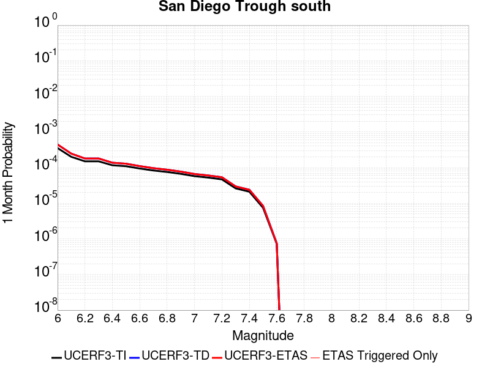 |  |  |

| Magnitude | 1 wk TI Prob | 1 wk TD Prob | 1 wk ETAS Prob | 1 wk ETAS/TD Gain | 1 wk ETAS Triggered Only | 1 mo TI Prob | 1 mo TD Prob | 1 mo ETAS Prob | 1 mo ETAS/TD Gain | 1 mo ETAS Triggered Only | 1 yr TI Prob | 1 yr TD Prob | 1 yr ETAS Prob | 1 yr ETAS/TD Gain | 1 yr ETAS Triggered Only | 10 yr TI Prob | 10 yr TD Prob | 10 yr ETAS Prob | 10 yr ETAS/TD Gain | 10 yr ETAS Triggered Only |
|-----|-----|-----|-----|-----|-----|-----|-----|-----|-----|-----|-----|-----|-----|-----|-----|-----|-----|-----|-----|-----|
| 6.0 | 8.279495E-5 | 1.04267834E-4 | 1.04267834E-4 | 1.0 | 0.0 | 3.5478722E-4 | 4.467906E-4 | 4.467906E-4 | 1.0 | 0.0 | 0.004310982 | 0.005426947 | 0.0054368926 | 1.0018326 | 1.0E-5 | 0.042283054 | 0.053004168 | 0.053013638 | 1.0001787 | 1.0E-5 |
| 6.1 | 4.6961468E-5 | 5.774223E-5 | 5.774223E-5 | 1.0 | 0.0 | 2.0124791E-4 | 2.474442E-4 | 2.474442E-4 | 1.0 | 0.0 | 0.00244744 | 0.0030085936 | 0.0030185634 | 1.0033138 | 1.0E-5 | 0.024206603 | 0.029685596 | 0.029695299 | 1.0003269 | 1.0E-5 |
| 6.2 | 3.5079658E-5 | 4.214961E-5 | 4.214961E-5 | 1.0 | 0.0 | 1.5033272E-4 | 1.8062895E-4 | 1.8062895E-4 | 1.0 | 0.0 | 0.0018287642 | 0.002196982 | 0.0022069602 | 1.0045418 | 1.0E-5 | 0.018137876 | 0.02175515 | 0.021764932 | 1.0004497 | 1.0E-5 |
| 6.3 | 3.5079658E-5 | 4.214961E-5 | 4.214961E-5 | 1.0 | 0.0 | 1.5033272E-4 | 1.8062895E-4 | 1.8062895E-4 | 1.0 | 0.0 | 0.0018287642 | 0.002196982 | 0.0022069602 | 1.0045418 | 1.0E-5 | 0.018137876 | 0.02175515 | 0.021764932 | 1.0004497 | 1.0E-5 |
| 6.4 | 2.7196904E-5 | 3.209259E-5 | 3.209259E-5 | 1.0 | 0.0 | 1.16552954E-4 | 1.3753251E-4 | 1.3753251E-4 | 1.0 | 0.0 | 0.0014181085 | 0.0016731854 | 0.0016831687 | 1.0059667 | 1.0E-5 | 0.014090929 | 0.016607407 | 0.016617242 | 1.0005921 | 1.0E-5 |
| 6.5 | 2.5584688E-5 | 3.010663E-5 | 3.010663E-5 | 1.0 | 0.0 | 1.0964406E-4 | 1.2902213E-4 | 1.2902213E-4 | 1.0 | 0.0 | 0.0013340989 | 0.0015697242 | 0.0015797084 | 1.0063605 | 1.0E-5 | 0.013261181 | 0.015587864 | 0.0155977085 | 1.0006316 | 1.0E-5 |
| 6.6 | 2.2034688E-5 | 2.5746795E-5 | 2.5746795E-5 | 1.0 | 0.0 | 9.443096E-5 | 1.1033879E-4 | 1.1033879E-4 | 1.0 | 0.0 | 0.0011490905 | 0.0013425526 | 0.0013525392 | 1.0074385 | 1.0E-5 | 0.011431668 | 0.013345402 | 0.013355268 | 1.0007393 | 1.0E-5 |
| 6.7 | 1.9394853E-5 | 2.2545179E-5 | 2.2545179E-5 | 1.0 | 0.0 | 8.311815E-5 | 9.661865E-5 | 9.661865E-5 | 1.0 | 0.0 | 0.0010114936 | 0.0011757024 | 0.0011856906 | 1.0084956 | 1.0E-5 | 0.01006902 | 0.011695528 | 0.011705412 | 1.0008451 | 1.0E-5 |
| 6.8 | 1.7615313E-5 | 2.0406198E-5 | 2.0406198E-5 | 1.0 | 0.0 | 7.549201E-5 | 8.745222E-5 | 8.745222E-5 | 1.0 | 0.0 | 9.1872766E-4 | 0.0010642151 | 0.0010742045 | 1.0093865 | 1.0E-5 | 0.009149387 | 0.010591755 | 0.010601649 | 1.0009341 | 1.0E-5 |
| 6.9 | 1.5621423E-5 | 1.8028702E-5 | 1.8028702E-5 | 1.0 | 0.0 | 6.6947236E-5 | 7.7263605E-5 | 7.7263605E-5 | 1.0 | 0.0 | 8.147778E-4 | 9.402819E-4 | 9.5027254E-4 | 1.0106251 | 1.0E-5 | 0.008117969 | 0.00936348 | 0.009373386 | 1.001058 | 1.0E-5 |
| 7.0 | 1.3444376E-5 | 1.5450234E-5 | 1.5450234E-5 | 1.0 | 0.0 | 5.7617483E-5 | 6.621363E-5 | 6.621363E-5 | 1.0 | 0.0 | 7.0126704E-4 | 8.058555E-4 | 8.158474E-4 | 1.0123992 | 1.0E-5 | 0.006990582 | 0.008029666 | 0.008039585 | 1.0012354 | 1.0E-5 |
| 7.1 | 1.2268361E-5 | 1.407496E-5 | 1.407496E-5 | 1.0 | 0.0 | 5.2577634E-5 | 6.0319875E-5 | 6.0319875E-5 | 1.0 | 0.0 | 6.399447E-4 | 7.3414965E-4 | 7.4414234E-4 | 1.0136112 | 1.0E-5 | 0.0063810493 | 0.0073175486 | 0.0073274756 | 1.0013566 | 1.0E-5 |
| 7.2 | 1.0922655E-5 | 1.2515262E-5 | 1.2515262E-5 | 1.0 | 0.0 | 4.681054E-5 | 5.363575E-5 | 5.363575E-5 | 1.0 | 0.0 | 5.697693E-4 | 6.5282214E-4 | 6.628156E-4 | 1.0153081 | 1.0E-5 | 0.0056831064 | 0.0065093245 | 0.0065192594 | 1.0015262 | 1.0E-5 |
| 7.3 | 6.1106753E-6 | 6.9297907E-6 | 6.9297907E-6 | 1.0 | 0.0 | 2.6188345E-5 | 2.9698767E-5 | 2.9698767E-5 | 1.0 | 0.0 | 3.1879646E-4 | 3.615229E-4 | 3.7151927E-4 | 1.0276507 | 1.0E-5 | 0.0031833951 | 0.003609393 | 0.003619357 | 1.0027605 | 1.0E-5 |
| 7.4 | 4.933187E-6 | 5.590247E-6 | 5.590247E-6 | 1.0 | 0.0 | 2.114206E-5 | 2.3957984E-5 | 2.3957984E-5 | 1.0 | 0.0 | 2.5737417E-4 | 2.916498E-4 | 3.0164688E-4 | 1.0342777 | 1.0E-5 | 0.002570763 | 0.0029127118 | 0.0029226826 | 1.0034232 | 1.0E-5 |
| 7.5 | 1.7489613E-6 | 1.9699116E-6 | 1.9699116E-6 | 1.0 | 0.0 | 7.495527E-6 | 8.442453E-6 | 8.442453E-6 | 1.0 | 0.0 | 9.125422E-5 | 1.02782236E-4 | 1.02782236E-4 | 1.0 | 0.0 | 9.1216754E-4 | 0.001027369 | 0.001027369 | 1.0 | 0.0 |
| 7.6 | 1.6988751E-7 | 1.7534346E-7 | 1.7534346E-7 | 1.0 | 0.0 | 7.2808916E-7 | 7.5147176E-7 | 7.5147176E-7 | 1.0 | 0.0 | 8.864449E-6 | 9.149132E-6 | 9.149132E-6 | 1.0 | 0.0 | 8.8640954E-5 | 9.148775E-5 | 9.148775E-5 | 1.0 | 0.0 |

## Hosgri (Extension)
*[(top)](#table-of-contents)*

| 1 Week | 1 Month | 1 Year | 10 Year |
|-----|-----|-----|-----|
|  | 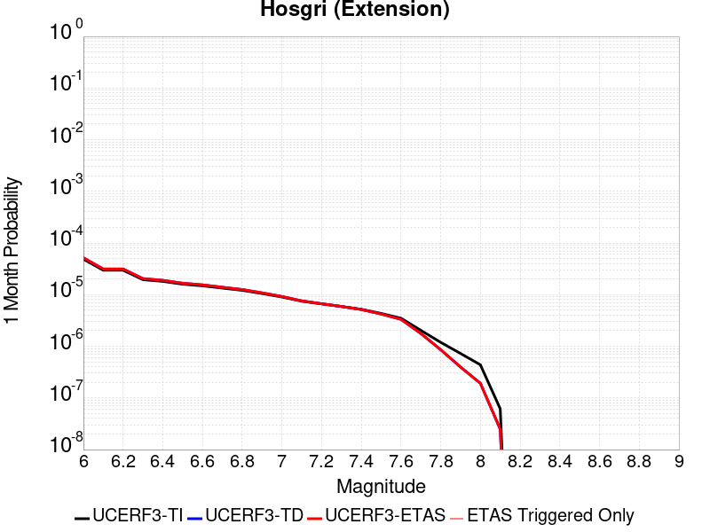 |  |  |

| Magnitude | 1 wk TI Prob | 1 wk TD Prob | 1 wk ETAS Prob | 1 wk ETAS/TD Gain | 1 wk ETAS Triggered Only | 1 mo TI Prob | 1 mo TD Prob | 1 mo ETAS Prob | 1 mo ETAS/TD Gain | 1 mo ETAS Triggered Only | 1 yr TI Prob | 1 yr TD Prob | 1 yr ETAS Prob | 1 yr ETAS/TD Gain | 1 yr ETAS Triggered Only | 10 yr TI Prob | 10 yr TD Prob | 10 yr ETAS Prob | 10 yr ETAS/TD Gain | 10 yr ETAS Triggered Only |
|-----|-----|-----|-----|-----|-----|-----|-----|-----|-----|-----|-----|-----|-----|-----|-----|-----|-----|-----|-----|-----|
| 6.0 | 1.1369135E-5 | 1.2083963E-5 | 1.2083963E-5 | 1.0 | 0.0 | 4.8723956E-5 | 5.1787516E-5 | 5.1787516E-5 | 1.0 | 0.0 | 5.9305265E-4 | 6.3035334E-4 | 6.40347E-4 | 1.0158541 | 1.0E-5 | 0.005914725 | 0.0062879026 | 0.0062978393 | 1.0015804 | 1.0E-5 |
| 6.1 | 6.934979E-6 | 7.325123E-6 | 7.325123E-6 | 1.0 | 0.0 | 2.9721E-5 | 3.139303E-5 | 3.139303E-5 | 1.0 | 0.0 | 3.617931E-4 | 3.8214726E-4 | 3.8214726E-4 | 1.0 | 0.0 | 0.0036120464 | 0.003815314 | 0.003815314 | 1.0 | 0.0 |
| 6.2 | 6.934979E-6 | 7.325123E-6 | 7.325123E-6 | 1.0 | 0.0 | 2.9721E-5 | 3.139303E-5 | 3.139303E-5 | 1.0 | 0.0 | 3.617931E-4 | 3.8214726E-4 | 3.8214726E-4 | 1.0 | 0.0 | 0.0036120464 | 0.003815314 | 0.003815314 | 1.0 | 0.0 |
| 6.3 | 4.5484676E-6 | 4.769731E-6 | 4.769731E-6 | 1.0 | 0.0 | 1.9493287E-5 | 2.0441545E-5 | 2.0441545E-5 | 1.0 | 0.0 | 2.3730492E-4 | 2.488478E-4 | 2.488478E-4 | 1.0 | 0.0 | 0.0023705168 | 0.0024857342 | 0.0024857342 | 1.0 | 0.0 |
| 6.4 | 4.218095E-6 | 4.4172402E-6 | 4.4172402E-6 | 1.0 | 0.0 | 1.8077424E-5 | 1.8930894E-5 | 1.8930894E-5 | 1.0 | 0.0 | 2.2007042E-4 | 2.3045958E-4 | 2.3045958E-4 | 1.0 | 0.0 | 0.002198526 | 0.0023022394 | 0.0023022394 | 1.0 | 0.0 |
| 6.5 | 3.717374E-6 | 3.8842245E-6 | 3.8842245E-6 | 1.0 | 0.0 | 1.5931506E-5 | 1.664657E-5 | 1.664657E-5 | 1.0 | 0.0 | 1.9394881E-4 | 2.0265333E-4 | 2.0265333E-4 | 1.0 | 0.0 | 0.0019377962 | 0.0020247041 | 0.0020247041 | 1.0 | 0.0 |
| 6.6 | 3.4605036E-6 | 3.6086342E-6 | 3.6086342E-6 | 1.0 | 0.0 | 1.4830645E-5 | 1.5465484E-5 | 1.5465484E-5 | 1.0 | 0.0 | 1.8054814E-4 | 1.8827614E-4 | 1.8827614E-4 | 1.0 | 0.0 | 0.0018040152 | 0.001881181 | 0.001881181 | 1.0 | 0.0 |
| 6.7 | 3.123439E-6 | 3.2468722E-6 | 3.2468722E-6 | 1.0 | 0.0 | 1.33860985E-5 | 1.39150925E-5 | 1.39150925E-5 | 1.0 | 0.0 | 1.6296357E-4 | 1.6940318E-4 | 1.6940318E-4 | 1.0 | 0.0 | 0.001628441 | 0.0016927515 | 0.0016927515 | 1.0 | 0.0 |
| 6.8 | 2.8290783E-6 | 2.9308221E-6 | 2.9308221E-6 | 1.0 | 0.0 | 1.2124565E-5 | 1.2560607E-5 | 1.2560607E-5 | 1.0 | 0.0 | 1.4760658E-4 | 1.5291474E-4 | 1.5291474E-4 | 1.0 | 0.0 | 0.0014750857 | 0.0015281038 | 0.0015281038 | 1.0 | 0.0 |
| 6.9 | 2.454112E-6 | 2.5285742E-6 | 2.5285742E-6 | 1.0 | 0.0 | 1.0517581E-5 | 1.0836702E-5 | 1.0836702E-5 | 1.0 | 0.0 | 1.2804402E-4 | 1.3192891E-4 | 1.3192891E-4 | 1.0 | 0.0 | 0.0012797028 | 0.0013185121 | 0.0013185121 | 1.0 | 0.0 |
| 7.0 | 2.1008145E-6 | 2.1501E-6 | 2.1501E-6 | 1.0 | 0.0 | 9.003459E-6 | 9.214682E-6 | 9.214682E-6 | 1.0 | 0.0 | 1.096116E-4 | 1.12183014E-4 | 1.12183014E-4 | 1.0 | 0.0 | 0.0010955755 | 0.0011212676 | 0.0011212676 | 1.0 | 0.0 |
| 7.1 | 1.744384E-6 | 1.7688403E-6 | 1.7688403E-6 | 1.0 | 0.0 | 7.47591E-6 | 7.580722E-6 | 7.580722E-6 | 1.0 | 0.0 | 9.1015405E-5 | 9.2291404E-5 | 9.2291404E-5 | 1.0 | 0.0 | 9.097813E-4 | 9.2253246E-4 | 9.2253246E-4 | 1.0 | 0.0 |
| 7.2 | 1.5456587E-6 | 1.5564798E-6 | 1.5564798E-6 | 1.0 | 0.0 | 6.6242346E-6 | 6.6706107E-6 | 6.6706107E-6 | 1.0 | 0.0 | 8.064707E-5 | 8.121167E-5 | 8.121167E-5 | 1.0 | 0.0 | 8.0617814E-4 | 8.118212E-4 | 8.118212E-4 | 1.0 | 0.0 |
| 7.3 | 1.3775123E-6 | 1.3767883E-6 | 1.3767883E-6 | 1.0 | 0.0 | 5.9036106E-6 | 5.900508E-6 | 5.900508E-6 | 1.0 | 0.0 | 7.187409E-5 | 7.183633E-5 | 7.183633E-5 | 1.0 | 0.0 | 7.185085E-4 | 7.1813207E-4 | 7.1813207E-4 | 1.0 | 0.0 |
| 7.4 | 1.214491E-6 | 1.202515E-6 | 1.202515E-6 | 1.0 | 0.0 | 5.2049513E-6 | 5.153626E-6 | 5.153626E-6 | 1.0 | 0.0 | 6.336844E-5 | 6.2743595E-5 | 6.2743595E-5 | 1.0 | 0.0 | 6.335037E-4 | 6.272596E-4 | 6.272596E-4 | 1.0 | 0.0 |
| 7.5 | 1.0101123E-6 | 9.843799E-7 | 9.843799E-7 | 1.0 | 0.0 | 4.3290456E-6 | 4.2187644E-6 | 4.2187644E-6 | 1.0 | 0.0 | 5.2704854E-5 | 5.136225E-5 | 5.136225E-5 | 1.0 | 0.0 | 5.2692357E-4 | 5.135044E-4 | 5.135044E-4 | 1.0 | 0.0 |
| 7.6 | 8.1558215E-7 | 7.76739E-7 | 7.76739E-7 | 1.0 | 0.0 | 3.4953473E-6 | 3.328877E-6 | 3.328877E-6 | 1.0 | 0.0 | 4.255502E-5 | 4.0528328E-5 | 4.0528328E-5 | 1.0 | 0.0 | 4.2546875E-4 | 4.0520984E-4 | 4.0520984E-4 | 1.0 | 0.0 |
| 7.7 | 4.757816E-7 | 4.132077E-7 | 4.132077E-7 | 1.0 | 0.0 | 2.0390623E-6 | 1.770889E-6 | 1.770889E-6 | 1.0 | 0.0 | 2.4825302E-5 | 2.156036E-5 | 2.156036E-5 | 1.0 | 0.0 | 2.482253E-4 | 2.1558281E-4 | 2.1558281E-4 | 1.0 | 0.0 |
| 7.8 | 2.782787E-7 | 2.0058093E-7 | 2.0058093E-7 | 1.0 | 0.0 | 1.1926223E-6 | 8.596322E-7 | 8.596322E-7 | 1.0 | 0.0 | 1.452008E-5 | 1.0465972E-5 | 1.0465972E-5 | 1.0 | 0.0 | 1.4519131E-4 | 1.0465483E-4 | 1.0465483E-4 | 1.0 | 0.0 |
| 7.9 | 1.6948086E-7 | 9.253606E-8 | 9.253606E-8 | 1.0 | 0.0 | 7.2634634E-7 | 3.9658303E-7 | 3.9658303E-7 | 1.0 | 0.0 | 8.843231E-6 | 4.828388E-6 | 4.828388E-6 | 1.0 | 0.0 | 8.842879E-5 | 4.8282836E-5 | 4.8282836E-5 | 1.0 | 0.0 |
| 8.0 | 1.0225492E-7 | 4.480677E-8 | 4.480677E-8 | 1.0 | 0.0 | 4.382353E-7 | 1.92029E-7 | 1.92029E-7 | 1.0 | 0.0 | 5.335502E-6 | 2.3379505E-6 | 2.3379505E-6 | 1.0 | 0.0 | 5.335374E-5 | 2.3379263E-5 | 2.3379263E-5 | 1.0 | 0.0 |
| 8.1 | 1.43711345E-8 | 5.7982437E-9 | 5.7982437E-9 | 1.0 | 0.0 | 6.1590576E-8 | 2.4849617E-8 | 2.4849617E-8 | 1.0 | 0.0 | 7.4986497E-7 | 3.0254404E-7 | 3.0254404E-7 | 1.0 | 0.0 | 7.4986247E-6 | 3.0254369E-6 | 3.0254369E-6 | 1.0 | 0.0 |

## Hector Mine
*[(top)](#table-of-contents)*

| 1 Week | 1 Month | 1 Year | 10 Year |
|-----|-----|-----|-----|
|  |  |  |  |

| Magnitude | 1 wk TI Prob | 1 wk TD Prob | 1 wk ETAS Prob | 1 wk ETAS/TD Gain | 1 wk ETAS Triggered Only | 1 mo TI Prob | 1 mo TD Prob | 1 mo ETAS Prob | 1 mo ETAS/TD Gain | 1 mo ETAS Triggered Only | 1 yr TI Prob | 1 yr TD Prob | 1 yr ETAS Prob | 1 yr ETAS/TD Gain | 1 yr ETAS Triggered Only | 10 yr TI Prob | 10 yr TD Prob | 10 yr ETAS Prob | 10 yr ETAS/TD Gain | 10 yr ETAS Triggered Only |
|-----|-----|-----|-----|-----|-----|-----|-----|-----|-----|-----|-----|-----|-----|-----|-----|-----|-----|-----|-----|-----|
| 6.0 | 1.8760093E-5 | 2.796824E-6 | 2.796824E-6 | 1.0 | 0.0 | 8.039792E-5 | 1.1986356E-5 | 1.1986356E-5 | 1.0 | 0.0 | 9.78405E-4 | 1.4592812E-4 | 1.4592812E-4 | 1.0 | 0.0 | 0.009741086 | 0.0014587152 | 0.0014687007 | 1.0068454 | 1.0E-5 |
| 6.1 | 1.8760093E-5 | 2.796824E-6 | 2.796824E-6 | 1.0 | 0.0 | 8.039792E-5 | 1.1986356E-5 | 1.1986356E-5 | 1.0 | 0.0 | 9.78405E-4 | 1.4592812E-4 | 1.4592812E-4 | 1.0 | 0.0 | 0.009741086 | 0.0014587152 | 0.0014687007 | 1.0068454 | 1.0E-5 |
| 6.2 | 1.8760093E-5 | 2.796824E-6 | 2.796824E-6 | 1.0 | 0.0 | 8.039792E-5 | 1.1986356E-5 | 1.1986356E-5 | 1.0 | 0.0 | 9.78405E-4 | 1.4592812E-4 | 1.4592812E-4 | 1.0 | 0.0 | 0.009741086 | 0.0014587152 | 0.0014687007 | 1.0068454 | 1.0E-5 |
| 6.3 | 1.8760093E-5 | 2.796824E-6 | 2.796824E-6 | 1.0 | 0.0 | 8.039792E-5 | 1.1986356E-5 | 1.1986356E-5 | 1.0 | 0.0 | 9.78405E-4 | 1.4592812E-4 | 1.4592812E-4 | 1.0 | 0.0 | 0.009741086 | 0.0014587152 | 0.0014687007 | 1.0068454 | 1.0E-5 |
| 6.4 | 1.0888055E-5 | 2.796824E-6 | 2.796824E-6 | 1.0 | 0.0 | 4.666226E-5 | 1.1986356E-5 | 1.1986356E-5 | 1.0 | 0.0 | 5.679649E-4 | 1.4592812E-4 | 1.4592812E-4 | 1.0 | 0.0 | 0.0056651547 | 0.0014587152 | 0.0014687007 | 1.0068454 | 1.0E-5 |
| 6.5 | 1.0888055E-5 | 2.796824E-6 | 2.796824E-6 | 1.0 | 0.0 | 4.666226E-5 | 1.1986356E-5 | 1.1986356E-5 | 1.0 | 0.0 | 5.679649E-4 | 1.4592812E-4 | 1.4592812E-4 | 1.0 | 0.0 | 0.0056651547 | 0.0014587152 | 0.0014687007 | 1.0068454 | 1.0E-5 |
| 6.6 | 1.0730738E-5 | 2.796824E-6 | 2.796824E-6 | 1.0 | 0.0 | 4.5988065E-5 | 1.1986356E-5 | 1.1986356E-5 | 1.0 | 0.0 | 5.5976084E-4 | 1.4592812E-4 | 1.4592812E-4 | 1.0 | 0.0 | 0.0055835294 | 0.0014587152 | 0.0014687007 | 1.0068454 | 1.0E-5 |
| 6.7 | 7.881326E-6 | 2.7714984E-6 | 2.7714984E-6 | 1.0 | 0.0 | 3.3776672E-5 | 1.1877819E-5 | 1.1877819E-5 | 1.0 | 0.0 | 4.111534E-4 | 1.4460685E-4 | 1.4460685E-4 | 1.0 | 0.0 | 0.0041039353 | 0.0014455197 | 0.0014555053 | 1.0069079 | 1.0E-5 |
| 6.8 | 7.5683483E-6 | 2.733237E-6 | 2.733237E-6 | 1.0 | 0.0 | 3.2435375E-5 | 1.17138425E-5 | 1.17138425E-5 | 1.0 | 0.0 | 3.9482914E-4 | 1.426107E-4 | 1.426107E-4 | 1.0 | 0.0 | 0.0039412836 | 0.001425584 | 0.0014355697 | 1.0070046 | 1.0E-5 |
| 6.9 | 6.473048E-6 | 2.514268E-6 | 2.514268E-6 | 1.0 | 0.0 | 2.7741338E-5 | 1.0775412E-5 | 1.0775412E-5 | 1.0 | 0.0 | 3.3769844E-4 | 1.3118672E-4 | 1.3118672E-4 | 1.0 | 0.0 | 0.0033718573 | 0.0013114824 | 0.0013214693 | 1.007615 | 1.0E-5 |
| 7.0 | 4.9959954E-6 | 1.8568135E-6 | 1.8568135E-6 | 1.0 | 0.0 | 2.1411232E-5 | 7.957768E-6 | 7.957768E-6 | 1.0 | 0.0 | 2.6065056E-4 | 9.688508E-5 | 9.688508E-5 | 1.0 | 0.0 | 0.0026034506 | 9.687781E-4 | 9.787685E-4 | 1.0103123 | 1.0E-5 |
| 7.1 | 1.2997541E-6 | 1.5606962E-7 | 1.5606962E-7 | 1.0 | 0.0 | 5.5703626E-6 | 6.6886963E-7 | 6.6886963E-7 | 1.0 | 0.0 | 6.7817055E-5 | 8.143461E-6 | 8.143461E-6 | 1.0 | 0.0 | 6.779636E-4 | 8.143202E-5 | 9.143121E-5 | 1.1227918 | 1.0E-5 |
| 7.2 | 8.392699E-7 | 9.730641E-8 | 9.730641E-8 | 1.0 | 0.0 | 3.596866E-6 | 4.1702742E-7 | 4.1702742E-7 | 1.0 | 0.0 | 4.3790962E-5 | 5.077299E-6 | 5.077299E-6 | 1.0 | 0.0 | 4.3782333E-4 | 5.077202E-5 | 6.0771516E-5 | 1.1969489 | 1.0E-5 |
| 7.3 | 3.13015E-7 | 4.8305793E-8 | 4.8305793E-8 | 1.0 | 0.0 | 1.3414921E-6 | 2.0702481E-7 | 2.0702481E-7 | 1.0 | 0.0 | 1.6332544E-5 | 2.520525E-6 | 2.520525E-6 | 1.0 | 0.0 | 1.6331344E-4 | 2.5205049E-5 | 2.5205049E-5 | 1.0 | 0.0 |

## Los Alamos 2011 CFM
*[(top)](#table-of-contents)*

| 1 Week | 1 Month | 1 Year | 10 Year |
|-----|-----|-----|-----|
|  |  | 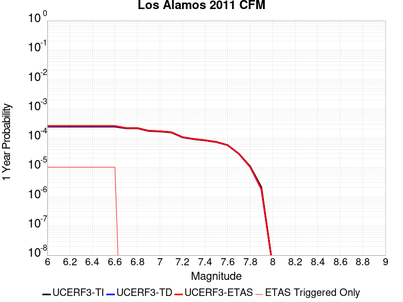 |  |

| Magnitude | 1 wk TI Prob | 1 wk TD Prob | 1 wk ETAS Prob | 1 wk ETAS/TD Gain | 1 wk ETAS Triggered Only | 1 mo TI Prob | 1 mo TD Prob | 1 mo ETAS Prob | 1 mo ETAS/TD Gain | 1 mo ETAS Triggered Only | 1 yr TI Prob | 1 yr TD Prob | 1 yr ETAS Prob | 1 yr ETAS/TD Gain | 1 yr ETAS Triggered Only | 10 yr TI Prob | 10 yr TD Prob | 10 yr ETAS Prob | 10 yr ETAS/TD Gain | 10 yr ETAS Triggered Only |
|-----|-----|-----|-----|-----|-----|-----|-----|-----|-----|-----|-----|-----|-----|-----|-----|-----|-----|-----|-----|-----|
| 6.0 | 4.6284417E-6 | 4.751884E-6 | 4.751884E-6 | 1.0 | 0.0 | 1.9836029E-5 | 2.0365067E-5 | 2.0365067E-5 | 1.0 | 0.0 | 2.4147688E-4 | 2.4791824E-4 | 2.5791576E-4 | 1.0403259 | 1.0E-5 | 0.0024121467 | 0.002476591 | 0.002486566 | 1.0040278 | 1.0E-5 |
| 6.1 | 4.6284417E-6 | 4.751884E-6 | 4.751884E-6 | 1.0 | 0.0 | 1.9836029E-5 | 2.0365067E-5 | 2.0365067E-5 | 1.0 | 0.0 | 2.4147688E-4 | 2.4791824E-4 | 2.5791576E-4 | 1.0403259 | 1.0E-5 | 0.0024121467 | 0.002476591 | 0.002486566 | 1.0040278 | 1.0E-5 |
| 6.2 | 4.6284417E-6 | 4.751884E-6 | 4.751884E-6 | 1.0 | 0.0 | 1.9836029E-5 | 2.0365067E-5 | 2.0365067E-5 | 1.0 | 0.0 | 2.4147688E-4 | 2.4791824E-4 | 2.5791576E-4 | 1.0403259 | 1.0E-5 | 0.0024121467 | 0.002476591 | 0.002486566 | 1.0040278 | 1.0E-5 |
| 6.3 | 4.6284417E-6 | 4.751884E-6 | 4.751884E-6 | 1.0 | 0.0 | 1.9836029E-5 | 2.0365067E-5 | 2.0365067E-5 | 1.0 | 0.0 | 2.4147688E-4 | 2.4791824E-4 | 2.5791576E-4 | 1.0403259 | 1.0E-5 | 0.0024121467 | 0.002476591 | 0.002486566 | 1.0040278 | 1.0E-5 |
| 6.4 | 4.6284417E-6 | 4.751884E-6 | 4.751884E-6 | 1.0 | 0.0 | 1.9836029E-5 | 2.0365067E-5 | 2.0365067E-5 | 1.0 | 0.0 | 2.4147688E-4 | 2.4791824E-4 | 2.5791576E-4 | 1.0403259 | 1.0E-5 | 0.0024121467 | 0.002476591 | 0.002486566 | 1.0040278 | 1.0E-5 |
| 6.5 | 4.6284417E-6 | 4.751884E-6 | 4.751884E-6 | 1.0 | 0.0 | 1.9836029E-5 | 2.0365067E-5 | 2.0365067E-5 | 1.0 | 0.0 | 2.4147688E-4 | 2.4791824E-4 | 2.5791576E-4 | 1.0403259 | 1.0E-5 | 0.0024121467 | 0.002476591 | 0.002486566 | 1.0040278 | 1.0E-5 |
| 6.6 | 4.6284417E-6 | 4.751884E-6 | 4.751884E-6 | 1.0 | 0.0 | 1.9836029E-5 | 2.0365067E-5 | 2.0365067E-5 | 1.0 | 0.0 | 2.4147688E-4 | 2.4791824E-4 | 2.5791576E-4 | 1.0403259 | 1.0E-5 | 0.0024121467 | 0.002476591 | 0.002486566 | 1.0040278 | 1.0E-5 |
| 6.7 | 4.062321E-6 | 4.166483E-6 | 4.166483E-6 | 1.0 | 0.0 | 1.7409831E-5 | 1.7856242E-5 | 1.7856242E-5 | 1.0 | 0.0 | 2.1194408E-4 | 2.1737958E-4 | 2.1737958E-4 | 1.0 | 0.0 | 0.0021174205 | 0.002171819 | 0.002171819 | 1.0 | 0.0 |
| 6.8 | 4.062321E-6 | 4.166483E-6 | 4.166483E-6 | 1.0 | 0.0 | 1.7409831E-5 | 1.7856242E-5 | 1.7856242E-5 | 1.0 | 0.0 | 2.1194408E-4 | 2.1737958E-4 | 2.1737958E-4 | 1.0 | 0.0 | 0.0021174205 | 0.002171819 | 0.002171819 | 1.0 | 0.0 |
| 6.9 | 3.2936077E-6 | 3.3730685E-6 | 3.3730685E-6 | 1.0 | 0.0 | 1.4115385E-5 | 1.4455933E-5 | 1.4455933E-5 | 1.0 | 0.0 | 1.7184127E-4 | 1.759877E-4 | 1.759877E-4 | 1.0 | 0.0 | 0.0017170844 | 0.001758576 | 0.001758576 | 1.0 | 0.0 |
| 7.0 | 3.1687898E-6 | 3.244923E-6 | 3.244923E-6 | 1.0 | 0.0 | 1.3580457E-5 | 1.3906744E-5 | 1.3906744E-5 | 1.0 | 0.0 | 1.6532952E-4 | 1.6930238E-4 | 1.6930238E-4 | 1.0 | 0.0 | 0.0016520657 | 0.0016918256 | 0.0016918256 | 1.0 | 0.0 |
| 7.1 | 2.9379228E-6 | 3.007427E-6 | 3.007427E-6 | 1.0 | 0.0 | 1.25910365E-5 | 1.2888914E-5 | 1.2888914E-5 | 1.0 | 0.0 | 1.5328509E-4 | 1.5691214E-4 | 1.5691214E-4 | 1.0 | 0.0 | 0.001531794 | 0.0015681025 | 0.0015681025 | 1.0 | 0.0 |
| 7.2 | 2.0020686E-6 | 2.0417024E-6 | 2.0417024E-6 | 1.0 | 0.0 | 8.580266E-6 | 8.750124E-6 | 8.750124E-6 | 1.0 | 0.0 | 1.0445973E-4 | 1.06527594E-4 | 1.06527594E-4 | 1.0 | 0.0 | 0.0010441064 | 0.0010647697 | 0.0010647697 | 1.0 | 0.0 |
| 7.3 | 1.7364243E-6 | 1.767945E-6 | 1.767945E-6 | 1.0 | 0.0 | 7.441797E-6 | 7.5768853E-6 | 7.5768853E-6 | 1.0 | 0.0 | 9.0600115E-5 | 9.224471E-5 | 9.224471E-5 | 1.0 | 0.0 | 9.0563187E-4 | 9.220673E-4 | 9.220673E-4 | 1.0 | 0.0 |
| 7.4 | 1.5718434E-6 | 1.5983776E-6 | 1.5983776E-6 | 1.0 | 0.0 | 6.7364545E-6 | 6.850172E-6 | 6.850172E-6 | 1.0 | 0.0 | 8.201325E-5 | 8.339768E-5 | 8.339768E-5 | 1.0 | 0.0 | 8.198299E-4 | 8.336669E-4 | 8.336669E-4 | 1.0 | 0.0 |
| 7.5 | 1.3841119E-6 | 1.4043331E-6 | 1.4043331E-6 | 1.0 | 0.0 | 5.9318945E-6 | 6.018557E-6 | 6.018557E-6 | 1.0 | 0.0 | 7.221842E-5 | 7.32735E-5 | 7.32735E-5 | 1.0 | 0.0 | 7.2194956E-4 | 7.3249626E-4 | 7.3249626E-4 | 1.0 | 0.0 |
| 7.6 | 1.0843726E-6 | 1.0934854E-6 | 1.0934854E-6 | 1.0 | 0.0 | 4.647303E-6 | 4.6863574E-6 | 4.6863574E-6 | 1.0 | 0.0 | 5.6579443E-5 | 5.7054935E-5 | 5.7054935E-5 | 1.0 | 0.0 | 5.656504E-4 | 5.7040545E-4 | 5.7040545E-4 | 1.0 | 0.0 |
| 7.7 | 5.544814E-7 | 5.5020973E-7 | 5.5020973E-7 | 1.0 | 0.0 | 2.3763469E-6 | 2.3580394E-6 | 2.3580394E-6 | 1.0 | 0.0 | 2.8931638E-5 | 2.8708753E-5 | 2.8708753E-5 | 1.0 | 0.0 | 2.8927872E-4 | 2.870506E-4 | 2.870506E-4 | 1.0 | 0.0 |
| 7.8 | 2.0707465E-7 | 1.9779345E-7 | 1.9779345E-7 | 1.0 | 0.0 | 8.874625E-7 | 8.4768595E-7 | 8.4768595E-7 | 1.0 | 0.0 | 1.08048025E-5 | 1.0320528E-5 | 1.0320528E-5 | 1.0 | 0.0 | 1.0804277E-4 | 1.0320053E-4 | 1.0320053E-4 | 1.0 | 0.0 |
| 7.9 | 3.9821284E-8 | 3.4332725E-8 | 3.4332725E-8 | 1.0 | 0.0 | 1.7066264E-7 | 1.4714024E-7 | 1.4714024E-7 | 1.0 | 0.0 | 2.0778157E-6 | 1.791431E-6 | 1.791431E-6 | 1.0 | 0.0 | 2.0777963E-5 | 1.7914172E-5 | 1.7914172E-5 | 1.0 | 0.0 |
| 8.0 | 7.880441E-11 | 8.2356566E-11 | 8.2356566E-11 | 1.0 | 0.0 | 3.3773329E-10 | 3.5295677E-10 | 3.5295677E-10 | 1.0 | 0.0 | 4.1119033E-9 | 4.2972492E-9 | 4.2972492E-9 | 1.0 | 0.0 | 4.1119034E-8 | 4.297249E-8 | 4.297249E-8 | 1.0 | 0.0 |

## Calaveras (So) 2011 CFM
*[(top)](#table-of-contents)*

| 1 Week | 1 Month | 1 Year | 10 Year |
|-----|-----|-----|-----|
| 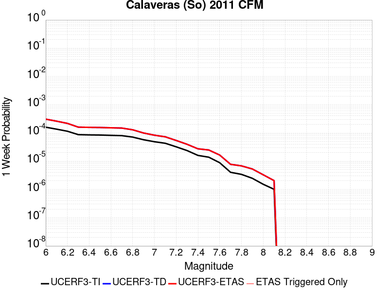 |  |  |  |

| Magnitude | 1 wk TI Prob | 1 wk TD Prob | 1 wk ETAS Prob | 1 wk ETAS/TD Gain | 1 wk ETAS Triggered Only | 1 mo TI Prob | 1 mo TD Prob | 1 mo ETAS Prob | 1 mo ETAS/TD Gain | 1 mo ETAS Triggered Only | 1 yr TI Prob | 1 yr TD Prob | 1 yr ETAS Prob | 1 yr ETAS/TD Gain | 1 yr ETAS Triggered Only | 10 yr TI Prob | 10 yr TD Prob | 10 yr ETAS Prob | 10 yr ETAS/TD Gain | 10 yr ETAS Triggered Only |
|-----|-----|-----|-----|-----|-----|-----|-----|-----|-----|-----|-----|-----|-----|-----|-----|-----|-----|-----|-----|-----|
| 6.0 | 1.5950744E-4 | 3.0759771E-4 | 3.0759771E-4 | 1.0 | 0.0 | 6.834242E-4 | 0.0013173335 | 0.0013173335 | 1.0 | 0.0 | 0.00828899 | 0.015869651 | 0.015879491 | 1.0006201 | 1.0E-5 | 0.079865426 | 0.1445 | 0.14450856 | 1.0000592 | 1.0E-5 |
| 6.1 | 1.3584697E-4 | 2.6078656E-4 | 2.6078656E-4 | 1.0 | 0.0 | 5.8207137E-4 | 0.0011168945 | 0.0011168945 | 1.0 | 0.0 | 0.007063716 | 0.013471939 | 0.013481804 | 1.0007323 | 1.0E-5 | 0.06843361 | 0.12412454 | 0.124133304 | 1.0000706 | 1.0E-5 |
| 6.2 | 1.14676266E-4 | 2.1760866E-4 | 2.1760866E-4 | 1.0 | 0.0 | 4.9137714E-4 | 9.3198824E-4 | 9.3198824E-4 | 1.0 | 0.0 | 0.0059661185 | 0.011254718 | 0.011254718 | 1.0 | 0.0 | 0.058084648 | 0.105112694 | 0.105112694 | 1.0 | 0.0 |
| 6.3 | 8.691518E-5 | 1.6010088E-4 | 1.6010088E-4 | 1.0 | 0.0 | 3.7244044E-4 | 6.8593153E-4 | 6.8593153E-4 | 1.0 | 0.0 | 0.004525038 | 0.008311441 | 0.008311441 | 1.0 | 0.0 | 0.044339992 | 0.07942766 | 0.07942766 | 1.0 | 0.0 |
| 6.4 | 8.50982E-5 | 1.5716399E-4 | 1.5716399E-4 | 1.0 | 0.0 | 3.646556E-4 | 6.7335134E-4 | 6.7335134E-4 | 1.0 | 0.0 | 0.0044306475 | 0.008159432 | 0.008159432 | 1.0 | 0.0 | 0.04343345 | 0.07803354 | 0.07803354 | 1.0 | 0.0 |
| 6.5 | 8.4062965E-5 | 1.5540862E-4 | 1.5540862E-4 | 1.0 | 0.0 | 3.602201E-4 | 6.6583225E-4 | 6.6583225E-4 | 1.0 | 0.0 | 0.004376863 | 0.008068612 | 0.008068612 | 1.0 | 0.0 | 0.042916555 | 0.077204674 | 0.077204674 | 1.0 | 0.0 |
| 6.6 | 8.194716E-5 | 1.5176483E-4 | 1.5176483E-4 | 1.0 | 0.0 | 3.5115483E-4 | 6.5022387E-4 | 6.5022387E-4 | 1.0 | 0.0 | 0.0042669317 | 0.007880396 | 0.007880396 | 1.0 | 0.0 | 0.04185927 | 0.07548959 | 0.07548959 | 1.0 | 0.0 |
| 6.7 | 8.012326E-5 | 1.4844135E-4 | 1.4844135E-4 | 1.0 | 0.0 | 3.433402E-4 | 6.359873E-4 | 6.359873E-4 | 1.0 | 0.0 | 0.004172157 | 0.007708843 | 0.007708843 | 1.0 | 0.0 | 0.040946912 | 0.07393147 | 0.07393147 | 1.0 | 0.0 |
| 6.8 | 7.119773E-5 | 1.290086E-4 | 1.290086E-4 | 1.0 | 0.0 | 3.0509746E-4 | 5.527477E-4 | 5.527477E-4 | 1.0 | 0.0 | 0.0037082357 | 0.0067056813 | 0.0067056813 | 1.0 | 0.0 | 0.036469642 | 0.06477169 | 0.06477169 | 1.0 | 0.0 |
| 6.9 | 5.7343088E-5 | 9.935836E-5 | 9.935836E-5 | 1.0 | 0.0 | 2.4573295E-4 | 4.2575249E-4 | 4.2575249E-4 | 1.0 | 0.0 | 0.0029876942 | 0.0051712976 | 0.0051712976 | 1.0 | 0.0 | 0.02947844 | 0.05058907 | 0.05058907 | 1.0 | 0.0 |
| 7.0 | 4.8746577E-5 | 8.3012914E-5 | 8.3012914E-5 | 1.0 | 0.0 | 2.0889717E-4 | 3.5572148E-4 | 3.5572148E-4 | 1.0 | 0.0 | 0.0025403565 | 0.004322375 | 0.004322375 | 1.0 | 0.0 | 0.025115121 | 0.0425639 | 0.0425639 | 1.0 | 0.0 |
| 7.1 | 4.2998014E-5 | 7.279013E-5 | 7.279013E-5 | 1.0 | 0.0 | 1.8426418E-4 | 3.1192074E-4 | 3.1192074E-4 | 1.0 | 0.0 | 0.002241108 | 0.0037910824 | 0.0037910824 | 1.0 | 0.0 | 0.022186412 | 0.037491307 | 0.037491307 | 1.0 | 0.0 |
| 7.2 | 3.221292E-5 | 5.404145E-5 | 5.404145E-5 | 1.0 | 0.0 | 1.3804805E-4 | 2.3158583E-4 | 2.3158583E-4 | 1.0 | 0.0 | 0.0016794393 | 0.00281594 | 0.00281594 | 1.0 | 0.0 | 0.016668037 | 0.028102254 | 0.028102254 | 1.0 | 0.0 |
| 7.3 | 2.3756531E-5 | 3.959248E-5 | 3.959248E-5 | 1.0 | 0.0 | 1.0180973E-4 | 1.6967113E-4 | 1.6967113E-4 | 1.0 | 0.0 | 0.0012388286 | 0.002063806 | 0.002063806 | 1.0 | 0.0 | 0.012319452 | 0.020703033 | 0.020703033 | 1.0 | 0.0 |
| 7.4 | 1.5997684E-5 | 2.7394086E-5 | 2.7394086E-5 | 1.0 | 0.0 | 6.8559704E-5 | 1.17397954E-4 | 1.17397954E-4 | 1.0 | 0.0 | 8.343947E-4 | 0.0014283855 | 0.0014283855 | 1.0 | 0.0 | 0.008312687 | 0.014402374 | 0.014402374 | 1.0 | 0.0 |
| 7.5 | 1.3814293E-5 | 2.48335E-5 | 2.48335E-5 | 1.0 | 0.0 | 5.9202768E-5 | 1.0642496E-4 | 1.0642496E-4 | 1.0 | 0.0 | 7.205553E-4 | 0.0012949561 | 0.0012949561 | 1.0 | 0.0 | 0.007182234 | 0.013080463 | 0.013080463 | 1.0 | 0.0 |
| 7.6 | 8.817309E-6 | 1.647263E-5 | 1.647263E-5 | 1.0 | 0.0 | 3.7787922E-5 | 7.059509E-5 | 7.059509E-5 | 1.0 | 0.0 | 4.5997082E-4 | 8.591576E-4 | 8.591576E-4 | 1.0 | 0.0 | 0.004590199 | 0.00874074 | 0.00874074 | 1.0 | 0.0 |
| 7.7 | 4.0352206E-6 | 7.736602E-6 | 7.736602E-6 | 1.0 | 0.0 | 1.7293689E-5 | 3.3156448E-5 | 3.3156448E-5 | 1.0 | 0.0 | 2.1053031E-4 | 4.0360505E-4 | 4.0360505E-4 | 1.0 | 0.0 | 0.0021033096 | 0.004179541 | 0.004179541 | 1.0 | 0.0 |
| 7.8 | 3.413169E-6 | 6.812901E-6 | 6.812901E-6 | 1.0 | 0.0 | 1.4627784E-5 | 2.9197821E-5 | 2.9197821E-5 | 1.0 | 0.0 | 1.7807873E-4 | 3.5542555E-4 | 3.5542555E-4 | 1.0 | 0.0 | 0.0017793609 | 0.0036790124 | 0.0036790124 | 1.0 | 0.0 |
| 7.9 | 2.4740732E-6 | 5.2979517E-6 | 5.2979517E-6 | 1.0 | 0.0 | 1.06031275E-5 | 2.270531E-5 | 2.270531E-5 | 1.0 | 0.0 | 1.2908543E-4 | 2.7640213E-4 | 2.7640213E-4 | 1.0 | 0.0 | 0.0012901047 | 0.0028439197 | 0.0028439197 | 1.0 | 0.0 |
| 8.0 | 1.5231818E-6 | 3.2999055E-6 | 3.2999055E-6 | 1.0 | 0.0 | 6.527906E-6 | 1.4142375E-5 | 1.4142375E-5 | 1.0 | 0.0 | 7.9474354E-5 | 1.7216985E-4 | 1.7216985E-4 | 1.0 | 0.0 | 7.944594E-4 | 0.0017618457 | 0.0017618457 | 1.0 | 0.0 |
| 8.1 | 1.0104524E-6 | 2.0525972E-6 | 2.0525972E-6 | 1.0 | 0.0 | 4.330503E-6 | 8.796816E-6 | 8.796816E-6 | 1.0 | 0.0 | 5.2722597E-5 | 1.07096006E-4 | 1.07096006E-4 | 1.0 | 0.0 | 5.271009E-4 | 0.0010963572 | 0.0010963572 | 1.0 | 0.0 |

## Ortigalita (South)
*[(top)](#table-of-contents)*

| 1 Week | 1 Month | 1 Year | 10 Year |
|-----|-----|-----|-----|
|  |  | 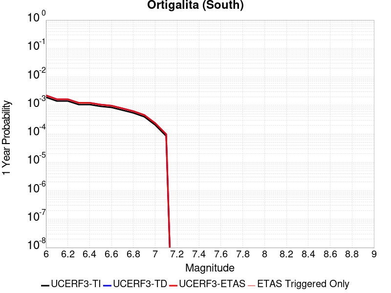 |  |

| Magnitude | 1 wk TI Prob | 1 wk TD Prob | 1 wk ETAS Prob | 1 wk ETAS/TD Gain | 1 wk ETAS Triggered Only | 1 mo TI Prob | 1 mo TD Prob | 1 mo ETAS Prob | 1 mo ETAS/TD Gain | 1 mo ETAS Triggered Only | 1 yr TI Prob | 1 yr TD Prob | 1 yr ETAS Prob | 1 yr ETAS/TD Gain | 1 yr ETAS Triggered Only | 10 yr TI Prob | 10 yr TD Prob | 10 yr ETAS Prob | 10 yr ETAS/TD Gain | 10 yr ETAS Triggered Only |
|-----|-----|-----|-----|-----|-----|-----|-----|-----|-----|-----|-----|-----|-----|-----|-----|-----|-----|-----|-----|-----|
| 6.0 | 3.72394E-5 | 4.326214E-5 | 4.326214E-5 | 1.0 | 0.0 | 1.5958765E-4 | 1.8539687E-4 | 1.8539687E-4 | 1.0 | 0.0 | 0.0019412481 | 0.0022550267 | 0.0022550267 | 1.0 | 0.0 | 0.019243775 | 0.022337826 | 0.022347601 | 1.0004376 | 1.0E-5 |
| 6.1 | 2.7299884E-5 | 3.1496547E-5 | 3.1496547E-5 | 1.0 | 0.0 | 1.16994255E-4 | 1.3497853E-4 | 1.3497853E-4 | 1.0 | 0.0 | 0.0014234743 | 0.0016421801 | 0.0016421801 | 1.0 | 0.0 | 0.014143906 | 0.016306384 | 0.01631622 | 1.0006032 | 1.0E-5 |
| 6.2 | 2.7299884E-5 | 3.1496547E-5 | 3.1496547E-5 | 1.0 | 0.0 | 1.16994255E-4 | 1.3497853E-4 | 1.3497853E-4 | 1.0 | 0.0 | 0.0014234743 | 0.0016421801 | 0.0016421801 | 1.0 | 0.0 | 0.014143906 | 0.016306384 | 0.01631622 | 1.0006032 | 1.0E-5 |
| 6.3 | 2.0546433E-5 | 2.3634755E-5 | 2.3634755E-5 | 1.0 | 0.0 | 8.805317E-5 | 1.0128798E-4 | 1.0128798E-4 | 1.0 | 0.0 | 0.00107152 | 0.0012325025 | 0.0012325025 | 1.0 | 0.0 | 0.010663681 | 0.012258735 | 0.012258735 | 1.0 | 0.0 |
| 6.4 | 2.0546433E-5 | 2.3634755E-5 | 2.3634755E-5 | 1.0 | 0.0 | 8.805317E-5 | 1.0128798E-4 | 1.0128798E-4 | 1.0 | 0.0 | 0.00107152 | 0.0012325025 | 0.0012325025 | 1.0 | 0.0 | 0.010663681 | 0.012258735 | 0.012258735 | 1.0 | 0.0 |
| 6.5 | 1.7779594E-5 | 2.0449832E-5 | 2.0449832E-5 | 1.0 | 0.0 | 7.619603E-5 | 8.7639266E-5 | 8.7639266E-5 | 1.0 | 0.0 | 9.272918E-4 | 0.0010664994 | 0.0010664994 | 1.0 | 0.0 | 0.009234319 | 0.010615279 | 0.010615279 | 1.0 | 0.0 |
| 6.6 | 1.6272212E-5 | 1.8717585E-5 | 1.8717585E-5 | 1.0 | 0.0 | 6.973618E-5 | 8.0215825E-5 | 8.0215825E-5 | 1.0 | 0.0 | 8.487073E-4 | 9.762023E-4 | 9.762023E-4 | 1.0 | 0.0 | 0.008454733 | 0.009720443 | 0.009720443 | 1.0 | 0.0 |
| 6.7 | 1.3051484E-5 | 1.5040892E-5 | 1.5040892E-5 | 1.0 | 0.0 | 5.593373E-5 | 6.4459426E-5 | 6.4459426E-5 | 1.0 | 0.0 | 6.807804E-4 | 7.8452047E-4 | 7.8452047E-4 | 1.0 | 0.0 | 0.006786986 | 0.007818493 | 0.007818493 | 1.0 | 0.0 |
| 6.8 | 1.04277415E-5 | 1.1988904E-5 | 1.1988904E-5 | 1.0 | 0.0 | 4.4689557E-5 | 5.1380044E-5 | 5.1380044E-5 | 1.0 | 0.0 | 5.439595E-4 | 6.253799E-4 | 6.253799E-4 | 1.0 | 0.0 | 0.0054262993 | 0.006236955 | 0.006236955 | 1.0 | 0.0 |
| 6.9 | 7.639968E-6 | 8.792736E-6 | 8.792736E-6 | 1.0 | 0.0 | 3.274231E-5 | 3.7682643E-5 | 3.7682643E-5 | 1.0 | 0.0 | 3.9856473E-4 | 4.5869546E-4 | 4.5869546E-4 | 1.0 | 0.0 | 0.003978506 | 0.0045780735 | 0.0045780735 | 1.0 | 0.0 |
| 7.0 | 3.919831E-6 | 4.534061E-6 | 4.534061E-6 | 1.0 | 0.0 | 1.679917E-5 | 1.9431558E-5 | 1.9431558E-5 | 1.0 | 0.0 | 2.045107E-4 | 2.3655564E-4 | 2.3655564E-4 | 1.0 | 0.0 | 0.0020432258 | 0.002363247 | 0.002363247 | 1.0 | 0.0 |
| 7.1 | 1.6017933E-6 | 1.8573169E-6 | 1.8573169E-6 | 1.0 | 0.0 | 6.8648105E-6 | 7.959911E-6 | 7.959911E-6 | 1.0 | 0.0 | 8.357586E-5 | 9.6908676E-5 | 9.6908676E-5 | 1.0 | 0.0 | 8.3544437E-4 | 9.687689E-4 | 9.687689E-4 | 1.0 | 0.0 |

## Hat Creek-McArthur-Mayfield
*[(top)](#table-of-contents)*

| 1 Week | 1 Month | 1 Year | 10 Year |
|-----|-----|-----|-----|
| 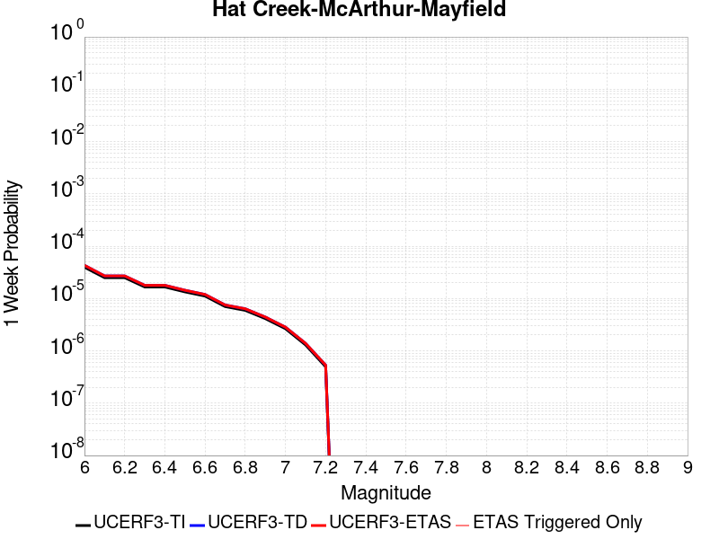 |  |  |  |

| Magnitude | 1 wk TI Prob | 1 wk TD Prob | 1 wk ETAS Prob | 1 wk ETAS/TD Gain | 1 wk ETAS Triggered Only | 1 mo TI Prob | 1 mo TD Prob | 1 mo ETAS Prob | 1 mo ETAS/TD Gain | 1 mo ETAS Triggered Only | 1 yr TI Prob | 1 yr TD Prob | 1 yr ETAS Prob | 1 yr ETAS/TD Gain | 1 yr ETAS Triggered Only | 10 yr TI Prob | 10 yr TD Prob | 10 yr ETAS Prob | 10 yr ETAS/TD Gain | 10 yr ETAS Triggered Only |
|-----|-----|-----|-----|-----|-----|-----|-----|-----|-----|-----|-----|-----|-----|-----|-----|-----|-----|-----|-----|-----|
| 6.0 | 3.967457E-5 | 4.3161846E-5 | 4.3161846E-5 | 1.0 | 0.0 | 1.7002279E-4 | 1.8496686E-4 | 1.8496686E-4 | 1.0 | 0.0 | 0.002068062 | 0.00224976 | 0.0022597376 | 1.004435 | 1.0E-5 | 0.02048922 | 0.022282204 | 0.02229198 | 1.0004388 | 1.0E-5 |
| 6.1 | 2.5044013E-5 | 2.7073205E-5 | 2.7073205E-5 | 1.0 | 0.0 | 1.0732707E-4 | 1.1602304E-4 | 1.1602304E-4 | 1.0 | 0.0 | 0.0013059238 | 0.001411697 | 0.0014216829 | 1.0070736 | 1.0E-5 | 0.01298276 | 0.014030711 | 0.014040571 | 1.0007027 | 1.0E-5 |
| 6.2 | 2.5044013E-5 | 2.7073205E-5 | 2.7073205E-5 | 1.0 | 0.0 | 1.0732707E-4 | 1.1602304E-4 | 1.1602304E-4 | 1.0 | 0.0 | 0.0013059238 | 0.001411697 | 0.0014216829 | 1.0070736 | 1.0E-5 | 0.01298276 | 0.014030711 | 0.014040571 | 1.0007027 | 1.0E-5 |
| 6.3 | 1.6624012E-5 | 1.789234E-5 | 1.789234E-5 | 1.0 | 0.0 | 7.124382E-5 | 7.667925E-5 | 7.667925E-5 | 1.0 | 0.0 | 8.670483E-4 | 9.3317864E-4 | 9.3317864E-4 | 1.0 | 0.0 | 0.008636732 | 0.009293535 | 0.009293535 | 1.0 | 0.0 |
| 6.4 | 1.6624012E-5 | 1.789234E-5 | 1.789234E-5 | 1.0 | 0.0 | 7.124382E-5 | 7.667925E-5 | 7.667925E-5 | 1.0 | 0.0 | 8.670483E-4 | 9.3317864E-4 | 9.3317864E-4 | 1.0 | 0.0 | 0.008636732 | 0.009293535 | 0.009293535 | 1.0 | 0.0 |
| 6.5 | 1.3394842E-5 | 1.4393133E-5 | 1.4393133E-5 | 1.0 | 0.0 | 5.7405203E-5 | 6.168343E-5 | 6.168343E-5 | 1.0 | 0.0 | 6.986842E-4 | 7.5074256E-4 | 7.5074256E-4 | 1.0 | 0.0 | 0.006964916 | 0.0074826567 | 0.0074826567 | 1.0 | 0.0 |
| 6.6 | 1.1137514E-5 | 1.1955361E-5 | 1.1955361E-5 | 1.0 | 0.0 | 4.7731326E-5 | 5.123628E-5 | 5.123628E-5 | 1.0 | 0.0 | 5.809739E-4 | 6.2362716E-4 | 6.2362716E-4 | 1.0 | 0.0 | 0.005794574 | 0.006219193 | 0.006219193 | 1.0 | 0.0 |
| 6.7 | 7.0200663E-6 | 7.5247917E-6 | 7.5247917E-6 | 1.0 | 0.0 | 3.008565E-5 | 3.2248718E-5 | 3.2248718E-5 | 1.0 | 0.0 | 3.6623122E-4 | 3.9255898E-4 | 3.9255898E-4 | 1.0 | 0.0 | 0.0036562826 | 0.003918818 | 0.003918818 | 1.0 | 0.0 |
| 6.8 | 5.940172E-6 | 6.3659E-6 | 6.3659E-6 | 1.0 | 0.0 | 2.545763E-5 | 2.728215E-5 | 2.728215E-5 | 1.0 | 0.0 | 3.0990256E-4 | 3.3211082E-4 | 3.3211082E-4 | 1.0 | 0.0 | 0.0030947074 | 0.0033162737 | 0.0033162737 | 1.0 | 0.0 |
| 6.9 | 4.129831E-6 | 4.4238395E-6 | 4.4238395E-6 | 1.0 | 0.0 | 1.7699154E-5 | 1.8959177E-5 | 1.8959177E-5 | 1.0 | 0.0 | 2.154659E-4 | 2.3080433E-4 | 2.3080433E-4 | 1.0 | 0.0 | 0.002152571 | 0.0023057247 | 0.0023057247 | 1.0 | 0.0 |
| 7.0 | 2.6512955E-6 | 2.837585E-6 | 2.837585E-6 | 1.0 | 0.0 | 1.1362646E-5 | 1.2161025E-5 | 1.2161025E-5 | 1.0 | 0.0 | 1.3833142E-4 | 1.4805085E-4 | 1.4805085E-4 | 1.0 | 0.0 | 0.0013824535 | 0.0014795647 | 0.0014795647 | 1.0 | 0.0 |
| 7.1 | 1.2992575E-6 | 1.3910229E-6 | 1.3910229E-6 | 1.0 | 0.0 | 5.568235E-6 | 5.9615145E-6 | 5.9615145E-6 | 1.0 | 0.0 | 6.779115E-5 | 7.257924E-5 | 7.257924E-5 | 1.0 | 0.0 | 6.7770475E-4 | 7.2557695E-4 | 7.2557695E-4 | 1.0 | 0.0 |
| 7.2 | 4.968191E-7 | 5.327505E-7 | 5.327505E-7 | 1.0 | 0.0 | 2.1292228E-6 | 2.2832153E-6 | 2.2832153E-6 | 1.0 | 0.0 | 2.592298E-5 | 2.7797916E-5 | 2.7797916E-5 | 1.0 | 0.0 | 2.5919956E-4 | 2.7795674E-4 | 2.7795674E-4 | 1.0 | 0.0 |

## San Pedro Basin
*[(top)](#table-of-contents)*

| 1 Week | 1 Month | 1 Year | 10 Year |
|-----|-----|-----|-----|
|  |  |  |  |

| Magnitude | 1 wk TI Prob | 1 wk TD Prob | 1 wk ETAS Prob | 1 wk ETAS/TD Gain | 1 wk ETAS Triggered Only | 1 mo TI Prob | 1 mo TD Prob | 1 mo ETAS Prob | 1 mo ETAS/TD Gain | 1 mo ETAS Triggered Only | 1 yr TI Prob | 1 yr TD Prob | 1 yr ETAS Prob | 1 yr ETAS/TD Gain | 1 yr ETAS Triggered Only | 10 yr TI Prob | 10 yr TD Prob | 10 yr ETAS Prob | 10 yr ETAS/TD Gain | 10 yr ETAS Triggered Only |
|-----|-----|-----|-----|-----|-----|-----|-----|-----|-----|-----|-----|-----|-----|-----|-----|-----|-----|-----|-----|-----|
| 6.0 | 5.3449043E-5 | 6.3380656E-5 | 6.3380656E-5 | 1.0 | 0.0 | 2.2904722E-4 | 2.7160617E-4 | 2.7160617E-4 | 1.0 | 0.0 | 0.0027850836 | 0.003302403 | 0.003302403 | 1.0 | 0.0 | 0.027504366 | 0.03259504 | 0.032604713 | 1.0002968 | 1.0E-5 |
| 6.1 | 5.3449043E-5 | 6.3380656E-5 | 6.3380656E-5 | 1.0 | 0.0 | 2.2904722E-4 | 2.7160617E-4 | 2.7160617E-4 | 1.0 | 0.0 | 0.0027850836 | 0.003302403 | 0.003302403 | 1.0 | 0.0 | 0.027504366 | 0.03259504 | 0.032604713 | 1.0002968 | 1.0E-5 |
| 6.2 | 2.3189454E-5 | 2.6646561E-5 | 2.6646561E-5 | 1.0 | 0.0 | 9.9379584E-5 | 1.14194816E-4 | 1.14194816E-4 | 1.0 | 0.0 | 0.0012092749 | 0.0013894826 | 0.0013894826 | 1.0 | 0.0 | 0.012027155 | 0.013812821 | 0.013822683 | 1.000714 | 1.0E-5 |
| 6.3 | 2.3189454E-5 | 2.6646561E-5 | 2.6646561E-5 | 1.0 | 0.0 | 9.9379584E-5 | 1.14194816E-4 | 1.14194816E-4 | 1.0 | 0.0 | 0.0012092749 | 0.0013894826 | 0.0013894826 | 1.0 | 0.0 | 0.012027155 | 0.013812821 | 0.013822683 | 1.000714 | 1.0E-5 |
| 6.4 | 1.966056E-5 | 2.246646E-5 | 2.246646E-5 | 1.0 | 0.0 | 8.425682E-5 | 9.62815E-5 | 9.62815E-5 | 1.0 | 0.0 | 0.001025344 | 0.0011716371 | 0.0011716371 | 1.0 | 0.0 | 0.010206259 | 0.011658688 | 0.011668572 | 1.0008477 | 1.0E-5 |
| 6.5 | 1.7342953E-5 | 1.9747758E-5 | 1.9747758E-5 | 1.0 | 0.0 | 7.4324824E-5 | 8.463071E-5 | 8.463071E-5 | 1.0 | 0.0 | 9.04529E-4 | 0.0010299288 | 0.0010299288 | 1.0 | 0.0 | 0.009008561 | 0.01025528 | 0.010265177 | 1.0009651 | 1.0E-5 |
| 6.6 | 1.439804E-5 | 1.632481E-5 | 1.632481E-5 | 1.0 | 0.0 | 6.170443E-5 | 6.9961774E-5 | 6.9961774E-5 | 1.0 | 0.0 | 7.509924E-4 | 8.5148384E-4 | 8.5148384E-4 | 1.0 | 0.0 | 0.0074845953 | 0.008485416 | 0.008495332 | 1.0011685 | 1.0E-5 |
| 6.7 | 1.2634884E-5 | 1.4287096E-5 | 1.4287096E-5 | 1.0 | 0.0 | 5.414838E-5 | 6.122915E-5 | 6.122915E-5 | 1.0 | 0.0 | 6.590571E-4 | 7.4524037E-4 | 7.4524037E-4 | 1.0 | 0.0 | 0.006571059 | 0.0074304338 | 0.0074403593 | 1.0013359 | 1.0E-5 |
| 6.8 | 1.146091E-5 | 1.29348E-5 | 1.29348E-5 | 1.0 | 0.0 | 4.911726E-5 | 5.5433848E-5 | 5.5433848E-5 | 1.0 | 0.0 | 5.9783855E-4 | 6.7472784E-4 | 6.7472784E-4 | 1.0 | 0.0 | 0.0059623276 | 0.0067297337 | 0.006739666 | 1.0014759 | 1.0E-5 |
| 6.9 | 9.109035E-6 | 1.023625E-5 | 1.023625E-5 | 1.0 | 0.0 | 3.9038136E-5 | 4.3869066E-5 | 4.3869066E-5 | 1.0 | 0.0 | 4.7518566E-4 | 5.3400296E-4 | 5.3400296E-4 | 1.0 | 0.0 | 0.0047417083 | 0.0053299526 | 0.0053398996 | 1.0018662 | 1.0E-5 |
| 7.0 | 5.9351028E-6 | 6.5846925E-6 | 6.5846925E-6 | 1.0 | 0.0 | 2.5435906E-5 | 2.821994E-5 | 2.821994E-5 | 1.0 | 0.0 | 3.0963816E-4 | 3.4354723E-4 | 3.4354723E-4 | 1.0 | 0.0 | 0.0030920706 | 0.0034324788 | 0.0034324788 | 1.0 | 0.0 |
| 7.1 | 2.1557585E-6 | 2.209737E-6 | 2.209737E-6 | 1.0 | 0.0 | 9.238933E-6 | 9.470267E-6 | 9.470267E-6 | 1.0 | 0.0 | 1.1247819E-4 | 1.1529456E-4 | 1.1529456E-4 | 1.0 | 0.0 | 0.0011242128 | 0.0011523628 | 0.0011523628 | 1.0 | 0.0 |
| 7.2 | 2.1251979E-6 | 2.178082E-6 | 2.178082E-6 | 1.0 | 0.0 | 9.107958E-6 | 9.334605E-6 | 9.334605E-6 | 1.0 | 0.0 | 1.1088375E-4 | 1.13643044E-4 | 1.13643044E-4 | 1.0 | 0.0 | 0.0011082845 | 0.0011358646 | 0.0011358646 | 1.0 | 0.0 |
| 7.3 | 1.7145798E-6 | 1.7443524E-6 | 1.7443524E-6 | 1.0 | 0.0 | 7.3481783E-6 | 7.4757754E-6 | 7.4757754E-6 | 1.0 | 0.0 | 8.94604E-5 | 9.1013855E-5 | 9.1013855E-5 | 1.0 | 0.0 | 8.9424395E-4 | 9.097749E-4 | 9.097749E-4 | 1.0 | 0.0 |
| 7.4 | 1.4467993E-6 | 1.4642397E-6 | 1.4642397E-6 | 1.0 | 0.0 | 6.200554E-6 | 6.2752983E-6 | 6.2752983E-6 | 1.0 | 0.0 | 7.548913E-5 | 7.6399156E-5 | 7.6399156E-5 | 1.0 | 0.0 | 7.546349E-4 | 7.637362E-4 | 7.637362E-4 | 1.0 | 0.0 |
| 7.5 | 1.2803735E-6 | 1.2931964E-6 | 1.2931964E-6 | 1.0 | 0.0 | 5.487303E-6 | 5.5422593E-6 | 5.5422593E-6 | 1.0 | 0.0 | 6.680587E-5 | 6.747499E-5 | 6.747499E-5 | 1.0 | 0.0 | 6.678579E-4 | 6.745521E-4 | 6.745521E-4 | 1.0 | 0.0 |
| 7.6 | 6.755009E-7 | 6.769713E-7 | 6.769713E-7 | 1.0 | 0.0 | 2.8950008E-6 | 2.9013027E-6 | 2.9013027E-6 | 1.0 | 0.0 | 3.5246063E-5 | 3.5322846E-5 | 3.5322846E-5 | 1.0 | 0.0 | 3.5240475E-4 | 3.5317804E-4 | 3.5317804E-4 | 1.0 | 0.0 |
| 7.7 | 6.211885E-8 | 4.5701853E-8 | 4.5701853E-8 | 1.0 | 0.0 | 2.6622362E-7 | 1.9586507E-7 | 1.9586507E-7 | 1.0 | 0.0 | 3.2412677E-6 | 2.3846549E-6 | 2.3846549E-6 | 1.0 | 0.0 | 3.2412205E-5 | 2.3846313E-5 | 2.3846313E-5 | 1.0 | 0.0 |
| 7.8 | 2.6580573E-9 | 1.5141792E-9 | 1.5141792E-9 | 1.0 | 0.0 | 1.1391674E-8 | 6.4893393E-9 | 6.4893393E-9 | 1.0 | 0.0 | 1.3869362E-7 | 7.9007705E-8 | 7.9007705E-8 | 1.0 | 0.0 | 1.3869354E-6 | 7.900771E-7 | 7.900771E-7 | 1.0 | 0.0 |

## San Gregorio (North) 2011 CFM
*[(top)](#table-of-contents)*

| 1 Week | 1 Month | 1 Year | 10 Year |
|-----|-----|-----|-----|
| 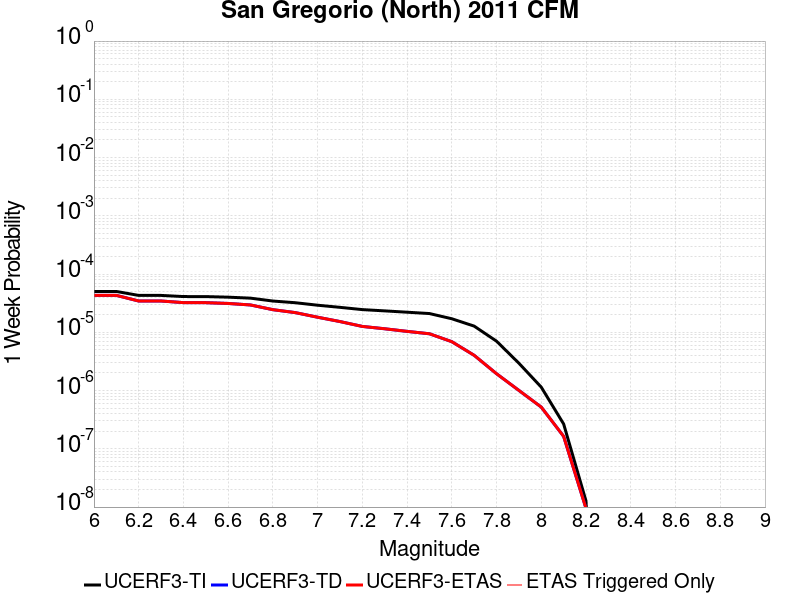 |  | 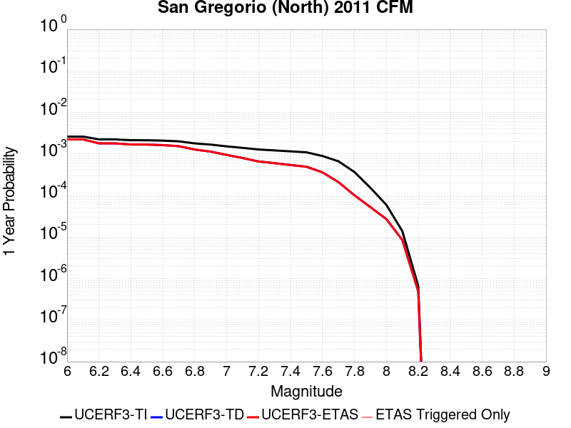 |  |

| Magnitude | 1 wk TI Prob | 1 wk TD Prob | 1 wk ETAS Prob | 1 wk ETAS/TD Gain | 1 wk ETAS Triggered Only | 1 mo TI Prob | 1 mo TD Prob | 1 mo ETAS Prob | 1 mo ETAS/TD Gain | 1 mo ETAS Triggered Only | 1 yr TI Prob | 1 yr TD Prob | 1 yr ETAS Prob | 1 yr ETAS/TD Gain | 1 yr ETAS Triggered Only | 10 yr TI Prob | 10 yr TD Prob | 10 yr ETAS Prob | 10 yr ETAS/TD Gain | 10 yr ETAS Triggered Only |
|-----|-----|-----|-----|-----|-----|-----|-----|-----|-----|-----|-----|-----|-----|-----|-----|-----|-----|-----|-----|-----|
| 6.0 | 5.0283932E-5 | 4.3085874E-5 | 4.3085874E-5 | 1.0 | 0.0 | 2.1548476E-4 | 1.8464077E-4 | 1.8464077E-4 | 1.0 | 0.0 | 0.0026203706 | 0.0022457 | 0.0022457 | 1.0 | 0.0 | 0.02589687 | 0.022307757 | 0.022317534 | 1.0004383 | 1.0E-5 |
| 6.1 | 5.0283932E-5 | 4.3085874E-5 | 4.3085874E-5 | 1.0 | 0.0 | 2.1548476E-4 | 1.8464077E-4 | 1.8464077E-4 | 1.0 | 0.0 | 0.0026203706 | 0.0022457 | 0.0022457 | 1.0 | 0.0 | 0.02589687 | 0.022307757 | 0.022317534 | 1.0004383 | 1.0E-5 |
| 6.2 | 4.2998647E-5 | 3.44674E-5 | 3.44674E-5 | 1.0 | 0.0 | 1.842669E-4 | 1.477091E-4 | 1.477091E-4 | 1.0 | 0.0 | 0.0022411412 | 0.0017968888 | 0.0017968888 | 1.0 | 0.0 | 0.022186736 | 0.017900042 | 0.017909864 | 1.0005486 | 1.0E-5 |
| 6.3 | 4.2998647E-5 | 3.44674E-5 | 3.44674E-5 | 1.0 | 0.0 | 1.842669E-4 | 1.477091E-4 | 1.477091E-4 | 1.0 | 0.0 | 0.0022411412 | 0.0017968888 | 0.0017968888 | 1.0 | 0.0 | 0.022186736 | 0.017900042 | 0.017909864 | 1.0005486 | 1.0E-5 |
| 6.4 | 4.1101295E-5 | 3.235212E-5 | 3.235212E-5 | 1.0 | 0.0 | 1.7613651E-4 | 1.3864465E-4 | 1.3864465E-4 | 1.0 | 0.0 | 0.0021423528 | 0.0016867052 | 0.0016867052 | 1.0 | 0.0 | 0.02121817 | 0.016815128 | 0.016815128 | 1.0 | 0.0 |
| 6.5 | 4.1032585E-5 | 3.2270138E-5 | 3.2270138E-5 | 1.0 | 0.0 | 1.7584208E-4 | 1.3829334E-4 | 1.3829334E-4 | 1.0 | 0.0 | 0.0021387753 | 0.0016824347 | 0.0016824347 | 1.0 | 0.0 | 0.021183075 | 0.016773075 | 0.016773075 | 1.0 | 0.0 |
| 6.6 | 4.011629E-5 | 3.1291514E-5 | 3.1291514E-5 | 1.0 | 0.0 | 1.7191563E-4 | 1.3409968E-4 | 1.3409968E-4 | 1.0 | 0.0 | 0.0020910634 | 0.0016314551 | 0.0016314551 | 1.0 | 0.0 | 0.020714961 | 0.016270513 | 0.016270513 | 1.0 | 0.0 |
| 6.7 | 3.8583938E-5 | 2.9478164E-5 | 2.9478164E-5 | 1.0 | 0.0 | 1.6534925E-4 | 1.2632895E-4 | 1.2632895E-4 | 1.0 | 0.0 | 0.0020112682 | 0.0015369839 | 0.0015369839 | 1.0 | 0.0 | 0.019931622 | 0.015338836 | 0.015338836 | 1.0 | 0.0 |
| 6.8 | 3.44341E-5 | 2.4474108E-5 | 2.4474108E-5 | 1.0 | 0.0 | 1.4756636E-4 | 1.0488487E-4 | 1.0488487E-4 | 1.0 | 0.0 | 0.0017951399 | 0.0012762354 | 0.0012762354 | 1.0 | 0.0 | 0.017807078 | 0.012763367 | 0.012763367 | 1.0 | 0.0 |
| 6.9 | 3.221199E-5 | 2.179715E-5 | 2.179715E-5 | 1.0 | 0.0 | 1.3804408E-4 | 9.3413066E-5 | 9.3413066E-5 | 1.0 | 0.0 | 0.0016793909 | 0.0011367189 | 0.0011367189 | 1.0 | 0.0 | 0.01666756 | 0.011382704 | 0.011382704 | 1.0 | 0.0 |
| 7.0 | 2.9186718E-5 | 1.8163337E-5 | 1.8163337E-5 | 1.0 | 0.0 | 1.2507994E-4 | 7.7840574E-5 | 7.7840574E-5 | 1.0 | 0.0 | 0.0015217843 | 9.473012E-4 | 9.473012E-4 | 1.0 | 0.0 | 0.015114053 | 0.0095055625 | 0.0095055625 | 1.0 | 0.0 |
| 7.1 | 2.6840138E-5 | 1.5299922E-5 | 1.5299922E-5 | 1.0 | 0.0 | 1.1502409E-4 | 6.556946E-5 | 6.556946E-5 | 1.0 | 0.0 | 0.0013995186 | 7.9801766E-4 | 7.9801766E-4 | 1.0 | 0.0 | 0.013907375 | 0.008023957 | 0.008023957 | 1.0 | 0.0 |
| 7.2 | 2.453002E-5 | 1.2621304E-5 | 1.2621304E-5 | 1.0 | 0.0 | 1.05124425E-4 | 5.4090186E-5 | 5.4090186E-5 | 1.0 | 0.0 | 0.0012791384 | 6.5834966E-4 | 6.5834966E-4 | 1.0 | 0.0 | 0.012718005 | 0.006635471 | 0.006635471 | 1.0 | 0.0 |
| 7.3 | 2.3330727E-5 | 1.1502964E-5 | 1.1502964E-5 | 1.0 | 0.0 | 9.9985E-5 | 4.929749E-5 | 4.929749E-5 | 1.0 | 0.0 | 0.0012166376 | 6.000321E-4 | 6.000321E-4 | 1.0 | 0.0 | 0.012099981 | 0.006054228 | 0.006054228 | 1.0 | 0.0 |
| 7.4 | 2.2136466E-5 | 1.03827115E-5 | 1.03827115E-5 | 1.0 | 0.0 | 9.486712E-5 | 4.4496577E-5 | 4.4496577E-5 | 1.0 | 0.0 | 0.0011543952 | 5.4161146E-4 | 5.4161146E-4 | 1.0 | 0.0 | 0.011484168 | 0.005471622 | 0.005471622 | 1.0 | 0.0 |
| 7.5 | 2.0994974E-5 | 9.440491E-6 | 9.440491E-6 | 1.0 | 0.0 | 8.997535E-5 | 4.045862E-5 | 4.045862E-5 | 1.0 | 0.0 | 0.0010948994 | 4.924726E-4 | 4.924726E-4 | 1.0 | 0.0 | 0.010895205 | 0.0049804924 | 0.0049804924 | 1.0 | 0.0 |
| 7.6 | 1.7091823E-5 | 6.9042953E-6 | 6.9042953E-6 | 1.0 | 0.0 | 7.3248615E-5 | 2.9589502E-5 | 2.9589502E-5 | 1.0 | 0.0 | 8.9143694E-4 | 3.6019273E-4 | 3.6019273E-4 | 1.0 | 0.0 | 0.008878695 | 0.003653981 | 0.003653981 | 1.0 | 0.0 |
| 7.7 | 1.2772179E-5 | 4.0283953E-6 | 4.0283953E-6 | 1.0 | 0.0 | 5.473676E-5 | 1.7264438E-5 | 1.7264438E-5 | 1.0 | 0.0 | 6.6621625E-4 | 2.1017427E-4 | 2.1017427E-4 | 1.0 | 0.0 | 0.006642225 | 0.0021410312 | 0.0021410312 | 1.0 | 0.0 |
| 7.8 | 7.041923E-6 | 1.9455285E-6 | 1.9455285E-6 | 1.0 | 0.0 | 3.017932E-5 | 8.337952E-6 | 8.337952E-6 | 1.0 | 0.0 | 3.6737128E-4 | 1.0150984E-4 | 1.0150984E-4 | 1.0 | 0.0 | 0.0036676454 | 0.0010405782 | 0.0010405782 | 1.0 | 0.0 |
| 7.9 | 2.946768E-6 | 1.0062735E-6 | 1.0062735E-6 | 1.0 | 0.0 | 1.2628945E-5 | 4.3125933E-6 | 4.3125933E-6 | 1.0 | 0.0 | 1.5374656E-4 | 5.2504558E-5 | 5.2504558E-5 | 1.0 | 0.0 | 0.0015364023 | 5.3555844E-4 | 5.3555844E-4 | 1.0 | 0.0 |
| 8.0 | 1.1433375E-6 | 5.198261E-7 | 5.198261E-7 | 1.0 | 0.0 | 4.9000087E-6 | 2.227824E-6 | 2.227824E-6 | 1.0 | 0.0 | 5.965597E-5 | 2.712342E-5 | 2.712342E-5 | 1.0 | 0.0 | 5.963996E-4 | 2.7486755E-4 | 2.7486755E-4 | 1.0 | 0.0 |
| 8.1 | 2.6675295E-7 | 1.6352837E-7 | 1.6352837E-7 | 1.0 | 0.0 | 1.1432264E-6 | 7.008357E-7 | 7.008357E-7 | 1.0 | 0.0 | 1.3918692E-5 | 8.532641E-6 | 8.532641E-6 | 1.0 | 0.0 | 1.391782E-4 | 8.671137E-5 | 8.671137E-5 | 1.0 | 0.0 |
| 8.2 | 1.2704569E-8 | 9.488268E-9 | 9.488268E-9 | 1.0 | 0.0 | 5.444815E-8 | 4.0664005E-8 | 4.0664005E-8 | 1.0 | 0.0 | 6.629061E-7 | 4.950842E-7 | 4.950842E-7 | 1.0 | 0.0 | 6.629041E-6 | 5.142407E-6 | 5.142407E-6 | 1.0 | 0.0 |

## Great Valley 05 Pittsburg - Kirby Hills alt1
*[(top)](#table-of-contents)*

| 1 Week | 1 Month | 1 Year | 10 Year |
|-----|-----|-----|-----|
|  |  |  | 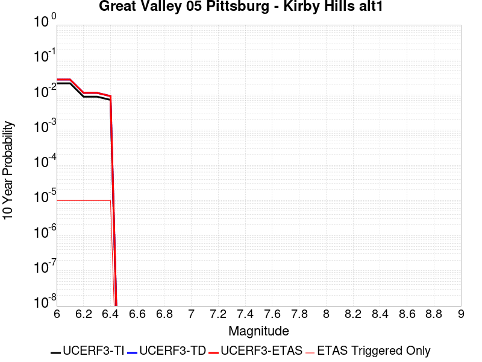 |

| Magnitude | 1 wk TI Prob | 1 wk TD Prob | 1 wk ETAS Prob | 1 wk ETAS/TD Gain | 1 wk ETAS Triggered Only | 1 mo TI Prob | 1 mo TD Prob | 1 mo ETAS Prob | 1 mo ETAS/TD Gain | 1 mo ETAS Triggered Only | 1 yr TI Prob | 1 yr TD Prob | 1 yr ETAS Prob | 1 yr ETAS/TD Gain | 1 yr ETAS Triggered Only | 10 yr TI Prob | 10 yr TD Prob | 10 yr ETAS Prob | 10 yr ETAS/TD Gain | 10 yr ETAS Triggered Only |
|-----|-----|-----|-----|-----|-----|-----|-----|-----|-----|-----|-----|-----|-----|-----|-----|-----|-----|-----|-----|-----|
| 6.0 | 4.187212E-5 | 5.3455817E-5 | 5.3455817E-5 | 1.0 | 0.0 | 1.794396E-4 | 2.2908194E-4 | 2.2908194E-4 | 1.0 | 0.0 | 0.002182488 | 0.0027864843 | 0.0027864843 | 1.0 | 0.0 | 0.021611776 | 0.027609872 | 0.027619595 | 1.0003521 | 1.0E-5 |
| 6.1 | 4.187212E-5 | 5.3455817E-5 | 5.3455817E-5 | 1.0 | 0.0 | 1.794396E-4 | 2.2908194E-4 | 2.2908194E-4 | 1.0 | 0.0 | 0.002182488 | 0.0027864843 | 0.0027864843 | 1.0 | 0.0 | 0.021611776 | 0.027609872 | 0.027619595 | 1.0003521 | 1.0E-5 |
| 6.2 | 1.7353306E-5 | 2.2160079E-5 | 2.2160079E-5 | 1.0 | 0.0 | 7.436919E-5 | 9.4970565E-5 | 9.4970565E-5 | 1.0 | 0.0 | 9.050688E-4 | 0.0011560495 | 0.0011560495 | 1.0 | 0.0 | 0.009013915 | 0.011537992 | 0.011547877 | 1.0008568 | 1.0E-5 |
| 6.3 | 1.7353306E-5 | 2.2160079E-5 | 2.2160079E-5 | 1.0 | 0.0 | 7.436919E-5 | 9.4970565E-5 | 9.4970565E-5 | 1.0 | 0.0 | 9.050688E-4 | 0.0011560495 | 0.0011560495 | 1.0 | 0.0 | 0.009013915 | 0.011537992 | 0.011547877 | 1.0008568 | 1.0E-5 |
| 6.4 | 1.4028824E-5 | 1.7905195E-5 | 1.7905195E-5 | 1.0 | 0.0 | 6.0122147E-5 | 7.673655E-5 | 7.673655E-5 | 1.0 | 0.0 | 7.3174125E-4 | 9.342675E-4 | 9.342675E-4 | 1.0 | 0.0 | 0.0072933645 | 0.009340468 | 0.009350375 | 1.0010606 | 1.0E-5 |

## Great Valley 04a Trout Creek
*[(top)](#table-of-contents)*

| 1 Week | 1 Month | 1 Year | 10 Year |
|-----|-----|-----|-----|
| 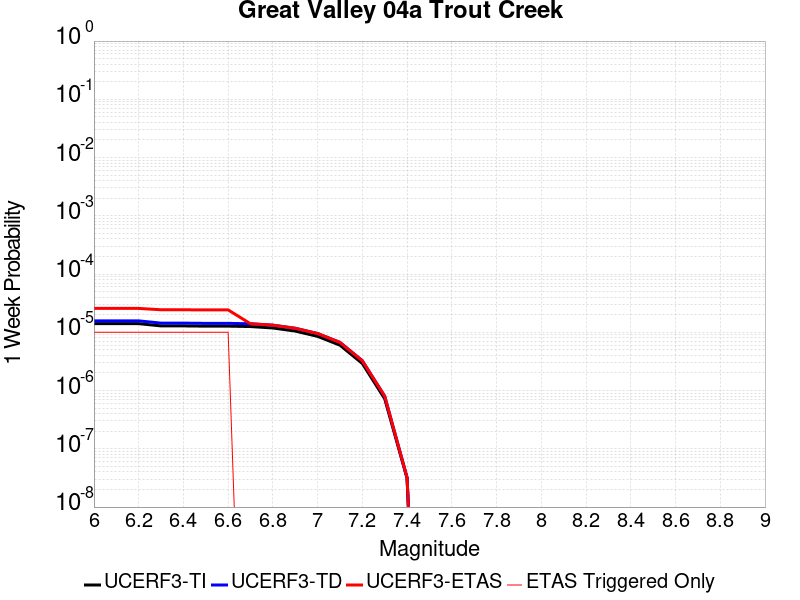 |  |  | 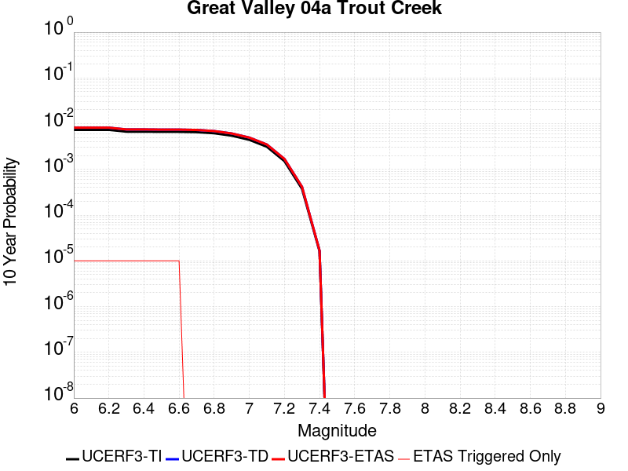 |

| Magnitude | 1 wk TI Prob | 1 wk TD Prob | 1 wk ETAS Prob | 1 wk ETAS/TD Gain | 1 wk ETAS Triggered Only | 1 mo TI Prob | 1 mo TD Prob | 1 mo ETAS Prob | 1 mo ETAS/TD Gain | 1 mo ETAS Triggered Only | 1 yr TI Prob | 1 yr TD Prob | 1 yr ETAS Prob | 1 yr ETAS/TD Gain | 1 yr ETAS Triggered Only | 10 yr TI Prob | 10 yr TD Prob | 10 yr ETAS Prob | 10 yr ETAS/TD Gain | 10 yr ETAS Triggered Only |
|-----|-----|-----|-----|-----|-----|-----|-----|-----|-----|-----|-----|-----|-----|-----|-----|-----|-----|-----|-----|-----|
| 6.0 | 1.4088538E-5 | 1.5721245E-5 | 2.5721089E-5 | 1.6360719 | 1.0E-5 | 6.037805E-5 | 6.73751E-5 | 7.7374425E-5 | 1.1484128 | 1.0E-5 | 7.3485484E-4 | 8.199956E-4 | 8.299874E-4 | 1.0121852 | 1.0E-5 | 0.007324295 | 0.008170984 | 0.008180902 | 1.0012138 | 1.0E-5 |
| 6.1 | 1.4088538E-5 | 1.5721245E-5 | 2.5721089E-5 | 1.6360719 | 1.0E-5 | 6.037805E-5 | 6.73751E-5 | 7.7374425E-5 | 1.1484128 | 1.0E-5 | 7.3485484E-4 | 8.199956E-4 | 8.299874E-4 | 1.0121852 | 1.0E-5 | 0.007324295 | 0.008170984 | 0.008180902 | 1.0012138 | 1.0E-5 |
| 6.2 | 1.4088538E-5 | 1.5721245E-5 | 2.5721089E-5 | 1.6360719 | 1.0E-5 | 6.037805E-5 | 6.73751E-5 | 7.7374425E-5 | 1.1484128 | 1.0E-5 | 7.3485484E-4 | 8.199956E-4 | 8.299874E-4 | 1.0121852 | 1.0E-5 | 0.007324295 | 0.008170984 | 0.008180902 | 1.0012138 | 1.0E-5 |
| 6.3 | 1.2882862E-5 | 1.4380154E-5 | 2.4380011E-5 | 1.6953928 | 1.0E-5 | 5.5211098E-5 | 6.1627834E-5 | 7.162722E-5 | 1.1622543 | 1.0E-5 | 6.7198783E-4 | 7.5007096E-4 | 7.6006347E-4 | 1.0133221 | 1.0E-5 | 0.0066995937 | 0.007476457 | 0.007486382 | 1.0013275 | 1.0E-5 |
| 6.4 | 1.2882862E-5 | 1.4380154E-5 | 2.4380011E-5 | 1.6953928 | 1.0E-5 | 5.5211098E-5 | 6.1627834E-5 | 7.162722E-5 | 1.1622543 | 1.0E-5 | 6.7198783E-4 | 7.5007096E-4 | 7.6006347E-4 | 1.0133221 | 1.0E-5 | 0.0066995937 | 0.007476457 | 0.007486382 | 1.0013275 | 1.0E-5 |
| 6.5 | 1.2762329E-5 | 1.4246698E-5 | 2.4246556E-5 | 1.701907 | 1.0E-5 | 5.469455E-5 | 6.105591E-5 | 7.10553E-5 | 1.1637744 | 1.0E-5 | 6.657027E-4 | 7.431125E-4 | 7.531051E-4 | 1.0134469 | 1.0E-5 | 0.00663712 | 0.007407336 | 0.007417262 | 1.00134 | 1.0E-5 |
| 6.6 | 1.2762329E-5 | 1.4246698E-5 | 2.4246556E-5 | 1.701907 | 1.0E-5 | 5.469455E-5 | 6.105591E-5 | 7.10553E-5 | 1.1637744 | 1.0E-5 | 6.657027E-4 | 7.431125E-4 | 7.531051E-4 | 1.0134469 | 1.0E-5 | 0.00663712 | 0.007407336 | 0.007417262 | 1.00134 | 1.0E-5 |
| 6.7 | 1.2557959E-5 | 1.4020911E-5 | 1.4020911E-5 | 1.0 | 0.0 | 5.3818712E-5 | 6.0088296E-5 | 6.0088296E-5 | 1.0 | 0.0 | 6.5504585E-4 | 7.313398E-4 | 7.313398E-4 | 1.0 | 0.0 | 0.006531183 | 0.0072903843 | 0.0072903843 | 1.0 | 0.0 |
| 6.8 | 1.1871544E-5 | 1.3260264E-5 | 1.3260264E-5 | 1.0 | 0.0 | 5.0877054E-5 | 5.6828518E-5 | 5.6828518E-5 | 1.0 | 0.0 | 6.1925204E-4 | 6.916776E-4 | 6.916776E-4 | 1.0 | 0.0 | 0.0061752927 | 0.0068962653 | 0.0068962653 | 1.0 | 0.0 |
| 6.9 | 1.0500373E-5 | 1.173254E-5 | 1.173254E-5 | 1.0 | 0.0 | 4.5000823E-5 | 5.0281393E-5 | 5.0281393E-5 | 1.0 | 0.0 | 5.4774724E-4 | 6.120126E-4 | 6.120126E-4 | 1.0 | 0.0 | 0.005463991 | 0.0061041373 | 0.0061041373 | 1.0 | 0.0 |
| 7.0 | 8.524332E-6 | 9.534533E-6 | 9.534533E-6 | 1.0 | 0.0 | 3.653234E-5 | 4.0861687E-5 | 4.0861687E-5 | 1.0 | 0.0 | 4.4469046E-4 | 4.973848E-4 | 4.973848E-4 | 1.0 | 0.0 | 0.0044380166 | 0.0049634473 | 0.0049634473 | 1.0 | 0.0 |
| 7.1 | 6.006849E-6 | 6.7122915E-6 | 6.7122915E-6 | 1.0 | 0.0 | 2.5743384E-5 | 2.8766679E-5 | 2.8766679E-5 | 1.0 | 0.0 | 3.1338062E-4 | 3.501836E-4 | 3.501836E-4 | 1.0 | 0.0 | 0.0031293905 | 0.0034968685 | 0.0034968685 | 1.0 | 0.0 |
| 7.2 | 2.9122193E-6 | 3.2468777E-6 | 3.2468777E-6 | 1.0 | 0.0 | 1.248088E-5 | 1.3915125E-5 | 1.3915125E-5 | 1.0 | 0.0 | 1.5194413E-4 | 1.6940523E-4 | 1.6940523E-4 | 1.0 | 0.0 | 0.0015184027 | 0.0016929329 | 0.0016929329 | 1.0 | 0.0 |
| 7.3 | 7.2194007E-7 | 7.989559E-7 | 7.989559E-7 | 1.0 | 0.0 | 3.0940253E-6 | 3.4240948E-6 | 3.4240948E-6 | 1.0 | 0.0 | 3.7669106E-5 | 4.1688014E-5 | 4.1688014E-5 | 1.0 | 0.0 | 3.766272E-4 | 4.1684692E-4 | 4.1684692E-4 | 1.0 | 0.0 |
| 7.4 | 3.112171E-8 | 3.2069273E-8 | 3.2069273E-8 | 1.0 | 0.0 | 1.3337875E-7 | 1.3743973E-7 | 1.3743973E-7 | 1.0 | 0.0 | 1.6238852E-6 | 1.6733276E-6 | 1.6733276E-6 | 1.0 | 0.0 | 1.6238733E-5 | 1.6733158E-5 | 1.6733158E-5 | 1.0 | 0.0 |

## White Wolf
*[(top)](#table-of-contents)*

| 1 Week | 1 Month | 1 Year | 10 Year |
|-----|-----|-----|-----|
|  |  |  | 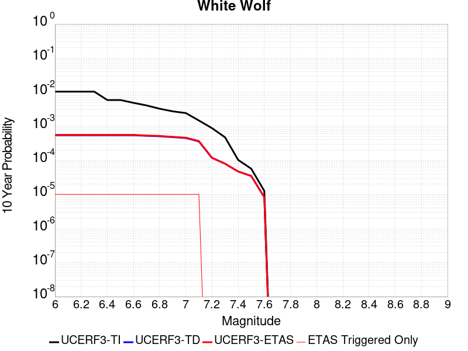 |

| Magnitude | 1 wk TI Prob | 1 wk TD Prob | 1 wk ETAS Prob | 1 wk ETAS/TD Gain | 1 wk ETAS Triggered Only | 1 mo TI Prob | 1 mo TD Prob | 1 mo ETAS Prob | 1 mo ETAS/TD Gain | 1 mo ETAS Triggered Only | 1 yr TI Prob | 1 yr TD Prob | 1 yr ETAS Prob | 1 yr ETAS/TD Gain | 1 yr ETAS Triggered Only | 10 yr TI Prob | 10 yr TD Prob | 10 yr ETAS Prob | 10 yr ETAS/TD Gain | 10 yr ETAS Triggered Only |
|-----|-----|-----|-----|-----|-----|-----|-----|-----|-----|-----|-----|-----|-----|-----|-----|-----|-----|-----|-----|-----|
| 6.0 | 2.0037822E-5 | 1.0470154E-6 | 1.0470154E-6 | 1.0 | 0.0 | 8.587355E-5 | 4.4872017E-6 | 4.4872017E-6 | 1.0 | 0.0 | 0.001045009 | 5.463036E-5 | 5.463036E-5 | 1.0 | 0.0 | 0.010401085 | 5.4617436E-4 | 5.561689E-4 | 1.0182992 | 1.0E-5 |
| 6.1 | 2.0037822E-5 | 1.0470154E-6 | 1.0470154E-6 | 1.0 | 0.0 | 8.587355E-5 | 4.4872017E-6 | 4.4872017E-6 | 1.0 | 0.0 | 0.001045009 | 5.463036E-5 | 5.463036E-5 | 1.0 | 0.0 | 0.010401085 | 5.4617436E-4 | 5.561689E-4 | 1.0182992 | 1.0E-5 |
| 6.2 | 2.0037822E-5 | 1.0470154E-6 | 1.0470154E-6 | 1.0 | 0.0 | 8.587355E-5 | 4.4872017E-6 | 4.4872017E-6 | 1.0 | 0.0 | 0.001045009 | 5.463036E-5 | 5.463036E-5 | 1.0 | 0.0 | 0.010401085 | 5.4617436E-4 | 5.561689E-4 | 1.0182992 | 1.0E-5 |
| 6.3 | 2.0037822E-5 | 1.0470154E-6 | 1.0470154E-6 | 1.0 | 0.0 | 8.587355E-5 | 4.4872017E-6 | 4.4872017E-6 | 1.0 | 0.0 | 0.001045009 | 5.463036E-5 | 5.463036E-5 | 1.0 | 0.0 | 0.010401085 | 5.4617436E-4 | 5.561689E-4 | 1.0182992 | 1.0E-5 |
| 6.4 | 1.132487E-5 | 1.0470154E-6 | 1.0470154E-6 | 1.0 | 0.0 | 4.8534253E-5 | 4.4872017E-6 | 4.4872017E-6 | 1.0 | 0.0 | 5.907443E-4 | 5.463036E-5 | 5.463036E-5 | 1.0 | 0.0 | 0.005891764 | 5.4617436E-4 | 5.561689E-4 | 1.0182992 | 1.0E-5 |
| 6.5 | 1.132487E-5 | 1.0470154E-6 | 1.0470154E-6 | 1.0 | 0.0 | 4.8534253E-5 | 4.4872017E-6 | 4.4872017E-6 | 1.0 | 0.0 | 5.907443E-4 | 5.463036E-5 | 5.463036E-5 | 1.0 | 0.0 | 0.005891764 | 5.4617436E-4 | 5.561689E-4 | 1.0182992 | 1.0E-5 |
| 6.6 | 9.347473E-6 | 1.0470154E-6 | 1.0470154E-6 | 1.0 | 0.0 | 4.0059982E-5 | 4.4872017E-6 | 4.4872017E-6 | 1.0 | 0.0 | 4.8762115E-4 | 5.463036E-5 | 5.463036E-5 | 1.0 | 0.0 | 0.0048655253 | 5.4617436E-4 | 5.561689E-4 | 1.0182992 | 1.0E-5 |
| 6.7 | 7.842647E-6 | 1.0049282E-6 | 1.0049282E-6 | 1.0 | 0.0 | 3.361091E-5 | 4.3068285E-6 | 4.3068285E-6 | 1.0 | 0.0 | 4.0913603E-4 | 5.2434425E-5 | 5.2434425E-5 | 1.0 | 0.0 | 0.004083836 | 5.2422547E-4 | 5.3422025E-4 | 1.0190657 | 1.0E-5 |
| 6.8 | 6.26597E-6 | 9.735705E-7 | 9.735705E-7 | 1.0 | 0.0 | 2.685388E-5 | 4.172439E-6 | 4.172439E-6 | 1.0 | 0.0 | 3.2689696E-4 | 5.079831E-5 | 5.079831E-5 | 1.0 | 0.0 | 0.003264165 | 5.078719E-4 | 5.178668E-4 | 1.01968 | 1.0E-5 |
| 6.9 | 5.258436E-6 | 9.184076E-7 | 9.184076E-7 | 1.0 | 0.0 | 2.2535958E-5 | 3.9360266E-6 | 3.9360266E-6 | 1.0 | 0.0 | 2.7434074E-4 | 4.792012E-5 | 4.792012E-5 | 1.0 | 0.0 | 0.0027400232 | 4.7910266E-4 | 4.8909785E-4 | 1.0208623 | 1.0E-5 |
| 7.0 | 4.675028E-6 | 8.6619536E-7 | 8.6619536E-7 | 1.0 | 0.0 | 2.003568E-5 | 3.7122609E-6 | 3.7122609E-6 | 1.0 | 0.0 | 2.4390711E-4 | 4.5195888E-5 | 4.5195888E-5 | 1.0 | 0.0 | 0.0024363957 | 4.5187166E-4 | 4.6186717E-4 | 1.0221201 | 1.0E-5 |
| 7.1 | 2.8270078E-6 | 6.874799E-7 | 6.874799E-7 | 1.0 | 0.0 | 1.2115692E-5 | 2.9463392E-6 | 2.9463392E-6 | 1.0 | 0.0 | 1.4749856E-4 | 3.5871133E-5 | 3.5871133E-5 | 1.0 | 0.0 | 0.001474007 | 3.586575E-4 | 3.6865394E-4 | 1.0278717 | 1.0E-5 |
| 7.2 | 1.6881406E-6 | 2.2709685E-7 | 2.2709685E-7 | 1.0 | 0.0 | 7.2348685E-6 | 9.732719E-7 | 9.732719E-7 | 1.0 | 0.0 | 8.808096E-5 | 1.1849522E-5 | 1.1849522E-5 | 1.0 | 0.0 | 8.8046055E-4 | 1.1848906E-4 | 1.1848906E-4 | 1.0 | 0.0 |
| 7.3 | 9.086107E-7 | 1.5268368E-7 | 1.5268368E-7 | 1.0 | 0.0 | 3.8940398E-6 | 6.543585E-7 | 6.543585E-7 | 1.0 | 0.0 | 4.7408903E-5 | 7.966786E-6 | 7.966786E-6 | 1.0 | 0.0 | 4.739879E-4 | 7.9665086E-5 | 7.9665086E-5 | 1.0 | 0.0 |
| 7.4 | 1.9717383E-7 | 9.0043905E-8 | 9.0043905E-8 | 1.0 | 0.0 | 8.450304E-7 | 3.859024E-7 | 3.859024E-7 | 1.0 | 0.0 | 1.0288197E-5 | 4.698352E-6 | 4.698352E-6 | 1.0 | 0.0 | 1.028772E-4 | 4.6982557E-5 | 4.6982557E-5 | 1.0 | 0.0 |
| 7.5 | 1.086975E-7 | 6.6599824E-8 | 6.6599824E-8 | 1.0 | 0.0 | 4.6584634E-7 | 2.854278E-7 | 2.854278E-7 | 1.0 | 0.0 | 5.6716644E-6 | 3.475078E-6 | 3.475078E-6 | 1.0 | 0.0 | 5.6715195E-5 | 3.475026E-5 | 3.475026E-5 | 1.0 | 0.0 |
| 7.6 | 2.4217808E-8 | 1.5821314E-8 | 1.5821314E-8 | 1.0 | 0.0 | 1.03790605E-7 | 6.780563E-8 | 6.780563E-8 | 1.0 | 0.0 | 1.2636499E-6 | 8.2553333E-7 | 8.2553333E-7 | 1.0 | 0.0 | 1.2636427E-5 | 8.255308E-6 | 8.255308E-6 | 1.0 | 0.0 |

## Antelope Valley 2011
*[(top)](#table-of-contents)*

| 1 Week | 1 Month | 1 Year | 10 Year |
|-----|-----|-----|-----|
|  |  | 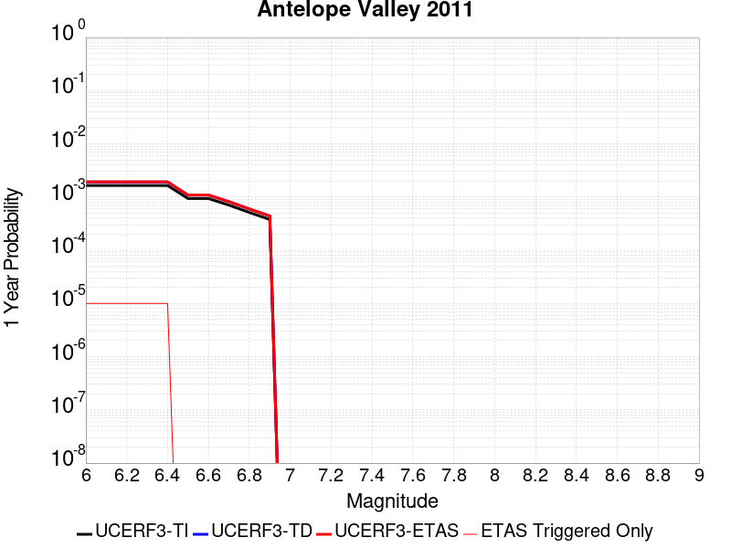 | 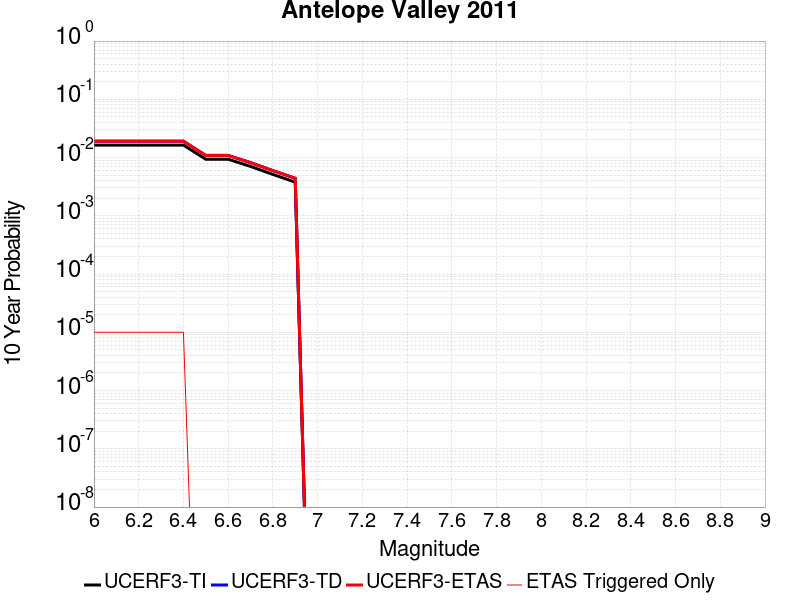 |

| Magnitude | 1 wk TI Prob | 1 wk TD Prob | 1 wk ETAS Prob | 1 wk ETAS/TD Gain | 1 wk ETAS Triggered Only | 1 mo TI Prob | 1 mo TD Prob | 1 mo ETAS Prob | 1 mo ETAS/TD Gain | 1 mo ETAS Triggered Only | 1 yr TI Prob | 1 yr TD Prob | 1 yr ETAS Prob | 1 yr ETAS/TD Gain | 1 yr ETAS Triggered Only | 10 yr TI Prob | 10 yr TD Prob | 10 yr ETAS Prob | 10 yr ETAS/TD Gain | 10 yr ETAS Triggered Only |
|-----|-----|-----|-----|-----|-----|-----|-----|-----|-----|-----|-----|-----|-----|-----|-----|-----|-----|-----|-----|-----|
| 6.0 | 3.1646934E-5 | 3.6910093E-5 | 3.6910093E-5 | 1.0 | 0.0 | 1.3562266E-4 | 1.5817801E-4 | 1.5817801E-4 | 1.0 | 0.0 | 0.0016499552 | 0.001924381 | 0.0019343618 | 1.0051864 | 1.0E-5 | 0.016377583 | 0.019103574 | 0.019113382 | 1.0005134 | 1.0E-5 |
| 6.1 | 3.1646934E-5 | 3.6910093E-5 | 3.6910093E-5 | 1.0 | 0.0 | 1.3562266E-4 | 1.5817801E-4 | 1.5817801E-4 | 1.0 | 0.0 | 0.0016499552 | 0.001924381 | 0.0019343618 | 1.0051864 | 1.0E-5 | 0.016377583 | 0.019103574 | 0.019113382 | 1.0005134 | 1.0E-5 |
| 6.2 | 3.1646934E-5 | 3.6910093E-5 | 3.6910093E-5 | 1.0 | 0.0 | 1.3562266E-4 | 1.5817801E-4 | 1.5817801E-4 | 1.0 | 0.0 | 0.0016499552 | 0.001924381 | 0.0019343618 | 1.0051864 | 1.0E-5 | 0.016377583 | 0.019103574 | 0.019113382 | 1.0005134 | 1.0E-5 |
| 6.3 | 3.1646934E-5 | 3.6910093E-5 | 3.6910093E-5 | 1.0 | 0.0 | 1.3562266E-4 | 1.5817801E-4 | 1.5817801E-4 | 1.0 | 0.0 | 0.0016499552 | 0.001924381 | 0.0019343618 | 1.0051864 | 1.0E-5 | 0.016377583 | 0.019103574 | 0.019113382 | 1.0005134 | 1.0E-5 |
| 6.4 | 3.1646934E-5 | 3.6910093E-5 | 3.6910093E-5 | 1.0 | 0.0 | 1.3562266E-4 | 1.5817801E-4 | 1.5817801E-4 | 1.0 | 0.0 | 0.0016499552 | 0.001924381 | 0.0019343618 | 1.0051864 | 1.0E-5 | 0.016377583 | 0.019103574 | 0.019113382 | 1.0005134 | 1.0E-5 |
| 6.5 | 1.8034107E-5 | 2.0944088E-5 | 2.0944088E-5 | 1.0 | 0.0 | 7.7286735E-5 | 8.975798E-5 | 8.975798E-5 | 1.0 | 0.0 | 9.405598E-4 | 0.0010923778 | 0.0010923778 | 1.0 | 0.0 | 0.009365888 | 0.010882163 | 0.010882163 | 1.0 | 0.0 |
| 6.6 | 1.8034107E-5 | 2.0944088E-5 | 2.0944088E-5 | 1.0 | 0.0 | 7.7286735E-5 | 8.975798E-5 | 8.975798E-5 | 1.0 | 0.0 | 9.405598E-4 | 0.0010923778 | 0.0010923778 | 1.0 | 0.0 | 0.009365888 | 0.010882163 | 0.010882163 | 1.0 | 0.0 |
| 6.7 | 1.3567667E-5 | 1.575186E-5 | 1.575186E-5 | 1.0 | 0.0 | 5.814585E-5 | 6.750683E-5 | 6.750683E-5 | 1.0 | 0.0 | 7.076958E-4 | 8.21692E-4 | 8.21692E-4 | 1.0 | 0.0 | 0.007054463 | 0.008196975 | 0.008196975 | 1.0 | 0.0 |
| 6.8 | 9.867387E-6 | 1.1469662E-5 | 1.1469662E-5 | 1.0 | 0.0 | 4.2288117E-5 | 4.9155304E-5 | 4.9155304E-5 | 1.0 | 0.0 | 5.1473617E-4 | 5.9839647E-4 | 5.9839647E-4 | 1.0 | 0.0 | 0.005135455 | 0.005977167 | 0.005977167 | 1.0 | 0.0 |
| 6.9 | 7.273233E-6 | 8.456139E-6 | 8.456139E-6 | 1.0 | 0.0 | 3.1170628E-5 | 3.6240595E-5 | 3.6240595E-5 | 1.0 | 0.0 | 3.794363E-4 | 4.4122926E-4 | 4.4122926E-4 | 1.0 | 0.0 | 0.0037878908 | 0.0044122925 | 0.0044122925 | 1.0 | 0.0 |

## Calaveras (Central) 2011 CFM
*[(top)](#table-of-contents)*

| 1 Week | 1 Month | 1 Year | 10 Year |
|-----|-----|-----|-----|
|  | 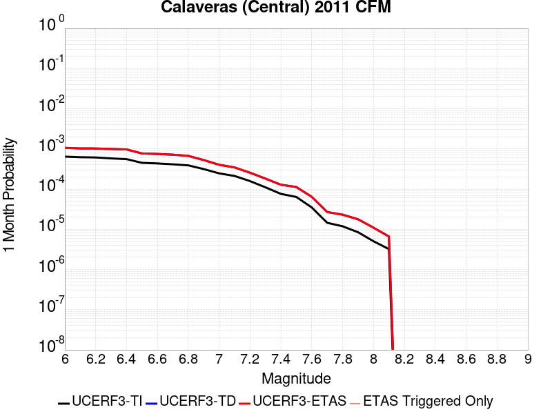 | 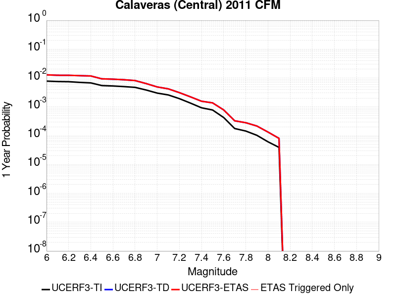 |  |

| Magnitude | 1 wk TI Prob | 1 wk TD Prob | 1 wk ETAS Prob | 1 wk ETAS/TD Gain | 1 wk ETAS Triggered Only | 1 mo TI Prob | 1 mo TD Prob | 1 mo ETAS Prob | 1 mo ETAS/TD Gain | 1 mo ETAS Triggered Only | 1 yr TI Prob | 1 yr TD Prob | 1 yr ETAS Prob | 1 yr ETAS/TD Gain | 1 yr ETAS Triggered Only | 10 yr TI Prob | 10 yr TD Prob | 10 yr ETAS Prob | 10 yr ETAS/TD Gain | 10 yr ETAS Triggered Only |
|-----|-----|-----|-----|-----|-----|-----|-----|-----|-----|-----|-----|-----|-----|-----|-----|-----|-----|-----|-----|-----|
| 6.0 | 1.5010907E-4 | 2.4814456E-4 | 2.4814456E-4 | 1.0 | 0.0 | 6.4316596E-4 | 0.001063056 | 0.001063056 | 1.0 | 0.0 | 0.0078024664 | 0.012863401 | 0.012863401 | 1.0 | 0.0 | 0.07534136 | 0.1205162 | 0.120524995 | 1.000073 | 1.0E-5 |
| 6.1 | 1.4521465E-4 | 2.3977582E-4 | 2.3977582E-4 | 1.0 | 0.0 | 6.222001E-4 | 0.0010272183 | 0.0010272183 | 1.0 | 0.0 | 0.0075490056 | 0.0124325575 | 0.0124325575 | 1.0 | 0.0 | 0.07297657 | 0.11678719 | 0.116796024 | 1.0000756 | 1.0E-5 |
| 6.2 | 1.429998E-4 | 2.3908593E-4 | 2.3908593E-4 | 1.0 | 0.0 | 6.127123E-4 | 0.0010242639 | 0.0010242639 | 1.0 | 0.0 | 0.007434286 | 0.012397041 | 0.012397041 | 1.0 | 0.0 | 0.07190444 | 0.11644002 | 0.11644885 | 1.0000759 | 1.0E-5 |
| 6.3 | 1.3536277E-4 | 2.3238885E-4 | 2.3238885E-4 | 1.0 | 0.0 | 5.799972E-4 | 9.955843E-4 | 9.955843E-4 | 1.0 | 0.0 | 0.0070386264 | 0.01205287 | 0.01205287 | 1.0 | 0.0 | 0.0681982 | 0.11334959 | 0.11335845 | 1.0000782 | 1.0E-5 |
| 6.4 | 1.2993296E-4 | 2.266178E-4 | 2.266178E-4 | 1.0 | 0.0 | 5.5673666E-4 | 9.708703E-4 | 9.708703E-4 | 1.0 | 0.0 | 0.006757223 | 0.011755364 | 0.011755364 | 1.0 | 0.0 | 0.06555412 | 0.11062512 | 0.11063401 | 1.0000803 | 1.0E-5 |
| 6.5 | 1.0498927E-4 | 1.8004728E-4 | 1.8004728E-4 | 1.0 | 0.0 | 4.498764E-4 | 7.71404E-4 | 7.71404E-4 | 1.0 | 0.0 | 0.005463498 | 0.009351216 | 0.009351216 | 1.0 | 0.0 | 0.053311124 | 0.089302145 | 0.08931125 | 1.0001019 | 1.0E-5 |
| 6.6 | 1.0157505E-4 | 1.7491895E-4 | 1.7491895E-4 | 1.0 | 0.0 | 4.35249E-4 | 7.4943824E-4 | 7.4943824E-4 | 1.0 | 0.0 | 0.0052862884 | 0.009086109 | 0.009086109 | 1.0 | 0.0 | 0.05162293 | 0.08687854 | 0.086887665 | 1.0001051 | 1.0E-5 |
| 6.7 | 9.660386E-5 | 1.6750874E-4 | 1.6750874E-4 | 1.0 | 0.0 | 4.1395082E-4 | 7.17698E-4 | 7.17698E-4 | 1.0 | 0.0 | 0.0050282106 | 0.008702861 | 0.008702861 | 1.0 | 0.0 | 0.049159497 | 0.0833669 | 0.083376065 | 1.0001099 | 1.0E-5 |
| 6.8 | 9.089927E-5 | 1.566429E-4 | 1.566429E-4 | 1.0 | 0.0 | 3.8951015E-4 | 6.711547E-4 | 6.711547E-4 | 1.0 | 0.0 | 0.0047319788 | 0.0081405565 | 0.0081405565 | 1.0 | 0.0 | 0.046324775 | 0.07825609 | 0.07825609 | 1.0 | 0.0 |
| 6.9 | 7.353187E-5 | 1.2313145E-4 | 1.2313145E-4 | 1.0 | 0.0 | 3.150985E-4 | 5.276001E-4 | 5.276001E-4 | 1.0 | 0.0 | 0.0038295772 | 0.0064047333 | 0.0064047333 | 1.0 | 0.0 | 0.037642512 | 0.062270723 | 0.062270723 | 1.0 | 0.0 |
| 7.0 | 5.746064E-5 | 9.4053896E-5 | 9.4053896E-5 | 1.0 | 0.0 | 2.4623662E-4 | 4.0302624E-4 | 4.0302624E-4 | 1.0 | 0.0 | 0.0029938098 | 0.0048958757 | 0.0048958757 | 1.0 | 0.0 | 0.02953797 | 0.048065864 | 0.048065864 | 1.0 | 0.0 |
| 7.1 | 4.9557195E-5 | 8.066444E-5 | 8.066444E-5 | 1.0 | 0.0 | 2.123707E-4 | 3.4565927E-4 | 3.4565927E-4 | 1.0 | 0.0 | 0.0025825473 | 0.004200344 | 0.004200344 | 1.0 | 0.0 | 0.0255274 | 0.04144048 | 0.04144048 | 1.0 | 0.0 |
| 7.2 | 3.687595E-5 | 5.9658774E-5 | 5.9658774E-5 | 1.0 | 0.0 | 1.5803022E-4 | 2.5565558E-4 | 2.5565558E-4 | 1.0 | 0.0 | 0.0019223199 | 0.0031081932 | 0.0031081932 | 1.0 | 0.0 | 0.01905776 | 0.030949203 | 0.030949203 | 1.0 | 0.0 |
| 7.3 | 2.5846984E-5 | 4.2590593E-5 | 4.2590593E-5 | 1.0 | 0.0 | 1.1076809E-4 | 1.8251844E-4 | 1.8251844E-4 | 1.0 | 0.0 | 0.0013477671 | 0.0022199152 | 0.0022199152 | 1.0 | 0.0 | 0.013396223 | 0.022234064 | 0.022234064 | 1.0 | 0.0 |
| 7.4 | 1.7747854E-5 | 2.9986872E-5 | 2.9986872E-5 | 1.0 | 0.0 | 7.6060016E-5 | 1.2850885E-4 | 1.2850885E-4 | 1.0 | 0.0 | 9.2563726E-4 | 0.0015634752 | 0.0015634752 | 1.0 | 0.0 | 0.009217911 | 0.015733926 | 0.015733926 | 1.0 | 0.0 |
| 7.5 | 1.4883479E-5 | 2.6290816E-5 | 2.6290816E-5 | 1.0 | 0.0 | 6.378478E-5 | 1.1267007E-4 | 1.1267007E-4 | 1.0 | 0.0 | 7.76303E-4 | 0.0013708977 | 0.0013708977 | 1.0 | 0.0 | 0.0077359667 | 0.013825562 | 0.013825562 | 1.0 | 0.0 |
| 7.6 | 8.166975E-6 | 1.5000091E-5 | 1.5000091E-5 | 1.0 | 0.0 | 3.5000852E-5 | 6.4284526E-5 | 6.4284526E-5 | 1.0 | 0.0 | 4.2605202E-4 | 7.823844E-4 | 7.823844E-4 | 1.0 | 0.0 | 0.004252361 | 0.007957785 | 0.007957785 | 1.0 | 0.0 |
| 7.7 | 3.3858064E-6 | 6.2775525E-6 | 6.2775525E-6 | 1.0 | 0.0 | 1.4510518E-5 | 2.6903519E-5 | 2.6903519E-5 | 1.0 | 0.0 | 1.7665124E-4 | 3.2750115E-4 | 3.2750115E-4 | 1.0 | 0.0 | 0.0017651088 | 0.00339988 | 0.00339988 | 1.0 | 0.0 |
| 7.8 | 2.7721615E-6 | 5.3866747E-6 | 5.3866747E-6 | 1.0 | 0.0 | 1.1880637E-5 | 2.3085546E-5 | 2.3085546E-5 | 1.0 | 0.0 | 1.4463716E-4 | 2.810303E-4 | 2.810303E-4 | 1.0 | 0.0 | 0.0014454306 | 0.0029174248 | 0.0029174248 | 1.0 | 0.0 |
| 7.9 | 1.9736292E-6 | 4.143315E-6 | 4.143315E-6 | 1.0 | 0.0 | 8.4583835E-6 | 1.7756944E-5 | 1.7756944E-5 | 1.0 | 0.0 | 1.0297595E-4 | 2.1616938E-4 | 2.1616938E-4 | 1.0 | 0.0 | 0.0010292825 | 0.002230872 | 0.002230872 | 1.0 | 0.0 |
| 8.0 | 1.1767289E-6 | 2.5632805E-6 | 2.5632805E-6 | 1.0 | 0.0 | 5.0431145E-6 | 1.0985442E-5 | 1.0985442E-5 | 1.0 | 0.0 | 6.139818E-5 | 1.3373958E-4 | 1.3373958E-4 | 1.0 | 0.0 | 6.1381224E-4 | 0.0013703897 | 0.0013703897 | 1.0 | 0.0 |
| 8.1 | 7.5112825E-7 | 1.5463171E-6 | 1.5463171E-6 | 1.0 | 0.0 | 3.2191172E-6 | 6.6270563E-6 | 6.6270563E-6 | 1.0 | 0.0 | 3.9192048E-5 | 8.068145E-5 | 8.068145E-5 | 1.0 | 0.0 | 3.9185135E-4 | 8.261956E-4 | 8.261956E-4 | 1.0 | 0.0 |

## La Panza 2011
*[(top)](#table-of-contents)*

| 1 Week | 1 Month | 1 Year | 10 Year |
|-----|-----|-----|-----|
|  |  |  | 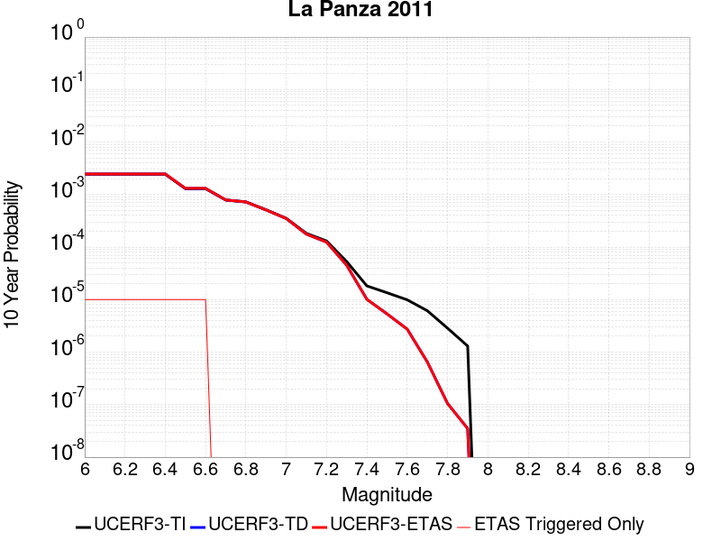 |

| Magnitude | 1 wk TI Prob | 1 wk TD Prob | 1 wk ETAS Prob | 1 wk ETAS/TD Gain | 1 wk ETAS Triggered Only | 1 mo TI Prob | 1 mo TD Prob | 1 mo ETAS Prob | 1 mo ETAS/TD Gain | 1 mo ETAS Triggered Only | 1 yr TI Prob | 1 yr TD Prob | 1 yr ETAS Prob | 1 yr ETAS/TD Gain | 1 yr ETAS Triggered Only | 10 yr TI Prob | 10 yr TD Prob | 10 yr ETAS Prob | 10 yr ETAS/TD Gain | 10 yr ETAS Triggered Only |
|-----|-----|-----|-----|-----|-----|-----|-----|-----|-----|-----|-----|-----|-----|-----|-----|-----|-----|-----|-----|-----|
| 6.0 | 4.6754544E-6 | 4.7177346E-6 | 4.7177346E-6 | 1.0 | 0.0 | 2.0037509E-5 | 2.0218718E-5 | 2.0218718E-5 | 1.0 | 0.0 | 2.4392935E-4 | 2.4613706E-4 | 2.5613458E-4 | 1.0406178 | 1.0E-5 | 0.0024366176 | 0.0024588387 | 0.0024688141 | 1.0040569 | 1.0E-5 |
| 6.1 | 4.6754544E-6 | 4.7177346E-6 | 4.7177346E-6 | 1.0 | 0.0 | 2.0037509E-5 | 2.0218718E-5 | 2.0218718E-5 | 1.0 | 0.0 | 2.4392935E-4 | 2.4613706E-4 | 2.5613458E-4 | 1.0406178 | 1.0E-5 | 0.0024366176 | 0.0024588387 | 0.0024688141 | 1.0040569 | 1.0E-5 |
| 6.2 | 4.6754544E-6 | 4.7177346E-6 | 4.7177346E-6 | 1.0 | 0.0 | 2.0037509E-5 | 2.0218718E-5 | 2.0218718E-5 | 1.0 | 0.0 | 2.4392935E-4 | 2.4613706E-4 | 2.5613458E-4 | 1.0406178 | 1.0E-5 | 0.0024366176 | 0.0024588387 | 0.0024688141 | 1.0040569 | 1.0E-5 |
| 6.3 | 4.6754544E-6 | 4.7177346E-6 | 4.7177346E-6 | 1.0 | 0.0 | 2.0037509E-5 | 2.0218718E-5 | 2.0218718E-5 | 1.0 | 0.0 | 2.4392935E-4 | 2.4613706E-4 | 2.5613458E-4 | 1.0406178 | 1.0E-5 | 0.0024366176 | 0.0024588387 | 0.0024688141 | 1.0040569 | 1.0E-5 |
| 6.4 | 4.6754544E-6 | 4.7177346E-6 | 4.7177346E-6 | 1.0 | 0.0 | 2.0037509E-5 | 2.0218718E-5 | 2.0218718E-5 | 1.0 | 0.0 | 2.4392935E-4 | 2.4613706E-4 | 2.5613458E-4 | 1.0406178 | 1.0E-5 | 0.0024366176 | 0.0024588387 | 0.0024688141 | 1.0040569 | 1.0E-5 |
| 6.5 | 2.485343E-6 | 2.5007214E-6 | 2.5007214E-6 | 1.0 | 0.0 | 1.0651426E-5 | 1.07173355E-5 | 1.07173355E-5 | 1.0 | 0.0 | 1.296734E-4 | 1.3047614E-4 | 1.4047483E-4 | 1.0766324 | 1.0E-5 | 0.0012959775 | 0.0013040337 | 0.0013140207 | 1.0076585 | 1.0E-5 |
| 6.6 | 2.485343E-6 | 2.5007214E-6 | 2.5007214E-6 | 1.0 | 0.0 | 1.0651426E-5 | 1.07173355E-5 | 1.07173355E-5 | 1.0 | 0.0 | 1.296734E-4 | 1.3047614E-4 | 1.4047483E-4 | 1.0766324 | 1.0E-5 | 0.0012959775 | 0.0013040337 | 0.0013140207 | 1.0076585 | 1.0E-5 |
| 6.7 | 1.5108508E-6 | 1.5147492E-6 | 1.5147492E-6 | 1.0 | 0.0 | 6.4750584E-6 | 6.4917667E-6 | 6.4917667E-6 | 1.0 | 0.0 | 7.8830984E-5 | 7.90345E-5 | 7.90345E-5 | 1.0 | 0.0 | 7.880303E-4 | 7.9007476E-4 | 7.9007476E-4 | 1.0 | 0.0 |
| 6.8 | 1.3865837E-6 | 1.3886201E-6 | 1.3886201E-6 | 1.0 | 0.0 | 5.942488E-6 | 5.9512163E-6 | 5.9512163E-6 | 1.0 | 0.0 | 7.234739E-5 | 7.2453746E-5 | 7.2453746E-5 | 1.0 | 0.0 | 7.232384E-4 | 7.2431104E-4 | 7.2431104E-4 | 1.0 | 0.0 |
| 6.9 | 9.826583E-7 | 9.79734E-7 | 9.79734E-7 | 1.0 | 0.0 | 4.2113857E-6 | 4.1988533E-6 | 4.1988533E-6 | 1.0 | 0.0 | 5.1272415E-5 | 5.1119896E-5 | 5.1119896E-5 | 1.0 | 0.0 | 5.126059E-4 | 5.110867E-4 | 5.110867E-4 | 1.0 | 0.0 |
| 7.0 | 6.7797646E-7 | 6.711231E-7 | 6.711231E-7 | 1.0 | 0.0 | 2.9056102E-6 | 2.8762388E-6 | 2.8762388E-6 | 1.0 | 0.0 | 3.537523E-5 | 3.5017678E-5 | 3.5017678E-5 | 1.0 | 0.0 | 3.5369597E-4 | 3.501247E-4 | 3.501247E-4 | 1.0 | 0.0 |
| 7.1 | 3.4979826E-7 | 3.3883657E-7 | 3.3883657E-7 | 1.0 | 0.0 | 1.4991346E-6 | 1.452156E-6 | 1.452156E-6 | 1.0 | 0.0 | 1.825181E-5 | 1.7679868E-5 | 1.7679868E-5 | 1.0 | 0.0 | 1.825031E-4 | 1.7678578E-4 | 1.7678578E-4 | 1.0 | 0.0 |
| 7.2 | 2.5088332E-7 | 2.3841534E-7 | 2.3841534E-7 | 1.0 | 0.0 | 1.0752137E-6 | 1.0217797E-6 | 1.0217797E-6 | 1.0 | 0.0 | 1.3090649E-5 | 1.2440105E-5 | 1.2440105E-5 | 1.0 | 0.0 | 1.3089878E-4 | 1.2439494E-4 | 1.2439494E-4 | 1.0 | 0.0 |
| 7.3 | 1.0159086E-7 | 8.654011E-8 | 8.654011E-8 | 1.0 | 0.0 | 4.3538932E-7 | 3.7088614E-7 | 3.7088614E-7 | 1.0 | 0.0 | 5.300852E-6 | 4.51553E-6 | 4.51553E-6 | 1.0 | 0.0 | 5.3007258E-5 | 4.515442E-5 | 4.515442E-5 | 1.0 | 0.0 |
| 7.4 | 3.5006252E-8 | 1.9434475E-8 | 1.9434475E-8 | 1.0 | 0.0 | 1.5002678E-7 | 8.329061E-8 | 8.329061E-8 | 1.0 | 0.0 | 1.8265745E-6 | 1.0140627E-6 | 1.0140627E-6 | 1.0 | 0.0 | 1.8265595E-5 | 1.0140583E-5 | 1.0140583E-5 | 1.0 | 0.0 |
| 7.5 | 2.592274E-8 | 1.02616085E-8 | 1.02616085E-8 | 1.0 | 0.0 | 1.1109746E-7 | 4.3978318E-8 | 4.3978318E-8 | 1.0 | 0.0 | 1.3526106E-6 | 5.354359E-7 | 5.354359E-7 | 1.0 | 0.0 | 1.3526024E-5 | 5.354347E-6 | 5.354347E-6 | 1.0 | 0.0 |
| 7.6 | 1.9016717E-8 | 5.259263E-9 | 5.259263E-9 | 1.0 | 0.0 | 8.150022E-8 | 2.2539696E-8 | 2.2539696E-8 | 1.0 | 0.0 | 9.922647E-7 | 2.7442078E-7 | 2.7442078E-7 | 1.0 | 0.0 | 9.922603E-6 | 2.7442045E-6 | 2.7442045E-6 | 1.0 | 0.0 |
| 7.7 | 1.17738495E-8 | 1.2460861E-9 | 1.2460861E-9 | 1.0 | 0.0 | 5.0459356E-8 | 5.340369E-9 | 5.340369E-9 | 1.0 | 0.0 | 6.1434247E-7 | 6.5018995E-8 | 6.5018995E-8 | 1.0 | 0.0 | 6.143408E-6 | 6.501898E-7 | 6.501898E-7 | 1.0 | 0.0 |
| 7.8 | 5.489079E-9 | 2.0276236E-10 | 2.0276236E-10 | 1.0 | 0.0 | 2.3524624E-8 | 8.6898155E-10 | 8.6898155E-10 | 1.0 | 0.0 | 2.8641225E-7 | 1.0579852E-8 | 1.0579852E-8 | 1.0 | 0.0 | 2.8641189E-6 | 1.0579851E-7 | 1.0579851E-7 | 1.0 | 0.0 |
| 7.9 | 2.5081048E-9 | 6.74627E-11 | 6.74627E-11 | 1.0 | 0.0 | 1.0749021E-8 | 2.8912583E-10 | 2.8912583E-10 | 1.0 | 0.0 | 1.3086932E-7 | 3.5201086E-9 | 3.5201086E-9 | 1.0 | 0.0 | 1.3086925E-6 | 3.5201086E-8 | 3.5201086E-8 | 1.0 | 0.0 |

## Brawley (Seismic Zone) alt 1
*[(top)](#table-of-contents)*

| 1 Week | 1 Month | 1 Year | 10 Year |
|-----|-----|-----|-----|
|  |  |  |  |

| Magnitude | 1 wk TI Prob | 1 wk TD Prob | 1 wk ETAS Prob | 1 wk ETAS/TD Gain | 1 wk ETAS Triggered Only | 1 mo TI Prob | 1 mo TD Prob | 1 mo ETAS Prob | 1 mo ETAS/TD Gain | 1 mo ETAS Triggered Only | 1 yr TI Prob | 1 yr TD Prob | 1 yr ETAS Prob | 1 yr ETAS/TD Gain | 1 yr ETAS Triggered Only | 10 yr TI Prob | 10 yr TD Prob | 10 yr ETAS Prob | 10 yr ETAS/TD Gain | 10 yr ETAS Triggered Only |
|-----|-----|-----|-----|-----|-----|-----|-----|-----|-----|-----|-----|-----|-----|-----|-----|-----|-----|-----|-----|-----|
| 6.0 | 2.2521618E-4 | 4.7694708E-4 | 4.7694708E-4 | 1.0 | 0.0 | 9.6485513E-4 | 0.0020424947 | 0.0020424947 | 1.0 | 0.0 | 0.011683988 | 0.02457787 | 0.02457787 | 1.0 | 0.0 | 0.11088423 | 0.21371362 | 0.21372148 | 1.0000368 | 1.0E-5 |
| 6.1 | 2.2521618E-4 | 4.7694708E-4 | 4.7694708E-4 | 1.0 | 0.0 | 9.6485513E-4 | 0.0020424947 | 0.0020424947 | 1.0 | 0.0 | 0.011683988 | 0.02457787 | 0.02457787 | 1.0 | 0.0 | 0.11088423 | 0.21371362 | 0.21371362 | 1.0 | 0.0 |
| 6.2 | 2.198148E-4 | 4.677769E-4 | 4.677769E-4 | 1.0 | 0.0 | 9.417233E-4 | 0.0020032546 | 0.0020032546 | 1.0 | 0.0 | 0.011405343 | 0.024111332 | 0.024111332 | 1.0 | 0.0 | 0.10837428 | 0.21014665 | 0.21014665 | 1.0 | 0.0 |
| 6.3 | 2.1704129E-4 | 4.6213152E-4 | 4.6213152E-4 | 1.0 | 0.0 | 9.298453E-4 | 0.001979097 | 0.001979097 | 1.0 | 0.0 | 0.011262234 | 0.023824384 | 0.023824384 | 1.0 | 0.0 | 0.107082725 | 0.20803759 | 0.20803759 | 1.0 | 0.0 |
| 6.4 | 1.876142E-4 | 4.0103446E-4 | 4.0103446E-4 | 1.0 | 0.0 | 8.038131E-4 | 0.0017176014 | 0.0017176014 | 1.0 | 0.0 | 0.00974259 | 0.020710314 | 0.020710314 | 1.0 | 0.0 | 0.093263686 | 0.18478906 | 0.18478906 | 1.0 | 0.0 |
| 6.5 | 1.7390939E-4 | 3.7533377E-4 | 3.7533377E-4 | 1.0 | 0.0 | 7.45113E-4 | 0.0016075937 | 0.0016075937 | 1.0 | 0.0 | 0.009034078 | 0.019397533 | 0.019397533 | 1.0 | 0.0 | 0.086755216 | 0.1746071 | 0.1746071 | 1.0 | 0.0 |
| 6.6 | 1.591791E-4 | 3.49453E-4 | 3.49453E-4 | 1.0 | 0.0 | 6.8201777E-4 | 0.0014968063 | 0.0014968063 | 1.0 | 0.0 | 0.008271996 | 0.018072907 | 0.018072907 | 1.0 | 0.0 | 0.07970774 | 0.16400866 | 0.16400866 | 1.0 | 0.0 |
| 6.7 | 1.4268003E-4 | 3.2108312E-4 | 3.2108312E-4 | 1.0 | 0.0 | 6.1134255E-4 | 0.0013753531 | 0.0013753531 | 1.0 | 0.0 | 0.007417723 | 0.016618326 | 0.016618326 | 1.0 | 0.0 | 0.07174956 | 0.15212566 | 0.15212566 | 1.0 | 0.0 |
| 6.8 | 1.239713E-4 | 2.9096124E-4 | 2.9096124E-4 | 1.0 | 0.0 | 5.3119735E-4 | 0.001246387 | 0.001246387 | 1.0 | 0.0 | 0.0064481674 | 0.0150706135 | 0.0150706135 | 1.0 | 0.0 | 0.06264243 | 0.13854627 | 0.13854627 | 1.0 | 0.0 |
| 6.9 | 1.0180238E-4 | 2.628728E-4 | 2.628728E-4 | 1.0 | 0.0 | 4.3622297E-4 | 0.0011261157 | 0.0011261157 | 1.0 | 0.0 | 0.005298089 | 0.013625271 | 0.013625271 | 1.0 | 0.0 | 0.05173543 | 0.12509508 | 0.12509508 | 1.0 | 0.0 |
| 7.0 | 7.6619996E-5 | 2.242434E-4 | 2.242434E-4 | 1.0 | 0.0 | 3.283301E-4 | 9.6069236E-4 | 9.6069236E-4 | 1.0 | 0.0 | 0.0039900932 | 0.011634412 | 0.011634412 | 1.0 | 0.0 | 0.039192066 | 0.10736954 | 0.10736954 | 1.0 | 0.0 |
| 7.1 | 7.5127435E-5 | 2.2107185E-4 | 2.2107185E-4 | 1.0 | 0.0 | 3.2193496E-4 | 9.4710995E-4 | 9.4710995E-4 | 1.0 | 0.0 | 0.0039125155 | 0.011470799 | 0.011470799 | 1.0 | 0.0 | 0.038443442 | 0.10593241 | 0.10593241 | 1.0 | 0.0 |
| 7.2 | 6.788582E-5 | 2.0234057E-4 | 2.0234057E-4 | 1.0 | 0.0 | 2.9090676E-4 | 8.668887E-4 | 8.668887E-4 | 1.0 | 0.0 | 0.0035360386 | 0.010503935 | 0.010503935 | 1.0 | 0.0 | 0.034803 | 0.09760045 | 0.09760045 | 1.0 | 0.0 |
| 7.3 | 6.399602E-5 | 1.886401E-4 | 1.886401E-4 | 1.0 | 0.0 | 2.7423984E-4 | 8.0820994E-4 | 8.0820994E-4 | 1.0 | 0.0 | 0.0033337586 | 0.009796152 | 0.009796152 | 1.0 | 0.0 | 0.03284188 | 0.091492124 | 0.091492124 | 1.0 | 0.0 |
| 7.4 | 4.506759E-5 | 1.2547271E-4 | 1.2547271E-4 | 1.0 | 0.0 | 1.9313251E-4 | 5.376303E-4 | 5.376303E-4 | 1.0 | 0.0 | 0.0023488526 | 0.006526178 | 0.006526178 | 1.0 | 0.0 | 0.023241805 | 0.062442943 | 0.062442943 | 1.0 | 0.0 |
| 7.5 | 3.43289E-5 | 9.350686E-5 | 9.350686E-5 | 1.0 | 0.0 | 1.4711556E-4 | 4.0068245E-4 | 4.0068245E-4 | 1.0 | 0.0 | 0.0017896603 | 0.004867459 | 0.004867459 | 1.0 | 0.0 | 0.01775316 | 0.047123548 | 0.047123548 | 1.0 | 0.0 |
| 7.6 | 2.5980507E-5 | 7.066414E-5 | 7.066414E-5 | 1.0 | 0.0 | 1.1134028E-4 | 3.0281127E-4 | 3.0281127E-4 | 1.0 | 0.0 | 0.001354725 | 0.003680519 | 0.003680519 | 1.0 | 0.0 | 0.013464959 | 0.035901073 | 0.035901073 | 1.0 | 0.0 |
| 7.7 | 1.7292105E-5 | 4.9520917E-5 | 4.9520917E-5 | 1.0 | 0.0 | 7.4106916E-5 | 2.1221527E-4 | 2.1221527E-4 | 1.0 | 0.0 | 9.018782E-4 | 0.0025806653 | 0.0025806653 | 1.0 | 0.0 | 0.008982267 | 0.02534209 | 0.02534209 | 1.0 | 0.0 |
| 7.8 | 1.2927471E-5 | 3.9792216E-5 | 3.9792216E-5 | 1.0 | 0.0 | 5.5402274E-5 | 1.7052692E-4 | 1.7052692E-4 | 1.0 | 0.0 | 6.743139E-4 | 0.0020741909 | 0.0020741909 | 1.0 | 0.0 | 0.0067227143 | 0.020476794 | 0.020476794 | 1.0 | 0.0 |
| 7.9 | 1.0200774E-5 | 2.8825754E-5 | 2.8825754E-5 | 1.0 | 0.0 | 4.371687E-5 | 1.235331E-4 | 1.235331E-4 | 1.0 | 0.0 | 5.321229E-4 | 0.001502979 | 0.001502979 | 1.0 | 0.0 | 0.005308505 | 0.015028679 | 0.015028679 | 1.0 | 0.0 |
| 8.0 | 8.650396E-6 | 2.3346063E-5 | 2.3346063E-5 | 1.0 | 0.0 | 3.70726E-5 | 1.00050725E-4 | 1.00050725E-4 | 1.0 | 0.0 | 4.5126543E-4 | 0.0012174378 | 0.0012174378 | 1.0 | 0.0 | 0.0045035016 | 0.012243103 | 0.012243103 | 1.0 | 0.0 |
| 8.1 | 3.9368224E-6 | 7.357526E-6 | 7.357526E-6 | 1.0 | 0.0 | 1.6871985E-5 | 3.1531876E-5 | 3.1531876E-5 | 1.0 | 0.0 | 2.0539707E-4 | 3.8383307E-4 | 3.8383307E-4 | 1.0 | 0.0 | 0.0020520731 | 0.004015839 | 0.004015839 | 1.0 | 0.0 |
| 8.2 | 1.7101195E-6 | 2.2294548E-6 | 2.2294548E-6 | 1.0 | 0.0 | 7.329063E-6 | 9.554771E-6 | 9.554771E-6 | 1.0 | 0.0 | 8.922769E-5 | 1.16323165E-4 | 1.16323165E-4 | 1.0 | 0.0 | 8.9191867E-4 | 0.0012726147 | 0.0012726147 | 1.0 | 0.0 |
| 8.3 | 3.0346666E-8 | 1.7336662E-8 | 1.7336662E-8 | 1.0 | 0.0 | 1.3005713E-7 | 7.429998E-8 | 7.429998E-8 | 1.0 | 0.0 | 1.5834444E-6 | 9.046022E-7 | 9.046022E-7 | 1.0 | 0.0 | 1.5834332E-5 | 9.432143E-6 | 9.432143E-6 | 1.0 | 0.0 |

## Kern Canyon (South Kern) 2011
*[(top)](#table-of-contents)*

| 1 Week | 1 Month | 1 Year | 10 Year |
|-----|-----|-----|-----|
|  | 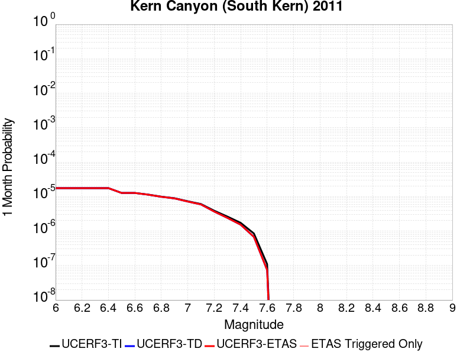 |  | 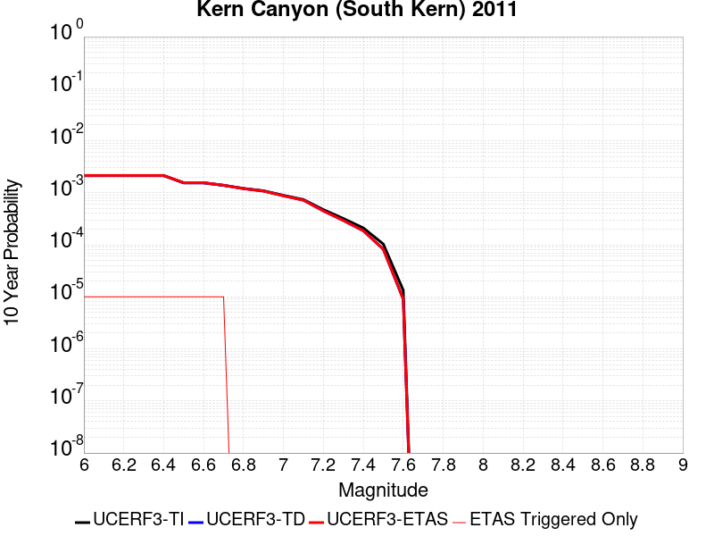 |

| Magnitude | 1 wk TI Prob | 1 wk TD Prob | 1 wk ETAS Prob | 1 wk ETAS/TD Gain | 1 wk ETAS Triggered Only | 1 mo TI Prob | 1 mo TD Prob | 1 mo ETAS Prob | 1 mo ETAS/TD Gain | 1 mo ETAS Triggered Only | 1 yr TI Prob | 1 yr TD Prob | 1 yr ETAS Prob | 1 yr ETAS/TD Gain | 1 yr ETAS Triggered Only | 10 yr TI Prob | 10 yr TD Prob | 10 yr ETAS Prob | 10 yr ETAS/TD Gain | 10 yr ETAS Triggered Only |
|-----|-----|-----|-----|-----|-----|-----|-----|-----|-----|-----|-----|-----|-----|-----|-----|-----|-----|-----|-----|-----|
| 6.0 | 4.105075E-6 | 4.1137982E-6 | 4.1137982E-6 | 1.0 | 0.0 | 1.7593058E-5 | 1.763045E-5 | 1.763045E-5 | 1.0 | 0.0 | 2.1417443E-4 | 2.1463021E-4 | 2.1463021E-4 | 1.0 | 0.0 | 0.0021396813 | 0.0021442932 | 0.0021542716 | 1.0046536 | 1.0E-5 |
| 6.1 | 4.105075E-6 | 4.1137982E-6 | 4.1137982E-6 | 1.0 | 0.0 | 1.7593058E-5 | 1.763045E-5 | 1.763045E-5 | 1.0 | 0.0 | 2.1417443E-4 | 2.1463021E-4 | 2.1463021E-4 | 1.0 | 0.0 | 0.0021396813 | 0.0021442932 | 0.0021542716 | 1.0046536 | 1.0E-5 |
| 6.2 | 4.105075E-6 | 4.1137982E-6 | 4.1137982E-6 | 1.0 | 0.0 | 1.7593058E-5 | 1.763045E-5 | 1.763045E-5 | 1.0 | 0.0 | 2.1417443E-4 | 2.1463021E-4 | 2.1463021E-4 | 1.0 | 0.0 | 0.0021396813 | 0.0021442932 | 0.0021542716 | 1.0046536 | 1.0E-5 |
| 6.3 | 4.105075E-6 | 4.1137982E-6 | 4.1137982E-6 | 1.0 | 0.0 | 1.7593058E-5 | 1.763045E-5 | 1.763045E-5 | 1.0 | 0.0 | 2.1417443E-4 | 2.1463021E-4 | 2.1463021E-4 | 1.0 | 0.0 | 0.0021396813 | 0.0021442932 | 0.0021542716 | 1.0046536 | 1.0E-5 |
| 6.4 | 4.105075E-6 | 4.1137982E-6 | 4.1137982E-6 | 1.0 | 0.0 | 1.7593058E-5 | 1.763045E-5 | 1.763045E-5 | 1.0 | 0.0 | 2.1417443E-4 | 2.1463021E-4 | 2.1463021E-4 | 1.0 | 0.0 | 0.0021396813 | 0.0021442932 | 0.0021542716 | 1.0046536 | 1.0E-5 |
| 6.5 | 2.9849807E-6 | 2.9732073E-6 | 2.9732073E-6 | 1.0 | 0.0 | 1.2792712E-5 | 1.2742255E-5 | 1.2742255E-5 | 1.0 | 0.0 | 1.5574014E-4 | 1.5512606E-4 | 1.5512606E-4 | 1.0 | 0.0 | 0.0015563103 | 0.001550193 | 0.0015601774 | 1.0064408 | 1.0E-5 |
| 6.6 | 2.9849807E-6 | 2.9732073E-6 | 2.9732073E-6 | 1.0 | 0.0 | 1.2792712E-5 | 1.2742255E-5 | 1.2742255E-5 | 1.0 | 0.0 | 1.5574014E-4 | 1.5512606E-4 | 1.5512606E-4 | 1.0 | 0.0 | 0.0015563103 | 0.001550193 | 0.0015601774 | 1.0064408 | 1.0E-5 |
| 6.7 | 2.6756725E-6 | 2.658268E-6 | 2.658268E-6 | 1.0 | 0.0 | 1.1467117E-5 | 1.1392528E-5 | 1.1392528E-5 | 1.0 | 0.0 | 1.396032E-4 | 1.3869531E-4 | 1.3869531E-4 | 1.0 | 0.0 | 0.0013951553 | 0.0013860983 | 0.0013960846 | 1.0072045 | 1.0E-5 |
| 6.8 | 2.3283721E-6 | 2.30482E-6 | 2.30482E-6 | 1.0 | 0.0 | 9.9787E-6 | 9.877764E-6 | 9.877764E-6 | 1.0 | 0.0 | 1.214839E-4 | 1.20255216E-4 | 1.20255216E-4 | 1.0 | 0.0 | 0.001214175 | 0.0012019088 | 0.0012019088 | 1.0 | 0.0 |
| 6.9 | 2.0972677E-6 | 2.0696787E-6 | 2.0696787E-6 | 1.0 | 0.0 | 8.988259E-6 | 8.870022E-6 | 8.870022E-6 | 1.0 | 0.0 | 1.0942656E-4 | 1.0798722E-4 | 1.0798722E-4 | 1.0 | 0.0 | 0.0010937268 | 0.0010793533 | 0.0010793533 | 1.0 | 0.0 |
| 7.0 | 1.7132242E-6 | 1.6787346E-6 | 1.6787346E-6 | 1.0 | 0.0 | 7.3423685E-6 | 7.1945574E-6 | 7.1945574E-6 | 1.0 | 0.0 | 8.938967E-5 | 8.7590255E-5 | 8.7590255E-5 | 1.0 | 0.0 | 8.935372E-4 | 8.7556115E-4 | 8.7556115E-4 | 1.0 | 0.0 |
| 7.1 | 1.4215541E-6 | 1.3816011E-6 | 1.3816011E-6 | 1.0 | 0.0 | 6.0923603E-6 | 5.9211343E-6 | 5.9211343E-6 | 1.0 | 0.0 | 7.417196E-5 | 7.208745E-5 | 7.208745E-5 | 1.0 | 0.0 | 7.414721E-4 | 7.206434E-4 | 7.206434E-4 | 1.0 | 0.0 |
| 7.2 | 9.097853E-7 | 8.6039455E-7 | 8.6039455E-7 | 1.0 | 0.0 | 3.899074E-6 | 3.6874E-6 | 3.6874E-6 | 1.0 | 0.0 | 4.7470192E-5 | 4.4893182E-5 | 4.4893182E-5 | 1.0 | 0.0 | 4.7460053E-4 | 4.488422E-4 | 4.488422E-4 | 1.0 | 0.0 |
| 7.3 | 6.144169E-7 | 5.628324E-7 | 5.628324E-7 | 1.0 | 0.0 | 2.6332125E-6 | 2.4121366E-6 | 2.4121366E-6 | 1.0 | 0.0 | 3.205889E-5 | 2.9367371E-5 | 2.9367371E-5 | 1.0 | 0.0 | 3.2054266E-4 | 2.936354E-4 | 2.936354E-4 | 1.0 | 0.0 |
| 7.4 | 4.049844E-7 | 3.5729116E-7 | 3.5729116E-7 | 1.0 | 0.0 | 1.7356463E-6 | 1.5312469E-6 | 1.5312469E-6 | 1.0 | 0.0 | 2.1131287E-5 | 1.8642773E-5 | 1.8642773E-5 | 1.0 | 0.0 | 2.1129279E-4 | 1.8641235E-4 | 1.8641235E-4 | 1.0 | 0.0 |
| 7.5 | 1.9871162E-7 | 1.5830864E-7 | 1.5830864E-7 | 1.0 | 0.0 | 8.5162094E-7 | 6.7846537E-7 | 6.7846537E-7 | 1.0 | 0.0 | 1.0368436E-5 | 8.2602855E-6 | 8.2602855E-6 | 1.0 | 0.0 | 1.0367952E-4 | 8.259987E-5 | 8.259987E-5 | 1.0 | 0.0 |
| 7.6 | 2.572245E-8 | 1.735313E-8 | 1.735313E-8 | 1.0 | 0.0 | 1.10239064E-7 | 7.4370554E-8 | 7.4370554E-8 | 1.0 | 0.0 | 1.3421597E-6 | 9.054612E-7 | 9.054612E-7 | 1.0 | 0.0 | 1.3421517E-5 | 9.054581E-6 | 9.054581E-6 | 1.0 | 0.0 |

## Eaton Roughs 2011 CFM
*[(top)](#table-of-contents)*

| 1 Week | 1 Month | 1 Year | 10 Year |
|-----|-----|-----|-----|
| 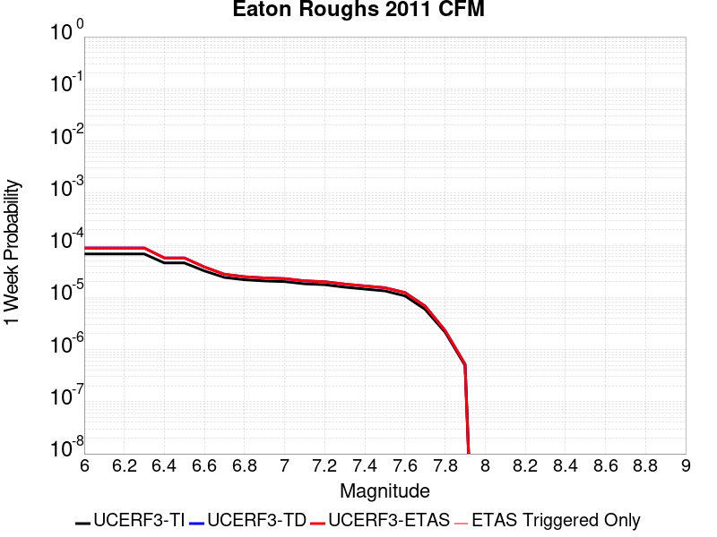 | 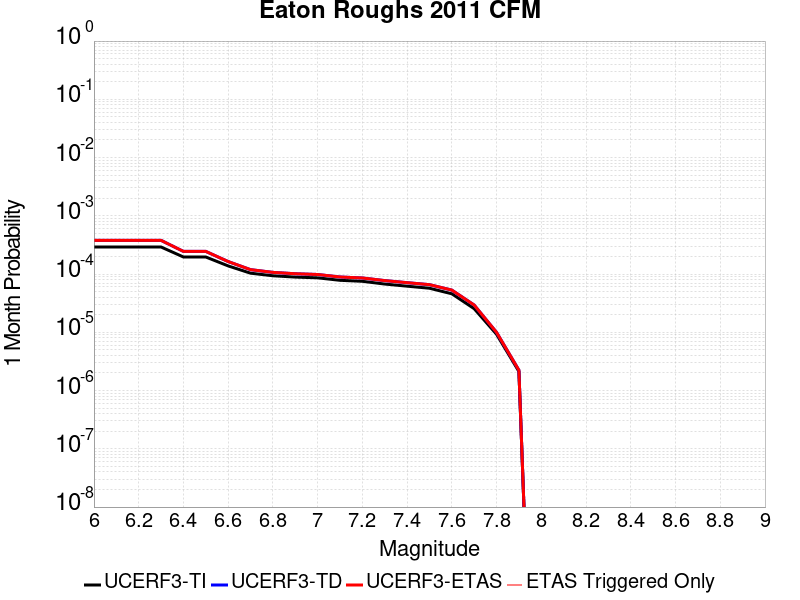 |  |  |

| Magnitude | 1 wk TI Prob | 1 wk TD Prob | 1 wk ETAS Prob | 1 wk ETAS/TD Gain | 1 wk ETAS Triggered Only | 1 mo TI Prob | 1 mo TD Prob | 1 mo ETAS Prob | 1 mo ETAS/TD Gain | 1 mo ETAS Triggered Only | 1 yr TI Prob | 1 yr TD Prob | 1 yr ETAS Prob | 1 yr ETAS/TD Gain | 1 yr ETAS Triggered Only | 10 yr TI Prob | 10 yr TD Prob | 10 yr ETAS Prob | 10 yr ETAS/TD Gain | 10 yr ETAS Triggered Only |
|-----|-----|-----|-----|-----|-----|-----|-----|-----|-----|-----|-----|-----|-----|-----|-----|-----|-----|-----|-----|-----|
| 6.0 | 6.8044945E-5 | 8.846242E-5 | 8.846242E-5 | 1.0 | 0.0 | 2.9158857E-4 | 3.7907614E-4 | 3.7907614E-4 | 1.0 | 0.0 | 0.0035443127 | 0.004606217 | 0.004606217 | 1.0 | 0.0 | 0.03488314 | 0.045174804 | 0.04518435 | 1.0002114 | 1.0E-5 |
| 6.1 | 6.8044945E-5 | 8.846242E-5 | 8.846242E-5 | 1.0 | 0.0 | 2.9158857E-4 | 3.7907614E-4 | 3.7907614E-4 | 1.0 | 0.0 | 0.0035443127 | 0.004606217 | 0.004606217 | 1.0 | 0.0 | 0.03488314 | 0.045174804 | 0.04518435 | 1.0002114 | 1.0E-5 |
| 6.2 | 6.8044945E-5 | 8.846242E-5 | 8.846242E-5 | 1.0 | 0.0 | 2.9158857E-4 | 3.7907614E-4 | 3.7907614E-4 | 1.0 | 0.0 | 0.0035443127 | 0.004606217 | 0.004606217 | 1.0 | 0.0 | 0.03488314 | 0.045174804 | 0.04518435 | 1.0002114 | 1.0E-5 |
| 6.3 | 6.8044945E-5 | 8.846242E-5 | 8.846242E-5 | 1.0 | 0.0 | 2.9158857E-4 | 3.7907614E-4 | 3.7907614E-4 | 1.0 | 0.0 | 0.0035443127 | 0.004606217 | 0.004606217 | 1.0 | 0.0 | 0.03488314 | 0.045174804 | 0.04518435 | 1.0002114 | 1.0E-5 |
| 6.4 | 4.5830013E-5 | 5.7167952E-5 | 5.7167952E-5 | 1.0 | 0.0 | 1.9639956E-4 | 2.4498554E-4 | 2.4498554E-4 | 1.0 | 0.0 | 0.0023885423 | 0.0029791591 | 0.0029791591 | 1.0 | 0.0 | 0.023630321 | 0.02942802 | 0.029437726 | 1.0003299 | 1.0E-5 |
| 6.5 | 4.5830013E-5 | 5.7167952E-5 | 5.7167952E-5 | 1.0 | 0.0 | 1.9639956E-4 | 2.4498554E-4 | 2.4498554E-4 | 1.0 | 0.0 | 0.0023885423 | 0.0029791591 | 0.0029791591 | 1.0 | 0.0 | 0.023630321 | 0.02942802 | 0.029437726 | 1.0003299 | 1.0E-5 |
| 6.6 | 3.222194E-5 | 3.8268237E-5 | 3.8268237E-5 | 1.0 | 0.0 | 1.3808672E-4 | 1.6399707E-4 | 1.6399707E-4 | 1.0 | 0.0 | 0.0016799092 | 0.0019949498 | 0.0019949498 | 1.0 | 0.0 | 0.016672665 | 0.019779978 | 0.01978978 | 1.0004956 | 1.0E-5 |
| 6.7 | 2.4155654E-5 | 2.7790025E-5 | 2.7790025E-5 | 1.0 | 0.0 | 1.0352012E-4 | 1.19094715E-4 | 1.19094715E-4 | 1.0 | 0.0 | 0.0012596287 | 0.001449022 | 0.001449022 | 1.0 | 0.0 | 0.012525126 | 0.014396891 | 0.014406747 | 1.0006846 | 1.0E-5 |
| 6.8 | 2.1814667E-5 | 2.494408E-5 | 2.494408E-5 | 1.0 | 0.0 | 9.348808E-5 | 1.0689884E-4 | 1.0689884E-4 | 1.0 | 0.0 | 0.001137623 | 0.0013007201 | 0.0013007201 | 1.0 | 0.0 | 0.011318169 | 0.012931694 | 0.012941564 | 1.0007633 | 1.0E-5 |
| 6.9 | 2.0700467E-5 | 2.3631928E-5 | 2.3631928E-5 | 1.0 | 0.0 | 8.871327E-5 | 1.0127578E-4 | 1.0127578E-4 | 1.0 | 0.0 | 0.0010795488 | 0.0012323384 | 0.0012323384 | 1.0 | 0.0 | 0.010743194 | 0.012255579 | 0.012265457 | 1.000806 | 1.0E-5 |
| 7.0 | 2.0104066E-5 | 2.293939E-5 | 2.293939E-5 | 1.0 | 0.0 | 8.615744E-5 | 9.830798E-5 | 9.830798E-5 | 1.0 | 0.0 | 0.0010484619 | 0.0011962455 | 0.0011962455 | 1.0 | 0.0 | 0.010435291 | 0.011898563 | 0.011908444 | 1.0008304 | 1.0E-5 |
| 7.1 | 1.8225232E-5 | 2.077563E-5 | 2.077563E-5 | 1.0 | 0.0 | 7.81058E-5 | 8.9035384E-5 | 8.9035384E-5 | 1.0 | 0.0 | 9.5052324E-4 | 0.0010834683 | 0.0010834683 | 1.0 | 0.0 | 0.009464677 | 0.010782159 | 0.010792051 | 1.0009174 | 1.0E-5 |
| 7.2 | 1.7526572E-5 | 1.9995985E-5 | 1.9995985E-5 | 1.0 | 0.0 | 7.511172E-5 | 8.569427E-5 | 8.569427E-5 | 1.0 | 0.0 | 9.141015E-4 | 0.0010428298 | 0.0010428298 | 1.0 | 0.0 | 0.009103506 | 0.01037964 | 0.010389537 | 1.0009534 | 1.0E-5 |
| 7.3 | 1.5727232E-5 | 1.8023822E-5 | 1.8023822E-5 | 1.0 | 0.0 | 6.740067E-5 | 7.724267E-5 | 7.724267E-5 | 1.0 | 0.0 | 8.2029426E-4 | 9.400251E-4 | 9.400251E-4 | 1.0 | 0.0 | 0.008172729 | 0.009360708 | 0.009370615 | 1.0010583 | 1.0E-5 |
| 7.4 | 1.4457361E-5 | 1.6600512E-5 | 1.6600512E-5 | 1.0 | 0.0 | 6.195865E-5 | 7.114311E-5 | 7.114311E-5 | 1.0 | 0.0 | 7.540854E-4 | 8.658241E-4 | 8.658241E-4 | 1.0 | 0.0 | 0.007515317 | 0.008624669 | 0.008634583 | 1.0011494 | 1.0E-5 |
| 7.5 | 1.33280955E-5 | 1.5347456E-5 | 1.5347456E-5 | 1.0 | 0.0 | 5.711916E-5 | 6.577316E-5 | 6.577316E-5 | 1.0 | 0.0 | 6.9520384E-4 | 8.0049486E-4 | 8.0049486E-4 | 1.0 | 0.0 | 0.00693033 | 0.007976255 | 0.007986175 | 1.0012437 | 1.0E-5 |
| 7.6 | 1.0699478E-5 | 1.2389482E-5 | 1.2389482E-5 | 1.0 | 0.0 | 4.5854096E-5 | 5.3096705E-5 | 5.3096705E-5 | 1.0 | 0.0 | 5.581306E-4 | 6.4626115E-4 | 6.4626115E-4 | 1.0 | 0.0 | 0.005567309 | 0.0064438996 | 0.006453835 | 1.0015419 | 1.0E-5 |
| 7.7 | 5.9390236E-6 | 6.853801E-6 | 6.853801E-6 | 1.0 | 0.0 | 2.545271E-5 | 2.9373105E-5 | 2.9373105E-5 | 1.0 | 0.0 | 3.0984267E-4 | 3.575591E-4 | 3.575591E-4 | 1.0 | 0.0 | 0.0030941102 | 0.0035698623 | 0.0035698623 | 1.0 | 0.0 |
| 7.8 | 2.1622036E-6 | 2.3298624E-6 | 2.3298624E-6 | 1.0 | 0.0 | 9.266554E-6 | 9.985086E-6 | 9.985086E-6 | 1.0 | 0.0 | 1.1281446E-4 | 1.21561716E-4 | 1.21561716E-4 | 1.0 | 0.0 | 0.001127572 | 0.0012149579 | 0.0012149579 | 1.0 | 0.0 |
| 7.9 | 4.9586197E-7 | 5.2191757E-7 | 5.2191757E-7 | 1.0 | 0.0 | 2.125121E-6 | 2.2367879E-6 | 2.2367879E-6 | 1.0 | 0.0 | 2.5873042E-5 | 2.7232572E-5 | 2.7232572E-5 | 1.0 | 0.0 | 2.5870028E-4 | 2.7229445E-4 | 2.7229445E-4 | 1.0 | 0.0 |

## Newport-Inglewood alt 1
*[(top)](#table-of-contents)*

| 1 Week | 1 Month | 1 Year | 10 Year |
|-----|-----|-----|-----|
| 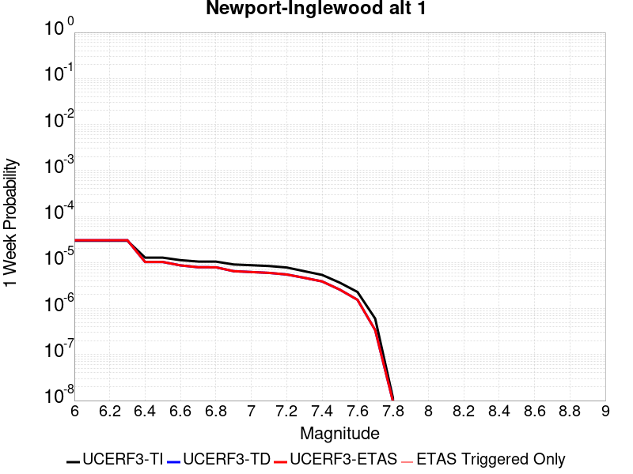 |  |  |  |

| Magnitude | 1 wk TI Prob | 1 wk TD Prob | 1 wk ETAS Prob | 1 wk ETAS/TD Gain | 1 wk ETAS Triggered Only | 1 mo TI Prob | 1 mo TD Prob | 1 mo ETAS Prob | 1 mo ETAS/TD Gain | 1 mo ETAS Triggered Only | 1 yr TI Prob | 1 yr TD Prob | 1 yr ETAS Prob | 1 yr ETAS/TD Gain | 1 yr ETAS Triggered Only | 10 yr TI Prob | 10 yr TD Prob | 10 yr ETAS Prob | 10 yr ETAS/TD Gain | 10 yr ETAS Triggered Only |
|-----|-----|-----|-----|-----|-----|-----|-----|-----|-----|-----|-----|-----|-----|-----|-----|-----|-----|-----|-----|-----|
| 6.0 | 2.9668912E-5 | 3.0409383E-5 | 3.0409383E-5 | 1.0 | 0.0 | 1.2714628E-4 | 1.3032217E-4 | 1.3032217E-4 | 1.0 | 0.0 | 0.0015469068 | 0.0015859981 | 0.0015859981 | 1.0 | 0.0 | 0.015361829 | 0.015794398 | 0.01580424 | 1.0006231 | 1.0E-5 |
| 6.1 | 2.9668912E-5 | 3.0409383E-5 | 3.0409383E-5 | 1.0 | 0.0 | 1.2714628E-4 | 1.3032217E-4 | 1.3032217E-4 | 1.0 | 0.0 | 0.0015469068 | 0.0015859981 | 0.0015859981 | 1.0 | 0.0 | 0.015361829 | 0.015794398 | 0.01580424 | 1.0006231 | 1.0E-5 |
| 6.2 | 2.9668912E-5 | 3.0409383E-5 | 3.0409383E-5 | 1.0 | 0.0 | 1.2714628E-4 | 1.3032217E-4 | 1.3032217E-4 | 1.0 | 0.0 | 0.0015469068 | 0.0015859981 | 0.0015859981 | 1.0 | 0.0 | 0.015361829 | 0.015794398 | 0.01580424 | 1.0006231 | 1.0E-5 |
| 6.3 | 2.9668912E-5 | 3.0409383E-5 | 3.0409383E-5 | 1.0 | 0.0 | 1.2714628E-4 | 1.3032217E-4 | 1.3032217E-4 | 1.0 | 0.0 | 0.0015469068 | 0.0015859981 | 0.0015859981 | 1.0 | 0.0 | 0.015361829 | 0.015794398 | 0.01580424 | 1.0006231 | 1.0E-5 |
| 6.4 | 1.275942E-5 | 1.0273316E-5 | 1.0273316E-5 | 1.0 | 0.0 | 5.4682085E-5 | 4.4027776E-5 | 4.4027776E-5 | 1.0 | 0.0 | 6.65551E-4 | 5.359105E-4 | 5.359105E-4 | 1.0 | 0.0 | 0.0066356123 | 0.0053466065 | 0.0053466065 | 1.0 | 0.0 |
| 6.5 | 1.275942E-5 | 1.0273316E-5 | 1.0273316E-5 | 1.0 | 0.0 | 5.4682085E-5 | 4.4027776E-5 | 4.4027776E-5 | 1.0 | 0.0 | 6.65551E-4 | 5.359105E-4 | 5.359105E-4 | 1.0 | 0.0 | 0.0066356123 | 0.0053466065 | 0.0053466065 | 1.0 | 0.0 |
| 6.6 | 1.1255358E-5 | 8.662502E-6 | 8.662502E-6 | 1.0 | 0.0 | 4.8236358E-5 | 3.7124493E-5 | 3.7124493E-5 | 1.0 | 0.0 | 5.871194E-4 | 4.5189864E-4 | 4.5189864E-4 | 1.0 | 0.0 | 0.005855706 | 0.0045099743 | 0.0045099743 | 1.0 | 0.0 |
| 6.7 | 1.0504745E-5 | 7.900342E-6 | 7.900342E-6 | 1.0 | 0.0 | 4.5019555E-5 | 3.3858174E-5 | 3.3858174E-5 | 1.0 | 0.0 | 5.4797524E-4 | 4.1214656E-4 | 4.1214656E-4 | 1.0 | 0.0 | 0.0054662596 | 0.0041139517 | 0.0041139517 | 1.0 | 0.0 |
| 6.8 | 1.0476007E-5 | 7.881722E-6 | 7.881722E-6 | 1.0 | 0.0 | 4.4896402E-5 | 3.377838E-5 | 3.377838E-5 | 1.0 | 0.0 | 5.464766E-4 | 4.111754E-4 | 4.111754E-4 | 1.0 | 0.0 | 0.005451347 | 0.004104276 | 0.004104276 | 1.0 | 0.0 |
| 6.9 | 9.076797E-6 | 6.4900573E-6 | 6.4900573E-6 | 1.0 | 0.0 | 3.889998E-5 | 2.7814238E-5 | 2.7814238E-5 | 1.0 | 0.0 | 4.7350433E-4 | 3.3858605E-4 | 3.3858605E-4 | 1.0 | 0.0 | 0.004724967 | 0.0033807394 | 0.0033807394 | 1.0 | 0.0 |
| 7.0 | 8.73795E-6 | 6.212431E-6 | 6.212431E-6 | 1.0 | 0.0 | 3.7447822E-5 | 2.6624435E-5 | 2.6624435E-5 | 1.0 | 0.0 | 4.5583185E-4 | 3.2410456E-4 | 3.2410456E-4 | 1.0 | 0.0 | 0.0045489795 | 0.0032363504 | 0.0032363504 | 1.0 | 0.0 |
| 7.1 | 8.391299E-6 | 5.956195E-6 | 5.956195E-6 | 1.0 | 0.0 | 3.5962214E-5 | 2.55263E-5 | 2.55263E-5 | 1.0 | 0.0 | 4.37752E-4 | 3.1073866E-4 | 3.1073866E-4 | 1.0 | 0.0 | 0.004368907 | 0.0031030711 | 0.0031030711 | 1.0 | 0.0 |
| 7.2 | 7.796882E-6 | 5.496918E-6 | 5.496918E-6 | 1.0 | 0.0 | 3.341478E-5 | 2.3558008E-5 | 2.3558008E-5 | 1.0 | 0.0 | 4.06749E-4 | 2.8678123E-4 | 2.8678123E-4 | 1.0 | 0.0 | 0.0040600533 | 0.0028641354 | 0.0028641354 | 1.0 | 0.0 |
| 7.3 | 6.4738833E-6 | 4.648079E-6 | 4.648079E-6 | 1.0 | 0.0 | 2.774492E-5 | 1.9920188E-5 | 1.9920188E-5 | 1.0 | 0.0 | 3.3774204E-4 | 2.4250144E-4 | 2.4250144E-4 | 1.0 | 0.0 | 0.0033722918 | 0.002422385 | 0.002422385 | 1.0 | 0.0 |
| 7.4 | 5.382145E-6 | 3.885973E-6 | 3.885973E-6 | 1.0 | 0.0 | 2.3066134E-5 | 1.6654065E-5 | 1.6654065E-5 | 1.0 | 0.0 | 2.8079396E-4 | 2.0274452E-4 | 2.0274452E-4 | 1.0 | 0.0 | 0.0028043943 | 0.00202561 | 0.00202561 | 1.0 | 0.0 |
| 7.5 | 3.648244E-6 | 2.5739284E-6 | 2.5739284E-6 | 1.0 | 0.0 | 1.5635238E-5 | 1.1031077E-5 | 1.1031077E-5 | 1.0 | 0.0 | 1.9034238E-4 | 1.3429519E-4 | 1.3429519E-4 | 1.0 | 0.0 | 0.0019017943 | 0.0013421506 | 0.0013421506 | 1.0 | 0.0 |
| 7.6 | 2.2906888E-6 | 1.5480829E-6 | 1.5480829E-6 | 1.0 | 0.0 | 9.817201E-6 | 6.6346247E-6 | 6.6346247E-6 | 1.0 | 0.0 | 1.1951787E-4 | 8.077363E-5 | 8.077363E-5 | 1.0 | 0.0 | 0.0011945361 | 8.0744945E-4 | 8.0744945E-4 | 1.0 | 0.0 |
| 7.7 | 6.0479874E-7 | 3.3977608E-7 | 3.3977608E-7 | 1.0 | 0.0 | 2.5919921E-6 | 1.4561824E-6 | 1.4561824E-6 | 1.0 | 0.0 | 3.1557047E-5 | 1.7728891E-5 | 1.7728891E-5 | 1.0 | 0.0 | 3.1552566E-4 | 1.7727615E-4 | 1.7727615E-4 | 1.0 | 0.0 |
| 7.8 | 1.16056995E-8 | 9.782506E-9 | 9.782506E-9 | 1.0 | 0.0 | 4.9738713E-8 | 4.1925027E-8 | 4.1925027E-8 | 1.0 | 0.0 | 6.0556863E-7 | 5.104372E-7 | 5.104372E-7 | 1.0 | 0.0 | 6.05567E-6 | 5.104372E-6 | 5.104372E-6 | 1.0 | 0.0 |

## Clamshell-Sawpit
*[(top)](#table-of-contents)*

| 1 Week | 1 Month | 1 Year | 10 Year |
|-----|-----|-----|-----|
| 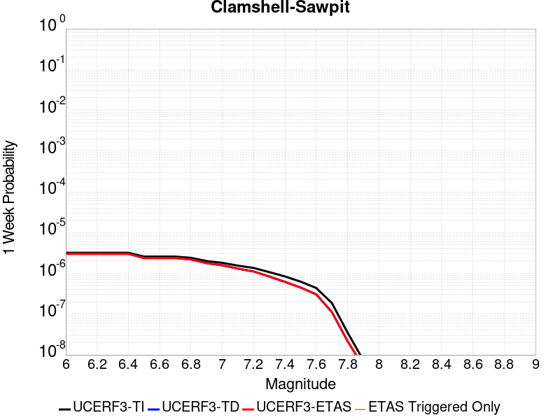 | 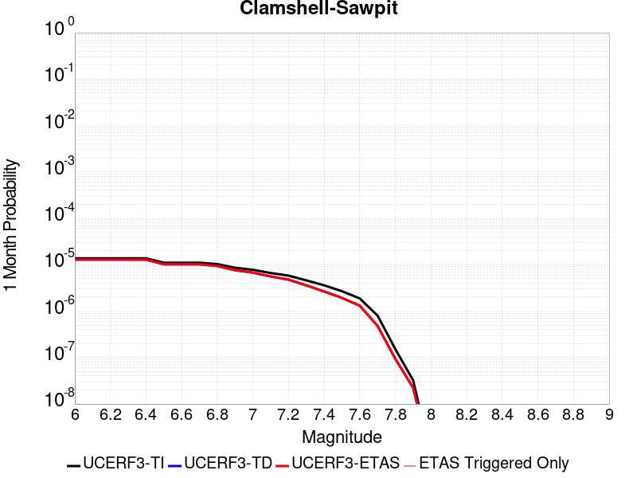 | 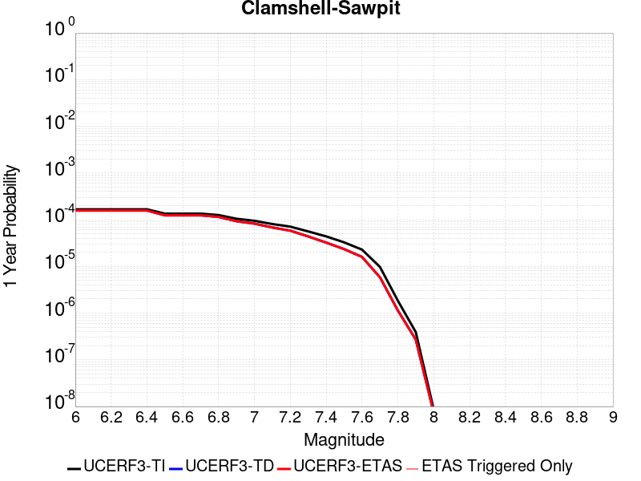 |  |

| Magnitude | 1 wk TI Prob | 1 wk TD Prob | 1 wk ETAS Prob | 1 wk ETAS/TD Gain | 1 wk ETAS Triggered Only | 1 mo TI Prob | 1 mo TD Prob | 1 mo ETAS Prob | 1 mo ETAS/TD Gain | 1 mo ETAS Triggered Only | 1 yr TI Prob | 1 yr TD Prob | 1 yr ETAS Prob | 1 yr ETAS/TD Gain | 1 yr ETAS Triggered Only | 10 yr TI Prob | 10 yr TD Prob | 10 yr ETAS Prob | 10 yr ETAS/TD Gain | 10 yr ETAS Triggered Only |
|-----|-----|-----|-----|-----|-----|-----|-----|-----|-----|-----|-----|-----|-----|-----|-----|-----|-----|-----|-----|-----|
| 6.0 | 3.202998E-6 | 3.0129008E-6 | 3.0129008E-6 | 1.0 | 0.0 | 1.3727062E-5 | 1.2912373E-5 | 1.2912373E-5 | 1.0 | 0.0 | 1.6711417E-4 | 1.571976E-4 | 1.571976E-4 | 1.0 | 0.0 | 0.0016698855 | 0.0015709435 | 0.0015809278 | 1.0063556 | 1.0E-5 |
| 6.1 | 3.202998E-6 | 3.0129008E-6 | 3.0129008E-6 | 1.0 | 0.0 | 1.3727062E-5 | 1.2912373E-5 | 1.2912373E-5 | 1.0 | 0.0 | 1.6711417E-4 | 1.571976E-4 | 1.571976E-4 | 1.0 | 0.0 | 0.0016698855 | 0.0015709435 | 0.0015809278 | 1.0063556 | 1.0E-5 |
| 6.2 | 3.202998E-6 | 3.0129008E-6 | 3.0129008E-6 | 1.0 | 0.0 | 1.3727062E-5 | 1.2912373E-5 | 1.2912373E-5 | 1.0 | 0.0 | 1.6711417E-4 | 1.571976E-4 | 1.571976E-4 | 1.0 | 0.0 | 0.0016698855 | 0.0015709435 | 0.0015809278 | 1.0063556 | 1.0E-5 |
| 6.3 | 3.202998E-6 | 3.0129008E-6 | 3.0129008E-6 | 1.0 | 0.0 | 1.3727062E-5 | 1.2912373E-5 | 1.2912373E-5 | 1.0 | 0.0 | 1.6711417E-4 | 1.571976E-4 | 1.571976E-4 | 1.0 | 0.0 | 0.0016698855 | 0.0015709435 | 0.0015809278 | 1.0063556 | 1.0E-5 |
| 6.4 | 3.202998E-6 | 3.0129008E-6 | 3.0129008E-6 | 1.0 | 0.0 | 1.3727062E-5 | 1.2912373E-5 | 1.2912373E-5 | 1.0 | 0.0 | 1.6711417E-4 | 1.571976E-4 | 1.571976E-4 | 1.0 | 0.0 | 0.0016698855 | 0.0015709435 | 0.0015809278 | 1.0063556 | 1.0E-5 |
| 6.5 | 2.5862723E-6 | 2.380897E-6 | 2.380897E-6 | 1.0 | 0.0 | 1.1083977E-5 | 1.0203806E-5 | 1.0203806E-5 | 1.0 | 0.0 | 1.3493907E-4 | 1.2422456E-4 | 1.2422456E-4 | 1.0 | 0.0 | 0.0013485716 | 0.0012415815 | 0.0012515691 | 1.0080442 | 1.0E-5 |
| 6.6 | 2.5862723E-6 | 2.380897E-6 | 2.380897E-6 | 1.0 | 0.0 | 1.1083977E-5 | 1.0203806E-5 | 1.0203806E-5 | 1.0 | 0.0 | 1.3493907E-4 | 1.2422456E-4 | 1.2422456E-4 | 1.0 | 0.0 | 0.0013485716 | 0.0012415815 | 0.0012515691 | 1.0080442 | 1.0E-5 |
| 6.7 | 2.5862723E-6 | 2.380897E-6 | 2.380897E-6 | 1.0 | 0.0 | 1.1083977E-5 | 1.0203806E-5 | 1.0203806E-5 | 1.0 | 0.0 | 1.3493907E-4 | 1.2422456E-4 | 1.2422456E-4 | 1.0 | 0.0 | 0.0013485716 | 0.0012415815 | 0.0012515691 | 1.0080442 | 1.0E-5 |
| 6.8 | 2.4098806E-6 | 2.1978465E-6 | 2.1978465E-6 | 1.0 | 0.0 | 1.0328019E-5 | 9.419309E-6 | 9.419309E-6 | 1.0 | 0.0 | 1.2573638E-4 | 1.1467433E-4 | 1.1467433E-4 | 1.0 | 0.0 | 0.0012566525 | 0.0011461781 | 0.0011561667 | 1.0087147 | 1.0E-5 |
| 6.9 | 2.0073985E-6 | 1.7785242E-6 | 1.7785242E-6 | 1.0 | 0.0 | 8.603109E-6 | 7.622225E-6 | 7.622225E-6 | 1.0 | 0.0 | 1.0473781E-4 | 9.2796756E-5 | 9.2796756E-5 | 1.0 | 0.0 | 0.0010468846 | 9.2759193E-4 | 9.375827E-4 | 1.0107706 | 1.0E-5 |
| 7.0 | 1.8166766E-6 | 1.5808022E-6 | 1.5808022E-6 | 1.0 | 0.0 | 7.785734E-6 | 6.7748497E-6 | 6.7748497E-6 | 1.0 | 0.0 | 9.478718E-5 | 8.248077E-5 | 8.248077E-5 | 1.0 | 0.0 | 9.4746763E-4 | 8.2451163E-4 | 8.345034E-4 | 1.0121183 | 1.0E-5 |
| 7.1 | 1.5471421E-6 | 1.3053759E-6 | 1.3053759E-6 | 1.0 | 0.0 | 6.6305925E-6 | 5.5944565E-6 | 5.5944565E-6 | 1.0 | 0.0 | 8.072447E-5 | 6.8110436E-5 | 6.8110436E-5 | 1.0 | 0.0 | 8.0695155E-4 | 6.8090105E-4 | 6.8090105E-4 | 1.0 | 0.0 |
| 7.2 | 1.3608037E-6 | 1.1154152E-6 | 1.1154152E-6 | 1.0 | 0.0 | 5.8320024E-6 | 4.7803424E-6 | 4.7803424E-6 | 1.0 | 0.0 | 7.1002316E-5 | 5.819916E-5 | 5.819916E-5 | 1.0 | 0.0 | 7.097964E-4 | 5.818438E-4 | 5.818438E-4 | 1.0 | 0.0 |
| 7.3 | 1.0749634E-6 | 8.384816E-7 | 8.384816E-7 | 1.0 | 0.0 | 4.6069777E-6 | 3.5934877E-6 | 3.5934877E-6 | 1.0 | 0.0 | 5.608851E-5 | 4.3749864E-5 | 4.3749864E-5 | 1.0 | 0.0 | 5.6074356E-4 | 4.3741532E-4 | 4.3741532E-4 | 1.0 | 0.0 |
| 7.4 | 8.416856E-7 | 6.2004835E-7 | 6.2004835E-7 | 1.0 | 0.0 | 3.607219E-6 | 2.6573475E-6 | 2.6573475E-6 | 1.0 | 0.0 | 4.3917007E-5 | 3.2352746E-5 | 3.2352746E-5 | 1.0 | 0.0 | 4.390833E-4 | 3.2348235E-4 | 3.2348235E-4 | 1.0 | 0.0 |
| 7.5 | 6.2779594E-7 | 4.4972305E-7 | 4.4972305E-7 | 1.0 | 0.0 | 2.6905511E-6 | 1.9273832E-6 | 1.9273832E-6 | 1.0 | 0.0 | 3.275697E-5 | 2.3465656E-5 | 2.3465656E-5 | 1.0 | 0.0 | 3.275214E-4 | 2.3463366E-4 | 2.3463366E-4 | 1.0 | 0.0 |
| 7.6 | 4.3822078E-7 | 3.0598207E-7 | 3.0598207E-7 | 1.0 | 0.0 | 1.8780877E-6 | 1.3113511E-6 | 1.3113511E-6 | 1.0 | 0.0 | 2.2865479E-5 | 1.59656E-5 | 1.59656E-5 | 1.0 | 0.0 | 2.2863125E-4 | 1.5964606E-4 | 1.5964606E-4 | 1.0 | 0.0 |
| 7.7 | 1.8704569E-7 | 1.1239851E-7 | 1.1239851E-7 | 1.0 | 0.0 | 8.0162414E-7 | 4.817078E-7 | 4.817078E-7 | 1.0 | 0.0 | 9.75973E-6 | 5.8647774E-6 | 5.8647774E-6 | 1.0 | 0.0 | 9.7593016E-5 | 5.864629E-5 | 5.864629E-5 | 1.0 | 0.0 |
| 7.8 | 3.5378733E-8 | 2.1840206E-8 | 2.1840206E-8 | 1.0 | 0.0 | 1.5162313E-7 | 9.360088E-8 | 9.360088E-8 | 1.0 | 0.0 | 1.84601E-6 | 1.1395902E-6 | 1.1395902E-6 | 1.0 | 0.0 | 1.8459947E-5 | 1.1395846E-5 | 1.1395846E-5 | 1.0 | 0.0 |
| 7.9 | 7.504945E-9 | 5.1924394E-9 | 5.1924394E-9 | 1.0 | 0.0 | 3.2164053E-8 | 2.225331E-8 | 2.225331E-8 | 1.0 | 0.0 | 3.9159727E-7 | 2.70934E-7 | 2.70934E-7 | 1.0 | 0.0 | 3.915966E-6 | 2.7093377E-6 | 2.7093377E-6 | 1.0 | 0.0 |
| 8.0 | 1.6554036E-10 | 1.4181023E-10 | 1.4181023E-10 | 1.0 | 0.0 | 7.0945894E-10 | 6.0775807E-10 | 6.0775807E-10 | 1.0 | 0.0 | 8.637662E-9 | 7.3994553E-9 | 7.3994553E-9 | 1.0 | 0.0 | 8.6376616E-8 | 7.3994556E-8 | 7.3994556E-8 | 1.0 | 0.0 |

## Rodgers Creek - Healdsburg 2011 CFM
*[(top)](#table-of-contents)*

| 1 Week | 1 Month | 1 Year | 10 Year |
|-----|-----|-----|-----|
|  |  |  |  |

| Magnitude | 1 wk TI Prob | 1 wk TD Prob | 1 wk ETAS Prob | 1 wk ETAS/TD Gain | 1 wk ETAS Triggered Only | 1 mo TI Prob | 1 mo TD Prob | 1 mo ETAS Prob | 1 mo ETAS/TD Gain | 1 mo ETAS Triggered Only | 1 yr TI Prob | 1 yr TD Prob | 1 yr ETAS Prob | 1 yr ETAS/TD Gain | 1 yr ETAS Triggered Only | 10 yr TI Prob | 10 yr TD Prob | 10 yr ETAS Prob | 10 yr ETAS/TD Gain | 10 yr ETAS Triggered Only |
|-----|-----|-----|-----|-----|-----|-----|-----|-----|-----|-----|-----|-----|-----|-----|-----|-----|-----|-----|-----|-----|
| 6.0 | 7.390182E-5 | 1.3145483E-4 | 1.3145483E-4 | 1.0 | 0.0 | 3.1668364E-4 | 5.63256E-4 | 5.63256E-4 | 1.0 | 0.0 | 0.0038488081 | 0.0068361103 | 0.0068361103 | 1.0 | 0.0 | 0.037828278 | 0.06623305 | 0.06624238 | 1.000141 | 1.0E-5 |
| 6.1 | 7.318768E-5 | 1.3043523E-4 | 1.3043523E-4 | 1.0 | 0.0 | 3.1362378E-4 | 5.588882E-4 | 5.588882E-4 | 1.0 | 0.0 | 0.0038116854 | 0.0067832638 | 0.0067832638 | 1.0 | 0.0 | 0.037469655 | 0.06573752 | 0.065746866 | 1.0001421 | 1.0E-5 |
| 6.2 | 7.1379836E-5 | 1.2736305E-4 | 1.2736305E-4 | 1.0 | 0.0 | 3.058777E-4 | 5.4572726E-4 | 5.4572726E-4 | 1.0 | 0.0 | 0.003717703 | 0.006624013 | 0.006624013 | 1.0 | 0.0 | 0.0365612 | 0.06425542 | 0.064264774 | 1.0001457 | 1.0E-5 |
| 6.3 | 6.9255926E-5 | 1.2390723E-4 | 1.2390723E-4 | 1.0 | 0.0 | 2.9677735E-4 | 5.309227E-4 | 5.309227E-4 | 1.0 | 0.0 | 0.0036072785 | 0.006444851 | 0.006444851 | 1.0 | 0.0 | 0.035492823 | 0.062581375 | 0.06259075 | 1.0001498 | 1.0E-5 |
| 6.4 | 6.6757144E-5 | 1.1967286E-4 | 1.1967286E-4 | 1.0 | 0.0 | 2.8607066E-4 | 5.127826E-4 | 5.127826E-4 | 1.0 | 0.0 | 0.0034773487 | 0.0062253317 | 0.0062253317 | 1.0 | 0.0 | 0.034234364 | 0.060530234 | 0.06053963 | 1.0001552 | 1.0E-5 |
| 6.5 | 6.5735134E-5 | 1.1816296E-4 | 1.1816296E-4 | 1.0 | 0.0 | 2.8169158E-4 | 5.0631486E-4 | 5.0631486E-4 | 1.0 | 0.0 | 0.003424202 | 0.006147045 | 0.006147045 | 1.0 | 0.0 | 0.03371918 | 0.059793886 | 0.059803285 | 1.0001572 | 1.0E-5 |
| 6.6 | 6.289601E-5 | 1.13515685E-4 | 1.13515685E-4 | 1.0 | 0.0 | 2.6952647E-4 | 4.8640548E-4 | 4.8640548E-4 | 1.0 | 0.0 | 0.0032765474 | 0.0059059868 | 0.0059059868 | 1.0 | 0.0 | 0.032286562 | 0.05753109 | 0.057540514 | 1.0001638 | 1.0E-5 |
| 6.7 | 6.115274E-5 | 1.1068479E-4 | 1.1068479E-4 | 1.0 | 0.0 | 2.6205686E-4 | 4.7427753E-4 | 4.7427753E-4 | 1.0 | 0.0 | 0.0031858748 | 0.0057591195 | 0.0057591195 | 1.0 | 0.0 | 0.031405866 | 0.0561488 | 0.056158237 | 1.0001681 | 1.0E-5 |
| 6.8 | 5.9232367E-5 | 1.0735746E-4 | 1.0735746E-4 | 1.0 | 0.0 | 2.538283E-4 | 4.6002265E-4 | 4.6002265E-4 | 1.0 | 0.0 | 0.0030859804 | 0.005586469 | 0.005586469 | 1.0 | 0.0 | 0.030434765 | 0.054515235 | 0.05452469 | 1.0001734 | 1.0E-5 |
| 6.9 | 5.4030377E-5 | 9.829747E-5 | 9.829747E-5 | 1.0 | 0.0 | 2.315382E-4 | 4.2120717E-4 | 4.2120717E-4 | 1.0 | 0.0 | 0.0028153337 | 0.005116205 | 0.005116205 | 1.0 | 0.0 | 0.027799325 | 0.05004988 | 0.05005938 | 1.0001898 | 1.0E-5 |
| 7.0 | 4.8260714E-5 | 8.747597E-5 | 8.747597E-5 | 1.0 | 0.0 | 2.0681522E-4 | 3.7484345E-4 | 3.7484345E-4 | 1.0 | 0.0 | 0.0025150678 | 0.0045542233 | 0.0045542233 | 1.0 | 0.0 | 0.024867928 | 0.04470149 | 0.044711042 | 1.0002137 | 1.0E-5 |
| 7.1 | 4.0294493E-5 | 7.395268E-5 | 7.395268E-5 | 1.0 | 0.0 | 1.7267925E-4 | 3.1690174E-4 | 3.1690174E-4 | 1.0 | 0.0 | 0.0021003427 | 0.003851491 | 0.003851491 | 1.0 | 0.0 | 0.02080602 | 0.037953347 | 0.037962966 | 1.0002534 | 1.0E-5 |
| 7.2 | 3.096388E-5 | 5.7036657E-5 | 5.7036657E-5 | 1.0 | 0.0 | 1.326956E-4 | 2.4442002E-4 | 2.4442002E-4 | 1.0 | 0.0 | 0.0016143717 | 0.0029717751 | 0.0029717751 | 1.0 | 0.0 | 0.01602694 | 0.029465703 | 0.02947541 | 1.0003294 | 1.0E-5 |
| 7.3 | 2.3615226E-5 | 4.3682077E-5 | 4.3682077E-5 | 1.0 | 0.0 | 1.0120418E-4 | 1.8719555E-4 | 1.8719555E-4 | 1.0 | 0.0 | 0.0012314644 | 0.0022767372 | 0.0022767372 | 1.0 | 0.0 | 0.0122466255 | 0.022663424 | 0.022673197 | 1.0004313 | 1.0E-5 |
| 7.4 | 1.8251132E-5 | 3.3588596E-5 | 3.3588596E-5 | 1.0 | 0.0 | 7.821679E-5 | 1.4394324E-4 | 1.4394324E-4 | 1.0 | 0.0 | 9.518733E-4 | 0.0017511101 | 0.0017511101 | 1.0 | 0.0 | 0.009478063 | 0.017488932 | 0.017488932 | 1.0 | 0.0 |
| 7.5 | 1.2411432E-5 | 2.2496137E-5 | 2.2496137E-5 | 1.0 | 0.0 | 5.3190768E-5 | 9.640849E-5 | 9.640849E-5 | 1.0 | 0.0 | 6.4740516E-4 | 0.0011731471 | 0.0011731471 | 1.0 | 0.0 | 0.006455223 | 0.011761179 | 0.011761179 | 1.0 | 0.0 |
| 7.6 | 4.4771446E-6 | 8.095826E-6 | 8.095826E-6 | 1.0 | 0.0 | 1.918762E-5 | 3.4695946E-5 | 3.4695946E-5 | 1.0 | 0.0 | 2.3358424E-4 | 4.2234248E-4 | 4.2234248E-4 | 1.0 | 0.0 | 0.0023333887 | 0.004251912 | 0.004251912 | 1.0 | 0.0 |
| 7.7 | 2.157941E-7 | 3.5433388E-7 | 3.5433388E-7 | 1.0 | 0.0 | 9.248315E-7 | 1.5185727E-6 | 1.5185727E-6 | 1.0 | 0.0 | 1.1259765E-5 | 1.8488467E-5 | 1.8488467E-5 | 1.0 | 0.0 | 1.1259195E-4 | 1.911073E-4 | 1.911073E-4 | 1.0 | 0.0 |
| 7.8 | 9.9623286E-8 | 1.9964001E-7 | 1.9964001E-7 | 1.0 | 0.0 | 4.269569E-7 | 8.5559975E-7 | 8.5559975E-7 | 1.0 | 0.0 | 5.1981874E-6 | 1.0416878E-5 | 1.0416878E-5 | 1.0 | 0.0 | 5.198066E-5 | 1.0933352E-4 | 1.0933352E-4 | 1.0 | 0.0 |
| 7.9 | 5.6745257E-8 | 1.1814186E-7 | 1.1814186E-7 | 1.0 | 0.0 | 2.4319394E-7 | 5.063222E-7 | 5.063222E-7 | 1.0 | 0.0 | 2.960882E-6 | 6.164455E-6 | 6.164455E-6 | 1.0 | 0.0 | 2.9608427E-5 | 6.490566E-5 | 6.490566E-5 | 1.0 | 0.0 |
| 8.0 | 2.8614323E-8 | 6.600128E-8 | 6.600128E-8 | 1.0 | 0.0 | 1.2263281E-7 | 2.8286257E-7 | 2.8286257E-7 | 1.0 | 0.0 | 1.4930534E-6 | 3.4438465E-6 | 3.4438465E-6 | 1.0 | 0.0 | 1.4930434E-5 | 3.5929916E-5 | 3.5929916E-5 | 1.0 | 0.0 |
| 8.1 | 3.5045191E-9 | 8.9931635E-9 | 8.9931635E-9 | 1.0 | 0.0 | 1.5019367E-8 | 3.8542133E-8 | 3.8542133E-8 | 1.0 | 0.0 | 1.8286079E-7 | 4.6925035E-7 | 4.6925035E-7 | 1.0 | 0.0 | 1.8286064E-6 | 4.8457346E-6 | 4.8457346E-6 | 1.0 | 0.0 |

## Cleghorn
*[(top)](#table-of-contents)*

| 1 Week | 1 Month | 1 Year | 10 Year |
|-----|-----|-----|-----|
| 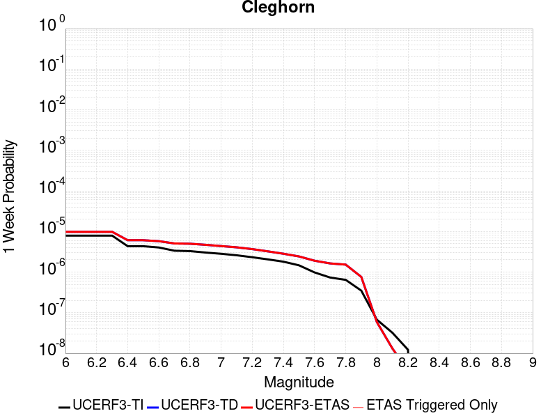 |  |  | 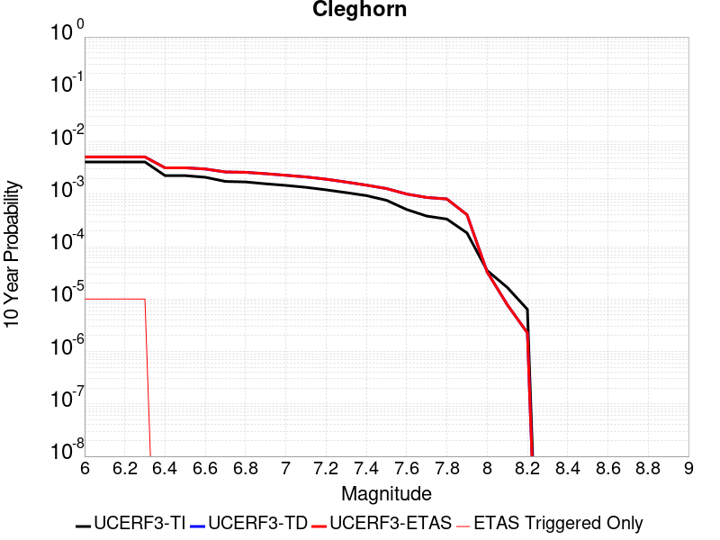 |

| Magnitude | 1 wk TI Prob | 1 wk TD Prob | 1 wk ETAS Prob | 1 wk ETAS/TD Gain | 1 wk ETAS Triggered Only | 1 mo TI Prob | 1 mo TD Prob | 1 mo ETAS Prob | 1 mo ETAS/TD Gain | 1 mo ETAS Triggered Only | 1 yr TI Prob | 1 yr TD Prob | 1 yr ETAS Prob | 1 yr ETAS/TD Gain | 1 yr ETAS Triggered Only | 10 yr TI Prob | 10 yr TD Prob | 10 yr ETAS Prob | 10 yr ETAS/TD Gain | 10 yr ETAS Triggered Only |
|-----|-----|-----|-----|-----|-----|-----|-----|-----|-----|-----|-----|-----|-----|-----|-----|-----|-----|-----|-----|-----|
| 6.0 | 7.9267165E-6 | 9.84135E-6 | 9.84135E-6 | 1.0 | 0.0 | 3.39712E-5 | 4.217659E-5 | 4.217659E-5 | 1.0 | 0.0 | 4.1352084E-4 | 5.1338965E-4 | 5.233845E-4 | 1.0194684 | 1.0E-5 | 0.004127522 | 0.005137027 | 0.005146975 | 1.0019367 | 1.0E-5 |
| 6.1 | 7.9267165E-6 | 9.84135E-6 | 9.84135E-6 | 1.0 | 0.0 | 3.39712E-5 | 4.217659E-5 | 4.217659E-5 | 1.0 | 0.0 | 4.1352084E-4 | 5.1338965E-4 | 5.233845E-4 | 1.0194684 | 1.0E-5 | 0.004127522 | 0.005137027 | 0.005146975 | 1.0019367 | 1.0E-5 |
| 6.2 | 7.9267165E-6 | 9.84135E-6 | 9.84135E-6 | 1.0 | 0.0 | 3.39712E-5 | 4.217659E-5 | 4.217659E-5 | 1.0 | 0.0 | 4.1352084E-4 | 5.1338965E-4 | 5.233845E-4 | 1.0194684 | 1.0E-5 | 0.004127522 | 0.005137027 | 0.005146975 | 1.0019367 | 1.0E-5 |
| 6.3 | 7.9267165E-6 | 9.84135E-6 | 9.84135E-6 | 1.0 | 0.0 | 3.39712E-5 | 4.217659E-5 | 4.217659E-5 | 1.0 | 0.0 | 4.1352084E-4 | 5.1338965E-4 | 5.233845E-4 | 1.0194684 | 1.0E-5 | 0.004127522 | 0.005137027 | 0.005146975 | 1.0019367 | 1.0E-5 |
| 6.4 | 4.3445207E-6 | 6.1010574E-6 | 6.1010574E-6 | 1.0 | 0.0 | 1.8619241E-5 | 2.6147132E-5 | 2.6147132E-5 | 1.0 | 0.0 | 2.2666567E-4 | 3.1829585E-4 | 3.1829585E-4 | 1.0 | 0.0 | 0.0022643462 | 0.0031924667 | 0.0031924667 | 1.0 | 0.0 |
| 6.5 | 4.3445207E-6 | 6.1010574E-6 | 6.1010574E-6 | 1.0 | 0.0 | 1.8619241E-5 | 2.6147132E-5 | 2.6147132E-5 | 1.0 | 0.0 | 2.2666567E-4 | 3.1829585E-4 | 3.1829585E-4 | 1.0 | 0.0 | 0.0022643462 | 0.0031924667 | 0.0031924667 | 1.0 | 0.0 |
| 6.6 | 4.040109E-6 | 5.7834527E-6 | 5.7834527E-6 | 1.0 | 0.0 | 1.7314638E-5 | 2.4785995E-5 | 2.4785995E-5 | 1.0 | 0.0 | 2.1078532E-4 | 3.0172864E-4 | 3.0172864E-4 | 1.0 | 0.0 | 0.002105855 | 0.0030272508 | 0.0030272508 | 1.0 | 0.0 |
| 6.7 | 3.3632055E-6 | 5.0769213E-6 | 5.0769213E-6 | 1.0 | 0.0 | 1.4413658E-5 | 2.1758055E-5 | 2.1758055E-5 | 1.0 | 0.0 | 1.7547216E-4 | 2.6487242E-4 | 2.6487242E-4 | 1.0 | 0.0 | 0.0017533366 | 0.002659572 | 0.002659572 | 1.0 | 0.0 |
| 6.8 | 3.2902772E-6 | 4.9988234E-6 | 4.9988234E-6 | 1.0 | 0.0 | 1.4101111E-5 | 2.1423355E-5 | 2.1423355E-5 | 1.0 | 0.0 | 1.716675E-4 | 2.6079844E-4 | 2.6079844E-4 | 1.0 | 0.0 | 0.0017153495 | 0.0026189282 | 0.0026189282 | 1.0 | 0.0 |
| 6.9 | 3.031547E-6 | 4.7003455E-6 | 4.7003455E-6 | 1.0 | 0.0 | 1.299228E-5 | 2.0144184E-5 | 2.0144184E-5 | 1.0 | 0.0 | 1.5816953E-4 | 2.4522812E-4 | 2.4522812E-4 | 1.0 | 0.0 | 0.00158057 | 0.0024635775 | 0.0024635775 | 1.0 | 0.0 |
| 7.0 | 2.8259715E-6 | 4.379303E-6 | 4.379303E-6 | 1.0 | 0.0 | 1.211125E-5 | 1.8768307E-5 | 1.8768307E-5 | 1.0 | 0.0 | 1.4744449E-4 | 2.2848042E-4 | 2.2848042E-4 | 1.0 | 0.0 | 0.001473467 | 0.0022964561 | 0.0022964561 | 1.0 | 0.0 |
| 7.1 | 2.5962665E-6 | 4.0742652E-6 | 4.0742652E-6 | 1.0 | 0.0 | 1.1126809E-5 | 1.7461021E-5 | 1.7461021E-5 | 1.0 | 0.0 | 1.3546048E-4 | 2.1256741E-4 | 2.1256741E-4 | 1.0 | 0.0 | 0.0013537793 | 0.0021376468 | 0.0021376468 | 1.0 | 0.0 |
| 7.2 | 2.3247253E-6 | 3.6845147E-6 | 3.6845147E-6 | 1.0 | 0.0 | 9.96307E-6 | 1.5790683E-5 | 1.5790683E-5 | 1.0 | 0.0 | 1.21293626E-4 | 1.9223479E-4 | 1.9223479E-4 | 1.0 | 0.0 | 0.0012122744 | 0.0019347123 | 0.0019347123 | 1.0 | 0.0 |
| 7.3 | 2.056928E-6 | 3.2426233E-6 | 3.2426233E-6 | 1.0 | 0.0 | 8.815376E-6 | 1.38968835E-5 | 1.38968835E-5 | 1.0 | 0.0 | 1.0732192E-4 | 1.6918159E-4 | 1.6918159E-4 | 1.0 | 0.0 | 0.001072701 | 0.0017046216 | 0.0017046216 | 1.0 | 0.0 |
| 7.4 | 1.8055999E-6 | 2.8324798E-6 | 2.8324798E-6 | 1.0 | 0.0 | 7.738263E-6 | 1.2139144E-5 | 1.2139144E-5 | 1.0 | 0.0 | 9.4209274E-5 | 1.4778419E-4 | 1.4778419E-4 | 1.0 | 0.0 | 9.4169343E-4 | 0.0014910907 | 0.0014910907 | 1.0 | 0.0 |
| 7.5 | 1.4683443E-6 | 2.4314784E-6 | 2.4314784E-6 | 1.0 | 0.0 | 6.292889E-6 | 1.0420581E-5 | 1.0420581E-5 | 1.0 | 0.0 | 7.661323E-5 | 1.2686328E-4 | 1.2686328E-4 | 1.0 | 0.0 | 7.658682E-4 | 0.0012821831 | 0.0012821831 | 1.0 | 0.0 |
| 7.6 | 9.804088E-7 | 1.9068757E-6 | 1.9068757E-6 | 1.0 | 0.0 | 4.201745E-6 | 8.172299E-6 | 8.172299E-6 | 1.0 | 0.0 | 5.1155046E-5 | 9.949325E-5 | 9.949325E-5 | 1.0 | 0.0 | 5.114327E-4 | 0.0010087969 | 0.0010087969 | 1.0 | 0.0 |
| 7.7 | 7.3434086E-7 | 1.6349144E-6 | 1.6349144E-6 | 1.0 | 0.0 | 3.1471714E-6 | 7.006757E-6 | 7.006757E-6 | 1.0 | 0.0 | 3.831614E-5 | 8.530395E-5 | 8.530395E-5 | 1.0 | 0.0 | 3.8309532E-4 | 8.6705695E-4 | 8.6705695E-4 | 1.0 | 0.0 |
| 7.8 | 6.434184E-7 | 1.52819E-6 | 1.52819E-6 | 1.0 | 0.0 | 2.7575045E-6 | 6.549369E-6 | 6.549369E-6 | 1.0 | 0.0 | 3.35721E-5 | 7.973568E-5 | 7.973568E-5 | 1.0 | 0.0 | 3.3567028E-4 | 8.110777E-4 | 8.110777E-4 | 1.0 | 0.0 |
| 7.9 | 3.4943926E-7 | 7.607407E-7 | 7.607407E-7 | 1.0 | 0.0 | 1.497596E-6 | 3.2603134E-6 | 3.2603134E-6 | 1.0 | 0.0 | 1.8233079E-5 | 3.96936E-5 | 3.96936E-5 | 1.0 | 0.0 | 1.8231584E-4 | 4.056794E-4 | 4.056794E-4 | 1.0 | 0.0 |
| 8.0 | 6.717524E-8 | 5.8759497E-8 | 5.8759497E-8 | 1.0 | 0.0 | 2.8789387E-7 | 2.5182638E-7 | 2.5182638E-7 | 1.0 | 0.0 | 3.505102E-6 | 3.0659821E-6 | 3.0659821E-6 | 1.0 | 0.0 | 3.5050467E-5 | 3.2934364E-5 | 3.2934364E-5 | 1.0 | 0.0 |
| 8.1 | 3.1984914E-8 | 1.3076241E-8 | 1.3076241E-8 | 1.0 | 0.0 | 1.370782E-7 | 5.604103E-8 | 5.604103E-8 | 1.0 | 0.0 | 1.6689258E-6 | 6.8229934E-7 | 6.8229934E-7 | 1.0 | 0.0 | 1.6689133E-5 | 7.81231E-6 | 7.81231E-6 | 1.0 | 0.0 |
| 8.2 | 1.21887656E-8 | 3.686585E-9 | 3.686585E-9 | 1.0 | 0.0 | 5.2237567E-8 | 1.579965E-8 | 1.579965E-8 | 1.0 | 0.0 | 6.359922E-7 | 1.9236072E-7 | 1.9236072E-7 | 1.0 | 0.0 | 6.3599036E-6 | 2.2684917E-6 | 2.2684917E-6 | 1.0 | 0.0 |

## Sheephole
*[(top)](#table-of-contents)*

| 1 Week | 1 Month | 1 Year | 10 Year |
|-----|-----|-----|-----|
|  | 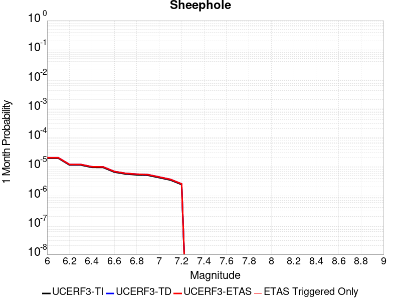 | 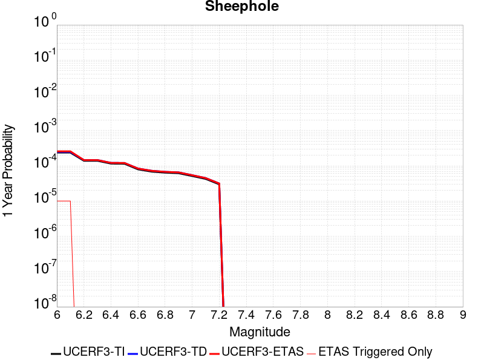 | 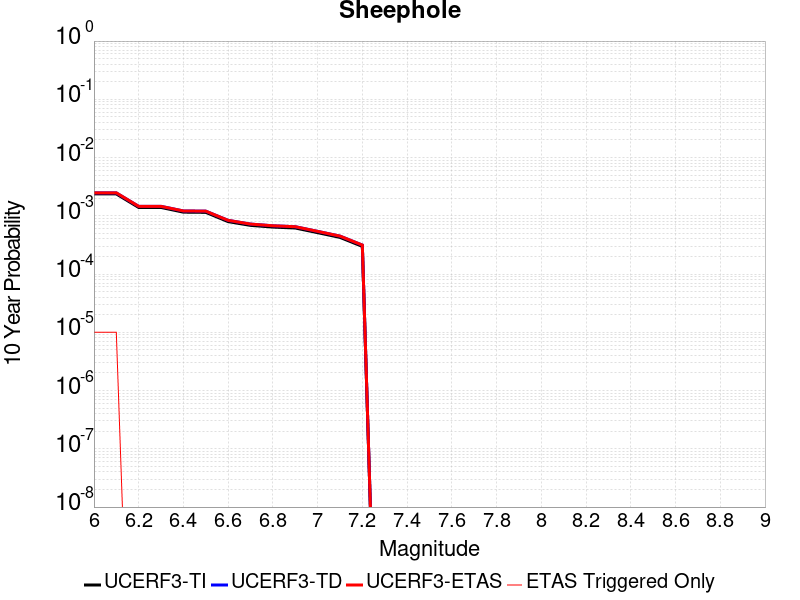 |

| Magnitude | 1 wk TI Prob | 1 wk TD Prob | 1 wk ETAS Prob | 1 wk ETAS/TD Gain | 1 wk ETAS Triggered Only | 1 mo TI Prob | 1 mo TD Prob | 1 mo ETAS Prob | 1 mo ETAS/TD Gain | 1 mo ETAS Triggered Only | 1 yr TI Prob | 1 yr TD Prob | 1 yr ETAS Prob | 1 yr ETAS/TD Gain | 1 yr ETAS Triggered Only | 10 yr TI Prob | 10 yr TD Prob | 10 yr ETAS Prob | 10 yr ETAS/TD Gain | 10 yr ETAS Triggered Only |
|-----|-----|-----|-----|-----|-----|-----|-----|-----|-----|-----|-----|-----|-----|-----|-----|-----|-----|-----|-----|-----|
| 6.0 | 4.5579695E-6 | 4.74144E-6 | 4.74144E-6 | 1.0 | 0.0 | 1.9534009E-5 | 2.0320329E-5 | 2.0320329E-5 | 1.0 | 0.0 | 2.3780059E-4 | 2.4737747E-4 | 2.57375E-4 | 1.0404141 | 1.0E-5 | 0.0023754628 | 0.0024715655 | 0.0024815407 | 1.0040361 | 1.0E-5 |
| 6.1 | 4.5579695E-6 | 4.74144E-6 | 4.74144E-6 | 1.0 | 0.0 | 1.9534009E-5 | 2.0320329E-5 | 2.0320329E-5 | 1.0 | 0.0 | 2.3780059E-4 | 2.4737747E-4 | 2.57375E-4 | 1.0404141 | 1.0E-5 | 0.0023754628 | 0.0024715655 | 0.0024815407 | 1.0040361 | 1.0E-5 |
| 6.2 | 2.6677674E-6 | 2.7875105E-6 | 2.7875105E-6 | 1.0 | 0.0 | 1.1433239E-5 | 1.1946425E-5 | 1.1946425E-5 | 1.0 | 0.0 | 1.3919079E-4 | 1.4543909E-4 | 1.4543909E-4 | 1.0 | 0.0 | 0.0013910364 | 0.001453545 | 0.001453545 | 1.0 | 0.0 |
| 6.3 | 2.6677674E-6 | 2.7875105E-6 | 2.7875105E-6 | 1.0 | 0.0 | 1.1433239E-5 | 1.1946425E-5 | 1.1946425E-5 | 1.0 | 0.0 | 1.3919079E-4 | 1.4543909E-4 | 1.4543909E-4 | 1.0 | 0.0 | 0.0013910364 | 0.001453545 | 0.001453545 | 1.0 | 0.0 |
| 6.4 | 2.2159759E-6 | 2.3229827E-6 | 2.3229827E-6 | 1.0 | 0.0 | 9.497005E-6 | 9.955607E-6 | 9.955607E-6 | 1.0 | 0.0 | 1.156199E-4 | 1.21203586E-4 | 1.21203586E-4 | 1.0 | 0.0 | 0.0011555976 | 0.0012114542 | 0.0012114542 | 1.0 | 0.0 |
| 6.5 | 2.1986082E-6 | 2.3048624E-6 | 2.3048624E-6 | 1.0 | 0.0 | 9.4225725E-6 | 9.877949E-6 | 9.877949E-6 | 1.0 | 0.0 | 1.1471378E-4 | 1.202582E-4 | 1.202582E-4 | 1.0 | 0.0 | 0.0011465458 | 0.0012020105 | 0.0012020105 | 1.0 | 0.0 |
| 6.6 | 1.5232331E-6 | 1.6019686E-6 | 1.6019686E-6 | 1.0 | 0.0 | 6.5281256E-6 | 6.8655627E-6 | 6.8655627E-6 | 1.0 | 0.0 | 7.947703E-5 | 8.358521E-5 | 8.358521E-5 | 1.0 | 0.0 | 7.9448614E-4 | 8.355565E-4 | 8.355565E-4 | 1.0 | 0.0 |
| 6.7 | 1.3137362E-6 | 1.3828866E-6 | 1.3828866E-6 | 1.0 | 0.0 | 5.6302856E-6 | 5.926644E-6 | 5.926644E-6 | 1.0 | 0.0 | 6.854657E-5 | 7.2154646E-5 | 7.2154646E-5 | 1.0 | 0.0 | 6.8525434E-4 | 7.2132604E-4 | 7.2132604E-4 | 1.0 | 0.0 |
| 6.8 | 1.2275751E-6 | 1.2923479E-6 | 1.2923479E-6 | 1.0 | 0.0 | 5.2610258E-6 | 5.5386226E-6 | 5.5386226E-6 | 1.0 | 0.0 | 6.4051106E-5 | 6.743078E-5 | 6.743078E-5 | 1.0 | 0.0 | 6.4032647E-4 | 6.7411654E-4 | 6.7411654E-4 | 1.0 | 0.0 |
| 6.9 | 1.1837088E-6 | 1.246163E-6 | 1.246163E-6 | 1.0 | 0.0 | 5.0730278E-6 | 5.3406884E-6 | 5.3406884E-6 | 1.0 | 0.0 | 6.176237E-5 | 6.502107E-5 | 6.502107E-5 | 1.0 | 0.0 | 6.17452E-4 | 6.5003365E-4 | 6.5003365E-4 | 1.0 | 0.0 |
| 7.0 | 9.849371E-7 | 1.0366794E-6 | 1.0366794E-6 | 1.0 | 0.0 | 4.2211523E-6 | 4.4429044E-6 | 4.4429044E-6 | 1.0 | 0.0 | 5.1391315E-5 | 5.409112E-5 | 5.409112E-5 | 1.0 | 0.0 | 5.137943E-4 | 5.407896E-4 | 5.407896E-4 | 1.0 | 0.0 |
| 7.1 | 8.1643645E-7 | 8.592086E-7 | 8.592086E-7 | 1.0 | 0.0 | 3.4990085E-6 | 3.682318E-6 | 3.682318E-6 | 1.0 | 0.0 | 4.2599597E-5 | 4.4831388E-5 | 4.4831388E-5 | 1.0 | 0.0 | 4.259143E-4 | 4.4823208E-4 | 4.4823208E-4 | 1.0 | 0.0 |
| 7.2 | 5.7295756E-7 | 6.0297947E-7 | 6.0297947E-7 | 1.0 | 0.0 | 2.45553E-6 | 2.5841957E-6 | 2.5841957E-6 | 1.0 | 0.0 | 2.9895667E-5 | 3.1462198E-5 | 3.1462198E-5 | 1.0 | 0.0 | 2.9891645E-4 | 3.1458412E-4 | 3.1458412E-4 | 1.0 | 0.0 |

## San Andreas (Offshore) 2011 CFM
*[(top)](#table-of-contents)*

| 1 Week | 1 Month | 1 Year | 10 Year |
|-----|-----|-----|-----|
|  |  |  |  |

| Magnitude | 1 wk TI Prob | 1 wk TD Prob | 1 wk ETAS Prob | 1 wk ETAS/TD Gain | 1 wk ETAS Triggered Only | 1 mo TI Prob | 1 mo TD Prob | 1 mo ETAS Prob | 1 mo ETAS/TD Gain | 1 mo ETAS Triggered Only | 1 yr TI Prob | 1 yr TD Prob | 1 yr ETAS Prob | 1 yr ETAS/TD Gain | 1 yr ETAS Triggered Only | 10 yr TI Prob | 10 yr TD Prob | 10 yr ETAS Prob | 10 yr ETAS/TD Gain | 10 yr ETAS Triggered Only |
|-----|-----|-----|-----|-----|-----|-----|-----|-----|-----|-----|-----|-----|-----|-----|-----|-----|-----|-----|-----|-----|
| 6.0 | 1.7072787E-4 | 1.925961E-4 | 1.925961E-4 | 1.0 | 0.0 | 7.3148566E-4 | 8.2515314E-4 | 8.2515314E-4 | 1.0 | 0.0 | 0.008869528 | 0.0100004785 | 0.010010378 | 1.0009899 | 1.0E-5 | 0.085237645 | 0.09697889 | 0.09698792 | 1.0000931 | 1.0E-5 |
| 6.1 | 1.7072787E-4 | 1.925961E-4 | 1.925961E-4 | 1.0 | 0.0 | 7.3148566E-4 | 8.2515314E-4 | 8.2515314E-4 | 1.0 | 0.0 | 0.008869528 | 0.0100004785 | 0.010010378 | 1.0009899 | 1.0E-5 | 0.085237645 | 0.09697889 | 0.09698792 | 1.0000931 | 1.0E-5 |
| 6.2 | 1.6312556E-4 | 1.8439793E-4 | 1.8439793E-4 | 1.0 | 0.0 | 6.989222E-4 | 7.9003983E-4 | 7.9003983E-4 | 1.0 | 0.0 | 0.008476226 | 0.009576812 | 0.009586717 | 1.0010341 | 1.0E-5 | 0.08160117 | 0.09299351 | 0.09300258 | 1.0000975 | 1.0E-5 |
| 6.3 | 1.5103363E-4 | 1.691036E-4 | 1.691036E-4 | 1.0 | 0.0 | 6.471264E-4 | 7.245306E-4 | 7.245306E-4 | 1.0 | 0.0 | 0.007850339 | 0.008785928 | 0.00879584 | 1.0011282 | 1.0E-5 | 0.075787395 | 0.0856254 | 0.085634544 | 1.0001068 | 1.0E-5 |
| 6.4 | 1.5047993E-4 | 1.6796135E-4 | 1.6796135E-4 | 1.0 | 0.0 | 6.4475456E-4 | 7.1963796E-4 | 7.1963796E-4 | 1.0 | 0.0 | 0.007821669 | 0.008726836 | 0.008736749 | 1.001136 | 1.0E-5 | 0.0755203 | 0.08510506 | 0.08511421 | 1.0001075 | 1.0E-5 |
| 6.5 | 1.2760791E-4 | 1.3760154E-4 | 1.3760154E-4 | 1.0 | 0.0 | 5.467764E-4 | 5.89589E-4 | 5.89589E-4 | 1.0 | 0.0 | 0.0066367025 | 0.0071548945 | 0.007164823 | 1.0013876 | 1.0E-5 | 0.064419635 | 0.07036923 | 0.07037853 | 1.0001321 | 1.0E-5 |
| 6.6 | 1.1063525E-4 | 1.157834E-4 | 1.157834E-4 | 1.0 | 0.0 | 4.740649E-4 | 4.9612124E-4 | 4.9612124E-4 | 1.0 | 0.0 | 0.0057564764 | 0.0060237497 | 0.0060336892 | 1.0016501 | 1.0E-5 | 0.05609626 | 0.05959451 | 0.05960391 | 1.0001578 | 1.0E-5 |
| 6.7 | 1.0391049E-4 | 1.0666366E-4 | 1.0666366E-4 | 1.0 | 0.0 | 4.4525467E-4 | 4.570509E-4 | 4.570509E-4 | 1.0 | 0.0 | 0.0054075094 | 0.0055505848 | 0.0055505848 | 1.0 | 0.0 | 0.052778035 | 0.055089284 | 0.055089284 | 1.0 | 0.0 |
| 6.8 | 1.0096706E-4 | 1.01782214E-4 | 1.01782214E-4 | 1.0 | 0.0 | 4.3264418E-4 | 4.3613752E-4 | 4.3613752E-4 | 1.0 | 0.0 | 0.0052547283 | 0.0052972236 | 0.0052972236 | 1.0 | 0.0 | 0.051321987 | 0.052786008 | 0.052786008 | 1.0 | 0.0 |
| 6.9 | 9.800265E-5 | 9.608295E-5 | 9.608295E-5 | 1.0 | 0.0 | 4.1994374E-4 | 4.1172E-4 | 4.1172E-4 | 1.0 | 0.0 | 0.0051008356 | 0.0050013387 | 0.0050013387 | 1.0 | 0.0 | 0.049853306 | 0.050111815 | 0.050111815 | 1.0 | 0.0 |
| 7.0 | 9.4642375E-5 | 9.021218E-5 | 9.021218E-5 | 1.0 | 0.0 | 4.0554712E-4 | 3.8656723E-4 | 3.8656723E-4 | 1.0 | 0.0 | 0.004926363 | 0.0046964623 | 0.0046964623 | 1.0 | 0.0 | 0.048185747 | 0.047290854 | 0.047290854 | 1.0 | 0.0 |
| 7.1 | 9.0996844E-5 | 8.372742E-5 | 8.372742E-5 | 1.0 | 0.0 | 3.8992817E-4 | 3.5878332E-4 | 3.5878332E-4 | 1.0 | 0.0 | 0.004737046 | 0.0043595945 | 0.0043595945 | 1.0 | 0.0 | 0.04637333 | 0.044140402 | 0.044140402 | 1.0 | 0.0 |
| 7.2 | 8.848287E-5 | 7.999942E-5 | 7.999942E-5 | 1.0 | 0.0 | 3.791572E-4 | 3.4281047E-4 | 3.4281047E-4 | 1.0 | 0.0 | 0.004606472 | 0.004165884 | 0.004165884 | 1.0 | 0.0 | 0.045121472 | 0.042282406 | 0.042282406 | 1.0 | 0.0 |
| 7.3 | 7.9280784E-5 | 6.143362E-5 | 6.143362E-5 | 1.0 | 0.0 | 3.3973053E-4 | 2.6326094E-4 | 2.6326094E-4 | 1.0 | 0.0 | 0.004128377 | 0.0032005939 | 0.0032005939 | 1.0 | 0.0 | 0.040525194 | 0.032985196 | 0.032985196 | 1.0 | 0.0 |
| 7.4 | 6.468038E-5 | 3.8048784E-5 | 3.8048784E-5 | 1.0 | 0.0 | 2.771722E-4 | 1.6305635E-4 | 1.6305635E-4 | 1.0 | 0.0 | 0.0033693502 | 0.0019834614 | 0.0019834614 | 1.0 | 0.0 | 0.0331872 | 0.020883573 | 0.020883573 | 1.0 | 0.0 |
| 7.5 | 4.930574E-5 | 1.2769499E-5 | 1.2769499E-5 | 1.0 | 0.0 | 2.1129321E-4 | 5.4725286E-5 | 5.4725286E-5 | 1.0 | 0.0 | 0.0025694598 | 6.660783E-4 | 6.660783E-4 | 1.0 | 0.0 | 0.02539953 | 0.007520096 | 0.007520096 | 1.0 | 0.0 |
| 7.6 | 4.612566E-5 | 1.0396627E-5 | 1.0396627E-5 | 1.0 | 0.0 | 1.9766642E-4 | 4.455622E-5 | 4.455622E-5 | 1.0 | 0.0 | 0.0024039324 | 5.423383E-4 | 5.423383E-4 | 1.0 | 0.0 | 0.023780935 | 0.0062077832 | 0.0062077832 | 1.0 | 0.0 |
| 7.7 | 3.9435414E-5 | 5.6209105E-6 | 5.6209105E-6 | 1.0 | 0.0 | 1.6899795E-4 | 2.4089395E-5 | 2.4089395E-5 | 1.0 | 0.0 | 0.0020556084 | 2.932491E-4 | 2.932491E-4 | 1.0 | 0.0 | 0.020366974 | 0.0035701317 | 0.0035701317 | 1.0 | 0.0 |
| 7.8 | 2.7787428E-5 | 3.7892153E-6 | 3.7892153E-6 | 1.0 | 0.0 | 1.1908354E-4 | 1.6239392E-5 | 1.6239392E-5 | 1.0 | 0.0 | 0.0014488777 | 1.976967E-4 | 1.976967E-4 | 1.0 | 0.0 | 0.014394675 | 0.0024083029 | 0.0024083029 | 1.0 | 0.0 |
| 7.9 | 1.590671E-5 | 3.0680594E-6 | 3.0680594E-6 | 1.0 | 0.0 | 6.816983E-5 | 1.314876E-5 | 1.314876E-5 | 1.0 | 0.0 | 8.2965166E-4 | 1.6007443E-4 | 1.6007443E-4 | 1.0 | 0.0 | 0.008265611 | 0.0019204757 | 0.0019204757 | 1.0 | 0.0 |
| 8.0 | 9.193638E-6 | 2.6148427E-6 | 2.6148427E-6 | 1.0 | 0.0 | 3.940071E-5 | 1.1206421E-5 | 1.1206421E-5 | 1.0 | 0.0 | 4.7959806E-4 | 1.3642966E-4 | 1.3642966E-4 | 1.0 | 0.0 | 0.0047856434 | 0.0016247741 | 0.0016247741 | 1.0 | 0.0 |
| 8.1 | 5.601576E-6 | 2.2551617E-6 | 2.2551617E-6 | 1.0 | 0.0 | 2.4006533E-5 | 9.664943E-6 | 9.664943E-6 | 1.0 | 0.0 | 2.9224035E-4 | 1.1766435E-4 | 1.1766435E-4 | 1.0 | 0.0 | 0.0029185633 | 0.0014141148 | 0.0014141148 | 1.0 | 0.0 |
| 8.2 | 4.3508785E-6 | 1.8733906E-6 | 1.8733906E-6 | 1.0 | 0.0 | 1.864649E-5 | 8.028792E-6 | 8.028792E-6 | 1.0 | 0.0 | 2.2699735E-4 | 9.774619E-5 | 9.774619E-5 | 1.0 | 0.0 | 0.0022676561 | 0.0011684668 | 0.0011684668 | 1.0 | 0.0 |
| 8.3 | 1.9573292E-6 | 7.572816E-7 | 7.572816E-7 | 1.0 | 0.0 | 8.388526E-6 | 3.2454886E-6 | 3.2454886E-6 | 1.0 | 0.0 | 1.0212552E-4 | 3.9513125E-5 | 3.9513125E-5 | 1.0 | 0.0 | 0.001020786 | 4.6741046E-4 | 4.6741046E-4 | 1.0 | 0.0 |

## Oak Ridge (Onshore)
*[(top)](#table-of-contents)*

| 1 Week | 1 Month | 1 Year | 10 Year |
|-----|-----|-----|-----|
|  |  |  |  |

| Magnitude | 1 wk TI Prob | 1 wk TD Prob | 1 wk ETAS Prob | 1 wk ETAS/TD Gain | 1 wk ETAS Triggered Only | 1 mo TI Prob | 1 mo TD Prob | 1 mo ETAS Prob | 1 mo ETAS/TD Gain | 1 mo ETAS Triggered Only | 1 yr TI Prob | 1 yr TD Prob | 1 yr ETAS Prob | 1 yr ETAS/TD Gain | 1 yr ETAS Triggered Only | 10 yr TI Prob | 10 yr TD Prob | 10 yr ETAS Prob | 10 yr ETAS/TD Gain | 10 yr ETAS Triggered Only |
|-----|-----|-----|-----|-----|-----|-----|-----|-----|-----|-----|-----|-----|-----|-----|-----|-----|-----|-----|-----|-----|
| 6.0 | 3.155064E-5 | 2.9531044E-5 | 2.9531044E-5 | 1.0 | 0.0 | 1.3521002E-4 | 1.265557E-4 | 1.265557E-4 | 1.0 | 0.0 | 0.001644939 | 0.0015397646 | 0.0015497492 | 1.0064845 | 1.0E-5 | 0.01632816 | 0.015295465 | 0.015305311 | 1.0006437 | 1.0E-5 |
| 6.1 | 3.155064E-5 | 2.9531044E-5 | 2.9531044E-5 | 1.0 | 0.0 | 1.3521002E-4 | 1.265557E-4 | 1.265557E-4 | 1.0 | 0.0 | 0.001644939 | 0.0015397646 | 0.0015497492 | 1.0064845 | 1.0E-5 | 0.01632816 | 0.015295465 | 0.015305311 | 1.0006437 | 1.0E-5 |
| 6.2 | 3.155064E-5 | 2.9531044E-5 | 2.9531044E-5 | 1.0 | 0.0 | 1.3521002E-4 | 1.265557E-4 | 1.265557E-4 | 1.0 | 0.0 | 0.001644939 | 0.0015397646 | 0.0015497492 | 1.0064845 | 1.0E-5 | 0.01632816 | 0.015295465 | 0.015305311 | 1.0006437 | 1.0E-5 |
| 6.3 | 3.155064E-5 | 2.9531044E-5 | 2.9531044E-5 | 1.0 | 0.0 | 1.3521002E-4 | 1.265557E-4 | 1.265557E-4 | 1.0 | 0.0 | 0.001644939 | 0.0015397646 | 0.0015497492 | 1.0064845 | 1.0E-5 | 0.01632816 | 0.015295465 | 0.015305311 | 1.0006437 | 1.0E-5 |
| 6.4 | 3.155064E-5 | 2.9531044E-5 | 2.9531044E-5 | 1.0 | 0.0 | 1.3521002E-4 | 1.265557E-4 | 1.265557E-4 | 1.0 | 0.0 | 0.001644939 | 0.0015397646 | 0.0015497492 | 1.0064845 | 1.0E-5 | 0.01632816 | 0.015295465 | 0.015305311 | 1.0006437 | 1.0E-5 |
| 6.5 | 3.155064E-5 | 2.9531044E-5 | 2.9531044E-5 | 1.0 | 0.0 | 1.3521002E-4 | 1.265557E-4 | 1.265557E-4 | 1.0 | 0.0 | 0.001644939 | 0.0015397646 | 0.0015497492 | 1.0064845 | 1.0E-5 | 0.01632816 | 0.015295465 | 0.015305311 | 1.0006437 | 1.0E-5 |
| 6.6 | 3.155064E-5 | 2.9531044E-5 | 2.9531044E-5 | 1.0 | 0.0 | 1.3521002E-4 | 1.265557E-4 | 1.265557E-4 | 1.0 | 0.0 | 0.001644939 | 0.0015397646 | 0.0015497492 | 1.0064845 | 1.0E-5 | 0.01632816 | 0.015295465 | 0.015305311 | 1.0006437 | 1.0E-5 |
| 6.7 | 3.098897E-5 | 2.8869135E-5 | 2.8869135E-5 | 1.0 | 0.0 | 1.328031E-4 | 1.237192E-4 | 1.237192E-4 | 1.0 | 0.0 | 0.0016156785 | 0.0015052783 | 0.0015152632 | 1.0066333 | 1.0E-5 | 0.016039822 | 0.0149552645 | 0.014965115 | 1.0006586 | 1.0E-5 |
| 6.8 | 3.0449872E-5 | 2.824424E-5 | 2.824424E-5 | 1.0 | 0.0 | 1.3049292E-4 | 1.2104134E-4 | 1.2104134E-4 | 1.0 | 0.0 | 0.0015875935 | 0.0014727192 | 0.0014827045 | 1.0067801 | 1.0E-5 | 0.015762992 | 0.014633966 | 0.014643819 | 1.0006733 | 1.0E-5 |
| 6.9 | 2.697928E-5 | 2.422405E-5 | 2.422405E-5 | 1.0 | 0.0 | 1.15620365E-4 | 1.0381334E-4 | 1.0381334E-4 | 1.0 | 0.0 | 0.0014067689 | 0.0012632161 | 0.0012732035 | 1.0079063 | 1.0E-5 | 0.0139789665 | 0.012563073 | 0.012572948 | 1.000786 | 1.0E-5 |
| 7.0 | 2.4893961E-5 | 2.1865993E-5 | 2.1865993E-5 | 1.0 | 0.0 | 1.0668404E-4 | 9.3708135E-5 | 9.3708135E-5 | 1.0 | 0.0 | 0.0012981043 | 0.0011403172 | 0.0011503057 | 1.0087595 | 1.0E-5 | 0.012905477 | 0.011346945 | 0.011356831 | 1.0008713 | 1.0E-5 |
| 7.1 | 2.0945363E-5 | 1.7357834E-5 | 1.7357834E-5 | 1.0 | 0.0 | 8.976275E-5 | 7.438862E-5 | 7.438862E-5 | 1.0 | 0.0 | 0.0010923136 | 9.0530986E-4 | 9.0530986E-4 | 1.0 | 0.0 | 0.0108696 | 0.009017154 | 0.009017154 | 1.0 | 0.0 |
| 7.2 | 2.0439404E-5 | 1.68127E-5 | 1.68127E-5 | 1.0 | 0.0 | 8.7594504E-5 | 7.205247E-5 | 7.205247E-5 | 1.0 | 0.0 | 0.0010659413 | 8.7689044E-4 | 8.7689044E-4 | 1.0 | 0.0 | 0.010608427 | 0.008735222 | 0.008735222 | 1.0 | 0.0 |
| 7.3 | 1.8463334E-5 | 1.5383524E-5 | 1.5383524E-5 | 1.0 | 0.0 | 7.912617E-5 | 6.592775E-5 | 6.592775E-5 | 1.0 | 0.0 | 9.6293533E-4 | 8.023791E-4 | 8.023791E-4 | 1.0 | 0.0 | 0.009587734 | 0.007995685 | 0.007995685 | 1.0 | 0.0 |
| 7.4 | 1.763139E-5 | 1.4518336E-5 | 1.4518336E-5 | 1.0 | 0.0 | 7.556091E-5 | 6.221998E-5 | 6.221998E-5 | 1.0 | 0.0 | 9.1956573E-4 | 7.572689E-4 | 7.572689E-4 | 1.0 | 0.0 | 0.009157699 | 0.0075476887 | 0.0075476887 | 1.0 | 0.0 |
| 7.5 | 1.3594944E-5 | 1.1164352E-5 | 1.1164352E-5 | 1.0 | 0.0 | 5.8262744E-5 | 4.7846363E-5 | 4.7846363E-5 | 1.0 | 0.0 | 7.0911803E-4 | 5.8237626E-4 | 5.8237626E-4 | 1.0 | 0.0 | 0.007068595 | 0.0058087725 | 0.0058087725 | 1.0 | 0.0 |
| 7.6 | 6.9889534E-6 | 5.6371114E-6 | 5.6371114E-6 | 1.0 | 0.0 | 2.9952313E-5 | 2.4158828E-5 | 2.4158828E-5 | 1.0 | 0.0 | 3.646084E-4 | 2.9409444E-4 | 2.9409444E-4 | 1.0 | 0.0 | 0.0036401073 | 0.0029370964 | 0.0029370964 | 1.0 | 0.0 |
| 7.7 | 4.0824193E-6 | 3.283474E-6 | 3.283474E-6 | 1.0 | 0.0 | 1.7495966E-5 | 1.4071956E-5 | 1.4071956E-5 | 1.0 | 0.0 | 2.1299256E-4 | 1.7131273E-4 | 1.7131273E-4 | 1.0 | 0.0 | 0.0021278851 | 0.00171182 | 0.00171182 | 1.0 | 0.0 |
| 7.8 | 1.7023609E-6 | 1.4371285E-6 | 1.4371285E-6 | 1.0 | 0.0 | 7.295812E-6 | 6.1591077E-6 | 6.1591077E-6 | 1.0 | 0.0 | 8.882289E-5 | 7.4984586E-5 | 7.4984586E-5 | 1.0 | 0.0 | 8.8787393E-4 | 7.4959564E-4 | 7.4959564E-4 | 1.0 | 0.0 |
| 7.9 | 2.721225E-7 | 2.2618393E-7 | 2.2618393E-7 | 1.0 | 0.0 | 1.1662388E-6 | 9.693593E-7 | 9.693593E-7 | 1.0 | 0.0 | 1.4198865E-5 | 1.1801889E-5 | 1.1801889E-5 | 1.0 | 0.0 | 1.4197957E-4 | 1.18012904E-4 | 1.18012904E-4 | 1.0 | 0.0 |
| 8.0 | 9.364255E-9 | 5.122464E-9 | 5.122464E-9 | 1.0 | 0.0 | 4.0132523E-8 | 2.1953415E-8 | 2.1953415E-8 | 1.0 | 0.0 | 4.8861335E-7 | 2.672828E-7 | 2.672828E-7 | 1.0 | 0.0 | 4.8861225E-6 | 2.672825E-6 | 2.672825E-6 | 1.0 | 0.0 |

## Earthquake Valley (So Extension)
*[(top)](#table-of-contents)*

| 1 Week | 1 Month | 1 Year | 10 Year |
|-----|-----|-----|-----|
|  |  |  | 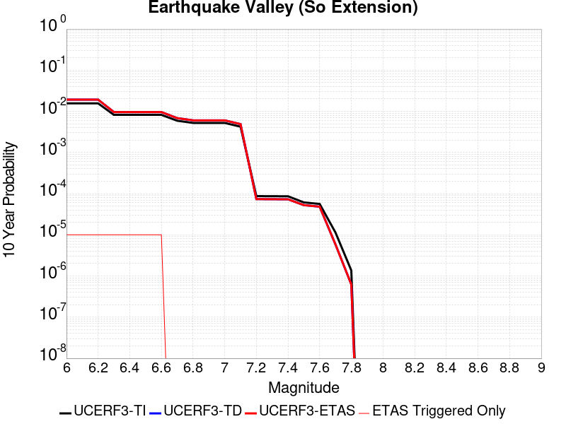 |

| Magnitude | 1 wk TI Prob | 1 wk TD Prob | 1 wk ETAS Prob | 1 wk ETAS/TD Gain | 1 wk ETAS Triggered Only | 1 mo TI Prob | 1 mo TD Prob | 1 mo ETAS Prob | 1 mo ETAS/TD Gain | 1 mo ETAS Triggered Only | 1 yr TI Prob | 1 yr TD Prob | 1 yr ETAS Prob | 1 yr ETAS/TD Gain | 1 yr ETAS Triggered Only | 10 yr TI Prob | 10 yr TD Prob | 10 yr ETAS Prob | 10 yr ETAS/TD Gain | 10 yr ETAS Triggered Only |
|-----|-----|-----|-----|-----|-----|-----|-----|-----|-----|-----|-----|-----|-----|-----|-----|-----|-----|-----|-----|-----|
| 6.0 | 3.0194888E-5 | 3.708015E-5 | 3.708015E-5 | 1.0 | 0.0 | 1.2940024E-4 | 1.5890833E-4 | 1.5890833E-4 | 1.0 | 0.0 | 0.0015743093 | 0.0019335363 | 0.001943517 | 1.0051619 | 1.0E-5 | 0.01563203 | 0.019217065 | 0.019226873 | 1.0005103 | 1.0E-5 |
| 6.1 | 3.0194888E-5 | 3.708015E-5 | 3.708015E-5 | 1.0 | 0.0 | 1.2940024E-4 | 1.5890833E-4 | 1.5890833E-4 | 1.0 | 0.0 | 0.0015743093 | 0.0019335363 | 0.001943517 | 1.0051619 | 1.0E-5 | 0.01563203 | 0.019217065 | 0.019226873 | 1.0005103 | 1.0E-5 |
| 6.2 | 3.0194888E-5 | 3.708015E-5 | 3.708015E-5 | 1.0 | 0.0 | 1.2940024E-4 | 1.5890833E-4 | 1.5890833E-4 | 1.0 | 0.0 | 0.0015743093 | 0.0019335363 | 0.001943517 | 1.0051619 | 1.0E-5 | 0.01563203 | 0.019217065 | 0.019226873 | 1.0005103 | 1.0E-5 |
| 6.3 | 1.5795305E-5 | 1.8449526E-5 | 1.8449526E-5 | 1.0 | 0.0 | 6.769241E-5 | 7.906763E-5 | 7.906763E-5 | 1.0 | 0.0 | 8.238434E-4 | 9.623345E-4 | 9.7232487E-4 | 1.0103813 | 1.0E-5 | 0.008207959 | 0.009592585 | 0.009602489 | 1.0010325 | 1.0E-5 |
| 6.4 | 1.5795305E-5 | 1.8449526E-5 | 1.8449526E-5 | 1.0 | 0.0 | 6.769241E-5 | 7.906763E-5 | 7.906763E-5 | 1.0 | 0.0 | 8.238434E-4 | 9.623345E-4 | 9.7232487E-4 | 1.0103813 | 1.0E-5 | 0.008207959 | 0.009592585 | 0.009602489 | 1.0010325 | 1.0E-5 |
| 6.5 | 1.5795305E-5 | 1.8449526E-5 | 1.8449526E-5 | 1.0 | 0.0 | 6.769241E-5 | 7.906763E-5 | 7.906763E-5 | 1.0 | 0.0 | 8.238434E-4 | 9.623345E-4 | 9.7232487E-4 | 1.0103813 | 1.0E-5 | 0.008207959 | 0.009592585 | 0.009602489 | 1.0010325 | 1.0E-5 |
| 6.6 | 1.5795305E-5 | 1.8449526E-5 | 1.8449526E-5 | 1.0 | 0.0 | 6.769241E-5 | 7.906763E-5 | 7.906763E-5 | 1.0 | 0.0 | 8.238434E-4 | 9.623345E-4 | 9.7232487E-4 | 1.0103813 | 1.0E-5 | 0.008207959 | 0.009592585 | 0.009602489 | 1.0010325 | 1.0E-5 |
| 6.7 | 1.1363076E-5 | 1.3140264E-5 | 1.3140264E-5 | 1.0 | 0.0 | 4.8697988E-5 | 5.631463E-5 | 5.631463E-5 | 1.0 | 0.0 | 5.927367E-4 | 6.854911E-4 | 6.854911E-4 | 1.0 | 0.0 | 0.0059115817 | 0.0068412414 | 0.0068412414 | 1.0 | 0.0 |
| 6.8 | 1.0049611E-5 | 1.1596052E-5 | 1.1596052E-5 | 1.0 | 0.0 | 4.306905E-5 | 4.969683E-5 | 4.969683E-5 | 1.0 | 0.0 | 5.242395E-4 | 6.0496415E-4 | 6.0496415E-4 | 1.0 | 0.0 | 0.0052300454 | 0.0060403515 | 0.0060403515 | 1.0 | 0.0 |
| 6.9 | 1.0049611E-5 | 1.1596052E-5 | 1.1596052E-5 | 1.0 | 0.0 | 4.306905E-5 | 4.969683E-5 | 4.969683E-5 | 1.0 | 0.0 | 5.242395E-4 | 6.0496415E-4 | 6.0496415E-4 | 1.0 | 0.0 | 0.0052300454 | 0.0060403515 | 0.0060403515 | 1.0 | 0.0 |
| 7.0 | 1.0049611E-5 | 1.1596052E-5 | 1.1596052E-5 | 1.0 | 0.0 | 4.306905E-5 | 4.969683E-5 | 4.969683E-5 | 1.0 | 0.0 | 5.242395E-4 | 6.0496415E-4 | 6.0496415E-4 | 1.0 | 0.0 | 0.0052300454 | 0.0060403515 | 0.0060403515 | 1.0 | 0.0 |
| 7.1 | 8.140254E-6 | 9.384852E-6 | 9.384852E-6 | 1.0 | 0.0 | 3.4886336E-5 | 4.022055E-5 | 4.022055E-5 | 1.0 | 0.0 | 4.2465836E-4 | 4.8964226E-4 | 4.8964226E-4 | 1.0 | 0.0 | 0.0042384774 | 0.004892213 | 0.004892213 | 1.0 | 0.0 |
| 7.2 | 1.673835E-7 | 1.4156977E-7 | 1.4156977E-7 | 1.0 | 0.0 | 7.173577E-7 | 6.067275E-7 | 6.067275E-7 | 1.0 | 0.0 | 8.733795E-6 | 7.386886E-6 | 7.386886E-6 | 1.0 | 0.0 | 8.733451E-5 | 7.386676E-5 | 7.386676E-5 | 1.0 | 0.0 |
| 7.3 | 1.6632116E-7 | 1.4055196E-7 | 1.4055196E-7 | 1.0 | 0.0 | 7.1280476E-7 | 6.0236545E-7 | 6.0236545E-7 | 1.0 | 0.0 | 8.678364E-6 | 7.3337783E-6 | 7.3337783E-6 | 1.0 | 0.0 | 8.6780245E-5 | 7.3335716E-5 | 7.3335716E-5 | 1.0 | 0.0 |
| 7.4 | 1.6569169E-7 | 1.3999818E-7 | 1.3999818E-7 | 1.0 | 0.0 | 7.1010703E-7 | 5.9999206E-7 | 5.9999206E-7 | 1.0 | 0.0 | 8.645519E-6 | 7.3048827E-6 | 7.3048827E-6 | 1.0 | 0.0 | 8.645182E-5 | 7.304678E-5 | 7.304678E-5 | 1.0 | 0.0 |
| 7.5 | 1.1764555E-7 | 1.009812E-7 | 1.009812E-7 | 1.0 | 0.0 | 5.041951E-7 | 4.3277652E-7 | 4.3277652E-7 | 1.0 | 0.0 | 6.138558E-6 | 5.2690434E-6 | 5.2690434E-6 | 1.0 | 0.0 | 6.1383886E-5 | 5.26894E-5 | 5.26894E-5 | 1.0 | 0.0 |
| 7.6 | 1.07927605E-7 | 9.262808E-8 | 9.262808E-8 | 1.0 | 0.0 | 4.6254678E-7 | 3.969774E-7 | 3.969774E-7 | 1.0 | 0.0 | 5.6314925E-6 | 4.8331917E-6 | 4.8331917E-6 | 1.0 | 0.0 | 5.63135E-5 | 4.8331076E-5 | 4.8331076E-5 | 1.0 | 0.0 |
| 7.7 | 2.1826905E-8 | 1.1184433E-8 | 1.1184433E-8 | 1.0 | 0.0 | 9.3543875E-8 | 4.793328E-8 | 4.793328E-8 | 1.0 | 0.0 | 1.1388961E-6 | 5.835876E-7 | 5.835876E-7 | 1.0 | 0.0 | 1.1388902E-5 | 5.835866E-6 | 5.835866E-6 | 1.0 | 0.0 |
| 7.8 | 2.6169649E-9 | 1.1973574E-9 | 1.1973574E-9 | 1.0 | 0.0 | 1.1215564E-8 | 5.1315316E-9 | 5.1315316E-9 | 1.0 | 0.0 | 1.3654947E-7 | 6.24764E-8 | 6.24764E-8 | 1.0 | 0.0 | 1.365494E-6 | 6.2476397E-7 | 6.2476397E-7 | 1.0 | 0.0 |

## Channel Islands Thrust
*[(top)](#table-of-contents)*

| 1 Week | 1 Month | 1 Year | 10 Year |
|-----|-----|-----|-----|
|  |  |  |  |

| Magnitude | 1 wk TI Prob | 1 wk TD Prob | 1 wk ETAS Prob | 1 wk ETAS/TD Gain | 1 wk ETAS Triggered Only | 1 mo TI Prob | 1 mo TD Prob | 1 mo ETAS Prob | 1 mo ETAS/TD Gain | 1 mo ETAS Triggered Only | 1 yr TI Prob | 1 yr TD Prob | 1 yr ETAS Prob | 1 yr ETAS/TD Gain | 1 yr ETAS Triggered Only | 10 yr TI Prob | 10 yr TD Prob | 10 yr ETAS Prob | 10 yr ETAS/TD Gain | 10 yr ETAS Triggered Only |
|-----|-----|-----|-----|-----|-----|-----|-----|-----|-----|-----|-----|-----|-----|-----|-----|-----|-----|-----|-----|-----|
| 6.0 | 2.2156251E-5 | 2.409399E-5 | 2.409399E-5 | 1.0 | 0.0 | 9.495191E-5 | 1.03256476E-4 | 1.03256476E-4 | 1.0 | 0.0 | 0.0011554264 | 0.0012565291 | 0.0012565291 | 1.0 | 0.0 | 0.011494373 | 0.0125048375 | 0.012514712 | 1.0007896 | 1.0E-5 |
| 6.1 | 2.2156251E-5 | 2.409399E-5 | 2.409399E-5 | 1.0 | 0.0 | 9.495191E-5 | 1.03256476E-4 | 1.03256476E-4 | 1.0 | 0.0 | 0.0011554264 | 0.0012565291 | 0.0012565291 | 1.0 | 0.0 | 0.011494373 | 0.0125048375 | 0.012514712 | 1.0007896 | 1.0E-5 |
| 6.2 | 2.2156251E-5 | 2.409399E-5 | 2.409399E-5 | 1.0 | 0.0 | 9.495191E-5 | 1.03256476E-4 | 1.03256476E-4 | 1.0 | 0.0 | 0.0011554264 | 0.0012565291 | 0.0012565291 | 1.0 | 0.0 | 0.011494373 | 0.0125048375 | 0.012514712 | 1.0007896 | 1.0E-5 |
| 6.3 | 2.2156251E-5 | 2.409399E-5 | 2.409399E-5 | 1.0 | 0.0 | 9.495191E-5 | 1.03256476E-4 | 1.03256476E-4 | 1.0 | 0.0 | 0.0011554264 | 0.0012565291 | 0.0012565291 | 1.0 | 0.0 | 0.011494373 | 0.0125048375 | 0.012514712 | 1.0007896 | 1.0E-5 |
| 6.4 | 2.2156251E-5 | 2.409399E-5 | 2.409399E-5 | 1.0 | 0.0 | 9.495191E-5 | 1.03256476E-4 | 1.03256476E-4 | 1.0 | 0.0 | 0.0011554264 | 0.0012565291 | 0.0012565291 | 1.0 | 0.0 | 0.011494373 | 0.0125048375 | 0.012514712 | 1.0007896 | 1.0E-5 |
| 6.5 | 2.2156251E-5 | 2.409399E-5 | 2.409399E-5 | 1.0 | 0.0 | 9.495191E-5 | 1.03256476E-4 | 1.03256476E-4 | 1.0 | 0.0 | 0.0011554264 | 0.0012565291 | 0.0012565291 | 1.0 | 0.0 | 0.011494373 | 0.0125048375 | 0.012514712 | 1.0007896 | 1.0E-5 |
| 6.6 | 2.2156251E-5 | 2.409399E-5 | 2.409399E-5 | 1.0 | 0.0 | 9.495191E-5 | 1.03256476E-4 | 1.03256476E-4 | 1.0 | 0.0 | 0.0011554264 | 0.0012565291 | 0.0012565291 | 1.0 | 0.0 | 0.011494373 | 0.0125048375 | 0.012514712 | 1.0007896 | 1.0E-5 |
| 6.7 | 1.0601296E-5 | 1.138033E-5 | 1.138033E-5 | 1.0 | 0.0 | 4.5433335E-5 | 4.877196E-5 | 4.877196E-5 | 1.0 | 0.0 | 5.5301044E-4 | 5.936417E-4 | 5.936417E-4 | 1.0 | 0.0 | 0.005516363 | 0.005921061 | 0.005921061 | 1.0 | 0.0 |
| 6.8 | 1.0246747E-5 | 1.0997426E-5 | 1.0997426E-5 | 1.0 | 0.0 | 4.391389E-5 | 4.7131005E-5 | 4.7131005E-5 | 1.0 | 0.0 | 5.345204E-4 | 5.736737E-4 | 5.736737E-4 | 1.0 | 0.0 | 0.0053323656 | 0.005722418 | 0.005722418 | 1.0 | 0.0 |
| 6.9 | 9.049551E-6 | 9.700301E-6 | 9.700301E-6 | 1.0 | 0.0 | 3.878322E-5 | 4.1572082E-5 | 4.1572082E-5 | 1.0 | 0.0 | 4.7208337E-4 | 5.0602667E-4 | 5.0602667E-4 | 1.0 | 0.0 | 0.0047108172 | 0.0050491616 | 0.0050491616 | 1.0 | 0.0 |
| 7.0 | 8.6542195E-6 | 9.275231E-6 | 9.275231E-6 | 1.0 | 0.0 | 3.7088983E-5 | 3.9750405E-5 | 3.9750405E-5 | 1.0 | 0.0 | 4.5146482E-4 | 4.8385782E-4 | 4.8385782E-4 | 1.0 | 0.0 | 0.004505487 | 0.004828455 | 0.004828455 | 1.0 | 0.0 |
| 7.1 | 8.391028E-6 | 8.993534E-6 | 8.993534E-6 | 1.0 | 0.0 | 3.5961057E-5 | 3.854317E-5 | 3.854317E-5 | 1.0 | 0.0 | 4.3773788E-4 | 4.6916615E-4 | 4.6916615E-4 | 1.0 | 0.0 | 0.004368766 | 0.004682167 | 0.004682167 | 1.0 | 0.0 |
| 7.2 | 5.965188E-6 | 6.372108E-6 | 6.372108E-6 | 1.0 | 0.0 | 2.556484E-5 | 2.7308752E-5 | 2.7308752E-5 | 1.0 | 0.0 | 3.1120746E-4 | 3.3243388E-4 | 3.3243388E-4 | 1.0 | 0.0 | 0.00310772 | 0.003319424 | 0.003319424 | 1.0 | 0.0 |
| 7.3 | 4.877518E-6 | 5.206342E-6 | 5.206342E-6 | 1.0 | 0.0 | 2.0903482E-5 | 2.2312704E-5 | 2.2312704E-5 | 1.0 | 0.0 | 2.5447016E-4 | 2.7162378E-4 | 2.7162378E-4 | 1.0 | 0.0 | 0.0025417898 | 0.002712964 | 0.002712964 | 1.0 | 0.0 |
| 7.4 | 3.8829853E-6 | 4.142129E-6 | 4.142129E-6 | 1.0 | 0.0 | 1.664126E-5 | 1.7751861E-5 | 1.7751861E-5 | 1.0 | 0.0 | 2.0258849E-4 | 2.161079E-4 | 2.161079E-4 | 1.0 | 0.0 | 0.002024039 | 0.0021590192 | 0.0021590192 | 1.0 | 0.0 |
| 7.5 | 1.3489616E-6 | 1.427877E-6 | 1.427877E-6 | 1.0 | 0.0 | 5.7812517E-6 | 6.1194587E-6 | 6.1194587E-6 | 1.0 | 0.0 | 7.038446E-5 | 7.4501906E-5 | 7.4501906E-5 | 1.0 | 0.0 | 7.036218E-4 | 7.4477325E-4 | 7.4477325E-4 | 1.0 | 0.0 |
| 7.6 | 6.058192E-7 | 6.354155E-7 | 6.354155E-7 | 1.0 | 0.0 | 2.5963652E-6 | 2.7232068E-6 | 2.7232068E-6 | 1.0 | 0.0 | 3.161029E-5 | 3.3154553E-5 | 3.3154553E-5 | 1.0 | 0.0 | 3.1605794E-4 | 3.314977E-4 | 3.314977E-4 | 1.0 | 0.0 |
| 7.7 | 2.2170494E-7 | 2.2609142E-7 | 2.2609142E-7 | 1.0 | 0.0 | 9.5016367E-7 | 9.689629E-7 | 9.689629E-7 | 1.0 | 0.0 | 1.1568181E-5 | 1.179707E-5 | 1.179707E-5 | 1.0 | 0.0 | 1.1567579E-4 | 1.1796555E-4 | 1.1796555E-4 | 1.0 | 0.0 |
| 7.8 | 2.1613102E-8 | 1.5467428E-8 | 1.5467428E-8 | 1.0 | 0.0 | 9.262757E-8 | 6.6288976E-8 | 6.6288976E-8 | 1.0 | 0.0 | 1.1277401E-6 | 8.0706803E-7 | 8.0706803E-7 | 1.0 | 0.0 | 1.1277344E-5 | 8.070659E-6 | 8.070659E-6 | 1.0 | 0.0 |

## Swain Ravine - Spenceville
*[(top)](#table-of-contents)*

| 1 Week | 1 Month | 1 Year | 10 Year |
|-----|-----|-----|-----|
| 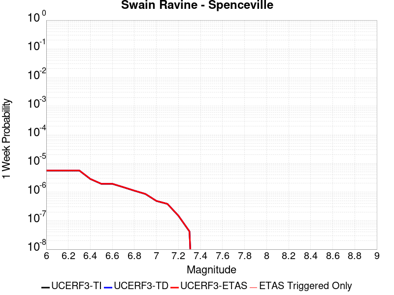 |  |  |  |

| Magnitude | 1 wk TI Prob | 1 wk TD Prob | 1 wk ETAS Prob | 1 wk ETAS/TD Gain | 1 wk ETAS Triggered Only | 1 mo TI Prob | 1 mo TD Prob | 1 mo ETAS Prob | 1 mo ETAS/TD Gain | 1 mo ETAS Triggered Only | 1 yr TI Prob | 1 yr TD Prob | 1 yr ETAS Prob | 1 yr ETAS/TD Gain | 1 yr ETAS Triggered Only | 10 yr TI Prob | 10 yr TD Prob | 10 yr ETAS Prob | 10 yr ETAS/TD Gain | 10 yr ETAS Triggered Only |
|-----|-----|-----|-----|-----|-----|-----|-----|-----|-----|-----|-----|-----|-----|-----|-----|-----|-----|-----|-----|-----|
| 6.0 | 5.596169E-6 | 5.663858E-6 | 5.663858E-6 | 1.0 | 0.0 | 2.398336E-5 | 2.4273466E-5 | 3.4273224E-5 | 1.4119625 | 1.0E-5 | 2.9195828E-4 | 2.954921E-4 | 3.0548914E-4 | 1.0338318 | 1.0E-5 | 0.00291575 | 0.0029512611 | 0.0029612316 | 1.0033784 | 1.0E-5 |
| 6.1 | 5.596169E-6 | 5.663858E-6 | 5.663858E-6 | 1.0 | 0.0 | 2.398336E-5 | 2.4273466E-5 | 3.4273224E-5 | 1.4119625 | 1.0E-5 | 2.9195828E-4 | 2.954921E-4 | 3.0548914E-4 | 1.0338318 | 1.0E-5 | 0.00291575 | 0.0029512611 | 0.0029612316 | 1.0033784 | 1.0E-5 |
| 6.2 | 5.596169E-6 | 5.663858E-6 | 5.663858E-6 | 1.0 | 0.0 | 2.398336E-5 | 2.4273466E-5 | 3.4273224E-5 | 1.4119625 | 1.0E-5 | 2.9195828E-4 | 2.954921E-4 | 3.0548914E-4 | 1.0338318 | 1.0E-5 | 0.00291575 | 0.0029512611 | 0.0029612316 | 1.0033784 | 1.0E-5 |
| 6.3 | 5.596169E-6 | 5.663858E-6 | 5.663858E-6 | 1.0 | 0.0 | 2.398336E-5 | 2.4273466E-5 | 3.4273224E-5 | 1.4119625 | 1.0E-5 | 2.9195828E-4 | 2.954921E-4 | 3.0548914E-4 | 1.0338318 | 1.0E-5 | 0.00291575 | 0.0029512611 | 0.0029612316 | 1.0033784 | 1.0E-5 |
| 6.4 | 2.8426775E-6 | 2.8741736E-6 | 2.8741736E-6 | 1.0 | 0.0 | 1.2182847E-5 | 1.2317831E-5 | 2.2317707E-5 | 1.8118212 | 1.0E-5 | 1.4831607E-4 | 1.4995965E-4 | 1.5995816E-4 | 1.0666746 | 1.0E-5 | 0.0014821711 | 0.001498623 | 0.0015086081 | 1.0066628 | 1.0E-5 |
| 6.5 | 1.9210793E-6 | 1.9414338E-6 | 1.9414338E-6 | 1.0 | 0.0 | 8.233172E-6 | 8.320405E-6 | 8.320405E-6 | 1.0 | 0.0 | 1.0023425E-4 | 1.01296355E-4 | 1.01296355E-4 | 1.0 | 0.0 | 0.0010018905 | 0.0010125153 | 0.0010125153 | 1.0 | 0.0 |
| 6.6 | 1.9210793E-6 | 1.9414338E-6 | 1.9414338E-6 | 1.0 | 0.0 | 8.233172E-6 | 8.320405E-6 | 8.320405E-6 | 1.0 | 0.0 | 1.0023425E-4 | 1.01296355E-4 | 1.01296355E-4 | 1.0 | 0.0 | 0.0010018905 | 0.0010125153 | 0.0010125153 | 1.0 | 0.0 |
| 6.7 | 1.4667394E-6 | 1.4819076E-6 | 1.4819076E-6 | 1.0 | 0.0 | 6.286011E-6 | 6.3510174E-6 | 6.3510174E-6 | 1.0 | 0.0 | 7.65295E-5 | 7.732097E-5 | 7.732097E-5 | 1.0 | 0.0 | 7.6503144E-4 | 7.729484E-4 | 7.729484E-4 | 1.0 | 0.0 |
| 6.8 | 1.1076943E-6 | 1.1189641E-6 | 1.1189641E-6 | 1.0 | 0.0 | 4.747252E-6 | 4.7955514E-6 | 4.7955514E-6 | 1.0 | 0.0 | 5.7796264E-5 | 5.838432E-5 | 5.838432E-5 | 1.0 | 0.0 | 5.778124E-4 | 5.8369426E-4 | 5.8369426E-4 | 1.0 | 0.0 |
| 6.9 | 8.514296E-7 | 8.600175E-7 | 8.600175E-7 | 1.0 | 0.0 | 3.648979E-6 | 3.6857843E-6 | 3.6857843E-6 | 1.0 | 0.0 | 4.442541E-5 | 4.487353E-5 | 4.487353E-5 | 1.0 | 0.0 | 4.441653E-4 | 4.4864754E-4 | 4.4864754E-4 | 1.0 | 0.0 |
| 7.0 | 4.8544706E-7 | 4.903346E-7 | 4.903346E-7 | 1.0 | 0.0 | 2.0804857E-6 | 2.1014323E-6 | 2.1014323E-6 | 1.0 | 0.0 | 2.532962E-5 | 2.5584652E-5 | 2.5584652E-5 | 1.0 | 0.0 | 2.5326732E-4 | 2.5581836E-4 | 2.5581836E-4 | 1.0 | 0.0 |
| 7.1 | 3.829186E-7 | 3.8679147E-7 | 3.8679147E-7 | 1.0 | 0.0 | 1.6410787E-6 | 1.6576766E-6 | 1.6576766E-6 | 1.0 | 0.0 | 1.997995E-5 | 2.0182037E-5 | 2.0182037E-5 | 1.0 | 0.0 | 1.9978154E-4 | 2.0180311E-4 | 2.0180311E-4 | 1.0 | 0.0 |
| 7.2 | 1.4726595E-7 | 1.487958E-7 | 1.487958E-7 | 1.0 | 0.0 | 6.3113964E-7 | 6.376962E-7 | 6.376962E-7 | 1.0 | 0.0 | 7.684098E-6 | 7.763929E-6 | 7.763929E-6 | 1.0 | 0.0 | 7.6838325E-5 | 7.763711E-5 | 7.763711E-5 | 1.0 | 0.0 |
| 7.3 | 4.1880604E-8 | 4.232472E-8 | 4.232472E-8 | 1.0 | 0.0 | 1.7948828E-7 | 1.8139167E-7 | 1.8139167E-7 | 1.0 | 0.0 | 2.1852677E-6 | 2.2084434E-6 | 2.2084434E-6 | 1.0 | 0.0 | 2.1852462E-5 | 2.2084436E-5 | 2.2084436E-5 | 1.0 | 0.0 |

## Hollywood
*[(top)](#table-of-contents)*

| 1 Week | 1 Month | 1 Year | 10 Year |
|-----|-----|-----|-----|
|  |  |  |  |

| Magnitude | 1 wk TI Prob | 1 wk TD Prob | 1 wk ETAS Prob | 1 wk ETAS/TD Gain | 1 wk ETAS Triggered Only | 1 mo TI Prob | 1 mo TD Prob | 1 mo ETAS Prob | 1 mo ETAS/TD Gain | 1 mo ETAS Triggered Only | 1 yr TI Prob | 1 yr TD Prob | 1 yr ETAS Prob | 1 yr ETAS/TD Gain | 1 yr ETAS Triggered Only | 10 yr TI Prob | 10 yr TD Prob | 10 yr ETAS Prob | 10 yr ETAS/TD Gain | 10 yr ETAS Triggered Only |
|-----|-----|-----|-----|-----|-----|-----|-----|-----|-----|-----|-----|-----|-----|-----|-----|-----|-----|-----|-----|-----|
| 6.0 | 1.24487615E-5 | 1.2594315E-5 | 1.2594315E-5 | 1.0 | 0.0 | 5.3350745E-5 | 5.3974545E-5 | 5.3974545E-5 | 1.0 | 0.0 | 6.4935174E-4 | 6.569466E-4 | 6.6694006E-4 | 1.0152119 | 1.0E-5 | 0.0064745755 | 0.0065505337 | 0.006560468 | 1.0015166 | 1.0E-5 |
| 6.1 | 1.24487615E-5 | 1.2594315E-5 | 1.2594315E-5 | 1.0 | 0.0 | 5.3350745E-5 | 5.3974545E-5 | 5.3974545E-5 | 1.0 | 0.0 | 6.4935174E-4 | 6.569466E-4 | 6.6694006E-4 | 1.0152119 | 1.0E-5 | 0.0064745755 | 0.0065505337 | 0.006560468 | 1.0015166 | 1.0E-5 |
| 6.2 | 1.24487615E-5 | 1.2594315E-5 | 1.2594315E-5 | 1.0 | 0.0 | 5.3350745E-5 | 5.3974545E-5 | 5.3974545E-5 | 1.0 | 0.0 | 6.4935174E-4 | 6.569466E-4 | 6.6694006E-4 | 1.0152119 | 1.0E-5 | 0.0064745755 | 0.0065505337 | 0.006560468 | 1.0015166 | 1.0E-5 |
| 6.3 | 1.24487615E-5 | 1.2594315E-5 | 1.2594315E-5 | 1.0 | 0.0 | 5.3350745E-5 | 5.3974545E-5 | 5.3974545E-5 | 1.0 | 0.0 | 6.4935174E-4 | 6.569466E-4 | 6.6694006E-4 | 1.0152119 | 1.0E-5 | 0.0064745755 | 0.0065505337 | 0.006560468 | 1.0015166 | 1.0E-5 |
| 6.4 | 1.2431024E-5 | 1.2574927E-5 | 1.2574927E-5 | 1.0 | 0.0 | 5.327473E-5 | 5.3891457E-5 | 5.3891457E-5 | 1.0 | 0.0 | 6.4842677E-4 | 6.559356E-4 | 6.6592905E-4 | 1.0152354 | 1.0E-5 | 0.0064653796 | 0.0065404833 | 0.0065504177 | 1.001519 | 1.0E-5 |
| 6.5 | 1.1242222E-5 | 1.1318822E-5 | 1.1318822E-5 | 1.0 | 0.0 | 4.8180063E-5 | 4.850835E-5 | 4.850835E-5 | 1.0 | 0.0 | 5.864344E-4 | 5.904318E-4 | 6.004259E-4 | 1.0169268 | 1.0E-5 | 0.0058488925 | 0.005888918 | 0.005898859 | 1.0016881 | 1.0E-5 |
| 6.6 | 1.1234066E-5 | 1.1309935E-5 | 1.1309935E-5 | 1.0 | 0.0 | 4.8145106E-5 | 4.8470265E-5 | 4.8470265E-5 | 1.0 | 0.0 | 5.86009E-4 | 5.8996835E-4 | 5.999625E-4 | 1.0169401 | 1.0E-5 | 0.005844661 | 0.0058843084 | 0.0058942493 | 1.0016894 | 1.0E-5 |
| 6.7 | 1.12294E-5 | 1.1304678E-5 | 1.1304678E-5 | 1.0 | 0.0 | 4.812511E-5 | 4.8447735E-5 | 4.8447735E-5 | 1.0 | 0.0 | 5.857657E-4 | 5.896942E-4 | 5.996883E-4 | 1.016948 | 1.0E-5 | 0.0058422405 | 0.005881581 | 0.0058915224 | 1.0016903 | 1.0E-5 |
| 6.8 | 1.0252819E-5 | 1.0219352E-5 | 1.0219352E-5 | 1.0 | 0.0 | 4.3939912E-5 | 4.37965E-5 | 4.37965E-5 | 1.0 | 0.0 | 5.3483713E-4 | 5.3309405E-4 | 5.430887E-4 | 1.0187484 | 1.0E-5 | 0.005335517 | 0.0053183786 | 0.0053283256 | 1.0018703 | 1.0E-5 |
| 6.9 | 9.252289E-6 | 9.111102E-6 | 9.111102E-6 | 1.0 | 0.0 | 3.9652066E-5 | 3.904701E-5 | 3.904701E-5 | 1.0 | 0.0 | 4.8265693E-4 | 4.7529524E-4 | 4.852905E-4 | 1.0210296 | 1.0E-5 | 0.0048161 | 0.0047429604 | 0.004752913 | 1.0020984 | 1.0E-5 |
| 7.0 | 8.474604E-6 | 8.258978E-6 | 8.258978E-6 | 1.0 | 0.0 | 3.6319227E-5 | 3.5395147E-5 | 3.5395147E-5 | 1.0 | 0.0 | 4.4209688E-4 | 4.3085212E-4 | 4.4084783E-4 | 1.0231998 | 1.0E-5 | 0.004412184 | 0.004300318 | 0.0043102754 | 1.0023154 | 1.0E-5 |
| 7.1 | 6.643643E-6 | 6.268914E-6 | 6.268914E-6 | 1.0 | 0.0 | 2.8472443E-5 | 2.68665E-5 | 2.68665E-5 | 1.0 | 0.0 | 3.4659685E-4 | 3.2705098E-4 | 3.2705098E-4 | 1.0 | 0.0 | 0.0034605677 | 0.0032657427 | 0.0032657427 | 1.0 | 0.0 |
| 7.2 | 5.549002E-6 | 5.109165E-6 | 5.109165E-6 | 1.0 | 0.0 | 2.378122E-5 | 2.189624E-5 | 2.189624E-5 | 1.0 | 0.0 | 2.8949787E-4 | 2.6655424E-4 | 2.6655424E-4 | 1.0 | 0.0 | 0.0028912104 | 0.0026623618 | 0.0026623618 | 1.0 | 0.0 |
| 7.3 | 4.3059727E-6 | 3.960264E-6 | 3.960264E-6 | 1.0 | 0.0 | 1.8454039E-5 | 1.6972452E-5 | 1.6972452E-5 | 1.0 | 0.0 | 2.2465475E-4 | 2.066201E-4 | 2.066201E-4 | 1.0 | 0.0 | 0.0022442779 | 0.00206429 | 0.00206429 | 1.0 | 0.0 |
| 7.4 | 2.8550733E-6 | 2.7015933E-6 | 2.7015933E-6 | 1.0 | 0.0 | 1.2235971E-5 | 1.1578206E-5 | 1.1578206E-5 | 1.0 | 0.0 | 1.4896276E-4 | 1.4095558E-4 | 1.4095558E-4 | 1.0 | 0.0 | 0.0014886294 | 0.0014086668 | 0.0014086668 | 1.0 | 0.0 |
| 7.5 | 1.9927045E-6 | 1.8978717E-6 | 1.8978717E-6 | 1.0 | 0.0 | 8.540134E-6 | 8.133711E-6 | 8.133711E-6 | 1.0 | 0.0 | 1.0397117E-4 | 9.902346E-5 | 9.902346E-5 | 1.0 | 0.0 | 0.0010392254 | 9.897971E-4 | 9.897971E-4 | 1.0 | 0.0 |
| 7.6 | 1.345084E-6 | 1.2217639E-6 | 1.2217639E-6 | 1.0 | 0.0 | 5.764633E-6 | 5.2361206E-6 | 5.2361206E-6 | 1.0 | 0.0 | 7.018215E-5 | 6.3747924E-5 | 6.3747924E-5 | 1.0 | 0.0 | 7.0159987E-4 | 6.3729833E-4 | 6.3729833E-4 | 1.0 | 0.0 |
| 7.7 | 7.6835164E-7 | 6.27892E-7 | 6.27892E-7 | 1.0 | 0.0 | 3.2929315E-6 | 2.6909631E-6 | 2.6909631E-6 | 1.0 | 0.0 | 4.00907E-5 | 3.2761996E-5 | 3.2761996E-5 | 1.0 | 0.0 | 4.0083472E-4 | 3.2757316E-4 | 3.2757316E-4 | 1.0 | 0.0 |
| 7.8 | 3.6562128E-7 | 2.454486E-7 | 2.454486E-7 | 1.0 | 0.0 | 1.5669474E-6 | 1.0519221E-6 | 1.0519221E-6 | 1.0 | 0.0 | 1.9077417E-5 | 1.28070815E-5 | 1.28070815E-5 | 1.0 | 0.0 | 1.907578E-4 | 1.280638E-4 | 1.280638E-4 | 1.0 | 0.0 |
| 7.9 | 7.5024424E-8 | 5.3838157E-8 | 5.3838157E-8 | 1.0 | 0.0 | 3.215332E-7 | 2.3073494E-7 | 2.3073494E-7 | 1.0 | 0.0 | 3.91466E-6 | 2.8091956E-6 | 2.8091956E-6 | 1.0 | 0.0 | 3.9145907E-5 | 2.809173E-5 | 2.809173E-5 | 1.0 | 0.0 |

## Elsinore (Temecula) rev
*[(top)](#table-of-contents)*

| 1 Week | 1 Month | 1 Year | 10 Year |
|-----|-----|-----|-----|
|  |  |  | 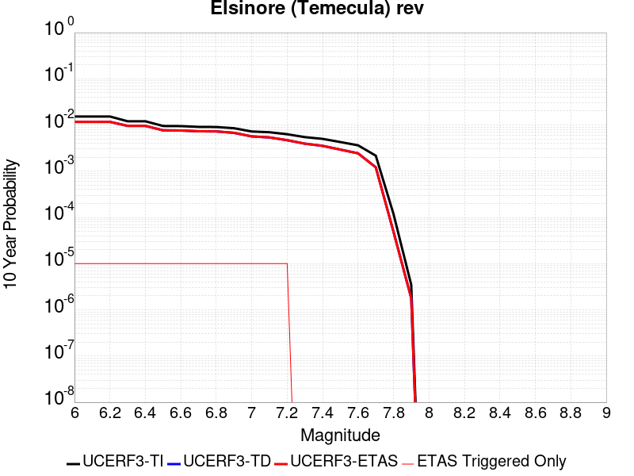 |

| Magnitude | 1 wk TI Prob | 1 wk TD Prob | 1 wk ETAS Prob | 1 wk ETAS/TD Gain | 1 wk ETAS Triggered Only | 1 mo TI Prob | 1 mo TD Prob | 1 mo ETAS Prob | 1 mo ETAS/TD Gain | 1 mo ETAS Triggered Only | 1 yr TI Prob | 1 yr TD Prob | 1 yr ETAS Prob | 1 yr ETAS/TD Gain | 1 yr ETAS Triggered Only | 10 yr TI Prob | 10 yr TD Prob | 10 yr ETAS Prob | 10 yr ETAS/TD Gain | 10 yr ETAS Triggered Only |
|-----|-----|-----|-----|-----|-----|-----|-----|-----|-----|-----|-----|-----|-----|-----|-----|-----|-----|-----|-----|-----|
| 6.0 | 2.9514995E-5 | 2.2526347E-5 | 2.2526347E-5 | 1.0 | 0.0 | 1.264867E-4 | 9.653804E-5 | 9.653804E-5 | 1.0 | 0.0 | 0.0015388876 | 0.0011747391 | 0.0011747391 | 1.0 | 0.0 | 0.015282745 | 0.011701716 | 0.011711598 | 1.0008446 | 1.0E-5 |
| 6.1 | 2.9514995E-5 | 2.2526347E-5 | 2.2526347E-5 | 1.0 | 0.0 | 1.264867E-4 | 9.653804E-5 | 9.653804E-5 | 1.0 | 0.0 | 0.0015388876 | 0.0011747391 | 0.0011747391 | 1.0 | 0.0 | 0.015282745 | 0.011701716 | 0.011711598 | 1.0008446 | 1.0E-5 |
| 6.2 | 2.9514995E-5 | 2.2526347E-5 | 2.2526347E-5 | 1.0 | 0.0 | 1.264867E-4 | 9.653804E-5 | 9.653804E-5 | 1.0 | 0.0 | 0.0015388876 | 0.0011747391 | 0.0011747391 | 1.0 | 0.0 | 0.015282745 | 0.011701716 | 0.011711598 | 1.0008446 | 1.0E-5 |
| 6.3 | 2.3223649E-5 | 1.8413199E-5 | 1.8413199E-5 | 1.0 | 0.0 | 9.952613E-5 | 7.891142E-5 | 7.891142E-5 | 1.0 | 0.0 | 0.001211057 | 9.603404E-4 | 9.603404E-4 | 1.0 | 0.0 | 0.012044783 | 0.009573364 | 0.009583267 | 1.0010346 | 1.0E-5 |
| 6.4 | 2.3223649E-5 | 1.8413199E-5 | 1.8413199E-5 | 1.0 | 0.0 | 9.952613E-5 | 7.891142E-5 | 7.891142E-5 | 1.0 | 0.0 | 0.001211057 | 9.603404E-4 | 9.603404E-4 | 1.0 | 0.0 | 0.012044783 | 0.009573364 | 0.009583267 | 1.0010346 | 1.0E-5 |
| 6.5 | 1.8338875E-5 | 1.4755047E-5 | 1.4755047E-5 | 1.0 | 0.0 | 7.8592806E-5 | 6.323443E-5 | 6.323443E-5 | 1.0 | 0.0 | 9.5644733E-4 | 7.6961605E-4 | 7.6961605E-4 | 1.0 | 0.0 | 0.009523412 | 0.007676475 | 0.0076863985 | 1.0012927 | 1.0E-5 |
| 6.6 | 1.8223333E-5 | 1.4617579E-5 | 1.4617579E-5 | 1.0 | 0.0 | 7.809766E-5 | 6.264531E-5 | 6.264531E-5 | 1.0 | 0.0 | 9.504242E-4 | 7.6244853E-4 | 7.6244853E-4 | 1.0 | 0.0 | 0.009463696 | 0.007605292 | 0.0076152156 | 1.0013049 | 1.0E-5 |
| 6.7 | 1.7512752E-5 | 1.4031902E-5 | 1.4031902E-5 | 1.0 | 0.0 | 7.505249E-5 | 6.0135386E-5 | 6.0135386E-5 | 1.0 | 0.0 | 9.13381E-4 | 7.319109E-4 | 7.319109E-4 | 1.0 | 0.0 | 0.00909636 | 0.0073013525 | 0.0073112794 | 1.0013596 | 1.0E-5 |
| 6.8 | 1.7417142E-5 | 1.3955862E-5 | 1.3955862E-5 | 1.0 | 0.0 | 7.4642754E-5 | 5.9809518E-5 | 5.9809518E-5 | 1.0 | 0.0 | 9.083966E-4 | 7.279462E-4 | 7.279462E-4 | 1.0 | 0.0 | 0.009046922 | 0.0072619086 | 0.007271836 | 1.0013671 | 1.0E-5 |
| 6.9 | 1.6402591E-5 | 1.2993129E-5 | 1.2993129E-5 | 1.0 | 0.0 | 7.0294926E-5 | 5.5683693E-5 | 5.5683693E-5 | 1.0 | 0.0 | 8.5550465E-4 | 6.7774573E-4 | 6.7774573E-4 | 1.0 | 0.0 | 0.008522186 | 0.006762511 | 0.0067724437 | 1.0014688 | 1.0E-5 |
| 7.0 | 1.3912486E-5 | 1.0882295E-5 | 1.0882295E-5 | 1.0 | 0.0 | 5.9623577E-5 | 4.663759E-5 | 4.663759E-5 | 1.0 | 0.0 | 7.2567526E-4 | 5.676674E-4 | 5.676674E-4 | 1.0 | 0.0 | 0.0072331014 | 0.0056660925 | 0.005676036 | 1.0017549 | 1.0E-5 |
| 7.1 | 1.3405147E-5 | 1.0331306E-5 | 1.0331306E-5 | 1.0 | 0.0 | 5.7449364E-5 | 4.427629E-5 | 4.427629E-5 | 1.0 | 0.0 | 6.9922156E-4 | 5.389331E-4 | 5.389331E-4 | 1.0 | 0.0 | 0.0069702556 | 0.0053795925 | 0.005389539 | 1.0018489 | 1.0E-5 |
| 7.2 | 1.21402E-5 | 9.000168E-6 | 9.000168E-6 | 1.0 | 0.0 | 5.202839E-5 | 3.8571587E-5 | 3.8571587E-5 | 1.0 | 0.0 | 6.332616E-4 | 4.6950966E-4 | 4.6950966E-4 | 1.0 | 0.0 | 0.0063146 | 0.0046866024 | 0.004696556 | 1.0021237 | 1.0E-5 |
| 7.3 | 1.05047775E-5 | 7.5747207E-6 | 7.5747207E-6 | 1.0 | 0.0 | 4.5019697E-5 | 3.2462693E-5 | 3.2462693E-5 | 1.0 | 0.0 | 5.4797693E-4 | 3.9516305E-4 | 3.9516305E-4 | 1.0 | 0.0 | 0.005466277 | 0.0039449935 | 0.0039449935 | 1.0 | 0.0 |
| 7.4 | 9.624483E-6 | 6.789545E-6 | 6.789545E-6 | 1.0 | 0.0 | 4.124713E-5 | 2.9097733E-5 | 2.9097733E-5 | 1.0 | 0.0 | 5.0206814E-4 | 3.542087E-4 | 3.542087E-4 | 1.0 | 0.0 | 0.005009353 | 0.0035365953 | 0.0035365953 | 1.0 | 0.0 |
| 7.5 | 8.215151E-6 | 5.6378112E-6 | 5.6378112E-6 | 1.0 | 0.0 | 3.5207315E-5 | 2.416183E-5 | 2.416183E-5 | 1.0 | 0.0 | 4.2856473E-4 | 2.9413187E-4 | 2.9413187E-4 | 1.0 | 0.0 | 0.004277392 | 0.0029375537 | 0.0029375537 | 1.0 | 0.0 |
| 7.6 | 6.975058E-6 | 4.6780897E-6 | 4.6780897E-6 | 1.0 | 0.0 | 2.9892764E-5 | 2.0048808E-5 | 2.0048808E-5 | 1.0 | 0.0 | 3.6388362E-4 | 2.4406807E-4 | 2.4406807E-4 | 1.0 | 0.0 | 0.0036328835 | 0.0024381164 | 0.0024381164 | 1.0 | 0.0 |
| 7.7 | 4.159604E-6 | 2.3279777E-6 | 2.3279777E-6 | 1.0 | 0.0 | 1.7826753E-5 | 9.977013E-6 | 9.977013E-6 | 1.0 | 0.0 | 2.1701909E-4 | 1.2146411E-4 | 1.2146411E-4 | 1.0 | 0.0 | 0.0021680726 | 0.0012140503 | 0.0012140503 | 1.0 | 0.0 |
| 7.8 | 2.2692414E-7 | 9.388808E-8 | 9.388808E-8 | 1.0 | 0.0 | 9.725317E-7 | 4.0237745E-7 | 4.0237745E-7 | 1.0 | 0.0 | 1.1840509E-5 | 4.8989377E-6 | 4.8989377E-6 | 1.0 | 0.0 | 1.1839878E-4 | 4.8988626E-5 | 4.8988626E-5 | 1.0 | 0.0 |
| 7.9 | 6.676829E-9 | 3.4407224E-9 | 3.4407224E-9 | 1.0 | 0.0 | 2.861498E-8 | 1.4745954E-8 | 1.4745954E-8 | 1.0 | 0.0 | 3.4838732E-7 | 1.7953197E-7 | 1.7953197E-7 | 1.0 | 0.0 | 3.4838679E-6 | 1.7953184E-6 | 1.7953184E-6 | 1.0 | 0.0 |

## San Luis Range - Oceano 2011 CFM
*[(top)](#table-of-contents)*

| 1 Week | 1 Month | 1 Year | 10 Year |
|-----|-----|-----|-----|
|  |  |  |  |

| Magnitude | 1 wk TI Prob | 1 wk TD Prob | 1 wk ETAS Prob | 1 wk ETAS/TD Gain | 1 wk ETAS Triggered Only | 1 mo TI Prob | 1 mo TD Prob | 1 mo ETAS Prob | 1 mo ETAS/TD Gain | 1 mo ETAS Triggered Only | 1 yr TI Prob | 1 yr TD Prob | 1 yr ETAS Prob | 1 yr ETAS/TD Gain | 1 yr ETAS Triggered Only | 10 yr TI Prob | 10 yr TD Prob | 10 yr ETAS Prob | 10 yr ETAS/TD Gain | 10 yr ETAS Triggered Only |
|-----|-----|-----|-----|-----|-----|-----|-----|-----|-----|-----|-----|-----|-----|-----|-----|-----|-----|-----|-----|-----|
| 6.0 | 1.6025788E-6 | 1.6201354E-6 | 1.6201354E-6 | 1.0 | 0.0 | 6.8681766E-6 | 6.9434213E-6 | 6.9434213E-6 | 1.0 | 0.0 | 8.361684E-5 | 8.453329E-5 | 8.453329E-5 | 1.0 | 0.0 | 8.3585386E-4 | 8.450522E-4 | 8.550437E-4 | 1.0118235 | 1.0E-5 |
| 6.1 | 1.6025788E-6 | 1.6201354E-6 | 1.6201354E-6 | 1.0 | 0.0 | 6.8681766E-6 | 6.9434213E-6 | 6.9434213E-6 | 1.0 | 0.0 | 8.361684E-5 | 8.453329E-5 | 8.453329E-5 | 1.0 | 0.0 | 8.3585386E-4 | 8.450522E-4 | 8.550437E-4 | 1.0118235 | 1.0E-5 |
| 6.2 | 1.6025788E-6 | 1.6201354E-6 | 1.6201354E-6 | 1.0 | 0.0 | 6.8681766E-6 | 6.9434213E-6 | 6.9434213E-6 | 1.0 | 0.0 | 8.361684E-5 | 8.453329E-5 | 8.453329E-5 | 1.0 | 0.0 | 8.3585386E-4 | 8.450522E-4 | 8.550437E-4 | 1.0118235 | 1.0E-5 |
| 6.3 | 1.6025788E-6 | 1.6201354E-6 | 1.6201354E-6 | 1.0 | 0.0 | 6.8681766E-6 | 6.9434213E-6 | 6.9434213E-6 | 1.0 | 0.0 | 8.361684E-5 | 8.453329E-5 | 8.453329E-5 | 1.0 | 0.0 | 8.3585386E-4 | 8.450522E-4 | 8.550437E-4 | 1.0118235 | 1.0E-5 |
| 6.4 | 1.1621186E-6 | 1.1750016E-6 | 1.1750016E-6 | 1.0 | 0.0 | 4.980499E-6 | 5.0357125E-6 | 5.0357125E-6 | 1.0 | 0.0 | 6.0635884E-5 | 6.130835E-5 | 6.130835E-5 | 1.0 | 0.0 | 6.0619344E-4 | 6.1294093E-4 | 6.2293484E-4 | 1.0163047 | 1.0E-5 |
| 6.5 | 1.1621186E-6 | 1.1750016E-6 | 1.1750016E-6 | 1.0 | 0.0 | 4.980499E-6 | 5.0357125E-6 | 5.0357125E-6 | 1.0 | 0.0 | 6.0635884E-5 | 6.130835E-5 | 6.130835E-5 | 1.0 | 0.0 | 6.0619344E-4 | 6.1294093E-4 | 6.2293484E-4 | 1.0163047 | 1.0E-5 |
| 6.6 | 7.164729E-7 | 7.2486574E-7 | 7.2486574E-7 | 1.0 | 0.0 | 3.0705946E-6 | 3.1065638E-6 | 3.1065638E-6 | 1.0 | 0.0 | 3.738385E-5 | 3.7821774E-5 | 3.7821774E-5 | 1.0 | 0.0 | 3.737756E-4 | 3.7815515E-4 | 3.8815138E-4 | 1.0264342 | 1.0E-5 |
| 6.7 | 7.164729E-7 | 7.2486574E-7 | 7.2486574E-7 | 1.0 | 0.0 | 3.0705946E-6 | 3.1065638E-6 | 3.1065638E-6 | 1.0 | 0.0 | 3.738385E-5 | 3.7821774E-5 | 3.7821774E-5 | 1.0 | 0.0 | 3.737756E-4 | 3.7815515E-4 | 3.8815138E-4 | 1.0264342 | 1.0E-5 |
| 6.8 | 6.700177E-7 | 6.7775125E-7 | 6.7775125E-7 | 1.0 | 0.0 | 2.8715012E-6 | 2.904645E-6 | 2.904645E-6 | 1.0 | 0.0 | 3.495997E-5 | 3.5363497E-5 | 3.5363497E-5 | 1.0 | 0.0 | 3.495447E-4 | 3.535803E-4 | 3.6357678E-4 | 1.0282722 | 1.0E-5 |
| 6.9 | 5.657865E-7 | 5.7218466E-7 | 5.7218466E-7 | 1.0 | 0.0 | 2.424797E-6 | 2.4522178E-6 | 2.4522178E-6 | 1.0 | 0.0 | 2.9521503E-5 | 2.9855353E-5 | 2.9855353E-5 | 1.0 | 0.0 | 2.9517582E-4 | 2.985145E-4 | 2.985145E-4 | 1.0 | 0.0 |
| 7.0 | 4.608413E-7 | 4.660218E-7 | 4.660218E-7 | 1.0 | 0.0 | 1.9750328E-6 | 1.9972347E-6 | 1.9972347E-6 | 1.0 | 0.0 | 2.4045758E-5 | 2.4316065E-5 | 2.4316065E-5 | 1.0 | 0.0 | 2.4043156E-4 | 2.4313433E-4 | 2.4313433E-4 | 1.0 | 0.0 |
| 7.1 | 3.9177846E-7 | 3.962202E-7 | 3.962202E-7 | 1.0 | 0.0 | 1.6790494E-6 | 1.6980855E-6 | 1.6980855E-6 | 1.0 | 0.0 | 2.0442236E-5 | 2.0673997E-5 | 2.0673997E-5 | 1.0 | 0.0 | 2.0440355E-4 | 2.0672088E-4 | 2.0672088E-4 | 1.0 | 0.0 |
| 7.2 | 3.3974752E-7 | 3.43669E-7 | 3.43669E-7 | 1.0 | 0.0 | 1.45606E-6 | 1.4728663E-6 | 1.4728663E-6 | 1.0 | 0.0 | 1.7727387E-5 | 1.7932001E-5 | 1.7932001E-5 | 1.0 | 0.0 | 1.7725973E-4 | 1.7930564E-4 | 1.7930564E-4 | 1.0 | 0.0 |
| 7.3 | 2.8900928E-7 | 2.9234332E-7 | 2.9234332E-7 | 1.0 | 0.0 | 1.2386106E-6 | 1.2528993E-6 | 1.2528993E-6 | 1.0 | 0.0 | 1.5079979E-5 | 1.5253944E-5 | 1.5253944E-5 | 1.0 | 0.0 | 1.5078956E-4 | 1.5252906E-4 | 1.5252906E-4 | 1.0 | 0.0 |
| 7.4 | 2.1881527E-7 | 2.2139838E-7 | 2.2139838E-7 | 1.0 | 0.0 | 9.3777936E-7 | 9.4884984E-7 | 9.4884984E-7 | 1.0 | 0.0 | 1.14174045E-5 | 1.1552186E-5 | 1.1552186E-5 | 1.0 | 0.0 | 1.1416818E-4 | 1.1551591E-4 | 1.1551591E-4 | 1.0 | 0.0 |
| 7.5 | 1.356398E-7 | 1.3718785E-7 | 1.3718785E-7 | 1.0 | 0.0 | 5.813133E-7 | 5.879478E-7 | 5.879478E-7 | 1.0 | 0.0 | 7.0774663E-6 | 7.1582413E-6 | 7.1582413E-6 | 1.0 | 0.0 | 7.077241E-5 | 7.1580136E-5 | 7.1580136E-5 | 1.0 | 0.0 |
| 7.6 | 5.9269272E-8 | 6.001435E-8 | 6.001435E-8 | 1.0 | 0.0 | 2.5401116E-7 | 2.5720433E-7 | 2.5720433E-7 | 1.0 | 0.0 | 3.0925814E-6 | 3.1314582E-6 | 3.1314582E-6 | 1.0 | 0.0 | 3.0925385E-5 | 3.1314154E-5 | 3.1314154E-5 | 1.0 | 0.0 |
| 7.7 | 5.946232E-9 | 6.0370144E-9 | 6.0370144E-9 | 1.0 | 0.0 | 2.5483851E-8 | 2.5872918E-8 | 2.5872918E-8 | 1.0 | 0.0 | 3.1026585E-7 | 3.1500275E-7 | 3.1500275E-7 | 1.0 | 0.0 | 3.102654E-6 | 3.1500238E-6 | 3.1500238E-6 | 1.0 | 0.0 |

## Elmore Ranch
*[(top)](#table-of-contents)*

| 1 Week | 1 Month | 1 Year | 10 Year |
|-----|-----|-----|-----|
|  |  |  |  |

| Magnitude | 1 wk TI Prob | 1 wk TD Prob | 1 wk ETAS Prob | 1 wk ETAS/TD Gain | 1 wk ETAS Triggered Only | 1 mo TI Prob | 1 mo TD Prob | 1 mo ETAS Prob | 1 mo ETAS/TD Gain | 1 mo ETAS Triggered Only | 1 yr TI Prob | 1 yr TD Prob | 1 yr ETAS Prob | 1 yr ETAS/TD Gain | 1 yr ETAS Triggered Only | 10 yr TI Prob | 10 yr TD Prob | 10 yr ETAS Prob | 10 yr ETAS/TD Gain | 10 yr ETAS Triggered Only |
|-----|-----|-----|-----|-----|-----|-----|-----|-----|-----|-----|-----|-----|-----|-----|-----|-----|-----|-----|-----|-----|
| 6.0 | 9.102099E-5 | 8.956369E-5 | 8.956369E-5 | 1.0 | 0.0 | 3.9003167E-4 | 3.8379105E-4 | 3.8379105E-4 | 1.0 | 0.0 | 0.0047383 | 0.004664101 | 0.004664101 | 1.0 | 0.0 | 0.046385348 | 0.045887828 | 0.04589737 | 1.0002079 | 1.0E-5 |
| 6.1 | 3.8306698E-5 | 4.1515465E-5 | 4.1515465E-5 | 1.0 | 0.0 | 1.6416123E-4 | 1.7791537E-4 | 1.7791537E-4 | 1.0 | 0.0 | 0.0019968306 | 0.0021638772 | 0.0021638772 | 1.0 | 0.0 | 0.019789828 | 0.021636104 | 0.021645889 | 1.0004522 | 1.0E-5 |
| 6.2 | 3.8306698E-5 | 4.1515465E-5 | 4.1515465E-5 | 1.0 | 0.0 | 1.6416123E-4 | 1.7791537E-4 | 1.7791537E-4 | 1.0 | 0.0 | 0.0019968306 | 0.0021638772 | 0.0021638772 | 1.0 | 0.0 | 0.019789828 | 0.021636104 | 0.021645889 | 1.0004522 | 1.0E-5 |
| 6.3 | 3.3197924E-5 | 3.656767E-5 | 3.656767E-5 | 1.0 | 0.0 | 1.4226905E-4 | 1.5671315E-4 | 1.5671315E-4 | 1.0 | 0.0 | 0.0017307495 | 0.0019065277 | 0.0019065277 | 1.0 | 0.0 | 0.017173318 | 0.01909636 | 0.019106168 | 1.0005137 | 1.0E-5 |
| 6.4 | 2.5148964E-5 | 2.742868E-5 | 2.742868E-5 | 1.0 | 0.0 | 1.0777682E-4 | 1.1754984E-4 | 1.1754984E-4 | 1.0 | 0.0 | 0.0013113929 | 0.0014308781 | 0.0014308781 | 1.0 | 0.0 | 0.01303681 | 0.01439143 | 0.014401286 | 1.0006849 | 1.0E-5 |
| 6.5 | 2.5148964E-5 | 2.742868E-5 | 2.742868E-5 | 1.0 | 0.0 | 1.0777682E-4 | 1.1754984E-4 | 1.1754984E-4 | 1.0 | 0.0 | 0.0013113929 | 0.0014308781 | 0.0014308781 | 1.0 | 0.0 | 0.01303681 | 0.01439143 | 0.014401286 | 1.0006849 | 1.0E-5 |

## San Jose
*[(top)](#table-of-contents)*

| 1 Week | 1 Month | 1 Year | 10 Year |
|-----|-----|-----|-----|
|  |  |  |  |

| Magnitude | 1 wk TI Prob | 1 wk TD Prob | 1 wk ETAS Prob | 1 wk ETAS/TD Gain | 1 wk ETAS Triggered Only | 1 mo TI Prob | 1 mo TD Prob | 1 mo ETAS Prob | 1 mo ETAS/TD Gain | 1 mo ETAS Triggered Only | 1 yr TI Prob | 1 yr TD Prob | 1 yr ETAS Prob | 1 yr ETAS/TD Gain | 1 yr ETAS Triggered Only | 10 yr TI Prob | 10 yr TD Prob | 10 yr ETAS Prob | 10 yr ETAS/TD Gain | 10 yr ETAS Triggered Only |
|-----|-----|-----|-----|-----|-----|-----|-----|-----|-----|-----|-----|-----|-----|-----|-----|-----|-----|-----|-----|-----|
| 6.0 | 5.0851277E-6 | 4.1262206E-6 | 4.1262206E-6 | 1.0 | 0.0 | 2.1793223E-5 | 1.7683697E-5 | 1.7683697E-5 | 1.0 | 0.0 | 2.653002E-4 | 2.1528036E-4 | 2.2527821E-4 | 1.0464411 | 1.0E-5 | 0.0026498367 | 0.0021510094 | 0.0021609878 | 1.004639 | 1.0E-5 |
| 6.1 | 5.0851277E-6 | 4.1262206E-6 | 4.1262206E-6 | 1.0 | 0.0 | 2.1793223E-5 | 1.7683697E-5 | 1.7683697E-5 | 1.0 | 0.0 | 2.653002E-4 | 2.1528036E-4 | 2.2527821E-4 | 1.0464411 | 1.0E-5 | 0.0026498367 | 0.0021510094 | 0.0021609878 | 1.004639 | 1.0E-5 |
| 6.2 | 5.0851277E-6 | 4.1262206E-6 | 4.1262206E-6 | 1.0 | 0.0 | 2.1793223E-5 | 1.7683697E-5 | 1.7683697E-5 | 1.0 | 0.0 | 2.653002E-4 | 2.1528036E-4 | 2.2527821E-4 | 1.0464411 | 1.0E-5 | 0.0026498367 | 0.0021510094 | 0.0021609878 | 1.004639 | 1.0E-5 |
| 6.3 | 5.0851277E-6 | 4.1262206E-6 | 4.1262206E-6 | 1.0 | 0.0 | 2.1793223E-5 | 1.7683697E-5 | 1.7683697E-5 | 1.0 | 0.0 | 2.653002E-4 | 2.1528036E-4 | 2.2527821E-4 | 1.0464411 | 1.0E-5 | 0.0026498367 | 0.0021510094 | 0.0021609878 | 1.004639 | 1.0E-5 |
| 6.4 | 4.3115124E-6 | 3.3243036E-6 | 3.3243036E-6 | 1.0 | 0.0 | 1.8477778E-5 | 1.4246951E-5 | 1.4246951E-5 | 1.0 | 0.0 | 2.2494372E-4 | 1.7344502E-4 | 1.8344329E-4 | 1.0576452 | 1.0E-5 | 0.0022471617 | 0.0017333463 | 0.001743329 | 1.0057592 | 1.0E-5 |
| 6.5 | 4.3115124E-6 | 3.3243036E-6 | 3.3243036E-6 | 1.0 | 0.0 | 1.8477778E-5 | 1.4246951E-5 | 1.4246951E-5 | 1.0 | 0.0 | 2.2494372E-4 | 1.7344502E-4 | 1.8344329E-4 | 1.0576452 | 1.0E-5 | 0.0022471617 | 0.0017333463 | 0.001743329 | 1.0057592 | 1.0E-5 |
| 6.6 | 3.110396E-6 | 2.0804662E-6 | 2.0804662E-6 | 1.0 | 0.0 | 1.33302E-5 | 8.916255E-6 | 8.916255E-6 | 1.0 | 0.0 | 1.622831E-4 | 1.0855027E-4 | 1.18549186E-4 | 1.0921133 | 1.0E-5 | 0.0016216465 | 0.0010850325 | 0.0010950216 | 1.0092063 | 1.0E-5 |
| 6.7 | 3.110396E-6 | 2.0804662E-6 | 2.0804662E-6 | 1.0 | 0.0 | 1.33302E-5 | 8.916255E-6 | 8.916255E-6 | 1.0 | 0.0 | 1.622831E-4 | 1.0855027E-4 | 1.18549186E-4 | 1.0921133 | 1.0E-5 | 0.0016216465 | 0.0010850325 | 0.0010950216 | 1.0092063 | 1.0E-5 |
| 6.8 | 2.856651E-6 | 1.9029025E-6 | 1.9029025E-6 | 1.0 | 0.0 | 1.2242733E-5 | 8.155273E-6 | 8.155273E-6 | 1.0 | 0.0 | 1.4904508E-4 | 9.928616E-5 | 1.0928517E-4 | 1.100709 | 1.0E-5 | 0.0014894515 | 9.924751E-4 | 0.0010024651 | 1.0100658 | 1.0E-5 |
| 6.9 | 2.1618725E-6 | 1.4190999E-6 | 1.4190999E-6 | 1.0 | 0.0 | 9.265135E-6 | 6.0818434E-6 | 6.0818434E-6 | 1.0 | 0.0 | 1.12797185E-4 | 7.4044015E-5 | 8.404327E-5 | 1.1350448 | 1.0E-5 | 0.0011273995 | 7.402346E-4 | 7.5022725E-4 | 1.0134993 | 1.0E-5 |
| 7.0 | 1.9684312E-6 | 1.3260606E-6 | 1.3260606E-6 | 1.0 | 0.0 | 8.436106E-6 | 5.683105E-6 | 5.683105E-6 | 1.0 | 0.0 | 1.02704755E-4 | 6.9189686E-5 | 7.9189E-5 | 1.1445202 | 1.0E-5 | 0.001026573 | 6.917221E-4 | 7.017152E-4 | 1.0144466 | 1.0E-5 |
| 7.1 | 1.6070337E-6 | 1.1159146E-6 | 1.1159146E-6 | 1.0 | 0.0 | 6.887269E-6 | 4.782483E-6 | 4.782483E-6 | 1.0 | 0.0 | 8.384928E-5 | 5.8225236E-5 | 6.8224654E-5 | 1.1717368 | 1.0E-5 | 8.3817646E-4 | 5.821385E-4 | 5.921326E-4 | 1.017168 | 1.0E-5 |
| 7.2 | 1.0631658E-6 | 6.406776E-7 | 6.406776E-7 | 1.0 | 0.0 | 4.556417E-6 | 2.7457586E-6 | 2.7457586E-6 | 1.0 | 0.0 | 5.5472963E-5 | 3.342911E-5 | 3.342911E-5 | 1.0 | 0.0 | 5.545912E-4 | 3.342747E-4 | 3.342747E-4 | 1.0 | 0.0 |
| 7.3 | 7.060711E-7 | 4.5849012E-7 | 4.5849012E-7 | 1.0 | 0.0 | 3.0260155E-6 | 1.9649563E-6 | 1.9649563E-6 | 1.0 | 0.0 | 3.6841117E-5 | 2.3923089E-5 | 2.3923089E-5 | 1.0 | 0.0 | 3.6835007E-4 | 2.392385E-4 | 2.392385E-4 | 1.0 | 0.0 |
| 7.4 | 3.3677085E-7 | 2.325059E-7 | 2.325059E-7 | 1.0 | 0.0 | 1.4433028E-6 | 9.964535E-7 | 9.964535E-7 | 1.0 | 0.0 | 1.757207E-5 | 1.2131757E-5 | 1.2131757E-5 | 1.0 | 0.0 | 1.7570681E-4 | 1.2134371E-4 | 1.2134371E-4 | 1.0 | 0.0 |
| 7.5 | 3.129161E-7 | 1.9545199E-7 | 1.9545199E-7 | 1.0 | 0.0 | 1.3410682E-6 | 8.3765116E-7 | 8.3765116E-7 | 1.0 | 0.0 | 1.6327383E-5 | 1.0198357E-5 | 1.0198357E-5 | 1.0 | 0.0 | 1.6326184E-4 | 1.0201162E-4 | 1.0201162E-4 | 1.0 | 0.0 |
| 7.6 | 2.8008668E-7 | 1.4252204E-7 | 1.4252204E-7 | 1.0 | 0.0 | 1.2003709E-6 | 6.1080857E-7 | 6.1080857E-7 | 1.0 | 0.0 | 1.46144175E-5 | 7.4365707E-6 | 7.4365707E-6 | 1.0 | 0.0 | 1.4613457E-4 | 7.439583E-5 | 7.439583E-5 | 1.0 | 0.0 |
| 7.7 | 2.7852005E-7 | 1.4026656E-7 | 1.4026656E-7 | 1.0 | 0.0 | 1.1936568E-6 | 6.011423E-7 | 6.011423E-7 | 1.0 | 0.0 | 1.4532674E-5 | 7.3188844E-6 | 7.3188844E-6 | 1.0 | 0.0 | 1.4531724E-4 | 7.3219046E-5 | 7.3219046E-5 | 1.0 | 0.0 |
| 7.8 | 1.1810797E-7 | 7.523048E-8 | 7.523048E-8 | 1.0 | 0.0 | 5.0617695E-7 | 3.224163E-7 | 3.224163E-7 | 1.0 | 0.0 | 6.1626865E-6 | 3.925412E-6 | 3.925412E-6 | 1.0 | 0.0 | 6.162516E-5 | 3.927182E-5 | 3.927182E-5 | 1.0 | 0.0 |

## Hayward (No) 2011 CFM
*[(top)](#table-of-contents)*

| 1 Week | 1 Month | 1 Year | 10 Year |
|-----|-----|-----|-----|
|  |  | 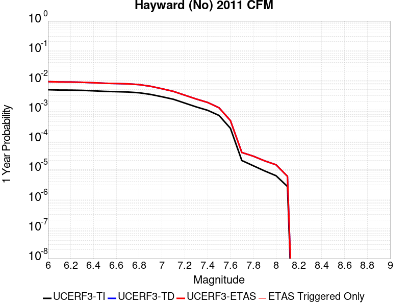 | 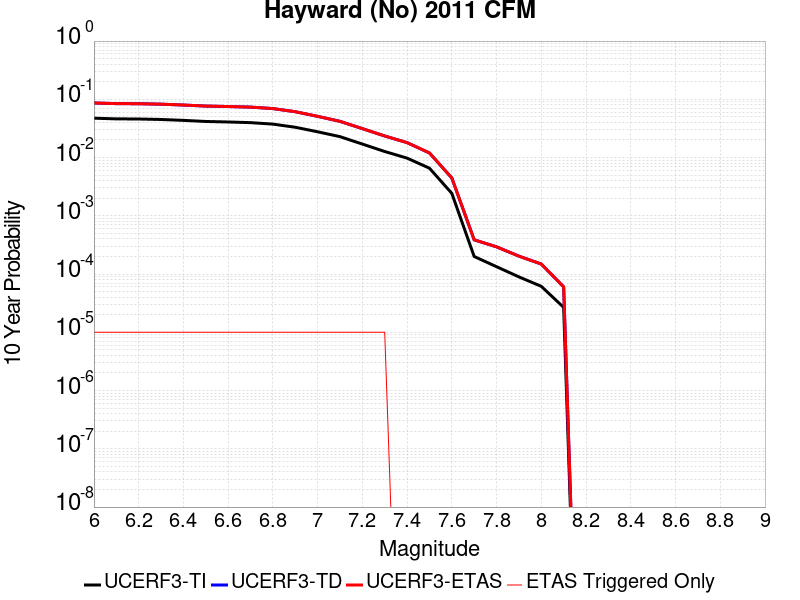 |

| Magnitude | 1 wk TI Prob | 1 wk TD Prob | 1 wk ETAS Prob | 1 wk ETAS/TD Gain | 1 wk ETAS Triggered Only | 1 mo TI Prob | 1 mo TD Prob | 1 mo ETAS Prob | 1 mo ETAS/TD Gain | 1 mo ETAS Triggered Only | 1 yr TI Prob | 1 yr TD Prob | 1 yr ETAS Prob | 1 yr ETAS/TD Gain | 1 yr ETAS Triggered Only | 10 yr TI Prob | 10 yr TD Prob | 10 yr ETAS Prob | 10 yr ETAS/TD Gain | 10 yr ETAS Triggered Only |
|-----|-----|-----|-----|-----|-----|-----|-----|-----|-----|-----|-----|-----|-----|-----|-----|-----|-----|-----|-----|-----|
| 6.0 | 9.3068506E-5 | 1.7410782E-4 | 1.7410782E-4 | 1.0 | 0.0 | 3.9880406E-4 | 7.4596383E-4 | 7.4596383E-4 | 1.0 | 0.0 | 0.0048446343 | 0.009044311 | 0.009044311 | 1.0 | 0.0 | 0.047403704 | 0.08644279 | 0.086451925 | 1.0001057 | 1.0E-5 |
| 6.1 | 9.055486E-5 | 1.6962113E-4 | 1.6962113E-4 | 1.0 | 0.0 | 3.880345E-4 | 7.2674605E-4 | 7.2674605E-4 | 1.0 | 0.0 | 0.0047140904 | 0.008812325 | 0.008812325 | 1.0 | 0.0 | 0.046153355 | 0.084335595 | 0.08434475 | 1.0001086 | 1.0E-5 |
| 6.2 | 9.006742E-5 | 1.688266E-4 | 1.688266E-4 | 1.0 | 0.0 | 3.859461E-4 | 7.2334276E-4 | 7.2334276E-4 | 1.0 | 0.0 | 0.0046887742 | 0.008771283 | 0.008771283 | 1.0 | 0.0 | 0.0459107 | 0.083959736 | 0.08396889 | 1.0001091 | 1.0E-5 |
| 6.3 | 8.8336754E-5 | 1.6562232E-4 | 1.6562232E-4 | 1.0 | 0.0 | 3.7853114E-4 | 7.096177E-4 | 7.096177E-4 | 1.0 | 0.0 | 0.004598882 | 0.008605528 | 0.008605528 | 1.0 | 0.0 | 0.04504866 | 0.08245281 | 0.08246199 | 1.0001112 | 1.0E-5 |
| 6.4 | 8.526157E-5 | 1.5988617E-4 | 1.5988617E-4 | 1.0 | 0.0 | 3.6535555E-4 | 6.850473E-4 | 6.850473E-4 | 1.0 | 0.0 | 0.0044391346 | 0.008308707 | 0.008308707 | 1.0 | 0.0 | 0.043514993 | 0.07974718 | 0.07975638 | 1.0001154 | 1.0E-5 |
| 6.5 | 8.152396E-5 | 1.5320907E-4 | 1.5320907E-4 | 1.0 | 0.0 | 3.493416E-4 | 6.564458E-4 | 6.564458E-4 | 1.0 | 0.0 | 0.0042449418 | 0.007963083 | 0.007963083 | 1.0 | 0.0 | 0.04164765 | 0.076577865 | 0.076587096 | 1.0001206 | 1.0E-5 |
| 6.6 | 7.987405E-5 | 1.5025059E-4 | 1.5025059E-4 | 1.0 | 0.0 | 3.4227243E-4 | 6.437729E-4 | 6.437729E-4 | 1.0 | 0.0 | 0.0041592065 | 0.007809922 | 0.007809922 | 1.0 | 0.0 | 0.04082218 | 0.07517025 | 0.075179495 | 1.000123 | 1.0E-5 |
| 6.7 | 7.777665E-5 | 1.4663776E-4 | 1.4663776E-4 | 1.0 | 0.0 | 3.332859E-4 | 6.282968E-4 | 6.282968E-4 | 1.0 | 0.0 | 0.004050208 | 0.0076228394 | 0.0076228394 | 1.0 | 0.0 | 0.039771806 | 0.07344434 | 0.073453605 | 1.0001261 | 1.0E-5 |
| 6.8 | 7.3284005E-5 | 1.3813358E-4 | 1.3813358E-4 | 1.0 | 0.0 | 3.140365E-4 | 5.918673E-4 | 5.918673E-4 | 1.0 | 0.0 | 0.0038166929 | 0.0071823136 | 0.0071823136 | 1.0 | 0.0 | 0.037518036 | 0.06935346 | 0.06936277 | 1.0001342 | 1.0E-5 |
| 6.9 | 6.458263E-5 | 1.21417055E-4 | 1.21417055E-4 | 1.0 | 0.0 | 2.7675333E-4 | 5.2025553E-4 | 5.2025553E-4 | 1.0 | 0.0 | 0.0033642664 | 0.006315816 | 0.006315816 | 1.0 | 0.0 | 0.033137884 | 0.06127239 | 0.061281774 | 1.0001532 | 1.0E-5 |
| 7.0 | 5.3853604E-5 | 1.0033709E-4 | 1.0033709E-4 | 1.0 | 0.0 | 2.3078074E-4 | 4.2994553E-4 | 4.2994553E-4 | 1.0 | 0.0 | 0.0028061352 | 0.0052220877 | 0.0052220877 | 1.0 | 0.0 | 0.027709642 | 0.05099853 | 0.051008023 | 1.0001861 | 1.0E-5 |
| 7.1 | 4.4308683E-5 | 8.177654E-5 | 8.177654E-5 | 1.0 | 0.0 | 1.8988053E-4 | 3.5042403E-4 | 3.5042403E-4 | 1.0 | 0.0 | 0.0023093442 | 0.004258108 | 0.004258108 | 1.0 | 0.0 | 0.022854926 | 0.04185826 | 0.04186784 | 1.0002289 | 1.0E-5 |
| 7.2 | 3.295973E-5 | 6.0835762E-5 | 6.0835762E-5 | 1.0 | 0.0 | 1.4124835E-4 | 2.6069875E-4 | 2.6069875E-4 | 1.0 | 0.0 | 0.0017183421 | 0.0031694106 | 0.0031694106 | 1.0 | 0.0 | 0.017051157 | 0.031401098 | 0.031410784 | 1.0003085 | 1.0E-5 |
| 7.3 | 2.452256E-5 | 4.5237426E-5 | 4.5237426E-5 | 1.0 | 0.0 | 1.05092455E-4 | 1.9386035E-4 | 1.9386035E-4 | 1.0 | 0.0 | 0.0012787496 | 0.0023577088 | 0.0023577088 | 1.0 | 0.0 | 0.0127141625 | 0.023468954 | 0.023478718 | 1.000416 | 1.0E-5 |
| 7.4 | 1.8829967E-5 | 3.46525E-5 | 3.46525E-5 | 1.0 | 0.0 | 8.069736E-5 | 1.4850231E-4 | 1.4850231E-4 | 1.0 | 0.0 | 9.820475E-4 | 0.0018065262 | 0.0018065262 | 1.0 | 0.0 | 0.009777189 | 0.018044027 | 0.018044027 | 1.0 | 0.0 |
| 7.5 | 1.26374125E-5 | 2.2958795E-5 | 2.2958795E-5 | 1.0 | 0.0 | 5.4159216E-5 | 9.839116E-5 | 9.839116E-5 | 1.0 | 0.0 | 6.5918895E-4 | 0.0011972599 | 0.0011972599 | 1.0 | 0.0 | 0.00657237 | 0.0120074805 | 0.0120074805 | 1.0 | 0.0 |
| 7.6 | 4.666429E-6 | 8.492445E-6 | 8.492445E-6 | 1.0 | 0.0 | 1.9998828E-5 | 3.639569E-5 | 3.639569E-5 | 1.0 | 0.0 | 2.4345852E-4 | 4.4302866E-4 | 4.4302866E-4 | 1.0 | 0.0 | 0.0024319198 | 0.0044656415 | 0.0044656415 | 1.0 | 0.0 |
| 7.7 | 3.8399318E-7 | 7.15594E-7 | 7.15594E-7 | 1.0 | 0.0 | 1.6456839E-6 | 3.066828E-6 | 3.066828E-6 | 1.0 | 0.0 | 2.003602E-5 | 3.733799E-5 | 3.733799E-5 | 1.0 | 0.0 | 2.0034213E-4 | 3.87226E-4 | 3.87226E-4 | 1.0 | 0.0 |
| 7.8 | 2.5637698E-7 | 5.385344E-7 | 5.385344E-7 | 1.0 | 0.0 | 1.098758E-6 | 2.3080024E-6 | 2.3080024E-6 | 1.0 | 0.0 | 1.3377297E-5 | 2.8099568E-5 | 2.8099568E-5 | 1.0 | 0.0 | 1.3376492E-4 | 2.9337284E-4 | 2.9337284E-4 | 1.0 | 0.0 |
| 7.9 | 1.7141245E-7 | 3.7422726E-7 | 3.7422726E-7 | 1.0 | 0.0 | 7.3462456E-7 | 1.6038301E-6 | 1.6038301E-6 | 1.0 | 0.0 | 8.944017E-6 | 1.9526457E-5 | 1.9526457E-5 | 1.0 | 0.0 | 8.943657E-5 | 2.030939E-4 | 2.030939E-4 | 1.0 | 0.0 |
| 8.0 | 1.1808895E-7 | 2.7601533E-7 | 2.7601533E-7 | 1.0 | 0.0 | 5.060954E-7 | 1.1829222E-6 | 1.1829222E-6 | 1.0 | 0.0 | 6.161694E-6 | 1.4401984E-5 | 1.4401984E-5 | 1.0 | 0.0 | 6.161523E-5 | 1.4860413E-4 | 1.4860413E-4 | 1.0 | 0.0 |
| 8.1 | 5.138535E-8 | 1.126485E-7 | 1.126485E-7 | 1.0 | 0.0 | 2.2022292E-7 | 4.8277917E-7 | 4.8277917E-7 | 1.0 | 0.0 | 2.6812106E-6 | 5.877821E-6 | 5.877821E-6 | 1.0 | 0.0 | 2.6811784E-5 | 6.032952E-5 | 6.032952E-5 | 1.0 | 0.0 |

## Great Valley 03 Mysterious Ridge
*[(top)](#table-of-contents)*

| 1 Week | 1 Month | 1 Year | 10 Year |
|-----|-----|-----|-----|
|  |  |  |  |

| Magnitude | 1 wk TI Prob | 1 wk TD Prob | 1 wk ETAS Prob | 1 wk ETAS/TD Gain | 1 wk ETAS Triggered Only | 1 mo TI Prob | 1 mo TD Prob | 1 mo ETAS Prob | 1 mo ETAS/TD Gain | 1 mo ETAS Triggered Only | 1 yr TI Prob | 1 yr TD Prob | 1 yr ETAS Prob | 1 yr ETAS/TD Gain | 1 yr ETAS Triggered Only | 10 yr TI Prob | 10 yr TD Prob | 10 yr ETAS Prob | 10 yr ETAS/TD Gain | 10 yr ETAS Triggered Only |
|-----|-----|-----|-----|-----|-----|-----|-----|-----|-----|-----|-----|-----|-----|-----|-----|-----|-----|-----|-----|-----|
| 6.0 | 3.1182444E-5 | 3.6039233E-5 | 4.6038873E-5 | 1.2774653 | 1.0E-5 | 1.336322E-4 | 1.5444578E-4 | 1.6444422E-4 | 1.0647377 | 1.0E-5 | 0.0016257578 | 0.0018789428 | 0.001888924 | 1.0053121 | 1.0E-5 | 0.016139153 | 0.018649347 | 0.018659161 | 1.0005262 | 1.0E-5 |
| 6.1 | 3.1182444E-5 | 3.6039233E-5 | 4.6038873E-5 | 1.2774653 | 1.0E-5 | 1.336322E-4 | 1.5444578E-4 | 1.6444422E-4 | 1.0647377 | 1.0E-5 | 0.0016257578 | 0.0018789428 | 0.001888924 | 1.0053121 | 1.0E-5 | 0.016139153 | 0.018649347 | 0.018659161 | 1.0005262 | 1.0E-5 |
| 6.2 | 3.1182444E-5 | 3.6039233E-5 | 4.6038873E-5 | 1.2774653 | 1.0E-5 | 1.336322E-4 | 1.5444578E-4 | 1.6444422E-4 | 1.0647377 | 1.0E-5 | 0.0016257578 | 0.0018789428 | 0.001888924 | 1.0053121 | 1.0E-5 | 0.016139153 | 0.018649347 | 0.018659161 | 1.0005262 | 1.0E-5 |
| 6.3 | 2.106934E-5 | 2.3853248E-5 | 3.385301E-5 | 1.4192201 | 1.0E-5 | 9.0294045E-5 | 1.0222438E-4 | 1.1222336E-4 | 1.097814 | 1.0E-5 | 0.0010987755 | 0.0012439021 | 0.0012538896 | 1.0080292 | 1.0E-5 | 0.010933585 | 0.012372643 | 0.012382519 | 1.0007982 | 1.0E-5 |
| 6.4 | 2.106934E-5 | 2.3853248E-5 | 3.385301E-5 | 1.4192201 | 1.0E-5 | 9.0294045E-5 | 1.0222438E-4 | 1.1222336E-4 | 1.097814 | 1.0E-5 | 0.0010987755 | 0.0012439021 | 0.0012538896 | 1.0080292 | 1.0E-5 | 0.010933585 | 0.012372643 | 0.012382519 | 1.0007982 | 1.0E-5 |
| 6.5 | 1.9389783E-5 | 2.1887614E-5 | 3.1887394E-5 | 1.4568694 | 1.0E-5 | 8.309642E-5 | 9.380084E-5 | 1.037999E-4 | 1.1065989 | 1.0E-5 | 0.0010112294 | 0.0011414544 | 0.001151443 | 1.0087508 | 1.0E-5 | 0.010066401 | 0.011358791 | 0.011368677 | 1.0008703 | 1.0E-5 |
| 6.6 | 1.9370193E-5 | 2.1867534E-5 | 3.1867316E-5 | 1.457289 | 1.0E-5 | 8.301247E-5 | 9.371479E-5 | 1.0371386E-4 | 1.1066967 | 1.0E-5 | 0.0010102082 | 0.0011404079 | 0.0011503965 | 1.0087588 | 1.0E-5 | 0.010056281 | 0.011348433 | 0.011358319 | 1.0008712 | 1.0E-5 |
| 6.7 | 1.6723505E-5 | 1.8801458E-5 | 1.8801458E-5 | 1.0 | 0.0 | 7.16702E-5 | 8.05753E-5 | 8.05753E-5 | 1.0 | 0.0 | 8.722353E-4 | 9.805822E-4 | 9.805822E-4 | 1.0 | 0.0 | 0.008688197 | 0.009764564 | 0.009764564 | 1.0 | 0.0 |
| 6.8 | 1.426937E-5 | 1.5999016E-5 | 1.5999016E-5 | 1.0 | 0.0 | 6.115301E-5 | 6.856549E-5 | 6.856549E-5 | 1.0 | 0.0 | 7.4428355E-4 | 8.344796E-4 | 8.344796E-4 | 1.0 | 0.0 | 0.007417957 | 0.008314939 | 0.008314939 | 1.0 | 0.0 |
| 6.9 | 1.2469891E-5 | 1.3958479E-5 | 1.3958479E-5 | 1.0 | 0.0 | 5.3441294E-5 | 5.9820748E-5 | 5.9820748E-5 | 1.0 | 0.0 | 6.504535E-4 | 7.2808634E-4 | 7.2808634E-4 | 1.0 | 0.0 | 0.006485529 | 0.0072582336 | 0.0072582336 | 1.0 | 0.0 |
| 7.0 | 8.7746275E-6 | 9.7927905E-6 | 9.7927905E-6 | 1.0 | 0.0 | 3.7605005E-5 | 4.196847E-5 | 4.196847E-5 | 1.0 | 0.0 | 4.5774475E-4 | 5.1085366E-4 | 5.1085366E-4 | 1.0 | 0.0 | 0.00456803 | 0.005097526 | 0.005097526 | 1.0 | 0.0 |
| 7.1 | 6.1067153E-6 | 6.81446E-6 | 6.81446E-6 | 1.0 | 0.0 | 2.6171374E-5 | 2.9204533E-5 | 2.9204533E-5 | 1.0 | 0.0 | 3.1858988E-4 | 3.5551275E-4 | 3.5551275E-4 | 1.0 | 0.0 | 0.0031813353 | 0.0035499912 | 0.0035499912 | 1.0 | 0.0 |
| 7.2 | 2.939283E-6 | 3.2744533E-6 | 3.2744533E-6 | 1.0 | 0.0 | 1.2596866E-5 | 1.4033306E-5 | 1.4033306E-5 | 1.0 | 0.0 | 1.5335606E-4 | 1.7084386E-4 | 1.7084386E-4 | 1.0 | 0.0 | 0.0015325027 | 0.0017072972 | 0.0017072972 | 1.0 | 0.0 |
| 7.3 | 7.2387763E-7 | 8.009303E-7 | 8.009303E-7 | 1.0 | 0.0 | 3.102329E-6 | 3.4325565E-6 | 3.4325565E-6 | 1.0 | 0.0 | 3.77702E-5 | 4.1791034E-5 | 4.1791034E-5 | 1.0 | 0.0 | 3.7763783E-4 | 4.1787673E-4 | 4.1787673E-4 | 1.0 | 0.0 |
| 7.4 | 3.112171E-8 | 3.2069273E-8 | 3.2069273E-8 | 1.0 | 0.0 | 1.3337875E-7 | 1.3743973E-7 | 1.3743973E-7 | 1.0 | 0.0 | 1.6238852E-6 | 1.6733276E-6 | 1.6733276E-6 | 1.0 | 0.0 | 1.6238733E-5 | 1.6733158E-5 | 1.6733158E-5 | 1.0 | 0.0 |

## Santa Susana East (connector)
*[(top)](#table-of-contents)*

| 1 Week | 1 Month | 1 Year | 10 Year |
|-----|-----|-----|-----|
|  |  |  |  |

| Magnitude | 1 wk TI Prob | 1 wk TD Prob | 1 wk ETAS Prob | 1 wk ETAS/TD Gain | 1 wk ETAS Triggered Only | 1 mo TI Prob | 1 mo TD Prob | 1 mo ETAS Prob | 1 mo ETAS/TD Gain | 1 mo ETAS Triggered Only | 1 yr TI Prob | 1 yr TD Prob | 1 yr ETAS Prob | 1 yr ETAS/TD Gain | 1 yr ETAS Triggered Only | 10 yr TI Prob | 10 yr TD Prob | 10 yr ETAS Prob | 10 yr ETAS/TD Gain | 10 yr ETAS Triggered Only |
|-----|-----|-----|-----|-----|-----|-----|-----|-----|-----|-----|-----|-----|-----|-----|-----|-----|-----|-----|-----|-----|
| 6.0 | 2.858397E-5 | 3.2027347E-5 | 3.2027347E-5 | 1.0 | 0.0 | 1.2249697E-4 | 1.3725442E-4 | 1.4725304E-4 | 1.0728474 | 1.0E-5 | 0.0014903803 | 0.0016700734 | 0.0016800567 | 1.0059777 | 1.0E-5 | 0.014804244 | 0.016602324 | 0.016612157 | 1.0005924 | 1.0E-5 |
| 6.1 | 2.858397E-5 | 3.2027347E-5 | 3.2027347E-5 | 1.0 | 0.0 | 1.2249697E-4 | 1.3725442E-4 | 1.4725304E-4 | 1.0728474 | 1.0E-5 | 0.0014903803 | 0.0016700734 | 0.0016800567 | 1.0059777 | 1.0E-5 | 0.014804244 | 0.016602324 | 0.016612157 | 1.0005924 | 1.0E-5 |
| 6.2 | 2.858397E-5 | 3.2027347E-5 | 3.2027347E-5 | 1.0 | 0.0 | 1.2249697E-4 | 1.3725442E-4 | 1.4725304E-4 | 1.0728474 | 1.0E-5 | 0.0014903803 | 0.0016700734 | 0.0016800567 | 1.0059777 | 1.0E-5 | 0.014804244 | 0.016602324 | 0.016612157 | 1.0005924 | 1.0E-5 |
| 6.3 | 1.943582E-5 | 2.0370642E-5 | 2.0370642E-5 | 1.0 | 0.0 | 8.329371E-5 | 8.730046E-5 | 8.730046E-5 | 1.0 | 0.0 | 0.001013629 | 0.0010624771 | 0.0010624771 | 1.0 | 0.0 | 0.010090181 | 0.010585411 | 0.010585411 | 1.0 | 0.0 |
| 6.4 | 1.943582E-5 | 2.0370642E-5 | 2.0370642E-5 | 1.0 | 0.0 | 8.329371E-5 | 8.730046E-5 | 8.730046E-5 | 1.0 | 0.0 | 0.001013629 | 0.0010624771 | 0.0010624771 | 1.0 | 0.0 | 0.010090181 | 0.010585411 | 0.010585411 | 1.0 | 0.0 |
| 6.5 | 1.943582E-5 | 2.0370642E-5 | 2.0370642E-5 | 1.0 | 0.0 | 8.329371E-5 | 8.730046E-5 | 8.730046E-5 | 1.0 | 0.0 | 0.001013629 | 0.0010624771 | 0.0010624771 | 1.0 | 0.0 | 0.010090181 | 0.010585411 | 0.010585411 | 1.0 | 0.0 |
| 6.6 | 1.943582E-5 | 2.0370642E-5 | 2.0370642E-5 | 1.0 | 0.0 | 8.329371E-5 | 8.730046E-5 | 8.730046E-5 | 1.0 | 0.0 | 0.001013629 | 0.0010624771 | 0.0010624771 | 1.0 | 0.0 | 0.010090181 | 0.010585411 | 0.010585411 | 1.0 | 0.0 |
| 6.7 | 1.9404439E-5 | 2.035806E-5 | 2.035806E-5 | 1.0 | 0.0 | 8.3159226E-5 | 8.7246546E-5 | 8.7246546E-5 | 1.0 | 0.0 | 0.0010119933 | 0.0010618214 | 0.0010618214 | 1.0 | 0.0 | 0.010073971 | 0.0105789155 | 0.0105789155 | 1.0 | 0.0 |
| 6.8 | 1.2217526E-5 | 1.159441E-5 | 1.159441E-5 | 1.0 | 0.0 | 5.2359774E-5 | 4.968948E-5 | 4.968948E-5 | 1.0 | 0.0 | 6.372938E-4 | 6.048183E-4 | 6.048183E-4 | 1.0 | 0.0 | 0.0063546924 | 0.00603377 | 0.00603377 | 1.0 | 0.0 |
| 6.9 | 1.2217526E-5 | 1.159441E-5 | 1.159441E-5 | 1.0 | 0.0 | 5.2359774E-5 | 4.968948E-5 | 4.968948E-5 | 1.0 | 0.0 | 6.372938E-4 | 6.048183E-4 | 6.048183E-4 | 1.0 | 0.0 | 0.0063546924 | 0.00603377 | 0.00603377 | 1.0 | 0.0 |
| 7.0 | 9.276017E-6 | 8.059831E-6 | 8.059831E-6 | 1.0 | 0.0 | 3.9753755E-5 | 3.4541696E-5 | 3.4541696E-5 | 1.0 | 0.0 | 4.8389446E-4 | 4.2046743E-4 | 4.2046743E-4 | 1.0 | 0.0 | 0.0048284214 | 0.004197445 | 0.004197445 | 1.0 | 0.0 |
| 7.1 | 9.130355E-6 | 7.942991E-6 | 7.942991E-6 | 1.0 | 0.0 | 3.9129503E-5 | 3.4040968E-5 | 3.4040968E-5 | 1.0 | 0.0 | 4.7629757E-4 | 4.1437338E-4 | 4.1437338E-4 | 1.0 | 0.0 | 0.00475278 | 0.0041367332 | 0.0041367332 | 1.0 | 0.0 |
| 7.2 | 8.851015E-6 | 7.742135E-6 | 7.742135E-6 | 1.0 | 0.0 | 3.7932372E-5 | 3.3180175E-5 | 3.3180175E-5 | 1.0 | 0.0 | 4.6172875E-4 | 4.0389717E-4 | 4.0389717E-4 | 1.0 | 0.0 | 0.0046077054 | 0.004032354 | 0.004032354 | 1.0 | 0.0 |
| 7.3 | 8.573006E-6 | 7.5508374E-6 | 7.5508374E-6 | 1.0 | 0.0 | 3.6740938E-5 | 3.236035E-5 | 3.236035E-5 | 1.0 | 0.0 | 4.472291E-4 | 3.9391944E-4 | 3.9391944E-4 | 1.0 | 0.0 | 0.004463301 | 0.0039329296 | 0.0039329296 | 1.0 | 0.0 |
| 7.4 | 7.852282E-6 | 6.8182476E-6 | 6.8182476E-6 | 1.0 | 0.0 | 3.36522E-5 | 2.922075E-5 | 2.922075E-5 | 1.0 | 0.0 | 4.096385E-4 | 3.557076E-4 | 3.557076E-4 | 1.0 | 0.0 | 0.0040888423 | 0.0035520468 | 0.0035520468 | 1.0 | 0.0 |
| 7.5 | 4.8869324E-6 | 4.279366E-6 | 4.279366E-6 | 1.0 | 0.0 | 2.0943828E-5 | 1.8340019E-5 | 1.8340019E-5 | 1.0 | 0.0 | 2.5496128E-4 | 2.2326852E-4 | 2.2326852E-4 | 1.0 | 0.0 | 0.0025466895 | 0.0022306065 | 0.0022306065 | 1.0 | 0.0 |
| 7.6 | 1.3894544E-6 | 1.1568716E-6 | 1.1568716E-6 | 1.0 | 0.0 | 5.954791E-6 | 4.958013E-6 | 4.958013E-6 | 1.0 | 0.0 | 7.249717E-5 | 6.0362356E-5 | 6.0362356E-5 | 1.0 | 0.0 | 7.247352E-4 | 6.034814E-4 | 6.034814E-4 | 1.0 | 0.0 |
| 7.7 | 2.9924632E-7 | 2.372172E-7 | 2.372172E-7 | 1.0 | 0.0 | 1.2824837E-6 | 1.0166448E-6 | 1.0166448E-6 | 1.0 | 0.0 | 1.5614127E-5 | 1.2377587E-5 | 1.2377587E-5 | 1.0 | 0.0 | 1.5613029E-4 | 1.237697E-4 | 1.237697E-4 | 1.0 | 0.0 |
| 7.8 | 4.8188564E-8 | 2.6333131E-8 | 2.6333131E-8 | 1.0 | 0.0 | 2.065224E-7 | 1.1285627E-7 | 1.1285627E-7 | 1.0 | 0.0 | 2.5144072E-6 | 1.3740244E-6 | 1.3740244E-6 | 1.0 | 0.0 | 2.5143789E-5 | 1.3740167E-5 | 1.3740167E-5 | 1.0 | 0.0 |
| 7.9 | 2.6127251E-9 | 2.768263E-9 | 2.768263E-9 | 1.0 | 0.0 | 1.1197393E-8 | 1.18639845E-8 | 1.18639845E-8 | 1.0 | 0.0 | 1.3632825E-7 | 1.4444402E-7 | 1.4444402E-7 | 1.0 | 0.0 | 1.3632817E-6 | 1.4444402E-6 | 1.4444402E-6 | 1.0 | 0.0 |

## Earthquake Valley
*[(top)](#table-of-contents)*

| 1 Week | 1 Month | 1 Year | 10 Year |
|-----|-----|-----|-----|
| 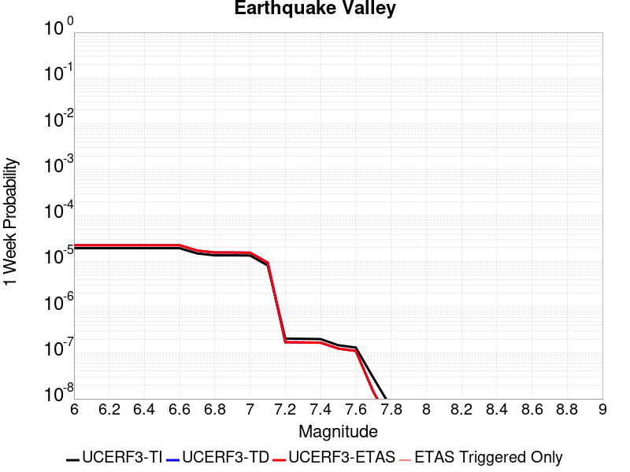 | 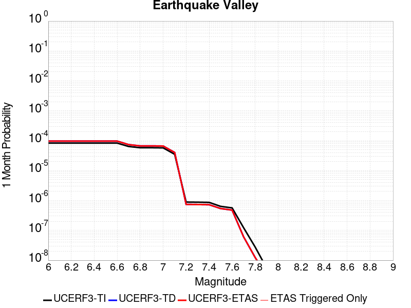 |  |  |

| Magnitude | 1 wk TI Prob | 1 wk TD Prob | 1 wk ETAS Prob | 1 wk ETAS/TD Gain | 1 wk ETAS Triggered Only | 1 mo TI Prob | 1 mo TD Prob | 1 mo ETAS Prob | 1 mo ETAS/TD Gain | 1 mo ETAS Triggered Only | 1 yr TI Prob | 1 yr TD Prob | 1 yr ETAS Prob | 1 yr ETAS/TD Gain | 1 yr ETAS Triggered Only | 10 yr TI Prob | 10 yr TD Prob | 10 yr ETAS Prob | 10 yr ETAS/TD Gain | 10 yr ETAS Triggered Only |
|-----|-----|-----|-----|-----|-----|-----|-----|-----|-----|-----|-----|-----|-----|-----|-----|-----|-----|-----|-----|-----|
| 6.0 | 1.9416384E-5 | 2.2587592E-5 | 2.2587592E-5 | 1.0 | 0.0 | 8.321042E-5 | 9.680105E-5 | 9.680105E-5 | 1.0 | 0.0 | 0.001012616 | 0.0011780359 | 0.0011880241 | 1.0084788 | 1.0E-5 | 0.010080142 | 0.011729757 | 0.01173964 | 1.0008426 | 1.0E-5 |
| 6.1 | 1.9416384E-5 | 2.2587592E-5 | 2.2587592E-5 | 1.0 | 0.0 | 8.321042E-5 | 9.680105E-5 | 9.680105E-5 | 1.0 | 0.0 | 0.001012616 | 0.0011780359 | 0.0011880241 | 1.0084788 | 1.0E-5 | 0.010080142 | 0.011729757 | 0.01173964 | 1.0008426 | 1.0E-5 |
| 6.2 | 1.9416384E-5 | 2.2587592E-5 | 2.2587592E-5 | 1.0 | 0.0 | 8.321042E-5 | 9.680105E-5 | 9.680105E-5 | 1.0 | 0.0 | 0.001012616 | 0.0011780359 | 0.0011880241 | 1.0084788 | 1.0E-5 | 0.010080142 | 0.011729757 | 0.01173964 | 1.0008426 | 1.0E-5 |
| 6.3 | 1.9416384E-5 | 2.2587592E-5 | 2.2587592E-5 | 1.0 | 0.0 | 8.321042E-5 | 9.680105E-5 | 9.680105E-5 | 1.0 | 0.0 | 0.001012616 | 0.0011780359 | 0.0011880241 | 1.0084788 | 1.0E-5 | 0.010080142 | 0.011729757 | 0.01173964 | 1.0008426 | 1.0E-5 |
| 6.4 | 1.9416384E-5 | 2.2587592E-5 | 2.2587592E-5 | 1.0 | 0.0 | 8.321042E-5 | 9.680105E-5 | 9.680105E-5 | 1.0 | 0.0 | 0.001012616 | 0.0011780359 | 0.0011880241 | 1.0084788 | 1.0E-5 | 0.010080142 | 0.011729757 | 0.01173964 | 1.0008426 | 1.0E-5 |
| 6.5 | 1.9389157E-5 | 2.2556176E-5 | 2.2556176E-5 | 1.0 | 0.0 | 8.309374E-5 | 9.666642E-5 | 9.666642E-5 | 1.0 | 0.0 | 0.0010111968 | 0.0011763985 | 0.0011863867 | 1.0084906 | 1.0E-5 | 0.010066078 | 0.011713557 | 0.011723439 | 1.0008438 | 1.0E-5 |
| 6.6 | 1.9389157E-5 | 2.2556176E-5 | 2.2556176E-5 | 1.0 | 0.0 | 8.309374E-5 | 9.666642E-5 | 9.666642E-5 | 1.0 | 0.0 | 0.0010111968 | 0.0011763985 | 0.0011863867 | 1.0084906 | 1.0E-5 | 0.010066078 | 0.011713557 | 0.011723439 | 1.0008438 | 1.0E-5 |
| 6.7 | 1.4925434E-5 | 1.7210756E-5 | 1.7210756E-5 | 1.0 | 0.0 | 6.396457E-5 | 7.3758776E-5 | 7.3758776E-5 | 1.0 | 0.0 | 7.7849044E-4 | 8.977282E-4 | 8.977282E-4 | 1.0 | 0.0 | 0.007757689 | 0.008949395 | 0.008949395 | 1.0 | 0.0 |
| 6.8 | 1.3570335E-5 | 1.5619114E-5 | 1.5619114E-5 | 1.0 | 0.0 | 5.8157282E-5 | 6.6937806E-5 | 6.6937806E-5 | 1.0 | 0.0 | 7.0783484E-4 | 8.1474514E-4 | 8.1474514E-4 | 1.0 | 0.0 | 0.0070558446 | 0.008125654 | 0.008125654 | 1.0 | 0.0 |
| 6.9 | 1.3570335E-5 | 1.5619114E-5 | 1.5619114E-5 | 1.0 | 0.0 | 5.8157282E-5 | 6.6937806E-5 | 6.6937806E-5 | 1.0 | 0.0 | 7.0783484E-4 | 8.1474514E-4 | 8.1474514E-4 | 1.0 | 0.0 | 0.0070558446 | 0.008125654 | 0.008125654 | 1.0 | 0.0 |
| 7.0 | 1.3433392E-5 | 1.5462638E-5 | 1.5462638E-5 | 1.0 | 0.0 | 5.757041E-5 | 6.6267225E-5 | 6.6267225E-5 | 1.0 | 0.0 | 7.0069433E-4 | 8.065869E-4 | 8.065869E-4 | 1.0 | 0.0 | 0.006984891 | 0.008044664 | 0.008044664 | 1.0 | 0.0 |
| 7.1 | 8.181609E-6 | 9.418255E-6 | 9.418255E-6 | 1.0 | 0.0 | 3.5063567E-5 | 4.0363702E-5 | 4.0363702E-5 | 1.0 | 0.0 | 4.268153E-4 | 4.9138436E-4 | 4.9138436E-4 | 1.0 | 0.0 | 0.0042599645 | 0.004909557 | 0.004909557 | 1.0 | 0.0 |
| 7.2 | 2.0663983E-7 | 1.7266771E-7 | 1.7266771E-7 | 1.0 | 0.0 | 8.855989E-7 | 7.400043E-7 | 7.400043E-7 | 1.0 | 0.0 | 1.0782113E-5 | 9.009518E-6 | 9.009518E-6 | 1.0 | 0.0 | 1.07815904E-4 | 9.009189E-5 | 9.009189E-5 | 1.0 | 0.0 |
| 7.3 | 2.0462376E-7 | 1.7082242E-7 | 1.7082242E-7 | 1.0 | 0.0 | 8.7695867E-7 | 7.320959E-7 | 7.320959E-7 | 1.0 | 0.0 | 1.0676919E-5 | 8.9132345E-6 | 8.9132345E-6 | 1.0 | 0.0 | 1.0676406E-4 | 8.912913E-5 | 8.912913E-5 | 1.0 | 0.0 |
| 7.4 | 2.0171088E-7 | 1.6864676E-7 | 1.6864676E-7 | 1.0 | 0.0 | 8.644749E-7 | 7.227717E-7 | 7.227717E-7 | 1.0 | 0.0 | 1.0524931E-5 | 8.799713E-6 | 8.799713E-6 | 1.0 | 0.0 | 1.05244326E-4 | 8.7994005E-5 | 8.7994005E-5 | 1.0 | 0.0 |
| 7.5 | 1.4847944E-7 | 1.256233E-7 | 1.256233E-7 | 1.0 | 0.0 | 6.363403E-7 | 5.3838545E-7 | 5.3838545E-7 | 1.0 | 0.0 | 7.747416E-6 | 6.5548256E-6 | 6.5548256E-6 | 1.0 | 0.0 | 7.747146E-5 | 6.554654E-5 | 6.554654E-5 | 1.0 | 0.0 |
| 7.6 | 1.3185847E-7 | 1.11259844E-7 | 1.11259844E-7 | 1.0 | 0.0 | 5.6510765E-7 | 4.7682784E-7 | 4.7682784E-7 | 1.0 | 0.0 | 6.8801637E-6 | 5.8053656E-6 | 5.8053656E-6 | 1.0 | 0.0 | 6.8799505E-5 | 5.8052352E-5 | 5.8052352E-5 | 1.0 | 0.0 |
| 7.7 | 2.8609954E-8 | 1.4175916E-8 | 1.4175916E-8 | 1.0 | 0.0 | 1.2261408E-7 | 6.0753926E-8 | 6.0753926E-8 | 1.0 | 0.0 | 1.4928254E-6 | 7.3967885E-7 | 7.3967885E-7 | 1.0 | 0.0 | 1.4928154E-5 | 7.3967694E-6 | 7.3967694E-6 | 1.0 | 0.0 |
| 7.8 | 6.527266E-9 | 2.9243843E-9 | 2.9243843E-9 | 1.0 | 0.0 | 2.7973995E-8 | 1.2533076E-8 | 1.2533076E-8 | 1.0 | 0.0 | 3.4058334E-7 | 1.5259019E-7 | 1.5259019E-7 | 1.0 | 0.0 | 3.4058282E-6 | 1.5259011E-6 | 1.5259011E-6 | 1.0 | 0.0 |
| 7.9 | 1.2898267E-9 | 7.1293726E-10 | 7.1293726E-10 | 1.0 | 0.0 | 5.527829E-9 | 3.0554452E-9 | 3.0554452E-9 | 1.0 | 0.0 | 6.7301315E-8 | 3.7200046E-8 | 3.7200046E-8 | 1.0 | 0.0 | 6.7301295E-7 | 3.7200047E-7 | 3.7200047E-7 | 1.0 | 0.0 |

## San Andreas (Santa Cruz Mts) 2011 CFM
*[(top)](#table-of-contents)*

| 1 Week | 1 Month | 1 Year | 10 Year |
|-----|-----|-----|-----|
|  |  | 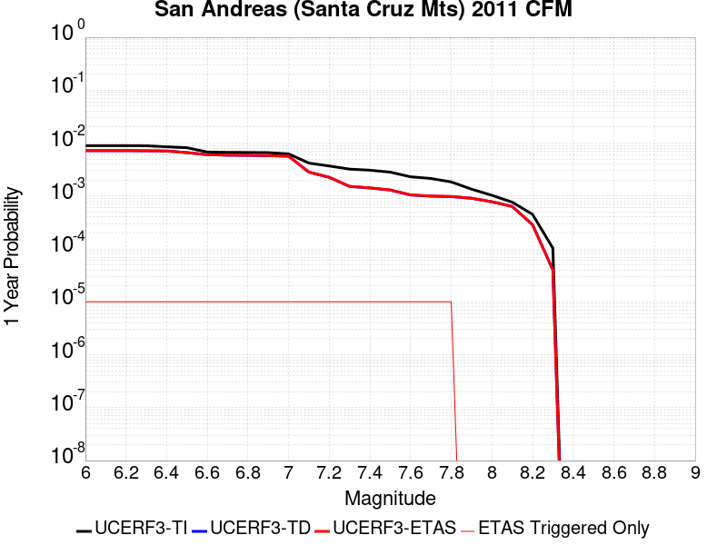 |  |

| Magnitude | 1 wk TI Prob | 1 wk TD Prob | 1 wk ETAS Prob | 1 wk ETAS/TD Gain | 1 wk ETAS Triggered Only | 1 mo TI Prob | 1 mo TD Prob | 1 mo ETAS Prob | 1 mo ETAS/TD Gain | 1 mo ETAS Triggered Only | 1 yr TI Prob | 1 yr TD Prob | 1 yr ETAS Prob | 1 yr ETAS/TD Gain | 1 yr ETAS Triggered Only | 10 yr TI Prob | 10 yr TD Prob | 10 yr ETAS Prob | 10 yr ETAS/TD Gain | 10 yr ETAS Triggered Only |
|-----|-----|-----|-----|-----|-----|-----|-----|-----|-----|-----|-----|-----|-----|-----|-----|-----|-----|-----|-----|-----|
| 6.0 | 1.7221631E-4 | 1.3841549E-4 | 1.3841549E-4 | 1.0 | 0.0 | 7.378611E-4 | 5.930764E-4 | 5.930764E-4 | 1.0 | 0.0 | 0.008946515 | 0.0071971905 | 0.0072071184 | 1.0013795 | 1.0E-5 | 0.08594794 | 0.07078308 | 0.07079237 | 1.0001312 | 1.0E-5 |
| 6.1 | 1.7221631E-4 | 1.3841549E-4 | 1.3841549E-4 | 1.0 | 0.0 | 7.378611E-4 | 5.930764E-4 | 5.930764E-4 | 1.0 | 0.0 | 0.008946515 | 0.0071971905 | 0.0072071184 | 1.0013795 | 1.0E-5 | 0.08594794 | 0.07078308 | 0.07079237 | 1.0001312 | 1.0E-5 |
| 6.2 | 1.7221631E-4 | 1.3841549E-4 | 1.3841549E-4 | 1.0 | 0.0 | 7.378611E-4 | 5.930764E-4 | 5.930764E-4 | 1.0 | 0.0 | 0.008946515 | 0.0071971905 | 0.0072071184 | 1.0013795 | 1.0E-5 | 0.08594794 | 0.07078308 | 0.07079237 | 1.0001312 | 1.0E-5 |
| 6.3 | 1.716926E-4 | 1.3760893E-4 | 1.3760893E-4 | 1.0 | 0.0 | 7.3561794E-4 | 5.896213E-4 | 5.896213E-4 | 1.0 | 0.0 | 0.008919428 | 0.007155401 | 0.0071653295 | 1.0013876 | 1.0E-5 | 0.08569809 | 0.070394956 | 0.070404254 | 1.0001321 | 1.0E-5 |
| 6.4 | 1.6392978E-4 | 1.3635846E-4 | 1.3635846E-4 | 1.0 | 0.0 | 7.02367E-4 | 5.842645E-4 | 5.842645E-4 | 1.0 | 0.0 | 0.008517839 | 0.007090607 | 0.0071005365 | 1.0014004 | 1.0E-5 | 0.08198654 | 0.06962333 | 0.069632635 | 1.0001336 | 1.0E-5 |
| 6.5 | 1.5742714E-4 | 1.2694483E-4 | 1.2694483E-4 | 1.0 | 0.0 | 6.745133E-4 | 5.4393755E-4 | 5.4393755E-4 | 1.0 | 0.0 | 0.00818132 | 0.006602657 | 0.006612591 | 1.0015045 | 1.0E-5 | 0.078865945 | 0.06508077 | 0.06509012 | 1.0001436 | 1.0E-5 |
| 6.6 | 1.3038084E-4 | 1.1630948E-4 | 1.1630948E-4 | 1.0 | 0.0 | 5.5865536E-4 | 4.983753E-4 | 4.983753E-4 | 1.0 | 0.0 | 0.006780438 | 0.0060510808 | 0.0060610203 | 1.0016426 | 1.0E-5 | 0.0657725 | 0.059525672 | 0.05953508 | 1.000158 | 1.0E-5 |
| 6.7 | 1.2867592E-4 | 1.1357178E-4 | 1.1357178E-4 | 1.0 | 0.0 | 5.5135164E-4 | 4.866467E-4 | 4.866467E-4 | 1.0 | 0.0 | 0.0066920654 | 0.005909067 | 0.005919008 | 1.0016823 | 1.0E-5 | 0.06494093 | 0.058235854 | 0.05824527 | 1.0001618 | 1.0E-5 |
| 6.8 | 1.2801298E-4 | 1.1294681E-4 | 1.1294681E-4 | 1.0 | 0.0 | 5.485117E-4 | 4.8396923E-4 | 4.8396923E-4 | 1.0 | 0.0 | 0.0066577005 | 0.005876646 | 0.0058865873 | 1.0016917 | 1.0E-5 | 0.06461738 | 0.057949513 | 0.057958934 | 1.0001626 | 1.0E-5 |
| 6.9 | 1.269149E-4 | 1.1136679E-4 | 1.1136679E-4 | 1.0 | 0.0 | 5.4380763E-4 | 4.7720023E-4 | 4.7720023E-4 | 1.0 | 0.0 | 0.006600777 | 0.0057946746 | 0.0058046165 | 1.0017158 | 1.0E-5 | 0.06408122 | 0.057220664 | 0.057230093 | 1.0001647 | 1.0E-5 |
| 7.0 | 1.2030331E-4 | 1.08661916E-4 | 1.08661916E-4 | 1.0 | 0.0 | 5.154837E-4 | 4.6561207E-4 | 4.6561207E-4 | 1.0 | 0.0 | 0.006257969 | 0.0056543294 | 0.0056642727 | 1.0017586 | 1.0E-5 | 0.06084648 | 0.055890303 | 0.055899743 | 1.0001689 | 1.0E-5 |
| 7.1 | 8.049617E-5 | 5.4228272E-5 | 5.4228272E-5 | 1.0 | 0.0 | 3.4493793E-4 | 2.3238637E-4 | 2.3238637E-4 | 1.0 | 0.0 | 0.0041915346 | 0.0028256685 | 0.0028356402 | 1.003529 | 1.0E-5 | 0.041133516 | 0.029768081 | 0.029777784 | 1.0003259 | 1.0E-5 |
| 7.2 | 7.093979E-5 | 4.3207525E-5 | 4.3207525E-5 | 1.0 | 0.0 | 3.0399222E-4 | 1.8516209E-4 | 1.8516209E-4 | 1.0 | 0.0 | 0.0036948253 | 0.0022520407 | 0.0022620182 | 1.0044304 | 1.0E-5 | 0.03633994 | 0.024076613 | 0.024086371 | 1.0004053 | 1.0E-5 |
| 7.3 | 6.193693E-5 | 2.9088209E-5 | 2.9088209E-5 | 1.0 | 0.0 | 2.6541698E-4 | 1.246578E-4 | 1.246578E-4 | 1.0 | 0.0 | 0.0032266637 | 0.0015166539 | 0.0015266387 | 1.0065835 | 1.0E-5 | 0.031802133 | 0.01660115 | 0.016610984 | 1.0005924 | 1.0E-5 |
| 7.4 | 5.906492E-5 | 2.7203301E-5 | 2.7203301E-5 | 1.0 | 0.0 | 2.5311083E-4 | 1.1658037E-4 | 1.1658037E-4 | 1.0 | 0.0 | 0.0030772698 | 0.0014184433 | 0.0014284292 | 1.00704 | 1.0E-5 | 0.030350044 | 0.01556628 | 0.015576124 | 1.0006324 | 1.0E-5 |
| 7.5 | 5.424296E-5 | 2.4838842E-5 | 2.4838842E-5 | 1.0 | 0.0 | 2.324491E-4 | 1.0644784E-4 | 1.0644784E-4 | 1.0 | 0.0 | 0.002826395 | 0.0012952333 | 0.0013052203 | 1.0077106 | 1.0E-5 | 0.027907165 | 0.014248849 | 0.014258707 | 1.0006918 | 1.0E-5 |
| 7.6 | 4.43084E-5 | 2.002222E-5 | 2.002222E-5 | 1.0 | 0.0 | 1.8987931E-4 | 8.580669E-5 | 8.580669E-5 | 1.0 | 0.0 | 0.0023093296 | 0.0010441961 | 0.0010541856 | 1.0095668 | 1.0E-5 | 0.022854783 | 0.011476224 | 0.011486109 | 1.0008614 | 1.0E-5 |
| 7.7 | 4.118098E-5 | 1.9048426E-5 | 1.9048426E-5 | 1.0 | 0.0 | 1.7647797E-4 | 8.163356E-5 | 8.163356E-5 | 1.0 | 0.0 | 0.002146502 | 9.934356E-4 | 0.0010034257 | 1.010056 | 1.0E-5 | 0.021258866 | 0.010930853 | 0.010940744 | 1.0009048 | 1.0E-5 |
| 7.8 | 3.5408906E-5 | 1.8673405E-5 | 1.8673405E-5 | 1.0 | 0.0 | 1.5174363E-4 | 8.0026424E-5 | 8.0026424E-5 | 1.0 | 0.0 | 0.0018459131 | 9.7388646E-4 | 9.838768E-4 | 1.0102581 | 1.0E-5 | 0.018306552 | 0.010710561 | 0.010720453 | 1.0009236 | 1.0E-5 |
| 7.9 | 2.5860836E-5 | 1.7415116E-5 | 1.7415116E-5 | 1.0 | 0.0 | 1.10827445E-4 | 7.4634074E-5 | 7.4634074E-5 | 1.0 | 0.0 | 0.001348489 | 9.0829126E-4 | 9.0829126E-4 | 1.0 | 0.0 | 0.013403354 | 0.00996034 | 0.00996034 | 1.0 | 0.0 |
| 8.0 | 1.9777332E-5 | 1.4924917E-5 | 1.4924917E-5 | 1.0 | 0.0 | 8.4757245E-5 | 6.396236E-5 | 6.396236E-5 | 1.0 | 0.0 | 0.0010314309 | 7.784637E-4 | 7.784637E-4 | 1.0 | 0.0 | 0.010266567 | 0.008554365 | 0.008554365 | 1.0 | 0.0 |
| 8.1 | 1.468494E-5 | 1.2177925E-5 | 1.2177925E-5 | 1.0 | 0.0 | 6.293394E-5 | 5.2190062E-5 | 5.2190062E-5 | 1.0 | 0.0 | 7.6595135E-4 | 6.3522893E-4 | 6.3522893E-4 | 1.0 | 0.0 | 0.0076331664 | 0.0070068566 | 0.0070068566 | 1.0 | 0.0 |
| 8.2 | 8.63836E-6 | 5.5054493E-6 | 5.5054493E-6 | 1.0 | 0.0 | 3.7021015E-5 | 2.3594568E-5 | 2.3594568E-5 | 1.0 | 0.0 | 4.5063766E-4 | 2.8722608E-4 | 2.8722608E-4 | 1.0 | 0.0 | 0.004497249 | 0.003265596 | 0.003265596 | 1.0 | 0.0 |
| 8.3 | 1.983087E-6 | 7.7188406E-7 | 7.7188406E-7 | 1.0 | 0.0 | 8.498917E-6 | 3.3080703E-6 | 3.3080703E-6 | 1.0 | 0.0 | 1.034694E-4 | 4.027503E-5 | 4.027503E-5 | 1.0 | 0.0 | 0.0010342124 | 4.7534908E-4 | 4.7534908E-4 | 1.0 | 0.0 |

## Hunting Creek - Bartlett Springs connector 2011
*[(top)](#table-of-contents)*

| 1 Week | 1 Month | 1 Year | 10 Year |
|-----|-----|-----|-----|
|  |  | 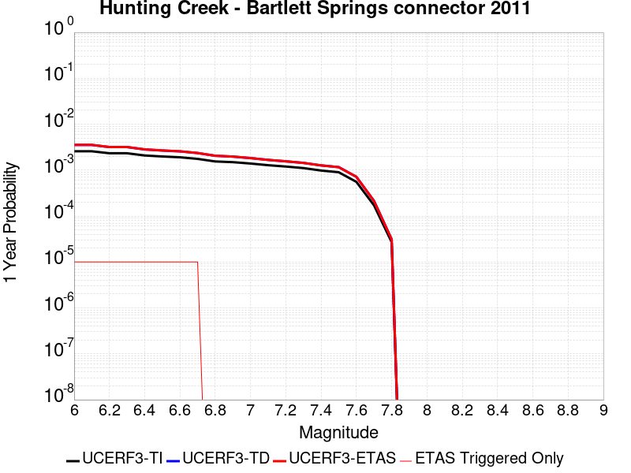 |  |

| Magnitude | 1 wk TI Prob | 1 wk TD Prob | 1 wk ETAS Prob | 1 wk ETAS/TD Gain | 1 wk ETAS Triggered Only | 1 mo TI Prob | 1 mo TD Prob | 1 mo ETAS Prob | 1 mo ETAS/TD Gain | 1 mo ETAS Triggered Only | 1 yr TI Prob | 1 yr TD Prob | 1 yr ETAS Prob | 1 yr ETAS/TD Gain | 1 yr ETAS Triggered Only | 10 yr TI Prob | 10 yr TD Prob | 10 yr ETAS Prob | 10 yr ETAS/TD Gain | 10 yr ETAS Triggered Only |
|-----|-----|-----|-----|-----|-----|-----|-----|-----|-----|-----|-----|-----|-----|-----|-----|-----|-----|-----|-----|-----|
| 6.0 | 4.940016E-5 | 6.788956E-5 | 6.788956E-5 | 1.0 | 0.0 | 2.1169778E-4 | 2.9092372E-4 | 3.0092083E-4 | 1.0343633 | 1.0E-5 | 0.002574374 | 0.0035361892 | 0.003546154 | 1.0028179 | 1.0E-5 | 0.025447546 | 0.03478363 | 0.034793284 | 1.0002775 | 1.0E-5 |
| 6.1 | 4.940016E-5 | 6.788956E-5 | 6.788956E-5 | 1.0 | 0.0 | 2.1169778E-4 | 2.9092372E-4 | 3.0092083E-4 | 1.0343633 | 1.0E-5 | 0.002574374 | 0.0035361892 | 0.003546154 | 1.0028179 | 1.0E-5 | 0.025447546 | 0.03478363 | 0.034793284 | 1.0002775 | 1.0E-5 |
| 6.2 | 4.472471E-5 | 6.1021154E-5 | 6.1021154E-5 | 1.0 | 0.0 | 1.9166325E-4 | 2.6149364E-4 | 2.7149104E-4 | 1.0382318 | 1.0E-5 | 0.0023310026 | 0.0031790275 | 0.0031889956 | 1.0031356 | 1.0E-5 | 0.02306703 | 0.03132556 | 0.031335246 | 1.0003092 | 1.0E-5 |
| 6.3 | 4.472471E-5 | 6.1021154E-5 | 6.1021154E-5 | 1.0 | 0.0 | 1.9166325E-4 | 2.6149364E-4 | 2.7149104E-4 | 1.0382318 | 1.0E-5 | 0.0023310026 | 0.0031790275 | 0.0031889956 | 1.0031356 | 1.0E-5 | 0.02306703 | 0.03132556 | 0.031335246 | 1.0003092 | 1.0E-5 |
| 6.4 | 4.0001003E-5 | 5.4119057E-5 | 5.4119057E-5 | 1.0 | 0.0 | 1.714216E-4 | 2.3191852E-4 | 2.419162E-4 | 1.0431086 | 1.0E-5 | 0.0020850603 | 0.0028198871 | 0.0028298588 | 1.0035362 | 1.0E-5 | 0.02065605 | 0.027835734 | 0.027845455 | 1.0003493 | 1.0E-5 |
| 6.5 | 3.8033053E-5 | 5.1280647E-5 | 5.1280647E-5 | 1.0 | 0.0 | 1.6298861E-4 | 2.1975597E-4 | 2.2975377E-4 | 1.045495 | 1.0E-5 | 0.0019825802 | 0.0026721754 | 0.0026821487 | 1.0037323 | 1.0E-5 | 0.019649856 | 0.026397381 | 0.026407117 | 1.0003688 | 1.0E-5 |
| 6.6 | 3.653754E-5 | 4.9143422E-5 | 4.9143422E-5 | 1.0 | 0.0 | 1.5658008E-4 | 2.1059795E-4 | 2.2059584E-4 | 1.0474738 | 1.0E-5 | 0.0019046954 | 0.0025609415 | 0.0025709157 | 1.0038948 | 1.0E-5 | 0.018884527 | 0.025312979 | 0.025322724 | 1.000385 | 1.0E-5 |
| 6.7 | 3.372024E-5 | 4.515182E-5 | 4.515182E-5 | 1.0 | 0.0 | 1.4450731E-4 | 1.9349364E-4 | 2.034917E-4 | 1.0516713 | 1.0E-5 | 0.0017579567 | 0.0023532384 | 0.002363215 | 1.0042394 | 1.0E-5 | 0.017441148 | 0.023283994 | 0.02329376 | 1.0004195 | 1.0E-5 |
| 6.8 | 2.9650024E-5 | 3.942091E-5 | 3.942091E-5 | 1.0 | 0.0 | 1.2706534E-4 | 1.6893582E-4 | 1.6893582E-4 | 1.0 | 0.0 | 0.0015459227 | 0.0020548382 | 0.0020548382 | 1.0 | 0.0 | 0.015352124 | 0.020356046 | 0.020356046 | 1.0 | 0.0 |
| 6.9 | 2.860775E-5 | 3.7821348E-5 | 3.7821348E-5 | 1.0 | 0.0 | 1.2259888E-4 | 1.6208141E-4 | 1.6208141E-4 | 1.0 | 0.0 | 0.0014916194 | 0.0019715675 | 0.0019715675 | 1.0 | 0.0 | 0.014816469 | 0.019540345 | 0.019540345 | 1.0 | 0.0 |
| 7.0 | 2.6696067E-5 | 3.507532E-5 | 3.507532E-5 | 1.0 | 0.0 | 1.144067E-4 | 1.5031418E-4 | 1.5031418E-4 | 1.0 | 0.0 | 0.0013920115 | 0.0018285498 | 0.0018285498 | 1.0 | 0.0 | 0.013833242 | 0.018135482 | 0.018135482 | 1.0 | 0.0 |
| 7.1 | 2.456087E-5 | 3.2020496E-5 | 3.2020496E-5 | 1.0 | 0.0 | 1.0525662E-4 | 1.3722351E-4 | 1.3722351E-4 | 1.0 | 0.0 | 0.001280746 | 0.0016694252 | 0.0016694252 | 1.0 | 0.0 | 0.012733897 | 0.016570164 | 0.016570164 | 1.0 | 0.0 |
| 7.2 | 2.295761E-5 | 2.9829838E-5 | 2.9829838E-5 | 1.0 | 0.0 | 9.8386045E-5 | 1.2783596E-4 | 1.2783596E-4 | 1.0 | 0.0 | 0.0011971919 | 0.0015553008 | 0.0015553008 | 1.0 | 0.0 | 0.011907627 | 0.0154456375 | 0.0154456375 | 1.0 | 0.0 |
| 7.3 | 2.1256936E-5 | 2.7548398E-5 | 2.7548398E-5 | 1.0 | 0.0 | 9.109797E-5 | 1.18059266E-4 | 1.18059266E-4 | 1.0 | 0.0 | 0.0011085535 | 0.0014364327 | 0.0014364327 | 1.0 | 0.0 | 0.011030397 | 0.014272808 | 0.014272808 | 1.0 | 0.0 |
| 7.4 | 1.8784336E-5 | 2.4312472E-5 | 2.4312472E-5 | 1.0 | 0.0 | 8.050181E-5 | 1.0419219E-4 | 1.0419219E-4 | 1.0 | 0.0 | 9.796688E-4 | 0.0012678093 | 0.0012678093 | 1.0 | 0.0 | 0.009753612 | 0.012606842 | 0.012606842 | 1.0 | 0.0 |
| 7.5 | 1.7248298E-5 | 2.2274202E-5 | 2.2274202E-5 | 1.0 | 0.0 | 7.391918E-5 | 9.545741E-5 | 9.545741E-5 | 1.0 | 0.0 | 8.9959445E-4 | 0.0011615818 | 0.0011615818 | 1.0 | 0.0 | 0.008959615 | 0.011556081 | 0.011556081 | 1.0 | 0.0 |
| 7.6 | 1.0653709E-5 | 1.372531E-5 | 1.372531E-5 | 1.0 | 0.0 | 4.5657955E-5 | 5.8821446E-5 | 5.8821446E-5 | 1.0 | 0.0 | 5.557438E-4 | 7.159185E-4 | 7.159185E-4 | 1.0 | 0.0 | 0.0055435603 | 0.00713647 | 0.00713647 | 1.0 | 0.0 |
| 7.7 | 3.286316E-6 | 4.0912714E-6 | 4.0912714E-6 | 1.0 | 0.0 | 1.4084137E-5 | 1.7533903E-5 | 1.7533903E-5 | 1.0 | 0.0 | 1.7146087E-4 | 2.1345452E-4 | 2.1345452E-4 | 1.0 | 0.0 | 0.0017132863 | 0.0021325108 | 0.0021325108 | 1.0 | 0.0 |
| 7.8 | 5.1855085E-7 | 5.972824E-7 | 5.972824E-7 | 1.0 | 0.0 | 2.222359E-6 | 2.5597792E-6 | 2.5597792E-6 | 1.0 | 0.0 | 2.7056883E-5 | 3.1164876E-5 | 3.1164876E-5 | 1.0 | 0.0 | 2.705359E-4 | 3.116043E-4 | 3.116043E-4 | 1.0 | 0.0 |

## San Jacinto (Superstition Mtn)
*[(top)](#table-of-contents)*

| 1 Week | 1 Month | 1 Year | 10 Year |
|-----|-----|-----|-----|
|  | 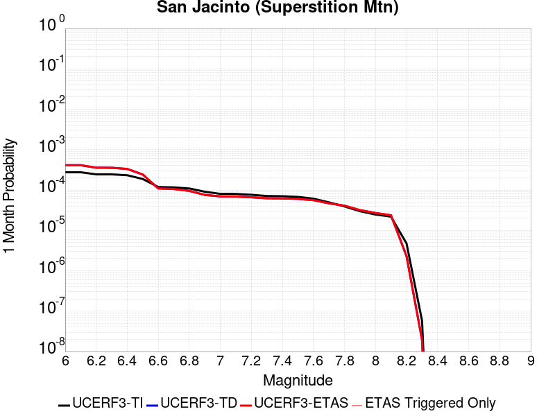 |  |  |

| Magnitude | 1 wk TI Prob | 1 wk TD Prob | 1 wk ETAS Prob | 1 wk ETAS/TD Gain | 1 wk ETAS Triggered Only | 1 mo TI Prob | 1 mo TD Prob | 1 mo ETAS Prob | 1 mo ETAS/TD Gain | 1 mo ETAS Triggered Only | 1 yr TI Prob | 1 yr TD Prob | 1 yr ETAS Prob | 1 yr ETAS/TD Gain | 1 yr ETAS Triggered Only | 10 yr TI Prob | 10 yr TD Prob | 10 yr ETAS Prob | 10 yr ETAS/TD Gain | 10 yr ETAS Triggered Only |
|-----|-----|-----|-----|-----|-----|-----|-----|-----|-----|-----|-----|-----|-----|-----|-----|-----|-----|-----|-----|-----|
| 6.0 | 6.4193904E-5 | 9.604509E-5 | 9.604509E-5 | 1.0 | 0.0 | 2.7508775E-4 | 4.1156667E-4 | 4.1156667E-4 | 1.0 | 0.0 | 0.0033440501 | 0.005000645 | 0.005000645 | 1.0 | 0.0 | 0.03294174 | 0.048848573 | 0.048858084 | 1.0001947 | 1.0E-5 |
| 6.1 | 6.4193904E-5 | 9.604509E-5 | 9.604509E-5 | 1.0 | 0.0 | 2.7508775E-4 | 4.1156667E-4 | 4.1156667E-4 | 1.0 | 0.0 | 0.0033440501 | 0.005000645 | 0.005000645 | 1.0 | 0.0 | 0.03294174 | 0.048848573 | 0.048858084 | 1.0001947 | 1.0E-5 |
| 6.2 | 5.7023593E-5 | 8.319097E-5 | 8.319097E-5 | 1.0 | 0.0 | 2.4436394E-4 | 3.5649343E-4 | 3.5649343E-4 | 1.0 | 0.0 | 0.002971072 | 0.004333299 | 0.004333299 | 1.0 | 0.0 | 0.029316625 | 0.042527277 | 0.04253685 | 1.0002252 | 1.0E-5 |
| 6.3 | 5.6940098E-5 | 8.3036306E-5 | 8.3036306E-5 | 1.0 | 0.0 | 2.4400617E-4 | 3.5583074E-4 | 3.5583074E-4 | 1.0 | 0.0 | 0.002966728 | 0.0043252627 | 0.0043252627 | 1.0 | 0.0 | 0.029274331 | 0.042450514 | 0.042460088 | 1.0002255 | 1.0E-5 |
| 6.4 | 5.4171585E-5 | 7.752936E-5 | 7.752936E-5 | 1.0 | 0.0 | 2.3214328E-4 | 3.3223568E-4 | 3.3223568E-4 | 1.0 | 0.0 | 0.0028226813 | 0.0040391157 | 0.0040391157 | 1.0 | 0.0 | 0.02787096 | 0.039739568 | 0.03974917 | 1.0002416 | 1.0E-5 |
| 6.5 | 4.375144E-5 | 5.6465793E-5 | 5.6465793E-5 | 1.0 | 0.0 | 1.874927E-4 | 2.4198045E-4 | 2.4198045E-4 | 1.0 | 0.0 | 0.0022803338 | 0.0029433076 | 0.0029433076 | 1.0 | 0.0 | 0.022570757 | 0.029259454 | 0.029259454 | 1.0 | 0.0 |
| 6.6 | 2.772192E-5 | 2.5530666E-5 | 2.5530666E-5 | 1.0 | 0.0 | 1.1880282E-4 | 1.09412664E-4 | 1.09412664E-4 | 1.0 | 0.0 | 0.0014454646 | 0.0013313045 | 0.0013313045 | 1.0 | 0.0 | 0.014360986 | 0.013562454 | 0.013562454 | 1.0 | 0.0 |
| 6.7 | 2.7124124E-5 | 2.47415E-5 | 2.47415E-5 | 1.0 | 0.0 | 1.1624106E-4 | 1.0603079E-4 | 1.0603079E-4 | 1.0 | 0.0 | 0.0014143161 | 0.0012901797 | 0.0012901797 | 1.0 | 0.0 | 0.014053487 | 0.013155818 | 0.013155818 | 1.0 | 0.0 |
| 6.8 | 2.5475807E-5 | 2.220555E-5 | 2.220555E-5 | 1.0 | 0.0 | 1.0917746E-4 | 9.516323E-5 | 9.516323E-5 | 1.0 | 0.0 | 0.001328425 | 0.0011580086 | 0.0011580086 | 1.0 | 0.0 | 0.0132051185 | 0.011843571 | 0.011843571 | 1.0 | 0.0 |
| 6.9 | 2.1162023E-5 | 1.7664179E-5 | 1.7664179E-5 | 1.0 | 0.0 | 9.069123E-5 | 7.570144E-5 | 7.570144E-5 | 1.0 | 0.0 | 0.0011036064 | 9.212792E-4 | 9.212792E-4 | 1.0 | 0.0 | 0.010981417 | 0.009466708 | 0.009466708 | 1.0 | 0.0 |
| 7.0 | 1.8754288E-5 | 1.6197775E-5 | 1.6197775E-5 | 1.0 | 0.0 | 8.037304E-5 | 6.9417205E-5 | 6.9417205E-5 | 1.0 | 0.0 | 9.781026E-4 | 8.448292E-4 | 8.448292E-4 | 1.0 | 0.0 | 0.009738087 | 0.008688975 | 0.008688975 | 1.0 | 0.0 |
| 7.1 | 1.8678527E-5 | 1.6122882E-5 | 1.6122882E-5 | 1.0 | 0.0 | 8.0048376E-5 | 6.909625E-5 | 6.909625E-5 | 1.0 | 0.0 | 9.7415317E-4 | 8.409246E-4 | 8.409246E-4 | 1.0 | 0.0 | 0.009698939 | 0.0086499145 | 0.0086499145 | 1.0 | 0.0 |
| 7.2 | 1.7804578E-5 | 1.5417074E-5 | 1.5417074E-5 | 1.0 | 0.0 | 7.6303106E-5 | 6.6071516E-5 | 6.6071516E-5 | 1.0 | 0.0 | 9.285943E-4 | 8.041261E-4 | 8.041261E-4 | 1.0 | 0.0 | 0.009247236 | 0.008281034 | 0.008281034 | 1.0 | 0.0 |
| 7.3 | 1.6583685E-5 | 1.4565759E-5 | 1.4565759E-5 | 1.0 | 0.0 | 7.1070994E-5 | 6.24232E-5 | 6.24232E-5 | 1.0 | 0.0 | 8.649459E-4 | 7.597394E-4 | 7.597394E-4 | 1.0 | 0.0 | 0.00861587 | 0.007836135 | 0.007836135 | 1.0 | 0.0 |
| 7.4 | 1.6387552E-5 | 1.4430574E-5 | 1.4430574E-5 | 1.0 | 0.0 | 7.023047E-5 | 6.1843864E-5 | 6.1843864E-5 | 1.0 | 0.0 | 8.5472054E-4 | 7.5269095E-4 | 7.5269095E-4 | 1.0 | 0.0 | 0.008514405 | 0.007765482 | 0.007765482 | 1.0 | 0.0 |
| 7.5 | 1.5790754E-5 | 1.4070897E-5 | 1.4070897E-5 | 1.0 | 0.0 | 6.767291E-5 | 6.030246E-5 | 6.030246E-5 | 1.0 | 0.0 | 8.236062E-4 | 7.3393714E-4 | 7.3393714E-4 | 1.0 | 0.0 | 0.008205604 | 0.007575858 | 0.007575858 | 1.0 | 0.0 |
| 7.6 | 1.4248672E-5 | 1.3088949E-5 | 1.3088949E-5 | 1.0 | 0.0 | 6.106431E-5 | 5.60943E-5 | 5.60943E-5 | 1.0 | 0.0 | 7.432043E-4 | 6.827359E-4 | 6.827359E-4 | 1.0 | 0.0 | 0.007407237 | 0.0070579755 | 0.0070579755 | 1.0 | 0.0 |
| 7.7 | 1.15449975E-5 | 1.0936122E-5 | 1.0936122E-5 | 1.0 | 0.0 | 4.947762E-5 | 4.6868256E-5 | 4.6868256E-5 | 1.0 | 0.0 | 6.022235E-4 | 5.704724E-4 | 5.704724E-4 | 1.0 | 0.0 | 0.006005941 | 0.005927197 | 0.005927197 | 1.0 | 0.0 |
| 7.8 | 9.1391985E-6 | 9.545476E-6 | 9.545476E-6 | 1.0 | 0.0 | 3.9167408E-5 | 4.0908544E-5 | 4.0908544E-5 | 1.0 | 0.0 | 4.767588E-4 | 4.979483E-4 | 4.979483E-4 | 1.0 | 0.0 | 0.0047573727 | 0.0051930523 | 0.0051930523 | 1.0 | 0.0 |
| 7.9 | 6.973017E-6 | 7.40991E-6 | 7.40991E-6 | 1.0 | 0.0 | 2.9884017E-5 | 3.175637E-5 | 3.175637E-5 | 1.0 | 0.0 | 3.6377716E-4 | 3.8656578E-4 | 3.8656578E-4 | 1.0 | 0.0 | 0.0036318225 | 0.0040663844 | 0.0040663844 | 1.0 | 0.0 |
| 8.0 | 5.7638235E-6 | 6.2851814E-6 | 6.2851814E-6 | 1.0 | 0.0 | 2.4701867E-5 | 2.6936215E-5 | 2.6936215E-5 | 1.0 | 0.0 | 3.0070372E-4 | 3.278996E-4 | 3.278996E-4 | 1.0 | 0.0 | 0.0030029714 | 0.0034667295 | 0.0034667295 | 1.0 | 0.0 |
| 8.1 | 5.1124434E-6 | 5.518618E-6 | 5.518618E-6 | 1.0 | 0.0 | 2.1910288E-5 | 2.3651008E-5 | 2.3651008E-5 | 1.0 | 0.0 | 2.6672508E-4 | 2.8791346E-4 | 2.8791346E-4 | 1.0 | 0.0 | 0.0026640517 | 0.003052441 | 0.003052441 | 1.0 | 0.0 |
| 8.2 | 1.1075938E-6 | 5.370242E-7 | 5.370242E-7 | 1.0 | 0.0 | 4.7468216E-6 | 2.3015305E-6 | 2.3015305E-6 | 1.0 | 0.0 | 5.779102E-5 | 2.8020793E-5 | 2.8020793E-5 | 1.0 | 0.0 | 5.777599E-4 | 3.153418E-4 | 3.153418E-4 | 1.0 | 0.0 |
| 8.3 | 1.3584393E-8 | 4.506021E-9 | 4.506021E-9 | 1.0 | 0.0 | 5.8218827E-8 | 1.931152E-8 | 1.931152E-8 | 1.0 | 0.0 | 7.0881396E-7 | 2.3511774E-7 | 2.3511774E-7 | 1.0 | 0.0 | 7.0881174E-6 | 2.634354E-6 | 2.634354E-6 | 1.0 | 0.0 |

## Santa Monica alt 1
*[(top)](#table-of-contents)*

| 1 Week | 1 Month | 1 Year | 10 Year |
|-----|-----|-----|-----|
| 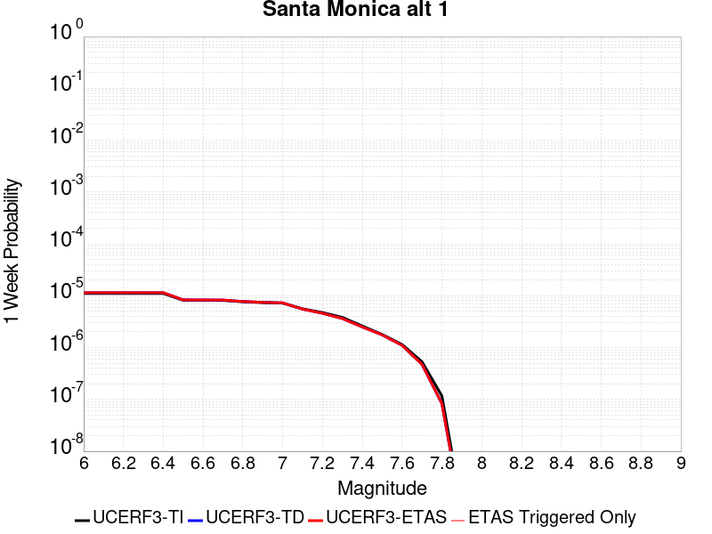 |  |  |  |

| Magnitude | 1 wk TI Prob | 1 wk TD Prob | 1 wk ETAS Prob | 1 wk ETAS/TD Gain | 1 wk ETAS Triggered Only | 1 mo TI Prob | 1 mo TD Prob | 1 mo ETAS Prob | 1 mo ETAS/TD Gain | 1 mo ETAS Triggered Only | 1 yr TI Prob | 1 yr TD Prob | 1 yr ETAS Prob | 1 yr ETAS/TD Gain | 1 yr ETAS Triggered Only | 10 yr TI Prob | 10 yr TD Prob | 10 yr ETAS Prob | 10 yr ETAS/TD Gain | 10 yr ETAS Triggered Only |
|-----|-----|-----|-----|-----|-----|-----|-----|-----|-----|-----|-----|-----|-----|-----|-----|-----|-----|-----|-----|-----|
| 6.0 | 1.1066008E-5 | 1.148119E-5 | 1.148119E-5 | 1.0 | 0.0 | 4.742488E-5 | 4.920425E-5 | 4.920425E-5 | 1.0 | 0.0 | 5.7724497E-4 | 5.98911E-4 | 6.0890504E-4 | 1.0166869 | 1.0E-5 | 0.005757478 | 0.0059743566 | 0.005984297 | 1.0016638 | 1.0E-5 |
| 6.1 | 1.1066008E-5 | 1.148119E-5 | 1.148119E-5 | 1.0 | 0.0 | 4.742488E-5 | 4.920425E-5 | 4.920425E-5 | 1.0 | 0.0 | 5.7724497E-4 | 5.98911E-4 | 6.0890504E-4 | 1.0166869 | 1.0E-5 | 0.005757478 | 0.0059743566 | 0.005984297 | 1.0016638 | 1.0E-5 |
| 6.2 | 1.1066008E-5 | 1.148119E-5 | 1.148119E-5 | 1.0 | 0.0 | 4.742488E-5 | 4.920425E-5 | 4.920425E-5 | 1.0 | 0.0 | 5.7724497E-4 | 5.98911E-4 | 6.0890504E-4 | 1.0166869 | 1.0E-5 | 0.005757478 | 0.0059743566 | 0.005984297 | 1.0016638 | 1.0E-5 |
| 6.3 | 1.1066008E-5 | 1.148119E-5 | 1.148119E-5 | 1.0 | 0.0 | 4.742488E-5 | 4.920425E-5 | 4.920425E-5 | 1.0 | 0.0 | 5.7724497E-4 | 5.98911E-4 | 6.0890504E-4 | 1.0166869 | 1.0E-5 | 0.005757478 | 0.0059743566 | 0.005984297 | 1.0016638 | 1.0E-5 |
| 6.4 | 1.1066008E-5 | 1.148119E-5 | 1.148119E-5 | 1.0 | 0.0 | 4.742488E-5 | 4.920425E-5 | 4.920425E-5 | 1.0 | 0.0 | 5.7724497E-4 | 5.98911E-4 | 6.0890504E-4 | 1.0166869 | 1.0E-5 | 0.005757478 | 0.0059743566 | 0.005984297 | 1.0016638 | 1.0E-5 |
| 6.5 | 8.183544E-6 | 8.3360455E-6 | 8.3360455E-6 | 1.0 | 0.0 | 3.5071862E-5 | 3.572543E-5 | 3.572543E-5 | 1.0 | 0.0 | 4.2691626E-4 | 4.3487188E-4 | 4.4486753E-4 | 1.0229852 | 1.0E-5 | 0.0042609703 | 0.004340375 | 0.004350331 | 1.002294 | 1.0E-5 |
| 6.6 | 8.1543285E-6 | 8.304257E-6 | 8.304257E-6 | 1.0 | 0.0 | 3.4946657E-5 | 3.5589197E-5 | 3.5589197E-5 | 1.0 | 0.0 | 4.2539247E-4 | 4.3321392E-4 | 4.4320957E-4 | 1.0230733 | 1.0E-5 | 0.0042457907 | 0.0043238597 | 0.0043338165 | 1.0023028 | 1.0E-5 |
| 6.7 | 8.110878E-6 | 8.257651E-6 | 8.257651E-6 | 1.0 | 0.0 | 3.4760444E-5 | 3.538946E-5 | 3.538946E-5 | 1.0 | 0.0 | 4.231262E-4 | 4.3078308E-4 | 4.4077876E-4 | 1.0232035 | 1.0E-5 | 0.0042232145 | 0.0042996453 | 0.0043096025 | 1.0023158 | 1.0E-5 |
| 6.8 | 7.644036E-6 | 7.751629E-6 | 7.751629E-6 | 1.0 | 0.0 | 3.275974E-5 | 3.322085E-5 | 3.322085E-5 | 1.0 | 0.0 | 3.9877684E-4 | 4.0439024E-4 | 4.143862E-4 | 1.0247186 | 1.0E-5 | 0.00398062 | 0.00403669 | 0.0040466497 | 1.0024673 | 1.0E-5 |
| 6.9 | 7.3698293E-6 | 7.4562663E-6 | 7.4562663E-6 | 1.0 | 0.0 | 3.15846E-5 | 3.1955045E-5 | 3.1955045E-5 | 1.0 | 0.0 | 3.8447464E-4 | 3.889846E-4 | 3.9898072E-4 | 1.025698 | 1.0E-5 | 0.0038381014 | 0.003883181 | 0.003893142 | 1.0025653 | 1.0E-5 |
| 7.0 | 7.209872E-6 | 7.286163E-6 | 7.286163E-6 | 1.0 | 0.0 | 3.0899086E-5 | 3.1226045E-5 | 3.1226045E-5 | 1.0 | 0.0 | 3.7613141E-4 | 3.8011218E-4 | 3.9010838E-4 | 1.026298 | 1.0E-5 | 0.0037549543 | 0.003794763 | 0.0038047251 | 1.0026252 | 1.0E-5 |
| 7.1 | 5.603456E-6 | 5.5242713E-6 | 5.5242713E-6 | 1.0 | 0.0 | 2.4014591E-5 | 2.3675235E-5 | 2.3675235E-5 | 1.0 | 0.0 | 2.923384E-4 | 2.8820828E-4 | 2.8820828E-4 | 1.0 | 0.0 | 0.0029195412 | 0.0028783868 | 0.0028783868 | 1.0 | 0.0 |
| 7.2 | 4.7483613E-6 | 4.5914326E-6 | 4.5914326E-6 | 1.0 | 0.0 | 2.0349962E-5 | 1.967742E-5 | 1.967742E-5 | 1.0 | 0.0 | 2.4773262E-4 | 2.3954638E-4 | 2.3954638E-4 | 1.0 | 0.0 | 0.0024745662 | 0.0023928958 | 0.0023928958 | 1.0 | 0.0 |
| 7.3 | 3.829015E-6 | 3.6344604E-6 | 3.6344604E-6 | 1.0 | 0.0 | 1.6409962E-5 | 1.5576166E-5 | 1.5576166E-5 | 1.0 | 0.0 | 1.9977297E-4 | 1.896234E-4 | 1.896234E-4 | 1.0 | 0.0 | 0.0019959346 | 0.0018946249 | 0.0018946249 | 1.0 | 0.0 |
| 7.4 | 2.610755E-6 | 2.4997362E-6 | 2.4997362E-6 | 1.0 | 0.0 | 1.1188902E-5 | 1.0713111E-5 | 1.0713111E-5 | 1.0 | 0.0 | 1.3621636E-4 | 1.3042436E-4 | 1.3042436E-4 | 1.0 | 0.0 | 0.001361329 | 0.0013034827 | 0.0013034827 | 1.0 | 0.0 |
| 7.5 | 1.792146E-6 | 1.7585403E-6 | 1.7585403E-6 | 1.0 | 0.0 | 7.680603E-6 | 7.5365797E-6 | 7.5365797E-6 | 1.0 | 0.0 | 9.3507326E-5 | 9.1754024E-5 | 9.1754024E-5 | 1.0 | 0.0 | 9.3467993E-4 | 9.171646E-4 | 9.171646E-4 | 1.0 | 0.0 |
| 7.6 | 1.1473018E-6 | 1.1029961E-6 | 1.1029961E-6 | 1.0 | 0.0 | 4.9169985E-6 | 4.7271174E-6 | 4.7271174E-6 | 1.0 | 0.0 | 5.986281E-5 | 5.755115E-5 | 5.755115E-5 | 1.0 | 0.0 | 5.984669E-4 | 5.7536416E-4 | 5.7536416E-4 | 1.0 | 0.0 |
| 7.7 | 5.330919E-7 | 4.745708E-7 | 4.745708E-7 | 1.0 | 0.0 | 2.2846775E-6 | 2.0338734E-6 | 2.0338734E-6 | 1.0 | 0.0 | 2.7815593E-5 | 2.4762137E-5 | 2.4762137E-5 | 1.0 | 0.0 | 2.7812112E-4 | 2.4759493E-4 | 2.4759493E-4 | 1.0 | 0.0 |
| 7.8 | 1.1668574E-7 | 8.298897E-8 | 8.298897E-8 | 1.0 | 0.0 | 5.000816E-7 | 3.5566694E-7 | 3.5566694E-7 | 1.0 | 0.0 | 6.0884768E-6 | 4.330237E-6 | 4.330237E-6 | 1.0 | 0.0 | 6.08831E-5 | 4.3301556E-5 | 4.3301556E-5 | 1.0 | 0.0 |
| 7.9 | 8.007447E-10 | 6.161137E-10 | 6.161137E-10 | 1.0 | 0.0 | 3.4317629E-9 | 2.640488E-9 | 2.640488E-9 | 1.0 | 0.0 | 4.1781714E-8 | 3.214794E-8 | 3.214794E-8 | 1.0 | 0.0 | 4.1781706E-7 | 3.2147938E-7 | 3.2147938E-7 | 1.0 | 0.0 |

## Emerson-Copper Mtn 2011
*[(top)](#table-of-contents)*

| 1 Week | 1 Month | 1 Year | 10 Year |
|-----|-----|-----|-----|
|  |  |  | 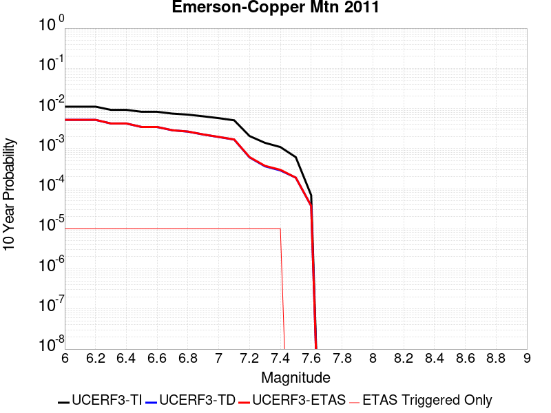 |

| Magnitude | 1 wk TI Prob | 1 wk TD Prob | 1 wk ETAS Prob | 1 wk ETAS/TD Gain | 1 wk ETAS Triggered Only | 1 mo TI Prob | 1 mo TD Prob | 1 mo ETAS Prob | 1 mo ETAS/TD Gain | 1 mo ETAS Triggered Only | 1 yr TI Prob | 1 yr TD Prob | 1 yr ETAS Prob | 1 yr ETAS/TD Gain | 1 yr ETAS Triggered Only | 10 yr TI Prob | 10 yr TD Prob | 10 yr ETAS Prob | 10 yr ETAS/TD Gain | 10 yr ETAS Triggered Only |
|-----|-----|-----|-----|-----|-----|-----|-----|-----|-----|-----|-----|-----|-----|-----|-----|-----|-----|-----|-----|-----|
| 6.0 | 2.1364202E-5 | 9.969261E-6 | 9.969261E-6 | 1.0 | 0.0 | 9.1557646E-5 | 4.272475E-5 | 4.272475E-5 | 1.0 | 0.0 | 0.0011141442 | 5.2005844E-4 | 5.2005844E-4 | 1.0 | 0.0 | 0.011085749 | 0.0051892838 | 0.005199232 | 1.001917 | 1.0E-5 |
| 6.1 | 2.1364202E-5 | 9.969261E-6 | 9.969261E-6 | 1.0 | 0.0 | 9.1557646E-5 | 4.272475E-5 | 4.272475E-5 | 1.0 | 0.0 | 0.0011141442 | 5.2005844E-4 | 5.2005844E-4 | 1.0 | 0.0 | 0.011085749 | 0.0051892838 | 0.005199232 | 1.001917 | 1.0E-5 |
| 6.2 | 2.1364202E-5 | 9.969261E-6 | 9.969261E-6 | 1.0 | 0.0 | 9.1557646E-5 | 4.272475E-5 | 4.272475E-5 | 1.0 | 0.0 | 0.0011141442 | 5.2005844E-4 | 5.2005844E-4 | 1.0 | 0.0 | 0.011085749 | 0.0051892838 | 0.005199232 | 1.001917 | 1.0E-5 |
| 6.3 | 1.7751237E-5 | 8.090198E-6 | 8.090198E-6 | 1.0 | 0.0 | 7.607452E-5 | 3.467185E-5 | 3.467185E-5 | 1.0 | 0.0 | 9.258136E-4 | 4.2205432E-4 | 4.2205432E-4 | 1.0 | 0.0 | 0.00921966 | 0.0042131506 | 0.0042231083 | 1.0023636 | 1.0E-5 |
| 6.4 | 1.7751237E-5 | 8.090198E-6 | 8.090198E-6 | 1.0 | 0.0 | 7.607452E-5 | 3.467185E-5 | 3.467185E-5 | 1.0 | 0.0 | 9.258136E-4 | 4.2205432E-4 | 4.2205432E-4 | 1.0 | 0.0 | 0.00921966 | 0.0042131506 | 0.0042231083 | 1.0023636 | 1.0E-5 |
| 6.5 | 1.5886664E-5 | 6.6046364E-6 | 6.6046364E-6 | 1.0 | 0.0 | 6.808392E-5 | 2.8305303E-5 | 2.8305303E-5 | 1.0 | 0.0 | 8.286065E-4 | 3.4456726E-4 | 3.4456726E-4 | 1.0 | 0.0 | 0.008255237 | 0.0034407945 | 0.0034507602 | 1.0028963 | 1.0E-5 |
| 6.6 | 1.5886664E-5 | 6.6046364E-6 | 6.6046364E-6 | 1.0 | 0.0 | 6.808392E-5 | 2.8305303E-5 | 2.8305303E-5 | 1.0 | 0.0 | 8.286065E-4 | 3.4456726E-4 | 3.4456726E-4 | 1.0 | 0.0 | 0.008255237 | 0.0034407945 | 0.0034507602 | 1.0028963 | 1.0E-5 |
| 6.7 | 1.428471E-5 | 5.4711068E-6 | 5.4711068E-6 | 1.0 | 0.0 | 6.121875E-5 | 2.3447412E-5 | 2.3447412E-5 | 1.0 | 0.0 | 7.450834E-4 | 2.854388E-4 | 2.854388E-4 | 1.0 | 0.0 | 0.007425902 | 0.0028511097 | 0.0028610812 | 1.0034974 | 1.0E-5 |
| 6.8 | 1.3490684E-5 | 5.0743597E-6 | 5.0743597E-6 | 1.0 | 0.0 | 5.7815934E-5 | 2.1747097E-5 | 2.1747097E-5 | 1.0 | 0.0 | 7.0368167E-4 | 2.6474262E-4 | 2.6474262E-4 | 1.0 | 0.0 | 0.007014576 | 0.0026446532 | 0.0026546267 | 1.0037712 | 1.0E-5 |
| 6.9 | 1.2235421E-5 | 4.2902793E-6 | 4.2902793E-6 | 1.0 | 0.0 | 5.2436466E-5 | 1.8386803E-5 | 1.8386803E-5 | 1.0 | 0.0 | 6.38227E-4 | 2.2383993E-4 | 2.2383993E-4 | 1.0 | 0.0 | 0.0063639707 | 0.0022364992 | 0.002246477 | 1.0044613 | 1.0E-5 |
| 7.0 | 1.1009851E-5 | 3.71954E-6 | 3.71954E-6 | 1.0 | 0.0 | 4.7184225E-5 | 1.5940808E-5 | 1.5940808E-5 | 1.0 | 0.0 | 5.743165E-4 | 1.9406549E-4 | 1.9406549E-4 | 1.0 | 0.0 | 0.005728345 | 0.0019392981 | 0.0019492788 | 1.0051465 | 1.0E-5 |
| 7.1 | 9.726373E-6 | 3.21228E-6 | 3.21228E-6 | 1.0 | 0.0 | 4.168379E-5 | 1.376686E-5 | 1.376686E-5 | 1.0 | 0.0 | 5.07382E-4 | 1.67602E-4 | 1.67602E-4 | 1.0 | 0.0 | 0.0050622504 | 0.0016750874 | 0.0016850707 | 1.0059599 | 1.0E-5 |
| 7.2 | 3.9335127E-6 | 1.1526508E-6 | 1.1526508E-6 | 1.0 | 0.0 | 1.6857803E-5 | 4.939923E-6 | 4.939923E-6 | 1.0 | 0.0 | 2.0522442E-4 | 6.0141967E-5 | 6.0141967E-5 | 1.0 | 0.0 | 0.00205035 | 6.0126284E-4 | 6.1125687E-4 | 1.0166217 | 1.0E-5 |
| 7.3 | 2.661632E-6 | 6.9126224E-7 | 6.9126224E-7 | 1.0 | 0.0 | 1.14069435E-5 | 2.9625492E-6 | 2.9625492E-6 | 1.0 | 0.0 | 1.3887069E-4 | 3.606845E-5 | 3.606845E-5 | 1.0 | 0.0 | 0.0013878393 | 3.6062702E-4 | 3.706234E-4 | 1.0277195 | 1.0E-5 |
| 7.4 | 2.0893426E-6 | 5.46272E-7 | 5.46272E-7 | 1.0 | 0.0 | 8.954295E-6 | 2.3411637E-6 | 2.3411637E-6 | 1.0 | 0.0 | 1.0901308E-4 | 2.85033E-5 | 2.85033E-5 | 1.0 | 0.0 | 0.0010895962 | 2.84997E-4 | 2.9499413E-4 | 1.035078 | 1.0E-5 |
| 7.5 | 1.1681728E-6 | 3.60355E-7 | 3.60355E-7 | 1.0 | 0.0 | 5.0064455E-6 | 1.5443777E-6 | 1.5443777E-6 | 1.0 | 0.0 | 6.0951766E-5 | 1.880264E-5 | 1.880264E-5 | 1.0 | 0.0 | 6.093505E-4 | 1.8801096E-4 | 1.8801096E-4 | 1.0 | 0.0 |
| 7.6 | 1.3154387E-7 | 7.120354E-8 | 7.120354E-8 | 1.0 | 0.0 | 5.6375933E-7 | 3.0515798E-7 | 3.0515798E-7 | 1.0 | 0.0 | 6.863748E-6 | 3.7152938E-6 | 3.7152938E-6 | 1.0 | 0.0 | 6.863536E-5 | 3.7152477E-5 | 3.7152477E-5 | 1.0 | 0.0 |

## Pitas Point (Lower West)
*[(top)](#table-of-contents)*

| 1 Week | 1 Month | 1 Year | 10 Year |
|-----|-----|-----|-----|
|  |  | 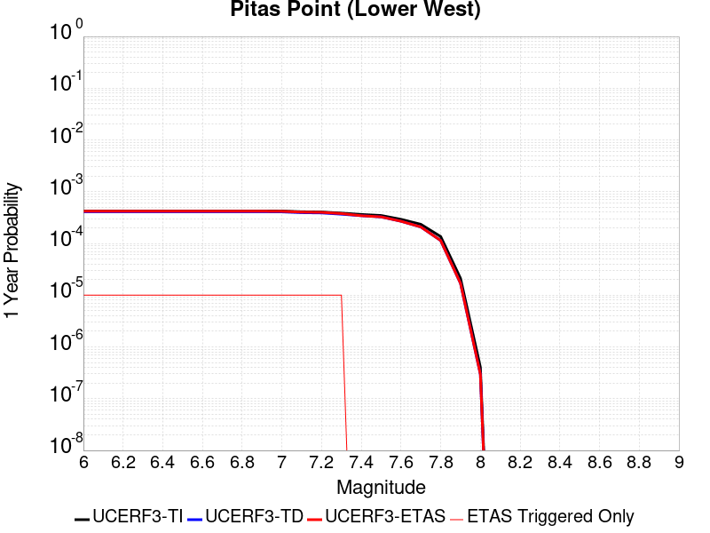 |  |

| Magnitude | 1 wk TI Prob | 1 wk TD Prob | 1 wk ETAS Prob | 1 wk ETAS/TD Gain | 1 wk ETAS Triggered Only | 1 mo TI Prob | 1 mo TD Prob | 1 mo ETAS Prob | 1 mo ETAS/TD Gain | 1 mo ETAS Triggered Only | 1 yr TI Prob | 1 yr TD Prob | 1 yr ETAS Prob | 1 yr ETAS/TD Gain | 1 yr ETAS Triggered Only | 10 yr TI Prob | 10 yr TD Prob | 10 yr ETAS Prob | 10 yr ETAS/TD Gain | 10 yr ETAS Triggered Only |
|-----|-----|-----|-----|-----|-----|-----|-----|-----|-----|-----|-----|-----|-----|-----|-----|-----|-----|-----|-----|-----|
| 6.0 | 8.151497E-6 | 7.856256E-6 | 7.856256E-6 | 1.0 | 0.0 | 3.493452E-5 | 3.366924E-5 | 3.366924E-5 | 1.0 | 0.0 | 4.252448E-4 | 4.0984663E-4 | 4.1984252E-4 | 1.0243894 | 1.0E-5 | 0.0042443196 | 0.004090988 | 0.004100947 | 1.0024344 | 1.0E-5 |
| 6.1 | 8.151497E-6 | 7.856256E-6 | 7.856256E-6 | 1.0 | 0.0 | 3.493452E-5 | 3.366924E-5 | 3.366924E-5 | 1.0 | 0.0 | 4.252448E-4 | 4.0984663E-4 | 4.1984252E-4 | 1.0243894 | 1.0E-5 | 0.0042443196 | 0.004090988 | 0.004100947 | 1.0024344 | 1.0E-5 |
| 6.2 | 8.151497E-6 | 7.856256E-6 | 7.856256E-6 | 1.0 | 0.0 | 3.493452E-5 | 3.366924E-5 | 3.366924E-5 | 1.0 | 0.0 | 4.252448E-4 | 4.0984663E-4 | 4.1984252E-4 | 1.0243894 | 1.0E-5 | 0.0042443196 | 0.004090988 | 0.004100947 | 1.0024344 | 1.0E-5 |
| 6.3 | 8.151497E-6 | 7.856256E-6 | 7.856256E-6 | 1.0 | 0.0 | 3.493452E-5 | 3.366924E-5 | 3.366924E-5 | 1.0 | 0.0 | 4.252448E-4 | 4.0984663E-4 | 4.1984252E-4 | 1.0243894 | 1.0E-5 | 0.0042443196 | 0.004090988 | 0.004100947 | 1.0024344 | 1.0E-5 |
| 6.4 | 8.151497E-6 | 7.856256E-6 | 7.856256E-6 | 1.0 | 0.0 | 3.493452E-5 | 3.366924E-5 | 3.366924E-5 | 1.0 | 0.0 | 4.252448E-4 | 4.0984663E-4 | 4.1984252E-4 | 1.0243894 | 1.0E-5 | 0.0042443196 | 0.004090988 | 0.004100947 | 1.0024344 | 1.0E-5 |
| 6.5 | 8.151497E-6 | 7.856256E-6 | 7.856256E-6 | 1.0 | 0.0 | 3.493452E-5 | 3.366924E-5 | 3.366924E-5 | 1.0 | 0.0 | 4.252448E-4 | 4.0984663E-4 | 4.1984252E-4 | 1.0243894 | 1.0E-5 | 0.0042443196 | 0.004090988 | 0.004100947 | 1.0024344 | 1.0E-5 |
| 6.6 | 8.151497E-6 | 7.856256E-6 | 7.856256E-6 | 1.0 | 0.0 | 3.493452E-5 | 3.366924E-5 | 3.366924E-5 | 1.0 | 0.0 | 4.252448E-4 | 4.0984663E-4 | 4.1984252E-4 | 1.0243894 | 1.0E-5 | 0.0042443196 | 0.004090988 | 0.004100947 | 1.0024344 | 1.0E-5 |
| 6.7 | 8.151497E-6 | 7.856256E-6 | 7.856256E-6 | 1.0 | 0.0 | 3.493452E-5 | 3.366924E-5 | 3.366924E-5 | 1.0 | 0.0 | 4.252448E-4 | 4.0984663E-4 | 4.1984252E-4 | 1.0243894 | 1.0E-5 | 0.0042443196 | 0.004090988 | 0.004100947 | 1.0024344 | 1.0E-5 |
| 6.8 | 8.151497E-6 | 7.856256E-6 | 7.856256E-6 | 1.0 | 0.0 | 3.493452E-5 | 3.366924E-5 | 3.366924E-5 | 1.0 | 0.0 | 4.252448E-4 | 4.0984663E-4 | 4.1984252E-4 | 1.0243894 | 1.0E-5 | 0.0042443196 | 0.004090988 | 0.004100947 | 1.0024344 | 1.0E-5 |
| 6.9 | 8.151497E-6 | 7.856256E-6 | 7.856256E-6 | 1.0 | 0.0 | 3.493452E-5 | 3.366924E-5 | 3.366924E-5 | 1.0 | 0.0 | 4.252448E-4 | 4.0984663E-4 | 4.1984252E-4 | 1.0243894 | 1.0E-5 | 0.0042443196 | 0.004090988 | 0.004100947 | 1.0024344 | 1.0E-5 |
| 7.0 | 8.103535E-6 | 7.805684E-6 | 7.805684E-6 | 1.0 | 0.0 | 3.4728975E-5 | 3.3452503E-5 | 3.3452503E-5 | 1.0 | 0.0 | 4.2274324E-4 | 4.0720886E-4 | 4.1720478E-4 | 1.0245475 | 1.0E-5 | 0.0042193993 | 0.004064707 | 0.0040746666 | 1.0024502 | 1.0E-5 |
| 7.1 | 7.853298E-6 | 7.5413604E-6 | 7.5413604E-6 | 1.0 | 0.0 | 3.3656554E-5 | 3.231972E-5 | 3.231972E-5 | 1.0 | 0.0 | 4.096915E-4 | 3.9342226E-4 | 4.0341832E-4 | 1.025408 | 1.0E-5 | 0.00408937 | 0.0039273337 | 0.0039372942 | 1.0025363 | 1.0E-5 |
| 7.2 | 7.771102E-6 | 7.453637E-6 | 7.453637E-6 | 1.0 | 0.0 | 3.33043E-5 | 3.194377E-5 | 3.194377E-5 | 1.0 | 0.0 | 4.0540437E-4 | 3.888467E-4 | 3.9884282E-4 | 1.0257071 | 1.0E-5 | 0.0040466557 | 0.003881739 | 0.0038917002 | 1.0025662 | 1.0E-5 |
| 7.3 | 7.3945344E-6 | 7.0497144E-6 | 7.0497144E-6 | 1.0 | 0.0 | 3.1690477E-5 | 3.0212716E-5 | 3.0212716E-5 | 1.0 | 0.0 | 3.8576324E-4 | 3.6777835E-4 | 3.7777468E-4 | 1.0271803 | 1.0E-5 | 0.0038509427 | 0.0036717646 | 0.003681728 | 1.0027134 | 1.0E-5 |
| 7.4 | 6.964645E-6 | 6.590534E-6 | 6.590534E-6 | 1.0 | 0.0 | 2.9848137E-5 | 2.8244844E-5 | 2.8244844E-5 | 1.0 | 0.0 | 3.6334046E-4 | 3.438272E-4 | 3.438272E-4 | 1.0 | 0.0 | 0.0036274698 | 0.003433006 | 0.003433006 | 1.0 | 0.0 |
| 7.5 | 6.6525035E-6 | 6.259554E-6 | 6.259554E-6 | 1.0 | 0.0 | 2.851042E-5 | 2.6826388E-5 | 2.6826388E-5 | 1.0 | 0.0 | 3.4705905E-4 | 3.2656282E-4 | 3.2656282E-4 | 1.0 | 0.0 | 0.0034651754 | 0.0032608807 | 0.0032608807 | 1.0 | 0.0 |
| 7.6 | 5.613338E-6 | 5.151711E-6 | 5.151711E-6 | 1.0 | 0.0 | 2.405694E-5 | 2.2078577E-5 | 2.2078577E-5 | 1.0 | 0.0 | 2.928539E-4 | 2.6877382E-4 | 2.6877382E-4 | 1.0 | 0.0 | 0.0029246826 | 0.002684519 | 0.002684519 | 1.0 | 0.0 |
| 7.7 | 4.494704E-6 | 3.997151E-6 | 3.997151E-6 | 1.0 | 0.0 | 1.9262876E-5 | 1.7130536E-5 | 1.7130536E-5 | 1.0 | 0.0 | 2.3450027E-4 | 2.0854454E-4 | 2.0854454E-4 | 1.0 | 0.0 | 0.0023425296 | 0.0020835125 | 0.0020835125 | 1.0 | 0.0 |
| 7.8 | 2.6075882E-6 | 2.1837632E-6 | 2.1837632E-6 | 1.0 | 0.0 | 1.117533E-5 | 9.358952E-6 | 9.358952E-6 | 1.0 | 0.0 | 1.3605114E-4 | 1.1393933E-4 | 1.1393933E-4 | 1.0 | 0.0 | 0.0013596788 | 0.0011388138 | 0.0011388138 | 1.0 | 0.0 |
| 7.9 | 4.045984E-7 | 3.2425706E-7 | 3.2425706E-7 | 1.0 | 0.0 | 1.733992E-6 | 1.3896723E-6 | 1.3896723E-6 | 1.0 | 0.0 | 2.1111147E-5 | 1.6919132E-5 | 1.6919132E-5 | 1.0 | 0.0 | 2.1109142E-4 | 1.6917875E-4 | 1.6917875E-4 | 1.0 | 0.0 |
| 8.0 | 7.791402E-9 | 5.6838902E-9 | 5.6838902E-9 | 1.0 | 0.0 | 3.3391725E-8 | 2.435953E-8 | 2.435953E-8 | 1.0 | 0.0 | 4.0654416E-7 | 2.9657724E-7 | 2.9657724E-7 | 1.0 | 0.0 | 4.065434E-6 | 2.9657706E-6 | 2.9657706E-6 | 1.0 | 0.0 |

## Hunting Creek - Berryessa 2011 CFM
*[(top)](#table-of-contents)*

| 1 Week | 1 Month | 1 Year | 10 Year |
|-----|-----|-----|-----|
|  | 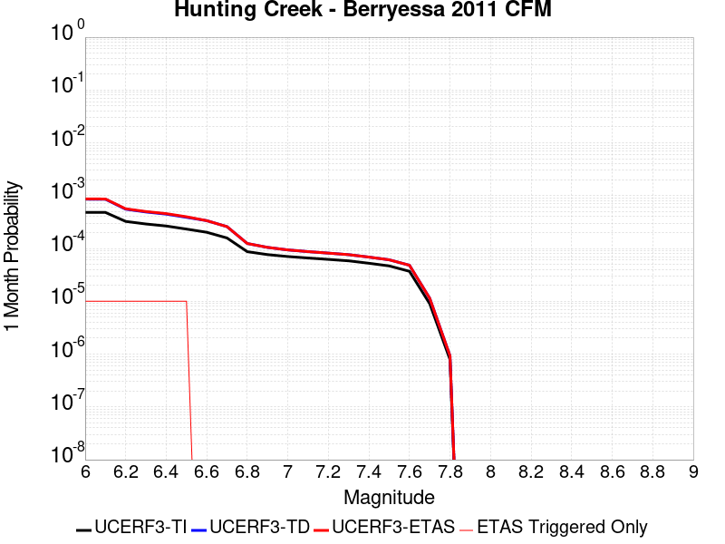 |  | 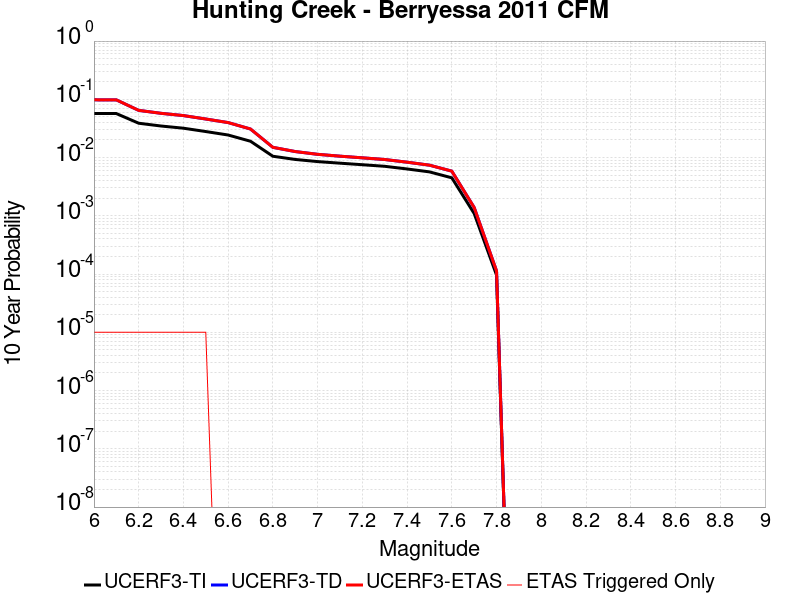 |

| Magnitude | 1 wk TI Prob | 1 wk TD Prob | 1 wk ETAS Prob | 1 wk ETAS/TD Gain | 1 wk ETAS Triggered Only | 1 mo TI Prob | 1 mo TD Prob | 1 mo ETAS Prob | 1 mo ETAS/TD Gain | 1 mo ETAS Triggered Only | 1 yr TI Prob | 1 yr TD Prob | 1 yr ETAS Prob | 1 yr ETAS/TD Gain | 1 yr ETAS Triggered Only | 10 yr TI Prob | 10 yr TD Prob | 10 yr ETAS Prob | 10 yr ETAS/TD Gain | 10 yr ETAS Triggered Only |
|-----|-----|-----|-----|-----|-----|-----|-----|-----|-----|-----|-----|-----|-----|-----|-----|-----|-----|-----|-----|-----|
| 6.0 | 1.1270982E-4 | 2.0017193E-4 | 2.0017193E-4 | 1.0 | 0.0 | 4.8295266E-4 | 8.576358E-4 | 8.676272E-4 | 1.01165 | 1.0E-5 | 0.0058641075 | 0.0103892675 | 0.010399164 | 1.0009525 | 1.0E-5 | 0.057117578 | 0.09806316 | 0.098072186 | 1.000092 | 1.0E-5 |
| 6.1 | 1.1239393E-4 | 1.9965315E-4 | 1.9965315E-4 | 1.0 | 0.0 | 4.8159933E-4 | 8.554141E-4 | 8.6540554E-4 | 1.0116802 | 1.0E-5 | 0.0058477195 | 0.0103624975 | 0.010372394 | 1.000955 | 1.0E-5 | 0.056962132 | 0.09782156 | 0.097830586 | 1.0000923 | 1.0E-5 |
| 6.2 | 7.596265E-5 | 1.293685E-4 | 1.293685E-4 | 1.0 | 0.0 | 3.2551357E-4 | 5.543238E-4 | 5.6431827E-4 | 1.01803 | 1.0E-5 | 0.0039559277 | 0.0067226784 | 0.006732611 | 1.0014775 | 1.0E-5 | 0.038862433 | 0.06460836 | 0.064617716 | 1.0001447 | 1.0E-5 |
| 6.3 | 6.78794E-5 | 1.1454929E-4 | 1.1454929E-4 | 1.0 | 0.0 | 2.9087928E-4 | 4.908369E-4 | 5.00832E-4 | 1.0203633 | 1.0E-5 | 0.003535705 | 0.005954001 | 0.0059639416 | 1.0016695 | 1.0E-5 | 0.034799766 | 0.057480484 | 0.05748991 | 1.0001639 | 1.0E-5 |
| 6.4 | 6.2165134E-5 | 1.044152E-4 | 1.044152E-4 | 1.0 | 0.0 | 2.6639478E-4 | 4.4742055E-4 | 4.5741606E-4 | 1.0223403 | 1.0E-5 | 0.0032385332 | 0.005428751 | 0.0054386966 | 1.001832 | 1.0E-5 | 0.03191742 | 0.052564554 | 0.052574027 | 1.0001802 | 1.0E-5 |
| 6.5 | 5.4368087E-5 | 9.075505E-5 | 9.075505E-5 | 1.0 | 0.0 | 2.3298527E-4 | 3.888955E-4 | 3.9889163E-4 | 1.0257039 | 1.0E-5 | 0.0028329059 | 0.0047209477 | 0.0047309003 | 1.0021082 | 1.0E-5 | 0.027970633 | 0.045892548 | 0.04590209 | 1.0002079 | 1.0E-5 |
| 6.6 | 4.729947E-5 | 7.850971E-5 | 7.850971E-5 | 1.0 | 0.0 | 2.0269625E-4 | 3.3642983E-4 | 3.3642983E-4 | 1.0 | 0.0 | 0.002465034 | 0.0040859054 | 0.0040859054 | 1.0 | 0.0 | 0.02437869 | 0.03986249 | 0.03986249 | 1.0 | 0.0 |
| 6.7 | 3.6875328E-5 | 6.0476068E-5 | 6.0476068E-5 | 1.0 | 0.0 | 1.5802756E-4 | 2.591599E-4 | 2.591599E-4 | 1.0 | 0.0 | 0.0019222875 | 0.0031490147 | 0.0031490147 | 1.0 | 0.0 | 0.019057442 | 0.030901074 | 0.030901074 | 1.0 | 0.0 |
| 6.8 | 2.0292036E-5 | 2.8981945E-5 | 2.8981945E-5 | 1.0 | 0.0 | 8.6962966E-5 | 1.2420242E-4 | 1.2420242E-4 | 1.0 | 0.0 | 0.0010582599 | 0.0015110966 | 0.0015110966 | 1.0 | 0.0 | 0.010532344 | 0.014981373 | 0.014981373 | 1.0 | 0.0 |
| 6.9 | 1.7871042E-5 | 2.4477093E-5 | 2.4477093E-5 | 1.0 | 0.0 | 7.658793E-5 | 1.0489757E-4 | 1.0489757E-4 | 1.0 | 0.0 | 9.320591E-4 | 0.0012763841 | 0.0012763841 | 1.0 | 0.0 | 0.009281595 | 0.012682272 | 0.012682272 | 1.0 | 0.0 |
| 7.0 | 1.6415532E-5 | 2.191083E-5 | 2.191083E-5 | 1.0 | 0.0 | 7.035038E-5 | 9.390019E-5 | 9.390019E-5 | 1.0 | 0.0 | 8.561793E-4 | 0.0011426386 | 0.0011426386 | 1.0 | 0.0 | 0.008528882 | 0.011366857 | 0.011366857 | 1.0 | 0.0 |
| 7.1 | 1.5409885E-5 | 2.0350692E-5 | 2.0350692E-5 | 1.0 | 0.0 | 6.6040695E-5 | 8.721436E-5 | 8.721436E-5 | 1.0 | 0.0 | 8.0374884E-4 | 0.0010613204 | 0.0010613204 | 1.0 | 0.0 | 0.00800848 | 0.010562838 | 0.010562838 | 1.0 | 0.0 |
| 7.2 | 1.4497423E-5 | 1.905907E-5 | 1.905907E-5 | 1.0 | 0.0 | 6.213033E-5 | 8.1679194E-5 | 8.1679194E-5 | 1.0 | 0.0 | 7.5617427E-4 | 9.939936E-4 | 9.939936E-4 | 1.0 | 0.0 | 0.0075360634 | 0.00989605 | 0.00989605 | 1.0 | 0.0 |
| 7.3 | 1.3615175E-5 | 1.7830122E-5 | 1.7830122E-5 | 1.0 | 0.0 | 5.8349444E-5 | 7.641259E-5 | 7.641259E-5 | 1.0 | 0.0 | 7.101729E-4 | 9.299291E-4 | 9.299291E-4 | 1.0 | 0.0 | 0.0070790765 | 0.009260887 | 0.009260887 | 1.0 | 0.0 |
| 7.4 | 1.2252825E-5 | 1.60299E-5 | 1.60299E-5 | 1.0 | 0.0 | 5.251105E-5 | 6.869778E-5 | 6.869778E-5 | 1.0 | 0.0 | 6.391345E-4 | 8.3607726E-4 | 8.3607726E-4 | 1.0 | 0.0 | 0.0063729943 | 0.00832976 | 0.00832976 | 1.0 | 0.0 |
| 7.5 | 1.0913301E-5 | 1.42444305E-5 | 1.42444305E-5 | 1.0 | 0.0 | 4.6770452E-5 | 6.104615E-5 | 6.104615E-5 | 1.0 | 0.0 | 5.6928146E-4 | 7.429861E-4 | 7.429861E-4 | 1.0 | 0.0 | 0.0056782532 | 0.0074053956 | 0.0074053956 | 1.0 | 0.0 |
| 7.6 | 8.623192E-6 | 1.123731E-5 | 1.123731E-5 | 1.0 | 0.0 | 3.6956015E-5 | 4.8159025E-5 | 4.8159025E-5 | 1.0 | 0.0 | 4.4984656E-4 | 5.8618095E-4 | 5.8618095E-4 | 1.0 | 0.0 | 0.00448937 | 0.0058466624 | 0.0058466624 | 1.0 | 0.0 |
| 7.7 | 2.0993634E-6 | 2.6632406E-6 | 2.6632406E-6 | 1.0 | 0.0 | 8.997241E-6 | 1.1413839E-5 | 1.1413839E-5 | 1.0 | 0.0 | 1.09535904E-4 | 1.389547E-4 | 1.389547E-4 | 1.0 | 0.0 | 0.0010948193 | 0.0013886847 | 0.0013886847 | 1.0 | 0.0 |
| 7.8 | 1.8428308E-7 | 2.1677025E-7 | 2.1677025E-7 | 1.0 | 0.0 | 7.897844E-7 | 9.29015E-7 | 9.29015E-7 | 1.0 | 0.0 | 9.615583E-6 | 1.1310703E-5 | 1.1310703E-5 | 1.0 | 0.0 | 9.615166E-5 | 1.13099886E-4 | 1.13099886E-4 | 1.0 | 0.0 |

## Rinconada 2011 CFM
*[(top)](#table-of-contents)*

| 1 Week | 1 Month | 1 Year | 10 Year |
|-----|-----|-----|-----|
|  |  |  |  |

| Magnitude | 1 wk TI Prob | 1 wk TD Prob | 1 wk ETAS Prob | 1 wk ETAS/TD Gain | 1 wk ETAS Triggered Only | 1 mo TI Prob | 1 mo TD Prob | 1 mo ETAS Prob | 1 mo ETAS/TD Gain | 1 mo ETAS Triggered Only | 1 yr TI Prob | 1 yr TD Prob | 1 yr ETAS Prob | 1 yr ETAS/TD Gain | 1 yr ETAS Triggered Only | 10 yr TI Prob | 10 yr TD Prob | 10 yr ETAS Prob | 10 yr ETAS/TD Gain | 10 yr ETAS Triggered Only |
|-----|-----|-----|-----|-----|-----|-----|-----|-----|-----|-----|-----|-----|-----|-----|-----|-----|-----|-----|-----|-----|
| 6.0 | 1.5752368E-5 | 1.6275219E-5 | 1.6275219E-5 | 1.0 | 0.0 | 6.75084E-5 | 6.974909E-5 | 6.974909E-5 | 1.0 | 0.0 | 8.2160486E-4 | 8.4886746E-4 | 8.4886746E-4 | 1.0 | 0.0 | 0.008185739 | 0.008456631 | 0.0084665455 | 1.0011725 | 1.0E-5 |
| 6.1 | 1.0966133E-5 | 1.1323374E-5 | 1.1323374E-5 | 1.0 | 0.0 | 4.6996865E-5 | 4.8527843E-5 | 4.8527843E-5 | 1.0 | 0.0 | 5.720366E-4 | 5.9066707E-4 | 5.9066707E-4 | 1.0 | 0.0 | 0.0057056635 | 0.0058910674 | 0.0059010084 | 1.0016875 | 1.0E-5 |
| 6.2 | 1.0966133E-5 | 1.1323374E-5 | 1.1323374E-5 | 1.0 | 0.0 | 4.6996865E-5 | 4.8527843E-5 | 4.8527843E-5 | 1.0 | 0.0 | 5.720366E-4 | 5.9066707E-4 | 5.9066707E-4 | 1.0 | 0.0 | 0.0057056635 | 0.0058910674 | 0.0059010084 | 1.0016875 | 1.0E-5 |
| 6.3 | 8.926149E-6 | 9.2130485E-6 | 9.2130485E-6 | 1.0 | 0.0 | 3.8254362E-5 | 3.9483897E-5 | 3.9483897E-5 | 1.0 | 0.0 | 4.6564735E-4 | 4.8061073E-4 | 4.8061073E-4 | 1.0 | 0.0 | 0.0046467283 | 0.004795758 | 0.00480571 | 1.0020752 | 1.0E-5 |
| 6.4 | 7.676955E-6 | 7.9204265E-6 | 7.9204265E-6 | 1.0 | 0.0 | 3.290082E-5 | 3.394424E-5 | 3.394424E-5 | 1.0 | 0.0 | 4.0049385E-4 | 4.1319296E-4 | 4.1319296E-4 | 1.0 | 0.0 | 0.0039977287 | 0.0041242735 | 0.004134232 | 1.0024147 | 1.0E-5 |
| 6.5 | 6.1671026E-6 | 6.3591406E-6 | 6.3591406E-6 | 1.0 | 0.0 | 2.6430173E-5 | 2.7253176E-5 | 2.7253176E-5 | 1.0 | 0.0 | 3.2173982E-4 | 3.3175698E-4 | 3.3175698E-4 | 1.0 | 0.0 | 0.003212744 | 0.0033126292 | 0.003322596 | 1.0030087 | 1.0E-5 |
| 6.6 | 5.553456E-6 | 5.7249786E-6 | 5.7249786E-6 | 1.0 | 0.0 | 2.3800309E-5 | 2.4535393E-5 | 2.4535393E-5 | 1.0 | 0.0 | 2.897302E-4 | 2.986775E-4 | 2.986775E-4 | 1.0 | 0.0 | 0.0028935277 | 0.0029827696 | 0.0029927397 | 1.0033426 | 1.0E-5 |
| 6.7 | 4.787857E-6 | 4.933451E-6 | 4.933451E-6 | 1.0 | 0.0 | 2.0519226E-5 | 2.1143189E-5 | 2.1143189E-5 | 1.0 | 0.0 | 2.4979294E-4 | 2.5738796E-4 | 2.5738796E-4 | 1.0 | 0.0 | 0.0024951235 | 0.0025709043 | 0.0025808786 | 1.0038797 | 1.0E-5 |
| 6.8 | 3.9955166E-6 | 4.113591E-6 | 4.113591E-6 | 1.0 | 0.0 | 1.7123532E-5 | 1.7629556E-5 | 1.7629556E-5 | 1.0 | 0.0 | 2.0845905E-4 | 2.1461873E-4 | 2.1461873E-4 | 1.0 | 0.0 | 0.002082636 | 0.0021441183 | 0.0021540967 | 1.0046539 | 1.0E-5 |
| 6.9 | 3.4250072E-6 | 3.5225414E-6 | 3.5225414E-6 | 1.0 | 0.0 | 1.46785205E-5 | 1.5096518E-5 | 1.5096518E-5 | 1.0 | 0.0 | 1.7869633E-4 | 1.8378462E-4 | 1.8378462E-4 | 1.0 | 0.0 | 0.001785527 | 0.0018363289 | 0.0018463104 | 1.0054357 | 1.0E-5 |
| 7.0 | 2.7712713E-6 | 2.8467737E-6 | 2.8467737E-6 | 1.0 | 0.0 | 1.1876823E-5 | 1.2200402E-5 | 1.2200402E-5 | 1.0 | 0.0 | 1.4459073E-4 | 1.4852978E-4 | 1.4852978E-4 | 1.0 | 0.0 | 0.0014449668 | 0.0014843066 | 0.0014843066 | 1.0 | 0.0 |
| 7.1 | 2.227358E-6 | 2.285756E-6 | 2.285756E-6 | 1.0 | 0.0 | 9.545785E-6 | 9.79606E-6 | 9.79606E-6 | 1.0 | 0.0 | 1.16213734E-4 | 1.1926051E-4 | 1.1926051E-4 | 1.0 | 0.0 | 0.0011615298 | 0.0011919661 | 0.0011919661 | 1.0 | 0.0 |
| 7.2 | 1.581796E-6 | 1.6209401E-6 | 1.6209401E-6 | 1.0 | 0.0 | 6.779108E-6 | 6.946868E-6 | 6.946868E-6 | 1.0 | 0.0 | 8.253252E-5 | 8.457484E-5 | 8.457484E-5 | 1.0 | 0.0 | 8.250187E-4 | 8.4542704E-4 | 8.4542704E-4 | 1.0 | 0.0 |
| 7.3 | 1.0306567E-6 | 1.0546722E-6 | 1.0546722E-6 | 1.0 | 0.0 | 4.4170924E-6 | 4.520016E-6 | 4.520016E-6 | 1.0 | 0.0 | 5.3776774E-5 | 5.5029803E-5 | 5.5029803E-5 | 1.0 | 0.0 | 5.376376E-4 | 5.5016205E-4 | 5.5016205E-4 | 1.0 | 0.0 |
| 7.4 | 6.535541E-7 | 6.6828983E-7 | 6.6828983E-7 | 1.0 | 0.0 | 2.800943E-6 | 2.8640961E-6 | 2.8640961E-6 | 1.0 | 0.0 | 3.4100947E-5 | 3.4869812E-5 | 3.4869812E-5 | 1.0 | 0.0 | 3.4095717E-4 | 3.4864355E-4 | 3.4864355E-4 | 1.0 | 0.0 |
| 7.5 | 3.2656962E-7 | 3.3317477E-7 | 3.3317477E-7 | 1.0 | 0.0 | 1.3995833E-6 | 1.4278911E-6 | 1.4278911E-6 | 1.0 | 0.0 | 1.7039794E-5 | 1.7384436E-5 | 1.7384436E-5 | 1.0 | 0.0 | 1.7038487E-4 | 1.7383079E-4 | 1.7383079E-4 | 1.0 | 0.0 |
| 7.6 | 9.754343E-8 | 9.8212155E-8 | 9.8212155E-8 | 1.0 | 0.0 | 4.180432E-7 | 4.2090915E-7 | 4.2090915E-7 | 1.0 | 0.0 | 5.089664E-6 | 5.124557E-6 | 5.124557E-6 | 1.0 | 0.0 | 5.0895473E-5 | 5.1244395E-5 | 5.1244395E-5 | 1.0 | 0.0 |
| 7.7 | 6.0001453E-9 | 5.849224E-9 | 5.849224E-9 | 1.0 | 0.0 | 2.5714908E-8 | 2.5068102E-8 | 2.5068102E-8 | 1.0 | 0.0 | 3.1307894E-7 | 3.052041E-7 | 3.052041E-7 | 1.0 | 0.0 | 3.1307852E-6 | 3.052037E-6 | 3.052037E-6 | 1.0 | 0.0 |
| 7.8 | 7.400003E-11 | 7.465506E-11 | 7.465506E-11 | 1.0 | 0.0 | 3.171432E-10 | 3.199503E-10 | 3.199503E-10 | 1.0 | 0.0 | 3.861218E-9 | 3.895395E-9 | 3.895395E-9 | 1.0 | 0.0 | 3.861218E-8 | 3.895395E-8 | 3.895395E-8 | 1.0 | 0.0 |

## Ortigalita (North)
*[(top)](#table-of-contents)*

| 1 Week | 1 Month | 1 Year | 10 Year |
|-----|-----|-----|-----|
|  |  |  |  |

| Magnitude | 1 wk TI Prob | 1 wk TD Prob | 1 wk ETAS Prob | 1 wk ETAS/TD Gain | 1 wk ETAS Triggered Only | 1 mo TI Prob | 1 mo TD Prob | 1 mo ETAS Prob | 1 mo ETAS/TD Gain | 1 mo ETAS Triggered Only | 1 yr TI Prob | 1 yr TD Prob | 1 yr ETAS Prob | 1 yr ETAS/TD Gain | 1 yr ETAS Triggered Only | 10 yr TI Prob | 10 yr TD Prob | 10 yr ETAS Prob | 10 yr ETAS/TD Gain | 10 yr ETAS Triggered Only |
|-----|-----|-----|-----|-----|-----|-----|-----|-----|-----|-----|-----|-----|-----|-----|-----|-----|-----|-----|-----|-----|
| 6.0 | 7.711876E-5 | 1.05101804E-4 | 1.05101804E-4 | 1.0 | 0.0 | 3.3046713E-4 | 4.503694E-4 | 4.503694E-4 | 1.0 | 0.0 | 0.004016016 | 0.0054695867 | 0.0054795323 | 1.0018183 | 1.0E-5 | 0.039442103 | 0.053470504 | 0.05347997 | 1.000177 | 1.0E-5 |
| 6.1 | 4.607858E-5 | 6.025696E-5 | 6.025696E-5 | 1.0 | 0.0 | 1.9746469E-4 | 2.5822135E-4 | 2.5822135E-4 | 1.0 | 0.0 | 0.0024014818 | 0.0031396213 | 0.00314959 | 1.0031751 | 1.0E-5 | 0.023756953 | 0.030983454 | 0.030993143 | 1.0003128 | 1.0E-5 |
| 6.2 | 4.607858E-5 | 6.025696E-5 | 6.025696E-5 | 1.0 | 0.0 | 1.9746469E-4 | 2.5822135E-4 | 2.5822135E-4 | 1.0 | 0.0 | 0.0024014818 | 0.0031396213 | 0.00314959 | 1.0031751 | 1.0E-5 | 0.023756953 | 0.030983454 | 0.030993143 | 1.0003128 | 1.0E-5 |
| 6.3 | 3.327423E-5 | 4.248639E-5 | 4.248639E-5 | 1.0 | 0.0 | 1.4259605E-4 | 1.8207356E-4 | 1.8207356E-4 | 1.0 | 0.0 | 0.0017347244 | 0.002214776 | 0.002214776 | 1.0 | 0.0 | 0.017212452 | 0.021951197 | 0.021951197 | 1.0 | 0.0 |
| 6.4 | 2.7732503E-5 | 3.5007408E-5 | 3.5007408E-5 | 1.0 | 0.0 | 1.1884817E-4 | 1.5002463E-4 | 1.5002463E-4 | 1.0 | 0.0 | 0.001446016 | 0.001825261 | 0.001825261 | 1.0 | 0.0 | 0.014366428 | 0.018125651 | 0.018125651 | 1.0 | 0.0 |
| 6.5 | 2.7689714E-5 | 3.4957215E-5 | 3.4957215E-5 | 1.0 | 0.0 | 1.186648E-4 | 1.4980954E-4 | 1.4980954E-4 | 1.0 | 0.0 | 0.0014437864 | 0.0018226467 | 0.0018226467 | 1.0 | 0.0 | 0.014344421 | 0.018099936 | 0.018099936 | 1.0 | 0.0 |
| 6.6 | 2.2976905E-5 | 2.8725199E-5 | 2.8725199E-5 | 1.0 | 0.0 | 9.846873E-5 | 1.2310361E-4 | 1.2310361E-4 | 1.0 | 0.0 | 0.0011981975 | 0.0014979909 | 0.0014979909 | 1.0 | 0.0 | 0.011917574 | 0.014902224 | 0.014902224 | 1.0 | 0.0 |
| 6.7 | 1.9871539E-5 | 2.4910485E-5 | 2.4910485E-5 | 1.0 | 0.0 | 8.516096E-5 | 1.06756255E-4 | 1.06756255E-4 | 1.0 | 0.0 | 0.0010363415 | 0.0012992312 | 0.0012992312 | 1.0 | 0.0 | 0.010315218 | 0.012940042 | 0.012940042 | 1.0 | 0.0 |
| 6.8 | 6.5640475E-6 | 7.606615E-6 | 7.606615E-6 | 1.0 | 0.0 | 2.813133E-5 | 3.2599386E-5 | 3.2599386E-5 | 1.0 | 0.0 | 3.424451E-4 | 3.968281E-4 | 3.968281E-4 | 1.0 | 0.0 | 0.0034191788 | 0.0039614826 | 0.0039614826 | 1.0 | 0.0 |
| 6.9 | 5.6219683E-6 | 6.502784E-6 | 6.502784E-6 | 1.0 | 0.0 | 2.4093928E-5 | 2.7868791E-5 | 2.7868791E-5 | 1.0 | 0.0 | 2.933041E-4 | 3.3925226E-4 | 3.3925226E-4 | 1.0 | 0.0 | 0.0029291727 | 0.0033876009 | 0.0033876009 | 1.0 | 0.0 |
| 7.0 | 3.875591E-6 | 4.48541E-6 | 4.48541E-6 | 1.0 | 0.0 | 1.6609569E-5 | 1.9223056E-5 | 1.9223056E-5 | 1.0 | 0.0 | 2.0220275E-4 | 2.3401769E-4 | 2.3401769E-4 | 1.0 | 0.0 | 0.0020201886 | 0.002337921 | 0.002337921 | 1.0 | 0.0 |
| 7.1 | 1.6017933E-6 | 1.8573169E-6 | 1.8573169E-6 | 1.0 | 0.0 | 6.8648105E-6 | 7.959911E-6 | 7.959911E-6 | 1.0 | 0.0 | 8.357586E-5 | 9.6908676E-5 | 9.6908676E-5 | 1.0 | 0.0 | 8.3544437E-4 | 9.687689E-4 | 9.687689E-4 | 1.0 | 0.0 |

