# Parent Section Magnitude-Probability Distributions

Only fault sections with at least one triggered aftershock are plotted. Sections are sorted by total supraseismogenic trigger rate (decreasing)

## Table Of Contents

* [Garlock (Central)](#garlock-central)
* [Tank Canyon](#tank-canyon)
* [Little Lake](#little-lake)
* [Airport Lake](#airport-lake)
* [Owl Lake](#owl-lake)
* [Panamint Valley](#panamint-valley)
* [Garlock (East)](#garlock-east)
* [Hunter Mountain-Saline Valley](#hunter-mountain-saline-valley)
* [Ash Hill](#ash-hill)
* [Blackwater](#blackwater)
* [Garlock (West)](#garlock-west)
* [McLean Lake](#mclean-lake)
* [Goldstone Lake](#goldstone-lake)
* [Gravel Hills-Harper Lk](#gravel-hills-harper-lk)
* [So Sierra Nevada](#so-sierra-nevada)
* [Coyote Canyon](#coyote-canyon)
* [San Andreas (Mojave S)](#san-andreas-mojave-s)
* [Towne Pass](#towne-pass)
* [Nelson Lake](#nelson-lake)
* [San Andreas (Mojave N)](#san-andreas-mojave-n)
* [Death Valley (So)](#death-valley-so)
* [Lenwood-Lockhart-Old Woman Springs](#lenwood-lockhart-old-woman-springs)
* [Bicycle Lake](#bicycle-lake)
* [San Andreas (San Bernardino N)](#san-andreas-san-bernardino-n)
* [Garlic Springs](#garlic-springs)
* [Paradise](#paradise)
* [Death Valley (Black Mtns Frontal)](#death-valley-black-mtns-frontal)
* [San Andreas (San Bernardino S)](#san-andreas-san-bernardino-s)
* [Coyote Lake](#coyote-lake)
* [Death Valley (No)](#death-valley-no)
* [Scodie Lineament](#scodie-lineament)
* [Helendale-So Lockhart](#helendale-so-lockhart)
* [Manix-Afton Hills](#manix-afton-hills)
* [Red Pass](#red-pass)
* [San Andreas (Parkfield)](#san-andreas-parkfield)
* [Baker](#baker)
* [Lake Isabella (Seismicity)](#lake-isabella-seismicity)
* [Death Valley (Fish Lake Valley)](#death-valley-fish-lake-valley)
* [Sierra Nevada  (No Extension)](#sierra-nevada--no-extension)
* [Elsinore (Glen Ivy) rev](#elsinore-glen-ivy-rev)
* [San Andreas (San Gorgonio Pass-Garnet HIll)](#san-andreas-san-gorgonio-pass-garnet-hill)
* [Santa Ynez (West)](#santa-ynez-west)
* [San Andreas (Big Bend)](#san-andreas-big-bend)
* [Ludlow](#ludlow)
* [White Wolf (Extension)](#white-wolf-extension)
* [Ventura-Pitas Point](#ventura-pitas-point)
* [White Mountains](#white-mountains)
* [San Andreas (Coachella) rev](#san-andreas-coachella-rev)
* [Calico-Hidalgo](#calico-hidalgo)
* [San Andreas (North Branch Mill Creek)](#san-andreas-north-branch-mill-creek)
* [Cady](#cady)
* [Independence rev 2011](#independence-rev-2011)
* [Big Pine (Central)](#big-pine-central)
* [Santa Cruz Catalina Ridge alt1](#santa-cruz-catalina-ridge-alt1)
* [San Jacinto (Stepovers Combined)](#san-jacinto-stepovers-combined)
* [San Jacinto (San Bernardino)](#san-jacinto-san-bernardino)
* [Great Valley 09 (Laguna Seca)](#great-valley-09-laguna-seca)
* [Dry Mountain](#dry-mountain)
* [San Jacinto (Anza) rev](#san-jacinto-anza-rev)
* [Oceanic - West Huasna](#oceanic---west-huasna)
* [Chino alt 1](#chino-alt-1)
* [Robinson Creek](#robinson-creek)
* [Blue Cut](#blue-cut)
* [Pinto Mtn](#pinto-mtn)
* [Mission Ridge-Arroyo Parida-Santa Ana](#mission-ridge-arroyo-parida-santa-ana)
* [Deep Springs](#deep-springs)
* [San Diego Trough north alt1](#san-diego-trough-north-alt1)
* [San Jacinto (Coyote Creek)](#san-jacinto-coyote-creek)
* [Lost Hills](#lost-hills)
* [Red Mountain](#red-mountain)
* [San Jacinto (San Jacinto Valley) rev](#san-jacinto-san-jacinto-valley-rev)
* [Pisgah-Bullion Mtn-Mesquite Lk](#pisgah-bullion-mtn-mesquite-lk)
* [San Andreas (Cholame) rev](#san-andreas-cholame-rev)
* [Tin Mountain](#tin-mountain)
* [Simi-Santa Rosa](#simi-santa-rosa)
* [Bartlett Springs 2011 CFM](#bartlett-springs-2011-cfm)
* [Quien Sabe 2011 CFM](#quien-sabe-2011-cfm)
* [Elmore Ranch](#elmore-ranch)
* [Santa Monica alt 1](#santa-monica-alt-1)
* [White Wolf](#white-wolf)
* [Cleghorn Lake](#cleghorn-lake)
* [San Jacinto (Superstition Mtn)](#san-jacinto-superstition-mtn)
* [Great Valley 05 Pittsburg - Kirby Hills alt1](#great-valley-05-pittsburg---kirby-hills-alt1)
* [Pine Mtn](#pine-mtn)
* [Santa Rosa Island](#santa-rosa-island)
* [Shoreline](#shoreline)
* [Channel Islands Thrust](#channel-islands-thrust)
* [Raymond](#raymond)
* [Bullion Mountains](#bullion-mountains)
* [Palos Verdes](#palos-verdes)
* [Elsinore (Coyote Mountains)](#elsinore-coyote-mountains)
* [Antelope Valley 2011](#antelope-valley-2011)
* [Elsinore (Stepovers Combined)](#elsinore-stepovers-combined)
* [Hollywood](#hollywood)
* [Earthquake Valley (So Extension)](#earthquake-valley-so-extension)
* [San Jose](#san-jose)
* [Trinidad (alt1)](#trinidad-alt1)
* [San Luis Range 2011 CFM](#san-luis-range-2011-cfm)
* [Pitas Point (Lower West)](#pitas-point-lower-west)
* [Kern Canyon (South Kern) 2011](#kern-canyon-south-kern-2011)
* [Santa Ynez River](#santa-ynez-river)
* [Rinconada 2011 CFM](#rinconada-2011-cfm)
* [Earthquake Valley](#earthquake-valley)
* [San Gabriel](#san-gabriel)
* [Whittier alt 1](#whittier-alt-1)
* [Sisar](#sisar)
* [Cucamonga](#cucamonga)
* [Big Pine (West)](#big-pine-west)
* [Eaton Roughs 2011 CFM](#eaton-roughs-2011-cfm)
* [San Luis Range - Oceano 2011 CFM](#san-luis-range---oceano-2011-cfm)
* [Earthquake Valley (No  Extension)](#earthquake-valley-no--extension)
* [San Diego Trough south](#san-diego-trough-south)
* [San Jacinto (Lytle Creek connector)](#san-jacinto-lytle-creek-connector)
* [Elsinore (Temecula) rev](#elsinore-temecula-rev)
* [Owens Valley](#owens-valley)
* [Kern Canyon (North Kern) 2011](#kern-canyon-north-kern-2011)
* [Hector Mine](#hector-mine)
* [San Andreas (Carrizo) rev](#san-andreas-carrizo-rev)
* [Calaveras (So) 2011 CFM](#calaveras-so-2011-cfm)
* [Carson Range (Genoa)](#carson-range-genoa)
* [Mission Creek](#mission-creek)
* [Great Valley 03a Dunnigan Hills](#great-valley-03a-dunnigan-hills)
* [San Andreas (Offshore) 2011 CFM](#san-andreas-offshore-2011-cfm)
* [McKinleyville (alt1)](#mckinleyville-alt1)
* [Camp Rock 2011](#camp-rock-2011)
* [Santa Ynez (East)](#santa-ynez-east)
* [Santa Cruz Island](#santa-cruz-island)
* [San Clemente](#san-clemente)
* [Los Osos 2011](#los-osos-2011)
* [Malibu Coast (Extension) alt 1](#malibu-coast-extension-alt-1)
* [Rose Canyon](#rose-canyon)
* [Oak Ridge (Onshore)](#oak-ridge-onshore)
* [Cleghorn Pass](#cleghorn-pass)

## Garlock (Central)
*[(top)](#table-of-contents)*

| 1 Week | 1 Month | 1 Year | 10 Year |
|-----|-----|-----|-----|
| 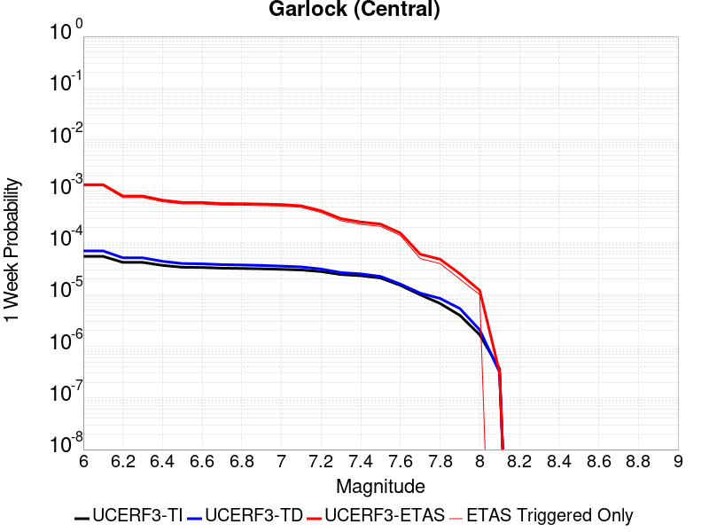 |  |  |  |

| Magnitude | 1 wk TI Prob | 1 wk TD Prob | 1 wk ETAS Prob | 1 wk ETAS/TD Gain | 1 wk ETAS Triggered Only | 1 mo TI Prob | 1 mo TD Prob | 1 mo ETAS Prob | 1 mo ETAS/TD Gain | 1 mo ETAS Triggered Only | 1 yr TI Prob | 1 yr TD Prob | 1 yr ETAS Prob | 1 yr ETAS/TD Gain | 1 yr ETAS Triggered Only | 10 yr TI Prob | 10 yr TD Prob | 10 yr ETAS Prob | 10 yr ETAS/TD Gain | 10 yr ETAS Triggered Only |
|-----|-----|-----|-----|-----|-----|-----|-----|-----|-----|-----|-----|-----|-----|-----|-----|-----|-----|-----|-----|-----|
| 6.0 | 5.5131142E-5 | 7.029038E-5 | 0.0013155673 | 18.716179 | 0.0012453644 | 2.3625491E-4 | 3.0121006E-4 | 0.005059836 | 16.798363 | 0.00476006 | 0.0028726095 | 0.0036611315 | 0.027401868 | 7.484535 | 0.023827974 | 0.028357591 | 0.036101688 | 0.08235728 | 2.2812586 | 0.047988046 |
| 6.1 | 5.5131142E-5 | 7.029038E-5 | 0.0013155673 | 18.716179 | 0.0012453644 | 2.3625491E-4 | 3.0121006E-4 | 0.005059836 | 16.798363 | 0.00476006 | 0.0028726095 | 0.0036611315 | 0.027401868 | 7.484535 | 0.023827974 | 0.028357591 | 0.036101688 | 0.08235728 | 2.2812586 | 0.047988046 |
| 6.2 | 4.216245E-5 | 5.170099E-5 | 8.265544E-4 | 15.9872055 | 7.7489344E-4 | 1.806837E-4 | 2.2155703E-4 | 0.0033204441 | 14.986859 | 0.0030995738 | 0.0021976046 | 0.0026941518 | 0.017763864 | 6.5934906 | 0.015110422 | 0.021759989 | 0.026709838 | 0.056096554 | 2.1002207 | 0.03019317 |
| 6.3 | 4.216245E-5 | 5.170099E-5 | 8.265544E-4 | 15.9872055 | 7.7489344E-4 | 1.806837E-4 | 2.2155703E-4 | 0.0033204441 | 14.986859 | 0.0030995738 | 0.0021976046 | 0.0026941518 | 0.017763864 | 6.5934906 | 0.015110422 | 0.021759989 | 0.026709838 | 0.056096554 | 2.1002207 | 0.03019317 |
| 6.4 | 3.6858168E-5 | 4.4148466E-5 | 7.359871E-4 | 16.670729 | 6.918692E-4 | 1.5795401E-4 | 1.8919414E-4 | 0.0028177996 | 14.893694 | 0.0026291027 | 0.0019213937 | 0.0023010303 | 0.014311853 | 6.2197585 | 0.012038523 | 0.019048655 | 0.022868259 | 0.046124287 | 2.0169566 | 0.023800299 |
| 6.5 | 3.39199E-5 | 4.005532E-5 | 6.488758E-4 | 16.19949 | 6.0884486E-4 | 1.453629E-4 | 1.716545E-4 | 0.002606616 | 15.185247 | 0.0024353794 | 0.0017683565 | 0.002087912 | 0.01291377 | 6.185016 | 0.010848508 | 0.017543508 | 0.020778878 | 0.041266263 | 1.9859717 | 0.020922123 |
| 6.6 | 3.3571985E-5 | 3.9509418E-5 | 6.483302E-4 | 16.409512 | 6.0884486E-4 | 1.4387199E-4 | 1.693152E-4 | 0.0026042822 | 15.381267 | 0.0024353794 | 0.0017502342 | 0.0020594853 | 0.012858033 | 6.2433233 | 0.010820834 | 0.017365133 | 0.02050015 | 0.04096626 | 1.9983394 | 0.02089445 |
| 6.7 | 3.2580007E-5 | 3.8125607E-5 | 6.192735E-4 | 16.242981 | 5.811701E-4 | 1.3962112E-4 | 1.6338535E-4 | 0.0024046751 | 14.7178135 | 0.002241656 | 0.0016985617 | 0.0019874233 | 0.012317215 | 6.1975803 | 0.010350362 | 0.016856372 | 0.019792678 | 0.03954114 | 1.9977661 | 0.02014723 |
| 6.8 | 3.2185937E-5 | 3.755269E-5 | 6.187009E-4 | 16.475542 | 5.811701E-4 | 1.3793244E-4 | 1.609303E-4 | 0.0024022255 | 14.927118 | 0.002241656 | 0.0016780337 | 0.001957587 | 0.012121964 | 6.192299 | 0.010184314 | 0.016654192 | 0.019499416 | 0.038846757 | 1.9922012 | 0.019732108 |
| 6.9 | 3.165394E-5 | 3.675708E-5 | 6.179058E-4 | 16.810526 | 5.811701E-4 | 1.3565269E-4 | 1.5752095E-4 | 0.0023988239 | 15.228602 | 0.002241656 | 0.0016503202 | 0.001916152 | 0.011887599 | 6.2038918 | 0.009990591 | 0.01638118 | 0.019091954 | 0.038094435 | 1.9953135 | 0.019372337 |
| 7.0 | 3.0903822E-5 | 3.566208E-5 | 6.1681145E-4 | 17.296003 | 5.811701E-4 | 1.3243823E-4 | 1.5282865E-4 | 0.0023664716 | 15.484476 | 0.0022139812 | 0.0016112428 | 0.0018591221 | 0.011582529 | 6.230107 | 0.009741518 | 0.015996104 | 0.018531 | 0.037082594 | 2.0011113 | 0.018901866 |
| 7.1 | 3.0069863E-5 | 3.442808E-5 | 5.8790436E-4 | 17.076303 | 5.534953E-4 | 1.2886449E-4 | 1.4754069E-4 | 0.0022781834 | 15.441051 | 0.002130957 | 0.0015677959 | 0.0017948489 | 0.0111045055 | 6.186875 | 0.0093263965 | 0.01556781 | 0.017898519 | 0.035728224 | 1.9961554 | 0.018154647 |
| 7.2 | 2.7957109E-5 | 3.1316675E-5 | 4.7409907E-4 | 15.138869 | 4.4279627E-4 | 1.1981068E-4 | 1.3420753E-4 | 0.00204351 | 15.226494 | 0.0019095589 | 0.0014577188 | 0.0016327716 | 0.009424313 | 5.7719727 | 0.007804284 | 0.014481937 | 0.016301768 | 0.0314381 | 1.9285086 | 0.01538717 |
| 7.3 | 2.4519275E-5 | 2.6747934E-5 | 3.311622E-4 | 12.380852 | 3.0442243E-4 | 1.0507837E-4 | 1.1462905E-4 | 0.0013045076 | 11.380253 | 0.001190015 | 0.0012785783 | 0.00139473 | 0.0068943272 | 4.943127 | 0.0055072783 | 0.012712469 | 0.0139451 | 0.024887923 | 1.7847075 | 0.011097581 |
| 7.4 | 2.3225532E-5 | 2.5231879E-5 | 3.0197256E-4 | 11.967898 | 2.7674765E-4 | 9.95342E-5 | 1.08132226E-4 | 0.0011596596 | 10.72446 | 0.0010516411 | 0.0012111551 | 0.0013157292 | 0.0064841015 | 4.928143 | 0.005175181 | 0.012045753 | 0.013162446 | 0.023185398 | 1.761481 | 0.010156639 |
| 7.5 | 2.097765E-5 | 2.2514592E-5 | 2.7158187E-4 | 12.062483 | 2.490729E-4 | 8.9901114E-5 | 9.648761E-5 | 9.266505E-4 | 9.603829 | 8.30243E-4 | 0.0010939965 | 0.0011741153 | 0.0052375295 | 4.46083 | 0.0040681907 | 0.010886264 | 0.0117563 | 0.019496184 | 1.6583606 | 0.007831959 |
| 7.6 | 1.511254E-5 | 1.6020109E-5 | 2.0974036E-4 | 13.092319 | 1.9372336E-4 | 6.476642E-5 | 6.865585E-5 | 6.774589E-4 | 9.867461 | 6.0884486E-4 | 7.882459E-4 | 8.355722E-4 | 0.003407175 | 4.077655 | 0.0025737532 | 0.007854558 | 0.008398446 | 0.012844105 | 1.5293431 | 0.004483312 |
| 7.7 | 9.934069E-6 | 1.0705563E-5 | 6.6054505E-5 | 6.1701097 | 5.5349534E-5 | 4.2573887E-5 | 4.588018E-5 | 1.8424766E-4 | 4.0158443 | 1.3837383E-4 | 5.182138E-4 | 5.5844843E-4 | 0.0013052499 | 2.337279 | 7.4721867E-4 | 0.00517007 | 0.0056415712 | 0.006852391 | 1.2146246 | 0.0012176897 |
| 7.8 | 6.7562896E-6 | 8.450407E-6 | 6.3799474E-5 | 7.5498695 | 5.5349534E-5 | 2.8955206E-5 | 3.621553E-5 | 1.4691058E-4 | 4.0565634 | 1.1069907E-4 | 3.5247262E-4 | 4.4083502E-4 | 9.940864E-4 | 2.2550077 | 5.534953E-4 | 0.0035191406 | 0.0044580507 | 0.005312144 | 1.1915845 | 8.5791777E-4 |
| 7.9 | 3.975453E-6 | 5.384719E-6 | 5.384719E-6 | 1.0 | 0.0 | 1.7037546E-5 | 2.3077164E-5 | 7.8425415E-5 | 3.3983994 | 5.5349534E-5 | 2.0741238E-4 | 2.8092833E-4 | 6.1293226E-4 | 2.18181 | 3.320972E-4 | 0.002072189 | 0.0028407406 | 0.003282279 | 1.1554307 | 4.4279627E-4 |
| 8.0 | 1.6729537E-6 | 2.0820012E-6 | 2.0820012E-6 | 1.0 | 0.0 | 7.169782E-6 | 8.9228315E-6 | 6.427187E-5 | 7.20308 | 5.5349534E-5 | 8.7288594E-5 | 1.0863009E-4 | 1.9164538E-4 | 1.7642015 | 8.30243E-5 | 8.7254314E-4 | 0.0010992672 | 0.0012098445 | 1.1005919 | 1.1069907E-4 |
| 8.1 | 3.6733252E-7 | 3.1554555E-7 | 3.1554555E-7 | 1.0 | 0.0 | 1.5742813E-6 | 1.3523374E-6 | 2.9027065E-5 | 21.464365 | 2.7674767E-5 | 1.9166706E-5 | 1.64646E-5 | 4.4138913E-5 | 2.680837 | 2.7674767E-5 | 1.9165053E-4 | 1.6672608E-4 | 1.9439624E-4 | 1.1659617 | 2.7674767E-5 |

## Tank Canyon
*[(top)](#table-of-contents)*

| 1 Week | 1 Month | 1 Year | 10 Year |
|-----|-----|-----|-----|
|  | 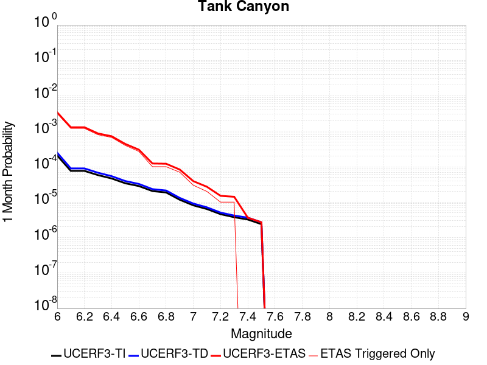 |  |  |

| Magnitude | 1 wk TI Prob | 1 wk TD Prob | 1 wk ETAS Prob | 1 wk ETAS/TD Gain | 1 wk ETAS Triggered Only | 1 mo TI Prob | 1 mo TD Prob | 1 mo ETAS Prob | 1 mo ETAS/TD Gain | 1 mo ETAS Triggered Only | 1 yr TI Prob | 1 yr TD Prob | 1 yr ETAS Prob | 1 yr ETAS/TD Gain | 1 yr ETAS Triggered Only | 10 yr TI Prob | 10 yr TD Prob | 10 yr ETAS Prob | 10 yr ETAS/TD Gain | 10 yr ETAS Triggered Only |
|-----|-----|-----|-----|-----|-----|-----|-----|-----|-----|-----|-----|-----|-----|-----|-----|-----|-----|-----|-----|-----|
| 6.0 | 4.8284557E-5 | 5.79755E-5 | 8.881703E-4 | 15.319754 | 8.30243E-4 | 2.0691741E-4 | 2.484466E-4 | 0.0032642467 | 13.138624 | 0.0030165494 | 0.0025163088 | 0.0030212996 | 0.01883103 | 6.232758 | 0.01585764 | 0.02488006 | 0.029869013 | 0.06367083 | 2.1316686 | 0.034842532 |
| 6.1 | 1.7796336E-5 | 2.0876454E-5 | 2.1459577E-4 | 10.279321 | 1.9372336E-4 | 7.626778E-5 | 8.946767E-5 | 0.0011410147 | 12.753374 | 0.0010516411 | 9.281647E-4 | 0.0010887611 | 0.006783556 | 6.230527 | 0.0057010017 | 0.009242975 | 0.0108383605 | 0.022664282 | 2.0911171 | 0.011955499 |
| 6.2 | 1.7796336E-5 | 2.0876454E-5 | 2.1459577E-4 | 10.279321 | 1.9372336E-4 | 7.626778E-5 | 8.946767E-5 | 0.0011410147 | 12.753374 | 0.0010516411 | 9.281647E-4 | 0.0010887611 | 0.006783556 | 6.230527 | 0.0057010017 | 0.009242975 | 0.0108383605 | 0.022664282 | 2.0911171 | 0.011955499 |
| 6.3 | 1.3515912E-5 | 1.5761776E-5 | 1.264591E-4 | 8.02315 | 1.1069907E-4 | 5.792405E-5 | 6.7548855E-5 | 8.147171E-4 | 12.061152 | 7.4721867E-4 | 7.049971E-4 | 8.2212104E-4 | 0.0051911394 | 6.314325 | 0.004372613 | 0.007027647 | 0.008193407 | 0.017086565 | 2.085404 | 0.008966624 |
| 6.4 | 1.0870146E-5 | 1.2619685E-5 | 9.5642936E-5 | 7.578869 | 8.30243E-5 | 4.658551E-5 | 5.4083343E-5 | 6.9056853E-4 | 12.7685995 | 6.3651963E-4 | 5.67031E-4 | 6.5828365E-4 | 0.0039770696 | 6.041574 | 0.003320972 | 0.005655863 | 0.0065653524 | 0.013328648 | 2.0301497 | 0.0068079927 |
| 6.5 | 7.964826E-6 | 9.197196E-6 | 6.454622E-5 | 7.0180326 | 5.5349534E-5 | 3.4134522E-5 | 3.9416016E-5 | 4.5452116E-4 | 11.531382 | 4.151215E-4 | 4.1550855E-4 | 4.79795E-4 | 0.0025267452 | 5.266301 | 0.0020479327 | 0.0041473247 | 0.004788893 | 0.009360904 | 1.9547116 | 0.004594011 |
| 6.6 | 6.6317E-6 | 7.613136E-6 | 3.5287692E-5 | 4.635106 | 2.7674767E-5 | 2.8421264E-5 | 3.262737E-5 | 3.09366E-4 | 9.481794 | 2.7674765E-4 | 3.4597394E-4 | 3.9717494E-4 | 0.0017803636 | 4.482568 | 0.0013837384 | 0.0034543579 | 0.0039658025 | 0.0073011694 | 1.8410319 | 0.0033486467 |
| 6.7 | 4.793663E-6 | 5.4312663E-6 | 3.3105884E-5 | 6.095426 | 2.7674767E-5 | 2.0544108E-5 | 2.3276672E-5 | 1.0629904E-4 | 4.5667624 | 8.30243E-5 | 2.500958E-4 | 2.8336103E-4 | 9.197003E-4 | 3.2456837 | 6.3651963E-4 | 0.0024981452 | 0.0028306895 | 0.004348493 | 1.5361956 | 0.0015221122 |
| 6.8 | 4.382823E-6 | 4.9696696E-6 | 3.2644297E-5 | 6.568706 | 2.7674767E-5 | 1.8783392E-5 | 2.1298434E-5 | 1.0432096E-4 | 4.898058 | 8.30243E-5 | 2.286638E-4 | 2.5928183E-4 | 8.1263366E-4 | 3.134171 | 5.534953E-4 | 0.0022842865 | 0.0025904672 | 0.003943018 | 1.5221262 | 0.0013560635 |
| 6.9 | 2.729601E-6 | 3.073735E-6 | 3.073735E-6 | 1.0 | 0.0 | 1.1698237E-5 | 1.317309E-5 | 4.084749E-5 | 3.1008284 | 2.7674767E-5 | 1.4241673E-4 | 1.603718E-4 | 4.3707507E-4 | 2.7253861 | 2.7674765E-4 | 0.001423255 | 0.0016027264 | 0.0023763778 | 1.4827096 | 7.7489344E-4 |
| 7.0 | 1.8987357E-6 | 2.127044E-6 | 2.127044E-6 | 1.0 | 0.0 | 8.137413E-6 | 9.1158745E-6 | 3.679039E-5 | 4.0358596 | 2.7674767E-5 | 9.90685E-5 | 1.10980814E-4 | 2.77011E-4 | 2.4960258 | 1.660486E-4 | 9.902435E-4 | 0.0011093225 | 0.0014963396 | 1.3488768 | 3.8744672E-4 |
| 7.1 | 1.4928986E-6 | 1.6641992E-6 | 1.6641992E-6 | 1.0 | 0.0 | 6.398121E-6 | 7.132266E-6 | 3.4806835E-5 | 4.8801928 | 2.7674767E-5 | 7.789434E-5 | 8.683247E-5 | 1.9752192E-4 | 2.2747471 | 1.1069907E-4 | 7.786704E-4 | 8.680433E-4 | 0.0011445507 | 1.318541 | 2.7674765E-4 |
| 7.2 | 1.069082E-6 | 1.182903E-6 | 1.182903E-6 | 1.0 | 0.0 | 4.581772E-6 | 5.069577E-6 | 3.2744203E-5 | 6.458961 | 2.7674767E-5 | 5.5781646E-5 | 6.1720886E-5 | 8.939394E-5 | 1.448358 | 2.7674767E-5 | 5.576765E-4 | 6.1708974E-4 | 7.5537816E-4 | 1.2240977 | 1.3837383E-4 |
| 7.3 | 8.776551E-7 | 9.770338E-7 | 9.770338E-7 | 1.0 | 0.0 | 3.7613736E-6 | 4.1872836E-6 | 3.1861935E-5 | 7.609213 | 2.7674767E-5 | 4.579376E-5 | 5.0979506E-5 | 7.865286E-5 | 1.542833 | 2.7674767E-5 | 4.5784327E-4 | 5.0972914E-4 | 5.927111E-4 | 1.1627963 | 8.30243E-5 |
| 7.4 | 7.55721E-7 | 8.5105205E-7 | 8.5105205E-7 | 1.0 | 0.0 | 3.2388E-6 | 3.6473637E-6 | 3.6473637E-6 | 1.0 | 0.0 | 3.9431678E-5 | 4.4406268E-5 | 4.4406268E-5 | 1.0 | 0.0 | 3.942468E-4 | 4.4402477E-4 | 4.993497E-4 | 1.1245989 | 5.5349534E-5 |
| 7.5 | 5.587665E-7 | 6.305819E-7 | 6.305819E-7 | 1.0 | 0.0 | 2.3947114E-6 | 2.702494E-6 | 2.702494E-6 | 1.0 | 0.0 | 2.915522E-5 | 3.2902863E-5 | 3.2902863E-5 | 1.0 | 0.0 | 2.9151395E-4 | 3.290286E-4 | 3.8435994E-4 | 1.1681657 | 5.5349534E-5 |

## Little Lake
*[(top)](#table-of-contents)*

| 1 Week | 1 Month | 1 Year | 10 Year |
|-----|-----|-----|-----|
|  |  | 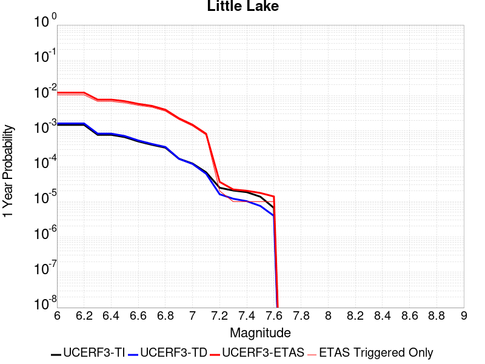 |  |

| Magnitude | 1 wk TI Prob | 1 wk TD Prob | 1 wk ETAS Prob | 1 wk ETAS/TD Gain | 1 wk ETAS Triggered Only | 1 mo TI Prob | 1 mo TD Prob | 1 mo ETAS Prob | 1 mo ETAS/TD Gain | 1 mo ETAS Triggered Only | 1 yr TI Prob | 1 yr TD Prob | 1 yr ETAS Prob | 1 yr ETAS/TD Gain | 1 yr ETAS Triggered Only | 10 yr TI Prob | 10 yr TD Prob | 10 yr ETAS Prob | 10 yr ETAS/TD Gain | 10 yr ETAS Triggered Only |
|-----|-----|-----|-----|-----|-----|-----|-----|-----|-----|-----|-----|-----|-----|-----|-----|-----|-----|-----|-----|-----|
| 6.0 | 2.8424427E-5 | 3.1208794E-5 | 8.614259E-4 | 27.602024 | 8.30243E-4 | 1.2181328E-4 | 1.3374587E-4 | 0.0026241418 | 19.620358 | 0.0024907289 | 0.0014820677 | 0.0016272729 | 0.011629236 | 7.146457 | 0.010018266 | 0.014722223 | 0.016166981 | 0.03756768 | 2.3237286 | 0.021752367 |
| 6.1 | 2.8424427E-5 | 3.1208794E-5 | 8.614259E-4 | 27.602024 | 8.30243E-4 | 1.2181328E-4 | 1.3374587E-4 | 0.0026241418 | 19.620358 | 0.0024907289 | 0.0014820677 | 0.0016272729 | 0.011629236 | 7.146457 | 0.010018266 | 0.014722223 | 0.016166981 | 0.03756768 | 2.3237286 | 0.021752367 |
| 6.2 | 2.8424427E-5 | 3.1208794E-5 | 8.614259E-4 | 27.602024 | 8.30243E-4 | 1.2181328E-4 | 1.3374587E-4 | 0.0026241418 | 19.620358 | 0.0024907289 | 0.0014820677 | 0.0016272729 | 0.011629236 | 7.146457 | 0.010018266 | 0.014722223 | 0.016166981 | 0.03756768 | 2.3237286 | 0.021752367 |
| 6.3 | 1.48860645E-5 | 1.6082817E-5 | 6.2491786E-4 | 38.856243 | 6.0884486E-4 | 6.379586E-5 | 6.8924695E-5 | 0.0018399877 | 26.695621 | 0.0017711851 | 7.7643775E-4 | 8.388633E-4 | 0.0073922807 | 8.812259 | 0.00655892 | 0.007737305 | 0.008359787 | 0.022493144 | 2.690636 | 0.014252504 |
| 6.4 | 1.48860645E-5 | 1.6082817E-5 | 6.2491786E-4 | 38.856243 | 6.0884486E-4 | 6.379586E-5 | 6.8924695E-5 | 0.0018399877 | 26.695621 | 0.0017711851 | 7.7643775E-4 | 8.388633E-4 | 0.0073922807 | 8.812259 | 0.00655892 | 0.007737305 | 0.008359787 | 0.022493144 | 2.690636 | 0.014252504 |
| 6.5 | 1.2797581E-5 | 1.37667585E-5 | 5.3958007E-4 | 39.194416 | 5.2582053E-4 | 5.4845623E-5 | 5.8999205E-5 | 0.001664041 | 28.204464 | 0.0016051364 | 6.675408E-4 | 7.1810425E-4 | 0.006636251 | 9.241347 | 0.0059224 | 0.006655392 | 0.007160389 | 0.019964486 | 2.7881846 | 0.012896441 |
| 6.6 | 9.661896E-6 | 1.028988E-5 | 4.530816E-4 | 44.031765 | 4.4279627E-4 | 4.1407468E-5 | 4.4098833E-5 | 0.0014277761 | 32.37673 | 0.0013837384 | 5.040193E-4 | 5.3678727E-4 | 0.005570891 | 10.37821 | 0.0050368076 | 0.005028777 | 0.005356512 | 0.016119383 | 3.009306 | 0.010820834 |
| 6.7 | 7.767871E-6 | 8.200329E-6 | 3.9564387E-4 | 48.24732 | 3.8744672E-4 | 3.329045E-5 | 3.5143872E-5 | 0.0011974432 | 34.072605 | 0.0011623402 | 4.0523586E-4 | 4.2780637E-4 | 0.0048538744 | 11.345962 | 0.0044279625 | 0.004044977 | 0.00427118 | 0.013612854 | 3.1871414 | 0.009381746 |
| 6.8 | 6.4235196E-6 | 6.7362653E-6 | 3.665058E-4 | 54.407864 | 3.5977195E-4 | 2.752908E-5 | 2.8869463E-5 | 0.0010528063 | 36.467815 | 0.0010239664 | 3.35115E-4 | 3.5144185E-4 | 0.003920232 | 11.154711 | 0.0035700449 | 0.003346101 | 0.0035101213 | 0.011204278 | 3.1919918 | 0.0077212597 |
| 6.9 | 3.1283696E-6 | 3.1123648E-6 | 2.245098E-4 | 72.134796 | 2.2139814E-4 | 1.3407229E-5 | 1.3338647E-5 | 6.221754E-4 | 46.644566 | 6.0884486E-4 | 1.6322079E-4 | 1.6238743E-4 | 0.0024590201 | 15.142921 | 0.0022970056 | 0.0016310095 | 0.001622836 | 0.0062093916 | 3.8262596 | 0.004594011 |
| 7.0 | 2.290603E-6 | 2.2288211E-6 | 1.9595175E-4 | 87.91722 | 1.9372336E-4 | 9.816834E-6 | 9.552061E-6 | 3.9699508E-4 | 41.561195 | 3.8744672E-4 | 1.19513395E-4 | 1.1629118E-4 | 0.0017212409 | 14.801131 | 0.0016051364 | 0.0011944914 | 0.0011624055 | 0.0040372354 | 3.4731734 | 0.0028781756 |
| 7.1 | 1.293693E-6 | 1.1777693E-6 | 1.118767E-4 | 94.99034 | 1.1069907E-4 | 5.5443866E-6 | 5.047577E-6 | 2.264446E-4 | 44.862038 | 2.2139814E-4 | 6.750081E-5 | 6.145321E-5 | 0.0010023374 | 16.310577 | 9.4094203E-4 | 6.7480316E-4 | 6.144307E-4 | 0.0021356076 | 3.4757502 | 0.0015221122 |
| 7.2 | 4.715842E-7 | 3.0921956E-7 | 3.0921956E-7 | 1.0 | 0.0 | 2.0210737E-6 | 1.325226E-6 | 1.325226E-6 | 1.0 | 0.0 | 2.4606294E-5 | 1.6134512E-5 | 4.3808832E-5 | 2.715225 | 2.7674767E-5 | 2.460357E-4 | 1.6133396E-4 | 2.1667455E-4 | 1.3430189 | 5.5349534E-5 |
| 7.3 | 3.9430947E-7 | 2.3101252E-7 | 2.3101252E-7 | 1.0 | 0.0 | 1.6898966E-6 | 9.900533E-7 | 9.900533E-7 | 1.0 | 0.0 | 2.0574296E-5 | 1.20538325E-5 | 3.9728264E-5 | 3.2959032 | 2.7674767E-5 | 2.0572392E-4 | 1.2053186E-4 | 1.7587472E-4 | 1.4591554 | 5.5349534E-5 |
| 7.4 | 3.547123E-7 | 1.968263E-7 | 1.968263E-7 | 1.0 | 0.0 | 1.5201948E-6 | 8.4354105E-7 | 8.4354105E-7 | 1.0 | 0.0 | 1.8508214E-5 | 1.0270064E-5 | 3.794455E-5 | 3.6946745 | 2.7674767E-5 | 1.8506673E-4 | 1.02695965E-4 | 1.5803981E-4 | 1.5389097 | 5.5349534E-5 |
| 7.5 | 2.6354266E-7 | 1.4425584E-7 | 1.4425584E-7 | 1.0 | 0.0 | 1.129468E-6 | 6.1823914E-7 | 6.1823914E-7 | 1.0 | 0.0 | 1.3751187E-5 | 7.527036E-6 | 3.5201592E-5 | 4.6766872 | 2.7674767E-5 | 1.3750336E-4 | 7.526786E-5 | 1.3061323E-4 | 1.7353121 | 5.5349534E-5 |
| 7.6 | 1.269913E-7 | 7.573594E-8 | 7.573594E-8 | 1.0 | 0.0 | 5.4424834E-7 | 3.2458257E-7 | 3.2458257E-7 | 1.0 | 0.0 | 6.6262032E-6 | 3.951786E-6 | 3.162644E-5 | 8.003076 | 2.7674767E-5 | 6.626006E-5 | 3.9517192E-5 | 6.7190864E-5 | 1.7002945 | 2.7674767E-5 |

## Airport Lake
*[(top)](#table-of-contents)*

| 1 Week | 1 Month | 1 Year | 10 Year |
|-----|-----|-----|-----|
| 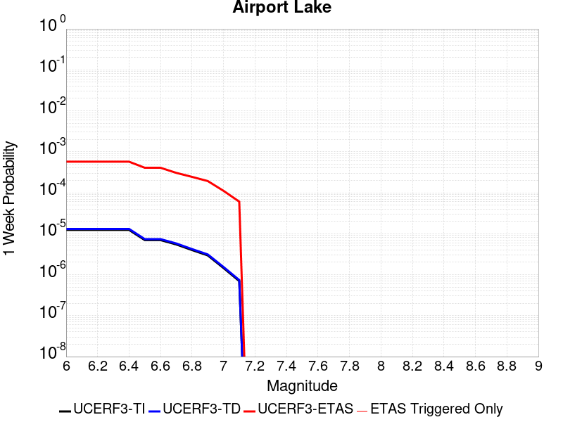 |  | 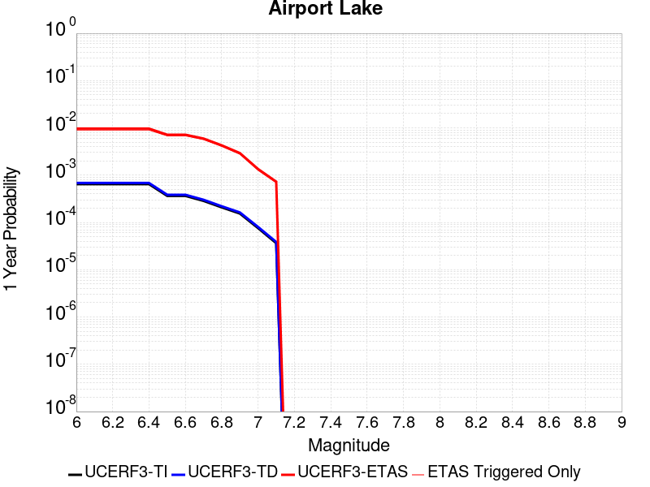 |  |

| Magnitude | 1 wk TI Prob | 1 wk TD Prob | 1 wk ETAS Prob | 1 wk ETAS/TD Gain | 1 wk ETAS Triggered Only | 1 mo TI Prob | 1 mo TD Prob | 1 mo ETAS Prob | 1 mo ETAS/TD Gain | 1 mo ETAS Triggered Only | 1 yr TI Prob | 1 yr TD Prob | 1 yr ETAS Prob | 1 yr ETAS/TD Gain | 1 yr ETAS Triggered Only | 10 yr TI Prob | 10 yr TD Prob | 10 yr ETAS Prob | 10 yr ETAS/TD Gain | 10 yr ETAS Triggered Only |
|-----|-----|-----|-----|-----|-----|-----|-----|-----|-----|-----|-----|-----|-----|-----|-----|-----|-----|-----|-----|-----|
| 6.0 | 1.2387061E-5 | 1.31038605E-5 | 9.2635915E-4 | 70.69361 | 9.1326726E-4 | 5.3086325E-5 | 5.6158355E-5 | 0.0022700154 | 40.421684 | 0.0022139812 | 6.461343E-4 | 6.835419E-4 | 0.009588725 | 14.028 | 0.008911274 | 0.0064425888 | 0.0068172044 | 0.024490768 | 3.5924942 | 0.017794875 |
| 6.1 | 1.2387061E-5 | 1.31038605E-5 | 9.2635915E-4 | 70.69361 | 9.1326726E-4 | 5.3086325E-5 | 5.6158355E-5 | 0.0022700154 | 40.421684 | 0.0022139812 | 6.461343E-4 | 6.835419E-4 | 0.009588725 | 14.028 | 0.008911274 | 0.0064425888 | 0.0068172044 | 0.024490768 | 3.5924942 | 0.017794875 |
| 6.2 | 1.2387061E-5 | 1.31038605E-5 | 9.2635915E-4 | 70.69361 | 9.1326726E-4 | 5.3086325E-5 | 5.6158355E-5 | 0.0022700154 | 40.421684 | 0.0022139812 | 6.461343E-4 | 6.835419E-4 | 0.009588725 | 14.028 | 0.008911274 | 0.0064425888 | 0.0068172044 | 0.024490768 | 3.5924942 | 0.017794875 |
| 6.3 | 1.2387061E-5 | 1.31038605E-5 | 9.2635915E-4 | 70.69361 | 9.1326726E-4 | 5.3086325E-5 | 5.6158355E-5 | 0.0022700154 | 40.421684 | 0.0022139812 | 6.461343E-4 | 6.835419E-4 | 0.009588725 | 14.028 | 0.008911274 | 0.0064425888 | 0.0068172044 | 0.024490768 | 3.5924942 | 0.017794875 |
| 6.4 | 1.2387061E-5 | 1.31038605E-5 | 9.2635915E-4 | 70.69361 | 9.1326726E-4 | 5.3086325E-5 | 5.6158355E-5 | 0.0022700154 | 40.421684 | 0.0022139812 | 6.461343E-4 | 6.835419E-4 | 0.009588725 | 14.028 | 0.008911274 | 0.0064425888 | 0.0068172044 | 0.024490768 | 3.5924942 | 0.017794875 |
| 6.5 | 6.9922594E-6 | 7.3853103E-6 | 6.1622565E-4 | 83.43938 | 6.0884486E-4 | 2.996648E-5 | 3.1650976E-5 | 0.0016367366 | 51.71204 | 0.0016051364 | 3.6478083E-4 | 3.8528792E-4 | 0.006775696 | 17.586058 | 0.006392871 | 0.003641826 | 0.0038467369 | 0.016583296 | 4.311003 | 0.012785742 |
| 6.6 | 6.9922594E-6 | 7.3853103E-6 | 6.1622565E-4 | 83.43938 | 6.0884486E-4 | 2.996648E-5 | 3.1650976E-5 | 0.0016367366 | 51.71204 | 0.0016051364 | 3.6478083E-4 | 3.8528792E-4 | 0.006775696 | 17.586058 | 0.006392871 | 0.003641826 | 0.0038467369 | 0.016583296 | 4.311003 | 0.012785742 |
| 6.7 | 5.477277E-6 | 5.7863713E-6 | 4.7625467E-4 | 82.306274 | 4.7047102E-4 | 2.3473833E-5 | 2.479852E-5 | 0.0012978062 | 52.334015 | 0.0012730393 | 2.8575645E-4 | 3.0188405E-4 | 0.0056691677 | 18.77929 | 0.0053689047 | 0.0028538927 | 0.0030151235 | 0.013886105 | 4.6054845 | 0.010903858 |
| 6.8 | 3.9950432E-6 | 4.219307E-6 | 3.6398976E-4 | 86.26767 | 3.5977195E-4 | 1.7121502E-5 | 1.8082634E-5 | 0.0010143562 | 56.0956 | 9.962916E-4 | 2.0843433E-4 | 2.2013657E-4 | 0.004259763 | 19.350546 | 0.004040516 | 0.0020823893 | 0.002199456 | 0.010538853 | 4.791572 | 0.008357779 |
| 6.9 | 2.95695E-6 | 3.123187E-6 | 2.521953E-4 | 80.749344 | 2.490729E-4 | 1.2672582E-5 | 1.3385032E-5 | 7.329193E-4 | 54.756634 | 7.195439E-4 | 1.5427776E-4 | 1.6295284E-4 | 0.0030406595 | 18.659752 | 0.0028781756 | 0.001541707 | 0.001628556 | 0.0074307923 | 4.5628104 | 0.005811701 |
| 7.0 | 1.456072E-6 | 1.5408953E-6 | 1.9526396E-4 | 126.721115 | 1.9372336E-4 | 6.2402937E-6 | 6.6038256E-6 | 3.94048E-4 | 59.669655 | 3.8744672E-4 | 7.597293E-5 | 8.039962E-5 | 0.0016300619 | 20.274498 | 0.0015497869 | 7.594696E-4 | 8.0380426E-4 | 0.0035137513 | 4.371402 | 0.002712127 |
| 7.1 | 6.995192E-7 | 7.409381E-7 | 1.1143992E-4 | 150.40381 | 1.1069907E-4 | 2.997936E-6 | 3.1754491E-6 | 2.2457287E-4 | 70.72161 | 2.2139814E-4 | 3.649926E-5 | 3.8661092E-5 | 9.242194E-4 | 23.90567 | 8.8559254E-4 | 3.6493264E-4 | 3.8661092E-4 | 0.0018251424 | 4.720876 | 0.0014390878 |

## Owl Lake
*[(top)](#table-of-contents)*

| 1 Week | 1 Month | 1 Year | 10 Year |
|-----|-----|-----|-----|
|  | 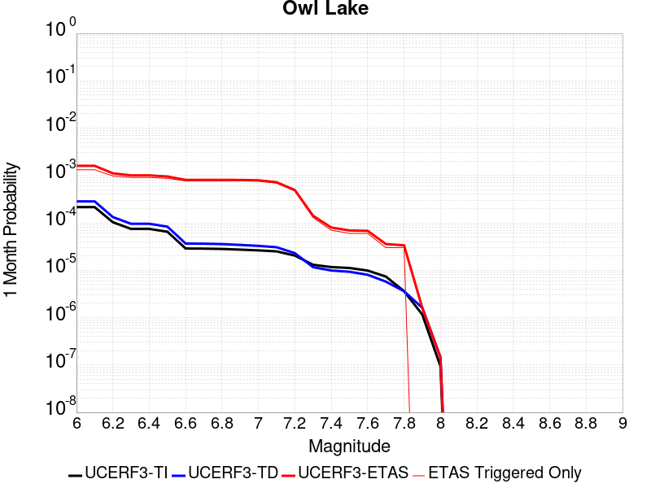 |  |  |

| Magnitude | 1 wk TI Prob | 1 wk TD Prob | 1 wk ETAS Prob | 1 wk ETAS/TD Gain | 1 wk ETAS Triggered Only | 1 mo TI Prob | 1 mo TD Prob | 1 mo ETAS Prob | 1 mo ETAS/TD Gain | 1 mo ETAS Triggered Only | 1 yr TI Prob | 1 yr TD Prob | 1 yr ETAS Prob | 1 yr ETAS/TD Gain | 1 yr ETAS Triggered Only | 10 yr TI Prob | 10 yr TD Prob | 10 yr ETAS Prob | 10 yr ETAS/TD Gain | 10 yr ETAS Triggered Only |
|-----|-----|-----|-----|-----|-----|-----|-----|-----|-----|-----|-----|-----|-----|-----|-----|-----|-----|-----|-----|-----|
| 6.0 | 5.0320643E-5 | 6.638159E-5 | 4.2612967E-4 | 6.4193954 | 3.5977195E-4 | 2.1564208E-4 | 2.8446777E-4 | 0.0017508131 | 6.154698 | 0.0014667626 | 0.0026222812 | 0.0034589402 | 0.010574332 | 3.057102 | 0.0071400898 | 0.02591553 | 0.03415182 | 0.047677007 | 1.3960313 | 0.014003431 |
| 6.1 | 5.0320643E-5 | 6.638159E-5 | 4.2612967E-4 | 6.4193954 | 3.5977195E-4 | 2.1564208E-4 | 2.8446777E-4 | 0.0017508131 | 6.154698 | 0.0014667626 | 0.0026222812 | 0.0034589402 | 0.010574332 | 3.057102 | 0.0071400898 | 0.02591553 | 0.03415182 | 0.047677007 | 1.3960313 | 0.014003431 |
| 6.2 | 2.4125871E-5 | 3.099268E-5 | 2.8005787E-4 | 9.036258 | 2.490729E-4 | 1.0339249E-4 | 1.3282018E-4 | 0.0011843216 | 8.91673 | 0.0010516411 | 0.0012580766 | 0.0016160287 | 0.0067828465 | 4.197232 | 0.005175181 | 0.012509781 | 0.016076323 | 0.025960762 | 1.6148444 | 0.01004594 |
| 6.3 | 1.7433485E-5 | 2.2364824E-5 | 2.7143216E-4 | 12.136565 | 2.490729E-4 | 7.471279E-5 | 9.584662E-5 | 0.0010920427 | 11.393648 | 9.962916E-4 | 9.0924866E-4 | 0.0011664558 | 0.0055616107 | 4.7679567 | 0.0044002878 | 0.009055373 | 0.011633637 | 0.020003596 | 1.7194619 | 0.008468478 |
| 6.4 | 1.7433485E-5 | 2.2364824E-5 | 2.7143216E-4 | 12.136565 | 2.490729E-4 | 7.471279E-5 | 9.584662E-5 | 0.0010920427 | 11.393648 | 9.962916E-4 | 9.0924866E-4 | 0.0011664558 | 0.0055616107 | 4.7679567 | 0.0044002878 | 0.009055373 | 0.011633637 | 0.020003596 | 1.7194619 | 0.008468478 |
| 6.5 | 1.5182742E-5 | 1.9437655E-5 | 2.685057E-4 | 13.813688 | 2.490729E-4 | 6.506727E-5 | 8.330243E-5 | 0.0010518385 | 12.626745 | 9.686168E-4 | 7.919061E-4 | 0.0010138866 | 0.0052991263 | 5.2265472 | 0.004289589 | 0.0078909 | 0.010122783 | 0.018204195 | 1.7983391 | 0.008164056 |
| 6.6 | 6.7271576E-6 | 8.552988E-6 | 2.5762376E-4 | 30.120905 | 2.490729E-4 | 2.8830356E-5 | 3.6655183E-5 | 9.49889E-4 | 25.91418 | 9.1326726E-4 | 3.5095305E-4 | 4.4619112E-4 | 0.0039039934 | 8.749599 | 0.0034593458 | 0.0035039932 | 0.0044707335 | 0.010697269 | 2.3927324 | 0.006254497 |
| 6.7 | 6.682835E-6 | 8.4854255E-6 | 2.575562E-4 | 30.352776 | 2.490729E-4 | 2.8640408E-5 | 3.6365633E-5 | 9.495997E-4 | 26.112558 | 9.1326726E-4 | 3.4864116E-4 | 4.426673E-4 | 0.0039004816 | 8.8113165 | 0.0034593458 | 0.003480947 | 0.004435655 | 0.0106624095 | 2.4037957 | 0.006254497 |
| 6.8 | 6.5774975E-6 | 8.331873E-6 | 2.574027E-4 | 30.89374 | 2.490729E-4 | 2.8188972E-5 | 3.5707566E-5 | 9.4894227E-4 | 26.575382 | 9.1326726E-4 | 3.4314668E-4 | 4.3465855E-4 | 0.003864838 | 8.8916645 | 0.003431671 | 0.0034261728 | 0.0043557878 | 0.010555487 | 2.4233246 | 0.0062268223 |
| 6.9 | 6.363419E-6 | 8.004978E-6 | 2.5707588E-4 | 32.114502 | 2.490729E-4 | 2.727151E-5 | 3.4306628E-5 | 9.475426E-4 | 27.61981 | 9.1326726E-4 | 3.3198006E-4 | 4.1760874E-4 | 0.0038478468 | 9.214 | 0.003431671 | 0.0033148455 | 0.0041857446 | 0.010386503 | 2.481399 | 0.0062268223 |
| 7.0 | 6.1342453E-6 | 7.63709E-6 | 2.567081E-4 | 33.61334 | 2.490729E-4 | 2.6289357E-5 | 3.2730004E-5 | 9.459674E-4 | 28.902145 | 9.1326726E-4 | 3.2002592E-4 | 3.9842047E-4 | 0.0038010604 | 9.540324 | 0.0034039964 | 0.0031956544 | 0.0039943936 | 0.010141215 | 2.5388622 | 0.006171473 |
| 7.1 | 5.842926E-6 | 7.147514E-6 | 2.2854406E-4 | 31.97532 | 2.2139814E-4 | 2.504087E-5 | 3.0631876E-5 | 8.6084945E-4 | 28.10306 | 8.30243E-4 | 3.0482994E-4 | 3.7288468E-4 | 0.0035819605 | 9.606081 | 0.0032102729 | 0.0030441214 | 0.0037397894 | 0.009584898 | 2.5629513 | 0.0058670505 |
| 7.2 | 4.77173E-6 | 5.3632994E-6 | 1.4373638E-4 | 26.799994 | 1.3837383E-4 | 2.045011E-5 | 2.298539E-5 | 6.871645E-4 | 29.895708 | 6.641944E-4 | 2.4895166E-4 | 2.7981526E-4 | 0.0022718408 | 8.119075 | 0.0019925833 | 0.0024867293 | 0.002811154 | 0.0065643415 | 2.3351057 | 0.0037637681 |
| 7.3 | 3.0494948E-6 | 2.7140309E-6 | 8.57381E-5 | 31.590687 | 8.30243E-5 | 1.3069198E-5 | 1.16315105E-5 | 2.0535263E-4 | 17.654854 | 1.9372336E-4 | 1.5910587E-4 | 1.416046E-4 | 5.8433815E-4 | 4.126548 | 4.4279627E-4 | 0.0015899199 | 0.001425103 | 0.0023923395 | 1.6787133 | 9.686168E-4 |
| 7.4 | 2.7263884E-6 | 2.3090297E-6 | 5.7658435E-5 | 24.970848 | 5.5349534E-5 | 1.1684469E-5 | 9.895805E-6 | 1.2059377E-4 | 12.186353 | 1.1069907E-4 | 1.4224913E-4 | 1.2047487E-4 | 4.5253205E-4 | 3.756236 | 3.320972E-4 | 0.0014215811 | 0.0012129741 | 0.0018763628 | 1.5469109 | 6.641944E-4 |
| 7.5 | 2.6090431E-6 | 2.1689061E-6 | 5.751832E-5 | 26.519505 | 5.5349534E-5 | 1.1181565E-5 | 9.29528E-6 | 1.1999332E-4 | 12.90906 | 1.1069907E-4 | 1.3612706E-4 | 1.1316425E-4 | 3.6220896E-4 | 3.2007368 | 2.490729E-4 | 0.001360437 | 0.0011396994 | 0.0016649207 | 1.4608419 | 5.2582053E-4 |
| 7.6 | 2.3008756E-6 | 1.8759047E-6 | 5.7225334E-5 | 30.50546 | 5.5349534E-5 | 9.860858E-6 | 8.039567E-6 | 1.1873774E-4 | 14.769172 | 1.1069907E-4 | 1.20049335E-4 | 9.787741E-5 | 3.192539E-4 | 3.2617726 | 2.2139814E-4 | 0.001199845 | 9.866174E-4 | 0.0014289768 | 1.4483596 | 4.4279627E-4 |
| 7.7 | 1.7184348E-6 | 1.3447964E-6 | 5.6694254E-5 | 42.158245 | 5.5349534E-5 | 7.3646997E-6 | 5.7634006E-6 | 6.1112616E-5 | 10.603568 | 5.5349534E-5 | 8.966153E-5 | 7.016719E-5 | 1.8085848E-4 | 2.5775366 | 1.1069907E-4 | 8.962536E-4 | 7.093401E-4 | 9.305812E-4 | 1.311897 | 2.2139814E-4 |
| 7.8 | 8.4612907E-7 | 8.4264127E-7 | 5.6192126E-5 | 66.68571 | 5.5349534E-5 | 3.6262625E-6 | 3.611315E-6 | 5.8960646E-5 | 16.326643 | 5.5349534E-5 | 4.4148852E-5 | 4.396689E-5 | 9.931399E-5 | 2.2588358 | 5.5349534E-5 | 4.414008E-4 | 4.450584E-4 | 5.833706E-4 | 1.3107733 | 1.3837383E-4 |
| 7.9 | 2.716738E-7 | 3.7771878E-7 | 3.7771878E-7 | 1.0 | 0.0 | 1.1643157E-6 | 1.6187938E-6 | 1.6187938E-6 | 1.0 | 0.0 | 1.4175452E-5 | 1.9708647E-5 | 1.9708647E-5 | 1.0 | 0.0 | 1.4174548E-4 | 1.9884022E-4 | 2.265095E-4 | 1.1391532 | 2.7674767E-5 |
| 8.0 | 2.1995428E-8 | 3.392825E-8 | 3.392825E-8 | 1.0 | 0.0 | 9.426611E-8 | 1.4540677E-7 | 1.4540677E-7 | 1.0 | 0.0 | 1.1476893E-6 | 1.7703268E-6 | 1.7703268E-6 | 1.0 | 0.0 | 1.14768345E-5 | 1.8004324E-5 | 1.8004324E-5 | 1.0 | 0.0 |

## Panamint Valley
*[(top)](#table-of-contents)*

| 1 Week | 1 Month | 1 Year | 10 Year |
|-----|-----|-----|-----|
| 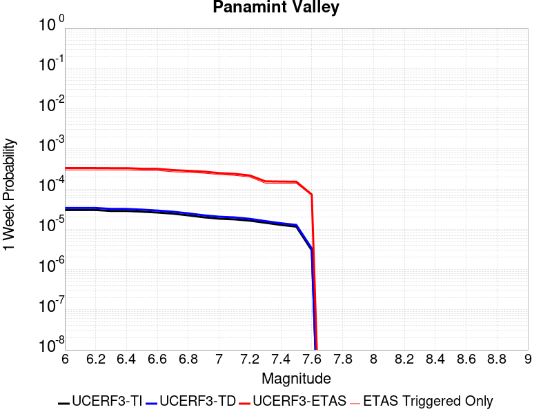 | 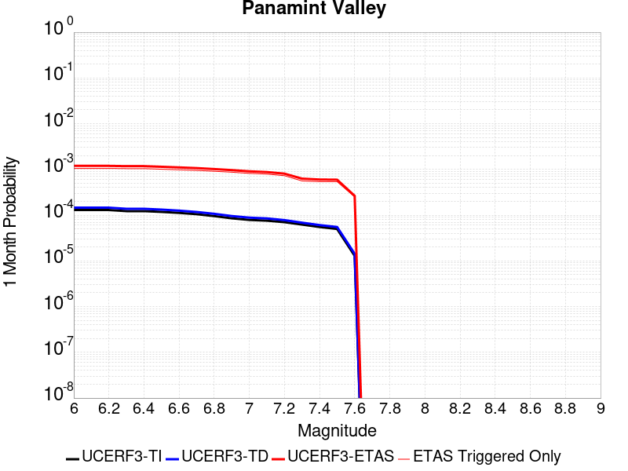 | 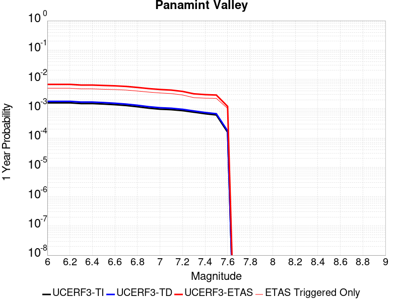 |  |

| Magnitude | 1 wk TI Prob | 1 wk TD Prob | 1 wk ETAS Prob | 1 wk ETAS/TD Gain | 1 wk ETAS Triggered Only | 1 mo TI Prob | 1 mo TD Prob | 1 mo ETAS Prob | 1 mo ETAS/TD Gain | 1 mo ETAS Triggered Only | 1 yr TI Prob | 1 yr TD Prob | 1 yr ETAS Prob | 1 yr ETAS/TD Gain | 1 yr ETAS Triggered Only | 10 yr TI Prob | 10 yr TD Prob | 10 yr ETAS Prob | 10 yr ETAS/TD Gain | 10 yr ETAS Triggered Only |
|-----|-----|-----|-----|-----|-----|-----|-----|-----|-----|-----|-----|-----|-----|-----|-----|-----|-----|-----|-----|-----|
| 6.0 | 3.0211835E-5 | 3.3990338E-5 | 3.3840243E-4 | 9.955841 | 3.0442243E-4 | 1.2947287E-4 | 1.4566492E-4 | 0.0011418114 | 7.8386164 | 9.962916E-4 | 0.0015751923 | 0.0017720573 | 0.0073524537 | 4.149106 | 0.005590303 | 0.015640736 | 0.017586125 | 0.02935856 | 1.6694162 | 0.011983174 |
| 6.1 | 3.0211835E-5 | 3.3990338E-5 | 3.3840243E-4 | 9.955841 | 3.0442243E-4 | 1.2947287E-4 | 1.4566492E-4 | 0.0011418114 | 7.8386164 | 9.962916E-4 | 0.0015751923 | 0.0017720573 | 0.0073524537 | 4.149106 | 0.005590303 | 0.015640736 | 0.017586125 | 0.02935856 | 1.6694162 | 0.011983174 |
| 6.2 | 3.0211835E-5 | 3.3990338E-5 | 3.3840243E-4 | 9.955841 | 3.0442243E-4 | 1.2947287E-4 | 1.4566492E-4 | 0.0011418114 | 7.8386164 | 9.962916E-4 | 0.0015751923 | 0.0017720573 | 0.0073524537 | 4.149106 | 0.005590303 | 0.015640736 | 0.017586125 | 0.02935856 | 1.6694162 | 0.011983174 |
| 6.3 | 2.8573924E-5 | 3.2108197E-5 | 3.3652084E-4 | 10.480839 | 3.0442243E-4 | 1.2245393E-4 | 1.3759946E-4 | 0.0011337539 | 8.239523 | 9.962916E-4 | 0.001489857 | 0.001674014 | 0.007033931 | 4.201835 | 0.0053689047 | 0.01479908 | 0.016620632 | 0.027751483 | 1.6697007 | 0.01131898 |
| 6.4 | 2.8573924E-5 | 3.2108197E-5 | 3.3652084E-4 | 10.480839 | 3.0442243E-4 | 1.2245393E-4 | 1.3759946E-4 | 0.0011337539 | 8.239523 | 9.962916E-4 | 0.001489857 | 0.001674014 | 0.007033931 | 4.201835 | 0.0053689047 | 0.01479908 | 0.016620632 | 0.027751483 | 1.6697007 | 0.01131898 |
| 6.5 | 2.7468774E-5 | 3.083374E-5 | 3.352468E-4 | 10.8727255 | 3.0442243E-4 | 1.1771801E-4 | 1.3213806E-4 | 0.0011006269 | 8.3293705 | 9.686168E-4 | 0.0014322745 | 0.001607621 | 0.0068573733 | 4.265541 | 0.0052582053 | 0.014230782 | 0.0159664 | 0.026859561 | 1.6822551 | 0.011069907 |
| 6.6 | 2.6135967E-5 | 2.925755E-5 | 3.3367108E-4 | 11.404614 | 3.0442243E-4 | 1.1200648E-4 | 1.2538362E-4 | 0.0010385364 | 8.282871 | 9.1326726E-4 | 0.0013628257 | 0.0015255031 | 0.006609892 | 4.332926 | 0.005092157 | 0.013544982 | 0.015156649 | 0.025677199 | 1.6941211 | 0.01068246 |
| 6.7 | 2.4498746E-5 | 2.7346232E-5 | 3.3176033E-4 | 12.131847 | 3.0442243E-4 | 1.04990395E-4 | 1.1719302E-4 | 0.0010026818 | 8.555815 | 8.8559254E-4 | 0.0012775084 | 0.0014259162 | 0.00628973 | 4.4110093 | 0.004870759 | 0.012701893 | 0.014173795 | 0.024241041 | 1.7102717 | 0.010211988 |
| 6.8 | 2.2244329E-5 | 2.494001E-5 | 3.0168076E-4 | 12.096258 | 2.7674765E-4 | 9.532935E-5 | 1.06881496E-4 | 9.647075E-4 | 9.025955 | 8.5791777E-4 | 0.0011600169 | 0.0013005272 | 0.0057503697 | 4.4215684 | 0.004455637 | 0.011539802 | 0.01293488 | 0.022277225 | 1.7222598 | 0.00946477 |
| 6.9 | 1.9902658E-5 | 2.2294498E-5 | 2.7136185E-4 | 12.171696 | 2.490729E-4 | 8.529431E-5 | 9.5544456E-5 | 8.98036E-4 | 9.399143 | 8.025682E-4 | 0.0010379635 | 0.0011626515 | 0.005253755 | 4.51877 | 0.0040958654 | 0.010331288 | 0.011570791 | 0.020078056 | 1.7352362 | 0.008606852 |
| 7.0 | 1.8353881E-5 | 2.0570176E-5 | 2.6963794E-4 | 13.108198 | 2.490729E-4 | 7.865712E-5 | 8.8155015E-5 | 8.906525E-4 | 10.103253 | 8.025682E-4 | 9.5722964E-4 | 0.0010727766 | 0.005053668 | 4.7108297 | 0.0039851665 | 0.009531168 | 0.010680909 | 0.018757766 | 1.7561955 | 0.008164056 |
| 7.1 | 1.7667631E-5 | 1.9776491E-5 | 2.6884445E-4 | 13.594144 | 2.490729E-4 | 7.571623E-5 | 8.475373E-5 | 8.872539E-4 | 10.468612 | 8.025682E-4 | 9.2145515E-4 | 0.0010314058 | 0.004901877 | 4.7526174 | 0.0038744672 | 0.009176437 | 0.010271076 | 0.018159544 | 1.7680274 | 0.007970333 |
| 7.2 | 1.6381597E-5 | 1.816187E-5 | 2.3955599E-4 | 13.190049 | 2.2139814E-4 | 7.020495E-5 | 7.783437E-5 | 8.249949E-4 | 10.599365 | 7.4721867E-4 | 8.544101E-4 | 9.472387E-4 | 0.004430956 | 4.677761 | 0.0034870205 | 0.008511325 | 0.009436665 | 0.016591616 | 1.7582077 | 0.007223114 |
| 7.3 | 1.4520491E-5 | 1.596943E-5 | 1.5434105E-4 | 9.664782 | 1.3837383E-4 | 6.222919E-5 | 6.8438705E-5 | 6.218962E-4 | 9.086906 | 5.534953E-4 | 7.57377E-4 | 8.3293894E-4 | 0.0037916724 | 4.552161 | 0.0029612 | 0.0075480095 | 0.008301281 | 0.014201962 | 1.7108158 | 0.0059500746 |
| 7.4 | 1.2852287E-5 | 1.41480405E-5 | 1.5251992E-4 | 10.780286 | 1.3837383E-4 | 5.5080065E-5 | 6.0633138E-5 | 5.864218E-4 | 9.6716385 | 5.2582053E-4 | 6.7039346E-4 | 7.3797425E-4 | 0.0035587172 | 4.8222785 | 0.0028228262 | 0.0066837464 | 0.0073581585 | 0.012907327 | 1.7541518 | 0.005590303 |
| 7.5 | 1.1637851E-5 | 1.2839261E-5 | 1.5121131E-4 | 11.77726 | 1.3837383E-4 | 4.987555E-5 | 5.502433E-5 | 5.8081595E-4 | 10.55562 | 5.2582053E-4 | 6.070656E-4 | 6.69731E-4 | 0.0034630103 | 5.170748 | 0.0027951514 | 0.006054099 | 0.0066800253 | 0.012150515 | 1.8189325 | 0.0055072783 |
| 7.6 | 3.0068115E-6 | 3.3339925E-6 | 1.14032686E-4 | 34.20304 | 1.1069907E-4 | 1.2886271E-5 | 1.4288502E-5 | 3.187066E-4 | 22.305107 | 3.0442243E-4 | 1.5687906E-4 | 1.7395591E-4 | 0.0015851235 | 9.112214 | 0.0014114131 | 0.0015676835 | 0.001739639 | 0.004198408 | 2.4133792 | 0.0024630541 |

## Garlock (East)
*[(top)](#table-of-contents)*

| 1 Week | 1 Month | 1 Year | 10 Year |
|-----|-----|-----|-----|
|  |  |  |  |

| Magnitude | 1 wk TI Prob | 1 wk TD Prob | 1 wk ETAS Prob | 1 wk ETAS/TD Gain | 1 wk ETAS Triggered Only | 1 mo TI Prob | 1 mo TD Prob | 1 mo ETAS Prob | 1 mo ETAS/TD Gain | 1 mo ETAS Triggered Only | 1 yr TI Prob | 1 yr TD Prob | 1 yr ETAS Prob | 1 yr ETAS/TD Gain | 1 yr ETAS Triggered Only | 10 yr TI Prob | 10 yr TD Prob | 10 yr ETAS Prob | 10 yr ETAS/TD Gain | 10 yr ETAS Triggered Only |
|-----|-----|-----|-----|-----|-----|-----|-----|-----|-----|-----|-----|-----|-----|-----|-----|-----|-----|-----|-----|-----|
| 6.0 | 4.5092507E-5 | 6.292806E-5 | 2.2896621E-4 | 3.638539 | 1.660486E-4 | 1.9323928E-4 | 2.696663E-4 | 0.0010996854 | 4.0779486 | 8.30243E-4 | 0.0023501497 | 0.0032786906 | 0.0077197193 | 2.354513 | 0.004455637 | 0.023254504 | 0.03236442 | 0.041335415 | 1.2771869 | 0.009271047 |
| 6.1 | 4.5092507E-5 | 6.292806E-5 | 2.2896621E-4 | 3.638539 | 1.660486E-4 | 1.9323928E-4 | 2.696663E-4 | 0.0010996854 | 4.0779486 | 8.30243E-4 | 0.0023501497 | 0.0032786906 | 0.0077197193 | 2.354513 | 0.004455637 | 0.023254504 | 0.03236442 | 0.041335415 | 1.2771869 | 0.009271047 |
| 6.2 | 2.6674514E-5 | 3.4529334E-5 | 1.4522458E-4 | 4.205832 | 1.1069907E-4 | 1.1431433E-4 | 1.4797466E-4 | 8.1207074E-4 | 5.4879045 | 6.641944E-4 | 0.0013908884 | 0.0018001358 | 0.005032255 | 2.7954862 | 0.0032379476 | 0.01382215 | 0.017900338 | 0.024287494 | 1.3568175 | 0.00650357 |
| 6.3 | 2.6674514E-5 | 3.4529334E-5 | 1.4522458E-4 | 4.205832 | 1.1069907E-4 | 1.1431433E-4 | 1.4797466E-4 | 8.1207074E-4 | 5.4879045 | 6.641944E-4 | 0.0013908884 | 0.0018001358 | 0.005032255 | 2.7954862 | 0.0032379476 | 0.01382215 | 0.017900338 | 0.024287494 | 1.3568175 | 0.00650357 |
| 6.4 | 2.5312667E-5 | 3.2358148E-5 | 1.4305364E-4 | 4.420946 | 1.1069907E-4 | 1.0847834E-4 | 1.3867058E-4 | 7.7510194E-4 | 5.5895195 | 6.3651963E-4 | 0.0013199237 | 0.0016870362 | 0.0048918934 | 2.8996966 | 0.0032102729 | 0.013121112 | 0.016788166 | 0.023155343 | 1.3792658 | 0.006475895 |
| 6.5 | 2.5312667E-5 | 3.2358148E-5 | 1.4305364E-4 | 4.420946 | 1.1069907E-4 | 1.0847834E-4 | 1.3867058E-4 | 7.7510194E-4 | 5.5895195 | 6.3651963E-4 | 0.0013199237 | 0.0016870362 | 0.0048918934 | 2.8996966 | 0.0032102729 | 0.013121112 | 0.016788166 | 0.023155343 | 1.3792658 | 0.006475895 |
| 6.6 | 2.246556E-5 | 2.8152277E-5 | 1.3884822E-4 | 4.932042 | 1.1069907E-4 | 9.627742E-5 | 1.2064717E-4 | 7.5709E-4 | 6.2752404 | 6.3651963E-4 | 0.0011715472 | 0.0014679132 | 0.004535303 | 3.0896263 | 0.003071899 | 0.011653901 | 0.0146281505 | 0.020763887 | 1.4194471 | 0.0062268223 |
| 6.7 | 2.2241198E-5 | 2.7821967E-5 | 1.3851795E-4 | 4.978726 | 1.1069907E-4 | 9.531594E-5 | 1.19231685E-4 | 7.556754E-4 | 6.337874 | 6.3651963E-4 | 0.0011598538 | 0.0014507027 | 0.004518145 | 3.114453 | 0.003071899 | 0.011538187 | 0.014458317 | 0.020595111 | 1.4244472 | 0.0062268223 |
| 6.8 | 1.9528685E-5 | 2.3915427E-5 | 1.3461184E-4 | 5.6286616 | 1.1069907E-4 | 8.369167E-5 | 1.0249077E-4 | 7.112732E-4 | 6.9398756 | 6.0884486E-4 | 0.0010184698 | 0.0012471306 | 0.004176997 | 3.3492863 | 0.0029335252 | 0.010138147 | 0.012445298 | 0.018293992 | 1.4699521 | 0.0059224 |
| 6.9 | 1.3318621E-5 | 1.5213745E-5 | 7.056243E-5 | 4.6380715 | 5.5349534E-5 | 5.7078556E-5 | 6.520017E-5 | 6.186594E-4 | 9.488617 | 5.534953E-4 | 6.9470983E-4 | 7.935286E-4 | 0.0033652396 | 4.2408547 | 0.0025737532 | 0.0069254204 | 0.007947576 | 0.013109082 | 1.649444 | 0.005202856 |
| 7.0 | 1.1760853E-5 | 1.3122138E-5 | 6.8470945E-5 | 5.217972 | 5.5349534E-5 | 5.0402683E-5 | 5.623655E-5 | 6.0970074E-4 | 10.841717 | 5.534953E-4 | 6.134799E-4 | 6.8446994E-4 | 0.003173494 | 4.636426 | 0.0024907289 | 0.0061178906 | 0.0068639526 | 0.0118387025 | 1.7247647 | 0.005009133 |
| 7.1 | 1.0064758E-5 | 1.09167895E-5 | 6.626572E-5 | 6.070074 | 5.5349534E-5 | 4.3133965E-5 | 4.678542E-5 | 6.0025486E-4 | 12.829955 | 5.534953E-4 | 5.2502943E-4 | 5.6946714E-4 | 0.0030034597 | 5.274158 | 0.0024353794 | 0.005237907 | 0.0057201856 | 0.010535566 | 1.8418225 | 0.004843084 |
| 7.2 | 9.768808E-6 | 1.0512569E-5 | 6.586152E-5 | 6.265026 | 5.5349534E-5 | 4.186565E-5 | 4.505311E-5 | 5.985235E-4 | 13.284843 | 5.534953E-4 | 5.095951E-4 | 5.4838706E-4 | 0.0029547713 | 5.388113 | 0.0024077047 | 0.0050842804 | 0.0055104033 | 0.010271755 | 1.864066 | 0.0047877347 |
| 7.3 | 9.344516E-6 | 9.957968E-6 | 6.530695E-5 | 6.5582604 | 5.5349534E-5 | 4.004731E-5 | 4.267633E-5 | 5.1312725E-4 | 12.023698 | 4.7047102E-4 | 4.8746695E-4 | 5.194639E-4 | 0.0026769743 | 5.1533403 | 0.0021586318 | 0.0048639905 | 0.00522195 | 0.00962679 | 1.843524 | 0.0044279625 |
| 7.4 | 9.023491E-6 | 9.5038895E-6 | 6.4852895E-5 | 6.823827 | 5.5349534E-5 | 3.867153E-5 | 4.0730338E-5 | 4.5583493E-4 | 11.191533 | 4.151215E-4 | 4.7072413E-4 | 4.957824E-4 | 0.0025150387 | 5.072868 | 0.002020258 | 0.004697283 | 0.004985264 | 0.009005637 | 1.8064513 | 0.004040516 |
| 7.5 | 7.081253E-6 | 7.0994397E-6 | 3.477401E-5 | 4.898134 | 2.7674767E-5 | 3.0347876E-5 | 3.042582E-5 | 2.2414328E-4 | 7.3668776 | 1.9372336E-4 | 3.6942272E-4 | 3.7037212E-4 | 0.0013662947 | 3.6889782 | 9.962916E-4 | 0.003688092 | 0.0037304326 | 0.005632868 | 1.5099771 | 0.0019095589 |
| 7.6 | 6.116396E-6 | 5.9704294E-6 | 5.9704294E-6 | 1.0 | 0.0 | 2.6212863E-5 | 2.5587306E-5 | 1.9163165E-4 | 7.489325 | 1.660486E-4 | 3.1909486E-4 | 3.1148118E-4 | 0.0010031348 | 3.2205312 | 6.918692E-4 | 0.0031863707 | 0.003141574 | 0.004245087 | 1.3512611 | 0.0011069906 |
| 7.7 | 4.797145E-6 | 4.767864E-6 | 4.767864E-6 | 1.0 | 0.0 | 2.055903E-5 | 2.0433545E-5 | 1.0345614E-4 | 5.0630546 | 8.30243E-5 | 2.5027743E-4 | 2.4875012E-4 | 6.9143623E-4 | 2.7796416 | 4.4279627E-4 | 0.0024999576 | 0.0025148564 | 0.0031221702 | 1.2414904 | 6.0884486E-4 |
| 7.8 | 3.4028885E-6 | 3.9879E-6 | 3.9879E-6 | 1.0 | 0.0 | 1.4583726E-5 | 1.709089E-5 | 7.243948E-5 | 4.238485 | 5.5349534E-5 | 1.775424E-4 | 2.0806179E-4 | 5.124209E-4 | 2.4628303 | 3.0442243E-4 | 0.0017740062 | 0.0021061352 | 0.0025203824 | 1.1966859 | 4.151215E-4 |
| 7.9 | 2.5928412E-6 | 3.3804265E-6 | 3.3804265E-6 | 1.0 | 0.0 | 1.1112129E-5 | 1.4487462E-5 | 6.983619E-5 | 4.8204575 | 5.5349534E-5 | 1.3528178E-4 | 1.7637064E-4 | 3.9772972E-4 | 2.255079 | 2.2139814E-4 | 0.0013519945 | 0.0017853905 | 0.002061644 | 1.1547301 | 2.7674765E-4 |
| 8.0 | 1.3743648E-6 | 1.6770913E-6 | 1.6770913E-6 | 1.0 | 0.0 | 5.8901214E-6 | 7.1875147E-6 | 6.253665E-5 | 8.700733 | 5.5349534E-5 | 7.1709874E-5 | 8.750451E-5 | 1.428492E-4 | 1.6324781 | 5.5349534E-5 | 7.1686733E-4 | 8.8560587E-4 | 9.685566E-4 | 1.0936656 | 8.30243E-5 |
| 8.1 | 3.6733252E-7 | 3.1554555E-7 | 3.1554555E-7 | 1.0 | 0.0 | 1.5742813E-6 | 1.3523374E-6 | 2.9027065E-5 | 21.464365 | 2.7674767E-5 | 1.9166706E-5 | 1.64646E-5 | 4.4138913E-5 | 2.680837 | 2.7674767E-5 | 1.9165053E-4 | 1.6672608E-4 | 1.9439624E-4 | 1.1659617 | 2.7674767E-5 |

## Hunter Mountain-Saline Valley
*[(top)](#table-of-contents)*

| 1 Week | 1 Month | 1 Year | 10 Year |
|-----|-----|-----|-----|
|  |  |  |  |

| Magnitude | 1 wk TI Prob | 1 wk TD Prob | 1 wk ETAS Prob | 1 wk ETAS/TD Gain | 1 wk ETAS Triggered Only | 1 mo TI Prob | 1 mo TD Prob | 1 mo ETAS Prob | 1 mo ETAS/TD Gain | 1 mo ETAS Triggered Only | 1 yr TI Prob | 1 yr TD Prob | 1 yr ETAS Prob | 1 yr ETAS/TD Gain | 1 yr ETAS Triggered Only | 10 yr TI Prob | 10 yr TD Prob | 10 yr ETAS Prob | 10 yr ETAS/TD Gain | 10 yr ETAS Triggered Only |
|-----|-----|-----|-----|-----|-----|-----|-----|-----|-----|-----|-----|-----|-----|-----|-----|-----|-----|-----|-----|-----|
| 6.0 | 4.5103672E-5 | 5.458046E-5 | 1.9294674E-4 | 3.535088 | 1.3837383E-4 | 1.9328714E-4 | 2.338965E-4 | 7.8726234E-4 | 3.3658578 | 5.534953E-4 | 0.002350731 | 0.0028441283 | 0.00576931 | 2.0284986 | 0.0029335252 | 0.023260195 | 0.028097961 | 0.033746365 | 1.2010254 | 0.005811701 |
| 6.1 | 4.5103672E-5 | 5.458046E-5 | 1.9294674E-4 | 3.535088 | 1.3837383E-4 | 1.9328714E-4 | 2.338965E-4 | 7.8726234E-4 | 3.3658578 | 5.534953E-4 | 0.002350731 | 0.0028441283 | 0.00576931 | 2.0284986 | 0.0029335252 | 0.023260195 | 0.028097961 | 0.033746365 | 1.2010254 | 0.005811701 |
| 6.2 | 3.9363465E-5 | 4.7071488E-5 | 1.8543881E-4 | 3.9395144 | 1.3837383E-4 | 1.6868966E-4 | 2.0172024E-4 | 7.551039E-4 | 3.7433226 | 5.534953E-4 | 0.002051862 | 0.002453333 | 0.0053796615 | 2.192797 | 0.0029335252 | 0.020330196 | 0.024278546 | 0.029922144 | 1.232452 | 0.0057840263 |
| 6.3 | 3.9363465E-5 | 4.7071488E-5 | 1.8543881E-4 | 3.9395144 | 1.3837383E-4 | 1.6868966E-4 | 2.0172024E-4 | 7.551039E-4 | 3.7433226 | 5.534953E-4 | 0.002051862 | 0.002453333 | 0.0053796615 | 2.192797 | 0.0029335252 | 0.020330196 | 0.024278546 | 0.029922144 | 1.232452 | 0.0057840263 |
| 6.4 | 3.2311684E-5 | 3.795858E-5 | 1.7632716E-4 | 4.6452518 | 1.3837383E-4 | 1.384713E-4 | 1.626699E-4 | 7.160752E-4 | 4.4020143 | 5.534953E-4 | 0.0016845843 | 0.0019787797 | 0.00487888 | 2.4656005 | 0.0029058505 | 0.016718714 | 0.019620348 | 0.025236625 | 1.2862476 | 0.0057286764 |
| 6.5 | 3.2311684E-5 | 3.795858E-5 | 1.7632716E-4 | 4.6452518 | 1.3837383E-4 | 1.384713E-4 | 1.626699E-4 | 7.160752E-4 | 4.4020143 | 5.534953E-4 | 0.0016845843 | 0.0019787797 | 0.00487888 | 2.4656005 | 0.0029058505 | 0.016718714 | 0.019620348 | 0.025236625 | 1.2862476 | 0.0057286764 |
| 6.6 | 2.9305844E-5 | 3.4188528E-5 | 1.7255763E-4 | 5.047238 | 1.3837383E-4 | 1.2559042E-4 | 1.4651439E-4 | 6.999286E-4 | 4.7772007 | 5.534953E-4 | 0.0015279909 | 0.0017824158 | 0.0046554613 | 2.611883 | 0.0028781756 | 0.015175272 | 0.017689124 | 0.023262095 | 1.3150507 | 0.005673327 |
| 6.7 | 2.7826512E-5 | 3.2350556E-5 | 1.7071991E-4 | 5.2771864 | 1.3837383E-4 | 1.19251024E-4 | 1.3863822E-4 | 6.920568E-4 | 4.9918184 | 5.534953E-4 | 0.0014509142 | 0.0016866736 | 0.0045599947 | 2.703543 | 0.0028781756 | 0.014414776 | 0.016746413 | 0.022324732 | 1.3331053 | 0.005673327 |
| 6.8 | 2.3389874E-5 | 2.6871801E-5 | 1.6524192E-4 | 6.149268 | 1.3837383E-4 | 1.0023846E-4 | 1.15160045E-4 | 6.6859165E-4 | 5.8057604 | 5.534953E-4 | 0.00121972 | 0.001401219 | 0.0042753615 | 3.051173 | 0.0028781756 | 0.01213047 | 0.013930054 | 0.019497063 | 1.3996401 | 0.0056456523 |
| 6.9 | 2.069209E-5 | 2.357444E-5 | 1.61945E-4 | 6.869517 | 1.3837383E-4 | 8.867737E-5 | 1.010296E-4 | 6.54469E-4 | 6.4779925 | 5.534953E-4 | 0.0010791123 | 0.0012293775 | 0.004104015 | 3.3382869 | 0.0028781756 | 0.010738871 | 0.012230798 | 0.0178074 | 1.4559475 | 0.0056456523 |
| 7.0 | 1.7462342E-5 | 1.9637153E-5 | 1.5800826E-4 | 8.046394 | 1.3837383E-4 | 7.483646E-5 | 8.4156636E-5 | 6.0993293E-4 | 7.2475915 | 5.2582053E-4 | 9.1075303E-4 | 0.0010241481 | 0.0038717296 | 3.7804394 | 0.0028505009 | 0.009070295 | 0.010197918 | 0.015758604 | 1.5452766 | 0.0056179776 |
| 7.1 | 1.4807709E-5 | 1.6444756E-5 | 1.5481631E-4 | 9.414327 | 1.3837383E-4 | 6.3460066E-5 | 7.047572E-5 | 5.962592E-4 | 8.460492 | 5.2582053E-4 | 7.723524E-4 | 8.5772056E-4 | 0.0036781256 | 4.288256 | 0.0028228262 | 0.007696735 | 0.008547089 | 0.014089611 | 1.648469 | 0.005590303 |
| 7.2 | 1.4180048E-5 | 1.5701216E-5 | 1.5407287E-4 | 9.8127985 | 1.3837383E-4 | 6.077022E-5 | 6.7289286E-5 | 5.930745E-4 | 8.813803 | 5.2582053E-4 | 7.396263E-4 | 8.189553E-4 | 0.0036394696 | 4.4440393 | 0.0028228262 | 0.0073716943 | 0.008162326 | 0.013706999 | 1.6793005 | 0.005590303 |
| 7.3 | 1.3730402E-5 | 1.5174872E-5 | 1.535466E-4 | 10.118478 | 1.3837383E-4 | 5.8843252E-5 | 6.503363E-5 | 5.9082E-4 | 9.084838 | 5.2582053E-4 | 7.161811E-4 | 7.9151295E-4 | 0.0036121048 | 4.5635448 | 0.0028228262 | 0.007138774 | 0.007889872 | 0.013436068 | 1.7029513 | 0.005590303 |
| 7.4 | 1.2810095E-5 | 1.4111889E-5 | 1.5248377E-4 | 10.805341 | 1.3837383E-4 | 5.489925E-5 | 6.0478214E-5 | 5.86267E-4 | 9.693854 | 5.2582053E-4 | 6.681934E-4 | 7.360893E-4 | 0.0035568376 | 4.8320737 | 0.0028228262 | 0.006661878 | 0.0073394086 | 0.012833739 | 1.7486067 | 0.0055349534 |
| 7.5 | 1.1595659E-5 | 1.2803111E-5 | 1.5117518E-4 | 11.807691 | 1.3837383E-4 | 4.9694736E-5 | 5.4869408E-5 | 5.806611E-4 | 10.5826025 | 5.2582053E-4 | 6.0486543E-4 | 6.6784595E-4 | 0.0034611307 | 5.1825285 | 0.0027951514 | 0.006032217 | 0.0066612624 | 0.012076874 | 1.8130009 | 0.005451929 |
| 7.6 | 2.997694E-6 | 3.3261156E-6 | 1.1402481E-4 | 34.281677 | 1.1069907E-4 | 1.28471975E-5 | 1.4254744E-5 | 3.1867283E-4 | 22.355564 | 3.0442243E-4 | 1.564034E-4 | 1.7354496E-4 | 0.0015847131 | 9.131427 | 0.0014114131 | 0.0015629337 | 0.001735532 | 0.0041666846 | 2.4008112 | 0.0024353794 |

## Ash Hill
*[(top)](#table-of-contents)*

| 1 Week | 1 Month | 1 Year | 10 Year |
|-----|-----|-----|-----|
|  |  | 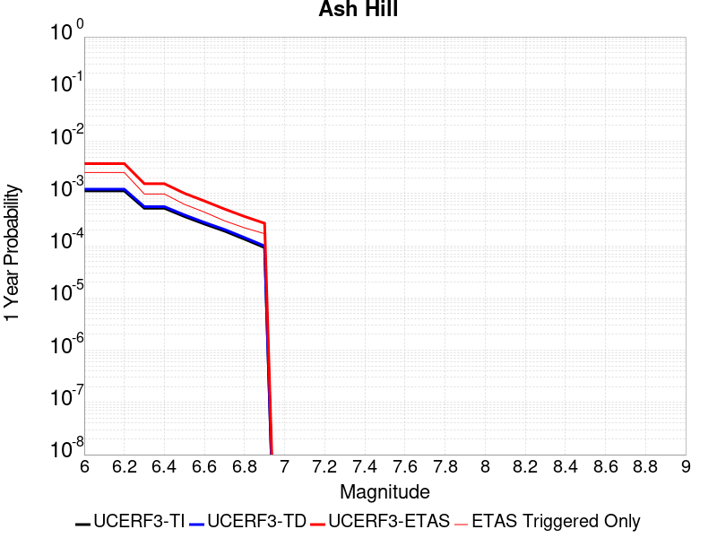 |  |

| Magnitude | 1 wk TI Prob | 1 wk TD Prob | 1 wk ETAS Prob | 1 wk ETAS/TD Gain | 1 wk ETAS Triggered Only | 1 mo TI Prob | 1 mo TD Prob | 1 mo ETAS Prob | 1 mo ETAS/TD Gain | 1 mo ETAS Triggered Only | 1 yr TI Prob | 1 yr TD Prob | 1 yr ETAS Prob | 1 yr ETAS/TD Gain | 1 yr ETAS Triggered Only | 10 yr TI Prob | 10 yr TD Prob | 10 yr ETAS Prob | 10 yr ETAS/TD Gain | 10 yr ETAS Triggered Only |
|-----|-----|-----|-----|-----|-----|-----|-----|-----|-----|-----|-----|-----|-----|-----|-----|-----|-----|-----|-----|-----|
| 6.0 | 2.1545662E-5 | 2.3196095E-5 | 1.6156671E-4 | 6.965255 | 1.3837383E-4 | 9.2335285E-5 | 9.94085E-5 | 7.912089E-4 | 7.959167 | 6.918692E-4 | 0.0011236023 | 0.0012097065 | 0.0038909114 | 3.2164094 | 0.0026844523 | 0.011179381 | 0.0120392 | 0.017589541 | 1.4610225 | 0.0056179776 |
| 6.1 | 2.1545662E-5 | 2.3196095E-5 | 1.6156671E-4 | 6.965255 | 1.3837383E-4 | 9.2335285E-5 | 9.94085E-5 | 7.912089E-4 | 7.959167 | 6.918692E-4 | 0.0011236023 | 0.0012097065 | 0.0038909114 | 3.2164094 | 0.0026844523 | 0.011179381 | 0.0120392 | 0.017589541 | 1.4610225 | 0.0056179776 |
| 6.2 | 2.1545662E-5 | 2.3196095E-5 | 1.6156671E-4 | 6.965255 | 1.3837383E-4 | 9.2335285E-5 | 9.94085E-5 | 7.912089E-4 | 7.959167 | 6.918692E-4 | 0.0011236023 | 0.0012097065 | 0.0038909114 | 3.2164094 | 0.0026844523 | 0.011179381 | 0.0120392 | 0.017589541 | 1.4610225 | 0.0056179776 |
| 6.3 | 1.0025529E-5 | 1.0747653E-5 | 3.842212E-5 | 3.5749316 | 2.7674767E-5 | 4.2965847E-5 | 4.6060628E-5 | 2.6744857E-4 | 5.806446 | 2.2139814E-4 | 5.229836E-4 | 5.6065706E-4 | 0.0016117085 | 2.874678 | 0.0010516411 | 0.005217545 | 0.005593739 | 0.0076302164 | 1.3640636 | 0.0020479327 |
| 6.4 | 1.0025529E-5 | 1.0747653E-5 | 3.842212E-5 | 3.5749316 | 2.7674767E-5 | 4.2965847E-5 | 4.6060628E-5 | 2.6744857E-4 | 5.806446 | 2.2139814E-4 | 5.229836E-4 | 5.6065706E-4 | 0.0016117085 | 2.874678 | 0.0010516411 | 0.005217545 | 0.005593739 | 0.0076302164 | 1.3640636 | 0.0020479327 |
| 6.5 | 6.9617327E-6 | 7.4571262E-6 | 3.5131685E-5 | 4.711156 | 2.7674767E-5 | 2.9835655E-5 | 3.195877E-5 | 1.14980416E-4 | 3.5977736 | 8.30243E-5 | 3.6318856E-4 | 3.8903722E-4 | 0.0010253092 | 2.6355042 | 6.3651963E-4 | 0.0036259557 | 0.0038844163 | 0.005207645 | 1.3406506 | 0.0013283888 |
| 6.6 | 4.9919777E-6 | 5.3470408E-6 | 3.302166E-5 | 6.1756883 | 2.7674767E-5 | 2.1394015E-5 | 2.2915727E-5 | 7.826399E-5 | 3.415296 | 5.5349534E-5 | 2.60441E-4 | 2.7896996E-4 | 7.493097E-4 | 2.6859872 | 4.7047102E-4 | 0.0026013597 | 0.0027868561 | 0.0037803713 | 1.3565003 | 9.962916E-4 |
| 6.7 | 3.6630722E-6 | 3.924884E-6 | 3.924884E-6 | 1.0 | 0.0 | 1.5698786E-5 | 1.6820855E-5 | 4.4495155E-5 | 2.6452374 | 2.7674767E-5 | 1.9111596E-4 | 2.047804E-4 | 5.3680956E-4 | 2.6213915 | 3.320972E-4 | 0.0019095168 | 0.00204648 | 0.0027921696 | 1.3643767 | 7.4721867E-4 |
| 6.8 | 2.5599613E-6 | 2.7451092E-6 | 2.7451092E-6 | 1.0 | 0.0 | 1.0971216E-5 | 1.1764729E-5 | 3.9439168E-5 | 3.3523228 | 2.7674767E-5 | 1.3356637E-4 | 1.432311E-4 | 4.199391E-4 | 2.931899 | 2.7674765E-4 | 0.0013348613 | 0.001431873 | 0.0019569406 | 1.3666999 | 5.2582053E-4 |
| 6.9 | 1.7684905E-6 | 1.8969986E-6 | 1.8969986E-6 | 1.0 | 0.0 | 7.579223E-6 | 8.129994E-6 | 3.5804536E-5 | 4.404005 | 2.7674767E-5 | 9.2273134E-5 | 9.898267E-5 | 3.203589E-4 | 3.2365148 | 2.2139814E-4 | 9.223483E-4 | 9.898267E-4 | 0.00137689 | 1.3910414 | 3.8744672E-4 |

## Blackwater
*[(top)](#table-of-contents)*

| 1 Week | 1 Month | 1 Year | 10 Year |
|-----|-----|-----|-----|
|  | 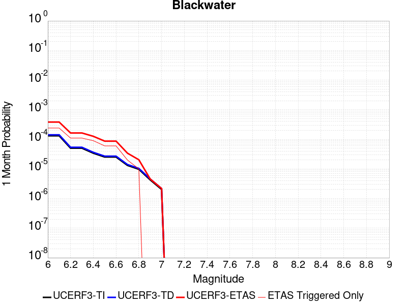 |  |  |

| Magnitude | 1 wk TI Prob | 1 wk TD Prob | 1 wk ETAS Prob | 1 wk ETAS/TD Gain | 1 wk ETAS Triggered Only | 1 mo TI Prob | 1 mo TD Prob | 1 mo ETAS Prob | 1 mo ETAS/TD Gain | 1 mo ETAS Triggered Only | 1 yr TI Prob | 1 yr TD Prob | 1 yr ETAS Prob | 1 yr ETAS/TD Gain | 1 yr ETAS Triggered Only | 10 yr TI Prob | 10 yr TD Prob | 10 yr ETAS Prob | 10 yr ETAS/TD Gain | 10 yr ETAS Triggered Only |
|-----|-----|-----|-----|-----|-----|-----|-----|-----|-----|-----|-----|-----|-----|-----|-----|-----|-----|-----|-----|-----|
| 6.0 | 3.0708583E-5 | 3.309824E-5 | 8.8445944E-5 | 2.6722248 | 5.5349534E-5 | 1.3160157E-4 | 1.4184265E-4 | 3.9088022E-4 | 2.755731 | 2.490729E-4 | 0.0016010714 | 0.0017257031 | 0.0034938317 | 2.0245843 | 0.0017711851 | 0.015895851 | 0.017136863 | 0.02178815 | 1.27142 | 0.004732385 |
| 6.1 | 3.0708583E-5 | 3.309824E-5 | 8.8445944E-5 | 2.6722248 | 5.5349534E-5 | 1.3160157E-4 | 1.4184265E-4 | 3.9088022E-4 | 2.755731 | 2.490729E-4 | 0.0016010714 | 0.0017257031 | 0.0034938317 | 2.0245843 | 0.0017711851 | 0.015895851 | 0.017136863 | 0.02178815 | 1.27142 | 0.004732385 |
| 6.2 | 1.1707779E-5 | 1.25459555E-5 | 6.789479E-5 | 5.411688 | 5.5349534E-5 | 5.017523E-5 | 5.376733E-5 | 1.9213372E-4 | 3.5734289 | 1.3837383E-4 | 6.107122E-4 | 6.544302E-4 | 0.0013458466 | 2.0565166 | 6.918692E-4 | 0.006090366 | 0.0065260017 | 0.008340617 | 1.2780591 | 0.0018265345 |
| 6.3 | 1.1707779E-5 | 1.25459555E-5 | 6.789479E-5 | 5.411688 | 5.5349534E-5 | 5.017523E-5 | 5.376733E-5 | 1.9213372E-4 | 3.5734289 | 1.3837383E-4 | 6.107122E-4 | 6.544302E-4 | 0.0013458466 | 2.0565166 | 6.918692E-4 | 0.006090366 | 0.0065260017 | 0.008340617 | 1.2780591 | 0.0018265345 |
| 6.4 | 7.929244E-6 | 8.480645E-6 | 6.3829706E-5 | 7.5265155 | 5.5349534E-5 | 3.3982033E-5 | 3.634514E-5 | 1.7471395E-4 | 4.807079 | 1.3837383E-4 | 4.136527E-4 | 4.4241626E-4 | 9.126791E-4 | 2.062942 | 4.7047102E-4 | 0.0041288356 | 0.0044157603 | 0.005628073 | 1.2745422 | 0.0012176897 |
| 6.5 | 5.8832115E-6 | 6.2863905E-6 | 3.3960983E-5 | 5.4023023 | 2.7674767E-5 | 2.521352E-5 | 2.694141E-5 | 1.3763749E-4 | 5.108771 | 1.1069907E-4 | 3.0693135E-4 | 3.2796484E-4 | 7.429502E-4 | 2.2653348 | 4.151215E-4 | 0.0030650778 | 0.0032750617 | 0.0043232585 | 1.320054 | 0.0010516411 |
| 6.6 | 5.8832115E-6 | 6.2863905E-6 | 3.3960983E-5 | 5.4023023 | 2.7674767E-5 | 2.521352E-5 | 2.694141E-5 | 1.3763749E-4 | 5.108771 | 1.1069907E-4 | 3.0693135E-4 | 3.2796484E-4 | 7.429502E-4 | 2.2653348 | 4.151215E-4 | 0.0030650778 | 0.0032750617 | 0.0043232585 | 1.320054 | 0.0010516411 |
| 6.7 | 3.0715053E-6 | 3.2816745E-6 | 3.2816745E-6 | 1.0 | 0.0 | 1.3163528E-5 | 1.406425E-5 | 1.406425E-5 | 1.0 | 0.0 | 1.6025416E-4 | 1.7121994E-4 | 3.9258017E-4 | 2.2928412 | 2.2139814E-4 | 0.0016013865 | 0.0017109949 | 0.0022082883 | 1.2906458 | 4.981458E-4 |
| 6.8 | 2.2722281E-6 | 2.428909E-6 | 2.428909E-6 | 1.0 | 0.0 | 9.738084E-6 | 1.0409573E-5 | 1.0409573E-5 | 1.0 | 0.0 | 1.1855473E-4 | 1.2673011E-4 | 2.9275767E-4 | 2.3100877 | 1.660486E-4 | 0.001184915 | 0.0012666686 | 0.0016259848 | 1.2836703 | 3.5977195E-4 |
| 6.9 | 9.952399E-7 | 1.0654186E-6 | 1.0654186E-6 | 1.0 | 0.0 | 4.265307E-6 | 4.5660745E-6 | 4.5660745E-6 | 1.0 | 0.0 | 5.1928873E-5 | 5.5591052E-5 | 1.1093751E-4 | 1.9956001 | 5.5349534E-5 | 5.191674E-4 | 5.558221E-4 | 6.94119E-4 | 1.2488151 | 1.3837383E-4 |
| 7.0 | 4.7385504E-7 | 5.0758945E-7 | 5.0758945E-7 | 1.0 | 0.0 | 2.0308057E-6 | 2.1753833E-6 | 2.1753833E-6 | 1.0 | 0.0 | 2.4724779E-5 | 2.6485293E-5 | 5.4159325E-5 | 2.044883 | 2.7674767E-5 | 2.4722028E-4 | 2.6485292E-4 | 3.201878E-4 | 1.2089268 | 5.5349534E-5 |

## Garlock (West)
*[(top)](#table-of-contents)*

| 1 Week | 1 Month | 1 Year | 10 Year |
|-----|-----|-----|-----|
|  | 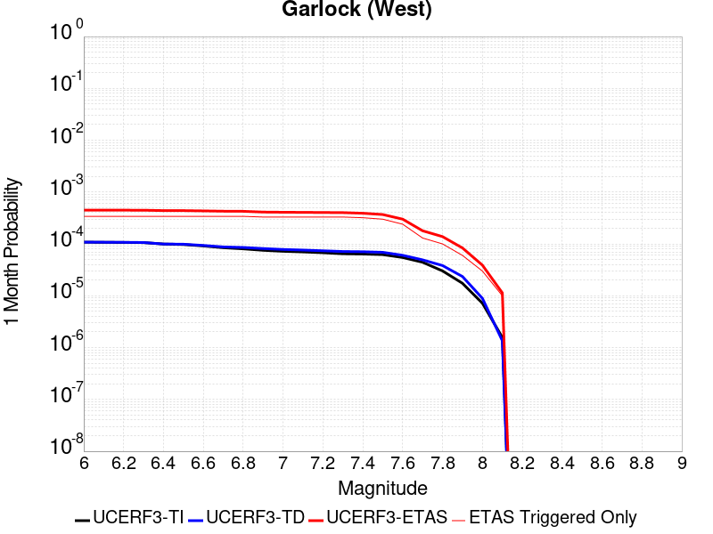 |  |  |

| Magnitude | 1 wk TI Prob | 1 wk TD Prob | 1 wk ETAS Prob | 1 wk ETAS/TD Gain | 1 wk ETAS Triggered Only | 1 mo TI Prob | 1 mo TD Prob | 1 mo ETAS Prob | 1 mo ETAS/TD Gain | 1 mo ETAS Triggered Only | 1 yr TI Prob | 1 yr TD Prob | 1 yr ETAS Prob | 1 yr ETAS/TD Gain | 1 yr ETAS Triggered Only | 10 yr TI Prob | 10 yr TD Prob | 10 yr ETAS Prob | 10 yr ETAS/TD Gain | 10 yr ETAS Triggered Only |
|-----|-----|-----|-----|-----|-----|-----|-----|-----|-----|-----|-----|-----|-----|-----|-----|-----|-----|-----|-----|-----|
| 6.0 | 2.5181727E-5 | 2.5232022E-5 | 1.3592829E-4 | 5.387134 | 1.1069907E-4 | 1.0791722E-4 | 1.0813278E-4 | 4.6786584E-4 | 4.3267717 | 3.5977195E-4 | 0.0013131002 | 0.0013157249 | 0.003029303 | 2.3023832 | 0.0017158355 | 0.013053683 | 0.013159796 | 0.016518997 | 1.2552624 | 0.0034039964 |
| 6.1 | 2.5077732E-5 | 2.513308E-5 | 1.3582937E-4 | 5.4044056 | 1.1069907E-4 | 1.0747157E-4 | 1.0770877E-4 | 4.6744198E-4 | 4.339869 | 3.5977195E-4 | 0.001307681 | 0.0013105689 | 0.0030241557 | 2.3075137 | 0.0017158355 | 0.013000126 | 0.013108846 | 0.01646822 | 1.2562677 | 0.0034039964 |
| 6.2 | 2.494612E-5 | 2.5014735E-5 | 1.3571103E-4 | 5.425244 | 1.1069907E-4 | 1.0690756E-4 | 1.0720162E-4 | 4.6693502E-4 | 4.3556714 | 3.5977195E-4 | 0.0013008224 | 0.0013044017 | 0.003017999 | 2.3137038 | 0.0017158355 | 0.012932341 | 0.013047898 | 0.01640748 | 1.2574806 | 0.0034039964 |
| 6.3 | 2.4733758E-5 | 2.4834064E-5 | 1.3553038E-4 | 5.4574385 | 1.1069907E-4 | 1.0599751E-4 | 1.0642738E-4 | 4.6616106E-4 | 4.380086 | 3.5977195E-4 | 0.0012897556 | 0.0012949866 | 0.0030086 | 2.3232675 | 0.0017158355 | 0.012822957 | 0.012954849 | 0.016314747 | 1.2593545 | 0.0034039964 |
| 6.4 | 2.3237335E-5 | 2.3213131E-5 | 1.3390963E-4 | 5.7687016 | 1.1069907E-4 | 9.958477E-5 | 9.9481076E-5 | 4.5921723E-4 | 4.6161265 | 3.5977195E-4 | 0.0012117702 | 0.0012105119 | 0.0029242705 | 2.4157302 | 0.0017158355 | 0.012051838 | 0.012119588 | 0.01548233 | 1.2774633 | 0.0034039964 |
| 6.5 | 2.2732203E-5 | 2.302753E-5 | 1.3372404E-4 | 5.807138 | 1.1069907E-4 | 9.742009E-5 | 9.86857E-5 | 4.5842215E-4 | 4.6452746 | 3.5977195E-4 | 0.0011854442 | 0.001200839 | 0.002914614 | 2.427148 | 0.0017158355 | 0.011791403 | 0.012023909 | 0.015386976 | 1.2796983 | 0.0034039964 |
| 6.6 | 2.1319436E-5 | 2.1807444E-5 | 1.325041E-4 | 6.0760946 | 1.1069907E-4 | 9.136581E-5 | 9.3457136E-5 | 4.5319548E-4 | 4.8492336 | 3.5977195E-4 | 0.001111811 | 0.001137249 | 0.0028511332 | 2.5070438 | 0.0017158355 | 0.011062649 | 0.011394676 | 0.014759885 | 1.2953317 | 0.0034039964 |
| 6.7 | 1.970802E-5 | 2.0426989E-5 | 1.3112379E-4 | 6.4191446 | 1.1069907E-4 | 8.446021E-5 | 8.754131E-5 | 4.4728178E-4 | 5.1093793 | 3.5977195E-4 | 0.001027818 | 0.001065296 | 0.0027793036 | 2.6089497 | 0.0017158355 | 0.010230771 | 0.010682246 | 0.014049879 | 1.3152553 | 0.0034039964 |
| 6.8 | 1.8744462E-5 | 1.993445E-5 | 1.306313E-4 | 6.553043 | 1.1069907E-4 | 8.033094E-5 | 8.543057E-5 | 4.4517178E-4 | 5.2109194 | 3.5977195E-4 | 9.775903E-4 | 0.0010396226 | 0.0027536743 | 2.648725 | 0.0017158355 | 0.009733009 | 0.010427939 | 0.013796438 | 1.3230264 | 0.0034039964 |
| 6.9 | 1.7559682E-5 | 1.89866E-5 | 1.2968357E-4 | 6.830268 | 1.1069907E-4 | 7.5253614E-5 | 8.136861E-5 | 4.134388E-4 | 5.0810595 | 3.320972E-4 | 9.158276E-4 | 9.902141E-4 | 0.0026767033 | 2.703156 | 0.0016881607 | 0.0091206245 | 0.009938315 | 0.013253681 | 1.3335944 | 0.0033486467 |
| 7.0 | 1.6794445E-5 | 1.8249186E-5 | 1.2894622E-4 | 7.065862 | 1.1069907E-4 | 7.197421E-5 | 7.820846E-5 | 4.102797E-4 | 5.2459755 | 3.320972E-4 | 8.759337E-4 | 9.517734E-4 | 0.0026383274 | 2.772012 | 0.0016881607 | 0.008724891 | 0.009557109 | 0.012873753 | 1.3470341 | 0.0033486467 |
| 7.1 | 1.6337795E-5 | 1.7749819E-5 | 1.2844692E-4 | 7.23652 | 1.1069907E-4 | 7.0017246E-5 | 7.606844E-5 | 4.0814036E-4 | 5.365436 | 3.320972E-4 | 8.521265E-4 | 9.257411E-4 | 0.002612339 | 2.8218894 | 0.0016881607 | 0.008488664 | 0.009298879 | 0.012616388 | 1.3567643 | 0.0033486467 |
| 7.2 | 1.5780008E-5 | 1.7198334E-5 | 1.278955E-4 | 7.436505 | 1.1069907E-4 | 6.762685E-5 | 7.370507E-5 | 4.057778E-4 | 5.5054255 | 3.320972E-4 | 8.2304585E-4 | 8.969911E-4 | 0.0025836376 | 2.880338 | 0.0016881607 | 0.008200042 | 0.009013661 | 0.012332125 | 1.3681593 | 0.0033486467 |
| 7.3 | 1.5058865E-5 | 1.6651169E-5 | 1.273484E-4 | 7.648015 | 1.1069907E-4 | 6.45364E-5 | 7.1360206E-5 | 4.034337E-4 | 5.653483 | 3.320972E-4 | 7.854473E-4 | 8.684654E-4 | 0.00255516 | 2.9421554 | 0.0016881607 | 0.00782677 | 0.008730242 | 0.012022221 | 1.3770776 | 0.003320972 |
| 7.4 | 1.4887923E-5 | 1.6487036E-5 | 1.2718428E-4 | 7.7141986 | 1.1069907E-4 | 6.380382E-5 | 7.0656824E-5 | 4.0273054E-4 | 5.6998115 | 3.320972E-4 | 7.7653467E-4 | 8.5990847E-4 | 0.0025466175 | 2.9614983 | 0.0016881607 | 0.0077382675 | 0.008645052 | 0.011909878 | 1.3776526 | 0.0032932973 |
| 7.5 | 1.4509299E-5 | 1.6078842E-5 | 1.2677613E-4 | 7.884655 | 1.1069907E-4 | 6.218123E-5 | 6.890751E-5 | 4.009818E-4 | 5.819131 | 3.320972E-4 | 7.567935E-4 | 8.386272E-4 | 0.0024424174 | 2.9123995 | 0.0016051364 | 0.0075422134 | 0.008433252 | 0.011506686 | 1.3644423 | 0.0030995738 |
| 7.6 | 1.2756717E-5 | 1.4081641E-5 | 9.710477E-5 | 6.895842 | 8.30243E-5 | 5.4670498E-5 | 6.0348495E-5 | 3.6475254E-4 | 6.0441036 | 3.0442243E-4 | 6.6541E-4 | 7.3449593E-4 | 0.0018959823 | 2.5813382 | 0.0011623402 | 0.006634211 | 0.0073975893 | 0.009430372 | 1.2747899 | 0.0020479327 |
| 7.7 | 1.0328985E-5 | 1.148949E-5 | 6.683839E-5 | 5.8173504 | 5.5349534E-5 | 4.4266326E-5 | 4.9239745E-5 | 1.8760675E-4 | 3.8100677 | 1.3837383E-4 | 5.388092E-4 | 5.9932936E-4 | 0.0013461002 | 2.2460108 | 7.4721867E-4 | 0.0053750467 | 0.006053493 | 0.0072638113 | 1.1999372 | 0.0012176897 |
| 7.8 | 7.0306583E-6 | 8.922903E-6 | 6.427194E-5 | 7.20303 | 5.5349534E-5 | 3.0131043E-5 | 3.8240454E-5 | 1.4893529E-4 | 3.8947048 | 1.1069907E-4 | 3.667837E-4 | 4.6547825E-4 | 0.0010187159 | 2.1885362 | 5.534953E-4 | 0.003661789 | 0.004707357 | 0.005561236 | 1.1813926 | 8.5791777E-4 |
| 7.9 | 4.060633E-6 | 5.4793654E-6 | 5.4793654E-6 | 1.0 | 0.0 | 1.7402595E-5 | 2.3482784E-5 | 7.883101E-5 | 3.3569705 | 5.5349534E-5 | 2.11856E-4 | 2.8586548E-4 | 6.1786774E-4 | 2.1613934 | 3.320972E-4 | 0.0021165414 | 0.0028914614 | 0.0033329774 | 1.1526965 | 4.4279627E-4 |
| 8.0 | 1.6729537E-6 | 2.0820012E-6 | 2.0820012E-6 | 1.0 | 0.0 | 7.169782E-6 | 8.9228315E-6 | 6.427187E-5 | 7.20308 | 5.5349534E-5 | 8.7288594E-5 | 1.0863009E-4 | 1.9164538E-4 | 1.7642015 | 8.30243E-5 | 8.7254314E-4 | 0.0010992672 | 0.0012098445 | 1.1005919 | 1.1069907E-4 |
| 8.1 | 3.6733252E-7 | 3.1554555E-7 | 3.1554555E-7 | 1.0 | 0.0 | 1.5742813E-6 | 1.3523374E-6 | 2.9027065E-5 | 21.464365 | 2.7674767E-5 | 1.9166706E-5 | 1.64646E-5 | 4.4138913E-5 | 2.680837 | 2.7674767E-5 | 1.9165053E-4 | 1.6672608E-4 | 1.9439624E-4 | 1.1659617 | 2.7674767E-5 |

## McLean Lake
*[(top)](#table-of-contents)*

| 1 Week | 1 Month | 1 Year | 10 Year |
|-----|-----|-----|-----|
|  |  |  |  |

| Magnitude | 1 wk TI Prob | 1 wk TD Prob | 1 wk ETAS Prob | 1 wk ETAS/TD Gain | 1 wk ETAS Triggered Only | 1 mo TI Prob | 1 mo TD Prob | 1 mo ETAS Prob | 1 mo ETAS/TD Gain | 1 mo ETAS Triggered Only | 1 yr TI Prob | 1 yr TD Prob | 1 yr ETAS Prob | 1 yr ETAS/TD Gain | 1 yr ETAS Triggered Only | 10 yr TI Prob | 10 yr TD Prob | 10 yr ETAS Prob | 10 yr ETAS/TD Gain | 10 yr ETAS Triggered Only |
|-----|-----|-----|-----|-----|-----|-----|-----|-----|-----|-----|-----|-----|-----|-----|-----|-----|-----|-----|-----|-----|
| 6.0 | 1.7360222E-5 | 1.8502758E-5 | 4.6177014E-5 | 2.4956825 | 2.7674767E-5 | 7.439883E-5 | 7.92954E-5 | 2.1765826E-4 | 2.744904 | 1.3837383E-4 | 9.0542925E-4 | 9.6504256E-4 | 0.0019327246 | 2.0027351 | 9.686168E-4 | 0.009017491 | 0.00961336 | 0.012244597 | 1.2737063 | 0.0026567776 |
| 6.1 | 9.062689E-6 | 9.592714E-6 | 9.592714E-6 | 1.0 | 0.0 | 3.8839516E-5 | 4.1111034E-5 | 9.6458294E-5 | 2.346287 | 5.5349534E-5 | 4.727685E-4 | 5.004208E-4 | 8.600127E-4 | 1.718579 | 3.5977195E-4 | 0.0047176396 | 0.0049938224 | 0.006288041 | 1.2591639 | 0.001300714 |
| 6.2 | 9.062689E-6 | 9.592714E-6 | 9.592714E-6 | 1.0 | 0.0 | 3.8839516E-5 | 4.1111034E-5 | 9.6458294E-5 | 2.346287 | 5.5349534E-5 | 4.727685E-4 | 5.004208E-4 | 8.600127E-4 | 1.718579 | 3.5977195E-4 | 0.0047176396 | 0.0049938224 | 0.006288041 | 1.2591639 | 0.001300714 |
| 6.3 | 7.2575485E-6 | 7.668112E-6 | 7.668112E-6 | 1.0 | 0.0 | 3.110341E-5 | 3.2862965E-5 | 6.053682E-5 | 1.8420986 | 2.7674767E-5 | 3.786182E-4 | 4.0004024E-4 | 6.766772E-4 | 1.6915228 | 2.7674765E-4 | 0.0037797375 | 0.003993906 | 0.005041347 | 1.2622598 | 0.0010516411 |
| 6.4 | 7.2575485E-6 | 7.668112E-6 | 7.668112E-6 | 1.0 | 0.0 | 3.110341E-5 | 3.2862965E-5 | 6.053682E-5 | 1.8420986 | 2.7674767E-5 | 3.786182E-4 | 4.0004024E-4 | 6.766772E-4 | 1.6915228 | 2.7674765E-4 | 0.0037797375 | 0.003993906 | 0.005041347 | 1.2622598 | 0.0010516411 |
| 6.5 | 6.06582E-6 | 6.4042088E-6 | 6.4042088E-6 | 1.0 | 0.0 | 2.5996113E-5 | 2.7446356E-5 | 2.7446356E-5 | 1.0 | 0.0 | 3.164567E-4 | 3.3411465E-4 | 5.831043E-4 | 1.7452223 | 2.490729E-4 | 0.0031600643 | 0.0033367618 | 0.004329729 | 1.297584 | 9.962916E-4 |
| 6.6 | 5.598744E-6 | 5.910568E-6 | 5.910568E-6 | 1.0 | 0.0 | 2.3994397E-5 | 2.5330795E-5 | 2.5330795E-5 | 1.0 | 0.0 | 2.9209262E-4 | 3.0836518E-4 | 5.573613E-4 | 1.8074715 | 2.490729E-4 | 0.0029170897 | 0.003080002 | 0.0040456355 | 1.3135171 | 9.686168E-4 |
| 6.7 | 5.246996E-6 | 5.5394485E-6 | 5.5394485E-6 | 1.0 | 0.0 | 2.2486933E-5 | 2.3740315E-5 | 2.3740315E-5 | 1.0 | 0.0 | 2.73744E-4 | 2.8900633E-4 | 5.3800724E-4 | 1.861576 | 2.490729E-4 | 0.0027340704 | 0.0028869289 | 0.0038251544 | 1.3249909 | 9.4094203E-4 |
| 6.8 | 4.02324E-6 | 4.247124E-6 | 4.247124E-6 | 1.0 | 0.0 | 1.7242342E-5 | 1.8201867E-5 | 1.8201867E-5 | 1.0 | 0.0 | 2.099053E-4 | 2.2159114E-4 | 4.1527158E-4 | 1.8740442 | 1.9372336E-4 | 0.0020970714 | 0.0022142862 | 0.0028217828 | 1.2743533 | 6.0884486E-4 |
| 6.9 | 6.835972E-7 | 7.140223E-7 | 7.140223E-7 | 1.0 | 0.0 | 2.9296991E-6 | 3.0600938E-6 | 3.0600938E-6 | 1.0 | 0.0 | 3.56685E-5 | 3.7256323E-5 | 3.7256323E-5 | 1.0 | 0.0 | 3.5662777E-4 | 3.7253203E-4 | 5.108543E-4 | 1.3713031 | 1.3837383E-4 |

## Goldstone Lake
*[(top)](#table-of-contents)*

| 1 Week | 1 Month | 1 Year | 10 Year |
|-----|-----|-----|-----|
|  |  |  |  |

| Magnitude | 1 wk TI Prob | 1 wk TD Prob | 1 wk ETAS Prob | 1 wk ETAS/TD Gain | 1 wk ETAS Triggered Only | 1 mo TI Prob | 1 mo TD Prob | 1 mo ETAS Prob | 1 mo ETAS/TD Gain | 1 mo ETAS Triggered Only | 1 yr TI Prob | 1 yr TD Prob | 1 yr ETAS Prob | 1 yr ETAS/TD Gain | 1 yr ETAS Triggered Only | 10 yr TI Prob | 10 yr TD Prob | 10 yr ETAS Prob | 10 yr ETAS/TD Gain | 10 yr ETAS Triggered Only |
|-----|-----|-----|-----|-----|-----|-----|-----|-----|-----|-----|-----|-----|-----|-----|-----|-----|-----|-----|-----|-----|
| 6.0 | 2.671352E-5 | 3.0379857E-5 | 8.572771E-5 | 2.82186 | 5.5349534E-5 | 1.1448149E-4 | 1.30194E-4 | 3.515633E-4 | 2.7003033 | 2.2139814E-4 | 0.001392921 | 0.0015841558 | 0.0023854526 | 1.5058194 | 8.025682E-4 | 0.013842222 | 0.015748136 | 0.017927252 | 1.1383729 | 0.0022139812 |
| 6.1 | 2.671352E-5 | 3.0379857E-5 | 8.572771E-5 | 2.82186 | 5.5349534E-5 | 1.1448149E-4 | 1.30194E-4 | 3.515633E-4 | 2.7003033 | 2.2139814E-4 | 0.001392921 | 0.0015841558 | 0.0023854526 | 1.5058194 | 8.025682E-4 | 0.013842222 | 0.015748136 | 0.017927252 | 1.1383729 | 0.0022139812 |
| 6.2 | 1.4197047E-5 | 1.6098144E-5 | 1.6098144E-5 | 1.0 | 0.0 | 6.0843064E-5 | 6.8990776E-5 | 1.5200935E-4 | 2.2033286 | 8.30243E-5 | 7.4051257E-4 | 8.3973765E-4 | 0.001171556 | 1.3951452 | 3.320972E-4 | 0.007380498 | 0.008375344 | 0.009610278 | 1.1474488 | 0.0012453644 |
| 6.3 | 1.4197047E-5 | 1.6098144E-5 | 1.6098144E-5 | 1.0 | 0.0 | 6.0843064E-5 | 6.8990776E-5 | 1.5200935E-4 | 2.2033286 | 8.30243E-5 | 7.4051257E-4 | 8.3973765E-4 | 0.001171556 | 1.3951452 | 3.320972E-4 | 0.007380498 | 0.008375344 | 0.009610278 | 1.1474488 | 0.0012453644 |
| 6.4 | 1.3238931E-5 | 1.5010221E-5 | 1.5010221E-5 | 1.0 | 0.0 | 5.6737044E-5 | 6.432849E-5 | 1.4734744E-4 | 2.2905474 | 8.30243E-5 | 6.9055456E-4 | 7.830159E-4 | 0.0010872 | 1.3884774 | 3.0442243E-4 | 0.006884126 | 0.0078121983 | 0.008992917 | 1.1511378 | 0.001190015 |
| 6.5 | 1.3238931E-5 | 1.5010221E-5 | 1.5010221E-5 | 1.0 | 0.0 | 5.6737044E-5 | 6.432849E-5 | 1.4734744E-4 | 2.2905474 | 8.30243E-5 | 6.9055456E-4 | 7.830159E-4 | 0.0010872 | 1.3884774 | 3.0442243E-4 | 0.006884126 | 0.0078121983 | 0.008992917 | 1.1511378 | 0.001190015 |
| 6.6 | 1.1328278E-5 | 1.28566735E-5 | 1.28566735E-5 | 1.0 | 0.0 | 4.8548856E-5 | 5.5099405E-5 | 1.3811913E-4 | 2.5067263 | 8.30243E-5 | 5.90922E-4 | 6.707245E-4 | 9.4728655E-4 | 1.4123333 | 2.7674765E-4 | 0.0058935313 | 0.006696393 | 0.0077409917 | 1.1559943 | 0.0010516411 |
| 6.7 | 8.651175E-6 | 9.8257005E-6 | 9.8257005E-6 | 1.0 | 0.0 | 3.707594E-5 | 4.2109976E-5 | 6.978358E-5 | 1.6571745 | 2.7674767E-5 | 4.5130608E-4 | 5.126589E-4 | 7.0628297E-4 | 1.3776859 | 1.9372336E-4 | 0.0045039062 | 0.005123643 | 0.0058670337 | 1.1450901 | 7.4721867E-4 |
| 6.8 | 1.0215377E-6 | 1.1755332E-6 | 1.1755332E-6 | 1.0 | 0.0 | 4.378012E-6 | 5.0379904E-6 | 5.0379904E-6 | 1.0 | 0.0 | 5.3300988E-5 | 6.133592E-5 | 6.133592E-5 | 1.0 | 0.0 | 5.3288206E-4 | 6.132012E-4 | 6.4085895E-4 | 1.0451039 | 2.7674767E-5 |
| 6.9 | 7.9360774E-7 | 9.283833E-7 | 9.283833E-7 | 1.0 | 0.0 | 3.4011714E-6 | 3.9787797E-6 | 3.9787797E-6 | 1.0 | 0.0 | 4.1408475E-5 | 4.844064E-5 | 4.844064E-5 | 1.0 | 0.0 | 4.140076E-4 | 4.843078E-4 | 4.843078E-4 | 1.0 | 0.0 |
| 7.0 | 7.4382757E-7 | 8.747727E-7 | 8.747727E-7 | 1.0 | 0.0 | 3.1878285E-6 | 3.7490208E-6 | 3.7490208E-6 | 1.0 | 0.0 | 3.8811122E-5 | 4.564344E-5 | 4.564344E-5 | 1.0 | 0.0 | 3.8804344E-4 | 4.5634728E-4 | 4.5634728E-4 | 1.0 | 0.0 |
| 7.1 | 6.4709513E-7 | 7.71163E-7 | 7.71163E-7 | 1.0 | 0.0 | 2.773262E-6 | 3.3049803E-6 | 3.3049803E-6 | 1.0 | 0.0 | 3.376394E-5 | 4.0237454E-5 | 4.0237454E-5 | 1.0 | 0.0 | 3.375881E-4 | 4.0230763E-4 | 4.0230763E-4 | 1.0 | 0.0 |
| 7.2 | 6.356704E-7 | 7.5886805E-7 | 7.5886805E-7 | 1.0 | 0.0 | 2.7242988E-6 | 3.252288E-6 | 3.252288E-6 | 1.0 | 0.0 | 3.3167835E-5 | 3.9595947E-5 | 3.9595947E-5 | 1.0 | 0.0 | 3.3162883E-4 | 3.9589487E-4 | 3.9589487E-4 | 1.0 | 0.0 |
| 7.3 | 5.7695723E-7 | 6.8968615E-7 | 6.8968615E-7 | 1.0 | 0.0 | 2.4726714E-6 | 2.9557948E-6 | 2.9557948E-6 | 1.0 | 0.0 | 3.0104358E-5 | 3.5986264E-5 | 3.5986264E-5 | 1.0 | 0.0 | 3.0100282E-4 | 3.598101E-4 | 3.598101E-4 | 1.0 | 0.0 |
| 7.4 | 5.209647E-7 | 6.1937635E-7 | 6.1937635E-7 | 1.0 | 0.0 | 2.232704E-6 | 2.6544676E-6 | 2.6544676E-6 | 1.0 | 0.0 | 2.718283E-5 | 3.2317723E-5 | 3.2317723E-5 | 1.0 | 0.0 | 2.7179506E-4 | 3.2313578E-4 | 3.2313578E-4 | 1.0 | 0.0 |
| 7.5 | 4.512955E-7 | 5.349091E-7 | 5.349091E-7 | 1.0 | 0.0 | 1.934122E-6 | 2.2924658E-6 | 2.2924658E-6 | 1.0 | 0.0 | 2.3547682E-5 | 2.7910468E-5 | 2.7910468E-5 | 1.0 | 0.0 | 2.3545188E-4 | 2.7907494E-4 | 2.7907494E-4 | 1.0 | 0.0 |
| 7.6 | 2.21172E-7 | 2.6040513E-7 | 2.6040513E-7 | 1.0 | 0.0 | 9.478797E-7 | 1.1160216E-6 | 1.1160216E-6 | 1.0 | 0.0 | 1.1540374E-5 | 1.3587508E-5 | 1.3587508E-5 | 1.0 | 0.0 | 1.1539775E-4 | 1.3586959E-4 | 1.3586959E-4 | 1.0 | 0.0 |

## Gravel Hills-Harper Lk
*[(top)](#table-of-contents)*

| 1 Week | 1 Month | 1 Year | 10 Year |
|-----|-----|-----|-----|
|  |  |  | 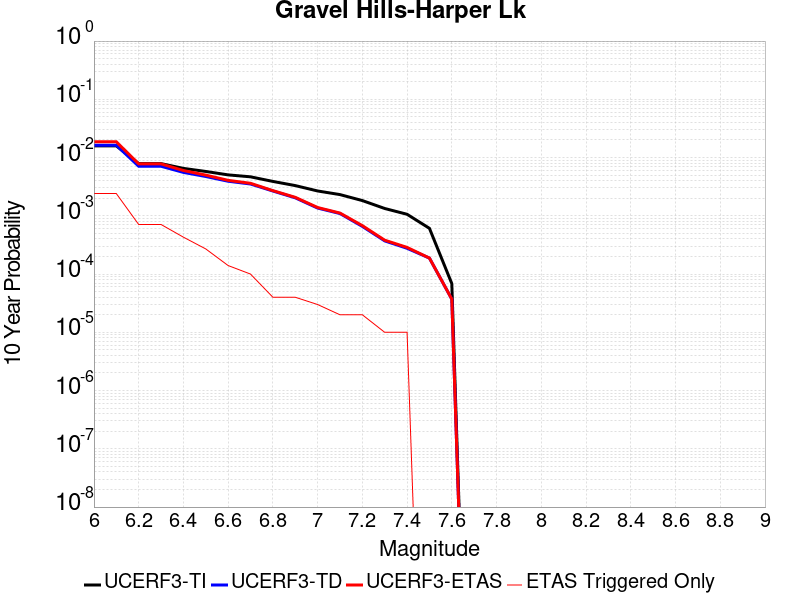 |

| Magnitude | 1 wk TI Prob | 1 wk TD Prob | 1 wk ETAS Prob | 1 wk ETAS/TD Gain | 1 wk ETAS Triggered Only | 1 mo TI Prob | 1 mo TD Prob | 1 mo ETAS Prob | 1 mo ETAS/TD Gain | 1 mo ETAS Triggered Only | 1 yr TI Prob | 1 yr TD Prob | 1 yr ETAS Prob | 1 yr ETAS/TD Gain | 1 yr ETAS Triggered Only | 10 yr TI Prob | 10 yr TD Prob | 10 yr ETAS Prob | 10 yr ETAS/TD Gain | 10 yr ETAS Triggered Only |
|-----|-----|-----|-----|-----|-----|-----|-----|-----|-----|-----|-----|-----|-----|-----|-----|-----|-----|-----|-----|-----|
| 6.0 | 3.0679566E-5 | 3.146842E-5 | 5.9142312E-5 | 1.8794181 | 2.7674767E-5 | 1.3147724E-4 | 1.348589E-4 | 3.5622716E-4 | 2.6414807 | 2.2139814E-4 | 0.0015995599 | 0.0016408868 | 0.0026908023 | 1.6398464 | 0.0010516411 | 0.015880952 | 0.01630928 | 0.018351037 | 1.1251898 | 0.0020756074 |
| 6.1 | 3.0679566E-5 | 3.146842E-5 | 5.9142312E-5 | 1.8794181 | 2.7674767E-5 | 1.3147724E-4 | 1.348589E-4 | 3.5622716E-4 | 2.6414807 | 2.2139814E-4 | 0.0015995599 | 0.0016408868 | 0.0026908023 | 1.6398464 | 0.0010516411 | 0.015880952 | 0.01630928 | 0.018351037 | 1.1251898 | 0.0020756074 |
| 6.2 | 1.514536E-5 | 1.3636506E-5 | 1.3636506E-5 | 1.0 | 0.0 | 6.490707E-5 | 5.8440924E-5 | 8.611407E-5 | 1.4735235 | 2.7674767E-5 | 7.8995706E-4 | 7.1129785E-4 | 9.601936E-4 | 1.3499178 | 2.490729E-4 | 0.007871548 | 0.0070914137 | 0.0076135057 | 1.0736231 | 5.2582053E-4 |
| 6.3 | 1.514536E-5 | 1.3636506E-5 | 1.3636506E-5 | 1.0 | 0.0 | 6.490707E-5 | 5.8440924E-5 | 8.611407E-5 | 1.4735235 | 2.7674767E-5 | 7.8995706E-4 | 7.1129785E-4 | 9.601936E-4 | 1.3499178 | 2.490729E-4 | 0.007871548 | 0.0070914137 | 0.0076135057 | 1.0736231 | 5.2582053E-4 |
| 6.4 | 1.2532521E-5 | 1.0690639E-5 | 1.0690639E-5 | 1.0 | 0.0 | 5.37097E-5 | 4.5816254E-5 | 4.5816254E-5 | 1.0 | 0.0 | 6.537194E-4 | 5.5767596E-4 | 6.129946E-4 | 1.099195 | 5.5349534E-5 | 0.0065179965 | 0.005563355 | 0.005838563 | 1.049468 | 2.7674765E-4 |
| 6.5 | 1.1094058E-5 | 9.084438E-6 | 9.084438E-6 | 1.0 | 0.0 | 4.7545094E-5 | 3.8932747E-5 | 3.8932747E-5 | 1.0 | 0.0 | 5.787078E-4 | 4.7390713E-4 | 5.015688E-4 | 1.0583694 | 2.7674767E-5 | 0.0057720304 | 0.0047293724 | 0.00492218 | 1.040768 | 1.9372336E-4 |
| 6.6 | 9.688328E-6 | 7.5323187E-6 | 7.5323187E-6 | 1.0 | 0.0 | 4.1520743E-5 | 3.2280983E-5 | 3.2280983E-5 | 1.0 | 0.0 | 5.053978E-4 | 3.929526E-4 | 3.929526E-4 | 1.0 | 0.0 | 0.0050424994 | 0.0039228345 | 0.0040330994 | 1.0281085 | 1.1069907E-4 |
| 6.7 | 8.974824E-6 | 6.7499664E-6 | 6.7499664E-6 | 1.0 | 0.0 | 3.8462964E-5 | 2.892812E-5 | 2.892812E-5 | 1.0 | 0.0 | 4.6818596E-4 | 3.5214514E-4 | 3.5214514E-4 | 1.0 | 0.0 | 0.004672008 | 0.0035160924 | 0.0036264022 | 1.0313729 | 1.1069907E-4 |
| 6.8 | 7.4780046E-6 | 5.1166085E-6 | 5.1166085E-6 | 1.0 | 0.0 | 3.20482E-5 | 2.1928145E-5 | 2.1928145E-5 | 1.0 | 0.0 | 3.9011694E-4 | 2.6694385E-4 | 2.6694385E-4 | 1.0 | 0.0 | 0.0038943281 | 0.0026663702 | 0.0026939712 | 1.0103515 | 2.7674767E-5 |
| 6.9 | 6.3409307E-6 | 3.9078204E-6 | 3.9078204E-6 | 1.0 | 0.0 | 2.7175134E-5 | 1.67477E-5 | 1.67477E-5 | 1.0 | 0.0 | 3.3080703E-4 | 2.0388517E-4 | 2.0388517E-4 | 1.0 | 0.0 | 0.0033031502 | 0.0020370793 | 0.0020646977 | 1.0135578 | 2.7674767E-5 |
| 7.0 | 5.1239335E-6 | 2.6060832E-6 | 2.6060832E-6 | 1.0 | 0.0 | 2.195953E-5 | 1.1168881E-5 | 1.1168881E-5 | 1.0 | 0.0 | 2.6732447E-4 | 1.3597289E-4 | 1.3597289E-4 | 1.0 | 0.0 | 0.0026700313 | 0.0013589222 | 0.0013865595 | 1.0203376 | 2.7674767E-5 |
| 7.1 | 4.438899E-6 | 2.0986622E-6 | 2.0986622E-6 | 1.0 | 0.0 | 1.9023713E-5 | 8.994237E-6 | 8.994237E-6 | 1.0 | 0.0 | 2.315891E-4 | 1.0949955E-4 | 1.0949955E-4 | 1.0 | 0.0 | 0.002313479 | 0.001094478 | 0.0011221224 | 1.0252582 | 2.7674767E-5 |
| 7.2 | 3.50367E-6 | 1.261711E-6 | 1.261711E-6 | 1.0 | 0.0 | 1.5015643E-5 | 5.407322E-6 | 5.407322E-6 | 1.0 | 0.0 | 1.8280011E-4 | 6.583224E-5 | 6.583224E-5 | 1.0 | 0.0 | 0.0018264982 | 6.581356E-4 | 6.857922E-4 | 1.0420226 | 2.7674767E-5 |
| 7.3 | 2.561638E-6 | 7.120225E-7 | 7.120225E-7 | 1.0 | 0.0 | 1.0978401E-5 | 3.0515216E-6 | 3.0515216E-6 | 1.0 | 0.0 | 1.3365384E-4 | 3.715166E-5 | 3.715166E-5 | 1.0 | 0.0 | 0.0013357349 | 3.714565E-4 | 3.714565E-4 | 1.0 | 0.0 |
| 7.4 | 2.0368864E-6 | 5.305691E-7 | 5.305691E-7 | 1.0 | 0.0 | 8.729483E-6 | 2.2738657E-6 | 2.2738657E-6 | 1.0 | 0.0 | 1.06276275E-4 | 2.7683967E-5 | 2.7683967E-5 | 1.0 | 0.0 | 0.0010622547 | 2.7680572E-4 | 2.7680572E-4 | 1.0 | 0.0 |
| 7.5 | 1.1681728E-6 | 3.60355E-7 | 3.60355E-7 | 1.0 | 0.0 | 5.0064455E-6 | 1.5443777E-6 | 1.5443777E-6 | 1.0 | 0.0 | 6.0951766E-5 | 1.880264E-5 | 1.880264E-5 | 1.0 | 0.0 | 6.093505E-4 | 1.8801096E-4 | 1.8801096E-4 | 1.0 | 0.0 |
| 7.6 | 1.3154387E-7 | 7.120354E-8 | 7.120354E-8 | 1.0 | 0.0 | 5.6375933E-7 | 3.0515798E-7 | 3.0515798E-7 | 1.0 | 0.0 | 6.863748E-6 | 3.7152938E-6 | 3.7152938E-6 | 1.0 | 0.0 | 6.863536E-5 | 3.7152477E-5 | 3.7152477E-5 | 1.0 | 0.0 |

## So Sierra Nevada
*[(top)](#table-of-contents)*

| 1 Week | 1 Month | 1 Year | 10 Year |
|-----|-----|-----|-----|
|  |  |  |  |

| Magnitude | 1 wk TI Prob | 1 wk TD Prob | 1 wk ETAS Prob | 1 wk ETAS/TD Gain | 1 wk ETAS Triggered Only | 1 mo TI Prob | 1 mo TD Prob | 1 mo ETAS Prob | 1 mo ETAS/TD Gain | 1 mo ETAS Triggered Only | 1 yr TI Prob | 1 yr TD Prob | 1 yr ETAS Prob | 1 yr ETAS/TD Gain | 1 yr ETAS Triggered Only | 10 yr TI Prob | 10 yr TD Prob | 10 yr ETAS Prob | 10 yr ETAS/TD Gain | 10 yr ETAS Triggered Only |
|-----|-----|-----|-----|-----|-----|-----|-----|-----|-----|-----|-----|-----|-----|-----|-----|-----|-----|-----|-----|-----|
| 6.0 | 1.15488665E-5 | 1.1080196E-5 | 1.1080196E-5 | 1.0 | 0.0 | 4.9494203E-5 | 4.7485762E-5 | 1.3050612E-4 | 2.748321 | 8.30243E-5 | 6.024253E-4 | 5.779986E-4 | 0.0015737143 | 2.7226958 | 9.962916E-4 | 0.006007948 | 0.0057662213 | 0.0077748303 | 1.3483405 | 0.002020258 |
| 6.1 | 1.15488665E-5 | 1.1080196E-5 | 1.1080196E-5 | 1.0 | 0.0 | 4.9494203E-5 | 4.7485762E-5 | 1.3050612E-4 | 2.748321 | 8.30243E-5 | 6.024253E-4 | 5.779986E-4 | 0.0015737143 | 2.7226958 | 9.962916E-4 | 0.006007948 | 0.0057662213 | 0.0077748303 | 1.3483405 | 0.002020258 |
| 6.2 | 1.15488665E-5 | 1.1080196E-5 | 1.1080196E-5 | 1.0 | 0.0 | 4.9494203E-5 | 4.7485762E-5 | 1.3050612E-4 | 2.748321 | 8.30243E-5 | 6.024253E-4 | 5.779986E-4 | 0.0015737143 | 2.7226958 | 9.962916E-4 | 0.006007948 | 0.0057662213 | 0.0077748303 | 1.3483405 | 0.002020258 |
| 6.3 | 1.15488665E-5 | 1.1080196E-5 | 1.1080196E-5 | 1.0 | 0.0 | 4.9494203E-5 | 4.7485762E-5 | 1.3050612E-4 | 2.748321 | 8.30243E-5 | 6.024253E-4 | 5.779986E-4 | 0.0015737143 | 2.7226958 | 9.962916E-4 | 0.006007948 | 0.0057662213 | 0.0077748303 | 1.3483405 | 0.002020258 |
| 6.4 | 1.15488665E-5 | 1.1080196E-5 | 1.1080196E-5 | 1.0 | 0.0 | 4.9494203E-5 | 4.7485762E-5 | 1.3050612E-4 | 2.748321 | 8.30243E-5 | 6.024253E-4 | 5.779986E-4 | 0.0015737143 | 2.7226958 | 9.962916E-4 | 0.006007948 | 0.0057662213 | 0.0077748303 | 1.3483405 | 0.002020258 |
| 6.5 | 1.15488665E-5 | 1.1080196E-5 | 1.1080196E-5 | 1.0 | 0.0 | 4.9494203E-5 | 4.7485762E-5 | 1.3050612E-4 | 2.748321 | 8.30243E-5 | 6.024253E-4 | 5.779986E-4 | 0.0015737143 | 2.7226958 | 9.962916E-4 | 0.006007948 | 0.0057662213 | 0.0077748303 | 1.3483405 | 0.002020258 |
| 6.6 | 7.587044E-6 | 6.9360117E-6 | 6.9360117E-6 | 1.0 | 0.0 | 3.2515498E-5 | 2.9725441E-5 | 8.507333E-5 | 2.8619702 | 5.5349534E-5 | 3.9580427E-4 | 3.6185008E-4 | 8.044861E-4 | 2.223258 | 4.4279627E-4 | 0.003951 | 0.0036129006 | 0.0046607424 | 1.2900279 | 0.0010516411 |
| 6.7 | 7.587044E-6 | 6.9360117E-6 | 6.9360117E-6 | 1.0 | 0.0 | 3.2515498E-5 | 2.9725441E-5 | 8.507333E-5 | 2.8619702 | 5.5349534E-5 | 3.9580427E-4 | 3.6185008E-4 | 8.044861E-4 | 2.223258 | 4.4279627E-4 | 0.003951 | 0.0036129006 | 0.0046607424 | 1.2900279 | 0.0010516411 |
| 6.8 | 5.9026956E-6 | 5.179699E-6 | 5.179699E-6 | 1.0 | 0.0 | 2.5297022E-5 | 2.219853E-5 | 7.7546836E-5 | 3.493332 | 5.5349534E-5 | 3.0794772E-4 | 2.7023474E-4 | 5.469076E-4 | 2.0238242 | 2.7674765E-4 | 0.0030752132 | 0.0026991775 | 0.0033615793 | 1.2454087 | 6.641944E-4 |
| 6.9 | 5.0118915E-6 | 4.252697E-6 | 4.252697E-6 | 1.0 | 0.0 | 2.1479358E-5 | 1.822572E-5 | 7.357424E-5 | 4.0368357 | 5.5349534E-5 | 2.614798E-4 | 2.2187628E-4 | 4.432253E-4 | 1.9976236 | 2.2139814E-4 | 0.0026117235 | 0.0022166201 | 0.0027688886 | 1.2491488 | 5.534953E-4 |
| 7.0 | 4.4924795E-6 | 3.7141706E-6 | 3.7141706E-6 | 1.0 | 0.0 | 1.925334E-5 | 1.5917782E-5 | 4.3592107E-5 | 2.7385793 | 2.7674767E-5 | 2.3438422E-4 | 1.9378238E-4 | 3.874682E-4 | 1.9995017 | 1.9372336E-4 | 0.0023413717 | 0.0019361969 | 0.0024333782 | 1.2567824 | 4.981458E-4 |
| 7.1 | 3.9118436E-6 | 3.1122083E-6 | 3.1122083E-6 | 1.0 | 0.0 | 1.6764936E-5 | 1.3337971E-5 | 4.101237E-5 | 3.0748582 | 2.7674767E-5 | 2.0409399E-4 | 1.6237826E-4 | 3.5607017E-4 | 2.192844 | 1.9372336E-4 | 0.0020390663 | 0.0016226523 | 0.0020094702 | 1.2383863 | 3.8744672E-4 |
| 7.2 | 3.4200818E-6 | 2.6056673E-6 | 2.6056673E-6 | 1.0 | 0.0 | 1.4657411E-5 | 1.1167101E-5 | 3.8841557E-5 | 3.4782133 | 2.7674767E-5 | 1.7843937E-4 | 1.3595147E-4 | 2.7430648E-4 | 2.0176795 | 1.3837383E-4 | 0.0017829615 | 0.0013587327 | 0.0016351043 | 1.203404 | 2.7674765E-4 |
| 7.3 | 2.6593618E-6 | 1.8286062E-6 | 1.8286062E-6 | 1.0 | 0.0 | 1.13972155E-5 | 7.836862E-6 | 7.836862E-6 | 1.0 | 0.0 | 1.3875226E-4 | 9.540991E-5 | 1.7842629E-4 | 1.8701023 | 8.30243E-5 | 0.0013866565 | 9.537184E-4 | 0.001147257 | 1.2029306 | 1.9372336E-4 |
| 7.4 | 2.2577992E-6 | 1.4366076E-6 | 1.4366076E-6 | 1.0 | 0.0 | 9.676246E-6 | 6.1568767E-6 | 6.1568767E-6 | 1.0 | 0.0 | 1.1780193E-4 | 7.495765E-5 | 1.5797572E-4 | 2.107533 | 8.30243E-5 | 0.001177395 | 7.493487E-4 | 8.8761887E-4 | 1.1845204 | 1.3837383E-4 |
| 7.5 | 1.489319E-6 | 7.355268E-7 | 7.355268E-7 | 1.0 | 0.0 | 6.3827797E-6 | 3.1522538E-6 | 3.1522538E-6 | 1.0 | 0.0 | 7.770758E-5 | 3.8378017E-5 | 9.372543E-5 | 2.4421642 | 5.5349534E-5 | 7.7680405E-4 | 3.8371433E-4 | 4.9437094E-4 | 1.2883828 | 1.1069907E-4 |
| 7.6 | 1.0680322E-6 | 4.6606402E-7 | 4.6606402E-7 | 1.0 | 0.0 | 4.577273E-6 | 1.9974157E-6 | 1.9974157E-6 | 1.0 | 0.0 | 5.5726876E-5 | 2.4318268E-5 | 5.199236E-5 | 2.1379962 | 2.7674767E-5 | 5.5712904E-4 | 2.4315632E-4 | 2.984924E-4 | 1.2275741 | 5.5349534E-5 |
| 7.7 | 5.509146E-7 | 1.5585482E-7 | 1.5585482E-7 | 1.0 | 0.0 | 2.3610605E-6 | 6.679491E-7 | 6.679491E-7 | 1.0 | 0.0 | 2.8745531E-5 | 8.132251E-6 | 8.132251E-6 | 1.0 | 0.0 | 2.8741814E-4 | 8.1319646E-5 | 8.1319646E-5 | 1.0 | 0.0 |

## Coyote Canyon
*[(top)](#table-of-contents)*

| 1 Week | 1 Month | 1 Year | 10 Year |
|-----|-----|-----|-----|
|  |  | 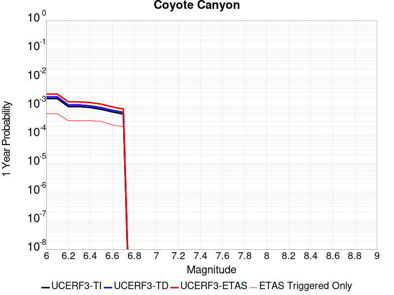 |  |

| Magnitude | 1 wk TI Prob | 1 wk TD Prob | 1 wk ETAS Prob | 1 wk ETAS/TD Gain | 1 wk ETAS Triggered Only | 1 mo TI Prob | 1 mo TD Prob | 1 mo ETAS Prob | 1 mo ETAS/TD Gain | 1 mo ETAS Triggered Only | 1 yr TI Prob | 1 yr TD Prob | 1 yr ETAS Prob | 1 yr ETAS/TD Gain | 1 yr ETAS Triggered Only | 10 yr TI Prob | 10 yr TD Prob | 10 yr ETAS Prob | 10 yr ETAS/TD Gain | 10 yr ETAS Triggered Only |
|-----|-----|-----|-----|-----|-----|-----|-----|-----|-----|-----|-----|-----|-----|-----|-----|-----|-----|-----|-----|-----|
| 6.0 | 3.5090034E-5 | 4.0369963E-5 | 4.0369963E-5 | 1.0 | 0.0 | 1.503772E-4 | 1.7300405E-4 | 2.56014E-4 | 1.479815 | 8.30243E-5 | 0.0018293047 | 0.0021045462 | 0.0026844933 | 1.2755686 | 5.811701E-4 | 0.018143194 | 0.02087209 | 0.022552112 | 1.0804913 | 0.0017158355 |
| 6.1 | 3.5090034E-5 | 4.0369963E-5 | 4.0369963E-5 | 1.0 | 0.0 | 1.503772E-4 | 1.7300405E-4 | 2.56014E-4 | 1.479815 | 8.30243E-5 | 0.0018293047 | 0.0021045462 | 0.0026844933 | 1.2755686 | 5.811701E-4 | 0.018143194 | 0.02087209 | 0.022552112 | 1.0804913 | 0.0017158355 |
| 6.2 | 1.841879E-5 | 2.1062599E-5 | 2.1062599E-5 | 1.0 | 0.0 | 7.8935285E-5 | 9.0265734E-5 | 1.4561026E-4 | 1.613129 | 5.5349534E-5 | 9.606133E-4 | 0.0010985332 | 0.0014579099 | 1.3271424 | 3.5977195E-4 | 0.0095647145 | 0.010941117 | 0.011844393 | 1.0825578 | 9.1326726E-4 |
| 6.3 | 1.841879E-5 | 2.1062599E-5 | 2.1062599E-5 | 1.0 | 0.0 | 7.8935285E-5 | 9.0265734E-5 | 1.4561026E-4 | 1.613129 | 5.5349534E-5 | 9.606133E-4 | 0.0010985332 | 0.0014579099 | 1.3271424 | 3.5977195E-4 | 0.0095647145 | 0.010941117 | 0.011844393 | 1.0825578 | 9.1326726E-4 |
| 6.4 | 1.712201E-5 | 1.9567804E-5 | 1.9567804E-5 | 1.0 | 0.0 | 7.337798E-5 | 8.385989E-5 | 1.3920479E-4 | 1.6599685 | 5.5349534E-5 | 8.930107E-4 | 0.0010206165 | 0.0013800213 | 1.3521447 | 3.5977195E-4 | 0.008894307 | 0.010169213 | 0.0110458 | 1.0862001 | 8.8559254E-4 |
| 6.5 | 1.4744935E-5 | 1.683919E-5 | 1.683919E-5 | 1.0 | 0.0 | 6.3191044E-5 | 7.216649E-5 | 1.2751203E-4 | 1.7669146 | 5.5349534E-5 | 7.6907943E-4 | 8.7836635E-4 | 0.0012378223 | 1.4092324 | 3.5977195E-4 | 0.007664232 | 0.008758144 | 0.009608549 | 1.0970986 | 8.5791777E-4 |
| 6.6 | 1.2017839E-5 | 1.3725899E-5 | 1.3725899E-5 | 1.0 | 0.0 | 5.150401E-5 | 5.8824455E-5 | 8.6497595E-5 | 1.470436 | 2.7674767E-5 | 6.268809E-4 | 7.16041E-4 | 9.649355E-4 | 1.3475982 | 2.490729E-4 | 0.0062511545 | 0.007146034 | 0.0077780047 | 1.0884366 | 6.3651963E-4 |
| 6.7 | 1.00956095E-5 | 1.1535042E-5 | 1.1535042E-5 | 1.0 | 0.0 | 4.326618E-5 | 4.943545E-5 | 7.7108845E-5 | 1.5597886 | 2.7674767E-5 | 5.266384E-4 | 6.0179736E-4 | 8.2306226E-4 | 1.3676734 | 2.2139814E-4 | 0.005253921 | 0.0060102064 | 0.0065878835 | 1.0961161 | 5.811701E-4 |

## San Andreas (Mojave S)
*[(top)](#table-of-contents)*

| 1 Week | 1 Month | 1 Year | 10 Year |
|-----|-----|-----|-----|
|  |  |  |  |

| Magnitude | 1 wk TI Prob | 1 wk TD Prob | 1 wk ETAS Prob | 1 wk ETAS/TD Gain | 1 wk ETAS Triggered Only | 1 mo TI Prob | 1 mo TD Prob | 1 mo ETAS Prob | 1 mo ETAS/TD Gain | 1 mo ETAS Triggered Only | 1 yr TI Prob | 1 yr TD Prob | 1 yr ETAS Prob | 1 yr ETAS/TD Gain | 1 yr ETAS Triggered Only | 10 yr TI Prob | 10 yr TD Prob | 10 yr ETAS Prob | 10 yr ETAS/TD Gain | 10 yr ETAS Triggered Only |
|-----|-----|-----|-----|-----|-----|-----|-----|-----|-----|-----|-----|-----|-----|-----|-----|-----|-----|-----|-----|-----|
| 6.0 | 3.1064058E-4 | 6.7528774E-4 | 7.5825595E-4 | 1.1228635 | 8.30243E-5 | 0.0013306376 | 0.0028910087 | 0.0030289823 | 1.0477251 | 1.3837383E-4 | 0.016080605 | 0.034656145 | 0.03556448 | 1.0262098 | 9.4094203E-4 | 0.1496549 | 0.2868376 | 0.28796262 | 1.003922 | 0.0015774617 |
| 6.1 | 3.1064058E-4 | 6.7528774E-4 | 7.5825595E-4 | 1.1228635 | 8.30243E-5 | 0.0013306376 | 0.0028910087 | 0.0030289823 | 1.0477251 | 1.3837383E-4 | 0.016080605 | 0.034656145 | 0.03556448 | 1.0262098 | 9.4094203E-4 | 0.1496549 | 0.2868376 | 0.28796262 | 1.003922 | 0.0015774617 |
| 6.2 | 3.1064058E-4 | 6.7528774E-4 | 7.5825595E-4 | 1.1228635 | 8.30243E-5 | 0.0013306376 | 0.0028910087 | 0.0030289823 | 1.0477251 | 1.3837383E-4 | 0.016080605 | 0.034656145 | 0.03556448 | 1.0262098 | 9.4094203E-4 | 0.1496549 | 0.2868376 | 0.28796262 | 1.003922 | 0.0015774617 |
| 6.3 | 3.1064058E-4 | 6.7528774E-4 | 7.5825595E-4 | 1.1228635 | 8.30243E-5 | 0.0013306376 | 0.0028910087 | 0.0030289823 | 1.0477251 | 1.3837383E-4 | 0.016080605 | 0.034656145 | 0.03556448 | 1.0262098 | 9.4094203E-4 | 0.1496549 | 0.2868376 | 0.28796262 | 1.003922 | 0.0015774617 |
| 6.4 | 1.9872203E-4 | 4.3243993E-4 | 5.154283E-4 | 1.1919073 | 8.30243E-5 | 8.5138786E-4 | 0.0018520259 | 0.0019901434 | 1.0745765 | 1.3837383E-4 | 0.010316478 | 0.022321431 | 0.02313314 | 1.0363647 | 8.30243E-4 | 0.098504856 | 0.19724585 | 0.1984011 | 1.0058569 | 0.0014390878 |
| 6.5 | 1.291105E-4 | 2.8813988E-4 | 3.4347348E-4 | 1.1920372 | 5.5349534E-5 | 5.5321335E-4 | 0.0012343036 | 0.001344866 | 1.0895747 | 1.1069907E-4 | 0.006714592 | 0.014924928 | 0.015660994 | 1.049318 | 7.4721867E-4 | 0.065152965 | 0.13828829 | 0.13938528 | 1.0079327 | 0.0012730393 |
| 6.6 | 1.291105E-4 | 2.8813988E-4 | 3.4347348E-4 | 1.1920372 | 5.5349534E-5 | 5.5321335E-4 | 0.0012343036 | 0.001344866 | 1.0895747 | 1.1069907E-4 | 0.006714592 | 0.014924928 | 0.015660994 | 1.049318 | 7.4721867E-4 | 0.065152965 | 0.13828829 | 0.13938528 | 1.0079327 | 0.0012730393 |
| 6.7 | 1.08001186E-4 | 2.4394269E-4 | 2.992787E-4 | 1.2268403 | 5.5349534E-5 | 4.6278012E-4 | 0.0010450503 | 0.0011556337 | 1.1058164 | 1.1069907E-4 | 0.0056198016 | 0.012649561 | 0.013360003 | 1.0561634 | 7.195439E-4 | 0.054797906 | 0.11943314 | 0.12052977 | 1.009182 | 0.0012453644 |
| 6.8 | 1.0624356E-4 | 2.3911761E-4 | 2.944539E-4 | 1.2314187 | 5.5349534E-5 | 4.5525006E-4 | 0.0010243878 | 0.0011349735 | 1.107953 | 1.1069907E-4 | 0.0055285925 | 0.012400877 | 0.013111497 | 1.0573041 | 7.195439E-4 | 0.053930566 | 0.11738223 | 0.118481405 | 1.0093641 | 0.0012453644 |
| 6.9 | 1.0393785E-4 | 2.3281875E-4 | 2.881554E-4 | 1.2376813 | 5.5349534E-5 | 4.4537184E-4 | 9.974135E-4 | 0.0011080022 | 1.1108754 | 1.1069907E-4 | 0.0054089287 | 0.012076146 | 0.012787 | 1.0588644 | 7.195439E-4 | 0.05279156 | 0.114679605 | 0.11578215 | 1.0096141 | 0.0012453644 |
| 7.0 | 1.0155622E-4 | 2.2651139E-4 | 2.818484E-4 | 1.2443012 | 5.5349534E-5 | 4.3516833E-4 | 9.704023E-4 | 0.0010809939 | 1.1139647 | 1.1069907E-4 | 0.005285311 | 0.011750873 | 0.012461961 | 1.0605137 | 7.195439E-4 | 0.05161361 | 0.1119395 | 0.113045454 | 1.00988 | 0.0012453644 |
| 7.1 | 9.885595E-5 | 2.193923E-4 | 2.7472968E-4 | 1.2522303 | 5.5349534E-5 | 4.2359953E-4 | 9.3991426E-4 | 0.0010505093 | 1.117665 | 1.1069907E-4 | 0.0051451353 | 0.011383613 | 0.012094966 | 1.0624892 | 7.195439E-4 | 0.05027629 | 0.108823694 | 0.1098842 | 1.0097452 | 0.001190015 |
| 7.2 | 9.6411415E-5 | 2.1301924E-4 | 2.68357E-4 | 1.2597781 | 5.5349534E-5 | 4.1312634E-4 | 9.126205E-4 | 0.0010232186 | 1.1211873 | 1.1069907E-4 | 0.005018219 | 0.011054731 | 0.01176632 | 1.0643697 | 7.195439E-4 | 0.049064007 | 0.10601311 | 0.107076965 | 1.0100352 | 0.001190015 |
| 7.3 | 9.1180635E-5 | 1.9528683E-4 | 2.5062557E-4 | 1.2833714 | 5.5349534E-5 | 3.907156E-4 | 8.3667523E-4 | 9.4728166E-4 | 1.1321976 | 1.1069907E-4 | 0.004746591 | 0.0101390565 | 0.010851305 | 1.070248 | 7.195439E-4 | 0.046464786 | 0.098202206 | 0.09927536 | 1.010928 | 0.001190015 |
| 7.4 | 8.887388E-5 | 1.8776611E-4 | 2.4310526E-4 | 1.2947237 | 5.5349534E-5 | 3.8083247E-4 | 8.044638E-4 | 9.1507385E-4 | 1.1374953 | 1.1069907E-4 | 0.0046267817 | 0.00975046 | 0.010435583 | 1.0702658 | 6.918692E-4 | 0.045316286 | 0.09483534 | 0.095862396 | 1.0108299 | 0.0011346655 |
| 7.5 | 8.6750515E-5 | 1.8107575E-4 | 2.3641526E-4 | 1.3056152 | 5.5349534E-5 | 3.7173493E-4 | 7.7580824E-4 | 8.864214E-4 | 1.142578 | 1.1069907E-4 | 0.004516484 | 0.009404644 | 0.0100900065 | 1.0728749 | 6.918692E-4 | 0.04425787 | 0.09179742 | 0.09282792 | 1.0112258 | 0.0011346655 |
| 7.6 | 8.453092E-5 | 1.7494464E-4 | 2.302845E-4 | 1.3163278 | 5.5349534E-5 | 3.6222505E-4 | 7.495473E-4 | 8.601634E-4 | 1.1475772 | 1.1069907E-4 | 0.0044011753 | 0.00908763 | 0.009773212 | 1.0754412 | 6.918692E-4 | 0.04315024 | 0.08895424 | 0.08998797 | 1.011621 | 0.0011346655 |
| 7.7 | 8.259102E-5 | 1.7015988E-4 | 2.255E-4 | 1.3252242 | 5.5349534E-5 | 3.539135E-4 | 7.290529E-4 | 8.3967124E-4 | 1.1517289 | 1.1069907E-4 | 0.004300386 | 0.008840162 | 0.009525916 | 1.0775725 | 6.918692E-4 | 0.042181134 | 0.08670297 | 0.08773926 | 1.0119522 | 0.0011346655 |
| 7.8 | 7.444844E-5 | 1.5333407E-4 | 2.0867512E-4 | 1.3609182 | 5.5349534E-5 | 3.1902574E-4 | 6.5698056E-4 | 7.676069E-4 | 1.168386 | 1.1069907E-4 | 0.0038772223 | 0.007969453 | 0.008545991 | 1.0723436 | 5.811701E-4 | 0.03810269 | 0.07851438 | 0.079330444 | 1.0103937 | 8.8559254E-4 |
| 7.9 | 5.2586525E-5 | 1.00405494E-4 | 1.00405494E-4 | 1.0 | 0.0 | 2.2535135E-4 | 4.3023832E-4 | 4.8556403E-4 | 1.1285932 | 5.5349534E-5 | 0.0027402006 | 0.0052255816 | 0.0055559436 | 1.0632201 | 3.320972E-4 | 0.027066574 | 0.052359387 | 0.052779 | 1.0080141 | 4.4279627E-4 |
| 8.0 | 3.379877E-5 | 5.4271262E-5 | 5.4271262E-5 | 1.0 | 0.0 | 1.4484383E-4 | 2.325704E-4 | 2.8790705E-4 | 1.2379351 | 5.5349534E-5 | 0.0017620471 | 0.0028278697 | 0.0029106594 | 1.0292763 | 8.30243E-5 | 0.017481409 | 0.028931491 | 0.029038988 | 1.0037155 | 1.1069907E-4 |
| 8.1 | 1.8668277E-5 | 1.940311E-5 | 1.940311E-5 | 1.0 | 0.0 | 8.000444E-5 | 8.315354E-5 | 1.1082601E-4 | 1.3327875 | 2.7674767E-5 | 9.736188E-4 | 0.0010119248 | 0.0010395716 | 1.027321 | 2.7674767E-5 | 0.009693642 | 0.01084796 | 0.010875335 | 1.0025234 | 2.7674767E-5 |
| 8.2 | 8.541571E-6 | 5.497103E-6 | 5.497103E-6 | 1.0 | 0.0 | 3.660622E-5 | 2.35588E-5 | 2.35588E-5 | 1.0 | 0.0 | 4.455896E-4 | 2.8679072E-4 | 2.8679072E-4 | 1.0 | 0.0 | 0.0044469717 | 0.0032606535 | 0.0032606535 | 1.0 | 0.0 |
| 8.3 | 1.983087E-6 | 7.7188406E-7 | 7.7188406E-7 | 1.0 | 0.0 | 8.498917E-6 | 3.3080703E-6 | 3.3080703E-6 | 1.0 | 0.0 | 1.034694E-4 | 4.027503E-5 | 4.027503E-5 | 1.0 | 0.0 | 0.0010342124 | 4.7534908E-4 | 4.7534908E-4 | 1.0 | 0.0 |

## Towne Pass
*[(top)](#table-of-contents)*

| 1 Week | 1 Month | 1 Year | 10 Year |
|-----|-----|-----|-----|
|  | 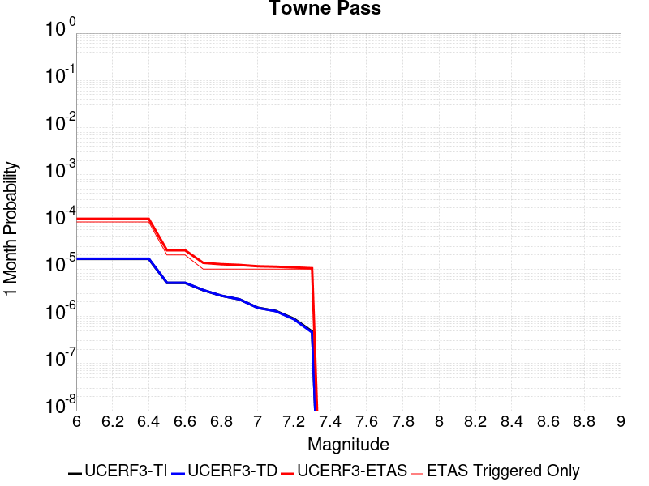 |  |  |

| Magnitude | 1 wk TI Prob | 1 wk TD Prob | 1 wk ETAS Prob | 1 wk ETAS/TD Gain | 1 wk ETAS Triggered Only | 1 mo TI Prob | 1 mo TD Prob | 1 mo ETAS Prob | 1 mo ETAS/TD Gain | 1 mo ETAS Triggered Only | 1 yr TI Prob | 1 yr TD Prob | 1 yr ETAS Prob | 1 yr ETAS/TD Gain | 1 yr ETAS Triggered Only | 10 yr TI Prob | 10 yr TD Prob | 10 yr ETAS Prob | 10 yr ETAS/TD Gain | 10 yr ETAS Triggered Only |
|-----|-----|-----|-----|-----|-----|-----|-----|-----|-----|-----|-----|-----|-----|-----|-----|-----|-----|-----|-----|-----|
| 6.0 | 3.849728E-6 | 3.894599E-6 | 3.1569256E-5 | 8.1059065 | 2.7674767E-5 | 1.649873E-5 | 1.6691056E-5 | 1.5506257E-4 | 9.290159 | 1.3837383E-4 | 2.0085352E-4 | 2.0319904E-4 | 8.3958934E-4 | 4.131857 | 6.3651963E-4 | 0.0020067208 | 0.0020305614 | 0.0035772014 | 1.761681 | 0.0015497869 |
| 6.1 | 3.849728E-6 | 3.894599E-6 | 3.1569256E-5 | 8.1059065 | 2.7674767E-5 | 1.649873E-5 | 1.6691056E-5 | 1.5506257E-4 | 9.290159 | 1.3837383E-4 | 2.0085352E-4 | 2.0319904E-4 | 8.3958934E-4 | 4.131857 | 6.3651963E-4 | 0.0020067208 | 0.0020305614 | 0.0035772014 | 1.761681 | 0.0015497869 |
| 6.2 | 3.849728E-6 | 3.894599E-6 | 3.1569256E-5 | 8.1059065 | 2.7674767E-5 | 1.649873E-5 | 1.6691056E-5 | 1.5506257E-4 | 9.290159 | 1.3837383E-4 | 2.0085352E-4 | 2.0319904E-4 | 8.3958934E-4 | 4.131857 | 6.3651963E-4 | 0.0020067208 | 0.0020305614 | 0.0035772014 | 1.761681 | 0.0015497869 |
| 6.3 | 3.849728E-6 | 3.894599E-6 | 3.1569256E-5 | 8.1059065 | 2.7674767E-5 | 1.649873E-5 | 1.6691056E-5 | 1.5506257E-4 | 9.290159 | 1.3837383E-4 | 2.0085352E-4 | 2.0319904E-4 | 8.3958934E-4 | 4.131857 | 6.3651963E-4 | 0.0020067208 | 0.0020305614 | 0.0035772014 | 1.761681 | 0.0015497869 |
| 6.4 | 3.849728E-6 | 3.894599E-6 | 3.1569256E-5 | 8.1059065 | 2.7674767E-5 | 1.649873E-5 | 1.6691056E-5 | 1.5506257E-4 | 9.290159 | 1.3837383E-4 | 2.0085352E-4 | 2.0319904E-4 | 8.3958934E-4 | 4.131857 | 6.3651963E-4 | 0.0020067208 | 0.0020305614 | 0.0035772014 | 1.761681 | 0.0015497869 |
| 6.5 | 1.1953545E-6 | 1.2030748E-6 | 1.2030748E-6 | 1.0 | 0.0 | 5.1229376E-6 | 5.156025E-6 | 3.283065E-5 | 6.3674335 | 2.7674767E-5 | 6.236998E-5 | 6.277292E-5 | 2.0113806E-4 | 3.2042172 | 1.3837383E-4 | 6.235248E-4 | 6.2756357E-4 | 9.0413756E-4 | 1.4407107 | 2.7674765E-4 |
| 6.6 | 1.1953545E-6 | 1.2030748E-6 | 1.2030748E-6 | 1.0 | 0.0 | 5.1229376E-6 | 5.156025E-6 | 3.283065E-5 | 6.3674335 | 2.7674767E-5 | 6.236998E-5 | 6.277292E-5 | 2.0113806E-4 | 3.2042172 | 1.3837383E-4 | 6.235248E-4 | 6.2756357E-4 | 9.0413756E-4 | 1.4407107 | 2.7674765E-4 |
| 6.7 | 8.375951E-7 | 8.4108586E-7 | 8.4108586E-7 | 1.0 | 0.0 | 3.5896885E-6 | 3.604649E-6 | 3.1279316E-5 | 8.677493 | 2.7674767E-5 | 4.370358E-5 | 4.3885775E-5 | 1.2690642E-4 | 2.8917441 | 8.30243E-5 | 4.3694986E-4 | 4.387768E-4 | 6.324152E-4 | 1.4413141 | 1.9372336E-4 |
| 6.8 | 6.38041E-7 | 6.3923227E-7 | 6.3923227E-7 | 1.0 | 0.0 | 2.7344586E-6 | 2.7395643E-6 | 3.0414254E-5 | 11.101858 | 2.7674767E-5 | 3.3291526E-5 | 3.3353725E-5 | 8.870141E-5 | 2.6594155 | 5.5349534E-5 | 3.3286537E-4 | 3.3349099E-4 | 4.4415312E-4 | 1.3318295 | 1.1069907E-4 |
| 6.9 | 5.3460053E-7 | 5.345488E-7 | 5.345488E-7 | 1.0 | 0.0 | 2.2911431E-6 | 2.2909214E-6 | 2.9965624E-5 | 13.080162 | 2.7674767E-5 | 2.789431E-5 | 2.7891647E-5 | 8.323963E-5 | 2.9843931 | 5.5349534E-5 | 2.789081E-4 | 2.7888478E-4 | 3.8955297E-4 | 1.3968241 | 1.1069907E-4 |
| 7.0 | 3.557783E-7 | 3.5325542E-7 | 3.5325542E-7 | 1.0 | 0.0 | 1.5247632E-6 | 1.5139509E-6 | 2.9188675E-5 | 19.279802 | 2.7674767E-5 | 1.8563835E-5 | 1.8432205E-5 | 7.378072E-5 | 4.0028157 | 5.5349534E-5 | 1.8562283E-4 | 1.843076E-4 | 2.673166E-4 | 1.450383 | 8.30243E-5 |
| 7.1 | 3.037942E-7 | 3.0003415E-7 | 3.0003415E-7 | 1.0 | 0.0 | 1.3019744E-6 | 1.2858601E-6 | 2.896059E-5 | 22.52235 | 2.7674767E-5 | 1.5851423E-5 | 1.5655241E-5 | 7.100391E-5 | 4.535472 | 5.5349534E-5 | 1.5850292E-4 | 1.5654213E-4 | 2.3955344E-4 | 1.530281 | 8.30243E-5 |
| 7.2 | 2.0808248E-7 | 2.0218674E-7 | 2.0218674E-7 | 1.0 | 0.0 | 8.917818E-7 | 8.665143E-7 | 2.8541257E-5 | 32.938007 | 2.7674767E-5 | 1.0857389E-5 | 1.0549766E-5 | 6.589871E-5 | 6.2464623 | 5.5349534E-5 | 1.0856859E-4 | 1.0549311E-4 | 1.8850865E-4 | 1.7869285 | 8.30243E-5 |
| 7.3 | 1.1162073E-7 | 1.0637519E-7 | 1.0637519E-7 | 1.0 | 0.0 | 4.7837443E-7 | 4.558936E-7 | 2.8130647E-5 | 61.704414 | 2.7674767E-5 | 5.8241935E-6 | 5.5504925E-6 | 6.0899718E-5 | 10.971949 | 5.5349534E-5 | 5.8240406E-5 | 5.5503737E-5 | 1.108502E-4 | 1.9971664 | 5.5349534E-5 |

## Nelson Lake
*[(top)](#table-of-contents)*

| 1 Week | 1 Month | 1 Year | 10 Year |
|-----|-----|-----|-----|
|  |  |  | 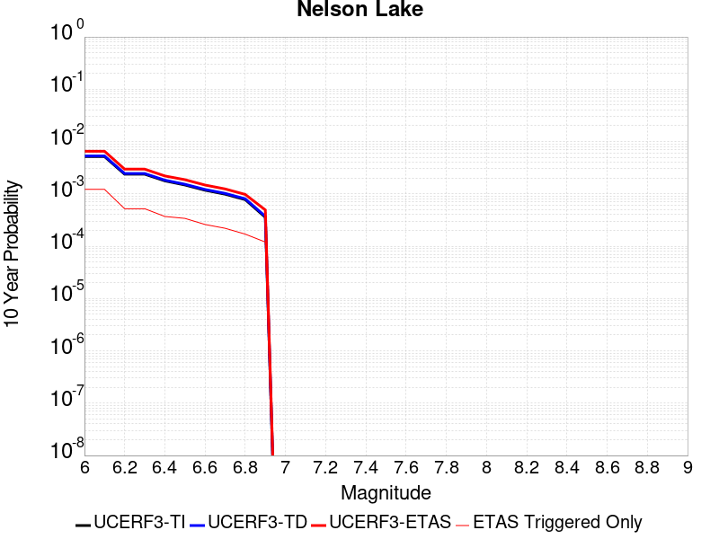 |

| Magnitude | 1 wk TI Prob | 1 wk TD Prob | 1 wk ETAS Prob | 1 wk ETAS/TD Gain | 1 wk ETAS Triggered Only | 1 mo TI Prob | 1 mo TD Prob | 1 mo ETAS Prob | 1 mo ETAS/TD Gain | 1 mo ETAS Triggered Only | 1 yr TI Prob | 1 yr TD Prob | 1 yr ETAS Prob | 1 yr ETAS/TD Gain | 1 yr ETAS Triggered Only | 10 yr TI Prob | 10 yr TD Prob | 10 yr ETAS Prob | 10 yr ETAS/TD Gain | 10 yr ETAS Triggered Only |
|-----|-----|-----|-----|-----|-----|-----|-----|-----|-----|-----|-----|-----|-----|-----|-----|-----|-----|-----|-----|-----|
| 6.0 | 9.913453E-6 | 1.0192522E-5 | 3.7867005E-5 | 3.7151754 | 2.7674767E-5 | 4.2485535E-5 | 4.3681564E-5 | 9.902868E-5 | 2.2670588 | 5.5349534E-5 | 5.1713863E-4 | 5.317036E-4 | 0.0010019245 | 1.8843665 | 4.7047102E-4 | 0.0051593683 | 0.0053053424 | 0.0065716277 | 1.2386812 | 0.0012730393 |
| 6.1 | 9.913453E-6 | 1.0192522E-5 | 3.7867005E-5 | 3.7151754 | 2.7674767E-5 | 4.2485535E-5 | 4.3681564E-5 | 9.902868E-5 | 2.2670588 | 5.5349534E-5 | 5.1713863E-4 | 5.317036E-4 | 0.0010019245 | 1.8843665 | 4.7047102E-4 | 0.0051593683 | 0.0053053424 | 0.0065716277 | 1.2386812 | 0.0012730393 |
| 6.2 | 4.5596407E-6 | 4.696444E-6 | 4.696444E-6 | 1.0 | 0.0 | 1.954117E-5 | 2.0127469E-5 | 4.7801677E-5 | 2.3749473 | 2.7674767E-5 | 2.3788778E-4 | 2.4502564E-4 | 3.8336558E-4 | 1.5645937 | 1.3837383E-4 | 0.0023763329 | 0.002447681 | 0.0029446075 | 1.2030193 | 4.981458E-4 |
| 6.3 | 4.5596407E-6 | 4.696444E-6 | 4.696444E-6 | 1.0 | 0.0 | 1.954117E-5 | 2.0127469E-5 | 4.7801677E-5 | 2.3749473 | 2.7674767E-5 | 2.3788778E-4 | 2.4502564E-4 | 3.8336558E-4 | 1.5645937 | 1.3837383E-4 | 0.0023763329 | 0.002447681 | 0.0029446075 | 1.2030193 | 4.981458E-4 |
| 6.4 | 3.4025713E-6 | 3.5100002E-6 | 3.5100002E-6 | 1.0 | 0.0 | 1.4582367E-5 | 1.5042776E-5 | 1.5042776E-5 | 1.0 | 0.0 | 1.7752586E-4 | 1.8313125E-4 | 2.6614036E-4 | 1.4532765 | 8.30243E-5 | 0.001773841 | 0.0018298863 | 0.0021337518 | 1.166057 | 3.0442243E-4 |
| 6.5 | 2.8352947E-6 | 2.927945E-6 | 2.927945E-6 | 1.0 | 0.0 | 1.2151207E-5 | 1.254828E-5 | 1.254828E-5 | 1.0 | 0.0 | 1.479309E-4 | 1.5276535E-4 | 2.3577696E-4 | 1.543393 | 8.30243E-5 | 0.0014783246 | 0.0015266772 | 0.0018306349 | 1.1990975 | 3.0442243E-4 |
| 6.6 | 2.251518E-6 | 2.3291423E-6 | 2.3291423E-6 | 1.0 | 0.0 | 9.649328E-6 | 9.982004E-6 | 9.982004E-6 | 1.0 | 0.0 | 1.1747423E-4 | 1.2152474E-4 | 1.7686754E-4 | 1.4554036 | 5.5349534E-5 | 0.0011741214 | 0.0012146446 | 0.0014357738 | 1.1820526 | 2.2139814E-4 |
| 6.7 | 1.8911853E-6 | 1.959205E-6 | 1.959205E-6 | 1.0 | 0.0 | 8.105055E-6 | 8.39657E-6 | 8.39657E-6 | 1.0 | 0.0 | 9.867457E-5 | 1.02224025E-4 | 1.2989597E-4 | 1.2706989 | 2.7674767E-5 | 9.863076E-4 | 0.0010218276 | 0.001215353 | 1.1893915 | 1.9372336E-4 |
| 6.8 | 1.4874814E-6 | 1.5438849E-6 | 1.5438849E-6 | 1.0 | 0.0 | 6.374905E-6 | 6.616636E-6 | 6.616636E-6 | 1.0 | 0.0 | 7.76117E-5 | 8.055508E-5 | 8.055508E-5 | 1.0 | 0.0 | 7.75846E-4 | 8.053099E-4 | 9.712248E-4 | 1.2060261 | 1.660486E-4 |
| 6.9 | 6.835972E-7 | 7.140223E-7 | 7.140223E-7 | 1.0 | 0.0 | 2.9296991E-6 | 3.0600938E-6 | 3.0600938E-6 | 1.0 | 0.0 | 3.56685E-5 | 3.7256323E-5 | 3.7256323E-5 | 1.0 | 0.0 | 3.5662777E-4 | 3.7253203E-4 | 5.108543E-4 | 1.3713031 | 1.3837383E-4 |

## San Andreas (Mojave N)
*[(top)](#table-of-contents)*

| 1 Week | 1 Month | 1 Year | 10 Year |
|-----|-----|-----|-----|
|  |  |  |  |

| Magnitude | 1 wk TI Prob | 1 wk TD Prob | 1 wk ETAS Prob | 1 wk ETAS/TD Gain | 1 wk ETAS Triggered Only | 1 mo TI Prob | 1 mo TD Prob | 1 mo ETAS Prob | 1 mo ETAS/TD Gain | 1 mo ETAS Triggered Only | 1 yr TI Prob | 1 yr TD Prob | 1 yr ETAS Prob | 1 yr ETAS/TD Gain | 1 yr ETAS Triggered Only | 10 yr TI Prob | 10 yr TD Prob | 10 yr ETAS Prob | 10 yr ETAS/TD Gain | 10 yr ETAS Triggered Only |
|-----|-----|-----|-----|-----|-----|-----|-----|-----|-----|-----|-----|-----|-----|-----|-----|-----|-----|-----|-----|-----|
| 6.0 | 9.877682E-5 | 1.9461679E-4 | 2.7762493E-4 | 1.426521 | 8.30243E-5 | 4.2326056E-4 | 8.338056E-4 | 0.0010826708 | 1.2984691 | 2.490729E-4 | 0.0051410277 | 0.010104459 | 0.011035893 | 1.0921805 | 9.4094203E-4 | 0.05023708 | 0.09858153 | 0.09992865 | 1.013665 | 0.0014944373 |
| 6.1 | 9.877682E-5 | 1.9461679E-4 | 2.7762493E-4 | 1.426521 | 8.30243E-5 | 4.2326056E-4 | 8.338056E-4 | 0.0010826708 | 1.2984691 | 2.490729E-4 | 0.0051410277 | 0.010104459 | 0.011035893 | 1.0921805 | 9.4094203E-4 | 0.05023708 | 0.09858153 | 0.09992865 | 1.013665 | 0.0014944373 |
| 6.2 | 9.877682E-5 | 1.9461679E-4 | 2.7762493E-4 | 1.426521 | 8.30243E-5 | 4.2326056E-4 | 8.338056E-4 | 0.0010826708 | 1.2984691 | 2.490729E-4 | 0.0051410277 | 0.010104459 | 0.011035893 | 1.0921805 | 9.4094203E-4 | 0.05023708 | 0.09858153 | 0.09992865 | 1.013665 | 0.0014944373 |
| 6.3 | 9.877682E-5 | 1.9461679E-4 | 2.7762493E-4 | 1.426521 | 8.30243E-5 | 4.2326056E-4 | 8.338056E-4 | 0.0010826708 | 1.2984691 | 2.490729E-4 | 0.0051410277 | 0.010104459 | 0.011035893 | 1.0921805 | 9.4094203E-4 | 0.05023708 | 0.09858153 | 0.09992865 | 1.013665 | 0.0014944373 |
| 6.4 | 9.877682E-5 | 1.9461679E-4 | 2.7762493E-4 | 1.426521 | 8.30243E-5 | 4.2326056E-4 | 8.338056E-4 | 0.0010826708 | 1.2984691 | 2.490729E-4 | 0.0051410277 | 0.010104459 | 0.011035893 | 1.0921805 | 9.4094203E-4 | 0.05023708 | 0.09858153 | 0.09992865 | 1.013665 | 0.0014944373 |
| 6.5 | 9.861474E-5 | 1.9435427E-4 | 2.7736244E-4 | 1.4270972 | 8.30243E-5 | 4.2256617E-4 | 8.326812E-4 | 0.0010815467 | 1.2988725 | 2.490729E-4 | 0.0051326132 | 0.010090896 | 0.011022343 | 1.0923057 | 9.4094203E-4 | 0.050156746 | 0.09845929 | 0.099806584 | 1.0136838 | 0.0014944373 |
| 6.6 | 9.861474E-5 | 1.9435427E-4 | 2.7736244E-4 | 1.4270972 | 8.30243E-5 | 4.2256617E-4 | 8.326812E-4 | 0.0010815467 | 1.2988725 | 2.490729E-4 | 0.0051326132 | 0.010090896 | 0.011022343 | 1.0923057 | 9.4094203E-4 | 0.050156746 | 0.09845929 | 0.099806584 | 1.0136838 | 0.0014944373 |
| 6.7 | 9.8552715E-5 | 1.9425373E-4 | 2.772619E-4 | 1.4273183 | 8.30243E-5 | 4.223004E-4 | 8.322506E-4 | 0.0010811161 | 1.2990272 | 2.490729E-4 | 0.0051293927 | 0.010085702 | 0.011017154 | 1.0923537 | 9.4094203E-4 | 0.050125998 | 0.098412454 | 0.099759825 | 1.0136911 | 0.0014944373 |
| 6.8 | 9.8464974E-5 | 1.9410519E-4 | 2.7711337E-4 | 1.4276453 | 8.30243E-5 | 4.219245E-4 | 8.316143E-4 | 0.00108048 | 1.2992562 | 2.490729E-4 | 0.0051248376 | 0.010078028 | 0.011009486 | 1.0924248 | 9.4094203E-4 | 0.05008251 | 0.098342426 | 0.09968989 | 1.0137018 | 0.0014944373 |
| 6.9 | 9.825824E-5 | 1.9378494E-4 | 2.7679314E-4 | 1.4283522 | 8.30243E-5 | 4.2103877E-4 | 8.3024276E-4 | 0.0010791089 | 1.299751 | 2.490729E-4 | 0.0051141046 | 0.010061483 | 0.010992958 | 1.0925783 | 9.4094203E-4 | 0.049980022 | 0.09819142 | 0.099539116 | 1.0137252 | 0.0014944373 |
| 7.0 | 9.781462E-5 | 1.930979E-4 | 2.7610618E-4 | 1.4298766 | 8.30243E-5 | 4.1913814E-4 | 8.273002E-4 | 0.001076167 | 1.3008181 | 2.490729E-4 | 0.005091073 | 0.010025987 | 0.010957495 | 1.0929093 | 9.4094203E-4 | 0.04976007 | 0.097867586 | 0.09921577 | 1.0137756 | 0.0014944373 |
| 7.1 | 9.7121134E-5 | 1.9211406E-4 | 2.751224E-4 | 1.4320785 | 8.30243E-5 | 4.1616702E-4 | 8.230864E-4 | 0.0010719543 | 1.3023593 | 2.490729E-4 | 0.005055068 | 0.009975156 | 0.010906712 | 1.0933876 | 9.4094203E-4 | 0.04941613 | 0.097403795 | 0.09875267 | 1.0138483 | 0.0014944373 |
| 7.2 | 9.663819E-5 | 1.9142123E-4 | 2.7442965E-4 | 1.4336426 | 8.30243E-5 | 4.1409794E-4 | 8.20119E-4 | 0.0010689877 | 1.3034543 | 2.490729E-4 | 0.0050299936 | 0.009939358 | 0.0108709475 | 1.0937274 | 9.4094203E-4 | 0.049176537 | 0.09707684 | 0.0984262 | 1.0138999 | 0.0014944373 |
| 7.3 | 9.6277574E-5 | 1.909455E-4 | 2.7395395E-4 | 1.4347233 | 8.30243E-5 | 4.125529E-4 | 8.1808143E-4 | 0.0010669506 | 1.3042107 | 2.490729E-4 | 0.0050112694 | 0.009914776 | 0.010846389 | 1.0939621 | 9.4094203E-4 | 0.04899759 | 0.09684997 | 0.09819967 | 1.013936 | 0.0014944373 |
| 7.4 | 9.593308E-5 | 1.9034237E-4 | 2.7335086E-4 | 1.436101 | 8.30243E-5 | 4.1107697E-4 | 8.154982E-4 | 0.0010643679 | 1.3051752 | 2.490729E-4 | 0.0049933824 | 0.009883611 | 0.0108152535 | 1.0942613 | 9.4094203E-4 | 0.04882661 | 0.096567824 | 0.097917944 | 1.0139811 | 0.0014944373 |
| 7.5 | 9.561707E-5 | 1.8980232E-4 | 2.7281087E-4 | 1.437342 | 8.30243E-5 | 4.0972308E-4 | 8.131851E-4 | 0.0010620555 | 1.3060439 | 2.490729E-4 | 0.0049769743 | 0.009855705 | 0.010787373 | 1.0945308 | 9.4094203E-4 | 0.048669744 | 0.0963137 | 0.0976642 | 1.0140219 | 0.0014944373 |
| 7.6 | 9.418194E-5 | 1.8631996E-4 | 2.693288E-4 | 1.4455177 | 8.30243E-5 | 4.0357444E-4 | 7.9826993E-4 | 0.001047144 | 1.3117669 | 2.490729E-4 | 0.004902454 | 0.009675738 | 0.010607577 | 1.0963067 | 9.4094203E-4 | 0.047957025 | 0.094694376 | 0.0960473 | 1.0142872 | 0.0014944373 |
| 7.7 | 8.202141E-5 | 1.607603E-4 | 2.1610095E-4 | 1.3442432 | 5.5349534E-5 | 3.51473E-4 | 6.8879087E-4 | 8.270694E-4 | 1.2007555 | 1.3837383E-4 | 0.00427079 | 0.008353841 | 0.009122261 | 1.091984 | 7.7489344E-4 | 0.04189639 | 0.08247718 | 0.08361983 | 1.0138541 | 0.0012453644 |
| 7.8 | 7.2859846E-5 | 1.4565673E-4 | 2.009982E-4 | 1.3799444 | 5.5349534E-5 | 3.1221908E-4 | 6.240938E-4 | 7.347238E-4 | 1.1772649 | 1.1069907E-4 | 0.003794643 | 0.007571912 | 0.008148681 | 1.0761722 | 5.811701E-4 | 0.037304975 | 0.07494667 | 0.07576589 | 1.0109307 | 8.8559254E-4 |
| 7.9 | 5.3874453E-5 | 1.00801924E-4 | 1.00801924E-4 | 1.0 | 0.0 | 2.3087008E-4 | 4.3193673E-4 | 4.8726235E-4 | 1.1280873 | 5.5349534E-5 | 0.0028072202 | 0.0052461606 | 0.0055765156 | 1.0629708 | 3.320972E-4 | 0.02772022 | 0.05258583 | 0.05300534 | 1.0079776 | 4.4279627E-4 |
| 8.0 | 3.468538E-5 | 5.445956E-5 | 5.445956E-5 | 1.0 | 0.0 | 1.4864317E-4 | 2.3337724E-4 | 2.8871387E-4 | 1.2371123 | 5.5349534E-5 | 0.0018082283 | 0.0028376677 | 0.0029204562 | 1.0291749 | 8.30243E-5 | 0.017935853 | 0.029045342 | 0.029152825 | 1.0037005 | 1.1069907E-4 |
| 8.1 | 1.9152367E-5 | 1.949763E-5 | 1.949763E-5 | 1.0 | 0.0 | 8.207899E-5 | 8.355859E-5 | 1.1123105E-4 | 1.3311743 | 2.7674767E-5 | 9.988535E-4 | 0.0010168517 | 0.0010444983 | 1.0271884 | 2.7674767E-5 | 0.009943757 | 0.010906066 | 0.010933438 | 1.0025098 | 2.7674767E-5 |
| 8.2 | 8.643924E-6 | 5.5112705E-6 | 5.5112705E-6 | 1.0 | 0.0 | 3.704486E-5 | 2.3619517E-5 | 2.3619517E-5 | 1.0 | 0.0 | 4.5092785E-4 | 2.8752975E-4 | 2.8752975E-4 | 1.0 | 0.0 | 0.0045001395 | 0.0032686237 | 0.0032686237 | 1.0 | 0.0 |
| 8.3 | 1.983087E-6 | 7.7188406E-7 | 7.7188406E-7 | 1.0 | 0.0 | 8.498917E-6 | 3.3080703E-6 | 3.3080703E-6 | 1.0 | 0.0 | 1.034694E-4 | 4.027503E-5 | 4.027503E-5 | 1.0 | 0.0 | 0.0010342124 | 4.7534908E-4 | 4.7534908E-4 | 1.0 | 0.0 |

## Death Valley (So)
*[(top)](#table-of-contents)*

| 1 Week | 1 Month | 1 Year | 10 Year |
|-----|-----|-----|-----|
|  |  | 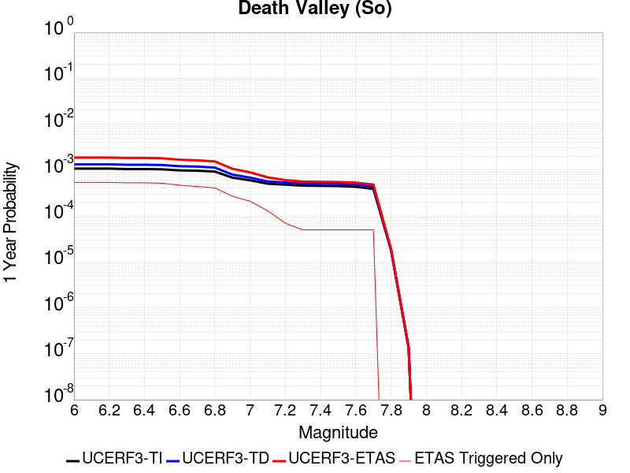 |  |

| Magnitude | 1 wk TI Prob | 1 wk TD Prob | 1 wk ETAS Prob | 1 wk ETAS/TD Gain | 1 wk ETAS Triggered Only | 1 mo TI Prob | 1 mo TD Prob | 1 mo ETAS Prob | 1 mo ETAS/TD Gain | 1 mo ETAS Triggered Only | 1 yr TI Prob | 1 yr TD Prob | 1 yr ETAS Prob | 1 yr ETAS/TD Gain | 1 yr ETAS Triggered Only | 10 yr TI Prob | 10 yr TD Prob | 10 yr ETAS Prob | 10 yr ETAS/TD Gain | 10 yr ETAS Triggered Only |
|-----|-----|-----|-----|-----|-----|-----|-----|-----|-----|-----|-----|-----|-----|-----|-----|-----|-----|-----|-----|-----|
| 6.0 | 2.0684236E-5 | 2.56223E-5 | 5.3296357E-5 | 2.080077 | 2.7674767E-5 | 8.864371E-5 | 1.09805325E-4 | 1.928205E-4 | 1.7560215 | 8.30243E-5 | 0.0010787029 | 0.0013360769 | 0.0020270217 | 1.5171444 | 6.918692E-4 | 0.010734817 | 0.013283722 | 0.014649079 | 1.1027843 | 0.0013837384 |
| 6.1 | 2.0684236E-5 | 2.56223E-5 | 5.3296357E-5 | 2.080077 | 2.7674767E-5 | 8.864371E-5 | 1.09805325E-4 | 1.928205E-4 | 1.7560215 | 8.30243E-5 | 0.0010787029 | 0.0013360769 | 0.0020270217 | 1.5171444 | 6.918692E-4 | 0.010734817 | 0.013283722 | 0.014649079 | 1.1027843 | 0.0013837384 |
| 6.2 | 2.0684236E-5 | 2.56223E-5 | 5.3296357E-5 | 2.080077 | 2.7674767E-5 | 8.864371E-5 | 1.09805325E-4 | 1.928205E-4 | 1.7560215 | 8.30243E-5 | 0.0010787029 | 0.0013360769 | 0.0020270217 | 1.5171444 | 6.918692E-4 | 0.010734817 | 0.013283722 | 0.014649079 | 1.1027843 | 0.0013837384 |
| 6.3 | 2.0240292E-5 | 2.5122325E-5 | 5.2796397E-5 | 2.1015728 | 2.7674767E-5 | 8.6741224E-5 | 1.0766276E-4 | 1.9067811E-4 | 1.7710685 | 8.30243E-5 | 0.0010555626 | 0.0013100227 | 0.0019733468 | 1.5063456 | 6.641944E-4 | 0.010505628 | 0.013026252 | 0.014337337 | 1.1006495 | 0.0013283888 |
| 6.4 | 2.0240292E-5 | 2.5122325E-5 | 5.2796397E-5 | 2.1015728 | 2.7674767E-5 | 8.6741224E-5 | 1.0766276E-4 | 1.9067811E-4 | 1.7710685 | 8.30243E-5 | 0.0010555626 | 0.0013100227 | 0.0019733468 | 1.5063456 | 6.641944E-4 | 0.010505628 | 0.013026252 | 0.014337337 | 1.1006495 | 0.0013283888 |
| 6.5 | 1.9962767E-5 | 2.4811543E-5 | 5.2485622E-5 | 2.1153712 | 2.7674767E-5 | 8.55519E-5 | 1.0633095E-4 | 1.8934642E-4 | 1.7807273 | 8.30243E-5 | 0.0010410968 | 0.0012938272 | 0.0019295232 | 1.49133 | 6.3651963E-4 | 0.010362327 | 0.012866181 | 0.01415016 | 1.0997949 | 0.001300714 |
| 6.6 | 1.8937297E-5 | 2.3315191E-5 | 5.098931E-5 | 2.1869566 | 2.7674767E-5 | 8.115732E-5 | 9.991851E-5 | 1.8293451E-4 | 1.8308371 | 8.30243E-5 | 9.876423E-4 | 0.0012158435 | 0.0017963069 | 1.4774163 | 5.811701E-4 | 0.009832645 | 0.012094965 | 0.013243247 | 1.0949389 | 0.0011623402 |
| 6.7 | 1.8621096E-5 | 2.2915787E-5 | 5.058992E-5 | 2.207645 | 2.7674767E-5 | 7.980225E-5 | 9.82069E-5 | 1.8122305E-4 | 1.8453188 | 8.30243E-5 | 9.711593E-4 | 0.0011950277 | 0.0017478616 | 1.4626118 | 5.534953E-4 | 0.009669261 | 0.011889057 | 0.013010233 | 1.0943031 | 0.0011346655 |
| 6.8 | 1.7830353E-5 | 2.1809607E-5 | 4.948377E-5 | 2.2688978 | 2.7674767E-5 | 7.641356E-5 | 9.346647E-5 | 1.7648301E-4 | 1.8881959 | 8.30243E-5 | 9.29938E-4 | 0.0011373743 | 0.0016902401 | 1.4860896 | 5.534953E-4 | 0.009260561 | 0.011318374 | 0.012440197 | 1.0991153 | 0.0011346655 |
| 6.9 | 1.3135183E-5 | 1.530614E-5 | 1.530614E-5 | 1.0 | 0.0 | 5.6292425E-5 | 6.559613E-5 | 9.326908E-5 | 1.4218687 | 2.7674767E-5 | 6.8514474E-4 | 7.983467E-4 | 0.0010748734 | 1.3463743 | 2.7674765E-4 | 0.006830362 | 0.007955794 | 0.008669614 | 1.0897232 | 7.195439E-4 |
| 7.0 | 1.1507512E-5 | 1.3155912E-5 | 1.3155912E-5 | 1.0 | 0.0 | 4.9316975E-5 | 5.638129E-5 | 8.4054496E-5 | 1.4908224 | 2.7674767E-5 | 6.002687E-4 | 6.862318E-4 | 8.7982224E-4 | 1.2821064 | 1.9372336E-4 | 0.0059864987 | 0.006841829 | 0.007364052 | 1.076328 | 5.2582053E-4 |
| 7.1 | 9.715903E-6 | 1.0866509E-5 | 1.0866509E-5 | 1.0 | 0.0 | 4.1638916E-5 | 4.6569945E-5 | 7.424342E-5 | 1.5942347 | 2.7674767E-5 | 5.068359E-4 | 5.668458E-4 | 7.051412E-4 | 1.2439736 | 1.3837383E-4 | 0.0050568148 | 0.0056544533 | 0.006012191 | 1.0632665 | 3.5977195E-4 |
| 7.2 | 9.233269E-6 | 1.0287449E-5 | 1.0287449E-5 | 1.0 | 0.0 | 3.9570554E-5 | 4.4088345E-5 | 7.176189E-5 | 1.6276839 | 2.7674767E-5 | 4.81665E-4 | 5.366476E-4 | 6.472873E-4 | 1.2061682 | 1.1069907E-4 | 0.0048062233 | 0.0053539486 | 0.0056842677 | 1.0616964 | 3.320972E-4 |
| 7.3 | 8.8041315E-6 | 9.809208E-6 | 9.809208E-6 | 1.0 | 0.0 | 3.7731446E-5 | 4.2038806E-5 | 4.2038806E-5 | 1.0 | 0.0 | 4.592835E-4 | 5.1170646E-4 | 5.670277E-4 | 1.1081113 | 5.5349534E-5 | 0.0045833546 | 0.005105709 | 0.0053810435 | 1.0539268 | 2.7674765E-4 |
| 7.4 | 8.708749E-6 | 9.708213E-6 | 9.708213E-6 | 1.0 | 0.0 | 3.7322676E-5 | 4.160599E-5 | 4.160599E-5 | 1.0 | 0.0 | 4.5430884E-4 | 5.0643936E-4 | 5.6176085E-4 | 1.1092361 | 5.5349534E-5 | 0.004533812 | 0.0050532785 | 0.005328628 | 1.0544893 | 2.7674765E-4 |
| 7.5 | 8.612678E-6 | 9.605849E-6 | 9.605849E-6 | 1.0 | 0.0 | 3.6910955E-5 | 4.11673E-5 | 4.11673E-5 | 1.0 | 0.0 | 4.492982E-4 | 5.011008E-4 | 5.564226E-4 | 1.1104006 | 5.5349534E-5 | 0.004483909 | 0.0050001345 | 0.005275498 | 1.0550714 | 2.7674765E-4 |
| 7.6 | 8.319024E-6 | 9.2849195E-6 | 9.2849195E-6 | 1.0 | 0.0 | 3.5652476E-5 | 3.9791932E-5 | 3.9791932E-5 | 1.0 | 0.0 | 4.3398244E-4 | 4.8436326E-4 | 5.39686E-4 | 1.1142174 | 5.5349534E-5 | 0.0043313587 | 0.0048334994 | 0.0051089097 | 1.0569794 | 2.7674765E-4 |
| 7.7 | 7.4718328E-6 | 8.346079E-6 | 8.346079E-6 | 1.0 | 0.0 | 3.2021748E-5 | 3.576844E-5 | 3.576844E-5 | 1.0 | 0.0 | 3.8979502E-4 | 4.353978E-4 | 4.9072324E-4 | 1.1270688 | 5.5349534E-5 | 0.00389112 | 0.004345853 | 0.004566289 | 1.0507233 | 2.2139814E-4 |
| 7.8 | 3.4586725E-7 | 3.648448E-7 | 3.648448E-7 | 1.0 | 0.0 | 1.4822873E-6 | 1.5636197E-6 | 1.5636197E-6 | 1.0 | 0.0 | 1.80467E-5 | 1.9036908E-5 | 1.9036908E-5 | 1.0 | 0.0 | 1.8045233E-4 | 1.9035321E-4 | 2.180227E-4 | 1.1453587 | 2.7674767E-5 |
| 7.9 | 2.5591178E-9 | 2.6697788E-9 | 2.6697788E-9 | 1.0 | 0.0 | 1.0967647E-8 | 1.144191E-8 | 1.144191E-8 | 1.0 | 0.0 | 1.335311E-7 | 1.3930524E-7 | 1.3930524E-7 | 1.0 | 0.0 | 1.3353102E-6 | 1.3930525E-6 | 1.3930525E-6 | 1.0 | 0.0 |

## Lenwood-Lockhart-Old Woman Springs
*[(top)](#table-of-contents)*

| 1 Week | 1 Month | 1 Year | 10 Year |
|-----|-----|-----|-----|
| 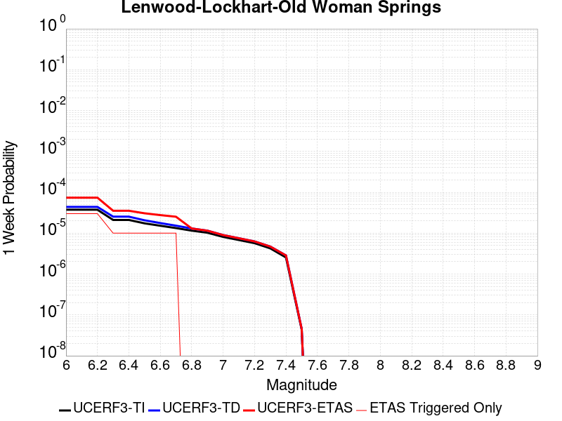 | 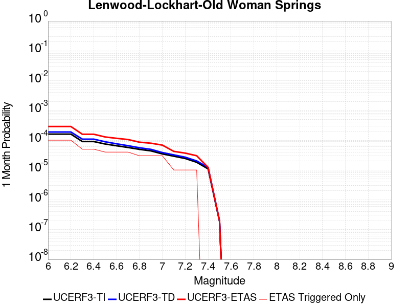 |  | 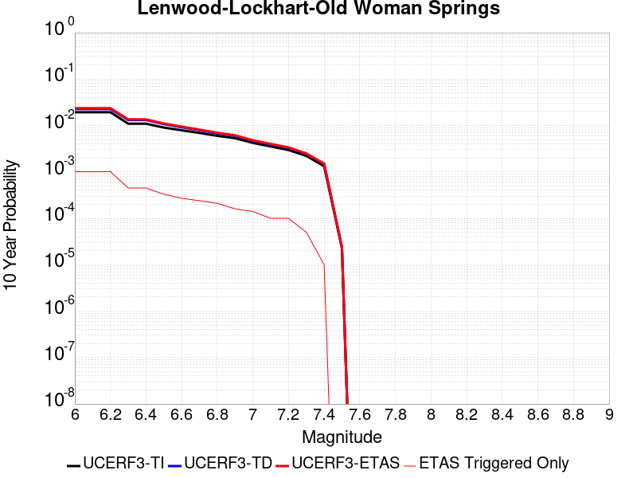 |

| Magnitude | 1 wk TI Prob | 1 wk TD Prob | 1 wk ETAS Prob | 1 wk ETAS/TD Gain | 1 wk ETAS Triggered Only | 1 mo TI Prob | 1 mo TD Prob | 1 mo ETAS Prob | 1 mo ETAS/TD Gain | 1 mo ETAS Triggered Only | 1 yr TI Prob | 1 yr TD Prob | 1 yr ETAS Prob | 1 yr ETAS/TD Gain | 1 yr ETAS Triggered Only | 10 yr TI Prob | 10 yr TD Prob | 10 yr ETAS Prob | 10 yr ETAS/TD Gain | 10 yr ETAS Triggered Only |
|-----|-----|-----|-----|-----|-----|-----|-----|-----|-----|-----|-----|-----|-----|-----|-----|-----|-----|-----|-----|-----|
| 6.0 | 3.744542E-5 | 4.3965647E-5 | 9.931275E-5 | 2.2588716 | 5.5349534E-5 | 1.604705E-4 | 1.8841156E-4 | 2.9908976E-4 | 1.5874279 | 1.1069907E-4 | 0.0019519776 | 0.0022916696 | 0.0027610625 | 1.2048258 | 4.7047102E-4 | 0.019349206 | 0.022698386 | 0.02361797 | 1.0405132 | 9.4094203E-4 |
| 6.1 | 3.744542E-5 | 4.3965647E-5 | 9.931275E-5 | 2.2588716 | 5.5349534E-5 | 1.604705E-4 | 1.8841156E-4 | 2.9908976E-4 | 1.5874279 | 1.1069907E-4 | 0.0019519776 | 0.0022916696 | 0.0027610625 | 1.2048258 | 4.7047102E-4 | 0.019349206 | 0.022698386 | 0.02361797 | 1.0405132 | 9.4094203E-4 |
| 6.2 | 3.744542E-5 | 4.3965647E-5 | 9.931275E-5 | 2.2588716 | 5.5349534E-5 | 1.604705E-4 | 1.8841156E-4 | 2.9908976E-4 | 1.5874279 | 1.1069907E-4 | 0.0019519776 | 0.0022916696 | 0.0027610625 | 1.2048258 | 4.7047102E-4 | 0.019349206 | 0.022698386 | 0.02361797 | 1.0405132 | 9.4094203E-4 |
| 6.3 | 2.1079984E-5 | 2.5354573E-5 | 5.3028638E-5 | 2.0914822 | 2.7674767E-5 | 9.0339665E-5 | 1.0865804E-4 | 1.6400155E-4 | 1.5093366 | 5.5349534E-5 | 0.0010993304 | 0.0013221288 | 0.0015708724 | 1.1881387 | 2.490729E-4 | 0.010939079 | 0.013144844 | 0.013609131 | 1.0353209 | 4.7047102E-4 |
| 6.4 | 2.1079984E-5 | 2.5354573E-5 | 5.3028638E-5 | 2.0914822 | 2.7674767E-5 | 9.0339665E-5 | 1.0865804E-4 | 1.6400155E-4 | 1.5093366 | 5.5349534E-5 | 0.0010993304 | 0.0013221288 | 0.0015708724 | 1.1881387 | 2.490729E-4 | 0.010939079 | 0.013144844 | 0.013609131 | 1.0353209 | 4.7047102E-4 |
| 6.5 | 1.7397282E-5 | 2.066329E-5 | 4.8337486E-5 | 2.3392928 | 2.7674767E-5 | 7.455765E-5 | 8.855402E-5 | 1.16226336E-4 | 1.3124908 | 2.7674767E-5 | 9.073613E-4 | 0.0010776237 | 0.0012434934 | 1.1539217 | 1.660486E-4 | 0.009036654 | 0.010725276 | 0.011053811 | 1.0306319 | 3.320972E-4 |
| 6.6 | 1.52050325E-5 | 1.7680433E-5 | 4.535471E-5 | 2.5652487 | 2.7674767E-5 | 6.51628E-5 | 7.5771124E-5 | 1.03443796E-4 | 1.3652139 | 2.7674767E-5 | 7.9306826E-4 | 9.2213094E-4 | 0.0010880264 | 1.1799045 | 1.660486E-4 | 0.007902439 | 0.009183909 | 0.009485535 | 1.032843 | 3.0442243E-4 |
| 6.7 | 1.332523E-5 | 1.5264624E-5 | 4.293897E-5 | 2.8129723 | 2.7674767E-5 | 5.7106878E-5 | 6.5418215E-5 | 9.309117E-5 | 1.4230161 | 2.7674767E-5 | 6.950544E-4 | 7.9618156E-4 | 9.6209795E-4 | 1.2083901 | 1.660486E-4 | 0.006928845 | 0.007933921 | 0.008208473 | 1.0346048 | 2.7674765E-4 |
| 6.8 | 1.1525329E-5 | 1.3031474E-5 | 1.3031474E-5 | 1.0 | 0.0 | 4.9393333E-5 | 5.5848002E-5 | 5.5848002E-5 | 1.0 | 0.0 | 6.011979E-4 | 6.7974156E-4 | 8.180213E-4 | 1.2034299 | 1.3837383E-4 | 0.00599574 | 0.0067770756 | 0.0070244605 | 1.0365032 | 2.490729E-4 |
| 6.9 | 1.0253909E-5 | 1.1514853E-5 | 1.1514853E-5 | 1.0 | 0.0 | 4.3944583E-5 | 4.934846E-5 | 4.934846E-5 | 1.0 | 0.0 | 5.3489394E-4 | 6.006555E-4 | 7.1128807E-4 | 1.1841865 | 1.1069907E-4 | 0.0053360825 | 0.0059906994 | 0.0061557535 | 1.0275517 | 1.660486E-4 |
| 7.0 | 8.104563E-6 | 8.991571E-6 | 8.991571E-6 | 1.0 | 0.0 | 3.4733377E-5 | 3.853475E-5 | 3.853475E-5 | 1.0 | 0.0 | 4.2279682E-4 | 4.6906198E-4 | 5.5204734E-4 | 1.1769177 | 8.30243E-5 | 0.0042199334 | 0.0046809674 | 0.0048186937 | 1.0294225 | 1.3837383E-4 |
| 7.1 | 6.7986157E-6 | 7.5160438E-6 | 7.5160438E-6 | 1.0 | 0.0 | 2.91366E-5 | 3.221123E-5 | 3.221123E-5 | 1.0 | 0.0 | 3.5468035E-4 | 3.9210328E-4 | 4.474311E-4 | 1.1411053 | 5.5349534E-5 | 0.003541148 | 0.003914331 | 0.004024597 | 1.0281698 | 1.1069907E-4 |
| 7.2 | 5.6893327E-6 | 6.2801914E-6 | 6.2801914E-6 | 1.0 | 0.0 | 2.4382627E-5 | 2.6914839E-5 | 2.6914839E-5 | 1.0 | 0.0 | 2.9681803E-4 | 3.2764088E-4 | 3.8297227E-4 | 1.1688782 | 5.5349534E-5 | 0.002964219 | 0.003271777 | 0.0033821138 | 1.0337238 | 1.1069907E-4 |
| 7.3 | 4.253348E-6 | 4.707026E-6 | 4.707026E-6 | 1.0 | 0.0 | 1.8228506E-5 | 2.0172823E-5 | 2.0172823E-5 | 1.0 | 0.0 | 2.2190946E-4 | 2.455783E-4 | 2.455783E-4 | 1.0 | 0.0 | 0.00221688 | 0.00245325 | 0.00245325 | 1.0 | 0.0 |
| 7.4 | 2.5448119E-6 | 2.8521038E-6 | 2.8521038E-6 | 1.0 | 0.0 | 1.0906291E-5 | 1.2223254E-5 | 1.2223254E-5 | 1.0 | 0.0 | 1.3277601E-4 | 1.488096E-4 | 1.488096E-4 | 1.0 | 0.0 | 0.001326967 | 0.0014872618 | 0.0014872618 | 1.0 | 0.0 |
| 7.5 | 4.3706837E-8 | 4.5630955E-8 | 4.5630955E-8 | 1.0 | 0.0 | 1.8731501E-7 | 1.9556123E-7 | 1.9556123E-7 | 1.0 | 0.0 | 2.2805577E-6 | 2.380956E-6 | 2.380956E-6 | 1.0 | 0.0 | 2.2805343E-5 | 2.3809358E-5 | 2.3809358E-5 | 1.0 | 0.0 |

## Bicycle Lake
*[(top)](#table-of-contents)*

| 1 Week | 1 Month | 1 Year | 10 Year |
|-----|-----|-----|-----|
|  |  | 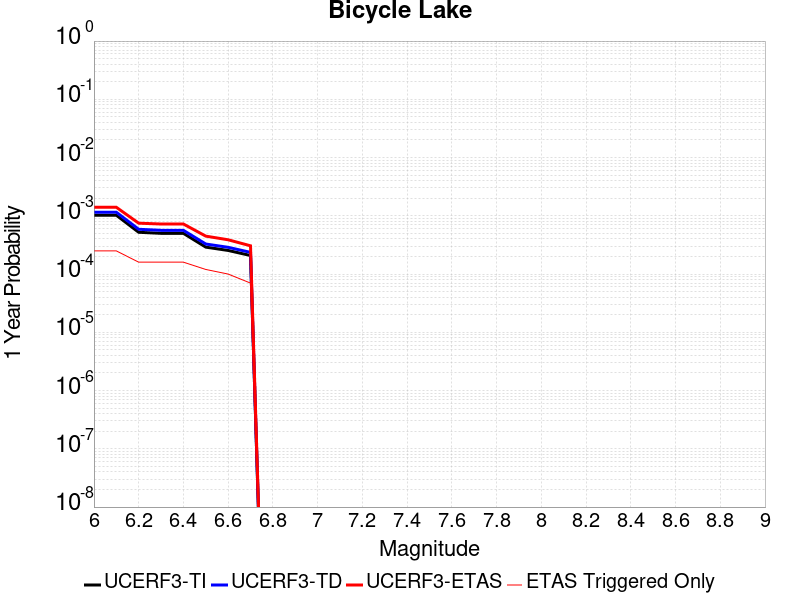 | 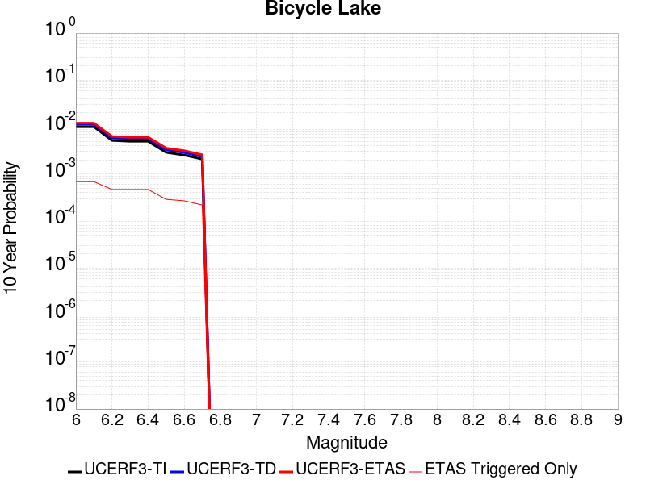 |

| Magnitude | 1 wk TI Prob | 1 wk TD Prob | 1 wk ETAS Prob | 1 wk ETAS/TD Gain | 1 wk ETAS Triggered Only | 1 mo TI Prob | 1 mo TD Prob | 1 mo ETAS Prob | 1 mo ETAS/TD Gain | 1 mo ETAS Triggered Only | 1 yr TI Prob | 1 yr TD Prob | 1 yr ETAS Prob | 1 yr ETAS/TD Gain | 1 yr ETAS Triggered Only | 10 yr TI Prob | 10 yr TD Prob | 10 yr ETAS Prob | 10 yr ETAS/TD Gain | 10 yr ETAS Triggered Only |
|-----|-----|-----|-----|-----|-----|-----|-----|-----|-----|-----|-----|-----|-----|-----|-----|-----|-----|-----|-----|-----|
| 6.0 | 1.9621975E-5 | 2.2099668E-5 | 2.2099668E-5 | 1.0 | 0.0 | 8.4091465E-5 | 9.471019E-5 | 1.2238233E-4 | 1.2921771 | 2.7674767E-5 | 0.0010233327 | 0.0011526216 | 0.001484336 | 1.2877913 | 3.320972E-4 | 0.01018633 | 0.0114797475 | 0.012327816 | 1.0738752 | 8.5791777E-4 |
| 6.1 | 1.9621975E-5 | 2.2099668E-5 | 2.2099668E-5 | 1.0 | 0.0 | 8.4091465E-5 | 9.471019E-5 | 1.2238233E-4 | 1.2921771 | 2.7674767E-5 | 0.0010233327 | 0.0011526216 | 0.001484336 | 1.2877913 | 3.320972E-4 | 0.01018633 | 0.0114797475 | 0.012327816 | 1.0738752 | 8.5791777E-4 |
| 6.2 | 9.9971285E-6 | 1.1256955E-5 | 1.1256955E-5 | 1.0 | 0.0 | 4.2844134E-5 | 4.8243495E-5 | 7.591693E-5 | 1.57362 | 2.7674767E-5 | 5.2150246E-4 | 5.872583E-4 | 8.361849E-4 | 1.4238793 | 2.490729E-4 | 0.0052028033 | 0.0058621704 | 0.0064399336 | 1.098558 | 5.811701E-4 |
| 6.3 | 9.589428E-6 | 1.079961E-5 | 1.079961E-5 | 1.0 | 0.0 | 4.10969E-5 | 4.6283516E-5 | 7.3957E-5 | 1.5979123 | 2.7674767E-5 | 5.002399E-4 | 5.6340796E-4 | 8.123405E-4 | 1.4418336 | 2.490729E-4 | 0.0049911533 | 0.005624887 | 0.006202788 | 1.10274 | 5.811701E-4 |
| 6.4 | 9.589428E-6 | 1.079961E-5 | 1.079961E-5 | 1.0 | 0.0 | 4.10969E-5 | 4.6283516E-5 | 7.3957E-5 | 1.5979123 | 2.7674767E-5 | 5.002399E-4 | 5.6340796E-4 | 8.123405E-4 | 1.4418336 | 2.490729E-4 | 0.0049911533 | 0.005624887 | 0.006202788 | 1.10274 | 5.811701E-4 |
| 6.5 | 5.557707E-6 | 6.286366E-6 | 6.286366E-6 | 1.0 | 0.0 | 2.3818526E-5 | 2.6941441E-5 | 5.4615462E-5 | 2.0271916 | 2.7674767E-5 | 2.8995197E-4 | 3.2798958E-4 | 4.939837E-4 | 1.5060958 | 1.660486E-4 | 0.0028957394 | 0.0032776915 | 0.0036087004 | 1.1009884 | 3.320972E-4 |
| 6.6 | 4.8742945E-6 | 5.513961E-6 | 5.513961E-6 | 1.0 | 0.0 | 2.0889667E-5 | 2.3631193E-5 | 2.3631193E-5 | 1.0 | 0.0 | 2.54302E-4 | 2.87698E-4 | 3.9836523E-4 | 1.3846645 | 1.1069907E-4 | 0.002540112 | 0.002875825 | 0.0031517767 | 1.0959557 | 2.7674765E-4 |
| 6.7 | 3.991108E-6 | 4.5164616E-6 | 4.5164616E-6 | 1.0 | 0.0 | 1.7104636E-5 | 1.9356265E-5 | 1.9356265E-5 | 1.0 | 0.0 | 2.0822904E-4 | 2.3566252E-4 | 3.1866724E-4 | 1.3522186 | 8.30243E-5 | 0.0020803404 | 0.0023566252 | 0.0025775016 | 1.0937257 | 2.2139814E-4 |

## San Andreas (San Bernardino N)
*[(top)](#table-of-contents)*

| 1 Week | 1 Month | 1 Year | 10 Year |
|-----|-----|-----|-----|
| 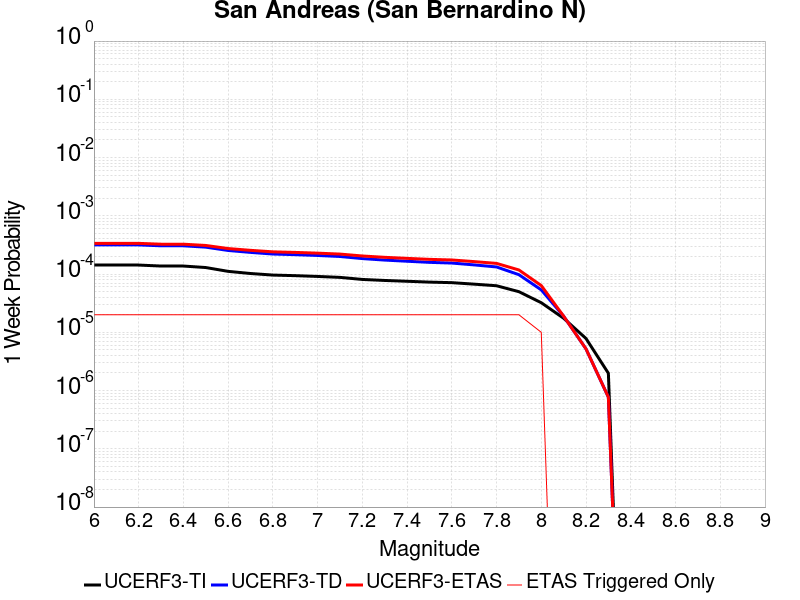 |  |  |  |

| Magnitude | 1 wk TI Prob | 1 wk TD Prob | 1 wk ETAS Prob | 1 wk ETAS/TD Gain | 1 wk ETAS Triggered Only | 1 mo TI Prob | 1 mo TD Prob | 1 mo ETAS Prob | 1 mo ETAS/TD Gain | 1 mo ETAS Triggered Only | 1 yr TI Prob | 1 yr TD Prob | 1 yr ETAS Prob | 1 yr ETAS/TD Gain | 1 yr ETAS Triggered Only | 10 yr TI Prob | 10 yr TD Prob | 10 yr ETAS Prob | 10 yr ETAS/TD Gain | 10 yr ETAS Triggered Only |
|-----|-----|-----|-----|-----|-----|-----|-----|-----|-----|-----|-----|-----|-----|-----|-----|-----|-----|-----|-----|-----|
| 6.0 | 1.4273766E-4 | 3.1657895E-4 | 3.1657895E-4 | 1.0 | 0.0 | 6.115894E-4 | 0.0013560674 | 0.0014113418 | 1.0407609 | 5.5349534E-5 | 0.0074207084 | 0.016386637 | 0.016794957 | 1.0249178 | 4.151215E-4 | 0.07177748 | 0.15047675 | 0.151041 | 1.0037497 | 6.641944E-4 |
| 6.1 | 1.4273766E-4 | 3.1657895E-4 | 3.1657895E-4 | 1.0 | 0.0 | 6.115894E-4 | 0.0013560674 | 0.0014113418 | 1.0407609 | 5.5349534E-5 | 0.0074207084 | 0.016386637 | 0.016794957 | 1.0249178 | 4.151215E-4 | 0.07177748 | 0.15047675 | 0.151041 | 1.0037497 | 6.641944E-4 |
| 6.2 | 1.4273766E-4 | 3.1657895E-4 | 3.1657895E-4 | 1.0 | 0.0 | 6.115894E-4 | 0.0013560674 | 0.0014113418 | 1.0407609 | 5.5349534E-5 | 0.0074207084 | 0.016386637 | 0.016794957 | 1.0249178 | 4.151215E-4 | 0.07177748 | 0.15047675 | 0.151041 | 1.0037497 | 6.641944E-4 |
| 6.3 | 1.3730655E-4 | 3.0562485E-4 | 3.0562485E-4 | 1.0 | 0.0 | 5.883239E-4 | 0.001309169 | 0.001364446 | 1.042223 | 5.5349534E-5 | 0.0071393442 | 0.015824046 | 0.016232599 | 1.0258185 | 4.151215E-4 | 0.06914291 | 0.14577667 | 0.14634405 | 1.0038921 | 6.641944E-4 |
| 6.4 | 1.3730655E-4 | 3.0562485E-4 | 3.0562485E-4 | 1.0 | 0.0 | 5.883239E-4 | 0.001309169 | 0.001364446 | 1.042223 | 5.5349534E-5 | 0.0071393442 | 0.015824046 | 0.016232599 | 1.0258185 | 4.151215E-4 | 0.06914291 | 0.14577667 | 0.14634405 | 1.0038921 | 6.641944E-4 |
| 6.5 | 1.2942807E-4 | 2.8976568E-4 | 2.8976568E-4 | 1.0 | 0.0 | 5.545738E-4 | 0.0012412671 | 0.0012965478 | 1.0445358 | 5.5349534E-5 | 0.0067310524 | 0.015008957 | 0.015417849 | 1.0272431 | 4.151215E-4 | 0.06530788 | 0.13891955 | 0.13949147 | 1.0041169 | 6.641944E-4 |
| 6.6 | 1.1125901E-4 | 2.5414478E-4 | 2.5414478E-4 | 1.0 | 0.0 | 4.767372E-4 | 0.0010887395 | 0.0011440287 | 1.0507828 | 5.5349534E-5 | 0.005788839 | 0.0131754745 | 0.013585127 | 1.031092 | 4.151215E-4 | 0.056403454 | 0.123209246 | 0.123791605 | 1.0047266 | 6.641944E-4 |
| 6.7 | 1.02209575E-4 | 2.3549075E-4 | 2.3549075E-4 | 1.0 | 0.0 | 4.3796748E-4 | 0.0010088572 | 0.0010641508 | 1.0548083 | 5.5349534E-5 | 0.0053192247 | 0.012214084 | 0.012624135 | 1.033572 | 4.151215E-4 | 0.051936906 | 0.11500142 | 0.115589224 | 1.0051113 | 6.641944E-4 |
| 6.8 | 9.610582E-5 | 2.2074205E-4 | 2.2074205E-4 | 1.0 | 0.0 | 4.1181705E-4 | 9.4569504E-4 | 0.0010009923 | 1.0584725 | 5.5349534E-5 | 0.0050023515 | 0.011453319 | 0.011863686 | 1.0358295 | 4.151215E-4 | 0.048912346 | 0.10840221 | 0.1089944 | 1.0054629 | 6.641944E-4 |
| 6.9 | 9.3877505E-5 | 2.1529532E-4 | 2.1529532E-4 | 1.0 | 0.0 | 4.0227012E-4 | 9.223686E-4 | 9.776672E-4 | 1.0599527 | 5.5349534E-5 | 0.0048866454 | 0.011172262 | 0.011582746 | 1.0367414 | 4.151215E-4 | 0.04780577 | 0.105992176 | 0.10658597 | 1.0056022 | 6.641944E-4 |
| 7.0 | 9.1019785E-5 | 2.0856115E-4 | 2.0856115E-4 | 1.0 | 0.0 | 3.900265E-4 | 8.9352793E-4 | 9.48828E-4 | 1.0618896 | 5.5349534E-5 | 0.0047382377 | 0.0108246645 | 0.011235293 | 1.0379344 | 4.151215E-4 | 0.046384744 | 0.102961764 | 0.10355757 | 1.0057867 | 6.641944E-4 |
| 7.1 | 8.771155E-5 | 2.0030304E-4 | 2.0030304E-4 | 1.0 | 0.0 | 3.758525E-4 | 8.5815974E-4 | 9.134617E-4 | 1.0644426 | 5.5349534E-5 | 0.0045664064 | 0.01039824 | 0.010809045 | 1.0395072 | 4.151215E-4 | 0.044737056 | 0.09927276 | 0.099821165 | 1.0055242 | 6.0884486E-4 |
| 7.2 | 8.0830236E-5 | 1.8435127E-4 | 1.8435127E-4 | 1.0 | 0.0 | 3.4636928E-4 | 7.898378E-4 | 8.4514363E-4 | 1.0700217 | 5.5349534E-5 | 0.0042088944 | 0.009573982 | 0.00995772 | 1.0400813 | 3.8744672E-4 | 0.041300658 | 0.09200184 | 0.09252954 | 1.0057358 | 5.811701E-4 |
| 7.3 | 7.7668235E-5 | 1.7377833E-4 | 1.7377833E-4 | 1.0 | 0.0 | 3.328214E-4 | 7.445518E-4 | 7.998601E-4 | 1.0742841 | 5.5349534E-5 | 0.0040445733 | 0.009027321 | 0.00941127 | 1.0425318 | 3.8744672E-4 | 0.03971748 | 0.08726679 | 0.08779724 | 1.0060785 | 5.811701E-4 |
| 7.4 | 7.520177E-5 | 1.6597293E-4 | 1.6597293E-4 | 1.0 | 0.0 | 3.2225347E-4 | 7.1111874E-4 | 7.664289E-4 | 1.077779 | 5.5349534E-5 | 0.0039163795 | 0.008623568 | 0.008980238 | 1.0413599 | 3.5977195E-4 | 0.038480744 | 0.08372108 | 0.08420288 | 1.0057548 | 5.2582053E-4 |
| 7.5 | 7.274697E-5 | 1.5884354E-4 | 1.5884354E-4 | 1.0 | 0.0 | 3.1173544E-4 | 6.805805E-4 | 7.3589233E-4 | 1.0812716 | 5.5349534E-5 | 0.003788775 | 0.0082546435 | 0.008611446 | 1.0432245 | 3.5977195E-4 | 0.03724827 | 0.08043605 | 0.08091958 | 1.0060112 | 5.2582053E-4 |
| 7.6 | 7.1185845E-5 | 1.5453836E-4 | 1.5453836E-4 | 1.0 | 0.0 | 3.0504653E-4 | 6.6213915E-4 | 7.17452E-4 | 1.0835366 | 5.5349534E-5 | 0.0037076178 | 0.0080317985 | 0.008388681 | 1.0444337 | 3.5977195E-4 | 0.036463667 | 0.07842452 | 0.07890911 | 1.006179 | 5.2582053E-4 |
| 7.7 | 6.709961E-5 | 1.4361642E-4 | 1.4361642E-4 | 1.0 | 0.0 | 2.8753807E-4 | 6.1535375E-4 | 6.7066925E-4 | 1.0898921 | 5.5349534E-5 | 0.003495157 | 0.007466235 | 0.007823321 | 1.0478268 | 3.5977195E-4 | 0.034406938 | 0.07324966 | 0.073736966 | 1.0066526 | 5.2582053E-4 |
| 7.8 | 6.300812E-5 | 1.3243512E-4 | 1.3243512E-4 | 1.0 | 0.0 | 2.7000686E-4 | 5.6745566E-4 | 6.227738E-4 | 1.0974845 | 5.5349534E-5 | 0.0032823787 | 0.0068869162 | 0.00724421 | 1.0518801 | 3.5977195E-4 | 0.032343175 | 0.06789981 | 0.06838993 | 1.0072182 | 5.2582053E-4 |
| 7.9 | 4.983037E-5 | 9.755923E-5 | 9.755923E-5 | 1.0 | 0.0 | 2.1354125E-4 | 4.18044E-4 | 4.733704E-4 | 1.1323459 | 5.5349534E-5 | 0.0025967648 | 0.005077818 | 0.0053806948 | 1.059647 | 3.0442243E-4 | 0.025666296 | 0.050799936 | 0.05119397 | 1.0077566 | 4.151215E-4 |
| 8.0 | 3.2211527E-5 | 5.3494157E-5 | 5.3494157E-5 | 1.0 | 0.0 | 1.380421E-4 | 2.2924054E-4 | 2.8457737E-4 | 1.241392 | 5.5349534E-5 | 0.0016793669 | 0.002787433 | 0.002870226 | 1.0297022 | 8.30243E-5 | 0.016667323 | 0.02845379 | 0.028561339 | 1.0037798 | 1.1069907E-4 |
| 8.1 | 1.743376E-5 | 1.891248E-5 | 1.891248E-5 | 1.0 | 0.0 | 7.471398E-5 | 8.1050974E-5 | 1.0872349E-4 | 1.3414212 | 2.7674767E-5 | 9.0926304E-4 | 9.863495E-4 | 0.001013997 | 1.02803 | 2.7674767E-5 | 0.009055517 | 0.01052989 | 0.0105572725 | 1.0026006 | 2.7674767E-5 |
| 8.2 | 7.831616E-6 | 5.188014E-6 | 5.188014E-6 | 1.0 | 0.0 | 3.3563636E-5 | 2.2234157E-5 | 2.2234157E-5 | 1.0 | 0.0 | 4.0856065E-4 | 2.706673E-4 | 2.706673E-4 | 1.0 | 0.0 | 0.004078103 | 0.0030597039 | 0.0030597039 | 1.0 | 0.0 |
| 8.3 | 1.983087E-6 | 7.7188406E-7 | 7.7188406E-7 | 1.0 | 0.0 | 8.498917E-6 | 3.3080703E-6 | 3.3080703E-6 | 1.0 | 0.0 | 1.034694E-4 | 4.027503E-5 | 4.027503E-5 | 1.0 | 0.0 | 0.0010342124 | 4.7534908E-4 | 4.7534908E-4 | 1.0 | 0.0 |

## Garlic Springs
*[(top)](#table-of-contents)*

| 1 Week | 1 Month | 1 Year | 10 Year |
|-----|-----|-----|-----|
| 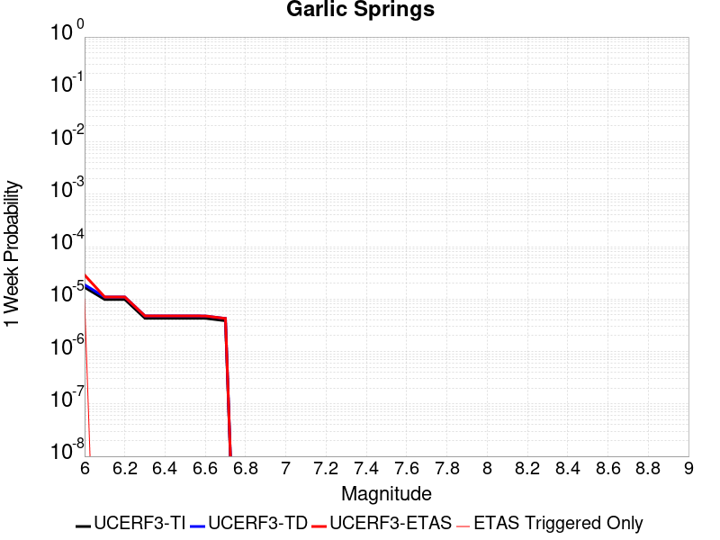 |  |  | 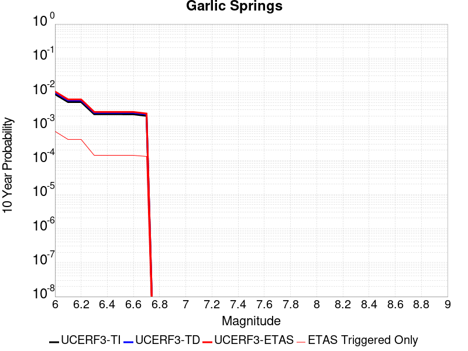 |

| Magnitude | 1 wk TI Prob | 1 wk TD Prob | 1 wk ETAS Prob | 1 wk ETAS/TD Gain | 1 wk ETAS Triggered Only | 1 mo TI Prob | 1 mo TD Prob | 1 mo ETAS Prob | 1 mo ETAS/TD Gain | 1 mo ETAS Triggered Only | 1 yr TI Prob | 1 yr TD Prob | 1 yr ETAS Prob | 1 yr ETAS/TD Gain | 1 yr ETAS Triggered Only | 10 yr TI Prob | 10 yr TD Prob | 10 yr ETAS Prob | 10 yr ETAS/TD Gain | 10 yr ETAS Triggered Only |
|-----|-----|-----|-----|-----|-----|-----|-----|-----|-----|-----|-----|-----|-----|-----|-----|-----|-----|-----|-----|-----|
| 6.0 | 1.6760017E-5 | 1.8778932E-5 | 1.8778932E-5 | 1.0 | 0.0 | 7.182667E-5 | 8.0479316E-5 | 1.3582439E-4 | 1.6876932 | 5.5349534E-5 | 8.7413884E-4 | 9.795127E-4 | 0.0012836369 | 1.3104852 | 3.0442243E-4 | 0.008707083 | 0.009763501 | 0.010476019 | 1.0729778 | 7.195439E-4 |
| 6.1 | 9.852767E-6 | 1.0974746E-5 | 1.0974746E-5 | 1.0 | 0.0 | 4.222546E-5 | 4.703418E-5 | 4.703418E-5 | 1.0 | 0.0 | 5.139737E-4 | 5.7256164E-4 | 7.3851517E-4 | 1.2898439 | 1.660486E-4 | 0.005127866 | 0.0057178247 | 0.006158089 | 1.0769986 | 4.4279627E-4 |
| 6.2 | 9.852767E-6 | 1.0974746E-5 | 1.0974746E-5 | 1.0 | 0.0 | 4.222546E-5 | 4.703418E-5 | 4.703418E-5 | 1.0 | 0.0 | 5.139737E-4 | 5.7256164E-4 | 7.3851517E-4 | 1.2898439 | 1.660486E-4 | 0.005127866 | 0.0057178247 | 0.006158089 | 1.0769986 | 4.4279627E-4 |
| 6.3 | 4.3167724E-6 | 4.7785024E-6 | 4.7785024E-6 | 1.0 | 0.0 | 1.8500323E-5 | 2.0479267E-5 | 2.0479267E-5 | 1.0 | 0.0 | 2.2521814E-4 | 2.4932958E-4 | 3.046653E-4 | 1.2219381 | 5.5349534E-5 | 0.0022499003 | 0.002492757 | 0.0026031802 | 1.0442976 | 1.1069907E-4 |
| 6.4 | 4.3167724E-6 | 4.7785024E-6 | 4.7785024E-6 | 1.0 | 0.0 | 1.8500323E-5 | 2.0479267E-5 | 2.0479267E-5 | 1.0 | 0.0 | 2.2521814E-4 | 2.4932958E-4 | 3.046653E-4 | 1.2219381 | 5.5349534E-5 | 0.0022499003 | 0.002492757 | 0.0026031802 | 1.0442976 | 1.1069907E-4 |
| 6.5 | 4.3167724E-6 | 4.7785024E-6 | 4.7785024E-6 | 1.0 | 0.0 | 1.8500323E-5 | 2.0479267E-5 | 2.0479267E-5 | 1.0 | 0.0 | 2.2521814E-4 | 2.4932958E-4 | 3.046653E-4 | 1.2219381 | 5.5349534E-5 | 0.0022499003 | 0.002492757 | 0.0026031802 | 1.0442976 | 1.1069907E-4 |
| 6.6 | 4.301311E-6 | 4.7613694E-6 | 4.7613694E-6 | 1.0 | 0.0 | 1.8434059E-5 | 2.040584E-5 | 2.040584E-5 | 1.0 | 0.0 | 2.2441156E-4 | 2.484358E-4 | 3.0377158E-4 | 1.2227367 | 5.5349534E-5 | 0.0022418506 | 0.0024838394 | 0.0025942635 | 1.0444571 | 1.1069907E-4 |
| 6.7 | 3.8599724E-6 | 4.2714823E-6 | 4.2714823E-6 | 1.0 | 0.0 | 1.6542634E-5 | 1.8306351E-5 | 1.8306351E-5 | 1.0 | 0.0 | 2.0138794E-4 | 2.2287984E-4 | 2.7821702E-4 | 1.2482827 | 5.5349534E-5 | 0.0020120554 | 0.0022287983 | 0.0023392506 | 1.0495569 | 1.1069907E-4 |

## Paradise
*[(top)](#table-of-contents)*

| 1 Week | 1 Month | 1 Year | 10 Year |
|-----|-----|-----|-----|
| 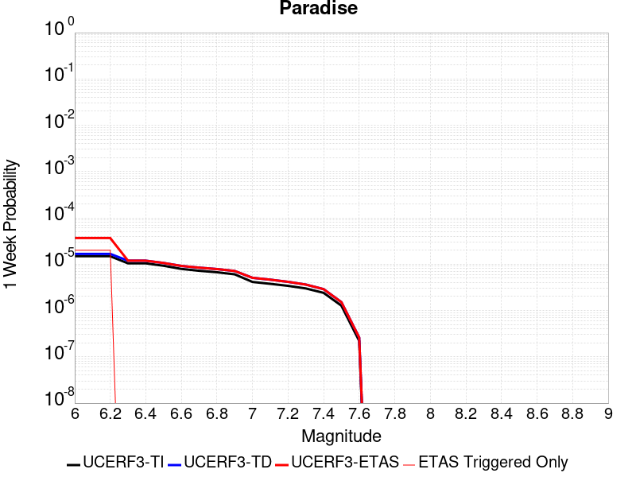 |  |  |  |

| Magnitude | 1 wk TI Prob | 1 wk TD Prob | 1 wk ETAS Prob | 1 wk ETAS/TD Gain | 1 wk ETAS Triggered Only | 1 mo TI Prob | 1 mo TD Prob | 1 mo ETAS Prob | 1 mo ETAS/TD Gain | 1 mo ETAS Triggered Only | 1 yr TI Prob | 1 yr TD Prob | 1 yr ETAS Prob | 1 yr ETAS/TD Gain | 1 yr ETAS Triggered Only | 10 yr TI Prob | 10 yr TD Prob | 10 yr ETAS Prob | 10 yr ETAS/TD Gain | 10 yr ETAS Triggered Only |
|-----|-----|-----|-----|-----|-----|-----|-----|-----|-----|-----|-----|-----|-----|-----|-----|-----|-----|-----|-----|-----|
| 6.0 | 1.4851273E-5 | 1.6695827E-5 | 4.4370132E-5 | 2.657558 | 2.7674767E-5 | 6.364676E-5 | 7.1551716E-5 | 1.2689728E-4 | 1.7735044 | 5.5349534E-5 | 7.7462377E-4 | 8.7081763E-4 | 0.0010367216 | 1.1905152 | 1.660486E-4 | 0.0077192914 | 0.008676433 | 0.009389734 | 1.0822113 | 7.195439E-4 |
| 6.1 | 1.4851273E-5 | 1.6695827E-5 | 4.4370132E-5 | 2.657558 | 2.7674767E-5 | 6.364676E-5 | 7.1551716E-5 | 1.2689728E-4 | 1.7735044 | 5.5349534E-5 | 7.7462377E-4 | 8.7081763E-4 | 0.0010367216 | 1.1905152 | 1.660486E-4 | 0.0077192914 | 0.008676433 | 0.009389734 | 1.0822113 | 7.195439E-4 |
| 6.2 | 1.4851273E-5 | 1.6695827E-5 | 4.4370132E-5 | 2.657558 | 2.7674767E-5 | 6.364676E-5 | 7.1551716E-5 | 1.2689728E-4 | 1.7735044 | 5.5349534E-5 | 7.7462377E-4 | 8.7081763E-4 | 0.0010367216 | 1.1905152 | 1.660486E-4 | 0.0077192914 | 0.008676433 | 0.009389734 | 1.0822113 | 7.195439E-4 |
| 6.3 | 1.0426831E-5 | 1.1889371E-5 | 1.1889371E-5 | 1.0 | 0.0 | 4.4685654E-5 | 5.0953488E-5 | 7.862684E-5 | 1.5431101 | 2.7674767E-5 | 5.43912E-4 | 6.201881E-4 | 6.755033E-4 | 1.089191 | 5.5349534E-5 | 0.0054258266 | 0.006185181 | 0.006542728 | 1.057807 | 3.5977195E-4 |
| 6.4 | 1.0426831E-5 | 1.1889371E-5 | 1.1889371E-5 | 1.0 | 0.0 | 4.4685654E-5 | 5.0953488E-5 | 7.862684E-5 | 1.5431101 | 2.7674767E-5 | 5.43912E-4 | 6.201881E-4 | 6.755033E-4 | 1.089191 | 5.5349534E-5 | 0.0054258266 | 0.006185181 | 0.006542728 | 1.057807 | 3.5977195E-4 |
| 6.5 | 9.25027E-6 | 1.0620619E-5 | 1.0620619E-5 | 1.0 | 0.0 | 3.964341E-5 | 4.551617E-5 | 7.318968E-5 | 1.6079929 | 2.7674767E-5 | 4.8255164E-4 | 5.5402337E-4 | 6.0934224E-4 | 1.0998493 | 5.5349534E-5 | 0.0048150513 | 0.0055269212 | 0.0057746177 | 1.0448164 | 2.490729E-4 |
| 6.6 | 7.904275E-6 | 9.160068E-6 | 9.160068E-6 | 1.0 | 0.0 | 3.3875025E-5 | 3.9256865E-5 | 6.6930545E-5 | 1.7049385 | 2.7674767E-5 | 4.1235037E-4 | 4.7785146E-4 | 5.3317455E-4 | 1.1157746 | 5.5349534E-5 | 0.0041158604 | 0.0047686365 | 0.004961436 | 1.0404308 | 1.9372336E-4 |
| 6.7 | 7.2061953E-6 | 8.407737E-6 | 8.407737E-6 | 1.0 | 0.0 | 3.088333E-5 | 3.603268E-5 | 3.603268E-5 | 1.0 | 0.0 | 3.7593965E-4 | 4.3861326E-4 | 4.3861326E-4 | 1.0 | 0.0 | 0.003753043 | 0.0043778447 | 0.0044880593 | 1.0251755 | 1.1069907E-4 |
| 6.8 | 6.6948724E-6 | 7.8426165E-6 | 7.8426165E-6 | 1.0 | 0.0 | 2.8691995E-5 | 3.36108E-5 | 3.36108E-5 | 1.0 | 0.0 | 3.4926904E-4 | 4.091382E-4 | 4.091382E-4 | 1.0 | 0.0 | 0.003487206 | 0.004084207 | 0.0041668923 | 1.0202451 | 8.30243E-5 |
| 6.9 | 6.0421025E-6 | 7.131023E-6 | 7.131023E-6 | 1.0 | 0.0 | 2.5894467E-5 | 3.0561187E-5 | 3.0561187E-5 | 1.0 | 0.0 | 3.1521954E-4 | 3.7202233E-4 | 3.7202233E-4 | 1.0 | 0.0 | 0.0031477278 | 0.0037143338 | 0.0037694776 | 1.0148462 | 5.5349534E-5 |
| 7.0 | 4.134091E-6 | 5.0805884E-6 | 5.0805884E-6 | 1.0 | 0.0 | 1.7717413E-5 | 2.1773776E-5 | 2.1773776E-5 | 1.0 | 0.0 | 2.1568815E-4 | 2.6506503E-4 | 2.6506503E-4 | 1.0 | 0.0 | 0.0021547892 | 0.0026476418 | 0.0026752434 | 1.010425 | 2.7674767E-5 |
| 7.1 | 3.7674888E-6 | 4.632121E-6 | 4.632121E-6 | 1.0 | 0.0 | 1.6146281E-5 | 1.9851805E-5 | 1.9851805E-5 | 1.0 | 0.0 | 1.9656324E-4 | 2.4167044E-4 | 2.4167044E-4 | 1.0 | 0.0 | 0.0019638946 | 0.002414227 | 0.002441835 | 1.0114355 | 2.7674767E-5 |
| 7.2 | 3.4065345E-6 | 4.156948E-6 | 4.156948E-6 | 1.0 | 0.0 | 1.4599351E-5 | 1.7815379E-5 | 1.7815379E-5 | 1.0 | 0.0 | 1.777326E-4 | 2.1688214E-4 | 2.1688214E-4 | 1.0 | 0.0 | 0.0017759053 | 0.002166853 | 0.0021944677 | 1.0127442 | 2.7674767E-5 |
| 7.3 | 2.9934936E-6 | 3.6295025E-6 | 3.6295025E-6 | 1.0 | 0.0 | 1.2829195E-5 | 1.5554926E-5 | 1.5554926E-5 | 1.0 | 0.0 | 1.5618425E-4 | 1.8936626E-4 | 1.8936626E-4 | 1.0 | 0.0 | 0.0015607453 | 0.0018921942 | 0.0019198166 | 1.0145981 | 2.7674767E-5 |
| 7.4 | 2.4049796E-6 | 2.8891204E-6 | 2.8891204E-6 | 1.0 | 0.0 | 1.0307015E-5 | 1.23818945E-5 | 1.23818945E-5 | 1.0 | 0.0 | 1.2548068E-4 | 1.5074057E-4 | 1.5074057E-4 | 1.0 | 0.0 | 0.0012540985 | 0.0015065247 | 0.0015341578 | 1.0183423 | 2.7674767E-5 |
| 7.5 | 1.2710091E-6 | 1.5135332E-6 | 1.5135332E-6 | 1.0 | 0.0 | 5.44717E-6 | 6.486562E-6 | 6.486562E-6 | 1.0 | 0.0 | 6.631728E-5 | 7.897228E-5 | 7.897228E-5 | 1.0 | 0.0 | 6.6297496E-4 | 7.895648E-4 | 8.1721775E-4 | 1.035023 | 2.7674767E-5 |
| 7.6 | 2.21172E-7 | 2.6040513E-7 | 2.6040513E-7 | 1.0 | 0.0 | 9.478797E-7 | 1.1160216E-6 | 1.1160216E-6 | 1.0 | 0.0 | 1.1540374E-5 | 1.3587508E-5 | 1.3587508E-5 | 1.0 | 0.0 | 1.1539775E-4 | 1.3586959E-4 | 1.3586959E-4 | 1.0 | 0.0 |

## Death Valley (Black Mtns Frontal)
*[(top)](#table-of-contents)*

| 1 Week | 1 Month | 1 Year | 10 Year |
|-----|-----|-----|-----|
|  |  |  |  |

| Magnitude | 1 wk TI Prob | 1 wk TD Prob | 1 wk ETAS Prob | 1 wk ETAS/TD Gain | 1 wk ETAS Triggered Only | 1 mo TI Prob | 1 mo TD Prob | 1 mo ETAS Prob | 1 mo ETAS/TD Gain | 1 mo ETAS Triggered Only | 1 yr TI Prob | 1 yr TD Prob | 1 yr ETAS Prob | 1 yr ETAS/TD Gain | 1 yr ETAS Triggered Only | 10 yr TI Prob | 10 yr TD Prob | 10 yr ETAS Prob | 10 yr ETAS/TD Gain | 10 yr ETAS Triggered Only |
|-----|-----|-----|-----|-----|-----|-----|-----|-----|-----|-----|-----|-----|-----|-----|-----|-----|-----|-----|-----|-----|
| 6.0 | 1.6707214E-5 | 1.867231E-5 | 1.867231E-5 | 1.0 | 0.0 | 7.160038E-5 | 8.0021775E-5 | 8.0021775E-5 | 1.0 | 0.0 | 8.71386E-4 | 9.7383733E-4 | 0.0010567808 | 1.0851718 | 8.30243E-5 | 0.00867977 | 0.0096965525 | 0.0100802425 | 1.0395697 | 3.8744672E-4 |
| 6.1 | 1.6707214E-5 | 1.867231E-5 | 1.867231E-5 | 1.0 | 0.0 | 7.160038E-5 | 8.0021775E-5 | 8.0021775E-5 | 1.0 | 0.0 | 8.71386E-4 | 9.7383733E-4 | 0.0010567808 | 1.0851718 | 8.30243E-5 | 0.00867977 | 0.0096965525 | 0.0100802425 | 1.0395697 | 3.8744672E-4 |
| 6.2 | 1.6707214E-5 | 1.867231E-5 | 1.867231E-5 | 1.0 | 0.0 | 7.160038E-5 | 8.0021775E-5 | 8.0021775E-5 | 1.0 | 0.0 | 8.71386E-4 | 9.7383733E-4 | 0.0010567808 | 1.0851718 | 8.30243E-5 | 0.00867977 | 0.0096965525 | 0.0100802425 | 1.0395697 | 3.8744672E-4 |
| 6.3 | 1.6707214E-5 | 1.867231E-5 | 1.867231E-5 | 1.0 | 0.0 | 7.160038E-5 | 8.0021775E-5 | 8.0021775E-5 | 1.0 | 0.0 | 8.71386E-4 | 9.7383733E-4 | 0.0010567808 | 1.0851718 | 8.30243E-5 | 0.00867977 | 0.0096965525 | 0.0100802425 | 1.0395697 | 3.8744672E-4 |
| 6.4 | 1.5515609E-5 | 1.734011E-5 | 1.734011E-5 | 1.0 | 0.0 | 6.649377E-5 | 7.431267E-5 | 7.431267E-5 | 1.0 | 0.0 | 8.0926094E-4 | 9.043874E-4 | 9.873366E-4 | 1.0917187 | 8.30243E-5 | 0.008063202 | 0.009007754 | 0.009336859 | 1.0365359 | 3.320972E-4 |
| 6.5 | 1.5515609E-5 | 1.734011E-5 | 1.734011E-5 | 1.0 | 0.0 | 6.649377E-5 | 7.431267E-5 | 7.431267E-5 | 1.0 | 0.0 | 8.0926094E-4 | 9.043874E-4 | 9.873366E-4 | 1.0917187 | 8.30243E-5 | 0.008063202 | 0.009007754 | 0.009336859 | 1.0365359 | 3.320972E-4 |
| 6.6 | 1.5041828E-5 | 1.6810984E-5 | 1.6810984E-5 | 1.0 | 0.0 | 6.4463384E-5 | 7.204512E-5 | 7.204512E-5 | 1.0 | 0.0 | 7.8455906E-4 | 8.768022E-4 | 9.597537E-4 | 1.0946069 | 8.30243E-5 | 0.00781795 | 0.008734084 | 0.00906328 | 1.037691 | 3.320972E-4 |
| 6.7 | 1.4634985E-5 | 1.6357808E-5 | 1.6357808E-5 | 1.0 | 0.0 | 6.271985E-5 | 7.010304E-5 | 7.010304E-5 | 1.0 | 0.0 | 7.6334673E-4 | 8.5317605E-4 | 9.3612954E-4 | 1.097229 | 8.30243E-5 | 0.007607299 | 0.008499643 | 0.0088289175 | 1.0387398 | 3.320972E-4 |
| 6.8 | 1.4209158E-5 | 1.5883788E-5 | 1.5883788E-5 | 1.0 | 0.0 | 6.089497E-5 | 6.807164E-5 | 6.807164E-5 | 1.0 | 0.0 | 7.4114406E-4 | 8.2846265E-4 | 9.114182E-4 | 1.1001319 | 8.30243E-5 | 0.007386771 | 0.008254358 | 0.008556267 | 1.0365758 | 3.0442243E-4 |
| 6.9 | 1.3780098E-5 | 1.5406285E-5 | 1.5406285E-5 | 1.0 | 0.0 | 5.9056227E-5 | 6.602529E-5 | 6.602529E-5 | 1.0 | 0.0 | 7.1877235E-4 | 8.0356695E-4 | 8.865245E-4 | 1.1032367 | 8.30243E-5 | 0.0071645193 | 0.008007209 | 0.008309193 | 1.0377141 | 3.0442243E-4 |
| 7.0 | 1.3585064E-5 | 1.5189825E-5 | 1.5189825E-5 | 1.0 | 0.0 | 5.8220405E-5 | 6.509766E-5 | 6.509766E-5 | 1.0 | 0.0 | 7.086029E-4 | 7.9228124E-4 | 8.752397E-4 | 1.1047084 | 8.30243E-5 | 0.007063476 | 0.007895159 | 0.008197177 | 1.0382537 | 3.0442243E-4 |
| 7.1 | 1.3398601E-5 | 1.4982988E-5 | 1.4982988E-5 | 1.0 | 0.0 | 5.742131E-5 | 6.421126E-5 | 6.421126E-5 | 1.0 | 0.0 | 6.9888023E-4 | 7.814971E-4 | 8.644565E-4 | 1.1061544 | 8.30243E-5 | 0.0069668638 | 0.007788078 | 0.008090129 | 1.0387838 | 3.0442243E-4 |
| 7.2 | 1.3126312E-5 | 1.4681179E-5 | 1.4681179E-5 | 1.0 | 0.0 | 5.6254412E-5 | 6.2917854E-5 | 6.2917854E-5 | 1.0 | 0.0 | 6.846822E-4 | 7.6576107E-4 | 8.210682E-4 | 1.0722251 | 5.5349534E-5 | 0.006825765 | 0.007631808 | 0.007906443 | 1.0359857 | 2.7674765E-4 |
| 7.3 | 1.2922429E-5 | 1.4455383E-5 | 1.4455383E-5 | 1.0 | 0.0 | 5.5380664E-5 | 6.19502E-5 | 6.19502E-5 | 1.0 | 0.0 | 6.74051E-4 | 7.5398816E-4 | 8.09296E-4 | 1.0733536 | 5.5349534E-5 | 0.006720101 | 0.0075148814 | 0.007789549 | 1.0365499 | 2.7674765E-4 |
| 7.4 | 1.2768878E-5 | 1.428535E-5 | 1.428535E-5 | 1.0 | 0.0 | 5.4722615E-5 | 6.122152E-5 | 6.122152E-5 | 1.0 | 0.0 | 6.660441E-4 | 7.4512255E-4 | 8.0043083E-4 | 1.0742271 | 5.5349534E-5 | 0.0066405144 | 0.007426821 | 0.0077015134 | 1.0369865 | 2.7674765E-4 |
| 7.5 | 1.2521929E-5 | 1.4013568E-5 | 1.4013568E-5 | 1.0 | 0.0 | 5.366431E-5 | 6.00568E-5 | 6.00568E-5 | 1.0 | 0.0 | 6.531671E-4 | 7.309516E-4 | 7.862607E-4 | 1.0756673 | 5.5349534E-5 | 0.006512506 | 0.0072860504 | 0.0075607817 | 1.0377065 | 2.7674765E-4 |
| 7.6 | 1.1301089E-5 | 1.2649552E-5 | 1.2649552E-5 | 1.0 | 0.0 | 4.8432343E-5 | 5.4211272E-5 | 5.4211272E-5 | 1.0 | 0.0 | 5.895042E-4 | 6.5982767E-4 | 7.1514066E-4 | 1.0838295 | 5.5349534E-5 | 0.0058794282 | 0.006579238 | 0.006854165 | 1.041787 | 2.7674765E-4 |
| 7.7 | 9.189108E-6 | 1.0284499E-5 | 1.0284499E-5 | 1.0 | 0.0 | 3.93813E-5 | 4.4075707E-5 | 4.4075707E-5 | 1.0 | 0.0 | 4.7936183E-4 | 5.3649466E-4 | 5.9181446E-4 | 1.1031135 | 5.5349534E-5 | 0.004783291 | 0.005352506 | 0.005572719 | 1.0411421 | 2.2139814E-4 |
| 7.8 | 3.4586725E-7 | 3.648448E-7 | 3.648448E-7 | 1.0 | 0.0 | 1.4822873E-6 | 1.5636197E-6 | 1.5636197E-6 | 1.0 | 0.0 | 1.80467E-5 | 1.9036908E-5 | 1.9036908E-5 | 1.0 | 0.0 | 1.8045233E-4 | 1.9035321E-4 | 2.180227E-4 | 1.1453587 | 2.7674767E-5 |
| 7.9 | 2.5591178E-9 | 2.6697788E-9 | 2.6697788E-9 | 1.0 | 0.0 | 1.0967647E-8 | 1.144191E-8 | 1.144191E-8 | 1.0 | 0.0 | 1.335311E-7 | 1.3930524E-7 | 1.3930524E-7 | 1.0 | 0.0 | 1.3353102E-6 | 1.3930525E-6 | 1.3930525E-6 | 1.0 | 0.0 |

## San Andreas (San Bernardino S)
*[(top)](#table-of-contents)*

| 1 Week | 1 Month | 1 Year | 10 Year |
|-----|-----|-----|-----|
|  |  |  |  |

| Magnitude | 1 wk TI Prob | 1 wk TD Prob | 1 wk ETAS Prob | 1 wk ETAS/TD Gain | 1 wk ETAS Triggered Only | 1 mo TI Prob | 1 mo TD Prob | 1 mo ETAS Prob | 1 mo ETAS/TD Gain | 1 mo ETAS Triggered Only | 1 yr TI Prob | 1 yr TD Prob | 1 yr ETAS Prob | 1 yr ETAS/TD Gain | 1 yr ETAS Triggered Only | 10 yr TI Prob | 10 yr TD Prob | 10 yr ETAS Prob | 10 yr ETAS/TD Gain | 10 yr ETAS Triggered Only |
|-----|-----|-----|-----|-----|-----|-----|-----|-----|-----|-----|-----|-----|-----|-----|-----|-----|-----|-----|-----|-----|
| 6.0 | 1.2336002E-4 | 3.0038194E-4 | 3.0038194E-4 | 1.0 | 0.0 | 5.2857865E-4 | 0.0012867422 | 0.0013143813 | 1.02148 | 2.7674767E-5 | 0.006416472 | 0.015558517 | 0.01577647 | 1.0140086 | 2.2139814E-4 | 0.06234337 | 0.14297168 | 0.14325629 | 1.0019907 | 3.320972E-4 |
| 6.1 | 1.2336002E-4 | 3.0038194E-4 | 3.0038194E-4 | 1.0 | 0.0 | 5.2857865E-4 | 0.0012867422 | 0.0013143813 | 1.02148 | 2.7674767E-5 | 0.006416472 | 0.015558517 | 0.01577647 | 1.0140086 | 2.2139814E-4 | 0.06234337 | 0.14297168 | 0.14325629 | 1.0019907 | 3.320972E-4 |
| 6.2 | 1.2336002E-4 | 3.0038194E-4 | 3.0038194E-4 | 1.0 | 0.0 | 5.2857865E-4 | 0.0012867422 | 0.0013143813 | 1.02148 | 2.7674767E-5 | 0.006416472 | 0.015558517 | 0.01577647 | 1.0140086 | 2.2139814E-4 | 0.06234337 | 0.14297168 | 0.14325629 | 1.0019907 | 3.320972E-4 |
| 6.3 | 1.1712257E-4 | 2.882614E-4 | 2.882614E-4 | 1.0 | 0.0 | 5.018573E-4 | 0.0012348468 | 0.0012624874 | 1.0223838 | 2.7674767E-5 | 0.006093008 | 0.014935469 | 0.015153561 | 1.0146023 | 2.2139814E-4 | 0.059286322 | 0.13767976 | 0.13796613 | 1.00208 | 3.320972E-4 |
| 6.4 | 1.1712257E-4 | 2.882614E-4 | 2.882614E-4 | 1.0 | 0.0 | 5.018573E-4 | 0.0012348468 | 0.0012624874 | 1.0223838 | 2.7674767E-5 | 0.006093008 | 0.014935469 | 0.015153561 | 1.0146023 | 2.2139814E-4 | 0.059286322 | 0.13767976 | 0.13796613 | 1.00208 | 3.320972E-4 |
| 6.5 | 1.0689076E-4 | 2.683841E-4 | 2.683841E-4 | 1.0 | 0.0 | 4.5802278E-4 | 0.0011497352 | 0.0011773782 | 1.0240428 | 2.7674767E-5 | 0.0055621783 | 0.013912805 | 0.014131123 | 1.0156919 | 2.2139814E-4 | 0.05425003 | 0.12892582 | 0.12921509 | 1.0022438 | 3.320972E-4 |
| 6.6 | 9.7648895E-5 | 2.5082647E-4 | 2.5082647E-4 | 1.0 | 0.0 | 4.1842813E-4 | 0.0010745514 | 0.0011021964 | 1.025727 | 2.7674767E-5 | 0.005082469 | 0.013008555 | 0.0132270735 | 1.016798 | 2.2139814E-4 | 0.049677886 | 0.12108453 | 0.12137642 | 1.0024107 | 3.320972E-4 |
| 6.7 | 8.757013E-5 | 2.315288E-4 | 2.315288E-4 | 1.0 | 0.0 | 3.7524657E-4 | 9.919113E-4 | 0.0010195586 | 1.0278728 | 2.7674767E-5 | 0.00455906 | 0.012013739 | 0.012232477 | 1.0182073 | 2.2139814E-4 | 0.04466656 | 0.11239208 | 0.11268685 | 1.0026227 | 3.320972E-4 |
| 6.8 | 8.562978E-5 | 2.2712523E-4 | 2.2712523E-4 | 1.0 | 0.0 | 3.6693315E-4 | 9.73053E-4 | 0.0010007009 | 1.0284135 | 2.7674767E-5 | 0.004458263 | 0.011786639 | 0.012005427 | 1.0185624 | 2.2139814E-4 | 0.043698758 | 0.11040163 | 0.11069707 | 1.002676 | 3.320972E-4 |
| 6.9 | 6.124075E-5 | 1.7094344E-4 | 1.7094344E-4 | 1.0 | 0.0 | 2.6243398E-4 | 7.324099E-4 | 7.324099E-4 | 1.0 | 0.0 | 0.0031904527 | 0.00888084 | 0.009072843 | 1.0216199 | 1.9372336E-4 | 0.031450346 | 0.08430445 | 0.08458321 | 1.0033065 | 3.0442243E-4 |
| 7.0 | 5.8598747E-5 | 1.652306E-4 | 1.652306E-4 | 1.0 | 0.0 | 2.5111332E-4 | 7.079398E-4 | 7.079398E-4 | 1.0 | 0.0 | 0.0030530186 | 0.008585299 | 0.0087773595 | 1.0223708 | 1.9372336E-4 | 0.03011414 | 0.08162119 | 0.08190077 | 1.0034252 | 3.0442243E-4 |
| 7.1 | 5.613814E-5 | 1.5941328E-4 | 1.5941328E-4 | 1.0 | 0.0 | 2.4056983E-4 | 6.830216E-4 | 6.830216E-4 | 1.0 | 0.0 | 0.0029250039 | 0.008284262 | 0.008476381 | 1.0231907 | 1.9372336E-4 | 0.028868021 | 0.07891935 | 0.07917426 | 1.00323 | 2.7674765E-4 |
| 7.2 | 4.991222E-5 | 1.4547125E-4 | 1.4547125E-4 | 1.0 | 0.0 | 2.1389198E-4 | 6.232996E-4 | 6.232996E-4 | 1.0 | 0.0 | 0.002601025 | 0.007562372 | 0.00775463 | 1.025423 | 1.9372336E-4 | 0.025707912 | 0.07237094 | 0.072627656 | 1.0035473 | 2.7674765E-4 |
| 7.3 | 4.7410045E-5 | 1.3740729E-4 | 1.3740729E-4 | 1.0 | 0.0 | 2.0317009E-4 | 5.887558E-4 | 5.887558E-4 | 1.0 | 0.0 | 0.0024707897 | 0.0071446286 | 0.007336968 | 1.0269208 | 1.9372336E-4 | 0.024434982 | 0.0686515 | 0.06890924 | 1.0037545 | 2.7674765E-4 |
| 7.4 | 4.5556746E-5 | 1.3148173E-4 | 1.3148173E-4 | 1.0 | 0.0 | 1.952286E-4 | 5.633718E-4 | 5.633718E-4 | 1.0 | 0.0 | 0.002374317 | 0.0068375594 | 0.0070024724 | 1.0241188 | 1.660486E-4 | 0.023491086 | 0.06590233 | 0.066109136 | 1.0031381 | 2.2139814E-4 |
| 7.5 | 4.3084514E-5 | 1.2382954E-4 | 1.2382954E-4 | 1.0 | 0.0 | 1.8463485E-4 | 5.3059036E-4 | 5.3059036E-4 | 1.0 | 0.0 | 0.0022456115 | 0.0064408756 | 0.0066058547 | 1.0256144 | 1.660486E-4 | 0.022230545 | 0.062301207 | 0.062508814 | 1.0033323 | 2.2139814E-4 |
| 7.6 | 3.408608E-5 | 9.859129E-5 | 9.859129E-5 | 1.0 | 0.0 | 1.4607502E-4 | 4.224658E-4 | 4.224658E-4 | 1.0 | 0.0 | 0.0017770125 | 0.005131416 | 0.0052966126 | 1.0321932 | 1.660486E-4 | 0.017628696 | 0.05012485 | 0.05033515 | 1.0041956 | 2.2139814E-4 |
| 7.7 | 2.8315713E-5 | 8.2708604E-5 | 8.2708604E-5 | 1.0 | 0.0 | 1.2134742E-4 | 3.5441734E-4 | 3.5441734E-4 | 1.0 | 0.0 | 0.0014764034 | 0.0043065026 | 0.004471836 | 1.0383916 | 1.660486E-4 | 0.01466633 | 0.042370427 | 0.042582445 | 1.0050039 | 2.2139814E-4 |
| 7.8 | 2.6222975E-5 | 7.483839E-5 | 7.483839E-5 | 1.0 | 0.0 | 1.1237934E-4 | 3.2069656E-4 | 3.2069656E-4 | 1.0 | 0.0 | 0.0013673597 | 0.0038974965 | 0.004062898 | 1.0424379 | 1.660486E-4 | 0.013589768 | 0.038529858 | 0.038742725 | 1.0055248 | 2.2139814E-4 |
| 7.9 | 2.1469694E-5 | 5.8051988E-5 | 5.8051988E-5 | 1.0 | 0.0 | 9.200973E-5 | 2.4877052E-4 | 2.4877052E-4 | 1.0 | 0.0 | 0.0011196428 | 0.0030245776 | 0.0031625328 | 1.0456114 | 1.3837383E-4 | 0.011140184 | 0.030230949 | 0.030418817 | 1.0062144 | 1.9372336E-4 |
| 8.0 | 1.2420249E-5 | 3.141475E-5 | 3.141475E-5 | 1.0 | 0.0 | 5.322855E-5 | 1.3462771E-4 | 1.3462771E-4 | 1.0 | 0.0 | 6.478649E-4 | 0.001637861 | 0.001637861 | 1.0 | 0.0 | 0.0064597935 | 0.016567199 | 0.016594416 | 1.0016428 | 2.7674767E-5 |
| 8.1 | 4.9197724E-6 | 7.8572575E-6 | 7.8572575E-6 | 1.0 | 0.0 | 2.1084568E-5 | 3.3673525E-5 | 3.3673525E-5 | 1.0 | 0.0 | 2.566744E-4 | 4.0989817E-4 | 4.0989817E-4 | 1.0 | 0.0 | 0.002563781 | 0.004401913 | 0.004401913 | 1.0 | 0.0 |
| 8.2 | 2.5634774E-6 | 2.9229354E-6 | 2.9229354E-6 | 1.0 | 0.0 | 1.0986286E-5 | 1.2526806E-5 | 1.2526806E-5 | 1.0 | 0.0 | 1.3374983E-4 | 1.5250323E-4 | 1.5250323E-4 | 1.0 | 0.0 | 0.0013366934 | 0.0017134835 | 0.0017134835 | 1.0 | 0.0 |
| 8.3 | 5.2850464E-7 | 3.230398E-7 | 3.230398E-7 | 1.0 | 0.0 | 2.2650179E-6 | 1.3844557E-6 | 1.3844557E-6 | 1.0 | 0.0 | 2.7576245E-5 | 1.6855629E-5 | 1.6855629E-5 | 1.0 | 0.0 | 2.7572823E-4 | 1.9991709E-4 | 1.9991709E-4 | 1.0 | 0.0 |

## Coyote Lake
*[(top)](#table-of-contents)*

| 1 Week | 1 Month | 1 Year | 10 Year |
|-----|-----|-----|-----|
|  |  |  |  |

| Magnitude | 1 wk TI Prob | 1 wk TD Prob | 1 wk ETAS Prob | 1 wk ETAS/TD Gain | 1 wk ETAS Triggered Only | 1 mo TI Prob | 1 mo TD Prob | 1 mo ETAS Prob | 1 mo ETAS/TD Gain | 1 mo ETAS Triggered Only | 1 yr TI Prob | 1 yr TD Prob | 1 yr ETAS Prob | 1 yr ETAS/TD Gain | 1 yr ETAS Triggered Only | 10 yr TI Prob | 10 yr TD Prob | 10 yr ETAS Prob | 10 yr ETAS/TD Gain | 10 yr ETAS Triggered Only |
|-----|-----|-----|-----|-----|-----|-----|-----|-----|-----|-----|-----|-----|-----|-----|-----|-----|-----|-----|-----|-----|
| 6.0 | 1.980352E-5 | 2.1708682E-5 | 2.1708682E-5 | 1.0 | 0.0 | 8.486947E-5 | 9.30343E-5 | 1.2070649E-4 | 1.2974408 | 2.7674767E-5 | 0.0010327959 | 0.001132176 | 0.0012703933 | 1.122081 | 1.3837383E-4 | 0.010280091 | 0.011271259 | 0.01157225 | 1.0267043 | 3.0442243E-4 |
| 6.1 | 1.980352E-5 | 2.1708682E-5 | 2.1708682E-5 | 1.0 | 0.0 | 8.486947E-5 | 9.30343E-5 | 1.2070649E-4 | 1.2974408 | 2.7674767E-5 | 0.0010327959 | 0.001132176 | 0.0012703933 | 1.122081 | 1.3837383E-4 | 0.010280091 | 0.011271259 | 0.01157225 | 1.0267043 | 3.0442243E-4 |
| 6.2 | 1.980352E-5 | 2.1708682E-5 | 2.1708682E-5 | 1.0 | 0.0 | 8.486947E-5 | 9.30343E-5 | 1.2070649E-4 | 1.2974408 | 2.7674767E-5 | 0.0010327959 | 0.001132176 | 0.0012703933 | 1.122081 | 1.3837383E-4 | 0.010280091 | 0.011271259 | 0.01157225 | 1.0267043 | 3.0442243E-4 |
| 6.3 | 1.5344787E-5 | 1.6822172E-5 | 1.6822172E-5 | 1.0 | 0.0 | 6.576172E-5 | 7.2093375E-5 | 7.2093375E-5 | 1.0 | 0.0 | 8.003548E-4 | 8.7744463E-4 | 9.880465E-4 | 1.12605 | 1.1069907E-4 | 0.007974784 | 0.008745847 | 0.008992742 | 1.02823 | 2.490729E-4 |
| 6.4 | 1.5344787E-5 | 1.6822172E-5 | 1.6822172E-5 | 1.0 | 0.0 | 6.576172E-5 | 7.2093375E-5 | 7.2093375E-5 | 1.0 | 0.0 | 8.003548E-4 | 8.7744463E-4 | 9.880465E-4 | 1.12605 | 1.1069907E-4 | 0.007974784 | 0.008745847 | 0.008992742 | 1.02823 | 2.490729E-4 |
| 6.5 | 1.4189697E-5 | 1.555938E-5 | 1.555938E-5 | 1.0 | 0.0 | 6.081157E-5 | 6.668169E-5 | 6.668169E-5 | 1.0 | 0.0 | 7.401293E-4 | 8.116075E-4 | 9.2221674E-4 | 1.1362841 | 1.1069907E-4 | 0.0073766913 | 0.008092378 | 0.008311985 | 1.0271374 | 2.2139814E-4 |
| 6.6 | 1.3469301E-5 | 1.4772904E-5 | 1.4772904E-5 | 1.0 | 0.0 | 5.7724297E-5 | 6.331125E-5 | 6.331125E-5 | 1.0 | 0.0 | 7.025667E-4 | 7.706018E-4 | 8.8121556E-4 | 1.143542 | 1.1069907E-4 | 0.0070034964 | 0.007685202 | 0.007904899 | 1.028587 | 2.2139814E-4 |
| 6.7 | 1.3027966E-5 | 1.4283021E-5 | 1.4283021E-5 | 1.0 | 0.0 | 5.5832945E-5 | 6.121185E-5 | 6.121185E-5 | 1.0 | 0.0 | 6.7955407E-4 | 7.450592E-4 | 8.556758E-4 | 1.1484668 | 1.1069907E-4 | 0.006774798 | 0.0074314913 | 0.007651244 | 1.0295705 | 2.2139814E-4 |
| 6.8 | 5.695434E-6 | 6.2249546E-6 | 6.2249546E-6 | 1.0 | 0.0 | 2.4408775E-5 | 2.6678274E-5 | 2.6678274E-5 | 1.0 | 0.0 | 2.971363E-4 | 3.2478955E-4 | 3.5245533E-4 | 1.0851806 | 2.7674767E-5 | 0.0029673933 | 0.0032460901 | 0.00330126 | 1.0169958 | 5.5349534E-5 |
| 6.9 | 4.385688E-6 | 4.7934686E-6 | 4.7934686E-6 | 1.0 | 0.0 | 1.879567E-5 | 2.0543437E-5 | 2.0543437E-5 | 1.0 | 0.0 | 2.2881327E-4 | 2.5011634E-4 | 2.777842E-4 | 1.1106199 | 2.7674767E-5 | 0.002285778 | 0.0025011634 | 0.0025563745 | 1.0220742 | 5.5349534E-5 |

## Death Valley (No)
*[(top)](#table-of-contents)*

| 1 Week | 1 Month | 1 Year | 10 Year |
|-----|-----|-----|-----|
| 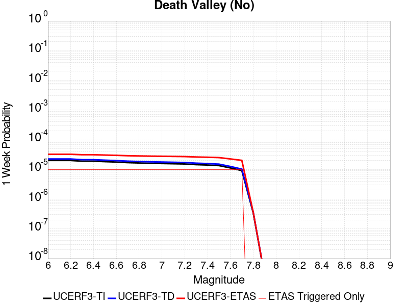 |  |  |  |

| Magnitude | 1 wk TI Prob | 1 wk TD Prob | 1 wk ETAS Prob | 1 wk ETAS/TD Gain | 1 wk ETAS Triggered Only | 1 mo TI Prob | 1 mo TD Prob | 1 mo ETAS Prob | 1 mo ETAS/TD Gain | 1 mo ETAS Triggered Only | 1 yr TI Prob | 1 yr TD Prob | 1 yr ETAS Prob | 1 yr ETAS/TD Gain | 1 yr ETAS Triggered Only | 10 yr TI Prob | 10 yr TD Prob | 10 yr ETAS Prob | 10 yr ETAS/TD Gain | 10 yr ETAS Triggered Only |
|-----|-----|-----|-----|-----|-----|-----|-----|-----|-----|-----|-----|-----|-----|-----|-----|-----|-----|-----|-----|-----|
| 6.0 | 2.0074807E-5 | 2.250262E-5 | 2.250262E-5 | 1.0 | 0.0 | 8.603206E-5 | 9.643627E-5 | 9.643627E-5 | 1.0 | 0.0 | 0.001046937 | 0.0011734866 | 0.0012287712 | 1.0471114 | 5.5349534E-5 | 0.010420183 | 0.011673815 | 0.011974683 | 1.0257729 | 3.0442243E-4 |
| 6.1 | 2.0074807E-5 | 2.250262E-5 | 2.250262E-5 | 1.0 | 0.0 | 8.603206E-5 | 9.643627E-5 | 9.643627E-5 | 1.0 | 0.0 | 0.001046937 | 0.0011734866 | 0.0012287712 | 1.0471114 | 5.5349534E-5 | 0.010420183 | 0.011673815 | 0.011974683 | 1.0257729 | 3.0442243E-4 |
| 6.2 | 2.0074807E-5 | 2.250262E-5 | 2.250262E-5 | 1.0 | 0.0 | 8.603206E-5 | 9.643627E-5 | 9.643627E-5 | 1.0 | 0.0 | 0.001046937 | 0.0011734866 | 0.0012287712 | 1.0471114 | 5.5349534E-5 | 0.010420183 | 0.011673815 | 0.011974683 | 1.0257729 | 3.0442243E-4 |
| 6.3 | 1.9050609E-5 | 2.1339336E-5 | 2.1339336E-5 | 1.0 | 0.0 | 8.164292E-5 | 9.145113E-5 | 9.145113E-5 | 1.0 | 0.0 | 9.935491E-4 | 0.0011128556 | 0.0011681435 | 1.0496812 | 5.5349534E-5 | 0.009891188 | 0.011073652 | 0.011374703 | 1.0271863 | 3.0442243E-4 |
| 6.4 | 1.9050609E-5 | 2.1339336E-5 | 2.1339336E-5 | 1.0 | 0.0 | 8.164292E-5 | 9.145113E-5 | 9.145113E-5 | 1.0 | 0.0 | 9.935491E-4 | 0.0011128556 | 0.0011681435 | 1.0496812 | 5.5349534E-5 | 0.009891188 | 0.011073652 | 0.011374703 | 1.0271863 | 3.0442243E-4 |
| 6.5 | 1.8367004E-5 | 2.05633E-5 | 2.05633E-5 | 1.0 | 0.0 | 7.8713354E-5 | 8.812549E-5 | 8.812549E-5 | 1.0 | 0.0 | 9.5791375E-4 | 0.0010724063 | 0.0011276965 | 1.0515571 | 5.5349534E-5 | 0.009537951 | 0.010673099 | 0.010974272 | 1.028218 | 3.0442243E-4 |
| 6.6 | 1.779439E-5 | 1.9913137E-5 | 1.9913137E-5 | 1.0 | 0.0 | 7.625944E-5 | 8.533926E-5 | 8.533926E-5 | 1.0 | 0.0 | 9.280632E-4 | 0.0010385168 | 0.0010938088 | 1.0532414 | 5.5349534E-5 | 0.009241969 | 0.010337394 | 0.01063867 | 1.0291443 | 3.0442243E-4 |
| 6.7 | 1.7025437E-5 | 1.9045532E-5 | 1.9045532E-5 | 1.0 | 0.0 | 7.296412E-5 | 8.162119E-5 | 8.162119E-5 | 1.0 | 0.0 | 8.87976E-4 | 9.932911E-4 | 0.0010485856 | 1.055668 | 5.5349534E-5 | 0.008844362 | 0.009889234 | 0.010190645 | 1.0304788 | 3.0442243E-4 |
| 6.8 | 1.6545107E-5 | 1.8514598E-5 | 1.8514598E-5 | 1.0 | 0.0 | 7.090568E-5 | 7.9345904E-5 | 7.9345904E-5 | 1.0 | 0.0 | 8.629347E-4 | 9.6561434E-4 | 0.0010209105 | 1.0572652 | 5.5349534E-5 | 0.008595915 | 0.00961489 | 0.009888977 | 1.0285065 | 2.7674765E-4 |
| 6.9 | 1.615478E-5 | 1.8089611E-5 | 1.8089611E-5 | 1.0 | 0.0 | 6.9232934E-5 | 7.752464E-5 | 7.752464E-5 | 1.0 | 0.0 | 8.4258494E-4 | 9.434598E-4 | 9.987571E-4 | 1.0586112 | 5.5349534E-5 | 0.008393973 | 0.009395239 | 0.009669386 | 1.0291795 | 2.7674765E-4 |
| 7.0 | 1.5894311E-5 | 1.7807544E-5 | 1.7807544E-5 | 1.0 | 0.0 | 6.81167E-5 | 7.631585E-5 | 7.631585E-5 | 1.0 | 0.0 | 8.2900526E-4 | 9.287555E-4 | 9.840536E-4 | 1.05954 | 5.5349534E-5 | 0.008259195 | 0.009249429 | 0.009523617 | 1.0296438 | 2.7674765E-4 |
| 7.1 | 1.5602263E-5 | 1.7485467E-5 | 1.7485467E-5 | 1.0 | 0.0 | 6.6865134E-5 | 7.49356E-5 | 7.49356E-5 | 1.0 | 0.0 | 8.137789E-4 | 9.119651E-4 | 9.672642E-4 | 1.0606372 | 5.5349534E-5 | 0.008108052 | 0.00908291 | 0.009357143 | 1.0301923 | 2.7674765E-4 |
| 7.2 | 1.5323829E-5 | 1.7172559E-5 | 1.7172559E-5 | 1.0 | 0.0 | 6.56719E-5 | 7.359464E-5 | 7.359464E-5 | 1.0 | 0.0 | 7.99262E-4 | 8.956524E-4 | 9.5095235E-4 | 1.0617427 | 5.5349534E-5 | 0.007963934 | 0.008921104 | 0.009195383 | 1.0307449 | 2.7674765E-4 |
| 7.3 | 1.4556212E-5 | 1.6304277E-5 | 1.6304277E-5 | 1.0 | 0.0 | 6.238227E-5 | 6.987363E-5 | 6.987363E-5 | 1.0 | 0.0 | 7.592395E-4 | 8.5038535E-4 | 9.056878E-4 | 1.0650322 | 5.5349534E-5 | 0.0075665074 | 0.008471957 | 0.00874636 | 1.0323895 | 2.7674765E-4 |
| 7.4 | 1.411725E-5 | 1.5809725E-5 | 1.5809725E-5 | 1.0 | 0.0 | 6.0501097E-5 | 6.7754234E-5 | 6.7754234E-5 | 1.0 | 0.0 | 7.363519E-4 | 8.246014E-4 | 8.799053E-4 | 1.0670674 | 5.5349534E-5 | 0.0073391674 | 0.008216051 | 0.008490525 | 1.0334071 | 2.7674765E-4 |
| 7.5 | 1.3503312E-5 | 1.5127982E-5 | 1.5127982E-5 | 1.0 | 0.0 | 5.7870053E-5 | 6.483263E-5 | 6.483263E-5 | 1.0 | 0.0 | 7.043401E-4 | 7.8905723E-4 | 8.4436306E-4 | 1.070091 | 5.5349534E-5 | 0.007021119 | 0.007863181 | 0.008137752 | 1.0349187 | 2.7674765E-4 |
| 7.6 | 1.1279839E-5 | 1.262773E-5 | 1.262773E-5 | 1.0 | 0.0 | 4.834127E-5 | 5.411775E-5 | 5.411775E-5 | 1.0 | 0.0 | 5.88396E-4 | 6.5868977E-4 | 7.140028E-4 | 1.0839744 | 5.5349534E-5 | 0.005868405 | 0.006567926 | 0.0068428563 | 1.0418595 | 2.7674765E-4 |
| 7.7 | 9.189108E-6 | 1.0284499E-5 | 1.0284499E-5 | 1.0 | 0.0 | 3.93813E-5 | 4.4075707E-5 | 4.4075707E-5 | 1.0 | 0.0 | 4.7936183E-4 | 5.3649466E-4 | 5.9181446E-4 | 1.1031135 | 5.5349534E-5 | 0.004783291 | 0.005352506 | 0.005572719 | 1.0411421 | 2.2139814E-4 |
| 7.8 | 3.4586725E-7 | 3.648448E-7 | 3.648448E-7 | 1.0 | 0.0 | 1.4822873E-6 | 1.5636197E-6 | 1.5636197E-6 | 1.0 | 0.0 | 1.80467E-5 | 1.9036908E-5 | 1.9036908E-5 | 1.0 | 0.0 | 1.8045233E-4 | 1.9035321E-4 | 2.180227E-4 | 1.1453587 | 2.7674767E-5 |
| 7.9 | 2.5591178E-9 | 2.6697788E-9 | 2.6697788E-9 | 1.0 | 0.0 | 1.0967647E-8 | 1.144191E-8 | 1.144191E-8 | 1.0 | 0.0 | 1.335311E-7 | 1.3930524E-7 | 1.3930524E-7 | 1.0 | 0.0 | 1.3353102E-6 | 1.3930525E-6 | 1.3930525E-6 | 1.0 | 0.0 |

## Scodie Lineament
*[(top)](#table-of-contents)*

| 1 Week | 1 Month | 1 Year | 10 Year |
|-----|-----|-----|-----|
| 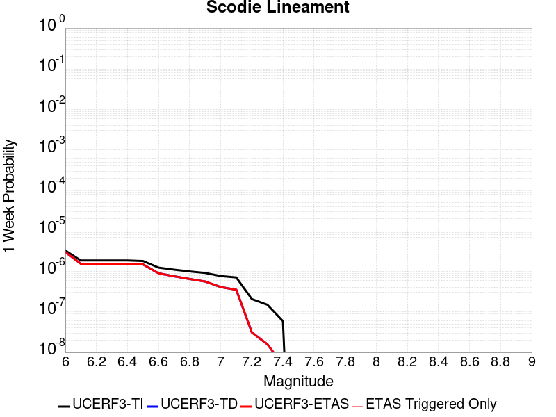 |  | 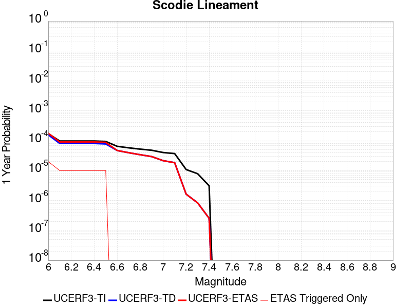 |  |

| Magnitude | 1 wk TI Prob | 1 wk TD Prob | 1 wk ETAS Prob | 1 wk ETAS/TD Gain | 1 wk ETAS Triggered Only | 1 mo TI Prob | 1 mo TD Prob | 1 mo ETAS Prob | 1 mo ETAS/TD Gain | 1 mo ETAS Triggered Only | 1 yr TI Prob | 1 yr TD Prob | 1 yr ETAS Prob | 1 yr ETAS/TD Gain | 1 yr ETAS Triggered Only | 10 yr TI Prob | 10 yr TD Prob | 10 yr ETAS Prob | 10 yr ETAS/TD Gain | 10 yr ETAS Triggered Only |
|-----|-----|-----|-----|-----|-----|-----|-----|-----|-----|-----|-----|-----|-----|-----|-----|-----|-----|-----|-----|-----|
| 6.0 | 3.2919327E-6 | 3.013442E-6 | 3.013442E-6 | 1.0 | 0.0 | 1.4108206E-5 | 1.2914706E-5 | 1.2914706E-5 | 1.0 | 0.0 | 1.7175387E-4 | 1.5722837E-4 | 1.5722837E-4 | 1.0 | 0.0 | 0.0017162118 | 0.0015714829 | 0.0018201644 | 1.1582464 | 2.490729E-4 |
| 6.1 | 1.8663811E-6 | 1.5491127E-6 | 1.5491127E-6 | 1.0 | 0.0 | 7.998751E-6 | 6.6390403E-6 | 6.6390403E-6 | 1.0 | 0.0 | 9.738045E-5 | 8.082781E-5 | 8.082781E-5 | 1.0 | 0.0 | 9.7337784E-4 | 8.08033E-4 | 8.633378E-4 | 1.0684438 | 5.5349534E-5 |
| 6.2 | 1.8663811E-6 | 1.5491127E-6 | 1.5491127E-6 | 1.0 | 0.0 | 7.998751E-6 | 6.6390403E-6 | 6.6390403E-6 | 1.0 | 0.0 | 9.738045E-5 | 8.082781E-5 | 8.082781E-5 | 1.0 | 0.0 | 9.7337784E-4 | 8.08033E-4 | 8.633378E-4 | 1.0684438 | 5.5349534E-5 |
| 6.3 | 1.8663811E-6 | 1.5491127E-6 | 1.5491127E-6 | 1.0 | 0.0 | 7.998751E-6 | 6.6390403E-6 | 6.6390403E-6 | 1.0 | 0.0 | 9.738045E-5 | 8.082781E-5 | 8.082781E-5 | 1.0 | 0.0 | 9.7337784E-4 | 8.08033E-4 | 8.633378E-4 | 1.0684438 | 5.5349534E-5 |
| 6.4 | 1.8663811E-6 | 1.5491127E-6 | 1.5491127E-6 | 1.0 | 0.0 | 7.998751E-6 | 6.6390403E-6 | 6.6390403E-6 | 1.0 | 0.0 | 9.738045E-5 | 8.082781E-5 | 8.082781E-5 | 1.0 | 0.0 | 9.7337784E-4 | 8.08033E-4 | 8.633378E-4 | 1.0684438 | 5.5349534E-5 |
| 6.5 | 1.8106311E-6 | 1.4910445E-6 | 1.4910445E-6 | 1.0 | 0.0 | 7.759824E-6 | 6.390178E-6 | 6.390178E-6 | 1.0 | 0.0 | 9.447177E-5 | 7.779813E-5 | 7.779813E-5 | 1.0 | 0.0 | 9.4431615E-4 | 7.7775767E-4 | 8.3306414E-4 | 1.0711101 | 5.5349534E-5 |
| 6.6 | 1.2414679E-6 | 8.99795E-7 | 8.99795E-7 | 1.0 | 0.0 | 5.320566E-6 | 3.8562594E-6 | 3.8562594E-6 | 1.0 | 0.0 | 6.477596E-5 | 4.6949033E-5 | 4.6949033E-5 | 1.0 | 0.0 | 6.475708E-4 | 4.693998E-4 | 4.970616E-4 | 1.05893 | 2.7674767E-5 |
| 6.7 | 1.1062215E-6 | 7.594655E-7 | 7.594655E-7 | 1.0 | 0.0 | 4.7409408E-6 | 3.2548483E-6 | 3.2548483E-6 | 1.0 | 0.0 | 5.7719422E-5 | 3.9627128E-5 | 3.9627128E-5 | 1.0 | 0.0 | 5.770443E-4 | 3.9620762E-4 | 4.2387142E-4 | 1.0698215 | 2.7674767E-5 |
| 6.8 | 1.0006736E-6 | 6.500703E-7 | 6.500703E-7 | 1.0 | 0.0 | 4.288594E-6 | 2.786013E-6 | 2.786013E-6 | 1.0 | 0.0 | 5.221238E-5 | 3.3919245E-5 | 3.3919245E-5 | 1.0 | 0.0 | 5.220012E-4 | 3.3914673E-4 | 3.668121E-4 | 1.0815735 | 2.7674767E-5 |
| 6.9 | 9.167364E-7 | 5.631903E-7 | 5.631903E-7 | 1.0 | 0.0 | 3.9288643E-6 | 2.413671E-6 | 2.413671E-6 | 1.0 | 0.0 | 4.7832873E-5 | 2.9386105E-5 | 2.9386105E-5 | 1.0 | 0.0 | 4.782258E-4 | 2.9382785E-4 | 3.214945E-4 | 1.0941594 | 2.7674767E-5 |
| 7.0 | 7.6987664E-7 | 4.1136138E-7 | 4.1136138E-7 | 1.0 | 0.0 | 3.2994672E-6 | 1.7629764E-6 | 1.7629764E-6 | 1.0 | 0.0 | 4.0170275E-5 | 2.1464064E-5 | 2.1464064E-5 | 1.0 | 0.0 | 4.0163012E-4 | 2.1462377E-4 | 2.422926E-4 | 1.1289178 | 2.7674767E-5 |
| 7.1 | 7.1038727E-7 | 3.5213617E-7 | 3.5213617E-7 | 1.0 | 0.0 | 3.0445133E-6 | 1.5091543E-6 | 1.5091543E-6 | 1.0 | 0.0 | 3.706632E-5 | 1.8373834E-5 | 1.8373834E-5 | 1.0 | 0.0 | 3.7060137E-4 | 1.8372665E-4 | 2.1139633E-4 | 1.1506025 | 2.7674767E-5 |
| 7.2 | 2.0799602E-7 | 3.1192688E-8 | 3.1192688E-8 | 1.0 | 0.0 | 8.914113E-7 | 1.3368295E-7 | 1.3368295E-7 | 1.0 | 0.0 | 1.0852878E-5 | 1.6275886E-6 | 1.6275886E-6 | 1.0 | 0.0 | 1.08523476E-4 | 1.6275775E-5 | 1.6275775E-5 | 1.0 | 0.0 |
| 7.3 | 1.5048182E-7 | 1.5949661E-8 | 1.5949661E-8 | 1.0 | 0.0 | 6.449219E-7 | 6.835568E-8 | 6.835568E-8 | 1.0 | 0.0 | 7.851896E-6 | 8.3223017E-7 | 8.3223017E-7 | 1.0 | 0.0 | 7.851618E-5 | 8.322273E-6 | 8.322273E-6 | 1.0 | 0.0 |
| 7.4 | 5.9334678E-8 | 4.869818E-9 | 4.869818E-9 | 1.0 | 0.0 | 2.5429145E-7 | 2.0870647E-8 | 2.0870647E-8 | 1.0 | 0.0 | 3.095994E-6 | 2.5410012E-7 | 2.5410012E-7 | 1.0 | 0.0 | 3.095951E-5 | 2.5409995E-6 | 2.5409995E-6 | 1.0 | 0.0 |

## Helendale-So Lockhart
*[(top)](#table-of-contents)*

| 1 Week | 1 Month | 1 Year | 10 Year |
|-----|-----|-----|-----|
|  |  |  |  |

| Magnitude | 1 wk TI Prob | 1 wk TD Prob | 1 wk ETAS Prob | 1 wk ETAS/TD Gain | 1 wk ETAS Triggered Only | 1 mo TI Prob | 1 mo TD Prob | 1 mo ETAS Prob | 1 mo ETAS/TD Gain | 1 mo ETAS Triggered Only | 1 yr TI Prob | 1 yr TD Prob | 1 yr ETAS Prob | 1 yr ETAS/TD Gain | 1 yr ETAS Triggered Only | 10 yr TI Prob | 10 yr TD Prob | 10 yr ETAS Prob | 10 yr ETAS/TD Gain | 10 yr ETAS Triggered Only |
|-----|-----|-----|-----|-----|-----|-----|-----|-----|-----|-----|-----|-----|-----|-----|-----|-----|-----|-----|-----|-----|
| 6.0 | 1.7296055E-5 | 1.8104516E-5 | 1.8104516E-5 | 1.0 | 0.0 | 7.412385E-5 | 7.758859E-5 | 7.758859E-5 | 1.0 | 0.0 | 9.0208417E-4 | 9.442525E-4 | 0.0011101443 | 1.1756859 | 1.660486E-4 | 0.008984311 | 0.009404523 | 0.0096238395 | 1.0233203 | 2.2139814E-4 |
| 6.1 | 1.7296055E-5 | 1.8104516E-5 | 1.8104516E-5 | 1.0 | 0.0 | 7.412385E-5 | 7.758859E-5 | 7.758859E-5 | 1.0 | 0.0 | 9.0208417E-4 | 9.442525E-4 | 0.0011101443 | 1.1756859 | 1.660486E-4 | 0.008984311 | 0.009404523 | 0.0096238395 | 1.0233203 | 2.2139814E-4 |
| 6.2 | 1.7296055E-5 | 1.8104516E-5 | 1.8104516E-5 | 1.0 | 0.0 | 7.412385E-5 | 7.758859E-5 | 7.758859E-5 | 1.0 | 0.0 | 9.0208417E-4 | 9.442525E-4 | 0.0011101443 | 1.1756859 | 1.660486E-4 | 0.008984311 | 0.009404523 | 0.0096238395 | 1.0233203 | 2.2139814E-4 |
| 6.3 | 1.0669118E-5 | 1.1135877E-5 | 1.1135877E-5 | 1.0 | 0.0 | 4.5723988E-5 | 4.772433E-5 | 4.772433E-5 | 1.0 | 0.0 | 5.5654737E-4 | 5.808916E-4 | 6.638677E-4 | 1.1428427 | 8.30243E-5 | 0.0055515557 | 0.0057940283 | 0.0059316005 | 1.0237437 | 1.3837383E-4 |
| 6.4 | 1.0669118E-5 | 1.1135877E-5 | 1.1135877E-5 | 1.0 | 0.0 | 4.5723988E-5 | 4.772433E-5 | 4.772433E-5 | 1.0 | 0.0 | 5.5654737E-4 | 5.808916E-4 | 6.638677E-4 | 1.1428427 | 8.30243E-5 | 0.0055515557 | 0.0057940283 | 0.0059316005 | 1.0237437 | 1.3837383E-4 |
| 6.5 | 8.790038E-6 | 9.170565E-6 | 9.170565E-6 | 1.0 | 0.0 | 3.767105E-5 | 3.930184E-5 | 3.930184E-5 | 1.0 | 0.0 | 4.585485E-4 | 4.783964E-4 | 5.3371943E-4 | 1.1156427 | 5.5349534E-5 | 0.0045760344 | 0.00477383 | 0.0048840004 | 1.0230781 | 1.1069907E-4 |
| 6.6 | 7.396949E-6 | 7.715846E-6 | 7.715846E-6 | 1.0 | 0.0 | 3.1700827E-5 | 3.30675E-5 | 3.30675E-5 | 1.0 | 0.0 | 3.858892E-4 | 4.0252344E-4 | 4.578507E-4 | 1.137451 | 5.5349534E-5 | 0.003852198 | 0.00401805 | 0.004100741 | 1.0205798 | 8.30243E-5 |
| 6.7 | 6.4600285E-6 | 6.7383007E-6 | 6.7383007E-6 | 1.0 | 0.0 | 2.7685543E-5 | 2.8878116E-5 | 2.8878116E-5 | 1.0 | 0.0 | 3.3701936E-4 | 3.5153513E-4 | 4.068652E-4 | 1.1573956 | 5.5349534E-5 | 0.0033650869 | 0.0035098721 | 0.003592605 | 1.0235715 | 8.30243E-5 |
| 6.8 | 5.600104E-6 | 5.836238E-6 | 5.836238E-6 | 1.0 | 0.0 | 2.4000226E-5 | 2.5012212E-5 | 2.5012212E-5 | 1.0 | 0.0 | 2.9216358E-4 | 3.044817E-4 | 3.598144E-4 | 1.1817274 | 5.5349534E-5 | 0.0029177975 | 0.003040707 | 0.0031234787 | 1.0272212 | 8.30243E-5 |
| 6.9 | 4.839122E-6 | 5.039703E-6 | 5.039703E-6 | 1.0 | 0.0 | 2.0738931E-5 | 2.1598551E-5 | 2.1598551E-5 | 1.0 | 0.0 | 2.5246723E-4 | 2.629311E-4 | 3.1826607E-4 | 1.2104543 | 5.5349534E-5 | 0.002521806 | 0.0026262477 | 0.0026814518 | 1.0210202 | 5.5349534E-5 |
| 7.0 | 3.6937633E-6 | 3.8453545E-6 | 3.8453545E-6 | 1.0 | 0.0 | 1.5830317E-5 | 1.6479988E-5 | 1.6479988E-5 | 1.0 | 0.0 | 1.9271708E-4 | 2.006257E-4 | 2.559641E-4 | 1.2758292 | 5.5349534E-5 | 0.0019255003 | 0.0020044772 | 0.0020597158 | 1.0275576 | 5.5349534E-5 |
| 7.1 | 2.7858857E-6 | 2.8979618E-6 | 2.8979618E-6 | 1.0 | 0.0 | 1.1939455E-5 | 1.2419779E-5 | 1.2419779E-5 | 1.0 | 0.0 | 1.4535317E-4 | 1.5120053E-4 | 1.7887111E-4 | 1.1830058 | 2.7674767E-5 | 0.0014525814 | 0.0015109981 | 0.001538631 | 1.0182879 | 2.7674767E-5 |
| 7.2 | 2.1672065E-6 | 2.2540967E-6 | 2.2540967E-6 | 1.0 | 0.0 | 9.2879945E-6 | 9.660379E-6 | 9.660379E-6 | 1.0 | 0.0 | 1.1307546E-4 | 1.1760896E-4 | 1.4528047E-4 | 1.2352841 | 2.7674767E-5 | 0.0011301794 | 0.0011754853 | 0.0012031276 | 1.0235156 | 2.7674767E-5 |
| 7.3 | 1.4823496E-6 | 1.542268E-6 | 1.542268E-6 | 1.0 | 0.0 | 6.3529114E-6 | 6.609704E-6 | 6.609704E-6 | 1.0 | 0.0 | 7.734395E-5 | 8.047033E-5 | 8.047033E-5 | 1.0 | 0.0 | 7.731704E-4 | 8.04427E-4 | 8.04427E-4 | 1.0 | 0.0 |
| 7.4 | 4.2321457E-7 | 4.4110496E-7 | 4.4110496E-7 | 1.0 | 0.0 | 1.8137755E-6 | 1.8904486E-6 | 1.8904486E-6 | 1.0 | 0.0 | 2.2082493E-5 | 2.3016015E-5 | 2.3016015E-5 | 1.0 | 0.0 | 2.2080299E-4 | 2.3014084E-4 | 2.3014084E-4 | 1.0 | 0.0 |
| 7.5 | 5.6942316E-8 | 5.9418042E-8 | 5.9418042E-8 | 1.0 | 0.0 | 2.440385E-7 | 2.5464874E-7 | 2.5464874E-7 | 1.0 | 0.0 | 2.9711643E-6 | 3.1003447E-6 | 3.1003447E-6 | 1.0 | 0.0 | 2.9711247E-5 | 3.1003092E-5 | 3.1003092E-5 | 1.0 | 0.0 |

## Manix-Afton Hills
*[(top)](#table-of-contents)*

| 1 Week | 1 Month | 1 Year | 10 Year |
|-----|-----|-----|-----|
|  | 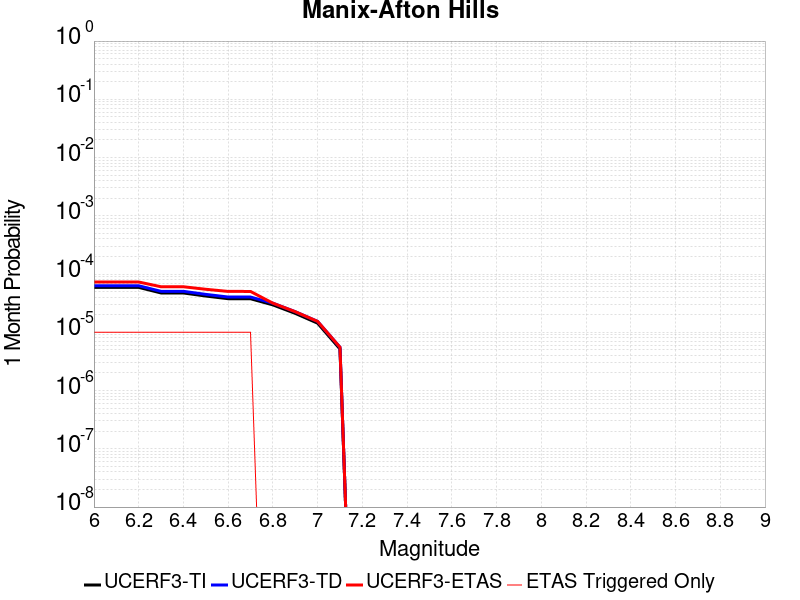 |  |  |

| Magnitude | 1 wk TI Prob | 1 wk TD Prob | 1 wk ETAS Prob | 1 wk ETAS/TD Gain | 1 wk ETAS Triggered Only | 1 mo TI Prob | 1 mo TD Prob | 1 mo ETAS Prob | 1 mo ETAS/TD Gain | 1 mo ETAS Triggered Only | 1 yr TI Prob | 1 yr TD Prob | 1 yr ETAS Prob | 1 yr ETAS/TD Gain | 1 yr ETAS Triggered Only | 10 yr TI Prob | 10 yr TD Prob | 10 yr ETAS Prob | 10 yr ETAS/TD Gain | 10 yr ETAS Triggered Only |
|-----|-----|-----|-----|-----|-----|-----|-----|-----|-----|-----|-----|-----|-----|-----|-----|-----|-----|-----|-----|-----|
| 6.0 | 1.3783202E-5 | 1.4712011E-5 | 1.4712011E-5 | 1.0 | 0.0 | 5.906953E-5 | 6.305005E-5 | 9.072307E-5 | 1.4389056 | 2.7674767E-5 | 7.189342E-4 | 7.6738145E-4 | 8.779956E-4 | 1.1441449 | 1.1069907E-4 | 0.0071661277 | 0.007649073 | 0.007841315 | 1.0251327 | 1.9372336E-4 |
| 6.1 | 1.3783202E-5 | 1.4712011E-5 | 1.4712011E-5 | 1.0 | 0.0 | 5.906953E-5 | 6.305005E-5 | 9.072307E-5 | 1.4389056 | 2.7674767E-5 | 7.189342E-4 | 7.6738145E-4 | 8.779956E-4 | 1.1441449 | 1.1069907E-4 | 0.0071661277 | 0.007649073 | 0.007841315 | 1.0251327 | 1.9372336E-4 |
| 6.2 | 1.3783202E-5 | 1.4712011E-5 | 1.4712011E-5 | 1.0 | 0.0 | 5.906953E-5 | 6.305005E-5 | 9.072307E-5 | 1.4389056 | 2.7674767E-5 | 7.189342E-4 | 7.6738145E-4 | 8.779956E-4 | 1.1441449 | 1.1069907E-4 | 0.0071661277 | 0.007649073 | 0.007841315 | 1.0251327 | 1.9372336E-4 |
| 6.3 | 1.10494875E-5 | 1.1793874E-5 | 1.1793874E-5 | 1.0 | 0.0 | 4.7354086E-5 | 5.0544255E-5 | 7.821762E-5 | 1.5475076 | 2.7674767E-5 | 5.763835E-4 | 6.1521295E-4 | 7.258439E-4 | 1.1798254 | 1.1069907E-4 | 0.005748908 | 0.0061361385 | 0.0063011684 | 1.0268947 | 1.660486E-4 |
| 6.4 | 1.10494875E-5 | 1.1793874E-5 | 1.1793874E-5 | 1.0 | 0.0 | 4.7354086E-5 | 5.0544255E-5 | 7.821762E-5 | 1.5475076 | 2.7674767E-5 | 5.763835E-4 | 6.1521295E-4 | 7.258439E-4 | 1.1798254 | 1.1069907E-4 | 0.005748908 | 0.0061361385 | 0.0063011684 | 1.0268947 | 1.660486E-4 |
| 6.5 | 9.788949E-6 | 1.0454981E-5 | 1.0454981E-5 | 1.0 | 0.0 | 4.1951964E-5 | 4.4806344E-5 | 7.2479874E-5 | 1.6176252 | 2.7674767E-5 | 5.1064545E-4 | 5.4539E-4 | 6.28369E-4 | 1.1521462 | 8.30243E-5 | 0.0050947363 | 0.005441442 | 0.0055790627 | 1.0252912 | 1.3837383E-4 |
| 6.6 | 8.810006E-6 | 9.414229E-6 | 9.414229E-6 | 1.0 | 0.0 | 3.775662E-5 | 4.034612E-5 | 6.801977E-5 | 1.685906 | 2.7674767E-5 | 4.5958988E-4 | 4.911122E-4 | 5.4643454E-4 | 1.112647 | 5.5349534E-5 | 0.0045864056 | 0.004901151 | 0.0050113075 | 1.0224756 | 1.1069907E-4 |
| 6.7 | 8.80128E-6 | 9.404707E-6 | 9.404707E-6 | 1.0 | 0.0 | 3.7719226E-5 | 4.0305316E-5 | 6.797897E-5 | 1.6866004 | 2.7674767E-5 | 4.591348E-4 | 4.906156E-4 | 5.45938E-4 | 1.1127611 | 5.5349534E-5 | 0.004581874 | 0.0048962072 | 0.0050063645 | 1.0224985 | 1.1069907E-4 |
| 6.8 | 6.8994877E-6 | 7.3805545E-6 | 7.3805545E-6 | 1.0 | 0.0 | 2.9568899E-5 | 3.163061E-5 | 3.163061E-5 | 1.0 | 0.0 | 3.5994186E-4 | 3.850428E-4 | 4.127069E-4 | 1.0718468 | 2.7674767E-5 | 0.003593594 | 0.0038445618 | 0.0039272667 | 1.0215123 | 8.30243E-5 |
| 6.9 | 4.9328037E-6 | 5.271298E-6 | 5.271298E-6 | 1.0 | 0.0 | 2.1140417E-5 | 2.2591115E-5 | 2.2591115E-5 | 1.0 | 0.0 | 2.5735417E-4 | 2.7501828E-4 | 3.0268542E-4 | 1.1006012 | 2.7674767E-5 | 0.0025705635 | 0.0027473846 | 0.002802582 | 1.0200909 | 5.5349534E-5 |
| 7.0 | 3.347973E-6 | 3.5902717E-6 | 3.5902717E-6 | 1.0 | 0.0 | 1.4348378E-5 | 1.5386811E-5 | 1.5386811E-5 | 1.0 | 0.0 | 1.746775E-4 | 1.8732242E-4 | 2.14992E-4 | 1.147711 | 2.7674767E-5 | 0.0017454025 | 0.0018720479 | 0.0019272938 | 1.029511 | 5.5349534E-5 |
| 7.1 | 1.2073567E-6 | 1.2935677E-6 | 1.2935677E-6 | 1.0 | 0.0 | 5.1743755E-6 | 5.543859E-6 | 5.543859E-6 | 1.0 | 0.0 | 6.29962E-5 | 6.7496025E-5 | 6.7496025E-5 | 1.0 | 0.0 | 6.297835E-4 | 6.7491544E-4 | 6.7491544E-4 | 1.0 | 0.0 |

## Red Pass
*[(top)](#table-of-contents)*

| 1 Week | 1 Month | 1 Year | 10 Year |
|-----|-----|-----|-----|
|  |  |  | 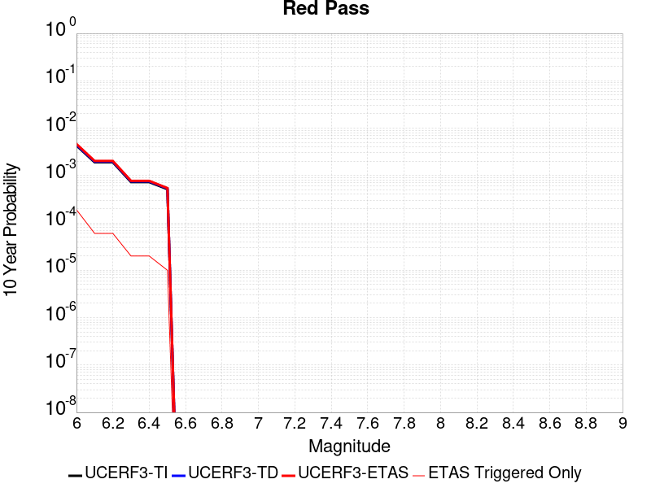 |

| Magnitude | 1 wk TI Prob | 1 wk TD Prob | 1 wk ETAS Prob | 1 wk ETAS/TD Gain | 1 wk ETAS Triggered Only | 1 mo TI Prob | 1 mo TD Prob | 1 mo ETAS Prob | 1 mo ETAS/TD Gain | 1 mo ETAS Triggered Only | 1 yr TI Prob | 1 yr TD Prob | 1 yr ETAS Prob | 1 yr ETAS/TD Gain | 1 yr ETAS Triggered Only | 10 yr TI Prob | 10 yr TD Prob | 10 yr ETAS Prob | 10 yr ETAS/TD Gain | 10 yr ETAS Triggered Only |
|-----|-----|-----|-----|-----|-----|-----|-----|-----|-----|-----|-----|-----|-----|-----|-----|-----|-----|-----|-----|-----|
| 6.0 | 8.258278E-6 | 8.551547E-6 | 8.551547E-6 | 1.0 | 0.0 | 3.539214E-5 | 3.664907E-5 | 3.664907E-5 | 1.0 | 0.0 | 4.308141E-4 | 4.4612895E-4 | 4.7379138E-4 | 1.0620054 | 2.7674767E-5 | 0.0042997985 | 0.004454091 | 0.0045918487 | 1.0309283 | 1.3837383E-4 |
| 6.1 | 3.649988E-6 | 3.7754364E-6 | 3.7754364E-6 | 1.0 | 0.0 | 1.5642712E-5 | 1.618037E-5 | 1.618037E-5 | 1.0 | 0.0 | 1.9043336E-4 | 1.9698295E-4 | 1.9698295E-4 | 1.0 | 0.0 | 0.0019027026 | 0.0019685507 | 0.001996171 | 1.0140308 | 2.7674767E-5 |
| 6.2 | 3.649988E-6 | 3.7754364E-6 | 3.7754364E-6 | 1.0 | 0.0 | 1.5642712E-5 | 1.618037E-5 | 1.618037E-5 | 1.0 | 0.0 | 1.9043336E-4 | 1.9698295E-4 | 1.9698295E-4 | 1.0 | 0.0 | 0.0019027026 | 0.0019685507 | 0.001996171 | 1.0140308 | 2.7674767E-5 |
| 6.3 | 1.3924937E-6 | 1.4411634E-6 | 1.4411634E-6 | 1.0 | 0.0 | 5.9678164E-6 | 6.1764076E-6 | 6.1764076E-6 | 1.0 | 0.0 | 7.265574E-5 | 7.5196585E-5 | 7.5196585E-5 | 1.0 | 0.0 | 7.263199E-4 | 7.518502E-4 | 7.7950413E-4 | 1.0367812 | 2.7674767E-5 |
| 6.4 | 1.3924937E-6 | 1.4411634E-6 | 1.4411634E-6 | 1.0 | 0.0 | 5.9678164E-6 | 6.1764076E-6 | 6.1764076E-6 | 1.0 | 0.0 | 7.265574E-5 | 7.5196585E-5 | 7.5196585E-5 | 1.0 | 0.0 | 7.263199E-4 | 7.518502E-4 | 7.7950413E-4 | 1.0367812 | 2.7674767E-5 |
| 6.5 | 9.876812E-7 | 1.0222244E-6 | 1.0222244E-6 | 1.0 | 0.0 | 4.2329125E-6 | 4.3809614E-6 | 4.3809614E-6 | 1.0 | 0.0 | 5.153449E-5 | 5.3338208E-5 | 5.3338208E-5 | 1.0 | 0.0 | 5.1522546E-4 | 5.3338206E-4 | 5.3338206E-4 | 1.0 | 0.0 |

## San Andreas (Parkfield)
*[(top)](#table-of-contents)*

| 1 Week | 1 Month | 1 Year | 10 Year |
|-----|-----|-----|-----|
|  |  | 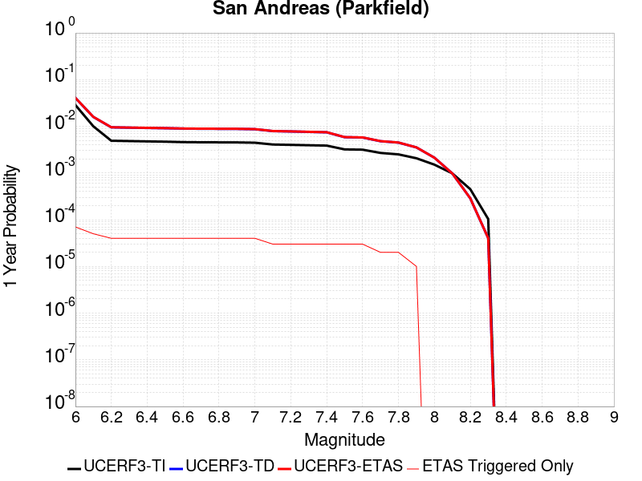 |  |

| Magnitude | 1 wk TI Prob | 1 wk TD Prob | 1 wk ETAS Prob | 1 wk ETAS/TD Gain | 1 wk ETAS Triggered Only | 1 mo TI Prob | 1 mo TD Prob | 1 mo ETAS Prob | 1 mo ETAS/TD Gain | 1 mo ETAS Triggered Only | 1 yr TI Prob | 1 yr TD Prob | 1 yr ETAS Prob | 1 yr ETAS/TD Gain | 1 yr ETAS Triggered Only | 10 yr TI Prob | 10 yr TD Prob | 10 yr ETAS Prob | 10 yr ETAS/TD Gain | 10 yr ETAS Triggered Only |
|-----|-----|-----|-----|-----|-----|-----|-----|-----|-----|-----|-----|-----|-----|-----|-----|-----|-----|-----|-----|-----|
| 6.0 | 5.556969E-4 | 7.8494387E-4 | 7.8494387E-4 | 1.0 | 0.0 | 0.0023793848 | 0.0033602684 | 0.0033602684 | 1.0 | 0.0 | 0.028586963 | 0.040528994 | 0.040582098 | 1.0013103 | 5.5349534E-5 | 0.25176284 | 0.3382302 | 0.33834007 | 1.0003248 | 1.660486E-4 |
| 6.1 | 1.925858E-4 | 3.047553E-4 | 3.047553E-4 | 1.0 | 0.0 | 8.2510663E-4 | 0.0013055365 | 0.0013055365 | 1.0 | 0.0 | 0.0099994885 | 0.01587639 | 0.015903626 | 1.0017154 | 2.7674767E-5 | 0.095613256 | 0.15020716 | 0.15023068 | 1.0001565 | 2.7674767E-5 |
| 6.2 | 9.4306815E-5 | 1.8296414E-4 | 1.8296414E-4 | 1.0 | 0.0 | 4.0410945E-4 | 7.8389765E-4 | 7.8389765E-4 | 1.0 | 0.0 | 0.0049089384 | 0.009502398 | 0.0095298095 | 1.0028847 | 2.7674767E-5 | 0.048019063 | 0.09208664 | 0.092111774 | 1.0002729 | 2.7674767E-5 |
| 6.3 | 9.283051E-5 | 1.7992748E-4 | 1.7992748E-4 | 1.0 | 0.0 | 3.9778434E-4 | 7.708911E-4 | 7.708911E-4 | 1.0 | 0.0 | 0.0048322747 | 0.009345412 | 0.0093728285 | 1.0029336 | 2.7674767E-5 | 0.047285385 | 0.09073928 | 0.09076445 | 1.0002773 | 2.7674767E-5 |
| 6.4 | 9.138826E-5 | 1.7754584E-4 | 1.7754584E-4 | 1.0 | 0.0 | 3.916052E-4 | 7.6069E-4 | 7.6069E-4 | 1.0 | 0.0 | 0.0047573745 | 0.009222273 | 0.009249692 | 1.0029732 | 2.7674767E-5 | 0.046568092 | 0.089640334 | 0.08966553 | 1.0002811 | 2.7674767E-5 |
| 6.5 | 9.000255E-5 | 1.7512313E-4 | 1.7512313E-4 | 1.0 | 0.0 | 3.8566816E-4 | 7.50313E-4 | 7.50313E-4 | 1.0 | 0.0 | 0.0046854047 | 0.009097004 | 0.009124428 | 1.0030146 | 2.7674767E-5 | 0.045878403 | 0.088525146 | 0.08855037 | 1.0002849 | 2.7674767E-5 |
| 6.6 | 8.8109264E-5 | 1.71928E-4 | 1.71928E-4 | 1.0 | 0.0 | 3.7755648E-4 | 7.366273E-4 | 7.366273E-4 | 1.0 | 0.0 | 0.0045870654 | 0.008931775 | 0.008959202 | 1.0030708 | 2.7674767E-5 | 0.04493529 | 0.0870545 | 0.08707976 | 1.0002903 | 2.7674767E-5 |
| 6.7 | 8.738073E-5 | 1.7059728E-4 | 1.7059728E-4 | 1.0 | 0.0 | 3.7443507E-4 | 7.309275E-4 | 7.309275E-4 | 1.0 | 0.0 | 0.0045492216 | 0.008862987 | 0.008890417 | 1.0030948 | 2.7674767E-5 | 0.04457213 | 0.08645442 | 0.0864797 | 1.0002924 | 2.7674767E-5 |
| 6.8 | 8.710195E-5 | 1.7005109E-4 | 1.7005109E-4 | 1.0 | 0.0 | 3.7324068E-4 | 7.28588E-4 | 7.28588E-4 | 1.0 | 0.0 | 0.0045347405 | 0.008834744 | 0.008862174 | 1.0031048 | 2.7674767E-5 | 0.04443313 | 0.08620161 | 0.086226895 | 1.0002934 | 2.7674767E-5 |
| 6.9 | 8.6801556E-5 | 1.6945954E-4 | 1.6945954E-4 | 1.0 | 0.0 | 3.7195362E-4 | 7.260542E-4 | 7.260542E-4 | 1.0 | 0.0 | 0.0045191357 | 0.008804144 | 0.0088315755 | 1.0031157 | 2.7674767E-5 | 0.044283327 | 0.08592729 | 0.08595259 | 1.0002944 | 2.7674767E-5 |
| 7.0 | 8.5571606E-5 | 1.6698343E-4 | 1.6698343E-4 | 1.0 | 0.0 | 3.6668387E-4 | 7.154481E-4 | 7.154481E-4 | 1.0 | 0.0 | 0.004455241 | 0.00867605 | 0.008703485 | 1.0031621 | 2.7674767E-5 | 0.043669727 | 0.084774174 | 0.084799506 | 1.0002987 | 2.7674767E-5 |
| 7.1 | 7.82589E-5 | 1.5177482E-4 | 1.5177482E-4 | 1.0 | 0.0 | 3.3535215E-4 | 6.5030204E-4 | 6.5030204E-4 | 1.0 | 0.0 | 0.0040752706 | 0.007888856 | 0.007888856 | 1.0 | 0.0 | 0.040013418 | 0.077680334 | 0.077680334 | 1.0 | 0.0 |
| 7.2 | 7.690929E-5 | 1.4914433E-4 | 1.4914433E-4 | 1.0 | 0.0 | 3.2956956E-4 | 6.390341E-4 | 6.390341E-4 | 1.0 | 0.0 | 0.004005129 | 0.007752653 | 0.007752653 | 1.0 | 0.0 | 0.0393371 | 0.07645258 | 0.07645258 | 1.0 | 0.0 |
| 7.3 | 7.5543794E-5 | 1.4610426E-4 | 1.4610426E-4 | 1.0 | 0.0 | 3.2371894E-4 | 6.260116E-4 | 6.260116E-4 | 1.0 | 0.0 | 0.003934157 | 0.007595219 | 0.007595219 | 1.0 | 0.0 | 0.038652334 | 0.07501357 | 0.07501357 | 1.0 | 0.0 |
| 7.4 | 7.4214564E-5 | 1.431075E-4 | 1.431075E-4 | 1.0 | 0.0 | 3.1802364E-4 | 6.1317446E-4 | 6.1317446E-4 | 1.0 | 0.0 | 0.003865065 | 0.0074400045 | 0.0074400045 | 1.0 | 0.0 | 0.03798529 | 0.07358508 | 0.07358508 | 1.0 | 0.0 |
| 7.5 | 6.149578E-5 | 1.1231917E-4 | 1.1231917E-4 | 1.0 | 0.0 | 2.6352672E-4 | 4.8127916E-4 | 4.8127916E-4 | 1.0 | 0.0 | 0.0032037178 | 0.005843863 | 0.005843863 | 1.0 | 0.0 | 0.03157923 | 0.058747258 | 0.058747258 | 1.0 | 0.0 |
| 7.6 | 6.0643448E-5 | 1.1060165E-4 | 1.1060165E-4 | 1.0 | 0.0 | 2.598746E-4 | 4.7392107E-4 | 4.7392107E-4 | 1.0 | 0.0 | 0.0031593828 | 0.005754755 | 0.005754755 | 1.0 | 0.0 | 0.031148417 | 0.05790668 | 0.05790668 | 1.0 | 0.0 |
| 7.7 | 5.1652263E-5 | 9.2113165E-5 | 9.2113165E-5 | 1.0 | 0.0 | 2.2134806E-4 | 3.9471098E-4 | 3.9471098E-4 | 1.0 | 0.0 | 0.002691582 | 0.0047950274 | 0.0047950274 | 1.0 | 0.0 | 0.026592141 | 0.04870769 | 0.04870769 | 1.0 | 0.0 |
| 7.8 | 4.8090482E-5 | 8.5933505E-5 | 8.5933505E-5 | 1.0 | 0.0 | 2.060858E-4 | 3.682345E-4 | 3.682345E-4 | 1.0 | 0.0 | 0.0025062072 | 0.004474047 | 0.004474047 | 1.0 | 0.0 | 0.024781305 | 0.045460854 | 0.045460854 | 1.0 | 0.0 |
| 7.9 | 3.970278E-5 | 6.776668E-5 | 6.776668E-5 | 1.0 | 0.0 | 1.7014367E-4 | 2.9039633E-4 | 2.9039633E-4 | 1.0 | 0.0 | 0.002069531 | 0.0035298474 | 0.0035298474 | 1.0 | 0.0 | 0.020503636 | 0.03600716 | 0.03600716 | 1.0 | 0.0 |
| 8.0 | 2.8982335E-5 | 4.08647E-5 | 4.08647E-5 | 1.0 | 0.0 | 1.2420409E-4 | 1.7512268E-4 | 1.7512268E-4 | 1.0 | 0.0 | 0.0015111357 | 0.0021300348 | 0.0021300348 | 1.0 | 0.0 | 0.015009012 | 0.02209412 | 0.02209412 | 1.0 | 0.0 |
| 8.1 | 1.8836186E-5 | 1.877564E-5 | 1.877564E-5 | 1.0 | 0.0 | 8.0724014E-5 | 8.0464546E-5 | 8.0464546E-5 | 1.0 | 0.0 | 9.823717E-4 | 9.792162E-4 | 9.792162E-4 | 1.0 | 0.0 | 0.009780403 | 0.010537866 | 0.010537866 | 1.0 | 0.0 |
| 8.2 | 8.643924E-6 | 5.5112705E-6 | 5.5112705E-6 | 1.0 | 0.0 | 3.704486E-5 | 2.3619517E-5 | 2.3619517E-5 | 1.0 | 0.0 | 4.5092785E-4 | 2.8752975E-4 | 2.8752975E-4 | 1.0 | 0.0 | 0.0045001395 | 0.0032686237 | 0.0032686237 | 1.0 | 0.0 |
| 8.3 | 1.983087E-6 | 7.7188406E-7 | 7.7188406E-7 | 1.0 | 0.0 | 8.498917E-6 | 3.3080703E-6 | 3.3080703E-6 | 1.0 | 0.0 | 1.034694E-4 | 4.027503E-5 | 4.027503E-5 | 1.0 | 0.0 | 0.0010342124 | 4.7534908E-4 | 4.7534908E-4 | 1.0 | 0.0 |

## Baker
*[(top)](#table-of-contents)*

| 1 Week | 1 Month | 1 Year | 10 Year |
|-----|-----|-----|-----|
|  |  |  |  |

| Magnitude | 1 wk TI Prob | 1 wk TD Prob | 1 wk ETAS Prob | 1 wk ETAS/TD Gain | 1 wk ETAS Triggered Only | 1 mo TI Prob | 1 mo TD Prob | 1 mo ETAS Prob | 1 mo ETAS/TD Gain | 1 mo ETAS Triggered Only | 1 yr TI Prob | 1 yr TD Prob | 1 yr ETAS Prob | 1 yr ETAS/TD Gain | 1 yr ETAS Triggered Only | 10 yr TI Prob | 10 yr TD Prob | 10 yr ETAS Prob | 10 yr ETAS/TD Gain | 10 yr ETAS Triggered Only |
|-----|-----|-----|-----|-----|-----|-----|-----|-----|-----|-----|-----|-----|-----|-----|-----|-----|-----|-----|-----|-----|
| 6.0 | 5.695525E-6 | 5.8349706E-6 | 5.8349706E-6 | 1.0 | 0.0 | 2.4409164E-5 | 2.5006799E-5 | 2.5006799E-5 | 1.0 | 0.0 | 2.9714106E-4 | 3.0441926E-4 | 3.5975192E-4 | 1.1817647 | 5.5349534E-5 | 0.0029674405 | 0.003040418 | 0.0032059618 | 1.0544477 | 1.660486E-4 |
| 6.1 | 5.695525E-6 | 5.8349706E-6 | 5.8349706E-6 | 1.0 | 0.0 | 2.4409164E-5 | 2.5006799E-5 | 2.5006799E-5 | 1.0 | 0.0 | 2.9714106E-4 | 3.0441926E-4 | 3.5975192E-4 | 1.1817647 | 5.5349534E-5 | 0.0029674405 | 0.003040418 | 0.0032059618 | 1.0544477 | 1.660486E-4 |
| 6.2 | 5.695525E-6 | 5.8349706E-6 | 5.8349706E-6 | 1.0 | 0.0 | 2.4409164E-5 | 2.5006799E-5 | 2.5006799E-5 | 1.0 | 0.0 | 2.9714106E-4 | 3.0441926E-4 | 3.5975192E-4 | 1.1817647 | 5.5349534E-5 | 0.0029674405 | 0.003040418 | 0.0032059618 | 1.0544477 | 1.660486E-4 |
| 6.3 | 3.2995713E-6 | 3.383748E-6 | 3.383748E-6 | 1.0 | 0.0 | 1.4140943E-5 | 1.4501698E-5 | 1.4501698E-5 | 1.0 | 0.0 | 1.7215237E-4 | 1.7654434E-4 | 2.3188411E-4 | 1.313461 | 5.5349534E-5 | 0.0017201907 | 0.001764088 | 0.0019022179 | 1.078301 | 1.3837383E-4 |
| 6.4 | 3.2995713E-6 | 3.383748E-6 | 3.383748E-6 | 1.0 | 0.0 | 1.4140943E-5 | 1.4501698E-5 | 1.4501698E-5 | 1.0 | 0.0 | 1.7215237E-4 | 1.7654434E-4 | 2.3188411E-4 | 1.313461 | 5.5349534E-5 | 0.0017201907 | 0.001764088 | 0.0019022179 | 1.078301 | 1.3837383E-4 |
| 6.5 | 2.782202E-6 | 2.8559114E-6 | 2.8559114E-6 | 1.0 | 0.0 | 1.1923668E-5 | 1.2239564E-5 | 1.2239564E-5 | 1.0 | 0.0 | 1.4516099E-4 | 1.4900684E-4 | 2.0434812E-4 | 1.371401 | 5.5349534E-5 | 0.001450662 | 0.001489102 | 0.0016272698 | 1.092786 | 1.3837383E-4 |
| 6.6 | 2.3163404E-6 | 2.3809823E-6 | 2.3809823E-6 | 1.0 | 0.0 | 9.927136E-6 | 1.0204171E-5 | 1.0204171E-5 | 1.0 | 0.0 | 1.20856166E-4 | 1.242289E-4 | 1.7957157E-4 | 1.4454894 | 5.5349534E-5 | 0.0012079047 | 0.0012416148 | 0.0013798168 | 1.1113083 | 1.3837383E-4 |
| 6.7 | 2.037056E-6 | 2.0965579E-6 | 2.0965579E-6 | 1.0 | 0.0 | 8.7302105E-6 | 8.985218E-6 | 8.985218E-6 | 1.0 | 0.0 | 1.0628513E-4 | 1.093897E-4 | 1.6473318E-4 | 1.5059295 | 5.5349534E-5 | 0.0010623431 | 0.0010933747 | 0.0012315972 | 1.1264182 | 1.3837383E-4 |
| 6.8 | 1.8356744E-6 | 1.8915827E-6 | 1.8915827E-6 | 1.0 | 0.0 | 7.867153E-6 | 8.106758E-6 | 8.106758E-6 | 1.0 | 0.0 | 9.577837E-5 | 9.8695455E-5 | 1.5403953E-4 | 1.560756 | 5.5349534E-5 | 9.57371E-4 | 9.865302E-4 | 0.0011247676 | 1.1401248 | 1.3837383E-4 |
| 6.9 | 1.6310546E-6 | 1.6832578E-6 | 1.6832578E-6 | 1.0 | 0.0 | 6.9902153E-6 | 7.2139424E-6 | 7.2139424E-6 | 1.0 | 0.0 | 8.510255E-5 | 8.782632E-5 | 1.43171E-4 | 1.6301605 | 5.5349534E-5 | 8.5069967E-4 | 8.779274E-4 | 0.0010161798 | 1.1574758 | 1.3837383E-4 |
| 7.0 | 1.2058036E-6 | 1.2509104E-6 | 1.2509104E-6 | 1.0 | 0.0 | 5.1677193E-6 | 5.361034E-6 | 5.361034E-6 | 1.0 | 0.0 | 6.291517E-5 | 6.526865E-5 | 1.20614575E-4 | 1.847971 | 5.5349534E-5 | 6.289736E-4 | 6.5249717E-4 | 7.907807E-4 | 1.2119297 | 1.3837383E-4 |
| 7.1 | 1.052382E-6 | 1.0952025E-6 | 1.0952025E-6 | 1.0 | 0.0 | 4.5102006E-6 | 4.6937166E-6 | 4.6937166E-6 | 1.0 | 0.0 | 5.491031E-5 | 5.7144513E-5 | 1.1249088E-4 | 1.9685334 | 5.5349534E-5 | 5.4896745E-4 | 5.7129905E-4 | 7.095938E-4 | 1.2420707 | 1.3837383E-4 |
| 7.2 | 1.0067454E-6 | 1.048812E-6 | 1.048812E-6 | 1.0 | 0.0 | 4.3146156E-6 | 4.494901E-6 | 4.494901E-6 | 1.0 | 0.0 | 5.252918E-5 | 5.4724056E-5 | 1.10070556E-4 | 2.0113742 | 5.5349534E-5 | 5.251676E-4 | 5.4710667E-4 | 6.8540475E-4 | 1.2527809 | 1.3837383E-4 |
| 7.3 | 9.3596316E-7 | 9.768122E-7 | 9.768122E-7 | 1.0 | 0.0 | 4.0112645E-6 | 4.1863314E-6 | 4.1863314E-6 | 1.0 | 0.0 | 4.8836053E-5 | 5.09674E-5 | 7.8640755E-5 | 1.542962 | 2.7674767E-5 | 4.8825322E-4 | 5.095579E-4 | 6.2020053E-4 | 1.2171346 | 1.1069907E-4 |
| 7.4 | 8.8117395E-7 | 9.20805E-7 | 9.20805E-7 | 1.0 | 0.0 | 3.7764542E-6 | 3.946301E-6 | 3.946301E-6 | 1.0 | 0.0 | 4.5977362E-5 | 4.8045167E-5 | 7.57186E-5 | 1.5759879 | 2.7674767E-5 | 4.596785E-4 | 4.8034854E-4 | 5.9099443E-4 | 1.230345 | 1.1069907E-4 |
| 7.5 | 8.292386E-7 | 8.674969E-7 | 8.674969E-7 | 1.0 | 0.0 | 3.5538749E-6 | 3.7178388E-6 | 3.7178388E-6 | 1.0 | 0.0 | 4.326757E-5 | 4.5263754E-5 | 7.293727E-5 | 1.6113836 | 2.7674767E-5 | 4.3259145E-4 | 4.5254608E-4 | 5.6319503E-4 | 1.2445033 | 1.1069907E-4 |
| 7.6 | 7.553842E-7 | 7.9148236E-7 | 7.9148236E-7 | 1.0 | 0.0 | 3.2373566E-6 | 3.3920628E-6 | 3.3920628E-6 | 1.0 | 0.0 | 3.9414106E-5 | 4.129759E-5 | 6.897121E-5 | 1.6701026 | 2.7674767E-5 | 3.9407116E-4 | 4.1289986E-4 | 5.2355323E-4 | 1.2679908 | 1.1069907E-4 |
| 7.7 | 6.5285366E-7 | 6.853115E-7 | 6.853115E-7 | 1.0 | 0.0 | 2.797941E-6 | 2.9370458E-6 | 2.9370458E-6 | 1.0 | 0.0 | 3.40644E-5 | 3.5757952E-5 | 6.3431726E-5 | 1.7739195 | 2.7674767E-5 | 3.405918E-4 | 3.5752266E-4 | 4.6818214E-4 | 1.3095174 | 1.1069907E-4 |
| 7.8 | 3.4586725E-7 | 3.648448E-7 | 3.648448E-7 | 1.0 | 0.0 | 1.4822873E-6 | 1.5636197E-6 | 1.5636197E-6 | 1.0 | 0.0 | 1.80467E-5 | 1.9036908E-5 | 1.9036908E-5 | 1.0 | 0.0 | 1.8045233E-4 | 1.9035321E-4 | 2.180227E-4 | 1.1453587 | 2.7674767E-5 |
| 7.9 | 2.5591178E-9 | 2.6697788E-9 | 2.6697788E-9 | 1.0 | 0.0 | 1.0967647E-8 | 1.144191E-8 | 1.144191E-8 | 1.0 | 0.0 | 1.335311E-7 | 1.3930524E-7 | 1.3930524E-7 | 1.0 | 0.0 | 1.3353102E-6 | 1.3930525E-6 | 1.3930525E-6 | 1.0 | 0.0 |

## Lake Isabella (Seismicity)
*[(top)](#table-of-contents)*

| 1 Week | 1 Month | 1 Year | 10 Year |
|-----|-----|-----|-----|
|  |  | 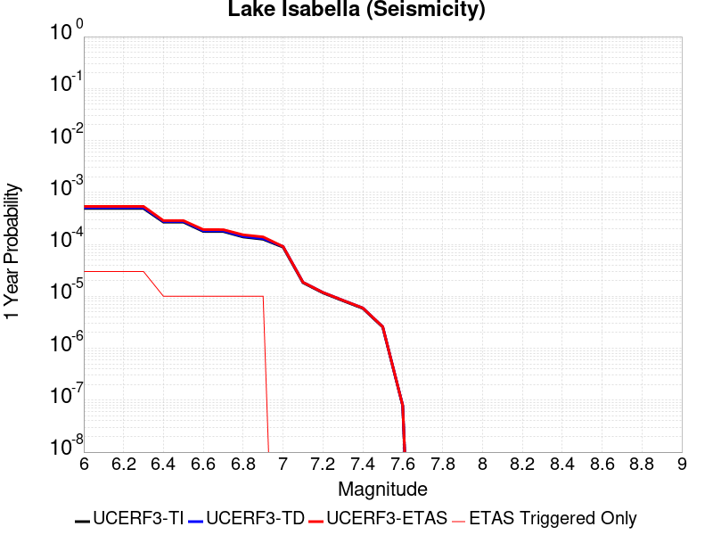 |  |

| Magnitude | 1 wk TI Prob | 1 wk TD Prob | 1 wk ETAS Prob | 1 wk ETAS/TD Gain | 1 wk ETAS Triggered Only | 1 mo TI Prob | 1 mo TD Prob | 1 mo ETAS Prob | 1 mo ETAS/TD Gain | 1 mo ETAS Triggered Only | 1 yr TI Prob | 1 yr TD Prob | 1 yr ETAS Prob | 1 yr ETAS/TD Gain | 1 yr ETAS Triggered Only | 10 yr TI Prob | 10 yr TD Prob | 10 yr ETAS Prob | 10 yr ETAS/TD Gain | 10 yr ETAS Triggered Only |
|-----|-----|-----|-----|-----|-----|-----|-----|-----|-----|-----|-----|-----|-----|-----|-----|-----|-----|-----|-----|-----|
| 6.0 | 9.431637E-6 | 9.741949E-6 | 9.741949E-6 | 1.0 | 0.0 | 4.0420677E-5 | 4.1750616E-5 | 4.1750616E-5 | 1.0 | 0.0 | 4.920106E-4 | 5.082083E-4 | 5.082083E-4 | 1.0 | 0.0 | 0.004909227 | 0.005071753 | 0.0052094255 | 1.0271449 | 1.3837383E-4 |
| 6.1 | 9.431637E-6 | 9.741949E-6 | 9.741949E-6 | 1.0 | 0.0 | 4.0420677E-5 | 4.1750616E-5 | 4.1750616E-5 | 1.0 | 0.0 | 4.920106E-4 | 5.082083E-4 | 5.082083E-4 | 1.0 | 0.0 | 0.004909227 | 0.005071753 | 0.0052094255 | 1.0271449 | 1.3837383E-4 |
| 6.2 | 9.431637E-6 | 9.741949E-6 | 9.741949E-6 | 1.0 | 0.0 | 4.0420677E-5 | 4.1750616E-5 | 4.1750616E-5 | 1.0 | 0.0 | 4.920106E-4 | 5.082083E-4 | 5.082083E-4 | 1.0 | 0.0 | 0.004909227 | 0.005071753 | 0.0052094255 | 1.0271449 | 1.3837383E-4 |
| 6.3 | 9.431637E-6 | 9.741949E-6 | 9.741949E-6 | 1.0 | 0.0 | 4.0420677E-5 | 4.1750616E-5 | 4.1750616E-5 | 1.0 | 0.0 | 4.920106E-4 | 5.082083E-4 | 5.082083E-4 | 1.0 | 0.0 | 0.004909227 | 0.005071753 | 0.0052094255 | 1.0271449 | 1.3837383E-4 |
| 6.4 | 5.144063E-6 | 5.3002254E-6 | 5.3002254E-6 | 1.0 | 0.0 | 2.2045799E-5 | 2.2715074E-5 | 2.2715074E-5 | 1.0 | 0.0 | 2.6837454E-4 | 2.7652437E-4 | 2.7652437E-4 | 1.0 | 0.0 | 0.0026805066 | 0.0027621435 | 0.0028449383 | 1.0299749 | 8.30243E-5 |
| 6.5 | 5.144063E-6 | 5.3002254E-6 | 5.3002254E-6 | 1.0 | 0.0 | 2.2045799E-5 | 2.2715074E-5 | 2.2715074E-5 | 1.0 | 0.0 | 2.6837454E-4 | 2.7652437E-4 | 2.7652437E-4 | 1.0 | 0.0 | 0.0026805066 | 0.0027621435 | 0.0028449383 | 1.0299749 | 8.30243E-5 |
| 6.6 | 3.4009804E-6 | 3.4988796E-6 | 3.4988796E-6 | 1.0 | 0.0 | 1.4575549E-5 | 1.4995121E-5 | 1.4995121E-5 | 1.0 | 0.0 | 1.7744285E-4 | 1.8255191E-4 | 1.8255191E-4 | 1.0 | 0.0 | 0.0017730123 | 0.0018241772 | 0.0019070501 | 1.0454303 | 8.30243E-5 |
| 6.7 | 3.3880428E-6 | 3.485746E-6 | 3.485746E-6 | 1.0 | 0.0 | 1.4520103E-5 | 1.4938835E-5 | 1.4938835E-5 | 1.0 | 0.0 | 1.767679E-4 | 1.8186674E-4 | 1.8186674E-4 | 1.0 | 0.0 | 0.0017662736 | 0.0018173368 | 0.0019002102 | 1.0456016 | 8.30243E-5 |
| 6.8 | 2.6582E-6 | 2.7337724E-6 | 2.7337724E-6 | 1.0 | 0.0 | 1.1392236E-5 | 1.1716122E-5 | 1.1716122E-5 | 1.0 | 0.0 | 1.3869164E-4 | 1.4263579E-4 | 1.4263579E-4 | 1.0 | 0.0 | 0.0013860512 | 0.0014255745 | 0.0014808452 | 1.0387708 | 5.5349534E-5 |
| 6.9 | 2.406011E-6 | 2.474394E-6 | 2.474394E-6 | 1.0 | 0.0 | 1.0311434E-5 | 1.0604511E-5 | 1.0604511E-5 | 1.0 | 0.0 | 1.2553448E-4 | 1.2910359E-4 | 1.2910359E-4 | 1.0 | 0.0 | 0.0012546359 | 0.0012904154 | 0.0013456936 | 1.0428375 | 5.5349534E-5 |
| 7.0 | 1.6953097E-6 | 1.7429827E-6 | 1.7429827E-6 | 1.0 | 0.0 | 7.265593E-6 | 7.46991E-6 | 7.46991E-6 | 1.0 | 0.0 | 8.8455E-5 | 9.094341E-5 | 9.094341E-5 | 1.0 | 0.0 | 8.84198E-4 | 9.0916466E-4 | 9.6446386E-4 | 1.0608242 | 5.5349534E-5 |
| 7.1 | 3.5013824E-7 | 3.5715487E-7 | 3.5715487E-7 | 1.0 | 0.0 | 1.5005916E-6 | 1.5306629E-6 | 1.5306629E-6 | 1.0 | 0.0 | 1.826955E-5 | 1.8635663E-5 | 1.8635663E-5 | 1.0 | 0.0 | 1.8268047E-4 | 1.8634126E-4 | 1.8634126E-4 | 1.0 | 0.0 |
| 7.2 | 2.2321095E-7 | 2.275098E-7 | 2.275098E-7 | 1.0 | 0.0 | 9.56618E-7 | 9.750416E-7 | 9.750416E-7 | 1.0 | 0.0 | 1.1646762E-5 | 1.1871069E-5 | 1.1871069E-5 | 1.0 | 0.0 | 1.1646151E-4 | 1.1870445E-4 | 1.1870445E-4 | 1.0 | 0.0 |
| 7.3 | 1.5760406E-7 | 1.6061206E-7 | 1.6061206E-7 | 1.0 | 0.0 | 6.7544585E-7 | 6.8833725E-7 | 6.8833725E-7 | 1.0 | 0.0 | 8.223522E-6 | 8.380474E-6 | 8.380474E-6 | 1.0 | 0.0 | 8.2232174E-5 | 8.380164E-5 | 8.380164E-5 | 1.0 | 0.0 |
| 7.4 | 1.1216497E-7 | 1.143191E-7 | 1.143191E-7 | 1.0 | 0.0 | 4.8070694E-7 | 4.899389E-7 | 4.899389E-7 | 1.0 | 0.0 | 5.852591E-6 | 5.96499E-6 | 5.96499E-6 | 1.0 | 0.0 | 5.8524372E-5 | 5.9648344E-5 | 5.9648344E-5 | 1.0 | 0.0 |
| 7.5 | 4.885185E-8 | 4.978862E-8 | 4.978862E-8 | 1.0 | 0.0 | 2.0936506E-7 | 2.1337979E-7 | 2.1337979E-7 | 1.0 | 0.0 | 2.5490165E-6 | 2.5978961E-6 | 2.5978961E-6 | 1.0 | 0.0 | 2.5489873E-5 | 2.5978676E-5 | 2.5978676E-5 | 1.0 | 0.0 |
| 7.6 | 1.504641E-9 | 1.5318159E-9 | 1.5318159E-9 | 1.0 | 0.0 | 6.4484613E-9 | 6.5649255E-9 | 6.5649255E-9 | 1.0 | 0.0 | 7.851001E-8 | 7.9927965E-8 | 7.9927965E-8 | 1.0 | 0.0 | 7.8509987E-7 | 7.992797E-7 | 7.992797E-7 | 1.0 | 0.0 |

## Death Valley (Fish Lake Valley)
*[(top)](#table-of-contents)*

| 1 Week | 1 Month | 1 Year | 10 Year |
|-----|-----|-----|-----|
|  |  |  |  |

| Magnitude | 1 wk TI Prob | 1 wk TD Prob | 1 wk ETAS Prob | 1 wk ETAS/TD Gain | 1 wk ETAS Triggered Only | 1 mo TI Prob | 1 mo TD Prob | 1 mo ETAS Prob | 1 mo ETAS/TD Gain | 1 mo ETAS Triggered Only | 1 yr TI Prob | 1 yr TD Prob | 1 yr ETAS Prob | 1 yr ETAS/TD Gain | 1 yr ETAS Triggered Only | 10 yr TI Prob | 10 yr TD Prob | 10 yr ETAS Prob | 10 yr ETAS/TD Gain | 10 yr ETAS Triggered Only |
|-----|-----|-----|-----|-----|-----|-----|-----|-----|-----|-----|-----|-----|-----|-----|-----|-----|-----|-----|-----|-----|
| 6.0 | 3.872328E-5 | 4.7277426E-5 | 4.7277426E-5 | 1.0 | 0.0 | 1.6594635E-4 | 2.0260349E-4 | 2.0260349E-4 | 1.0 | 0.0 | 0.0020185246 | 0.002464023 | 0.0024916294 | 1.0112039 | 2.7674767E-5 | 0.02000288 | 0.02439309 | 0.024528088 | 1.0055343 | 1.3837383E-4 |
| 6.1 | 3.872328E-5 | 4.7277426E-5 | 4.7277426E-5 | 1.0 | 0.0 | 1.6594635E-4 | 2.0260349E-4 | 2.0260349E-4 | 1.0 | 0.0 | 0.0020185246 | 0.002464023 | 0.0024916294 | 1.0112039 | 2.7674767E-5 | 0.02000288 | 0.02439309 | 0.024528088 | 1.0055343 | 1.3837383E-4 |
| 6.2 | 3.872328E-5 | 4.7277426E-5 | 4.7277426E-5 | 1.0 | 0.0 | 1.6594635E-4 | 2.0260349E-4 | 2.0260349E-4 | 1.0 | 0.0 | 0.0020185246 | 0.002464023 | 0.0024916294 | 1.0112039 | 2.7674767E-5 | 0.02000288 | 0.02439309 | 0.024528088 | 1.0055343 | 1.3837383E-4 |
| 6.3 | 2.8356371E-5 | 3.361575E-5 | 3.361575E-5 | 1.0 | 0.0 | 1.2152165E-4 | 1.4405999E-4 | 1.4405999E-4 | 1.0 | 0.0 | 0.0014785219 | 0.0017525983 | 0.0017802246 | 1.015763 | 2.7674767E-5 | 0.014687235 | 0.017394776 | 0.017530743 | 1.0078166 | 1.3837383E-4 |
| 6.4 | 2.8356371E-5 | 3.361575E-5 | 3.361575E-5 | 1.0 | 0.0 | 1.2152165E-4 | 1.4405999E-4 | 1.4405999E-4 | 1.0 | 0.0 | 0.0014785219 | 0.0017525983 | 0.0017802246 | 1.015763 | 2.7674767E-5 | 0.014687235 | 0.017394776 | 0.017530743 | 1.0078166 | 1.3837383E-4 |
| 6.5 | 2.4448687E-5 | 2.8612143E-5 | 2.8612143E-5 | 1.0 | 0.0 | 1.0477588E-4 | 1.2261799E-4 | 1.2261799E-4 | 1.0 | 0.0 | 0.0012748998 | 0.0014919023 | 0.0015195358 | 1.0185223 | 2.7674767E-5 | 0.012676105 | 0.0148237245 | 0.014960047 | 1.0091963 | 1.3837383E-4 |
| 6.6 | 2.1298161E-5 | 2.4663745E-5 | 2.4663745E-5 | 1.0 | 0.0 | 9.127464E-5 | 1.0569767E-4 | 1.0569767E-4 | 1.0 | 0.0 | 0.0011107022 | 0.0012861433 | 0.0013137824 | 1.02149 | 2.7674767E-5 | 0.011051672 | 0.012790408 | 0.012927012 | 1.0106802 | 1.3837383E-4 |
| 6.7 | 1.8959729E-5 | 2.1784066E-5 | 2.1784066E-5 | 1.0 | 0.0 | 8.125345E-5 | 9.3357085E-5 | 9.3357085E-5 | 1.0 | 0.0 | 9.888117E-4 | 0.0011360554 | 0.0011636987 | 1.0243328 | 2.7674767E-5 | 0.009844234 | 0.011305139 | 0.011441949 | 1.0121015 | 1.3837383E-4 |
| 6.8 | 1.6691629E-5 | 1.9020832E-5 | 1.9020832E-5 | 1.0 | 0.0 | 7.153359E-5 | 8.15154E-5 | 8.15154E-5 | 1.0 | 0.0 | 8.7057345E-4 | 9.92015E-4 | 0.0010196622 | 1.0278698 | 2.7674767E-5 | 0.008671708 | 0.009877626 | 0.010014633 | 1.0138705 | 1.3837383E-4 |
| 6.9 | 1.450505E-5 | 1.6391527E-5 | 1.6391527E-5 | 1.0 | 0.0 | 6.216302E-5 | 7.024756E-5 | 7.024756E-5 | 1.0 | 0.0 | 7.5657194E-4 | 8.549372E-4 | 8.825883E-4 | 1.0323428 | 2.7674767E-5 | 0.007540013 | 0.008517413 | 0.008654609 | 1.0161076 | 1.3837383E-4 |
| 7.0 | 1.2940855E-5 | 1.45396425E-5 | 1.45396425E-5 | 1.0 | 0.0 | 5.545963E-5 | 6.2311294E-5 | 6.2311294E-5 | 1.0 | 0.0 | 6.750118E-4 | 7.583818E-4 | 7.8603555E-4 | 1.0364642 | 2.7674767E-5 | 0.006729651 | 0.0075585553 | 0.007695883 | 1.0181686 | 1.3837383E-4 |
| 7.1 | 1.2544658E-5 | 1.4079809E-5 | 1.4079809E-5 | 1.0 | 0.0 | 5.3761712E-5 | 6.0340677E-5 | 6.0340677E-5 | 1.0 | 0.0 | 6.5435225E-4 | 7.344057E-4 | 7.6206017E-4 | 1.0376556 | 2.7674767E-5 | 0.006524288 | 0.007320381 | 0.0074577415 | 1.0187641 | 1.3837383E-4 |
| 7.2 | 1.2489416E-5 | 1.4017269E-5 | 1.4017269E-5 | 1.0 | 0.0 | 5.3524967E-5 | 6.0072656E-5 | 6.0072656E-5 | 1.0 | 0.0 | 6.514716E-4 | 7.3114474E-4 | 7.587993E-4 | 1.0378236 | 2.7674767E-5 | 0.006495651 | 0.0072879856 | 0.007425351 | 1.0188482 | 1.3837383E-4 |
| 7.3 | 1.2368307E-5 | 1.3881391E-5 | 1.3881391E-5 | 1.0 | 0.0 | 5.3005948E-5 | 5.949035E-5 | 5.949035E-5 | 1.0 | 0.0 | 6.451563E-4 | 7.2405994E-4 | 7.517147E-4 | 1.038194 | 2.7674767E-5 | 0.0064328653 | 0.0072176 | 0.0073549747 | 1.0190333 | 1.3837383E-4 |
| 7.4 | 1.2161707E-5 | 1.364942E-5 | 1.364942E-5 | 1.0 | 0.0 | 5.212056E-5 | 5.8496233E-5 | 5.8496233E-5 | 1.0 | 0.0 | 6.3438306E-4 | 7.119645E-4 | 7.396196E-4 | 1.0388433 | 2.7674767E-5 | 0.006325751 | 0.007097425 | 0.0072348164 | 1.0193579 | 1.3837383E-4 |
| 7.5 | 1.1707948E-5 | 1.3147017E-5 | 1.3147017E-5 | 1.0 | 0.0 | 5.0175953E-5 | 5.634317E-5 | 5.634317E-5 | 1.0 | 0.0 | 6.10721E-4 | 6.857678E-4 | 7.134236E-4 | 1.0403283 | 2.7674767E-5 | 0.0060904534 | 0.0068370993 | 0.006974527 | 1.0201004 | 1.3837383E-4 |
| 7.6 | 1.0319538E-5 | 1.1580937E-5 | 1.1580937E-5 | 1.0 | 0.0 | 4.4225842E-5 | 4.963167E-5 | 4.963167E-5 | 1.0 | 0.0 | 5.383166E-4 | 6.0410326E-4 | 6.317613E-4 | 1.0457836 | 2.7674767E-5 | 0.0053701443 | 0.0060251425 | 0.0061626825 | 1.0228277 | 1.3837383E-4 |
| 7.7 | 8.937764E-6 | 1.002391E-5 | 1.002391E-5 | 1.0 | 0.0 | 3.830414E-5 | 4.2958938E-5 | 4.2958938E-5 | 1.0 | 0.0 | 4.6625308E-4 | 5.2290456E-4 | 5.505649E-4 | 1.0528975 | 2.7674767E-5 | 0.0046527605 | 0.005217252 | 0.0053549036 | 1.026384 | 1.3837383E-4 |
| 7.8 | 3.108007E-7 | 3.284828E-7 | 3.284828E-7 | 1.0 | 0.0 | 1.3320023E-6 | 1.4077827E-6 | 1.4077827E-6 | 1.0 | 0.0 | 1.6217007E-5 | 1.7139624E-5 | 1.7139624E-5 | 1.0 | 0.0 | 1.6215823E-4 | 1.713834E-4 | 1.9905342E-4 | 1.161451 | 2.7674767E-5 |
| 7.9 | 2.5591178E-9 | 2.6697788E-9 | 2.6697788E-9 | 1.0 | 0.0 | 1.0967647E-8 | 1.144191E-8 | 1.144191E-8 | 1.0 | 0.0 | 1.335311E-7 | 1.3930524E-7 | 1.3930524E-7 | 1.0 | 0.0 | 1.3353102E-6 | 1.3930525E-6 | 1.3930525E-6 | 1.0 | 0.0 |

## Sierra Nevada  (No Extension)
*[(top)](#table-of-contents)*

| 1 Week | 1 Month | 1 Year | 10 Year |
|-----|-----|-----|-----|
|  |  |  |  |

| Magnitude | 1 wk TI Prob | 1 wk TD Prob | 1 wk ETAS Prob | 1 wk ETAS/TD Gain | 1 wk ETAS Triggered Only | 1 mo TI Prob | 1 mo TD Prob | 1 mo ETAS Prob | 1 mo ETAS/TD Gain | 1 mo ETAS Triggered Only | 1 yr TI Prob | 1 yr TD Prob | 1 yr ETAS Prob | 1 yr ETAS/TD Gain | 1 yr ETAS Triggered Only | 10 yr TI Prob | 10 yr TD Prob | 10 yr ETAS Prob | 10 yr ETAS/TD Gain | 10 yr ETAS Triggered Only |
|-----|-----|-----|-----|-----|-----|-----|-----|-----|-----|-----|-----|-----|-----|-----|-----|-----|-----|-----|-----|-----|
| 6.0 | 7.7690465E-6 | 6.976752E-6 | 6.976752E-6 | 1.0 | 0.0 | 3.329549E-5 | 2.9900226E-5 | 2.9900226E-5 | 1.0 | 0.0 | 4.0529718E-4 | 3.6401028E-4 | 4.193397E-4 | 1.1519995 | 5.5349534E-5 | 0.004045588 | 0.0036376568 | 0.0037755272 | 1.0379009 | 1.3837383E-4 |
| 6.1 | 7.7690465E-6 | 6.976752E-6 | 6.976752E-6 | 1.0 | 0.0 | 3.329549E-5 | 2.9900226E-5 | 2.9900226E-5 | 1.0 | 0.0 | 4.0529718E-4 | 3.6401028E-4 | 4.193397E-4 | 1.1519995 | 5.5349534E-5 | 0.004045588 | 0.0036376568 | 0.0037755272 | 1.0379009 | 1.3837383E-4 |
| 6.2 | 7.7690465E-6 | 6.976752E-6 | 6.976752E-6 | 1.0 | 0.0 | 3.329549E-5 | 2.9900226E-5 | 2.9900226E-5 | 1.0 | 0.0 | 4.0529718E-4 | 3.6401028E-4 | 4.193397E-4 | 1.1519995 | 5.5349534E-5 | 0.004045588 | 0.0036376568 | 0.0037755272 | 1.0379009 | 1.3837383E-4 |
| 6.3 | 7.7690465E-6 | 6.976752E-6 | 6.976752E-6 | 1.0 | 0.0 | 3.329549E-5 | 2.9900226E-5 | 2.9900226E-5 | 1.0 | 0.0 | 4.0529718E-4 | 3.6401028E-4 | 4.193397E-4 | 1.1519995 | 5.5349534E-5 | 0.004045588 | 0.0036376568 | 0.0037755272 | 1.0379009 | 1.3837383E-4 |
| 6.4 | 7.7690465E-6 | 6.976752E-6 | 6.976752E-6 | 1.0 | 0.0 | 3.329549E-5 | 2.9900226E-5 | 2.9900226E-5 | 1.0 | 0.0 | 4.0529718E-4 | 3.6401028E-4 | 4.193397E-4 | 1.1519995 | 5.5349534E-5 | 0.004045588 | 0.0036376568 | 0.0037755272 | 1.0379009 | 1.3837383E-4 |
| 6.5 | 7.7690465E-6 | 6.976752E-6 | 6.976752E-6 | 1.0 | 0.0 | 3.329549E-5 | 2.9900226E-5 | 2.9900226E-5 | 1.0 | 0.0 | 4.0529718E-4 | 3.6401028E-4 | 4.193397E-4 | 1.1519995 | 5.5349534E-5 | 0.004045588 | 0.0036376568 | 0.0037755272 | 1.0379009 | 1.3837383E-4 |
| 6.6 | 2.653E-6 | 1.6150456E-6 | 1.6150456E-6 | 1.0 | 0.0 | 1.136995E-5 | 6.9216057E-6 | 6.9216057E-6 | 1.0 | 0.0 | 1.3842035E-4 | 8.4267325E-5 | 1.396122E-4 | 1.6567773 | 5.5349534E-5 | 0.0013833415 | 8.4235717E-4 | 9.5296296E-4 | 1.1313051 | 1.1069907E-4 |
| 6.7 | 2.5902466E-6 | 1.5503773E-6 | 1.5503773E-6 | 1.0 | 0.0 | 1.11010095E-5 | 6.6444572E-6 | 6.6444572E-6 | 1.0 | 0.0 | 1.351464E-4 | 8.08933E-5 | 1.3623835E-4 | 1.6841736 | 5.5349534E-5 | 0.0013506424 | 8.086415E-4 | 9.19251E-4 | 1.1367844 | 1.1069907E-4 |
| 6.8 | 2.5853892E-6 | 1.5471767E-6 | 1.5471767E-6 | 1.0 | 0.0 | 1.1080193E-5 | 6.6307402E-6 | 6.6307402E-6 | 1.0 | 0.0 | 1.34893E-4 | 8.0726306E-5 | 1.3607136E-4 | 1.685589 | 5.5349534E-5 | 0.0013481114 | 8.069728E-4 | 9.1758254E-4 | 1.1370674 | 1.1069907E-4 |
| 6.9 | 2.458257E-6 | 1.4222467E-6 | 1.4222467E-6 | 1.0 | 0.0 | 1.0535345E-5 | 6.095329E-6 | 6.095329E-6 | 1.0 | 0.0 | 1.2826028E-4 | 7.420812E-5 | 1.2955355E-4 | 1.7458136 | 5.5349534E-5 | 0.0012818627 | 7.4183533E-4 | 8.524523E-4 | 1.1491126 | 1.1069907E-4 |
| 7.0 | 2.4341468E-6 | 1.3992096E-6 | 1.3992096E-6 | 1.0 | 0.0 | 1.0432016E-5 | 5.996599E-6 | 5.996599E-6 | 1.0 | 0.0 | 1.270024E-4 | 7.3006166E-5 | 1.2835166E-4 | 1.7580934 | 5.5349534E-5 | 0.0012692984 | 7.298237E-4 | 8.40442E-4 | 1.1515685 | 1.1069907E-4 |
| 7.1 | 2.3652476E-6 | 1.3341567E-6 | 1.3341567E-6 | 1.0 | 0.0 | 1.0136736E-5 | 5.7178017E-6 | 5.7178017E-6 | 1.0 | 0.0 | 1.2340778E-4 | 6.9612026E-5 | 1.249577E-4 | 1.7950591 | 5.5349534E-5 | 0.0012333926 | 6.9590396E-4 | 8.06526E-4 | 1.1589617 | 1.1069907E-4 |
| 7.2 | 2.272158E-6 | 1.250459E-6 | 1.250459E-6 | 1.0 | 0.0 | 9.737784E-6 | 5.3590993E-6 | 5.3590993E-6 | 1.0 | 0.0 | 1.1855107E-4 | 6.52451E-5 | 1.20591016E-4 | 1.8482771 | 5.5349534E-5 | 0.0011848784 | 6.522609E-4 | 7.6288776E-4 | 1.1696053 | 1.1069907E-4 |
| 7.3 | 2.1382127E-6 | 1.1421416E-6 | 1.1421416E-6 | 1.0 | 0.0 | 9.163737E-6 | 4.8948837E-6 | 4.8948837E-6 | 1.0 | 0.0 | 1.1156279E-4 | 5.959359E-5 | 1.1493982E-4 | 1.928728 | 5.5349534E-5 | 0.001115068 | 5.957773E-4 | 7.064104E-4 | 1.1856954 | 1.1069907E-4 |
| 7.4 | 1.9048055E-6 | 9.576864E-7 | 9.576864E-7 | 1.0 | 0.0 | 8.163426E-6 | 4.104364E-6 | 4.104364E-6 | 1.0 | 0.0 | 9.9385186E-5 | 4.9969494E-5 | 1.0531626E-4 | 2.1076112 | 5.5349534E-5 | 9.934074E-4 | 4.9958326E-4 | 6.1022706E-4 | 1.2214721 | 1.1069907E-4 |
| 7.5 | 1.5373403E-6 | 7.561424E-7 | 7.561424E-7 | 1.0 | 0.0 | 6.5885843E-6 | 3.2406062E-6 | 3.2406062E-6 | 1.0 | 0.0 | 8.021306E-5 | 3.9453673E-5 | 9.480102E-5 | 2.402844 | 5.5349534E-5 | 8.0184115E-4 | 3.9446715E-4 | 5.0512253E-4 | 1.2805187 | 1.1069907E-4 |
| 7.6 | 1.0680322E-6 | 4.6606402E-7 | 4.6606402E-7 | 1.0 | 0.0 | 4.577273E-6 | 1.9974157E-6 | 1.9974157E-6 | 1.0 | 0.0 | 5.5726876E-5 | 2.4318268E-5 | 5.199236E-5 | 2.1379962 | 2.7674767E-5 | 5.5712904E-4 | 2.4315632E-4 | 2.984924E-4 | 1.2275741 | 5.5349534E-5 |
| 7.7 | 5.509146E-7 | 1.5585482E-7 | 1.5585482E-7 | 1.0 | 0.0 | 2.3610605E-6 | 6.679491E-7 | 6.679491E-7 | 1.0 | 0.0 | 2.8745531E-5 | 8.132251E-6 | 8.132251E-6 | 1.0 | 0.0 | 2.8741814E-4 | 8.1319646E-5 | 8.1319646E-5 | 1.0 | 0.0 |

## Elsinore (Glen Ivy) rev
*[(top)](#table-of-contents)*

| 1 Week | 1 Month | 1 Year | 10 Year |
|-----|-----|-----|-----|
|  |  |  | 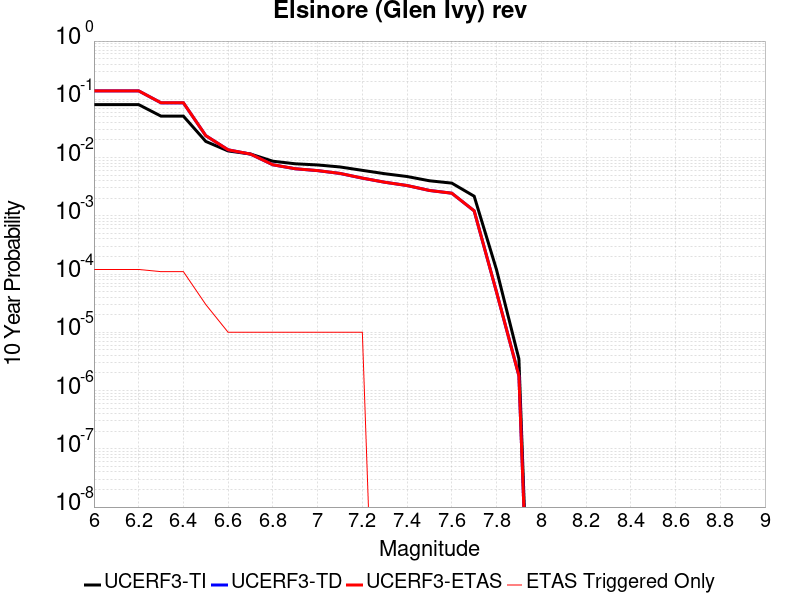 |

| Magnitude | 1 wk TI Prob | 1 wk TD Prob | 1 wk ETAS Prob | 1 wk ETAS/TD Gain | 1 wk ETAS Triggered Only | 1 mo TI Prob | 1 mo TD Prob | 1 mo ETAS Prob | 1 mo ETAS/TD Gain | 1 mo ETAS Triggered Only | 1 yr TI Prob | 1 yr TD Prob | 1 yr ETAS Prob | 1 yr ETAS/TD Gain | 1 yr ETAS Triggered Only | 10 yr TI Prob | 10 yr TD Prob | 10 yr ETAS Prob | 10 yr ETAS/TD Gain | 10 yr ETAS Triggered Only |
|-----|-----|-----|-----|-----|-----|-----|-----|-----|-----|-----|-----|-----|-----|-----|-----|-----|-----|-----|-----|-----|
| 6.0 | 1.6204086E-4 | 2.9369915E-4 | 2.9369915E-4 | 1.0 | 0.0 | 6.94276E-4 | 0.0012582582 | 0.0012858983 | 1.0219668 | 2.7674767E-5 | 0.008420097 | 0.0152386045 | 0.01529311 | 1.0035769 | 5.5349534E-5 | 0.081081145 | 0.13971579 | 0.13981102 | 1.0006816 | 1.1069907E-4 |
| 6.1 | 1.6204086E-4 | 2.9369915E-4 | 2.9369915E-4 | 1.0 | 0.0 | 6.94276E-4 | 0.0012582582 | 0.0012858983 | 1.0219668 | 2.7674767E-5 | 0.008420097 | 0.0152386045 | 0.01529311 | 1.0035769 | 5.5349534E-5 | 0.081081145 | 0.13971579 | 0.13981102 | 1.0006816 | 1.1069907E-4 |
| 6.2 | 1.6204086E-4 | 2.9369915E-4 | 2.9369915E-4 | 1.0 | 0.0 | 6.94276E-4 | 0.0012582582 | 0.0012858983 | 1.0219668 | 2.7674767E-5 | 0.008420097 | 0.0152386045 | 0.01529311 | 1.0035769 | 5.5349534E-5 | 0.081081145 | 0.13971579 | 0.13981102 | 1.0006816 | 1.1069907E-4 |
| 6.3 | 1.0111737E-4 | 1.7706092E-4 | 1.7706092E-4 | 1.0 | 0.0 | 4.332882E-4 | 7.5872854E-4 | 7.863823E-4 | 1.0364475 | 2.7674767E-5 | 0.005262531 | 0.009219088 | 0.009273928 | 1.0059484 | 5.5349534E-5 | 0.0513964 | 0.08703119 | 0.08713225 | 1.0011612 | 1.1069907E-4 |
| 6.4 | 1.0111737E-4 | 1.7706092E-4 | 1.7706092E-4 | 1.0 | 0.0 | 4.332882E-4 | 7.5872854E-4 | 7.863823E-4 | 1.0364475 | 2.7674767E-5 | 0.005262531 | 0.009219088 | 0.009273928 | 1.0059484 | 5.5349534E-5 | 0.0513964 | 0.08703119 | 0.08713225 | 1.0011612 | 1.1069907E-4 |
| 6.5 | 3.6624708E-5 | 4.6404577E-5 | 4.6404577E-5 | 1.0 | 0.0 | 1.569536E-4 | 1.9886365E-4 | 2.2653291E-4 | 1.1391369 | 2.7674767E-5 | 0.001909235 | 0.0024188396 | 0.0024464475 | 1.0114137 | 2.7674767E-5 | 0.01892915 | 0.023746667 | 0.023800703 | 1.0022755 | 5.5349534E-5 |
| 6.6 | 2.5051324E-5 | 2.615726E-5 | 2.615726E-5 | 1.0 | 0.0 | 1.073584E-4 | 1.1209798E-4 | 1.1209798E-4 | 1.0 | 0.0 | 0.0013063047 | 0.0013639829 | 0.0013639829 | 1.0 | 0.0 | 0.012986525 | 0.013569498 | 0.013596798 | 1.0020118 | 2.7674767E-5 |
| 6.7 | 2.2189772E-5 | 2.2081127E-5 | 2.2081127E-5 | 1.0 | 0.0 | 9.509556E-5 | 9.463017E-5 | 9.463017E-5 | 1.0 | 0.0 | 0.0011571734 | 0.0011515499 | 0.0011515499 | 1.0 | 0.0 | 0.011511663 | 0.011469669 | 0.011497026 | 1.0023851 | 2.7674767E-5 |
| 6.8 | 1.6654378E-5 | 1.4442895E-5 | 1.4442895E-5 | 1.0 | 0.0 | 7.137396E-5 | 6.189668E-5 | 6.189668E-5 | 1.0 | 0.0 | 8.686314E-4 | 7.533367E-4 | 7.533367E-4 | 1.0 | 0.0 | 0.008652439 | 0.0075131655 | 0.0075406325 | 1.0036558 | 2.7674767E-5 |
| 6.9 | 1.5042909E-5 | 1.2336598E-5 | 1.2336598E-5 | 1.0 | 0.0 | 6.446802E-5 | 5.287008E-5 | 5.287008E-5 | 1.0 | 0.0 | 7.8461546E-4 | 6.435063E-4 | 6.435063E-4 | 1.0 | 0.0 | 0.007818509 | 0.0064206515 | 0.0064481483 | 1.0042826 | 2.7674767E-5 |
| 7.0 | 1.4361385E-5 | 1.1455669E-5 | 1.1455669E-5 | 1.0 | 0.0 | 6.154734E-5 | 4.9094815E-5 | 4.9094815E-5 | 1.0 | 0.0 | 7.490812E-4 | 5.9756835E-4 | 5.9756835E-4 | 1.0 | 0.0 | 0.007465612 | 0.005963606 | 0.0059911157 | 1.0046129 | 2.7674767E-5 |
| 7.1 | 1.3265571E-5 | 1.0248802E-5 | 1.0248802E-5 | 1.0 | 0.0 | 5.6851208E-5 | 4.392271E-5 | 4.392271E-5 | 1.0 | 0.0 | 6.919436E-4 | 5.346303E-4 | 5.346303E-4 | 1.0 | 0.0 | 0.006897931 | 0.005336798 | 0.005364325 | 1.005158 | 2.7674767E-5 |
| 7.2 | 1.1596403E-5 | 8.508368E-6 | 8.508368E-6 | 1.0 | 0.0 | 4.9697923E-5 | 3.6463935E-5 | 3.6463935E-5 | 1.0 | 0.0 | 6.049042E-4 | 4.4385967E-4 | 4.4385967E-4 | 1.0 | 0.0 | 0.006032603 | 0.0044311467 | 0.004458699 | 1.0062178 | 2.7674767E-5 |
| 7.3 | 1.0150827E-5 | 7.2416165E-6 | 7.2416165E-6 | 1.0 | 0.0 | 4.3502816E-5 | 3.103514E-5 | 3.103514E-5 | 1.0 | 0.0 | 5.2951806E-4 | 3.7778873E-4 | 3.7778873E-4 | 1.0 | 0.0 | 0.005282581 | 0.0037718515 | 0.0037718515 | 1.0 | 0.0 |
| 7.4 | 9.080705E-6 | 6.3550674E-6 | 6.3550674E-6 | 1.0 | 0.0 | 3.8916725E-5 | 2.7235727E-5 | 2.7235727E-5 | 1.0 | 0.0 | 4.7370812E-4 | 3.315459E-4 | 3.315459E-4 | 1.0 | 0.0 | 0.004726996 | 0.0033106634 | 0.0033106634 | 1.0 | 0.0 |
| 7.5 | 7.671649E-6 | 5.2278356E-6 | 5.2278356E-6 | 1.0 | 0.0 | 3.287808E-5 | 2.2404824E-5 | 2.2404824E-5 | 1.0 | 0.0 | 4.0021708E-4 | 2.7274585E-4 | 2.7274585E-4 | 1.0 | 0.0 | 0.0039949706 | 0.002724236 | 0.002724236 | 1.0 | 0.0 |
| 7.6 | 6.990086E-6 | 4.689591E-6 | 4.689591E-6 | 1.0 | 0.0 | 2.9957167E-5 | 2.00981E-5 | 2.00981E-5 | 1.0 | 0.0 | 3.6466747E-4 | 2.4466804E-4 | 2.4466804E-4 | 1.0 | 0.0 | 0.0036406964 | 0.0024441031 | 0.0024441031 | 1.0 | 0.0 |
| 7.7 | 4.163505E-6 | 2.33052E-6 | 2.33052E-6 | 1.0 | 0.0 | 1.7843471E-5 | 9.987909E-6 | 9.987909E-6 | 1.0 | 0.0 | 2.172226E-4 | 1.2159675E-4 | 1.2159675E-4 | 1.0 | 0.0 | 0.0021701038 | 0.0012153753 | 0.0012153753 | 1.0 | 0.0 |
| 7.8 | 2.2692414E-7 | 9.388808E-8 | 9.388808E-8 | 1.0 | 0.0 | 9.725317E-7 | 4.0237745E-7 | 4.0237745E-7 | 1.0 | 0.0 | 1.1840509E-5 | 4.8989377E-6 | 4.8989377E-6 | 1.0 | 0.0 | 1.1839878E-4 | 4.8988626E-5 | 4.8988626E-5 | 1.0 | 0.0 |
| 7.9 | 6.676829E-9 | 3.4407224E-9 | 3.4407224E-9 | 1.0 | 0.0 | 2.861498E-8 | 1.4745954E-8 | 1.4745954E-8 | 1.0 | 0.0 | 3.4838732E-7 | 1.7953197E-7 | 1.7953197E-7 | 1.0 | 0.0 | 3.4838679E-6 | 1.7953184E-6 | 1.7953184E-6 | 1.0 | 0.0 |

## San Andreas (San Gorgonio Pass-Garnet HIll)
*[(top)](#table-of-contents)*

| 1 Week | 1 Month | 1 Year | 10 Year |
|-----|-----|-----|-----|
| 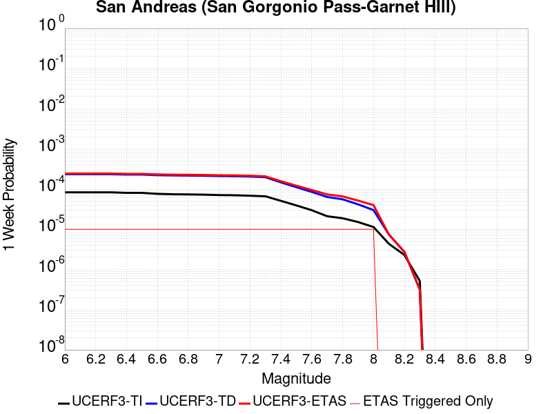 |  |  |  |

| Magnitude | 1 wk TI Prob | 1 wk TD Prob | 1 wk ETAS Prob | 1 wk ETAS/TD Gain | 1 wk ETAS Triggered Only | 1 mo TI Prob | 1 mo TD Prob | 1 mo ETAS Prob | 1 mo ETAS/TD Gain | 1 mo ETAS Triggered Only | 1 yr TI Prob | 1 yr TD Prob | 1 yr ETAS Prob | 1 yr ETAS/TD Gain | 1 yr ETAS Triggered Only | 10 yr TI Prob | 10 yr TD Prob | 10 yr ETAS Prob | 10 yr ETAS/TD Gain | 10 yr ETAS Triggered Only |
|-----|-----|-----|-----|-----|-----|-----|-----|-----|-----|-----|-----|-----|-----|-----|-----|-----|-----|-----|-----|-----|
| 6.0 | 8.31567E-5 | 2.3410414E-4 | 2.3410414E-4 | 1.0 | 0.0 | 3.5633717E-4 | 0.0010029199 | 0.0010029199 | 1.0 | 0.0 | 0.004329778 | 0.012142156 | 0.012196833 | 1.0045031 | 5.5349534E-5 | 0.042463828 | 0.11269214 | 0.11279037 | 1.0008717 | 1.1069907E-4 |
| 6.1 | 8.31567E-5 | 2.3410414E-4 | 2.3410414E-4 | 1.0 | 0.0 | 3.5633717E-4 | 0.0010029199 | 0.0010029199 | 1.0 | 0.0 | 0.004329778 | 0.012142156 | 0.012196833 | 1.0045031 | 5.5349534E-5 | 0.042463828 | 0.11269214 | 0.11279037 | 1.0008717 | 1.1069907E-4 |
| 6.2 | 8.31567E-5 | 2.3410414E-4 | 2.3410414E-4 | 1.0 | 0.0 | 3.5633717E-4 | 0.0010029199 | 0.0010029199 | 1.0 | 0.0 | 0.004329778 | 0.012142156 | 0.012196833 | 1.0045031 | 5.5349534E-5 | 0.042463828 | 0.11269214 | 0.11279037 | 1.0008717 | 1.1069907E-4 |
| 6.3 | 8.31567E-5 | 2.3410414E-4 | 2.3410414E-4 | 1.0 | 0.0 | 3.5633717E-4 | 0.0010029199 | 0.0010029199 | 1.0 | 0.0 | 0.004329778 | 0.012142156 | 0.012196833 | 1.0045031 | 5.5349534E-5 | 0.042463828 | 0.11269214 | 0.11279037 | 1.0008717 | 1.1069907E-4 |
| 6.4 | 8.059055E-5 | 2.2968411E-4 | 2.2968411E-4 | 1.0 | 0.0 | 3.4534236E-4 | 9.839915E-4 | 9.839915E-4 | 1.0 | 0.0 | 0.0041964394 | 0.011914243 | 0.011968933 | 1.0045903 | 5.5349534E-5 | 0.041180745 | 0.11067289 | 0.11077134 | 1.0008895 | 1.1069907E-4 |
| 6.5 | 8.059055E-5 | 2.2968411E-4 | 2.2968411E-4 | 1.0 | 0.0 | 3.4534236E-4 | 9.839915E-4 | 9.839915E-4 | 1.0 | 0.0 | 0.0041964394 | 0.011914243 | 0.011968933 | 1.0045903 | 5.5349534E-5 | 0.041180745 | 0.11067289 | 0.11077134 | 1.0008895 | 1.1069907E-4 |
| 6.6 | 7.619237E-5 | 2.2212318E-4 | 2.2212318E-4 | 1.0 | 0.0 | 3.2649786E-4 | 9.516115E-4 | 9.516115E-4 | 1.0 | 0.0 | 0.0039678677 | 0.011524876 | 0.011579587 | 1.0047473 | 5.5349534E-5 | 0.03897764 | 0.10720898 | 0.107307814 | 1.0009218 | 1.1069907E-4 |
| 6.7 | 7.440636E-5 | 2.1888081E-4 | 2.1888081E-4 | 1.0 | 0.0 | 3.188454E-4 | 9.3772565E-4 | 9.3772565E-4 | 1.0 | 0.0 | 0.0038750346 | 0.011357584 | 0.011412305 | 1.004818 | 5.5349534E-5 | 0.038081564 | 0.10571735 | 0.10581635 | 1.0009364 | 1.1069907E-4 |
| 6.8 | 7.3735864E-5 | 2.1735218E-4 | 2.1735218E-4 | 1.0 | 0.0 | 3.1597257E-4 | 9.3117903E-4 | 9.3117903E-4 | 1.0 | 0.0 | 0.0038401815 | 0.011278707 | 0.011333432 | 1.004852 | 5.5349534E-5 | 0.03774495 | 0.10501884 | 0.10511791 | 1.0009434 | 1.1069907E-4 |
| 6.9 | 7.27575E-5 | 2.1504147E-4 | 2.1504147E-4 | 1.0 | 0.0 | 3.117806E-4 | 9.2128303E-4 | 9.2128303E-4 | 1.0 | 0.0 | 0.003789323 | 0.011159464 | 0.011214196 | 1.0049045 | 5.5349534E-5 | 0.037253562 | 0.1039667 | 0.10406589 | 1.000954 | 1.1069907E-4 |
| 7.0 | 7.102591E-5 | 2.1088071E-4 | 2.1088071E-4 | 1.0 | 0.0 | 3.0436125E-4 | 9.034637E-4 | 9.034637E-4 | 1.0 | 0.0 | 0.003699303 | 0.01094471 | 0.010999454 | 1.0050019 | 5.5349534E-5 | 0.03638325 | 0.10206863 | 0.10216803 | 1.0009738 | 1.1069907E-4 |
| 7.1 | 7.028513E-5 | 2.0923663E-4 | 2.0923663E-4 | 1.0 | 0.0 | 3.0118722E-4 | 8.964225E-4 | 8.964225E-4 | 1.0 | 0.0 | 0.0036607897 | 0.0108598415 | 0.01091459 | 1.0050414 | 5.5349534E-5 | 0.036010686 | 0.10131153 | 0.101411015 | 1.0009819 | 1.1069907E-4 |
| 7.2 | 6.8498244E-5 | 2.0531406E-4 | 2.0531406E-4 | 1.0 | 0.0 | 2.9353087E-4 | 8.7962294E-4 | 8.7962294E-4 | 1.0 | 0.0 | 0.003567883 | 0.010657323 | 0.0107120825 | 1.0051383 | 5.5349534E-5 | 0.035111405 | 0.09950322 | 0.0996029 | 1.0010018 | 1.1069907E-4 |
| 7.3 | 6.622592E-5 | 1.9758358E-4 | 1.9758358E-4 | 1.0 | 0.0 | 2.8379448E-4 | 8.465141E-4 | 8.465141E-4 | 1.0 | 0.0 | 0.0034497243 | 0.010258088 | 0.010312869 | 1.0053403 | 5.5349534E-5 | 0.033966612 | 0.09599869 | 0.09609876 | 1.0010425 | 1.1069907E-4 |
| 7.4 | 5.1050705E-5 | 1.4711749E-4 | 1.4711749E-4 | 1.0 | 0.0 | 2.1877038E-4 | 6.3035206E-4 | 6.3035206E-4 | 1.0 | 0.0 | 0.002660276 | 0.007647724 | 0.0076751867 | 1.0035911 | 2.7674767E-5 | 0.02628654 | 0.07296115 | 0.073012464 | 1.0007032 | 5.5349534E-5 |
| 7.5 | 3.9302922E-5 | 1.1149603E-4 | 1.1149603E-4 | 1.0 | 0.0 | 1.6843023E-4 | 4.7775294E-4 | 4.7775294E-4 | 1.0 | 0.0 | 0.0020487092 | 0.005801199 | 0.005828713 | 1.0047429 | 2.7674767E-5 | 0.020299247 | 0.05609674 | 0.056148984 | 1.0009314 | 5.5349534E-5 |
| 7.6 | 2.9851626E-5 | 8.512565E-5 | 8.512565E-5 | 1.0 | 0.0 | 1.2792926E-4 | 3.6477332E-4 | 3.6477332E-4 | 1.0 | 0.0 | 0.0015564259 | 0.004432097 | 0.0044596493 | 1.0062165 | 2.7674767E-5 | 0.0154556995 | 0.04327243 | 0.043325383 | 1.0012238 | 5.5349534E-5 |
| 7.7 | 2.1135214E-5 | 6.36853E-5 | 6.36853E-5 | 1.0 | 0.0 | 9.0576345E-5 | 2.7290848E-4 | 2.7290848E-4 | 1.0 | 0.0 | 0.0011022091 | 0.0033176036 | 0.0033451866 | 1.0083141 | 2.7674767E-5 | 0.010967582 | 0.03265299 | 0.03270653 | 1.0016397 | 5.5349534E-5 |
| 7.8 | 1.883379E-5 | 5.5783697E-5 | 5.5783697E-5 | 1.0 | 0.0 | 8.0713755E-5 | 2.3905109E-4 | 2.3905109E-4 | 1.0 | 0.0 | 9.822468E-4 | 0.0029065658 | 0.0029341602 | 1.0094938 | 2.7674767E-5 | 0.0097791655 | 0.028760133 | 0.028813891 | 1.0018692 | 5.5349534E-5 |
| 7.9 | 1.5156185E-5 | 4.17765E-5 | 4.17765E-5 | 1.0 | 0.0 | 6.495346E-5 | 1.7902986E-4 | 1.7902986E-4 | 1.0 | 0.0 | 7.9052144E-4 | 0.0021775109 | 0.0022051255 | 1.0126817 | 2.7674767E-5 | 0.007877152 | 0.021813648 | 0.02186779 | 1.002482 | 5.5349534E-5 |
| 8.0 | 1.1405907E-5 | 3.0062678E-5 | 3.0062678E-5 | 1.0 | 0.0 | 4.8881542E-5 | 1.288337E-4 | 1.288337E-4 | 1.0 | 0.0 | 5.9497025E-4 | 0.0015674226 | 0.0015674226 | 1.0 | 0.0 | 0.005933798 | 0.015813893 | 0.01584113 | 1.0017223 | 2.7674767E-5 |
| 8.1 | 4.3511436E-6 | 7.4008362E-6 | 7.4008362E-6 | 1.0 | 0.0 | 1.8647626E-5 | 3.1717485E-5 | 3.1717485E-5 | 1.0 | 0.0 | 2.2701119E-4 | 3.8609208E-4 | 3.8609208E-4 | 1.0 | 0.0 | 0.0022677942 | 0.004132099 | 0.004132099 | 1.0 | 0.0 |
| 8.2 | 2.3042528E-6 | 2.747699E-6 | 2.747699E-6 | 1.0 | 0.0 | 9.875332E-6 | 1.17758E-5 | 1.17758E-5 | 1.0 | 0.0 | 1.2022553E-4 | 1.4336099E-4 | 1.4336099E-4 | 1.0 | 0.0 | 0.0012016051 | 0.0016056811 | 0.0016056811 | 1.0 | 0.0 |
| 8.3 | 5.202968E-7 | 3.1810086E-7 | 3.1810086E-7 | 1.0 | 0.0 | 2.2298414E-6 | 1.3632887E-6 | 1.3632887E-6 | 1.0 | 0.0 | 2.714798E-5 | 1.6597925E-5 | 1.6597925E-5 | 1.0 | 0.0 | 2.7144665E-4 | 1.9682536E-4 | 1.9682536E-4 | 1.0 | 0.0 |

## Santa Ynez (West)
*[(top)](#table-of-contents)*

| 1 Week | 1 Month | 1 Year | 10 Year |
|-----|-----|-----|-----|
|  |  |  | 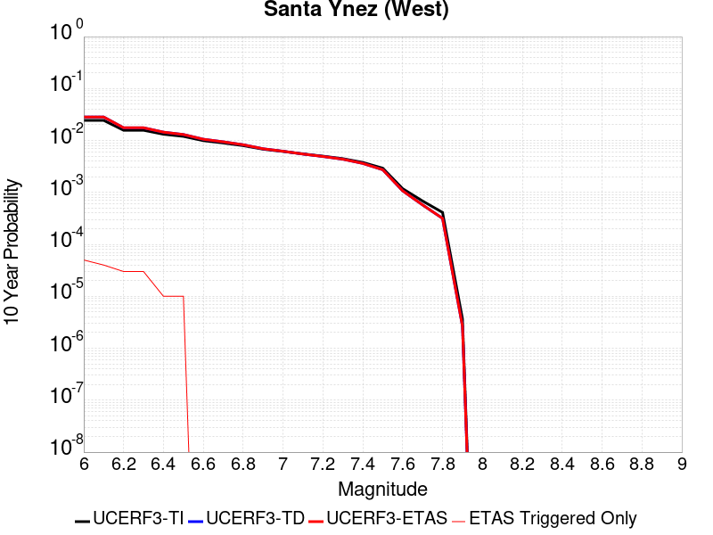 |

| Magnitude | 1 wk TI Prob | 1 wk TD Prob | 1 wk ETAS Prob | 1 wk ETAS/TD Gain | 1 wk ETAS Triggered Only | 1 mo TI Prob | 1 mo TD Prob | 1 mo ETAS Prob | 1 mo ETAS/TD Gain | 1 mo ETAS Triggered Only | 1 yr TI Prob | 1 yr TD Prob | 1 yr ETAS Prob | 1 yr ETAS/TD Gain | 1 yr ETAS Triggered Only | 10 yr TI Prob | 10 yr TD Prob | 10 yr ETAS Prob | 10 yr ETAS/TD Gain | 10 yr ETAS Triggered Only |
|-----|-----|-----|-----|-----|-----|-----|-----|-----|-----|-----|-----|-----|-----|-----|-----|-----|-----|-----|-----|-----|
| 6.0 | 4.7352758E-5 | 5.4981716E-5 | 5.4981716E-5 | 1.0 | 0.0 | 2.0292461E-4 | 2.3561627E-4 | 2.632845E-4 | 1.1174293 | 2.7674767E-5 | 0.0024678076 | 0.0028650062 | 0.0029201973 | 1.0192639 | 5.5349534E-5 | 0.024405818 | 0.02830918 | 0.028389854 | 1.0028497 | 8.30243E-5 |
| 6.1 | 4.7352758E-5 | 5.4981716E-5 | 5.4981716E-5 | 1.0 | 0.0 | 2.0292461E-4 | 2.3561627E-4 | 2.632845E-4 | 1.1174293 | 2.7674767E-5 | 0.0024678076 | 0.0028650062 | 0.0029201973 | 1.0192639 | 5.5349534E-5 | 0.024405818 | 0.02830918 | 0.028362963 | 1.0018998 | 5.5349534E-5 |
| 6.2 | 3.0415853E-5 | 3.3929857E-5 | 3.3929857E-5 | 1.0 | 0.0 | 1.3034715E-4 | 1.4540575E-4 | 1.4540575E-4 | 1.0 | 0.0 | 0.0015858212 | 0.0017689128 | 0.0017965386 | 1.0156174 | 2.7674767E-5 | 0.015745522 | 0.017552229 | 0.017579418 | 1.001549 | 2.7674767E-5 |
| 6.3 | 3.0415853E-5 | 3.3929857E-5 | 3.3929857E-5 | 1.0 | 0.0 | 1.3034715E-4 | 1.4540575E-4 | 1.4540575E-4 | 1.0 | 0.0 | 0.0015858212 | 0.0017689128 | 0.0017965386 | 1.0156174 | 2.7674767E-5 | 0.015745522 | 0.017552229 | 0.017579418 | 1.001549 | 2.7674767E-5 |
| 6.4 | 2.5452082E-5 | 2.791597E-5 | 2.791597E-5 | 1.0 | 0.0 | 1.09075794E-4 | 1.1963445E-4 | 1.1963445E-4 | 1.0 | 0.0 | 0.0013271887 | 0.0014555932 | 0.0014555932 | 1.0 | 0.0 | 0.013192902 | 0.014462772 | 0.014462772 | 1.0 | 0.0 |
| 6.5 | 2.3143784E-5 | 2.5131267E-5 | 2.5131267E-5 | 1.0 | 0.0 | 9.9183875E-5 | 1.07701024E-4 | 1.07701024E-4 | 1.0 | 0.0 | 0.0012068948 | 0.0013104831 | 0.0013104831 | 1.0 | 0.0 | 0.012003611 | 0.013029228 | 0.013029228 | 1.0 | 0.0 |
| 6.6 | 1.9118515E-5 | 2.0356518E-5 | 2.0356518E-5 | 1.0 | 0.0 | 8.193392E-5 | 8.723935E-5 | 8.723935E-5 | 1.0 | 0.0 | 9.97089E-4 | 0.0010616295 | 0.0010616295 | 1.0 | 0.0 | 0.00992627 | 0.01056649 | 0.01056649 | 1.0 | 0.0 |
| 6.7 | 1.722807E-5 | 1.814818E-5 | 1.814818E-5 | 1.0 | 0.0 | 7.3832496E-5 | 7.777562E-5 | 7.777562E-5 | 1.0 | 0.0 | 8.985399E-4 | 9.465124E-4 | 9.465124E-4 | 1.0 | 0.0 | 0.008949154 | 0.009425457 | 0.009425457 | 1.0 | 0.0 |
| 6.8 | 1.5317364E-5 | 1.592798E-5 | 1.592798E-5 | 1.0 | 0.0 | 6.56442E-5 | 6.826101E-5 | 6.826101E-5 | 1.0 | 0.0 | 7.98925E-4 | 8.307652E-4 | 8.307652E-4 | 1.0 | 0.0 | 0.007960589 | 0.008277084 | 0.008277084 | 1.0 | 0.0 |
| 6.9 | 1.3071226E-5 | 1.333074E-5 | 1.333074E-5 | 1.0 | 0.0 | 5.6018336E-5 | 5.7130503E-5 | 5.7130503E-5 | 1.0 | 0.0 | 6.8180985E-4 | 6.953442E-4 | 6.953442E-4 | 1.0 | 0.0 | 0.0067972173 | 0.006931945 | 0.006931945 | 1.0 | 0.0 |
| 7.0 | 1.1836986E-5 | 1.1933726E-5 | 1.1933726E-5 | 1.0 | 0.0 | 5.0728955E-5 | 5.1143543E-5 | 5.1143543E-5 | 1.0 | 0.0 | 6.1745E-4 | 6.224964E-4 | 6.224964E-4 | 1.0 | 0.0 | 0.006157372 | 0.0062077204 | 0.0062077204 | 1.0 | 0.0 |
| 7.1 | 1.0597169E-5 | 1.0542986E-5 | 1.0542986E-5 | 1.0 | 0.0 | 4.541565E-5 | 4.518345E-5 | 4.518345E-5 | 1.0 | 0.0 | 5.5279525E-4 | 5.499708E-4 | 5.499708E-4 | 1.0 | 0.0 | 0.0055142213 | 0.005486228 | 0.005486228 | 1.0 | 0.0 |
| 7.2 | 9.59113E-6 | 9.459851E-6 | 9.459851E-6 | 1.0 | 0.0 | 4.11042E-5 | 4.0541596E-5 | 4.0541596E-5 | 1.0 | 0.0 | 5.0032866E-4 | 4.934832E-4 | 4.934832E-4 | 1.0 | 0.0 | 0.004992037 | 0.0049239923 | 0.0049239923 | 1.0 | 0.0 |
| 7.3 | 8.586084E-6 | 8.380215E-6 | 8.380215E-6 | 1.0 | 0.0 | 3.679698E-5 | 3.591472E-5 | 3.591472E-5 | 1.0 | 0.0 | 4.4791115E-4 | 4.37175E-4 | 4.37175E-4 | 1.0 | 0.0 | 0.004470094 | 0.004363261 | 0.004363261 | 1.0 | 0.0 |
| 7.4 | 7.2622997E-6 | 6.9520675E-6 | 6.9520675E-6 | 1.0 | 0.0 | 3.112377E-5 | 2.9794239E-5 | 2.9794239E-5 | 1.0 | 0.0 | 3.78866E-4 | 3.6268544E-4 | 3.6268544E-4 | 1.0 | 0.0 | 0.0037822074 | 0.0036210357 | 0.0036210357 | 1.0 | 0.0 |
| 7.5 | 5.627296E-6 | 5.251976E-6 | 5.251976E-6 | 1.0 | 0.0 | 2.411676E-5 | 2.2508279E-5 | 2.2508279E-5 | 1.0 | 0.0 | 2.9358198E-4 | 2.7400453E-4 | 2.7400453E-4 | 1.0 | 0.0 | 0.0029319443 | 0.0027367389 | 0.0027367389 | 1.0 | 0.0 |
| 7.6 | 2.265244E-6 | 2.0610048E-6 | 2.0610048E-6 | 1.0 | 0.0 | 9.708152E-6 | 8.832848E-6 | 8.832848E-6 | 1.0 | 0.0 | 1.18190335E-4 | 1.075347E-4 | 1.075347E-4 | 1.0 | 0.0 | 0.001181275 | 0.0010748353 | 0.0010748353 | 1.0 | 0.0 |
| 7.7 | 1.3099874E-6 | 1.101695E-6 | 1.101695E-6 | 1.0 | 0.0 | 5.61422E-6 | 4.7215417E-6 | 4.7215417E-6 | 1.0 | 0.0 | 6.8350986E-5 | 5.748328E-5 | 5.748328E-5 | 1.0 | 0.0 | 6.832996E-4 | 5.746865E-4 | 5.746865E-4 | 1.0 | 0.0 |
| 7.8 | 7.903951E-7 | 6.0714854E-7 | 6.0714854E-7 | 1.0 | 0.0 | 3.3874032E-6 | 2.6020628E-6 | 2.6020628E-6 | 1.0 | 0.0 | 4.1240855E-5 | 3.1679665E-5 | 3.1679665E-5 | 1.0 | 0.0 | 4.12332E-4 | 3.1675282E-4 | 3.1675282E-4 | 1.0 | 0.0 |
| 7.9 | 7.0753297E-9 | 5.0901643E-9 | 5.0901643E-9 | 1.0 | 0.0 | 3.032284E-8 | 2.1814989E-8 | 2.1814989E-8 | 1.0 | 0.0 | 3.6918053E-7 | 2.6559746E-7 | 2.6559746E-7 | 1.0 | 0.0 | 3.691799E-6 | 2.6559726E-6 | 2.6559726E-6 | 1.0 | 0.0 |

## San Andreas (Big Bend)
*[(top)](#table-of-contents)*

| 1 Week | 1 Month | 1 Year | 10 Year |
|-----|-----|-----|-----|
|  |  |  |  |

| Magnitude | 1 wk TI Prob | 1 wk TD Prob | 1 wk ETAS Prob | 1 wk ETAS/TD Gain | 1 wk ETAS Triggered Only | 1 mo TI Prob | 1 mo TD Prob | 1 mo ETAS Prob | 1 mo ETAS/TD Gain | 1 mo ETAS Triggered Only | 1 yr TI Prob | 1 yr TD Prob | 1 yr ETAS Prob | 1 yr ETAS/TD Gain | 1 yr ETAS Triggered Only | 10 yr TI Prob | 10 yr TD Prob | 10 yr ETAS Prob | 10 yr ETAS/TD Gain | 10 yr ETAS Triggered Only |
|-----|-----|-----|-----|-----|-----|-----|-----|-----|-----|-----|-----|-----|-----|-----|-----|-----|-----|-----|-----|-----|
| 6.0 | 1.0179969E-4 | 2.0131959E-4 | 2.0131959E-4 | 1.0 | 0.0 | 4.362114E-4 | 8.6251396E-4 | 8.6251396E-4 | 1.0 | 0.0 | 0.0052979486 | 0.010450831 | 0.010505602 | 1.0052408 | 5.5349534E-5 | 0.051734097 | 0.101709 | 0.10178358 | 1.0007333 | 8.30243E-5 |
| 6.1 | 1.0179969E-4 | 2.0131959E-4 | 2.0131959E-4 | 1.0 | 0.0 | 4.362114E-4 | 8.6251396E-4 | 8.6251396E-4 | 1.0 | 0.0 | 0.0052979486 | 0.010450831 | 0.010505602 | 1.0052408 | 5.5349534E-5 | 0.051734097 | 0.101709 | 0.10178358 | 1.0007333 | 8.30243E-5 |
| 6.2 | 1.0179969E-4 | 2.0131959E-4 | 2.0131959E-4 | 1.0 | 0.0 | 4.362114E-4 | 8.6251396E-4 | 8.6251396E-4 | 1.0 | 0.0 | 0.0052979486 | 0.010450831 | 0.010505602 | 1.0052408 | 5.5349534E-5 | 0.051734097 | 0.101709 | 0.10178358 | 1.0007333 | 8.30243E-5 |
| 6.3 | 1.0179969E-4 | 2.0131959E-4 | 2.0131959E-4 | 1.0 | 0.0 | 4.362114E-4 | 8.6251396E-4 | 8.6251396E-4 | 1.0 | 0.0 | 0.0052979486 | 0.010450831 | 0.010505602 | 1.0052408 | 5.5349534E-5 | 0.051734097 | 0.101709 | 0.10178358 | 1.0007333 | 8.30243E-5 |
| 6.4 | 9.1639464E-5 | 1.8488058E-4 | 1.8488058E-4 | 1.0 | 0.0 | 3.9268145E-4 | 7.92105E-4 | 7.92105E-4 | 1.0 | 0.0 | 0.0047704205 | 0.009601353 | 0.0096287625 | 1.0028547 | 2.7674767E-5 | 0.046693064 | 0.09403238 | 0.09405745 | 1.0002667 | 2.7674767E-5 |
| 6.5 | 9.1639464E-5 | 1.8488058E-4 | 1.8488058E-4 | 1.0 | 0.0 | 3.9268145E-4 | 7.92105E-4 | 7.92105E-4 | 1.0 | 0.0 | 0.0047704205 | 0.009601353 | 0.0096287625 | 1.0028547 | 2.7674767E-5 | 0.046693064 | 0.09403238 | 0.09405745 | 1.0002667 | 2.7674767E-5 |
| 6.6 | 9.042622E-5 | 1.829497E-4 | 1.829497E-4 | 1.0 | 0.0 | 3.8748336E-4 | 7.838348E-4 | 7.838348E-4 | 1.0 | 0.0 | 0.0047074095 | 0.009501544 | 0.009528955 | 1.002885 | 2.7674767E-5 | 0.046089325 | 0.09312604 | 0.09315114 | 1.0002695 | 2.7674767E-5 |
| 6.7 | 8.9836685E-5 | 1.8209257E-4 | 1.8209257E-4 | 1.0 | 0.0 | 3.8495753E-4 | 7.8016357E-4 | 7.8016357E-4 | 1.0 | 0.0 | 0.00467679 | 0.009457235 | 0.009484648 | 1.0028986 | 2.7674767E-5 | 0.045795817 | 0.092720196 | 0.092745304 | 1.0002708 | 2.7674767E-5 |
| 6.8 | 8.9471854E-5 | 1.8155984E-4 | 1.8155984E-4 | 1.0 | 0.0 | 3.8339442E-4 | 7.7788177E-4 | 7.7788177E-4 | 1.0 | 0.0 | 0.004657841 | 0.009429695 | 0.009457109 | 1.0029072 | 2.7674767E-5 | 0.04561414 | 0.092467226 | 0.09249234 | 1.0002716 | 2.7674767E-5 |
| 6.9 | 8.858234E-5 | 1.8037861E-4 | 1.8037861E-4 | 1.0 | 0.0 | 3.7958333E-4 | 7.728224E-4 | 7.728224E-4 | 1.0 | 0.0 | 0.004611638 | 0.009368628 | 0.009396044 | 1.0029263 | 2.7674767E-5 | 0.04517103 | 0.09190706 | 0.09193219 | 1.0002735 | 2.7674767E-5 |
| 7.0 | 8.7433385E-5 | 1.7876514E-4 | 1.7876514E-4 | 1.0 | 0.0 | 3.746607E-4 | 7.659116E-4 | 7.659116E-4 | 1.0 | 0.0 | 0.004551957 | 0.009285209 | 0.009312627 | 1.0029528 | 2.7674767E-5 | 0.044598386 | 0.09114104 | 0.09116619 | 1.000276 | 2.7674767E-5 |
| 7.1 | 8.684964E-5 | 1.7788376E-4 | 1.7788376E-4 | 1.0 | 0.0 | 3.7215967E-4 | 7.621365E-4 | 7.621365E-4 | 1.0 | 0.0 | 0.0045216335 | 0.009239637 | 0.009267056 | 1.0029676 | 2.7674767E-5 | 0.04430731 | 0.09072227 | 0.09074744 | 1.0002774 | 2.7674767E-5 |
| 7.2 | 8.606521E-5 | 1.7678899E-4 | 1.7678899E-4 | 1.0 | 0.0 | 3.6879873E-4 | 7.5744727E-4 | 7.5744727E-4 | 1.0 | 0.0 | 0.0044808835 | 0.00918303 | 0.009210451 | 1.002986 | 2.7674767E-5 | 0.043916024 | 0.09020251 | 0.090227686 | 1.0002792 | 2.7674767E-5 |
| 7.3 | 8.568266E-5 | 1.7620796E-4 | 1.7620796E-4 | 1.0 | 0.0 | 3.6715972E-4 | 7.549586E-4 | 7.549586E-4 | 1.0 | 0.0 | 0.0044610105 | 0.009152985 | 0.009180406 | 1.0029958 | 2.7674767E-5 | 0.043725148 | 0.089923255 | 0.08994844 | 1.0002801 | 2.7674767E-5 |
| 7.4 | 8.5432206E-5 | 1.7583313E-4 | 1.7583313E-4 | 1.0 | 0.0 | 3.6608664E-4 | 7.533532E-4 | 7.533532E-4 | 1.0 | 0.0 | 0.004447999 | 0.0091336025 | 0.009161024 | 1.0030023 | 2.7674767E-5 | 0.043600157 | 0.08974317 | 0.08976836 | 1.0002807 | 2.7674767E-5 |
| 7.5 | 8.4791965E-5 | 1.7452403E-4 | 1.7452403E-4 | 1.0 | 0.0 | 3.633435E-4 | 7.477459E-4 | 7.477459E-4 | 1.0 | 0.0 | 0.0044147377 | 0.009065905 | 0.009093328 | 1.0030249 | 2.7674767E-5 | 0.043280575 | 0.08911997 | 0.089145176 | 1.0002829 | 2.7674767E-5 |
| 7.6 | 8.241105E-5 | 1.6896869E-4 | 1.6896869E-4 | 1.0 | 0.0 | 3.531424E-4 | 7.2395074E-4 | 7.2395074E-4 | 1.0 | 0.0 | 0.0042910352 | 0.008778568 | 0.008806 | 1.0031248 | 2.7674767E-5 | 0.042091176 | 0.08649363 | 0.08651891 | 1.0002923 | 2.7674767E-5 |
| 7.7 | 7.00432E-5 | 1.4255449E-4 | 1.4255449E-4 | 1.0 | 0.0 | 3.001506E-4 | 6.108048E-4 | 6.108048E-4 | 1.0 | 0.0 | 0.0036482112 | 0.0074112318 | 0.0074387016 | 1.0037065 | 2.7674767E-5 | 0.035888977 | 0.07374726 | 0.0737729 | 1.0003476 | 2.7674767E-5 |
| 7.8 | 6.415362E-5 | 1.3014876E-4 | 1.3014876E-4 | 1.0 | 0.0 | 2.749151E-4 | 5.5766123E-4 | 5.5766123E-4 | 1.0 | 0.0 | 0.0033419547 | 0.006768419 | 0.0067959065 | 1.0040611 | 2.7674767E-5 | 0.03292141 | 0.06746108 | 0.06748689 | 1.0003825 | 2.7674767E-5 |
| 7.9 | 4.939911E-5 | 9.374107E-5 | 9.374107E-5 | 1.0 | 0.0 | 2.116933E-4 | 4.0168563E-4 | 4.0168563E-4 | 1.0 | 0.0 | 0.0025743195 | 0.004879565 | 0.004879565 | 1.0 | 0.0 | 0.025447013 | 0.049068946 | 0.049068946 | 1.0 | 0.0 |
| 8.0 | 3.344983E-5 | 5.2423515E-5 | 5.2423515E-5 | 1.0 | 0.0 | 1.4334853E-4 | 2.2465286E-4 | 2.2465286E-4 | 1.0 | 0.0 | 0.0017438711 | 0.0027317198 | 0.0027317198 | 1.0 | 0.0 | 0.017302496 | 0.028018981 | 0.028018981 | 1.0 | 0.0 |
| 8.1 | 1.9104898E-5 | 1.9269055E-5 | 1.9269055E-5 | 1.0 | 0.0 | 8.1875565E-5 | 8.257905E-5 | 8.257905E-5 | 1.0 | 0.0 | 9.963791E-4 | 0.0010049369 | 0.0010049369 | 1.0 | 0.0 | 0.009919235 | 0.0108002825 | 0.0108002825 | 1.0 | 0.0 |
| 8.2 | 8.643924E-6 | 5.5112705E-6 | 5.5112705E-6 | 1.0 | 0.0 | 3.704486E-5 | 2.3619517E-5 | 2.3619517E-5 | 1.0 | 0.0 | 4.5092785E-4 | 2.8752975E-4 | 2.8752975E-4 | 1.0 | 0.0 | 0.0045001395 | 0.0032686237 | 0.0032686237 | 1.0 | 0.0 |
| 8.3 | 1.983087E-6 | 7.7188406E-7 | 7.7188406E-7 | 1.0 | 0.0 | 8.498917E-6 | 3.3080703E-6 | 3.3080703E-6 | 1.0 | 0.0 | 1.034694E-4 | 4.027503E-5 | 4.027503E-5 | 1.0 | 0.0 | 0.0010342124 | 4.7534908E-4 | 4.7534908E-4 | 1.0 | 0.0 |

## Ludlow
*[(top)](#table-of-contents)*

| 1 Week | 1 Month | 1 Year | 10 Year |
|-----|-----|-----|-----|
|  |  | 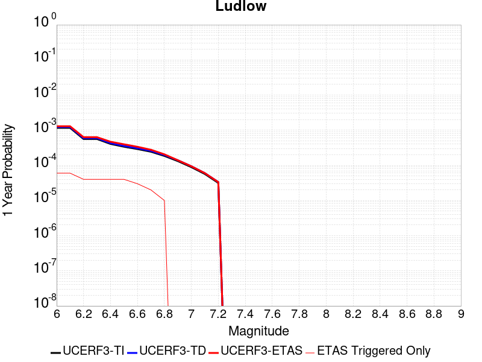 |  |

| Magnitude | 1 wk TI Prob | 1 wk TD Prob | 1 wk ETAS Prob | 1 wk ETAS/TD Gain | 1 wk ETAS Triggered Only | 1 mo TI Prob | 1 mo TD Prob | 1 mo ETAS Prob | 1 mo ETAS/TD Gain | 1 mo ETAS Triggered Only | 1 yr TI Prob | 1 yr TD Prob | 1 yr ETAS Prob | 1 yr ETAS/TD Gain | 1 yr ETAS Triggered Only | 10 yr TI Prob | 10 yr TD Prob | 10 yr ETAS Prob | 10 yr ETAS/TD Gain | 10 yr ETAS Triggered Only |
|-----|-----|-----|-----|-----|-----|-----|-----|-----|-----|-----|-----|-----|-----|-----|-----|-----|-----|-----|-----|-----|
| 6.0 | 2.2407607E-5 | 2.3658478E-5 | 2.3658478E-5 | 1.0 | 0.0 | 9.602906E-5 | 1.0138979E-4 | 1.0138979E-4 | 1.0 | 0.0 | 0.0011685267 | 0.0012337659 | 0.0012614065 | 1.0224035 | 2.7674767E-5 | 0.011624013 | 0.012273674 | 0.01235568 | 1.0066814 | 8.30243E-5 |
| 6.1 | 2.2407607E-5 | 2.3658478E-5 | 2.3658478E-5 | 1.0 | 0.0 | 9.602906E-5 | 1.0138979E-4 | 1.0138979E-4 | 1.0 | 0.0 | 0.0011685267 | 0.0012337659 | 0.0012614065 | 1.0224035 | 2.7674767E-5 | 0.011624013 | 0.012273674 | 0.01235568 | 1.0066814 | 8.30243E-5 |
| 6.2 | 1.0781252E-5 | 1.1366236E-5 | 1.1366236E-5 | 1.0 | 0.0 | 4.620455E-5 | 4.8711554E-5 | 4.8711554E-5 | 1.0 | 0.0 | 5.623952E-4 | 5.929058E-4 | 6.2056415E-4 | 1.0466489 | 2.7674767E-5 | 0.00560974 | 0.005913658 | 0.0059411693 | 1.0046521 | 2.7674767E-5 |
| 6.3 | 1.0781252E-5 | 1.1366236E-5 | 1.1366236E-5 | 1.0 | 0.0 | 4.620455E-5 | 4.8711554E-5 | 4.8711554E-5 | 1.0 | 0.0 | 5.623952E-4 | 5.929058E-4 | 6.2056415E-4 | 1.0466489 | 2.7674767E-5 | 0.00560974 | 0.005913658 | 0.0059411693 | 1.0046521 | 2.7674767E-5 |
| 6.4 | 7.814439E-6 | 8.238143E-6 | 8.238143E-6 | 1.0 | 0.0 | 3.3490025E-5 | 3.530586E-5 | 3.530586E-5 | 1.0 | 0.0 | 4.0766477E-4 | 4.2976544E-4 | 4.574283E-4 | 1.0643674 | 2.7674767E-5 | 0.0040691774 | 0.0042894897 | 0.004317046 | 1.0064241 | 2.7674767E-5 |
| 6.5 | 6.4986366E-6 | 6.8512645E-6 | 6.8512645E-6 | 1.0 | 0.0 | 2.7851002E-5 | 2.9362238E-5 | 2.9362238E-5 | 1.0 | 0.0 | 3.390332E-4 | 3.5742752E-4 | 3.850924E-4 | 1.0774 | 2.7674767E-5 | 0.003385164 | 0.0035686227 | 0.0035961987 | 1.0077274 | 2.7674767E-5 |
| 6.6 | 5.582177E-6 | 5.8863034E-6 | 5.8863034E-6 | 1.0 | 0.0 | 2.3923398E-5 | 2.5226775E-5 | 2.5226775E-5 | 1.0 | 0.0 | 2.9122844E-4 | 3.070934E-4 | 3.3475968E-4 | 1.0900908 | 2.7674767E-5 | 0.0029084706 | 0.0030667637 | 0.0030943537 | 1.0089964 | 2.7674767E-5 |
| 6.7 | 4.6858763E-6 | 4.9406767E-6 | 4.9406767E-6 | 1.0 | 0.0 | 2.0082172E-5 | 2.1174159E-5 | 2.1174159E-5 | 1.0 | 0.0 | 2.4447302E-4 | 2.5776544E-4 | 2.8543308E-4 | 1.1073365 | 2.7674767E-5 | 0.0024420423 | 0.0025747211 | 0.0026023246 | 1.010721 | 2.7674767E-5 |
| 6.8 | 3.5584908E-6 | 3.752208E-6 | 3.752208E-6 | 1.0 | 0.0 | 1.5250586E-5 | 1.6080794E-5 | 1.6080794E-5 | 1.0 | 0.0 | 1.8566006E-4 | 1.957665E-4 | 2.2343584E-4 | 1.1413386 | 2.7674767E-5 | 0.0018550502 | 0.0019559814 | 0.001983602 | 1.014121 | 2.7674767E-5 |
| 6.9 | 2.532834E-6 | 2.6711389E-6 | 2.6711389E-6 | 1.0 | 0.0 | 1.0854958E-5 | 1.1447689E-5 | 1.1447689E-5 | 1.0 | 0.0 | 1.3215111E-4 | 1.3936698E-4 | 1.3936698E-4 | 1.0 | 0.0 | 0.0013207254 | 0.0013928234 | 0.0013928234 | 1.0 | 0.0 |
| 7.0 | 1.7083285E-6 | 1.8020355E-6 | 1.8020355E-6 | 1.0 | 0.0 | 7.3213873E-6 | 7.722988E-6 | 7.722988E-6 | 1.0 | 0.0 | 8.913424E-5 | 9.402348E-5 | 9.402348E-5 | 1.0 | 0.0 | 8.9098496E-4 | 9.3985355E-4 | 9.3985355E-4 | 1.0 | 0.0 |
| 7.1 | 1.0905424E-6 | 1.1498199E-6 | 1.1498199E-6 | 1.0 | 0.0 | 4.6737446E-6 | 4.927791E-6 | 4.927791E-6 | 1.0 | 0.0 | 5.6901354E-5 | 5.9994305E-5 | 5.9994305E-5 | 1.0 | 0.0 | 5.6886784E-4 | 5.9979083E-4 | 5.9979083E-4 | 1.0 | 0.0 |
| 7.2 | 6.06668E-7 | 6.387591E-7 | 6.387591E-7 | 1.0 | 0.0 | 2.600003E-6 | 2.7375365E-6 | 2.7375365E-6 | 1.0 | 0.0 | 3.1654577E-5 | 3.3329066E-5 | 3.3329066E-5 | 1.0 | 0.0 | 3.1650066E-4 | 3.3324753E-4 | 3.3324753E-4 | 1.0 | 0.0 |

## White Wolf (Extension)
*[(top)](#table-of-contents)*

| 1 Week | 1 Month | 1 Year | 10 Year |
|-----|-----|-----|-----|
|  |  |  | 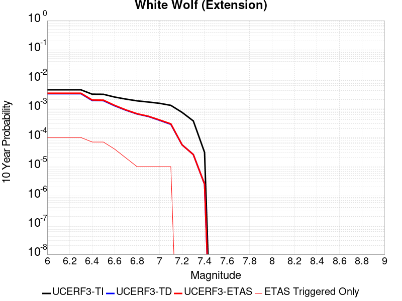 |

| Magnitude | 1 wk TI Prob | 1 wk TD Prob | 1 wk ETAS Prob | 1 wk ETAS/TD Gain | 1 wk ETAS Triggered Only | 1 mo TI Prob | 1 mo TD Prob | 1 mo ETAS Prob | 1 mo ETAS/TD Gain | 1 mo ETAS Triggered Only | 1 yr TI Prob | 1 yr TD Prob | 1 yr ETAS Prob | 1 yr ETAS/TD Gain | 1 yr ETAS Triggered Only | 10 yr TI Prob | 10 yr TD Prob | 10 yr ETAS Prob | 10 yr ETAS/TD Gain | 10 yr ETAS Triggered Only |
|-----|-----|-----|-----|-----|-----|-----|-----|-----|-----|-----|-----|-----|-----|-----|-----|-----|-----|-----|-----|-----|
| 6.0 | 8.222555E-6 | 6.066947E-6 | 3.3741544E-5 | 5.5615363 | 2.7674767E-5 | 3.5239045E-5 | 2.600098E-5 | 5.3675027E-5 | 2.0643463 | 2.7674767E-5 | 4.289509E-4 | 3.1652258E-4 | 3.441886E-4 | 1.0874062 | 2.7674767E-5 | 0.0042812387 | 0.0031613694 | 0.0032441313 | 1.0261791 | 8.30243E-5 |
| 6.1 | 8.222555E-6 | 6.066947E-6 | 3.3741544E-5 | 5.5615363 | 2.7674767E-5 | 3.5239045E-5 | 2.600098E-5 | 5.3675027E-5 | 2.0643463 | 2.7674767E-5 | 4.289509E-4 | 3.1652258E-4 | 3.441886E-4 | 1.0874062 | 2.7674767E-5 | 0.0042812387 | 0.0031613694 | 0.0032441313 | 1.0261791 | 8.30243E-5 |
| 6.2 | 8.222555E-6 | 6.066947E-6 | 3.3741544E-5 | 5.5615363 | 2.7674767E-5 | 3.5239045E-5 | 2.600098E-5 | 5.3675027E-5 | 2.0643463 | 2.7674767E-5 | 4.289509E-4 | 3.1652258E-4 | 3.441886E-4 | 1.0874062 | 2.7674767E-5 | 0.0042812387 | 0.0031613694 | 0.0032441313 | 1.0261791 | 8.30243E-5 |
| 6.3 | 8.222555E-6 | 6.066947E-6 | 3.3741544E-5 | 5.5615363 | 2.7674767E-5 | 3.5239045E-5 | 2.600098E-5 | 5.3675027E-5 | 2.0643463 | 2.7674767E-5 | 4.289509E-4 | 3.1652258E-4 | 3.441886E-4 | 1.0874062 | 2.7674767E-5 | 0.0042812387 | 0.0031613694 | 0.0032441313 | 1.0261791 | 8.30243E-5 |
| 6.4 | 5.821773E-6 | 3.5573523E-6 | 3.5573523E-6 | 1.0 | 0.0 | 2.4950215E-5 | 1.5245713E-5 | 1.5245713E-5 | 1.0 | 0.0 | 3.0372653E-4 | 1.8560184E-4 | 1.8560184E-4 | 1.0 | 0.0 | 0.0030331176 | 0.0018545766 | 0.0019098235 | 1.0297894 | 5.5349534E-5 |
| 6.5 | 5.766023E-6 | 3.4992843E-6 | 3.4992843E-6 | 1.0 | 0.0 | 2.4711293E-5 | 1.4996853E-5 | 1.4996853E-5 | 1.0 | 0.0 | 3.0081844E-4 | 1.8257248E-4 | 1.8257248E-4 | 1.0 | 0.0 | 0.0030041158 | 0.001824333 | 0.0018795816 | 1.0302843 | 5.5349534E-5 |
| 6.6 | 4.643576E-6 | 2.3327552E-6 | 2.3327552E-6 | 1.0 | 0.0 | 1.9900888E-5 | 9.997486E-6 | 9.997486E-6 | 1.0 | 0.0 | 2.4226638E-4 | 1.2171303E-4 | 1.2171303E-4 | 1.0 | 0.0 | 0.0024200242 | 0.0012165061 | 0.0012441472 | 1.0227218 | 2.7674767E-5 |
| 6.7 | 3.9529173E-6 | 1.6484531E-6 | 1.6484531E-6 | 1.0 | 0.0 | 1.6940963E-5 | 7.064781E-6 | 7.064781E-6 | 1.0 | 0.0 | 2.0623671E-4 | 8.60105E-5 | 8.60105E-5 | 1.0 | 0.0 | 0.002060454 | 8.5979066E-4 | 8.874416E-4 | 1.0321602 | 2.7674767E-5 |
| 6.8 | 3.4377522E-6 | 1.2246109E-6 | 1.2246109E-6 | 1.0 | 0.0 | 1.473314E-5 | 5.2483224E-6 | 5.2483224E-6 | 1.0 | 0.0 | 1.7936122E-4 | 6.389654E-5 | 6.389654E-5 | 1.0 | 0.0 | 0.0017921652 | 6.3879084E-4 | 6.664479E-4 | 1.043296 | 2.7674767E-5 |
| 6.9 | 3.1367306E-6 | 1.0034549E-6 | 1.0034549E-6 | 1.0 | 0.0 | 1.3443062E-5 | 4.300515E-6 | 4.300515E-6 | 1.0 | 0.0 | 1.63657E-4 | 5.2357587E-5 | 5.2357587E-5 | 1.0 | 0.0 | 0.0016353652 | 5.2346016E-4 | 5.5112044E-4 | 1.0528412 | 2.7674767E-5 |
| 7.0 | 2.8298145E-6 | 7.42933E-7 | 7.42933E-7 | 1.0 | 0.0 | 1.2127721E-5 | 3.1839952E-6 | 3.1839952E-6 | 1.0 | 0.0 | 1.47645E-4 | 3.87645E-5 | 3.87645E-5 | 1.0 | 0.0 | 0.0014754693 | 3.875824E-4 | 4.1524644E-4 | 1.0713758 | 2.7674767E-5 |
| 7.1 | 2.4091064E-6 | 5.423287E-7 | 5.423287E-7 | 1.0 | 0.0 | 1.03247E-5 | 2.324264E-6 | 2.324264E-6 | 1.0 | 0.0 | 1.2569598E-4 | 2.8297587E-5 | 2.8297587E-5 | 1.0 | 0.0 | 0.001256249 | 2.829439E-4 | 3.106108E-4 | 1.0977824 | 2.7674767E-5 |
| 7.2 | 1.3875518E-6 | 1.07456884E-7 | 1.07456884E-7 | 1.0 | 0.0 | 5.9466374E-6 | 4.6052944E-7 | 4.6052944E-7 | 1.0 | 0.0 | 7.23979E-5 | 5.6069325E-6 | 5.6069325E-6 | 1.0 | 0.0 | 7.2374323E-4 | 5.6068027E-5 | 5.6068027E-5 | 1.0 | 0.0 |
| 7.3 | 7.056077E-7 | 5.003542E-8 | 5.003542E-8 | 1.0 | 0.0 | 3.0240296E-6 | 2.144375E-7 | 2.144375E-7 | 1.0 | 0.0 | 3.681694E-5 | 2.6107741E-6 | 2.6107741E-6 | 1.0 | 0.0 | 3.681084E-4 | 2.610748E-5 | 2.610748E-5 | 1.0 | 0.0 |
| 7.4 | 5.9334678E-8 | 4.869818E-9 | 4.869818E-9 | 1.0 | 0.0 | 2.5429145E-7 | 2.0870647E-8 | 2.0870647E-8 | 1.0 | 0.0 | 3.095994E-6 | 2.5410012E-7 | 2.5410012E-7 | 1.0 | 0.0 | 3.095951E-5 | 2.5409995E-6 | 2.5409995E-6 | 1.0 | 0.0 |

## Ventura-Pitas Point
*[(top)](#table-of-contents)*

| 1 Week | 1 Month | 1 Year | 10 Year |
|-----|-----|-----|-----|
|  |  |  |  |

| Magnitude | 1 wk TI Prob | 1 wk TD Prob | 1 wk ETAS Prob | 1 wk ETAS/TD Gain | 1 wk ETAS Triggered Only | 1 mo TI Prob | 1 mo TD Prob | 1 mo ETAS Prob | 1 mo ETAS/TD Gain | 1 mo ETAS Triggered Only | 1 yr TI Prob | 1 yr TD Prob | 1 yr ETAS Prob | 1 yr ETAS/TD Gain | 1 yr ETAS Triggered Only | 10 yr TI Prob | 10 yr TD Prob | 10 yr ETAS Prob | 10 yr ETAS/TD Gain | 10 yr ETAS Triggered Only |
|-----|-----|-----|-----|-----|-----|-----|-----|-----|-----|-----|-----|-----|-----|-----|-----|-----|-----|-----|-----|-----|
| 6.0 | 3.3179622E-5 | 3.3740926E-5 | 3.3740926E-5 | 1.0 | 0.0 | 1.4219063E-4 | 1.445974E-4 | 1.445974E-4 | 1.0 | 0.0 | 0.0017297962 | 0.0017593087 | 0.0018421869 | 1.0471084 | 8.30243E-5 | 0.017163932 | 0.01747935 | 0.017560925 | 1.0046668 | 8.30243E-5 |
| 6.1 | 3.3179622E-5 | 3.3740926E-5 | 3.3740926E-5 | 1.0 | 0.0 | 1.4219063E-4 | 1.445974E-4 | 1.445974E-4 | 1.0 | 0.0 | 0.0017297962 | 0.0017593087 | 0.0018421869 | 1.0471084 | 8.30243E-5 | 0.017163932 | 0.01747935 | 0.017560925 | 1.0046668 | 8.30243E-5 |
| 6.2 | 3.3179622E-5 | 3.3740926E-5 | 3.3740926E-5 | 1.0 | 0.0 | 1.4219063E-4 | 1.445974E-4 | 1.445974E-4 | 1.0 | 0.0 | 0.0017297962 | 0.0017593087 | 0.0018421869 | 1.0471084 | 8.30243E-5 | 0.017163932 | 0.01747935 | 0.017560925 | 1.0046668 | 8.30243E-5 |
| 6.3 | 3.3179622E-5 | 3.3740926E-5 | 3.3740926E-5 | 1.0 | 0.0 | 1.4219063E-4 | 1.445974E-4 | 1.445974E-4 | 1.0 | 0.0 | 0.0017297962 | 0.0017593087 | 0.0018421869 | 1.0471084 | 8.30243E-5 | 0.017163932 | 0.01747935 | 0.017560925 | 1.0046668 | 8.30243E-5 |
| 6.4 | 1.8754668E-5 | 1.702288E-5 | 1.702288E-5 | 1.0 | 0.0 | 8.037467E-5 | 7.295329E-5 | 7.295329E-5 | 1.0 | 0.0 | 9.781223E-4 | 8.8786747E-4 | 8.8786747E-4 | 1.0 | 0.0 | 0.009738282 | 0.008845539 | 0.008845539 | 1.0 | 0.0 |
| 6.5 | 1.8754668E-5 | 1.702288E-5 | 1.702288E-5 | 1.0 | 0.0 | 8.037467E-5 | 7.295329E-5 | 7.295329E-5 | 1.0 | 0.0 | 9.781223E-4 | 8.8786747E-4 | 8.8786747E-4 | 1.0 | 0.0 | 0.009738282 | 0.008845539 | 0.008845539 | 1.0 | 0.0 |
| 6.6 | 1.4361558E-5 | 1.2125022E-5 | 1.2125022E-5 | 1.0 | 0.0 | 6.154808E-5 | 5.1963358E-5 | 5.1963358E-5 | 1.0 | 0.0 | 7.490902E-4 | 6.324725E-4 | 6.324725E-4 | 1.0 | 0.0 | 0.0074657016 | 0.006306982 | 0.006306982 | 1.0 | 0.0 |
| 6.7 | 1.4361558E-5 | 1.2125022E-5 | 1.2125022E-5 | 1.0 | 0.0 | 6.154808E-5 | 5.1963358E-5 | 5.1963358E-5 | 1.0 | 0.0 | 7.490902E-4 | 6.324725E-4 | 6.324725E-4 | 1.0 | 0.0 | 0.0074657016 | 0.006306982 | 0.006306982 | 1.0 | 0.0 |
| 6.8 | 1.3663846E-5 | 1.1347082E-5 | 1.1347082E-5 | 1.0 | 0.0 | 5.8558027E-5 | 4.8629456E-5 | 4.8629456E-5 | 1.0 | 0.0 | 7.127108E-4 | 5.9190474E-4 | 5.9190474E-4 | 1.0 | 0.0 | 0.007104293 | 0.0059034983 | 0.0059034983 | 1.0 | 0.0 |
| 6.9 | 1.3644157E-5 | 1.1325181E-5 | 1.1325181E-5 | 1.0 | 0.0 | 5.8473648E-5 | 4.8535596E-5 | 4.8535596E-5 | 1.0 | 0.0 | 7.116841E-4 | 5.907626E-4 | 5.907626E-4 | 1.0 | 0.0 | 0.007094092 | 0.0058921375 | 0.0058921375 | 1.0 | 0.0 |
| 7.0 | 1.3568845E-5 | 1.1244737E-5 | 1.1244737E-5 | 1.0 | 0.0 | 5.8150898E-5 | 4.819085E-5 | 4.819085E-5 | 1.0 | 0.0 | 7.077572E-4 | 5.8656756E-4 | 5.8656756E-4 | 1.0 | 0.0 | 0.007055073 | 0.005850409 | 0.005850409 | 1.0 | 0.0 |
| 7.1 | 1.306572E-5 | 1.0723127E-5 | 1.0723127E-5 | 1.0 | 0.0 | 5.599474E-5 | 4.595546E-5 | 4.595546E-5 | 1.0 | 0.0 | 6.815227E-4 | 5.5936596E-4 | 5.5936596E-4 | 1.0 | 0.0 | 0.0067943637 | 0.005579785 | 0.005579785 | 1.0 | 0.0 |
| 7.2 | 1.232604E-5 | 9.997614E-6 | 9.997614E-6 | 1.0 | 0.0 | 5.2824813E-5 | 4.2846223E-5 | 4.2846223E-5 | 1.0 | 0.0 | 6.429523E-4 | 5.215297E-4 | 5.215297E-4 | 1.0 | 0.0 | 0.0064109527 | 0.0052032494 | 0.0052032494 | 1.0 | 0.0 |
| 7.3 | 1.0917261E-5 | 8.844802E-6 | 8.844802E-6 | 1.0 | 0.0 | 4.678742E-5 | 3.7905753E-5 | 3.7905753E-5 | 1.0 | 0.0 | 5.69488E-4 | 4.614064E-4 | 4.614064E-4 | 1.0 | 0.0 | 0.0056803077 | 0.0046046497 | 0.0046046497 | 1.0 | 0.0 |
| 7.4 | 1.039959E-5 | 8.424458E-6 | 8.424458E-6 | 1.0 | 0.0 | 4.456891E-5 | 3.610433E-5 | 3.610433E-5 | 1.0 | 0.0 | 5.424914E-4 | 4.3948312E-4 | 4.3948312E-4 | 1.0 | 0.0 | 0.0054116896 | 0.0043863016 | 0.0043863016 | 1.0 | 0.0 |
| 7.5 | 9.015877E-6 | 7.2982207E-6 | 7.2982207E-6 | 1.0 | 0.0 | 3.86389E-5 | 3.1277723E-5 | 3.1277723E-5 | 1.0 | 0.0 | 4.7032707E-4 | 3.807411E-4 | 3.807411E-4 | 1.0 | 0.0 | 0.004693329 | 0.0038010331 | 0.0038010331 | 1.0 | 0.0 |
| 7.6 | 4.900162E-6 | 3.8743833E-6 | 3.8743833E-6 | 1.0 | 0.0 | 2.1000526E-5 | 1.6604394E-5 | 1.6604394E-5 | 1.0 | 0.0 | 2.556514E-4 | 2.0213988E-4 | 2.0213988E-4 | 1.0 | 0.0 | 0.0025535747 | 0.0020195737 | 0.0020195737 | 1.0 | 0.0 |
| 7.7 | 3.8850626E-6 | 3.1269326E-6 | 3.1269326E-6 | 1.0 | 0.0 | 1.6650163E-5 | 1.3401072E-5 | 1.3401072E-5 | 1.0 | 0.0 | 2.0269687E-4 | 1.6314592E-4 | 1.6314592E-4 | 1.0 | 0.0 | 0.002025121 | 0.0016302709 | 0.0016302709 | 1.0 | 0.0 |
| 7.8 | 2.4654719E-6 | 2.0299967E-6 | 2.0299967E-6 | 1.0 | 0.0 | 1.0566265E-5 | 8.699957E-6 | 8.699957E-6 | 1.0 | 0.0 | 1.2863669E-4 | 1.0591687E-4 | 1.0591687E-4 | 1.0 | 0.0 | 0.0012856225 | 0.0010586686 | 0.0010586686 | 1.0 | 0.0 |
| 7.9 | 4.095894E-7 | 3.2767122E-7 | 3.2767122E-7 | 1.0 | 0.0 | 1.7553821E-6 | 1.4043045E-6 | 1.4043045E-6 | 1.0 | 0.0 | 2.1371567E-5 | 1.7097276E-5 | 1.7097276E-5 | 1.0 | 0.0 | 2.1369511E-4 | 1.7095992E-4 | 1.7095992E-4 | 1.0 | 0.0 |
| 8.0 | 7.791402E-9 | 5.6838902E-9 | 5.6838902E-9 | 1.0 | 0.0 | 3.3391725E-8 | 2.435953E-8 | 2.435953E-8 | 1.0 | 0.0 | 4.0654416E-7 | 2.9657724E-7 | 2.9657724E-7 | 1.0 | 0.0 | 4.065434E-6 | 2.9657706E-6 | 2.9657706E-6 | 1.0 | 0.0 |

## White Mountains
*[(top)](#table-of-contents)*

| 1 Week | 1 Month | 1 Year | 10 Year |
|-----|-----|-----|-----|
|  |  |  |  |

| Magnitude | 1 wk TI Prob | 1 wk TD Prob | 1 wk ETAS Prob | 1 wk ETAS/TD Gain | 1 wk ETAS Triggered Only | 1 mo TI Prob | 1 mo TD Prob | 1 mo ETAS Prob | 1 mo ETAS/TD Gain | 1 mo ETAS Triggered Only | 1 yr TI Prob | 1 yr TD Prob | 1 yr ETAS Prob | 1 yr ETAS/TD Gain | 1 yr ETAS Triggered Only | 10 yr TI Prob | 10 yr TD Prob | 10 yr ETAS Prob | 10 yr ETAS/TD Gain | 10 yr ETAS Triggered Only |
|-----|-----|-----|-----|-----|-----|-----|-----|-----|-----|-----|-----|-----|-----|-----|-----|-----|-----|-----|-----|-----|
| 6.0 | 3.503579E-5 | 3.378682E-5 | 3.378682E-5 | 1.0 | 0.0 | 1.5014476E-4 | 1.4479329E-4 | 1.4479329E-4 | 1.0 | 0.0 | 0.0018264796 | 0.0017615537 | 0.0018168057 | 1.0313655 | 5.5349534E-5 | 0.018115403 | 0.01748824 | 0.017569812 | 1.0046644 | 8.30243E-5 |
| 6.1 | 3.503579E-5 | 3.378682E-5 | 3.378682E-5 | 1.0 | 0.0 | 1.5014476E-4 | 1.4479329E-4 | 1.4479329E-4 | 1.0 | 0.0 | 0.0018264796 | 0.0017615537 | 0.0018168057 | 1.0313655 | 5.5349534E-5 | 0.018115403 | 0.01748824 | 0.017569812 | 1.0046644 | 8.30243E-5 |
| 6.2 | 3.503579E-5 | 3.378682E-5 | 3.378682E-5 | 1.0 | 0.0 | 1.5014476E-4 | 1.4479329E-4 | 1.4479329E-4 | 1.0 | 0.0 | 0.0018264796 | 0.0017615537 | 0.0018168057 | 1.0313655 | 5.5349534E-5 | 0.018115403 | 0.01748824 | 0.017569812 | 1.0046644 | 8.30243E-5 |
| 6.3 | 1.7818425E-5 | 1.5917356E-5 | 1.5917356E-5 | 1.0 | 0.0 | 7.636245E-5 | 6.821554E-5 | 6.821554E-5 | 1.0 | 0.0 | 9.293162E-4 | 8.30222E-4 | 8.5787376E-4 | 1.0333065 | 2.7674767E-5 | 0.009254395 | 0.008272662 | 0.008300108 | 1.0033176 | 2.7674767E-5 |
| 6.4 | 1.7818425E-5 | 1.5917356E-5 | 1.5917356E-5 | 1.0 | 0.0 | 7.636245E-5 | 6.821554E-5 | 6.821554E-5 | 1.0 | 0.0 | 9.293162E-4 | 8.30222E-4 | 8.5787376E-4 | 1.0333065 | 2.7674767E-5 | 0.009254395 | 0.008272662 | 0.008300108 | 1.0033176 | 2.7674767E-5 |
| 6.5 | 1.3397557E-5 | 1.13372025E-5 | 1.13372025E-5 | 1.0 | 0.0 | 5.741684E-5 | 4.8587146E-5 | 4.8587146E-5 | 1.0 | 0.0 | 6.988258E-4 | 5.913949E-4 | 5.913949E-4 | 1.0 | 0.0 | 0.006966323 | 0.0058989166 | 0.0058989166 | 1.0 | 0.0 |
| 6.6 | 1.0818695E-5 | 8.626033E-6 | 8.626033E-6 | 1.0 | 0.0 | 4.6365014E-5 | 3.6968217E-5 | 3.6968217E-5 | 1.0 | 0.0 | 5.6434784E-4 | 4.499994E-4 | 4.499994E-4 | 1.0 | 0.0 | 0.005629168 | 0.0044913185 | 0.0044913185 | 1.0 | 0.0 |
| 6.7 | 9.067908E-6 | 6.802944E-6 | 6.802944E-6 | 1.0 | 0.0 | 3.8861883E-5 | 2.9155166E-5 | 2.9155166E-5 | 1.0 | 0.0 | 4.7304068E-4 | 3.549095E-4 | 3.549095E-4 | 1.0 | 0.0 | 0.00472035 | 0.0035437443 | 0.0035437443 | 1.0 | 0.0 |
| 6.8 | 7.295947E-6 | 4.936747E-6 | 4.936747E-6 | 1.0 | 0.0 | 3.126797E-5 | 2.1157322E-5 | 2.1157322E-5 | 1.0 | 0.0 | 3.8062103E-4 | 2.5756107E-4 | 2.5756107E-4 | 1.0 | 0.0 | 0.0037996976 | 0.0025727386 | 0.0025727386 | 1.0 | 0.0 |
| 6.9 | 6.2243444E-6 | 3.832505E-6 | 3.832505E-6 | 1.0 | 0.0 | 2.6675489E-5 | 1.6424921E-5 | 1.6424921E-5 | 1.0 | 0.0 | 3.2472567E-4 | 1.999556E-4 | 1.999556E-4 | 1.0 | 0.0 | 0.0032425157 | 0.0019978094 | 0.0019978094 | 1.0 | 0.0 |
| 7.0 | 4.9878413E-6 | 2.6797832E-6 | 2.6797832E-6 | 1.0 | 0.0 | 2.1376287E-5 | 1.1484736E-5 | 1.1484736E-5 | 1.0 | 0.0 | 2.602252E-4 | 1.3981794E-4 | 1.3981794E-4 | 1.0 | 0.0 | 0.002599207 | 0.0013973261 | 0.0013973261 | 1.0 | 0.0 |
| 7.1 | 4.0252844E-6 | 1.8859856E-6 | 1.8859856E-6 | 1.0 | 0.0 | 1.7251105E-5 | 8.082771E-6 | 8.082771E-6 | 1.0 | 0.0 | 2.1001195E-4 | 9.840343E-5 | 9.840343E-5 | 1.0 | 0.0 | 0.0020981359 | 9.836113E-4 | 9.836113E-4 | 1.0 | 0.0 |
| 7.2 | 3.3284066E-6 | 1.282176E-6 | 1.282176E-6 | 1.0 | 0.0 | 1.4264522E-5 | 5.4950287E-6 | 5.4950287E-6 | 1.0 | 0.0 | 1.736567E-4 | 6.690003E-5 | 6.690003E-5 | 1.0 | 0.0 | 0.0017352107 | 6.6880893E-4 | 6.6880893E-4 | 1.0 | 0.0 |
| 7.3 | 2.458226E-6 | 6.0591293E-7 | 6.0591293E-7 | 1.0 | 0.0 | 1.0535211E-5 | 2.5967674E-6 | 2.5967674E-6 | 1.0 | 0.0 | 1.2825865E-4 | 3.161522E-5 | 3.161522E-5 | 1.0 | 0.0 | 0.0012818464 | 3.16111E-4 | 3.16111E-4 | 1.0 | 0.0 |
| 7.4 | 1.965953E-6 | 3.110586E-7 | 3.110586E-7 | 1.0 | 0.0 | 8.425486E-6 | 1.3331077E-6 | 1.3331077E-6 | 1.0 | 0.0 | 1.0257547E-4 | 1.6230466E-5 | 1.6230466E-5 | 1.0 | 0.0 | 0.0010252813 | 1.6229294E-4 | 1.6229294E-4 | 1.0 | 0.0 |
| 7.5 | 1.2014192E-6 | 1.8255713E-7 | 1.8255713E-7 | 1.0 | 0.0 | 5.148929E-6 | 7.823875E-7 | 7.823875E-7 | 1.0 | 0.0 | 6.2686406E-5 | 9.525526E-6 | 9.525526E-6 | 1.0 | 0.0 | 6.266873E-4 | 9.5251264E-5 | 9.5251264E-5 | 1.0 | 0.0 |
| 7.6 | 2.5612175E-7 | 4.8976712E-8 | 4.8976712E-8 | 1.0 | 0.0 | 1.0976642E-6 | 2.099002E-7 | 2.099002E-7 | 1.0 | 0.0 | 1.3363979E-5 | 2.555532E-6 | 2.555532E-6 | 1.0 | 0.0 | 1.3363175E-4 | 2.5555064E-5 | 2.5555064E-5 | 1.0 | 0.0 |

## San Andreas (Coachella) rev
*[(top)](#table-of-contents)*

| 1 Week | 1 Month | 1 Year | 10 Year |
|-----|-----|-----|-----|
|  | 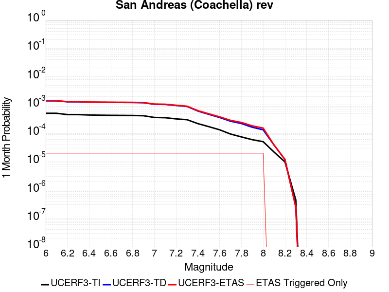 | 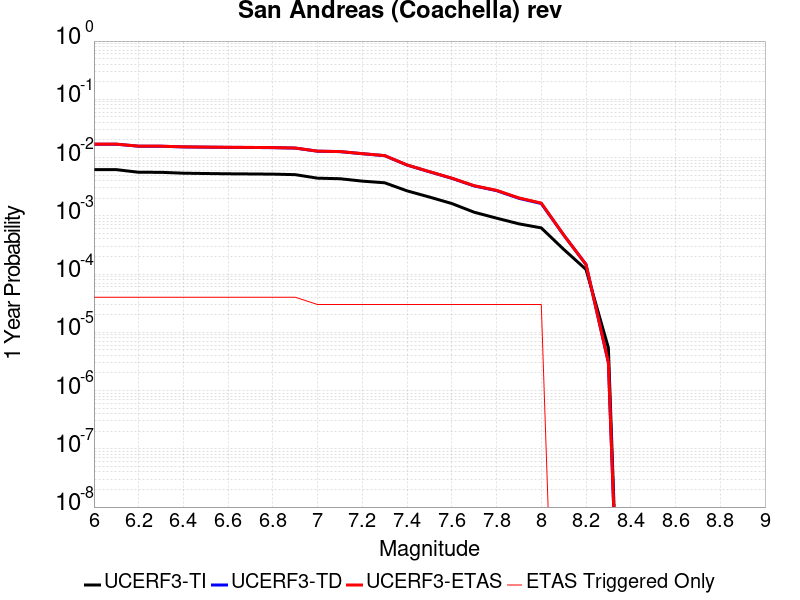 |  |

| Magnitude | 1 wk TI Prob | 1 wk TD Prob | 1 wk ETAS Prob | 1 wk ETAS/TD Gain | 1 wk ETAS Triggered Only | 1 mo TI Prob | 1 mo TD Prob | 1 mo ETAS Prob | 1 mo ETAS/TD Gain | 1 mo ETAS Triggered Only | 1 yr TI Prob | 1 yr TD Prob | 1 yr ETAS Prob | 1 yr ETAS/TD Gain | 1 yr ETAS Triggered Only | 10 yr TI Prob | 10 yr TD Prob | 10 yr ETAS Prob | 10 yr ETAS/TD Gain | 10 yr ETAS Triggered Only |
|-----|-----|-----|-----|-----|-----|-----|-----|-----|-----|-----|-----|-----|-----|-----|-----|-----|-----|-----|-----|-----|
| 6.0 | 1.1925945E-4 | 3.276026E-4 | 3.276026E-4 | 1.0 | 0.0 | 5.110118E-4 | 0.0014032605 | 0.0014308963 | 1.0196941 | 2.7674767E-5 | 0.0062038354 | 0.0169522 | 0.017006611 | 1.0032097 | 5.5349534E-5 | 0.060334753 | 0.15277351 | 0.15284386 | 1.0004604 | 8.30243E-5 |
| 6.1 | 1.1925945E-4 | 3.276026E-4 | 3.276026E-4 | 1.0 | 0.0 | 5.110118E-4 | 0.0014032605 | 0.0014308963 | 1.0196941 | 2.7674767E-5 | 0.0062038354 | 0.0169522 | 0.017006611 | 1.0032097 | 5.5349534E-5 | 0.060334753 | 0.15277351 | 0.15284386 | 1.0004604 | 8.30243E-5 |
| 6.2 | 1.07432395E-4 | 3.0260795E-4 | 3.0260795E-4 | 1.0 | 0.0 | 4.603433E-4 | 0.0012962506 | 0.0013238895 | 1.0213221 | 2.7674767E-5 | 0.005590286 | 0.015668752 | 0.015723232 | 1.0034771 | 5.5349534E-5 | 0.05451731 | 0.14194496 | 0.1420162 | 1.0005019 | 8.30243E-5 |
| 6.3 | 1.0718766E-4 | 3.0206097E-4 | 3.0206097E-4 | 1.0 | 0.0 | 4.592948E-4 | 0.0012939088 | 0.0013215478 | 1.0213609 | 2.7674767E-5 | 0.005577586 | 0.01564065 | 0.015695132 | 1.0034835 | 5.5349534E-5 | 0.054396555 | 0.14171325 | 0.1417845 | 1.0005028 | 8.30243E-5 |
| 6.4 | 1.0355944E-4 | 2.9414144E-4 | 2.9414144E-4 | 1.0 | 0.0 | 4.4375064E-4 | 0.0012600011 | 0.001287641 | 1.0219364 | 2.7674767E-5 | 0.0053892885 | 0.015233666 | 0.015288172 | 1.0035781 | 5.5349534E-5 | 0.052604496 | 0.13827357 | 0.1383451 | 1.0005174 | 8.30243E-5 |
| 6.5 | 1.0227914E-4 | 2.9133563E-4 | 2.9133563E-4 | 1.0 | 0.0 | 4.382655E-4 | 0.0012479877 | 0.001275628 | 1.0221479 | 2.7674767E-5 | 0.0053228354 | 0.015089439 | 0.015143953 | 1.0036128 | 5.5349534E-5 | 0.051971316 | 0.13705285 | 0.1371245 | 1.0005227 | 8.30243E-5 |
| 6.6 | 1.0116757E-4 | 2.8899297E-4 | 2.8899297E-4 | 1.0 | 0.0 | 4.3350324E-4 | 0.0012379574 | 0.0012655979 | 1.0223275 | 2.7674767E-5 | 0.0052651367 | 0.014969003 | 0.015023525 | 1.0036422 | 5.5349534E-5 | 0.051421247 | 0.1360311 | 0.13610284 | 1.0005273 | 8.30243E-5 |
| 6.7 | 1.0050676E-4 | 2.8757853E-4 | 2.8757853E-4 | 1.0 | 0.0 | 4.3067214E-4 | 0.0012319012 | 0.0012595418 | 1.0224375 | 2.7674767E-5 | 0.005230834 | 0.01489628 | 0.014950804 | 1.0036603 | 5.5349534E-5 | 0.051094085 | 0.13541588 | 0.13548766 | 1.0005301 | 8.30243E-5 |
| 6.8 | 9.976819E-5 | 2.8561472E-4 | 2.8561472E-4 | 1.0 | 0.0 | 4.2750788E-4 | 0.0012234928 | 0.0012511337 | 1.0225918 | 2.7674767E-5 | 0.0051924936 | 0.014795303 | 0.014849834 | 1.0036857 | 5.5349534E-5 | 0.050728295 | 0.13456754 | 0.1346394 | 1.0005339 | 8.30243E-5 |
| 6.9 | 9.77719E-5 | 2.805817E-4 | 2.805817E-4 | 1.0 | 0.0 | 4.1895514E-4 | 0.0012019428 | 0.0012295843 | 1.0229974 | 2.7674767E-5 | 0.0050888555 | 0.014536463 | 0.0145910075 | 1.0037522 | 5.5349534E-5 | 0.049738888 | 0.13239557 | 0.1324676 | 1.0005441 | 8.30243E-5 |
| 7.0 | 8.500761E-5 | 2.4791094E-4 | 2.4791094E-4 | 1.0 | 0.0 | 3.6426744E-4 | 0.001062046 | 0.0010896914 | 1.0260303 | 2.7674767E-5 | 0.0044259406 | 0.012854526 | 0.012881845 | 1.0021253 | 2.7674767E-5 | 0.04338823 | 0.11824919 | 0.118297994 | 1.0004127 | 5.5349534E-5 |
| 7.1 | 8.319876E-5 | 2.439351E-4 | 2.439351E-4 | 1.0 | 0.0 | 3.5651738E-4 | 0.0010450205 | 0.0010726664 | 1.0264548 | 2.7674767E-5 | 0.004331963 | 0.012649666 | 0.012676991 | 1.0021601 | 2.7674767E-5 | 0.042484846 | 0.116468385 | 0.11651728 | 1.0004199 | 5.5349534E-5 |
| 7.2 | 7.563917E-5 | 2.244109E-4 | 2.244109E-4 | 1.0 | 0.0 | 3.2412758E-4 | 9.614096E-4 | 9.890577E-4 | 1.0287579 | 2.7674767E-5 | 0.0039391145 | 0.011643032 | 0.011670385 | 1.0023493 | 2.7674767E-5 | 0.03870018 | 0.10787237 | 0.10792175 | 1.0004578 | 5.5349534E-5 |
| 7.3 | 7.082985E-5 | 2.0756187E-4 | 2.0756187E-4 | 1.0 | 0.0 | 3.0352117E-4 | 8.892505E-4 | 9.169007E-4 | 1.0310937 | 2.7674767E-5 | 0.0036891096 | 0.010773506 | 0.010800883 | 1.0025411 | 2.7674767E-5 | 0.03628465 | 0.100391835 | 0.100441635 | 1.000496 | 5.5349534E-5 |
| 7.4 | 5.146215E-5 | 1.4295257E-4 | 1.4295257E-4 | 1.0 | 0.0 | 2.2053342E-4 | 6.1251095E-4 | 6.401687E-4 | 1.0451548 | 2.7674767E-5 | 0.0026816884 | 0.0074320114 | 0.0074594803 | 1.0036961 | 2.7674767E-5 | 0.02649557 | 0.070943184 | 0.07099461 | 1.0007248 | 5.5349534E-5 |
| 7.5 | 4.0285166E-5 | 1.0960223E-4 | 1.0960223E-4 | 1.0 | 0.0 | 1.7263928E-4 | 4.696396E-4 | 4.973014E-4 | 1.0589 | 2.7674767E-5 | 0.002099857 | 0.005702941 | 0.005730458 | 1.004825 | 2.7674767E-5 | 0.020801254 | 0.055094037 | 0.055146337 | 1.0009493 | 5.5349534E-5 |
| 7.6 | 3.1168736E-5 | 8.455466E-5 | 8.455466E-5 | 1.0 | 0.0 | 1.3357346E-4 | 3.6232691E-4 | 3.8999165E-4 | 1.076353 | 2.7674767E-5 | 0.0016250437 | 0.004402434 | 0.0044299867 | 1.0062586 | 2.7674767E-5 | 0.016132116 | 0.042884674 | 0.04293765 | 1.0012354 | 5.5349534E-5 |
| 7.7 | 2.2100989E-5 | 6.253315E-5 | 6.253315E-5 | 1.0 | 0.0 | 9.4715084E-5 | 2.679717E-4 | 2.9563907E-4 | 1.1032473 | 2.7674767E-5 | 0.001152546 | 0.0032576811 | 0.0032852658 | 1.0084676 | 2.7674767E-5 | 0.011465867 | 0.031966314 | 0.03201989 | 1.0016762 | 5.5349534E-5 |
| 7.8 | 1.7484861E-5 | 5.192554E-5 | 5.192554E-5 | 1.0 | 0.0 | 7.493296E-5 | 2.2251907E-4 | 2.5018767E-4 | 1.1243427 | 2.7674767E-5 | 9.1192697E-4 | 0.0027058069 | 0.0027334066 | 1.0102003 | 2.7674767E-5 | 0.009081938 | 0.026699238 | 0.02675311 | 1.0020177 | 5.5349534E-5 |
| 7.9 | 1.3967285E-5 | 3.8328933E-5 | 3.8328933E-5 | 1.0 | 0.0 | 5.985842E-5 | 1.6425652E-4 | 1.9192674E-4 | 1.1684574 | 2.7674767E-5 | 7.2853256E-4 | 0.00199799 | 0.0020256096 | 1.0138236 | 2.7674767E-5 | 0.0072614877 | 0.019958619 | 0.020012863 | 1.0027179 | 5.5349534E-5 |
| 8.0 | 1.1887396E-5 | 3.1156596E-5 | 3.1156596E-5 | 1.0 | 0.0 | 5.094499E-5 | 1.3352145E-4 | 1.6119251E-4 | 1.2072407 | 2.7674767E-5 | 6.200787E-4 | 0.0016244124 | 0.0016520423 | 1.0170091 | 2.7674767E-5 | 0.006183513 | 0.016321857 | 0.016376302 | 1.0033358 | 5.5349534E-5 |
| 8.1 | 5.100864E-6 | 9.010413E-6 | 9.010413E-6 | 1.0 | 0.0 | 2.1860664E-5 | 3.8615486E-5 | 3.8615486E-5 | 1.0 | 0.0 | 2.6612106E-4 | 4.7004226E-4 | 4.7004226E-4 | 1.0 | 0.0 | 0.002658026 | 0.0049361736 | 0.0049361736 | 1.0 | 0.0 |
| 8.2 | 2.3004484E-6 | 2.8013471E-6 | 2.8013471E-6 | 1.0 | 0.0 | 9.859027E-6 | 1.2005718E-5 | 1.2005718E-5 | 1.0 | 0.0 | 1.2002704E-4 | 1.4615984E-4 | 1.4615984E-4 | 1.0 | 0.0 | 0.0011996223 | 0.0016050831 | 0.0016050831 | 1.0 | 0.0 |
| 8.3 | 1.0424446E-7 | 5.856872E-8 | 5.856872E-8 | 1.0 | 0.0 | 4.4676187E-7 | 2.5100877E-7 | 2.5100877E-7 | 1.0 | 0.0 | 5.439312E-6 | 3.0560277E-6 | 3.0560277E-6 | 1.0 | 0.0 | 5.4391792E-5 | 3.212467E-5 | 3.212467E-5 | 1.0 | 0.0 |

## Calico-Hidalgo
*[(top)](#table-of-contents)*

| 1 Week | 1 Month | 1 Year | 10 Year |
|-----|-----|-----|-----|
| 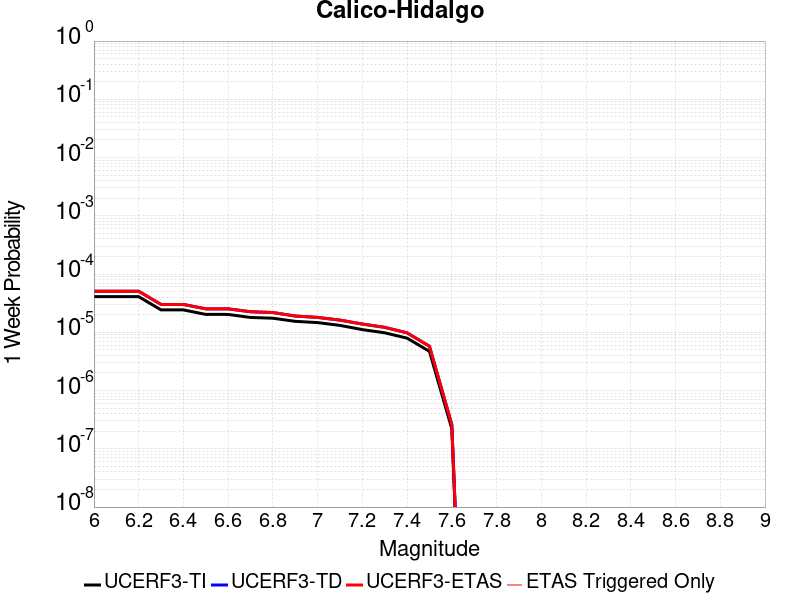 |  |  |  |

| Magnitude | 1 wk TI Prob | 1 wk TD Prob | 1 wk ETAS Prob | 1 wk ETAS/TD Gain | 1 wk ETAS Triggered Only | 1 mo TI Prob | 1 mo TD Prob | 1 mo ETAS Prob | 1 mo ETAS/TD Gain | 1 mo ETAS Triggered Only | 1 yr TI Prob | 1 yr TD Prob | 1 yr ETAS Prob | 1 yr ETAS/TD Gain | 1 yr ETAS Triggered Only | 10 yr TI Prob | 10 yr TD Prob | 10 yr ETAS Prob | 10 yr ETAS/TD Gain | 10 yr ETAS Triggered Only |
|-----|-----|-----|-----|-----|-----|-----|-----|-----|-----|-----|-----|-----|-----|-----|-----|-----|-----|-----|-----|-----|
| 6.0 | 4.0906612E-5 | 5.071044E-5 | 5.071044E-5 | 1.0 | 0.0 | 1.7530227E-4 | 2.1731463E-4 | 2.1731463E-4 | 1.0 | 0.0 | 0.0021322158 | 0.0026429992 | 0.0026706008 | 1.0104433 | 2.7674767E-5 | 0.02111873 | 0.026156036 | 0.026236888 | 1.0030912 | 8.30243E-5 |
| 6.1 | 4.0906612E-5 | 5.071044E-5 | 5.071044E-5 | 1.0 | 0.0 | 1.7530227E-4 | 2.1731463E-4 | 2.1731463E-4 | 1.0 | 0.0 | 0.0021322158 | 0.0026429992 | 0.0026706008 | 1.0104433 | 2.7674767E-5 | 0.02111873 | 0.026156036 | 0.026236888 | 1.0030912 | 8.30243E-5 |
| 6.2 | 4.0906612E-5 | 5.071044E-5 | 5.071044E-5 | 1.0 | 0.0 | 1.7530227E-4 | 2.1731463E-4 | 2.1731463E-4 | 1.0 | 0.0 | 0.0021322158 | 0.0026429992 | 0.0026706008 | 1.0104433 | 2.7674767E-5 | 0.02111873 | 0.026156036 | 0.026236888 | 1.0030912 | 8.30243E-5 |
| 6.3 | 2.4242801E-5 | 3.0093212E-5 | 3.0093212E-5 | 1.0 | 0.0 | 1.0389358E-4 | 1.2896472E-4 | 1.2896472E-4 | 1.0 | 0.0 | 0.0012641704 | 0.0015690471 | 0.0015690471 | 1.0 | 0.0 | 0.01257003 | 0.015583365 | 0.015610609 | 1.0017482 | 2.7674767E-5 |
| 6.4 | 2.4242801E-5 | 3.0093212E-5 | 3.0093212E-5 | 1.0 | 0.0 | 1.0389358E-4 | 1.2896472E-4 | 1.2896472E-4 | 1.0 | 0.0 | 0.0012641704 | 0.0015690471 | 0.0015690471 | 1.0 | 0.0 | 0.01257003 | 0.015583365 | 0.015610609 | 1.0017482 | 2.7674767E-5 |
| 6.5 | 2.0286952E-5 | 2.531747E-5 | 2.531747E-5 | 1.0 | 0.0 | 8.694118E-5 | 1.0849902E-4 | 1.0849902E-4 | 1.0 | 0.0 | 0.0010579949 | 0.0013201922 | 0.0013201922 | 1.0 | 0.0 | 0.010529719 | 0.013125429 | 0.013152741 | 1.0020808 | 2.7674767E-5 |
| 6.6 | 2.0269223E-5 | 2.5298417E-5 | 2.5298417E-5 | 1.0 | 0.0 | 8.6865206E-5 | 1.0841738E-4 | 1.0841738E-4 | 1.0 | 0.0 | 0.0010570707 | 0.0013191995 | 0.0013191995 | 1.0 | 0.0 | 0.010520565 | 0.013115618 | 0.01314293 | 1.0020823 | 2.7674767E-5 |
| 6.7 | 1.799852E-5 | 2.2542E-5 | 2.2542E-5 | 1.0 | 0.0 | 7.713423E-5 | 9.660509E-5 | 9.660509E-5 | 1.0 | 0.0 | 9.3870464E-4 | 0.0011755469 | 0.0011755469 | 1.0 | 0.0 | 0.009347493 | 0.011694896 | 0.011722247 | 1.0023388 | 2.7674767E-5 |
| 6.8 | 1.7458793E-5 | 2.184347E-5 | 2.184347E-5 | 1.0 | 0.0 | 7.4821255E-5 | 9.36116E-5 | 9.36116E-5 | 1.0 | 0.0 | 9.10568E-4 | 0.0011391398 | 0.0011391398 | 1.0 | 0.0 | 0.009068459 | 0.011334591 | 0.011361952 | 1.002414 | 2.7674767E-5 |
| 6.9 | 1.542884E-5 | 1.9027046E-5 | 1.9027046E-5 | 1.0 | 0.0 | 6.612192E-5 | 8.1542006E-5 | 8.1542006E-5 | 1.0 | 0.0 | 8.04737E-4 | 9.923349E-4 | 9.923349E-4 | 1.0 | 0.0 | 0.008018291 | 0.009880436 | 0.009907837 | 1.0027733 | 2.7674767E-5 |
| 7.0 | 1.468253E-5 | 1.8031635E-5 | 1.8031635E-5 | 1.0 | 0.0 | 6.292361E-5 | 7.727622E-5 | 7.727622E-5 | 1.0 | 0.0 | 7.658257E-4 | 9.404449E-4 | 9.404449E-4 | 1.0 | 0.0 | 0.0076319184 | 0.009366017 | 0.009393432 | 1.0029272 | 2.7674767E-5 |
| 7.1 | 1.3139281E-5 | 1.6201831E-5 | 1.6201831E-5 | 1.0 | 0.0 | 5.6309986E-5 | 6.943464E-5 | 6.943464E-5 | 1.0 | 0.0 | 6.853584E-4 | 8.450514E-4 | 8.450514E-4 | 1.0 | 0.0 | 0.0068324856 | 0.008419678 | 0.00844712 | 1.0032592 | 2.7674767E-5 |
| 7.2 | 1.1127404E-5 | 1.3867336E-5 | 1.3867336E-5 | 1.0 | 0.0 | 4.7688E-5 | 5.9430145E-5 | 5.9430145E-5 | 1.0 | 0.0 | 5.8044674E-4 | 7.233327E-4 | 7.233327E-4 | 1.0 | 0.0 | 0.0057893298 | 0.007210891 | 0.007238366 | 1.0038103 | 2.7674767E-5 |
| 7.3 | 9.808154E-6 | 1.2176818E-5 | 1.2176818E-5 | 1.0 | 0.0 | 4.2034266E-5 | 5.218538E-5 | 5.218538E-5 | 1.0 | 0.0 | 5.11647E-4 | 6.351825E-4 | 6.351825E-4 | 1.0 | 0.0 | 0.0051047057 | 0.006334746 | 0.0063622454 | 1.004341 | 2.7674767E-5 |
| 7.4 | 7.942452E-6 | 9.792593E-6 | 9.792593E-6 | 1.0 | 0.0 | 3.4038632E-5 | 4.1967636E-5 | 4.1967636E-5 | 1.0 | 0.0 | 4.1434157E-4 | 5.108456E-4 | 5.108456E-4 | 1.0 | 0.0 | 0.0041356985 | 0.0050976546 | 0.0051251883 | 1.0054013 | 2.7674767E-5 |
| 7.5 | 4.7121216E-6 | 5.7730804E-6 | 5.7730804E-6 | 1.0 | 0.0 | 2.019465E-5 | 2.4741581E-5 | 2.4741581E-5 | 1.0 | 0.0 | 2.4584212E-4 | 3.0119478E-4 | 3.0119478E-4 | 1.0 | 0.0 | 0.0024557032 | 0.003008618 | 0.0030362096 | 1.0091708 | 2.7674767E-5 |
| 7.6 | 2.21172E-7 | 2.6040513E-7 | 2.6040513E-7 | 1.0 | 0.0 | 9.478797E-7 | 1.1160216E-6 | 1.1160216E-6 | 1.0 | 0.0 | 1.1540374E-5 | 1.3587508E-5 | 1.3587508E-5 | 1.0 | 0.0 | 1.1539775E-4 | 1.3586959E-4 | 1.3586959E-4 | 1.0 | 0.0 |

## San Andreas (North Branch Mill Creek)
*[(top)](#table-of-contents)*

| 1 Week | 1 Month | 1 Year | 10 Year |
|-----|-----|-----|-----|
|  |  |  |  |

| Magnitude | 1 wk TI Prob | 1 wk TD Prob | 1 wk ETAS Prob | 1 wk ETAS/TD Gain | 1 wk ETAS Triggered Only | 1 mo TI Prob | 1 mo TD Prob | 1 mo ETAS Prob | 1 mo ETAS/TD Gain | 1 mo ETAS Triggered Only | 1 yr TI Prob | 1 yr TD Prob | 1 yr ETAS Prob | 1 yr ETAS/TD Gain | 1 yr ETAS Triggered Only | 10 yr TI Prob | 10 yr TD Prob | 10 yr ETAS Prob | 10 yr ETAS/TD Gain | 10 yr ETAS Triggered Only |
|-----|-----|-----|-----|-----|-----|-----|-----|-----|-----|-----|-----|-----|-----|-----|-----|-----|-----|-----|-----|-----|
| 6.0 | 1.3461156E-5 | 2.3548055E-5 | 2.3548055E-5 | 1.0 | 0.0 | 5.7689394E-5 | 1.00916346E-4 | 1.2858832E-4 | 1.274207 | 2.7674767E-5 | 7.02142E-4 | 0.0012279673 | 0.0012556082 | 1.0225093 | 2.7674767E-5 | 0.0069992766 | 0.012254227 | 0.012336234 | 1.0066922 | 8.30243E-5 |
| 6.1 | 1.3461156E-5 | 2.3548055E-5 | 2.3548055E-5 | 1.0 | 0.0 | 5.7689394E-5 | 1.00916346E-4 | 1.2858832E-4 | 1.274207 | 2.7674767E-5 | 7.02142E-4 | 0.0012279673 | 0.0012556082 | 1.0225093 | 2.7674767E-5 | 0.0069992766 | 0.012254227 | 0.012336234 | 1.0066922 | 8.30243E-5 |
| 6.2 | 1.3461156E-5 | 2.3548055E-5 | 2.3548055E-5 | 1.0 | 0.0 | 5.7689394E-5 | 1.00916346E-4 | 1.2858832E-4 | 1.274207 | 2.7674767E-5 | 7.02142E-4 | 0.0012279673 | 0.0012556082 | 1.0225093 | 2.7674767E-5 | 0.0069992766 | 0.012254227 | 0.012336234 | 1.0066922 | 8.30243E-5 |
| 6.3 | 1.3461156E-5 | 2.3548055E-5 | 2.3548055E-5 | 1.0 | 0.0 | 5.7689394E-5 | 1.00916346E-4 | 1.2858832E-4 | 1.274207 | 2.7674767E-5 | 7.02142E-4 | 0.0012279673 | 0.0012556082 | 1.0225093 | 2.7674767E-5 | 0.0069992766 | 0.012254227 | 0.012336234 | 1.0066922 | 8.30243E-5 |
| 6.4 | 1.3461156E-5 | 2.3548055E-5 | 2.3548055E-5 | 1.0 | 0.0 | 5.7689394E-5 | 1.00916346E-4 | 1.2858832E-4 | 1.274207 | 2.7674767E-5 | 7.02142E-4 | 0.0012279673 | 0.0012556082 | 1.0225093 | 2.7674767E-5 | 0.0069992766 | 0.012254227 | 0.012336234 | 1.0066922 | 8.30243E-5 |
| 6.5 | 1.3450706E-5 | 2.3537013E-5 | 2.3537013E-5 | 1.0 | 0.0 | 5.764461E-5 | 1.0086904E-4 | 1.2854101E-4 | 1.2743356 | 2.7674767E-5 | 7.0159714E-4 | 0.001227392 | 0.0012550327 | 1.02252 | 2.7674767E-5 | 0.006993862 | 0.012248537 | 0.012330544 | 1.0066953 | 8.30243E-5 |
| 6.6 | 1.3074523E-5 | 2.3151279E-5 | 2.3151279E-5 | 1.0 | 0.0 | 5.6032466E-5 | 9.921601E-5 | 1.2688803E-4 | 1.2789068 | 2.7674767E-5 | 6.8198174E-4 | 0.0012072888 | 0.0012349302 | 1.0228953 | 2.7674767E-5 | 0.006798926 | 0.012049697 | 0.012131722 | 1.0068071 | 8.30243E-5 |
| 6.7 | 1.3050216E-5 | 2.3126573E-5 | 2.3126573E-5 | 1.0 | 0.0 | 5.59283E-5 | 9.911013E-5 | 1.2678216E-4 | 1.2792047 | 2.7674767E-5 | 6.8071426E-4 | 0.0012060012 | 0.0012336426 | 1.0229199 | 2.7674767E-5 | 0.0067863287 | 0.012036961 | 0.012118986 | 1.0068145 | 8.30243E-5 |
| 6.8 | 1.29049395E-5 | 2.2974971E-5 | 2.2974971E-5 | 1.0 | 0.0 | 5.530571E-5 | 9.846047E-5 | 1.2613251E-4 | 1.2810472 | 2.7674767E-5 | 6.73139E-4 | 0.0011981002 | 0.0012257418 | 1.0230712 | 2.7674767E-5 | 0.0067110364 | 0.011958803 | 0.012040834 | 1.0068595 | 8.30243E-5 |
| 6.9 | 1.2867369E-5 | 2.2934368E-5 | 2.2934368E-5 | 1.0 | 0.0 | 5.51447E-5 | 9.8286466E-5 | 1.2595851E-4 | 1.2815448 | 2.7674767E-5 | 6.711799E-4 | 0.001195984 | 0.0012236257 | 1.023112 | 2.7674767E-5 | 0.006691564 | 0.011937869 | 0.0120199025 | 1.0068717 | 8.30243E-5 |
| 7.0 | 1.2495996E-5 | 2.2334114E-5 | 2.2334114E-5 | 1.0 | 0.0 | 5.3553173E-5 | 9.571414E-5 | 1.2338626E-4 | 1.2891121 | 2.7674767E-5 | 6.518148E-4 | 0.0011646996 | 0.001192342 | 1.0237336 | 2.7674767E-5 | 0.0064990623 | 0.011628309 | 0.011710368 | 1.0070568 | 8.30243E-5 |
| 7.1 | 1.2452067E-5 | 2.2279173E-5 | 2.2279173E-5 | 1.0 | 0.0 | 5.3364907E-5 | 9.547869E-5 | 1.2315082E-4 | 1.2898251 | 2.7674767E-5 | 6.4952404E-4 | 0.001161836 | 0.0011894787 | 1.0237921 | 2.7674767E-5 | 0.0064762887 | 0.011599974 | 0.0116820345 | 1.0070742 | 8.30243E-5 |
| 7.2 | 1.2002777E-5 | 2.165748E-5 | 2.165748E-5 | 1.0 | 0.0 | 5.143946E-5 | 9.281449E-5 | 1.20486686E-4 | 1.2981453 | 2.7674767E-5 | 6.2609545E-4 | 0.0011294333 | 0.0011570768 | 1.0244756 | 2.7674767E-5 | 0.006243344 | 0.011279272 | 0.01136136 | 1.0072777 | 8.30243E-5 |
| 7.3 | 1.1923425E-5 | 2.1527258E-5 | 2.1527258E-5 | 1.0 | 0.0 | 5.109939E-5 | 9.225643E-5 | 1.1992864E-4 | 1.2999489 | 2.7674767E-5 | 6.219575E-4 | 0.0011226459 | 0.0011502897 | 1.0246238 | 2.7674767E-5 | 0.0062021962 | 0.011212112 | 0.011294207 | 1.0073218 | 8.30243E-5 |
| 7.4 | 1.16105175E-5 | 2.0900772E-5 | 2.0900772E-5 | 1.0 | 0.0 | 4.975841E-5 | 8.957168E-5 | 1.17243966E-4 | 1.3089402 | 2.7674767E-5 | 6.0564023E-4 | 0.0010899922 | 0.0011176368 | 1.0253623 | 2.7674767E-5 | 0.006039923 | 0.010889493 | 0.010971612 | 1.0075412 | 8.30243E-5 |
| 7.5 | 1.1037265E-5 | 1.9599263E-5 | 1.9599263E-5 | 1.0 | 0.0 | 4.7301706E-5 | 8.399415E-5 | 1.1166659E-4 | 1.3294568 | 2.7674767E-5 | 5.757461E-4 | 0.0010221512 | 0.0010497976 | 1.0270474 | 2.7674767E-5 | 0.005742567 | 0.0102181705 | 0.010300347 | 1.0080421 | 8.30243E-5 |
| 7.6 | 1.0720915E-5 | 1.9040608E-5 | 1.9040608E-5 | 1.0 | 0.0 | 4.5945973E-5 | 8.160007E-5 | 1.0927257E-4 | 1.3391236 | 2.7674767E-5 | 5.592486E-4 | 9.930301E-4 | 0.0010206775 | 1.0278413 | 2.7674767E-5 | 0.005578433 | 0.009929609 | 0.010011809 | 1.0082783 | 8.30243E-5 |
| 7.7 | 9.276279E-6 | 1.64843E-5 | 1.64843E-5 | 1.0 | 0.0 | 3.9754876E-5 | 7.0645096E-5 | 9.831791E-5 | 1.3917159 | 2.7674767E-5 | 4.839081E-4 | 8.597663E-4 | 8.874173E-4 | 1.032161 | 2.7674767E-5 | 0.0048285574 | 0.008607952 | 0.008690262 | 1.009562 | 8.30243E-5 |
| 7.8 | 5.8346777E-6 | 1.118965E-5 | 1.118965E-5 | 1.0 | 0.0 | 2.5005522E-5 | 4.795476E-5 | 7.56282E-5 | 1.5770738 | 2.7674767E-5 | 3.043997E-4 | 5.836929E-4 | 6.1135157E-4 | 1.0473856 | 2.7674767E-5 | 0.0030398308 | 0.0058647413 | 0.005947279 | 1.0140735 | 8.30243E-5 |
| 7.9 | 4.690204E-6 | 8.53796E-6 | 8.53796E-6 | 1.0 | 0.0 | 2.0100719E-5 | 3.659074E-5 | 6.4264495E-5 | 1.7563049 | 2.7674767E-5 | 2.4469878E-4 | 4.454013E-4 | 4.7306376E-4 | 1.0621067 | 2.7674767E-5 | 0.002444295 | 0.004485608 | 0.0045407093 | 1.012284 | 5.5349534E-5 |
| 8.0 | 2.9570454E-6 | 4.86459E-6 | 4.86459E-6 | 1.0 | 0.0 | 1.267299E-5 | 2.0848078E-5 | 4.8522266E-5 | 2.3274217 | 2.7674767E-5 | 1.5428272E-4 | 2.537958E-4 | 2.8146355E-4 | 1.1090157 | 2.7674767E-5 | 0.0015417566 | 0.0025588202 | 0.0025864241 | 1.0107877 | 2.7674767E-5 |
| 8.1 | 1.6376824E-6 | 2.2061524E-6 | 2.2061524E-6 | 1.0 | 0.0 | 7.01862E-6 | 9.454904E-6 | 9.454904E-6 | 1.0 | 0.0 | 8.544835E-5 | 1.15107396E-4 | 1.15107396E-4 | 1.0 | 0.0 | 8.54155E-4 | 0.0011655022 | 0.0011655022 | 1.0 | 0.0 |
| 8.2 | 6.9631557E-7 | 4.564967E-7 | 4.564967E-7 | 1.0 | 0.0 | 2.984206E-6 | 1.956413E-6 | 1.956413E-6 | 1.0 | 0.0 | 3.63321E-5 | 2.3819068E-5 | 2.3819068E-5 | 1.0 | 0.0 | 3.6326164E-4 | 2.466932E-4 | 2.466932E-4 | 1.0 | 0.0 |
| 8.3 | 1.7876137E-7 | 8.4190965E-8 | 8.4190965E-8 | 1.0 | 0.0 | 7.661199E-7 | 3.6081838E-7 | 3.6081838E-7 | 1.0 | 0.0 | 9.32747E-6 | 4.3929554E-6 | 4.3929554E-6 | 1.0 | 0.0 | 9.3270784E-5 | 4.6131998E-5 | 4.6131998E-5 | 1.0 | 0.0 |

## Cady
*[(top)](#table-of-contents)*

| 1 Week | 1 Month | 1 Year | 10 Year |
|-----|-----|-----|-----|
|  |  |  | 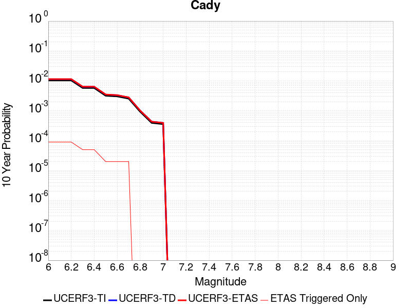 |

| Magnitude | 1 wk TI Prob | 1 wk TD Prob | 1 wk ETAS Prob | 1 wk ETAS/TD Gain | 1 wk ETAS Triggered Only | 1 mo TI Prob | 1 mo TD Prob | 1 mo ETAS Prob | 1 mo ETAS/TD Gain | 1 mo ETAS Triggered Only | 1 yr TI Prob | 1 yr TD Prob | 1 yr ETAS Prob | 1 yr ETAS/TD Gain | 1 yr ETAS Triggered Only | 10 yr TI Prob | 10 yr TD Prob | 10 yr ETAS Prob | 10 yr ETAS/TD Gain | 10 yr ETAS Triggered Only |
|-----|-----|-----|-----|-----|-----|-----|-----|-----|-----|-----|-----|-----|-----|-----|-----|-----|-----|-----|-----|-----|
| 6.0 | 1.9892565E-5 | 2.1860737E-5 | 2.1860737E-5 | 1.0 | 0.0 | 8.525106E-5 | 9.3686016E-5 | 9.3686016E-5 | 1.0 | 0.0 | 0.0010374374 | 0.0011401214 | 0.0011401214 | 1.0 | 0.0 | 0.010326075 | 0.011351738 | 0.011433819 | 1.0072308 | 8.30243E-5 |
| 6.1 | 1.9892565E-5 | 2.1860737E-5 | 2.1860737E-5 | 1.0 | 0.0 | 8.525106E-5 | 9.3686016E-5 | 9.3686016E-5 | 1.0 | 0.0 | 0.0010374374 | 0.0011401214 | 0.0011401214 | 1.0 | 0.0 | 0.010326075 | 0.011351738 | 0.011433819 | 1.0072308 | 8.30243E-5 |
| 6.2 | 1.9892565E-5 | 2.1860737E-5 | 2.1860737E-5 | 1.0 | 0.0 | 8.525106E-5 | 9.3686016E-5 | 9.3686016E-5 | 1.0 | 0.0 | 0.0010374374 | 0.0011401214 | 0.0011401214 | 1.0 | 0.0 | 0.010326075 | 0.011351738 | 0.011433819 | 1.0072308 | 8.30243E-5 |
| 6.3 | 1.1117327E-5 | 1.2177661E-5 | 1.2177661E-5 | 1.0 | 0.0 | 4.764482E-5 | 5.2189112E-5 | 5.2189112E-5 | 1.0 | 0.0 | 5.7992124E-4 | 6.352487E-4 | 6.352487E-4 | 1.0 | 0.0 | 0.0057841022 | 0.006337435 | 0.006392434 | 1.0086784 | 5.5349534E-5 |
| 6.4 | 1.1117327E-5 | 1.2177661E-5 | 1.2177661E-5 | 1.0 | 0.0 | 4.764482E-5 | 5.2189112E-5 | 5.2189112E-5 | 1.0 | 0.0 | 5.7992124E-4 | 6.352487E-4 | 6.352487E-4 | 1.0 | 0.0 | 0.0057841022 | 0.006337435 | 0.006392434 | 1.0086784 | 5.5349534E-5 |
| 6.5 | 6.103093E-6 | 6.672599E-6 | 6.672599E-6 | 1.0 | 0.0 | 2.615585E-5 | 2.8596609E-5 | 2.8596609E-5 | 1.0 | 0.0 | 3.1840094E-4 | 3.4812064E-4 | 3.4812064E-4 | 1.0 | 0.0 | 0.0031794512 | 0.0034769874 | 0.0034769874 | 1.0 | 0.0 |
| 6.6 | 5.817237E-6 | 6.366216E-6 | 6.366216E-6 | 1.0 | 0.0 | 2.4930776E-5 | 2.7283568E-5 | 2.7283568E-5 | 1.0 | 0.0 | 3.034899E-4 | 3.3213926E-4 | 3.3213926E-4 | 1.0 | 0.0 | 0.0030307577 | 0.0033176509 | 0.0033176509 | 1.0 | 0.0 |
| 6.7 | 4.8846314E-6 | 5.3410313E-6 | 5.3410313E-6 | 1.0 | 0.0 | 2.0933967E-5 | 2.289E-5 | 2.289E-5 | 1.0 | 0.0 | 2.5484123E-4 | 2.786619E-4 | 2.786619E-4 | 1.0 | 0.0 | 0.0025454918 | 0.0027842803 | 0.0027842803 | 1.0 | 0.0 |
| 6.8 | 1.7788773E-6 | 1.9400711E-6 | 1.9400711E-6 | 1.0 | 0.0 | 7.6237375E-6 | 8.314573E-6 | 8.314573E-6 | 1.0 | 0.0 | 9.281505E-5 | 1.012268E-4 | 1.012268E-4 | 1.0 | 0.0 | 9.2776294E-4 | 0.0010119616 | 0.0010119616 | 1.0 | 0.0 |
| 6.9 | 7.5455404E-7 | 8.2978596E-7 | 8.2978596E-7 | 1.0 | 0.0 | 3.233799E-6 | 3.5562225E-6 | 3.5562225E-6 | 1.0 | 0.0 | 3.937079E-5 | 4.3296484E-5 | 4.3296484E-5 | 1.0 | 0.0 | 3.9363815E-4 | 4.3291345E-4 | 4.3291345E-4 | 1.0 | 0.0 |
| 7.0 | 6.8578805E-7 | 7.5425146E-7 | 7.5425146E-7 | 1.0 | 0.0 | 2.9390883E-6 | 3.232504E-6 | 3.232504E-6 | 1.0 | 0.0 | 3.578281E-5 | 3.9355356E-5 | 3.9355356E-5 | 1.0 | 0.0 | 3.577705E-4 | 3.9351635E-4 | 3.9351635E-4 | 1.0 | 0.0 |

## Independence rev 2011
*[(top)](#table-of-contents)*

| 1 Week | 1 Month | 1 Year | 10 Year |
|-----|-----|-----|-----|
|  |  |  |  |

| Magnitude | 1 wk TI Prob | 1 wk TD Prob | 1 wk ETAS Prob | 1 wk ETAS/TD Gain | 1 wk ETAS Triggered Only | 1 mo TI Prob | 1 mo TD Prob | 1 mo ETAS Prob | 1 mo ETAS/TD Gain | 1 mo ETAS Triggered Only | 1 yr TI Prob | 1 yr TD Prob | 1 yr ETAS Prob | 1 yr ETAS/TD Gain | 1 yr ETAS Triggered Only | 10 yr TI Prob | 10 yr TD Prob | 10 yr ETAS Prob | 10 yr ETAS/TD Gain | 10 yr ETAS Triggered Only |
|-----|-----|-----|-----|-----|-----|-----|-----|-----|-----|-----|-----|-----|-----|-----|-----|-----|-----|-----|-----|-----|
| 6.0 | 4.422171E-6 | 4.326355E-6 | 4.326355E-6 | 1.0 | 0.0 | 1.8952025E-5 | 1.8541406E-5 | 1.8541406E-5 | 1.0 | 0.0 | 2.3071647E-4 | 2.2572123E-4 | 2.5338974E-4 | 1.1225783 | 2.7674767E-5 | 0.0023047708 | 0.0022552132 | 0.0023380502 | 1.0367314 | 8.30243E-5 |
| 6.1 | 4.422171E-6 | 4.326355E-6 | 4.326355E-6 | 1.0 | 0.0 | 1.8952025E-5 | 1.8541406E-5 | 1.8541406E-5 | 1.0 | 0.0 | 2.3071647E-4 | 2.2572123E-4 | 2.5338974E-4 | 1.1225783 | 2.7674767E-5 | 0.0023047708 | 0.0022552132 | 0.0023380502 | 1.0367314 | 8.30243E-5 |
| 6.2 | 4.422171E-6 | 4.326355E-6 | 4.326355E-6 | 1.0 | 0.0 | 1.8952025E-5 | 1.8541406E-5 | 1.8541406E-5 | 1.0 | 0.0 | 2.3071647E-4 | 2.2572123E-4 | 2.5338974E-4 | 1.1225783 | 2.7674767E-5 | 0.0023047708 | 0.0022552132 | 0.0023380502 | 1.0367314 | 8.30243E-5 |
| 6.3 | 4.422171E-6 | 4.326355E-6 | 4.326355E-6 | 1.0 | 0.0 | 1.8952025E-5 | 1.8541406E-5 | 1.8541406E-5 | 1.0 | 0.0 | 2.3071647E-4 | 2.2572123E-4 | 2.5338974E-4 | 1.1225783 | 2.7674767E-5 | 0.0023047708 | 0.0022552132 | 0.0023380502 | 1.0367314 | 8.30243E-5 |
| 6.4 | 4.422171E-6 | 4.326355E-6 | 4.326355E-6 | 1.0 | 0.0 | 1.8952025E-5 | 1.8541406E-5 | 1.8541406E-5 | 1.0 | 0.0 | 2.3071647E-4 | 2.2572123E-4 | 2.5338974E-4 | 1.1225783 | 2.7674767E-5 | 0.0023047708 | 0.0022552132 | 0.0023380502 | 1.0367314 | 8.30243E-5 |
| 6.5 | 4.422171E-6 | 4.326355E-6 | 4.326355E-6 | 1.0 | 0.0 | 1.8952025E-5 | 1.8541406E-5 | 1.8541406E-5 | 1.0 | 0.0 | 2.3071647E-4 | 2.2572123E-4 | 2.5338974E-4 | 1.1225783 | 2.7674767E-5 | 0.0023047708 | 0.0022552132 | 0.0023380502 | 1.0367314 | 8.30243E-5 |
| 6.6 | 2.663744E-6 | 2.5320803E-6 | 2.5320803E-6 | 1.0 | 0.0 | 1.1415996E-5 | 1.0851731E-5 | 1.0851731E-5 | 1.0 | 0.0 | 1.3898089E-4 | 1.321123E-4 | 1.597834E-4 | 1.2094514 | 2.7674767E-5 | 0.0013889399 | 0.0013203858 | 0.0014033004 | 1.0627958 | 8.30243E-5 |
| 6.7 | 2.663744E-6 | 2.5320803E-6 | 2.5320803E-6 | 1.0 | 0.0 | 1.1415996E-5 | 1.0851731E-5 | 1.0851731E-5 | 1.0 | 0.0 | 1.3898089E-4 | 1.321123E-4 | 1.597834E-4 | 1.2094514 | 2.7674767E-5 | 0.0013889399 | 0.0013203858 | 0.0014033004 | 1.0627958 | 8.30243E-5 |
| 6.8 | 1.9716529E-6 | 1.832339E-6 | 1.832339E-6 | 1.0 | 0.0 | 8.449913E-6 | 7.852858E-6 | 7.852858E-6 | 1.0 | 0.0 | 1.0287284E-4 | 9.560449E-5 | 1.2327661E-4 | 1.2894437 | 2.7674767E-5 | 0.0010282523 | 9.5564645E-4 | 0.0010385914 | 1.0867946 | 8.30243E-5 |
| 6.9 | 1.8788617E-6 | 1.7430767E-6 | 1.7430767E-6 | 1.0 | 0.0 | 8.0522395E-6 | 7.470308E-6 | 7.470308E-6 | 1.0 | 0.0 | 9.80316E-5 | 9.0947324E-5 | 1.1861957E-4 | 1.3042668 | 2.7674767E-5 | 9.798837E-4 | 9.091131E-4 | 9.920619E-4 | 1.0912415 | 8.30243E-5 |
| 7.0 | 1.5045488E-6 | 1.3850145E-6 | 1.3850145E-6 | 1.0 | 0.0 | 6.44805E-6 | 5.935763E-6 | 5.935763E-6 | 1.0 | 0.0 | 7.8502184E-5 | 7.226557E-5 | 9.9938334E-5 | 1.3829316 | 2.7674767E-5 | 7.8474457E-4 | 7.224258E-4 | 8.053901E-4 | 1.1148413 | 8.30243E-5 |
| 7.1 | 1.272341E-6 | 1.1625655E-6 | 1.1625655E-6 | 1.0 | 0.0 | 5.4528787E-6 | 4.9824143E-6 | 4.9824143E-6 | 1.0 | 0.0 | 6.6386776E-5 | 6.0659237E-5 | 8.833232E-5 | 1.4562056 | 2.7674767E-5 | 6.636695E-4 | 6.0643E-4 | 6.8940397E-4 | 1.1368237 | 8.30243E-5 |
| 7.2 | 1.0416892E-6 | 9.4103615E-7 | 9.4103615E-7 | 1.0 | 0.0 | 4.464375E-6 | 4.033006E-6 | 4.033006E-6 | 1.0 | 0.0 | 5.4352407E-5 | 4.910076E-5 | 7.6774166E-5 | 1.5636045 | 2.7674767E-5 | 5.4339116E-4 | 4.9090094E-4 | 5.738845E-4 | 1.1690433 | 8.30243E-5 |
| 7.3 | 7.9450155E-7 | 7.235362E-7 | 7.235362E-7 | 1.0 | 0.0 | 3.4050022E-6 | 3.1008658E-6 | 3.1008658E-6 | 1.0 | 0.0 | 4.1455114E-5 | 3.7752397E-5 | 6.542612E-5 | 1.7330321 | 2.7674767E-5 | 4.144738E-4 | 3.7746096E-4 | 4.604539E-4 | 1.2198716 | 8.30243E-5 |
| 7.4 | 5.3893444E-7 | 5.019736E-7 | 5.019736E-7 | 1.0 | 0.0 | 2.309717E-6 | 2.1513138E-6 | 2.1513138E-6 | 1.0 | 0.0 | 2.8120441E-5 | 2.6191936E-5 | 5.3865977E-5 | 2.0565863 | 2.7674767E-5 | 2.8116882E-4 | 2.6188893E-4 | 3.4489148E-4 | 1.316938 | 8.30243E-5 |
| 7.5 | 3.8852085E-7 | 3.6827004E-7 | 3.6827004E-7 | 1.0 | 0.0 | 1.6650882E-6 | 1.5782992E-6 | 1.5782992E-6 | 1.0 | 0.0 | 2.027226E-5 | 1.9215626E-5 | 4.688986E-5 | 2.4401944 | 2.7674767E-5 | 2.0270412E-4 | 1.9213985E-4 | 2.751482E-4 | 1.4320204 | 8.30243E-5 |
| 7.6 | 2.414929E-7 | 2.3458315E-7 | 2.3458315E-7 | 1.0 | 0.0 | 1.0349692E-6 | 1.005356E-6 | 1.005356E-6 | 1.0 | 0.0 | 1.2600677E-5 | 1.2240142E-5 | 3.991457E-5 | 3.2609565 | 2.7674767E-5 | 1.2599962E-4 | 1.2239479E-4 | 1.7773756E-4 | 1.452166 | 5.5349534E-5 |
| 7.7 | 6.8298014E-8 | 6.8591305E-8 | 6.8591305E-8 | 1.0 | 0.0 | 2.9270575E-7 | 2.939627E-7 | 2.939627E-7 | 1.0 | 0.0 | 3.5636867E-6 | 3.5789906E-6 | 3.5789906E-6 | 1.0 | 0.0 | 3.5636294E-5 | 3.5789377E-5 | 3.5789377E-5 | 1.0 | 0.0 |

## Big Pine (Central)
*[(top)](#table-of-contents)*

| 1 Week | 1 Month | 1 Year | 10 Year |
|-----|-----|-----|-----|
|  | 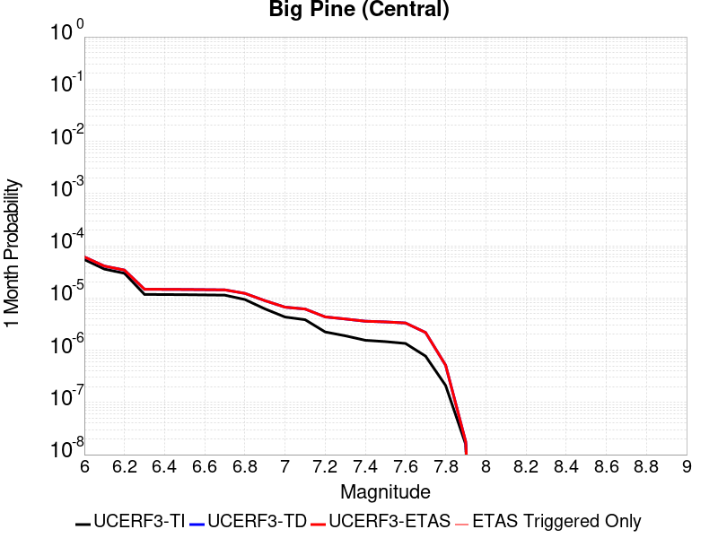 | 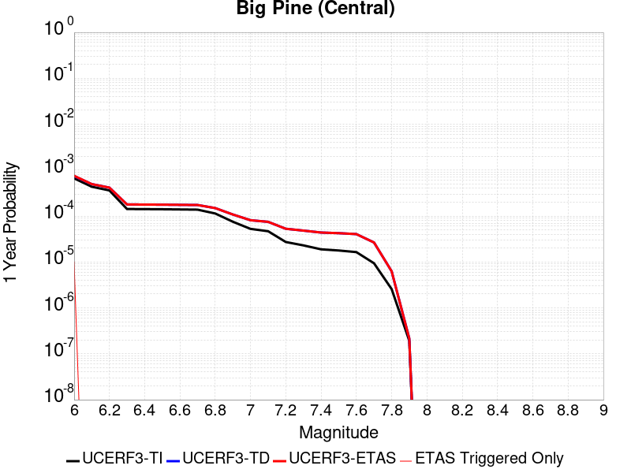 |  |

| Magnitude | 1 wk TI Prob | 1 wk TD Prob | 1 wk ETAS Prob | 1 wk ETAS/TD Gain | 1 wk ETAS Triggered Only | 1 mo TI Prob | 1 mo TD Prob | 1 mo ETAS Prob | 1 mo ETAS/TD Gain | 1 mo ETAS Triggered Only | 1 yr TI Prob | 1 yr TD Prob | 1 yr ETAS Prob | 1 yr ETAS/TD Gain | 1 yr ETAS Triggered Only | 10 yr TI Prob | 10 yr TD Prob | 10 yr ETAS Prob | 10 yr ETAS/TD Gain | 10 yr ETAS Triggered Only |
|-----|-----|-----|-----|-----|-----|-----|-----|-----|-----|-----|-----|-----|-----|-----|-----|-----|-----|-----|-----|-----|
| 6.0 | 1.2706755E-5 | 1.4253915E-5 | 1.4253915E-5 | 1.0 | 0.0 | 5.4456385E-5 | 6.108698E-5 | 6.108698E-5 | 1.0 | 0.0 | 6.628048E-4 | 7.435168E-4 | 7.71171E-4 | 1.0371938 | 2.7674767E-5 | 0.006608314 | 0.0074153 | 0.007470239 | 1.0074089 | 5.5349534E-5 |
| 6.1 | 8.342579E-6 | 9.513769E-6 | 9.513769E-6 | 1.0 | 0.0 | 3.5753423E-5 | 4.0772782E-5 | 4.0772782E-5 | 1.0 | 0.0 | 4.3521097E-4 | 4.963173E-4 | 4.963173E-4 | 1.0 | 0.0 | 0.0043435963 | 0.004955623 | 0.00498316 | 1.0055568 | 2.7674767E-5 |
| 6.2 | 6.923899E-6 | 7.9700285E-6 | 7.9700285E-6 | 1.0 | 0.0 | 2.9673516E-5 | 3.415693E-5 | 3.415693E-5 | 1.0 | 0.0 | 3.6121515E-4 | 4.158005E-4 | 4.158005E-4 | 1.0 | 0.0 | 0.003606286 | 0.0041535124 | 0.0041810726 | 1.0066353 | 2.7674767E-5 |
| 6.3 | 2.728396E-6 | 3.426823E-6 | 3.426823E-6 | 1.0 | 0.0 | 1.1693074E-5 | 1.4686307E-5 | 1.4686307E-5 | 1.0 | 0.0 | 1.4235388E-4 | 1.7879199E-4 | 1.7879199E-4 | 1.0 | 0.0 | 0.0014226272 | 0.0017879676 | 0.0017879676 | 1.0 | 0.0 |
| 6.4 | 2.7136944E-6 | 3.4111156E-6 | 3.4111156E-6 | 1.0 | 0.0 | 1.1630066E-5 | 1.461899E-5 | 1.461899E-5 | 1.0 | 0.0 | 1.4158686E-4 | 1.7797253E-4 | 1.7797253E-4 | 1.0 | 0.0 | 0.0014149669 | 0.0017797862 | 0.0017797862 | 1.0 | 0.0 |
| 6.5 | 2.6971882E-6 | 3.3934596E-6 | 3.3934596E-6 | 1.0 | 0.0 | 1.1559327E-5 | 1.4543321E-5 | 1.4543321E-5 | 1.0 | 0.0 | 1.4072572E-4 | 1.7705142E-4 | 1.7705142E-4 | 1.0 | 0.0 | 0.0014063664 | 0.0017705898 | 0.0017705898 | 1.0 | 0.0 |
| 6.6 | 2.669092E-6 | 3.363478E-6 | 3.363478E-6 | 1.0 | 0.0 | 1.1438916E-5 | 1.4414831E-5 | 1.4414831E-5 | 1.0 | 0.0 | 1.3925991E-4 | 1.7548731E-4 | 1.7548731E-4 | 1.0 | 0.0 | 0.0013917267 | 0.0017549734 | 0.0017549734 | 1.0 | 0.0 |
| 6.7 | 2.6408059E-6 | 3.333502E-6 | 3.333502E-6 | 1.0 | 0.0 | 1.1317691E-5 | 1.4286364E-5 | 1.4286364E-5 | 1.0 | 0.0 | 1.3778417E-4 | 1.7392347E-4 | 1.7392347E-4 | 1.0 | 0.0 | 0.0013769877 | 0.0017393596 | 0.0017393596 | 1.0 | 0.0 |
| 6.8 | 2.1786943E-6 | 2.8569455E-6 | 2.8569455E-6 | 1.0 | 0.0 | 9.337228E-6 | 1.2243999E-5 | 1.2243999E-5 | 1.0 | 0.0 | 1.1367482E-4 | 1.4906122E-4 | 1.4906122E-4 | 1.0 | 0.0 | 0.0011361669 | 0.0014910849 | 0.0014910849 | 1.0 | 0.0 |
| 6.9 | 1.4411696E-6 | 2.0709006E-6 | 2.0709006E-6 | 1.0 | 0.0 | 6.1764263E-6 | 8.8752595E-6 | 8.8752595E-6 | 1.0 | 0.0 | 7.51954E-5 | 1.08051194E-4 | 1.08051194E-4 | 1.0 | 0.0 | 7.5169955E-4 | 0.0010814145 | 0.0010814145 | 1.0 | 0.0 |
| 7.0 | 1.0073411E-6 | 1.5564054E-6 | 1.5564054E-6 | 1.0 | 0.0 | 4.317169E-6 | 6.670293E-6 | 6.670293E-6 | 1.0 | 0.0 | 5.2560266E-5 | 8.120794E-5 | 8.120794E-5 | 1.0 | 0.0 | 5.2547833E-4 | 8.131994E-4 | 8.131994E-4 | 1.0 | 0.0 |
| 7.1 | 8.947104E-7 | 1.4323633E-6 | 1.4323633E-6 | 1.0 | 0.0 | 3.834468E-6 | 6.1386863E-6 | 6.1386863E-6 | 1.0 | 0.0 | 4.6683643E-5 | 7.47361E-5 | 7.47361E-5 | 1.0 | 0.0 | 4.6673836E-4 | 7.4852613E-4 | 7.4852613E-4 | 1.0 | 0.0 |
| 7.2 | 5.215166E-7 | 1.0131406E-6 | 1.0131406E-6 | 1.0 | 0.0 | 2.2350691E-6 | 4.342024E-6 | 4.342024E-6 | 1.0 | 0.0 | 2.7211627E-5 | 5.2862906E-5 | 5.2862906E-5 | 1.0 | 0.0 | 2.7208295E-4 | 5.299097E-4 | 5.299097E-4 | 1.0 | 0.0 |
| 7.3 | 4.4024807E-7 | 9.238731E-7 | 9.238731E-7 | 1.0 | 0.0 | 1.8867761E-6 | 3.95945E-6 | 3.95945E-6 | 1.0 | 0.0 | 2.2971257E-5 | 4.8205282E-5 | 4.8205282E-5 | 1.0 | 0.0 | 2.2968883E-4 | 4.8335444E-4 | 4.8335444E-4 | 1.0 | 0.0 |
| 7.4 | 3.6130905E-7 | 8.3770703E-7 | 8.3770703E-7 | 1.0 | 0.0 | 1.5484665E-6 | 3.5901685E-6 | 3.5901685E-6 | 1.0 | 0.0 | 1.8852415E-5 | 4.3709464E-5 | 4.3709464E-5 | 1.0 | 0.0 | 1.8850817E-4 | 4.3840526E-4 | 4.3840526E-4 | 1.0 | 0.0 |
| 7.5 | 3.408184E-7 | 8.126289E-7 | 8.126289E-7 | 1.0 | 0.0 | 1.4606494E-6 | 3.482691E-6 | 3.482691E-6 | 1.0 | 0.0 | 1.7783263E-5 | 4.2400978E-5 | 4.2400978E-5 | 1.0 | 0.0 | 1.778184E-4 | 4.2530405E-4 | 4.2530405E-4 | 1.0 | 0.0 |
| 7.6 | 3.1428627E-7 | 7.749099E-7 | 7.749099E-7 | 1.0 | 0.0 | 1.3469405E-6 | 3.3210383E-6 | 3.3210383E-6 | 1.0 | 0.0 | 1.6398877E-5 | 4.043293E-5 | 4.043293E-5 | 1.0 | 0.0 | 1.6397667E-4 | 4.0560216E-4 | 4.0560216E-4 | 1.0 | 0.0 |
| 7.7 | 1.7972785E-7 | 5.0911257E-7 | 5.0911257E-7 | 1.0 | 0.0 | 7.70262E-7 | 2.1819092E-6 | 2.1819092E-6 | 1.0 | 0.0 | 9.377899E-6 | 2.6564432E-5 | 2.6564432E-5 | 1.0 | 0.0 | 9.377503E-5 | 2.669669E-4 | 2.669669E-4 | 1.0 | 0.0 |
| 7.8 | 4.9230927E-8 | 1.2012349E-7 | 1.2012349E-7 | 1.0 | 0.0 | 2.1098968E-7 | 5.148149E-7 | 5.148149E-7 | 1.0 | 0.0 | 2.5687964E-6 | 6.2678546E-6 | 6.2678546E-6 | 1.0 | 0.0 | 2.5687666E-5 | 6.311565E-5 | 6.311565E-5 | 1.0 | 0.0 |
| 7.9 | 3.6805972E-9 | 4.1177284E-9 | 4.1177284E-9 | 1.0 | 0.0 | 1.5773987E-8 | 1.7647407E-8 | 1.7647407E-8 | 1.0 | 0.0 | 1.9204828E-7 | 2.1485715E-7 | 2.1485715E-7 | 1.0 | 0.0 | 1.920481E-6 | 2.196581E-6 | 2.196581E-6 | 1.0 | 0.0 |

## Santa Cruz Catalina Ridge alt1
*[(top)](#table-of-contents)*

| 1 Week | 1 Month | 1 Year | 10 Year |
|-----|-----|-----|-----|
|  |  |  |  |

| Magnitude | 1 wk TI Prob | 1 wk TD Prob | 1 wk ETAS Prob | 1 wk ETAS/TD Gain | 1 wk ETAS Triggered Only | 1 mo TI Prob | 1 mo TD Prob | 1 mo ETAS Prob | 1 mo ETAS/TD Gain | 1 mo ETAS Triggered Only | 1 yr TI Prob | 1 yr TD Prob | 1 yr ETAS Prob | 1 yr ETAS/TD Gain | 1 yr ETAS Triggered Only | 10 yr TI Prob | 10 yr TD Prob | 10 yr ETAS Prob | 10 yr ETAS/TD Gain | 10 yr ETAS Triggered Only |
|-----|-----|-----|-----|-----|-----|-----|-----|-----|-----|-----|-----|-----|-----|-----|-----|-----|-----|-----|-----|-----|
| 6.0 | 3.2833184E-5 | 3.656231E-5 | 6.423606E-5 | 1.7568929 | 2.7674767E-5 | 1.4070606E-4 | 1.5668714E-4 | 1.8435756E-4 | 1.1765966 | 2.7674767E-5 | 0.00171175 | 0.0019061633 | 0.0019614073 | 1.0289818 | 5.5349534E-5 | 0.016986247 | 0.018915037 | 0.018969338 | 1.0028709 | 5.5349534E-5 |
| 6.1 | 1.9835548E-5 | 2.166137E-5 | 4.9335536E-5 | 2.2775817 | 2.7674767E-5 | 8.500672E-5 | 9.283125E-5 | 1.2050345E-4 | 1.2980914 | 2.7674767E-5 | 0.0010344655 | 0.0011296547 | 0.0011572982 | 1.0244708 | 2.7674767E-5 | 0.010296632 | 0.011241258 | 0.011268621 | 1.0024343 | 2.7674767E-5 |
| 6.2 | 1.9835548E-5 | 2.166137E-5 | 4.9335536E-5 | 2.2775817 | 2.7674767E-5 | 8.500672E-5 | 9.283125E-5 | 1.2050345E-4 | 1.2980914 | 2.7674767E-5 | 0.0010344655 | 0.0011296547 | 0.0011572982 | 1.0244708 | 2.7674767E-5 | 0.010296632 | 0.011241258 | 0.011268621 | 1.0024343 | 2.7674767E-5 |
| 6.3 | 1.5728183E-5 | 1.7035269E-5 | 4.4709563E-5 | 2.6245294 | 2.7674767E-5 | 6.7404755E-5 | 7.300628E-5 | 1.00679026E-4 | 1.3790461 | 2.7674767E-5 | 8.2034385E-4 | 8.884951E-4 | 9.1614533E-4 | 1.0311202 | 2.7674767E-5 | 0.008173222 | 0.008850109 | 0.008877539 | 1.0030993 | 2.7674767E-5 |
| 6.4 | 1.5728183E-5 | 1.7035269E-5 | 4.4709563E-5 | 2.6245294 | 2.7674767E-5 | 6.7404755E-5 | 7.300628E-5 | 1.00679026E-4 | 1.3790461 | 2.7674767E-5 | 8.2034385E-4 | 8.884951E-4 | 9.1614533E-4 | 1.0311202 | 2.7674767E-5 | 0.008173222 | 0.008850109 | 0.008877539 | 1.0030993 | 2.7674767E-5 |
| 6.5 | 1.3707734E-5 | 1.4795614E-5 | 1.4795614E-5 | 1.0 | 0.0 | 5.8746107E-5 | 6.340825E-5 | 6.340825E-5 | 1.0 | 0.0 | 7.1499916E-4 | 7.717256E-4 | 7.717256E-4 | 1.0 | 0.0 | 0.0071270303 | 0.0076908553 | 0.0076908553 | 1.0 | 0.0 |
| 6.6 | 1.2539813E-5 | 1.3511192E-5 | 1.3511192E-5 | 1.0 | 0.0 | 5.3740947E-5 | 5.7903842E-5 | 5.7903842E-5 | 1.0 | 0.0 | 6.540996E-4 | 7.047539E-4 | 7.047539E-4 | 1.0 | 0.0 | 0.0065217763 | 0.007025493 | 0.007025493 | 1.0 | 0.0 |
| 6.7 | 1.1504083E-5 | 1.2378249E-5 | 1.2378249E-5 | 1.0 | 0.0 | 4.930228E-5 | 5.3048574E-5 | 5.3048574E-5 | 1.0 | 0.0 | 6.0008996E-4 | 6.45677E-4 | 6.45677E-4 | 1.0 | 0.0 | 0.005984721 | 0.0064382395 | 0.0064382395 | 1.0 | 0.0 |
| 6.8 | 1.012739E-5 | 1.087782E-5 | 1.087782E-5 | 1.0 | 0.0 | 4.340238E-5 | 4.6618406E-5 | 4.6618406E-5 | 1.0 | 0.0 | 5.282958E-4 | 5.674328E-4 | 5.674328E-4 | 1.0 | 0.0 | 0.0052704164 | 0.005660008 | 0.005660008 | 1.0 | 0.0 |
| 6.9 | 8.9607865E-6 | 9.609764E-6 | 9.609764E-6 | 1.0 | 0.0 | 3.8402806E-5 | 4.118406E-5 | 4.118406E-5 | 1.0 | 0.0 | 4.6745385E-4 | 5.013016E-4 | 5.013016E-4 | 1.0 | 0.0 | 0.0046647177 | 0.0050018276 | 0.0050018276 | 1.0 | 0.0 |
| 7.0 | 8.046829E-6 | 8.620316E-6 | 8.620316E-6 | 1.0 | 0.0 | 3.4485955E-5 | 3.6943697E-5 | 3.6943697E-5 | 1.0 | 0.0 | 4.1978562E-4 | 4.496975E-4 | 4.496975E-4 | 1.0 | 0.0 | 0.004189935 | 0.0044879653 | 0.0044879653 | 1.0 | 0.0 |
| 7.1 | 7.136131E-6 | 7.638156E-6 | 7.638156E-6 | 1.0 | 0.0 | 3.0583058E-5 | 3.2734544E-5 | 3.2734544E-5 | 1.0 | 0.0 | 3.7228514E-4 | 3.984709E-4 | 3.984709E-4 | 1.0 | 0.0 | 0.0037166206 | 0.0039776405 | 0.0039776405 | 1.0 | 0.0 |
| 7.2 | 6.362014E-6 | 6.805399E-6 | 6.805399E-6 | 1.0 | 0.0 | 2.726549E-5 | 2.9165674E-5 | 2.9165674E-5 | 1.0 | 0.0 | 3.3190678E-4 | 3.5503486E-4 | 3.5503486E-4 | 1.0 | 0.0 | 0.0033141149 | 0.0035447453 | 0.0035447453 | 1.0 | 0.0 |
| 7.3 | 5.004101E-6 | 5.3520607E-6 | 5.3520607E-6 | 1.0 | 0.0 | 2.1445969E-5 | 2.2937205E-5 | 2.2937205E-5 | 1.0 | 0.0 | 2.6107338E-4 | 2.792252E-4 | 2.792252E-4 | 1.0 | 0.0 | 0.002607669 | 0.0027887987 | 0.0027887987 | 1.0 | 0.0 |
| 7.4 | 3.4901443E-6 | 3.7322932E-6 | 3.7322932E-6 | 1.0 | 0.0 | 1.4957676E-5 | 1.5995447E-5 | 1.5995447E-5 | 1.0 | 0.0 | 1.8209449E-4 | 1.9472755E-4 | 1.9472755E-4 | 1.0 | 0.0 | 0.0018194534 | 0.0019456077 | 0.0019456077 | 1.0 | 0.0 |
| 7.5 | 1.1215045E-6 | 1.1894541E-6 | 1.1894541E-6 | 1.0 | 0.0 | 4.806439E-6 | 5.097651E-6 | 5.097651E-6 | 1.0 | 0.0 | 5.851682E-5 | 6.2062165E-5 | 6.2062165E-5 | 1.0 | 0.0 | 5.850142E-4 | 6.2045135E-4 | 6.2045135E-4 | 1.0 | 0.0 |
| 7.6 | 2.8599047E-7 | 2.995331E-7 | 2.995331E-7 | 1.0 | 0.0 | 1.2256729E-6 | 1.2837127E-6 | 1.2837127E-6 | 1.0 | 0.0 | 1.4922465E-5 | 1.562909E-5 | 1.562909E-5 | 1.0 | 0.0 | 1.4921463E-4 | 1.5628005E-4 | 1.5628005E-4 | 1.0 | 0.0 |
| 7.7 | 2.0781519E-7 | 2.174526E-7 | 2.174526E-7 | 1.0 | 0.0 | 8.906362E-7 | 9.319393E-7 | 9.319393E-7 | 1.0 | 0.0 | 1.08434415E-5 | 1.1346303E-5 | 1.1346303E-5 | 1.0 | 0.0 | 1.0842913E-4 | 1.1345733E-4 | 1.1345733E-4 | 1.0 | 0.0 |
| 7.8 | 3.614776E-8 | 3.764246E-8 | 3.764246E-8 | 1.0 | 0.0 | 1.5491896E-7 | 1.6132483E-7 | 1.6132483E-7 | 1.0 | 0.0 | 1.8861368E-6 | 1.9641282E-6 | 1.9641282E-6 | 1.0 | 0.0 | 1.8861208E-5 | 1.964112E-5 | 1.964112E-5 | 1.0 | 0.0 |

## San Jacinto (Stepovers Combined)
*[(top)](#table-of-contents)*

| 1 Week | 1 Month | 1 Year | 10 Year |
|-----|-----|-----|-----|
|  |  |  |  |

| Magnitude | 1 wk TI Prob | 1 wk TD Prob | 1 wk ETAS Prob | 1 wk ETAS/TD Gain | 1 wk ETAS Triggered Only | 1 mo TI Prob | 1 mo TD Prob | 1 mo ETAS Prob | 1 mo ETAS/TD Gain | 1 mo ETAS Triggered Only | 1 yr TI Prob | 1 yr TD Prob | 1 yr ETAS Prob | 1 yr ETAS/TD Gain | 1 yr ETAS Triggered Only | 10 yr TI Prob | 10 yr TD Prob | 10 yr ETAS Prob | 10 yr ETAS/TD Gain | 10 yr ETAS Triggered Only |
|-----|-----|-----|-----|-----|-----|-----|-----|-----|-----|-----|-----|-----|-----|-----|-----|-----|-----|-----|-----|-----|
| 6.0 | 4.0667746E-5 | 3.5380344E-5 | 3.5380344E-5 | 1.0 | 0.0 | 1.742787E-4 | 1.5162116E-4 | 1.7929173E-4 | 1.1824981 | 2.7674767E-5 | 0.0021197782 | 0.0018444263 | 0.0018996737 | 1.0299537 | 5.5349534E-5 | 0.020996714 | 0.01904263 | 0.019096924 | 1.0028512 | 5.5349534E-5 |
| 6.1 | 4.0667746E-5 | 3.5380344E-5 | 3.5380344E-5 | 1.0 | 0.0 | 1.742787E-4 | 1.5162116E-4 | 1.7929173E-4 | 1.1824981 | 2.7674767E-5 | 0.0021197782 | 0.0018444263 | 0.0018996737 | 1.0299537 | 5.5349534E-5 | 0.020996714 | 0.01904263 | 0.019096924 | 1.0028512 | 5.5349534E-5 |
| 6.2 | 4.0667746E-5 | 3.5380344E-5 | 3.5380344E-5 | 1.0 | 0.0 | 1.742787E-4 | 1.5162116E-4 | 1.7929173E-4 | 1.1824981 | 2.7674767E-5 | 0.0021197782 | 0.0018444263 | 0.0018996737 | 1.0299537 | 5.5349534E-5 | 0.020996714 | 0.01904263 | 0.019096924 | 1.0028512 | 5.5349534E-5 |
| 6.3 | 4.0667746E-5 | 3.5380344E-5 | 3.5380344E-5 | 1.0 | 0.0 | 1.742787E-4 | 1.5162116E-4 | 1.7929173E-4 | 1.1824981 | 2.7674767E-5 | 0.0021197782 | 0.0018444263 | 0.0018996737 | 1.0299537 | 5.5349534E-5 | 0.020996714 | 0.01904263 | 0.019096924 | 1.0028512 | 5.5349534E-5 |
| 6.4 | 4.0577226E-5 | 3.5252193E-5 | 3.5252193E-5 | 1.0 | 0.0 | 1.738908E-4 | 1.5107209E-4 | 1.7874267E-4 | 1.1831615 | 2.7674767E-5 | 0.0021150648 | 0.0018377536 | 0.0018930014 | 1.0300627 | 5.5349534E-5 | 0.020950472 | 0.01897718 | 0.019031478 | 1.0028613 | 5.5349534E-5 |
| 6.5 | 4.0577226E-5 | 3.5252193E-5 | 3.5252193E-5 | 1.0 | 0.0 | 1.738908E-4 | 1.5107209E-4 | 1.7874267E-4 | 1.1831615 | 2.7674767E-5 | 0.0021150648 | 0.0018377536 | 0.0018930014 | 1.0300627 | 5.5349534E-5 | 0.020950472 | 0.01897718 | 0.019031478 | 1.0028613 | 5.5349534E-5 |
| 6.6 | 4.053861E-5 | 3.5197518E-5 | 3.5197518E-5 | 1.0 | 0.0 | 1.7372532E-4 | 1.508378E-4 | 1.7850839E-4 | 1.183446 | 2.7674767E-5 | 0.0021130538 | 0.0018349059 | 0.0018901539 | 1.0301094 | 5.5349534E-5 | 0.020930743 | 0.01894925 | 0.019003551 | 1.0028656 | 5.5349534E-5 |
| 6.7 | 4.0516545E-5 | 3.5166573E-5 | 3.5166573E-5 | 1.0 | 0.0 | 1.7363077E-4 | 1.507052E-4 | 1.7837579E-4 | 1.1836075 | 2.7674767E-5 | 0.002111905 | 0.0018332949 | 0.0018885429 | 1.030136 | 5.5349534E-5 | 0.020919468 | 0.018933441 | 0.018987743 | 1.002868 | 5.5349534E-5 |
| 6.8 | 4.049434E-5 | 3.5138124E-5 | 3.5138124E-5 | 1.0 | 0.0 | 1.7353562E-4 | 1.5058329E-4 | 1.7825389E-4 | 1.1837561 | 2.7674767E-5 | 0.0021107488 | 0.0018318131 | 0.0018870613 | 1.0301603 | 5.5349534E-5 | 0.020908125 | 0.018918851 | 0.018973153 | 1.0028703 | 5.5349534E-5 |
| 6.9 | 4.046386E-5 | 3.510067E-5 | 3.510067E-5 | 1.0 | 0.0 | 1.73405E-4 | 1.504228E-4 | 1.780934E-4 | 1.1839522 | 2.7674767E-5 | 0.0021091616 | 0.0018298625 | 0.0018851106 | 1.0301926 | 5.5349534E-5 | 0.020892553 | 0.018899618 | 0.018953921 | 1.0028733 | 5.5349534E-5 |
| 7.0 | 4.036382E-5 | 3.4981196E-5 | 3.4981196E-5 | 1.0 | 0.0 | 1.7297632E-4 | 1.4991082E-4 | 1.7758143E-4 | 1.1845806 | 2.7674767E-5 | 0.0021039525 | 0.0018236395 | 0.0018788881 | 1.0302957 | 5.5349534E-5 | 0.02084144 | 0.01883821 | 0.018892517 | 1.0028828 | 5.5349534E-5 |
| 7.1 | 4.0343282E-5 | 3.495965E-5 | 3.495965E-5 | 1.0 | 0.0 | 1.7288832E-4 | 1.4981849E-4 | 1.774891E-4 | 1.1846943 | 2.7674767E-5 | 0.002102883 | 0.0018225173 | 0.001877766 | 1.0303144 | 5.5349534E-5 | 0.020830948 | 0.018827083 | 0.01888139 | 1.0028845 | 5.5349534E-5 |
| 7.2 | 4.0257353E-5 | 3.4864024E-5 | 3.4864024E-5 | 1.0 | 0.0 | 1.725201E-4 | 1.494087E-4 | 1.7707935E-4 | 1.1852009 | 2.7674767E-5 | 0.0020984085 | 0.0018175367 | 0.0018727856 | 1.0303977 | 5.5349534E-5 | 0.020787042 | 0.01877776 | 0.01883207 | 1.0028923 | 5.5349534E-5 |
| 7.3 | 3.9940667E-5 | 3.469128E-5 | 3.469128E-5 | 1.0 | 0.0 | 1.7116306E-4 | 1.4866845E-4 | 1.763391E-4 | 1.1861233 | 2.7674767E-5 | 0.0020819185 | 0.0018085389 | 0.0018637883 | 1.0305492 | 5.5349534E-5 | 0.020625217 | 0.018686187 | 0.018740501 | 1.0029067 | 5.5349534E-5 |
| 7.4 | 3.9721202E-5 | 3.4576467E-5 | 3.4576467E-5 | 1.0 | 0.0 | 1.7022261E-4 | 1.4817646E-4 | 1.7584712E-4 | 1.1867414 | 2.7674767E-5 | 0.0020704903 | 0.0018025589 | 0.0018578087 | 1.0306507 | 5.5349534E-5 | 0.020513052 | 0.018625207 | 0.018679526 | 1.0029165 | 5.5349534E-5 |
| 7.5 | 3.7036873E-5 | 3.3641296E-5 | 3.3641296E-5 | 1.0 | 0.0 | 1.5871979E-4 | 1.4416903E-4 | 1.718398E-4 | 1.1919329 | 2.7674767E-5 | 0.0019307006 | 0.0017538477 | 0.0018091002 | 1.0315036 | 5.5349534E-5 | 0.019140124 | 0.018125426 | 0.018179772 | 1.0029984 | 5.5349534E-5 |
| 7.6 | 3.2940967E-5 | 3.141389E-5 | 3.141389E-5 | 1.0 | 0.0 | 1.4116794E-4 | 1.3462402E-4 | 1.6229505E-4 | 1.2055432 | 2.7674767E-5 | 0.0017173645 | 0.0016378174 | 0.0016930762 | 1.0337393 | 5.5349534E-5 | 0.01704153 | 0.016954063 | 0.017008472 | 1.0032094 | 5.5349534E-5 |
| 7.7 | 2.8236149E-5 | 2.7977081E-5 | 2.7977081E-5 | 1.0 | 0.0 | 1.2100645E-4 | 1.1989627E-4 | 1.4756771E-4 | 1.2307949 | 2.7674767E-5 | 0.0014722579 | 0.0014587607 | 0.0015140295 | 1.0378875 | 5.5349534E-5 | 0.014625421 | 0.015163489 | 0.015217999 | 1.0035949 | 5.5349534E-5 |
| 7.8 | 2.4329287E-5 | 2.5297024E-5 | 2.5297024E-5 | 1.0 | 0.0 | 1.042642E-4 | 1.0841132E-4 | 1.3608308E-4 | 1.255248 | 2.7674767E-5 | 0.0012686774 | 0.0013191095 | 0.0013743859 | 1.0419044 | 5.5349534E-5 | 0.012614589 | 0.013758943 | 0.013813532 | 1.0039674 | 5.5349534E-5 |
| 7.9 | 1.9370926E-5 | 2.0502179E-5 | 2.0502179E-5 | 1.0 | 0.0 | 8.301561E-5 | 8.7863526E-5 | 1.15535855E-4 | 1.3149468 | 2.7674767E-5 | 0.0010102465 | 0.0010692142 | 0.0011245046 | 1.0517112 | 5.5349534E-5 | 0.0100566605 | 0.011241638 | 0.011296365 | 1.0048683 | 5.5349534E-5 |
| 8.0 | 1.5583017E-5 | 1.5954185E-5 | 1.5954185E-5 | 1.0 | 0.0 | 6.6782646E-5 | 6.837329E-5 | 9.604616E-5 | 1.4047322 | 2.7674767E-5 | 8.127754E-4 | 8.321275E-4 | 8.8743103E-4 | 1.0664604 | 5.5349534E-5 | 0.008098091 | 0.008817447 | 0.008872309 | 1.0062219 | 5.5349534E-5 |
| 8.1 | 1.0024873E-5 | 8.33189E-6 | 8.33189E-6 | 1.0 | 0.0 | 4.2963035E-5 | 3.5707613E-5 | 6.338139E-5 | 1.7750106 | 2.7674767E-5 | 5.229494E-4 | 4.3465398E-4 | 4.6231673E-4 | 1.0636431 | 2.7674767E-5 | 0.0052172043 | 0.004674638 | 0.0047021834 | 1.0058925 | 2.7674767E-5 |
| 8.2 | 4.142796E-6 | 1.5725606E-6 | 1.5725606E-6 | 1.0 | 0.0 | 1.775472E-5 | 6.739528E-6 | 6.739528E-6 | 1.0 | 0.0 | 2.1614227E-4 | 8.205069E-5 | 8.205069E-5 | 1.0 | 0.0 | 0.0021593217 | 9.520677E-4 | 9.520677E-4 | 1.0 | 0.0 |
| 8.3 | 1.2750878E-6 | 3.6436526E-7 | 3.6436526E-7 | 1.0 | 0.0 | 5.4646503E-6 | 1.5615645E-6 | 1.5615645E-6 | 1.0 | 0.0 | 6.653009E-5 | 1.9011886E-5 | 1.9011886E-5 | 1.0 | 0.0 | 6.6510175E-4 | 2.291941E-4 | 2.291941E-4 | 1.0 | 0.0 |

## San Jacinto (San Bernardino)
*[(top)](#table-of-contents)*

| 1 Week | 1 Month | 1 Year | 10 Year |
|-----|-----|-----|-----|
|  |  |  | 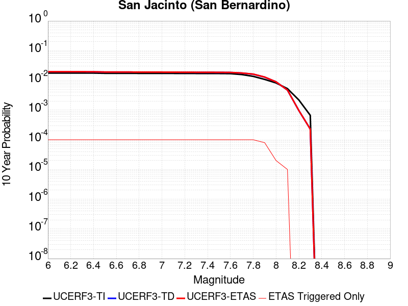 |

| Magnitude | 1 wk TI Prob | 1 wk TD Prob | 1 wk ETAS Prob | 1 wk ETAS/TD Gain | 1 wk ETAS Triggered Only | 1 mo TI Prob | 1 mo TD Prob | 1 mo ETAS Prob | 1 mo ETAS/TD Gain | 1 mo ETAS Triggered Only | 1 yr TI Prob | 1 yr TD Prob | 1 yr ETAS Prob | 1 yr ETAS/TD Gain | 1 yr ETAS Triggered Only | 10 yr TI Prob | 10 yr TD Prob | 10 yr ETAS Prob | 10 yr ETAS/TD Gain | 10 yr ETAS Triggered Only |
|-----|-----|-----|-----|-----|-----|-----|-----|-----|-----|-----|-----|-----|-----|-----|-----|-----|-----|-----|-----|-----|
| 6.0 | 3.409352E-5 | 3.609742E-5 | 3.609742E-5 | 1.0 | 0.0 | 1.461069E-4 | 1.5469406E-4 | 1.8236454E-4 | 1.1788723 | 2.7674767E-5 | 0.0017774 | 0.001881775 | 0.0019370203 | 1.0293581 | 5.5349534E-5 | 0.01763251 | 0.019406606 | 0.019460881 | 1.0027968 | 5.5349534E-5 |
| 6.1 | 3.409352E-5 | 3.609742E-5 | 3.609742E-5 | 1.0 | 0.0 | 1.461069E-4 | 1.5469406E-4 | 1.8236454E-4 | 1.1788723 | 2.7674767E-5 | 0.0017774 | 0.001881775 | 0.0019370203 | 1.0293581 | 5.5349534E-5 | 0.01763251 | 0.019406606 | 0.019460881 | 1.0027968 | 5.5349534E-5 |
| 6.2 | 3.409352E-5 | 3.609742E-5 | 3.609742E-5 | 1.0 | 0.0 | 1.461069E-4 | 1.5469406E-4 | 1.8236454E-4 | 1.1788723 | 2.7674767E-5 | 0.0017774 | 0.001881775 | 0.0019370203 | 1.0293581 | 5.5349534E-5 | 0.01763251 | 0.019406606 | 0.019460881 | 1.0027968 | 5.5349534E-5 |
| 6.3 | 3.409352E-5 | 3.609742E-5 | 3.609742E-5 | 1.0 | 0.0 | 1.461069E-4 | 1.5469406E-4 | 1.8236454E-4 | 1.1788723 | 2.7674767E-5 | 0.0017774 | 0.001881775 | 0.0019370203 | 1.0293581 | 5.5349534E-5 | 0.01763251 | 0.019406606 | 0.019460881 | 1.0027968 | 5.5349534E-5 |
| 6.4 | 3.400795E-5 | 3.5990055E-5 | 3.5990055E-5 | 1.0 | 0.0 | 1.4574021E-4 | 1.5423399E-4 | 1.8190448E-4 | 1.1794059 | 2.7674767E-5 | 0.0017729428 | 0.0018761834 | 0.0019314291 | 1.0294458 | 5.5349534E-5 | 0.017588645 | 0.019351678 | 0.019405957 | 1.0028049 | 5.5349534E-5 |
| 6.5 | 3.341482E-5 | 3.5250523E-5 | 3.5250523E-5 | 1.0 | 0.0 | 1.4319851E-4 | 1.5106493E-4 | 1.7873551E-4 | 1.1831702 | 2.7674767E-5 | 0.0017420477 | 0.0018376654 | 0.0018929132 | 1.0300641 | 5.5349534E-5 | 0.017284546 | 0.018973157 | 0.019027457 | 1.0028619 | 5.5349534E-5 |
| 6.6 | 3.3364955E-5 | 3.5187728E-5 | 3.5187728E-5 | 1.0 | 0.0 | 1.4298483E-4 | 1.5079584E-4 | 1.7846643E-4 | 1.1834971 | 2.7674767E-5 | 0.0017394501 | 0.0018343948 | 0.0018896428 | 1.0301179 | 5.5349534E-5 | 0.017258976 | 0.018941017 | 0.018995317 | 1.0028669 | 5.5349534E-5 |
| 6.7 | 3.335922E-5 | 3.51775E-5 | 3.51775E-5 | 1.0 | 0.0 | 1.4296026E-4 | 1.50752E-4 | 1.784226E-4 | 1.1835504 | 2.7674767E-5 | 0.0017391514 | 0.001833862 | 0.0018891101 | 1.0301266 | 5.5349534E-5 | 0.017256035 | 0.018935807 | 0.018990109 | 1.0028677 | 5.5349534E-5 |
| 6.8 | 3.327683E-5 | 3.5071538E-5 | 3.5071538E-5 | 1.0 | 0.0 | 1.4260718E-4 | 1.5029794E-4 | 1.7796856E-4 | 1.184105 | 2.7674767E-5 | 0.0017348597 | 0.001828343 | 0.0018835914 | 1.0302176 | 5.5349534E-5 | 0.017213784 | 0.018881567 | 0.018935872 | 1.002876 | 5.5349534E-5 |
| 6.9 | 3.3235785E-5 | 3.5012476E-5 | 3.5012476E-5 | 1.0 | 0.0 | 1.4243131E-4 | 1.5004484E-4 | 1.7771547E-4 | 1.1844156 | 2.7674767E-5 | 0.0017327217 | 0.0018252668 | 0.0018805153 | 1.0302687 | 5.5349534E-5 | 0.017192734 | 0.01885143 | 0.018905737 | 1.0028807 | 5.5349534E-5 |
| 7.0 | 3.3197095E-5 | 3.4952387E-5 | 3.4952387E-5 | 1.0 | 0.0 | 1.422655E-4 | 1.4978735E-4 | 1.7745797E-4 | 1.1847327 | 2.7674767E-5 | 0.0017307063 | 0.001822137 | 0.0018773857 | 1.0303208 | 5.5349534E-5 | 0.017172894 | 0.0188208 | 0.018875107 | 1.0028856 | 5.5349534E-5 |
| 7.1 | 3.3129716E-5 | 3.4832556E-5 | 3.4832556E-5 | 1.0 | 0.0 | 1.4197677E-4 | 1.4927384E-4 | 1.7694448E-4 | 1.1853683 | 2.7674767E-5 | 0.0017271966 | 0.0018158954 | 0.0018711445 | 1.0304252 | 5.5349534E-5 | 0.017138338 | 0.01875986 | 0.018814173 | 1.0028951 | 5.5349534E-5 |
| 7.2 | 3.3034008E-5 | 3.4699966E-5 | 3.4699966E-5 | 1.0 | 0.0 | 1.4156665E-4 | 1.4870567E-4 | 1.7637633E-4 | 1.1860766 | 2.7674767E-5 | 0.0017222111 | 0.0018089896 | 0.001864239 | 1.0305415 | 5.5349534E-5 | 0.017089253 | 0.01869224 | 0.018746555 | 1.0029057 | 5.5349534E-5 |
| 7.3 | 3.2956614E-5 | 3.456766E-5 | 3.456766E-5 | 1.0 | 0.0 | 1.4123498E-4 | 1.481387E-4 | 1.7580937E-4 | 1.1867889 | 2.7674767E-5 | 0.0017181796 | 0.0018020981 | 0.0018573479 | 1.0306586 | 5.5349534E-5 | 0.017049557 | 0.01862496 | 0.018679278 | 1.0029165 | 5.5349534E-5 |
| 7.4 | 3.2915937E-5 | 3.44893E-5 | 3.44893E-5 | 1.0 | 0.0 | 1.4106068E-4 | 1.4780293E-4 | 1.7547361E-4 | 1.1872133 | 2.7674767E-5 | 0.0017160608 | 0.0017980168 | 0.0018532668 | 1.0307283 | 5.5349534E-5 | 0.017028693 | 0.018585203 | 0.018639524 | 1.0029228 | 5.5349534E-5 |
| 7.5 | 3.281791E-5 | 3.435414E-5 | 3.435414E-5 | 1.0 | 0.0 | 1.406406E-4 | 1.4722372E-4 | 1.748944E-4 | 1.18795 | 2.7674767E-5 | 0.0017109542 | 0.0017909766 | 0.001846227 | 1.0308493 | 5.5349534E-5 | 0.016978411 | 0.018516054 | 0.01857038 | 1.002934 | 5.5349534E-5 |
| 7.6 | 3.2521442E-5 | 3.4078876E-5 | 3.4078876E-5 | 1.0 | 0.0 | 1.3937015E-4 | 1.4604416E-4 | 1.7371487E-4 | 1.1894683 | 2.7674767E-5 | 0.0016955109 | 0.0017766389 | 0.0018318901 | 1.0310987 | 5.5349534E-5 | 0.016826328 | 0.018373583 | 0.018427914 | 1.0029571 | 5.5349534E-5 |
| 7.7 | 3.0287873E-5 | 3.2561624E-5 | 3.2561624E-5 | 1.0 | 0.0 | 1.297987E-4 | 1.3954236E-4 | 1.6721326E-4 | 1.1982975 | 2.7674767E-5 | 0.0015791537 | 0.0016976055 | 0.0017528611 | 1.0325491 | 5.5349534E-5 | 0.01567979 | 0.017583825 | 0.0176382 | 1.0030924 | 5.5349534E-5 |
| 7.8 | 2.6316151E-5 | 2.9768464E-5 | 2.9768464E-5 | 1.0 | 0.0 | 1.1277862E-4 | 1.275729E-4 | 1.5524414E-4 | 1.2169052 | 2.7674767E-5 | 0.0013722149 | 0.0015520945 | 0.0016073581 | 1.0356058 | 5.5349534E-5 | 0.013637724 | 0.016123403 | 0.01617786 | 1.0033776 | 5.5349534E-5 |
| 7.9 | 2.0761147E-5 | 2.350958E-5 | 2.350958E-5 | 1.0 | 0.0 | 8.897331E-5 | 1.0075145E-4 | 1.2842343E-4 | 1.2746558 | 2.7674767E-5 | 0.0010827117 | 0.0012259595 | 0.0012812412 | 1.0450926 | 5.5349534E-5 | 0.010774517 | 0.012840435 | 0.012895074 | 1.0042552 | 5.5349534E-5 |
| 8.0 | 1.5738568E-5 | 1.6102143E-5 | 1.6102143E-5 | 1.0 | 0.0 | 6.744926E-5 | 6.9007365E-5 | 9.6680225E-5 | 1.401013 | 2.7674767E-5 | 8.2088535E-4 | 8.3984155E-4 | 8.951446E-4 | 1.0658494 | 5.5349534E-5 | 0.008178596 | 0.0089020105 | 0.008956867 | 1.0061623 | 5.5349534E-5 |
| 8.1 | 1.0105832E-5 | 8.370304E-6 | 8.370304E-6 | 1.0 | 0.0 | 4.3309992E-5 | 3.5872243E-5 | 6.354602E-5 | 1.7714536 | 2.7674767E-5 | 5.2717153E-4 | 4.3665757E-4 | 4.6432024E-4 | 1.0633509 | 2.7674767E-5 | 0.005259227 | 0.004698642 | 0.004726187 | 1.0058622 | 2.7674767E-5 |
| 8.2 | 4.189207E-6 | 1.5901481E-6 | 1.5901481E-6 | 1.0 | 0.0 | 1.7953622E-5 | 6.814903E-6 | 6.814903E-6 | 1.0 | 0.0 | 2.1856341E-4 | 8.296831E-5 | 8.296831E-5 | 1.0 | 0.0 | 0.0021834858 | 9.6328073E-4 | 9.6328073E-4 | 1.0 | 0.0 |
| 8.3 | 1.2758221E-6 | 3.6465343E-7 | 3.6465343E-7 | 1.0 | 0.0 | 5.4677976E-6 | 1.5627995E-6 | 1.5627995E-6 | 1.0 | 0.0 | 6.65684E-5 | 1.9026922E-5 | 1.9026922E-5 | 1.0 | 0.0 | 6.6548464E-4 | 2.2936566E-4 | 2.2936566E-4 | 1.0 | 0.0 |

## Great Valley 09 (Laguna Seca)
*[(top)](#table-of-contents)*

| 1 Week | 1 Month | 1 Year | 10 Year |
|-----|-----|-----|-----|
|  |  |  |  |

| Magnitude | 1 wk TI Prob | 1 wk TD Prob | 1 wk ETAS Prob | 1 wk ETAS/TD Gain | 1 wk ETAS Triggered Only | 1 mo TI Prob | 1 mo TD Prob | 1 mo ETAS Prob | 1 mo ETAS/TD Gain | 1 mo ETAS Triggered Only | 1 yr TI Prob | 1 yr TD Prob | 1 yr ETAS Prob | 1 yr ETAS/TD Gain | 1 yr ETAS Triggered Only | 10 yr TI Prob | 10 yr TD Prob | 10 yr ETAS Prob | 10 yr ETAS/TD Gain | 10 yr ETAS Triggered Only |
|-----|-----|-----|-----|-----|-----|-----|-----|-----|-----|-----|-----|-----|-----|-----|-----|-----|-----|-----|-----|-----|
| 6.0 | 5.4353277E-5 | 7.0522445E-5 | 7.0522445E-5 | 1.0 | 0.0 | 2.3292181E-4 | 3.0220623E-4 | 3.2987262E-4 | 1.0915481 | 2.7674767E-5 | 0.0028321352 | 0.0036731926 | 0.0037007658 | 1.0075066 | 2.7674767E-5 | 0.02796312 | 0.03612556 | 0.03617891 | 1.0014768 | 5.5349534E-5 |
| 6.1 | 4.5578287E-5 | 5.823676E-5 | 5.823676E-5 | 1.0 | 0.0 | 1.953209E-4 | 2.4956377E-4 | 2.7723165E-4 | 1.1108649 | 2.7674767E-5 | 0.0023754383 | 0.0030342632 | 0.003061854 | 1.009093 | 2.7674767E-5 | 0.023502063 | 0.02992766 | 0.029981352 | 1.0017941 | 5.5349534E-5 |
| 6.2 | 2.8536782E-5 | 3.474441E-5 | 3.474441E-5 | 1.0 | 0.0 | 1.2229476E-4 | 1.488966E-4 | 1.7656724E-4 | 1.185838 | 2.7674767E-5 | 0.0014879217 | 0.001811268 | 0.0018388927 | 1.0152515 | 2.7674767E-5 | 0.014779986 | 0.01796253 | 0.017989708 | 1.001513 | 2.7674767E-5 |
| 6.3 | 2.3698774E-5 | 2.821827E-5 | 2.821827E-5 | 1.0 | 0.0 | 1.01562226E-4 | 1.2093017E-4 | 1.486016E-4 | 1.2288215 | 2.7674767E-5 | 0.0012358186 | 0.0014713865 | 0.0014990205 | 1.018781 | 2.7674767E-5 | 0.012289686 | 0.014614772 | 0.014642042 | 1.001866 | 2.7674767E-5 |
| 6.4 | 1.9191197E-5 | 2.212613E-5 | 2.212613E-5 | 1.0 | 0.0 | 8.2245395E-5 | 9.482308E-5 | 9.482308E-5 | 1.0 | 0.0 | 0.0010008777 | 0.0011539026 | 0.0011539026 | 1.0 | 0.0 | 0.009963818 | 0.011479452 | 0.011479452 | 1.0 | 0.0 |
| 6.5 | 1.5203241E-5 | 1.6803468E-5 | 1.6803468E-5 | 1.0 | 0.0 | 6.5155116E-5 | 7.2013056E-5 | 7.2013056E-5 | 1.0 | 0.0 | 7.9297484E-4 | 8.764382E-4 | 8.764382E-4 | 1.0 | 0.0 | 0.007901512 | 0.008731223 | 0.008731223 | 1.0 | 0.0 |
| 6.6 | 1.0984925E-5 | 1.1244301E-5 | 1.1244301E-5 | 1.0 | 0.0 | 4.70774E-5 | 4.8188995E-5 | 4.8188995E-5 | 1.0 | 0.0 | 5.730166E-4 | 5.865472E-4 | 5.865472E-4 | 1.0 | 0.0 | 0.005715413 | 0.005850388 | 0.005850388 | 1.0 | 0.0 |
| 6.7 | 9.134616E-6 | 9.02122E-6 | 9.02122E-6 | 1.0 | 0.0 | 3.9147766E-5 | 3.866181E-5 | 3.866181E-5 | 1.0 | 0.0 | 4.7651984E-4 | 4.7060824E-4 | 4.7060824E-4 | 1.0 | 0.0 | 0.004754993 | 0.0046963617 | 0.0046963617 | 1.0 | 0.0 |
| 6.8 | 7.785589E-6 | 7.4530335E-6 | 7.4530335E-6 | 1.0 | 0.0 | 3.3366385E-5 | 3.1941192E-5 | 3.1941192E-5 | 1.0 | 0.0 | 4.0616E-4 | 3.8881664E-4 | 3.8881664E-4 | 1.0 | 0.0 | 0.0040541845 | 0.0038815676 | 0.0038815676 | 1.0 | 0.0 |
| 6.9 | 5.579095E-6 | 4.8992083E-6 | 4.8992083E-6 | 1.0 | 0.0 | 2.3910188E-5 | 2.0996446E-5 | 2.0996446E-5 | 1.0 | 0.0 | 2.9106764E-4 | 2.5560314E-4 | 2.5560314E-4 | 1.0 | 0.0 | 0.002906867 | 0.0025532288 | 0.0025532288 | 1.0 | 0.0 |
| 7.0 | 2.6816688E-6 | 1.521809E-6 | 1.521809E-6 | 1.0 | 0.0 | 1.1492816E-5 | 6.522023E-6 | 6.522023E-6 | 1.0 | 0.0 | 1.3991605E-4 | 7.9402824E-5 | 7.9402824E-5 | 1.0 | 0.0 | 0.0013982799 | 7.9375325E-4 | 7.9375325E-4 | 1.0 | 0.0 |
| 7.1 | 1.9951021E-6 | 7.4548484E-7 | 7.4548484E-7 | 1.0 | 0.0 | 8.55041E-6 | 3.1949314E-6 | 3.1949314E-6 | 1.0 | 0.0 | 1.0409627E-4 | 3.8897637E-5 | 3.8897637E-5 | 1.0 | 0.0 | 0.0010404752 | 3.8891242E-4 | 3.8891242E-4 | 1.0 | 0.0 |
| 7.2 | 1.9951021E-6 | 7.4548484E-7 | 7.4548484E-7 | 1.0 | 0.0 | 8.55041E-6 | 3.1949314E-6 | 3.1949314E-6 | 1.0 | 0.0 | 1.0409627E-4 | 3.8897637E-5 | 3.8897637E-5 | 1.0 | 0.0 | 0.0010404752 | 3.8891242E-4 | 3.8891242E-4 | 1.0 | 0.0 |
| 7.3 | 1.7087556E-6 | 6.579735E-7 | 6.579735E-7 | 1.0 | 0.0 | 7.3232177E-6 | 2.8198835E-6 | 2.8198835E-6 | 1.0 | 0.0 | 8.915652E-5 | 3.433158E-5 | 3.433158E-5 | 1.0 | 0.0 | 8.9120766E-4 | 3.4326682E-4 | 3.4326682E-4 | 1.0 | 0.0 |
| 7.4 | 1.3804846E-6 | 6.0745566E-7 | 6.0745566E-7 | 1.0 | 0.0 | 5.916349E-6 | 2.6033792E-6 | 2.6033792E-6 | 1.0 | 0.0 | 7.2029165E-5 | 3.169572E-5 | 3.169572E-5 | 1.0 | 0.0 | 7.200583E-4 | 3.1691603E-4 | 3.1691603E-4 | 1.0 | 0.0 |
| 7.5 | 1.3804846E-6 | 6.0745566E-7 | 6.0745566E-7 | 1.0 | 0.0 | 5.916349E-6 | 2.6033792E-6 | 2.6033792E-6 | 1.0 | 0.0 | 7.2029165E-5 | 3.169572E-5 | 3.169572E-5 | 1.0 | 0.0 | 7.200583E-4 | 3.1691603E-4 | 3.1691603E-4 | 1.0 | 0.0 |

## Dry Mountain
*[(top)](#table-of-contents)*

| 1 Week | 1 Month | 1 Year | 10 Year |
|-----|-----|-----|-----|
|  | 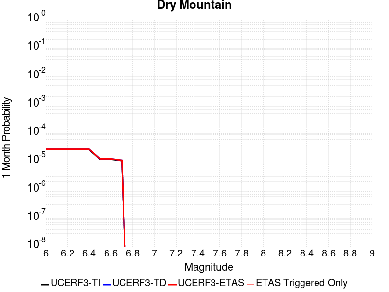 |  |  |

| Magnitude | 1 wk TI Prob | 1 wk TD Prob | 1 wk ETAS Prob | 1 wk ETAS/TD Gain | 1 wk ETAS Triggered Only | 1 mo TI Prob | 1 mo TD Prob | 1 mo ETAS Prob | 1 mo ETAS/TD Gain | 1 mo ETAS Triggered Only | 1 yr TI Prob | 1 yr TD Prob | 1 yr ETAS Prob | 1 yr ETAS/TD Gain | 1 yr ETAS Triggered Only | 10 yr TI Prob | 10 yr TD Prob | 10 yr ETAS Prob | 10 yr ETAS/TD Gain | 10 yr ETAS Triggered Only |
|-----|-----|-----|-----|-----|-----|-----|-----|-----|-----|-----|-----|-----|-----|-----|-----|-----|-----|-----|-----|-----|
| 6.0 | 6.222801E-6 | 6.4395895E-6 | 6.4395895E-6 | 1.0 | 0.0 | 2.6668875E-5 | 2.7598038E-5 | 2.7598038E-5 | 1.0 | 0.0 | 3.2464517E-4 | 3.3597022E-4 | 3.3597022E-4 | 1.0 | 0.0 | 0.0032417132 | 0.003356185 | 0.003411349 | 1.0164365 | 5.5349534E-5 |
| 6.1 | 6.222801E-6 | 6.4395895E-6 | 6.4395895E-6 | 1.0 | 0.0 | 2.6668875E-5 | 2.7598038E-5 | 2.7598038E-5 | 1.0 | 0.0 | 3.2464517E-4 | 3.3597022E-4 | 3.3597022E-4 | 1.0 | 0.0 | 0.0032417132 | 0.003356185 | 0.003411349 | 1.0164365 | 5.5349534E-5 |
| 6.2 | 6.222801E-6 | 6.4395895E-6 | 6.4395895E-6 | 1.0 | 0.0 | 2.6668875E-5 | 2.7598038E-5 | 2.7598038E-5 | 1.0 | 0.0 | 3.2464517E-4 | 3.3597022E-4 | 3.3597022E-4 | 1.0 | 0.0 | 0.0032417132 | 0.003356185 | 0.003411349 | 1.0164365 | 5.5349534E-5 |
| 6.3 | 6.222801E-6 | 6.4395895E-6 | 6.4395895E-6 | 1.0 | 0.0 | 2.6668875E-5 | 2.7598038E-5 | 2.7598038E-5 | 1.0 | 0.0 | 3.2464517E-4 | 3.3597022E-4 | 3.3597022E-4 | 1.0 | 0.0 | 0.0032417132 | 0.003356185 | 0.003411349 | 1.0164365 | 5.5349534E-5 |
| 6.4 | 6.222801E-6 | 6.4395895E-6 | 6.4395895E-6 | 1.0 | 0.0 | 2.6668875E-5 | 2.7598038E-5 | 2.7598038E-5 | 1.0 | 0.0 | 3.2464517E-4 | 3.3597022E-4 | 3.3597022E-4 | 1.0 | 0.0 | 0.0032417132 | 0.003356185 | 0.003411349 | 1.0164365 | 5.5349534E-5 |
| 6.5 | 2.8528623E-6 | 2.9522637E-6 | 2.9522637E-6 | 1.0 | 0.0 | 1.22264955E-5 | 1.26525465E-5 | 1.26525465E-5 | 1.0 | 0.0 | 1.4884741E-4 | 1.5404257E-4 | 1.5404257E-4 | 1.0 | 0.0 | 0.0014874774 | 0.0015402114 | 0.0015678435 | 1.0179405 | 2.7674767E-5 |
| 6.6 | 2.8528623E-6 | 2.9522637E-6 | 2.9522637E-6 | 1.0 | 0.0 | 1.22264955E-5 | 1.26525465E-5 | 1.26525465E-5 | 1.0 | 0.0 | 1.4884741E-4 | 1.5404257E-4 | 1.5404257E-4 | 1.0 | 0.0 | 0.0014874774 | 0.0015402114 | 0.0015678435 | 1.0179405 | 2.7674767E-5 |
| 6.7 | 2.541E-6 | 2.6294429E-6 | 2.6294429E-6 | 1.0 | 0.0 | 1.0889954E-5 | 1.126904E-5 | 1.126904E-5 | 1.0 | 0.0 | 1.3257713E-4 | 1.3720056E-4 | 1.3720056E-4 | 1.0 | 0.0 | 0.0013249806 | 0.0013720057 | 0.0013996424 | 1.0201434 | 2.7674767E-5 |

## San Jacinto (Anza) rev
*[(top)](#table-of-contents)*

| 1 Week | 1 Month | 1 Year | 10 Year |
|-----|-----|-----|-----|
|  |  |  |  |

| Magnitude | 1 wk TI Prob | 1 wk TD Prob | 1 wk ETAS Prob | 1 wk ETAS/TD Gain | 1 wk ETAS Triggered Only | 1 mo TI Prob | 1 mo TD Prob | 1 mo ETAS Prob | 1 mo ETAS/TD Gain | 1 mo ETAS Triggered Only | 1 yr TI Prob | 1 yr TD Prob | 1 yr ETAS Prob | 1 yr ETAS/TD Gain | 1 yr ETAS Triggered Only | 10 yr TI Prob | 10 yr TD Prob | 10 yr ETAS Prob | 10 yr ETAS/TD Gain | 10 yr ETAS Triggered Only |
|-----|-----|-----|-----|-----|-----|-----|-----|-----|-----|-----|-----|-----|-----|-----|-----|-----|-----|-----|-----|-----|
| 6.0 | 6.3015636E-5 | 4.3428E-5 | 4.3428E-5 | 1.0 | 0.0 | 2.7003905E-4 | 1.8610679E-4 | 2.1377641E-4 | 1.148676 | 2.7674767E-5 | 0.0032827691 | 0.0022635076 | 0.0023187317 | 1.0243976 | 5.5349534E-5 | 0.032346968 | 0.023360996 | 0.023415051 | 1.002314 | 5.5349534E-5 |
| 6.1 | 6.3015636E-5 | 4.3428E-5 | 4.3428E-5 | 1.0 | 0.0 | 2.7003905E-4 | 1.8610679E-4 | 2.1377641E-4 | 1.148676 | 2.7674767E-5 | 0.0032827691 | 0.0022635076 | 0.0023187317 | 1.0243976 | 5.5349534E-5 | 0.032346968 | 0.023360996 | 0.023415051 | 1.002314 | 5.5349534E-5 |
| 6.2 | 6.3015636E-5 | 4.3428E-5 | 4.3428E-5 | 1.0 | 0.0 | 2.7003905E-4 | 1.8610679E-4 | 2.1377641E-4 | 1.148676 | 2.7674767E-5 | 0.0032827691 | 0.0022635076 | 0.0023187317 | 1.0243976 | 5.5349534E-5 | 0.032346968 | 0.023360996 | 0.023415051 | 1.002314 | 5.5349534E-5 |
| 6.3 | 6.3015636E-5 | 4.3428E-5 | 4.3428E-5 | 1.0 | 0.0 | 2.7003905E-4 | 1.8610679E-4 | 2.1377641E-4 | 1.148676 | 2.7674767E-5 | 0.0032827691 | 0.0022635076 | 0.0023187317 | 1.0243976 | 5.5349534E-5 | 0.032346968 | 0.023360996 | 0.023415051 | 1.002314 | 5.5349534E-5 |
| 6.4 | 6.3015636E-5 | 4.3428E-5 | 4.3428E-5 | 1.0 | 0.0 | 2.7003905E-4 | 1.8610679E-4 | 2.1377641E-4 | 1.148676 | 2.7674767E-5 | 0.0032827691 | 0.0022635076 | 0.0023187317 | 1.0243976 | 5.5349534E-5 | 0.032346968 | 0.023360996 | 0.023415051 | 1.002314 | 5.5349534E-5 |
| 6.5 | 5.811017E-5 | 4.020185E-5 | 4.020185E-5 | 1.0 | 0.0 | 2.4901982E-4 | 1.7228229E-4 | 1.999523E-4 | 1.1606085 | 2.7674767E-5 | 0.0030276014 | 0.0020955247 | 0.0021507584 | 1.0263579 | 5.5349534E-5 | 0.02986684 | 0.021655614 | 0.021709764 | 1.0025005 | 5.5349534E-5 |
| 6.6 | 5.811017E-5 | 4.020185E-5 | 4.020185E-5 | 1.0 | 0.0 | 2.4901982E-4 | 1.7228229E-4 | 1.999523E-4 | 1.1606085 | 2.7674767E-5 | 0.0030276014 | 0.0020955247 | 0.0021507584 | 1.0263579 | 5.5349534E-5 | 0.02986684 | 0.021655614 | 0.021709764 | 1.0025005 | 5.5349534E-5 |
| 6.7 | 5.712442E-5 | 3.9623283E-5 | 3.9623283E-5 | 1.0 | 0.0 | 2.4479596E-4 | 1.6980304E-4 | 1.9747311E-4 | 1.1629539 | 2.7674767E-5 | 0.0029763177 | 0.0020653973 | 0.0021206324 | 1.0267432 | 5.5349534E-5 | 0.029367693 | 0.021346811 | 0.021400979 | 1.0025375 | 5.5349534E-5 |
| 6.8 | 5.6967532E-5 | 3.9479477E-5 | 3.9479477E-5 | 1.0 | 0.0 | 2.4412372E-4 | 1.6918682E-4 | 1.9685691E-4 | 1.1635475 | 2.7674767E-5 | 0.0029681553 | 0.002057909 | 0.0021131446 | 1.0268407 | 5.5349534E-5 | 0.029288229 | 0.021271437 | 0.02132561 | 1.0025467 | 5.5349534E-5 |
| 6.9 | 5.6211324E-5 | 3.918348E-5 | 3.918348E-5 | 1.0 | 0.0 | 2.4088343E-4 | 1.6791842E-4 | 1.9558854E-4 | 1.1647831 | 2.7674767E-5 | 0.0029288116 | 0.0020424952 | 0.0020977317 | 1.0270436 | 5.5349534E-5 | 0.028905109 | 0.021110468 | 0.021164648 | 1.0025666 | 5.5349534E-5 |
| 7.0 | 5.4383527E-5 | 3.8041388E-5 | 3.8041388E-5 | 1.0 | 0.0 | 2.3305144E-4 | 1.6302435E-4 | 1.9069461E-4 | 1.1697308 | 2.7674767E-5 | 0.0028337094 | 0.0019830195 | 0.0020382593 | 1.0278563 | 5.5349534E-5 | 0.027978465 | 0.020500116 | 0.02055433 | 1.0026447 | 5.5349534E-5 |
| 7.1 | 5.1393665E-5 | 3.650025E-5 | 3.650025E-5 | 1.0 | 0.0 | 2.2023996E-4 | 1.5642028E-4 | 1.8409072E-4 | 1.176898 | 2.7674767E-5 | 0.0026781242 | 0.0019027577 | 0.0019580019 | 1.0290338 | 5.5349534E-5 | 0.026460782 | 0.01967177 | 0.01972603 | 1.0027583 | 5.5349534E-5 |
| 7.2 | 4.785222E-5 | 3.4847708E-5 | 3.4847708E-5 | 1.0 | 0.0 | 2.0506482E-4 | 1.4933878E-4 | 1.7700942E-4 | 1.1852876 | 2.7674767E-5 | 0.0024938055 | 0.0018166869 | 0.0018719359 | 1.030412 | 5.5349534E-5 | 0.024660049 | 0.01878418 | 0.01883849 | 1.0028913 | 5.5349534E-5 |
| 7.3 | 4.2143256E-5 | 3.3939174E-5 | 3.3939174E-5 | 1.0 | 0.0 | 1.8060145E-4 | 1.4544552E-4 | 1.7311625E-4 | 1.1902481 | 2.7674767E-5 | 0.002196605 | 0.0017693643 | 0.0018246159 | 1.0312268 | 5.5349534E-5 | 0.02175019 | 0.018290773 | 0.01834511 | 1.0029707 | 5.5349534E-5 |
| 7.4 | 4.0264713E-5 | 3.3576394E-5 | 3.3576394E-5 | 1.0 | 0.0 | 1.7255165E-4 | 1.4389091E-4 | 1.715617E-4 | 1.1923039 | 2.7674767E-5 | 0.002098792 | 0.0017504676 | 0.0018057202 | 1.0315645 | 5.5349534E-5 | 0.020790804 | 0.01809483 | 0.018149178 | 1.0030035 | 5.5349534E-5 |
| 7.5 | 3.694492E-5 | 3.2287433E-5 | 3.2287433E-5 | 1.0 | 0.0 | 1.5832575E-4 | 1.383674E-4 | 1.6603833E-4 | 1.1999817 | 2.7674767E-5 | 0.0019259118 | 0.0016833243 | 0.0017385806 | 1.0328257 | 5.5349534E-5 | 0.01909306 | 0.017409757 | 0.017464142 | 1.0031239 | 5.5349534E-5 |
| 7.6 | 3.200565E-5 | 2.9594363E-5 | 2.9594363E-5 | 1.0 | 0.0 | 1.3715986E-4 | 1.2682682E-4 | 1.5449808E-4 | 1.2181814 | 2.7674767E-5 | 0.001668642 | 0.0015430251 | 0.0015982892 | 1.0358155 | 5.5349534E-5 | 0.01656168 | 0.015993277 | 0.01604774 | 1.0034055 | 5.5349534E-5 |
| 7.7 | 2.731642E-5 | 2.6180345E-5 | 2.6180345E-5 | 1.0 | 0.0 | 1.1706512E-4 | 1.12196656E-4 | 1.3986832E-4 | 1.2466353 | 2.7674767E-5 | 0.001424336 | 0.0013651394 | 0.0014204134 | 1.0404897 | 5.5349534E-5 | 0.014152412 | 0.014212666 | 0.014267229 | 1.003839 | 5.5349534E-5 |
| 7.8 | 2.3466424E-5 | 2.3588831E-5 | 2.3588831E-5 | 1.0 | 0.0 | 1.0056651E-4 | 1.0109108E-4 | 1.2876304E-4 | 1.273733 | 2.7674767E-5 | 0.0012237094 | 0.0012300898 | 0.0012853713 | 1.044941 | 5.5349534E-5 | 0.012169928 | 0.012852781 | 0.012907419 | 1.0042511 | 5.5349534E-5 |
| 7.9 | 1.8611925E-5 | 1.8983887E-5 | 1.8983887E-5 | 1.0 | 0.0 | 7.9762955E-5 | 8.135698E-5 | 1.0902949E-4 | 1.340137 | 2.7674767E-5 | 9.7068126E-4 | 9.900718E-4 | 0.0010453665 | 1.0558492 | 5.5349534E-5 | 0.0096645225 | 0.010433564 | 0.010488336 | 1.0052496 | 5.5349534E-5 |
| 8.0 | 1.5460775E-5 | 1.5808117E-5 | 1.5808117E-5 | 1.0 | 0.0 | 6.6258784E-5 | 6.7747314E-5 | 9.5420204E-5 | 1.4084722 | 2.7674767E-5 | 8.0640207E-4 | 8.245121E-4 | 8.79816E-4 | 1.0670747 | 5.5349534E-5 | 0.008034821 | 0.008738231 | 0.008793096 | 1.0062789 | 5.5349534E-5 |
| 8.1 | 9.983884E-6 | 8.3092755E-6 | 8.3092755E-6 | 1.0 | 0.0 | 4.2787375E-5 | 3.5610698E-5 | 6.3284475E-5 | 1.7771199 | 2.7674767E-5 | 5.2081177E-4 | 4.3347452E-4 | 4.6113727E-4 | 1.0638164 | 2.7674767E-5 | 0.0051959283 | 0.0046611596 | 0.0046887053 | 1.0059097 | 2.7674767E-5 |
| 8.2 | 4.1226E-6 | 1.5644688E-6 | 1.5644688E-6 | 1.0 | 0.0 | 1.7668166E-5 | 6.704849E-6 | 6.704849E-6 | 1.0 | 0.0 | 2.1508869E-4 | 8.162851E-5 | 8.162851E-5 | 1.0 | 0.0 | 0.0021488064 | 9.4706635E-4 | 9.4706635E-4 | 1.0 | 0.0 |
| 8.3 | 1.2750878E-6 | 3.6436526E-7 | 3.6436526E-7 | 1.0 | 0.0 | 5.4646503E-6 | 1.5615645E-6 | 1.5615645E-6 | 1.0 | 0.0 | 6.653009E-5 | 1.9011886E-5 | 1.9011886E-5 | 1.0 | 0.0 | 6.6510175E-4 | 2.291941E-4 | 2.291941E-4 | 1.0 | 0.0 |

## Oceanic - West Huasna
*[(top)](#table-of-contents)*

| 1 Week | 1 Month | 1 Year | 10 Year |
|-----|-----|-----|-----|
| 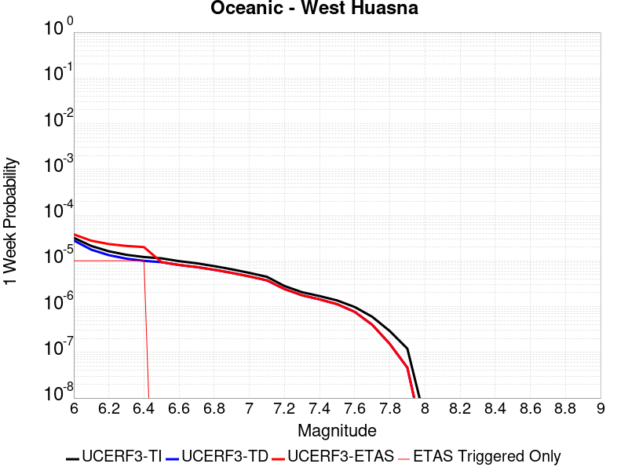 | 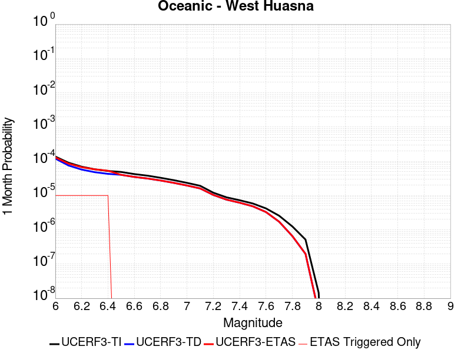 |  |  |

| Magnitude | 1 wk TI Prob | 1 wk TD Prob | 1 wk ETAS Prob | 1 wk ETAS/TD Gain | 1 wk ETAS Triggered Only | 1 mo TI Prob | 1 mo TD Prob | 1 mo ETAS Prob | 1 mo ETAS/TD Gain | 1 mo ETAS Triggered Only | 1 yr TI Prob | 1 yr TD Prob | 1 yr ETAS Prob | 1 yr ETAS/TD Gain | 1 yr ETAS Triggered Only | 10 yr TI Prob | 10 yr TD Prob | 10 yr ETAS Prob | 10 yr ETAS/TD Gain | 10 yr ETAS Triggered Only |
|-----|-----|-----|-----|-----|-----|-----|-----|-----|-----|-----|-----|-----|-----|-----|-----|-----|-----|-----|-----|-----|
| 6.0 | 3.195567E-5 | 2.7928902E-5 | 2.7928902E-5 | 1.0 | 0.0 | 1.3694567E-4 | 1.1969005E-4 | 1.1969005E-4 | 1.0 | 0.0 | 0.0016660384 | 0.0014562954 | 0.0014839298 | 1.0189759 | 2.7674767E-5 | 0.016536033 | 0.014472075 | 0.014526623 | 1.0037693 | 5.5349534E-5 |
| 6.1 | 2.1156782E-5 | 1.7574697E-5 | 1.7574697E-5 | 1.0 | 0.0 | 9.066878E-5 | 7.531801E-5 | 7.531801E-5 | 1.0 | 0.0 | 0.0011033333 | 9.166203E-4 | 9.166203E-4 | 1.0 | 0.0 | 0.010978713 | 0.009129404 | 0.009156826 | 1.0030037 | 2.7674767E-5 |
| 6.2 | 1.6195117E-5 | 1.3328005E-5 | 1.3328005E-5 | 1.0 | 0.0 | 6.9405796E-5 | 5.7118785E-5 | 5.7118785E-5 | 1.0 | 0.0 | 8.44688E-4 | 6.952019E-4 | 6.952019E-4 | 1.0 | 0.0 | 0.008414844 | 0.006930565 | 0.006930565 | 1.0 | 0.0 |
| 6.3 | 1.3559345E-5 | 1.1179818E-5 | 1.1179818E-5 | 1.0 | 0.0 | 5.811018E-5 | 4.7912632E-5 | 4.7912632E-5 | 1.0 | 0.0 | 7.072618E-4 | 5.831811E-4 | 5.831811E-4 | 1.0 | 0.0 | 0.0070501505 | 0.0058166254 | 0.0058166254 | 1.0 | 0.0 |
| 6.4 | 1.2120619E-5 | 1.0001563E-5 | 1.0001563E-5 | 1.0 | 0.0 | 5.1944477E-5 | 4.286314E-5 | 4.286314E-5 | 1.0 | 0.0 | 6.322405E-4 | 5.217343E-4 | 5.217343E-4 | 1.0 | 0.0 | 0.006304447 | 0.0052051614 | 0.0052051614 | 1.0 | 0.0 |
| 6.5 | 1.13511915E-5 | 9.368018E-6 | 9.368018E-6 | 1.0 | 0.0 | 4.8647056E-5 | 4.0148032E-5 | 4.0148032E-5 | 1.0 | 0.0 | 5.9211696E-4 | 4.886931E-4 | 4.886931E-4 | 1.0 | 0.0 | 0.0059054173 | 0.0048762434 | 0.0048762434 | 1.0 | 0.0 |
| 6.6 | 9.850605E-6 | 8.135886E-6 | 8.135886E-6 | 1.0 | 0.0 | 4.2216197E-5 | 3.4867615E-5 | 3.4867615E-5 | 1.0 | 0.0 | 5.1386096E-4 | 4.2443076E-4 | 4.2443076E-4 | 1.0 | 0.0 | 0.0051267436 | 0.004236234 | 0.004236234 | 1.0 | 0.0 |
| 6.7 | 8.8558645E-6 | 7.318854E-6 | 7.318854E-6 | 1.0 | 0.0 | 3.7953152E-5 | 3.136614E-5 | 3.136614E-5 | 1.0 | 0.0 | 4.6198163E-4 | 3.8181603E-4 | 3.8181603E-4 | 1.0 | 0.0 | 0.004610224 | 0.0038116255 | 0.0038116255 | 1.0 | 0.0 |
| 6.8 | 7.67136E-6 | 6.3921275E-6 | 6.3921275E-6 | 1.0 | 0.0 | 3.2876844E-5 | 2.7394546E-5 | 2.7394546E-5 | 1.0 | 0.0 | 4.0020206E-4 | 3.334777E-4 | 3.334777E-4 | 1.0 | 0.0 | 0.003994821 | 0.003329794 | 0.003329794 | 1.0 | 0.0 |
| 6.9 | 6.534529E-6 | 5.4586544E-6 | 5.4586544E-6 | 1.0 | 0.0 | 2.8004823E-5 | 2.3394025E-5 | 2.3394025E-5 | 1.0 | 0.0 | 3.4090536E-4 | 2.8478514E-4 | 2.8478514E-4 | 1.0 | 0.0 | 0.0034038287 | 0.0028442186 | 0.0028442186 | 1.0 | 0.0 |
| 7.0 | 5.460525E-6 | 4.5702373E-6 | 4.5702373E-6 | 1.0 | 0.0 | 2.3402039E-5 | 1.9586585E-5 | 1.9586585E-5 | 1.0 | 0.0 | 2.8488258E-4 | 2.3844068E-4 | 2.3844068E-4 | 1.0 | 0.0 | 0.0028451765 | 0.0023818624 | 0.0023818624 | 1.0 | 0.0 |
| 7.1 | 4.4825083E-6 | 3.752703E-6 | 3.752703E-6 | 1.0 | 0.0 | 1.9210609E-5 | 1.6082913E-5 | 1.6082913E-5 | 1.0 | 0.0 | 2.3386406E-4 | 1.9579197E-4 | 1.9579197E-4 | 1.0 | 0.0 | 0.002336181 | 0.0019562067 | 0.0019562067 | 1.0 | 0.0 |
| 7.2 | 2.821708E-6 | 2.4251485E-6 | 2.4251485E-6 | 1.0 | 0.0 | 1.2092979E-5 | 1.0393452E-5 | 1.0393452E-5 | 1.0 | 0.0 | 1.4722206E-4 | 1.2653293E-4 | 1.2653293E-4 | 1.0 | 0.0 | 0.0014712457 | 0.0012646114 | 0.0012646114 | 1.0 | 0.0 |
| 7.3 | 2.0644757E-6 | 1.768936E-6 | 1.768936E-6 | 1.0 | 0.0 | 8.847723E-6 | 7.5811326E-6 | 7.5811326E-6 | 1.0 | 0.0 | 1.0771569E-4 | 9.229638E-5 | 9.229638E-5 | 1.0 | 0.0 | 0.001076635 | 9.225822E-4 | 9.225822E-4 | 1.0 | 0.0 |
| 7.4 | 1.6980367E-6 | 1.4381669E-6 | 1.4381669E-6 | 1.0 | 0.0 | 7.27728E-6 | 6.163558E-6 | 6.163558E-6 | 1.0 | 0.0 | 8.8597284E-5 | 7.503873E-5 | 7.503873E-5 | 1.0 | 0.0 | 8.8561967E-4 | 7.501356E-4 | 7.501356E-4 | 1.0 | 0.0 |
| 7.5 | 1.3637683E-6 | 1.1304342E-6 | 1.1304342E-6 | 1.0 | 0.0 | 5.844708E-6 | 4.8447087E-6 | 4.8447087E-6 | 1.0 | 0.0 | 7.1156996E-5 | 5.8982736E-5 | 5.8982736E-5 | 1.0 | 0.0 | 7.1134215E-4 | 5.896723E-4 | 5.896723E-4 | 1.0 | 0.0 |
| 7.6 | 9.802994E-7 | 7.6788587E-7 | 7.6788587E-7 | 1.0 | 0.0 | 4.2012766E-6 | 3.2909352E-6 | 3.2909352E-6 | 1.0 | 0.0 | 5.1149345E-5 | 4.00664E-5 | 4.00664E-5 | 1.0 | 0.0 | 5.113757E-4 | 4.0059318E-4 | 4.0059318E-4 | 1.0 | 0.0 |
| 7.7 | 5.986191E-7 | 4.0063287E-7 | 4.0063287E-7 | 1.0 | 0.0 | 2.5655079E-6 | 1.7169968E-6 | 1.7169968E-6 | 1.0 | 0.0 | 3.1234613E-5 | 2.0904237E-5 | 2.0904237E-5 | 1.0 | 0.0 | 3.123022E-4 | 2.0902406E-4 | 2.0902406E-4 | 1.0 | 0.0 |
| 7.8 | 2.9189815E-7 | 1.5296746E-7 | 1.5296746E-7 | 1.0 | 0.0 | 1.2509914E-6 | 6.5557464E-7 | 6.5557464E-7 | 1.0 | 0.0 | 1.5230714E-5 | 7.981593E-6 | 7.981593E-6 | 1.0 | 0.0 | 1.522967E-4 | 7.981437E-5 | 7.981437E-5 | 1.0 | 0.0 |
| 7.9 | 1.2057845E-7 | 4.6273293E-8 | 4.6273293E-8 | 1.0 | 0.0 | 5.1676466E-7 | 1.983141E-7 | 1.983141E-7 | 1.0 | 0.0 | 6.2915915E-6 | 2.4144715E-6 | 2.4144715E-6 | 1.0 | 0.0 | 6.2914136E-5 | 2.4145758E-5 | 2.4145758E-5 | 1.0 | 0.0 |
| 8.0 | 3.3806387E-9 | 9.0348906E-10 | 9.0348906E-10 | 1.0 | 0.0 | 1.4488451E-8 | 3.8720973E-9 | 3.8720973E-9 | 1.0 | 0.0 | 1.7639688E-7 | 4.7142784E-8 | 4.7142784E-8 | 1.0 | 0.0 | 1.7639674E-6 | 4.7252215E-7 | 4.7252215E-7 | 1.0 | 0.0 |

## Chino alt 1
*[(top)](#table-of-contents)*

| 1 Week | 1 Month | 1 Year | 10 Year |
|-----|-----|-----|-----|
| 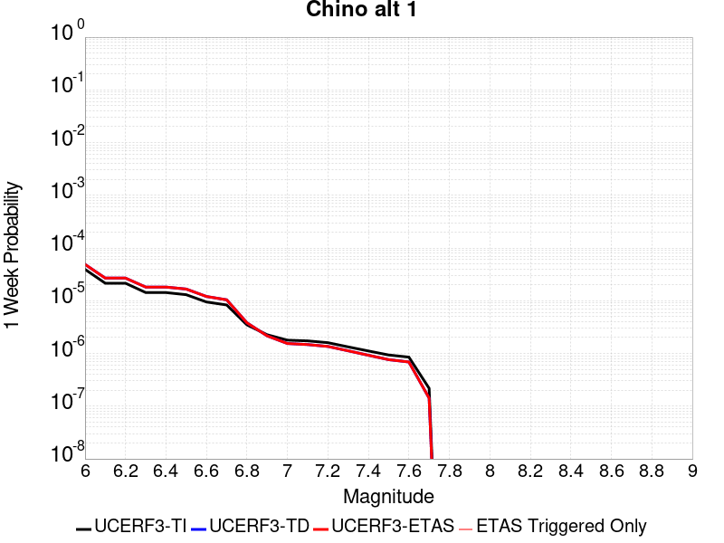 |  |  |  |

| Magnitude | 1 wk TI Prob | 1 wk TD Prob | 1 wk ETAS Prob | 1 wk ETAS/TD Gain | 1 wk ETAS Triggered Only | 1 mo TI Prob | 1 mo TD Prob | 1 mo ETAS Prob | 1 mo ETAS/TD Gain | 1 mo ETAS Triggered Only | 1 yr TI Prob | 1 yr TD Prob | 1 yr ETAS Prob | 1 yr ETAS/TD Gain | 1 yr ETAS Triggered Only | 10 yr TI Prob | 10 yr TD Prob | 10 yr ETAS Prob | 10 yr ETAS/TD Gain | 10 yr ETAS Triggered Only |
|-----|-----|-----|-----|-----|-----|-----|-----|-----|-----|-----|-----|-----|-----|-----|-----|-----|-----|-----|-----|-----|
| 6.0 | 3.939946E-5 | 4.8961843E-5 | 4.8961843E-5 | 1.0 | 0.0 | 1.6884391E-4 | 2.0982254E-4 | 2.0982254E-4 | 1.0 | 0.0 | 0.0020537362 | 0.0025520772 | 0.0025520772 | 1.0 | 0.0 | 0.020348595 | 0.02528456 | 0.02533851 | 1.0021337 | 5.5349534E-5 |
| 6.1 | 2.1505624E-5 | 2.688751E-5 | 2.688751E-5 | 1.0 | 0.0 | 9.2163704E-5 | 1.15227725E-4 | 1.15227725E-4 | 1.0 | 0.0 | 0.0011215154 | 0.0014021061 | 0.0014021061 | 1.0 | 0.0 | 0.011158722 | 0.013949474 | 0.013976763 | 1.0019562 | 2.7674767E-5 |
| 6.2 | 2.1505624E-5 | 2.688751E-5 | 2.688751E-5 | 1.0 | 0.0 | 9.2163704E-5 | 1.15227725E-4 | 1.15227725E-4 | 1.0 | 0.0 | 0.0011215154 | 0.0014021061 | 0.0014021061 | 1.0 | 0.0 | 0.011158722 | 0.013949474 | 0.013976763 | 1.0019562 | 2.7674767E-5 |
| 6.3 | 1.4290785E-5 | 1.8171926E-5 | 1.8171926E-5 | 1.0 | 0.0 | 6.1244784E-5 | 7.7877616E-5 | 7.7877616E-5 | 1.0 | 0.0 | 7.454001E-4 | 9.477929E-4 | 9.477929E-4 | 1.0 | 0.0 | 0.007429048 | 0.009447941 | 0.009475354 | 1.0029016 | 2.7674767E-5 |
| 6.4 | 1.4290785E-5 | 1.8171926E-5 | 1.8171926E-5 | 1.0 | 0.0 | 6.1244784E-5 | 7.7877616E-5 | 7.7877616E-5 | 1.0 | 0.0 | 7.454001E-4 | 9.477929E-4 | 9.477929E-4 | 1.0 | 0.0 | 0.007429048 | 0.009447941 | 0.009475354 | 1.0029016 | 2.7674767E-5 |
| 6.5 | 1.3017944E-5 | 1.665862E-5 | 1.665862E-5 | 1.0 | 0.0 | 5.5789995E-5 | 7.139238E-5 | 7.139238E-5 | 1.0 | 0.0 | 6.790315E-4 | 8.6889946E-4 | 8.6889946E-4 | 1.0 | 0.0 | 0.0067696036 | 0.008665298 | 0.008692733 | 1.0031661 | 2.7674767E-5 |
| 6.6 | 9.470016E-6 | 1.204444E-5 | 1.204444E-5 | 1.0 | 0.0 | 4.058515E-5 | 5.1618197E-5 | 5.1618197E-5 | 1.0 | 0.0 | 4.940122E-4 | 6.283043E-4 | 6.283043E-4 | 1.0 | 0.0 | 0.004929154 | 0.006274481 | 0.0063019823 | 1.004383 | 2.7674767E-5 |
| 6.7 | 8.314155E-6 | 1.0412219E-5 | 1.0412219E-5 | 1.0 | 0.0 | 3.5631605E-5 | 4.4623215E-5 | 4.4623215E-5 | 1.0 | 0.0 | 4.3372845E-4 | 5.4318446E-4 | 5.4318446E-4 | 1.0 | 0.0 | 0.004328829 | 0.005428088 | 0.0054556127 | 1.0050708 | 2.7674767E-5 |
| 6.8 | 3.4856364E-6 | 3.815124E-6 | 3.815124E-6 | 1.0 | 0.0 | 1.4938357E-5 | 1.635044E-5 | 1.635044E-5 | 1.0 | 0.0 | 1.8185932E-4 | 1.9905048E-4 | 1.9905048E-4 | 1.0 | 0.0 | 0.0018171056 | 0.001990398 | 0.0020180177 | 1.0138764 | 2.7674767E-5 |
| 6.9 | 2.2645952E-6 | 2.154167E-6 | 2.154167E-6 | 1.0 | 0.0 | 9.705372E-6 | 9.232113E-6 | 9.232113E-6 | 1.0 | 0.0 | 1.18156495E-4 | 1.123954E-4 | 1.123954E-4 | 1.0 | 0.0 | 0.0011809369 | 0.0011240017 | 0.0011516453 | 1.024594 | 2.7674767E-5 |
| 7.0 | 1.7864003E-6 | 1.5442189E-6 | 1.5442189E-6 | 1.0 | 0.0 | 7.655979E-6 | 6.6180646E-6 | 6.6180646E-6 | 1.0 | 0.0 | 9.3207556E-5 | 8.057201E-5 | 8.057201E-5 | 1.0 | 0.0 | 9.316847E-4 | 8.058752E-4 | 8.335277E-4 | 1.0343136 | 2.7674767E-5 |
| 7.1 | 1.7315456E-6 | 1.4744763E-6 | 1.4744763E-6 | 1.0 | 0.0 | 7.420889E-6 | 6.319169E-6 | 6.319169E-6 | 1.0 | 0.0 | 9.034557E-5 | 7.6933226E-5 | 7.6933226E-5 | 1.0 | 0.0 | 9.0308854E-4 | 7.695039E-4 | 7.9715735E-4 | 1.0359367 | 2.7674767E-5 |
| 7.2 | 1.6008337E-6 | 1.3584987E-6 | 1.3584987E-6 | 1.0 | 0.0 | 6.860698E-6 | 5.8221244E-6 | 5.8221244E-6 | 1.0 | 0.0 | 8.352579E-5 | 7.088212E-5 | 7.088212E-5 | 1.0 | 0.0 | 8.34944E-4 | 7.0901937E-4 | 7.366745E-4 | 1.0390048 | 2.7674767E-5 |
| 7.3 | 1.3320939E-6 | 1.1227842E-6 | 1.1227842E-6 | 1.0 | 0.0 | 5.7089615E-6 | 4.8119236E-6 | 4.8119236E-6 | 1.0 | 0.0 | 6.9504385E-5 | 5.8583642E-5 | 5.8583642E-5 | 1.0 | 0.0 | 6.9482654E-4 | 5.8582664E-4 | 5.8582664E-4 | 1.0 | 0.0 |
| 7.4 | 1.114294E-6 | 9.246506E-7 | 9.246506E-7 | 1.0 | 0.0 | 4.775537E-6 | 3.9627826E-6 | 3.9627826E-6 | 1.0 | 0.0 | 5.8140613E-5 | 4.8245845E-5 | 4.8245845E-5 | 1.0 | 0.0 | 5.81254E-4 | 4.823705E-4 | 4.823705E-4 | 1.0 | 0.0 |
| 7.5 | 9.354081E-7 | 7.632324E-7 | 7.632324E-7 | 1.0 | 0.0 | 4.0088858E-6 | 3.2709918E-6 | 3.2709918E-6 | 1.0 | 0.0 | 4.8807087E-5 | 3.9823633E-5 | 3.9823633E-5 | 1.0 | 0.0 | 4.879637E-4 | 3.9816837E-4 | 3.9816837E-4 | 1.0 | 0.0 |
| 7.6 | 8.521771E-7 | 6.88939E-7 | 6.88939E-7 | 1.0 | 0.0 | 3.6521824E-6 | 2.9525925E-6 | 2.9525925E-6 | 1.0 | 0.0 | 4.4464414E-5 | 3.5947254E-5 | 3.5947254E-5 | 1.0 | 0.0 | 4.4455516E-4 | 3.5941755E-4 | 3.5941755E-4 | 1.0 | 0.0 |
| 7.7 | 2.1803626E-7 | 1.4210343E-7 | 1.4210343E-7 | 1.0 | 0.0 | 9.344408E-7 | 6.090146E-7 | 6.090146E-7 | 1.0 | 0.0 | 1.1376757E-5 | 7.4147374E-6 | 7.4147374E-6 | 1.0 | 0.0 | 1.13761744E-4 | 7.414586E-5 | 7.414586E-5 | 1.0 | 0.0 |

## Robinson Creek
*[(top)](#table-of-contents)*

| 1 Week | 1 Month | 1 Year | 10 Year |
|-----|-----|-----|-----|
|  |  |  |  |

| Magnitude | 1 wk TI Prob | 1 wk TD Prob | 1 wk ETAS Prob | 1 wk ETAS/TD Gain | 1 wk ETAS Triggered Only | 1 mo TI Prob | 1 mo TD Prob | 1 mo ETAS Prob | 1 mo ETAS/TD Gain | 1 mo ETAS Triggered Only | 1 yr TI Prob | 1 yr TD Prob | 1 yr ETAS Prob | 1 yr ETAS/TD Gain | 1 yr ETAS Triggered Only | 10 yr TI Prob | 10 yr TD Prob | 10 yr ETAS Prob | 10 yr ETAS/TD Gain | 10 yr ETAS Triggered Only |
|-----|-----|-----|-----|-----|-----|-----|-----|-----|-----|-----|-----|-----|-----|-----|-----|-----|-----|-----|-----|-----|
| 6.0 | 1.3705327E-5 | 1.5286649E-5 | 1.5286649E-5 | 1.0 | 0.0 | 5.8735794E-5 | 6.551421E-5 | 6.551421E-5 | 1.0 | 0.0 | 7.1487366E-4 | 7.976355E-4 | 8.252882E-4 | 1.0346683 | 2.7674767E-5 | 0.0071257832 | 0.007976355 | 0.008031263 | 1.0068839 | 5.5349534E-5 |
| 6.1 | 1.3705327E-5 | 1.5286649E-5 | 1.5286649E-5 | 1.0 | 0.0 | 5.8735794E-5 | 6.551421E-5 | 6.551421E-5 | 1.0 | 0.0 | 7.1487366E-4 | 7.976355E-4 | 8.252882E-4 | 1.0346683 | 2.7674767E-5 | 0.0071257832 | 0.007976355 | 0.008031263 | 1.0068839 | 5.5349534E-5 |
| 6.2 | 1.3705327E-5 | 1.5286649E-5 | 1.5286649E-5 | 1.0 | 0.0 | 5.8735794E-5 | 6.551421E-5 | 6.551421E-5 | 1.0 | 0.0 | 7.1487366E-4 | 7.976355E-4 | 8.252882E-4 | 1.0346683 | 2.7674767E-5 | 0.0071257832 | 0.007976355 | 0.008031263 | 1.0068839 | 5.5349534E-5 |
| 6.3 | 1.3705327E-5 | 1.5286649E-5 | 1.5286649E-5 | 1.0 | 0.0 | 5.8735794E-5 | 6.551421E-5 | 6.551421E-5 | 1.0 | 0.0 | 7.1487366E-4 | 7.976355E-4 | 8.252882E-4 | 1.0346683 | 2.7674767E-5 | 0.0071257832 | 0.007976355 | 0.008031263 | 1.0068839 | 5.5349534E-5 |
| 6.4 | 1.3705327E-5 | 1.5286649E-5 | 1.5286649E-5 | 1.0 | 0.0 | 5.8735794E-5 | 6.551421E-5 | 6.551421E-5 | 1.0 | 0.0 | 7.1487366E-4 | 7.976355E-4 | 8.252882E-4 | 1.0346683 | 2.7674767E-5 | 0.0071257832 | 0.007976355 | 0.008031263 | 1.0068839 | 5.5349534E-5 |

## Blue Cut
*[(top)](#table-of-contents)*

| 1 Week | 1 Month | 1 Year | 10 Year |
|-----|-----|-----|-----|
|  |  | 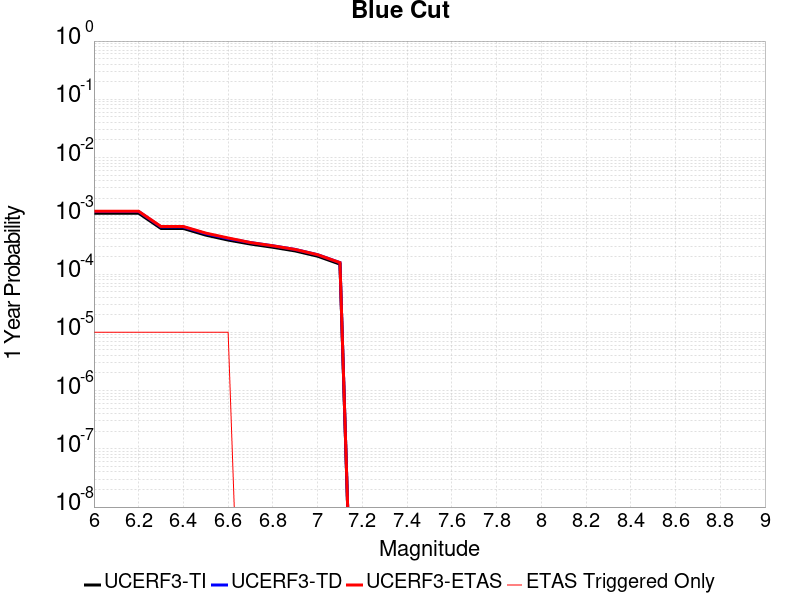 |  |

| Magnitude | 1 wk TI Prob | 1 wk TD Prob | 1 wk ETAS Prob | 1 wk ETAS/TD Gain | 1 wk ETAS Triggered Only | 1 mo TI Prob | 1 mo TD Prob | 1 mo ETAS Prob | 1 mo ETAS/TD Gain | 1 mo ETAS Triggered Only | 1 yr TI Prob | 1 yr TD Prob | 1 yr ETAS Prob | 1 yr ETAS/TD Gain | 1 yr ETAS Triggered Only | 10 yr TI Prob | 10 yr TD Prob | 10 yr ETAS Prob | 10 yr ETAS/TD Gain | 10 yr ETAS Triggered Only |
|-----|-----|-----|-----|-----|-----|-----|-----|-----|-----|-----|-----|-----|-----|-----|-----|-----|-----|-----|-----|-----|
| 6.0 | 2.1227985E-5 | 2.2721058E-5 | 2.2721058E-5 | 1.0 | 0.0 | 9.097391E-5 | 9.7372664E-5 | 9.7372664E-5 | 1.0 | 0.0 | 0.0011070445 | 0.0011849254 | 0.0011849254 | 1.0 | 0.0 | 0.011015458 | 0.011791918 | 0.011846615 | 1.0046386 | 5.5349534E-5 |
| 6.1 | 2.1227985E-5 | 2.2721058E-5 | 2.2721058E-5 | 1.0 | 0.0 | 9.097391E-5 | 9.7372664E-5 | 9.7372664E-5 | 1.0 | 0.0 | 0.0011070445 | 0.0011849254 | 0.0011849254 | 1.0 | 0.0 | 0.011015458 | 0.011791918 | 0.011846615 | 1.0046386 | 5.5349534E-5 |
| 6.2 | 2.1227985E-5 | 2.2721058E-5 | 2.2721058E-5 | 1.0 | 0.0 | 9.097391E-5 | 9.7372664E-5 | 9.7372664E-5 | 1.0 | 0.0 | 0.0011070445 | 0.0011849254 | 0.0011849254 | 1.0 | 0.0 | 0.011015458 | 0.011791918 | 0.011846615 | 1.0046386 | 5.5349534E-5 |
| 6.3 | 1.1613981E-5 | 1.2354273E-5 | 1.2354273E-5 | 1.0 | 0.0 | 4.9773254E-5 | 5.2945878E-5 | 5.2945878E-5 | 1.0 | 0.0 | 6.0582085E-4 | 6.4443785E-4 | 6.4443785E-4 | 1.0 | 0.0 | 0.0060417196 | 0.0064269383 | 0.006454435 | 1.0042784 | 2.7674767E-5 |
| 6.4 | 1.1613981E-5 | 1.2354273E-5 | 1.2354273E-5 | 1.0 | 0.0 | 4.9773254E-5 | 5.2945878E-5 | 5.2945878E-5 | 1.0 | 0.0 | 6.0582085E-4 | 6.4443785E-4 | 6.4443785E-4 | 1.0 | 0.0 | 0.0060417196 | 0.0064269383 | 0.006454435 | 1.0042784 | 2.7674767E-5 |
| 6.5 | 8.931326E-6 | 9.482143E-6 | 9.482143E-6 | 1.0 | 0.0 | 3.8276554E-5 | 4.063717E-5 | 4.063717E-5 | 1.0 | 0.0 | 4.6591737E-4 | 4.946544E-4 | 4.946544E-4 | 1.0 | 0.0 | 0.0046494175 | 0.0049364427 | 0.004963981 | 1.0055785 | 2.7674767E-5 |
| 6.6 | 7.345353E-6 | 7.790717E-6 | 7.790717E-6 | 1.0 | 0.0 | 3.1479703E-5 | 3.3388405E-5 | 3.3388405E-5 | 1.0 | 0.0 | 3.83198E-4 | 4.0643604E-4 | 4.0643604E-4 | 1.0 | 0.0 | 0.0038253788 | 0.0040577184 | 0.004085281 | 1.0067925 | 2.7674767E-5 |
| 6.7 | 6.2775666E-6 | 6.655521E-6 | 6.655521E-6 | 1.0 | 0.0 | 2.690358E-5 | 2.8523391E-5 | 2.8523391E-5 | 1.0 | 0.0 | 3.2750185E-4 | 3.4722447E-4 | 3.4722447E-4 | 1.0 | 0.0 | 0.0032701963 | 0.0034675605 | 0.0034951393 | 1.0079534 | 2.7674767E-5 |
| 6.8 | 5.5234095E-6 | 5.855438E-6 | 5.855438E-6 | 1.0 | 0.0 | 2.367154E-5 | 2.5094532E-5 | 2.5094532E-5 | 1.0 | 0.0 | 2.8816288E-4 | 3.054904E-4 | 3.054904E-4 | 1.0 | 0.0 | 0.002877895 | 0.0030514204 | 0.0030514204 | 1.0 | 0.0 |
| 6.9 | 4.7780054E-6 | 5.0657036E-6 | 5.0657036E-6 | 1.0 | 0.0 | 2.0477004E-5 | 2.1710017E-5 | 2.1710017E-5 | 1.0 | 0.0 | 2.4927902E-4 | 2.6429445E-4 | 2.6429445E-4 | 1.0 | 0.0 | 0.0024899957 | 0.0026404934 | 0.0026404934 | 1.0 | 0.0 |
| 7.0 | 3.883171E-6 | 4.1187186E-6 | 4.1187186E-6 | 1.0 | 0.0 | 1.6642054E-5 | 1.7651571E-5 | 1.7651571E-5 | 1.0 | 0.0 | 2.0259817E-4 | 2.1489357E-4 | 2.1489357E-4 | 1.0 | 0.0 | 0.0020241356 | 0.0021475335 | 0.0021475335 | 1.0 | 0.0 |
| 7.1 | 2.8358215E-6 | 3.0098872E-6 | 3.0098872E-6 | 1.0 | 0.0 | 1.2153464E-5 | 1.289949E-5 | 1.289949E-5 | 1.0 | 0.0 | 1.4795837E-4 | 1.5704655E-4 | 1.5704655E-4 | 1.0 | 0.0 | 0.001478599 | 0.001570001 | 0.001570001 | 1.0 | 0.0 |

## Pinto Mtn
*[(top)](#table-of-contents)*

| 1 Week | 1 Month | 1 Year | 10 Year |
|-----|-----|-----|-----|
|  |  | 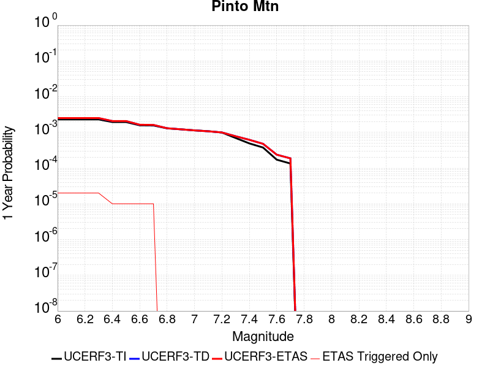 |  |

| Magnitude | 1 wk TI Prob | 1 wk TD Prob | 1 wk ETAS Prob | 1 wk ETAS/TD Gain | 1 wk ETAS Triggered Only | 1 mo TI Prob | 1 mo TD Prob | 1 mo ETAS Prob | 1 mo ETAS/TD Gain | 1 mo ETAS Triggered Only | 1 yr TI Prob | 1 yr TD Prob | 1 yr ETAS Prob | 1 yr ETAS/TD Gain | 1 yr ETAS Triggered Only | 10 yr TI Prob | 10 yr TD Prob | 10 yr ETAS Prob | 10 yr ETAS/TD Gain | 10 yr ETAS Triggered Only |
|-----|-----|-----|-----|-----|-----|-----|-----|-----|-----|-----|-----|-----|-----|-----|-----|-----|-----|-----|-----|-----|
| 6.0 | 4.4194956E-5 | 4.786489E-5 | 4.786489E-5 | 1.0 | 0.0 | 1.893932E-4 | 2.0512004E-4 | 2.0512004E-4 | 1.0 | 0.0 | 0.0023034236 | 0.0024946409 | 0.0024946409 | 1.0 | 0.0 | 0.022796938 | 0.024683883 | 0.024737867 | 1.002187 | 5.5349534E-5 |
| 6.1 | 4.4194956E-5 | 4.786489E-5 | 4.786489E-5 | 1.0 | 0.0 | 1.893932E-4 | 2.0512004E-4 | 2.0512004E-4 | 1.0 | 0.0 | 0.0023034236 | 0.0024946409 | 0.0024946409 | 1.0 | 0.0 | 0.022796938 | 0.024683883 | 0.024737867 | 1.002187 | 5.5349534E-5 |
| 6.2 | 4.4194956E-5 | 4.786489E-5 | 4.786489E-5 | 1.0 | 0.0 | 1.893932E-4 | 2.0512004E-4 | 2.0512004E-4 | 1.0 | 0.0 | 0.0023034236 | 0.0024946409 | 0.0024946409 | 1.0 | 0.0 | 0.022796938 | 0.024683883 | 0.024737867 | 1.002187 | 5.5349534E-5 |
| 6.3 | 4.4194956E-5 | 4.786489E-5 | 4.786489E-5 | 1.0 | 0.0 | 1.893932E-4 | 2.0512004E-4 | 2.0512004E-4 | 1.0 | 0.0 | 0.0023034236 | 0.0024946409 | 0.0024946409 | 1.0 | 0.0 | 0.022796938 | 0.024683883 | 0.024737867 | 1.002187 | 5.5349534E-5 |
| 6.4 | 3.729929E-5 | 3.9612947E-5 | 3.9612947E-5 | 1.0 | 0.0 | 1.5984432E-4 | 1.6975927E-4 | 1.6975927E-4 | 1.0 | 0.0 | 0.0019443673 | 0.0020649533 | 0.0020649533 | 1.0 | 0.0 | 0.019274427 | 0.020467682 | 0.02049479 | 1.0013244 | 2.7674767E-5 |
| 6.5 | 3.729929E-5 | 3.9612947E-5 | 3.9612947E-5 | 1.0 | 0.0 | 1.5984432E-4 | 1.6975927E-4 | 1.6975927E-4 | 1.0 | 0.0 | 0.0019443673 | 0.0020649533 | 0.0020649533 | 1.0 | 0.0 | 0.019274427 | 0.020467682 | 0.02049479 | 1.0013244 | 2.7674767E-5 |
| 6.6 | 3.0204548E-5 | 3.1213625E-5 | 3.1213625E-5 | 1.0 | 0.0 | 1.2944164E-4 | 1.3376602E-4 | 1.3376602E-4 | 1.0 | 0.0 | 0.0015748127 | 0.0016274193 | 0.0016274193 | 1.0 | 0.0 | 0.015636992 | 0.016158886 | 0.016186113 | 1.001685 | 2.7674767E-5 |
| 6.7 | 2.9857754E-5 | 3.0822965E-5 | 3.0822965E-5 | 1.0 | 0.0 | 1.2795553E-4 | 1.3209193E-4 | 1.3209193E-4 | 1.0 | 0.0 | 0.0015567453 | 0.0016070674 | 0.0016070674 | 1.0 | 0.0 | 0.015458848 | 0.015958302 | 0.015985535 | 1.0017065 | 2.7674767E-5 |
| 6.8 | 2.4819734E-5 | 2.501682E-5 | 2.501682E-5 | 1.0 | 0.0 | 1.0636595E-4 | 1.0721066E-4 | 1.0721066E-4 | 1.0 | 0.0 | 0.0012942362 | 0.0013045298 | 0.0013045298 | 1.0 | 0.0 | 0.012867244 | 0.012971088 | 0.012998404 | 1.002106 | 2.7674767E-5 |
| 6.9 | 2.331124E-5 | 2.334493E-5 | 2.334493E-5 | 1.0 | 0.0 | 9.990149E-5 | 1.0004598E-4 | 1.0004598E-4 | 1.0 | 0.0 | 0.001215622 | 0.0012173996 | 0.0012173996 | 1.0 | 0.0 | 0.012089936 | 0.0121094985 | 0.012136838 | 1.0022577 | 2.7674767E-5 |
| 7.0 | 2.1818534E-5 | 2.1767919E-5 | 2.1767919E-5 | 1.0 | 0.0 | 9.3504656E-5 | 9.328786E-5 | 9.328786E-5 | 1.0 | 0.0 | 0.0011378246 | 0.0011352077 | 0.0011352077 | 1.0 | 0.0 | 0.011320163 | 0.011296192 | 0.011323554 | 1.0024222 | 2.7674767E-5 |
| 7.1 | 2.066081E-5 | 2.0547432E-5 | 2.0547432E-5 | 1.0 | 0.0 | 8.854332E-5 | 8.805755E-5 | 8.805755E-5 | 1.0 | 0.0 | 0.0010774818 | 0.001071593 | 0.001071593 | 1.0 | 0.0 | 0.010722724 | 0.01066631 | 0.010693689 | 1.0025669 | 2.7674767E-5 |
| 7.2 | 1.8990233E-5 | 1.906058E-5 | 1.906058E-5 | 1.0 | 0.0 | 8.138417E-5 | 8.168575E-5 | 8.168575E-5 | 1.0 | 0.0 | 9.904018E-4 | 9.940896E-4 | 9.940896E-4 | 1.0 | 0.0 | 0.009859995 | 0.009898428 | 0.009925829 | 1.0027682 | 2.7674767E-5 |
| 7.3 | 1.3335872E-5 | 1.4912702E-5 | 1.4912702E-5 | 1.0 | 0.0 | 5.7152483E-5 | 6.391008E-5 | 6.391008E-5 | 1.0 | 0.0 | 6.956093E-4 | 7.7784027E-4 | 7.7784027E-4 | 1.0 | 0.0 | 0.006934359 | 0.0077524777 | 0.0077524777 | 1.0 | 0.0 |
| 7.4 | 9.414066E-6 | 1.1866629E-5 | 1.1866629E-5 | 1.0 | 0.0 | 4.0345374E-5 | 5.0856044E-5 | 5.0856044E-5 | 1.0 | 0.0 | 4.910942E-4 | 6.190059E-4 | 6.190059E-4 | 1.0 | 0.0 | 0.0049001034 | 0.0061737658 | 0.0061737658 | 1.0 | 0.0 |
| 7.5 | 7.2101157E-6 | 9.1637685E-6 | 9.1637685E-6 | 1.0 | 0.0 | 3.090013E-5 | 3.9272745E-5 | 3.9272745E-5 | 1.0 | 0.0 | 3.7614413E-4 | 4.7804858E-4 | 4.7804858E-4 | 1.0 | 0.0 | 0.0037550807 | 0.0047709784 | 0.0047709784 | 1.0 | 0.0 |
| 7.6 | 3.296375E-6 | 4.5509482E-6 | 4.5509482E-6 | 1.0 | 0.0 | 1.4127245E-5 | 1.9503927E-5 | 1.9503927E-5 | 1.0 | 0.0 | 1.7198564E-4 | 2.3743582E-4 | 2.3743582E-4 | 1.0 | 0.0 | 0.0017185259 | 0.0023719592 | 0.0023719592 | 1.0 | 0.0 |
| 7.7 | 2.5741092E-6 | 3.5895557E-6 | 3.5895557E-6 | 1.0 | 0.0 | 1.103185E-5 | 1.5383726E-5 | 1.5383726E-5 | 1.0 | 0.0 | 1.3430449E-4 | 1.872821E-4 | 1.872821E-4 | 1.0 | 0.0 | 0.0013422335 | 0.0018713729 | 0.0018713729 | 1.0 | 0.0 |

## Mission Ridge-Arroyo Parida-Santa Ana
*[(top)](#table-of-contents)*

| 1 Week | 1 Month | 1 Year | 10 Year |
|-----|-----|-----|-----|
| 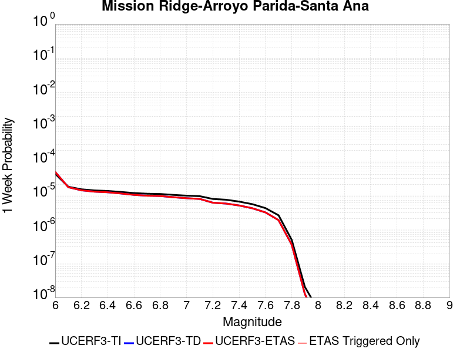 |  | 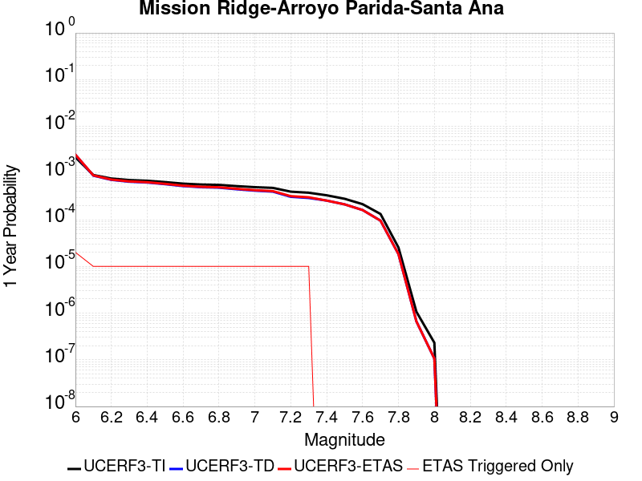 | 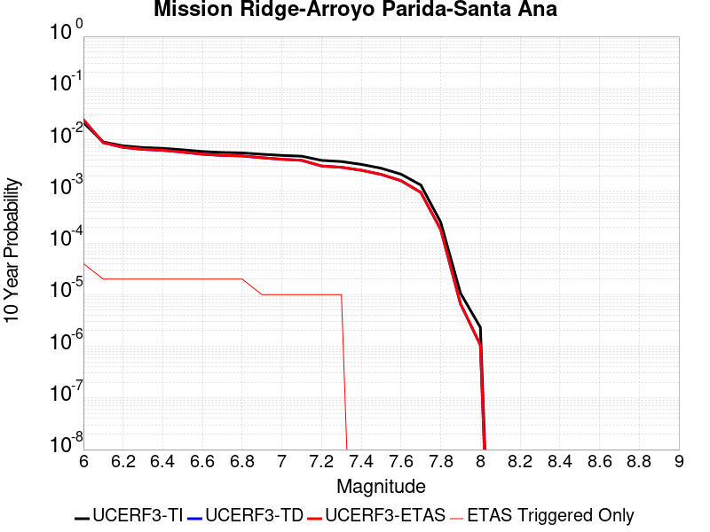 |

| Magnitude | 1 wk TI Prob | 1 wk TD Prob | 1 wk ETAS Prob | 1 wk ETAS/TD Gain | 1 wk ETAS Triggered Only | 1 mo TI Prob | 1 mo TD Prob | 1 mo ETAS Prob | 1 mo ETAS/TD Gain | 1 mo ETAS Triggered Only | 1 yr TI Prob | 1 yr TD Prob | 1 yr ETAS Prob | 1 yr ETAS/TD Gain | 1 yr ETAS Triggered Only | 10 yr TI Prob | 10 yr TD Prob | 10 yr ETAS Prob | 10 yr ETAS/TD Gain | 10 yr ETAS Triggered Only |
|-----|-----|-----|-----|-----|-----|-----|-----|-----|-----|-----|-----|-----|-----|-----|-----|-----|-----|-----|-----|-----|
| 6.0 | 4.169034E-5 | 4.7147558E-5 | 4.7147558E-5 | 1.0 | 0.0 | 1.7866064E-4 | 2.0205017E-4 | 2.0205017E-4 | 1.0 | 0.0 | 0.0021730233 | 0.0024579063 | 0.002485513 | 1.0112318 | 2.7674767E-5 | 0.021518968 | 0.024389295 | 0.024416296 | 1.001107 | 2.7674767E-5 |
| 6.1 | 1.73813E-5 | 1.6856457E-5 | 1.6856457E-5 | 1.0 | 0.0 | 7.4489166E-5 | 7.2240015E-5 | 7.2240015E-5 | 1.0 | 0.0 | 9.065282E-4 | 8.791781E-4 | 9.0682856E-4 | 1.0314503 | 2.7674767E-5 | 0.009028391 | 0.008758142 | 0.008785574 | 1.0031322 | 2.7674767E-5 |
| 6.2 | 1.4622182E-5 | 1.3675061E-5 | 1.3675061E-5 | 1.0 | 0.0 | 6.2664985E-5 | 5.8606114E-5 | 5.8606114E-5 | 1.0 | 0.0 | 7.6267915E-4 | 7.1329967E-4 | 7.409547E-4 | 1.0387706 | 2.7674767E-5 | 0.007600669 | 0.0071105454 | 0.0071380236 | 1.0038644 | 2.7674767E-5 |
| 6.3 | 1.3552434E-5 | 1.2483846E-5 | 1.2483846E-5 | 1.0 | 0.0 | 5.8080568E-5 | 5.3501117E-5 | 5.3501117E-5 | 1.0 | 0.0 | 7.069015E-4 | 6.511846E-4 | 6.788413E-4 | 1.0424714 | 2.7674767E-5 | 0.00704657 | 0.006493128 | 0.006520623 | 1.0042344 | 2.7674767E-5 |
| 6.4 | 1.30977305E-5 | 1.1980751E-5 | 1.1980751E-5 | 1.0 | 0.0 | 5.613192E-5 | 5.1345083E-5 | 5.1345083E-5 | 1.0 | 0.0 | 6.831918E-4 | 6.249501E-4 | 6.5260753E-4 | 1.0442555 | 2.7674767E-5 | 0.006810953 | 0.0062322714 | 0.006259774 | 1.0044129 | 2.7674767E-5 |
| 6.5 | 1.225205E-5 | 1.10503115E-5 | 1.10503115E-5 | 1.0 | 0.0 | 5.2507727E-5 | 4.7357633E-5 | 4.7357633E-5 | 1.0 | 0.0 | 6.3909404E-4 | 5.7642936E-4 | 6.040882E-4 | 1.047983 | 2.7674767E-5 | 0.006372592 | 0.0057496517 | 0.005777167 | 1.0047857 | 2.7674767E-5 |
| 6.6 | 1.1352241E-5 | 1.0064957E-5 | 1.0064957E-5 | 1.0 | 0.0 | 4.8651553E-5 | 4.3134827E-5 | 4.3134827E-5 | 1.0 | 0.0 | 5.921717E-4 | 5.2504207E-4 | 5.527023E-4 | 1.0526819 | 2.7674767E-5 | 0.0059059616 | 0.005238262 | 0.005265792 | 1.0052556 | 2.7674767E-5 |
| 6.7 | 1.0864116E-5 | 9.518387E-6 | 9.518387E-6 | 1.0 | 0.0 | 4.6559664E-5 | 4.079246E-5 | 4.079246E-5 | 1.0 | 0.0 | 5.667165E-4 | 4.96537E-4 | 5.2419805E-4 | 1.0557079 | 2.7674767E-5 | 0.005652734 | 0.00495451 | 0.0049820477 | 1.0055581 | 2.7674767E-5 |
| 6.8 | 1.0666365E-5 | 9.301119E-6 | 9.301119E-6 | 1.0 | 0.0 | 4.571219E-5 | 3.9861337E-5 | 3.9861337E-5 | 1.0 | 0.0 | 5.564038E-4 | 4.8520573E-4 | 5.1286706E-4 | 1.0570095 | 2.7674767E-5 | 0.005550127 | 0.004841696 | 0.0048692366 | 1.0056882 | 2.7674767E-5 |
| 6.9 | 1.0038665E-5 | 8.593301E-6 | 8.593301E-6 | 1.0 | 0.0 | 4.302214E-5 | 3.682792E-5 | 3.682792E-5 | 1.0 | 0.0 | 5.236687E-4 | 4.4828953E-4 | 4.7595188E-4 | 1.0617064 | 2.7674767E-5 | 0.005224364 | 0.004474063 | 0.0045016143 | 1.0061579 | 2.7674767E-5 |
| 7.0 | 9.5379955E-6 | 8.026255E-6 | 8.026255E-6 | 1.0 | 0.0 | 4.0876483E-5 | 3.4397795E-5 | 3.4397795E-5 | 1.0 | 0.0 | 4.975576E-4 | 4.1871436E-4 | 4.4637755E-4 | 1.066067 | 2.7674767E-5 | 0.00496445 | 0.004179454 | 0.004207013 | 1.006594 | 2.7674767E-5 |
| 7.1 | 9.207389E-6 | 7.653507E-6 | 7.653507E-6 | 1.0 | 0.0 | 3.945964E-5 | 3.2800344E-5 | 3.2800344E-5 | 1.0 | 0.0 | 4.803152E-4 | 3.9927269E-4 | 4.269364E-4 | 1.0692853 | 2.7674767E-5 | 0.004792784 | 0.0039857496 | 0.004013314 | 1.0069158 | 2.7674767E-5 |
| 7.2 | 7.638091E-6 | 5.9319927E-6 | 5.9319927E-6 | 1.0 | 0.0 | 3.2734264E-5 | 2.542258E-5 | 2.542258E-5 | 1.0 | 0.0 | 3.984668E-4 | 3.0947628E-4 | 3.3714247E-4 | 1.0893968 | 2.7674767E-5 | 0.0039775306 | 0.0030905097 | 0.003118099 | 1.0089271 | 2.7674767E-5 |
| 7.3 | 7.2500147E-6 | 5.5969795E-6 | 5.5969795E-6 | 1.0 | 0.0 | 3.1071122E-5 | 2.3986835E-5 | 2.3986835E-5 | 1.0 | 0.0 | 3.7822526E-4 | 2.9200088E-4 | 3.1966757E-4 | 1.0947486 | 2.7674767E-5 | 0.0037758215 | 0.0029162276 | 0.0029438217 | 1.0094622 | 2.7674767E-5 |
| 7.4 | 6.3899715E-6 | 4.9192213E-6 | 4.9192213E-6 | 1.0 | 0.0 | 2.7385306E-5 | 2.1082207E-5 | 2.1082207E-5 | 1.0 | 0.0 | 3.3336508E-4 | 2.5664584E-4 | 2.5664584E-4 | 1.0 | 0.0 | 0.0033286542 | 0.002563539 | 0.002563539 | 1.0 | 0.0 |
| 7.5 | 5.379025E-6 | 4.084437E-6 | 4.084437E-6 | 1.0 | 0.0 | 2.305276E-5 | 1.7504613E-5 | 1.7504613E-5 | 1.0 | 0.0 | 2.806312E-4 | 2.1309793E-4 | 2.1309793E-4 | 1.0 | 0.0 | 0.0028027708 | 0.002128947 | 0.002128947 | 1.0 | 0.0 |
| 7.6 | 4.1270696E-6 | 3.0887365E-6 | 3.0887365E-6 | 1.0 | 0.0 | 1.768732E-5 | 1.3237375E-5 | 1.3237375E-5 | 1.0 | 0.0 | 2.1532185E-4 | 1.611532E-4 | 1.611532E-4 | 1.0 | 0.0 | 0.0021511333 | 0.0016103715 | 0.0016103715 | 1.0 | 0.0 |
| 7.7 | 2.5406805E-6 | 1.8284234E-6 | 1.8284234E-6 | 1.0 | 0.0 | 1.0888585E-5 | 7.836077E-6 | 7.836077E-6 | 1.0 | 0.0 | 1.3256045E-4 | 9.540012E-5 | 9.540012E-5 | 1.0 | 0.0 | 0.0013248142 | 9.5359783E-4 | 9.5359783E-4 | 1.0 | 0.0 |
| 7.8 | 4.8608285E-7 | 3.510195E-7 | 3.510195E-7 | 1.0 | 0.0 | 2.0832106E-6 | 1.5043684E-6 | 1.5043684E-6 | 1.0 | 0.0 | 2.5362791E-5 | 1.8315532E-5 | 1.8315532E-5 | 1.0 | 0.0 | 2.5359896E-4 | 1.8314035E-4 | 1.8314035E-4 | 1.0 | 0.0 |
| 7.9 | 2.0472514E-8 | 1.2690956E-8 | 1.2690956E-8 | 1.0 | 0.0 | 8.7739345E-8 | 5.4389808E-8 | 5.4389808E-8 | 1.0 | 0.0 | 1.068226E-6 | 6.621957E-7 | 6.621957E-7 | 1.0 | 0.0 | 1.0682209E-5 | 6.621938E-6 | 6.621938E-6 | 1.0 | 0.0 |
| 8.0 | 4.443582E-9 | 2.0331004E-9 | 2.0331004E-9 | 1.0 | 0.0 | 1.9043922E-8 | 8.713287E-9 | 8.713287E-9 | 1.0 | 0.0 | 2.3185973E-7 | 1.06084265E-7 | 1.06084265E-7 | 1.0 | 0.0 | 2.3185949E-6 | 1.0608422E-6 | 1.0608422E-6 | 1.0 | 0.0 |

## Deep Springs
*[(top)](#table-of-contents)*

| 1 Week | 1 Month | 1 Year | 10 Year |
|-----|-----|-----|-----|
|  | 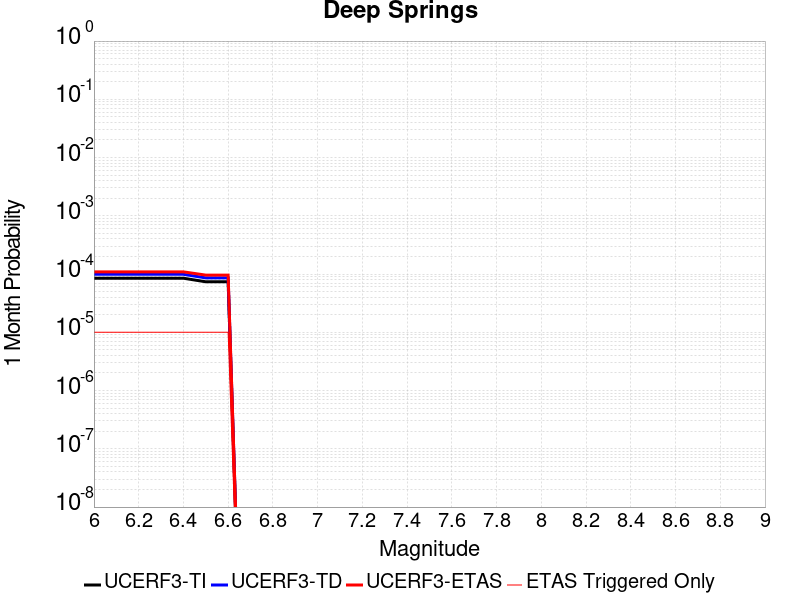 |  |  |

| Magnitude | 1 wk TI Prob | 1 wk TD Prob | 1 wk ETAS Prob | 1 wk ETAS/TD Gain | 1 wk ETAS Triggered Only | 1 mo TI Prob | 1 mo TD Prob | 1 mo ETAS Prob | 1 mo ETAS/TD Gain | 1 mo ETAS Triggered Only | 1 yr TI Prob | 1 yr TD Prob | 1 yr ETAS Prob | 1 yr ETAS/TD Gain | 1 yr ETAS Triggered Only | 10 yr TI Prob | 10 yr TD Prob | 10 yr ETAS Prob | 10 yr ETAS/TD Gain | 10 yr ETAS Triggered Only |
|-----|-----|-----|-----|-----|-----|-----|-----|-----|-----|-----|-----|-----|-----|-----|-----|-----|-----|-----|-----|-----|
| 6.0 | 1.9810619E-5 | 2.3116098E-5 | 2.3116098E-5 | 1.0 | 0.0 | 8.489989E-5 | 9.9068086E-5 | 9.9068086E-5 | 1.0 | 0.0 | 0.001033166 | 0.0012059944 | 0.0012336358 | 1.02292 | 2.7674767E-5 | 0.010283757 | 0.0120442845 | 0.012098967 | 1.0045402 | 5.5349534E-5 |
| 6.1 | 1.9810619E-5 | 2.3116098E-5 | 2.3116098E-5 | 1.0 | 0.0 | 8.489989E-5 | 9.9068086E-5 | 9.9068086E-5 | 1.0 | 0.0 | 0.001033166 | 0.0012059944 | 0.0012336358 | 1.02292 | 2.7674767E-5 | 0.010283757 | 0.0120442845 | 0.012098967 | 1.0045402 | 5.5349534E-5 |
| 6.2 | 1.9810619E-5 | 2.3116098E-5 | 2.3116098E-5 | 1.0 | 0.0 | 8.489989E-5 | 9.9068086E-5 | 9.9068086E-5 | 1.0 | 0.0 | 0.001033166 | 0.0012059944 | 0.0012336358 | 1.02292 | 2.7674767E-5 | 0.010283757 | 0.0120442845 | 0.012098967 | 1.0045402 | 5.5349534E-5 |
| 6.3 | 1.9810619E-5 | 2.3116098E-5 | 2.3116098E-5 | 1.0 | 0.0 | 8.489989E-5 | 9.9068086E-5 | 9.9068086E-5 | 1.0 | 0.0 | 0.001033166 | 0.0012059944 | 0.0012336358 | 1.02292 | 2.7674767E-5 | 0.010283757 | 0.0120442845 | 0.012098967 | 1.0045402 | 5.5349534E-5 |
| 6.4 | 1.9810619E-5 | 2.3116098E-5 | 2.3116098E-5 | 1.0 | 0.0 | 8.489989E-5 | 9.9068086E-5 | 9.9068086E-5 | 1.0 | 0.0 | 0.001033166 | 0.0012059944 | 0.0012336358 | 1.02292 | 2.7674767E-5 | 0.010283757 | 0.0120442845 | 0.012098967 | 1.0045402 | 5.5349534E-5 |
| 6.5 | 1.7190405E-5 | 2.0053652E-5 | 2.0053652E-5 | 1.0 | 0.0 | 7.367108E-5 | 8.594423E-5 | 8.594423E-5 | 1.0 | 0.0 | 8.9657627E-4 | 0.001046371 | 0.0010740168 | 1.0264207 | 2.7674767E-5 | 0.008929676 | 0.010463671 | 0.010518442 | 1.0052344 | 5.5349534E-5 |
| 6.6 | 1.7190405E-5 | 2.0053652E-5 | 2.0053652E-5 | 1.0 | 0.0 | 7.367108E-5 | 8.594423E-5 | 8.594423E-5 | 1.0 | 0.0 | 8.9657627E-4 | 0.001046371 | 0.0010740168 | 1.0264207 | 2.7674767E-5 | 0.008929676 | 0.010463671 | 0.010518442 | 1.0052344 | 5.5349534E-5 |

## San Diego Trough north alt1
*[(top)](#table-of-contents)*

| 1 Week | 1 Month | 1 Year | 10 Year |
|-----|-----|-----|-----|
|  |  |  | 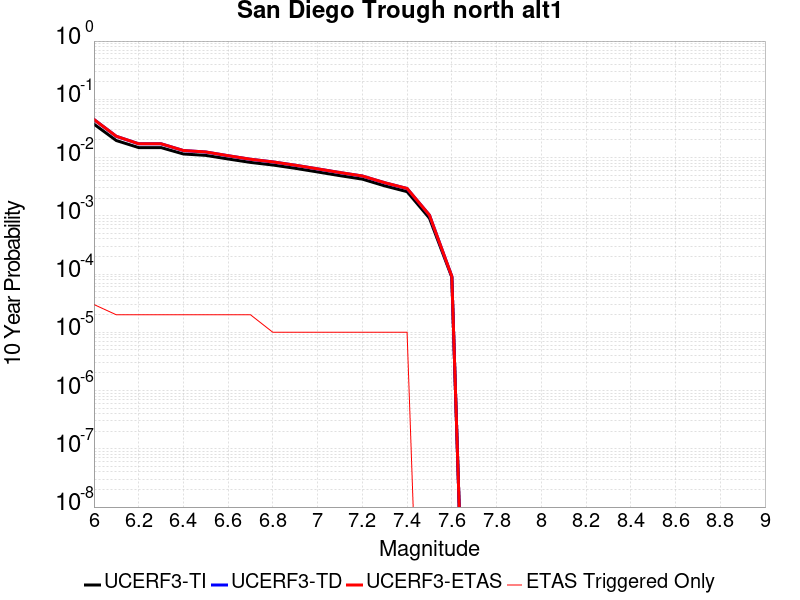 |

| Magnitude | 1 wk TI Prob | 1 wk TD Prob | 1 wk ETAS Prob | 1 wk ETAS/TD Gain | 1 wk ETAS Triggered Only | 1 mo TI Prob | 1 mo TD Prob | 1 mo ETAS Prob | 1 mo ETAS/TD Gain | 1 mo ETAS Triggered Only | 1 yr TI Prob | 1 yr TD Prob | 1 yr ETAS Prob | 1 yr ETAS/TD Gain | 1 yr ETAS Triggered Only | 10 yr TI Prob | 10 yr TD Prob | 10 yr ETAS Prob | 10 yr ETAS/TD Gain | 10 yr ETAS Triggered Only |
|-----|-----|-----|-----|-----|-----|-----|-----|-----|-----|-----|-----|-----|-----|-----|-----|-----|-----|-----|-----|-----|
| 6.0 | 7.329252E-5 | 8.8228146E-5 | 8.8228146E-5 | 1.0 | 0.0 | 3.14073E-4 | 3.780695E-4 | 3.780695E-4 | 1.0 | 0.0 | 0.0038171355 | 0.004593918 | 0.0046490133 | 1.011993 | 5.5349534E-5 | 0.03752231 | 0.04505337 | 0.045106225 | 1.0011731 | 5.5349534E-5 |
| 6.1 | 3.7940346E-5 | 4.489284E-5 | 4.489284E-5 | 1.0 | 0.0 | 1.6259136E-4 | 1.9238425E-4 | 1.9238425E-4 | 1.0 | 0.0 | 0.0019777524 | 0.0023398479 | 0.0023950678 | 1.0235999 | 5.5349534E-5 | 0.019602431 | 0.02316062 | 0.023214689 | 1.0023345 | 5.5349534E-5 |
| 6.2 | 2.8645263E-5 | 3.3301898E-5 | 3.3301898E-5 | 1.0 | 0.0 | 1.2275964E-4 | 1.4271477E-4 | 1.4271477E-4 | 1.0 | 0.0 | 0.0014935739 | 0.001736182 | 0.0017914354 | 1.0318247 | 5.5349534E-5 | 0.0148357535 | 0.017228855 | 0.01728325 | 1.0031573 | 5.5349534E-5 |
| 6.3 | 2.8645263E-5 | 3.3301898E-5 | 3.3301898E-5 | 1.0 | 0.0 | 1.2275964E-4 | 1.4271477E-4 | 1.4271477E-4 | 1.0 | 0.0 | 0.0014935739 | 0.001736182 | 0.0017914354 | 1.0318247 | 5.5349534E-5 | 0.0148357535 | 0.017228855 | 0.01728325 | 1.0031573 | 5.5349534E-5 |
| 6.4 | 2.2204576E-5 | 2.5451813E-5 | 2.5451813E-5 | 1.0 | 0.0 | 9.5159E-5 | 1.0907469E-4 | 1.0907469E-4 | 1.0 | 0.0 | 0.001157945 | 0.0013271853 | 0.0013824614 | 1.0416491 | 5.5349534E-5 | 0.011519298 | 0.013193751 | 0.01324837 | 1.0041398 | 5.5349534E-5 |
| 6.5 | 2.1004838E-5 | 2.4027939E-5 | 2.4027939E-5 | 1.0 | 0.0 | 9.0017624E-5 | 1.0297287E-4 | 1.0297287E-4 | 1.0 | 0.0 | 0.0010954136 | 0.0012529828 | 0.001308263 | 1.0441189 | 5.5349534E-5 | 0.010900296 | 0.012460258 | 0.012514918 | 1.0043868 | 5.5349534E-5 |
| 6.6 | 1.820557E-5 | 2.070745E-5 | 2.070745E-5 | 1.0 | 0.0 | 7.802154E-5 | 8.8743225E-5 | 8.8743225E-5 | 1.0 | 0.0 | 9.4949827E-4 | 0.0010799188 | 0.0011352085 | 1.0511981 | 5.5349534E-5 | 0.009454516 | 0.010747379 | 0.010802134 | 1.0050946 | 5.5349534E-5 |
| 6.7 | 1.5884485E-5 | 1.7985873E-5 | 1.7985873E-5 | 1.0 | 0.0 | 6.807459E-5 | 7.708005E-5 | 7.708005E-5 | 1.0 | 0.0 | 8.284929E-4 | 9.380483E-4 | 9.933459E-4 | 1.0589496 | 5.5349534E-5 | 0.008254109 | 0.009341254 | 0.009396086 | 1.00587 | 5.5349534E-5 |
| 6.8 | 1.4331171E-5 | 1.6203043E-5 | 1.6203043E-5 | 1.0 | 0.0 | 6.141786E-5 | 6.9439775E-5 | 6.9439775E-5 | 1.0 | 0.0 | 7.4750587E-4 | 8.4510335E-4 | 8.727547E-4 | 1.0327195 | 2.7674767E-5 | 0.0074499645 | 0.008419163 | 0.008446604 | 1.0032594 | 2.7674767E-5 |
| 6.9 | 1.2574203E-5 | 1.4207558E-5 | 1.4207558E-5 | 1.0 | 0.0 | 5.3888325E-5 | 6.0888124E-5 | 6.0888124E-5 | 1.0 | 0.0 | 6.558929E-4 | 7.4106216E-4 | 7.687164E-4 | 1.037317 | 2.7674767E-5 | 0.0065396037 | 0.007386096 | 0.007413566 | 1.0037192 | 2.7674767E-5 |
| 7.0 | 1.0883844E-5 | 1.2290745E-5 | 1.2290745E-5 | 1.0 | 0.0 | 4.664421E-5 | 5.2673564E-5 | 5.2673564E-5 | 1.0 | 0.0 | 5.677453E-4 | 6.411129E-4 | 6.6876994E-4 | 1.0431391 | 2.7674767E-5 | 0.00566297 | 0.006392762 | 0.00642026 | 1.0043014 | 2.7674767E-5 |
| 7.1 | 9.393088E-6 | 1.0608303E-5 | 1.0608303E-5 | 1.0 | 0.0 | 4.025547E-5 | 4.5463363E-5 | 4.5463363E-5 | 1.0 | 0.0 | 4.900001E-4 | 5.533767E-4 | 5.810361E-4 | 1.049983 | 2.7674767E-5 | 0.0048892107 | 0.0055200835 | 0.0055476055 | 1.0049858 | 2.7674767E-5 |
| 7.2 | 8.190791E-6 | 9.259755E-6 | 9.259755E-6 | 1.0 | 0.0 | 3.510292E-5 | 3.9684066E-5 | 3.9684066E-5 | 1.0 | 0.0 | 4.2729423E-4 | 4.8304707E-4 | 5.107085E-4 | 1.0572644 | 2.7674767E-5 | 0.0042647356 | 0.004820051 | 0.0048475927 | 1.0057139 | 2.7674767E-5 |
| 7.3 | 6.268162E-6 | 7.0905844E-6 | 7.0905844E-6 | 1.0 | 0.0 | 2.6863276E-5 | 3.0387868E-5 | 3.0387868E-5 | 1.0 | 0.0 | 3.2701128E-4 | 3.699099E-4 | 3.9757442E-4 | 1.0747873 | 2.7674767E-5 | 0.003265305 | 0.0036929876 | 0.0037205603 | 1.0074662 | 2.7674767E-5 |
| 7.4 | 4.985186E-6 | 5.6433773E-6 | 5.6433773E-6 | 1.0 | 0.0 | 2.1364907E-5 | 2.418568E-5 | 2.418568E-5 | 1.0 | 0.0 | 2.600867E-4 | 2.9442125E-4 | 3.2208787E-4 | 1.0939695 | 2.7674767E-5 | 0.002597825 | 0.0029403532 | 0.0029679467 | 1.0093844 | 2.7674767E-5 |
| 7.5 | 1.7489613E-6 | 1.9699116E-6 | 1.9699116E-6 | 1.0 | 0.0 | 7.495527E-6 | 8.442453E-6 | 8.442453E-6 | 1.0 | 0.0 | 9.125422E-5 | 1.02782236E-4 | 1.02782236E-4 | 1.0 | 0.0 | 9.1216754E-4 | 0.001027369 | 0.001027369 | 1.0 | 0.0 |
| 7.6 | 1.6988751E-7 | 1.7534346E-7 | 1.7534346E-7 | 1.0 | 0.0 | 7.2808916E-7 | 7.5147176E-7 | 7.5147176E-7 | 1.0 | 0.0 | 8.864449E-6 | 9.149132E-6 | 9.149132E-6 | 1.0 | 0.0 | 8.8640954E-5 | 9.148775E-5 | 9.148775E-5 | 1.0 | 0.0 |

## San Jacinto (Coyote Creek)
*[(top)](#table-of-contents)*

| 1 Week | 1 Month | 1 Year | 10 Year |
|-----|-----|-----|-----|
|  |  |  |  |

| Magnitude | 1 wk TI Prob | 1 wk TD Prob | 1 wk ETAS Prob | 1 wk ETAS/TD Gain | 1 wk ETAS Triggered Only | 1 mo TI Prob | 1 mo TD Prob | 1 mo ETAS Prob | 1 mo ETAS/TD Gain | 1 mo ETAS Triggered Only | 1 yr TI Prob | 1 yr TD Prob | 1 yr ETAS Prob | 1 yr ETAS/TD Gain | 1 yr ETAS Triggered Only | 10 yr TI Prob | 10 yr TD Prob | 10 yr ETAS Prob | 10 yr ETAS/TD Gain | 10 yr ETAS Triggered Only |
|-----|-----|-----|-----|-----|-----|-----|-----|-----|-----|-----|-----|-----|-----|-----|-----|-----|-----|-----|-----|-----|
| 6.0 | 2.7374346E-5 | 2.4201245E-5 | 2.4201245E-5 | 1.0 | 0.0 | 1.1731335E-4 | 1.0371551E-4 | 1.3138741E-4 | 1.2668058 | 2.7674767E-5 | 0.0014273542 | 0.0012620075 | 0.0013172871 | 1.043803 | 5.5349534E-5 | 0.01418221 | 0.012957485 | 0.013012118 | 1.0042163 | 5.5349534E-5 |
| 6.1 | 2.7374346E-5 | 2.4201245E-5 | 2.4201245E-5 | 1.0 | 0.0 | 1.1731335E-4 | 1.0371551E-4 | 1.3138741E-4 | 1.2668058 | 2.7674767E-5 | 0.0014273542 | 0.0012620075 | 0.0013172871 | 1.043803 | 5.5349534E-5 | 0.01418221 | 0.012957485 | 0.013012118 | 1.0042163 | 5.5349534E-5 |
| 6.2 | 2.7374346E-5 | 2.4201245E-5 | 2.4201245E-5 | 1.0 | 0.0 | 1.1731335E-4 | 1.0371551E-4 | 1.3138741E-4 | 1.2668058 | 2.7674767E-5 | 0.0014273542 | 0.0012620075 | 0.0013172871 | 1.043803 | 5.5349534E-5 | 0.01418221 | 0.012957485 | 0.013012118 | 1.0042163 | 5.5349534E-5 |
| 6.3 | 2.7374346E-5 | 2.4201245E-5 | 2.4201245E-5 | 1.0 | 0.0 | 1.1731335E-4 | 1.0371551E-4 | 1.3138741E-4 | 1.2668058 | 2.7674767E-5 | 0.0014273542 | 0.0012620075 | 0.0013172871 | 1.043803 | 5.5349534E-5 | 0.01418221 | 0.012957485 | 0.013012118 | 1.0042163 | 5.5349534E-5 |
| 6.4 | 2.7374346E-5 | 2.4201245E-5 | 2.4201245E-5 | 1.0 | 0.0 | 1.1731335E-4 | 1.0371551E-4 | 1.3138741E-4 | 1.2668058 | 2.7674767E-5 | 0.0014273542 | 0.0012620075 | 0.0013172871 | 1.043803 | 5.5349534E-5 | 0.01418221 | 0.012957485 | 0.013012118 | 1.0042163 | 5.5349534E-5 |
| 6.5 | 2.7282445E-5 | 2.4087298E-5 | 2.4087298E-5 | 1.0 | 0.0 | 1.16919524E-4 | 1.03227205E-4 | 1.3089912E-4 | 1.268068 | 2.7674767E-5 | 0.0014225657 | 0.0012560693 | 0.0013113493 | 1.0440103 | 5.5349534E-5 | 0.014134934 | 0.012898802 | 0.012953437 | 1.0042357 | 5.5349534E-5 |
| 6.6 | 2.7282445E-5 | 2.4087298E-5 | 2.4087298E-5 | 1.0 | 0.0 | 1.16919524E-4 | 1.03227205E-4 | 1.3089912E-4 | 1.268068 | 2.7674767E-5 | 0.0014225657 | 0.0012560693 | 0.0013113493 | 1.0440103 | 5.5349534E-5 | 0.014134934 | 0.012898802 | 0.012953437 | 1.0042357 | 5.5349534E-5 |
| 6.7 | 2.7216198E-5 | 2.4012403E-5 | 2.4012403E-5 | 1.0 | 0.0 | 1.1663563E-4 | 1.0290625E-4 | 1.3057816E-4 | 1.2689042 | 2.7674767E-5 | 0.0014191137 | 0.0012521661 | 0.0013074464 | 1.0441477 | 5.5349534E-5 | 0.014100855 | 0.012860205 | 0.012914843 | 1.0042486 | 5.5349534E-5 |
| 6.8 | 2.7078617E-5 | 2.3929586E-5 | 2.3929586E-5 | 1.0 | 0.0 | 1.1604605E-4 | 1.0255135E-4 | 1.3022327E-4 | 1.2698349 | 2.7674767E-5 | 0.001411945 | 0.0012478502 | 0.0013031306 | 1.0443006 | 5.5349534E-5 | 0.014030075 | 0.012817332 | 0.012871971 | 1.004263 | 5.5349534E-5 |
| 6.9 | 2.6982952E-5 | 2.3849061E-5 | 2.3849061E-5 | 1.0 | 0.0 | 1.15636096E-4 | 1.0220627E-4 | 1.2987822E-4 | 1.270746 | 2.7674767E-5 | 0.0014069602 | 0.0012436537 | 0.0012989345 | 1.0444503 | 5.5349534E-5 | 0.013980856 | 0.01277563 | 0.012830272 | 1.0042771 | 5.5349534E-5 |
| 7.0 | 2.6449972E-5 | 2.3425959E-5 | 2.3425959E-5 | 1.0 | 0.0 | 1.1335209E-4 | 1.0039312E-4 | 1.280651E-4 | 1.2756363 | 2.7674767E-5 | 0.001379188 | 0.0012216035 | 0.0012768854 | 1.0452535 | 5.5349534E-5 | 0.0137065975 | 0.012556934 | 0.012611588 | 1.0043526 | 5.5349534E-5 |
| 7.1 | 2.6257849E-5 | 2.3251938E-5 | 2.3251938E-5 | 1.0 | 0.0 | 1.1252879E-4 | 9.9647375E-5 | 1.2731938E-4 | 1.2776994 | 2.7674767E-5 | 0.0013691769 | 0.0012125341 | 0.0012678165 | 1.0455924 | 5.5349534E-5 | 0.013607717 | 0.012466772 | 0.012521432 | 1.0043844 | 5.5349534E-5 |
| 7.2 | 2.5270041E-5 | 2.2446282E-5 | 2.2446282E-5 | 1.0 | 0.0 | 1.0829568E-4 | 9.619482E-5 | 1.2386692E-4 | 1.2876673 | 2.7674767E-5 | 0.0013177024 | 0.0011705451 | 0.0012258298 | 1.0472299 | 5.5349534E-5 | 0.013099162 | 0.012047604 | 0.012102286 | 1.0045389 | 5.5349534E-5 |
| 7.3 | 2.339701E-5 | 2.1177344E-5 | 2.1177344E-5 | 1.0 | 0.0 | 1.0026905E-4 | 9.07569E-5 | 1.18429154E-4 | 1.3049053 | 2.7674767E-5 | 0.001220092 | 0.0011044072 | 0.0011596957 | 1.0500616 | 5.5349534E-5 | 0.012134149 | 0.011386134 | 0.011440853 | 1.0048058 | 5.5349534E-5 |
| 7.4 | 2.296333E-5 | 2.0907499E-5 | 2.0907499E-5 | 1.0 | 0.0 | 9.841056E-5 | 8.96005E-5 | 1.1727279E-4 | 1.3088408 | 2.7674767E-5 | 0.0011974899 | 0.0010903423 | 0.0011456314 | 1.050708 | 5.5349534E-5 | 0.011910575 | 0.011245146 | 0.011299874 | 1.0048667 | 5.5349534E-5 |
| 7.5 | 2.2188895E-5 | 2.042997E-5 | 2.042997E-5 | 1.0 | 0.0 | 9.50918E-5 | 8.755409E-5 | 1.1522644E-4 | 1.31606 | 2.7674767E-5 | 0.0011571277 | 0.0010654519 | 0.0011207424 | 1.051894 | 5.5349534E-5 | 0.011511209 | 0.010994537 | 0.011049278 | 1.0049789 | 5.5349534E-5 |
| 7.6 | 2.0013189E-5 | 1.9015033E-5 | 1.9015033E-5 | 1.0 | 0.0 | 8.5767984E-5 | 8.149046E-5 | 1.09162975E-4 | 1.3395797 | 2.7674767E-5 | 0.001043725 | 9.916966E-4 | 0.0010469912 | 1.0557576 | 5.5349534E-5 | 0.010388365 | 0.010251934 | 0.010306716 | 1.0053436 | 5.5349534E-5 |
| 7.7 | 1.7230794E-5 | 1.679477E-5 | 1.679477E-5 | 1.0 | 0.0 | 7.384417E-5 | 7.19756E-5 | 9.964837E-5 | 1.3844744 | 2.7674767E-5 | 8.986819E-4 | 8.7595143E-4 | 9.312525E-4 | 1.0631325 | 5.5349534E-5 | 0.008950562 | 0.009089651 | 0.009144497 | 1.0060339 | 5.5349534E-5 |
| 7.8 | 1.4478809E-5 | 1.5040239E-5 | 1.5040239E-5 | 1.0 | 0.0 | 6.205057E-5 | 6.445658E-5 | 9.212956E-5 | 1.4293275 | 2.7674767E-5 | 7.552038E-4 | 7.844769E-4 | 8.3978305E-4 | 1.0705006 | 5.5349534E-5 | 0.0075264242 | 0.008167172 | 0.00822207 | 1.0067217 | 5.5349534E-5 |
| 7.9 | 1.1114467E-5 | 1.1688853E-5 | 1.1688853E-5 | 1.0 | 0.0 | 4.7632562E-5 | 5.0094128E-5 | 7.776751E-5 | 1.5524276 | 2.7674767E-5 | 5.797721E-4 | 6.097259E-4 | 6.650417E-4 | 1.0907223 | 5.5349534E-5 | 0.0057826187 | 0.006403302 | 0.006458297 | 1.0085886 | 5.5349534E-5 |
| 8.0 | 9.327402E-6 | 9.938787E-6 | 9.938787E-6 | 1.0 | 0.0 | 3.9973966E-5 | 4.259411E-5 | 7.02677E-5 | 1.6497046 | 2.7674767E-5 | 4.8657437E-4 | 5.184604E-4 | 5.7378126E-4 | 1.1067021 | 5.5349534E-5 | 0.0048551033 | 0.0054708044 | 0.005525851 | 1.0100619 | 5.5349534E-5 |
| 8.1 | 7.0235833E-6 | 6.8568274E-6 | 6.8568274E-6 | 1.0 | 0.0 | 3.0100724E-5 | 2.9386076E-5 | 5.7060028E-5 | 1.9417369 | 2.7674767E-5 | 3.664147E-4 | 3.5771725E-4 | 3.8538213E-4 | 1.0773373 | 2.7674767E-5 | 0.003658111 | 0.0038031635 | 0.003830733 | 1.0072491 | 2.7674767E-5 |
| 8.2 | 2.0358202E-6 | 9.054121E-7 | 9.054121E-7 | 1.0 | 0.0 | 8.724915E-6 | 3.880332E-6 | 3.880332E-6 | 1.0 | 0.0 | 1.06220665E-4 | 4.724204E-5 | 4.724204E-5 | 1.0 | 0.0 | 0.001061699 | 5.358857E-4 | 5.358857E-4 | 1.0 | 0.0 |
| 8.3 | 2.0051264E-7 | 6.66786E-8 | 6.66786E-8 | 1.0 | 0.0 | 8.5933965E-7 | 2.857654E-7 | 2.857654E-7 | 1.0 | 0.0 | 1.046241E-5 | 3.4791885E-6 | 3.4791885E-6 | 1.0 | 0.0 | 1.0461917E-4 | 4.0428782E-5 | 4.0428782E-5 | 1.0 | 0.0 |

## Lost Hills
*[(top)](#table-of-contents)*

| 1 Week | 1 Month | 1 Year | 10 Year |
|-----|-----|-----|-----|
|  |  | 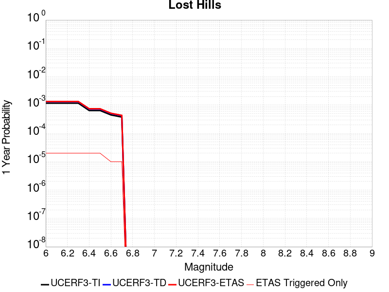 |  |

| Magnitude | 1 wk TI Prob | 1 wk TD Prob | 1 wk ETAS Prob | 1 wk ETAS/TD Gain | 1 wk ETAS Triggered Only | 1 mo TI Prob | 1 mo TD Prob | 1 mo ETAS Prob | 1 mo ETAS/TD Gain | 1 mo ETAS Triggered Only | 1 yr TI Prob | 1 yr TD Prob | 1 yr ETAS Prob | 1 yr ETAS/TD Gain | 1 yr ETAS Triggered Only | 10 yr TI Prob | 10 yr TD Prob | 10 yr ETAS Prob | 10 yr ETAS/TD Gain | 10 yr ETAS Triggered Only |
|-----|-----|-----|-----|-----|-----|-----|-----|-----|-----|-----|-----|-----|-----|-----|-----|-----|-----|-----|-----|-----|
| 6.0 | 2.233523E-5 | 2.5109475E-5 | 2.5109475E-5 | 1.0 | 0.0 | 9.571891E-5 | 1.0760855E-4 | 1.0760855E-4 | 1.0 | 0.0 | 0.0011647546 | 0.0013095147 | 0.0013371534 | 1.0211059 | 2.7674767E-5 | 0.011586686 | 0.013034585 | 0.013089213 | 1.004191 | 5.5349534E-5 |
| 6.1 | 2.233523E-5 | 2.5109475E-5 | 2.5109475E-5 | 1.0 | 0.0 | 9.571891E-5 | 1.0760855E-4 | 1.0760855E-4 | 1.0 | 0.0 | 0.0011647546 | 0.0013095147 | 0.0013371534 | 1.0211059 | 2.7674767E-5 | 0.011586686 | 0.013034585 | 0.013089213 | 1.004191 | 5.5349534E-5 |
| 6.2 | 2.233523E-5 | 2.5109475E-5 | 2.5109475E-5 | 1.0 | 0.0 | 9.571891E-5 | 1.0760855E-4 | 1.0760855E-4 | 1.0 | 0.0 | 0.0011647546 | 0.0013095147 | 0.0013371534 | 1.0211059 | 2.7674767E-5 | 0.011586686 | 0.013034585 | 0.013089213 | 1.004191 | 5.5349534E-5 |
| 6.3 | 2.233523E-5 | 2.5109475E-5 | 2.5109475E-5 | 1.0 | 0.0 | 9.571891E-5 | 1.0760855E-4 | 1.0760855E-4 | 1.0 | 0.0 | 0.0011647546 | 0.0013095147 | 0.0013371534 | 1.0211059 | 2.7674767E-5 | 0.011586686 | 0.013034585 | 0.013089213 | 1.004191 | 5.5349534E-5 |
| 6.4 | 1.2288092E-5 | 1.3782662E-5 | 1.3782662E-5 | 1.0 | 0.0 | 5.2662188E-5 | 5.9067745E-5 | 5.9067745E-5 | 1.0 | 0.0 | 6.409735E-4 | 7.190063E-4 | 7.4666116E-4 | 1.0384626 | 2.7674767E-5 | 0.006391279 | 0.0071760085 | 0.0072034844 | 1.0038289 | 2.7674767E-5 |
| 6.5 | 1.2288092E-5 | 1.3782662E-5 | 1.3782662E-5 | 1.0 | 0.0 | 5.2662188E-5 | 5.9067745E-5 | 5.9067745E-5 | 1.0 | 0.0 | 6.409735E-4 | 7.190063E-4 | 7.4666116E-4 | 1.0384626 | 2.7674767E-5 | 0.006391279 | 0.0071760085 | 0.0072034844 | 1.0038289 | 2.7674767E-5 |
| 6.6 | 8.58281E-6 | 9.634865E-6 | 9.634865E-6 | 1.0 | 0.0 | 3.6782953E-5 | 4.1292096E-5 | 4.1292096E-5 | 1.0 | 0.0 | 4.4774043E-4 | 5.0269853E-4 | 5.0269853E-4 | 1.0 | 0.0 | 0.0044683935 | 0.0050237756 | 0.0050237756 | 1.0 | 0.0 |
| 6.7 | 7.205685E-6 | 8.089221E-6 | 8.089221E-6 | 1.0 | 0.0 | 3.088114E-5 | 3.4668094E-5 | 3.4668094E-5 | 1.0 | 0.0 | 3.7591302E-4 | 4.2208403E-4 | 4.2208403E-4 | 1.0 | 0.0 | 0.0037527776 | 0.00422084 | 0.00422084 | 1.0 | 0.0 |

## Red Mountain
*[(top)](#table-of-contents)*

| 1 Week | 1 Month | 1 Year | 10 Year |
|-----|-----|-----|-----|
| 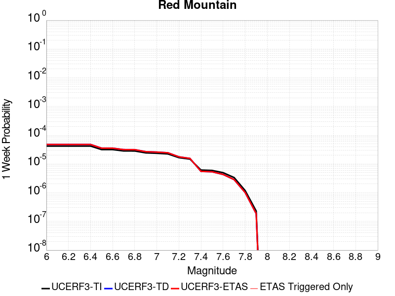 |  |  | 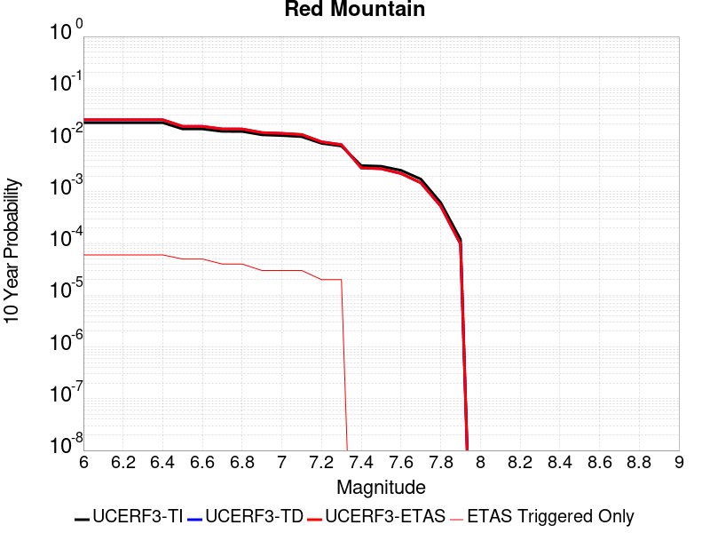 |

| Magnitude | 1 wk TI Prob | 1 wk TD Prob | 1 wk ETAS Prob | 1 wk ETAS/TD Gain | 1 wk ETAS Triggered Only | 1 mo TI Prob | 1 mo TD Prob | 1 mo ETAS Prob | 1 mo ETAS/TD Gain | 1 mo ETAS Triggered Only | 1 yr TI Prob | 1 yr TD Prob | 1 yr ETAS Prob | 1 yr ETAS/TD Gain | 1 yr ETAS Triggered Only | 10 yr TI Prob | 10 yr TD Prob | 10 yr ETAS Prob | 10 yr ETAS/TD Gain | 10 yr ETAS Triggered Only |
|-----|-----|-----|-----|-----|-----|-----|-----|-----|-----|-----|-----|-----|-----|-----|-----|-----|-----|-----|-----|-----|
| 6.0 | 4.1810763E-5 | 4.759736E-5 | 4.759736E-5 | 1.0 | 0.0 | 1.7917668E-4 | 2.0397367E-4 | 2.0397367E-4 | 1.0 | 0.0 | 0.0021792934 | 0.002480717 | 0.002508323 | 1.0111283 | 2.7674767E-5 | 0.021580452 | 0.02454787 | 0.024601862 | 1.0021994 | 5.5349534E-5 |
| 6.1 | 4.1810763E-5 | 4.759736E-5 | 4.759736E-5 | 1.0 | 0.0 | 1.7917668E-4 | 2.0397367E-4 | 2.0397367E-4 | 1.0 | 0.0 | 0.0021792934 | 0.002480717 | 0.002508323 | 1.0111283 | 2.7674767E-5 | 0.021580452 | 0.02454787 | 0.024601862 | 1.0021994 | 5.5349534E-5 |
| 6.2 | 4.1810763E-5 | 4.759736E-5 | 4.759736E-5 | 1.0 | 0.0 | 1.7917668E-4 | 2.0397367E-4 | 2.0397367E-4 | 1.0 | 0.0 | 0.0021792934 | 0.002480717 | 0.002508323 | 1.0111283 | 2.7674767E-5 | 0.021580452 | 0.02454787 | 0.024601862 | 1.0021994 | 5.5349534E-5 |
| 6.3 | 4.1810763E-5 | 4.759736E-5 | 4.759736E-5 | 1.0 | 0.0 | 1.7917668E-4 | 2.0397367E-4 | 2.0397367E-4 | 1.0 | 0.0 | 0.0021792934 | 0.002480717 | 0.002508323 | 1.0111283 | 2.7674767E-5 | 0.021580452 | 0.02454787 | 0.024601862 | 1.0021994 | 5.5349534E-5 |
| 6.4 | 4.1810763E-5 | 4.759736E-5 | 4.759736E-5 | 1.0 | 0.0 | 1.7917668E-4 | 2.0397367E-4 | 2.0397367E-4 | 1.0 | 0.0 | 0.0021792934 | 0.002480717 | 0.002508323 | 1.0111283 | 2.7674767E-5 | 0.021580452 | 0.02454787 | 0.024601862 | 1.0021994 | 5.5349534E-5 |
| 6.5 | 3.154503E-5 | 3.5364967E-5 | 3.5364967E-5 | 1.0 | 0.0 | 1.3518598E-4 | 1.5155585E-4 | 1.5155585E-4 | 1.0 | 0.0 | 0.0016446467 | 0.0018437232 | 0.001871347 | 1.0149826 | 2.7674767E-5 | 0.01632528 | 0.018293923 | 0.018321091 | 1.0014851 | 2.7674767E-5 |
| 6.6 | 3.1535834E-5 | 3.5354347E-5 | 3.5354347E-5 | 1.0 | 0.0 | 1.3514658E-4 | 1.5151035E-4 | 1.5151035E-4 | 1.0 | 0.0 | 0.0016441676 | 0.0018431701 | 0.0018707939 | 1.0149871 | 2.7674767E-5 | 0.01632056 | 0.018288482 | 0.01831565 | 1.0014856 | 2.7674767E-5 |
| 6.7 | 2.8267326E-5 | 3.1473908E-5 | 3.1473908E-5 | 1.0 | 0.0 | 1.2114006E-4 | 1.3488167E-4 | 1.3488167E-4 | 1.0 | 0.0 | 0.0014738824 | 0.0016410325 | 0.001668662 | 1.0168365 | 2.7674767E-5 | 0.014641452 | 0.01629791 | 0.016325135 | 1.0016704 | 2.7674767E-5 |
| 6.8 | 2.8212884E-5 | 3.1411786E-5 | 3.1411786E-5 | 1.0 | 0.0 | 1.20906756E-4 | 1.3461547E-4 | 1.3461547E-4 | 1.0 | 0.0 | 0.0014710457 | 0.0016377963 | 0.0016654257 | 1.0168699 | 2.7674767E-5 | 0.014613459 | 0.016266024 | 0.016293248 | 1.0016737 | 2.7674767E-5 |
| 6.9 | 2.4227871E-5 | 2.6710753E-5 | 2.6710753E-5 | 1.0 | 0.0 | 1.03829596E-4 | 1.14470065E-4 | 1.14470065E-4 | 1.0 | 0.0 | 0.0012633923 | 0.001392858 | 0.0014204942 | 1.0198414 | 2.7674767E-5 | 0.012562336 | 0.013848972 | 0.013876263 | 1.0019706 | 2.7674767E-5 |
| 7.0 | 2.348524E-5 | 2.5839397E-5 | 2.5839397E-5 | 1.0 | 0.0 | 1.0064714E-4 | 1.1073601E-4 | 1.1073601E-4 | 1.0 | 0.0 | 0.0012246901 | 0.0013474526 | 0.0013750902 | 1.0205109 | 2.7674767E-5 | 0.012179627 | 0.013400464 | 0.013427768 | 1.0020375 | 2.7674767E-5 |
| 7.1 | 2.2311642E-5 | 2.4466246E-5 | 2.4466246E-5 | 1.0 | 0.0 | 9.561782E-5 | 1.04851555E-4 | 1.04851555E-4 | 1.0 | 0.0 | 0.0011635252 | 0.0012758949 | 0.0013035344 | 1.0216628 | 2.7674767E-5 | 0.01157452 | 0.012693215 | 0.012720538 | 1.0021526 | 2.7674767E-5 |
| 7.2 | 1.6533986E-5 | 1.7672655E-5 | 1.7672655E-5 | 1.0 | 0.0 | 7.085802E-5 | 7.573811E-5 | 7.573811E-5 | 1.0 | 0.0 | 8.623549E-4 | 9.217849E-4 | 9.494342E-4 | 1.0299953 | 2.7674767E-5 | 0.008590161 | 0.009185895 | 0.009213315 | 1.0029851 | 2.7674767E-5 |
| 7.3 | 1.4703092E-5 | 1.5561527E-5 | 1.5561527E-5 | 1.0 | 0.0 | 6.301173E-5 | 6.66909E-5 | 6.66909E-5 | 1.0 | 0.0 | 7.668978E-4 | 8.117209E-4 | 8.393732E-4 | 1.0340663 | 2.7674767E-5 | 0.0076425658 | 0.0080936365 | 0.008121087 | 1.0033916 | 2.7674767E-5 |
| 7.4 | 6.1331984E-6 | 5.5292867E-6 | 5.5292867E-6 | 1.0 | 0.0 | 2.6284872E-5 | 2.369673E-5 | 2.369673E-5 | 1.0 | 0.0 | 3.199713E-4 | 2.8847004E-4 | 2.8847004E-4 | 1.0 | 0.0 | 0.0031951098 | 0.00288101 | 0.00288101 | 1.0 | 0.0 |
| 7.5 | 5.954766E-6 | 5.3389012E-6 | 5.3389012E-6 | 1.0 | 0.0 | 2.5520176E-5 | 2.2880808E-5 | 2.2880808E-5 | 1.0 | 0.0 | 3.1066386E-4 | 2.7853876E-4 | 2.7853876E-4 | 1.0 | 0.0 | 0.003102299 | 0.0027819504 | 0.0027819504 | 1.0 | 0.0 |
| 7.6 | 4.9726646E-6 | 4.3156206E-6 | 4.3156206E-6 | 1.0 | 0.0 | 2.1311245E-5 | 1.8495388E-5 | 1.8495388E-5 | 1.0 | 0.0 | 2.5943352E-4 | 2.2515841E-4 | 2.2515841E-4 | 1.0 | 0.0 | 0.0025913084 | 0.0022493375 | 0.0022493375 | 1.0 | 0.0 |
| 7.7 | 3.3613894E-6 | 2.8528796E-6 | 2.8528796E-6 | 1.0 | 0.0 | 1.4405875E-5 | 1.2226571E-5 | 1.2226571E-5 | 1.0 | 0.0 | 1.7537741E-4 | 1.488486E-4 | 1.488486E-4 | 1.0 | 0.0 | 0.0017523908 | 0.0014875153 | 0.0014875153 | 1.0 | 0.0 |
| 7.8 | 1.1828961E-6 | 1.0123377E-6 | 1.0123377E-6 | 1.0 | 0.0 | 5.069545E-6 | 4.3385835E-6 | 4.3385835E-6 | 1.0 | 0.0 | 6.171996E-5 | 5.2821004E-5 | 5.2821004E-5 | 1.0 | 0.0 | 6.170282E-4 | 5.280874E-4 | 5.280874E-4 | 1.0 | 0.0 |
| 7.9 | 2.2967266E-7 | 1.8620112E-7 | 1.8620112E-7 | 1.0 | 0.0 | 9.843111E-7 | 7.980046E-7 | 7.980046E-7 | 1.0 | 0.0 | 1.19839215E-5 | 9.715665E-6 | 9.715665E-6 | 1.0 | 0.0 | 1.1983275E-4 | 9.71527E-5 | 9.71527E-5 | 1.0 | 0.0 |

## San Jacinto (San Jacinto Valley) rev
*[(top)](#table-of-contents)*

| 1 Week | 1 Month | 1 Year | 10 Year |
|-----|-----|-----|-----|
|  | 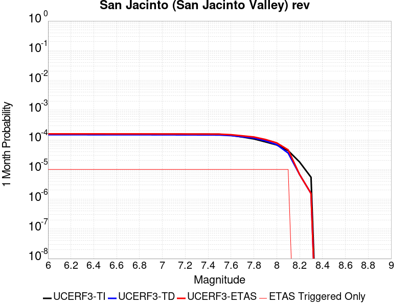 |  |  |

| Magnitude | 1 wk TI Prob | 1 wk TD Prob | 1 wk ETAS Prob | 1 wk ETAS/TD Gain | 1 wk ETAS Triggered Only | 1 mo TI Prob | 1 mo TD Prob | 1 mo ETAS Prob | 1 mo ETAS/TD Gain | 1 mo ETAS Triggered Only | 1 yr TI Prob | 1 yr TD Prob | 1 yr ETAS Prob | 1 yr ETAS/TD Gain | 1 yr ETAS Triggered Only | 10 yr TI Prob | 10 yr TD Prob | 10 yr ETAS Prob | 10 yr ETAS/TD Gain | 10 yr ETAS Triggered Only |
|-----|-----|-----|-----|-----|-----|-----|-----|-----|-----|-----|-----|-----|-----|-----|-----|-----|-----|-----|-----|-----|
| 6.0 | 3.652694E-5 | 3.4511515E-5 | 3.4511515E-5 | 1.0 | 0.0 | 1.5653463E-4 | 1.4789813E-4 | 1.755688E-4 | 1.1870928 | 2.7674767E-5 | 0.0019041431 | 0.0017991741 | 0.0018544241 | 1.0307086 | 5.5349534E-5 | 0.018879099 | 0.018582989 | 0.01863731 | 1.0029231 | 5.5349534E-5 |
| 6.1 | 3.652694E-5 | 3.4511515E-5 | 3.4511515E-5 | 1.0 | 0.0 | 1.5653463E-4 | 1.4789813E-4 | 1.755688E-4 | 1.1870928 | 2.7674767E-5 | 0.0019041431 | 0.0017991741 | 0.0018544241 | 1.0307086 | 5.5349534E-5 | 0.018879099 | 0.018582989 | 0.01863731 | 1.0029231 | 5.5349534E-5 |
| 6.2 | 3.652694E-5 | 3.4511515E-5 | 3.4511515E-5 | 1.0 | 0.0 | 1.5653463E-4 | 1.4789813E-4 | 1.755688E-4 | 1.1870928 | 2.7674767E-5 | 0.0019041431 | 0.0017991741 | 0.0018544241 | 1.0307086 | 5.5349534E-5 | 0.018879099 | 0.018582989 | 0.01863731 | 1.0029231 | 5.5349534E-5 |
| 6.3 | 3.652694E-5 | 3.4511515E-5 | 3.4511515E-5 | 1.0 | 0.0 | 1.5653463E-4 | 1.4789813E-4 | 1.755688E-4 | 1.1870928 | 2.7674767E-5 | 0.0019041431 | 0.0017991741 | 0.0018544241 | 1.0307086 | 5.5349534E-5 | 0.018879099 | 0.018582989 | 0.01863731 | 1.0029231 | 5.5349534E-5 |
| 6.4 | 3.646941E-5 | 3.4433066E-5 | 3.4433066E-5 | 1.0 | 0.0 | 1.5628811E-4 | 1.4756195E-4 | 1.7523264E-4 | 1.1875191 | 2.7674767E-5 | 0.0019011468 | 0.0017950885 | 0.0018503388 | 1.0307785 | 5.5349534E-5 | 0.018849645 | 0.01854286 | 0.018597184 | 1.0029296 | 5.5349534E-5 |
| 6.5 | 3.646941E-5 | 3.4433066E-5 | 3.4433066E-5 | 1.0 | 0.0 | 1.5628811E-4 | 1.4756195E-4 | 1.7523264E-4 | 1.1875191 | 2.7674767E-5 | 0.0019011468 | 0.0017950885 | 0.0018503388 | 1.0307785 | 5.5349534E-5 | 0.018849645 | 0.01854286 | 0.018597184 | 1.0029296 | 5.5349534E-5 |
| 6.6 | 3.6442503E-5 | 3.439644E-5 | 3.439644E-5 | 1.0 | 0.0 | 1.561728E-4 | 1.47405E-4 | 1.7507568E-4 | 1.1877187 | 2.7674767E-5 | 0.0018997455 | 0.0017931808 | 0.0018484311 | 1.0308113 | 5.5349534E-5 | 0.018835869 | 0.018524125 | 0.01857845 | 1.0029327 | 5.5349534E-5 |
| 6.7 | 3.6432113E-5 | 3.4382007E-5 | 3.4382007E-5 | 1.0 | 0.0 | 1.5612828E-4 | 1.4734315E-4 | 1.7501383E-4 | 1.1877975 | 2.7674767E-5 | 0.0018992044 | 0.0017924294 | 0.0018476797 | 1.0308243 | 5.5349534E-5 | 0.018830549 | 0.018516747 | 0.018571071 | 1.0029339 | 5.5349534E-5 |
| 6.8 | 3.6409598E-5 | 3.435105E-5 | 3.435105E-5 | 1.0 | 0.0 | 1.560318E-4 | 1.4721049E-4 | 1.7488119E-4 | 1.1879668 | 2.7674767E-5 | 0.0018980318 | 0.001790817 | 0.0018460675 | 1.0308521 | 5.5349534E-5 | 0.018819023 | 0.018500896 | 0.018555222 | 1.0029364 | 5.5349534E-5 |
| 6.9 | 3.638078E-5 | 3.4311463E-5 | 3.4311463E-5 | 1.0 | 0.0 | 1.5590832E-4 | 1.4704085E-4 | 1.7471155E-4 | 1.1881838 | 2.7674767E-5 | 0.0018965311 | 0.001788755 | 0.0018440055 | 1.0308877 | 5.5349534E-5 | 0.018804269 | 0.018480625 | 0.01853495 | 1.0029397 | 5.5349534E-5 |
| 7.0 | 3.6294874E-5 | 3.4193446E-5 | 3.4193446E-5 | 1.0 | 0.0 | 1.5554018E-4 | 1.4653512E-4 | 1.7420584E-4 | 1.1888334 | 2.7674767E-5 | 0.0018920569 | 0.0017826079 | 0.0018378587 | 1.0309944 | 5.5349534E-5 | 0.018760284 | 0.01842019 | 0.01847452 | 1.0029495 | 5.5349534E-5 |
| 7.1 | 3.6260717E-5 | 3.4149718E-5 | 3.4149718E-5 | 1.0 | 0.0 | 1.5539382E-4 | 1.4634774E-4 | 1.7401845E-4 | 1.1890751 | 2.7674767E-5 | 0.001890278 | 0.0017803301 | 0.0018355811 | 1.0310341 | 5.5349534E-5 | 0.018742796 | 0.018397786 | 0.018452117 | 1.0029532 | 5.5349534E-5 |
| 7.2 | 3.6210204E-5 | 3.4083838E-5 | 3.4083838E-5 | 1.0 | 0.0 | 1.5517735E-4 | 1.4606542E-4 | 1.7373615E-4 | 1.1894406 | 2.7674767E-5 | 0.001887647 | 0.0017768986 | 0.0018321498 | 1.0310942 | 5.5349534E-5 | 0.01871693 | 0.018364016 | 0.01841835 | 1.0029587 | 5.5349534E-5 |
| 7.3 | 3.6119454E-5 | 3.3971908E-5 | 3.3971908E-5 | 1.0 | 0.0 | 1.5478847E-4 | 1.4558579E-4 | 1.7325653E-4 | 1.1900648 | 2.7674767E-5 | 0.0018829206 | 0.0017710685 | 0.0018263201 | 1.0311967 | 5.5349534E-5 | 0.018670462 | 0.018306464 | 0.0183608 | 1.0029682 | 5.5349534E-5 |
| 7.4 | 3.607848E-5 | 3.391935E-5 | 3.391935E-5 | 1.0 | 0.0 | 1.5461289E-4 | 1.4536057E-4 | 1.7303131E-4 | 1.1903594 | 2.7674767E-5 | 0.0018807866 | 0.0017683309 | 0.0018235826 | 1.0312451 | 5.5349534E-5 | 0.018649481 | 0.01827943 | 0.018333767 | 1.0029726 | 5.5349534E-5 |
| 7.5 | 3.5856774E-5 | 3.3728124E-5 | 3.3728124E-5 | 1.0 | 0.0 | 1.5366284E-4 | 1.4454112E-4 | 1.7221188E-4 | 1.1914387 | 2.7674767E-5 | 0.0018692396 | 0.0017583702 | 0.0018136224 | 1.0314224 | 5.5349534E-5 | 0.018535944 | 0.01818001 | 0.018234354 | 1.0029892 | 5.5349534E-5 |
| 7.6 | 3.286655E-5 | 3.2243464E-5 | 3.2243464E-5 | 1.0 | 0.0 | 1.4084904E-4 | 1.3817896E-4 | 1.6584991E-4 | 1.2002543 | 2.7674767E-5 | 0.001713488 | 0.0016810328 | 0.0017362892 | 1.0328705 | 5.5349534E-5 | 0.017003361 | 0.017395703 | 0.01745009 | 1.0031265 | 5.5349534E-5 |
| 7.7 | 2.8882527E-5 | 2.9333987E-5 | 2.9333987E-5 | 1.0 | 0.0 | 1.237764E-4 | 1.2571104E-4 | 1.5338232E-4 | 1.2201182 | 2.7674767E-5 | 0.0015059357 | 0.0015294584 | 0.0015847232 | 1.0361336 | 5.5349534E-5 | 0.014957713 | 0.01588101 | 0.01593548 | 1.0034299 | 5.5349534E-5 |
| 7.8 | 2.4950225E-5 | 2.6621141E-5 | 2.6621141E-5 | 1.0 | 0.0 | 1.0692515E-4 | 1.1408562E-4 | 1.4175722E-4 | 1.2425512 | 2.7674767E-5 | 0.0013010362 | 0.0013881082 | 0.001443381 | 1.0398188 | 5.5349534E-5 | 0.012934455 | 0.014460438 | 0.014514987 | 1.0037723 | 5.5349534E-5 |
| 7.9 | 1.9881603E-5 | 2.1591917E-5 | 2.1591917E-5 | 1.0 | 0.0 | 8.520408E-5 | 9.2533504E-5 | 1.2020571E-4 | 1.2990507 | 2.7674767E-5 | 0.001036866 | 0.0011260139 | 0.0011813012 | 1.0490999 | 5.5349534E-5 | 0.010320415 | 0.011820986 | 0.011875681 | 1.004627 | 5.5349534E-5 |
| 8.0 | 1.563292E-5 | 1.600534E-5 | 1.600534E-5 | 1.0 | 0.0 | 6.6996516E-5 | 6.859251E-5 | 9.626538E-5 | 1.4034386 | 2.7674767E-5 | 8.153773E-4 | 8.3479454E-4 | 8.900979E-4 | 1.0662478 | 5.5349534E-5 | 0.00812392 | 0.0088462895 | 0.008901149 | 1.0062015 | 5.5349534E-5 |
| 8.1 | 1.0045313E-5 | 8.341364E-6 | 8.341364E-6 | 1.0 | 0.0 | 4.305063E-5 | 3.5748217E-5 | 6.342199E-5 | 1.7741303 | 2.7674767E-5 | 5.2401534E-4 | 4.351481E-4 | 4.6281083E-4 | 1.0635709 | 2.7674767E-5 | 0.0052278144 | 0.0046803835 | 0.0047079287 | 1.0058852 | 2.7674767E-5 |
| 8.2 | 4.1554413E-6 | 1.5771562E-6 | 1.5771562E-6 | 1.0 | 0.0 | 1.7808914E-5 | 6.7592237E-6 | 6.7592237E-6 | 1.0 | 0.0 | 2.1680194E-4 | 8.229047E-5 | 8.229047E-5 | 1.0 | 0.0 | 0.0021659054 | 9.549161E-4 | 9.549161E-4 | 1.0 | 0.0 |
| 8.3 | 1.2758221E-6 | 3.6465343E-7 | 3.6465343E-7 | 1.0 | 0.0 | 5.4677976E-6 | 1.5627995E-6 | 1.5627995E-6 | 1.0 | 0.0 | 6.65684E-5 | 1.9026922E-5 | 1.9026922E-5 | 1.0 | 0.0 | 6.6548464E-4 | 2.2936566E-4 | 2.2936566E-4 | 1.0 | 0.0 |

## Pisgah-Bullion Mtn-Mesquite Lk
*[(top)](#table-of-contents)*

| 1 Week | 1 Month | 1 Year | 10 Year |
|-----|-----|-----|-----|
|  |  |  |  |

| Magnitude | 1 wk TI Prob | 1 wk TD Prob | 1 wk ETAS Prob | 1 wk ETAS/TD Gain | 1 wk ETAS Triggered Only | 1 mo TI Prob | 1 mo TD Prob | 1 mo ETAS Prob | 1 mo ETAS/TD Gain | 1 mo ETAS Triggered Only | 1 yr TI Prob | 1 yr TD Prob | 1 yr ETAS Prob | 1 yr ETAS/TD Gain | 1 yr ETAS Triggered Only | 10 yr TI Prob | 10 yr TD Prob | 10 yr ETAS Prob | 10 yr ETAS/TD Gain | 10 yr ETAS Triggered Only |
|-----|-----|-----|-----|-----|-----|-----|-----|-----|-----|-----|-----|-----|-----|-----|-----|-----|-----|-----|-----|-----|
| 6.0 | 3.0240792E-5 | 2.4093786E-5 | 2.4093786E-5 | 1.0 | 0.0 | 1.2959696E-4 | 1.0325557E-4 | 1.0325557E-4 | 1.0 | 0.0 | 0.0015767008 | 0.0012565119 | 0.0012565119 | 1.0 | 0.0 | 0.015655609 | 0.0125041 | 0.012558757 | 1.0043712 | 5.5349534E-5 |
| 6.1 | 3.0240792E-5 | 2.4093786E-5 | 2.4093786E-5 | 1.0 | 0.0 | 1.2959696E-4 | 1.0325557E-4 | 1.0325557E-4 | 1.0 | 0.0 | 0.0015767008 | 0.0012565119 | 0.0012565119 | 1.0 | 0.0 | 0.015655609 | 0.0125041 | 0.012558757 | 1.0043712 | 5.5349534E-5 |
| 6.2 | 3.0240792E-5 | 2.4093786E-5 | 2.4093786E-5 | 1.0 | 0.0 | 1.2959696E-4 | 1.0325557E-4 | 1.0325557E-4 | 1.0 | 0.0 | 0.0015767008 | 0.0012565119 | 0.0012565119 | 1.0 | 0.0 | 0.015655609 | 0.0125041 | 0.012558757 | 1.0043712 | 5.5349534E-5 |
| 6.3 | 2.0498217E-5 | 1.3639363E-5 | 1.3639363E-5 | 1.0 | 0.0 | 8.784654E-5 | 5.8453195E-5 | 5.8453195E-5 | 1.0 | 0.0 | 0.0010690069 | 7.114515E-4 | 7.114515E-4 | 1.0 | 0.0 | 0.01063879 | 0.007093365 | 0.0071208435 | 1.0038738 | 2.7674767E-5 |
| 6.4 | 2.0498217E-5 | 1.3639363E-5 | 1.3639363E-5 | 1.0 | 0.0 | 8.784654E-5 | 5.8453195E-5 | 5.8453195E-5 | 1.0 | 0.0 | 0.0010690069 | 7.114515E-4 | 7.114515E-4 | 1.0 | 0.0 | 0.01063879 | 0.007093365 | 0.0071208435 | 1.0038738 | 2.7674767E-5 |
| 6.5 | 1.7316182E-5 | 1.04779865E-5 | 1.04779865E-5 | 1.0 | 0.0 | 7.42101E-5 | 4.490494E-5 | 4.490494E-5 | 1.0 | 0.0 | 9.0313336E-4 | 5.465905E-4 | 5.465905E-4 | 1.0 | 0.0 | 0.008994718 | 0.005453457 | 0.005480981 | 1.0050471 | 2.7674767E-5 |
| 6.6 | 1.5251077E-5 | 8.415006E-6 | 8.415006E-6 | 1.0 | 0.0 | 6.536012E-5 | 3.6063855E-5 | 3.6063855E-5 | 1.0 | 0.0 | 7.9546886E-4 | 4.3899618E-4 | 4.3899618E-4 | 1.0 | 0.0 | 0.007926274 | 0.0043820073 | 0.004409561 | 1.0062878 | 2.7674767E-5 |
| 6.7 | 1.2997425E-5 | 6.4120336E-6 | 6.4120336E-6 | 1.0 | 0.0 | 5.570206E-5 | 2.747988E-5 | 2.747988E-5 | 1.0 | 0.0 | 6.7796157E-4 | 3.3452085E-4 | 3.3452085E-4 | 1.0 | 0.0 | 0.0067589693 | 0.0033406331 | 0.0033682154 | 1.0082566 | 2.7674767E-5 |
| 6.8 | 1.035386E-5 | 4.333664E-6 | 4.333664E-6 | 1.0 | 0.0 | 4.437293E-5 | 1.8572719E-5 | 1.8572719E-5 | 1.0 | 0.0 | 5.401065E-4 | 2.2610025E-4 | 2.2610025E-4 | 1.0 | 0.0 | 0.0053879567 | 0.002258789 | 0.002286401 | 1.0122243 | 2.7674767E-5 |
| 6.9 | 8.816252E-6 | 3.5810178E-6 | 3.5810178E-6 | 1.0 | 0.0 | 3.778339E-5 | 1.5347132E-5 | 1.5347132E-5 | 1.0 | 0.0 | 4.5991567E-4 | 1.8683591E-4 | 1.8683591E-4 | 1.0 | 0.0 | 0.00458965 | 0.0018668467 | 0.0018944698 | 1.0147966 | 2.7674767E-5 |
| 7.0 | 6.8232207E-6 | 2.567874E-6 | 2.567874E-6 | 1.0 | 0.0 | 2.9242048E-5 | 1.1005129E-5 | 1.1005129E-5 | 1.0 | 0.0 | 3.5596377E-4 | 1.3397953E-4 | 1.3397953E-4 | 1.0 | 0.0 | 0.0035539411 | 0.0013390186 | 0.0013666563 | 1.0206403 | 2.7674767E-5 |
| 7.1 | 5.837013E-6 | 2.2276292E-6 | 2.2276292E-6 | 1.0 | 0.0 | 2.501553E-5 | 9.5469495E-6 | 9.5469495E-6 | 1.0 | 0.0 | 3.045215E-4 | 1.16228206E-4 | 1.16228206E-4 | 1.0 | 0.0 | 0.0030410455 | 0.0011617033 | 0.0011893458 | 1.0237949 | 2.7674767E-5 |
| 7.2 | 4.278052E-6 | 1.6277489E-6 | 1.6277489E-6 | 1.0 | 0.0 | 1.833438E-5 | 6.97605E-6 | 6.97605E-6 | 1.0 | 0.0 | 2.231982E-4 | 8.493033E-5 | 8.493033E-5 | 1.0 | 0.0 | 0.0022297418 | 8.490019E-4 | 8.7665324E-4 | 1.0325692 | 2.7674767E-5 |
| 7.3 | 1.8803692E-6 | 8.345715E-7 | 8.345715E-7 | 1.0 | 0.0 | 8.0587E-6 | 3.576731E-6 | 3.576731E-6 | 1.0 | 0.0 | 9.811026E-5 | 4.3545977E-5 | 4.3545977E-5 | 1.0 | 0.0 | 9.806695E-4 | 4.353889E-4 | 4.353889E-4 | 1.0 | 0.0 |

## San Andreas (Cholame) rev
*[(top)](#table-of-contents)*

| 1 Week | 1 Month | 1 Year | 10 Year |
|-----|-----|-----|-----|
|  |  |  | 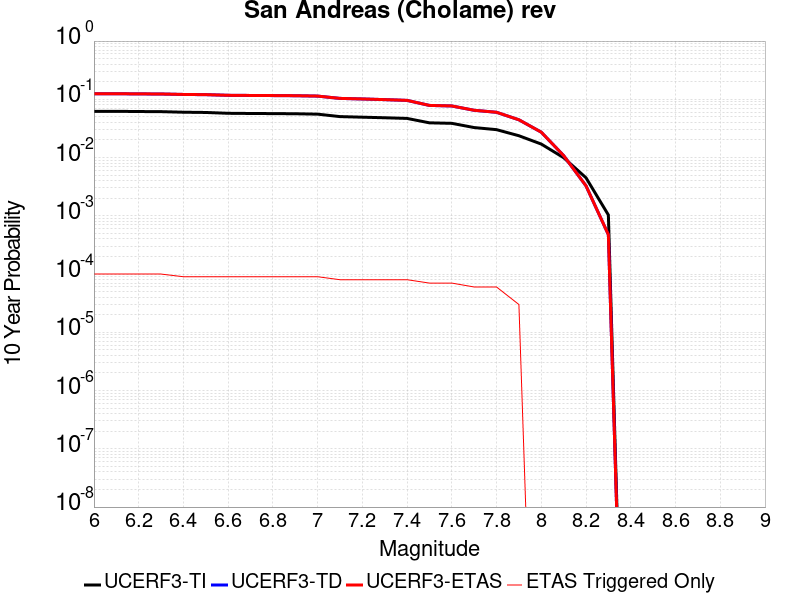 |

| Magnitude | 1 wk TI Prob | 1 wk TD Prob | 1 wk ETAS Prob | 1 wk ETAS/TD Gain | 1 wk ETAS Triggered Only | 1 mo TI Prob | 1 mo TD Prob | 1 mo ETAS Prob | 1 mo ETAS/TD Gain | 1 mo ETAS Triggered Only | 1 yr TI Prob | 1 yr TD Prob | 1 yr ETAS Prob | 1 yr ETAS/TD Gain | 1 yr ETAS Triggered Only | 10 yr TI Prob | 10 yr TD Prob | 10 yr ETAS Prob | 10 yr ETAS/TD Gain | 10 yr ETAS Triggered Only |
|-----|-----|-----|-----|-----|-----|-----|-----|-----|-----|-----|-----|-----|-----|-----|-----|-----|-----|-----|-----|-----|
| 6.0 | 1.2302514E-4 | 2.527211E-4 | 2.527211E-4 | 1.0 | 0.0 | 5.27144E-4 | 0.0010826425 | 0.0010826425 | 1.0 | 0.0 | 0.0063991086 | 0.013102018 | 0.013156642 | 1.0041691 | 5.5349534E-5 | 0.06217949 | 0.12467336 | 0.12472181 | 1.0003886 | 5.5349534E-5 |
| 6.1 | 1.2302514E-4 | 2.527211E-4 | 2.527211E-4 | 1.0 | 0.0 | 5.27144E-4 | 0.0010826425 | 0.0010826425 | 1.0 | 0.0 | 0.0063991086 | 0.013102018 | 0.013156642 | 1.0041691 | 5.5349534E-5 | 0.06217949 | 0.12467336 | 0.12472181 | 1.0003886 | 5.5349534E-5 |
| 6.2 | 1.2203569E-4 | 2.508882E-4 | 2.508882E-4 | 1.0 | 0.0 | 5.2290526E-4 | 0.0010747936 | 0.0010747936 | 1.0 | 0.0 | 0.006347804 | 0.013007604 | 0.013062233 | 1.0041999 | 5.5349534E-5 | 0.061695136 | 0.123859465 | 0.12390796 | 1.0003915 | 5.5349534E-5 |
| 6.3 | 1.2142645E-4 | 2.497474E-4 | 2.497474E-4 | 1.0 | 0.0 | 5.202953E-4 | 0.0010699086 | 0.0010699086 | 1.0 | 0.0 | 0.006316212 | 0.012948836 | 0.013003469 | 1.0042192 | 5.5349534E-5 | 0.06139677 | 0.12335354 | 0.12340207 | 1.0003934 | 5.5349534E-5 |
| 6.4 | 1.1865206E-4 | 2.4479858E-4 | 2.4479858E-4 | 1.0 | 0.0 | 5.0840975E-4 | 0.0010487166 | 0.0010487166 | 1.0 | 0.0 | 0.006172335 | 0.012693855 | 0.012748502 | 1.004305 | 5.5349534E-5 | 0.060036868 | 0.1211454 | 0.12119404 | 1.0004015 | 5.5349534E-5 |
| 6.5 | 1.17443946E-4 | 2.427289E-4 | 2.427289E-4 | 1.0 | 0.0 | 5.032341E-4 | 0.0010398536 | 0.0010398536 | 1.0 | 0.0 | 0.006109677 | 0.012587197 | 0.01264185 | 1.004342 | 5.5349534E-5 | 0.059444077 | 0.12021883 | 0.12026752 | 1.0004051 | 5.5349534E-5 |
| 6.6 | 1.13579066E-4 | 2.3581105E-4 | 2.3581105E-4 | 1.0 | 0.0 | 4.866766E-4 | 0.0010102289 | 0.0010102289 | 1.0 | 0.0 | 0.0059092017 | 0.012230619 | 0.012285291 | 1.0044701 | 5.5349534E-5 | 0.057545185 | 0.11713085 | 0.117179714 | 1.0004172 | 5.5349534E-5 |
| 6.7 | 1.1271412E-4 | 2.3425255E-4 | 2.3425255E-4 | 1.0 | 0.0 | 4.829711E-4 | 0.0010035548 | 0.0010035548 | 1.0 | 0.0 | 0.005864331 | 0.012150271 | 0.012204948 | 1.0045 | 5.5349534E-5 | 0.057119697 | 0.116434015 | 0.11648292 | 1.00042 | 5.5349534E-5 |
| 6.8 | 1.1217975E-4 | 2.3313517E-4 | 2.3313517E-4 | 1.0 | 0.0 | 4.8068175E-4 | 9.987697E-4 | 9.987697E-4 | 1.0 | 0.0 | 0.005836608 | 0.012092661 | 0.012147341 | 1.0045217 | 5.5349534E-5 | 0.056856725 | 0.1159318 | 0.11598074 | 1.0004221 | 5.5349534E-5 |
| 6.9 | 1.1146753E-4 | 2.3162088E-4 | 2.3162088E-4 | 1.0 | 0.0 | 4.7763053E-4 | 9.922847E-4 | 9.922847E-4 | 1.0 | 0.0 | 0.0057996577 | 0.012014581 | 0.012069265 | 1.0045515 | 5.5349534E-5 | 0.056506127 | 0.11525174 | 0.115300715 | 1.0004249 | 5.5349534E-5 |
| 7.0 | 1.0965793E-4 | 2.27849E-4 | 2.27849E-4 | 1.0 | 0.0 | 4.698779E-4 | 9.761318E-4 | 9.761318E-4 | 1.0 | 0.0 | 0.005705768 | 0.011820069 | 0.011874764 | 1.0046273 | 5.5349534E-5 | 0.055614736 | 0.11355178 | 0.11360084 | 1.0004321 | 5.5349534E-5 |
| 7.1 | 9.927982E-5 | 2.0601551E-4 | 2.0601551E-4 | 1.0 | 0.0 | 4.2541555E-4 | 8.826259E-4 | 8.826259E-4 | 1.0 | 0.0 | 0.0051671406 | 0.010693318 | 0.010720697 | 1.0025604 | 2.7674767E-5 | 0.05048634 | 0.10363974 | 0.10366455 | 1.0002394 | 2.7674767E-5 |
| 7.2 | 9.696786E-5 | 2.0105357E-4 | 2.0105357E-4 | 1.0 | 0.0 | 4.1551032E-4 | 8.613746E-4 | 8.613746E-4 | 1.0 | 0.0 | 0.00504711 | 0.010437091 | 0.010464476 | 1.0026239 | 2.7674767E-5 | 0.04934009 | 0.10137658 | 0.10140145 | 1.0002453 | 2.7674767E-5 |
| 7.3 | 9.4727984E-5 | 1.9533654E-4 | 1.9533654E-4 | 1.0 | 0.0 | 4.0591392E-4 | 8.36889E-4 | 8.36889E-4 | 1.0 | 0.0 | 0.0049308087 | 0.010141792 | 0.010169186 | 1.0027012 | 2.7674767E-5 | 0.048228268 | 0.098744355 | 0.0987693 | 1.0002526 | 2.7674767E-5 |
| 7.4 | 9.220358E-5 | 1.8903094E-4 | 1.8903094E-4 | 1.0 | 0.0 | 3.9509835E-4 | 8.09882E-4 | 8.09882E-4 | 1.0 | 0.0 | 0.004799717 | 0.009815983 | 0.009843386 | 1.0027916 | 2.7674767E-5 | 0.046973653 | 0.0958185 | 0.095843524 | 1.0002612 | 2.7674767E-5 |
| 7.5 | 7.71631E-5 | 1.5230462E-4 | 1.5230462E-4 | 1.0 | 0.0 | 3.306571E-4 | 6.52571E-4 | 6.52571E-4 | 1.0 | 0.0 | 0.0040183207 | 0.00791618 | 0.007943636 | 1.0034683 | 2.7674767E-5 | 0.03946433 | 0.07852047 | 0.07854597 | 1.0003247 | 2.7674767E-5 |
| 7.6 | 7.5634416E-5 | 1.4889227E-4 | 1.4889227E-4 | 1.0 | 0.0 | 3.241072E-4 | 6.3795387E-4 | 6.3795387E-4 | 1.0 | 0.0 | 0.0039388672 | 0.007739495 | 0.0077669555 | 1.0035481 | 2.7674767E-5 | 0.038697794 | 0.07688133 | 0.076906875 | 1.0003322 | 2.7674767E-5 |
| 7.7 | 6.3783E-5 | 1.2405147E-4 | 1.2405147E-4 | 1.0 | 0.0 | 2.7332708E-4 | 5.3154083E-4 | 5.3154083E-4 | 1.0 | 0.0 | 0.0033226798 | 0.0064523336 | 0.00647983 | 1.0042615 | 2.7674767E-5 | 0.032734364 | 0.06475253 | 0.06477841 | 1.0003997 | 2.7674767E-5 |
| 7.8 | 5.863422E-5 | 1.1458314E-4 | 1.1458314E-4 | 1.0 | 0.0 | 2.512653E-4 | 4.909782E-4 | 4.909782E-4 | 1.0 | 0.0 | 0.003054864 | 0.005961297 | 0.005988807 | 1.0046147 | 2.7674767E-5 | 0.030132094 | 0.059853055 | 0.059879072 | 1.0004348 | 2.7674767E-5 |
| 7.9 | 4.595283E-5 | 8.457162E-5 | 8.457162E-5 | 1.0 | 0.0 | 1.9692584E-4 | 3.6239944E-4 | 3.6239944E-4 | 1.0 | 0.0 | 0.0023949358 | 0.0044032936 | 0.0044032936 | 1.0 | 0.0 | 0.023692891 | 0.044507682 | 0.044507682 | 1.0 | 0.0 |
| 8.0 | 3.2950178E-5 | 5.0966137E-5 | 5.0966137E-5 | 1.0 | 0.0 | 1.412074E-4 | 2.1840802E-4 | 2.1840802E-4 | 1.0 | 0.0 | 0.0017178444 | 0.0026558768 | 0.0026558768 | 1.0 | 0.0 | 0.017046256 | 0.02727544 | 0.02727544 | 1.0 | 0.0 |
| 8.1 | 1.9177472E-5 | 1.9281335E-5 | 1.9281335E-5 | 1.0 | 0.0 | 8.218658E-5 | 8.2631675E-5 | 8.2631675E-5 | 1.0 | 0.0 | 0.0010001622 | 0.0010055769 | 0.0010055769 | 1.0 | 0.0 | 0.009956728 | 0.010808746 | 0.010808746 | 1.0 | 0.0 |
| 8.2 | 8.643924E-6 | 5.5112705E-6 | 5.5112705E-6 | 1.0 | 0.0 | 3.704486E-5 | 2.3619517E-5 | 2.3619517E-5 | 1.0 | 0.0 | 4.5092785E-4 | 2.8752975E-4 | 2.8752975E-4 | 1.0 | 0.0 | 0.0045001395 | 0.0032686237 | 0.0032686237 | 1.0 | 0.0 |
| 8.3 | 1.983087E-6 | 7.7188406E-7 | 7.7188406E-7 | 1.0 | 0.0 | 8.498917E-6 | 3.3080703E-6 | 3.3080703E-6 | 1.0 | 0.0 | 1.034694E-4 | 4.027503E-5 | 4.027503E-5 | 1.0 | 0.0 | 0.0010342124 | 4.7534908E-4 | 4.7534908E-4 | 1.0 | 0.0 |

## Tin Mountain
*[(top)](#table-of-contents)*

| 1 Week | 1 Month | 1 Year | 10 Year |
|-----|-----|-----|-----|
|  |  |  | 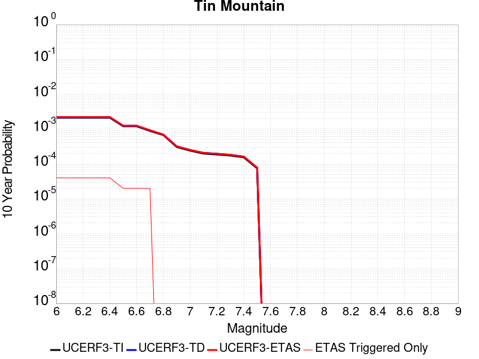 |

| Magnitude | 1 wk TI Prob | 1 wk TD Prob | 1 wk ETAS Prob | 1 wk ETAS/TD Gain | 1 wk ETAS Triggered Only | 1 mo TI Prob | 1 mo TD Prob | 1 mo ETAS Prob | 1 mo ETAS/TD Gain | 1 mo ETAS Triggered Only | 1 yr TI Prob | 1 yr TD Prob | 1 yr ETAS Prob | 1 yr ETAS/TD Gain | 1 yr ETAS Triggered Only | 10 yr TI Prob | 10 yr TD Prob | 10 yr ETAS Prob | 10 yr ETAS/TD Gain | 10 yr ETAS Triggered Only |
|-----|-----|-----|-----|-----|-----|-----|-----|-----|-----|-----|-----|-----|-----|-----|-----|-----|-----|-----|-----|-----|
| 6.0 | 4.083776E-6 | 4.1816297E-6 | 4.1816297E-6 | 1.0 | 0.0 | 1.750178E-5 | 1.792117E-5 | 1.792117E-5 | 1.0 | 0.0 | 2.1306332E-4 | 2.181721E-4 | 2.7350956E-4 | 1.2536412 | 5.5349534E-5 | 0.0021285915 | 0.002179945 | 0.0022351737 | 1.025335 | 5.5349534E-5 |
| 6.1 | 4.083776E-6 | 4.1816297E-6 | 4.1816297E-6 | 1.0 | 0.0 | 1.750178E-5 | 1.792117E-5 | 1.792117E-5 | 1.0 | 0.0 | 2.1306332E-4 | 2.181721E-4 | 2.7350956E-4 | 1.2536412 | 5.5349534E-5 | 0.0021285915 | 0.002179945 | 0.0022351737 | 1.025335 | 5.5349534E-5 |
| 6.2 | 4.083776E-6 | 4.1816297E-6 | 4.1816297E-6 | 1.0 | 0.0 | 1.750178E-5 | 1.792117E-5 | 1.792117E-5 | 1.0 | 0.0 | 2.1306332E-4 | 2.181721E-4 | 2.7350956E-4 | 1.2536412 | 5.5349534E-5 | 0.0021285915 | 0.002179945 | 0.0022351737 | 1.025335 | 5.5349534E-5 |
| 6.3 | 4.083776E-6 | 4.1816297E-6 | 4.1816297E-6 | 1.0 | 0.0 | 1.750178E-5 | 1.792117E-5 | 1.792117E-5 | 1.0 | 0.0 | 2.1306332E-4 | 2.181721E-4 | 2.7350956E-4 | 1.2536412 | 5.5349534E-5 | 0.0021285915 | 0.002179945 | 0.0022351737 | 1.025335 | 5.5349534E-5 |
| 6.4 | 4.083776E-6 | 4.1816297E-6 | 4.1816297E-6 | 1.0 | 0.0 | 1.750178E-5 | 1.792117E-5 | 1.792117E-5 | 1.0 | 0.0 | 2.1306332E-4 | 2.181721E-4 | 2.7350956E-4 | 1.2536412 | 5.5349534E-5 | 0.0021285915 | 0.002179945 | 0.0022351737 | 1.025335 | 5.5349534E-5 |
| 6.5 | 2.3143427E-6 | 2.3732134E-6 | 2.3732134E-6 | 1.0 | 0.0 | 9.9185745E-6 | 1.0170879E-5 | 1.0170879E-5 | 1.0 | 0.0 | 1.2075195E-4 | 1.238242E-4 | 1.238242E-4 | 1.0 | 0.0 | 0.0012068636 | 0.0012376279 | 0.0012376279 | 1.0 | 0.0 |
| 6.6 | 2.3143427E-6 | 2.3732134E-6 | 2.3732134E-6 | 1.0 | 0.0 | 9.9185745E-6 | 1.0170879E-5 | 1.0170879E-5 | 1.0 | 0.0 | 1.2075195E-4 | 1.238242E-4 | 1.238242E-4 | 1.0 | 0.0 | 0.0012068636 | 0.0012376279 | 0.0012376279 | 1.0 | 0.0 |
| 6.7 | 1.7029532E-6 | 1.7498364E-6 | 1.7498364E-6 | 1.0 | 0.0 | 7.2983503E-6 | 7.4992804E-6 | 7.4992804E-6 | 1.0 | 0.0 | 8.885379E-5 | 9.130045E-5 | 9.130045E-5 | 1.0 | 0.0 | 8.881827E-4 | 9.1268204E-4 | 9.1268204E-4 | 1.0 | 0.0 |
| 6.8 | 1.2914646E-6 | 1.3299749E-6 | 1.3299749E-6 | 1.0 | 0.0 | 5.534837E-6 | 5.6998824E-6 | 5.6998824E-6 | 1.0 | 0.0 | 6.738455E-5 | 6.93943E-5 | 6.93943E-5 | 1.0 | 0.0 | 6.736412E-4 | 6.9376966E-4 | 6.9376966E-4 | 1.0 | 0.0 |
| 6.9 | 5.8708974E-7 | 6.1172324E-7 | 6.1172324E-7 | 1.0 | 0.0 | 2.5160964E-6 | 2.6216685E-6 | 2.6216685E-6 | 1.0 | 0.0 | 3.0633044E-5 | 3.191839E-5 | 3.191839E-5 | 1.0 | 0.0 | 3.0628822E-4 | 3.1914216E-4 | 3.1914216E-4 | 1.0 | 0.0 |
| 7.0 | 4.6248786E-7 | 4.8322164E-7 | 4.8322164E-7 | 1.0 | 0.0 | 1.9820893E-6 | 2.0709485E-6 | 2.0709485E-6 | 1.0 | 0.0 | 2.413167E-5 | 2.5213543E-5 | 2.5213543E-5 | 1.0 | 0.0 | 2.412905E-4 | 2.5211053E-4 | 2.5211053E-4 | 1.0 | 0.0 |
| 7.1 | 3.804606E-7 | 3.9873248E-7 | 3.9873248E-7 | 1.0 | 0.0 | 1.6305444E-6 | 1.7088526E-6 | 1.7088526E-6 | 1.0 | 0.0 | 1.9851697E-5 | 2.0805115E-5 | 2.0805115E-5 | 1.0 | 0.0 | 1.9849923E-4 | 2.0803504E-4 | 2.0803504E-4 | 1.0 | 0.0 |
| 7.2 | 3.5864858E-7 | 3.761857E-7 | 3.761857E-7 | 1.0 | 0.0 | 1.5370645E-6 | 1.6122236E-6 | 1.6122236E-6 | 1.0 | 0.0 | 1.87136E-5 | 1.962868E-5 | 1.962868E-5 | 1.0 | 0.0 | 1.8712023E-4 | 1.9627277E-4 | 1.9627277E-4 | 1.0 | 0.0 |
| 7.3 | 3.342063E-7 | 3.5065074E-7 | 3.5065074E-7 | 1.0 | 0.0 | 1.4323119E-6 | 1.5027882E-6 | 1.5027882E-6 | 1.0 | 0.0 | 1.7438259E-5 | 1.8296327E-5 | 1.8296327E-5 | 1.0 | 0.0 | 1.743689E-4 | 1.829515E-4 | 1.829515E-4 | 1.0 | 0.0 |
| 7.4 | 2.971242E-7 | 3.1167232E-7 | 3.1167232E-7 | 1.0 | 0.0 | 1.2733886E-6 | 1.3357381E-6 | 1.3357381E-6 | 1.0 | 0.0 | 1.5503398E-5 | 1.6262524E-5 | 1.6262524E-5 | 1.0 | 0.0 | 1.5502315E-4 | 1.6261662E-4 | 1.6261662E-4 | 1.0 | 0.0 |
| 7.5 | 1.4326713E-7 | 1.5013191E-7 | 1.5013191E-7 | 1.0 | 0.0 | 6.140018E-7 | 6.434225E-7 | 6.434225E-7 | 1.0 | 0.0 | 7.4754466E-6 | 7.833669E-6 | 7.833669E-6 | 1.0 | 0.0 | 7.475195E-5 | 7.8336685E-5 | 7.8336685E-5 | 1.0 | 0.0 |

## Simi-Santa Rosa
*[(top)](#table-of-contents)*

| 1 Week | 1 Month | 1 Year | 10 Year |
|-----|-----|-----|-----|
|  |  |  | 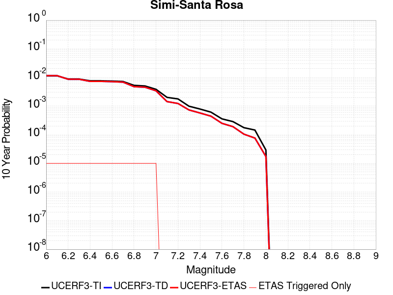 |

| Magnitude | 1 wk TI Prob | 1 wk TD Prob | 1 wk ETAS Prob | 1 wk ETAS/TD Gain | 1 wk ETAS Triggered Only | 1 mo TI Prob | 1 mo TD Prob | 1 mo ETAS Prob | 1 mo ETAS/TD Gain | 1 mo ETAS Triggered Only | 1 yr TI Prob | 1 yr TD Prob | 1 yr ETAS Prob | 1 yr ETAS/TD Gain | 1 yr ETAS Triggered Only | 10 yr TI Prob | 10 yr TD Prob | 10 yr ETAS Prob | 10 yr ETAS/TD Gain | 10 yr ETAS Triggered Only |
|-----|-----|-----|-----|-----|-----|-----|-----|-----|-----|-----|-----|-----|-----|-----|-----|-----|-----|-----|-----|-----|
| 6.0 | 2.198912E-5 | 2.227831E-5 | 2.227831E-5 | 1.0 | 0.0 | 9.4235686E-5 | 9.5475225E-5 | 9.5475225E-5 | 1.0 | 0.0 | 0.0011467156 | 0.0011618348 | 0.0011894774 | 1.0237921 | 2.7674767E-5 | 0.011408163 | 0.011562055 | 0.01158941 | 1.002366 | 2.7674767E-5 |
| 6.1 | 2.198912E-5 | 2.227831E-5 | 2.227831E-5 | 1.0 | 0.0 | 9.4235686E-5 | 9.5475225E-5 | 9.5475225E-5 | 1.0 | 0.0 | 0.0011467156 | 0.0011618348 | 0.0011894774 | 1.0237921 | 2.7674767E-5 | 0.011408163 | 0.011562055 | 0.01158941 | 1.002366 | 2.7674767E-5 |
| 6.2 | 1.69983E-5 | 1.6670783E-5 | 1.6670783E-5 | 1.0 | 0.0 | 7.284782E-5 | 7.1444425E-5 | 7.1444425E-5 | 1.0 | 0.0 | 8.865613E-4 | 8.695179E-4 | 8.971686E-4 | 1.0318 | 2.7674767E-5 | 0.008830327 | 0.008664079 | 0.008691514 | 1.0031666 | 2.7674767E-5 |
| 6.3 | 1.69983E-5 | 1.6670783E-5 | 1.6670783E-5 | 1.0 | 0.0 | 7.284782E-5 | 7.1444425E-5 | 7.1444425E-5 | 1.0 | 0.0 | 8.865613E-4 | 8.695179E-4 | 8.971686E-4 | 1.0318 | 2.7674767E-5 | 0.008830327 | 0.008664079 | 0.008691514 | 1.0031666 | 2.7674767E-5 |
| 6.4 | 1.4666188E-5 | 1.4054472E-5 | 1.4054472E-5 | 1.0 | 0.0 | 6.285358E-5 | 6.02322E-5 | 6.02322E-5 | 1.0 | 0.0 | 7.6497364E-4 | 7.331052E-4 | 7.607597E-4 | 1.0377223 | 2.7674767E-5 | 0.0076234564 | 0.0073093437 | 0.0073368163 | 1.0037585 | 2.7674767E-5 |
| 6.5 | 1.4666188E-5 | 1.4054472E-5 | 1.4054472E-5 | 1.0 | 0.0 | 6.285358E-5 | 6.02322E-5 | 6.02322E-5 | 1.0 | 0.0 | 7.6497364E-4 | 7.331052E-4 | 7.607597E-4 | 1.0377223 | 2.7674767E-5 | 0.0076234564 | 0.0073093437 | 0.0073368163 | 1.0037585 | 2.7674767E-5 |
| 6.6 | 1.4377586E-5 | 1.37314755E-5 | 1.37314755E-5 | 1.0 | 0.0 | 6.1616774E-5 | 5.8847992E-5 | 5.8847992E-5 | 1.0 | 0.0 | 7.4992597E-4 | 7.1626366E-4 | 7.439186E-4 | 1.03861 | 2.7674767E-5 | 0.007474003 | 0.00714202 | 0.0071694967 | 1.0038472 | 2.7674767E-5 |
| 6.7 | 1.3881404E-5 | 1.3209385E-5 | 1.3209385E-5 | 1.0 | 0.0 | 5.9490372E-5 | 5.661056E-5 | 5.661056E-5 | 1.0 | 0.0 | 7.240546E-4 | 6.890403E-4 | 7.16696E-4 | 1.0401366 | 2.7674767E-5 | 0.007217 | 0.0068714893 | 0.0068989736 | 1.0039998 | 2.7674767E-5 |
| 6.8 | 1.0176516E-5 | 9.1555075E-6 | 9.1555075E-6 | 1.0 | 0.0 | 4.3612912E-5 | 3.9237395E-5 | 3.9237395E-5 | 1.0 | 0.0 | 5.308578E-4 | 4.7762712E-4 | 5.0528866E-4 | 1.0579145 | 2.7674767E-5 | 0.0052959146 | 0.0047676396 | 0.0047951825 | 1.005777 | 2.7674767E-5 |
| 6.9 | 9.699797E-6 | 8.77602E-6 | 8.77602E-6 | 1.0 | 0.0 | 4.15699E-5 | 3.7611066E-5 | 3.7611066E-5 | 1.0 | 0.0 | 5.05996E-4 | 4.5783492E-4 | 4.8549703E-4 | 1.0604193 | 2.7674767E-5 | 0.005048454 | 0.0045705354 | 0.0045980834 | 1.0060273 | 2.7674767E-5 |
| 7.0 | 7.4049476E-6 | 6.5603285E-6 | 6.5603285E-6 | 1.0 | 0.0 | 3.1735104E-5 | 2.8115463E-5 | 2.8115463E-5 | 1.0 | 0.0 | 3.8630638E-4 | 3.4226466E-4 | 3.6992994E-4 | 1.0808301 | 2.7674767E-5 | 0.0038563553 | 0.0034186176 | 0.0034461978 | 1.0080676 | 2.7674767E-5 |
| 7.1 | 3.873439E-6 | 2.7600042E-6 | 2.7600042E-6 | 1.0 | 0.0 | 1.6600346E-5 | 1.1828537E-5 | 1.1828537E-5 | 1.0 | 0.0 | 2.0209046E-4 | 1.4400315E-4 | 1.4400315E-4 | 1.0 | 0.0 | 0.0020190678 | 0.001439122 | 0.001439122 | 1.0 | 0.0 |
| 7.2 | 3.417706E-6 | 2.3681023E-6 | 2.3681023E-6 | 1.0 | 0.0 | 1.4647229E-5 | 1.0148972E-5 | 1.0148972E-5 | 1.0 | 0.0 | 1.7831543E-4 | 1.2355695E-4 | 1.2355695E-4 | 1.0 | 0.0 | 0.0017817242 | 0.0012349049 | 0.0012349049 | 1.0 | 0.0 |
| 7.3 | 1.90225E-6 | 1.4077283E-6 | 1.4077283E-6 | 1.0 | 0.0 | 8.152474E-6 | 6.033107E-6 | 6.033107E-6 | 1.0 | 0.0 | 9.9251854E-5 | 7.3450625E-5 | 7.3450625E-5 | 1.0 | 0.0 | 9.920754E-4 | 7.342658E-4 | 7.342658E-4 | 1.0 | 0.0 |
| 7.4 | 1.5170556E-6 | 1.1028078E-6 | 1.1028078E-6 | 1.0 | 0.0 | 6.5016507E-6 | 4.7263106E-6 | 4.7263106E-6 | 1.0 | 0.0 | 7.915472E-5 | 5.754132E-5 | 5.754132E-5 | 1.0 | 0.0 | 7.9126534E-4 | 5.752654E-4 | 5.752654E-4 | 1.0 | 0.0 |
| 7.5 | 1.178732E-6 | 8.5382646E-7 | 8.5382646E-7 | 1.0 | 0.0 | 5.0516987E-6 | 3.659251E-6 | 3.659251E-6 | 1.0 | 0.0 | 6.1502695E-5 | 4.455048E-5 | 4.455048E-5 | 1.0 | 0.0 | 6.148568E-4 | 4.4541643E-4 | 4.4541643E-4 | 1.0 | 0.0 |
| 7.6 | 6.8722386E-7 | 4.7961464E-7 | 4.7961464E-7 | 1.0 | 0.0 | 2.9452417E-6 | 2.0554896E-6 | 2.0554896E-6 | 1.0 | 0.0 | 3.5857727E-5 | 2.5025302E-5 | 2.5025302E-5 | 1.0 | 0.0 | 3.5851944E-4 | 2.5022496E-4 | 2.5022496E-4 | 1.0 | 0.0 |
| 7.7 | 5.5126515E-7 | 3.6760147E-7 | 3.6760147E-7 | 1.0 | 0.0 | 2.3625628E-6 | 1.575434E-6 | 1.575434E-6 | 1.0 | 0.0 | 2.8763823E-5 | 1.9180741E-5 | 1.9180741E-5 | 1.0 | 0.0 | 2.87601E-4 | 1.9179097E-4 | 1.9179097E-4 | 1.0 | 0.0 |
| 7.8 | 3.3860243E-7 | 2.0096766E-7 | 2.0096766E-7 | 1.0 | 0.0 | 1.4511525E-6 | 8.612897E-7 | 8.612897E-7 | 1.0 | 0.0 | 1.7667637E-5 | 1.0486152E-5 | 1.0486152E-5 | 1.0 | 0.0 | 1.7666233E-4 | 1.0485663E-4 | 1.0485663E-4 | 1.0 | 0.0 |
| 7.9 | 2.7955386E-7 | 1.4668863E-7 | 1.4668863E-7 | 1.0 | 0.0 | 1.1980875E-6 | 6.286654E-7 | 6.286654E-7 | 1.0 | 0.0 | 1.4586617E-5 | 7.653975E-6 | 7.653975E-6 | 1.0 | 0.0 | 1.458566E-4 | 7.653716E-5 | 7.653716E-5 | 1.0 | 0.0 |
| 8.0 | 5.6259015E-8 | 3.336768E-8 | 3.336768E-8 | 1.0 | 0.0 | 2.4111003E-7 | 1.4300434E-7 | 1.4300434E-7 | 1.0 | 0.0 | 2.9355108E-6 | 1.7410766E-6 | 1.7410766E-6 | 1.0 | 0.0 | 2.935472E-5 | 1.7410643E-5 | 1.7410643E-5 | 1.0 | 0.0 |

## Bartlett Springs 2011 CFM
*[(top)](#table-of-contents)*

| 1 Week | 1 Month | 1 Year | 10 Year |
|-----|-----|-----|-----|
| 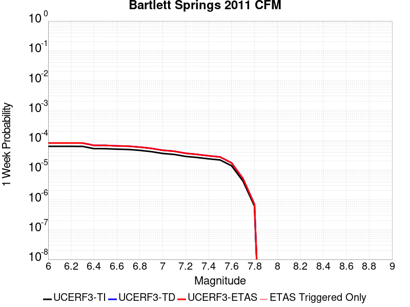 |  |  |  |

| Magnitude | 1 wk TI Prob | 1 wk TD Prob | 1 wk ETAS Prob | 1 wk ETAS/TD Gain | 1 wk ETAS Triggered Only | 1 mo TI Prob | 1 mo TD Prob | 1 mo ETAS Prob | 1 mo ETAS/TD Gain | 1 mo ETAS Triggered Only | 1 yr TI Prob | 1 yr TD Prob | 1 yr ETAS Prob | 1 yr ETAS/TD Gain | 1 yr ETAS Triggered Only | 10 yr TI Prob | 10 yr TD Prob | 10 yr ETAS Prob | 10 yr ETAS/TD Gain | 10 yr ETAS Triggered Only |
|-----|-----|-----|-----|-----|-----|-----|-----|-----|-----|-----|-----|-----|-----|-----|-----|-----|-----|-----|-----|-----|
| 6.0 | 6.2326144E-5 | 8.0626734E-5 | 8.0626734E-5 | 1.0 | 0.0 | 2.6708472E-4 | 3.4549818E-4 | 3.4549818E-4 | 1.0 | 0.0 | 0.003246908 | 0.0041984636 | 0.0041984636 | 1.0 | 0.0 | 0.031998757 | 0.041207846 | 0.04123438 | 1.000644 | 2.7674767E-5 |
| 6.1 | 6.227657E-5 | 8.056422E-5 | 8.056422E-5 | 1.0 | 0.0 | 2.668723E-4 | 3.452303E-4 | 3.452303E-4 | 1.0 | 0.0 | 0.0032443295 | 0.004195215 | 0.004195215 | 1.0 | 0.0 | 0.031973712 | 0.041176572 | 0.041203108 | 1.0006444 | 2.7674767E-5 |
| 6.2 | 6.22452E-5 | 8.052481E-5 | 8.052481E-5 | 1.0 | 0.0 | 2.6673786E-4 | 3.4506147E-4 | 3.4506147E-4 | 1.0 | 0.0 | 0.0032426978 | 0.0041931677 | 0.0041931677 | 1.0 | 0.0 | 0.03195787 | 0.041156862 | 0.041183397 | 1.0006448 | 2.7674767E-5 |
| 6.3 | 6.219006E-5 | 8.045463E-5 | 8.045463E-5 | 1.0 | 0.0 | 2.6650162E-4 | 3.4476077E-4 | 3.4476077E-4 | 1.0 | 0.0 | 0.00323983 | 0.0041895206 | 0.0041895206 | 1.0 | 0.0 | 0.031930014 | 0.041121755 | 0.04114829 | 1.0006453 | 2.7674767E-5 |
| 6.4 | 5.2175856E-5 | 6.727007E-5 | 6.727007E-5 | 1.0 | 0.0 | 2.2359163E-4 | 2.8826878E-4 | 2.8826878E-4 | 1.0 | 0.0 | 0.0027188298 | 0.0035040756 | 0.0035040756 | 1.0 | 0.0 | 0.026858058 | 0.03449757 | 0.034524288 | 1.0007745 | 2.7674767E-5 |
| 6.5 | 5.205166E-5 | 6.7112705E-5 | 6.7112705E-5 | 1.0 | 0.0 | 2.2305945E-4 | 2.875945E-4 | 2.875945E-4 | 1.0 | 0.0 | 0.0027123666 | 0.0034958927 | 0.0034958927 | 1.0 | 0.0 | 0.026794989 | 0.034418296 | 0.034445018 | 1.0007764 | 2.7674767E-5 |
| 6.6 | 5.0085426E-5 | 6.45086E-5 | 6.45086E-5 | 1.0 | 0.0 | 2.1463417E-4 | 2.7643642E-4 | 2.7643642E-4 | 1.0 | 0.0 | 0.0026100394 | 0.003360467 | 0.003360467 | 1.0 | 0.0 | 0.025795965 | 0.033105537 | 0.033132296 | 1.0008082 | 2.7674767E-5 |
| 6.7 | 4.8930866E-5 | 6.3032836E-5 | 6.3032836E-5 | 1.0 | 0.0 | 2.0968684E-4 | 2.7011306E-4 | 2.7011306E-4 | 1.0 | 0.0 | 0.0025499484 | 0.0032837202 | 0.0032837202 | 1.0 | 0.0 | 0.025208864 | 0.03236072 | 0.0323875 | 1.0008276 | 2.7674767E-5 |
| 6.8 | 4.5679535E-5 | 5.875605E-5 | 5.875605E-5 | 1.0 | 0.0 | 1.9575475E-4 | 2.5178754E-4 | 2.5178754E-4 | 1.0 | 0.0 | 0.002380709 | 0.0030612443 | 0.0030612443 | 1.0 | 0.0 | 0.023553653 | 0.030197589 | 0.030224428 | 1.0008888 | 2.7674767E-5 |
| 6.9 | 4.1439176E-5 | 5.3232736E-5 | 5.3232736E-5 | 1.0 | 0.0 | 1.7758438E-4 | 2.2812048E-4 | 2.2812048E-4 | 1.0 | 0.0 | 0.002159946 | 0.0027738565 | 0.0027738565 | 1.0 | 0.0 | 0.021390721 | 0.027397176 | 0.027424093 | 1.0009824 | 2.7674767E-5 |
| 7.0 | 3.5920104E-5 | 4.6019293E-5 | 4.6019293E-5 | 1.0 | 0.0 | 1.5393422E-4 | 1.9721071E-4 | 1.9721071E-4 | 1.0 | 0.0 | 0.001872538 | 0.0023984131 | 0.0023984131 | 1.0 | 0.0 | 0.018568378 | 0.02372839 | 0.023755407 | 1.0011387 | 2.7674767E-5 |
| 7.1 | 3.338812E-5 | 4.26992E-5 | 4.26992E-5 | 1.0 | 0.0 | 1.430841E-4 | 1.8298381E-4 | 1.8298381E-4 | 1.0 | 0.0 | 0.0017406568 | 0.0022255664 | 0.0022255664 | 1.0 | 0.0 | 0.017270854 | 0.022035446 | 0.02206251 | 1.0012282 | 2.7674767E-5 |
| 7.2 | 2.8619615E-5 | 3.6409616E-5 | 3.6409616E-5 | 1.0 | 0.0 | 1.2264973E-4 | 1.5603194E-4 | 1.5603194E-4 | 1.0 | 0.0 | 0.0014922376 | 0.0018980432 | 0.0018980432 | 1.0 | 0.0 | 0.014822568 | 0.018820208 | 0.018847361 | 1.0014428 | 2.7674767E-5 |
| 7.3 | 2.6376783E-5 | 3.343011E-5 | 3.343011E-5 | 1.0 | 0.0 | 1.13038455E-4 | 1.4326409E-4 | 1.4326409E-4 | 1.0 | 0.0 | 0.0013753743 | 0.001742854 | 0.001742854 | 1.0 | 0.0 | 0.01366893 | 0.017293492 | 0.017320687 | 1.0015726 | 2.7674767E-5 |
| 7.4 | 2.3738676E-5 | 2.9985498E-5 | 2.9985498E-5 | 1.0 | 0.0 | 1.0173322E-4 | 1.2850299E-4 | 1.2850299E-4 | 1.0 | 0.0 | 0.0012378981 | 0.0015634091 | 0.0015634091 | 1.0 | 0.0 | 0.012310251 | 0.015525425 | 0.01555267 | 1.0017549 | 2.7674767E-5 |
| 7.5 | 2.1789481E-5 | 2.7445401E-5 | 2.7445401E-5 | 1.0 | 0.0 | 9.338015E-5 | 1.1761789E-4 | 1.1761789E-4 | 1.0 | 0.0 | 0.0011363103 | 0.0014310651 | 0.0014310651 | 1.0 | 0.0 | 0.011305175 | 0.01421967 | 0.014246951 | 1.0019186 | 2.7674767E-5 |
| 7.6 | 1.3895281E-5 | 1.7372044E-5 | 1.7372044E-5 | 1.0 | 0.0 | 5.9549846E-5 | 7.444951E-5 | 7.444951E-5 | 1.0 | 0.0 | 7.2477816E-4 | 9.060487E-4 | 9.060487E-4 | 1.0 | 0.0 | 0.0072241887 | 0.009023956 | 0.009051381 | 1.0030391 | 2.7674767E-5 |
| 7.7 | 4.245981E-6 | 5.1635125E-6 | 5.1635125E-6 | 1.0 | 0.0 | 1.8196934E-5 | 2.2129152E-5 | 2.2129152E-5 | 1.0 | 0.0 | 2.2152514E-4 | 2.693893E-4 | 2.693893E-4 | 1.0 | 0.0 | 0.0022130446 | 0.002690647 | 0.002690647 | 1.0 | 0.0 |
| 7.8 | 6.145192E-7 | 7.04788E-7 | 7.04788E-7 | 1.0 | 0.0 | 2.633651E-6 | 3.0205167E-6 | 3.0205167E-6 | 1.0 | 0.0 | 3.206423E-5 | 3.677418E-5 | 3.677418E-5 | 1.0 | 0.0 | 3.2059604E-4 | 3.676804E-4 | 3.676804E-4 | 1.0 | 0.0 |

## Quien Sabe 2011 CFM
*[(top)](#table-of-contents)*

| 1 Week | 1 Month | 1 Year | 10 Year |
|-----|-----|-----|-----|
| 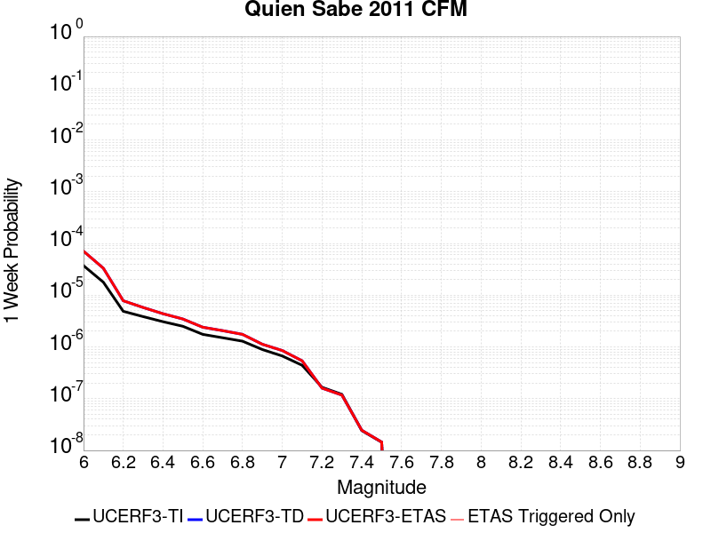 |  | 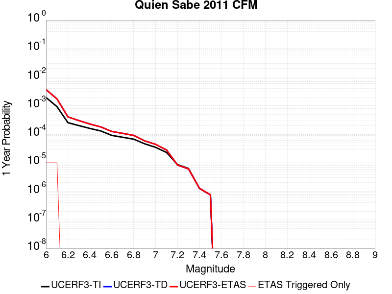 |  |

| Magnitude | 1 wk TI Prob | 1 wk TD Prob | 1 wk ETAS Prob | 1 wk ETAS/TD Gain | 1 wk ETAS Triggered Only | 1 mo TI Prob | 1 mo TD Prob | 1 mo ETAS Prob | 1 mo ETAS/TD Gain | 1 mo ETAS Triggered Only | 1 yr TI Prob | 1 yr TD Prob | 1 yr ETAS Prob | 1 yr ETAS/TD Gain | 1 yr ETAS Triggered Only | 10 yr TI Prob | 10 yr TD Prob | 10 yr ETAS Prob | 10 yr ETAS/TD Gain | 10 yr ETAS Triggered Only |
|-----|-----|-----|-----|-----|-----|-----|-----|-----|-----|-----|-----|-----|-----|-----|-----|-----|-----|-----|-----|-----|
| 6.0 | 3.729899E-5 | 7.095916E-5 | 7.095916E-5 | 1.0 | 0.0 | 1.5984301E-4 | 3.0408442E-4 | 3.0408442E-4 | 1.0 | 0.0 | 0.0019443515 | 0.0036861862 | 0.003713759 | 1.00748 | 2.7674767E-5 | 0.019274272 | 0.035361063 | 0.03538776 | 1.000755 | 2.7674767E-5 |
| 6.1 | 1.7825725E-5 | 3.318274E-5 | 3.318274E-5 | 1.0 | 0.0 | 7.639373E-5 | 1.4220653E-4 | 1.4220653E-4 | 1.0 | 0.0 | 9.296967E-4 | 0.0017272342 | 0.0017548612 | 1.0159949 | 2.7674767E-5 | 0.009258169 | 0.01670438 | 0.016731594 | 1.0016291 | 2.7674767E-5 |
| 6.2 | 4.8865336E-6 | 7.81058E-6 | 7.81058E-6 | 1.0 | 0.0 | 2.0942118E-5 | 3.3473538E-5 | 3.3473538E-5 | 1.0 | 0.0 | 2.5494045E-4 | 4.0710086E-4 | 4.0710086E-4 | 1.0 | 0.0 | 0.0025464818 | 0.00401532 | 0.00401532 | 1.0 | 0.0 |
| 6.3 | 3.858491E-6 | 5.7926386E-6 | 5.7926386E-6 | 1.0 | 0.0 | 1.6536285E-5 | 2.4825385E-5 | 2.4825385E-5 | 1.0 | 0.0 | 2.0131067E-4 | 3.0221182E-4 | 3.0221182E-4 | 1.0 | 0.0 | 0.002011284 | 0.0030034885 | 0.0030034885 | 1.0 | 0.0 |
| 6.4 | 3.0771805E-6 | 4.3877462E-6 | 4.3877462E-6 | 1.0 | 0.0 | 1.318785E-5 | 1.8804505E-5 | 1.8804505E-5 | 1.0 | 0.0 | 1.6055023E-4 | 2.2892324E-4 | 2.2892324E-4 | 1.0 | 0.0 | 0.001604343 | 0.0022879273 | 0.0022879273 | 1.0 | 0.0 |
| 6.5 | 2.5081235E-6 | 3.4662248E-6 | 3.4662248E-6 | 1.0 | 0.0 | 1.0749056E-5 | 1.4855173E-5 | 1.4855173E-5 | 1.0 | 0.0 | 1.308619E-4 | 1.8084819E-4 | 1.8084819E-4 | 1.0 | 0.0 | 0.0013078486 | 0.0018136567 | 0.0018136567 | 1.0 | 0.0 |
| 6.6 | 1.7505364E-6 | 2.4044907E-6 | 2.4044907E-6 | 1.0 | 0.0 | 7.502277E-6 | 1.0304923E-5 | 1.0304923E-5 | 1.0 | 0.0 | 9.13364E-5 | 1.2545593E-4 | 1.2545593E-4 | 1.0 | 0.0 | 9.129886E-4 | 0.0012593821 | 0.0012593821 | 1.0 | 0.0 |
| 6.7 | 1.505737E-6 | 2.065759E-6 | 2.065759E-6 | 1.0 | 0.0 | 6.4531428E-6 | 8.853226E-6 | 8.853226E-6 | 1.0 | 0.0 | 7.8564175E-5 | 1.077833E-4 | 1.077833E-4 | 1.0 | 0.0 | 7.853641E-4 | 0.0010828333 | 0.0010828333 | 1.0 | 0.0 |
| 6.8 | 1.2924105E-6 | 1.7502639E-6 | 1.7502639E-6 | 1.0 | 0.0 | 5.5388905E-6 | 7.5011126E-6 | 7.5011126E-6 | 1.0 | 0.0 | 6.74339E-5 | 9.132276E-5 | 9.132276E-5 | 1.0 | 0.0 | 6.741344E-4 | 9.1703667E-4 | 9.1703667E-4 | 1.0 | 0.0 |
| 6.9 | 8.9075286E-7 | 1.1262816E-6 | 1.1262816E-6 | 1.0 | 0.0 | 3.8175067E-6 | 4.8269135E-6 | 4.8269135E-6 | 1.0 | 0.0 | 4.6477155E-5 | 5.876631E-5 | 5.876631E-5 | 1.0 | 0.0 | 4.6467435E-4 | 5.9104664E-4 | 5.9104664E-4 | 1.0 | 0.0 |
| 7.0 | 6.6891175E-7 | 8.528126E-7 | 8.528126E-7 | 1.0 | 0.0 | 2.8667614E-6 | 3.654907E-6 | 3.654907E-6 | 1.0 | 0.0 | 3.4902263E-5 | 4.449778E-5 | 4.449778E-5 | 1.0 | 0.0 | 3.4896782E-4 | 4.4736915E-4 | 4.4736915E-4 | 1.0 | 0.0 |
| 7.1 | 4.4205015E-7 | 5.394402E-7 | 5.394402E-7 | 1.0 | 0.0 | 1.8944993E-6 | 2.3118853E-6 | 2.3118853E-6 | 1.0 | 0.0 | 2.3065284E-5 | 2.814701E-5 | 2.814701E-5 | 1.0 | 0.0 | 2.3062891E-4 | 2.8281743E-4 | 2.8281743E-4 | 1.0 | 0.0 |
| 7.2 | 1.6620965E-7 | 1.6000094E-7 | 1.6000094E-7 | 1.0 | 0.0 | 7.123269E-7 | 6.8571813E-7 | 6.8571813E-7 | 1.0 | 0.0 | 8.672545E-6 | 8.34859E-6 | 8.34859E-6 | 1.0 | 0.0 | 8.6722066E-5 | 8.363844E-5 | 8.363844E-5 | 1.0 | 0.0 |
| 7.3 | 1.2142488E-7 | 1.1730515E-7 | 1.1730515E-7 | 1.0 | 0.0 | 5.2039223E-7 | 5.0273627E-7 | 5.0273627E-7 | 1.0 | 0.0 | 6.335757E-6 | 6.1208007E-6 | 6.1208007E-6 | 1.0 | 0.0 | 6.3355765E-5 | 6.126942E-5 | 6.126942E-5 | 1.0 | 0.0 |
| 7.4 | 2.4192937E-8 | 2.4550305E-8 | 2.4550305E-8 | 1.0 | 0.0 | 1.0368401E-7 | 1.0521559E-7 | 1.0521559E-7 | 1.0 | 0.0 | 1.2623522E-6 | 1.2809992E-6 | 1.2809992E-6 | 1.0 | 0.0 | 1.2623449E-5 | 1.2816262E-5 | 1.2816262E-5 | 1.0 | 0.0 |
| 7.5 | 1.4432802E-8 | 1.4509122E-8 | 1.4509122E-8 | 1.0 | 0.0 | 6.185486E-8 | 6.2181954E-8 | 6.2181954E-8 | 1.0 | 0.0 | 7.530827E-7 | 7.570651E-7 | 7.570651E-7 | 1.0 | 0.0 | 7.530801E-6 | 7.5749003E-6 | 7.5749003E-6 | 1.0 | 0.0 |

## Elmore Ranch
*[(top)](#table-of-contents)*

| 1 Week | 1 Month | 1 Year | 10 Year |
|-----|-----|-----|-----|
|  |  |  |  |

| Magnitude | 1 wk TI Prob | 1 wk TD Prob | 1 wk ETAS Prob | 1 wk ETAS/TD Gain | 1 wk ETAS Triggered Only | 1 mo TI Prob | 1 mo TD Prob | 1 mo ETAS Prob | 1 mo ETAS/TD Gain | 1 mo ETAS Triggered Only | 1 yr TI Prob | 1 yr TD Prob | 1 yr ETAS Prob | 1 yr ETAS/TD Gain | 1 yr ETAS Triggered Only | 10 yr TI Prob | 10 yr TD Prob | 10 yr ETAS Prob | 10 yr ETAS/TD Gain | 10 yr ETAS Triggered Only |
|-----|-----|-----|-----|-----|-----|-----|-----|-----|-----|-----|-----|-----|-----|-----|-----|-----|-----|-----|-----|-----|
| 6.0 | 9.102099E-5 | 8.956369E-5 | 8.956369E-5 | 1.0 | 0.0 | 3.9003167E-4 | 3.8379105E-4 | 3.8379105E-4 | 1.0 | 0.0 | 0.0047383 | 0.004664101 | 0.004664101 | 1.0 | 0.0 | 0.046385348 | 0.045887828 | 0.045914233 | 1.0005754 | 2.7674767E-5 |
| 6.1 | 3.8306698E-5 | 4.1515465E-5 | 4.1515465E-5 | 1.0 | 0.0 | 1.6416123E-4 | 1.7791537E-4 | 1.7791537E-4 | 1.0 | 0.0 | 0.0019968306 | 0.0021638772 | 0.0021638772 | 1.0 | 0.0 | 0.019789828 | 0.021636104 | 0.02166318 | 1.0012515 | 2.7674767E-5 |
| 6.2 | 3.8306698E-5 | 4.1515465E-5 | 4.1515465E-5 | 1.0 | 0.0 | 1.6416123E-4 | 1.7791537E-4 | 1.7791537E-4 | 1.0 | 0.0 | 0.0019968306 | 0.0021638772 | 0.0021638772 | 1.0 | 0.0 | 0.019789828 | 0.021636104 | 0.02166318 | 1.0012515 | 2.7674767E-5 |
| 6.3 | 3.3197924E-5 | 3.656767E-5 | 3.656767E-5 | 1.0 | 0.0 | 1.4226905E-4 | 1.5671315E-4 | 1.5671315E-4 | 1.0 | 0.0 | 0.0017307495 | 0.0019065277 | 0.0019065277 | 1.0 | 0.0 | 0.017173318 | 0.01909636 | 0.019123506 | 1.0014216 | 2.7674767E-5 |
| 6.4 | 2.5148964E-5 | 2.742868E-5 | 2.742868E-5 | 1.0 | 0.0 | 1.0777682E-4 | 1.1754984E-4 | 1.1754984E-4 | 1.0 | 0.0 | 0.0013113929 | 0.0014308781 | 0.0014308781 | 1.0 | 0.0 | 0.01303681 | 0.01439143 | 0.014418706 | 1.0018953 | 2.7674767E-5 |
| 6.5 | 2.5148964E-5 | 2.742868E-5 | 2.742868E-5 | 1.0 | 0.0 | 1.0777682E-4 | 1.1754984E-4 | 1.1754984E-4 | 1.0 | 0.0 | 0.0013113929 | 0.0014308781 | 0.0014308781 | 1.0 | 0.0 | 0.01303681 | 0.01439143 | 0.014418706 | 1.0018953 | 2.7674767E-5 |

## Santa Monica alt 1
*[(top)](#table-of-contents)*

| 1 Week | 1 Month | 1 Year | 10 Year |
|-----|-----|-----|-----|
|  | 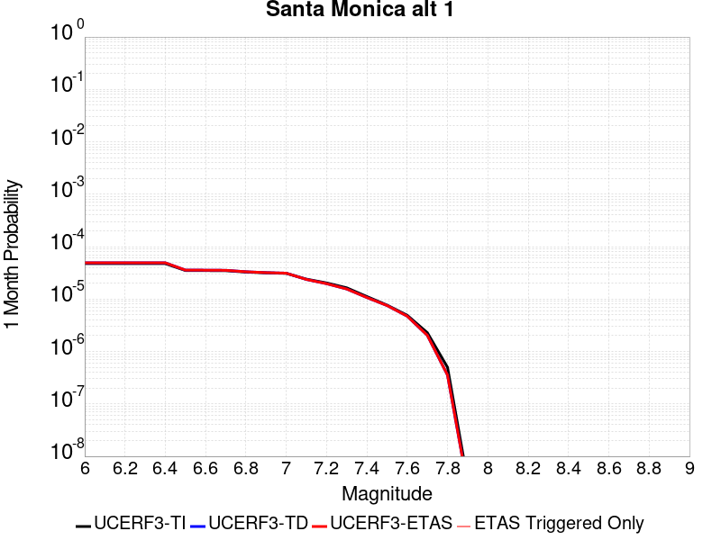 | 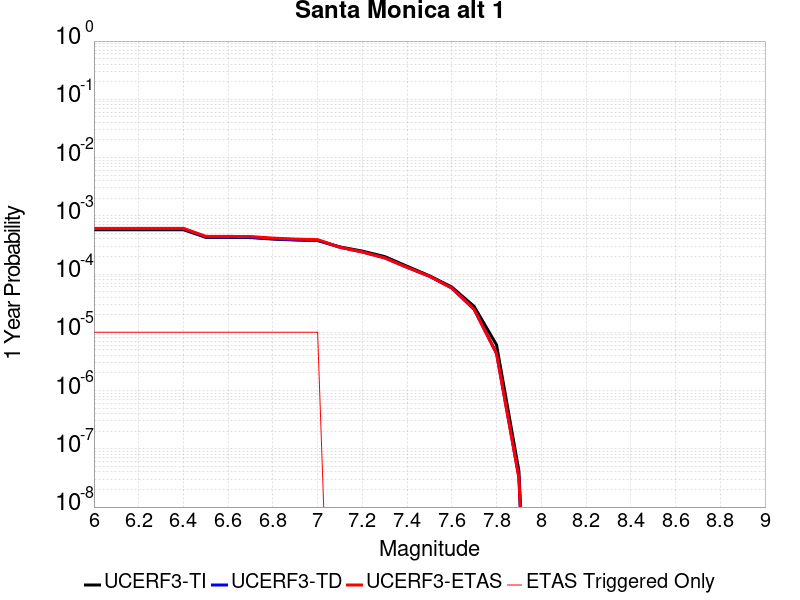 |  |

| Magnitude | 1 wk TI Prob | 1 wk TD Prob | 1 wk ETAS Prob | 1 wk ETAS/TD Gain | 1 wk ETAS Triggered Only | 1 mo TI Prob | 1 mo TD Prob | 1 mo ETAS Prob | 1 mo ETAS/TD Gain | 1 mo ETAS Triggered Only | 1 yr TI Prob | 1 yr TD Prob | 1 yr ETAS Prob | 1 yr ETAS/TD Gain | 1 yr ETAS Triggered Only | 10 yr TI Prob | 10 yr TD Prob | 10 yr ETAS Prob | 10 yr ETAS/TD Gain | 10 yr ETAS Triggered Only |
|-----|-----|-----|-----|-----|-----|-----|-----|-----|-----|-----|-----|-----|-----|-----|-----|-----|-----|-----|-----|-----|
| 6.0 | 1.1066008E-5 | 1.148119E-5 | 1.148119E-5 | 1.0 | 0.0 | 4.742488E-5 | 4.920425E-5 | 4.920425E-5 | 1.0 | 0.0 | 5.7724497E-4 | 5.98911E-4 | 6.265692E-4 | 1.0461808 | 2.7674767E-5 | 0.005757478 | 0.0059743566 | 0.006001866 | 1.0046046 | 2.7674767E-5 |
| 6.1 | 1.1066008E-5 | 1.148119E-5 | 1.148119E-5 | 1.0 | 0.0 | 4.742488E-5 | 4.920425E-5 | 4.920425E-5 | 1.0 | 0.0 | 5.7724497E-4 | 5.98911E-4 | 6.265692E-4 | 1.0461808 | 2.7674767E-5 | 0.005757478 | 0.0059743566 | 0.006001866 | 1.0046046 | 2.7674767E-5 |
| 6.2 | 1.1066008E-5 | 1.148119E-5 | 1.148119E-5 | 1.0 | 0.0 | 4.742488E-5 | 4.920425E-5 | 4.920425E-5 | 1.0 | 0.0 | 5.7724497E-4 | 5.98911E-4 | 6.265692E-4 | 1.0461808 | 2.7674767E-5 | 0.005757478 | 0.0059743566 | 0.006001866 | 1.0046046 | 2.7674767E-5 |
| 6.3 | 1.1066008E-5 | 1.148119E-5 | 1.148119E-5 | 1.0 | 0.0 | 4.742488E-5 | 4.920425E-5 | 4.920425E-5 | 1.0 | 0.0 | 5.7724497E-4 | 5.98911E-4 | 6.265692E-4 | 1.0461808 | 2.7674767E-5 | 0.005757478 | 0.0059743566 | 0.006001866 | 1.0046046 | 2.7674767E-5 |
| 6.4 | 1.1066008E-5 | 1.148119E-5 | 1.148119E-5 | 1.0 | 0.0 | 4.742488E-5 | 4.920425E-5 | 4.920425E-5 | 1.0 | 0.0 | 5.7724497E-4 | 5.98911E-4 | 6.265692E-4 | 1.0461808 | 2.7674767E-5 | 0.005757478 | 0.0059743566 | 0.006001866 | 1.0046046 | 2.7674767E-5 |
| 6.5 | 8.183544E-6 | 8.3360455E-6 | 8.3360455E-6 | 1.0 | 0.0 | 3.5071862E-5 | 3.572543E-5 | 3.572543E-5 | 1.0 | 0.0 | 4.2691626E-4 | 4.3487188E-4 | 4.625346E-4 | 1.0636113 | 2.7674767E-5 | 0.0042609703 | 0.004340375 | 0.0043679294 | 1.0063485 | 2.7674767E-5 |
| 6.6 | 8.1543285E-6 | 8.304257E-6 | 8.304257E-6 | 1.0 | 0.0 | 3.4946657E-5 | 3.5589197E-5 | 3.5589197E-5 | 1.0 | 0.0 | 4.2539247E-4 | 4.3321392E-4 | 4.608767E-4 | 1.0638548 | 2.7674767E-5 | 0.0042457907 | 0.0043238597 | 0.0043514147 | 1.0063728 | 2.7674767E-5 |
| 6.7 | 8.110878E-6 | 8.257651E-6 | 8.257651E-6 | 1.0 | 0.0 | 3.4760444E-5 | 3.538946E-5 | 3.538946E-5 | 1.0 | 0.0 | 4.231262E-4 | 4.3078308E-4 | 4.5844592E-4 | 1.0642153 | 2.7674767E-5 | 0.0042232145 | 0.0042996453 | 0.0043272013 | 1.0064088 | 2.7674767E-5 |
| 6.8 | 7.644036E-6 | 7.751629E-6 | 7.751629E-6 | 1.0 | 0.0 | 3.275974E-5 | 3.322085E-5 | 3.322085E-5 | 1.0 | 0.0 | 3.9877684E-4 | 4.0439024E-4 | 4.320538E-4 | 1.0684081 | 2.7674767E-5 | 0.00398062 | 0.00403669 | 0.004064253 | 1.0068282 | 2.7674767E-5 |
| 6.9 | 7.3698293E-6 | 7.4562663E-6 | 7.4562663E-6 | 1.0 | 0.0 | 3.15846E-5 | 3.1955045E-5 | 3.1955045E-5 | 1.0 | 0.0 | 3.8447464E-4 | 3.889846E-4 | 4.166486E-4 | 1.0711185 | 2.7674767E-5 | 0.0038381014 | 0.003883181 | 0.0039107483 | 1.0070992 | 2.7674767E-5 |
| 7.0 | 7.209872E-6 | 7.286163E-6 | 7.286163E-6 | 1.0 | 0.0 | 3.0899086E-5 | 3.1226045E-5 | 3.1226045E-5 | 1.0 | 0.0 | 3.7613141E-4 | 3.8011218E-4 | 4.0777645E-4 | 1.0727792 | 2.7674767E-5 | 0.0037549543 | 0.003794763 | 0.0038223327 | 1.0072652 | 2.7674767E-5 |
| 7.1 | 5.603456E-6 | 5.5242713E-6 | 5.5242713E-6 | 1.0 | 0.0 | 2.4014591E-5 | 2.3675235E-5 | 2.3675235E-5 | 1.0 | 0.0 | 2.923384E-4 | 2.8820828E-4 | 2.8820828E-4 | 1.0 | 0.0 | 0.0029195412 | 0.0028783868 | 0.0028783868 | 1.0 | 0.0 |
| 7.2 | 4.7483613E-6 | 4.5914326E-6 | 4.5914326E-6 | 1.0 | 0.0 | 2.0349962E-5 | 1.967742E-5 | 1.967742E-5 | 1.0 | 0.0 | 2.4773262E-4 | 2.3954638E-4 | 2.3954638E-4 | 1.0 | 0.0 | 0.0024745662 | 0.0023928958 | 0.0023928958 | 1.0 | 0.0 |
| 7.3 | 3.829015E-6 | 3.6344604E-6 | 3.6344604E-6 | 1.0 | 0.0 | 1.6409962E-5 | 1.5576166E-5 | 1.5576166E-5 | 1.0 | 0.0 | 1.9977297E-4 | 1.896234E-4 | 1.896234E-4 | 1.0 | 0.0 | 0.0019959346 | 0.0018946249 | 0.0018946249 | 1.0 | 0.0 |
| 7.4 | 2.610755E-6 | 2.4997362E-6 | 2.4997362E-6 | 1.0 | 0.0 | 1.1188902E-5 | 1.0713111E-5 | 1.0713111E-5 | 1.0 | 0.0 | 1.3621636E-4 | 1.3042436E-4 | 1.3042436E-4 | 1.0 | 0.0 | 0.001361329 | 0.0013034827 | 0.0013034827 | 1.0 | 0.0 |
| 7.5 | 1.792146E-6 | 1.7585403E-6 | 1.7585403E-6 | 1.0 | 0.0 | 7.680603E-6 | 7.5365797E-6 | 7.5365797E-6 | 1.0 | 0.0 | 9.3507326E-5 | 9.1754024E-5 | 9.1754024E-5 | 1.0 | 0.0 | 9.3467993E-4 | 9.171646E-4 | 9.171646E-4 | 1.0 | 0.0 |
| 7.6 | 1.1473018E-6 | 1.1029961E-6 | 1.1029961E-6 | 1.0 | 0.0 | 4.9169985E-6 | 4.7271174E-6 | 4.7271174E-6 | 1.0 | 0.0 | 5.986281E-5 | 5.755115E-5 | 5.755115E-5 | 1.0 | 0.0 | 5.984669E-4 | 5.7536416E-4 | 5.7536416E-4 | 1.0 | 0.0 |
| 7.7 | 5.330919E-7 | 4.745708E-7 | 4.745708E-7 | 1.0 | 0.0 | 2.2846775E-6 | 2.0338734E-6 | 2.0338734E-6 | 1.0 | 0.0 | 2.7815593E-5 | 2.4762137E-5 | 2.4762137E-5 | 1.0 | 0.0 | 2.7812112E-4 | 2.4759493E-4 | 2.4759493E-4 | 1.0 | 0.0 |
| 7.8 | 1.1668574E-7 | 8.298897E-8 | 8.298897E-8 | 1.0 | 0.0 | 5.000816E-7 | 3.5566694E-7 | 3.5566694E-7 | 1.0 | 0.0 | 6.0884768E-6 | 4.330237E-6 | 4.330237E-6 | 1.0 | 0.0 | 6.08831E-5 | 4.3301556E-5 | 4.3301556E-5 | 1.0 | 0.0 |
| 7.9 | 8.007447E-10 | 6.161137E-10 | 6.161137E-10 | 1.0 | 0.0 | 3.4317629E-9 | 2.640488E-9 | 2.640488E-9 | 1.0 | 0.0 | 4.1781714E-8 | 3.214794E-8 | 3.214794E-8 | 1.0 | 0.0 | 4.1781706E-7 | 3.2147938E-7 | 3.2147938E-7 | 1.0 | 0.0 |

## White Wolf
*[(top)](#table-of-contents)*

| 1 Week | 1 Month | 1 Year | 10 Year |
|-----|-----|-----|-----|
| 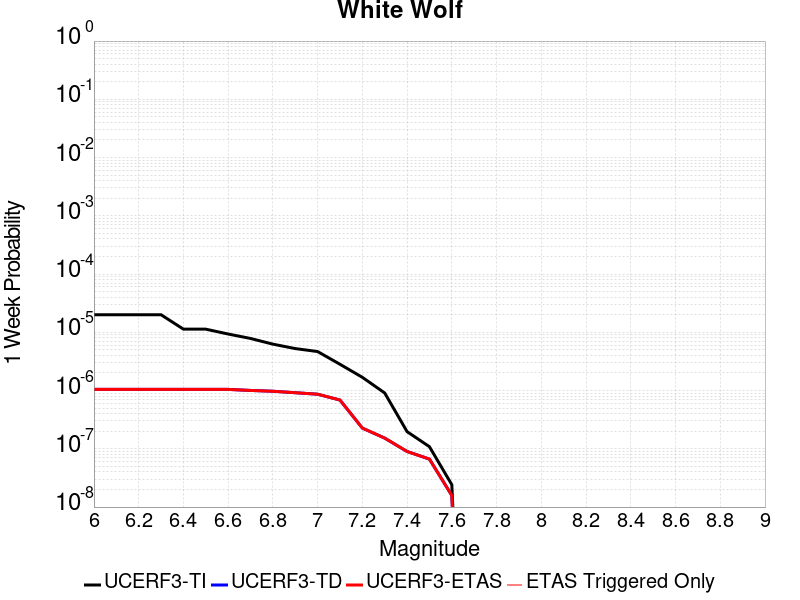 |  |  |  |

| Magnitude | 1 wk TI Prob | 1 wk TD Prob | 1 wk ETAS Prob | 1 wk ETAS/TD Gain | 1 wk ETAS Triggered Only | 1 mo TI Prob | 1 mo TD Prob | 1 mo ETAS Prob | 1 mo ETAS/TD Gain | 1 mo ETAS Triggered Only | 1 yr TI Prob | 1 yr TD Prob | 1 yr ETAS Prob | 1 yr ETAS/TD Gain | 1 yr ETAS Triggered Only | 10 yr TI Prob | 10 yr TD Prob | 10 yr ETAS Prob | 10 yr ETAS/TD Gain | 10 yr ETAS Triggered Only |
|-----|-----|-----|-----|-----|-----|-----|-----|-----|-----|-----|-----|-----|-----|-----|-----|-----|-----|-----|-----|-----|
| 6.0 | 2.0037822E-5 | 1.0470154E-6 | 1.0470154E-6 | 1.0 | 0.0 | 8.587355E-5 | 4.4872017E-6 | 4.4872017E-6 | 1.0 | 0.0 | 0.001045009 | 5.463036E-5 | 5.463036E-5 | 1.0 | 0.0 | 0.010401085 | 5.4617436E-4 | 5.7383406E-4 | 1.0506425 | 2.7674767E-5 |
| 6.1 | 2.0037822E-5 | 1.0470154E-6 | 1.0470154E-6 | 1.0 | 0.0 | 8.587355E-5 | 4.4872017E-6 | 4.4872017E-6 | 1.0 | 0.0 | 0.001045009 | 5.463036E-5 | 5.463036E-5 | 1.0 | 0.0 | 0.010401085 | 5.4617436E-4 | 5.7383406E-4 | 1.0506425 | 2.7674767E-5 |
| 6.2 | 2.0037822E-5 | 1.0470154E-6 | 1.0470154E-6 | 1.0 | 0.0 | 8.587355E-5 | 4.4872017E-6 | 4.4872017E-6 | 1.0 | 0.0 | 0.001045009 | 5.463036E-5 | 5.463036E-5 | 1.0 | 0.0 | 0.010401085 | 5.4617436E-4 | 5.7383406E-4 | 1.0506425 | 2.7674767E-5 |
| 6.3 | 2.0037822E-5 | 1.0470154E-6 | 1.0470154E-6 | 1.0 | 0.0 | 8.587355E-5 | 4.4872017E-6 | 4.4872017E-6 | 1.0 | 0.0 | 0.001045009 | 5.463036E-5 | 5.463036E-5 | 1.0 | 0.0 | 0.010401085 | 5.4617436E-4 | 5.7383406E-4 | 1.0506425 | 2.7674767E-5 |
| 6.4 | 1.132487E-5 | 1.0470154E-6 | 1.0470154E-6 | 1.0 | 0.0 | 4.8534253E-5 | 4.4872017E-6 | 4.4872017E-6 | 1.0 | 0.0 | 5.907443E-4 | 5.463036E-5 | 5.463036E-5 | 1.0 | 0.0 | 0.005891764 | 5.4617436E-4 | 5.7383406E-4 | 1.0506425 | 2.7674767E-5 |
| 6.5 | 1.132487E-5 | 1.0470154E-6 | 1.0470154E-6 | 1.0 | 0.0 | 4.8534253E-5 | 4.4872017E-6 | 4.4872017E-6 | 1.0 | 0.0 | 5.907443E-4 | 5.463036E-5 | 5.463036E-5 | 1.0 | 0.0 | 0.005891764 | 5.4617436E-4 | 5.7383406E-4 | 1.0506425 | 2.7674767E-5 |
| 6.6 | 9.347473E-6 | 1.0470154E-6 | 1.0470154E-6 | 1.0 | 0.0 | 4.0059982E-5 | 4.4872017E-6 | 4.4872017E-6 | 1.0 | 0.0 | 4.8762115E-4 | 5.463036E-5 | 5.463036E-5 | 1.0 | 0.0 | 0.0048655253 | 5.4617436E-4 | 5.7383406E-4 | 1.0506425 | 2.7674767E-5 |
| 6.7 | 7.842647E-6 | 1.0049282E-6 | 1.0049282E-6 | 1.0 | 0.0 | 3.361091E-5 | 4.3068285E-6 | 4.3068285E-6 | 1.0 | 0.0 | 4.0913603E-4 | 5.2434425E-5 | 5.2434425E-5 | 1.0 | 0.0 | 0.004083836 | 5.2422547E-4 | 5.5188575E-4 | 1.052764 | 2.7674767E-5 |
| 6.8 | 6.26597E-6 | 9.735705E-7 | 9.735705E-7 | 1.0 | 0.0 | 2.685388E-5 | 4.172439E-6 | 4.172439E-6 | 1.0 | 0.0 | 3.2689696E-4 | 5.079831E-5 | 5.079831E-5 | 1.0 | 0.0 | 0.003264165 | 5.078719E-4 | 5.355326E-4 | 1.054464 | 2.7674767E-5 |
| 6.9 | 5.258436E-6 | 9.184076E-7 | 9.184076E-7 | 1.0 | 0.0 | 2.2535958E-5 | 3.9360266E-6 | 3.9360266E-6 | 1.0 | 0.0 | 2.7434074E-4 | 4.792012E-5 | 4.792012E-5 | 1.0 | 0.0 | 0.0027400232 | 4.7910266E-4 | 5.0676416E-4 | 1.057736 | 2.7674767E-5 |
| 7.0 | 4.675028E-6 | 8.6619536E-7 | 8.6619536E-7 | 1.0 | 0.0 | 2.003568E-5 | 3.7122609E-6 | 3.7122609E-6 | 1.0 | 0.0 | 2.4390711E-4 | 4.5195888E-5 | 4.5195888E-5 | 1.0 | 0.0 | 0.0024363957 | 4.5187166E-4 | 4.7953392E-4 | 1.0612171 | 2.7674767E-5 |
| 7.1 | 2.8270078E-6 | 6.874799E-7 | 6.874799E-7 | 1.0 | 0.0 | 1.2115692E-5 | 2.9463392E-6 | 2.9463392E-6 | 1.0 | 0.0 | 1.4749856E-4 | 3.5871133E-5 | 3.5871133E-5 | 1.0 | 0.0 | 0.001474007 | 3.586575E-4 | 3.8632235E-4 | 1.0771344 | 2.7674767E-5 |
| 7.2 | 1.6881406E-6 | 2.2709685E-7 | 2.2709685E-7 | 1.0 | 0.0 | 7.2348685E-6 | 9.732719E-7 | 9.732719E-7 | 1.0 | 0.0 | 8.808096E-5 | 1.1849522E-5 | 1.1849522E-5 | 1.0 | 0.0 | 8.8046055E-4 | 1.1848906E-4 | 1.1848906E-4 | 1.0 | 0.0 |
| 7.3 | 9.086107E-7 | 1.5268368E-7 | 1.5268368E-7 | 1.0 | 0.0 | 3.8940398E-6 | 6.543585E-7 | 6.543585E-7 | 1.0 | 0.0 | 4.7408903E-5 | 7.966786E-6 | 7.966786E-6 | 1.0 | 0.0 | 4.739879E-4 | 7.9665086E-5 | 7.9665086E-5 | 1.0 | 0.0 |
| 7.4 | 1.9717383E-7 | 9.0043905E-8 | 9.0043905E-8 | 1.0 | 0.0 | 8.450304E-7 | 3.859024E-7 | 3.859024E-7 | 1.0 | 0.0 | 1.0288197E-5 | 4.698352E-6 | 4.698352E-6 | 1.0 | 0.0 | 1.028772E-4 | 4.6982557E-5 | 4.6982557E-5 | 1.0 | 0.0 |
| 7.5 | 1.086975E-7 | 6.6599824E-8 | 6.6599824E-8 | 1.0 | 0.0 | 4.6584634E-7 | 2.854278E-7 | 2.854278E-7 | 1.0 | 0.0 | 5.6716644E-6 | 3.475078E-6 | 3.475078E-6 | 1.0 | 0.0 | 5.6715195E-5 | 3.475026E-5 | 3.475026E-5 | 1.0 | 0.0 |
| 7.6 | 2.4217808E-8 | 1.5821314E-8 | 1.5821314E-8 | 1.0 | 0.0 | 1.03790605E-7 | 6.780563E-8 | 6.780563E-8 | 1.0 | 0.0 | 1.2636499E-6 | 8.2553333E-7 | 8.2553333E-7 | 1.0 | 0.0 | 1.2636427E-5 | 8.255308E-6 | 8.255308E-6 | 1.0 | 0.0 |

## Cleghorn Lake
*[(top)](#table-of-contents)*

| 1 Week | 1 Month | 1 Year | 10 Year |
|-----|-----|-----|-----|
|  |  |  |  |

| Magnitude | 1 wk TI Prob | 1 wk TD Prob | 1 wk ETAS Prob | 1 wk ETAS/TD Gain | 1 wk ETAS Triggered Only | 1 mo TI Prob | 1 mo TD Prob | 1 mo ETAS Prob | 1 mo ETAS/TD Gain | 1 mo ETAS Triggered Only | 1 yr TI Prob | 1 yr TD Prob | 1 yr ETAS Prob | 1 yr ETAS/TD Gain | 1 yr ETAS Triggered Only | 10 yr TI Prob | 10 yr TD Prob | 10 yr ETAS Prob | 10 yr ETAS/TD Gain | 10 yr ETAS Triggered Only |
|-----|-----|-----|-----|-----|-----|-----|-----|-----|-----|-----|-----|-----|-----|-----|-----|-----|-----|-----|-----|-----|
| 6.0 | 1.5467183E-5 | 1.6795546E-5 | 1.6795546E-5 | 1.0 | 0.0 | 6.6286244E-5 | 7.197924E-5 | 7.197924E-5 | 1.0 | 0.0 | 8.067362E-4 | 8.760497E-4 | 8.760497E-4 | 1.0 | 0.0 | 0.008038137 | 0.00873139 | 0.008758824 | 1.0031419 | 2.7674767E-5 |
| 6.1 | 1.5467183E-5 | 1.6795546E-5 | 1.6795546E-5 | 1.0 | 0.0 | 6.6286244E-5 | 7.197924E-5 | 7.197924E-5 | 1.0 | 0.0 | 8.067362E-4 | 8.760497E-4 | 8.760497E-4 | 1.0 | 0.0 | 0.008038137 | 0.00873139 | 0.008758824 | 1.0031419 | 2.7674767E-5 |
| 6.2 | 1.2624631E-5 | 1.3682612E-5 | 1.3682612E-5 | 1.0 | 0.0 | 5.410444E-5 | 5.863872E-5 | 5.863872E-5 | 1.0 | 0.0 | 6.585225E-4 | 7.137413E-4 | 7.137413E-4 | 1.0 | 0.0 | 0.0065657445 | 0.007119286 | 0.0071467636 | 1.0038596 | 2.7674767E-5 |
| 6.3 | 1.2624631E-5 | 1.3682612E-5 | 1.3682612E-5 | 1.0 | 0.0 | 5.410444E-5 | 5.863872E-5 | 5.863872E-5 | 1.0 | 0.0 | 6.585225E-4 | 7.137413E-4 | 7.137413E-4 | 1.0 | 0.0 | 0.0065657445 | 0.007119286 | 0.0071467636 | 1.0038596 | 2.7674767E-5 |
| 6.4 | 9.417684E-6 | 1.0170876E-5 | 1.0170876E-5 | 1.0 | 0.0 | 4.036088E-5 | 4.358897E-5 | 4.358897E-5 | 1.0 | 0.0 | 4.912829E-4 | 5.306076E-4 | 5.306076E-4 | 1.0 | 0.0 | 0.004901982 | 0.0052974434 | 0.0053249714 | 1.0051965 | 2.7674767E-5 |
| 6.5 | 9.368219E-6 | 1.01182995E-5 | 1.01182995E-5 | 1.0 | 0.0 | 4.014889E-5 | 4.336365E-5 | 4.336365E-5 | 1.0 | 0.0 | 4.8870314E-4 | 5.2786566E-4 | 5.2786566E-4 | 1.0 | 0.0 | 0.004876298 | 0.005270154 | 0.005297683 | 1.0052235 | 2.7674767E-5 |
| 6.6 | 7.803798E-6 | 8.442475E-6 | 8.442475E-6 | 1.0 | 0.0 | 3.3444423E-5 | 3.6181755E-5 | 3.6181755E-5 | 1.0 | 0.0 | 4.0710976E-4 | 4.4046377E-4 | 4.4046377E-4 | 1.0 | 0.0 | 0.0040636472 | 0.0043998254 | 0.004427378 | 1.0062623 | 2.7674767E-5 |
| 6.7 | 2.3108669E-6 | 2.4439644E-6 | 2.4439644E-6 | 1.0 | 0.0 | 9.903678E-6 | 1.0474092E-5 | 1.0474092E-5 | 1.0 | 0.0 | 1.205706E-4 | 1.275148E-4 | 1.275148E-4 | 1.0 | 0.0 | 0.001205052 | 0.0012744348 | 0.0012744348 | 1.0 | 0.0 |
| 6.8 | 2.0882828E-6 | 2.206398E-6 | 2.206398E-6 | 1.0 | 0.0 | 8.949753E-6 | 9.455958E-6 | 9.455958E-6 | 1.0 | 0.0 | 1.08957785E-4 | 1.15120376E-4 | 1.15120376E-4 | 1.0 | 0.0 | 0.0010890438 | 0.0011506242 | 0.0011506242 | 1.0 | 0.0 |
| 6.9 | 1.876935E-6 | 1.981153E-6 | 1.981153E-6 | 1.0 | 0.0 | 8.043982E-6 | 8.49063E-6 | 8.49063E-6 | 1.0 | 0.0 | 9.7931086E-5 | 1.0336867E-4 | 1.0336867E-4 | 1.0 | 0.0 | 9.788794E-4 | 0.0010332218 | 0.0010332218 | 1.0 | 0.0 |
| 7.0 | 1.5357559E-6 | 1.6203635E-6 | 1.6203635E-6 | 1.0 | 0.0 | 6.5817944E-6 | 6.9443972E-6 | 6.9443972E-6 | 1.0 | 0.0 | 8.01304E-5 | 8.454488E-5 | 8.454488E-5 | 1.0 | 0.0 | 8.010151E-4 | 8.451397E-4 | 8.451397E-4 | 1.0 | 0.0 |
| 7.1 | 1.0905424E-6 | 1.1498199E-6 | 1.1498199E-6 | 1.0 | 0.0 | 4.6737446E-6 | 4.927791E-6 | 4.927791E-6 | 1.0 | 0.0 | 5.6901354E-5 | 5.9994305E-5 | 5.9994305E-5 | 1.0 | 0.0 | 5.6886784E-4 | 5.9979083E-4 | 5.9979083E-4 | 1.0 | 0.0 |
| 7.2 | 6.06668E-7 | 6.387591E-7 | 6.387591E-7 | 1.0 | 0.0 | 2.600003E-6 | 2.7375365E-6 | 2.7375365E-6 | 1.0 | 0.0 | 3.1654577E-5 | 3.3329066E-5 | 3.3329066E-5 | 1.0 | 0.0 | 3.1650066E-4 | 3.3324753E-4 | 3.3324753E-4 | 1.0 | 0.0 |

## San Jacinto (Superstition Mtn)
*[(top)](#table-of-contents)*

| 1 Week | 1 Month | 1 Year | 10 Year |
|-----|-----|-----|-----|
|  |  | 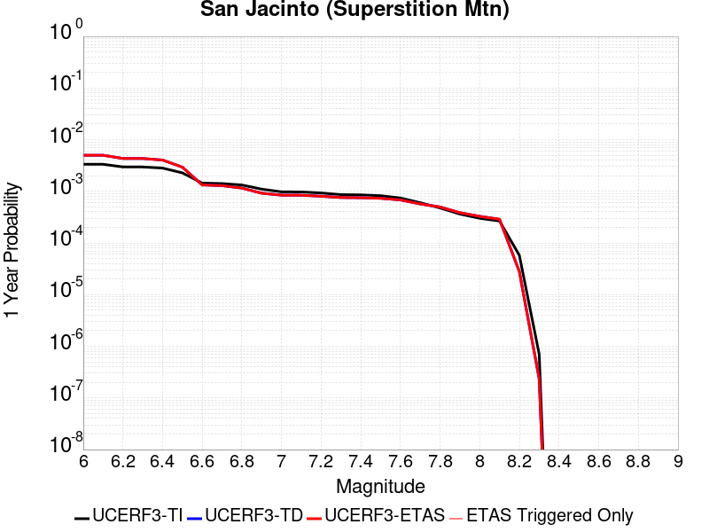 |  |

| Magnitude | 1 wk TI Prob | 1 wk TD Prob | 1 wk ETAS Prob | 1 wk ETAS/TD Gain | 1 wk ETAS Triggered Only | 1 mo TI Prob | 1 mo TD Prob | 1 mo ETAS Prob | 1 mo ETAS/TD Gain | 1 mo ETAS Triggered Only | 1 yr TI Prob | 1 yr TD Prob | 1 yr ETAS Prob | 1 yr ETAS/TD Gain | 1 yr ETAS Triggered Only | 10 yr TI Prob | 10 yr TD Prob | 10 yr ETAS Prob | 10 yr ETAS/TD Gain | 10 yr ETAS Triggered Only |
|-----|-----|-----|-----|-----|-----|-----|-----|-----|-----|-----|-----|-----|-----|-----|-----|-----|-----|-----|-----|-----|
| 6.0 | 6.4193904E-5 | 9.604509E-5 | 9.604509E-5 | 1.0 | 0.0 | 2.7508775E-4 | 4.1156667E-4 | 4.1156667E-4 | 1.0 | 0.0 | 0.0033440501 | 0.005000645 | 0.005000645 | 1.0 | 0.0 | 0.03294174 | 0.048848573 | 0.048874896 | 1.0005388 | 2.7674767E-5 |
| 6.1 | 6.4193904E-5 | 9.604509E-5 | 9.604509E-5 | 1.0 | 0.0 | 2.7508775E-4 | 4.1156667E-4 | 4.1156667E-4 | 1.0 | 0.0 | 0.0033440501 | 0.005000645 | 0.005000645 | 1.0 | 0.0 | 0.03294174 | 0.048848573 | 0.048874896 | 1.0005388 | 2.7674767E-5 |
| 6.2 | 5.7023593E-5 | 8.319097E-5 | 8.319097E-5 | 1.0 | 0.0 | 2.4436394E-4 | 3.5649343E-4 | 3.5649343E-4 | 1.0 | 0.0 | 0.002971072 | 0.004333299 | 0.004333299 | 1.0 | 0.0 | 0.029316625 | 0.042527277 | 0.042553775 | 1.0006231 | 2.7674767E-5 |
| 6.3 | 5.6940098E-5 | 8.3036306E-5 | 8.3036306E-5 | 1.0 | 0.0 | 2.4400617E-4 | 3.5583074E-4 | 3.5583074E-4 | 1.0 | 0.0 | 0.002966728 | 0.0043252627 | 0.0043252627 | 1.0 | 0.0 | 0.029274331 | 0.042450514 | 0.042477015 | 1.0006243 | 2.7674767E-5 |
| 6.4 | 5.4171585E-5 | 7.752936E-5 | 7.752936E-5 | 1.0 | 0.0 | 2.3214328E-4 | 3.3223568E-4 | 3.3223568E-4 | 1.0 | 0.0 | 0.0028226813 | 0.0040391157 | 0.0040391157 | 1.0 | 0.0 | 0.02787096 | 0.039739568 | 0.039766144 | 1.0006688 | 2.7674767E-5 |
| 6.5 | 4.375144E-5 | 5.6465793E-5 | 5.6465793E-5 | 1.0 | 0.0 | 1.874927E-4 | 2.4198045E-4 | 2.4198045E-4 | 1.0 | 0.0 | 0.0022803338 | 0.0029433076 | 0.0029433076 | 1.0 | 0.0 | 0.022570757 | 0.029259454 | 0.029259454 | 1.0 | 0.0 |
| 6.6 | 2.772192E-5 | 2.5530666E-5 | 2.5530666E-5 | 1.0 | 0.0 | 1.1880282E-4 | 1.09412664E-4 | 1.09412664E-4 | 1.0 | 0.0 | 0.0014454646 | 0.0013313045 | 0.0013313045 | 1.0 | 0.0 | 0.014360986 | 0.013562454 | 0.013562454 | 1.0 | 0.0 |
| 6.7 | 2.7124124E-5 | 2.47415E-5 | 2.47415E-5 | 1.0 | 0.0 | 1.1624106E-4 | 1.0603079E-4 | 1.0603079E-4 | 1.0 | 0.0 | 0.0014143161 | 0.0012901797 | 0.0012901797 | 1.0 | 0.0 | 0.014053487 | 0.013155818 | 0.013155818 | 1.0 | 0.0 |
| 6.8 | 2.5475807E-5 | 2.220555E-5 | 2.220555E-5 | 1.0 | 0.0 | 1.0917746E-4 | 9.516323E-5 | 9.516323E-5 | 1.0 | 0.0 | 0.001328425 | 0.0011580086 | 0.0011580086 | 1.0 | 0.0 | 0.0132051185 | 0.011843571 | 0.011843571 | 1.0 | 0.0 |
| 6.9 | 2.1162023E-5 | 1.7664179E-5 | 1.7664179E-5 | 1.0 | 0.0 | 9.069123E-5 | 7.570144E-5 | 7.570144E-5 | 1.0 | 0.0 | 0.0011036064 | 9.212792E-4 | 9.212792E-4 | 1.0 | 0.0 | 0.010981417 | 0.009466708 | 0.009466708 | 1.0 | 0.0 |
| 7.0 | 1.8754288E-5 | 1.6197775E-5 | 1.6197775E-5 | 1.0 | 0.0 | 8.037304E-5 | 6.9417205E-5 | 6.9417205E-5 | 1.0 | 0.0 | 9.781026E-4 | 8.448292E-4 | 8.448292E-4 | 1.0 | 0.0 | 0.009738087 | 0.008688975 | 0.008688975 | 1.0 | 0.0 |
| 7.1 | 1.8678527E-5 | 1.6122882E-5 | 1.6122882E-5 | 1.0 | 0.0 | 8.0048376E-5 | 6.909625E-5 | 6.909625E-5 | 1.0 | 0.0 | 9.7415317E-4 | 8.409246E-4 | 8.409246E-4 | 1.0 | 0.0 | 0.009698939 | 0.0086499145 | 0.0086499145 | 1.0 | 0.0 |
| 7.2 | 1.7804578E-5 | 1.5417074E-5 | 1.5417074E-5 | 1.0 | 0.0 | 7.6303106E-5 | 6.6071516E-5 | 6.6071516E-5 | 1.0 | 0.0 | 9.285943E-4 | 8.041261E-4 | 8.041261E-4 | 1.0 | 0.0 | 0.009247236 | 0.008281034 | 0.008281034 | 1.0 | 0.0 |
| 7.3 | 1.6583685E-5 | 1.4565759E-5 | 1.4565759E-5 | 1.0 | 0.0 | 7.1070994E-5 | 6.24232E-5 | 6.24232E-5 | 1.0 | 0.0 | 8.649459E-4 | 7.597394E-4 | 7.597394E-4 | 1.0 | 0.0 | 0.00861587 | 0.007836135 | 0.007836135 | 1.0 | 0.0 |
| 7.4 | 1.6387552E-5 | 1.4430574E-5 | 1.4430574E-5 | 1.0 | 0.0 | 7.023047E-5 | 6.1843864E-5 | 6.1843864E-5 | 1.0 | 0.0 | 8.5472054E-4 | 7.5269095E-4 | 7.5269095E-4 | 1.0 | 0.0 | 0.008514405 | 0.007765482 | 0.007765482 | 1.0 | 0.0 |
| 7.5 | 1.5790754E-5 | 1.4070897E-5 | 1.4070897E-5 | 1.0 | 0.0 | 6.767291E-5 | 6.030246E-5 | 6.030246E-5 | 1.0 | 0.0 | 8.236062E-4 | 7.3393714E-4 | 7.3393714E-4 | 1.0 | 0.0 | 0.008205604 | 0.007575858 | 0.007575858 | 1.0 | 0.0 |
| 7.6 | 1.4248672E-5 | 1.3088949E-5 | 1.3088949E-5 | 1.0 | 0.0 | 6.106431E-5 | 5.60943E-5 | 5.60943E-5 | 1.0 | 0.0 | 7.432043E-4 | 6.827359E-4 | 6.827359E-4 | 1.0 | 0.0 | 0.007407237 | 0.0070579755 | 0.0070579755 | 1.0 | 0.0 |
| 7.7 | 1.15449975E-5 | 1.0936122E-5 | 1.0936122E-5 | 1.0 | 0.0 | 4.947762E-5 | 4.6868256E-5 | 4.6868256E-5 | 1.0 | 0.0 | 6.022235E-4 | 5.704724E-4 | 5.704724E-4 | 1.0 | 0.0 | 0.006005941 | 0.005927197 | 0.005927197 | 1.0 | 0.0 |
| 7.8 | 9.1391985E-6 | 9.545476E-6 | 9.545476E-6 | 1.0 | 0.0 | 3.9167408E-5 | 4.0908544E-5 | 4.0908544E-5 | 1.0 | 0.0 | 4.767588E-4 | 4.979483E-4 | 4.979483E-4 | 1.0 | 0.0 | 0.0047573727 | 0.0051930523 | 0.0051930523 | 1.0 | 0.0 |
| 7.9 | 6.973017E-6 | 7.40991E-6 | 7.40991E-6 | 1.0 | 0.0 | 2.9884017E-5 | 3.175637E-5 | 3.175637E-5 | 1.0 | 0.0 | 3.6377716E-4 | 3.8656578E-4 | 3.8656578E-4 | 1.0 | 0.0 | 0.0036318225 | 0.0040663844 | 0.0040663844 | 1.0 | 0.0 |
| 8.0 | 5.7638235E-6 | 6.2851814E-6 | 6.2851814E-6 | 1.0 | 0.0 | 2.4701867E-5 | 2.6936215E-5 | 2.6936215E-5 | 1.0 | 0.0 | 3.0070372E-4 | 3.278996E-4 | 3.278996E-4 | 1.0 | 0.0 | 0.0030029714 | 0.0034667295 | 0.0034667295 | 1.0 | 0.0 |
| 8.1 | 5.1124434E-6 | 5.518618E-6 | 5.518618E-6 | 1.0 | 0.0 | 2.1910288E-5 | 2.3651008E-5 | 2.3651008E-5 | 1.0 | 0.0 | 2.6672508E-4 | 2.8791346E-4 | 2.8791346E-4 | 1.0 | 0.0 | 0.0026640517 | 0.003052441 | 0.003052441 | 1.0 | 0.0 |
| 8.2 | 1.1075938E-6 | 5.370242E-7 | 5.370242E-7 | 1.0 | 0.0 | 4.7468216E-6 | 2.3015305E-6 | 2.3015305E-6 | 1.0 | 0.0 | 5.779102E-5 | 2.8020793E-5 | 2.8020793E-5 | 1.0 | 0.0 | 5.777599E-4 | 3.153418E-4 | 3.153418E-4 | 1.0 | 0.0 |
| 8.3 | 1.3584393E-8 | 4.506021E-9 | 4.506021E-9 | 1.0 | 0.0 | 5.8218827E-8 | 1.931152E-8 | 1.931152E-8 | 1.0 | 0.0 | 7.0881396E-7 | 2.3511774E-7 | 2.3511774E-7 | 1.0 | 0.0 | 7.0881174E-6 | 2.634354E-6 | 2.634354E-6 | 1.0 | 0.0 |

## Great Valley 05 Pittsburg - Kirby Hills alt1
*[(top)](#table-of-contents)*

| 1 Week | 1 Month | 1 Year | 10 Year |
|-----|-----|-----|-----|
|  |  |  |  |

| Magnitude | 1 wk TI Prob | 1 wk TD Prob | 1 wk ETAS Prob | 1 wk ETAS/TD Gain | 1 wk ETAS Triggered Only | 1 mo TI Prob | 1 mo TD Prob | 1 mo ETAS Prob | 1 mo ETAS/TD Gain | 1 mo ETAS Triggered Only | 1 yr TI Prob | 1 yr TD Prob | 1 yr ETAS Prob | 1 yr ETAS/TD Gain | 1 yr ETAS Triggered Only | 10 yr TI Prob | 10 yr TD Prob | 10 yr ETAS Prob | 10 yr ETAS/TD Gain | 10 yr ETAS Triggered Only |
|-----|-----|-----|-----|-----|-----|-----|-----|-----|-----|-----|-----|-----|-----|-----|-----|-----|-----|-----|-----|-----|
| 6.0 | 4.187212E-5 | 5.3455817E-5 | 5.3455817E-5 | 1.0 | 0.0 | 1.794396E-4 | 2.2908194E-4 | 2.2908194E-4 | 1.0 | 0.0 | 0.002182488 | 0.0027864843 | 0.0027864843 | 1.0 | 0.0 | 0.021611776 | 0.027609872 | 0.027636781 | 1.0009747 | 2.7674767E-5 |
| 6.1 | 4.187212E-5 | 5.3455817E-5 | 5.3455817E-5 | 1.0 | 0.0 | 1.794396E-4 | 2.2908194E-4 | 2.2908194E-4 | 1.0 | 0.0 | 0.002182488 | 0.0027864843 | 0.0027864843 | 1.0 | 0.0 | 0.021611776 | 0.027609872 | 0.027636781 | 1.0009747 | 2.7674767E-5 |
| 6.2 | 1.7353306E-5 | 2.2160079E-5 | 2.2160079E-5 | 1.0 | 0.0 | 7.436919E-5 | 9.4970565E-5 | 9.4970565E-5 | 1.0 | 0.0 | 9.050688E-4 | 0.0011560495 | 0.0011560495 | 1.0 | 0.0 | 0.009013915 | 0.011537992 | 0.011565348 | 1.002371 | 2.7674767E-5 |
| 6.3 | 1.7353306E-5 | 2.2160079E-5 | 2.2160079E-5 | 1.0 | 0.0 | 7.436919E-5 | 9.4970565E-5 | 9.4970565E-5 | 1.0 | 0.0 | 9.050688E-4 | 0.0011560495 | 0.0011560495 | 1.0 | 0.0 | 0.009013915 | 0.011537992 | 0.011565348 | 1.002371 | 2.7674767E-5 |
| 6.4 | 1.4028824E-5 | 1.7905195E-5 | 1.7905195E-5 | 1.0 | 0.0 | 6.0122147E-5 | 7.673655E-5 | 7.673655E-5 | 1.0 | 0.0 | 7.3174125E-4 | 9.342675E-4 | 9.342675E-4 | 1.0 | 0.0 | 0.0072933645 | 0.009340468 | 0.009367884 | 1.0029352 | 2.7674767E-5 |

## Pine Mtn
*[(top)](#table-of-contents)*

| 1 Week | 1 Month | 1 Year | 10 Year |
|-----|-----|-----|-----|
|  |  |  | 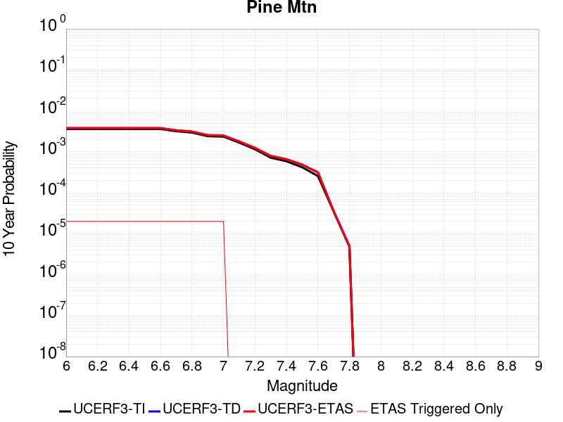 |

| Magnitude | 1 wk TI Prob | 1 wk TD Prob | 1 wk ETAS Prob | 1 wk ETAS/TD Gain | 1 wk ETAS Triggered Only | 1 mo TI Prob | 1 mo TD Prob | 1 mo ETAS Prob | 1 mo ETAS/TD Gain | 1 mo ETAS Triggered Only | 1 yr TI Prob | 1 yr TD Prob | 1 yr ETAS Prob | 1 yr ETAS/TD Gain | 1 yr ETAS Triggered Only | 10 yr TI Prob | 10 yr TD Prob | 10 yr ETAS Prob | 10 yr ETAS/TD Gain | 10 yr ETAS Triggered Only |
|-----|-----|-----|-----|-----|-----|-----|-----|-----|-----|-----|-----|-----|-----|-----|-----|-----|-----|-----|-----|-----|
| 6.0 | 6.894797E-6 | 7.226177E-6 | 7.226177E-6 | 1.0 | 0.0 | 2.9548795E-5 | 3.096898E-5 | 3.096898E-5 | 1.0 | 0.0 | 3.596972E-4 | 3.7698506E-4 | 3.7698506E-4 | 1.0 | 0.0 | 0.0035911554 | 0.003763753 | 0.0037913236 | 1.0073253 | 2.7674767E-5 |
| 6.1 | 6.894797E-6 | 7.226177E-6 | 7.226177E-6 | 1.0 | 0.0 | 2.9548795E-5 | 3.096898E-5 | 3.096898E-5 | 1.0 | 0.0 | 3.596972E-4 | 3.7698506E-4 | 3.7698506E-4 | 1.0 | 0.0 | 0.0035911554 | 0.003763753 | 0.0037913236 | 1.0073253 | 2.7674767E-5 |
| 6.2 | 6.894797E-6 | 7.226177E-6 | 7.226177E-6 | 1.0 | 0.0 | 2.9548795E-5 | 3.096898E-5 | 3.096898E-5 | 1.0 | 0.0 | 3.596972E-4 | 3.7698506E-4 | 3.7698506E-4 | 1.0 | 0.0 | 0.0035911554 | 0.003763753 | 0.0037913236 | 1.0073253 | 2.7674767E-5 |
| 6.3 | 6.894797E-6 | 7.226177E-6 | 7.226177E-6 | 1.0 | 0.0 | 2.9548795E-5 | 3.096898E-5 | 3.096898E-5 | 1.0 | 0.0 | 3.596972E-4 | 3.7698506E-4 | 3.7698506E-4 | 1.0 | 0.0 | 0.0035911554 | 0.003763753 | 0.0037913236 | 1.0073253 | 2.7674767E-5 |
| 6.4 | 6.894797E-6 | 7.226177E-6 | 7.226177E-6 | 1.0 | 0.0 | 2.9548795E-5 | 3.096898E-5 | 3.096898E-5 | 1.0 | 0.0 | 3.596972E-4 | 3.7698506E-4 | 3.7698506E-4 | 1.0 | 0.0 | 0.0035911554 | 0.003763753 | 0.0037913236 | 1.0073253 | 2.7674767E-5 |
| 6.5 | 6.894797E-6 | 7.226177E-6 | 7.226177E-6 | 1.0 | 0.0 | 2.9548795E-5 | 3.096898E-5 | 3.096898E-5 | 1.0 | 0.0 | 3.596972E-4 | 3.7698506E-4 | 3.7698506E-4 | 1.0 | 0.0 | 0.0035911554 | 0.003763753 | 0.0037913236 | 1.0073253 | 2.7674767E-5 |
| 6.6 | 6.894797E-6 | 7.226177E-6 | 7.226177E-6 | 1.0 | 0.0 | 2.9548795E-5 | 3.096898E-5 | 3.096898E-5 | 1.0 | 0.0 | 3.596972E-4 | 3.7698506E-4 | 3.7698506E-4 | 1.0 | 0.0 | 0.0035911554 | 0.003763753 | 0.0037913236 | 1.0073253 | 2.7674767E-5 |
| 6.7 | 6.0867933E-6 | 6.3978096E-6 | 6.3978096E-6 | 1.0 | 0.0 | 2.6085996E-5 | 2.7418908E-5 | 2.7418908E-5 | 1.0 | 0.0 | 3.1755073E-4 | 3.3377626E-4 | 3.3377626E-4 | 1.0 | 0.0 | 0.0031709734 | 0.0033329686 | 0.003360551 | 1.0082756 | 2.7674767E-5 |
| 6.8 | 5.6530425E-6 | 5.95128E-6 | 5.95128E-6 | 1.0 | 0.0 | 2.42271E-5 | 2.5505247E-5 | 2.5505247E-5 | 1.0 | 0.0 | 2.94925E-4 | 3.104842E-4 | 3.104842E-4 | 1.0 | 0.0 | 0.002945339 | 0.0031007088 | 0.0031282976 | 1.0088977 | 2.7674767E-5 |
| 6.9 | 4.6015225E-6 | 4.8644843E-6 | 4.8644843E-6 | 1.0 | 0.0 | 1.9720663E-5 | 2.0847632E-5 | 2.0847632E-5 | 1.0 | 0.0 | 2.4007261E-4 | 2.537918E-4 | 2.537918E-4 | 1.0 | 0.0 | 0.0023981342 | 0.002535164 | 0.0025627685 | 1.0108887 | 2.7674767E-5 |
| 7.0 | 4.4875965E-6 | 4.7481212E-6 | 4.7481212E-6 | 1.0 | 0.0 | 1.9232413E-5 | 2.034894E-5 | 2.034894E-5 | 1.0 | 0.0 | 2.3412947E-4 | 2.4772162E-4 | 2.4772162E-4 | 1.0 | 0.0 | 0.0023388295 | 0.0024745988 | 0.002502205 | 1.0111558 | 2.7674767E-5 |
| 7.1 | 3.203907E-6 | 3.4300247E-6 | 3.4300247E-6 | 1.0 | 0.0 | 1.3730958E-5 | 1.4700027E-5 | 1.4700027E-5 | 1.0 | 0.0 | 1.6716159E-4 | 1.789588E-4 | 1.789588E-4 | 1.0 | 0.0 | 0.0016703589 | 0.001788213 | 0.001788213 | 1.0 | 0.0 |
| 7.2 | 2.2060601E-6 | 2.3789846E-6 | 2.3789846E-6 | 1.0 | 0.0 | 9.4545085E-6 | 1.0195611E-5 | 1.0195611E-5 | 1.0 | 0.0 | 1.15102564E-4 | 1.2412496E-4 | 1.2412496E-4 | 1.0 | 0.0 | 0.0011504296 | 0.0012406011 | 0.0012406011 | 1.0 | 0.0 |
| 7.3 | 1.3765207E-6 | 1.5221007E-6 | 1.5221007E-6 | 1.0 | 0.0 | 5.899361E-6 | 6.5232725E-6 | 6.5232725E-6 | 1.0 | 0.0 | 7.182235E-5 | 7.941804E-5 | 7.941804E-5 | 1.0 | 0.0 | 7.1799144E-4 | 7.939057E-4 | 7.939057E-4 | 1.0 | 0.0 |
| 7.4 | 1.1245983E-6 | 1.2591149E-6 | 1.2591149E-6 | 1.0 | 0.0 | 4.819698E-6 | 5.3961962E-6 | 5.3961962E-6 | 1.0 | 0.0 | 5.8678244E-5 | 6.569679E-5 | 6.569679E-5 | 1.0 | 0.0 | 5.866275E-4 | 6.56782E-4 | 6.56782E-4 | 1.0 | 0.0 |
| 7.5 | 8.031682E-7 | 9.280756E-7 | 9.280756E-7 | 1.0 | 0.0 | 3.4421448E-6 | 3.9774613E-6 | 3.9774613E-6 | 1.0 | 0.0 | 4.1907308E-5 | 4.8424583E-5 | 4.8424583E-5 | 1.0 | 0.0 | 4.1899405E-4 | 4.8414708E-4 | 4.8414708E-4 | 1.0 | 0.0 |
| 7.6 | 4.8953444E-7 | 6.006385E-7 | 6.006385E-7 | 1.0 | 0.0 | 2.098003E-6 | 2.5741629E-6 | 2.5741629E-6 | 1.0 | 0.0 | 2.5542888E-5 | 3.134003E-5 | 3.134003E-5 | 1.0 | 0.0 | 2.5539953E-4 | 3.1336097E-4 | 3.1336097E-4 | 1.0 | 0.0 |
| 7.7 | 6.634529E-8 | 6.788974E-8 | 6.788974E-8 | 1.0 | 0.0 | 2.843369E-7 | 2.90956E-7 | 2.90956E-7 | 1.0 | 0.0 | 3.4617963E-6 | 3.5423839E-6 | 3.5423839E-6 | 1.0 | 0.0 | 3.4617424E-5 | 3.5423323E-5 | 3.5423323E-5 | 1.0 | 0.0 |
| 7.8 | 9.235578E-9 | 9.4888115E-9 | 9.4888115E-9 | 1.0 | 0.0 | 3.9581046E-8 | 4.0666336E-8 | 4.0666336E-8 | 1.0 | 0.0 | 4.818991E-7 | 4.9511254E-7 | 4.9511254E-7 | 1.0 | 0.0 | 4.8189804E-6 | 4.951116E-6 | 4.951116E-6 | 1.0 | 0.0 |

## Santa Rosa Island
*[(top)](#table-of-contents)*

| 1 Week | 1 Month | 1 Year | 10 Year |
|-----|-----|-----|-----|
|  |  |  |  |

| Magnitude | 1 wk TI Prob | 1 wk TD Prob | 1 wk ETAS Prob | 1 wk ETAS/TD Gain | 1 wk ETAS Triggered Only | 1 mo TI Prob | 1 mo TD Prob | 1 mo ETAS Prob | 1 mo ETAS/TD Gain | 1 mo ETAS Triggered Only | 1 yr TI Prob | 1 yr TD Prob | 1 yr ETAS Prob | 1 yr ETAS/TD Gain | 1 yr ETAS Triggered Only | 10 yr TI Prob | 10 yr TD Prob | 10 yr ETAS Prob | 10 yr ETAS/TD Gain | 10 yr ETAS Triggered Only |
|-----|-----|-----|-----|-----|-----|-----|-----|-----|-----|-----|-----|-----|-----|-----|-----|-----|-----|-----|-----|-----|
| 6.0 | 4.1143165E-5 | 4.7097492E-5 | 4.7097492E-5 | 1.0 | 0.0 | 1.7631594E-4 | 2.0183189E-4 | 2.0183189E-4 | 1.0 | 0.0 | 0.002144533 | 0.002454731 | 0.002454731 | 1.0 | 0.0 | 0.021239553 | 0.024296792 | 0.024323795 | 1.0011114 | 2.7674767E-5 |
| 6.1 | 2.1061249E-5 | 2.3867926E-5 | 2.3867926E-5 | 1.0 | 0.0 | 9.0259375E-5 | 1.0228727E-4 | 1.0228727E-4 | 1.0 | 0.0 | 0.0010983539 | 0.001244665 | 0.001244665 | 1.0 | 0.0 | 0.01092941 | 0.012379978 | 0.012407309 | 1.0022078 | 2.7674767E-5 |
| 6.2 | 2.1061249E-5 | 2.3867926E-5 | 2.3867926E-5 | 1.0 | 0.0 | 9.0259375E-5 | 1.0228727E-4 | 1.0228727E-4 | 1.0 | 0.0 | 0.0010983539 | 0.001244665 | 0.001244665 | 1.0 | 0.0 | 0.01092941 | 0.012379978 | 0.012407309 | 1.0022078 | 2.7674767E-5 |
| 6.3 | 1.5158236E-5 | 1.7076436E-5 | 1.7076436E-5 | 1.0 | 0.0 | 6.496225E-5 | 7.318274E-5 | 7.318274E-5 | 1.0 | 0.0 | 7.906284E-4 | 8.906475E-4 | 8.906475E-4 | 1.0 | 0.0 | 0.007878214 | 0.008872032 | 0.008872032 | 1.0 | 0.0 |
| 6.4 | 1.2341918E-5 | 1.3854502E-5 | 1.3854502E-5 | 1.0 | 0.0 | 5.2892858E-5 | 5.937513E-5 | 5.937513E-5 | 1.0 | 0.0 | 6.437803E-4 | 7.2266057E-4 | 7.2266057E-4 | 1.0 | 0.0 | 0.006419184 | 0.0072039426 | 0.0072039426 | 1.0 | 0.0 |
| 6.5 | 9.061158E-6 | 1.0118134E-5 | 1.0118134E-5 | 1.0 | 0.0 | 3.883296E-5 | 4.3362743E-5 | 4.3362743E-5 | 1.0 | 0.0 | 4.726887E-4 | 5.2781886E-4 | 5.2781886E-4 | 1.0 | 0.0 | 0.004716845 | 0.00526619 | 0.00526619 | 1.0 | 0.0 |
| 6.6 | 7.5461685E-6 | 8.401626E-6 | 8.401626E-6 | 1.0 | 0.0 | 3.2340322E-5 | 3.600649E-5 | 3.600649E-5 | 1.0 | 0.0 | 3.936723E-4 | 4.3829516E-4 | 4.3829516E-4 | 1.0 | 0.0 | 0.003929756 | 0.004374737 | 0.004374737 | 1.0 | 0.0 |
| 6.7 | 5.5023775E-6 | 6.087989E-6 | 6.087989E-6 | 1.0 | 0.0 | 2.3581404E-5 | 2.6091138E-5 | 2.6091138E-5 | 1.0 | 0.0 | 2.8706578E-4 | 3.1761656E-4 | 3.1761656E-4 | 1.0 | 0.0 | 0.0028669522 | 0.003171948 | 0.003171948 | 1.0 | 0.0 |
| 6.8 | 3.7351679E-6 | 4.083499E-6 | 4.083499E-6 | 1.0 | 0.0 | 1.6007763E-5 | 1.7500606E-5 | 1.7500606E-5 | 1.0 | 0.0 | 1.948771E-4 | 2.1305155E-4 | 2.1305155E-4 | 1.0 | 0.0 | 0.0019470629 | 0.0021287182 | 0.0021287182 | 1.0 | 0.0 |
| 6.9 | 2.456366E-6 | 2.6294445E-6 | 2.6294445E-6 | 1.0 | 0.0 | 1.0527241E-5 | 1.1268999E-5 | 1.1268999E-5 | 1.0 | 0.0 | 1.2816161E-4 | 1.3719145E-4 | 1.3719145E-4 | 1.0 | 0.0 | 0.0012808773 | 0.0013710705 | 0.0013710705 | 1.0 | 0.0 |
| 7.0 | 2.3245157E-6 | 2.482937E-6 | 2.482937E-6 | 1.0 | 0.0 | 9.962172E-6 | 1.0641115E-5 | 1.0641115E-5 | 1.0 | 0.0 | 1.2128269E-4 | 1.295479E-4 | 1.295479E-4 | 1.0 | 0.0 | 0.0012121652 | 0.001294726 | 0.001294726 | 1.0 | 0.0 |
| 7.1 | 2.2248344E-6 | 2.3733985E-6 | 2.3733985E-6 | 1.0 | 0.0 | 9.53497E-6 | 1.0171669E-5 | 1.0171669E-5 | 1.0 | 0.0 | 1.1608207E-4 | 1.2383304E-4 | 1.2383304E-4 | 1.0 | 0.0 | 0.0011602144 | 0.0012376424 | 0.0012376424 | 1.0 | 0.0 |
| 7.2 | 2.1350402E-6 | 2.2762952E-6 | 2.2762952E-6 | 1.0 | 0.0 | 9.150141E-6 | 9.755515E-6 | 9.755515E-6 | 1.0 | 0.0 | 1.1139726E-4 | 1.1876693E-4 | 1.1876693E-4 | 1.0 | 0.0 | 0.0011134144 | 0.0011870365 | 0.0011870365 | 1.0 | 0.0 |
| 7.3 | 1.9793572E-6 | 2.1088485E-6 | 2.1088485E-6 | 1.0 | 0.0 | 8.482932E-6 | 9.037891E-6 | 9.037891E-6 | 1.0 | 0.0 | 1.032748E-4 | 1.10030785E-4 | 1.10030785E-4 | 1.0 | 0.0 | 0.0010322682 | 0.0010997648 | 0.0010997648 | 1.0 | 0.0 |
| 7.4 | 1.6951194E-6 | 1.804683E-6 | 1.804683E-6 | 1.0 | 0.0 | 7.264777E-6 | 7.734333E-6 | 7.734333E-6 | 1.0 | 0.0 | 8.844508E-5 | 9.416145E-5 | 9.416145E-5 | 1.0 | 0.0 | 8.840988E-4 | 9.4121724E-4 | 9.4121724E-4 | 1.0 | 0.0 |
| 7.5 | 8.987207E-7 | 9.512744E-7 | 9.512744E-7 | 1.0 | 0.0 | 3.8516546E-6 | 4.076884E-6 | 4.076884E-6 | 1.0 | 0.0 | 4.6892885E-5 | 4.9634942E-5 | 4.9634942E-5 | 1.0 | 0.0 | 4.688299E-4 | 4.9623975E-4 | 4.9623975E-4 | 1.0 | 0.0 |
| 7.6 | 3.8783037E-7 | 4.0531128E-7 | 4.0531128E-7 | 1.0 | 0.0 | 1.6621291E-6 | 1.7370472E-6 | 1.7370472E-6 | 1.0 | 0.0 | 2.0236233E-5 | 2.1148351E-5 | 2.1148351E-5 | 1.0 | 0.0 | 2.023439E-4 | 2.1146404E-4 | 2.1146404E-4 | 1.0 | 0.0 |
| 7.7 | 6.181804E-8 | 6.339254E-8 | 6.339254E-8 | 1.0 | 0.0 | 2.6493444E-7 | 2.716823E-7 | 2.716823E-7 | 1.0 | 0.0 | 3.225572E-6 | 3.307727E-6 | 3.307727E-6 | 1.0 | 0.0 | 3.225525E-5 | 3.3076783E-5 | 3.3076783E-5 | 1.0 | 0.0 |
| 7.8 | 1.3704449E-9 | 1.3964399E-9 | 1.3964399E-9 | 1.0 | 0.0 | 5.873335E-9 | 5.9847425E-9 | 5.9847425E-9 | 1.0 | 0.0 | 7.1507856E-8 | 7.286424E-8 | 7.286424E-8 | 1.0 | 0.0 | 7.1507833E-7 | 7.286422E-7 | 7.286422E-7 | 1.0 | 0.0 |

## Shoreline
*[(top)](#table-of-contents)*

| 1 Week | 1 Month | 1 Year | 10 Year |
|-----|-----|-----|-----|
|  | 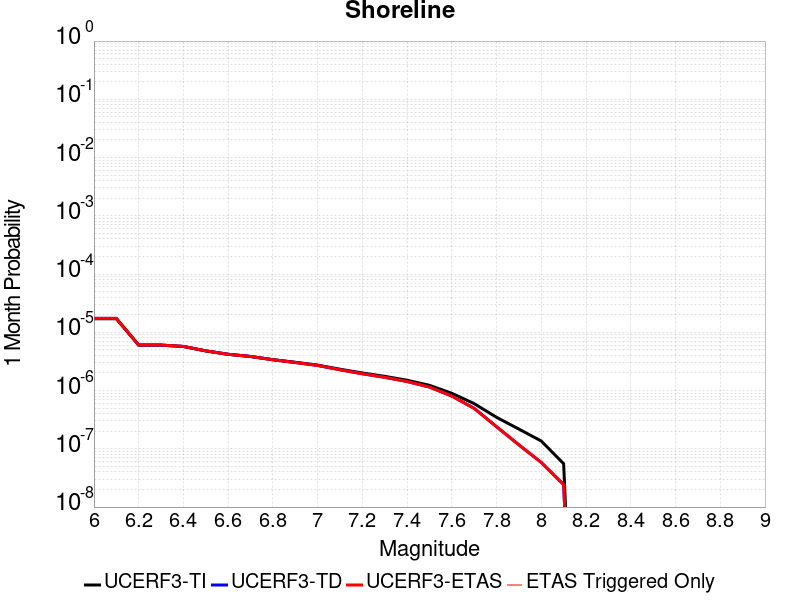 |  |  |

| Magnitude | 1 wk TI Prob | 1 wk TD Prob | 1 wk ETAS Prob | 1 wk ETAS/TD Gain | 1 wk ETAS Triggered Only | 1 mo TI Prob | 1 mo TD Prob | 1 mo ETAS Prob | 1 mo ETAS/TD Gain | 1 mo ETAS Triggered Only | 1 yr TI Prob | 1 yr TD Prob | 1 yr ETAS Prob | 1 yr ETAS/TD Gain | 1 yr ETAS Triggered Only | 10 yr TI Prob | 10 yr TD Prob | 10 yr ETAS Prob | 10 yr ETAS/TD Gain | 10 yr ETAS Triggered Only |
|-----|-----|-----|-----|-----|-----|-----|-----|-----|-----|-----|-----|-----|-----|-----|-----|-----|-----|-----|-----|-----|
| 6.0 | 3.9888673E-6 | 4.0480413E-6 | 4.0480413E-6 | 1.0 | 0.0 | 1.7095033E-5 | 1.7348664E-5 | 1.7348664E-5 | 1.0 | 0.0 | 2.0811215E-4 | 2.112051E-4 | 2.112051E-4 | 1.0 | 0.0 | 0.0020791737 | 0.0021105926 | 0.0021382088 | 1.0130847 | 2.7674767E-5 |
| 6.1 | 3.9888673E-6 | 4.0480413E-6 | 4.0480413E-6 | 1.0 | 0.0 | 1.7095033E-5 | 1.7348664E-5 | 1.7348664E-5 | 1.0 | 0.0 | 2.0811215E-4 | 2.112051E-4 | 2.112051E-4 | 1.0 | 0.0 | 0.0020791737 | 0.0021105926 | 0.0021382088 | 1.0130847 | 2.7674767E-5 |
| 6.2 | 1.4039653E-6 | 1.410151E-6 | 1.410151E-6 | 1.0 | 0.0 | 6.0169805E-6 | 6.0434904E-6 | 6.0434904E-6 | 1.0 | 0.0 | 7.325427E-5 | 7.357707E-5 | 7.357707E-5 | 1.0 | 0.0 | 7.3230127E-4 | 7.3553313E-4 | 7.3553313E-4 | 1.0 | 0.0 |
| 6.3 | 1.4039653E-6 | 1.410151E-6 | 1.410151E-6 | 1.0 | 0.0 | 6.0169805E-6 | 6.0434904E-6 | 6.0434904E-6 | 1.0 | 0.0 | 7.325427E-5 | 7.357707E-5 | 7.357707E-5 | 1.0 | 0.0 | 7.3230127E-4 | 7.3553313E-4 | 7.3553313E-4 | 1.0 | 0.0 |
| 6.4 | 1.3314152E-6 | 1.3362211E-6 | 1.3362211E-6 | 1.0 | 0.0 | 5.7060524E-6 | 5.7266493E-6 | 5.7266493E-6 | 1.0 | 0.0 | 6.946897E-5 | 6.971978E-5 | 6.971978E-5 | 1.0 | 0.0 | 6.9447263E-4 | 6.9698447E-4 | 6.9698447E-4 | 1.0 | 0.0 |
| 6.5 | 1.1187026E-6 | 1.1204216E-6 | 1.1204216E-6 | 1.0 | 0.0 | 4.794431E-6 | 4.8017982E-6 | 4.8017982E-6 | 1.0 | 0.0 | 5.8370628E-5 | 5.846035E-5 | 5.846035E-5 | 1.0 | 0.0 | 5.83553E-4 | 5.8445224E-4 | 5.8445224E-4 | 1.0 | 0.0 |
| 6.6 | 9.793089E-7 | 9.785473E-7 | 9.785473E-7 | 1.0 | 0.0 | 4.1970316E-6 | 4.1937674E-6 | 4.1937674E-6 | 1.0 | 0.0 | 5.1097657E-5 | 5.1057934E-5 | 5.1057934E-5 | 1.0 | 0.0 | 5.108591E-4 | 5.104633E-4 | 5.104633E-4 | 1.0 | 0.0 |
| 6.7 | 8.995986E-7 | 8.973339E-7 | 8.973339E-7 | 1.0 | 0.0 | 3.8554167E-6 | 3.845711E-6 | 3.845711E-6 | 1.0 | 0.0 | 4.693869E-5 | 4.6820536E-5 | 4.6820536E-5 | 1.0 | 0.0 | 4.6928777E-4 | 4.6810767E-4 | 4.6810767E-4 | 1.0 | 0.0 |
| 6.8 | 7.931612E-7 | 7.880915E-7 | 7.880915E-7 | 1.0 | 0.0 | 3.3992578E-6 | 3.3775307E-6 | 3.3775307E-6 | 1.0 | 0.0 | 4.1385178E-5 | 4.1120664E-5 | 4.1120664E-5 | 1.0 | 0.0 | 4.1377472E-4 | 4.111311E-4 | 4.111311E-4 | 1.0 | 0.0 |
| 6.9 | 7.1465956E-7 | 7.078502E-7 | 7.078502E-7 | 1.0 | 0.0 | 3.062823E-6 | 3.03364E-6 | 3.03364E-6 | 1.0 | 0.0 | 3.7289232E-5 | 3.6933947E-5 | 3.6933947E-5 | 1.0 | 0.0 | 3.7282976E-4 | 3.6927842E-4 | 3.6927842E-4 | 1.0 | 0.0 |
| 7.0 | 6.389046E-7 | 6.299934E-7 | 6.299934E-7 | 1.0 | 0.0 | 2.7381598E-6 | 2.699969E-6 | 2.699969E-6 | 1.0 | 0.0 | 3.3336586E-5 | 3.2871627E-5 | 3.2871627E-5 | 1.0 | 0.0 | 3.3331584E-4 | 3.286679E-4 | 3.286679E-4 | 1.0 | 0.0 |
| 7.1 | 5.4300875E-7 | 5.3115787E-7 | 5.3115787E-7 | 1.0 | 0.0 | 2.3271782E-6 | 2.2763888E-6 | 2.2763888E-6 | 1.0 | 0.0 | 2.8333026E-5 | 2.7714683E-5 | 2.7714683E-5 | 1.0 | 0.0 | 2.8329415E-4 | 2.7711235E-4 | 2.7711235E-4 | 1.0 | 0.0 |
| 7.2 | 4.6768855E-7 | 4.5353207E-7 | 4.5353207E-7 | 1.0 | 0.0 | 2.0043778E-6 | 1.9437075E-6 | 1.9437075E-6 | 1.0 | 0.0 | 2.4403027E-5 | 2.3664381E-5 | 2.3664381E-5 | 1.0 | 0.0 | 2.4400349E-4 | 2.3661867E-4 | 2.3661867E-4 | 1.0 | 0.0 |
| 7.3 | 4.0966103E-7 | 3.9389764E-7 | 3.9389764E-7 | 1.0 | 0.0 | 1.7556889E-6 | 1.6881316E-6 | 1.6881316E-6 | 1.0 | 0.0 | 2.1375303E-5 | 2.0552809E-5 | 2.0552809E-5 | 1.0 | 0.0 | 2.1373246E-4 | 2.0550912E-4 | 2.0550912E-4 | 1.0 | 0.0 |
| 7.4 | 3.5105785E-7 | 3.336792E-7 | 3.336792E-7 | 1.0 | 0.0 | 1.5045327E-6 | 1.4300529E-6 | 1.4300529E-6 | 1.0 | 0.0 | 1.8317533E-5 | 1.7410755E-5 | 1.7410755E-5 | 1.0 | 0.0 | 1.8316023E-4 | 1.7409393E-4 | 1.7409393E-4 | 1.0 | 0.0 |
| 7.5 | 2.8737534E-7 | 2.6823815E-7 | 2.6823815E-7 | 1.0 | 0.0 | 1.2316079E-6 | 1.1495915E-6 | 1.1495915E-6 | 1.0 | 0.0 | 1.4994724E-5 | 1.3996188E-5 | 1.3996188E-5 | 1.0 | 0.0 | 1.4993713E-4 | 1.3995309E-4 | 1.3995309E-4 | 1.0 | 0.0 |
| 7.6 | 2.0924051E-7 | 1.8782545E-7 | 1.8782545E-7 | 1.0 | 0.0 | 8.967448E-7 | 8.0496596E-7 | 8.0496596E-7 | 1.0 | 0.0 | 1.0917813E-5 | 9.800417E-6 | 9.800417E-6 | 1.0 | 0.0 | 1.0917276E-4 | 9.799985E-5 | 9.799985E-5 | 1.0 | 0.0 |
| 7.7 | 1.392265E-7 | 1.154672E-7 | 1.154672E-7 | 1.0 | 0.0 | 5.9668486E-7 | 4.9485936E-7 | 4.9485936E-7 | 1.0 | 0.0 | 7.2646135E-6 | 6.024896E-6 | 6.024896E-6 | 1.0 | 0.0 | 7.2643765E-5 | 6.024733E-5 | 6.024733E-5 | 1.0 | 0.0 |
| 7.8 | 8.1080074E-8 | 5.589849E-8 | 5.589849E-8 | 1.0 | 0.0 | 3.4748598E-7 | 2.3956494E-7 | 2.3956494E-7 | 1.0 | 0.0 | 4.2306337E-6 | 2.916699E-6 | 2.916699E-6 | 1.0 | 0.0 | 4.230553E-5 | 2.916661E-5 | 2.916661E-5 | 1.0 | 0.0 |
| 7.9 | 5.0859036E-8 | 2.7272984E-8 | 2.7272984E-8 | 1.0 | 0.0 | 2.1796728E-7 | 1.16884216E-7 | 1.16884216E-7 | 1.0 | 0.0 | 2.6537484E-6 | 1.4230643E-6 | 1.4230643E-6 | 1.0 | 0.0 | 2.6537167E-5 | 1.4230553E-5 | 1.4230553E-5 | 1.0 | 0.0 |
| 8.0 | 3.1760536E-8 | 1.3599104E-8 | 1.3599104E-8 | 1.0 | 0.0 | 1.3611657E-7 | 5.8281874E-8 | 5.8281874E-8 | 1.0 | 0.0 | 1.6572179E-6 | 7.0958157E-7 | 7.0958157E-7 | 1.0 | 0.0 | 1.6572056E-5 | 7.095793E-6 | 7.095793E-6 | 1.0 | 0.0 |
| 8.1 | 1.2947896E-8 | 5.672185E-9 | 5.672185E-9 | 1.0 | 0.0 | 5.5490982E-8 | 2.4309365E-8 | 2.4309365E-8 | 1.0 | 0.0 | 6.756025E-7 | 2.9596646E-7 | 2.9596646E-7 | 1.0 | 0.0 | 6.7560045E-6 | 2.959661E-6 | 2.959661E-6 | 1.0 | 0.0 |

## Channel Islands Thrust
*[(top)](#table-of-contents)*

| 1 Week | 1 Month | 1 Year | 10 Year |
|-----|-----|-----|-----|
| 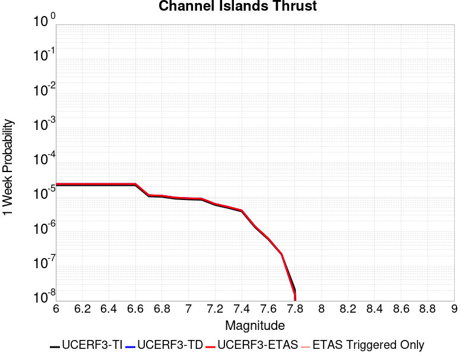 |  |  | 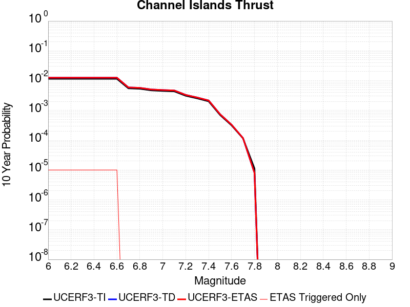 |

| Magnitude | 1 wk TI Prob | 1 wk TD Prob | 1 wk ETAS Prob | 1 wk ETAS/TD Gain | 1 wk ETAS Triggered Only | 1 mo TI Prob | 1 mo TD Prob | 1 mo ETAS Prob | 1 mo ETAS/TD Gain | 1 mo ETAS Triggered Only | 1 yr TI Prob | 1 yr TD Prob | 1 yr ETAS Prob | 1 yr ETAS/TD Gain | 1 yr ETAS Triggered Only | 10 yr TI Prob | 10 yr TD Prob | 10 yr ETAS Prob | 10 yr ETAS/TD Gain | 10 yr ETAS Triggered Only |
|-----|-----|-----|-----|-----|-----|-----|-----|-----|-----|-----|-----|-----|-----|-----|-----|-----|-----|-----|-----|-----|
| 6.0 | 2.2156251E-5 | 2.409399E-5 | 2.409399E-5 | 1.0 | 0.0 | 9.495191E-5 | 1.03256476E-4 | 1.03256476E-4 | 1.0 | 0.0 | 0.0011554264 | 0.0012565291 | 0.0012565291 | 1.0 | 0.0 | 0.011494373 | 0.0125048375 | 0.012532166 | 1.0021855 | 2.7674767E-5 |
| 6.1 | 2.2156251E-5 | 2.409399E-5 | 2.409399E-5 | 1.0 | 0.0 | 9.495191E-5 | 1.03256476E-4 | 1.03256476E-4 | 1.0 | 0.0 | 0.0011554264 | 0.0012565291 | 0.0012565291 | 1.0 | 0.0 | 0.011494373 | 0.0125048375 | 0.012532166 | 1.0021855 | 2.7674767E-5 |
| 6.2 | 2.2156251E-5 | 2.409399E-5 | 2.409399E-5 | 1.0 | 0.0 | 9.495191E-5 | 1.03256476E-4 | 1.03256476E-4 | 1.0 | 0.0 | 0.0011554264 | 0.0012565291 | 0.0012565291 | 1.0 | 0.0 | 0.011494373 | 0.0125048375 | 0.012532166 | 1.0021855 | 2.7674767E-5 |
| 6.3 | 2.2156251E-5 | 2.409399E-5 | 2.409399E-5 | 1.0 | 0.0 | 9.495191E-5 | 1.03256476E-4 | 1.03256476E-4 | 1.0 | 0.0 | 0.0011554264 | 0.0012565291 | 0.0012565291 | 1.0 | 0.0 | 0.011494373 | 0.0125048375 | 0.012532166 | 1.0021855 | 2.7674767E-5 |
| 6.4 | 2.2156251E-5 | 2.409399E-5 | 2.409399E-5 | 1.0 | 0.0 | 9.495191E-5 | 1.03256476E-4 | 1.03256476E-4 | 1.0 | 0.0 | 0.0011554264 | 0.0012565291 | 0.0012565291 | 1.0 | 0.0 | 0.011494373 | 0.0125048375 | 0.012532166 | 1.0021855 | 2.7674767E-5 |
| 6.5 | 2.2156251E-5 | 2.409399E-5 | 2.409399E-5 | 1.0 | 0.0 | 9.495191E-5 | 1.03256476E-4 | 1.03256476E-4 | 1.0 | 0.0 | 0.0011554264 | 0.0012565291 | 0.0012565291 | 1.0 | 0.0 | 0.011494373 | 0.0125048375 | 0.012532166 | 1.0021855 | 2.7674767E-5 |
| 6.6 | 2.2156251E-5 | 2.409399E-5 | 2.409399E-5 | 1.0 | 0.0 | 9.495191E-5 | 1.03256476E-4 | 1.03256476E-4 | 1.0 | 0.0 | 0.0011554264 | 0.0012565291 | 0.0012565291 | 1.0 | 0.0 | 0.011494373 | 0.0125048375 | 0.012532166 | 1.0021855 | 2.7674767E-5 |
| 6.7 | 1.0601296E-5 | 1.138033E-5 | 1.138033E-5 | 1.0 | 0.0 | 4.5433335E-5 | 4.877196E-5 | 4.877196E-5 | 1.0 | 0.0 | 5.5301044E-4 | 5.936417E-4 | 5.936417E-4 | 1.0 | 0.0 | 0.005516363 | 0.005921061 | 0.005921061 | 1.0 | 0.0 |
| 6.8 | 1.0246747E-5 | 1.0997426E-5 | 1.0997426E-5 | 1.0 | 0.0 | 4.391389E-5 | 4.7131005E-5 | 4.7131005E-5 | 1.0 | 0.0 | 5.345204E-4 | 5.736737E-4 | 5.736737E-4 | 1.0 | 0.0 | 0.0053323656 | 0.005722418 | 0.005722418 | 1.0 | 0.0 |
| 6.9 | 9.049551E-6 | 9.700301E-6 | 9.700301E-6 | 1.0 | 0.0 | 3.878322E-5 | 4.1572082E-5 | 4.1572082E-5 | 1.0 | 0.0 | 4.7208337E-4 | 5.0602667E-4 | 5.0602667E-4 | 1.0 | 0.0 | 0.0047108172 | 0.0050491616 | 0.0050491616 | 1.0 | 0.0 |
| 7.0 | 8.6542195E-6 | 9.275231E-6 | 9.275231E-6 | 1.0 | 0.0 | 3.7088983E-5 | 3.9750405E-5 | 3.9750405E-5 | 1.0 | 0.0 | 4.5146482E-4 | 4.8385782E-4 | 4.8385782E-4 | 1.0 | 0.0 | 0.004505487 | 0.004828455 | 0.004828455 | 1.0 | 0.0 |
| 7.1 | 8.391028E-6 | 8.993534E-6 | 8.993534E-6 | 1.0 | 0.0 | 3.5961057E-5 | 3.854317E-5 | 3.854317E-5 | 1.0 | 0.0 | 4.3773788E-4 | 4.6916615E-4 | 4.6916615E-4 | 1.0 | 0.0 | 0.004368766 | 0.004682167 | 0.004682167 | 1.0 | 0.0 |
| 7.2 | 5.965188E-6 | 6.372108E-6 | 6.372108E-6 | 1.0 | 0.0 | 2.556484E-5 | 2.7308752E-5 | 2.7308752E-5 | 1.0 | 0.0 | 3.1120746E-4 | 3.3243388E-4 | 3.3243388E-4 | 1.0 | 0.0 | 0.00310772 | 0.003319424 | 0.003319424 | 1.0 | 0.0 |
| 7.3 | 4.877518E-6 | 5.206342E-6 | 5.206342E-6 | 1.0 | 0.0 | 2.0903482E-5 | 2.2312704E-5 | 2.2312704E-5 | 1.0 | 0.0 | 2.5447016E-4 | 2.7162378E-4 | 2.7162378E-4 | 1.0 | 0.0 | 0.0025417898 | 0.002712964 | 0.002712964 | 1.0 | 0.0 |
| 7.4 | 3.8829853E-6 | 4.142129E-6 | 4.142129E-6 | 1.0 | 0.0 | 1.664126E-5 | 1.7751861E-5 | 1.7751861E-5 | 1.0 | 0.0 | 2.0258849E-4 | 2.161079E-4 | 2.161079E-4 | 1.0 | 0.0 | 0.002024039 | 0.0021590192 | 0.0021590192 | 1.0 | 0.0 |
| 7.5 | 1.3489616E-6 | 1.427877E-6 | 1.427877E-6 | 1.0 | 0.0 | 5.7812517E-6 | 6.1194587E-6 | 6.1194587E-6 | 1.0 | 0.0 | 7.038446E-5 | 7.4501906E-5 | 7.4501906E-5 | 1.0 | 0.0 | 7.036218E-4 | 7.4477325E-4 | 7.4477325E-4 | 1.0 | 0.0 |
| 7.6 | 6.058192E-7 | 6.354155E-7 | 6.354155E-7 | 1.0 | 0.0 | 2.5963652E-6 | 2.7232068E-6 | 2.7232068E-6 | 1.0 | 0.0 | 3.161029E-5 | 3.3154553E-5 | 3.3154553E-5 | 1.0 | 0.0 | 3.1605794E-4 | 3.314977E-4 | 3.314977E-4 | 1.0 | 0.0 |
| 7.7 | 2.2170494E-7 | 2.2609142E-7 | 2.2609142E-7 | 1.0 | 0.0 | 9.5016367E-7 | 9.689629E-7 | 9.689629E-7 | 1.0 | 0.0 | 1.1568181E-5 | 1.179707E-5 | 1.179707E-5 | 1.0 | 0.0 | 1.1567579E-4 | 1.1796555E-4 | 1.1796555E-4 | 1.0 | 0.0 |
| 7.8 | 2.1613102E-8 | 1.5467428E-8 | 1.5467428E-8 | 1.0 | 0.0 | 9.262757E-8 | 6.6288976E-8 | 6.6288976E-8 | 1.0 | 0.0 | 1.1277401E-6 | 8.0706803E-7 | 8.0706803E-7 | 1.0 | 0.0 | 1.1277344E-5 | 8.070659E-6 | 8.070659E-6 | 1.0 | 0.0 |

## Raymond
*[(top)](#table-of-contents)*

| 1 Week | 1 Month | 1 Year | 10 Year |
|-----|-----|-----|-----|
|  |  |  |  |

| Magnitude | 1 wk TI Prob | 1 wk TD Prob | 1 wk ETAS Prob | 1 wk ETAS/TD Gain | 1 wk ETAS Triggered Only | 1 mo TI Prob | 1 mo TD Prob | 1 mo ETAS Prob | 1 mo ETAS/TD Gain | 1 mo ETAS Triggered Only | 1 yr TI Prob | 1 yr TD Prob | 1 yr ETAS Prob | 1 yr ETAS/TD Gain | 1 yr ETAS Triggered Only | 10 yr TI Prob | 10 yr TD Prob | 10 yr ETAS Prob | 10 yr ETAS/TD Gain | 10 yr ETAS Triggered Only |
|-----|-----|-----|-----|-----|-----|-----|-----|-----|-----|-----|-----|-----|-----|-----|-----|-----|-----|-----|-----|-----|
| 6.0 | 1.5157413E-5 | 1.5811958E-5 | 1.5811958E-5 | 1.0 | 0.0 | 6.4958724E-5 | 6.776392E-5 | 6.776392E-5 | 1.0 | 0.0 | 7.905855E-4 | 8.2473847E-4 | 8.523904E-4 | 1.0335281 | 2.7674767E-5 | 0.007877788 | 0.008219296 | 0.008246743 | 1.0033394 | 2.7674767E-5 |
| 6.1 | 1.5157413E-5 | 1.5811958E-5 | 1.5811958E-5 | 1.0 | 0.0 | 6.4958724E-5 | 6.776392E-5 | 6.776392E-5 | 1.0 | 0.0 | 7.905855E-4 | 8.2473847E-4 | 8.523904E-4 | 1.0335281 | 2.7674767E-5 | 0.007877788 | 0.008219296 | 0.008246743 | 1.0033394 | 2.7674767E-5 |
| 6.2 | 1.5157413E-5 | 1.5811958E-5 | 1.5811958E-5 | 1.0 | 0.0 | 6.4958724E-5 | 6.776392E-5 | 6.776392E-5 | 1.0 | 0.0 | 7.905855E-4 | 8.2473847E-4 | 8.523904E-4 | 1.0335281 | 2.7674767E-5 | 0.007877788 | 0.008219296 | 0.008246743 | 1.0033394 | 2.7674767E-5 |
| 6.3 | 1.5157413E-5 | 1.5811958E-5 | 1.5811958E-5 | 1.0 | 0.0 | 6.4958724E-5 | 6.776392E-5 | 6.776392E-5 | 1.0 | 0.0 | 7.905855E-4 | 8.2473847E-4 | 8.523904E-4 | 1.0335281 | 2.7674767E-5 | 0.007877788 | 0.008219296 | 0.008246743 | 1.0033394 | 2.7674767E-5 |
| 6.4 | 1.3941944E-5 | 1.4456376E-5 | 1.4456376E-5 | 1.0 | 0.0 | 5.9749822E-5 | 6.195456E-5 | 6.195456E-5 | 1.0 | 0.0 | 7.2721124E-4 | 7.5405906E-4 | 7.8171294E-4 | 1.0366734 | 2.7674767E-5 | 0.007248361 | 0.0075173383 | 0.007544805 | 1.0036538 | 2.7674767E-5 |
| 6.5 | 1.3941944E-5 | 1.4456376E-5 | 1.4456376E-5 | 1.0 | 0.0 | 5.9749822E-5 | 6.195456E-5 | 6.195456E-5 | 1.0 | 0.0 | 7.2721124E-4 | 7.5405906E-4 | 7.8171294E-4 | 1.0366734 | 2.7674767E-5 | 0.007248361 | 0.0075173383 | 0.007544805 | 1.0036538 | 2.7674767E-5 |
| 6.6 | 1.0542609E-5 | 1.0672402E-5 | 1.0672402E-5 | 1.0 | 0.0 | 4.5181827E-5 | 4.5738092E-5 | 4.5738092E-5 | 1.0 | 0.0 | 5.499499E-4 | 5.5672444E-4 | 5.843838E-4 | 1.0496823 | 2.7674767E-5 | 0.005485909 | 0.005553859 | 0.0055813803 | 1.0049553 | 2.7674767E-5 |
| 6.7 | 1.0542609E-5 | 1.0672402E-5 | 1.0672402E-5 | 1.0 | 0.0 | 4.5181827E-5 | 4.5738092E-5 | 4.5738092E-5 | 1.0 | 0.0 | 5.499499E-4 | 5.5672444E-4 | 5.843838E-4 | 1.0496823 | 2.7674767E-5 | 0.005485909 | 0.005553859 | 0.0055813803 | 1.0049553 | 2.7674767E-5 |
| 6.8 | 1.0079132E-5 | 1.0177903E-5 | 1.0177903E-5 | 1.0 | 0.0 | 4.3195567E-5 | 4.3618886E-5 | 4.3618886E-5 | 1.0 | 0.0 | 5.257791E-4 | 5.309359E-4 | 5.58596E-4 | 1.0520968 | 2.7674767E-5 | 0.0052453685 | 0.005297224 | 0.005324752 | 1.0051967 | 2.7674767E-5 |
| 6.9 | 7.721598E-6 | 7.5498792E-6 | 7.5498792E-6 | 1.0 | 0.0 | 3.3092143E-5 | 3.235623E-5 | 3.235623E-5 | 1.0 | 0.0 | 4.0282236E-4 | 3.938671E-4 | 4.2153097E-4 | 1.0702366 | 2.7674767E-5 | 0.0040209293 | 0.003931824 | 0.0039593903 | 1.0070109 | 2.7674767E-5 |
| 7.0 | 7.137566E-6 | 6.9122257E-6 | 6.9122257E-6 | 1.0 | 0.0 | 3.058921E-5 | 2.9623494E-5 | 2.9623494E-5 | 1.0 | 0.0 | 3.7236E-4 | 3.6060743E-4 | 3.882722E-4 | 1.0767171 | 2.7674767E-5 | 0.0037173668 | 0.003600341 | 0.003627916 | 1.0076591 | 2.7674767E-5 |
| 7.1 | 5.654976E-6 | 5.3003296E-6 | 5.3003296E-6 | 1.0 | 0.0 | 2.4235387E-5 | 2.2715501E-5 | 2.2715501E-5 | 1.0 | 0.0 | 2.9502588E-4 | 2.7652635E-4 | 2.7652635E-4 | 1.0 | 0.0 | 0.0029463451 | 0.0027618536 | 0.0027618536 | 1.0 | 0.0 |
| 7.2 | 4.9358455E-6 | 4.5273864E-6 | 4.5273864E-6 | 1.0 | 0.0 | 2.1153453E-5 | 1.9402942E-5 | 1.9402942E-5 | 1.0 | 0.0 | 2.5751285E-4 | 2.3620535E-4 | 2.3620535E-4 | 1.0 | 0.0 | 0.0025721465 | 0.0023595649 | 0.0023595649 | 1.0 | 0.0 |
| 7.3 | 4.2368597E-6 | 3.8062944E-6 | 3.8062944E-6 | 1.0 | 0.0 | 1.8157843E-5 | 1.6312588E-5 | 1.6312588E-5 | 1.0 | 0.0 | 2.2104931E-4 | 1.9858778E-4 | 1.9858778E-4 | 1.0 | 0.0 | 0.0022082955 | 0.0019841217 | 0.0019841217 | 1.0 | 0.0 |
| 7.4 | 3.4999923E-6 | 3.0443584E-6 | 3.0443584E-6 | 1.0 | 0.0 | 1.49998805E-5 | 1.3047185E-5 | 1.3047185E-5 | 1.0 | 0.0 | 1.8260824E-4 | 1.5883798E-4 | 1.5883798E-4 | 1.0 | 0.0 | 0.0018245826 | 0.0015872603 | 0.0015872603 | 1.0 | 0.0 |
| 7.5 | 2.738017E-6 | 2.302492E-6 | 2.302492E-6 | 1.0 | 0.0 | 1.1734306E-5 | 9.867786E-6 | 9.867786E-6 | 1.0 | 0.0 | 1.428558E-4 | 1.20133736E-4 | 1.20133736E-4 | 1.0 | 0.0 | 0.0014276401 | 0.0012007023 | 0.0012007023 | 1.0 | 0.0 |
| 7.6 | 1.8186392E-6 | 1.4426239E-6 | 1.4426239E-6 | 1.0 | 0.0 | 7.794145E-6 | 6.1826595E-6 | 6.1826595E-6 | 1.0 | 0.0 | 9.488958E-5 | 7.527132E-5 | 7.527132E-5 | 1.0 | 0.0 | 9.4849075E-4 | 7.5246976E-4 | 7.5246976E-4 | 1.0 | 0.0 |
| 7.7 | 1.0660348E-6 | 7.6463243E-7 | 7.6463243E-7 | 1.0 | 0.0 | 4.5687125E-6 | 3.276992E-6 | 3.276992E-6 | 1.0 | 0.0 | 5.5622655E-5 | 3.9896666E-5 | 3.9896666E-5 | 1.0 | 0.0 | 5.5608735E-4 | 3.9890414E-4 | 3.9890414E-4 | 1.0 | 0.0 |
| 7.8 | 6.913602E-7 | 4.322519E-7 | 4.322519E-7 | 1.0 | 0.0 | 2.962969E-6 | 1.8525069E-6 | 1.8525069E-6 | 1.0 | 0.0 | 3.607355E-5 | 2.2554044E-5 | 2.2554044E-5 | 1.0 | 0.0 | 3.6067693E-4 | 2.2552541E-4 | 2.2552541E-4 | 1.0 | 0.0 |
| 7.9 | 7.425201E-8 | 5.324345E-8 | 5.324345E-8 | 1.0 | 0.0 | 3.1822285E-7 | 2.2818621E-7 | 2.2818621E-7 | 1.0 | 0.0 | 3.874356E-6 | 2.7781648E-6 | 2.7781648E-6 | 1.0 | 0.0 | 3.8742884E-5 | 2.778143E-5 | 2.778143E-5 | 1.0 | 0.0 |

## Bullion Mountains
*[(top)](#table-of-contents)*

| 1 Week | 1 Month | 1 Year | 10 Year |
|-----|-----|-----|-----|
|  | 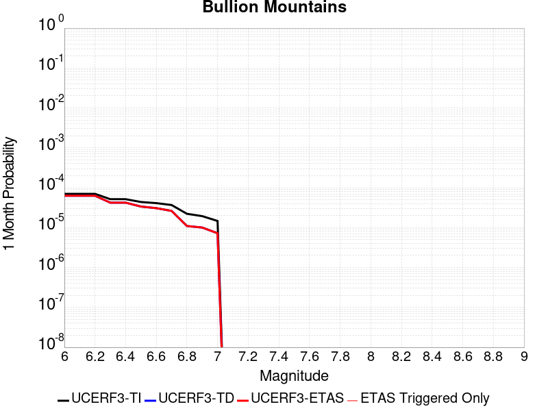 |  |  |

| Magnitude | 1 wk TI Prob | 1 wk TD Prob | 1 wk ETAS Prob | 1 wk ETAS/TD Gain | 1 wk ETAS Triggered Only | 1 mo TI Prob | 1 mo TD Prob | 1 mo ETAS Prob | 1 mo ETAS/TD Gain | 1 mo ETAS Triggered Only | 1 yr TI Prob | 1 yr TD Prob | 1 yr ETAS Prob | 1 yr ETAS/TD Gain | 1 yr ETAS Triggered Only | 10 yr TI Prob | 10 yr TD Prob | 10 yr ETAS Prob | 10 yr ETAS/TD Gain | 10 yr ETAS Triggered Only |
|-----|-----|-----|-----|-----|-----|-----|-----|-----|-----|-----|-----|-----|-----|-----|-----|-----|-----|-----|-----|-----|
| 6.0 | 1.6420427E-5 | 1.46936045E-5 | 1.46936045E-5 | 1.0 | 0.0 | 7.037136E-5 | 6.297129E-5 | 6.297129E-5 | 1.0 | 0.0 | 8.5643446E-4 | 7.6644414E-4 | 7.6644414E-4 | 1.0 | 0.0 | 0.008531413 | 0.0076418016 | 0.007669265 | 1.0035938 | 2.7674767E-5 |
| 6.1 | 1.6420427E-5 | 1.46936045E-5 | 1.46936045E-5 | 1.0 | 0.0 | 7.037136E-5 | 6.297129E-5 | 6.297129E-5 | 1.0 | 0.0 | 8.5643446E-4 | 7.6644414E-4 | 7.6644414E-4 | 1.0 | 0.0 | 0.008531413 | 0.0076418016 | 0.007669265 | 1.0035938 | 2.7674767E-5 |
| 6.2 | 1.6420427E-5 | 1.46936045E-5 | 1.46936045E-5 | 1.0 | 0.0 | 7.037136E-5 | 6.297129E-5 | 6.297129E-5 | 1.0 | 0.0 | 8.5643446E-4 | 7.6644414E-4 | 7.6644414E-4 | 1.0 | 0.0 | 0.008531413 | 0.0076418016 | 0.007669265 | 1.0035938 | 2.7674767E-5 |
| 6.3 | 1.2046778E-5 | 9.863383E-6 | 9.863383E-6 | 1.0 | 0.0 | 5.1628023E-5 | 4.2271084E-5 | 4.2271084E-5 | 1.0 | 0.0 | 6.283899E-4 | 5.145521E-4 | 5.145521E-4 | 1.0 | 0.0 | 0.0062661595 | 0.005135889 | 0.005135889 | 1.0 | 0.0 |
| 6.4 | 1.2046778E-5 | 9.863383E-6 | 9.863383E-6 | 1.0 | 0.0 | 5.1628023E-5 | 4.2271084E-5 | 4.2271084E-5 | 1.0 | 0.0 | 6.283899E-4 | 5.145521E-4 | 5.145521E-4 | 1.0 | 0.0 | 0.0062661595 | 0.005135889 | 0.005135889 | 1.0 | 0.0 |
| 6.5 | 1.0244343E-5 | 7.880321E-6 | 7.880321E-6 | 1.0 | 0.0 | 4.390359E-5 | 3.3772485E-5 | 3.3772485E-5 | 1.0 | 0.0 | 5.343951E-4 | 4.1112312E-4 | 4.1112312E-4 | 1.0 | 0.0 | 0.005331118 | 0.004105657 | 0.004105657 | 1.0 | 0.0 |
| 6.6 | 9.605408E-6 | 7.178295E-6 | 7.178295E-6 | 1.0 | 0.0 | 4.1165385E-5 | 3.0763873E-5 | 3.0763873E-5 | 1.0 | 0.0 | 5.010733E-4 | 3.7450614E-4 | 3.7450614E-4 | 1.0 | 0.0 | 0.00499945 | 0.0037407477 | 0.0037407477 | 1.0 | 0.0 |
| 6.7 | 8.60418E-6 | 6.124703E-6 | 6.124703E-6 | 1.0 | 0.0 | 3.687454E-5 | 2.6248572E-5 | 2.6248572E-5 | 1.0 | 0.0 | 4.48855E-4 | 3.19549E-4 | 3.19549E-4 | 1.0 | 0.0 | 0.004479495 | 0.0031928073 | 0.0031928073 | 1.0 | 0.0 |
| 6.8 | 5.187994E-6 | 2.563536E-6 | 2.563536E-6 | 1.0 | 0.0 | 2.223407E-5 | 1.098656E-5 | 1.098656E-5 | 1.0 | 0.0 | 2.7066618E-4 | 1.3375714E-4 | 1.3375714E-4 | 1.0 | 0.0 | 0.0027033675 | 0.001337158 | 0.001337158 | 1.0 | 0.0 |
| 6.9 | 4.5302368E-6 | 2.3446362E-6 | 2.3446362E-6 | 1.0 | 0.0 | 1.9415156E-5 | 1.0048425E-5 | 1.0048425E-5 | 1.0 | 0.0 | 2.3635388E-4 | 1.2233667E-4 | 1.2233667E-4 | 1.0 | 0.0 | 0.0023610266 | 0.0012230824 | 0.0012230824 | 1.0 | 0.0 |
| 7.0 | 3.431668E-6 | 1.6884884E-6 | 1.6884884E-6 | 1.0 | 0.0 | 1.4707065E-5 | 7.2363787E-6 | 7.2363787E-6 | 1.0 | 0.0 | 1.7904381E-4 | 8.810291E-5 | 8.810291E-5 | 1.0 | 0.0 | 0.0017889962 | 8.810291E-4 | 8.810291E-4 | 1.0 | 0.0 |

## Palos Verdes
*[(top)](#table-of-contents)*

| 1 Week | 1 Month | 1 Year | 10 Year |
|-----|-----|-----|-----|
|  | 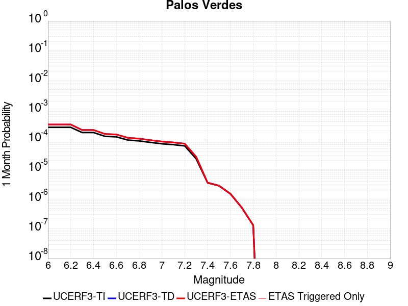 | 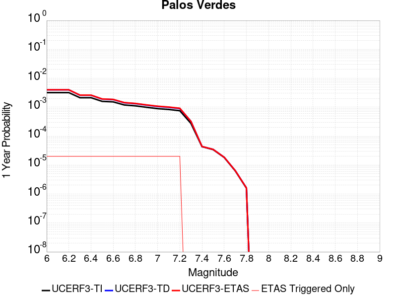 | 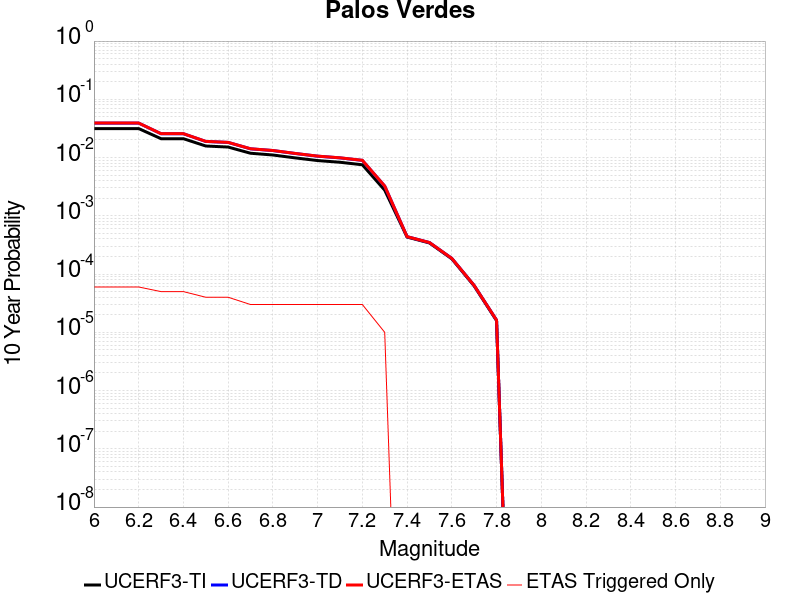 |

| Magnitude | 1 wk TI Prob | 1 wk TD Prob | 1 wk ETAS Prob | 1 wk ETAS/TD Gain | 1 wk ETAS Triggered Only | 1 mo TI Prob | 1 mo TD Prob | 1 mo ETAS Prob | 1 mo ETAS/TD Gain | 1 mo ETAS Triggered Only | 1 yr TI Prob | 1 yr TD Prob | 1 yr ETAS Prob | 1 yr ETAS/TD Gain | 1 yr ETAS Triggered Only | 10 yr TI Prob | 10 yr TD Prob | 10 yr ETAS Prob | 10 yr ETAS/TD Gain | 10 yr ETAS Triggered Only |
|-----|-----|-----|-----|-----|-----|-----|-----|-----|-----|-----|-----|-----|-----|-----|-----|-----|-----|-----|-----|-----|
| 6.0 | 6.126063E-5 | 7.6243654E-5 | 7.6243654E-5 | 1.0 | 0.0 | 2.6251914E-4 | 3.2672097E-4 | 3.2672097E-4 | 1.0 | 0.0 | 0.0031914865 | 0.0039710505 | 0.0039710505 | 1.0 | 0.0 | 0.031460393 | 0.039057482 | 0.039084077 | 1.0006809 | 2.7674767E-5 |
| 6.1 | 6.126063E-5 | 7.6243654E-5 | 7.6243654E-5 | 1.0 | 0.0 | 2.6251914E-4 | 3.2672097E-4 | 3.2672097E-4 | 1.0 | 0.0 | 0.0031914865 | 0.0039710505 | 0.0039710505 | 1.0 | 0.0 | 0.031460393 | 0.039057482 | 0.039084077 | 1.0006809 | 2.7674767E-5 |
| 6.2 | 6.126063E-5 | 7.6243654E-5 | 7.6243654E-5 | 1.0 | 0.0 | 2.6251914E-4 | 3.2672097E-4 | 3.2672097E-4 | 1.0 | 0.0 | 0.0031914865 | 0.0039710505 | 0.0039710505 | 1.0 | 0.0 | 0.031460393 | 0.039057482 | 0.039084077 | 1.0006809 | 2.7674767E-5 |
| 6.3 | 4.0838047E-5 | 4.9759634E-5 | 4.9759634E-5 | 1.0 | 0.0 | 1.7500846E-4 | 2.1323941E-4 | 2.1323941E-4 | 1.0 | 0.0 | 0.0021286458 | 0.002593297 | 0.002593297 | 1.0 | 0.0 | 0.021083709 | 0.025651814 | 0.02567878 | 1.0010512 | 2.7674767E-5 |
| 6.4 | 4.0838047E-5 | 4.9759634E-5 | 4.9759634E-5 | 1.0 | 0.0 | 1.7500846E-4 | 2.1323941E-4 | 2.1323941E-4 | 1.0 | 0.0 | 0.0021286458 | 0.002593297 | 0.002593297 | 1.0 | 0.0 | 0.021083709 | 0.025651814 | 0.02567878 | 1.0010512 | 2.7674767E-5 |
| 6.5 | 3.0512005E-5 | 3.6568417E-5 | 3.6568417E-5 | 1.0 | 0.0 | 1.3075917E-4 | 1.5671305E-4 | 1.5671305E-4 | 1.0 | 0.0 | 0.0015908304 | 0.0019064287 | 0.0019064287 | 1.0 | 0.0 | 0.015794903 | 0.018912623 | 0.018939774 | 1.0014356 | 2.7674767E-5 |
| 6.6 | 2.9255087E-5 | 3.5161058E-5 | 3.5161058E-5 | 1.0 | 0.0 | 1.2537291E-4 | 1.5068222E-4 | 1.5068222E-4 | 1.0 | 0.0 | 0.0015253464 | 0.0018331268 | 0.0018331268 | 1.0 | 0.0 | 0.015149189 | 0.018191617 | 0.01821879 | 1.0014936 | 2.7674767E-5 |
| 6.7 | 2.287198E-5 | 2.725316E-5 | 2.725316E-5 | 1.0 | 0.0 | 9.801909E-5 | 1.16794545E-4 | 1.16794545E-4 | 1.0 | 0.0 | 0.001192729 | 0.0014211377 | 0.0014211377 | 1.0 | 0.0 | 0.011863477 | 0.014129732 | 0.014129732 | 1.0 | 0.0 |
| 6.8 | 2.1325764E-5 | 2.543646E-5 | 2.543646E-5 | 1.0 | 0.0 | 9.139293E-5 | 1.0900936E-4 | 1.0900936E-4 | 1.0 | 0.0 | 0.001112141 | 0.0013264711 | 0.0013264711 | 1.0 | 0.0 | 0.011065915 | 0.013194575 | 0.013194575 | 1.0 | 0.0 |
| 6.9 | 1.9009392E-5 | 2.2617563E-5 | 2.2617563E-5 | 1.0 | 0.0 | 8.1466285E-5 | 9.69293E-5 | 9.69293E-5 | 1.0 | 0.0 | 9.914007E-4 | 0.0011795628 | 0.0011795628 | 1.0 | 0.0 | 0.009869894 | 0.011741707 | 0.011741707 | 1.0 | 0.0 |
| 7.0 | 1.7098473E-5 | 2.0322943E-5 | 2.0322943E-5 | 1.0 | 0.0 | 7.3277115E-5 | 8.7095905E-5 | 8.7095905E-5 | 1.0 | 0.0 | 8.917837E-4 | 0.001059962 | 0.001059962 | 1.0 | 0.0 | 0.008882134 | 0.0105575025 | 0.0105575025 | 1.0 | 0.0 |
| 7.1 | 1.5982785E-5 | 1.8998117E-5 | 1.8998117E-5 | 1.0 | 0.0 | 6.849585E-5 | 8.141843E-5 | 8.141843E-5 | 1.0 | 0.0 | 8.336179E-4 | 9.909034E-4 | 9.909034E-4 | 1.0 | 0.0 | 0.008304977 | 0.009873217 | 0.009873217 | 1.0 | 0.0 |
| 7.2 | 1.4468002E-5 | 1.7200278E-5 | 1.7200278E-5 | 1.0 | 0.0 | 6.200425E-5 | 7.371387E-5 | 7.371387E-5 | 1.0 | 0.0 | 7.546402E-4 | 8.971809E-4 | 8.971809E-4 | 1.0 | 0.0 | 0.007520827 | 0.00894386 | 0.00894386 | 1.0 | 0.0 |
| 7.3 | 5.288233E-6 | 6.2046975E-6 | 6.2046975E-6 | 1.0 | 0.0 | 2.2663658E-5 | 2.6591486E-5 | 2.6591486E-5 | 1.0 | 0.0 | 2.7589512E-4 | 3.2373815E-4 | 3.2373815E-4 | 1.0 | 0.0 | 0.0027555283 | 0.0032360894 | 0.0032360894 | 1.0 | 0.0 |
| 7.4 | 8.279556E-7 | 8.408468E-7 | 8.408468E-7 | 1.0 | 0.0 | 3.5483763E-6 | 3.6036247E-6 | 3.6036247E-6 | 1.0 | 0.0 | 4.3200624E-5 | 4.387332E-5 | 4.387332E-5 | 1.0 | 0.0 | 4.3192226E-4 | 4.386538E-4 | 4.386538E-4 | 1.0 | 0.0 |
| 7.5 | 6.559831E-7 | 6.66733E-7 | 6.66733E-7 | 1.0 | 0.0 | 2.8113532E-6 | 2.8574245E-6 | 2.8574245E-6 | 1.0 | 0.0 | 3.4227687E-5 | 3.4788656E-5 | 3.4788656E-5 | 1.0 | 0.0 | 3.4222414E-4 | 3.478387E-4 | 3.478387E-4 | 1.0 | 0.0 |
| 7.6 | 3.5018968E-7 | 3.5620596E-7 | 3.5620596E-7 | 1.0 | 0.0 | 1.500812E-6 | 1.5265963E-6 | 1.5265963E-6 | 1.0 | 0.0 | 1.8272232E-5 | 1.8586199E-5 | 1.8586199E-5 | 1.0 | 0.0 | 1.8270731E-4 | 1.8585104E-4 | 1.8585104E-4 | 1.0 | 0.0 |
| 7.7 | 1.1986104E-7 | 1.2198578E-7 | 1.2198578E-7 | 1.0 | 0.0 | 5.1369005E-7 | 5.227961E-7 | 5.227961E-7 | 1.0 | 0.0 | 6.2541585E-6 | 6.3650236E-6 | 6.3650236E-6 | 1.0 | 0.0 | 6.2539824E-5 | 6.3648455E-5 | 6.3648455E-5 | 1.0 | 0.0 |
| 7.8 | 3.0445005E-8 | 3.1028137E-8 | 3.1028137E-8 | 1.0 | 0.0 | 1.3047858E-7 | 1.3297772E-7 | 1.3297772E-7 | 1.0 | 0.0 | 1.5885756E-6 | 1.6190027E-6 | 1.6190027E-6 | 1.0 | 0.0 | 1.5885644E-5 | 1.618993E-5 | 1.618993E-5 | 1.0 | 0.0 |

## Elsinore (Coyote Mountains)
*[(top)](#table-of-contents)*

| 1 Week | 1 Month | 1 Year | 10 Year |
|-----|-----|-----|-----|
| 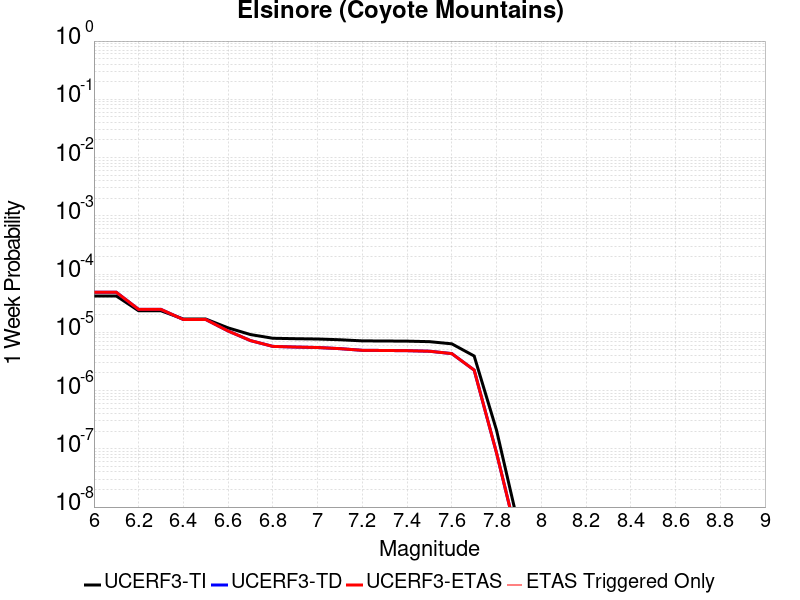 |  | 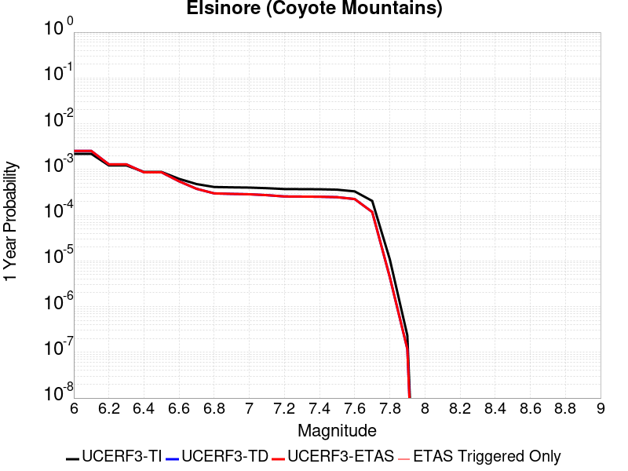 |  |

| Magnitude | 1 wk TI Prob | 1 wk TD Prob | 1 wk ETAS Prob | 1 wk ETAS/TD Gain | 1 wk ETAS Triggered Only | 1 mo TI Prob | 1 mo TD Prob | 1 mo ETAS Prob | 1 mo ETAS/TD Gain | 1 mo ETAS Triggered Only | 1 yr TI Prob | 1 yr TD Prob | 1 yr ETAS Prob | 1 yr ETAS/TD Gain | 1 yr ETAS Triggered Only | 10 yr TI Prob | 10 yr TD Prob | 10 yr ETAS Prob | 10 yr ETAS/TD Gain | 10 yr ETAS Triggered Only |
|-----|-----|-----|-----|-----|-----|-----|-----|-----|-----|-----|-----|-----|-----|-----|-----|-----|-----|-----|-----|-----|
| 6.0 | 4.20513E-5 | 4.8644404E-5 | 4.8644404E-5 | 1.0 | 0.0 | 1.8020741E-4 | 2.084626E-4 | 2.084626E-4 | 1.0 | 0.0 | 0.0021918174 | 0.0025356514 | 0.0025356514 | 1.0 | 0.0 | 0.021703249 | 0.025117494 | 0.025144473 | 1.0010742 | 2.7674767E-5 |
| 6.1 | 4.20513E-5 | 4.8644404E-5 | 4.8644404E-5 | 1.0 | 0.0 | 1.8020741E-4 | 2.084626E-4 | 2.084626E-4 | 1.0 | 0.0 | 0.0021918174 | 0.0025356514 | 0.0025356514 | 1.0 | 0.0 | 0.021703249 | 0.025117494 | 0.025144473 | 1.0010742 | 2.7674767E-5 |
| 6.2 | 2.3413893E-5 | 2.470175E-5 | 2.470175E-5 | 1.0 | 0.0 | 1.0034139E-4 | 1.0586089E-4 | 1.0586089E-4 | 1.0 | 0.0 | 0.0012209718 | 0.0012881876 | 0.0012881876 | 1.0 | 0.0 | 0.012142851 | 0.012815754 | 0.012843074 | 1.0021317 | 2.7674767E-5 |
| 6.3 | 2.3413893E-5 | 2.470175E-5 | 2.470175E-5 | 1.0 | 0.0 | 1.0034139E-4 | 1.0586089E-4 | 1.0586089E-4 | 1.0 | 0.0 | 0.0012209718 | 0.0012881876 | 0.0012881876 | 1.0 | 0.0 | 0.012142851 | 0.012815754 | 0.012843074 | 1.0021317 | 2.7674767E-5 |
| 6.4 | 1.6894814E-5 | 1.6572572E-5 | 1.6572572E-5 | 1.0 | 0.0 | 7.240433E-5 | 7.10236E-5 | 7.10236E-5 | 1.0 | 0.0 | 8.811662E-4 | 8.6440565E-4 | 8.6440565E-4 | 1.0 | 0.0 | 0.0087768035 | 0.0086141145 | 0.0086141145 | 1.0 | 0.0 |
| 6.5 | 1.6894814E-5 | 1.6572572E-5 | 1.6572572E-5 | 1.0 | 0.0 | 7.240433E-5 | 7.10236E-5 | 7.10236E-5 | 1.0 | 0.0 | 8.811662E-4 | 8.6440565E-4 | 8.6440565E-4 | 1.0 | 0.0 | 0.0087768035 | 0.0086141145 | 0.0086141145 | 1.0 | 0.0 |
| 6.6 | 1.1910969E-5 | 1.0533792E-5 | 1.0533792E-5 | 1.0 | 0.0 | 5.1046012E-5 | 4.514412E-5 | 4.514412E-5 | 1.0 | 0.0 | 6.21308E-4 | 5.4950215E-4 | 5.4950215E-4 | 1.0 | 0.0 | 0.0061957375 | 0.00548274 | 0.00548274 | 1.0 | 0.0 |
| 6.7 | 9.1486E-6 | 7.205245E-6 | 7.205245E-6 | 1.0 | 0.0 | 3.9207694E-5 | 3.0879277E-5 | 3.0879277E-5 | 1.0 | 0.0 | 4.7724912E-4 | 3.7589416E-4 | 3.7589416E-4 | 1.0 | 0.0 | 0.0047622547 | 0.0037529632 | 0.0037529632 | 1.0 | 0.0 |
| 6.8 | 7.90441E-6 | 5.7311604E-6 | 5.7311604E-6 | 1.0 | 0.0 | 3.3875604E-5 | 2.456189E-5 | 2.456189E-5 | 1.0 | 0.0 | 4.1235742E-4 | 2.9900126E-4 | 2.9900126E-4 | 1.0 | 0.0 | 0.0041159308 | 0.0029861184 | 0.0029861184 | 1.0 | 0.0 |
| 6.9 | 7.77015E-6 | 5.5851024E-6 | 5.5851024E-6 | 1.0 | 0.0 | 3.3300217E-5 | 2.3935941E-5 | 2.3935941E-5 | 1.0 | 0.0 | 4.0535472E-4 | 2.9138237E-4 | 2.9138237E-4 | 1.0 | 0.0 | 0.004046161 | 0.0029101304 | 0.0029101304 | 1.0 | 0.0 |
| 7.0 | 7.675798E-6 | 5.481952E-6 | 5.481952E-6 | 1.0 | 0.0 | 3.289586E-5 | 2.3493876E-5 | 2.3493876E-5 | 1.0 | 0.0 | 4.004335E-4 | 2.8600165E-4 | 2.8600165E-4 | 1.0 | 0.0 | 0.003997127 | 0.0028564625 | 0.0028564625 | 1.0 | 0.0 |
| 7.1 | 7.447814E-6 | 5.2408122E-6 | 5.2408122E-6 | 1.0 | 0.0 | 3.191881E-5 | 2.2460437E-5 | 2.2460437E-5 | 1.0 | 0.0 | 3.8854225E-4 | 2.7342275E-4 | 2.7342275E-4 | 1.0 | 0.0 | 0.003878636 | 0.002730988 | 0.002730988 | 1.0 | 0.0 |
| 7.2 | 7.128185E-6 | 4.9074624E-6 | 4.9074624E-6 | 1.0 | 0.0 | 3.0549007E-5 | 2.103182E-5 | 2.103182E-5 | 1.0 | 0.0 | 3.7187067E-4 | 2.560335E-4 | 2.560335E-4 | 1.0 | 0.0 | 0.00371249 | 0.0025575038 | 0.0025575038 | 1.0 | 0.0 |
| 7.3 | 7.0913875E-6 | 4.8761353E-6 | 4.8761353E-6 | 1.0 | 0.0 | 3.0391306E-5 | 2.0897562E-5 | 2.0897562E-5 | 1.0 | 0.0 | 3.6995133E-4 | 2.543993E-4 | 2.543993E-4 | 1.0 | 0.0 | 0.0036933604 | 0.002541199 | 0.002541199 | 1.0 | 0.0 |
| 7.4 | 7.051521E-6 | 4.8399843E-6 | 4.8399843E-6 | 1.0 | 0.0 | 3.0220453E-5 | 2.0742631E-5 | 2.0742631E-5 | 1.0 | 0.0 | 3.6787192E-4 | 2.5251348E-4 | 2.5251348E-4 | 1.0 | 0.0 | 0.0036726352 | 0.0025223838 | 0.0025223838 | 1.0 | 0.0 |
| 7.5 | 6.910666E-6 | 4.7354515E-6 | 4.7354515E-6 | 1.0 | 0.0 | 2.9616802E-5 | 2.0294641E-5 | 2.0294641E-5 | 1.0 | 0.0 | 3.605249E-4 | 2.4706044E-4 | 2.4706044E-4 | 1.0 | 0.0 | 0.0035994058 | 0.0024679757 | 0.0024679757 | 1.0 | 0.0 |
| 7.6 | 6.341753E-6 | 4.3084856E-6 | 4.3084856E-6 | 1.0 | 0.0 | 2.7178658E-5 | 1.8464814E-5 | 1.8464814E-5 | 1.0 | 0.0 | 3.3084993E-4 | 2.2478709E-4 | 2.2478709E-4 | 1.0 | 0.0 | 0.0033035777 | 0.0022457126 | 0.0022457126 | 1.0 | 0.0 |
| 7.7 | 3.9205916E-6 | 2.2448908E-6 | 2.2448908E-6 | 1.0 | 0.0 | 1.6802427E-5 | 9.620929E-6 | 9.620929E-6 | 1.0 | 0.0 | 2.0455034E-4 | 1.1712926E-4 | 1.1712926E-4 | 1.0 | 0.0 | 0.0020436216 | 0.0011707483 | 0.0011707483 | 1.0 | 0.0 |
| 7.8 | 2.0846227E-7 | 8.489491E-8 | 8.489491E-8 | 1.0 | 0.0 | 8.9340944E-7 | 3.6383528E-7 | 3.6383528E-7 | 1.0 | 0.0 | 1.0877206E-5 | 4.429689E-6 | 4.429689E-6 | 1.0 | 0.0 | 1.0876673E-4 | 4.4296332E-5 | 4.4296332E-5 | 1.0 | 0.0 |
| 7.9 | 4.4969806E-9 | 2.2697666E-9 | 2.2697666E-9 | 1.0 | 0.0 | 1.9272775E-8 | 9.727572E-9 | 9.727572E-9 | 1.0 | 0.0 | 2.3464601E-7 | 1.1843318E-7 | 1.1843318E-7 | 1.0 | 0.0 | 2.3464577E-6 | 1.1843313E-6 | 1.1843313E-6 | 1.0 | 0.0 |

## Antelope Valley 2011
*[(top)](#table-of-contents)*

| 1 Week | 1 Month | 1 Year | 10 Year |
|-----|-----|-----|-----|
| 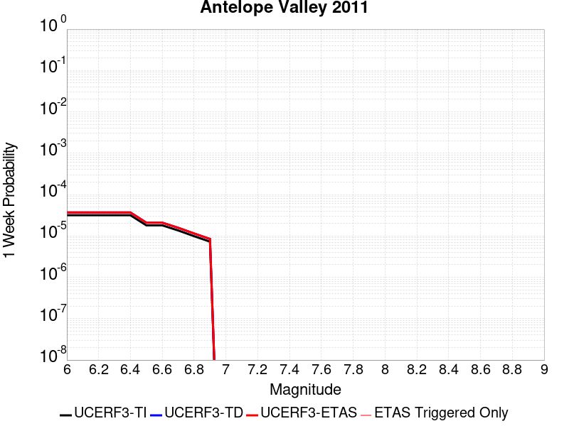 |  |  |  |

| Magnitude | 1 wk TI Prob | 1 wk TD Prob | 1 wk ETAS Prob | 1 wk ETAS/TD Gain | 1 wk ETAS Triggered Only | 1 mo TI Prob | 1 mo TD Prob | 1 mo ETAS Prob | 1 mo ETAS/TD Gain | 1 mo ETAS Triggered Only | 1 yr TI Prob | 1 yr TD Prob | 1 yr ETAS Prob | 1 yr ETAS/TD Gain | 1 yr ETAS Triggered Only | 10 yr TI Prob | 10 yr TD Prob | 10 yr ETAS Prob | 10 yr ETAS/TD Gain | 10 yr ETAS Triggered Only |
|-----|-----|-----|-----|-----|-----|-----|-----|-----|-----|-----|-----|-----|-----|-----|-----|-----|-----|-----|-----|-----|
| 6.0 | 3.1646934E-5 | 3.6910093E-5 | 3.6910093E-5 | 1.0 | 0.0 | 1.3562266E-4 | 1.5817801E-4 | 1.5817801E-4 | 1.0 | 0.0 | 0.0016499552 | 0.001924381 | 0.0019520025 | 1.0143534 | 2.7674767E-5 | 0.016377583 | 0.019103574 | 0.01913072 | 1.001421 | 2.7674767E-5 |
| 6.1 | 3.1646934E-5 | 3.6910093E-5 | 3.6910093E-5 | 1.0 | 0.0 | 1.3562266E-4 | 1.5817801E-4 | 1.5817801E-4 | 1.0 | 0.0 | 0.0016499552 | 0.001924381 | 0.0019520025 | 1.0143534 | 2.7674767E-5 | 0.016377583 | 0.019103574 | 0.01913072 | 1.001421 | 2.7674767E-5 |
| 6.2 | 3.1646934E-5 | 3.6910093E-5 | 3.6910093E-5 | 1.0 | 0.0 | 1.3562266E-4 | 1.5817801E-4 | 1.5817801E-4 | 1.0 | 0.0 | 0.0016499552 | 0.001924381 | 0.0019520025 | 1.0143534 | 2.7674767E-5 | 0.016377583 | 0.019103574 | 0.01913072 | 1.001421 | 2.7674767E-5 |
| 6.3 | 3.1646934E-5 | 3.6910093E-5 | 3.6910093E-5 | 1.0 | 0.0 | 1.3562266E-4 | 1.5817801E-4 | 1.5817801E-4 | 1.0 | 0.0 | 0.0016499552 | 0.001924381 | 0.0019520025 | 1.0143534 | 2.7674767E-5 | 0.016377583 | 0.019103574 | 0.01913072 | 1.001421 | 2.7674767E-5 |
| 6.4 | 3.1646934E-5 | 3.6910093E-5 | 3.6910093E-5 | 1.0 | 0.0 | 1.3562266E-4 | 1.5817801E-4 | 1.5817801E-4 | 1.0 | 0.0 | 0.0016499552 | 0.001924381 | 0.0019520025 | 1.0143534 | 2.7674767E-5 | 0.016377583 | 0.019103574 | 0.01913072 | 1.001421 | 2.7674767E-5 |
| 6.5 | 1.8034107E-5 | 2.0944088E-5 | 2.0944088E-5 | 1.0 | 0.0 | 7.7286735E-5 | 8.975798E-5 | 8.975798E-5 | 1.0 | 0.0 | 9.405598E-4 | 0.0010923778 | 0.0010923778 | 1.0 | 0.0 | 0.009365888 | 0.010882163 | 0.010882163 | 1.0 | 0.0 |
| 6.6 | 1.8034107E-5 | 2.0944088E-5 | 2.0944088E-5 | 1.0 | 0.0 | 7.7286735E-5 | 8.975798E-5 | 8.975798E-5 | 1.0 | 0.0 | 9.405598E-4 | 0.0010923778 | 0.0010923778 | 1.0 | 0.0 | 0.009365888 | 0.010882163 | 0.010882163 | 1.0 | 0.0 |
| 6.7 | 1.3567667E-5 | 1.575186E-5 | 1.575186E-5 | 1.0 | 0.0 | 5.814585E-5 | 6.750683E-5 | 6.750683E-5 | 1.0 | 0.0 | 7.076958E-4 | 8.21692E-4 | 8.21692E-4 | 1.0 | 0.0 | 0.007054463 | 0.008196975 | 0.008196975 | 1.0 | 0.0 |
| 6.8 | 9.867387E-6 | 1.1469662E-5 | 1.1469662E-5 | 1.0 | 0.0 | 4.2288117E-5 | 4.9155304E-5 | 4.9155304E-5 | 1.0 | 0.0 | 5.1473617E-4 | 5.9839647E-4 | 5.9839647E-4 | 1.0 | 0.0 | 0.005135455 | 0.005977167 | 0.005977167 | 1.0 | 0.0 |
| 6.9 | 7.273233E-6 | 8.456139E-6 | 8.456139E-6 | 1.0 | 0.0 | 3.1170628E-5 | 3.6240595E-5 | 3.6240595E-5 | 1.0 | 0.0 | 3.794363E-4 | 4.4122926E-4 | 4.4122926E-4 | 1.0 | 0.0 | 0.0037878908 | 0.0044122925 | 0.0044122925 | 1.0 | 0.0 |

## Elsinore (Stepovers Combined)
*[(top)](#table-of-contents)*

| 1 Week | 1 Month | 1 Year | 10 Year |
|-----|-----|-----|-----|
| 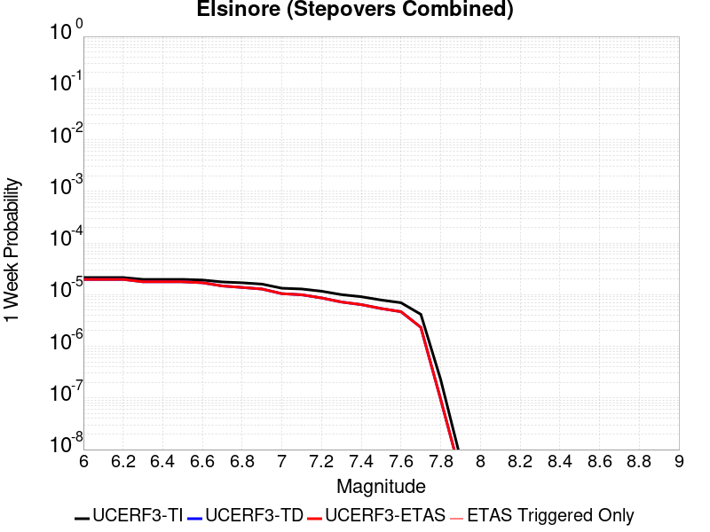 |  | 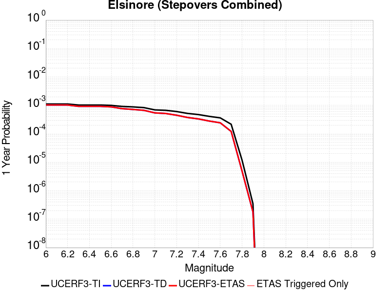 |  |

| Magnitude | 1 wk TI Prob | 1 wk TD Prob | 1 wk ETAS Prob | 1 wk ETAS/TD Gain | 1 wk ETAS Triggered Only | 1 mo TI Prob | 1 mo TD Prob | 1 mo ETAS Prob | 1 mo ETAS/TD Gain | 1 mo ETAS Triggered Only | 1 yr TI Prob | 1 yr TD Prob | 1 yr ETAS Prob | 1 yr ETAS/TD Gain | 1 yr ETAS Triggered Only | 10 yr TI Prob | 10 yr TD Prob | 10 yr ETAS Prob | 10 yr ETAS/TD Gain | 10 yr ETAS Triggered Only |
|-----|-----|-----|-----|-----|-----|-----|-----|-----|-----|-----|-----|-----|-----|-----|-----|-----|-----|-----|-----|-----|
| 6.0 | 2.144392E-5 | 1.9766418E-5 | 1.9766418E-5 | 1.0 | 0.0 | 9.189928E-5 | 8.471059E-5 | 8.471059E-5 | 1.0 | 0.0 | 0.0011182994 | 0.0010308851 | 0.0010308851 | 1.0 | 0.0 | 0.011126885 | 0.010268115 | 0.010295506 | 1.0026675 | 2.7674767E-5 |
| 6.1 | 2.144392E-5 | 1.9766418E-5 | 1.9766418E-5 | 1.0 | 0.0 | 9.189928E-5 | 8.471059E-5 | 8.471059E-5 | 1.0 | 0.0 | 0.0011182994 | 0.0010308851 | 0.0010308851 | 1.0 | 0.0 | 0.011126885 | 0.010268115 | 0.010295506 | 1.0026675 | 2.7674767E-5 |
| 6.2 | 2.144392E-5 | 1.9766418E-5 | 1.9766418E-5 | 1.0 | 0.0 | 9.189928E-5 | 8.471059E-5 | 8.471059E-5 | 1.0 | 0.0 | 0.0011182994 | 0.0010308851 | 0.0010308851 | 1.0 | 0.0 | 0.011126885 | 0.010268115 | 0.010295506 | 1.0026675 | 2.7674767E-5 |
| 6.3 | 1.9751555E-5 | 1.7747316E-5 | 1.7747316E-5 | 1.0 | 0.0 | 8.4646774E-5 | 7.60578E-5 | 7.60578E-5 | 1.0 | 0.0 | 0.0010300872 | 9.2562695E-4 | 9.2562695E-4 | 1.0 | 0.0 | 0.010253254 | 0.009224291 | 0.009251711 | 1.0029725 | 2.7674767E-5 |
| 6.4 | 1.9751555E-5 | 1.7747316E-5 | 1.7747316E-5 | 1.0 | 0.0 | 8.4646774E-5 | 7.60578E-5 | 7.60578E-5 | 1.0 | 0.0 | 0.0010300872 | 9.2562695E-4 | 9.2562695E-4 | 1.0 | 0.0 | 0.010253254 | 0.009224291 | 0.009251711 | 1.0029725 | 2.7674767E-5 |
| 6.5 | 1.9751555E-5 | 1.7747316E-5 | 1.7747316E-5 | 1.0 | 0.0 | 8.4646774E-5 | 7.60578E-5 | 7.60578E-5 | 1.0 | 0.0 | 0.0010300872 | 9.2562695E-4 | 9.2562695E-4 | 1.0 | 0.0 | 0.010253254 | 0.009224291 | 0.009251711 | 1.0029725 | 2.7674767E-5 |
| 6.6 | 1.9188685E-5 | 1.7009039E-5 | 1.7009039E-5 | 1.0 | 0.0 | 8.2234634E-5 | 7.2893934E-5 | 7.2893934E-5 | 1.0 | 0.0 | 0.0010007467 | 8.8713854E-4 | 8.8713854E-4 | 1.0 | 0.0 | 0.00996252 | 0.00884276 | 0.00887019 | 1.003102 | 2.7674767E-5 |
| 6.7 | 1.7608272E-5 | 1.4737597E-5 | 1.4737597E-5 | 1.0 | 0.0 | 7.546184E-5 | 6.3159656E-5 | 6.3159656E-5 | 1.0 | 0.0 | 9.183606E-4 | 7.6870725E-4 | 7.6870725E-4 | 1.0 | 0.0 | 0.009145746 | 0.0076674893 | 0.0076949517 | 1.0035816 | 2.7674767E-5 |
| 6.8 | 1.697165E-5 | 1.3788029E-5 | 1.3788029E-5 | 1.0 | 0.0 | 7.273361E-5 | 5.9090264E-5 | 5.9090264E-5 | 1.0 | 0.0 | 8.8517193E-4 | 7.191952E-4 | 7.191952E-4 | 1.0 | 0.0 | 0.008816543 | 0.0071750935 | 0.00720257 | 1.0038294 | 2.7674767E-5 |
| 6.9 | 1.600365E-5 | 1.2851192E-5 | 1.2851192E-5 | 1.0 | 0.0 | 6.858527E-5 | 5.507542E-5 | 5.507542E-5 | 1.0 | 0.0 | 8.347058E-4 | 6.703447E-4 | 6.703447E-4 | 1.0 | 0.0 | 0.008315775 | 0.0066891117 | 0.006716601 | 1.0041096 | 2.7674767E-5 |
| 7.0 | 1.3314581E-5 | 1.0451547E-5 | 1.0451547E-5 | 1.0 | 0.0 | 5.7061243E-5 | 4.4791588E-5 | 4.4791588E-5 | 1.0 | 0.0 | 6.944992E-4 | 5.452038E-4 | 5.452038E-4 | 1.0 | 0.0 | 0.006923327 | 0.005442589 | 0.0054701134 | 1.0050572 | 2.7674767E-5 |
| 7.1 | 1.2865345E-5 | 9.941276E-6 | 9.941276E-6 | 1.0 | 0.0 | 5.5136024E-5 | 4.2604788E-5 | 4.2604788E-5 | 1.0 | 0.0 | 6.710743E-4 | 5.1859237E-4 | 5.1859237E-4 | 1.0 | 0.0 | 0.0066905143 | 0.005177154 | 0.005204686 | 1.0053179 | 2.7674767E-5 |
| 7.2 | 1.1650051E-5 | 8.637108E-6 | 8.637108E-6 | 1.0 | 0.0 | 4.9927836E-5 | 3.7015663E-5 | 3.7015663E-5 | 1.0 | 0.0 | 6.0770183E-4 | 4.5057427E-4 | 4.5057427E-4 | 1.0 | 0.0 | 0.0060604266 | 0.004498031 | 0.0045255814 | 1.006125 | 2.7674767E-5 |
| 7.3 | 1.0008533E-5 | 7.203859E-6 | 7.203859E-6 | 1.0 | 0.0 | 4.2893007E-5 | 3.087332E-5 | 3.087332E-5 | 1.0 | 0.0 | 5.220972E-4 | 3.7581933E-4 | 3.7581933E-4 | 1.0 | 0.0 | 0.005208723 | 0.003752225 | 0.003752225 | 1.0 | 0.0 |
| 7.4 | 9.116759E-6 | 6.4126107E-6 | 6.4126107E-6 | 1.0 | 0.0 | 3.907124E-5 | 2.7482336E-5 | 2.7482336E-5 | 1.0 | 0.0 | 4.7558855E-4 | 3.3454745E-4 | 3.3454745E-4 | 1.0 | 0.0 | 0.00474572 | 0.0033405903 | 0.0033405903 | 1.0 | 0.0 |
| 7.5 | 7.870524E-6 | 5.384763E-6 | 5.384763E-6 | 1.0 | 0.0 | 3.3730383E-5 | 2.3077358E-5 | 2.3077358E-5 | 1.0 | 0.0 | 4.1059E-4 | 2.8093188E-4 | 2.8093188E-4 | 1.0 | 0.0 | 0.0040983222 | 0.002805894 | 0.002805894 | 1.0 | 0.0 |
| 7.6 | 6.9774537E-6 | 4.6796517E-6 | 4.6796517E-6 | 1.0 | 0.0 | 2.990303E-5 | 2.0055502E-5 | 2.0055502E-5 | 1.0 | 0.0 | 3.640086E-4 | 2.4414956E-4 | 2.4414956E-4 | 1.0 | 0.0 | 0.003634129 | 0.0024389296 | 0.0024389296 | 1.0 | 0.0 |
| 7.7 | 4.1616954E-6 | 2.3293258E-6 | 2.3293258E-6 | 1.0 | 0.0 | 1.7835715E-5 | 9.98279E-6 | 9.98279E-6 | 1.0 | 0.0 | 2.171282E-4 | 1.2153444E-4 | 1.2153444E-4 | 1.0 | 0.0 | 0.0021691616 | 0.0012147529 | 0.0012147529 | 1.0 | 0.0 |
| 7.8 | 2.2692414E-7 | 9.388808E-8 | 9.388808E-8 | 1.0 | 0.0 | 9.725317E-7 | 4.0237745E-7 | 4.0237745E-7 | 1.0 | 0.0 | 1.1840509E-5 | 4.8989377E-6 | 4.8989377E-6 | 1.0 | 0.0 | 1.1839878E-4 | 4.8988626E-5 | 4.8988626E-5 | 1.0 | 0.0 |
| 7.9 | 6.676829E-9 | 3.4407224E-9 | 3.4407224E-9 | 1.0 | 0.0 | 2.861498E-8 | 1.4745954E-8 | 1.4745954E-8 | 1.0 | 0.0 | 3.4838732E-7 | 1.7953197E-7 | 1.7953197E-7 | 1.0 | 0.0 | 3.4838679E-6 | 1.7953184E-6 | 1.7953184E-6 | 1.0 | 0.0 |

## Hollywood
*[(top)](#table-of-contents)*

| 1 Week | 1 Month | 1 Year | 10 Year |
|-----|-----|-----|-----|
|  |  |  |  |

| Magnitude | 1 wk TI Prob | 1 wk TD Prob | 1 wk ETAS Prob | 1 wk ETAS/TD Gain | 1 wk ETAS Triggered Only | 1 mo TI Prob | 1 mo TD Prob | 1 mo ETAS Prob | 1 mo ETAS/TD Gain | 1 mo ETAS Triggered Only | 1 yr TI Prob | 1 yr TD Prob | 1 yr ETAS Prob | 1 yr ETAS/TD Gain | 1 yr ETAS Triggered Only | 10 yr TI Prob | 10 yr TD Prob | 10 yr ETAS Prob | 10 yr ETAS/TD Gain | 10 yr ETAS Triggered Only |
|-----|-----|-----|-----|-----|-----|-----|-----|-----|-----|-----|-----|-----|-----|-----|-----|-----|-----|-----|-----|-----|
| 6.0 | 1.24487615E-5 | 1.2594315E-5 | 1.2594315E-5 | 1.0 | 0.0 | 5.3350745E-5 | 5.3974545E-5 | 5.3974545E-5 | 1.0 | 0.0 | 6.4935174E-4 | 6.569466E-4 | 6.846032E-4 | 1.0420986 | 2.7674767E-5 | 0.0064745755 | 0.0065505337 | 0.0065780273 | 1.0041971 | 2.7674767E-5 |
| 6.1 | 1.24487615E-5 | 1.2594315E-5 | 1.2594315E-5 | 1.0 | 0.0 | 5.3350745E-5 | 5.3974545E-5 | 5.3974545E-5 | 1.0 | 0.0 | 6.4935174E-4 | 6.569466E-4 | 6.846032E-4 | 1.0420986 | 2.7674767E-5 | 0.0064745755 | 0.0065505337 | 0.0065780273 | 1.0041971 | 2.7674767E-5 |
| 6.2 | 1.24487615E-5 | 1.2594315E-5 | 1.2594315E-5 | 1.0 | 0.0 | 5.3350745E-5 | 5.3974545E-5 | 5.3974545E-5 | 1.0 | 0.0 | 6.4935174E-4 | 6.569466E-4 | 6.846032E-4 | 1.0420986 | 2.7674767E-5 | 0.0064745755 | 0.0065505337 | 0.0065780273 | 1.0041971 | 2.7674767E-5 |
| 6.3 | 1.24487615E-5 | 1.2594315E-5 | 1.2594315E-5 | 1.0 | 0.0 | 5.3350745E-5 | 5.3974545E-5 | 5.3974545E-5 | 1.0 | 0.0 | 6.4935174E-4 | 6.569466E-4 | 6.846032E-4 | 1.0420986 | 2.7674767E-5 | 0.0064745755 | 0.0065505337 | 0.0065780273 | 1.0041971 | 2.7674767E-5 |
| 6.4 | 1.2431024E-5 | 1.2574927E-5 | 1.2574927E-5 | 1.0 | 0.0 | 5.327473E-5 | 5.3891457E-5 | 5.3891457E-5 | 1.0 | 0.0 | 6.4842677E-4 | 6.559356E-4 | 6.835922E-4 | 1.0421636 | 2.7674767E-5 | 0.0064653796 | 0.0065404833 | 0.006567977 | 1.0042037 | 2.7674767E-5 |
| 6.5 | 1.1242222E-5 | 1.1318822E-5 | 1.1318822E-5 | 1.0 | 0.0 | 4.8180063E-5 | 4.850835E-5 | 4.850835E-5 | 1.0 | 0.0 | 5.864344E-4 | 5.904318E-4 | 6.180902E-4 | 1.0468444 | 2.7674767E-5 | 0.0058488925 | 0.005888918 | 0.0059164297 | 1.0046718 | 2.7674767E-5 |
| 6.6 | 1.1234066E-5 | 1.1309935E-5 | 1.1309935E-5 | 1.0 | 0.0 | 4.8145106E-5 | 4.8470265E-5 | 4.8470265E-5 | 1.0 | 0.0 | 5.86009E-4 | 5.8996835E-4 | 6.176268E-4 | 1.0468812 | 2.7674767E-5 | 0.005844661 | 0.0058843084 | 0.00591182 | 1.0046755 | 2.7674767E-5 |
| 6.7 | 1.12294E-5 | 1.1304678E-5 | 1.1304678E-5 | 1.0 | 0.0 | 4.812511E-5 | 4.8447735E-5 | 4.8447735E-5 | 1.0 | 0.0 | 5.857657E-4 | 5.896942E-4 | 6.1735266E-4 | 1.046903 | 2.7674767E-5 | 0.0058422405 | 0.005881581 | 0.005909093 | 1.0046777 | 2.7674767E-5 |
| 6.8 | 1.0252819E-5 | 1.0219352E-5 | 1.0219352E-5 | 1.0 | 0.0 | 4.3939912E-5 | 4.37965E-5 | 4.37965E-5 | 1.0 | 0.0 | 5.3483713E-4 | 5.3309405E-4 | 5.607541E-4 | 1.0518858 | 2.7674767E-5 | 0.005335517 | 0.0053183786 | 0.005345906 | 1.005176 | 2.7674767E-5 |
| 6.9 | 9.252289E-6 | 9.111102E-6 | 9.111102E-6 | 1.0 | 0.0 | 3.9652066E-5 | 3.904701E-5 | 3.904701E-5 | 1.0 | 0.0 | 4.8265693E-4 | 4.7529524E-4 | 5.0295686E-4 | 1.0581988 | 2.7674767E-5 | 0.0048161 | 0.0047429604 | 0.004770504 | 1.0058073 | 2.7674767E-5 |
| 7.0 | 8.474604E-6 | 8.258978E-6 | 8.258978E-6 | 1.0 | 0.0 | 3.6319227E-5 | 3.5395147E-5 | 3.5395147E-5 | 1.0 | 0.0 | 4.4209688E-4 | 4.3085212E-4 | 4.58515E-4 | 1.0642049 | 2.7674767E-5 | 0.004412184 | 0.004300318 | 0.004327874 | 1.0064079 | 2.7674767E-5 |
| 7.1 | 6.643643E-6 | 6.268914E-6 | 6.268914E-6 | 1.0 | 0.0 | 2.8472443E-5 | 2.68665E-5 | 2.68665E-5 | 1.0 | 0.0 | 3.4659685E-4 | 3.2705098E-4 | 3.2705098E-4 | 1.0 | 0.0 | 0.0034605677 | 0.0032657427 | 0.0032657427 | 1.0 | 0.0 |
| 7.2 | 5.549002E-6 | 5.109165E-6 | 5.109165E-6 | 1.0 | 0.0 | 2.378122E-5 | 2.189624E-5 | 2.189624E-5 | 1.0 | 0.0 | 2.8949787E-4 | 2.6655424E-4 | 2.6655424E-4 | 1.0 | 0.0 | 0.0028912104 | 0.0026623618 | 0.0026623618 | 1.0 | 0.0 |
| 7.3 | 4.3059727E-6 | 3.960264E-6 | 3.960264E-6 | 1.0 | 0.0 | 1.8454039E-5 | 1.6972452E-5 | 1.6972452E-5 | 1.0 | 0.0 | 2.2465475E-4 | 2.066201E-4 | 2.066201E-4 | 1.0 | 0.0 | 0.0022442779 | 0.00206429 | 0.00206429 | 1.0 | 0.0 |
| 7.4 | 2.8550733E-6 | 2.7015933E-6 | 2.7015933E-6 | 1.0 | 0.0 | 1.2235971E-5 | 1.1578206E-5 | 1.1578206E-5 | 1.0 | 0.0 | 1.4896276E-4 | 1.4095558E-4 | 1.4095558E-4 | 1.0 | 0.0 | 0.0014886294 | 0.0014086668 | 0.0014086668 | 1.0 | 0.0 |
| 7.5 | 1.9927045E-6 | 1.8978717E-6 | 1.8978717E-6 | 1.0 | 0.0 | 8.540134E-6 | 8.133711E-6 | 8.133711E-6 | 1.0 | 0.0 | 1.0397117E-4 | 9.902346E-5 | 9.902346E-5 | 1.0 | 0.0 | 0.0010392254 | 9.897971E-4 | 9.897971E-4 | 1.0 | 0.0 |
| 7.6 | 1.345084E-6 | 1.2217639E-6 | 1.2217639E-6 | 1.0 | 0.0 | 5.764633E-6 | 5.2361206E-6 | 5.2361206E-6 | 1.0 | 0.0 | 7.018215E-5 | 6.3747924E-5 | 6.3747924E-5 | 1.0 | 0.0 | 7.0159987E-4 | 6.3729833E-4 | 6.3729833E-4 | 1.0 | 0.0 |
| 7.7 | 7.6835164E-7 | 6.27892E-7 | 6.27892E-7 | 1.0 | 0.0 | 3.2929315E-6 | 2.6909631E-6 | 2.6909631E-6 | 1.0 | 0.0 | 4.00907E-5 | 3.2761996E-5 | 3.2761996E-5 | 1.0 | 0.0 | 4.0083472E-4 | 3.2757316E-4 | 3.2757316E-4 | 1.0 | 0.0 |
| 7.8 | 3.6562128E-7 | 2.454486E-7 | 2.454486E-7 | 1.0 | 0.0 | 1.5669474E-6 | 1.0519221E-6 | 1.0519221E-6 | 1.0 | 0.0 | 1.9077417E-5 | 1.28070815E-5 | 1.28070815E-5 | 1.0 | 0.0 | 1.907578E-4 | 1.280638E-4 | 1.280638E-4 | 1.0 | 0.0 |
| 7.9 | 7.5024424E-8 | 5.3838157E-8 | 5.3838157E-8 | 1.0 | 0.0 | 3.215332E-7 | 2.3073494E-7 | 2.3073494E-7 | 1.0 | 0.0 | 3.91466E-6 | 2.8091956E-6 | 2.8091956E-6 | 1.0 | 0.0 | 3.9145907E-5 | 2.809173E-5 | 2.809173E-5 | 1.0 | 0.0 |

## Earthquake Valley (So Extension)
*[(top)](#table-of-contents)*

| 1 Week | 1 Month | 1 Year | 10 Year |
|-----|-----|-----|-----|
|  |  |  |  |

| Magnitude | 1 wk TI Prob | 1 wk TD Prob | 1 wk ETAS Prob | 1 wk ETAS/TD Gain | 1 wk ETAS Triggered Only | 1 mo TI Prob | 1 mo TD Prob | 1 mo ETAS Prob | 1 mo ETAS/TD Gain | 1 mo ETAS Triggered Only | 1 yr TI Prob | 1 yr TD Prob | 1 yr ETAS Prob | 1 yr ETAS/TD Gain | 1 yr ETAS Triggered Only | 10 yr TI Prob | 10 yr TD Prob | 10 yr ETAS Prob | 10 yr ETAS/TD Gain | 10 yr ETAS Triggered Only |
|-----|-----|-----|-----|-----|-----|-----|-----|-----|-----|-----|-----|-----|-----|-----|-----|-----|-----|-----|-----|-----|
| 6.0 | 3.0194888E-5 | 3.708015E-5 | 3.708015E-5 | 1.0 | 0.0 | 1.2940024E-4 | 1.5890833E-4 | 1.5890833E-4 | 1.0 | 0.0 | 0.0015743093 | 0.0019335363 | 0.0019611577 | 1.0142853 | 2.7674767E-5 | 0.01563203 | 0.019217065 | 0.019244207 | 1.0014124 | 2.7674767E-5 |
| 6.1 | 3.0194888E-5 | 3.708015E-5 | 3.708015E-5 | 1.0 | 0.0 | 1.2940024E-4 | 1.5890833E-4 | 1.5890833E-4 | 1.0 | 0.0 | 0.0015743093 | 0.0019335363 | 0.0019611577 | 1.0142853 | 2.7674767E-5 | 0.01563203 | 0.019217065 | 0.019244207 | 1.0014124 | 2.7674767E-5 |
| 6.2 | 3.0194888E-5 | 3.708015E-5 | 3.708015E-5 | 1.0 | 0.0 | 1.2940024E-4 | 1.5890833E-4 | 1.5890833E-4 | 1.0 | 0.0 | 0.0015743093 | 0.0019335363 | 0.0019611577 | 1.0142853 | 2.7674767E-5 | 0.01563203 | 0.019217065 | 0.019244207 | 1.0014124 | 2.7674767E-5 |
| 6.3 | 1.5795305E-5 | 1.8449526E-5 | 1.8449526E-5 | 1.0 | 0.0 | 6.769241E-5 | 7.906763E-5 | 7.906763E-5 | 1.0 | 0.0 | 8.238434E-4 | 9.623345E-4 | 9.899826E-4 | 1.0287303 | 2.7674767E-5 | 0.008207959 | 0.009592585 | 0.009619994 | 1.0028573 | 2.7674767E-5 |
| 6.4 | 1.5795305E-5 | 1.8449526E-5 | 1.8449526E-5 | 1.0 | 0.0 | 6.769241E-5 | 7.906763E-5 | 7.906763E-5 | 1.0 | 0.0 | 8.238434E-4 | 9.623345E-4 | 9.899826E-4 | 1.0287303 | 2.7674767E-5 | 0.008207959 | 0.009592585 | 0.009619994 | 1.0028573 | 2.7674767E-5 |
| 6.5 | 1.5795305E-5 | 1.8449526E-5 | 1.8449526E-5 | 1.0 | 0.0 | 6.769241E-5 | 7.906763E-5 | 7.906763E-5 | 1.0 | 0.0 | 8.238434E-4 | 9.623345E-4 | 9.899826E-4 | 1.0287303 | 2.7674767E-5 | 0.008207959 | 0.009592585 | 0.009619994 | 1.0028573 | 2.7674767E-5 |
| 6.6 | 1.5795305E-5 | 1.8449526E-5 | 1.8449526E-5 | 1.0 | 0.0 | 6.769241E-5 | 7.906763E-5 | 7.906763E-5 | 1.0 | 0.0 | 8.238434E-4 | 9.623345E-4 | 9.899826E-4 | 1.0287303 | 2.7674767E-5 | 0.008207959 | 0.009592585 | 0.009619994 | 1.0028573 | 2.7674767E-5 |
| 6.7 | 1.1363076E-5 | 1.3140264E-5 | 1.3140264E-5 | 1.0 | 0.0 | 4.8697988E-5 | 5.631463E-5 | 5.631463E-5 | 1.0 | 0.0 | 5.927367E-4 | 6.854911E-4 | 6.854911E-4 | 1.0 | 0.0 | 0.0059115817 | 0.0068412414 | 0.0068412414 | 1.0 | 0.0 |
| 6.8 | 1.0049611E-5 | 1.1596052E-5 | 1.1596052E-5 | 1.0 | 0.0 | 4.306905E-5 | 4.969683E-5 | 4.969683E-5 | 1.0 | 0.0 | 5.242395E-4 | 6.0496415E-4 | 6.0496415E-4 | 1.0 | 0.0 | 0.0052300454 | 0.0060403515 | 0.0060403515 | 1.0 | 0.0 |
| 6.9 | 1.0049611E-5 | 1.1596052E-5 | 1.1596052E-5 | 1.0 | 0.0 | 4.306905E-5 | 4.969683E-5 | 4.969683E-5 | 1.0 | 0.0 | 5.242395E-4 | 6.0496415E-4 | 6.0496415E-4 | 1.0 | 0.0 | 0.0052300454 | 0.0060403515 | 0.0060403515 | 1.0 | 0.0 |
| 7.0 | 1.0049611E-5 | 1.1596052E-5 | 1.1596052E-5 | 1.0 | 0.0 | 4.306905E-5 | 4.969683E-5 | 4.969683E-5 | 1.0 | 0.0 | 5.242395E-4 | 6.0496415E-4 | 6.0496415E-4 | 1.0 | 0.0 | 0.0052300454 | 0.0060403515 | 0.0060403515 | 1.0 | 0.0 |
| 7.1 | 8.140254E-6 | 9.384852E-6 | 9.384852E-6 | 1.0 | 0.0 | 3.4886336E-5 | 4.022055E-5 | 4.022055E-5 | 1.0 | 0.0 | 4.2465836E-4 | 4.8964226E-4 | 4.8964226E-4 | 1.0 | 0.0 | 0.0042384774 | 0.004892213 | 0.004892213 | 1.0 | 0.0 |
| 7.2 | 1.673835E-7 | 1.4156977E-7 | 1.4156977E-7 | 1.0 | 0.0 | 7.173577E-7 | 6.067275E-7 | 6.067275E-7 | 1.0 | 0.0 | 8.733795E-6 | 7.386886E-6 | 7.386886E-6 | 1.0 | 0.0 | 8.733451E-5 | 7.386676E-5 | 7.386676E-5 | 1.0 | 0.0 |
| 7.3 | 1.6632116E-7 | 1.4055196E-7 | 1.4055196E-7 | 1.0 | 0.0 | 7.1280476E-7 | 6.0236545E-7 | 6.0236545E-7 | 1.0 | 0.0 | 8.678364E-6 | 7.3337783E-6 | 7.3337783E-6 | 1.0 | 0.0 | 8.6780245E-5 | 7.3335716E-5 | 7.3335716E-5 | 1.0 | 0.0 |
| 7.4 | 1.6569169E-7 | 1.3999818E-7 | 1.3999818E-7 | 1.0 | 0.0 | 7.1010703E-7 | 5.9999206E-7 | 5.9999206E-7 | 1.0 | 0.0 | 8.645519E-6 | 7.3048827E-6 | 7.3048827E-6 | 1.0 | 0.0 | 8.645182E-5 | 7.304678E-5 | 7.304678E-5 | 1.0 | 0.0 |
| 7.5 | 1.1764555E-7 | 1.009812E-7 | 1.009812E-7 | 1.0 | 0.0 | 5.041951E-7 | 4.3277652E-7 | 4.3277652E-7 | 1.0 | 0.0 | 6.138558E-6 | 5.2690434E-6 | 5.2690434E-6 | 1.0 | 0.0 | 6.1383886E-5 | 5.26894E-5 | 5.26894E-5 | 1.0 | 0.0 |
| 7.6 | 1.07927605E-7 | 9.262808E-8 | 9.262808E-8 | 1.0 | 0.0 | 4.6254678E-7 | 3.969774E-7 | 3.969774E-7 | 1.0 | 0.0 | 5.6314925E-6 | 4.8331917E-6 | 4.8331917E-6 | 1.0 | 0.0 | 5.63135E-5 | 4.8331076E-5 | 4.8331076E-5 | 1.0 | 0.0 |
| 7.7 | 2.1826905E-8 | 1.1184433E-8 | 1.1184433E-8 | 1.0 | 0.0 | 9.3543875E-8 | 4.793328E-8 | 4.793328E-8 | 1.0 | 0.0 | 1.1388961E-6 | 5.835876E-7 | 5.835876E-7 | 1.0 | 0.0 | 1.1388902E-5 | 5.835866E-6 | 5.835866E-6 | 1.0 | 0.0 |
| 7.8 | 2.6169649E-9 | 1.1973574E-9 | 1.1973574E-9 | 1.0 | 0.0 | 1.1215564E-8 | 5.1315316E-9 | 5.1315316E-9 | 1.0 | 0.0 | 1.3654947E-7 | 6.24764E-8 | 6.24764E-8 | 1.0 | 0.0 | 1.365494E-6 | 6.2476397E-7 | 6.2476397E-7 | 1.0 | 0.0 |

## San Jose
*[(top)](#table-of-contents)*

| 1 Week | 1 Month | 1 Year | 10 Year |
|-----|-----|-----|-----|
|  | 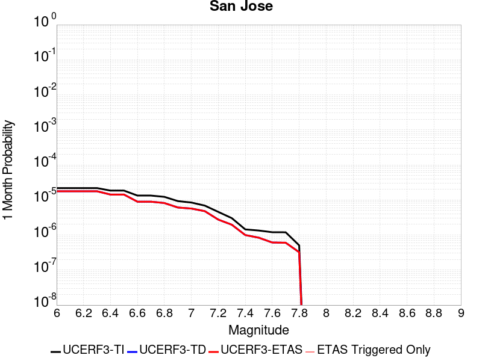 | 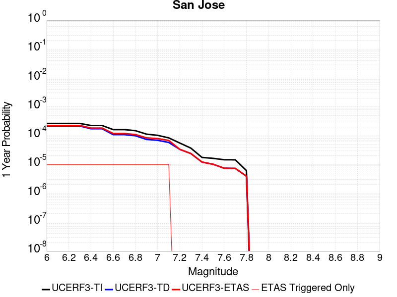 | 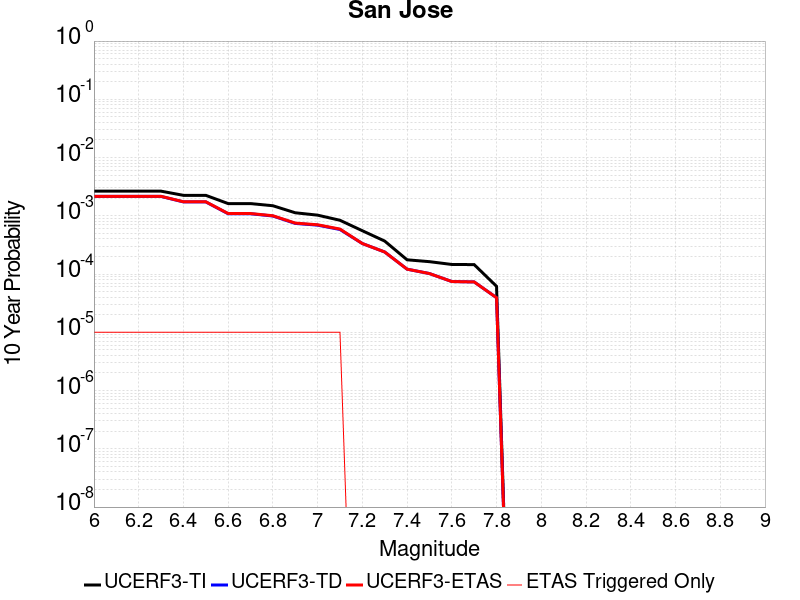 |

| Magnitude | 1 wk TI Prob | 1 wk TD Prob | 1 wk ETAS Prob | 1 wk ETAS/TD Gain | 1 wk ETAS Triggered Only | 1 mo TI Prob | 1 mo TD Prob | 1 mo ETAS Prob | 1 mo ETAS/TD Gain | 1 mo ETAS Triggered Only | 1 yr TI Prob | 1 yr TD Prob | 1 yr ETAS Prob | 1 yr ETAS/TD Gain | 1 yr ETAS Triggered Only | 10 yr TI Prob | 10 yr TD Prob | 10 yr ETAS Prob | 10 yr ETAS/TD Gain | 10 yr ETAS Triggered Only |
|-----|-----|-----|-----|-----|-----|-----|-----|-----|-----|-----|-----|-----|-----|-----|-----|-----|-----|-----|-----|-----|
| 6.0 | 5.0851277E-6 | 4.1262206E-6 | 4.1262206E-6 | 1.0 | 0.0 | 2.1793223E-5 | 1.7683697E-5 | 1.7683697E-5 | 1.0 | 0.0 | 2.653002E-4 | 2.1528036E-4 | 2.4294917E-4 | 1.1285245 | 2.7674767E-5 | 0.0026498367 | 0.0021510094 | 0.0021786245 | 1.0128382 | 2.7674767E-5 |
| 6.1 | 5.0851277E-6 | 4.1262206E-6 | 4.1262206E-6 | 1.0 | 0.0 | 2.1793223E-5 | 1.7683697E-5 | 1.7683697E-5 | 1.0 | 0.0 | 2.653002E-4 | 2.1528036E-4 | 2.4294917E-4 | 1.1285245 | 2.7674767E-5 | 0.0026498367 | 0.0021510094 | 0.0021786245 | 1.0128382 | 2.7674767E-5 |
| 6.2 | 5.0851277E-6 | 4.1262206E-6 | 4.1262206E-6 | 1.0 | 0.0 | 2.1793223E-5 | 1.7683697E-5 | 1.7683697E-5 | 1.0 | 0.0 | 2.653002E-4 | 2.1528036E-4 | 2.4294917E-4 | 1.1285245 | 2.7674767E-5 | 0.0026498367 | 0.0021510094 | 0.0021786245 | 1.0128382 | 2.7674767E-5 |
| 6.3 | 5.0851277E-6 | 4.1262206E-6 | 4.1262206E-6 | 1.0 | 0.0 | 2.1793223E-5 | 1.7683697E-5 | 1.7683697E-5 | 1.0 | 0.0 | 2.653002E-4 | 2.1528036E-4 | 2.4294917E-4 | 1.1285245 | 2.7674767E-5 | 0.0026498367 | 0.0021510094 | 0.0021786245 | 1.0128382 | 2.7674767E-5 |
| 6.4 | 4.3115124E-6 | 3.3243036E-6 | 3.3243036E-6 | 1.0 | 0.0 | 1.8477778E-5 | 1.4246951E-5 | 1.4246951E-5 | 1.0 | 0.0 | 2.2494372E-4 | 1.7344502E-4 | 2.0111499E-4 | 1.1595316 | 2.7674767E-5 | 0.0022471617 | 0.0017333463 | 0.0017609731 | 1.0159384 | 2.7674767E-5 |
| 6.5 | 4.3115124E-6 | 3.3243036E-6 | 3.3243036E-6 | 1.0 | 0.0 | 1.8477778E-5 | 1.4246951E-5 | 1.4246951E-5 | 1.0 | 0.0 | 2.2494372E-4 | 1.7344502E-4 | 2.0111499E-4 | 1.1595316 | 2.7674767E-5 | 0.0022471617 | 0.0017333463 | 0.0017609731 | 1.0159384 | 2.7674767E-5 |
| 6.6 | 3.110396E-6 | 2.0804662E-6 | 2.0804662E-6 | 1.0 | 0.0 | 1.33302E-5 | 8.916255E-6 | 8.916255E-6 | 1.0 | 0.0 | 1.622831E-4 | 1.0855027E-4 | 1.3622204E-4 | 1.2549212 | 2.7674767E-5 | 0.0016216465 | 0.0010850325 | 0.0011126773 | 1.0254782 | 2.7674767E-5 |
| 6.7 | 3.110396E-6 | 2.0804662E-6 | 2.0804662E-6 | 1.0 | 0.0 | 1.33302E-5 | 8.916255E-6 | 8.916255E-6 | 1.0 | 0.0 | 1.622831E-4 | 1.0855027E-4 | 1.3622204E-4 | 1.2549212 | 2.7674767E-5 | 0.0016216465 | 0.0010850325 | 0.0011126773 | 1.0254782 | 2.7674767E-5 |
| 6.8 | 2.856651E-6 | 1.9029025E-6 | 1.9029025E-6 | 1.0 | 0.0 | 1.2242733E-5 | 8.155273E-6 | 8.155273E-6 | 1.0 | 0.0 | 1.4904508E-4 | 9.928616E-5 | 1.2695818E-4 | 1.2787098 | 2.7674767E-5 | 0.0014894515 | 9.924751E-4 | 0.0010201223 | 1.027857 | 2.7674767E-5 |
| 6.9 | 2.1618725E-6 | 1.4190999E-6 | 1.4190999E-6 | 1.0 | 0.0 | 9.265135E-6 | 6.0818434E-6 | 6.0818434E-6 | 1.0 | 0.0 | 1.12797185E-4 | 7.4044015E-5 | 1.0171673E-4 | 1.3737334 | 2.7674767E-5 | 0.0011273995 | 7.402346E-4 | 7.678889E-4 | 1.0373588 | 2.7674767E-5 |
| 7.0 | 1.9684312E-6 | 1.3260606E-6 | 1.3260606E-6 | 1.0 | 0.0 | 8.436106E-6 | 5.683105E-6 | 5.683105E-6 | 1.0 | 0.0 | 1.02704755E-4 | 6.9189686E-5 | 9.686254E-5 | 1.3999563 | 2.7674767E-5 | 0.001026573 | 6.917221E-4 | 7.193777E-4 | 1.0399808 | 2.7674767E-5 |
| 7.1 | 1.6070337E-6 | 1.1159146E-6 | 1.1159146E-6 | 1.0 | 0.0 | 6.887269E-6 | 4.782483E-6 | 4.782483E-6 | 1.0 | 0.0 | 8.384928E-5 | 5.8225236E-5 | 8.589839E-5 | 1.4752777 | 2.7674767E-5 | 8.3817646E-4 | 5.821385E-4 | 6.0979713E-4 | 1.0475122 | 2.7674767E-5 |
| 7.2 | 1.0631658E-6 | 6.406776E-7 | 6.406776E-7 | 1.0 | 0.0 | 4.556417E-6 | 2.7457586E-6 | 2.7457586E-6 | 1.0 | 0.0 | 5.5472963E-5 | 3.342911E-5 | 3.342911E-5 | 1.0 | 0.0 | 5.545912E-4 | 3.342747E-4 | 3.342747E-4 | 1.0 | 0.0 |
| 7.3 | 7.060711E-7 | 4.5849012E-7 | 4.5849012E-7 | 1.0 | 0.0 | 3.0260155E-6 | 1.9649563E-6 | 1.9649563E-6 | 1.0 | 0.0 | 3.6841117E-5 | 2.3923089E-5 | 2.3923089E-5 | 1.0 | 0.0 | 3.6835007E-4 | 2.392385E-4 | 2.392385E-4 | 1.0 | 0.0 |
| 7.4 | 3.3677085E-7 | 2.325059E-7 | 2.325059E-7 | 1.0 | 0.0 | 1.4433028E-6 | 9.964535E-7 | 9.964535E-7 | 1.0 | 0.0 | 1.757207E-5 | 1.2131757E-5 | 1.2131757E-5 | 1.0 | 0.0 | 1.7570681E-4 | 1.2134371E-4 | 1.2134371E-4 | 1.0 | 0.0 |
| 7.5 | 3.129161E-7 | 1.9545199E-7 | 1.9545199E-7 | 1.0 | 0.0 | 1.3410682E-6 | 8.3765116E-7 | 8.3765116E-7 | 1.0 | 0.0 | 1.6327383E-5 | 1.0198357E-5 | 1.0198357E-5 | 1.0 | 0.0 | 1.6326184E-4 | 1.0201162E-4 | 1.0201162E-4 | 1.0 | 0.0 |
| 7.6 | 2.8008668E-7 | 1.4252204E-7 | 1.4252204E-7 | 1.0 | 0.0 | 1.2003709E-6 | 6.1080857E-7 | 6.1080857E-7 | 1.0 | 0.0 | 1.46144175E-5 | 7.4365707E-6 | 7.4365707E-6 | 1.0 | 0.0 | 1.4613457E-4 | 7.439583E-5 | 7.439583E-5 | 1.0 | 0.0 |
| 7.7 | 2.7852005E-7 | 1.4026656E-7 | 1.4026656E-7 | 1.0 | 0.0 | 1.1936568E-6 | 6.011423E-7 | 6.011423E-7 | 1.0 | 0.0 | 1.4532674E-5 | 7.3188844E-6 | 7.3188844E-6 | 1.0 | 0.0 | 1.4531724E-4 | 7.3219046E-5 | 7.3219046E-5 | 1.0 | 0.0 |
| 7.8 | 1.1810797E-7 | 7.523048E-8 | 7.523048E-8 | 1.0 | 0.0 | 5.0617695E-7 | 3.224163E-7 | 3.224163E-7 | 1.0 | 0.0 | 6.1626865E-6 | 3.925412E-6 | 3.925412E-6 | 1.0 | 0.0 | 6.162516E-5 | 3.927182E-5 | 3.927182E-5 | 1.0 | 0.0 |

## Trinidad (alt1)
*[(top)](#table-of-contents)*

| 1 Week | 1 Month | 1 Year | 10 Year |
|-----|-----|-----|-----|
|  |  |  |  |

| Magnitude | 1 wk TI Prob | 1 wk TD Prob | 1 wk ETAS Prob | 1 wk ETAS/TD Gain | 1 wk ETAS Triggered Only | 1 mo TI Prob | 1 mo TD Prob | 1 mo ETAS Prob | 1 mo ETAS/TD Gain | 1 mo ETAS Triggered Only | 1 yr TI Prob | 1 yr TD Prob | 1 yr ETAS Prob | 1 yr ETAS/TD Gain | 1 yr ETAS Triggered Only | 10 yr TI Prob | 10 yr TD Prob | 10 yr ETAS Prob | 10 yr ETAS/TD Gain | 10 yr ETAS Triggered Only |
|-----|-----|-----|-----|-----|-----|-----|-----|-----|-----|-----|-----|-----|-----|-----|-----|-----|-----|-----|-----|-----|
| 6.0 | 3.0167168E-5 | 3.403724E-5 | 3.403724E-5 | 1.0 | 0.0 | 1.2928146E-4 | 1.4586668E-4 | 1.4586668E-4 | 1.0 | 0.0 | 0.0015728653 | 0.0017746487 | 0.0017746487 | 1.0 | 0.0 | 0.0156177925 | 0.01762173 | 0.017648917 | 1.0015428 | 2.7674767E-5 |
| 6.1 | 3.0167168E-5 | 3.403724E-5 | 3.403724E-5 | 1.0 | 0.0 | 1.2928146E-4 | 1.4586668E-4 | 1.4586668E-4 | 1.0 | 0.0 | 0.0015728653 | 0.0017746487 | 0.0017746487 | 1.0 | 0.0 | 0.0156177925 | 0.01762173 | 0.017648917 | 1.0015428 | 2.7674767E-5 |
| 6.2 | 3.0167168E-5 | 3.403724E-5 | 3.403724E-5 | 1.0 | 0.0 | 1.2928146E-4 | 1.4586668E-4 | 1.4586668E-4 | 1.0 | 0.0 | 0.0015728653 | 0.0017746487 | 0.0017746487 | 1.0 | 0.0 | 0.0156177925 | 0.01762173 | 0.017648917 | 1.0015428 | 2.7674767E-5 |
| 6.3 | 3.0167168E-5 | 3.403724E-5 | 3.403724E-5 | 1.0 | 0.0 | 1.2928146E-4 | 1.4586668E-4 | 1.4586668E-4 | 1.0 | 0.0 | 0.0015728653 | 0.0017746487 | 0.0017746487 | 1.0 | 0.0 | 0.0156177925 | 0.01762173 | 0.017648917 | 1.0015428 | 2.7674767E-5 |
| 6.4 | 3.0167168E-5 | 3.403724E-5 | 3.403724E-5 | 1.0 | 0.0 | 1.2928146E-4 | 1.4586668E-4 | 1.4586668E-4 | 1.0 | 0.0 | 0.0015728653 | 0.0017746487 | 0.0017746487 | 1.0 | 0.0 | 0.0156177925 | 0.01762173 | 0.017648917 | 1.0015428 | 2.7674767E-5 |
| 6.5 | 3.0167168E-5 | 3.403724E-5 | 3.403724E-5 | 1.0 | 0.0 | 1.2928146E-4 | 1.4586668E-4 | 1.4586668E-4 | 1.0 | 0.0 | 0.0015728653 | 0.0017746487 | 0.0017746487 | 1.0 | 0.0 | 0.0156177925 | 0.01762173 | 0.017648917 | 1.0015428 | 2.7674767E-5 |
| 6.6 | 3.0167168E-5 | 3.403724E-5 | 3.403724E-5 | 1.0 | 0.0 | 1.2928146E-4 | 1.4586668E-4 | 1.4586668E-4 | 1.0 | 0.0 | 0.0015728653 | 0.0017746487 | 0.0017746487 | 1.0 | 0.0 | 0.0156177925 | 0.01762173 | 0.017648917 | 1.0015428 | 2.7674767E-5 |
| 6.7 | 3.0167168E-5 | 3.403724E-5 | 3.403724E-5 | 1.0 | 0.0 | 1.2928146E-4 | 1.4586668E-4 | 1.4586668E-4 | 1.0 | 0.0 | 0.0015728653 | 0.0017746487 | 0.0017746487 | 1.0 | 0.0 | 0.0156177925 | 0.01762173 | 0.017648917 | 1.0015428 | 2.7674767E-5 |
| 6.8 | 1.717077E-5 | 1.9197787E-5 | 1.9197787E-5 | 1.0 | 0.0 | 7.358694E-5 | 8.227389E-5 | 8.227389E-5 | 1.0 | 0.0 | 8.9555274E-4 | 0.0010012687 | 0.0010012687 | 1.0 | 0.0 | 0.008919522 | 0.009972027 | 0.009999425 | 1.0027475 | 2.7674767E-5 |
| 6.9 | 1.717077E-5 | 1.9197787E-5 | 1.9197787E-5 | 1.0 | 0.0 | 7.358694E-5 | 8.227389E-5 | 8.227389E-5 | 1.0 | 0.0 | 8.9555274E-4 | 0.0010012687 | 0.0010012687 | 1.0 | 0.0 | 0.008919522 | 0.009972027 | 0.009999425 | 1.0027475 | 2.7674767E-5 |
| 7.0 | 1.2858572E-5 | 1.43389025E-5 | 1.43389025E-5 | 1.0 | 0.0 | 5.5107E-5 | 6.1451174E-5 | 6.1451174E-5 | 1.0 | 0.0 | 6.707212E-4 | 7.479433E-4 | 7.479433E-4 | 1.0 | 0.0 | 0.006687004 | 0.00745744 | 0.007484908 | 1.0036833 | 2.7674767E-5 |
| 7.1 | 1.0588431E-5 | 1.18025255E-5 | 1.18025255E-5 | 1.0 | 0.0 | 4.53782E-5 | 5.0581435E-5 | 5.0581435E-5 | 1.0 | 0.0 | 5.5233954E-4 | 6.1568385E-4 | 6.1568385E-4 | 1.0 | 0.0 | 0.005509687 | 0.006142631 | 0.006170136 | 1.0044777 | 2.7674767E-5 |
| 7.2 | 8.138061E-6 | 9.068176E-6 | 9.068176E-6 | 1.0 | 0.0 | 3.487694E-5 | 3.886317E-5 | 3.886317E-5 | 1.0 | 0.0 | 4.2454398E-4 | 4.7308122E-4 | 4.7308122E-4 | 1.0 | 0.0 | 0.0042373384 | 0.004723183 | 0.0047507267 | 1.0058317 | 2.7674767E-5 |
| 7.3 | 5.787542E-6 | 6.461018E-6 | 6.461018E-6 | 1.0 | 0.0 | 2.4803514E-5 | 2.7689905E-5 | 2.7689905E-5 | 1.0 | 0.0 | 3.0194095E-4 | 3.3709395E-4 | 3.3709395E-4 | 1.0 | 0.0 | 0.00301531 | 0.0033679376 | 0.0033955192 | 1.0081894 | 2.7674767E-5 |
| 7.4 | 4.303563E-6 | 4.8013667E-6 | 4.8013667E-6 | 1.0 | 0.0 | 1.844371E-5 | 2.0577234E-5 | 2.0577234E-5 | 1.0 | 0.0 | 2.2452902E-4 | 2.505188E-4 | 2.505188E-4 | 1.0 | 0.0 | 0.0022430231 | 0.0025043027 | 0.0025043027 | 1.0 | 0.0 |
| 7.5 | 5.6063425E-7 | 6.143528E-7 | 6.143528E-7 | 1.0 | 0.0 | 2.402716E-6 | 2.632938E-6 | 2.632938E-6 | 1.0 | 0.0 | 2.9252675E-5 | 3.2055566E-5 | 3.2055566E-5 | 1.0 | 0.0 | 2.9248823E-4 | 3.2051097E-4 | 3.2051097E-4 | 1.0 | 0.0 |
| 7.6 | 4.6699128E-7 | 5.126264E-7 | 5.126264E-7 | 1.0 | 0.0 | 2.0013897E-6 | 2.1969686E-6 | 2.1969686E-6 | 1.0 | 0.0 | 2.4366647E-5 | 2.6747779E-5 | 2.6747779E-5 | 1.0 | 0.0 | 2.4363975E-4 | 2.67447E-4 | 2.67447E-4 | 1.0 | 0.0 |
| 7.7 | 2.2080937E-7 | 2.4349217E-7 | 2.4349217E-7 | 1.0 | 0.0 | 9.4632554E-7 | 1.0435375E-6 | 1.0435375E-6 | 1.0 | 0.0 | 1.15214525E-5 | 1.2705001E-5 | 1.2705001E-5 | 1.0 | 0.0 | 1.1520855E-4 | 1.2704334E-4 | 1.2704334E-4 | 1.0 | 0.0 |
| 7.8 | 1.1438307E-8 | 1.2684245E-8 | 1.2684245E-8 | 1.0 | 0.0 | 4.9021317E-8 | 5.436105E-8 | 5.436105E-8 | 1.0 | 0.0 | 5.9683435E-7 | 6.618458E-7 | 6.618458E-7 | 1.0 | 0.0 | 5.9683275E-6 | 6.6184575E-6 | 6.6184575E-6 | 1.0 | 0.0 |

## San Luis Range 2011 CFM
*[(top)](#table-of-contents)*

| 1 Week | 1 Month | 1 Year | 10 Year |
|-----|-----|-----|-----|
| 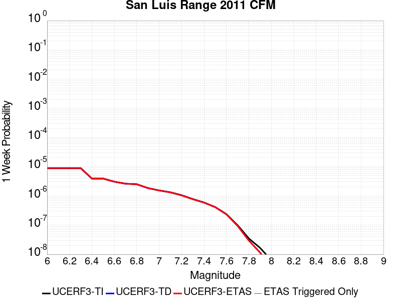 |  |  |  |

| Magnitude | 1 wk TI Prob | 1 wk TD Prob | 1 wk ETAS Prob | 1 wk ETAS/TD Gain | 1 wk ETAS Triggered Only | 1 mo TI Prob | 1 mo TD Prob | 1 mo ETAS Prob | 1 mo ETAS/TD Gain | 1 mo ETAS Triggered Only | 1 yr TI Prob | 1 yr TD Prob | 1 yr ETAS Prob | 1 yr ETAS/TD Gain | 1 yr ETAS Triggered Only | 10 yr TI Prob | 10 yr TD Prob | 10 yr ETAS Prob | 10 yr ETAS/TD Gain | 10 yr ETAS Triggered Only |
|-----|-----|-----|-----|-----|-----|-----|-----|-----|-----|-----|-----|-----|-----|-----|-----|-----|-----|-----|-----|-----|
| 6.0 | 8.8368415E-6 | 8.965619E-6 | 8.965619E-6 | 1.0 | 0.0 | 3.787163E-5 | 3.8423557E-5 | 3.8423557E-5 | 1.0 | 0.0 | 4.609895E-4 | 4.677143E-4 | 4.677143E-4 | 1.0 | 0.0 | 0.0046003438 | 0.004668082 | 0.0046956274 | 1.0059009 | 2.7674767E-5 |
| 6.1 | 8.8368415E-6 | 8.965619E-6 | 8.965619E-6 | 1.0 | 0.0 | 3.787163E-5 | 3.8423557E-5 | 3.8423557E-5 | 1.0 | 0.0 | 4.609895E-4 | 4.677143E-4 | 4.677143E-4 | 1.0 | 0.0 | 0.0046003438 | 0.004668082 | 0.0046956274 | 1.0059009 | 2.7674767E-5 |
| 6.2 | 8.8368415E-6 | 8.965619E-6 | 8.965619E-6 | 1.0 | 0.0 | 3.787163E-5 | 3.8423557E-5 | 3.8423557E-5 | 1.0 | 0.0 | 4.609895E-4 | 4.677143E-4 | 4.677143E-4 | 1.0 | 0.0 | 0.0046003438 | 0.004668082 | 0.0046956274 | 1.0059009 | 2.7674767E-5 |
| 6.3 | 8.8368415E-6 | 8.965619E-6 | 8.965619E-6 | 1.0 | 0.0 | 3.787163E-5 | 3.8423557E-5 | 3.8423557E-5 | 1.0 | 0.0 | 4.609895E-4 | 4.677143E-4 | 4.677143E-4 | 1.0 | 0.0 | 0.0046003438 | 0.004668082 | 0.0046956274 | 1.0059009 | 2.7674767E-5 |
| 6.4 | 3.9094193E-6 | 3.9412757E-6 | 3.9412757E-6 | 1.0 | 0.0 | 1.6754546E-5 | 1.6891076E-5 | 1.6891076E-5 | 1.0 | 0.0 | 2.039675E-4 | 2.0562971E-4 | 2.0562971E-4 | 1.0 | 0.0 | 0.0020378039 | 0.0020544233 | 0.0020820412 | 1.0134431 | 2.7674767E-5 |
| 6.5 | 3.9094193E-6 | 3.9412757E-6 | 3.9412757E-6 | 1.0 | 0.0 | 1.6754546E-5 | 1.6891076E-5 | 1.6891076E-5 | 1.0 | 0.0 | 2.039675E-4 | 2.0562971E-4 | 2.0562971E-4 | 1.0 | 0.0 | 0.0020378039 | 0.0020544233 | 0.0020820412 | 1.0134431 | 2.7674767E-5 |
| 6.6 | 3.0587726E-6 | 3.0754472E-6 | 3.0754472E-6 | 1.0 | 0.0 | 1.3108959E-5 | 1.3180422E-5 | 1.3180422E-5 | 1.0 | 0.0 | 1.595899E-4 | 1.6045994E-4 | 1.6045994E-4 | 1.0 | 0.0 | 0.0015947534 | 0.0016034528 | 0.0016310832 | 1.0172318 | 2.7674767E-5 |
| 6.7 | 2.6160574E-6 | 2.6251791E-6 | 2.6251791E-6 | 1.0 | 0.0 | 1.1211626E-5 | 1.125072E-5 | 1.125072E-5 | 1.0 | 0.0 | 1.3649299E-4 | 1.3696896E-4 | 1.3696896E-4 | 1.0 | 0.0 | 0.0013640919 | 0.0013688515 | 0.0013964884 | 1.0201899 | 2.7674767E-5 |
| 6.8 | 2.5110312E-6 | 2.51819E-6 | 2.51819E-6 | 1.0 | 0.0 | 1.0761518E-5 | 1.0792199E-5 | 1.0792199E-5 | 1.0 | 0.0 | 1.310136E-4 | 1.3138716E-4 | 1.3138716E-4 | 1.0 | 0.0 | 0.0013093639 | 0.0013131007 | 0.0013407391 | 1.0210482 | 2.7674767E-5 |
| 6.9 | 1.8564405E-6 | 1.8525265E-6 | 1.8525265E-6 | 1.0 | 0.0 | 7.95615E-6 | 7.939375E-6 | 7.939375E-6 | 1.0 | 0.0 | 9.686181E-5 | 9.6657626E-5 | 9.6657626E-5 | 1.0 | 0.0 | 9.68196E-4 | 9.661579E-4 | 9.661579E-4 | 1.0 | 0.0 |
| 7.0 | 1.546127E-6 | 1.5369883E-6 | 1.5369883E-6 | 1.0 | 0.0 | 6.626242E-6 | 6.5870763E-6 | 6.5870763E-6 | 1.0 | 0.0 | 8.06715E-5 | 8.019471E-5 | 8.019471E-5 | 1.0 | 0.0 | 8.0642226E-4 | 8.016584E-4 | 8.016584E-4 | 1.0 | 0.0 |
| 7.1 | 1.3368208E-6 | 1.3235632E-6 | 1.3235632E-6 | 1.0 | 0.0 | 5.7292195E-6 | 5.6724016E-6 | 5.6724016E-6 | 1.0 | 0.0 | 6.975101E-5 | 6.905931E-5 | 6.905931E-5 | 1.0 | 0.0 | 6.972912E-4 | 6.9037895E-4 | 6.9037895E-4 | 1.0 | 0.0 |
| 7.2 | 1.0623363E-6 | 1.0454623E-6 | 1.0454623E-6 | 1.0 | 0.0 | 4.5528623E-6 | 4.480545E-6 | 4.480545E-6 | 1.0 | 0.0 | 5.5429686E-5 | 5.4549277E-5 | 5.4549277E-5 | 1.0 | 0.0 | 5.5415864E-4 | 5.4535916E-4 | 5.4535916E-4 | 1.0 | 0.0 |
| 7.3 | 7.831679E-7 | 7.727596E-7 | 7.727596E-7 | 1.0 | 0.0 | 3.3564295E-6 | 3.3118226E-6 | 3.3118226E-6 | 1.0 | 0.0 | 4.086376E-5 | 4.0320698E-5 | 4.0320698E-5 | 1.0 | 0.0 | 4.0856248E-4 | 4.0313395E-4 | 4.0313395E-4 | 1.0 | 0.0 |
| 7.4 | 5.9558846E-7 | 5.910808E-7 | 5.910808E-7 | 1.0 | 0.0 | 2.5525194E-6 | 2.5332008E-6 | 2.5332008E-6 | 1.0 | 0.0 | 3.107648E-5 | 3.0841285E-5 | 3.0841285E-5 | 1.0 | 0.0 | 3.1072134E-4 | 3.0837013E-4 | 3.0837013E-4 | 1.0 | 0.0 |
| 7.5 | 4.1616502E-7 | 4.119771E-7 | 4.119771E-7 | 1.0 | 0.0 | 1.7835631E-6 | 1.765615E-6 | 1.765615E-6 | 1.0 | 0.0 | 2.1714664E-5 | 2.1496151E-5 | 2.1496151E-5 | 1.0 | 0.0 | 2.1712543E-4 | 2.1494077E-4 | 2.1494077E-4 | 1.0 | 0.0 |
| 7.6 | 2.3816014E-7 | 2.3377628E-7 | 2.3377628E-7 | 1.0 | 0.0 | 1.0206859E-6 | 1.0018979E-6 | 1.0018979E-6 | 1.0 | 0.0 | 1.242678E-5 | 1.2198039E-5 | 1.2198039E-5 | 1.0 | 0.0 | 1.2426086E-4 | 1.2197372E-4 | 1.2197372E-4 | 1.0 | 0.0 |
| 7.7 | 9.918777E-8 | 9.3875734E-8 | 9.3875734E-8 | 1.0 | 0.0 | 4.2509038E-7 | 4.023245E-7 | 4.023245E-7 | 1.0 | 0.0 | 5.1754632E-6 | 4.8982897E-6 | 4.8982897E-6 | 1.0 | 0.0 | 5.1753424E-5 | 4.898182E-5 | 4.898182E-5 | 1.0 | 0.0 |
| 7.8 | 3.4982556E-8 | 2.969326E-8 | 2.969326E-8 | 1.0 | 0.0 | 1.4992524E-7 | 1.2725683E-7 | 1.2725683E-7 | 1.0 | 0.0 | 1.8253382E-6 | 1.5493507E-6 | 1.5493507E-6 | 1.0 | 0.0 | 1.8253233E-5 | 1.5493399E-5 | 1.5493399E-5 | 1.0 | 0.0 |
| 7.9 | 1.6624908E-8 | 1.1483165E-8 | 1.1483165E-8 | 1.0 | 0.0 | 7.12496E-8 | 4.9213565E-8 | 4.9213565E-8 | 1.0 | 0.0 | 8.6746354E-7 | 5.9917494E-7 | 5.9917494E-7 | 1.0 | 0.0 | 8.674601E-6 | 5.9917334E-6 | 5.9917334E-6 | 1.0 | 0.0 |
| 8.0 | 6.3352315E-9 | 3.0923917E-9 | 3.0923917E-9 | 1.0 | 0.0 | 2.715099E-8 | 1.3253108E-8 | 1.3253108E-8 | 1.0 | 0.0 | 3.3056327E-7 | 1.6135657E-7 | 1.6135657E-7 | 1.0 | 0.0 | 3.3056278E-6 | 1.6135646E-6 | 1.6135646E-6 | 1.0 | 0.0 |

## Pitas Point (Lower West)
*[(top)](#table-of-contents)*

| 1 Week | 1 Month | 1 Year | 10 Year |
|-----|-----|-----|-----|
|  |  |  |  |

| Magnitude | 1 wk TI Prob | 1 wk TD Prob | 1 wk ETAS Prob | 1 wk ETAS/TD Gain | 1 wk ETAS Triggered Only | 1 mo TI Prob | 1 mo TD Prob | 1 mo ETAS Prob | 1 mo ETAS/TD Gain | 1 mo ETAS Triggered Only | 1 yr TI Prob | 1 yr TD Prob | 1 yr ETAS Prob | 1 yr ETAS/TD Gain | 1 yr ETAS Triggered Only | 10 yr TI Prob | 10 yr TD Prob | 10 yr ETAS Prob | 10 yr ETAS/TD Gain | 10 yr ETAS Triggered Only |
|-----|-----|-----|-----|-----|-----|-----|-----|-----|-----|-----|-----|-----|-----|-----|-----|-----|-----|-----|-----|-----|
| 6.0 | 8.151497E-6 | 7.856256E-6 | 7.856256E-6 | 1.0 | 0.0 | 3.493452E-5 | 3.366924E-5 | 3.366924E-5 | 1.0 | 0.0 | 4.252448E-4 | 4.0984663E-4 | 4.3751005E-4 | 1.067497 | 2.7674767E-5 | 0.0042443196 | 0.004090988 | 0.0041185496 | 1.0067371 | 2.7674767E-5 |
| 6.1 | 8.151497E-6 | 7.856256E-6 | 7.856256E-6 | 1.0 | 0.0 | 3.493452E-5 | 3.366924E-5 | 3.366924E-5 | 1.0 | 0.0 | 4.252448E-4 | 4.0984663E-4 | 4.3751005E-4 | 1.067497 | 2.7674767E-5 | 0.0042443196 | 0.004090988 | 0.0041185496 | 1.0067371 | 2.7674767E-5 |
| 6.2 | 8.151497E-6 | 7.856256E-6 | 7.856256E-6 | 1.0 | 0.0 | 3.493452E-5 | 3.366924E-5 | 3.366924E-5 | 1.0 | 0.0 | 4.252448E-4 | 4.0984663E-4 | 4.3751005E-4 | 1.067497 | 2.7674767E-5 | 0.0042443196 | 0.004090988 | 0.0041185496 | 1.0067371 | 2.7674767E-5 |
| 6.3 | 8.151497E-6 | 7.856256E-6 | 7.856256E-6 | 1.0 | 0.0 | 3.493452E-5 | 3.366924E-5 | 3.366924E-5 | 1.0 | 0.0 | 4.252448E-4 | 4.0984663E-4 | 4.3751005E-4 | 1.067497 | 2.7674767E-5 | 0.0042443196 | 0.004090988 | 0.0041185496 | 1.0067371 | 2.7674767E-5 |
| 6.4 | 8.151497E-6 | 7.856256E-6 | 7.856256E-6 | 1.0 | 0.0 | 3.493452E-5 | 3.366924E-5 | 3.366924E-5 | 1.0 | 0.0 | 4.252448E-4 | 4.0984663E-4 | 4.3751005E-4 | 1.067497 | 2.7674767E-5 | 0.0042443196 | 0.004090988 | 0.0041185496 | 1.0067371 | 2.7674767E-5 |
| 6.5 | 8.151497E-6 | 7.856256E-6 | 7.856256E-6 | 1.0 | 0.0 | 3.493452E-5 | 3.366924E-5 | 3.366924E-5 | 1.0 | 0.0 | 4.252448E-4 | 4.0984663E-4 | 4.3751005E-4 | 1.067497 | 2.7674767E-5 | 0.0042443196 | 0.004090988 | 0.0041185496 | 1.0067371 | 2.7674767E-5 |
| 6.6 | 8.151497E-6 | 7.856256E-6 | 7.856256E-6 | 1.0 | 0.0 | 3.493452E-5 | 3.366924E-5 | 3.366924E-5 | 1.0 | 0.0 | 4.252448E-4 | 4.0984663E-4 | 4.3751005E-4 | 1.067497 | 2.7674767E-5 | 0.0042443196 | 0.004090988 | 0.0041185496 | 1.0067371 | 2.7674767E-5 |
| 6.7 | 8.151497E-6 | 7.856256E-6 | 7.856256E-6 | 1.0 | 0.0 | 3.493452E-5 | 3.366924E-5 | 3.366924E-5 | 1.0 | 0.0 | 4.252448E-4 | 4.0984663E-4 | 4.3751005E-4 | 1.067497 | 2.7674767E-5 | 0.0042443196 | 0.004090988 | 0.0041185496 | 1.0067371 | 2.7674767E-5 |
| 6.8 | 8.151497E-6 | 7.856256E-6 | 7.856256E-6 | 1.0 | 0.0 | 3.493452E-5 | 3.366924E-5 | 3.366924E-5 | 1.0 | 0.0 | 4.252448E-4 | 4.0984663E-4 | 4.3751005E-4 | 1.067497 | 2.7674767E-5 | 0.0042443196 | 0.004090988 | 0.0041185496 | 1.0067371 | 2.7674767E-5 |
| 6.9 | 8.151497E-6 | 7.856256E-6 | 7.856256E-6 | 1.0 | 0.0 | 3.493452E-5 | 3.366924E-5 | 3.366924E-5 | 1.0 | 0.0 | 4.252448E-4 | 4.0984663E-4 | 4.3751005E-4 | 1.067497 | 2.7674767E-5 | 0.0042443196 | 0.004090988 | 0.0041185496 | 1.0067371 | 2.7674767E-5 |
| 7.0 | 8.103535E-6 | 7.805684E-6 | 7.805684E-6 | 1.0 | 0.0 | 3.4728975E-5 | 3.3452503E-5 | 3.3452503E-5 | 1.0 | 0.0 | 4.2274324E-4 | 4.0720886E-4 | 4.3487235E-4 | 1.0679344 | 2.7674767E-5 | 0.0042193993 | 0.004064707 | 0.0040922696 | 1.0067809 | 2.7674767E-5 |
| 7.1 | 7.853298E-6 | 7.5413604E-6 | 7.5413604E-6 | 1.0 | 0.0 | 3.3656554E-5 | 3.231972E-5 | 3.231972E-5 | 1.0 | 0.0 | 4.096915E-4 | 3.9342226E-4 | 4.2108612E-4 | 1.070316 | 2.7674767E-5 | 0.00408937 | 0.0039273337 | 0.0039549 | 1.007019 | 2.7674767E-5 |
| 7.2 | 7.771102E-6 | 7.453637E-6 | 7.453637E-6 | 1.0 | 0.0 | 3.33043E-5 | 3.194377E-5 | 3.194377E-5 | 1.0 | 0.0 | 4.0540437E-4 | 3.888467E-4 | 4.165107E-4 | 1.0711437 | 2.7674767E-5 | 0.0040466557 | 0.003881739 | 0.003909306 | 1.0071018 | 2.7674767E-5 |
| 7.3 | 7.3945344E-6 | 7.0497144E-6 | 7.0497144E-6 | 1.0 | 0.0 | 3.1690477E-5 | 3.0212716E-5 | 3.0212716E-5 | 1.0 | 0.0 | 3.8576324E-4 | 3.6777835E-4 | 3.9544294E-4 | 1.0752208 | 2.7674767E-5 | 0.0038509427 | 0.0036717646 | 0.0036993378 | 1.0075095 | 2.7674767E-5 |
| 7.4 | 6.964645E-6 | 6.590534E-6 | 6.590534E-6 | 1.0 | 0.0 | 2.9848137E-5 | 2.8244844E-5 | 2.8244844E-5 | 1.0 | 0.0 | 3.6334046E-4 | 3.438272E-4 | 3.438272E-4 | 1.0 | 0.0 | 0.0036274698 | 0.003433006 | 0.003433006 | 1.0 | 0.0 |
| 7.5 | 6.6525035E-6 | 6.259554E-6 | 6.259554E-6 | 1.0 | 0.0 | 2.851042E-5 | 2.6826388E-5 | 2.6826388E-5 | 1.0 | 0.0 | 3.4705905E-4 | 3.2656282E-4 | 3.2656282E-4 | 1.0 | 0.0 | 0.0034651754 | 0.0032608807 | 0.0032608807 | 1.0 | 0.0 |
| 7.6 | 5.613338E-6 | 5.151711E-6 | 5.151711E-6 | 1.0 | 0.0 | 2.405694E-5 | 2.2078577E-5 | 2.2078577E-5 | 1.0 | 0.0 | 2.928539E-4 | 2.6877382E-4 | 2.6877382E-4 | 1.0 | 0.0 | 0.0029246826 | 0.002684519 | 0.002684519 | 1.0 | 0.0 |
| 7.7 | 4.494704E-6 | 3.997151E-6 | 3.997151E-6 | 1.0 | 0.0 | 1.9262876E-5 | 1.7130536E-5 | 1.7130536E-5 | 1.0 | 0.0 | 2.3450027E-4 | 2.0854454E-4 | 2.0854454E-4 | 1.0 | 0.0 | 0.0023425296 | 0.0020835125 | 0.0020835125 | 1.0 | 0.0 |
| 7.8 | 2.6075882E-6 | 2.1837632E-6 | 2.1837632E-6 | 1.0 | 0.0 | 1.117533E-5 | 9.358952E-6 | 9.358952E-6 | 1.0 | 0.0 | 1.3605114E-4 | 1.1393933E-4 | 1.1393933E-4 | 1.0 | 0.0 | 0.0013596788 | 0.0011388138 | 0.0011388138 | 1.0 | 0.0 |
| 7.9 | 4.045984E-7 | 3.2425706E-7 | 3.2425706E-7 | 1.0 | 0.0 | 1.733992E-6 | 1.3896723E-6 | 1.3896723E-6 | 1.0 | 0.0 | 2.1111147E-5 | 1.6919132E-5 | 1.6919132E-5 | 1.0 | 0.0 | 2.1109142E-4 | 1.6917875E-4 | 1.6917875E-4 | 1.0 | 0.0 |
| 8.0 | 7.791402E-9 | 5.6838902E-9 | 5.6838902E-9 | 1.0 | 0.0 | 3.3391725E-8 | 2.435953E-8 | 2.435953E-8 | 1.0 | 0.0 | 4.0654416E-7 | 2.9657724E-7 | 2.9657724E-7 | 1.0 | 0.0 | 4.065434E-6 | 2.9657706E-6 | 2.9657706E-6 | 1.0 | 0.0 |

## Kern Canyon (South Kern) 2011
*[(top)](#table-of-contents)*

| 1 Week | 1 Month | 1 Year | 10 Year |
|-----|-----|-----|-----|
|  |  |  |  |

| Magnitude | 1 wk TI Prob | 1 wk TD Prob | 1 wk ETAS Prob | 1 wk ETAS/TD Gain | 1 wk ETAS Triggered Only | 1 mo TI Prob | 1 mo TD Prob | 1 mo ETAS Prob | 1 mo ETAS/TD Gain | 1 mo ETAS Triggered Only | 1 yr TI Prob | 1 yr TD Prob | 1 yr ETAS Prob | 1 yr ETAS/TD Gain | 1 yr ETAS Triggered Only | 10 yr TI Prob | 10 yr TD Prob | 10 yr ETAS Prob | 10 yr ETAS/TD Gain | 10 yr ETAS Triggered Only |
|-----|-----|-----|-----|-----|-----|-----|-----|-----|-----|-----|-----|-----|-----|-----|-----|-----|-----|-----|-----|-----|
| 6.0 | 4.105075E-6 | 4.1137982E-6 | 4.1137982E-6 | 1.0 | 0.0 | 1.7593058E-5 | 1.763045E-5 | 1.763045E-5 | 1.0 | 0.0 | 2.1417443E-4 | 2.1463021E-4 | 2.1463021E-4 | 1.0 | 0.0 | 0.0021396813 | 0.0021442932 | 0.0021719085 | 1.0128785 | 2.7674767E-5 |
| 6.1 | 4.105075E-6 | 4.1137982E-6 | 4.1137982E-6 | 1.0 | 0.0 | 1.7593058E-5 | 1.763045E-5 | 1.763045E-5 | 1.0 | 0.0 | 2.1417443E-4 | 2.1463021E-4 | 2.1463021E-4 | 1.0 | 0.0 | 0.0021396813 | 0.0021442932 | 0.0021719085 | 1.0128785 | 2.7674767E-5 |
| 6.2 | 4.105075E-6 | 4.1137982E-6 | 4.1137982E-6 | 1.0 | 0.0 | 1.7593058E-5 | 1.763045E-5 | 1.763045E-5 | 1.0 | 0.0 | 2.1417443E-4 | 2.1463021E-4 | 2.1463021E-4 | 1.0 | 0.0 | 0.0021396813 | 0.0021442932 | 0.0021719085 | 1.0128785 | 2.7674767E-5 |
| 6.3 | 4.105075E-6 | 4.1137982E-6 | 4.1137982E-6 | 1.0 | 0.0 | 1.7593058E-5 | 1.763045E-5 | 1.763045E-5 | 1.0 | 0.0 | 2.1417443E-4 | 2.1463021E-4 | 2.1463021E-4 | 1.0 | 0.0 | 0.0021396813 | 0.0021442932 | 0.0021719085 | 1.0128785 | 2.7674767E-5 |
| 6.4 | 4.105075E-6 | 4.1137982E-6 | 4.1137982E-6 | 1.0 | 0.0 | 1.7593058E-5 | 1.763045E-5 | 1.763045E-5 | 1.0 | 0.0 | 2.1417443E-4 | 2.1463021E-4 | 2.1463021E-4 | 1.0 | 0.0 | 0.0021396813 | 0.0021442932 | 0.0021719085 | 1.0128785 | 2.7674767E-5 |
| 6.5 | 2.9849807E-6 | 2.9732073E-6 | 2.9732073E-6 | 1.0 | 0.0 | 1.2792712E-5 | 1.2742255E-5 | 1.2742255E-5 | 1.0 | 0.0 | 1.5574014E-4 | 1.5512606E-4 | 1.5512606E-4 | 1.0 | 0.0 | 0.0015563103 | 0.001550193 | 0.0015778248 | 1.0178248 | 2.7674767E-5 |
| 6.6 | 2.9849807E-6 | 2.9732073E-6 | 2.9732073E-6 | 1.0 | 0.0 | 1.2792712E-5 | 1.2742255E-5 | 1.2742255E-5 | 1.0 | 0.0 | 1.5574014E-4 | 1.5512606E-4 | 1.5512606E-4 | 1.0 | 0.0 | 0.0015563103 | 0.001550193 | 0.0015778248 | 1.0178248 | 2.7674767E-5 |
| 6.7 | 2.6756725E-6 | 2.658268E-6 | 2.658268E-6 | 1.0 | 0.0 | 1.1467117E-5 | 1.1392528E-5 | 1.1392528E-5 | 1.0 | 0.0 | 1.396032E-4 | 1.3869531E-4 | 1.3869531E-4 | 1.0 | 0.0 | 0.0013951553 | 0.0013860983 | 0.0014137347 | 1.0199382 | 2.7674767E-5 |
| 6.8 | 2.3283721E-6 | 2.30482E-6 | 2.30482E-6 | 1.0 | 0.0 | 9.9787E-6 | 9.877764E-6 | 9.877764E-6 | 1.0 | 0.0 | 1.214839E-4 | 1.20255216E-4 | 1.20255216E-4 | 1.0 | 0.0 | 0.001214175 | 0.0012019088 | 0.0012019088 | 1.0 | 0.0 |
| 6.9 | 2.0972677E-6 | 2.0696787E-6 | 2.0696787E-6 | 1.0 | 0.0 | 8.988259E-6 | 8.870022E-6 | 8.870022E-6 | 1.0 | 0.0 | 1.0942656E-4 | 1.0798722E-4 | 1.0798722E-4 | 1.0 | 0.0 | 0.0010937268 | 0.0010793533 | 0.0010793533 | 1.0 | 0.0 |
| 7.0 | 1.7132242E-6 | 1.6787346E-6 | 1.6787346E-6 | 1.0 | 0.0 | 7.3423685E-6 | 7.1945574E-6 | 7.1945574E-6 | 1.0 | 0.0 | 8.938967E-5 | 8.7590255E-5 | 8.7590255E-5 | 1.0 | 0.0 | 8.935372E-4 | 8.7556115E-4 | 8.7556115E-4 | 1.0 | 0.0 |
| 7.1 | 1.4215541E-6 | 1.3816011E-6 | 1.3816011E-6 | 1.0 | 0.0 | 6.0923603E-6 | 5.9211343E-6 | 5.9211343E-6 | 1.0 | 0.0 | 7.417196E-5 | 7.208745E-5 | 7.208745E-5 | 1.0 | 0.0 | 7.414721E-4 | 7.206434E-4 | 7.206434E-4 | 1.0 | 0.0 |
| 7.2 | 9.097853E-7 | 8.6039455E-7 | 8.6039455E-7 | 1.0 | 0.0 | 3.899074E-6 | 3.6874E-6 | 3.6874E-6 | 1.0 | 0.0 | 4.7470192E-5 | 4.4893182E-5 | 4.4893182E-5 | 1.0 | 0.0 | 4.7460053E-4 | 4.488422E-4 | 4.488422E-4 | 1.0 | 0.0 |
| 7.3 | 6.144169E-7 | 5.628324E-7 | 5.628324E-7 | 1.0 | 0.0 | 2.6332125E-6 | 2.4121366E-6 | 2.4121366E-6 | 1.0 | 0.0 | 3.205889E-5 | 2.9367371E-5 | 2.9367371E-5 | 1.0 | 0.0 | 3.2054266E-4 | 2.936354E-4 | 2.936354E-4 | 1.0 | 0.0 |
| 7.4 | 4.049844E-7 | 3.5729116E-7 | 3.5729116E-7 | 1.0 | 0.0 | 1.7356463E-6 | 1.5312469E-6 | 1.5312469E-6 | 1.0 | 0.0 | 2.1131287E-5 | 1.8642773E-5 | 1.8642773E-5 | 1.0 | 0.0 | 2.1129279E-4 | 1.8641235E-4 | 1.8641235E-4 | 1.0 | 0.0 |
| 7.5 | 1.9871162E-7 | 1.5830864E-7 | 1.5830864E-7 | 1.0 | 0.0 | 8.5162094E-7 | 6.7846537E-7 | 6.7846537E-7 | 1.0 | 0.0 | 1.0368436E-5 | 8.2602855E-6 | 8.2602855E-6 | 1.0 | 0.0 | 1.0367952E-4 | 8.259987E-5 | 8.259987E-5 | 1.0 | 0.0 |
| 7.6 | 2.572245E-8 | 1.735313E-8 | 1.735313E-8 | 1.0 | 0.0 | 1.10239064E-7 | 7.4370554E-8 | 7.4370554E-8 | 1.0 | 0.0 | 1.3421597E-6 | 9.054612E-7 | 9.054612E-7 | 1.0 | 0.0 | 1.3421517E-5 | 9.054581E-6 | 9.054581E-6 | 1.0 | 0.0 |

## Santa Ynez River
*[(top)](#table-of-contents)*

| 1 Week | 1 Month | 1 Year | 10 Year |
|-----|-----|-----|-----|
|  | 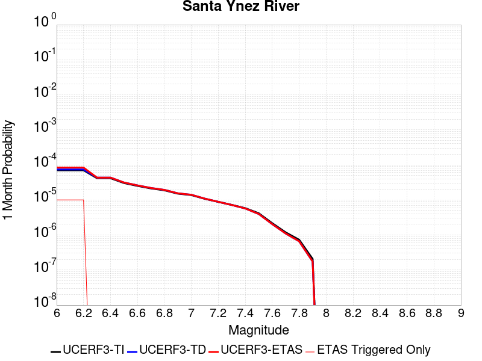 |  |  |

| Magnitude | 1 wk TI Prob | 1 wk TD Prob | 1 wk ETAS Prob | 1 wk ETAS/TD Gain | 1 wk ETAS Triggered Only | 1 mo TI Prob | 1 mo TD Prob | 1 mo ETAS Prob | 1 mo ETAS/TD Gain | 1 mo ETAS Triggered Only | 1 yr TI Prob | 1 yr TD Prob | 1 yr ETAS Prob | 1 yr ETAS/TD Gain | 1 yr ETAS Triggered Only | 10 yr TI Prob | 10 yr TD Prob | 10 yr ETAS Prob | 10 yr ETAS/TD Gain | 10 yr ETAS Triggered Only |
|-----|-----|-----|-----|-----|-----|-----|-----|-----|-----|-----|-----|-----|-----|-----|-----|-----|-----|-----|-----|-----|
| 6.0 | 1.6396456E-5 | 1.721034E-5 | 1.721034E-5 | 1.0 | 0.0 | 7.026863E-5 | 7.375671E-5 | 1.0142944E-4 | 1.3751892 | 2.7674767E-5 | 8.551848E-4 | 8.976536E-4 | 9.253035E-4 | 1.0308025 | 2.7674767E-5 | 0.0085190125 | 0.008943826 | 0.008971253 | 1.0030667 | 2.7674767E-5 |
| 6.1 | 1.6396456E-5 | 1.721034E-5 | 1.721034E-5 | 1.0 | 0.0 | 7.026863E-5 | 7.375671E-5 | 1.0142944E-4 | 1.3751892 | 2.7674767E-5 | 8.551848E-4 | 8.976536E-4 | 9.253035E-4 | 1.0308025 | 2.7674767E-5 | 0.0085190125 | 0.008943826 | 0.008971253 | 1.0030667 | 2.7674767E-5 |
| 6.2 | 1.6396456E-5 | 1.721034E-5 | 1.721034E-5 | 1.0 | 0.0 | 7.026863E-5 | 7.375671E-5 | 1.0142944E-4 | 1.3751892 | 2.7674767E-5 | 8.551848E-4 | 8.976536E-4 | 9.253035E-4 | 1.0308025 | 2.7674767E-5 | 0.0085190125 | 0.008943826 | 0.008971253 | 1.0030667 | 2.7674767E-5 |
| 6.3 | 9.736976E-6 | 1.012281E-5 | 1.012281E-5 | 1.0 | 0.0 | 4.172923E-5 | 4.3382777E-5 | 4.3382777E-5 | 1.0 | 0.0 | 5.0793495E-4 | 5.280623E-4 | 5.280623E-4 | 1.0 | 0.0 | 0.005067755 | 0.005268581 | 0.005268581 | 1.0 | 0.0 |
| 6.4 | 9.736976E-6 | 1.012281E-5 | 1.012281E-5 | 1.0 | 0.0 | 4.172923E-5 | 4.3382777E-5 | 4.3382777E-5 | 1.0 | 0.0 | 5.0793495E-4 | 5.280623E-4 | 5.280623E-4 | 1.0 | 0.0 | 0.005067755 | 0.005268581 | 0.005268581 | 1.0 | 0.0 |
| 6.5 | 7.081964E-6 | 7.3302417E-6 | 7.3302417E-6 | 1.0 | 0.0 | 3.035092E-5 | 3.141495E-5 | 3.141495E-5 | 1.0 | 0.0 | 3.694598E-4 | 3.824115E-4 | 3.824115E-4 | 1.0 | 0.0 | 0.0036884616 | 0.0038176961 | 0.0038176961 | 1.0 | 0.0 |
| 6.6 | 5.873247E-6 | 6.060028E-6 | 6.060028E-6 | 1.0 | 0.0 | 2.5170815E-5 | 2.5971296E-5 | 2.5971296E-5 | 1.0 | 0.0 | 3.064116E-4 | 3.161555E-4 | 3.161555E-4 | 1.0 | 0.0 | 0.0030598943 | 0.0031571446 | 0.0031571446 | 1.0 | 0.0 |
| 6.7 | 4.973277E-6 | 5.1161433E-6 | 5.1161433E-6 | 1.0 | 0.0 | 2.1313872E-5 | 2.1926147E-5 | 2.1926147E-5 | 1.0 | 0.0 | 2.5946548E-4 | 2.6691862E-4 | 2.6691862E-4 | 1.0 | 0.0 | 0.0025916274 | 0.0026660294 | 0.0026660294 | 1.0 | 0.0 |
| 6.8 | 4.396492E-6 | 4.511193E-6 | 4.511193E-6 | 1.0 | 0.0 | 1.884197E-5 | 1.9333542E-5 | 1.9333542E-5 | 1.0 | 0.0 | 2.2937685E-4 | 2.3536079E-4 | 2.3536079E-4 | 1.0 | 0.0 | 0.0022914023 | 0.0023511506 | 0.0023511506 | 1.0 | 0.0 |
| 6.9 | 3.5255632E-6 | 3.6015106E-6 | 3.6015106E-6 | 1.0 | 0.0 | 1.5109469E-5 | 1.5434955E-5 | 1.5434955E-5 | 1.0 | 0.0 | 1.8394225E-4 | 1.8790453E-4 | 1.8790453E-4 | 1.0 | 0.0 | 0.0018379007 | 0.0018774727 | 0.0018774727 | 1.0 | 0.0 |
| 7.0 | 3.211603E-6 | 3.273818E-6 | 3.273818E-6 | 1.0 | 0.0 | 1.376394E-5 | 1.4030575E-5 | 1.4030575E-5 | 1.0 | 0.0 | 1.6756308E-4 | 1.70809E-4 | 1.70809E-4 | 1.0 | 0.0 | 0.0016743679 | 0.0017067912 | 0.0017067912 | 1.0 | 0.0 |
| 7.1 | 2.5094619E-6 | 2.5410548E-6 | 2.5410548E-6 | 1.0 | 0.0 | 1.0754793E-5 | 1.08901895E-5 | 1.08901895E-5 | 1.0 | 0.0 | 1.3093173E-4 | 1.3258005E-4 | 1.3258005E-4 | 1.0 | 0.0 | 0.0013085462 | 0.0013250156 | 0.0013250156 | 1.0 | 0.0 |
| 7.2 | 2.0515774E-6 | 2.0620514E-6 | 2.0620514E-6 | 1.0 | 0.0 | 8.792445E-6 | 8.837334E-6 | 8.837334E-6 | 1.0 | 0.0 | 1.0704277E-4 | 1.07589265E-4 | 1.07589265E-4 | 1.0 | 0.0 | 0.0010699122 | 0.001075376 | 0.001075376 | 1.0 | 0.0 |
| 7.3 | 1.6845745E-6 | 1.6774874E-6 | 1.6774874E-6 | 1.0 | 0.0 | 7.219585E-6 | 7.1892123E-6 | 7.1892123E-6 | 1.0 | 0.0 | 8.78949E-5 | 8.752517E-5 | 8.752517E-5 | 1.0 | 0.0 | 8.7860145E-4 | 8.7490986E-4 | 8.7490986E-4 | 1.0 | 0.0 |
| 7.4 | 1.3600285E-6 | 1.3334133E-6 | 1.3334133E-6 | 1.0 | 0.0 | 5.82868E-6 | 5.714616E-6 | 5.714616E-6 | 1.0 | 0.0 | 7.096187E-5 | 6.9573245E-5 | 6.9573245E-5 | 1.0 | 0.0 | 7.0939213E-4 | 6.955169E-4 | 6.955169E-4 | 1.0 | 0.0 |
| 7.5 | 9.735342E-7 | 9.2906635E-7 | 9.2906635E-7 | 1.0 | 0.0 | 4.172283E-6 | 3.981707E-6 | 3.981707E-6 | 1.0 | 0.0 | 5.079636E-5 | 4.847622E-5 | 4.847622E-5 | 1.0 | 0.0 | 5.0784746E-4 | 4.8465817E-4 | 4.8465817E-4 | 1.0 | 0.0 |
| 7.6 | 5.067187E-7 | 4.7788274E-7 | 4.7788274E-7 | 1.0 | 0.0 | 2.1716498E-6 | 2.0480672E-6 | 2.0480672E-6 | 1.0 | 0.0 | 2.6439517E-5 | 2.4934941E-5 | 2.4934941E-5 | 1.0 | 0.0 | 2.643637E-4 | 2.4932218E-4 | 2.4932218E-4 | 1.0 | 0.0 |
| 7.7 | 2.769089E-7 | 2.576042E-7 | 2.576042E-7 | 1.0 | 0.0 | 1.1867519E-6 | 1.1040175E-6 | 1.1040175E-6 | 1.0 | 0.0 | 1.4448608E-5 | 1.344133E-5 | 1.344133E-5 | 1.0 | 0.0 | 1.444767E-4 | 1.3440521E-4 | 1.3440521E-4 | 1.0 | 0.0 |
| 7.8 | 1.7044663E-7 | 1.5449795E-7 | 1.5449795E-7 | 1.0 | 0.0 | 7.3048534E-7 | 6.621339E-7 | 6.621339E-7 | 1.0 | 0.0 | 8.893623E-6 | 8.061451E-6 | 8.061451E-6 | 1.0 | 0.0 | 8.893267E-5 | 8.06116E-5 | 8.06116E-5 | 1.0 | 0.0 |
| 7.9 | 4.8344287E-8 | 4.091312E-8 | 4.091312E-8 | 1.0 | 0.0 | 2.0718979E-7 | 1.7534192E-7 | 1.7534192E-7 | 1.0 | 0.0 | 2.5225327E-6 | 2.134786E-6 | 2.134786E-6 | 1.0 | 0.0 | 2.5225041E-5 | 2.1347658E-5 | 2.1347658E-5 | 1.0 | 0.0 |

## Rinconada 2011 CFM
*[(top)](#table-of-contents)*

| 1 Week | 1 Month | 1 Year | 10 Year |
|-----|-----|-----|-----|
|  | 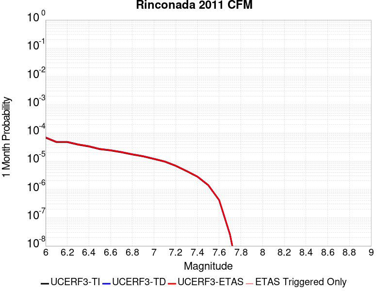 |  |  |

| Magnitude | 1 wk TI Prob | 1 wk TD Prob | 1 wk ETAS Prob | 1 wk ETAS/TD Gain | 1 wk ETAS Triggered Only | 1 mo TI Prob | 1 mo TD Prob | 1 mo ETAS Prob | 1 mo ETAS/TD Gain | 1 mo ETAS Triggered Only | 1 yr TI Prob | 1 yr TD Prob | 1 yr ETAS Prob | 1 yr ETAS/TD Gain | 1 yr ETAS Triggered Only | 10 yr TI Prob | 10 yr TD Prob | 10 yr ETAS Prob | 10 yr ETAS/TD Gain | 10 yr ETAS Triggered Only |
|-----|-----|-----|-----|-----|-----|-----|-----|-----|-----|-----|-----|-----|-----|-----|-----|-----|-----|-----|-----|-----|
| 6.0 | 1.5752368E-5 | 1.6275219E-5 | 1.6275219E-5 | 1.0 | 0.0 | 6.75084E-5 | 6.974909E-5 | 6.974909E-5 | 1.0 | 0.0 | 8.2160486E-4 | 8.4886746E-4 | 8.4886746E-4 | 1.0 | 0.0 | 0.008185739 | 0.008456631 | 0.008484071 | 1.0032449 | 2.7674767E-5 |
| 6.1 | 1.0966133E-5 | 1.1323374E-5 | 1.1323374E-5 | 1.0 | 0.0 | 4.6996865E-5 | 4.8527843E-5 | 4.8527843E-5 | 1.0 | 0.0 | 5.720366E-4 | 5.9066707E-4 | 5.9066707E-4 | 1.0 | 0.0 | 0.0057056635 | 0.0058910674 | 0.005918579 | 1.00467 | 2.7674767E-5 |
| 6.2 | 1.0966133E-5 | 1.1323374E-5 | 1.1323374E-5 | 1.0 | 0.0 | 4.6996865E-5 | 4.8527843E-5 | 4.8527843E-5 | 1.0 | 0.0 | 5.720366E-4 | 5.9066707E-4 | 5.9066707E-4 | 1.0 | 0.0 | 0.0057056635 | 0.0058910674 | 0.005918579 | 1.00467 | 2.7674767E-5 |
| 6.3 | 8.926149E-6 | 9.2130485E-6 | 9.2130485E-6 | 1.0 | 0.0 | 3.8254362E-5 | 3.9483897E-5 | 3.9483897E-5 | 1.0 | 0.0 | 4.6564735E-4 | 4.8061073E-4 | 4.8061073E-4 | 1.0 | 0.0 | 0.0046467283 | 0.004795758 | 0.0048233005 | 1.005743 | 2.7674767E-5 |
| 6.4 | 7.676955E-6 | 7.9204265E-6 | 7.9204265E-6 | 1.0 | 0.0 | 3.290082E-5 | 3.394424E-5 | 3.394424E-5 | 1.0 | 0.0 | 4.0049385E-4 | 4.1319296E-4 | 4.1319296E-4 | 1.0 | 0.0 | 0.0039977287 | 0.0041242735 | 0.004151834 | 1.0066825 | 2.7674767E-5 |
| 6.5 | 6.1671026E-6 | 6.3591406E-6 | 6.3591406E-6 | 1.0 | 0.0 | 2.6430173E-5 | 2.7253176E-5 | 2.7253176E-5 | 1.0 | 0.0 | 3.2173982E-4 | 3.3175698E-4 | 3.3175698E-4 | 1.0 | 0.0 | 0.003212744 | 0.0033126292 | 0.0033402122 | 1.0083266 | 2.7674767E-5 |
| 6.6 | 5.553456E-6 | 5.7249786E-6 | 5.7249786E-6 | 1.0 | 0.0 | 2.3800309E-5 | 2.4535393E-5 | 2.4535393E-5 | 1.0 | 0.0 | 2.897302E-4 | 2.986775E-4 | 2.986775E-4 | 1.0 | 0.0 | 0.0028935277 | 0.0029827696 | 0.0030103617 | 1.0092505 | 2.7674767E-5 |
| 6.7 | 4.787857E-6 | 4.933451E-6 | 4.933451E-6 | 1.0 | 0.0 | 2.0519226E-5 | 2.1143189E-5 | 2.1143189E-5 | 1.0 | 0.0 | 2.4979294E-4 | 2.5738796E-4 | 2.5738796E-4 | 1.0 | 0.0 | 0.0024951235 | 0.0025709043 | 0.002598508 | 1.010737 | 2.7674767E-5 |
| 6.8 | 3.9955166E-6 | 4.113591E-6 | 4.113591E-6 | 1.0 | 0.0 | 1.7123532E-5 | 1.7629556E-5 | 1.7629556E-5 | 1.0 | 0.0 | 2.0845905E-4 | 2.1461873E-4 | 2.1461873E-4 | 1.0 | 0.0 | 0.002082636 | 0.0021441183 | 0.0021717336 | 1.0128796 | 2.7674767E-5 |
| 6.9 | 3.4250072E-6 | 3.5225414E-6 | 3.5225414E-6 | 1.0 | 0.0 | 1.46785205E-5 | 1.5096518E-5 | 1.5096518E-5 | 1.0 | 0.0 | 1.7869633E-4 | 1.8378462E-4 | 1.8378462E-4 | 1.0 | 0.0 | 0.001785527 | 0.0018363289 | 0.0018639528 | 1.015043 | 2.7674767E-5 |
| 7.0 | 2.7712713E-6 | 2.8467737E-6 | 2.8467737E-6 | 1.0 | 0.0 | 1.1876823E-5 | 1.2200402E-5 | 1.2200402E-5 | 1.0 | 0.0 | 1.4459073E-4 | 1.4852978E-4 | 1.4852978E-4 | 1.0 | 0.0 | 0.0014449668 | 0.0014843066 | 0.0014843066 | 1.0 | 0.0 |
| 7.1 | 2.227358E-6 | 2.285756E-6 | 2.285756E-6 | 1.0 | 0.0 | 9.545785E-6 | 9.79606E-6 | 9.79606E-6 | 1.0 | 0.0 | 1.16213734E-4 | 1.1926051E-4 | 1.1926051E-4 | 1.0 | 0.0 | 0.0011615298 | 0.0011919661 | 0.0011919661 | 1.0 | 0.0 |
| 7.2 | 1.581796E-6 | 1.6209401E-6 | 1.6209401E-6 | 1.0 | 0.0 | 6.779108E-6 | 6.946868E-6 | 6.946868E-6 | 1.0 | 0.0 | 8.253252E-5 | 8.457484E-5 | 8.457484E-5 | 1.0 | 0.0 | 8.250187E-4 | 8.4542704E-4 | 8.4542704E-4 | 1.0 | 0.0 |
| 7.3 | 1.0306567E-6 | 1.0546722E-6 | 1.0546722E-6 | 1.0 | 0.0 | 4.4170924E-6 | 4.520016E-6 | 4.520016E-6 | 1.0 | 0.0 | 5.3776774E-5 | 5.5029803E-5 | 5.5029803E-5 | 1.0 | 0.0 | 5.376376E-4 | 5.5016205E-4 | 5.5016205E-4 | 1.0 | 0.0 |
| 7.4 | 6.535541E-7 | 6.6828983E-7 | 6.6828983E-7 | 1.0 | 0.0 | 2.800943E-6 | 2.8640961E-6 | 2.8640961E-6 | 1.0 | 0.0 | 3.4100947E-5 | 3.4869812E-5 | 3.4869812E-5 | 1.0 | 0.0 | 3.4095717E-4 | 3.4864355E-4 | 3.4864355E-4 | 1.0 | 0.0 |
| 7.5 | 3.2656962E-7 | 3.3317477E-7 | 3.3317477E-7 | 1.0 | 0.0 | 1.3995833E-6 | 1.4278911E-6 | 1.4278911E-6 | 1.0 | 0.0 | 1.7039794E-5 | 1.7384436E-5 | 1.7384436E-5 | 1.0 | 0.0 | 1.7038487E-4 | 1.7383079E-4 | 1.7383079E-4 | 1.0 | 0.0 |
| 7.6 | 9.754343E-8 | 9.8212155E-8 | 9.8212155E-8 | 1.0 | 0.0 | 4.180432E-7 | 4.2090915E-7 | 4.2090915E-7 | 1.0 | 0.0 | 5.089664E-6 | 5.124557E-6 | 5.124557E-6 | 1.0 | 0.0 | 5.0895473E-5 | 5.1244395E-5 | 5.1244395E-5 | 1.0 | 0.0 |
| 7.7 | 6.0001453E-9 | 5.849224E-9 | 5.849224E-9 | 1.0 | 0.0 | 2.5714908E-8 | 2.5068102E-8 | 2.5068102E-8 | 1.0 | 0.0 | 3.1307894E-7 | 3.052041E-7 | 3.052041E-7 | 1.0 | 0.0 | 3.1307852E-6 | 3.052037E-6 | 3.052037E-6 | 1.0 | 0.0 |
| 7.8 | 7.400003E-11 | 7.465506E-11 | 7.465506E-11 | 1.0 | 0.0 | 3.171432E-10 | 3.199503E-10 | 3.199503E-10 | 1.0 | 0.0 | 3.861218E-9 | 3.895395E-9 | 3.895395E-9 | 1.0 | 0.0 | 3.861218E-8 | 3.895395E-8 | 3.895395E-8 | 1.0 | 0.0 |

## Earthquake Valley
*[(top)](#table-of-contents)*

| 1 Week | 1 Month | 1 Year | 10 Year |
|-----|-----|-----|-----|
|  |  |  |  |

| Magnitude | 1 wk TI Prob | 1 wk TD Prob | 1 wk ETAS Prob | 1 wk ETAS/TD Gain | 1 wk ETAS Triggered Only | 1 mo TI Prob | 1 mo TD Prob | 1 mo ETAS Prob | 1 mo ETAS/TD Gain | 1 mo ETAS Triggered Only | 1 yr TI Prob | 1 yr TD Prob | 1 yr ETAS Prob | 1 yr ETAS/TD Gain | 1 yr ETAS Triggered Only | 10 yr TI Prob | 10 yr TD Prob | 10 yr ETAS Prob | 10 yr ETAS/TD Gain | 10 yr ETAS Triggered Only |
|-----|-----|-----|-----|-----|-----|-----|-----|-----|-----|-----|-----|-----|-----|-----|-----|-----|-----|-----|-----|-----|
| 6.0 | 1.9416384E-5 | 2.2587592E-5 | 2.2587592E-5 | 1.0 | 0.0 | 8.321042E-5 | 9.680105E-5 | 9.680105E-5 | 1.0 | 0.0 | 0.001012616 | 0.0011780359 | 0.001205678 | 1.0234647 | 2.7674767E-5 | 0.010080142 | 0.011729757 | 0.011757107 | 1.0023317 | 2.7674767E-5 |
| 6.1 | 1.9416384E-5 | 2.2587592E-5 | 2.2587592E-5 | 1.0 | 0.0 | 8.321042E-5 | 9.680105E-5 | 9.680105E-5 | 1.0 | 0.0 | 0.001012616 | 0.0011780359 | 0.001205678 | 1.0234647 | 2.7674767E-5 | 0.010080142 | 0.011729757 | 0.011757107 | 1.0023317 | 2.7674767E-5 |
| 6.2 | 1.9416384E-5 | 2.2587592E-5 | 2.2587592E-5 | 1.0 | 0.0 | 8.321042E-5 | 9.680105E-5 | 9.680105E-5 | 1.0 | 0.0 | 0.001012616 | 0.0011780359 | 0.001205678 | 1.0234647 | 2.7674767E-5 | 0.010080142 | 0.011729757 | 0.011757107 | 1.0023317 | 2.7674767E-5 |
| 6.3 | 1.9416384E-5 | 2.2587592E-5 | 2.2587592E-5 | 1.0 | 0.0 | 8.321042E-5 | 9.680105E-5 | 9.680105E-5 | 1.0 | 0.0 | 0.001012616 | 0.0011780359 | 0.001205678 | 1.0234647 | 2.7674767E-5 | 0.010080142 | 0.011729757 | 0.011757107 | 1.0023317 | 2.7674767E-5 |
| 6.4 | 1.9416384E-5 | 2.2587592E-5 | 2.2587592E-5 | 1.0 | 0.0 | 8.321042E-5 | 9.680105E-5 | 9.680105E-5 | 1.0 | 0.0 | 0.001012616 | 0.0011780359 | 0.001205678 | 1.0234647 | 2.7674767E-5 | 0.010080142 | 0.011729757 | 0.011757107 | 1.0023317 | 2.7674767E-5 |
| 6.5 | 1.9389157E-5 | 2.2556176E-5 | 2.2556176E-5 | 1.0 | 0.0 | 8.309374E-5 | 9.666642E-5 | 9.666642E-5 | 1.0 | 0.0 | 0.0010111968 | 0.0011763985 | 0.0012040407 | 1.0234973 | 2.7674767E-5 | 0.010066078 | 0.011713557 | 0.011740907 | 1.002335 | 2.7674767E-5 |
| 6.6 | 1.9389157E-5 | 2.2556176E-5 | 2.2556176E-5 | 1.0 | 0.0 | 8.309374E-5 | 9.666642E-5 | 9.666642E-5 | 1.0 | 0.0 | 0.0010111968 | 0.0011763985 | 0.0012040407 | 1.0234973 | 2.7674767E-5 | 0.010066078 | 0.011713557 | 0.011740907 | 1.002335 | 2.7674767E-5 |
| 6.7 | 1.4925434E-5 | 1.7210756E-5 | 1.7210756E-5 | 1.0 | 0.0 | 6.396457E-5 | 7.3758776E-5 | 7.3758776E-5 | 1.0 | 0.0 | 7.7849044E-4 | 8.977282E-4 | 8.977282E-4 | 1.0 | 0.0 | 0.007757689 | 0.008949395 | 0.008949395 | 1.0 | 0.0 |
| 6.8 | 1.3570335E-5 | 1.5619114E-5 | 1.5619114E-5 | 1.0 | 0.0 | 5.8157282E-5 | 6.6937806E-5 | 6.6937806E-5 | 1.0 | 0.0 | 7.0783484E-4 | 8.1474514E-4 | 8.1474514E-4 | 1.0 | 0.0 | 0.0070558446 | 0.008125654 | 0.008125654 | 1.0 | 0.0 |
| 6.9 | 1.3570335E-5 | 1.5619114E-5 | 1.5619114E-5 | 1.0 | 0.0 | 5.8157282E-5 | 6.6937806E-5 | 6.6937806E-5 | 1.0 | 0.0 | 7.0783484E-4 | 8.1474514E-4 | 8.1474514E-4 | 1.0 | 0.0 | 0.0070558446 | 0.008125654 | 0.008125654 | 1.0 | 0.0 |
| 7.0 | 1.3433392E-5 | 1.5462638E-5 | 1.5462638E-5 | 1.0 | 0.0 | 5.757041E-5 | 6.6267225E-5 | 6.6267225E-5 | 1.0 | 0.0 | 7.0069433E-4 | 8.065869E-4 | 8.065869E-4 | 1.0 | 0.0 | 0.006984891 | 0.008044664 | 0.008044664 | 1.0 | 0.0 |
| 7.1 | 8.181609E-6 | 9.418255E-6 | 9.418255E-6 | 1.0 | 0.0 | 3.5063567E-5 | 4.0363702E-5 | 4.0363702E-5 | 1.0 | 0.0 | 4.268153E-4 | 4.9138436E-4 | 4.9138436E-4 | 1.0 | 0.0 | 0.0042599645 | 0.004909557 | 0.004909557 | 1.0 | 0.0 |
| 7.2 | 2.0663983E-7 | 1.7266771E-7 | 1.7266771E-7 | 1.0 | 0.0 | 8.855989E-7 | 7.400043E-7 | 7.400043E-7 | 1.0 | 0.0 | 1.0782113E-5 | 9.009518E-6 | 9.009518E-6 | 1.0 | 0.0 | 1.07815904E-4 | 9.009189E-5 | 9.009189E-5 | 1.0 | 0.0 |
| 7.3 | 2.0462376E-7 | 1.7082242E-7 | 1.7082242E-7 | 1.0 | 0.0 | 8.7695867E-7 | 7.320959E-7 | 7.320959E-7 | 1.0 | 0.0 | 1.0676919E-5 | 8.9132345E-6 | 8.9132345E-6 | 1.0 | 0.0 | 1.0676406E-4 | 8.912913E-5 | 8.912913E-5 | 1.0 | 0.0 |
| 7.4 | 2.0171088E-7 | 1.6864676E-7 | 1.6864676E-7 | 1.0 | 0.0 | 8.644749E-7 | 7.227717E-7 | 7.227717E-7 | 1.0 | 0.0 | 1.0524931E-5 | 8.799713E-6 | 8.799713E-6 | 1.0 | 0.0 | 1.05244326E-4 | 8.7994005E-5 | 8.7994005E-5 | 1.0 | 0.0 |
| 7.5 | 1.4847944E-7 | 1.256233E-7 | 1.256233E-7 | 1.0 | 0.0 | 6.363403E-7 | 5.3838545E-7 | 5.3838545E-7 | 1.0 | 0.0 | 7.747416E-6 | 6.5548256E-6 | 6.5548256E-6 | 1.0 | 0.0 | 7.747146E-5 | 6.554654E-5 | 6.554654E-5 | 1.0 | 0.0 |
| 7.6 | 1.3185847E-7 | 1.11259844E-7 | 1.11259844E-7 | 1.0 | 0.0 | 5.6510765E-7 | 4.7682784E-7 | 4.7682784E-7 | 1.0 | 0.0 | 6.8801637E-6 | 5.8053656E-6 | 5.8053656E-6 | 1.0 | 0.0 | 6.8799505E-5 | 5.8052352E-5 | 5.8052352E-5 | 1.0 | 0.0 |
| 7.7 | 2.8609954E-8 | 1.4175916E-8 | 1.4175916E-8 | 1.0 | 0.0 | 1.2261408E-7 | 6.0753926E-8 | 6.0753926E-8 | 1.0 | 0.0 | 1.4928254E-6 | 7.3967885E-7 | 7.3967885E-7 | 1.0 | 0.0 | 1.4928154E-5 | 7.3967694E-6 | 7.3967694E-6 | 1.0 | 0.0 |
| 7.8 | 6.527266E-9 | 2.9243843E-9 | 2.9243843E-9 | 1.0 | 0.0 | 2.7973995E-8 | 1.2533076E-8 | 1.2533076E-8 | 1.0 | 0.0 | 3.4058334E-7 | 1.5259019E-7 | 1.5259019E-7 | 1.0 | 0.0 | 3.4058282E-6 | 1.5259011E-6 | 1.5259011E-6 | 1.0 | 0.0 |
| 7.9 | 1.2898267E-9 | 7.1293726E-10 | 7.1293726E-10 | 1.0 | 0.0 | 5.527829E-9 | 3.0554452E-9 | 3.0554452E-9 | 1.0 | 0.0 | 6.7301315E-8 | 3.7200046E-8 | 3.7200046E-8 | 1.0 | 0.0 | 6.7301295E-7 | 3.7200047E-7 | 3.7200047E-7 | 1.0 | 0.0 |

## San Gabriel
*[(top)](#table-of-contents)*

| 1 Week | 1 Month | 1 Year | 10 Year |
|-----|-----|-----|-----|
|  | 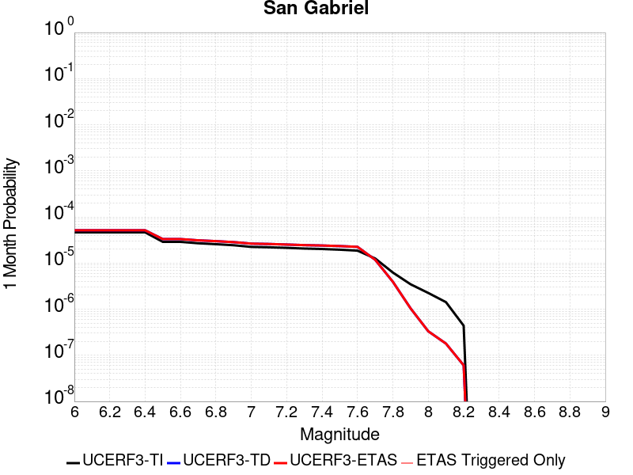 |  | 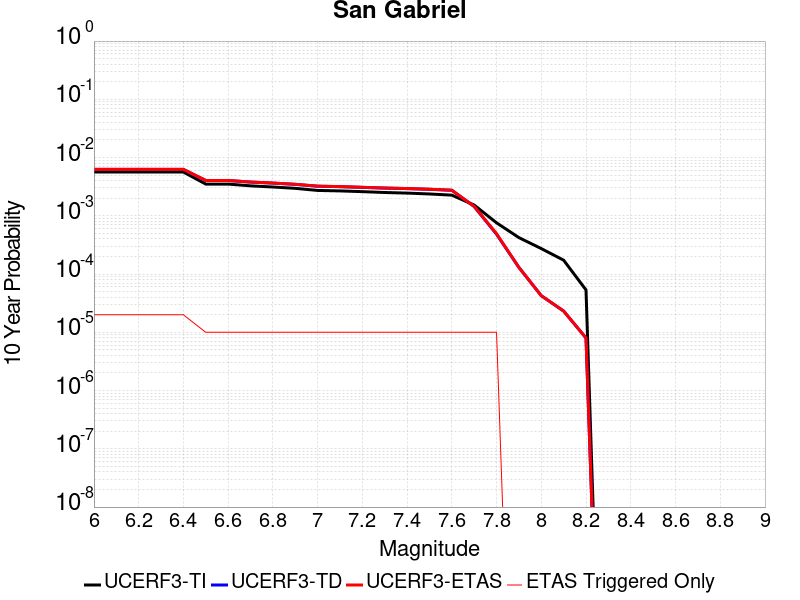 |

| Magnitude | 1 wk TI Prob | 1 wk TD Prob | 1 wk ETAS Prob | 1 wk ETAS/TD Gain | 1 wk ETAS Triggered Only | 1 mo TI Prob | 1 mo TD Prob | 1 mo ETAS Prob | 1 mo ETAS/TD Gain | 1 mo ETAS Triggered Only | 1 yr TI Prob | 1 yr TD Prob | 1 yr ETAS Prob | 1 yr ETAS/TD Gain | 1 yr ETAS Triggered Only | 10 yr TI Prob | 10 yr TD Prob | 10 yr ETAS Prob | 10 yr ETAS/TD Gain | 10 yr ETAS Triggered Only |
|-----|-----|-----|-----|-----|-----|-----|-----|-----|-----|-----|-----|-----|-----|-----|-----|-----|-----|-----|-----|-----|
| 6.0 | 1.083775E-5 | 1.2000172E-5 | 1.2000172E-5 | 1.0 | 0.0 | 4.6446676E-5 | 5.142836E-5 | 5.142836E-5 | 1.0 | 0.0 | 5.653415E-4 | 6.2597176E-4 | 6.2597176E-4 | 1.0 | 0.0 | 0.0056390543 | 0.006254164 | 0.006281666 | 1.0043974 | 2.7674767E-5 |
| 6.1 | 1.083775E-5 | 1.2000172E-5 | 1.2000172E-5 | 1.0 | 0.0 | 4.6446676E-5 | 5.142836E-5 | 5.142836E-5 | 1.0 | 0.0 | 5.653415E-4 | 6.2597176E-4 | 6.2597176E-4 | 1.0 | 0.0 | 0.0056390543 | 0.006254164 | 0.006281666 | 1.0043974 | 2.7674767E-5 |
| 6.2 | 1.083775E-5 | 1.2000172E-5 | 1.2000172E-5 | 1.0 | 0.0 | 4.6446676E-5 | 5.142836E-5 | 5.142836E-5 | 1.0 | 0.0 | 5.653415E-4 | 6.2597176E-4 | 6.2597176E-4 | 1.0 | 0.0 | 0.0056390543 | 0.006254164 | 0.006281666 | 1.0043974 | 2.7674767E-5 |
| 6.3 | 1.083775E-5 | 1.2000172E-5 | 1.2000172E-5 | 1.0 | 0.0 | 4.6446676E-5 | 5.142836E-5 | 5.142836E-5 | 1.0 | 0.0 | 5.653415E-4 | 6.2597176E-4 | 6.2597176E-4 | 1.0 | 0.0 | 0.0056390543 | 0.006254164 | 0.006281666 | 1.0043974 | 2.7674767E-5 |
| 6.4 | 1.083775E-5 | 1.2000172E-5 | 1.2000172E-5 | 1.0 | 0.0 | 4.6446676E-5 | 5.142836E-5 | 5.142836E-5 | 1.0 | 0.0 | 5.653415E-4 | 6.2597176E-4 | 6.2597176E-4 | 1.0 | 0.0 | 0.0056390543 | 0.006254164 | 0.006281666 | 1.0043974 | 2.7674767E-5 |
| 6.5 | 6.7317824E-6 | 7.731773E-6 | 7.731773E-6 | 1.0 | 0.0 | 2.8850178E-5 | 3.3135755E-5 | 3.3135755E-5 | 1.0 | 0.0 | 3.511943E-4 | 4.033542E-4 | 4.033542E-4 | 1.0 | 0.0 | 0.003506398 | 0.0040373006 | 0.0040373006 | 1.0 | 0.0 |
| 6.6 | 6.7317824E-6 | 7.731773E-6 | 7.731773E-6 | 1.0 | 0.0 | 2.8850178E-5 | 3.3135755E-5 | 3.3135755E-5 | 1.0 | 0.0 | 3.511943E-4 | 4.033542E-4 | 4.033542E-4 | 1.0 | 0.0 | 0.003506398 | 0.0040373006 | 0.0040373006 | 1.0 | 0.0 |
| 6.7 | 6.274881E-6 | 7.26068E-6 | 7.26068E-6 | 1.0 | 0.0 | 2.6892068E-5 | 3.1116833E-5 | 3.1116833E-5 | 1.0 | 0.0 | 3.2736175E-4 | 3.7878254E-4 | 3.7878254E-4 | 1.0 | 0.0 | 0.0032687993 | 0.0037924421 | 0.0037924421 | 1.0 | 0.0 |
| 6.8 | 5.996209E-6 | 6.9733915E-6 | 6.9733915E-6 | 1.0 | 0.0 | 2.5697784E-5 | 2.9885627E-5 | 2.9885627E-5 | 1.0 | 0.0 | 3.128256E-4 | 3.637977E-4 | 3.637977E-4 | 1.0 | 0.0 | 0.003123856 | 0.0036430918 | 0.0036430918 | 1.0 | 0.0 |
| 6.9 | 5.686331E-6 | 6.6383795E-6 | 6.6383795E-6 | 1.0 | 0.0 | 2.4369761E-5 | 2.8449893E-5 | 2.8449893E-5 | 1.0 | 0.0 | 2.9666146E-4 | 3.463233E-4 | 3.463233E-4 | 1.0 | 0.0 | 0.0029626573 | 0.0034689046 | 0.0034689046 | 1.0 | 0.0 |
| 7.0 | 5.2329838E-6 | 6.1622245E-6 | 6.1622245E-6 | 1.0 | 0.0 | 2.242688E-5 | 2.640927E-5 | 2.640927E-5 | 1.0 | 0.0 | 2.7301308E-4 | 3.214862E-4 | 3.214862E-4 | 1.0 | 0.0 | 0.002726779 | 0.0032212678 | 0.0032212678 | 1.0 | 0.0 |
| 7.1 | 5.135671E-6 | 6.052312E-6 | 6.052312E-6 | 1.0 | 0.0 | 2.2009834E-5 | 2.5938225E-5 | 2.5938225E-5 | 1.0 | 0.0 | 2.6793676E-4 | 3.157529E-4 | 3.157529E-4 | 1.0 | 0.0 | 0.0026761394 | 0.0031640995 | 0.0031640995 | 1.0 | 0.0 |
| 7.2 | 4.989062E-6 | 5.885626E-6 | 5.885626E-6 | 1.0 | 0.0 | 2.1381518E-5 | 2.522387E-5 | 2.522387E-5 | 1.0 | 0.0 | 2.6028889E-4 | 3.070581E-4 | 3.070581E-4 | 1.0 | 0.0 | 0.0025998424 | 0.003077395 | 0.003077395 | 1.0 | 0.0 |
| 7.3 | 4.8219395E-6 | 5.717121E-6 | 5.717121E-6 | 1.0 | 0.0 | 2.0665291E-5 | 2.450172E-5 | 2.450172E-5 | 1.0 | 0.0 | 2.5157086E-4 | 2.9826837E-4 | 2.9826837E-4 | 1.0 | 0.0 | 0.0025128627 | 0.0029897375 | 0.0029897375 | 1.0 | 0.0 |
| 7.4 | 4.7118383E-6 | 5.605626E-6 | 5.605626E-6 | 1.0 | 0.0 | 2.0193436E-5 | 2.4023895E-5 | 2.4023895E-5 | 1.0 | 0.0 | 2.4582737E-4 | 2.924524E-4 | 2.924524E-4 | 1.0 | 0.0 | 0.002455556 | 0.0029317315 | 0.0029317315 | 1.0 | 0.0 |
| 7.5 | 4.5506545E-6 | 5.450921E-6 | 5.450921E-6 | 1.0 | 0.0 | 1.9502659E-5 | 2.3360884E-5 | 2.3360884E-5 | 1.0 | 0.0 | 2.37419E-4 | 2.843824E-4 | 2.843824E-4 | 1.0 | 0.0 | 0.002371655 | 0.00285124 | 0.00285124 | 1.0 | 0.0 |
| 7.6 | 4.343636E-6 | 5.2436794E-6 | 5.2436794E-6 | 1.0 | 0.0 | 1.861545E-5 | 2.2472723E-5 | 2.2472723E-5 | 1.0 | 0.0 | 2.2661954E-4 | 2.7357182E-4 | 2.7357182E-4 | 1.0 | 0.0 | 0.0022638857 | 0.0027433971 | 0.0027433971 | 1.0 | 0.0 |
| 7.7 | 2.936235E-6 | 2.7536796E-6 | 2.7536796E-6 | 1.0 | 0.0 | 1.2583803E-5 | 1.180143E-5 | 1.180143E-5 | 1.0 | 0.0 | 1.5319703E-4 | 1.4367298E-4 | 1.4367298E-4 | 1.0 | 0.0 | 0.0015309147 | 0.0014431232 | 0.0014431232 | 1.0 | 0.0 |
| 7.8 | 1.4541639E-6 | 9.162697E-7 | 9.162697E-7 | 1.0 | 0.0 | 6.232116E-6 | 3.926864E-6 | 3.926864E-6 | 1.0 | 0.0 | 7.587337E-5 | 4.7808524E-5 | 4.7808524E-5 | 1.0 | 0.0 | 7.584747E-4 | 4.8291517E-4 | 4.8291517E-4 | 1.0 | 0.0 |
| 7.9 | 8.098958E-7 | 2.4327238E-7 | 2.4327238E-7 | 1.0 | 0.0 | 3.4709774E-6 | 1.0425954E-6 | 1.0425954E-6 | 1.0 | 0.0 | 4.225833E-5 | 1.2693526E-5 | 1.2693526E-5 | 1.0 | 0.0 | 4.2250296E-4 | 1.300362E-4 | 1.300362E-4 | 1.0 | 0.0 |
| 8.0 | 5.2473234E-7 | 7.749677E-8 | 7.749677E-8 | 1.0 | 0.0 | 2.248851E-6 | 3.3212896E-7 | 3.3212896E-7 | 1.0 | 0.0 | 2.7379416E-5 | 4.0436626E-6 | 4.0436626E-6 | 1.0 | 0.0 | 2.7376044E-4 | 4.2577678E-5 | 4.2577678E-5 | 1.0 | 0.0 |
| 8.1 | 3.3162388E-7 | 4.188853E-8 | 4.188853E-8 | 1.0 | 0.0 | 1.4212444E-6 | 1.7952226E-7 | 1.7952226E-7 | 1.0 | 0.0 | 1.7303513E-5 | 2.1856813E-6 | 2.1856813E-6 | 1.0 | 0.0 | 1.7302166E-4 | 2.3181034E-5 | 2.3181034E-5 | 1.0 | 0.0 |
| 8.2 | 1.0235345E-7 | 1.4167647E-8 | 1.4167647E-8 | 1.0 | 0.0 | 4.3865757E-7 | 6.0718484E-8 | 6.0718484E-8 | 1.0 | 0.0 | 5.340643E-6 | 7.3924735E-7 | 7.3924735E-7 | 1.0 | 0.0 | 5.3405143E-5 | 7.996221E-6 | 7.996221E-6 | 1.0 | 0.0 |

## Whittier alt 1
*[(top)](#table-of-contents)*

| 1 Week | 1 Month | 1 Year | 10 Year |
|-----|-----|-----|-----|
|  |  |  |  |

| Magnitude | 1 wk TI Prob | 1 wk TD Prob | 1 wk ETAS Prob | 1 wk ETAS/TD Gain | 1 wk ETAS Triggered Only | 1 mo TI Prob | 1 mo TD Prob | 1 mo ETAS Prob | 1 mo ETAS/TD Gain | 1 mo ETAS Triggered Only | 1 yr TI Prob | 1 yr TD Prob | 1 yr ETAS Prob | 1 yr ETAS/TD Gain | 1 yr ETAS Triggered Only | 10 yr TI Prob | 10 yr TD Prob | 10 yr ETAS Prob | 10 yr ETAS/TD Gain | 10 yr ETAS Triggered Only |
|-----|-----|-----|-----|-----|-----|-----|-----|-----|-----|-----|-----|-----|-----|-----|-----|-----|-----|-----|-----|-----|
| 6.0 | 4.2554693E-5 | 4.7260703E-5 | 4.7260703E-5 | 1.0 | 0.0 | 1.8236451E-4 | 2.0253197E-4 | 2.0253197E-4 | 1.0 | 0.0 | 0.002218027 | 0.0024633587 | 0.0024633587 | 1.0 | 0.0 | 0.02196019 | 0.024394577 | 0.024421578 | 1.0011067 | 2.7674767E-5 |
| 6.1 | 4.2554693E-5 | 4.7260703E-5 | 4.7260703E-5 | 1.0 | 0.0 | 1.8236451E-4 | 2.0253197E-4 | 2.0253197E-4 | 1.0 | 0.0 | 0.002218027 | 0.0024633587 | 0.0024633587 | 1.0 | 0.0 | 0.02196019 | 0.024394577 | 0.024421578 | 1.0011067 | 2.7674767E-5 |
| 6.2 | 4.2554693E-5 | 4.7260703E-5 | 4.7260703E-5 | 1.0 | 0.0 | 1.8236451E-4 | 2.0253197E-4 | 2.0253197E-4 | 1.0 | 0.0 | 0.002218027 | 0.0024633587 | 0.0024633587 | 1.0 | 0.0 | 0.02196019 | 0.024394577 | 0.024421578 | 1.0011067 | 2.7674767E-5 |
| 6.3 | 1.9617712E-5 | 1.8273182E-5 | 1.8273182E-5 | 1.0 | 0.0 | 8.40732E-5 | 7.8311394E-5 | 7.8311394E-5 | 1.0 | 0.0 | 0.0010231105 | 9.530432E-4 | 9.530432E-4 | 1.0 | 0.0 | 0.01018413 | 0.009492843 | 0.009492843 | 1.0 | 0.0 |
| 6.4 | 1.5611336E-5 | 1.3608165E-5 | 1.3608165E-5 | 1.0 | 0.0 | 6.690401E-5 | 5.831944E-5 | 5.831944E-5 | 1.0 | 0.0 | 8.142519E-4 | 7.0981384E-4 | 7.0981384E-4 | 1.0 | 0.0 | 0.008112748 | 0.007077429 | 0.007077429 | 1.0 | 0.0 |
| 6.5 | 1.5150166E-5 | 1.31047755E-5 | 1.31047755E-5 | 1.0 | 0.0 | 6.492767E-5 | 5.616215E-5 | 5.616215E-5 | 1.0 | 0.0 | 7.9020765E-4 | 6.835655E-4 | 6.835655E-4 | 1.0 | 0.0 | 0.007874036 | 0.0068165762 | 0.0068165762 | 1.0 | 0.0 |
| 6.6 | 1.295588E-5 | 1.0383929E-5 | 1.0383929E-5 | 1.0 | 0.0 | 5.552402E-5 | 4.450181E-5 | 4.450181E-5 | 1.0 | 0.0 | 6.7579525E-4 | 5.4167677E-4 | 5.4167677E-4 | 1.0 | 0.0 | 0.006737438 | 0.0054049976 | 0.0054049976 | 1.0 | 0.0 |
| 6.7 | 1.2542085E-5 | 9.902496E-6 | 9.902496E-6 | 1.0 | 0.0 | 5.3750682E-5 | 4.2438587E-5 | 4.2438587E-5 | 1.0 | 0.0 | 6.542181E-4 | 5.165692E-4 | 5.165692E-4 | 1.0 | 0.0 | 0.006522954 | 0.005155102 | 0.005155102 | 1.0 | 0.0 |
| 6.8 | 1.2195878E-5 | 9.498438E-6 | 9.498438E-6 | 1.0 | 0.0 | 5.2267E-5 | 4.0706967E-5 | 4.0706967E-5 | 1.0 | 0.0 | 6.36165E-4 | 4.954965E-4 | 4.954965E-4 | 1.0 | 0.0 | 0.0063434686 | 0.004945258 | 0.004945258 | 1.0 | 0.0 |
| 6.9 | 1.1580298E-5 | 8.775757E-6 | 8.775757E-6 | 1.0 | 0.0 | 4.9628903E-5 | 3.7609854E-5 | 3.7609854E-5 | 1.0 | 0.0 | 6.040644E-4 | 4.578054E-4 | 4.578054E-4 | 1.0 | 0.0 | 0.00602425 | 0.0045698825 | 0.0045698825 | 1.0 | 0.0 |
| 7.0 | 1.0964795E-5 | 8.086678E-6 | 8.086678E-6 | 1.0 | 0.0 | 4.6991136E-5 | 3.4656736E-5 | 3.4656736E-5 | 1.0 | 0.0 | 5.7196687E-4 | 4.218656E-4 | 4.218656E-4 | 1.0 | 0.0 | 0.0057049696 | 0.004211856 | 0.004211856 | 1.0 | 0.0 |
| 7.1 | 1.0230601E-5 | 7.329039E-6 | 7.329039E-6 | 1.0 | 0.0 | 4.3844695E-5 | 3.1409796E-5 | 3.1409796E-5 | 1.0 | 0.0 | 5.336784E-4 | 3.8234846E-4 | 3.8234846E-4 | 1.0 | 0.0 | 0.005323986 | 0.0038180696 | 0.0038180696 | 1.0 | 0.0 |
| 7.2 | 9.40865E-6 | 6.545452E-6 | 6.545452E-6 | 1.0 | 0.0 | 4.032216E-5 | 2.8051643E-5 | 2.8051643E-5 | 1.0 | 0.0 | 4.908117E-4 | 3.4147644E-4 | 3.4147644E-4 | 1.0 | 0.0 | 0.0048972913 | 0.00341061 | 0.00341061 | 1.0 | 0.0 |
| 7.3 | 8.237384E-6 | 5.5996256E-6 | 5.5996256E-6 | 1.0 | 0.0 | 3.5302593E-5 | 2.3998182E-5 | 2.3998182E-5 | 1.0 | 0.0 | 4.2972428E-4 | 2.9213974E-4 | 2.9213974E-4 | 1.0 | 0.0 | 0.0042889426 | 0.0029178779 | 0.0029178779 | 1.0 | 0.0 |
| 7.4 | 7.5316966E-6 | 5.0295293E-6 | 5.0295293E-6 | 1.0 | 0.0 | 3.2278298E-5 | 2.1554953E-5 | 2.1554953E-5 | 1.0 | 0.0 | 3.9291743E-4 | 2.6240098E-4 | 2.6240098E-4 | 1.0 | 0.0 | 0.0039222343 | 0.0026210235 | 0.0026210235 | 1.0 | 0.0 |
| 7.5 | 6.149649E-6 | 3.9352226E-6 | 3.9352226E-6 | 1.0 | 0.0 | 2.6355372E-5 | 1.6865137E-5 | 1.6865137E-5 | 1.0 | 0.0 | 3.208294E-4 | 2.0531459E-4 | 2.0531459E-4 | 1.0 | 0.0 | 0.003203666 | 0.0020513383 | 0.0020513383 | 1.0 | 0.0 |
| 7.6 | 5.457711E-6 | 3.3966078E-6 | 3.3966078E-6 | 1.0 | 0.0 | 2.338998E-5 | 1.4556815E-5 | 1.4556815E-5 | 1.0 | 0.0 | 2.8473578E-4 | 1.7721562E-4 | 1.7721562E-4 | 1.0 | 0.0 | 0.0028437122 | 0.0017708237 | 0.0017708237 | 1.0 | 0.0 |
| 7.7 | 4.1676276E-6 | 2.334181E-6 | 2.334181E-6 | 1.0 | 0.0 | 1.7861139E-5 | 1.0003599E-5 | 1.0003599E-5 | 1.0 | 0.0 | 2.1743766E-4 | 1.2178775E-4 | 1.2178775E-4 | 1.0 | 0.0 | 0.0021722503 | 0.0012172832 | 0.0012172832 | 1.0 | 0.0 |
| 7.8 | 2.2692414E-7 | 9.388808E-8 | 9.388808E-8 | 1.0 | 0.0 | 9.725317E-7 | 4.0237745E-7 | 4.0237745E-7 | 1.0 | 0.0 | 1.1840509E-5 | 4.8989377E-6 | 4.8989377E-6 | 1.0 | 0.0 | 1.1839878E-4 | 4.8988626E-5 | 4.8988626E-5 | 1.0 | 0.0 |
| 7.9 | 6.676829E-9 | 3.4407224E-9 | 3.4407224E-9 | 1.0 | 0.0 | 2.861498E-8 | 1.4745954E-8 | 1.4745954E-8 | 1.0 | 0.0 | 3.4838732E-7 | 1.7953197E-7 | 1.7953197E-7 | 1.0 | 0.0 | 3.4838679E-6 | 1.7953184E-6 | 1.7953184E-6 | 1.0 | 0.0 |

## Sisar
*[(top)](#table-of-contents)*

| 1 Week | 1 Month | 1 Year | 10 Year |
|-----|-----|-----|-----|
|  | 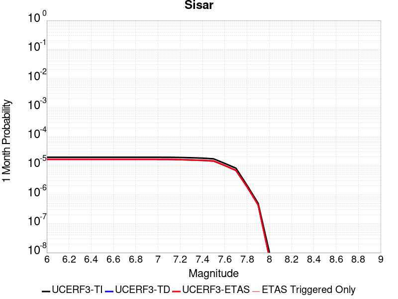 |  |  |

| Magnitude | 1 wk TI Prob | 1 wk TD Prob | 1 wk ETAS Prob | 1 wk ETAS/TD Gain | 1 wk ETAS Triggered Only | 1 mo TI Prob | 1 mo TD Prob | 1 mo ETAS Prob | 1 mo ETAS/TD Gain | 1 mo ETAS Triggered Only | 1 yr TI Prob | 1 yr TD Prob | 1 yr ETAS Prob | 1 yr ETAS/TD Gain | 1 yr ETAS Triggered Only | 10 yr TI Prob | 10 yr TD Prob | 10 yr ETAS Prob | 10 yr ETAS/TD Gain | 10 yr ETAS Triggered Only |
|-----|-----|-----|-----|-----|-----|-----|-----|-----|-----|-----|-----|-----|-----|-----|-----|-----|-----|-----|-----|-----|
| 6.0 | 4.544193E-6 | 3.8398925E-6 | 3.8398925E-6 | 1.0 | 0.0 | 1.9474966E-5 | 1.645658E-5 | 1.645658E-5 | 1.0 | 0.0 | 2.3708193E-4 | 2.0034079E-4 | 2.2801E-4 | 1.1381108 | 2.7674767E-5 | 0.0023682916 | 0.0020016355 | 0.0020292548 | 1.0137984 | 2.7674767E-5 |
| 6.1 | 4.544193E-6 | 3.8398925E-6 | 3.8398925E-6 | 1.0 | 0.0 | 1.9474966E-5 | 1.645658E-5 | 1.645658E-5 | 1.0 | 0.0 | 2.3708193E-4 | 2.0034079E-4 | 2.2801E-4 | 1.1381108 | 2.7674767E-5 | 0.0023682916 | 0.0020016355 | 0.0020292548 | 1.0137984 | 2.7674767E-5 |
| 6.2 | 4.544193E-6 | 3.8398925E-6 | 3.8398925E-6 | 1.0 | 0.0 | 1.9474966E-5 | 1.645658E-5 | 1.645658E-5 | 1.0 | 0.0 | 2.3708193E-4 | 2.0034079E-4 | 2.2801E-4 | 1.1381108 | 2.7674767E-5 | 0.0023682916 | 0.0020016355 | 0.0020292548 | 1.0137984 | 2.7674767E-5 |
| 6.3 | 4.544193E-6 | 3.8398925E-6 | 3.8398925E-6 | 1.0 | 0.0 | 1.9474966E-5 | 1.645658E-5 | 1.645658E-5 | 1.0 | 0.0 | 2.3708193E-4 | 2.0034079E-4 | 2.2801E-4 | 1.1381108 | 2.7674767E-5 | 0.0023682916 | 0.0020016355 | 0.0020292548 | 1.0137984 | 2.7674767E-5 |
| 6.4 | 4.544193E-6 | 3.8398925E-6 | 3.8398925E-6 | 1.0 | 0.0 | 1.9474966E-5 | 1.645658E-5 | 1.645658E-5 | 1.0 | 0.0 | 2.3708193E-4 | 2.0034079E-4 | 2.2801E-4 | 1.1381108 | 2.7674767E-5 | 0.0023682916 | 0.0020016355 | 0.0020292548 | 1.0137984 | 2.7674767E-5 |
| 6.5 | 4.544193E-6 | 3.8398925E-6 | 3.8398925E-6 | 1.0 | 0.0 | 1.9474966E-5 | 1.645658E-5 | 1.645658E-5 | 1.0 | 0.0 | 2.3708193E-4 | 2.0034079E-4 | 2.2801E-4 | 1.1381108 | 2.7674767E-5 | 0.0023682916 | 0.0020016355 | 0.0020292548 | 1.0137984 | 2.7674767E-5 |
| 6.6 | 4.544193E-6 | 3.8398925E-6 | 3.8398925E-6 | 1.0 | 0.0 | 1.9474966E-5 | 1.645658E-5 | 1.645658E-5 | 1.0 | 0.0 | 2.3708193E-4 | 2.0034079E-4 | 2.2801E-4 | 1.1381108 | 2.7674767E-5 | 0.0023682916 | 0.0020016355 | 0.0020292548 | 1.0137984 | 2.7674767E-5 |
| 6.7 | 4.544193E-6 | 3.8398925E-6 | 3.8398925E-6 | 1.0 | 0.0 | 1.9474966E-5 | 1.645658E-5 | 1.645658E-5 | 1.0 | 0.0 | 2.3708193E-4 | 2.0034079E-4 | 2.2801E-4 | 1.1381108 | 2.7674767E-5 | 0.0023682916 | 0.0020016355 | 0.0020292548 | 1.0137984 | 2.7674767E-5 |
| 6.8 | 4.544193E-6 | 3.8398925E-6 | 3.8398925E-6 | 1.0 | 0.0 | 1.9474966E-5 | 1.645658E-5 | 1.645658E-5 | 1.0 | 0.0 | 2.3708193E-4 | 2.0034079E-4 | 2.2801E-4 | 1.1381108 | 2.7674767E-5 | 0.0023682916 | 0.0020016355 | 0.0020292548 | 1.0137984 | 2.7674767E-5 |
| 6.9 | 4.542225E-6 | 3.8378544E-6 | 3.8378544E-6 | 1.0 | 0.0 | 1.9466532E-5 | 1.6447846E-5 | 1.6447846E-5 | 1.0 | 0.0 | 2.3697925E-4 | 2.0023446E-4 | 2.2790367E-4 | 1.1381842 | 2.7674767E-5 | 0.002367267 | 0.0020005743 | 0.0020281936 | 1.0138057 | 2.7674767E-5 |
| 7.0 | 4.5278484E-6 | 3.8229177E-6 | 3.8229177E-6 | 1.0 | 0.0 | 1.940492E-5 | 1.6383832E-5 | 1.6383832E-5 | 1.0 | 0.0 | 2.3622929E-4 | 1.9945524E-4 | 1.9945524E-4 | 1.0 | 0.0 | 0.0023597833 | 0.001992796 | 0.001992796 | 1.0 | 0.0 |
| 7.1 | 4.5132488E-6 | 3.8077048E-6 | 3.8077048E-6 | 1.0 | 0.0 | 1.9342351E-5 | 1.6318634E-5 | 1.6318634E-5 | 1.0 | 0.0 | 2.3546767E-4 | 1.986616E-4 | 1.986616E-4 | 1.0 | 0.0 | 0.0023521832 | 0.0019848738 | 0.0019848738 | 1.0 | 0.0 |
| 7.2 | 4.448859E-6 | 3.7401621E-6 | 3.7401621E-6 | 1.0 | 0.0 | 1.9066398E-5 | 1.602917E-5 | 1.602917E-5 | 1.0 | 0.0 | 2.3210866E-4 | 1.95138E-4 | 1.95138E-4 | 1.0 | 0.0 | 0.0023186638 | 0.0019497001 | 0.0019497001 | 1.0 | 0.0 |
| 7.3 | 4.3424366E-6 | 3.633991E-6 | 3.633991E-6 | 1.0 | 0.0 | 1.861031E-5 | 1.5574155E-5 | 1.5574155E-5 | 1.0 | 0.0 | 2.2655698E-4 | 1.8959917E-4 | 1.8959917E-4 | 1.0 | 0.0 | 0.0022632615 | 0.0018944077 | 0.0018944077 | 1.0 | 0.0 |
| 7.4 | 4.218641E-6 | 3.5333355E-6 | 3.5333355E-6 | 1.0 | 0.0 | 1.8079765E-5 | 1.514278E-5 | 1.514278E-5 | 1.0 | 0.0 | 2.2009891E-4 | 1.8434809E-4 | 1.8434809E-4 | 1.0 | 0.0 | 0.0021988105 | 0.0018419849 | 0.0018419849 | 1.0 | 0.0 |
| 7.5 | 3.983779E-6 | 3.3480885E-6 | 3.3480885E-6 | 1.0 | 0.0 | 1.7073227E-5 | 1.4348873E-5 | 1.4348873E-5 | 1.0 | 0.0 | 2.0784672E-4 | 1.7468387E-4 | 1.7468387E-4 | 1.0 | 0.0 | 0.0020765243 | 0.0017454985 | 0.0017454985 | 1.0 | 0.0 |
| 7.6 | 2.777393E-6 | 2.3524497E-6 | 2.3524497E-6 | 1.0 | 0.0 | 1.1903058E-5 | 1.0081888E-5 | 1.0081888E-5 | 1.0 | 0.0 | 1.449101E-4 | 1.2274015E-4 | 1.2274015E-4 | 1.0 | 0.0 | 0.0014481564 | 0.0012267313 | 0.0012267313 | 1.0 | 0.0 |
| 7.7 | 1.9028433E-6 | 1.5939935E-6 | 1.5939935E-6 | 1.0 | 0.0 | 8.155017E-6 | 6.831383E-6 | 6.831383E-6 | 1.0 | 0.0 | 9.928281E-5 | 8.316896E-5 | 8.316896E-5 | 1.0 | 0.0 | 9.923846E-4 | 8.313831E-4 | 8.313831E-4 | 1.0 | 0.0 |
| 7.8 | 4.9095956E-7 | 4.358607E-7 | 4.358607E-7 | 1.0 | 0.0 | 2.1041105E-6 | 1.8679731E-6 | 1.8679731E-6 | 1.0 | 0.0 | 2.5617246E-5 | 2.2742337E-5 | 2.2742337E-5 | 1.0 | 0.0 | 2.5614293E-4 | 2.2740028E-4 | 2.2740028E-4 | 1.0 | 0.0 |
| 7.9 | 1.16657894E-7 | 1.0336398E-7 | 1.0336398E-7 | 1.0 | 0.0 | 4.999623E-7 | 4.429884E-7 | 4.429884E-7 | 1.0 | 0.0 | 6.087024E-6 | 5.393371E-6 | 5.393371E-6 | 1.0 | 0.0 | 6.0868573E-5 | 5.393243E-5 | 5.393243E-5 | 1.0 | 0.0 |
| 8.0 | 2.5100346E-9 | 1.7071163E-9 | 1.7071163E-9 | 1.0 | 0.0 | 1.0757291E-8 | 7.3162125E-9 | 7.3162125E-9 | 1.0 | 0.0 | 1.3097001E-7 | 8.907489E-8 | 8.907489E-8 | 1.0 | 0.0 | 1.3096993E-6 | 8.9074854E-7 | 8.9074854E-7 | 1.0 | 0.0 |

## Cucamonga
*[(top)](#table-of-contents)*

| 1 Week | 1 Month | 1 Year | 10 Year |
|-----|-----|-----|-----|
|  |  |  |  |

| Magnitude | 1 wk TI Prob | 1 wk TD Prob | 1 wk ETAS Prob | 1 wk ETAS/TD Gain | 1 wk ETAS Triggered Only | 1 mo TI Prob | 1 mo TD Prob | 1 mo ETAS Prob | 1 mo ETAS/TD Gain | 1 mo ETAS Triggered Only | 1 yr TI Prob | 1 yr TD Prob | 1 yr ETAS Prob | 1 yr ETAS/TD Gain | 1 yr ETAS Triggered Only | 10 yr TI Prob | 10 yr TD Prob | 10 yr ETAS Prob | 10 yr ETAS/TD Gain | 10 yr ETAS Triggered Only |
|-----|-----|-----|-----|-----|-----|-----|-----|-----|-----|-----|-----|-----|-----|-----|-----|-----|-----|-----|-----|-----|
| 6.0 | 1.1848348E-5 | 1.17417885E-5 | 1.17417885E-5 | 1.0 | 0.0 | 5.0777642E-5 | 5.0320996E-5 | 5.0320996E-5 | 1.0 | 0.0 | 6.180424E-4 | 6.124886E-4 | 6.4014643E-4 | 1.0451565 | 2.7674767E-5 | 0.0061632637 | 0.006109173 | 0.0061366786 | 1.0045024 | 2.7674767E-5 |
| 6.1 | 1.1848348E-5 | 1.17417885E-5 | 1.17417885E-5 | 1.0 | 0.0 | 5.0777642E-5 | 5.0320996E-5 | 5.0320996E-5 | 1.0 | 0.0 | 6.180424E-4 | 6.124886E-4 | 6.4014643E-4 | 1.0451565 | 2.7674767E-5 | 0.0061632637 | 0.006109173 | 0.0061366786 | 1.0045024 | 2.7674767E-5 |
| 6.2 | 1.1848348E-5 | 1.17417885E-5 | 1.17417885E-5 | 1.0 | 0.0 | 5.0777642E-5 | 5.0320996E-5 | 5.0320996E-5 | 1.0 | 0.0 | 6.180424E-4 | 6.124886E-4 | 6.4014643E-4 | 1.0451565 | 2.7674767E-5 | 0.0061632637 | 0.006109173 | 0.0061366786 | 1.0045024 | 2.7674767E-5 |
| 6.3 | 1.1848348E-5 | 1.17417885E-5 | 1.17417885E-5 | 1.0 | 0.0 | 5.0777642E-5 | 5.0320996E-5 | 5.0320996E-5 | 1.0 | 0.0 | 6.180424E-4 | 6.124886E-4 | 6.4014643E-4 | 1.0451565 | 2.7674767E-5 | 0.0061632637 | 0.006109173 | 0.0061366786 | 1.0045024 | 2.7674767E-5 |
| 6.4 | 1.1848348E-5 | 1.17417885E-5 | 1.17417885E-5 | 1.0 | 0.0 | 5.0777642E-5 | 5.0320996E-5 | 5.0320996E-5 | 1.0 | 0.0 | 6.180424E-4 | 6.124886E-4 | 6.4014643E-4 | 1.0451565 | 2.7674767E-5 | 0.0061632637 | 0.006109173 | 0.0061366786 | 1.0045024 | 2.7674767E-5 |
| 6.5 | 1.16988695E-5 | 1.1580808E-5 | 1.1580808E-5 | 1.0 | 0.0 | 5.013705E-5 | 4.9631108E-5 | 4.9631108E-5 | 1.0 | 0.0 | 6.102476E-4 | 6.040939E-4 | 6.317519E-4 | 1.0457844 | 2.7674767E-5 | 0.006085745 | 0.0060256817 | 0.0060531897 | 1.0045651 | 2.7674767E-5 |
| 6.6 | 1.16988695E-5 | 1.1580808E-5 | 1.1580808E-5 | 1.0 | 0.0 | 5.013705E-5 | 4.9631108E-5 | 4.9631108E-5 | 1.0 | 0.0 | 6.102476E-4 | 6.040939E-4 | 6.317519E-4 | 1.0457844 | 2.7674767E-5 | 0.006085745 | 0.0060256817 | 0.0060531897 | 1.0045651 | 2.7674767E-5 |
| 6.7 | 1.1397107E-5 | 1.1119596E-5 | 1.1119596E-5 | 1.0 | 0.0 | 4.884383E-5 | 4.7654557E-5 | 4.7654557E-5 | 1.0 | 0.0 | 5.9451134E-4 | 5.8004225E-4 | 6.0770096E-4 | 1.047684 | 2.7674767E-5 | 0.005929234 | 0.0057864264 | 0.005813941 | 1.004755 | 2.7674767E-5 |
| 6.8 | 1.058387E-5 | 9.789085E-6 | 9.789085E-6 | 1.0 | 0.0 | 4.5358654E-5 | 4.1952553E-5 | 4.1952553E-5 | 1.0 | 0.0 | 5.521017E-4 | 5.106538E-4 | 5.383144E-4 | 1.0541672 | 2.7674767E-5 | 0.00550732 | 0.0050958046 | 0.005123338 | 1.0054032 | 2.7674767E-5 |
| 6.9 | 9.690046E-6 | 8.583211E-6 | 8.583211E-6 | 1.0 | 0.0 | 4.1528107E-5 | 3.678467E-5 | 3.678467E-5 | 1.0 | 0.0 | 5.054874E-4 | 4.4776173E-4 | 4.754241E-4 | 1.0617793 | 2.7674767E-5 | 0.005043391 | 0.004469523 | 0.0044970745 | 1.0061642 | 2.7674767E-5 |
| 7.0 | 9.381461E-6 | 8.190734E-6 | 8.190734E-6 | 1.0 | 0.0 | 4.020564E-5 | 3.5102676E-5 | 3.5102676E-5 | 1.0 | 0.0 | 4.893937E-4 | 4.2729164E-4 | 4.5495457E-4 | 1.0647402 | 2.7674767E-5 | 0.0048831734 | 0.004265627 | 0.0042931833 | 1.0064602 | 2.7674767E-5 |
| 7.1 | 8.946492E-6 | 7.785447E-6 | 7.785447E-6 | 1.0 | 0.0 | 3.8341543E-5 | 3.336578E-5 | 3.336578E-5 | 1.0 | 0.0 | 4.667083E-4 | 4.0615295E-4 | 4.338165E-4 | 1.0681111 | 2.7674767E-5 | 0.0046572937 | 0.004055035 | 0.0040825973 | 1.0067971 | 2.7674767E-5 |
| 7.2 | 8.251016E-6 | 6.9786042E-6 | 6.9786042E-6 | 1.0 | 0.0 | 3.5361016E-5 | 2.9907962E-5 | 2.9907962E-5 | 1.0 | 0.0 | 4.3043532E-4 | 3.6406884E-4 | 3.6406884E-4 | 1.0 | 0.0 | 0.0042960253 | 0.0036356493 | 0.0036356493 | 1.0 | 0.0 |
| 7.3 | 7.717881E-6 | 6.4895694E-6 | 6.4895694E-6 | 1.0 | 0.0 | 3.3076216E-5 | 2.7812146E-5 | 2.7812146E-5 | 1.0 | 0.0 | 4.026285E-4 | 3.385605E-4 | 3.385605E-4 | 1.0 | 0.0 | 0.004018998 | 0.003381376 | 0.003381376 | 1.0 | 0.0 |
| 7.4 | 7.275623E-6 | 6.0350894E-6 | 6.0350894E-6 | 1.0 | 0.0 | 3.118087E-5 | 2.5864414E-5 | 2.5864414E-5 | 1.0 | 0.0 | 3.7956095E-4 | 3.1485397E-4 | 3.1485397E-4 | 1.0 | 0.0 | 0.0037891332 | 0.0031450067 | 0.0031450067 | 1.0 | 0.0 |
| 7.5 | 6.5109502E-6 | 5.103351E-6 | 5.103351E-6 | 1.0 | 0.0 | 2.7903774E-5 | 2.1871321E-5 | 2.1871321E-5 | 1.0 | 0.0 | 3.3967546E-4 | 2.6625095E-4 | 2.6625095E-4 | 1.0 | 0.0 | 0.0033915674 | 0.0026602359 | 0.0026602359 | 1.0 | 0.0 |
| 7.6 | 5.4495326E-6 | 3.9110173E-6 | 3.9110173E-6 | 1.0 | 0.0 | 2.335493E-5 | 1.6761394E-5 | 1.6761394E-5 | 1.0 | 0.0 | 2.8430918E-4 | 2.0405094E-4 | 2.0405094E-4 | 1.0 | 0.0 | 0.0028394572 | 0.0020395485 | 0.0020395485 | 1.0 | 0.0 |
| 7.7 | 4.7997164E-6 | 3.202466E-6 | 3.202466E-6 | 1.0 | 0.0 | 2.057005E-5 | 1.3724782E-5 | 1.3724782E-5 | 1.0 | 0.0 | 2.504116E-4 | 1.6708644E-4 | 1.6708644E-4 | 1.0 | 0.0 | 0.002501296 | 0.0016705322 | 0.0016705322 | 1.0 | 0.0 |
| 7.8 | 3.3941733E-6 | 2.065506E-6 | 2.065506E-6 | 1.0 | 0.0 | 1.4546376E-5 | 8.852138E-6 | 8.852138E-6 | 1.0 | 0.0 | 1.7708774E-4 | 1.0776947E-4 | 1.0776947E-4 | 1.0 | 0.0 | 0.0017694668 | 0.0010774093 | 0.0010774093 | 1.0 | 0.0 |
| 7.9 | 9.750552E-7 | 5.160341E-7 | 5.160341E-7 | 1.0 | 0.0 | 4.178801E-6 | 2.2115728E-6 | 2.2115728E-6 | 1.0 | 0.0 | 5.0875715E-5 | 2.692557E-5 | 2.692557E-5 | 1.0 | 0.0 | 5.086407E-4 | 2.692235E-4 | 2.692235E-4 | 1.0 | 0.0 |
| 8.0 | 1.133857E-7 | 6.056122E-8 | 6.056122E-8 | 1.0 | 0.0 | 4.8593864E-7 | 2.5954807E-7 | 2.5954807E-7 | 1.0 | 0.0 | 5.9162867E-6 | 3.1599932E-6 | 3.1599932E-6 | 1.0 | 0.0 | 5.916129E-5 | 3.15995E-5 | 3.15995E-5 | 1.0 | 0.0 |

## Big Pine (West)
*[(top)](#table-of-contents)*

| 1 Week | 1 Month | 1 Year | 10 Year |
|-----|-----|-----|-----|
| 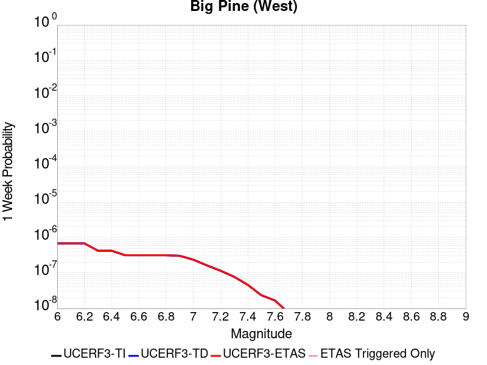 |  |  |  |

| Magnitude | 1 wk TI Prob | 1 wk TD Prob | 1 wk ETAS Prob | 1 wk ETAS/TD Gain | 1 wk ETAS Triggered Only | 1 mo TI Prob | 1 mo TD Prob | 1 mo ETAS Prob | 1 mo ETAS/TD Gain | 1 mo ETAS Triggered Only | 1 yr TI Prob | 1 yr TD Prob | 1 yr ETAS Prob | 1 yr ETAS/TD Gain | 1 yr ETAS Triggered Only | 10 yr TI Prob | 10 yr TD Prob | 10 yr ETAS Prob | 10 yr ETAS/TD Gain | 10 yr ETAS Triggered Only |
|-----|-----|-----|-----|-----|-----|-----|-----|-----|-----|-----|-----|-----|-----|-----|-----|-----|-----|-----|-----|-----|
| 6.0 | 6.8306974E-7 | 6.881878E-7 | 6.881878E-7 | 1.0 | 0.0 | 2.9274386E-6 | 2.9493735E-6 | 2.9493735E-6 | 1.0 | 0.0 | 3.564098E-5 | 3.5908128E-5 | 3.5908128E-5 | 1.0 | 0.0 | 3.5635266E-4 | 3.5903262E-4 | 3.8669747E-4 | 1.0770538 | 2.7674767E-5 |
| 6.1 | 6.8306974E-7 | 6.881878E-7 | 6.881878E-7 | 1.0 | 0.0 | 2.9274386E-6 | 2.9493735E-6 | 2.9493735E-6 | 1.0 | 0.0 | 3.564098E-5 | 3.5908128E-5 | 3.5908128E-5 | 1.0 | 0.0 | 3.5635266E-4 | 3.5903262E-4 | 3.8669747E-4 | 1.0770538 | 2.7674767E-5 |
| 6.2 | 6.8306974E-7 | 6.881878E-7 | 6.881878E-7 | 1.0 | 0.0 | 2.9274386E-6 | 2.9493735E-6 | 2.9493735E-6 | 1.0 | 0.0 | 3.564098E-5 | 3.5908128E-5 | 3.5908128E-5 | 1.0 | 0.0 | 3.5635266E-4 | 3.5903262E-4 | 3.8669747E-4 | 1.0770538 | 2.7674767E-5 |
| 6.3 | 4.227652E-7 | 4.2665968E-7 | 4.2665968E-7 | 1.0 | 0.0 | 1.8118495E-6 | 1.8285403E-6 | 1.8285403E-6 | 1.0 | 0.0 | 2.2059045E-5 | 2.226227E-5 | 2.226227E-5 | 1.0 | 0.0 | 2.2056856E-4 | 2.2260222E-4 | 2.5027082E-4 | 1.1242962 | 2.7674767E-5 |
| 6.4 | 4.227652E-7 | 4.2665968E-7 | 4.2665968E-7 | 1.0 | 0.0 | 1.8118495E-6 | 1.8285403E-6 | 1.8285403E-6 | 1.0 | 0.0 | 2.2059045E-5 | 2.226227E-5 | 2.226227E-5 | 1.0 | 0.0 | 2.2056856E-4 | 2.2260222E-4 | 2.5027082E-4 | 1.1242962 | 2.7674767E-5 |
| 6.5 | 3.1538403E-7 | 3.1884852E-7 | 3.1884852E-7 | 1.0 | 0.0 | 1.3516451E-6 | 1.3664929E-6 | 1.3664929E-6 | 1.0 | 0.0 | 1.6456155E-5 | 1.6636928E-5 | 1.6636928E-5 | 1.0 | 0.0 | 1.6454936E-4 | 1.6635723E-4 | 1.940274E-4 | 1.1663297 | 2.7674767E-5 |
| 6.6 | 3.1538403E-7 | 3.1884852E-7 | 3.1884852E-7 | 1.0 | 0.0 | 1.3516451E-6 | 1.3664929E-6 | 1.3664929E-6 | 1.0 | 0.0 | 1.6456155E-5 | 1.6636928E-5 | 1.6636928E-5 | 1.0 | 0.0 | 1.6454936E-4 | 1.6635723E-4 | 1.940274E-4 | 1.1663297 | 2.7674767E-5 |
| 6.7 | 3.1538403E-7 | 3.1884852E-7 | 3.1884852E-7 | 1.0 | 0.0 | 1.3516451E-6 | 1.3664929E-6 | 1.3664929E-6 | 1.0 | 0.0 | 1.6456155E-5 | 1.6636928E-5 | 1.6636928E-5 | 1.0 | 0.0 | 1.6454936E-4 | 1.6635723E-4 | 1.940274E-4 | 1.1663297 | 2.7674767E-5 |
| 6.8 | 3.1538403E-7 | 3.1884852E-7 | 3.1884852E-7 | 1.0 | 0.0 | 1.3516451E-6 | 1.3664929E-6 | 1.3664929E-6 | 1.0 | 0.0 | 1.6456155E-5 | 1.6636928E-5 | 1.6636928E-5 | 1.0 | 0.0 | 1.6454936E-4 | 1.6635723E-4 | 1.940274E-4 | 1.1663297 | 2.7674767E-5 |
| 6.9 | 3.0402092E-7 | 3.0740114E-7 | 3.0740114E-7 | 1.0 | 0.0 | 1.3029462E-6 | 1.3174329E-6 | 1.3174329E-6 | 1.0 | 0.0 | 1.5863254E-5 | 1.603963E-5 | 1.603963E-5 | 1.0 | 0.0 | 1.5862122E-4 | 1.6038513E-4 | 1.8805545E-4 | 1.1725243 | 2.7674767E-5 |
| 7.0 | 2.3673063E-7 | 2.3944568E-7 | 2.3944568E-7 | 1.0 | 0.0 | 1.0145594E-6 | 1.0261955E-6 | 1.0261955E-6 | 1.0 | 0.0 | 1.235219E-5 | 1.2493861E-5 | 1.2493861E-5 | 1.0 | 0.0 | 1.2351504E-4 | 1.2493186E-4 | 1.5260317E-4 | 1.2214912 | 2.7674767E-5 |
| 7.1 | 1.632138E-7 | 1.6514693E-7 | 1.6514693E-7 | 1.0 | 0.0 | 6.9948754E-7 | 7.0777236E-7 | 7.0777236E-7 | 1.0 | 0.0 | 8.516227E-6 | 8.617097E-6 | 8.617097E-6 | 1.0 | 0.0 | 8.5159016E-5 | 8.61678E-5 | 8.61678E-5 | 1.0 | 0.0 |
| 7.2 | 1.1523723E-7 | 1.165729E-7 | 1.165729E-7 | 1.0 | 0.0 | 4.9387376E-7 | 4.9959806E-7 | 4.9959806E-7 | 1.0 | 0.0 | 6.0128964E-6 | 6.0825905E-6 | 6.0825905E-6 | 1.0 | 0.0 | 6.0127335E-5 | 6.082435E-5 | 6.082435E-5 | 1.0 | 0.0 |
| 7.3 | 7.777805E-8 | 7.8625256E-8 | 7.8625256E-8 | 1.0 | 0.0 | 3.3333444E-7 | 3.3696534E-7 | 3.3696534E-7 | 1.0 | 0.0 | 4.0583395E-6 | 4.102546E-6 | 4.102546E-6 | 1.0 | 0.0 | 4.0582654E-5 | 4.1024756E-5 | 4.1024756E-5 | 1.0 | 0.0 |
| 7.4 | 4.609946E-8 | 4.652253E-8 | 4.652253E-8 | 1.0 | 0.0 | 1.975691E-7 | 1.9938226E-7 | 1.9938226E-7 | 1.0 | 0.0 | 2.4054011E-6 | 2.4274764E-6 | 2.4274764E-6 | 1.0 | 0.0 | 2.405375E-5 | 2.4274517E-5 | 2.4274517E-5 | 1.0 | 0.0 |
| 7.5 | 2.3439137E-8 | 2.3608443E-8 | 2.3608443E-8 | 1.0 | 0.0 | 1.00453434E-7 | 1.0117903E-7 | 1.0117903E-7 | 1.0 | 0.0 | 1.2230199E-6 | 1.2318541E-6 | 1.2318541E-6 | 1.0 | 0.0 | 1.2230132E-5 | 1.2318475E-5 | 1.2318475E-5 | 1.0 | 0.0 |
| 7.6 | 1.6699769E-8 | 1.6817182E-8 | 1.6817182E-8 | 1.0 | 0.0 | 7.157044E-8 | 7.207363E-8 | 7.207363E-8 | 1.0 | 0.0 | 8.713697E-7 | 8.774962E-7 | 8.774962E-7 | 1.0 | 0.0 | 8.713663E-6 | 8.774929E-6 | 8.774929E-6 | 1.0 | 0.0 |
| 7.7 | 7.4061512E-9 | 7.454209E-9 | 7.454209E-9 | 1.0 | 0.0 | 3.1740647E-8 | 3.194661E-8 | 3.194661E-8 | 1.0 | 0.0 | 3.864423E-7 | 3.889499E-7 | 3.889499E-7 | 1.0 | 0.0 | 3.8644166E-6 | 3.8894927E-6 | 3.8894927E-6 | 1.0 | 0.0 |
| 7.8 | 1.2189427E-9 | 1.2270839E-9 | 1.2270839E-9 | 1.0 | 0.0 | 5.2240403E-9 | 5.258931E-9 | 5.258931E-9 | 1.0 | 0.0 | 6.3602684E-8 | 6.402748E-8 | 6.402748E-8 | 1.0 | 0.0 | 6.360267E-7 | 6.402747E-7 | 6.402747E-7 | 1.0 | 0.0 |

## Eaton Roughs 2011 CFM
*[(top)](#table-of-contents)*

| 1 Week | 1 Month | 1 Year | 10 Year |
|-----|-----|-----|-----|
|  |  |  |  |

| Magnitude | 1 wk TI Prob | 1 wk TD Prob | 1 wk ETAS Prob | 1 wk ETAS/TD Gain | 1 wk ETAS Triggered Only | 1 mo TI Prob | 1 mo TD Prob | 1 mo ETAS Prob | 1 mo ETAS/TD Gain | 1 mo ETAS Triggered Only | 1 yr TI Prob | 1 yr TD Prob | 1 yr ETAS Prob | 1 yr ETAS/TD Gain | 1 yr ETAS Triggered Only | 10 yr TI Prob | 10 yr TD Prob | 10 yr ETAS Prob | 10 yr ETAS/TD Gain | 10 yr ETAS Triggered Only |
|-----|-----|-----|-----|-----|-----|-----|-----|-----|-----|-----|-----|-----|-----|-----|-----|-----|-----|-----|-----|-----|
| 6.0 | 6.8044945E-5 | 8.846242E-5 | 8.846242E-5 | 1.0 | 0.0 | 2.9158857E-4 | 3.7907614E-4 | 3.7907614E-4 | 1.0 | 0.0 | 0.0035443127 | 0.004606217 | 0.004606217 | 1.0 | 0.0 | 0.03488314 | 0.045174804 | 0.045201227 | 1.000585 | 2.7674767E-5 |
| 6.1 | 6.8044945E-5 | 8.846242E-5 | 8.846242E-5 | 1.0 | 0.0 | 2.9158857E-4 | 3.7907614E-4 | 3.7907614E-4 | 1.0 | 0.0 | 0.0035443127 | 0.004606217 | 0.004606217 | 1.0 | 0.0 | 0.03488314 | 0.045174804 | 0.045201227 | 1.000585 | 2.7674767E-5 |
| 6.2 | 6.8044945E-5 | 8.846242E-5 | 8.846242E-5 | 1.0 | 0.0 | 2.9158857E-4 | 3.7907614E-4 | 3.7907614E-4 | 1.0 | 0.0 | 0.0035443127 | 0.004606217 | 0.004606217 | 1.0 | 0.0 | 0.03488314 | 0.045174804 | 0.045201227 | 1.000585 | 2.7674767E-5 |
| 6.3 | 6.8044945E-5 | 8.846242E-5 | 8.846242E-5 | 1.0 | 0.0 | 2.9158857E-4 | 3.7907614E-4 | 3.7907614E-4 | 1.0 | 0.0 | 0.0035443127 | 0.004606217 | 0.004606217 | 1.0 | 0.0 | 0.03488314 | 0.045174804 | 0.045201227 | 1.000585 | 2.7674767E-5 |
| 6.4 | 4.5830013E-5 | 5.7167952E-5 | 5.7167952E-5 | 1.0 | 0.0 | 1.9639956E-4 | 2.4498554E-4 | 2.4498554E-4 | 1.0 | 0.0 | 0.0023885423 | 0.0029791591 | 0.0029791591 | 1.0 | 0.0 | 0.023630321 | 0.02942802 | 0.029454881 | 1.0009128 | 2.7674767E-5 |
| 6.5 | 4.5830013E-5 | 5.7167952E-5 | 5.7167952E-5 | 1.0 | 0.0 | 1.9639956E-4 | 2.4498554E-4 | 2.4498554E-4 | 1.0 | 0.0 | 0.0023885423 | 0.0029791591 | 0.0029791591 | 1.0 | 0.0 | 0.023630321 | 0.02942802 | 0.029454881 | 1.0009128 | 2.7674767E-5 |
| 6.6 | 3.222194E-5 | 3.8268237E-5 | 3.8268237E-5 | 1.0 | 0.0 | 1.3808672E-4 | 1.6399707E-4 | 1.6399707E-4 | 1.0 | 0.0 | 0.0016799092 | 0.0019949498 | 0.0019949498 | 1.0 | 0.0 | 0.016672665 | 0.019779978 | 0.019807104 | 1.0013715 | 2.7674767E-5 |
| 6.7 | 2.4155654E-5 | 2.7790025E-5 | 2.7790025E-5 | 1.0 | 0.0 | 1.0352012E-4 | 1.19094715E-4 | 1.19094715E-4 | 1.0 | 0.0 | 0.0012596287 | 0.001449022 | 0.001449022 | 1.0 | 0.0 | 0.012525126 | 0.014396891 | 0.014424167 | 1.0018946 | 2.7674767E-5 |
| 6.8 | 2.1814667E-5 | 2.494408E-5 | 2.494408E-5 | 1.0 | 0.0 | 9.348808E-5 | 1.0689884E-4 | 1.0689884E-4 | 1.0 | 0.0 | 0.001137623 | 0.0013007201 | 0.0013007201 | 1.0 | 0.0 | 0.011318169 | 0.012931694 | 0.012959011 | 1.0021124 | 2.7674767E-5 |
| 6.9 | 2.0700467E-5 | 2.3631928E-5 | 2.3631928E-5 | 1.0 | 0.0 | 8.871327E-5 | 1.0127578E-4 | 1.0127578E-4 | 1.0 | 0.0 | 0.0010795488 | 0.0012323384 | 0.0012323384 | 1.0 | 0.0 | 0.010743194 | 0.012255579 | 0.0122829145 | 1.0022304 | 2.7674767E-5 |
| 7.0 | 2.0104066E-5 | 2.293939E-5 | 2.293939E-5 | 1.0 | 0.0 | 8.615744E-5 | 9.830798E-5 | 9.830798E-5 | 1.0 | 0.0 | 0.0010484619 | 0.0011962455 | 0.0011962455 | 1.0 | 0.0 | 0.010435291 | 0.011898563 | 0.011925909 | 1.0022982 | 2.7674767E-5 |
| 7.1 | 1.8225232E-5 | 2.077563E-5 | 2.077563E-5 | 1.0 | 0.0 | 7.81058E-5 | 8.9035384E-5 | 8.9035384E-5 | 1.0 | 0.0 | 9.5052324E-4 | 0.0010834683 | 0.0010834683 | 1.0 | 0.0 | 0.009464677 | 0.010782159 | 0.010809535 | 1.002539 | 2.7674767E-5 |
| 7.2 | 1.7526572E-5 | 1.9995985E-5 | 1.9995985E-5 | 1.0 | 0.0 | 7.511172E-5 | 8.569427E-5 | 8.569427E-5 | 1.0 | 0.0 | 9.141015E-4 | 0.0010428298 | 0.0010428298 | 1.0 | 0.0 | 0.009103506 | 0.01037964 | 0.010407029 | 1.0026386 | 2.7674767E-5 |
| 7.3 | 1.5727232E-5 | 1.8023822E-5 | 1.8023822E-5 | 1.0 | 0.0 | 6.740067E-5 | 7.724267E-5 | 7.724267E-5 | 1.0 | 0.0 | 8.2029426E-4 | 9.400251E-4 | 9.400251E-4 | 1.0 | 0.0 | 0.008172729 | 0.009360708 | 0.009388125 | 1.0029289 | 2.7674767E-5 |
| 7.4 | 1.4457361E-5 | 1.6600512E-5 | 1.6600512E-5 | 1.0 | 0.0 | 6.195865E-5 | 7.114311E-5 | 7.114311E-5 | 1.0 | 0.0 | 7.540854E-4 | 8.658241E-4 | 8.658241E-4 | 1.0 | 0.0 | 0.007515317 | 0.008624669 | 0.008652105 | 1.0031811 | 2.7674767E-5 |
| 7.5 | 1.33280955E-5 | 1.5347456E-5 | 1.5347456E-5 | 1.0 | 0.0 | 5.711916E-5 | 6.577316E-5 | 6.577316E-5 | 1.0 | 0.0 | 6.9520384E-4 | 8.0049486E-4 | 8.0049486E-4 | 1.0 | 0.0 | 0.00693033 | 0.007976255 | 0.008003709 | 1.0034419 | 2.7674767E-5 |
| 7.6 | 1.0699478E-5 | 1.2389482E-5 | 1.2389482E-5 | 1.0 | 0.0 | 4.5854096E-5 | 5.3096705E-5 | 5.3096705E-5 | 1.0 | 0.0 | 5.581306E-4 | 6.4626115E-4 | 6.4626115E-4 | 1.0 | 0.0 | 0.005567309 | 0.0064438996 | 0.006471396 | 1.0042671 | 2.7674767E-5 |
| 7.7 | 5.9390236E-6 | 6.853801E-6 | 6.853801E-6 | 1.0 | 0.0 | 2.545271E-5 | 2.9373105E-5 | 2.9373105E-5 | 1.0 | 0.0 | 3.0984267E-4 | 3.575591E-4 | 3.575591E-4 | 1.0 | 0.0 | 0.0030941102 | 0.0035698623 | 0.0035698623 | 1.0 | 0.0 |
| 7.8 | 2.1622036E-6 | 2.3298624E-6 | 2.3298624E-6 | 1.0 | 0.0 | 9.266554E-6 | 9.985086E-6 | 9.985086E-6 | 1.0 | 0.0 | 1.1281446E-4 | 1.21561716E-4 | 1.21561716E-4 | 1.0 | 0.0 | 0.001127572 | 0.0012149579 | 0.0012149579 | 1.0 | 0.0 |
| 7.9 | 4.9586197E-7 | 5.2191757E-7 | 5.2191757E-7 | 1.0 | 0.0 | 2.125121E-6 | 2.2367879E-6 | 2.2367879E-6 | 1.0 | 0.0 | 2.5873042E-5 | 2.7232572E-5 | 2.7232572E-5 | 1.0 | 0.0 | 2.5870028E-4 | 2.7229445E-4 | 2.7229445E-4 | 1.0 | 0.0 |

## San Luis Range - Oceano 2011 CFM
*[(top)](#table-of-contents)*

| 1 Week | 1 Month | 1 Year | 10 Year |
|-----|-----|-----|-----|
|  |  |  |  |

| Magnitude | 1 wk TI Prob | 1 wk TD Prob | 1 wk ETAS Prob | 1 wk ETAS/TD Gain | 1 wk ETAS Triggered Only | 1 mo TI Prob | 1 mo TD Prob | 1 mo ETAS Prob | 1 mo ETAS/TD Gain | 1 mo ETAS Triggered Only | 1 yr TI Prob | 1 yr TD Prob | 1 yr ETAS Prob | 1 yr ETAS/TD Gain | 1 yr ETAS Triggered Only | 10 yr TI Prob | 10 yr TD Prob | 10 yr ETAS Prob | 10 yr ETAS/TD Gain | 10 yr ETAS Triggered Only |
|-----|-----|-----|-----|-----|-----|-----|-----|-----|-----|-----|-----|-----|-----|-----|-----|-----|-----|-----|-----|-----|
| 6.0 | 1.6025788E-6 | 1.6201354E-6 | 1.6201354E-6 | 1.0 | 0.0 | 6.8681766E-6 | 6.9434213E-6 | 6.9434213E-6 | 1.0 | 0.0 | 8.361684E-5 | 8.453329E-5 | 8.453329E-5 | 1.0 | 0.0 | 8.3585386E-4 | 8.450522E-4 | 8.7270356E-4 | 1.0327215 | 2.7674767E-5 |
| 6.1 | 1.6025788E-6 | 1.6201354E-6 | 1.6201354E-6 | 1.0 | 0.0 | 6.8681766E-6 | 6.9434213E-6 | 6.9434213E-6 | 1.0 | 0.0 | 8.361684E-5 | 8.453329E-5 | 8.453329E-5 | 1.0 | 0.0 | 8.3585386E-4 | 8.450522E-4 | 8.7270356E-4 | 1.0327215 | 2.7674767E-5 |
| 6.2 | 1.6025788E-6 | 1.6201354E-6 | 1.6201354E-6 | 1.0 | 0.0 | 6.8681766E-6 | 6.9434213E-6 | 6.9434213E-6 | 1.0 | 0.0 | 8.361684E-5 | 8.453329E-5 | 8.453329E-5 | 1.0 | 0.0 | 8.3585386E-4 | 8.450522E-4 | 8.7270356E-4 | 1.0327215 | 2.7674767E-5 |
| 6.3 | 1.6025788E-6 | 1.6201354E-6 | 1.6201354E-6 | 1.0 | 0.0 | 6.8681766E-6 | 6.9434213E-6 | 6.9434213E-6 | 1.0 | 0.0 | 8.361684E-5 | 8.453329E-5 | 8.453329E-5 | 1.0 | 0.0 | 8.3585386E-4 | 8.450522E-4 | 8.7270356E-4 | 1.0327215 | 2.7674767E-5 |
| 6.4 | 1.1621186E-6 | 1.1750016E-6 | 1.1750016E-6 | 1.0 | 0.0 | 4.980499E-6 | 5.0357125E-6 | 5.0357125E-6 | 1.0 | 0.0 | 6.0635884E-5 | 6.130835E-5 | 6.130835E-5 | 1.0 | 0.0 | 6.0619344E-4 | 6.1294093E-4 | 6.4059877E-4 | 1.0451231 | 2.7674767E-5 |
| 6.5 | 1.1621186E-6 | 1.1750016E-6 | 1.1750016E-6 | 1.0 | 0.0 | 4.980499E-6 | 5.0357125E-6 | 5.0357125E-6 | 1.0 | 0.0 | 6.0635884E-5 | 6.130835E-5 | 6.130835E-5 | 1.0 | 0.0 | 6.0619344E-4 | 6.1294093E-4 | 6.4059877E-4 | 1.0451231 | 2.7674767E-5 |
| 6.6 | 7.164729E-7 | 7.2486574E-7 | 7.2486574E-7 | 1.0 | 0.0 | 3.0705946E-6 | 3.1065638E-6 | 3.1065638E-6 | 1.0 | 0.0 | 3.738385E-5 | 3.7821774E-5 | 3.7821774E-5 | 1.0 | 0.0 | 3.737756E-4 | 3.7815515E-4 | 4.0581945E-4 | 1.073156 | 2.7674767E-5 |
| 6.7 | 7.164729E-7 | 7.2486574E-7 | 7.2486574E-7 | 1.0 | 0.0 | 3.0705946E-6 | 3.1065638E-6 | 3.1065638E-6 | 1.0 | 0.0 | 3.738385E-5 | 3.7821774E-5 | 3.7821774E-5 | 1.0 | 0.0 | 3.737756E-4 | 3.7815515E-4 | 4.0581945E-4 | 1.073156 | 2.7674767E-5 |
| 6.8 | 6.700177E-7 | 6.7775125E-7 | 6.7775125E-7 | 1.0 | 0.0 | 2.8715012E-6 | 2.904645E-6 | 2.904645E-6 | 1.0 | 0.0 | 3.495997E-5 | 3.5363497E-5 | 3.5363497E-5 | 1.0 | 0.0 | 3.495447E-4 | 3.535803E-4 | 3.812453E-4 | 1.0782424 | 2.7674767E-5 |
| 6.9 | 5.657865E-7 | 5.7218466E-7 | 5.7218466E-7 | 1.0 | 0.0 | 2.424797E-6 | 2.4522178E-6 | 2.4522178E-6 | 1.0 | 0.0 | 2.9521503E-5 | 2.9855353E-5 | 2.9855353E-5 | 1.0 | 0.0 | 2.9517582E-4 | 2.985145E-4 | 2.985145E-4 | 1.0 | 0.0 |
| 7.0 | 4.608413E-7 | 4.660218E-7 | 4.660218E-7 | 1.0 | 0.0 | 1.9750328E-6 | 1.9972347E-6 | 1.9972347E-6 | 1.0 | 0.0 | 2.4045758E-5 | 2.4316065E-5 | 2.4316065E-5 | 1.0 | 0.0 | 2.4043156E-4 | 2.4313433E-4 | 2.4313433E-4 | 1.0 | 0.0 |
| 7.1 | 3.9177846E-7 | 3.962202E-7 | 3.962202E-7 | 1.0 | 0.0 | 1.6790494E-6 | 1.6980855E-6 | 1.6980855E-6 | 1.0 | 0.0 | 2.0442236E-5 | 2.0673997E-5 | 2.0673997E-5 | 1.0 | 0.0 | 2.0440355E-4 | 2.0672088E-4 | 2.0672088E-4 | 1.0 | 0.0 |
| 7.2 | 3.3974752E-7 | 3.43669E-7 | 3.43669E-7 | 1.0 | 0.0 | 1.45606E-6 | 1.4728663E-6 | 1.4728663E-6 | 1.0 | 0.0 | 1.7727387E-5 | 1.7932001E-5 | 1.7932001E-5 | 1.0 | 0.0 | 1.7725973E-4 | 1.7930564E-4 | 1.7930564E-4 | 1.0 | 0.0 |
| 7.3 | 2.8900928E-7 | 2.9234332E-7 | 2.9234332E-7 | 1.0 | 0.0 | 1.2386106E-6 | 1.2528993E-6 | 1.2528993E-6 | 1.0 | 0.0 | 1.5079979E-5 | 1.5253944E-5 | 1.5253944E-5 | 1.0 | 0.0 | 1.5078956E-4 | 1.5252906E-4 | 1.5252906E-4 | 1.0 | 0.0 |
| 7.4 | 2.1881527E-7 | 2.2139838E-7 | 2.2139838E-7 | 1.0 | 0.0 | 9.3777936E-7 | 9.4884984E-7 | 9.4884984E-7 | 1.0 | 0.0 | 1.14174045E-5 | 1.1552186E-5 | 1.1552186E-5 | 1.0 | 0.0 | 1.1416818E-4 | 1.1551591E-4 | 1.1551591E-4 | 1.0 | 0.0 |
| 7.5 | 1.356398E-7 | 1.3718785E-7 | 1.3718785E-7 | 1.0 | 0.0 | 5.813133E-7 | 5.879478E-7 | 5.879478E-7 | 1.0 | 0.0 | 7.0774663E-6 | 7.1582413E-6 | 7.1582413E-6 | 1.0 | 0.0 | 7.077241E-5 | 7.1580136E-5 | 7.1580136E-5 | 1.0 | 0.0 |
| 7.6 | 5.9269272E-8 | 6.001435E-8 | 6.001435E-8 | 1.0 | 0.0 | 2.5401116E-7 | 2.5720433E-7 | 2.5720433E-7 | 1.0 | 0.0 | 3.0925814E-6 | 3.1314582E-6 | 3.1314582E-6 | 1.0 | 0.0 | 3.0925385E-5 | 3.1314154E-5 | 3.1314154E-5 | 1.0 | 0.0 |
| 7.7 | 5.946232E-9 | 6.0370144E-9 | 6.0370144E-9 | 1.0 | 0.0 | 2.5483851E-8 | 2.5872918E-8 | 2.5872918E-8 | 1.0 | 0.0 | 3.1026585E-7 | 3.1500275E-7 | 3.1500275E-7 | 1.0 | 0.0 | 3.102654E-6 | 3.1500238E-6 | 3.1500238E-6 | 1.0 | 0.0 |

## Earthquake Valley (No  Extension)
*[(top)](#table-of-contents)*

| 1 Week | 1 Month | 1 Year | 10 Year |
|-----|-----|-----|-----|
|  |  |  |  |

| Magnitude | 1 wk TI Prob | 1 wk TD Prob | 1 wk ETAS Prob | 1 wk ETAS/TD Gain | 1 wk ETAS Triggered Only | 1 mo TI Prob | 1 mo TD Prob | 1 mo ETAS Prob | 1 mo ETAS/TD Gain | 1 mo ETAS Triggered Only | 1 yr TI Prob | 1 yr TD Prob | 1 yr ETAS Prob | 1 yr ETAS/TD Gain | 1 yr ETAS Triggered Only | 10 yr TI Prob | 10 yr TD Prob | 10 yr ETAS Prob | 10 yr ETAS/TD Gain | 10 yr ETAS Triggered Only |
|-----|-----|-----|-----|-----|-----|-----|-----|-----|-----|-----|-----|-----|-----|-----|-----|-----|-----|-----|-----|-----|
| 6.0 | 2.1859703E-5 | 2.5202033E-5 | 2.5202033E-5 | 1.0 | 0.0 | 9.3681076E-5 | 1.0800506E-4 | 1.0800506E-4 | 1.0 | 0.0 | 0.0011399703 | 0.0013143133 | 0.0013419517 | 1.0210288 | 2.7674767E-5 | 0.011341401 | 0.013079766 | 0.013107079 | 1.0020882 | 2.7674767E-5 |
| 6.1 | 2.1859703E-5 | 2.5202033E-5 | 2.5202033E-5 | 1.0 | 0.0 | 9.3681076E-5 | 1.0800506E-4 | 1.0800506E-4 | 1.0 | 0.0 | 0.0011399703 | 0.0013143133 | 0.0013419517 | 1.0210288 | 2.7674767E-5 | 0.011341401 | 0.013079766 | 0.013107079 | 1.0020882 | 2.7674767E-5 |
| 6.2 | 2.1859703E-5 | 2.5202033E-5 | 2.5202033E-5 | 1.0 | 0.0 | 9.3681076E-5 | 1.0800506E-4 | 1.0800506E-4 | 1.0 | 0.0 | 0.0011399703 | 0.0013143133 | 0.0013419517 | 1.0210288 | 2.7674767E-5 | 0.011341401 | 0.013079766 | 0.013107079 | 1.0020882 | 2.7674767E-5 |
| 6.3 | 2.1859703E-5 | 2.5202033E-5 | 2.5202033E-5 | 1.0 | 0.0 | 9.3681076E-5 | 1.0800506E-4 | 1.0800506E-4 | 1.0 | 0.0 | 0.0011399703 | 0.0013143133 | 0.0013419517 | 1.0210288 | 2.7674767E-5 | 0.011341401 | 0.013079766 | 0.013107079 | 1.0020882 | 2.7674767E-5 |
| 6.4 | 2.1859703E-5 | 2.5202033E-5 | 2.5202033E-5 | 1.0 | 0.0 | 9.3681076E-5 | 1.0800506E-4 | 1.0800506E-4 | 1.0 | 0.0 | 0.0011399703 | 0.0013143133 | 0.0013419517 | 1.0210288 | 2.7674767E-5 | 0.011341401 | 0.013079766 | 0.013107079 | 1.0020882 | 2.7674767E-5 |
| 6.5 | 2.1859703E-5 | 2.5202033E-5 | 2.5202033E-5 | 1.0 | 0.0 | 9.3681076E-5 | 1.0800506E-4 | 1.0800506E-4 | 1.0 | 0.0 | 0.0011399703 | 0.0013143133 | 0.0013419517 | 1.0210288 | 2.7674767E-5 | 0.011341401 | 0.013079766 | 0.013107079 | 1.0020882 | 2.7674767E-5 |
| 6.6 | 1.597E-5 | 1.835892E-5 | 1.835892E-5 | 1.0 | 0.0 | 6.8441055E-5 | 7.86792E-5 | 7.86792E-5 | 1.0 | 0.0 | 8.329513E-4 | 9.5758564E-4 | 9.5758564E-4 | 1.0 | 0.0 | 0.008298361 | 0.009543205 | 0.009543205 | 1.0 | 0.0 |
| 6.7 | 1.597E-5 | 1.835892E-5 | 1.835892E-5 | 1.0 | 0.0 | 6.8441055E-5 | 7.86792E-5 | 7.86792E-5 | 1.0 | 0.0 | 8.329513E-4 | 9.5758564E-4 | 9.5758564E-4 | 1.0 | 0.0 | 0.008298361 | 0.009543205 | 0.009543205 | 1.0 | 0.0 |
| 6.8 | 1.5315149E-5 | 1.7604629E-5 | 1.7604629E-5 | 1.0 | 0.0 | 6.5634704E-5 | 7.544672E-5 | 7.544672E-5 | 1.0 | 0.0 | 7.988095E-4 | 9.182634E-4 | 9.182634E-4 | 1.0 | 0.0 | 0.007959441 | 0.009153234 | 0.009153234 | 1.0 | 0.0 |
| 6.9 | 1.3634728E-5 | 1.5678097E-5 | 1.5678097E-5 | 1.0 | 0.0 | 5.8433237E-5 | 6.719058E-5 | 6.719058E-5 | 1.0 | 0.0 | 7.1119244E-4 | 8.178204E-4 | 8.178204E-4 | 1.0 | 0.0 | 0.007089207 | 0.008156181 | 0.008156181 | 1.0 | 0.0 |
| 7.0 | 1.3496271E-5 | 1.5520109E-5 | 1.5520109E-5 | 1.0 | 0.0 | 5.783988E-5 | 6.6513516E-5 | 6.6513516E-5 | 1.0 | 0.0 | 7.03973E-4 | 8.095833E-4 | 8.095833E-4 | 1.0 | 0.0 | 0.007017471 | 0.00807441 | 0.00807441 | 1.0 | 0.0 |
| 7.1 | 8.242798E-6 | 9.474009E-6 | 9.474009E-6 | 1.0 | 0.0 | 3.53258E-5 | 4.060264E-5 | 4.060264E-5 | 1.0 | 0.0 | 4.300067E-4 | 4.942921E-4 | 4.942921E-4 | 1.0 | 0.0 | 0.004291756 | 0.004938505 | 0.004938505 | 1.0 | 0.0 |
| 7.2 | 2.6506527E-7 | 2.2564552E-7 | 2.2564552E-7 | 1.0 | 0.0 | 1.1359936E-6 | 9.67052E-7 | 9.67052E-7 | 1.0 | 0.0 | 1.3830633E-5 | 1.1773797E-5 | 1.1773797E-5 | 1.0 | 0.0 | 1.3829772E-4 | 1.17732154E-4 | 1.17732154E-4 | 1.0 | 0.0 |
| 7.3 | 2.5810488E-7 | 2.1959627E-7 | 2.1959627E-7 | 1.0 | 0.0 | 1.1061633E-6 | 9.411266E-7 | 9.411266E-7 | 1.0 | 0.0 | 1.3467455E-5 | 1.145816E-5 | 1.145816E-5 | 1.0 | 0.0 | 1.3466639E-4 | 1.14576105E-4 | 1.14576105E-4 | 1.0 | 0.0 |
| 7.4 | 2.2676066E-7 | 1.9114611E-7 | 1.9114611E-7 | 1.0 | 0.0 | 9.71831E-7 | 8.191974E-7 | 8.191974E-7 | 1.0 | 0.0 | 1.1831979E-5 | 9.973686E-6 | 9.973686E-6 | 1.0 | 0.0 | 1.1831349E-4 | 9.973278E-5 | 9.973278E-5 | 1.0 | 0.0 |
| 7.5 | 1.5553917E-7 | 1.311531E-7 | 1.311531E-7 | 1.0 | 0.0 | 6.6659624E-7 | 5.620846E-7 | 5.620846E-7 | 1.0 | 0.0 | 8.115779E-6 | 6.8433606E-6 | 6.8433606E-6 | 1.0 | 0.0 | 8.115482E-5 | 6.843172E-5 | 6.843172E-5 | 1.0 | 0.0 |
| 7.6 | 1.3448629E-7 | 1.1291239E-7 | 1.1291239E-7 | 1.0 | 0.0 | 5.7636964E-7 | 4.839101E-7 | 4.839101E-7 | 1.0 | 0.0 | 7.017278E-6 | 5.8915925E-6 | 5.8915925E-6 | 1.0 | 0.0 | 7.0170565E-5 | 5.8914575E-5 | 5.8914575E-5 | 1.0 | 0.0 |
| 7.7 | 2.9719402E-8 | 1.4587182E-8 | 1.4587182E-8 | 1.0 | 0.0 | 1.2736886E-7 | 6.251649E-8 | 6.251649E-8 | 1.0 | 0.0 | 1.5507147E-6 | 7.611381E-7 | 7.611381E-7 | 1.0 | 0.0 | 1.550704E-5 | 7.61136E-6 | 7.61136E-6 | 1.0 | 0.0 |
| 7.8 | 7.4390196E-9 | 3.2513112E-9 | 3.2513112E-9 | 1.0 | 0.0 | 3.1881513E-8 | 1.3934191E-8 | 1.3934191E-8 | 1.0 | 0.0 | 3.8815733E-7 | 1.6964877E-7 | 1.6964877E-7 | 1.0 | 0.0 | 3.8815665E-6 | 1.6964866E-6 | 1.6964866E-6 | 1.0 | 0.0 |
| 7.9 | 1.5373532E-9 | 8.442185E-10 | 8.442185E-10 | 1.0 | 0.0 | 6.5886567E-9 | 3.6180792E-9 | 3.6180792E-9 | 1.0 | 0.0 | 8.021689E-8 | 4.4050115E-8 | 4.4050115E-8 | 1.0 | 0.0 | 8.0216864E-7 | 4.405011E-7 | 4.405011E-7 | 1.0 | 0.0 |

## San Diego Trough south
*[(top)](#table-of-contents)*

| 1 Week | 1 Month | 1 Year | 10 Year |
|-----|-----|-----|-----|
|  |  | 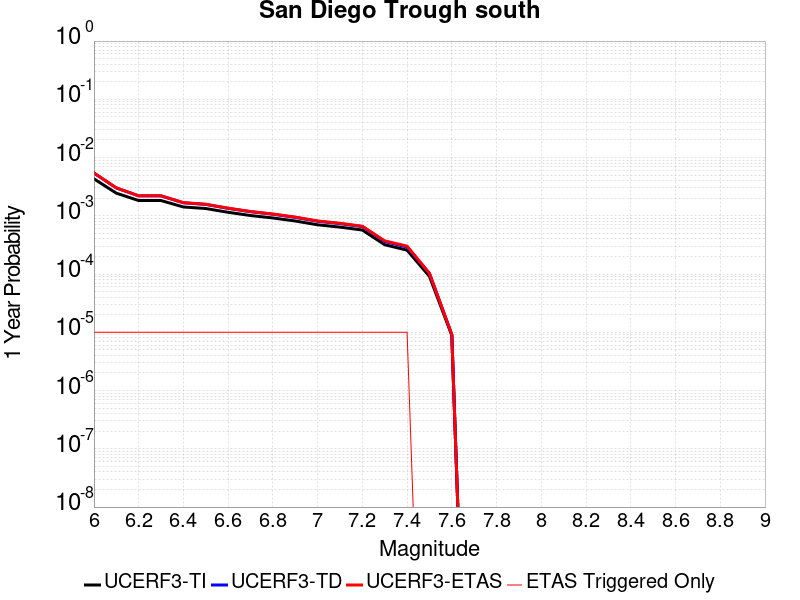 |  |

| Magnitude | 1 wk TI Prob | 1 wk TD Prob | 1 wk ETAS Prob | 1 wk ETAS/TD Gain | 1 wk ETAS Triggered Only | 1 mo TI Prob | 1 mo TD Prob | 1 mo ETAS Prob | 1 mo ETAS/TD Gain | 1 mo ETAS Triggered Only | 1 yr TI Prob | 1 yr TD Prob | 1 yr ETAS Prob | 1 yr ETAS/TD Gain | 1 yr ETAS Triggered Only | 10 yr TI Prob | 10 yr TD Prob | 10 yr ETAS Prob | 10 yr ETAS/TD Gain | 10 yr ETAS Triggered Only |
|-----|-----|-----|-----|-----|-----|-----|-----|-----|-----|-----|-----|-----|-----|-----|-----|-----|-----|-----|-----|-----|
| 6.0 | 8.279495E-5 | 1.04267834E-4 | 1.04267834E-4 | 1.0 | 0.0 | 3.5478722E-4 | 4.467906E-4 | 4.467906E-4 | 1.0 | 0.0 | 0.004310982 | 0.005426947 | 0.0054544713 | 1.0050719 | 2.7674767E-5 | 0.042283054 | 0.053004168 | 0.053030375 | 1.0004945 | 2.7674767E-5 |
| 6.1 | 4.6961468E-5 | 5.774223E-5 | 5.774223E-5 | 1.0 | 0.0 | 2.0124791E-4 | 2.474442E-4 | 2.474442E-4 | 1.0 | 0.0 | 0.00244744 | 0.0030085936 | 0.003036185 | 1.0091709 | 2.7674767E-5 | 0.024206603 | 0.029685596 | 0.029712448 | 1.0009046 | 2.7674767E-5 |
| 6.2 | 3.5079658E-5 | 4.214961E-5 | 4.214961E-5 | 1.0 | 0.0 | 1.5033272E-4 | 1.8062895E-4 | 1.8062895E-4 | 1.0 | 0.0 | 0.0018287642 | 0.002196982 | 0.002224596 | 1.0125691 | 2.7674767E-5 | 0.018137876 | 0.02175515 | 0.021782223 | 1.0012444 | 2.7674767E-5 |
| 6.3 | 3.5079658E-5 | 4.214961E-5 | 4.214961E-5 | 1.0 | 0.0 | 1.5033272E-4 | 1.8062895E-4 | 1.8062895E-4 | 1.0 | 0.0 | 0.0018287642 | 0.002196982 | 0.002224596 | 1.0125691 | 2.7674767E-5 | 0.018137876 | 0.02175515 | 0.021782223 | 1.0012444 | 2.7674767E-5 |
| 6.4 | 2.7196904E-5 | 3.209259E-5 | 3.209259E-5 | 1.0 | 0.0 | 1.16552954E-4 | 1.3753251E-4 | 1.3753251E-4 | 1.0 | 0.0 | 0.0014181085 | 0.0016731854 | 0.0017008139 | 1.0165125 | 2.7674767E-5 | 0.014090929 | 0.016607407 | 0.016634623 | 1.0016388 | 2.7674767E-5 |
| 6.5 | 2.5584688E-5 | 3.010663E-5 | 3.010663E-5 | 1.0 | 0.0 | 1.0964406E-4 | 1.2902213E-4 | 1.2902213E-4 | 1.0 | 0.0 | 0.0013340989 | 0.0015697242 | 0.0015973555 | 1.0176027 | 2.7674767E-5 | 0.013261181 | 0.015587864 | 0.0156151075 | 1.0017477 | 2.7674767E-5 |
| 6.6 | 2.2034688E-5 | 2.5746795E-5 | 2.5746795E-5 | 1.0 | 0.0 | 9.443096E-5 | 1.1033879E-4 | 1.1033879E-4 | 1.0 | 0.0 | 0.0011490905 | 0.0013425526 | 0.0013701902 | 1.0205859 | 2.7674767E-5 | 0.011431668 | 0.013345402 | 0.013372707 | 1.0020461 | 2.7674767E-5 |
| 6.7 | 1.9394853E-5 | 2.2545179E-5 | 2.2545179E-5 | 1.0 | 0.0 | 8.311815E-5 | 9.661865E-5 | 9.661865E-5 | 1.0 | 0.0 | 0.0010114936 | 0.0011757024 | 0.0012033447 | 1.0235113 | 2.7674767E-5 | 0.01006902 | 0.011695528 | 0.0117228795 | 1.0023386 | 2.7674767E-5 |
| 6.8 | 1.7615313E-5 | 2.0406198E-5 | 2.0406198E-5 | 1.0 | 0.0 | 7.549201E-5 | 8.745222E-5 | 8.745222E-5 | 1.0 | 0.0 | 9.1872766E-4 | 0.0010642151 | 0.0010918604 | 1.0259771 | 2.7674767E-5 | 0.009149387 | 0.010591755 | 0.0106191365 | 1.0025852 | 2.7674767E-5 |
| 6.9 | 1.5621423E-5 | 1.8028702E-5 | 1.8028702E-5 | 1.0 | 0.0 | 6.6947236E-5 | 7.7263605E-5 | 7.7263605E-5 | 1.0 | 0.0 | 8.147778E-4 | 9.402819E-4 | 9.6793065E-4 | 1.0294048 | 2.7674767E-5 | 0.008117969 | 0.00936348 | 0.009390895 | 1.0029279 | 2.7674767E-5 |
| 7.0 | 1.3444376E-5 | 1.5450234E-5 | 1.5450234E-5 | 1.0 | 0.0 | 5.7617483E-5 | 6.621363E-5 | 6.621363E-5 | 1.0 | 0.0 | 7.0126704E-4 | 8.058555E-4 | 8.33508E-4 | 1.0343144 | 2.7674767E-5 | 0.006990582 | 0.008029666 | 0.008057118 | 1.0034189 | 2.7674767E-5 |
| 7.1 | 1.2268361E-5 | 1.407496E-5 | 1.407496E-5 | 1.0 | 0.0 | 5.2577634E-5 | 6.0319875E-5 | 6.0319875E-5 | 1.0 | 0.0 | 6.399447E-4 | 7.3414965E-4 | 7.618041E-4 | 1.0376687 | 2.7674767E-5 | 0.0063810493 | 0.0073175486 | 0.007345021 | 1.0037543 | 2.7674767E-5 |
| 7.2 | 1.0922655E-5 | 1.2515262E-5 | 1.2515262E-5 | 1.0 | 0.0 | 4.681054E-5 | 5.363575E-5 | 5.363575E-5 | 1.0 | 0.0 | 5.697693E-4 | 6.5282214E-4 | 6.804788E-4 | 1.0423648 | 2.7674767E-5 | 0.0056831064 | 0.0065093245 | 0.006536819 | 1.0042238 | 2.7674767E-5 |
| 7.3 | 6.1106753E-6 | 6.9297907E-6 | 6.9297907E-6 | 1.0 | 0.0 | 2.6188345E-5 | 2.9698767E-5 | 2.9698767E-5 | 1.0 | 0.0 | 3.1879646E-4 | 3.615229E-4 | 3.8918765E-4 | 1.0765228 | 2.7674767E-5 | 0.0031833951 | 0.003609393 | 0.0036369679 | 1.0076398 | 2.7674767E-5 |
| 7.4 | 4.933187E-6 | 5.590247E-6 | 5.590247E-6 | 1.0 | 0.0 | 2.114206E-5 | 2.3957984E-5 | 2.3957984E-5 | 1.0 | 0.0 | 2.5737417E-4 | 2.916498E-4 | 3.193165E-4 | 1.0948627 | 2.7674767E-5 | 0.002570763 | 0.0029127118 | 0.002940306 | 1.0094737 | 2.7674767E-5 |
| 7.5 | 1.7489613E-6 | 1.9699116E-6 | 1.9699116E-6 | 1.0 | 0.0 | 7.495527E-6 | 8.442453E-6 | 8.442453E-6 | 1.0 | 0.0 | 9.125422E-5 | 1.02782236E-4 | 1.02782236E-4 | 1.0 | 0.0 | 9.1216754E-4 | 0.001027369 | 0.001027369 | 1.0 | 0.0 |
| 7.6 | 1.6988751E-7 | 1.7534346E-7 | 1.7534346E-7 | 1.0 | 0.0 | 7.2808916E-7 | 7.5147176E-7 | 7.5147176E-7 | 1.0 | 0.0 | 8.864449E-6 | 9.149132E-6 | 9.149132E-6 | 1.0 | 0.0 | 8.8640954E-5 | 9.148775E-5 | 9.148775E-5 | 1.0 | 0.0 |

## San Jacinto (Lytle Creek connector)
*[(top)](#table-of-contents)*

| 1 Week | 1 Month | 1 Year | 10 Year |
|-----|-----|-----|-----|
|  | 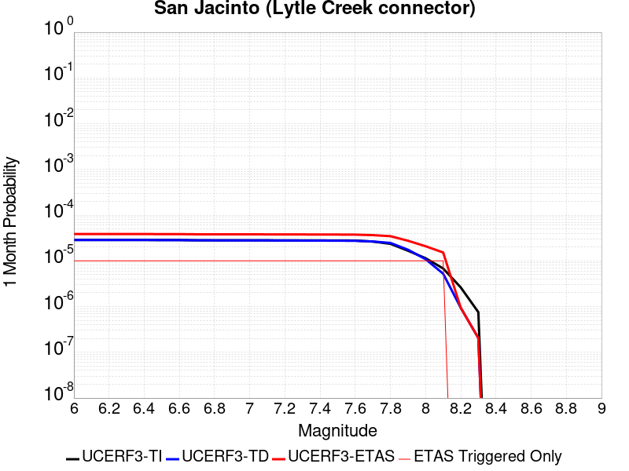 |  | 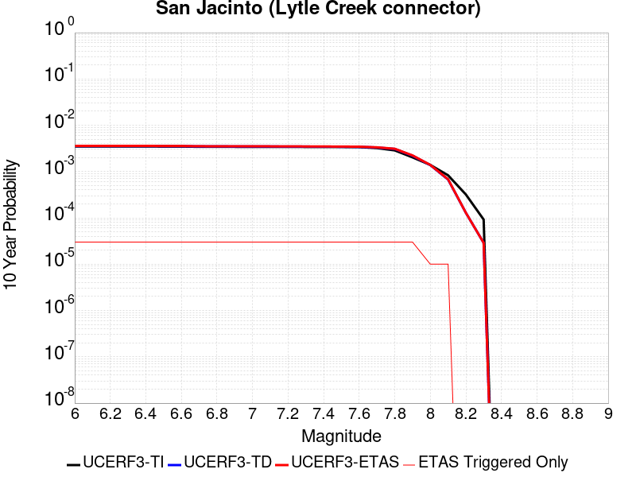 |

| Magnitude | 1 wk TI Prob | 1 wk TD Prob | 1 wk ETAS Prob | 1 wk ETAS/TD Gain | 1 wk ETAS Triggered Only | 1 mo TI Prob | 1 mo TD Prob | 1 mo ETAS Prob | 1 mo ETAS/TD Gain | 1 mo ETAS Triggered Only | 1 yr TI Prob | 1 yr TD Prob | 1 yr ETAS Prob | 1 yr ETAS/TD Gain | 1 yr ETAS Triggered Only | 10 yr TI Prob | 10 yr TD Prob | 10 yr ETAS Prob | 10 yr ETAS/TD Gain | 10 yr ETAS Triggered Only |
|-----|-----|-----|-----|-----|-----|-----|-----|-----|-----|-----|-----|-----|-----|-----|-----|-----|-----|-----|-----|-----|
| 6.0 | 6.693995E-6 | 6.679126E-6 | 6.679126E-6 | 1.0 | 0.0 | 2.8688235E-5 | 2.862451E-5 | 5.6298486E-5 | 1.966793 | 2.7674767E-5 | 3.492233E-4 | 3.4844776E-4 | 3.761129E-4 | 1.0793953 | 2.7674767E-5 | 0.00348675 | 0.0035592052 | 0.0035867814 | 1.0077479 | 2.7674767E-5 |
| 6.1 | 6.693995E-6 | 6.679126E-6 | 6.679126E-6 | 1.0 | 0.0 | 2.8688235E-5 | 2.862451E-5 | 5.6298486E-5 | 1.966793 | 2.7674767E-5 | 3.492233E-4 | 3.4844776E-4 | 3.761129E-4 | 1.0793953 | 2.7674767E-5 | 0.00348675 | 0.0035592052 | 0.0035867814 | 1.0077479 | 2.7674767E-5 |
| 6.2 | 6.693995E-6 | 6.679126E-6 | 6.679126E-6 | 1.0 | 0.0 | 2.8688235E-5 | 2.862451E-5 | 5.6298486E-5 | 1.966793 | 2.7674767E-5 | 3.492233E-4 | 3.4844776E-4 | 3.761129E-4 | 1.0793953 | 2.7674767E-5 | 0.00348675 | 0.0035592052 | 0.0035867814 | 1.0077479 | 2.7674767E-5 |
| 6.3 | 6.693995E-6 | 6.679126E-6 | 6.679126E-6 | 1.0 | 0.0 | 2.8688235E-5 | 2.862451E-5 | 5.6298486E-5 | 1.966793 | 2.7674767E-5 | 3.492233E-4 | 3.4844776E-4 | 3.761129E-4 | 1.0793953 | 2.7674767E-5 | 0.00348675 | 0.0035592052 | 0.0035867814 | 1.0077479 | 2.7674767E-5 |
| 6.4 | 6.693995E-6 | 6.679126E-6 | 6.679126E-6 | 1.0 | 0.0 | 2.8688235E-5 | 2.862451E-5 | 5.6298486E-5 | 1.966793 | 2.7674767E-5 | 3.492233E-4 | 3.4844776E-4 | 3.761129E-4 | 1.0793953 | 2.7674767E-5 | 0.00348675 | 0.0035592052 | 0.0035867814 | 1.0077479 | 2.7674767E-5 |
| 6.5 | 6.6561875E-6 | 6.639342E-6 | 6.639342E-6 | 1.0 | 0.0 | 2.8526205E-5 | 2.8454013E-5 | 5.6127992E-5 | 1.9725862 | 2.7674767E-5 | 3.472512E-4 | 3.463726E-4 | 3.740378E-4 | 1.0798712 | 2.7674767E-5 | 0.0034670907 | 0.0035385198 | 0.0035660968 | 1.0077933 | 2.7674767E-5 |
| 6.6 | 6.6561875E-6 | 6.639342E-6 | 6.639342E-6 | 1.0 | 0.0 | 2.8526205E-5 | 2.8454013E-5 | 5.6127992E-5 | 1.9725862 | 2.7674767E-5 | 3.472512E-4 | 3.463726E-4 | 3.740378E-4 | 1.0798712 | 2.7674767E-5 | 0.0034670907 | 0.0035385198 | 0.0035660968 | 1.0077933 | 2.7674767E-5 |
| 6.7 | 6.5802237E-6 | 6.558514E-6 | 6.558514E-6 | 1.0 | 0.0 | 2.8200653E-5 | 2.8107615E-5 | 5.5781602E-5 | 1.9845726 | 2.7674767E-5 | 3.4328885E-4 | 3.4215653E-4 | 3.6982185E-4 | 1.0808557 | 2.7674767E-5 | 0.0034275902 | 0.0034964923 | 0.0035240704 | 1.0078874 | 2.7674767E-5 |
| 6.8 | 6.575632E-6 | 6.5530025E-6 | 6.5530025E-6 | 1.0 | 0.0 | 2.8180975E-5 | 2.8083996E-5 | 5.5757984E-5 | 1.9854007 | 2.7674767E-5 | 3.4304935E-4 | 3.4186908E-4 | 3.6953436E-4 | 1.0809237 | 2.7674767E-5 | 0.0034252026 | 0.0034936266 | 0.0035212047 | 1.0078938 | 2.7674767E-5 |
| 6.9 | 6.570433E-6 | 6.544394E-6 | 6.544394E-6 | 1.0 | 0.0 | 2.8158694E-5 | 2.8047101E-5 | 5.572109E-5 | 1.986697 | 2.7674767E-5 | 3.4277816E-4 | 3.4142003E-4 | 3.6908535E-4 | 1.0810301 | 2.7674767E-5 | 0.0034224992 | 0.0034891504 | 0.0035167285 | 1.0079039 | 2.7674767E-5 |
| 7.0 | 6.5643826E-6 | 6.534512E-6 | 6.534512E-6 | 1.0 | 0.0 | 2.8132765E-5 | 2.8004752E-5 | 5.567874E-5 | 1.9881891 | 2.7674767E-5 | 3.424626E-4 | 3.4090457E-4 | 3.685699E-4 | 1.0811527 | 2.7674767E-5 | 0.0034193532 | 0.0034840119 | 0.0035115904 | 1.0079157 | 2.7674767E-5 |
| 7.1 | 6.557402E-6 | 6.5232207E-6 | 6.5232207E-6 | 1.0 | 0.0 | 2.8102848E-5 | 2.7956361E-5 | 5.5630353E-5 | 1.9898998 | 2.7674767E-5 | 3.4209844E-4 | 3.403156E-4 | 3.6798095E-4 | 1.0812932 | 2.7674767E-5 | 0.0034157229 | 0.0034781417 | 0.0035057203 | 1.0079291 | 2.7674767E-5 |
| 7.2 | 6.546394E-6 | 6.505181E-6 | 6.505181E-6 | 1.0 | 0.0 | 2.8055672E-5 | 2.7879049E-5 | 5.5553042E-5 | 1.9926449 | 2.7674767E-5 | 3.4152428E-4 | 3.3937462E-4 | 3.6704E-4 | 1.0815187 | 2.7674767E-5 | 0.0034099987 | 0.0034687659 | 0.0034963447 | 1.0079505 | 2.7674767E-5 |
| 7.3 | 6.5364216E-6 | 6.4859546E-6 | 6.4859546E-6 | 1.0 | 0.0 | 2.8012933E-5 | 2.7796652E-5 | 5.547065E-5 | 1.9955873 | 2.7674767E-5 | 3.4100408E-4 | 3.3837176E-4 | 3.6603716E-4 | 1.0817604 | 2.7674767E-5 | 0.003404813 | 0.0034587814 | 0.0034863604 | 1.0079737 | 2.7674767E-5 |
| 7.4 | 6.5269523E-6 | 6.467028E-6 | 6.467028E-6 | 1.0 | 0.0 | 2.7972354E-5 | 2.771554E-5 | 5.538954E-5 | 1.9985012 | 2.7674767E-5 | 3.4051016E-4 | 3.3738452E-4 | 3.6504996E-4 | 1.0819997 | 2.7674767E-5 | 0.0033998888 | 0.0034489564 | 0.003476536 | 1.0079964 | 2.7674767E-5 |
| 7.5 | 6.5111835E-6 | 6.4432875E-6 | 6.4432875E-6 | 1.0 | 0.0 | 2.7904773E-5 | 2.7613798E-5 | 5.52878E-5 | 2.0021803 | 2.7674767E-5 | 3.3968766E-4 | 3.361462E-4 | 3.6381165E-4 | 1.0823019 | 2.7674767E-5 | 0.0033916887 | 0.0034366222 | 0.003464202 | 1.0080252 | 2.7674767E-5 |
| 7.6 | 6.4768806E-6 | 6.4023743E-6 | 6.4023743E-6 | 1.0 | 0.0 | 2.7757764E-5 | 2.7438458E-5 | 5.5112465E-5 | 2.0085845 | 2.7674767E-5 | 3.3789838E-4 | 3.340121E-4 | 3.616776E-4 | 1.0828279 | 2.7674767E-5 | 0.0033738504 | 0.003415343 | 0.003442923 | 1.0080754 | 2.7674767E-5 |
| 7.7 | 6.1655364E-6 | 6.1947103E-6 | 6.1947103E-6 | 1.0 | 0.0 | 2.642346E-5 | 2.6548489E-5 | 5.422252E-5 | 2.0423958 | 2.7674767E-5 | 3.2165812E-4 | 3.2317996E-4 | 3.508458E-4 | 1.085605 | 2.7674767E-5 | 0.0032119295 | 0.0033068808 | 0.003334464 | 1.0083412 | 2.7674767E-5 |
| 7.8 | 5.5043524E-6 | 5.7552456E-6 | 5.7552456E-6 | 1.0 | 0.0 | 2.3589868E-5 | 2.4665105E-5 | 5.233919E-5 | 2.1219933 | 2.7674767E-5 | 2.871688E-4 | 3.0025633E-4 | 3.2792278E-4 | 1.0921428 | 2.7674767E-5 | 0.0028679797 | 0.0030767114 | 0.003104301 | 1.0089673 | 2.7674767E-5 |
| 7.9 | 3.889249E-6 | 4.0915534E-6 | 4.0915534E-6 | 1.0 | 0.0 | 1.6668104E-5 | 1.753511E-5 | 4.5209392E-5 | 2.578221 | 2.7674767E-5 | 2.0291525E-4 | 2.134691E-4 | 2.4113795E-4 | 1.1296153 | 2.7674767E-5 | 0.0020273007 | 0.0022020596 | 0.0022296736 | 1.01254 | 2.7674767E-5 |
| 8.0 | 2.668535E-6 | 2.5417835E-6 | 2.5417835E-6 | 1.0 | 0.0 | 1.1436528E-5 | 1.0893312E-5 | 3.8567778E-5 | 3.5405004 | 2.7674767E-5 | 1.3923083E-4 | 1.3261804E-4 | 1.6028913E-4 | 1.2086526 | 2.7674767E-5 | 0.0013914363 | 0.0013812308 | 0.0014088673 | 1.0200087 | 2.7674767E-5 |
| 8.1 | 1.5911459E-6 | 1.2241956E-6 | 1.2241956E-6 | 1.0 | 0.0 | 6.8191785E-6 | 5.2465416E-6 | 3.292116E-5 | 6.274831 | 2.7674767E-5 | 8.3020335E-5 | 6.3874795E-5 | 9.1547794E-5 | 1.4332381 | 2.7674767E-5 | 8.298933E-4 | 6.7229534E-4 | 6.9995155E-4 | 1.0411369 | 2.7674767E-5 |
| 8.2 | 6.1294963E-7 | 2.1974706E-7 | 2.1974706E-7 | 1.0 | 0.0 | 2.6269242E-6 | 9.417728E-7 | 9.417728E-7 | 1.0 | 0.0 | 3.1982334E-5 | 1.1466023E-5 | 1.1466023E-5 | 1.0 | 0.0 | 3.1977732E-4 | 1.287581E-4 | 1.287581E-4 | 1.0 | 0.0 |
| 8.3 | 1.762871E-7 | 4.795978E-8 | 4.795978E-8 | 1.0 | 0.0 | 7.5551594E-7 | 2.055419E-7 | 2.055419E-7 | 1.0 | 0.0 | 9.1983675E-6 | 2.5024697E-6 | 2.5024697E-6 | 1.0 | 0.0 | 9.197987E-5 | 2.8924647E-5 | 2.8924647E-5 | 1.0 | 0.0 |

## Elsinore (Temecula) rev
*[(top)](#table-of-contents)*

| 1 Week | 1 Month | 1 Year | 10 Year |
|-----|-----|-----|-----|
| 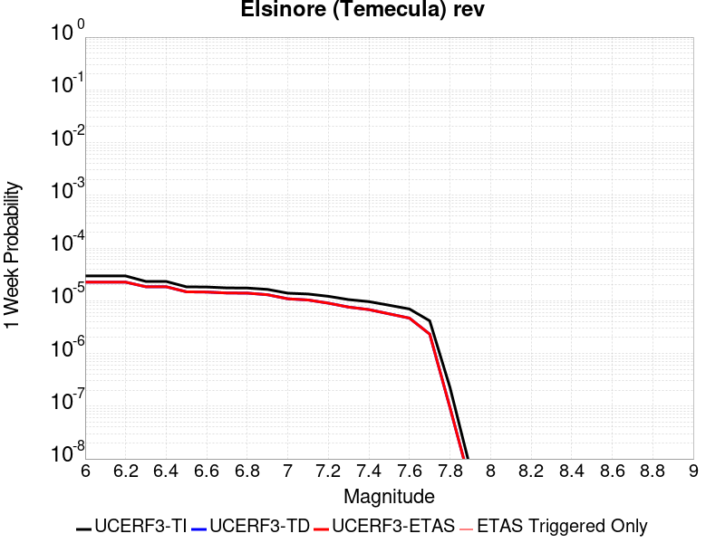 |  |  |  |

| Magnitude | 1 wk TI Prob | 1 wk TD Prob | 1 wk ETAS Prob | 1 wk ETAS/TD Gain | 1 wk ETAS Triggered Only | 1 mo TI Prob | 1 mo TD Prob | 1 mo ETAS Prob | 1 mo ETAS/TD Gain | 1 mo ETAS Triggered Only | 1 yr TI Prob | 1 yr TD Prob | 1 yr ETAS Prob | 1 yr ETAS/TD Gain | 1 yr ETAS Triggered Only | 10 yr TI Prob | 10 yr TD Prob | 10 yr ETAS Prob | 10 yr ETAS/TD Gain | 10 yr ETAS Triggered Only |
|-----|-----|-----|-----|-----|-----|-----|-----|-----|-----|-----|-----|-----|-----|-----|-----|-----|-----|-----|-----|-----|
| 6.0 | 2.9514995E-5 | 2.2526347E-5 | 2.2526347E-5 | 1.0 | 0.0 | 1.264867E-4 | 9.653804E-5 | 9.653804E-5 | 1.0 | 0.0 | 0.0015388876 | 0.0011747391 | 0.0011747391 | 1.0 | 0.0 | 0.015282745 | 0.011701716 | 0.011729066 | 1.0023373 | 2.7674767E-5 |
| 6.1 | 2.9514995E-5 | 2.2526347E-5 | 2.2526347E-5 | 1.0 | 0.0 | 1.264867E-4 | 9.653804E-5 | 9.653804E-5 | 1.0 | 0.0 | 0.0015388876 | 0.0011747391 | 0.0011747391 | 1.0 | 0.0 | 0.015282745 | 0.011701716 | 0.011729066 | 1.0023373 | 2.7674767E-5 |
| 6.2 | 2.9514995E-5 | 2.2526347E-5 | 2.2526347E-5 | 1.0 | 0.0 | 1.264867E-4 | 9.653804E-5 | 9.653804E-5 | 1.0 | 0.0 | 0.0015388876 | 0.0011747391 | 0.0011747391 | 1.0 | 0.0 | 0.015282745 | 0.011701716 | 0.011729066 | 1.0023373 | 2.7674767E-5 |
| 6.3 | 2.3223649E-5 | 1.8413199E-5 | 1.8413199E-5 | 1.0 | 0.0 | 9.952613E-5 | 7.891142E-5 | 7.891142E-5 | 1.0 | 0.0 | 0.001211057 | 9.603404E-4 | 9.603404E-4 | 1.0 | 0.0 | 0.012044783 | 0.009573364 | 0.009600773 | 1.0028632 | 2.7674767E-5 |
| 6.4 | 2.3223649E-5 | 1.8413199E-5 | 1.8413199E-5 | 1.0 | 0.0 | 9.952613E-5 | 7.891142E-5 | 7.891142E-5 | 1.0 | 0.0 | 0.001211057 | 9.603404E-4 | 9.603404E-4 | 1.0 | 0.0 | 0.012044783 | 0.009573364 | 0.009600773 | 1.0028632 | 2.7674767E-5 |
| 6.5 | 1.8338875E-5 | 1.4755047E-5 | 1.4755047E-5 | 1.0 | 0.0 | 7.8592806E-5 | 6.323443E-5 | 6.323443E-5 | 1.0 | 0.0 | 9.5644733E-4 | 7.6961605E-4 | 7.6961605E-4 | 1.0 | 0.0 | 0.009523412 | 0.007676475 | 0.0077039376 | 1.0035775 | 2.7674767E-5 |
| 6.6 | 1.8223333E-5 | 1.4617579E-5 | 1.4617579E-5 | 1.0 | 0.0 | 7.809766E-5 | 6.264531E-5 | 6.264531E-5 | 1.0 | 0.0 | 9.504242E-4 | 7.6244853E-4 | 7.6244853E-4 | 1.0 | 0.0 | 0.009463696 | 0.007605292 | 0.007632756 | 1.0036112 | 2.7674767E-5 |
| 6.7 | 1.7512752E-5 | 1.4031902E-5 | 1.4031902E-5 | 1.0 | 0.0 | 7.505249E-5 | 6.0135386E-5 | 6.0135386E-5 | 1.0 | 0.0 | 9.13381E-4 | 7.319109E-4 | 7.319109E-4 | 1.0 | 0.0 | 0.00909636 | 0.0073013525 | 0.007328825 | 1.0037627 | 2.7674767E-5 |
| 6.8 | 1.7417142E-5 | 1.3955862E-5 | 1.3955862E-5 | 1.0 | 0.0 | 7.4642754E-5 | 5.9809518E-5 | 5.9809518E-5 | 1.0 | 0.0 | 9.083966E-4 | 7.279462E-4 | 7.279462E-4 | 1.0 | 0.0 | 0.009046922 | 0.0072619086 | 0.007289382 | 1.0037832 | 2.7674767E-5 |
| 6.9 | 1.6402591E-5 | 1.2993129E-5 | 1.2993129E-5 | 1.0 | 0.0 | 7.0294926E-5 | 5.5683693E-5 | 5.5683693E-5 | 1.0 | 0.0 | 8.5550465E-4 | 6.7774573E-4 | 6.7774573E-4 | 1.0 | 0.0 | 0.008522186 | 0.006762511 | 0.006789999 | 1.0040647 | 2.7674767E-5 |
| 7.0 | 1.3912486E-5 | 1.0882295E-5 | 1.0882295E-5 | 1.0 | 0.0 | 5.9623577E-5 | 4.663759E-5 | 4.663759E-5 | 1.0 | 0.0 | 7.2567526E-4 | 5.676674E-4 | 5.676674E-4 | 1.0 | 0.0 | 0.0072331014 | 0.0056660925 | 0.0056936103 | 1.0048566 | 2.7674767E-5 |
| 7.1 | 1.3405147E-5 | 1.0331306E-5 | 1.0331306E-5 | 1.0 | 0.0 | 5.7449364E-5 | 4.427629E-5 | 4.427629E-5 | 1.0 | 0.0 | 6.9922156E-4 | 5.389331E-4 | 5.389331E-4 | 1.0 | 0.0 | 0.0069702556 | 0.0053795925 | 0.0054071187 | 1.0051167 | 2.7674767E-5 |
| 7.2 | 1.21402E-5 | 9.000168E-6 | 9.000168E-6 | 1.0 | 0.0 | 5.202839E-5 | 3.8571587E-5 | 3.8571587E-5 | 1.0 | 0.0 | 6.332616E-4 | 4.6950966E-4 | 4.6950966E-4 | 1.0 | 0.0 | 0.0063146 | 0.0046866024 | 0.0047141477 | 1.0058774 | 2.7674767E-5 |
| 7.3 | 1.05047775E-5 | 7.5747207E-6 | 7.5747207E-6 | 1.0 | 0.0 | 4.5019697E-5 | 3.2462693E-5 | 3.2462693E-5 | 1.0 | 0.0 | 5.4797693E-4 | 3.9516305E-4 | 3.9516305E-4 | 1.0 | 0.0 | 0.005466277 | 0.0039449935 | 0.0039449935 | 1.0 | 0.0 |
| 7.4 | 9.624483E-6 | 6.789545E-6 | 6.789545E-6 | 1.0 | 0.0 | 4.124713E-5 | 2.9097733E-5 | 2.9097733E-5 | 1.0 | 0.0 | 5.0206814E-4 | 3.542087E-4 | 3.542087E-4 | 1.0 | 0.0 | 0.005009353 | 0.0035365953 | 0.0035365953 | 1.0 | 0.0 |
| 7.5 | 8.215151E-6 | 5.6378112E-6 | 5.6378112E-6 | 1.0 | 0.0 | 3.5207315E-5 | 2.416183E-5 | 2.416183E-5 | 1.0 | 0.0 | 4.2856473E-4 | 2.9413187E-4 | 2.9413187E-4 | 1.0 | 0.0 | 0.004277392 | 0.0029375537 | 0.0029375537 | 1.0 | 0.0 |
| 7.6 | 6.975058E-6 | 4.6780897E-6 | 4.6780897E-6 | 1.0 | 0.0 | 2.9892764E-5 | 2.0048808E-5 | 2.0048808E-5 | 1.0 | 0.0 | 3.6388362E-4 | 2.4406807E-4 | 2.4406807E-4 | 1.0 | 0.0 | 0.0036328835 | 0.0024381164 | 0.0024381164 | 1.0 | 0.0 |
| 7.7 | 4.159604E-6 | 2.3279777E-6 | 2.3279777E-6 | 1.0 | 0.0 | 1.7826753E-5 | 9.977013E-6 | 9.977013E-6 | 1.0 | 0.0 | 2.1701909E-4 | 1.2146411E-4 | 1.2146411E-4 | 1.0 | 0.0 | 0.0021680726 | 0.0012140503 | 0.0012140503 | 1.0 | 0.0 |
| 7.8 | 2.2692414E-7 | 9.388808E-8 | 9.388808E-8 | 1.0 | 0.0 | 9.725317E-7 | 4.0237745E-7 | 4.0237745E-7 | 1.0 | 0.0 | 1.1840509E-5 | 4.8989377E-6 | 4.8989377E-6 | 1.0 | 0.0 | 1.1839878E-4 | 4.8988626E-5 | 4.8988626E-5 | 1.0 | 0.0 |
| 7.9 | 6.676829E-9 | 3.4407224E-9 | 3.4407224E-9 | 1.0 | 0.0 | 2.861498E-8 | 1.4745954E-8 | 1.4745954E-8 | 1.0 | 0.0 | 3.4838732E-7 | 1.7953197E-7 | 1.7953197E-7 | 1.0 | 0.0 | 3.4838679E-6 | 1.7953184E-6 | 1.7953184E-6 | 1.0 | 0.0 |

## Owens Valley
*[(top)](#table-of-contents)*

| 1 Week | 1 Month | 1 Year | 10 Year |
|-----|-----|-----|-----|
|  |  |  |  |

| Magnitude | 1 wk TI Prob | 1 wk TD Prob | 1 wk ETAS Prob | 1 wk ETAS/TD Gain | 1 wk ETAS Triggered Only | 1 mo TI Prob | 1 mo TD Prob | 1 mo ETAS Prob | 1 mo ETAS/TD Gain | 1 mo ETAS Triggered Only | 1 yr TI Prob | 1 yr TD Prob | 1 yr ETAS Prob | 1 yr ETAS/TD Gain | 1 yr ETAS Triggered Only | 10 yr TI Prob | 10 yr TD Prob | 10 yr ETAS Prob | 10 yr ETAS/TD Gain | 10 yr ETAS Triggered Only |
|-----|-----|-----|-----|-----|-----|-----|-----|-----|-----|-----|-----|-----|-----|-----|-----|-----|-----|-----|-----|-----|
| 6.0 | 4.83821E-5 | 3.6323709E-6 | 3.6323709E-6 | 1.0 | 0.0 | 2.0733538E-4 | 1.5567217E-5 | 1.5567217E-5 | 1.0 | 0.0 | 0.002521386 | 1.8951538E-4 | 1.8951538E-4 | 1.0 | 0.0 | 0.024929691 | 0.0019280115 | 0.001955633 | 1.0143263 | 2.7674767E-5 |
| 6.1 | 4.83821E-5 | 3.6323709E-6 | 3.6323709E-6 | 1.0 | 0.0 | 2.0733538E-4 | 1.5567217E-5 | 1.5567217E-5 | 1.0 | 0.0 | 0.002521386 | 1.8951538E-4 | 1.8951538E-4 | 1.0 | 0.0 | 0.024929691 | 0.0019280115 | 0.001955633 | 1.0143263 | 2.7674767E-5 |
| 6.2 | 4.83821E-5 | 3.6323709E-6 | 3.6323709E-6 | 1.0 | 0.0 | 2.0733538E-4 | 1.5567217E-5 | 1.5567217E-5 | 1.0 | 0.0 | 0.002521386 | 1.8951538E-4 | 1.8951538E-4 | 1.0 | 0.0 | 0.024929691 | 0.0019280115 | 0.001955633 | 1.0143263 | 2.7674767E-5 |
| 6.3 | 3.953008E-5 | 3.1585441E-6 | 3.1585441E-6 | 1.0 | 0.0 | 1.6940363E-4 | 1.3536552E-5 | 1.3536552E-5 | 1.0 | 0.0 | 0.002060538 | 1.6479578E-4 | 1.6479578E-4 | 1.0 | 0.0 | 0.020415364 | 0.0016608762 | 0.0016608762 | 1.0 | 0.0 |
| 6.4 | 3.953008E-5 | 3.1585441E-6 | 3.1585441E-6 | 1.0 | 0.0 | 1.6940363E-4 | 1.3536552E-5 | 1.3536552E-5 | 1.0 | 0.0 | 0.002060538 | 1.6479578E-4 | 1.6479578E-4 | 1.0 | 0.0 | 0.020415364 | 0.0016608762 | 0.0016608762 | 1.0 | 0.0 |
| 6.5 | 3.457342E-5 | 2.973637E-6 | 2.973637E-6 | 1.0 | 0.0 | 1.4816338E-4 | 1.2744101E-5 | 1.2744101E-5 | 1.0 | 0.0 | 0.0018023965 | 1.5514907E-4 | 1.5514907E-4 | 1.0 | 0.0 | 0.017878477 | 0.0015568237 | 0.0015568237 | 1.0 | 0.0 |
| 6.6 | 3.1127765E-5 | 2.8759255E-6 | 2.8759255E-6 | 1.0 | 0.0 | 1.3339789E-4 | 1.232534E-5 | 1.232534E-5 | 1.0 | 0.0 | 0.0016229092 | 1.5005138E-4 | 1.5005138E-4 | 1.0 | 0.0 | 0.016111081 | 0.0015020196 | 0.0015020196 | 1.0 | 0.0 |
| 6.7 | 2.806885E-5 | 2.811482E-6 | 2.811482E-6 | 1.0 | 0.0 | 1.2028952E-4 | 1.2049158E-5 | 1.2049158E-5 | 1.0 | 0.0 | 0.001463541 | 1.466893E-4 | 1.466893E-4 | 1.0 | 0.0 | 0.014539397 | 0.0014663105 | 0.0014663105 | 1.0 | 0.0 |
| 6.8 | 2.524524E-5 | 2.2362938E-6 | 2.2362938E-6 | 1.0 | 0.0 | 1.0818939E-4 | 9.584082E-6 | 9.584082E-6 | 1.0 | 0.0 | 0.0013164099 | 1.1668026E-4 | 1.1668026E-4 | 1.0 | 0.0 | 0.01308639 | 0.001166464 | 0.001166464 | 1.0 | 0.0 |
| 6.9 | 2.2704568E-5 | 1.60885E-6 | 1.60885E-6 | 1.0 | 0.0 | 9.730166E-5 | 6.8950535E-6 | 6.8950535E-6 | 1.0 | 0.0 | 0.0011840039 | 8.394406E-5 | 8.394406E-5 | 1.0 | 0.0 | 0.011777153 | 8.393368E-4 | 8.393368E-4 | 1.0 | 0.0 |
| 7.0 | 2.0871712E-5 | 1.5401896E-6 | 1.5401896E-6 | 1.0 | 0.0 | 8.944713E-5 | 6.600796E-6 | 6.600796E-6 | 1.0 | 0.0 | 0.0010884746 | 8.0361744E-5 | 8.0361744E-5 | 1.0 | 0.0 | 0.010831586 | 8.03501E-4 | 8.03501E-4 | 1.0 | 0.0 |
| 7.1 | 1.944928E-5 | 1.3869685E-6 | 1.3869685E-6 | 1.0 | 0.0 | 8.335139E-5 | 5.9441377E-6 | 5.9441377E-6 | 1.0 | 0.0 | 0.0010143308 | 7.236748E-5 | 7.236748E-5 | 1.0 | 0.0 | 0.010097133 | 7.2359905E-4 | 7.2359905E-4 | 1.0 | 0.0 |
| 7.2 | 1.7876306E-5 | 1.2493987E-6 | 1.2493987E-6 | 1.0 | 0.0 | 7.6610486E-5 | 5.354555E-6 | 5.354555E-6 | 1.0 | 0.0 | 9.3233347E-4 | 6.5189764E-5 | 6.5189764E-5 | 1.0 | 0.0 | 0.009284316 | 6.518455E-4 | 6.518455E-4 | 1.0 | 0.0 |
| 7.3 | 1.2618672E-5 | 1.1119708E-6 | 1.1119708E-6 | 1.0 | 0.0 | 5.40789E-5 | 4.7655803E-6 | 4.7655803E-6 | 1.0 | 0.0 | 6.582117E-4 | 5.8019406E-5 | 5.8019406E-5 | 1.0 | 0.0 | 0.0065626553 | 5.801767E-4 | 5.801767E-4 | 1.0 | 0.0 |
| 7.4 | 7.4874442E-6 | 8.552428E-7 | 8.552428E-7 | 1.0 | 0.0 | 3.208865E-5 | 3.665321E-6 | 3.665321E-6 | 1.0 | 0.0 | 3.906093E-4 | 4.4624372E-5 | 4.4624372E-5 | 1.0 | 0.0 | 0.003899234 | 4.4624778E-4 | 4.4624778E-4 | 1.0 | 0.0 |
| 7.5 | 2.4734156E-6 | 6.071134E-7 | 6.071134E-7 | 1.0 | 0.0 | 1.060031E-5 | 2.601912E-6 | 2.601912E-6 | 1.0 | 0.0 | 1.2905113E-4 | 3.167782E-5 | 3.167782E-5 | 1.0 | 0.0 | 0.0012897621 | 3.1673338E-4 | 3.1673338E-4 | 1.0 | 0.0 |
| 7.6 | 1.1328841E-6 | 3.1977802E-7 | 3.1977802E-7 | 1.0 | 0.0 | 4.8552088E-6 | 1.3704765E-6 | 1.3704765E-6 | 1.0 | 0.0 | 5.9110564E-5 | 1.6685426E-5 | 1.6685426E-5 | 1.0 | 0.0 | 5.9094845E-4 | 1.6684193E-4 | 1.6684193E-4 | 1.0 | 0.0 |
| 7.7 | 4.8613185E-7 | 8.9695554E-8 | 8.9695554E-8 | 1.0 | 0.0 | 2.0834207E-6 | 3.8440947E-7 | 3.8440947E-7 | 1.0 | 0.0 | 2.536535E-5 | 4.680176E-6 | 4.680176E-6 | 1.0 | 0.0 | 2.5362454E-4 | 4.680084E-5 | 4.680084E-5 | 1.0 | 0.0 |

## Kern Canyon (North Kern) 2011
*[(top)](#table-of-contents)*

| 1 Week | 1 Month | 1 Year | 10 Year |
|-----|-----|-----|-----|
|  |  |  |  |

| Magnitude | 1 wk TI Prob | 1 wk TD Prob | 1 wk ETAS Prob | 1 wk ETAS/TD Gain | 1 wk ETAS Triggered Only | 1 mo TI Prob | 1 mo TD Prob | 1 mo ETAS Prob | 1 mo ETAS/TD Gain | 1 mo ETAS Triggered Only | 1 yr TI Prob | 1 yr TD Prob | 1 yr ETAS Prob | 1 yr ETAS/TD Gain | 1 yr ETAS Triggered Only | 10 yr TI Prob | 10 yr TD Prob | 10 yr ETAS Prob | 10 yr ETAS/TD Gain | 10 yr ETAS Triggered Only |
|-----|-----|-----|-----|-----|-----|-----|-----|-----|-----|-----|-----|-----|-----|-----|-----|-----|-----|-----|-----|-----|
| 6.0 | 6.6264497E-6 | 6.75748E-6 | 6.75748E-6 | 1.0 | 0.0 | 2.8398761E-5 | 2.8960352E-5 | 2.8960352E-5 | 1.0 | 0.0 | 3.4570007E-4 | 3.5254325E-4 | 3.5254325E-4 | 1.0 | 0.0 | 0.0034516277 | 0.0035206282 | 0.0035482056 | 1.0078331 | 2.7674767E-5 |
| 6.1 | 6.6264497E-6 | 6.75748E-6 | 6.75748E-6 | 1.0 | 0.0 | 2.8398761E-5 | 2.8960352E-5 | 2.8960352E-5 | 1.0 | 0.0 | 3.4570007E-4 | 3.5254325E-4 | 3.5254325E-4 | 1.0 | 0.0 | 0.0034516277 | 0.0035206282 | 0.0035482056 | 1.0078331 | 2.7674767E-5 |
| 6.2 | 6.6264497E-6 | 6.75748E-6 | 6.75748E-6 | 1.0 | 0.0 | 2.8398761E-5 | 2.8960352E-5 | 2.8960352E-5 | 1.0 | 0.0 | 3.4570007E-4 | 3.5254325E-4 | 3.5254325E-4 | 1.0 | 0.0 | 0.0034516277 | 0.0035206282 | 0.0035482056 | 1.0078331 | 2.7674767E-5 |
| 6.3 | 6.6264497E-6 | 6.75748E-6 | 6.75748E-6 | 1.0 | 0.0 | 2.8398761E-5 | 2.8960352E-5 | 2.8960352E-5 | 1.0 | 0.0 | 3.4570007E-4 | 3.5254325E-4 | 3.5254325E-4 | 1.0 | 0.0 | 0.0034516277 | 0.0035206282 | 0.0035482056 | 1.0078331 | 2.7674767E-5 |
| 6.4 | 6.6264497E-6 | 6.75748E-6 | 6.75748E-6 | 1.0 | 0.0 | 2.8398761E-5 | 2.8960352E-5 | 2.8960352E-5 | 1.0 | 0.0 | 3.4570007E-4 | 3.5254325E-4 | 3.5254325E-4 | 1.0 | 0.0 | 0.0034516277 | 0.0035206282 | 0.0035482056 | 1.0078331 | 2.7674767E-5 |
| 6.5 | 3.2162225E-6 | 3.2571556E-6 | 3.2571556E-6 | 1.0 | 0.0 | 1.3783738E-5 | 1.3959168E-5 | 1.3959168E-5 | 1.0 | 0.0 | 1.6780409E-4 | 1.6994042E-4 | 1.6994042E-4 | 1.0 | 0.0 | 0.0016767744 | 0.0016981844 | 0.0016981844 | 1.0 | 0.0 |
| 6.6 | 3.2162225E-6 | 3.2571556E-6 | 3.2571556E-6 | 1.0 | 0.0 | 1.3783738E-5 | 1.3959168E-5 | 1.3959168E-5 | 1.0 | 0.0 | 1.6780409E-4 | 1.6994042E-4 | 1.6994042E-4 | 1.0 | 0.0 | 0.0016767744 | 0.0016981844 | 0.0016981844 | 1.0 | 0.0 |
| 6.7 | 2.1908265E-6 | 2.2071629E-6 | 2.2071629E-6 | 1.0 | 0.0 | 9.389223E-6 | 9.459237E-6 | 9.459237E-6 | 1.0 | 0.0 | 1.1430779E-4 | 1.15160314E-4 | 1.15160314E-4 | 1.0 | 0.0 | 0.0011424901 | 0.0011510258 | 0.0011510258 | 1.0 | 0.0 |
| 6.8 | 1.7303895E-6 | 1.7365841E-6 | 1.7365841E-6 | 1.0 | 0.0 | 7.415934E-6 | 7.4424825E-6 | 7.4424825E-6 | 1.0 | 0.0 | 9.028525E-5 | 9.0608555E-5 | 9.0608555E-5 | 1.0 | 0.0 | 9.024858E-4 | 9.057258E-4 | 9.057258E-4 | 1.0 | 0.0 |
| 6.9 | 1.3700314E-6 | 1.3688865E-6 | 1.3688865E-6 | 1.0 | 0.0 | 5.87155E-6 | 5.8666433E-6 | 5.8666433E-6 | 1.0 | 0.0 | 7.148377E-5 | 7.142409E-5 | 7.142409E-5 | 1.0 | 0.0 | 7.146078E-4 | 7.1401586E-4 | 7.1401586E-4 | 1.0 | 0.0 |
| 7.0 | 1.1467797E-6 | 1.1414006E-6 | 1.1414006E-6 | 1.0 | 0.0 | 4.9147607E-6 | 4.891708E-6 | 4.891708E-6 | 1.0 | 0.0 | 5.983557E-5 | 5.955495E-5 | 5.955495E-5 | 1.0 | 0.0 | 5.981946E-4 | 5.9539307E-4 | 5.9539307E-4 | 1.0 | 0.0 |
| 7.1 | 9.3952065E-7 | 9.3028564E-7 | 9.3028564E-7 | 1.0 | 0.0 | 4.026511E-6 | 3.9869324E-6 | 3.9869324E-6 | 1.0 | 0.0 | 4.9021666E-5 | 4.8539838E-5 | 4.8539838E-5 | 1.0 | 0.0 | 4.901085E-4 | 4.8529412E-4 | 4.8529412E-4 | 1.0 | 0.0 |
| 7.2 | 6.858055E-7 | 6.7194225E-7 | 6.7194225E-7 | 1.0 | 0.0 | 2.939163E-6 | 2.8797494E-6 | 2.8797494E-6 | 1.0 | 0.0 | 3.5783723E-5 | 3.5060395E-5 | 3.5060395E-5 | 1.0 | 0.0 | 3.5777962E-4 | 3.505495E-4 | 3.505495E-4 | 1.0 | 0.0 |
| 7.3 | 5.1101983E-7 | 4.939391E-7 | 4.939391E-7 | 1.0 | 0.0 | 2.1900833E-6 | 2.1168803E-6 | 2.1168803E-6 | 1.0 | 0.0 | 2.6663936E-5 | 2.5772719E-5 | 2.5772719E-5 | 1.0 | 0.0 | 2.6660739E-4 | 2.5769777E-4 | 2.5769777E-4 | 1.0 | 0.0 |
| 7.4 | 3.4999414E-7 | 3.2996545E-7 | 3.2996545E-7 | 1.0 | 0.0 | 1.499974E-6 | 1.4141368E-6 | 1.4141368E-6 | 1.0 | 0.0 | 1.8262032E-5 | 1.7216982E-5 | 1.7216982E-5 | 1.0 | 0.0 | 1.826053E-4 | 1.7215672E-4 | 1.7215672E-4 | 1.0 | 0.0 |
| 7.5 | 1.7021522E-7 | 1.475037E-7 | 1.475037E-7 | 1.0 | 0.0 | 7.2949354E-7 | 6.3215856E-7 | 6.3215856E-7 | 1.0 | 0.0 | 8.881548E-6 | 7.696504E-6 | 7.696504E-6 | 1.0 | 0.0 | 8.8811925E-5 | 7.696245E-5 | 7.696245E-5 | 1.0 | 0.0 |
| 7.6 | 2.572245E-8 | 1.735313E-8 | 1.735313E-8 | 1.0 | 0.0 | 1.10239064E-7 | 7.4370554E-8 | 7.4370554E-8 | 1.0 | 0.0 | 1.3421597E-6 | 9.054612E-7 | 9.054612E-7 | 1.0 | 0.0 | 1.3421517E-5 | 9.054581E-6 | 9.054581E-6 | 1.0 | 0.0 |

## Hector Mine
*[(top)](#table-of-contents)*

| 1 Week | 1 Month | 1 Year | 10 Year |
|-----|-----|-----|-----|
|  |  |  | 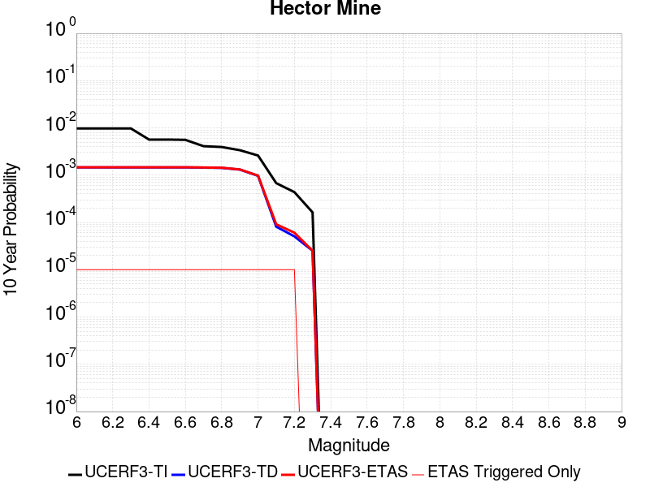 |

| Magnitude | 1 wk TI Prob | 1 wk TD Prob | 1 wk ETAS Prob | 1 wk ETAS/TD Gain | 1 wk ETAS Triggered Only | 1 mo TI Prob | 1 mo TD Prob | 1 mo ETAS Prob | 1 mo ETAS/TD Gain | 1 mo ETAS Triggered Only | 1 yr TI Prob | 1 yr TD Prob | 1 yr ETAS Prob | 1 yr ETAS/TD Gain | 1 yr ETAS Triggered Only | 10 yr TI Prob | 10 yr TD Prob | 10 yr ETAS Prob | 10 yr ETAS/TD Gain | 10 yr ETAS Triggered Only |
|-----|-----|-----|-----|-----|-----|-----|-----|-----|-----|-----|-----|-----|-----|-----|-----|-----|-----|-----|-----|-----|
| 6.0 | 1.8760093E-5 | 2.796824E-6 | 2.796824E-6 | 1.0 | 0.0 | 8.039792E-5 | 1.1986356E-5 | 1.1986356E-5 | 1.0 | 0.0 | 9.78405E-4 | 1.4592812E-4 | 1.4592812E-4 | 1.0 | 0.0 | 0.009741086 | 0.0014587152 | 0.0014863496 | 1.0189444 | 2.7674767E-5 |
| 6.1 | 1.8760093E-5 | 2.796824E-6 | 2.796824E-6 | 1.0 | 0.0 | 8.039792E-5 | 1.1986356E-5 | 1.1986356E-5 | 1.0 | 0.0 | 9.78405E-4 | 1.4592812E-4 | 1.4592812E-4 | 1.0 | 0.0 | 0.009741086 | 0.0014587152 | 0.0014863496 | 1.0189444 | 2.7674767E-5 |
| 6.2 | 1.8760093E-5 | 2.796824E-6 | 2.796824E-6 | 1.0 | 0.0 | 8.039792E-5 | 1.1986356E-5 | 1.1986356E-5 | 1.0 | 0.0 | 9.78405E-4 | 1.4592812E-4 | 1.4592812E-4 | 1.0 | 0.0 | 0.009741086 | 0.0014587152 | 0.0014863496 | 1.0189444 | 2.7674767E-5 |
| 6.3 | 1.8760093E-5 | 2.796824E-6 | 2.796824E-6 | 1.0 | 0.0 | 8.039792E-5 | 1.1986356E-5 | 1.1986356E-5 | 1.0 | 0.0 | 9.78405E-4 | 1.4592812E-4 | 1.4592812E-4 | 1.0 | 0.0 | 0.009741086 | 0.0014587152 | 0.0014863496 | 1.0189444 | 2.7674767E-5 |
| 6.4 | 1.0888055E-5 | 2.796824E-6 | 2.796824E-6 | 1.0 | 0.0 | 4.666226E-5 | 1.1986356E-5 | 1.1986356E-5 | 1.0 | 0.0 | 5.679649E-4 | 1.4592812E-4 | 1.4592812E-4 | 1.0 | 0.0 | 0.0056651547 | 0.0014587152 | 0.0014863496 | 1.0189444 | 2.7674767E-5 |
| 6.5 | 1.0888055E-5 | 2.796824E-6 | 2.796824E-6 | 1.0 | 0.0 | 4.666226E-5 | 1.1986356E-5 | 1.1986356E-5 | 1.0 | 0.0 | 5.679649E-4 | 1.4592812E-4 | 1.4592812E-4 | 1.0 | 0.0 | 0.0056651547 | 0.0014587152 | 0.0014863496 | 1.0189444 | 2.7674767E-5 |
| 6.6 | 1.0730738E-5 | 2.796824E-6 | 2.796824E-6 | 1.0 | 0.0 | 4.5988065E-5 | 1.1986356E-5 | 1.1986356E-5 | 1.0 | 0.0 | 5.5976084E-4 | 1.4592812E-4 | 1.4592812E-4 | 1.0 | 0.0 | 0.0055835294 | 0.0014587152 | 0.0014863496 | 1.0189444 | 2.7674767E-5 |
| 6.7 | 7.881326E-6 | 2.7714984E-6 | 2.7714984E-6 | 1.0 | 0.0 | 3.3776672E-5 | 1.1877819E-5 | 1.1877819E-5 | 1.0 | 0.0 | 4.111534E-4 | 1.4460685E-4 | 1.4460685E-4 | 1.0 | 0.0 | 0.0041039353 | 0.0014455197 | 0.0014731545 | 1.0191175 | 2.7674767E-5 |
| 6.8 | 7.5683483E-6 | 2.733237E-6 | 2.733237E-6 | 1.0 | 0.0 | 3.2435375E-5 | 1.17138425E-5 | 1.17138425E-5 | 1.0 | 0.0 | 3.9482914E-4 | 1.426107E-4 | 1.426107E-4 | 1.0 | 0.0 | 0.0039412836 | 0.001425584 | 0.0014532192 | 1.0193852 | 2.7674767E-5 |
| 6.9 | 6.473048E-6 | 2.514268E-6 | 2.514268E-6 | 1.0 | 0.0 | 2.7741338E-5 | 1.0775412E-5 | 1.0775412E-5 | 1.0 | 0.0 | 3.3769844E-4 | 1.3118672E-4 | 1.3118672E-4 | 1.0 | 0.0 | 0.0033718573 | 0.0013114824 | 0.0013391209 | 1.0210742 | 2.7674767E-5 |
| 7.0 | 4.9959954E-6 | 1.8568135E-6 | 1.8568135E-6 | 1.0 | 0.0 | 2.1411232E-5 | 7.957768E-6 | 7.957768E-6 | 1.0 | 0.0 | 2.6065056E-4 | 9.688508E-5 | 9.688508E-5 | 1.0 | 0.0 | 0.0026034506 | 9.687781E-4 | 9.964261E-4 | 1.028539 | 2.7674767E-5 |
| 7.1 | 1.2997541E-6 | 1.5606962E-7 | 1.5606962E-7 | 1.0 | 0.0 | 5.5703626E-6 | 6.6886963E-7 | 6.6886963E-7 | 1.0 | 0.0 | 6.7817055E-5 | 8.143461E-6 | 8.143461E-6 | 1.0 | 0.0 | 6.779636E-4 | 8.143202E-5 | 1.09104534E-4 | 1.3398235 | 2.7674767E-5 |
| 7.2 | 8.392699E-7 | 9.730641E-8 | 9.730641E-8 | 1.0 | 0.0 | 3.596866E-6 | 4.1702742E-7 | 4.1702742E-7 | 1.0 | 0.0 | 4.3790962E-5 | 5.077299E-6 | 5.077299E-6 | 1.0 | 0.0 | 4.3782333E-4 | 5.077202E-5 | 7.844538E-5 | 1.5450513 | 2.7674767E-5 |
| 7.3 | 3.13015E-7 | 4.8305793E-8 | 4.8305793E-8 | 1.0 | 0.0 | 1.3414921E-6 | 2.0702481E-7 | 2.0702481E-7 | 1.0 | 0.0 | 1.6332544E-5 | 2.520525E-6 | 2.520525E-6 | 1.0 | 0.0 | 1.6331344E-4 | 2.5205049E-5 | 2.5205049E-5 | 1.0 | 0.0 |

## San Andreas (Carrizo) rev
*[(top)](#table-of-contents)*

| 1 Week | 1 Month | 1 Year | 10 Year |
|-----|-----|-----|-----|
|  |  |  |  |

| Magnitude | 1 wk TI Prob | 1 wk TD Prob | 1 wk ETAS Prob | 1 wk ETAS/TD Gain | 1 wk ETAS Triggered Only | 1 mo TI Prob | 1 mo TD Prob | 1 mo ETAS Prob | 1 mo ETAS/TD Gain | 1 mo ETAS Triggered Only | 1 yr TI Prob | 1 yr TD Prob | 1 yr ETAS Prob | 1 yr ETAS/TD Gain | 1 yr ETAS Triggered Only | 10 yr TI Prob | 10 yr TD Prob | 10 yr ETAS Prob | 10 yr ETAS/TD Gain | 10 yr ETAS Triggered Only |
|-----|-----|-----|-----|-----|-----|-----|-----|-----|-----|-----|-----|-----|-----|-----|-----|-----|-----|-----|-----|-----|
| 6.0 | 1.1674632E-4 | 2.4390139E-4 | 2.4390139E-4 | 1.0 | 0.0 | 5.002454E-4 | 0.0010448745 | 0.0010448745 | 1.0 | 0.0 | 0.006073493 | 0.012647631 | 0.012674956 | 1.0021604 | 2.7674767E-5 | 0.0591016 | 0.12089661 | 0.120920934 | 1.0002012 | 2.7674767E-5 |
| 6.1 | 1.1674632E-4 | 2.4390139E-4 | 2.4390139E-4 | 1.0 | 0.0 | 5.002454E-4 | 0.0010448745 | 0.0010448745 | 1.0 | 0.0 | 0.006073493 | 0.012647631 | 0.012674956 | 1.0021604 | 2.7674767E-5 | 0.0591016 | 0.12089661 | 0.120920934 | 1.0002012 | 2.7674767E-5 |
| 6.2 | 1.1674632E-4 | 2.4390139E-4 | 2.4390139E-4 | 1.0 | 0.0 | 5.002454E-4 | 0.0010448745 | 0.0010448745 | 1.0 | 0.0 | 0.006073493 | 0.012647631 | 0.012674956 | 1.0021604 | 2.7674767E-5 | 0.0591016 | 0.12089661 | 0.120920934 | 1.0002012 | 2.7674767E-5 |
| 6.3 | 1.1674632E-4 | 2.4390139E-4 | 2.4390139E-4 | 1.0 | 0.0 | 5.002454E-4 | 0.0010448745 | 0.0010448745 | 1.0 | 0.0 | 0.006073493 | 0.012647631 | 0.012674956 | 1.0021604 | 2.7674767E-5 | 0.0591016 | 0.12089661 | 0.120920934 | 1.0002012 | 2.7674767E-5 |
| 6.4 | 1.1674632E-4 | 2.4390139E-4 | 2.4390139E-4 | 1.0 | 0.0 | 5.002454E-4 | 0.0010448745 | 0.0010448745 | 1.0 | 0.0 | 0.006073493 | 0.012647631 | 0.012674956 | 1.0021604 | 2.7674767E-5 | 0.0591016 | 0.12089661 | 0.120920934 | 1.0002012 | 2.7674767E-5 |
| 6.5 | 1.13136164E-4 | 2.3709849E-4 | 2.3709849E-4 | 1.0 | 0.0 | 4.847792E-4 | 0.0010157422 | 0.0010157422 | 1.0 | 0.0 | 0.0058862255 | 0.01229699 | 0.012324324 | 1.0022229 | 2.7674767E-5 | 0.057327334 | 0.11786769 | 0.11789211 | 1.0002071 | 2.7674767E-5 |
| 6.6 | 1.13136164E-4 | 2.3709849E-4 | 2.3709849E-4 | 1.0 | 0.0 | 4.847792E-4 | 0.0010157422 | 0.0010157422 | 1.0 | 0.0 | 0.0058862255 | 0.01229699 | 0.012324324 | 1.0022229 | 2.7674767E-5 | 0.057327334 | 0.11786769 | 0.11789211 | 1.0002071 | 2.7674767E-5 |
| 6.7 | 1.1149675E-4 | 2.3400935E-4 | 2.3400935E-4 | 1.0 | 0.0 | 4.777557E-4 | 0.0010025133 | 0.0010025133 | 1.0 | 0.0 | 0.0058011734 | 0.01213773 | 0.012165069 | 1.0022523 | 2.7674767E-5 | 0.05652051 | 0.11648909 | 0.11651354 | 1.0002099 | 2.7674767E-5 |
| 6.8 | 1.1103589E-4 | 2.3303014E-4 | 2.3303014E-4 | 1.0 | 0.0 | 4.7578133E-4 | 9.983198E-4 | 9.983198E-4 | 1.0 | 0.0 | 0.005777263 | 0.012087242 | 0.012114583 | 1.0022619 | 2.7674767E-5 | 0.056293584 | 0.116049215 | 0.11607368 | 1.0002108 | 2.7674767E-5 |
| 6.9 | 1.1053259E-4 | 2.3195306E-4 | 2.3195306E-4 | 1.0 | 0.0 | 4.7362508E-4 | 9.937073E-4 | 9.937073E-4 | 1.0 | 0.0 | 0.0057511497 | 0.012031707 | 0.012059049 | 1.0022725 | 2.7674767E-5 | 0.05604569 | 0.11556522 | 0.11558969 | 1.0002118 | 2.7674767E-5 |
| 7.0 | 1.1005377E-4 | 2.3096065E-4 | 2.3096065E-4 | 1.0 | 0.0 | 4.7157376E-4 | 9.894574E-4 | 9.894574E-4 | 1.0 | 0.0 | 0.0057263062 | 0.011980534 | 0.012007877 | 1.0022823 | 2.7674767E-5 | 0.055809796 | 0.115117334 | 0.115141824 | 1.0002128 | 2.7674767E-5 |
| 7.1 | 1.0308142E-4 | 2.1604523E-4 | 2.1604523E-4 | 1.0 | 0.0 | 4.417027E-4 | 9.255806E-4 | 9.255806E-4 | 1.0 | 0.0 | 0.0053644776 | 0.011211034 | 0.011238399 | 1.0024408 | 2.7674767E-5 | 0.052368138 | 0.10837081 | 0.10839548 | 1.0002277 | 2.7674767E-5 |
| 7.2 | 1.0027479E-4 | 2.1011905E-4 | 2.1011905E-4 | 1.0 | 0.0 | 4.296783E-4 | 9.002004E-4 | 9.002004E-4 | 1.0 | 0.0 | 0.0052187922 | 0.010905163 | 0.010932536 | 1.0025101 | 2.7674767E-5 | 0.050979212 | 0.10567355 | 0.1056983 | 1.0002342 | 2.7674767E-5 |
| 7.3 | 9.816942E-5 | 2.0486223E-4 | 2.0486223E-4 | 1.0 | 0.0 | 4.2065824E-4 | 8.7768654E-4 | 8.7768654E-4 | 1.0 | 0.0 | 0.005109493 | 0.010633764 | 0.010661145 | 1.0025749 | 2.7674767E-5 | 0.049935985 | 0.10325444 | 0.103279255 | 1.0002403 | 2.7674767E-5 |
| 7.4 | 9.5634205E-5 | 1.985459E-4 | 1.985459E-4 | 1.0 | 0.0 | 4.0979648E-4 | 8.506344E-4 | 8.506344E-4 | 1.0 | 0.0 | 0.0049778637 | 0.01030756 | 0.010334949 | 1.0026572 | 2.7674767E-5 | 0.048678253 | 0.10033698 | 0.100361876 | 1.0002482 | 2.7674767E-5 |
| 7.5 | 8.052417E-5 | 1.6167655E-4 | 1.6167655E-4 | 1.0 | 0.0 | 3.4505792E-4 | 6.9271564E-4 | 6.9271564E-4 | 1.0 | 0.0 | 0.0041929903 | 0.008401281 | 0.008428724 | 1.0032665 | 2.7674767E-5 | 0.04114753 | 0.08305556 | 0.08308094 | 1.0003055 | 2.7674767E-5 |
| 7.6 | 7.897024E-5 | 1.5820184E-4 | 1.5820184E-4 | 1.0 | 0.0 | 3.384E-4 | 6.778319E-4 | 6.778319E-4 | 1.0 | 0.0 | 0.0041122385 | 0.008221453 | 0.0082489 | 1.0033385 | 2.7674767E-5 | 0.040369697 | 0.081394225 | 0.08141965 | 1.0003123 | 2.7674767E-5 |
| 7.7 | 6.707427E-5 | 1.3325052E-4 | 1.3325052E-4 | 1.0 | 0.0 | 2.8742946E-4 | 5.709487E-4 | 5.709487E-4 | 1.0 | 0.0 | 0.003493839 | 0.006929178 | 0.006956661 | 1.0039662 | 2.7674767E-5 | 0.034394164 | 0.06927038 | 0.06929614 | 1.0003718 | 2.7674767E-5 |
| 7.8 | 6.147705E-5 | 1.2241788E-4 | 1.2241788E-4 | 1.0 | 0.0 | 2.6344648E-4 | 5.2454264E-4 | 5.2454264E-4 | 1.0 | 0.0 | 0.0032027436 | 0.0063676313 | 0.0063951295 | 1.0043185 | 2.7674767E-5 | 0.031569764 | 0.06371698 | 0.06374289 | 1.0004066 | 2.7674767E-5 |
| 7.9 | 4.7636717E-5 | 8.911715E-5 | 8.911715E-5 | 1.0 | 0.0 | 2.0414138E-4 | 3.8187476E-4 | 3.8187476E-4 | 1.0 | 0.0 | 0.0024825884 | 0.0046394216 | 0.0046394216 | 1.0 | 0.0 | 0.024550365 | 0.04677847 | 0.04677847 | 1.0 | 0.0 |
| 8.0 | 3.3554235E-5 | 5.2333788E-5 | 5.2333788E-5 | 1.0 | 0.0 | 1.4379594E-4 | 2.2426838E-4 | 2.2426838E-4 | 1.0 | 0.0 | 0.0017493097 | 0.0027270506 | 0.0027270506 | 1.0 | 0.0 | 0.017356034 | 0.027977921 | 0.027977921 | 1.0 | 0.0 |
| 8.1 | 1.9175432E-5 | 1.9281162E-5 | 1.9281162E-5 | 1.0 | 0.0 | 8.217783E-5 | 8.263094E-5 | 8.263094E-5 | 1.0 | 0.0 | 0.0010000558 | 0.001005568 | 0.001005568 | 1.0 | 0.0 | 0.009955673 | 0.01080863 | 0.01080863 | 1.0 | 0.0 |
| 8.2 | 8.643924E-6 | 5.5112705E-6 | 5.5112705E-6 | 1.0 | 0.0 | 3.704486E-5 | 2.3619517E-5 | 2.3619517E-5 | 1.0 | 0.0 | 4.5092785E-4 | 2.8752975E-4 | 2.8752975E-4 | 1.0 | 0.0 | 0.0045001395 | 0.0032686237 | 0.0032686237 | 1.0 | 0.0 |
| 8.3 | 1.983087E-6 | 7.7188406E-7 | 7.7188406E-7 | 1.0 | 0.0 | 8.498917E-6 | 3.3080703E-6 | 3.3080703E-6 | 1.0 | 0.0 | 1.034694E-4 | 4.027503E-5 | 4.027503E-5 | 1.0 | 0.0 | 0.0010342124 | 4.7534908E-4 | 4.7534908E-4 | 1.0 | 0.0 |

## Calaveras (So) 2011 CFM
*[(top)](#table-of-contents)*

| 1 Week | 1 Month | 1 Year | 10 Year |
|-----|-----|-----|-----|
|  | 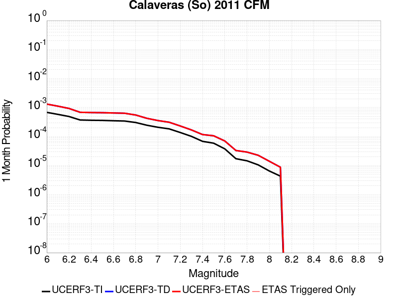 |  | 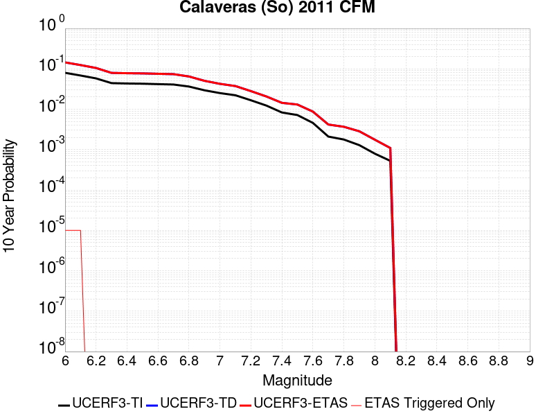 |

| Magnitude | 1 wk TI Prob | 1 wk TD Prob | 1 wk ETAS Prob | 1 wk ETAS/TD Gain | 1 wk ETAS Triggered Only | 1 mo TI Prob | 1 mo TD Prob | 1 mo ETAS Prob | 1 mo ETAS/TD Gain | 1 mo ETAS Triggered Only | 1 yr TI Prob | 1 yr TD Prob | 1 yr ETAS Prob | 1 yr ETAS/TD Gain | 1 yr ETAS Triggered Only | 10 yr TI Prob | 10 yr TD Prob | 10 yr ETAS Prob | 10 yr ETAS/TD Gain | 10 yr ETAS Triggered Only |
|-----|-----|-----|-----|-----|-----|-----|-----|-----|-----|-----|-----|-----|-----|-----|-----|-----|-----|-----|-----|-----|
| 6.0 | 1.5950744E-4 | 3.0759771E-4 | 3.0759771E-4 | 1.0 | 0.0 | 6.834242E-4 | 0.0013173335 | 0.0013173335 | 1.0 | 0.0 | 0.00828899 | 0.015869651 | 0.015896887 | 1.0017163 | 2.7674767E-5 | 0.079865426 | 0.1445 | 0.14452368 | 1.0001638 | 2.7674767E-5 |
| 6.1 | 1.3584697E-4 | 2.6078656E-4 | 2.6078656E-4 | 1.0 | 0.0 | 5.8207137E-4 | 0.0011168945 | 0.0011168945 | 1.0 | 0.0 | 0.007063716 | 0.013471939 | 0.01349924 | 1.0020266 | 2.7674767E-5 | 0.06843361 | 0.12412454 | 0.12414878 | 1.0001953 | 2.7674767E-5 |
| 6.2 | 1.14676266E-4 | 2.1760866E-4 | 2.1760866E-4 | 1.0 | 0.0 | 4.9137714E-4 | 9.3198824E-4 | 9.3198824E-4 | 1.0 | 0.0 | 0.0059661185 | 0.011254718 | 0.011254718 | 1.0 | 0.0 | 0.058084648 | 0.105112694 | 0.105112694 | 1.0 | 0.0 |
| 6.3 | 8.691518E-5 | 1.6010088E-4 | 1.6010088E-4 | 1.0 | 0.0 | 3.7244044E-4 | 6.8593153E-4 | 6.8593153E-4 | 1.0 | 0.0 | 0.004525038 | 0.008311441 | 0.008311441 | 1.0 | 0.0 | 0.044339992 | 0.07942766 | 0.07942766 | 1.0 | 0.0 |
| 6.4 | 8.50982E-5 | 1.5716399E-4 | 1.5716399E-4 | 1.0 | 0.0 | 3.646556E-4 | 6.7335134E-4 | 6.7335134E-4 | 1.0 | 0.0 | 0.0044306475 | 0.008159432 | 0.008159432 | 1.0 | 0.0 | 0.04343345 | 0.07803354 | 0.07803354 | 1.0 | 0.0 |
| 6.5 | 8.4062965E-5 | 1.5540862E-4 | 1.5540862E-4 | 1.0 | 0.0 | 3.602201E-4 | 6.6583225E-4 | 6.6583225E-4 | 1.0 | 0.0 | 0.004376863 | 0.008068612 | 0.008068612 | 1.0 | 0.0 | 0.042916555 | 0.077204674 | 0.077204674 | 1.0 | 0.0 |
| 6.6 | 8.194716E-5 | 1.5176483E-4 | 1.5176483E-4 | 1.0 | 0.0 | 3.5115483E-4 | 6.5022387E-4 | 6.5022387E-4 | 1.0 | 0.0 | 0.0042669317 | 0.007880396 | 0.007880396 | 1.0 | 0.0 | 0.04185927 | 0.07548959 | 0.07548959 | 1.0 | 0.0 |
| 6.7 | 8.012326E-5 | 1.4844135E-4 | 1.4844135E-4 | 1.0 | 0.0 | 3.433402E-4 | 6.359873E-4 | 6.359873E-4 | 1.0 | 0.0 | 0.004172157 | 0.007708843 | 0.007708843 | 1.0 | 0.0 | 0.040946912 | 0.07393147 | 0.07393147 | 1.0 | 0.0 |
| 6.8 | 7.119773E-5 | 1.290086E-4 | 1.290086E-4 | 1.0 | 0.0 | 3.0509746E-4 | 5.527477E-4 | 5.527477E-4 | 1.0 | 0.0 | 0.0037082357 | 0.0067056813 | 0.0067056813 | 1.0 | 0.0 | 0.036469642 | 0.06477169 | 0.06477169 | 1.0 | 0.0 |
| 6.9 | 5.7343088E-5 | 9.935836E-5 | 9.935836E-5 | 1.0 | 0.0 | 2.4573295E-4 | 4.2575249E-4 | 4.2575249E-4 | 1.0 | 0.0 | 0.0029876942 | 0.0051712976 | 0.0051712976 | 1.0 | 0.0 | 0.02947844 | 0.05058907 | 0.05058907 | 1.0 | 0.0 |
| 7.0 | 4.8746577E-5 | 8.3012914E-5 | 8.3012914E-5 | 1.0 | 0.0 | 2.0889717E-4 | 3.5572148E-4 | 3.5572148E-4 | 1.0 | 0.0 | 0.0025403565 | 0.004322375 | 0.004322375 | 1.0 | 0.0 | 0.025115121 | 0.0425639 | 0.0425639 | 1.0 | 0.0 |
| 7.1 | 4.2998014E-5 | 7.279013E-5 | 7.279013E-5 | 1.0 | 0.0 | 1.8426418E-4 | 3.1192074E-4 | 3.1192074E-4 | 1.0 | 0.0 | 0.002241108 | 0.0037910824 | 0.0037910824 | 1.0 | 0.0 | 0.022186412 | 0.037491307 | 0.037491307 | 1.0 | 0.0 |
| 7.2 | 3.221292E-5 | 5.404145E-5 | 5.404145E-5 | 1.0 | 0.0 | 1.3804805E-4 | 2.3158583E-4 | 2.3158583E-4 | 1.0 | 0.0 | 0.0016794393 | 0.00281594 | 0.00281594 | 1.0 | 0.0 | 0.016668037 | 0.028102254 | 0.028102254 | 1.0 | 0.0 |
| 7.3 | 2.3756531E-5 | 3.959248E-5 | 3.959248E-5 | 1.0 | 0.0 | 1.0180973E-4 | 1.6967113E-4 | 1.6967113E-4 | 1.0 | 0.0 | 0.0012388286 | 0.002063806 | 0.002063806 | 1.0 | 0.0 | 0.012319452 | 0.020703033 | 0.020703033 | 1.0 | 0.0 |
| 7.4 | 1.5997684E-5 | 2.7394086E-5 | 2.7394086E-5 | 1.0 | 0.0 | 6.8559704E-5 | 1.17397954E-4 | 1.17397954E-4 | 1.0 | 0.0 | 8.343947E-4 | 0.0014283855 | 0.0014283855 | 1.0 | 0.0 | 0.008312687 | 0.014402374 | 0.014402374 | 1.0 | 0.0 |
| 7.5 | 1.3814293E-5 | 2.48335E-5 | 2.48335E-5 | 1.0 | 0.0 | 5.9202768E-5 | 1.0642496E-4 | 1.0642496E-4 | 1.0 | 0.0 | 7.205553E-4 | 0.0012949561 | 0.0012949561 | 1.0 | 0.0 | 0.007182234 | 0.013080463 | 0.013080463 | 1.0 | 0.0 |
| 7.6 | 8.817309E-6 | 1.647263E-5 | 1.647263E-5 | 1.0 | 0.0 | 3.7787922E-5 | 7.059509E-5 | 7.059509E-5 | 1.0 | 0.0 | 4.5997082E-4 | 8.591576E-4 | 8.591576E-4 | 1.0 | 0.0 | 0.004590199 | 0.00874074 | 0.00874074 | 1.0 | 0.0 |
| 7.7 | 4.0352206E-6 | 7.736602E-6 | 7.736602E-6 | 1.0 | 0.0 | 1.7293689E-5 | 3.3156448E-5 | 3.3156448E-5 | 1.0 | 0.0 | 2.1053031E-4 | 4.0360505E-4 | 4.0360505E-4 | 1.0 | 0.0 | 0.0021033096 | 0.004179541 | 0.004179541 | 1.0 | 0.0 |
| 7.8 | 3.413169E-6 | 6.812901E-6 | 6.812901E-6 | 1.0 | 0.0 | 1.4627784E-5 | 2.9197821E-5 | 2.9197821E-5 | 1.0 | 0.0 | 1.7807873E-4 | 3.5542555E-4 | 3.5542555E-4 | 1.0 | 0.0 | 0.0017793609 | 0.0036790124 | 0.0036790124 | 1.0 | 0.0 |
| 7.9 | 2.4740732E-6 | 5.2979517E-6 | 5.2979517E-6 | 1.0 | 0.0 | 1.06031275E-5 | 2.270531E-5 | 2.270531E-5 | 1.0 | 0.0 | 1.2908543E-4 | 2.7640213E-4 | 2.7640213E-4 | 1.0 | 0.0 | 0.0012901047 | 0.0028439197 | 0.0028439197 | 1.0 | 0.0 |
| 8.0 | 1.5231818E-6 | 3.2999055E-6 | 3.2999055E-6 | 1.0 | 0.0 | 6.527906E-6 | 1.4142375E-5 | 1.4142375E-5 | 1.0 | 0.0 | 7.9474354E-5 | 1.7216985E-4 | 1.7216985E-4 | 1.0 | 0.0 | 7.944594E-4 | 0.0017618457 | 0.0017618457 | 1.0 | 0.0 |
| 8.1 | 1.0104524E-6 | 2.0525972E-6 | 2.0525972E-6 | 1.0 | 0.0 | 4.330503E-6 | 8.796816E-6 | 8.796816E-6 | 1.0 | 0.0 | 5.2722597E-5 | 1.07096006E-4 | 1.07096006E-4 | 1.0 | 0.0 | 5.271009E-4 | 0.0010963572 | 0.0010963572 | 1.0 | 0.0 |

## Carson Range (Genoa)
*[(top)](#table-of-contents)*

| 1 Week | 1 Month | 1 Year | 10 Year |
|-----|-----|-----|-----|
| 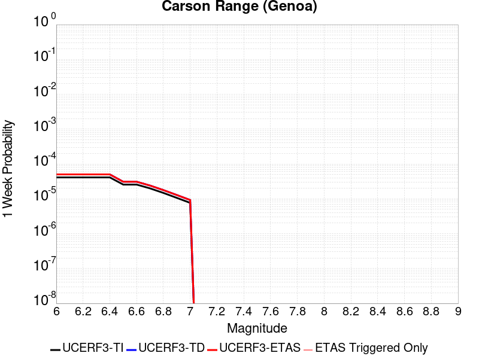 |  |  |  |

| Magnitude | 1 wk TI Prob | 1 wk TD Prob | 1 wk ETAS Prob | 1 wk ETAS/TD Gain | 1 wk ETAS Triggered Only | 1 mo TI Prob | 1 mo TD Prob | 1 mo ETAS Prob | 1 mo ETAS/TD Gain | 1 mo ETAS Triggered Only | 1 yr TI Prob | 1 yr TD Prob | 1 yr ETAS Prob | 1 yr ETAS/TD Gain | 1 yr ETAS Triggered Only | 10 yr TI Prob | 10 yr TD Prob | 10 yr ETAS Prob | 10 yr ETAS/TD Gain | 10 yr ETAS Triggered Only |
|-----|-----|-----|-----|-----|-----|-----|-----|-----|-----|-----|-----|-----|-----|-----|-----|-----|-----|-----|-----|-----|
| 6.0 | 4.1268457E-5 | 5.015692E-5 | 5.015692E-5 | 1.0 | 0.0 | 1.7685282E-4 | 2.1494277E-4 | 2.1494277E-4 | 1.0 | 0.0 | 0.0021510567 | 0.0026141738 | 0.0026141738 | 1.0 | 0.0 | 0.02130354 | 0.025873907 | 0.025900867 | 1.0010419 | 2.7674767E-5 |
| 6.1 | 4.1268457E-5 | 5.015692E-5 | 5.015692E-5 | 1.0 | 0.0 | 1.7685282E-4 | 2.1494277E-4 | 2.1494277E-4 | 1.0 | 0.0 | 0.0021510567 | 0.0026141738 | 0.0026141738 | 1.0 | 0.0 | 0.02130354 | 0.025873907 | 0.025900867 | 1.0010419 | 2.7674767E-5 |
| 6.2 | 4.1268457E-5 | 5.015692E-5 | 5.015692E-5 | 1.0 | 0.0 | 1.7685282E-4 | 2.1494277E-4 | 2.1494277E-4 | 1.0 | 0.0 | 0.0021510567 | 0.0026141738 | 0.0026141738 | 1.0 | 0.0 | 0.02130354 | 0.025873907 | 0.025900867 | 1.0010419 | 2.7674767E-5 |
| 6.3 | 4.1268457E-5 | 5.015692E-5 | 5.015692E-5 | 1.0 | 0.0 | 1.7685282E-4 | 2.1494277E-4 | 2.1494277E-4 | 1.0 | 0.0 | 0.0021510567 | 0.0026141738 | 0.0026141738 | 1.0 | 0.0 | 0.02130354 | 0.025873907 | 0.025900867 | 1.0010419 | 2.7674767E-5 |
| 6.4 | 4.1268457E-5 | 5.015692E-5 | 5.015692E-5 | 1.0 | 0.0 | 1.7685282E-4 | 2.1494277E-4 | 2.1494277E-4 | 1.0 | 0.0 | 0.0021510567 | 0.0026141738 | 0.0026141738 | 1.0 | 0.0 | 0.02130354 | 0.025873907 | 0.025900867 | 1.0010419 | 2.7674767E-5 |
| 6.5 | 2.5677185E-5 | 3.0984236E-5 | 3.0984236E-5 | 1.0 | 0.0 | 1.1004044E-4 | 1.3278384E-4 | 1.3278384E-4 | 1.0 | 0.0 | 0.0013389189 | 0.0016156224 | 0.0016156224 | 1.0 | 0.0 | 0.0133088045 | 0.016056703 | 0.016056703 | 1.0 | 0.0 |
| 6.6 | 2.5677185E-5 | 3.0984236E-5 | 3.0984236E-5 | 1.0 | 0.0 | 1.1004044E-4 | 1.3278384E-4 | 1.3278384E-4 | 1.0 | 0.0 | 0.0013389189 | 0.0016156224 | 0.0016156224 | 1.0 | 0.0 | 0.0133088045 | 0.016056703 | 0.016056703 | 1.0 | 0.0 |
| 6.7 | 1.9969408E-5 | 2.4068053E-5 | 2.4068053E-5 | 1.0 | 0.0 | 8.558037E-5 | 1.0314558E-4 | 1.0314558E-4 | 1.0 | 0.0 | 0.0010414429 | 0.0012552276 | 0.0012552276 | 1.0 | 0.0 | 0.010365757 | 0.01249654 | 0.01249654 | 1.0 | 0.0 |
| 6.8 | 1.4783156E-5 | 1.7820965E-5 | 1.7820965E-5 | 1.0 | 0.0 | 6.335485E-5 | 7.637406E-5 | 7.637406E-5 | 1.0 | 0.0 | 7.710722E-4 | 9.2958775E-4 | 9.2958775E-4 | 1.0 | 0.0 | 0.0076840227 | 0.009269785 | 0.009269785 | 1.0 | 0.0 |
| 6.9 | 1.06660555E-5 | 1.28795045E-5 | 1.28795045E-5 | 1.0 | 0.0 | 4.5710865E-5 | 5.519736E-5 | 5.519736E-5 | 1.0 | 0.0 | 5.5638765E-4 | 6.719359E-4 | 6.719359E-4 | 1.0 | 0.0 | 0.005549967 | 0.0067103454 | 0.0067103454 | 1.0 | 0.0 |
| 7.0 | 7.664838E-6 | 9.260094E-6 | 9.260094E-6 | 1.0 | 0.0 | 3.2848893E-5 | 3.9686114E-5 | 3.9686114E-5 | 1.0 | 0.0 | 3.998619E-4 | 4.8317845E-4 | 4.8317845E-4 | 1.0 | 0.0 | 0.0039914316 | 0.004831782 | 0.004831782 | 1.0 | 0.0 |

## Mission Creek
*[(top)](#table-of-contents)*

| 1 Week | 1 Month | 1 Year | 10 Year |
|-----|-----|-----|-----|
|  |  |  |  |

| Magnitude | 1 wk TI Prob | 1 wk TD Prob | 1 wk ETAS Prob | 1 wk ETAS/TD Gain | 1 wk ETAS Triggered Only | 1 mo TI Prob | 1 mo TD Prob | 1 mo ETAS Prob | 1 mo ETAS/TD Gain | 1 mo ETAS Triggered Only | 1 yr TI Prob | 1 yr TD Prob | 1 yr ETAS Prob | 1 yr ETAS/TD Gain | 1 yr ETAS Triggered Only | 10 yr TI Prob | 10 yr TD Prob | 10 yr ETAS Prob | 10 yr ETAS/TD Gain | 10 yr ETAS Triggered Only |
|-----|-----|-----|-----|-----|-----|-----|-----|-----|-----|-----|-----|-----|-----|-----|-----|-----|-----|-----|-----|-----|
| 6.0 | 1.1549387E-5 | 1.6338769E-5 | 1.6338769E-5 | 1.0 | 0.0 | 4.9496433E-5 | 7.00215E-5 | 7.00215E-5 | 1.0 | 0.0 | 6.0245243E-4 | 8.5219333E-4 | 8.7984453E-4 | 1.0324471 | 2.7674767E-5 | 0.006008218 | 0.008518299 | 0.008545739 | 1.0032212 | 2.7674767E-5 |
| 6.1 | 1.1549387E-5 | 1.6338769E-5 | 1.6338769E-5 | 1.0 | 0.0 | 4.9496433E-5 | 7.00215E-5 | 7.00215E-5 | 1.0 | 0.0 | 6.0245243E-4 | 8.5219333E-4 | 8.7984453E-4 | 1.0324471 | 2.7674767E-5 | 0.006008218 | 0.008518299 | 0.008545739 | 1.0032212 | 2.7674767E-5 |
| 6.2 | 1.1549387E-5 | 1.6338769E-5 | 1.6338769E-5 | 1.0 | 0.0 | 4.9496433E-5 | 7.00215E-5 | 7.00215E-5 | 1.0 | 0.0 | 6.0245243E-4 | 8.5219333E-4 | 8.7984453E-4 | 1.0324471 | 2.7674767E-5 | 0.006008218 | 0.008518299 | 0.008545739 | 1.0032212 | 2.7674767E-5 |
| 6.3 | 1.1549387E-5 | 1.6338769E-5 | 1.6338769E-5 | 1.0 | 0.0 | 4.9496433E-5 | 7.00215E-5 | 7.00215E-5 | 1.0 | 0.0 | 6.0245243E-4 | 8.5219333E-4 | 8.7984453E-4 | 1.0324471 | 2.7674767E-5 | 0.006008218 | 0.008518299 | 0.008545739 | 1.0032212 | 2.7674767E-5 |
| 6.4 | 1.1549387E-5 | 1.6338769E-5 | 1.6338769E-5 | 1.0 | 0.0 | 4.9496433E-5 | 7.00215E-5 | 7.00215E-5 | 1.0 | 0.0 | 6.0245243E-4 | 8.5219333E-4 | 8.7984453E-4 | 1.0324471 | 2.7674767E-5 | 0.006008218 | 0.008518299 | 0.008545739 | 1.0032212 | 2.7674767E-5 |
| 6.5 | 1.1549387E-5 | 1.6338769E-5 | 1.6338769E-5 | 1.0 | 0.0 | 4.9496433E-5 | 7.00215E-5 | 7.00215E-5 | 1.0 | 0.0 | 6.0245243E-4 | 8.5219333E-4 | 8.7984453E-4 | 1.0324471 | 2.7674767E-5 | 0.006008218 | 0.008518299 | 0.008545739 | 1.0032212 | 2.7674767E-5 |
| 6.6 | 9.202681E-6 | 1.3861918E-5 | 1.3861918E-5 | 1.0 | 0.0 | 3.9439463E-5 | 5.9406917E-5 | 5.9406917E-5 | 1.0 | 0.0 | 4.800697E-4 | 7.2304823E-4 | 7.50703E-4 | 1.0382475 | 2.7674767E-5 | 0.004790339 | 0.0072354274 | 0.007262902 | 1.0037972 | 2.7674767E-5 |
| 6.7 | 9.019164E-6 | 1.3667577E-5 | 1.3667577E-5 | 1.0 | 0.0 | 3.8652986E-5 | 5.8574064E-5 | 5.8574064E-5 | 1.0 | 0.0 | 4.7049852E-4 | 7.129149E-4 | 7.4056996E-4 | 1.0387915 | 2.7674767E-5 | 0.004695036 | 0.007134747 | 0.0071622245 | 1.0038512 | 2.7674767E-5 |
| 6.8 | 8.673558E-6 | 1.3289653E-5 | 1.3289653E-5 | 1.0 | 0.0 | 3.717186E-5 | 5.695446E-5 | 5.695446E-5 | 1.0 | 0.0 | 4.524734E-4 | 6.932088E-4 | 7.208644E-4 | 1.039895 | 2.7674767E-5 | 0.0045155324 | 0.006938919 | 0.006966402 | 1.0039606 | 2.7674767E-5 |
| 6.9 | 7.002255E-6 | 1.14937575E-5 | 1.14937575E-5 | 1.0 | 0.0 | 3.000932E-5 | 4.925807E-5 | 4.925807E-5 | 1.0 | 0.0 | 3.653022E-4 | 5.995588E-4 | 6.27217E-4 | 1.0461309 | 2.7674767E-5 | 0.0036470229 | 0.006007685 | 0.0060351933 | 1.0045788 | 2.7674767E-5 |
| 7.0 | 5.84644E-6 | 9.6902595E-6 | 9.6902595E-6 | 1.0 | 0.0 | 2.5055931E-5 | 4.152905E-5 | 4.152905E-5 | 1.0 | 0.0 | 3.0501327E-4 | 5.0550344E-4 | 5.331642E-4 | 1.0547192 | 2.7674767E-5 | 0.0030459496 | 0.005071601 | 0.0050991355 | 1.0054291 | 2.7674767E-5 |
| 7.1 | 5.54703E-6 | 9.34468E-6 | 9.34468E-6 | 1.0 | 0.0 | 2.377277E-5 | 4.004804E-5 | 4.004804E-5 | 1.0 | 0.0 | 2.8939504E-4 | 4.8748025E-4 | 5.151415E-4 | 1.0567434 | 2.7674767E-5 | 0.0028901845 | 0.0048921676 | 0.004919707 | 1.0056293 | 2.7674767E-5 |
| 7.2 | 4.384709E-6 | 7.696116E-6 | 7.696116E-6 | 1.0 | 0.0 | 1.8791474E-5 | 3.298296E-5 | 3.298296E-5 | 1.0 | 0.0 | 2.2876218E-4 | 4.014972E-4 | 4.2916083E-4 | 1.0689012 | 2.7674767E-5 | 0.0022852682 | 0.004035741 | 0.004063304 | 1.0068297 | 2.7674767E-5 |
| 7.3 | 3.7888456E-6 | 6.9297107E-6 | 6.9297107E-6 | 1.0 | 0.0 | 1.623781E-5 | 2.9698442E-5 | 2.9698442E-5 | 1.0 | 0.0 | 1.9767738E-4 | 3.6152187E-4 | 3.8918664E-4 | 1.0765231 | 2.7674767E-5 | 0.0019750162 | 0.0036373446 | 0.0036649187 | 1.0075809 | 2.7674767E-5 |
| 7.4 | 2.1982462E-6 | 5.0376125E-6 | 5.0376125E-6 | 1.0 | 0.0 | 9.421021E-6 | 2.158959E-5 | 2.158959E-5 | 1.0 | 0.0 | 1.1469489E-4 | 2.6282176E-4 | 2.9048923E-4 | 1.105271 | 2.7674767E-5 | 0.0011463572 | 0.0026529012 | 0.0026805026 | 1.0104042 | 2.7674767E-5 |
| 7.5 | 2.051923E-6 | 4.628476E-6 | 4.628476E-6 | 1.0 | 0.0 | 8.793926E-6 | 1.9836176E-5 | 1.9836176E-5 | 1.0 | 0.0 | 1.0706078E-4 | 2.4147882E-4 | 2.691469E-4 | 1.1145777 | 2.7674767E-5 | 0.0010700922 | 0.0024403657 | 0.002467973 | 1.0113127 | 2.7674767E-5 |
| 7.6 | 1.8733427E-6 | 4.136374E-6 | 4.136374E-6 | 1.0 | 0.0 | 8.028587E-6 | 1.7727198E-5 | 1.7727198E-5 | 1.0 | 0.0 | 9.774366E-5 | 2.1580735E-4 | 2.4347614E-4 | 1.1282107 | 2.7674767E-5 | 9.770069E-4 | 0.0021846683 | 0.0022122825 | 1.01264 | 2.7674767E-5 |
| 7.7 | 1.8411953E-6 | 4.055962E-6 | 4.055962E-6 | 1.0 | 0.0 | 7.890813E-6 | 1.738258E-5 | 1.738258E-5 | 1.0 | 0.0 | 9.606641E-5 | 2.1161244E-4 | 2.3928135E-4 | 1.1307528 | 2.7674767E-5 | 9.6024893E-4 | 0.0021429092 | 0.0021705248 | 1.0128869 | 2.7674767E-5 |
| 7.8 | 1.7194251E-6 | 3.7224547E-6 | 3.7224547E-6 | 1.0 | 0.0 | 7.368944E-6 | 1.5953281E-5 | 1.5953281E-5 | 1.0 | 0.0 | 8.97132E-5 | 1.9421395E-4 | 2.2188334E-4 | 1.1424686 | 2.7674767E-5 | 8.967699E-4 | 0.001968446 | 0.0019960664 | 1.0140315 | 2.7674767E-5 |
| 7.9 | 1.4035052E-6 | 2.9599234E-6 | 2.9599234E-6 | 1.0 | 0.0 | 6.0150082E-6 | 1.2685326E-5 | 1.2685326E-5 | 1.0 | 0.0 | 7.3230265E-5 | 1.5443296E-4 | 1.8210344E-4 | 1.1791748 | 2.7674767E-5 | 7.3206134E-4 | 0.0015681027 | 0.0015957342 | 1.0176209 | 2.7674767E-5 |
| 8.0 | 3.9318823E-7 | 5.5525703E-7 | 5.5525703E-7 | 1.0 | 0.0 | 1.6850913E-6 | 2.3796708E-6 | 2.3796708E-6 | 1.0 | 0.0 | 2.0515794E-5 | 2.8972114E-5 | 2.8972114E-5 | 1.0 | 0.0 | 2.0513899E-4 | 3.00248E-4 | 3.00248E-4 | 1.0 | 0.0 |
| 8.1 | 1.596793E-7 | 1.1463439E-7 | 1.1463439E-7 | 1.0 | 0.0 | 6.8433974E-7 | 4.912901E-7 | 4.912901E-7 | 1.0 | 0.0 | 8.331805E-6 | 5.9814415E-6 | 5.9814415E-6 | 1.0 | 0.0 | 8.331492E-5 | 6.595295E-5 | 6.595295E-5 | 1.0 | 0.0 |
| 8.2 | 4.9003038E-8 | 2.5656652E-8 | 2.5656652E-8 | 1.0 | 0.0 | 2.10013E-7 | 1.0995708E-7 | 1.0995708E-7 | 1.0 | 0.0 | 2.5569052E-6 | 1.3387266E-6 | 1.3387266E-6 | 1.0 | 0.0 | 2.556876E-5 | 1.5073674E-5 | 1.5073674E-5 | 1.0 | 0.0 |

## Great Valley 03a Dunnigan Hills
*[(top)](#table-of-contents)*

| 1 Week | 1 Month | 1 Year | 10 Year |
|-----|-----|-----|-----|
|  |  | 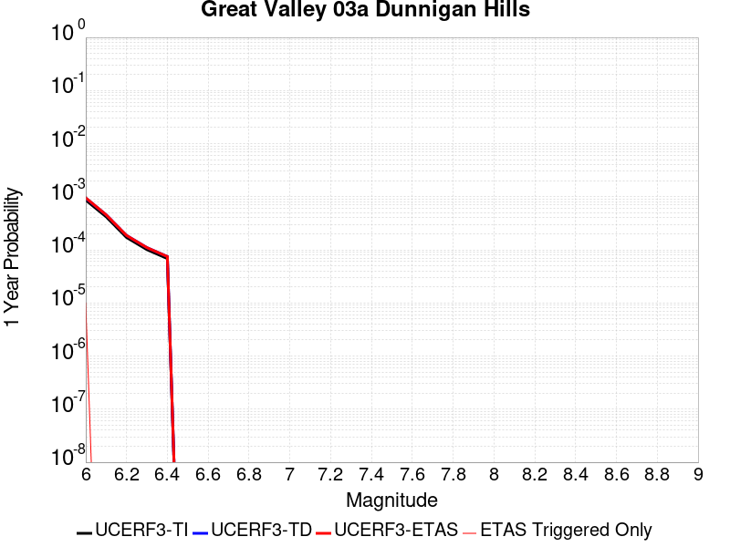 |  |

| Magnitude | 1 wk TI Prob | 1 wk TD Prob | 1 wk ETAS Prob | 1 wk ETAS/TD Gain | 1 wk ETAS Triggered Only | 1 mo TI Prob | 1 mo TD Prob | 1 mo ETAS Prob | 1 mo ETAS/TD Gain | 1 mo ETAS Triggered Only | 1 yr TI Prob | 1 yr TD Prob | 1 yr ETAS Prob | 1 yr ETAS/TD Gain | 1 yr ETAS Triggered Only | 10 yr TI Prob | 10 yr TD Prob | 10 yr ETAS Prob | 10 yr ETAS/TD Gain | 10 yr ETAS Triggered Only |
|-----|-----|-----|-----|-----|-----|-----|-----|-----|-----|-----|-----|-----|-----|-----|-----|-----|-----|-----|-----|-----|
| 6.0 | 1.6591328E-5 | 1.8109491E-5 | 1.8109491E-5 | 1.0 | 0.0 | 7.110376E-5 | 7.761019E-5 | 7.761019E-5 | 1.0 | 0.0 | 8.6534437E-4 | 9.4456354E-4 | 9.722121E-4 | 1.0292714 | 2.7674767E-5 | 0.008619824 | 0.00941232 | 0.009439735 | 1.0029126 | 2.7674767E-5 |
| 6.1 | 8.041125E-6 | 8.770465E-6 | 8.770465E-6 | 1.0 | 0.0 | 3.4461507E-5 | 3.7587277E-5 | 3.7587277E-5 | 1.0 | 0.0 | 4.194881E-4 | 4.5754932E-4 | 4.5754932E-4 | 1.0 | 0.0 | 0.004186971 | 0.0045680706 | 0.0045680706 | 1.0 | 0.0 |
| 6.2 | 3.2807004E-6 | 3.5798716E-6 | 3.5798716E-6 | 1.0 | 0.0 | 1.4060069E-5 | 1.534224E-5 | 1.534224E-5 | 1.0 | 0.0 | 1.7116789E-4 | 1.8677991E-4 | 1.8677991E-4 | 1.0 | 0.0 | 0.0017103611 | 0.0018666374 | 0.0018666374 | 1.0 | 0.0 |
| 6.3 | 1.9339366E-6 | 2.1105595E-6 | 2.1105595E-6 | 1.0 | 0.0 | 8.288273E-6 | 9.0452395E-6 | 9.0452395E-6 | 1.0 | 0.0 | 1.00905054E-4 | 1.1012308E-4 | 1.1012308E-4 | 1.0 | 0.0 | 0.0010085925 | 0.0011009651 | 0.0011009651 | 1.0 | 0.0 |
| 6.4 | 1.3142635E-6 | 1.434108E-6 | 1.434108E-6 | 1.0 | 0.0 | 5.6325457E-6 | 6.146177E-6 | 6.146177E-6 | 1.0 | 0.0 | 6.857408E-5 | 7.48297E-5 | 7.48297E-5 | 1.0 | 0.0 | 6.8552926E-4 | 7.48297E-4 | 7.48297E-4 | 1.0 | 0.0 |

## San Andreas (Offshore) 2011 CFM
*[(top)](#table-of-contents)*

| 1 Week | 1 Month | 1 Year | 10 Year |
|-----|-----|-----|-----|
|  | 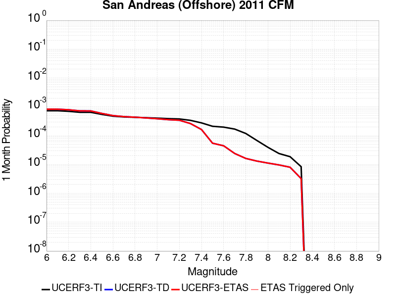 | 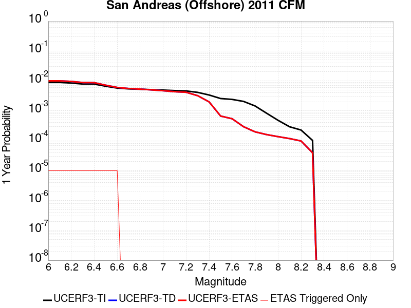 |  |

| Magnitude | 1 wk TI Prob | 1 wk TD Prob | 1 wk ETAS Prob | 1 wk ETAS/TD Gain | 1 wk ETAS Triggered Only | 1 mo TI Prob | 1 mo TD Prob | 1 mo ETAS Prob | 1 mo ETAS/TD Gain | 1 mo ETAS Triggered Only | 1 yr TI Prob | 1 yr TD Prob | 1 yr ETAS Prob | 1 yr ETAS/TD Gain | 1 yr ETAS Triggered Only | 10 yr TI Prob | 10 yr TD Prob | 10 yr ETAS Prob | 10 yr ETAS/TD Gain | 10 yr ETAS Triggered Only |
|-----|-----|-----|-----|-----|-----|-----|-----|-----|-----|-----|-----|-----|-----|-----|-----|-----|-----|-----|-----|-----|
| 6.0 | 1.7072787E-4 | 1.925961E-4 | 1.925961E-4 | 1.0 | 0.0 | 7.3148566E-4 | 8.2515314E-4 | 8.2515314E-4 | 1.0 | 0.0 | 0.008869528 | 0.0100004785 | 0.010027876 | 1.0027397 | 2.7674767E-5 | 0.085237645 | 0.09697889 | 0.09700388 | 1.0002577 | 2.7674767E-5 |
| 6.1 | 1.7072787E-4 | 1.925961E-4 | 1.925961E-4 | 1.0 | 0.0 | 7.3148566E-4 | 8.2515314E-4 | 8.2515314E-4 | 1.0 | 0.0 | 0.008869528 | 0.0100004785 | 0.010027876 | 1.0027397 | 2.7674767E-5 | 0.085237645 | 0.09697889 | 0.09700388 | 1.0002577 | 2.7674767E-5 |
| 6.2 | 1.6312556E-4 | 1.8439793E-4 | 1.8439793E-4 | 1.0 | 0.0 | 6.989222E-4 | 7.9003983E-4 | 7.9003983E-4 | 1.0 | 0.0 | 0.008476226 | 0.009576812 | 0.009604222 | 1.0028621 | 2.7674767E-5 | 0.08160117 | 0.09299351 | 0.093018614 | 1.0002699 | 2.7674767E-5 |
| 6.3 | 1.5103363E-4 | 1.691036E-4 | 1.691036E-4 | 1.0 | 0.0 | 6.471264E-4 | 7.245306E-4 | 7.245306E-4 | 1.0 | 0.0 | 0.007850339 | 0.008785928 | 0.008813359 | 1.0031222 | 2.7674767E-5 | 0.075787395 | 0.0856254 | 0.08565071 | 1.0002955 | 2.7674767E-5 |
| 6.4 | 1.5047993E-4 | 1.6796135E-4 | 1.6796135E-4 | 1.0 | 0.0 | 6.4475456E-4 | 7.1963796E-4 | 7.1963796E-4 | 1.0 | 0.0 | 0.007821669 | 0.008726836 | 0.00875427 | 1.0031435 | 2.7674767E-5 | 0.0755203 | 0.08510506 | 0.085130386 | 1.0002975 | 2.7674767E-5 |
| 6.5 | 1.2760791E-4 | 1.3760154E-4 | 1.3760154E-4 | 1.0 | 0.0 | 5.467764E-4 | 5.89589E-4 | 5.89589E-4 | 1.0 | 0.0 | 0.0066367025 | 0.0071548945 | 0.0071823713 | 1.0038403 | 2.7674767E-5 | 0.064419635 | 0.07036923 | 0.070394956 | 1.0003656 | 2.7674767E-5 |
| 6.6 | 1.1063525E-4 | 1.157834E-4 | 1.157834E-4 | 1.0 | 0.0 | 4.740649E-4 | 4.9612124E-4 | 4.9612124E-4 | 1.0 | 0.0 | 0.0057564764 | 0.0060237497 | 0.0060512577 | 1.0045666 | 2.7674767E-5 | 0.05609626 | 0.05959451 | 0.059620533 | 1.0004367 | 2.7674767E-5 |
| 6.7 | 1.0391049E-4 | 1.0666366E-4 | 1.0666366E-4 | 1.0 | 0.0 | 4.4525467E-4 | 4.570509E-4 | 4.570509E-4 | 1.0 | 0.0 | 0.0054075094 | 0.0055505848 | 0.0055505848 | 1.0 | 0.0 | 0.052778035 | 0.055089284 | 0.055089284 | 1.0 | 0.0 |
| 6.8 | 1.0096706E-4 | 1.01782214E-4 | 1.01782214E-4 | 1.0 | 0.0 | 4.3264418E-4 | 4.3613752E-4 | 4.3613752E-4 | 1.0 | 0.0 | 0.0052547283 | 0.0052972236 | 0.0052972236 | 1.0 | 0.0 | 0.051321987 | 0.052786008 | 0.052786008 | 1.0 | 0.0 |
| 6.9 | 9.800265E-5 | 9.608295E-5 | 9.608295E-5 | 1.0 | 0.0 | 4.1994374E-4 | 4.1172E-4 | 4.1172E-4 | 1.0 | 0.0 | 0.0051008356 | 0.0050013387 | 0.0050013387 | 1.0 | 0.0 | 0.049853306 | 0.050111815 | 0.050111815 | 1.0 | 0.0 |
| 7.0 | 9.4642375E-5 | 9.021218E-5 | 9.021218E-5 | 1.0 | 0.0 | 4.0554712E-4 | 3.8656723E-4 | 3.8656723E-4 | 1.0 | 0.0 | 0.004926363 | 0.0046964623 | 0.0046964623 | 1.0 | 0.0 | 0.048185747 | 0.047290854 | 0.047290854 | 1.0 | 0.0 |
| 7.1 | 9.0996844E-5 | 8.372742E-5 | 8.372742E-5 | 1.0 | 0.0 | 3.8992817E-4 | 3.5878332E-4 | 3.5878332E-4 | 1.0 | 0.0 | 0.004737046 | 0.0043595945 | 0.0043595945 | 1.0 | 0.0 | 0.04637333 | 0.044140402 | 0.044140402 | 1.0 | 0.0 |
| 7.2 | 8.848287E-5 | 7.999942E-5 | 7.999942E-5 | 1.0 | 0.0 | 3.791572E-4 | 3.4281047E-4 | 3.4281047E-4 | 1.0 | 0.0 | 0.004606472 | 0.004165884 | 0.004165884 | 1.0 | 0.0 | 0.045121472 | 0.042282406 | 0.042282406 | 1.0 | 0.0 |
| 7.3 | 7.9280784E-5 | 6.143362E-5 | 6.143362E-5 | 1.0 | 0.0 | 3.3973053E-4 | 2.6326094E-4 | 2.6326094E-4 | 1.0 | 0.0 | 0.004128377 | 0.0032005939 | 0.0032005939 | 1.0 | 0.0 | 0.040525194 | 0.032985196 | 0.032985196 | 1.0 | 0.0 |
| 7.4 | 6.468038E-5 | 3.8048784E-5 | 3.8048784E-5 | 1.0 | 0.0 | 2.771722E-4 | 1.6305635E-4 | 1.6305635E-4 | 1.0 | 0.0 | 0.0033693502 | 0.0019834614 | 0.0019834614 | 1.0 | 0.0 | 0.0331872 | 0.020883573 | 0.020883573 | 1.0 | 0.0 |
| 7.5 | 4.930574E-5 | 1.2769499E-5 | 1.2769499E-5 | 1.0 | 0.0 | 2.1129321E-4 | 5.4725286E-5 | 5.4725286E-5 | 1.0 | 0.0 | 0.0025694598 | 6.660783E-4 | 6.660783E-4 | 1.0 | 0.0 | 0.02539953 | 0.007520096 | 0.007520096 | 1.0 | 0.0 |
| 7.6 | 4.612566E-5 | 1.0396627E-5 | 1.0396627E-5 | 1.0 | 0.0 | 1.9766642E-4 | 4.455622E-5 | 4.455622E-5 | 1.0 | 0.0 | 0.0024039324 | 5.423383E-4 | 5.423383E-4 | 1.0 | 0.0 | 0.023780935 | 0.0062077832 | 0.0062077832 | 1.0 | 0.0 |
| 7.7 | 3.9435414E-5 | 5.6209105E-6 | 5.6209105E-6 | 1.0 | 0.0 | 1.6899795E-4 | 2.4089395E-5 | 2.4089395E-5 | 1.0 | 0.0 | 0.0020556084 | 2.932491E-4 | 2.932491E-4 | 1.0 | 0.0 | 0.020366974 | 0.0035701317 | 0.0035701317 | 1.0 | 0.0 |
| 7.8 | 2.7787428E-5 | 3.7892153E-6 | 3.7892153E-6 | 1.0 | 0.0 | 1.1908354E-4 | 1.6239392E-5 | 1.6239392E-5 | 1.0 | 0.0 | 0.0014488777 | 1.976967E-4 | 1.976967E-4 | 1.0 | 0.0 | 0.014394675 | 0.0024083029 | 0.0024083029 | 1.0 | 0.0 |
| 7.9 | 1.590671E-5 | 3.0680594E-6 | 3.0680594E-6 | 1.0 | 0.0 | 6.816983E-5 | 1.314876E-5 | 1.314876E-5 | 1.0 | 0.0 | 8.2965166E-4 | 1.6007443E-4 | 1.6007443E-4 | 1.0 | 0.0 | 0.008265611 | 0.0019204757 | 0.0019204757 | 1.0 | 0.0 |
| 8.0 | 9.193638E-6 | 2.6148427E-6 | 2.6148427E-6 | 1.0 | 0.0 | 3.940071E-5 | 1.1206421E-5 | 1.1206421E-5 | 1.0 | 0.0 | 4.7959806E-4 | 1.3642966E-4 | 1.3642966E-4 | 1.0 | 0.0 | 0.0047856434 | 0.0016247741 | 0.0016247741 | 1.0 | 0.0 |
| 8.1 | 5.601576E-6 | 2.2551617E-6 | 2.2551617E-6 | 1.0 | 0.0 | 2.4006533E-5 | 9.664943E-6 | 9.664943E-6 | 1.0 | 0.0 | 2.9224035E-4 | 1.1766435E-4 | 1.1766435E-4 | 1.0 | 0.0 | 0.0029185633 | 0.0014141148 | 0.0014141148 | 1.0 | 0.0 |
| 8.2 | 4.3508785E-6 | 1.8733906E-6 | 1.8733906E-6 | 1.0 | 0.0 | 1.864649E-5 | 8.028792E-6 | 8.028792E-6 | 1.0 | 0.0 | 2.2699735E-4 | 9.774619E-5 | 9.774619E-5 | 1.0 | 0.0 | 0.0022676561 | 0.0011684668 | 0.0011684668 | 1.0 | 0.0 |
| 8.3 | 1.9573292E-6 | 7.572816E-7 | 7.572816E-7 | 1.0 | 0.0 | 8.388526E-6 | 3.2454886E-6 | 3.2454886E-6 | 1.0 | 0.0 | 1.0212552E-4 | 3.9513125E-5 | 3.9513125E-5 | 1.0 | 0.0 | 0.001020786 | 4.6741046E-4 | 4.6741046E-4 | 1.0 | 0.0 |

## McKinleyville (alt1)
*[(top)](#table-of-contents)*

| 1 Week | 1 Month | 1 Year | 10 Year |
|-----|-----|-----|-----|
|  |  |  |  |

| Magnitude | 1 wk TI Prob | 1 wk TD Prob | 1 wk ETAS Prob | 1 wk ETAS/TD Gain | 1 wk ETAS Triggered Only | 1 mo TI Prob | 1 mo TD Prob | 1 mo ETAS Prob | 1 mo ETAS/TD Gain | 1 mo ETAS Triggered Only | 1 yr TI Prob | 1 yr TD Prob | 1 yr ETAS Prob | 1 yr ETAS/TD Gain | 1 yr ETAS Triggered Only | 10 yr TI Prob | 10 yr TD Prob | 10 yr ETAS Prob | 10 yr ETAS/TD Gain | 10 yr ETAS Triggered Only |
|-----|-----|-----|-----|-----|-----|-----|-----|-----|-----|-----|-----|-----|-----|-----|-----|-----|-----|-----|-----|-----|
| 6.0 | 1.1028524E-5 | 1.172845E-5 | 1.172845E-5 | 1.0 | 0.0 | 4.7264242E-5 | 5.026396E-5 | 5.026396E-5 | 1.0 | 0.0 | 5.7529024E-4 | 6.118173E-4 | 6.118173E-4 | 1.0 | 0.0 | 0.005738032 | 0.006103839 | 0.0061313445 | 1.0045063 | 2.7674767E-5 |
| 6.1 | 1.1028524E-5 | 1.172845E-5 | 1.172845E-5 | 1.0 | 0.0 | 4.7264242E-5 | 5.026396E-5 | 5.026396E-5 | 1.0 | 0.0 | 5.7529024E-4 | 6.118173E-4 | 6.118173E-4 | 1.0 | 0.0 | 0.005738032 | 0.006103839 | 0.0061313445 | 1.0045063 | 2.7674767E-5 |
| 6.2 | 1.1028524E-5 | 1.172845E-5 | 1.172845E-5 | 1.0 | 0.0 | 4.7264242E-5 | 5.026396E-5 | 5.026396E-5 | 1.0 | 0.0 | 5.7529024E-4 | 6.118173E-4 | 6.118173E-4 | 1.0 | 0.0 | 0.005738032 | 0.006103839 | 0.0061313445 | 1.0045063 | 2.7674767E-5 |
| 6.3 | 1.1028524E-5 | 1.172845E-5 | 1.172845E-5 | 1.0 | 0.0 | 4.7264242E-5 | 5.026396E-5 | 5.026396E-5 | 1.0 | 0.0 | 5.7529024E-4 | 6.118173E-4 | 6.118173E-4 | 1.0 | 0.0 | 0.005738032 | 0.006103839 | 0.0061313445 | 1.0045063 | 2.7674767E-5 |
| 6.4 | 1.1028524E-5 | 1.172845E-5 | 1.172845E-5 | 1.0 | 0.0 | 4.7264242E-5 | 5.026396E-5 | 5.026396E-5 | 1.0 | 0.0 | 5.7529024E-4 | 6.118173E-4 | 6.118173E-4 | 1.0 | 0.0 | 0.005738032 | 0.006103839 | 0.0061313445 | 1.0045063 | 2.7674767E-5 |
| 6.5 | 1.1028524E-5 | 1.172845E-5 | 1.172845E-5 | 1.0 | 0.0 | 4.7264242E-5 | 5.026396E-5 | 5.026396E-5 | 1.0 | 0.0 | 5.7529024E-4 | 6.118173E-4 | 6.118173E-4 | 1.0 | 0.0 | 0.005738032 | 0.006103839 | 0.0061313445 | 1.0045063 | 2.7674767E-5 |
| 6.6 | 1.1028524E-5 | 1.172845E-5 | 1.172845E-5 | 1.0 | 0.0 | 4.7264242E-5 | 5.026396E-5 | 5.026396E-5 | 1.0 | 0.0 | 5.7529024E-4 | 6.118173E-4 | 6.118173E-4 | 1.0 | 0.0 | 0.005738032 | 0.006103839 | 0.0061313445 | 1.0045063 | 2.7674767E-5 |
| 6.7 | 6.483374E-6 | 6.917515E-6 | 6.917515E-6 | 1.0 | 0.0 | 2.7785592E-5 | 2.964619E-5 | 2.964619E-5 | 1.0 | 0.0 | 3.3823706E-4 | 3.6088878E-4 | 3.6088878E-4 | 1.0 | 0.0 | 0.003377227 | 0.00360364 | 0.003631215 | 1.007652 | 2.7674767E-5 |
| 6.8 | 6.483374E-6 | 6.917515E-6 | 6.917515E-6 | 1.0 | 0.0 | 2.7785592E-5 | 2.964619E-5 | 2.964619E-5 | 1.0 | 0.0 | 3.3823706E-4 | 3.6088878E-4 | 3.6088878E-4 | 1.0 | 0.0 | 0.003377227 | 0.00360364 | 0.003631215 | 1.007652 | 2.7674767E-5 |
| 6.9 | 4.0394048E-6 | 4.3456503E-6 | 4.3456503E-6 | 1.0 | 0.0 | 1.731162E-5 | 1.8624085E-5 | 1.8624085E-5 | 1.0 | 0.0 | 2.1074859E-4 | 2.267252E-4 | 2.267252E-4 | 1.0 | 0.0 | 0.0021054882 | 0.0022649937 | 0.0022926058 | 1.0121908 | 2.7674767E-5 |
| 7.0 | 3.7791233E-6 | 4.072494E-6 | 4.072494E-6 | 1.0 | 0.0 | 1.6196142E-5 | 1.7453433E-5 | 1.7453433E-5 | 1.0 | 0.0 | 1.9717019E-4 | 2.1247531E-4 | 2.1247531E-4 | 1.0 | 0.0 | 0.0019699533 | 0.0021227715 | 0.0021503875 | 1.0130094 | 2.7674767E-5 |
| 7.1 | 3.675443E-6 | 3.9637894E-6 | 3.9637894E-6 | 1.0 | 0.0 | 1.5751802E-5 | 1.698756E-5 | 1.698756E-5 | 1.0 | 0.0 | 1.9176133E-4 | 2.0680441E-4 | 2.0680441E-4 | 1.0 | 0.0 | 0.0019159593 | 0.0020661692 | 0.0020937868 | 1.0133666 | 2.7674767E-5 |
| 7.2 | 3.0165843E-6 | 3.2723585E-6 | 3.2723585E-6 | 1.0 | 0.0 | 1.2928153E-5 | 1.4024319E-5 | 1.4024319E-5 | 1.0 | 0.0 | 1.573889E-4 | 1.7073289E-4 | 1.7073289E-4 | 1.0 | 0.0 | 0.0015727748 | 0.001706036 | 0.0017336636 | 1.016194 | 2.7674767E-5 |
| 7.3 | 2.307633E-6 | 2.5191296E-6 | 2.5191296E-6 | 1.0 | 0.0 | 9.889818E-6 | 1.0796225E-5 | 1.0796225E-5 | 1.0 | 0.0 | 1.2040188E-4 | 1.314362E-4 | 1.314362E-4 | 1.0 | 0.0 | 0.0012033667 | 0.001313593 | 0.0013412314 | 1.0210403 | 2.7674767E-5 |
| 7.4 | 2.0568484E-6 | 2.251922E-6 | 2.251922E-6 | 1.0 | 0.0 | 8.8150355E-6 | 9.651059E-6 | 9.651059E-6 | 1.0 | 0.0 | 1.0731777E-4 | 1.1749539E-4 | 1.1749539E-4 | 1.0 | 0.0 | 0.0010726595 | 0.0011743403 | 0.0012019826 | 1.0235386 | 2.7674767E-5 |
| 7.5 | 1.7674889E-6 | 1.9416036E-6 | 1.9416036E-6 | 1.0 | 0.0 | 7.5749304E-6 | 8.321132E-6 | 8.321132E-6 | 1.0 | 0.0 | 9.222087E-5 | 1.0130514E-4 | 1.0130514E-4 | 1.0 | 0.0 | 9.218261E-4 | 0.0010125962 | 0.001040243 | 1.0273029 | 2.7674767E-5 |
| 7.6 | 1.2944297E-6 | 1.4297776E-6 | 1.4297776E-6 | 1.0 | 0.0 | 5.547544E-6 | 6.127604E-6 | 6.127604E-6 | 1.0 | 0.0 | 6.753925E-5 | 7.460108E-5 | 7.460108E-5 | 1.0 | 0.0 | 6.7518733E-4 | 7.4576517E-4 | 7.734193E-4 | 1.0370816 | 2.7674767E-5 |
| 7.7 | 5.806243E-7 | 6.461687E-7 | 6.461687E-7 | 1.0 | 0.0 | 2.4883875E-6 | 2.7692915E-6 | 2.7692915E-6 | 1.0 | 0.0 | 3.0295698E-5 | 3.371562E-5 | 3.371562E-5 | 1.0 | 0.0 | 3.0291567E-4 | 3.3710673E-4 | 3.3710673E-4 | 1.0 | 0.0 |
| 7.8 | 1.6121008E-7 | 1.8185658E-7 | 1.8185658E-7 | 1.0 | 0.0 | 6.909002E-7 | 7.793851E-7 | 7.793851E-7 | 1.0 | 0.0 | 8.411677E-6 | 9.488975E-6 | 9.488975E-6 | 1.0 | 0.0 | 8.411359E-5 | 9.4885945E-5 | 9.4885945E-5 | 1.0 | 0.0 |

## Camp Rock 2011
*[(top)](#table-of-contents)*

| 1 Week | 1 Month | 1 Year | 10 Year |
|-----|-----|-----|-----|
| 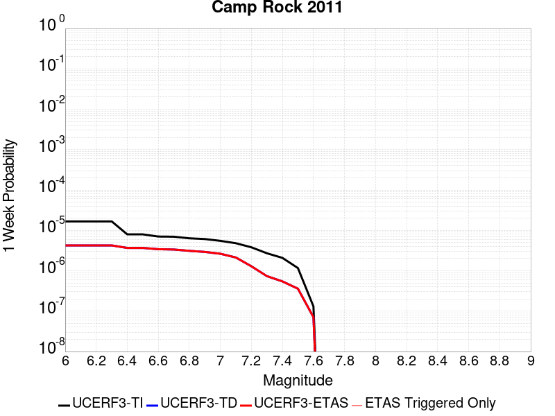 | 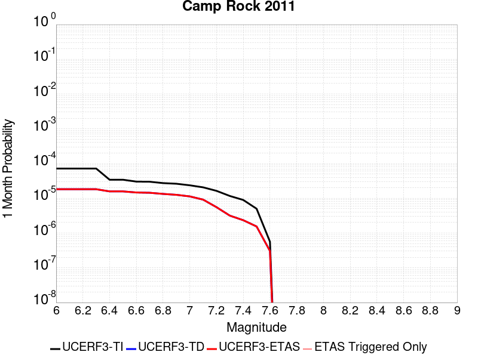 |  |  |

| Magnitude | 1 wk TI Prob | 1 wk TD Prob | 1 wk ETAS Prob | 1 wk ETAS/TD Gain | 1 wk ETAS Triggered Only | 1 mo TI Prob | 1 mo TD Prob | 1 mo ETAS Prob | 1 mo ETAS/TD Gain | 1 mo ETAS Triggered Only | 1 yr TI Prob | 1 yr TD Prob | 1 yr ETAS Prob | 1 yr ETAS/TD Gain | 1 yr ETAS Triggered Only | 10 yr TI Prob | 10 yr TD Prob | 10 yr ETAS Prob | 10 yr ETAS/TD Gain | 10 yr ETAS Triggered Only |
|-----|-----|-----|-----|-----|-----|-----|-----|-----|-----|-----|-----|-----|-----|-----|-----|-----|-----|-----|-----|-----|
| 6.0 | 1.6710783E-5 | 4.2506153E-6 | 4.2506153E-6 | 1.0 | 0.0 | 7.161568E-5 | 1.8216799E-5 | 1.8216799E-5 | 1.0 | 0.0 | 8.7157206E-4 | 2.2176749E-4 | 2.2176749E-4 | 1.0 | 0.0 | 0.008681616 | 0.0022155147 | 0.0022431281 | 1.0124637 | 2.7674767E-5 |
| 6.1 | 1.6710783E-5 | 4.2506153E-6 | 4.2506153E-6 | 1.0 | 0.0 | 7.161568E-5 | 1.8216799E-5 | 1.8216799E-5 | 1.0 | 0.0 | 8.7157206E-4 | 2.2176749E-4 | 2.2176749E-4 | 1.0 | 0.0 | 0.008681616 | 0.0022155147 | 0.0022431281 | 1.0124637 | 2.7674767E-5 |
| 6.2 | 1.6710783E-5 | 4.2506153E-6 | 4.2506153E-6 | 1.0 | 0.0 | 7.161568E-5 | 1.8216799E-5 | 1.8216799E-5 | 1.0 | 0.0 | 8.7157206E-4 | 2.2176749E-4 | 2.2176749E-4 | 1.0 | 0.0 | 0.008681616 | 0.0022155147 | 0.0022431281 | 1.0124637 | 2.7674767E-5 |
| 6.3 | 1.6710783E-5 | 4.2506153E-6 | 4.2506153E-6 | 1.0 | 0.0 | 7.161568E-5 | 1.8216799E-5 | 1.8216799E-5 | 1.0 | 0.0 | 8.7157206E-4 | 2.2176749E-4 | 2.2176749E-4 | 1.0 | 0.0 | 0.008681616 | 0.0022155147 | 0.0022431281 | 1.0124637 | 2.7674767E-5 |
| 6.4 | 7.982846E-6 | 3.6824015E-6 | 3.6824015E-6 | 1.0 | 0.0 | 3.421175E-5 | 1.5781627E-5 | 1.5781627E-5 | 1.0 | 0.0 | 4.1644843E-4 | 1.9212472E-4 | 1.9212472E-4 | 1.0 | 0.0 | 0.0041566887 | 0.001919621 | 0.0019472427 | 1.0143892 | 2.7674767E-5 |
| 6.5 | 7.982846E-6 | 3.6824015E-6 | 3.6824015E-6 | 1.0 | 0.0 | 3.421175E-5 | 1.5781627E-5 | 1.5781627E-5 | 1.0 | 0.0 | 4.1644843E-4 | 1.9212472E-4 | 1.9212472E-4 | 1.0 | 0.0 | 0.0041566887 | 0.001919621 | 0.0019472427 | 1.0143892 | 2.7674767E-5 |
| 6.6 | 7.048869E-6 | 3.4246566E-6 | 3.4246566E-6 | 1.0 | 0.0 | 3.0209088E-5 | 1.4677019E-5 | 1.4677019E-5 | 1.0 | 0.0 | 3.677336E-4 | 1.7867837E-4 | 1.7867837E-4 | 1.0 | 0.0 | 0.0036712566 | 0.0017853788 | 0.0018130041 | 1.0154731 | 2.7674767E-5 |
| 6.7 | 6.987307E-6 | 3.3626309E-6 | 3.3626309E-6 | 1.0 | 0.0 | 2.9945259E-5 | 1.4411197E-5 | 1.4411197E-5 | 1.0 | 0.0 | 3.6452254E-4 | 1.754425E-4 | 1.754425E-4 | 1.0 | 0.0 | 0.0036392517 | 0.0017530712 | 0.0017806975 | 1.0157588 | 2.7674767E-5 |
| 6.8 | 6.3737602E-6 | 3.1181867E-6 | 3.1181867E-6 | 1.0 | 0.0 | 2.731583E-5 | 1.336359E-5 | 1.336359E-5 | 1.0 | 0.0 | 3.3251947E-4 | 1.6268986E-4 | 1.6268986E-4 | 1.0 | 0.0 | 0.0033202237 | 0.0016257361 | 0.0016533659 | 1.0169952 | 2.7674767E-5 |
| 6.9 | 6.112211E-6 | 2.9333833E-6 | 2.9333833E-6 | 1.0 | 0.0 | 2.6194928E-5 | 1.2571583E-5 | 1.2571583E-5 | 1.0 | 0.0 | 3.1887658E-4 | 1.5304856E-4 | 1.5304856E-4 | 1.0 | 0.0 | 0.003184194 | 0.0015294593 | 0.0015570917 | 1.0180668 | 2.7674767E-5 |
| 7.0 | 5.5140117E-6 | 2.642159E-6 | 2.642159E-6 | 1.0 | 0.0 | 2.3631264E-5 | 1.132349E-5 | 1.132349E-5 | 1.0 | 0.0 | 2.8767265E-4 | 1.3785502E-4 | 1.3785502E-4 | 1.0 | 0.0 | 0.0028730053 | 0.0013777204 | 0.001405357 | 1.0200597 | 2.7674767E-5 |
| 7.1 | 4.8151105E-6 | 2.134469E-6 | 2.134469E-6 | 1.0 | 0.0 | 2.0636026E-5 | 9.147693E-6 | 9.147693E-6 | 1.0 | 0.0 | 2.5121463E-4 | 1.113677E-4 | 1.113677E-4 | 1.0 | 0.0 | 0.0025093083 | 0.0011131408 | 0.0011407847 | 1.0248342 | 2.7674767E-5 |
| 7.2 | 3.818335E-6 | 1.2938895E-6 | 1.2938895E-6 | 1.0 | 0.0 | 1.6364189E-5 | 5.545229E-6 | 5.545229E-6 | 1.0 | 0.0 | 1.9921579E-4 | 6.751116E-5 | 6.751116E-5 | 1.0 | 0.0 | 0.0019903728 | 6.749147E-4 | 7.025708E-4 | 1.0409771 | 2.7674767E-5 |
| 7.3 | 2.7166698E-6 | 7.3846985E-7 | 7.3846985E-7 | 1.0 | 0.0 | 1.1642818E-5 | 3.1648672E-6 | 3.1648672E-6 | 1.0 | 0.0 | 1.4174209E-4 | 3.8531598E-5 | 3.8531598E-5 | 1.0 | 0.0 | 0.0014165172 | 3.8525116E-4 | 3.8525116E-4 | 1.0 | 0.0 |
| 7.4 | 2.0893426E-6 | 5.46272E-7 | 5.46272E-7 | 1.0 | 0.0 | 8.954295E-6 | 2.3411637E-6 | 2.3411637E-6 | 1.0 | 0.0 | 1.0901308E-4 | 2.85033E-5 | 2.85033E-5 | 1.0 | 0.0 | 0.0010895962 | 2.84997E-4 | 2.84997E-4 | 1.0 | 0.0 |
| 7.5 | 1.1681728E-6 | 3.60355E-7 | 3.60355E-7 | 1.0 | 0.0 | 5.0064455E-6 | 1.5443777E-6 | 1.5443777E-6 | 1.0 | 0.0 | 6.0951766E-5 | 1.880264E-5 | 1.880264E-5 | 1.0 | 0.0 | 6.093505E-4 | 1.8801096E-4 | 1.8801096E-4 | 1.0 | 0.0 |
| 7.6 | 1.3154387E-7 | 7.120354E-8 | 7.120354E-8 | 1.0 | 0.0 | 5.6375933E-7 | 3.0515798E-7 | 3.0515798E-7 | 1.0 | 0.0 | 6.863748E-6 | 3.7152938E-6 | 3.7152938E-6 | 1.0 | 0.0 | 6.863536E-5 | 3.7152477E-5 | 3.7152477E-5 | 1.0 | 0.0 |

## Santa Ynez (East)
*[(top)](#table-of-contents)*

| 1 Week | 1 Month | 1 Year | 10 Year |
|-----|-----|-----|-----|
|  | 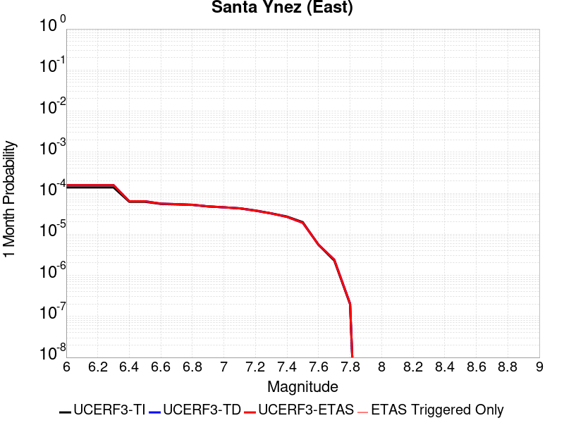 | 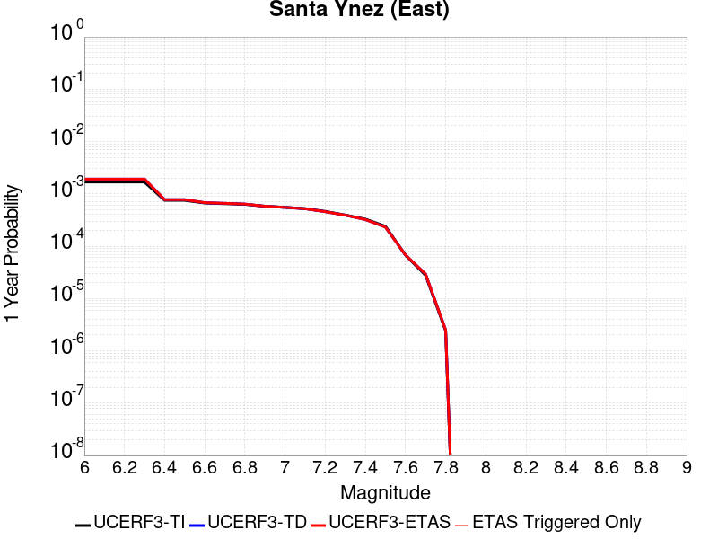 | 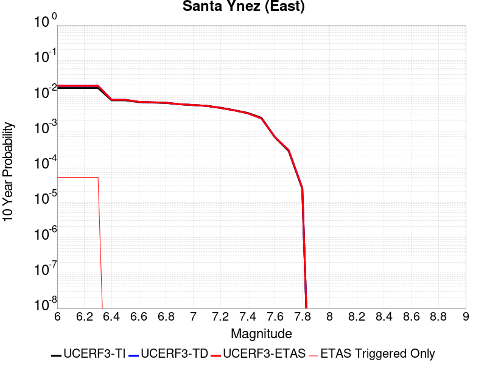 |

| Magnitude | 1 wk TI Prob | 1 wk TD Prob | 1 wk ETAS Prob | 1 wk ETAS/TD Gain | 1 wk ETAS Triggered Only | 1 mo TI Prob | 1 mo TD Prob | 1 mo ETAS Prob | 1 mo ETAS/TD Gain | 1 mo ETAS Triggered Only | 1 yr TI Prob | 1 yr TD Prob | 1 yr ETAS Prob | 1 yr ETAS/TD Gain | 1 yr ETAS Triggered Only | 10 yr TI Prob | 10 yr TD Prob | 10 yr ETAS Prob | 10 yr ETAS/TD Gain | 10 yr ETAS Triggered Only |
|-----|-----|-----|-----|-----|-----|-----|-----|-----|-----|-----|-----|-----|-----|-----|-----|-----|-----|-----|-----|-----|
| 6.0 | 3.2269712E-5 | 3.6756413E-5 | 3.6756413E-5 | 1.0 | 0.0 | 1.3829143E-4 | 1.5752131E-4 | 1.5752131E-4 | 1.0 | 0.0 | 0.0016823979 | 0.0019167247 | 0.0019167247 | 1.0 | 0.0 | 0.016697178 | 0.019059477 | 0.019086625 | 1.0014243 | 2.7674767E-5 |
| 6.1 | 3.2269712E-5 | 3.6756413E-5 | 3.6756413E-5 | 1.0 | 0.0 | 1.3829143E-4 | 1.5752131E-4 | 1.5752131E-4 | 1.0 | 0.0 | 0.0016823979 | 0.0019167247 | 0.0019167247 | 1.0 | 0.0 | 0.016697178 | 0.019059477 | 0.019086625 | 1.0014243 | 2.7674767E-5 |
| 6.2 | 3.2269712E-5 | 3.6756413E-5 | 3.6756413E-5 | 1.0 | 0.0 | 1.3829143E-4 | 1.5752131E-4 | 1.5752131E-4 | 1.0 | 0.0 | 0.0016823979 | 0.0019167247 | 0.0019167247 | 1.0 | 0.0 | 0.016697178 | 0.019059477 | 0.019086625 | 1.0014243 | 2.7674767E-5 |
| 6.3 | 3.2269712E-5 | 3.6756413E-5 | 3.6756413E-5 | 1.0 | 0.0 | 1.3829143E-4 | 1.5752131E-4 | 1.5752131E-4 | 1.0 | 0.0 | 0.0016823979 | 0.0019167247 | 0.0019167247 | 1.0 | 0.0 | 0.016697178 | 0.019059477 | 0.019086625 | 1.0014243 | 2.7674767E-5 |
| 6.4 | 1.4404779E-5 | 1.48506915E-5 | 1.48506915E-5 | 1.0 | 0.0 | 6.1733306E-5 | 6.36443E-5 | 6.36443E-5 | 1.0 | 0.0 | 7.513438E-4 | 7.7459886E-4 | 7.7459886E-4 | 1.0 | 0.0 | 0.0074880854 | 0.00771954 | 0.00771954 | 1.0 | 0.0 |
| 6.5 | 1.4404779E-5 | 1.48506915E-5 | 1.48506915E-5 | 1.0 | 0.0 | 6.1733306E-5 | 6.36443E-5 | 6.36443E-5 | 1.0 | 0.0 | 7.513438E-4 | 7.7459886E-4 | 7.7459886E-4 | 1.0 | 0.0 | 0.0074880854 | 0.00771954 | 0.00771954 | 1.0 | 0.0 |
| 6.6 | 1.280208E-5 | 1.3013006E-5 | 1.3013006E-5 | 1.0 | 0.0 | 5.4864904E-5 | 5.5768844E-5 | 5.5768844E-5 | 1.0 | 0.0 | 6.6777546E-4 | 6.787759E-4 | 6.787759E-4 | 1.0 | 0.0 | 0.006657724 | 0.006767237 | 0.006767237 | 1.0 | 0.0 |
| 6.7 | 1.2457027E-5 | 1.2629486E-5 | 1.2629486E-5 | 1.0 | 0.0 | 5.3386164E-5 | 5.4125256E-5 | 5.4125256E-5 | 1.0 | 0.0 | 6.497827E-4 | 6.587774E-4 | 6.587774E-4 | 1.0 | 0.0 | 0.00647886 | 0.006568443 | 0.006568443 | 1.0 | 0.0 |
| 6.8 | 1.2095134E-5 | 1.2231897E-5 | 1.2231897E-5 | 1.0 | 0.0 | 5.1835254E-5 | 5.2421372E-5 | 5.2421372E-5 | 1.0 | 0.0 | 6.309115E-4 | 6.380449E-4 | 6.380449E-4 | 1.0 | 0.0 | 0.0062912325 | 0.0063623185 | 0.0063623185 | 1.0 | 0.0 |
| 6.9 | 1.1104036E-5 | 1.1158246E-5 | 1.1158246E-5 | 1.0 | 0.0 | 4.758786E-5 | 4.7820184E-5 | 4.7820184E-5 | 1.0 | 0.0 | 5.7922816E-4 | 5.820564E-4 | 5.820564E-4 | 1.0 | 0.0 | 0.005777207 | 0.005805465 | 0.005805465 | 1.0 | 0.0 |
| 7.0 | 1.0577444E-5 | 1.0582528E-5 | 1.0582528E-5 | 1.0 | 0.0 | 4.5331115E-5 | 4.535291E-5 | 4.535291E-5 | 1.0 | 0.0 | 5.5176654E-4 | 5.52033E-4 | 5.52033E-4 | 1.0 | 0.0 | 0.0055039856 | 0.005506756 | 0.005506756 | 1.0 | 0.0 |
| 7.1 | 1.0021775E-5 | 9.98179E-6 | 9.98179E-6 | 1.0 | 0.0 | 4.294976E-5 | 4.2778403E-5 | 4.2778403E-5 | 1.0 | 0.0 | 5.2278786E-4 | 5.207038E-4 | 5.207038E-4 | 1.0 | 0.0 | 0.0052155964 | 0.00519497 | 0.00519497 | 1.0 | 0.0 |
| 7.2 | 8.874109E-6 | 8.7495E-6 | 8.7495E-6 | 1.0 | 0.0 | 3.8031343E-5 | 3.7497324E-5 | 3.7497324E-5 | 1.0 | 0.0 | 4.629332E-4 | 4.5643537E-4 | 4.5643537E-4 | 1.0 | 0.0 | 0.0046197 | 0.0045550973 | 0.0045550973 | 1.0 | 0.0 |
| 7.3 | 7.5504267E-6 | 7.5056873E-6 | 7.5056873E-6 | 1.0 | 0.0 | 3.235857E-5 | 3.216684E-5 | 3.216684E-5 | 1.0 | 0.0 | 3.9389438E-4 | 3.9156192E-4 | 3.9156192E-4 | 1.0 | 0.0 | 0.0039319694 | 0.003908827 | 0.003908827 | 1.0 | 0.0 |
| 7.4 | 6.309394E-6 | 6.1836167E-6 | 6.1836167E-6 | 1.0 | 0.0 | 2.703998E-5 | 2.650095E-5 | 2.650095E-5 | 1.0 | 0.0 | 3.2916202E-4 | 3.2260225E-4 | 3.2260225E-4 | 1.0 | 0.0 | 0.003286749 | 0.0032214366 | 0.0032214366 | 1.0 | 0.0 |
| 7.5 | 4.6103073E-6 | 4.4412027E-6 | 4.4412027E-6 | 1.0 | 0.0 | 1.975831E-5 | 1.903359E-5 | 1.903359E-5 | 1.0 | 0.0 | 2.4053088E-4 | 2.3171002E-4 | 2.3171002E-4 | 1.0 | 0.0 | 0.002402707 | 0.0023147536 | 0.0023147536 | 1.0 | 0.0 |
| 7.6 | 1.2858658E-6 | 1.3008839E-6 | 1.3008839E-6 | 1.0 | 0.0 | 5.5108417E-6 | 5.5752053E-6 | 5.5752053E-6 | 1.0 | 0.0 | 6.7092435E-5 | 6.787608E-5 | 6.787608E-5 | 1.0 | 0.0 | 6.707218E-4 | 6.7856035E-4 | 6.7856035E-4 | 1.0 | 0.0 |
| 7.7 | 5.3302307E-7 | 5.6124156E-7 | 5.6124156E-7 | 1.0 | 0.0 | 2.2843826E-6 | 2.4053188E-6 | 2.4053188E-6 | 1.0 | 0.0 | 2.7812002E-5 | 2.92844E-5 | 2.92844E-5 | 1.0 | 0.0 | 2.7808524E-4 | 2.9280898E-4 | 2.9280898E-4 | 1.0 | 0.0 |
| 7.8 | 4.613933E-8 | 4.8031925E-8 | 4.8031925E-8 | 1.0 | 0.0 | 1.9773998E-7 | 2.058511E-7 | 2.058511E-7 | 1.0 | 0.0 | 2.4074816E-6 | 2.5062343E-6 | 2.5062343E-6 | 1.0 | 0.0 | 2.4074554E-5 | 2.506207E-5 | 2.506207E-5 | 1.0 | 0.0 |

## Santa Cruz Island
*[(top)](#table-of-contents)*

| 1 Week | 1 Month | 1 Year | 10 Year |
|-----|-----|-----|-----|
| 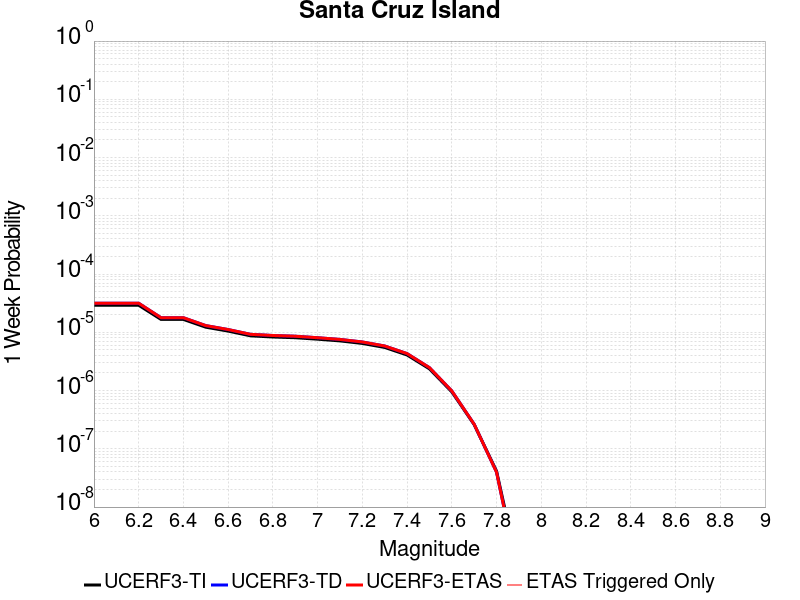 |  |  |  |

| Magnitude | 1 wk TI Prob | 1 wk TD Prob | 1 wk ETAS Prob | 1 wk ETAS/TD Gain | 1 wk ETAS Triggered Only | 1 mo TI Prob | 1 mo TD Prob | 1 mo ETAS Prob | 1 mo ETAS/TD Gain | 1 mo ETAS Triggered Only | 1 yr TI Prob | 1 yr TD Prob | 1 yr ETAS Prob | 1 yr ETAS/TD Gain | 1 yr ETAS Triggered Only | 10 yr TI Prob | 10 yr TD Prob | 10 yr ETAS Prob | 10 yr ETAS/TD Gain | 10 yr ETAS Triggered Only |
|-----|-----|-----|-----|-----|-----|-----|-----|-----|-----|-----|-----|-----|-----|-----|-----|-----|-----|-----|-----|-----|
| 6.0 | 2.9164563E-5 | 3.1602212E-5 | 3.1602212E-5 | 1.0 | 0.0 | 1.2498499E-4 | 1.354318E-4 | 1.354318E-4 | 1.0 | 0.0 | 0.0015206301 | 0.0016477712 | 0.0016477712 | 1.0 | 0.0 | 0.015102667 | 0.016369268 | 0.01639649 | 1.001663 | 2.7674767E-5 |
| 6.1 | 2.9164563E-5 | 3.1602212E-5 | 3.1602212E-5 | 1.0 | 0.0 | 1.2498499E-4 | 1.354318E-4 | 1.354318E-4 | 1.0 | 0.0 | 0.0015206301 | 0.0016477712 | 0.0016477712 | 1.0 | 0.0 | 0.015102667 | 0.016369268 | 0.01639649 | 1.001663 | 2.7674767E-5 |
| 6.2 | 2.9164563E-5 | 3.1602212E-5 | 3.1602212E-5 | 1.0 | 0.0 | 1.2498499E-4 | 1.354318E-4 | 1.354318E-4 | 1.0 | 0.0 | 0.0015206301 | 0.0016477712 | 0.0016477712 | 1.0 | 0.0 | 0.015102667 | 0.016369268 | 0.01639649 | 1.001663 | 2.7674767E-5 |
| 6.3 | 1.6635553E-5 | 1.780553E-5 | 1.780553E-5 | 1.0 | 0.0 | 7.1293274E-5 | 7.630729E-5 | 7.630729E-5 | 1.0 | 0.0 | 8.6765E-4 | 9.286635E-4 | 9.286635E-4 | 1.0 | 0.0 | 0.008642701 | 0.009249699 | 0.009277118 | 1.0029643 | 2.7674767E-5 |
| 6.4 | 1.6635553E-5 | 1.780553E-5 | 1.780553E-5 | 1.0 | 0.0 | 7.1293274E-5 | 7.630729E-5 | 7.630729E-5 | 1.0 | 0.0 | 8.6765E-4 | 9.286635E-4 | 9.286635E-4 | 1.0 | 0.0 | 0.008642701 | 0.009249699 | 0.009277118 | 1.0029643 | 2.7674767E-5 |
| 6.5 | 1.2238748E-5 | 1.30438E-5 | 1.30438E-5 | 1.0 | 0.0 | 5.2450723E-5 | 5.5900826E-5 | 5.5900826E-5 | 1.0 | 0.0 | 6.3840044E-4 | 6.803837E-4 | 6.803837E-4 | 1.0 | 0.0 | 0.0063656955 | 0.006783405 | 0.006810892 | 1.004052 | 2.7674767E-5 |
| 6.6 | 1.0489767E-5 | 1.1157304E-5 | 1.1157304E-5 | 1.0 | 0.0 | 4.495537E-5 | 4.781615E-5 | 4.781615E-5 | 1.0 | 0.0 | 5.4719415E-4 | 5.8200833E-4 | 5.8200833E-4 | 1.0 | 0.0 | 0.005458487 | 0.005805082 | 0.005805082 | 1.0 | 0.0 |
| 6.7 | 8.699222E-6 | 9.23732E-6 | 9.23732E-6 | 1.0 | 0.0 | 3.7281847E-5 | 3.9587918E-5 | 3.9587918E-5 | 1.0 | 0.0 | 4.5381195E-4 | 4.8187686E-4 | 4.8187686E-4 | 1.0 | 0.0 | 0.0045288634 | 0.0048083877 | 0.0048083877 | 1.0 | 0.0 |
| 6.8 | 8.307732E-6 | 8.817415E-6 | 8.817415E-6 | 1.0 | 0.0 | 3.560408E-5 | 3.7788373E-5 | 3.7788373E-5 | 1.0 | 0.0 | 4.3339343E-4 | 4.5997676E-4 | 4.5997676E-4 | 1.0 | 0.0 | 0.004325492 | 0.0045903004 | 0.0045903004 | 1.0 | 0.0 |
| 6.9 | 8.073121E-6 | 8.565432E-6 | 8.565432E-6 | 1.0 | 0.0 | 3.459863E-5 | 3.670848E-5 | 3.670848E-5 | 1.0 | 0.0 | 4.2115687E-4 | 4.468345E-4 | 4.468345E-4 | 1.0 | 0.0 | 0.004203596 | 0.004459412 | 0.004459412 | 1.0 | 0.0 |
| 7.0 | 7.617019E-6 | 8.075122E-6 | 8.075122E-6 | 1.0 | 0.0 | 3.264396E-5 | 3.4607212E-5 | 3.4607212E-5 | 1.0 | 0.0 | 3.9736772E-4 | 4.2126174E-4 | 4.2126174E-4 | 1.0 | 0.0 | 0.003966579 | 0.0042046793 | 0.0042046793 | 1.0 | 0.0 |
| 7.1 | 7.1224836E-6 | 7.5462117E-6 | 7.5462117E-6 | 1.0 | 0.0 | 3.052457E-5 | 3.2340507E-5 | 3.2340507E-5 | 1.0 | 0.0 | 3.715733E-4 | 3.936749E-4 | 3.936749E-4 | 1.0 | 0.0 | 0.003709526 | 0.0039298185 | 0.0039298185 | 1.0 | 0.0 |
| 7.2 | 6.441115E-6 | 6.827771E-6 | 6.827771E-6 | 1.0 | 0.0 | 2.7604487E-5 | 2.9261548E-5 | 2.9261548E-5 | 1.0 | 0.0 | 3.360328E-4 | 3.5620134E-4 | 3.5620134E-4 | 1.0 | 0.0 | 0.0033552512 | 0.0035563326 | 0.0035563326 | 1.0 | 0.0 |
| 7.3 | 5.494274E-6 | 5.820322E-6 | 5.820322E-6 | 1.0 | 0.0 | 2.3546674E-5 | 2.4944E-5 | 2.4944E-5 | 1.0 | 0.0 | 2.8664304E-4 | 3.0365106E-4 | 3.0365106E-4 | 1.0 | 0.0 | 0.002862736 | 0.0030323847 | 0.0030323847 | 1.0 | 0.0 |
| 7.4 | 4.0802624E-6 | 4.3124905E-6 | 4.3124905E-6 | 1.0 | 0.0 | 1.7486722E-5 | 1.8481973E-5 | 1.8481973E-5 | 1.0 | 0.0 | 2.1288003E-4 | 2.2499486E-4 | 2.2499486E-4 | 1.0 | 0.0 | 0.0021267622 | 0.0022476795 | 0.0022476795 | 1.0 | 0.0 |
| 7.5 | 2.3584746E-6 | 2.47543E-6 | 2.47543E-6 | 1.0 | 0.0 | 1.0107709E-5 | 1.0608942E-5 | 1.0608942E-5 | 1.0 | 0.0 | 1.2305441E-4 | 1.2915627E-4 | 1.2915627E-4 | 1.0 | 0.0 | 0.0012298629 | 0.001290817 | 0.001290817 | 1.0 | 0.0 |
| 7.6 | 9.4981914E-7 | 9.861335E-7 | 9.861335E-7 | 1.0 | 0.0 | 4.0706473E-6 | 4.2262795E-6 | 4.2262795E-6 | 1.0 | 0.0 | 4.9559E-5 | 5.145375E-5 | 5.145375E-5 | 1.0 | 0.0 | 4.954795E-4 | 5.144197E-4 | 5.144197E-4 | 1.0 | 0.0 |
| 7.7 | 2.6013532E-7 | 2.6417413E-7 | 2.6417413E-7 | 1.0 | 0.0 | 1.1148652E-6 | 1.1321744E-6 | 1.1321744E-6 | 1.0 | 0.0 | 1.3573399E-5 | 1.3784137E-5 | 1.3784137E-5 | 1.0 | 0.0 | 1.357257E-4 | 1.3783289E-4 | 1.3783289E-4 | 1.0 | 0.0 |
| 7.8 | 4.1522263E-8 | 3.9657692E-8 | 3.9657692E-8 | 1.0 | 0.0 | 1.7795254E-7 | 1.6996152E-7 | 1.6996152E-7 | 1.0 | 0.0 | 2.16657E-6 | 2.0692798E-6 | 2.0692798E-6 | 1.0 | 0.0 | 2.1665488E-5 | 2.0692627E-5 | 2.0692627E-5 | 1.0 | 0.0 |
| 7.9 | 7.7242046E-10 | 5.9470395E-10 | 5.9470395E-10 | 1.0 | 0.0 | 3.3103735E-9 | 2.5487317E-9 | 2.5487317E-9 | 1.0 | 0.0 | 4.0303796E-8 | 3.1030808E-8 | 3.1030808E-8 | 1.0 | 0.0 | 4.030379E-7 | 3.1030805E-7 | 3.1030805E-7 | 1.0 | 0.0 |

## San Clemente
*[(top)](#table-of-contents)*

| 1 Week | 1 Month | 1 Year | 10 Year |
|-----|-----|-----|-----|
| 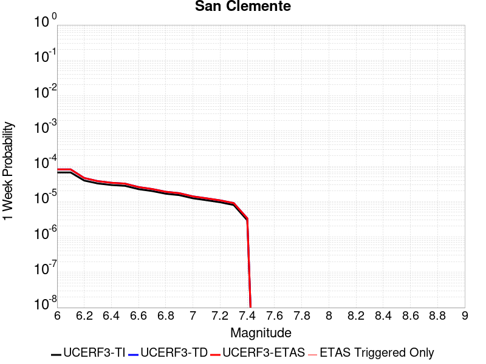 | 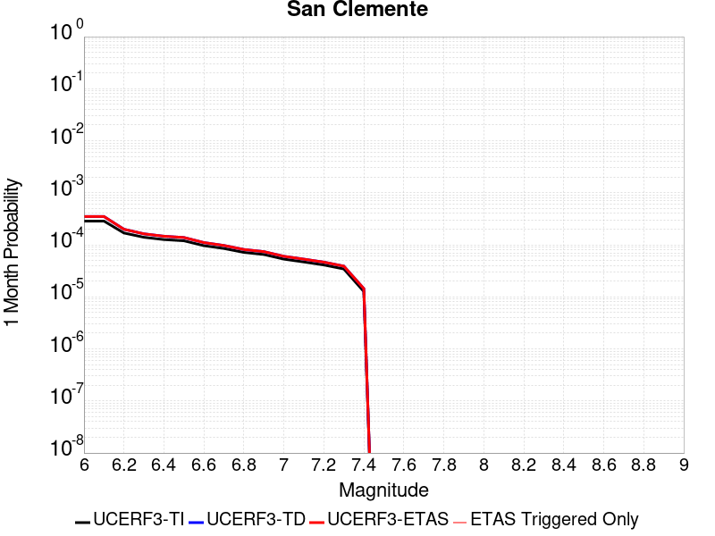 |  |  |

| Magnitude | 1 wk TI Prob | 1 wk TD Prob | 1 wk ETAS Prob | 1 wk ETAS/TD Gain | 1 wk ETAS Triggered Only | 1 mo TI Prob | 1 mo TD Prob | 1 mo ETAS Prob | 1 mo ETAS/TD Gain | 1 mo ETAS Triggered Only | 1 yr TI Prob | 1 yr TD Prob | 1 yr ETAS Prob | 1 yr ETAS/TD Gain | 1 yr ETAS Triggered Only | 10 yr TI Prob | 10 yr TD Prob | 10 yr ETAS Prob | 10 yr ETAS/TD Gain | 10 yr ETAS Triggered Only |
|-----|-----|-----|-----|-----|-----|-----|-----|-----|-----|-----|-----|-----|-----|-----|-----|-----|-----|-----|-----|-----|
| 6.0 | 6.681379E-5 | 8.165149E-5 | 8.165149E-5 | 1.0 | 0.0 | 2.8631336E-4 | 3.4989126E-4 | 3.4989126E-4 | 1.0 | 0.0 | 0.003480294 | 0.0042521846 | 0.0042521846 | 1.0 | 0.0 | 0.03426291 | 0.041764125 | 0.04179064 | 1.000635 | 2.7674767E-5 |
| 6.1 | 6.681379E-5 | 8.165149E-5 | 8.165149E-5 | 1.0 | 0.0 | 2.8631336E-4 | 3.4989126E-4 | 3.4989126E-4 | 1.0 | 0.0 | 0.003480294 | 0.0042521846 | 0.0042521846 | 1.0 | 0.0 | 0.03426291 | 0.041764125 | 0.04179064 | 1.000635 | 2.7674767E-5 |
| 6.2 | 3.9400576E-5 | 4.645981E-5 | 4.645981E-5 | 1.0 | 0.0 | 1.6884868E-4 | 1.990986E-4 | 1.990986E-4 | 1.0 | 0.0 | 0.0020537945 | 0.002421392 | 0.002421392 | 1.0 | 0.0 | 0.020349167 | 0.023956815 | 0.023983827 | 1.0011275 | 2.7674767E-5 |
| 6.3 | 3.2590255E-5 | 3.7934897E-5 | 3.7934897E-5 | 1.0 | 0.0 | 1.3966505E-4 | 1.6256815E-4 | 1.6256815E-4 | 1.0 | 0.0 | 0.0016990956 | 0.0019775007 | 0.0019775007 | 1.0 | 0.0 | 0.01686163 | 0.019602833 | 0.019629966 | 1.0013841 | 2.7674767E-5 |
| 6.4 | 2.9454652E-5 | 3.4102788E-5 | 3.4102788E-5 | 1.0 | 0.0 | 1.2622811E-4 | 1.4614673E-4 | 1.4614673E-4 | 1.0 | 0.0 | 0.0015357438 | 0.0017779089 | 0.0017779089 | 1.0 | 0.0 | 0.015251739 | 0.017640028 | 0.017667215 | 1.0015411 | 2.7674767E-5 |
| 6.5 | 2.790836E-5 | 3.225213E-5 | 3.225213E-5 | 1.0 | 0.0 | 1.1960178E-4 | 1.3821622E-4 | 1.3821622E-4 | 1.0 | 0.0 | 0.001455179 | 0.0016815085 | 0.0016815085 | 1.0 | 0.0 | 0.014456868 | 0.016690874 | 0.016718088 | 1.0016304 | 2.7674767E-5 |
| 6.6 | 2.2492153E-5 | 2.5766192E-5 | 2.5766192E-5 | 1.0 | 0.0 | 9.639138E-5 | 1.1042192E-4 | 1.1042192E-4 | 1.0 | 0.0 | 0.0011729331 | 0.0013435725 | 0.0013435725 | 1.0 | 0.0 | 0.011667615 | 0.013356212 | 0.013383516 | 1.0020443 | 2.7674767E-5 |
| 6.7 | 1.9862755E-5 | 2.26694E-5 | 2.26694E-5 | 1.0 | 0.0 | 8.512331E-5 | 9.715101E-5 | 9.715101E-5 | 1.0 | 0.0 | 0.0010358836 | 0.001182183 | 0.001182183 | 1.0 | 0.0 | 0.010310682 | 0.011760236 | 0.011787585 | 1.0023255 | 2.7674767E-5 |
| 6.8 | 1.6697575E-5 | 1.8980118E-5 | 1.8980118E-5 | 1.0 | 0.0 | 7.155907E-5 | 8.134088E-5 | 8.134088E-5 | 1.0 | 0.0 | 8.7088346E-4 | 9.898846E-4 | 9.898846E-4 | 1.0 | 0.0 | 0.008674784 | 0.009855782 | 0.009883183 | 1.0027803 | 2.7674767E-5 |
| 6.9 | 1.5218415E-5 | 1.7271563E-5 | 1.7271563E-5 | 1.0 | 0.0 | 6.522015E-5 | 7.4018935E-5 | 7.4018935E-5 | 1.0 | 0.0 | 7.93766E-4 | 9.008167E-4 | 9.008167E-4 | 1.0 | 0.0 | 0.007909367 | 0.008972598 | 0.009000025 | 1.0030566 | 2.7674767E-5 |
| 7.0 | 1.2392958E-5 | 1.403474E-5 | 1.403474E-5 | 1.0 | 0.0 | 5.3111595E-5 | 6.014754E-5 | 6.014754E-5 | 1.0 | 0.0 | 6.4644177E-4 | 7.3205784E-4 | 7.3205784E-4 | 1.0 | 0.0 | 0.0064456454 | 0.00729725 | 0.00729725 | 1.0 | 0.0 |
| 7.1 | 1.0934128E-5 | 1.2376652E-5 | 1.2376652E-5 | 1.0 | 0.0 | 4.6859706E-5 | 5.304176E-5 | 5.304176E-5 | 1.0 | 0.0 | 5.7036756E-4 | 6.455994E-4 | 6.455994E-4 | 1.0 | 0.0 | 0.0056890585 | 0.006437985 | 0.006437985 | 1.0 | 0.0 |
| 7.2 | 9.5798805E-6 | 1.08462655E-5 | 1.08462655E-5 | 1.0 | 0.0 | 4.1055984E-5 | 4.6483205E-5 | 4.6483205E-5 | 1.0 | 0.0 | 4.9974193E-4 | 5.6579325E-4 | 5.6579325E-4 | 1.0 | 0.0 | 0.0049861963 | 0.0056442516 | 0.0056442516 | 1.0 | 0.0 |
| 7.3 | 8.0167365E-6 | 9.08504E-6 | 9.08504E-6 | 1.0 | 0.0 | 3.4356988E-5 | 3.8935344E-5 | 3.8935344E-5 | 1.0 | 0.0 | 4.1821605E-4 | 4.739418E-4 | 4.739418E-4 | 1.0 | 0.0 | 0.0041742986 | 0.004730013 | 0.004730013 | 1.0 | 0.0 |
| 7.4 | 2.9581017E-6 | 3.362806E-6 | 3.362806E-6 | 1.0 | 0.0 | 1.2677518E-5 | 1.4411974E-5 | 1.4411974E-5 | 1.0 | 0.0 | 1.5433785E-4 | 1.754567E-4 | 1.754567E-4 | 1.0 | 0.0 | 0.001542307 | 0.0017536769 | 0.0017536769 | 1.0 | 0.0 |

## Los Osos 2011
*[(top)](#table-of-contents)*

| 1 Week | 1 Month | 1 Year | 10 Year |
|-----|-----|-----|-----|
|  |  |  |  |

| Magnitude | 1 wk TI Prob | 1 wk TD Prob | 1 wk ETAS Prob | 1 wk ETAS/TD Gain | 1 wk ETAS Triggered Only | 1 mo TI Prob | 1 mo TD Prob | 1 mo ETAS Prob | 1 mo ETAS/TD Gain | 1 mo ETAS Triggered Only | 1 yr TI Prob | 1 yr TD Prob | 1 yr ETAS Prob | 1 yr ETAS/TD Gain | 1 yr ETAS Triggered Only | 10 yr TI Prob | 10 yr TD Prob | 10 yr ETAS Prob | 10 yr ETAS/TD Gain | 10 yr ETAS Triggered Only |
|-----|-----|-----|-----|-----|-----|-----|-----|-----|-----|-----|-----|-----|-----|-----|-----|-----|-----|-----|-----|-----|
| 6.0 | 4.8871775E-6 | 4.981626E-6 | 4.981626E-6 | 1.0 | 0.0 | 2.0944879E-5 | 2.1349666E-5 | 2.1349666E-5 | 1.0 | 0.0 | 2.5497406E-4 | 2.5990396E-4 | 2.5990396E-4 | 1.0 | 0.0 | 0.002546817 | 0.0025962745 | 0.0026238773 | 1.0106318 | 2.7674767E-5 |
| 6.1 | 4.8871775E-6 | 4.981626E-6 | 4.981626E-6 | 1.0 | 0.0 | 2.0944879E-5 | 2.1349666E-5 | 2.1349666E-5 | 1.0 | 0.0 | 2.5497406E-4 | 2.5990396E-4 | 2.5990396E-4 | 1.0 | 0.0 | 0.002546817 | 0.0025962745 | 0.0026238773 | 1.0106318 | 2.7674767E-5 |
| 6.2 | 4.8871775E-6 | 4.981626E-6 | 4.981626E-6 | 1.0 | 0.0 | 2.0944879E-5 | 2.1349666E-5 | 2.1349666E-5 | 1.0 | 0.0 | 2.5497406E-4 | 2.5990396E-4 | 2.5990396E-4 | 1.0 | 0.0 | 0.002546817 | 0.0025962745 | 0.0026238773 | 1.0106318 | 2.7674767E-5 |
| 6.3 | 4.8871775E-6 | 4.981626E-6 | 4.981626E-6 | 1.0 | 0.0 | 2.0944879E-5 | 2.1349666E-5 | 2.1349666E-5 | 1.0 | 0.0 | 2.5497406E-4 | 2.5990396E-4 | 2.5990396E-4 | 1.0 | 0.0 | 0.002546817 | 0.0025962745 | 0.0026238773 | 1.0106318 | 2.7674767E-5 |
| 6.4 | 4.8871775E-6 | 4.981626E-6 | 4.981626E-6 | 1.0 | 0.0 | 2.0944879E-5 | 2.1349666E-5 | 2.1349666E-5 | 1.0 | 0.0 | 2.5497406E-4 | 2.5990396E-4 | 2.5990396E-4 | 1.0 | 0.0 | 0.002546817 | 0.0025962745 | 0.0026238773 | 1.0106318 | 2.7674767E-5 |
| 6.5 | 3.1724062E-6 | 3.223496E-6 | 3.223496E-6 | 1.0 | 0.0 | 1.3595956E-5 | 1.3814911E-5 | 1.3814911E-5 | 1.0 | 0.0 | 1.6551818E-4 | 1.6818369E-4 | 1.6818369E-4 | 1.0 | 0.0 | 0.0016539496 | 0.0016805775 | 0.0016805775 | 1.0 | 0.0 |
| 6.6 | 3.1022591E-6 | 3.1512034E-6 | 3.1512034E-6 | 1.0 | 0.0 | 1.3295328E-5 | 1.3505089E-5 | 1.3505089E-5 | 1.0 | 0.0 | 1.618586E-4 | 1.6441217E-4 | 1.6441217E-4 | 1.0 | 0.0 | 0.0016174077 | 0.0016429181 | 0.0016429181 | 1.0 | 0.0 |
| 6.7 | 2.611518E-6 | 2.6492717E-6 | 2.6492717E-6 | 1.0 | 0.0 | 1.1192172E-5 | 1.1353972E-5 | 1.1353972E-5 | 1.0 | 0.0 | 1.3625617E-4 | 1.3822588E-4 | 1.3822588E-4 | 1.0 | 0.0 | 0.0013617266 | 0.0013814037 | 0.0013814037 | 1.0 | 0.0 |
| 6.8 | 2.4780884E-6 | 2.5122442E-6 | 2.5122442E-6 | 1.0 | 0.0 | 1.0620336E-5 | 1.07667165E-5 | 1.07667165E-5 | 1.0 | 0.0 | 1.2929492E-4 | 1.3107693E-4 | 1.3107693E-4 | 1.0 | 0.0 | 0.0012921972 | 0.0013100003 | 0.0013100003 | 1.0 | 0.0 |
| 6.9 | 2.1376322E-6 | 2.1635828E-6 | 2.1635828E-6 | 1.0 | 0.0 | 9.161248E-6 | 9.272465E-6 | 9.272465E-6 | 1.0 | 0.0 | 1.1153249E-4 | 1.12886424E-4 | 1.12886424E-4 | 1.0 | 0.0 | 0.0011147653 | 0.0011282928 | 0.0011282928 | 1.0 | 0.0 |
| 7.0 | 1.9282882E-6 | 1.9495312E-6 | 1.9495312E-6 | 1.0 | 0.0 | 8.264066E-6 | 8.355107E-6 | 8.355107E-6 | 1.0 | 0.0 | 1.0061036E-4 | 1.01718695E-4 | 1.01718695E-4 | 1.0 | 0.0 | 0.0010056482 | 0.0010167228 | 0.0010167228 | 1.0 | 0.0 |
| 7.1 | 1.6353226E-6 | 1.6501784E-6 | 1.6501784E-6 | 1.0 | 0.0 | 7.0085066E-6 | 7.072174E-6 | 7.072174E-6 | 1.0 | 0.0 | 8.532523E-5 | 8.610033E-5 | 8.610033E-5 | 1.0 | 0.0 | 8.529247E-4 | 8.606704E-4 | 8.606704E-4 | 1.0 | 0.0 |
| 7.2 | 1.4446276E-6 | 1.4553968E-6 | 1.4553968E-6 | 1.0 | 0.0 | 6.191247E-6 | 6.2374E-6 | 6.2374E-6 | 1.0 | 0.0 | 7.537582E-5 | 7.593771E-5 | 7.593771E-5 | 1.0 | 0.0 | 7.535026E-4 | 7.591182E-4 | 7.591182E-4 | 1.0 | 0.0 |
| 7.3 | 1.2014582E-6 | 1.2069651E-6 | 1.2069651E-6 | 1.0 | 0.0 | 5.149096E-6 | 5.172697E-6 | 5.172697E-6 | 1.0 | 0.0 | 6.268844E-5 | 6.297577E-5 | 6.297577E-5 | 1.0 | 0.0 | 6.267076E-4 | 6.2957965E-4 | 6.2957965E-4 | 1.0 | 0.0 |
| 7.4 | 9.707733E-7 | 9.710301E-7 | 9.710301E-7 | 1.0 | 0.0 | 4.16045E-6 | 4.161551E-6 | 4.161551E-6 | 1.0 | 0.0 | 5.0652303E-5 | 5.0665705E-5 | 5.0665705E-5 | 1.0 | 0.0 | 5.064076E-4 | 5.065418E-4 | 5.065418E-4 | 1.0 | 0.0 |
| 7.5 | 7.174908E-7 | 7.1153823E-7 | 7.1153823E-7 | 1.0 | 0.0 | 3.074957E-6 | 3.049446E-6 | 3.049446E-6 | 1.0 | 0.0 | 3.743696E-5 | 3.7126374E-5 | 3.7126374E-5 | 1.0 | 0.0 | 3.7430652E-4 | 3.712019E-4 | 3.712019E-4 | 1.0 | 0.0 |
| 7.6 | 4.5535776E-7 | 4.4211913E-7 | 4.4211913E-7 | 1.0 | 0.0 | 1.9515319E-6 | 1.8947949E-6 | 1.8947949E-6 | 1.0 | 0.0 | 2.3759641E-5 | 2.3068884E-5 | 2.3068884E-5 | 1.0 | 0.0 | 2.37571E-4 | 2.3066498E-4 | 2.3066498E-4 | 1.0 | 0.0 |
| 7.7 | 2.1173553E-7 | 1.9064034E-7 | 1.9064034E-7 | 1.0 | 0.0 | 9.0743765E-7 | 8.1702973E-7 | 8.1702973E-7 | 1.0 | 0.0 | 1.1047998E-5 | 9.947292E-6 | 9.947292E-6 | 1.0 | 0.0 | 1.1047449E-4 | 9.946849E-5 | 9.946849E-5 | 1.0 | 0.0 |
| 7.8 | 9.873608E-8 | 7.370383E-8 | 7.370383E-8 | 1.0 | 0.0 | 4.2315455E-7 | 3.158735E-7 | 3.158735E-7 | 1.0 | 0.0 | 5.1518946E-6 | 3.8457533E-6 | 3.8457533E-6 | 1.0 | 0.0 | 5.1517753E-5 | 3.8456874E-5 | 3.8456874E-5 | 1.0 | 0.0 |
| 7.9 | 5.4399106E-8 | 3.190516E-8 | 3.190516E-8 | 1.0 | 0.0 | 2.33139E-7 | 1.3673639E-7 | 1.3673639E-7 | 1.0 | 0.0 | 2.8384638E-6 | 1.6647642E-6 | 1.6647642E-6 | 1.0 | 0.0 | 2.8384275E-5 | 1.6647518E-5 | 1.6647518E-5 | 1.0 | 0.0 |
| 8.0 | 1.817203E-8 | 8.431308E-9 | 8.431308E-9 | 1.0 | 0.0 | 7.7880124E-8 | 3.613418E-8 | 3.613418E-8 | 1.0 | 0.0 | 9.481901E-7 | 4.3993353E-7 | 4.3993353E-7 | 1.0 | 0.0 | 9.481861E-6 | 4.3993273E-6 | 4.3993273E-6 | 1.0 | 0.0 |

## Malibu Coast (Extension) alt 1
*[(top)](#table-of-contents)*

| 1 Week | 1 Month | 1 Year | 10 Year |
|-----|-----|-----|-----|
|  |  |  |  |

| Magnitude | 1 wk TI Prob | 1 wk TD Prob | 1 wk ETAS Prob | 1 wk ETAS/TD Gain | 1 wk ETAS Triggered Only | 1 mo TI Prob | 1 mo TD Prob | 1 mo ETAS Prob | 1 mo ETAS/TD Gain | 1 mo ETAS Triggered Only | 1 yr TI Prob | 1 yr TD Prob | 1 yr ETAS Prob | 1 yr ETAS/TD Gain | 1 yr ETAS Triggered Only | 10 yr TI Prob | 10 yr TD Prob | 10 yr ETAS Prob | 10 yr ETAS/TD Gain | 10 yr ETAS Triggered Only |
|-----|-----|-----|-----|-----|-----|-----|-----|-----|-----|-----|-----|-----|-----|-----|-----|-----|-----|-----|-----|-----|
| 6.0 | 8.930738E-6 | 9.329764E-6 | 9.329764E-6 | 1.0 | 0.0 | 3.827403E-5 | 3.9984097E-5 | 3.9984097E-5 | 1.0 | 0.0 | 4.6588664E-4 | 4.866994E-4 | 4.866994E-4 | 1.0 | 0.0 | 0.0046491115 | 0.0048565175 | 0.0048840577 | 1.0056708 | 2.7674767E-5 |
| 6.1 | 7.199952E-6 | 7.5307184E-6 | 7.5307184E-6 | 1.0 | 0.0 | 3.0856572E-5 | 3.227411E-5 | 3.227411E-5 | 1.0 | 0.0 | 3.75614E-4 | 3.9286708E-4 | 3.9286708E-4 | 1.0 | 0.0 | 0.0037497976 | 0.003921792 | 0.003921792 | 1.0 | 0.0 |
| 6.2 | 6.3721413E-6 | 6.667179E-6 | 6.667179E-6 | 1.0 | 0.0 | 2.7308892E-5 | 2.8573313E-5 | 2.8573313E-5 | 1.0 | 0.0 | 3.3243504E-4 | 3.478249E-4 | 3.478249E-4 | 1.0 | 0.0 | 0.0033193815 | 0.0034728453 | 0.0034728453 | 1.0 | 0.0 |
| 6.3 | 6.016345E-6 | 6.2955305E-6 | 6.2955305E-6 | 1.0 | 0.0 | 2.578408E-5 | 2.6980568E-5 | 2.6980568E-5 | 1.0 | 0.0 | 3.1387596E-4 | 3.2843923E-4 | 3.2843923E-4 | 1.0 | 0.0 | 0.00313433 | 0.0032795742 | 0.0032795742 | 1.0 | 0.0 |
| 6.4 | 5.8104883E-6 | 6.079907E-6 | 6.079907E-6 | 1.0 | 0.0 | 2.4901856E-5 | 2.6056487E-5 | 2.6056487E-5 | 1.0 | 0.0 | 3.031379E-4 | 3.1719185E-4 | 3.1719185E-4 | 1.0 | 0.0 | 0.0030272473 | 0.003167426 | 0.003167426 | 1.0 | 0.0 |
| 6.5 | 5.476925E-6 | 5.7278576E-6 | 5.7278576E-6 | 1.0 | 0.0 | 2.3472323E-5 | 2.4547731E-5 | 2.4547731E-5 | 1.0 | 0.0 | 2.8573806E-4 | 2.9882794E-4 | 2.9882794E-4 | 1.0 | 0.0 | 0.0028537093 | 0.002984293 | 0.002984293 | 1.0 | 0.0 |
| 6.6 | 5.222387E-6 | 5.45891E-6 | 5.45891E-6 | 1.0 | 0.0 | 2.2381464E-5 | 2.3395121E-5 | 2.3395121E-5 | 1.0 | 0.0 | 2.7246025E-4 | 2.8479865E-4 | 2.8479865E-4 | 1.0 | 0.0 | 0.0027212645 | 0.0028443674 | 0.0028443674 | 1.0 | 0.0 |
| 6.7 | 5.0337076E-6 | 5.259423E-6 | 5.259423E-6 | 1.0 | 0.0 | 2.1572854E-5 | 2.2540191E-5 | 2.2540191E-5 | 1.0 | 0.0 | 2.6261783E-4 | 2.7439254E-4 | 2.7439254E-4 | 1.0 | 0.0 | 0.002623077 | 0.0027405676 | 0.0027405676 | 1.0 | 0.0 |
| 6.8 | 4.5675624E-6 | 4.759002E-6 | 4.759002E-6 | 1.0 | 0.0 | 1.9575122E-5 | 2.0395564E-5 | 2.0395564E-5 | 1.0 | 0.0 | 2.3830103E-4 | 2.482879E-4 | 2.482879E-4 | 1.0 | 0.0 | 0.0023804565 | 0.0024801246 | 0.0024801246 | 1.0 | 0.0 |
| 6.9 | 4.2802412E-6 | 4.4522867E-6 | 4.4522867E-6 | 1.0 | 0.0 | 1.8343762E-5 | 1.9081092E-5 | 1.9081092E-5 | 1.0 | 0.0 | 2.2331243E-4 | 2.3228767E-4 | 2.3228767E-4 | 1.0 | 0.0 | 0.0022308815 | 0.0023204654 | 0.0023204654 | 1.0 | 0.0 |
| 7.0 | 3.9794063E-6 | 4.130344E-6 | 4.130344E-6 | 1.0 | 0.0 | 1.7054486E-5 | 1.7701357E-5 | 1.7701357E-5 | 1.0 | 0.0 | 2.0761859E-4 | 2.1549284E-4 | 2.1549284E-4 | 1.0 | 0.0 | 0.0020742472 | 0.0021528522 | 0.0021528522 | 1.0 | 0.0 |
| 7.1 | 3.7730424E-6 | 3.91145E-6 | 3.91145E-6 | 1.0 | 0.0 | 1.6170083E-5 | 1.676325E-5 | 1.676325E-5 | 1.0 | 0.0 | 1.9685295E-4 | 2.0407357E-4 | 2.0407357E-4 | 1.0 | 0.0 | 0.0019667868 | 0.0020388747 | 0.0020388747 | 1.0 | 0.0 |
| 7.2 | 3.424985E-6 | 3.5415485E-6 | 3.5415485E-6 | 1.0 | 0.0 | 1.4678424E-5 | 1.5177977E-5 | 1.5177977E-5 | 1.0 | 0.0 | 1.7869516E-4 | 1.8477632E-4 | 1.8477632E-4 | 1.0 | 0.0 | 0.0017855153 | 0.0018462389 | 0.0018462389 | 1.0 | 0.0 |
| 7.3 | 2.6966375E-6 | 2.7598114E-6 | 2.7598114E-6 | 1.0 | 0.0 | 1.15569665E-5 | 1.1827709E-5 | 1.1827709E-5 | 1.0 | 0.0 | 1.4069698E-4 | 1.4399289E-4 | 1.4399289E-4 | 1.0 | 0.0 | 0.0014060794 | 0.001439 | 0.001439 | 1.0 | 0.0 |
| 7.4 | 2.215957E-6 | 2.2495053E-6 | 2.2495053E-6 | 1.0 | 0.0 | 9.496924E-6 | 9.640701E-6 | 9.640701E-6 | 1.0 | 0.0 | 1.1561892E-4 | 1.1736925E-4 | 1.1736925E-4 | 1.0 | 0.0 | 0.0011555878 | 0.0011730763 | 0.0011730763 | 1.0 | 0.0 |
| 7.5 | 1.2040218E-6 | 1.221979E-6 | 1.221979E-6 | 1.0 | 0.0 | 5.160083E-6 | 5.2370424E-6 | 5.2370424E-6 | 1.0 | 0.0 | 6.2822204E-5 | 6.3759144E-5 | 6.3759144E-5 | 1.0 | 0.0 | 6.280445E-4 | 6.374104E-4 | 6.374104E-4 | 1.0 | 0.0 |
| 7.6 | 6.6157446E-7 | 6.679384E-7 | 6.679384E-7 | 1.0 | 0.0 | 2.835316E-6 | 2.8625902E-6 | 2.8625902E-6 | 1.0 | 0.0 | 3.4519428E-5 | 3.4851495E-5 | 3.4851495E-5 | 1.0 | 0.0 | 3.4514067E-4 | 3.4846182E-4 | 3.4846182E-4 | 1.0 | 0.0 |
| 7.7 | 2.6012302E-7 | 2.4359008E-7 | 2.4359008E-7 | 1.0 | 0.0 | 1.1148124E-6 | 1.0439571E-6 | 1.0439571E-6 | 1.0 | 0.0 | 1.3572758E-5 | 1.2710114E-5 | 1.2710114E-5 | 1.0 | 0.0 | 1.3571928E-4 | 1.2709494E-4 | 1.2709494E-4 | 1.0 | 0.0 |
| 7.8 | 2.8323132E-8 | 2.0267912E-8 | 2.0267912E-8 | 1.0 | 0.0 | 1.2138484E-7 | 8.686248E-8 | 8.686248E-8 | 1.0 | 0.0 | 1.4778595E-6 | 1.0575502E-6 | 1.0575502E-6 | 1.0 | 0.0 | 1.4778497E-5 | 1.057546E-5 | 1.057546E-5 | 1.0 | 0.0 |

## Rose Canyon
*[(top)](#table-of-contents)*

| 1 Week | 1 Month | 1 Year | 10 Year |
|-----|-----|-----|-----|
|  |  |  |  |

| Magnitude | 1 wk TI Prob | 1 wk TD Prob | 1 wk ETAS Prob | 1 wk ETAS/TD Gain | 1 wk ETAS Triggered Only | 1 mo TI Prob | 1 mo TD Prob | 1 mo ETAS Prob | 1 mo ETAS/TD Gain | 1 mo ETAS Triggered Only | 1 yr TI Prob | 1 yr TD Prob | 1 yr ETAS Prob | 1 yr ETAS/TD Gain | 1 yr ETAS Triggered Only | 10 yr TI Prob | 10 yr TD Prob | 10 yr ETAS Prob | 10 yr ETAS/TD Gain | 10 yr ETAS Triggered Only |
|-----|-----|-----|-----|-----|-----|-----|-----|-----|-----|-----|-----|-----|-----|-----|-----|-----|-----|-----|-----|-----|
| 6.0 | 4.5923203E-5 | 4.9788014E-5 | 4.9788014E-5 | 1.0 | 0.0 | 1.9679888E-4 | 2.1336111E-4 | 2.1336111E-4 | 1.0 | 0.0 | 0.0023933933 | 0.0025947844 | 0.0026223874 | 1.0106379 | 2.7674767E-5 | 0.023677798 | 0.025677606 | 0.025704572 | 1.0010501 | 2.7674767E-5 |
| 6.1 | 4.5923203E-5 | 4.9788014E-5 | 4.9788014E-5 | 1.0 | 0.0 | 1.9679888E-4 | 2.1336111E-4 | 2.1336111E-4 | 1.0 | 0.0 | 0.0023933933 | 0.0025947844 | 0.0025947844 | 1.0 | 0.0 | 0.023677798 | 0.025677606 | 0.025677606 | 1.0 | 0.0 |
| 6.2 | 2.8844734E-5 | 2.973638E-5 | 2.973638E-5 | 1.0 | 0.0 | 1.2361443E-4 | 1.274356E-4 | 1.274356E-4 | 1.0 | 0.0 | 0.0015039665 | 0.0015504593 | 0.0015504593 | 1.0 | 0.0 | 0.0149382865 | 0.015409305 | 0.015409305 | 1.0 | 0.0 |
| 6.3 | 2.3171577E-5 | 2.3227845E-5 | 2.3227845E-5 | 1.0 | 0.0 | 9.9302975E-5 | 9.954419E-5 | 9.954419E-5 | 1.0 | 0.0 | 0.0012083431 | 0.0012112902 | 0.0012112902 | 1.0 | 0.0 | 0.012017938 | 0.012056646 | 0.012056646 | 1.0 | 0.0 |
| 6.4 | 2.0066604E-5 | 1.9707251E-5 | 1.9707251E-5 | 1.0 | 0.0 | 8.599689E-5 | 8.445697E-5 | 8.445697E-5 | 1.0 | 0.0 | 0.0010465092 | 0.0010277887 | 0.0010277887 | 1.0 | 0.0 | 0.010415946 | 0.010238266 | 0.010238266 | 1.0 | 0.0 |
| 6.5 | 1.776989E-5 | 1.7137463E-5 | 1.7137463E-5 | 1.0 | 0.0 | 7.615444E-5 | 7.3444244E-5 | 7.3444244E-5 | 1.0 | 0.0 | 9.267859E-4 | 8.9382386E-4 | 8.9382386E-4 | 1.0 | 0.0 | 0.009229303 | 0.008908412 | 0.008908412 | 1.0 | 0.0 |
| 6.6 | 1.5227364E-5 | 1.4346652E-5 | 1.4346652E-5 | 1.0 | 0.0 | 6.52585E-5 | 6.1484236E-5 | 6.1484236E-5 | 1.0 | 0.0 | 7.942326E-4 | 7.483186E-4 | 7.483186E-4 | 1.0 | 0.0 | 0.007914 | 0.007462183 | 0.007462183 | 1.0 | 0.0 |
| 6.7 | 1.2703898E-5 | 1.16745105E-5 | 1.16745105E-5 | 1.0 | 0.0 | 5.4444143E-5 | 5.003268E-5 | 5.003268E-5 | 1.0 | 0.0 | 6.626558E-4 | 6.089819E-4 | 6.089819E-4 | 1.0 | 0.0 | 0.006606833 | 0.0060757245 | 0.0060757245 | 1.0 | 0.0 |
| 6.8 | 1.1554917E-5 | 1.0610374E-5 | 1.0610374E-5 | 1.0 | 0.0 | 4.9520135E-5 | 4.547226E-5 | 4.547226E-5 | 1.0 | 0.0 | 6.0274085E-4 | 5.534882E-4 | 5.534882E-4 | 1.0 | 0.0 | 0.0060110865 | 0.0055231047 | 0.0055231047 | 1.0 | 0.0 |
| 6.9 | 8.732078E-6 | 7.881992E-6 | 7.881992E-6 | 1.0 | 0.0 | 3.7422655E-5 | 3.3779546E-5 | 3.3779546E-5 | 1.0 | 0.0 | 4.5552556E-4 | 4.111913E-4 | 4.111913E-4 | 1.0 | 0.0 | 0.0045459294 | 0.004105137 | 0.004105137 | 1.0 | 0.0 |
| 7.0 | 5.9337494E-6 | 5.1078046E-6 | 5.1078046E-6 | 1.0 | 0.0 | 2.5430107E-5 | 2.1890408E-5 | 2.1890408E-5 | 1.0 | 0.0 | 3.0956755E-4 | 2.6648326E-4 | 2.6648326E-4 | 1.0 | 0.0 | 0.0030913667 | 0.0026616526 | 0.0026616526 | 1.0 | 0.0 |
| 7.1 | 5.013409E-6 | 4.1776366E-6 | 4.1776366E-6 | 1.0 | 0.0 | 2.1485863E-5 | 1.7904034E-5 | 1.7904034E-5 | 1.0 | 0.0 | 2.6155898E-4 | 2.1795991E-4 | 2.1795991E-4 | 1.0 | 0.0 | 0.0026125133 | 0.0021774732 | 0.0021774732 | 1.0 | 0.0 |
| 7.2 | 4.120763E-6 | 3.2823436E-6 | 3.2823436E-6 | 1.0 | 0.0 | 1.7660293E-5 | 1.4067112E-5 | 1.4067112E-5 | 1.0 | 0.0 | 2.1499286E-4 | 1.7125372E-4 | 1.7125372E-4 | 1.0 | 0.0 | 0.0021478499 | 0.001711227 | 0.001711227 | 1.0 | 0.0 |
| 7.3 | 3.2081239E-6 | 2.4406936E-6 | 2.4406936E-6 | 1.0 | 0.0 | 1.374903E-5 | 1.0460074E-5 | 1.0460074E-5 | 1.0 | 0.0 | 1.6738157E-4 | 1.2734403E-4 | 1.2734403E-4 | 1.0 | 0.0 | 0.0016725556 | 0.0012727176 | 0.0012727176 | 1.0 | 0.0 |
| 7.4 | 2.4194755E-6 | 1.7681823E-6 | 1.7681823E-6 | 1.0 | 0.0 | 1.0369139E-5 | 7.577902E-6 | 7.577902E-6 | 1.0 | 0.0 | 1.2623696E-4 | 9.2257105E-5 | 9.2257105E-5 | 1.0 | 0.0 | 0.0012616527 | 9.221934E-4 | 9.221934E-4 | 1.0 | 0.0 |
| 7.5 | 1.3842889E-6 | 9.379397E-7 | 9.379397E-7 | 1.0 | 0.0 | 5.9326535E-6 | 4.0197356E-6 | 4.0197356E-6 | 1.0 | 0.0 | 7.222766E-5 | 4.893922E-5 | 4.893922E-5 | 1.0 | 0.0 | 7.220419E-4 | 4.8928795E-4 | 4.8928795E-4 | 1.0 | 0.0 |
| 7.6 | 1.0021575E-6 | 6.412061E-7 | 6.412061E-7 | 1.0 | 0.0 | 4.2949537E-6 | 2.7480235E-6 | 2.7480235E-6 | 1.0 | 0.0 | 5.2289808E-5 | 3.3456694E-5 | 3.3456694E-5 | 1.0 | 0.0 | 5.2277505E-4 | 3.345187E-4 | 3.345187E-4 | 1.0 | 0.0 |
| 7.7 | 8.7620116E-8 | 6.4495445E-8 | 6.4495445E-8 | 1.0 | 0.0 | 3.7551473E-7 | 2.7640903E-7 | 2.7640903E-7 | 1.0 | 0.0 | 4.5718825E-6 | 3.365275E-6 | 3.365275E-6 | 1.0 | 0.0 | 4.5717883E-5 | 3.3652268E-5 | 3.3652268E-5 | 1.0 | 0.0 |

## Oak Ridge (Onshore)
*[(top)](#table-of-contents)*

| 1 Week | 1 Month | 1 Year | 10 Year |
|-----|-----|-----|-----|
|  |  |  | 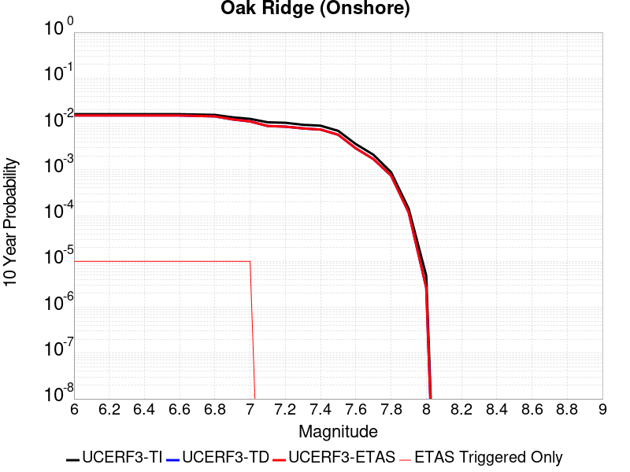 |

| Magnitude | 1 wk TI Prob | 1 wk TD Prob | 1 wk ETAS Prob | 1 wk ETAS/TD Gain | 1 wk ETAS Triggered Only | 1 mo TI Prob | 1 mo TD Prob | 1 mo ETAS Prob | 1 mo ETAS/TD Gain | 1 mo ETAS Triggered Only | 1 yr TI Prob | 1 yr TD Prob | 1 yr ETAS Prob | 1 yr ETAS/TD Gain | 1 yr ETAS Triggered Only | 10 yr TI Prob | 10 yr TD Prob | 10 yr ETAS Prob | 10 yr ETAS/TD Gain | 10 yr ETAS Triggered Only |
|-----|-----|-----|-----|-----|-----|-----|-----|-----|-----|-----|-----|-----|-----|-----|-----|-----|-----|-----|-----|-----|
| 6.0 | 3.155064E-5 | 2.9531044E-5 | 2.9531044E-5 | 1.0 | 0.0 | 1.3521002E-4 | 1.265557E-4 | 1.265557E-4 | 1.0 | 0.0 | 0.001644939 | 0.0015397646 | 0.0015673967 | 1.0179456 | 2.7674767E-5 | 0.01632816 | 0.015295465 | 0.015322716 | 1.0017817 | 2.7674767E-5 |
| 6.1 | 3.155064E-5 | 2.9531044E-5 | 2.9531044E-5 | 1.0 | 0.0 | 1.3521002E-4 | 1.265557E-4 | 1.265557E-4 | 1.0 | 0.0 | 0.001644939 | 0.0015397646 | 0.0015673967 | 1.0179456 | 2.7674767E-5 | 0.01632816 | 0.015295465 | 0.015322716 | 1.0017817 | 2.7674767E-5 |
| 6.2 | 3.155064E-5 | 2.9531044E-5 | 2.9531044E-5 | 1.0 | 0.0 | 1.3521002E-4 | 1.265557E-4 | 1.265557E-4 | 1.0 | 0.0 | 0.001644939 | 0.0015397646 | 0.0015673967 | 1.0179456 | 2.7674767E-5 | 0.01632816 | 0.015295465 | 0.015322716 | 1.0017817 | 2.7674767E-5 |
| 6.3 | 3.155064E-5 | 2.9531044E-5 | 2.9531044E-5 | 1.0 | 0.0 | 1.3521002E-4 | 1.265557E-4 | 1.265557E-4 | 1.0 | 0.0 | 0.001644939 | 0.0015397646 | 0.0015673967 | 1.0179456 | 2.7674767E-5 | 0.01632816 | 0.015295465 | 0.015322716 | 1.0017817 | 2.7674767E-5 |
| 6.4 | 3.155064E-5 | 2.9531044E-5 | 2.9531044E-5 | 1.0 | 0.0 | 1.3521002E-4 | 1.265557E-4 | 1.265557E-4 | 1.0 | 0.0 | 0.001644939 | 0.0015397646 | 0.0015673967 | 1.0179456 | 2.7674767E-5 | 0.01632816 | 0.015295465 | 0.015322716 | 1.0017817 | 2.7674767E-5 |
| 6.5 | 3.155064E-5 | 2.9531044E-5 | 2.9531044E-5 | 1.0 | 0.0 | 1.3521002E-4 | 1.265557E-4 | 1.265557E-4 | 1.0 | 0.0 | 0.001644939 | 0.0015397646 | 0.0015673967 | 1.0179456 | 2.7674767E-5 | 0.01632816 | 0.015295465 | 0.015322716 | 1.0017817 | 2.7674767E-5 |
| 6.6 | 3.155064E-5 | 2.9531044E-5 | 2.9531044E-5 | 1.0 | 0.0 | 1.3521002E-4 | 1.265557E-4 | 1.265557E-4 | 1.0 | 0.0 | 0.001644939 | 0.0015397646 | 0.0015673967 | 1.0179456 | 2.7674767E-5 | 0.01632816 | 0.015295465 | 0.015322716 | 1.0017817 | 2.7674767E-5 |
| 6.7 | 3.098897E-5 | 2.8869135E-5 | 2.8869135E-5 | 1.0 | 0.0 | 1.328031E-4 | 1.237192E-4 | 1.237192E-4 | 1.0 | 0.0 | 0.0016156785 | 0.0015052783 | 0.0015329114 | 1.0183575 | 2.7674767E-5 | 0.016039822 | 0.0149552645 | 0.014982525 | 1.0018228 | 2.7674767E-5 |
| 6.8 | 3.0449872E-5 | 2.824424E-5 | 2.824424E-5 | 1.0 | 0.0 | 1.3049292E-4 | 1.2104134E-4 | 1.2104134E-4 | 1.0 | 0.0 | 0.0015875935 | 0.0014727192 | 0.0015003533 | 1.0187639 | 2.7674767E-5 | 0.015762992 | 0.014633966 | 0.014661236 | 1.0018635 | 2.7674767E-5 |
| 6.9 | 2.697928E-5 | 2.422405E-5 | 2.422405E-5 | 1.0 | 0.0 | 1.15620365E-4 | 1.0381334E-4 | 1.0381334E-4 | 1.0 | 0.0 | 0.0014067689 | 0.0012632161 | 0.0012908559 | 1.0218805 | 2.7674767E-5 | 0.0139789665 | 0.012563073 | 0.012590401 | 1.0021752 | 2.7674767E-5 |
| 7.0 | 2.4893961E-5 | 2.1865993E-5 | 2.1865993E-5 | 1.0 | 0.0 | 1.0668404E-4 | 9.3708135E-5 | 9.3708135E-5 | 1.0 | 0.0 | 0.0012981043 | 0.0011403172 | 0.0011679603 | 1.0242417 | 2.7674767E-5 | 0.012905477 | 0.011346945 | 0.011374305 | 1.0024112 | 2.7674767E-5 |
| 7.1 | 2.0945363E-5 | 1.7357834E-5 | 1.7357834E-5 | 1.0 | 0.0 | 8.976275E-5 | 7.438862E-5 | 7.438862E-5 | 1.0 | 0.0 | 0.0010923136 | 9.0530986E-4 | 9.0530986E-4 | 1.0 | 0.0 | 0.0108696 | 0.009017154 | 0.009017154 | 1.0 | 0.0 |
| 7.2 | 2.0439404E-5 | 1.68127E-5 | 1.68127E-5 | 1.0 | 0.0 | 8.7594504E-5 | 7.205247E-5 | 7.205247E-5 | 1.0 | 0.0 | 0.0010659413 | 8.7689044E-4 | 8.7689044E-4 | 1.0 | 0.0 | 0.010608427 | 0.008735222 | 0.008735222 | 1.0 | 0.0 |
| 7.3 | 1.8463334E-5 | 1.5383524E-5 | 1.5383524E-5 | 1.0 | 0.0 | 7.912617E-5 | 6.592775E-5 | 6.592775E-5 | 1.0 | 0.0 | 9.6293533E-4 | 8.023791E-4 | 8.023791E-4 | 1.0 | 0.0 | 0.009587734 | 0.007995685 | 0.007995685 | 1.0 | 0.0 |
| 7.4 | 1.763139E-5 | 1.4518336E-5 | 1.4518336E-5 | 1.0 | 0.0 | 7.556091E-5 | 6.221998E-5 | 6.221998E-5 | 1.0 | 0.0 | 9.1956573E-4 | 7.572689E-4 | 7.572689E-4 | 1.0 | 0.0 | 0.009157699 | 0.0075476887 | 0.0075476887 | 1.0 | 0.0 |
| 7.5 | 1.3594944E-5 | 1.1164352E-5 | 1.1164352E-5 | 1.0 | 0.0 | 5.8262744E-5 | 4.7846363E-5 | 4.7846363E-5 | 1.0 | 0.0 | 7.0911803E-4 | 5.8237626E-4 | 5.8237626E-4 | 1.0 | 0.0 | 0.007068595 | 0.0058087725 | 0.0058087725 | 1.0 | 0.0 |
| 7.6 | 6.9889534E-6 | 5.6371114E-6 | 5.6371114E-6 | 1.0 | 0.0 | 2.9952313E-5 | 2.4158828E-5 | 2.4158828E-5 | 1.0 | 0.0 | 3.646084E-4 | 2.9409444E-4 | 2.9409444E-4 | 1.0 | 0.0 | 0.0036401073 | 0.0029370964 | 0.0029370964 | 1.0 | 0.0 |
| 7.7 | 4.0824193E-6 | 3.283474E-6 | 3.283474E-6 | 1.0 | 0.0 | 1.7495966E-5 | 1.4071956E-5 | 1.4071956E-5 | 1.0 | 0.0 | 2.1299256E-4 | 1.7131273E-4 | 1.7131273E-4 | 1.0 | 0.0 | 0.0021278851 | 0.00171182 | 0.00171182 | 1.0 | 0.0 |
| 7.8 | 1.7023609E-6 | 1.4371285E-6 | 1.4371285E-6 | 1.0 | 0.0 | 7.295812E-6 | 6.1591077E-6 | 6.1591077E-6 | 1.0 | 0.0 | 8.882289E-5 | 7.4984586E-5 | 7.4984586E-5 | 1.0 | 0.0 | 8.8787393E-4 | 7.4959564E-4 | 7.4959564E-4 | 1.0 | 0.0 |
| 7.9 | 2.721225E-7 | 2.2618393E-7 | 2.2618393E-7 | 1.0 | 0.0 | 1.1662388E-6 | 9.693593E-7 | 9.693593E-7 | 1.0 | 0.0 | 1.4198865E-5 | 1.1801889E-5 | 1.1801889E-5 | 1.0 | 0.0 | 1.4197957E-4 | 1.18012904E-4 | 1.18012904E-4 | 1.0 | 0.0 |
| 8.0 | 9.364255E-9 | 5.122464E-9 | 5.122464E-9 | 1.0 | 0.0 | 4.0132523E-8 | 2.1953415E-8 | 2.1953415E-8 | 1.0 | 0.0 | 4.8861335E-7 | 2.672828E-7 | 2.672828E-7 | 1.0 | 0.0 | 4.8861225E-6 | 2.672825E-6 | 2.672825E-6 | 1.0 | 0.0 |

## Cleghorn Pass
*[(top)](#table-of-contents)*

| 1 Week | 1 Month | 1 Year | 10 Year |
|-----|-----|-----|-----|
|  |  | 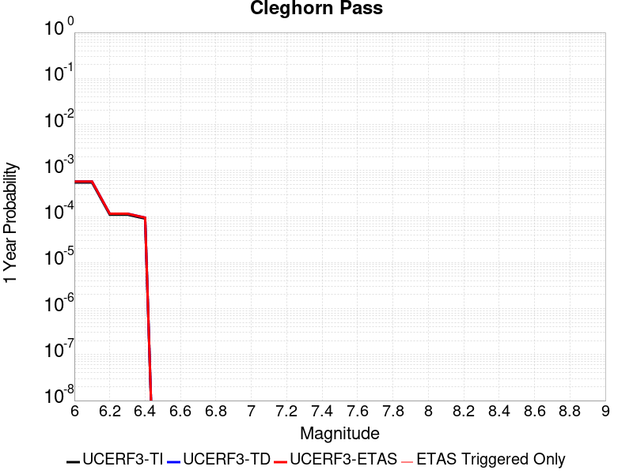 | 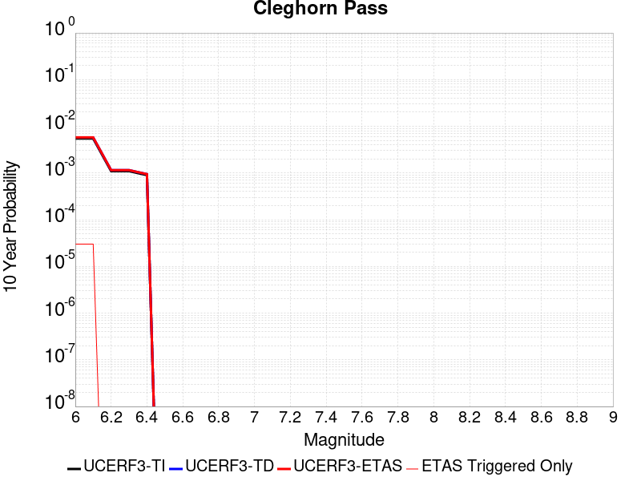 |

| Magnitude | 1 wk TI Prob | 1 wk TD Prob | 1 wk ETAS Prob | 1 wk ETAS/TD Gain | 1 wk ETAS Triggered Only | 1 mo TI Prob | 1 mo TD Prob | 1 mo ETAS Prob | 1 mo ETAS/TD Gain | 1 mo ETAS Triggered Only | 1 yr TI Prob | 1 yr TD Prob | 1 yr ETAS Prob | 1 yr ETAS/TD Gain | 1 yr ETAS Triggered Only | 10 yr TI Prob | 10 yr TD Prob | 10 yr ETAS Prob | 10 yr ETAS/TD Gain | 10 yr ETAS Triggered Only |
|-----|-----|-----|-----|-----|-----|-----|-----|-----|-----|-----|-----|-----|-----|-----|-----|-----|-----|-----|-----|-----|
| 6.0 | 1.0522846E-5 | 1.1041146E-5 | 1.1041146E-5 | 1.0 | 0.0 | 4.509713E-5 | 4.7318637E-5 | 4.7318637E-5 | 1.0 | 0.0 | 5.4891926E-4 | 5.7600474E-4 | 5.7600474E-4 | 1.0 | 0.0 | 0.0054756533 | 0.005750284 | 0.0057777995 | 1.0047851 | 2.7674767E-5 |
| 6.1 | 1.0522846E-5 | 1.1041146E-5 | 1.1041146E-5 | 1.0 | 0.0 | 4.509713E-5 | 4.7318637E-5 | 4.7318637E-5 | 1.0 | 0.0 | 5.4891926E-4 | 5.7600474E-4 | 5.7600474E-4 | 1.0 | 0.0 | 0.0054756533 | 0.005750284 | 0.0057777995 | 1.0047851 | 2.7674767E-5 |
| 6.2 | 2.1045846E-6 | 2.2083034E-6 | 2.2083034E-6 | 1.0 | 0.0 | 9.019617E-6 | 9.464146E-6 | 9.464146E-6 | 1.0 | 0.0 | 1.098083E-4 | 1.1522409E-4 | 1.1522409E-4 | 1.0 | 0.0 | 0.0010975406 | 0.0011520549 | 0.0011520549 | 1.0 | 0.0 |
| 6.3 | 2.1045846E-6 | 2.2083034E-6 | 2.2083034E-6 | 1.0 | 0.0 | 9.019617E-6 | 9.464146E-6 | 9.464146E-6 | 1.0 | 0.0 | 1.098083E-4 | 1.1522409E-4 | 1.1522409E-4 | 1.0 | 0.0 | 0.0010975406 | 0.0011520549 | 0.0011520549 | 1.0 | 0.0 |
| 6.4 | 1.7259927E-6 | 1.8109598E-6 | 1.8109598E-6 | 1.0 | 0.0 | 7.3970905E-6 | 7.761256E-6 | 7.761256E-6 | 1.0 | 0.0 | 9.005586E-5 | 9.449329E-5 | 9.449329E-5 | 1.0 | 0.0 | 9.001937E-4 | 9.449329E-4 | 9.449329E-4 | 1.0 | 0.0 |

