# Parent Section Magnitude-Probability Distributions

Only fault sections with at least one triggered aftershock are plotted. Sections are sorted by total supraseismogenic trigger rate (decreasing)

## Table Of Contents

* [Garlock (Central)](#garlock-central)
* [Tank Canyon](#tank-canyon)
* [Little Lake](#little-lake)
* [Airport Lake](#airport-lake)
* [Owl Lake](#owl-lake)
* [Panamint Valley](#panamint-valley)
* [Garlock (East)](#garlock-east)
* [Hunter Mountain-Saline Valley](#hunter-mountain-saline-valley)
* [Garlock (West)](#garlock-west)
* [Blackwater](#blackwater)
* [Ash Hill](#ash-hill)
* [Gravel Hills-Harper Lk](#gravel-hills-harper-lk)
* [San Andreas (Mojave N)](#san-andreas-mojave-n)
* [San Andreas (Mojave S)](#san-andreas-mojave-s)
* [McLean Lake](#mclean-lake)
* [So Sierra Nevada](#so-sierra-nevada)
* [Goldstone Lake](#goldstone-lake)
* [Lenwood-Lockhart-Old Woman Springs](#lenwood-lockhart-old-woman-springs)
* [Coyote Canyon](#coyote-canyon)
* [Death Valley (So)](#death-valley-so)
* [Towne Pass](#towne-pass)
* [San Andreas (San Bernardino N)](#san-andreas-san-bernardino-n)
* [Nelson Lake](#nelson-lake)
* [Paradise](#paradise)
* [San Andreas (San Bernardino S)](#san-andreas-san-bernardino-s)
* [Bicycle Lake](#bicycle-lake)
* [Helendale-So Lockhart](#helendale-so-lockhart)
* [Garlic Springs](#garlic-springs)
* [Death Valley (Black Mtns Frontal)](#death-valley-black-mtns-frontal)
* [San Andreas (San Gorgonio Pass-Garnet HIll)](#san-andreas-san-gorgonio-pass-garnet-hill)
* [San Andreas (Parkfield)](#san-andreas-parkfield)
* [San Andreas (Big Bend)](#san-andreas-big-bend)
* [Coyote Lake](#coyote-lake)
* [San Andreas (Coachella) rev](#san-andreas-coachella-rev)
* [Death Valley (No)](#death-valley-no)
* [Scodie Lineament](#scodie-lineament)
* [White Wolf (Extension)](#white-wolf-extension)
* [San Andreas (Cholame) rev](#san-andreas-cholame-rev)
* [San Andreas (Carrizo) rev](#san-andreas-carrizo-rev)
* [Sierra Nevada  (No Extension)](#sierra-nevada--no-extension)
* [Elsinore (Glen Ivy) rev](#elsinore-glen-ivy-rev)
* [San Andreas (North Branch Mill Creek)](#san-andreas-north-branch-mill-creek)
* [Ludlow](#ludlow)
* [Red Pass](#red-pass)
* [Cady](#cady)
* [San Jacinto (San Bernardino)](#san-jacinto-san-bernardino)
* [San Andreas (Creeping Section) 2011 CFM](#san-andreas-creeping-section-2011-cfm)
* [Death Valley (Fish Lake Valley)](#death-valley-fish-lake-valley)
* [Lake Isabella (Seismicity)](#lake-isabella-seismicity)
* [Calico-Hidalgo](#calico-hidalgo)
* [Manix-Afton Hills](#manix-afton-hills)
* [Kern Canyon (North Kern) 2011](#kern-canyon-north-kern-2011)
* [Santa Ynez (East)](#santa-ynez-east)
* [Baker](#baker)
* [White Mountains](#white-mountains)
* [Mission Ridge-Arroyo Parida-Santa Ana](#mission-ridge-arroyo-parida-santa-ana)
* [Mission Creek](#mission-creek)
* [San Jacinto (San Jacinto Valley) rev](#san-jacinto-san-jacinto-valley-rev)
* [Cleghorn Lake](#cleghorn-lake)
* [Santa Rosa Island](#santa-rosa-island)
* [San Jacinto (Stepovers Combined)](#san-jacinto-stepovers-combined)
* [Independence rev 2011](#independence-rev-2011)
* [Santa Ynez (West)](#santa-ynez-west)
* [Coronado Bank alt1](#coronado-bank-alt1)
* [Brawley (Seismic Zone) alt 1](#brawley-seismic-zone-alt-1)
* [Rose Canyon](#rose-canyon)
* [San Jacinto (Anza) rev](#san-jacinto-anza-rev)
* [Kern Canyon (South Kern) 2011](#kern-canyon-south-kern-2011)
* [Pinto Mtn](#pinto-mtn)
* [Tin Mountain](#tin-mountain)
* [Santa Cruz Catalina Ridge alt1](#santa-cruz-catalina-ridge-alt1)
* [San Jacinto (Lytle Creek connector)](#san-jacinto-lytle-creek-connector)
* [San Cayetano](#san-cayetano)
* [Red Mountain](#red-mountain)
* [Pisgah-Bullion Mtn-Mesquite Lk](#pisgah-bullion-mtn-mesquite-lk)
* [Oceanic - West Huasna](#oceanic---west-huasna)
* [Deep Springs](#deep-springs)
* [Santa Cruz Island](#santa-cruz-island)
* [San Clemente](#san-clemente)
* [Pleito](#pleito)
* [Ventura-Pitas Point](#ventura-pitas-point)
* [San Pedro Basin](#san-pedro-basin)
* [Imperial](#imperial)
* [Ortigalita (North)](#ortigalita-north)
* [Palos Verdes](#palos-verdes)
* [Great Valley 09 (Laguna Seca)](#great-valley-09-laguna-seca)
* [Oak Ridge (Onshore)](#oak-ridge-onshore)
* [Bullion Mountains](#bullion-mountains)
* [Blue Cut](#blue-cut)
* [Kern Canyon (Lake Isabella) 2011](#kern-canyon-lake-isabella-2011)
* [White Wolf](#white-wolf)
* [Dry Mountain](#dry-mountain)
* [Cleghorn Pass](#cleghorn-pass)
* [San Diego Trough south](#san-diego-trough-south)
* [Owens Valley](#owens-valley)
* [Camp Rock 2011](#camp-rock-2011)
* [Big Pine (Central)](#big-pine-central)
* [Channel Islands Thrust](#channel-islands-thrust)
* [Whittier alt 1](#whittier-alt-1)
* [Robinson Creek](#robinson-creek)
* [San Andreas (Santa Cruz Mts) 2011 CFM](#san-andreas-santa-cruz-mts-2011-cfm)
* [San Diego Trough north alt1](#san-diego-trough-north-alt1)
* [Pitas Point (Lower West)](#pitas-point-lower-west)
* [Santa Ynez River](#santa-ynez-river)
* [San Gabriel](#san-gabriel)
* [West Napa 2011 CFM](#west-napa-2011-cfm)
* [Chino alt 1](#chino-alt-1)
* [Great Valley 07 (Orestimba)](#great-valley-07-orestimba)
* [Cleghorn](#cleghorn)
* [San Jacinto (Coyote Creek)](#san-jacinto-coyote-creek)
* [Big Pine (East)](#big-pine-east)
* [Santa Susana alt 1](#santa-susana-alt-1)
* [Sheephole](#sheephole)
* [Fish Slough 2011 CFM](#fish-slough-2011-cfm)
* [Cucamonga](#cucamonga)
* [Newport-Inglewood alt 1](#newport-inglewood-alt-1)
* [Malibu Coast alt 1](#malibu-coast-alt-1)
* [Ortigalita (South)](#ortigalita-south)
* [Elsinore (Stepovers Combined)](#elsinore-stepovers-combined)
* [Lost Hills](#lost-hills)
* [Simi-Santa Rosa](#simi-santa-rosa)
* [Johnson Valley (No) 2011 rev](#johnson-valley-no-2011-rev)
* [Breckenridge 2011](#breckenridge-2011)
* [San Jacinto (Superstition Mtn)](#san-jacinto-superstition-mtn)
* [Monterey Bay-Tularcitos](#monterey-bay-tularcitos)
* [Almanor 2011 CFM](#almanor-2011-cfm)
* [South Klamath Lake West](#south-klamath-lake-west)
* [Newport-Inglewood (Offshore)](#newport-inglewood-offshore)
* [Del Valle](#del-valle)
* [Elsinore (Temecula) rev](#elsinore-temecula-rev)
* [San Gregorio (South) 2011 CFM](#san-gregorio-south-2011-cfm)
* [Los Osos 2011](#los-osos-2011)
* [Channel Islands Western Deep Ramp](#channel-islands-western-deep-ramp)
* [Reliz 2011 CFM](#reliz-2011-cfm)
* [Hartley Springs 2011 CFM](#hartley-springs-2011-cfm)
* [Monte Vista - Shannon 2011 CFM](#monte-vista---shannon-2011-cfm)
* [Oceanside alt1](#oceanside-alt1)
* [Calaveras (So) - Paicines extension 2011 CFM](#calaveras-so---paicines-extension-2011-cfm)
* [Jess Valley](#jess-valley)
* [South Klamath Lake East](#south-klamath-lake-east)
* [San Andreas (Peninsula) 2011 CFM](#san-andreas-peninsula-2011-cfm)
* [Santa Susana East (connector)](#santa-susana-east-connector)
* [San Jacinto (Borrego)](#san-jacinto-borrego)
* [Elysian Park (Upper)](#elysian-park-upper)
* [Hayward (So) extension 2011 CFM](#hayward-so-extension-2011-cfm)
* [La Panza 2011](#la-panza-2011)
* [Great Valley 03 Mysterious Ridge](#great-valley-03-mysterious-ridge)
* [Bartlett Springs 2011 CFM](#bartlett-springs-2011-cfm)
* [Hosgri](#hosgri)
* [Pitas Point (Lower)-Montalvo](#pitas-point-lower-montalvo)
* [Great Valley 14 (Kettleman Hills)](#great-valley-14-kettleman-hills)
* [Great Valley 11](#great-valley-11)
* [Raymond](#raymond)
* [San Gorgonio Pass](#san-gorgonio-pass)
* [Morales (West)](#morales-west)
* [Hunting Creek - Berryessa 2011 CFM](#hunting-creek---berryessa-2011-cfm)
* [Maacama 2011 CFM](#maacama-2011-cfm)
* [Surprise Valley 2011 CFM](#surprise-valley-2011-cfm)
* [Great Valley 08 (Quinto)](#great-valley-08-quinto)
* [Likely 2011 CFM](#likely-2011-cfm)
* [Butano 2011 CFM](#butano-2011-cfm)
* [Emerson-Copper Mtn 2011](#emerson-copper-mtn-2011)
* [Pittville 2011 CFM](#pittville-2011-cfm)
* [Superstition Hills](#superstition-hills)
* [Hector Mine](#hector-mine)
* [Puente Hills](#puente-hills)
* [North Tahoe 2011 CFM](#north-tahoe-2011-cfm)
* [Great Valley 03a Dunnigan Hills](#great-valley-03a-dunnigan-hills)
* [Honey Lake 2011 CFM](#honey-lake-2011-cfm)
* [Peralta Hills](#peralta-hills)
* [Owens Valley Keough Hot Springs](#owens-valley-keough-hot-springs)
* [Point Reyes 2011 CFM](#point-reyes-2011-cfm)
* [Shoreline](#shoreline)
* [Elysian Park (Lower CFM)](#elysian-park-lower-cfm)
* [Elsinore (Coyote Mountains)](#elsinore-coyote-mountains)
* [Calaveras (Central) 2011 CFM](#calaveras-central-2011-cfm)
* [San Jacinto (Clark) rev](#san-jacinto-clark-rev)
* [Antelope Valley 2011](#antelope-valley-2011)
* [Hosgri (Extension)](#hosgri-extension)
* [Earthquake Valley (So Extension)](#earthquake-valley-so-extension)
* [San Jose](#san-jose)
* [Hayward (So) 2011 CFM](#hayward-so-2011-cfm)
* [Anaheim](#anaheim)
* [Sisar](#sisar)
* [San Andreas (North Coast) 2011 CFM](#san-andreas-north-coast-2011-cfm)
* [Northridge](#northridge)
* [Eaton Roughs 2011 CFM](#eaton-roughs-2011-cfm)
* [Garberville - Briceland 2011 CFM](#garberville---briceland-2011-cfm)
* [Great Valley 06 (Midland) 2011 CFM alt1](#great-valley-06-midland-2011-cfm-alt1)
* [Pilarcitos 2011 CFM](#pilarcitos-2011-cfm)
* [Calaveras (No) 2011 CFM](#calaveras-no-2011-cfm)
* [San Luis Range - Oceano 2011 CFM](#san-luis-range---oceano-2011-cfm)
* [Davis Creek](#davis-creek)
* [San Juan](#san-juan)
* [North Frontal  (West)](#north-frontal--west)
* [Calaveras (So) 2011 CFM](#calaveras-so-2011-cfm)
* [Mono Lake 2011 CFM](#mono-lake-2011-cfm)
* [South Cuyama](#south-cuyama)
* [Sargent 2011 CFM](#sargent-2011-cfm)
* [Los Alamos extension](#los-alamos-extension)
* [Los Alamos 2011 CFM](#los-alamos-2011-cfm)

## Garlock (Central)
*[(top)](#table-of-contents)*

| 1 Week | 1 Month | 1 Year | 10 Year |
|-----|-----|-----|-----|
| 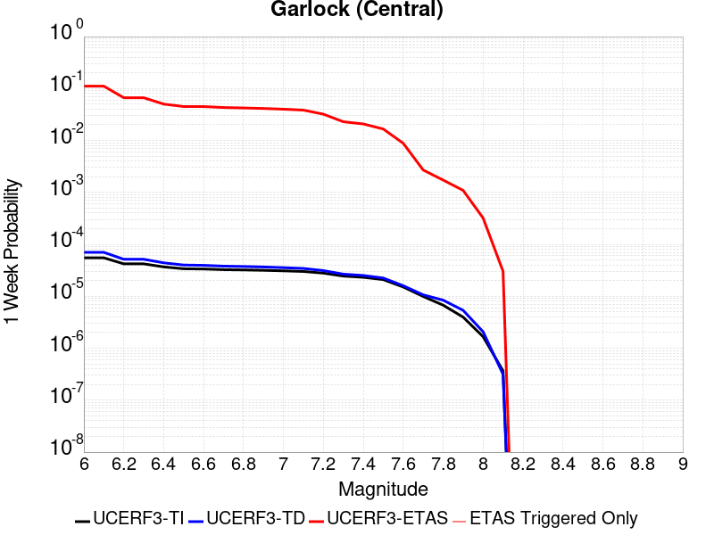 |  |  | 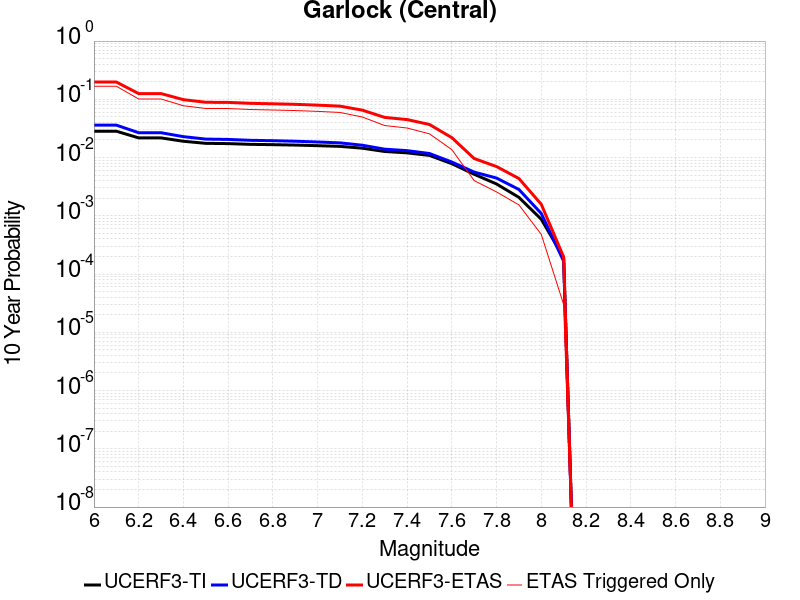 |

| Magnitude | 1 wk TI Prob | 1 wk TD Prob | 1 wk ETAS Prob | 1 wk ETAS/TD Gain | 1 wk ETAS Triggered Only | 1 mo TI Prob | 1 mo TD Prob | 1 mo ETAS Prob | 1 mo ETAS/TD Gain | 1 mo ETAS Triggered Only | 1 yr TI Prob | 1 yr TD Prob | 1 yr ETAS Prob | 1 yr ETAS/TD Gain | 1 yr ETAS Triggered Only | 10 yr TI Prob | 10 yr TD Prob | 10 yr ETAS Prob | 10 yr ETAS/TD Gain | 10 yr ETAS Triggered Only |
|-----|-----|-----|-----|-----|-----|-----|-----|-----|-----|-----|-----|-----|-----|-----|-----|-----|-----|-----|-----|-----|
| 6.0 | 5.5131142E-5 | 7.024681E-5 | 0.11155303 | 1588.0155 | 0.11149061 | 2.3625491E-4 | 3.010234E-4 | 0.12678877 | 421.19238 | 0.12652582 | 0.0028726095 | 0.0036588663 | 0.15314512 | 41.855892 | 0.15003522 | 0.028357591 | 0.036079824 | 0.1983171 | 5.49662 | 0.16830985 |
| 6.1 | 5.5131142E-5 | 7.024681E-5 | 0.11155303 | 1588.0155 | 0.11149061 | 2.3625491E-4 | 3.010234E-4 | 0.12678877 | 421.19238 | 0.12652582 | 0.0028726095 | 0.0036588663 | 0.15314512 | 41.855892 | 0.15003522 | 0.028357591 | 0.036079824 | 0.1983171 | 5.49662 | 0.16830985 |
| 6.2 | 4.216245E-5 | 5.1661493E-5 | 0.06677356 | 1292.521 | 0.06672535 | 1.806837E-4 | 2.2138779E-4 | 0.07614354 | 343.9374 | 0.07593897 | 0.0021976046 | 0.0026920962 | 0.093046784 | 34.56295 | 0.09059859 | 0.021759989 | 0.026689773 | 0.12554017 | 4.7036805 | 0.10156103 |
| 6.3 | 4.216245E-5 | 5.1661493E-5 | 0.06677356 | 1292.521 | 0.06672535 | 1.806837E-4 | 2.2138779E-4 | 0.07614354 | 343.9374 | 0.07593897 | 0.0021976046 | 0.0026920962 | 0.093046784 | 34.56295 | 0.09059859 | 0.021759989 | 0.026689773 | 0.12554017 | 4.7036805 | 0.10156103 |
| 6.4 | 3.6858168E-5 | 4.411054E-5 | 0.05046442 | 1144.0444 | 0.050422534 | 1.5795401E-4 | 1.8903162E-4 | 0.05781898 | 305.86935 | 0.057640847 | 0.0019213937 | 0.002299056 | 0.07128328 | 31.005459 | 0.06914319 | 0.019048655 | 0.02284894 | 0.098922215 | 4.3294005 | 0.077852115 |
| 6.5 | 3.39199E-5 | 4.0018083E-5 | 0.045331635 | 1132.7787 | 0.045293428 | 1.453629E-4 | 1.7149492E-4 | 0.051934917 | 302.8365 | 0.0517723 | 0.0017683565 | 0.002085973 | 0.06415107 | 30.75355 | 0.062194835 | 0.017543508 | 0.020759864 | 0.08921473 | 4.297462 | 0.0699061 |
| 6.6 | 3.3571985E-5 | 3.9472274E-5 | 0.0452959 | 1147.5372 | 0.045258217 | 1.4387199E-4 | 1.6915603E-4 | 0.051897492 | 306.8025 | 0.05173709 | 0.0017502342 | 0.0020575512 | 0.06406585 | 31.136944 | 0.06213615 | 0.017365133 | 0.020481179 | 0.08886355 | 4.338791 | 0.06981221 |
| 6.7 | 3.2580007E-5 | 3.8088703E-5 | 0.043393243 | 1139.2682 | 0.043356806 | 1.3962112E-4 | 1.632272E-4 | 0.049767803 | 304.89896 | 0.049612675 | 0.0016985617 | 0.0019855013 | 0.061573528 | 31.011578 | 0.059706572 | 0.016856372 | 0.019773813 | 0.085467376 | 4.3222504 | 0.06701878 |
| 6.8 | 3.2185937E-5 | 3.7515918E-5 | 0.04253592 | 1133.8099 | 0.0425 | 1.3793244E-4 | 1.6077272E-4 | 0.048709303 | 302.96994 | 0.04855634 | 0.0016780337 | 0.001955672 | 0.060374066 | 30.871264 | 0.058532864 | 0.016654192 | 0.019480614 | 0.08389337 | 4.3065057 | 0.06569249 |
| 6.9 | 3.165394E-5 | 3.6720503E-5 | 0.04151407 | 1130.542 | 0.041478872 | 1.3565269E-4 | 1.5736422E-4 | 0.047614682 | 302.5763 | 0.047464788 | 0.0016503202 | 0.001914247 | 0.059116744 | 30.882504 | 0.057312205 | 0.01638118 | 0.019073246 | 0.08215421 | 4.3073006 | 0.06430751 |
| 7.0 | 3.0903822E-5 | 3.5625766E-5 | 0.04017504 | 1127.6962 | 0.040140845 | 1.3243823E-4 | 1.5267303E-4 | 0.04600248 | 301.31372 | 0.045856807 | 0.0016112428 | 0.0018572307 | 0.057094827 | 30.741915 | 0.055340376 | 0.015996104 | 0.018512413 | 0.07953283 | 4.2961893 | 0.062171362 |
| 7.1 | 3.0069863E-5 | 3.4392073E-5 | 0.038530722 | 1120.3373 | 0.038497653 | 1.2886449E-4 | 1.4738638E-4 | 0.044096306 | 299.18848 | 0.0439554 | 0.0015677959 | 0.0017929734 | 0.054644052 | 30.476778 | 0.05294601 | 0.01556781 | 0.017880075 | 0.07630007 | 4.267324 | 0.05948357 |
| 7.2 | 2.7957109E-5 | 3.128145E-5 | 0.032201637 | 1029.4163 | 0.03217136 | 1.1981068E-4 | 1.340566E-4 | 0.03699531 | 275.96786 | 0.036866195 | 0.0014577188 | 0.0016309366 | 0.04590134 | 28.14416 | 0.044342723 | 0.014481937 | 0.016283695 | 0.06528477 | 4.0092115 | 0.049812205 |
| 7.3 | 2.4519275E-5 | 2.6714795E-5 | 0.02290169 | 857.2662 | 0.022875587 | 1.0507837E-4 | 1.1448703E-4 | 0.026167842 | 228.56598 | 0.026056338 | 0.0012785783 | 0.001393003 | 0.032699097 | 23.473816 | 0.031349767 | 0.012712469 | 0.013928054 | 0.04872991 | 3.498688 | 0.035293426 |
| 7.4 | 2.3225532E-5 | 2.51994E-5 | 0.020764112 | 823.9924 | 0.020739436 | 9.95342E-5 | 1.0799304E-4 | 0.023673523 | 219.21341 | 0.023568075 | 0.0012111551 | 0.0013140367 | 0.029703911 | 22.605087 | 0.02842723 | 0.012045753 | 0.013145725 | 0.04465093 | 3.3966122 | 0.03192488 |
| 7.5 | 2.097765E-5 | 2.2483688E-5 | 0.016583145 | 737.56335 | 0.016561033 | 8.9901114E-5 | 9.635517E-5 | 0.018803474 | 195.14752 | 0.01870892 | 0.0010939965 | 0.0011725046 | 0.023681294 | 20.197186 | 0.02253521 | 0.010886264 | 0.011740365 | 0.036783237 | 3.133057 | 0.025340376 |
| 7.6 | 1.511254E-5 | 1.5991332E-5 | 0.008713035 | 544.85986 | 0.008697183 | 6.476642E-5 | 6.853253E-5 | 0.009973957 | 145.5361 | 0.009906103 | 7.882459E-4 | 8.3407195E-4 | 0.0127255535 | 15.257142 | 0.011901408 | 0.007854558 | 0.008383559 | 0.021768052 | 2.596517 | 0.0134976525 |
| 7.7 | 9.934069E-6 | 1.0678794E-5 | 0.0027571283 | 258.18726 | 0.002746479 | 4.2573887E-5 | 4.5765457E-5 | 0.003144215 | 68.702805 | 0.0030985915 | 5.182138E-4 | 5.570524E-4 | 0.004228715 | 7.5912337 | 0.003673709 | 0.00517007 | 0.005627684 | 0.009607507 | 1.7071868 | 0.0040023476 |
| 7.8 | 6.7562896E-6 | 8.428449E-6 | 0.001733766 | 205.70404 | 0.0017253521 | 2.8955206E-5 | 3.6121426E-5 | 0.0019374612 | 53.63745 | 0.0019014084 | 3.5247262E-4 | 4.3968976E-4 | 0.002703952 | 6.1496816 | 0.0022652582 | 0.0035191406 | 0.004446654 | 0.0069472226 | 1.5623482 | 0.0025117372 |
| 7.9 | 3.975453E-6 | 5.37103E-6 | 0.0010617034 | 197.67221 | 0.0010563381 | 1.7037546E-5 | 2.3018498E-5 | 0.0011849636 | 51.478752 | 0.0011619718 | 2.0741238E-4 | 2.8021427E-4 | 0.0016413351 | 5.8574286 | 0.0013615023 | 0.002072189 | 0.0028336283 | 0.0043317187 | 1.5286827 | 0.0015023474 |
| 8.0 | 1.6729537E-6 | 2.0775144E-6 | 2.9550414E-4 | 142.23927 | 2.9342723E-4 | 7.169782E-6 | 8.903603E-6 | 3.3753918E-4 | 37.910404 | 3.286385E-4 | 8.7288594E-5 | 1.0839601E-4 | 4.95678E-4 | 4.5728436 | 3.8732393E-4 | 8.7254314E-4 | 0.0010969337 | 0.0015424539 | 1.4061505 | 4.460094E-4 |
| 8.1 | 3.6733252E-7 | 3.1489964E-7 | 1.2051985E-5 | 38.272465 | 1.1737089E-5 | 1.5742813E-6 | 1.3495693E-6 | 1.3086643E-5 | 9.696903 | 1.1737089E-5 | 1.9166706E-5 | 1.6430899E-5 | 2.8167795E-5 | 1.7143186 | 1.1737089E-5 | 1.9165053E-4 | 1.6638759E-4 | 1.7812272E-4 | 1.0705289 | 1.1737089E-5 |

## Tank Canyon
*[(top)](#table-of-contents)*

| 1 Week | 1 Month | 1 Year | 10 Year |
|-----|-----|-----|-----|
| 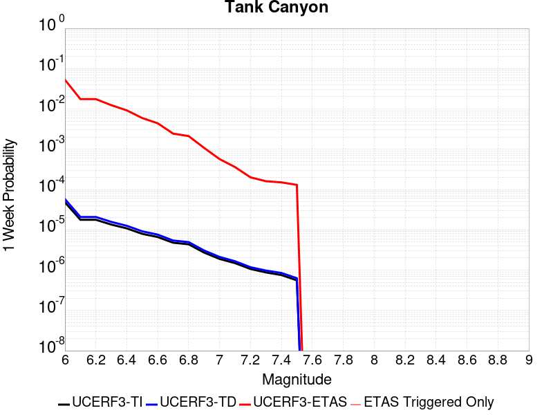 |  | 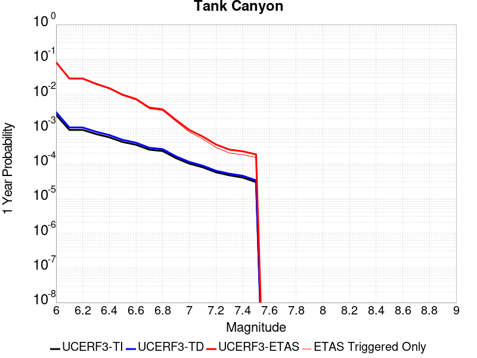 | 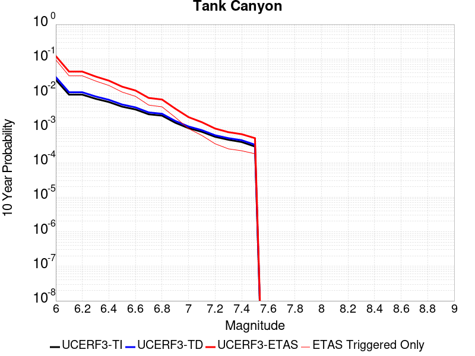 |

| Magnitude | 1 wk TI Prob | 1 wk TD Prob | 1 wk ETAS Prob | 1 wk ETAS/TD Gain | 1 wk ETAS Triggered Only | 1 mo TI Prob | 1 mo TD Prob | 1 mo ETAS Prob | 1 mo ETAS/TD Gain | 1 mo ETAS Triggered Only | 1 yr TI Prob | 1 yr TD Prob | 1 yr ETAS Prob | 1 yr ETAS/TD Gain | 1 yr ETAS Triggered Only | 10 yr TI Prob | 10 yr TD Prob | 10 yr ETAS Prob | 10 yr ETAS/TD Gain | 10 yr ETAS Triggered Only |
|-----|-----|-----|-----|-----|-----|-----|-----|-----|-----|-----|-----|-----|-----|-----|-----|-----|-----|-----|-----|-----|
| 6.0 | 4.8284557E-5 | 5.7964822E-5 | 0.053141743 | 916.79297 | 0.053086855 | 2.0691741E-4 | 2.4840087E-4 | 0.063002765 | 253.63342 | 0.06276995 | 0.0025163088 | 0.0030207601 | 0.08249826 | 27.31043 | 0.07971831 | 0.02488006 | 0.029863637 | 0.12140033 | 4.0651555 | 0.09435446 |
| 6.1 | 1.7796336E-5 | 2.0873314E-5 | 0.017320981 | 829.81464 | 0.01730047 | 7.626778E-5 | 8.945422E-5 | 0.020474954 | 228.88753 | 0.020387324 | 9.281647E-4 | 0.0010885983 | 0.027773133 | 25.512749 | 0.026713615 | 0.009242975 | 0.010836744 | 0.04289167 | 3.9579852 | 0.032406103 |
| 6.2 | 1.7796336E-5 | 2.0873314E-5 | 0.017320981 | 829.81464 | 0.01730047 | 7.626778E-5 | 8.945422E-5 | 0.020474954 | 228.88753 | 0.020387324 | 9.281647E-4 | 0.0010885983 | 0.027773133 | 25.512749 | 0.026713615 | 0.009242975 | 0.010836744 | 0.04289167 | 3.9579852 | 0.032406103 |
| 6.3 | 1.3515912E-5 | 1.5759564E-5 | 0.012327773 | 782.24066 | 0.012312206 | 5.792405E-5 | 6.753938E-5 | 0.014479712 | 214.38918 | 0.014413145 | 7.049971E-4 | 8.2200574E-4 | 0.019785278 | 24.069513 | 0.018978873 | 0.007027647 | 0.0081922645 | 0.031055063 | 3.7907789 | 0.023051644 |
| 6.4 | 1.0870146E-5 | 1.2618021E-5 | 0.009202643 | 729.3254 | 0.009190141 | 4.658551E-5 | 5.4076212E-5 | 0.010851614 | 200.6726 | 0.010798122 | 5.67031E-4 | 6.581969E-4 | 0.014815539 | 22.509281 | 0.014166667 | 0.005655863 | 0.0065644905 | 0.023623131 | 3.5986235 | 0.017171362 |
| 6.5 | 7.964826E-6 | 9.196094E-6 | 0.0058424757 | 635.3215 | 0.0058333334 | 3.4134522E-5 | 3.9411298E-5 | 0.0068114446 | 172.82976 | 0.0067723007 | 4.1550855E-4 | 4.7973756E-4 | 0.009524692 | 19.853964 | 0.009049295 | 0.0041473247 | 0.004788321 | 0.01567491 | 3.273571 | 0.010938968 |
| 6.6 | 6.6317E-6 | 7.6122988E-6 | 0.0043268283 | 568.39966 | 0.0043192487 | 2.8421264E-5 | 3.2623782E-5 | 0.0050794077 | 155.69647 | 0.0050469483 | 3.4597394E-4 | 3.9713128E-4 | 0.007190207 | 18.105366 | 0.0067957747 | 0.0034543579 | 0.003965368 | 0.012172132 | 3.0696096 | 0.008239437 |
| 6.7 | 4.793663E-6 | 5.4307857E-6 | 0.002399784 | 441.88522 | 0.0023943663 | 2.0544108E-5 | 2.3274613E-5 | 0.0028049 | 120.51328 | 0.00278169 | 2.500958E-4 | 2.8333595E-4 | 0.004049874 | 14.293542 | 0.0037676056 | 0.0024981452 | 0.0028304397 | 0.007336429 | 2.591975 | 0.0045187795 |
| 6.8 | 4.382823E-6 | 4.9692567E-6 | 0.0020589496 | 414.33752 | 0.0020539905 | 1.8783392E-5 | 2.1296666E-5 | 0.0024156119 | 113.426765 | 0.0023943663 | 2.286638E-4 | 2.5926033E-4 | 0.0035682614 | 13.763237 | 0.0033098592 | 0.0022842865 | 0.002590253 | 0.0065705264 | 2.5366352 | 0.00399061 |
| 6.9 | 2.729601E-6 | 3.0735416E-6 | 0.0011180936 | 363.78018 | 0.0011150235 | 1.1698237E-5 | 1.3172262E-5 | 0.0012338135 | 93.66755 | 0.0012206573 | 1.4241673E-4 | 1.6036171E-4 | 0.0018384963 | 11.464684 | 0.0016784037 | 0.001423255 | 0.0016026258 | 0.0036533247 | 2.2795868 | 0.0020539905 |
| 7.0 | 1.8987357E-6 | 2.126939E-6 | 5.65506E-4 | 265.87787 | 5.633803E-4 | 8.137413E-6 | 9.115425E-6 | 5.9596455E-4 | 65.37978 | 5.8685447E-4 | 9.90685E-5 | 1.1097535E-4 | 9.207446E-4 | 8.29684 | 8.0985914E-4 | 9.902435E-4 | 0.0011092679 | 0.0020471935 | 1.8455356 | 9.3896716E-4 |
| 7.1 | 1.4928986E-6 | 1.6641272E-6 | 3.655133E-4 | 219.64264 | 3.6384977E-4 | 6.398121E-6 | 7.1319573E-6 | 3.9445315E-4 | 55.307835 | 3.8732393E-4 | 7.789434E-5 | 8.682871E-5 | 6.0321577E-4 | 6.9471927 | 5.1643193E-4 | 7.786704E-4 | 8.6800574E-4 | 0.0014660778 | 1.6890185 | 5.985916E-4 |
| 7.2 | 1.069082E-6 | 1.1828573E-6 | 2.124502E-4 | 179.60765 | 2.112676E-4 | 4.581772E-6 | 5.0693816E-6 | 2.2807294E-4 | 44.99029 | 2.230047E-4 | 5.5781646E-5 | 6.171851E-5 | 3.5512762E-4 | 5.7539897 | 2.9342723E-4 | 5.576765E-4 | 6.170659E-4 | 9.689613E-4 | 1.570272 | 3.5211266E-4 |
| 7.3 | 8.776551E-7 | 9.770005E-7 | 1.7703317E-4 | 181.2007 | 1.7605633E-4 | 3.7613736E-6 | 4.1871413E-6 | 1.9197978E-4 | 45.849846 | 1.8779343E-4 | 4.579376E-5 | 5.097777E-5 | 2.622346E-4 | 5.1440973 | 2.112676E-4 | 4.5784327E-4 | 5.097118E-4 | 7.7952724E-4 | 1.5293491 | 2.6995305E-4 |
| 7.4 | 7.55721E-7 | 8.510244E-7 | 1.6517013E-4 | 194.0839 | 1.6431925E-4 | 3.2388E-6 | 3.6472454E-6 | 1.6796589E-4 | 46.052807 | 1.6431925E-4 | 3.9431678E-5 | 4.4404827E-5 | 2.3218991E-4 | 5.2289343 | 1.8779343E-4 | 3.942468E-4 | 4.440104E-4 | 6.7864795E-4 | 1.5284506 | 2.3474179E-4 |
| 7.5 | 5.587665E-7 | 6.305619E-7 | 1.4147554E-4 | 224.36424 | 1.4084508E-4 | 2.3947114E-6 | 2.702408E-6 | 1.4354709E-4 | 53.118217 | 1.4084508E-4 | 2.915522E-5 | 3.290182E-5 | 1.8547896E-4 | 5.6373467 | 1.5258216E-4 | 2.9151395E-4 | 3.290182E-4 | 5.167498E-4 | 1.5705813 | 1.8779343E-4 |

## Little Lake
*[(top)](#table-of-contents)*

| 1 Week | 1 Month | 1 Year | 10 Year |
|-----|-----|-----|-----|
| 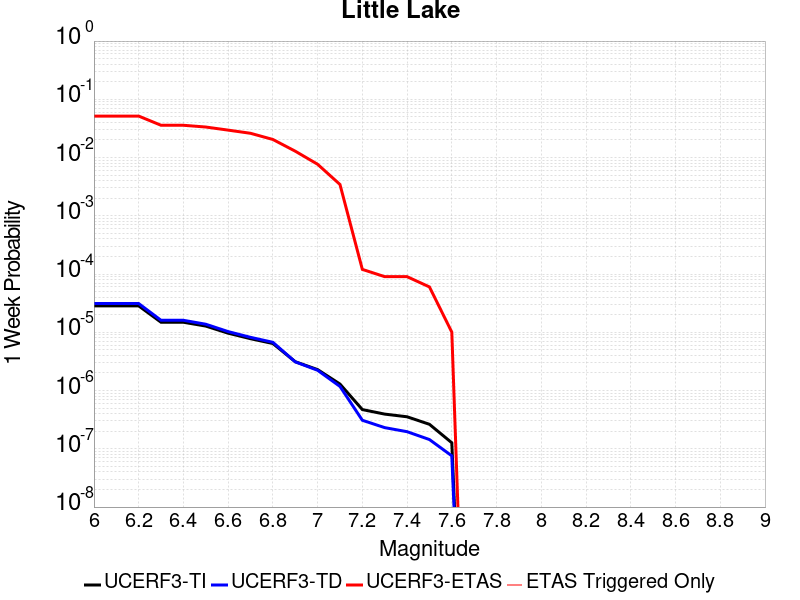 |  |  | 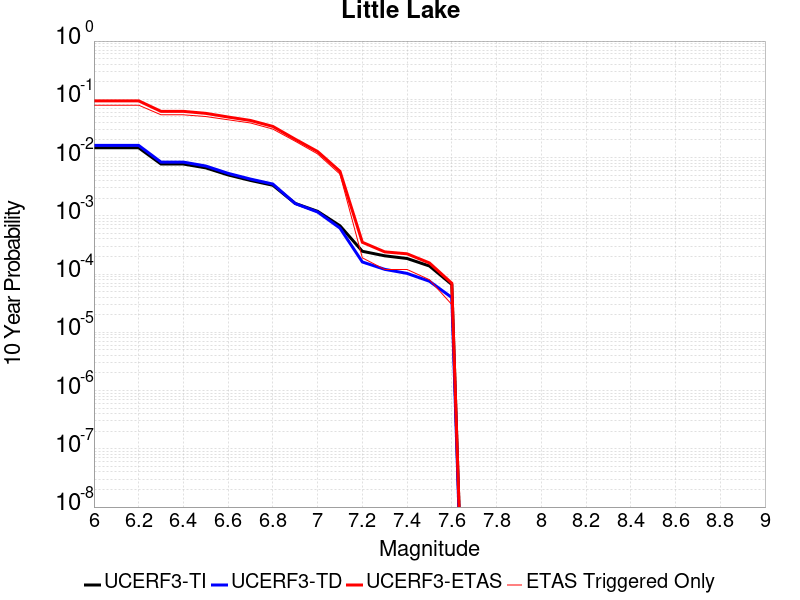 |

| Magnitude | 1 wk TI Prob | 1 wk TD Prob | 1 wk ETAS Prob | 1 wk ETAS/TD Gain | 1 wk ETAS Triggered Only | 1 mo TI Prob | 1 mo TD Prob | 1 mo ETAS Prob | 1 mo ETAS/TD Gain | 1 mo ETAS Triggered Only | 1 yr TI Prob | 1 yr TD Prob | 1 yr ETAS Prob | 1 yr ETAS/TD Gain | 1 yr ETAS Triggered Only | 10 yr TI Prob | 10 yr TD Prob | 10 yr ETAS Prob | 10 yr ETAS/TD Gain | 10 yr ETAS Triggered Only |
|-----|-----|-----|-----|-----|-----|-----|-----|-----|-----|-----|-----|-----|-----|-----|-----|-----|-----|-----|-----|-----|
| 6.0 | 2.8424427E-5 | 3.120572E-5 | 0.05155542 | 1652.1144 | 0.05152582 | 1.2181328E-4 | 1.337327E-4 | 0.058623563 | 438.3637 | 0.058497652 | 0.0014820677 | 0.0016271127 | 0.07112652 | 43.713333 | 0.069612674 | 0.014722223 | 0.016165402 | 0.094364084 | 5.837411 | 0.07948357 |
| 6.1 | 2.8424427E-5 | 3.120572E-5 | 0.05155542 | 1652.1144 | 0.05152582 | 1.2181328E-4 | 1.337327E-4 | 0.058623563 | 438.3637 | 0.058497652 | 0.0014820677 | 0.0016271127 | 0.07112652 | 43.713333 | 0.069612674 | 0.014722223 | 0.016165402 | 0.094364084 | 5.837411 | 0.07948357 |
| 6.2 | 2.8424427E-5 | 3.120572E-5 | 0.05155542 | 1652.1144 | 0.05152582 | 1.2181328E-4 | 1.337327E-4 | 0.058623563 | 438.3637 | 0.058497652 | 0.0014820677 | 0.0016271127 | 0.07112652 | 43.713333 | 0.069612674 | 0.014722223 | 0.016165402 | 0.094364084 | 5.837411 | 0.07948357 |
| 6.3 | 1.48860645E-5 | 1.6081389E-5 | 0.035837103 | 2228.483 | 0.035821598 | 6.379586E-5 | 6.8918576E-5 | 0.04064124 | 589.69934 | 0.040575117 | 7.7643775E-4 | 8.3878887E-4 | 0.04849831 | 57.819447 | 0.04769953 | 0.007737305 | 0.008359048 | 0.06222424 | 7.4439387 | 0.054319248 |
| 6.4 | 1.48860645E-5 | 1.6081389E-5 | 0.035837103 | 2228.483 | 0.035821598 | 6.379586E-5 | 6.8918576E-5 | 0.04064124 | 589.69934 | 0.040575117 | 7.7643775E-4 | 8.3878887E-4 | 0.04849831 | 57.819447 | 0.04769953 | 0.007737305 | 0.008359048 | 0.06222424 | 7.4439387 | 0.054319248 |
| 6.5 | 1.2797581E-5 | 1.3765565E-5 | 0.03349922 | 2433.5522 | 0.033485916 | 5.4845623E-5 | 5.899409E-5 | 0.03799103 | 643.9803 | 0.037934273 | 6.675408E-4 | 7.18042E-4 | 0.04524004 | 63.004726 | 0.04455399 | 0.006655392 | 0.00715977 | 0.057582535 | 8.042512 | 0.050786383 |
| 6.6 | 9.661896E-6 | 1.0289038E-5 | 0.029599186 | 2876.7693 | 0.029589202 | 4.1407468E-5 | 4.409522E-5 | 0.033469852 | 759.03577 | 0.03342723 | 5.040193E-4 | 5.367433E-4 | 0.039729312 | 74.019196 | 0.039213616 | 0.005028777 | 0.0053560743 | 0.049659755 | 9.27167 | 0.044542253 |
| 6.7 | 7.767871E-6 | 8.199687E-6 | 0.026005639 | 3171.5405 | 0.025997652 | 3.329045E-5 | 3.5141118E-5 | 0.029423779 | 837.30347 | 0.029389672 | 4.0523586E-4 | 4.2777284E-4 | 0.034920055 | 81.63223 | 0.034507044 | 0.004044977 | 0.004270846 | 0.043246865 | 10.126065 | 0.039143194 |
| 6.8 | 6.4235196E-6 | 6.7357446E-6 | 0.020452607 | 3036.4287 | 0.02044601 | 2.752908E-5 | 2.8867229E-5 | 0.023068108 | 799.1106 | 0.023039905 | 3.35115E-4 | 3.5141467E-4 | 0.027513228 | 78.29277 | 0.027171362 | 0.003346101 | 0.00350985 | 0.034223266 | 9.750635 | 0.030821595 |
| 6.9 | 3.1283696E-6 | 3.1121804E-6 | 0.013007767 | 4179.6313 | 0.013004695 | 1.3407229E-5 | 1.3337856E-5 | 0.0144615015 | 1084.2449 | 0.014448357 | 1.6322079E-4 | 1.6237781E-4 | 0.017319215 | 106.65999 | 0.017159624 | 0.0016310095 | 0.00162274 | 0.020711431 | 12.7632475 | 0.019119719 |
| 7.0 | 2.290603E-6 | 2.2286815E-6 | 0.0077956384 | 3497.87 | 0.0077934274 | 9.816834E-6 | 9.551463E-6 | 0.008694914 | 910.32275 | 0.008685446 | 1.19513395E-4 | 1.162839E-4 | 0.010431985 | 89.71135 | 0.010316902 | 0.0011944914 | 0.0011623327 | 0.012791992 | 11.005447 | 0.011643193 |
| 7.1 | 1.293693E-6 | 1.1776827E-6 | 0.0035340374 | 3000.8398 | 0.003532864 | 5.5443866E-6 | 5.0472063E-6 | 0.0039721634 | 787.0024 | 0.003967136 | 6.750081E-5 | 6.14487E-5 | 0.004767732 | 77.58882 | 0.0047065727 | 6.7480316E-4 | 6.143856E-4 | 0.0059045604 | 9.610514 | 0.005293427 |
| 7.2 | 4.715842E-7 | 3.0917857E-7 | 1.17680036E-4 | 380.62158 | 1.17370895E-4 | 2.0210737E-6 | 1.3250503E-6 | 1.4216993E-4 | 107.29398 | 1.4084508E-4 | 2.4606294E-5 | 1.6132375E-5 | 2.0392277E-4 | 12.640593 | 1.8779343E-4 | 2.460357E-4 | 1.6131258E-4 | 3.608109E-4 | 2.236719 | 1.9953052E-4 |
| 7.3 | 3.9430947E-7 | 2.3097488E-7 | 8.239058E-5 | 356.70798 | 8.2159626E-5 | 1.6898966E-6 | 9.89892E-7 | 1.0662359E-4 | 107.71236 | 1.056338E-4 | 2.0574296E-5 | 1.2051869E-5 | 1.2942134E-4 | 10.738695 | 1.17370895E-4 | 2.0572392E-4 | 1.20512224E-4 | 2.3786897E-4 | 1.9738162 | 1.17370895E-4 |
| 7.4 | 3.547123E-7 | 1.9679135E-7 | 8.23564E-5 | 418.49603 | 8.2159626E-5 | 1.5201948E-6 | 8.4339126E-7 | 1.06477106E-4 | 126.248764 | 1.056338E-4 | 1.8508214E-5 | 1.0268241E-5 | 1.2763793E-4 | 12.43036 | 1.17370895E-4 | 1.8506673E-4 | 1.02677724E-4 | 2.2003657E-4 | 2.1429825 | 1.17370895E-4 |
| 7.5 | 2.6354266E-7 | 1.4423138E-7 | 4.709258E-5 | 326.50717 | 4.6948357E-5 | 1.129468E-6 | 6.181344E-7 | 7.1040624E-5 | 114.92748 | 7.042254E-5 | 1.3751187E-5 | 7.5257603E-6 | 7.794776E-5 | 10.357461 | 7.042254E-5 | 1.3750336E-4 | 7.5255106E-5 | 1.4567234E-4 | 1.9357136 | 7.042254E-5 |
| 7.6 | 1.269913E-7 | 7.572556E-8 | 7.572556E-8 | 1.0 | 0.0 | 5.4424834E-7 | 3.245381E-7 | 2.379871E-5 | 73.331024 | 2.3474178E-5 | 6.6262032E-6 | 3.9512443E-6 | 2.742533E-5 | 6.940935 | 2.3474178E-5 | 6.626006E-5 | 3.9511775E-5 | 6.2985026E-5 | 1.5940824 | 2.3474178E-5 |

## Airport Lake
*[(top)](#table-of-contents)*

| 1 Week | 1 Month | 1 Year | 10 Year |
|-----|-----|-----|-----|
|  |  |  |  |

| Magnitude | 1 wk TI Prob | 1 wk TD Prob | 1 wk ETAS Prob | 1 wk ETAS/TD Gain | 1 wk ETAS Triggered Only | 1 mo TI Prob | 1 mo TD Prob | 1 mo ETAS Prob | 1 mo ETAS/TD Gain | 1 mo ETAS Triggered Only | 1 yr TI Prob | 1 yr TD Prob | 1 yr ETAS Prob | 1 yr ETAS/TD Gain | 1 yr ETAS Triggered Only | 10 yr TI Prob | 10 yr TD Prob | 10 yr ETAS Prob | 10 yr ETAS/TD Gain | 10 yr ETAS Triggered Only |
|-----|-----|-----|-----|-----|-----|-----|-----|-----|-----|-----|-----|-----|-----|-----|-----|-----|-----|-----|-----|-----|
| 6.0 | 1.2387061E-5 | 1.3103157E-5 | 0.049484286 | 3776.5164 | 0.049471833 | 5.3086325E-5 | 5.615534E-5 | 0.056038927 | 997.927 | 0.055985916 | 6.461343E-4 | 6.8350515E-4 | 0.0664953 | 97.28573 | 0.06585681 | 0.0064425888 | 0.0068168393 | 0.080781005 | 11.850215 | 0.07447183 |
| 6.1 | 1.2387061E-5 | 1.3103157E-5 | 0.049484286 | 3776.5164 | 0.049471833 | 5.3086325E-5 | 5.615534E-5 | 0.056038927 | 997.927 | 0.055985916 | 6.461343E-4 | 6.8350515E-4 | 0.0664953 | 97.28573 | 0.06585681 | 0.0064425888 | 0.0068168393 | 0.080781005 | 11.850215 | 0.07447183 |
| 6.2 | 1.2387061E-5 | 1.3103157E-5 | 0.049484286 | 3776.5164 | 0.049471833 | 5.3086325E-5 | 5.615534E-5 | 0.056038927 | 997.927 | 0.055985916 | 6.461343E-4 | 6.8350515E-4 | 0.0664953 | 97.28573 | 0.06585681 | 0.0064425888 | 0.0068168393 | 0.080781005 | 11.850215 | 0.07447183 |
| 6.3 | 1.2387061E-5 | 1.3103157E-5 | 0.049484286 | 3776.5164 | 0.049471833 | 5.3086325E-5 | 5.615534E-5 | 0.056038927 | 997.927 | 0.055985916 | 6.461343E-4 | 6.8350515E-4 | 0.0664953 | 97.28573 | 0.06585681 | 0.0064425888 | 0.0068168393 | 0.080781005 | 11.850215 | 0.07447183 |
| 6.4 | 1.2387061E-5 | 1.3103157E-5 | 0.049484286 | 3776.5164 | 0.049471833 | 5.3086325E-5 | 5.615534E-5 | 0.056038927 | 997.927 | 0.055985916 | 6.461343E-4 | 6.8350515E-4 | 0.0664953 | 97.28573 | 0.06585681 | 0.0064425888 | 0.0068168393 | 0.080781005 | 11.850215 | 0.07447183 |
| 6.5 | 6.9922594E-6 | 7.384925E-6 | 0.03744842 | 5070.9277 | 0.037441313 | 2.996648E-5 | 3.1649324E-5 | 0.04254204 | 1344.169 | 0.04251174 | 3.6478083E-4 | 3.8526783E-4 | 0.050236948 | 130.39487 | 0.049870893 | 0.003641826 | 0.0038465366 | 0.0596171 | 15.498903 | 0.055985916 |
| 6.6 | 6.9922594E-6 | 7.384925E-6 | 0.03744842 | 5070.9277 | 0.037441313 | 2.996648E-5 | 3.1649324E-5 | 0.04254204 | 1344.169 | 0.04251174 | 3.6478083E-4 | 3.8526783E-4 | 0.050236948 | 130.39487 | 0.049870893 | 0.003641826 | 0.0038465366 | 0.0596171 | 15.498903 | 0.055985916 |
| 6.7 | 5.477277E-6 | 5.7860684E-6 | 0.031836588 | 5502.283 | 0.031830985 | 2.3473833E-5 | 2.4797222E-5 | 0.036068503 | 1454.5381 | 0.0360446 | 2.8575645E-4 | 3.0186825E-4 | 0.042636503 | 141.2421 | 0.042347416 | 0.0028538927 | 0.003014966 | 0.05047707 | 16.74217 | 0.047605634 |
| 6.8 | 3.9950432E-6 | 4.2190873E-6 | 0.024311628 | 5762.296 | 0.024307512 | 1.7121502E-5 | 1.8081691E-5 | 0.02749411 | 1520.5497 | 0.027476525 | 2.0843433E-4 | 2.2012512E-4 | 0.032724705 | 148.66411 | 0.032511737 | 0.0020823893 | 0.0021993418 | 0.038562853 | 17.533815 | 0.036443662 |
| 6.9 | 2.95695E-6 | 3.1230243E-6 | 0.017561754 | 5623.3164 | 0.017558685 | 1.2672582E-5 | 1.3384334E-5 | 0.019707957 | 1472.4645 | 0.019694835 | 1.5427776E-4 | 1.6294434E-4 | 0.023398595 | 143.5987 | 0.023239437 | 0.001541707 | 0.0016284712 | 0.027560351 | 16.924065 | 0.025974179 |
| 7.0 | 1.456072E-6 | 1.540812E-6 | 0.0075132665 | 4876.1733 | 0.0075117373 | 6.2402937E-6 | 6.603469E-6 | 0.008339882 | 1262.9546 | 0.008333334 | 7.597293E-5 | 8.039528E-5 | 0.009927021 | 123.47767 | 0.0098474175 | 7.594696E-4 | 8.0376083E-4 | 0.011933306 | 14.846837 | 0.011138498 |
| 7.1 | 6.995192E-7 | 7.4089746E-7 | 0.003357546 | 4531.7285 | 0.0033568074 | 2.997936E-6 | 3.1752747E-6 | 0.003747295 | 1180.1482 | 0.0037441314 | 3.649926E-5 | 3.865897E-5 | 0.004451634 | 115.15138 | 0.0044131456 | 3.6493264E-4 | 3.865897E-4 | 0.0053729243 | 13.89826 | 0.004988263 |

## Owl Lake
*[(top)](#table-of-contents)*

| 1 Week | 1 Month | 1 Year | 10 Year |
|-----|-----|-----|-----|
|  |  |  | 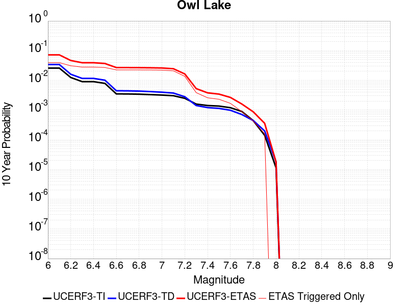 |

| Magnitude | 1 wk TI Prob | 1 wk TD Prob | 1 wk ETAS Prob | 1 wk ETAS/TD Gain | 1 wk ETAS Triggered Only | 1 mo TI Prob | 1 mo TD Prob | 1 mo ETAS Prob | 1 mo ETAS/TD Gain | 1 mo ETAS Triggered Only | 1 yr TI Prob | 1 yr TD Prob | 1 yr ETAS Prob | 1 yr ETAS/TD Gain | 1 yr ETAS Triggered Only | 10 yr TI Prob | 10 yr TD Prob | 10 yr ETAS Prob | 10 yr ETAS/TD Gain | 10 yr ETAS Triggered Only |
|-----|-----|-----|-----|-----|-----|-----|-----|-----|-----|-----|-----|-----|-----|-----|-----|-----|-----|-----|-----|-----|
| 6.0 | 5.0320643E-5 | 6.635816E-5 | 0.022600073 | 340.57718 | 0.02253521 | 2.1564208E-4 | 2.843674E-4 | 0.027201593 | 95.65652 | 0.026924882 | 0.0026222812 | 0.0034577388 | 0.03729573 | 10.786161 | 0.0339554 | 0.02591553 | 0.034140717 | 0.07229896 | 2.1176755 | 0.039507043 |
| 6.1 | 5.0320643E-5 | 6.635816E-5 | 0.022600073 | 340.57718 | 0.02253521 | 2.1564208E-4 | 2.843674E-4 | 0.027201593 | 95.65652 | 0.026924882 | 0.0026222812 | 0.0034577388 | 0.03729573 | 10.786161 | 0.0339554 | 0.02591553 | 0.034140717 | 0.07229896 | 2.1176755 | 0.039507043 |
| 6.2 | 2.4125871E-5 | 3.0981035E-5 | 0.01845764 | 595.7722 | 0.01842723 | 1.0339249E-4 | 1.3277028E-4 | 0.021878708 | 164.7862 | 0.021748826 | 0.0012580766 | 0.001615439 | 0.028836653 | 17.85066 | 0.027265258 | 0.012509781 | 0.016070465 | 0.046916425 | 2.9194193 | 0.031349767 |
| 6.3 | 1.7433485E-5 | 2.2355514E-5 | 0.016888175 | 755.4367 | 0.016866198 | 7.471279E-5 | 9.580672E-5 | 0.019941323 | 208.14117 | 0.019847417 | 9.0924866E-4 | 0.0011659743 | 0.025679613 | 22.024166 | 0.024542253 | 0.009055373 | 0.011628896 | 0.039447132 | 3.392165 | 0.02814554 |
| 6.4 | 1.7433485E-5 | 2.2355514E-5 | 0.016888175 | 755.4367 | 0.016866198 | 7.471279E-5 | 9.580672E-5 | 0.019941323 | 208.14117 | 0.019847417 | 9.0924866E-4 | 0.0011659743 | 0.025679613 | 22.024166 | 0.024542253 | 0.009055373 | 0.011628896 | 0.039447132 | 3.392165 | 0.02814554 |
| 6.5 | 1.5182742E-5 | 1.9429144E-5 | 0.016474508 | 847.9276 | 0.016455399 | 6.506727E-5 | 8.326596E-5 | 0.019400906 | 232.99925 | 0.01931925 | 7.919061E-4 | 0.0010134429 | 0.024768686 | 24.440142 | 0.023779342 | 0.0078909 | 0.010118429 | 0.03708457 | 3.6650522 | 0.027241783 |
| 6.6 | 6.7271576E-6 | 8.547361E-6 | 0.01442157 | 1687.254 | 0.014413145 | 2.8830356E-5 | 3.6631063E-5 | 0.016820055 | 459.1746 | 0.016784038 | 3.5095305E-4 | 4.458976E-4 | 0.020788936 | 46.622665 | 0.020352112 | 0.0035039932 | 0.004467813 | 0.027159404 | 6.0789037 | 0.022793427 |
| 6.7 | 6.682835E-6 | 8.479807E-6 | 0.014421503 | 1700.6876 | 0.014413145 | 2.8640408E-5 | 3.6341557E-5 | 0.01681977 | 462.82468 | 0.016784038 | 3.4864116E-4 | 4.4237426E-4 | 0.020785484 | 46.986195 | 0.020352112 | 0.003480947 | 0.0044327388 | 0.02712513 | 6.1192703 | 0.022793427 |
| 6.8 | 6.5774975E-6 | 8.32628E-6 | 0.014397878 | 1729.2089 | 0.014389671 | 2.8188972E-5 | 3.5683603E-5 | 0.016772175 | 470.02472 | 0.016737089 | 3.4314668E-4 | 4.343669E-4 | 0.020730712 | 47.72627 | 0.020305164 | 0.0034261728 | 0.004352885 | 0.026988665 | 6.200179 | 0.022734743 |
| 6.9 | 6.363419E-6 | 7.999454E-6 | 0.0143388705 | 1792.4811 | 0.014330986 | 2.727151E-5 | 3.428296E-5 | 0.016688641 | 486.79117 | 0.01665493 | 3.3198006E-4 | 4.1732067E-4 | 0.020608421 | 49.3827 | 0.02019953 | 0.0033148455 | 0.0041828766 | 0.02671733 | 6.38731 | 0.022629108 |
| 7.0 | 6.1342453E-6 | 7.6316555E-6 | 0.014209401 | 1861.9028 | 0.014201878 | 2.6289357E-5 | 3.2706717E-5 | 0.016522778 | 505.17996 | 0.01649061 | 3.2002592E-4 | 3.9813702E-4 | 0.020378442 | 51.184494 | 0.019988263 | 0.0031956544 | 0.003991571 | 0.026319928 | 6.593878 | 0.02241784 |
| 7.1 | 5.842926E-6 | 7.142211E-6 | 0.013633805 | 1908.9054 | 0.013626761 | 2.504087E-5 | 3.0609146E-5 | 0.015804775 | 516.34155 | 0.015774649 | 3.0482994E-4 | 3.7260808E-4 | 0.019379608 | 52.010704 | 0.019014085 | 0.0030441214 | 0.0037370329 | 0.024878388 | 6.6572566 | 0.021220658 |
| 7.2 | 4.77173E-6 | 5.358483E-6 | 0.0088316025 | 1648.1533 | 0.008826291 | 2.045011E-5 | 2.2964748E-5 | 0.010433524 | 454.3278 | 0.010410798 | 2.4895166E-4 | 2.79564E-4 | 0.012776069 | 45.69998 | 0.0125 | 0.0024867293 | 0.002808645 | 0.016689736 | 5.942273 | 0.013920188 |
| 7.3 | 3.0494948E-6 | 2.710463E-6 | 0.0025261778 | 932.0097 | 0.0025234742 | 1.3069198E-5 | 1.1616219E-5 | 0.003016276 | 259.66077 | 0.0030046948 | 1.5910587E-4 | 1.4141845E-4 | 0.0036855182 | 26.061085 | 0.003544601 | 0.0015899199 | 0.0014232415 | 0.0053144093 | 3.734018 | 0.0038967137 |
| 7.4 | 2.7263884E-6 | 2.3056762E-6 | 0.0016454944 | 713.671 | 0.0016431925 | 1.1684469E-5 | 9.881433E-6 | 0.001958219 | 198.17157 | 0.0019483569 | 1.4224913E-4 | 1.20299905E-4 | 0.002479171 | 20.608253 | 0.0023591549 | 0.0014215811 | 0.0012112238 | 0.0038019787 | 3.1389565 | 0.0025938968 |
| 7.5 | 2.6090431E-6 | 2.1656133E-6 | 0.0014927727 | 689.3072 | 0.0014906103 | 1.1181565E-5 | 9.281167E-6 | 0.0017580913 | 189.42566 | 0.0017488262 | 1.3612706E-4 | 1.1299244E-4 | 0.0022371656 | 19.79925 | 0.0021244131 | 0.001360437 | 0.0011379806 | 0.0034710034 | 3.0501428 | 0.0023356806 |
| 7.6 | 2.3008756E-6 | 1.8727933E-6 | 0.0011286313 | 602.64594 | 0.0011267606 | 9.860858E-6 | 8.0262325E-6 | 0.0012873587 | 160.39389 | 0.0012793427 | 1.20049335E-4 | 9.7715085E-5 | 0.0016351235 | 16.733583 | 0.0015375587 | 0.001199845 | 9.849932E-4 | 0.0026734693 | 2.7142007 | 0.0016901408 |
| 7.7 | 1.7184348E-6 | 1.3419171E-6 | 6.351439E-4 | 473.31082 | 6.338028E-4 | 7.3646997E-6 | 5.7510606E-6 | 7.4518344E-4 | 129.57321 | 7.394366E-4 | 8.966153E-5 | 7.0016955E-5 | 9.3850074E-4 | 13.403907 | 8.685446E-4 | 8.962536E-4 | 7.078345E-4 | 0.0016226794 | 2.292456 | 9.1549294E-4 |
| 7.8 | 8.4612907E-7 | 8.4058576E-7 | 2.7079342E-4 | 322.14847 | 2.6995305E-4 | 3.6262625E-6 | 3.6025056E-6 | 3.0876574E-4 | 85.7086 | 3.051643E-4 | 4.4148852E-5 | 4.3859643E-5 | 4.4290317E-4 | 10.098193 | 3.9906104E-4 | 4.414008E-4 | 4.4398365E-4 | 8.7806315E-4 | 1.9776926 | 4.342723E-4 |
| 7.9 | 2.716738E-7 | 3.768106E-7 | 1.1774766E-4 | 312.48502 | 1.17370895E-4 | 1.1643157E-6 | 1.6149015E-6 | 1.4245974E-4 | 88.215744 | 1.4084508E-4 | 1.4175452E-5 | 1.966126E-5 | 1.7224041E-4 | 8.760396 | 1.5258216E-4 | 1.4174548E-4 | 1.9836679E-4 | 3.6265343E-4 | 1.8281964 | 1.6431925E-4 |
| 8.0 | 2.1995428E-8 | 3.384878E-8 | 3.384878E-8 | 1.0 | 0.0 | 9.426611E-8 | 1.4506621E-7 | 1.4506621E-7 | 1.0 | 0.0 | 1.1476893E-6 | 1.7661803E-6 | 1.7661803E-6 | 1.0 | 0.0 | 1.14768345E-5 | 1.7963059E-5 | 1.7963059E-5 | 1.0 | 0.0 |

## Panamint Valley
*[(top)](#table-of-contents)*

| 1 Week | 1 Month | 1 Year | 10 Year |
|-----|-----|-----|-----|
| 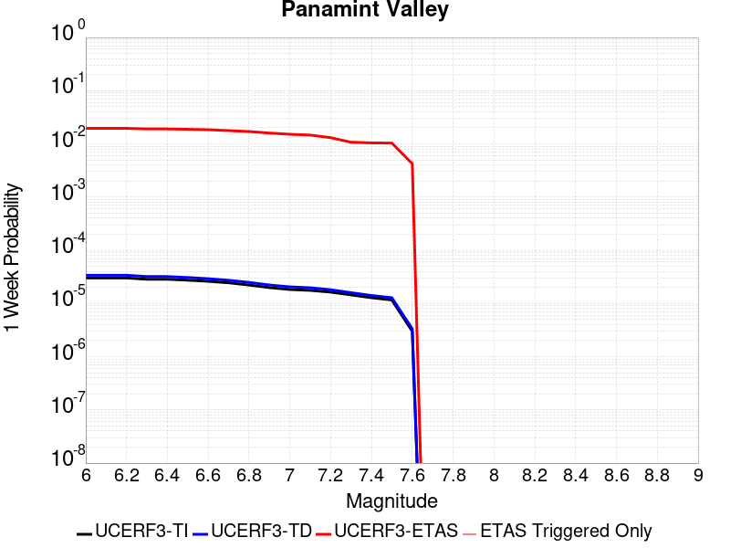 |  | 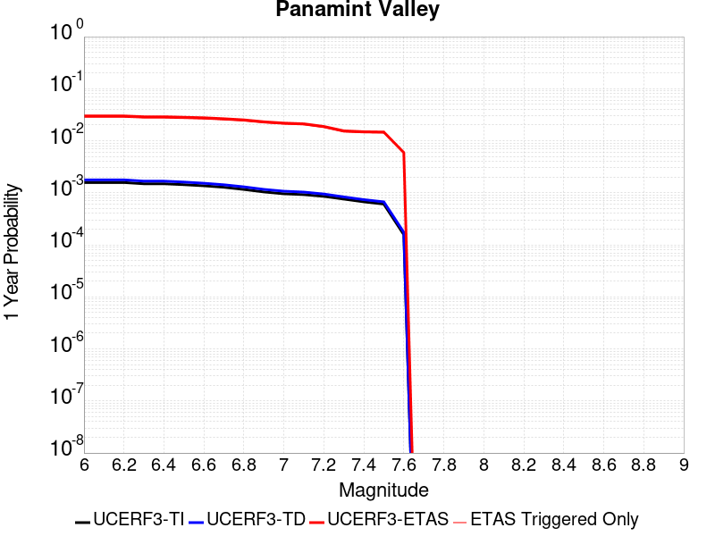 | 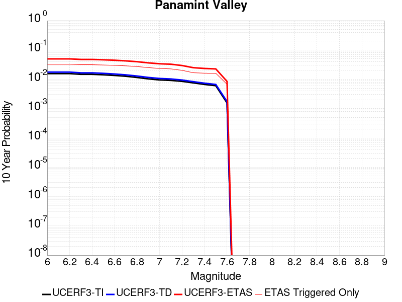 |

| Magnitude | 1 wk TI Prob | 1 wk TD Prob | 1 wk ETAS Prob | 1 wk ETAS/TD Gain | 1 wk ETAS Triggered Only | 1 mo TI Prob | 1 mo TD Prob | 1 mo ETAS Prob | 1 mo ETAS/TD Gain | 1 mo ETAS Triggered Only | 1 yr TI Prob | 1 yr TD Prob | 1 yr ETAS Prob | 1 yr ETAS/TD Gain | 1 yr ETAS Triggered Only | 10 yr TI Prob | 10 yr TD Prob | 10 yr ETAS Prob | 10 yr ETAS/TD Gain | 10 yr ETAS Triggered Only |
|-----|-----|-----|-----|-----|-----|-----|-----|-----|-----|-----|-----|-----|-----|-----|-----|-----|-----|-----|-----|-----|
| 6.0 | 3.0211835E-5 | 3.3984514E-5 | 0.019599047 | 576.70526 | 0.019565728 | 1.2947287E-4 | 1.4563995E-4 | 0.022783188 | 156.43501 | 0.022640845 | 0.0015751923 | 0.0017717537 | 0.030031456 | 16.95013 | 0.02830986 | 0.015640736 | 0.017583137 | 0.0497423 | 2.8289776 | 0.03273474 |
| 6.1 | 3.0211835E-5 | 3.3984514E-5 | 0.019599047 | 576.70526 | 0.019565728 | 1.2947287E-4 | 1.4563995E-4 | 0.022783188 | 156.43501 | 0.022640845 | 0.0015751923 | 0.0017717537 | 0.030031456 | 16.95013 | 0.02830986 | 0.015640736 | 0.017583137 | 0.0497423 | 2.8289776 | 0.03273474 |
| 6.2 | 3.0211835E-5 | 3.3984514E-5 | 0.019599047 | 576.70526 | 0.019565728 | 1.2947287E-4 | 1.4563995E-4 | 0.022783188 | 156.43501 | 0.022640845 | 0.0015751923 | 0.0017717537 | 0.030031456 | 16.95013 | 0.02830986 | 0.015640736 | 0.017583137 | 0.0497423 | 2.8289776 | 0.03273474 |
| 6.3 | 2.8573924E-5 | 3.210268E-5 | 0.019104261 | 595.09863 | 0.01907277 | 1.2245393E-4 | 1.3757581E-4 | 0.022094648 | 160.59981 | 0.021960095 | 0.001489857 | 0.0016737265 | 0.02894022 | 17.29089 | 0.027312206 | 0.01479908 | 0.016617801 | 0.04759665 | 2.8641965 | 0.031502347 |
| 6.4 | 2.8573924E-5 | 3.210268E-5 | 0.019104261 | 595.09863 | 0.01907277 | 1.2245393E-4 | 1.3757581E-4 | 0.022094648 | 160.59981 | 0.021960095 | 0.001489857 | 0.0016737265 | 0.02894022 | 17.29089 | 0.027312206 | 0.01479908 | 0.016617801 | 0.04759665 | 2.8641965 | 0.031502347 |
| 6.5 | 2.7468774E-5 | 3.0828433E-5 | 0.018821329 | 610.5185 | 0.01879108 | 1.1771801E-4 | 1.3211532E-4 | 0.02171377 | 164.35468 | 0.021584507 | 0.0014322745 | 0.0016073446 | 0.028278021 | 17.593004 | 0.026713615 | 0.014230782 | 0.015963677 | 0.046235498 | 2.8962939 | 0.03076291 |
| 6.6 | 2.6135967E-5 | 2.925248E-5 | 0.018491155 | 632.1226 | 0.018462442 | 1.1200648E-4 | 1.253619E-4 | 0.02128468 | 169.78589 | 0.021161972 | 0.0013628257 | 0.0015252391 | 0.02760043 | 18.095806 | 0.026115023 | 0.013544982 | 0.015154043 | 0.044699423 | 2.9496696 | 0.03 |
| 6.7 | 2.4498746E-5 | 2.7341335E-5 | 0.017785072 | 650.4829 | 0.017758217 | 1.04990395E-4 | 1.1717203E-4 | 0.020443428 | 174.47363 | 0.02032864 | 0.0012775084 | 0.0014256609 | 0.026472062 | 18.568274 | 0.02508216 | 0.012701893 | 0.014171274 | 0.042519636 | 3.00041 | 0.028755868 |
| 6.8 | 2.2244329E-5 | 2.4935423E-5 | 0.0170785 | 684.9092 | 0.01705399 | 9.532935E-5 | 1.0686185E-4 | 0.019564876 | 183.0857 | 0.019460093 | 0.0011600169 | 0.0013002884 | 0.025130764 | 19.32707 | 0.023861503 | 0.011539802 | 0.0129325185 | 0.03984517 | 3.081006 | 0.027265258 |
| 6.9 | 1.9902658E-5 | 2.2290267E-5 | 0.015996113 | 717.6277 | 0.015974179 | 8.529431E-5 | 9.552632E-5 | 0.018239332 | 190.93515 | 0.01814554 | 0.0010379635 | 0.0011624309 | 0.023179062 | 19.940163 | 0.022042254 | 0.010331288 | 0.011568608 | 0.036337398 | 3.1410348 | 0.025058685 |
| 7.0 | 1.8353881E-5 | 2.0566185E-5 | 0.015172836 | 737.7565 | 0.015152582 | 7.865712E-5 | 8.813792E-5 | 0.01724625 | 195.67343 | 0.017159624 | 9.5722964E-4 | 0.0010725686 | 0.02181321 | 20.337357 | 0.020762911 | 0.009531168 | 0.010678849 | 0.033867516 | 3.1714573 | 0.023438968 |
| 7.1 | 1.7667631E-5 | 1.9772613E-5 | 0.014655634 | 741.20874 | 0.014636151 | 7.571623E-5 | 8.473711E-5 | 0.016703047 | 197.11607 | 0.016619718 | 9.2145515E-4 | 0.0010312037 | 0.021104379 | 20.465773 | 0.020093897 | 0.009176437 | 0.010269073 | 0.032712266 | 3.1855133 | 0.022676056 |
| 7.2 | 1.6381597E-5 | 1.8158249E-5 | 0.013093038 | 721.05176 | 0.013075117 | 7.020495E-5 | 7.781885E-5 | 0.014924081 | 191.77979 | 0.014847418 | 8.544101E-4 | 9.4704994E-4 | 0.018864337 | 19.919052 | 0.017934272 | 0.008511325 | 0.009434792 | 0.029478623 | 3.1244593 | 0.020234741 |
| 7.3 | 1.4520491E-5 | 1.5966476E-5 | 0.010755232 | 673.6134 | 0.010739436 | 6.222919E-5 | 6.842605E-5 | 0.012215482 | 178.52094 | 0.012147888 | 7.57377E-4 | 8.327849E-4 | 0.015562292 | 18.687048 | 0.014741784 | 0.0075480095 | 0.00829975 | 0.024909565 | 3.0012426 | 0.016748827 |
| 7.4 | 1.2852287E-5 | 1.4145411E-5 | 0.0104482705 | 738.6332 | 0.010434273 | 5.5080065E-5 | 6.062187E-5 | 0.011820472 | 194.98692 | 0.011760564 | 6.7039346E-4 | 7.378371E-4 | 0.01497615 | 20.297365 | 0.014248827 | 0.0066837464 | 0.0073567946 | 0.023423167 | 3.1838822 | 0.016185446 |
| 7.5 | 1.1637851E-5 | 1.2836797E-5 | 0.010376554 | 808.3444 | 0.01036385 | 4.987555E-5 | 5.5013777E-5 | 0.011732775 | 213.26976 | 0.011678404 | 6.070656E-4 | 6.6960254E-4 | 0.014779867 | 22.072596 | 0.014119718 | 0.006054099 | 0.0066787465 | 0.02260453 | 3.384547 | 0.016032863 |
| 7.6 | 3.0068115E-6 | 3.3330316E-6 | 0.004240408 | 1272.2377 | 0.0042370893 | 1.2886271E-5 | 1.4284384E-5 | 0.004849896 | 339.52435 | 0.0048356806 | 1.5687906E-4 | 1.7390578E-4 | 0.0060062245 | 34.537235 | 0.0058333334 | 0.0015676835 | 0.0017391363 | 0.008487942 | 4.8805504 | 0.0067605632 |

## Garlock (East)
*[(top)](#table-of-contents)*

| 1 Week | 1 Month | 1 Year | 10 Year |
|-----|-----|-----|-----|
|  | 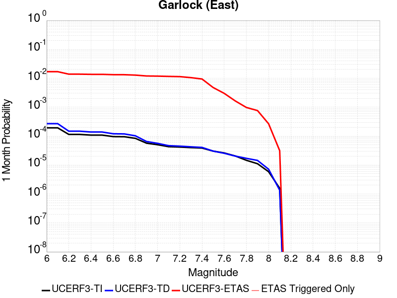 | 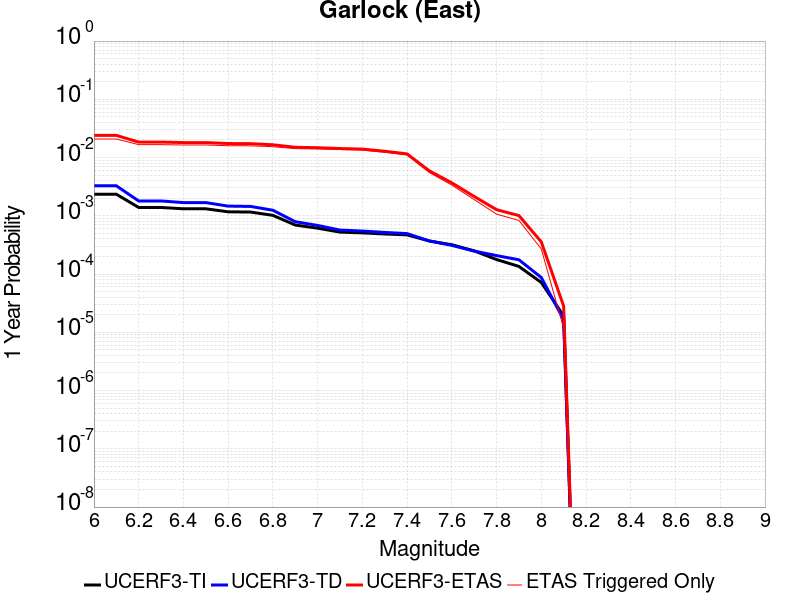 |  |

| Magnitude | 1 wk TI Prob | 1 wk TD Prob | 1 wk ETAS Prob | 1 wk ETAS/TD Gain | 1 wk ETAS Triggered Only | 1 mo TI Prob | 1 mo TD Prob | 1 mo ETAS Prob | 1 mo ETAS/TD Gain | 1 mo ETAS Triggered Only | 1 yr TI Prob | 1 yr TD Prob | 1 yr ETAS Prob | 1 yr ETAS/TD Gain | 1 yr ETAS Triggered Only | 10 yr TI Prob | 10 yr TD Prob | 10 yr ETAS Prob | 10 yr ETAS/TD Gain | 10 yr ETAS Triggered Only |
|-----|-----|-----|-----|-----|-----|-----|-----|-----|-----|-----|-----|-----|-----|-----|-----|-----|-----|-----|-----|-----|
| 6.0 | 4.5092507E-5 | 6.290325E-5 | 0.013947006 | 221.72156 | 0.0138849765 | 1.9323928E-4 | 2.6956003E-4 | 0.016743992 | 62.116005 | 0.016478874 | 0.0023501497 | 0.0032774 | 0.024054153 | 7.339401 | 0.02084507 | 0.023254504 | 0.032351844 | 0.056134183 | 1.7351154 | 0.024577465 |
| 6.1 | 4.5092507E-5 | 6.290325E-5 | 0.013947006 | 221.72156 | 0.0138849765 | 1.9323928E-4 | 2.6956003E-4 | 0.016743992 | 62.116005 | 0.016478874 | 0.0023501497 | 0.0032774 | 0.024054153 | 7.339401 | 0.02084507 | 0.023254504 | 0.032351844 | 0.056134183 | 1.7351154 | 0.024577465 |
| 6.2 | 2.6674514E-5 | 3.4509674E-5 | 0.011559933 | 334.9766 | 0.011525822 | 1.1431433E-4 | 1.4789042E-4 | 0.013655283 | 92.33379 | 0.01350939 | 0.0013908884 | 0.0017991117 | 0.018435793 | 10.247164 | 0.016666668 | 0.01382215 | 0.017890299 | 0.036691014 | 2.0508888 | 0.019143192 |
| 6.3 | 2.6674514E-5 | 3.4509674E-5 | 0.011559933 | 334.9766 | 0.011525822 | 1.1431433E-4 | 1.4789042E-4 | 0.013655283 | 92.33379 | 0.01350939 | 0.0013908884 | 0.0017991117 | 0.018435793 | 10.247164 | 0.016666668 | 0.01382215 | 0.017890299 | 0.036691014 | 2.0508888 | 0.019143192 |
| 6.4 | 2.5312667E-5 | 3.233893E-5 | 0.011428684 | 353.4033 | 0.011396714 | 1.0847834E-4 | 1.3858822E-4 | 0.013458339 | 97.11026 | 0.013321596 | 0.0013199237 | 0.0016860351 | 0.018090256 | 10.7294655 | 0.016431924 | 0.013121112 | 0.016778335 | 0.035300292 | 2.103921 | 0.018838027 |
| 6.5 | 2.5312667E-5 | 3.233893E-5 | 0.011428684 | 353.4033 | 0.011396714 | 1.0847834E-4 | 1.3858822E-4 | 0.013458339 | 97.11026 | 0.013321596 | 0.0013199237 | 0.0016860351 | 0.018090256 | 10.7294655 | 0.016431924 | 0.013121112 | 0.016778335 | 0.035300292 | 2.103921 | 0.018838027 |
| 6.6 | 2.246556E-5 | 2.8133776E-5 | 0.011201528 | 398.1523 | 0.011173709 | 9.627742E-5 | 1.20567885E-4 | 0.013147166 | 109.04368 | 0.013028169 | 0.0011715472 | 0.0014669491 | 0.017405974 | 11.865424 | 0.01596244 | 0.011653901 | 0.01461866 | 0.032579895 | 2.2286513 | 0.0182277 |
| 6.7 | 2.2241198E-5 | 2.7803519E-5 | 0.011177728 | 402.02567 | 0.011150234 | 9.531594E-5 | 1.1915263E-4 | 0.013098827 | 109.933174 | 0.012981221 | 0.0011598538 | 0.0014497414 | 0.017330442 | 11.95416 | 0.015903756 | 0.011538187 | 0.014448853 | 0.032355346 | 2.239302 | 0.018169014 |
| 6.8 | 1.9528685E-5 | 2.389819E-5 | 0.010845236 | 453.8099 | 0.010821596 | 8.369167E-5 | 1.0241691E-4 | 0.012659816 | 123.6106 | 0.012558686 | 0.0010184698 | 0.0012462323 | 0.016579213 | 13.30347 | 0.015352112 | 0.010138147 | 0.012436427 | 0.029684016 | 2.3868604 | 0.017464789 |
| 6.9 | 1.3318621E-5 | 1.5198884E-5 | 0.010238049 | 673.6052 | 0.010223005 | 5.7078556E-5 | 6.513648E-5 | 0.01183667 | 181.72105 | 0.0117723 | 6.9470983E-4 | 7.927538E-4 | 0.015018556 | 18.944792 | 0.014237089 | 0.0069254204 | 0.007939888 | 0.023915315 | 3.012047 | 0.016103286 |
| 7.0 | 1.1760853E-5 | 1.31077895E-5 | 0.010130346 | 772.8493 | 0.010117371 | 5.0402683E-5 | 5.6175057E-5 | 0.0116987135 | 208.2546 | 0.011643193 | 6.134799E-4 | 6.8372174E-4 | 0.014758599 | 21.58568 | 0.014084507 | 0.0061178906 | 0.00685652 | 0.022686202 | 3.3087049 | 0.015938967 |
| 7.1 | 1.0064758E-5 | 1.0902931E-5 | 0.009952109 | 912.7921 | 0.009941314 | 4.3133965E-5 | 4.672603E-5 | 0.011431171 | 244.64247 | 0.011384976 | 5.2502943E-4 | 5.687444E-4 | 0.014293329 | 25.131374 | 0.013732394 | 0.005237907 | 0.0057129986 | 0.021129115 | 3.6984282 | 0.015504695 |
| 7.2 | 9.768808E-6 | 1.0498807E-5 | 0.009775654 | 931.12054 | 0.009765258 | 4.186565E-5 | 4.499413E-5 | 0.0112182 | 249.32587 | 0.011173709 | 5.095951E-4 | 5.4766936E-4 | 0.013979277 | 25.52503 | 0.013438967 | 0.0050842804 | 0.0055032647 | 0.020572457 | 3.738228 | 0.015152582 |
| 7.3 | 9.344516E-6 | 9.944468E-6 | 0.008965255 | 901.53186 | 0.0089553995 | 4.004731E-5 | 4.261847E-5 | 0.01028866 | 241.4132 | 0.010246479 | 4.8746695E-4 | 5.1875977E-4 | 0.01283631 | 24.744228 | 0.012323944 | 0.0048639905 | 0.0052149445 | 0.019015836 | 3.646412 | 0.013873239 |
| 7.4 | 9.023491E-6 | 9.490661E-6 | 0.00801411 | 844.4206 | 0.008004695 | 3.867153E-5 | 4.0673647E-5 | 0.0092304405 | 226.9391 | 0.009190141 | 4.7072413E-4 | 4.950925E-4 | 0.011557688 | 23.344503 | 0.011068075 | 0.004697283 | 0.0049783974 | 0.017287701 | 3.4725437 | 0.012370892 |
| 7.5 | 7.081253E-6 | 7.087672E-6 | 0.0040563545 | 572.3113 | 0.0040492956 | 3.0347876E-5 | 3.0375388E-5 | 0.0046311747 | 152.4647 | 0.004600939 | 3.6942272E-4 | 3.6975832E-4 | 0.0058958833 | 15.945234 | 0.005528169 | 0.003688092 | 0.0037243143 | 0.00987503 | 2.651503 | 0.006173709 |
| 7.6 | 6.116396E-6 | 5.959245E-6 | 0.0024120482 | 404.7574 | 0.0024061033 | 2.6212863E-5 | 2.5539372E-5 | 0.002830632 | 110.83405 | 0.0028051643 | 3.1909486E-4 | 3.1089774E-4 | 0.0036783952 | 11.831528 | 0.0033685446 | 0.0031863707 | 0.0031357552 | 0.006879846 | 2.1939998 | 0.0037558686 |
| 7.7 | 4.797145E-6 | 4.757281E-6 | 0.0013779902 | 289.65918 | 0.0013732394 | 2.055903E-5 | 2.0388188E-5 | 0.001604863 | 78.715324 | 0.0015845071 | 2.5027743E-4 | 2.4819805E-4 | 0.0021491346 | 8.65895 | 0.0019014084 | 0.0024999576 | 0.0025093474 | 0.0045698914 | 1.8211474 | 0.0020657277 |
| 7.8 | 3.4028885E-6 | 3.978462E-6 | 8.255714E-4 | 207.51021 | 8.2159624E-4 | 1.4583726E-5 | 1.7050439E-5 | 9.442647E-4 | 55.380665 | 9.2723005E-4 | 1.775424E-4 | 2.0756939E-4 | 0.0012754229 | 6.144561 | 0.0010680751 | 0.0017740062 | 0.0021012232 | 0.0032607534 | 1.5518359 | 0.0011619718 |
| 7.9 | 2.5928412E-6 | 3.3724489E-6 | 6.6064723E-4 | 195.8954 | 6.57277E-4 | 1.1112129E-5 | 1.4453272E-5 | 7.304054E-4 | 50.53564 | 7.1596244E-4 | 1.3528178E-4 | 1.7595445E-4 | 0.0010091412 | 5.735241 | 8.3333335E-4 | 0.0013519945 | 0.0017812408 | 0.0026951032 | 1.5130482 | 9.1549294E-4 |
| 8.0 | 1.3743648E-6 | 1.6734747E-6 | 2.1294072E-4 | 127.24467 | 2.112676E-4 | 5.8901214E-6 | 7.1720146E-6 | 2.4191212E-4 | 33.730007 | 2.3474179E-4 | 7.1709874E-5 | 8.731581E-5 | 3.572453E-4 | 4.091416 | 2.6995305E-4 | 7.1686733E-4 | 8.837234E-4 | 0.0012003448 | 1.358281 | 3.169014E-4 |
| 8.1 | 3.6733252E-7 | 3.1489964E-7 | 1.2051985E-5 | 38.272465 | 1.1737089E-5 | 1.5742813E-6 | 1.3495693E-6 | 1.3086643E-5 | 9.696903 | 1.1737089E-5 | 1.9166706E-5 | 1.6430899E-5 | 2.8167795E-5 | 1.7143186 | 1.1737089E-5 | 1.9165053E-4 | 1.6638759E-4 | 1.7812272E-4 | 1.0705289 | 1.1737089E-5 |

## Hunter Mountain-Saline Valley
*[(top)](#table-of-contents)*

| 1 Week | 1 Month | 1 Year | 10 Year |
|-----|-----|-----|-----|
| 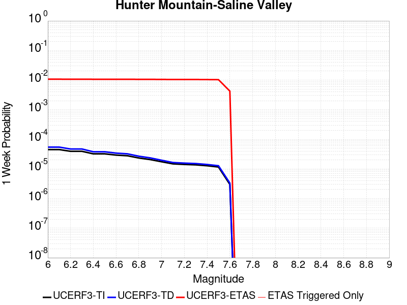 | 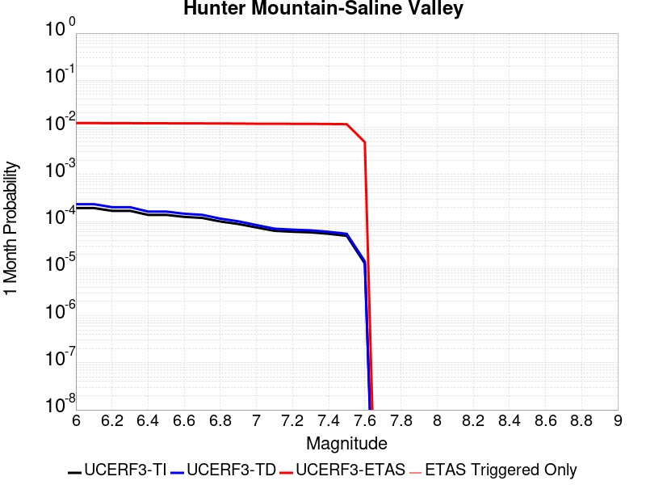 | 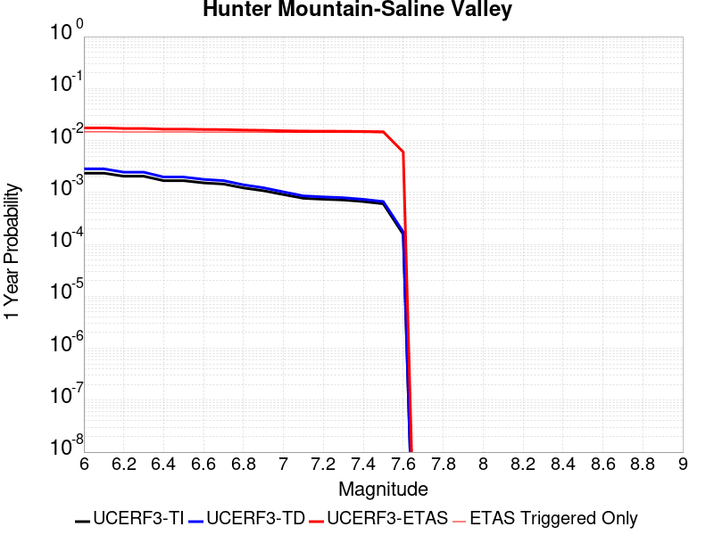 | 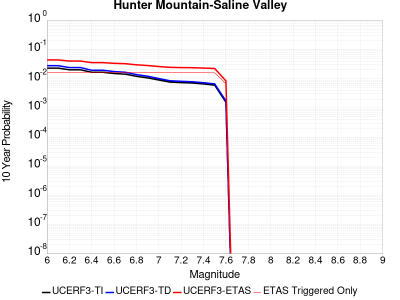 |

| Magnitude | 1 wk TI Prob | 1 wk TD Prob | 1 wk ETAS Prob | 1 wk ETAS/TD Gain | 1 wk ETAS Triggered Only | 1 mo TI Prob | 1 mo TD Prob | 1 mo ETAS Prob | 1 mo ETAS/TD Gain | 1 mo ETAS Triggered Only | 1 yr TI Prob | 1 yr TD Prob | 1 yr ETAS Prob | 1 yr ETAS/TD Gain | 1 yr ETAS Triggered Only | 10 yr TI Prob | 10 yr TD Prob | 10 yr ETAS Prob | 10 yr ETAS/TD Gain | 10 yr ETAS Triggered Only |
|-----|-----|-----|-----|-----|-----|-----|-----|-----|-----|-----|-----|-----|-----|-----|-----|-----|-----|-----|-----|-----|
| 6.0 | 4.5103672E-5 | 5.4570177E-5 | 0.010723002 | 196.49931 | 0.010669014 | 1.9328714E-4 | 2.3385242E-4 | 0.012331962 | 52.733948 | 0.012100939 | 0.002350731 | 0.0028435152 | 0.01747316 | 6.1449146 | 0.014671361 | 0.023260195 | 0.028091887 | 0.0443588 | 1.5790609 | 0.016737089 |
| 6.1 | 4.5103672E-5 | 5.4570177E-5 | 0.010723002 | 196.49931 | 0.010669014 | 1.9328714E-4 | 2.3385242E-4 | 0.012331962 | 52.733948 | 0.012100939 | 0.002350731 | 0.0028435152 | 0.01747316 | 6.1449146 | 0.014671361 | 0.023260195 | 0.028091887 | 0.0443588 | 1.5790609 | 0.016737089 |
| 6.2 | 3.9363465E-5 | 4.706337E-5 | 0.010692102 | 227.18523 | 0.0106455395 | 1.6868966E-4 | 2.0168544E-4 | 0.012253245 | 60.754234 | 0.012053991 | 0.002051862 | 0.0024528175 | 0.01702965 | 6.942894 | 0.014612676 | 0.020330196 | 0.024273481 | 0.040524136 | 1.6694819 | 0.01665493 |
| 6.3 | 3.9363465E-5 | 4.706337E-5 | 0.010692102 | 227.18523 | 0.0106455395 | 1.6868966E-4 | 2.0168544E-4 | 0.012253245 | 60.754234 | 0.012053991 | 0.002051862 | 0.0024528175 | 0.01702965 | 6.942894 | 0.014612676 | 0.020330196 | 0.024273481 | 0.040524136 | 1.6694819 | 0.01665493 |
| 6.4 | 3.2311684E-5 | 3.795099E-5 | 0.010659614 | 280.87842 | 0.0106220655 | 1.384713E-4 | 1.6263737E-4 | 0.012191197 | 74.95939 | 0.012030517 | 0.0016845843 | 0.0019783843 | 0.01652701 | 8.353791 | 0.014577465 | 0.016718714 | 0.019616475 | 0.035875652 | 1.8288531 | 0.016584506 |
| 6.5 | 3.2311684E-5 | 3.795099E-5 | 0.010659614 | 280.87842 | 0.0106220655 | 1.384713E-4 | 1.6263737E-4 | 0.012191197 | 74.95939 | 0.012030517 | 0.0016845843 | 0.0019783843 | 0.01652701 | 8.353791 | 0.014577465 | 0.016718714 | 0.019616475 | 0.035875652 | 1.8288531 | 0.016584506 |
| 6.6 | 2.9305844E-5 | 3.418183E-5 | 0.010632411 | 311.05444 | 0.0105985915 | 1.2559042E-4 | 1.4648569E-4 | 0.012140034 | 82.87522 | 0.011995305 | 0.0015279909 | 0.001782067 | 0.016298406 | 9.145787 | 0.014542254 | 0.015175272 | 0.01768569 | 0.03393077 | 1.9185437 | 0.016537558 |
| 6.7 | 2.7826512E-5 | 3.2344276E-5 | 0.010630593 | 328.67 | 0.0105985915 | 1.19251024E-4 | 1.386113E-4 | 0.0121322535 | 87.52716 | 0.011995305 | 0.0014509142 | 0.0016863465 | 0.016204076 | 9.608984 | 0.014542254 | 0.014414776 | 0.016743187 | 0.032992315 | 1.9704919 | 0.016525822 |
| 6.8 | 2.3389874E-5 | 2.6866714E-5 | 0.0106017 | 394.60352 | 0.010575118 | 1.0023846E-4 | 1.15138246E-4 | 0.012073855 | 104.86398 | 0.011960094 | 0.00121972 | 0.001400954 | 0.015875952 | 11.332244 | 0.014495305 | 0.01213047 | 0.013927434 | 0.03015365 | 2.1650543 | 0.016455399 |
| 6.9 | 2.069209E-5 | 2.3570032E-5 | 0.010598438 | 449.65735 | 0.010575118 | 8.867737E-5 | 1.01010715E-4 | 0.012059896 | 119.39225 | 0.011960094 | 0.0010791123 | 0.0012291478 | 0.015694913 | 12.768939 | 0.014483568 | 0.010738871 | 0.012228523 | 0.028471103 | 2.3282535 | 0.016443662 |
| 7.0 | 1.7462342E-5 | 1.9633546E-5 | 0.0105123855 | 535.4298 | 0.010492958 | 7.483646E-5 | 8.414118E-5 | 0.011925868 | 141.73639 | 0.011842723 | 9.1075303E-4 | 0.0010239601 | 0.0153754465 | 15.01567 | 0.014366197 | 0.009070295 | 0.0101960525 | 0.026344262 | 2.5837708 | 0.016314553 |
| 7.1 | 1.4807709E-5 | 1.6441749E-5 | 0.01049749 | 638.4655 | 0.010481221 | 6.3460066E-5 | 7.046283E-5 | 0.011900615 | 168.89209 | 0.011830986 | 7.723524E-4 | 8.575638E-4 | 0.015164533 | 17.683271 | 0.0143192485 | 0.007696735 | 0.008545532 | 0.024662485 | 2.8860095 | 0.016255869 |
| 7.2 | 1.4180048E-5 | 1.5698337E-5 | 0.010485018 | 667.9063 | 0.010469483 | 6.077022E-5 | 6.727694E-5 | 0.011885731 | 176.66872 | 0.011819249 | 7.396263E-4 | 8.188051E-4 | 0.0151028745 | 18.445017 | 0.0142957745 | 0.0073716943 | 0.008160833 | 0.024260757 | 2.9728284 | 0.016232394 |
| 7.3 | 1.3730402E-5 | 1.5172075E-5 | 0.01047276 | 690.2655 | 0.010457747 | 5.8843252E-5 | 6.502165E-5 | 0.01186003 | 182.40123 | 0.011795775 | 7.161811E-4 | 7.9136714E-4 | 0.015052373 | 19.02072 | 0.0142723005 | 0.007138774 | 0.007888422 | 0.02396948 | 3.0385644 | 0.01620892 |
| 7.4 | 1.2810095E-5 | 1.4109277E-5 | 0.010413024 | 738.02673 | 0.010399061 | 5.489925E-5 | 6.0467017E-5 | 0.01178511 | 194.90146 | 0.011725352 | 6.681934E-4 | 7.359531E-4 | 0.014927379 | 20.283058 | 0.014201878 | 0.006661878 | 0.007338053 | 0.023358125 | 3.1831503 | 0.016138498 |
| 7.5 | 1.1595659E-5 | 1.2800664E-5 | 0.010341307 | 807.8727 | 0.010328638 | 4.9694736E-5 | 5.4858923E-5 | 0.0116974125 | 213.22717 | 0.011643193 | 6.0486543E-4 | 6.6771836E-4 | 0.014731091 | 22.061834 | 0.01407277 | 0.006032217 | 0.0066599925 | 0.022539442 | 3.3843045 | 0.015985915 |
| 7.6 | 2.997694E-6 | 3.3251579E-6 | 0.0042404 | 1275.2478 | 0.0042370893 | 1.28471975E-5 | 1.425064E-5 | 0.0048498623 | 340.32593 | 0.0048356806 | 1.564034E-4 | 1.73495E-4 | 0.005994081 | 34.54901 | 0.0058215964 | 0.0015629337 | 0.001735031 | 0.008472148 | 4.882995 | 0.0067488262 |

## Garlock (West)
*[(top)](#table-of-contents)*

| 1 Week | 1 Month | 1 Year | 10 Year |
|-----|-----|-----|-----|
| 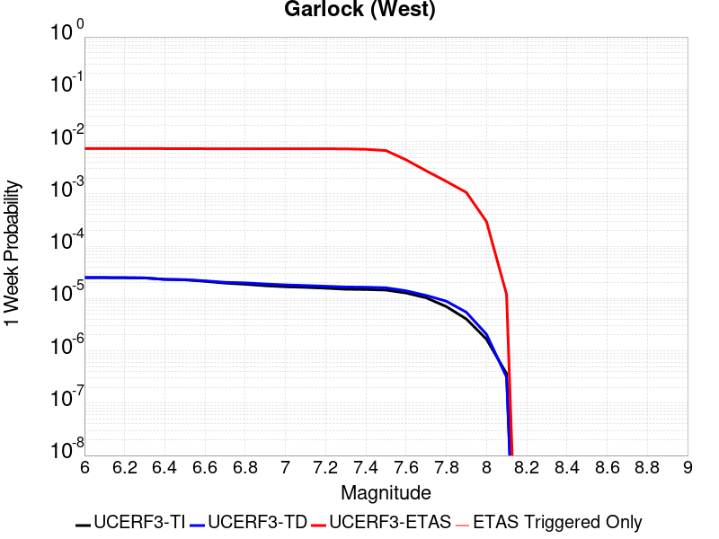 | 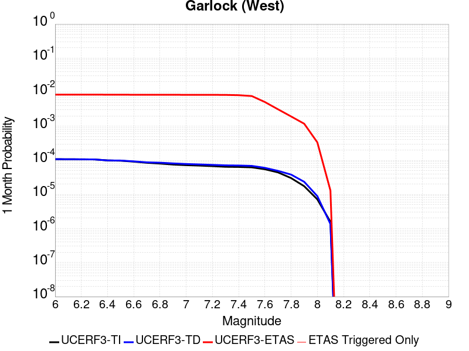 | 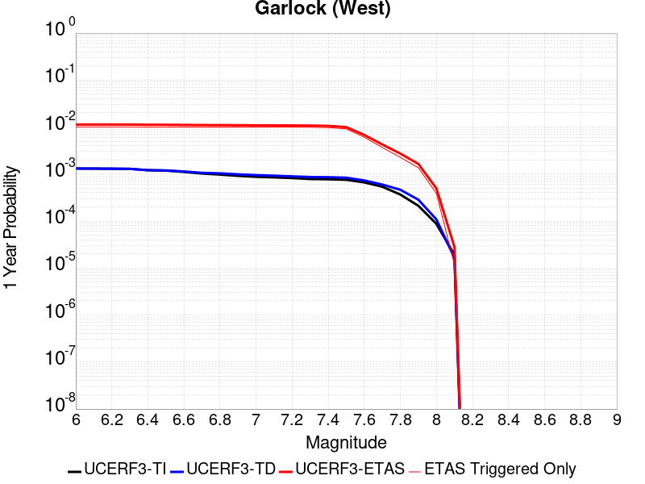 | 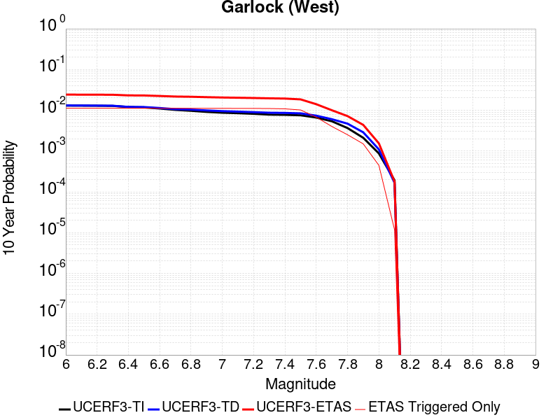 |

| Magnitude | 1 wk TI Prob | 1 wk TD Prob | 1 wk ETAS Prob | 1 wk ETAS/TD Gain | 1 wk ETAS Triggered Only | 1 mo TI Prob | 1 mo TD Prob | 1 mo ETAS Prob | 1 mo ETAS/TD Gain | 1 mo ETAS Triggered Only | 1 yr TI Prob | 1 yr TD Prob | 1 yr ETAS Prob | 1 yr ETAS/TD Gain | 1 yr ETAS Triggered Only | 10 yr TI Prob | 10 yr TD Prob | 10 yr ETAS Prob | 10 yr ETAS/TD Gain | 10 yr ETAS Triggered Only |
|-----|-----|-----|-----|-----|-----|-----|-----|-----|-----|-----|-----|-----|-----|-----|-----|-----|-----|-----|-----|-----|
| 6.0 | 2.5181727E-5 | 2.51973E-5 | 0.0073489565 | 291.6565 | 0.0073239435 | 1.0791722E-4 | 1.0798398E-4 | 0.008475625 | 78.489655 | 0.008368544 | 0.0013131002 | 0.0013139155 | 0.011359384 | 8.645446 | 0.010058685 | 0.013053683 | 0.013141977 | 0.02424992 | 1.8452263 | 0.011255869 |
| 6.1 | 2.5077732E-5 | 2.5098372E-5 | 0.0073488583 | 292.8022 | 0.0073239435 | 1.0747157E-4 | 1.0756004E-4 | 0.008475205 | 78.795105 | 0.008368544 | 0.001307681 | 0.0013087603 | 0.011354282 | 8.675601 | 0.010058685 | 0.013000126 | 0.013091032 | 0.02419955 | 1.8485594 | 0.011255869 |
| 6.2 | 2.494612E-5 | 2.498005E-5 | 0.007348741 | 294.1844 | 0.0073239435 | 1.0690756E-4 | 1.0705298E-4 | 0.008474702 | 79.16362 | 0.008368544 | 0.0013008224 | 0.0013025942 | 0.011348178 | 8.711982 | 0.010058685 | 0.012932341 | 0.013030097 | 0.0241393 | 1.8525803 | 0.011255869 |
| 6.3 | 2.4733758E-5 | 2.479942E-5 | 0.0073485617 | 296.31992 | 0.0073239435 | 1.0599751E-4 | 1.06278916E-4 | 0.008473934 | 79.73298 | 0.008368544 | 0.0012897556 | 0.0012931811 | 0.011338859 | 8.76819 | 0.010058685 | 0.012822957 | 0.012937066 | 0.024047317 | 1.8587922 | 0.011255869 |
| 6.4 | 2.3237335E-5 | 2.317873E-5 | 0.007323479 | 315.95688 | 0.0073004696 | 9.958477E-5 | 9.933365E-5 | 0.008443575 | 85.00217 | 0.00834507 | 0.0012117702 | 0.001208719 | 0.011231801 | 9.292317 | 0.010035211 | 0.012051838 | 0.012101916 | 0.023198377 | 1.9169177 | 0.011232395 |
| 6.5 | 2.2732203E-5 | 2.2993298E-5 | 0.007311558 | 317.98648 | 0.0072887326 | 9.742009E-5 | 9.8539E-5 | 0.008431051 | 85.560555 | 0.008333334 | 0.0011854442 | 0.0011990548 | 0.0112105105 | 9.349456 | 0.010023474 | 0.011791403 | 0.012006322 | 0.02309226 | 1.9233418 | 0.011220657 |
| 6.6 | 2.1319436E-5 | 2.17735E-5 | 0.0072868736 | 334.66708 | 0.007265258 | 9.136581E-5 | 9.331167E-5 | 0.008402395 | 90.04656 | 0.008309859 | 0.001111811 | 0.0011354799 | 0.011124125 | 9.796849 | 0.01 | 0.011062649 | 0.011377227 | 0.022447016 | 1.972978 | 0.011197183 |
| 6.7 | 1.970802E-5 | 2.0393396E-5 | 0.0072855037 | 357.24817 | 0.007265258 | 8.446021E-5 | 8.739735E-5 | 0.0083965305 | 96.07305 | 0.008309859 | 0.001027818 | 0.001063545 | 0.011052909 | 10.392517 | 0.01 | 0.010230771 | 0.010664964 | 0.02174273 | 2.0387063 | 0.011197183 |
| 6.8 | 1.8744462E-5 | 1.9901045E-5 | 0.0072850147 | 366.06192 | 0.007265258 | 8.033094E-5 | 8.5287415E-5 | 0.008382701 | 98.28768 | 0.008298122 | 9.775903E-4 | 0.0010378812 | 0.0110157775 | 10.613716 | 0.009988263 | 0.009733009 | 0.01041075 | 0.021479748 | 2.0632277 | 0.011185446 |
| 6.9 | 1.7559682E-5 | 1.8953415E-5 | 0.007284074 | 384.3146 | 0.007265258 | 7.5253614E-5 | 8.12264E-5 | 0.008378674 | 103.15211 | 0.008298122 | 9.158276E-4 | 9.884841E-4 | 0.010966874 | 11.094638 | 0.009988263 | 0.0091206245 | 0.009921231 | 0.020995704 | 2.1162398 | 0.011185446 |
| 7.0 | 1.6794445E-5 | 1.8216237E-5 | 0.007283342 | 399.82693 | 0.007265258 | 7.197421E-5 | 7.8067256E-5 | 0.008363806 | 107.13589 | 0.008286385 | 8.759337E-4 | 9.5005584E-4 | 0.010905378 | 11.47867 | 0.009964788 | 0.008724891 | 0.009540141 | 0.020595625 | 2.1588387 | 0.011161972 |
| 7.1 | 1.6337795E-5 | 1.7717046E-5 | 0.0072828466 | 411.0644 | 0.007265258 | 7.0017246E-5 | 7.5927994E-5 | 0.008361684 | 110.126495 | 0.008286385 | 8.521265E-4 | 9.240326E-4 | 0.010879613 | 11.774058 | 0.009964788 | 0.008488664 | 0.009281996 | 0.020317106 | 2.1888726 | 0.011138498 |
| 7.2 | 1.5780008E-5 | 1.7165687E-5 | 0.0072705625 | 423.5521 | 0.007253521 | 6.762685E-5 | 7.356516E-5 | 0.008347604 | 113.47225 | 0.008274648 | 8.2304585E-4 | 8.9528906E-4 | 0.01083943 | 12.107184 | 0.009953052 | 0.008200042 | 0.008996838 | 0.020023493 | 2.2256145 | 0.01112676 |
| 7.3 | 1.5058865E-5 | 1.6618762E-5 | 0.0072348085 | 435.3398 | 0.0072183097 | 6.45364E-5 | 7.122133E-5 | 0.008310071 | 116.67953 | 0.008239437 | 7.854473E-4 | 8.667759E-4 | 0.01077602 | 12.4323015 | 0.00991784 | 0.00782677 | 0.008713539 | 0.019673537 | 2.2578125 | 0.011056338 |
| 7.4 | 1.4887923E-5 | 1.6454731E-5 | 0.00710554 | 431.82352 | 0.007089202 | 6.380382E-5 | 7.051838E-5 | 0.0081568025 | 115.669174 | 0.008086855 | 7.7653467E-4 | 8.582243E-4 | 0.010603375 | 12.355016 | 0.0097535215 | 0.0077382675 | 0.008628399 | 0.01939153 | 2.2474077 | 0.010856807 |
| 7.5 | 1.4509299E-5 | 1.6046748E-5 | 0.006729554 | 419.37183 | 0.006713615 | 6.218123E-5 | 6.876997E-5 | 0.007697353 | 111.928986 | 0.007629108 | 7.567935E-4 | 8.36954E-4 | 0.0099959485 | 11.943248 | 0.009166666 | 0.0075422134 | 0.008416704 | 0.01851875 | 2.2002378 | 0.0101877935 |
| 7.6 | 1.2756717E-5 | 1.4050848E-5 | 0.004474082 | 318.42078 | 0.004460094 | 5.4670498E-5 | 6.0216535E-5 | 0.0051420704 | 85.39299 | 0.00508216 | 6.6541E-4 | 7.328904E-4 | 0.006819975 | 9.305587 | 0.0060915495 | 0.006634211 | 0.0073816874 | 0.0141039975 | 1.9106737 | 0.0067723007 |
| 7.7 | 1.0328985E-5 | 1.1460557E-5 | 0.0027579078 | 240.64345 | 0.002746479 | 4.4266326E-5 | 4.911575E-5 | 0.003147555 | 64.084435 | 0.0030985915 | 5.388092E-4 | 5.978206E-4 | 0.004269333 | 7.1414957 | 0.003673709 | 0.0053750467 | 0.006038511 | 0.01001669 | 1.6588013 | 0.0040023476 |
| 7.8 | 7.0306583E-6 | 8.899601E-6 | 0.0017342364 | 194.86676 | 0.0017253521 | 3.0131043E-5 | 3.814059E-5 | 0.0019394765 | 50.85072 | 0.0019014084 | 3.667837E-4 | 4.642629E-4 | 0.0027284694 | 5.876992 | 0.0022652582 | 0.003661789 | 0.0046952725 | 0.007195216 | 1.5324385 | 0.0025117372 |
| 7.9 | 4.060633E-6 | 5.4653938E-6 | 0.0010617976 | 194.2765 | 0.0010563381 | 1.7402595E-5 | 2.3422906E-5 | 0.0011853675 | 50.60719 | 0.0011619718 | 2.11856E-4 | 2.851367E-4 | 0.0016462508 | 5.77355 | 0.0013615023 | 0.0021165414 | 0.002884201 | 0.0043822154 | 1.5193863 | 0.0015023474 |
| 8.0 | 1.6729537E-6 | 2.0775144E-6 | 2.9550414E-4 | 142.23927 | 2.9342723E-4 | 7.169782E-6 | 8.903603E-6 | 3.3753918E-4 | 37.910404 | 3.286385E-4 | 8.7288594E-5 | 1.0839601E-4 | 4.95678E-4 | 4.5728436 | 3.8732393E-4 | 8.7254314E-4 | 0.0010969337 | 0.0015424539 | 1.4061505 | 4.460094E-4 |
| 8.1 | 3.6733252E-7 | 3.1489964E-7 | 1.2051985E-5 | 38.272465 | 1.1737089E-5 | 1.5742813E-6 | 1.3495693E-6 | 1.3086643E-5 | 9.696903 | 1.1737089E-5 | 1.9166706E-5 | 1.6430899E-5 | 2.8167795E-5 | 1.7143186 | 1.1737089E-5 | 1.9165053E-4 | 1.6638759E-4 | 1.7812272E-4 | 1.0705289 | 1.1737089E-5 |

## Blackwater
*[(top)](#table-of-contents)*

| 1 Week | 1 Month | 1 Year | 10 Year |
|-----|-----|-----|-----|
| 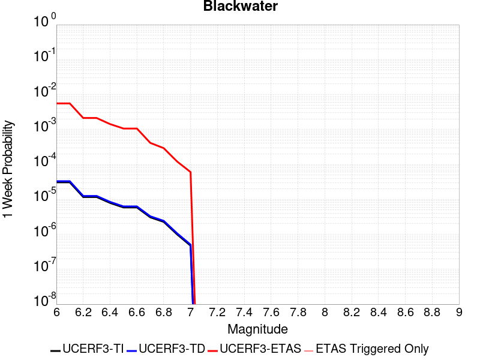 | 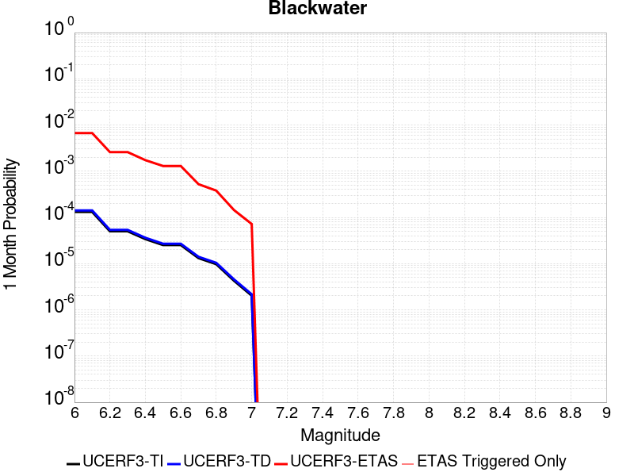 | 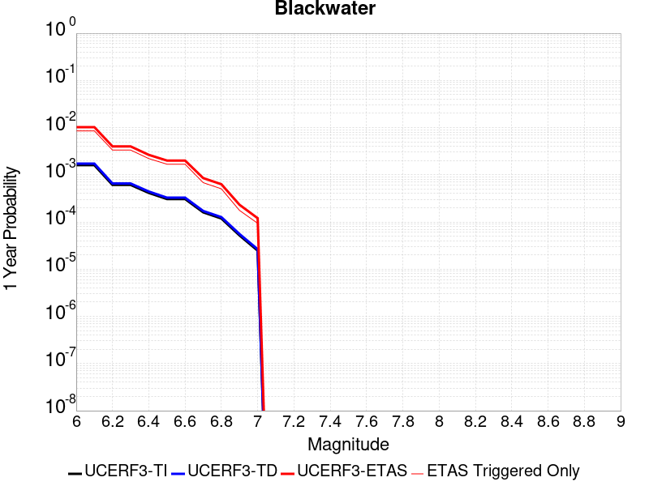 | 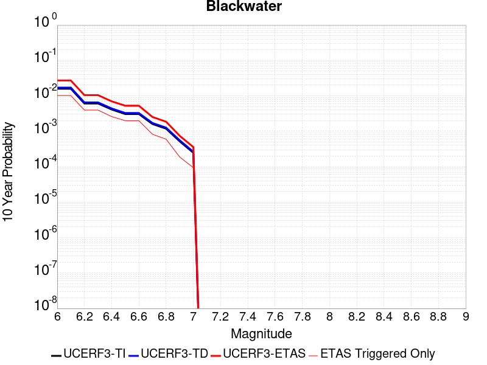 |

| Magnitude | 1 wk TI Prob | 1 wk TD Prob | 1 wk ETAS Prob | 1 wk ETAS/TD Gain | 1 wk ETAS Triggered Only | 1 mo TI Prob | 1 mo TD Prob | 1 mo ETAS Prob | 1 mo ETAS/TD Gain | 1 mo ETAS Triggered Only | 1 yr TI Prob | 1 yr TD Prob | 1 yr ETAS Prob | 1 yr ETAS/TD Gain | 1 yr ETAS Triggered Only | 10 yr TI Prob | 10 yr TD Prob | 10 yr ETAS Prob | 10 yr ETAS/TD Gain | 10 yr ETAS Triggered Only |
|-----|-----|-----|-----|-----|-----|-----|-----|-----|-----|-----|-----|-----|-----|-----|-----|-----|-----|-----|-----|-----|
| 6.0 | 3.0708583E-5 | 3.3095846E-5 | 0.005678449 | 171.57587 | 0.00564554 | 1.3160157E-4 | 1.4183241E-4 | 0.006784083 | 47.831684 | 0.0066431924 | 0.0016010714 | 0.0017255784 | 0.0102437185 | 5.9363966 | 0.008532864 | 0.015895851 | 0.017135633 | 0.027137317 | 1.5836775 | 0.010176056 |
| 6.1 | 3.0708583E-5 | 3.3095846E-5 | 0.005678449 | 171.57587 | 0.00564554 | 1.3160157E-4 | 1.4183241E-4 | 0.006784083 | 47.831684 | 0.0066431924 | 0.0016010714 | 0.0017255784 | 0.0102437185 | 5.9363966 | 0.008532864 | 0.015895851 | 0.017135633 | 0.027137317 | 1.5836775 | 0.010176056 |
| 6.2 | 1.1707779E-5 | 1.2545122E-5 | 0.0021956163 | 175.01753 | 0.0021830986 | 5.017523E-5 | 5.3763757E-5 | 0.0026240482 | 48.80701 | 0.0025704226 | 6.107122E-4 | 6.5438676E-4 | 0.003997268 | 6.1084185 | 0.0033450704 | 0.006090366 | 0.0065255696 | 0.010466818 | 1.60397 | 0.003967136 |
| 6.3 | 1.1707779E-5 | 1.2545122E-5 | 0.0021956163 | 175.01753 | 0.0021830986 | 5.017523E-5 | 5.3763757E-5 | 0.0026240482 | 48.80701 | 0.0025704226 | 6.107122E-4 | 6.5438676E-4 | 0.003997268 | 6.1084185 | 0.0033450704 | 0.006090366 | 0.0065255696 | 0.010466818 | 1.60397 | 0.003967136 |
| 6.4 | 7.929244E-6 | 8.480098E-6 | 0.0014756038 | 174.00787 | 0.0014671362 | 3.3982033E-5 | 3.6342793E-5 | 0.0017498955 | 48.149727 | 0.001713615 | 4.136527E-4 | 4.423877E-4 | 0.0026479843 | 5.9856644 | 0.0022065728 | 0.0041288356 | 0.0044154758 | 0.0070096045 | 1.5875083 | 0.0026056338 |
| 6.5 | 5.8832115E-6 | 6.285991E-6 | 0.0010626174 | 169.04532 | 0.0010563381 | 2.521352E-5 | 2.6939697E-5 | 0.0012945111 | 48.05218 | 0.0012676056 | 3.0693135E-4 | 3.27944E-4 | 0.0020057973 | 6.11628 | 0.0016784037 | 0.0030650778 | 0.0032748538 | 0.0052636247 | 1.6072854 | 0.001995305 |
| 6.6 | 5.8832115E-6 | 6.285991E-6 | 0.0010626174 | 169.04532 | 0.0010563381 | 2.521352E-5 | 2.6939697E-5 | 0.0012945111 | 48.05218 | 0.0012676056 | 3.0693135E-4 | 3.27944E-4 | 0.0020057973 | 6.11628 | 0.0016784037 | 0.0030650778 | 0.0032748538 | 0.0052636247 | 1.6072854 | 0.001995305 |
| 6.7 | 3.0715053E-6 | 3.2814662E-6 | 4.1407824E-4 | 126.18696 | 4.1079812E-4 | 1.3163528E-5 | 1.4063357E-5 | 5.4222497E-4 | 38.555866 | 5.2816904E-4 | 1.6025416E-4 | 1.7120909E-4 | 8.518437E-4 | 4.9754586 | 6.8075117E-4 | 0.0016013865 | 0.0017108864 | 0.002531077 | 1.4793952 | 8.2159624E-4 |
| 6.8 | 2.2722281E-6 | 2.4287538E-6 | 2.841182E-4 | 116.98107 | 2.8169015E-4 | 9.738084E-6 | 1.0408908E-5 | 3.8599185E-4 | 37.08284 | 3.7558685E-4 | 1.1855473E-4 | 1.26722E-4 | 6.313529E-4 | 4.982188 | 5.046948E-4 | 0.001184915 | 0.0012665876 | 0.001864421 | 1.4720032 | 5.985916E-4 |
| 6.9 | 9.952399E-7 | 1.0653489E-6 | 1.1843612E-4 | 111.1712 | 1.17370895E-4 | 4.265307E-6 | 4.5657757E-6 | 1.454102E-4 | 31.847864 | 1.4084508E-4 | 5.1928873E-5 | 5.5587418E-5 | 2.3163397E-4 | 4.1670218 | 1.7605633E-4 | 5.191674E-4 | 5.557858E-4 | 7.434748E-4 | 1.3377004 | 1.8779343E-4 |
| 7.0 | 4.7385504E-7 | 5.0755597E-7 | 5.919297E-5 | 116.62354 | 5.8685448E-5 | 2.0308057E-6 | 2.1752398E-6 | 7.259762E-5 | 33.37454 | 7.042254E-5 | 2.4724779E-5 | 2.6483543E-5 | 1.2037777E-4 | 4.54538 | 9.389671E-5 | 2.4722028E-4 | 2.6483546E-4 | 3.587073E-4 | 1.3544534 | 9.389671E-5 |

## Ash Hill
*[(top)](#table-of-contents)*

| 1 Week | 1 Month | 1 Year | 10 Year |
|-----|-----|-----|-----|
|  | 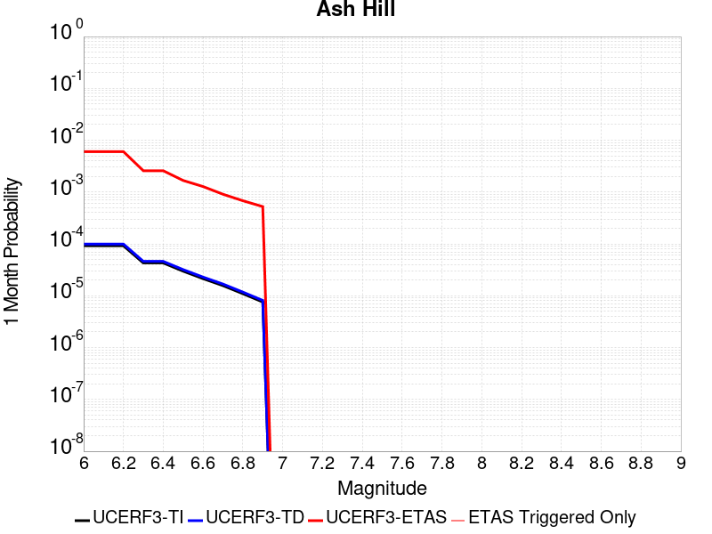 | 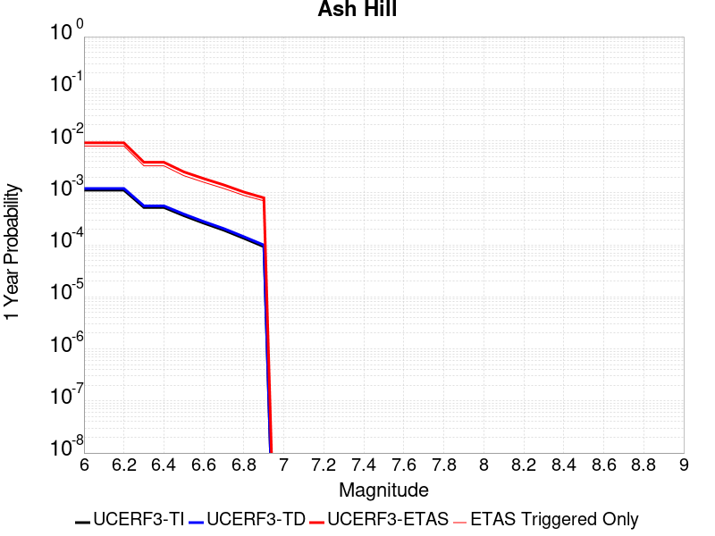 | 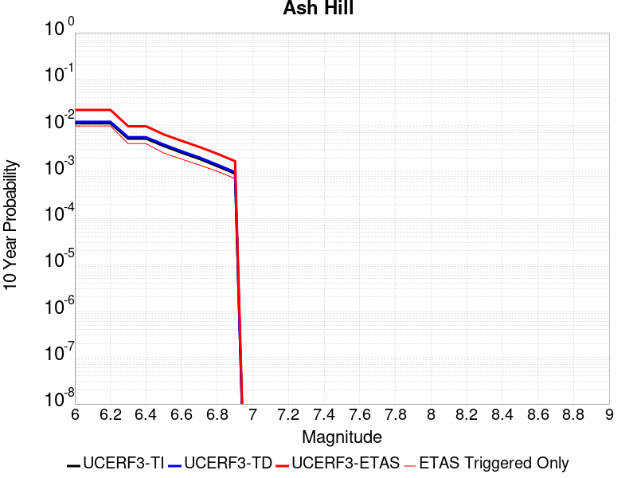 |

| Magnitude | 1 wk TI Prob | 1 wk TD Prob | 1 wk ETAS Prob | 1 wk ETAS/TD Gain | 1 wk ETAS Triggered Only | 1 mo TI Prob | 1 mo TD Prob | 1 mo ETAS Prob | 1 mo ETAS/TD Gain | 1 mo ETAS Triggered Only | 1 yr TI Prob | 1 yr TD Prob | 1 yr ETAS Prob | 1 yr ETAS/TD Gain | 1 yr ETAS Triggered Only | 10 yr TI Prob | 10 yr TD Prob | 10 yr ETAS Prob | 10 yr ETAS/TD Gain | 10 yr ETAS Triggered Only |
|-----|-----|-----|-----|-----|-----|-----|-----|-----|-----|-----|-----|-----|-----|-----|-----|-----|-----|-----|-----|-----|
| 6.0 | 2.1545662E-5 | 2.3194447E-5 | 0.0050113415 | 216.05782 | 0.004988263 | 9.2335285E-5 | 9.940143E-5 | 0.006037778 | 60.74136 | 0.005938967 | 0.0011236023 | 0.0012096206 | 0.009228079 | 7.6289034 | 0.008028169 | 0.011179381 | 0.012038348 | 0.021709241 | 1.8033404 | 0.009788732 |
| 6.1 | 2.1545662E-5 | 2.3194447E-5 | 0.0050113415 | 216.05782 | 0.004988263 | 9.2335285E-5 | 9.940143E-5 | 0.006037778 | 60.74136 | 0.005938967 | 0.0011236023 | 0.0012096206 | 0.009228079 | 7.6289034 | 0.008028169 | 0.011179381 | 0.012038348 | 0.021709241 | 1.8033404 | 0.009788732 |
| 6.2 | 2.1545662E-5 | 2.3194447E-5 | 0.0050113415 | 216.05782 | 0.004988263 | 9.2335285E-5 | 9.940143E-5 | 0.006037778 | 60.74136 | 0.005938967 | 0.0011236023 | 0.0012096206 | 0.009228079 | 7.6289034 | 0.008028169 | 0.011179381 | 0.012038348 | 0.021709241 | 1.8033404 | 0.009788732 |
| 6.3 | 1.0025529E-5 | 1.0746934E-5 | 0.002158611 | 200.85832 | 0.0021478874 | 4.2965847E-5 | 4.605755E-5 | 0.0025811521 | 56.041885 | 0.0025352112 | 5.229836E-4 | 5.6061964E-4 | 0.003915545 | 6.984317 | 0.0033568074 | 0.005217545 | 0.0055933665 | 0.009643355 | 1.7240701 | 0.00407277 |
| 6.4 | 1.0025529E-5 | 1.0746934E-5 | 0.002158611 | 200.85832 | 0.0021478874 | 4.2965847E-5 | 4.605755E-5 | 0.0025811521 | 56.041885 | 0.0025352112 | 5.229836E-4 | 5.6061964E-4 | 0.003915545 | 6.984317 | 0.0033568074 | 0.005217545 | 0.0055933665 | 0.009643355 | 1.7240701 | 0.00407277 |
| 6.5 | 6.9617327E-6 | 7.456634E-6 | 0.0014628449 | 196.18031 | 0.0014553991 | 2.9835655E-5 | 3.195666E-5 | 0.0016750967 | 52.417763 | 0.0016431925 | 3.6318856E-4 | 3.8901155E-4 | 0.0025595285 | 6.579569 | 0.0021713616 | 0.0036259557 | 0.0038841602 | 0.006421216 | 1.6531799 | 0.0025469484 |
| 6.6 | 4.9919777E-6 | 5.3466883E-6 | 0.0010968902 | 205.15318 | 0.0010915493 | 2.1394015E-5 | 2.2914215E-5 | 0.001278754 | 55.806145 | 0.0012558686 | 2.60441E-4 | 2.7895154E-4 | 0.0019099519 | 6.8468943 | 0.0016314554 | 0.0026013597 | 0.0027866727 | 0.004671078 | 1.6762207 | 0.0018896713 |
| 6.7 | 3.6630722E-6 | 3.924624E-6 | 7.9030654E-4 | 201.37129 | 7.86385E-4 | 1.5698786E-5 | 1.681974E-5 | 9.088235E-4 | 54.03315 | 8.920188E-4 | 1.9111596E-4 | 2.0476682E-4 | 0.0014017047 | 6.8453703 | 0.0011971832 | 0.0019095168 | 0.0020463446 | 0.0034519131 | 1.686868 | 0.0014084507 |
| 6.8 | 2.5599613E-6 | 2.744925E-6 | 6.130719E-4 | 223.3474 | 6.103286E-4 | 1.0971216E-5 | 1.1763939E-5 | 6.8077014E-4 | 57.869232 | 6.6901406E-4 | 1.3356637E-4 | 1.4322149E-4 | 0.0010116417 | 7.0634766 | 8.685446E-4 | 0.0013348613 | 0.0014317769 | 0.002463162 | 1.7203531 | 0.0010328639 |
| 6.9 | 1.7684905E-6 | 1.8968707E-6 | 4.831166E-4 | 254.69138 | 4.8122066E-4 | 7.579223E-6 | 8.129446E-6 | 5.245572E-4 | 64.52557 | 5.1643193E-4 | 9.2273134E-5 | 9.8976E-5 | 7.44452E-4 | 7.5215406 | 6.455399E-4 | 9.223483E-4 | 9.8976E-4 | 0.0017050138 | 1.7226537 | 7.1596244E-4 |

## Gravel Hills-Harper Lk
*[(top)](#table-of-contents)*

| 1 Week | 1 Month | 1 Year | 10 Year |
|-----|-----|-----|-----|
| 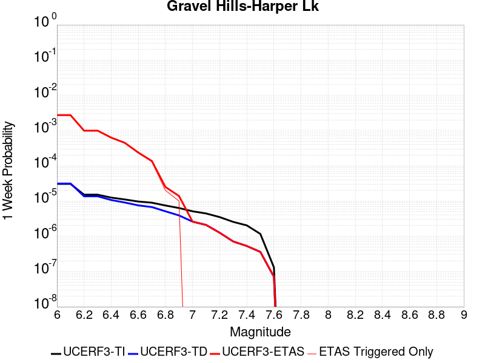 | 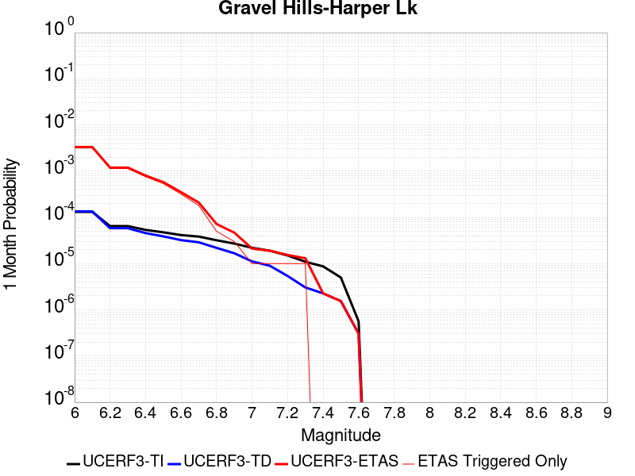 | 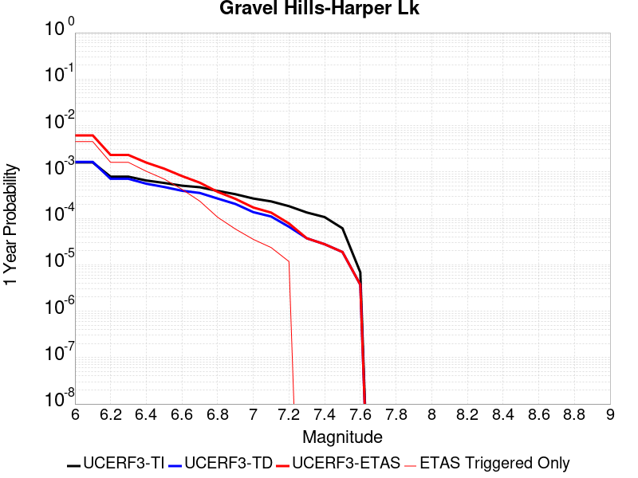 | 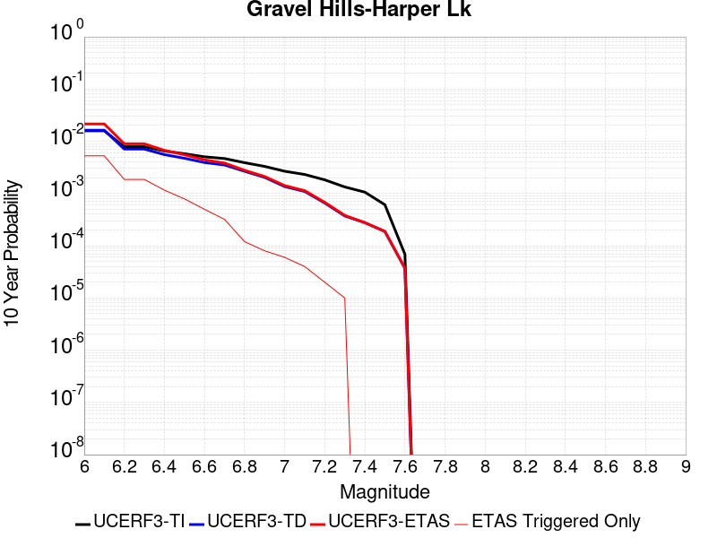 |

| Magnitude | 1 wk TI Prob | 1 wk TD Prob | 1 wk ETAS Prob | 1 wk ETAS/TD Gain | 1 wk ETAS Triggered Only | 1 mo TI Prob | 1 mo TD Prob | 1 mo ETAS Prob | 1 mo ETAS/TD Gain | 1 mo ETAS Triggered Only | 1 yr TI Prob | 1 yr TD Prob | 1 yr ETAS Prob | 1 yr ETAS/TD Gain | 1 yr ETAS Triggered Only | 10 yr TI Prob | 10 yr TD Prob | 10 yr ETAS Prob | 10 yr ETAS/TD Gain | 10 yr ETAS Triggered Only |
|-----|-----|-----|-----|-----|-----|-----|-----|-----|-----|-----|-----|-----|-----|-----|-----|-----|-----|-----|-----|-----|
| 6.0 | 3.0679566E-5 | 3.1464646E-5 | 0.0027895938 | 88.65804 | 0.0027582159 | 1.3147724E-4 | 1.3484273E-4 | 0.0034207846 | 25.368696 | 0.003286385 | 0.0015995599 | 0.0016406906 | 0.0061286204 | 3.7353907 | 0.004495305 | 0.015880952 | 0.01630734 | 0.021595264 | 1.3242666 | 0.005375587 |
| 6.1 | 3.0679566E-5 | 3.1464646E-5 | 0.0027895938 | 88.65804 | 0.0027582159 | 1.3147724E-4 | 1.3484273E-4 | 0.0034207846 | 25.368696 | 0.003286385 | 0.0015995599 | 0.0016406906 | 0.0061286204 | 3.7353907 | 0.004495305 | 0.015880952 | 0.01630734 | 0.021595264 | 1.3242666 | 0.005375587 |
| 6.2 | 1.514536E-5 | 1.3635206E-5 | 9.995373E-4 | 73.30562 | 9.859155E-4 | 6.490707E-5 | 5.843536E-5 | 0.0011968665 | 20.481888 | 0.0011384976 | 7.8995706E-4 | 7.1123015E-4 | 0.0023180677 | 3.2592373 | 0.0016079813 | 0.007871548 | 0.0070907404 | 0.008920398 | 1.2580347 | 0.001842723 |
| 6.3 | 1.514536E-5 | 1.3635206E-5 | 9.995373E-4 | 73.30562 | 9.859155E-4 | 6.490707E-5 | 5.843536E-5 | 0.0011968665 | 20.481888 | 0.0011384976 | 7.8995706E-4 | 7.1123015E-4 | 0.0023180677 | 3.2592373 | 0.0016079813 | 0.007871548 | 0.0070907404 | 0.008920398 | 1.2580347 | 0.001842723 |
| 6.4 | 1.2532521E-5 | 1.06896905E-5 | 6.4448576E-4 | 60.2904 | 6.338028E-4 | 5.37097E-5 | 4.581219E-5 | 8.0868806E-4 | 17.652246 | 7.629108E-4 | 6.537194E-4 | 5.576265E-4 | 0.0015899144 | 2.8512175 | 0.0010328639 | 0.0065179965 | 0.005562863 | 0.006741714 | 1.2119145 | 0.001185446 |
| 6.5 | 1.1094058E-5 | 9.083664E-6 | 4.66826E-4 | 51.39182 | 4.5774647E-4 | 4.7545094E-5 | 3.892943E-5 | 5.905511E-4 | 15.169787 | 5.516432E-4 | 5.787078E-4 | 4.7386673E-4 | 0.0011777584 | 2.485421 | 7.042253E-4 | 0.0057720304 | 0.0047289706 | 0.005535 | 1.170445 | 8.0985914E-4 |
| 6.6 | 9.688328E-6 | 7.5316952E-6 | 2.3053472E-4 | 30.608608 | 2.230047E-4 | 4.1520743E-5 | 3.227831E-5 | 3.3743278E-4 | 10.4538555 | 3.051643E-4 | 5.053978E-4 | 3.9292008E-4 | 8.1528927E-4 | 2.0749493 | 4.225352E-4 | 0.0050424994 | 0.0039225104 | 0.0044135344 | 1.1251811 | 4.9295777E-4 |
| 6.7 | 8.974824E-6 | 6.749413E-6 | 1.2411951E-4 | 18.389675 | 1.17370895E-4 | 3.8462964E-5 | 2.8925748E-5 | 1.8150349E-4 | 6.2748075 | 1.5258216E-4 | 4.6818596E-4 | 3.5211627E-4 | 5.867754E-4 | 1.6664251 | 2.3474179E-4 | 0.004672008 | 0.0035158044 | 0.0038082001 | 1.083166 | 2.9342723E-4 |
| 6.8 | 7.4780046E-6 | 5.1161933E-6 | 2.8590252E-5 | 5.588188 | 2.3474178E-5 | 3.20482E-5 | 2.1926366E-5 | 6.887369E-5 | 3.1411357 | 4.6948357E-5 | 3.9011694E-4 | 2.669222E-4 | 3.725278E-4 | 1.3956419 | 1.056338E-4 | 0.0038943281 | 0.0026661542 | 0.002783212 | 1.0439051 | 1.17370895E-4 |
| 6.9 | 6.3409307E-6 | 3.9074966E-6 | 1.564454E-5 | 4.0037246 | 1.1737089E-5 | 2.7175134E-5 | 1.6746313E-5 | 4.0220097E-5 | 2.4017286 | 2.3474178E-5 | 3.3080703E-4 | 2.0386827E-4 | 2.6254175E-4 | 1.2878009 | 5.8685448E-5 | 0.0033031502 | 0.0020369107 | 0.0021071897 | 1.0345027 | 7.042254E-5 |
| 7.0 | 5.1239335E-6 | 2.6058565E-6 | 2.6058565E-6 | 1.0 | 0.0 | 2.195953E-5 | 1.116791E-5 | 1.116791E-5 | 1.0 | 0.0 | 2.6732447E-4 | 1.3596108E-4 | 1.7116756E-4 | 1.2589453 | 3.521127E-5 | 0.0026700313 | 0.0013588042 | 0.0014056887 | 1.0345043 | 4.6948357E-5 |
| 7.1 | 4.438899E-6 | 2.0984728E-6 | 2.0984728E-6 | 1.0 | 0.0 | 1.9023713E-5 | 8.993425E-6 | 8.993425E-6 | 1.0 | 0.0 | 2.315891E-4 | 1.0948967E-4 | 1.3296127E-4 | 1.2143728 | 2.3474178E-5 | 0.002313479 | 0.0010943791 | 0.0011178276 | 1.0214263 | 2.3474178E-5 |
| 7.2 | 3.50367E-6 | 1.2615716E-6 | 1.2615716E-6 | 1.0 | 0.0 | 1.5015643E-5 | 5.4067245E-6 | 5.4067245E-6 | 1.0 | 0.0 | 1.8280011E-4 | 6.582497E-5 | 7.7561286E-5 | 1.1782959 | 1.1737089E-5 | 0.0018264982 | 6.580629E-4 | 6.697923E-4 | 1.017824 | 1.1737089E-5 |
| 7.3 | 2.561638E-6 | 7.1191585E-7 | 7.1191585E-7 | 1.0 | 0.0 | 1.0978401E-5 | 3.0510646E-6 | 3.0510646E-6 | 1.0 | 0.0 | 1.3365384E-4 | 3.71461E-5 | 3.71461E-5 | 1.0 | 0.0 | 0.0013357349 | 3.7140088E-4 | 3.7140088E-4 | 1.0 | 0.0 |
| 7.4 | 2.0368864E-6 | 5.304837E-7 | 5.304837E-7 | 1.0 | 0.0 | 8.729483E-6 | 2.2734996E-6 | 2.2734996E-6 | 1.0 | 0.0 | 1.06276275E-4 | 2.7679513E-5 | 2.7679513E-5 | 1.0 | 0.0 | 0.0010622547 | 2.767612E-4 | 2.767612E-4 | 1.0 | 0.0 |
| 7.5 | 1.1681728E-6 | 3.6030585E-7 | 3.6030585E-7 | 1.0 | 0.0 | 5.0064455E-6 | 1.544167E-6 | 1.544167E-6 | 1.0 | 0.0 | 6.0951766E-5 | 1.8800076E-5 | 1.8800076E-5 | 1.0 | 0.0 | 6.093505E-4 | 1.8798532E-4 | 1.8798532E-4 | 1.0 | 0.0 |
| 7.6 | 1.3154387E-7 | 7.1197384E-8 | 7.1197384E-8 | 1.0 | 0.0 | 5.6375933E-7 | 3.051316E-7 | 3.051316E-7 | 1.0 | 0.0 | 6.863748E-6 | 3.7149728E-6 | 3.7149728E-6 | 1.0 | 0.0 | 6.863536E-5 | 3.7149264E-5 | 3.7149264E-5 | 1.0 | 0.0 |

## San Andreas (Mojave N)
*[(top)](#table-of-contents)*

| 1 Week | 1 Month | 1 Year | 10 Year |
|-----|-----|-----|-----|
| 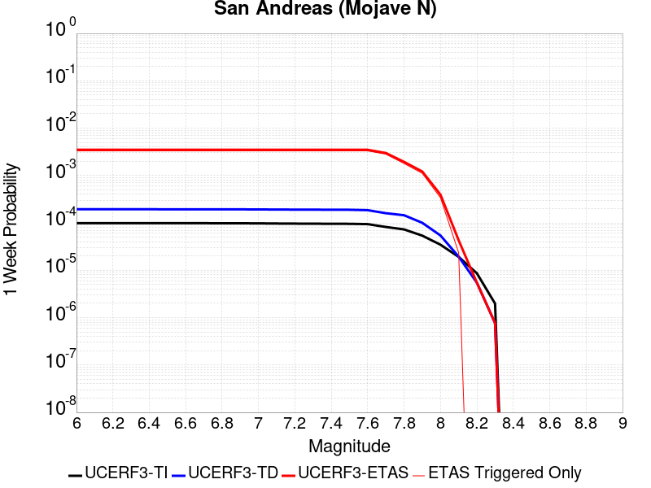 | 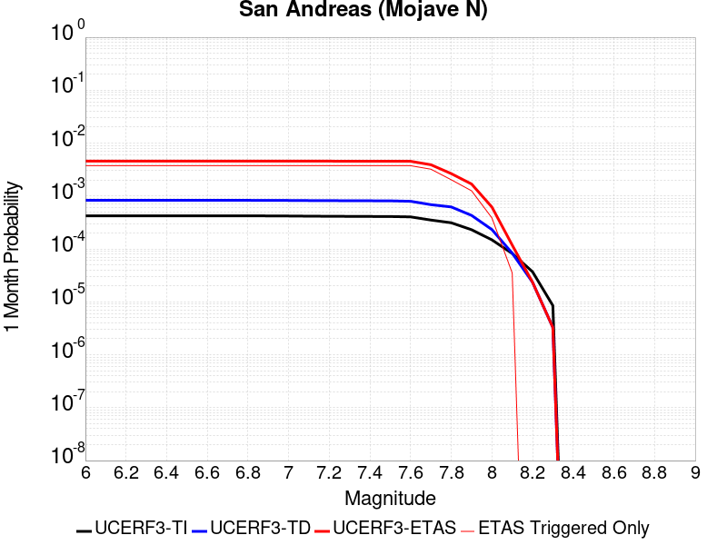 | 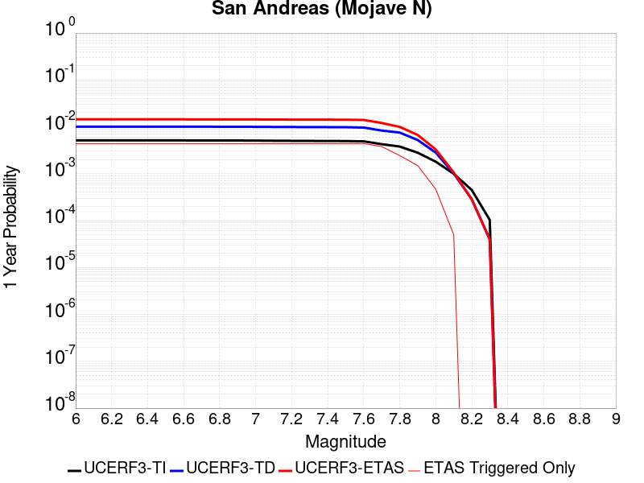 |  |

| Magnitude | 1 wk TI Prob | 1 wk TD Prob | 1 wk ETAS Prob | 1 wk ETAS/TD Gain | 1 wk ETAS Triggered Only | 1 mo TI Prob | 1 mo TD Prob | 1 mo ETAS Prob | 1 mo ETAS/TD Gain | 1 mo ETAS Triggered Only | 1 yr TI Prob | 1 yr TD Prob | 1 yr ETAS Prob | 1 yr ETAS/TD Gain | 1 yr ETAS Triggered Only | 10 yr TI Prob | 10 yr TD Prob | 10 yr ETAS Prob | 10 yr ETAS/TD Gain | 10 yr ETAS Triggered Only |
|-----|-----|-----|-----|-----|-----|-----|-----|-----|-----|-----|-----|-----|-----|-----|-----|-----|-----|-----|-----|-----|
| 6.0 | 9.877682E-5 | 1.9400702E-4 | 0.003503224 | 18.057203 | 0.0033098592 | 4.2326056E-4 | 8.311939E-4 | 0.004572213 | 5.500778 | 0.0037441314 | 0.0051410277 | 0.010072956 | 0.0144416485 | 1.4337051 | 0.0044131456 | 0.05023708 | 0.09831428 | 0.10268512 | 1.0444579 | 0.004847418 |
| 6.1 | 9.877682E-5 | 1.9400702E-4 | 0.003503224 | 18.057203 | 0.0033098592 | 4.2326056E-4 | 8.311939E-4 | 0.004572213 | 5.500778 | 0.0037441314 | 0.0051410277 | 0.010072956 | 0.0144416485 | 1.4337051 | 0.0044131456 | 0.05023708 | 0.09831428 | 0.10268512 | 1.0444579 | 0.004847418 |
| 6.2 | 9.877682E-5 | 1.9400702E-4 | 0.003503224 | 18.057203 | 0.0033098592 | 4.2326056E-4 | 8.311939E-4 | 0.004572213 | 5.500778 | 0.0037441314 | 0.0051410277 | 0.010072956 | 0.0144416485 | 1.4337051 | 0.0044131456 | 0.05023708 | 0.09831428 | 0.10268512 | 1.0444579 | 0.004847418 |
| 6.3 | 9.877682E-5 | 1.9400702E-4 | 0.003503224 | 18.057203 | 0.0033098592 | 4.2326056E-4 | 8.311939E-4 | 0.004572213 | 5.500778 | 0.0037441314 | 0.0051410277 | 0.010072956 | 0.0144416485 | 1.4337051 | 0.0044131456 | 0.05023708 | 0.09831428 | 0.10268512 | 1.0444579 | 0.004847418 |
| 6.4 | 9.877682E-5 | 1.9400702E-4 | 0.003503224 | 18.057203 | 0.0033098592 | 4.2326056E-4 | 8.311939E-4 | 0.004572213 | 5.500778 | 0.0037441314 | 0.0051410277 | 0.010072956 | 0.0144416485 | 1.4337051 | 0.0044131456 | 0.05023708 | 0.09831428 | 0.10268512 | 1.0444579 | 0.004847418 |
| 6.5 | 9.861474E-5 | 1.9374468E-4 | 0.0035029626 | 18.080303 | 0.0033098592 | 4.2256617E-4 | 8.300703E-4 | 0.0045710937 | 5.5068755 | 0.0037441314 | 0.0051326132 | 0.010059402 | 0.014428155 | 1.4342954 | 0.0044131456 | 0.050156746 | 0.098192066 | 0.10256351 | 1.0445193 | 0.004847418 |
| 6.6 | 9.861474E-5 | 1.9374468E-4 | 0.0035029626 | 18.080303 | 0.0033098592 | 4.2256617E-4 | 8.300703E-4 | 0.0045710937 | 5.5068755 | 0.0037441314 | 0.0051326132 | 0.010059402 | 0.014428155 | 1.4342954 | 0.0044131456 | 0.050156746 | 0.098192066 | 0.10256351 | 1.0445193 | 0.004847418 |
| 6.7 | 9.8552715E-5 | 1.9364421E-4 | 0.0035028625 | 18.089167 | 0.0033098592 | 4.223004E-4 | 8.2964E-4 | 0.0045706653 | 5.509215 | 0.0037441314 | 0.0051293927 | 0.010054212 | 0.014422987 | 1.4345218 | 0.0044131456 | 0.050125998 | 0.098145254 | 0.10251692 | 1.0445428 | 0.004847418 |
| 6.8 | 9.8464974E-5 | 1.9349584E-4 | 0.0035027144 | 18.102272 | 0.0033098592 | 4.219245E-4 | 8.290045E-4 | 0.004570032 | 5.5126743 | 0.0037441314 | 0.0051248376 | 0.010046546 | 0.014415355 | 1.4348568 | 0.0044131456 | 0.05008251 | 0.09807528 | 0.102447286 | 1.0445781 | 0.004847418 |
| 6.9 | 9.825824E-5 | 1.9317595E-4 | 0.0035023957 | 18.1306 | 0.0033098592 | 4.2103877E-4 | 8.276344E-4 | 0.004568667 | 5.520151 | 0.0037441314 | 0.0051141046 | 0.010030019 | 0.014398901 | 1.4355806 | 0.0044131456 | 0.049980022 | 0.09792438 | 0.10229712 | 1.0446543 | 0.004847418 |
| 7.0 | 9.781462E-5 | 1.924896E-4 | 0.0035017116 | 18.191692 | 0.0033098592 | 4.1913814E-4 | 8.246948E-4 | 0.0045657386 | 5.5362763 | 0.0037441314 | 0.005091073 | 0.009994558 | 0.014363596 | 1.4371417 | 0.0044131456 | 0.04976007 | 0.09760077 | 0.101975076 | 1.0448184 | 0.004847418 |
| 7.1 | 9.7121134E-5 | 1.9150671E-4 | 0.0035007321 | 18.279943 | 0.0033098592 | 4.1616702E-4 | 8.204851E-4 | 0.0045615444 | 5.5595703 | 0.0037441314 | 0.005055068 | 0.009943774 | 0.014313037 | 1.4393967 | 0.0044131456 | 0.04941613 | 0.09713728 | 0.10151383 | 1.0450554 | 0.004847418 |
| 7.2 | 9.663819E-5 | 1.9081456E-4 | 0.0035000423 | 18.342636 | 0.0033098592 | 4.1409794E-4 | 8.175206E-4 | 0.004558591 | 5.5761175 | 0.0037441314 | 0.0050299936 | 0.00990801 | 0.01427743 | 1.4409987 | 0.0044131456 | 0.049176537 | 0.09681055 | 0.10118868 | 1.0452237 | 0.004847418 |
| 7.3 | 9.6277574E-5 | 1.9033969E-4 | 0.003499569 | 18.385912 | 0.0033098592 | 4.125529E-4 | 8.154867E-4 | 0.004556565 | 5.58754 | 0.0037441314 | 0.0050112694 | 0.009883473 | 0.014253001 | 1.4421046 | 0.0044131456 | 0.04899759 | 0.09658401 | 0.10096324 | 1.0453413 | 0.004847418 |
| 7.4 | 9.593308E-5 | 1.897375E-4 | 0.0034989687 | 18.441101 | 0.0033098592 | 4.1107697E-4 | 8.129075E-4 | 0.004553995 | 5.6021075 | 0.0037441314 | 0.0049933824 | 0.009852355 | 0.014222021 | 1.4435148 | 0.0044131456 | 0.04882661 | 0.09630218 | 0.10068279 | 1.0454881 | 0.004847418 |
| 7.5 | 9.561707E-5 | 1.8919831E-4 | 0.0034984313 | 18.490816 | 0.0033098592 | 4.0972308E-4 | 8.1059814E-4 | 0.0045516947 | 5.6152296 | 0.0037441314 | 0.0049769743 | 0.009824493 | 0.014194282 | 1.4447851 | 0.0044131456 | 0.048669744 | 0.09604836 | 0.10043019 | 1.045621 | 0.004847418 |
| 7.6 | 9.418194E-5 | 1.8572104E-4 | 0.0034949654 | 18.81836 | 0.0033098592 | 4.0357444E-4 | 7.957047E-4 | 0.004536857 | 5.701684 | 0.0037441314 | 0.004902454 | 0.009644784 | 0.014015366 | 1.4531549 | 0.0044131456 | 0.047957025 | 0.094430685 | 0.09882036 | 1.0464857 | 0.004847418 |
| 7.7 | 8.202141E-5 | 1.6021315E-4 | 0.0029883985 | 18.652641 | 0.0028286385 | 3.51473E-4 | 6.8644714E-4 | 0.003900202 | 5.681722 | 0.0032159626 | 0.00427079 | 0.008325525 | 0.01210832 | 1.4543612 | 0.003814554 | 0.04189639 | 0.08223219 | 0.086067 | 1.0466338 | 0.004178404 |
| 7.8 | 7.2859846E-5 | 1.4516473E-4 | 0.0019406787 | 13.368804 | 0.0017957747 | 3.1221908E-4 | 6.219862E-4 | 0.0026512397 | 4.262538 | 0.0020305165 | 0.003794643 | 0.0075464295 | 0.009946024 | 1.3179774 | 0.0024178403 | 0.037304975 | 0.07472468 | 0.07722249 | 1.0334269 | 0.0026995305 |
| 7.9 | 5.3874453E-5 | 1.0045676E-4 | 0.0012153683 | 12.098421 | 0.0011150235 | 2.3087008E-4 | 4.3045796E-4 | 0.001685786 | 3.9162614 | 0.0012558686 | 0.0028072202 | 0.0052282433 | 0.0066877087 | 1.2791502 | 0.0014671362 | 0.02772022 | 0.05242443 | 0.05398148 | 1.0297009 | 0.0016431925 |
| 8.0 | 3.468538E-5 | 5.4260272E-5 | 3.9461738E-4 | 7.2726765 | 3.4037558E-4 | 1.4864317E-4 | 2.325233E-4 | 6.1975716E-4 | 2.6653552 | 3.8732393E-4 | 0.0018082283 | 0.002827298 | 0.0032720463 | 1.1573051 | 4.460094E-4 | 0.017935853 | 0.028947512 | 0.029448994 | 1.0173239 | 5.1643193E-4 |
| 8.1 | 1.9152367E-5 | 1.940263E-5 | 4.2876352E-5 | 2.2098217 | 2.3474178E-5 | 8.207899E-5 | 8.3151484E-5 | 1.1835982E-4 | 1.4234241 | 3.521127E-5 | 9.988535E-4 | 0.0010118998 | 0.0010470754 | 1.034762 | 3.521127E-5 | 0.009943757 | 0.01085625 | 0.010891079 | 1.0032082 | 3.521127E-5 |
| 8.2 | 8.643924E-6 | 5.4748625E-6 | 5.4748625E-6 | 1.0 | 0.0 | 3.704486E-5 | 2.3463486E-5 | 2.3463486E-5 | 1.0 | 0.0 | 4.5092785E-4 | 2.8563058E-4 | 2.8563058E-4 | 1.0 | 0.0 | 0.0045001395 | 0.0032487072 | 0.0032487072 | 1.0 | 0.0 |
| 8.3 | 1.983087E-6 | 7.6599065E-7 | 7.6599065E-7 | 1.0 | 0.0 | 8.498917E-6 | 3.282813E-6 | 3.282813E-6 | 1.0 | 0.0 | 1.034694E-4 | 3.9967534E-5 | 3.9967534E-5 | 1.0 | 0.0 | 0.0010342124 | 4.719687E-4 | 4.719687E-4 | 1.0 | 0.0 |

## San Andreas (Mojave S)
*[(top)](#table-of-contents)*

| 1 Week | 1 Month | 1 Year | 10 Year |
|-----|-----|-----|-----|
| 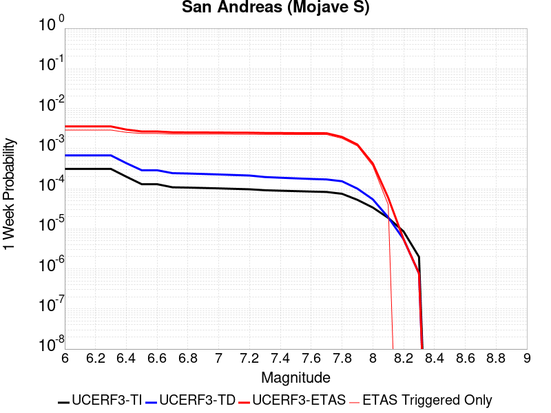 | 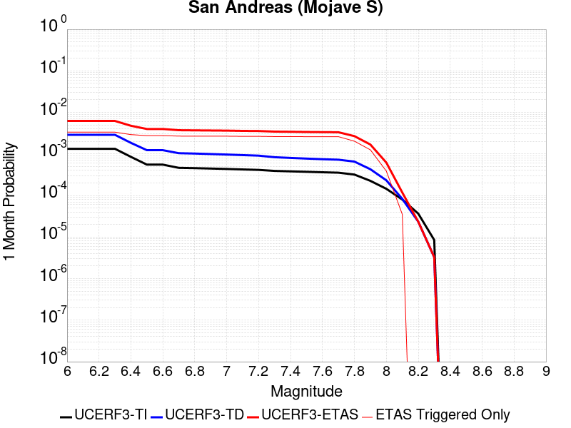 | 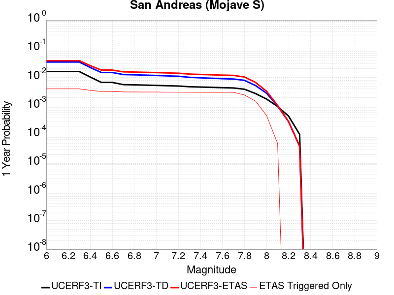 | 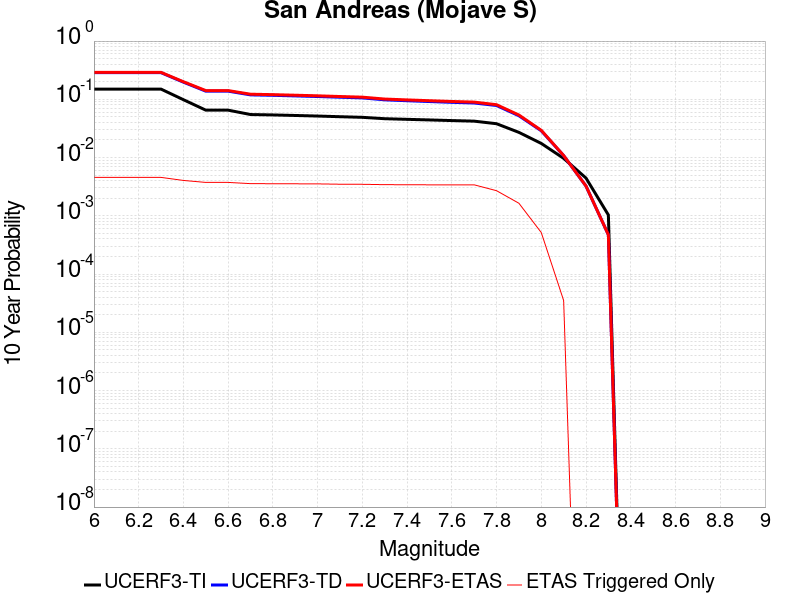 |

| Magnitude | 1 wk TI Prob | 1 wk TD Prob | 1 wk ETAS Prob | 1 wk ETAS/TD Gain | 1 wk ETAS Triggered Only | 1 mo TI Prob | 1 mo TD Prob | 1 mo ETAS Prob | 1 mo ETAS/TD Gain | 1 mo ETAS Triggered Only | 1 yr TI Prob | 1 yr TD Prob | 1 yr ETAS Prob | 1 yr ETAS/TD Gain | 1 yr ETAS Triggered Only | 10 yr TI Prob | 10 yr TD Prob | 10 yr ETAS Prob | 10 yr ETAS/TD Gain | 10 yr ETAS Triggered Only |
|-----|-----|-----|-----|-----|-----|-----|-----|-----|-----|-----|-----|-----|-----|-----|-----|-----|-----|-----|-----|-----|
| 6.0 | 3.1064058E-4 | 6.7460834E-4 | 0.003595172 | 5.329273 | 0.0029225352 | 0.0013306376 | 0.0028881032 | 0.006223513 | 2.1548789 | 0.0033450704 | 0.016080605 | 0.03462235 | 0.038508788 | 1.1122524 | 0.0040258216 | 0.1496549 | 0.28660452 | 0.2898617 | 1.0113647 | 0.004565728 |
| 6.1 | 3.1064058E-4 | 6.7460834E-4 | 0.003595172 | 5.329273 | 0.0029225352 | 0.0013306376 | 0.0028881032 | 0.006223513 | 2.1548789 | 0.0033450704 | 0.016080605 | 0.03462235 | 0.038508788 | 1.1122524 | 0.0040258216 | 0.1496549 | 0.28660452 | 0.2898617 | 1.0113647 | 0.004565728 |
| 6.2 | 3.1064058E-4 | 6.7460834E-4 | 0.003595172 | 5.329273 | 0.0029225352 | 0.0013306376 | 0.0028881032 | 0.006223513 | 2.1548789 | 0.0033450704 | 0.016080605 | 0.03462235 | 0.038508788 | 1.1122524 | 0.0040258216 | 0.1496549 | 0.28660452 | 0.2898617 | 1.0113647 | 0.004565728 |
| 6.3 | 3.1064058E-4 | 6.7460834E-4 | 0.003595172 | 5.329273 | 0.0029225352 | 0.0013306376 | 0.0028881032 | 0.006223513 | 2.1548789 | 0.0033450704 | 0.016080605 | 0.03462235 | 0.038508788 | 1.1122524 | 0.0040258216 | 0.1496549 | 0.28660452 | 0.2898617 | 1.0113647 | 0.004565728 |
| 6.4 | 1.9872203E-4 | 4.3179357E-4 | 0.0030011062 | 6.9503264 | 0.0025704226 | 8.5138786E-4 | 0.0018492596 | 0.00476639 | 2.5774586 | 0.0029225352 | 0.010316478 | 0.02228844 | 0.025776988 | 1.1565183 | 0.0035680751 | 0.098504856 | 0.19699748 | 0.20024908 | 1.0165057 | 0.0040492956 |
| 6.5 | 1.291105E-4 | 2.875267E-4 | 0.0027164056 | 9.44749 | 0.0024295775 | 5.5321335E-4 | 0.0012316781 | 0.003986497 | 3.2366385 | 0.0027582159 | 0.006714592 | 0.0148934 | 0.018142402 | 1.2181505 | 0.003298122 | 0.065152965 | 0.13803436 | 0.14126167 | 1.0233805 | 0.0037441314 |
| 6.6 | 1.291105E-4 | 2.875267E-4 | 0.0027164056 | 9.44749 | 0.0024295775 | 5.5321335E-4 | 0.0012316781 | 0.003986497 | 3.2366385 | 0.0027582159 | 0.006714592 | 0.0148934 | 0.018142402 | 1.2181505 | 0.003298122 | 0.065152965 | 0.13803436 | 0.14126167 | 1.0233805 | 0.0037441314 |
| 6.7 | 1.08001186E-4 | 2.4333889E-4 | 0.0026019197 | 10.692577 | 0.0023591549 | 4.6278012E-4 | 0.0010424647 | 0.003727456 | 3.5756187 | 0.0026877935 | 0.0056198016 | 0.012618446 | 0.01575906 | 1.2488908 | 0.003180751 | 0.054797906 | 0.119176775 | 0.12231962 | 1.0263712 | 0.0035680751 |
| 6.8 | 1.0624356E-4 | 2.3851555E-4 | 0.0025853736 | 10.839434 | 0.0023474179 | 4.5525006E-4 | 0.0010218095 | 0.0036951315 | 3.6162624 | 0.0026760562 | 0.0055285925 | 0.012369843 | 0.015499657 | 1.2530197 | 0.0031690141 | 0.053930566 | 0.11712591 | 0.120265715 | 1.0268071 | 0.0035563381 |
| 6.9 | 1.0393785E-4 | 2.3221898E-4 | 0.0025790918 | 11.106291 | 0.0023474179 | 4.4537184E-4 | 9.948451E-4 | 0.003668239 | 3.6872466 | 0.0026760562 | 0.0054089287 | 0.012045221 | 0.015164468 | 1.2589613 | 0.003157277 | 0.05279156 | 0.11442335 | 0.11756237 | 1.0274334 | 0.003544601 |
| 7.0 | 1.0155622E-4 | 2.2591476E-4 | 0.0025728024 | 11.388376 | 0.0023474179 | 4.3516833E-4 | 9.6784724E-4 | 0.0036413136 | 3.7622814 | 0.0026760562 | 0.005285311 | 0.0117200995 | 0.014840373 | 1.2662326 | 0.003157277 | 0.05161361 | 0.111683756 | 0.11482205 | 1.0280999 | 0.003532864 |
| 7.1 | 9.885595E-5 | 2.1879886E-4 | 0.002542234 | 11.619046 | 0.0023239437 | 4.2359953E-4 | 9.3737274E-4 | 0.0035874685 | 3.8271525 | 0.0026525822 | 0.0051451353 | 0.011352993 | 0.014439614 | 1.2718773 | 0.0031220657 | 0.05027629 | 0.1085682 | 0.11167566 | 1.0286222 | 0.0034859155 |
| 7.2 | 9.6411415E-5 | 2.124288E-4 | 0.0025358787 | 11.937547 | 0.0023239437 | 4.1312634E-4 | 9.1009185E-4 | 0.00356026 | 3.9119787 | 0.0026525822 | 0.005018219 | 0.011024255 | 0.014111903 | 1.2800776 | 0.0031220657 | 0.049064007 | 0.105758004 | 0.10886476 | 1.029376 | 0.0034741785 |
| 7.3 | 9.1180635E-5 | 1.9471257E-4 | 0.0024947342 | 12.812393 | 0.0023004694 | 3.907156E-4 | 8.342157E-4 | 0.0034494032 | 4.134906 | 0.0026173708 | 0.004746591 | 0.01010939 | 0.01315342 | 1.3011092 | 0.0030751175 | 0.046464786 | 0.09795115 | 0.10104268 | 1.031562 | 0.00342723 |
| 7.4 | 8.887388E-5 | 1.8719878E-4 | 0.0024872376 | 13.2866125 | 0.0023004694 | 3.8083247E-4 | 8.020339E-4 | 0.0034173056 | 4.2607994 | 0.0026173708 | 0.0046267817 | 0.00972114 | 0.012766364 | 1.3132579 | 0.0030751175 | 0.045316286 | 0.09458615 | 0.09767858 | 1.0326943 | 0.003415493 |
| 7.5 | 8.6750515E-5 | 1.8051457E-4 | 0.0024688337 | 13.676645 | 0.0022887324 | 3.7173493E-4 | 7.7340455E-4 | 0.0033770232 | 4.366438 | 0.0026056338 | 0.004516484 | 0.009375632 | 0.0124102915 | 1.3236752 | 0.0030633803 | 0.04425787 | 0.091549896 | 0.094642036 | 1.0337754 | 0.0034037558 |
| 7.6 | 8.453092E-5 | 1.7439072E-4 | 0.002462724 | 14.121875 | 0.0022887324 | 3.6222505E-4 | 7.471748E-4 | 0.0033508618 | 4.4847093 | 0.0026056338 | 0.0044011753 | 0.009058985 | 0.012094614 | 1.335096 | 0.0030633803 | 0.04315024 | 0.08870898 | 0.09181079 | 1.0349661 | 0.0034037558 |
| 7.7 | 8.259102E-5 | 1.6961215E-4 | 0.0024579563 | 14.491629 | 0.0022887324 | 3.539135E-4 | 7.2670676E-4 | 0.003330447 | 4.582931 | 0.0026056338 | 0.004300386 | 0.008811831 | 0.011848217 | 1.3445807 | 0.0030633803 | 0.042181134 | 0.08645982 | 0.08956929 | 1.0359643 | 0.0034037558 |
| 7.8 | 7.444844E-5 | 1.5283503E-4 | 0.0019483352 | 12.747963 | 0.0017957747 | 3.1902574E-4 | 6.548429E-4 | 0.0026840298 | 4.098738 | 0.0020305165 | 0.0038772223 | 0.007943616 | 0.01034225 | 1.3019575 | 0.0024178403 | 0.03810269 | 0.078290746 | 0.08077893 | 1.0317813 | 0.0026995305 |
| 7.9 | 5.2586525E-5 | 1.00064186E-4 | 0.0012149761 | 12.141968 | 0.0011150235 | 2.2535135E-4 | 4.2877605E-4 | 0.0016841061 | 3.9277058 | 0.0012558686 | 0.0027402006 | 0.005207864 | 0.0066673593 | 1.2802484 | 0.0014671362 | 0.027066574 | 0.052200034 | 0.05375745 | 1.0298356 | 0.0016431925 |
| 8.0 | 3.379877E-5 | 5.4074168E-5 | 3.9443135E-4 | 7.2942657 | 3.4037558E-4 | 1.4484383E-4 | 2.3172585E-4 | 6.1896007E-4 | 2.6710875 | 3.8732393E-4 | 0.0017620471 | 0.002817614 | 0.0032623666 | 1.1578473 | 4.460094E-4 | 0.017481409 | 0.028834904 | 0.029336443 | 1.0173935 | 5.1643193E-4 |
| 8.1 | 1.8668277E-5 | 1.9309397E-5 | 4.2783122E-5 | 2.2156632 | 2.3474178E-5 | 8.000444E-5 | 8.275194E-5 | 1.1796029E-4 | 1.4254687 | 3.521127E-5 | 9.736188E-4 | 0.0010070398 | 0.0010422156 | 1.0349299 | 3.521127E-5 | 0.009693642 | 0.010798888 | 0.010833719 | 1.0032254 | 3.521127E-5 |
| 8.2 | 8.541571E-6 | 5.460819E-6 | 5.460819E-6 | 1.0 | 0.0 | 3.660622E-5 | 2.3403301E-5 | 2.3403301E-5 | 1.0 | 0.0 | 4.455896E-4 | 2.84898E-4 | 2.84898E-4 | 1.0 | 0.0 | 0.0044469717 | 0.0032408056 | 0.0032408056 | 1.0 | 0.0 |
| 8.3 | 1.983087E-6 | 7.6599065E-7 | 7.6599065E-7 | 1.0 | 0.0 | 8.498917E-6 | 3.282813E-6 | 3.282813E-6 | 1.0 | 0.0 | 1.034694E-4 | 3.9967534E-5 | 3.9967534E-5 | 1.0 | 0.0 | 0.0010342124 | 4.719687E-4 | 4.719687E-4 | 1.0 | 0.0 |

## McLean Lake
*[(top)](#table-of-contents)*

| 1 Week | 1 Month | 1 Year | 10 Year |
|-----|-----|-----|-----|
| 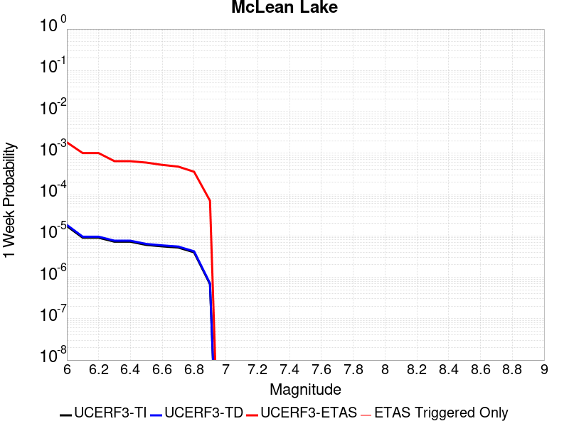 | 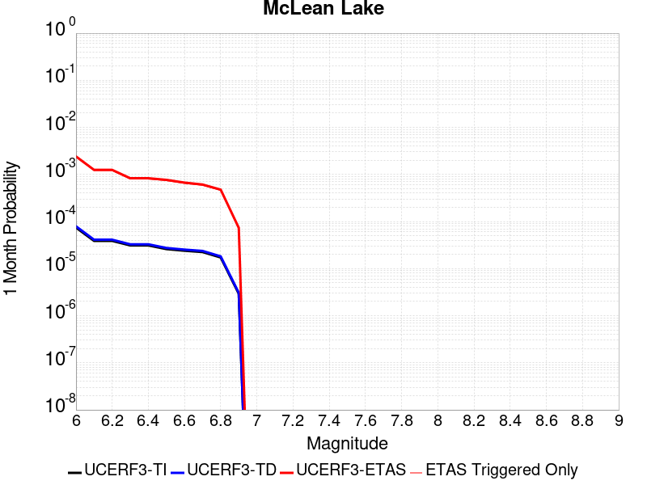 | 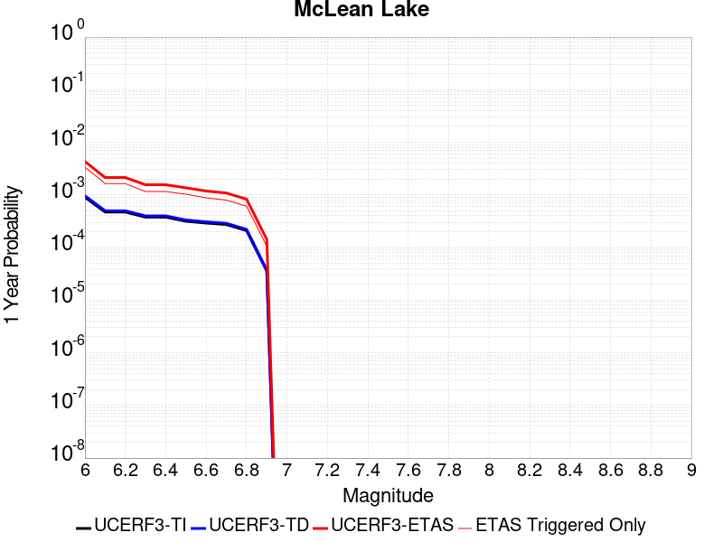 | 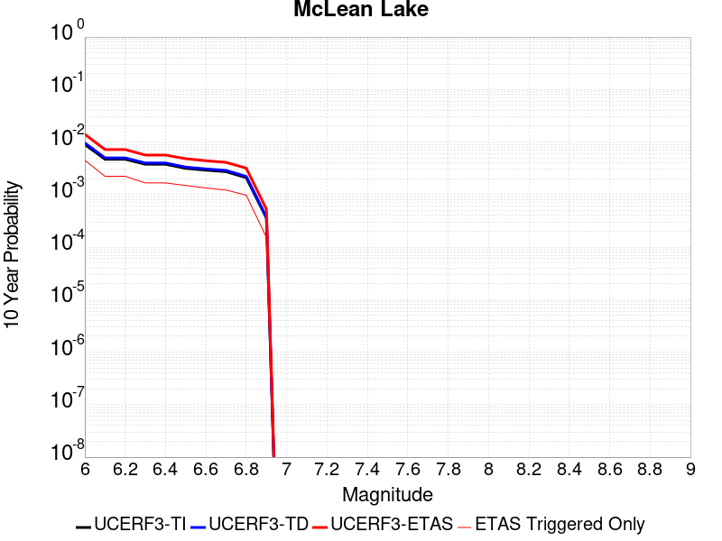 |

| Magnitude | 1 wk TI Prob | 1 wk TD Prob | 1 wk ETAS Prob | 1 wk ETAS/TD Gain | 1 wk ETAS Triggered Only | 1 mo TI Prob | 1 mo TD Prob | 1 mo ETAS Prob | 1 mo ETAS/TD Gain | 1 mo ETAS Triggered Only | 1 yr TI Prob | 1 yr TD Prob | 1 yr ETAS Prob | 1 yr ETAS/TD Gain | 1 yr ETAS Triggered Only | 10 yr TI Prob | 10 yr TD Prob | 10 yr ETAS Prob | 10 yr ETAS/TD Gain | 10 yr ETAS Triggered Only |
|-----|-----|-----|-----|-----|-----|-----|-----|-----|-----|-----|-----|-----|-----|-----|-----|-----|-----|-----|-----|-----|
| 6.0 | 1.7360222E-5 | 1.8501627E-5 | 0.0018377168 | 99.32731 | 0.0018192488 | 7.439883E-5 | 7.9290556E-5 | 0.002414786 | 30.454903 | 0.0023356806 | 9.0542925E-4 | 9.6498354E-4 | 0.0043302774 | 4.4874105 | 0.0033685446 | 0.009017491 | 0.0096127745 | 0.014088116 | 1.4655619 | 0.0045187795 |
| 6.1 | 9.062689E-6 | 9.592193E-6 | 0.0010072353 | 105.00572 | 9.976525E-4 | 3.8839516E-5 | 4.1108804E-5 | 0.0012499793 | 30.406609 | 0.0012089201 | 4.727685E-4 | 5.003936E-4 | 0.002142764 | 4.2821565 | 0.0016431925 | 0.0047176396 | 0.004993552 | 0.007212463 | 1.4443552 | 0.002230047 |
| 6.2 | 9.062689E-6 | 9.592193E-6 | 0.0010072353 | 105.00572 | 9.976525E-4 | 3.8839516E-5 | 4.1108804E-5 | 0.0012499793 | 30.406609 | 0.0012089201 | 4.727685E-4 | 5.003936E-4 | 0.002142764 | 4.2821565 | 0.0016431925 | 0.0047176396 | 0.004993552 | 0.007212463 | 1.4443552 | 0.002230047 |
| 6.3 | 7.2575485E-6 | 7.66771E-6 | 6.4146565E-4 | 83.65806 | 6.338028E-4 | 3.110341E-5 | 3.2861237E-5 | 8.309571E-4 | 25.286846 | 7.981221E-4 | 3.786182E-4 | 4.0001926E-4 | 0.0015615263 | 3.9036279 | 0.0011619718 | 0.0037797375 | 0.0039936965 | 0.0056537073 | 1.4156576 | 0.0016666667 |
| 6.4 | 7.2575485E-6 | 7.66771E-6 | 6.4146565E-4 | 83.65806 | 6.338028E-4 | 3.110341E-5 | 3.2861237E-5 | 8.309571E-4 | 25.286846 | 7.981221E-4 | 3.786182E-4 | 4.0001926E-4 | 0.0015615263 | 3.9036279 | 0.0011619718 | 0.0037797375 | 0.0039936965 | 0.0056537073 | 1.4156576 | 0.0016666667 |
| 6.5 | 6.06582E-6 | 6.4038773E-6 | 5.932546E-4 | 92.63991 | 5.8685447E-4 | 2.5996113E-5 | 2.7444936E-5 | 7.6686125E-4 | 27.941813 | 7.394366E-4 | 3.164567E-4 | 3.3409733E-4 | 0.0013666161 | 4.0904727 | 0.0010328639 | 0.0031600643 | 0.0033365893 | 0.004822226 | 1.4452561 | 0.0014906103 |
| 6.6 | 5.598744E-6 | 5.910262E-6 | 5.2233913E-4 | 88.378334 | 5.1643193E-4 | 2.3994397E-5 | 2.5329486E-5 | 6.70853E-4 | 26.485064 | 6.455399E-4 | 2.9209262E-4 | 3.0834923E-4 | 0.0011883595 | 3.85394 | 8.802817E-4 | 0.0029170897 | 0.003079843 | 0.0044137505 | 1.4331088 | 0.0013380281 |
| 6.7 | 5.246996E-6 | 5.539162E-6 | 4.7502012E-4 | 85.756676 | 4.6948358E-4 | 2.2486933E-5 | 2.3739085E-5 | 6.105796E-4 | 25.720436 | 5.8685447E-4 | 2.73744E-4 | 2.8899137E-4 | 0.0010868828 | 3.7609522 | 7.981221E-4 | 0.0027340704 | 0.0028867796 | 0.004103913 | 1.4216232 | 0.0012206573 |
| 6.8 | 4.02324E-6 | 4.2469046E-6 | 3.563581E-4 | 83.91008 | 3.5211266E-4 | 1.7242342E-5 | 1.8200926E-5 | 4.7593907E-4 | 26.149168 | 4.5774647E-4 | 2.099053E-4 | 2.2157968E-4 | 8.317731E-4 | 3.7538328 | 6.103286E-4 | 0.0020970714 | 0.002214172 | 0.0031861933 | 1.439 | 9.7417843E-4 |
| 6.9 | 6.835972E-7 | 7.1399285E-7 | 7.113648E-5 | 99.63192 | 7.042254E-5 | 2.9296991E-6 | 3.0599674E-6 | 7.348229E-5 | 24.014074 | 7.042254E-5 | 3.56685E-5 | 3.7254784E-5 | 1.4288466E-4 | 3.835337 | 1.056338E-4 | 3.5662777E-4 | 3.7251666E-4 | 5.25042E-4 | 1.4094456 | 1.5258216E-4 |

## So Sierra Nevada
*[(top)](#table-of-contents)*

| 1 Week | 1 Month | 1 Year | 10 Year |
|-----|-----|-----|-----|
| 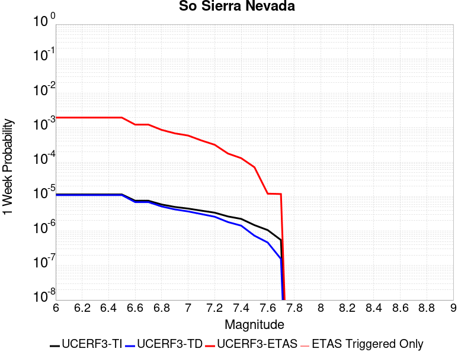 | 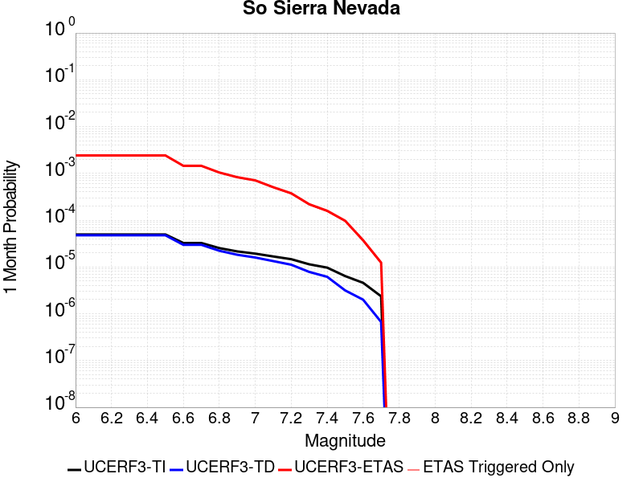 | 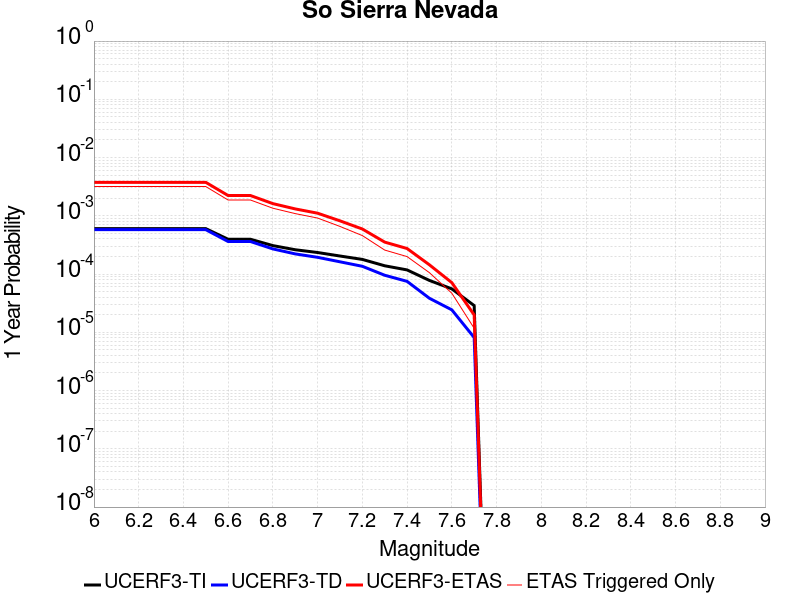 | 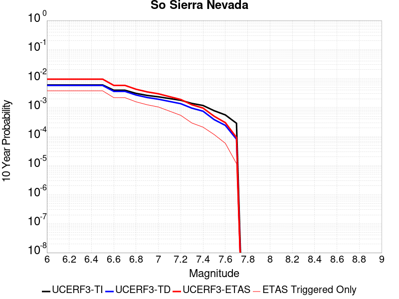 |

| Magnitude | 1 wk TI Prob | 1 wk TD Prob | 1 wk ETAS Prob | 1 wk ETAS/TD Gain | 1 wk ETAS Triggered Only | 1 mo TI Prob | 1 mo TD Prob | 1 mo ETAS Prob | 1 mo ETAS/TD Gain | 1 mo ETAS Triggered Only | 1 yr TI Prob | 1 yr TD Prob | 1 yr ETAS Prob | 1 yr ETAS/TD Gain | 1 yr ETAS Triggered Only | 10 yr TI Prob | 10 yr TD Prob | 10 yr ETAS Prob | 10 yr ETAS/TD Gain | 10 yr ETAS Triggered Only |
|-----|-----|-----|-----|-----|-----|-----|-----|-----|-----|-----|-----|-----|-----|-----|-----|-----|-----|-----|-----|-----|
| 6.0 | 1.15488665E-5 | 1.1079643E-5 | 0.001959415 | 176.8482 | 0.0019483569 | 4.9494203E-5 | 4.748339E-5 | 0.002418263 | 50.928608 | 0.002370892 | 6.024253E-4 | 5.7796965E-4 | 0.0037568824 | 6.500138 | 0.003180751 | 0.006007948 | 0.005765934 | 0.009511816 | 1.6496574 | 0.0037676056 |
| 6.1 | 1.15488665E-5 | 1.1079643E-5 | 0.001959415 | 176.8482 | 0.0019483569 | 4.9494203E-5 | 4.748339E-5 | 0.002418263 | 50.928608 | 0.002370892 | 6.024253E-4 | 5.7796965E-4 | 0.0037568824 | 6.500138 | 0.003180751 | 0.006007948 | 0.005765934 | 0.009511816 | 1.6496574 | 0.0037676056 |
| 6.2 | 1.15488665E-5 | 1.1079643E-5 | 0.001959415 | 176.8482 | 0.0019483569 | 4.9494203E-5 | 4.748339E-5 | 0.002418263 | 50.928608 | 0.002370892 | 6.024253E-4 | 5.7796965E-4 | 0.0037568824 | 6.500138 | 0.003180751 | 0.006007948 | 0.005765934 | 0.009511816 | 1.6496574 | 0.0037676056 |
| 6.3 | 1.15488665E-5 | 1.1079643E-5 | 0.001959415 | 176.8482 | 0.0019483569 | 4.9494203E-5 | 4.748339E-5 | 0.002418263 | 50.928608 | 0.002370892 | 6.024253E-4 | 5.7796965E-4 | 0.0037568824 | 6.500138 | 0.003180751 | 0.006007948 | 0.005765934 | 0.009511816 | 1.6496574 | 0.0037676056 |
| 6.4 | 1.15488665E-5 | 1.1079643E-5 | 0.001959415 | 176.8482 | 0.0019483569 | 4.9494203E-5 | 4.748339E-5 | 0.002418263 | 50.928608 | 0.002370892 | 6.024253E-4 | 5.7796965E-4 | 0.0037568824 | 6.500138 | 0.003180751 | 0.006007948 | 0.005765934 | 0.009511816 | 1.6496574 | 0.0037676056 |
| 6.5 | 1.15488665E-5 | 1.1079643E-5 | 0.001959415 | 176.8482 | 0.0019483569 | 4.9494203E-5 | 4.748339E-5 | 0.002418263 | 50.928608 | 0.002370892 | 6.024253E-4 | 5.7796965E-4 | 0.0037568824 | 6.500138 | 0.003180751 | 0.006007948 | 0.005765934 | 0.009511816 | 1.6496574 | 0.0037676056 |
| 6.6 | 7.587044E-6 | 6.935635E-6 | 0.0012275844 | 176.99669 | 0.0012206573 | 3.2515498E-5 | 2.9723828E-5 | 0.0014498694 | 48.77802 | 0.0014201878 | 3.9580427E-4 | 3.6183043E-4 | 0.0022273525 | 6.1557903 | 0.0018661972 | 0.003951 | 0.0036127048 | 0.005799611 | 1.6053377 | 0.0021948356 |
| 6.7 | 7.587044E-6 | 6.935635E-6 | 0.0012275844 | 176.99669 | 0.0012206573 | 3.2515498E-5 | 2.9723828E-5 | 0.0014498694 | 48.77802 | 0.0014201878 | 3.9580427E-4 | 3.6183043E-4 | 0.0022273525 | 6.1557903 | 0.0018661972 | 0.003951 | 0.0036127048 | 0.005799611 | 1.6053377 | 0.0021948356 |
| 6.8 | 5.9026956E-6 | 5.1793927E-6 | 8.6198247E-4 | 166.4254 | 8.568075E-4 | 2.5297022E-5 | 2.2197215E-5 | 0.0010433013 | 47.00145 | 0.0010211268 | 3.0794772E-4 | 2.7021873E-4 | 0.0016196193 | 5.993734 | 0.0013497652 | 0.0030752132 | 0.002699018 | 0.004267543 | 1.5811466 | 0.00157277 |
| 6.9 | 5.0118915E-6 | 4.2524252E-6 | 6.850007E-4 | 161.08472 | 6.8075117E-4 | 2.1479358E-5 | 1.8224557E-5 | 8.2806894E-4 | 45.43699 | 8.0985914E-4 | 2.614798E-4 | 2.2186211E-4 | 0.0013131693 | 5.918853 | 0.0010915493 | 0.0026117235 | 0.0022164788 | 0.0034578526 | 1.5600657 | 0.0012441315 |
| 7.0 | 4.4924795E-6 | 3.7139177E-6 | 5.905662E-4 | 159.01434 | 5.8685447E-4 | 1.925334E-5 | 1.5916696E-5 | 7.083939E-4 | 44.506344 | 6.924883E-4 | 2.3438422E-4 | 1.9376918E-4 | 0.0011090847 | 5.7237415 | 9.1549294E-4 | 0.0023413717 | 0.0019360651 | 0.0029786436 | 1.5385039 | 0.001044601 |
| 7.1 | 3.9118436E-6 | 3.1119775E-6 | 4.2564588E-4 | 136.77666 | 4.225352E-4 | 1.6764936E-5 | 1.3336982E-5 | 5.0628814E-4 | 37.961224 | 4.9295777E-4 | 2.0409399E-4 | 1.6236622E-4 | 8.195365E-4 | 5.0474567 | 6.57277E-4 | 0.0020390663 | 0.001622532 | 0.002372487 | 1.4622127 | 7.511737E-4 |
| 7.2 | 3.4200818E-6 | 2.6054543E-6 | 3.1950604E-4 | 122.629684 | 3.169014E-4 | 1.4657411E-5 | 1.11661875E-5 | 3.7501188E-4 | 33.584595 | 3.6384977E-4 | 1.7843937E-4 | 1.3594035E-4 | 5.936246E-4 | 4.3668017 | 4.5774647E-4 | 0.0017829615 | 0.0013586218 | 0.0018977943 | 1.3968526 | 5.399061E-4 |
| 7.3 | 2.6593618E-6 | 1.8284203E-6 | 1.7788443E-4 | 97.2886 | 1.7605633E-4 | 1.13972155E-5 | 7.836065E-6 | 2.1910202E-4 | 27.96072 | 2.112676E-4 | 1.3875226E-4 | 9.540021E-5 | 3.5359155E-4 | 3.706402 | 2.5821597E-4 | 0.0013866565 | 9.5362146E-4 | 0.0012467689 | 1.3074044 | 2.9342723E-4 |
| 7.4 | 2.2577992E-6 | 1.436438E-6 | 1.3054423E-4 | 90.88052 | 1.2910798E-4 | 9.676246E-6 | 6.15615E-6 | 1.5873737E-4 | 25.78517 | 1.5258216E-4 | 1.1780193E-4 | 7.49488E-5 | 2.7446437E-4 | 3.6620247 | 1.9953052E-4 | 0.001177395 | 7.492603E-4 | 9.603696E-4 | 1.281757 | 2.112676E-4 |
| 7.5 | 1.489319E-6 | 7.353936E-7 | 7.1157876E-5 | 96.76162 | 7.042254E-5 | 6.3827797E-6 | 3.1516831E-6 | 9.70481E-5 | 30.792467 | 9.389671E-5 | 7.770758E-5 | 3.8371072E-5 | 1.4400082E-4 | 3.7528486 | 1.056338E-4 | 7.7680405E-4 | 3.836449E-4 | 5.0097075E-4 | 1.3058189 | 1.17370895E-4 |
| 7.6 | 1.0680322E-6 | 4.6596554E-7 | 1.220305E-5 | 26.188738 | 1.1737089E-5 | 4.577273E-6 | 1.9969937E-6 | 3.7208192E-5 | 18.632103 | 3.521127E-5 | 5.5726876E-5 | 2.4313129E-5 | 7.126034E-5 | 2.9309409 | 4.6948357E-5 | 5.5712904E-4 | 2.4310495E-4 | 3.0177613E-4 | 1.241341 | 5.8685448E-5 |
| 7.7 | 5.509146E-7 | 1.5580486E-7 | 1.1892892E-5 | 76.33197 | 1.1737089E-5 | 2.3610605E-6 | 6.677349E-7 | 1.24048165E-5 | 18.577456 | 1.1737089E-5 | 2.8745531E-5 | 8.129644E-6 | 1.9866638E-5 | 2.443728 | 1.1737089E-5 | 2.8741814E-4 | 8.1293576E-5 | 9.302972E-5 | 1.1443673 | 1.1737089E-5 |

## Goldstone Lake
*[(top)](#table-of-contents)*

| 1 Week | 1 Month | 1 Year | 10 Year |
|-----|-----|-----|-----|
| 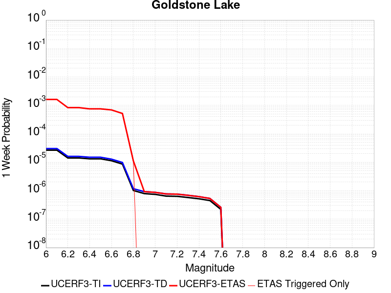 | 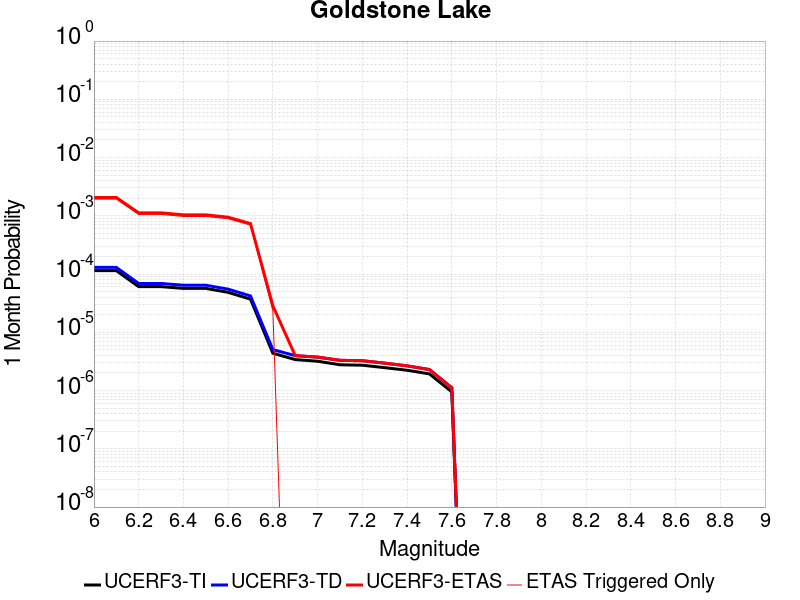 | 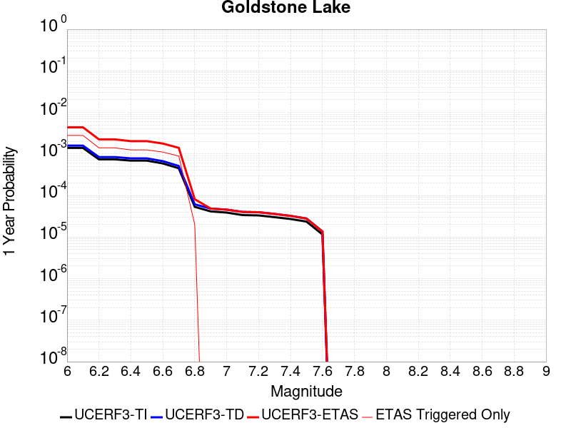 | 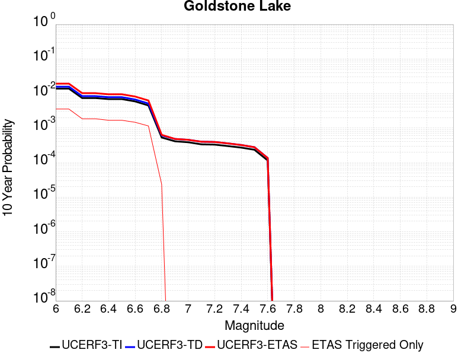 |

| Magnitude | 1 wk TI Prob | 1 wk TD Prob | 1 wk ETAS Prob | 1 wk ETAS/TD Gain | 1 wk ETAS Triggered Only | 1 mo TI Prob | 1 mo TD Prob | 1 mo ETAS Prob | 1 mo ETAS/TD Gain | 1 mo ETAS Triggered Only | 1 yr TI Prob | 1 yr TD Prob | 1 yr ETAS Prob | 1 yr ETAS/TD Gain | 1 yr ETAS Triggered Only | 10 yr TI Prob | 10 yr TD Prob | 10 yr ETAS Prob | 10 yr ETAS/TD Gain | 10 yr ETAS Triggered Only |
|-----|-----|-----|-----|-----|-----|-----|-----|-----|-----|-----|-----|-----|-----|-----|-----|-----|-----|-----|-----|-----|
| 6.0 | 2.671352E-5 | 3.037609E-5 | 0.0015796248 | 52.002243 | 0.0015492957 | 1.1448149E-4 | 1.3017785E-4 | 0.0020665454 | 15.874785 | 0.0019366198 | 0.001392921 | 0.0015839594 | 0.0043612435 | 2.7533808 | 0.00278169 | 0.013842222 | 0.015746197 | 0.019234983 | 1.2215638 | 0.003544601 |
| 6.1 | 2.671352E-5 | 3.037609E-5 | 0.0015796248 | 52.002243 | 0.0015492957 | 1.1448149E-4 | 1.3017785E-4 | 0.0020665454 | 15.874785 | 0.0019366198 | 0.001392921 | 0.0015839594 | 0.0043612435 | 2.7533808 | 0.00278169 | 0.013842222 | 0.015746197 | 0.019234983 | 1.2215638 | 0.003544601 |
| 6.2 | 1.4197047E-5 | 1.6096245E-5 | 8.3767925E-4 | 52.04191 | 8.2159624E-4 | 6.0843064E-5 | 6.8982634E-5 | 0.0011252478 | 16.312044 | 0.0010563381 | 7.4051257E-4 | 8.3963864E-4 | 0.0022703612 | 2.7039742 | 0.0014319249 | 0.007380498 | 0.0083743585 | 0.010213289 | 1.2195905 | 0.0018544601 |
| 6.3 | 1.4197047E-5 | 1.6096245E-5 | 8.3767925E-4 | 52.04191 | 8.2159624E-4 | 6.0843064E-5 | 6.8982634E-5 | 0.0011252478 | 16.312044 | 0.0010563381 | 7.4051257E-4 | 8.3963864E-4 | 0.0022703612 | 2.7039742 | 0.0014319249 | 0.007380498 | 0.0083743585 | 0.010213289 | 1.2195905 | 0.0018544601 |
| 6.4 | 1.3238931E-5 | 1.500846E-5 | 7.54434E-4 | 50.26725 | 7.394366E-4 | 5.6737044E-5 | 6.4320935E-5 | 0.0010384367 | 16.144613 | 9.7417843E-4 | 6.9055456E-4 | 7.82924E-4 | 0.002061265 | 2.632778 | 0.0012793427 | 0.006884126 | 0.0078112837 | 0.009476577 | 1.2131908 | 0.0016784037 |
| 6.5 | 1.3238931E-5 | 1.500846E-5 | 7.54434E-4 | 50.26725 | 7.394366E-4 | 5.6737044E-5 | 6.4320935E-5 | 0.0010384367 | 16.144613 | 9.7417843E-4 | 6.9055456E-4 | 7.82924E-4 | 0.002061265 | 2.632778 | 0.0012793427 | 0.006884126 | 0.0078112837 | 0.009476577 | 1.2131908 | 0.0016784037 |
| 6.6 | 1.1328278E-5 | 1.2855166E-5 | 6.8186066E-4 | 53.041763 | 6.6901406E-4 | 4.8548856E-5 | 5.5092944E-5 | 9.4706257E-4 | 17.190271 | 8.920188E-4 | 5.90922E-4 | 6.7064585E-4 | 0.0017849215 | 2.6614964 | 0.0011150235 | 0.0058935313 | 0.0066956086 | 0.008152922 | 1.2176521 | 0.0014671362 |
| 6.7 | 8.651175E-6 | 9.824565E-6 | 5.1451445E-4 | 52.370205 | 5.046948E-4 | 3.707594E-5 | 4.2105108E-5 | 7.345642E-4 | 17.445965 | 6.924883E-4 | 4.5130608E-4 | 5.1259965E-4 | 0.0014158923 | 2.7621796 | 9.037559E-4 | 0.0045039062 | 0.005123051 | 0.006267393 | 1.2233711 | 0.0011502347 |
| 6.8 | 1.0215377E-6 | 1.1754702E-6 | 1.2912546E-5 | 10.985004 | 1.1737089E-5 | 4.378012E-6 | 5.0377203E-6 | 2.851178E-5 | 5.659659 | 2.3474178E-5 | 5.3300988E-5 | 6.1332634E-5 | 8.4805375E-5 | 1.382712 | 2.3474178E-5 | 5.3288206E-4 | 6.1316835E-4 | 6.3662813E-4 | 1.03826 | 2.3474178E-5 |
| 6.9 | 7.9360774E-7 | 9.2833966E-7 | 9.2833966E-7 | 1.0 | 0.0 | 3.4011714E-6 | 3.9785928E-6 | 3.9785928E-6 | 1.0 | 0.0 | 4.1408475E-5 | 4.843836E-5 | 4.843836E-5 | 1.0 | 0.0 | 4.140076E-4 | 4.8428503E-4 | 4.8428503E-4 | 1.0 | 0.0 |
| 7.0 | 7.4382757E-7 | 8.7473285E-7 | 8.7473285E-7 | 1.0 | 0.0 | 3.1878285E-6 | 3.74885E-6 | 3.74885E-6 | 1.0 | 0.0 | 3.8811122E-5 | 4.564136E-5 | 4.564136E-5 | 1.0 | 0.0 | 3.8804344E-4 | 4.5632652E-4 | 4.5632652E-4 | 1.0 | 0.0 |
| 7.1 | 6.4709513E-7 | 7.7113E-7 | 7.7113E-7 | 1.0 | 0.0 | 2.773262E-6 | 3.3048389E-6 | 3.3048389E-6 | 1.0 | 0.0 | 3.376394E-5 | 4.0235733E-5 | 4.0235733E-5 | 1.0 | 0.0 | 3.375881E-4 | 4.0229043E-4 | 4.0229043E-4 | 1.0 | 0.0 |
| 7.2 | 6.356704E-7 | 7.5883594E-7 | 7.5883594E-7 | 1.0 | 0.0 | 2.7242988E-6 | 3.2521505E-6 | 3.2521505E-6 | 1.0 | 0.0 | 3.3167835E-5 | 3.959427E-5 | 3.959427E-5 | 1.0 | 0.0 | 3.3162883E-4 | 3.958781E-4 | 3.958781E-4 | 1.0 | 0.0 |
| 7.3 | 5.7695723E-7 | 6.8965653E-7 | 6.8965653E-7 | 1.0 | 0.0 | 2.4726714E-6 | 2.9556677E-6 | 2.9556677E-6 | 1.0 | 0.0 | 3.0104358E-5 | 3.5984718E-5 | 3.5984718E-5 | 1.0 | 0.0 | 3.0100282E-4 | 3.5979465E-4 | 3.5979465E-4 | 1.0 | 0.0 |
| 7.4 | 5.209647E-7 | 6.193514E-7 | 6.193514E-7 | 1.0 | 0.0 | 2.232704E-6 | 2.6543607E-6 | 2.6543607E-6 | 1.0 | 0.0 | 2.718283E-5 | 3.2316417E-5 | 3.2316417E-5 | 1.0 | 0.0 | 2.7179506E-4 | 3.2312275E-4 | 3.2312275E-4 | 1.0 | 0.0 |
| 7.5 | 4.512955E-7 | 5.348885E-7 | 5.348885E-7 | 1.0 | 0.0 | 1.934122E-6 | 2.2923775E-6 | 2.2923775E-6 | 1.0 | 0.0 | 2.3547682E-5 | 2.7909393E-5 | 2.7909393E-5 | 1.0 | 0.0 | 2.3545188E-4 | 2.7906417E-4 | 2.7906417E-4 | 1.0 | 0.0 |
| 7.6 | 2.21172E-7 | 2.603961E-7 | 2.603961E-7 | 1.0 | 0.0 | 9.478797E-7 | 1.1159829E-6 | 1.1159829E-6 | 1.0 | 0.0 | 1.1540374E-5 | 1.3587036E-5 | 1.3587036E-5 | 1.0 | 0.0 | 1.1539775E-4 | 1.3586486E-4 | 1.3586486E-4 | 1.0 | 0.0 |

## Lenwood-Lockhart-Old Woman Springs
*[(top)](#table-of-contents)*

| 1 Week | 1 Month | 1 Year | 10 Year |
|-----|-----|-----|-----|
| 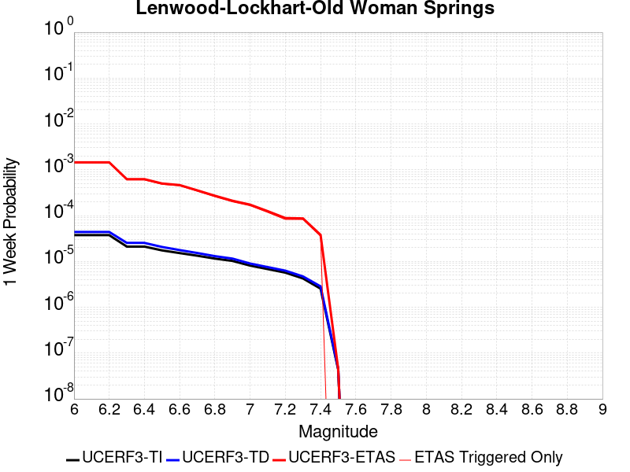 | 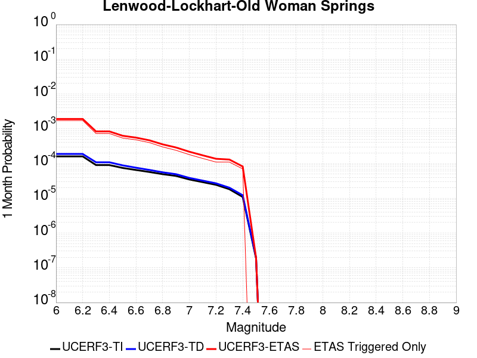 | 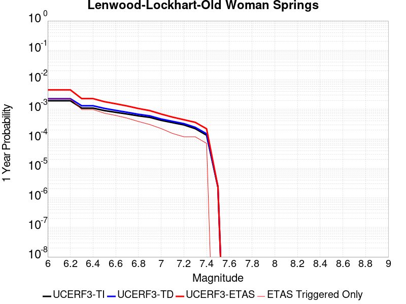 | 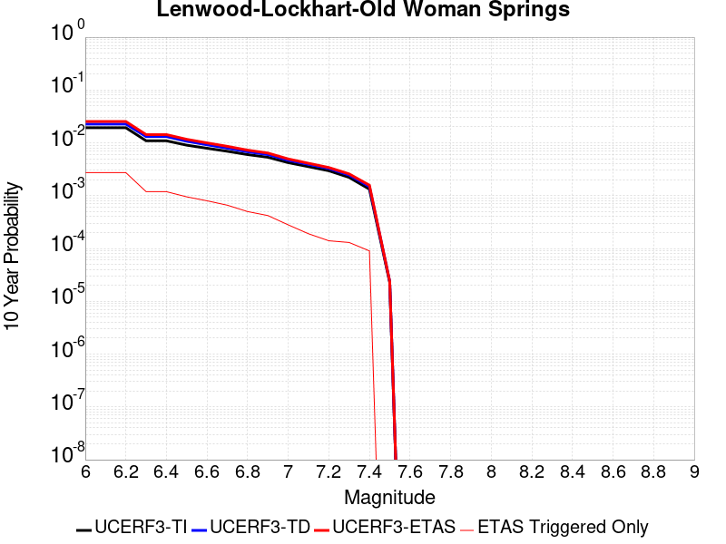 |

| Magnitude | 1 wk TI Prob | 1 wk TD Prob | 1 wk ETAS Prob | 1 wk ETAS/TD Gain | 1 wk ETAS Triggered Only | 1 mo TI Prob | 1 mo TD Prob | 1 mo ETAS Prob | 1 mo ETAS/TD Gain | 1 mo ETAS Triggered Only | 1 yr TI Prob | 1 yr TD Prob | 1 yr ETAS Prob | 1 yr ETAS/TD Gain | 1 yr ETAS Triggered Only | 10 yr TI Prob | 10 yr TD Prob | 10 yr ETAS Prob | 10 yr ETAS/TD Gain | 10 yr ETAS Triggered Only |
|-----|-----|-----|-----|-----|-----|-----|-----|-----|-----|-----|-----|-----|-----|-----|-----|-----|-----|-----|-----|-----|
| 6.0 | 3.744542E-5 | 4.396252E-5 | 0.0014523513 | 33.036125 | 0.0014084507 | 1.604705E-4 | 1.8839816E-4 | 0.0019720995 | 10.467722 | 0.0017840376 | 0.0019519776 | 0.0022915069 | 0.0045632846 | 1.9913902 | 0.0022769952 | 0.019349206 | 0.022696787 | 0.025415342 | 1.1197771 | 0.00278169 |
| 6.1 | 3.744542E-5 | 4.396252E-5 | 0.0014523513 | 33.036125 | 0.0014084507 | 1.604705E-4 | 1.8839816E-4 | 0.0019720995 | 10.467722 | 0.0017840376 | 0.0019519776 | 0.0022915069 | 0.0045632846 | 1.9913902 | 0.0022769952 | 0.019349206 | 0.022696787 | 0.025415342 | 1.1197771 | 0.00278169 |
| 6.2 | 3.744542E-5 | 4.396252E-5 | 0.0014523513 | 33.036125 | 0.0014084507 | 1.604705E-4 | 1.8839816E-4 | 0.0019720995 | 10.467722 | 0.0017840376 | 0.0019519776 | 0.0022915069 | 0.0045632846 | 1.9913902 | 0.0022769952 | 0.019349206 | 0.022696787 | 0.025415342 | 1.1197771 | 0.00278169 |
| 6.3 | 2.1079984E-5 | 2.5353434E-5 | 6.239298E-4 | 24.609282 | 5.985916E-4 | 9.0339665E-5 | 1.0865316E-4 | 8.5974525E-4 | 7.91275 | 7.511737E-4 | 0.0010993304 | 0.0013220694 | 0.0023066816 | 1.7447506 | 9.859155E-4 | 0.010939079 | 0.0131442575 | 0.014337287 | 1.0907643 | 0.0012089201 |
| 6.4 | 2.1079984E-5 | 2.5353434E-5 | 6.239298E-4 | 24.609282 | 5.985916E-4 | 9.0339665E-5 | 1.0865316E-4 | 8.5974525E-4 | 7.91275 | 7.511737E-4 | 0.0010993304 | 0.0013220694 | 0.0023066816 | 1.7447506 | 9.859155E-4 | 0.010939079 | 0.0131442575 | 0.014337287 | 1.0907643 | 0.0012089201 |
| 6.5 | 1.7397282E-5 | 2.066241E-5 | 5.0187315E-4 | 24.289186 | 4.8122066E-4 | 7.455765E-5 | 8.8550245E-5 | 6.5188063E-4 | 7.3617034 | 5.633803E-4 | 9.073613E-4 | 0.0010775778 | 0.0018162176 | 1.6854631 | 7.394366E-4 | 0.009036654 | 0.010724821 | 0.01167694 | 1.0887772 | 9.624413E-4 |
| 6.6 | 1.52050325E-5 | 1.7679693E-5 | 4.636812E-4 | 26.226767 | 4.460094E-4 | 6.51628E-5 | 7.576796E-5 | 5.8042456E-4 | 7.660554 | 5.046948E-4 | 7.9306826E-4 | 9.220924E-4 | 0.0015435845 | 1.674002 | 6.2206574E-4 | 0.007902439 | 0.009183526 | 0.009985948 | 1.0873762 | 8.0985914E-4 |
| 6.7 | 1.332523E-5 | 1.5264002E-5 | 3.556344E-4 | 23.298895 | 3.4037558E-4 | 5.7106878E-5 | 6.5415545E-5 | 4.761868E-4 | 7.279413 | 4.1079812E-4 | 6.950544E-4 | 7.961491E-4 | 0.0013004421 | 1.6334153 | 5.046948E-4 | 0.006928845 | 0.007933599 | 0.008574017 | 1.0807223 | 6.455399E-4 |
| 6.8 | 1.1525329E-5 | 1.3030979E-5 | 2.7124357E-4 | 20.815289 | 2.5821597E-4 | 4.9393333E-5 | 5.584588E-5 | 3.7272958E-4 | 6.674254 | 3.169014E-4 | 6.011979E-4 | 6.797157E-4 | 0.0010667765 | 1.5694449 | 3.8732393E-4 | 0.00599574 | 0.006776819 | 0.0072664362 | 1.0722488 | 4.9295777E-4 |
| 6.9 | 1.0253909E-5 | 1.15144385E-5 | 2.1104266E-4 | 18.328524 | 1.9953052E-4 | 4.3944583E-5 | 4.9346683E-5 | 2.958134E-4 | 5.9945955 | 2.4647888E-4 | 5.3489394E-4 | 6.0063385E-4 | 9.0561487E-4 | 1.5077653 | 3.051643E-4 | 0.0053360825 | 0.0059904843 | 0.0063871546 | 1.0662167 | 3.9906104E-4 |
| 7.0 | 8.104563E-6 | 8.991279E-6 | 1.7330905E-4 | 19.27524 | 1.6431925E-4 | 3.4733377E-5 | 3.8533497E-5 | 2.263197E-4 | 5.8733234 | 1.8779343E-4 | 4.2279682E-4 | 4.6904673E-4 | 6.919468E-4 | 1.4752194 | 2.230047E-4 | 0.0042199334 | 0.0046808156 | 0.004961187 | 1.059898 | 2.8169015E-4 |
| 7.1 | 6.7986157E-6 | 7.515816E-6 | 1.2488583E-4 | 16.616404 | 1.17370895E-4 | 2.91366E-5 | 3.2210253E-5 | 1.730508E-4 | 5.372537 | 1.4084508E-4 | 3.5468035E-4 | 3.920914E-4 | 5.4461375E-4 | 1.3889968 | 1.5258216E-4 | 0.003541148 | 0.003914213 | 0.004112962 | 1.0507764 | 1.9953052E-4 |
| 7.2 | 5.6893327E-6 | 6.2800136E-6 | 8.843912E-5 | 14.082632 | 8.2159626E-5 | 2.4382627E-5 | 2.6914078E-5 | 1.3254504E-4 | 4.9247475 | 1.056338E-4 | 2.9681803E-4 | 3.2763163E-4 | 4.4496407E-4 | 1.3581231 | 1.17370895E-4 | 0.002964219 | 0.0032716845 | 0.0034120688 | 1.0429089 | 1.4084508E-4 |
| 7.3 | 4.253348E-6 | 4.7069107E-6 | 8.686615E-5 | 18.455025 | 8.2159626E-5 | 1.8228506E-5 | 2.0172329E-5 | 1.25804E-4 | 6.236464 | 1.056338E-4 | 2.2190946E-4 | 2.4557224E-4 | 3.6291432E-4 | 1.4778311 | 1.17370895E-4 | 0.00221688 | 0.0024531898 | 0.002581981 | 1.0524995 | 1.2910798E-4 |
| 7.4 | 2.5448119E-6 | 2.852045E-6 | 3.8063212E-5 | 13.345937 | 3.521127E-5 | 1.0906291E-5 | 1.2223002E-5 | 7.090773E-5 | 5.8011713 | 5.8685448E-5 | 1.3277601E-4 | 1.4880655E-4 | 2.192186E-4 | 1.4731785 | 7.042254E-5 | 0.001326967 | 0.0014872311 | 0.0015692686 | 1.0551612 | 8.2159626E-5 |
| 7.5 | 4.3706837E-8 | 4.562909E-8 | 4.562909E-8 | 1.0 | 0.0 | 1.8731501E-7 | 1.9555324E-7 | 1.9555324E-7 | 1.0 | 0.0 | 2.2805577E-6 | 2.3808586E-6 | 2.3808586E-6 | 1.0 | 0.0 | 2.2805343E-5 | 2.3808387E-5 | 2.3808387E-5 | 1.0 | 0.0 |

## Coyote Canyon
*[(top)](#table-of-contents)*

| 1 Week | 1 Month | 1 Year | 10 Year |
|-----|-----|-----|-----|
| 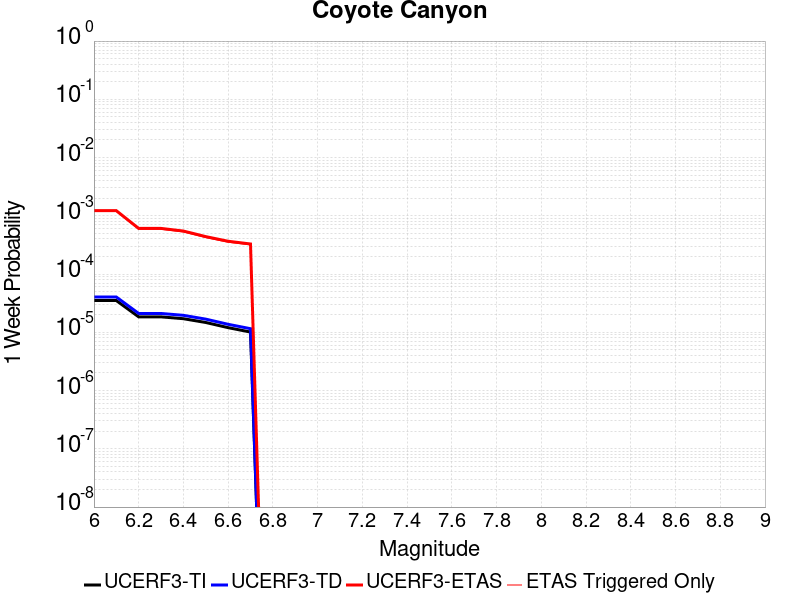 | 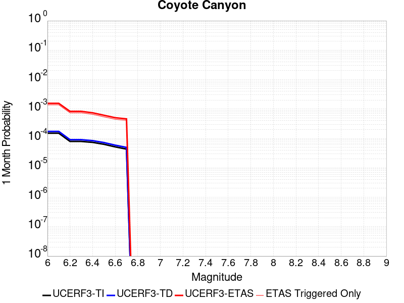 | 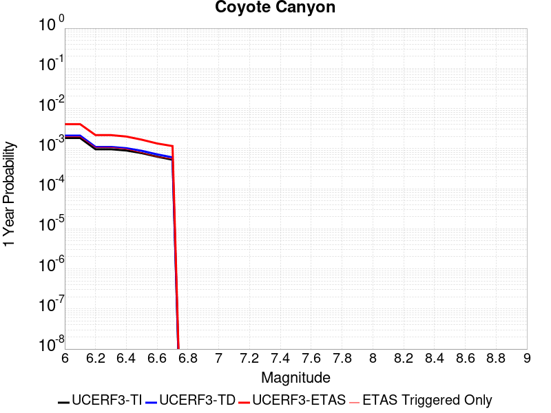 | 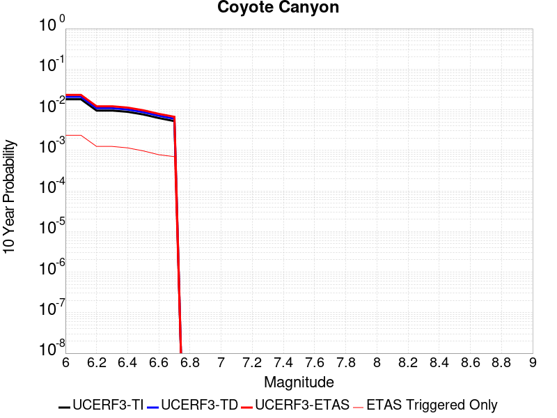 |

| Magnitude | 1 wk TI Prob | 1 wk TD Prob | 1 wk ETAS Prob | 1 wk ETAS/TD Gain | 1 wk ETAS Triggered Only | 1 mo TI Prob | 1 mo TD Prob | 1 mo ETAS Prob | 1 mo ETAS/TD Gain | 1 mo ETAS Triggered Only | 1 yr TI Prob | 1 yr TD Prob | 1 yr ETAS Prob | 1 yr ETAS/TD Gain | 1 yr ETAS Triggered Only | 10 yr TI Prob | 10 yr TD Prob | 10 yr ETAS Prob | 10 yr ETAS/TD Gain | 10 yr ETAS Triggered Only |
|-----|-----|-----|-----|-----|-----|-----|-----|-----|-----|-----|-----|-----|-----|-----|-----|-----|-----|-----|-----|-----|
| 6.0 | 3.5090034E-5 | 4.0364324E-5 | 0.0012257625 | 30.367472 | 0.001185446 | 1.503772E-4 | 1.7297994E-4 | 0.0015577169 | 9.005188 | 0.0013849766 | 0.0018293047 | 0.0021042528 | 0.0040602223 | 1.9295316 | 0.0019600939 | 0.018143194 | 0.020869201 | 0.023202106 | 1.111787 | 0.002382629 |
| 6.1 | 3.5090034E-5 | 4.0364324E-5 | 0.0012257625 | 30.367472 | 0.001185446 | 1.503772E-4 | 1.7297994E-4 | 0.0015577169 | 9.005188 | 0.0013849766 | 0.0018293047 | 0.0021042528 | 0.0040602223 | 1.9295316 | 0.0019600939 | 0.018143194 | 0.020869201 | 0.023202106 | 1.111787 | 0.002382629 |
| 6.2 | 1.841879E-5 | 2.1059794E-5 | 6.079019E-4 | 28.86552 | 5.8685447E-4 | 7.8935285E-5 | 9.0253714E-5 | 8.296236E-4 | 9.192127 | 7.394366E-4 | 9.606133E-4 | 0.001098387 | 0.002165289 | 1.9713352 | 0.0010680751 | 0.0095647145 | 0.010939667 | 0.012193405 | 1.1146048 | 0.0012676056 |
| 6.3 | 1.841879E-5 | 2.1059794E-5 | 6.079019E-4 | 28.86552 | 5.8685447E-4 | 7.8935285E-5 | 9.0253714E-5 | 8.296236E-4 | 9.192127 | 7.394366E-4 | 9.606133E-4 | 0.001098387 | 0.002165289 | 1.9713352 | 0.0010680751 | 0.0095647145 | 0.010939667 | 0.012193405 | 1.1146048 | 0.0012676056 |
| 6.4 | 1.712201E-5 | 1.9565212E-5 | 5.477239E-4 | 27.994785 | 5.2816904E-4 | 7.337798E-5 | 8.3848776E-5 | 7.4107066E-4 | 8.838181 | 6.57277E-4 | 8.930107E-4 | 0.0010204813 | 0.0019936657 | 1.9536523 | 9.7417843E-4 | 0.008894307 | 0.010167871 | 0.01130641 | 1.1119742 | 0.0011502347 |
| 6.5 | 1.4744935E-5 | 1.6836972E-5 | 4.3936507E-4 | 26.095255 | 4.225352E-4 | 6.3191044E-5 | 7.215698E-5 | 6.120241E-4 | 8.481842 | 5.399061E-4 | 7.6907943E-4 | 8.7825063E-4 | 0.001663945 | 1.8946129 | 7.86385E-4 | 0.007664232 | 0.008756994 | 0.009687739 | 1.1062858 | 9.3896716E-4 |
| 6.6 | 1.2017839E-5 | 1.37240895E-5 | 3.6583192E-4 | 26.65619 | 3.5211266E-4 | 5.150401E-5 | 5.88167E-5 | 5.047998E-4 | 8.582594 | 4.460094E-4 | 6.268809E-4 | 7.159466E-4 | 0.001337567 | 1.8682497 | 6.2206574E-4 | 0.0062511545 | 0.0071450938 | 0.007890901 | 1.1043802 | 7.511737E-4 |
| 6.7 | 1.00956095E-5 | 1.1533517E-5 | 3.2843128E-4 | 28.476248 | 3.169014E-4 | 4.326618E-5 | 4.942891E-5 | 4.6020673E-4 | 9.310477 | 4.1079812E-4 | 5.266384E-4 | 6.017178E-4 | 0.001153029 | 1.916229 | 5.516432E-4 | 0.005253921 | 0.0060094125 | 0.006686073 | 1.1126001 | 6.8075117E-4 |

## Death Valley (So)
*[(top)](#table-of-contents)*

| 1 Week | 1 Month | 1 Year | 10 Year |
|-----|-----|-----|-----|
| 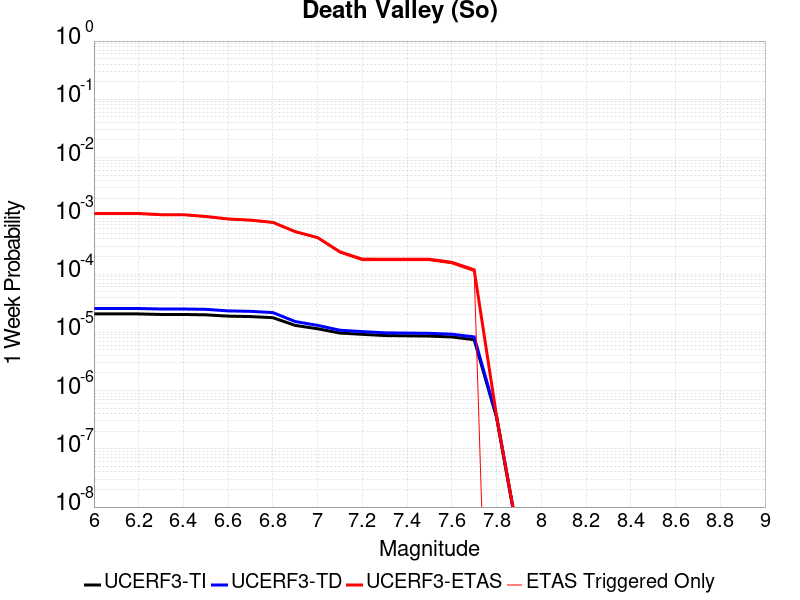 | 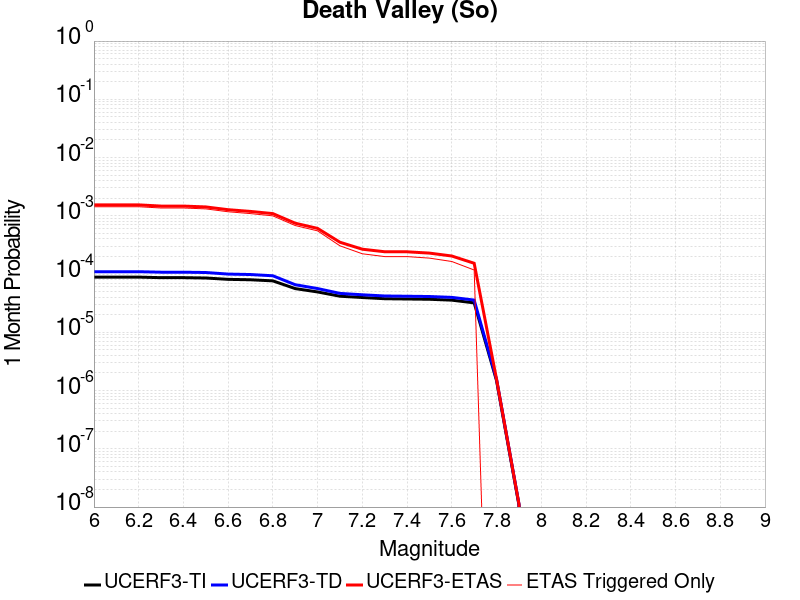 | 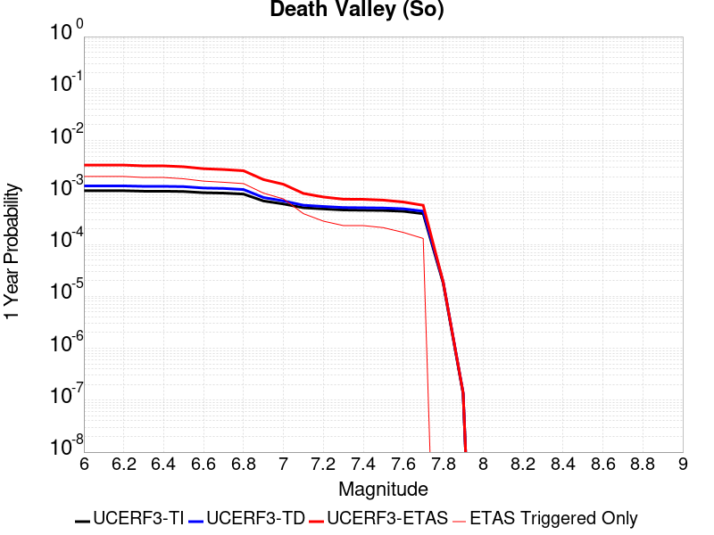 | 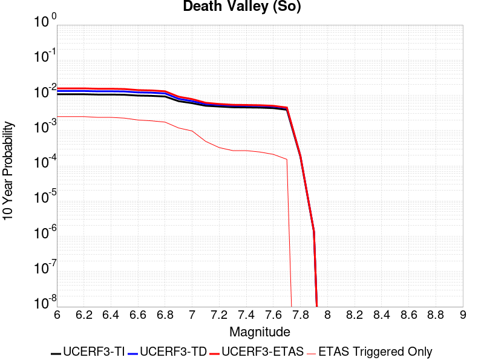 |

| Magnitude | 1 wk TI Prob | 1 wk TD Prob | 1 wk ETAS Prob | 1 wk ETAS/TD Gain | 1 wk ETAS Triggered Only | 1 mo TI Prob | 1 mo TD Prob | 1 mo ETAS Prob | 1 mo ETAS/TD Gain | 1 mo ETAS Triggered Only | 1 yr TI Prob | 1 yr TD Prob | 1 yr ETAS Prob | 1 yr ETAS/TD Gain | 1 yr ETAS Triggered Only | 10 yr TI Prob | 10 yr TD Prob | 10 yr ETAS Prob | 10 yr ETAS/TD Gain | 10 yr ETAS Triggered Only |
|-----|-----|-----|-----|-----|-----|-----|-----|-----|-----|-----|-----|-----|-----|-----|-----|-----|-----|-----|-----|-----|
| 6.0 | 2.0684236E-5 | 2.5617775E-5 | 0.0011171391 | 43.607967 | 0.0010915493 | 8.864371E-5 | 1.0978594E-4 | 0.0015415536 | 14.041448 | 0.0014319249 | 0.0010787029 | 0.0013358411 | 0.0033519238 | 2.5092232 | 0.0020187793 | 0.010734817 | 0.013281397 | 0.015736612 | 1.1848612 | 0.002488263 |
| 6.1 | 2.0684236E-5 | 2.5617775E-5 | 0.0011171391 | 43.607967 | 0.0010915493 | 8.864371E-5 | 1.0978594E-4 | 0.0015415536 | 14.041448 | 0.0014319249 | 0.0010787029 | 0.0013358411 | 0.0033519238 | 2.5092232 | 0.0020187793 | 0.010734817 | 0.013281397 | 0.015736612 | 1.1848612 | 0.002488263 |
| 6.2 | 2.0684236E-5 | 2.5617775E-5 | 0.0011171391 | 43.607967 | 0.0010915493 | 8.864371E-5 | 1.0978594E-4 | 0.0015415536 | 14.041448 | 0.0014319249 | 0.0010787029 | 0.0013358411 | 0.0033519238 | 2.5092232 | 0.0020187793 | 0.010734817 | 0.013281397 | 0.015736612 | 1.1848612 | 0.002488263 |
| 6.3 | 2.0240292E-5 | 2.511786E-5 | 0.0010579558 | 42.11966 | 0.0010328639 | 8.6741224E-5 | 1.07643624E-4 | 0.0014689994 | 13.646878 | 0.0013615023 | 0.0010555626 | 0.00130979 | 0.0032321515 | 2.467687 | 0.0019248826 | 0.010505628 | 0.013023956 | 0.01536397 | 1.17967 | 0.002370892 |
| 6.4 | 2.0240292E-5 | 2.511786E-5 | 0.0010579558 | 42.11966 | 0.0010328639 | 8.6741224E-5 | 1.07643624E-4 | 0.0014689994 | 13.646878 | 0.0013615023 | 0.0010555626 | 0.00130979 | 0.0032321515 | 2.467687 | 0.0019248826 | 0.010505628 | 0.013023956 | 0.01536397 | 1.17967 | 0.002370892 |
| 6.5 | 1.9962767E-5 | 2.4807114E-5 | 0.0010106981 | 40.74227 | 9.859155E-4 | 8.55519E-5 | 1.0631196E-4 | 0.0014207262 | 13.363748 | 0.001314554 | 0.0010410968 | 0.0012935963 | 0.0031339356 | 2.4226534 | 0.001842723 | 0.010362327 | 0.012863902 | 0.015088434 | 1.1729282 | 0.0022535212 |
| 6.6 | 1.8937297E-5 | 2.3310964E-5 | 9.1530895E-4 | 39.265167 | 8.920188E-4 | 8.115732E-5 | 9.990039E-5 | 0.001273492 | 12.747619 | 0.0011737089 | 9.876423E-4 | 0.0012156231 | 0.0028568183 | 2.3500853 | 0.0016431925 | 0.009832645 | 0.012092789 | 0.014063965 | 1.1630043 | 0.001995305 |
| 6.7 | 1.8621096E-5 | 2.2911607E-5 | 8.6796266E-4 | 37.8831 | 8.450704E-4 | 7.980225E-5 | 9.818898E-5 | 0.0011896311 | 12.115728 | 0.0010915493 | 9.711593E-4 | 0.0011948098 | 0.0027422544 | 2.2951388 | 0.0015492957 | 0.009669261 | 0.011886904 | 0.013754113 | 1.1570812 | 0.0018896713 |
| 6.8 | 1.7830353E-5 | 2.1805688E-5 | 7.8469986E-4 | 35.986015 | 7.629108E-4 | 7.641356E-5 | 9.344968E-5 | 0.001091009 | 11.674829 | 9.976525E-4 | 9.29938E-4 | 0.00113717 | 0.0025791903 | 2.268078 | 0.001443662 | 0.009260561 | 0.011316354 | 0.013033786 | 1.1517655 | 0.0017370892 |
| 6.9 | 1.3135183E-5 | 1.5303925E-5 | 5.4346485E-4 | 35.51147 | 5.2816904E-4 | 5.6292425E-5 | 6.558664E-5 | 7.4629317E-4 | 11.378738 | 6.8075117E-4 | 6.8514474E-4 | 7.982312E-4 | 0.001771632 | 2.2194471 | 9.7417843E-4 | 0.006830362 | 0.007954649 | 0.009130665 | 1.1478401 | 0.001185446 |
| 7.0 | 1.1507512E-5 | 1.3154199E-5 | 4.3568385E-4 | 33.121273 | 4.225352E-4 | 4.9316975E-5 | 5.6373956E-5 | 6.0798606E-4 | 10.784875 | 5.516432E-4 | 6.002687E-4 | 6.8614254E-4 | 0.0014719879 | 2.1453092 | 7.86385E-4 | 0.0059864987 | 0.0068409415 | 0.0078084557 | 1.14143 | 9.7417843E-4 |
| 7.1 | 9.715903E-6 | 1.0865278E-5 | 2.5734148E-4 | 23.684757 | 2.4647888E-4 | 4.1638916E-5 | 4.656467E-5 | 3.5171479E-4 | 7.553254 | 3.051643E-4 | 5.068359E-4 | 5.667817E-4 | 9.773469E-4 | 1.72438 | 4.1079812E-4 | 0.0050568148 | 0.0056538144 | 0.0061439853 | 1.0866973 | 4.9295777E-4 |
| 7.2 | 9.233269E-6 | 1.02863105E-5 | 1.980778E-4 | 19.256449 | 1.8779343E-4 | 3.9570554E-5 | 4.4083466E-5 | 2.6707834E-4 | 6.0584693 | 2.230047E-4 | 4.81665E-4 | 5.3658825E-4 | 8.29858E-4 | 1.5465453 | 2.9342723E-4 | 0.0048062233 | 0.0053533576 | 0.005680237 | 1.0610605 | 3.286385E-4 |
| 7.3 | 8.8041315E-6 | 9.808164E-6 | 1.9759974E-4 | 20.146456 | 1.8779343E-4 | 3.7731446E-5 | 4.2034335E-5 | 2.4155647E-4 | 5.7466464 | 1.9953052E-4 | 4.592835E-4 | 5.1165203E-4 | 7.5800484E-4 | 1.4814849 | 2.4647888E-4 | 0.0045833546 | 0.005105167 | 0.005373742 | 1.0526085 | 2.6995305E-4 |
| 7.4 | 8.708749E-6 | 9.707175E-6 | 1.9749878E-4 | 20.34565 | 1.8779343E-4 | 3.7322676E-5 | 4.160154E-5 | 2.4112375E-4 | 5.7960296 | 1.9953052E-4 | 4.5430884E-4 | 5.0638523E-4 | 7.5273926E-4 | 1.4864954 | 2.4647888E-4 | 0.004533812 | 0.0050527398 | 0.0053213285 | 1.0531571 | 2.6995305E-4 |
| 7.5 | 8.612678E-6 | 9.604817E-6 | 1.9739644E-4 | 20.551817 | 1.8779343E-4 | 3.6910955E-5 | 4.1162875E-5 | 2.2894857E-4 | 5.562016 | 1.8779343E-4 | 4.492982E-4 | 5.01047E-4 | 7.2394E-4 | 1.4448544 | 2.230047E-4 | 0.004483909 | 0.0049995985 | 0.005244845 | 1.0490533 | 2.4647888E-4 |
| 7.6 | 8.319024E-6 | 9.283916E-6 | 1.7360164E-4 | 18.699183 | 1.6431925E-4 | 3.5652476E-5 | 3.978763E-5 | 2.0410035E-4 | 5.1297436 | 1.6431925E-4 | 4.3398244E-4 | 4.8431093E-4 | 6.720134E-4 | 1.3875661 | 1.8779343E-4 | 0.0043313587 | 0.0048329784 | 0.005043225 | 1.0435024 | 2.112676E-4 |
| 7.7 | 7.4718328E-6 | 8.34517E-6 | 1.2571509E-4 | 15.064413 | 1.17370895E-4 | 3.2021748E-5 | 3.5764548E-5 | 1.5313124E-4 | 4.281649 | 1.17370895E-4 | 3.8979502E-4 | 4.353504E-4 | 5.7613413E-4 | 1.3233804 | 1.4084508E-4 | 0.00389112 | 0.0043453807 | 0.0044973 | 1.0349611 | 1.5258216E-4 |
| 7.8 | 3.4586725E-7 | 3.6482615E-7 | 3.6482615E-7 | 1.0 | 0.0 | 1.4822873E-6 | 1.5635396E-6 | 1.5635396E-6 | 1.0 | 0.0 | 1.80467E-5 | 1.9035933E-5 | 1.9035933E-5 | 1.0 | 0.0 | 1.8045233E-4 | 1.9034347E-4 | 1.9034347E-4 | 1.0 | 0.0 |
| 7.9 | 2.5591178E-9 | 2.6696718E-9 | 2.6696718E-9 | 1.0 | 0.0 | 1.0967647E-8 | 1.14414505E-8 | 1.14414505E-8 | 1.0 | 0.0 | 1.335311E-7 | 1.3929966E-7 | 1.3929966E-7 | 1.0 | 0.0 | 1.3353102E-6 | 1.3929966E-6 | 1.3929966E-6 | 1.0 | 0.0 |

## Towne Pass
*[(top)](#table-of-contents)*

| 1 Week | 1 Month | 1 Year | 10 Year |
|-----|-----|-----|-----|
| 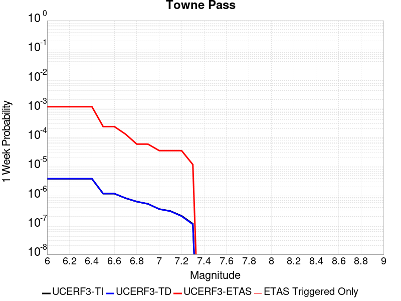 | 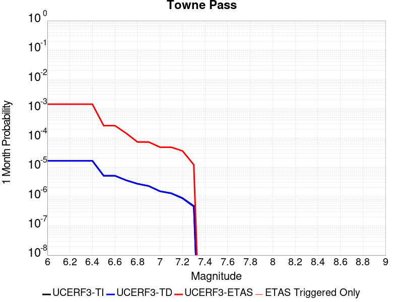 | 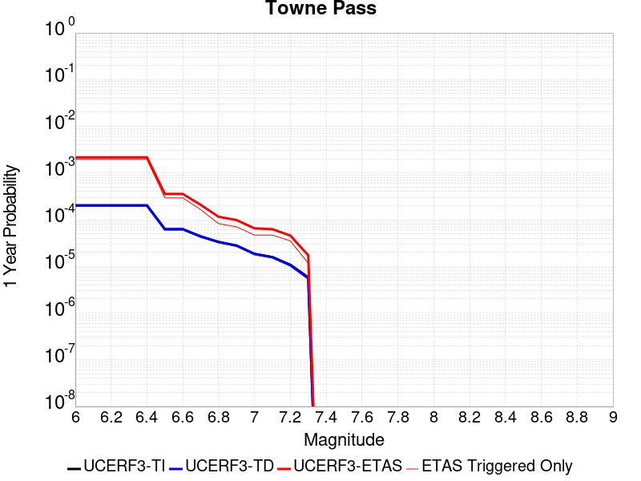 | 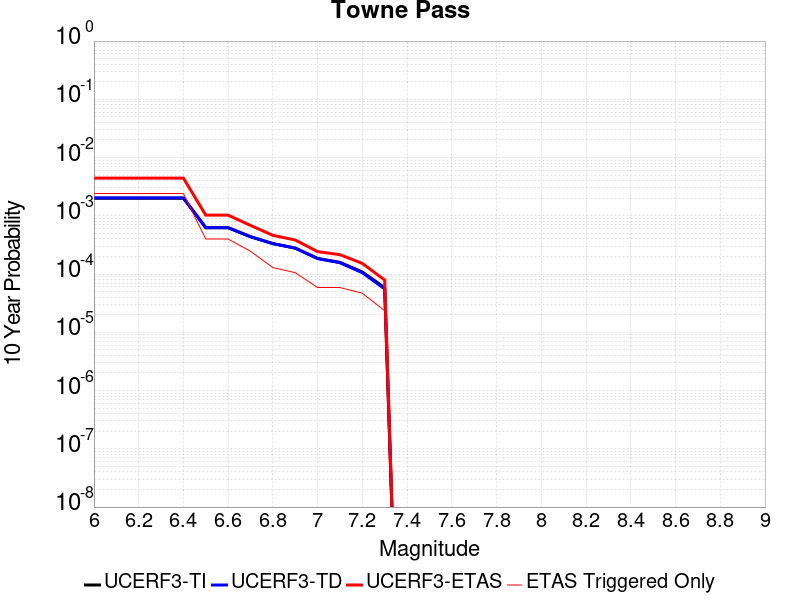 |

| Magnitude | 1 wk TI Prob | 1 wk TD Prob | 1 wk ETAS Prob | 1 wk ETAS/TD Gain | 1 wk ETAS Triggered Only | 1 mo TI Prob | 1 mo TD Prob | 1 mo ETAS Prob | 1 mo ETAS/TD Gain | 1 mo ETAS Triggered Only | 1 yr TI Prob | 1 yr TD Prob | 1 yr ETAS Prob | 1 yr ETAS/TD Gain | 1 yr ETAS Triggered Only | 10 yr TI Prob | 10 yr TD Prob | 10 yr ETAS Prob | 10 yr ETAS/TD Gain | 10 yr ETAS Triggered Only |
|-----|-----|-----|-----|-----|-----|-----|-----|-----|-----|-----|-----|-----|-----|-----|-----|-----|-----|-----|-----|-----|
| 6.0 | 3.849728E-6 | 3.8945414E-6 | 0.0011306508 | 290.31677 | 0.0011267606 | 1.649873E-5 | 1.669081E-5 | 0.0014133811 | 84.6802 | 0.0013967137 | 2.0085352E-4 | 2.0319603E-4 | 0.0021628917 | 10.64436 | 0.0019600939 | 0.0020067208 | 0.0020305314 | 0.0044434625 | 2.1883247 | 0.0024178403 |
| 6.1 | 3.849728E-6 | 3.8945414E-6 | 0.0011306508 | 290.31677 | 0.0011267606 | 1.649873E-5 | 1.669081E-5 | 0.0014133811 | 84.6802 | 0.0013967137 | 2.0085352E-4 | 2.0319603E-4 | 0.0021628917 | 10.64436 | 0.0019600939 | 0.0020067208 | 0.0020305314 | 0.0044434625 | 2.1883247 | 0.0024178403 |
| 6.2 | 3.849728E-6 | 3.8945414E-6 | 0.0011306508 | 290.31677 | 0.0011267606 | 1.649873E-5 | 1.669081E-5 | 0.0014133811 | 84.6802 | 0.0013967137 | 2.0085352E-4 | 2.0319603E-4 | 0.0021628917 | 10.64436 | 0.0019600939 | 0.0020067208 | 0.0020305314 | 0.0044434625 | 2.1883247 | 0.0024178403 |
| 6.3 | 3.849728E-6 | 3.8945414E-6 | 0.0011306508 | 290.31677 | 0.0011267606 | 1.649873E-5 | 1.669081E-5 | 0.0014133811 | 84.6802 | 0.0013967137 | 2.0085352E-4 | 2.0319603E-4 | 0.0021628917 | 10.64436 | 0.0019600939 | 0.0020067208 | 0.0020305314 | 0.0044434625 | 2.1883247 | 0.0024178403 |
| 6.4 | 3.849728E-6 | 3.8945414E-6 | 0.0011306508 | 290.31677 | 0.0011267606 | 1.649873E-5 | 1.669081E-5 | 0.0014133811 | 84.6802 | 0.0013967137 | 2.0085352E-4 | 2.0319603E-4 | 0.0021628917 | 10.64436 | 0.0019600939 | 0.0020067208 | 0.0020305314 | 0.0044434625 | 2.1883247 | 0.0024178403 |
| 6.5 | 1.1953545E-6 | 1.203052E-6 | 2.3594455E-4 | 196.12166 | 2.3474179E-4 | 5.1229376E-6 | 5.1559277E-6 | 2.6337054E-4 | 51.08112 | 2.5821597E-4 | 6.236998E-5 | 6.277173E-5 | 3.5618054E-4 | 5.674219 | 2.9342723E-4 | 6.235248E-4 | 6.275517E-4 | 0.0010263623 | 1.6355023 | 3.9906104E-4 |
| 6.6 | 1.1953545E-6 | 1.203052E-6 | 2.3594455E-4 | 196.12166 | 2.3474179E-4 | 5.1229376E-6 | 5.1559277E-6 | 2.6337054E-4 | 51.08112 | 2.5821597E-4 | 6.236998E-5 | 6.277173E-5 | 3.5618054E-4 | 5.674219 | 2.9342723E-4 | 6.235248E-4 | 6.275517E-4 | 0.0010263623 | 1.6355023 | 3.9906104E-4 |
| 6.7 | 8.375951E-7 | 8.4106705E-7 | 1.2994894E-4 | 154.50485 | 1.2910798E-4 | 3.5896885E-6 | 3.6045683E-6 | 1.4444914E-4 | 40.073906 | 1.4084508E-4 | 4.370358E-5 | 4.3884793E-5 | 2.0819683E-4 | 4.744168 | 1.6431925E-4 | 4.3694986E-4 | 4.38767E-4 | 6.851377E-4 | 1.561507 | 2.4647888E-4 |
| 6.8 | 6.38041E-7 | 6.392156E-7 | 5.9324626E-5 | 92.808464 | 5.8685448E-5 | 2.7344586E-6 | 2.7394929E-6 | 7.3161835E-5 | 26.706343 | 7.042254E-5 | 3.3291526E-5 | 3.3352855E-5 | 1.1550974E-4 | 3.463264 | 8.2159626E-5 | 3.3286537E-4 | 3.334823E-4 | 4.6254724E-4 | 1.3870218 | 1.2910798E-4 |
| 6.9 | 5.3460053E-7 | 5.345333E-7 | 5.9219947E-5 | 110.78813 | 5.8685448E-5 | 2.2911431E-6 | 2.2908553E-6 | 7.271323E-5 | 31.740648 | 7.042254E-5 | 2.789431E-5 | 2.789084E-5 | 9.831141E-5 | 3.524864 | 7.042254E-5 | 2.789081E-4 | 2.7887672E-4 | 3.8448104E-4 | 1.3786775 | 1.056338E-4 |
| 7.0 | 3.557783E-7 | 3.5324226E-7 | 3.55645E-5 | 100.68019 | 3.521127E-5 | 1.5247632E-6 | 1.5138945E-6 | 4.846218E-5 | 32.011597 | 4.6948357E-5 | 1.8563835E-5 | 1.843152E-5 | 6.537901E-5 | 3.5471308 | 4.6948357E-5 | 1.8562283E-4 | 1.8430075E-4 | 2.4297538E-4 | 1.3183635 | 5.8685448E-5 |
| 7.1 | 3.037942E-7 | 3.0002218E-7 | 3.551128E-5 | 118.36218 | 3.521127E-5 | 1.3019744E-6 | 1.2858087E-6 | 4.8234106E-5 | 37.512657 | 4.6948357E-5 | 1.5851423E-5 | 1.5654618E-5 | 6.260224E-5 | 3.9989634 | 4.6948357E-5 | 1.5850292E-4 | 1.5653588E-4 | 2.1521215E-4 | 1.3748422 | 5.8685448E-5 |
| 7.2 | 2.0808248E-7 | 2.0217689E-7 | 3.541344E-5 | 175.16066 | 3.521127E-5 | 8.917818E-7 | 8.6647213E-7 | 3.607771E-5 | 41.637474 | 3.521127E-5 | 1.0857389E-5 | 1.0549252E-5 | 4.576015E-5 | 4.3377624 | 3.521127E-5 | 1.0856859E-4 | 1.0548797E-4 | 1.5243137E-4 | 1.445012 | 4.6948357E-5 |
| 7.3 | 1.1162073E-7 | 1.0636894E-7 | 1.1843457E-5 | 111.34319 | 1.1737089E-5 | 4.7837443E-7 | 4.558668E-7 | 1.2192951E-5 | 26.74674 | 1.1737089E-5 | 5.8241935E-6 | 5.550166E-6 | 1.728719E-5 | 3.1147158 | 1.1737089E-5 | 5.8240406E-5 | 5.5500474E-5 | 7.897335E-5 | 1.4229311 | 2.3474178E-5 |

## San Andreas (San Bernardino N)
*[(top)](#table-of-contents)*

| 1 Week | 1 Month | 1 Year | 10 Year |
|-----|-----|-----|-----|
| 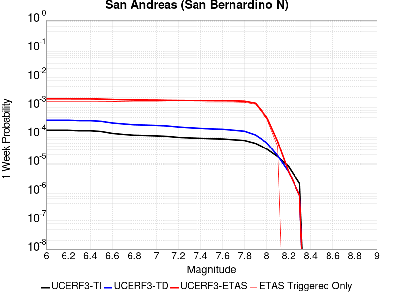 | 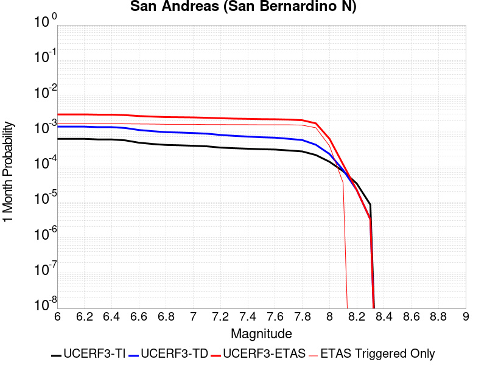 | 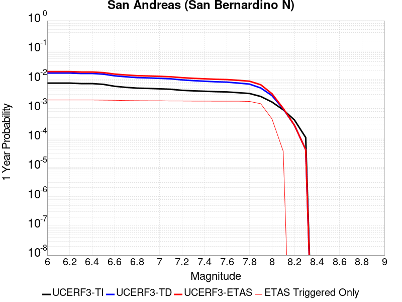 | 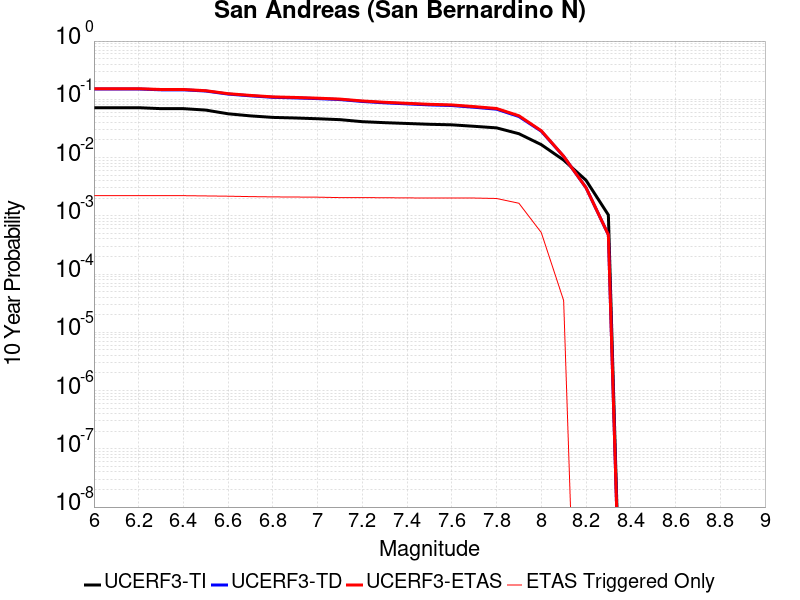 |

| Magnitude | 1 wk TI Prob | 1 wk TD Prob | 1 wk ETAS Prob | 1 wk ETAS/TD Gain | 1 wk ETAS Triggered Only | 1 mo TI Prob | 1 mo TD Prob | 1 mo ETAS Prob | 1 mo ETAS/TD Gain | 1 mo ETAS Triggered Only | 1 yr TI Prob | 1 yr TD Prob | 1 yr ETAS Prob | 1 yr ETAS/TD Gain | 1 yr ETAS Triggered Only | 10 yr TI Prob | 10 yr TD Prob | 10 yr ETAS Prob | 10 yr ETAS/TD Gain | 10 yr ETAS Triggered Only |
|-----|-----|-----|-----|-----|-----|-----|-----|-----|-----|-----|-----|-----|-----|-----|-----|-----|-----|-----|-----|-----|
| 6.0 | 1.4273766E-4 | 3.1606483E-4 | 0.0017592706 | 5.5661697 | 0.001443662 | 6.115894E-4 | 0.0013538664 | 0.0029948342 | 2.2120605 | 0.0016431925 | 0.0074207084 | 0.016360244 | 0.018299814 | 1.118554 | 0.001971831 | 0.07177748 | 0.15026689 | 0.15215185 | 1.0125442 | 0.0022183098 |
| 6.1 | 1.4273766E-4 | 3.1606483E-4 | 0.0017592706 | 5.5661697 | 0.001443662 | 6.115894E-4 | 0.0013538664 | 0.0029948342 | 2.2120605 | 0.0016431925 | 0.0074207084 | 0.016360244 | 0.018299814 | 1.118554 | 0.001971831 | 0.07177748 | 0.15026689 | 0.15215185 | 1.0125442 | 0.0022183098 |
| 6.2 | 1.4273766E-4 | 3.1606483E-4 | 0.0017592706 | 5.5661697 | 0.001443662 | 6.115894E-4 | 0.0013538664 | 0.0029948342 | 2.2120605 | 0.0016431925 | 0.0074207084 | 0.016360244 | 0.018299814 | 1.118554 | 0.001971831 | 0.07177748 | 0.15026689 | 0.15215185 | 1.0125442 | 0.0022183098 |
| 6.3 | 1.3730655E-4 | 3.0511338E-4 | 0.0017483348 | 5.7301154 | 0.001443662 | 5.883239E-4 | 0.0013069791 | 0.002948024 | 2.2556014 | 0.0016431925 | 0.0071393442 | 0.015797773 | 0.017738452 | 1.1228452 | 0.001971831 | 0.06914291 | 0.14556676 | 0.14746216 | 1.0130208 | 0.0022183098 |
| 6.4 | 1.3730655E-4 | 3.0511338E-4 | 0.0017483348 | 5.7301154 | 0.001443662 | 5.883239E-4 | 0.0013069791 | 0.002948024 | 2.2556014 | 0.0016431925 | 0.0071393442 | 0.015797773 | 0.017738452 | 1.1228452 | 0.001971831 | 0.06914291 | 0.14556676 | 0.14746216 | 1.0130208 | 0.0022183098 |
| 6.5 | 1.2942807E-4 | 2.8925808E-4 | 0.0017207687 | 5.948905 | 0.0014319249 | 5.545738E-4 | 0.0012390936 | 0.002856805 | 2.30556 | 0.0016197183 | 0.0067310524 | 0.01498286 | 0.016902026 | 1.1280907 | 0.0019483569 | 0.06530788 | 0.13870941 | 0.1405998 | 1.0136285 | 0.0021948356 |
| 6.6 | 1.1125901E-4 | 2.536472E-4 | 0.0016734748 | 6.597647 | 0.0014201878 | 4.767372E-4 | 0.0010866089 | 0.0026928429 | 2.478208 | 0.0016079813 | 0.005788839 | 0.013149847 | 0.0150494175 | 1.1444557 | 0.0019248826 | 0.056403454 | 0.122999296 | 0.12490358 | 1.0154821 | 0.0021713616 |
| 6.7 | 1.02209575E-4 | 2.3499702E-4 | 0.0016431167 | 6.992075 | 0.0014084507 | 4.3796748E-4 | 0.0010067427 | 0.0026013798 | 2.583957 | 0.0015962442 | 0.0053192247 | 0.012188629 | 0.014055269 | 1.1531459 | 0.0018896713 | 0.051936906 | 0.114790924 | 0.11668186 | 1.0164729 | 0.0021361501 |
| 6.8 | 9.610582E-5 | 2.2025521E-4 | 0.0016049267 | 7.286669 | 0.0013849766 | 4.1181705E-4 | 9.436101E-4 | 0.002514896 | 2.6651855 | 0.00157277 | 0.0050023515 | 0.011428202 | 0.0132730715 | 1.1614313 | 0.0018661972 | 0.048912346 | 0.1081929 | 0.110077 | 1.0174142 | 0.0021126762 |
| 6.9 | 9.3877505E-5 | 2.1481077E-4 | 0.0015994898 | 7.4460406 | 0.0013849766 | 4.0227012E-4 | 9.2029345E-4 | 0.002491616 | 2.7074146 | 0.00157277 | 0.0048866454 | 0.011147255 | 0.012981043 | 1.1645058 | 0.0018544601 | 0.04780577 | 0.10578323 | 0.107661925 | 1.0177598 | 0.002100939 |
| 7.0 | 9.1019785E-5 | 2.0808022E-4 | 0.0015927686 | 7.6545887 | 0.0013849766 | 3.900265E-4 | 8.914682E-4 | 0.0024628362 | 2.762674 | 0.00157277 | 0.0047382377 | 0.010799837 | 0.012634269 | 1.1698574 | 0.0018544601 | 0.046384744 | 0.102753714 | 0.10462824 | 1.018243 | 0.002089202 |
| 7.1 | 8.771155E-5 | 1.9982594E-4 | 0.0015610562 | 7.81208 | 0.0013615023 | 3.758525E-4 | 8.5611636E-4 | 0.0024040858 | 2.8081295 | 0.0015492957 | 0.0045664064 | 0.0103736 | 0.012173976 | 1.1735537 | 0.0018192488 | 0.044737056 | 0.09906527 | 0.100915775 | 1.0186797 | 0.0020539905 |
| 7.2 | 8.0830236E-5 | 1.8388197E-4 | 0.001545134 | 8.402857 | 0.0013615023 | 3.4636928E-4 | 7.8782777E-4 | 0.002335903 | 2.9649918 | 0.0015492957 | 0.0042088944 | 0.009549725 | 0.0113516 | 1.1886835 | 0.0018192488 | 0.041300658 | 0.09179615 | 0.09366159 | 1.0203216 | 0.0020539905 |
| 7.3 | 7.7668235E-5 | 1.7331762E-4 | 0.001534584 | 8.854172 | 0.0013615023 | 3.328214E-4 | 7.425784E-4 | 0.0022789955 | 3.0690298 | 0.0015375587 | 0.0040445733 | 0.009003494 | 0.010794732 | 1.1989492 | 0.0018075118 | 0.03971748 | 0.08706327 | 0.088927716 | 1.0214149 | 0.0020422535 |
| 7.4 | 7.520177E-5 | 1.6551897E-4 | 0.001526796 | 9.224296 | 0.0013615023 | 3.2225347E-4 | 7.0917426E-4 | 0.0022456425 | 3.1665595 | 0.0015375587 | 0.0039163795 | 0.008600081 | 0.010392048 | 1.2083663 | 0.0018075118 | 0.038480744 | 0.08351955 | 0.08538048 | 1.0222814 | 0.0020305165 |
| 7.5 | 7.274697E-5 | 1.5839566E-4 | 0.0015079471 | 9.520129 | 0.0013497652 | 3.1173544E-4 | 6.78662E-4 | 0.002203448 | 3.2467535 | 0.0015258216 | 0.003788775 | 0.008231463 | 0.010012455 | 1.216364 | 0.0017957747 | 0.03724827 | 0.08023631 | 0.08209311 | 1.0231416 | 0.0020187793 |
| 7.6 | 7.1185845E-5 | 1.540943E-4 | 0.0015036516 | 9.757996 | 0.0013497652 | 3.0504653E-4 | 6.6023704E-4 | 0.0021850513 | 3.309495 | 0.0015258216 | 0.0037076178 | 0.008008812 | 0.0097902035 | 1.222429 | 0.0017957747 | 0.036463667 | 0.07822598 | 0.080086835 | 1.0237882 | 0.0020187793 |
| 7.7 | 6.709961E-5 | 1.4318313E-4 | 0.0014927551 | 10.425495 | 0.0013497652 | 2.8753807E-4 | 6.1349774E-4 | 0.0021383832 | 3.4855602 | 0.0015258216 | 0.003495157 | 0.0074437927 | 0.0092262 | 1.2394488 | 0.0017957747 | 0.034406938 | 0.07305469 | 0.074926 | 1.025615 | 0.0020187793 |
| 7.8 | 6.300812E-5 | 1.3202413E-4 | 0.0014464046 | 10.955607 | 0.001314554 | 2.7000686E-4 | 5.65695E-4 | 0.0020554622 | 3.6335163 | 0.0014906103 | 0.0032823787 | 0.006865616 | 0.008614092 | 1.2546715 | 0.0017605633 | 0.032343175 | 0.06771354 | 0.06956279 | 1.02731 | 0.001983568 |
| 7.9 | 4.983037E-5 | 9.723488E-5 | 0.00121215 | 12.466205 | 0.0011150235 | 2.1354125E-4 | 4.1665437E-4 | 0.0016719997 | 4.0129175 | 0.0012558686 | 0.0025967648 | 0.0050609782 | 0.006520689 | 1.2884247 | 0.0014671362 | 0.025666296 | 0.05064886 | 0.052208826 | 1.0307996 | 0.0016431925 |
| 8.0 | 3.2211527E-5 | 5.3304586E-5 | 3.9366202E-4 | 7.3851438 | 3.4037558E-4 | 1.380421E-4 | 2.2842824E-4 | 6.156637E-4 | 2.6952171 | 3.8732393E-4 | 0.0016793669 | 0.0027775685 | 0.0032223393 | 1.1601294 | 4.460094E-4 | 0.016667323 | 0.028361378 | 0.028863164 | 1.0176926 | 5.1643193E-4 |
| 8.1 | 1.743376E-5 | 1.8824427E-5 | 4.229816E-5 | 2.2469828 | 2.3474178E-5 | 7.471398E-5 | 8.067362E-5 | 1.15882045E-4 | 1.4364305 | 3.521127E-5 | 9.0926304E-4 | 9.817594E-4 | 0.001016936 | 1.0358303 | 3.521127E-5 | 0.009055517 | 0.010484105 | 0.010518948 | 1.0033233 | 3.521127E-5 |
| 8.2 | 7.831616E-6 | 5.1551065E-6 | 5.1551065E-6 | 1.0 | 0.0 | 3.3563636E-5 | 2.2093127E-5 | 2.2093127E-5 | 1.0 | 0.0 | 4.0856065E-4 | 2.6895068E-4 | 2.6895068E-4 | 1.0 | 0.0 | 0.004078103 | 0.0030418145 | 0.0030418145 | 1.0 | 0.0 |
| 8.3 | 1.983087E-6 | 7.6599065E-7 | 7.6599065E-7 | 1.0 | 0.0 | 8.498917E-6 | 3.282813E-6 | 3.282813E-6 | 1.0 | 0.0 | 1.034694E-4 | 3.9967534E-5 | 3.9967534E-5 | 1.0 | 0.0 | 0.0010342124 | 4.719687E-4 | 4.719687E-4 | 1.0 | 0.0 |

## Nelson Lake
*[(top)](#table-of-contents)*

| 1 Week | 1 Month | 1 Year | 10 Year |
|-----|-----|-----|-----|
| 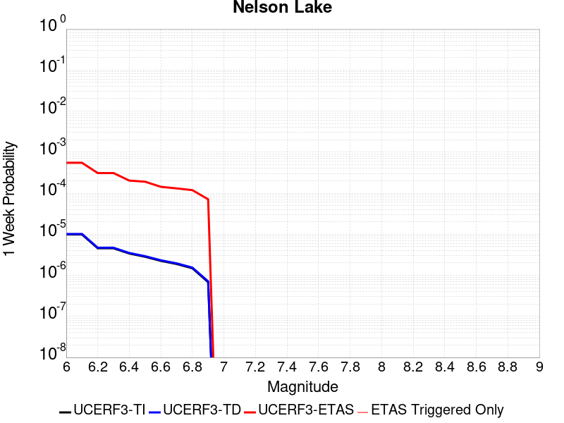 | 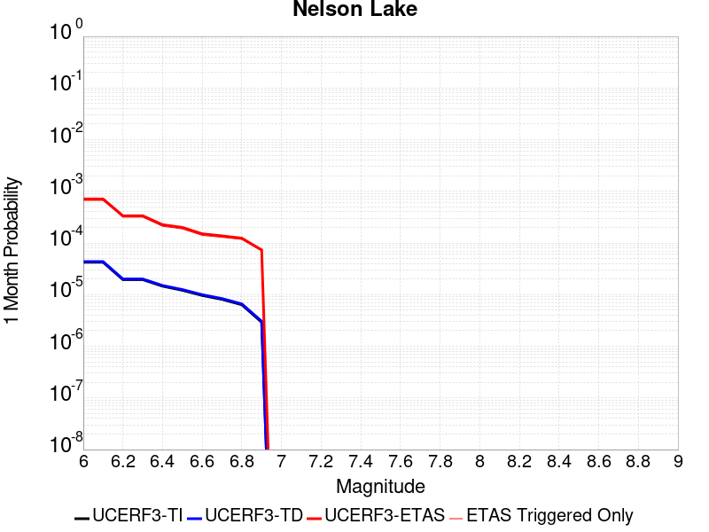 | 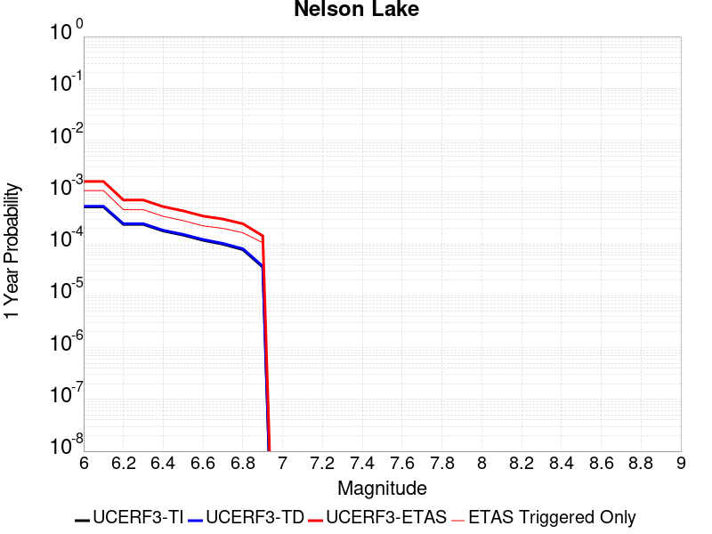 | 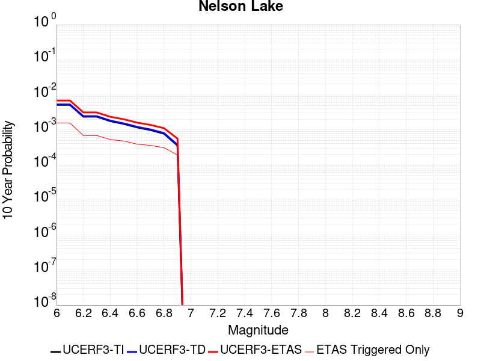 |

| Magnitude | 1 wk TI Prob | 1 wk TD Prob | 1 wk ETAS Prob | 1 wk ETAS/TD Gain | 1 wk ETAS Triggered Only | 1 mo TI Prob | 1 mo TD Prob | 1 mo ETAS Prob | 1 mo ETAS/TD Gain | 1 mo ETAS Triggered Only | 1 yr TI Prob | 1 yr TD Prob | 1 yr ETAS Prob | 1 yr ETAS/TD Gain | 1 yr ETAS Triggered Only | 10 yr TI Prob | 10 yr TD Prob | 10 yr ETAS Prob | 10 yr ETAS/TD Gain | 10 yr ETAS Triggered Only |
|-----|-----|-----|-----|-----|-----|-----|-----|-----|-----|-----|-----|-----|-----|-----|-----|-----|-----|-----|-----|-----|
| 6.0 | 9.913453E-6 | 1.0192255E-5 | 5.5009284E-4 | 53.971653 | 5.399061E-4 | 4.2485535E-5 | 4.3680422E-5 | 7.1266526E-4 | 16.31544 | 6.6901406E-4 | 5.1713863E-4 | 5.316897E-4 | 0.0015991969 | 3.0077636 | 0.0010680751 | 0.0051593683 | 0.005305204 | 0.0067879064 | 1.2794807 | 0.0014906103 |
| 6.1 | 9.913453E-6 | 1.0192255E-5 | 5.5009284E-4 | 53.971653 | 5.399061E-4 | 4.2485535E-5 | 4.3680422E-5 | 7.1266526E-4 | 16.31544 | 6.6901406E-4 | 5.1713863E-4 | 5.316897E-4 | 0.0015991969 | 3.0077636 | 0.0010680751 | 0.0051593683 | 0.005305204 | 0.0067879064 | 1.2794807 | 0.0014906103 |
| 6.2 | 4.5596407E-6 | 4.696313E-6 | 3.098592E-4 | 65.97925 | 3.051643E-4 | 1.954117E-5 | 2.0126909E-5 | 3.3702195E-4 | 16.744844 | 3.169014E-4 | 2.3788778E-4 | 2.4501883E-4 | 7.0265314E-4 | 2.8677518 | 4.5774647E-4 | 0.0023763329 | 0.0024476128 | 0.0031384062 | 1.2822315 | 6.924883E-4 |
| 6.3 | 4.5596407E-6 | 4.696313E-6 | 3.098592E-4 | 65.97925 | 3.051643E-4 | 1.954117E-5 | 2.0126909E-5 | 3.3702195E-4 | 16.744844 | 3.169014E-4 | 2.3788778E-4 | 2.4501883E-4 | 7.0265314E-4 | 2.8677518 | 4.5774647E-4 | 0.0023763329 | 0.0024476128 | 0.0031384062 | 1.2822315 | 6.924883E-4 |
| 6.4 | 3.4025713E-6 | 3.5098972E-6 | 2.0303972E-4 | 57.847767 | 1.9953052E-4 | 1.4582367E-5 | 1.5042335E-5 | 2.2630676E-4 | 15.044657 | 2.112676E-4 | 1.7752586E-4 | 1.8312587E-4 | 5.2343914E-4 | 2.858357 | 3.4037558E-4 | 0.001773841 | 0.0018298327 | 0.002333604 | 1.27531 | 5.046948E-4 |
| 6.5 | 2.8352947E-6 | 2.927856E-6 | 1.9072073E-4 | 65.14006 | 1.8779343E-4 | 1.2151207E-5 | 1.2547898E-5 | 2.0033897E-4 | 15.965938 | 1.8779343E-4 | 1.479309E-4 | 1.5276071E-4 | 4.3440782E-4 | 2.8437145 | 2.8169015E-4 | 0.0014783246 | 0.0015266308 | 0.0019719594 | 1.2917067 | 4.460094E-4 |
| 6.6 | 2.251518E-6 | 2.3290677E-6 | 1.431738E-4 | 61.472588 | 1.4084508E-4 | 9.649328E-6 | 9.981683E-6 | 1.5082535E-4 | 15.110211 | 1.4084508E-4 | 1.1747423E-4 | 1.2152085E-4 | 3.4449843E-4 | 2.8348918 | 2.230047E-4 | 0.0011741214 | 0.0012146058 | 0.0015662907 | 1.2895466 | 3.5211266E-4 |
| 6.7 | 1.8911853E-6 | 1.9591396E-6 | 1.3106687E-4 | 66.900215 | 1.2910798E-4 | 8.105055E-6 | 8.39629E-6 | 1.3750319E-4 | 16.376661 | 1.2910798E-4 | 9.867457E-5 | 1.0222061E-4 | 3.0173073E-4 | 2.9517603 | 1.9953052E-4 | 9.863076E-4 | 0.0010217935 | 0.0013500961 | 1.3213005 | 3.286385E-4 |
| 6.8 | 1.4874814E-6 | 1.5438305E-6 | 1.1891454E-4 | 77.02565 | 1.17370895E-4 | 6.374905E-6 | 6.6164025E-6 | 1.2398652E-4 | 18.739265 | 1.17370895E-4 | 7.76117E-5 | 8.055224E-5 | 2.4485827E-4 | 3.0397446 | 1.6431925E-4 | 7.75846E-4 | 8.0528157E-4 | 0.0010750173 | 1.3349582 | 2.6995305E-4 |
| 6.9 | 6.835972E-7 | 7.1399285E-7 | 7.113648E-5 | 99.63192 | 7.042254E-5 | 2.9296991E-6 | 3.0599674E-6 | 7.348229E-5 | 24.014074 | 7.042254E-5 | 3.56685E-5 | 3.7254784E-5 | 1.4288466E-4 | 3.835337 | 1.056338E-4 | 3.5662777E-4 | 3.7251666E-4 | 5.25042E-4 | 1.4094456 | 1.5258216E-4 |

## Paradise
*[(top)](#table-of-contents)*

| 1 Week | 1 Month | 1 Year | 10 Year |
|-----|-----|-----|-----|
| 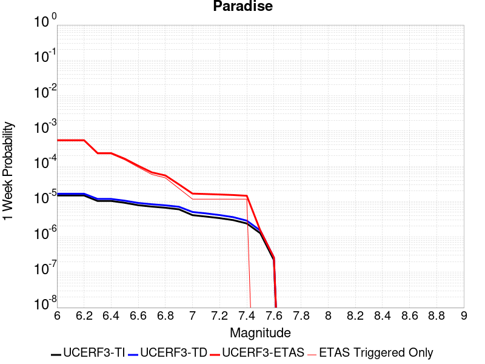 | 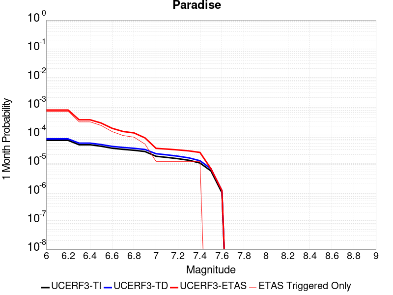 | 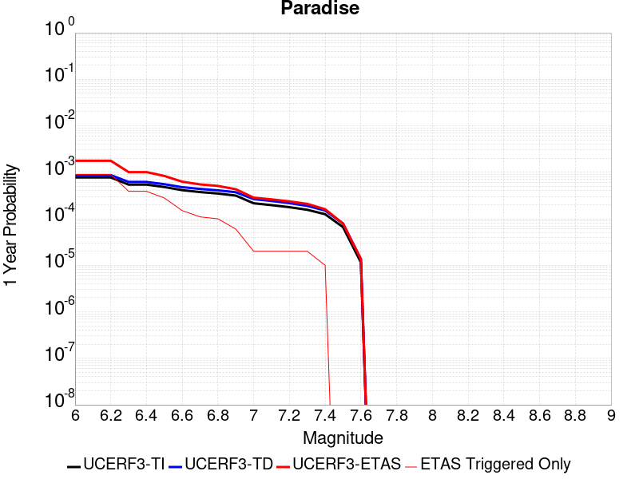 | 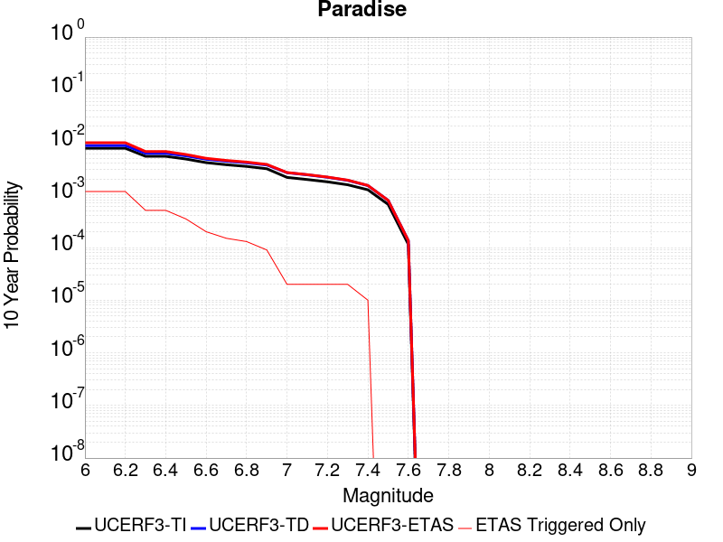 |

| Magnitude | 1 wk TI Prob | 1 wk TD Prob | 1 wk ETAS Prob | 1 wk ETAS/TD Gain | 1 wk ETAS Triggered Only | 1 mo TI Prob | 1 mo TD Prob | 1 mo ETAS Prob | 1 mo ETAS/TD Gain | 1 mo ETAS Triggered Only | 1 yr TI Prob | 1 yr TD Prob | 1 yr ETAS Prob | 1 yr ETAS/TD Gain | 1 yr ETAS Triggered Only | 10 yr TI Prob | 10 yr TD Prob | 10 yr ETAS Prob | 10 yr ETAS/TD Gain | 10 yr ETAS Triggered Only |
|-----|-----|-----|-----|-----|-----|-----|-----|-----|-----|-----|-----|-----|-----|-----|-----|-----|-----|-----|-----|-----|
| 6.0 | 1.4851273E-5 | 1.6694692E-5 | 5.448549E-4 | 32.636417 | 5.2816904E-4 | 6.364676E-5 | 7.154685E-5 | 7.287768E-4 | 10.186008 | 6.57277E-4 | 7.7462377E-4 | 8.707584E-4 | 0.0018206347 | 2.090861 | 9.507042E-4 | 0.0077192914 | 0.008675844 | 0.009897547 | 1.1408166 | 0.0012323944 |
| 6.1 | 1.4851273E-5 | 1.6694692E-5 | 5.448549E-4 | 32.636417 | 5.2816904E-4 | 6.364676E-5 | 7.154685E-5 | 7.287768E-4 | 10.186008 | 6.57277E-4 | 7.7462377E-4 | 8.707584E-4 | 0.0018206347 | 2.090861 | 9.507042E-4 | 0.0077192914 | 0.008675844 | 0.009897547 | 1.1408166 | 0.0012323944 |
| 6.2 | 1.4851273E-5 | 1.6694692E-5 | 5.448549E-4 | 32.636417 | 5.2816904E-4 | 6.364676E-5 | 7.154685E-5 | 7.287768E-4 | 10.186008 | 6.57277E-4 | 7.7462377E-4 | 8.707584E-4 | 0.0018206347 | 2.090861 | 9.507042E-4 | 0.0077192914 | 0.008675844 | 0.009897547 | 1.1408166 | 0.0012323944 |
| 6.3 | 1.0426831E-5 | 1.188862E-5 | 2.3489067E-4 | 19.757605 | 2.230047E-4 | 4.4685654E-5 | 5.0950268E-5 | 3.3262605E-4 | 6.5284457 | 2.8169015E-4 | 5.43912E-4 | 6.201489E-4 | 0.001042422 | 1.6809223 | 4.225352E-4 | 0.0054258266 | 0.0061847917 | 0.0067446874 | 1.0905279 | 5.633803E-4 |
| 6.4 | 1.0426831E-5 | 1.188862E-5 | 2.3489067E-4 | 19.757605 | 2.230047E-4 | 4.4685654E-5 | 5.0950268E-5 | 3.3262605E-4 | 6.5284457 | 2.8169015E-4 | 5.43912E-4 | 6.201489E-4 | 0.001042422 | 1.6809223 | 4.225352E-4 | 0.0054258266 | 0.0061847917 | 0.0067446874 | 1.0905279 | 5.633803E-4 |
| 6.5 | 9.25027E-6 | 1.06199595E-5 | 1.632005E-4 | 15.367337 | 1.5258216E-4 | 3.964341E-5 | 4.551335E-5 | 2.5677134E-4 | 5.641671 | 2.112676E-4 | 4.8255164E-4 | 5.53989E-4 | 8.7071484E-4 | 1.5717187 | 3.169014E-4 | 0.0048150513 | 0.0055265795 | 0.005923435 | 1.0718086 | 3.9906104E-4 |
| 6.6 | 7.904275E-6 | 9.159525E-6 | 1.03055376E-4 | 11.25117 | 9.389671E-5 | 3.3875025E-5 | 3.9254537E-5 | 1.6835745E-4 | 4.288866 | 1.2910798E-4 | 4.1235037E-4 | 4.7782314E-4 | 6.4206385E-4 | 1.343727 | 1.6431925E-4 | 0.0041158604 | 0.0047683544 | 0.0049902955 | 1.0465447 | 2.230047E-4 |
| 6.7 | 7.2061953E-6 | 8.407248E-6 | 6.70922E-5 | 7.9802804 | 5.8685448E-5 | 3.088333E-5 | 3.6030586E-5 | 1.2992392E-4 | 3.605934 | 9.389671E-5 | 3.7593965E-4 | 4.3858777E-4 | 5.559072E-4 | 1.2674936 | 1.17370895E-4 | 0.003753043 | 0.004377591 | 0.004541191 | 1.0373721 | 1.6431925E-4 |
| 6.8 | 6.6948724E-6 | 7.842166E-6 | 5.4790155E-5 | 6.98661 | 4.6948357E-5 | 2.8691995E-5 | 3.360887E-5 | 1.1576573E-4 | 3.4444995 | 8.2159626E-5 | 3.4926904E-4 | 4.0911473E-4 | 5.147053E-4 | 1.2580953 | 1.056338E-4 | 0.003487206 | 0.0040839734 | 0.004224243 | 1.0343465 | 1.4084508E-4 |
| 6.9 | 6.0421025E-6 | 7.130621E-6 | 3.060463E-5 | 4.292001 | 2.3474178E-5 | 2.5894467E-5 | 3.0559466E-5 | 7.750639E-5 | 2.5362482 | 4.6948357E-5 | 3.1521954E-4 | 3.7200135E-4 | 4.3066498E-4 | 1.1576973 | 5.8685448E-5 | 0.0031477278 | 0.0037141247 | 0.0038076728 | 1.0251871 | 9.389671E-5 |
| 7.0 | 4.134091E-6 | 5.0803087E-6 | 1.681734E-5 | 3.3102984 | 1.1737089E-5 | 1.7717413E-5 | 2.177258E-5 | 3.3509412E-5 | 1.5390649 | 1.1737089E-5 | 2.1568815E-4 | 2.6505045E-4 | 2.885184E-4 | 1.0885415 | 2.3474178E-5 | 0.0021547892 | 0.0026474963 | 0.0026709083 | 1.0088431 | 2.3474178E-5 |
| 7.1 | 3.7674888E-6 | 4.6318696E-6 | 1.6368904E-5 | 3.5339737 | 1.1737089E-5 | 1.6146281E-5 | 1.9850726E-5 | 3.1587584E-5 | 1.5912558 | 1.1737089E-5 | 1.9656324E-4 | 2.4165731E-4 | 2.6512583E-4 | 1.0971148 | 2.3474178E-5 | 0.0019638946 | 0.002414096 | 0.0024375133 | 1.0097003 | 2.3474178E-5 |
| 7.2 | 3.4065345E-6 | 4.156723E-6 | 1.5893764E-5 | 3.8236282 | 1.1737089E-5 | 1.4599351E-5 | 1.7814415E-5 | 2.9551295E-5 | 1.6588417 | 1.1737089E-5 | 1.777326E-4 | 2.1687041E-4 | 2.403395E-4 | 1.1082171 | 2.3474178E-5 | 0.0017759053 | 0.002166736 | 0.0021901592 | 1.0108104 | 2.3474178E-5 |
| 7.3 | 2.9934936E-6 | 3.6293168E-6 | 1.5366364E-5 | 4.233955 | 1.1737089E-5 | 1.2829195E-5 | 1.555413E-5 | 2.7291037E-5 | 1.7545846 | 1.1737089E-5 | 1.5618425E-4 | 1.8935655E-4 | 2.1282629E-4 | 1.1239446 | 2.3474178E-5 | 0.0015607453 | 0.0018920974 | 0.0019155272 | 1.012383 | 2.3474178E-5 |
| 7.4 | 2.4049796E-6 | 2.8889842E-6 | 1.4626039E-5 | 5.062693 | 1.1737089E-5 | 1.0307015E-5 | 1.238131E-5 | 2.4118253E-5 | 1.9479566 | 1.1737089E-5 | 1.2548068E-4 | 1.5073347E-4 | 1.6246879E-4 | 1.0778548 | 1.1737089E-5 | 0.0012540985 | 0.0015064536 | 0.001518173 | 1.0077795 | 1.1737089E-5 |
| 7.5 | 1.2710091E-6 | 1.5134682E-6 | 1.5134682E-6 | 1.0 | 0.0 | 5.44717E-6 | 6.4862834E-6 | 6.4862834E-6 | 1.0 | 0.0 | 6.631728E-5 | 7.8968886E-5 | 7.8968886E-5 | 1.0 | 0.0 | 6.6297496E-4 | 7.8953087E-4 | 7.8953087E-4 | 1.0 | 0.0 |
| 7.6 | 2.21172E-7 | 2.603961E-7 | 2.603961E-7 | 1.0 | 0.0 | 9.478797E-7 | 1.1159829E-6 | 1.1159829E-6 | 1.0 | 0.0 | 1.1540374E-5 | 1.3587036E-5 | 1.3587036E-5 | 1.0 | 0.0 | 1.1539775E-4 | 1.3586486E-4 | 1.3586486E-4 | 1.0 | 0.0 |

## San Andreas (San Bernardino S)
*[(top)](#table-of-contents)*

| 1 Week | 1 Month | 1 Year | 10 Year |
|-----|-----|-----|-----|
| 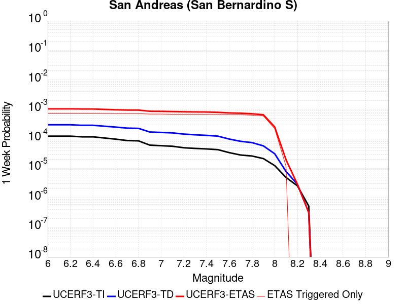 | 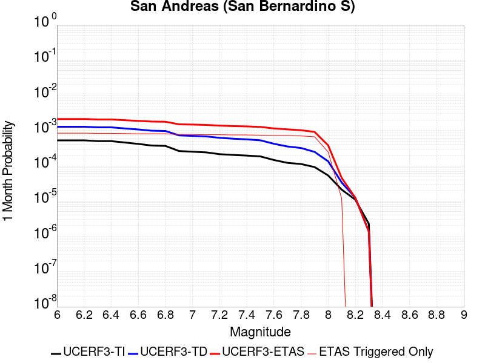 | 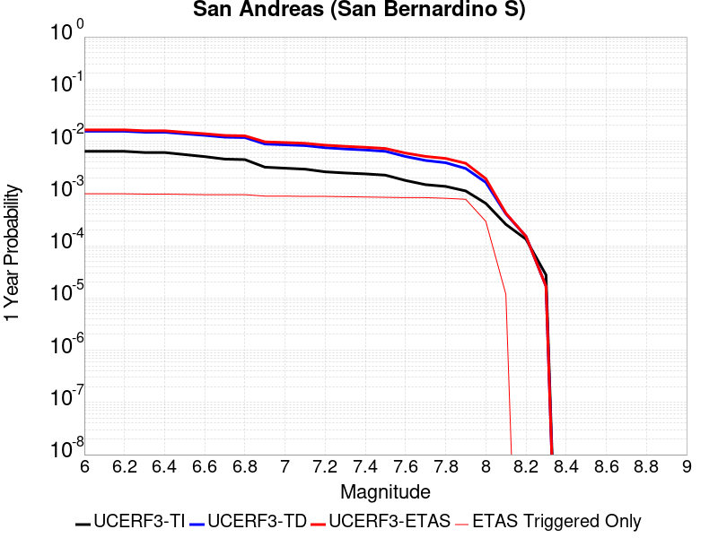 | 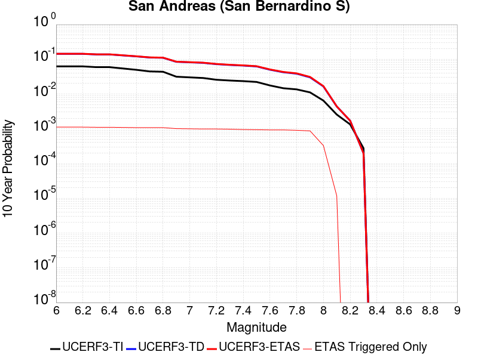 |

| Magnitude | 1 wk TI Prob | 1 wk TD Prob | 1 wk ETAS Prob | 1 wk ETAS/TD Gain | 1 wk ETAS Triggered Only | 1 mo TI Prob | 1 mo TD Prob | 1 mo ETAS Prob | 1 mo ETAS/TD Gain | 1 mo ETAS Triggered Only | 1 yr TI Prob | 1 yr TD Prob | 1 yr ETAS Prob | 1 yr ETAS/TD Gain | 1 yr ETAS Triggered Only | 10 yr TI Prob | 10 yr TD Prob | 10 yr ETAS Prob | 10 yr ETAS/TD Gain | 10 yr ETAS Triggered Only |
|-----|-----|-----|-----|-----|-----|-----|-----|-----|-----|-----|-----|-----|-----|-----|-----|-----|-----|-----|-----|-----|
| 6.0 | 1.2336002E-4 | 3.0004102E-4 | 0.0010392558 | 3.4637122 | 7.394366E-4 | 5.2857865E-4 | 0.0012852824 | 0.0021292667 | 1.6566528 | 8.450704E-4 | 0.006416472 | 0.015540994 | 0.016511587 | 1.0624537 | 9.859155E-4 | 0.06234337 | 0.14283717 | 0.14379293 | 1.0066912 | 0.0011150235 |
| 6.1 | 1.2336002E-4 | 3.0004102E-4 | 0.0010392558 | 3.4637122 | 7.394366E-4 | 5.2857865E-4 | 0.0012852824 | 0.0021292667 | 1.6566528 | 8.450704E-4 | 0.006416472 | 0.015540994 | 0.016511587 | 1.0624537 | 9.859155E-4 | 0.06234337 | 0.14283717 | 0.14379293 | 1.0066912 | 0.0011150235 |
| 6.2 | 1.2336002E-4 | 3.0004102E-4 | 0.0010392558 | 3.4637122 | 7.394366E-4 | 5.2857865E-4 | 0.0012852824 | 0.0021292667 | 1.6566528 | 8.450704E-4 | 0.006416472 | 0.015540994 | 0.016511587 | 1.0624537 | 9.859155E-4 | 0.06234337 | 0.14283717 | 0.14379293 | 1.0066912 | 0.0011150235 |
| 6.3 | 1.1712257E-4 | 2.8792414E-4 | 0.0010271479 | 3.5674253 | 7.394366E-4 | 5.018573E-4 | 0.0012334028 | 0.0020657082 | 1.6748043 | 8.3333335E-4 | 0.006093008 | 0.014918125 | 0.01587777 | 1.0643275 | 9.7417843E-4 | 0.059286322 | 0.13754563 | 0.13849716 | 1.006918 | 0.0011032864 |
| 6.4 | 1.1712257E-4 | 2.8792414E-4 | 0.0010271479 | 3.5674253 | 7.394366E-4 | 5.018573E-4 | 0.0012334028 | 0.0020657082 | 1.6748043 | 8.3333335E-4 | 0.006093008 | 0.014918125 | 0.01587777 | 1.0643275 | 9.7417843E-4 | 0.059286322 | 0.13754563 | 0.13849716 | 1.006918 | 0.0011032864 |
| 6.5 | 1.0689076E-4 | 2.680528E-4 | 9.955573E-4 | 3.7140343 | 7.2769955E-4 | 4.5802278E-4 | 0.0011483167 | 0.0019689694 | 1.7146572 | 8.2159624E-4 | 0.0055621783 | 0.01389575 | 0.014844818 | 1.0682992 | 9.624413E-4 | 0.05425003 | 0.12879294 | 0.12974392 | 1.0073837 | 0.0010915493 |
| 6.6 | 9.7648895E-5 | 2.50501E-4 | 9.662841E-4 | 3.857406 | 7.1596244E-4 | 4.1842813E-4 | 0.0010731576 | 0.0018821477 | 1.7538408 | 8.0985914E-4 | 0.005082469 | 0.012991785 | 0.013930138 | 1.0722266 | 9.507042E-4 | 0.049677886 | 0.12095292 | 0.12190212 | 1.0078478 | 0.0010798122 |
| 6.7 | 8.757013E-5 | 2.3120902E-4 | 9.4700593E-4 | 4.0958867 | 7.1596244E-4 | 3.7524657E-4 | 9.905418E-4 | 0.0017995988 | 1.8167822 | 8.0985914E-4 | 0.00455906 | 0.011997245 | 0.012936544 | 1.0782928 | 9.507042E-4 | 0.04466656 | 0.11226123 | 0.11321982 | 1.008539 | 0.0010798122 |
| 6.8 | 8.562978E-5 | 2.2680782E-4 | 9.426079E-4 | 4.155976 | 7.1596244E-4 | 3.6693315E-4 | 9.7169366E-4 | 0.0017807658 | 1.8326412 | 8.0985914E-4 | 0.004458263 | 0.011770263 | 0.012709778 | 1.079821 | 9.507042E-4 | 0.043698758 | 0.11027153 | 0.11123227 | 1.0087125 | 0.0010798122 |
| 6.9 | 6.124075E-5 | 1.7065753E-4 | 8.630276E-4 | 5.057073 | 6.924883E-4 | 2.6243398E-4 | 7.311852E-4 | 0.0015052666 | 2.0586667 | 7.7464787E-4 | 0.0031904527 | 0.008866051 | 0.009750161 | 1.0997186 | 8.920188E-4 | 0.031450346 | 0.08418263 | 0.08510704 | 1.0109811 | 0.0010093896 |
| 7.0 | 5.8598747E-5 | 1.649477E-4 | 8.573217E-4 | 5.1975365 | 6.924883E-4 | 2.5111332E-4 | 7.06728E-4 | 0.0014808285 | 2.09533 | 7.7464787E-4 | 0.0030530186 | 0.008570663 | 0.009455036 | 1.1031861 | 8.920188E-4 | 0.03011414 | 0.081500374 | 0.08241671 | 1.0112435 | 9.976525E-4 |
| 7.1 | 5.613814E-5 | 1.5913323E-4 | 8.3977607E-4 | 5.277189 | 6.8075117E-4 | 2.4056983E-4 | 6.818221E-4 | 0.0014442126 | 2.1181667 | 7.629108E-4 | 0.0029250039 | 0.008269769 | 0.00914277 | 1.1055654 | 8.802817E-4 | 0.028868021 | 0.07879931 | 0.07970753 | 1.0115259 | 9.859155E-4 |
| 7.2 | 4.991222E-5 | 1.4519796E-4 | 8.258503E-4 | 5.687754 | 6.8075117E-4 | 2.1389198E-4 | 6.2212895E-4 | 0.0013845651 | 2.2255275 | 7.629108E-4 | 0.002601025 | 0.007548217 | 0.008421854 | 1.1157409 | 8.802817E-4 | 0.025707912 | 0.07225321 | 0.07316789 | 1.0126593 | 9.859155E-4 |
| 7.3 | 4.7410045E-5 | 1.3714004E-4 | 8.1779785E-4 | 5.963232 | 6.8075117E-4 | 2.0317009E-4 | 5.8761094E-4 | 0.0013383433 | 2.277601 | 7.511737E-4 | 0.0024707897 | 0.0071307817 | 0.007993133 | 1.1209337 | 8.685446E-4 | 0.024434982 | 0.06853558 | 0.069442995 | 1.01324 | 9.7417843E-4 |
| 7.4 | 4.5556746E-5 | 1.3121912E-4 | 8.11881E-4 | 6.1872153 | 6.8075117E-4 | 1.952286E-4 | 5.622468E-4 | 0.0013129981 | 2.3352702 | 7.511737E-4 | 0.002374317 | 0.0068239477 | 0.0076749083 | 1.1247021 | 8.568075E-4 | 0.023491086 | 0.065788016 | 0.06667618 | 1.0135003 | 9.507042E-4 |
| 7.5 | 4.3084514E-5 | 1.2357246E-4 | 7.925039E-4 | 6.4132724 | 6.6901406E-4 | 1.8463485E-4 | 5.2948913E-4 | 0.0012685342 | 2.39577 | 7.394366E-4 | 0.0022456115 | 0.0064275465 | 0.0072671855 | 1.1306313 | 8.450704E-4 | 0.022230545 | 0.062188786 | 0.06306936 | 1.0141597 | 9.3896716E-4 |
| 7.6 | 3.408608E-5 | 9.83552E-5 | 7.5556757E-4 | 7.6820297 | 6.57277E-4 | 1.4607502E-4 | 4.214543E-4 | 0.0011488472 | 2.7259116 | 7.2769955E-4 | 0.0017770125 | 0.0051191594 | 0.0059482264 | 1.1619538 | 8.3333335E-4 | 0.017628696 | 0.050020292 | 0.05090114 | 1.0176098 | 9.2723005E-4 |
| 7.7 | 2.8315713E-5 | 8.248679E-5 | 7.397096E-4 | 8.967612 | 6.57277E-4 | 1.2134742E-4 | 3.5346695E-4 | 0.0010809093 | 3.0580206 | 7.2769955E-4 | 0.0014764034 | 0.0042949775 | 0.0051247315 | 1.1931918 | 8.3333335E-4 | 0.01466633 | 0.0422714 | 0.043159436 | 1.0210079 | 9.2723005E-4 |
| 7.8 | 2.6222975E-5 | 7.463088E-5 | 7.083864E-4 | 9.491867 | 6.338028E-4 | 1.1237934E-4 | 3.1980744E-4 | 0.0010238076 | 3.2013252 | 7.042253E-4 | 0.0013673597 | 0.0038867102 | 0.0046934215 | 1.2075564 | 8.0985914E-4 | 0.013589768 | 0.03843674 | 0.03930576 | 1.0226091 | 9.037559E-4 |
| 7.9 | 2.1469694E-5 | 5.787864E-5 | 6.5643556E-4 | 11.341585 | 5.985916E-4 | 9.200973E-5 | 2.4802773E-4 | 9.168759E-4 | 3.6966667 | 6.6901406E-4 | 0.0011196428 | 0.0030155594 | 0.0037878712 | 1.256109 | 7.7464787E-4 | 0.011140184 | 0.030152109 | 0.030994466 | 1.0279369 | 8.685446E-4 |
| 8.0 | 1.2420249E-5 | 3.131896E-5 | 2.5431666E-4 | 8.120214 | 2.230047E-4 | 5.322855E-5 | 1.342172E-4 | 3.80663E-4 | 2.8361714 | 2.4647888E-4 | 6.478649E-4 | 0.0016328706 | 0.0019258187 | 1.1794068 | 2.9342723E-4 | 0.0064597935 | 0.016522504 | 0.016845712 | 1.0195618 | 3.286385E-4 |
| 8.1 | 4.9197724E-6 | 7.822348E-6 | 1.9559346E-5 | 2.5004442 | 1.1737089E-5 | 2.1084568E-5 | 3.352392E-5 | 4.526062E-5 | 1.3500991 | 1.1737089E-5 | 2.566744E-4 | 4.0807744E-4 | 4.1980974E-4 | 1.0287502 | 1.1737089E-5 | 0.002563781 | 0.0043843705 | 0.004396056 | 1.0026653 | 1.1737089E-5 |
| 8.2 | 2.5634774E-6 | 2.9067196E-6 | 2.9067196E-6 | 1.0 | 0.0 | 1.0986286E-5 | 1.2457311E-5 | 1.2457311E-5 | 1.0 | 0.0 | 1.3374983E-4 | 1.5165724E-4 | 1.5165724E-4 | 1.0 | 0.0 | 0.0013366934 | 0.0017049741 | 0.0017049741 | 1.0 | 0.0 |
| 8.3 | 5.2850464E-7 | 3.2088764E-7 | 3.2088764E-7 | 1.0 | 0.0 | 2.2650179E-6 | 1.375232E-6 | 1.375232E-6 | 1.0 | 0.0 | 2.7576245E-5 | 1.6743334E-5 | 1.6743334E-5 | 1.0 | 0.0 | 2.7572823E-4 | 1.9870348E-4 | 1.9870348E-4 | 1.0 | 0.0 |

## Bicycle Lake
*[(top)](#table-of-contents)*

| 1 Week | 1 Month | 1 Year | 10 Year |
|-----|-----|-----|-----|
| 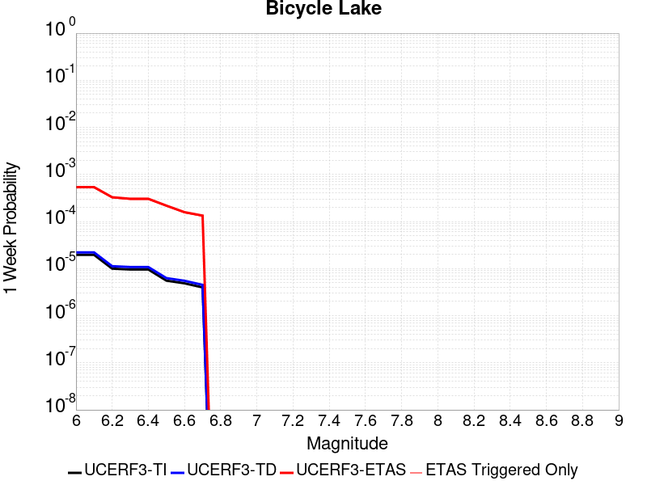 | 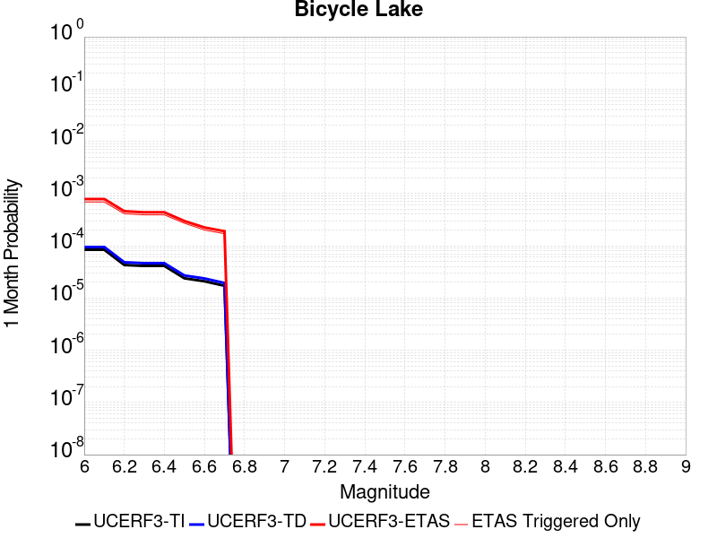 | 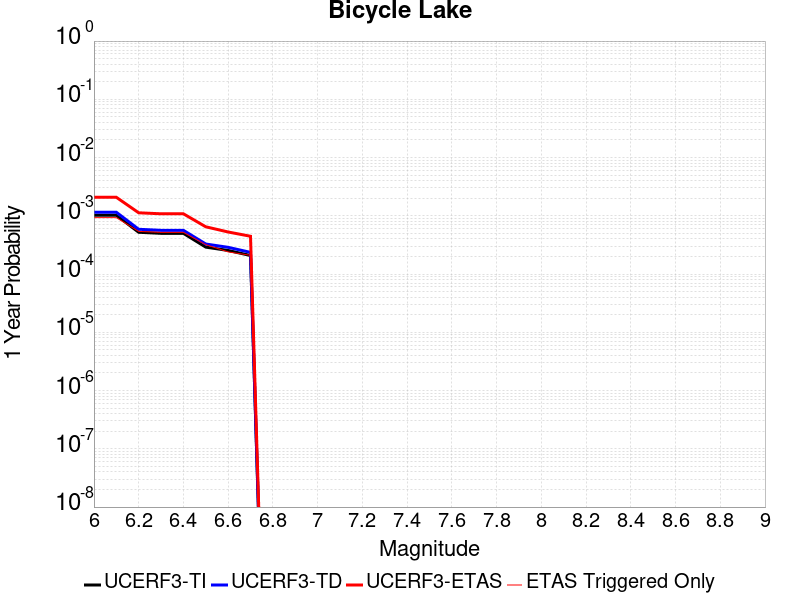 | 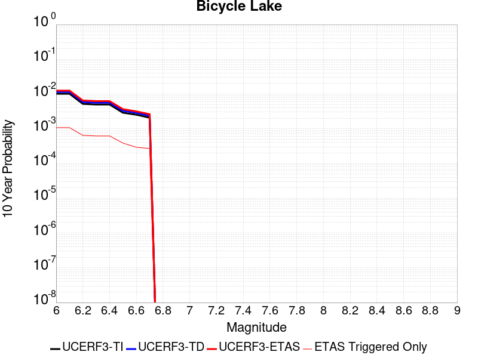 |

| Magnitude | 1 wk TI Prob | 1 wk TD Prob | 1 wk ETAS Prob | 1 wk ETAS/TD Gain | 1 wk ETAS Triggered Only | 1 mo TI Prob | 1 mo TD Prob | 1 mo ETAS Prob | 1 mo ETAS/TD Gain | 1 mo ETAS Triggered Only | 1 yr TI Prob | 1 yr TD Prob | 1 yr ETAS Prob | 1 yr ETAS/TD Gain | 1 yr ETAS Triggered Only | 10 yr TI Prob | 10 yr TD Prob | 10 yr ETAS Prob | 10 yr ETAS/TD Gain | 10 yr ETAS Triggered Only |
|-----|-----|-----|-----|-----|-----|-----|-----|-----|-----|-----|-----|-----|-----|-----|-----|-----|-----|-----|-----|-----|
| 6.0 | 1.9621975E-5 | 2.2097078E-5 | 5.385176E-4 | 24.370535 | 5.1643193E-4 | 8.4091465E-5 | 9.4699084E-5 | 7.401779E-4 | 7.8161035 | 6.455399E-4 | 0.0010233327 | 0.0011524865 | 0.0020552007 | 1.7832754 | 9.037559E-4 | 0.01018633 | 0.011478408 | 0.012545826 | 1.0929935 | 0.0010798122 |
| 6.1 | 1.9621975E-5 | 2.2097078E-5 | 5.385176E-4 | 24.370535 | 5.1643193E-4 | 8.4091465E-5 | 9.4699084E-5 | 7.401779E-4 | 7.8161035 | 6.455399E-4 | 0.0010233327 | 0.0011524865 | 0.0020552007 | 1.7832754 | 9.037559E-4 | 0.01018633 | 0.011478408 | 0.012545826 | 1.0929935 | 0.0010798122 |
| 6.2 | 9.9971285E-6 | 1.1255639E-5 | 3.281535E-4 | 29.154583 | 3.169014E-4 | 4.2844134E-5 | 4.8237856E-5 | 4.4727963E-4 | 9.272378 | 3.9906104E-4 | 5.2150246E-4 | 5.871896E-4 | 0.0011385089 | 1.9389118 | 5.516432E-4 | 0.0052028033 | 0.005861487 | 0.0065032425 | 1.1094869 | 6.455399E-4 |
| 6.3 | 9.589428E-6 | 1.0798346E-5 | 3.042224E-4 | 28.173056 | 2.9342723E-4 | 4.10969E-5 | 4.62781E-5 | 4.2184757E-4 | 9.115491 | 3.7558685E-4 | 5.002399E-4 | 5.6334207E-4 | 0.0010912135 | 1.9370354 | 5.2816904E-4 | 0.0049911533 | 0.0056242296 | 0.006242797 | 1.1099825 | 6.2206574E-4 |
| 6.4 | 9.589428E-6 | 1.0798346E-5 | 3.042224E-4 | 28.173056 | 2.9342723E-4 | 4.10969E-5 | 4.62781E-5 | 4.2184757E-4 | 9.115491 | 3.7558685E-4 | 5.002399E-4 | 5.6334207E-4 | 0.0010912135 | 1.9370354 | 5.2816904E-4 | 0.0049911533 | 0.0056242296 | 0.006242797 | 1.1099825 | 6.2206574E-4 |
| 6.5 | 5.557707E-6 | 6.2856016E-6 | 2.1755187E-4 | 34.61115 | 2.112676E-4 | 2.3818526E-5 | 2.6938165E-5 | 2.9688395E-4 | 11.020942 | 2.6995305E-4 | 2.8995197E-4 | 3.2794967E-4 | 6.5648044E-4 | 2.0017717 | 3.286385E-4 | 0.0028957394 | 0.0032772934 | 0.003663348 | 1.1177968 | 3.8732393E-4 |
| 6.6 | 4.8742945E-6 | 5.5132896E-6 | 1.5809461E-4 | 28.675186 | 1.5258216E-4 | 2.0889667E-5 | 2.3628318E-5 | 2.2315411E-4 | 9.44435 | 1.9953052E-4 | 2.54302E-4 | 2.87663E-4 | 5.3407095E-4 | 1.8565855 | 2.4647888E-4 | 0.002540112 | 0.0028754752 | 0.0031680586 | 1.1017513 | 2.9342723E-4 |
| 6.7 | 3.991108E-6 | 4.5159104E-6 | 1.3362331E-4 | 29.58945 | 1.2910798E-4 | 1.7104636E-5 | 1.9353902E-5 | 1.9540683E-4 | 10.096509 | 1.7605633E-4 | 2.0822904E-4 | 2.3563375E-4 | 4.5858588E-4 | 1.9461808 | 2.230047E-4 | 0.0020803404 | 0.0023563374 | 0.0026256545 | 1.1142948 | 2.6995305E-4 |

## Helendale-So Lockhart
*[(top)](#table-of-contents)*

| 1 Week | 1 Month | 1 Year | 10 Year |
|-----|-----|-----|-----|
| 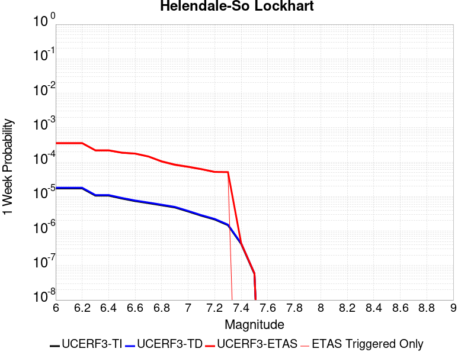 | 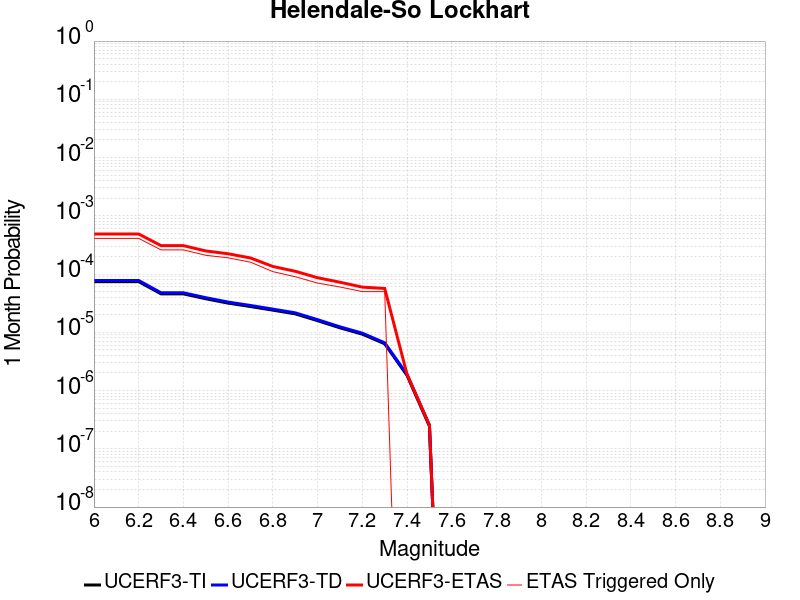 | 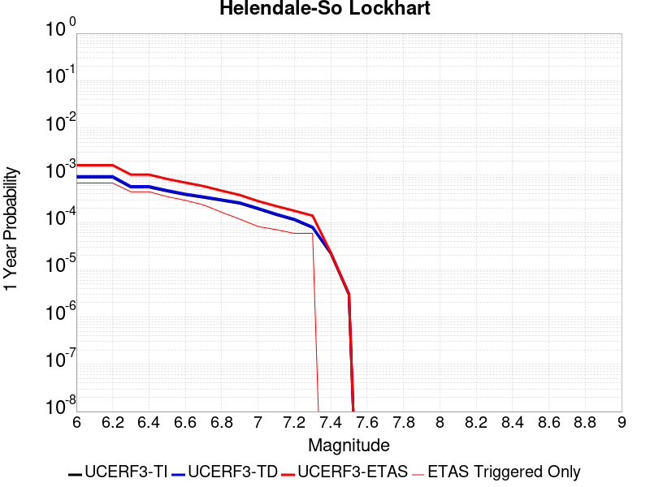 | 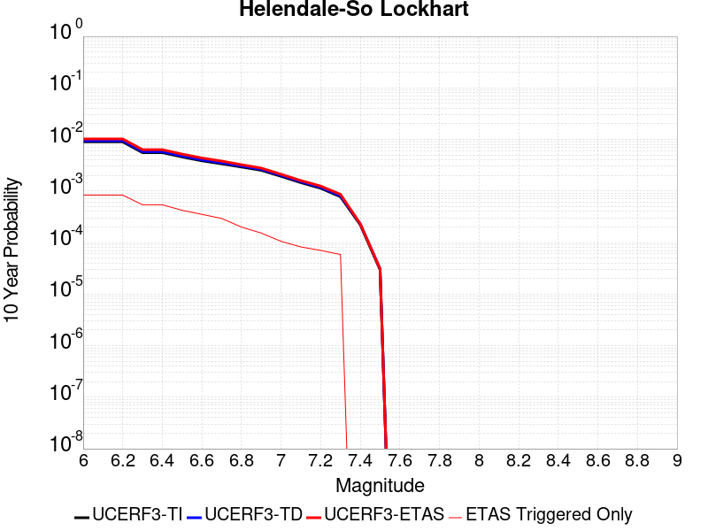 |

| Magnitude | 1 wk TI Prob | 1 wk TD Prob | 1 wk ETAS Prob | 1 wk ETAS/TD Gain | 1 wk ETAS Triggered Only | 1 mo TI Prob | 1 mo TD Prob | 1 mo ETAS Prob | 1 mo ETAS/TD Gain | 1 mo ETAS Triggered Only | 1 yr TI Prob | 1 yr TD Prob | 1 yr ETAS Prob | 1 yr ETAS/TD Gain | 1 yr ETAS Triggered Only | 10 yr TI Prob | 10 yr TD Prob | 10 yr ETAS Prob | 10 yr ETAS/TD Gain | 10 yr ETAS Triggered Only |
|-----|-----|-----|-----|-----|-----|-----|-----|-----|-----|-----|-----|-----|-----|-----|-----|-----|-----|-----|-----|-----|
| 6.0 | 1.7296055E-5 | 1.8103729E-5 | 3.936838E-4 | 21.746004 | 3.7558685E-4 | 7.412385E-5 | 7.7585224E-5 | 5.2356E-4 | 6.7481923 | 4.460094E-4 | 9.0208417E-4 | 9.4421144E-4 | 0.0016243198 | 1.7202924 | 6.8075117E-4 | 0.008984311 | 0.009404116 | 0.010229613 | 1.0877804 | 8.3333335E-4 |
| 6.1 | 1.7296055E-5 | 1.8103729E-5 | 3.936838E-4 | 21.746004 | 3.7558685E-4 | 7.412385E-5 | 7.7585224E-5 | 5.2356E-4 | 6.7481923 | 4.460094E-4 | 9.0208417E-4 | 9.4421144E-4 | 0.0016243198 | 1.7202924 | 6.8075117E-4 | 0.008984311 | 0.009404116 | 0.010229613 | 1.0877804 | 8.3333335E-4 |
| 6.2 | 1.7296055E-5 | 1.8103729E-5 | 3.936838E-4 | 21.746004 | 3.7558685E-4 | 7.412385E-5 | 7.7585224E-5 | 5.2356E-4 | 6.7481923 | 4.460094E-4 | 9.0208417E-4 | 9.4421144E-4 | 0.0016243198 | 1.7202924 | 6.8075117E-4 | 0.008984311 | 0.009404116 | 0.010229613 | 1.0877804 | 8.3333335E-4 |
| 6.3 | 1.0669118E-5 | 1.1135425E-5 | 2.458746E-4 | 22.080397 | 2.3474179E-4 | 4.5723988E-5 | 4.772239E-5 | 3.2939907E-4 | 6.9024014 | 2.8169015E-4 | 5.5654737E-4 | 5.80868E-4 | 0.0010266183 | 1.7673866 | 4.460094E-4 | 0.0055515557 | 0.0057937936 | 0.0063305716 | 1.0926471 | 5.399061E-4 |
| 6.4 | 1.0669118E-5 | 1.1135425E-5 | 2.458746E-4 | 22.080397 | 2.3474179E-4 | 4.5723988E-5 | 4.772239E-5 | 3.2939907E-4 | 6.9024014 | 2.8169015E-4 | 5.5654737E-4 | 5.80868E-4 | 0.0010266183 | 1.7673866 | 4.460094E-4 | 0.0055515557 | 0.0057937936 | 0.0063305716 | 1.0926471 | 5.399061E-4 |
| 6.5 | 8.790038E-6 | 9.170197E-6 | 2.0869888E-4 | 22.758387 | 1.9953052E-4 | 3.767105E-5 | 3.930026E-5 | 2.6229618E-4 | 6.674159 | 2.230047E-4 | 4.585485E-4 | 4.7837716E-4 | 8.303214E-4 | 1.7357045 | 3.5211266E-4 | 0.0045760344 | 0.004773638 | 0.0051941564 | 1.0880917 | 4.225352E-4 |
| 6.6 | 7.396949E-6 | 7.715537E-6 | 1.9550751E-4 | 25.339457 | 1.8779343E-4 | 3.1700827E-5 | 3.3066175E-5 | 2.443268E-4 | 7.389025 | 2.112676E-4 | 3.858892E-4 | 4.025073E-4 | 6.958164E-4 | 1.728705 | 2.9342723E-4 | 0.003852198 | 0.00401789 | 0.004368588 | 1.0872841 | 3.5211266E-4 |
| 6.7 | 6.4600285E-6 | 6.738031E-6 | 1.5931916E-4 | 23.644766 | 1.5258216E-4 | 2.7685543E-5 | 2.887696E-5 | 2.0492822E-4 | 7.096599 | 1.7605633E-4 | 3.3701936E-4 | 3.5152107E-4 | 5.861803E-4 | 1.6675539 | 2.3474179E-4 | 0.0033650869 | 0.003509732 | 0.0038021293 | 1.0833105 | 2.9342723E-4 |
| 6.8 | 5.600104E-6 | 5.836009E-6 | 1.2320622E-4 | 21.111382 | 1.17370895E-4 | 2.4000226E-5 | 2.5011232E-5 | 1.5411599E-4 | 6.161871 | 1.2910798E-4 | 2.9216358E-4 | 3.044698E-4 | 4.6873902E-4 | 1.5395255 | 1.6431925E-4 | 0.0029177975 | 0.003040588 | 0.003239512 | 1.0654228 | 1.9953052E-4 |
| 6.9 | 4.839122E-6 | 5.0395092E-6 | 9.893575E-5 | 19.63202 | 9.389671E-5 | 2.0738931E-5 | 2.159772E-5 | 1.2722924E-4 | 5.8908644 | 1.056338E-4 | 2.5246723E-4 | 2.6292098E-4 | 3.8026102E-4 | 1.446294 | 1.17370895E-4 | 0.002521806 | 0.002626147 | 0.0027783283 | 1.0579486 | 1.5258216E-4 |
| 7.0 | 3.6937633E-6 | 3.845208E-6 | 8.600452E-5 | 22.366674 | 8.2159626E-5 | 1.5830317E-5 | 1.647936E-5 | 9.863763E-5 | 5.9855256 | 8.2159626E-5 | 1.9271708E-4 | 2.0061806E-4 | 2.827612E-4 | 1.4094504 | 8.2159626E-5 | 0.0019255003 | 0.002004401 | 0.002109823 | 1.0525953 | 1.056338E-4 |
| 7.1 | 2.7858857E-6 | 2.8978538E-6 | 7.332018E-5 | 25.301548 | 7.042254E-5 | 1.1939455E-5 | 1.2419316E-5 | 8.2840976E-5 | 6.6703334 | 7.042254E-5 | 1.4535317E-4 | 1.511949E-4 | 2.2160678E-4 | 1.4657028 | 7.042254E-5 | 0.0014525814 | 0.0015109418 | 0.0015929772 | 1.0542942 | 8.2159626E-5 |
| 7.2 | 2.1672065E-6 | 2.2540128E-6 | 6.093933E-5 | 27.035927 | 5.8685448E-5 | 9.2879945E-6 | 9.66002E-6 | 6.8344896E-5 | 7.0750265 | 5.8685448E-5 | 1.1307546E-4 | 1.1760458E-4 | 1.7628312E-4 | 1.4989477 | 5.8685448E-5 | 0.0011301794 | 0.0011754417 | 0.0012457814 | 1.0598412 | 7.042254E-5 |
| 7.3 | 1.4823496E-6 | 1.5422102E-6 | 6.0227565E-5 | 39.05276 | 5.8685448E-5 | 6.3529114E-6 | 6.6094562E-6 | 6.529452E-5 | 9.878954 | 5.8685448E-5 | 7.734395E-5 | 8.046731E-5 | 1.3914803E-4 | 1.7292492 | 5.8685448E-5 | 7.731704E-4 | 8.0439687E-4 | 8.630351E-4 | 1.0728972 | 5.8685448E-5 |
| 7.4 | 4.2321457E-7 | 4.4108765E-7 | 4.4108765E-7 | 1.0 | 0.0 | 1.8137755E-6 | 1.8903745E-6 | 1.8903745E-6 | 1.0 | 0.0 | 2.2082493E-5 | 2.3015113E-5 | 2.3015113E-5 | 1.0 | 0.0 | 2.2080299E-4 | 2.3013182E-4 | 2.3013182E-4 | 1.0 | 0.0 |
| 7.5 | 5.6942316E-8 | 5.9415648E-8 | 5.9415648E-8 | 1.0 | 0.0 | 2.440385E-7 | 2.5463845E-7 | 2.5463845E-7 | 1.0 | 0.0 | 2.9711643E-6 | 3.1002196E-6 | 3.1002196E-6 | 1.0 | 0.0 | 2.9711247E-5 | 3.1001844E-5 | 3.1001844E-5 | 1.0 | 0.0 |

## Garlic Springs
*[(top)](#table-of-contents)*

| 1 Week | 1 Month | 1 Year | 10 Year |
|-----|-----|-----|-----|
| 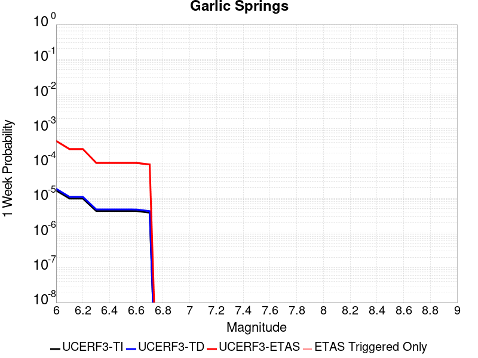 | 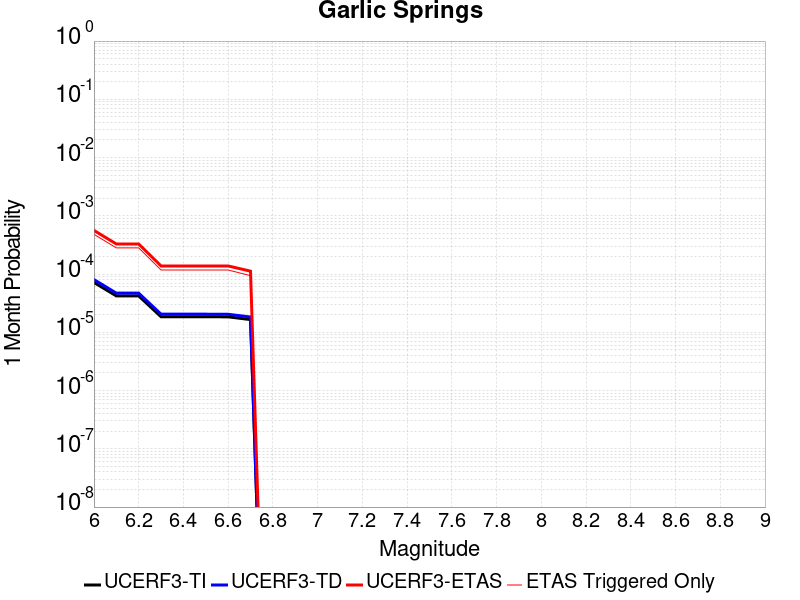 | 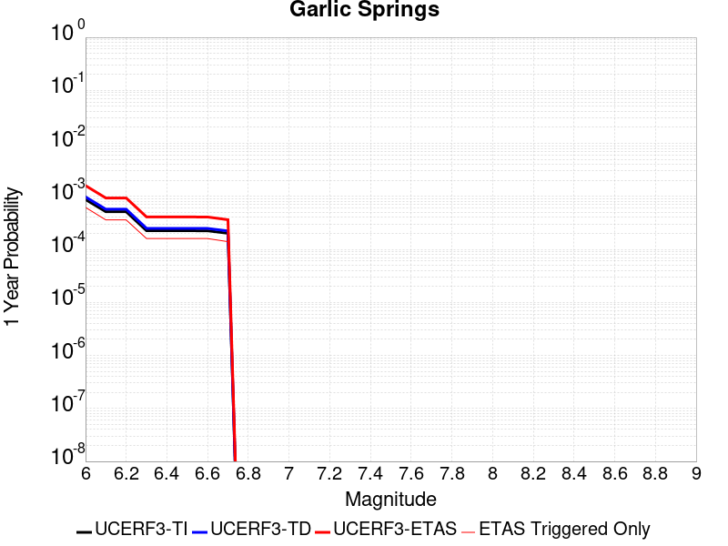 | 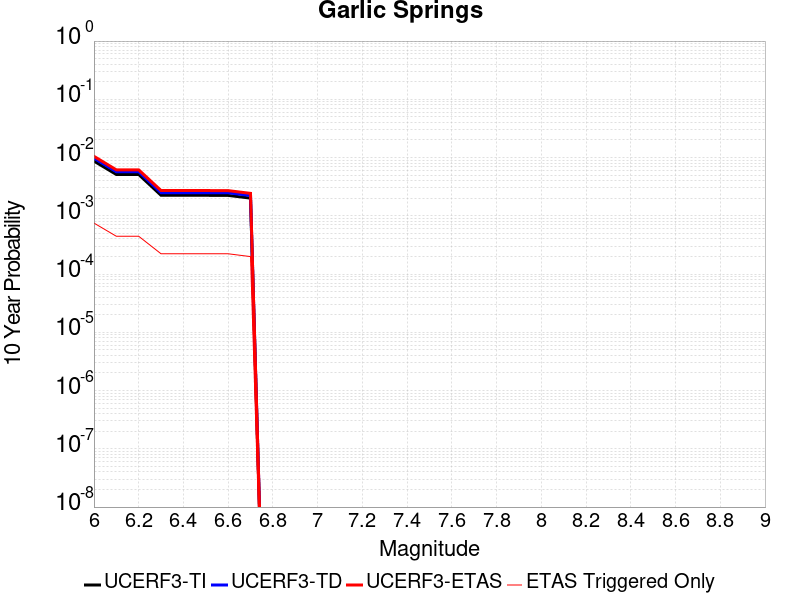 |

| Magnitude | 1 wk TI Prob | 1 wk TD Prob | 1 wk ETAS Prob | 1 wk ETAS/TD Gain | 1 wk ETAS Triggered Only | 1 mo TI Prob | 1 mo TD Prob | 1 mo ETAS Prob | 1 mo ETAS/TD Gain | 1 mo ETAS Triggered Only | 1 yr TI Prob | 1 yr TD Prob | 1 yr ETAS Prob | 1 yr ETAS/TD Gain | 1 yr ETAS Triggered Only | 10 yr TI Prob | 10 yr TD Prob | 10 yr ETAS Prob | 10 yr ETAS/TD Gain | 10 yr ETAS Triggered Only |
|-----|-----|-----|-----|-----|-----|-----|-----|-----|-----|-----|-----|-----|-----|-----|-----|-----|-----|-----|-----|-----|
| 6.0 | 1.6760017E-5 | 1.8776833E-5 | 4.5304096E-4 | 24.127657 | 4.342723E-4 | 7.182667E-5 | 8.0470316E-5 | 5.6165224E-4 | 6.97962 | 4.8122066E-4 | 8.7413884E-4 | 9.794032E-4 | 0.0015891341 | 1.6225535 | 6.103286E-4 | 0.008707083 | 0.009762413 | 0.010506254 | 1.0761943 | 7.511737E-4 |
| 6.1 | 9.852767E-6 | 1.09735865E-5 | 2.691867E-4 | 24.530422 | 2.5821597E-4 | 4.222546E-5 | 4.702921E-5 | 3.287061E-4 | 6.989403 | 2.8169015E-4 | 5.139737E-4 | 5.7250116E-4 | 9.3614263E-4 | 1.6351802 | 3.6384977E-4 | 0.005127866 | 0.005717221 | 0.0061606807 | 1.0775656 | 4.460094E-4 |
| 6.2 | 9.852767E-6 | 1.09735865E-5 | 2.691867E-4 | 24.530422 | 2.5821597E-4 | 4.222546E-5 | 4.702921E-5 | 3.287061E-4 | 6.989403 | 2.8169015E-4 | 5.139737E-4 | 5.7250116E-4 | 9.3614263E-4 | 1.6351802 | 3.6384977E-4 | 0.005127866 | 0.005717221 | 0.0061606807 | 1.0775656 | 4.460094E-4 |
| 6.3 | 4.3167724E-6 | 4.7780286E-6 | 1.10411325E-4 | 23.108135 | 1.056338E-4 | 1.8500323E-5 | 2.0477235E-5 | 1.3784572E-4 | 6.731657 | 1.17370895E-4 | 2.2521814E-4 | 2.4930484E-4 | 4.0184896E-4 | 1.6118779 | 1.5258216E-4 | 0.0022499003 | 0.00249251 | 0.0027149587 | 1.0892469 | 2.230047E-4 |
| 6.4 | 4.3167724E-6 | 4.7780286E-6 | 1.10411325E-4 | 23.108135 | 1.056338E-4 | 1.8500323E-5 | 2.0477235E-5 | 1.3784572E-4 | 6.731657 | 1.17370895E-4 | 2.2521814E-4 | 2.4930484E-4 | 4.0184896E-4 | 1.6118779 | 1.5258216E-4 | 0.0022499003 | 0.00249251 | 0.0027149587 | 1.0892469 | 2.230047E-4 |
| 6.5 | 4.3167724E-6 | 4.7780286E-6 | 1.10411325E-4 | 23.108135 | 1.056338E-4 | 1.8500323E-5 | 2.0477235E-5 | 1.3784572E-4 | 6.731657 | 1.17370895E-4 | 2.2521814E-4 | 2.4930484E-4 | 4.0184896E-4 | 1.6118779 | 1.5258216E-4 | 0.0022499003 | 0.00249251 | 0.0027149587 | 1.0892469 | 2.230047E-4 |
| 6.6 | 4.301311E-6 | 4.760897E-6 | 1.103942E-4 | 23.187689 | 1.056338E-4 | 1.8434059E-5 | 2.0403815E-5 | 1.3777231E-4 | 6.752282 | 1.17370895E-4 | 2.2441156E-4 | 2.4841115E-4 | 4.009554E-4 | 1.6140797 | 1.5258216E-4 | 0.0022418506 | 0.002483593 | 0.002706044 | 1.0895681 | 2.230047E-4 |
| 6.7 | 3.8599724E-6 | 4.27106E-6 | 9.816737E-5 | 22.984312 | 9.389671E-5 | 1.6542634E-5 | 1.8304541E-5 | 1.1219954E-4 | 6.129601 | 9.389671E-5 | 2.0138794E-4 | 2.228578E-4 | 3.5193702E-4 | 1.5791999 | 1.2910798E-4 | 0.0020120554 | 0.002228578 | 0.002427664 | 1.0893332 | 1.9953052E-4 |

## Death Valley (Black Mtns Frontal)
*[(top)](#table-of-contents)*

| 1 Week | 1 Month | 1 Year | 10 Year |
|-----|-----|-----|-----|
| 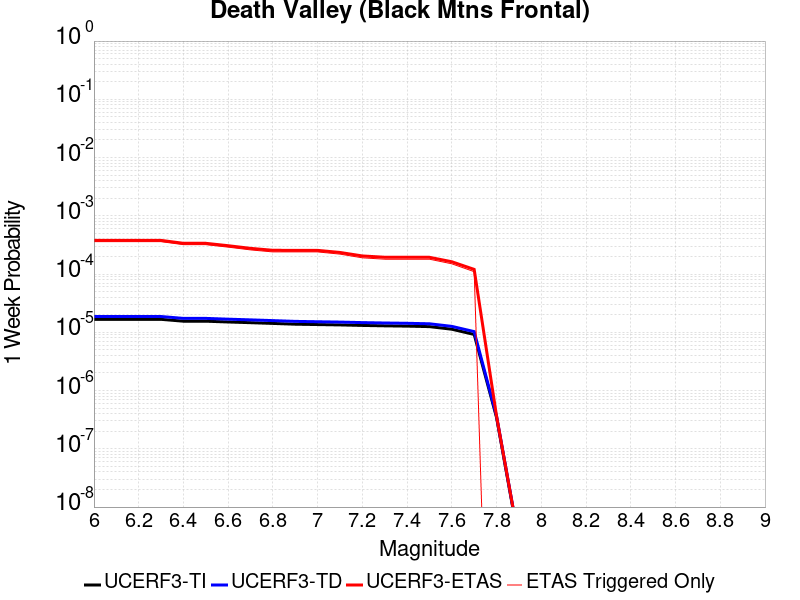 | 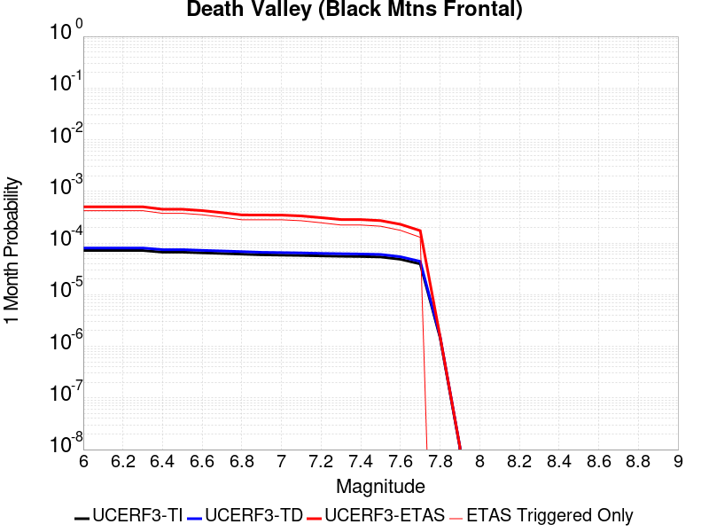 | 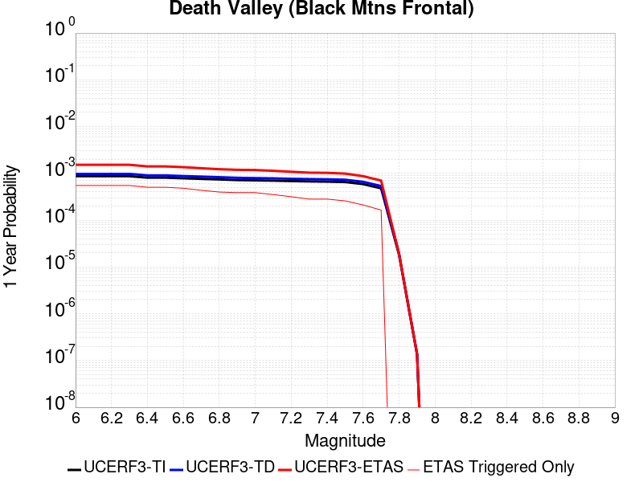 | 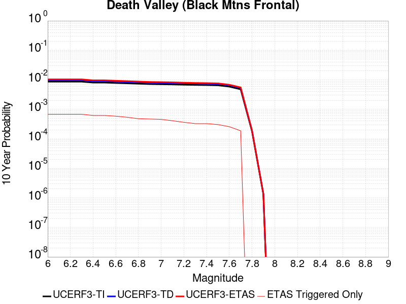 |

| Magnitude | 1 wk TI Prob | 1 wk TD Prob | 1 wk ETAS Prob | 1 wk ETAS/TD Gain | 1 wk ETAS Triggered Only | 1 mo TI Prob | 1 mo TD Prob | 1 mo ETAS Prob | 1 mo ETAS/TD Gain | 1 mo ETAS Triggered Only | 1 yr TI Prob | 1 yr TD Prob | 1 yr ETAS Prob | 1 yr ETAS/TD Gain | 1 yr ETAS Triggered Only | 10 yr TI Prob | 10 yr TD Prob | 10 yr ETAS Prob | 10 yr ETAS/TD Gain | 10 yr ETAS Triggered Only |
|-----|-----|-----|-----|-----|-----|-----|-----|-----|-----|-----|-----|-----|-----|-----|-----|-----|-----|-----|-----|-----|
| 6.0 | 1.6707214E-5 | 1.867027E-5 | 3.8251324E-4 | 20.487827 | 3.6384977E-4 | 7.160038E-5 | 8.001302E-5 | 5.025144E-4 | 6.280408 | 4.225352E-4 | 8.71386E-4 | 9.737309E-4 | 0.0015248369 | 1.5659736 | 5.516432E-4 | 0.00867977 | 0.009695496 | 0.010369648 | 1.0695324 | 6.8075117E-4 |
| 6.1 | 1.6707214E-5 | 1.867027E-5 | 3.8251324E-4 | 20.487827 | 3.6384977E-4 | 7.160038E-5 | 8.001302E-5 | 5.025144E-4 | 6.280408 | 4.225352E-4 | 8.71386E-4 | 9.737309E-4 | 0.0015248369 | 1.5659736 | 5.516432E-4 | 0.00867977 | 0.009695496 | 0.010369648 | 1.0695324 | 6.8075117E-4 |
| 6.2 | 1.6707214E-5 | 1.867027E-5 | 3.8251324E-4 | 20.487827 | 3.6384977E-4 | 7.160038E-5 | 8.001302E-5 | 5.025144E-4 | 6.280408 | 4.225352E-4 | 8.71386E-4 | 9.737309E-4 | 0.0015248369 | 1.5659736 | 5.516432E-4 | 0.00867977 | 0.009695496 | 0.010369648 | 1.0695324 | 6.8075117E-4 |
| 6.3 | 1.6707214E-5 | 1.867027E-5 | 3.8251324E-4 | 20.487827 | 3.6384977E-4 | 7.160038E-5 | 8.001302E-5 | 5.025144E-4 | 6.280408 | 4.225352E-4 | 8.71386E-4 | 9.737309E-4 | 0.0015248369 | 1.5659736 | 5.516432E-4 | 0.00867977 | 0.009695496 | 0.010369648 | 1.0695324 | 6.8075117E-4 |
| 6.4 | 1.5515609E-5 | 1.7338214E-5 | 3.3423412E-4 | 19.277311 | 3.169014E-4 | 6.649377E-5 | 7.4304546E-5 | 4.498635E-4 | 6.05432 | 3.7558685E-4 | 8.0926094E-4 | 9.042885E-4 | 0.0014085269 | 1.5576079 | 5.046948E-4 | 0.008063202 | 0.009006773 | 0.009623236 | 1.0684444 | 6.2206574E-4 |
| 6.5 | 1.5515609E-5 | 1.7338214E-5 | 3.3423412E-4 | 19.277311 | 3.169014E-4 | 6.649377E-5 | 7.4304546E-5 | 4.498635E-4 | 6.05432 | 3.7558685E-4 | 8.0926094E-4 | 9.042885E-4 | 0.0014085269 | 1.5576079 | 5.046948E-4 | 0.008063202 | 0.009006773 | 0.009623236 | 1.0684444 | 6.2206574E-4 |
| 6.6 | 1.5041828E-5 | 1.6809145E-5 | 3.1023144E-4 | 18.456112 | 2.9342723E-4 | 6.4463384E-5 | 7.203723E-5 | 4.2412453E-4 | 5.8875737 | 3.5211266E-4 | 7.8455906E-4 | 8.767063E-4 | 0.0013575051 | 1.5484148 | 4.8122066E-4 | 0.00781795 | 0.008733132 | 0.009314862 | 1.0666118 | 5.8685447E-4 |
| 6.7 | 1.4634985E-5 | 1.6356016E-5 | 2.8630465E-4 | 17.504547 | 2.6995305E-4 | 6.271985E-5 | 7.009536E-5 | 3.8697457E-4 | 5.520687 | 3.169014E-4 | 7.6334673E-4 | 8.5308263E-4 | 0.0012869845 | 1.5086281 | 4.342723E-4 | 0.007607299 | 0.008498715 | 0.009034033 | 1.062988 | 5.399061E-4 |
| 6.8 | 1.4209158E-5 | 1.5882048E-5 | 2.62357E-4 | 16.519093 | 2.4647888E-4 | 6.089497E-5 | 6.8064175E-5 | 3.4973514E-4 | 5.1383147 | 2.8169015E-4 | 7.4114406E-4 | 8.2837185E-4 | 0.0012271024 | 1.4813423 | 3.9906104E-4 | 0.007386771 | 0.008253456 | 0.008730705 | 1.0578241 | 4.8122066E-4 |
| 6.9 | 1.3780098E-5 | 1.5404594E-5 | 2.6187967E-4 | 17.000103 | 2.4647888E-4 | 5.9056227E-5 | 6.6018045E-5 | 3.4768958E-4 | 5.2665844 | 2.8169015E-4 | 7.1877235E-4 | 8.0347876E-4 | 0.0011904915 | 1.4816715 | 3.8732393E-4 | 0.0071645193 | 0.008006332 | 0.008472057 | 1.0581696 | 4.6948358E-4 |
| 7.0 | 1.3585064E-5 | 1.5188155E-5 | 2.6166328E-4 | 17.228115 | 2.4647888E-4 | 5.8220405E-5 | 6.50905E-5 | 3.467623E-4 | 5.3273873 | 2.8169015E-4 | 7.086029E-4 | 7.9219416E-4 | 0.0011792113 | 1.4885381 | 3.8732393E-4 | 0.007063476 | 0.007894293 | 0.008348427 | 1.0575267 | 4.5774647E-4 |
| 7.1 | 1.3398601E-5 | 1.49813395E-5 | 2.497196E-4 | 16.66871 | 2.3474179E-4 | 5.742131E-5 | 6.420419E-5 | 3.341399E-4 | 5.204332 | 2.6995305E-4 | 6.9888023E-4 | 7.8141113E-4 | 0.0011332487 | 1.4502592 | 3.5211266E-4 | 0.0069668638 | 0.007787224 | 0.008194823 | 1.052342 | 4.1079812E-4 |
| 7.2 | 1.3126312E-5 | 1.4679561E-5 | 2.2594407E-4 | 15.391746 | 2.112676E-4 | 5.6254412E-5 | 6.291092E-5 | 3.0937427E-4 | 4.9176564 | 2.4647888E-4 | 6.846822E-4 | 7.6567667E-4 | 0.0010823355 | 1.4135672 | 3.169014E-4 | 0.006825765 | 0.00763097 | 0.007992043 | 1.0473168 | 3.6384977E-4 |
| 7.3 | 1.2922429E-5 | 1.4453788E-5 | 2.1398142E-4 | 14.804522 | 1.9953052E-4 | 5.5380664E-5 | 6.194336E-5 | 2.8493424E-4 | 4.5999155 | 2.230047E-4 | 6.74051E-4 | 7.53905E-4 | 0.0010353827 | 1.3733598 | 2.8169015E-4 | 0.006720101 | 0.007514055 | 0.007840224 | 1.0434079 | 3.286385E-4 |
| 7.4 | 1.2768878E-5 | 1.4283772E-5 | 2.1381144E-4 | 14.968837 | 1.9953052E-4 | 5.4722615E-5 | 6.1214756E-5 | 2.842058E-4 | 4.642766 | 2.230047E-4 | 6.660441E-4 | 7.4504025E-4 | 0.0010265205 | 1.3778055 | 2.8169015E-4 | 0.0066405144 | 0.0074260035 | 0.0077522015 | 1.0439265 | 3.286385E-4 |
| 7.5 | 1.2521929E-5 | 1.40120155E-5 | 2.1353974E-4 | 15.239759 | 1.9953052E-4 | 5.366431E-5 | 6.005014E-5 | 2.7130506E-4 | 4.5179753 | 2.112676E-4 | 6.531671E-4 | 7.3087064E-4 | 9.888979E-4 | 1.3530409 | 2.5821597E-4 | 0.006512506 | 0.0072852457 | 0.0075881868 | 1.0415828 | 3.051643E-4 |
| 7.6 | 1.1301089E-5 | 1.2648149E-5 | 1.7696532E-4 | 13.991401 | 1.6431925E-4 | 4.8432343E-5 | 5.4205255E-5 | 2.3025204E-4 | 4.247781 | 1.7605633E-4 | 5.895042E-4 | 6.5975444E-4 | 8.708827E-4 | 1.3200103 | 2.112676E-4 | 0.0058794282 | 0.00657851 | 0.0068350276 | 1.0389932 | 2.5821597E-4 |
| 7.7 | 9.189108E-6 | 1.0283358E-5 | 1.2765304E-4 | 12.413556 | 1.17370895E-4 | 3.93813E-5 | 4.407082E-5 | 1.7317312E-4 | 3.9294279 | 1.2910798E-4 | 4.7936183E-4 | 5.3643517E-4 | 7.006663E-4 | 1.3061527 | 1.6431925E-4 | 0.004783291 | 0.005351914 | 0.0055387025 | 1.0349013 | 1.8779343E-4 |
| 7.8 | 3.4586725E-7 | 3.6482615E-7 | 3.6482615E-7 | 1.0 | 0.0 | 1.4822873E-6 | 1.5635396E-6 | 1.5635396E-6 | 1.0 | 0.0 | 1.80467E-5 | 1.9035933E-5 | 1.9035933E-5 | 1.0 | 0.0 | 1.8045233E-4 | 1.9034347E-4 | 1.9034347E-4 | 1.0 | 0.0 |
| 7.9 | 2.5591178E-9 | 2.6696718E-9 | 2.6696718E-9 | 1.0 | 0.0 | 1.0967647E-8 | 1.14414505E-8 | 1.14414505E-8 | 1.0 | 0.0 | 1.335311E-7 | 1.3929966E-7 | 1.3929966E-7 | 1.0 | 0.0 | 1.3353102E-6 | 1.3929966E-6 | 1.3929966E-6 | 1.0 | 0.0 |

## San Andreas (San Gorgonio Pass-Garnet HIll)
*[(top)](#table-of-contents)*

| 1 Week | 1 Month | 1 Year | 10 Year |
|-----|-----|-----|-----|
| 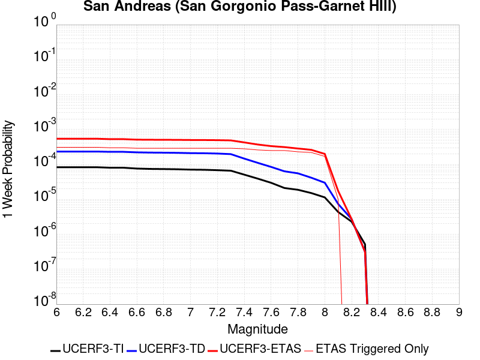 | 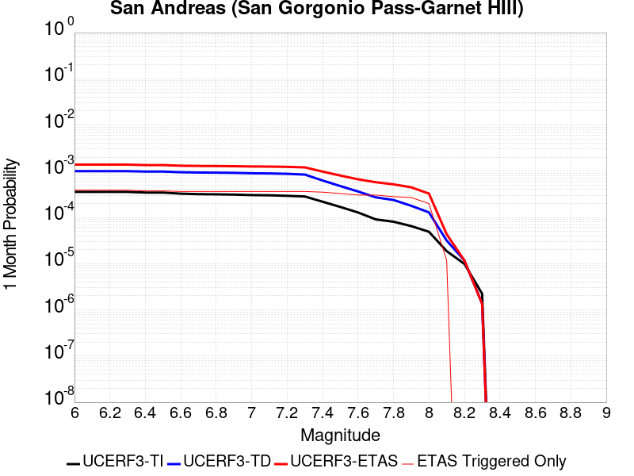 | 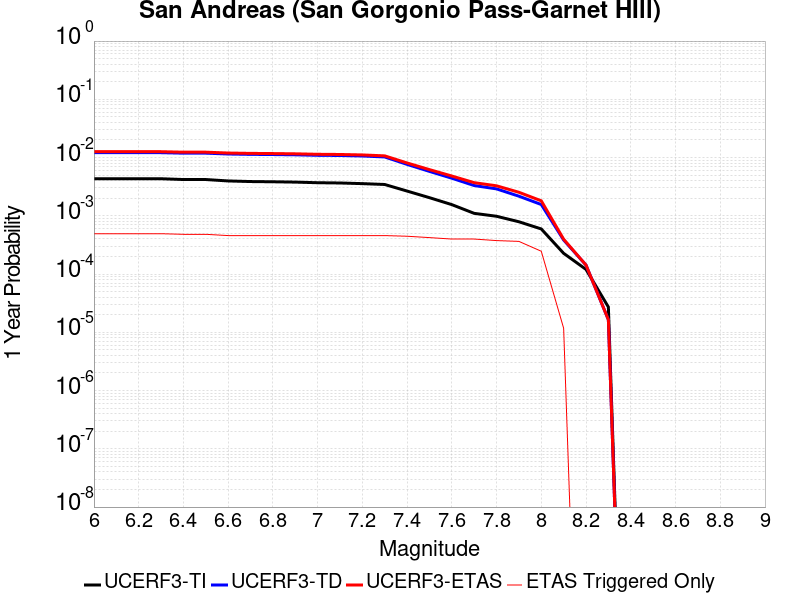 | 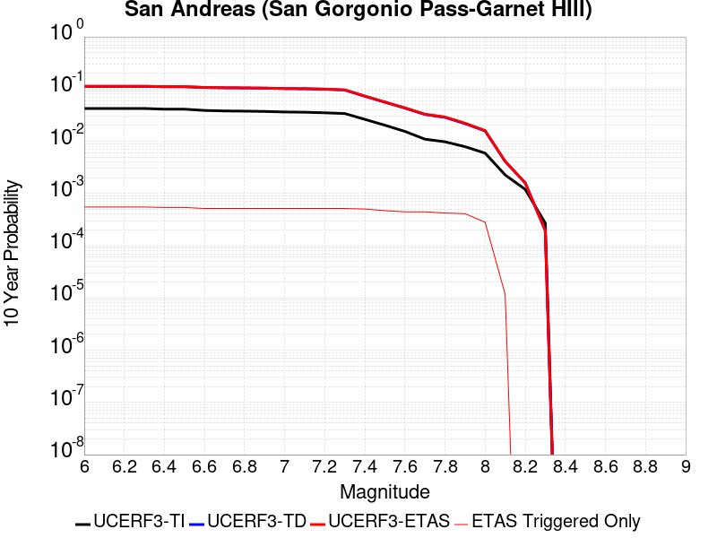 |

| Magnitude | 1 wk TI Prob | 1 wk TD Prob | 1 wk ETAS Prob | 1 wk ETAS/TD Gain | 1 wk ETAS Triggered Only | 1 mo TI Prob | 1 mo TD Prob | 1 mo ETAS Prob | 1 mo ETAS/TD Gain | 1 mo ETAS Triggered Only | 1 yr TI Prob | 1 yr TD Prob | 1 yr ETAS Prob | 1 yr ETAS/TD Gain | 1 yr ETAS Triggered Only | 10 yr TI Prob | 10 yr TD Prob | 10 yr ETAS Prob | 10 yr ETAS/TD Gain | 10 yr ETAS Triggered Only |
|-----|-----|-----|-----|-----|-----|-----|-----|-----|-----|-----|-----|-----|-----|-----|-----|-----|-----|-----|-----|-----|
| 6.0 | 8.31567E-5 | 2.3382473E-4 | 5.741207E-4 | 2.4553463 | 3.4037558E-4 | 3.5633717E-4 | 0.0010017233 | 0.0013886594 | 1.3862703 | 3.8732393E-4 | 0.004329778 | 0.012127888 | 0.012614868 | 1.0401536 | 4.9295777E-4 | 0.042463828 | 0.11257892 | 0.11306846 | 1.0043484 | 5.516432E-4 |
| 6.1 | 8.31567E-5 | 2.3382473E-4 | 5.741207E-4 | 2.4553463 | 3.4037558E-4 | 3.5633717E-4 | 0.0010017233 | 0.0013886594 | 1.3862703 | 3.8732393E-4 | 0.004329778 | 0.012127888 | 0.012614868 | 1.0401536 | 4.9295777E-4 | 0.042463828 | 0.11257892 | 0.11306846 | 1.0043484 | 5.516432E-4 |
| 6.2 | 8.31567E-5 | 2.3382473E-4 | 5.741207E-4 | 2.4553463 | 3.4037558E-4 | 3.5633717E-4 | 0.0010017233 | 0.0013886594 | 1.3862703 | 3.8732393E-4 | 0.004329778 | 0.012127888 | 0.012614868 | 1.0401536 | 4.9295777E-4 | 0.042463828 | 0.11257892 | 0.11306846 | 1.0043484 | 5.516432E-4 |
| 6.3 | 8.31567E-5 | 2.3382473E-4 | 5.741207E-4 | 2.4553463 | 3.4037558E-4 | 3.5633717E-4 | 0.0010017233 | 0.0013886594 | 1.3862703 | 3.8732393E-4 | 0.004329778 | 0.012127888 | 0.012614868 | 1.0401536 | 4.9295777E-4 | 0.042463828 | 0.11257892 | 0.11306846 | 1.0043484 | 5.516432E-4 |
| 6.4 | 8.059055E-5 | 2.2940808E-4 | 5.579712E-4 | 2.4322212 | 3.286385E-4 | 3.4534236E-4 | 9.828096E-4 | 0.0013580272 | 1.3817807 | 3.7558685E-4 | 0.0041964394 | 0.011900152 | 0.012375646 | 1.0399569 | 4.8122066E-4 | 0.041180745 | 0.11056015 | 0.11104036 | 1.0043435 | 5.399061E-4 |
| 6.5 | 8.059055E-5 | 2.2940808E-4 | 5.579712E-4 | 2.4322212 | 3.286385E-4 | 3.4534236E-4 | 9.828096E-4 | 0.0013580272 | 1.3817807 | 3.7558685E-4 | 0.0041964394 | 0.011900152 | 0.012375646 | 1.0399569 | 4.8122066E-4 | 0.041180745 | 0.11056015 | 0.11104036 | 1.0043435 | 5.399061E-4 |
| 6.6 | 7.619237E-5 | 2.218517E-4 | 5.386828E-4 | 2.428121 | 3.169014E-4 | 3.2649786E-4 | 9.5044886E-4 | 0.0013139528 | 1.382455 | 3.6384977E-4 | 0.0039678677 | 0.01151087 | 0.011963348 | 1.0393087 | 4.5774647E-4 | 0.03897764 | 0.10709683 | 0.10755795 | 1.0043057 | 5.1643193E-4 |
| 6.7 | 7.440636E-5 | 2.1860997E-4 | 5.354421E-4 | 2.4493032 | 3.169014E-4 | 3.188454E-4 | 9.3656575E-4 | 0.0013000747 | 1.3881297 | 3.6384977E-4 | 0.0038750346 | 0.011343609 | 0.011796162 | 1.039895 | 4.5774647E-4 | 0.038081564 | 0.105605274 | 0.106067166 | 1.0043738 | 5.1643193E-4 |
| 6.8 | 7.3735864E-5 | 2.1708169E-4 | 5.339143E-4 | 2.4595087 | 3.169014E-4 | 3.1597257E-4 | 9.3002064E-4 | 0.001293532 | 1.3908638 | 3.6384977E-4 | 0.0038401815 | 0.011264749 | 0.011717339 | 1.0401776 | 4.5774647E-4 | 0.03774495 | 0.10490683 | 0.10536908 | 1.0044063 | 5.1643193E-4 |
| 6.9 | 7.27575E-5 | 2.1477141E-4 | 5.3160475E-4 | 2.4752119 | 3.169014E-4 | 3.117806E-4 | 9.201265E-4 | 0.0012836414 | 1.3950707 | 3.6384977E-4 | 0.003789323 | 0.011145527 | 0.011598171 | 1.0406122 | 4.5774647E-4 | 0.037253562 | 0.103854746 | 0.10431754 | 1.0044562 | 5.1643193E-4 |
| 7.0 | 7.102591E-5 | 2.1061185E-4 | 5.274465E-4 | 2.5043535 | 3.169014E-4 | 3.0436125E-4 | 9.023122E-4 | 0.0012658336 | 1.4028777 | 3.6384977E-4 | 0.003699303 | 0.010930831 | 0.0113835735 | 1.0414189 | 4.5774647E-4 | 0.03638325 | 0.10195695 | 0.102420725 | 1.0045488 | 5.1643193E-4 |
| 7.1 | 7.028513E-5 | 2.0896831E-4 | 5.258035E-4 | 2.5161877 | 3.169014E-4 | 3.0118722E-4 | 8.9527335E-4 | 0.0012587974 | 1.406048 | 3.6384977E-4 | 0.0036607897 | 0.010845989 | 0.011298771 | 1.0417465 | 4.5774647E-4 | 0.036010686 | 0.101199985 | 0.101664156 | 1.0045867 | 5.1643193E-4 |
| 7.2 | 6.8498244E-5 | 2.0504706E-4 | 5.218835E-4 | 2.545189 | 3.169014E-4 | 2.9353087E-4 | 8.784794E-4 | 0.0012420096 | 1.4138175 | 3.6384977E-4 | 0.003567883 | 0.010643536 | 0.01109641 | 1.0425493 | 4.5774647E-4 | 0.035111405 | 0.09939202 | 0.09985712 | 1.0046794 | 5.1643193E-4 |
| 7.3 | 6.622592E-5 | 1.9732013E-4 | 5.14159E-4 | 2.6057098 | 3.169014E-4 | 2.8379448E-4 | 8.453858E-4 | 0.001208928 | 1.4300311 | 3.6384977E-4 | 0.0034497243 | 0.0102444785 | 0.010697536 | 1.0442245 | 4.5774647E-4 | 0.033966612 | 0.095888525 | 0.09635544 | 1.0048693 | 5.1643193E-4 |
| 7.4 | 5.1050705E-5 | 1.4689034E-4 | 4.5200982E-4 | 3.0771925 | 3.051643E-4 | 2.1877038E-4 | 6.29379E-4 | 9.812701E-4 | 1.5591084 | 3.5211266E-4 | 0.002660276 | 0.0076359594 | 0.008078563 | 1.057963 | 4.460094E-4 | 0.02628654 | 0.07286301 | 0.07333094 | 1.0064219 | 5.046948E-4 |
| 7.5 | 3.9302922E-5 | 1.1129847E-4 | 3.9295727E-4 | 3.5306618 | 2.8169015E-4 | 1.6843023E-4 | 4.7690657E-4 | 8.053883E-4 | 1.6887759 | 3.286385E-4 | 0.0020487092 | 0.005790949 | 0.0062110373 | 1.0725422 | 4.225352E-4 | 0.020299247 | 0.05600951 | 0.0564527 | 1.0079128 | 4.6948358E-4 |
| 7.6 | 2.9851626E-5 | 8.4949745E-5 | 3.5487986E-4 | 4.1775274 | 2.6995305E-4 | 1.2792926E-4 | 3.6401965E-4 | 6.690729E-4 | 1.838013 | 3.051643E-4 | 0.0015564259 | 0.0044229585 | 0.0048202546 | 1.0898259 | 3.9906104E-4 | 0.0154556995 | 0.04319374 | 0.043620482 | 1.0098798 | 4.460094E-4 |
| 7.7 | 2.1135214E-5 | 6.3529005E-5 | 3.334649E-4 | 5.2490187 | 2.6995305E-4 | 9.0576345E-5 | 2.7223877E-4 | 5.7732E-4 | 2.1206386 | 3.051643E-4 | 0.0011022091 | 0.0033094748 | 0.0037072152 | 1.1201823 | 3.9906104E-4 | 0.010967582 | 0.032582592 | 0.03301407 | 1.0132426 | 4.460094E-4 |
| 7.8 | 1.883379E-5 | 5.564028E-5 | 3.0210544E-4 | 5.4296174 | 2.4647888E-4 | 8.0713755E-5 | 2.3843657E-4 | 5.2005955E-4 | 2.1811233 | 2.8169015E-4 | 9.822468E-4 | 0.0028991038 | 0.0032736019 | 1.1291772 | 3.7558685E-4 | 0.0097791655 | 0.028695205 | 0.029105617 | 1.0143024 | 4.225352E-4 |
| 7.9 | 1.5156185E-5 | 4.1658426E-5 | 2.7639043E-4 | 6.6346827 | 2.3474179E-4 | 6.495346E-5 | 1.785239E-4 | 4.4842876E-4 | 2.5118697 | 2.6995305E-4 | 7.9052144E-4 | 0.0021713632 | 0.002534423 | 1.1672035 | 3.6384977E-4 | 0.007877152 | 0.021759422 | 0.022161283 | 1.0184683 | 4.1079812E-4 |
| 8.0 | 1.1405907E-5 | 2.9974231E-5 | 2.1776203E-4 | 7.2649746 | 1.8779343E-4 | 4.8881542E-5 | 1.2845467E-4 | 3.2795957E-4 | 2.5531151 | 1.9953052E-4 | 5.9497025E-4 | 0.0015628147 | 0.0018089083 | 1.1574682 | 2.4647888E-4 | 0.005933798 | 0.015772851 | 0.016050097 | 1.0175775 | 2.8169015E-4 |
| 8.1 | 4.3511436E-6 | 7.369219E-6 | 1.910622E-5 | 2.5927064 | 1.1737089E-5 | 1.8647626E-5 | 3.1581985E-5 | 4.3318705E-5 | 1.371627 | 1.1737089E-5 | 2.2701119E-4 | 3.8444297E-4 | 3.9617554E-4 | 1.0305184 | 1.1737089E-5 | 0.0022677942 | 0.0041163345 | 0.0041280235 | 1.0028396 | 1.1737089E-5 |
| 8.2 | 2.3042528E-6 | 2.7329415E-6 | 2.7329415E-6 | 1.0 | 0.0 | 9.875332E-6 | 1.1712554E-5 | 1.1712554E-5 | 1.0 | 0.0 | 1.2022553E-4 | 1.4259106E-4 | 1.4259106E-4 | 1.0 | 0.0 | 0.0012016051 | 0.0015979785 | 0.0015979785 | 1.0 | 0.0 |
| 8.3 | 5.202968E-7 | 3.1598344E-7 | 3.1598344E-7 | 1.0 | 0.0 | 2.2298414E-6 | 1.3542141E-6 | 1.3542141E-6 | 1.0 | 0.0 | 2.714798E-5 | 1.6487444E-5 | 1.6487444E-5 | 1.0 | 0.0 | 2.7144665E-4 | 1.9563142E-4 | 1.9563142E-4 | 1.0 | 0.0 |

## San Andreas (Parkfield)
*[(top)](#table-of-contents)*

| 1 Week | 1 Month | 1 Year | 10 Year |
|-----|-----|-----|-----|
| 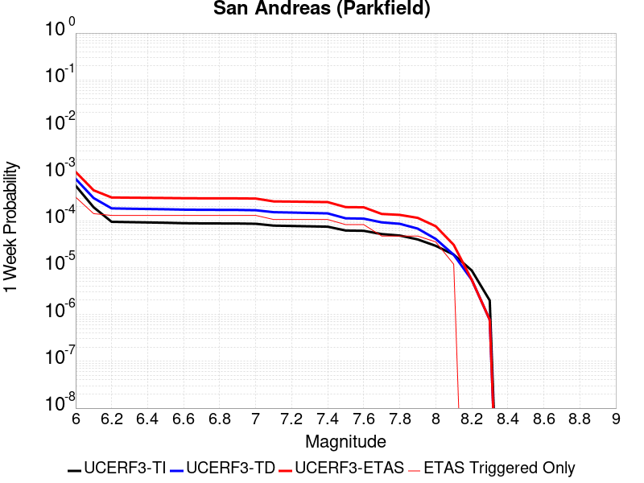 | 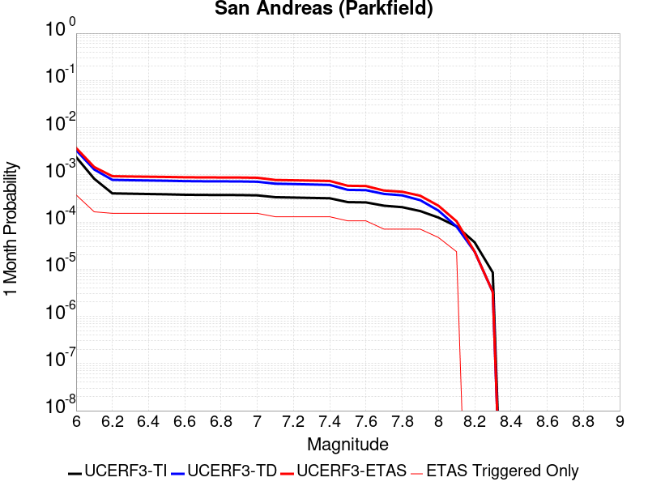 | 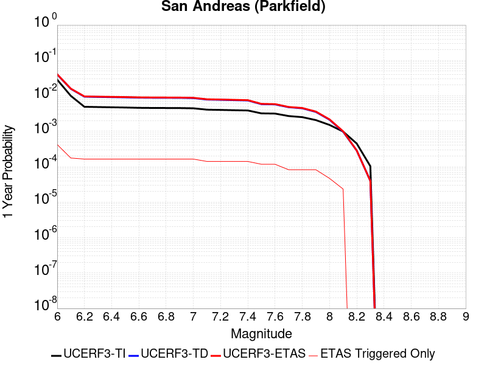 | 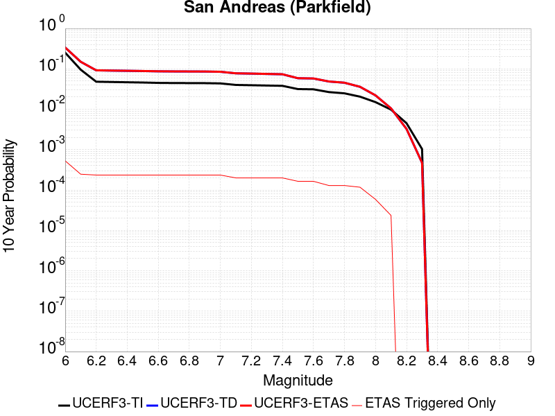 |

| Magnitude | 1 wk TI Prob | 1 wk TD Prob | 1 wk ETAS Prob | 1 wk ETAS/TD Gain | 1 wk ETAS Triggered Only | 1 mo TI Prob | 1 mo TD Prob | 1 mo ETAS Prob | 1 mo ETAS/TD Gain | 1 mo ETAS Triggered Only | 1 yr TI Prob | 1 yr TD Prob | 1 yr ETAS Prob | 1 yr ETAS/TD Gain | 1 yr ETAS Triggered Only | 10 yr TI Prob | 10 yr TD Prob | 10 yr ETAS Prob | 10 yr ETAS/TD Gain | 10 yr ETAS Triggered Only |
|-----|-----|-----|-----|-----|-----|-----|-----|-----|-----|-----|-----|-----|-----|-----|-----|-----|-----|-----|-----|-----|
| 6.0 | 5.556969E-4 | 7.7782426E-4 | 0.0010944791 | 1.4071034 | 3.169014E-4 | 0.0023793848 | 0.0033298214 | 0.0037041577 | 1.1124194 | 3.7558685E-4 | 0.028586963 | 0.040191233 | 0.040596787 | 1.0100906 | 4.225352E-4 | 0.25176284 | 0.33716413 | 0.33751422 | 1.0010383 | 5.2816904E-4 |
| 6.1 | 1.925858E-4 | 3.0276453E-4 | 4.4356697E-4 | 1.465056 | 1.4084508E-4 | 8.2510663E-4 | 0.0012970108 | 0.001461117 | 1.1265265 | 1.6431925E-4 | 0.0099994885 | 0.015778083 | 0.015951362 | 1.0109823 | 1.7605633E-4 | 0.095613256 | 0.1497237 | 0.14993326 | 1.0013998 | 2.4647888E-4 |
| 6.2 | 9.4306815E-5 | 1.8242796E-4 | 3.1151238E-4 | 1.7075913 | 1.2910798E-4 | 4.0410945E-4 | 7.816011E-4 | 9.34064E-4 | 1.1950649 | 1.5258216E-4 | 0.0049089384 | 0.009474681 | 0.009637443 | 1.0171787 | 1.6431925E-4 | 0.048019063 | 0.09185409 | 0.092067264 | 1.0023209 | 2.3474179E-4 |
| 6.3 | 9.283051E-5 | 1.7939322E-4 | 3.0847802E-4 | 1.7195636 | 1.2910798E-4 | 3.9778434E-4 | 7.686027E-4 | 9.210676E-4 | 1.1983663 | 1.5258216E-4 | 0.0048322747 | 0.009317789 | 0.009480577 | 1.0174707 | 1.6431925E-4 | 0.047285385 | 0.09050704 | 0.090720534 | 1.0023589 | 2.3474179E-4 |
| 6.4 | 9.138826E-5 | 1.770153E-4 | 3.0610044E-4 | 1.7292315 | 1.2910798E-4 | 3.916052E-4 | 7.5841765E-4 | 9.108841E-4 | 1.2010323 | 1.5258216E-4 | 0.0047573745 | 0.00919484 | 0.009357648 | 1.0177065 | 1.6431925E-4 | 0.046568092 | 0.08940927 | 0.08962303 | 1.0023907 | 2.3474179E-4 |
| 6.5 | 9.000255E-5 | 1.7459576E-4 | 3.036812E-4 | 1.7393389 | 1.2910798E-4 | 3.8566816E-4 | 7.480541E-4 | 9.0052217E-4 | 1.2038195 | 1.5258216E-4 | 0.0046854047 | 0.009069731 | 0.009232561 | 1.017953 | 1.6431925E-4 | 0.045878403 | 0.088295065 | 0.08850908 | 1.0024239 | 2.3474179E-4 |
| 6.6 | 8.8109264E-5 | 1.7140752E-4 | 3.0049338E-4 | 1.7530932 | 1.2910798E-4 | 3.7755648E-4 | 7.3439797E-4 | 8.868681E-4 | 1.2076124 | 1.5258216E-4 | 0.0045870654 | 0.008904854 | 0.00906771 | 1.0182885 | 1.6431925E-4 | 0.04493529 | 0.0868267 | 0.08704105 | 1.0024688 | 2.3474179E-4 |
| 6.7 | 8.738073E-5 | 1.7007832E-4 | 2.9916436E-4 | 1.7589799 | 1.2910798E-4 | 3.7443507E-4 | 7.287046E-4 | 8.8117557E-4 | 1.2092357 | 1.5258216E-4 | 0.0045492216 | 0.008836143 | 0.008999011 | 1.0184319 | 1.6431925E-4 | 0.04457213 | 0.08622707 | 0.08644157 | 1.0024877 | 2.3474179E-4 |
| 6.8 | 8.710195E-5 | 1.6953335E-4 | 2.9861944E-4 | 1.7614201 | 1.2910798E-4 | 3.7324068E-4 | 7.263703E-4 | 8.788416E-4 | 1.2099085 | 1.5258216E-4 | 0.0045347405 | 0.008807961 | 0.008970832 | 1.0184914 | 1.6431925E-4 | 0.04443313 | 0.08597467 | 0.086189225 | 1.0024956 | 2.3474179E-4 |
| 6.9 | 8.6801556E-5 | 1.689429E-4 | 2.9802907E-4 | 1.7640816 | 1.2910798E-4 | 3.7195362E-4 | 7.2384125E-4 | 8.7631296E-4 | 1.2106425 | 1.5258216E-4 | 0.0045191357 | 0.008777418 | 0.008940295 | 1.0185564 | 1.6431925E-4 | 0.044283327 | 0.085700735 | 0.08591536 | 1.0025043 | 2.3474179E-4 |
| 7.0 | 8.5571606E-5 | 1.6647128E-4 | 2.9555778E-4 | 1.7754279 | 1.2910798E-4 | 3.6668387E-4 | 7.132544E-4 | 8.657277E-4 | 1.2137713 | 1.5258216E-4 | 0.004455241 | 0.008649553 | 0.008812452 | 1.0188332 | 1.6431925E-4 | 0.043669727 | 0.08454914 | 0.08476403 | 1.0025417 | 2.3474179E-4 |
| 7.1 | 7.82589E-5 | 1.5128135E-4 | 2.5689916E-4 | 1.6981549 | 1.056338E-4 | 3.3535215E-4 | 6.481883E-4 | 7.7721255E-4 | 1.1990538 | 1.2910798E-4 | 0.0040752706 | 0.007863307 | 0.008003045 | 1.0177709 | 1.4084508E-4 | 0.040013418 | 0.07746111 | 0.07764518 | 1.0023763 | 1.9953052E-4 |
| 7.2 | 7.690929E-5 | 1.4865391E-4 | 2.5427202E-4 | 1.7104967 | 1.056338E-4 | 3.2956956E-4 | 6.369334E-4 | 7.659591E-4 | 1.2025734 | 1.2910798E-4 | 0.004005129 | 0.007727258 | 0.007867015 | 1.0180862 | 1.4084508E-4 | 0.0393371 | 0.07623427 | 0.07641859 | 1.0024178 | 1.9953052E-4 |
| 7.3 | 7.5543794E-5 | 1.4561978E-4 | 2.512382E-4 | 1.7253027 | 1.056338E-4 | 3.2371894E-4 | 6.2393624E-4 | 7.5296365E-4 | 1.2067958 | 1.2910798E-4 | 0.003934157 | 0.007570127 | 0.007709906 | 1.0184646 | 1.4084508E-4 | 0.038652334 | 0.074797355 | 0.07498196 | 1.0024681 | 1.9953052E-4 |
| 7.4 | 7.4214564E-5 | 1.4262961E-4 | 2.4824834E-4 | 1.7405106 | 1.056338E-4 | 3.1802364E-4 | 6.111273E-4 | 7.401564E-4 | 1.2111329 | 1.2910798E-4 | 0.003865065 | 0.00741525 | 0.007555051 | 1.0188532 | 1.4084508E-4 | 0.03798529 | 0.07337123 | 0.073556125 | 1.00252 | 1.9953052E-4 |
| 7.5 | 6.149578E-5 | 1.11907226E-4 | 1.9405766E-4 | 1.734094 | 8.2159626E-5 | 2.6352672E-4 | 4.7951436E-4 | 5.850975E-4 | 1.2201877 | 1.056338E-4 | 0.0032037178 | 0.0058224914 | 0.0059391786 | 1.0200409 | 1.17370895E-4 | 0.03157923 | 0.058557566 | 0.058712263 | 1.0026418 | 1.6431925E-4 |
| 7.6 | 6.0643448E-5 | 1.10193796E-4 | 1.9234436E-4 | 1.74551 | 8.2159626E-5 | 2.598746E-4 | 4.7217376E-4 | 5.777577E-4 | 1.2236124 | 1.056338E-4 | 0.0031593828 | 0.0057335934 | 0.0058502913 | 1.0203533 | 1.17370895E-4 | 0.031148417 | 0.057718582 | 0.057873417 | 1.0026826 | 1.6431925E-4 |
| 7.7 | 5.1652263E-5 | 9.174698E-5 | 1.3869103E-4 | 1.5116686 | 4.6948357E-5 | 2.2134806E-4 | 3.931421E-4 | 4.6353697E-4 | 1.179057 | 7.042254E-5 | 0.002691582 | 0.0047760103 | 0.0048577776 | 1.0171204 | 8.2159626E-5 | 0.026592141 | 0.04853623 | 0.04865907 | 1.0025309 | 1.2910798E-4 |
| 7.8 | 4.8090482E-5 | 8.559635E-5 | 1.3254069E-4 | 1.5484385 | 4.6948357E-5 | 2.060858E-4 | 3.6678996E-4 | 4.3718668E-4 | 1.1919265 | 7.042254E-5 | 0.0025062072 | 0.0044565317 | 0.0045383256 | 1.0183536 | 8.2159626E-5 | 0.024781305 | 0.04530245 | 0.04542571 | 1.0027208 | 1.2910798E-4 |
| 7.9 | 3.970278E-5 | 6.750426E-5 | 1.14449445E-4 | 1.6954404 | 4.6948357E-5 | 1.7014367E-4 | 2.892719E-4 | 3.5967407E-4 | 1.2433771 | 7.042254E-5 | 0.002069531 | 0.0035162016 | 0.0035980723 | 1.0232838 | 8.2159626E-5 | 0.020503636 | 0.035881363 | 0.035994522 | 1.0031537 | 1.17370895E-4 |
| 8.0 | 2.8982335E-5 | 4.069796E-5 | 7.5907796E-5 | 1.8651499 | 3.521127E-5 | 1.2420409E-4 | 1.7440817E-4 | 2.2134834E-4 | 1.2691398 | 4.6948357E-5 | 0.0015111357 | 0.0021213528 | 0.0021682016 | 1.0220844 | 4.6948357E-5 | 0.015009012 | 0.022010697 | 0.02206809 | 1.0026076 | 5.8685448E-5 |
| 8.1 | 1.8836186E-5 | 1.8681134E-5 | 3.0418005E-5 | 1.628274 | 1.1737089E-5 | 8.0724014E-5 | 8.005955E-5 | 1.0353185E-4 | 1.2931855 | 2.3474178E-5 | 9.823717E-4 | 9.742898E-4 | 9.977411E-4 | 1.0240701 | 2.3474178E-5 | 0.009780403 | 0.010488115 | 0.010511343 | 1.0022147 | 2.3474178E-5 |
| 8.2 | 8.643924E-6 | 5.4748625E-6 | 5.4748625E-6 | 1.0 | 0.0 | 3.704486E-5 | 2.3463486E-5 | 2.3463486E-5 | 1.0 | 0.0 | 4.5092785E-4 | 2.8563058E-4 | 2.8563058E-4 | 1.0 | 0.0 | 0.0045001395 | 0.0032487072 | 0.0032487072 | 1.0 | 0.0 |
| 8.3 | 1.983087E-6 | 7.6599065E-7 | 7.6599065E-7 | 1.0 | 0.0 | 8.498917E-6 | 3.282813E-6 | 3.282813E-6 | 1.0 | 0.0 | 1.034694E-4 | 3.9967534E-5 | 3.9967534E-5 | 1.0 | 0.0 | 0.0010342124 | 4.719687E-4 | 4.719687E-4 | 1.0 | 0.0 |

## San Andreas (Big Bend)
*[(top)](#table-of-contents)*

| 1 Week | 1 Month | 1 Year | 10 Year |
|-----|-----|-----|-----|
| 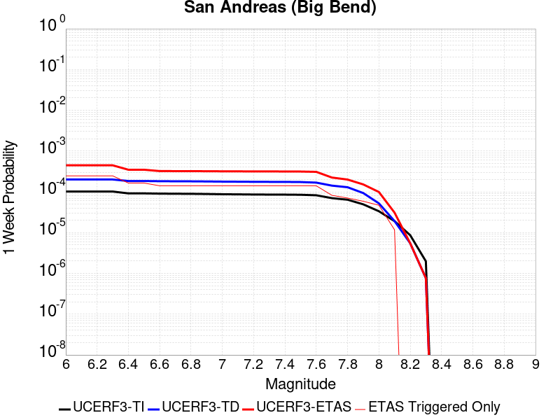 | 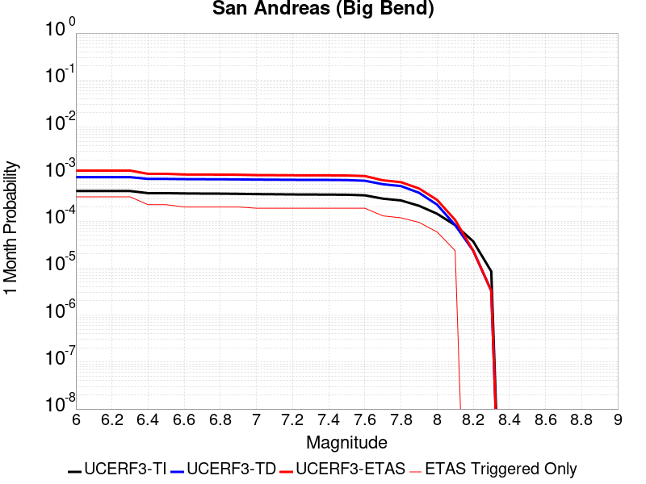 | 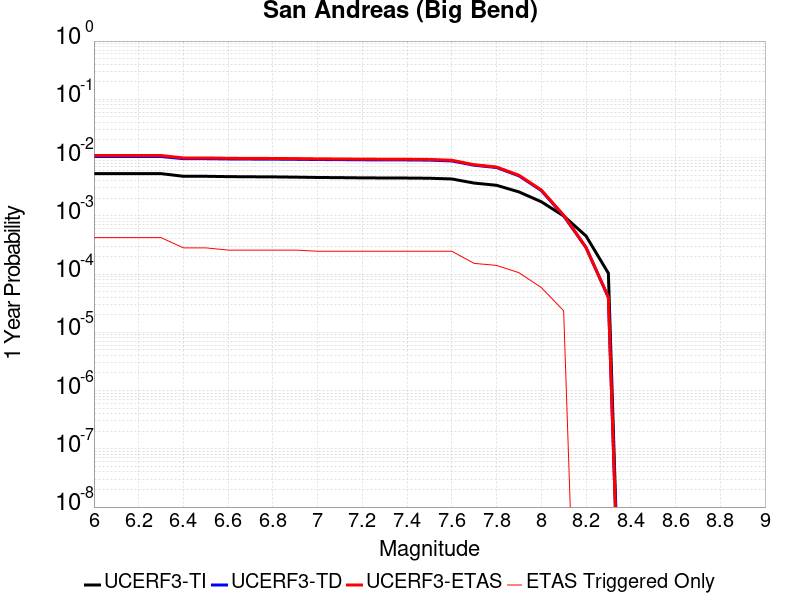 | 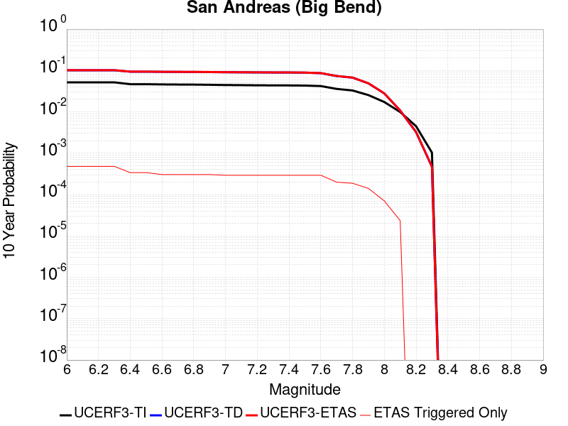 |

| Magnitude | 1 wk TI Prob | 1 wk TD Prob | 1 wk ETAS Prob | 1 wk ETAS/TD Gain | 1 wk ETAS Triggered Only | 1 mo TI Prob | 1 mo TD Prob | 1 mo ETAS Prob | 1 mo ETAS/TD Gain | 1 mo ETAS Triggered Only | 1 yr TI Prob | 1 yr TD Prob | 1 yr ETAS Prob | 1 yr ETAS/TD Gain | 1 yr ETAS Triggered Only | 10 yr TI Prob | 10 yr TD Prob | 10 yr ETAS Prob | 10 yr ETAS/TD Gain | 10 yr ETAS Triggered Only |
|-----|-----|-----|-----|-----|-----|-----|-----|-----|-----|-----|-----|-----|-----|-----|-----|-----|-----|-----|-----|-----|
| 6.0 | 1.0179969E-4 | 2.0072258E-4 | 4.4715198E-4 | 2.2277114 | 2.4647888E-4 | 4.362114E-4 | 8.599571E-4 | 0.001188313 | 1.3818282 | 3.286385E-4 | 0.0052979486 | 0.010419999 | 0.010838131 | 1.0401279 | 4.225352E-4 | 0.051734097 | 0.10144902 | 0.10188142 | 1.0042622 | 4.8122066E-4 |
| 6.1 | 1.0179969E-4 | 2.0072258E-4 | 4.4715198E-4 | 2.2277114 | 2.4647888E-4 | 4.362114E-4 | 8.599571E-4 | 0.001188313 | 1.3818282 | 3.286385E-4 | 0.0052979486 | 0.010419999 | 0.010838131 | 1.0401279 | 4.225352E-4 | 0.051734097 | 0.10144902 | 0.10188142 | 1.0042622 | 4.8122066E-4 |
| 6.2 | 1.0179969E-4 | 2.0072258E-4 | 4.4715198E-4 | 2.2277114 | 2.4647888E-4 | 4.362114E-4 | 8.599571E-4 | 0.001188313 | 1.3818282 | 3.286385E-4 | 0.0052979486 | 0.010419999 | 0.010838131 | 1.0401279 | 4.225352E-4 | 0.051734097 | 0.10144902 | 0.10188142 | 1.0042622 | 4.8122066E-4 |
| 6.3 | 1.0179969E-4 | 2.0072258E-4 | 4.4715198E-4 | 2.2277114 | 2.4647888E-4 | 4.362114E-4 | 8.599571E-4 | 0.001188313 | 1.3818282 | 3.286385E-4 | 0.0052979486 | 0.010419999 | 0.010838131 | 1.0401279 | 4.225352E-4 | 0.051734097 | 0.10144902 | 0.10188142 | 1.0042622 | 4.8122066E-4 |
| 6.4 | 9.1639464E-5 | 1.8429532E-4 | 3.485843E-4 | 1.8914441 | 1.6431925E-4 | 3.9268145E-4 | 7.895982E-4 | 0.0010124268 | 1.2822051 | 2.230047E-4 | 0.0047704205 | 0.009571102 | 0.009850096 | 1.0291497 | 2.8169015E-4 | 0.046693064 | 0.09377527 | 0.09408373 | 1.0032893 | 3.4037558E-4 |
| 6.5 | 9.1639464E-5 | 1.8429532E-4 | 3.485843E-4 | 1.8914441 | 1.6431925E-4 | 3.9268145E-4 | 7.895982E-4 | 0.0010124268 | 1.2822051 | 2.230047E-4 | 0.0047704205 | 0.009571102 | 0.009850096 | 1.0291497 | 2.8169015E-4 | 0.046693064 | 0.09377527 | 0.09408373 | 1.0032893 | 3.4037558E-4 |
| 6.6 | 9.042622E-5 | 1.823659E-4 | 3.231853E-4 | 1.7721804 | 1.4084508E-4 | 3.8748336E-4 | 7.8133424E-4 | 9.807089E-4 | 1.255172 | 1.9953052E-4 | 0.0047074095 | 0.009471365 | 0.009727135 | 1.0270046 | 2.5821597E-4 | 0.046089325 | 0.092869274 | 0.0931461 | 1.0029808 | 3.051643E-4 |
| 6.7 | 8.9836685E-5 | 1.8150927E-4 | 3.2232876E-4 | 1.7758255 | 1.4084508E-4 | 3.8495753E-4 | 7.776651E-4 | 9.770405E-4 | 1.2563769 | 1.9953052E-4 | 0.00467679 | 0.00942708 | 0.009682862 | 1.0271326 | 2.5821597E-4 | 0.045795817 | 0.09246355 | 0.0927405 | 1.0029953 | 3.051643E-4 |
| 6.8 | 8.9471854E-5 | 1.8097709E-4 | 3.2179666E-4 | 1.7781072 | 1.4084508E-4 | 3.8339442E-4 | 7.7538576E-4 | 9.7476155E-4 | 1.2571311 | 1.9953052E-4 | 0.004657841 | 0.009399569 | 0.009655357 | 1.0272129 | 2.5821597E-4 | 0.04561414 | 0.092210755 | 0.09248778 | 1.0030043 | 3.051643E-4 |
| 6.9 | 8.858234E-5 | 1.7979681E-4 | 3.2061656E-4 | 1.783216 | 1.4084508E-4 | 3.7958333E-4 | 7.703304E-4 | 9.6970727E-4 | 1.2588198 | 1.9953052E-4 | 0.004611638 | 0.009338548 | 0.009594354 | 1.0273924 | 2.5821597E-4 | 0.04517103 | 0.09165087 | 0.09192807 | 1.0030245 | 3.051643E-4 |
| 7.0 | 8.7433385E-5 | 1.7818481E-4 | 3.190048E-4 | 1.7903029 | 1.4084508E-4 | 3.746607E-4 | 7.634259E-4 | 9.51076E-4 | 1.2458 | 1.8779343E-4 | 0.004551957 | 0.009255203 | 0.009499401 | 1.026385 | 2.4647888E-4 | 0.044598386 | 0.09088532 | 0.09115207 | 1.0029352 | 2.9342723E-4 |
| 7.1 | 8.684964E-5 | 1.7730435E-4 | 3.1812445E-4 | 1.7942281 | 1.4084508E-4 | 3.7215967E-4 | 7.596547E-4 | 9.4730547E-4 | 1.2470212 | 1.8779343E-4 | 0.0045216335 | 0.009209678 | 0.009453886 | 1.0265166 | 2.4647888E-4 | 0.04430731 | 0.09046686 | 0.090733744 | 1.0029501 | 2.9342723E-4 |
| 7.2 | 8.606521E-5 | 1.762105E-4 | 3.1703076E-4 | 1.7991593 | 1.4084508E-4 | 3.6879873E-4 | 7.549695E-4 | 9.4262115E-4 | 1.2485553 | 1.8779343E-4 | 0.0044808835 | 0.0091531165 | 0.009397339 | 1.0266819 | 2.4647888E-4 | 0.043916024 | 0.089947365 | 0.0902144 | 1.0029688 | 2.9342723E-4 |
| 7.3 | 8.568266E-5 | 1.7563057E-4 | 3.164509E-4 | 1.8017986 | 1.4084508E-4 | 3.6715972E-4 | 7.524855E-4 | 9.401376E-4 | 1.2493764 | 1.8779343E-4 | 0.0044610105 | 0.009123127 | 0.009367357 | 1.0267705 | 2.4647888E-4 | 0.043725148 | 0.08966853 | 0.089935645 | 1.0029789 | 2.9342723E-4 |
| 7.4 | 8.5432206E-5 | 1.7525644E-4 | 3.1607682E-4 | 1.8035104 | 1.4084508E-4 | 3.6608664E-4 | 7.50883E-4 | 9.3853544E-4 | 1.249909 | 1.8779343E-4 | 0.004447999 | 0.009103781 | 0.009348015 | 1.0268278 | 2.4647888E-4 | 0.043600157 | 0.08948871 | 0.08975588 | 1.0029855 | 2.9342723E-4 |
| 7.5 | 8.4791965E-5 | 1.7394972E-4 | 3.147703E-4 | 1.8095475 | 1.4084508E-4 | 3.633435E-4 | 7.4528606E-4 | 9.329395E-4 | 1.2517872 | 1.8779343E-4 | 0.0044147377 | 0.009036204 | 0.009280456 | 1.0270303 | 2.4647888E-4 | 0.043280575 | 0.088866346 | 0.089133695 | 1.0030085 | 2.9342723E-4 |
| 7.6 | 8.241105E-5 | 1.6840403E-4 | 3.0922538E-4 | 1.8362113 | 1.4084508E-4 | 3.531424E-4 | 7.215321E-4 | 9.0919004E-4 | 1.2600826 | 1.8779343E-4 | 0.0042910352 | 0.008749358 | 0.008993681 | 1.0279247 | 2.4647888E-4 | 0.042091176 | 0.086243294 | 0.08651142 | 1.0031089 | 2.9342723E-4 |
| 7.7 | 7.00432E-5 | 1.42045E-4 | 2.2419296E-4 | 1.5783235 | 8.2159626E-5 | 3.001506E-4 | 6.0862233E-4 | 7.376517E-4 | 1.2120024 | 1.2910798E-4 | 0.0036482112 | 0.0073848404 | 0.007536296 | 1.020509 | 1.5258216E-4 | 0.035888977 | 0.07351733 | 0.073702194 | 1.0025145 | 1.9953052E-4 |
| 7.8 | 6.415362E-5 | 1.2968935E-4 | 2.0010275E-4 | 1.5429391 | 7.042254E-5 | 2.749151E-4 | 5.556931E-4 | 6.729988E-4 | 1.211098 | 1.17370895E-4 | 0.0033419547 | 0.0067446055 | 0.006884501 | 1.0207418 | 1.4084508E-4 | 0.03292141 | 0.06725231 | 0.06742747 | 1.0026046 | 1.8779343E-4 |
| 7.9 | 4.939911E-5 | 9.3411545E-5 | 1.5209151E-4 | 1.6281875 | 5.8685448E-5 | 2.116933E-4 | 4.0027377E-4 | 4.941329E-4 | 1.2344873 | 9.389671E-5 | 0.0025743195 | 0.004862453 | 0.0049675726 | 1.0216187 | 1.056338E-4 | 0.025447013 | 0.048914436 | 0.049048394 | 1.0027386 | 1.4084508E-4 |
| 8.0 | 3.344983E-5 | 5.222685E-5 | 9.917276E-5 | 1.8988844 | 4.6948357E-5 | 1.4334853E-4 | 2.2381016E-4 | 2.8248248E-4 | 1.2621521 | 5.8685448E-5 | 0.0017438711 | 0.0027214854 | 0.0027800114 | 1.0215051 | 5.8685448E-5 | 0.017302496 | 0.027922187 | 0.027990643 | 1.0024517 | 7.042254E-5 |
| 8.1 | 1.9104898E-5 | 1.9173063E-5 | 3.0909927E-5 | 1.6121538 | 1.1737089E-5 | 8.1875565E-5 | 8.216769E-5 | 1.0563994E-4 | 1.2856628 | 2.3474178E-5 | 9.963791E-4 | 9.999331E-4 | 0.0010233838 | 1.0234523 | 2.3474178E-5 | 0.009919235 | 0.010749801 | 0.010773023 | 1.0021602 | 2.3474178E-5 |
| 8.2 | 8.643924E-6 | 5.4748625E-6 | 5.4748625E-6 | 1.0 | 0.0 | 3.704486E-5 | 2.3463486E-5 | 2.3463486E-5 | 1.0 | 0.0 | 4.5092785E-4 | 2.8563058E-4 | 2.8563058E-4 | 1.0 | 0.0 | 0.0045001395 | 0.0032487072 | 0.0032487072 | 1.0 | 0.0 |
| 8.3 | 1.983087E-6 | 7.6599065E-7 | 7.6599065E-7 | 1.0 | 0.0 | 8.498917E-6 | 3.282813E-6 | 3.282813E-6 | 1.0 | 0.0 | 1.034694E-4 | 3.9967534E-5 | 3.9967534E-5 | 1.0 | 0.0 | 0.0010342124 | 4.719687E-4 | 4.719687E-4 | 1.0 | 0.0 |

## Coyote Lake
*[(top)](#table-of-contents)*

| 1 Week | 1 Month | 1 Year | 10 Year |
|-----|-----|-----|-----|
| 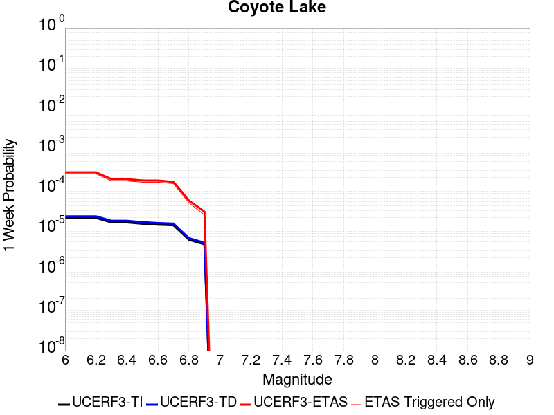 | 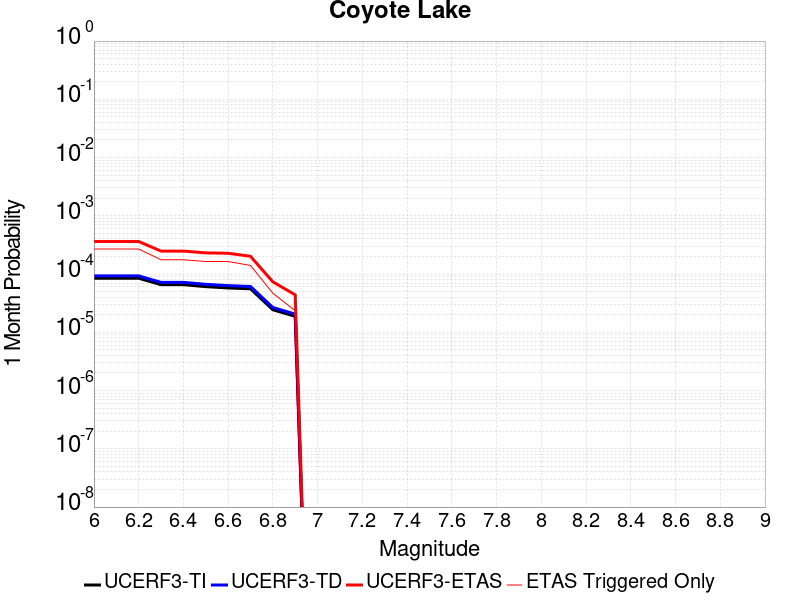 | 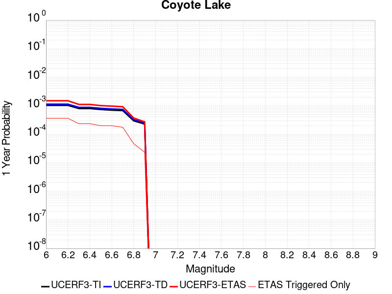 | 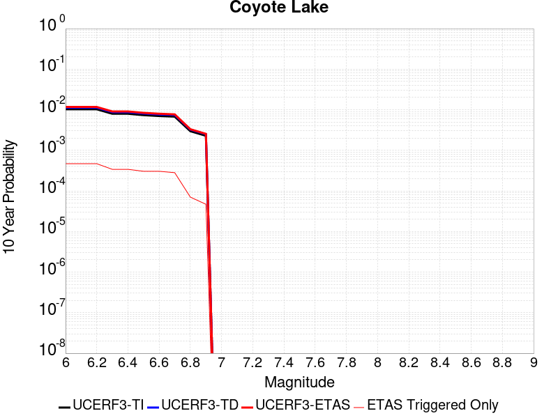 |

| Magnitude | 1 wk TI Prob | 1 wk TD Prob | 1 wk ETAS Prob | 1 wk ETAS/TD Gain | 1 wk ETAS Triggered Only | 1 mo TI Prob | 1 mo TD Prob | 1 mo ETAS Prob | 1 mo ETAS/TD Gain | 1 mo ETAS Triggered Only | 1 yr TI Prob | 1 yr TD Prob | 1 yr ETAS Prob | 1 yr ETAS/TD Gain | 1 yr ETAS Triggered Only | 10 yr TI Prob | 10 yr TD Prob | 10 yr ETAS Prob | 10 yr ETAS/TD Gain | 10 yr ETAS Triggered Only |
|-----|-----|-----|-----|-----|-----|-----|-----|-----|-----|-----|-----|-----|-----|-----|-----|-----|-----|-----|-----|-----|
| 6.0 | 1.980352E-5 | 2.1706745E-5 | 2.6818027E-4 | 12.354697 | 2.4647888E-4 | 8.486947E-5 | 9.302599E-5 | 3.6295393E-4 | 3.90164 | 2.6995305E-4 | 0.0010327959 | 0.0011320751 | 0.0014955129 | 1.3210369 | 3.6384977E-4 | 0.010280091 | 0.011270258 | 0.01173445 | 1.0411874 | 4.6948358E-4 |
| 6.1 | 1.980352E-5 | 2.1706745E-5 | 2.6818027E-4 | 12.354697 | 2.4647888E-4 | 8.486947E-5 | 9.302599E-5 | 3.6295393E-4 | 3.90164 | 2.6995305E-4 | 0.0010327959 | 0.0011320751 | 0.0014955129 | 1.3210369 | 3.6384977E-4 | 0.010280091 | 0.011270258 | 0.01173445 | 1.0411874 | 4.6948358E-4 |
| 6.2 | 1.980352E-5 | 2.1706745E-5 | 2.6818027E-4 | 12.354697 | 2.4647888E-4 | 8.486947E-5 | 9.302599E-5 | 3.6295393E-4 | 3.90164 | 2.6995305E-4 | 0.0010327959 | 0.0011320751 | 0.0014955129 | 1.3210369 | 3.6384977E-4 | 0.010280091 | 0.011270258 | 0.01173445 | 1.0411874 | 4.6948358E-4 |
| 6.3 | 1.5344787E-5 | 1.682067E-5 | 1.8113715E-4 | 10.768724 | 1.6431925E-4 | 6.576172E-5 | 7.2086936E-5 | 2.481306E-4 | 3.442102 | 1.7605633E-4 | 8.003548E-4 | 8.773662E-4 | 0.0011119021 | 1.267318 | 2.3474179E-4 | 0.007974784 | 0.00874507 | 0.009082468 | 1.0385816 | 3.4037558E-4 |
| 6.4 | 1.5344787E-5 | 1.682067E-5 | 1.8113715E-4 | 10.768724 | 1.6431925E-4 | 6.576172E-5 | 7.2086936E-5 | 2.481306E-4 | 3.442102 | 1.7605633E-4 | 8.003548E-4 | 8.773662E-4 | 0.0011119021 | 1.267318 | 2.3474179E-4 | 0.007974784 | 0.00874507 | 0.009082468 | 1.0385816 | 3.4037558E-4 |
| 6.5 | 1.4189697E-5 | 1.5557987E-5 | 1.6813778E-4 | 10.807168 | 1.5258216E-4 | 6.081157E-5 | 6.6675726E-5 | 2.3098402E-4 | 3.4642897 | 1.6431925E-4 | 7.401293E-4 | 8.115349E-4 | 0.0010109035 | 1.2456685 | 1.9953052E-4 | 0.0073766913 | 0.008091656 | 0.008394351 | 1.0374084 | 3.051643E-4 |
| 6.6 | 1.3469301E-5 | 1.4771577E-5 | 1.6735148E-4 | 11.32929 | 1.5258216E-4 | 5.7724297E-5 | 6.330556E-5 | 2.2761441E-4 | 3.5954883 | 1.6431925E-4 | 7.025667E-4 | 7.7053264E-4 | 9.699094E-4 | 1.2587519 | 1.9953052E-4 | 0.0070034964 | 0.0076845144 | 0.007987333 | 1.0394064 | 3.051643E-4 |
| 6.7 | 1.3027966E-5 | 1.4281745E-5 | 1.551248E-4 | 10.861754 | 1.4084508E-4 | 5.5832945E-5 | 6.120638E-5 | 2.0204284E-4 | 3.3010094 | 1.4084508E-4 | 6.7955407E-4 | 7.4499263E-4 | 9.2091784E-4 | 1.2361435 | 1.7605633E-4 | 0.006774798 | 0.0074308286 | 0.0077104256 | 1.0376266 | 2.8169015E-4 |
| 6.8 | 5.695434E-6 | 6.2244176E-6 | 5.3172484E-5 | 8.542563 | 4.6948357E-5 | 2.4408775E-5 | 2.6675973E-5 | 7.362308E-5 | 2.7599022 | 4.6948357E-5 | 2.971363E-4 | 3.2476155E-4 | 3.7169465E-4 | 1.1445156 | 4.6948357E-5 | 0.0029673933 | 0.0032458105 | 0.0033160043 | 1.021626 | 7.042254E-5 |
| 6.9 | 4.385688E-6 | 4.7930553E-6 | 2.826712E-5 | 5.8975163 | 2.3474178E-5 | 1.879567E-5 | 2.0541665E-5 | 4.4015364E-5 | 2.1427357 | 2.3474178E-5 | 2.2881327E-4 | 2.5009477E-4 | 2.7356308E-4 | 1.0938376 | 2.3474178E-5 | 0.002285778 | 0.0025009478 | 0.0025477787 | 1.0187253 | 4.6948357E-5 |

## San Andreas (Coachella) rev
*[(top)](#table-of-contents)*

| 1 Week | 1 Month | 1 Year | 10 Year |
|-----|-----|-----|-----|
| 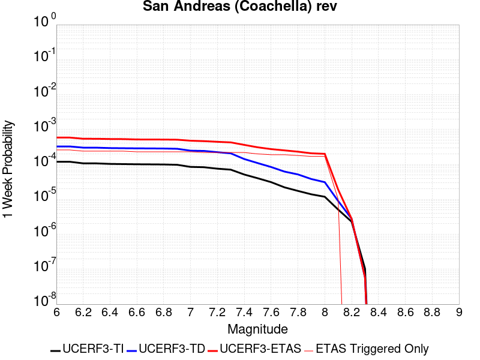 | 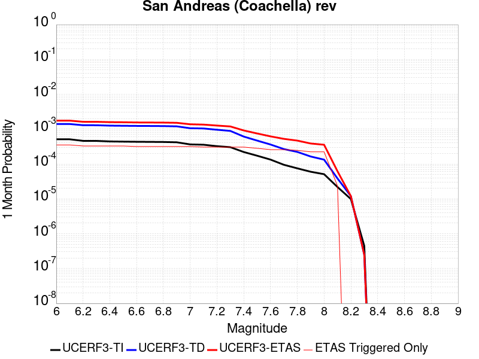 | 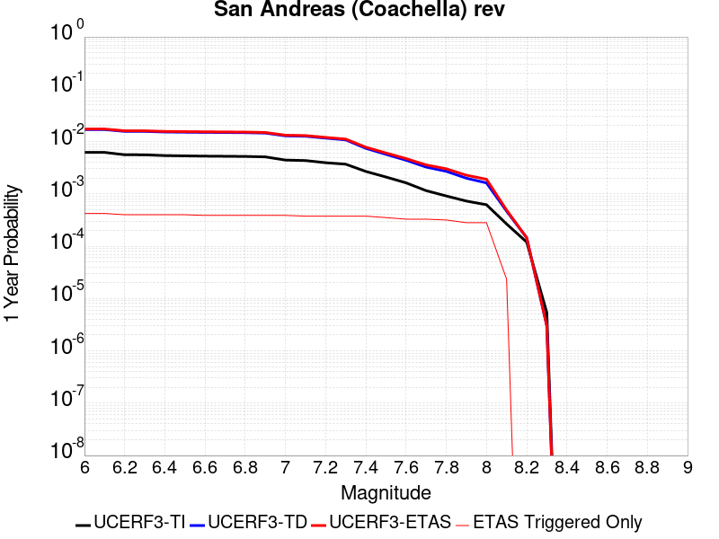 | 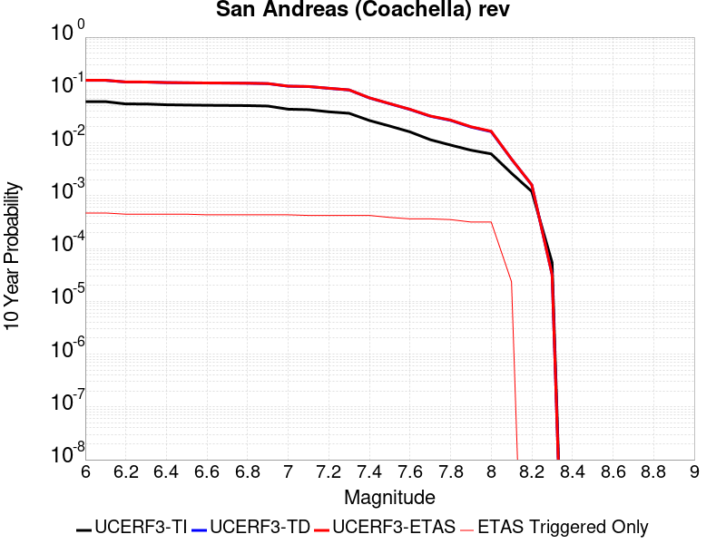 |

| Magnitude | 1 wk TI Prob | 1 wk TD Prob | 1 wk ETAS Prob | 1 wk ETAS/TD Gain | 1 wk ETAS Triggered Only | 1 mo TI Prob | 1 mo TD Prob | 1 mo ETAS Prob | 1 mo ETAS/TD Gain | 1 mo ETAS Triggered Only | 1 yr TI Prob | 1 yr TD Prob | 1 yr ETAS Prob | 1 yr ETAS/TD Gain | 1 yr ETAS Triggered Only | 10 yr TI Prob | 10 yr TD Prob | 10 yr ETAS Prob | 10 yr ETAS/TD Gain | 10 yr ETAS Triggered Only |
|-----|-----|-----|-----|-----|-----|-----|-----|-----|-----|-----|-----|-----|-----|-----|-----|-----|-----|-----|-----|-----|
| 6.0 | 1.1925945E-4 | 3.2729402E-4 | 6.323584E-4 | 1.9320807 | 3.051643E-4 | 5.110118E-4 | 0.0014019393 | 0.0017535583 | 1.2508091 | 3.5211266E-4 | 0.0062038354 | 0.016936364 | 0.017351743 | 1.0245259 | 4.225352E-4 | 0.060334753 | 0.15265316 | 0.15305097 | 1.002606 | 4.6948358E-4 |
| 6.1 | 1.1925945E-4 | 3.2729402E-4 | 6.323584E-4 | 1.9320807 | 3.051643E-4 | 5.110118E-4 | 0.0014019393 | 0.0017535583 | 1.2508091 | 3.5211266E-4 | 0.0062038354 | 0.016936364 | 0.017351743 | 1.0245259 | 4.225352E-4 | 0.060334753 | 0.15265316 | 0.15305097 | 1.002606 | 4.6948358E-4 |
| 6.2 | 1.07432395E-4 | 3.0230157E-4 | 5.8390654E-4 | 1.9315367 | 2.8169015E-4 | 4.603433E-4 | 0.0012949388 | 0.0016231518 | 1.2534583 | 3.286385E-4 | 0.005590286 | 0.015653009 | 0.016045824 | 1.0250951 | 3.9906104E-4 | 0.05451731 | 0.14182423 | 0.142207 | 1.0026988 | 4.460094E-4 |
| 6.3 | 1.0718766E-4 | 3.0175463E-4 | 5.8335974E-4 | 1.9332256 | 2.8169015E-4 | 4.592948E-4 | 0.0012925972 | 0.0016208108 | 1.253918 | 3.286385E-4 | 0.005577586 | 0.015624908 | 0.016017733 | 1.025141 | 3.9906104E-4 | 0.054396555 | 0.14159249 | 0.14197536 | 1.0027039 | 4.460094E-4 |
| 6.4 | 1.0355944E-4 | 2.9383553E-4 | 5.754429E-4 | 1.9583844 | 2.8169015E-4 | 4.4375064E-4 | 0.0012586913 | 0.0015869162 | 1.2607667 | 3.286385E-4 | 0.0053892885 | 0.015217941 | 0.01561093 | 1.025824 | 3.9906104E-4 | 0.052604496 | 0.13815255 | 0.13853694 | 1.0027823 | 4.460094E-4 |
| 6.5 | 1.0227914E-4 | 2.9102986E-4 | 5.72638E-4 | 1.9676263 | 2.8169015E-4 | 4.382655E-4 | 0.0012466786 | 0.0015749075 | 1.2632827 | 3.286385E-4 | 0.0053228354 | 0.01507372 | 0.015466766 | 1.0260749 | 3.9906104E-4 | 0.051971316 | 0.13693172 | 0.13731666 | 1.0028112 | 4.460094E-4 |
| 6.6 | 1.0116757E-4 | 2.8868738E-4 | 5.585625E-4 | 1.9348352 | 2.6995305E-4 | 4.3350324E-4 | 0.0012366489 | 0.0015531584 | 1.2559413 | 3.169014E-4 | 0.0052651367 | 0.01495329 | 0.015334822 | 1.025515 | 3.8732393E-4 | 0.051421247 | 0.1359099 | 0.13628514 | 1.002761 | 4.342723E-4 |
| 6.7 | 1.0050676E-4 | 2.8727303E-4 | 5.5714854E-4 | 1.939439 | 2.6995305E-4 | 4.3067214E-4 | 0.0012305931 | 0.0015471046 | 1.2572024 | 3.169014E-4 | 0.005230834 | 0.014880571 | 0.015262131 | 1.0256416 | 3.8732393E-4 | 0.051094085 | 0.13529462 | 0.13567014 | 1.0027755 | 4.342723E-4 |
| 6.8 | 9.976819E-5 | 2.853096E-4 | 5.551856E-4 | 1.9459059 | 2.6995305E-4 | 4.2750788E-4 | 0.0012221863 | 0.0015387004 | 1.2589737 | 3.169014E-4 | 0.0051924936 | 0.0147796115 | 0.015161211 | 1.0258193 | 3.8732393E-4 | 0.050728295 | 0.13444631 | 0.13482219 | 1.0027958 | 4.342723E-4 |
| 6.9 | 9.77719E-5 | 2.8027873E-4 | 5.501561E-4 | 1.9628893 | 2.6995305E-4 | 4.1895514E-4 | 0.0012006456 | 0.0015171665 | 1.2636256 | 3.169014E-4 | 0.0050888555 | 0.014520878 | 0.014902578 | 1.0262862 | 3.8732393E-4 | 0.049738888 | 0.1322748 | 0.13265164 | 1.0028489 | 4.342723E-4 |
| 7.0 | 8.500761E-5 | 2.4762485E-4 | 5.1751104E-4 | 2.0898995 | 2.6995305E-4 | 3.6426744E-4 | 0.001060821 | 0.0013773863 | 1.2984153 | 3.169014E-4 | 0.0044259406 | 0.012839786 | 0.013222137 | 1.0297786 | 3.8732393E-4 | 0.04338823 | 0.11813272 | 0.11851569 | 1.0032419 | 4.342723E-4 |
| 7.1 | 8.319876E-5 | 2.4365232E-4 | 5.018054E-4 | 2.059514 | 2.5821597E-4 | 3.5651738E-4 | 0.0010438096 | 0.0013486553 | 1.2920512 | 3.051643E-4 | 0.004331963 | 0.012635092 | 0.013005934 | 1.0293502 | 3.7558685E-4 | 0.042484846 | 0.116353 | 0.116726376 | 1.003209 | 4.225352E-4 |
| 7.2 | 7.563917E-5 | 2.2413683E-4 | 4.822949E-4 | 2.1517878 | 2.5821597E-4 | 3.2412758E-4 | 9.602359E-4 | 0.0012651072 | 1.3174963 | 3.051643E-4 | 0.0039391145 | 0.011628893 | 0.012000113 | 1.0319221 | 3.7558685E-4 | 0.03870018 | 0.10775925 | 0.10813625 | 1.0034986 | 4.225352E-4 |
| 7.3 | 7.082985E-5 | 2.0729867E-4 | 4.654611E-4 | 2.2453647 | 2.5821597E-4 | 3.0352117E-4 | 8.881233E-4 | 0.0011930165 | 1.3433007 | 3.051643E-4 | 0.0036891096 | 0.010759917 | 0.011131463 | 1.0345305 | 3.7558685E-4 | 0.03628465 | 0.100282 | 0.100662164 | 1.003791 | 4.225352E-4 |
| 7.4 | 5.146215E-5 | 1.4273795E-4 | 4.0091705E-4 | 2.808763 | 2.5821597E-4 | 2.2053342E-4 | 6.115915E-4 | 9.165692E-4 | 1.4986624 | 3.051643E-4 | 0.0026816884 | 0.0074208933 | 0.007793693 | 1.0502365 | 3.7558685E-4 | 0.02649557 | 0.070849575 | 0.071242176 | 1.0055413 | 4.225352E-4 |
| 7.5 | 4.0285166E-5 | 1.09416E-4 | 3.441321E-4 | 3.1451716 | 2.3474179E-4 | 1.7263928E-4 | 4.6884175E-4 | 7.5039983E-4 | 1.6005397 | 2.8169015E-4 | 0.002099857 | 0.0056932783 | 0.006043386 | 1.061495 | 3.5211266E-4 | 0.020801254 | 0.055011146 | 0.055377163 | 1.0066535 | 3.8732393E-4 |
| 7.6 | 3.1168736E-5 | 8.4389096E-5 | 3.0737498E-4 | 3.6423542 | 2.230047E-4 | 1.3357346E-4 | 3.6161754E-4 | 6.197401E-4 | 1.7138 | 2.5821597E-4 | 0.0016250437 | 0.0043938323 | 0.004721027 | 1.0744668 | 3.286385E-4 | 0.016132116 | 0.04281005 | 0.043158323 | 1.0081353 | 3.6384977E-4 |
| 7.7 | 2.2100989E-5 | 6.238755E-5 | 2.8537834E-4 | 4.574283 | 2.230047E-4 | 9.4715084E-5 | 2.6734784E-4 | 5.254948E-4 | 1.9655844 | 2.5821597E-4 | 0.001152546 | 0.0032501083 | 0.0035776787 | 1.1007875 | 3.286385E-4 | 0.011465867 | 0.0319002 | 0.032252442 | 1.011042 | 3.6384977E-4 |
| 7.8 | 1.7484861E-5 | 5.179572E-5 | 2.6305238E-4 | 5.078651 | 2.112676E-4 | 7.493296E-5 | 2.2196278E-4 | 4.6838695E-4 | 2.110205 | 2.4647888E-4 | 9.1192697E-4 | 0.0026990508 | 0.0030150968 | 1.1170952 | 3.169014E-4 | 0.009081938 | 0.026640115 | 0.026982848 | 1.0128653 | 3.5211266E-4 |
| 7.9 | 1.3967285E-5 | 3.822255E-5 | 2.3774544E-4 | 6.220031 | 1.9953052E-4 | 5.985842E-5 | 1.6380067E-4 | 3.8676884E-4 | 2.3612165 | 2.230047E-4 | 7.2853256E-4 | 0.00199245 | 0.0022735791 | 1.1410971 | 2.8169015E-4 | 0.0072614877 | 0.019909438 | 0.020220028 | 1.0156002 | 3.169014E-4 |
| 8.0 | 1.1887396E-5 | 3.106521E-5 | 2.3058953E-4 | 7.4227576 | 1.9953052E-4 | 5.094499E-5 | 1.3312983E-4 | 3.5610484E-4 | 2.6748688 | 2.230047E-4 | 6.200787E-4 | 0.0016196516 | 0.0019008855 | 1.1736385 | 2.8169015E-4 | 0.006183513 | 0.016279267 | 0.01659101 | 1.0191497 | 3.169014E-4 |
| 8.1 | 5.100864E-6 | 8.973418E-6 | 2.07104E-5 | 2.3079727 | 1.1737089E-5 | 2.1860664E-5 | 3.8456936E-5 | 6.1930215E-5 | 1.6103781 | 2.3474178E-5 | 2.6612106E-4 | 4.6811273E-4 | 4.915759E-4 | 1.050123 | 2.3474178E-5 | 0.002658026 | 0.004917731 | 0.0049410895 | 1.0047499 | 2.3474178E-5 |
| 8.2 | 2.3004484E-6 | 2.7864487E-6 | 2.7864487E-6 | 1.0 | 0.0 | 9.859027E-6 | 1.1941868E-5 | 1.1941868E-5 | 1.0 | 0.0 | 1.2002704E-4 | 1.4538258E-4 | 1.4538258E-4 | 1.0 | 0.0 | 0.0011996223 | 0.0015973912 | 0.0015973912 | 1.0 | 0.0 |
| 8.3 | 1.0424446E-7 | 5.8161504E-8 | 5.8161504E-8 | 1.0 | 0.0 | 4.4676187E-7 | 2.4926356E-7 | 2.4926356E-7 | 1.0 | 0.0 | 5.439312E-6 | 3.03478E-6 | 3.03478E-6 | 1.0 | 0.0 | 5.4391792E-5 | 3.190716E-5 | 3.190716E-5 | 1.0 | 0.0 |

## Death Valley (No)
*[(top)](#table-of-contents)*

| 1 Week | 1 Month | 1 Year | 10 Year |
|-----|-----|-----|-----|
| 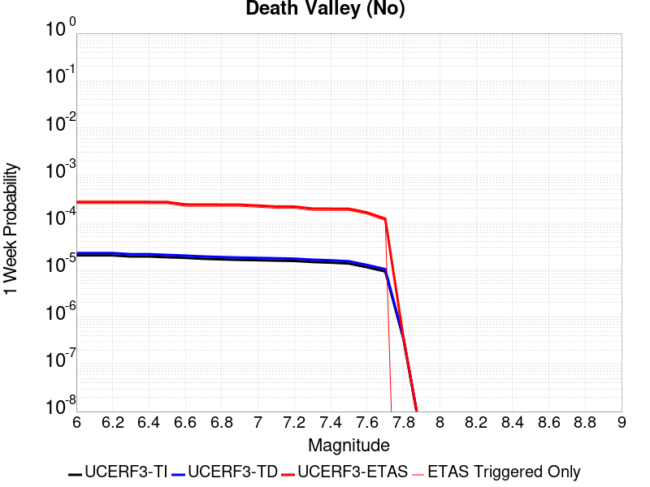 | 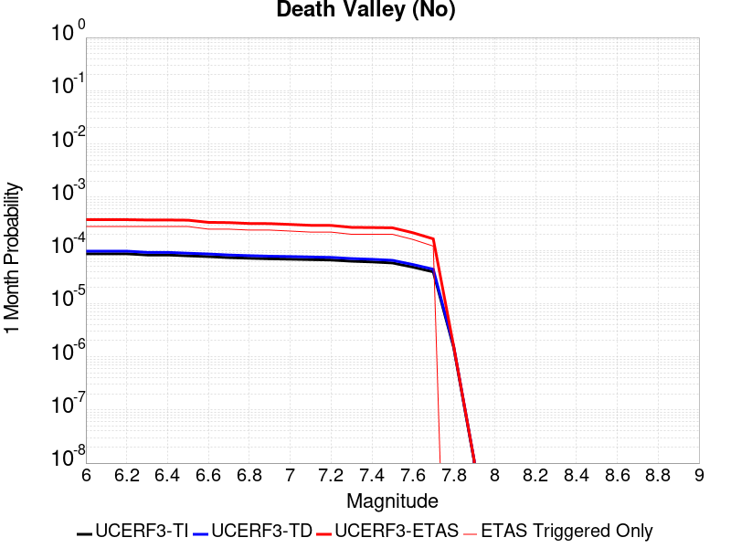 | 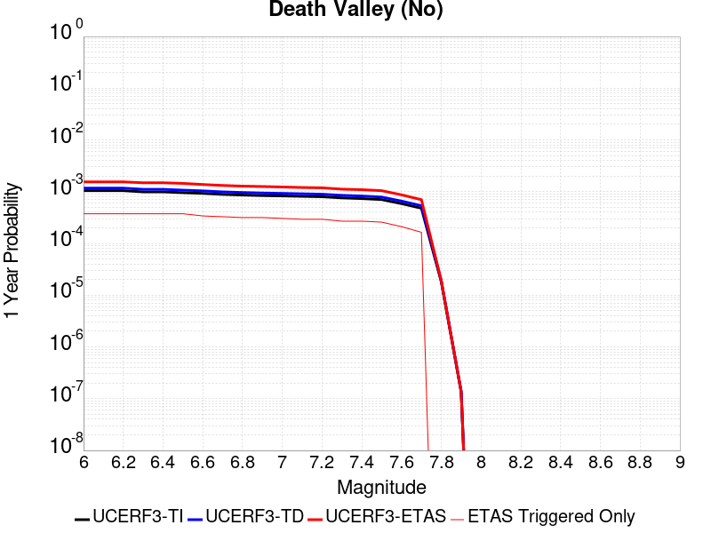 | 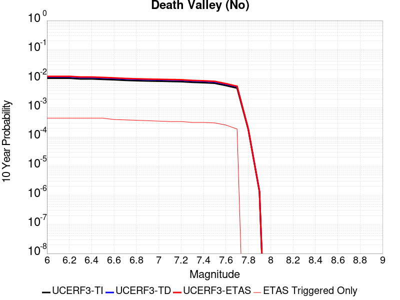 |

| Magnitude | 1 wk TI Prob | 1 wk TD Prob | 1 wk ETAS Prob | 1 wk ETAS/TD Gain | 1 wk ETAS Triggered Only | 1 mo TI Prob | 1 mo TD Prob | 1 mo ETAS Prob | 1 mo ETAS/TD Gain | 1 mo ETAS Triggered Only | 1 yr TI Prob | 1 yr TD Prob | 1 yr ETAS Prob | 1 yr ETAS/TD Gain | 1 yr ETAS Triggered Only | 10 yr TI Prob | 10 yr TD Prob | 10 yr ETAS Prob | 10 yr ETAS/TD Gain | 10 yr ETAS Triggered Only |
|-----|-----|-----|-----|-----|-----|-----|-----|-----|-----|-----|-----|-----|-----|-----|-----|-----|-----|-----|-----|-----|
| 6.0 | 2.0074807E-5 | 2.2500084E-5 | 2.9244708E-4 | 12.997599 | 2.6995305E-4 | 8.603206E-5 | 9.642541E-5 | 3.8982433E-4 | 4.0427556 | 2.9342723E-4 | 0.001046937 | 0.0011733545 | 0.0015485006 | 1.3197211 | 3.7558685E-4 | 0.010420183 | 0.011672506 | 0.012113309 | 1.0377642 | 4.460094E-4 |
| 6.1 | 2.0074807E-5 | 2.2500084E-5 | 2.9244708E-4 | 12.997599 | 2.6995305E-4 | 8.603206E-5 | 9.642541E-5 | 3.8982433E-4 | 4.0427556 | 2.9342723E-4 | 0.001046937 | 0.0011733545 | 0.0015485006 | 1.3197211 | 3.7558685E-4 | 0.010420183 | 0.011672506 | 0.012113309 | 1.0377642 | 4.460094E-4 |
| 6.2 | 2.0074807E-5 | 2.2500084E-5 | 2.9244708E-4 | 12.997599 | 2.6995305E-4 | 8.603206E-5 | 9.642541E-5 | 3.8982433E-4 | 4.0427556 | 2.9342723E-4 | 0.001046937 | 0.0011733545 | 0.0015485006 | 1.3197211 | 3.7558685E-4 | 0.010420183 | 0.011672506 | 0.012113309 | 1.0377642 | 4.460094E-4 |
| 6.3 | 1.9050609E-5 | 2.1336948E-5 | 2.9128423E-4 | 13.651636 | 2.6995305E-4 | 8.164292E-5 | 9.1440896E-5 | 3.848413E-4 | 4.2086344 | 2.9342723E-4 | 9.935491E-4 | 0.001112731 | 0.0014878999 | 1.3371605 | 3.7558685E-4 | 0.009891188 | 0.011072419 | 0.011513489 | 1.0398351 | 4.460094E-4 |
| 6.4 | 1.9050609E-5 | 2.1336948E-5 | 2.9128423E-4 | 13.651636 | 2.6995305E-4 | 8.164292E-5 | 9.1440896E-5 | 3.848413E-4 | 4.2086344 | 2.9342723E-4 | 9.935491E-4 | 0.001112731 | 0.0014878999 | 1.3371605 | 3.7558685E-4 | 0.009891188 | 0.011072419 | 0.011513489 | 1.0398351 | 4.460094E-4 |
| 6.5 | 1.8367004E-5 | 2.0561009E-5 | 2.905085E-4 | 14.129098 | 2.6995305E-4 | 7.8713354E-5 | 8.811567E-5 | 3.8151705E-4 | 4.32973 | 2.9342723E-4 | 9.5791375E-4 | 0.0010722869 | 0.001447471 | 1.3498915 | 3.7558685E-4 | 0.009537951 | 0.0106719155 | 0.011113165 | 1.0413468 | 4.460094E-4 |
| 6.6 | 1.779439E-5 | 1.9910927E-5 | 2.663849E-4 | 13.378829 | 2.4647888E-4 | 7.625944E-5 | 8.53298E-5 | 3.552598E-4 | 4.1633735 | 2.6995305E-4 | 9.280632E-4 | 0.0010384015 | 0.0013784237 | 1.3274477 | 3.4037558E-4 | 0.009241969 | 0.010336253 | 0.010731189 | 1.0382088 | 3.9906104E-4 |
| 6.7 | 1.7025437E-5 | 1.9043426E-5 | 2.655176E-4 | 13.942744 | 2.4647888E-4 | 7.296412E-5 | 8.161216E-5 | 3.515432E-4 | 4.307485 | 2.6995305E-4 | 8.87976E-4 | 9.931813E-4 | 0.0013214934 | 1.3305662 | 3.286385E-4 | 0.008844362 | 0.009888145 | 0.01027164 | 1.0387832 | 3.8732393E-4 |
| 6.8 | 1.6545107E-5 | 1.8512545E-5 | 2.6498685E-4 | 14.313907 | 2.4647888E-4 | 7.090568E-5 | 7.93371E-5 | 3.3753258E-4 | 4.2544103 | 2.5821597E-4 | 8.629347E-4 | 9.655073E-4 | 0.0012821028 | 1.3279058 | 3.169014E-4 | 0.008595915 | 0.009613829 | 0.009985805 | 1.0386918 | 3.7558685E-4 |
| 6.9 | 1.615478E-5 | 1.8087594E-5 | 2.64562E-4 | 14.626711 | 2.4647888E-4 | 6.9232934E-5 | 7.751599E-5 | 3.3571193E-4 | 4.3308735 | 2.5821597E-4 | 8.4258494E-4 | 9.433546E-4 | 0.0012599571 | 1.3356134 | 3.169014E-4 | 0.008393973 | 0.009394196 | 0.009754627 | 1.0383675 | 3.6384977E-4 |
| 7.0 | 1.5894311E-5 | 1.780555E-5 | 2.5254316E-4 | 14.183395 | 2.3474179E-4 | 6.81167E-5 | 7.6307304E-5 | 3.2276736E-4 | 4.229836 | 2.4647888E-4 | 8.2900526E-4 | 9.286515E-4 | 0.0012335324 | 1.328305 | 3.051643E-4 | 0.008259195 | 0.009248397 | 0.009597254 | 1.0377207 | 3.5211266E-4 |
| 7.1 | 1.5602263E-5 | 1.7483504E-5 | 2.404843E-4 | 13.754927 | 2.230047E-4 | 6.6865134E-5 | 7.492718E-5 | 3.0965137E-4 | 4.1326976 | 2.3474179E-4 | 8.137789E-4 | 9.118627E-4 | 0.0012050223 | 1.3214954 | 2.9342723E-4 | 0.008108052 | 0.009081894 | 0.009419179 | 1.0371381 | 3.4037558E-4 |
| 7.2 | 1.5323829E-5 | 1.717063E-5 | 2.401715E-4 | 13.987343 | 2.230047E-4 | 6.56719E-5 | 7.358637E-5 | 3.0831087E-4 | 4.189782 | 2.3474179E-4 | 7.99262E-4 | 8.9555193E-4 | 0.0011887164 | 1.3273562 | 2.9342723E-4 | 0.007963934 | 0.008920107 | 0.009257446 | 1.0378178 | 3.4037558E-4 |
| 7.3 | 1.4556212E-5 | 1.6302456E-5 | 2.1582971E-4 | 13.239093 | 1.9953052E-4 | 6.238227E-5 | 6.9865826E-5 | 2.8111867E-4 | 4.0236936 | 2.112676E-4 | 7.592395E-4 | 8.5029035E-4 | 0.0011200139 | 1.3172134 | 2.6995305E-4 | 0.0075665074 | 0.008471014 | 0.008785231 | 1.0370932 | 3.169014E-4 |
| 7.4 | 1.411725E-5 | 1.580796E-5 | 2.1533533E-4 | 13.621955 | 1.9953052E-4 | 6.0501097E-5 | 6.7746674E-5 | 2.7899997E-4 | 4.118283 | 2.112676E-4 | 7.363519E-4 | 8.245094E-4 | 0.0010942399 | 1.3271406 | 2.6995305E-4 | 0.0073391674 | 0.008215138 | 0.008529436 | 1.0382584 | 3.169014E-4 |
| 7.5 | 1.3503312E-5 | 1.5126289E-5 | 2.1465379E-4 | 14.190777 | 1.9953052E-4 | 5.7870053E-5 | 6.482538E-5 | 2.7607928E-4 | 4.2588153 | 2.112676E-4 | 7.043401E-4 | 7.8896893E-4 | 0.0010469812 | 1.3270246 | 2.5821597E-4 | 0.007021119 | 0.007862304 | 0.008165069 | 1.0385084 | 3.051643E-4 |
| 7.6 | 1.1279839E-5 | 1.2626327E-5 | 1.769435E-4 | 14.013854 | 1.6431925E-4 | 4.834127E-5 | 5.4111737E-5 | 2.3015855E-4 | 4.253394 | 1.7605633E-4 | 5.88396E-4 | 6.5861654E-4 | 8.6974504E-4 | 1.3205636 | 2.112676E-4 | 0.005868405 | 0.006567199 | 0.0068237185 | 1.0390608 | 2.5821597E-4 |
| 7.7 | 9.189108E-6 | 1.0283358E-5 | 1.2765304E-4 | 12.413556 | 1.17370895E-4 | 3.93813E-5 | 4.407082E-5 | 1.7317312E-4 | 3.9294279 | 1.2910798E-4 | 4.7936183E-4 | 5.3643517E-4 | 7.006663E-4 | 1.3061527 | 1.6431925E-4 | 0.004783291 | 0.005351914 | 0.0055387025 | 1.0349013 | 1.8779343E-4 |
| 7.8 | 3.4586725E-7 | 3.6482615E-7 | 3.6482615E-7 | 1.0 | 0.0 | 1.4822873E-6 | 1.5635396E-6 | 1.5635396E-6 | 1.0 | 0.0 | 1.80467E-5 | 1.9035933E-5 | 1.9035933E-5 | 1.0 | 0.0 | 1.8045233E-4 | 1.9034347E-4 | 1.9034347E-4 | 1.0 | 0.0 |
| 7.9 | 2.5591178E-9 | 2.6696718E-9 | 2.6696718E-9 | 1.0 | 0.0 | 1.0967647E-8 | 1.14414505E-8 | 1.14414505E-8 | 1.0 | 0.0 | 1.335311E-7 | 1.3929966E-7 | 1.3929966E-7 | 1.0 | 0.0 | 1.3353102E-6 | 1.3929966E-6 | 1.3929966E-6 | 1.0 | 0.0 |

## Scodie Lineament
*[(top)](#table-of-contents)*

| 1 Week | 1 Month | 1 Year | 10 Year |
|-----|-----|-----|-----|
| 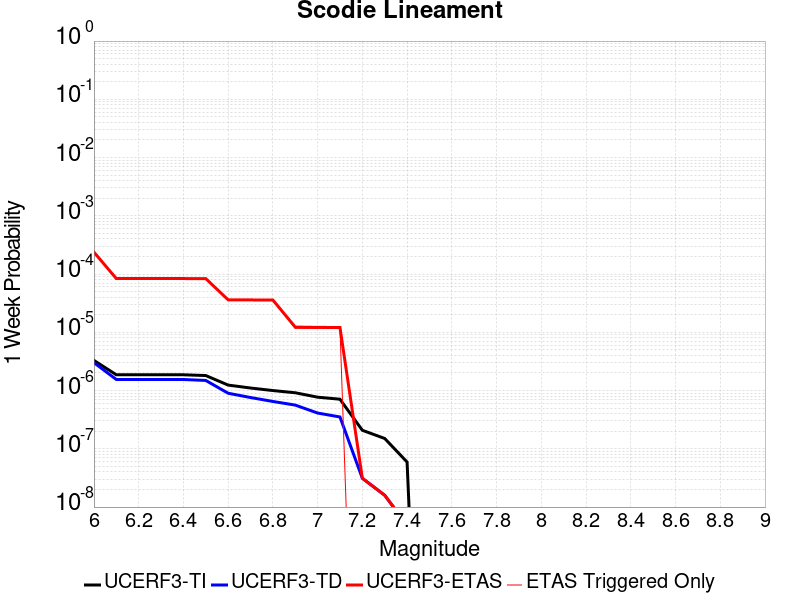 | 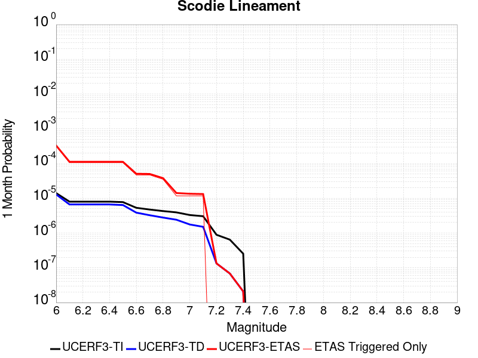 |  | 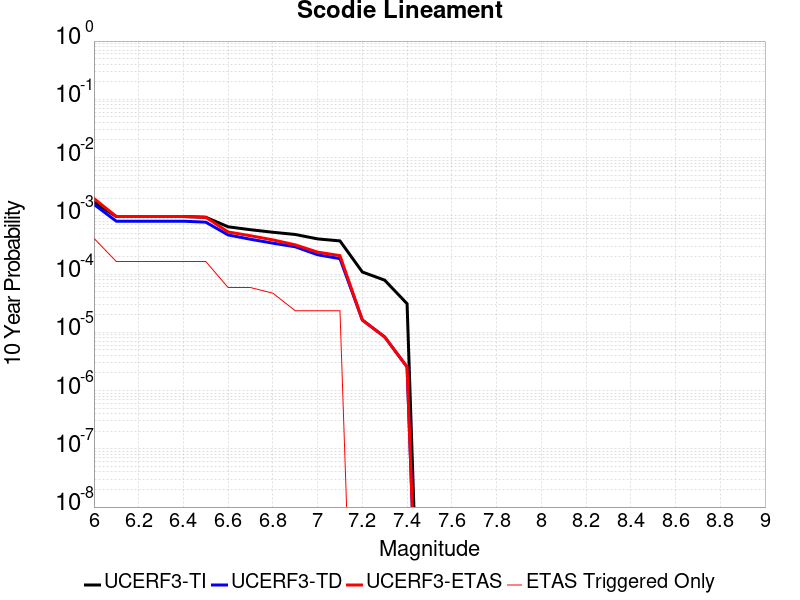 |

| Magnitude | 1 wk TI Prob | 1 wk TD Prob | 1 wk ETAS Prob | 1 wk ETAS/TD Gain | 1 wk ETAS Triggered Only | 1 mo TI Prob | 1 mo TD Prob | 1 mo ETAS Prob | 1 mo ETAS/TD Gain | 1 mo ETAS Triggered Only | 1 yr TI Prob | 1 yr TD Prob | 1 yr ETAS Prob | 1 yr ETAS/TD Gain | 1 yr ETAS Triggered Only | 10 yr TI Prob | 10 yr TD Prob | 10 yr ETAS Prob | 10 yr ETAS/TD Gain | 10 yr ETAS Triggered Only |
|-----|-----|-----|-----|-----|-----|-----|-----|-----|-----|-----|-----|-----|-----|-----|-----|-----|-----|-----|-----|-----|
| 6.0 | 3.2919327E-6 | 3.0133422E-6 | 2.3775442E-4 | 78.900566 | 2.3474179E-4 | 1.4108206E-5 | 1.2914278E-5 | 3.298116E-4 | 25.538525 | 3.169014E-4 | 1.7175387E-4 | 1.5722317E-4 | 5.092805E-4 | 3.2392204 | 3.5211266E-4 | 0.0017162118 | 0.0015714309 | 0.0019815834 | 1.2610058 | 4.1079812E-4 |
| 6.1 | 1.8663811E-6 | 1.5490499E-6 | 8.3708546E-5 | 54.038635 | 8.2159626E-5 | 7.998751E-6 | 6.6387715E-6 | 1.12271875E-4 | 16.911545 | 1.056338E-4 | 9.738045E-5 | 8.082454E-5 | 2.0992209E-4 | 2.597257 | 1.2910798E-4 | 9.7337784E-4 | 8.080003E-4 | 9.7218674E-4 | 1.203201 | 1.6431925E-4 |
| 6.2 | 1.8663811E-6 | 1.5490499E-6 | 8.3708546E-5 | 54.038635 | 8.2159626E-5 | 7.998751E-6 | 6.6387715E-6 | 1.12271875E-4 | 16.911545 | 1.056338E-4 | 9.738045E-5 | 8.082454E-5 | 2.0992209E-4 | 2.597257 | 1.2910798E-4 | 9.7337784E-4 | 8.080003E-4 | 9.7218674E-4 | 1.203201 | 1.6431925E-4 |
| 6.3 | 1.8663811E-6 | 1.5490499E-6 | 8.3708546E-5 | 54.038635 | 8.2159626E-5 | 7.998751E-6 | 6.6387715E-6 | 1.12271875E-4 | 16.911545 | 1.056338E-4 | 9.738045E-5 | 8.082454E-5 | 2.0992209E-4 | 2.597257 | 1.2910798E-4 | 9.7337784E-4 | 8.080003E-4 | 9.7218674E-4 | 1.203201 | 1.6431925E-4 |
| 6.4 | 1.8663811E-6 | 1.5490499E-6 | 8.3708546E-5 | 54.038635 | 8.2159626E-5 | 7.998751E-6 | 6.6387715E-6 | 1.12271875E-4 | 16.911545 | 1.056338E-4 | 9.738045E-5 | 8.082454E-5 | 2.0992209E-4 | 2.597257 | 1.2910798E-4 | 9.7337784E-4 | 8.080003E-4 | 9.7218674E-4 | 1.203201 | 1.6431925E-4 |
| 6.5 | 1.8106311E-6 | 1.4909839E-6 | 8.3650484E-5 | 56.104218 | 8.2159626E-5 | 7.759824E-6 | 6.3899183E-6 | 1.12023044E-4 | 17.531218 | 1.056338E-4 | 9.447177E-5 | 7.7794975E-5 | 2.0689292E-4 | 2.6594636 | 1.2910798E-4 | 9.4431615E-4 | 7.7772606E-4 | 9.4191753E-4 | 1.2111174 | 1.6431925E-4 |
| 6.6 | 1.2414679E-6 | 8.997558E-7 | 3.6110992E-5 | 40.134216 | 3.521127E-5 | 5.320566E-6 | 3.856091E-6 | 5.0804265E-5 | 13.17507 | 4.6948357E-5 | 6.477596E-5 | 4.6946985E-5 | 9.389313E-5 | 1.9999824 | 4.6948357E-5 | 6.475708E-4 | 4.693793E-4 | 5.280372E-4 | 1.1249691 | 5.8685448E-5 |
| 6.7 | 1.1062215E-6 | 7.594311E-7 | 3.5970672E-5 | 47.365288 | 3.521127E-5 | 4.7409408E-6 | 3.2547011E-6 | 5.0202903E-5 | 15.424736 | 4.6948357E-5 | 5.7719422E-5 | 3.9625334E-5 | 8.657183E-5 | 2.1847596 | 4.6948357E-5 | 5.770443E-4 | 3.961897E-4 | 4.548519E-4 | 1.1480659 | 5.8685448E-5 |
| 6.8 | 1.0006736E-6 | 6.500397E-7 | 3.5861285E-5 | 55.16784 | 3.521127E-5 | 4.288594E-6 | 2.7858816E-6 | 3.799705E-5 | 13.639148 | 3.521127E-5 | 5.221238E-5 | 3.3917644E-5 | 6.912772E-5 | 2.038105 | 3.521127E-5 | 5.220012E-4 | 3.3913075E-4 | 3.8606318E-4 | 1.1383904 | 4.6948357E-5 |
| 6.9 | 9.167364E-7 | 5.631625E-7 | 1.2300245E-5 | 21.84138 | 1.1737089E-5 | 3.9288643E-6 | 2.4135516E-6 | 1.41506125E-5 | 5.862983 | 1.1737089E-5 | 4.7832873E-5 | 2.9384651E-5 | 4.1121395E-5 | 1.3994175 | 1.1737089E-5 | 4.782258E-4 | 2.9381333E-4 | 3.1728062E-4 | 1.0798714 | 2.3474178E-5 |
| 7.0 | 7.6987664E-7 | 4.113383E-7 | 1.2148423E-5 | 29.533895 | 1.1737089E-5 | 3.2994672E-6 | 1.7628774E-6 | 1.3499946E-5 | 7.6579037 | 1.1737089E-5 | 4.0170275E-5 | 2.1462862E-5 | 3.31997E-5 | 1.546844 | 1.1737089E-5 | 4.0163012E-4 | 2.1461173E-4 | 2.3808087E-4 | 1.1093563 | 2.3474178E-5 |
| 7.1 | 7.1038727E-7 | 3.5211494E-7 | 1.20892E-5 | 34.333107 | 1.1737089E-5 | 3.0445133E-6 | 1.5090633E-6 | 1.3246135E-5 | 8.7777195 | 1.1737089E-5 | 3.706632E-5 | 1.8372726E-5 | 3.01096E-5 | 1.6388204 | 1.1737089E-5 | 3.7060137E-4 | 1.8371557E-4 | 2.0718543E-4 | 1.1277511 | 2.3474178E-5 |
| 7.2 | 2.0799602E-7 | 3.1186854E-8 | 3.1186854E-8 | 1.0 | 0.0 | 8.914113E-7 | 1.3365793E-7 | 1.3365793E-7 | 1.0 | 0.0 | 1.0852878E-5 | 1.6272843E-6 | 1.6272843E-6 | 1.0 | 0.0 | 1.08523476E-4 | 1.627273E-5 | 1.627273E-5 | 1.0 | 0.0 |
| 7.3 | 1.5048182E-7 | 1.5945696E-8 | 1.5945696E-8 | 1.0 | 0.0 | 6.449219E-7 | 6.83387E-8 | 6.83387E-8 | 1.0 | 0.0 | 7.851896E-6 | 8.320234E-7 | 8.320234E-7 | 1.0 | 0.0 | 7.851618E-5 | 8.320206E-6 | 8.320206E-6 | 1.0 | 0.0 |
| 7.4 | 5.9334678E-8 | 4.8683537E-9 | 4.8683537E-9 | 1.0 | 0.0 | 2.5429145E-7 | 2.0864372E-8 | 2.0864372E-8 | 1.0 | 0.0 | 3.095994E-6 | 2.5402372E-7 | 2.5402372E-7 | 1.0 | 0.0 | 3.095951E-5 | 2.5402353E-6 | 2.5402353E-6 | 1.0 | 0.0 |

## White Wolf (Extension)
*[(top)](#table-of-contents)*

| 1 Week | 1 Month | 1 Year | 10 Year |
|-----|-----|-----|-----|
| 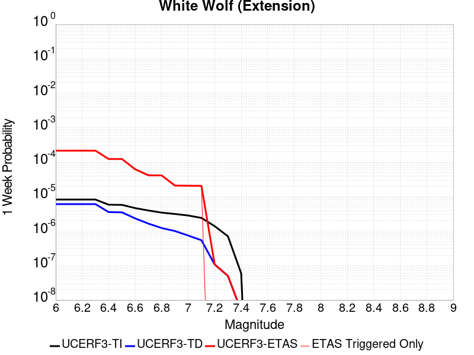 | 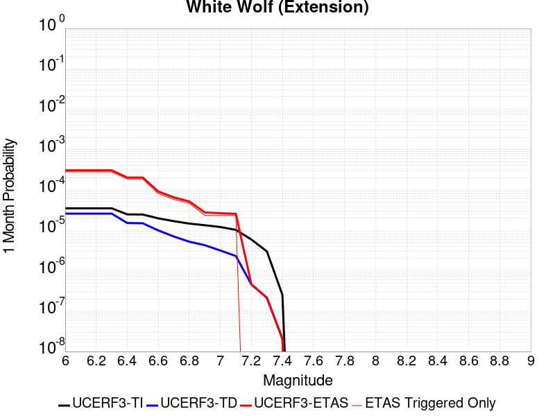 | 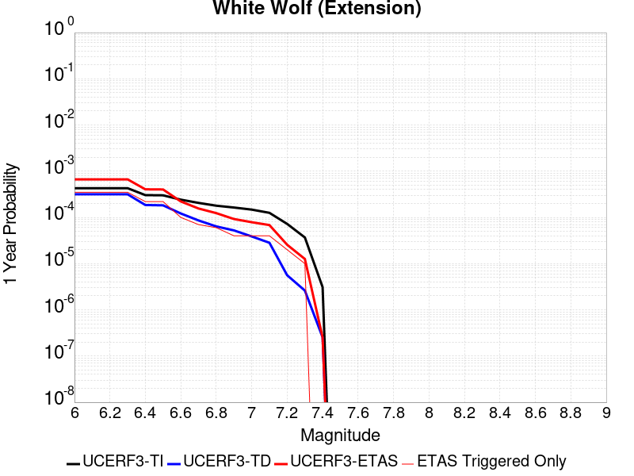 | 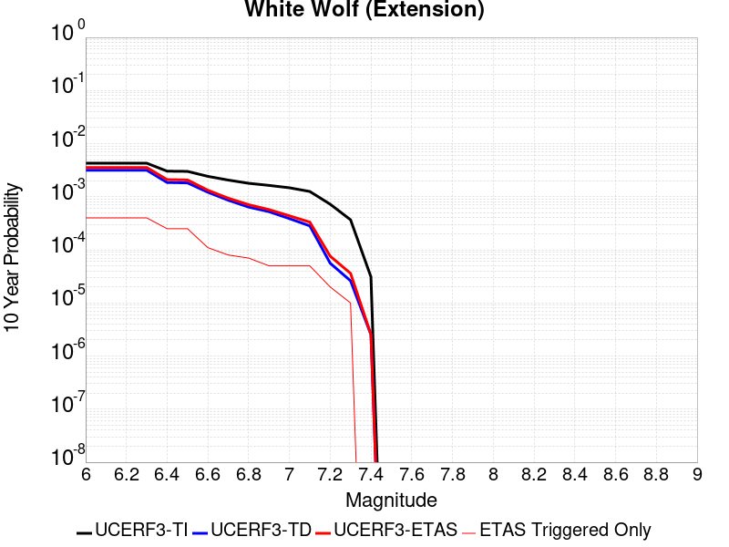 |

| Magnitude | 1 wk TI Prob | 1 wk TD Prob | 1 wk ETAS Prob | 1 wk ETAS/TD Gain | 1 wk ETAS Triggered Only | 1 mo TI Prob | 1 mo TD Prob | 1 mo ETAS Prob | 1 mo ETAS/TD Gain | 1 mo ETAS Triggered Only | 1 yr TI Prob | 1 yr TD Prob | 1 yr ETAS Prob | 1 yr ETAS/TD Gain | 1 yr ETAS Triggered Only | 10 yr TI Prob | 10 yr TD Prob | 10 yr ETAS Prob | 10 yr ETAS/TD Gain | 10 yr ETAS Triggered Only |
|-----|-----|-----|-----|-----|-----|-----|-----|-----|-----|-----|-----|-----|-----|-----|-----|-----|-----|-----|-----|-----|
| 6.0 | 8.222555E-6 | 6.0666657E-6 | 2.1733298E-4 | 35.824123 | 2.112676E-4 | 3.5239045E-5 | 2.5999774E-5 | 3.0768258E-4 | 11.834048 | 2.8169015E-4 | 4.289509E-4 | 3.1650788E-4 | 6.567757E-4 | 2.0750692 | 3.4037558E-4 | 0.0042812387 | 0.003161223 | 0.0035590224 | 1.1258372 | 3.9906104E-4 |
| 6.1 | 8.222555E-6 | 6.0666657E-6 | 2.1733298E-4 | 35.824123 | 2.112676E-4 | 3.5239045E-5 | 2.5999774E-5 | 3.0768258E-4 | 11.834048 | 2.8169015E-4 | 4.289509E-4 | 3.1650788E-4 | 6.567757E-4 | 2.0750692 | 3.4037558E-4 | 0.0042812387 | 0.003161223 | 0.0035590224 | 1.1258372 | 3.9906104E-4 |
| 6.2 | 8.222555E-6 | 6.0666657E-6 | 2.1733298E-4 | 35.824123 | 2.112676E-4 | 3.5239045E-5 | 2.5999774E-5 | 3.0768258E-4 | 11.834048 | 2.8169015E-4 | 4.289509E-4 | 3.1650788E-4 | 6.567757E-4 | 2.0750692 | 3.4037558E-4 | 0.0042812387 | 0.003161223 | 0.0035590224 | 1.1258372 | 3.9906104E-4 |
| 6.3 | 8.222555E-6 | 6.0666657E-6 | 2.1733298E-4 | 35.824123 | 2.112676E-4 | 3.5239045E-5 | 2.5999774E-5 | 3.0768258E-4 | 11.834048 | 2.8169015E-4 | 4.289509E-4 | 3.1650788E-4 | 6.567757E-4 | 2.0750692 | 3.4037558E-4 | 0.0042812387 | 0.003161223 | 0.0035590224 | 1.1258372 | 3.9906104E-4 |
| 6.4 | 5.821773E-6 | 3.5571766E-6 | 1.326647E-4 | 37.294945 | 1.2910798E-4 | 2.4950215E-5 | 1.5244959E-5 | 2.0303552E-4 | 13.318207 | 1.8779343E-4 | 3.0372653E-4 | 1.8559267E-4 | 4.202909E-4 | 2.2645879 | 2.3474179E-4 | 0.0030331176 | 0.001854485 | 0.0021239375 | 1.1452978 | 2.6995305E-4 |
| 6.5 | 5.766023E-6 | 3.4991106E-6 | 1.3260664E-4 | 37.89724 | 1.2910798E-4 | 2.4711293E-5 | 1.4996108E-5 | 2.0278672E-4 | 13.522623 | 1.8779343E-4 | 3.0081844E-4 | 1.8256342E-4 | 4.1726234E-4 | 2.2855747 | 2.3474179E-4 | 0.0030041158 | 0.0018242426 | 0.0020937033 | 1.1477109 | 2.6995305E-4 |
| 6.6 | 4.643576E-6 | 2.332624E-6 | 6.1017934E-5 | 26.158495 | 5.8685448E-5 | 1.9900888E-5 | 9.996925E-6 | 9.215573E-5 | 9.218408 | 8.2159626E-5 | 2.4226638E-4 | 1.2170619E-4 | 2.1559147E-4 | 1.7714093 | 9.389671E-5 | 0.0024200242 | 0.0012164378 | 0.0013219431 | 1.086733 | 1.056338E-4 |
| 6.7 | 3.9529173E-6 | 1.6483477E-6 | 4.8596627E-5 | 29.482023 | 4.6948357E-5 | 1.6940963E-5 | 7.0643296E-6 | 6.574936E-5 | 9.307233 | 5.8685448E-5 | 2.0623671E-4 | 8.6005006E-5 | 1.5642149E-4 | 1.8187486 | 7.042254E-5 | 0.002060454 | 8.597357E-4 | 9.418247E-4 | 1.0954816 | 8.2159626E-5 |
| 6.8 | 3.4377522E-6 | 1.2245237E-6 | 4.8172824E-5 | 39.34005 | 4.6948357E-5 | 1.473314E-5 | 5.2479486E-6 | 5.2196057E-5 | 9.945992 | 4.6948357E-5 | 1.7936122E-4 | 6.3891996E-5 | 1.2257369E-4 | 1.9184514 | 5.8685448E-5 | 0.0017921652 | 6.387454E-4 | 7.091229E-4 | 1.110181 | 7.042254E-5 |
| 6.9 | 3.1367306E-6 | 1.0033783E-6 | 2.4477533E-5 | 24.395119 | 2.3474178E-5 | 1.3443062E-5 | 4.3001864E-6 | 2.7774264E-5 | 6.4588513 | 2.3474178E-5 | 1.63657E-4 | 5.235359E-5 | 8.7563014E-5 | 1.6725312 | 3.521127E-5 | 0.0016353652 | 5.2342017E-4 | 5.70344E-4 | 1.0896484 | 4.6948357E-5 |
| 7.0 | 2.8298145E-6 | 7.4286646E-7 | 2.4217028E-5 | 32.599434 | 2.3474178E-5 | 1.2127721E-5 | 3.1837099E-6 | 2.6657814E-5 | 8.373192 | 2.3474178E-5 | 1.47645E-4 | 3.8761027E-5 | 7.397093E-5 | 1.9083841 | 3.521127E-5 | 0.0014754693 | 3.8754768E-4 | 4.3447784E-4 | 1.1210952 | 4.6948357E-5 |
| 7.1 | 2.4091064E-6 | 5.4227525E-7 | 2.401644E-5 | 44.28829 | 2.3474178E-5 | 1.03247E-5 | 2.3240348E-6 | 2.579816E-5 | 11.100591 | 2.3474178E-5 | 1.2569598E-4 | 2.8294799E-5 | 6.350507E-5 | 2.244408 | 3.521127E-5 | 0.001256249 | 2.8291598E-4 | 3.2985106E-4 | 1.1658976 | 4.6948357E-5 |
| 7.2 | 1.3875518E-6 | 1.0743063E-7 | 1.0743063E-7 | 1.0 | 0.0 | 5.9466374E-6 | 4.6041689E-7 | 4.6041689E-7 | 1.0 | 0.0 | 7.23979E-5 | 5.6055624E-6 | 1.7342585E-5 | 3.0938172 | 1.1737089E-5 | 7.2374323E-4 | 5.6054323E-5 | 6.779075E-5 | 1.209376 | 1.1737089E-5 |
| 7.3 | 7.056077E-7 | 5.002034E-8 | 5.002034E-8 | 1.0 | 0.0 | 3.0240296E-6 | 2.1437286E-7 | 2.1437286E-7 | 1.0 | 0.0 | 3.681694E-5 | 2.609987E-6 | 2.609987E-6 | 1.0 | 0.0 | 3.681084E-4 | 2.609961E-5 | 2.609961E-5 | 1.0 | 0.0 |
| 7.4 | 5.9334678E-8 | 4.8683537E-9 | 4.8683537E-9 | 1.0 | 0.0 | 2.5429145E-7 | 2.0864372E-8 | 2.0864372E-8 | 1.0 | 0.0 | 3.095994E-6 | 2.5402372E-7 | 2.5402372E-7 | 1.0 | 0.0 | 3.095951E-5 | 2.5402353E-6 | 2.5402353E-6 | 1.0 | 0.0 |

## San Andreas (Cholame) rev
*[(top)](#table-of-contents)*

| 1 Week | 1 Month | 1 Year | 10 Year |
|-----|-----|-----|-----|
| 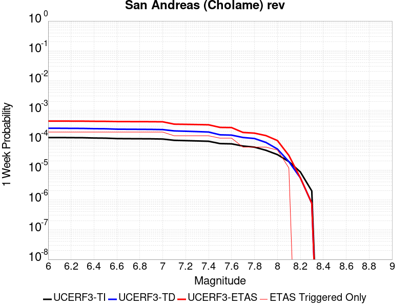 | 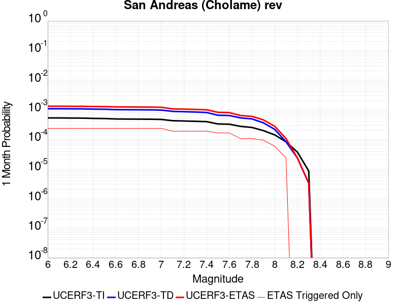 | 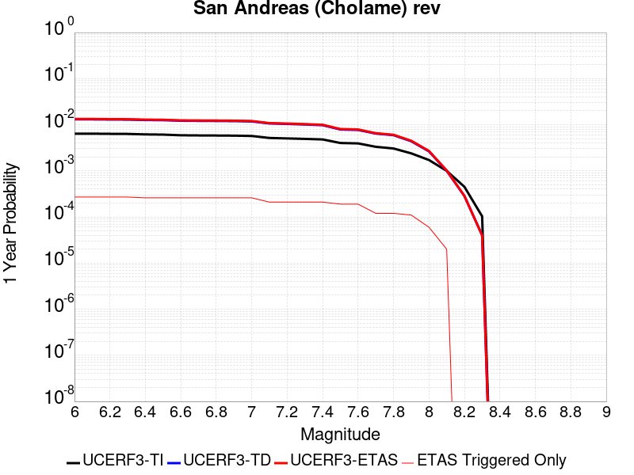 | 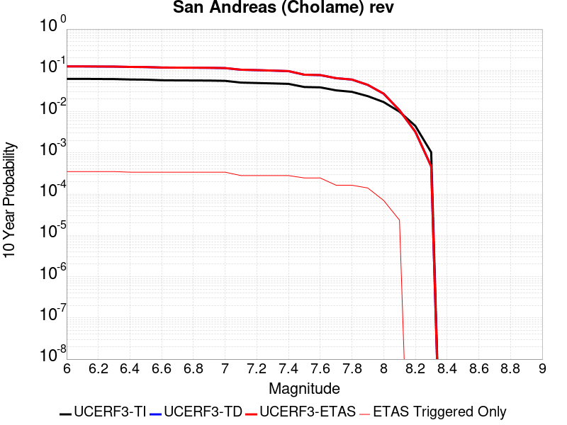 |

| Magnitude | 1 wk TI Prob | 1 wk TD Prob | 1 wk ETAS Prob | 1 wk ETAS/TD Gain | 1 wk ETAS Triggered Only | 1 mo TI Prob | 1 mo TD Prob | 1 mo ETAS Prob | 1 mo ETAS/TD Gain | 1 mo ETAS Triggered Only | 1 yr TI Prob | 1 yr TD Prob | 1 yr ETAS Prob | 1 yr ETAS/TD Gain | 1 yr ETAS Triggered Only | 10 yr TI Prob | 10 yr TD Prob | 10 yr ETAS Prob | 10 yr ETAS/TD Gain | 10 yr ETAS Triggered Only |
|-----|-----|-----|-----|-----|-----|-----|-----|-----|-----|-----|-----|-----|-----|-----|-----|-----|-----|-----|-----|-----|
| 6.0 | 1.2302514E-4 | 2.5204287E-4 | 4.3978897E-4 | 1.7448975 | 1.8779343E-4 | 5.27144E-4 | 0.0010797381 | 0.0013142265 | 1.2171714 | 2.3474179E-4 | 0.0063991086 | 0.0130670825 | 0.013333508 | 1.0203891 | 2.6995305E-4 | 0.06217949 | 0.12439073 | 0.12469904 | 1.0024786 | 3.5211266E-4 |
| 6.1 | 1.2302514E-4 | 2.5204287E-4 | 4.3978897E-4 | 1.7448975 | 1.8779343E-4 | 5.27144E-4 | 0.0010797381 | 0.0013142265 | 1.2171714 | 2.3474179E-4 | 0.0063991086 | 0.0130670825 | 0.013333508 | 1.0203891 | 2.6995305E-4 | 0.06217949 | 0.12439073 | 0.12469904 | 1.0024786 | 3.5211266E-4 |
| 6.2 | 1.2203569E-4 | 2.5021084E-4 | 4.3795726E-4 | 1.750353 | 1.8779343E-4 | 5.2290526E-4 | 0.0010718931 | 0.0013063833 | 1.2187626 | 2.3474179E-4 | 0.006347804 | 0.01297271 | 0.013239161 | 1.0205394 | 2.6995305E-4 | 0.061695136 | 0.12357691 | 0.123885505 | 1.0024972 | 3.5211266E-4 |
| 6.3 | 1.2142645E-4 | 2.4907055E-4 | 4.368172E-4 | 1.7537891 | 1.8779343E-4 | 5.202953E-4 | 0.0010670102 | 0.0013015015 | 1.2197648 | 2.3474179E-4 | 0.006316212 | 0.012913967 | 0.013180434 | 1.020634 | 2.6995305E-4 | 0.06139677 | 0.12307103 | 0.12337981 | 1.002509 | 3.5211266E-4 |
| 6.4 | 1.1865206E-4 | 2.44126E-4 | 4.3187357E-4 | 1.7690601 | 1.8779343E-4 | 5.0840975E-4 | 0.0010458364 | 0.0012803327 | 1.2242188 | 2.3474179E-4 | 0.006172335 | 0.012659196 | 0.012925732 | 1.0210547 | 2.6995305E-4 | 0.060036868 | 0.1208638 | 0.12116304 | 1.0024759 | 3.4037558E-4 |
| 6.5 | 1.17443946E-4 | 2.4205919E-4 | 4.2980717E-4 | 1.7756283 | 1.8779343E-4 | 5.032341E-4 | 0.0010369857 | 0.0012714841 | 1.2261347 | 2.3474179E-4 | 0.006109677 | 0.012552682 | 0.012819247 | 1.0212357 | 2.6995305E-4 | 0.059444077 | 0.11993805 | 0.120237604 | 1.0024976 | 3.4037558E-4 |
| 6.6 | 1.13579066E-4 | 2.3514954E-4 | 4.228988E-4 | 1.798425 | 1.8779343E-4 | 4.866766E-4 | 0.001007396 | 0.0012419013 | 1.2327837 | 2.3474179E-4 | 0.0059092017 | 0.012196515 | 0.012463175 | 1.0218637 | 2.6995305E-4 | 0.057545185 | 0.11685214 | 0.11715274 | 1.0025725 | 3.4037558E-4 |
| 6.7 | 1.1271412E-4 | 2.3359268E-4 | 4.2134224E-4 | 1.8037477 | 1.8779343E-4 | 4.829711E-4 | 0.0010007289 | 0.0012352358 | 1.234336 | 2.3474179E-4 | 0.005864331 | 0.012116249 | 0.012382931 | 1.0220103 | 2.6995305E-4 | 0.057119697 | 0.116155714 | 0.11645655 | 1.00259 | 3.4037558E-4 |
| 6.8 | 1.1217975E-4 | 2.3247694E-4 | 4.2022672E-4 | 1.807606 | 1.8779343E-4 | 4.8068175E-4 | 9.959509E-4 | 0.0012304588 | 1.2354614 | 2.3474179E-4 | 0.005836608 | 0.012058721 | 0.012325419 | 1.0221165 | 2.6995305E-4 | 0.056856725 | 0.11565396 | 0.11595497 | 1.0026027 | 3.4037558E-4 |
| 6.9 | 1.1146753E-4 | 2.3096445E-4 | 4.187145E-4 | 1.8128959 | 1.8779343E-4 | 4.7763053E-4 | 9.894737E-4 | 0.0012239831 | 1.2370043 | 2.3474179E-4 | 0.0057996577 | 0.011980731 | 0.012247451 | 1.0222623 | 2.6995305E-4 | 0.056506127 | 0.11497439 | 0.11527563 | 1.0026201 | 3.4037558E-4 |
| 7.0 | 1.0965793E-4 | 2.2719789E-4 | 4.1494865E-4 | 1.8263755 | 1.8779343E-4 | 4.698779E-4 | 9.733434E-4 | 0.0012078567 | 1.2409358 | 2.3474179E-4 | 0.005705768 | 0.011786487 | 0.012053258 | 1.0226337 | 2.6995305E-4 | 0.055614736 | 0.11327597 | 0.11357778 | 1.0026644 | 3.4037558E-4 |
| 7.1 | 9.927982E-5 | 2.0538924E-4 | 3.4620537E-4 | 1.6856062 | 1.4084508E-4 | 4.2541555E-4 | 8.7994366E-4 | 0.0010675718 | 1.2132275 | 1.8779343E-4 | 0.0051671406 | 0.010660981 | 0.010881608 | 1.0206949 | 2.230047E-4 | 0.05048634 | 0.1033706 | 0.103623174 | 1.0024433 | 2.8169015E-4 |
| 7.2 | 9.696786E-5 | 2.0043184E-4 | 3.4124867E-4 | 1.7025672 | 1.4084508E-4 | 4.1551032E-4 | 8.5871184E-4 | 0.0010463439 | 1.2185042 | 1.8779343E-4 | 0.00504711 | 0.010404981 | 0.010625665 | 1.0212095 | 2.230047E-4 | 0.04934009 | 0.1011086 | 0.10136181 | 1.0025043 | 2.8169015E-4 |
| 7.3 | 9.4727984E-5 | 1.9472468E-4 | 3.3554234E-4 | 1.7231628 | 1.4084508E-4 | 4.0591392E-4 | 8.3426846E-4 | 0.0010219052 | 1.2249117 | 1.8779343E-4 | 0.0049308087 | 0.010110183 | 0.010330932 | 1.0218344 | 2.230047E-4 | 0.048228268 | 0.09847952 | 0.09873346 | 1.0025787 | 2.8169015E-4 |
| 7.4 | 9.220358E-5 | 1.8843076E-4 | 3.2924928E-4 | 1.7473224 | 1.4084508E-4 | 3.9509835E-4 | 8.073114E-4 | 9.949532E-4 | 1.2324281 | 1.8779343E-4 | 0.004799717 | 0.009784967 | 0.010005789 | 1.0225675 | 2.230047E-4 | 0.046973653 | 0.095557496 | 0.09581227 | 1.0026661 | 2.8169015E-4 |
| 7.5 | 7.71631E-5 | 1.5177966E-4 | 2.6913275E-4 | 1.7731805 | 1.17370895E-4 | 3.306571E-4 | 6.503223E-4 | 8.1453467E-4 | 1.2525092 | 1.6431925E-4 | 0.0040183207 | 0.007889002 | 0.008086958 | 1.0250927 | 1.9953052E-4 | 0.03946433 | 0.07828531 | 0.07851249 | 1.002902 | 2.4647888E-4 |
| 7.6 | 7.5634416E-5 | 1.483744E-4 | 2.6572787E-4 | 1.7909281 | 1.17370895E-4 | 3.241072E-4 | 6.3573546E-4 | 7.9995027E-4 | 1.2583067 | 1.6431925E-4 | 0.0039388672 | 0.0077126776 | 0.007910669 | 1.0256709 | 1.9953052E-4 | 0.038697794 | 0.07664872 | 0.076876305 | 1.0029693 | 2.4647888E-4 |
| 7.7 | 6.3783E-5 | 1.235872E-4 | 1.822654E-4 | 1.4747918 | 5.8685448E-5 | 2.7332708E-4 | 5.29552E-4 | 6.3512987E-4 | 1.199372 | 1.056338E-4 | 0.0033226798 | 0.0064282627 | 0.006544879 | 1.0181412 | 1.17370895E-4 | 0.032734364 | 0.06454029 | 0.06469401 | 1.0023817 | 1.6431925E-4 |
| 7.8 | 5.863422E-5 | 1.1416107E-4 | 1.7283982E-4 | 1.5139996 | 5.8685448E-5 | 2.512653E-4 | 4.8917E-4 | 5.9475214E-4 | 1.2158393 | 1.056338E-4 | 0.003054864 | 0.0059394026 | 0.0060560764 | 1.019644 | 1.17370895E-4 | 0.030132094 | 0.059659187 | 0.0598137 | 1.00259 | 1.6431925E-4 |
| 7.9 | 4.595283E-5 | 8.426331E-5 | 1.4294381E-4 | 1.6963944 | 5.8685448E-5 | 1.9692584E-4 | 3.610785E-4 | 4.5494133E-4 | 1.2599512 | 9.389671E-5 | 0.0023949358 | 0.0043872762 | 0.0044924463 | 1.0239717 | 1.056338E-4 | 0.023692891 | 0.044362005 | 0.044496603 | 1.0030341 | 1.4084508E-4 |
| 8.0 | 3.2950178E-5 | 5.0772942E-5 | 9.771892E-5 | 1.9246258 | 4.6948357E-5 | 1.412074E-4 | 2.1758018E-4 | 2.7625286E-4 | 1.26966 | 5.8685448E-5 | 0.0017178444 | 0.0026458222 | 0.0027043526 | 1.0221218 | 5.8685448E-5 | 0.017046256 | 0.027180137 | 0.027248645 | 1.0025206 | 7.042254E-5 |
| 8.1 | 1.9177472E-5 | 1.9185145E-5 | 3.092201E-5 | 1.6117682 | 1.1737089E-5 | 8.218658E-5 | 8.221946E-5 | 1.0569171E-4 | 1.2854829 | 2.3474178E-5 | 0.0010001622 | 0.0010005629 | 0.0010240136 | 1.0234375 | 2.3474178E-5 | 0.009956728 | 0.010758142 | 0.010781364 | 1.0021585 | 2.3474178E-5 |
| 8.2 | 8.643924E-6 | 5.4748625E-6 | 5.4748625E-6 | 1.0 | 0.0 | 3.704486E-5 | 2.3463486E-5 | 2.3463486E-5 | 1.0 | 0.0 | 4.5092785E-4 | 2.8563058E-4 | 2.8563058E-4 | 1.0 | 0.0 | 0.0045001395 | 0.0032487072 | 0.0032487072 | 1.0 | 0.0 |
| 8.3 | 1.983087E-6 | 7.6599065E-7 | 7.6599065E-7 | 1.0 | 0.0 | 8.498917E-6 | 3.282813E-6 | 3.282813E-6 | 1.0 | 0.0 | 1.034694E-4 | 3.9967534E-5 | 3.9967534E-5 | 1.0 | 0.0 | 0.0010342124 | 4.719687E-4 | 4.719687E-4 | 1.0 | 0.0 |

## San Andreas (Carrizo) rev
*[(top)](#table-of-contents)*

| 1 Week | 1 Month | 1 Year | 10 Year |
|-----|-----|-----|-----|
| 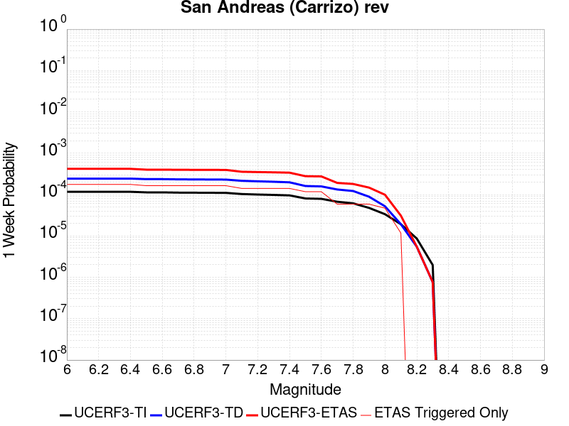 | 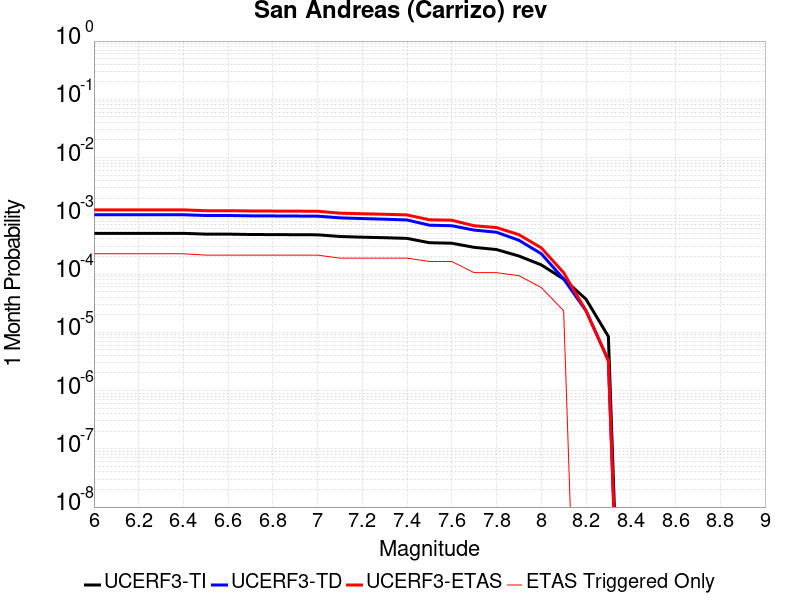 | 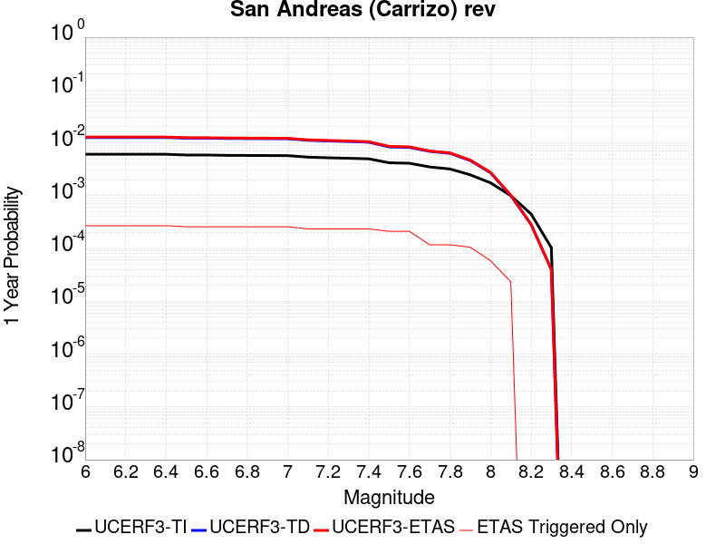 | 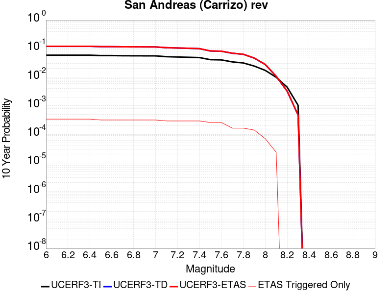 |

| Magnitude | 1 wk TI Prob | 1 wk TD Prob | 1 wk ETAS Prob | 1 wk ETAS/TD Gain | 1 wk ETAS Triggered Only | 1 mo TI Prob | 1 mo TD Prob | 1 mo ETAS Prob | 1 mo ETAS/TD Gain | 1 mo ETAS Triggered Only | 1 yr TI Prob | 1 yr TD Prob | 1 yr ETAS Prob | 1 yr ETAS/TD Gain | 1 yr ETAS Triggered Only | 10 yr TI Prob | 10 yr TD Prob | 10 yr ETAS Prob | 10 yr ETAS/TD Gain | 10 yr ETAS Triggered Only |
|-----|-----|-----|-----|-----|-----|-----|-----|-----|-----|-----|-----|-----|-----|-----|-----|-----|-----|-----|-----|-----|
| 6.0 | 1.1674632E-4 | 2.432302E-4 | 4.192437E-4 | 1.7236499 | 1.7605633E-4 | 5.002454E-4 | 0.0010420004 | 0.0012647726 | 1.2137929 | 2.230047E-4 | 0.006073493 | 0.012613042 | 0.0128795905 | 1.0211327 | 2.6995305E-4 | 0.0591016 | 0.12061418 | 0.1209135 | 1.0024817 | 3.4037558E-4 |
| 6.1 | 1.1674632E-4 | 2.432302E-4 | 4.192437E-4 | 1.7236499 | 1.7605633E-4 | 5.002454E-4 | 0.0010420004 | 0.0012647726 | 1.2137929 | 2.230047E-4 | 0.006073493 | 0.012613042 | 0.0128795905 | 1.0211327 | 2.6995305E-4 | 0.0591016 | 0.12061418 | 0.1209135 | 1.0024817 | 3.4037558E-4 |
| 6.2 | 1.1674632E-4 | 2.432302E-4 | 4.192437E-4 | 1.7236499 | 1.7605633E-4 | 5.002454E-4 | 0.0010420004 | 0.0012647726 | 1.2137929 | 2.230047E-4 | 0.006073493 | 0.012613042 | 0.0128795905 | 1.0211327 | 2.6995305E-4 | 0.0591016 | 0.12061418 | 0.1209135 | 1.0024817 | 3.4037558E-4 |
| 6.3 | 1.1674632E-4 | 2.432302E-4 | 4.192437E-4 | 1.7236499 | 1.7605633E-4 | 5.002454E-4 | 0.0010420004 | 0.0012647726 | 1.2137929 | 2.230047E-4 | 0.006073493 | 0.012613042 | 0.0128795905 | 1.0211327 | 2.6995305E-4 | 0.0591016 | 0.12061418 | 0.1209135 | 1.0024817 | 3.4037558E-4 |
| 6.4 | 1.1674632E-4 | 2.432302E-4 | 4.192437E-4 | 1.7236499 | 1.7605633E-4 | 5.002454E-4 | 0.0010420004 | 0.0012647726 | 1.2137929 | 2.230047E-4 | 0.006073493 | 0.012613042 | 0.0128795905 | 1.0211327 | 2.6995305E-4 | 0.0591016 | 0.12061418 | 0.1209135 | 1.0024817 | 3.4037558E-4 |
| 6.5 | 1.13136164E-4 | 2.3643032E-4 | 4.007107E-4 | 1.6948364 | 1.6431925E-4 | 4.847792E-4 | 0.0010128808 | 0.0012239345 | 1.2083696 | 2.112676E-4 | 0.0058862255 | 0.012262545 | 0.012517594 | 1.020799 | 2.5821597E-4 | 0.057327334 | 0.117585555 | 0.11786519 | 1.0023782 | 3.169014E-4 |
| 6.6 | 1.13136164E-4 | 2.3643032E-4 | 4.007107E-4 | 1.6948364 | 1.6431925E-4 | 4.847792E-4 | 0.0010128808 | 0.0012239345 | 1.2083696 | 2.112676E-4 | 0.0058862255 | 0.012262545 | 0.012517594 | 1.020799 | 2.5821597E-4 | 0.057327334 | 0.117585555 | 0.11786519 | 1.0023782 | 3.169014E-4 |
| 6.7 | 1.1149675E-4 | 2.3334254E-4 | 3.9762346E-4 | 1.7040333 | 1.6431925E-4 | 4.777557E-4 | 9.996577E-4 | 0.0012107141 | 1.2111287 | 2.112676E-4 | 0.0058011734 | 0.012103349 | 0.01235844 | 1.0210761 | 2.5821597E-4 | 0.05652051 | 0.1162071 | 0.116487175 | 1.0024102 | 3.169014E-4 |
| 6.8 | 1.1103589E-4 | 2.3236412E-4 | 3.966452E-4 | 1.7069983 | 1.6431925E-4 | 4.7578133E-4 | 9.954676E-4 | 0.001206525 | 1.2120183 | 2.112676E-4 | 0.005777263 | 0.012052901 | 0.012308005 | 1.0211654 | 2.5821597E-4 | 0.056293584 | 0.1157674 | 0.11604761 | 1.0024205 | 3.169014E-4 |
| 6.9 | 1.1053259E-4 | 2.3128795E-4 | 3.955692E-4 | 1.7102888 | 1.6431925E-4 | 4.7362508E-4 | 9.90859E-4 | 0.0012019173 | 1.2130053 | 2.112676E-4 | 0.0057511497 | 0.01199741 | 0.012252528 | 1.0212644 | 2.5821597E-4 | 0.05604569 | 0.11528359 | 0.11556397 | 1.002432 | 3.169014E-4 |
| 7.0 | 1.1005377E-4 | 2.3029637E-4 | 3.9457777E-4 | 1.7133478 | 1.6431925E-4 | 4.7157376E-4 | 9.866126E-4 | 0.0011976718 | 1.213923 | 2.112676E-4 | 0.0057263062 | 0.011946279 | 0.01220141 | 1.0213566 | 2.5821597E-4 | 0.055809796 | 0.11483591 | 0.11511642 | 1.0024427 | 3.169014E-4 |
| 7.1 | 1.0308142E-4 | 2.1539345E-4 | 3.5620818E-4 | 1.6537559 | 1.4084508E-4 | 4.417027E-4 | 9.227892E-4 | 0.0011104094 | 1.2033185 | 1.8779343E-4 | 0.0053644776 | 0.011177397 | 0.0114095155 | 1.0207667 | 2.3474179E-4 | 0.052368138 | 0.108092256 | 0.108353965 | 1.0024211 | 2.9342723E-4 |
| 7.2 | 1.0027479E-4 | 2.094724E-4 | 3.5028797E-4 | 1.6722392 | 1.4084508E-4 | 4.296783E-4 | 8.9743105E-4 | 0.001085056 | 1.2090689 | 1.8779343E-4 | 0.0052187922 | 0.010871782 | 0.011103972 | 1.021357 | 2.3474179E-4 | 0.050979212 | 0.10539625 | 0.10565875 | 1.0024906 | 2.9342723E-4 |
| 7.3 | 9.816942E-5 | 2.0422463E-4 | 3.4504096E-4 | 1.6895168 | 1.4084508E-4 | 4.2065824E-4 | 8.7495585E-4 | 0.0010625849 | 1.214444 | 1.8779343E-4 | 0.005109493 | 0.010600842 | 0.010833095 | 1.021909 | 2.3474179E-4 | 0.049935985 | 0.102979995 | 0.10324321 | 1.002556 | 2.9342723E-4 |
| 7.4 | 9.5634205E-5 | 1.9791997E-4 | 3.3873715E-4 | 1.7114855 | 1.4084508E-4 | 4.0979648E-4 | 8.479536E-4 | 0.0010355877 | 1.2212788 | 1.8779343E-4 | 0.0049778637 | 0.010275229 | 0.0105075585 | 1.0226107 | 2.3474179E-4 | 0.048678253 | 0.10006632 | 0.10033038 | 1.0026389 | 2.9342723E-4 |
| 7.5 | 8.052417E-5 | 1.611261E-4 | 2.7847808E-4 | 1.7283238 | 1.17370895E-4 | 3.4505792E-4 | 6.903579E-4 | 8.5456367E-4 | 1.237856 | 1.6431925E-4 | 0.0041929903 | 0.008372796 | 0.008582294 | 1.0250213 | 2.112676E-4 | 0.04114753 | 0.08281049 | 0.08304732 | 1.00286 | 2.5821597E-4 |
| 7.6 | 7.897024E-5 | 1.5765853E-4 | 2.750109E-4 | 1.7443453 | 1.17370895E-4 | 3.384E-4 | 6.755046E-4 | 8.397129E-4 | 1.2430898 | 1.6431925E-4 | 0.0041122385 | 0.008193332 | 0.008402868 | 1.0255741 | 2.112676E-4 | 0.040369697 | 0.08115171 | 0.081388965 | 1.0029237 | 2.5821597E-4 |
| 7.7 | 6.707427E-5 | 1.3276102E-4 | 1.9143868E-4 | 1.4419795 | 5.8685448E-5 | 2.8742946E-4 | 5.688518E-4 | 6.744255E-4 | 1.1855909 | 1.056338E-4 | 0.003493839 | 0.00690381 | 0.0070203706 | 1.0168835 | 1.17370895E-4 | 0.034394164 | 0.069048055 | 0.06920103 | 1.0022155 | 1.6431925E-4 |
| 7.8 | 6.147705E-5 | 1.2197486E-4 | 1.8065315E-4 | 1.4810687 | 5.8685448E-5 | 2.6344648E-4 | 5.226447E-4 | 6.282233E-4 | 1.2020084 | 1.056338E-4 | 0.0032027436 | 0.006344659 | 0.006461285 | 1.0183818 | 1.17370895E-4 | 0.031569764 | 0.06351457 | 0.063668445 | 1.0024228 | 1.6431925E-4 |
| 7.9 | 4.7636717E-5 | 8.87977E-5 | 1.4747794E-4 | 1.6608306 | 5.8685448E-5 | 2.0414138E-4 | 3.8050607E-4 | 4.7436706E-4 | 1.2466741 | 9.389671E-5 | 0.0024825884 | 0.0046228287 | 0.004727974 | 1.0227449 | 1.056338E-4 | 0.024550365 | 0.046628095 | 0.04676237 | 1.0028797 | 1.4084508E-4 |
| 8.0 | 3.3554235E-5 | 5.2136907E-5 | 9.908282E-5 | 1.9004352 | 4.6948357E-5 | 1.4379594E-4 | 2.2342477E-4 | 2.820971E-4 | 1.2626045 | 5.8685448E-5 | 0.0017493097 | 0.002716805 | 0.002775331 | 1.0215422 | 5.8685448E-5 | 0.017356034 | 0.027880952 | 0.027949411 | 1.0024554 | 7.042254E-5 |
| 8.1 | 1.9175432E-5 | 1.9184976E-5 | 3.092184E-5 | 1.6117737 | 1.1737089E-5 | 8.217783E-5 | 8.2218736E-5 | 1.0569098E-4 | 1.2854854 | 2.3474178E-5 | 0.0010000558 | 0.0010005541 | 0.0010240048 | 1.0234377 | 2.3474178E-5 | 0.009955673 | 0.0107580265 | 0.010781248 | 1.0021585 | 2.3474178E-5 |
| 8.2 | 8.643924E-6 | 5.4748625E-6 | 5.4748625E-6 | 1.0 | 0.0 | 3.704486E-5 | 2.3463486E-5 | 2.3463486E-5 | 1.0 | 0.0 | 4.5092785E-4 | 2.8563058E-4 | 2.8563058E-4 | 1.0 | 0.0 | 0.0045001395 | 0.0032487072 | 0.0032487072 | 1.0 | 0.0 |
| 8.3 | 1.983087E-6 | 7.6599065E-7 | 7.6599065E-7 | 1.0 | 0.0 | 8.498917E-6 | 3.282813E-6 | 3.282813E-6 | 1.0 | 0.0 | 1.034694E-4 | 3.9967534E-5 | 3.9967534E-5 | 1.0 | 0.0 | 0.0010342124 | 4.719687E-4 | 4.719687E-4 | 1.0 | 0.0 |

## Sierra Nevada  (No Extension)
*[(top)](#table-of-contents)*

| 1 Week | 1 Month | 1 Year | 10 Year |
|-----|-----|-----|-----|
| 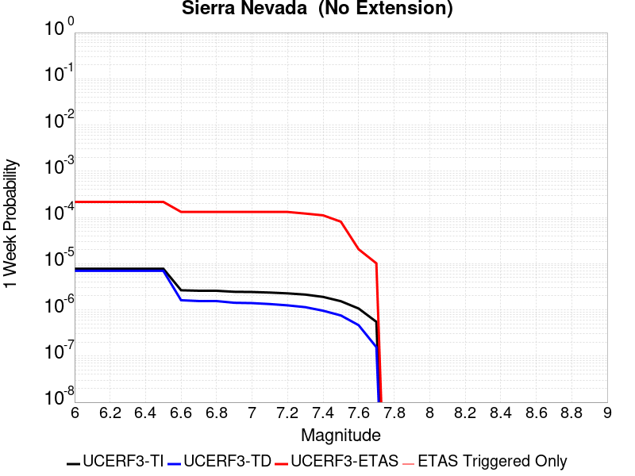 | 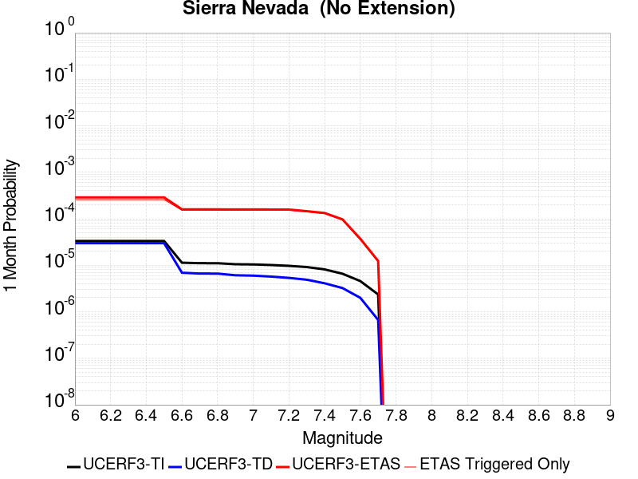 | 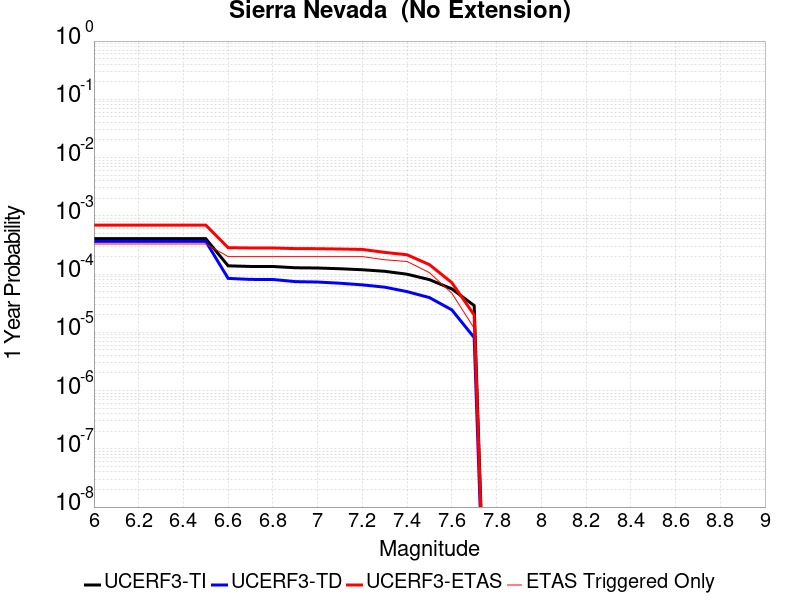 | 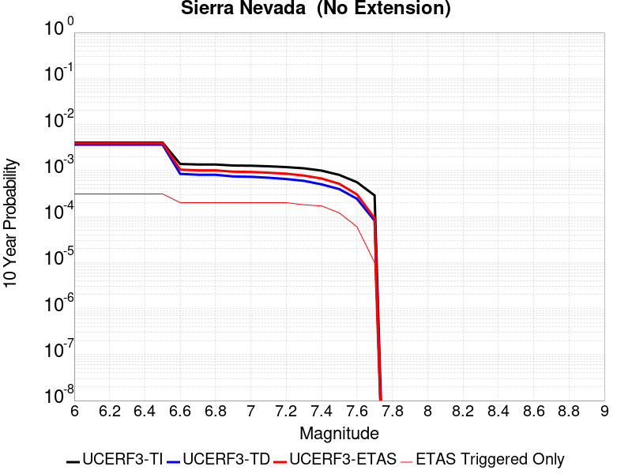 |

| Magnitude | 1 wk TI Prob | 1 wk TD Prob | 1 wk ETAS Prob | 1 wk ETAS/TD Gain | 1 wk ETAS Triggered Only | 1 mo TI Prob | 1 mo TD Prob | 1 mo ETAS Prob | 1 mo ETAS/TD Gain | 1 mo ETAS Triggered Only | 1 yr TI Prob | 1 yr TD Prob | 1 yr ETAS Prob | 1 yr ETAS/TD Gain | 1 yr ETAS Triggered Only | 10 yr TI Prob | 10 yr TD Prob | 10 yr ETAS Prob | 10 yr ETAS/TD Gain | 10 yr ETAS Triggered Only |
|-----|-----|-----|-----|-----|-----|-----|-----|-----|-----|-----|-----|-----|-----|-----|-----|-----|-----|-----|-----|-----|
| 6.0 | 7.7690465E-6 | 6.976322E-6 | 2.2997946E-4 | 32.965717 | 2.230047E-4 | 3.329549E-5 | 2.9898381E-5 | 2.8810662E-4 | 9.636195 | 2.5821597E-4 | 4.0529718E-4 | 3.6398784E-4 | 6.925067E-4 | 1.9025545 | 3.286385E-4 | 0.004045588 | 0.0036374326 | 0.00397657 | 1.0932354 | 3.4037558E-4 |
| 6.1 | 7.7690465E-6 | 6.976322E-6 | 2.2997946E-4 | 32.965717 | 2.230047E-4 | 3.329549E-5 | 2.9898381E-5 | 2.8810662E-4 | 9.636195 | 2.5821597E-4 | 4.0529718E-4 | 3.6398784E-4 | 6.925067E-4 | 1.9025545 | 3.286385E-4 | 0.004045588 | 0.0036374326 | 0.00397657 | 1.0932354 | 3.4037558E-4 |
| 6.2 | 7.7690465E-6 | 6.976322E-6 | 2.2997946E-4 | 32.965717 | 2.230047E-4 | 3.329549E-5 | 2.9898381E-5 | 2.8810662E-4 | 9.636195 | 2.5821597E-4 | 4.0529718E-4 | 3.6398784E-4 | 6.925067E-4 | 1.9025545 | 3.286385E-4 | 0.004045588 | 0.0036374326 | 0.00397657 | 1.0932354 | 3.4037558E-4 |
| 6.3 | 7.7690465E-6 | 6.976322E-6 | 2.2997946E-4 | 32.965717 | 2.230047E-4 | 3.329549E-5 | 2.9898381E-5 | 2.8810662E-4 | 9.636195 | 2.5821597E-4 | 4.0529718E-4 | 3.6398784E-4 | 6.925067E-4 | 1.9025545 | 3.286385E-4 | 0.004045588 | 0.0036374326 | 0.00397657 | 1.0932354 | 3.4037558E-4 |
| 6.4 | 7.7690465E-6 | 6.976322E-6 | 2.2997946E-4 | 32.965717 | 2.230047E-4 | 3.329549E-5 | 2.9898381E-5 | 2.8810662E-4 | 9.636195 | 2.5821597E-4 | 4.0529718E-4 | 3.6398784E-4 | 6.925067E-4 | 1.9025545 | 3.286385E-4 | 0.004045588 | 0.0036374326 | 0.00397657 | 1.0932354 | 3.4037558E-4 |
| 6.5 | 7.7690465E-6 | 6.976322E-6 | 2.2997946E-4 | 32.965717 | 2.230047E-4 | 3.329549E-5 | 2.9898381E-5 | 2.8810662E-4 | 9.636195 | 2.5821597E-4 | 4.0529718E-4 | 3.6398784E-4 | 6.925067E-4 | 1.9025545 | 3.286385E-4 | 0.004045588 | 0.0036374326 | 0.00397657 | 1.0932354 | 3.4037558E-4 |
| 6.6 | 2.653E-6 | 1.614854E-6 | 1.3072263E-4 | 80.95012 | 1.2910798E-4 | 1.136995E-5 | 6.9207845E-6 | 1.5950188E-4 | 23.046793 | 1.5258216E-4 | 1.3842035E-4 | 8.425733E-5 | 2.8377102E-4 | 3.3679092 | 1.9953052E-4 | 0.0013833415 | 8.422573E-4 | 0.0010533469 | 1.2506237 | 2.112676E-4 |
| 6.7 | 2.5902466E-6 | 1.5501876E-6 | 1.3065797E-4 | 84.28526 | 1.2910798E-4 | 1.11010095E-5 | 6.643644E-6 | 1.5922479E-4 | 23.966484 | 1.5258216E-4 | 1.351464E-4 | 8.0883394E-5 | 2.8039777E-4 | 3.4666915 | 1.9953052E-4 | 0.0013506424 | 8.0854254E-4 | 0.0010196393 | 1.2610831 | 2.112676E-4 |
| 6.8 | 2.5853892E-6 | 1.5469877E-6 | 1.3065476E-4 | 84.457535 | 1.2910798E-4 | 1.1080193E-5 | 6.629931E-6 | 1.5921108E-4 | 24.013988 | 1.5258216E-4 | 1.34893E-4 | 8.071645E-5 | 2.8023086E-4 | 3.4717937 | 1.9953052E-4 | 0.0013481114 | 8.068743E-4 | 0.0010179714 | 1.2616234 | 2.112676E-4 |
| 6.9 | 2.458257E-6 | 1.4220619E-6 | 1.3052986E-4 | 91.78915 | 1.2910798E-4 | 1.0535345E-5 | 6.094537E-6 | 1.5867577E-4 | 26.035736 | 1.5258216E-4 | 1.2826028E-4 | 7.4198484E-5 | 2.737142E-4 | 3.688946 | 1.9953052E-4 | 0.0012818627 | 7.4173906E-4 | 9.5285E-4 | 1.2846161 | 2.112676E-4 |
| 7.0 | 2.4341468E-6 | 1.3990258E-6 | 1.3050683E-4 | 93.28407 | 1.2910798E-4 | 1.0432016E-5 | 5.9958115E-6 | 1.5857705E-4 | 26.447973 | 1.5258216E-4 | 1.270024E-4 | 7.2996576E-5 | 2.7251252E-4 | 3.7332234 | 1.9953052E-4 | 0.0012692984 | 7.297279E-4 | 9.4084133E-4 | 1.2893044 | 2.112676E-4 |
| 7.1 | 2.3652476E-6 | 1.3339754E-6 | 1.3044178E-4 | 97.78425 | 1.2910798E-4 | 1.0136736E-5 | 5.717025E-6 | 1.5829831E-4 | 27.68893 | 1.5258216E-4 | 1.2340778E-4 | 6.9602575E-5 | 2.691192E-4 | 3.8665123 | 1.9953052E-4 | 0.0012333926 | 6.9580943E-4 | 9.069301E-4 | 1.3034173 | 2.112676E-4 |
| 7.2 | 2.272158E-6 | 1.2502821E-6 | 1.3035811E-4 | 104.26295 | 1.2910798E-4 | 9.737784E-6 | 5.3583412E-6 | 1.5793968E-4 | 29.475481 | 1.5258216E-4 | 1.1855107E-4 | 6.5235865E-5 | 2.6475335E-4 | 4.058402 | 1.9953052E-4 | 0.0011848784 | 6.5216864E-4 | 8.632985E-4 | 1.323735 | 2.112676E-4 |
| 7.3 | 2.1382127E-6 | 1.1419703E-6 | 1.18512726E-4 | 103.779175 | 1.17370895E-4 | 9.163737E-6 | 4.8941492E-6 | 1.4573854E-4 | 29.778114 | 1.4084508E-4 | 1.1156279E-4 | 5.958465E-5 | 2.3563049E-4 | 3.9545505 | 1.7605633E-4 | 0.001115068 | 5.956879E-4 | 7.8336947E-4 | 1.3150669 | 1.8779343E-4 |
| 7.4 | 1.9048055E-6 | 9.575242E-7 | 1.0659123E-4 | 111.31961 | 1.056338E-4 | 8.163426E-6 | 4.1036687E-6 | 1.3321111E-4 | 32.461468 | 1.2910798E-4 | 9.9385186E-5 | 4.996103E-5 | 2.1427206E-4 | 4.288784 | 1.6431925E-4 | 9.934074E-4 | 4.994987E-4 | 6.754671E-4 | 1.35229 | 1.7605633E-4 |
| 7.5 | 1.5373403E-6 | 7.560042E-7 | 7.117849E-5 | 94.15091 | 7.042254E-5 | 6.5885843E-6 | 3.2400142E-6 | 9.713642E-5 | 29.980247 | 9.389671E-5 | 8.021306E-5 | 3.9446462E-5 | 1.450761E-4 | 3.6777973 | 1.056338E-4 | 8.0184115E-4 | 3.943951E-4 | 5.1171967E-4 | 1.2974799 | 1.17370895E-4 |
| 7.6 | 1.0680322E-6 | 4.6596554E-7 | 1.220305E-5 | 26.188738 | 1.1737089E-5 | 4.577273E-6 | 1.9969937E-6 | 3.7208192E-5 | 18.632103 | 3.521127E-5 | 5.5726876E-5 | 2.4313129E-5 | 7.126034E-5 | 2.9309409 | 4.6948357E-5 | 5.5712904E-4 | 2.4310495E-4 | 3.0177613E-4 | 1.241341 | 5.8685448E-5 |
| 7.7 | 5.509146E-7 | 1.5580486E-7 | 1.1892892E-5 | 76.33197 | 1.1737089E-5 | 2.3610605E-6 | 6.677349E-7 | 1.24048165E-5 | 18.577456 | 1.1737089E-5 | 2.8745531E-5 | 8.129644E-6 | 1.9866638E-5 | 2.443728 | 1.1737089E-5 | 2.8741814E-4 | 8.1293576E-5 | 9.302972E-5 | 1.1443673 | 1.1737089E-5 |

## Elsinore (Glen Ivy) rev
*[(top)](#table-of-contents)*

| 1 Week | 1 Month | 1 Year | 10 Year |
|-----|-----|-----|-----|
| 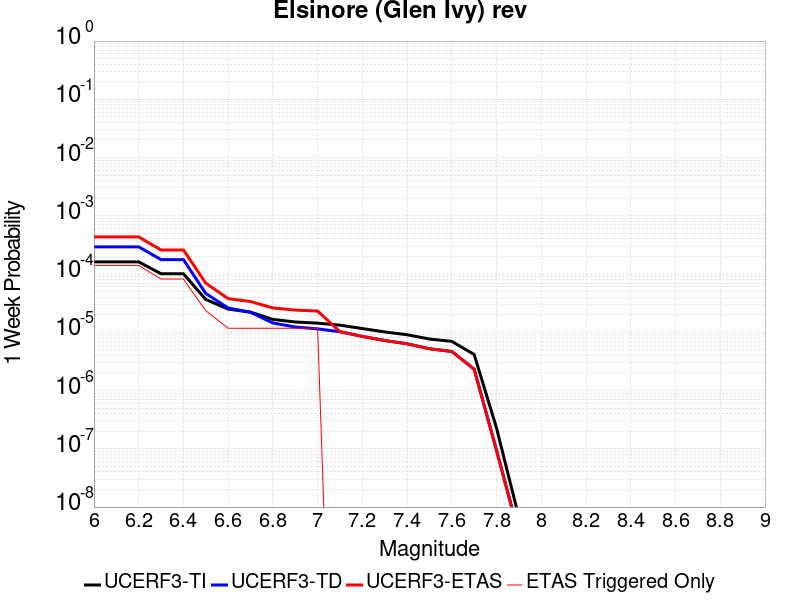 | 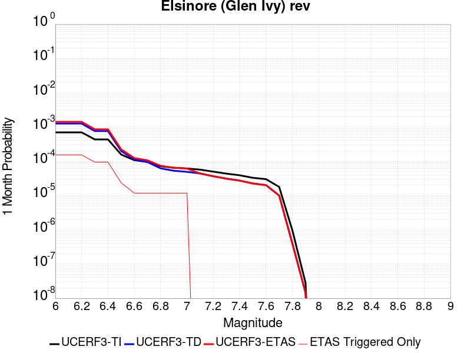 | 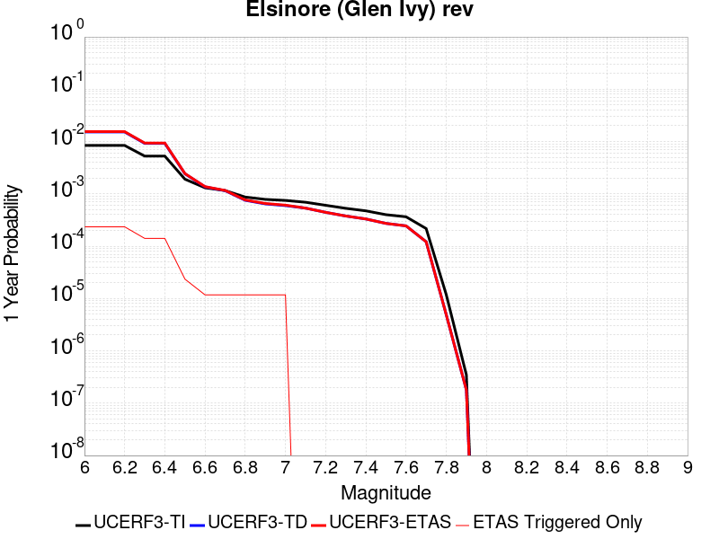 |  |

| Magnitude | 1 wk TI Prob | 1 wk TD Prob | 1 wk ETAS Prob | 1 wk ETAS/TD Gain | 1 wk ETAS Triggered Only | 1 mo TI Prob | 1 mo TD Prob | 1 mo ETAS Prob | 1 mo ETAS/TD Gain | 1 mo ETAS Triggered Only | 1 yr TI Prob | 1 yr TD Prob | 1 yr ETAS Prob | 1 yr ETAS/TD Gain | 1 yr ETAS Triggered Only | 10 yr TI Prob | 10 yr TD Prob | 10 yr ETAS Prob | 10 yr ETAS/TD Gain | 10 yr ETAS Triggered Only |
|-----|-----|-----|-----|-----|-----|-----|-----|-----|-----|-----|-----|-----|-----|-----|-----|-----|-----|-----|-----|-----|
| 6.0 | 1.6204086E-4 | 2.9360707E-4 | 4.344108E-4 | 1.4795651 | 1.4084508E-4 | 6.94276E-4 | 0.0012578638 | 0.001410254 | 1.12115 | 1.5258216E-4 | 0.008420097 | 0.015234485 | 0.015465651 | 1.0151738 | 2.3474179E-4 | 0.081081145 | 0.13969168 | 0.13993402 | 1.0017349 | 2.8169015E-4 |
| 6.1 | 1.6204086E-4 | 2.9360707E-4 | 4.344108E-4 | 1.4795651 | 1.4084508E-4 | 6.94276E-4 | 0.0012578638 | 0.001410254 | 1.12115 | 1.5258216E-4 | 0.008420097 | 0.015234485 | 0.015465651 | 1.0151738 | 2.3474179E-4 | 0.081081145 | 0.13969168 | 0.13993402 | 1.0017349 | 2.8169015E-4 |
| 6.2 | 1.6204086E-4 | 2.9360707E-4 | 4.344108E-4 | 1.4795651 | 1.4084508E-4 | 6.94276E-4 | 0.0012578638 | 0.001410254 | 1.12115 | 1.5258216E-4 | 0.008420097 | 0.015234485 | 0.015465651 | 1.0151738 | 2.3474179E-4 | 0.081081145 | 0.13969168 | 0.13993402 | 1.0017349 | 2.8169015E-4 |
| 6.3 | 1.0111737E-4 | 1.7703383E-4 | 2.591789E-4 | 1.4640079 | 8.2159626E-5 | 4.332882E-4 | 7.5861247E-4 | 8.524379E-4 | 1.1236804 | 9.389671E-5 | 0.005262531 | 0.009217682 | 0.009357229 | 1.015139 | 1.4084508E-4 | 0.0513964 | 0.0870191 | 0.08717983 | 1.0018471 | 1.7605633E-4 |
| 6.4 | 1.0111737E-4 | 1.7703383E-4 | 2.591789E-4 | 1.4640079 | 8.2159626E-5 | 4.332882E-4 | 7.5861247E-4 | 8.524379E-4 | 1.1236804 | 9.389671E-5 | 0.005262531 | 0.009217682 | 0.009357229 | 1.015139 | 1.4084508E-4 | 0.0513964 | 0.0870191 | 0.08717983 | 1.0018471 | 1.7605633E-4 |
| 6.5 | 3.6624708E-5 | 4.6391084E-5 | 6.9864174E-5 | 1.5059828 | 2.3474178E-5 | 1.569536E-4 | 1.9880582E-4 | 2.2227534E-4 | 1.1180525 | 2.3474178E-5 | 0.001909235 | 0.0024181372 | 0.0024415546 | 1.0096841 | 2.3474178E-5 | 0.01892915 | 0.023739954 | 0.02377433 | 1.001448 | 3.521127E-5 |
| 6.6 | 2.5051324E-5 | 2.614772E-5 | 3.7884503E-5 | 1.4488645 | 1.1737089E-5 | 1.073584E-4 | 1.12057096E-4 | 1.2379287E-4 | 1.1047302 | 1.1737089E-5 | 0.0013063047 | 0.0013634858 | 0.0013752069 | 1.0085964 | 1.1737089E-5 | 0.012986525 | 0.013564618 | 0.013587774 | 1.0017071 | 2.3474178E-5 |
| 6.7 | 2.2189772E-5 | 2.2072849E-5 | 3.380968E-5 | 1.5317316 | 1.1737089E-5 | 9.509556E-5 | 9.4594696E-5 | 1.0633068E-4 | 1.1240659 | 1.1737089E-5 | 0.0011571734 | 0.0011511183 | 0.0011628419 | 1.0101845 | 1.1737089E-5 | 0.011511663 | 0.011465415 | 0.01148862 | 1.0020239 | 2.3474178E-5 |
| 6.8 | 1.6654378E-5 | 1.4437705E-5 | 2.6174625E-5 | 1.8129352 | 1.1737089E-5 | 7.137396E-5 | 6.187444E-5 | 7.3610805E-5 | 1.1896803 | 1.1737089E-5 | 8.686314E-4 | 7.530661E-4 | 7.6479436E-4 | 1.015574 | 1.1737089E-5 | 0.008652439 | 0.00751048 | 0.007533778 | 1.0031021 | 2.3474178E-5 |
| 6.9 | 1.5042909E-5 | 1.2332022E-5 | 2.4068966E-5 | 1.9517453 | 1.1737089E-5 | 6.446802E-5 | 5.285047E-5 | 6.4586944E-5 | 1.2220694 | 1.1737089E-5 | 7.8461546E-4 | 6.4326765E-4 | 6.549972E-4 | 1.0182343 | 1.1737089E-5 | 0.007818509 | 0.00641828 | 0.0064416034 | 1.003634 | 2.3474178E-5 |
| 7.0 | 1.4361385E-5 | 1.1451324E-5 | 2.3188279E-5 | 2.024943 | 1.1737089E-5 | 6.154734E-5 | 4.9076196E-5 | 6.081271E-5 | 1.2391487 | 1.1737089E-5 | 7.490812E-4 | 5.973418E-4 | 6.0907187E-4 | 1.0196371 | 1.1737089E-5 | 0.007465612 | 0.0059613534 | 0.0059846877 | 1.0039142 | 2.3474178E-5 |
| 7.1 | 1.3265571E-5 | 1.0244926E-5 | 1.0244926E-5 | 1.0 | 0.0 | 5.6851208E-5 | 4.39061E-5 | 4.39061E-5 | 1.0 | 0.0 | 6.919436E-4 | 5.344282E-4 | 5.344282E-4 | 1.0 | 0.0 | 0.006897931 | 0.0053347866 | 0.0053347866 | 1.0 | 0.0 |
| 7.2 | 1.1596403E-5 | 8.505067E-6 | 8.505067E-6 | 1.0 | 0.0 | 4.9697923E-5 | 3.6449786E-5 | 3.6449786E-5 | 1.0 | 0.0 | 6.049042E-4 | 4.436875E-4 | 4.436875E-4 | 1.0 | 0.0 | 0.006032603 | 0.0044294316 | 0.0044294316 | 1.0 | 0.0 |
| 7.3 | 1.0150827E-5 | 7.2387597E-6 | 7.2387597E-6 | 1.0 | 0.0 | 4.3502816E-5 | 3.1022897E-5 | 3.1022897E-5 | 1.0 | 0.0 | 5.2951806E-4 | 3.7763975E-4 | 3.7763975E-4 | 1.0 | 0.0 | 0.005282581 | 0.0037703665 | 0.0037703665 | 1.0 | 0.0 |
| 7.4 | 9.080705E-6 | 6.352519E-6 | 6.352519E-6 | 1.0 | 0.0 | 3.8916725E-5 | 2.7224805E-5 | 2.7224805E-5 | 1.0 | 0.0 | 4.7370812E-4 | 3.3141294E-4 | 3.3141294E-4 | 1.0 | 0.0 | 0.004726996 | 0.0033093381 | 0.0033093381 | 1.0 | 0.0 |
| 7.5 | 7.671649E-6 | 5.2256332E-6 | 5.2256332E-6 | 1.0 | 0.0 | 3.287808E-5 | 2.2395385E-5 | 2.2395385E-5 | 1.0 | 0.0 | 4.0021708E-4 | 2.7263095E-4 | 2.7263095E-4 | 1.0 | 0.0 | 0.0039949706 | 0.00272309 | 0.00272309 | 1.0 | 0.0 |
| 7.6 | 6.990086E-6 | 4.687545E-6 | 4.687545E-6 | 1.0 | 0.0 | 2.9957167E-5 | 2.008933E-5 | 2.008933E-5 | 1.0 | 0.0 | 3.6466747E-4 | 2.445613E-4 | 2.445613E-4 | 1.0 | 0.0 | 0.0036406964 | 0.002443038 | 0.002443038 | 1.0 | 0.0 |
| 7.7 | 4.163505E-6 | 2.3295343E-6 | 2.3295343E-6 | 1.0 | 0.0 | 1.7843471E-5 | 9.983683E-6 | 9.983683E-6 | 1.0 | 0.0 | 2.172226E-4 | 1.21545316E-4 | 1.21545316E-4 | 1.0 | 0.0 | 0.0021701038 | 0.0012148614 | 0.0012148614 | 1.0 | 0.0 |
| 7.8 | 2.2692414E-7 | 9.3854695E-8 | 9.3854695E-8 | 1.0 | 0.0 | 9.725317E-7 | 4.0223435E-7 | 4.0223435E-7 | 1.0 | 0.0 | 1.1840509E-5 | 4.8971956E-6 | 4.8971956E-6 | 1.0 | 0.0 | 1.1839878E-4 | 4.8971204E-5 | 4.8971204E-5 | 1.0 | 0.0 |
| 7.9 | 6.676829E-9 | 3.439853E-9 | 3.439853E-9 | 1.0 | 0.0 | 2.861498E-8 | 1.4742227E-8 | 1.4742227E-8 | 1.0 | 0.0 | 3.4838732E-7 | 1.7948659E-7 | 1.7948659E-7 | 1.0 | 0.0 | 3.4838679E-6 | 1.7948646E-6 | 1.7948646E-6 | 1.0 | 0.0 |

## San Andreas (North Branch Mill Creek)
*[(top)](#table-of-contents)*

| 1 Week | 1 Month | 1 Year | 10 Year |
|-----|-----|-----|-----|
| 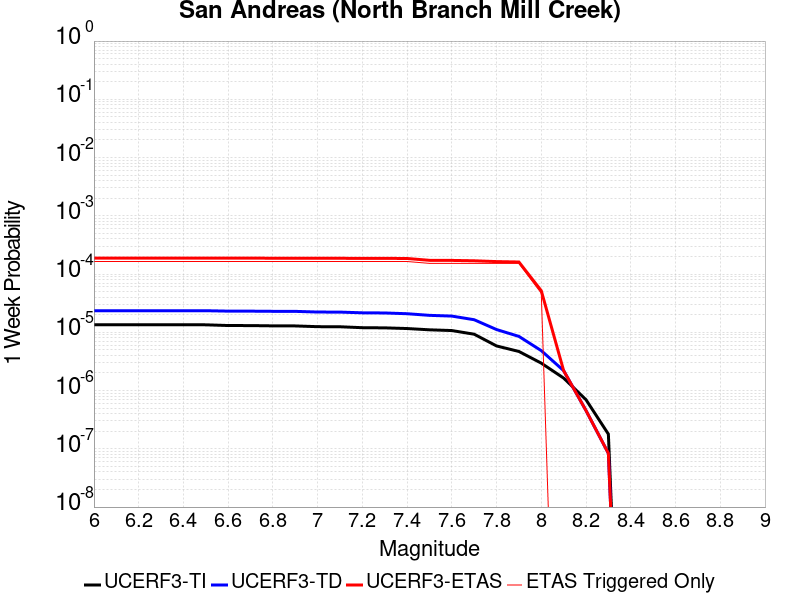 | 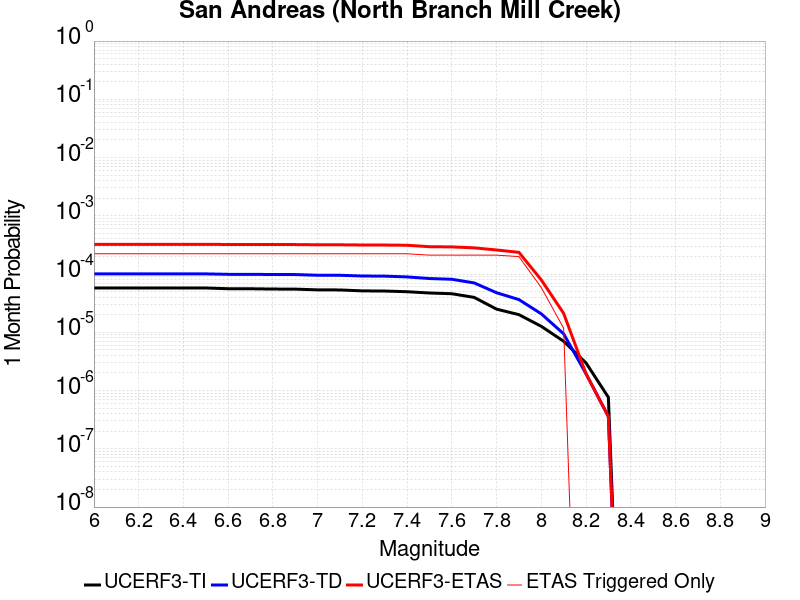 | 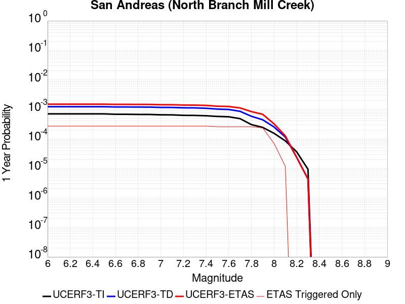 | 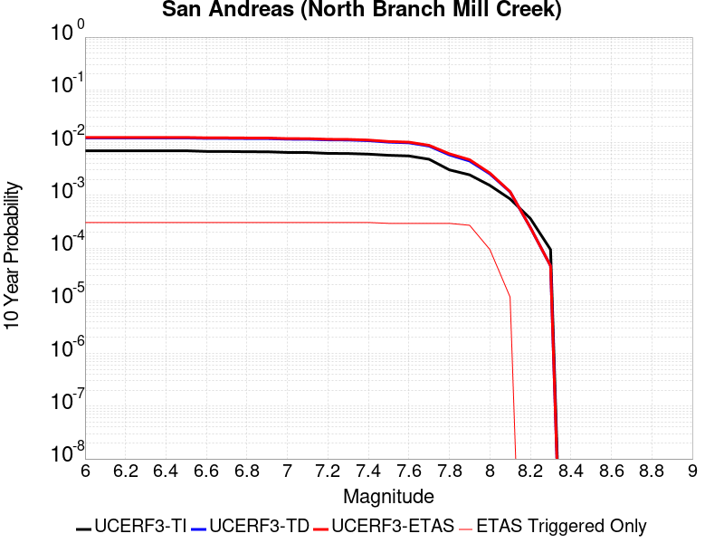 |

| Magnitude | 1 wk TI Prob | 1 wk TD Prob | 1 wk ETAS Prob | 1 wk ETAS/TD Gain | 1 wk ETAS Triggered Only | 1 mo TI Prob | 1 mo TD Prob | 1 mo ETAS Prob | 1 mo ETAS/TD Gain | 1 mo ETAS Triggered Only | 1 yr TI Prob | 1 yr TD Prob | 1 yr ETAS Prob | 1 yr ETAS/TD Gain | 1 yr ETAS Triggered Only | 10 yr TI Prob | 10 yr TD Prob | 10 yr ETAS Prob | 10 yr ETAS/TD Gain | 10 yr ETAS Triggered Only |
|-----|-----|-----|-----|-----|-----|-----|-----|-----|-----|-----|-----|-----|-----|-----|-----|-----|-----|-----|-----|-----|
| 6.0 | 1.3461156E-5 | 2.3499893E-5 | 1.8781528E-4 | 7.992176 | 1.6431925E-4 | 5.7689394E-5 | 1.00709956E-4 | 3.236922E-4 | 3.2141032 | 2.230047E-4 | 7.02142E-4 | 0.0012254574 | 0.0014950796 | 1.2200177 | 2.6995305E-4 | 0.0069992766 | 0.01222957 | 0.012531002 | 1.0246478 | 3.051643E-4 |
| 6.1 | 1.3461156E-5 | 2.3499893E-5 | 1.8781528E-4 | 7.992176 | 1.6431925E-4 | 5.7689394E-5 | 1.00709956E-4 | 3.236922E-4 | 3.2141032 | 2.230047E-4 | 7.02142E-4 | 0.0012254574 | 0.0014950796 | 1.2200177 | 2.6995305E-4 | 0.0069992766 | 0.01222957 | 0.012531002 | 1.0246478 | 3.051643E-4 |
| 6.2 | 1.3461156E-5 | 2.3499893E-5 | 1.8781528E-4 | 7.992176 | 1.6431925E-4 | 5.7689394E-5 | 1.00709956E-4 | 3.236922E-4 | 3.2141032 | 2.230047E-4 | 7.02142E-4 | 0.0012254574 | 0.0014950796 | 1.2200177 | 2.6995305E-4 | 0.0069992766 | 0.01222957 | 0.012531002 | 1.0246478 | 3.051643E-4 |
| 6.3 | 1.3461156E-5 | 2.3499893E-5 | 1.8781528E-4 | 7.992176 | 1.6431925E-4 | 5.7689394E-5 | 1.00709956E-4 | 3.236922E-4 | 3.2141032 | 2.230047E-4 | 7.02142E-4 | 0.0012254574 | 0.0014950796 | 1.2200177 | 2.6995305E-4 | 0.0069992766 | 0.01222957 | 0.012531002 | 1.0246478 | 3.051643E-4 |
| 6.4 | 1.3461156E-5 | 2.3499893E-5 | 1.8781528E-4 | 7.992176 | 1.6431925E-4 | 5.7689394E-5 | 1.00709956E-4 | 3.236922E-4 | 3.2141032 | 2.230047E-4 | 7.02142E-4 | 0.0012254574 | 0.0014950796 | 1.2200177 | 2.6995305E-4 | 0.0069992766 | 0.01222957 | 0.012531002 | 1.0246478 | 3.051643E-4 |
| 6.5 | 1.3450706E-5 | 2.3488852E-5 | 1.8780424E-4 | 7.9954624 | 1.6431925E-4 | 5.764461E-5 | 1.0066265E-4 | 3.236449E-4 | 3.215144 | 2.230047E-4 | 7.0159714E-4 | 0.001224882 | 0.0014945044 | 1.2201211 | 2.6995305E-4 | 0.006993862 | 0.01222388 | 0.0125253135 | 1.0246594 | 3.051643E-4 |
| 6.6 | 1.3074523E-5 | 2.3103135E-5 | 1.8741858E-4 | 8.112258 | 1.6431925E-4 | 5.6032466E-5 | 9.9009696E-5 | 3.2199232E-4 | 3.252129 | 2.230047E-4 | 6.8198174E-4 | 0.0012047797 | 0.0014744075 | 1.2237984 | 2.6995305E-4 | 0.006798926 | 0.012025044 | 0.0123265395 | 1.0250722 | 3.051643E-4 |
| 6.7 | 1.3050216E-5 | 2.3078432E-5 | 1.8739389E-4 | 8.119871 | 1.6431925E-4 | 5.59283E-5 | 9.890384E-5 | 3.2188647E-4 | 3.25454 | 2.230047E-4 | 6.8071426E-4 | 0.0012034923 | 0.0014731204 | 1.2240381 | 2.6995305E-4 | 0.0067863287 | 0.012012309 | 0.012313807 | 1.0250992 | 3.051643E-4 |
| 6.8 | 1.29049395E-5 | 2.292684E-5 | 1.8724232E-4 | 8.166948 | 1.6431925E-4 | 5.530571E-5 | 9.825421E-5 | 3.21237E-4 | 3.2694476 | 2.230047E-4 | 6.73139E-4 | 0.0011955918 | 0.001465222 | 1.2255204 | 2.6995305E-4 | 0.0067110364 | 0.011934154 | 0.012235677 | 1.0252655 | 3.051643E-4 |
| 6.9 | 1.2867369E-5 | 2.2886245E-5 | 1.8720173E-4 | 8.179662 | 1.6431925E-4 | 5.51447E-5 | 9.8080236E-5 | 3.2106307E-4 | 3.2734735 | 2.230047E-4 | 6.711799E-4 | 0.0011934759 | 0.0014631068 | 1.2259207 | 2.6995305E-4 | 0.006691564 | 0.011913223 | 0.012214752 | 1.0253104 | 3.051643E-4 |
| 7.0 | 1.2495996E-5 | 2.2286325E-5 | 1.8660192E-4 | 8.372933 | 1.6431925E-4 | 5.3553173E-5 | 9.550934E-5 | 3.1849273E-4 | 3.3346763 | 2.230047E-4 | 6.518148E-4 | 0.0011622087 | 0.001431848 | 1.232006 | 2.6995305E-4 | 0.0064990623 | 0.0116038285 | 0.011905451 | 1.0259935 | 3.051643E-4 |
| 7.1 | 1.2452067E-5 | 2.2231397E-5 | 1.86547E-4 | 8.3911495 | 1.6431925E-4 | 5.3364907E-5 | 9.527396E-5 | 3.182574E-4 | 3.3404448 | 2.230047E-4 | 6.4952404E-4 | 0.0011593461 | 0.0014289861 | 1.2325795 | 2.6995305E-4 | 0.0064762887 | 0.0115755 | 0.011877132 | 1.0260578 | 3.051643E-4 |
| 7.2 | 1.2002777E-5 | 2.1609963E-5 | 1.8592566E-4 | 8.603701 | 1.6431925E-4 | 5.143946E-5 | 9.2610855E-5 | 3.155949E-4 | 3.4077528 | 2.230047E-4 | 6.2609545E-4 | 0.0011269567 | 0.0013966054 | 1.2392718 | 2.6995305E-4 | 0.006243344 | 0.011254923 | 0.011556652 | 1.0268087 | 3.051643E-4 |
| 7.3 | 1.1923425E-5 | 2.1479793E-5 | 1.857955E-4 | 8.649781 | 1.6431925E-4 | 5.109939E-5 | 9.205302E-5 | 3.1503718E-4 | 3.422345 | 2.230047E-4 | 6.219575E-4 | 0.001120172 | 0.0013898226 | 1.2407225 | 2.6995305E-4 | 0.0062021962 | 0.011187789 | 0.011489539 | 1.0269713 | 3.051643E-4 |
| 7.4 | 1.16105175E-5 | 2.0853771E-5 | 1.851696E-4 | 8.879429 | 1.6431925E-4 | 4.975841E-5 | 8.937026E-5 | 3.1235503E-4 | 3.4950666 | 2.230047E-4 | 6.0564023E-4 | 0.0010875424 | 0.0013572018 | 1.247953 | 2.6995305E-4 | 0.006039923 | 0.010865397 | 0.011167245 | 1.0277808 | 3.051643E-4 |
| 7.5 | 1.1037265E-5 | 1.9553907E-5 | 1.7213308E-4 | 8.803002 | 1.5258216E-4 | 4.7301706E-5 | 8.379978E-5 | 2.950497E-4 | 3.5208886 | 2.112676E-4 | 5.757461E-4 | 0.0010197869 | 0.0012777396 | 1.2529476 | 2.5821597E-4 | 0.005742567 | 0.010194898 | 0.010485333 | 1.0284884 | 2.9342723E-4 |
| 7.6 | 1.0720915E-5 | 1.899582E-5 | 1.7157508E-4 | 9.032255 | 1.5258216E-4 | 4.5945973E-5 | 8.140812E-5 | 2.9265854E-4 | 3.594955 | 2.112676E-4 | 5.592486E-4 | 9.906954E-4 | 0.0012486556 | 1.2603829 | 2.5821597E-4 | 0.005578433 | 0.009906623 | 0.010197142 | 1.0293258 | 2.9342723E-4 |
| 7.7 | 9.276279E-6 | 1.6441649E-5 | 1.690213E-4 | 10.28007 | 1.5258216E-4 | 3.9754876E-5 | 7.0462316E-5 | 2.8171504E-4 | 3.998095 | 2.112676E-4 | 4.839081E-4 | 8.575427E-4 | 0.0011155372 | 1.3008533 | 2.5821597E-4 | 0.0048285574 | 0.008586041 | 0.008876949 | 1.0338815 | 2.9342723E-4 |
| 7.8 | 5.8346777E-6 | 1.1155013E-5 | 1.6373547E-4 | 14.678196 | 1.5258216E-4 | 2.5005522E-5 | 4.7806327E-5 | 2.5906382E-4 | 5.4190283 | 2.112676E-4 | 3.043997E-4 | 5.818867E-4 | 8.399524E-4 | 1.4434983 | 2.5821597E-4 | 0.0030398308 | 0.0058469265 | 0.006138638 | 1.0498915 | 2.9342723E-4 |
| 7.9 | 4.690204E-6 | 8.509093E-6 | 1.6108995E-4 | 18.931505 | 1.5258216E-4 | 2.0100719E-5 | 3.6467034E-5 | 2.3599027E-4 | 6.4713316 | 1.9953052E-4 | 2.4469878E-4 | 4.4389578E-4 | 6.7853334E-4 | 1.5285871 | 2.3474179E-4 | 0.002444295 | 0.0044707474 | 0.004739493 | 1.0601121 | 2.6995305E-4 |
| 8.0 | 2.9570454E-6 | 4.846947E-6 | 5.1795076E-5 | 10.686124 | 4.6948357E-5 | 1.267299E-5 | 2.0772464E-5 | 7.945669E-5 | 3.825097 | 5.8685448E-5 | 1.5428272E-4 | 2.5287544E-4 | 3.2328017E-4 | 1.2784166 | 7.042254E-5 | 0.0015417566 | 0.002549644 | 0.0026433014 | 1.0367335 | 9.389671E-5 |
| 8.1 | 1.6376824E-6 | 2.1968929E-6 | 2.1968929E-6 | 1.0 | 0.0 | 7.01862E-6 | 9.41522E-6 | 2.11522E-5 | 2.2465963 | 1.1737089E-5 | 8.544835E-5 | 1.14624294E-4 | 1.2636004E-4 | 1.1023844 | 1.1737089E-5 | 8.54155E-4 | 0.0011606582 | 0.0011723817 | 1.0101007 | 1.1737089E-5 |
| 8.2 | 6.9631557E-7 | 4.5360213E-7 | 4.5360213E-7 | 1.0 | 0.0 | 2.984206E-6 | 1.9440076E-6 | 1.9440076E-6 | 1.0 | 0.0 | 3.63321E-5 | 2.3668037E-5 | 2.3668037E-5 | 1.0 | 0.0 | 3.6326164E-4 | 2.451564E-4 | 2.451564E-4 | 1.0 | 0.0 |
| 8.3 | 1.7876137E-7 | 8.360375E-8 | 8.360375E-8 | 1.0 | 0.0 | 7.661199E-7 | 3.5830175E-7 | 3.5830175E-7 | 1.0 | 0.0 | 9.32747E-6 | 4.3623154E-6 | 4.3623154E-6 | 1.0 | 0.0 | 9.3270784E-5 | 4.5817014E-5 | 4.5817014E-5 | 1.0 | 0.0 |

## Ludlow
*[(top)](#table-of-contents)*

| 1 Week | 1 Month | 1 Year | 10 Year |
|-----|-----|-----|-----|
| 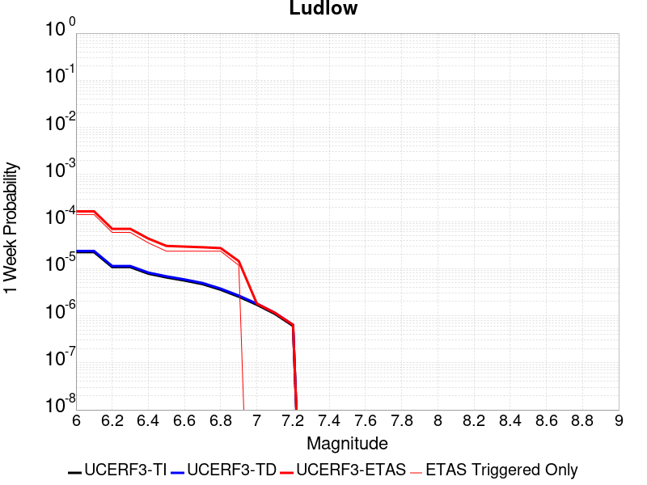 | 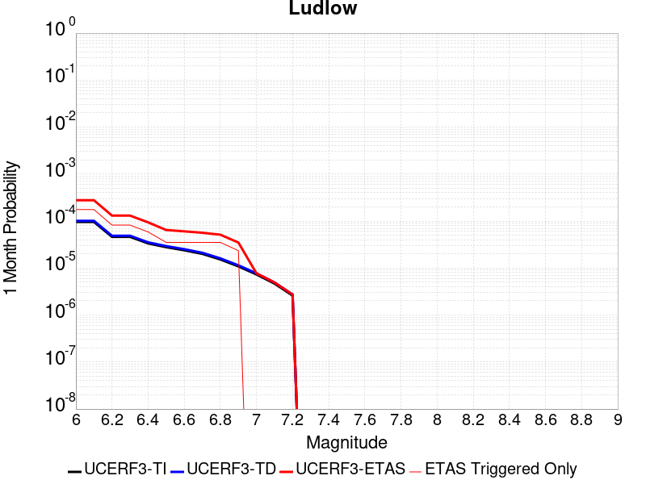 | 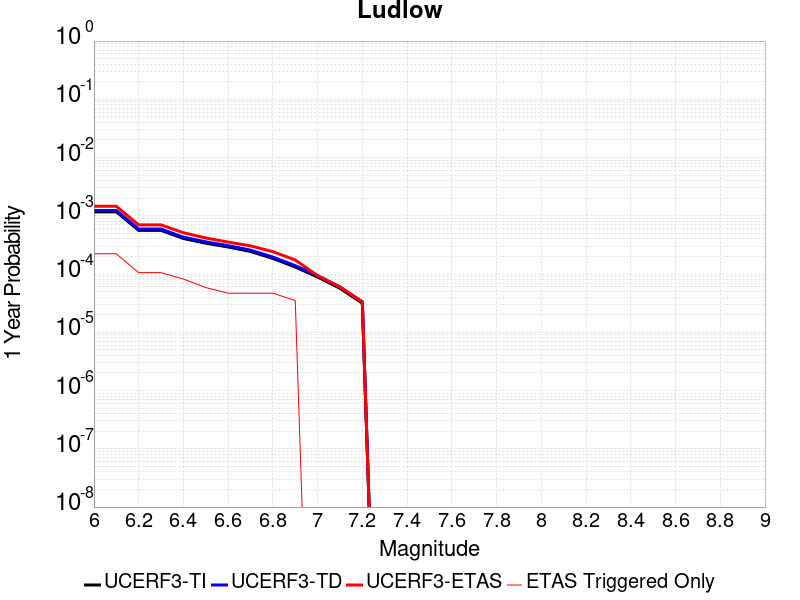 | 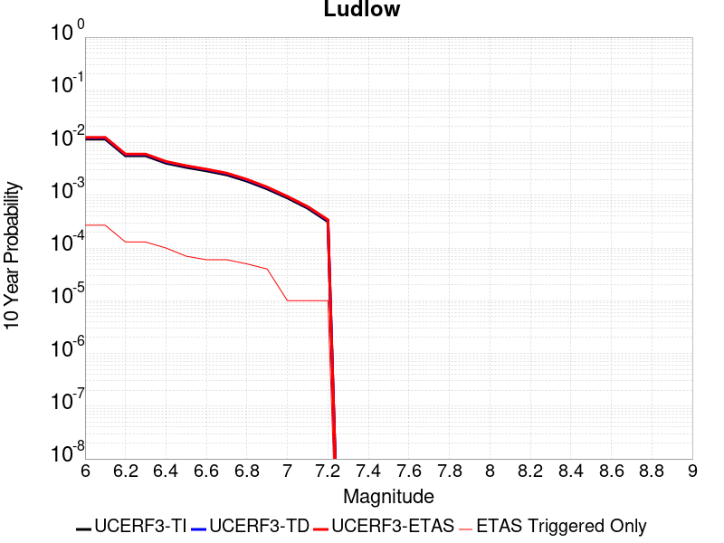 |

| Magnitude | 1 wk TI Prob | 1 wk TD Prob | 1 wk ETAS Prob | 1 wk ETAS/TD Gain | 1 wk ETAS Triggered Only | 1 mo TI Prob | 1 mo TD Prob | 1 mo ETAS Prob | 1 mo ETAS/TD Gain | 1 mo ETAS Triggered Only | 1 yr TI Prob | 1 yr TD Prob | 1 yr ETAS Prob | 1 yr ETAS/TD Gain | 1 yr ETAS Triggered Only | 10 yr TI Prob | 10 yr TD Prob | 10 yr ETAS Prob | 10 yr ETAS/TD Gain | 10 yr ETAS Triggered Only |
|-----|-----|-----|-----|-----|-----|-----|-----|-----|-----|-----|-----|-----|-----|-----|-----|-----|-----|-----|-----|-----|
| 6.0 | 2.2407607E-5 | 2.3657254E-5 | 1.64499E-4 | 6.9534273 | 1.4084508E-4 | 9.602906E-5 | 1.0138454E-4 | 2.7742304E-4 | 2.7363446 | 1.7605633E-4 | 0.0011685267 | 0.001233702 | 0.0014564315 | 1.1805376 | 2.230047E-4 | 0.011624013 | 0.012273042 | 0.012539682 | 1.0217257 | 2.6995305E-4 |
| 6.1 | 2.2407607E-5 | 2.3657254E-5 | 1.64499E-4 | 6.9534273 | 1.4084508E-4 | 9.602906E-5 | 1.0138454E-4 | 2.7742304E-4 | 2.7363446 | 1.7605633E-4 | 0.0011685267 | 0.001233702 | 0.0014564315 | 1.1805376 | 2.230047E-4 | 0.011624013 | 0.012273042 | 0.012539682 | 1.0217257 | 2.6995305E-4 |
| 6.2 | 1.0781252E-5 | 1.1365663E-5 | 7.0050446E-5 | 6.1633396 | 5.8685448E-5 | 4.620455E-5 | 4.8709102E-5 | 1.3086472E-4 | 2.6866586 | 8.2159626E-5 | 5.623952E-4 | 5.9287593E-4 | 6.984471E-4 | 1.1780663 | 1.056338E-4 | 0.00560974 | 0.0059133614 | 0.006030038 | 1.019731 | 1.17370895E-4 |
| 6.3 | 1.0781252E-5 | 1.1365663E-5 | 7.0050446E-5 | 6.1633396 | 5.8685448E-5 | 4.620455E-5 | 4.8709102E-5 | 1.3086472E-4 | 2.6866586 | 8.2159626E-5 | 5.623952E-4 | 5.9287593E-4 | 6.984471E-4 | 1.1780663 | 1.056338E-4 | 0.00560974 | 0.0059133614 | 0.006030038 | 1.019731 | 1.17370895E-4 |
| 6.4 | 7.814439E-6 | 8.237729E-6 | 4.3448705E-5 | 5.274355 | 3.521127E-5 | 3.3490025E-5 | 3.530408E-5 | 9.398746E-5 | 2.6622262 | 5.8685448E-5 | 4.0766477E-4 | 4.2974384E-4 | 5.1186816E-4 | 1.1911006 | 8.2159626E-5 | 0.0040691774 | 0.0042892746 | 0.0043827686 | 1.0217972 | 9.389671E-5 |
| 6.5 | 6.4986366E-6 | 6.85092E-6 | 3.0324938E-5 | 4.426404 | 2.3474178E-5 | 2.7851002E-5 | 2.9360759E-5 | 6.4570995E-5 | 2.1992276 | 3.521127E-5 | 3.390332E-4 | 3.5740953E-4 | 4.16074E-4 | 1.164138 | 5.8685448E-5 | 0.003385164 | 0.0035684432 | 0.0036269194 | 1.016387 | 5.8685448E-5 |
| 6.6 | 5.582177E-6 | 5.8860055E-6 | 2.9360046E-5 | 4.9881105 | 2.3474178E-5 | 2.3923398E-5 | 2.5225498E-5 | 6.043588E-5 | 2.395825 | 3.521127E-5 | 2.9122844E-4 | 3.0707786E-4 | 3.540118E-4 | 1.1528405 | 4.6948357E-5 | 0.0029084706 | 0.003066609 | 0.0031134132 | 1.0152626 | 4.6948357E-5 |
| 6.7 | 4.6858763E-6 | 4.940427E-6 | 2.841449E-5 | 5.7514234 | 2.3474178E-5 | 2.0082172E-5 | 2.1173091E-5 | 5.6383615E-5 | 2.6629846 | 3.521127E-5 | 2.4447302E-4 | 2.5775246E-4 | 3.046887E-4 | 1.1820982 | 4.6948357E-5 | 0.0024420423 | 0.0025745912 | 0.0026214188 | 1.0181884 | 4.6948357E-5 |
| 6.8 | 3.5584908E-6 | 3.7520183E-6 | 2.722611E-5 | 7.25639 | 2.3474178E-5 | 1.5250586E-5 | 1.6079981E-5 | 5.1290684E-5 | 3.1897228 | 3.521127E-5 | 1.8566006E-4 | 1.957566E-4 | 2.4269577E-4 | 1.2397833 | 4.6948357E-5 | 0.0018550502 | 0.0019558826 | 0.0020027393 | 1.0239568 | 4.6948357E-5 |
| 6.9 | 2.532834E-6 | 2.6710034E-6 | 1.4408061E-5 | 5.3942504 | 1.1737089E-5 | 1.0854958E-5 | 1.1447109E-5 | 3.492102E-5 | 3.0506408 | 2.3474178E-5 | 1.3215111E-4 | 1.3935992E-4 | 1.7456627E-4 | 1.252629 | 3.521127E-5 | 0.0013207254 | 0.0013927529 | 0.0014279151 | 1.0252466 | 3.521127E-5 |
| 7.0 | 1.7083285E-6 | 1.8019439E-6 | 1.8019439E-6 | 1.0 | 0.0 | 7.3213873E-6 | 7.722595E-6 | 7.722595E-6 | 1.0 | 0.0 | 8.913424E-5 | 9.40187E-5 | 9.40187E-5 | 1.0 | 0.0 | 8.9098496E-4 | 9.3980576E-4 | 9.3980576E-4 | 1.0 | 0.0 |
| 7.1 | 1.0905424E-6 | 1.1497619E-6 | 1.1497619E-6 | 1.0 | 0.0 | 4.6737446E-6 | 4.9275427E-6 | 4.9275427E-6 | 1.0 | 0.0 | 5.6901354E-5 | 5.999128E-5 | 5.999128E-5 | 1.0 | 0.0 | 5.6886784E-4 | 5.997606E-4 | 5.997606E-4 | 1.0 | 0.0 |
| 7.2 | 6.06668E-7 | 6.387277E-7 | 6.387277E-7 | 1.0 | 0.0 | 2.600003E-6 | 2.7374022E-6 | 2.7374022E-6 | 1.0 | 0.0 | 3.1654577E-5 | 3.3327433E-5 | 3.3327433E-5 | 1.0 | 0.0 | 3.1650066E-4 | 3.3323118E-4 | 3.3323118E-4 | 1.0 | 0.0 |

## Red Pass
*[(top)](#table-of-contents)*

| 1 Week | 1 Month | 1 Year | 10 Year |
|-----|-----|-----|-----|
| 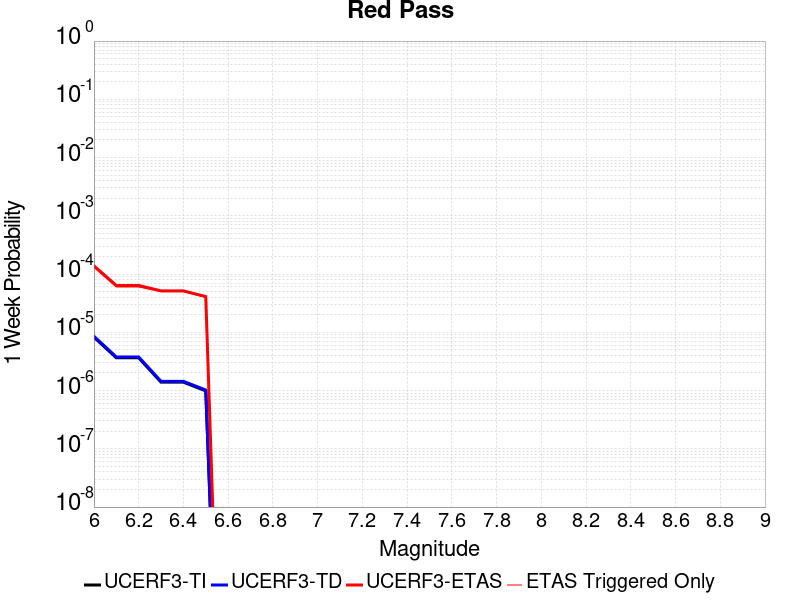 | 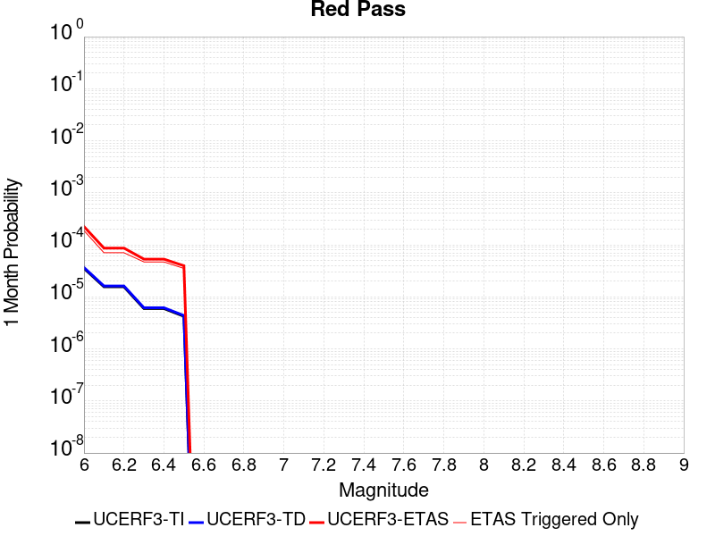 |  | 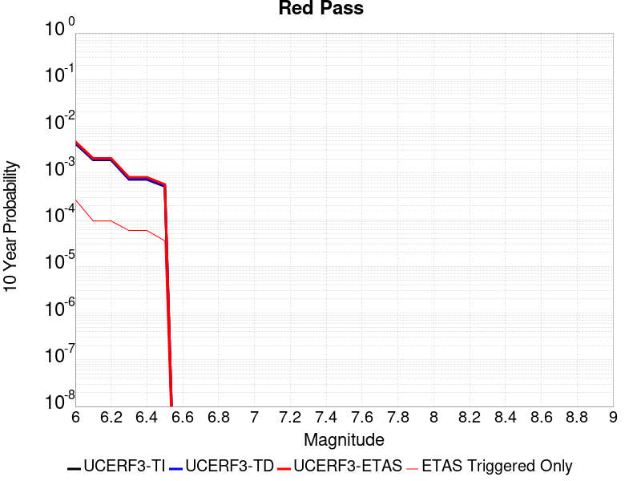 |

| Magnitude | 1 wk TI Prob | 1 wk TD Prob | 1 wk ETAS Prob | 1 wk ETAS/TD Gain | 1 wk ETAS Triggered Only | 1 mo TI Prob | 1 mo TD Prob | 1 mo ETAS Prob | 1 mo ETAS/TD Gain | 1 mo ETAS Triggered Only | 1 yr TI Prob | 1 yr TD Prob | 1 yr ETAS Prob | 1 yr ETAS/TD Gain | 1 yr ETAS Triggered Only | 10 yr TI Prob | 10 yr TD Prob | 10 yr ETAS Prob | 10 yr ETAS/TD Gain | 10 yr ETAS Triggered Only |
|-----|-----|-----|-----|-----|-----|-----|-----|-----|-----|-----|-----|-----|-----|-----|-----|-----|-----|-----|-----|-----|
| 6.0 | 8.258278E-6 | 8.551265E-6 | 1.3765813E-4 | 16.097986 | 1.2910798E-4 | 3.539214E-5 | 3.6647863E-5 | 2.244344E-4 | 6.1240788 | 1.8779343E-4 | 4.308141E-4 | 4.4611428E-4 | 6.924832E-4 | 1.5522552 | 2.4647888E-4 | 0.0042997985 | 0.004453945 | 0.0047226953 | 1.0603399 | 2.6995305E-4 |
| 6.1 | 3.649988E-6 | 3.7753161E-6 | 6.246054E-5 | 16.544453 | 5.8685448E-5 | 1.5642712E-5 | 1.6179853E-5 | 8.660125E-5 | 5.3524127 | 7.042254E-5 | 1.9043336E-4 | 1.9697666E-4 | 2.908549E-4 | 1.4765956 | 9.389671E-5 | 0.0019027026 | 0.001968488 | 0.0020621999 | 1.047606 | 9.389671E-5 |
| 6.2 | 3.649988E-6 | 3.7753161E-6 | 6.246054E-5 | 16.544453 | 5.8685448E-5 | 1.5642712E-5 | 1.6179853E-5 | 8.660125E-5 | 5.3524127 | 7.042254E-5 | 1.9043336E-4 | 1.9697666E-4 | 2.908549E-4 | 1.4765956 | 9.389671E-5 | 0.0019027026 | 0.001968488 | 0.0020621999 | 1.047606 | 9.389671E-5 |
| 6.3 | 1.3924937E-6 | 1.4411166E-6 | 4.8389407E-5 | 33.577717 | 4.6948357E-5 | 5.9678164E-6 | 6.1762075E-6 | 5.3124273E-5 | 8.601439 | 4.6948357E-5 | 7.265574E-5 | 7.519415E-5 | 1.3387518E-4 | 1.7803936 | 5.8685448E-5 | 7.263199E-4 | 7.518258E-4 | 8.104671E-4 | 1.0779985 | 5.8685448E-5 |
| 6.4 | 1.3924937E-6 | 1.4411166E-6 | 4.8389407E-5 | 33.577717 | 4.6948357E-5 | 5.9678164E-6 | 6.1762075E-6 | 5.3124273E-5 | 8.601439 | 4.6948357E-5 | 7.265574E-5 | 7.519415E-5 | 1.3387518E-4 | 1.7803936 | 5.8685448E-5 | 7.263199E-4 | 7.518258E-4 | 8.104671E-4 | 1.0779985 | 5.8685448E-5 |
| 6.5 | 9.876812E-7 | 1.0221912E-6 | 3.623342E-5 | 35.446815 | 3.521127E-5 | 4.2329125E-6 | 4.3808195E-6 | 3.9591934E-5 | 9.037563 | 3.521127E-5 | 5.153449E-5 | 5.3336476E-5 | 8.8545865E-5 | 1.6601372 | 3.521127E-5 | 5.1522546E-4 | 5.333648E-4 | 5.6855724E-4 | 1.065982 | 3.521127E-5 |

## Cady
*[(top)](#table-of-contents)*

| 1 Week | 1 Month | 1 Year | 10 Year |
|-----|-----|-----|-----|
| 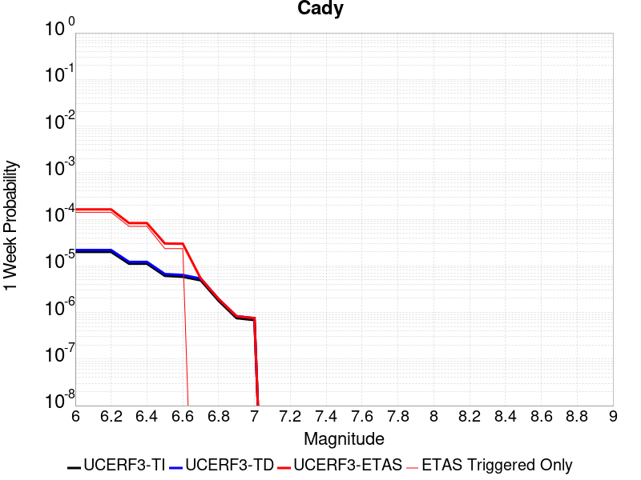 | 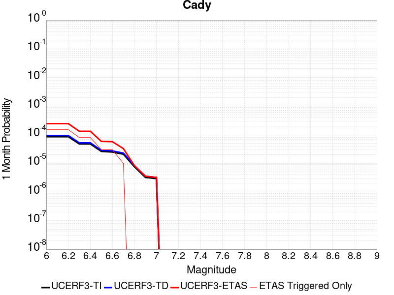 | 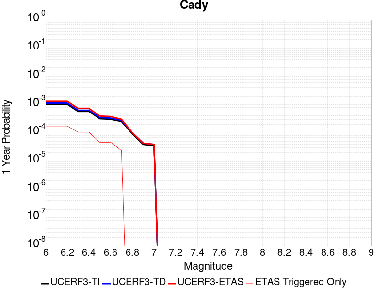 | 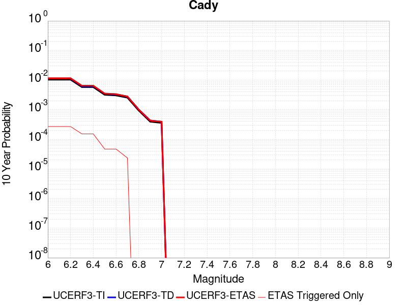 |

| Magnitude | 1 wk TI Prob | 1 wk TD Prob | 1 wk ETAS Prob | 1 wk ETAS/TD Gain | 1 wk ETAS Triggered Only | 1 mo TI Prob | 1 mo TD Prob | 1 mo ETAS Prob | 1 mo ETAS/TD Gain | 1 mo ETAS Triggered Only | 1 yr TI Prob | 1 yr TD Prob | 1 yr ETAS Prob | 1 yr ETAS/TD Gain | 1 yr ETAS Triggered Only | 10 yr TI Prob | 10 yr TD Prob | 10 yr ETAS Prob | 10 yr ETAS/TD Gain | 10 yr ETAS Triggered Only |
|-----|-----|-----|-----|-----|-----|-----|-----|-----|-----|-----|-----|-----|-----|-----|-----|-----|-----|-----|-----|-----|
| 6.0 | 1.9892565E-5 | 2.1858728E-5 | 1.6270072E-4 | 7.4432836 | 1.4084508E-4 | 8.525106E-5 | 9.3677416E-5 | 2.4624527E-4 | 2.6286516 | 1.5258216E-4 | 0.0010374374 | 0.0011400167 | 0.0013158723 | 1.154257 | 1.7605633E-4 | 0.010326075 | 0.011350701 | 0.01161759 | 1.023513 | 2.6995305E-4 |
| 6.1 | 1.9892565E-5 | 2.1858728E-5 | 1.6270072E-4 | 7.4432836 | 1.4084508E-4 | 8.525106E-5 | 9.3677416E-5 | 2.4624527E-4 | 2.6286516 | 1.5258216E-4 | 0.0010374374 | 0.0011400167 | 0.0013158723 | 1.154257 | 1.7605633E-4 | 0.010326075 | 0.011350701 | 0.01161759 | 1.023513 | 2.6995305E-4 |
| 6.2 | 1.9892565E-5 | 2.1858728E-5 | 1.6270072E-4 | 7.4432836 | 1.4084508E-4 | 8.525106E-5 | 9.3677416E-5 | 2.4624527E-4 | 2.6286516 | 1.5258216E-4 | 0.0010374374 | 0.0011400167 | 0.0013158723 | 1.154257 | 1.7605633E-4 | 0.010326075 | 0.011350701 | 0.01161759 | 1.023513 | 2.6995305E-4 |
| 6.3 | 1.1117327E-5 | 1.2176583E-5 | 8.2598264E-5 | 6.783369 | 7.042254E-5 | 4.764482E-5 | 5.2184492E-5 | 1.3433983E-4 | 2.5743248 | 8.2159626E-5 | 5.7992124E-4 | 6.351925E-4 | 7.407592E-4 | 1.1661963 | 1.056338E-4 | 0.0057841022 | 0.0063368753 | 0.006488491 | 1.0239259 | 1.5258216E-4 |
| 6.4 | 1.1117327E-5 | 1.2176583E-5 | 8.2598264E-5 | 6.783369 | 7.042254E-5 | 4.764482E-5 | 5.2184492E-5 | 1.3433983E-4 | 2.5743248 | 8.2159626E-5 | 5.7992124E-4 | 6.351925E-4 | 7.407592E-4 | 1.1661963 | 1.056338E-4 | 0.0057841022 | 0.0063368753 | 0.006488491 | 1.0239259 | 1.5258216E-4 |
| 6.5 | 6.103093E-6 | 6.672021E-6 | 3.0146042E-5 | 4.5182776 | 2.3474178E-5 | 2.615585E-5 | 2.8594131E-5 | 6.380439E-5 | 2.2313807 | 3.521127E-5 | 3.1840094E-4 | 3.480905E-4 | 3.950225E-4 | 1.134827 | 4.6948357E-5 | 0.0031794512 | 0.0034766865 | 0.0035234718 | 1.0134568 | 4.6948357E-5 |
| 6.6 | 5.817237E-6 | 6.3656585E-6 | 2.9839688E-5 | 4.687604 | 2.3474178E-5 | 2.4930776E-5 | 2.728118E-5 | 6.249148E-5 | 2.2906446 | 3.521127E-5 | 3.034899E-4 | 3.3211018E-4 | 3.7904293E-4 | 1.1413169 | 4.6948357E-5 | 0.0030307577 | 0.0033173605 | 0.0033641532 | 1.0141053 | 4.6948357E-5 |
| 6.7 | 4.8846314E-6 | 5.3405684E-6 | 5.3405684E-6 | 1.0 | 0.0 | 2.0933967E-5 | 2.2888014E-5 | 3.4624834E-5 | 1.5127933 | 1.1737089E-5 | 2.5484123E-4 | 2.7863772E-4 | 3.0210536E-4 | 1.0842228 | 2.3474178E-5 | 0.0025454918 | 0.0027840391 | 0.002807448 | 1.0084082 | 2.3474178E-5 |
| 6.8 | 1.7788773E-6 | 1.9399079E-6 | 1.9399079E-6 | 1.0 | 0.0 | 7.6237375E-6 | 8.313874E-6 | 8.313874E-6 | 1.0 | 0.0 | 9.281505E-5 | 1.01218284E-4 | 1.01218284E-4 | 1.0 | 0.0 | 9.2776294E-4 | 0.0010118765 | 0.0010118765 | 1.0 | 0.0 |
| 6.9 | 7.5455404E-7 | 8.297092E-7 | 8.297092E-7 | 1.0 | 0.0 | 3.233799E-6 | 3.5558937E-6 | 3.5558937E-6 | 1.0 | 0.0 | 3.937079E-5 | 4.3292483E-5 | 4.3292483E-5 | 1.0 | 0.0 | 3.9363815E-4 | 4.3287344E-4 | 4.3287344E-4 | 1.0 | 0.0 |
| 7.0 | 6.8578805E-7 | 7.541816E-7 | 7.541816E-7 | 1.0 | 0.0 | 2.9390883E-6 | 3.2322048E-6 | 3.2322048E-6 | 1.0 | 0.0 | 3.578281E-5 | 3.9351715E-5 | 3.9351715E-5 | 1.0 | 0.0 | 3.577705E-4 | 3.9347992E-4 | 3.9347992E-4 | 1.0 | 0.0 |

## San Jacinto (San Bernardino)
*[(top)](#table-of-contents)*

| 1 Week | 1 Month | 1 Year | 10 Year |
|-----|-----|-----|-----|
| 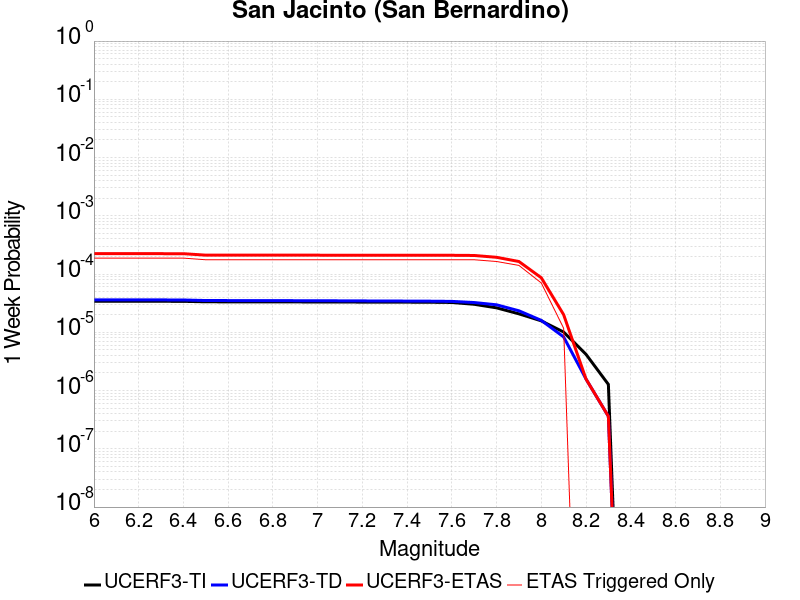 | 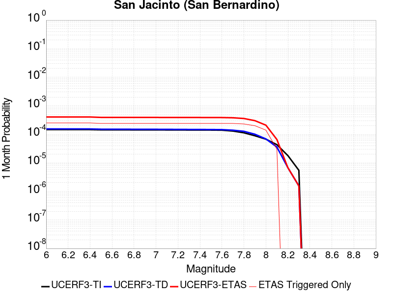 | 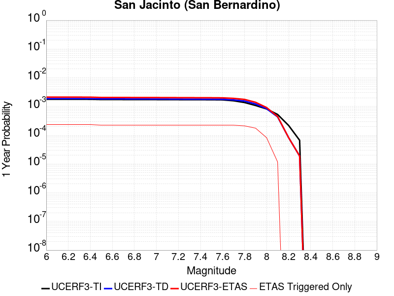 |  |

| Magnitude | 1 wk TI Prob | 1 wk TD Prob | 1 wk ETAS Prob | 1 wk ETAS/TD Gain | 1 wk ETAS Triggered Only | 1 mo TI Prob | 1 mo TD Prob | 1 mo ETAS Prob | 1 mo ETAS/TD Gain | 1 mo ETAS Triggered Only | 1 yr TI Prob | 1 yr TD Prob | 1 yr ETAS Prob | 1 yr ETAS/TD Gain | 1 yr ETAS Triggered Only | 10 yr TI Prob | 10 yr TD Prob | 10 yr ETAS Prob | 10 yr ETAS/TD Gain | 10 yr ETAS Triggered Only |
|-----|-----|-----|-----|-----|-----|-----|-----|-----|-----|-----|-----|-----|-----|-----|-----|-----|-----|-----|-----|-----|
| 6.0 | 3.409352E-5 | 3.5986508E-5 | 2.2377318E-4 | 6.2182517 | 1.8779343E-4 | 1.461069E-4 | 1.542188E-4 | 3.6545383E-4 | 2.36971 | 2.112676E-4 | 0.0017774 | 0.0018759987 | 0.0021103001 | 1.1248943 | 2.3474179E-4 | 0.01763251 | 0.019349935 | 0.019591644 | 1.0124915 | 2.4647888E-4 |
| 6.1 | 3.409352E-5 | 3.5986508E-5 | 2.2377318E-4 | 6.2182517 | 1.8779343E-4 | 1.461069E-4 | 1.542188E-4 | 3.6545383E-4 | 2.36971 | 2.112676E-4 | 0.0017774 | 0.0018759987 | 0.0021103001 | 1.1248943 | 2.3474179E-4 | 0.01763251 | 0.019349935 | 0.019591644 | 1.0124915 | 2.4647888E-4 |
| 6.2 | 3.409352E-5 | 3.5986508E-5 | 2.2377318E-4 | 6.2182517 | 1.8779343E-4 | 1.461069E-4 | 1.542188E-4 | 3.6545383E-4 | 2.36971 | 2.112676E-4 | 0.0017774 | 0.0018759987 | 0.0021103001 | 1.1248943 | 2.3474179E-4 | 0.01763251 | 0.019349935 | 0.019591644 | 1.0124915 | 2.4647888E-4 |
| 6.3 | 3.409352E-5 | 3.5986508E-5 | 2.2377318E-4 | 6.2182517 | 1.8779343E-4 | 1.461069E-4 | 1.542188E-4 | 3.6545383E-4 | 2.36971 | 2.112676E-4 | 0.0017774 | 0.0018759987 | 0.0021103001 | 1.1248943 | 2.3474179E-4 | 0.01763251 | 0.019349935 | 0.019591644 | 1.0124915 | 2.4647888E-4 |
| 6.4 | 3.400795E-5 | 3.5879173E-5 | 2.2366586E-4 | 6.2338634 | 1.8779343E-4 | 1.4574021E-4 | 1.5375883E-4 | 3.6499396E-4 | 2.3738081 | 2.112676E-4 | 0.0017729428 | 0.0018704084 | 0.002104711 | 1.1252682 | 2.3474179E-4 | 0.017588645 | 0.019295016 | 0.01953674 | 1.0125277 | 2.4647888E-4 |
| 6.5 | 3.341482E-5 | 3.5139812E-5 | 2.1118997E-4 | 6.0099916 | 1.7605633E-4 | 1.4319851E-4 | 1.5059051E-4 | 3.5009097E-4 | 2.3247879 | 1.9953052E-4 | 0.0017420477 | 0.0018318989 | 0.002054495 | 1.1215112 | 2.230047E-4 | 0.017284546 | 0.018916558 | 0.01914686 | 1.0121746 | 2.3474179E-4 |
| 6.6 | 3.3364955E-5 | 3.5077028E-5 | 2.1112719E-4 | 6.0189586 | 1.7605633E-4 | 1.4298483E-4 | 1.5032147E-4 | 3.49822E-4 | 2.3271592 | 1.9953052E-4 | 0.0017394501 | 0.001828629 | 0.0020512259 | 1.1217289 | 2.230047E-4 | 0.017258976 | 0.018884424 | 0.019114733 | 1.0121957 | 2.3474179E-4 |
| 6.7 | 3.335922E-5 | 3.5066805E-5 | 2.1111697E-4 | 6.0204225 | 1.7605633E-4 | 1.4296026E-4 | 1.5027766E-4 | 3.497782E-4 | 2.3275461 | 1.9953052E-4 | 0.0017391514 | 0.0018280965 | 0.0020506934 | 1.1217644 | 2.230047E-4 | 0.017256035 | 0.018879214 | 0.019109525 | 1.0121992 | 2.3474179E-4 |
| 6.8 | 3.327683E-5 | 3.496087E-5 | 2.1101105E-4 | 6.035635 | 1.7605633E-4 | 1.4260718E-4 | 1.498237E-4 | 3.493243E-4 | 2.3315692 | 1.9953052E-4 | 0.0017348597 | 0.0018225788 | 0.0020451772 | 1.1221337 | 2.230047E-4 | 0.017213784 | 0.018824987 | 0.019055309 | 1.0122349 | 2.3474179E-4 |
| 6.9 | 3.3235785E-5 | 3.4901823E-5 | 2.1095201E-4 | 6.0441546 | 1.7605633E-4 | 1.4243131E-4 | 1.4957068E-4 | 3.4907134E-4 | 2.333822 | 1.9953052E-4 | 0.0017327217 | 0.0018195034 | 0.0020421024 | 1.1223404 | 2.230047E-4 | 0.017192734 | 0.018794855 | 0.019025184 | 1.012255 | 2.3474179E-4 |
| 7.0 | 3.3197095E-5 | 3.4841752E-5 | 2.1089196E-4 | 6.052851 | 1.7605633E-4 | 1.422655E-4 | 1.4931326E-4 | 3.4881398E-4 | 2.3361218 | 1.9953052E-4 | 0.0017307063 | 0.0018163746 | 0.0020389743 | 1.1225516 | 2.230047E-4 | 0.017172894 | 0.018764233 | 0.01899457 | 1.0122753 | 2.3474179E-4 |
| 7.1 | 3.3129716E-5 | 3.4721965E-5 | 2.107722E-4 | 6.070284 | 1.7605633E-4 | 1.4197677E-4 | 1.4879994E-4 | 3.4830076E-4 | 2.3407319 | 1.9953052E-4 | 0.0017271966 | 0.0018101353 | 0.0020327363 | 1.1229748 | 2.230047E-4 | 0.017138338 | 0.018703312 | 0.018933663 | 1.0123161 | 2.3474179E-4 |
| 7.2 | 3.3034008E-5 | 3.458941E-5 | 2.1063966E-4 | 6.089715 | 1.7605633E-4 | 1.4156665E-4 | 1.4823192E-4 | 3.4773286E-4 | 2.3458703 | 1.9953052E-4 | 0.0017222111 | 0.0018032312 | 0.0020258338 | 1.1234465 | 2.230047E-4 | 0.017089253 | 0.018635705 | 0.018866071 | 1.0123616 | 2.3474179E-4 |
| 7.3 | 3.2956614E-5 | 3.445717E-5 | 2.1050744E-4 | 6.109249 | 1.7605633E-4 | 1.4123498E-4 | 1.4766524E-4 | 3.471663E-4 | 2.351036 | 1.9953052E-4 | 0.0017181796 | 0.0017963431 | 0.0020189472 | 1.1239207 | 2.230047E-4 | 0.017049557 | 0.018568452 | 0.018798836 | 1.0124072 | 2.3474179E-4 |
| 7.4 | 3.2915937E-5 | 3.4378863E-5 | 2.1042915E-4 | 6.1208873 | 1.7605633E-4 | 1.4106068E-4 | 1.4732967E-4 | 3.468308E-4 | 2.3541136 | 1.9953052E-4 | 0.0017160608 | 0.0017922645 | 0.0020148696 | 1.1242032 | 2.230047E-4 | 0.017028693 | 0.018528719 | 0.018759111 | 1.0124344 | 2.3474179E-4 |
| 7.5 | 3.281791E-5 | 3.4243778E-5 | 2.1029409E-4 | 6.141089 | 1.7605633E-4 | 1.406406E-4 | 1.4675081E-4 | 3.4625205E-4 | 2.3594558 | 1.9953052E-4 | 0.0017109542 | 0.0017852283 | 0.0020078348 | 1.1246936 | 2.230047E-4 | 0.016978411 | 0.018459605 | 0.018690014 | 1.0124818 | 2.3474179E-4 |
| 7.6 | 3.2521442E-5 | 3.396873E-5 | 2.1001909E-4 | 6.1827183 | 1.7605633E-4 | 1.3937015E-4 | 1.4557215E-4 | 3.450736E-4 | 2.3704646 | 1.9953052E-4 | 0.0016955109 | 0.0017709016 | 0.0019935113 | 1.1257042 | 2.230047E-4 | 0.016826328 | 0.018317232 | 0.018547675 | 1.0125806 | 2.3474179E-4 |
| 7.7 | 3.0287873E-5 | 3.245276E-5 | 2.0850339E-4 | 6.424827 | 1.7605633E-4 | 1.297987E-4 | 1.3907586E-4 | 3.3857863E-4 | 2.4344888 | 1.9953052E-4 | 0.0015791537 | 0.0016919347 | 0.0019145621 | 1.1315815 | 2.230047E-4 | 0.01567979 | 0.01752809 | 0.017758718 | 1.0131576 | 2.3474179E-4 |
| 7.8 | 2.6316151E-5 | 2.9663592E-5 | 1.9397796E-4 | 6.539261 | 1.6431925E-4 | 1.1277862E-4 | 1.2712348E-4 | 3.1489306E-4 | 2.4770641 | 1.8779343E-4 | 0.0013722149 | 0.0015466306 | 0.0017575715 | 1.1363873 | 2.112676E-4 | 0.013637724 | 0.016069634 | 0.016289055 | 1.0136544 | 2.230047E-4 |
| 7.9 | 2.0761147E-5 | 2.34181E-5 | 1.6425988E-4 | 7.014227 | 1.4084508E-4 | 8.897331E-5 | 1.0035944E-4 | 2.529263E-4 | 2.5202043 | 1.5258216E-4 | 0.0010827117 | 0.0012211921 | 0.0013970335 | 1.1439916 | 1.7605633E-4 | 0.010774517 | 0.012793174 | 0.012978565 | 1.0144914 | 1.8779343E-4 |
| 8.0 | 1.5738568E-5 | 1.6033575E-5 | 8.645498E-5 | 5.3921213 | 7.042254E-5 | 6.744926E-5 | 6.871352E-5 | 1.5086749E-4 | 2.1956015 | 8.2159626E-5 | 8.2088535E-4 | 8.3626667E-4 | 9.183576E-4 | 1.0981636 | 8.2159626E-5 | 0.008178596 | 0.008865921 | 0.008958985 | 1.0104969 | 9.389671E-5 |
| 8.1 | 1.0105832E-5 | 8.3304985E-6 | 2.006749E-5 | 2.4089184 | 1.1737089E-5 | 4.3309992E-5 | 3.570165E-5 | 4.743832E-5 | 1.3287431 | 1.1737089E-5 | 5.2717153E-4 | 4.345814E-4 | 4.4631338E-4 | 1.026996 | 1.1737089E-5 | 0.005259227 | 0.004677232 | 0.004688914 | 1.0024977 | 1.1737089E-5 |
| 8.2 | 4.189207E-6 | 1.5784357E-6 | 1.5784357E-6 | 1.0 | 0.0 | 1.7953622E-5 | 6.7647065E-6 | 6.7647065E-6 | 1.0 | 0.0 | 2.1856341E-4 | 8.235722E-5 | 8.235722E-5 | 1.0 | 0.0 | 0.0021834858 | 9.565867E-4 | 9.565867E-4 | 1.0 | 0.0 |
| 8.3 | 1.2758221E-6 | 3.6149942E-7 | 3.6149942E-7 | 1.0 | 0.0 | 5.4677976E-6 | 1.5492824E-6 | 1.5492824E-6 | 1.0 | 0.0 | 6.65684E-5 | 1.8862354E-5 | 1.8862354E-5 | 1.0 | 0.0 | 6.6548464E-4 | 2.2751294E-4 | 2.2751294E-4 | 1.0 | 0.0 |

## San Andreas (Creeping Section) 2011 CFM
*[(top)](#table-of-contents)*

| 1 Week | 1 Month | 1 Year | 10 Year |
|-----|-----|-----|-----|
| 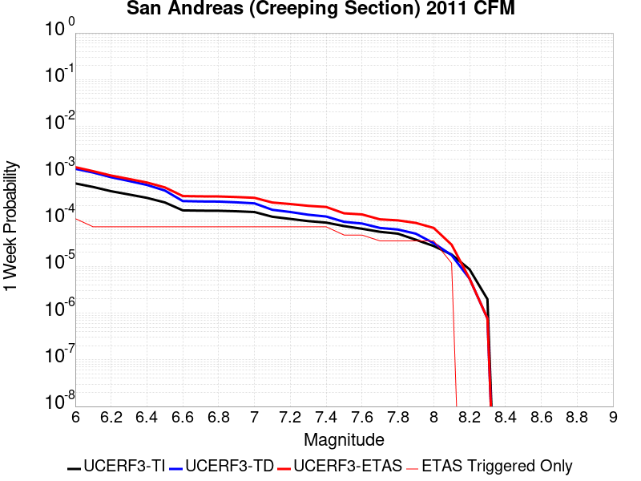 | 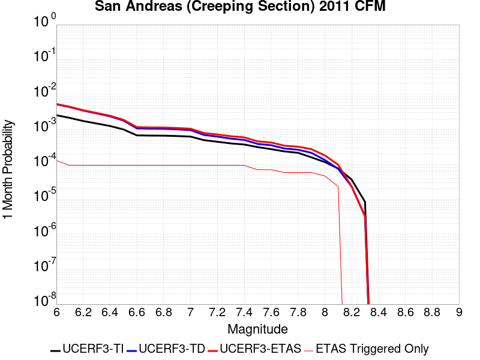 | 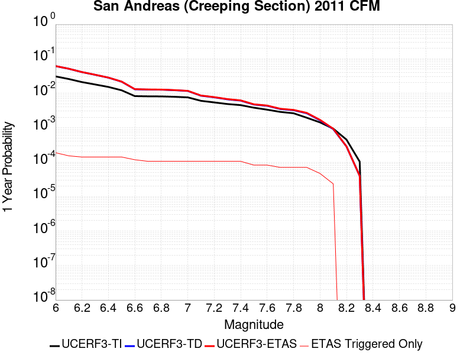 | 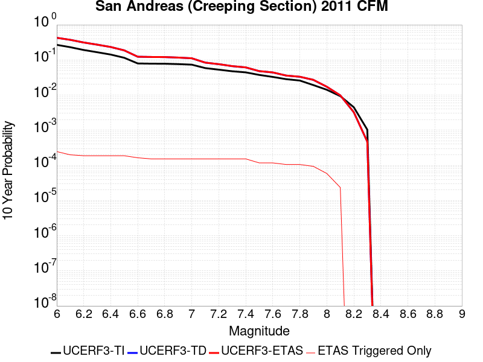 |

| Magnitude | 1 wk TI Prob | 1 wk TD Prob | 1 wk ETAS Prob | 1 wk ETAS/TD Gain | 1 wk ETAS Triggered Only | 1 mo TI Prob | 1 mo TD Prob | 1 mo ETAS Prob | 1 mo ETAS/TD Gain | 1 mo ETAS Triggered Only | 1 yr TI Prob | 1 yr TD Prob | 1 yr ETAS Prob | 1 yr ETAS/TD Gain | 1 yr ETAS Triggered Only | 10 yr TI Prob | 10 yr TD Prob | 10 yr ETAS Prob | 10 yr ETAS/TD Gain | 10 yr ETAS Triggered Only |
|-----|-----|-----|-----|-----|-----|-----|-----|-----|-----|-----|-----|-----|-----|-----|-----|-----|-----|-----|-----|-----|
| 6.0 | 5.986481E-4 | 0.001228691 | 0.001334195 | 1.085867 | 1.056338E-4 | 0.0025631124 | 0.005246795 | 0.0053752256 | 1.024478 | 1.2910798E-4 | 0.030762846 | 0.061203245 | 0.06137955 | 1.0028806 | 1.8779343E-4 | 0.26835477 | 0.425928 | 0.4260695 | 1.0003322 | 2.4647888E-4 |
| 6.1 | 5.015945E-4 | 0.0010230356 | 0.0010933861 | 1.0687665 | 7.042254E-5 | 0.00214792 | 0.004369436 | 0.004462922 | 1.0213956 | 9.389671E-5 | 0.025839351 | 0.051246606 | 0.05139137 | 1.0028248 | 1.5258216E-4 | 0.23032776 | 0.37284943 | 0.37297457 | 1.0003356 | 1.9953052E-4 |
| 6.2 | 4.073338E-4 | 8.1157376E-4 | 8.8193914E-4 | 1.0867023 | 7.042254E-5 | 0.0017445484 | 0.0034683137 | 0.0035618846 | 1.0269789 | 9.389671E-5 | 0.021034058 | 0.04093177 | 0.041066848 | 1.0033001 | 1.4084508E-4 | 0.19150782 | 0.31302592 | 0.31315494 | 1.0004121 | 1.8779343E-4 |
| 6.3 | 3.464099E-4 | 6.7455834E-4 | 7.449334E-4 | 1.1043276 | 7.042254E-5 | 0.0014837692 | 0.0028832308 | 0.002976857 | 1.0324726 | 9.389671E-5 | 0.017915873 | 0.034187846 | 0.034323875 | 1.0039788 | 1.4084508E-4 | 0.16538359 | 0.27130842 | 0.27144524 | 1.0005044 | 1.8779343E-4 |
| 6.4 | 2.935057E-4 | 5.5516965E-4 | 6.255531E-4 | 1.1267782 | 7.042254E-5 | 0.0012572751 | 0.0023727308 | 0.0024664048 | 1.0394794 | 9.389671E-5 | 0.015200248 | 0.02826279 | 0.028399654 | 1.0048425 | 1.4084508E-4 | 0.14201577 | 0.23297668 | 0.23312071 | 1.0006182 | 1.8779343E-4 |
| 6.5 | 2.3409708E-4 | 4.2132285E-4 | 4.9171573E-4 | 1.1670759 | 7.042254E-5 | 0.0010028875 | 0.0018017791 | 0.0018955067 | 1.0520195 | 9.389671E-5 | 0.012141965 | 0.021586355 | 0.021724159 | 1.0063839 | 1.4084508E-4 | 0.11499573 | 0.1868149 | 0.18696763 | 1.0008174 | 1.8779343E-4 |
| 6.6 | 1.5842178E-4 | 2.5068692E-4 | 3.210918E-4 | 1.2808479 | 7.042254E-5 | 6.7877385E-4 | 0.0010739256 | 0.0011677215 | 1.0873393 | 9.389671E-5 | 0.0082328 | 0.012995283 | 0.0131111285 | 1.0089145 | 1.17370895E-4 | 0.07934396 | 0.12313759 | 0.12328168 | 1.0011702 | 1.6431925E-4 |
| 6.7 | 1.5616413E-4 | 2.4605254E-4 | 3.1645776E-4 | 1.2861389 | 7.042254E-5 | 6.691031E-4 | 0.0010540807 | 0.0011478784 | 1.0889853 | 9.389671E-5 | 0.0081159435 | 0.012757154 | 0.01286144 | 1.0081748 | 1.056338E-4 | 0.0782586 | 0.12116472 | 0.12129881 | 1.0011067 | 1.5258216E-4 |
| 6.8 | 1.5538467E-4 | 2.442914E-4 | 3.1469675E-4 | 1.2882023 | 7.042254E-5 | 6.6576427E-4 | 0.001046539 | 0.0011403376 | 1.0896273 | 9.389671E-5 | 0.008075596 | 0.012666538 | 0.012770833 | 1.0082339 | 1.056338E-4 | 0.07788358 | 0.12039561 | 0.120529816 | 1.0011147 | 1.5258216E-4 |
| 6.9 | 1.5153569E-4 | 2.3538464E-4 | 3.057906E-4 | 1.2991103 | 7.042254E-5 | 6.49277E-4 | 0.0010084033 | 0.0011022054 | 1.0930203 | 9.389671E-5 | 0.007876333 | 0.012208726 | 0.012313071 | 1.0085467 | 1.056338E-4 | 0.07602952 | 0.11646574 | 0.11660055 | 1.0011575 | 1.5258216E-4 |
| 7.0 | 1.4588932E-4 | 2.2395732E-4 | 2.943641E-4 | 1.3143758 | 7.042254E-5 | 6.250901E-4 | 9.59466E-4 | 0.0010532726 | 1.0977696 | 9.389671E-5 | 0.0075839474 | 0.011619428 | 0.011723834 | 1.0089855 | 1.056338E-4 | 0.073302895 | 0.11131206 | 0.11144766 | 1.0012182 | 1.5258216E-4 |
| 7.1 | 1.1565079E-4 | 1.6281323E-4 | 2.3322429E-4 | 1.4324653 | 7.042254E-5 | 4.955521E-4 | 6.9758523E-4 | 7.9141645E-4 | 1.1345086 | 9.389671E-5 | 0.006016669 | 0.008460228 | 0.008564969 | 1.0123802 | 1.056338E-4 | 0.058563538 | 0.08366478 | 0.0838046 | 1.0016712 | 1.5258216E-4 |
| 7.2 | 1.0393792E-4 | 1.4615392E-4 | 2.1656616E-4 | 1.4817678 | 7.042254E-5 | 4.4537216E-4 | 6.262243E-4 | 7.2006223E-4 | 1.1498471 | 9.389671E-5 | 0.005408933 | 0.0075977976 | 0.007702629 | 1.0137975 | 1.056338E-4 | 0.052791595 | 0.07561503 | 0.07575608 | 1.0018653 | 1.5258216E-4 |
| 7.3 | 9.332884E-5 | 1.2780601E-4 | 1.9821954E-4 | 1.5509408 | 7.042254E-5 | 3.999194E-4 | 5.4762565E-4 | 6.4147095E-4 | 1.1713676 | 9.389671E-5 | 0.0048581534 | 0.0066470946 | 0.0067520263 | 1.015786 | 1.056338E-4 | 0.047533102 | 0.06647954 | 0.06662198 | 1.0021425 | 1.5258216E-4 |
| 7.4 | 8.670252E-5 | 1.1702972E-4 | 1.87444E-4 | 1.6016787 | 7.042254E-5 | 3.715293E-4 | 5.014601E-4 | 5.953097E-4 | 1.1871527 | 9.389671E-5 | 0.004513991 | 0.0060883067 | 0.0061932974 | 1.0172447 | 1.056338E-4 | 0.044233937 | 0.061148684 | 0.061291937 | 1.0023427 | 1.5258216E-4 |
| 7.5 | 7.3036405E-5 | 9.005699E-5 | 1.3700112E-4 | 1.5212713 | 4.6948357E-5 | 3.129756E-4 | 3.859015E-4 | 4.5629687E-4 | 1.182418 | 7.042254E-5 | 0.0038038217 | 0.0046882504 | 0.0047700247 | 1.0174425 | 8.2159626E-5 | 0.03739367 | 0.047875606 | 0.04798736 | 1.0023342 | 1.17370895E-4 |
| 7.6 | 6.3935775E-5 | 8.280209E-5 | 1.2974656E-4 | 1.5669479 | 4.6948357E-5 | 2.7398168E-4 | 3.5481792E-4 | 4.2521546E-4 | 1.1984047 | 7.042254E-5 | 0.0033306254 | 0.00431137 | 0.0043931757 | 1.0189743 | 8.2159626E-5 | 0.032811474 | 0.043990135 | 0.04410234 | 1.0025507 | 1.17370895E-4 |
| 7.7 | 5.5050095E-5 | 6.661729E-5 | 1.0182621E-4 | 1.5285252 | 3.521127E-5 | 2.3590765E-4 | 2.8547147E-4 | 3.4414016E-4 | 1.2055151 | 5.8685448E-5 | 0.0028683927 | 0.0034700802 | 0.0035402582 | 1.0202237 | 7.042254E-5 | 0.0283165 | 0.03579509 | 0.03589694 | 1.0028454 | 1.056338E-4 |
| 7.8 | 5.027131E-5 | 6.1627725E-5 | 9.683682E-5 | 1.5713191 | 3.521127E-5 | 2.1543067E-4 | 2.640921E-4 | 3.2276203E-4 | 1.2221571 | 5.8685448E-5 | 0.0026197135 | 0.003210584 | 0.0032807803 | 1.021864 | 7.042254E-5 | 0.025890453 | 0.03312572 | 0.033227853 | 1.0030832 | 1.056338E-4 |
| 7.9 | 3.7271806E-5 | 5.0224386E-5 | 8.543389E-5 | 1.7010438 | 3.521127E-5 | 1.5972654E-4 | 2.1522962E-4 | 2.7390243E-4 | 1.2726057 | 5.8685448E-5 | 0.0019429359 | 0.0026172737 | 0.002687512 | 1.0268364 | 7.042254E-5 | 0.019260362 | 0.027066687 | 0.027158042 | 1.0033752 | 9.389671E-5 |
| 8.0 | 2.7310243E-5 | 3.1428404E-5 | 6.663857E-5 | 2.1203291 | 3.521127E-5 | 1.17038646E-4 | 1.3468621E-4 | 1.8162825E-4 | 1.3485289 | 4.6948357E-5 | 0.0014240141 | 0.0016385721 | 0.0016854435 | 1.0286051 | 4.6948357E-5 | 0.014149235 | 0.01721387 | 0.017271545 | 1.0033505 | 5.8685448E-5 |
| 8.1 | 1.7940547E-5 | 1.7400796E-5 | 2.9137682E-5 | 1.6745027 | 1.1737089E-5 | 7.688579E-5 | 7.457271E-5 | 9.804514E-5 | 1.3147589 | 2.3474178E-5 | 9.3568244E-4 | 9.075451E-4 | 9.30998E-4 | 1.0258421 | 2.3474178E-5 | 0.009317525 | 0.009799073 | 0.009822317 | 1.002372 | 2.3474178E-5 |
| 8.2 | 8.643924E-6 | 5.4748625E-6 | 5.4748625E-6 | 1.0 | 0.0 | 3.704486E-5 | 2.3463486E-5 | 2.3463486E-5 | 1.0 | 0.0 | 4.5092785E-4 | 2.8563058E-4 | 2.8563058E-4 | 1.0 | 0.0 | 0.0045001395 | 0.0032487072 | 0.0032487072 | 1.0 | 0.0 |
| 8.3 | 1.983087E-6 | 7.6599065E-7 | 7.6599065E-7 | 1.0 | 0.0 | 8.498917E-6 | 3.282813E-6 | 3.282813E-6 | 1.0 | 0.0 | 1.034694E-4 | 3.9967534E-5 | 3.9967534E-5 | 1.0 | 0.0 | 0.0010342124 | 4.719687E-4 | 4.719687E-4 | 1.0 | 0.0 |

## Death Valley (Fish Lake Valley)
*[(top)](#table-of-contents)*

| 1 Week | 1 Month | 1 Year | 10 Year |
|-----|-----|-----|-----|
| 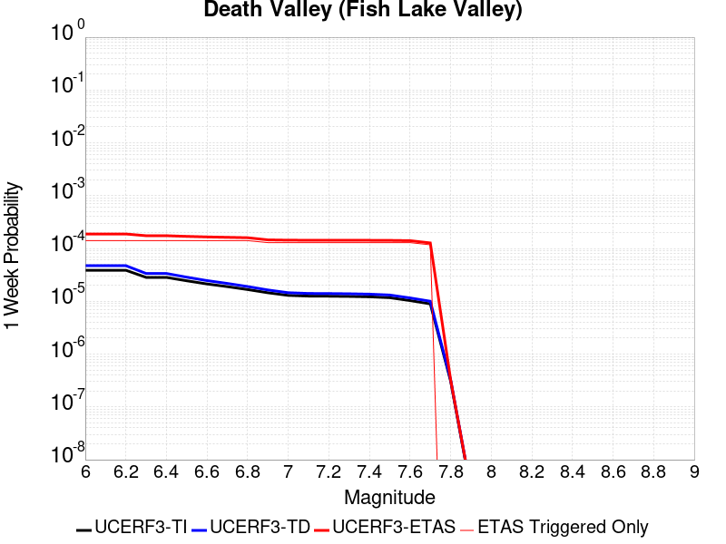 | 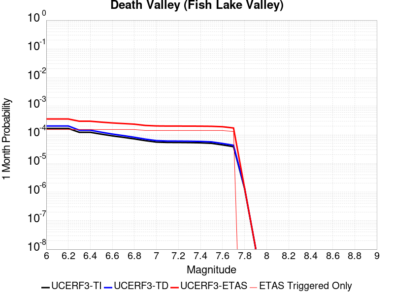 | 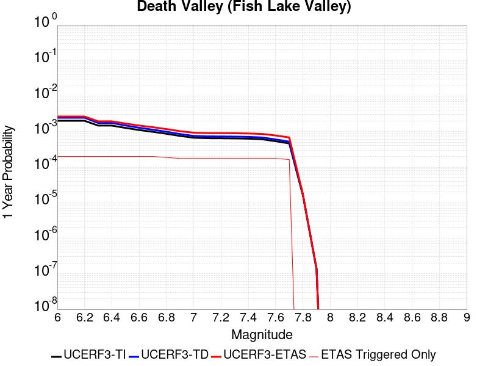 | 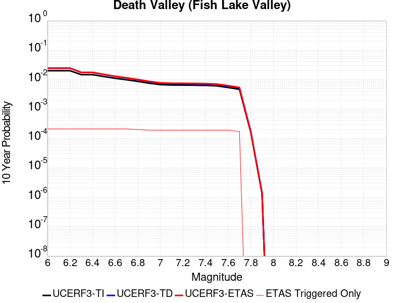 |

| Magnitude | 1 wk TI Prob | 1 wk TD Prob | 1 wk ETAS Prob | 1 wk ETAS/TD Gain | 1 wk ETAS Triggered Only | 1 mo TI Prob | 1 mo TD Prob | 1 mo ETAS Prob | 1 mo ETAS/TD Gain | 1 mo ETAS Triggered Only | 1 yr TI Prob | 1 yr TD Prob | 1 yr ETAS Prob | 1 yr ETAS/TD Gain | 1 yr ETAS Triggered Only | 10 yr TI Prob | 10 yr TD Prob | 10 yr ETAS Prob | 10 yr ETAS/TD Gain | 10 yr ETAS Triggered Only |
|-----|-----|-----|-----|-----|-----|-----|-----|-----|-----|-----|-----|-----|-----|-----|-----|-----|-----|-----|-----|-----|
| 6.0 | 3.872328E-5 | 4.7267473E-5 | 1.8810589E-4 | 3.9796054 | 1.4084508E-4 | 1.6594635E-4 | 2.0256084E-4 | 3.551121E-4 | 1.7531133 | 1.5258216E-4 | 0.0020185246 | 0.002463534 | 0.002662573 | 1.0807941 | 1.9953052E-4 | 0.02000288 | 0.024388181 | 0.024617197 | 1.0093905 | 2.3474179E-4 |
| 6.1 | 3.872328E-5 | 4.7267473E-5 | 1.8810589E-4 | 3.9796054 | 1.4084508E-4 | 1.6594635E-4 | 2.0256084E-4 | 3.551121E-4 | 1.7531133 | 1.5258216E-4 | 0.0020185246 | 0.002463534 | 0.002662573 | 1.0807941 | 1.9953052E-4 | 0.02000288 | 0.024388181 | 0.024617197 | 1.0093905 | 2.3474179E-4 |
| 6.2 | 3.872328E-5 | 4.7267473E-5 | 1.8810589E-4 | 3.9796054 | 1.4084508E-4 | 1.6594635E-4 | 2.0256084E-4 | 3.551121E-4 | 1.7531133 | 1.5258216E-4 | 0.0020185246 | 0.002463534 | 0.002662573 | 1.0807941 | 1.9953052E-4 | 0.02000288 | 0.024388181 | 0.024617197 | 1.0093905 | 2.3474179E-4 |
| 6.3 | 2.8356371E-5 | 3.3609853E-5 | 1.744502E-4 | 5.1904483 | 1.4084508E-4 | 1.2152165E-4 | 1.4403471E-4 | 2.965949E-4 | 2.0591903 | 1.5258216E-4 | 0.0014785219 | 0.0017522911 | 0.001951472 | 1.1136688 | 1.9953052E-4 | 0.014687235 | 0.017391782 | 0.017622441 | 1.0132625 | 2.3474179E-4 |
| 6.4 | 2.8356371E-5 | 3.3609853E-5 | 1.744502E-4 | 5.1904483 | 1.4084508E-4 | 1.2152165E-4 | 1.4403471E-4 | 2.965949E-4 | 2.0591903 | 1.5258216E-4 | 0.0014785219 | 0.0017522911 | 0.001951472 | 1.1136688 | 1.9953052E-4 | 0.014687235 | 0.017391782 | 0.017622441 | 1.0132625 | 2.3474179E-4 |
| 6.5 | 2.4448687E-5 | 2.8607552E-5 | 1.694486E-4 | 5.923212 | 1.4084508E-4 | 1.0477588E-4 | 1.2259831E-4 | 2.751618E-4 | 2.2444172 | 1.5258216E-4 | 0.0012748998 | 0.0014916632 | 0.001690896 | 1.1335642 | 1.9953052E-4 | 0.012676105 | 0.014821377 | 0.015052639 | 1.0156033 | 2.3474179E-4 |
| 6.6 | 2.1298161E-5 | 2.4660083E-5 | 1.6550168E-4 | 6.7113185 | 1.4084508E-4 | 9.127464E-5 | 1.0568198E-4 | 2.58248E-4 | 2.4436333 | 1.5258216E-4 | 0.0011107022 | 0.0012859525 | 0.0014852264 | 1.1549621 | 1.9953052E-4 | 0.011051672 | 0.012788526 | 0.013020265 | 1.0181209 | 2.3474179E-4 |
| 6.7 | 1.8959729E-5 | 2.1781025E-5 | 1.6262302E-4 | 7.4662704 | 1.4084508E-4 | 8.125345E-5 | 9.334405E-5 | 2.4591197E-4 | 2.6344686 | 1.5258216E-4 | 9.888117E-4 | 0.001135897 | 0.0013352009 | 1.1754595 | 1.9953052E-4 | 0.009844234 | 0.01130357 | 0.0115356585 | 1.0205323 | 2.3474179E-4 |
| 6.8 | 1.6691629E-5 | 1.9018353E-5 | 1.5986075E-4 | 8.405604 | 1.4084508E-4 | 7.153359E-5 | 8.150477E-5 | 2.340745E-4 | 2.8719115 | 1.5258216E-4 | 8.7057345E-4 | 9.918857E-4 | 0.0011794928 | 1.1891419 | 1.8779343E-4 | 0.008671708 | 0.009876343 | 0.010097146 | 1.0223566 | 2.230047E-4 |
| 6.9 | 1.450505E-5 | 1.638954E-5 | 1.454954E-4 | 8.877334 | 1.2910798E-4 | 6.216302E-5 | 7.0239046E-5 | 2.1107422E-4 | 3.005084 | 1.4084508E-4 | 7.5657194E-4 | 8.5483363E-4 | 0.0010307395 | 1.2057779 | 1.7605633E-4 | 0.007540013 | 0.008516385 | 0.008725854 | 1.024596 | 2.112676E-4 |
| 7.0 | 1.2940855E-5 | 1.4537972E-5 | 1.4364408E-4 | 9.880613 | 1.2910798E-4 | 5.545963E-5 | 6.230414E-5 | 2.0314043E-4 | 3.2604644 | 1.4084508E-4 | 6.750118E-4 | 7.5829466E-4 | 9.3421753E-4 | 1.231998 | 1.7605633E-4 | 0.006729651 | 0.0075576897 | 0.0077673607 | 1.0277427 | 2.112676E-4 |
| 7.1 | 1.2544658E-5 | 1.4078208E-5 | 1.4318437E-4 | 10.170639 | 1.2910798E-4 | 5.3761712E-5 | 6.0333812E-5 | 2.0117039E-4 | 3.3342893 | 1.4084508E-4 | 6.5435225E-4 | 7.343222E-4 | 9.1024925E-4 | 1.2395775 | 1.7605633E-4 | 0.006524288 | 0.007319551 | 0.007529272 | 1.0286522 | 2.112676E-4 |
| 7.2 | 1.2489416E-5 | 1.4015674E-5 | 1.4312184E-4 | 10.211556 | 1.2910798E-4 | 5.3524967E-5 | 6.0065824E-5 | 2.0090243E-4 | 3.3447046 | 1.4084508E-4 | 6.514716E-4 | 7.310616E-4 | 9.0698927E-4 | 1.2406468 | 1.7605633E-4 | 0.006495651 | 0.0072871596 | 0.007496888 | 1.0287805 | 2.112676E-4 |
| 7.3 | 1.2368307E-5 | 1.3879812E-5 | 1.42986E-4 | 10.301724 | 1.2910798E-4 | 5.3005948E-5 | 5.9483587E-5 | 2.0032028E-4 | 3.3676565 | 1.4084508E-4 | 6.451563E-4 | 7.2397763E-4 | 8.999065E-4 | 1.2430032 | 1.7605633E-4 | 0.0064328653 | 0.007216782 | 0.0074265245 | 1.0290632 | 2.112676E-4 |
| 7.4 | 1.2161707E-5 | 1.36478675E-5 | 1.4275408E-4 | 10.459808 | 1.2910798E-4 | 5.212056E-5 | 5.8489582E-5 | 1.9932642E-4 | 3.407896 | 1.4084508E-4 | 6.3438306E-4 | 7.118836E-4 | 8.878146E-4 | 1.2471346 | 1.7605633E-4 | 0.006325751 | 0.0070966207 | 0.007306389 | 1.0295589 | 2.112676E-4 |
| 7.5 | 1.1707948E-5 | 1.3145515E-5 | 1.422518E-4 | 10.821318 | 1.2910798E-4 | 5.0175953E-5 | 5.6336736E-5 | 1.9717387E-4 | 3.4999166 | 1.4084508E-4 | 6.10721E-4 | 6.856895E-4 | 8.616251E-4 | 1.256582 | 1.7605633E-4 | 0.0060904534 | 0.006836321 | 0.0070461445 | 1.0306925 | 2.112676E-4 |
| 7.6 | 1.0319538E-5 | 1.1579622E-5 | 1.4068611E-4 | 12.149456 | 1.2910798E-4 | 4.4225842E-5 | 4.9626036E-5 | 1.9046412E-4 | 3.8379877 | 1.4084508E-4 | 5.383166E-4 | 6.040347E-4 | 7.799847E-4 | 1.2912912 | 1.7605633E-4 | 0.0053701443 | 0.0060244603 | 0.0062344554 | 1.034857 | 2.112676E-4 |
| 7.7 | 8.937764E-6 | 1.0022779E-5 | 1.273925E-4 | 12.710297 | 1.17370895E-4 | 3.830414E-5 | 4.295409E-5 | 1.7205652E-4 | 4.0055914 | 1.2910798E-4 | 4.6625308E-4 | 5.228456E-4 | 6.870789E-4 | 1.3141145 | 1.6431925E-4 | 0.0046527605 | 0.005216664 | 0.005403478 | 1.035811 | 1.8779343E-4 |
| 7.8 | 3.108007E-7 | 3.284654E-7 | 3.284654E-7 | 1.0 | 0.0 | 1.3320023E-6 | 1.407708E-6 | 1.407708E-6 | 1.0 | 0.0 | 1.6217007E-5 | 1.7138715E-5 | 1.7138715E-5 | 1.0 | 0.0 | 1.6215823E-4 | 1.7137431E-4 | 1.7137431E-4 | 1.0 | 0.0 |
| 7.9 | 2.5591178E-9 | 2.6696718E-9 | 2.6696718E-9 | 1.0 | 0.0 | 1.0967647E-8 | 1.14414505E-8 | 1.14414505E-8 | 1.0 | 0.0 | 1.335311E-7 | 1.3929966E-7 | 1.3929966E-7 | 1.0 | 0.0 | 1.3353102E-6 | 1.3929966E-6 | 1.3929966E-6 | 1.0 | 0.0 |

## Lake Isabella (Seismicity)
*[(top)](#table-of-contents)*

| 1 Week | 1 Month | 1 Year | 10 Year |
|-----|-----|-----|-----|
| 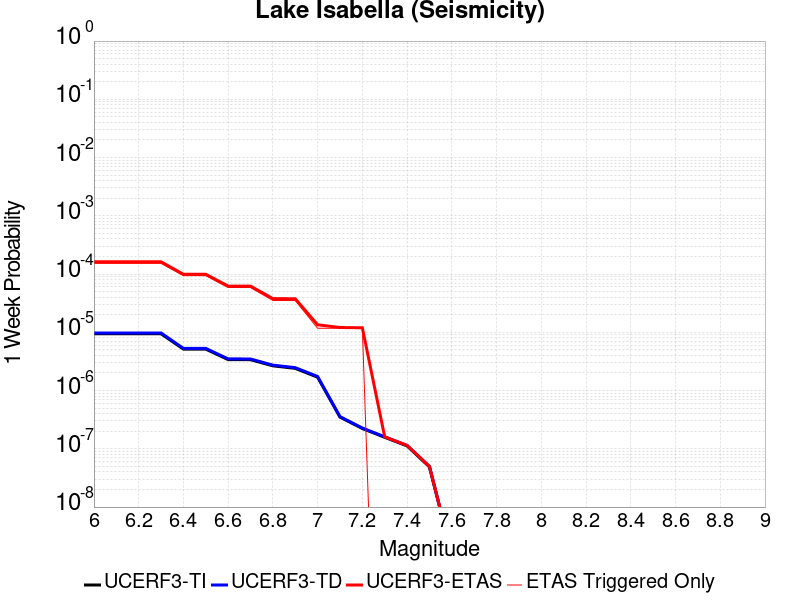 | 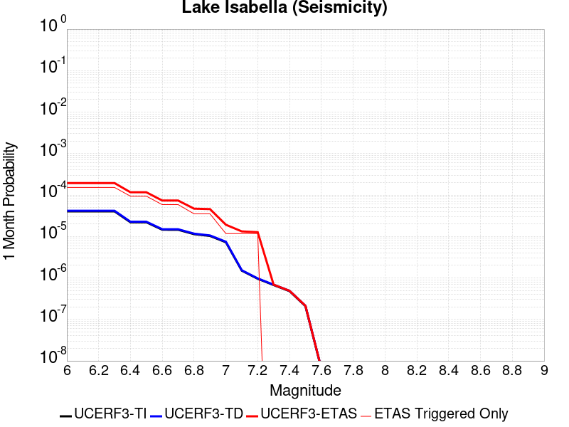 | 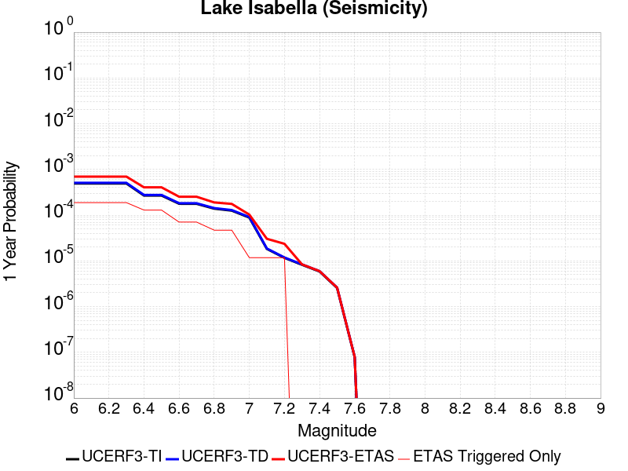 | 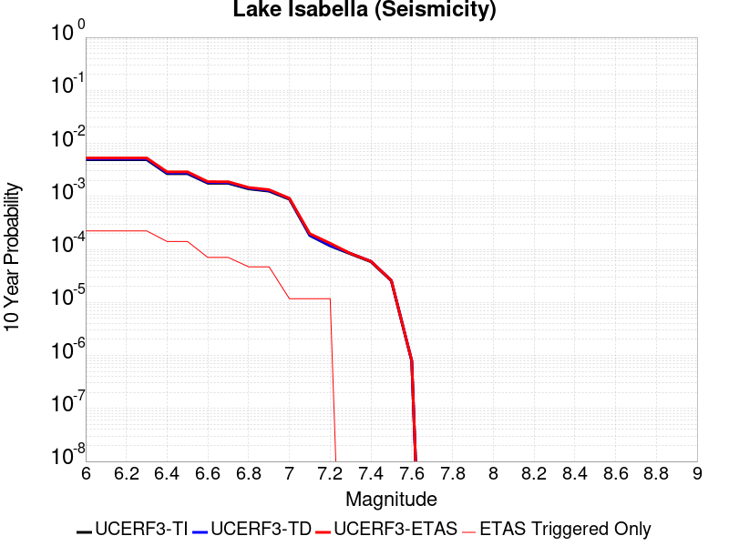 |

| Magnitude | 1 wk TI Prob | 1 wk TD Prob | 1 wk ETAS Prob | 1 wk ETAS/TD Gain | 1 wk ETAS Triggered Only | 1 mo TI Prob | 1 mo TD Prob | 1 mo ETAS Prob | 1 mo ETAS/TD Gain | 1 mo ETAS Triggered Only | 1 yr TI Prob | 1 yr TD Prob | 1 yr ETAS Prob | 1 yr ETAS/TD Gain | 1 yr ETAS Triggered Only | 10 yr TI Prob | 10 yr TD Prob | 10 yr ETAS Prob | 10 yr ETAS/TD Gain | 10 yr ETAS Triggered Only |
|-----|-----|-----|-----|-----|-----|-----|-----|-----|-----|-----|-----|-----|-----|-----|-----|-----|-----|-----|-----|-----|
| 6.0 | 9.431637E-6 | 9.741651E-6 | 1.6232232E-4 | 16.66271 | 1.5258216E-4 | 4.0420677E-5 | 4.1749343E-5 | 1.9432513E-4 | 4.6545677 | 1.5258216E-4 | 4.920106E-4 | 5.0819275E-4 | 6.9589075E-4 | 1.3693441 | 1.8779343E-4 | 0.004909227 | 0.005071599 | 0.0052934727 | 1.0437483 | 2.230047E-4 |
| 6.1 | 9.431637E-6 | 9.741651E-6 | 1.6232232E-4 | 16.66271 | 1.5258216E-4 | 4.0420677E-5 | 4.1749343E-5 | 1.9432513E-4 | 4.6545677 | 1.5258216E-4 | 4.920106E-4 | 5.0819275E-4 | 6.9589075E-4 | 1.3693441 | 1.8779343E-4 | 0.004909227 | 0.005071599 | 0.0052934727 | 1.0437483 | 2.230047E-4 |
| 6.2 | 9.431637E-6 | 9.741651E-6 | 1.6232232E-4 | 16.66271 | 1.5258216E-4 | 4.0420677E-5 | 4.1749343E-5 | 1.9432513E-4 | 4.6545677 | 1.5258216E-4 | 4.920106E-4 | 5.0819275E-4 | 6.9589075E-4 | 1.3693441 | 1.8779343E-4 | 0.004909227 | 0.005071599 | 0.0052934727 | 1.0437483 | 2.230047E-4 |
| 6.3 | 9.431637E-6 | 9.741651E-6 | 1.6232232E-4 | 16.66271 | 1.5258216E-4 | 4.0420677E-5 | 4.1749343E-5 | 1.9432513E-4 | 4.6545677 | 1.5258216E-4 | 4.920106E-4 | 5.0819275E-4 | 6.9589075E-4 | 1.3693441 | 1.8779343E-4 | 0.004909227 | 0.005071599 | 0.0052934727 | 1.0437483 | 2.230047E-4 |
| 6.4 | 5.144063E-6 | 5.3000763E-6 | 9.9196295E-5 | 18.716013 | 9.389671E-5 | 2.2045799E-5 | 2.2714434E-5 | 1.16609015E-4 | 5.1336966 | 9.389671E-5 | 2.6837454E-4 | 2.765166E-4 | 4.0558886E-4 | 1.4667795 | 1.2910798E-4 | 0.0026805066 | 0.0027620657 | 0.0029025218 | 1.0508518 | 1.4084508E-4 |
| 6.5 | 5.144063E-6 | 5.3000763E-6 | 9.9196295E-5 | 18.716013 | 9.389671E-5 | 2.2045799E-5 | 2.2714434E-5 | 1.16609015E-4 | 5.1336966 | 9.389671E-5 | 2.6837454E-4 | 2.765166E-4 | 4.0558886E-4 | 1.4667795 | 1.2910798E-4 | 0.0026805066 | 0.0027620657 | 0.0029025218 | 1.0508518 | 1.4084508E-4 |
| 6.6 | 3.4009804E-6 | 3.498786E-6 | 6.218403E-5 | 17.77303 | 5.8685448E-5 | 1.4575549E-5 | 1.4994721E-5 | 7.3679286E-5 | 4.913682 | 5.8685448E-5 | 1.7744285E-4 | 1.8254704E-4 | 2.529567E-4 | 1.385707 | 7.042254E-5 | 0.0017730123 | 0.0018241286 | 0.0018944227 | 1.0385357 | 7.042254E-5 |
| 6.7 | 3.3880428E-6 | 3.4856528E-6 | 6.21709E-5 | 17.836227 | 5.8685448E-5 | 1.4520103E-5 | 1.4938435E-5 | 7.362301E-5 | 4.928428 | 5.8685448E-5 | 1.767679E-4 | 1.8186188E-4 | 2.522716E-4 | 1.3871604 | 7.042254E-5 | 0.0017662736 | 0.0018172882 | 0.0018875827 | 1.038681 | 7.042254E-5 |
| 6.8 | 2.6582E-6 | 2.7337003E-6 | 3.7944872E-5 | 13.880407 | 3.521127E-5 | 1.1392236E-5 | 1.1715813E-5 | 4.6926667E-5 | 4.005413 | 3.521127E-5 | 1.3869164E-4 | 1.4263204E-4 | 1.895737E-4 | 1.3291103 | 4.6948357E-5 | 0.0013860512 | 0.0014255369 | 0.0014724183 | 1.0328869 | 4.6948357E-5 |
| 6.9 | 2.406011E-6 | 2.4743288E-6 | 3.768551E-5 | 15.230598 | 3.521127E-5 | 1.0311434E-5 | 1.0604231E-5 | 4.5815126E-5 | 4.320457 | 3.521127E-5 | 1.2553448E-4 | 1.2910018E-4 | 1.7604248E-4 | 1.3636113 | 4.6948357E-5 | 0.0012546359 | 0.0012903814 | 0.0013372692 | 1.0363364 | 4.6948357E-5 |
| 7.0 | 1.6953097E-6 | 1.7429371E-6 | 1.3480006E-5 | 7.7340746 | 1.1737089E-5 | 7.265593E-6 | 7.469715E-6 | 1.9206716E-5 | 2.5712783 | 1.1737089E-5 | 8.8455E-5 | 9.094104E-5 | 1.02677055E-4 | 1.1290509 | 1.1737089E-5 | 8.84198E-4 | 9.09141E-4 | 9.208674E-4 | 1.0128983 | 1.1737089E-5 |
| 7.1 | 3.5013824E-7 | 3.5714822E-7 | 1.2094233E-5 | 33.863342 | 1.1737089E-5 | 1.5005916E-6 | 1.5306344E-6 | 1.3267706E-5 | 8.668109 | 1.1737089E-5 | 1.826955E-5 | 1.8635317E-5 | 3.0372188E-5 | 1.6298187 | 1.1737089E-5 | 1.8268047E-4 | 1.863378E-4 | 1.980727E-4 | 1.0629765 | 1.1737089E-5 |
| 7.2 | 2.2321095E-7 | 2.2750574E-7 | 1.1964592E-5 | 52.59029 | 1.1737089E-5 | 9.56618E-7 | 9.750242E-7 | 1.2712102E-5 | 13.037729 | 1.1737089E-5 | 1.1646762E-5 | 1.1870856E-5 | 2.3607807E-5 | 1.9887197 | 1.1737089E-5 | 1.1646151E-4 | 1.1870232E-4 | 1.3043801E-4 | 1.0988666 | 1.1737089E-5 |
| 7.3 | 1.5760406E-7 | 1.6060922E-7 | 1.6060922E-7 | 1.0 | 0.0 | 6.7544585E-7 | 6.8832503E-7 | 6.8832503E-7 | 1.0 | 0.0 | 8.223522E-6 | 8.380326E-6 | 8.380326E-6 | 1.0 | 0.0 | 8.2232174E-5 | 8.3800165E-5 | 8.3800165E-5 | 1.0 | 0.0 |
| 7.4 | 1.1216497E-7 | 1.1431706E-7 | 1.1431706E-7 | 1.0 | 0.0 | 4.8070694E-7 | 4.899302E-7 | 4.899302E-7 | 1.0 | 0.0 | 5.852591E-6 | 5.964884E-6 | 5.964884E-6 | 1.0 | 0.0 | 5.8524372E-5 | 5.9647282E-5 | 5.9647282E-5 | 1.0 | 0.0 |
| 7.5 | 4.885185E-8 | 4.9787737E-8 | 4.9787737E-8 | 1.0 | 0.0 | 2.0936506E-7 | 2.13376E-7 | 2.13376E-7 | 1.0 | 0.0 | 2.5490165E-6 | 2.59785E-6 | 2.59785E-6 | 1.0 | 0.0 | 2.5489873E-5 | 2.5978214E-5 | 2.5978214E-5 | 1.0 | 0.0 |
| 7.6 | 1.504641E-9 | 1.5317903E-9 | 1.5317903E-9 | 1.0 | 0.0 | 6.4484613E-9 | 6.5648154E-9 | 6.5648154E-9 | 1.0 | 0.0 | 7.851001E-8 | 7.992663E-8 | 7.992663E-8 | 1.0 | 0.0 | 7.8509987E-7 | 7.992663E-7 | 7.992663E-7 | 1.0 | 0.0 |

## Calico-Hidalgo
*[(top)](#table-of-contents)*

| 1 Week | 1 Month | 1 Year | 10 Year |
|-----|-----|-----|-----|
| 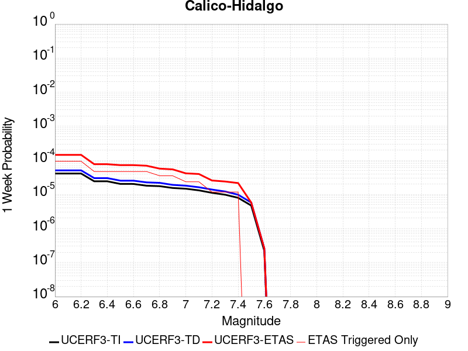 | 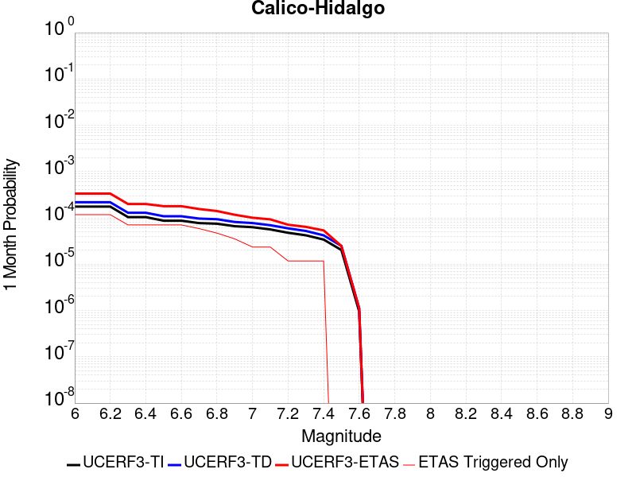 | 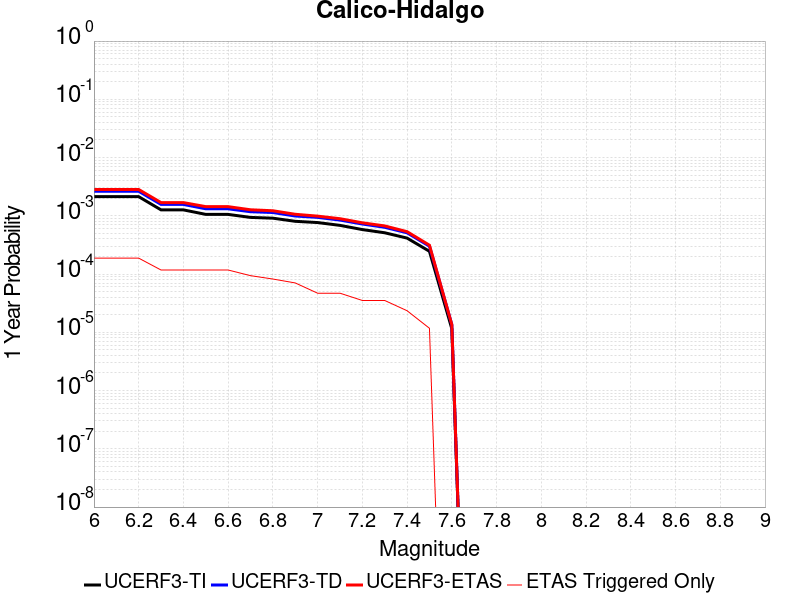 | 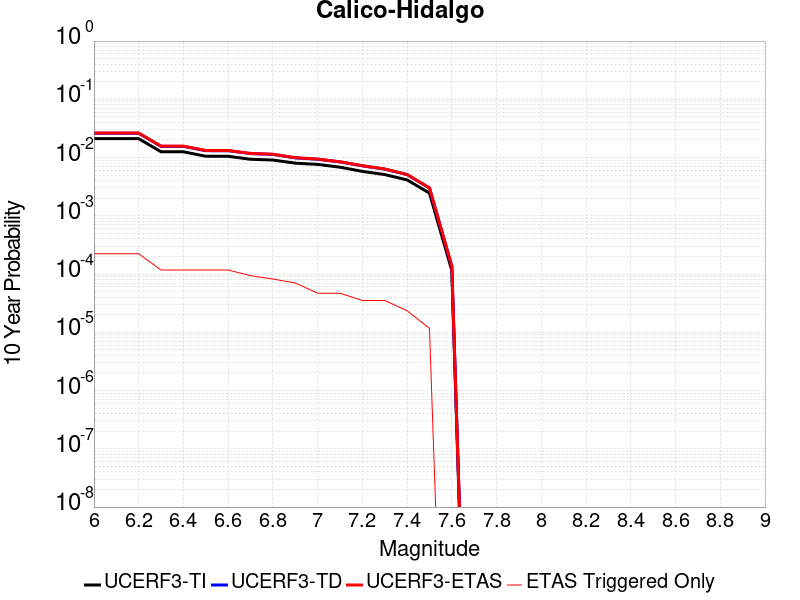 |

| Magnitude | 1 wk TI Prob | 1 wk TD Prob | 1 wk ETAS Prob | 1 wk ETAS/TD Gain | 1 wk ETAS Triggered Only | 1 mo TI Prob | 1 mo TD Prob | 1 mo ETAS Prob | 1 mo ETAS/TD Gain | 1 mo ETAS Triggered Only | 1 yr TI Prob | 1 yr TD Prob | 1 yr ETAS Prob | 1 yr ETAS/TD Gain | 1 yr ETAS Triggered Only | 10 yr TI Prob | 10 yr TD Prob | 10 yr ETAS Prob | 10 yr ETAS/TD Gain | 10 yr ETAS Triggered Only |
|-----|-----|-----|-----|-----|-----|-----|-----|-----|-----|-----|-----|-----|-----|-----|-----|-----|-----|-----|-----|-----|
| 6.0 | 4.0906612E-5 | 5.0703686E-5 | 1.4459564E-4 | 2.8517776 | 9.389671E-5 | 1.7530227E-4 | 2.172857E-4 | 3.346311E-4 | 1.5400511 | 1.17370895E-4 | 0.0021322158 | 0.002642648 | 0.0028299452 | 1.0708748 | 1.8779343E-4 | 0.02111873 | 0.026152607 | 0.02636978 | 1.008304 | 2.230047E-4 |
| 6.1 | 4.0906612E-5 | 5.0703686E-5 | 1.4459564E-4 | 2.8517776 | 9.389671E-5 | 1.7530227E-4 | 2.172857E-4 | 3.346311E-4 | 1.5400511 | 1.17370895E-4 | 0.0021322158 | 0.002642648 | 0.0028299452 | 1.0708748 | 1.8779343E-4 | 0.02111873 | 0.026152607 | 0.02636978 | 1.008304 | 2.230047E-4 |
| 6.2 | 4.0906612E-5 | 5.0703686E-5 | 1.4459564E-4 | 2.8517776 | 9.389671E-5 | 1.7530227E-4 | 2.172857E-4 | 3.346311E-4 | 1.5400511 | 1.17370895E-4 | 0.0021322158 | 0.002642648 | 0.0028299452 | 1.0708748 | 1.8779343E-4 | 0.02111873 | 0.026152607 | 0.02636978 | 1.008304 | 2.230047E-4 |
| 6.3 | 2.4242801E-5 | 3.0090669E-5 | 7.7037614E-5 | 2.5601828 | 4.6948357E-5 | 1.0389358E-4 | 1.2895382E-4 | 1.9936728E-4 | 1.5460362 | 7.042254E-5 | 0.0012641704 | 0.0015689151 | 0.0016861019 | 1.0746928 | 1.17370895E-4 | 0.01257003 | 0.01558206 | 0.015697602 | 1.007415 | 1.17370895E-4 |
| 6.4 | 2.4242801E-5 | 3.0090669E-5 | 7.7037614E-5 | 2.5601828 | 4.6948357E-5 | 1.0389358E-4 | 1.2895382E-4 | 1.9936728E-4 | 1.5460362 | 7.042254E-5 | 0.0012641704 | 0.0015689151 | 0.0016861019 | 1.0746928 | 1.17370895E-4 | 0.01257003 | 0.01558206 | 0.015697602 | 1.007415 | 1.17370895E-4 |
| 6.5 | 2.0286952E-5 | 2.5315738E-5 | 7.2262905E-5 | 2.8544657 | 4.6948357E-5 | 8.694118E-5 | 1.0849161E-4 | 1.789065E-4 | 1.6490355 | 7.042254E-5 | 0.0010579949 | 0.001320102 | 0.001437318 | 1.088793 | 1.17370895E-4 | 0.010529719 | 0.013124538 | 0.013240368 | 1.0088255 | 1.17370895E-4 |
| 6.6 | 2.0269223E-5 | 2.5296687E-5 | 7.2243856E-5 | 2.8558624 | 4.6948357E-5 | 8.6865206E-5 | 1.08409964E-4 | 1.7882486E-4 | 1.6495242 | 7.042254E-5 | 0.0010570707 | 0.0013191093 | 0.0014363254 | 1.08886 | 1.17370895E-4 | 0.010520565 | 0.013114728 | 0.013230559 | 1.0088322 | 1.17370895E-4 |
| 6.7 | 1.799852E-5 | 2.25406E-5 | 6.94879E-5 | 3.0827882 | 4.6948357E-5 | 7.713423E-5 | 9.659908E-5 | 1.5527886E-4 | 1.6074569 | 5.8685448E-5 | 9.3870464E-4 | 0.0011754738 | 0.0012692602 | 1.079786 | 9.389671E-5 | 0.009347493 | 0.011694173 | 0.011786972 | 1.0079354 | 9.389671E-5 |
| 6.8 | 1.7458793E-5 | 2.184212E-5 | 5.7052617E-5 | 2.6120458 | 3.521127E-5 | 7.4821255E-5 | 9.3605806E-5 | 1.4054978E-4 | 1.5015069 | 4.6948357E-5 | 9.10568E-4 | 0.0011390693 | 0.0012211354 | 1.0720465 | 8.2159626E-5 | 0.009068459 | 0.011333893 | 0.011415122 | 1.0071669 | 8.2159626E-5 |
| 6.9 | 1.542884E-5 | 1.9025927E-5 | 5.4236523E-5 | 2.850664 | 3.521127E-5 | 6.612192E-5 | 8.153721E-5 | 1.1674561E-4 | 1.4318078 | 3.521127E-5 | 8.04737E-4 | 9.922766E-4 | 0.0010626293 | 1.0709002 | 7.042254E-5 | 0.008018291 | 0.009879857 | 0.0099495845 | 1.0070574 | 7.042254E-5 |
| 7.0 | 1.468253E-5 | 1.8030598E-5 | 4.1504354E-5 | 2.3018844 | 2.3474178E-5 | 6.292361E-5 | 7.7271776E-5 | 1.00744146E-4 | 1.3037637 | 2.3474178E-5 | 7.658257E-4 | 9.4039086E-4 | 9.872951E-4 | 1.0498774 | 4.6948357E-5 | 0.0076319184 | 0.009365481 | 0.00941199 | 1.004966 | 4.6948357E-5 |
| 7.1 | 1.3139281E-5 | 1.6200942E-5 | 3.9674742E-5 | 2.4489155 | 2.3474178E-5 | 5.6309986E-5 | 6.943083E-5 | 9.2903385E-5 | 1.338071 | 2.3474178E-5 | 6.853584E-4 | 8.4500515E-4 | 8.9191383E-4 | 1.0555129 | 4.6948357E-5 | 0.0068324856 | 0.0084192185 | 0.008465772 | 1.0055294 | 4.6948357E-5 |
| 7.2 | 1.1127404E-5 | 1.3866597E-5 | 2.5603524E-5 | 1.8464172 | 1.1737089E-5 | 4.7688E-5 | 5.942698E-5 | 7.116338E-5 | 1.1974926 | 1.1737089E-5 | 5.8044674E-4 | 7.232942E-4 | 7.5848E-4 | 1.0486466 | 3.521127E-5 | 0.0057893298 | 0.0072105085 | 0.007245466 | 1.0048481 | 3.521127E-5 |
| 7.3 | 9.808154E-6 | 1.2176215E-5 | 2.3913162E-5 | 1.963924 | 1.1737089E-5 | 4.2034266E-5 | 5.2182797E-5 | 6.391927E-5 | 1.2249109 | 1.1737089E-5 | 5.11647E-4 | 6.3515105E-4 | 6.7033997E-4 | 1.0554024 | 3.521127E-5 | 0.0051047057 | 0.006334433 | 0.0063694213 | 1.0055234 | 3.521127E-5 |
| 7.4 | 7.942452E-6 | 9.792144E-6 | 2.1529118E-5 | 2.1986113 | 1.1737089E-5 | 3.4038632E-5 | 4.1965708E-5 | 5.3702304E-5 | 1.2796711 | 1.1737089E-5 | 4.1434157E-4 | 5.1082217E-4 | 5.3428434E-4 | 1.0459303 | 2.3474178E-5 | 0.0041356985 | 0.005097421 | 0.0051207757 | 1.0045817 | 2.3474178E-5 |
| 7.5 | 4.7121216E-6 | 5.772836E-6 | 5.772836E-6 | 1.0 | 0.0 | 2.019465E-5 | 2.4740535E-5 | 2.4740535E-5 | 1.0 | 0.0 | 2.4584212E-4 | 3.0118204E-4 | 3.129156E-4 | 1.0389583 | 1.1737089E-5 | 0.0024557032 | 0.0030084911 | 0.003020193 | 1.0038896 | 1.1737089E-5 |
| 7.6 | 2.21172E-7 | 2.603961E-7 | 2.603961E-7 | 1.0 | 0.0 | 9.478797E-7 | 1.1159829E-6 | 1.1159829E-6 | 1.0 | 0.0 | 1.1540374E-5 | 1.3587036E-5 | 1.3587036E-5 | 1.0 | 0.0 | 1.1539775E-4 | 1.3586486E-4 | 1.3586486E-4 | 1.0 | 0.0 |

## Manix-Afton Hills
*[(top)](#table-of-contents)*

| 1 Week | 1 Month | 1 Year | 10 Year |
|-----|-----|-----|-----|
| 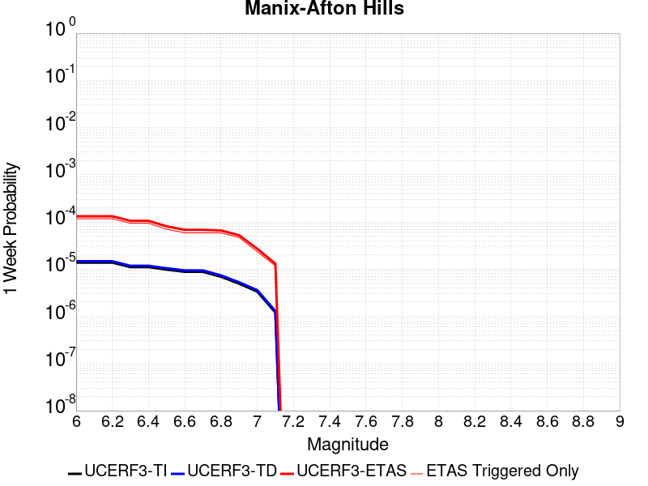 | 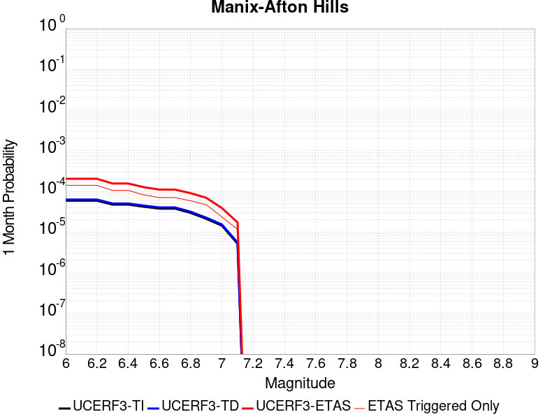 | 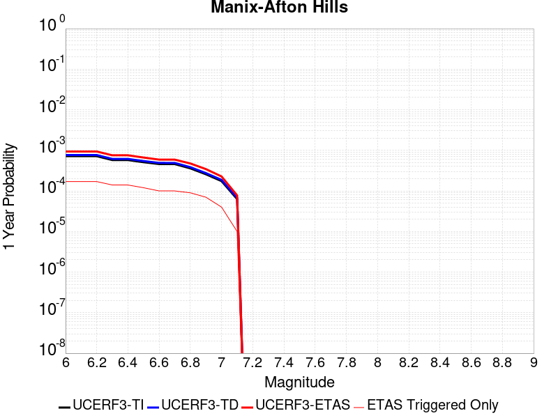 |  |

| Magnitude | 1 wk TI Prob | 1 wk TD Prob | 1 wk ETAS Prob | 1 wk ETAS/TD Gain | 1 wk ETAS Triggered Only | 1 mo TI Prob | 1 mo TD Prob | 1 mo ETAS Prob | 1 mo ETAS/TD Gain | 1 mo ETAS Triggered Only | 1 yr TI Prob | 1 yr TD Prob | 1 yr ETAS Prob | 1 yr ETAS/TD Gain | 1 yr ETAS Triggered Only | 10 yr TI Prob | 10 yr TD Prob | 10 yr ETAS Prob | 10 yr ETAS/TD Gain | 10 yr ETAS Triggered Only |
|-----|-----|-----|-----|-----|-----|-----|-----|-----|-----|-----|-----|-----|-----|-----|-----|-----|-----|-----|-----|-----|
| 6.0 | 1.3783202E-5 | 1.47110895E-5 | 1.3208025E-4 | 8.978278 | 1.17370895E-4 | 5.906953E-5 | 6.30461E-5 | 2.038823E-4 | 3.2338603 | 1.4084508E-4 | 7.189342E-4 | 7.6733343E-4 | 9.432547E-4 | 1.2292631 | 1.7605633E-4 | 0.0071661277 | 0.007648596 | 0.0078582475 | 1.0274105 | 2.112676E-4 |
| 6.1 | 1.3783202E-5 | 1.47110895E-5 | 1.3208025E-4 | 8.978278 | 1.17370895E-4 | 5.906953E-5 | 6.30461E-5 | 2.038823E-4 | 3.2338603 | 1.4084508E-4 | 7.189342E-4 | 7.6733343E-4 | 9.432547E-4 | 1.2292631 | 1.7605633E-4 | 0.0071661277 | 0.007648596 | 0.0078582475 | 1.0274105 | 2.112676E-4 |
| 6.2 | 1.3783202E-5 | 1.47110895E-5 | 1.3208025E-4 | 8.978278 | 1.17370895E-4 | 5.906953E-5 | 6.30461E-5 | 2.038823E-4 | 3.2338603 | 1.4084508E-4 | 7.189342E-4 | 7.6733343E-4 | 9.432547E-4 | 1.2292631 | 1.7605633E-4 | 0.0071661277 | 0.007648596 | 0.0078582475 | 1.0274105 | 2.112676E-4 |
| 6.3 | 1.10494875E-5 | 1.1793136E-5 | 1.0568874E-4 | 8.961886 | 9.389671E-5 | 4.7354086E-5 | 5.054109E-5 | 1.5616955E-4 | 3.0899522 | 1.056338E-4 | 5.763835E-4 | 6.151744E-4 | 7.559328E-4 | 1.2288105 | 1.4084508E-4 | 0.005748908 | 0.0061357557 | 0.0062990664 | 1.0266163 | 1.6431925E-4 |
| 6.4 | 1.10494875E-5 | 1.1793136E-5 | 1.0568874E-4 | 8.961886 | 9.389671E-5 | 4.7354086E-5 | 5.054109E-5 | 1.5616955E-4 | 3.0899522 | 1.056338E-4 | 5.763835E-4 | 6.151744E-4 | 7.559328E-4 | 1.2288105 | 1.4084508E-4 | 0.005748908 | 0.0061357557 | 0.0062990664 | 1.0266163 | 1.6431925E-4 |
| 6.5 | 9.788949E-6 | 1.045432E-5 | 8.087612E-5 | 7.7361436 | 7.042254E-5 | 4.1951964E-5 | 4.480351E-5 | 1.2695945E-4 | 2.8336945 | 8.2159626E-5 | 5.1064545E-4 | 5.453555E-4 | 6.626624E-4 | 1.2151017 | 1.17370895E-4 | 0.0050947363 | 0.0054410985 | 0.005569504 | 1.0235991 | 1.2910798E-4 |
| 6.6 | 8.810006E-6 | 9.4136285E-6 | 6.8098525E-5 | 7.2340355 | 5.8685448E-5 | 3.775662E-5 | 4.0343548E-5 | 1.1076324E-4 | 2.7455008 | 7.042254E-5 | 4.5958988E-4 | 4.9108086E-4 | 5.8493146E-4 | 1.1911103 | 9.389671E-5 | 0.0045864056 | 0.004900839 | 0.005005955 | 1.0214486 | 1.056338E-4 |
| 6.7 | 8.80128E-6 | 9.404108E-6 | 6.8089E-5 | 7.240347 | 5.8685448E-5 | 3.7719226E-5 | 4.0302748E-5 | 1.10722445E-4 | 2.747268 | 7.042254E-5 | 4.591348E-4 | 4.9058435E-4 | 5.84435E-4 | 1.1913038 | 9.389671E-5 | 0.004581874 | 0.0048958957 | 0.0050010127 | 1.0214703 | 1.056338E-4 |
| 6.8 | 6.8994877E-6 | 7.380076E-6 | 6.606509E-5 | 8.951817 | 5.8685448E-5 | 2.9568899E-5 | 3.162856E-5 | 9.031215E-5 | 2.8553987 | 5.8685448E-5 | 3.5994186E-4 | 3.8501783E-4 | 4.6714582E-4 | 1.2133095 | 8.2159626E-5 | 0.003593594 | 0.0038443129 | 0.0039378484 | 1.024331 | 9.389671E-5 |
| 6.9 | 4.9328037E-6 | 5.2709615E-6 | 5.221907E-5 | 9.906935 | 4.6948357E-5 | 2.1140417E-5 | 2.2589675E-5 | 6.953697E-5 | 3.0782635 | 4.6948357E-5 | 2.5735417E-4 | 2.7500073E-4 | 3.454039E-4 | 1.2560109 | 7.042254E-5 | 0.0025705635 | 0.0027472095 | 0.0028291433 | 1.0298244 | 8.2159626E-5 |
| 7.0 | 3.347973E-6 | 3.59003E-6 | 2.7064125E-5 | 7.53869 | 2.3474178E-5 | 1.4348378E-5 | 1.5385775E-5 | 3.885959E-5 | 2.5256832 | 2.3474178E-5 | 1.746775E-4 | 1.8730981E-4 | 2.3424938E-4 | 1.2505985 | 4.6948357E-5 | 0.0017454025 | 0.0018719219 | 0.0019187825 | 1.0250334 | 4.6948357E-5 |
| 7.1 | 1.2073567E-6 | 1.293482E-6 | 1.3030556E-5 | 10.074014 | 1.1737089E-5 | 5.1743755E-6 | 5.543492E-6 | 1.7280516E-5 | 3.117262 | 1.1737089E-5 | 6.29962E-5 | 6.749156E-5 | 7.922785E-5 | 1.1738929 | 1.1737089E-5 | 6.297835E-4 | 6.7487074E-4 | 6.8659993E-4 | 1.0173799 | 1.1737089E-5 |

## Kern Canyon (North Kern) 2011
*[(top)](#table-of-contents)*

| 1 Week | 1 Month | 1 Year | 10 Year |
|-----|-----|-----|-----|
| 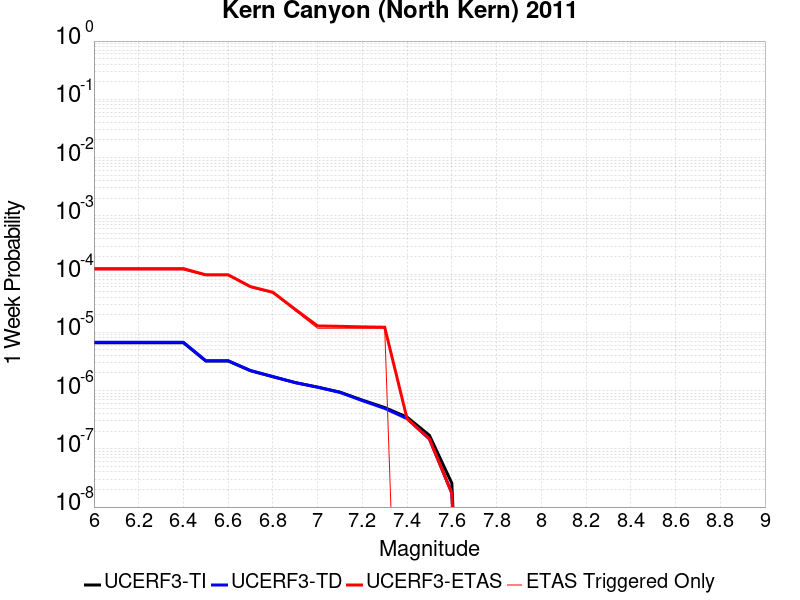 | 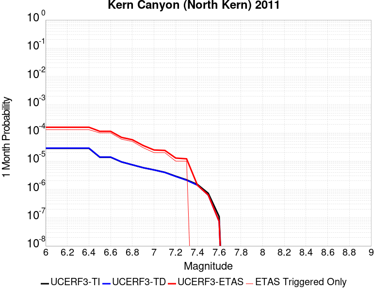 | 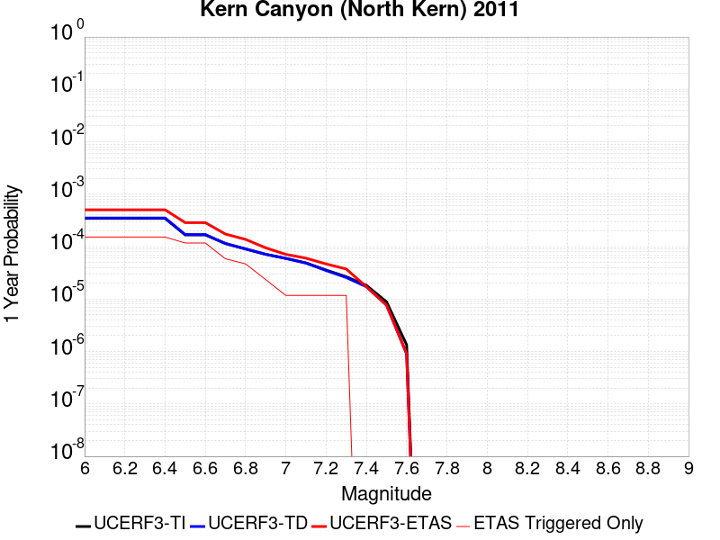 | 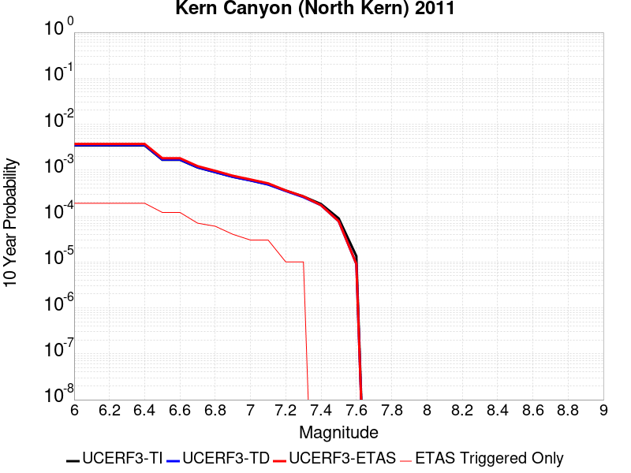 |

| Magnitude | 1 wk TI Prob | 1 wk TD Prob | 1 wk ETAS Prob | 1 wk ETAS/TD Gain | 1 wk ETAS Triggered Only | 1 mo TI Prob | 1 mo TD Prob | 1 mo ETAS Prob | 1 mo ETAS/TD Gain | 1 mo ETAS Triggered Only | 1 yr TI Prob | 1 yr TD Prob | 1 yr ETAS Prob | 1 yr ETAS/TD Gain | 1 yr ETAS Triggered Only | 10 yr TI Prob | 10 yr TD Prob | 10 yr ETAS Prob | 10 yr ETAS/TD Gain | 10 yr ETAS Triggered Only |
|-----|-----|-----|-----|-----|-----|-----|-----|-----|-----|-----|-----|-----|-----|-----|-----|-----|-----|-----|-----|-----|
| 6.0 | 6.6264497E-6 | 6.75733E-6 | 1.2412743E-4 | 18.3693 | 1.17370895E-4 | 2.8398761E-5 | 2.895971E-5 | 1.5806395E-4 | 5.458064 | 1.2910798E-4 | 3.4570007E-4 | 3.5253543E-4 | 5.050638E-4 | 1.432661 | 1.5258216E-4 | 0.0034516277 | 0.0035205502 | 0.0037076825 | 1.0531542 | 1.8779343E-4 |
| 6.1 | 6.6264497E-6 | 6.75733E-6 | 1.2412743E-4 | 18.3693 | 1.17370895E-4 | 2.8398761E-5 | 2.895971E-5 | 1.5806395E-4 | 5.458064 | 1.2910798E-4 | 3.4570007E-4 | 3.5253543E-4 | 5.050638E-4 | 1.432661 | 1.5258216E-4 | 0.0034516277 | 0.0035205502 | 0.0037076825 | 1.0531542 | 1.8779343E-4 |
| 6.2 | 6.6264497E-6 | 6.75733E-6 | 1.2412743E-4 | 18.3693 | 1.17370895E-4 | 2.8398761E-5 | 2.895971E-5 | 1.5806395E-4 | 5.458064 | 1.2910798E-4 | 3.4570007E-4 | 3.5253543E-4 | 5.050638E-4 | 1.432661 | 1.5258216E-4 | 0.0034516277 | 0.0035205502 | 0.0037076825 | 1.0531542 | 1.8779343E-4 |
| 6.3 | 6.6264497E-6 | 6.75733E-6 | 1.2412743E-4 | 18.3693 | 1.17370895E-4 | 2.8398761E-5 | 2.895971E-5 | 1.5806395E-4 | 5.458064 | 1.2910798E-4 | 3.4570007E-4 | 3.5253543E-4 | 5.050638E-4 | 1.432661 | 1.5258216E-4 | 0.0034516277 | 0.0035205502 | 0.0037076825 | 1.0531542 | 1.8779343E-4 |
| 6.4 | 6.6264497E-6 | 6.75733E-6 | 1.2412743E-4 | 18.3693 | 1.17370895E-4 | 2.8398761E-5 | 2.895971E-5 | 1.5806395E-4 | 5.458064 | 1.2910798E-4 | 3.4570007E-4 | 3.5253543E-4 | 5.050638E-4 | 1.432661 | 1.5258216E-4 | 0.0034516277 | 0.0035205502 | 0.0037076825 | 1.0531542 | 1.8779343E-4 |
| 6.5 | 3.2162225E-6 | 3.2570915E-6 | 9.71535E-5 | 29.8283 | 9.389671E-5 | 1.3783738E-5 | 1.3958893E-5 | 1.1959122E-4 | 8.567386 | 1.056338E-4 | 1.6780409E-4 | 1.6993708E-4 | 2.87288E-4 | 1.6905553 | 1.17370895E-4 | 0.0016767744 | 0.001698151 | 0.0018270398 | 1.0758995 | 1.2910798E-4 |
| 6.6 | 3.2162225E-6 | 3.2570915E-6 | 9.71535E-5 | 29.8283 | 9.389671E-5 | 1.3783738E-5 | 1.3958893E-5 | 1.1959122E-4 | 8.567386 | 1.056338E-4 | 1.6780409E-4 | 1.6993708E-4 | 2.87288E-4 | 1.6905553 | 1.17370895E-4 | 0.0016767744 | 0.001698151 | 0.0018270398 | 1.0758995 | 1.2910798E-4 |
| 6.7 | 2.1908265E-6 | 2.2071222E-6 | 6.089244E-5 | 27.589066 | 5.8685448E-5 | 9.389223E-6 | 9.459061E-6 | 6.8143956E-5 | 7.204092 | 5.8685448E-5 | 1.1430779E-4 | 1.1515819E-4 | 1.7383687E-4 | 1.5095485 | 5.8685448E-5 | 0.0011424901 | 0.0011510046 | 0.001221346 | 1.0611131 | 7.042254E-5 |
| 6.8 | 1.7303895E-6 | 1.7365529E-6 | 4.868483E-5 | 28.035328 | 4.6948357E-5 | 7.415934E-6 | 7.4423488E-6 | 5.4390355E-5 | 7.3082247 | 4.6948357E-5 | 9.028525E-5 | 9.0606925E-5 | 1.3755103E-4 | 1.5181072 | 4.6948357E-5 | 9.024858E-4 | 9.057096E-4 | 9.6434186E-4 | 1.0647364 | 5.8685448E-5 |
| 6.9 | 1.3700314E-6 | 1.3688622E-6 | 2.4843008E-5 | 18.148655 | 2.3474178E-5 | 5.87155E-6 | 5.8665396E-6 | 2.9340581E-5 | 5.0013437 | 2.3474178E-5 | 7.148377E-5 | 7.142282E-5 | 9.4895324E-5 | 1.3286415 | 2.3474178E-5 | 7.146078E-4 | 7.140032E-4 | 7.4918935E-4 | 1.04928 | 3.521127E-5 |
| 7.0 | 1.1467797E-6 | 1.1413804E-6 | 1.2878456E-5 | 11.283229 | 1.1737089E-5 | 4.9147607E-6 | 4.8916213E-6 | 1.6628654E-5 | 3.3994155 | 1.1737089E-5 | 5.983557E-5 | 5.9553895E-5 | 7.1290284E-5 | 1.1970718 | 1.1737089E-5 | 5.981946E-4 | 5.953825E-4 | 6.188427E-4 | 1.0394036 | 2.3474178E-5 |
| 7.1 | 9.3952065E-7 | 9.3026904E-7 | 1.2667348E-5 | 13.616864 | 1.1737089E-5 | 4.026511E-6 | 3.9868614E-6 | 1.5723903E-5 | 3.9439304 | 1.1737089E-5 | 4.9021666E-5 | 4.8538972E-5 | 6.027549E-5 | 1.2417958 | 1.1737089E-5 | 4.901085E-4 | 4.8528548E-4 | 5.087483E-4 | 1.0483484 | 2.3474178E-5 |
| 7.2 | 6.858055E-7 | 6.7193E-7 | 1.2409011E-5 | 18.467714 | 1.1737089E-5 | 2.939163E-6 | 2.879697E-6 | 1.4616752E-5 | 5.075795 | 1.1737089E-5 | 3.5783723E-5 | 3.5059755E-5 | 4.6796435E-5 | 1.3347621 | 1.1737089E-5 | 3.5777962E-4 | 3.5054312E-4 | 3.622761E-4 | 1.0334709 | 1.1737089E-5 |
| 7.3 | 5.1101983E-7 | 4.9393E-7 | 1.2231013E-5 | 24.762648 | 1.1737089E-5 | 2.1900833E-6 | 2.116841E-6 | 1.3853905E-5 | 6.544613 | 1.1737089E-5 | 2.6663936E-5 | 2.5772239E-5 | 3.7509028E-5 | 1.4554043 | 1.1737089E-5 | 2.6660739E-4 | 2.57693E-4 | 2.6942705E-4 | 1.0455351 | 1.1737089E-5 |
| 7.4 | 3.4999414E-7 | 3.2995905E-7 | 3.2995905E-7 | 1.0 | 0.0 | 1.499974E-6 | 1.4141094E-6 | 1.4141094E-6 | 1.0 | 0.0 | 1.8262032E-5 | 1.721665E-5 | 1.721665E-5 | 1.0 | 0.0 | 1.826053E-4 | 1.7215339E-4 | 1.7215339E-4 | 1.0 | 0.0 |
| 7.5 | 1.7021522E-7 | 1.4750044E-7 | 1.4750044E-7 | 1.0 | 0.0 | 7.2949354E-7 | 6.321446E-7 | 6.321446E-7 | 1.0 | 0.0 | 8.881548E-6 | 7.696334E-6 | 7.696334E-6 | 1.0 | 0.0 | 8.8811925E-5 | 7.696076E-5 | 7.696076E-5 | 1.0 | 0.0 |
| 7.6 | 2.572245E-8 | 1.7352555E-8 | 1.7352555E-8 | 1.0 | 0.0 | 1.10239064E-7 | 7.436809E-8 | 7.436809E-8 | 1.0 | 0.0 | 1.3421597E-6 | 9.054312E-7 | 9.054312E-7 | 1.0 | 0.0 | 1.3421517E-5 | 9.05428E-6 | 9.05428E-6 | 1.0 | 0.0 |

## Santa Ynez (East)
*[(top)](#table-of-contents)*

| 1 Week | 1 Month | 1 Year | 10 Year |
|-----|-----|-----|-----|
| 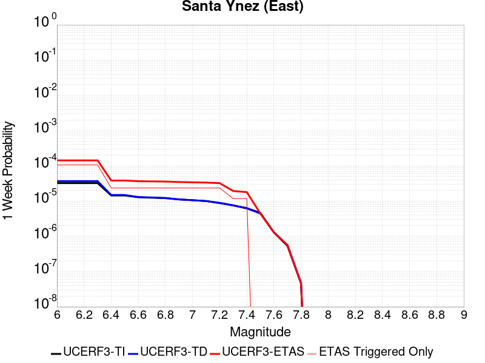 | 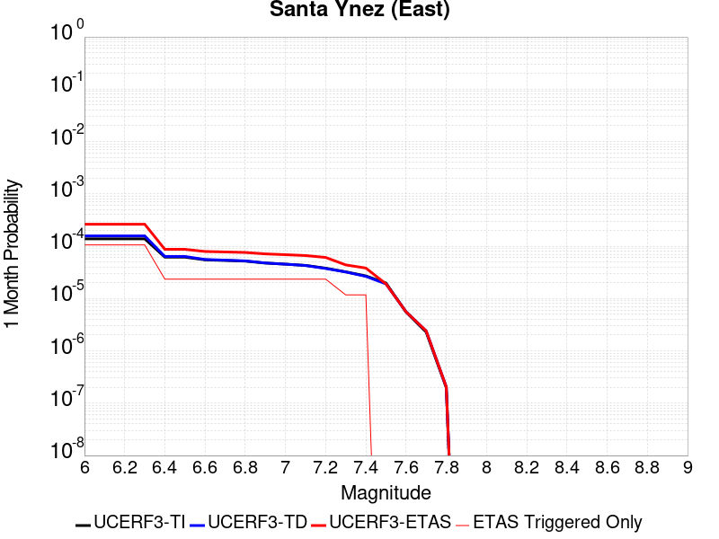 | 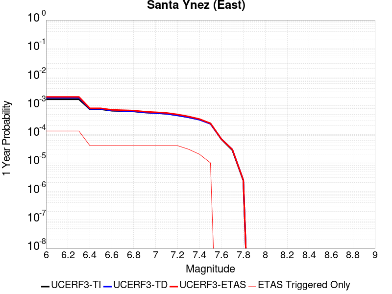 | 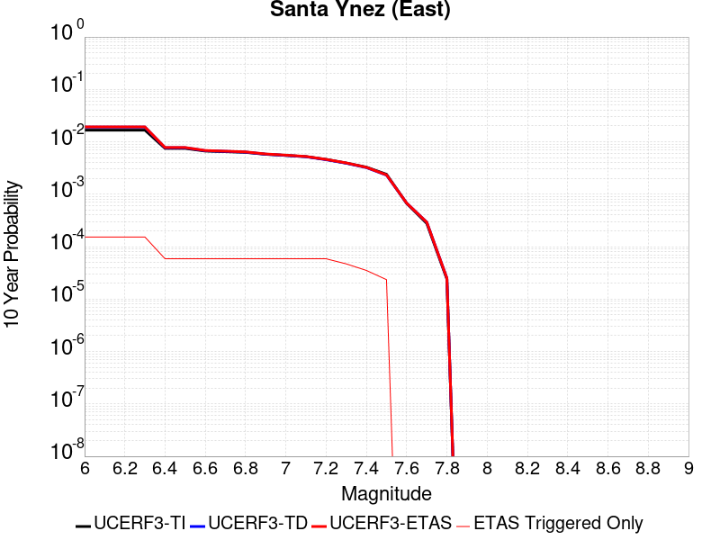 |

| Magnitude | 1 wk TI Prob | 1 wk TD Prob | 1 wk ETAS Prob | 1 wk ETAS/TD Gain | 1 wk ETAS Triggered Only | 1 mo TI Prob | 1 mo TD Prob | 1 mo ETAS Prob | 1 mo ETAS/TD Gain | 1 mo ETAS Triggered Only | 1 yr TI Prob | 1 yr TD Prob | 1 yr ETAS Prob | 1 yr ETAS/TD Gain | 1 yr ETAS Triggered Only | 10 yr TI Prob | 10 yr TD Prob | 10 yr ETAS Prob | 10 yr ETAS/TD Gain | 10 yr ETAS Triggered Only |
|-----|-----|-----|-----|-----|-----|-----|-----|-----|-----|-----|-----|-----|-----|-----|-----|-----|-----|-----|-----|-----|
| 6.0 | 3.2269712E-5 | 3.67505E-5 | 1.4238042E-4 | 3.8742442 | 1.056338E-4 | 1.3829143E-4 | 1.5749598E-4 | 2.6311315E-4 | 1.6706023 | 1.056338E-4 | 0.0016823979 | 0.0019164166 | 0.0020569917 | 1.0733532 | 1.4084508E-4 | 0.016697178 | 0.019056441 | 0.019206116 | 1.0078542 | 1.5258216E-4 |
| 6.1 | 3.2269712E-5 | 3.67505E-5 | 1.4238042E-4 | 3.8742442 | 1.056338E-4 | 1.3829143E-4 | 1.5749598E-4 | 2.6311315E-4 | 1.6706023 | 1.056338E-4 | 0.0016823979 | 0.0019164166 | 0.0020569917 | 1.0733532 | 1.4084508E-4 | 0.016697178 | 0.019056441 | 0.019206116 | 1.0078542 | 1.5258216E-4 |
| 6.2 | 3.2269712E-5 | 3.67505E-5 | 1.4238042E-4 | 3.8742442 | 1.056338E-4 | 1.3829143E-4 | 1.5749598E-4 | 2.6311315E-4 | 1.6706023 | 1.056338E-4 | 0.0016823979 | 0.0019164166 | 0.0020569917 | 1.0733532 | 1.4084508E-4 | 0.016697178 | 0.019056441 | 0.019206116 | 1.0078542 | 1.5258216E-4 |
| 6.3 | 3.2269712E-5 | 3.67505E-5 | 1.4238042E-4 | 3.8742442 | 1.056338E-4 | 1.3829143E-4 | 1.5749598E-4 | 2.6311315E-4 | 1.6706023 | 1.056338E-4 | 0.0016823979 | 0.0019164166 | 0.0020569917 | 1.0733532 | 1.4084508E-4 | 0.016697178 | 0.019056441 | 0.019206116 | 1.0078542 | 1.5258216E-4 |
| 6.4 | 1.4404779E-5 | 1.4849382E-5 | 3.832321E-5 | 2.580795 | 2.3474178E-5 | 6.1733306E-5 | 6.363868E-5 | 8.711137E-5 | 1.368843 | 2.3474178E-5 | 7.513438E-4 | 7.745306E-4 | 8.214426E-4 | 1.0605683 | 4.6948357E-5 | 0.0074880854 | 0.007718862 | 0.0077770944 | 1.0075442 | 5.8685448E-5 |
| 6.5 | 1.4404779E-5 | 1.4849382E-5 | 3.832321E-5 | 2.580795 | 2.3474178E-5 | 6.1733306E-5 | 6.363868E-5 | 8.711137E-5 | 1.368843 | 2.3474178E-5 | 7.513438E-4 | 7.745306E-4 | 8.214426E-4 | 1.0605683 | 4.6948357E-5 | 0.0074880854 | 0.007718862 | 0.0077770944 | 1.0075442 | 5.8685448E-5 |
| 6.6 | 1.280208E-5 | 1.3011947E-5 | 3.648582E-5 | 2.8040247 | 2.3474178E-5 | 5.4864904E-5 | 5.5764307E-5 | 7.923717E-5 | 1.42093 | 2.3474178E-5 | 6.6777546E-4 | 6.787207E-4 | 7.256372E-4 | 1.0691249 | 4.6948357E-5 | 0.006657724 | 0.0067666885 | 0.0068249768 | 1.0086141 | 5.8685448E-5 |
| 6.7 | 1.2457027E-5 | 1.2628468E-5 | 3.610235E-5 | 2.8588068 | 2.3474178E-5 | 5.3386164E-5 | 5.412089E-5 | 7.7593795E-5 | 1.4337125 | 2.3474178E-5 | 6.497827E-4 | 6.587243E-4 | 7.0564175E-4 | 1.0712247 | 4.6948357E-5 | 0.00647886 | 0.006567915 | 0.006626215 | 1.0088764 | 5.8685448E-5 |
| 6.8 | 1.2095134E-5 | 1.2230915E-5 | 3.5704805E-5 | 2.9192262 | 2.3474178E-5 | 5.1835254E-5 | 5.241716E-5 | 7.589011E-5 | 1.4478104 | 2.3474178E-5 | 6.309115E-4 | 6.379937E-4 | 6.849121E-4 | 1.0735406 | 4.6948357E-5 | 0.0062912325 | 0.006361809 | 0.006420121 | 1.009166 | 5.8685448E-5 |
| 6.9 | 1.1104036E-5 | 1.1157347E-5 | 3.4631263E-5 | 3.1038976 | 2.3474178E-5 | 4.758786E-5 | 4.781633E-5 | 7.128939E-5 | 1.4909004 | 2.3474178E-5 | 5.7922816E-4 | 5.820096E-4 | 6.2893063E-4 | 1.080619 | 4.6948357E-5 | 0.005777207 | 0.0058049993 | 0.005863344 | 1.0100508 | 5.8685448E-5 |
| 7.0 | 1.0577444E-5 | 1.058168E-5 | 3.405561E-5 | 3.2183557 | 2.3474178E-5 | 4.5331115E-5 | 4.5349276E-5 | 6.882239E-5 | 1.5176072 | 2.3474178E-5 | 5.5176654E-4 | 5.519888E-4 | 5.989112E-4 | 1.0850061 | 4.6948357E-5 | 0.0055039856 | 0.0055063153 | 0.005564678 | 1.0105991 | 5.8685448E-5 |
| 7.1 | 1.0021775E-5 | 9.980988E-6 | 3.3454933E-5 | 3.351866 | 2.3474178E-5 | 4.294976E-5 | 4.2774966E-5 | 6.624814E-5 | 1.5487596 | 2.3474178E-5 | 5.2278786E-4 | 5.2066194E-4 | 5.6758587E-4 | 1.0901235 | 4.6948357E-5 | 0.0052155964 | 0.0051945536 | 0.005252934 | 1.0112388 | 5.8685448E-5 |
| 7.2 | 8.874109E-6 | 8.748793E-6 | 3.2222768E-5 | 3.6831098 | 2.3474178E-5 | 3.8031343E-5 | 3.7494297E-5 | 6.0967595E-5 | 1.6260499 | 2.3474178E-5 | 4.629332E-4 | 4.5639853E-4 | 5.033255E-4 | 1.10282 | 4.6948357E-5 | 0.0046197 | 0.0045547304 | 0.0046131485 | 1.0128258 | 5.8685448E-5 |
| 7.3 | 7.5504267E-6 | 7.5051175E-6 | 1.924212E-5 | 2.5638664 | 1.1737089E-5 | 3.235857E-5 | 3.21644E-5 | 4.390111E-5 | 1.3648976 | 1.1737089E-5 | 3.9389438E-4 | 3.915322E-4 | 4.267297E-4 | 1.0898968 | 3.521127E-5 | 0.0039319694 | 0.003908531 | 0.003955296 | 1.0119648 | 4.6948357E-5 |
| 7.4 | 6.309394E-6 | 6.1831556E-6 | 1.7920172E-5 | 2.8982244 | 1.1737089E-5 | 2.703998E-5 | 2.6498974E-5 | 3.8235754E-5 | 1.4429144 | 1.1737089E-5 | 3.2916202E-4 | 3.225782E-4 | 3.460448E-4 | 1.072747 | 2.3474178E-5 | 0.003286749 | 0.003221197 | 0.0032562949 | 1.0108958 | 3.521127E-5 |
| 7.5 | 4.6103073E-6 | 4.4408903E-6 | 4.4408903E-6 | 1.0 | 0.0 | 1.975831E-5 | 1.9032252E-5 | 1.9032252E-5 | 1.0 | 0.0 | 2.4053088E-4 | 2.3169373E-4 | 2.434281E-4 | 1.0506461 | 1.1737089E-5 | 0.002402707 | 0.002314591 | 0.002338011 | 1.0101184 | 2.3474178E-5 |
| 7.6 | 1.2858658E-6 | 1.3008173E-6 | 1.3008173E-6 | 1.0 | 0.0 | 5.5108417E-6 | 5.5749197E-6 | 5.5749197E-6 | 1.0 | 0.0 | 6.7092435E-5 | 6.78726E-5 | 6.78726E-5 | 1.0 | 0.0 | 6.707218E-4 | 6.785256E-4 | 6.785256E-4 | 1.0 | 0.0 |
| 7.7 | 5.3302307E-7 | 5.612138E-7 | 5.612138E-7 | 1.0 | 0.0 | 2.2843826E-6 | 2.4052001E-6 | 2.4052001E-6 | 1.0 | 0.0 | 2.7812002E-5 | 2.9282954E-5 | 2.9282954E-5 | 1.0 | 0.0 | 2.7808524E-4 | 2.9279452E-4 | 2.9279452E-4 | 1.0 | 0.0 |
| 7.8 | 4.613933E-8 | 4.80301E-8 | 4.80301E-8 | 1.0 | 0.0 | 1.9773998E-7 | 2.0584326E-7 | 2.0584326E-7 | 1.0 | 0.0 | 2.4074816E-6 | 2.5061388E-6 | 2.5061388E-6 | 1.0 | 0.0 | 2.4074554E-5 | 2.5061116E-5 | 2.5061116E-5 | 1.0 | 0.0 |

## Baker
*[(top)](#table-of-contents)*

| 1 Week | 1 Month | 1 Year | 10 Year |
|-----|-----|-----|-----|
| 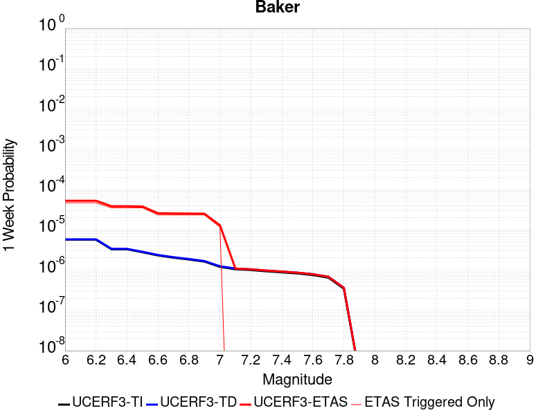 |  | 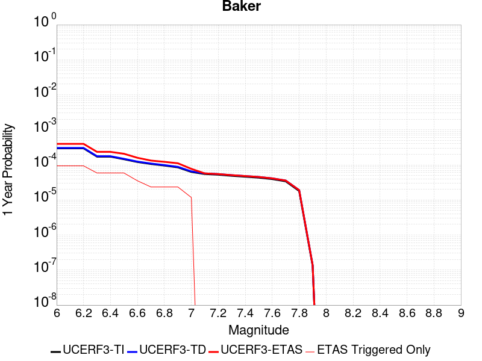 | 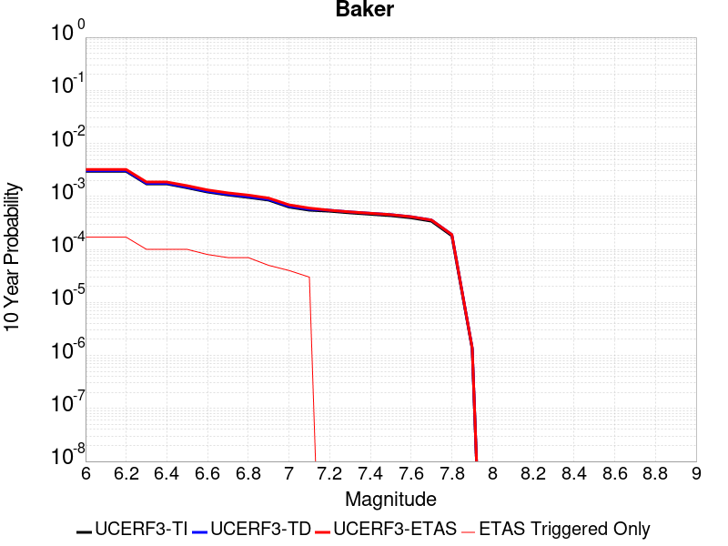 |

| Magnitude | 1 wk TI Prob | 1 wk TD Prob | 1 wk ETAS Prob | 1 wk ETAS/TD Gain | 1 wk ETAS Triggered Only | 1 mo TI Prob | 1 mo TD Prob | 1 mo ETAS Prob | 1 mo ETAS/TD Gain | 1 mo ETAS Triggered Only | 1 yr TI Prob | 1 yr TD Prob | 1 yr ETAS Prob | 1 yr ETAS/TD Gain | 1 yr ETAS Triggered Only | 10 yr TI Prob | 10 yr TD Prob | 10 yr ETAS Prob | 10 yr ETAS/TD Gain | 10 yr ETAS Triggered Only |
|-----|-----|-----|-----|-----|-----|-----|-----|-----|-----|-----|-----|-----|-----|-----|-----|-----|-----|-----|-----|-----|
| 6.0 | 5.695525E-6 | 5.8348373E-6 | 5.278292E-5 | 9.046168 | 4.6948357E-5 | 2.4409164E-5 | 2.5006228E-5 | 9.5427E-5 | 3.8161294 | 7.042254E-5 | 2.9714106E-4 | 3.044123E-4 | 3.9828042E-4 | 1.3083586 | 9.389671E-5 | 0.0029674405 | 0.0030403486 | 0.00321587 | 1.0577306 | 1.7605633E-4 |
| 6.1 | 5.695525E-6 | 5.8348373E-6 | 5.278292E-5 | 9.046168 | 4.6948357E-5 | 2.4409164E-5 | 2.5006228E-5 | 9.5427E-5 | 3.8161294 | 7.042254E-5 | 2.9714106E-4 | 3.044123E-4 | 3.9828042E-4 | 1.3083586 | 9.389671E-5 | 0.0029674405 | 0.0030403486 | 0.00321587 | 1.0577306 | 1.7605633E-4 |
| 6.2 | 5.695525E-6 | 5.8348373E-6 | 5.278292E-5 | 9.046168 | 4.6948357E-5 | 2.4409164E-5 | 2.5006228E-5 | 9.5427E-5 | 3.8161294 | 7.042254E-5 | 2.9714106E-4 | 3.044123E-4 | 3.9828042E-4 | 1.3083586 | 9.389671E-5 | 0.0029674405 | 0.0030403486 | 0.00321587 | 1.0577306 | 1.7605633E-4 |
| 6.3 | 3.2995713E-6 | 3.383667E-6 | 3.8594815E-5 | 11.406209 | 3.521127E-5 | 1.4140943E-5 | 1.4501353E-5 | 6.144903E-5 | 4.2374687 | 4.6948357E-5 | 1.7215237E-4 | 1.7654014E-4 | 2.3521522E-4 | 1.3323612 | 5.8685448E-5 | 0.0017201907 | 0.001764046 | 0.0018577771 | 1.0531342 | 9.389671E-5 |
| 6.4 | 3.2995713E-6 | 3.383667E-6 | 3.8594815E-5 | 11.406209 | 3.521127E-5 | 1.4140943E-5 | 1.4501353E-5 | 6.144903E-5 | 4.2374687 | 4.6948357E-5 | 1.7215237E-4 | 1.7654014E-4 | 2.3521522E-4 | 1.3323612 | 5.8685448E-5 | 0.0017201907 | 0.001764046 | 0.0018577771 | 1.0531342 | 9.389671E-5 |
| 6.5 | 2.782202E-6 | 2.8558404E-6 | 3.8067006E-5 | 13.329529 | 3.521127E-5 | 1.1923668E-5 | 1.223926E-5 | 5.918704E-5 | 4.835835 | 4.6948357E-5 | 1.4516099E-4 | 1.4900314E-4 | 2.0767984E-4 | 1.3937951 | 5.8685448E-5 | 0.001450662 | 0.0014890651 | 0.001582822 | 1.0629636 | 9.389671E-5 |
| 6.6 | 2.3163404E-6 | 2.38092E-6 | 2.5855043E-5 | 10.859265 | 2.3474178E-5 | 9.927136E-6 | 1.0203904E-5 | 3.3677843E-5 | 3.300486 | 2.3474178E-5 | 1.20856166E-4 | 1.2422565E-4 | 1.5943254E-4 | 1.2834108 | 3.521127E-5 | 0.0012079047 | 0.0012415823 | 0.0013119174 | 1.0566496 | 7.042254E-5 |
| 6.7 | 2.037056E-6 | 2.0965003E-6 | 2.5570629E-5 | 12.1968155 | 2.3474178E-5 | 8.7302105E-6 | 8.984972E-6 | 3.245894E-5 | 3.612581 | 2.3474178E-5 | 1.0628513E-4 | 1.093867E-4 | 1.3285832E-4 | 1.2145746 | 2.3474178E-5 | 0.0010623431 | 0.0010933448 | 0.001151966 | 1.0536165 | 5.8685448E-5 |
| 6.8 | 1.8356744E-6 | 1.8915287E-6 | 2.5365664E-5 | 13.410139 | 2.3474178E-5 | 7.867153E-6 | 8.106527E-6 | 3.1580515E-5 | 3.89569 | 2.3474178E-5 | 9.577837E-5 | 9.869264E-5 | 1.2216449E-4 | 1.2378279 | 2.3474178E-5 | 9.57371E-4 | 9.86502E-4 | 0.0010451296 | 1.0594298 | 5.8685448E-5 |
| 6.9 | 1.6310546E-6 | 1.6832072E-6 | 2.5157346E-5 | 14.946078 | 2.3474178E-5 | 6.9902153E-6 | 7.213726E-6 | 3.0687734E-5 | 4.2540755 | 2.3474178E-5 | 8.510255E-5 | 8.782368E-5 | 1.11295805E-4 | 1.2672641 | 2.3474178E-5 | 8.5069967E-4 | 8.7790104E-4 | 9.130814E-4 | 1.0400733 | 3.521127E-5 |
| 7.0 | 1.2058036E-6 | 1.2508665E-6 | 1.2987941E-5 | 10.383155 | 1.1737089E-5 | 5.1677193E-6 | 5.3608455E-6 | 1.7097873E-5 | 3.1893983 | 1.1737089E-5 | 6.291517E-5 | 6.5266366E-5 | 7.700269E-5 | 1.179822 | 1.1737089E-5 | 6.289736E-4 | 6.524743E-4 | 6.7593314E-4 | 1.0359536 | 2.3474178E-5 |
| 7.1 | 1.052382E-6 | 1.0951609E-6 | 1.0951609E-6 | 1.0 | 0.0 | 4.5102006E-6 | 4.693538E-6 | 4.693538E-6 | 1.0 | 0.0 | 5.491031E-5 | 5.7142337E-5 | 5.7142337E-5 | 1.0 | 0.0 | 5.4896745E-4 | 5.7127734E-4 | 5.830077E-4 | 1.0205336 | 1.1737089E-5 |
| 7.2 | 1.0067454E-6 | 1.0487711E-6 | 1.0487711E-6 | 1.0 | 0.0 | 4.3146156E-6 | 4.4947255E-6 | 4.4947255E-6 | 1.0 | 0.0 | 5.252918E-5 | 5.4721917E-5 | 5.4721917E-5 | 1.0 | 0.0 | 5.251676E-4 | 5.470853E-4 | 5.470853E-4 | 1.0 | 0.0 |
| 7.3 | 9.3596316E-7 | 9.767723E-7 | 9.767723E-7 | 1.0 | 0.0 | 4.0112645E-6 | 4.1861604E-6 | 4.1861604E-6 | 1.0 | 0.0 | 4.8836053E-5 | 5.096532E-5 | 5.096532E-5 | 1.0 | 0.0 | 4.8825322E-4 | 5.095371E-4 | 5.095371E-4 | 1.0 | 0.0 |
| 7.4 | 8.8117395E-7 | 9.2076635E-7 | 9.2076635E-7 | 1.0 | 0.0 | 3.7764542E-6 | 3.9461356E-6 | 3.9461356E-6 | 1.0 | 0.0 | 4.5977362E-5 | 4.8043148E-5 | 4.8043148E-5 | 1.0 | 0.0 | 4.596785E-4 | 4.8032837E-4 | 4.8032837E-4 | 1.0 | 0.0 |
| 7.5 | 8.292386E-7 | 8.6745956E-7 | 8.6745956E-7 | 1.0 | 0.0 | 3.5538749E-6 | 3.7176785E-6 | 3.7176785E-6 | 1.0 | 0.0 | 4.326757E-5 | 4.5261804E-5 | 4.5261804E-5 | 1.0 | 0.0 | 4.3259145E-4 | 4.5252658E-4 | 4.5252658E-4 | 1.0 | 0.0 |
| 7.6 | 7.553842E-7 | 7.9144706E-7 | 7.9144706E-7 | 1.0 | 0.0 | 3.2373566E-6 | 3.3919116E-6 | 3.3919116E-6 | 1.0 | 0.0 | 3.9414106E-5 | 4.129575E-5 | 4.129575E-5 | 1.0 | 0.0 | 3.9407116E-4 | 4.1288146E-4 | 4.1288146E-4 | 1.0 | 0.0 |
| 7.7 | 6.5285366E-7 | 6.852797E-7 | 6.852797E-7 | 1.0 | 0.0 | 2.797941E-6 | 2.9369096E-6 | 2.9369096E-6 | 1.0 | 0.0 | 3.40644E-5 | 3.5756293E-5 | 3.5756293E-5 | 1.0 | 0.0 | 3.405918E-4 | 3.5750607E-4 | 3.5750607E-4 | 1.0 | 0.0 |
| 7.8 | 3.4586725E-7 | 3.6482615E-7 | 3.6482615E-7 | 1.0 | 0.0 | 1.4822873E-6 | 1.5635396E-6 | 1.5635396E-6 | 1.0 | 0.0 | 1.80467E-5 | 1.9035933E-5 | 1.9035933E-5 | 1.0 | 0.0 | 1.8045233E-4 | 1.9034347E-4 | 1.9034347E-4 | 1.0 | 0.0 |
| 7.9 | 2.5591178E-9 | 2.6696718E-9 | 2.6696718E-9 | 1.0 | 0.0 | 1.0967647E-8 | 1.14414505E-8 | 1.14414505E-8 | 1.0 | 0.0 | 1.335311E-7 | 1.3929966E-7 | 1.3929966E-7 | 1.0 | 0.0 | 1.3353102E-6 | 1.3929966E-6 | 1.3929966E-6 | 1.0 | 0.0 |

## White Mountains
*[(top)](#table-of-contents)*

| 1 Week | 1 Month | 1 Year | 10 Year |
|-----|-----|-----|-----|
| 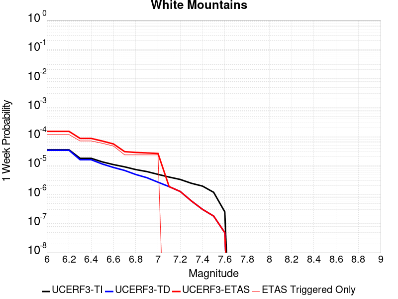 | 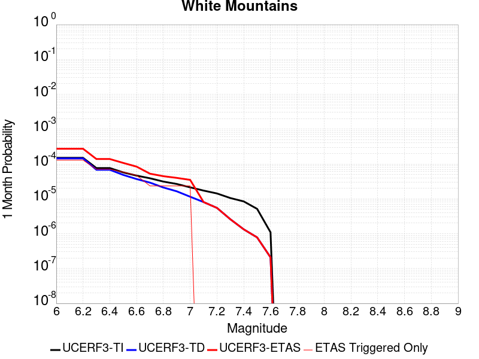 | 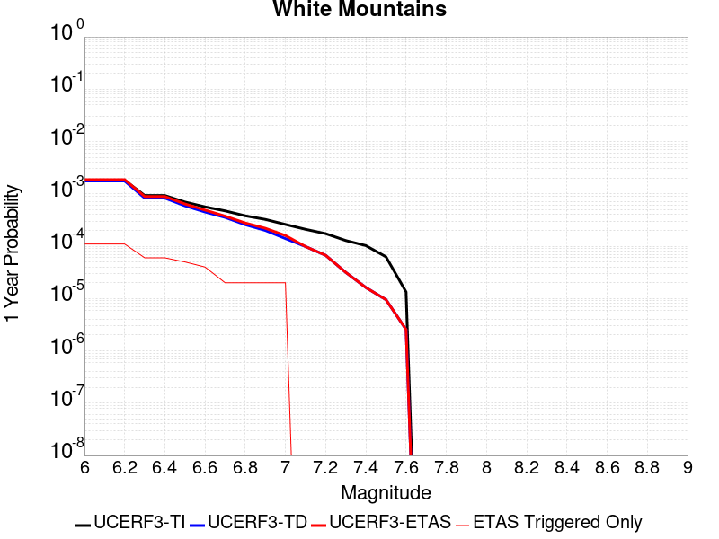 | 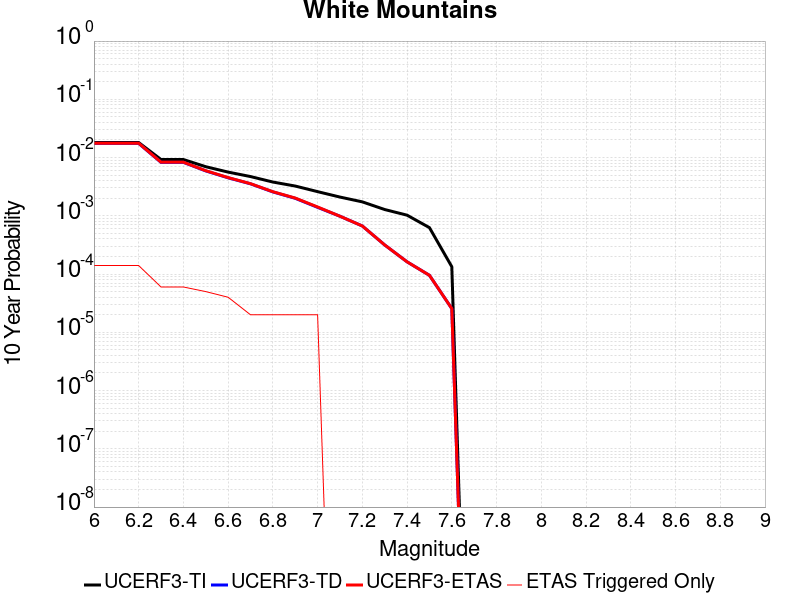 |

| Magnitude | 1 wk TI Prob | 1 wk TD Prob | 1 wk ETAS Prob | 1 wk ETAS/TD Gain | 1 wk ETAS Triggered Only | 1 mo TI Prob | 1 mo TD Prob | 1 mo ETAS Prob | 1 mo ETAS/TD Gain | 1 mo ETAS Triggered Only | 1 yr TI Prob | 1 yr TD Prob | 1 yr ETAS Prob | 1 yr ETAS/TD Gain | 1 yr ETAS Triggered Only | 10 yr TI Prob | 10 yr TD Prob | 10 yr ETAS Prob | 10 yr ETAS/TD Gain | 10 yr ETAS Triggered Only |
|-----|-----|-----|-----|-----|-----|-----|-----|-----|-----|-----|-----|-----|-----|-----|-----|-----|-----|-----|-----|-----|
| 6.0 | 3.503579E-5 | 3.378405E-5 | 1.5115098E-4 | 4.4740334 | 1.17370895E-4 | 1.5014476E-4 | 1.4478143E-4 | 2.738707E-4 | 1.8916149 | 1.2910798E-4 | 0.0018264796 | 0.0017614096 | 0.0018902902 | 1.073169 | 1.2910798E-4 | 0.018115403 | 0.017486818 | 0.017648265 | 1.0092324 | 1.6431925E-4 |
| 6.1 | 3.503579E-5 | 3.378405E-5 | 1.5115098E-4 | 4.4740334 | 1.17370895E-4 | 1.5014476E-4 | 1.4478143E-4 | 2.738707E-4 | 1.8916149 | 1.2910798E-4 | 0.0018264796 | 0.0017614096 | 0.0018902902 | 1.073169 | 1.2910798E-4 | 0.018115403 | 0.017486818 | 0.017648265 | 1.0092324 | 1.6431925E-4 |
| 6.2 | 3.503579E-5 | 3.378405E-5 | 1.5115098E-4 | 4.4740334 | 1.17370895E-4 | 1.5014476E-4 | 1.4478143E-4 | 2.738707E-4 | 1.8916149 | 1.2910798E-4 | 0.0018264796 | 0.0017614096 | 0.0018902902 | 1.073169 | 1.2910798E-4 | 0.018115403 | 0.017486818 | 0.017648265 | 1.0092324 | 1.6431925E-4 |
| 6.3 | 1.7818425E-5 | 1.5916074E-5 | 8.633749E-5 | 5.4245467 | 7.042254E-5 | 7.636245E-5 | 6.821004E-5 | 1.3862777E-4 | 2.032366 | 7.042254E-5 | 9.293162E-4 | 8.301551E-4 | 9.005192E-4 | 1.0847602 | 7.042254E-5 | 0.009254395 | 0.008271999 | 0.008341839 | 1.008443 | 7.042254E-5 |
| 6.4 | 1.7818425E-5 | 1.5916074E-5 | 8.633749E-5 | 5.4245467 | 7.042254E-5 | 7.636245E-5 | 6.821004E-5 | 1.3862777E-4 | 2.032366 | 7.042254E-5 | 9.293162E-4 | 8.301551E-4 | 9.005192E-4 | 1.0847602 | 7.042254E-5 | 0.009254395 | 0.008271999 | 0.008341839 | 1.008443 | 7.042254E-5 |
| 6.5 | 1.3397557E-5 | 1.13362685E-5 | 7.002105E-5 | 6.1767282 | 5.8685448E-5 | 5.741684E-5 | 4.858314E-5 | 1.0726574E-4 | 2.2078798 | 5.8685448E-5 | 6.988258E-4 | 5.913462E-4 | 6.499969E-4 | 1.0991818 | 5.8685448E-5 | 0.006966323 | 0.005898432 | 0.0059567713 | 1.0098907 | 5.8685448E-5 |
| 6.6 | 1.0818695E-5 | 8.625366E-6 | 5.5573317E-5 | 6.44301 | 4.6948357E-5 | 4.6365014E-5 | 3.6965357E-5 | 8.3911975E-5 | 2.2700167 | 4.6948357E-5 | 5.6434784E-4 | 4.4996463E-4 | 4.9689185E-4 | 1.104291 | 4.6948357E-5 | 0.005629168 | 0.004490972 | 0.0045377095 | 1.010407 | 4.6948357E-5 |
| 6.7 | 9.067908E-6 | 6.802442E-6 | 3.027646E-5 | 4.4508224 | 2.3474178E-5 | 3.8861883E-5 | 2.9153016E-5 | 5.262651E-5 | 1.8051823 | 2.3474178E-5 | 4.7304068E-4 | 3.5488335E-4 | 3.7834918E-4 | 1.0661227 | 2.3474178E-5 | 0.00472035 | 0.0035434833 | 0.0035668744 | 1.0066011 | 2.3474178E-5 |
| 6.8 | 7.295947E-6 | 4.936391E-6 | 2.8410454E-5 | 5.7553086 | 2.3474178E-5 | 3.126797E-5 | 2.1155796E-5 | 4.462948E-5 | 2.1095626 | 2.3474178E-5 | 3.8062103E-4 | 2.575425E-4 | 2.8101064E-4 | 1.0911233 | 2.3474178E-5 | 0.0037996976 | 0.0025725532 | 0.0025959671 | 1.0091014 | 2.3474178E-5 |
| 6.9 | 6.2243444E-6 | 3.832213E-6 | 2.7306301E-5 | 7.1254654 | 2.3474178E-5 | 2.6675489E-5 | 1.642367E-5 | 3.9897463E-5 | 2.429266 | 2.3474178E-5 | 3.2472567E-4 | 1.9994036E-4 | 2.2340985E-4 | 1.1173824 | 2.3474178E-5 | 0.0032425157 | 0.0019976576 | 0.0020210848 | 1.0117273 | 2.3474178E-5 |
| 7.0 | 4.9878413E-6 | 2.6795342E-6 | 2.615365E-5 | 9.760521 | 2.3474178E-5 | 2.1376287E-5 | 1.14836685E-5 | 3.495758E-5 | 3.0441124 | 2.3474178E-5 | 2.602252E-4 | 1.3980496E-4 | 1.6327586E-4 | 1.1678832 | 2.3474178E-5 | 0.002599207 | 0.0013971963 | 0.0014206377 | 1.0167774 | 2.3474178E-5 |
| 7.1 | 4.0252844E-6 | 1.8857575E-6 | 1.8857575E-6 | 1.0 | 0.0 | 1.7251105E-5 | 8.081794E-6 | 8.081794E-6 | 1.0 | 0.0 | 2.1001195E-4 | 9.8391516E-5 | 9.8391516E-5 | 1.0 | 0.0 | 0.0020981359 | 9.834924E-4 | 9.834924E-4 | 1.0 | 0.0 |
| 7.2 | 3.3284066E-6 | 1.281964E-6 | 1.281964E-6 | 1.0 | 0.0 | 1.4264522E-5 | 5.494121E-6 | 5.494121E-6 | 1.0 | 0.0 | 1.736567E-4 | 6.688897E-5 | 6.688897E-5 | 1.0 | 0.0 | 0.0017352107 | 6.6869846E-4 | 6.6869846E-4 | 1.0 | 0.0 |
| 7.3 | 2.458226E-6 | 6.05722E-7 | 6.05722E-7 | 1.0 | 0.0 | 1.0535211E-5 | 2.5959491E-6 | 2.5959491E-6 | 1.0 | 0.0 | 1.2825865E-4 | 3.1605257E-5 | 3.1605257E-5 | 1.0 | 0.0 | 0.0012818464 | 3.160114E-4 | 3.160114E-4 | 1.0 | 0.0 |
| 7.4 | 1.965953E-6 | 3.1089303E-7 | 3.1089303E-7 | 1.0 | 0.0 | 8.425486E-6 | 1.332398E-6 | 1.332398E-6 | 1.0 | 0.0 | 1.0257547E-4 | 1.6221828E-5 | 1.6221828E-5 | 1.0 | 0.0 | 0.0010252813 | 1.6220656E-4 | 1.6220656E-4 | 1.0 | 0.0 |
| 7.5 | 1.2014192E-6 | 1.8244253E-7 | 1.8244253E-7 | 1.0 | 0.0 | 5.148929E-6 | 7.8189635E-7 | 7.8189635E-7 | 1.0 | 0.0 | 6.2686406E-5 | 9.519547E-6 | 9.519547E-6 | 1.0 | 0.0 | 6.266873E-4 | 9.519148E-5 | 9.519148E-5 | 1.0 | 0.0 |
| 7.6 | 2.5612175E-7 | 4.8946475E-8 | 4.8946475E-8 | 1.0 | 0.0 | 1.0976642E-6 | 2.0977059E-7 | 2.0977059E-7 | 1.0 | 0.0 | 1.3363979E-5 | 2.5539543E-6 | 2.5539543E-6 | 1.0 | 0.0 | 1.3363175E-4 | 2.5539286E-5 | 2.5539286E-5 | 1.0 | 0.0 |

## Mission Ridge-Arroyo Parida-Santa Ana
*[(top)](#table-of-contents)*

| 1 Week | 1 Month | 1 Year | 10 Year |
|-----|-----|-----|-----|
| 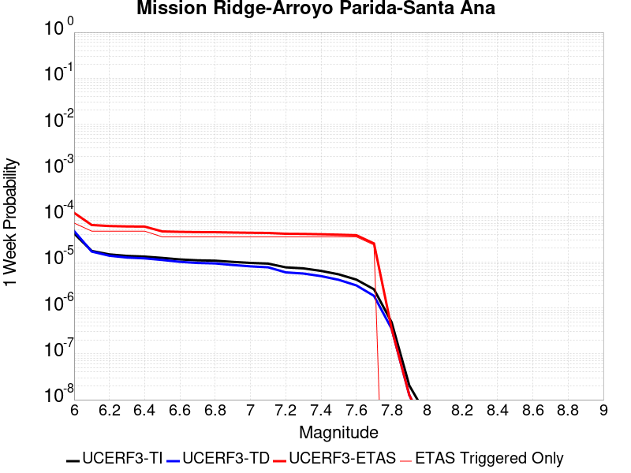 | 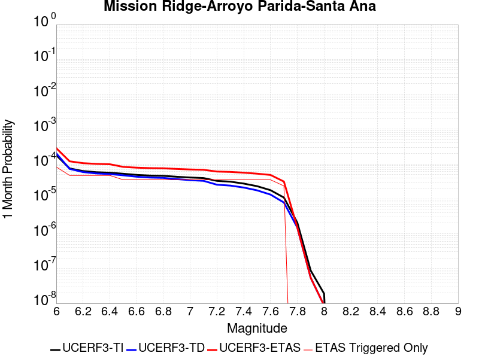 | 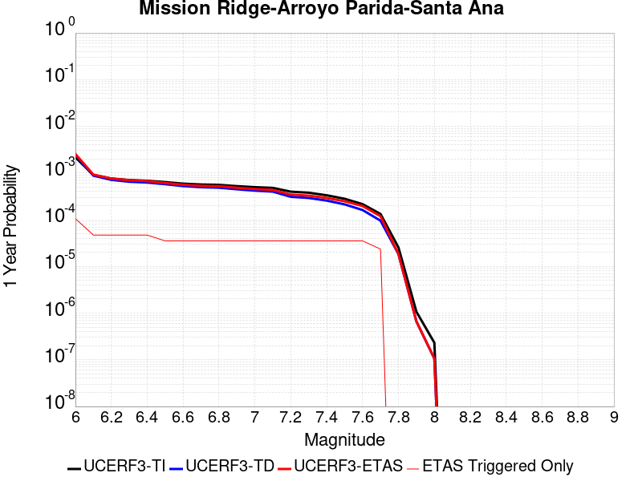 | 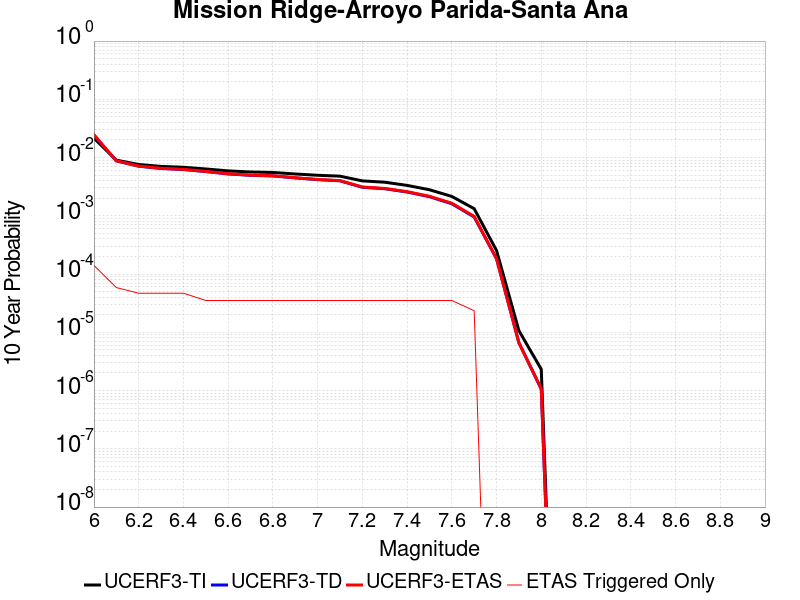 |

| Magnitude | 1 wk TI Prob | 1 wk TD Prob | 1 wk ETAS Prob | 1 wk ETAS/TD Gain | 1 wk ETAS Triggered Only | 1 mo TI Prob | 1 mo TD Prob | 1 mo ETAS Prob | 1 mo ETAS/TD Gain | 1 mo ETAS Triggered Only | 1 yr TI Prob | 1 yr TD Prob | 1 yr ETAS Prob | 1 yr ETAS/TD Gain | 1 yr ETAS Triggered Only | 10 yr TI Prob | 10 yr TD Prob | 10 yr ETAS Prob | 10 yr ETAS/TD Gain | 10 yr ETAS Triggered Only |
|-----|-----|-----|-----|-----|-----|-----|-----|-----|-----|-----|-----|-----|-----|-----|-----|-----|-----|-----|-----|-----|
| 6.0 | 4.169034E-5 | 4.7138263E-5 | 1.1755748E-4 | 2.4938865 | 7.042254E-5 | 1.7866064E-4 | 2.0201034E-4 | 2.8415336E-4 | 1.4066278 | 8.2159626E-5 | 0.0021730233 | 0.00245745 | 0.0025628242 | 1.0428795 | 1.056338E-4 | 0.021518968 | 0.024384614 | 0.024522025 | 1.0056351 | 1.4084508E-4 |
| 6.1 | 1.73813E-5 | 1.6854226E-5 | 6.380179E-5 | 3.785507 | 4.6948357E-5 | 7.4489166E-5 | 7.223046E-5 | 1.1917543E-4 | 1.6499331 | 4.6948357E-5 | 9.065282E-4 | 8.790618E-4 | 9.259689E-4 | 1.0533603 | 4.6948357E-5 | 0.009028391 | 0.008756988 | 0.00881516 | 1.0066428 | 5.8685448E-5 |
| 6.2 | 1.4622182E-5 | 1.367329E-5 | 6.0621005E-5 | 4.4335346 | 4.6948357E-5 | 6.2664985E-5 | 5.8598518E-5 | 1.05544124E-4 | 1.8011398 | 4.6948357E-5 | 7.6267915E-4 | 7.132073E-4 | 7.6012214E-4 | 1.0657802 | 4.6948357E-5 | 0.007600669 | 0.007109627 | 0.0071562417 | 1.0065565 | 4.6948357E-5 |
| 6.3 | 1.3552434E-5 | 1.2482201E-5 | 5.942997E-5 | 4.7611775 | 4.6948357E-5 | 5.8080568E-5 | 5.3494066E-5 | 1.0043991E-4 | 1.8775898 | 4.6948357E-5 | 7.069015E-4 | 6.510988E-4 | 6.980166E-4 | 1.0720594 | 4.6948357E-5 | 0.00704657 | 0.006492275 | 0.0065389187 | 1.0071845 | 4.6948357E-5 |
| 6.4 | 1.30977305E-5 | 1.1979156E-5 | 5.892695E-5 | 4.9191236 | 4.6948357E-5 | 5.613192E-5 | 5.1338247E-5 | 9.8284196E-5 | 1.9144439 | 4.6948357E-5 | 6.831918E-4 | 6.248669E-4 | 6.717859E-4 | 1.0750865 | 4.6948357E-5 | 0.006810953 | 0.0062314444 | 0.0062781 | 1.0074872 | 4.6948357E-5 |
| 6.5 | 1.225205E-5 | 1.1048803E-5 | 4.625968E-5 | 4.18685 | 3.521127E-5 | 5.2507727E-5 | 4.7351168E-5 | 8.256077E-5 | 1.7435846 | 3.521127E-5 | 6.3909404E-4 | 5.7635066E-4 | 6.115417E-4 | 1.0610583 | 3.521127E-5 | 0.006372592 | 0.005748869 | 0.005783878 | 1.0060897 | 3.521127E-5 |
| 6.6 | 1.1352241E-5 | 1.0063535E-5 | 4.527445E-5 | 4.4988613 | 3.521127E-5 | 4.8651553E-5 | 4.3128734E-5 | 7.833848E-5 | 1.8163873 | 3.521127E-5 | 5.921717E-4 | 5.2496797E-4 | 5.601607E-4 | 1.0670379 | 3.521127E-5 | 0.0059059616 | 0.0052375244 | 0.005272551 | 1.0066876 | 3.521127E-5 |
| 6.7 | 1.0864116E-5 | 9.517027E-6 | 4.472796E-5 | 4.699783 | 3.521127E-5 | 4.6559664E-5 | 4.0786632E-5 | 7.599646E-5 | 1.8632689 | 3.521127E-5 | 5.667165E-4 | 4.964661E-4 | 5.3165987E-4 | 1.0708886 | 3.521127E-5 | 0.005652734 | 0.004953804 | 0.004988841 | 1.0070727 | 3.521127E-5 |
| 6.8 | 1.0666365E-5 | 9.299779E-6 | 4.4510718E-5 | 4.786213 | 3.521127E-5 | 4.571219E-5 | 3.9855597E-5 | 7.506546E-5 | 1.8834358 | 3.521127E-5 | 5.564038E-4 | 4.8513585E-4 | 5.2033004E-4 | 1.072545 | 3.521127E-5 | 0.005550127 | 0.0048410003 | 0.004876041 | 1.0072384 | 3.521127E-5 |
| 6.9 | 1.0038665E-5 | 8.592046E-6 | 4.380301E-5 | 5.0980887 | 3.521127E-5 | 4.302214E-5 | 3.682254E-5 | 7.203251E-5 | 1.9562069 | 3.521127E-5 | 5.236687E-4 | 4.4822405E-4 | 4.834195E-4 | 1.0785221 | 3.521127E-5 | 0.005224364 | 0.004473411 | 0.0045084646 | 1.007836 | 3.521127E-5 |
| 7.0 | 9.5379955E-6 | 8.025073E-6 | 4.3236058E-5 | 5.387622 | 3.521127E-5 | 4.0876483E-5 | 3.4392728E-5 | 6.9602786E-5 | 2.0237646 | 3.521127E-5 | 4.975576E-4 | 4.1865272E-4 | 4.5384924E-4 | 1.0840709 | 3.521127E-5 | 0.00496445 | 0.0041788397 | 0.004213904 | 1.0083909 | 3.521127E-5 |
| 7.1 | 9.207389E-6 | 7.652375E-6 | 4.2863372E-5 | 5.6013165 | 3.521127E-5 | 3.945964E-5 | 3.279549E-5 | 6.8005604E-5 | 2.0736268 | 3.521127E-5 | 4.803152E-4 | 3.9921363E-4 | 4.3441085E-4 | 1.0881664 | 3.521127E-5 | 0.004792784 | 0.003985161 | 0.0040202322 | 1.0088004 | 3.521127E-5 |
| 7.2 | 7.638091E-6 | 5.9311183E-6 | 4.1142175E-5 | 6.9366646 | 3.521127E-5 | 3.2734264E-5 | 2.541883E-5 | 6.0629205E-5 | 2.3852081 | 3.521127E-5 | 3.984668E-4 | 3.0943064E-4 | 3.44631E-4 | 1.1137586 | 3.521127E-5 | 0.0039775306 | 0.0030900547 | 0.0031251572 | 1.0113598 | 3.521127E-5 |
| 7.3 | 7.2500147E-6 | 5.5961527E-6 | 4.0807223E-5 | 7.2920136 | 3.521127E-5 | 3.1071122E-5 | 2.3983293E-5 | 5.9193717E-5 | 2.468123 | 3.521127E-5 | 3.7822526E-4 | 2.9195778E-4 | 3.2715875E-4 | 1.1205688 | 3.521127E-5 | 0.0037758215 | 0.0029157975 | 0.002950906 | 1.0120409 | 3.521127E-5 |
| 7.4 | 6.3899715E-6 | 4.9184964E-6 | 4.012959E-5 | 8.158915 | 3.521127E-5 | 2.7385306E-5 | 2.10791E-5 | 5.6289628E-5 | 2.6704 | 3.521127E-5 | 3.3336508E-4 | 2.5660804E-4 | 2.9181025E-4 | 1.137183 | 3.521127E-5 | 0.0033286542 | 0.0025631618 | 0.0025982826 | 1.0137023 | 3.521127E-5 |
| 7.5 | 5.379025E-6 | 4.0838527E-6 | 3.9294977E-5 | 9.622036 | 3.521127E-5 | 2.305276E-5 | 1.7502109E-5 | 5.271276E-5 | 3.0117948 | 3.521127E-5 | 2.806312E-4 | 2.1306744E-4 | 2.4827122E-4 | 1.1652236 | 3.521127E-5 | 0.0028027708 | 0.002128643 | 0.0021637792 | 1.0165064 | 3.521127E-5 |
| 7.6 | 4.1270696E-6 | 3.0883439E-6 | 3.8299502E-5 | 12.401307 | 3.521127E-5 | 1.768732E-5 | 1.3235693E-5 | 4.8446494E-5 | 3.6602914 | 3.521127E-5 | 2.1532185E-4 | 1.6113273E-4 | 1.9633831E-4 | 1.2184882 | 3.521127E-5 | 0.0021511333 | 0.001610167 | 0.0016453216 | 1.0218328 | 3.521127E-5 |
| 7.7 | 2.5406805E-6 | 1.8282013E-6 | 2.5302337E-5 | 13.840016 | 2.3474178E-5 | 1.0888585E-5 | 7.835125E-6 | 3.130912E-5 | 3.9959948 | 2.3474178E-5 | 1.3256045E-4 | 9.538854E-5 | 1.1886047E-4 | 1.2460667 | 2.3474178E-5 | 0.0013248142 | 9.534821E-4 | 9.769339E-4 | 1.024596 | 2.3474178E-5 |
| 7.8 | 4.8608285E-7 | 3.5098864E-7 | 3.5098864E-7 | 1.0 | 0.0 | 2.0832106E-6 | 1.5042363E-6 | 1.5042363E-6 | 1.0 | 0.0 | 2.5362791E-5 | 1.8313924E-5 | 1.8313924E-5 | 1.0 | 0.0 | 2.5359896E-4 | 1.8312426E-4 | 1.8312426E-4 | 1.0 | 0.0 |
| 7.9 | 2.0472514E-8 | 1.2688783E-8 | 1.2688783E-8 | 1.0 | 0.0 | 8.7739345E-8 | 5.43805E-8 | 5.43805E-8 | 1.0 | 0.0 | 1.068226E-6 | 6.6208236E-7 | 6.6208236E-7 | 1.0 | 0.0 | 1.0682209E-5 | 6.620805E-6 | 6.620805E-6 | 1.0 | 0.0 |
| 8.0 | 4.443582E-9 | 2.0321211E-9 | 2.0321211E-9 | 1.0 | 0.0 | 1.9043922E-8 | 8.70909E-9 | 8.70909E-9 | 1.0 | 0.0 | 2.3185973E-7 | 1.0603316E-7 | 1.0603316E-7 | 1.0 | 0.0 | 2.3185949E-6 | 1.0603312E-6 | 1.0603312E-6 | 1.0 | 0.0 |

## Mission Creek
*[(top)](#table-of-contents)*

| 1 Week | 1 Month | 1 Year | 10 Year |
|-----|-----|-----|-----|
| 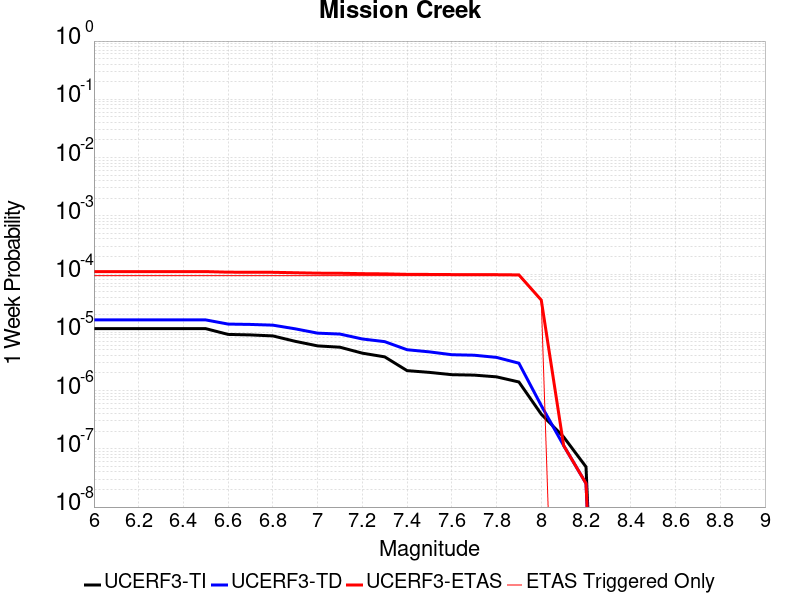 | 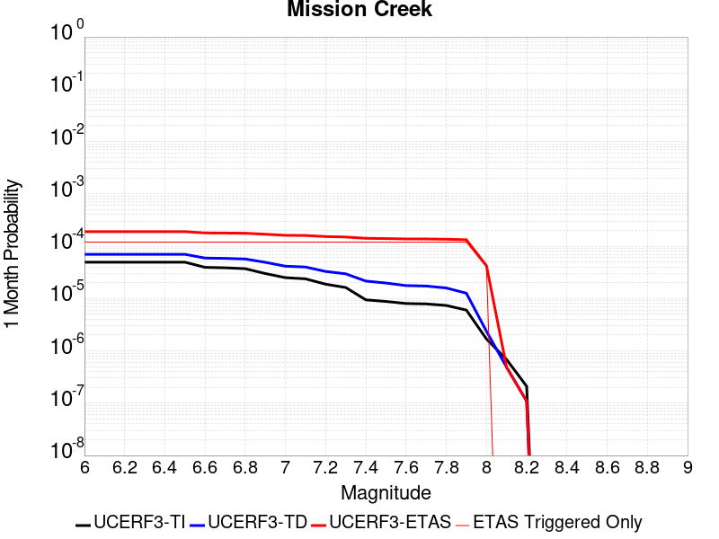 | 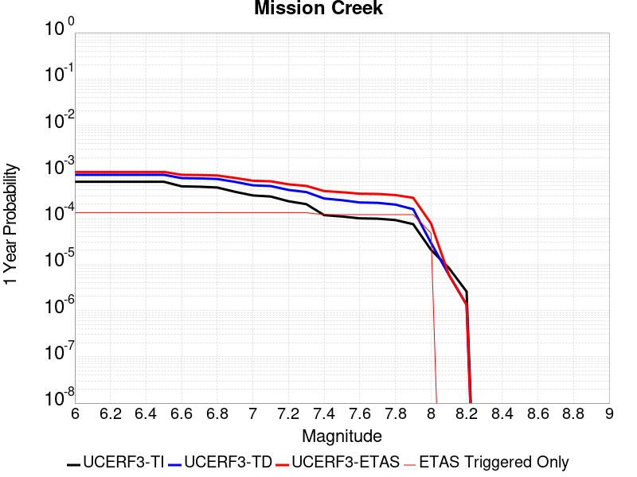 | 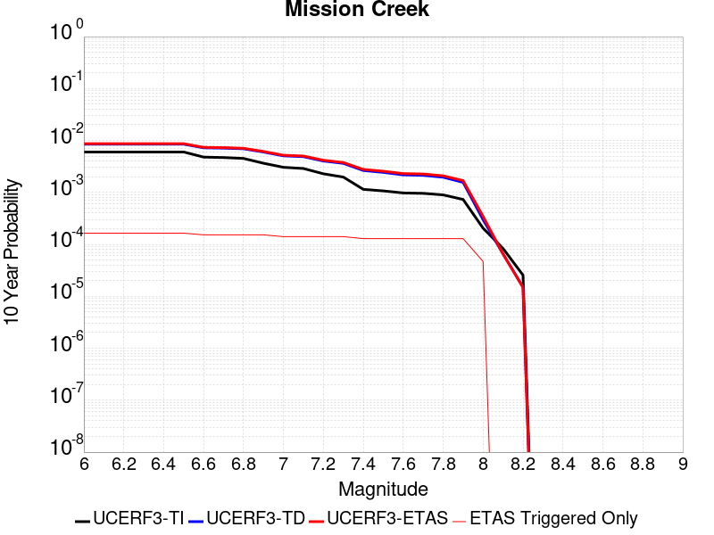 |

| Magnitude | 1 wk TI Prob | 1 wk TD Prob | 1 wk ETAS Prob | 1 wk ETAS/TD Gain | 1 wk ETAS Triggered Only | 1 mo TI Prob | 1 mo TD Prob | 1 mo ETAS Prob | 1 mo ETAS/TD Gain | 1 mo ETAS Triggered Only | 1 yr TI Prob | 1 yr TD Prob | 1 yr ETAS Prob | 1 yr ETAS/TD Gain | 1 yr ETAS Triggered Only | 10 yr TI Prob | 10 yr TD Prob | 10 yr ETAS Prob | 10 yr ETAS/TD Gain | 10 yr ETAS Triggered Only |
|-----|-----|-----|-----|-----|-----|-----|-----|-----|-----|-----|-----|-----|-----|-----|-----|-----|-----|-----|-----|-----|
| 6.0 | 1.1549387E-5 | 1.632237E-5 | 1.1021755E-4 | 6.752546 | 9.389671E-5 | 4.9496433E-5 | 6.9951224E-5 | 1.8731391E-4 | 2.6777787 | 1.17370895E-4 | 6.0245243E-4 | 8.513384E-4 | 9.803365E-4 | 1.1515238 | 1.2910798E-4 | 0.006008218 | 0.008509998 | 0.008672919 | 1.0191447 | 1.6431925E-4 |
| 6.1 | 1.1549387E-5 | 1.632237E-5 | 1.1021755E-4 | 6.752546 | 9.389671E-5 | 4.9496433E-5 | 6.9951224E-5 | 1.8731391E-4 | 2.6777787 | 1.17370895E-4 | 6.0245243E-4 | 8.513384E-4 | 9.803365E-4 | 1.1515238 | 1.2910798E-4 | 0.006008218 | 0.008509998 | 0.008672919 | 1.0191447 | 1.6431925E-4 |
| 6.2 | 1.1549387E-5 | 1.632237E-5 | 1.1021755E-4 | 6.752546 | 9.389671E-5 | 4.9496433E-5 | 6.9951224E-5 | 1.8731391E-4 | 2.6777787 | 1.17370895E-4 | 6.0245243E-4 | 8.513384E-4 | 9.803365E-4 | 1.1515238 | 1.2910798E-4 | 0.006008218 | 0.008509998 | 0.008672919 | 1.0191447 | 1.6431925E-4 |
| 6.3 | 1.1549387E-5 | 1.632237E-5 | 1.1021755E-4 | 6.752546 | 9.389671E-5 | 4.9496433E-5 | 6.9951224E-5 | 1.8731391E-4 | 2.6777787 | 1.17370895E-4 | 6.0245243E-4 | 8.513384E-4 | 9.803365E-4 | 1.1515238 | 1.2910798E-4 | 0.006008218 | 0.008509998 | 0.008672919 | 1.0191447 | 1.6431925E-4 |
| 6.4 | 1.1549387E-5 | 1.632237E-5 | 1.1021755E-4 | 6.752546 | 9.389671E-5 | 4.9496433E-5 | 6.9951224E-5 | 1.8731391E-4 | 2.6777787 | 1.17370895E-4 | 6.0245243E-4 | 8.513384E-4 | 9.803365E-4 | 1.1515238 | 1.2910798E-4 | 0.006008218 | 0.008509998 | 0.008672919 | 1.0191447 | 1.6431925E-4 |
| 6.5 | 1.1549387E-5 | 1.632237E-5 | 1.1021755E-4 | 6.752546 | 9.389671E-5 | 4.9496433E-5 | 6.9951224E-5 | 1.8731391E-4 | 2.6777787 | 1.17370895E-4 | 6.0245243E-4 | 8.513384E-4 | 9.803365E-4 | 1.1515238 | 1.2910798E-4 | 0.006008218 | 0.008509998 | 0.008672919 | 1.0191447 | 1.6431925E-4 |
| 6.6 | 9.202681E-6 | 1.3845646E-5 | 1.0774106E-4 | 7.781584 | 9.389671E-5 | 3.9439463E-5 | 5.9337188E-5 | 1.7670111E-4 | 2.9779153 | 1.17370895E-4 | 4.800697E-4 | 7.221998E-4 | 8.512146E-4 | 1.1786413 | 1.2910798E-4 | 0.004790339 | 0.0072271815 | 0.007378661 | 1.0209597 | 1.5258216E-4 |
| 6.7 | 9.019164E-6 | 1.3651316E-5 | 1.07546744E-4 | 7.8781233 | 9.389671E-5 | 3.8652986E-5 | 5.8504378E-5 | 1.7586841E-4 | 3.0060725 | 1.17370895E-4 | 4.7049852E-4 | 7.12067E-4 | 8.4108306E-4 | 1.1811852 | 1.2910798E-4 | 0.004695036 | 0.007126506 | 0.0072780005 | 1.0212579 | 1.5258216E-4 |
| 6.8 | 8.673558E-6 | 1.3273427E-5 | 1.071689E-4 | 8.073943 | 9.389671E-5 | 3.717186E-5 | 5.6884925E-5 | 1.7424914E-4 | 3.0631866 | 1.17370895E-4 | 4.524734E-4 | 6.923627E-4 | 8.2138134E-4 | 1.1863453 | 1.2910798E-4 | 0.0045155324 | 0.006930694 | 0.007082219 | 1.0218629 | 1.5258216E-4 |
| 6.9 | 7.002255E-6 | 1.1477657E-5 | 1.0537329E-4 | 9.180733 | 9.389671E-5 | 3.000932E-5 | 4.9189068E-5 | 1.665542E-4 | 3.3860002 | 1.17370895E-4 | 3.653022E-4 | 5.9871917E-4 | 7.277499E-4 | 1.2155112 | 1.2910798E-4 | 0.0036470229 | 0.005999517 | 0.006151184 | 1.0252799 | 1.5258216E-4 |
| 7.0 | 5.84644E-6 | 9.67498E-6 | 1.0357078E-4 | 10.705013 | 9.389671E-5 | 2.5055931E-5 | 4.1463565E-5 | 1.5882959E-4 | 3.830582 | 1.17370895E-4 | 3.0501327E-4 | 5.047066E-4 | 6.3374935E-4 | 1.2556789 | 1.2910798E-4 | 0.0030459496 | 0.0050638523 | 0.005203984 | 1.027673 | 1.4084508E-4 |
| 7.1 | 5.54703E-6 | 9.329456E-6 | 1.0322529E-4 | 11.064449 | 9.389671E-5 | 2.377277E-5 | 3.9982795E-5 | 1.57349E-4 | 3.9354177 | 1.17370895E-4 | 2.8939504E-4 | 4.8668624E-4 | 6.157314E-4 | 1.2651505 | 1.2910798E-4 | 0.0028901845 | 0.004884446 | 0.0050246036 | 1.0286946 | 1.4084508E-4 |
| 7.2 | 4.384709E-6 | 7.68157E-6 | 1.0157756E-4 | 13.223541 | 9.389671E-5 | 1.8791474E-5 | 3.2920623E-5 | 1.5028765E-4 | 4.565152 | 1.17370895E-4 | 2.2876218E-4 | 4.0073853E-4 | 5.297948E-4 | 1.322046 | 1.2910798E-4 | 0.0022852682 | 0.004028366 | 0.0041686436 | 1.0348225 | 1.4084508E-4 |
| 7.3 | 3.7888456E-6 | 6.915452E-6 | 1.00811514E-4 | 14.57772 | 9.389671E-5 | 1.623781E-5 | 2.9637333E-5 | 1.4700474E-4 | 4.9601207 | 1.17370895E-4 | 1.9767738E-4 | 3.6077813E-4 | 4.898395E-4 | 1.3577306 | 1.2910798E-4 | 0.0019750162 | 0.0036301152 | 0.003770449 | 1.0386583 | 1.4084508E-4 |
| 7.4 | 2.1982462E-6 | 5.0237763E-6 | 9.892002E-5 | 19.69037 | 9.389671E-5 | 9.421021E-6 | 2.1530293E-5 | 1.3889866E-4 | 6.4513125 | 1.17370895E-4 | 1.1469489E-4 | 2.621E-4 | 3.794401E-4 | 1.4476923 | 1.17370895E-4 | 0.0011463572 | 0.0026458844 | 0.002774651 | 1.0486667 | 1.2910798E-4 |
| 7.5 | 2.051923E-6 | 4.615016E-6 | 9.851129E-5 | 21.345818 | 9.389671E-5 | 8.793926E-6 | 1.9778492E-5 | 1.3714706E-4 | 6.9341516 | 1.17370895E-4 | 1.0706078E-4 | 2.4077666E-4 | 3.581193E-4 | 1.4873505 | 1.17370895E-4 | 0.0010700922 | 0.0024335422 | 0.002562336 | 1.0529244 | 1.2910798E-4 |
| 7.6 | 1.8733427E-6 | 4.1233748E-6 | 9.80197E-5 | 23.771717 | 9.389671E-5 | 8.028587E-6 | 1.7671488E-5 | 1.350403E-4 | 7.6417055 | 1.17370895E-4 | 9.774366E-5 | 2.151292E-4 | 3.3247485E-4 | 1.545466 | 1.17370895E-4 | 9.770069E-4 | 0.0021780801 | 0.002306907 | 1.0591469 | 1.2910798E-4 |
| 7.7 | 1.8411953E-6 | 4.0430496E-6 | 9.793938E-5 | 24.224136 | 9.389671E-5 | 7.890813E-6 | 1.732724E-5 | 1.3469609E-4 | 7.773661 | 1.17370895E-4 | 9.606641E-5 | 2.1093882E-4 | 3.2828495E-4 | 1.5563041 | 1.17370895E-4 | 9.6024893E-4 | 0.0021363653 | 0.0022651975 | 1.0603044 | 1.2910798E-4 |
| 7.8 | 1.7194251E-6 | 3.7104276E-6 | 9.760679E-5 | 26.306078 | 9.389671E-5 | 7.368944E-6 | 1.5901736E-5 | 1.3327076E-4 | 8.380894 | 1.17370895E-4 | 8.97132E-5 | 1.9358651E-4 | 3.1093467E-4 | 1.6061795 | 1.17370895E-4 | 8.967699E-4 | 0.0019623525 | 0.002091207 | 1.0656633 | 1.2910798E-4 |
| 7.9 | 1.4035052E-6 | 2.9500632E-6 | 9.68465E-5 | 32.82862 | 9.389671E-5 | 6.0150082E-6 | 1.2643067E-5 | 1.3001247E-4 | 10.283302 | 1.17370895E-4 | 7.3230265E-5 | 1.5391852E-4 | 2.7127136E-4 | 1.7624347 | 1.17370895E-4 | 7.3206134E-4 | 0.0015631086 | 0.0016920149 | 1.0824678 | 1.2910798E-4 |
| 8.0 | 3.9318823E-7 | 5.528522E-7 | 3.57641E-5 | 64.69016 | 3.521127E-5 | 1.6850913E-6 | 2.3693647E-6 | 4.931761E-5 | 20.8147 | 4.6948357E-5 | 2.0515794E-5 | 2.8846638E-5 | 7.579364E-5 | 2.6274688 | 4.6948357E-5 | 2.0513899E-4 | 2.9899E-4 | 3.4592432E-4 | 1.1569762 | 4.6948357E-5 |
| 8.1 | 1.596793E-7 | 1.1380002E-7 | 1.1380002E-7 | 1.0 | 0.0 | 6.8433974E-7 | 4.877143E-7 | 4.877143E-7 | 1.0 | 0.0 | 8.331805E-6 | 5.937906E-6 | 5.937906E-6 | 1.0 | 0.0 | 8.331492E-5 | 6.549966E-5 | 6.549966E-5 | 1.0 | 0.0 |
| 8.2 | 4.9003038E-8 | 2.5444924E-8 | 2.5444924E-8 | 1.0 | 0.0 | 2.10013E-7 | 1.0904967E-7 | 1.0904967E-7 | 1.0 | 0.0 | 2.5569052E-6 | 1.327679E-6 | 1.327679E-6 | 1.0 | 0.0 | 2.556876E-5 | 1.495635E-5 | 1.495635E-5 | 1.0 | 0.0 |

## San Jacinto (San Jacinto Valley) rev
*[(top)](#table-of-contents)*

| 1 Week | 1 Month | 1 Year | 10 Year |
|-----|-----|-----|-----|
| 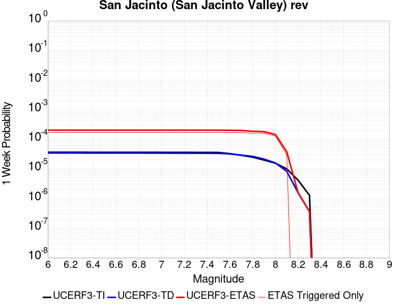 | 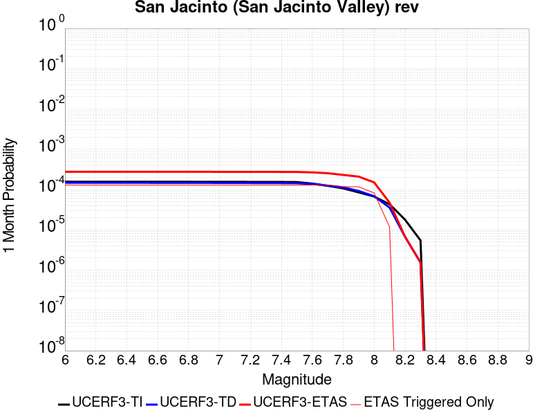 | 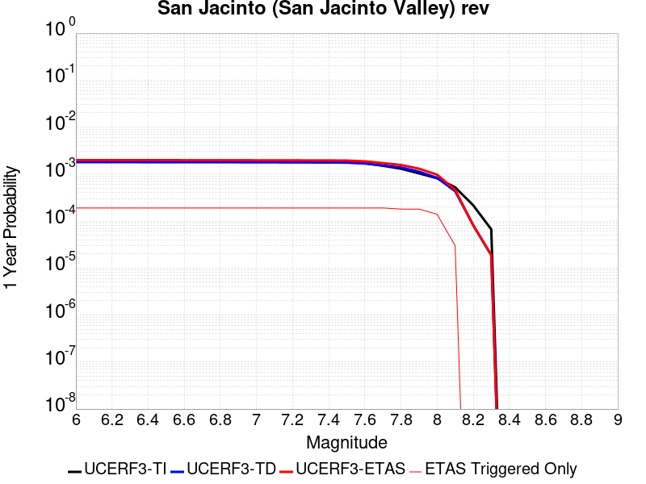 | 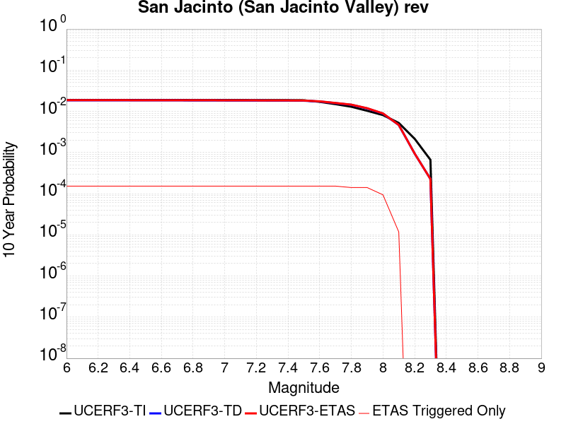 |

| Magnitude | 1 wk TI Prob | 1 wk TD Prob | 1 wk ETAS Prob | 1 wk ETAS/TD Gain | 1 wk ETAS Triggered Only | 1 mo TI Prob | 1 mo TD Prob | 1 mo ETAS Prob | 1 mo ETAS/TD Gain | 1 mo ETAS Triggered Only | 1 yr TI Prob | 1 yr TD Prob | 1 yr ETAS Prob | 1 yr ETAS/TD Gain | 1 yr ETAS Triggered Only | 10 yr TI Prob | 10 yr TD Prob | 10 yr ETAS Prob | 10 yr ETAS/TD Gain | 10 yr ETAS Triggered Only |
|-----|-----|-----|-----|-----|-----|-----|-----|-----|-----|-----|-----|-----|-----|-----|-----|-----|-----|-----|-----|-----|
| 6.0 | 3.652694E-5 | 3.4402394E-5 | 1.5176924E-4 | 4.41159 | 1.17370895E-4 | 1.5653463E-4 | 1.474305E-4 | 2.7651945E-4 | 1.8755919 | 1.2910798E-4 | 0.0019041431 | 0.00179349 | 0.0019340825 | 1.0783905 | 1.4084508E-4 | 0.018879099 | 0.018526595 | 0.01867635 | 1.0080832 | 1.5258216E-4 |
| 6.1 | 3.652694E-5 | 3.4402394E-5 | 1.5176924E-4 | 4.41159 | 1.17370895E-4 | 1.5653463E-4 | 1.474305E-4 | 2.7651945E-4 | 1.8755919 | 1.2910798E-4 | 0.0019041431 | 0.00179349 | 0.0019340825 | 1.0783905 | 1.4084508E-4 | 0.018879099 | 0.018526595 | 0.01867635 | 1.0080832 | 1.5258216E-4 |
| 6.2 | 3.652694E-5 | 3.4402394E-5 | 1.5176924E-4 | 4.41159 | 1.17370895E-4 | 1.5653463E-4 | 1.474305E-4 | 2.7651945E-4 | 1.8755919 | 1.2910798E-4 | 0.0019041431 | 0.00179349 | 0.0019340825 | 1.0783905 | 1.4084508E-4 | 0.018879099 | 0.018526595 | 0.01867635 | 1.0080832 | 1.5258216E-4 |
| 6.3 | 3.652694E-5 | 3.4402394E-5 | 1.5176924E-4 | 4.41159 | 1.17370895E-4 | 1.5653463E-4 | 1.474305E-4 | 2.7651945E-4 | 1.8755919 | 1.2910798E-4 | 0.0019041431 | 0.00179349 | 0.0019340825 | 1.0783905 | 1.4084508E-4 | 0.018879099 | 0.018526595 | 0.01867635 | 1.0080832 | 1.5258216E-4 |
| 6.4 | 3.646941E-5 | 3.432397E-5 | 1.5169084E-4 | 4.419385 | 1.17370895E-4 | 1.5628811E-4 | 1.4709444E-4 | 2.7618345E-4 | 1.8775926 | 1.2910798E-4 | 0.0019011468 | 0.0017894056 | 0.0019299986 | 1.0785697 | 1.4084508E-4 | 0.018849645 | 0.018486476 | 0.018636238 | 1.0081011 | 1.5258216E-4 |
| 6.5 | 3.646941E-5 | 3.432397E-5 | 1.5169084E-4 | 4.419385 | 1.17370895E-4 | 1.5628811E-4 | 1.4709444E-4 | 2.7618345E-4 | 1.8775926 | 1.2910798E-4 | 0.0019011468 | 0.0017894056 | 0.0019299986 | 1.0785697 | 1.4084508E-4 | 0.018849645 | 0.018486476 | 0.018636238 | 1.0081011 | 1.5258216E-4 |
| 6.6 | 3.6442503E-5 | 3.4287354E-5 | 1.5165423E-4 | 4.4230366 | 1.17370895E-4 | 1.561728E-4 | 1.4693754E-4 | 2.7602655E-4 | 1.8785298 | 1.2910798E-4 | 0.0018997455 | 0.0017874985 | 0.0019280917 | 1.0786537 | 1.4084508E-4 | 0.018835869 | 0.018467745 | 0.018617509 | 1.0081095 | 1.5258216E-4 |
| 6.7 | 3.6432113E-5 | 3.4272925E-5 | 1.5163979E-4 | 4.4244776 | 1.17370895E-4 | 1.5612828E-4 | 1.4687571E-4 | 2.7596473E-4 | 1.8788997 | 1.2910798E-4 | 0.0018992044 | 0.0017867472 | 0.0019273406 | 1.0786868 | 1.4084508E-4 | 0.018830549 | 0.018460369 | 0.018610135 | 1.0081128 | 1.5258216E-4 |
| 6.8 | 3.6409598E-5 | 3.424198E-5 | 1.5160885E-4 | 4.4275723 | 1.17370895E-4 | 1.560318E-4 | 1.4674311E-4 | 2.7583214E-4 | 1.879694 | 1.2910798E-4 | 0.0018980318 | 0.0017851355 | 0.0019257291 | 1.078758 | 1.4084508E-4 | 0.018819023 | 0.018444523 | 0.018594291 | 1.00812 | 1.5258216E-4 |
| 6.9 | 3.638078E-5 | 3.4202407E-5 | 1.5156929E-4 | 4.4315386 | 1.17370895E-4 | 1.5590832E-4 | 1.4657351E-4 | 2.7566258E-4 | 1.880712 | 1.2910798E-4 | 0.0018965311 | 0.001783074 | 0.001923668 | 1.0788492 | 1.4084508E-4 | 0.018804269 | 0.018424258 | 0.018574027 | 1.008129 | 1.5258216E-4 |
| 7.0 | 3.6294874E-5 | 3.408442E-5 | 1.5145131E-4 | 4.4434175 | 1.17370895E-4 | 1.5554018E-4 | 1.4606792E-4 | 2.7515704E-4 | 1.8837609 | 1.2910798E-4 | 0.0018920569 | 0.001776929 | 0.0019175238 | 1.0791223 | 1.4084508E-4 | 0.018760284 | 0.018363839 | 0.01851362 | 1.0081563 | 1.5258216E-4 |
| 7.1 | 3.6260717E-5 | 3.4040702E-5 | 1.514076E-4 | 4.44784 | 1.17370895E-4 | 1.5539382E-4 | 1.4588058E-4 | 2.7496973E-4 | 1.884896 | 1.2910798E-4 | 0.001890278 | 0.0017746518 | 0.001915247 | 1.0792241 | 1.4084508E-4 | 0.018742796 | 0.018341439 | 0.018491223 | 1.0081664 | 1.5258216E-4 |
| 7.2 | 3.6210204E-5 | 3.397492E-5 | 1.5134182E-4 | 4.454516 | 1.17370895E-4 | 1.5517735E-4 | 1.455987E-4 | 2.746879E-4 | 1.8866094 | 1.2910798E-4 | 0.001887647 | 0.0017712255 | 0.0019118211 | 1.0793775 | 1.4084508E-4 | 0.01871693 | 0.01830772 | 0.018457508 | 1.0081817 | 1.5258216E-4 |
| 7.3 | 3.6119454E-5 | 3.386321E-5 | 1.5123012E-4 | 4.465913 | 1.17370895E-4 | 1.5478847E-4 | 1.4511998E-4 | 2.7420922E-4 | 1.8895346 | 1.2910798E-4 | 0.0018829206 | 0.0017654065 | 0.0019060029 | 1.0796397 | 1.4084508E-4 | 0.018670462 | 0.018250274 | 0.018400071 | 1.0082079 | 1.5258216E-4 |
| 7.4 | 3.607848E-5 | 3.381071E-5 | 1.5117764E-4 | 4.4712944 | 1.17370895E-4 | 1.5461289E-4 | 1.44895E-4 | 2.7398427E-4 | 1.890916 | 1.2910798E-4 | 0.0018807866 | 0.0017626719 | 0.0019032687 | 1.0797634 | 1.4084508E-4 | 0.018649481 | 0.018223269 | 0.01837307 | 1.0082203 | 1.5258216E-4 |
| 7.5 | 3.5856774E-5 | 3.3620483E-5 | 1.5098743E-4 | 4.490936 | 1.17370895E-4 | 1.5366284E-4 | 1.4407984E-4 | 2.7316922E-4 | 1.8959574 | 1.2910798E-4 | 0.0018692396 | 0.0017527633 | 0.0018933614 | 1.0802152 | 1.4084508E-4 | 0.018535944 | 0.018124366 | 0.018274184 | 1.0082661 | 1.5258216E-4 |
| 7.6 | 3.286655E-5 | 3.2143445E-5 | 1.4951057E-4 | 4.6513543 | 1.17370895E-4 | 1.4084904E-4 | 1.3775036E-4 | 2.6684057E-4 | 1.9371314 | 1.2910798E-4 | 0.001713488 | 0.0016758227 | 0.0018164316 | 1.0839045 | 1.4084508E-4 | 0.017003361 | 0.017344031 | 0.017493967 | 1.0086448 | 1.5258216E-4 |
| 7.7 | 2.8882527E-5 | 2.9236293E-5 | 1.4660375E-4 | 5.014444 | 1.17370895E-4 | 1.237764E-4 | 1.2529238E-4 | 2.5438418E-4 | 2.0303245 | 1.2910798E-4 | 0.0015059357 | 0.0015243685 | 0.0016649989 | 1.0922549 | 1.4084508E-4 | 0.014957713 | 0.015830461 | 0.015980627 | 1.009486 | 1.5258216E-4 |
| 7.8 | 2.4950225E-5 | 2.6527203E-5 | 1.3215821E-4 | 4.981988 | 1.056338E-4 | 1.0692515E-4 | 1.1368306E-4 | 2.3104061E-4 | 2.0323222 | 1.17370895E-4 | 0.0013010362 | 0.0013832134 | 0.0015121428 | 1.0932101 | 1.2910798E-4 | 0.012934455 | 0.014411755 | 0.01455057 | 1.0096321 | 1.4084508E-4 |
| 7.9 | 1.9881603E-5 | 2.1507445E-5 | 1.2713898E-4 | 5.9113936 | 1.056338E-4 | 8.520408E-5 | 9.217151E-5 | 2.0953159E-4 | 2.2732792 | 1.17370895E-4 | 0.001036866 | 0.0011216112 | 0.0012505745 | 1.1149802 | 1.2910798E-4 | 0.010320415 | 0.011777027 | 0.011916213 | 1.0118184 | 1.4084508E-4 |
| 8.0 | 1.563292E-5 | 1.5937347E-5 | 8.6358756E-5 | 5.418641 | 7.042254E-5 | 6.6996516E-5 | 6.8301124E-5 | 1.5045513E-4 | 2.2028208 | 8.2159626E-5 | 8.153773E-4 | 8.3124964E-4 | 9.1334095E-4 | 1.0987566 | 8.2159626E-5 | 0.00812392 | 0.008810506 | 0.008903576 | 1.0105635 | 9.389671E-5 |
| 8.1 | 1.0045313E-5 | 8.301802E-6 | 2.0038795E-5 | 2.4137883 | 1.1737089E-5 | 4.305063E-5 | 3.5578672E-5 | 4.731534E-5 | 1.3298794 | 1.1737089E-5 | 5.2401534E-4 | 4.3308473E-4 | 4.4481675E-4 | 1.0270894 | 1.1737089E-5 | 0.0052278144 | 0.0046591135 | 0.004670796 | 1.0025074 | 1.1737089E-5 |
| 8.2 | 4.1554413E-6 | 1.5655598E-6 | 1.5655598E-6 | 1.0 | 0.0 | 1.7808914E-5 | 6.709525E-6 | 6.709525E-6 | 1.0 | 0.0 | 2.1680194E-4 | 8.168544E-5 | 8.168544E-5 | 1.0 | 0.0 | 0.0021659054 | 9.482903E-4 | 9.482903E-4 | 1.0 | 0.0 |
| 8.3 | 1.2758221E-6 | 3.6149942E-7 | 3.6149942E-7 | 1.0 | 0.0 | 5.4677976E-6 | 1.5492824E-6 | 1.5492824E-6 | 1.0 | 0.0 | 6.65684E-5 | 1.8862354E-5 | 1.8862354E-5 | 1.0 | 0.0 | 6.6548464E-4 | 2.2751294E-4 | 2.2751294E-4 | 1.0 | 0.0 |

## Cleghorn Lake
*[(top)](#table-of-contents)*

| 1 Week | 1 Month | 1 Year | 10 Year |
|-----|-----|-----|-----|
| 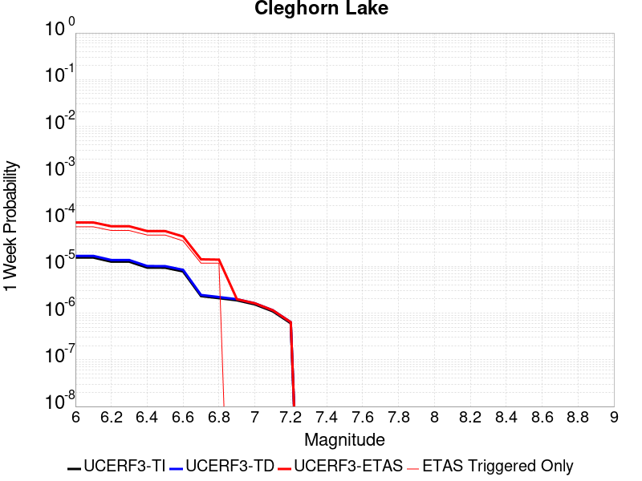 | 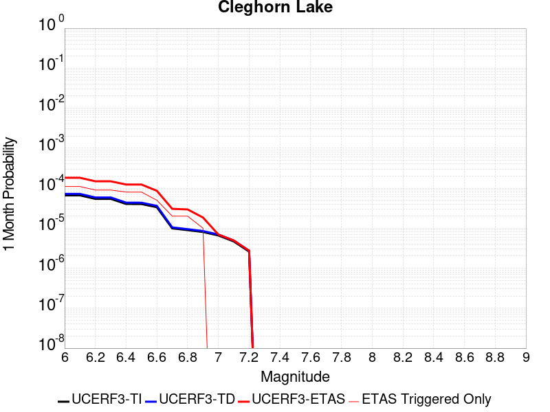 | 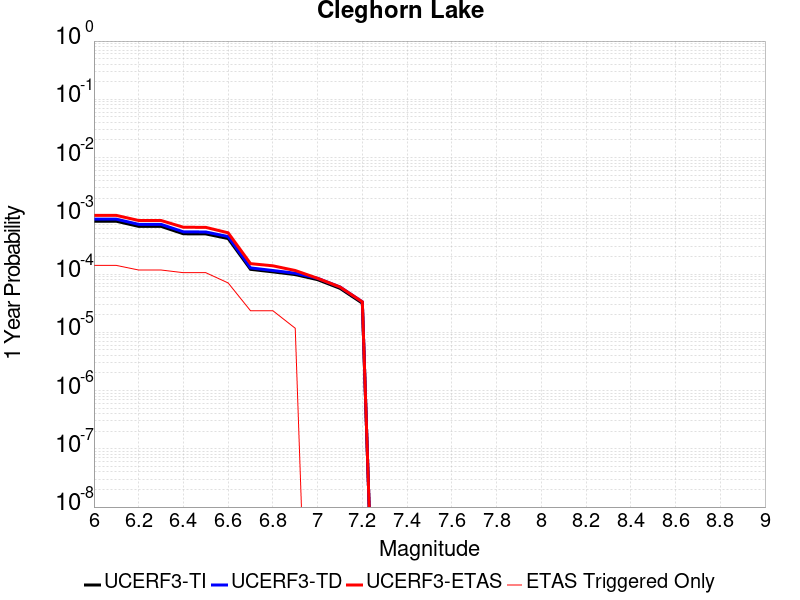 |  |

| Magnitude | 1 wk TI Prob | 1 wk TD Prob | 1 wk ETAS Prob | 1 wk ETAS/TD Gain | 1 wk ETAS Triggered Only | 1 mo TI Prob | 1 mo TD Prob | 1 mo ETAS Prob | 1 mo ETAS/TD Gain | 1 mo ETAS Triggered Only | 1 yr TI Prob | 1 yr TD Prob | 1 yr ETAS Prob | 1 yr ETAS/TD Gain | 1 yr ETAS Triggered Only | 10 yr TI Prob | 10 yr TD Prob | 10 yr ETAS Prob | 10 yr ETAS/TD Gain | 10 yr ETAS Triggered Only |
|-----|-----|-----|-----|-----|-----|-----|-----|-----|-----|-----|-----|-----|-----|-----|-----|-----|-----|-----|-----|-----|
| 6.0 | 1.5467183E-5 | 1.6794203E-5 | 8.721556E-5 | 5.193194 | 7.042254E-5 | 6.6286244E-5 | 7.197348E-5 | 1.8933593E-4 | 2.6306345 | 1.17370895E-4 | 8.067362E-4 | 8.759797E-4 | 0.0010167015 | 1.1606449 | 1.4084508E-4 | 0.008038137 | 0.008730696 | 0.008881945 | 1.017324 | 1.5258216E-4 |
| 6.1 | 1.5467183E-5 | 1.6794203E-5 | 8.721556E-5 | 5.193194 | 7.042254E-5 | 6.6286244E-5 | 7.197348E-5 | 1.8933593E-4 | 2.6306345 | 1.17370895E-4 | 8.067362E-4 | 8.759797E-4 | 0.0010167015 | 1.1606449 | 1.4084508E-4 | 0.008038137 | 0.008730696 | 0.008881945 | 1.017324 | 1.5258216E-4 |
| 6.2 | 1.2624631E-5 | 1.3681544E-5 | 7.236619E-5 | 5.2893286 | 5.8685448E-5 | 5.410444E-5 | 5.863415E-5 | 1.5252536E-4 | 2.601306 | 9.389671E-5 | 6.585225E-4 | 7.1368564E-4 | 8.3097274E-4 | 1.16434 | 1.17370895E-4 | 0.0065657445 | 0.0071187317 | 0.007246921 | 1.0180073 | 1.2910798E-4 |
| 6.3 | 1.2624631E-5 | 1.3681544E-5 | 7.236619E-5 | 5.2893286 | 5.8685448E-5 | 5.410444E-5 | 5.863415E-5 | 1.5252536E-4 | 2.601306 | 9.389671E-5 | 6.585225E-4 | 7.1368564E-4 | 8.3097274E-4 | 1.16434 | 1.17370895E-4 | 0.0065657445 | 0.0071187317 | 0.007246921 | 1.0180073 | 1.2910798E-4 |
| 6.4 | 9.417684E-6 | 1.0170118E-5 | 5.7117995E-5 | 5.616257 | 4.6948357E-5 | 4.036088E-5 | 4.3585722E-5 | 1.2574176E-4 | 2.8849301 | 8.2159626E-5 | 4.912829E-4 | 5.3056807E-4 | 6.361458E-4 | 1.19899 | 1.056338E-4 | 0.004901982 | 0.005297049 | 0.005402123 | 1.0198364 | 1.056338E-4 |
| 6.5 | 9.368219E-6 | 1.0117545E-5 | 5.7065427E-5 | 5.640245 | 4.6948357E-5 | 4.014889E-5 | 4.3360415E-5 | 1.2551648E-4 | 2.894725 | 8.2159626E-5 | 4.8870314E-4 | 5.2782625E-4 | 6.334043E-4 | 1.2000242 | 1.056338E-4 | 0.004876298 | 0.0052697617 | 0.0053748386 | 1.0199397 | 1.056338E-4 |
| 6.6 | 7.803798E-6 | 8.441831E-6 | 4.3652803E-5 | 5.171011 | 3.521127E-5 | 3.3444423E-5 | 3.6179E-5 | 8.3125655E-5 | 2.2976217 | 4.6948357E-5 | 4.0710976E-4 | 4.4043022E-4 | 5.108217E-4 | 1.1598245 | 7.042254E-5 | 0.0040636472 | 0.0043994905 | 0.0044696033 | 1.0159365 | 7.042254E-5 |
| 6.7 | 2.3108669E-6 | 2.4438336E-6 | 1.4180894E-5 | 5.802725 | 1.1737089E-5 | 9.903678E-6 | 1.0473532E-5 | 3.3947465E-5 | 3.2412624 | 2.3474178E-5 | 1.205706E-4 | 1.2750797E-4 | 1.5097916E-4 | 1.1840762 | 2.3474178E-5 | 0.001205052 | 0.0012743667 | 0.001297811 | 1.0183967 | 2.3474178E-5 |
| 6.8 | 2.0882828E-6 | 2.2062823E-6 | 1.3943346E-5 | 6.3198376 | 1.1737089E-5 | 8.949753E-6 | 9.455462E-6 | 3.292942E-5 | 3.4825816 | 2.3474178E-5 | 1.08957785E-4 | 1.1511434E-4 | 1.385858E-4 | 1.2038971 | 2.3474178E-5 | 0.0010890438 | 0.0011505639 | 0.0011740112 | 1.0203788 | 2.3474178E-5 |
| 6.9 | 1.876935E-6 | 1.981051E-6 | 1.981051E-6 | 1.0 | 0.0 | 8.043982E-6 | 8.490192E-6 | 2.0227182E-5 | 2.3824174 | 1.1737089E-5 | 9.7931086E-5 | 1.03363345E-4 | 1.1509922E-4 | 1.11354 | 1.1737089E-5 | 9.788794E-4 | 0.0010331686 | 0.0010448936 | 1.0113486 | 1.1737089E-5 |
| 7.0 | 1.5357559E-6 | 1.6202807E-6 | 1.6202807E-6 | 1.0 | 0.0 | 6.5817944E-6 | 6.9440425E-6 | 6.9440425E-6 | 1.0 | 0.0 | 8.01304E-5 | 8.454057E-5 | 8.454057E-5 | 1.0 | 0.0 | 8.010151E-4 | 8.450965E-4 | 8.450965E-4 | 1.0 | 0.0 |
| 7.1 | 1.0905424E-6 | 1.1497619E-6 | 1.1497619E-6 | 1.0 | 0.0 | 4.6737446E-6 | 4.9275427E-6 | 4.9275427E-6 | 1.0 | 0.0 | 5.6901354E-5 | 5.999128E-5 | 5.999128E-5 | 1.0 | 0.0 | 5.6886784E-4 | 5.997606E-4 | 5.997606E-4 | 1.0 | 0.0 |
| 7.2 | 6.06668E-7 | 6.387277E-7 | 6.387277E-7 | 1.0 | 0.0 | 2.600003E-6 | 2.7374022E-6 | 2.7374022E-6 | 1.0 | 0.0 | 3.1654577E-5 | 3.3327433E-5 | 3.3327433E-5 | 1.0 | 0.0 | 3.1650066E-4 | 3.3323118E-4 | 3.3323118E-4 | 1.0 | 0.0 |

## Santa Rosa Island
*[(top)](#table-of-contents)*

| 1 Week | 1 Month | 1 Year | 10 Year |
|-----|-----|-----|-----|
| 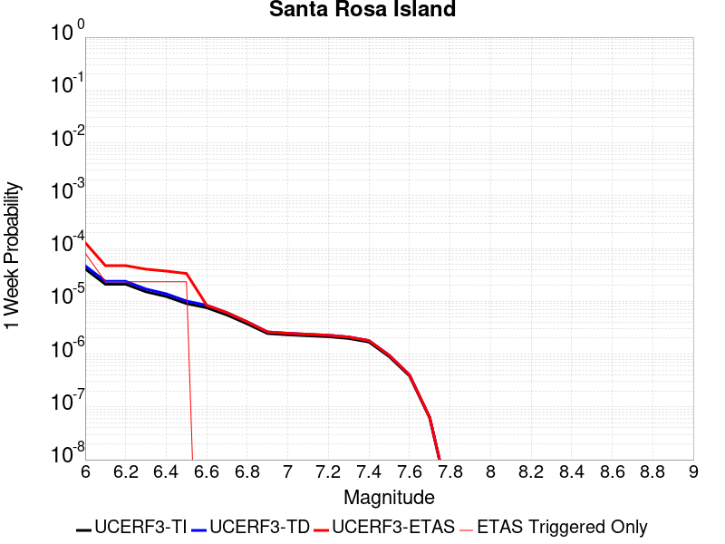 | 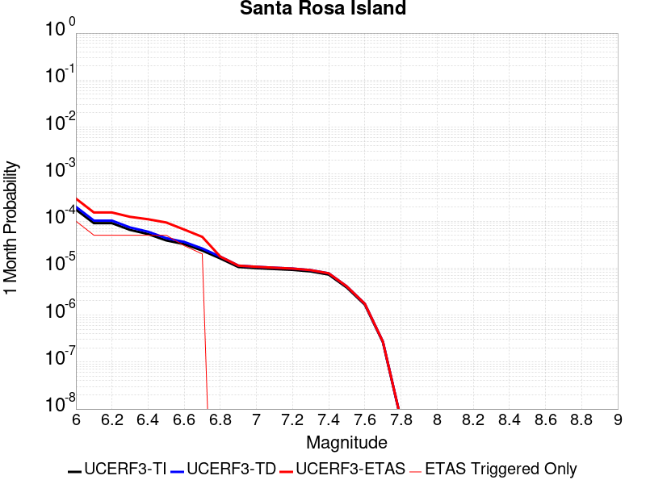 | 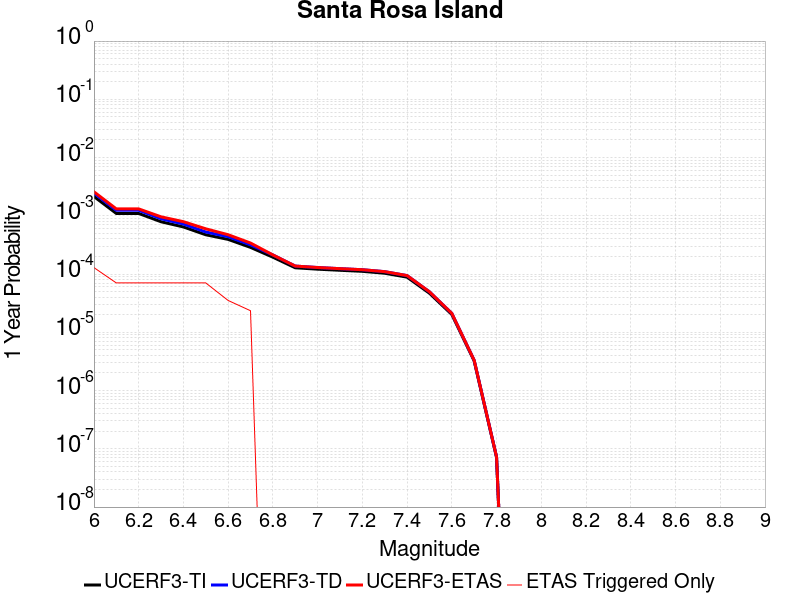 | 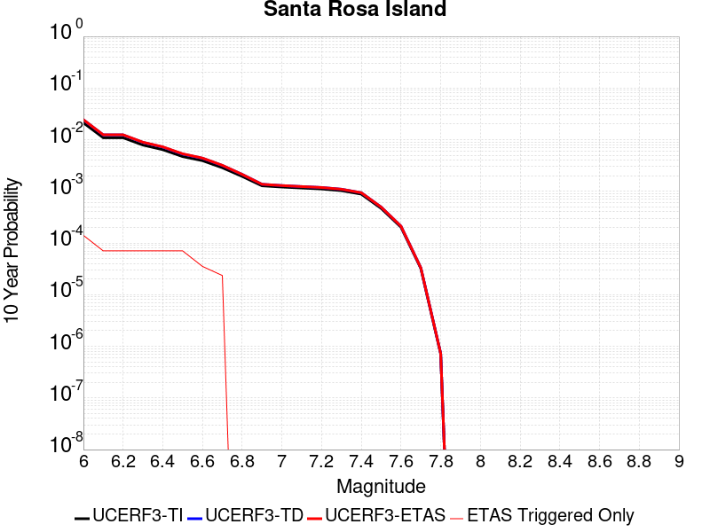 |

| Magnitude | 1 wk TI Prob | 1 wk TD Prob | 1 wk ETAS Prob | 1 wk ETAS/TD Gain | 1 wk ETAS Triggered Only | 1 mo TI Prob | 1 mo TD Prob | 1 mo ETAS Prob | 1 mo ETAS/TD Gain | 1 mo ETAS Triggered Only | 1 yr TI Prob | 1 yr TD Prob | 1 yr ETAS Prob | 1 yr ETAS/TD Gain | 1 yr ETAS Triggered Only | 10 yr TI Prob | 10 yr TD Prob | 10 yr ETAS Prob | 10 yr ETAS/TD Gain | 10 yr ETAS Triggered Only |
|-----|-----|-----|-----|-----|-----|-----|-----|-----|-----|-----|-----|-----|-----|-----|-----|-----|-----|-----|-----|-----|
| 6.0 | 4.1143165E-5 | 4.7091133E-5 | 1.292469E-4 | 2.744612 | 8.2159626E-5 | 1.7631594E-4 | 2.0180465E-4 | 3.1915185E-4 | 1.5814891 | 1.17370895E-4 | 0.002144533 | 0.0024544 | 0.002583191 | 1.0524735 | 1.2910798E-4 | 0.021239553 | 0.024293551 | 0.024430975 | 1.0056568 | 1.4084508E-4 |
| 6.1 | 2.1061249E-5 | 2.3864959E-5 | 4.7338577E-5 | 1.9836018 | 2.3474178E-5 | 9.0259375E-5 | 1.0227455E-4 | 1.6095399E-4 | 1.5737443 | 5.8685448E-5 | 0.0010983539 | 0.0012445104 | 0.0013148453 | 1.0565162 | 7.042254E-5 | 0.01092941 | 0.012378449 | 0.012447999 | 1.0056187 | 7.042254E-5 |
| 6.2 | 2.1061249E-5 | 2.3864959E-5 | 4.7338577E-5 | 1.9836018 | 2.3474178E-5 | 9.0259375E-5 | 1.0227455E-4 | 1.6095399E-4 | 1.5737443 | 5.8685448E-5 | 0.0010983539 | 0.0012445104 | 0.0013148453 | 1.0565162 | 7.042254E-5 | 0.01092941 | 0.012378449 | 0.012447999 | 1.0056187 | 7.042254E-5 |
| 6.3 | 1.5158236E-5 | 1.7074419E-5 | 4.0548195E-5 | 2.374792 | 2.3474178E-5 | 6.496225E-5 | 7.3174095E-5 | 1.3185525E-4 | 1.8019389 | 5.8685448E-5 | 7.906284E-4 | 8.905424E-4 | 9.6090225E-4 | 1.0790079 | 7.042254E-5 | 0.007878214 | 0.008870989 | 0.008940787 | 1.007868 | 7.042254E-5 |
| 6.4 | 1.2341918E-5 | 1.3852917E-5 | 3.732677E-5 | 2.6945062 | 2.3474178E-5 | 5.2892858E-5 | 5.9368336E-5 | 1.18050295E-4 | 1.9884387 | 5.8685448E-5 | 6.437803E-4 | 7.225779E-4 | 7.929496E-4 | 1.0973897 | 7.042254E-5 | 0.006419184 | 0.007203121 | 0.0072730365 | 1.0097063 | 7.042254E-5 |
| 6.5 | 9.061158E-6 | 1.0117031E-5 | 3.359097E-5 | 3.32024 | 2.3474178E-5 | 3.883296E-5 | 4.3358013E-5 | 1.0204092E-4 | 2.35345 | 5.8685448E-5 | 4.726887E-4 | 5.277613E-4 | 5.9814664E-4 | 1.1333659 | 7.042254E-5 | 0.004716845 | 0.0052656173 | 0.005335669 | 1.0133036 | 7.042254E-5 |
| 6.6 | 7.5461685E-6 | 8.400733E-6 | 8.400733E-6 | 1.0 | 0.0 | 3.2340322E-5 | 3.600267E-5 | 7.121267E-5 | 1.977983 | 3.521127E-5 | 3.936723E-4 | 4.3824865E-4 | 4.734445E-4 | 1.0803102 | 3.521127E-5 | 0.003929756 | 0.0043742736 | 0.004409331 | 1.0080144 | 3.521127E-5 |
| 6.7 | 5.5023775E-6 | 6.087381E-6 | 6.087381E-6 | 1.0 | 0.0 | 2.3581404E-5 | 2.6088532E-5 | 4.95621E-5 | 1.8997657 | 2.3474178E-5 | 2.8706578E-4 | 3.1758484E-4 | 3.4105155E-4 | 1.0738912 | 2.3474178E-5 | 0.0028669522 | 0.0031716314 | 0.0031950313 | 1.0073779 | 2.3474178E-5 |
| 6.8 | 3.7351679E-6 | 4.0831405E-6 | 4.0831405E-6 | 1.0 | 0.0 | 1.6007763E-5 | 1.749907E-5 | 1.749907E-5 | 1.0 | 0.0 | 1.948771E-4 | 2.1303284E-4 | 2.1303284E-4 | 1.0 | 0.0 | 0.0019470629 | 0.0021285315 | 0.0021285315 | 1.0 | 0.0 |
| 6.9 | 2.456366E-6 | 2.6292705E-6 | 2.6292705E-6 | 1.0 | 0.0 | 1.0527241E-5 | 1.1268254E-5 | 1.1268254E-5 | 1.0 | 0.0 | 1.2816161E-4 | 1.3718237E-4 | 1.3718237E-4 | 1.0 | 0.0 | 0.0012808773 | 0.0013709799 | 0.0013709799 | 1.0 | 0.0 |
| 7.0 | 2.3245157E-6 | 2.4827782E-6 | 2.4827782E-6 | 1.0 | 0.0 | 9.962172E-6 | 1.0640435E-5 | 1.0640435E-5 | 1.0 | 0.0 | 1.2128269E-4 | 1.2953962E-4 | 1.2953962E-4 | 1.0 | 0.0 | 0.0012121652 | 0.0012946434 | 0.0012946434 | 1.0 | 0.0 |
| 7.1 | 2.2248344E-6 | 2.37325E-6 | 2.37325E-6 | 1.0 | 0.0 | 9.53497E-6 | 1.0171032E-5 | 1.0171032E-5 | 1.0 | 0.0 | 1.1608207E-4 | 1.2382529E-4 | 1.2382529E-4 | 1.0 | 0.0 | 0.0011602144 | 0.001237565 | 0.001237565 | 1.0 | 0.0 |
| 7.2 | 2.1350402E-6 | 2.276154E-6 | 2.276154E-6 | 1.0 | 0.0 | 9.150141E-6 | 9.754909E-6 | 9.754909E-6 | 1.0 | 0.0 | 1.1139726E-4 | 1.1875956E-4 | 1.1875956E-4 | 1.0 | 0.0 | 0.0011134144 | 0.0011869629 | 0.0011869629 | 1.0 | 0.0 |
| 7.3 | 1.9793572E-6 | 2.108719E-6 | 2.108719E-6 | 1.0 | 0.0 | 8.482932E-6 | 9.037336E-6 | 9.037336E-6 | 1.0 | 0.0 | 1.032748E-4 | 1.10024026E-4 | 1.10024026E-4 | 1.0 | 0.0 | 0.0010322682 | 0.0010996973 | 0.0010996973 | 1.0 | 0.0 |
| 7.4 | 1.6951194E-6 | 1.8045733E-6 | 1.8045733E-6 | 1.0 | 0.0 | 7.264777E-6 | 7.733863E-6 | 7.733863E-6 | 1.0 | 0.0 | 8.844508E-5 | 9.415573E-5 | 9.415573E-5 | 1.0 | 0.0 | 8.840988E-4 | 9.4116E-4 | 9.4116E-4 | 1.0 | 0.0 |
| 7.5 | 8.987207E-7 | 9.5122147E-7 | 9.5122147E-7 | 1.0 | 0.0 | 3.8516546E-6 | 4.076657E-6 | 4.076657E-6 | 1.0 | 0.0 | 4.6892885E-5 | 4.963218E-5 | 4.963218E-5 | 1.0 | 0.0 | 4.688299E-4 | 4.9621216E-4 | 4.9621216E-4 | 1.0 | 0.0 |
| 7.6 | 3.8783037E-7 | 4.052932E-7 | 4.052932E-7 | 1.0 | 0.0 | 1.6621291E-6 | 1.7369698E-6 | 1.7369698E-6 | 1.0 | 0.0 | 2.0236233E-5 | 2.1147409E-5 | 2.1147409E-5 | 1.0 | 0.0 | 2.023439E-4 | 2.1145462E-4 | 2.1145462E-4 | 1.0 | 0.0 |
| 7.7 | 6.181804E-8 | 6.339035E-8 | 6.339035E-8 | 1.0 | 0.0 | 2.6493444E-7 | 2.7167292E-7 | 2.7167292E-7 | 1.0 | 0.0 | 3.225572E-6 | 3.3076128E-6 | 3.3076128E-6 | 1.0 | 0.0 | 3.225525E-5 | 3.307564E-5 | 3.307564E-5 | 1.0 | 0.0 |
| 7.8 | 1.3704449E-9 | 1.3964153E-9 | 1.3964153E-9 | 1.0 | 0.0 | 5.873335E-9 | 5.984637E-9 | 5.984637E-9 | 1.0 | 0.0 | 7.1507856E-8 | 7.286295E-8 | 7.286295E-8 | 1.0 | 0.0 | 7.1507833E-7 | 7.286294E-7 | 7.286294E-7 | 1.0 | 0.0 |

## San Jacinto (Stepovers Combined)
*[(top)](#table-of-contents)*

| 1 Week | 1 Month | 1 Year | 10 Year |
|-----|-----|-----|-----|
| 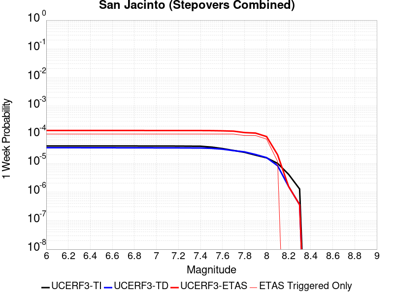 | 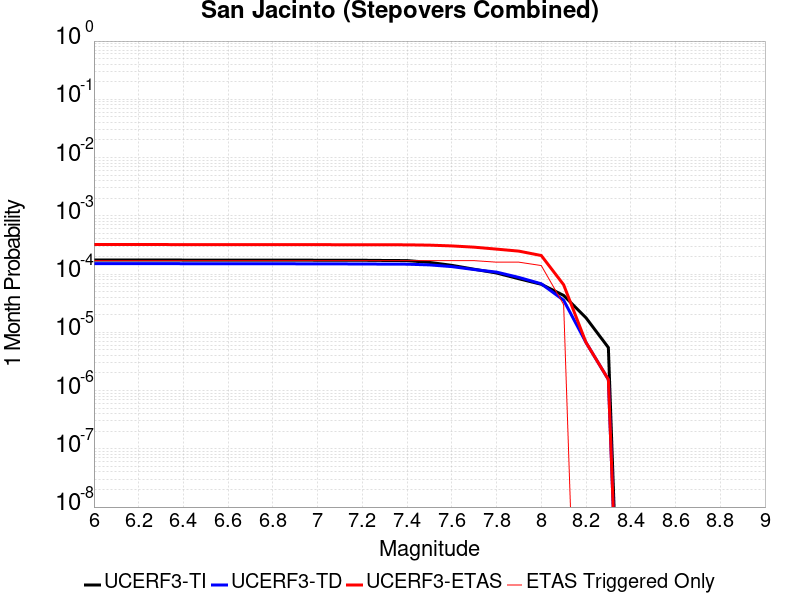 | 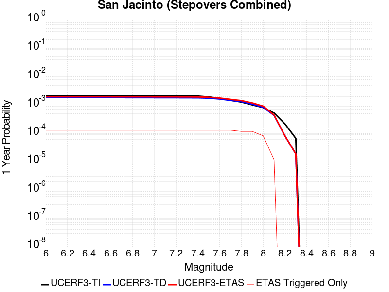 | 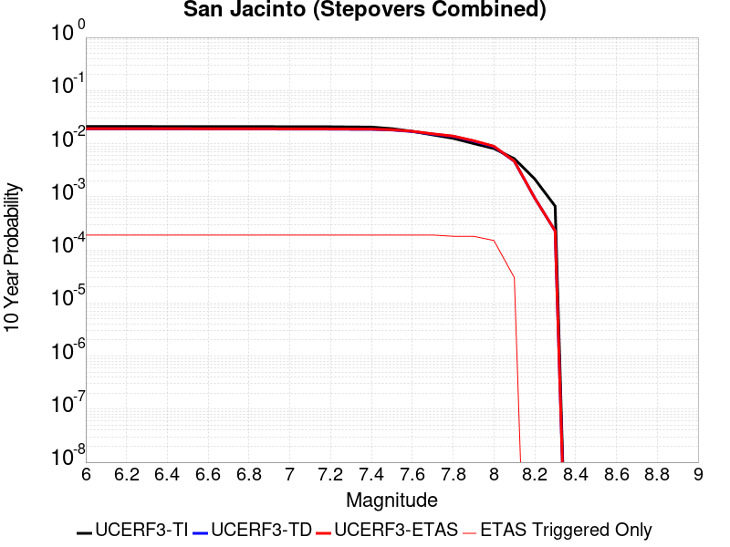 |

| Magnitude | 1 wk TI Prob | 1 wk TD Prob | 1 wk ETAS Prob | 1 wk ETAS/TD Gain | 1 wk ETAS Triggered Only | 1 mo TI Prob | 1 mo TD Prob | 1 mo ETAS Prob | 1 mo ETAS/TD Gain | 1 mo ETAS Triggered Only | 1 yr TI Prob | 1 yr TD Prob | 1 yr ETAS Prob | 1 yr ETAS/TD Gain | 1 yr ETAS Triggered Only | 10 yr TI Prob | 10 yr TD Prob | 10 yr ETAS Prob | 10 yr ETAS/TD Gain | 10 yr ETAS Triggered Only |
|-----|-----|-----|-----|-----|-----|-----|-----|-----|-----|-----|-----|-----|-----|-----|-----|-----|-----|-----|-----|-----|
| 6.0 | 4.0667746E-5 | 3.5272755E-5 | 1.4090283E-4 | 3.9946647 | 1.056338E-4 | 1.742787E-4 | 1.5116022E-4 | 2.6851337E-4 | 1.7763494 | 1.17370895E-4 | 0.0021197782 | 0.0018388226 | 0.0019676932 | 1.0700831 | 1.2910798E-4 | 0.020996714 | 0.018986892 | 0.019125063 | 1.0072771 | 1.4084508E-4 |
| 6.1 | 4.0667746E-5 | 3.5272755E-5 | 1.4090283E-4 | 3.9946647 | 1.056338E-4 | 1.742787E-4 | 1.5116022E-4 | 2.6851337E-4 | 1.7763494 | 1.17370895E-4 | 0.0021197782 | 0.0018388226 | 0.0019676932 | 1.0700831 | 1.2910798E-4 | 0.020996714 | 0.018986892 | 0.019125063 | 1.0072771 | 1.4084508E-4 |
| 6.2 | 4.0667746E-5 | 3.5272755E-5 | 1.4090283E-4 | 3.9946647 | 1.056338E-4 | 1.742787E-4 | 1.5116022E-4 | 2.6851337E-4 | 1.7763494 | 1.17370895E-4 | 0.0021197782 | 0.0018388226 | 0.0019676932 | 1.0700831 | 1.2910798E-4 | 0.020996714 | 0.018986892 | 0.019125063 | 1.0072771 | 1.4084508E-4 |
| 6.3 | 4.0667746E-5 | 3.5272755E-5 | 1.4090283E-4 | 3.9946647 | 1.056338E-4 | 1.742787E-4 | 1.5116022E-4 | 2.6851337E-4 | 1.7763494 | 1.17370895E-4 | 0.0021197782 | 0.0018388226 | 0.0019676932 | 1.0700831 | 1.2910798E-4 | 0.020996714 | 0.018986892 | 0.019125063 | 1.0072771 | 1.4084508E-4 |
| 6.4 | 4.0577226E-5 | 3.5144654E-5 | 1.4077475E-4 | 4.0055804 | 1.056338E-4 | 1.738908E-4 | 1.5061127E-4 | 2.679645E-4 | 1.7791795 | 1.17370895E-4 | 0.0021150648 | 0.0018321523 | 0.0019610238 | 1.0703388 | 1.2910798E-4 | 0.020950472 | 0.018921461 | 0.019059641 | 1.0073029 | 1.4084508E-4 |
| 6.5 | 4.0577226E-5 | 3.5144654E-5 | 1.4077475E-4 | 4.0055804 | 1.056338E-4 | 1.738908E-4 | 1.5061127E-4 | 2.679645E-4 | 1.7791795 | 1.17370895E-4 | 0.0021150648 | 0.0018321523 | 0.0019610238 | 1.0703388 | 1.2910798E-4 | 0.020950472 | 0.018921461 | 0.019059641 | 1.0073029 | 1.4084508E-4 |
| 6.6 | 4.053861E-5 | 3.509E-5 | 1.4072009E-4 | 4.010262 | 1.056338E-4 | 1.7372532E-4 | 1.5037706E-4 | 2.677303E-4 | 1.7803932 | 1.17370895E-4 | 0.0021130538 | 0.0018293057 | 0.0019581774 | 1.0704485 | 1.2910798E-4 | 0.020930743 | 0.018893538 | 0.019031722 | 1.0073138 | 1.4084508E-4 |
| 6.7 | 4.0516545E-5 | 3.5059067E-5 | 1.4068917E-4 | 4.012918 | 1.056338E-4 | 1.7363077E-4 | 1.5024451E-4 | 2.6759776E-4 | 1.7810818 | 1.17370895E-4 | 0.002111905 | 0.001827695 | 0.001956567 | 1.0705106 | 1.2910798E-4 | 0.020919468 | 0.018877735 | 0.019015921 | 1.00732 | 1.4084508E-4 |
| 6.8 | 4.049434E-5 | 3.5030633E-5 | 1.4066073E-4 | 4.015364 | 1.056338E-4 | 1.7353562E-4 | 1.5012265E-4 | 2.6747593E-4 | 1.781716 | 1.17370895E-4 | 0.0021107488 | 0.0018262138 | 0.0019550861 | 1.070568 | 1.2910798E-4 | 0.020908125 | 0.018863149 | 0.019001337 | 1.0073259 | 1.4084508E-4 |
| 6.9 | 4.046386E-5 | 3.499319E-5 | 1.4062329E-4 | 4.0185905 | 1.056338E-4 | 1.73405E-4 | 1.4996222E-4 | 2.673155E-4 | 1.7825524 | 1.17370895E-4 | 0.0021091616 | 0.0018242638 | 0.0019531362 | 1.0706435 | 1.2910798E-4 | 0.020892553 | 0.01884392 | 0.018982112 | 1.0073334 | 1.4084508E-4 |
| 7.0 | 4.036382E-5 | 3.487376E-5 | 1.4050388E-4 | 4.0289283 | 1.056338E-4 | 1.7297632E-4 | 1.4945042E-4 | 2.6680378E-4 | 1.7852327 | 1.17370895E-4 | 0.0021039525 | 0.0018180435 | 0.0019469168 | 1.0708857 | 1.2910798E-4 | 0.02084144 | 0.018782536 | 0.018920735 | 1.0073578 | 1.4084508E-4 |
| 7.1 | 4.0343282E-5 | 3.4852223E-5 | 1.4048234E-4 | 4.0308003 | 1.056338E-4 | 1.7288832E-4 | 1.4935812E-4 | 2.667115E-4 | 1.785718 | 1.17370895E-4 | 0.002102883 | 0.0018169218 | 0.0019457951 | 1.0709295 | 1.2910798E-4 | 0.020830948 | 0.018771412 | 0.018909615 | 1.0073624 | 1.4084508E-4 |
| 7.2 | 4.0257353E-5 | 3.4756722E-5 | 1.4038685E-4 | 4.0391283 | 1.056338E-4 | 1.725201E-4 | 1.489489E-4 | 2.663023E-4 | 1.787877 | 1.17370895E-4 | 0.0020984085 | 0.0018119477 | 0.0019408218 | 1.0711246 | 1.2910798E-4 | 0.020787042 | 0.018722152 | 0.01886036 | 1.007382 | 1.4084508E-4 |
| 7.3 | 3.9940667E-5 | 3.4584376E-5 | 1.4021453E-4 | 4.0542736 | 1.056338E-4 | 1.7116306E-4 | 1.4821035E-4 | 2.6556387E-4 | 1.7918036 | 1.17370895E-4 | 0.0020819185 | 0.0018029709 | 0.0019318461 | 1.0714793 | 1.2910798E-4 | 0.020625217 | 0.018630784 | 0.018769005 | 1.007419 | 1.4084508E-4 |
| 7.4 | 3.9721202E-5 | 3.4469766E-5 | 1.4009993E-4 | 4.0644293 | 1.056338E-4 | 1.7022261E-4 | 1.4771923E-4 | 2.6507277E-4 | 1.7944366 | 1.17370895E-4 | 0.0020704903 | 0.0017970012 | 0.0019258772 | 1.0717173 | 1.2910798E-4 | 0.020513052 | 0.018569905 | 0.018708136 | 1.0074438 | 1.4084508E-4 |
| 7.5 | 3.7036873E-5 | 3.3537188E-5 | 1.3916745E-4 | 4.149646 | 1.056338E-4 | 1.5871979E-4 | 1.437229E-4 | 2.6107693E-4 | 1.8165298 | 1.17370895E-4 | 0.0019307006 | 0.0017484248 | 0.0018773071 | 1.0737133 | 1.2910798E-4 | 0.019140124 | 0.018071463 | 0.018209763 | 1.0076529 | 1.4084508E-4 |
| 7.6 | 3.2940967E-5 | 3.1317984E-5 | 1.3694848E-4 | 4.372838 | 1.056338E-4 | 1.4116794E-4 | 1.3421304E-4 | 2.5156818E-4 | 1.8743944 | 1.17370895E-4 | 0.0017173645 | 0.0016328214 | 0.0017617185 | 1.0789413 | 1.2910798E-4 | 0.01704153 | 0.016904354 | 0.017042818 | 1.008191 | 1.4084508E-4 |
| 7.7 | 2.8236149E-5 | 2.7883889E-5 | 1.3351475E-4 | 4.7882395 | 1.056338E-4 | 1.2100645E-4 | 1.19496915E-4 | 2.3685378E-4 | 1.9820912 | 1.17370895E-4 | 0.0014722579 | 0.001453905 | 0.0015828253 | 1.0886717 | 1.2910798E-4 | 0.014625421 | 0.015115095 | 0.015253811 | 1.0091773 | 1.4084508E-4 |
| 7.8 | 2.4329287E-5 | 2.5207537E-5 | 1.1910188E-4 | 4.724852 | 9.389671E-5 | 1.042642E-4 | 1.0802783E-4 | 2.1365023E-4 | 1.9777331 | 1.056338E-4 | 0.0012686774 | 0.0013144462 | 0.0014316628 | 1.0891757 | 1.17370895E-4 | 0.012614589 | 0.013712396 | 0.013839734 | 1.0092863 | 1.2910798E-4 |
| 7.9 | 1.9370926E-5 | 2.0421452E-5 | 1.14316244E-4 | 5.5978513 | 9.389671E-5 | 8.301561E-5 | 8.7517576E-5 | 1.9314213E-4 | 2.2068954 | 1.056338E-4 | 0.0010102465 | 0.0010650064 | 0.0011822523 | 1.1100894 | 1.17370895E-4 | 0.0100566605 | 0.011199483 | 0.011327145 | 1.0113989 | 1.2910798E-4 |
| 8.0 | 1.5583017E-5 | 1.588647E-5 | 8.630788E-5 | 5.432792 | 7.042254E-5 | 6.6782646E-5 | 6.808309E-5 | 1.5023713E-4 | 2.206673 | 8.2159626E-5 | 8.127754E-4 | 8.285971E-4 | 9.1068866E-4 | 1.0990729 | 8.2159626E-5 | 0.008098091 | 0.008781809 | 0.008874882 | 1.0105983 | 9.389671E-5 |
| 8.1 | 1.0024873E-5 | 8.292404E-6 | 2.0029396E-5 | 2.4153907 | 1.1737089E-5 | 4.2963035E-5 | 3.5538393E-5 | 4.7275065E-5 | 1.3302534 | 1.1737089E-5 | 5.229494E-4 | 4.3259456E-4 | 4.4432658E-4 | 1.0271201 | 1.1737089E-5 | 0.0052172043 | 0.0046534105 | 0.004665093 | 1.0025105 | 1.1737089E-5 |
| 8.2 | 4.142796E-6 | 1.5610041E-6 | 1.5610041E-6 | 1.0 | 0.0 | 1.775472E-5 | 6.69E-6 | 6.69E-6 | 1.0 | 0.0 | 2.1614227E-4 | 8.144774E-5 | 8.144774E-5 | 1.0 | 0.0 | 0.0021593217 | 9.454649E-4 | 9.454649E-4 | 1.0 | 0.0 |
| 8.3 | 1.2750878E-6 | 3.612133E-7 | 3.612133E-7 | 1.0 | 0.0 | 5.4646503E-6 | 1.548056E-6 | 1.548056E-6 | 1.0 | 0.0 | 6.653009E-5 | 1.8847424E-5 | 1.8847424E-5 | 1.0 | 0.0 | 6.6510175E-4 | 2.2734253E-4 | 2.2734253E-4 | 1.0 | 0.0 |

## Independence rev 2011
*[(top)](#table-of-contents)*

| 1 Week | 1 Month | 1 Year | 10 Year |
|-----|-----|-----|-----|
| 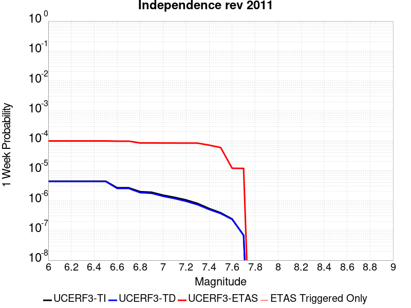 | 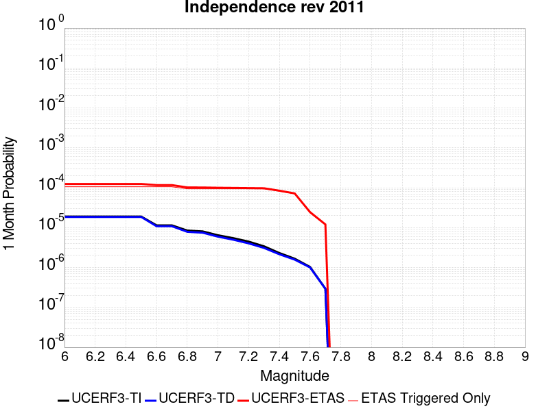 | 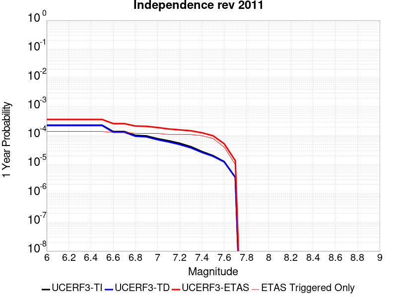 | 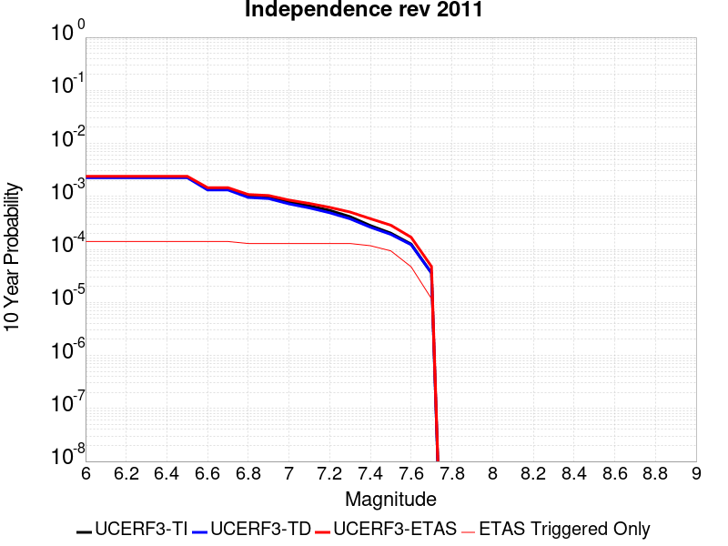 |

| Magnitude | 1 wk TI Prob | 1 wk TD Prob | 1 wk ETAS Prob | 1 wk ETAS/TD Gain | 1 wk ETAS Triggered Only | 1 mo TI Prob | 1 mo TD Prob | 1 mo ETAS Prob | 1 mo ETAS/TD Gain | 1 mo ETAS Triggered Only | 1 yr TI Prob | 1 yr TD Prob | 1 yr ETAS Prob | 1 yr ETAS/TD Gain | 1 yr ETAS Triggered Only | 10 yr TI Prob | 10 yr TD Prob | 10 yr ETAS Prob | 10 yr ETAS/TD Gain | 10 yr ETAS Triggered Only |
|-----|-----|-----|-----|-----|-----|-----|-----|-----|-----|-----|-----|-----|-----|-----|-----|-----|-----|-----|-----|-----|
| 6.0 | 4.422171E-6 | 4.326227E-6 | 9.822253E-5 | 22.703972 | 9.389671E-5 | 1.8952025E-5 | 1.8540857E-5 | 1.241727E-4 | 6.697247 | 1.056338E-4 | 2.3071647E-4 | 2.2571455E-4 | 3.547934E-4 | 1.5718676 | 1.2910798E-4 | 0.0023047708 | 0.0022551466 | 0.002395674 | 1.0623142 | 1.4084508E-4 |
| 6.1 | 4.422171E-6 | 4.326227E-6 | 9.822253E-5 | 22.703972 | 9.389671E-5 | 1.8952025E-5 | 1.8540857E-5 | 1.241727E-4 | 6.697247 | 1.056338E-4 | 2.3071647E-4 | 2.2571455E-4 | 3.547934E-4 | 1.5718676 | 1.2910798E-4 | 0.0023047708 | 0.0022551466 | 0.002395674 | 1.0623142 | 1.4084508E-4 |
| 6.2 | 4.422171E-6 | 4.326227E-6 | 9.822253E-5 | 22.703972 | 9.389671E-5 | 1.8952025E-5 | 1.8540857E-5 | 1.241727E-4 | 6.697247 | 1.056338E-4 | 2.3071647E-4 | 2.2571455E-4 | 3.547934E-4 | 1.5718676 | 1.2910798E-4 | 0.0023047708 | 0.0022551466 | 0.002395674 | 1.0623142 | 1.4084508E-4 |
| 6.3 | 4.422171E-6 | 4.326227E-6 | 9.822253E-5 | 22.703972 | 9.389671E-5 | 1.8952025E-5 | 1.8540857E-5 | 1.241727E-4 | 6.697247 | 1.056338E-4 | 2.3071647E-4 | 2.2571455E-4 | 3.547934E-4 | 1.5718676 | 1.2910798E-4 | 0.0023047708 | 0.0022551466 | 0.002395674 | 1.0623142 | 1.4084508E-4 |
| 6.4 | 4.422171E-6 | 4.326227E-6 | 9.822253E-5 | 22.703972 | 9.389671E-5 | 1.8952025E-5 | 1.8540857E-5 | 1.241727E-4 | 6.697247 | 1.056338E-4 | 2.3071647E-4 | 2.2571455E-4 | 3.547934E-4 | 1.5718676 | 1.2910798E-4 | 0.0023047708 | 0.0022551466 | 0.002395674 | 1.0623142 | 1.4084508E-4 |
| 6.5 | 4.422171E-6 | 4.326227E-6 | 9.822253E-5 | 22.703972 | 9.389671E-5 | 1.8952025E-5 | 1.8540857E-5 | 1.241727E-4 | 6.697247 | 1.056338E-4 | 2.3071647E-4 | 2.2571455E-4 | 3.547934E-4 | 1.5718676 | 1.2910798E-4 | 0.0023047708 | 0.0022551466 | 0.002395674 | 1.0623142 | 1.4084508E-4 |
| 6.6 | 2.663744E-6 | 2.5319862E-6 | 9.642846E-5 | 38.084118 | 9.389671E-5 | 1.1415996E-5 | 1.0851327E-5 | 1.16483985E-4 | 10.734538 | 1.056338E-4 | 1.3898089E-4 | 1.3210738E-4 | 2.6119832E-4 | 1.9771667 | 1.2910798E-4 | 0.0013889399 | 0.0013203367 | 0.0014609959 | 1.1065327 | 1.4084508E-4 |
| 6.7 | 2.663744E-6 | 2.5319862E-6 | 9.642846E-5 | 38.084118 | 9.389671E-5 | 1.1415996E-5 | 1.0851327E-5 | 1.16483985E-4 | 10.734538 | 1.056338E-4 | 1.3898089E-4 | 1.3210738E-4 | 2.6119832E-4 | 1.9771667 | 1.2910798E-4 | 0.0013889399 | 0.0013203367 | 0.0014609959 | 1.1065327 | 1.4084508E-4 |
| 6.8 | 1.9716529E-6 | 1.8322585E-6 | 8.3991734E-5 | 45.84055 | 8.2159626E-5 | 8.449913E-6 | 7.852514E-6 | 1.0174849E-4 | 12.957442 | 9.389671E-5 | 1.0287284E-4 | 9.5600284E-5 | 2.1295996E-4 | 2.227608 | 1.17370895E-4 | 0.0010282523 | 9.556045E-4 | 0.001084589 | 1.134977 | 1.2910798E-4 |
| 6.9 | 1.8788617E-6 | 1.7429993E-6 | 8.390248E-5 | 48.13684 | 8.2159626E-5 | 8.0522395E-6 | 7.4699765E-6 | 1.01365986E-4 | 13.569787 | 9.389671E-5 | 9.80316E-5 | 9.0943286E-5 | 2.083035E-4 | 2.290477 | 1.17370895E-4 | 9.798837E-4 | 9.0907275E-4 | 0.0010380633 | 1.1418926 | 1.2910798E-4 |
| 7.0 | 1.5045488E-6 | 1.3849503E-6 | 8.354446E-5 | 60.32307 | 8.2159626E-5 | 6.44805E-6 | 5.9354884E-6 | 9.983165E-5 | 16.819448 | 9.389671E-5 | 7.8502184E-5 | 7.226223E-5 | 1.8962464E-4 | 2.6241183 | 1.17370895E-4 | 7.8474457E-4 | 7.2239246E-4 | 8.514071E-4 | 1.1785936 | 1.2910798E-4 |
| 7.1 | 1.272341E-6 | 1.1625096E-6 | 8.332204E-5 | 71.67428 | 8.2159626E-5 | 5.4528787E-6 | 4.982175E-6 | 9.887842E-5 | 19.846437 | 9.389671E-5 | 6.6386776E-5 | 6.0656326E-5 | 1.780201E-4 | 2.9348974 | 1.17370895E-4 | 6.636695E-4 | 6.064009E-4 | 7.3543057E-4 | 1.2127795 | 1.2910798E-4 |
| 7.2 | 1.0416892E-6 | 9.4098806E-7 | 8.310054E-5 | 88.312 | 8.2159626E-5 | 4.464375E-6 | 4.0328E-6 | 9.7929136E-5 | 24.283163 | 9.389671E-5 | 5.4352407E-5 | 4.909825E-5 | 1.6646337E-4 | 3.3904138 | 1.17370895E-4 | 5.4339116E-4 | 4.9087586E-4 | 6.199205E-4 | 1.2628864 | 1.2910798E-4 |
| 7.3 | 7.9450155E-7 | 7.235002E-7 | 8.288307E-5 | 114.55846 | 8.2159626E-5 | 3.4050022E-6 | 3.1007114E-6 | 9.699714E-5 | 31.282219 | 9.389671E-5 | 4.1455114E-5 | 3.775052E-5 | 1.5511698E-4 | 4.1090026 | 1.17370895E-4 | 4.144738E-4 | 3.7744216E-4 | 5.065014E-4 | 1.3419312 | 1.2910798E-4 |
| 7.4 | 5.3893444E-7 | 5.019512E-7 | 7.092445E-5 | 141.2975 | 7.042254E-5 | 2.309717E-6 | 2.1512178E-6 | 8.431067E-5 | 39.192066 | 8.2159626E-5 | 2.8120441E-5 | 2.6190766E-5 | 1.318218E-4 | 5.03314 | 1.056338E-4 | 2.8116882E-4 | 2.6187726E-4 | 3.792174E-4 | 1.4480731 | 1.17370895E-4 |
| 7.5 | 3.8852085E-7 | 3.682554E-7 | 5.905368E-5 | 160.36067 | 5.8685448E-5 | 1.6650882E-6 | 1.5782365E-6 | 7.200066E-5 | 45.62096 | 7.042254E-5 | 2.027226E-5 | 1.9214862E-5 | 1.01372905E-4 | 5.2757554 | 8.2159626E-5 | 2.0270412E-4 | 1.9213221E-4 | 2.8601088E-4 | 1.4886149 | 9.389671E-5 |
| 7.6 | 2.414929E-7 | 2.345755E-7 | 1.1971662E-5 | 51.03543 | 1.1737089E-5 | 1.0349692E-6 | 1.0053232E-6 | 2.4479477E-5 | 24.34986 | 2.3474178E-5 | 1.2600677E-5 | 1.2239742E-5 | 4.745058E-5 | 3.8767629 | 3.521127E-5 | 1.2599962E-4 | 1.223908E-4 | 1.6933342E-4 | 1.3835468 | 4.6948357E-5 |
| 7.7 | 6.8298014E-8 | 6.85897E-8 | 1.1805678E-5 | 172.12029 | 1.1737089E-5 | 2.9270575E-7 | 2.9395582E-7 | 1.20310415E-5 | 40.928062 | 1.1737089E-5 | 3.5636867E-6 | 3.5789067E-6 | 1.5315954E-5 | 4.279506 | 1.1737089E-5 | 3.5636294E-5 | 3.5788536E-5 | 4.7525205E-5 | 1.3279449 | 1.1737089E-5 |

## Santa Ynez (West)
*[(top)](#table-of-contents)*

| 1 Week | 1 Month | 1 Year | 10 Year |
|-----|-----|-----|-----|
| 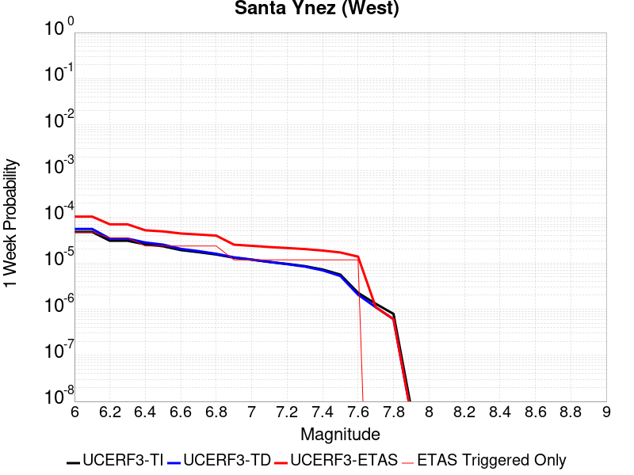 | 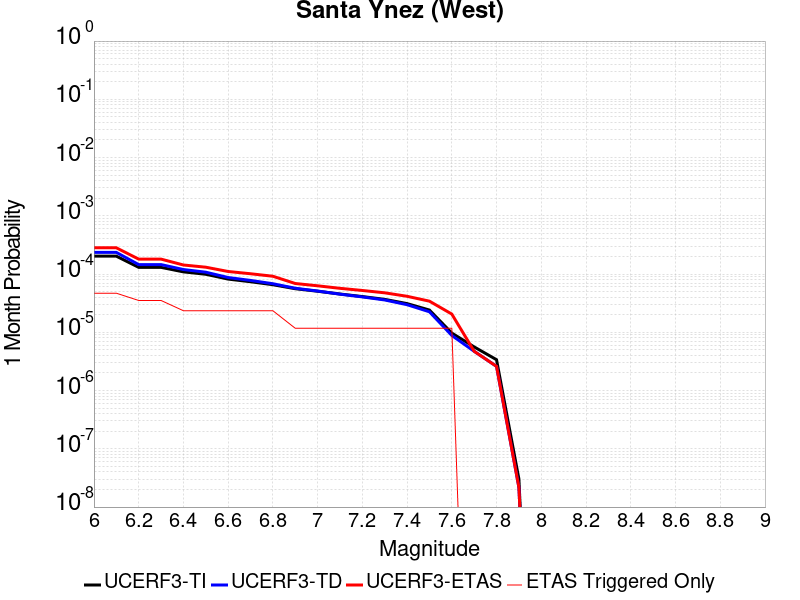 | 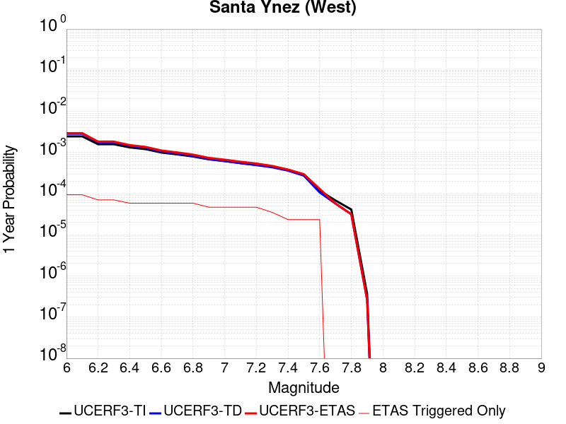 | 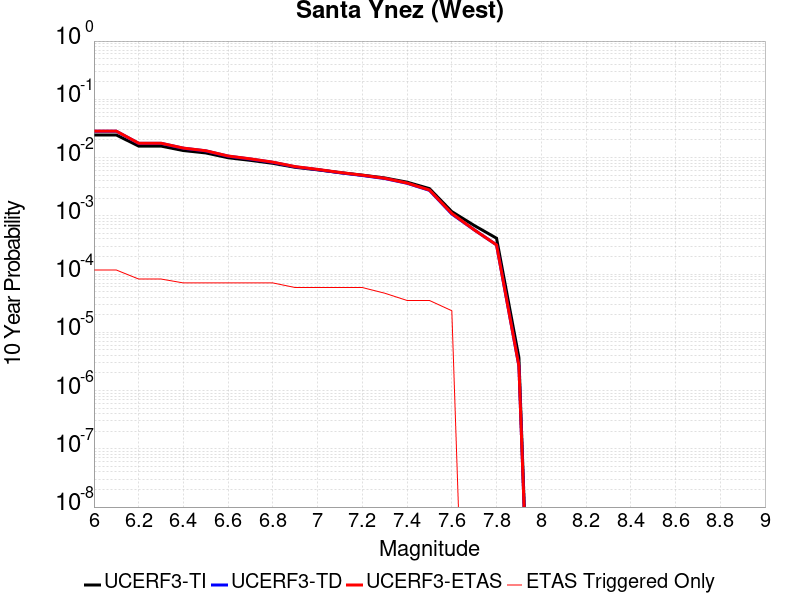 |

| Magnitude | 1 wk TI Prob | 1 wk TD Prob | 1 wk ETAS Prob | 1 wk ETAS/TD Gain | 1 wk ETAS Triggered Only | 1 mo TI Prob | 1 mo TD Prob | 1 mo ETAS Prob | 1 mo ETAS/TD Gain | 1 mo ETAS Triggered Only | 1 yr TI Prob | 1 yr TD Prob | 1 yr ETAS Prob | 1 yr ETAS/TD Gain | 1 yr ETAS Triggered Only | 10 yr TI Prob | 10 yr TD Prob | 10 yr ETAS Prob | 10 yr ETAS/TD Gain | 10 yr ETAS Triggered Only |
|-----|-----|-----|-----|-----|-----|-----|-----|-----|-----|-----|-----|-----|-----|-----|-----|-----|-----|-----|-----|-----|
| 6.0 | 4.7352758E-5 | 5.4972126E-5 | 1.019179E-4 | 1.8539923 | 4.6948357E-5 | 2.0292461E-4 | 2.3557522E-4 | 2.825125E-4 | 1.1992455 | 4.6948357E-5 | 0.0024678076 | 0.0028645284 | 0.0029581562 | 1.0326853 | 9.389671E-5 | 0.024405818 | 0.028304417 | 0.028418466 | 1.0040294 | 1.17370895E-4 |
| 6.1 | 4.7352758E-5 | 5.4972126E-5 | 1.019179E-4 | 1.8539923 | 4.6948357E-5 | 2.0292461E-4 | 2.3557522E-4 | 2.825125E-4 | 1.1992455 | 4.6948357E-5 | 0.0024678076 | 0.0028645284 | 0.0029581562 | 1.0326853 | 9.389671E-5 | 0.024405818 | 0.028304417 | 0.028418466 | 1.0040294 | 1.17370895E-4 |
| 6.2 | 3.0415853E-5 | 3.392511E-5 | 6.913518E-5 | 2.0378764 | 3.521127E-5 | 1.3034715E-4 | 1.4538545E-4 | 1.805916E-4 | 1.2421573 | 3.521127E-5 | 0.0015858212 | 0.0017686661 | 0.0018389641 | 1.0397463 | 7.042254E-5 | 0.015745522 | 0.017549807 | 0.017630525 | 1.0045993 | 8.2159626E-5 |
| 6.3 | 3.0415853E-5 | 3.392511E-5 | 6.913518E-5 | 2.0378764 | 3.521127E-5 | 1.3034715E-4 | 1.4538545E-4 | 1.805916E-4 | 1.2421573 | 3.521127E-5 | 0.0015858212 | 0.0017686661 | 0.0018389641 | 1.0397463 | 7.042254E-5 | 0.015745522 | 0.017549807 | 0.017630525 | 1.0045993 | 8.2159626E-5 |
| 6.4 | 2.5452082E-5 | 2.7912422E-5 | 5.1385945E-5 | 1.8409705 | 2.3474178E-5 | 1.09075794E-4 | 1.196193E-4 | 1.4309067E-4 | 1.1962173 | 2.3474178E-5 | 0.0013271887 | 0.0014554089 | 0.0015140089 | 1.0402637 | 5.8685448E-5 | 0.013192902 | 0.014460951 | 0.014530355 | 1.0047994 | 7.042254E-5 |
| 6.5 | 2.3143784E-5 | 2.5128256E-5 | 4.8601847E-5 | 1.934151 | 2.3474178E-5 | 9.9183875E-5 | 1.0768817E-4 | 1.3115982E-4 | 1.2179594 | 2.3474178E-5 | 0.0012068948 | 0.0013103267 | 0.0013689353 | 1.0447282 | 5.8685448E-5 | 0.012003611 | 0.01302768 | 0.013097185 | 1.0053352 | 7.042254E-5 |
| 6.6 | 1.9118515E-5 | 2.035434E-5 | 4.382804E-5 | 2.1532528 | 2.3474178E-5 | 8.193392E-5 | 8.7230015E-5 | 1.10702145E-4 | 1.2690831 | 2.3474178E-5 | 9.97089E-4 | 0.001061516 | 0.0011201391 | 1.0552258 | 5.8685448E-5 | 0.00992627 | 0.010565365 | 0.0106350435 | 1.006595 | 7.042254E-5 |
| 6.7 | 1.722807E-5 | 1.8146347E-5 | 4.16201E-5 | 2.29358 | 2.3474178E-5 | 7.3832496E-5 | 7.776777E-5 | 1.01240126E-4 | 1.3018262 | 2.3474178E-5 | 8.985399E-4 | 9.464169E-4 | 0.0010050469 | 1.0619494 | 5.8685448E-5 | 0.008949154 | 0.0094245095 | 0.009494268 | 1.0074018 | 7.042254E-5 |
| 6.8 | 1.5317364E-5 | 1.5926486E-5 | 3.940029E-5 | 2.4738848 | 2.3474178E-5 | 6.56442E-5 | 6.82546E-5 | 9.172718E-5 | 1.3438973 | 2.3474178E-5 | 7.98925E-4 | 8.306873E-4 | 8.8932394E-4 | 1.0705882 | 5.8685448E-5 | 0.007960589 | 0.00827631 | 0.00834615 | 1.0084385 | 7.042254E-5 |
| 6.9 | 1.3071226E-5 | 1.3329624E-5 | 2.5066556E-5 | 1.8805149 | 1.1737089E-5 | 5.6018336E-5 | 5.7125722E-5 | 6.886214E-5 | 1.205449 | 1.1737089E-5 | 6.8180985E-4 | 6.9528597E-4 | 7.422017E-4 | 1.0674769 | 4.6948357E-5 | 0.0067972173 | 0.006931367 | 0.006989646 | 1.008408 | 5.8685448E-5 |
| 7.0 | 1.1836986E-5 | 1.19327815E-5 | 2.366973E-5 | 1.9835887 | 1.1737089E-5 | 5.0728955E-5 | 5.11395E-5 | 6.287599E-5 | 1.2294995 | 1.1737089E-5 | 6.1745E-4 | 6.2244723E-4 | 6.6936633E-4 | 1.0753785 | 4.6948357E-5 | 0.006157372 | 0.006207231 | 0.0062655522 | 1.0093957 | 5.8685448E-5 |
| 7.1 | 1.0597169E-5 | 1.0542201E-5 | 2.2279166E-5 | 2.1133316 | 1.1737089E-5 | 4.541565E-5 | 4.5180084E-5 | 5.6916644E-5 | 1.2597728 | 1.1737089E-5 | 5.5279525E-4 | 5.4992986E-4 | 5.968524E-4 | 1.0853246 | 4.6948357E-5 | 0.0055142213 | 0.005485821 | 0.0055441842 | 1.010639 | 5.8685448E-5 |
| 7.2 | 9.59113E-6 | 9.459144E-6 | 2.1196121E-5 | 2.2408075 | 1.1737089E-5 | 4.11042E-5 | 4.0538565E-5 | 5.2275176E-5 | 1.2895173 | 1.1737089E-5 | 5.0032866E-4 | 4.934463E-4 | 5.403715E-4 | 1.0950968 | 4.6948357E-5 | 0.004992037 | 0.0049236254 | 0.0049820216 | 1.0118605 | 5.8685448E-5 |
| 7.3 | 8.586084E-6 | 8.379583E-6 | 2.0116575E-5 | 2.4006653 | 1.1737089E-5 | 3.679698E-5 | 3.5912013E-5 | 4.764868E-5 | 1.3268173 | 1.1737089E-5 | 4.4791115E-4 | 4.3714207E-4 | 4.7233794E-4 | 1.0805136 | 3.521127E-5 | 0.004470094 | 0.004362933 | 0.0044096764 | 1.0107138 | 4.6948357E-5 |
| 7.4 | 7.2622997E-6 | 6.9515427E-6 | 1.868855E-5 | 2.6884034 | 1.1737089E-5 | 3.112377E-5 | 2.979199E-5 | 4.1528732E-5 | 1.3939562 | 1.1737089E-5 | 3.78866E-4 | 3.626581E-4 | 3.8612375E-4 | 1.0647047 | 2.3474178E-5 | 0.0037822074 | 0.0036207628 | 0.0036558467 | 1.0096896 | 3.521127E-5 |
| 7.5 | 5.627296E-6 | 5.251588E-6 | 1.6988615E-5 | 3.2349484 | 1.1737089E-5 | 2.411676E-5 | 2.2506614E-5 | 3.424344E-5 | 1.5214833 | 1.1737089E-5 | 2.9358198E-4 | 2.739843E-4 | 2.9745203E-4 | 1.0856537 | 2.3474178E-5 | 0.0029319443 | 0.002736537 | 0.0027716518 | 1.0128319 | 3.521127E-5 |
| 7.6 | 2.265244E-6 | 2.0608625E-6 | 1.3797928E-5 | 6.69522 | 1.1737089E-5 | 9.708152E-6 | 8.832238E-6 | 2.0569223E-5 | 2.32888 | 1.1737089E-5 | 1.18190335E-4 | 1.0752728E-4 | 1.3099893E-4 | 1.2182856 | 2.3474178E-5 | 0.001181275 | 0.0010747612 | 0.0010982101 | 1.0218178 | 2.3474178E-5 |
| 7.7 | 1.3099874E-6 | 1.1016252E-6 | 1.1016252E-6 | 1.0 | 0.0 | 5.61422E-6 | 4.7212425E-6 | 4.7212425E-6 | 1.0 | 0.0 | 6.8350986E-5 | 5.7479636E-5 | 5.7479636E-5 | 1.0 | 0.0 | 6.832996E-4 | 5.7465007E-4 | 5.7465007E-4 | 1.0 | 0.0 |
| 7.8 | 7.903951E-7 | 6.0711415E-7 | 6.0711415E-7 | 1.0 | 0.0 | 3.3874032E-6 | 2.6019152E-6 | 2.6019152E-6 | 1.0 | 0.0 | 4.1240855E-5 | 3.167787E-5 | 3.167787E-5 | 1.0 | 0.0 | 4.12332E-4 | 3.167349E-4 | 3.167349E-4 | 1.0 | 0.0 |
| 7.9 | 7.0753297E-9 | 5.0899476E-9 | 5.0899476E-9 | 1.0 | 0.0 | 3.032284E-8 | 2.181406E-8 | 2.181406E-8 | 1.0 | 0.0 | 3.6918053E-7 | 2.6558615E-7 | 2.6558615E-7 | 1.0 | 0.0 | 3.691799E-6 | 2.6558594E-6 | 2.6558594E-6 | 1.0 | 0.0 |

## Coronado Bank alt1
*[(top)](#table-of-contents)*

| 1 Week | 1 Month | 1 Year | 10 Year |
|-----|-----|-----|-----|
| 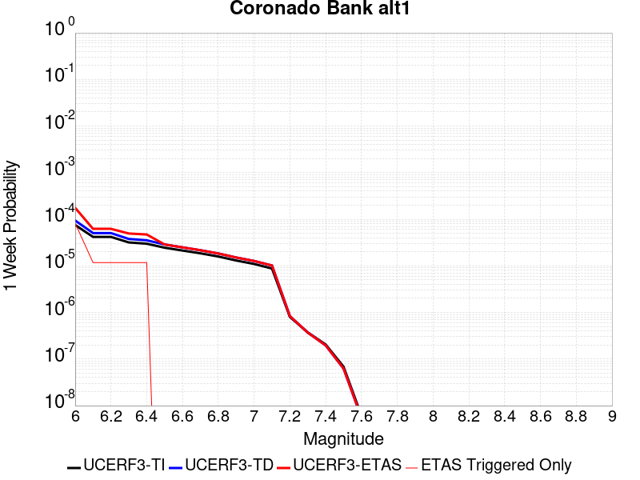 | 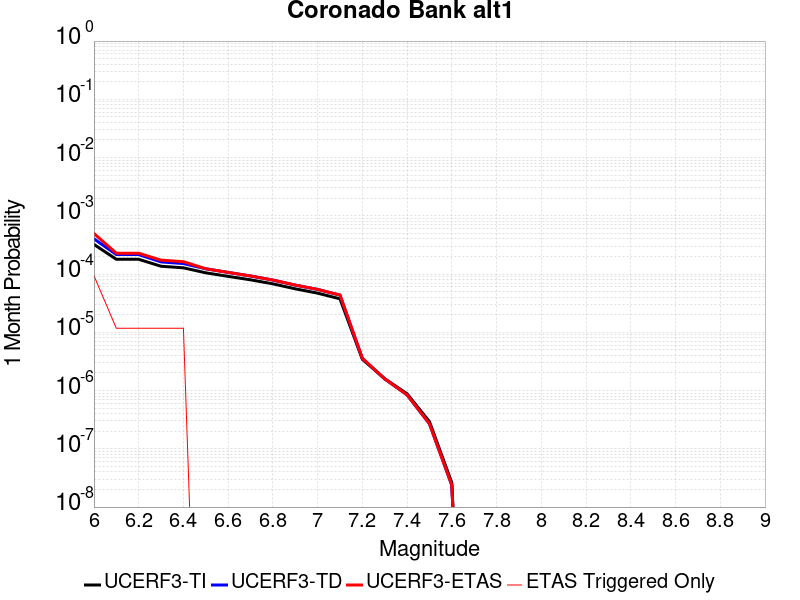 | 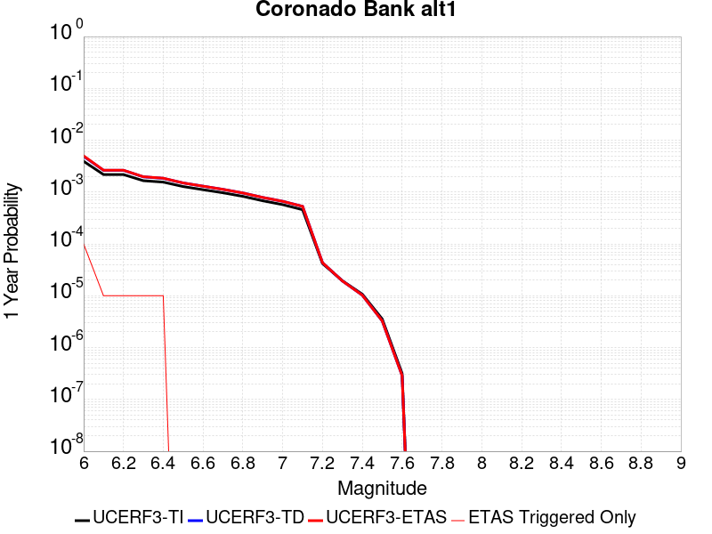 | 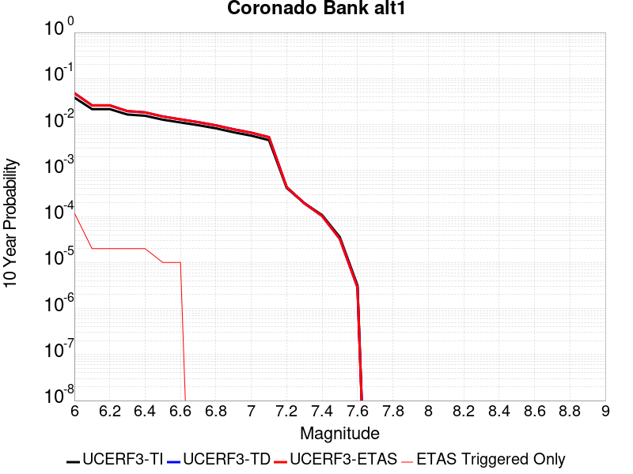 |

| Magnitude | 1 wk TI Prob | 1 wk TD Prob | 1 wk ETAS Prob | 1 wk ETAS/TD Gain | 1 wk ETAS Triggered Only | 1 mo TI Prob | 1 mo TD Prob | 1 mo ETAS Prob | 1 mo ETAS/TD Gain | 1 mo ETAS Triggered Only | 1 yr TI Prob | 1 yr TD Prob | 1 yr ETAS Prob | 1 yr ETAS/TD Gain | 1 yr ETAS Triggered Only | 10 yr TI Prob | 10 yr TD Prob | 10 yr ETAS Prob | 10 yr ETAS/TD Gain | 10 yr ETAS Triggered Only |
|-----|-----|-----|-----|-----|-----|-----|-----|-----|-----|-----|-----|-----|-----|-----|-----|-----|-----|-----|-----|-----|
| 6.0 | 7.533492E-5 | 9.394913E-5 | 1.7610104E-4 | 1.8744297 | 8.2159626E-5 | 3.22824E-4 | 4.0258127E-4 | 4.9644016E-4 | 1.2331427 | 9.389671E-5 | 0.0039233007 | 0.0048909658 | 0.0050077625 | 1.0238801 | 1.17370895E-4 | 0.03854755 | 0.04790356 | 0.048026484 | 1.0025661 | 1.2910798E-4 |
| 6.1 | 4.1807285E-5 | 5.049283E-5 | 6.222933E-5 | 1.2324389 | 1.1737089E-5 | 1.7916178E-4 | 2.1638049E-4 | 2.2811504E-4 | 1.054231 | 1.1737089E-5 | 0.0021791123 | 0.0026313474 | 0.0026430537 | 1.0044488 | 1.1737089E-5 | 0.021578677 | 0.026011046 | 0.026022479 | 1.0004395 | 1.1737089E-5 |
| 6.2 | 4.1807285E-5 | 5.049283E-5 | 6.222933E-5 | 1.2324389 | 1.1737089E-5 | 1.7916178E-4 | 2.1638049E-4 | 2.2811504E-4 | 1.054231 | 1.1737089E-5 | 0.0021791123 | 0.0026313474 | 0.0026430537 | 1.0044488 | 1.1737089E-5 | 0.021578677 | 0.026011046 | 0.026022479 | 1.0004395 | 1.1737089E-5 |
| 6.3 | 3.1793104E-5 | 3.7711117E-5 | 4.944776E-5 | 1.3112252 | 1.1737089E-5 | 1.3624904E-4 | 1.6160926E-4 | 1.7334445E-4 | 1.0726146 | 1.1737089E-5 | 0.0016575698 | 0.001965848 | 0.001977562 | 1.0059588 | 1.1737089E-5 | 0.016452603 | 0.019488465 | 0.019499972 | 1.0005906 | 1.1737089E-5 |
| 6.4 | 2.9878007E-5 | 3.5335794E-5 | 4.707247E-5 | 1.3321469 | 1.1737089E-5 | 1.2804232E-4 | 1.5143053E-4 | 1.6316584E-4 | 1.0774963 | 1.1737089E-5 | 0.0015578003 | 0.0018421387 | 0.0018538542 | 1.0063597 | 1.1737089E-5 | 0.015469253 | 0.01827244 | 0.018283963 | 1.0006306 | 1.1737089E-5 |
| 6.5 | 2.4512565E-5 | 2.8764043E-5 | 2.8764043E-5 | 1.0 | 0.0 | 1.0504962E-4 | 1.2326881E-4 | 1.2326881E-4 | 1.0 | 0.0 | 0.0012782287 | 0.0014997921 | 0.0014997921 | 1.0 | 0.0 | 0.012709012 | 0.014899683 | 0.014899683 | 1.0 | 0.0 |
| 6.6 | 2.1317413E-5 | 2.490667E-5 | 2.490667E-5 | 1.0 | 0.0 | 9.135714E-5 | 1.0673863E-4 | 1.0673863E-4 | 1.0 | 0.0 | 0.0011117056 | 0.0012987906 | 0.0012987906 | 1.0 | 0.0 | 0.011061605 | 0.012914404 | 0.012914404 | 1.0 | 0.0 |
| 6.7 | 1.8585655E-5 | 2.163488E-5 | 2.163488E-5 | 1.0 | 0.0 | 7.9650374E-5 | 9.271773E-5 | 9.271773E-5 | 1.0 | 0.0 | 9.6931186E-4 | 0.0011282742 | 0.0011282742 | 1.0 | 0.0 | 0.0096509475 | 0.011227623 | 0.011227623 | 1.0 | 0.0 |
| 6.8 | 1.5862879E-5 | 1.8419474E-5 | 1.8419474E-5 | 1.0 | 0.0 | 6.798199E-5 | 7.893833E-5 | 7.893833E-5 | 1.0 | 0.0 | 8.273665E-4 | 9.6066965E-4 | 9.6066965E-4 | 1.0 | 0.0 | 0.008242928 | 0.00956715 | 0.00956715 | 1.0 | 0.0 |
| 6.9 | 1.3021509E-5 | 1.5095265E-5 | 1.5095265E-5 | 1.0 | 0.0 | 5.5805274E-5 | 6.469249E-5 | 6.469249E-5 | 1.0 | 0.0 | 6.792174E-4 | 7.8736455E-4 | 7.8736455E-4 | 1.0 | 0.0 | 0.006771452 | 0.007847573 | 0.007847573 | 1.0 | 0.0 |
| 7.0 | 1.0974371E-5 | 1.2720104E-5 | 1.2720104E-5 | 1.0 | 0.0 | 4.7032172E-5 | 5.451369E-5 | 5.451369E-5 | 1.0 | 0.0 | 5.7246623E-4 | 6.6351966E-4 | 6.6351966E-4 | 1.0 | 0.0 | 0.0057099373 | 0.006617135 | 0.006617135 | 1.0 | 0.0 |
| 7.1 | 8.766221E-6 | 1.01638325E-5 | 1.01638325E-5 | 1.0 | 0.0 | 3.7568978E-5 | 4.355865E-5 | 4.355865E-5 | 1.0 | 0.0 | 4.573063E-4 | 5.3021475E-4 | 5.3021475E-4 | 1.0 | 0.0 | 0.0045636636 | 0.0052911965 | 0.0052911965 | 1.0 | 0.0 |
| 7.2 | 8.026024E-7 | 8.331765E-7 | 8.331765E-7 | 1.0 | 0.0 | 3.43972E-6 | 3.5707515E-6 | 3.5707515E-6 | 1.0 | 0.0 | 4.1877785E-5 | 4.3473043E-5 | 4.3473043E-5 | 1.0 | 0.0 | 4.1869894E-4 | 4.3464647E-4 | 4.3464647E-4 | 1.0 | 0.0 |
| 7.3 | 3.7293114E-7 | 3.7000953E-7 | 3.7000953E-7 | 1.0 | 0.0 | 1.5982754E-6 | 1.5857541E-6 | 1.5857541E-6 | 1.0 | 0.0 | 1.9458828E-5 | 1.9306386E-5 | 1.9306386E-5 | 1.0 | 0.0 | 1.9457124E-4 | 1.9304715E-4 | 1.9304715E-4 | 1.0 | 0.0 |
| 7.4 | 2.0557036E-7 | 1.9674363E-7 | 1.9674363E-7 | 1.0 | 0.0 | 8.810155E-7 | 8.431867E-7 | 8.431867E-7 | 1.0 | 0.0 | 1.0726311E-5 | 1.026575E-5 | 1.026575E-5 | 1.0 | 0.0 | 1.0725793E-4 | 1.0265279E-4 | 1.0265279E-4 | 1.0 | 0.0 |
| 7.5 | 6.845446E-8 | 6.279369E-8 | 6.279369E-8 | 1.0 | 0.0 | 2.9337625E-7 | 2.691158E-7 | 2.691158E-7 | 1.0 | 0.0 | 3.5718497E-6 | 3.2764797E-6 | 3.2764797E-6 | 1.0 | 0.0 | 3.5717923E-5 | 3.2764325E-5 | 3.2764325E-5 | 1.0 | 0.0 |
| 7.6 | 6.0975145E-9 | 5.53185E-9 | 5.53185E-9 | 1.0 | 0.0 | 2.6132206E-8 | 2.370793E-8 | 2.370793E-8 | 1.0 | 0.0 | 3.1815955E-7 | 2.88644E-7 | 2.88644E-7 | 1.0 | 0.0 | 3.181591E-6 | 2.8864374E-6 | 2.8864374E-6 | 1.0 | 0.0 |

## Brawley (Seismic Zone) alt 1
*[(top)](#table-of-contents)*

| 1 Week | 1 Month | 1 Year | 10 Year |
|-----|-----|-----|-----|
| 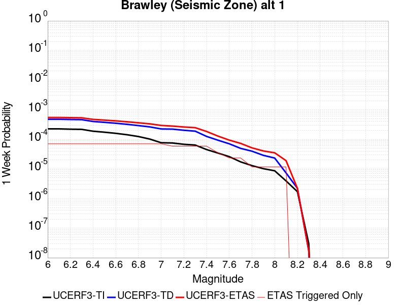 | 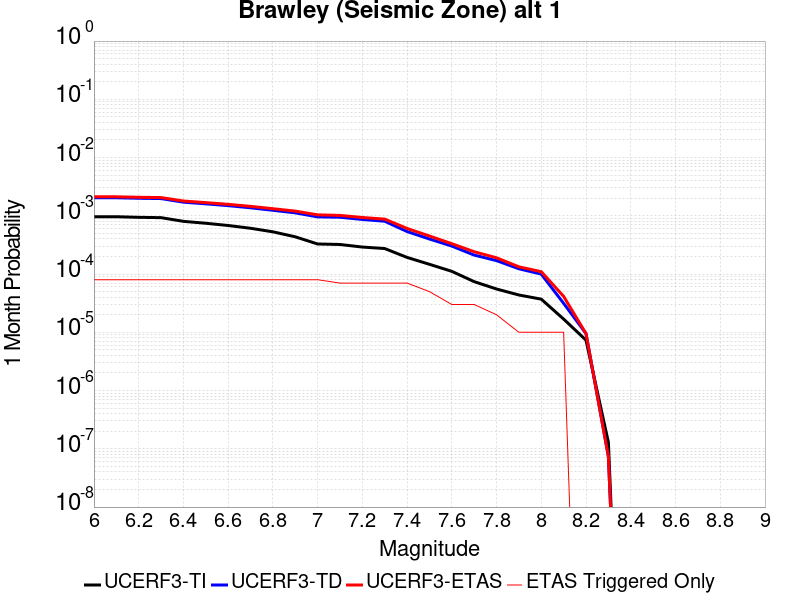 | 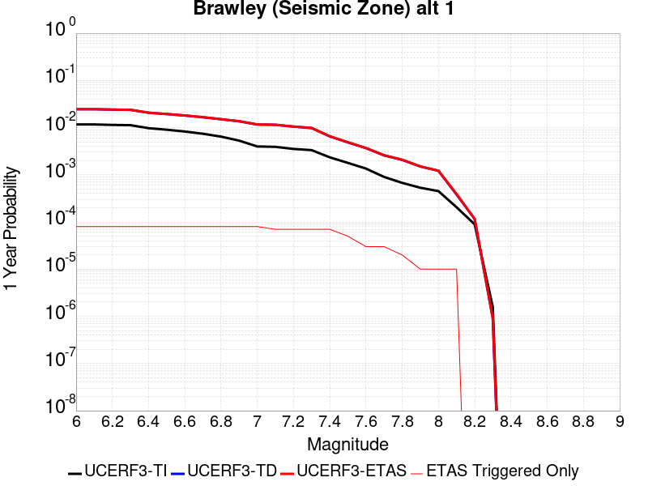 | 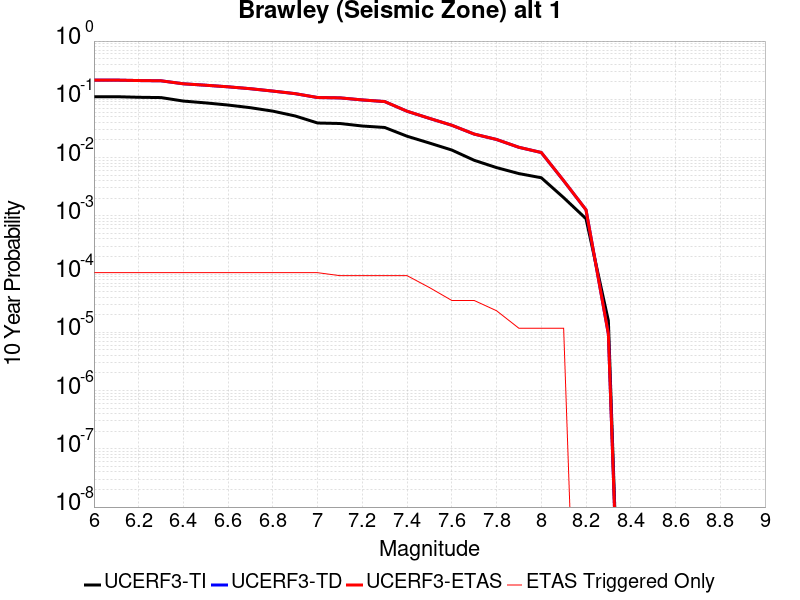 |

| Magnitude | 1 wk TI Prob | 1 wk TD Prob | 1 wk ETAS Prob | 1 wk ETAS/TD Gain | 1 wk ETAS Triggered Only | 1 mo TI Prob | 1 mo TD Prob | 1 mo ETAS Prob | 1 mo ETAS/TD Gain | 1 mo ETAS Triggered Only | 1 yr TI Prob | 1 yr TD Prob | 1 yr ETAS Prob | 1 yr ETAS/TD Gain | 1 yr ETAS Triggered Only | 10 yr TI Prob | 10 yr TD Prob | 10 yr ETAS Prob | 10 yr ETAS/TD Gain | 10 yr ETAS Triggered Only |
|-----|-----|-----|-----|-----|-----|-----|-----|-----|-----|-----|-----|-----|-----|-----|-----|-----|-----|-----|-----|-----|
| 6.0 | 2.2521618E-4 | 4.7632487E-4 | 5.467139E-4 | 1.1477752 | 7.042254E-5 | 9.6485513E-4 | 0.0020398323 | 0.0021335375 | 1.0459377 | 9.389671E-5 | 0.011683988 | 0.024546238 | 0.02463783 | 1.0037314 | 9.389671E-5 | 0.11088423 | 0.21350002 | 0.2135831 | 1.0003891 | 1.056338E-4 |
| 6.1 | 2.2521618E-4 | 4.7632487E-4 | 5.467139E-4 | 1.1477752 | 7.042254E-5 | 9.6485513E-4 | 0.0020398323 | 0.0021335375 | 1.0459377 | 9.389671E-5 | 0.011683988 | 0.024546238 | 0.02463783 | 1.0037314 | 9.389671E-5 | 0.11088423 | 0.21350002 | 0.2135831 | 1.0003891 | 1.056338E-4 |
| 6.2 | 2.198148E-4 | 4.6717093E-4 | 5.3756055E-4 | 1.1506721 | 7.042254E-5 | 9.417233E-4 | 0.0020006616 | 0.0020943703 | 1.0468389 | 9.389671E-5 | 0.011405343 | 0.024080504 | 0.024172138 | 1.0038054 | 9.389671E-5 | 0.10837428 | 0.20993657 | 0.21002004 | 1.0003976 | 1.056338E-4 |
| 6.3 | 2.1704129E-4 | 4.615278E-4 | 5.319178E-4 | 1.1525153 | 7.042254E-5 | 9.298453E-4 | 0.0019765133 | 0.0020702246 | 1.0474124 | 9.389671E-5 | 0.011262234 | 0.02379366 | 0.023885323 | 1.0038524 | 9.389671E-5 | 0.107082725 | 0.20782755 | 0.20791122 | 1.0004027 | 1.056338E-4 |
| 6.4 | 1.876142E-4 | 4.00449E-4 | 4.7084334E-4 | 1.1757885 | 7.042254E-5 | 8.038131E-4 | 0.0017150956 | 0.0018088312 | 1.0546533 | 9.389671E-5 | 0.00974259 | 0.020680401 | 0.020772357 | 1.0044465 | 9.389671E-5 | 0.093263686 | 0.18457815 | 0.1846643 | 1.0004667 | 1.056338E-4 |
| 6.5 | 1.7390939E-4 | 3.7477075E-4 | 4.451669E-4 | 1.1878378 | 7.042254E-5 | 7.45113E-4 | 0.0016051838 | 0.0016989298 | 1.0584021 | 9.389671E-5 | 0.009034078 | 0.019368723 | 0.019460801 | 1.004754 | 9.389671E-5 | 0.086755216 | 0.17440031 | 0.17448753 | 1.0005001 | 1.056338E-4 |
| 6.6 | 1.591791E-4 | 3.4891962E-4 | 4.1931757E-4 | 1.2017598 | 7.042254E-5 | 6.8201777E-4 | 0.0014945229 | 0.0015882793 | 1.0627333 | 9.389671E-5 | 0.008271996 | 0.018045569 | 0.018137772 | 1.0051094 | 9.389671E-5 | 0.07970774 | 0.16380852 | 0.16389686 | 1.0005392 | 1.056338E-4 |
| 6.7 | 1.4268003E-4 | 3.20582E-4 | 3.9098196E-4 | 1.2196004 | 7.042254E-5 | 6.1134255E-4 | 0.0013732077 | 0.0014669754 | 1.0682838 | 9.389671E-5 | 0.007417723 | 0.016592601 | 0.01668494 | 1.005565 | 9.389671E-5 | 0.07174956 | 0.15193306 | 0.15202264 | 1.0005896 | 1.056338E-4 |
| 6.8 | 1.239713E-4 | 2.9053655E-4 | 3.6093863E-4 | 1.2423174 | 7.042254E-5 | 5.3119735E-4 | 0.0012445687 | 0.0013383485 | 1.0753512 | 9.389671E-5 | 0.0064481674 | 0.015048777 | 0.015141261 | 1.0061456 | 9.389671E-5 | 0.06264243 | 0.13837762 | 0.13846864 | 1.0006578 | 1.056338E-4 |
| 6.9 | 1.0180238E-4 | 2.625439E-4 | 3.3294797E-4 | 1.268161 | 7.042254E-5 | 4.3622297E-4 | 0.0011247073 | 0.0012184983 | 1.0833915 | 9.389671E-5 | 0.005298089 | 0.013608336 | 0.013700955 | 1.006806 | 9.389671E-5 | 0.05173543 | 0.124961674 | 0.1250541 | 1.0007397 | 1.056338E-4 |
| 7.0 | 7.6619996E-5 | 2.23993E-4 | 2.9439977E-4 | 1.3143257 | 7.042254E-5 | 3.283301E-4 | 9.5962E-4 | 0.0010534266 | 1.0977539 | 9.389671E-5 | 0.0039900932 | 0.011621496 | 0.011714301 | 1.0079857 | 9.389671E-5 | 0.039192066 | 0.107266866 | 0.10736117 | 1.0008792 | 1.056338E-4 |
| 7.1 | 7.5127435E-5 | 2.2082464E-4 | 2.7949712E-4 | 1.2656972 | 5.8685448E-5 | 3.2193496E-4 | 9.4605127E-4 | 0.0010281331 | 1.0867627 | 8.2159626E-5 | 0.0039125155 | 0.011458045 | 0.011539263 | 1.0070883 | 8.2159626E-5 | 0.038443442 | 0.10583085 | 0.10591481 | 1.0007933 | 9.389671E-5 |
| 7.2 | 6.788582E-5 | 2.0210193E-4 | 2.6077553E-4 | 1.2903168 | 5.8685448E-5 | 2.9090676E-4 | 8.6586666E-4 | 9.479552E-4 | 1.094805 | 8.2159626E-5 | 0.0035360386 | 0.0104916105 | 0.010572908 | 1.0077488 | 8.2159626E-5 | 0.034803 | 0.09750131 | 0.09758605 | 1.0008692 | 9.389671E-5 |
| 7.3 | 6.399602E-5 | 1.8841137E-4 | 2.4708576E-4 | 1.3114164 | 5.8685448E-5 | 2.7423984E-4 | 8.072303E-4 | 8.893236E-4 | 1.1016974 | 8.2159626E-5 | 0.0033337586 | 0.009784332 | 0.009865687 | 1.0083148 | 8.2159626E-5 | 0.03284188 | 0.09139617 | 0.09148148 | 1.0009334 | 9.389671E-5 |
| 7.4 | 4.506759E-5 | 1.2529209E-4 | 1.8397019E-4 | 1.4683304 | 5.8685448E-5 | 1.9313251E-4 | 5.368565E-4 | 6.18972E-4 | 1.1529561 | 8.2159626E-5 | 0.0023488526 | 0.0065168133 | 0.0065984377 | 1.0125252 | 8.2159626E-5 | 0.023241805 | 0.062363707 | 0.062451746 | 1.0014117 | 9.389671E-5 |
| 7.5 | 3.43289E-5 | 9.33541E-5 | 1.2856208E-4 | 1.3771445 | 3.521127E-5 | 1.4711556E-4 | 4.00028E-4 | 4.5868993E-4 | 1.1466447 | 5.8685448E-5 | 0.0017896603 | 0.0048595266 | 0.0049179266 | 1.0120177 | 5.8685448E-5 | 0.01775316 | 0.04705519 | 0.047111113 | 1.0011885 | 5.8685448E-5 |
| 7.6 | 2.5980507E-5 | 7.053101E-5 | 9.400353E-5 | 1.3327972 | 2.3474178E-5 | 1.1134028E-4 | 3.0224086E-4 | 3.3744148E-4 | 1.1164654 | 3.521127E-5 | 0.001354725 | 0.003673598 | 0.0037086797 | 1.0095497 | 3.521127E-5 | 0.013464959 | 0.035840835 | 0.035874784 | 1.0009472 | 3.521127E-5 |
| 7.7 | 1.7292105E-5 | 4.9407296E-5 | 7.288031E-5 | 1.4750922 | 2.3474178E-5 | 7.4106916E-5 | 2.117284E-4 | 2.469322E-4 | 1.1662687 | 3.521127E-5 | 9.018782E-4 | 0.0025747516 | 0.0026098723 | 1.0136404 | 3.521127E-5 | 0.008982267 | 0.025290398 | 0.025324719 | 1.0013571 | 3.521127E-5 |
| 7.8 | 1.2927471E-5 | 3.9693266E-5 | 5.142989E-5 | 1.295683 | 1.1737089E-5 | 5.5402274E-5 | 1.7010293E-4 | 1.9357311E-4 | 1.1379764 | 2.3474178E-5 | 6.743139E-4 | 0.0020690386 | 0.0020924641 | 1.011322 | 2.3474178E-5 | 0.0067227143 | 0.020431727 | 0.020454722 | 1.0011255 | 2.3474178E-5 |
| 7.9 | 1.0200774E-5 | 2.874569E-5 | 4.0482442E-5 | 1.4082961 | 1.1737089E-5 | 4.371687E-5 | 1.2319001E-4 | 1.3492565E-4 | 1.0952646 | 1.1737089E-5 | 5.321229E-4 | 0.0014988075 | 0.001510527 | 1.0078192 | 1.1737089E-5 | 0.005308505 | 0.014991644 | 0.015003205 | 1.0007712 | 1.1737089E-5 |
| 8.0 | 8.650396E-6 | 2.3277367E-5 | 3.5014185E-5 | 1.5042157 | 1.1737089E-5 | 3.70726E-5 | 9.975634E-5 | 1.11492256E-4 | 1.1176459 | 1.1737089E-5 | 4.5126543E-4 | 0.0012138576 | 0.0012255805 | 1.0096575 | 1.1737089E-5 | 0.0045035016 | 0.012211097 | 0.0122226905 | 1.0009495 | 1.1737089E-5 |
| 8.1 | 3.9368224E-6 | 7.3279825E-6 | 1.9064986E-5 | 2.601669 | 1.1737089E-5 | 1.6871985E-5 | 3.140526E-5 | 4.3141983E-5 | 1.3737183 | 1.1737089E-5 | 2.0539707E-4 | 3.8229208E-4 | 3.940247E-4 | 1.0306902 | 1.1737089E-5 | 0.0020520731 | 0.004001185 | 0.004012875 | 1.0029217 | 1.1737089E-5 |
| 8.2 | 1.7101195E-6 | 2.217876E-6 | 2.217876E-6 | 1.0 | 0.0 | 7.329063E-6 | 9.505149E-6 | 9.505149E-6 | 1.0 | 0.0 | 8.922769E-5 | 1.1571907E-4 | 1.1571907E-4 | 1.0 | 0.0 | 8.9191867E-4 | 0.0012666774 | 0.0012666774 | 1.0 | 0.0 |
| 8.3 | 3.0346666E-8 | 1.721586E-8 | 1.721586E-8 | 1.0 | 0.0 | 1.3005713E-7 | 7.378226E-8 | 7.378226E-8 | 1.0 | 0.0 | 1.5834444E-6 | 8.9829894E-7 | 8.9829894E-7 | 1.0 | 0.0 | 1.5834332E-5 | 9.367729E-6 | 9.367729E-6 | 1.0 | 0.0 |

## Rose Canyon
*[(top)](#table-of-contents)*

| 1 Week | 1 Month | 1 Year | 10 Year |
|-----|-----|-----|-----|
| 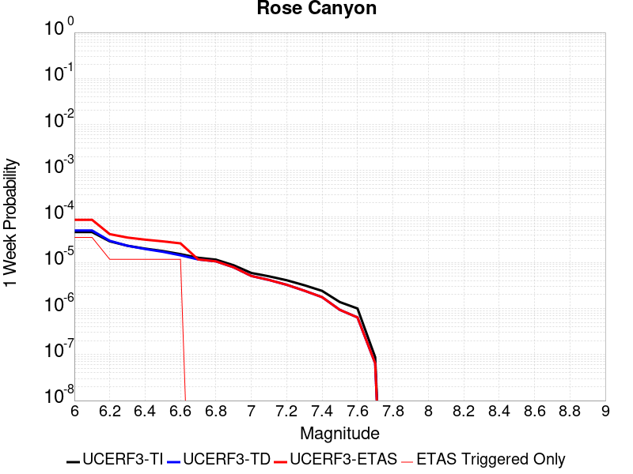 | 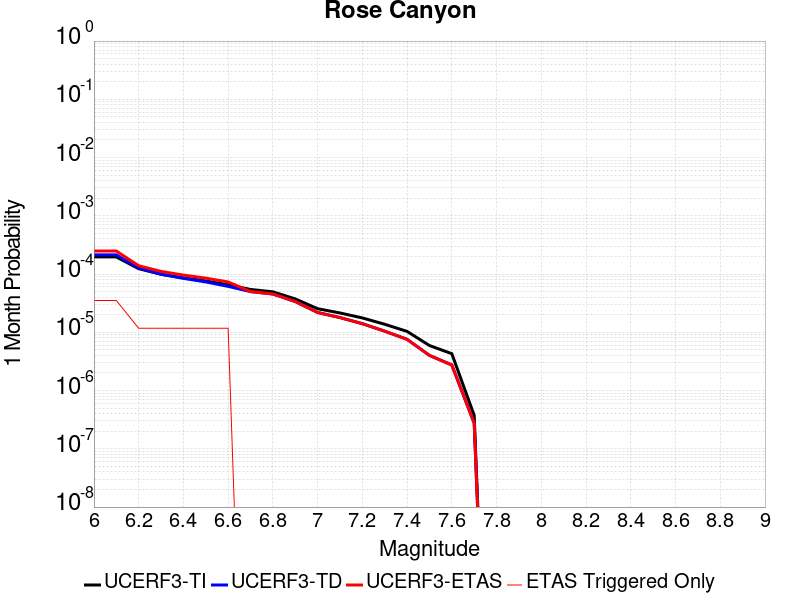 | 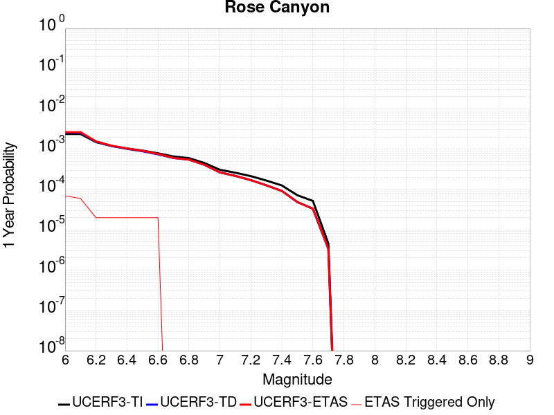 | 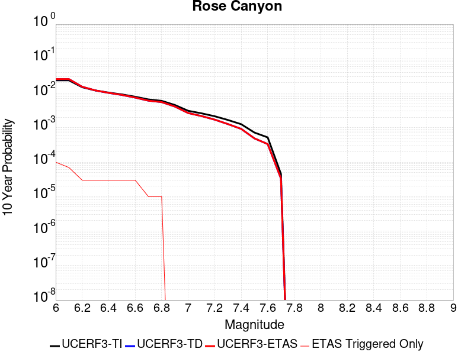 |

| Magnitude | 1 wk TI Prob | 1 wk TD Prob | 1 wk ETAS Prob | 1 wk ETAS/TD Gain | 1 wk ETAS Triggered Only | 1 mo TI Prob | 1 mo TD Prob | 1 mo ETAS Prob | 1 mo ETAS/TD Gain | 1 mo ETAS Triggered Only | 1 yr TI Prob | 1 yr TD Prob | 1 yr ETAS Prob | 1 yr ETAS/TD Gain | 1 yr ETAS Triggered Only | 10 yr TI Prob | 10 yr TD Prob | 10 yr ETAS Prob | 10 yr ETAS/TD Gain | 10 yr ETAS Triggered Only |
|-----|-----|-----|-----|-----|-----|-----|-----|-----|-----|-----|-----|-----|-----|-----|-----|-----|-----|-----|-----|-----|
| 6.0 | 4.5923203E-5 | 4.9714225E-5 | 8.492374E-5 | 1.7082382 | 3.521127E-5 | 1.9679888E-4 | 2.1304491E-4 | 2.482487E-4 | 1.165241 | 3.521127E-5 | 0.0023933933 | 0.0025909345 | 0.0026611744 | 1.02711 | 7.042254E-5 | 0.023677798 | 0.02563999 | 0.025742916 | 1.0040143 | 1.056338E-4 |
| 6.1 | 4.5923203E-5 | 4.9714225E-5 | 8.492374E-5 | 1.7082382 | 3.521127E-5 | 1.9679888E-4 | 2.1304491E-4 | 2.482487E-4 | 1.165241 | 3.521127E-5 | 0.0023933933 | 0.0025909345 | 0.002649468 | 1.0225916 | 5.8685448E-5 | 0.023677798 | 0.02563999 | 0.025708608 | 1.0026761 | 7.042254E-5 |
| 6.2 | 2.8844734E-5 | 2.9668723E-5 | 4.1405463E-5 | 1.395593 | 1.1737089E-5 | 1.2361443E-4 | 1.2714567E-4 | 1.3888127E-4 | 1.0923004 | 1.1737089E-5 | 0.0015039665 | 0.0015468939 | 0.0015703317 | 1.0151516 | 2.3474178E-5 | 0.0149382865 | 0.015374276 | 0.015408946 | 1.0022551 | 3.521127E-5 |
| 6.3 | 2.3171577E-5 | 2.3161238E-5 | 3.4898054E-5 | 1.5067439 | 1.1737089E-5 | 9.9302975E-5 | 9.9258745E-5 | 1.10994675E-4 | 1.1182357 | 1.1737089E-5 | 0.0012083431 | 0.0012078186 | 0.0012312644 | 1.0194117 | 2.3474178E-5 | 0.012017938 | 0.012022437 | 0.012057224 | 1.0028936 | 3.521127E-5 |
| 6.4 | 2.0066604E-5 | 1.9667024E-5 | 3.1403884E-5 | 1.5967785 | 1.1737089E-5 | 8.599689E-5 | 8.4284584E-5 | 9.602068E-5 | 1.1392437 | 1.1737089E-5 | 0.0010465092 | 0.0010256917 | 0.0010491419 | 1.0228627 | 2.3474178E-5 | 0.010415946 | 0.010217559 | 0.01025241 | 1.0034109 | 3.521127E-5 |
| 6.5 | 1.776989E-5 | 1.7113807E-5 | 2.8850696E-5 | 1.685814 | 1.1737089E-5 | 7.615444E-5 | 7.334287E-5 | 8.50791E-5 | 1.1600187 | 1.1737089E-5 | 9.267859E-4 | 8.925905E-4 | 9.1604376E-4 | 1.0262755 | 2.3474178E-5 | 0.009229303 | 0.008896211 | 0.008931109 | 1.0039228 | 3.521127E-5 |
| 6.6 | 1.5227364E-5 | 1.433926E-5 | 2.607618E-5 | 1.8185165 | 1.1737089E-5 | 6.52585E-5 | 6.1452556E-5 | 7.318892E-5 | 1.1909826 | 1.1737089E-5 | 7.942326E-4 | 7.479332E-4 | 7.713898E-4 | 1.0313619 | 2.3474178E-5 | 0.007914 | 0.007458359 | 0.007493308 | 1.0046859 | 3.521127E-5 |
| 6.7 | 1.2703898E-5 | 1.1673274E-5 | 1.1673274E-5 | 1.0 | 0.0 | 5.4444143E-5 | 5.0027378E-5 | 5.0027378E-5 | 1.0 | 0.0 | 6.626558E-4 | 6.089174E-4 | 6.089174E-4 | 1.0 | 0.0 | 0.006606833 | 0.0060750856 | 0.0060867514 | 1.0019202 | 1.1737089E-5 |
| 6.8 | 1.1554917E-5 | 1.0609337E-5 | 1.0609337E-5 | 1.0 | 0.0 | 4.9520135E-5 | 4.546782E-5 | 4.546782E-5 | 1.0 | 0.0 | 6.0274085E-4 | 5.5343413E-4 | 5.5343413E-4 | 1.0 | 0.0 | 0.0060110865 | 0.0055225673 | 0.0055342396 | 1.0021136 | 1.1737089E-5 |
| 6.9 | 8.732078E-6 | 7.881357E-6 | 7.881357E-6 | 1.0 | 0.0 | 3.7422655E-5 | 3.3776825E-5 | 3.3776825E-5 | 1.0 | 0.0 | 4.5552556E-4 | 4.111582E-4 | 4.111582E-4 | 1.0 | 0.0 | 0.0045459294 | 0.0041048084 | 0.0041048084 | 1.0 | 0.0 |
| 7.0 | 5.9337494E-6 | 5.1074853E-6 | 5.1074853E-6 | 1.0 | 0.0 | 2.5430107E-5 | 2.188904E-5 | 2.188904E-5 | 1.0 | 0.0 | 3.0956755E-4 | 2.664666E-4 | 2.664666E-4 | 1.0 | 0.0 | 0.0030913667 | 0.0026614866 | 0.0026614866 | 1.0 | 0.0 |
| 7.1 | 5.013409E-6 | 4.1773833E-6 | 4.1773833E-6 | 1.0 | 0.0 | 2.1485863E-5 | 1.7902948E-5 | 1.7902948E-5 | 1.0 | 0.0 | 2.6155898E-4 | 2.179467E-4 | 2.179467E-4 | 1.0 | 0.0 | 0.0026125133 | 0.0021773411 | 0.0021773411 | 1.0 | 0.0 |
| 7.2 | 4.120763E-6 | 3.2821383E-6 | 3.2821383E-6 | 1.0 | 0.0 | 1.7660293E-5 | 1.4066231E-5 | 1.4066231E-5 | 1.0 | 0.0 | 2.1499286E-4 | 1.7124301E-4 | 1.7124301E-4 | 1.0 | 0.0 | 0.0021478499 | 0.00171112 | 0.00171112 | 1.0 | 0.0 |
| 7.3 | 3.2081239E-6 | 2.4405372E-6 | 2.4405372E-6 | 1.0 | 0.0 | 1.374903E-5 | 1.0459404E-5 | 1.0459404E-5 | 1.0 | 0.0 | 1.6738157E-4 | 1.2733586E-4 | 1.2733586E-4 | 1.0 | 0.0 | 0.0016725556 | 0.001272636 | 0.001272636 | 1.0 | 0.0 |
| 7.4 | 2.4194755E-6 | 1.7680634E-6 | 1.7680634E-6 | 1.0 | 0.0 | 1.0369139E-5 | 7.577393E-6 | 7.577393E-6 | 1.0 | 0.0 | 1.2623696E-4 | 9.2250906E-5 | 9.2250906E-5 | 1.0 | 0.0 | 0.0012616527 | 9.2213147E-4 | 9.2213147E-4 | 1.0 | 0.0 |
| 7.5 | 1.3842889E-6 | 9.3786275E-7 | 9.3786275E-7 | 1.0 | 0.0 | 5.9326535E-6 | 4.019406E-6 | 4.019406E-6 | 1.0 | 0.0 | 7.222766E-5 | 4.8935202E-5 | 4.8935202E-5 | 1.0 | 0.0 | 7.220419E-4 | 4.892478E-4 | 4.892478E-4 | 1.0 | 0.0 |
| 7.6 | 1.0021575E-6 | 6.411463E-7 | 6.411463E-7 | 1.0 | 0.0 | 4.2949537E-6 | 2.7477672E-6 | 2.7477672E-6 | 1.0 | 0.0 | 5.2289808E-5 | 3.3453573E-5 | 3.3453573E-5 | 1.0 | 0.0 | 5.2277505E-4 | 3.344875E-4 | 3.344875E-4 | 1.0 | 0.0 |
| 7.7 | 8.7620116E-8 | 6.4492404E-8 | 6.4492404E-8 | 1.0 | 0.0 | 3.7551473E-7 | 2.76396E-7 | 2.76396E-7 | 1.0 | 0.0 | 4.5718825E-6 | 3.3651165E-6 | 3.3651165E-6 | 1.0 | 0.0 | 4.5717883E-5 | 3.3650686E-5 | 3.3650686E-5 | 1.0 | 0.0 |

## San Jacinto (Anza) rev
*[(top)](#table-of-contents)*

| 1 Week | 1 Month | 1 Year | 10 Year |
|-----|-----|-----|-----|
| 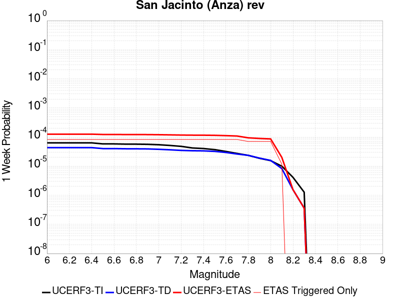 | 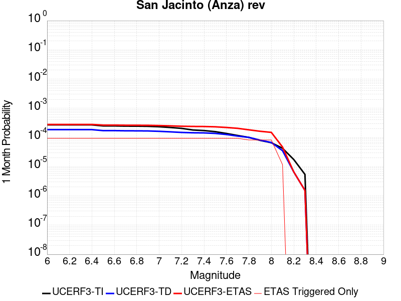 | 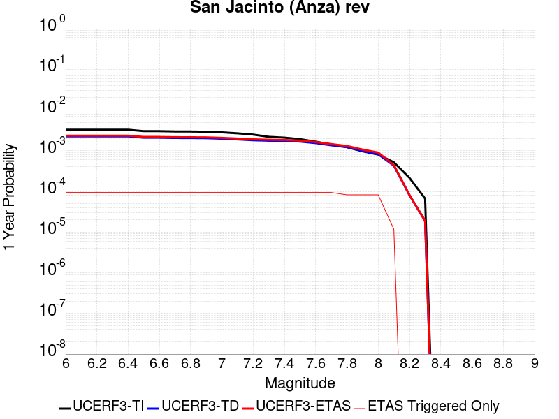 | 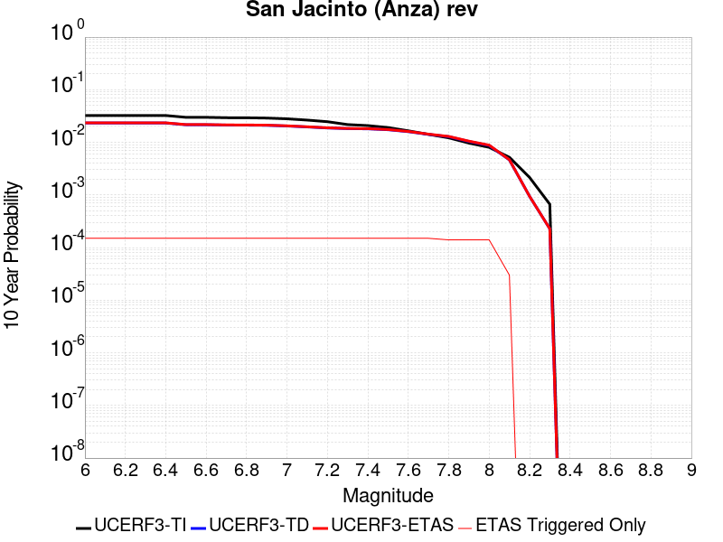 |

| Magnitude | 1 wk TI Prob | 1 wk TD Prob | 1 wk ETAS Prob | 1 wk ETAS/TD Gain | 1 wk ETAS Triggered Only | 1 mo TI Prob | 1 mo TD Prob | 1 mo ETAS Prob | 1 mo ETAS/TD Gain | 1 mo ETAS Triggered Only | 1 yr TI Prob | 1 yr TD Prob | 1 yr ETAS Prob | 1 yr ETAS/TD Gain | 1 yr ETAS Triggered Only | 10 yr TI Prob | 10 yr TD Prob | 10 yr ETAS Prob | 10 yr ETAS/TD Gain | 10 yr ETAS Triggered Only |
|-----|-----|-----|-----|-----|-----|-----|-----|-----|-----|-----|-----|-----|-----|-----|-----|-----|-----|-----|-----|-----|
| 6.0 | 6.3015636E-5 | 4.3302647E-5 | 1.2545871E-4 | 2.8972528 | 8.2159626E-5 | 2.7003905E-4 | 1.8556965E-4 | 2.7944893E-4 | 1.5058979 | 9.389671E-5 | 0.0032827691 | 0.0022569813 | 0.002350666 | 1.0415089 | 9.389671E-5 | 0.032346968 | 0.023296192 | 0.023399366 | 1.0044287 | 1.056338E-4 |
| 6.1 | 6.3015636E-5 | 4.3302647E-5 | 1.2545871E-4 | 2.8972528 | 8.2159626E-5 | 2.7003905E-4 | 1.8556965E-4 | 2.7944893E-4 | 1.5058979 | 9.389671E-5 | 0.0032827691 | 0.0022569813 | 0.002350666 | 1.0415089 | 9.389671E-5 | 0.032346968 | 0.023296192 | 0.023399366 | 1.0044287 | 1.056338E-4 |
| 6.2 | 6.3015636E-5 | 4.3302647E-5 | 1.2545871E-4 | 2.8972528 | 8.2159626E-5 | 2.7003905E-4 | 1.8556965E-4 | 2.7944893E-4 | 1.5058979 | 9.389671E-5 | 0.0032827691 | 0.0022569813 | 0.002350666 | 1.0415089 | 9.389671E-5 | 0.032346968 | 0.023296192 | 0.023399366 | 1.0044287 | 1.056338E-4 |
| 6.3 | 6.3015636E-5 | 4.3302647E-5 | 1.2545871E-4 | 2.8972528 | 8.2159626E-5 | 2.7003905E-4 | 1.8556965E-4 | 2.7944893E-4 | 1.5058979 | 9.389671E-5 | 0.0032827691 | 0.0022569813 | 0.002350666 | 1.0415089 | 9.389671E-5 | 0.032346968 | 0.023296192 | 0.023399366 | 1.0044287 | 1.056338E-4 |
| 6.4 | 6.3015636E-5 | 4.3302647E-5 | 1.2545871E-4 | 2.8972528 | 8.2159626E-5 | 2.7003905E-4 | 1.8556965E-4 | 2.7944893E-4 | 1.5058979 | 9.389671E-5 | 0.0032827691 | 0.0022569813 | 0.002350666 | 1.0415089 | 9.389671E-5 | 0.032346968 | 0.023296192 | 0.023399366 | 1.0044287 | 1.056338E-4 |
| 6.5 | 5.811017E-5 | 4.0082516E-5 | 1.2223885E-4 | 3.04968 | 8.2159626E-5 | 2.4901982E-4 | 1.7177092E-4 | 2.656515E-4 | 1.5465453 | 9.389671E-5 | 0.0030276014 | 0.002089311 | 0.0021830113 | 1.0448476 | 9.389671E-5 | 0.02986684 | 0.021593736 | 0.02169709 | 1.0047863 | 1.056338E-4 |
| 6.6 | 5.811017E-5 | 4.0082516E-5 | 1.2223885E-4 | 3.04968 | 8.2159626E-5 | 2.4901982E-4 | 1.7177092E-4 | 2.656515E-4 | 1.5465453 | 9.389671E-5 | 0.0030276014 | 0.002089311 | 0.0021830113 | 1.0448476 | 9.389671E-5 | 0.02986684 | 0.021593736 | 0.02169709 | 1.0047863 | 1.056338E-4 |
| 6.7 | 5.712442E-5 | 3.9505223E-5 | 1.216616E-4 | 3.0796332 | 8.2159626E-5 | 2.4479596E-4 | 1.6929714E-4 | 2.6317796E-4 | 1.5545328 | 9.389671E-5 | 0.0029763177 | 0.0020592497 | 0.002152953 | 1.0455036 | 9.389671E-5 | 0.029367693 | 0.021285562 | 0.021388948 | 1.0048571 | 1.056338E-4 |
| 6.8 | 5.6967532E-5 | 3.9361643E-5 | 1.2151803E-4 | 3.0872195 | 8.2159626E-5 | 2.4412372E-4 | 1.6868189E-4 | 2.6256277E-4 | 1.5565557 | 9.389671E-5 | 0.0029681553 | 0.002051773 | 0.002145477 | 1.0456698 | 9.389671E-5 | 0.029288229 | 0.021210281 | 0.021313675 | 1.0048747 | 1.056338E-4 |
| 6.9 | 5.6211324E-5 | 3.9066435E-5 | 1.2122285E-4 | 3.1029923 | 8.2159626E-5 | 2.4088343E-4 | 1.6741687E-4 | 2.6129786E-4 | 1.5607618 | 9.389671E-5 | 0.0029288116 | 0.0020364004 | 0.0021301059 | 1.0460153 | 9.389671E-5 | 0.028905109 | 0.021049714 | 0.021153124 | 1.0049126 | 1.056338E-4 |
| 7.0 | 5.4383527E-5 | 3.792697E-5 | 1.20083474E-4 | 3.1661766 | 8.2159626E-5 | 2.3305144E-4 | 1.6253405E-4 | 2.5641551E-4 | 1.577611 | 9.389671E-5 | 0.0028337094 | 0.001977061 | 0.002070772 | 1.0473992 | 9.389671E-5 | 0.027978465 | 0.020440677 | 0.02054415 | 1.0050622 | 1.056338E-4 |
| 7.1 | 5.1393665E-5 | 3.6389913E-5 | 1.18546544E-4 | 3.2576761 | 8.2159626E-5 | 2.2023996E-4 | 1.5594746E-4 | 2.4982955E-4 | 1.6020108 | 9.389671E-5 | 0.0026781242 | 0.0018970112 | 0.0019907297 | 1.0494033 | 9.389671E-5 | 0.026460782 | 0.019614287 | 0.019717848 | 1.0052799 | 1.056338E-4 |
| 7.2 | 4.785222E-5 | 3.4741795E-5 | 1.1689857E-4 | 3.3647819 | 8.2159626E-5 | 2.0506482E-4 | 1.4888494E-4 | 2.4276767E-4 | 1.6305724 | 9.389671E-5 | 0.0024938055 | 0.0018111705 | 0.0019048972 | 1.0517492 | 9.389671E-5 | 0.024660049 | 0.018728992 | 0.018832646 | 1.0055345 | 1.056338E-4 |
| 7.3 | 4.2143256E-5 | 3.383628E-5 | 1.1599312E-4 | 3.4280698 | 8.2159626E-5 | 1.8060145E-4 | 1.4500458E-4 | 2.3888767E-4 | 1.6474491 | 9.389671E-5 | 0.002196605 | 0.0017640047 | 0.0018577357 | 1.0531354 | 9.389671E-5 | 0.02175019 | 0.01823724 | 0.018340949 | 1.0056865 | 1.056338E-4 |
| 7.4 | 4.0264713E-5 | 3.347446E-5 | 1.1563134E-4 | 3.454315 | 8.2159626E-5 | 1.7255165E-4 | 1.4345412E-4 | 2.3733736E-4 | 1.6544479 | 9.389671E-5 | 0.002098792 | 0.0017451581 | 0.001838891 | 1.0537102 | 9.389671E-5 | 0.020790804 | 0.018041821 | 0.018145548 | 1.0057493 | 1.056338E-4 |
| 7.5 | 3.694492E-5 | 3.218847E-5 | 1.1434545E-4 | 3.5523732 | 8.2159626E-5 | 1.5832575E-4 | 1.379433E-4 | 2.3182706E-4 | 1.6805967 | 9.389671E-5 | 0.0019259118 | 0.001678169 | 0.0017719081 | 1.055858 | 9.389671E-5 | 0.01909306 | 0.01735827 | 0.017462071 | 1.0059799 | 1.056338E-4 |
| 7.6 | 3.200565E-5 | 2.9504106E-5 | 1.11661306E-4 | 3.7846022 | 8.2159626E-5 | 1.3715986E-4 | 1.2644005E-4 | 2.203249E-4 | 1.7425245 | 9.389671E-5 | 0.001668642 | 0.0015383229 | 0.0016320752 | 1.0609444 | 9.389671E-5 | 0.01656168 | 0.0159463 | 0.01605025 | 1.0065187 | 1.056338E-4 |
| 7.7 | 2.731642E-5 | 2.6092788E-5 | 1.0825027E-4 | 4.1486664 | 8.2159626E-5 | 1.1706512E-4 | 1.1182144E-4 | 2.0570766E-4 | 1.8396083 | 9.389671E-5 | 0.001424336 | 0.0013605768 | 0.0014543458 | 1.0689186 | 9.389671E-5 | 0.014152412 | 0.014167004 | 0.014271142 | 1.0073507 | 1.056338E-4 |
| 7.8 | 2.3466424E-5 | 2.3504817E-5 | 9.39257E-5 | 3.996019 | 7.042254E-5 | 1.0056651E-4 | 1.0073105E-4 | 1.828824E-4 | 1.8155514 | 8.2159626E-5 | 0.0012237094 | 0.0012257113 | 0.0013077703 | 1.066948 | 8.2159626E-5 | 0.012169928 | 0.012808893 | 0.012901587 | 1.0072367 | 9.389671E-5 |
| 7.9 | 1.8611925E-5 | 1.8908117E-5 | 8.932932E-5 | 4.72439 | 7.042254E-5 | 7.9762955E-5 | 8.1032274E-5 | 1.6318524E-4 | 2.0138302 | 8.2159626E-5 | 9.7068126E-4 | 9.861222E-4 | 0.0010682007 | 1.0832337 | 8.2159626E-5 | 0.0096645225 | 0.010393824 | 0.010486745 | 1.00894 | 9.389671E-5 |
| 8.0 | 1.5460775E-5 | 1.5740965E-5 | 8.616239E-5 | 5.473768 | 7.042254E-5 | 6.6258784E-5 | 6.7459536E-5 | 1.4961362E-4 | 2.2178276 | 8.2159626E-5 | 8.0640207E-4 | 8.21011E-4 | 9.031032E-4 | 1.0999892 | 8.2159626E-5 | 0.008034821 | 0.0087028835 | 0.008795963 | 1.0106952 | 9.389671E-5 |
| 8.1 | 9.983884E-6 | 8.269952E-6 | 2.0006944E-5 | 2.4192336 | 1.1737089E-5 | 4.2787375E-5 | 3.544217E-5 | 4.7178844E-5 | 1.3311499 | 1.1737089E-5 | 5.2081177E-4 | 4.314235E-4 | 4.4315553E-4 | 1.0271938 | 1.1737089E-5 | 0.0051959283 | 0.004640022 | 0.004651705 | 1.0025178 | 1.1737089E-5 |
| 8.2 | 4.1226E-6 | 1.5529788E-6 | 1.5529788E-6 | 1.0 | 0.0 | 1.7668166E-5 | 6.6556063E-6 | 6.6556063E-6 | 1.0 | 0.0 | 2.1508869E-4 | 8.102902E-5 | 8.102902E-5 | 1.0 | 0.0 | 0.0021488064 | 9.4050163E-4 | 9.4050163E-4 | 1.0 | 0.0 |
| 8.3 | 1.2750878E-6 | 3.612133E-7 | 3.612133E-7 | 1.0 | 0.0 | 5.4646503E-6 | 1.548056E-6 | 1.548056E-6 | 1.0 | 0.0 | 6.653009E-5 | 1.8847424E-5 | 1.8847424E-5 | 1.0 | 0.0 | 6.6510175E-4 | 2.2734253E-4 | 2.2734253E-4 | 1.0 | 0.0 |

## Kern Canyon (South Kern) 2011
*[(top)](#table-of-contents)*

| 1 Week | 1 Month | 1 Year | 10 Year |
|-----|-----|-----|-----|
| 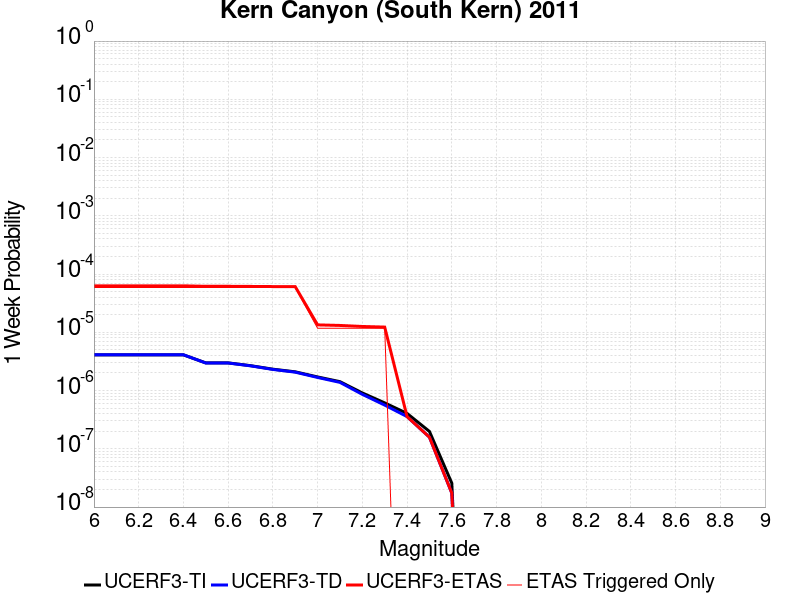 | 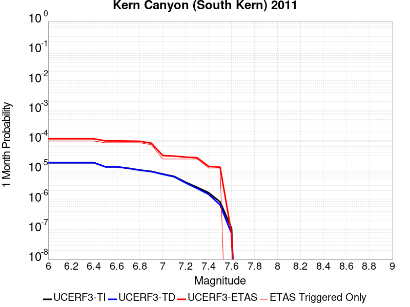 | 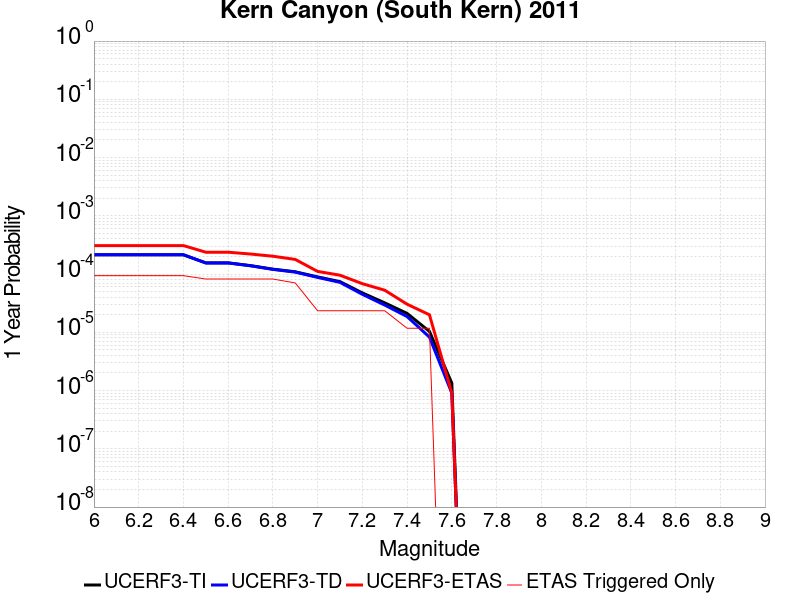 | 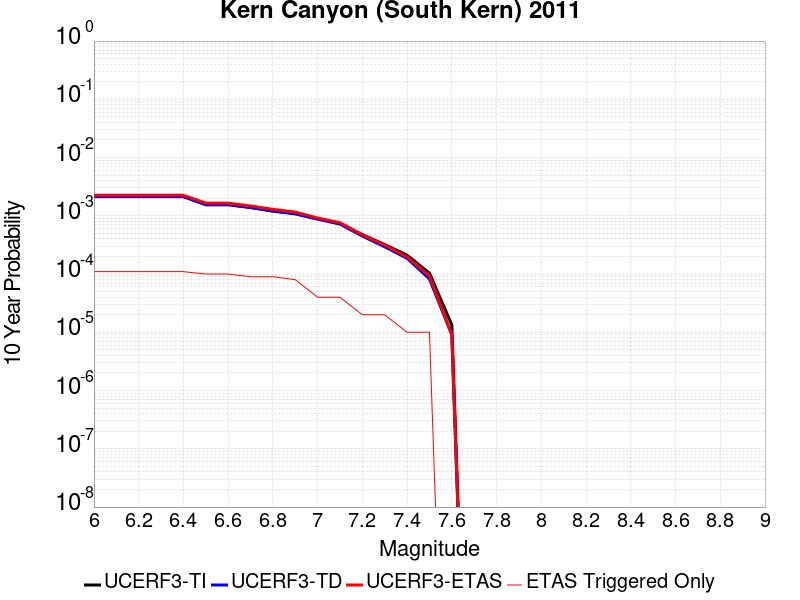 |

| Magnitude | 1 wk TI Prob | 1 wk TD Prob | 1 wk ETAS Prob | 1 wk ETAS/TD Gain | 1 wk ETAS Triggered Only | 1 mo TI Prob | 1 mo TD Prob | 1 mo ETAS Prob | 1 mo ETAS/TD Gain | 1 mo ETAS Triggered Only | 1 yr TI Prob | 1 yr TD Prob | 1 yr ETAS Prob | 1 yr ETAS/TD Gain | 1 yr ETAS Triggered Only | 10 yr TI Prob | 10 yr TD Prob | 10 yr ETAS Prob | 10 yr ETAS/TD Gain | 10 yr ETAS Triggered Only |
|-----|-----|-----|-----|-----|-----|-----|-----|-----|-----|-----|-----|-----|-----|-----|-----|-----|-----|-----|-----|-----|
| 6.0 | 4.105075E-6 | 4.1137264E-6 | 6.279893E-5 | 15.265704 | 5.8685448E-5 | 1.7593058E-5 | 1.763014E-5 | 1.115252E-4 | 6.3258257 | 9.389671E-5 | 2.1417443E-4 | 2.1462646E-4 | 3.0850302E-4 | 1.4373951 | 9.389671E-5 | 0.0021396813 | 0.0021442557 | 0.002249663 | 1.049158 | 1.056338E-4 |
| 6.1 | 4.105075E-6 | 4.1137264E-6 | 6.279893E-5 | 15.265704 | 5.8685448E-5 | 1.7593058E-5 | 1.763014E-5 | 1.115252E-4 | 6.3258257 | 9.389671E-5 | 2.1417443E-4 | 2.1462646E-4 | 3.0850302E-4 | 1.4373951 | 9.389671E-5 | 0.0021396813 | 0.0021442557 | 0.002249663 | 1.049158 | 1.056338E-4 |
| 6.2 | 4.105075E-6 | 4.1137264E-6 | 6.279893E-5 | 15.265704 | 5.8685448E-5 | 1.7593058E-5 | 1.763014E-5 | 1.115252E-4 | 6.3258257 | 9.389671E-5 | 2.1417443E-4 | 2.1462646E-4 | 3.0850302E-4 | 1.4373951 | 9.389671E-5 | 0.0021396813 | 0.0021442557 | 0.002249663 | 1.049158 | 1.056338E-4 |
| 6.3 | 4.105075E-6 | 4.1137264E-6 | 6.279893E-5 | 15.265704 | 5.8685448E-5 | 1.7593058E-5 | 1.763014E-5 | 1.115252E-4 | 6.3258257 | 9.389671E-5 | 2.1417443E-4 | 2.1462646E-4 | 3.0850302E-4 | 1.4373951 | 9.389671E-5 | 0.0021396813 | 0.0021442557 | 0.002249663 | 1.049158 | 1.056338E-4 |
| 6.4 | 4.105075E-6 | 4.1137264E-6 | 6.279893E-5 | 15.265704 | 5.8685448E-5 | 1.7593058E-5 | 1.763014E-5 | 1.115252E-4 | 6.3258257 | 9.389671E-5 | 2.1417443E-4 | 2.1462646E-4 | 3.0850302E-4 | 1.4373951 | 9.389671E-5 | 0.0021396813 | 0.0021442557 | 0.002249663 | 1.049158 | 1.056338E-4 |
| 6.5 | 2.9849807E-6 | 2.9731548E-6 | 6.165843E-5 | 20.738384 | 5.8685448E-5 | 1.2792712E-5 | 1.274203E-5 | 9.4900606E-5 | 7.44784 | 8.2159626E-5 | 1.5574014E-4 | 1.5512333E-4 | 2.372702E-4 | 1.5295585 | 8.2159626E-5 | 0.0015563103 | 0.0015501656 | 0.0016439168 | 1.0604782 | 9.389671E-5 |
| 6.6 | 2.9849807E-6 | 2.9731548E-6 | 6.165843E-5 | 20.738384 | 5.8685448E-5 | 1.2792712E-5 | 1.274203E-5 | 9.4900606E-5 | 7.44784 | 8.2159626E-5 | 1.5574014E-4 | 1.5512333E-4 | 2.372702E-4 | 1.5295585 | 8.2159626E-5 | 0.0015563103 | 0.0015501656 | 0.0016439168 | 1.0604782 | 9.389671E-5 |
| 6.7 | 2.6756725E-6 | 2.6582206E-6 | 6.134351E-5 | 23.076906 | 5.8685448E-5 | 1.1467117E-5 | 1.1392325E-5 | 9.355101E-5 | 8.211758 | 8.2159626E-5 | 1.396032E-4 | 1.3869285E-4 | 2.2084107E-4 | 1.5923033 | 8.2159626E-5 | 0.0013951553 | 0.0013860738 | 0.0014798404 | 1.067649 | 9.389671E-5 |
| 6.8 | 2.3283721E-6 | 2.3047787E-6 | 6.099009E-5 | 26.462448 | 5.8685448E-5 | 9.9787E-6 | 9.877586E-6 | 9.20364E-5 | 9.317701 | 8.2159626E-5 | 1.214839E-4 | 1.20253055E-4 | 2.0240279E-4 | 1.6831406 | 8.2159626E-5 | 0.001214175 | 0.0012018873 | 0.0012956711 | 1.0780305 | 9.389671E-5 |
| 6.9 | 2.0972677E-6 | 2.0696411E-6 | 6.0754966E-5 | 29.355314 | 5.8685448E-5 | 8.988259E-6 | 8.869861E-6 | 7.929177E-5 | 8.939461 | 7.042254E-5 | 1.0942656E-4 | 1.0798526E-4 | 1.784002E-4 | 1.6520791 | 7.042254E-5 | 0.0010937268 | 0.0010793337 | 0.0011614047 | 1.0760385 | 8.2159626E-5 |
| 7.0 | 1.7132242E-6 | 1.6787036E-6 | 1.3415773E-5 | 7.9917464 | 1.1737089E-5 | 7.3423685E-6 | 7.194424E-6 | 3.0668434E-5 | 4.262806 | 2.3474178E-5 | 8.938967E-5 | 8.758863E-5 | 1.11060755E-4 | 1.2679814 | 2.3474178E-5 | 8.935372E-4 | 8.7554497E-4 | 9.107254E-4 | 1.0401812 | 3.521127E-5 |
| 7.1 | 1.4215541E-6 | 1.3815752E-6 | 1.3118648E-5 | 9.495428 | 1.1737089E-5 | 6.0923603E-6 | 5.9210233E-6 | 2.9395063E-5 | 4.9645243 | 2.3474178E-5 | 7.417196E-5 | 7.20861E-5 | 9.5558586E-5 | 1.3256173 | 2.3474178E-5 | 7.414721E-4 | 7.206299E-4 | 7.5581577E-4 | 1.0488266 | 3.521127E-5 |
| 7.2 | 9.097853E-7 | 8.6037755E-7 | 1.2597457E-5 | 14.641777 | 1.1737089E-5 | 3.899074E-6 | 3.6873273E-6 | 2.7161419E-5 | 7.3661537 | 2.3474178E-5 | 4.7470192E-5 | 4.4892295E-5 | 6.836542E-5 | 1.5228765 | 2.3474178E-5 | 4.7460053E-4 | 4.4883334E-4 | 4.72297E-4 | 1.052277 | 2.3474178E-5 |
| 7.3 | 6.144169E-7 | 5.628206E-7 | 1.2299904E-5 | 21.854038 | 1.1737089E-5 | 2.6332125E-6 | 2.4120861E-6 | 2.5886207E-5 | 10.731875 | 2.3474178E-5 | 3.205889E-5 | 2.9366758E-5 | 5.284025E-5 | 1.7993218 | 2.3474178E-5 | 3.2054266E-4 | 2.936293E-4 | 3.1709656E-4 | 1.0799215 | 2.3474178E-5 |
| 7.4 | 4.049844E-7 | 3.5728314E-7 | 3.5728314E-7 | 1.0 | 0.0 | 1.7356463E-6 | 1.5312125E-6 | 1.32682835E-5 | 8.665214 | 1.1737089E-5 | 2.1131287E-5 | 1.8642357E-5 | 3.0379226E-5 | 1.6295809 | 1.1737089E-5 | 2.1129279E-4 | 1.8640817E-4 | 1.9814307E-4 | 1.0629528 | 1.1737089E-5 |
| 7.5 | 1.9871162E-7 | 1.583044E-7 | 1.583044E-7 | 1.0 | 0.0 | 8.5162094E-7 | 6.7844724E-7 | 1.24155285E-5 | 18.299917 | 1.1737089E-5 | 1.0368436E-5 | 8.260065E-6 | 1.9997056E-5 | 2.4209323 | 1.1737089E-5 | 1.0367952E-4 | 8.259767E-5 | 9.433379E-5 | 1.1420878 | 1.1737089E-5 |
| 7.6 | 2.572245E-8 | 1.7352555E-8 | 1.7352555E-8 | 1.0 | 0.0 | 1.10239064E-7 | 7.436809E-8 | 7.436809E-8 | 1.0 | 0.0 | 1.3421597E-6 | 9.054312E-7 | 9.054312E-7 | 1.0 | 0.0 | 1.3421517E-5 | 9.05428E-6 | 9.05428E-6 | 1.0 | 0.0 |

## Pinto Mtn
*[(top)](#table-of-contents)*

| 1 Week | 1 Month | 1 Year | 10 Year |
|-----|-----|-----|-----|
| 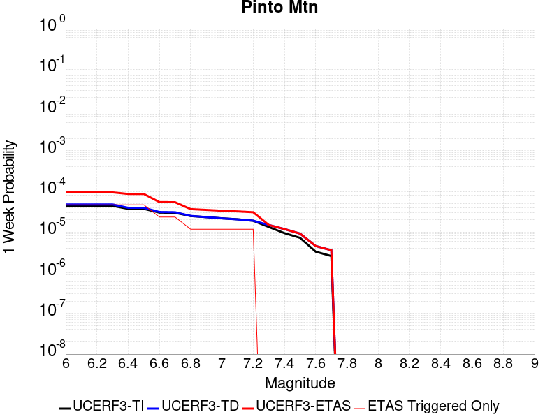 | 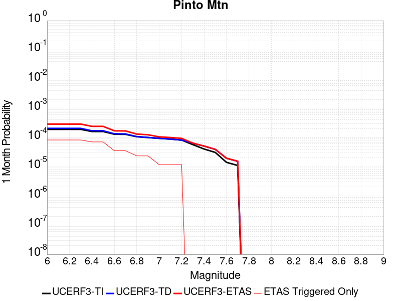 | 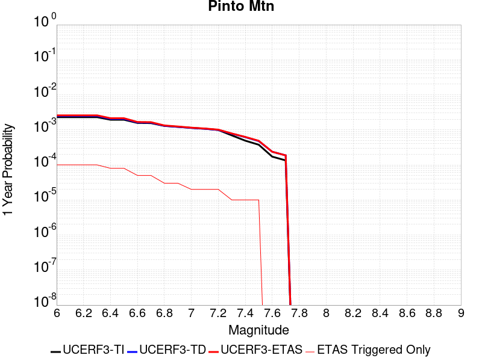 | 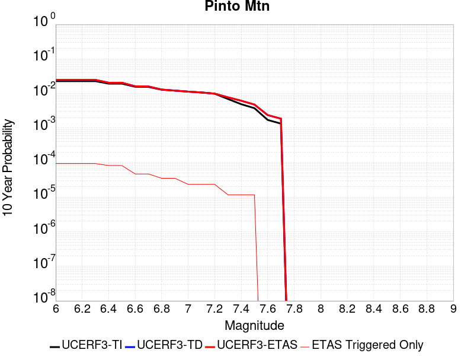 |

| Magnitude | 1 wk TI Prob | 1 wk TD Prob | 1 wk ETAS Prob | 1 wk ETAS/TD Gain | 1 wk ETAS Triggered Only | 1 mo TI Prob | 1 mo TD Prob | 1 mo ETAS Prob | 1 mo ETAS/TD Gain | 1 mo ETAS Triggered Only | 1 yr TI Prob | 1 yr TD Prob | 1 yr ETAS Prob | 1 yr ETAS/TD Gain | 1 yr ETAS Triggered Only | 10 yr TI Prob | 10 yr TD Prob | 10 yr ETAS Prob | 10 yr ETAS/TD Gain | 10 yr ETAS Triggered Only |
|-----|-----|-----|-----|-----|-----|-----|-----|-----|-----|-----|-----|-----|-----|-----|-----|-----|-----|-----|-----|-----|
| 6.0 | 4.4194956E-5 | 4.785362E-5 | 9.479973E-5 | 1.9810357 | 4.6948357E-5 | 1.893932E-4 | 2.0507174E-4 | 2.8721453E-4 | 1.4005563 | 8.2159626E-5 | 0.0023034236 | 0.0024940541 | 0.0025877168 | 1.0375544 | 9.389671E-5 | 0.022796938 | 0.024678145 | 0.024769725 | 1.003711 | 9.389671E-5 |
| 6.1 | 4.4194956E-5 | 4.785362E-5 | 9.479973E-5 | 1.9810357 | 4.6948357E-5 | 1.893932E-4 | 2.0507174E-4 | 2.8721453E-4 | 1.4005563 | 8.2159626E-5 | 0.0023034236 | 0.0024940541 | 0.0025877168 | 1.0375544 | 9.389671E-5 | 0.022796938 | 0.024678145 | 0.024769725 | 1.003711 | 9.389671E-5 |
| 6.2 | 4.4194956E-5 | 4.785362E-5 | 9.479973E-5 | 1.9810357 | 4.6948357E-5 | 1.893932E-4 | 2.0507174E-4 | 2.8721453E-4 | 1.4005563 | 8.2159626E-5 | 0.0023034236 | 0.0024940541 | 0.0025877168 | 1.0375544 | 9.389671E-5 | 0.022796938 | 0.024678145 | 0.024769725 | 1.003711 | 9.389671E-5 |
| 6.3 | 4.4194956E-5 | 4.785362E-5 | 9.479973E-5 | 1.9810357 | 4.6948357E-5 | 1.893932E-4 | 2.0507174E-4 | 2.8721453E-4 | 1.4005563 | 8.2159626E-5 | 0.0023034236 | 0.0024940541 | 0.0025877168 | 1.0375544 | 9.389671E-5 | 0.022796938 | 0.024678145 | 0.024769725 | 1.003711 | 9.389671E-5 |
| 6.4 | 3.729929E-5 | 3.9603186E-5 | 8.6549684E-5 | 2.1854222 | 4.6948357E-5 | 1.5984432E-4 | 1.6971743E-4 | 2.40128E-4 | 1.4148695 | 7.042254E-5 | 0.0019443673 | 0.002064445 | 0.002146435 | 1.0397153 | 8.2159626E-5 | 0.019274427 | 0.02046269 | 0.02054317 | 1.003933 | 8.2159626E-5 |
| 6.5 | 3.729929E-5 | 3.9603186E-5 | 8.6549684E-5 | 2.1854222 | 4.6948357E-5 | 1.5984432E-4 | 1.6971743E-4 | 2.40128E-4 | 1.4148695 | 7.042254E-5 | 0.0019443673 | 0.002064445 | 0.002146435 | 1.0397153 | 8.2159626E-5 | 0.019274427 | 0.02046269 | 0.02054317 | 1.003933 | 8.2159626E-5 |
| 6.6 | 3.0204548E-5 | 3.1205298E-5 | 5.4678745E-5 | 1.7522264 | 2.3474178E-5 | 1.2944164E-4 | 1.3373033E-4 | 1.689369E-4 | 1.2632654 | 3.521127E-5 | 0.0015748127 | 0.0016269855 | 0.0016738574 | 1.0288091 | 4.6948357E-5 | 0.015636992 | 0.01615461 | 0.0162008 | 1.0028592 | 4.6948357E-5 |
| 6.7 | 2.9857754E-5 | 3.081468E-5 | 5.428814E-5 | 1.761762 | 2.3474178E-5 | 1.2795553E-4 | 1.3205643E-4 | 1.6726305E-4 | 1.2666029 | 3.521127E-5 | 0.0015567453 | 0.001606636 | 0.0016535089 | 1.0291746 | 4.6948357E-5 | 0.015458848 | 0.01595405 | 0.016000248 | 1.0028958 | 4.6948357E-5 |
| 6.8 | 2.4819734E-5 | 2.5009364E-5 | 3.6746158E-5 | 1.4692961 | 1.1737089E-5 | 1.0636595E-4 | 1.07178705E-4 | 1.3065037E-4 | 1.2189956 | 2.3474178E-5 | 0.0012942362 | 0.0013041412 | 0.0013393066 | 1.0269644 | 3.521127E-5 | 0.012867244 | 0.0129672475 | 0.013002002 | 1.0026802 | 3.521127E-5 |
| 6.9 | 2.331124E-5 | 2.3337643E-5 | 3.507446E-5 | 1.5029135 | 1.1737089E-5 | 9.990149E-5 | 1.00014746E-4 | 1.2348658E-4 | 1.2346838 | 2.3474178E-5 | 0.001215622 | 0.0012170197 | 0.0012521881 | 1.0288972 | 3.521127E-5 | 0.012089936 | 0.012105742 | 0.012140526 | 1.0028734 | 3.521127E-5 |
| 7.0 | 2.1818534E-5 | 2.1760772E-5 | 3.3497607E-5 | 1.5393574 | 1.1737089E-5 | 9.3504656E-5 | 9.325723E-5 | 1.04993225E-4 | 1.1258454 | 1.1737089E-5 | 0.0011378246 | 0.0011348352 | 0.0011582827 | 1.0206616 | 2.3474178E-5 | 0.011320163 | 0.011292503 | 0.011315713 | 1.0020553 | 2.3474178E-5 |
| 7.1 | 2.066081E-5 | 2.0540418E-5 | 3.2277265E-5 | 1.5714025 | 1.1737089E-5 | 8.854332E-5 | 8.8027504E-5 | 9.976356E-5 | 1.1333226 | 1.1737089E-5 | 0.0010774818 | 0.0010712275 | 0.0010946764 | 1.0218899 | 2.3474178E-5 | 0.010722724 | 0.010662688 | 0.010685912 | 1.0021781 | 2.3474178E-5 |
| 7.2 | 1.8990233E-5 | 1.9053701E-5 | 3.079057E-5 | 1.6159887 | 1.1737089E-5 | 8.138417E-5 | 8.1656275E-5 | 9.33924E-5 | 1.143726 | 1.1737089E-5 | 9.904018E-4 | 9.937311E-4 | 0.0010171819 | 1.0235988 | 2.3474178E-5 | 0.009859995 | 0.009894874 | 0.009918116 | 1.0023489 | 2.3474178E-5 |
| 7.3 | 1.3335872E-5 | 1.4906372E-5 | 1.4906372E-5 | 1.0 | 0.0 | 5.7152483E-5 | 6.388296E-5 | 6.388296E-5 | 1.0 | 0.0 | 6.956093E-4 | 7.775102E-4 | 7.892382E-4 | 1.015084 | 1.1737089E-5 | 0.006934359 | 0.0077491994 | 0.0077608456 | 1.0015029 | 1.1737089E-5 |
| 7.4 | 9.414066E-6 | 1.186061E-5 | 1.186061E-5 | 1.0 | 0.0 | 4.0345374E-5 | 5.0830247E-5 | 5.0830247E-5 | 1.0 | 0.0 | 4.910942E-4 | 6.1869196E-4 | 6.304218E-4 | 1.018959 | 1.1737089E-5 | 0.0049001034 | 0.006170644 | 0.006182309 | 1.0018903 | 1.1737089E-5 |
| 7.5 | 7.2101157E-6 | 9.157893E-6 | 9.157893E-6 | 1.0 | 0.0 | 3.090013E-5 | 3.924757E-5 | 3.924757E-5 | 1.0 | 0.0 | 3.7614413E-4 | 4.7774217E-4 | 4.894737E-4 | 1.024556 | 1.1737089E-5 | 0.0037550807 | 0.004767927 | 0.004779608 | 1.00245 | 1.1737089E-5 |
| 7.6 | 3.296375E-6 | 4.5453176E-6 | 4.5453176E-6 | 1.0 | 0.0 | 1.4127245E-5 | 1.9479796E-5 | 1.9479796E-5 | 1.0 | 0.0 | 1.7198564E-4 | 2.3714209E-4 | 2.3714209E-4 | 1.0 | 0.0 | 0.0017185259 | 0.0023690276 | 0.0023690276 | 1.0 | 0.0 |
| 7.7 | 2.5741092E-6 | 3.584251E-6 | 3.584251E-6 | 1.0 | 0.0 | 1.103185E-5 | 1.5360993E-5 | 1.5360993E-5 | 1.0 | 0.0 | 1.3430449E-4 | 1.8700535E-4 | 1.8700535E-4 | 1.0 | 0.0 | 0.0013422335 | 0.0018686098 | 0.0018686098 | 1.0 | 0.0 |

## Tin Mountain
*[(top)](#table-of-contents)*

| 1 Week | 1 Month | 1 Year | 10 Year |
|-----|-----|-----|-----|
| 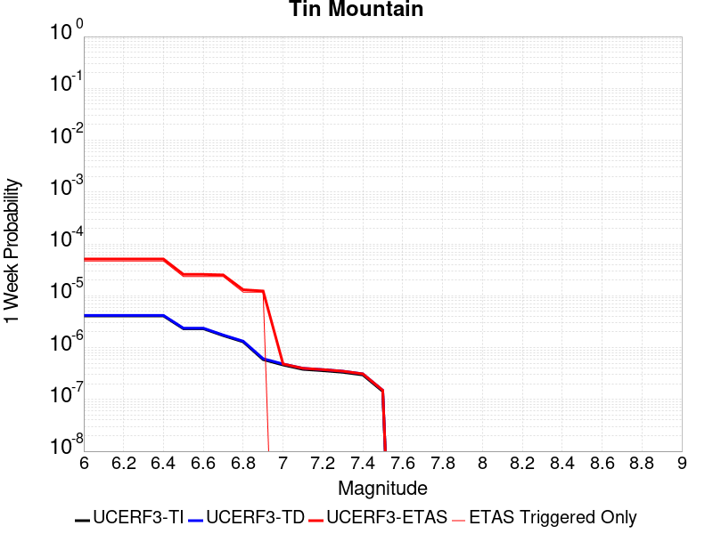 | 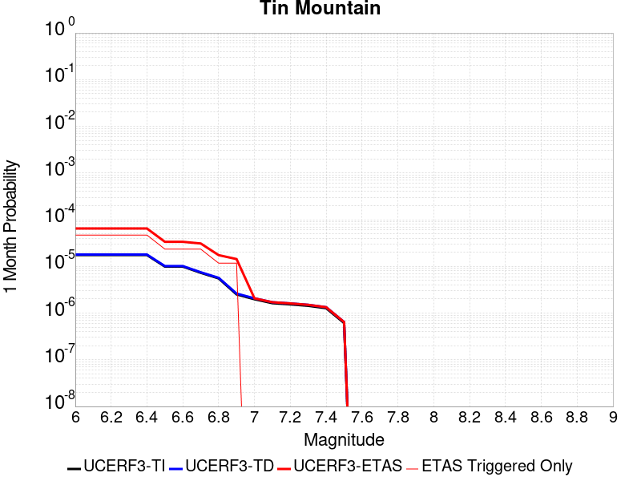 | 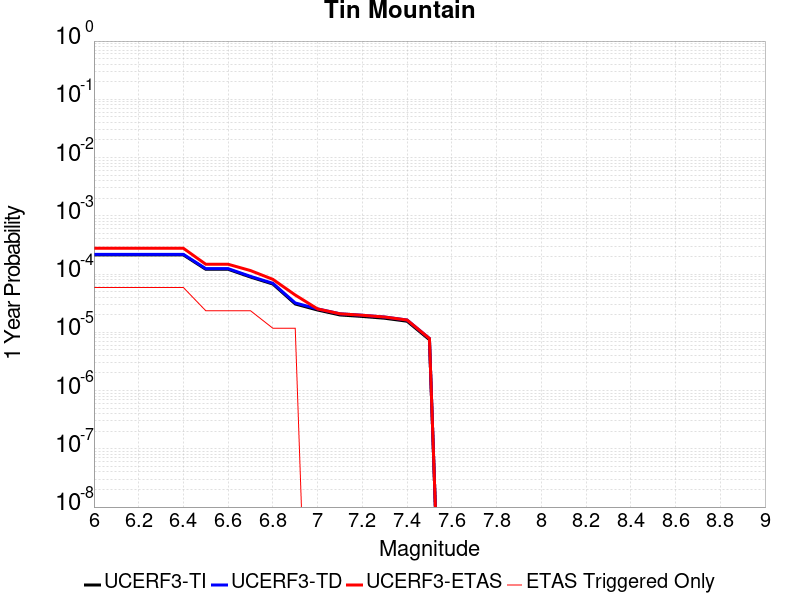 | 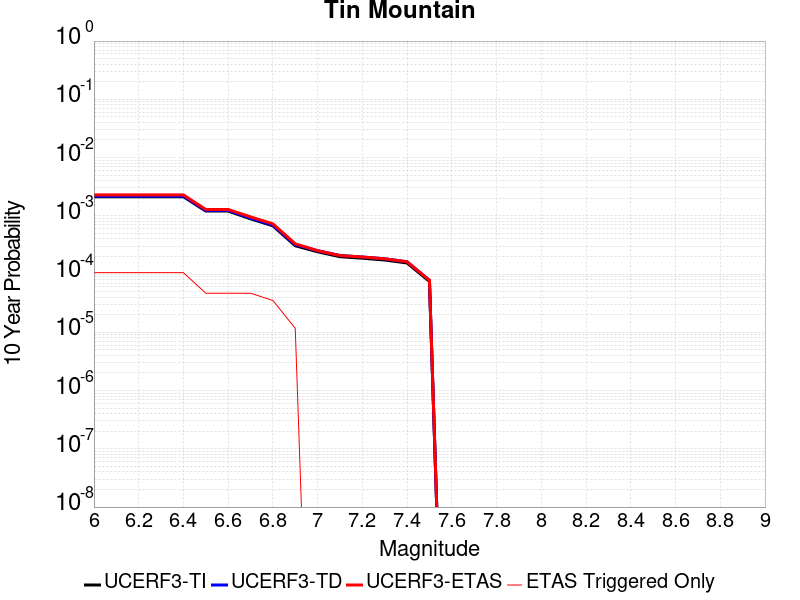 |

| Magnitude | 1 wk TI Prob | 1 wk TD Prob | 1 wk ETAS Prob | 1 wk ETAS/TD Gain | 1 wk ETAS Triggered Only | 1 mo TI Prob | 1 mo TD Prob | 1 mo ETAS Prob | 1 mo ETAS/TD Gain | 1 mo ETAS Triggered Only | 1 yr TI Prob | 1 yr TD Prob | 1 yr ETAS Prob | 1 yr ETAS/TD Gain | 1 yr ETAS Triggered Only | 10 yr TI Prob | 10 yr TD Prob | 10 yr ETAS Prob | 10 yr ETAS/TD Gain | 10 yr ETAS Triggered Only |
|-----|-----|-----|-----|-----|-----|-----|-----|-----|-----|-----|-----|-----|-----|-----|-----|-----|-----|-----|-----|-----|
| 6.0 | 4.083776E-6 | 4.1815365E-6 | 5.1129697E-5 | 12.227489 | 4.6948357E-5 | 1.750178E-5 | 1.792077E-5 | 6.486828E-5 | 3.6197267 | 4.6948357E-5 | 2.1306332E-4 | 2.1816725E-4 | 2.7683988E-4 | 1.2689342 | 5.8685448E-5 | 0.0021285915 | 0.0021798965 | 0.0022852998 | 1.0483526 | 1.056338E-4 |
| 6.1 | 4.083776E-6 | 4.1815365E-6 | 5.1129697E-5 | 12.227489 | 4.6948357E-5 | 1.750178E-5 | 1.792077E-5 | 6.486828E-5 | 3.6197267 | 4.6948357E-5 | 2.1306332E-4 | 2.1816725E-4 | 2.7683988E-4 | 1.2689342 | 5.8685448E-5 | 0.0021285915 | 0.0021798965 | 0.0022852998 | 1.0483526 | 1.056338E-4 |
| 6.2 | 4.083776E-6 | 4.1815365E-6 | 5.1129697E-5 | 12.227489 | 4.6948357E-5 | 1.750178E-5 | 1.792077E-5 | 6.486828E-5 | 3.6197267 | 4.6948357E-5 | 2.1306332E-4 | 2.1816725E-4 | 2.7683988E-4 | 1.2689342 | 5.8685448E-5 | 0.0021285915 | 0.0021798965 | 0.0022852998 | 1.0483526 | 1.056338E-4 |
| 6.3 | 4.083776E-6 | 4.1815365E-6 | 5.1129697E-5 | 12.227489 | 4.6948357E-5 | 1.750178E-5 | 1.792077E-5 | 6.486828E-5 | 3.6197267 | 4.6948357E-5 | 2.1306332E-4 | 2.1816725E-4 | 2.7683988E-4 | 1.2689342 | 5.8685448E-5 | 0.0021285915 | 0.0021798965 | 0.0022852998 | 1.0483526 | 1.056338E-4 |
| 6.4 | 4.083776E-6 | 4.1815365E-6 | 5.1129697E-5 | 12.227489 | 4.6948357E-5 | 1.750178E-5 | 1.792077E-5 | 6.486828E-5 | 3.6197267 | 4.6948357E-5 | 2.1306332E-4 | 2.1816725E-4 | 2.7683988E-4 | 1.2689342 | 5.8685448E-5 | 0.0021285915 | 0.0021798965 | 0.0022852998 | 1.0483526 | 1.056338E-4 |
| 6.5 | 2.3143427E-6 | 2.3731573E-6 | 2.584728E-5 | 10.891517 | 2.3474178E-5 | 9.9185745E-6 | 1.0170638E-5 | 3.3644577E-5 | 3.3080106 | 2.3474178E-5 | 1.2075195E-4 | 1.2382126E-4 | 1.4729254E-4 | 1.1895577 | 2.3474178E-5 | 0.0012068636 | 0.0012375986 | 0.0012844888 | 1.037888 | 4.6948357E-5 |
| 6.6 | 2.3143427E-6 | 2.3731573E-6 | 2.584728E-5 | 10.891517 | 2.3474178E-5 | 9.9185745E-6 | 1.0170638E-5 | 3.3644577E-5 | 3.3080106 | 2.3474178E-5 | 1.2075195E-4 | 1.2382126E-4 | 1.4729254E-4 | 1.1895577 | 2.3474178E-5 | 0.0012068636 | 0.0012375986 | 0.0012844888 | 1.037888 | 4.6948357E-5 |
| 6.7 | 1.7029532E-6 | 1.7497915E-6 | 2.522393E-5 | 14.415391 | 2.3474178E-5 | 7.2983503E-6 | 7.499088E-6 | 3.097309E-5 | 4.1302476 | 2.3474178E-5 | 8.885379E-5 | 9.1298105E-5 | 1.1477014E-4 | 1.2570922 | 2.3474178E-5 | 8.881827E-4 | 9.1265864E-4 | 9.595641E-4 | 1.0513943 | 4.6948357E-5 |
| 6.8 | 1.2914646E-6 | 1.3299378E-6 | 1.3067011E-5 | 9.825279 | 1.1737089E-5 | 5.534837E-6 | 5.6997237E-6 | 1.7436747E-5 | 3.0592265 | 1.1737089E-5 | 6.738455E-5 | 6.939237E-5 | 8.1128645E-5 | 1.1691291 | 1.1737089E-5 | 6.736412E-4 | 6.9375033E-4 | 7.289372E-4 | 1.0507197 | 3.521127E-5 |
| 6.9 | 5.8708974E-7 | 6.1169936E-7 | 1.2348782E-5 | 20.187664 | 1.1737089E-5 | 2.5160964E-6 | 2.6215664E-6 | 1.4358625E-5 | 5.4771166 | 1.1737089E-5 | 3.0633044E-5 | 3.1917145E-5 | 4.3653858E-5 | 1.3677244 | 1.1737089E-5 | 3.0628822E-4 | 3.191297E-4 | 3.3086305E-4 | 1.0367666 | 1.1737089E-5 |
| 7.0 | 4.6248786E-7 | 4.832015E-7 | 4.832015E-7 | 1.0 | 0.0 | 1.9820893E-6 | 2.0708624E-6 | 2.0708624E-6 | 1.0 | 0.0 | 2.413167E-5 | 2.5212494E-5 | 2.5212494E-5 | 1.0 | 0.0 | 2.412905E-4 | 2.5210003E-4 | 2.5210003E-4 | 1.0 | 0.0 |
| 7.1 | 3.804606E-7 | 3.987147E-7 | 3.987147E-7 | 1.0 | 0.0 | 1.6305444E-6 | 1.7087764E-6 | 1.7087764E-6 | 1.0 | 0.0 | 1.9851697E-5 | 2.0804187E-5 | 2.0804187E-5 | 1.0 | 0.0 | 1.9849923E-4 | 2.0802575E-4 | 2.0802575E-4 | 1.0 | 0.0 |
| 7.2 | 3.5864858E-7 | 3.7616863E-7 | 3.7616863E-7 | 1.0 | 0.0 | 1.5370645E-6 | 1.6121504E-6 | 1.6121504E-6 | 1.0 | 0.0 | 1.87136E-5 | 1.9627789E-5 | 1.9627789E-5 | 1.0 | 0.0 | 1.8712023E-4 | 1.9626386E-4 | 1.9626386E-4 | 1.0 | 0.0 |
| 7.3 | 3.342063E-7 | 3.506347E-7 | 3.506347E-7 | 1.0 | 0.0 | 1.4323119E-6 | 1.5027196E-6 | 1.5027196E-6 | 1.0 | 0.0 | 1.7438259E-5 | 1.829549E-5 | 1.829549E-5 | 1.0 | 0.0 | 1.743689E-4 | 1.8294314E-4 | 1.8294314E-4 | 1.0 | 0.0 |
| 7.4 | 2.971242E-7 | 3.1165817E-7 | 3.1165817E-7 | 1.0 | 0.0 | 1.2733886E-6 | 1.3356774E-6 | 1.3356774E-6 | 1.0 | 0.0 | 1.5503398E-5 | 1.6261785E-5 | 1.6261785E-5 | 1.0 | 0.0 | 1.5502315E-4 | 1.6260923E-4 | 1.6260923E-4 | 1.0 | 0.0 |
| 7.5 | 1.4326713E-7 | 1.5012525E-7 | 1.5012525E-7 | 1.0 | 0.0 | 6.140018E-7 | 6.433939E-7 | 6.433939E-7 | 1.0 | 0.0 | 7.4754466E-6 | 7.8333205E-6 | 7.8333205E-6 | 1.0 | 0.0 | 7.475195E-5 | 7.833321E-5 | 7.833321E-5 | 1.0 | 0.0 |

## Santa Cruz Catalina Ridge alt1
*[(top)](#table-of-contents)*

| 1 Week | 1 Month | 1 Year | 10 Year |
|-----|-----|-----|-----|
| 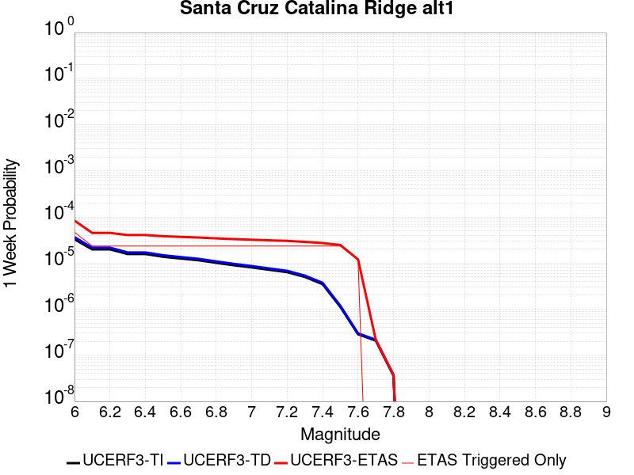 | 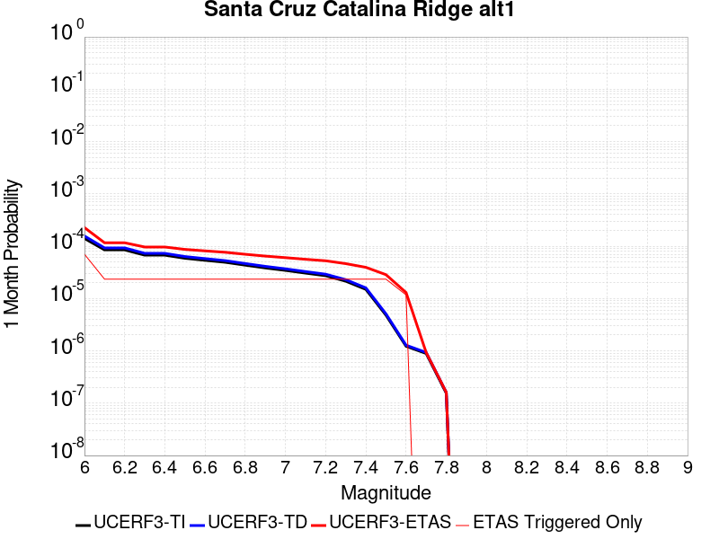 | 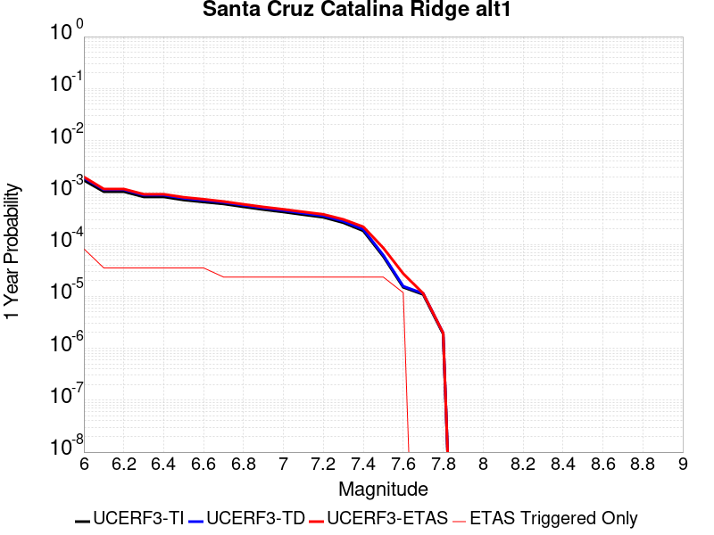 | 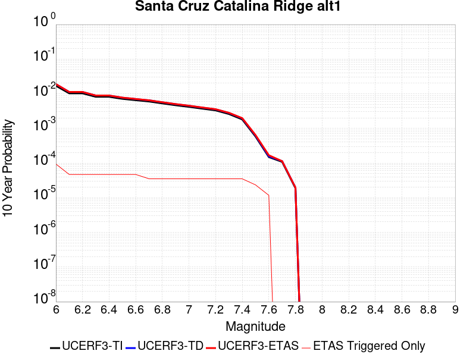 |

| Magnitude | 1 wk TI Prob | 1 wk TD Prob | 1 wk ETAS Prob | 1 wk ETAS/TD Gain | 1 wk ETAS Triggered Only | 1 mo TI Prob | 1 mo TD Prob | 1 mo ETAS Prob | 1 mo ETAS/TD Gain | 1 mo ETAS Triggered Only | 1 yr TI Prob | 1 yr TD Prob | 1 yr ETAS Prob | 1 yr ETAS/TD Gain | 1 yr ETAS Triggered Only | 10 yr TI Prob | 10 yr TD Prob | 10 yr ETAS Prob | 10 yr ETAS/TD Gain | 10 yr ETAS Triggered Only |
|-----|-----|-----|-----|-----|-----|-----|-----|-----|-----|-----|-----|-----|-----|-----|-----|-----|-----|-----|-----|-----|
| 6.0 | 3.2833184E-5 | 3.65584E-5 | 8.350504E-5 | 2.2841547 | 4.6948357E-5 | 1.4070606E-4 | 1.5667039E-4 | 2.2708188E-4 | 1.4494245 | 7.042254E-5 | 0.00171175 | 0.0019059596 | 0.0019879625 | 1.0430245 | 8.2159626E-5 | 0.016986247 | 0.018913029 | 0.01900515 | 1.0048708 | 9.389671E-5 |
| 6.1 | 1.9835548E-5 | 2.1659505E-5 | 4.5133176E-5 | 2.0837584 | 2.3474178E-5 | 8.500672E-5 | 9.282326E-5 | 1.1629526E-4 | 1.2528677 | 2.3474178E-5 | 0.0010344655 | 0.0011295575 | 0.001164729 | 1.0311375 | 3.521127E-5 | 0.010296632 | 0.011240295 | 0.011286716 | 1.0041299 | 4.6948357E-5 |
| 6.2 | 1.9835548E-5 | 2.1659505E-5 | 4.5133176E-5 | 2.0837584 | 2.3474178E-5 | 8.500672E-5 | 9.282326E-5 | 1.1629526E-4 | 1.2528677 | 2.3474178E-5 | 0.0010344655 | 0.0011295575 | 0.001164729 | 1.0311375 | 3.521127E-5 | 0.010296632 | 0.011240295 | 0.011286716 | 1.0041299 | 4.6948357E-5 |
| 6.3 | 1.5728183E-5 | 1.703395E-5 | 4.0507726E-5 | 2.3780584 | 2.3474178E-5 | 6.7404755E-5 | 7.300063E-5 | 9.647309E-5 | 1.3215379 | 2.3474178E-5 | 8.2034385E-4 | 8.884264E-4 | 9.236064E-4 | 1.0395981 | 3.521127E-5 | 0.008173222 | 0.008849427 | 0.00889596 | 1.0052583 | 4.6948357E-5 |
| 6.4 | 1.5728183E-5 | 1.703395E-5 | 4.0507726E-5 | 2.3780584 | 2.3474178E-5 | 6.7404755E-5 | 7.300063E-5 | 9.647309E-5 | 1.3215379 | 2.3474178E-5 | 8.2034385E-4 | 8.884264E-4 | 9.236064E-4 | 1.0395981 | 3.521127E-5 | 0.008173222 | 0.008849427 | 0.00889596 | 1.0052583 | 4.6948357E-5 |
| 6.5 | 1.3707734E-5 | 1.4794522E-5 | 3.8268354E-5 | 2.586657 | 2.3474178E-5 | 5.8746107E-5 | 6.3403575E-5 | 8.6876265E-5 | 1.3702109 | 2.3474178E-5 | 7.1499916E-4 | 7.716686E-4 | 8.068527E-4 | 1.0455948 | 3.521127E-5 | 0.0071270303 | 0.0076902895 | 0.007736877 | 1.006058 | 4.6948357E-5 |
| 6.6 | 1.2539813E-5 | 1.3510219E-5 | 3.698408E-5 | 2.7374892 | 2.3474178E-5 | 5.3740947E-5 | 5.789967E-5 | 8.137249E-5 | 1.405405 | 2.3474178E-5 | 6.540996E-4 | 7.0470315E-4 | 7.398896E-4 | 1.0499309 | 3.521127E-5 | 0.0065217763 | 0.0070249885 | 0.007071607 | 1.0066361 | 4.6948357E-5 |
| 6.7 | 1.1504083E-5 | 1.2377375E-5 | 3.5851263E-5 | 2.8965158 | 2.3474178E-5 | 4.930228E-5 | 5.3044827E-5 | 7.651776E-5 | 1.4425113 | 2.3474178E-5 | 6.0008996E-4 | 6.456314E-4 | 6.690904E-4 | 1.036335 | 2.3474178E-5 | 0.005984721 | 0.006437786 | 0.0064727706 | 1.0054343 | 3.521127E-5 |
| 6.8 | 1.012739E-5 | 1.0877071E-5 | 3.4350993E-5 | 3.1581106 | 2.3474178E-5 | 4.340238E-5 | 4.6615194E-5 | 7.008828E-5 | 1.50355 | 2.3474178E-5 | 5.282958E-4 | 5.673937E-4 | 5.9085456E-4 | 1.0413485 | 2.3474178E-5 | 0.0052704164 | 0.0056596193 | 0.0056946315 | 1.0061862 | 3.521127E-5 |
| 6.9 | 8.9607865E-6 | 9.609117E-6 | 3.308307E-5 | 3.4428833 | 2.3474178E-5 | 3.8402806E-5 | 4.1181287E-5 | 6.46545E-5 | 1.5699971 | 2.3474178E-5 | 4.6745385E-4 | 5.012679E-4 | 5.247303E-4 | 1.0468061 | 2.3474178E-5 | 0.0046647177 | 0.005001492 | 0.005036527 | 1.007005 | 3.521127E-5 |
| 7.0 | 8.046829E-6 | 8.619746E-6 | 3.209372E-5 | 3.7232795 | 2.3474178E-5 | 3.4485955E-5 | 3.694125E-5 | 6.041456E-5 | 1.6354228 | 2.3474178E-5 | 4.1978562E-4 | 4.496677E-4 | 4.7313134E-4 | 1.0521799 | 2.3474178E-5 | 0.004189935 | 0.0044876686 | 0.004522722 | 1.0078111 | 3.521127E-5 |
| 7.1 | 7.136131E-6 | 7.637656E-6 | 3.1111656E-5 | 4.073456 | 2.3474178E-5 | 3.0583058E-5 | 3.2732405E-5 | 5.6205816E-5 | 1.7171307 | 2.3474178E-5 | 3.7228514E-4 | 3.9844486E-4 | 4.2190967E-4 | 1.058891 | 2.3474178E-5 | 0.0037166206 | 0.003977381 | 0.0040124524 | 1.0088177 | 3.521127E-5 |
| 7.2 | 6.362014E-6 | 6.8049585E-6 | 3.0278978E-5 | 4.4495463 | 2.3474178E-5 | 2.726549E-5 | 2.9163786E-5 | 5.263728E-5 | 1.804885 | 2.3474178E-5 | 3.3190678E-4 | 3.550119E-4 | 3.7847774E-4 | 1.0660988 | 2.3474178E-5 | 0.0033141149 | 0.003544516 | 0.0035796026 | 1.0098988 | 3.521127E-5 |
| 7.3 | 5.004101E-6 | 5.351715E-6 | 2.8825767E-5 | 5.386267 | 2.3474178E-5 | 2.1445969E-5 | 2.2935723E-5 | 4.6409365E-5 | 2.0234532 | 2.3474178E-5 | 2.6107338E-4 | 2.792072E-4 | 3.026748E-4 | 1.0840509 | 2.3474178E-5 | 0.002607669 | 0.0027886187 | 0.0028237316 | 1.0125916 | 3.521127E-5 |
| 7.4 | 3.4901443E-6 | 3.7320526E-6 | 2.7206142E-5 | 7.2898607 | 2.3474178E-5 | 1.4957676E-5 | 1.5994416E-5 | 3.9468217E-5 | 2.467625 | 2.3474178E-5 | 1.8209449E-4 | 1.9471499E-4 | 2.1818459E-4 | 1.1205331 | 2.3474178E-5 | 0.0018194534 | 0.0019454823 | 0.001980625 | 1.0180638 | 3.521127E-5 |
| 7.5 | 1.1215045E-6 | 1.189387E-6 | 2.4663537E-5 | 20.736343 | 2.3474178E-5 | 4.806439E-6 | 5.097363E-6 | 2.8571421E-5 | 5.6051373 | 2.3474178E-5 | 5.851682E-5 | 6.205866E-5 | 8.5531385E-5 | 1.3782344 | 2.3474178E-5 | 5.850142E-4 | 6.2041637E-4 | 6.43876E-4 | 1.0378127 | 2.3474178E-5 |
| 7.6 | 2.8599047E-7 | 2.9951994E-7 | 1.2036606E-5 | 40.186325 | 1.1737089E-5 | 1.2256729E-6 | 1.2836562E-6 | 1.302073E-5 | 10.143472 | 1.1737089E-5 | 1.4922465E-5 | 1.5628404E-5 | 2.736531E-5 | 1.7509984 | 1.1737089E-5 | 1.4921463E-4 | 1.5627318E-4 | 1.6800844E-4 | 1.0750945 | 1.1737089E-5 |
| 7.7 | 2.0781519E-7 | 2.1744323E-7 | 2.1744323E-7 | 1.0 | 0.0 | 8.906362E-7 | 9.3189925E-7 | 9.3189925E-7 | 1.0 | 0.0 | 1.08434415E-5 | 1.13458145E-5 | 1.13458145E-5 | 1.0 | 0.0 | 1.0842913E-4 | 1.1345245E-4 | 1.1345245E-4 | 1.0 | 0.0 |
| 7.8 | 3.614776E-8 | 3.764102E-8 | 3.764102E-8 | 1.0 | 0.0 | 1.5491896E-7 | 1.6131864E-7 | 1.6131864E-7 | 1.0 | 0.0 | 1.8861368E-6 | 1.9640527E-6 | 1.9640527E-6 | 1.0 | 0.0 | 1.8861208E-5 | 1.9640367E-5 | 1.9640367E-5 | 1.0 | 0.0 |

## San Jacinto (Lytle Creek connector)
*[(top)](#table-of-contents)*

| 1 Week | 1 Month | 1 Year | 10 Year |
|-----|-----|-----|-----|
| 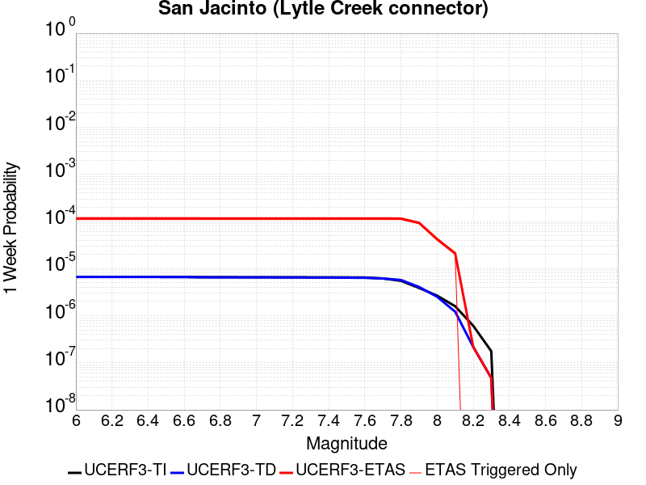 | 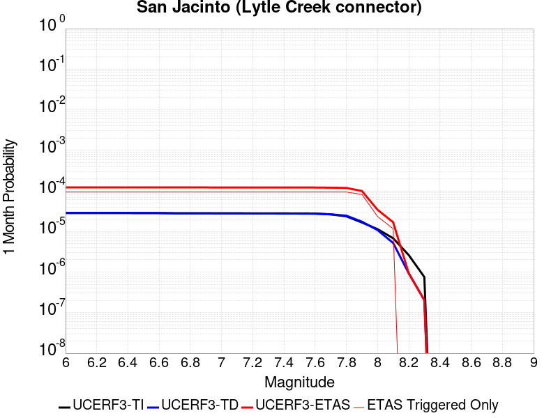 | 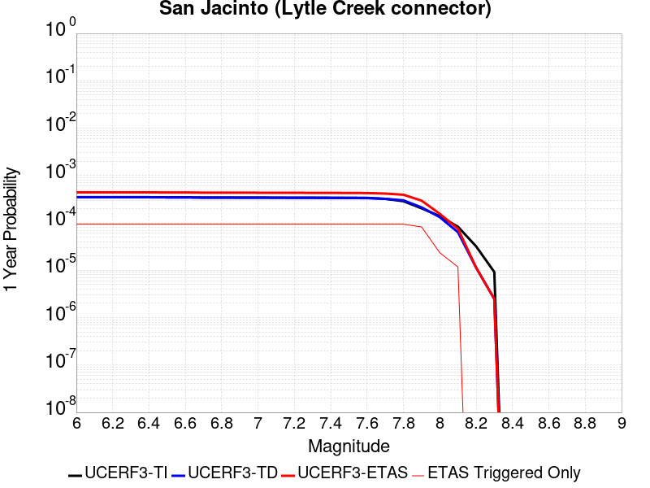 | 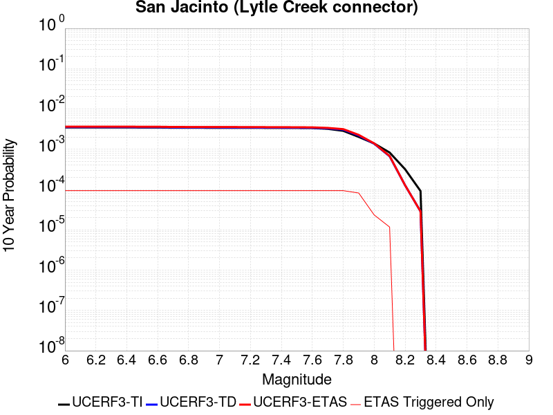 |

| Magnitude | 1 wk TI Prob | 1 wk TD Prob | 1 wk ETAS Prob | 1 wk ETAS/TD Gain | 1 wk ETAS Triggered Only | 1 mo TI Prob | 1 mo TD Prob | 1 mo ETAS Prob | 1 mo ETAS/TD Gain | 1 mo ETAS Triggered Only | 1 yr TI Prob | 1 yr TD Prob | 1 yr ETAS Prob | 1 yr ETAS/TD Gain | 1 yr ETAS Triggered Only | 10 yr TI Prob | 10 yr TD Prob | 10 yr ETAS Prob | 10 yr ETAS/TD Gain | 10 yr ETAS Triggered Only |
|-----|-----|-----|-----|-----|-----|-----|-----|-----|-----|-----|-----|-----|-----|-----|-----|-----|-----|-----|-----|-----|
| 6.0 | 6.693995E-6 | 6.660216E-6 | 1.005563E-4 | 15.098054 | 9.389671E-5 | 2.8688235E-5 | 2.854347E-5 | 1.224375E-4 | 4.28951 | 9.389671E-5 | 3.492233E-4 | 3.4746144E-4 | 4.413255E-4 | 1.2701424 | 9.389671E-5 | 0.00348675 | 0.0035493854 | 0.0036429488 | 1.0263605 | 9.389671E-5 |
| 6.1 | 6.693995E-6 | 6.660216E-6 | 1.005563E-4 | 15.098054 | 9.389671E-5 | 2.8688235E-5 | 2.854347E-5 | 1.224375E-4 | 4.28951 | 9.389671E-5 | 3.492233E-4 | 3.4746144E-4 | 4.413255E-4 | 1.2701424 | 9.389671E-5 | 0.00348675 | 0.0035493854 | 0.0036429488 | 1.0263605 | 9.389671E-5 |
| 6.2 | 6.693995E-6 | 6.660216E-6 | 1.005563E-4 | 15.098054 | 9.389671E-5 | 2.8688235E-5 | 2.854347E-5 | 1.224375E-4 | 4.28951 | 9.389671E-5 | 3.492233E-4 | 3.4746144E-4 | 4.413255E-4 | 1.2701424 | 9.389671E-5 | 0.00348675 | 0.0035493854 | 0.0036429488 | 1.0263605 | 9.389671E-5 |
| 6.3 | 6.693995E-6 | 6.660216E-6 | 1.005563E-4 | 15.098054 | 9.389671E-5 | 2.8688235E-5 | 2.854347E-5 | 1.224375E-4 | 4.28951 | 9.389671E-5 | 3.492233E-4 | 3.4746144E-4 | 4.413255E-4 | 1.2701424 | 9.389671E-5 | 0.00348675 | 0.0035493854 | 0.0036429488 | 1.0263605 | 9.389671E-5 |
| 6.4 | 6.693995E-6 | 6.660216E-6 | 1.005563E-4 | 15.098054 | 9.389671E-5 | 2.8688235E-5 | 2.854347E-5 | 1.224375E-4 | 4.28951 | 9.389671E-5 | 3.492233E-4 | 3.4746144E-4 | 4.413255E-4 | 1.2701424 | 9.389671E-5 | 0.00348675 | 0.0035493854 | 0.0036429488 | 1.0263605 | 9.389671E-5 |
| 6.5 | 6.6561875E-6 | 6.6204343E-6 | 1.00516525E-4 | 15.18277 | 9.389671E-5 | 2.8526205E-5 | 2.837298E-5 | 1.2226703E-4 | 4.309277 | 9.389671E-5 | 3.472512E-4 | 3.4538636E-4 | 4.3925067E-4 | 1.2717661 | 9.389671E-5 | 0.0034670907 | 0.003528701 | 0.0036222662 | 1.0265155 | 9.389671E-5 |
| 6.6 | 6.6561875E-6 | 6.6204343E-6 | 1.00516525E-4 | 15.18277 | 9.389671E-5 | 2.8526205E-5 | 2.837298E-5 | 1.2226703E-4 | 4.309277 | 9.389671E-5 | 3.472512E-4 | 3.4538636E-4 | 4.3925067E-4 | 1.2717661 | 9.389671E-5 | 0.0034670907 | 0.003528701 | 0.0036222662 | 1.0265155 | 9.389671E-5 |
| 6.7 | 6.5802237E-6 | 6.539611E-6 | 1.0043571E-4 | 15.358056 | 9.389671E-5 | 2.8200653E-5 | 2.8026603E-5 | 1.2192068E-4 | 4.350177 | 9.389671E-5 | 3.4328885E-4 | 3.4117055E-4 | 4.350352E-4 | 1.2751254 | 9.389671E-5 | 0.0034275902 | 0.0034866752 | 0.0035802445 | 1.0268363 | 9.389671E-5 |
| 6.8 | 6.575632E-6 | 6.5341005E-6 | 1.004302E-4 | 15.370164 | 9.389671E-5 | 2.8180975E-5 | 2.8002989E-5 | 1.2189707E-4 | 4.353002 | 9.389671E-5 | 3.4304935E-4 | 3.4088313E-4 | 4.3474784E-4 | 1.2753575 | 9.389671E-5 | 0.0034252026 | 0.00348381 | 0.0035773797 | 1.0268584 | 9.389671E-5 |
| 6.9 | 6.570433E-6 | 6.525495E-6 | 1.00421596E-4 | 15.389116 | 9.389671E-5 | 2.8158694E-5 | 2.7966107E-5 | 1.218602E-4 | 4.3574243 | 9.389671E-5 | 3.4277816E-4 | 3.4043423E-4 | 4.3429897E-4 | 1.2757206 | 9.389671E-5 | 0.0034224992 | 0.0034793352 | 0.0035729052 | 1.026893 | 9.389671E-5 |
| 7.0 | 6.5643826E-6 | 6.515616E-6 | 1.00411715E-4 | 15.410933 | 9.389671E-5 | 2.8132765E-5 | 2.792377E-5 | 1.2181786E-4 | 4.362515 | 9.389671E-5 | 3.424626E-4 | 3.3991894E-4 | 4.3378372E-4 | 1.2761388 | 9.389671E-5 | 0.0034193532 | 0.0034741985 | 0.003567769 | 1.026933 | 9.389671E-5 |
| 7.1 | 6.557402E-6 | 6.5043278E-6 | 1.0040043E-4 | 15.435943 | 9.389671E-5 | 2.8102848E-5 | 2.7875392E-5 | 1.2176949E-4 | 4.3683505 | 9.389671E-5 | 3.4209844E-4 | 3.3933012E-4 | 4.3319497E-4 | 1.2766181 | 9.389671E-5 | 0.0034157229 | 0.0034683298 | 0.003561901 | 1.0269787 | 9.389671E-5 |
| 7.2 | 6.546394E-6 | 6.4862943E-6 | 1.003824E-4 | 15.476078 | 9.389671E-5 | 2.8055672E-5 | 2.7798109E-5 | 1.2169221E-4 | 4.3777156 | 9.389671E-5 | 3.4152428E-4 | 3.3838948E-4 | 4.3225443E-4 | 1.2773873 | 9.389671E-5 | 0.0034099987 | 0.0034589572 | 0.003552529 | 1.027052 | 9.389671E-5 |
| 7.3 | 6.5364216E-6 | 6.4670803E-6 | 1.00363184E-4 | 15.519088 | 9.389671E-5 | 2.8012933E-5 | 2.7715765E-5 | 1.21609875E-4 | 4.387751 | 9.389671E-5 | 3.4100408E-4 | 3.3738726E-4 | 4.312523E-4 | 1.2782116 | 9.389671E-5 | 0.003404813 | 0.0034489788 | 0.0035425515 | 1.0271306 | 9.389671E-5 |
| 7.4 | 6.5269523E-6 | 6.4481674E-6 | 1.00344274E-4 | 15.561673 | 9.389671E-5 | 2.7972354E-5 | 2.7634711E-5 | 1.2152883E-4 | 4.397688 | 9.389671E-5 | 3.4051016E-4 | 3.3640073E-4 | 4.3026588E-4 | 1.2790277 | 9.389671E-5 | 0.0033998888 | 0.003439161 | 0.0035327347 | 1.0272083 | 9.389671E-5 |
| 7.5 | 6.5111835E-6 | 6.424442E-6 | 1.00320554E-4 | 15.61545 | 9.389671E-5 | 2.7904773E-5 | 2.7533031E-5 | 1.2142716E-4 | 4.410236 | 9.389671E-5 | 3.3968766E-4 | 3.3516317E-4 | 4.290284E-4 | 1.2800584 | 9.389671E-5 | 0.0033916887 | 0.003426834 | 0.003520409 | 1.0273066 | 9.389671E-5 |
| 7.6 | 6.4768806E-6 | 6.383551E-6 | 1.0027966E-4 | 15.709072 | 9.389671E-5 | 2.7757764E-5 | 2.735779E-5 | 1.21251935E-4 | 4.4320807 | 9.389671E-5 | 3.3789838E-4 | 3.3303024E-4 | 4.2689568E-4 | 1.2818526 | 9.389671E-5 | 0.0033738504 | 0.0034055663 | 0.003499143 | 1.0274776 | 9.389671E-5 |
| 7.7 | 6.1655364E-6 | 6.1760365E-6 | 1.0007217E-4 | 16.2033 | 9.389671E-5 | 2.642346E-5 | 2.646846E-5 | 1.2036269E-4 | 4.5474005 | 9.389671E-5 | 3.2165812E-4 | 3.2220592E-4 | 4.1607238E-4 | 1.2913245 | 9.389671E-5 | 0.0032119295 | 0.0032971818 | 0.0033907688 | 1.028384 | 9.389671E-5 |
| 7.8 | 5.5043524E-6 | 5.737097E-6 | 9.9633275E-5 | 17.366497 | 9.389671E-5 | 2.3589868E-5 | 2.4587327E-5 | 1.1848173E-4 | 4.8188133 | 9.389671E-5 | 2.871688E-4 | 2.9930964E-4 | 3.9317826E-4 | 1.3136171 | 9.389671E-5 | 0.0028679797 | 0.0030672832 | 0.003160892 | 1.0305184 | 9.389671E-5 |
| 7.9 | 3.889249E-6 | 4.076761E-6 | 8.6236054E-5 | 21.15308 | 8.2159626E-5 | 1.6668104E-5 | 1.7471715E-5 | 9.9629906E-5 | 5.702354 | 8.2159626E-5 | 2.0291525E-4 | 2.1269741E-4 | 2.9483956E-4 | 1.3861926 | 8.2159626E-5 | 0.0020273007 | 0.0021943315 | 0.0022763107 | 1.0373596 | 8.2159626E-5 |
| 8.0 | 2.668535E-6 | 2.5315155E-6 | 2.6005635E-5 | 10.272754 | 2.3474178E-5 | 1.1436528E-5 | 1.0849307E-5 | 3.432323E-5 | 3.1636336 | 2.3474178E-5 | 1.3923083E-4 | 1.3208234E-4 | 1.5555341E-4 | 1.1777004 | 2.3474178E-5 | 0.0013914363 | 0.0013757964 | 0.0013992382 | 1.0170388 | 2.3474178E-5 |
| 8.1 | 1.5911459E-6 | 1.218661E-6 | 1.2955736E-5 | 10.631124 | 1.1737089E-5 | 6.8191785E-6 | 5.2228224E-6 | 1.695985E-5 | 3.2472577 | 1.1737089E-5 | 8.3020335E-5 | 6.3586034E-5 | 7.532237E-5 | 1.1845742 | 1.1737089E-5 | 8.298933E-4 | 6.6932244E-4 | 6.810517E-4 | 1.017524 | 1.1737089E-5 |
| 8.2 | 6.1294963E-7 | 2.1812275E-7 | 2.1812275E-7 | 1.0 | 0.0 | 2.6269242E-6 | 9.3481145E-7 | 9.3481145E-7 | 1.0 | 0.0 | 3.1982334E-5 | 1.138127E-5 | 1.138127E-5 | 1.0 | 0.0 | 3.1977732E-4 | 1.2784546E-4 | 1.2784546E-4 | 1.0 | 0.0 |
| 8.3 | 1.762871E-7 | 4.7546838E-8 | 4.7546838E-8 | 1.0 | 0.0 | 7.5551594E-7 | 2.0377215E-7 | 2.0377215E-7 | 1.0 | 0.0 | 9.1983675E-6 | 2.480923E-6 | 2.480923E-6 | 1.0 | 0.0 | 9.197987E-5 | 2.868753E-5 | 2.868753E-5 | 1.0 | 0.0 |

## San Cayetano
*[(top)](#table-of-contents)*

| 1 Week | 1 Month | 1 Year | 10 Year |
|-----|-----|-----|-----|
| 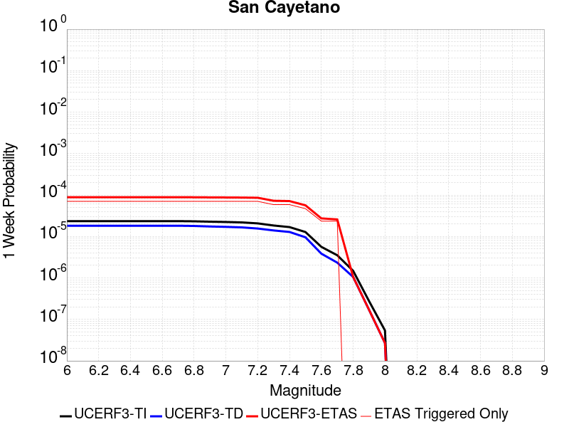 | 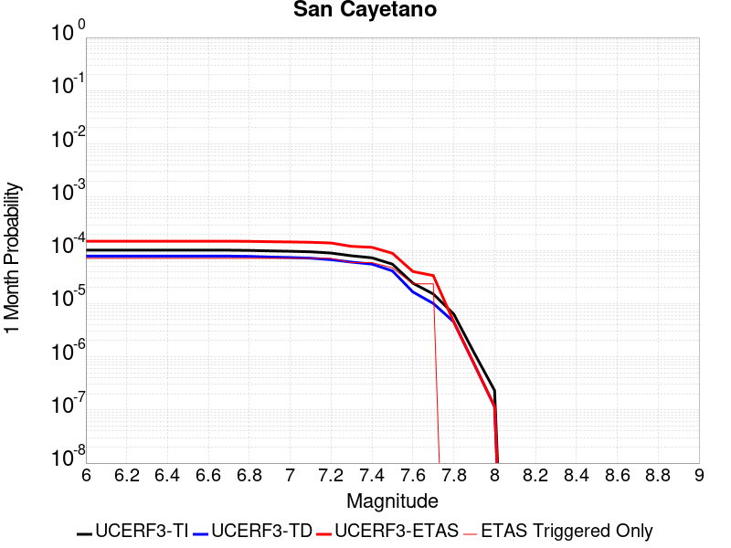 | 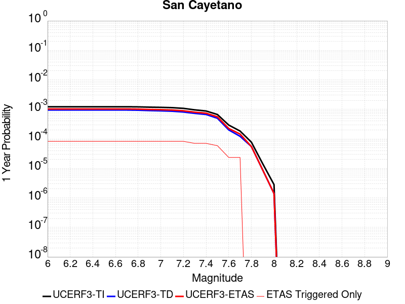 | 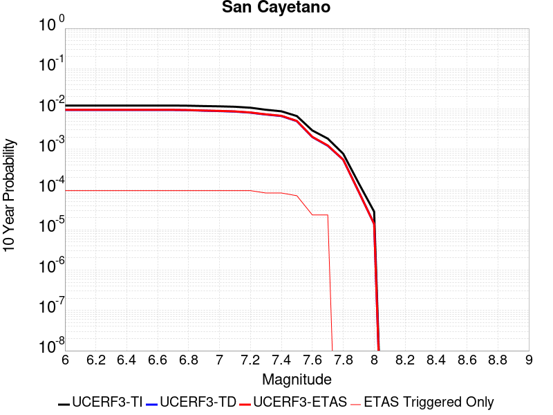 |

| Magnitude | 1 wk TI Prob | 1 wk TD Prob | 1 wk ETAS Prob | 1 wk ETAS/TD Gain | 1 wk ETAS Triggered Only | 1 mo TI Prob | 1 mo TD Prob | 1 mo ETAS Prob | 1 mo ETAS/TD Gain | 1 mo ETAS Triggered Only | 1 yr TI Prob | 1 yr TD Prob | 1 yr ETAS Prob | 1 yr ETAS/TD Gain | 1 yr ETAS Triggered Only | 10 yr TI Prob | 10 yr TD Prob | 10 yr ETAS Prob | 10 yr ETAS/TD Gain | 10 yr ETAS Triggered Only |
|-----|-----|-----|-----|-----|-----|-----|-----|-----|-----|-----|-----|-----|-----|-----|-----|-----|-----|-----|-----|-----|
| 6.0 | 2.3476267E-5 | 1.816928E-5 | 8.859053E-5 | 4.875842 | 7.042254E-5 | 1.0060869E-4 | 7.786603E-5 | 1.4828308E-4 | 1.904336 | 7.042254E-5 | 0.0012242225 | 9.476103E-4 | 0.0010296921 | 1.0866197 | 8.2159626E-5 | 0.012175002 | 0.009436584 | 0.009529595 | 1.0098563 | 9.389671E-5 |
| 6.1 | 2.3476267E-5 | 1.816928E-5 | 8.859053E-5 | 4.875842 | 7.042254E-5 | 1.0060869E-4 | 7.786603E-5 | 1.4828308E-4 | 1.904336 | 7.042254E-5 | 0.0012242225 | 9.476103E-4 | 0.0010296921 | 1.0866197 | 8.2159626E-5 | 0.012175002 | 0.009436584 | 0.009529595 | 1.0098563 | 9.389671E-5 |
| 6.2 | 2.3476267E-5 | 1.816928E-5 | 8.859053E-5 | 4.875842 | 7.042254E-5 | 1.0060869E-4 | 7.786603E-5 | 1.4828308E-4 | 1.904336 | 7.042254E-5 | 0.0012242225 | 9.476103E-4 | 0.0010296921 | 1.0866197 | 8.2159626E-5 | 0.012175002 | 0.009436584 | 0.009529595 | 1.0098563 | 9.389671E-5 |
| 6.3 | 2.3476267E-5 | 1.816928E-5 | 8.859053E-5 | 4.875842 | 7.042254E-5 | 1.0060869E-4 | 7.786603E-5 | 1.4828308E-4 | 1.904336 | 7.042254E-5 | 0.0012242225 | 9.476103E-4 | 0.0010296921 | 1.0866197 | 8.2159626E-5 | 0.012175002 | 0.009436584 | 0.009529595 | 1.0098563 | 9.389671E-5 |
| 6.4 | 2.3476267E-5 | 1.816928E-5 | 8.859053E-5 | 4.875842 | 7.042254E-5 | 1.0060869E-4 | 7.786603E-5 | 1.4828308E-4 | 1.904336 | 7.042254E-5 | 0.0012242225 | 9.476103E-4 | 0.0010296921 | 1.0866197 | 8.2159626E-5 | 0.012175002 | 0.009436584 | 0.009529595 | 1.0098563 | 9.389671E-5 |
| 6.5 | 2.3476267E-5 | 1.816928E-5 | 8.859053E-5 | 4.875842 | 7.042254E-5 | 1.0060869E-4 | 7.786603E-5 | 1.4828308E-4 | 1.904336 | 7.042254E-5 | 0.0012242225 | 9.476103E-4 | 0.0010296921 | 1.0866197 | 8.2159626E-5 | 0.012175002 | 0.009436584 | 0.009529595 | 1.0098563 | 9.389671E-5 |
| 6.6 | 2.3476267E-5 | 1.816928E-5 | 8.859053E-5 | 4.875842 | 7.042254E-5 | 1.0060869E-4 | 7.786603E-5 | 1.4828308E-4 | 1.904336 | 7.042254E-5 | 0.0012242225 | 9.476103E-4 | 0.0010296921 | 1.0866197 | 8.2159626E-5 | 0.012175002 | 0.009436584 | 0.009529595 | 1.0098563 | 9.389671E-5 |
| 6.7 | 2.3476267E-5 | 1.816928E-5 | 8.859053E-5 | 4.875842 | 7.042254E-5 | 1.0060869E-4 | 7.786603E-5 | 1.4828308E-4 | 1.904336 | 7.042254E-5 | 0.0012242225 | 9.476103E-4 | 0.0010296921 | 1.0866197 | 8.2159626E-5 | 0.012175002 | 0.009436584 | 0.009529595 | 1.0098563 | 9.389671E-5 |
| 6.8 | 2.3241924E-5 | 1.7936987E-5 | 8.835826E-5 | 4.926037 | 7.042254E-5 | 9.960445E-5 | 7.687056E-5 | 1.4728768E-4 | 1.916048 | 7.042254E-5 | 0.0012120095 | 9.3550084E-4 | 0.0010175835 | 1.0877421 | 8.2159626E-5 | 0.012054204 | 0.009316482 | 0.009409504 | 1.0099846 | 9.389671E-5 |
| 6.9 | 2.2761007E-5 | 1.7432423E-5 | 8.785373E-5 | 5.039674 | 7.042254E-5 | 9.7543525E-5 | 7.470827E-5 | 1.4512554E-4 | 1.9425634 | 7.042254E-5 | 0.0011869454 | 9.09197E-4 | 9.912819E-4 | 1.0902829 | 8.2159626E-5 | 0.011806256 | 0.009055603 | 0.00914865 | 1.010275 | 9.389671E-5 |
| 7.0 | 2.240283E-5 | 1.7066168E-5 | 8.7487504E-5 | 5.1263704 | 7.042254E-5 | 9.600859E-5 | 7.313869E-5 | 1.4355607E-4 | 1.9627925 | 7.042254E-5 | 0.0011682777 | 8.9010317E-4 | 9.721897E-4 | 1.0922214 | 8.2159626E-5 | 0.011621549 | 0.008866196 | 0.00895926 | 1.0104965 | 9.389671E-5 |
| 7.1 | 2.1871154E-5 | 1.6586018E-5 | 8.7007385E-5 | 5.245827 | 7.042254E-5 | 9.373015E-5 | 7.108101E-5 | 1.4149855E-4 | 1.9906658 | 7.042254E-5 | 0.0011405671 | 8.6507114E-4 | 9.4715966E-4 | 1.0948923 | 8.2159626E-5 | 0.011347309 | 0.008617838 | 0.0087109255 | 1.0108017 | 9.389671E-5 |
| 7.2 | 2.0714133E-5 | 1.5564561E-5 | 8.5986E-5 | 5.524473 | 7.042254E-5 | 8.8771834E-5 | 6.670357E-5 | 1.3712142E-4 | 2.0556831 | 7.042254E-5 | 0.0010802611 | 8.1181666E-4 | 8.939096E-4 | 1.1011225 | 8.2159626E-5 | 0.010750249 | 0.008089285 | 0.008182422 | 1.0115136 | 9.389671E-5 |
| 7.3 | 1.8408395E-5 | 1.3996864E-5 | 7.268149E-5 | 5.192698 | 5.8685448E-5 | 7.8890735E-5 | 5.99852E-5 | 1.1866713E-4 | 1.9782734 | 5.8685448E-5 | 9.600714E-4 | 7.300781E-4 | 8.004492E-4 | 1.0963885 | 7.042254E-5 | 0.009559342 | 0.0072775153 | 0.007359077 | 1.0112073 | 8.2159626E-5 |
| 7.4 | 1.6856795E-5 | 1.28500815E-5 | 7.153477E-5 | 5.566873 | 5.8685448E-5 | 7.2241404E-5 | 5.5070628E-5 | 1.13752845E-4 | 2.0655808 | 5.8685448E-5 | 8.7918417E-4 | 6.7028153E-4 | 7.4065686E-4 | 1.1049937 | 7.042254E-5 | 0.00875714 | 0.0066832784 | 0.0067648888 | 1.0122112 | 8.2159626E-5 |
| 7.5 | 1.2822778E-5 | 9.577542E-6 | 5.652545E-5 | 5.9018745 | 4.6948357E-5 | 5.495361E-5 | 4.1045972E-5 | 8.7992405E-5 | 2.1437523 | 4.6948357E-5 | 6.688548E-4 | 4.996217E-4 | 5.582778E-4 | 1.1174011 | 5.8685448E-5 | 0.006668452 | 0.0049851555 | 0.005055227 | 1.014056 | 7.042254E-5 |
| 7.6 | 5.6272684E-6 | 3.854903E-6 | 2.7328992E-5 | 7.089411 | 2.3474178E-5 | 2.4116642E-5 | 1.652091E-5 | 3.99947E-5 | 2.4208534 | 2.3474178E-5 | 2.9358055E-4 | 2.0112359E-4 | 2.2459305E-4 | 1.1166917 | 2.3474178E-5 | 0.0029319301 | 0.0020094267 | 0.0020328537 | 1.0116585 | 2.3474178E-5 |
| 7.7 | 3.5261346E-6 | 2.3407013E-6 | 2.5814825E-5 | 11.028671 | 2.3474178E-5 | 1.5111918E-5 | 1.0031539E-5 | 3.3505483E-5 | 3.3400142 | 2.3474178E-5 | 1.8397206E-4 | 1.2212721E-4 | 1.4559852E-4 | 1.1921874 | 2.3474178E-5 | 0.0018381984 | 0.0012206084 | 0.0012440538 | 1.0192081 | 2.3474178E-5 |
| 7.8 | 1.4826929E-6 | 1.056428E-6 | 1.056428E-6 | 1.0 | 0.0 | 6.354383E-6 | 4.5275406E-6 | 4.5275406E-6 | 1.0 | 0.0 | 7.736187E-5 | 5.5121433E-5 | 5.5121433E-5 | 1.0 | 0.0 | 7.733494E-4 | 5.5107963E-4 | 5.5107963E-4 | 1.0 | 0.0 |
| 7.9 | 2.7568166E-7 | 1.6978244E-7 | 1.6978244E-7 | 1.0 | 0.0 | 1.1814923E-6 | 7.2763885E-7 | 7.2763885E-7 | 1.0 | 0.0 | 1.4384574E-5 | 8.858967E-6 | 8.858967E-6 | 1.0 | 0.0 | 1.4383643E-4 | 8.8586174E-5 | 8.8586174E-5 | 1.0 | 0.0 |
| 8.0 | 5.407832E-8 | 2.6887697E-8 | 2.6887697E-8 | 1.0 | 0.0 | 2.3176422E-7 | 1.15232986E-7 | 1.15232986E-7 | 1.0 | 0.0 | 2.8217257E-6 | 1.4029607E-6 | 1.4029607E-6 | 1.0 | 0.0 | 2.8216898E-5 | 1.4029522E-5 | 1.4029522E-5 | 1.0 | 0.0 |

## Red Mountain
*[(top)](#table-of-contents)*

| 1 Week | 1 Month | 1 Year | 10 Year |
|-----|-----|-----|-----|
| 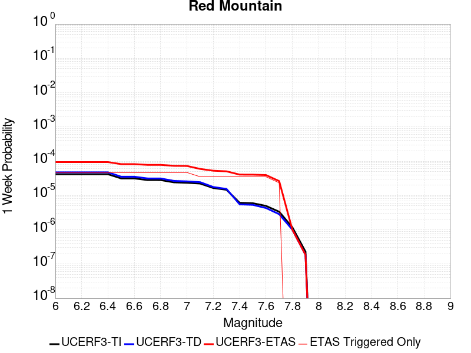 | 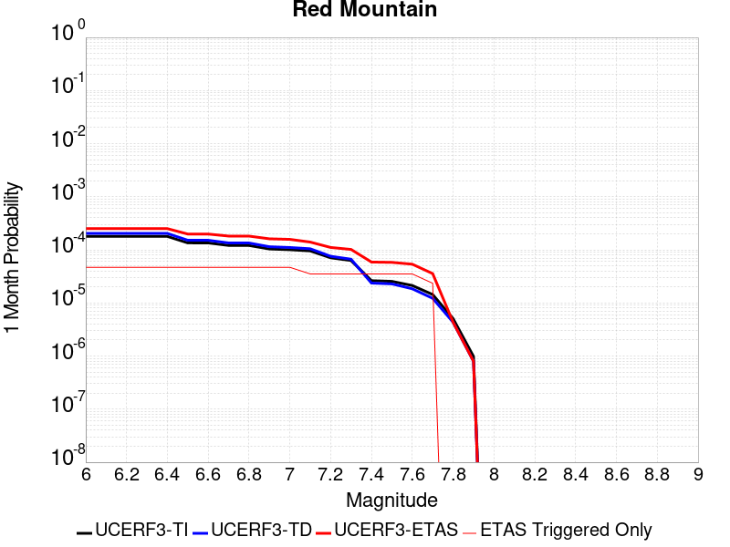 | 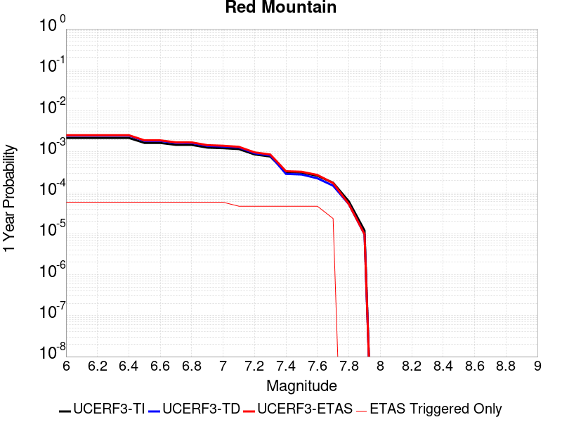 | 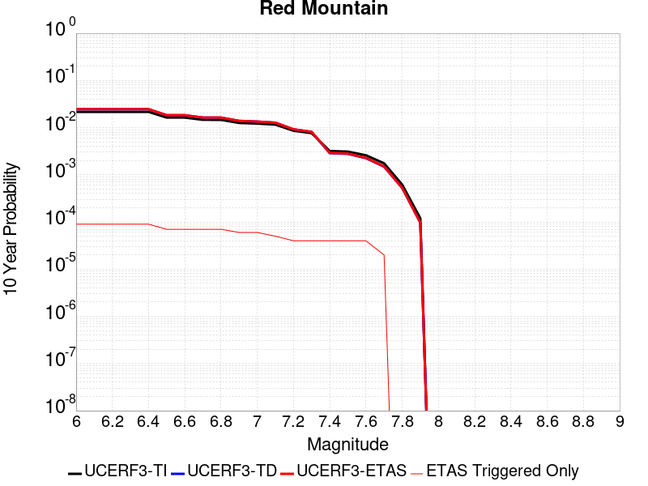 |

| Magnitude | 1 wk TI Prob | 1 wk TD Prob | 1 wk ETAS Prob | 1 wk ETAS/TD Gain | 1 wk ETAS Triggered Only | 1 mo TI Prob | 1 mo TD Prob | 1 mo ETAS Prob | 1 mo ETAS/TD Gain | 1 mo ETAS Triggered Only | 1 yr TI Prob | 1 yr TD Prob | 1 yr ETAS Prob | 1 yr ETAS/TD Gain | 1 yr ETAS Triggered Only | 10 yr TI Prob | 10 yr TD Prob | 10 yr ETAS Prob | 10 yr ETAS/TD Gain | 10 yr ETAS Triggered Only |
|-----|-----|-----|-----|-----|-----|-----|-----|-----|-----|-----|-----|-----|-----|-----|-----|-----|-----|-----|-----|-----|
| 6.0 | 4.1810763E-5 | 4.7589947E-5 | 9.4536066E-5 | 1.9864714 | 4.6948357E-5 | 1.7917668E-4 | 2.039419E-4 | 2.508807E-4 | 1.2301576 | 4.6948357E-5 | 0.0021792934 | 0.0024803306 | 0.0025388706 | 1.0236017 | 5.8685448E-5 | 0.021580452 | 0.024544092 | 0.024635684 | 1.0037317 | 9.389671E-5 |
| 6.1 | 4.1810763E-5 | 4.7589947E-5 | 9.4536066E-5 | 1.9864714 | 4.6948357E-5 | 1.7917668E-4 | 2.039419E-4 | 2.508807E-4 | 1.2301576 | 4.6948357E-5 | 0.0021792934 | 0.0024803306 | 0.0025388706 | 1.0236017 | 5.8685448E-5 | 0.021580452 | 0.024544092 | 0.024635684 | 1.0037317 | 9.389671E-5 |
| 6.2 | 4.1810763E-5 | 4.7589947E-5 | 9.4536066E-5 | 1.9864714 | 4.6948357E-5 | 1.7917668E-4 | 2.039419E-4 | 2.508807E-4 | 1.2301576 | 4.6948357E-5 | 0.0021792934 | 0.0024803306 | 0.0025388706 | 1.0236017 | 5.8685448E-5 | 0.021580452 | 0.024544092 | 0.024635684 | 1.0037317 | 9.389671E-5 |
| 6.3 | 4.1810763E-5 | 4.7589947E-5 | 9.4536066E-5 | 1.9864714 | 4.6948357E-5 | 1.7917668E-4 | 2.039419E-4 | 2.508807E-4 | 1.2301576 | 4.6948357E-5 | 0.0021792934 | 0.0024803306 | 0.0025388706 | 1.0236017 | 5.8685448E-5 | 0.021580452 | 0.024544092 | 0.024635684 | 1.0037317 | 9.389671E-5 |
| 6.4 | 4.1810763E-5 | 4.7589947E-5 | 9.4536066E-5 | 1.9864714 | 4.6948357E-5 | 1.7917668E-4 | 2.039419E-4 | 2.508807E-4 | 1.2301576 | 4.6948357E-5 | 0.0021792934 | 0.0024803306 | 0.0025388706 | 1.0236017 | 5.8685448E-5 | 0.021580452 | 0.024544092 | 0.024635684 | 1.0037317 | 9.389671E-5 |
| 6.5 | 3.154503E-5 | 3.5359728E-5 | 8.2306426E-5 | 2.3276882 | 4.6948357E-5 | 1.3518598E-4 | 1.5153342E-4 | 1.9847465E-4 | 1.3097749 | 4.6948357E-5 | 0.0016446467 | 0.0018434501 | 0.0019020274 | 1.0317758 | 5.8685448E-5 | 0.01632528 | 0.018291233 | 0.018371891 | 1.0044096 | 8.2159626E-5 |
| 6.6 | 3.1535834E-5 | 3.534911E-5 | 8.229581E-5 | 2.328087 | 4.6948357E-5 | 1.3514658E-4 | 1.5148791E-4 | 1.9842916E-4 | 1.309868 | 4.6948357E-5 | 0.0016441676 | 0.001842897 | 0.0019014744 | 1.0317855 | 5.8685448E-5 | 0.01632056 | 0.018285794 | 0.018366452 | 1.004411 | 8.2159626E-5 |
| 6.7 | 2.8267326E-5 | 3.146934E-5 | 7.841622E-5 | 2.4918292 | 4.6948357E-5 | 1.2114006E-4 | 1.348621E-4 | 1.8180413E-4 | 1.3480742 | 4.6948357E-5 | 0.0014738824 | 0.0016407946 | 0.0016993837 | 1.0357078 | 5.8685448E-5 | 0.014641452 | 0.016295563 | 0.016376384 | 1.0049597 | 8.2159626E-5 |
| 6.8 | 2.8212884E-5 | 3.1407224E-5 | 7.835411E-5 | 2.4947796 | 4.6948357E-5 | 1.20906756E-4 | 1.3459593E-4 | 1.8153797E-4 | 1.3487626 | 4.6948357E-5 | 0.0014710457 | 0.0016375587 | 0.0016961481 | 1.0357785 | 5.8685448E-5 | 0.014613459 | 0.01626368 | 0.016344503 | 1.0049696 | 8.2159626E-5 |
| 6.9 | 2.4227871E-5 | 2.6706979E-5 | 7.365408E-5 | 2.757859 | 4.6948357E-5 | 1.03829596E-4 | 1.14453884E-4 | 1.6139686E-4 | 1.4101475 | 4.6948357E-5 | 0.0012633923 | 0.0013926612 | 0.001451265 | 1.0420804 | 5.8685448E-5 | 0.012562336 | 0.013847026 | 0.013916473 | 1.0050154 | 7.042254E-5 |
| 7.0 | 2.348524E-5 | 2.5835763E-5 | 7.278291E-5 | 2.817138 | 4.6948357E-5 | 1.0064714E-4 | 1.1072042E-4 | 1.5766358E-4 | 1.4239792 | 4.6948357E-5 | 0.0012246901 | 0.0013472632 | 0.0014058696 | 1.0435003 | 5.8685448E-5 | 0.012179627 | 0.01339859 | 0.013468069 | 1.0051855 | 7.042254E-5 |
| 7.1 | 2.2311642E-5 | 2.4462828E-5 | 5.9673235E-5 | 2.4393432 | 3.521127E-5 | 9.561782E-5 | 1.048369E-4 | 1.4004447E-4 | 1.3358319 | 3.521127E-5 | 0.0011635252 | 0.0012757168 | 0.0013226052 | 1.0367546 | 4.6948357E-5 | 0.01157452 | 0.012691451 | 0.012749393 | 1.0045654 | 5.8685448E-5 |
| 7.2 | 1.6533986E-5 | 1.7670347E-5 | 5.288099E-5 | 2.9926403 | 3.521127E-5 | 7.085802E-5 | 7.572822E-5 | 1.1093682E-4 | 1.4649338 | 3.521127E-5 | 8.623549E-4 | 9.216645E-4 | 9.685696E-4 | 1.0508918 | 4.6948357E-5 | 0.008590161 | 0.009184699 | 0.009231216 | 1.0050646 | 4.6948357E-5 |
| 7.3 | 1.4703092E-5 | 1.555952E-5 | 5.077024E-5 | 3.2629695 | 3.521127E-5 | 6.301173E-5 | 6.66823E-5 | 1.0189122E-4 | 1.5280099 | 3.521127E-5 | 7.668978E-4 | 8.1161625E-4 | 8.585265E-4 | 1.0577985 | 4.6948357E-5 | 0.0076425658 | 0.008092596 | 0.008139164 | 1.0057545 | 4.6948357E-5 |
| 7.4 | 6.1331984E-6 | 5.528872E-6 | 4.0739946E-5 | 7.368582 | 3.521127E-5 | 2.6284872E-5 | 2.3694953E-5 | 5.8905385E-5 | 2.4859889 | 3.521127E-5 | 3.199713E-4 | 2.8844838E-4 | 3.353832E-4 | 1.1627147 | 4.6948357E-5 | 0.0031951098 | 0.0028807942 | 0.0029276074 | 1.01625 | 4.6948357E-5 |
| 7.5 | 5.954766E-6 | 5.3385015E-6 | 4.054958E-5 | 7.595686 | 3.521127E-5 | 2.5520176E-5 | 2.2879094E-5 | 5.8089558E-5 | 2.5389798 | 3.521127E-5 | 3.1066386E-4 | 2.785179E-4 | 3.2545318E-4 | 1.168518 | 4.6948357E-5 | 0.003102299 | 0.0027817423 | 0.00282856 | 1.0168303 | 4.6948357E-5 |
| 7.6 | 4.9726646E-6 | 4.315295E-6 | 3.952641E-5 | 9.159608 | 3.521127E-5 | 2.1311245E-5 | 1.8493993E-5 | 5.3704607E-5 | 2.903895 | 3.521127E-5 | 2.5943352E-4 | 2.2514143E-4 | 2.7207923E-4 | 1.2084813 | 4.6948357E-5 | 0.0025913084 | 0.002249168 | 0.0022960107 | 1.0208267 | 4.6948357E-5 |
| 7.7 | 3.3613894E-6 | 2.8526642E-6 | 2.6326776E-5 | 9.228838 | 2.3474178E-5 | 1.4405875E-5 | 1.2225649E-5 | 3.569954E-5 | 2.9200528 | 2.3474178E-5 | 1.7537741E-4 | 1.4883737E-4 | 1.7230805E-4 | 1.1576935 | 2.3474178E-5 | 0.0017523908 | 0.0014874031 | 0.0015108424 | 1.0157585 | 2.3474178E-5 |
| 7.8 | 1.1828961E-6 | 1.0122756E-6 | 1.0122756E-6 | 1.0 | 0.0 | 5.069545E-6 | 4.338317E-6 | 4.338317E-6 | 1.0 | 0.0 | 6.171996E-5 | 5.281776E-5 | 5.281776E-5 | 1.0 | 0.0 | 6.170282E-4 | 5.2805495E-4 | 5.2805495E-4 | 1.0 | 0.0 |
| 7.9 | 2.2967266E-7 | 1.8618952E-7 | 1.8618952E-7 | 1.0 | 0.0 | 9.843111E-7 | 7.9795484E-7 | 7.9795484E-7 | 1.0 | 0.0 | 1.19839215E-5 | 9.7150605E-6 | 9.7150605E-6 | 1.0 | 0.0 | 1.1983275E-4 | 9.714664E-5 | 9.714664E-5 | 1.0 | 0.0 |

## Pisgah-Bullion Mtn-Mesquite Lk
*[(top)](#table-of-contents)*

| 1 Week | 1 Month | 1 Year | 10 Year |
|-----|-----|-----|-----|
| 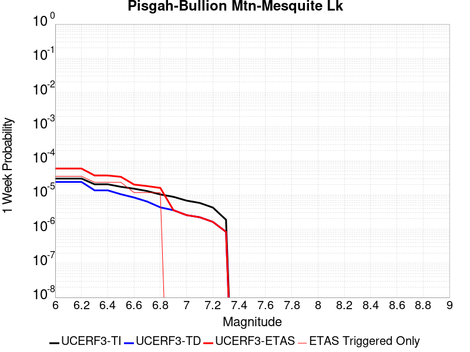 | 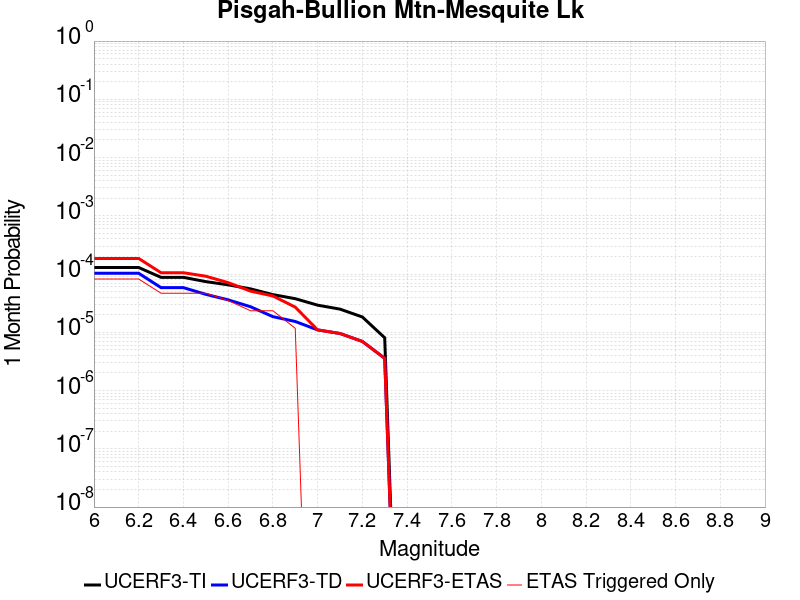 | 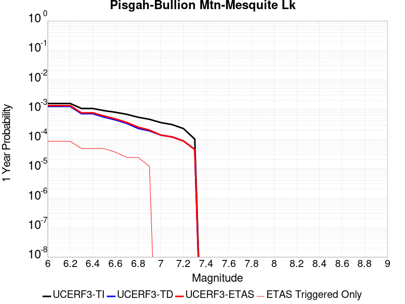 | 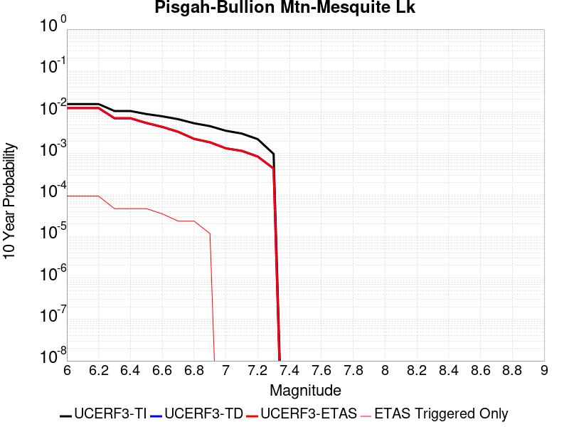 |

| Magnitude | 1 wk TI Prob | 1 wk TD Prob | 1 wk ETAS Prob | 1 wk ETAS/TD Gain | 1 wk ETAS Triggered Only | 1 mo TI Prob | 1 mo TD Prob | 1 mo ETAS Prob | 1 mo ETAS/TD Gain | 1 mo ETAS Triggered Only | 1 yr TI Prob | 1 yr TD Prob | 1 yr ETAS Prob | 1 yr ETAS/TD Gain | 1 yr ETAS Triggered Only | 10 yr TI Prob | 10 yr TD Prob | 10 yr ETAS Prob | 10 yr ETAS/TD Gain | 10 yr ETAS Triggered Only |
|-----|-----|-----|-----|-----|-----|-----|-----|-----|-----|-----|-----|-----|-----|-----|-----|-----|-----|-----|-----|-----|
| 6.0 | 3.0240792E-5 | 2.4091114E-5 | 5.9301532E-5 | 2.4615521 | 3.521127E-5 | 1.2959696E-4 | 1.03244114E-4 | 1.8539526E-4 | 1.795698 | 8.2159626E-5 | 0.0015767008 | 0.0012563728 | 0.0013384292 | 1.0653121 | 8.2159626E-5 | 0.015655609 | 0.012502721 | 0.012595444 | 1.0074162 | 9.389671E-5 |
| 6.1 | 3.0240792E-5 | 2.4091114E-5 | 5.9301532E-5 | 2.4615521 | 3.521127E-5 | 1.2959696E-4 | 1.03244114E-4 | 1.8539526E-4 | 1.795698 | 8.2159626E-5 | 0.0015767008 | 0.0012563728 | 0.0013384292 | 1.0653121 | 8.2159626E-5 | 0.015655609 | 0.012502721 | 0.012595444 | 1.0074162 | 9.389671E-5 |
| 6.2 | 3.0240792E-5 | 2.4091114E-5 | 5.9301532E-5 | 2.4615521 | 3.521127E-5 | 1.2959696E-4 | 1.03244114E-4 | 1.8539526E-4 | 1.795698 | 8.2159626E-5 | 0.0015767008 | 0.0012563728 | 0.0013384292 | 1.0653121 | 8.2159626E-5 | 0.015655609 | 0.012502721 | 0.012595444 | 1.0074162 | 9.389671E-5 |
| 6.3 | 2.0498217E-5 | 1.36380695E-5 | 3.7111928E-5 | 2.721201 | 2.3474178E-5 | 8.784654E-5 | 5.844765E-5 | 1.05393265E-4 | 1.8032079 | 4.6948357E-5 | 0.0010690069 | 7.1138405E-4 | 7.58299E-4 | 1.0659488 | 4.6948357E-5 | 0.01063879 | 0.0070926943 | 0.00713931 | 1.0065724 | 4.6948357E-5 |
| 6.4 | 2.0498217E-5 | 1.36380695E-5 | 3.7111928E-5 | 2.721201 | 2.3474178E-5 | 8.784654E-5 | 5.844765E-5 | 1.05393265E-4 | 1.8032079 | 4.6948357E-5 | 0.0010690069 | 7.1138405E-4 | 7.58299E-4 | 1.0659488 | 4.6948357E-5 | 0.01063879 | 0.0070926943 | 0.00713931 | 1.0065724 | 4.6948357E-5 |
| 6.5 | 1.7316182E-5 | 1.0477042E-5 | 3.3950975E-5 | 3.2405112 | 2.3474178E-5 | 7.42101E-5 | 4.4900895E-5 | 9.184714E-5 | 2.0455527 | 4.6948357E-5 | 9.0313336E-4 | 5.465413E-4 | 5.9346395E-4 | 1.0858539 | 4.6948357E-5 | 0.008994718 | 0.0054529672 | 0.0054996596 | 1.0085627 | 4.6948357E-5 |
| 6.6 | 1.5251077E-5 | 8.414273E-6 | 2.0151263E-5 | 2.3948905 | 1.1737089E-5 | 6.536012E-5 | 3.6060712E-5 | 7.127071E-5 | 1.9764088 | 3.521127E-5 | 7.9546886E-4 | 4.3895794E-4 | 4.7415376E-4 | 1.0801804 | 3.521127E-5 | 0.007926274 | 0.0043816264 | 0.004416683 | 1.0080009 | 3.521127E-5 |
| 6.7 | 1.2997425E-5 | 6.4114965E-6 | 1.814851E-5 | 2.83062 | 1.1737089E-5 | 5.570206E-5 | 2.7477578E-5 | 5.0951112E-5 | 1.8542795 | 2.3474178E-5 | 6.7796157E-4 | 3.3449283E-4 | 3.5795916E-4 | 1.0701549 | 2.3474178E-5 | 0.0067589693 | 0.0033403537 | 0.0033637495 | 1.007004 | 2.3474178E-5 |
| 6.8 | 1.035386E-5 | 4.3332193E-6 | 1.6070258E-5 | 3.7086186 | 1.1737089E-5 | 4.437293E-5 | 1.8570812E-5 | 4.2044554E-5 | 2.2640126 | 2.3474178E-5 | 5.401065E-4 | 2.2607706E-4 | 2.4954593E-4 | 1.1038091 | 2.3474178E-5 | 0.0053879567 | 0.0022585576 | 0.0022819787 | 1.01037 | 2.3474178E-5 |
| 6.9 | 8.816252E-6 | 3.580638E-6 | 3.580638E-6 | 1.0 | 0.0 | 3.778339E-5 | 1.5345504E-5 | 2.7082413E-5 | 1.7648436 | 1.1737089E-5 | 4.5991567E-4 | 1.8681608E-4 | 1.9855097E-4 | 1.0628152 | 1.1737089E-5 | 0.00458965 | 0.0018666488 | 0.0018783639 | 1.006276 | 1.1737089E-5 |
| 7.0 | 6.8232207E-6 | 2.5675843E-6 | 2.5675843E-6 | 1.0 | 0.0 | 2.9242048E-5 | 1.1003888E-5 | 1.1003888E-5 | 1.0 | 0.0 | 3.5596377E-4 | 1.3396442E-4 | 1.3396442E-4 | 1.0 | 0.0 | 0.0035539411 | 0.0013388677 | 0.0013388677 | 1.0 | 0.0 |
| 7.1 | 5.837013E-6 | 2.22738E-6 | 2.22738E-6 | 1.0 | 0.0 | 2.501553E-5 | 9.545881E-6 | 9.545881E-6 | 1.0 | 0.0 | 3.045215E-4 | 1.16215204E-4 | 1.16215204E-4 | 1.0 | 0.0 | 0.0030410455 | 0.0011615733 | 0.0011615733 | 1.0 | 0.0 |
| 7.2 | 4.278052E-6 | 1.6275711E-6 | 1.6275711E-6 | 1.0 | 0.0 | 1.833438E-5 | 6.9752873E-6 | 6.9752873E-6 | 1.0 | 0.0 | 2.231982E-4 | 8.492105E-5 | 8.492105E-5 | 1.0 | 0.0 | 0.0022297418 | 8.489092E-4 | 8.489092E-4 | 1.0 | 0.0 |
| 7.3 | 1.8803692E-6 | 8.344926E-7 | 8.344926E-7 | 1.0 | 0.0 | 8.0587E-6 | 3.5763926E-6 | 3.5763926E-6 | 1.0 | 0.0 | 9.811026E-5 | 4.354186E-5 | 4.354186E-5 | 1.0 | 0.0 | 9.806695E-4 | 4.3534773E-4 | 4.3534773E-4 | 1.0 | 0.0 |

## Oceanic - West Huasna
*[(top)](#table-of-contents)*

| 1 Week | 1 Month | 1 Year | 10 Year |
|-----|-----|-----|-----|
| 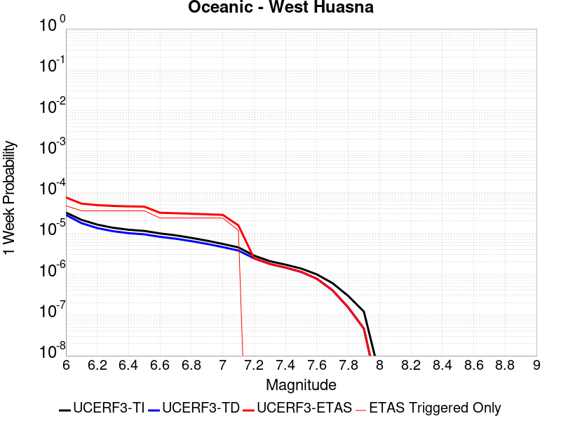 | 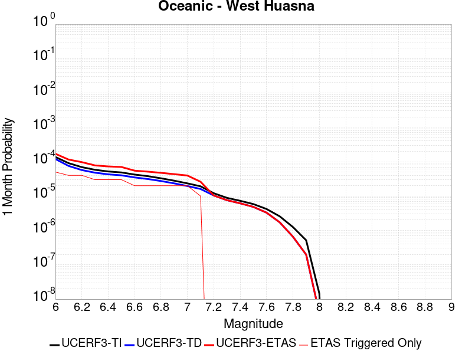 | 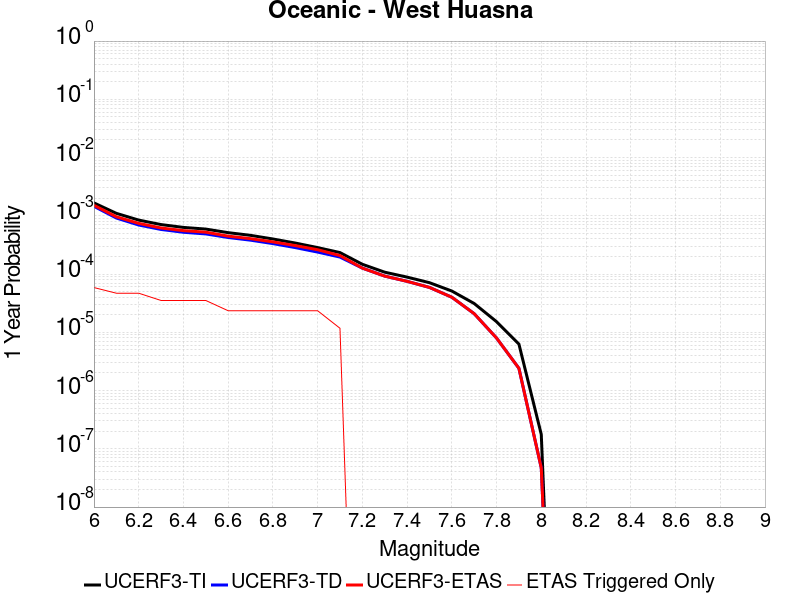 | 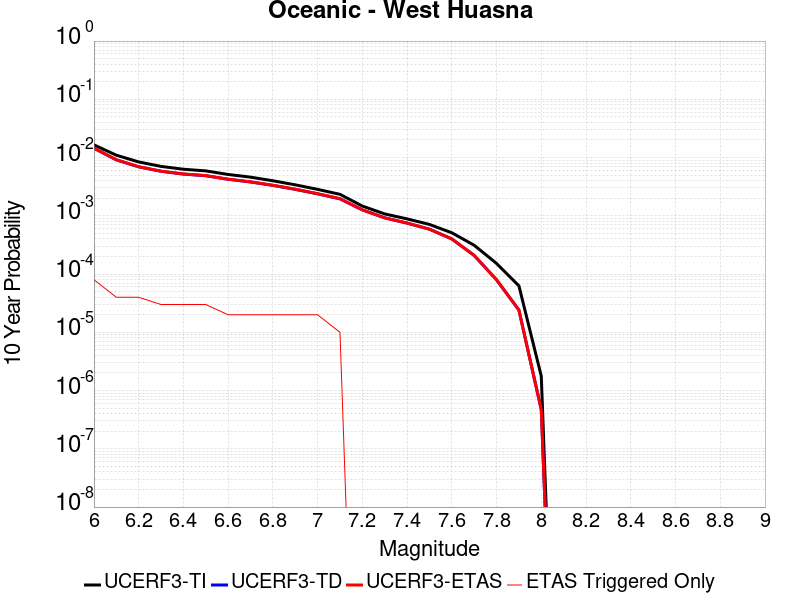 |

| Magnitude | 1 wk TI Prob | 1 wk TD Prob | 1 wk ETAS Prob | 1 wk ETAS/TD Gain | 1 wk ETAS Triggered Only | 1 mo TI Prob | 1 mo TD Prob | 1 mo ETAS Prob | 1 mo ETAS/TD Gain | 1 mo ETAS Triggered Only | 1 yr TI Prob | 1 yr TD Prob | 1 yr ETAS Prob | 1 yr ETAS/TD Gain | 1 yr ETAS Triggered Only | 10 yr TI Prob | 10 yr TD Prob | 10 yr ETAS Prob | 10 yr ETAS/TD Gain | 10 yr ETAS Triggered Only |
|-----|-----|-----|-----|-----|-----|-----|-----|-----|-----|-----|-----|-----|-----|-----|-----|-----|-----|-----|-----|-----|
| 6.0 | 3.195567E-5 | 2.7926868E-5 | 7.487391E-5 | 2.6810708 | 4.6948357E-5 | 1.3694567E-4 | 1.1968133E-4 | 1.7835975E-4 | 1.4902889 | 5.8685448E-5 | 0.0016660384 | 0.0014561893 | 0.0015147894 | 1.040242 | 5.8685448E-5 | 0.016536033 | 0.014471028 | 0.014551998 | 1.0055953 | 8.2159626E-5 |
| 6.1 | 2.1156782E-5 | 1.7573486E-5 | 5.2784133E-5 | 3.0036235 | 3.521127E-5 | 9.066878E-5 | 7.531282E-5 | 1.2225764E-4 | 1.6233311 | 4.6948357E-5 | 0.0011033333 | 9.165572E-4 | 9.634625E-4 | 1.0511756 | 4.6948357E-5 | 0.010978713 | 0.009128777 | 0.009175298 | 1.005096 | 4.6948357E-5 |
| 6.2 | 1.6195117E-5 | 1.3327152E-5 | 4.853795E-5 | 3.6420345 | 3.521127E-5 | 6.9405796E-5 | 5.7115132E-5 | 1.0406081E-4 | 1.821948 | 4.6948357E-5 | 8.44688E-4 | 6.9515745E-4 | 7.4207317E-4 | 1.0674894 | 4.6948357E-5 | 0.008414844 | 0.006930123 | 0.0069767465 | 1.0067276 | 4.6948357E-5 |
| 6.3 | 1.3559345E-5 | 1.1179142E-5 | 4.6390018E-5 | 4.1496935 | 3.521127E-5 | 5.811018E-5 | 4.7909736E-5 | 8.311932E-5 | 1.7349149 | 3.521127E-5 | 7.072618E-4 | 5.831459E-4 | 6.183366E-4 | 1.0603464 | 3.521127E-5 | 0.0070501505 | 0.0058162753 | 0.005851282 | 1.0060188 | 3.521127E-5 |
| 6.4 | 1.2120619E-5 | 1.0000977E-5 | 4.5211895E-5 | 4.520747 | 3.521127E-5 | 5.1944477E-5 | 4.2860633E-5 | 7.807039E-5 | 1.8214941 | 3.521127E-5 | 6.322405E-4 | 5.2170374E-4 | 5.568966E-4 | 1.0674577 | 3.521127E-5 | 0.006304447 | 0.0052048573 | 0.0052398853 | 1.0067298 | 3.521127E-5 |
| 6.5 | 1.13511915E-5 | 9.3674735E-6 | 4.457841E-5 | 4.758851 | 3.521127E-5 | 4.8647056E-5 | 4.01457E-5 | 7.535555E-5 | 1.8770517 | 3.521127E-5 | 5.9211696E-4 | 4.886647E-4 | 5.2385876E-4 | 1.0720209 | 3.521127E-5 | 0.0059054173 | 0.0048759608 | 0.0049110004 | 1.0071862 | 3.521127E-5 |
| 6.6 | 9.850605E-6 | 8.135418E-6 | 3.1609405E-5 | 3.8854065 | 2.3474178E-5 | 4.2216197E-5 | 3.4865614E-5 | 5.8338974E-5 | 1.6732525 | 2.3474178E-5 | 5.1386096E-4 | 4.2440637E-4 | 4.4787058E-4 | 1.0552871 | 2.3474178E-5 | 0.0051267436 | 0.004235991 | 0.0042593656 | 1.0055181 | 2.3474178E-5 |
| 6.7 | 8.8558645E-6 | 7.318433E-6 | 3.079244E-5 | 4.207518 | 2.3474178E-5 | 3.7953152E-5 | 3.1364336E-5 | 5.483778E-5 | 1.7484119 | 2.3474178E-5 | 4.6198163E-4 | 3.8179406E-4 | 4.0525928E-4 | 1.0614604 | 2.3474178E-5 | 0.004610224 | 0.0038114067 | 0.0038347915 | 1.0061355 | 2.3474178E-5 |
| 6.8 | 7.67136E-6 | 6.391756E-6 | 2.9865785E-5 | 4.672548 | 2.3474178E-5 | 3.2876844E-5 | 2.7392953E-5 | 5.086649E-5 | 1.8569187 | 2.3474178E-5 | 4.0020206E-4 | 3.3345833E-4 | 3.5692466E-4 | 1.0703727 | 2.3474178E-5 | 0.003994821 | 0.0033296007 | 0.0033529967 | 1.0070267 | 2.3474178E-5 |
| 6.9 | 6.534529E-6 | 5.4583297E-6 | 2.893238E-5 | 5.3005924 | 2.3474178E-5 | 2.8004823E-5 | 2.3392633E-5 | 4.6866262E-5 | 2.0034626 | 2.3474178E-5 | 3.4090536E-4 | 2.847682E-4 | 3.082357E-4 | 1.0824091 | 2.3474178E-5 | 0.0034038287 | 0.0028440498 | 0.0028674572 | 1.0082303 | 2.3474178E-5 |
| 7.0 | 5.460525E-6 | 4.5699517E-6 | 2.8044024E-5 | 6.1366124 | 2.3474178E-5 | 2.3402039E-5 | 1.958536E-5 | 4.305908E-5 | 2.1985338 | 2.3474178E-5 | 2.8488258E-4 | 2.3842578E-4 | 2.6189437E-4 | 1.0984313 | 2.3474178E-5 | 0.0028451765 | 0.0023817138 | 0.002405132 | 1.0098325 | 2.3474178E-5 |
| 7.1 | 4.4825083E-6 | 3.7524428E-6 | 1.5489488E-5 | 4.127841 | 1.1737089E-5 | 1.9210609E-5 | 1.60818E-5 | 2.78187E-5 | 1.729825 | 1.1737089E-5 | 2.3386406E-4 | 1.9577841E-4 | 2.075132E-4 | 1.0599391 | 1.1737089E-5 | 0.002336181 | 0.0019560715 | 0.0019677856 | 1.0059886 | 1.1737089E-5 |
| 7.2 | 2.821708E-6 | 2.4249334E-6 | 2.4249334E-6 | 1.0 | 0.0 | 1.2092979E-5 | 1.039253E-5 | 1.039253E-5 | 1.0 | 0.0 | 1.4722206E-4 | 1.2652173E-4 | 1.2652173E-4 | 1.0 | 0.0 | 0.0014712457 | 0.0012644994 | 0.0012644994 | 1.0 | 0.0 |
| 7.3 | 2.0644757E-6 | 1.7687412E-6 | 1.7687412E-6 | 1.0 | 0.0 | 8.847723E-6 | 7.5802973E-6 | 7.5802973E-6 | 1.0 | 0.0 | 1.0771569E-4 | 9.228622E-5 | 9.228622E-5 | 1.0 | 0.0 | 0.001076635 | 9.2248066E-4 | 9.2248066E-4 | 1.0 | 0.0 |
| 7.4 | 1.6980367E-6 | 1.4379892E-6 | 1.4379892E-6 | 1.0 | 0.0 | 7.27728E-6 | 6.162796E-6 | 6.162796E-6 | 1.0 | 0.0 | 8.8597284E-5 | 7.5029464E-5 | 7.5029464E-5 | 1.0 | 0.0 | 8.8561967E-4 | 7.500429E-4 | 7.500429E-4 | 1.0 | 0.0 |
| 7.5 | 1.3637683E-6 | 1.1302635E-6 | 1.1302635E-6 | 1.0 | 0.0 | 5.844708E-6 | 4.8439774E-6 | 4.8439774E-6 | 1.0 | 0.0 | 7.1156996E-5 | 5.897383E-5 | 5.897383E-5 | 1.0 | 0.0 | 7.1134215E-4 | 5.895833E-4 | 5.895833E-4 | 1.0 | 0.0 |
| 7.6 | 9.802994E-7 | 7.677247E-7 | 7.677247E-7 | 1.0 | 0.0 | 4.2012766E-6 | 3.2902446E-6 | 3.2902446E-6 | 1.0 | 0.0 | 5.1149345E-5 | 4.0057992E-5 | 4.0057992E-5 | 1.0 | 0.0 | 5.113757E-4 | 4.0050913E-4 | 4.0050913E-4 | 1.0 | 0.0 |
| 7.7 | 5.986191E-7 | 4.0050548E-7 | 4.0050548E-7 | 1.0 | 0.0 | 2.5655079E-6 | 1.7164509E-6 | 1.7164509E-6 | 1.0 | 0.0 | 3.1234613E-5 | 2.089759E-5 | 2.089759E-5 | 1.0 | 0.0 | 3.123022E-4 | 2.089576E-4 | 2.089576E-4 | 1.0 | 0.0 |
| 7.8 | 2.9189815E-7 | 1.5285792E-7 | 1.5285792E-7 | 1.0 | 0.0 | 1.2509914E-6 | 6.5510517E-7 | 6.5510517E-7 | 1.0 | 0.0 | 1.5230714E-5 | 7.9758765E-6 | 7.9758765E-6 | 1.0 | 0.0 | 1.522967E-4 | 7.9757214E-5 | 7.9757214E-5 | 1.0 | 0.0 |
| 7.9 | 1.2057845E-7 | 4.621248E-8 | 4.621248E-8 | 1.0 | 0.0 | 5.1676466E-7 | 1.9805347E-7 | 1.9805347E-7 | 1.0 | 0.0 | 6.2915915E-6 | 2.4112983E-6 | 2.4112983E-6 | 1.0 | 0.0 | 6.2914136E-5 | 2.4114026E-5 | 2.4114026E-5 | 1.0 | 0.0 |
| 8.0 | 3.3806387E-9 | 9.011393E-10 | 9.011393E-10 | 1.0 | 0.0 | 1.4488451E-8 | 3.8620254E-9 | 3.8620254E-9 | 1.0 | 0.0 | 1.7639688E-7 | 4.702016E-8 | 4.702016E-8 | 1.0 | 0.0 | 1.7639674E-6 | 4.7129527E-7 | 4.7129527E-7 | 1.0 | 0.0 |

## Deep Springs
*[(top)](#table-of-contents)*

| 1 Week | 1 Month | 1 Year | 10 Year |
|-----|-----|-----|-----|
| 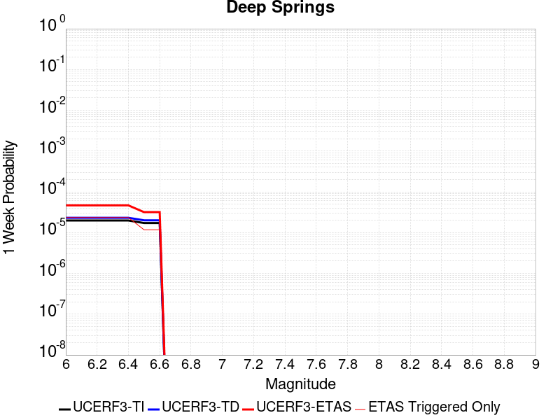 | 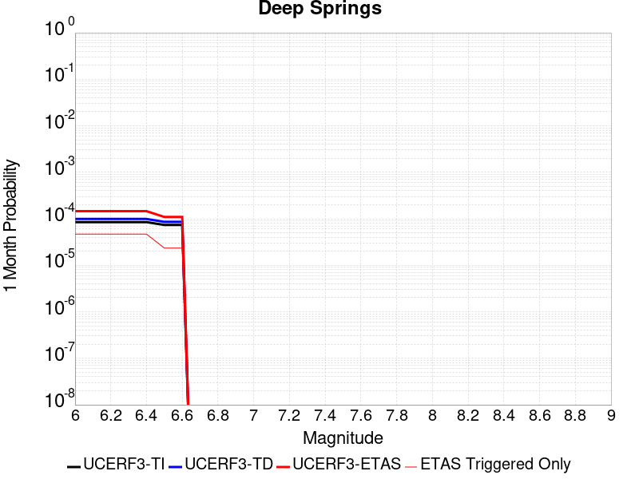 | 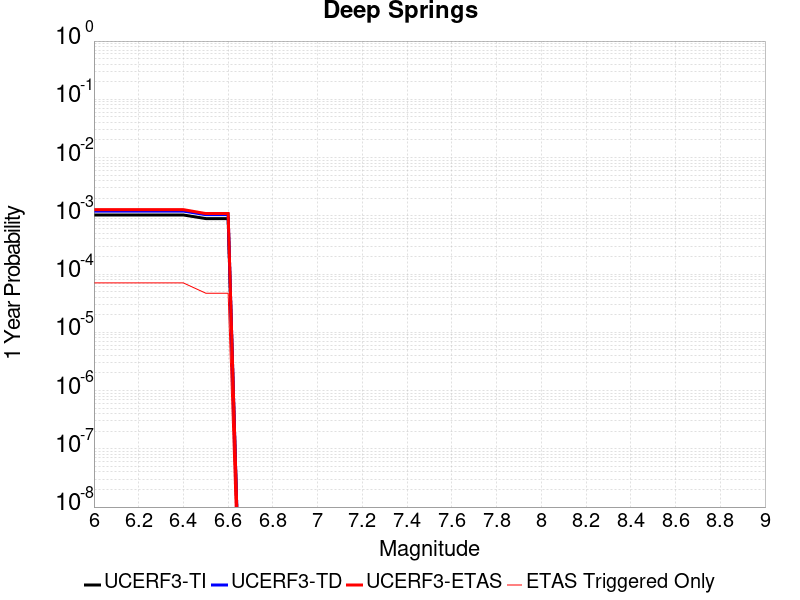 | 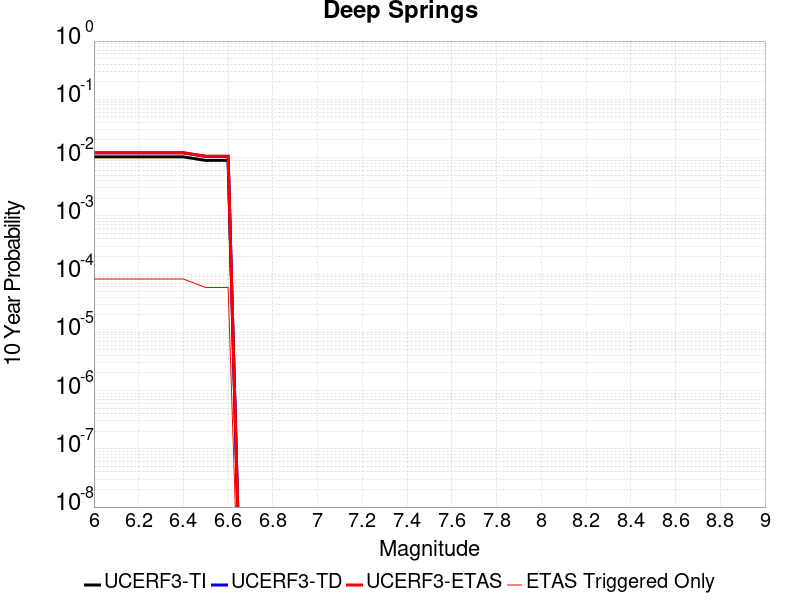 |

| Magnitude | 1 wk TI Prob | 1 wk TD Prob | 1 wk ETAS Prob | 1 wk ETAS/TD Gain | 1 wk ETAS Triggered Only | 1 mo TI Prob | 1 mo TD Prob | 1 mo ETAS Prob | 1 mo ETAS/TD Gain | 1 mo ETAS Triggered Only | 1 yr TI Prob | 1 yr TD Prob | 1 yr ETAS Prob | 1 yr ETAS/TD Gain | 1 yr ETAS Triggered Only | 10 yr TI Prob | 10 yr TD Prob | 10 yr ETAS Prob | 10 yr ETAS/TD Gain | 10 yr ETAS Triggered Only |
|-----|-----|-----|-----|-----|-----|-----|-----|-----|-----|-----|-----|-----|-----|-----|-----|-----|-----|-----|-----|-----|
| 6.0 | 1.9810619E-5 | 2.311252E-5 | 4.6586156E-5 | 2.0156243 | 2.3474178E-5 | 8.489989E-5 | 9.905276E-5 | 1.4599647E-4 | 1.4739263 | 4.6948357E-5 | 0.001033166 | 0.0012058079 | 0.0012761456 | 1.0583323 | 7.042254E-5 | 0.010283757 | 0.012042425 | 0.012123595 | 1.0067403 | 8.2159626E-5 |
| 6.1 | 1.9810619E-5 | 2.311252E-5 | 4.6586156E-5 | 2.0156243 | 2.3474178E-5 | 8.489989E-5 | 9.905276E-5 | 1.4599647E-4 | 1.4739263 | 4.6948357E-5 | 0.001033166 | 0.0012058079 | 0.0012761456 | 1.0583323 | 7.042254E-5 | 0.010283757 | 0.012042425 | 0.012123595 | 1.0067403 | 8.2159626E-5 |
| 6.2 | 1.9810619E-5 | 2.311252E-5 | 4.6586156E-5 | 2.0156243 | 2.3474178E-5 | 8.489989E-5 | 9.905276E-5 | 1.4599647E-4 | 1.4739263 | 4.6948357E-5 | 0.001033166 | 0.0012058079 | 0.0012761456 | 1.0583323 | 7.042254E-5 | 0.010283757 | 0.012042425 | 0.012123595 | 1.0067403 | 8.2159626E-5 |
| 6.3 | 1.9810619E-5 | 2.311252E-5 | 4.6586156E-5 | 2.0156243 | 2.3474178E-5 | 8.489989E-5 | 9.905276E-5 | 1.4599647E-4 | 1.4739263 | 4.6948357E-5 | 0.001033166 | 0.0012058079 | 0.0012761456 | 1.0583323 | 7.042254E-5 | 0.010283757 | 0.012042425 | 0.012123595 | 1.0067403 | 8.2159626E-5 |
| 6.4 | 1.9810619E-5 | 2.311252E-5 | 4.6586156E-5 | 2.0156243 | 2.3474178E-5 | 8.489989E-5 | 9.905276E-5 | 1.4599647E-4 | 1.4739263 | 4.6948357E-5 | 0.001033166 | 0.0012058079 | 0.0012761456 | 1.0583323 | 7.042254E-5 | 0.010283757 | 0.012042425 | 0.012123595 | 1.0067403 | 8.2159626E-5 |
| 6.5 | 1.7190405E-5 | 2.0050555E-5 | 3.178741E-5 | 1.585363 | 1.1737089E-5 | 7.367108E-5 | 8.593095E-5 | 1.0940311E-4 | 1.2731514 | 2.3474178E-5 | 8.9657627E-4 | 0.0010462094 | 0.0010931086 | 1.0448278 | 4.6948357E-5 | 0.008929676 | 0.010462056 | 0.010520128 | 1.0055506 | 5.8685448E-5 |
| 6.6 | 1.7190405E-5 | 2.0050555E-5 | 3.178741E-5 | 1.585363 | 1.1737089E-5 | 7.367108E-5 | 8.593095E-5 | 1.0940311E-4 | 1.2731514 | 2.3474178E-5 | 8.9657627E-4 | 0.0010462094 | 0.0010931086 | 1.0448278 | 4.6948357E-5 | 0.008929676 | 0.010462056 | 0.010520128 | 1.0055506 | 5.8685448E-5 |

## Santa Cruz Island
*[(top)](#table-of-contents)*

| 1 Week | 1 Month | 1 Year | 10 Year |
|-----|-----|-----|-----|
| 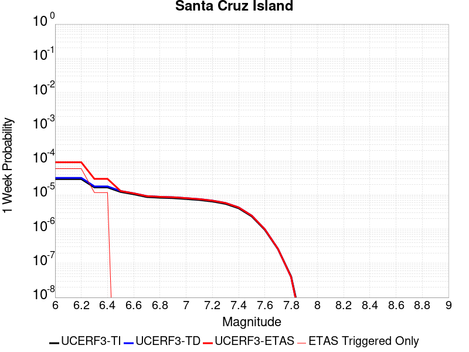 | 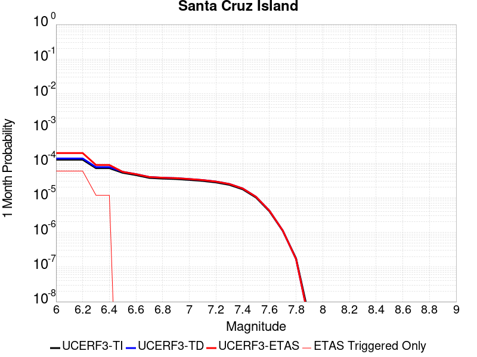 | 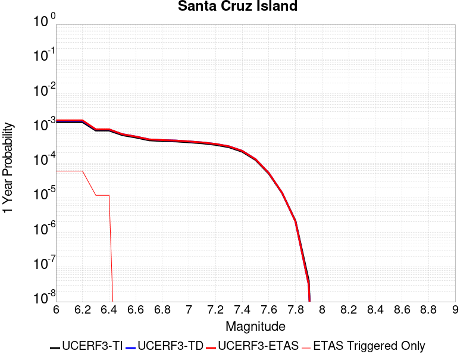 | 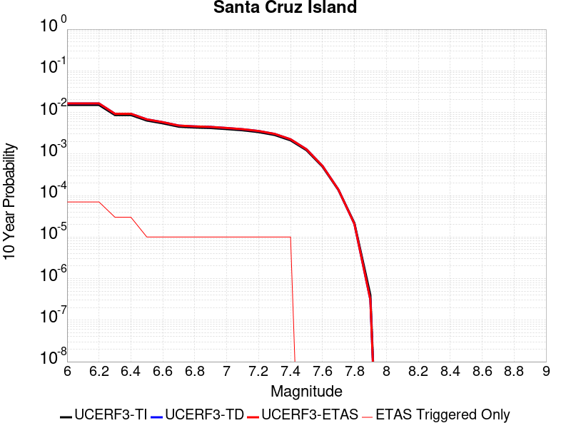 |

| Magnitude | 1 wk TI Prob | 1 wk TD Prob | 1 wk ETAS Prob | 1 wk ETAS/TD Gain | 1 wk ETAS Triggered Only | 1 mo TI Prob | 1 mo TD Prob | 1 mo ETAS Prob | 1 mo ETAS/TD Gain | 1 mo ETAS Triggered Only | 1 yr TI Prob | 1 yr TD Prob | 1 yr ETAS Prob | 1 yr ETAS/TD Gain | 1 yr ETAS Triggered Only | 10 yr TI Prob | 10 yr TD Prob | 10 yr ETAS Prob | 10 yr ETAS/TD Gain | 10 yr ETAS Triggered Only |
|-----|-----|-----|-----|-----|-----|-----|-----|-----|-----|-----|-----|-----|-----|-----|-----|-----|-----|-----|-----|-----|
| 6.0 | 2.9164563E-5 | 3.1599742E-5 | 9.0283334E-5 | 2.8570907 | 5.8685448E-5 | 1.2498499E-4 | 1.3542121E-4 | 1.9409871E-4 | 1.4332962 | 5.8685448E-5 | 0.0015206301 | 0.0016476426 | 0.0017062313 | 1.0355592 | 5.8685448E-5 | 0.015102667 | 0.016368 | 0.016448814 | 1.0049374 | 8.2159626E-5 |
| 6.1 | 2.9164563E-5 | 3.1599742E-5 | 9.0283334E-5 | 2.8570907 | 5.8685448E-5 | 1.2498499E-4 | 1.3542121E-4 | 1.9409871E-4 | 1.4332962 | 5.8685448E-5 | 0.0015206301 | 0.0016476426 | 0.0017062313 | 1.0355592 | 5.8685448E-5 | 0.015102667 | 0.016368 | 0.016448814 | 1.0049374 | 8.2159626E-5 |
| 6.2 | 2.9164563E-5 | 3.1599742E-5 | 9.0283334E-5 | 2.8570907 | 5.8685448E-5 | 1.2498499E-4 | 1.3542121E-4 | 1.9409871E-4 | 1.4332962 | 5.8685448E-5 | 0.0015206301 | 0.0016476426 | 0.0017062313 | 1.0355592 | 5.8685448E-5 | 0.015102667 | 0.016368 | 0.016448814 | 1.0049374 | 8.2159626E-5 |
| 6.3 | 1.6635553E-5 | 1.780436E-5 | 2.954124E-5 | 1.6592139 | 1.1737089E-5 | 7.1293274E-5 | 7.630226E-5 | 8.803846E-5 | 1.1538118 | 1.1737089E-5 | 8.6765E-4 | 9.2860236E-4 | 9.403286E-4 | 1.0126278 | 1.1737089E-5 | 0.008642701 | 0.009249094 | 0.009283979 | 1.0037718 | 3.521127E-5 |
| 6.4 | 1.6635553E-5 | 1.780436E-5 | 2.954124E-5 | 1.6592139 | 1.1737089E-5 | 7.1293274E-5 | 7.630226E-5 | 8.803846E-5 | 1.1538118 | 1.1737089E-5 | 8.6765E-4 | 9.2860236E-4 | 9.403286E-4 | 1.0126278 | 1.1737089E-5 | 0.008642701 | 0.009249094 | 0.009283979 | 1.0037718 | 3.521127E-5 |
| 6.5 | 1.2238748E-5 | 1.3042995E-5 | 1.3042995E-5 | 1.0 | 0.0 | 5.2450723E-5 | 5.5897377E-5 | 5.5897377E-5 | 1.0 | 0.0 | 6.3840044E-4 | 6.8034173E-4 | 6.8034173E-4 | 1.0 | 0.0 | 0.0063656955 | 0.0067829876 | 0.0067946455 | 1.0017186 | 1.1737089E-5 |
| 6.6 | 1.0489767E-5 | 1.1156636E-5 | 1.1156636E-5 | 1.0 | 0.0 | 4.495537E-5 | 4.781329E-5 | 4.781329E-5 | 1.0 | 0.0 | 5.4719415E-4 | 5.819735E-4 | 5.819735E-4 | 1.0 | 0.0 | 0.005458487 | 0.0058047357 | 0.0058164047 | 1.0020102 | 1.1737089E-5 |
| 6.7 | 8.699222E-6 | 9.236782E-6 | 9.236782E-6 | 1.0 | 0.0 | 3.7281847E-5 | 3.958561E-5 | 3.958561E-5 | 1.0 | 0.0 | 4.5381195E-4 | 4.8184878E-4 | 4.8184878E-4 | 1.0 | 0.0 | 0.0045288634 | 0.004808108 | 0.0048197885 | 1.0024294 | 1.1737089E-5 |
| 6.8 | 8.307732E-6 | 8.8169045E-6 | 8.8169045E-6 | 1.0 | 0.0 | 3.560408E-5 | 3.7786187E-5 | 3.7786187E-5 | 1.0 | 0.0 | 4.3339343E-4 | 4.5995016E-4 | 4.5995016E-4 | 1.0 | 0.0 | 0.004325492 | 0.0045900354 | 0.0046017184 | 1.0025454 | 1.1737089E-5 |
| 6.9 | 8.073121E-6 | 8.564939E-6 | 8.564939E-6 | 1.0 | 0.0 | 3.459863E-5 | 3.6706366E-5 | 3.6706366E-5 | 1.0 | 0.0 | 4.2115687E-4 | 4.468088E-4 | 4.468088E-4 | 1.0 | 0.0 | 0.004203596 | 0.004459156 | 0.0044708406 | 1.0026203 | 1.1737089E-5 |
| 7.0 | 7.617019E-6 | 8.074664E-6 | 8.074664E-6 | 1.0 | 0.0 | 3.264396E-5 | 3.4605247E-5 | 3.4605247E-5 | 1.0 | 0.0 | 3.9736772E-4 | 4.212378E-4 | 4.212378E-4 | 1.0 | 0.0 | 0.003966579 | 0.0042044413 | 0.004216129 | 1.0027798 | 1.1737089E-5 |
| 7.1 | 7.1224836E-6 | 7.545788E-6 | 7.545788E-6 | 1.0 | 0.0 | 3.052457E-5 | 3.2338692E-5 | 3.2338692E-5 | 1.0 | 0.0 | 3.715733E-4 | 3.936528E-4 | 3.936528E-4 | 1.0 | 0.0 | 0.003709526 | 0.003929598 | 0.0039412887 | 1.0029751 | 1.1737089E-5 |
| 7.2 | 6.441115E-6 | 6.8273835E-6 | 6.8273835E-6 | 1.0 | 0.0 | 2.7604487E-5 | 2.9259887E-5 | 2.9259887E-5 | 1.0 | 0.0 | 3.360328E-4 | 3.5618112E-4 | 3.5618112E-4 | 1.0 | 0.0 | 0.0033552512 | 0.003556131 | 0.0035678262 | 1.0032887 | 1.1737089E-5 |
| 7.3 | 5.494274E-6 | 5.8199944E-6 | 5.8199944E-6 | 1.0 | 0.0 | 2.3546674E-5 | 2.4942596E-5 | 2.4942596E-5 | 1.0 | 0.0 | 2.8664304E-4 | 3.0363398E-4 | 3.0363398E-4 | 1.0 | 0.0 | 0.002862736 | 0.0030322142 | 0.0030439158 | 1.003859 | 1.1737089E-5 |
| 7.4 | 4.0802624E-6 | 4.312256E-6 | 4.312256E-6 | 1.0 | 0.0 | 1.7486722E-5 | 1.8480967E-5 | 1.8480967E-5 | 1.0 | 0.0 | 2.1288003E-4 | 2.2498262E-4 | 2.2498262E-4 | 1.0 | 0.0 | 0.0021267622 | 0.0022475575 | 0.0022592682 | 1.0052104 | 1.1737089E-5 |
| 7.5 | 2.3584746E-6 | 2.4753094E-6 | 2.4753094E-6 | 1.0 | 0.0 | 1.0107709E-5 | 1.0608426E-5 | 1.0608426E-5 | 1.0 | 0.0 | 1.2305441E-4 | 1.2915E-4 | 1.2915E-4 | 1.0 | 0.0 | 0.0012298629 | 0.0012907543 | 0.0012907543 | 1.0 | 0.0 |
| 7.6 | 9.4981914E-7 | 9.86093E-7 | 9.86093E-7 | 1.0 | 0.0 | 4.0706473E-6 | 4.2261063E-6 | 4.2261063E-6 | 1.0 | 0.0 | 4.9559E-5 | 5.145164E-5 | 5.145164E-5 | 1.0 | 0.0 | 4.954795E-4 | 5.1439856E-4 | 5.1439856E-4 | 1.0 | 0.0 |
| 7.7 | 2.6013532E-7 | 2.6416603E-7 | 2.6416603E-7 | 1.0 | 0.0 | 1.1148652E-6 | 1.1321397E-6 | 1.1321397E-6 | 1.0 | 0.0 | 1.3573399E-5 | 1.3783714E-5 | 1.3783714E-5 | 1.0 | 0.0 | 1.357257E-4 | 1.3782867E-4 | 1.3782867E-4 | 1.0 | 0.0 |
| 7.8 | 4.1522263E-8 | 3.965679E-8 | 3.965679E-8 | 1.0 | 0.0 | 1.7795254E-7 | 1.6995766E-7 | 1.6995766E-7 | 1.0 | 0.0 | 2.16657E-6 | 2.0692328E-6 | 2.0692328E-6 | 1.0 | 0.0 | 2.1665488E-5 | 2.0692156E-5 | 2.0692156E-5 | 1.0 | 0.0 |
| 7.9 | 7.7242046E-10 | 5.9468175E-10 | 5.9468175E-10 | 1.0 | 0.0 | 3.3103735E-9 | 2.5486364E-9 | 2.5486364E-9 | 1.0 | 0.0 | 4.0303796E-8 | 3.1029646E-8 | 3.1029646E-8 | 1.0 | 0.0 | 4.030379E-7 | 3.1029643E-7 | 3.1029643E-7 | 1.0 | 0.0 |

## San Clemente
*[(top)](#table-of-contents)*

| 1 Week | 1 Month | 1 Year | 10 Year |
|-----|-----|-----|-----|
| 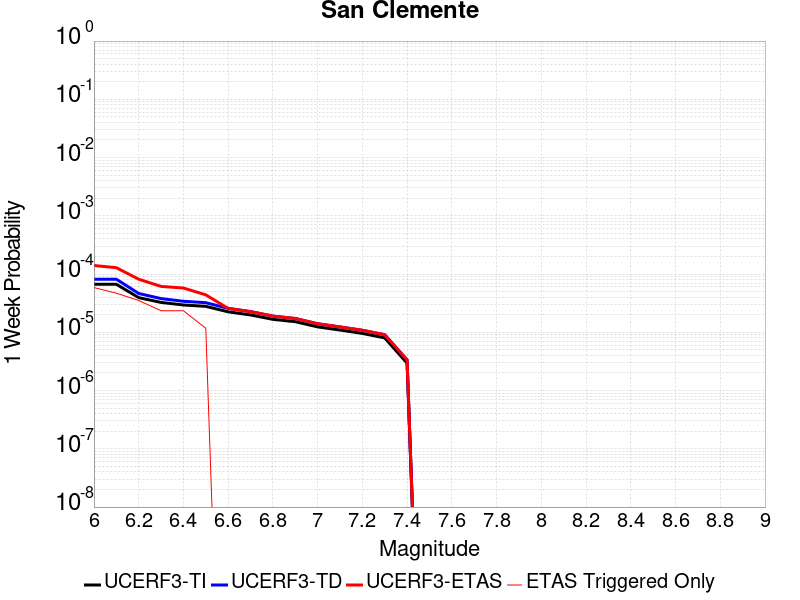 | 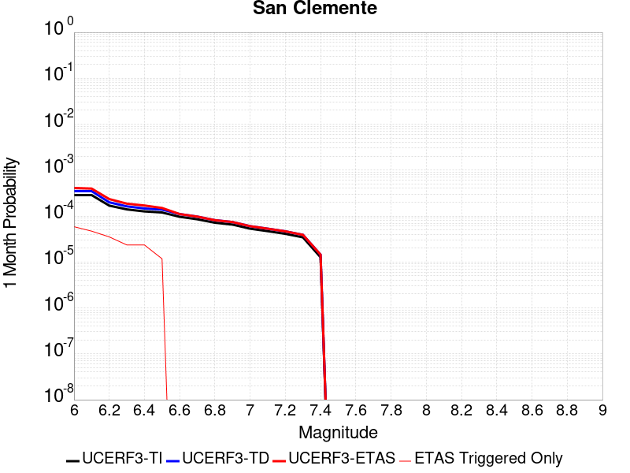 | 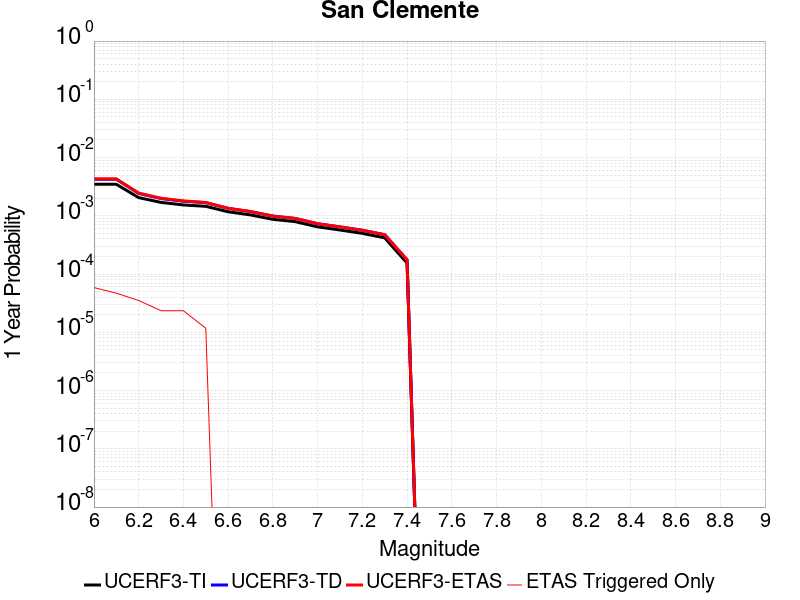 | 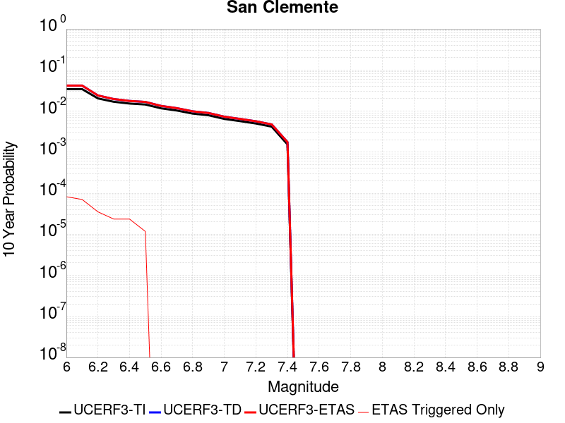 |

| Magnitude | 1 wk TI Prob | 1 wk TD Prob | 1 wk ETAS Prob | 1 wk ETAS/TD Gain | 1 wk ETAS Triggered Only | 1 mo TI Prob | 1 mo TD Prob | 1 mo ETAS Prob | 1 mo ETAS/TD Gain | 1 mo ETAS Triggered Only | 1 yr TI Prob | 1 yr TD Prob | 1 yr ETAS Prob | 1 yr ETAS/TD Gain | 1 yr ETAS Triggered Only | 10 yr TI Prob | 10 yr TD Prob | 10 yr ETAS Prob | 10 yr ETAS/TD Gain | 10 yr ETAS Triggered Only |
|-----|-----|-----|-----|-----|-----|-----|-----|-----|-----|-----|-----|-----|-----|-----|-----|-----|-----|-----|-----|-----|
| 6.0 | 6.681379E-5 | 8.163422E-5 | 1.4031488E-4 | 1.7188241 | 5.8685448E-5 | 2.8631336E-4 | 3.498173E-4 | 4.084822E-4 | 1.1677016 | 5.8685448E-5 | 0.003480294 | 0.0042512873 | 0.0043097236 | 1.0137454 | 5.8685448E-5 | 0.03426291 | 0.041755714 | 0.041834444 | 1.0018854 | 8.2159626E-5 |
| 6.1 | 6.681379E-5 | 8.163422E-5 | 1.2857874E-4 | 1.5750594 | 4.6948357E-5 | 2.8631336E-4 | 3.498173E-4 | 3.9674924E-4 | 1.1341612 | 4.6948357E-5 | 0.003480294 | 0.0042512873 | 0.0042980365 | 1.0109963 | 4.6948357E-5 | 0.03426291 | 0.041755714 | 0.041823197 | 1.0016161 | 7.042254E-5 |
| 6.2 | 3.9400576E-5 | 4.6451984E-5 | 8.1661616E-5 | 1.757979 | 3.521127E-5 | 1.6884868E-4 | 1.9906509E-4 | 2.3426935E-4 | 1.1768479 | 3.521127E-5 | 0.0020537945 | 0.002420985 | 0.002456111 | 1.014509 | 3.521127E-5 | 0.020349167 | 0.02395286 | 0.023987228 | 1.0014348 | 3.521127E-5 |
| 6.3 | 3.2590255E-5 | 3.7929087E-5 | 6.1402374E-5 | 1.618873 | 2.3474178E-5 | 1.3966505E-4 | 1.6254328E-4 | 1.8601364E-4 | 1.1443945 | 2.3474178E-5 | 0.0016990956 | 0.0019771985 | 0.0020006262 | 1.0118489 | 2.3474178E-5 | 0.01686163 | 0.019599866 | 0.01962288 | 1.0011742 | 2.3474178E-5 |
| 6.4 | 2.9454652E-5 | 3.4097775E-5 | 5.7571153E-5 | 1.6884137 | 2.3474178E-5 | 1.2622811E-4 | 1.4612528E-4 | 1.6959604E-4 | 1.1606207 | 2.3474178E-5 | 0.0015357438 | 0.0017776482 | 0.0018010807 | 1.0131817 | 2.3474178E-5 | 0.015251739 | 0.017637458 | 0.017660517 | 1.0013075 | 2.3474178E-5 |
| 6.5 | 2.790836E-5 | 3.2247463E-5 | 4.398417E-5 | 1.3639576 | 1.1737089E-5 | 1.1960178E-4 | 1.3819622E-4 | 1.4993169E-4 | 1.0849189 | 1.1737089E-5 | 0.001455179 | 0.0016812651 | 0.0016929824 | 1.0069693 | 1.1737089E-5 | 0.014456868 | 0.016688475 | 0.016700016 | 1.0006915 | 1.1737089E-5 |
| 6.6 | 2.2492153E-5 | 2.5762707E-5 | 2.5762707E-5 | 1.0 | 0.0 | 9.639138E-5 | 1.1040701E-4 | 1.1040701E-4 | 1.0 | 0.0 | 0.0011729331 | 0.0013433908 | 0.0013433908 | 1.0 | 0.0 | 0.011667615 | 0.013354415 | 0.013354415 | 1.0 | 0.0 |
| 6.7 | 1.9862755E-5 | 2.2666423E-5 | 2.2666423E-5 | 1.0 | 0.0 | 8.512331E-5 | 9.713826E-5 | 9.713826E-5 | 1.0 | 0.0 | 0.0010358836 | 0.0011820279 | 0.0011820279 | 1.0 | 0.0 | 0.010310682 | 0.011758701 | 0.011758701 | 1.0 | 0.0 |
| 6.8 | 1.6697575E-5 | 1.897771E-5 | 1.897771E-5 | 1.0 | 0.0 | 7.155907E-5 | 8.133056E-5 | 8.133056E-5 | 1.0 | 0.0 | 8.7088346E-4 | 9.897591E-4 | 9.897591E-4 | 1.0 | 0.0 | 0.008674784 | 0.0098545365 | 0.0098545365 | 1.0 | 0.0 |
| 6.9 | 1.5218415E-5 | 1.72694E-5 | 1.72694E-5 | 1.0 | 0.0 | 6.522015E-5 | 7.4009666E-5 | 7.4009666E-5 | 1.0 | 0.0 | 7.93766E-4 | 9.00704E-4 | 9.00704E-4 | 1.0 | 0.0 | 0.007909367 | 0.008971481 | 0.008971481 | 1.0 | 0.0 |
| 7.0 | 1.2392958E-5 | 1.4033016E-5 | 1.4033016E-5 | 1.0 | 0.0 | 5.3111595E-5 | 6.014015E-5 | 6.014015E-5 | 1.0 | 0.0 | 6.4644177E-4 | 7.319679E-4 | 7.319679E-4 | 1.0 | 0.0 | 0.0064456454 | 0.0072963564 | 0.0072963564 | 1.0 | 0.0 |
| 7.1 | 1.0934128E-5 | 1.2375138E-5 | 1.2375138E-5 | 1.0 | 0.0 | 4.6859706E-5 | 5.303527E-5 | 5.303527E-5 | 1.0 | 0.0 | 5.7036756E-4 | 6.455204E-4 | 6.455204E-4 | 1.0 | 0.0 | 0.0056890585 | 0.0064371997 | 0.0064371997 | 1.0 | 0.0 |
| 7.2 | 9.5798805E-6 | 1.0844935E-5 | 1.0844935E-5 | 1.0 | 0.0 | 4.1055984E-5 | 4.6477508E-5 | 4.6477508E-5 | 1.0 | 0.0 | 4.9974193E-4 | 5.657239E-4 | 5.657239E-4 | 1.0 | 0.0 | 0.0049861963 | 0.0056435615 | 0.0056435615 | 1.0 | 0.0 |
| 7.3 | 8.0167365E-6 | 9.083918E-6 | 9.083918E-6 | 1.0 | 0.0 | 3.4356988E-5 | 3.8930535E-5 | 3.8930535E-5 | 1.0 | 0.0 | 4.1821605E-4 | 4.7388324E-4 | 4.7388324E-4 | 1.0 | 0.0 | 0.0041742986 | 0.0047294297 | 0.0047294297 | 1.0 | 0.0 |
| 7.4 | 2.9581017E-6 | 3.3623792E-6 | 3.3623792E-6 | 1.0 | 0.0 | 1.2677518E-5 | 1.4410146E-5 | 1.4410146E-5 | 1.0 | 0.0 | 1.5433785E-4 | 1.7543444E-4 | 1.7543444E-4 | 1.0 | 0.0 | 0.001542307 | 0.0017534546 | 0.0017534546 | 1.0 | 0.0 |

## Pleito
*[(top)](#table-of-contents)*

| 1 Week | 1 Month | 1 Year | 10 Year |
|-----|-----|-----|-----|
| 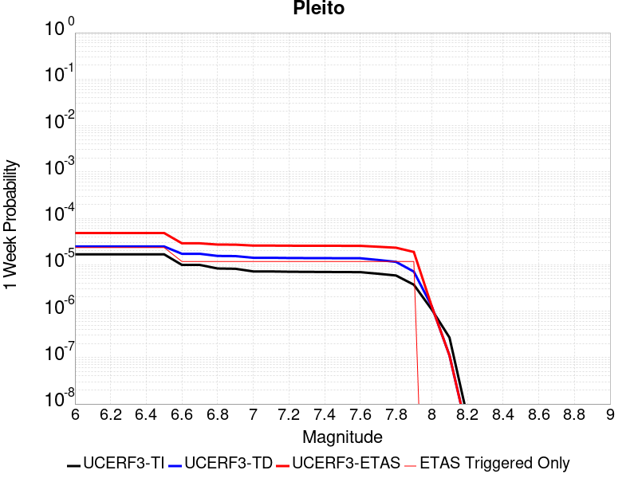 | 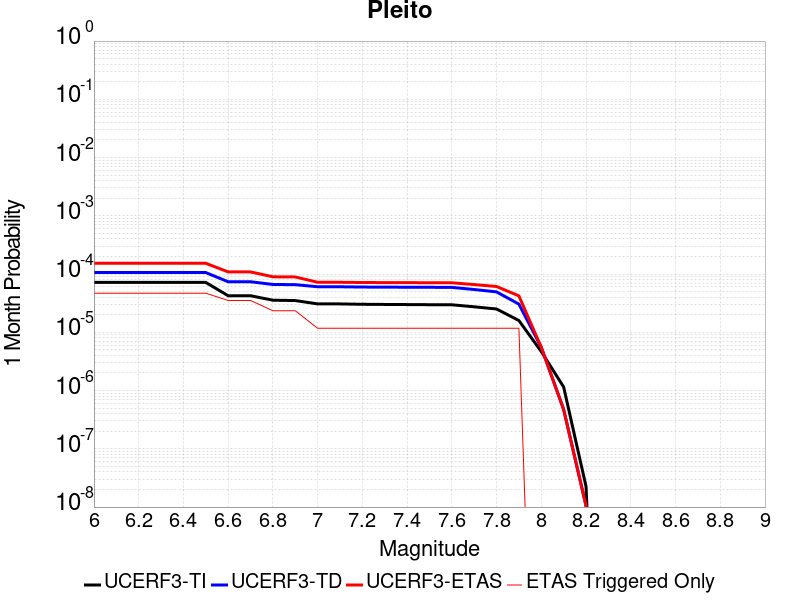 | 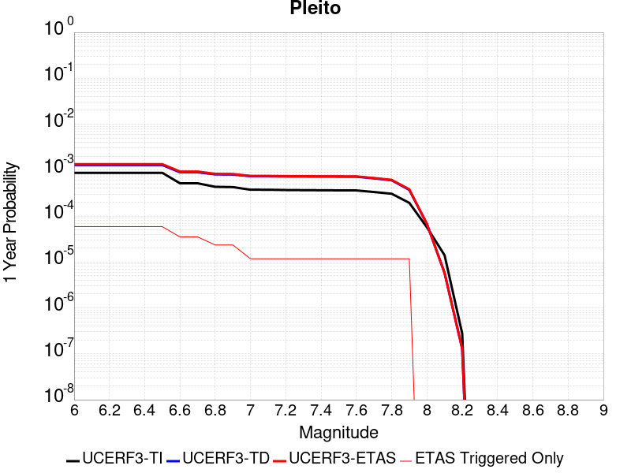 | 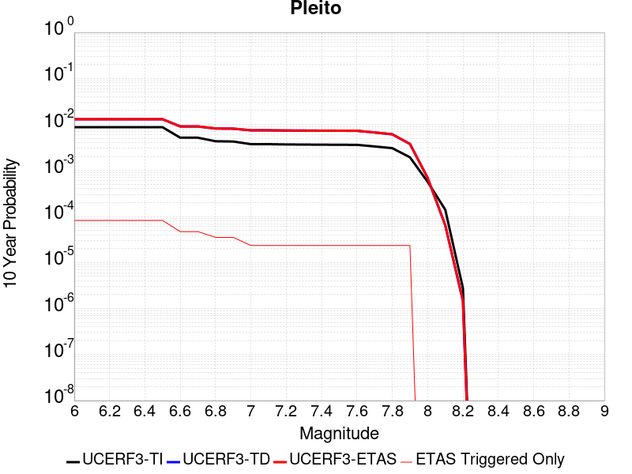 |

| Magnitude | 1 wk TI Prob | 1 wk TD Prob | 1 wk ETAS Prob | 1 wk ETAS/TD Gain | 1 wk ETAS Triggered Only | 1 mo TI Prob | 1 mo TD Prob | 1 mo ETAS Prob | 1 mo ETAS/TD Gain | 1 mo ETAS Triggered Only | 1 yr TI Prob | 1 yr TD Prob | 1 yr ETAS Prob | 1 yr ETAS/TD Gain | 1 yr ETAS Triggered Only | 10 yr TI Prob | 10 yr TD Prob | 10 yr ETAS Prob | 10 yr ETAS/TD Gain | 10 yr ETAS Triggered Only |
|-----|-----|-----|-----|-----|-----|-----|-----|-----|-----|-----|-----|-----|-----|-----|-----|-----|-----|-----|-----|-----|
| 6.0 | 1.6763008E-5 | 2.4763838E-5 | 4.8237434E-5 | 1.9478981 | 2.3474178E-5 | 7.183948E-5 | 1.0612683E-4 | 1.530702E-4 | 1.4423327 | 4.6948357E-5 | 8.742947E-4 | 0.0012914003 | 0.0013500099 | 1.0453845 | 5.8685448E-5 | 0.00870863 | 0.0129538905 | 0.013034985 | 1.0062603 | 8.2159626E-5 |
| 6.1 | 1.6763008E-5 | 2.4763838E-5 | 4.8237434E-5 | 1.9478981 | 2.3474178E-5 | 7.183948E-5 | 1.0612683E-4 | 1.530702E-4 | 1.4423327 | 4.6948357E-5 | 8.742947E-4 | 0.0012914003 | 0.0013500099 | 1.0453845 | 5.8685448E-5 | 0.00870863 | 0.0129538905 | 0.013034985 | 1.0062603 | 8.2159626E-5 |
| 6.2 | 1.6763008E-5 | 2.4763838E-5 | 4.8237434E-5 | 1.9478981 | 2.3474178E-5 | 7.183948E-5 | 1.0612683E-4 | 1.530702E-4 | 1.4423327 | 4.6948357E-5 | 8.742947E-4 | 0.0012914003 | 0.0013500099 | 1.0453845 | 5.8685448E-5 | 0.00870863 | 0.0129538905 | 0.013034985 | 1.0062603 | 8.2159626E-5 |
| 6.3 | 1.6763008E-5 | 2.4763838E-5 | 4.8237434E-5 | 1.9478981 | 2.3474178E-5 | 7.183948E-5 | 1.0612683E-4 | 1.530702E-4 | 1.4423327 | 4.6948357E-5 | 8.742947E-4 | 0.0012914003 | 0.0013500099 | 1.0453845 | 5.8685448E-5 | 0.00870863 | 0.0129538905 | 0.013034985 | 1.0062603 | 8.2159626E-5 |
| 6.4 | 1.6763008E-5 | 2.4763838E-5 | 4.8237434E-5 | 1.9478981 | 2.3474178E-5 | 7.183948E-5 | 1.0612683E-4 | 1.530702E-4 | 1.4423327 | 4.6948357E-5 | 8.742947E-4 | 0.0012914003 | 0.0013500099 | 1.0453845 | 5.8685448E-5 | 0.00870863 | 0.0129538905 | 0.013034985 | 1.0062603 | 8.2159626E-5 |
| 6.5 | 1.6763008E-5 | 2.4763838E-5 | 4.8237434E-5 | 1.9478981 | 2.3474178E-5 | 7.183948E-5 | 1.0612683E-4 | 1.530702E-4 | 1.4423327 | 4.6948357E-5 | 8.742947E-4 | 0.0012914003 | 0.0013500099 | 1.0453845 | 5.8685448E-5 | 0.00870863 | 0.0129538905 | 0.013034985 | 1.0062603 | 8.2159626E-5 |
| 6.6 | 9.910213E-6 | 1.7214623E-5 | 2.895151E-5 | 1.6817975 | 1.1737089E-5 | 4.247165E-5 | 7.377489E-5 | 1.08983564E-4 | 1.4772446 | 3.521127E-5 | 5.169696E-4 | 8.978429E-4 | 9.3302253E-4 | 1.0391824 | 3.521127E-5 | 0.0051576863 | 0.009050702 | 0.009097225 | 1.0051403 | 4.6948357E-5 |
| 6.7 | 9.910213E-6 | 1.7214623E-5 | 2.895151E-5 | 1.6817975 | 1.1737089E-5 | 4.247165E-5 | 7.377489E-5 | 1.08983564E-4 | 1.4772446 | 3.521127E-5 | 5.169696E-4 | 8.978429E-4 | 9.3302253E-4 | 1.0391824 | 3.521127E-5 | 0.0051576863 | 0.009050702 | 0.009097225 | 1.0051403 | 4.6948357E-5 |
| 6.8 | 8.300162E-6 | 1.5474232E-5 | 2.721114E-5 | 1.7584808 | 1.1737089E-5 | 3.557164E-5 | 6.631646E-5 | 8.9789086E-5 | 1.3539486 | 2.3474178E-5 | 4.3299864E-4 | 8.071053E-4 | 8.305605E-4 | 1.029061 | 2.3474178E-5 | 0.004321559 | 0.008150139 | 0.0081850635 | 1.0042851 | 3.521127E-5 |
| 6.9 | 8.183114E-6 | 1.5345448E-5 | 2.7082357E-5 | 1.7648463 | 1.1737089E-5 | 3.5070017E-5 | 6.576455E-5 | 8.923719E-5 | 1.3569193 | 2.3474178E-5 | 4.2689382E-4 | 8.003907E-4 | 8.2384615E-4 | 1.029305 | 2.3474178E-5 | 0.0042607468 | 0.008083483 | 0.008118411 | 1.0043207 | 3.521127E-5 |
| 7.0 | 7.1748823E-6 | 1.413244E-5 | 2.5869364E-5 | 1.8304952 | 1.1737089E-5 | 3.0749135E-5 | 6.0566195E-5 | 7.230257E-5 | 1.1937777 | 1.1737089E-5 | 3.743064E-4 | 7.371445E-4 | 7.4887293E-4 | 1.0159106 | 1.1737089E-5 | 0.0037367654 | 0.007454939 | 0.0074782385 | 1.0031253 | 2.3474178E-5 |
| 7.1 | 7.1671807E-6 | 1.412281E-5 | 2.5859734E-5 | 1.8310615 | 1.1737089E-5 | 3.0716128E-5 | 6.052493E-5 | 7.2261304E-5 | 1.1939099 | 1.1737089E-5 | 3.7390468E-4 | 7.366424E-4 | 7.4837083E-4 | 1.0159215 | 1.1737089E-5 | 0.0037327618 | 0.0074499524 | 0.0074732513 | 1.0031275 | 2.3474178E-5 |
| 7.2 | 7.0649667E-6 | 1.39701015E-5 | 2.5707028E-5 | 1.8401461 | 1.1737089E-5 | 3.0278077E-5 | 5.9870494E-5 | 7.160688E-5 | 1.1960295 | 1.1737089E-5 | 3.6857324E-4 | 7.2868E-4 | 7.4040855E-4 | 1.0160956 | 1.1737089E-5 | 0.0036796255 | 0.0073707094 | 0.0073940107 | 1.0031613 | 2.3474178E-5 |
| 7.3 | 7.02082E-6 | 1.3913556E-5 | 2.5650483E-5 | 1.8435605 | 1.1737089E-5 | 3.008888E-5 | 5.9628168E-5 | 7.136456E-5 | 1.1968262 | 1.1737089E-5 | 3.6627054E-4 | 7.2573166E-4 | 7.374602E-4 | 1.0161611 | 1.1737089E-5 | 0.0036566744 | 0.007341209 | 0.0073645106 | 1.0031741 | 2.3474178E-5 |
| 7.4 | 6.987146E-6 | 1.3873118E-5 | 2.5610045E-5 | 1.8460194 | 1.1737089E-5 | 2.9944567E-5 | 5.945487E-5 | 7.119126E-5 | 1.1974 | 1.1737089E-5 | 3.6451413E-4 | 7.2362315E-4 | 7.3535176E-4 | 1.0162082 | 1.1737089E-5 | 0.0036391679 | 0.007320144 | 0.0073434464 | 1.0031834 | 2.3474178E-5 |
| 7.5 | 6.9494554E-6 | 1.3830024E-5 | 2.5566951E-5 | 1.8486556 | 1.1737089E-5 | 2.9783041E-5 | 5.9270187E-5 | 7.100658E-5 | 1.1980151 | 1.1737089E-5 | 3.625482E-4 | 7.2137616E-4 | 7.3310477E-4 | 1.0162587 | 1.1737089E-5 | 0.0036195726 | 0.0072977724 | 0.0073210755 | 1.0031931 | 2.3474178E-5 |
| 7.6 | 6.92694E-6 | 1.3789138E-5 | 2.5526066E-5 | 1.851172 | 1.1737089E-5 | 2.9686547E-5 | 5.909497E-5 | 7.083137E-5 | 1.1986023 | 1.1737089E-5 | 3.6137376E-4 | 7.1924424E-4 | 7.309729E-4 | 1.0163069 | 1.1737089E-5 | 0.0036078666 | 0.0072765257 | 0.0072998293 | 1.0032026 | 2.3474178E-5 |
| 7.7 | 6.395867E-6 | 1.2668219E-5 | 2.4405159E-5 | 1.9264871 | 1.1737089E-5 | 2.741057E-5 | 5.429124E-5 | 6.602769E-5 | 1.2161758 | 1.1737089E-5 | 3.336726E-4 | 6.6079566E-4 | 6.72525E-4 | 1.0177503 | 1.1737089E-5 | 0.0033317201 | 0.0066951844 | 0.0067185014 | 1.0034827 | 2.3474178E-5 |
| 7.8 | 5.8664327E-6 | 1.153586E-5 | 2.3272814E-5 | 2.017432 | 1.1737089E-5 | 2.5141611E-5 | 4.9438466E-5 | 6.117497E-5 | 1.2373964 | 1.1737089E-5 | 3.060561E-4 | 6.017473E-4 | 6.134773E-4 | 1.0194932 | 1.1737089E-5 | 0.0030563495 | 0.0061006667 | 0.0061239973 | 1.0038244 | 2.3474178E-5 |
| 7.9 | 3.7167474E-6 | 7.1140853E-6 | 1.8851091E-5 | 2.6498263 | 1.1737089E-5 | 1.592882E-5 | 3.0488582E-5 | 4.2225314E-5 | 1.3849549 | 1.1737089E-5 | 1.9391612E-4 | 3.7113542E-4 | 3.8286814E-4 | 1.0316131 | 1.1737089E-5 | 0.0019374699 | 0.0037674906 | 0.0037908764 | 1.0062072 | 2.3474178E-5 |
| 8.0 | 1.0903841E-6 | 1.2879392E-6 | 1.2879392E-6 | 1.0 | 0.0 | 4.6730665E-6 | 5.5197274E-6 | 5.5197274E-6 | 1.0 | 0.0 | 5.68931E-5 | 6.720063E-5 | 6.720063E-5 | 1.0 | 0.0 | 5.6878536E-4 | 6.941948E-4 | 6.941948E-4 | 1.0 | 0.0 |
| 8.1 | 2.6894583E-7 | 1.1060341E-7 | 1.1060341E-7 | 1.0 | 0.0 | 1.1526245E-6 | 4.740145E-7 | 4.740145E-7 | 1.0 | 0.0 | 1.4033113E-5 | 5.7711113E-6 | 5.7711113E-6 | 1.0 | 0.0 | 1.4032227E-4 | 6.456908E-5 | 6.456908E-5 | 1.0 | 0.0 |
| 8.2 | 5.2967013E-9 | 2.4578228E-9 | 2.4578228E-9 | 1.0 | 0.0 | 2.2700148E-8 | 1.0533527E-8 | 1.0533527E-8 | 1.0 | 0.0 | 2.7637427E-7 | 1.2824569E-7 | 1.2824569E-7 | 1.0 | 0.0 | 2.7637393E-6 | 1.4592787E-6 | 1.4592787E-6 | 1.0 | 0.0 |

## Ventura-Pitas Point
*[(top)](#table-of-contents)*

| 1 Week | 1 Month | 1 Year | 10 Year |
|-----|-----|-----|-----|
| 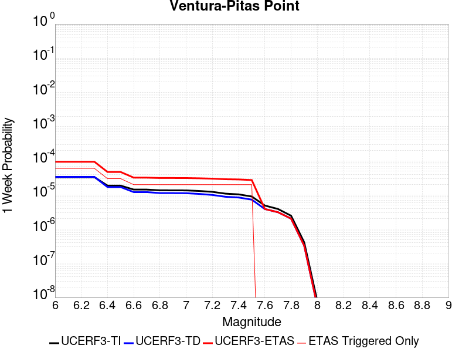 | 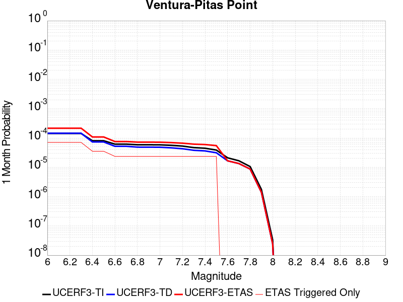 | 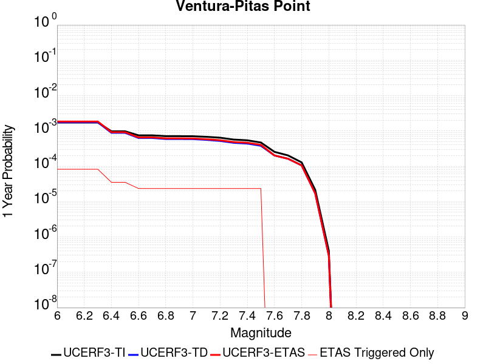 | 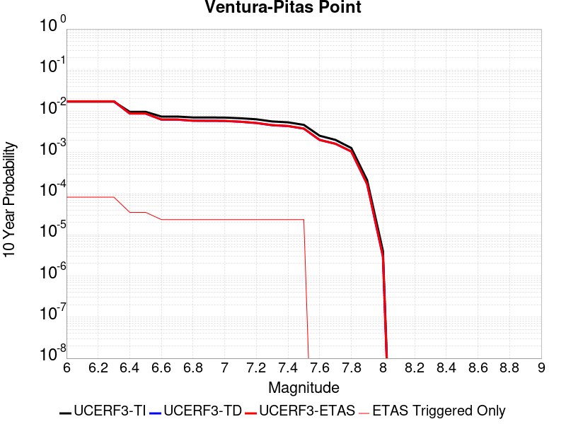 |

| Magnitude | 1 wk TI Prob | 1 wk TD Prob | 1 wk ETAS Prob | 1 wk ETAS/TD Gain | 1 wk ETAS Triggered Only | 1 mo TI Prob | 1 mo TD Prob | 1 mo ETAS Prob | 1 mo ETAS/TD Gain | 1 mo ETAS Triggered Only | 1 yr TI Prob | 1 yr TD Prob | 1 yr ETAS Prob | 1 yr ETAS/TD Gain | 1 yr ETAS Triggered Only | 10 yr TI Prob | 10 yr TD Prob | 10 yr ETAS Prob | 10 yr ETAS/TD Gain | 10 yr ETAS Triggered Only |
|-----|-----|-----|-----|-----|-----|-----|-----|-----|-----|-----|-----|-----|-----|-----|-----|-----|-----|-----|-----|-----|
| 6.0 | 3.3179622E-5 | 3.3735185E-5 | 1.0415534E-4 | 3.0874395 | 7.042254E-5 | 1.4219063E-4 | 1.445728E-4 | 2.1498515E-4 | 1.4870374 | 7.042254E-5 | 0.0017297962 | 0.0017590096 | 0.0018410247 | 1.0466257 | 8.2159626E-5 | 0.017163932 | 0.0174764 | 0.017557124 | 1.004619 | 8.2159626E-5 |
| 6.1 | 3.3179622E-5 | 3.3735185E-5 | 1.0415534E-4 | 3.0874395 | 7.042254E-5 | 1.4219063E-4 | 1.445728E-4 | 2.1498515E-4 | 1.4870374 | 7.042254E-5 | 0.0017297962 | 0.0017590096 | 0.0018410247 | 1.0466257 | 8.2159626E-5 | 0.017163932 | 0.0174764 | 0.017557124 | 1.004619 | 8.2159626E-5 |
| 6.2 | 3.3179622E-5 | 3.3735185E-5 | 1.0415534E-4 | 3.0874395 | 7.042254E-5 | 1.4219063E-4 | 1.445728E-4 | 2.1498515E-4 | 1.4870374 | 7.042254E-5 | 0.0017297962 | 0.0017590096 | 0.0018410247 | 1.0466257 | 8.2159626E-5 | 0.017163932 | 0.0174764 | 0.017557124 | 1.004619 | 8.2159626E-5 |
| 6.3 | 3.3179622E-5 | 3.3735185E-5 | 1.0415534E-4 | 3.0874395 | 7.042254E-5 | 1.4219063E-4 | 1.445728E-4 | 2.1498515E-4 | 1.4870374 | 7.042254E-5 | 0.0017297962 | 0.0017590096 | 0.0018410247 | 1.0466257 | 8.2159626E-5 | 0.017163932 | 0.0174764 | 0.017557124 | 1.004619 | 8.2159626E-5 |
| 6.4 | 1.8754668E-5 | 1.701961E-5 | 5.223028E-5 | 3.0688293 | 3.521127E-5 | 8.037467E-5 | 7.293928E-5 | 1.0814798E-4 | 1.4827125 | 3.521127E-5 | 9.781223E-4 | 8.8769704E-4 | 9.2287705E-4 | 1.0396307 | 3.521127E-5 | 0.009738282 | 0.008843848 | 0.008878748 | 1.0039462 | 3.521127E-5 |
| 6.5 | 1.8754668E-5 | 1.701961E-5 | 5.223028E-5 | 3.0688293 | 3.521127E-5 | 8.037467E-5 | 7.293928E-5 | 1.0814798E-4 | 1.4827125 | 3.521127E-5 | 9.781223E-4 | 8.8769704E-4 | 9.2287705E-4 | 1.0396307 | 3.521127E-5 | 0.009738282 | 0.008843848 | 0.008878748 | 1.0039462 | 3.521127E-5 |
| 6.6 | 1.4361558E-5 | 1.2122275E-5 | 3.5596167E-5 | 2.9364264 | 2.3474178E-5 | 6.154808E-5 | 5.1951585E-5 | 7.542454E-5 | 1.4518237 | 2.3474178E-5 | 7.490902E-4 | 6.3232926E-4 | 6.5578864E-4 | 1.0370998 | 2.3474178E-5 | 0.0074657016 | 0.0063055577 | 0.0063288836 | 1.0036993 | 2.3474178E-5 |
| 6.7 | 1.4361558E-5 | 1.2122275E-5 | 3.5596167E-5 | 2.9364264 | 2.3474178E-5 | 6.154808E-5 | 5.1951585E-5 | 7.542454E-5 | 1.4518237 | 2.3474178E-5 | 7.490902E-4 | 6.3232926E-4 | 6.5578864E-4 | 1.0370998 | 2.3474178E-5 | 0.0074657016 | 0.0063055577 | 0.0063288836 | 1.0036993 | 2.3474178E-5 |
| 6.8 | 1.3663846E-5 | 1.13444175E-5 | 3.481833E-5 | 3.0692039 | 2.3474178E-5 | 5.8558027E-5 | 4.861804E-5 | 7.2091076E-5 | 1.4828051 | 2.3474178E-5 | 7.127108E-4 | 5.917658E-4 | 6.152261E-4 | 1.0396446 | 2.3474178E-5 | 0.007104293 | 0.005902116 | 0.005925452 | 1.0039538 | 2.3474178E-5 |
| 6.9 | 1.3644157E-5 | 1.1322519E-5 | 3.479643E-5 | 3.073206 | 2.3474178E-5 | 5.8473648E-5 | 4.8524187E-5 | 7.199723E-5 | 1.4837389 | 2.3474178E-5 | 7.116841E-4 | 5.9062376E-4 | 6.1408407E-4 | 1.0397213 | 2.3474178E-5 | 0.007094092 | 0.0058907564 | 0.0059140925 | 1.0039614 | 2.3474178E-5 |
| 7.0 | 1.3568845E-5 | 1.1242086E-5 | 3.4716E-5 | 3.0880392 | 2.3474178E-5 | 5.8150898E-5 | 4.817949E-5 | 7.165253E-5 | 1.4872 | 2.3474178E-5 | 7.077572E-4 | 5.864293E-4 | 6.0988974E-4 | 1.0400056 | 2.3474178E-5 | 0.007055073 | 0.0058490336 | 0.00587237 | 1.0039898 | 2.3474178E-5 |
| 7.1 | 1.306572E-5 | 1.072054E-5 | 3.4194465E-5 | 3.1896217 | 2.3474178E-5 | 5.599474E-5 | 4.5944373E-5 | 6.9417474E-5 | 1.5109026 | 2.3474178E-5 | 6.815227E-4 | 5.5923103E-4 | 5.8269204E-4 | 1.0419524 | 2.3474178E-5 | 0.0067943637 | 0.0055784425 | 0.0056017856 | 1.0041845 | 2.3474178E-5 |
| 7.2 | 1.232604E-5 | 9.995143E-6 | 3.346909E-5 | 3.348535 | 2.3474178E-5 | 5.2824813E-5 | 4.2835632E-5 | 6.630881E-5 | 1.5479823 | 2.3474178E-5 | 6.429523E-4 | 5.214008E-4 | 5.4486276E-4 | 1.0449979 | 2.3474178E-5 | 0.0064109527 | 0.005201967 | 0.005225319 | 1.0044891 | 2.3474178E-5 |
| 7.3 | 1.0917261E-5 | 8.84384E-6 | 3.231781E-5 | 3.6542735 | 2.3474178E-5 | 4.678742E-5 | 3.790163E-5 | 6.137492E-5 | 1.6193213 | 2.3474178E-5 | 5.69488E-4 | 4.6135622E-4 | 4.8481955E-4 | 1.0508573 | 2.3474178E-5 | 0.0056803077 | 0.00460415 | 0.004627516 | 1.005075 | 2.3474178E-5 |
| 7.4 | 1.039959E-5 | 8.423562E-6 | 3.1897544E-5 | 3.7867048 | 2.3474178E-5 | 4.456891E-5 | 3.610049E-5 | 5.957382E-5 | 1.650222 | 2.3474178E-5 | 5.424914E-4 | 4.3943635E-4 | 4.629002E-4 | 1.0533954 | 2.3474178E-5 | 0.0054116896 | 0.004385836 | 0.004409207 | 1.0053288 | 2.3474178E-5 |
| 7.5 | 9.015877E-6 | 7.2975445E-6 | 3.0771553E-5 | 4.216699 | 2.3474178E-5 | 3.86389E-5 | 3.1274823E-5 | 5.4748267E-5 | 1.750554 | 2.3474178E-5 | 4.7032707E-4 | 3.8070587E-4 | 4.041711E-4 | 1.0616361 | 2.3474178E-5 | 0.004693329 | 0.0038006818 | 0.0038240668 | 1.0061529 | 2.3474178E-5 |
| 7.6 | 4.900162E-6 | 3.8741155E-6 | 3.8741155E-6 | 1.0 | 0.0 | 2.1000526E-5 | 1.6603248E-5 | 1.6603248E-5 | 1.0 | 0.0 | 2.556514E-4 | 2.0212591E-4 | 2.0212591E-4 | 1.0 | 0.0 | 0.0025535747 | 0.0020194345 | 0.0020194345 | 1.0 | 0.0 |
| 7.7 | 3.8850626E-6 | 3.1267302E-6 | 3.1267302E-6 | 1.0 | 0.0 | 1.6650163E-5 | 1.3400205E-5 | 1.3400205E-5 | 1.0 | 0.0 | 2.0269687E-4 | 1.6313537E-4 | 1.6313537E-4 | 1.0 | 0.0 | 0.002025121 | 0.0016301654 | 0.0016301654 | 1.0 | 0.0 |
| 7.8 | 2.4654719E-6 | 2.029875E-6 | 2.029875E-6 | 1.0 | 0.0 | 1.0566265E-5 | 8.699436E-6 | 8.699436E-6 | 1.0 | 0.0 | 1.2863669E-4 | 1.0591053E-4 | 1.0591053E-4 | 1.0 | 0.0 | 0.0012856225 | 0.0010586053 | 0.0010586053 | 1.0 | 0.0 |
| 7.9 | 4.095894E-7 | 3.2764765E-7 | 3.2764765E-7 | 1.0 | 0.0 | 1.7553821E-6 | 1.4042034E-6 | 1.4042034E-6 | 1.0 | 0.0 | 2.1371567E-5 | 1.7096047E-5 | 1.7096047E-5 | 1.0 | 0.0 | 2.1369511E-4 | 1.7094762E-4 | 1.7094762E-4 | 1.0 | 0.0 |
| 8.0 | 7.791402E-9 | 5.683497E-9 | 5.683497E-9 | 1.0 | 0.0 | 3.3391725E-8 | 2.4357844E-8 | 2.4357844E-8 | 1.0 | 0.0 | 4.0654416E-7 | 2.9655675E-7 | 2.9655675E-7 | 1.0 | 0.0 | 4.065434E-6 | 2.9655655E-6 | 2.9655655E-6 | 1.0 | 0.0 |

## San Pedro Basin
*[(top)](#table-of-contents)*

| 1 Week | 1 Month | 1 Year | 10 Year |
|-----|-----|-----|-----|
|  | 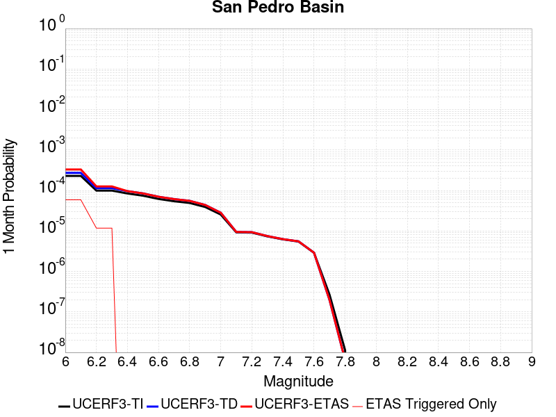 | 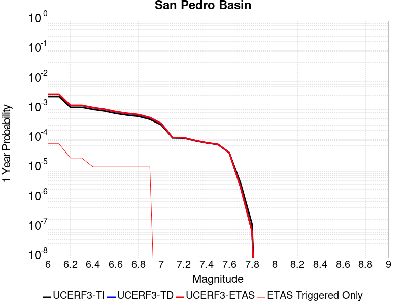 | 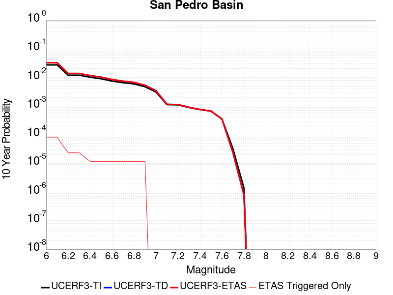 |

| Magnitude | 1 wk TI Prob | 1 wk TD Prob | 1 wk ETAS Prob | 1 wk ETAS/TD Gain | 1 wk ETAS Triggered Only | 1 mo TI Prob | 1 mo TD Prob | 1 mo ETAS Prob | 1 mo ETAS/TD Gain | 1 mo ETAS Triggered Only | 1 yr TI Prob | 1 yr TD Prob | 1 yr ETAS Prob | 1 yr ETAS/TD Gain | 1 yr ETAS Triggered Only | 10 yr TI Prob | 10 yr TD Prob | 10 yr ETAS Prob | 10 yr ETAS/TD Gain | 10 yr ETAS Triggered Only |
|-----|-----|-----|-----|-----|-----|-----|-----|-----|-----|-----|-----|-----|-----|-----|-----|-----|-----|-----|-----|-----|
| 6.0 | 5.3449043E-5 | 6.336954E-5 | 1.1031492E-4 | 1.7408195 | 4.6948357E-5 | 2.2904722E-4 | 2.715589E-4 | 3.3022842E-4 | 1.216047 | 5.8685448E-5 | 0.0027850836 | 0.0033018254 | 0.0033720154 | 1.021258 | 7.042254E-5 | 0.027504366 | 0.03258945 | 0.032668933 | 1.0024389 | 8.2159626E-5 |
| 6.1 | 5.3449043E-5 | 6.336954E-5 | 1.1031492E-4 | 1.7408195 | 4.6948357E-5 | 2.2904722E-4 | 2.715589E-4 | 3.3022842E-4 | 1.216047 | 5.8685448E-5 | 0.0027850836 | 0.0033018254 | 0.0033720154 | 1.021258 | 7.042254E-5 | 0.027504366 | 0.03258945 | 0.032668933 | 1.0024389 | 8.2159626E-5 |
| 6.2 | 2.3189454E-5 | 2.6642796E-5 | 3.8379574E-5 | 1.4405235 | 1.1737089E-5 | 9.9379584E-5 | 1.14178685E-4 | 1.2591443E-4 | 1.102784 | 1.1737089E-5 | 0.0012092749 | 0.0013892864 | 0.001412728 | 1.0168731 | 2.3474178E-5 | 0.012027155 | 0.013810883 | 0.013834033 | 1.0016762 | 2.3474178E-5 |
| 6.3 | 2.3189454E-5 | 2.6642796E-5 | 3.8379574E-5 | 1.4405235 | 1.1737089E-5 | 9.9379584E-5 | 1.14178685E-4 | 1.2591443E-4 | 1.102784 | 1.1737089E-5 | 0.0012092749 | 0.0013892864 | 0.001412728 | 1.0168731 | 2.3474178E-5 | 0.012027155 | 0.013810883 | 0.013834033 | 1.0016762 | 2.3474178E-5 |
| 6.4 | 1.966056E-5 | 2.2463413E-5 | 2.2463413E-5 | 1.0 | 0.0 | 8.425682E-5 | 9.626844E-5 | 9.626844E-5 | 1.0 | 0.0 | 0.001025344 | 0.0011714783 | 0.0011832017 | 1.0100073 | 1.1737089E-5 | 0.010206259 | 0.011657117 | 0.011668717 | 1.0009952 | 1.1737089E-5 |
| 6.5 | 1.7342953E-5 | 1.9745148E-5 | 1.9745148E-5 | 1.0 | 0.0 | 7.4324824E-5 | 8.4619525E-5 | 8.4619525E-5 | 1.0 | 0.0 | 9.04529E-4 | 0.0010297928 | 0.0010415178 | 1.0113858 | 1.1737089E-5 | 0.009008561 | 0.010253931 | 0.010265548 | 1.001133 | 1.1737089E-5 |
| 6.6 | 1.439804E-5 | 1.6322716E-5 | 1.6322716E-5 | 1.0 | 0.0 | 6.170443E-5 | 6.99528E-5 | 6.99528E-5 | 1.0 | 0.0 | 7.509924E-4 | 8.513747E-4 | 8.631018E-4 | 1.0137743 | 1.1737089E-5 | 0.0074845953 | 0.008484332 | 0.00849597 | 1.0013716 | 1.1737089E-5 |
| 6.7 | 1.2634884E-5 | 1.4285297E-5 | 1.4285297E-5 | 1.0 | 0.0 | 5.414838E-5 | 6.1221435E-5 | 6.1221435E-5 | 1.0 | 0.0 | 6.590571E-4 | 7.4514654E-4 | 7.568749E-4 | 1.0157397 | 1.1737089E-5 | 0.006571059 | 0.007429501 | 0.007441151 | 1.0015681 | 1.1737089E-5 |
| 6.8 | 1.146091E-5 | 1.2933192E-5 | 1.2933192E-5 | 1.0 | 0.0 | 4.911726E-5 | 5.5426954E-5 | 5.5426954E-5 | 1.0 | 0.0 | 5.9783855E-4 | 6.7464396E-4 | 6.8637315E-4 | 1.0173857 | 1.1737089E-5 | 0.0059623276 | 0.006728899 | 0.006740557 | 1.0017326 | 1.1737089E-5 |
| 6.9 | 9.109035E-6 | 1.0235011E-5 | 1.0235011E-5 | 1.0 | 0.0 | 3.9038136E-5 | 4.3863754E-5 | 4.3863754E-5 | 1.0 | 0.0 | 4.7518566E-4 | 5.3393835E-4 | 5.456692E-4 | 1.0219704 | 1.1737089E-5 | 0.0047417083 | 0.005329309 | 0.0053409836 | 1.0021906 | 1.1737089E-5 |
| 7.0 | 5.9351028E-6 | 6.583964E-6 | 6.583964E-6 | 1.0 | 0.0 | 2.5435906E-5 | 2.8216817E-5 | 2.8216817E-5 | 1.0 | 0.0 | 3.0963816E-4 | 3.435092E-4 | 3.435092E-4 | 1.0 | 0.0 | 0.0030920706 | 0.0034320992 | 0.0034320992 | 1.0 | 0.0 |
| 7.1 | 2.1557585E-6 | 2.209648E-6 | 2.209648E-6 | 1.0 | 0.0 | 9.238933E-6 | 9.469887E-6 | 9.469887E-6 | 1.0 | 0.0 | 1.1247819E-4 | 1.1528993E-4 | 1.1528993E-4 | 1.0 | 0.0 | 0.0011242128 | 0.0011523166 | 0.0011523166 | 1.0 | 0.0 |
| 7.2 | 2.1251979E-6 | 2.1779945E-6 | 2.1779945E-6 | 1.0 | 0.0 | 9.107958E-6 | 9.334229E-6 | 9.334229E-6 | 1.0 | 0.0 | 1.1088375E-4 | 1.1363847E-4 | 1.1363847E-4 | 1.0 | 0.0 | 0.0011082845 | 0.0011358189 | 0.0011358189 | 1.0 | 0.0 |
| 7.3 | 1.7145798E-6 | 1.7442874E-6 | 1.7442874E-6 | 1.0 | 0.0 | 7.3481783E-6 | 7.4754967E-6 | 7.4754967E-6 | 1.0 | 0.0 | 8.94604E-5 | 9.1010465E-5 | 9.1010465E-5 | 1.0 | 0.0 | 8.9424395E-4 | 9.0974104E-4 | 9.0974104E-4 | 1.0 | 0.0 |
| 7.4 | 1.4467993E-6 | 1.4641868E-6 | 1.4641868E-6 | 1.0 | 0.0 | 6.200554E-6 | 6.2750714E-6 | 6.2750714E-6 | 1.0 | 0.0 | 7.548913E-5 | 7.639639E-5 | 7.639639E-5 | 1.0 | 0.0 | 7.546349E-4 | 7.6370855E-4 | 7.6370855E-4 | 1.0 | 0.0 |
| 7.5 | 1.2803735E-6 | 1.2931497E-6 | 1.2931497E-6 | 1.0 | 0.0 | 5.487303E-6 | 5.5420587E-6 | 5.5420587E-6 | 1.0 | 0.0 | 6.680587E-5 | 6.7472545E-5 | 6.7472545E-5 | 1.0 | 0.0 | 6.678579E-4 | 6.7452766E-4 | 6.7452766E-4 | 1.0 | 0.0 |
| 7.6 | 6.755009E-7 | 6.769465E-7 | 6.769465E-7 | 1.0 | 0.0 | 2.8950008E-6 | 2.9011965E-6 | 2.9011965E-6 | 1.0 | 0.0 | 3.5246063E-5 | 3.5321555E-5 | 3.5321555E-5 | 1.0 | 0.0 | 3.5240475E-4 | 3.5316512E-4 | 3.5316512E-4 | 1.0 | 0.0 |
| 7.7 | 6.211885E-8 | 4.569953E-8 | 4.569953E-8 | 1.0 | 0.0 | 2.6622362E-7 | 1.9585512E-7 | 1.9585512E-7 | 1.0 | 0.0 | 3.2412677E-6 | 2.3845337E-6 | 2.3845337E-6 | 1.0 | 0.0 | 3.2412205E-5 | 2.3845101E-5 | 2.3845101E-5 | 1.0 | 0.0 |
| 7.8 | 2.6580573E-9 | 1.5138163E-9 | 1.5138163E-9 | 1.0 | 0.0 | 1.1391674E-8 | 6.487784E-9 | 6.487784E-9 | 1.0 | 0.0 | 1.3869362E-7 | 7.898877E-8 | 7.898877E-8 | 1.0 | 0.0 | 1.3869354E-6 | 7.898877E-7 | 7.898877E-7 | 1.0 | 0.0 |

## Imperial
*[(top)](#table-of-contents)*

| 1 Week | 1 Month | 1 Year | 10 Year |
|-----|-----|-----|-----|
| 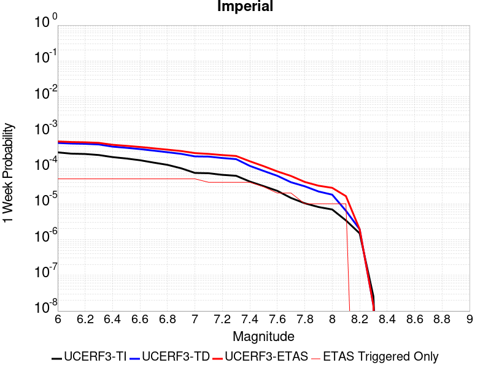 | 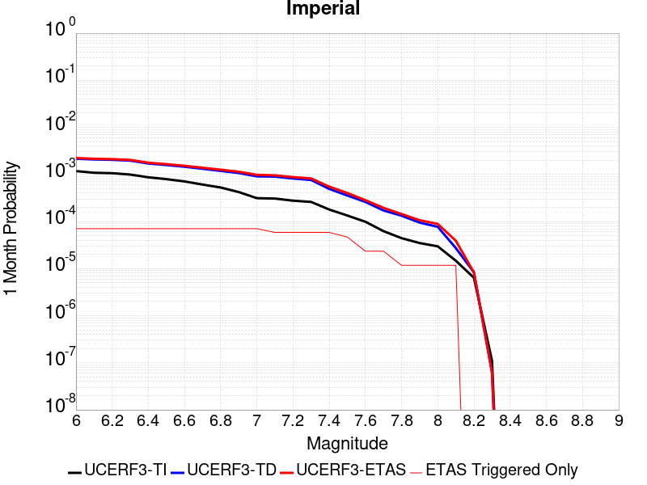 | 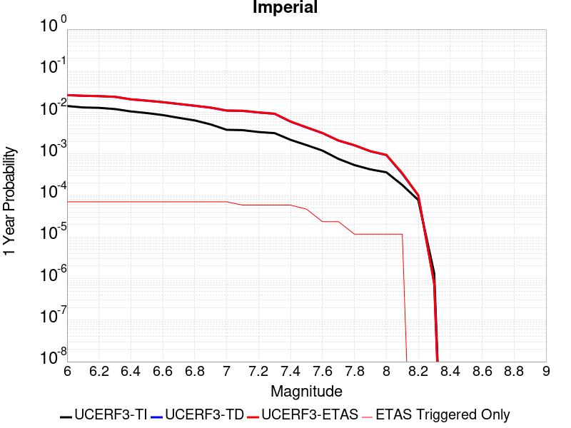 | 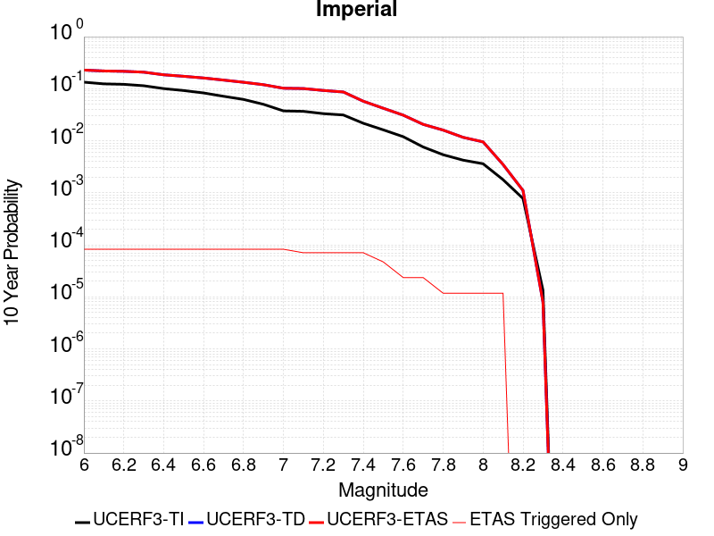 |

| Magnitude | 1 wk TI Prob | 1 wk TD Prob | 1 wk ETAS Prob | 1 wk ETAS/TD Gain | 1 wk ETAS Triggered Only | 1 mo TI Prob | 1 mo TD Prob | 1 mo ETAS Prob | 1 mo ETAS/TD Gain | 1 mo ETAS Triggered Only | 1 yr TI Prob | 1 yr TD Prob | 1 yr ETAS Prob | 1 yr ETAS/TD Gain | 1 yr ETAS Triggered Only | 10 yr TI Prob | 10 yr TD Prob | 10 yr ETAS Prob | 10 yr ETAS/TD Gain | 10 yr ETAS Triggered Only |
|-----|-----|-----|-----|-----|-----|-----|-----|-----|-----|-----|-----|-----|-----|-----|-----|-----|-----|-----|-----|-----|
| 6.0 | 2.7496446E-4 | 5.0552754E-4 | 5.641833E-4 | 1.1160289 | 5.8685448E-5 | 0.0011778869 | 0.002164787 | 0.002235057 | 1.0324605 | 7.042254E-5 | 0.0142467655 | 0.026038699 | 0.026107287 | 1.0026342 | 7.042254E-5 | 0.13367249 | 0.2280438 | 0.22810721 | 1.0002781 | 8.2159626E-5 |
| 6.1 | 2.5356023E-4 | 4.8656776E-4 | 5.4522464E-4 | 1.1205523 | 5.8685448E-5 | 0.001086234 | 0.0020836622 | 0.0021539382 | 1.033727 | 7.042254E-5 | 0.013144928 | 0.025071215 | 0.025139872 | 1.0027385 | 7.042254E-5 | 0.123940155 | 0.21947981 | 0.21954393 | 1.0002922 | 8.2159626E-5 |
| 6.2 | 2.4820742E-4 | 4.7752203E-4 | 5.3617946E-4 | 1.1228371 | 5.8685448E-5 | 0.0010633124 | 0.0020449557 | 0.0021152343 | 1.0343667 | 7.042254E-5 | 0.01286919 | 0.024611235 | 0.024679925 | 1.0027909 | 7.042254E-5 | 0.12148927 | 0.21598552 | 0.21604994 | 1.0002983 | 8.2159626E-5 |
| 6.3 | 2.3205351E-4 | 4.5890483E-4 | 5.175633E-4 | 1.1278229 | 5.8685448E-5 | 9.94136E-4 | 0.0019652895 | 0.0020355736 | 1.0357628 | 7.042254E-5 | 0.012036599 | 0.02366133 | 0.023730086 | 1.0029058 | 7.042254E-5 | 0.11405133 | 0.20793462 | 0.20799969 | 1.0003129 | 8.2159626E-5 |
| 6.4 | 2.0304754E-4 | 3.987652E-4 | 4.5742723E-4 | 1.1471093 | 5.8685448E-5 | 8.6991355E-4 | 0.0017078889 | 0.0017781912 | 1.0411632 | 7.042254E-5 | 0.010539869 | 0.020595672 | 0.020664643 | 1.0033488 | 7.042254E-5 | 0.100537635 | 0.1850669 | 0.18513384 | 1.0003618 | 8.2159626E-5 |
| 6.5 | 1.854992E-4 | 3.6988858E-4 | 4.2855233E-4 | 1.1585984 | 5.8685448E-5 | 7.9475436E-4 | 0.0015842861 | 0.001654597 | 1.0443802 | 7.042254E-5 | 0.009633281 | 0.01911948 | 0.019188557 | 1.0036129 | 7.042254E-5 | 0.0922623 | 0.173298 | 0.17336592 | 1.000392 | 8.2159626E-5 |
| 6.6 | 1.6586106E-4 | 3.403506E-4 | 3.990161E-4 | 1.1723678 | 5.8685448E-5 | 7.106394E-4 | 0.0014578402 | 0.0015281602 | 1.0482357 | 7.042254E-5 | 0.008617763 | 0.01760642 | 0.017675603 | 1.0039294 | 7.042254E-5 | 0.08291132 | 0.16077545 | 0.1608444 | 1.0004289 | 8.2159626E-5 |
| 6.7 | 1.4224656E-4 | 3.076692E-4 | 3.6633658E-4 | 1.1906834 | 5.8685448E-5 | 6.094856E-4 | 0.001317924 | 0.0013882538 | 1.053364 | 7.042254E-5 | 0.0073952693 | 0.015929576 | 0.015998878 | 1.0043504 | 7.042254E-5 | 0.07153955 | 0.14648417 | 0.14655429 | 1.0004787 | 8.2159626E-5 |
| 6.8 | 1.2317259E-4 | 2.779122E-4 | 3.3658132E-4 | 1.2111068 | 5.8685448E-5 | 5.2777573E-4 | 0.0011905148 | 0.0012608534 | 1.0590826 | 7.042254E-5 | 0.0064067547 | 0.0143995695 | 0.014468978 | 1.0048202 | 7.042254E-5 | 0.06225166 | 0.13293684 | 0.13300806 | 1.0005358 | 8.2159626E-5 |
| 6.9 | 9.859898E-5 | 2.5014306E-4 | 3.0881382E-4 | 1.2345488 | 5.8685448E-5 | 4.2249862E-4 | 0.0010716055 | 0.0011419526 | 1.0656464 | 7.042254E-5 | 0.0051317946 | 0.012969712 | 0.013039221 | 1.0053593 | 7.042254E-5 | 0.05014893 | 0.11940631 | 0.119478665 | 1.000606 | 8.2159626E-5 |
| 7.0 | 7.3191884E-5 | 2.1266776E-4 | 2.7134072E-4 | 1.2758902 | 5.8685448E-5 | 3.136418E-4 | 9.1111806E-4 | 9.814765E-4 | 1.077222 | 7.042254E-5 | 0.003811904 | 0.011037128 | 0.011106773 | 1.0063101 | 7.042254E-5 | 0.037471764 | 0.10206493 | 0.1021387 | 1.0007228 | 8.2159626E-5 |
| 7.1 | 7.1760296E-5 | 2.0968143E-4 | 2.5661994E-4 | 1.2238563 | 4.6948357E-5 | 3.0750787E-4 | 8.983284E-4 | 9.5696107E-4 | 1.0652688 | 5.8685448E-5 | 0.003737482 | 0.010882978 | 0.010941025 | 1.0053337 | 5.8685448E-5 | 0.03675245 | 0.10070146 | 0.10076479 | 1.000629 | 7.042254E-5 |
| 7.2 | 6.46614E-5 | 1.9136685E-4 | 2.3830624E-4 | 1.2452848 | 4.6948357E-5 | 2.7709085E-4 | 8.1988896E-4 | 8.7852625E-4 | 1.0715187 | 5.8685448E-5 | 0.0033683628 | 0.0099370815 | 0.009995184 | 1.005847 | 5.8685448E-5 | 0.033177625 | 0.09250898 | 0.09257288 | 1.0006908 | 7.042254E-5 |
| 7.3 | 6.088115E-5 | 1.78084E-4 | 2.2502399E-4 | 1.2635834 | 4.6948357E-5 | 2.6089314E-4 | 7.6299673E-4 | 8.216374E-4 | 1.0768558 | 5.8685448E-5 | 0.0031717476 | 0.009250494 | 0.009308636 | 1.0062853 | 5.8685448E-5 | 0.031268585 | 0.08655989 | 0.08662422 | 1.0007432 | 7.042254E-5 |
| 7.4 | 4.199346E-5 | 1.1510366E-4 | 1.6204662E-4 | 1.4078319 | 4.6948357E-5 | 1.7995955E-4 | 4.9320905E-4 | 5.5186555E-4 | 1.1189283 | 5.8685448E-5 | 0.0021888057 | 0.0059884563 | 0.00604679 | 1.0097411 | 5.8685448E-5 | 0.02167372 | 0.057439793 | 0.05750617 | 1.0011556 | 7.042254E-5 |
| 7.5 | 3.130448E-5 | 8.33328E-5 | 1.1854113E-4 | 1.4225028 | 3.521127E-5 | 1.3415517E-4 | 3.57092E-4 | 4.040236E-4 | 1.1314272 | 4.6948357E-5 | 0.0016321153 | 0.004338988 | 0.0043857326 | 1.0107732 | 4.6948357E-5 | 0.016201803 | 0.04213201 | 0.042176977 | 1.0010674 | 4.6948357E-5 |
| 7.6 | 2.3074248E-5 | 6.0844646E-5 | 8.43174E-5 | 1.3857816 | 2.3474178E-5 | 9.888588E-5 | 2.6073685E-4 | 2.842049E-4 | 1.0900067 | 2.3474178E-5 | 0.0012032706 | 0.0031698733 | 0.0031932732 | 1.0073819 | 2.3474178E-5 | 0.011967761 | 0.031026395 | 0.03104914 | 1.0007331 | 2.3474178E-5 |
| 7.7 | 1.45864815E-5 | 4.0124698E-5 | 6.359794E-5 | 1.5850072 | 2.3474178E-5 | 6.2511994E-5 | 1.7195169E-4 | 1.9542183E-4 | 1.1364926 | 2.3474178E-5 | 7.608177E-4 | 0.0020915072 | 0.0021149323 | 1.0112001 | 2.3474178E-5 | 0.007582182 | 0.020627763 | 0.020650754 | 1.0011145 | 2.3474178E-5 |
| 7.8 | 1.0352979E-5 | 3.0960902E-5 | 4.2697626E-5 | 1.3790822 | 1.1737089E-5 | 4.4369157E-5 | 1.3268284E-4 | 1.4441837E-4 | 1.088448 | 1.1737089E-5 | 5.400606E-4 | 0.0016142189 | 0.0016259371 | 1.0072594 | 1.1737089E-5 | 0.0053875 | 0.016016833 | 0.016028382 | 1.0007211 | 1.1737089E-5 |
| 7.9 | 8.137906E-6 | 2.2149103E-5 | 3.388593E-5 | 1.5299009 | 1.1737089E-5 | 3.4876273E-5 | 9.492128E-5 | 1.0665725E-4 | 1.123639 | 1.1737089E-5 | 4.2453592E-4 | 0.0011550548 | 0.0011667784 | 1.0101497 | 1.1737089E-5 | 0.004237258 | 0.011617903 | 0.011629503 | 1.0009985 | 1.1737089E-5 |
| 8.0 | 6.93792E-6 | 1.8008766E-5 | 2.9745643E-5 | 1.6517314 | 1.1737089E-5 | 2.9733603E-5 | 7.717814E-5 | 8.891433E-5 | 1.1520661 | 1.1737089E-5 | 3.6194647E-4 | 9.3923963E-4 | 9.509657E-4 | 1.0124847 | 1.1737089E-5 | 0.0036135751 | 0.00950155 | 0.009513176 | 1.0012236 | 1.1737089E-5 |
| 8.1 | 3.4286315E-6 | 6.379872E-6 | 1.8116887E-5 | 2.8396943 | 1.1737089E-5 | 1.4694053E-5 | 2.7342023E-5 | 3.907879E-5 | 1.4292575 | 1.1737089E-5 | 1.7888541E-4 | 3.328384E-4 | 3.4457157E-4 | 1.0352519 | 1.1737089E-5 | 0.0017874148 | 0.003486031 | 0.003497727 | 1.0033551 | 1.1737089E-5 |
| 8.2 | 1.4906886E-6 | 1.9366646E-6 | 1.9366646E-6 | 1.0 | 0.0 | 6.3886496E-6 | 8.299965E-6 | 8.299965E-6 | 1.0 | 0.0 | 7.7779034E-5 | 1.0104742E-4 | 1.0104742E-4 | 1.0 | 0.0 | 7.775182E-4 | 0.0011075331 | 0.0011075331 | 1.0 | 0.0 |
| 8.3 | 2.5758007E-8 | 1.4500102E-8 | 1.4500102E-8 | 1.0 | 0.0 | 1.10391454E-7 | 6.214329E-8 | 6.214329E-8 | 1.0 | 0.0 | 1.3440151E-6 | 7.565946E-7 | 7.565946E-7 | 1.0 | 0.0 | 1.344007E-5 | 7.887763E-6 | 7.887763E-6 | 1.0 | 0.0 |

## Ortigalita (North)
*[(top)](#table-of-contents)*

| 1 Week | 1 Month | 1 Year | 10 Year |
|-----|-----|-----|-----|
| 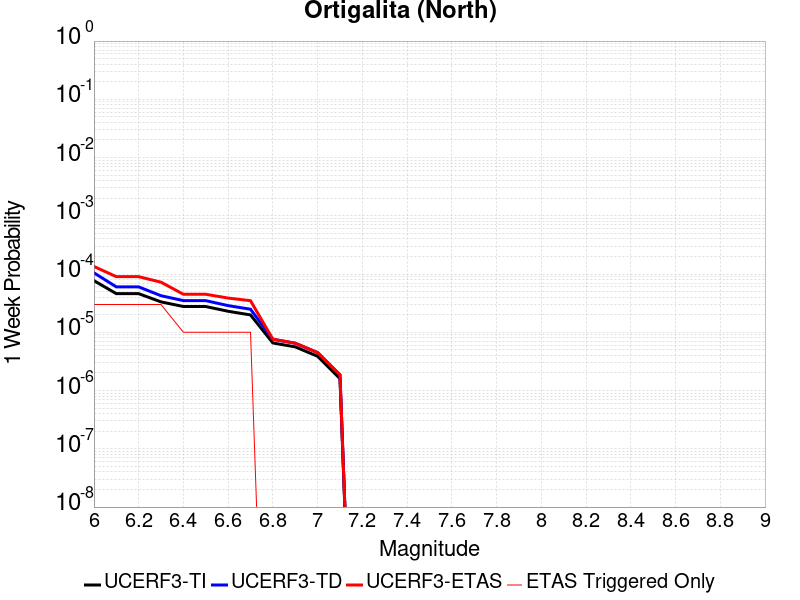 | 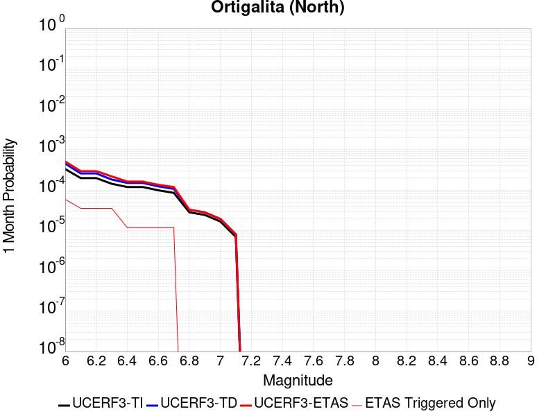 | 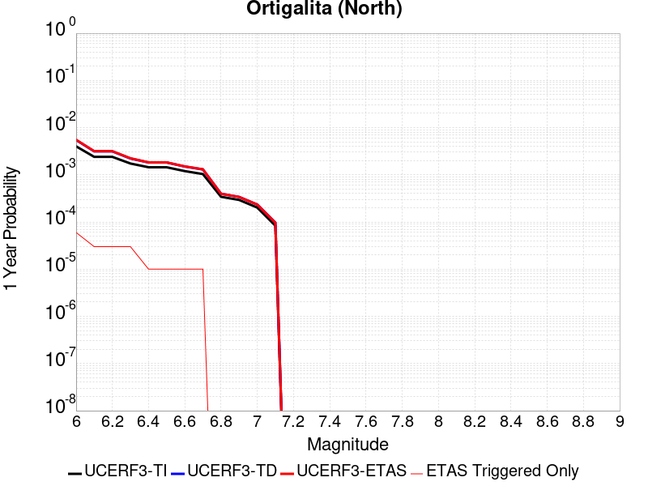 |  |

| Magnitude | 1 wk TI Prob | 1 wk TD Prob | 1 wk ETAS Prob | 1 wk ETAS/TD Gain | 1 wk ETAS Triggered Only | 1 mo TI Prob | 1 mo TD Prob | 1 mo ETAS Prob | 1 mo ETAS/TD Gain | 1 mo ETAS Triggered Only | 1 yr TI Prob | 1 yr TD Prob | 1 yr ETAS Prob | 1 yr ETAS/TD Gain | 1 yr ETAS Triggered Only | 10 yr TI Prob | 10 yr TD Prob | 10 yr ETAS Prob | 10 yr ETAS/TD Gain | 10 yr ETAS Triggered Only |
|-----|-----|-----|-----|-----|-----|-----|-----|-----|-----|-----|-----|-----|-----|-----|-----|-----|-----|-----|-----|-----|
| 6.0 | 7.711876E-5 | 1.05064966E-4 | 1.4027253E-4 | 1.3351028 | 3.521127E-5 | 3.3046713E-4 | 4.502116E-4 | 5.0887064E-4 | 1.1302922 | 5.8685448E-5 | 0.004016016 | 0.0054681194 | 0.005526484 | 1.0106736 | 5.8685448E-5 | 0.039442103 | 0.053454787 | 0.053510338 | 1.0010391 | 5.8685448E-5 |
| 6.1 | 4.607858E-5 | 6.0239203E-5 | 9.544835E-5 | 1.5844889 | 3.521127E-5 | 1.9746469E-4 | 2.5814527E-4 | 2.9334743E-4 | 1.1363658 | 3.521127E-5 | 0.0024014818 | 0.0031387596 | 0.0031738603 | 1.011183 | 3.521127E-5 | 0.023756953 | 0.030975068 | 0.03100919 | 1.0011015 | 3.521127E-5 |
| 6.2 | 4.607858E-5 | 6.0239203E-5 | 9.544835E-5 | 1.5844889 | 3.521127E-5 | 1.9746469E-4 | 2.5814527E-4 | 2.9334743E-4 | 1.1363658 | 3.521127E-5 | 0.0024014818 | 0.0031387596 | 0.0031738603 | 1.011183 | 3.521127E-5 | 0.023756953 | 0.030975068 | 0.03100919 | 1.0011015 | 3.521127E-5 |
| 6.3 | 3.327423E-5 | 4.2475127E-5 | 7.76849E-5 | 1.8289504 | 3.521127E-5 | 1.4259605E-4 | 1.8202531E-4 | 2.1723016E-4 | 1.1934063 | 3.521127E-5 | 0.0017347244 | 0.002214197 | 0.0022493305 | 1.0158672 | 3.521127E-5 | 0.017212452 | 0.021945644 | 0.021980083 | 1.0015693 | 3.521127E-5 |
| 6.4 | 2.7732503E-5 | 3.4998593E-5 | 4.6735273E-5 | 1.3353472 | 1.1737089E-5 | 1.1884817E-4 | 1.4998685E-4 | 1.6172219E-4 | 1.0782424 | 1.1737089E-5 | 0.001446016 | 0.0018248095 | 0.0018365252 | 1.0064203 | 1.1737089E-5 | 0.014366428 | 0.018121224 | 0.018132748 | 1.000636 | 1.1737089E-5 |
| 6.5 | 2.7689714E-5 | 3.4948407E-5 | 4.6685087E-5 | 1.3358287 | 1.1737089E-5 | 1.186648E-4 | 1.497718E-4 | 1.6150712E-4 | 1.0783547 | 1.1737089E-5 | 0.0014437864 | 0.0018221956 | 0.0018339113 | 1.0064294 | 1.1737089E-5 | 0.014344421 | 0.01809551 | 0.018107034 | 1.0006369 | 1.1737089E-5 |
| 6.6 | 2.2976905E-5 | 2.8718265E-5 | 4.045502E-5 | 1.4086859 | 1.1737089E-5 | 9.846873E-5 | 1.230739E-4 | 1.3480955E-4 | 1.0953544 | 1.1737089E-5 | 0.0011981975 | 0.0014976363 | 0.0015093558 | 1.0078254 | 1.1737089E-5 | 0.011917574 | 0.014898697 | 0.014910259 | 1.000776 | 1.1737089E-5 |
| 6.7 | 1.9871539E-5 | 2.4904411E-5 | 3.664121E-5 | 1.4712738 | 1.1737089E-5 | 8.516096E-5 | 1.0673023E-4 | 1.18466065E-4 | 1.1099579 | 1.1737089E-5 | 0.0010363415 | 0.0012989145 | 0.0013106364 | 1.0090244 | 1.1737089E-5 | 0.010315218 | 0.012936919 | 0.012948505 | 1.0008955 | 1.1737089E-5 |
| 6.8 | 6.5640475E-6 | 7.6054926E-6 | 7.6054926E-6 | 1.0 | 0.0 | 2.813133E-5 | 3.2594577E-5 | 3.2594577E-5 | 1.0 | 0.0 | 3.424451E-4 | 3.9676955E-4 | 3.9676955E-4 | 1.0 | 0.0 | 0.0034191788 | 0.003960899 | 0.003960899 | 1.0 | 0.0 |
| 6.9 | 5.6219683E-6 | 6.5018376E-6 | 6.5018376E-6 | 1.0 | 0.0 | 2.4093928E-5 | 2.7864735E-5 | 2.7864735E-5 | 1.0 | 0.0 | 2.933041E-4 | 3.3920293E-4 | 3.3920293E-4 | 1.0 | 0.0 | 0.0029291727 | 0.003387109 | 0.003387109 | 1.0 | 0.0 |
| 7.0 | 3.875591E-6 | 4.4847548E-6 | 4.4847548E-6 | 1.0 | 0.0 | 1.6609569E-5 | 1.9220248E-5 | 1.9220248E-5 | 1.0 | 0.0 | 2.0220275E-4 | 2.339835E-4 | 2.339835E-4 | 1.0 | 0.0 | 0.0020201886 | 0.0023375798 | 0.0023375798 | 1.0 | 0.0 |
| 7.1 | 1.6017933E-6 | 1.8570418E-6 | 1.8570418E-6 | 1.0 | 0.0 | 6.8648105E-6 | 7.958732E-6 | 7.958732E-6 | 1.0 | 0.0 | 8.357586E-5 | 9.689432E-5 | 9.689432E-5 | 1.0 | 0.0 | 8.3544437E-4 | 9.686254E-4 | 9.686254E-4 | 1.0 | 0.0 |

## Palos Verdes
*[(top)](#table-of-contents)*

| 1 Week | 1 Month | 1 Year | 10 Year |
|-----|-----|-----|-----|
| 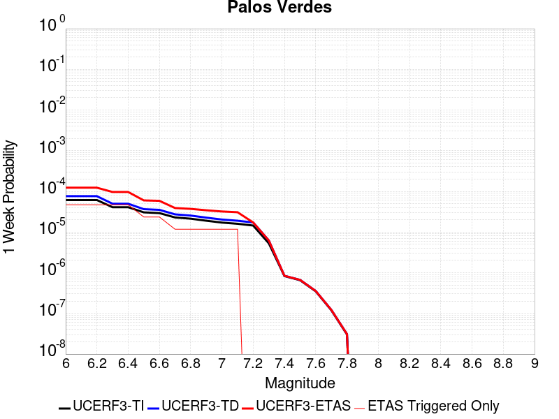 | 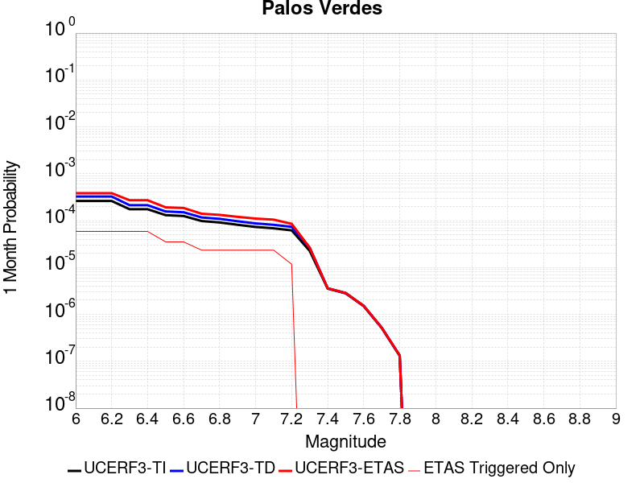 | 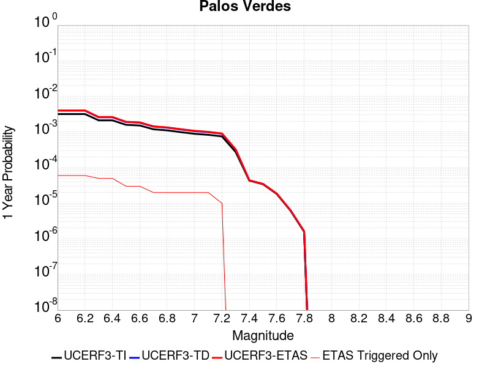 | 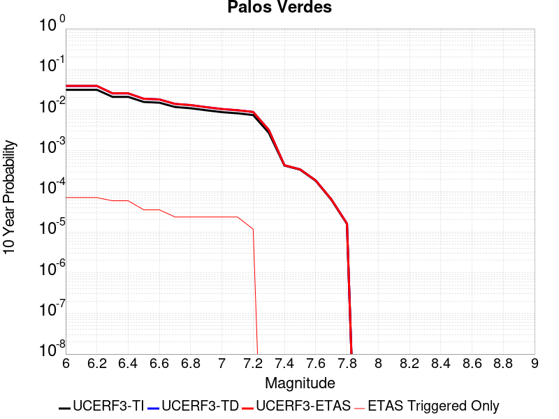 |

| Magnitude | 1 wk TI Prob | 1 wk TD Prob | 1 wk ETAS Prob | 1 wk ETAS/TD Gain | 1 wk ETAS Triggered Only | 1 mo TI Prob | 1 mo TD Prob | 1 mo ETAS Prob | 1 mo ETAS/TD Gain | 1 mo ETAS Triggered Only | 1 yr TI Prob | 1 yr TD Prob | 1 yr ETAS Prob | 1 yr ETAS/TD Gain | 1 yr ETAS Triggered Only | 10 yr TI Prob | 10 yr TD Prob | 10 yr ETAS Prob | 10 yr ETAS/TD Gain | 10 yr ETAS Triggered Only |
|-----|-----|-----|-----|-----|-----|-----|-----|-----|-----|-----|-----|-----|-----|-----|-----|-----|-----|-----|-----|-----|
| 6.0 | 6.126063E-5 | 7.622612E-5 | 1.231709E-4 | 1.6158621 | 4.6948357E-5 | 2.6251914E-4 | 3.2664582E-4 | 3.853121E-4 | 1.1796021 | 5.8685448E-5 | 0.0031914865 | 0.003970174 | 0.0040286267 | 1.014723 | 5.8685448E-5 | 0.031460393 | 0.039048895 | 0.03911657 | 1.0017331 | 7.042254E-5 |
| 6.1 | 6.126063E-5 | 7.622612E-5 | 1.231709E-4 | 1.6158621 | 4.6948357E-5 | 2.6251914E-4 | 3.2664582E-4 | 3.853121E-4 | 1.1796021 | 5.8685448E-5 | 0.0031914865 | 0.003970174 | 0.0040286267 | 1.014723 | 5.8685448E-5 | 0.031460393 | 0.039048895 | 0.03911657 | 1.0017331 | 7.042254E-5 |
| 6.2 | 6.126063E-5 | 7.622612E-5 | 1.231709E-4 | 1.6158621 | 4.6948357E-5 | 2.6251914E-4 | 3.2664582E-4 | 3.853121E-4 | 1.1796021 | 5.8685448E-5 | 0.0031914865 | 0.003970174 | 0.0040286267 | 1.014723 | 5.8685448E-5 | 0.031460393 | 0.039048895 | 0.03911657 | 1.0017331 | 7.042254E-5 |
| 6.3 | 4.0838047E-5 | 4.9749437E-5 | 9.6695454E-5 | 1.9436493 | 4.6948357E-5 | 1.7500846E-4 | 2.1319572E-4 | 2.7186866E-4 | 1.2752069 | 5.8685448E-5 | 0.0021286458 | 0.0025927818 | 0.0026513152 | 1.0225755 | 5.8685448E-5 | 0.021083709 | 0.025646681 | 0.02570386 | 1.0022296 | 5.8685448E-5 |
| 6.4 | 4.0838047E-5 | 4.9749437E-5 | 9.6695454E-5 | 1.9436493 | 4.6948357E-5 | 1.7500846E-4 | 2.1319572E-4 | 2.7186866E-4 | 1.2752069 | 5.8685448E-5 | 0.0021286458 | 0.0025927818 | 0.0026513152 | 1.0225755 | 5.8685448E-5 | 0.021083709 | 0.025646681 | 0.02570386 | 1.0022296 | 5.8685448E-5 |
| 6.5 | 3.0512005E-5 | 3.656162E-5 | 6.003494E-5 | 1.6420207 | 2.3474178E-5 | 1.3075917E-4 | 1.5668393E-4 | 1.9188969E-4 | 1.2246928 | 3.521127E-5 | 0.0015908304 | 0.0019060767 | 0.0019412207 | 1.018438 | 3.521127E-5 | 0.015794903 | 0.018909154 | 0.0189437 | 1.0018269 | 3.521127E-5 |
| 6.6 | 2.9255087E-5 | 3.515442E-5 | 5.8627775E-5 | 1.6677213 | 2.3474178E-5 | 1.2537291E-4 | 1.5065377E-4 | 1.8585972E-4 | 1.2336879 | 3.521127E-5 | 0.0015253464 | 0.0018327828 | 0.0018679296 | 1.0191767 | 3.521127E-5 | 0.015149189 | 0.018188225 | 0.018222796 | 1.0019007 | 3.521127E-5 |
| 6.7 | 2.287198E-5 | 2.7248278E-5 | 3.8985047E-5 | 1.4307344 | 1.1737089E-5 | 9.801909E-5 | 1.16773626E-4 | 1.4024506E-4 | 1.2009995 | 2.3474178E-5 | 0.001192729 | 0.0014208833 | 0.0014443242 | 1.0164974 | 2.3474178E-5 | 0.011863477 | 0.014127217 | 0.01415036 | 1.0016382 | 2.3474178E-5 |
| 6.8 | 2.1325764E-5 | 2.5431877E-5 | 3.716867E-5 | 1.4614992 | 1.1737089E-5 | 9.139293E-5 | 1.0898971E-4 | 1.3246134E-4 | 1.2153562 | 2.3474178E-5 | 0.001112141 | 0.0013262323 | 0.0013496754 | 1.0176765 | 2.3474178E-5 | 0.011065915 | 0.013192211 | 0.013215376 | 1.001756 | 2.3474178E-5 |
| 6.9 | 1.9009392E-5 | 2.2613547E-5 | 3.435037E-5 | 1.5190173 | 1.1737089E-5 | 8.1466285E-5 | 9.6912096E-5 | 1.20384E-4 | 1.2421979 | 2.3474178E-5 | 9.914007E-4 | 0.0011793535 | 0.0012028 | 1.0198808 | 2.3474178E-5 | 0.009869894 | 0.011739632 | 0.011762831 | 1.0019761 | 2.3474178E-5 |
| 7.0 | 1.7098473E-5 | 2.0319356E-5 | 3.2056207E-5 | 1.5776192 | 1.1737089E-5 | 7.3277115E-5 | 8.708052E-5 | 1.1055266E-4 | 1.2695452 | 2.3474178E-5 | 8.917837E-4 | 0.001059775 | 0.0010832243 | 1.0221267 | 2.3474178E-5 | 0.008882134 | 0.010555646 | 0.010578873 | 1.0022004 | 2.3474178E-5 |
| 7.1 | 1.5982785E-5 | 1.899476E-5 | 3.0731626E-5 | 1.6179003 | 1.1737089E-5 | 6.849585E-5 | 8.1404054E-5 | 1.0487632E-4 | 1.2883427 | 2.3474178E-5 | 8.336179E-4 | 9.907284E-4 | 0.0010141793 | 1.0236704 | 2.3474178E-5 | 0.008304977 | 0.009871479 | 0.009894722 | 1.0023545 | 2.3474178E-5 |
| 7.2 | 1.4468002E-5 | 1.7197237E-5 | 1.7197237E-5 | 1.0 | 0.0 | 6.200425E-5 | 7.370083E-5 | 8.543706E-5 | 1.1592414 | 1.1737089E-5 | 7.546402E-4 | 8.970222E-4 | 9.0874877E-4 | 1.0130727 | 1.1737089E-5 | 0.007520827 | 0.008942284 | 0.008953916 | 1.0013008 | 1.1737089E-5 |
| 7.3 | 5.288233E-6 | 6.2036747E-6 | 6.2036747E-6 | 1.0 | 0.0 | 2.2663658E-5 | 2.6587102E-5 | 2.6587102E-5 | 1.0 | 0.0 | 2.7589512E-4 | 3.236848E-4 | 3.236848E-4 | 1.0 | 0.0 | 0.0027555283 | 0.0032355562 | 0.0032355562 | 1.0 | 0.0 |
| 7.4 | 8.279556E-7 | 8.408347E-7 | 8.408347E-7 | 1.0 | 0.0 | 3.5483763E-6 | 3.6035726E-6 | 3.6035726E-6 | 1.0 | 0.0 | 4.3200624E-5 | 4.3872686E-5 | 4.3872686E-5 | 1.0 | 0.0 | 4.3192226E-4 | 4.3864746E-4 | 4.3864746E-4 | 1.0 | 0.0 |
| 7.5 | 6.559831E-7 | 6.667229E-7 | 6.667229E-7 | 1.0 | 0.0 | 2.8113532E-6 | 2.857381E-6 | 2.857381E-6 | 1.0 | 0.0 | 3.4227687E-5 | 3.4788125E-5 | 3.4788125E-5 | 1.0 | 0.0 | 3.4222414E-4 | 3.4783344E-4 | 3.4783344E-4 | 1.0 | 0.0 |
| 7.6 | 3.5018968E-7 | 3.5620027E-7 | 3.5620027E-7 | 1.0 | 0.0 | 1.500812E-6 | 1.526572E-6 | 1.526572E-6 | 1.0 | 0.0 | 1.8272232E-5 | 1.8585903E-5 | 1.8585903E-5 | 1.0 | 0.0 | 1.8270731E-4 | 1.8584808E-4 | 1.8584808E-4 | 1.0 | 0.0 |
| 7.7 | 1.1986104E-7 | 1.2198376E-7 | 1.2198376E-7 | 1.0 | 0.0 | 5.1369005E-7 | 5.2278745E-7 | 5.2278745E-7 | 1.0 | 0.0 | 6.2541585E-6 | 6.364919E-6 | 6.364919E-6 | 1.0 | 0.0 | 6.2539824E-5 | 6.364741E-5 | 6.364741E-5 | 1.0 | 0.0 |
| 7.8 | 3.0445005E-8 | 3.1027582E-8 | 3.1027582E-8 | 1.0 | 0.0 | 1.3047858E-7 | 1.3297536E-7 | 1.3297536E-7 | 1.0 | 0.0 | 1.5885756E-6 | 1.6189739E-6 | 1.6189739E-6 | 1.0 | 0.0 | 1.5885644E-5 | 1.6189642E-5 | 1.6189642E-5 | 1.0 | 0.0 |

## Great Valley 09 (Laguna Seca)
*[(top)](#table-of-contents)*

| 1 Week | 1 Month | 1 Year | 10 Year |
|-----|-----|-----|-----|
| 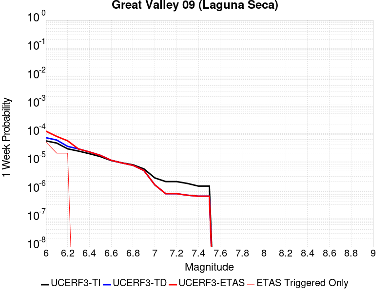 | 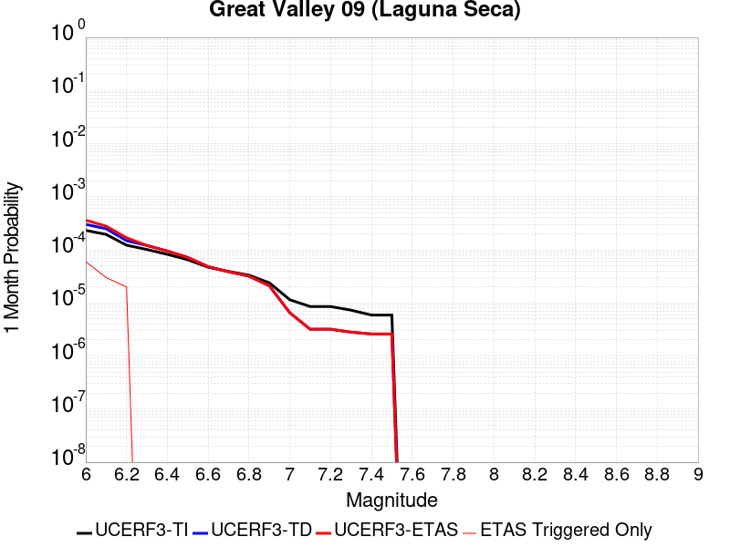 | 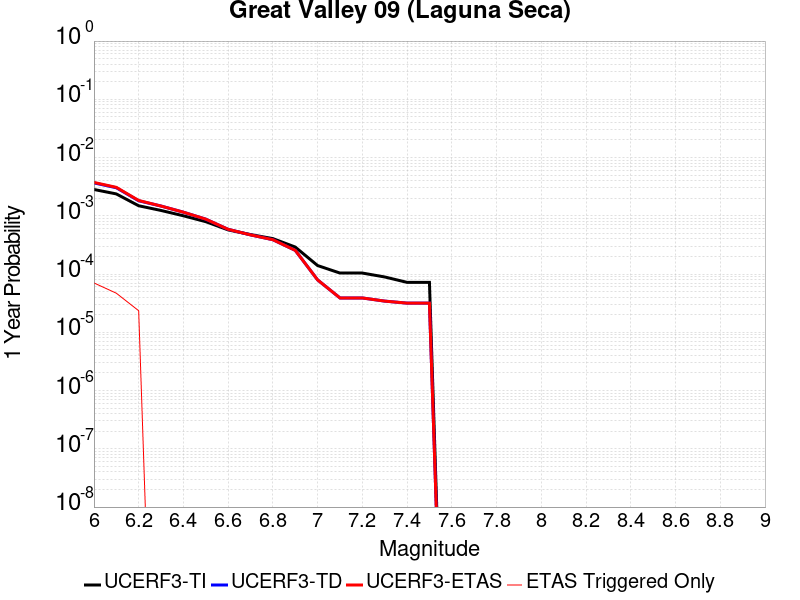 | 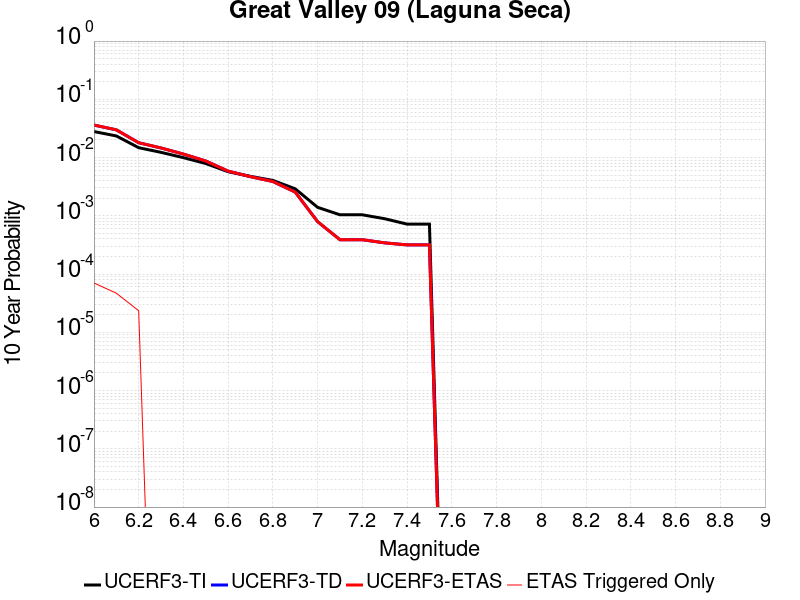 |

| Magnitude | 1 wk TI Prob | 1 wk TD Prob | 1 wk ETAS Prob | 1 wk ETAS/TD Gain | 1 wk ETAS Triggered Only | 1 mo TI Prob | 1 mo TD Prob | 1 mo ETAS Prob | 1 mo ETAS/TD Gain | 1 mo ETAS Triggered Only | 1 yr TI Prob | 1 yr TD Prob | 1 yr ETAS Prob | 1 yr ETAS/TD Gain | 1 yr ETAS Triggered Only | 10 yr TI Prob | 10 yr TD Prob | 10 yr ETAS Prob | 10 yr ETAS/TD Gain | 10 yr ETAS Triggered Only |
|-----|-----|-----|-----|-----|-----|-----|-----|-----|-----|-----|-----|-----|-----|-----|-----|-----|-----|-----|-----|-----|
| 6.0 | 5.4353277E-5 | 7.05022E-5 | 1.1744725E-4 | 1.6658664 | 4.6948357E-5 | 2.3292181E-4 | 3.0211566E-4 | 3.607834E-4 | 1.1941895 | 5.8685448E-5 | 0.0028321352 | 0.0036721937 | 0.0037423577 | 1.0191069 | 7.042254E-5 | 0.02796312 | 0.03611547 | 0.03618335 | 1.0018795 | 7.042254E-5 |
| 6.1 | 4.5578287E-5 | 5.822118E-5 | 8.1693994E-5 | 1.4031662 | 2.3474178E-5 | 1.953209E-4 | 2.4949326E-4 | 2.8469574E-4 | 1.1410959 | 3.521127E-5 | 0.0023754383 | 0.003033432 | 0.003080238 | 1.01543 | 4.6948357E-5 | 0.023502063 | 0.029919548 | 0.029965091 | 1.0015222 | 4.6948357E-5 |
| 6.2 | 2.8536782E-5 | 3.4737273E-5 | 5.8210637E-5 | 1.6757399 | 2.3474178E-5 | 1.2229476E-4 | 1.4886224E-4 | 1.7233292E-4 | 1.1576672 | 2.3474178E-5 | 0.0014879217 | 0.001810813 | 0.0018342447 | 1.0129398 | 2.3474178E-5 | 0.014779986 | 0.017958116 | 0.01798117 | 1.0012836 | 2.3474178E-5 |
| 6.3 | 2.3698774E-5 | 2.8213295E-5 | 2.8213295E-5 | 1.0 | 0.0 | 1.01562226E-4 | 1.20905075E-4 | 1.20905075E-4 | 1.0 | 0.0 | 0.0012358186 | 0.0014710218 | 0.0014710218 | 1.0 | 0.0 | 0.012289686 | 0.014611342 | 0.014611342 | 1.0 | 0.0 |
| 6.4 | 1.9191197E-5 | 2.2123184E-5 | 2.2123184E-5 | 1.0 | 0.0 | 8.2245395E-5 | 9.4806666E-5 | 9.4806666E-5 | 1.0 | 0.0 | 0.0010008777 | 0.0011536429 | 0.0011536429 | 1.0 | 0.0 | 0.009963818 | 0.011476948 | 0.011476948 | 1.0 | 0.0 |
| 6.5 | 1.5203241E-5 | 1.6802203E-5 | 1.6802203E-5 | 1.0 | 0.0 | 6.5155116E-5 | 7.200386E-5 | 7.200386E-5 | 1.0 | 0.0 | 7.9297484E-4 | 8.7626575E-4 | 8.7626575E-4 | 1.0 | 0.0 | 0.007901512 | 0.0087295165 | 0.0087295165 | 1.0 | 0.0 |
| 6.6 | 1.0984925E-5 | 1.1242595E-5 | 1.1242595E-5 | 1.0 | 0.0 | 4.70774E-5 | 4.8181686E-5 | 4.8181686E-5 | 1.0 | 0.0 | 5.730166E-4 | 5.8645656E-4 | 5.8645656E-4 | 1.0 | 0.0 | 0.005715413 | 0.0058494853 | 0.0058494853 | 1.0 | 0.0 |
| 6.7 | 9.134616E-6 | 9.019894E-6 | 9.019894E-6 | 1.0 | 0.0 | 3.9147766E-5 | 3.865613E-5 | 3.865613E-5 | 1.0 | 0.0 | 4.7651984E-4 | 4.7053912E-4 | 4.7053912E-4 | 1.0 | 0.0 | 0.004754993 | 0.0046956735 | 0.0046956735 | 1.0 | 0.0 |
| 6.8 | 7.785589E-6 | 7.4519444E-6 | 7.4519444E-6 | 1.0 | 0.0 | 3.3366385E-5 | 3.1936524E-5 | 3.1936524E-5 | 1.0 | 0.0 | 4.0616E-4 | 3.8875983E-4 | 3.8875983E-4 | 1.0 | 0.0 | 0.0040541845 | 0.0038810016 | 0.0038810016 | 1.0 | 0.0 |
| 6.9 | 5.579095E-6 | 4.898492E-6 | 4.898492E-6 | 1.0 | 0.0 | 2.3910188E-5 | 2.0993377E-5 | 2.0993377E-5 | 1.0 | 0.0 | 2.9106764E-4 | 2.5556577E-4 | 2.5556577E-4 | 1.0 | 0.0 | 0.002906867 | 0.002552856 | 0.002552856 | 1.0 | 0.0 |
| 7.0 | 2.6816688E-6 | 1.5216126E-6 | 1.5216126E-6 | 1.0 | 0.0 | 1.1492816E-5 | 6.521181E-6 | 6.521181E-6 | 1.0 | 0.0 | 1.3991605E-4 | 7.939258E-5 | 7.939258E-5 | 1.0 | 0.0 | 0.0013982799 | 7.9365086E-4 | 7.9365086E-4 | 1.0 | 0.0 |
| 7.1 | 1.9951021E-6 | 7.453827E-7 | 7.453827E-7 | 1.0 | 0.0 | 8.55041E-6 | 3.1944935E-6 | 3.1944935E-6 | 1.0 | 0.0 | 1.0409627E-4 | 3.8892307E-5 | 3.8892307E-5 | 1.0 | 0.0 | 0.0010404752 | 3.8885913E-4 | 3.8885913E-4 | 1.0 | 0.0 |
| 7.2 | 1.9951021E-6 | 7.453827E-7 | 7.453827E-7 | 1.0 | 0.0 | 8.55041E-6 | 3.1944935E-6 | 3.1944935E-6 | 1.0 | 0.0 | 1.0409627E-4 | 3.8892307E-5 | 3.8892307E-5 | 1.0 | 0.0 | 0.0010404752 | 3.8885913E-4 | 3.8885913E-4 | 1.0 | 0.0 |
| 7.3 | 1.7087556E-6 | 6.578881E-7 | 6.578881E-7 | 1.0 | 0.0 | 7.3232177E-6 | 2.8195177E-6 | 2.8195177E-6 | 1.0 | 0.0 | 8.915652E-5 | 3.4327128E-5 | 3.4327128E-5 | 1.0 | 0.0 | 8.9120766E-4 | 3.432223E-4 | 3.432223E-4 | 1.0 | 0.0 |
| 7.4 | 1.3804846E-6 | 6.073852E-7 | 6.073852E-7 | 1.0 | 0.0 | 5.916349E-6 | 2.6030768E-6 | 2.6030768E-6 | 1.0 | 0.0 | 7.2029165E-5 | 3.169204E-5 | 3.169204E-5 | 1.0 | 0.0 | 7.200583E-4 | 3.1687922E-4 | 3.1687922E-4 | 1.0 | 0.0 |
| 7.5 | 1.3804846E-6 | 6.073852E-7 | 6.073852E-7 | 1.0 | 0.0 | 5.916349E-6 | 2.6030768E-6 | 2.6030768E-6 | 1.0 | 0.0 | 7.2029165E-5 | 3.169204E-5 | 3.169204E-5 | 1.0 | 0.0 | 7.200583E-4 | 3.1687922E-4 | 3.1687922E-4 | 1.0 | 0.0 |

## Oak Ridge (Onshore)
*[(top)](#table-of-contents)*

| 1 Week | 1 Month | 1 Year | 10 Year |
|-----|-----|-----|-----|
| 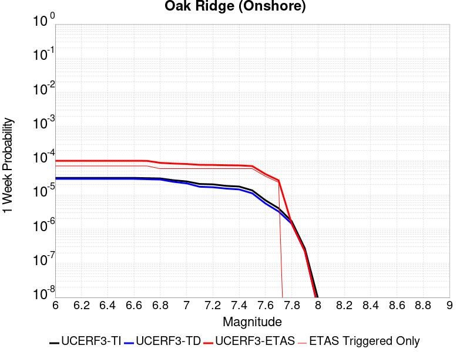 | 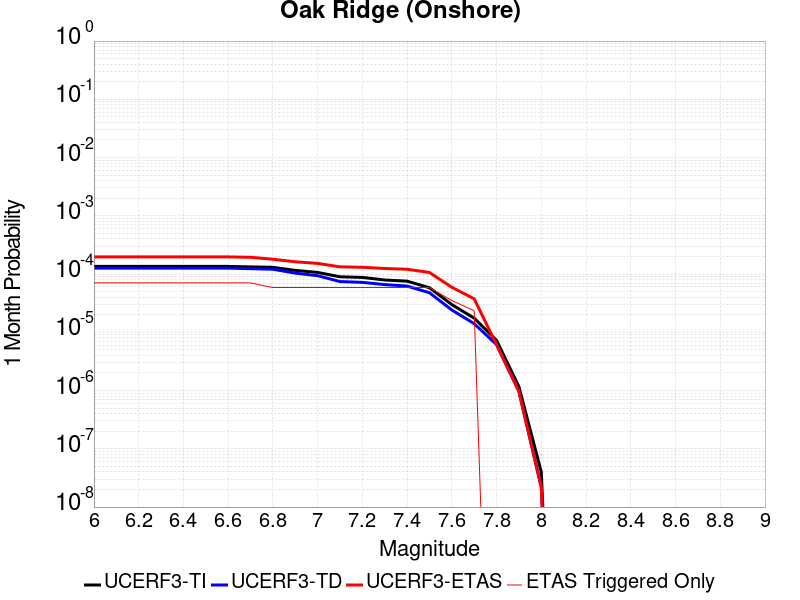 | 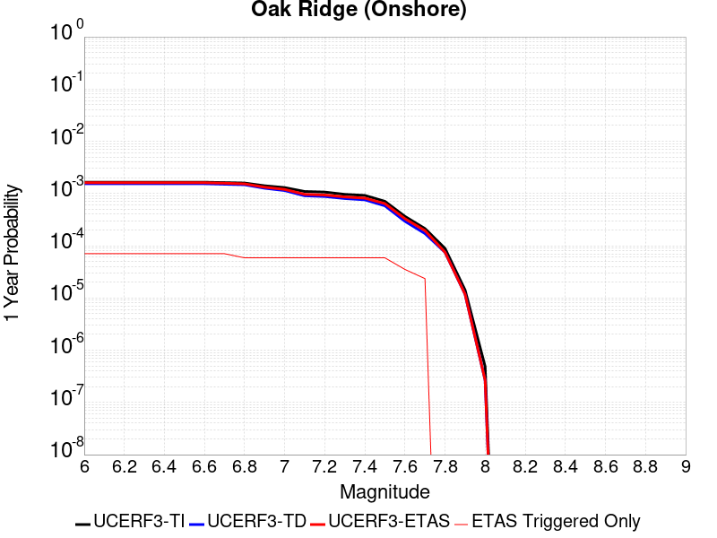 | 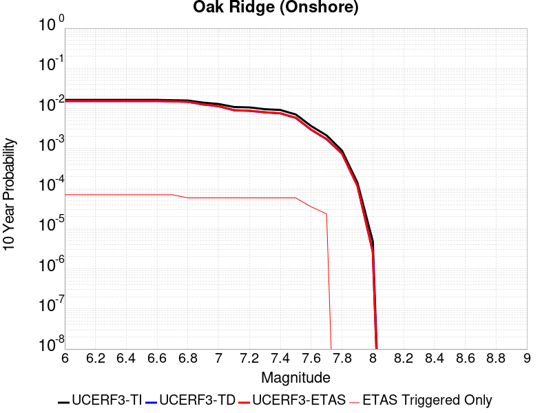 |

| Magnitude | 1 wk TI Prob | 1 wk TD Prob | 1 wk ETAS Prob | 1 wk ETAS/TD Gain | 1 wk ETAS Triggered Only | 1 mo TI Prob | 1 mo TD Prob | 1 mo ETAS Prob | 1 mo ETAS/TD Gain | 1 mo ETAS Triggered Only | 1 yr TI Prob | 1 yr TD Prob | 1 yr ETAS Prob | 1 yr ETAS/TD Gain | 1 yr ETAS Triggered Only | 10 yr TI Prob | 10 yr TD Prob | 10 yr ETAS Prob | 10 yr ETAS/TD Gain | 10 yr ETAS Triggered Only |
|-----|-----|-----|-----|-----|-----|-----|-----|-----|-----|-----|-----|-----|-----|-----|-----|-----|-----|-----|-----|-----|
| 6.0 | 3.155064E-5 | 2.9525974E-5 | 9.994643E-5 | 3.385034 | 7.042254E-5 | 1.3521002E-4 | 1.2653397E-4 | 1.9694759E-4 | 1.55648 | 7.042254E-5 | 0.001644939 | 0.0015395004 | 0.0016098146 | 1.0456734 | 7.042254E-5 | 0.01632816 | 0.015292859 | 0.015362204 | 1.0045345 | 7.042254E-5 |
| 6.1 | 3.155064E-5 | 2.9525974E-5 | 9.994643E-5 | 3.385034 | 7.042254E-5 | 1.3521002E-4 | 1.2653397E-4 | 1.9694759E-4 | 1.55648 | 7.042254E-5 | 0.001644939 | 0.0015395004 | 0.0016098146 | 1.0456734 | 7.042254E-5 | 0.01632816 | 0.015292859 | 0.015362204 | 1.0045345 | 7.042254E-5 |
| 6.2 | 3.155064E-5 | 2.9525974E-5 | 9.994643E-5 | 3.385034 | 7.042254E-5 | 1.3521002E-4 | 1.2653397E-4 | 1.9694759E-4 | 1.55648 | 7.042254E-5 | 0.001644939 | 0.0015395004 | 0.0016098146 | 1.0456734 | 7.042254E-5 | 0.01632816 | 0.015292859 | 0.015362204 | 1.0045345 | 7.042254E-5 |
| 6.3 | 3.155064E-5 | 2.9525974E-5 | 9.994643E-5 | 3.385034 | 7.042254E-5 | 1.3521002E-4 | 1.2653397E-4 | 1.9694759E-4 | 1.55648 | 7.042254E-5 | 0.001644939 | 0.0015395004 | 0.0016098146 | 1.0456734 | 7.042254E-5 | 0.01632816 | 0.015292859 | 0.015362204 | 1.0045345 | 7.042254E-5 |
| 6.4 | 3.155064E-5 | 2.9525974E-5 | 9.994643E-5 | 3.385034 | 7.042254E-5 | 1.3521002E-4 | 1.2653397E-4 | 1.9694759E-4 | 1.55648 | 7.042254E-5 | 0.001644939 | 0.0015395004 | 0.0016098146 | 1.0456734 | 7.042254E-5 | 0.01632816 | 0.015292859 | 0.015362204 | 1.0045345 | 7.042254E-5 |
| 6.5 | 3.155064E-5 | 2.9525974E-5 | 9.994643E-5 | 3.385034 | 7.042254E-5 | 1.3521002E-4 | 1.2653397E-4 | 1.9694759E-4 | 1.55648 | 7.042254E-5 | 0.001644939 | 0.0015395004 | 0.0016098146 | 1.0456734 | 7.042254E-5 | 0.01632816 | 0.015292859 | 0.015362204 | 1.0045345 | 7.042254E-5 |
| 6.6 | 3.155064E-5 | 2.9525974E-5 | 9.994643E-5 | 3.385034 | 7.042254E-5 | 1.3521002E-4 | 1.2653397E-4 | 1.9694759E-4 | 1.55648 | 7.042254E-5 | 0.001644939 | 0.0015395004 | 0.0016098146 | 1.0456734 | 7.042254E-5 | 0.01632816 | 0.015292859 | 0.015362204 | 1.0045345 | 7.042254E-5 |
| 6.7 | 3.098897E-5 | 2.8864175E-5 | 9.9284676E-5 | 3.43972 | 7.042254E-5 | 1.328031E-4 | 1.2369796E-4 | 1.9411178E-4 | 1.56924 | 7.042254E-5 | 0.0016156785 | 0.0015050198 | 0.0015753364 | 1.0467213 | 7.042254E-5 | 0.016039822 | 0.014952714 | 0.015022083 | 1.0046393 | 7.042254E-5 |
| 6.8 | 3.0449872E-5 | 2.8239372E-5 | 8.692316E-5 | 3.078084 | 5.8685448E-5 | 1.3049292E-4 | 1.2102048E-4 | 1.7969882E-4 | 1.4848629 | 5.8685448E-5 | 0.0015875935 | 0.0014724657 | 0.0015310646 | 1.0397966 | 5.8685448E-5 | 0.015762992 | 0.014631462 | 0.014689289 | 1.0039523 | 5.8685448E-5 |
| 6.9 | 2.697928E-5 | 2.4219773E-5 | 8.2903796E-5 | 3.4229798 | 5.8685448E-5 | 1.15620365E-4 | 1.0379502E-4 | 1.6247437E-4 | 1.5653389 | 5.8685448E-5 | 0.0014067689 | 0.0012629933 | 0.0013216047 | 1.0464066 | 5.8685448E-5 | 0.0139789665 | 0.01256087 | 0.012618818 | 1.0046134 | 5.8685448E-5 |
| 7.0 | 2.4893961E-5 | 2.1862043E-5 | 8.0546204E-5 | 3.6842947 | 5.8685448E-5 | 1.0668404E-4 | 9.3691204E-5 | 1.5237115E-4 | 1.6263123 | 5.8685448E-5 | 0.0012981043 | 0.0011401111 | 0.0011987297 | 1.0514147 | 5.8685448E-5 | 0.012905477 | 0.011344905 | 0.0114029255 | 1.0051142 | 5.8685448E-5 |
| 7.1 | 2.0945363E-5 | 1.7354487E-5 | 7.6038916E-5 | 4.381513 | 5.8685448E-5 | 8.976275E-5 | 7.437428E-5 | 1.3305536E-4 | 1.7889969 | 5.8685448E-5 | 0.0010923136 | 9.051354E-4 | 9.6376776E-4 | 1.0647774 | 5.8685448E-5 | 0.0108696 | 0.009015423 | 0.00907358 | 1.0064508 | 5.8685448E-5 |
| 7.2 | 2.0439404E-5 | 1.6809423E-5 | 7.549388E-5 | 4.491164 | 5.8685448E-5 | 8.7594504E-5 | 7.203843E-5 | 1.3071964E-4 | 1.8145822 | 5.8685448E-5 | 0.0010659413 | 8.767196E-4 | 9.353536E-4 | 1.0668788 | 5.8685448E-5 | 0.010608427 | 0.008733526 | 0.008791699 | 1.0066608 | 5.8685448E-5 |
| 7.3 | 1.8463334E-5 | 1.5381811E-5 | 7.406635E-5 | 4.815191 | 5.8685448E-5 | 7.912617E-5 | 6.59204E-5 | 1.2460198E-4 | 1.8901883 | 5.8685448E-5 | 9.6293533E-4 | 8.0228975E-4 | 8.609281E-4 | 1.0730888 | 5.8685448E-5 | 0.009587734 | 0.007994797 | 0.008053013 | 1.0072818 | 5.8685448E-5 |
| 7.4 | 1.763139E-5 | 1.451684E-5 | 7.320143E-5 | 5.0425186 | 5.8685448E-5 | 7.556091E-5 | 6.221356E-5 | 1.2089536E-4 | 1.9432315 | 5.8685448E-5 | 9.1956573E-4 | 7.571909E-4 | 8.158319E-4 | 1.0774455 | 5.8685448E-5 | 0.009157699 | 0.007546914 | 0.0076051564 | 1.0077174 | 5.8685448E-5 |
| 7.5 | 1.3594944E-5 | 1.1163356E-5 | 6.9848145E-5 | 6.2569127 | 5.8685448E-5 | 5.8262744E-5 | 4.784209E-5 | 1.0652473E-4 | 2.2265902 | 5.8685448E-5 | 7.0911803E-4 | 5.8232434E-4 | 6.409756E-4 | 1.1007192 | 5.8685448E-5 | 0.007068595 | 0.0058082556 | 0.0058666 | 1.0100452 | 5.8685448E-5 |
| 7.6 | 6.9889534E-6 | 5.6367144E-6 | 4.0847783E-5 | 7.2467365 | 3.521127E-5 | 2.9952313E-5 | 2.4157125E-5 | 5.9367543E-5 | 2.4575582 | 3.521127E-5 | 3.646084E-4 | 2.9407372E-4 | 3.2927466E-4 | 1.119701 | 3.521127E-5 | 0.0036401073 | 0.0029368899 | 0.0029719977 | 1.0119541 | 3.521127E-5 |
| 7.7 | 4.0824193E-6 | 3.2832586E-6 | 2.675736E-5 | 8.149635 | 2.3474178E-5 | 1.7495966E-5 | 1.4071033E-5 | 3.754488E-5 | 2.668239 | 2.3474178E-5 | 2.1299256E-4 | 1.713015E-4 | 1.9477165E-4 | 1.1370108 | 2.3474178E-5 | 0.0021278851 | 0.0017117079 | 0.0017351419 | 1.0136905 | 2.3474178E-5 |
| 7.8 | 1.7023609E-6 | 1.4370495E-6 | 1.4370495E-6 | 1.0 | 0.0 | 7.295812E-6 | 6.1587693E-6 | 6.1587693E-6 | 1.0 | 0.0 | 8.882289E-5 | 7.498047E-5 | 7.498047E-5 | 1.0 | 0.0 | 8.8787393E-4 | 7.495545E-4 | 7.495545E-4 | 1.0 | 0.0 |
| 7.9 | 2.721225E-7 | 2.2616497E-7 | 2.2616497E-7 | 1.0 | 0.0 | 1.1662388E-6 | 9.692781E-7 | 9.692781E-7 | 1.0 | 0.0 | 1.4198865E-5 | 1.1800899E-5 | 1.1800899E-5 | 1.0 | 0.0 | 1.4197957E-4 | 1.1800301E-4 | 1.1800301E-4 | 1.0 | 0.0 |
| 8.0 | 9.364255E-9 | 5.1206666E-9 | 5.1206666E-9 | 1.0 | 0.0 | 4.0132523E-8 | 2.1945715E-8 | 2.1945715E-8 | 1.0 | 0.0 | 4.8861335E-7 | 2.6718905E-7 | 2.6718905E-7 | 1.0 | 0.0 | 4.8861225E-6 | 2.6718876E-6 | 2.6718876E-6 | 1.0 | 0.0 |

## Bullion Mountains
*[(top)](#table-of-contents)*

| 1 Week | 1 Month | 1 Year | 10 Year |
|-----|-----|-----|-----|
| 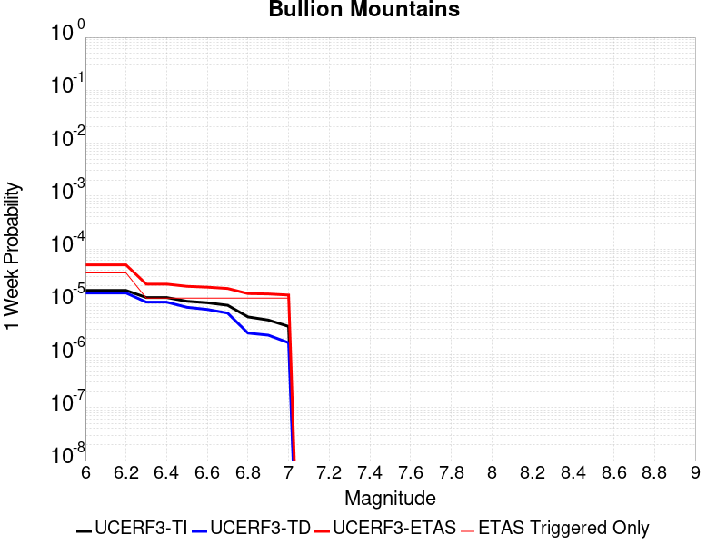 | 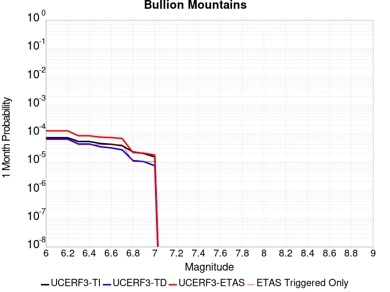 | 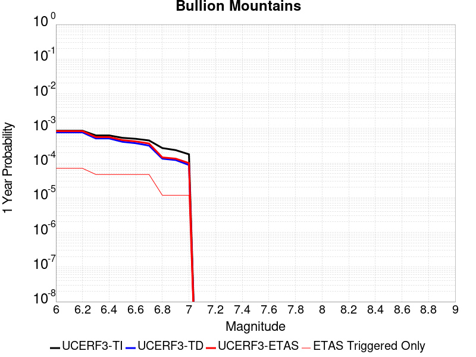 | 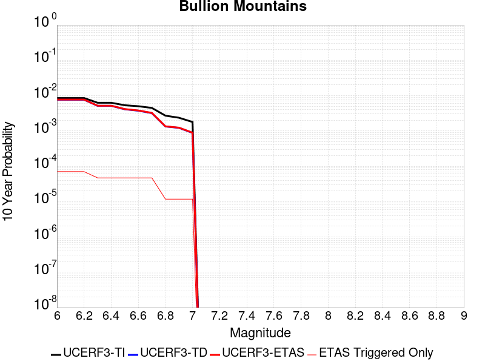 |

| Magnitude | 1 wk TI Prob | 1 wk TD Prob | 1 wk ETAS Prob | 1 wk ETAS/TD Gain | 1 wk ETAS Triggered Only | 1 mo TI Prob | 1 mo TD Prob | 1 mo ETAS Prob | 1 mo ETAS/TD Gain | 1 mo ETAS Triggered Only | 1 yr TI Prob | 1 yr TD Prob | 1 yr ETAS Prob | 1 yr ETAS/TD Gain | 1 yr ETAS Triggered Only | 10 yr TI Prob | 10 yr TD Prob | 10 yr ETAS Prob | 10 yr ETAS/TD Gain | 10 yr ETAS Triggered Only |
|-----|-----|-----|-----|-----|-----|-----|-----|-----|-----|-----|-----|-----|-----|-----|-----|-----|-----|-----|-----|-----|
| 6.0 | 1.6420427E-5 | 1.4692089E-5 | 4.990284E-5 | 3.3965788 | 3.521127E-5 | 7.037136E-5 | 6.296479E-5 | 1.333829E-4 | 2.1183727 | 7.042254E-5 | 8.5643446E-4 | 7.663651E-4 | 8.3673367E-4 | 1.0918212 | 7.042254E-5 | 0.008531413 | 0.007641016 | 0.0077109006 | 1.009146 | 7.042254E-5 |
| 6.1 | 1.6420427E-5 | 1.4692089E-5 | 4.990284E-5 | 3.3965788 | 3.521127E-5 | 7.037136E-5 | 6.296479E-5 | 1.333829E-4 | 2.1183727 | 7.042254E-5 | 8.5643446E-4 | 7.663651E-4 | 8.3673367E-4 | 1.0918212 | 7.042254E-5 | 0.008531413 | 0.007641016 | 0.0077109006 | 1.009146 | 7.042254E-5 |
| 6.2 | 1.6420427E-5 | 1.4692089E-5 | 4.990284E-5 | 3.3965788 | 3.521127E-5 | 7.037136E-5 | 6.296479E-5 | 1.333829E-4 | 2.1183727 | 7.042254E-5 | 8.5643446E-4 | 7.663651E-4 | 8.3673367E-4 | 1.0918212 | 7.042254E-5 | 0.008531413 | 0.007641016 | 0.0077109006 | 1.009146 | 7.042254E-5 |
| 6.3 | 1.2046778E-5 | 9.862335E-6 | 2.1599308E-5 | 2.1900806 | 1.1737089E-5 | 5.1628023E-5 | 4.2266598E-5 | 8.921297E-5 | 2.1107204 | 4.6948357E-5 | 6.283899E-4 | 5.144975E-4 | 5.614217E-4 | 1.0912039 | 4.6948357E-5 | 0.0062661595 | 0.005135345 | 0.005182052 | 1.0090953 | 4.6948357E-5 |
| 6.4 | 1.2046778E-5 | 9.862335E-6 | 2.1599308E-5 | 2.1900806 | 1.1737089E-5 | 5.1628023E-5 | 4.2266598E-5 | 8.921297E-5 | 2.1107204 | 4.6948357E-5 | 6.283899E-4 | 5.144975E-4 | 5.614217E-4 | 1.0912039 | 4.6948357E-5 | 0.0062661595 | 0.005135345 | 0.005182052 | 1.0090953 | 4.6948357E-5 |
| 6.5 | 1.0244343E-5 | 7.879458E-6 | 1.9616455E-5 | 2.489569 | 1.1737089E-5 | 4.390359E-5 | 3.3768785E-5 | 8.071556E-5 | 2.3902416 | 4.6948357E-5 | 5.343951E-4 | 4.110781E-4 | 4.5800715E-4 | 1.1141609 | 4.6948357E-5 | 0.005331118 | 0.004105208 | 0.0041519636 | 1.0113894 | 4.6948357E-5 |
| 6.6 | 9.605408E-6 | 7.1774966E-6 | 1.8914501E-5 | 2.6352506 | 1.1737089E-5 | 4.1165385E-5 | 3.076045E-5 | 7.7707366E-5 | 2.52621 | 4.6948357E-5 | 5.010733E-4 | 3.744645E-4 | 4.2139526E-4 | 1.1253277 | 4.6948357E-5 | 0.00499945 | 0.003740332 | 0.0037871047 | 1.0125049 | 4.6948357E-5 |
| 6.7 | 8.60418E-6 | 6.1240044E-6 | 1.7861023E-5 | 2.9165592 | 1.1737089E-5 | 3.687454E-5 | 2.624558E-5 | 7.319271E-5 | 2.788763 | 4.6948357E-5 | 4.48855E-4 | 3.1951256E-4 | 3.6644592E-4 | 1.1468905 | 4.6948357E-5 | 0.004479495 | 0.0031924439 | 0.0032392424 | 1.0146592 | 4.6948357E-5 |
| 6.8 | 5.187994E-6 | 2.5631666E-6 | 1.4300226E-5 | 5.5791245 | 1.1737089E-5 | 2.223407E-5 | 1.0984976E-5 | 2.2721937E-5 | 2.0684557 | 1.1737089E-5 | 2.7066618E-4 | 1.3373788E-4 | 1.4547339E-4 | 1.0877502 | 1.1737089E-5 | 0.0027033675 | 0.0013369655 | 0.0013486869 | 1.0087671 | 1.1737089E-5 |
| 6.9 | 4.5302368E-6 | 2.3443165E-6 | 1.4081378E-5 | 6.006603 | 1.1737089E-5 | 1.9415156E-5 | 1.0047055E-5 | 2.1784026E-5 | 2.1682003 | 1.1737089E-5 | 2.3635388E-4 | 1.2232E-4 | 1.3405565E-4 | 1.0959423 | 1.1737089E-5 | 0.0023610266 | 0.0012229157 | 0.0012346385 | 1.0095859 | 1.1737089E-5 |
| 7.0 | 3.431668E-6 | 1.6882402E-6 | 1.342531E-5 | 7.952251 | 1.1737089E-5 | 1.4707065E-5 | 7.235315E-6 | 1.897232E-5 | 2.6221828 | 1.1737089E-5 | 1.7904381E-4 | 8.808996E-5 | 9.9826015E-5 | 1.1332281 | 1.1737089E-5 | 0.0017889962 | 8.808996E-4 | 8.9262635E-4 | 1.0133122 | 1.1737089E-5 |

## Blue Cut
*[(top)](#table-of-contents)*

| 1 Week | 1 Month | 1 Year | 10 Year |
|-----|-----|-----|-----|
| 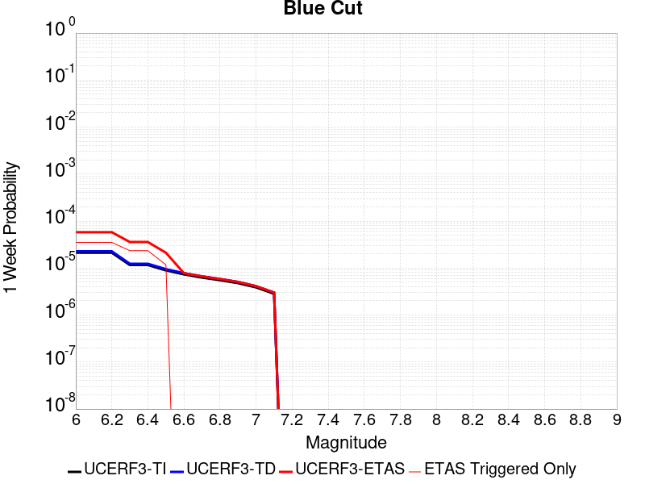 | 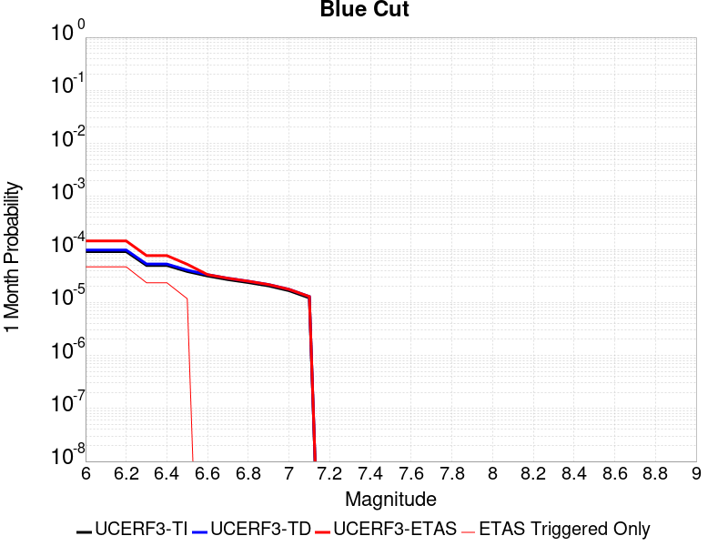 | 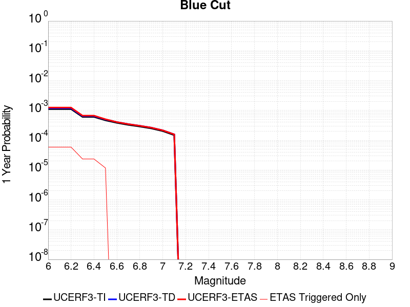 | 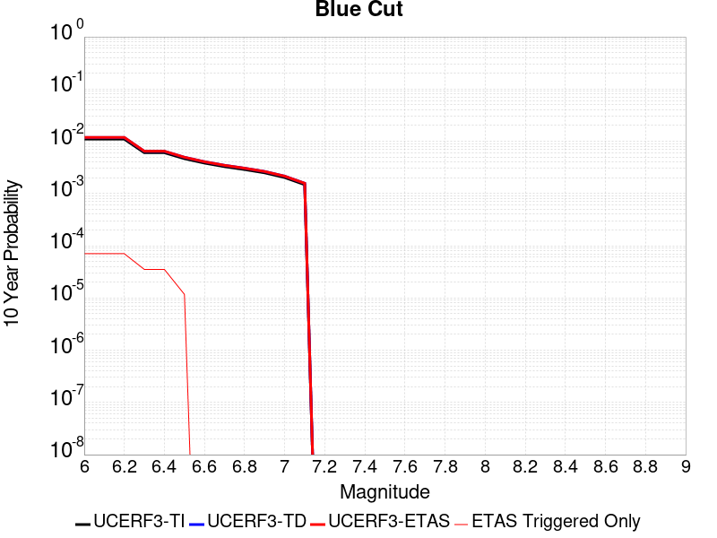 |

| Magnitude | 1 wk TI Prob | 1 wk TD Prob | 1 wk ETAS Prob | 1 wk ETAS/TD Gain | 1 wk ETAS Triggered Only | 1 mo TI Prob | 1 mo TD Prob | 1 mo ETAS Prob | 1 mo ETAS/TD Gain | 1 mo ETAS Triggered Only | 1 yr TI Prob | 1 yr TD Prob | 1 yr ETAS Prob | 1 yr ETAS/TD Gain | 1 yr ETAS Triggered Only | 10 yr TI Prob | 10 yr TD Prob | 10 yr ETAS Prob | 10 yr ETAS/TD Gain | 10 yr ETAS Triggered Only |
|-----|-----|-----|-----|-----|-----|-----|-----|-----|-----|-----|-----|-----|-----|-----|-----|-----|-----|-----|-----|-----|
| 6.0 | 2.1227985E-5 | 2.2719574E-5 | 5.7930043E-5 | 2.5497856 | 3.521127E-5 | 9.097391E-5 | 9.73663E-5 | 1.4431009E-4 | 1.4821359 | 4.6948357E-5 | 0.0011070445 | 0.0011848481 | 0.0012434641 | 1.0494713 | 5.8685448E-5 | 0.011015458 | 0.011791152 | 0.011860744 | 1.005902 | 7.042254E-5 |
| 6.1 | 2.1227985E-5 | 2.2719574E-5 | 5.7930043E-5 | 2.5497856 | 3.521127E-5 | 9.097391E-5 | 9.73663E-5 | 1.4431009E-4 | 1.4821359 | 4.6948357E-5 | 0.0011070445 | 0.0011848481 | 0.0012434641 | 1.0494713 | 5.8685448E-5 | 0.011015458 | 0.011791152 | 0.011860744 | 1.005902 | 7.042254E-5 |
| 6.2 | 2.1227985E-5 | 2.2719574E-5 | 5.7930043E-5 | 2.5497856 | 3.521127E-5 | 9.097391E-5 | 9.73663E-5 | 1.4431009E-4 | 1.4821359 | 4.6948357E-5 | 0.0011070445 | 0.0011848481 | 0.0012434641 | 1.0494713 | 5.8685448E-5 | 0.011015458 | 0.011791152 | 0.011860744 | 1.005902 | 7.042254E-5 |
| 6.3 | 1.1613981E-5 | 1.2353542E-5 | 3.582743E-5 | 2.9001749 | 2.3474178E-5 | 4.9773254E-5 | 5.2942745E-5 | 7.641568E-5 | 1.4433645 | 2.3474178E-5 | 6.0582085E-4 | 6.443998E-4 | 6.678588E-4 | 1.0364045 | 2.3474178E-5 | 0.0060417196 | 0.0064265593 | 0.0064615444 | 1.0054438 | 3.521127E-5 |
| 6.4 | 1.1613981E-5 | 1.2353542E-5 | 3.582743E-5 | 2.9001749 | 2.3474178E-5 | 4.9773254E-5 | 5.2942745E-5 | 7.641568E-5 | 1.4433645 | 2.3474178E-5 | 6.0582085E-4 | 6.443998E-4 | 6.678588E-4 | 1.0364045 | 2.3474178E-5 | 0.0060417196 | 0.0064265593 | 0.0064615444 | 1.0054438 | 3.521127E-5 |
| 6.5 | 8.931326E-6 | 9.4816E-6 | 2.1218577E-5 | 2.237869 | 1.1737089E-5 | 3.8276554E-5 | 4.0634844E-5 | 5.237146E-5 | 1.2888312 | 1.1737089E-5 | 4.6591737E-4 | 4.946261E-4 | 5.063574E-4 | 1.0237175 | 1.1737089E-5 | 0.0046494175 | 0.004936161 | 0.0049478402 | 1.0023661 | 1.1737089E-5 |
| 6.6 | 7.345353E-6 | 7.79028E-6 | 7.79028E-6 | 1.0 | 0.0 | 3.1479703E-5 | 3.338653E-5 | 3.338653E-5 | 1.0 | 0.0 | 3.83198E-4 | 4.064132E-4 | 4.064132E-4 | 1.0 | 0.0 | 0.0038253788 | 0.0040574907 | 0.0040574907 | 1.0 | 0.0 |
| 6.7 | 6.2775666E-6 | 6.655149E-6 | 6.655149E-6 | 1.0 | 0.0 | 2.690358E-5 | 2.8521798E-5 | 2.8521798E-5 | 1.0 | 0.0 | 3.2750185E-4 | 3.472051E-4 | 3.472051E-4 | 1.0 | 0.0 | 0.0032701963 | 0.003467367 | 0.003467367 | 1.0 | 0.0 |
| 6.8 | 5.5234095E-6 | 5.8551113E-6 | 5.8551113E-6 | 1.0 | 0.0 | 2.367154E-5 | 2.5093133E-5 | 2.5093133E-5 | 1.0 | 0.0 | 2.8816288E-4 | 3.0547334E-4 | 3.0547334E-4 | 1.0 | 0.0 | 0.002877895 | 0.0030512505 | 0.0030512505 | 1.0 | 0.0 |
| 6.9 | 4.7780054E-6 | 5.0654203E-6 | 5.0654203E-6 | 1.0 | 0.0 | 2.0477004E-5 | 2.1708804E-5 | 2.1708804E-5 | 1.0 | 0.0 | 2.4927902E-4 | 2.642797E-4 | 2.642797E-4 | 1.0 | 0.0 | 0.0024899957 | 0.002640346 | 0.002640346 | 1.0 | 0.0 |
| 7.0 | 3.883171E-6 | 4.118487E-6 | 4.118487E-6 | 1.0 | 0.0 | 1.6642054E-5 | 1.7650578E-5 | 1.7650578E-5 | 1.0 | 0.0 | 2.0259817E-4 | 2.1488148E-4 | 2.1488148E-4 | 1.0 | 0.0 | 0.0020241356 | 0.0021474129 | 0.0021474129 | 1.0 | 0.0 |
| 7.1 | 2.8358215E-6 | 3.0097158E-6 | 3.0097158E-6 | 1.0 | 0.0 | 1.2153464E-5 | 1.2898756E-5 | 1.2898756E-5 | 1.0 | 0.0 | 1.4795837E-4 | 1.5703762E-4 | 1.5703762E-4 | 1.0 | 0.0 | 0.001478599 | 0.0015699116 | 0.0015699116 | 1.0 | 0.0 |

## Kern Canyon (Lake Isabella) 2011
*[(top)](#table-of-contents)*

| 1 Week | 1 Month | 1 Year | 10 Year |
|-----|-----|-----|-----|
| 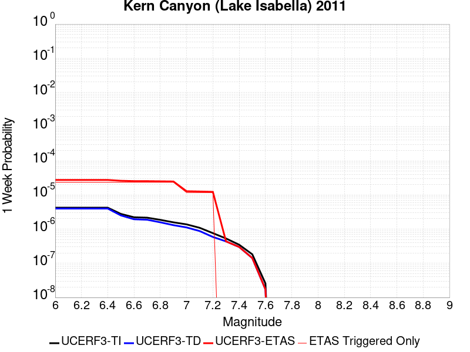 | 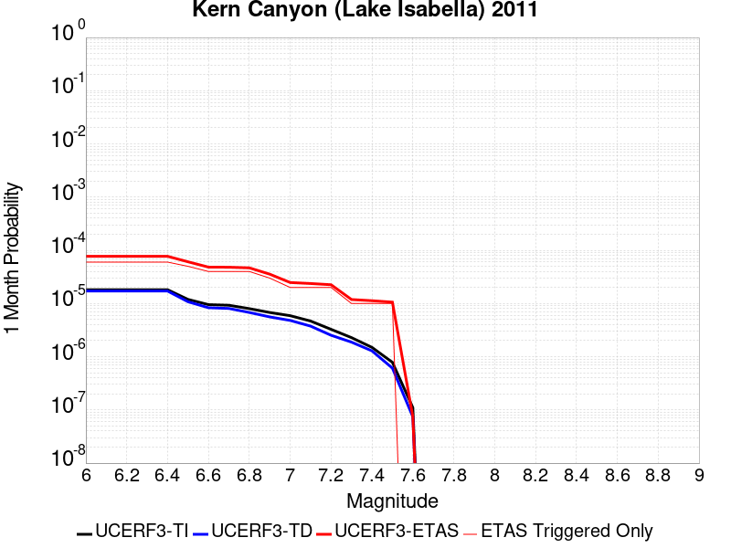 | 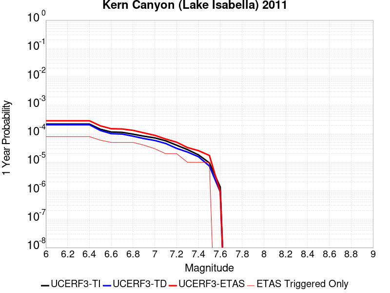 | 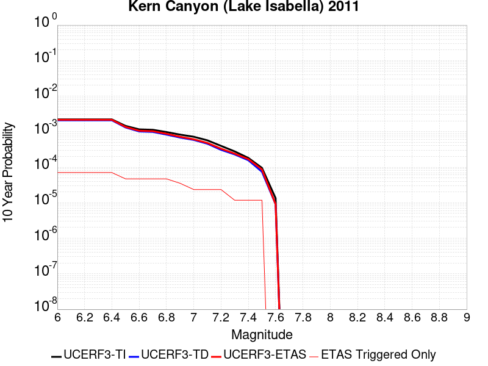 |

| Magnitude | 1 wk TI Prob | 1 wk TD Prob | 1 wk ETAS Prob | 1 wk ETAS/TD Gain | 1 wk ETAS Triggered Only | 1 mo TI Prob | 1 mo TD Prob | 1 mo ETAS Prob | 1 mo ETAS/TD Gain | 1 mo ETAS Triggered Only | 1 yr TI Prob | 1 yr TD Prob | 1 yr ETAS Prob | 1 yr ETAS/TD Gain | 1 yr ETAS Triggered Only | 10 yr TI Prob | 10 yr TD Prob | 10 yr ETAS Prob | 10 yr ETAS/TD Gain | 10 yr ETAS Triggered Only |
|-----|-----|-----|-----|-----|-----|-----|-----|-----|-----|-----|-----|-----|-----|-----|-----|-----|-----|-----|-----|-----|
| 6.0 | 4.2387383E-6 | 4.001639E-6 | 2.7475724E-5 | 6.866118 | 2.3474178E-5 | 1.8165894E-5 | 1.7149778E-5 | 6.409733E-5 | 3.737502 | 4.6948357E-5 | 2.2114732E-4 | 2.087804E-4 | 2.674536E-4 | 1.2810283 | 5.8685448E-5 | 0.0022092736 | 0.0020860266 | 0.002156302 | 1.0336888 | 7.042254E-5 |
| 6.1 | 4.2387383E-6 | 4.001639E-6 | 2.7475724E-5 | 6.866118 | 2.3474178E-5 | 1.8165894E-5 | 1.7149778E-5 | 6.409733E-5 | 3.737502 | 4.6948357E-5 | 2.2114732E-4 | 2.087804E-4 | 2.674536E-4 | 1.2810283 | 5.8685448E-5 | 0.0022092736 | 0.0020860266 | 0.002156302 | 1.0336888 | 7.042254E-5 |
| 6.2 | 4.2387383E-6 | 4.001639E-6 | 2.7475724E-5 | 6.866118 | 2.3474178E-5 | 1.8165894E-5 | 1.7149778E-5 | 6.409733E-5 | 3.737502 | 4.6948357E-5 | 2.2114732E-4 | 2.087804E-4 | 2.674536E-4 | 1.2810283 | 5.8685448E-5 | 0.0022092736 | 0.0020860266 | 0.002156302 | 1.0336888 | 7.042254E-5 |
| 6.3 | 4.2387383E-6 | 4.001639E-6 | 2.7475724E-5 | 6.866118 | 2.3474178E-5 | 1.8165894E-5 | 1.7149778E-5 | 6.409733E-5 | 3.737502 | 4.6948357E-5 | 2.2114732E-4 | 2.087804E-4 | 2.674536E-4 | 1.2810283 | 5.8685448E-5 | 0.0022092736 | 0.0020860266 | 0.002156302 | 1.0336888 | 7.042254E-5 |
| 6.4 | 4.2387383E-6 | 4.001639E-6 | 2.7475724E-5 | 6.866118 | 2.3474178E-5 | 1.8165894E-5 | 1.7149778E-5 | 6.409733E-5 | 3.737502 | 4.6948357E-5 | 2.2114732E-4 | 2.087804E-4 | 2.674536E-4 | 1.2810283 | 5.8685448E-5 | 0.0022092736 | 0.0020860266 | 0.002156302 | 1.0336888 | 7.042254E-5 |
| 6.5 | 2.7857532E-6 | 2.517867E-6 | 2.5991987E-5 | 10.323018 | 2.3474178E-5 | 1.1938888E-5 | 1.0790815E-5 | 5.7738667E-5 | 5.3507233 | 4.6948357E-5 | 1.4534626E-4 | 1.3137059E-4 | 1.7831278E-4 | 1.3573265 | 4.6948357E-5 | 0.0014525123 | 0.001312962 | 0.0013598488 | 1.0357107 | 4.6948357E-5 |
| 6.6 | 2.2233348E-6 | 1.9441236E-6 | 2.5418256E-5 | 13.074404 | 2.3474178E-5 | 9.528543E-6 | 8.331932E-6 | 5.52799E-5 | 6.634703 | 4.6948357E-5 | 1.1600384E-4 | 1.01436635E-4 | 1.4838023E-4 | 1.4627874 | 4.6948357E-5 | 0.001159433 | 0.001013912 | 0.0010608127 | 1.0462573 | 4.6948357E-5 |
| 6.7 | 2.1635126E-6 | 1.8835036E-6 | 2.5357638E-5 | 13.463016 | 2.3474178E-5 | 9.272164E-6 | 8.072134E-6 | 5.502011E-5 | 6.816056 | 4.6948357E-5 | 1.1288274E-4 | 9.827388E-5 | 1.4521762E-4 | 1.4776828 | 4.6948357E-5 | 0.0011282542 | 9.823124E-4 | 0.0010292146 | 1.0477468 | 4.6948357E-5 |
| 6.8 | 1.8685711E-6 | 1.5831425E-6 | 2.5057283E-5 | 15.82756 | 2.3474178E-5 | 8.008137E-6 | 6.784879E-6 | 5.3732918E-5 | 7.91951 | 4.6948357E-5 | 9.74947E-5 | 8.260282E-5 | 1.295473E-4 | 1.5683156 | 4.6948357E-5 | 9.745194E-4 | 8.2572614E-4 | 8.726357E-4 | 1.0568101 | 4.6948357E-5 |
| 6.9 | 1.5815071E-6 | 1.3064928E-6 | 2.478064E-5 | 18.9673 | 2.3474178E-5 | 6.77787E-6 | 5.599243E-6 | 4.0810315E-5 | 7.2885413 | 3.521127E-5 | 8.251744E-5 | 6.816868E-5 | 1.0337755E-4 | 1.5164963 | 3.521127E-5 | 8.248681E-4 | 6.8148033E-4 | 7.166676E-4 | 1.0516336 | 3.521127E-5 |
| 7.0 | 1.3772564E-6 | 1.1210718E-6 | 1.2858148E-5 | 11.469513 | 1.1737089E-5 | 5.9025137E-6 | 4.8045845E-6 | 2.827865E-5 | 5.8857636 | 2.3474178E-5 | 7.186073E-5 | 5.8494268E-5 | 8.1967075E-5 | 1.4012839 | 2.3474178E-5 | 7.18375E-4 | 5.847908E-4 | 6.082512E-4 | 1.0401177 | 2.3474178E-5 |
| 7.1 | 1.0916998E-6 | 8.763777E-7 | 1.2613456E-5 | 14.392717 | 1.1737089E-5 | 4.678705E-6 | 3.7558991E-6 | 2.722999E-5 | 7.2499256 | 2.3474178E-5 | 5.6961744E-5 | 4.5727127E-5 | 6.920023E-5 | 1.51333 | 2.3474178E-5 | 5.6947145E-4 | 4.571785E-4 | 4.8064196E-4 | 1.0513223 | 2.3474178E-5 |
| 7.2 | 7.6277024E-7 | 5.901454E-7 | 1.23272275E-5 | 20.888456 | 1.1737089E-5 | 3.2690114E-6 | 2.5291922E-6 | 2.6003312E-5 | 10.281271 | 2.3474178E-5 | 3.9799485E-5 | 3.0792486E-5 | 5.4265944E-5 | 1.7623111 | 2.3474178E-5 | 3.9792358E-4 | 3.0788282E-4 | 3.3134976E-4 | 1.0762204 | 2.3474178E-5 |
| 7.3 | 5.3265916E-7 | 4.3824414E-7 | 4.3824414E-7 | 1.0 | 0.0 | 2.282823E-6 | 1.878188E-6 | 1.3615255E-5 | 7.249144 | 1.1737089E-5 | 2.7793016E-5 | 2.2866701E-5 | 3.4603523E-5 | 1.5132712 | 1.1737089E-5 | 2.778954E-4 | 2.2864387E-4 | 2.4037827E-4 | 1.0513217 | 1.1737089E-5 |
| 7.4 | 3.4946007E-7 | 3.006571E-7 | 3.006571E-7 | 1.0 | 0.0 | 1.497685E-6 | 1.2885298E-6 | 1.3025604E-5 | 10.108889 | 1.1737089E-5 | 1.8234163E-5 | 1.568774E-5 | 2.7424645E-5 | 1.7481579 | 1.1737089E-5 | 1.8232666E-4 | 1.5686655E-4 | 1.686018E-4 | 1.0748104 | 1.1737089E-5 |
| 7.5 | 1.8317026E-7 | 1.4244812E-7 | 1.4244812E-7 | 1.0 | 0.0 | 7.850152E-7 | 6.104918E-7 | 1.2347574E-5 | 20.225618 | 1.1737089E-5 | 9.557518E-6 | 7.432713E-6 | 1.9169715E-5 | 2.5791006 | 1.1737089E-5 | 9.5571064E-5 | 7.432472E-5 | 8.606094E-5 | 1.1579046 | 1.1737089E-5 |
| 7.6 | 2.572245E-8 | 1.7352555E-8 | 1.7352555E-8 | 1.0 | 0.0 | 1.10239064E-7 | 7.436809E-8 | 7.436809E-8 | 1.0 | 0.0 | 1.3421597E-6 | 9.054312E-7 | 9.054312E-7 | 1.0 | 0.0 | 1.3421517E-5 | 9.05428E-6 | 9.05428E-6 | 1.0 | 0.0 |

## White Wolf
*[(top)](#table-of-contents)*

| 1 Week | 1 Month | 1 Year | 10 Year |
|-----|-----|-----|-----|
| 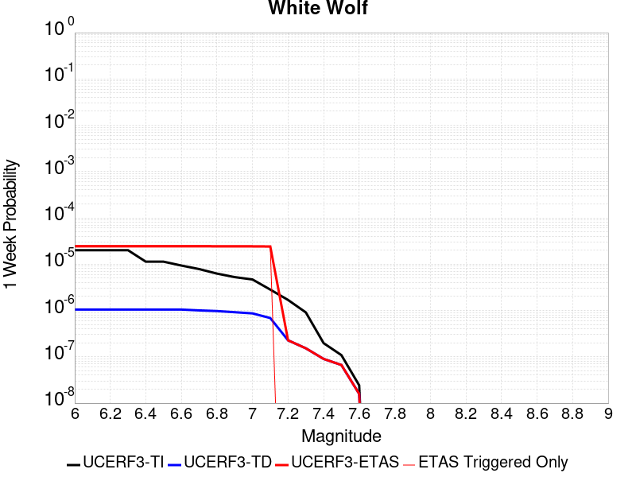 | 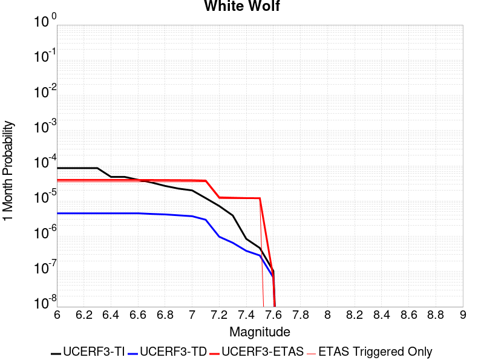 | 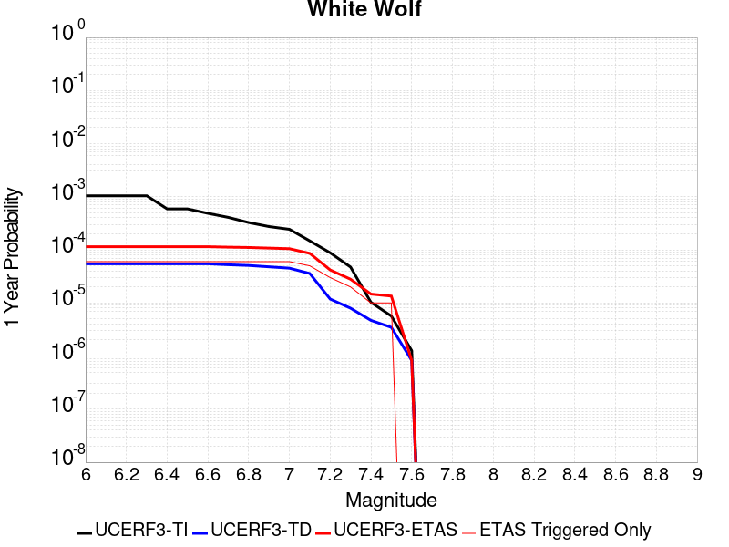 | 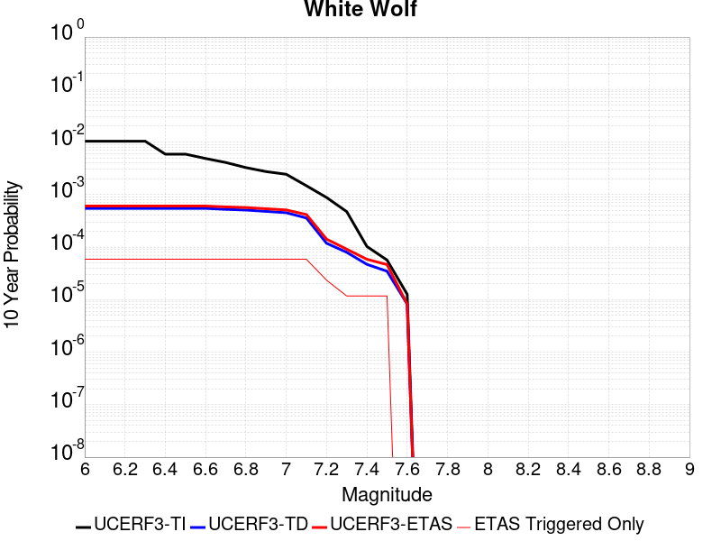 |

| Magnitude | 1 wk TI Prob | 1 wk TD Prob | 1 wk ETAS Prob | 1 wk ETAS/TD Gain | 1 wk ETAS Triggered Only | 1 mo TI Prob | 1 mo TD Prob | 1 mo ETAS Prob | 1 mo ETAS/TD Gain | 1 mo ETAS Triggered Only | 1 yr TI Prob | 1 yr TD Prob | 1 yr ETAS Prob | 1 yr ETAS/TD Gain | 1 yr ETAS Triggered Only | 10 yr TI Prob | 10 yr TD Prob | 10 yr ETAS Prob | 10 yr ETAS/TD Gain | 10 yr ETAS Triggered Only |
|-----|-----|-----|-----|-----|-----|-----|-----|-----|-----|-----|-----|-----|-----|-----|-----|-----|-----|-----|-----|-----|
| 6.0 | 2.0037822E-5 | 1.0469162E-6 | 2.452107E-5 | 23.422192 | 2.3474178E-5 | 8.587355E-5 | 4.486776E-6 | 3.9697887E-5 | 8.847753 | 3.521127E-5 | 0.001045009 | 5.4625183E-5 | 1.0157097E-4 | 1.8594167 | 4.6948357E-5 | 0.010401085 | 5.461226E-4 | 6.04776E-4 | 1.1073997 | 5.8685448E-5 |
| 6.1 | 2.0037822E-5 | 1.0469162E-6 | 2.452107E-5 | 23.422192 | 2.3474178E-5 | 8.587355E-5 | 4.486776E-6 | 3.9697887E-5 | 8.847753 | 3.521127E-5 | 0.001045009 | 5.4625183E-5 | 1.0157097E-4 | 1.8594167 | 4.6948357E-5 | 0.010401085 | 5.461226E-4 | 6.04776E-4 | 1.1073997 | 5.8685448E-5 |
| 6.2 | 2.0037822E-5 | 1.0469162E-6 | 2.452107E-5 | 23.422192 | 2.3474178E-5 | 8.587355E-5 | 4.486776E-6 | 3.9697887E-5 | 8.847753 | 3.521127E-5 | 0.001045009 | 5.4625183E-5 | 1.0157097E-4 | 1.8594167 | 4.6948357E-5 | 0.010401085 | 5.461226E-4 | 6.04776E-4 | 1.1073997 | 5.8685448E-5 |
| 6.3 | 2.0037822E-5 | 1.0469162E-6 | 2.452107E-5 | 23.422192 | 2.3474178E-5 | 8.587355E-5 | 4.486776E-6 | 3.9697887E-5 | 8.847753 | 3.521127E-5 | 0.001045009 | 5.4625183E-5 | 1.0157097E-4 | 1.8594167 | 4.6948357E-5 | 0.010401085 | 5.461226E-4 | 6.04776E-4 | 1.1073997 | 5.8685448E-5 |
| 6.4 | 1.132487E-5 | 1.0469162E-6 | 2.452107E-5 | 23.422192 | 2.3474178E-5 | 4.8534253E-5 | 4.486776E-6 | 3.9697887E-5 | 8.847753 | 3.521127E-5 | 5.907443E-4 | 5.4625183E-5 | 1.0157097E-4 | 1.8594167 | 4.6948357E-5 | 0.005891764 | 5.461226E-4 | 6.04776E-4 | 1.1073997 | 5.8685448E-5 |
| 6.5 | 1.132487E-5 | 1.0469162E-6 | 2.452107E-5 | 23.422192 | 2.3474178E-5 | 4.8534253E-5 | 4.486776E-6 | 3.9697887E-5 | 8.847753 | 3.521127E-5 | 5.907443E-4 | 5.4625183E-5 | 1.0157097E-4 | 1.8594167 | 4.6948357E-5 | 0.005891764 | 5.461226E-4 | 6.04776E-4 | 1.1073997 | 5.8685448E-5 |
| 6.6 | 9.347473E-6 | 1.0469162E-6 | 2.452107E-5 | 23.422192 | 2.3474178E-5 | 4.0059982E-5 | 4.486776E-6 | 3.9697887E-5 | 8.847753 | 3.521127E-5 | 4.8762115E-4 | 5.4625183E-5 | 1.0157097E-4 | 1.8594167 | 4.6948357E-5 | 0.0048655253 | 5.461226E-4 | 6.04776E-4 | 1.1073997 | 5.8685448E-5 |
| 6.7 | 7.842647E-6 | 1.0048342E-6 | 2.447899E-5 | 24.361223 | 2.3474178E-5 | 3.361091E-5 | 4.3064256E-6 | 3.951754E-5 | 9.176414 | 3.521127E-5 | 4.0913603E-4 | 5.2429517E-5 | 9.9375415E-5 | 1.8954096 | 4.6948357E-5 | 0.004083836 | 5.2417646E-4 | 5.8283116E-4 | 1.1118988 | 5.8685448E-5 |
| 6.8 | 6.26597E-6 | 9.734822E-7 | 2.4447638E-5 | 25.113596 | 2.3474178E-5 | 2.685388E-5 | 4.17206E-6 | 3.938318E-5 | 9.439744 | 3.521127E-5 | 3.2689696E-4 | 5.0793697E-5 | 9.773967E-5 | 1.924248 | 4.6948357E-5 | 0.003264165 | 5.078258E-4 | 5.6648144E-4 | 1.1155034 | 5.8685448E-5 |
| 6.9 | 5.258436E-6 | 9.183254E-7 | 2.4392482E-5 | 26.561916 | 2.3474178E-5 | 2.2535958E-5 | 3.9356746E-6 | 3.9146802E-5 | 9.946657 | 3.521127E-5 | 2.7434074E-4 | 4.7915833E-5 | 9.486194E-5 | 1.979762 | 4.6948357E-5 | 0.0027400232 | 4.790598E-4 | 5.3771713E-4 | 1.1224426 | 5.8685448E-5 |
| 7.0 | 4.675028E-6 | 8.6611794E-7 | 2.4340276E-5 | 28.102726 | 2.3474178E-5 | 2.003568E-5 | 3.7119291E-6 | 3.8923066E-5 | 10.48594 | 3.521127E-5 | 2.4390711E-4 | 4.5191846E-5 | 9.2138085E-5 | 2.038821 | 4.6948357E-5 | 0.0024363957 | 4.518313E-4 | 5.104902E-4 | 1.1298249 | 5.8685448E-5 |
| 7.1 | 2.8270078E-6 | 6.8741696E-7 | 2.416158E-5 | 35.14836 | 2.3474178E-5 | 1.2115692E-5 | 2.9460696E-6 | 3.815723E-5 | 12.951912 | 3.521127E-5 | 1.4749856E-4 | 3.5867848E-5 | 8.281452E-5 | 2.308879 | 4.6948357E-5 | 0.001474007 | 3.586247E-4 | 4.172891E-4 | 1.1635816 | 5.8685448E-5 |
| 7.2 | 1.6881406E-6 | 2.2706382E-7 | 2.2706382E-7 | 1.0 | 0.0 | 7.2348685E-6 | 9.731303E-7 | 1.27102085E-5 | 13.061157 | 1.1737089E-5 | 8.808096E-5 | 1.1847799E-5 | 3.53217E-5 | 2.981288 | 2.3474178E-5 | 8.8046055E-4 | 1.1847183E-4 | 1.4194322E-4 | 1.198118 | 2.3474178E-5 |
| 7.3 | 9.086107E-7 | 1.5266386E-7 | 1.5266386E-7 | 1.0 | 0.0 | 3.8940398E-6 | 6.5427355E-7 | 1.2391355E-5 | 18.939104 | 1.1737089E-5 | 4.7408903E-5 | 7.965752E-6 | 1.9702748E-5 | 2.4734323 | 1.1737089E-5 | 4.739879E-4 | 7.965475E-5 | 9.13909E-5 | 1.1473378 | 1.1737089E-5 |
| 7.4 | 1.9717383E-7 | 9.003913E-8 | 9.003913E-8 | 1.0 | 0.0 | 8.450304E-7 | 3.8588192E-7 | 1.2122967E-5 | 31.41626 | 1.1737089E-5 | 1.0288197E-5 | 4.6981027E-6 | 1.6435137E-5 | 3.4982498 | 1.1737089E-5 | 1.028772E-4 | 4.6980065E-5 | 5.87166E-5 | 1.2498195 | 1.1737089E-5 |
| 7.5 | 1.086975E-7 | 6.6597195E-8 | 6.6597195E-8 | 1.0 | 0.0 | 4.6584634E-7 | 2.8541652E-7 | 1.2022502E-5 | 42.122658 | 1.1737089E-5 | 5.6716644E-6 | 3.474941E-6 | 1.5211989E-5 | 4.3776255 | 1.1737089E-5 | 5.6715195E-5 | 3.474889E-5 | 4.648557E-5 | 1.337757 | 1.1737089E-5 |
| 7.6 | 2.4217808E-8 | 1.5820765E-8 | 1.5820765E-8 | 1.0 | 0.0 | 1.03790605E-7 | 6.780328E-8 | 6.780328E-8 | 1.0 | 0.0 | 1.2636499E-6 | 8.255046E-7 | 8.255046E-7 | 1.0 | 0.0 | 1.2636427E-5 | 8.2550205E-6 | 8.2550205E-6 | 1.0 | 0.0 |

## Dry Mountain
*[(top)](#table-of-contents)*

| 1 Week | 1 Month | 1 Year | 10 Year |
|-----|-----|-----|-----|
| 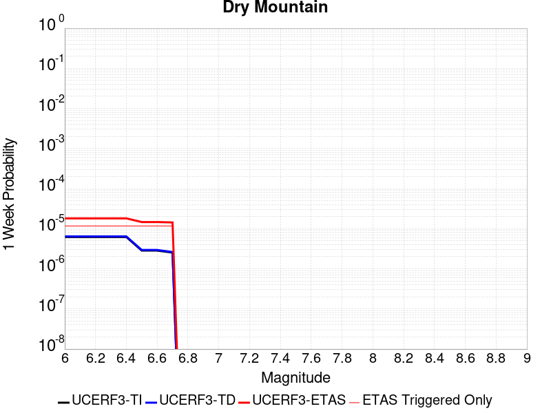 | 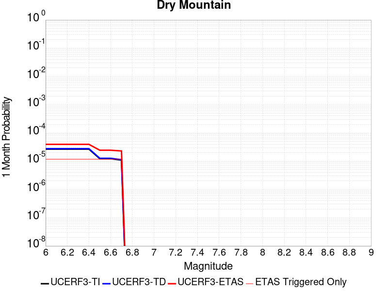 | 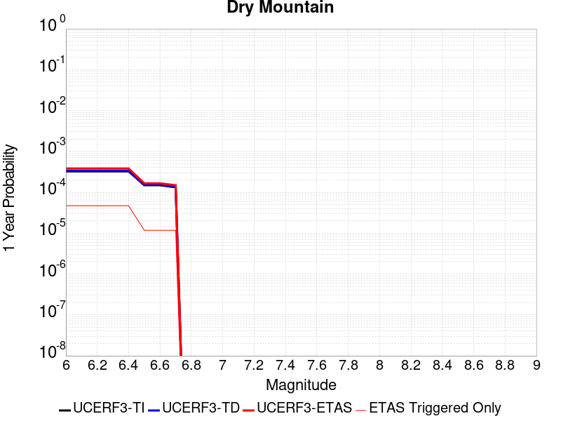 |  |

| Magnitude | 1 wk TI Prob | 1 wk TD Prob | 1 wk ETAS Prob | 1 wk ETAS/TD Gain | 1 wk ETAS Triggered Only | 1 mo TI Prob | 1 mo TD Prob | 1 mo ETAS Prob | 1 mo ETAS/TD Gain | 1 mo ETAS Triggered Only | 1 yr TI Prob | 1 yr TD Prob | 1 yr ETAS Prob | 1 yr ETAS/TD Gain | 1 yr ETAS Triggered Only | 10 yr TI Prob | 10 yr TD Prob | 10 yr ETAS Prob | 10 yr ETAS/TD Gain | 10 yr ETAS Triggered Only |
|-----|-----|-----|-----|-----|-----|-----|-----|-----|-----|-----|-----|-----|-----|-----|-----|-----|-----|-----|-----|-----|
| 6.0 | 6.222801E-6 | 6.439381E-6 | 1.8176395E-5 | 2.8226929 | 1.1737089E-5 | 2.6668875E-5 | 2.7597147E-5 | 3.933391E-5 | 1.4252892 | 1.1737089E-5 | 3.2464517E-4 | 3.3595937E-4 | 3.8289194E-4 | 1.1396972 | 4.6948357E-5 | 0.0032417132 | 0.0033560768 | 0.0034145652 | 1.0174277 | 5.8685448E-5 |
| 6.1 | 6.222801E-6 | 6.439381E-6 | 1.8176395E-5 | 2.8226929 | 1.1737089E-5 | 2.6668875E-5 | 2.7597147E-5 | 3.933391E-5 | 1.4252892 | 1.1737089E-5 | 3.2464517E-4 | 3.3595937E-4 | 3.8289194E-4 | 1.1396972 | 4.6948357E-5 | 0.0032417132 | 0.0033560768 | 0.0034145652 | 1.0174277 | 5.8685448E-5 |
| 6.2 | 6.222801E-6 | 6.439381E-6 | 1.8176395E-5 | 2.8226929 | 1.1737089E-5 | 2.6668875E-5 | 2.7597147E-5 | 3.933391E-5 | 1.4252892 | 1.1737089E-5 | 3.2464517E-4 | 3.3595937E-4 | 3.8289194E-4 | 1.1396972 | 4.6948357E-5 | 0.0032417132 | 0.0033560768 | 0.0034145652 | 1.0174277 | 5.8685448E-5 |
| 6.3 | 6.222801E-6 | 6.439381E-6 | 1.8176395E-5 | 2.8226929 | 1.1737089E-5 | 2.6668875E-5 | 2.7597147E-5 | 3.933391E-5 | 1.4252892 | 1.1737089E-5 | 3.2464517E-4 | 3.3595937E-4 | 3.8289194E-4 | 1.1396972 | 4.6948357E-5 | 0.0032417132 | 0.0033560768 | 0.0034145652 | 1.0174277 | 5.8685448E-5 |
| 6.4 | 6.222801E-6 | 6.439381E-6 | 1.8176395E-5 | 2.8226929 | 1.1737089E-5 | 2.6668875E-5 | 2.7597147E-5 | 3.933391E-5 | 1.4252892 | 1.1737089E-5 | 3.2464517E-4 | 3.3595937E-4 | 3.8289194E-4 | 1.1396972 | 4.6948357E-5 | 0.0032417132 | 0.0033560768 | 0.0034145652 | 1.0174277 | 5.8685448E-5 |
| 6.5 | 2.8528623E-6 | 2.9521684E-6 | 1.4689223E-5 | 4.9757404 | 1.1737089E-5 | 1.22264955E-5 | 1.2652138E-5 | 2.4389079E-5 | 1.9276646 | 1.1737089E-5 | 1.4884741E-4 | 1.540376E-4 | 1.6577287E-4 | 1.0761845 | 1.1737089E-5 | 0.0014874774 | 0.0015401616 | 0.0015518806 | 1.0076089 | 1.1737089E-5 |
| 6.6 | 2.8528623E-6 | 2.9521684E-6 | 1.4689223E-5 | 4.9757404 | 1.1737089E-5 | 1.22264955E-5 | 1.2652138E-5 | 2.4389079E-5 | 1.9276646 | 1.1737089E-5 | 1.4884741E-4 | 1.540376E-4 | 1.6577287E-4 | 1.0761845 | 1.1737089E-5 | 0.0014874774 | 0.0015401616 | 0.0015518806 | 1.0076089 | 1.1737089E-5 |
| 6.7 | 2.541E-6 | 2.6293578E-6 | 1.43664165E-5 | 5.4638495 | 1.1737089E-5 | 1.0889954E-5 | 1.1268677E-5 | 2.3005634E-5 | 2.041556 | 1.1737089E-5 | 1.3257713E-4 | 1.3719614E-4 | 1.4893162E-4 | 1.0855379 | 1.1737089E-5 | 0.0013249806 | 0.0013719613 | 0.0013836824 | 1.0085433 | 1.1737089E-5 |

## Cleghorn Pass
*[(top)](#table-of-contents)*

| 1 Week | 1 Month | 1 Year | 10 Year |
|-----|-----|-----|-----|
| 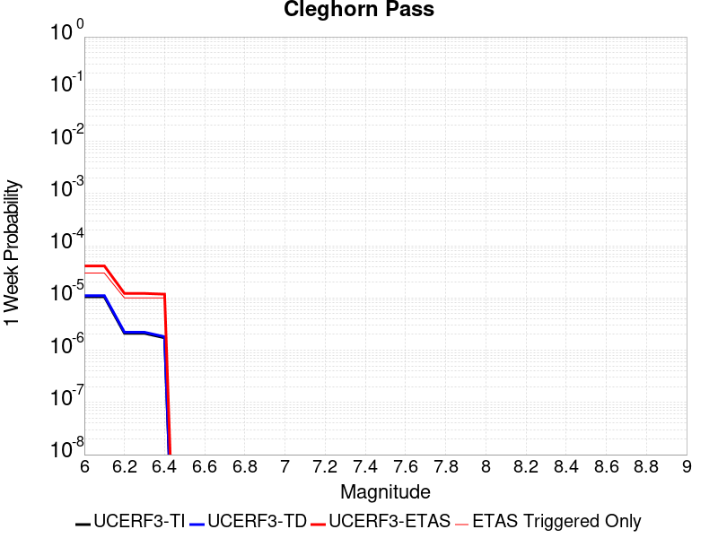 | 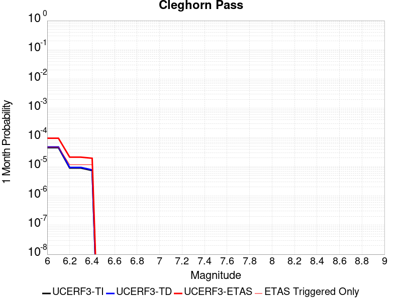 | 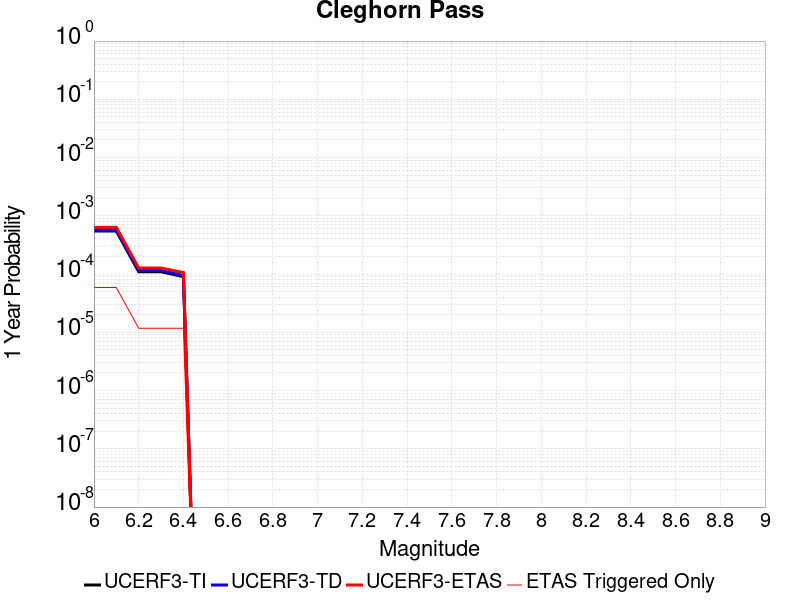 | 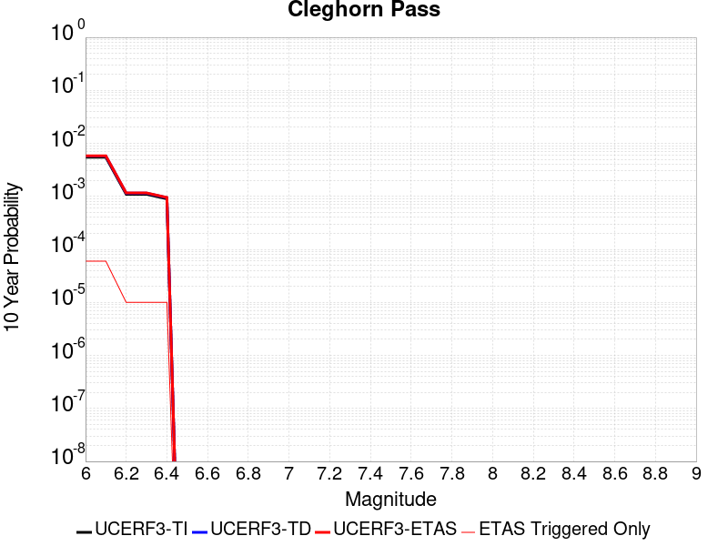 |

| Magnitude | 1 wk TI Prob | 1 wk TD Prob | 1 wk ETAS Prob | 1 wk ETAS/TD Gain | 1 wk ETAS Triggered Only | 1 mo TI Prob | 1 mo TD Prob | 1 mo ETAS Prob | 1 mo ETAS/TD Gain | 1 mo ETAS Triggered Only | 1 yr TI Prob | 1 yr TD Prob | 1 yr ETAS Prob | 1 yr ETAS/TD Gain | 1 yr ETAS Triggered Only | 10 yr TI Prob | 10 yr TD Prob | 10 yr ETAS Prob | 10 yr ETAS/TD Gain | 10 yr ETAS Triggered Only |
|-----|-----|-----|-----|-----|-----|-----|-----|-----|-----|-----|-----|-----|-----|-----|-----|-----|-----|-----|-----|-----|
| 6.0 | 1.0522846E-5 | 1.1040642E-5 | 4.625152E-5 | 4.1892056 | 3.521127E-5 | 4.509713E-5 | 4.7316473E-5 | 9.426261E-5 | 1.9921732 | 4.6948357E-5 | 5.4891926E-4 | 5.759784E-4 | 6.346301E-4 | 1.1018295 | 5.8685448E-5 | 0.0054756533 | 0.005750022 | 0.0058083697 | 1.0101475 | 5.8685448E-5 |
| 6.1 | 1.0522846E-5 | 1.1040642E-5 | 4.625152E-5 | 4.1892056 | 3.521127E-5 | 4.509713E-5 | 4.7316473E-5 | 9.426261E-5 | 1.9921732 | 4.6948357E-5 | 5.4891926E-4 | 5.759784E-4 | 6.346301E-4 | 1.1018295 | 5.8685448E-5 | 0.0054756533 | 0.005750022 | 0.0058083697 | 1.0101475 | 5.8685448E-5 |
| 6.2 | 2.1045846E-6 | 2.2082024E-6 | 1.3945266E-5 | 6.315212 | 1.1737089E-5 | 9.019617E-6 | 9.463714E-6 | 2.1200693E-5 | 2.2402084 | 1.1737089E-5 | 1.098083E-4 | 1.1521882E-4 | 1.2695456E-4 | 1.1018561 | 1.1737089E-5 | 0.0010975406 | 0.0011520023 | 0.0011637259 | 1.0101767 | 1.1737089E-5 |
| 6.3 | 2.1045846E-6 | 2.2082024E-6 | 1.3945266E-5 | 6.315212 | 1.1737089E-5 | 9.019617E-6 | 9.463714E-6 | 2.1200693E-5 | 2.2402084 | 1.1737089E-5 | 1.098083E-4 | 1.1521882E-4 | 1.2695456E-4 | 1.1018561 | 1.1737089E-5 | 0.0010975406 | 0.0011520023 | 0.0011637259 | 1.0101767 | 1.1737089E-5 |
| 6.4 | 1.7259927E-6 | 1.810877E-6 | 1.3547945E-5 | 7.481427 | 1.1737089E-5 | 7.3970905E-6 | 7.760902E-6 | 1.94979E-5 | 2.512324 | 1.1737089E-5 | 9.005586E-5 | 9.4488976E-5 | 1.0622496E-4 | 1.1242048 | 1.1737089E-5 | 9.001937E-4 | 9.448898E-4 | 9.566158E-4 | 1.0124099 | 1.1737089E-5 |

## San Diego Trough south
*[(top)](#table-of-contents)*

| 1 Week | 1 Month | 1 Year | 10 Year |
|-----|-----|-----|-----|
| 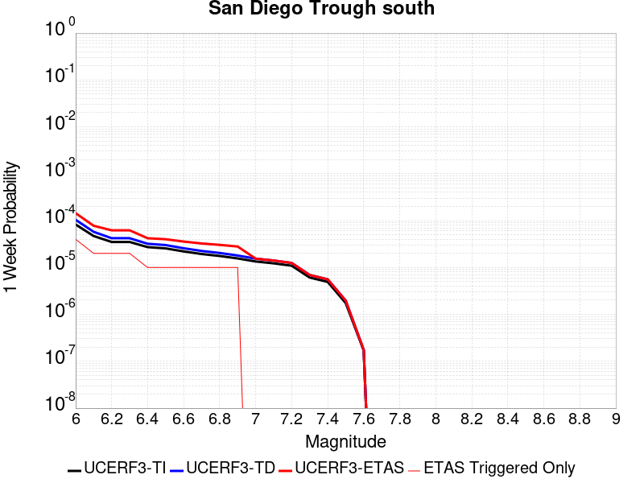 | 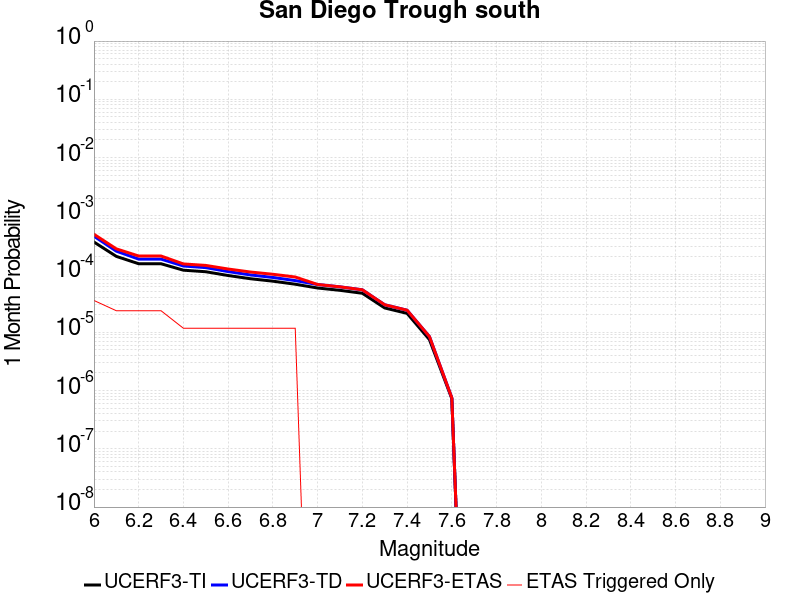 | 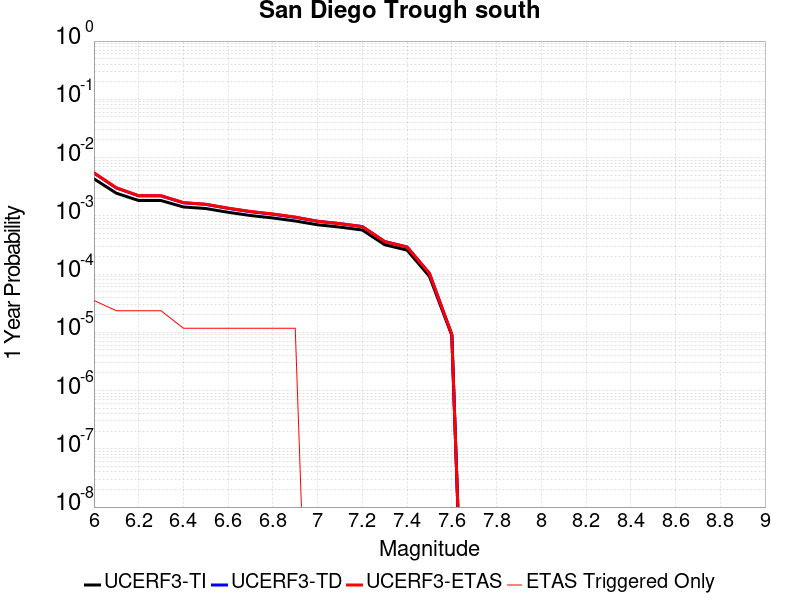 | 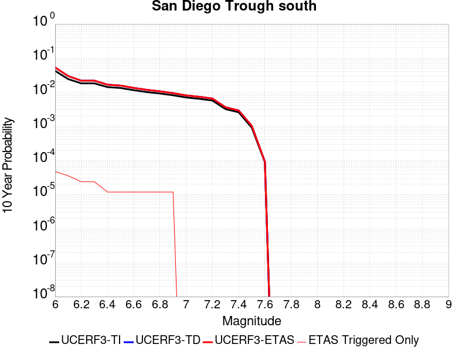 |

| Magnitude | 1 wk TI Prob | 1 wk TD Prob | 1 wk ETAS Prob | 1 wk ETAS/TD Gain | 1 wk ETAS Triggered Only | 1 mo TI Prob | 1 mo TD Prob | 1 mo ETAS Prob | 1 mo ETAS/TD Gain | 1 mo ETAS Triggered Only | 1 yr TI Prob | 1 yr TD Prob | 1 yr ETAS Prob | 1 yr ETAS/TD Gain | 1 yr ETAS Triggered Only | 10 yr TI Prob | 10 yr TD Prob | 10 yr ETAS Prob | 10 yr ETAS/TD Gain | 10 yr ETAS Triggered Only |
|-----|-----|-----|-----|-----|-----|-----|-----|-----|-----|-----|-----|-----|-----|-----|-----|-----|-----|-----|-----|-----|
| 6.0 | 8.279495E-5 | 1.04241306E-4 | 1.3944891E-4 | 1.3377509 | 3.521127E-5 | 3.5478722E-4 | 4.4667677E-4 | 4.8187232E-4 | 1.0787942 | 3.521127E-5 | 0.004310982 | 0.0054256152 | 0.0054606358 | 1.0064546 | 3.521127E-5 | 0.042283054 | 0.05299221 | 0.05303667 | 1.000839 | 4.6948357E-5 |
| 6.1 | 4.6961468E-5 | 5.772944E-5 | 8.120226E-5 | 1.4066006 | 2.3474178E-5 | 2.0124791E-4 | 2.473894E-4 | 2.7085777E-4 | 1.0948641 | 2.3474178E-5 | 0.00244744 | 0.0030079768 | 0.0030313802 | 1.0077806 | 2.3474178E-5 | 0.024206603 | 0.029679462 | 0.029713629 | 1.0011512 | 3.521127E-5 |
| 6.2 | 3.5079658E-5 | 4.214154E-5 | 6.5614724E-5 | 1.5570084 | 2.3474178E-5 | 1.5033272E-4 | 1.8059435E-4 | 2.0406429E-4 | 1.1299595 | 2.3474178E-5 | 0.0018287642 | 0.0021965632 | 0.0022199857 | 1.0106633 | 2.3474178E-5 | 0.018137876 | 0.021751117 | 0.021774082 | 1.0010557 | 2.3474178E-5 |
| 6.3 | 3.5079658E-5 | 4.214154E-5 | 6.5614724E-5 | 1.5570084 | 2.3474178E-5 | 1.5033272E-4 | 1.8059435E-4 | 2.0406429E-4 | 1.1299595 | 2.3474178E-5 | 0.0018287642 | 0.0021965632 | 0.0022199857 | 1.0106633 | 2.3474178E-5 | 0.018137876 | 0.021751117 | 0.021774082 | 1.0010557 | 2.3474178E-5 |
| 6.4 | 2.7196904E-5 | 3.2087162E-5 | 4.3823875E-5 | 1.365776 | 1.1737089E-5 | 1.16552954E-4 | 1.3750927E-4 | 1.4924473E-4 | 1.0853431 | 1.1737089E-5 | 0.0014181085 | 0.0016729041 | 0.0016846216 | 1.0070043 | 1.1737089E-5 | 0.014090929 | 0.016604643 | 0.016616184 | 1.0006951 | 1.1737089E-5 |
| 6.5 | 2.5584688E-5 | 3.010164E-5 | 4.1838375E-5 | 1.3899035 | 1.1737089E-5 | 1.0964406E-4 | 1.2900073E-4 | 1.4073632E-4 | 1.0909729 | 1.1737089E-5 | 0.0013340989 | 0.0015694655 | 0.0015811842 | 1.0074667 | 1.1737089E-5 | 0.013261181 | 0.015585314 | 0.0155968685 | 1.0007414 | 1.1737089E-5 |
| 6.6 | 2.2034688E-5 | 2.5742738E-5 | 3.7479527E-5 | 1.4559262 | 1.1737089E-5 | 9.443096E-5 | 1.1032141E-4 | 1.220572E-4 | 1.1063782 | 1.1737089E-5 | 0.0011490905 | 0.0013423424 | 0.0013540637 | 1.008732 | 1.1737089E-5 | 0.011431668 | 0.013343317 | 0.013354898 | 1.0008678 | 1.1737089E-5 |
| 6.7 | 1.9394853E-5 | 2.254176E-5 | 3.4278586E-5 | 1.5206703 | 1.1737089E-5 | 8.311815E-5 | 9.6603995E-5 | 1.08339955E-4 | 1.1214852 | 1.1737089E-5 | 0.0010114936 | 0.0011755243 | 0.0011872476 | 1.0099728 | 1.1737089E-5 | 0.01006902 | 0.011693766 | 0.011705366 | 1.000992 | 1.1737089E-5 |
| 6.8 | 1.7615313E-5 | 2.0403182E-5 | 3.2140033E-5 | 1.575246 | 1.1737089E-5 | 7.549201E-5 | 8.74393E-5 | 9.917537E-5 | 1.1342195 | 1.1737089E-5 | 9.1872766E-4 | 0.0010640579 | 0.0010757826 | 1.0110188 | 1.1737089E-5 | 0.009149387 | 0.010590198 | 0.010601811 | 1.0010966 | 1.1737089E-5 |
| 6.9 | 1.5621423E-5 | 1.8026114E-5 | 2.9762992E-5 | 1.6511041 | 1.1737089E-5 | 6.6947236E-5 | 7.725251E-5 | 8.8988694E-5 | 1.1519197 | 1.1737089E-5 | 8.147778E-4 | 9.40147E-4 | 9.51873E-4 | 1.0124726 | 1.1737089E-5 | 0.008117969 | 0.009362142 | 0.009373769 | 1.0012419 | 1.1737089E-5 |
| 7.0 | 1.3444376E-5 | 1.544809E-5 | 1.544809E-5 | 1.0 | 0.0 | 5.7617483E-5 | 6.620443E-5 | 6.620443E-5 | 1.0 | 0.0 | 7.0126704E-4 | 8.057436E-4 | 8.057436E-4 | 1.0 | 0.0 | 0.006990582 | 0.008028555 | 0.008028555 | 1.0 | 0.0 |
| 7.1 | 1.2268361E-5 | 1.407303E-5 | 1.407303E-5 | 1.0 | 0.0 | 5.2577634E-5 | 6.0311606E-5 | 6.0311606E-5 | 1.0 | 0.0 | 6.399447E-4 | 7.3404907E-4 | 7.3404907E-4 | 1.0 | 0.0 | 0.0063810493 | 0.0073165493 | 0.0073165493 | 1.0 | 0.0 |
| 7.2 | 1.0922655E-5 | 1.2513563E-5 | 1.2513563E-5 | 1.0 | 0.0 | 4.681054E-5 | 5.3628468E-5 | 5.3628468E-5 | 1.0 | 0.0 | 5.697693E-4 | 6.5273355E-4 | 6.5273355E-4 | 1.0 | 0.0 | 0.0056831064 | 0.0065084435 | 0.0065084435 | 1.0 | 0.0 |
| 7.3 | 6.1106753E-6 | 6.928925E-6 | 6.928925E-6 | 1.0 | 0.0 | 2.6188345E-5 | 2.9695057E-5 | 2.9695057E-5 | 1.0 | 0.0 | 3.1879646E-4 | 3.6147775E-4 | 3.6147775E-4 | 1.0 | 0.0 | 0.0031833951 | 0.003608943 | 0.003608943 | 1.0 | 0.0 |
| 7.4 | 4.933187E-6 | 5.5895525E-6 | 5.5895525E-6 | 1.0 | 0.0 | 2.114206E-5 | 2.3955008E-5 | 2.3955008E-5 | 1.0 | 0.0 | 2.5737417E-4 | 2.9161357E-4 | 2.9161357E-4 | 1.0 | 0.0 | 0.002570763 | 0.0029123505 | 0.0029123505 | 1.0 | 0.0 |
| 7.5 | 1.7489613E-6 | 1.969678E-6 | 1.969678E-6 | 1.0 | 0.0 | 7.495527E-6 | 8.4414505E-6 | 8.4414505E-6 | 1.0 | 0.0 | 9.125422E-5 | 1.02770035E-4 | 1.02770035E-4 | 1.0 | 0.0 | 9.1216754E-4 | 0.0010272472 | 0.0010272472 | 1.0 | 0.0 |
| 7.6 | 1.6988751E-7 | 1.7533823E-7 | 1.7533823E-7 | 1.0 | 0.0 | 7.2808916E-7 | 7.5144936E-7 | 7.5144936E-7 | 1.0 | 0.0 | 8.864449E-6 | 9.14886E-6 | 9.14886E-6 | 1.0 | 0.0 | 8.8640954E-5 | 9.1485024E-5 | 9.1485024E-5 | 1.0 | 0.0 |

## Owens Valley
*[(top)](#table-of-contents)*

| 1 Week | 1 Month | 1 Year | 10 Year |
|-----|-----|-----|-----|
| 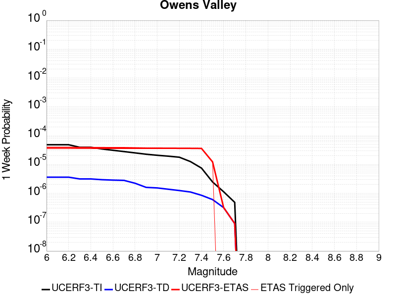 | 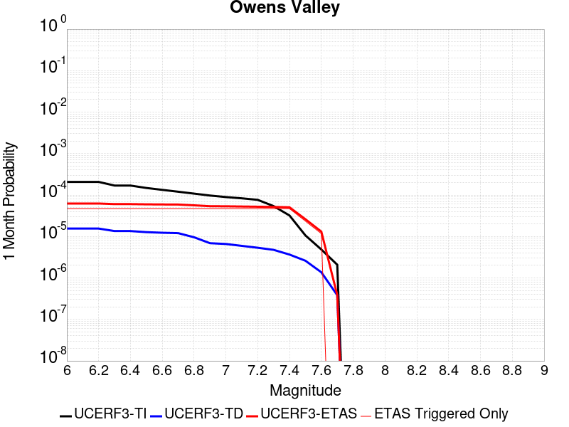 | 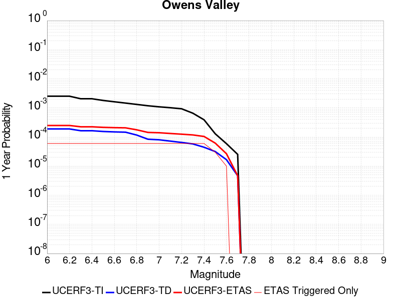 | 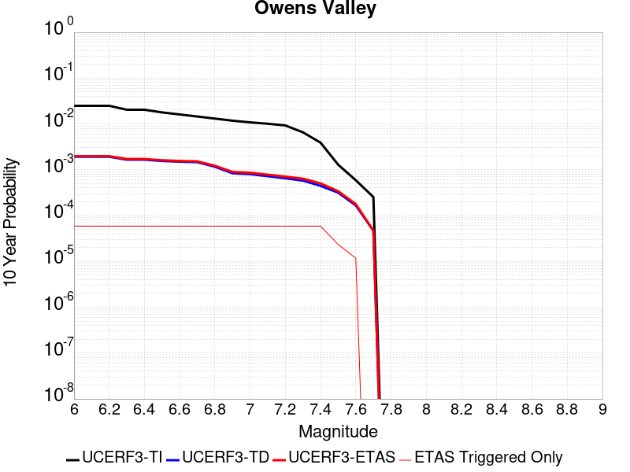 |

| Magnitude | 1 wk TI Prob | 1 wk TD Prob | 1 wk ETAS Prob | 1 wk ETAS/TD Gain | 1 wk ETAS Triggered Only | 1 mo TI Prob | 1 mo TD Prob | 1 mo ETAS Prob | 1 mo ETAS/TD Gain | 1 mo ETAS Triggered Only | 1 yr TI Prob | 1 yr TD Prob | 1 yr ETAS Prob | 1 yr ETAS/TD Gain | 1 yr ETAS Triggered Only | 10 yr TI Prob | 10 yr TD Prob | 10 yr ETAS Prob | 10 yr ETAS/TD Gain | 10 yr ETAS Triggered Only |
|-----|-----|-----|-----|-----|-----|-----|-----|-----|-----|-----|-----|-----|-----|-----|-----|-----|-----|-----|-----|-----|
| 6.0 | 4.83821E-5 | 3.626567E-6 | 3.883771E-5 | 10.709221 | 3.521127E-5 | 2.0733538E-4 | 1.5542342E-5 | 6.248997E-5 | 4.0206275 | 4.6948357E-5 | 0.002521386 | 1.8921259E-4 | 2.4788693E-4 | 1.3100975 | 5.8685448E-5 | 0.024929691 | 0.001925011 | 0.0019835834 | 1.0304271 | 5.8685448E-5 |
| 6.1 | 4.83821E-5 | 3.626567E-6 | 3.883771E-5 | 10.709221 | 3.521127E-5 | 2.0733538E-4 | 1.5542342E-5 | 6.248997E-5 | 4.0206275 | 4.6948357E-5 | 0.002521386 | 1.8921259E-4 | 2.4788693E-4 | 1.3100975 | 5.8685448E-5 | 0.024929691 | 0.001925011 | 0.0019835834 | 1.0304271 | 5.8685448E-5 |
| 6.2 | 4.83821E-5 | 3.626567E-6 | 3.883771E-5 | 10.709221 | 3.521127E-5 | 2.0733538E-4 | 1.5542342E-5 | 6.248997E-5 | 4.0206275 | 4.6948357E-5 | 0.002521386 | 1.8921259E-4 | 2.4788693E-4 | 1.3100975 | 5.8685448E-5 | 0.024929691 | 0.001925011 | 0.0019835834 | 1.0304271 | 5.8685448E-5 |
| 6.3 | 3.953008E-5 | 3.1553948E-6 | 3.836655E-5 | 12.159034 | 3.521127E-5 | 1.6940363E-4 | 1.3523055E-5 | 6.047078E-5 | 4.47168 | 4.6948357E-5 | 0.002060538 | 1.6463149E-4 | 2.2330727E-4 | 1.3564068 | 5.8685448E-5 | 0.020415364 | 0.0016592 | 0.0017177879 | 1.035311 | 5.8685448E-5 |
| 6.4 | 3.953008E-5 | 3.1553948E-6 | 3.836655E-5 | 12.159034 | 3.521127E-5 | 1.6940363E-4 | 1.3523055E-5 | 6.047078E-5 | 4.47168 | 4.6948357E-5 | 0.002060538 | 1.6463149E-4 | 2.2330727E-4 | 1.3564068 | 5.8685448E-5 | 0.020415364 | 0.0016592 | 0.0017177879 | 1.035311 | 5.8685448E-5 |
| 6.5 | 3.457342E-5 | 2.9715961E-6 | 3.818276E-5 | 12.849242 | 3.521127E-5 | 1.4816338E-4 | 1.2735354E-5 | 5.9683112E-5 | 4.686412 | 4.6948357E-5 | 0.0018023965 | 1.550426E-4 | 2.1371894E-4 | 1.378453 | 5.8685448E-5 | 0.017878477 | 0.001555719 | 0.0016143131 | 1.0376637 | 5.8685448E-5 |
| 6.6 | 3.1127765E-5 | 2.8744932E-6 | 3.8085658E-5 | 13.249521 | 3.521127E-5 | 1.3339789E-4 | 1.2319203E-5 | 5.9266982E-5 | 4.810943 | 4.6948357E-5 | 0.0016229092 | 1.4997667E-4 | 2.086533E-4 | 1.3912385 | 5.8685448E-5 | 0.016111081 | 0.0015012559 | 0.0015598532 | 1.0390322 | 5.8685448E-5 |
| 6.7 | 2.806885E-5 | 2.8104134E-6 | 3.8021582E-5 | 13.528822 | 3.521127E-5 | 1.2028952E-4 | 1.20445775E-5 | 5.899237E-5 | 4.897836 | 4.6948357E-5 | 0.001463541 | 1.4663354E-4 | 2.0531038E-4 | 1.4001597 | 5.8685448E-5 | 0.014539397 | 0.0014657511 | 0.0015243505 | 1.0399791 | 5.8685448E-5 |
| 6.8 | 2.524524E-5 | 2.2353688E-6 | 3.7446556E-5 | 16.751848 | 3.521127E-5 | 1.0818939E-4 | 9.580118E-6 | 5.6528024E-5 | 5.900556 | 4.6948357E-5 | 0.0013164099 | 1.16632E-4 | 1.753106E-4 | 1.503109 | 5.8685448E-5 | 0.01308639 | 0.0011659812 | 0.0012245981 | 1.0502727 | 5.8685448E-5 |
| 6.9 | 2.2704568E-5 | 1.6081682E-6 | 3.681938E-5 | 22.89523 | 3.521127E-5 | 9.730166E-5 | 6.8921313E-6 | 5.3840165E-5 | 7.8118305 | 4.6948357E-5 | 0.0011840039 | 8.390849E-5 | 1.4258901E-4 | 1.6993395 | 5.8685448E-5 | 0.011777153 | 8.3897985E-4 | 8.9761603E-4 | 1.0698899 | 5.8685448E-5 |
| 7.0 | 2.0871712E-5 | 1.5395453E-6 | 3.675076E-5 | 23.871178 | 3.521127E-5 | 8.944713E-5 | 6.598035E-6 | 5.3546082E-5 | 8.115459 | 4.6948357E-5 | 0.0010884746 | 8.032813E-5 | 1.3900886E-4 | 1.7305129 | 5.8685448E-5 | 0.010831586 | 8.0316263E-4 | 8.618009E-4 | 1.0730093 | 5.8685448E-5 |
| 7.1 | 1.944928E-5 | 1.3864178E-6 | 3.6597638E-5 | 26.397264 | 3.521127E-5 | 8.335139E-5 | 5.941777E-6 | 5.2889856E-5 | 8.901353 | 4.6948357E-5 | 0.0010143308 | 7.233874E-5 | 1.3101994E-4 | 1.8112001 | 5.8685448E-5 | 0.010097133 | 7.2330976E-4 | 7.8195275E-4 | 1.0810759 | 5.8685448E-5 |
| 7.2 | 1.7876306E-5 | 1.2489141E-6 | 3.6460136E-5 | 29.19347 | 3.521127E-5 | 7.6610486E-5 | 5.352478E-6 | 5.2300584E-5 | 9.771284 | 4.6948357E-5 | 9.3233347E-4 | 6.516448E-5 | 1.238461E-4 | 1.9005154 | 5.8685448E-5 | 0.009284316 | 6.5159105E-4 | 7.1023824E-4 | 1.0900061 | 5.8685448E-5 |
| 7.3 | 1.2618672E-5 | 1.1115209E-6 | 3.632275E-5 | 32.678425 | 3.521127E-5 | 5.40789E-5 | 4.763652E-6 | 5.1711784E-5 | 10.855492 | 4.6948357E-5 | 6.582117E-4 | 5.799593E-5 | 1.1667797E-4 | 2.0118303 | 5.8685448E-5 | 0.0065626553 | 5.7994033E-4 | 6.3859177E-4 | 1.1011336 | 5.8685448E-5 |
| 7.4 | 7.4874442E-6 | 8.5486437E-7 | 3.6066103E-5 | 42.189266 | 3.521127E-5 | 3.208865E-5 | 3.6636993E-6 | 5.0611885E-5 | 13.814421 | 4.6948357E-5 | 3.906093E-4 | 4.4604632E-5 | 1.0328746E-4 | 2.3156219 | 5.8685448E-5 | 0.003899234 | 4.4604883E-4 | 5.047081E-4 | 1.1315086 | 5.8685448E-5 |
| 7.5 | 2.4734156E-6 | 6.068616E-7 | 1.2343944E-5 | 20.340626 | 1.1737089E-5 | 1.060031E-5 | 2.6008327E-6 | 2.607495E-5 | 10.025616 | 2.3474178E-5 | 1.2905113E-4 | 3.166468E-5 | 5.5138116E-5 | 1.7413129 | 2.3474178E-5 | 0.0012897621 | 3.1660203E-4 | 3.4006877E-4 | 1.0741206 | 2.3474178E-5 |
| 7.6 | 1.1328841E-6 | 3.196531E-7 | 3.196531E-7 | 1.0 | 0.0 | 4.8552088E-6 | 1.3699412E-6 | 1.3107015E-5 | 9.5675745 | 1.1737089E-5 | 5.9110564E-5 | 1.6678909E-5 | 2.8415801E-5 | 1.7036967 | 1.1737089E-5 | 5.9094845E-4 | 1.6677675E-4 | 1.7851188E-4 | 1.0703644 | 1.1737089E-5 |
| 7.7 | 4.8613185E-7 | 8.964689E-8 | 8.964689E-8 | 1.0 | 0.0 | 2.0834207E-6 | 3.8420092E-7 | 3.8420092E-7 | 1.0 | 0.0 | 2.536535E-5 | 4.6776368E-6 | 4.6776368E-6 | 1.0 | 0.0 | 2.5362454E-4 | 4.677545E-5 | 4.677545E-5 | 1.0 | 0.0 |

## Camp Rock 2011
*[(top)](#table-of-contents)*

| 1 Week | 1 Month | 1 Year | 10 Year |
|-----|-----|-----|-----|
| 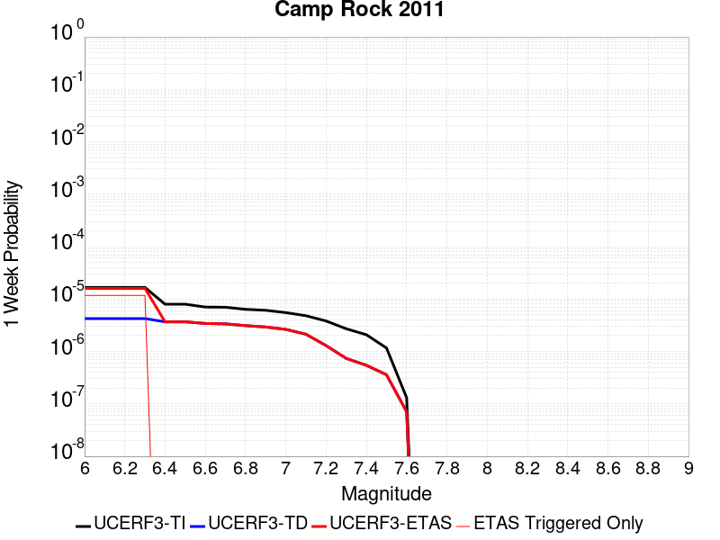 | 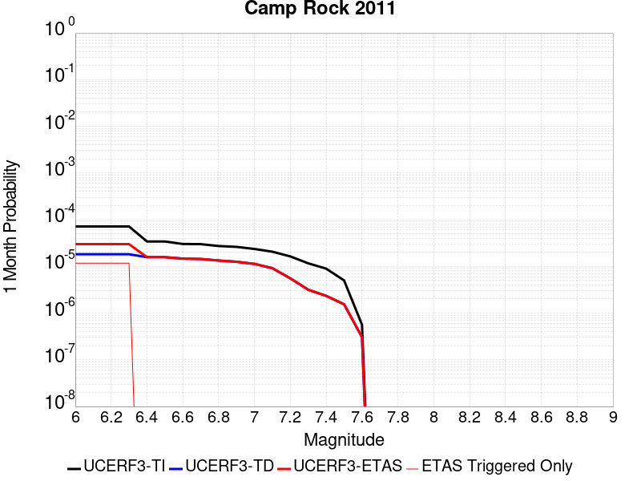 | 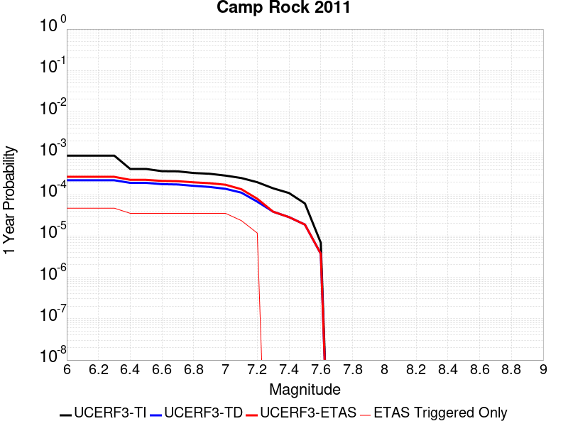 | 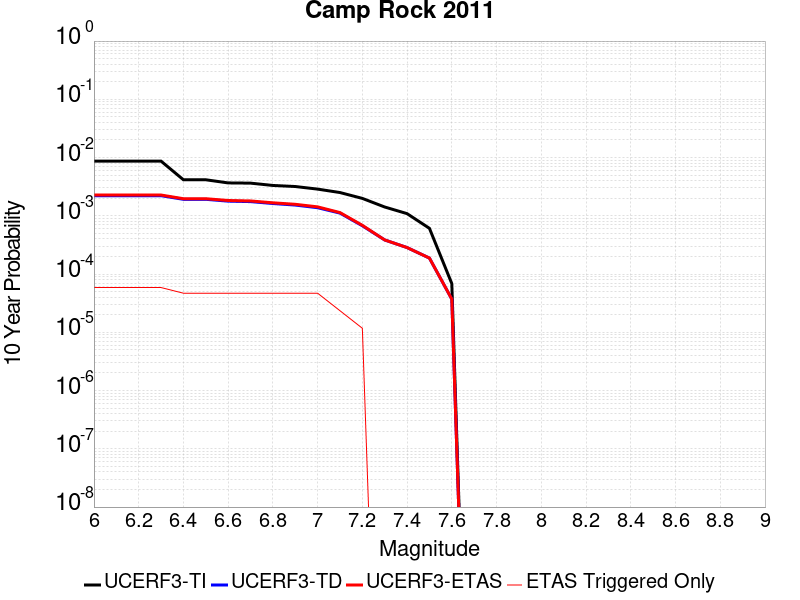 |

| Magnitude | 1 wk TI Prob | 1 wk TD Prob | 1 wk ETAS Prob | 1 wk ETAS/TD Gain | 1 wk ETAS Triggered Only | 1 mo TI Prob | 1 mo TD Prob | 1 mo ETAS Prob | 1 mo ETAS/TD Gain | 1 mo ETAS Triggered Only | 1 yr TI Prob | 1 yr TD Prob | 1 yr ETAS Prob | 1 yr ETAS/TD Gain | 1 yr ETAS Triggered Only | 10 yr TI Prob | 10 yr TD Prob | 10 yr ETAS Prob | 10 yr ETAS/TD Gain | 10 yr ETAS Triggered Only |
|-----|-----|-----|-----|-----|-----|-----|-----|-----|-----|-----|-----|-----|-----|-----|-----|-----|-----|-----|-----|-----|
| 6.0 | 1.6710783E-5 | 4.25026E-6 | 1.59873E-5 | 3.7614872 | 1.1737089E-5 | 7.161568E-5 | 1.8215276E-5 | 2.9952153E-5 | 1.6443424 | 1.1737089E-5 | 8.7157206E-4 | 2.2174895E-4 | 2.686869E-4 | 1.2116716 | 4.6948357E-5 | 0.008681616 | 0.0022153298 | 0.002273885 | 1.0264319 | 5.8685448E-5 |
| 6.1 | 1.6710783E-5 | 4.25026E-6 | 1.59873E-5 | 3.7614872 | 1.1737089E-5 | 7.161568E-5 | 1.8215276E-5 | 2.9952153E-5 | 1.6443424 | 1.1737089E-5 | 8.7157206E-4 | 2.2174895E-4 | 2.686869E-4 | 1.2116716 | 4.6948357E-5 | 0.008681616 | 0.0022153298 | 0.002273885 | 1.0264319 | 5.8685448E-5 |
| 6.2 | 1.6710783E-5 | 4.25026E-6 | 1.59873E-5 | 3.7614872 | 1.1737089E-5 | 7.161568E-5 | 1.8215276E-5 | 2.9952153E-5 | 1.6443424 | 1.1737089E-5 | 8.7157206E-4 | 2.2174895E-4 | 2.686869E-4 | 1.2116716 | 4.6948357E-5 | 0.008681616 | 0.0022153298 | 0.002273885 | 1.0264319 | 5.8685448E-5 |
| 6.3 | 1.6710783E-5 | 4.25026E-6 | 1.59873E-5 | 3.7614872 | 1.1737089E-5 | 7.161568E-5 | 1.8215276E-5 | 2.9952153E-5 | 1.6443424 | 1.1737089E-5 | 8.7157206E-4 | 2.2174895E-4 | 2.686869E-4 | 1.2116716 | 4.6948357E-5 | 0.008681616 | 0.0022153298 | 0.002273885 | 1.0264319 | 5.8685448E-5 |
| 6.4 | 7.982846E-6 | 3.6820884E-6 | 3.6820884E-6 | 1.0 | 0.0 | 3.421175E-5 | 1.5780286E-5 | 1.5780286E-5 | 1.0 | 0.0 | 4.1644843E-4 | 1.9210839E-4 | 2.2731289E-4 | 1.1832533 | 3.521127E-5 | 0.0041566887 | 0.001919458 | 0.0019663163 | 1.0244123 | 4.6948357E-5 |
| 6.5 | 7.982846E-6 | 3.6820884E-6 | 3.6820884E-6 | 1.0 | 0.0 | 3.421175E-5 | 1.5780286E-5 | 1.5780286E-5 | 1.0 | 0.0 | 4.1644843E-4 | 1.9210839E-4 | 2.2731289E-4 | 1.1832533 | 3.521127E-5 | 0.0041566887 | 0.001919458 | 0.0019663163 | 1.0244123 | 4.6948357E-5 |
| 6.6 | 7.048869E-6 | 3.4243571E-6 | 3.4243571E-6 | 1.0 | 0.0 | 3.0209088E-5 | 1.4675736E-5 | 1.4675736E-5 | 1.0 | 0.0 | 3.677336E-4 | 1.7866275E-4 | 2.1386772E-4 | 1.1970471 | 3.521127E-5 | 0.0036712566 | 0.0017852228 | 0.0018320873 | 1.0262513 | 4.6948357E-5 |
| 6.7 | 6.987307E-6 | 3.3623348E-6 | 3.3623348E-6 | 1.0 | 0.0 | 2.9945259E-5 | 1.4409929E-5 | 1.4409929E-5 | 1.0 | 0.0 | 3.6452254E-4 | 1.7542706E-4 | 2.1063215E-4 | 1.2006822 | 3.521127E-5 | 0.0036392517 | 0.001752917 | 0.001799783 | 1.026736 | 4.6948357E-5 |
| 6.8 | 6.3737602E-6 | 3.1179077E-6 | 3.1179077E-6 | 1.0 | 0.0 | 2.731583E-5 | 1.3362394E-5 | 1.3362394E-5 | 1.0 | 0.0 | 3.3251947E-4 | 1.626753E-4 | 1.9788083E-4 | 1.216416 | 3.521127E-5 | 0.0033202237 | 0.0016255907 | 0.0016724628 | 1.0288339 | 4.6948357E-5 |
| 6.9 | 6.112211E-6 | 2.9331156E-6 | 2.9331156E-6 | 1.0 | 0.0 | 2.6194928E-5 | 1.2570436E-5 | 1.2570436E-5 | 1.0 | 0.0 | 3.1887658E-4 | 1.5303459E-4 | 1.8824048E-4 | 1.2300518 | 3.521127E-5 | 0.003184194 | 0.0015293199 | 0.0015761964 | 1.0306519 | 4.6948357E-5 |
| 7.0 | 5.5140117E-6 | 2.641923E-6 | 2.641923E-6 | 1.0 | 0.0 | 2.3631264E-5 | 1.132248E-5 | 1.132248E-5 | 1.0 | 0.0 | 2.8767265E-4 | 1.3784273E-4 | 1.7304913E-4 | 1.2554101 | 3.521127E-5 | 0.0028730053 | 0.0013775975 | 0.0014244812 | 1.034033 | 4.6948357E-5 |
| 7.1 | 4.8151105E-6 | 2.1342705E-6 | 2.1342705E-6 | 1.0 | 0.0 | 2.0636026E-5 | 9.146843E-6 | 9.146843E-6 | 1.0 | 0.0 | 2.5121463E-4 | 1.1135734E-4 | 1.3482891E-4 | 1.210777 | 2.3474178E-5 | 0.0025093083 | 0.0011130372 | 0.0011364853 | 1.0210668 | 2.3474178E-5 |
| 7.2 | 3.818335E-6 | 1.2937425E-6 | 1.2937425E-6 | 1.0 | 0.0 | 1.6364189E-5 | 5.5445994E-6 | 5.5445994E-6 | 1.0 | 0.0 | 1.9921579E-4 | 6.750349E-5 | 7.9239784E-5 | 1.1738621 | 1.1737089E-5 | 0.0019903728 | 6.748381E-4 | 6.865672E-4 | 1.0173807 | 1.1737089E-5 |
| 7.3 | 2.7166698E-6 | 7.3835776E-7 | 7.3835776E-7 | 1.0 | 0.0 | 1.1642818E-5 | 3.1643867E-6 | 3.1643867E-6 | 1.0 | 0.0 | 1.4174209E-4 | 3.8525748E-5 | 3.8525748E-5 | 1.0 | 0.0 | 0.0014165172 | 3.851927E-4 | 3.851927E-4 | 1.0 | 0.0 |
| 7.4 | 2.0893426E-6 | 5.4618386E-7 | 5.4618386E-7 | 1.0 | 0.0 | 8.954295E-6 | 2.3407858E-6 | 2.3407858E-6 | 1.0 | 0.0 | 1.0901308E-4 | 2.84987E-5 | 2.84987E-5 | 1.0 | 0.0 | 0.0010895962 | 2.84951E-4 | 2.84951E-4 | 1.0 | 0.0 |
| 7.5 | 1.1681728E-6 | 3.6030585E-7 | 3.6030585E-7 | 1.0 | 0.0 | 5.0064455E-6 | 1.544167E-6 | 1.544167E-6 | 1.0 | 0.0 | 6.0951766E-5 | 1.8800076E-5 | 1.8800076E-5 | 1.0 | 0.0 | 6.093505E-4 | 1.8798532E-4 | 1.8798532E-4 | 1.0 | 0.0 |
| 7.6 | 1.3154387E-7 | 7.1197384E-8 | 7.1197384E-8 | 1.0 | 0.0 | 5.6375933E-7 | 3.051316E-7 | 3.051316E-7 | 1.0 | 0.0 | 6.863748E-6 | 3.7149728E-6 | 3.7149728E-6 | 1.0 | 0.0 | 6.863536E-5 | 3.7149264E-5 | 3.7149264E-5 | 1.0 | 0.0 |

## Big Pine (Central)
*[(top)](#table-of-contents)*

| 1 Week | 1 Month | 1 Year | 10 Year |
|-----|-----|-----|-----|
| 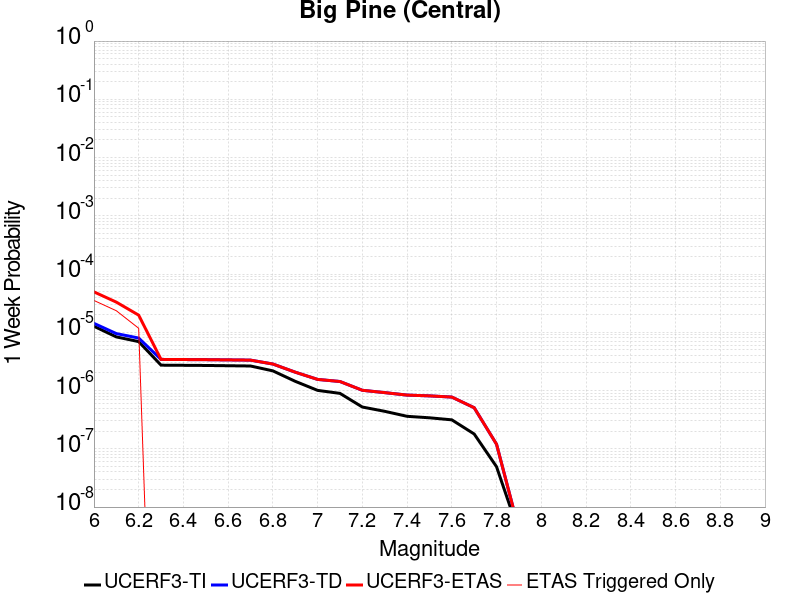 | 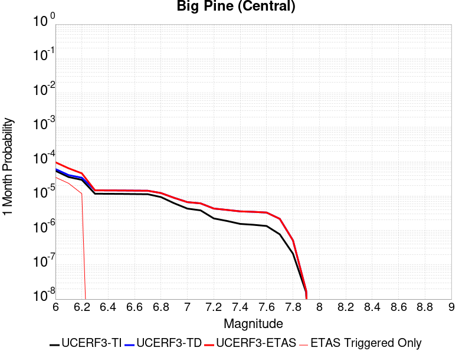 | 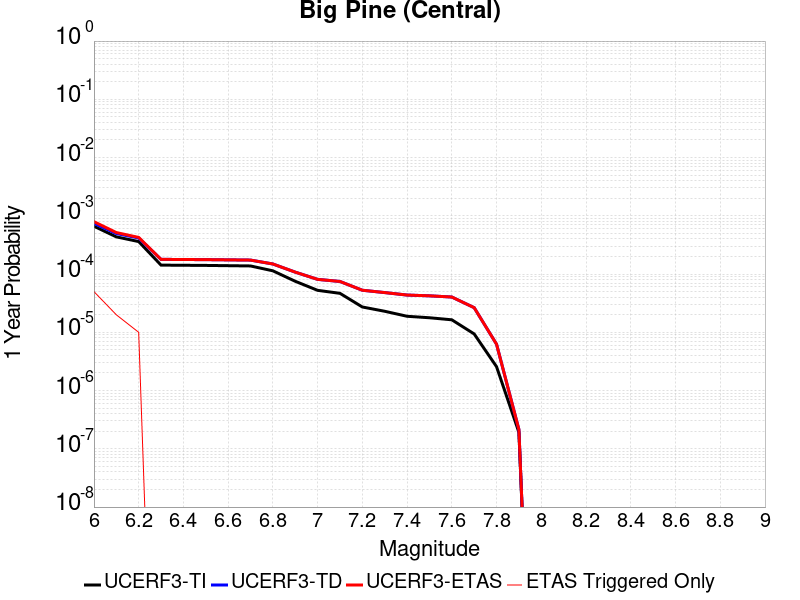 | 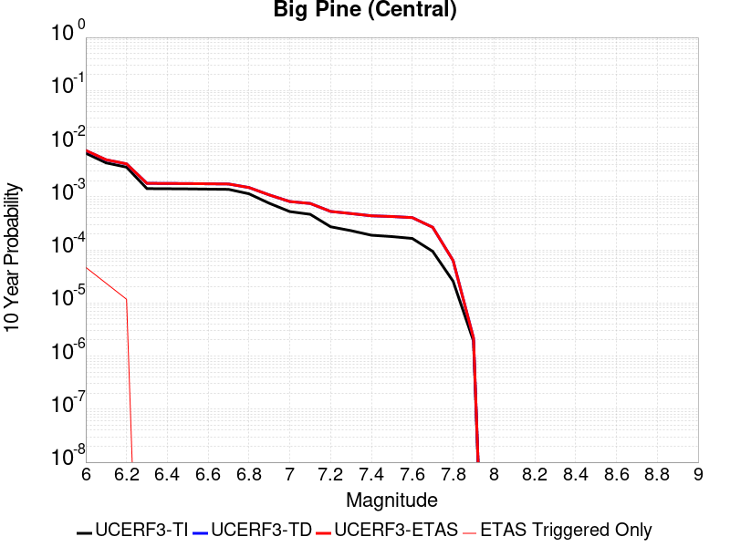 |

| Magnitude | 1 wk TI Prob | 1 wk TD Prob | 1 wk ETAS Prob | 1 wk ETAS/TD Gain | 1 wk ETAS Triggered Only | 1 mo TI Prob | 1 mo TD Prob | 1 mo ETAS Prob | 1 mo ETAS/TD Gain | 1 mo ETAS Triggered Only | 1 yr TI Prob | 1 yr TD Prob | 1 yr ETAS Prob | 1 yr ETAS/TD Gain | 1 yr ETAS Triggered Only | 10 yr TI Prob | 10 yr TD Prob | 10 yr ETAS Prob | 10 yr ETAS/TD Gain | 10 yr ETAS Triggered Only |
|-----|-----|-----|-----|-----|-----|-----|-----|-----|-----|-----|-----|-----|-----|-----|-----|-----|-----|-----|-----|-----|
| 6.0 | 1.2706755E-5 | 1.4250529E-5 | 4.9461294E-5 | 3.4708393 | 3.521127E-5 | 5.4456385E-5 | 6.107247E-5 | 9.628158E-5 | 1.5765138 | 3.521127E-5 | 6.628048E-4 | 7.433402E-4 | 7.902537E-4 | 1.0631117 | 4.6948357E-5 | 0.006608314 | 0.0074135666 | 0.007460167 | 1.0062858 | 4.6948357E-5 |
| 6.1 | 8.342579E-6 | 9.510762E-6 | 3.2984717E-5 | 3.4681468 | 2.3474178E-5 | 3.5753423E-5 | 4.0759893E-5 | 6.4233114E-5 | 1.5758902 | 2.3474178E-5 | 4.3521097E-4 | 4.961604E-4 | 5.1962293E-4 | 1.0472882 | 2.3474178E-5 | 0.0043435963 | 0.0049540824 | 0.0049774405 | 1.0047148 | 2.3474178E-5 |
| 6.2 | 6.923899E-6 | 7.967147E-6 | 1.9704143E-5 | 2.473174 | 1.1737089E-5 | 2.9673516E-5 | 3.4144578E-5 | 4.588127E-5 | 1.3437351 | 1.1737089E-5 | 3.6121515E-4 | 4.156502E-4 | 4.273824E-4 | 1.0282261 | 1.1737089E-5 | 0.003606286 | 0.0041520367 | 0.0041637253 | 1.0028151 | 1.1737089E-5 |
| 6.3 | 2.728396E-6 | 3.4242908E-6 | 3.4242908E-6 | 1.0 | 0.0 | 1.1693074E-5 | 1.4675454E-5 | 1.4675454E-5 | 1.0 | 0.0 | 1.4235388E-4 | 1.7865987E-4 | 1.7865987E-4 | 1.0 | 0.0 | 0.0014226272 | 0.0017866704 | 0.0017866704 | 1.0 | 0.0 |
| 6.4 | 2.7136944E-6 | 3.408584E-6 | 3.408584E-6 | 1.0 | 0.0 | 1.1630066E-5 | 1.4608141E-5 | 1.4608141E-5 | 1.0 | 0.0 | 1.4158686E-4 | 1.7784047E-4 | 1.7784047E-4 | 1.0 | 0.0 | 0.0014149669 | 0.0017784894 | 0.0017784894 | 1.0 | 0.0 |
| 6.5 | 2.6971882E-6 | 3.3909291E-6 | 3.3909291E-6 | 1.0 | 0.0 | 1.1559327E-5 | 1.45324775E-5 | 1.45324775E-5 | 1.0 | 0.0 | 1.4072572E-4 | 1.7691942E-4 | 1.7691942E-4 | 1.0 | 0.0 | 0.0014063664 | 0.0017692937 | 0.0017692937 | 1.0 | 0.0 |
| 6.6 | 2.669092E-6 | 3.3609497E-6 | 3.3609497E-6 | 1.0 | 0.0 | 1.1438916E-5 | 1.4403995E-5 | 1.4403995E-5 | 1.0 | 0.0 | 1.3925991E-4 | 1.753554E-4 | 1.753554E-4 | 1.0 | 0.0 | 0.0013917267 | 0.0017536782 | 0.0017536782 | 1.0 | 0.0 |
| 6.7 | 2.6408059E-6 | 3.3309752E-6 | 3.3309752E-6 | 1.0 | 0.0 | 1.1317691E-5 | 1.4275535E-5 | 1.4275535E-5 | 1.0 | 0.0 | 1.3778417E-4 | 1.7379165E-4 | 1.7379165E-4 | 1.0 | 0.0 | 0.0013769877 | 0.0017380653 | 0.0017380653 | 1.0 | 0.0 |
| 6.8 | 2.1786943E-6 | 2.8544325E-6 | 2.8544325E-6 | 1.0 | 0.0 | 9.337228E-6 | 1.2233229E-5 | 1.2233229E-5 | 1.0 | 0.0 | 1.1367482E-4 | 1.4893012E-4 | 1.4893012E-4 | 1.0 | 0.0 | 0.0011361669 | 0.0014897975 | 0.0014897975 | 1.0 | 0.0 |
| 6.9 | 1.4411696E-6 | 2.068499E-6 | 2.068499E-6 | 1.0 | 0.0 | 6.1764263E-6 | 8.864968E-6 | 8.864968E-6 | 1.0 | 0.0 | 7.51954E-5 | 1.079259E-4 | 1.079259E-4 | 1.0 | 0.0 | 7.5169955E-4 | 0.0010801847 | 0.0010801847 | 1.0 | 0.0 |
| 7.0 | 1.0073411E-6 | 1.554261E-6 | 1.554261E-6 | 1.0 | 0.0 | 4.317169E-6 | 6.6611024E-6 | 6.6611024E-6 | 1.0 | 0.0 | 5.2560266E-5 | 8.1096056E-5 | 8.1096056E-5 | 1.0 | 0.0 | 5.2547833E-4 | 8.1210316E-4 | 8.1210316E-4 | 1.0 | 0.0 |
| 7.1 | 8.947104E-7 | 1.4302494E-6 | 1.4302494E-6 | 1.0 | 0.0 | 3.834468E-6 | 6.129627E-6 | 6.129627E-6 | 1.0 | 0.0 | 4.6683643E-5 | 7.46258E-5 | 7.46258E-5 | 1.0 | 0.0 | 4.6673836E-4 | 7.474457E-4 | 7.474457E-4 | 1.0 | 0.0 |
| 7.2 | 5.215166E-7 | 1.0111678E-6 | 1.0111678E-6 | 1.0 | 0.0 | 2.2350691E-6 | 4.3335694E-6 | 4.3335694E-6 | 1.0 | 0.0 | 2.7211627E-5 | 5.2759973E-5 | 5.2759973E-5 | 1.0 | 0.0 | 2.7208295E-4 | 5.2890263E-4 | 5.2890263E-4 | 1.0 | 0.0 |
| 7.3 | 4.4024807E-7 | 9.219589E-7 | 9.219589E-7 | 1.0 | 0.0 | 1.8867761E-6 | 3.9512465E-6 | 3.9512465E-6 | 1.0 | 0.0 | 2.2971257E-5 | 4.810541E-5 | 4.810541E-5 | 1.0 | 0.0 | 2.2968883E-4 | 4.8237795E-4 | 4.8237795E-4 | 1.0 | 0.0 |
| 7.4 | 3.6130905E-7 | 8.358523E-7 | 8.358523E-7 | 1.0 | 0.0 | 1.5484665E-6 | 3.5822195E-6 | 3.5822195E-6 | 1.0 | 0.0 | 1.8852415E-5 | 4.3612687E-5 | 4.3612687E-5 | 1.0 | 0.0 | 1.8850817E-4 | 4.374597E-4 | 4.374597E-4 | 1.0 | 0.0 |
| 7.5 | 3.408184E-7 | 8.108147E-7 | 8.108147E-7 | 1.0 | 0.0 | 1.4606494E-6 | 3.4749157E-6 | 3.4749157E-6 | 1.0 | 0.0 | 1.7783263E-5 | 4.2306317E-5 | 4.2306317E-5 | 1.0 | 0.0 | 1.778184E-4 | 4.2437963E-4 | 4.2437963E-4 | 1.0 | 0.0 |
| 7.6 | 3.1428627E-7 | 7.7316E-7 | 7.7316E-7 | 1.0 | 0.0 | 1.3469405E-6 | 3.3135389E-6 | 3.3135389E-6 | 1.0 | 0.0 | 1.6398877E-5 | 4.0341627E-5 | 4.0341627E-5 | 1.0 | 0.0 | 1.6397667E-4 | 4.0471106E-4 | 4.0471106E-4 | 1.0 | 0.0 |
| 7.7 | 1.7972785E-7 | 5.077752E-7 | 5.077752E-7 | 1.0 | 0.0 | 7.70262E-7 | 2.1761778E-6 | 2.1761778E-6 | 1.0 | 0.0 | 9.377899E-6 | 2.6494654E-5 | 2.6494654E-5 | 1.0 | 0.0 | 9.377503E-5 | 2.662899E-4 | 2.662899E-4 | 1.0 | 0.0 |
| 7.8 | 4.9230927E-8 | 1.198079E-7 | 1.198079E-7 | 1.0 | 0.0 | 2.1098968E-7 | 5.134623E-7 | 5.134623E-7 | 1.0 | 0.0 | 2.5687964E-6 | 6.2513873E-6 | 6.2513873E-6 | 1.0 | 0.0 | 2.5687666E-5 | 6.295415E-5 | 6.295415E-5 | 1.0 | 0.0 |
| 7.9 | 3.6805972E-9 | 4.105293E-9 | 4.105293E-9 | 1.0 | 0.0 | 1.5773987E-8 | 1.7594115E-8 | 1.7594115E-8 | 1.0 | 0.0 | 1.9204828E-7 | 2.1420831E-7 | 2.1420831E-7 | 1.0 | 0.0 | 1.920481E-6 | 2.1900614E-6 | 2.1900614E-6 | 1.0 | 0.0 |

## Channel Islands Thrust
*[(top)](#table-of-contents)*

| 1 Week | 1 Month | 1 Year | 10 Year |
|-----|-----|-----|-----|
|  | 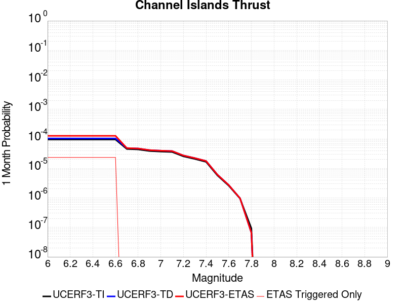 | 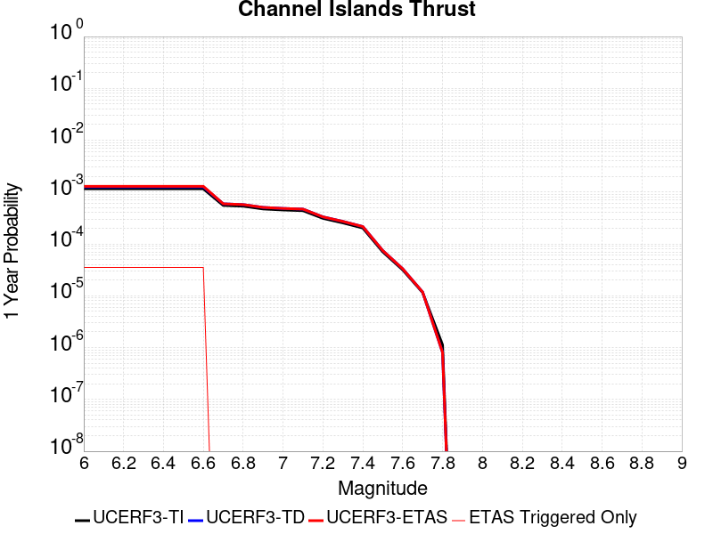 | 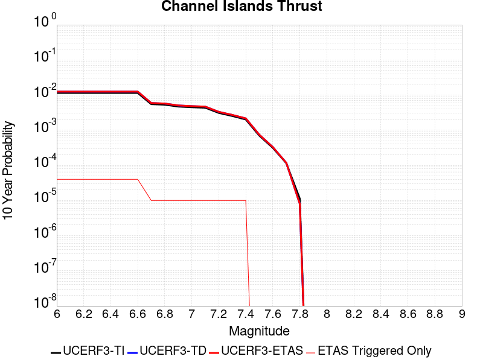 |

| Magnitude | 1 wk TI Prob | 1 wk TD Prob | 1 wk ETAS Prob | 1 wk ETAS/TD Gain | 1 wk ETAS Triggered Only | 1 mo TI Prob | 1 mo TD Prob | 1 mo ETAS Prob | 1 mo ETAS/TD Gain | 1 mo ETAS Triggered Only | 1 yr TI Prob | 1 yr TD Prob | 1 yr ETAS Prob | 1 yr ETAS/TD Gain | 1 yr ETAS Triggered Only | 10 yr TI Prob | 10 yr TD Prob | 10 yr ETAS Prob | 10 yr ETAS/TD Gain | 10 yr ETAS Triggered Only |
|-----|-----|-----|-----|-----|-----|-----|-----|-----|-----|-----|-----|-----|-----|-----|-----|-----|-----|-----|-----|-----|
| 6.0 | 2.2156251E-5 | 2.4092022E-5 | 2.4092022E-5 | 1.0 | 0.0 | 9.495191E-5 | 1.03248036E-4 | 1.267198E-4 | 1.2273337 | 2.3474178E-5 | 0.0011554264 | 0.0012564264 | 0.0012915935 | 1.0279897 | 3.521127E-5 | 0.011494373 | 0.0125038205 | 0.012550182 | 1.0037078 | 4.6948357E-5 |
| 6.1 | 2.2156251E-5 | 2.4092022E-5 | 2.4092022E-5 | 1.0 | 0.0 | 9.495191E-5 | 1.03248036E-4 | 1.267198E-4 | 1.2273337 | 2.3474178E-5 | 0.0011554264 | 0.0012564264 | 0.0012915935 | 1.0279897 | 3.521127E-5 | 0.011494373 | 0.0125038205 | 0.012550182 | 1.0037078 | 4.6948357E-5 |
| 6.2 | 2.2156251E-5 | 2.4092022E-5 | 2.4092022E-5 | 1.0 | 0.0 | 9.495191E-5 | 1.03248036E-4 | 1.267198E-4 | 1.2273337 | 2.3474178E-5 | 0.0011554264 | 0.0012564264 | 0.0012915935 | 1.0279897 | 3.521127E-5 | 0.011494373 | 0.0125038205 | 0.012550182 | 1.0037078 | 4.6948357E-5 |
| 6.3 | 2.2156251E-5 | 2.4092022E-5 | 2.4092022E-5 | 1.0 | 0.0 | 9.495191E-5 | 1.03248036E-4 | 1.267198E-4 | 1.2273337 | 2.3474178E-5 | 0.0011554264 | 0.0012564264 | 0.0012915935 | 1.0279897 | 3.521127E-5 | 0.011494373 | 0.0125038205 | 0.012550182 | 1.0037078 | 4.6948357E-5 |
| 6.4 | 2.2156251E-5 | 2.4092022E-5 | 2.4092022E-5 | 1.0 | 0.0 | 9.495191E-5 | 1.03248036E-4 | 1.267198E-4 | 1.2273337 | 2.3474178E-5 | 0.0011554264 | 0.0012564264 | 0.0012915935 | 1.0279897 | 3.521127E-5 | 0.011494373 | 0.0125038205 | 0.012550182 | 1.0037078 | 4.6948357E-5 |
| 6.5 | 2.2156251E-5 | 2.4092022E-5 | 2.4092022E-5 | 1.0 | 0.0 | 9.495191E-5 | 1.03248036E-4 | 1.267198E-4 | 1.2273337 | 2.3474178E-5 | 0.0011554264 | 0.0012564264 | 0.0012915935 | 1.0279897 | 3.521127E-5 | 0.011494373 | 0.0125038205 | 0.012550182 | 1.0037078 | 4.6948357E-5 |
| 6.6 | 2.2156251E-5 | 2.4092022E-5 | 2.4092022E-5 | 1.0 | 0.0 | 9.495191E-5 | 1.03248036E-4 | 1.267198E-4 | 1.2273337 | 2.3474178E-5 | 0.0011554264 | 0.0012564264 | 0.0012915935 | 1.0279897 | 3.521127E-5 | 0.011494373 | 0.0125038205 | 0.012550182 | 1.0037078 | 4.6948357E-5 |
| 6.7 | 1.0601296E-5 | 1.1379544E-5 | 1.1379544E-5 | 1.0 | 0.0 | 4.5433335E-5 | 4.876859E-5 | 4.876859E-5 | 1.0 | 0.0 | 5.5301044E-4 | 5.936007E-4 | 5.936007E-4 | 1.0 | 0.0 | 0.005516363 | 0.005920653 | 0.005932321 | 1.0019706 | 1.1737089E-5 |
| 6.8 | 1.0246747E-5 | 1.0996669E-5 | 1.0996669E-5 | 1.0 | 0.0 | 4.391389E-5 | 4.7127756E-5 | 4.7127756E-5 | 1.0 | 0.0 | 5.345204E-4 | 5.7363417E-4 | 5.7363417E-4 | 1.0 | 0.0 | 0.0053323656 | 0.005722025 | 0.005733695 | 1.0020394 | 1.1737089E-5 |
| 6.9 | 9.049551E-6 | 9.699645E-6 | 9.699645E-6 | 1.0 | 0.0 | 3.878322E-5 | 4.1569267E-5 | 4.1569267E-5 | 1.0 | 0.0 | 4.7208337E-4 | 5.059924E-4 | 5.059924E-4 | 1.0 | 0.0 | 0.0047108172 | 0.0050488203 | 0.005060498 | 1.002313 | 1.1737089E-5 |
| 7.0 | 8.6542195E-6 | 9.274603E-6 | 9.274603E-6 | 1.0 | 0.0 | 3.7088983E-5 | 3.9747716E-5 | 3.9747716E-5 | 1.0 | 0.0 | 4.5146482E-4 | 4.8382508E-4 | 4.8382508E-4 | 1.0 | 0.0 | 0.004505487 | 0.004828129 | 0.0048398096 | 1.0024192 | 1.1737089E-5 |
| 7.1 | 8.391028E-6 | 8.992924E-6 | 8.992924E-6 | 1.0 | 0.0 | 3.5961057E-5 | 3.854056E-5 | 3.854056E-5 | 1.0 | 0.0 | 4.3773788E-4 | 4.6913436E-4 | 4.6913436E-4 | 1.0 | 0.0 | 0.004368766 | 0.0046818503 | 0.0046935324 | 1.0024952 | 1.1737089E-5 |
| 7.2 | 5.965188E-6 | 6.3716952E-6 | 6.3716952E-6 | 1.0 | 0.0 | 2.556484E-5 | 2.7306982E-5 | 2.7306982E-5 | 1.0 | 0.0 | 3.1120746E-4 | 3.3241234E-4 | 3.3241234E-4 | 1.0 | 0.0 | 0.00310772 | 0.0033192092 | 0.0033309073 | 1.0035244 | 1.1737089E-5 |
| 7.3 | 4.877518E-6 | 5.2060063E-6 | 5.2060063E-6 | 1.0 | 0.0 | 2.0903482E-5 | 2.2311267E-5 | 2.2311267E-5 | 1.0 | 0.0 | 2.5447016E-4 | 2.716063E-4 | 2.716063E-4 | 1.0 | 0.0 | 0.0025417898 | 0.0027127895 | 0.0027244948 | 1.0043148 | 1.1737089E-5 |
| 7.4 | 3.8829853E-6 | 4.141863E-6 | 4.141863E-6 | 1.0 | 0.0 | 1.664126E-5 | 1.7750723E-5 | 1.7750723E-5 | 1.0 | 0.0 | 2.0258849E-4 | 2.1609402E-4 | 2.1609402E-4 | 1.0 | 0.0 | 0.002024039 | 0.0021588807 | 0.0021705925 | 1.005425 | 1.1737089E-5 |
| 7.5 | 1.3489616E-6 | 1.4277903E-6 | 1.4277903E-6 | 1.0 | 0.0 | 5.7812517E-6 | 6.119087E-6 | 6.119087E-6 | 1.0 | 0.0 | 7.038446E-5 | 7.449738E-5 | 7.449738E-5 | 1.0 | 0.0 | 7.036218E-4 | 7.44728E-4 | 7.44728E-4 | 1.0 | 0.0 |
| 7.6 | 6.058192E-7 | 6.353778E-7 | 6.353778E-7 | 1.0 | 0.0 | 2.5963652E-6 | 2.7230449E-6 | 2.7230449E-6 | 1.0 | 0.0 | 3.161029E-5 | 3.3152584E-5 | 3.3152584E-5 | 1.0 | 0.0 | 3.1605794E-4 | 3.31478E-4 | 3.31478E-4 | 1.0 | 0.0 |
| 7.7 | 2.2170494E-7 | 2.2607902E-7 | 2.2607902E-7 | 1.0 | 0.0 | 9.5016367E-7 | 9.689098E-7 | 9.689098E-7 | 1.0 | 0.0 | 1.1568181E-5 | 1.1796425E-5 | 1.1796425E-5 | 1.0 | 0.0 | 1.1567579E-4 | 1.1795909E-4 | 1.1795909E-4 | 1.0 | 0.0 |
| 7.8 | 2.1613102E-8 | 1.5466682E-8 | 1.5466682E-8 | 1.0 | 0.0 | 9.262757E-8 | 6.628578E-8 | 6.628578E-8 | 1.0 | 0.0 | 1.1277401E-6 | 8.070291E-7 | 8.070291E-7 | 1.0 | 0.0 | 1.1277344E-5 | 8.070269E-6 | 8.070269E-6 | 1.0 | 0.0 |

## Whittier alt 1
*[(top)](#table-of-contents)*

| 1 Week | 1 Month | 1 Year | 10 Year |
|-----|-----|-----|-----|
| 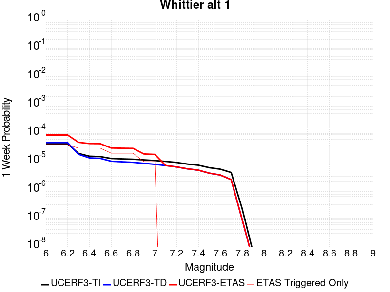 | 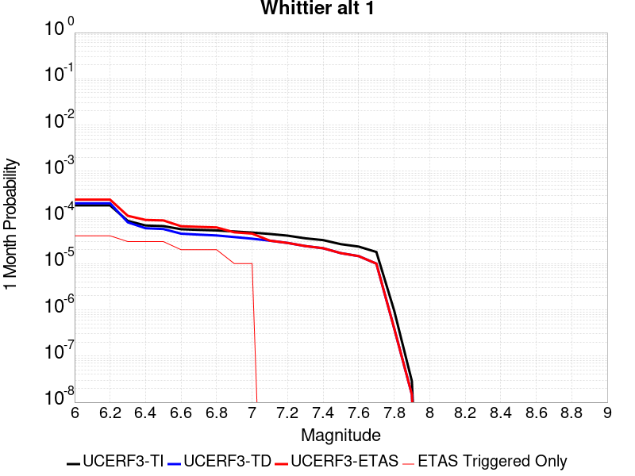 | 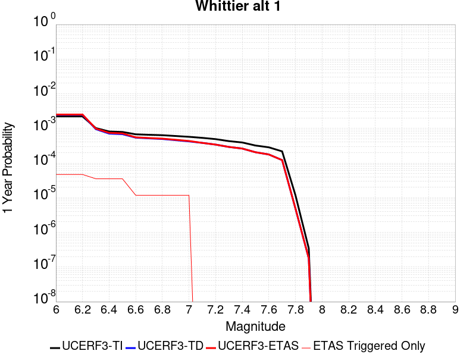 | 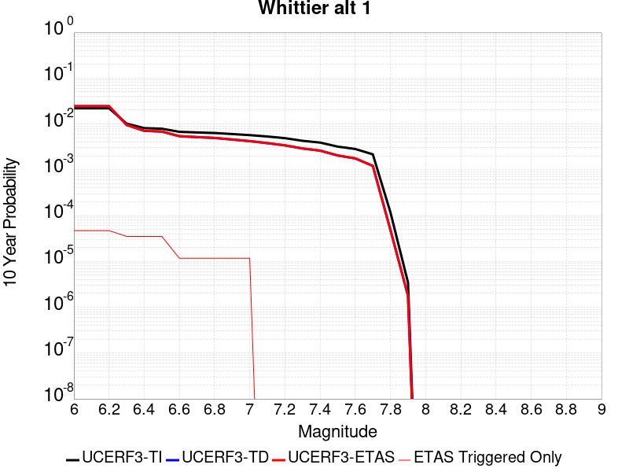 |

| Magnitude | 1 wk TI Prob | 1 wk TD Prob | 1 wk ETAS Prob | 1 wk ETAS/TD Gain | 1 wk ETAS Triggered Only | 1 mo TI Prob | 1 mo TD Prob | 1 mo ETAS Prob | 1 mo ETAS/TD Gain | 1 mo ETAS Triggered Only | 1 yr TI Prob | 1 yr TD Prob | 1 yr ETAS Prob | 1 yr ETAS/TD Gain | 1 yr ETAS Triggered Only | 10 yr TI Prob | 10 yr TD Prob | 10 yr ETAS Prob | 10 yr ETAS/TD Gain | 10 yr ETAS Triggered Only |
|-----|-----|-----|-----|-----|-----|-----|-----|-----|-----|-----|-----|-----|-----|-----|-----|-----|-----|-----|-----|-----|
| 6.0 | 4.2554693E-5 | 4.725218E-5 | 8.246178E-5 | 1.7451425 | 3.521127E-5 | 1.8236451E-4 | 2.0249544E-4 | 2.3769957E-4 | 1.1738515 | 3.521127E-5 | 0.002218027 | 0.0024629154 | 0.002509748 | 1.0190152 | 4.6948357E-5 | 0.02196019 | 0.024390234 | 0.024436038 | 1.0018779 | 4.6948357E-5 |
| 6.1 | 4.2554693E-5 | 4.725218E-5 | 8.246178E-5 | 1.7451425 | 3.521127E-5 | 1.8236451E-4 | 2.0249544E-4 | 2.3769957E-4 | 1.1738515 | 3.521127E-5 | 0.002218027 | 0.0024629154 | 0.002509748 | 1.0190152 | 4.6948357E-5 | 0.02196019 | 0.024390234 | 0.024436038 | 1.0018779 | 4.6948357E-5 |
| 6.2 | 4.2554693E-5 | 4.725218E-5 | 8.246178E-5 | 1.7451425 | 3.521127E-5 | 1.8236451E-4 | 2.0249544E-4 | 2.3769957E-4 | 1.1738515 | 3.521127E-5 | 0.002218027 | 0.0024629154 | 0.002509748 | 1.0190152 | 4.6948357E-5 | 0.02196019 | 0.024390234 | 0.024436038 | 1.0018779 | 4.6948357E-5 |
| 6.3 | 1.9617712E-5 | 1.8268593E-5 | 4.174234E-5 | 2.2849238 | 2.3474178E-5 | 8.40732E-5 | 7.829172E-5 | 1.0176406E-4 | 1.2998061 | 2.3474178E-5 | 0.0010231105 | 9.52804E-4 | 9.879817E-4 | 1.0369202 | 3.521127E-5 | 0.01018413 | 0.009490474 | 0.009525351 | 1.003675 | 3.521127E-5 |
| 6.4 | 1.5611336E-5 | 1.3604271E-5 | 3.707813E-5 | 2.7254772 | 2.3474178E-5 | 6.690401E-5 | 5.8302747E-5 | 8.177556E-5 | 1.4026021 | 2.3474178E-5 | 8.142519E-4 | 7.0961076E-4 | 7.4479706E-4 | 1.0495853 | 3.521127E-5 | 0.008112748 | 0.0070754145 | 0.007110377 | 1.0049413 | 3.521127E-5 |
| 6.5 | 1.5150166E-5 | 1.3100925E-5 | 3.6574795E-5 | 2.7917721 | 2.3474178E-5 | 6.492767E-5 | 5.6145647E-5 | 7.9618505E-5 | 1.4180709 | 2.3474178E-5 | 7.9020765E-4 | 6.8336475E-4 | 7.185519E-4 | 1.0514911 | 3.521127E-5 | 0.007874036 | 0.0068145846 | 0.006849556 | 1.0051318 | 3.521127E-5 |
| 6.6 | 1.295588E-5 | 1.0380725E-5 | 2.2117692E-5 | 2.13065 | 1.1737089E-5 | 5.552402E-5 | 4.4488075E-5 | 5.6224642E-5 | 1.2638137 | 1.1737089E-5 | 6.7579525E-4 | 5.4150965E-4 | 5.5324036E-4 | 1.0216631 | 1.1737089E-5 | 0.006737438 | 0.0054033357 | 0.0054150093 | 1.0021604 | 1.1737089E-5 |
| 6.7 | 1.2542085E-5 | 9.899369E-6 | 2.1636342E-5 | 2.1856284 | 1.1737089E-5 | 5.3750682E-5 | 4.242519E-5 | 5.4161777E-5 | 1.2766421 | 1.1737089E-5 | 6.542181E-4 | 5.164061E-4 | 5.2813714E-4 | 1.0227166 | 1.1737089E-5 | 0.006522954 | 0.0051534795 | 0.005165156 | 1.0022658 | 1.1737089E-5 |
| 6.8 | 1.2195878E-5 | 9.495415E-6 | 2.1232392E-5 | 2.236068 | 1.1737089E-5 | 5.2267E-5 | 4.069401E-5 | 5.243062E-5 | 1.2884113 | 1.1737089E-5 | 6.36165E-4 | 4.9533875E-4 | 5.0707004E-4 | 1.0236833 | 1.1737089E-5 | 0.0063434686 | 0.004943688 | 0.004955367 | 1.0023624 | 1.1737089E-5 |
| 6.9 | 1.1580298E-5 | 8.772933E-6 | 2.050992E-5 | 2.3378634 | 1.1737089E-5 | 4.9628903E-5 | 3.7597754E-5 | 4.93344E-5 | 1.3121636 | 1.1737089E-5 | 6.040644E-4 | 4.5765814E-4 | 4.6938987E-4 | 1.0256343 | 1.1737089E-5 | 0.00602425 | 0.0045684157 | 0.0045800996 | 1.0025574 | 1.1737089E-5 |
| 7.0 | 1.0964795E-5 | 8.083994E-6 | 1.9820987E-5 | 2.4518807 | 1.1737089E-5 | 4.6991136E-5 | 3.4645236E-5 | 4.638192E-5 | 1.3387675 | 1.1737089E-5 | 5.7196687E-4 | 4.2172565E-4 | 4.3345778E-4 | 1.0278194 | 1.1737089E-5 | 0.0057049696 | 0.004210462 | 0.0042221495 | 1.0027759 | 1.1737089E-5 |
| 7.1 | 1.0230601E-5 | 7.3266697E-6 | 7.3266697E-6 | 1.0 | 0.0 | 4.3844695E-5 | 3.1399642E-5 | 3.1399642E-5 | 1.0 | 0.0 | 5.336784E-4 | 3.8222488E-4 | 3.8222488E-4 | 1.0 | 0.0 | 0.005323986 | 0.0038168381 | 0.0038168381 | 1.0 | 0.0 |
| 7.2 | 9.40865E-6 | 6.543289E-6 | 6.543289E-6 | 1.0 | 0.0 | 4.032216E-5 | 2.8042374E-5 | 2.8042374E-5 | 1.0 | 0.0 | 4.908117E-4 | 3.4136363E-4 | 3.4136363E-4 | 1.0 | 0.0 | 0.0048972913 | 0.003409485 | 0.003409485 | 1.0 | 0.0 |
| 7.3 | 8.237384E-6 | 5.5977525E-6 | 5.5977525E-6 | 1.0 | 0.0 | 3.5302593E-5 | 2.3990153E-5 | 2.3990153E-5 | 1.0 | 0.0 | 4.2972428E-4 | 2.92042E-4 | 2.92042E-4 | 1.0 | 0.0 | 0.0042889426 | 0.002916903 | 0.002916903 | 1.0 | 0.0 |
| 7.4 | 7.5316966E-6 | 5.027819E-6 | 5.027819E-6 | 1.0 | 0.0 | 3.2278298E-5 | 2.1547625E-5 | 2.1547625E-5 | 1.0 | 0.0 | 3.9291743E-4 | 2.6231175E-4 | 2.6231175E-4 | 1.0 | 0.0 | 0.0039222343 | 0.0026201333 | 0.0026201333 | 1.0 | 0.0 |
| 7.5 | 6.149649E-6 | 3.933841E-6 | 3.933841E-6 | 1.0 | 0.0 | 2.6355372E-5 | 1.6859214E-5 | 1.6859214E-5 | 1.0 | 0.0 | 3.208294E-4 | 2.052425E-4 | 2.052425E-4 | 1.0 | 0.0 | 0.003203666 | 0.0020506186 | 0.0020506186 | 1.0 | 0.0 |
| 7.6 | 5.457711E-6 | 3.3953788E-6 | 3.3953788E-6 | 1.0 | 0.0 | 2.338998E-5 | 1.4551547E-5 | 1.4551547E-5 | 1.0 | 0.0 | 2.8473578E-4 | 1.771515E-4 | 1.771515E-4 | 1.0 | 0.0 | 0.0028437122 | 0.0017701836 | 0.0017701836 | 1.0 | 0.0 |
| 7.7 | 4.1676276E-6 | 2.3331952E-6 | 2.3331952E-6 | 1.0 | 0.0 | 1.7861139E-5 | 9.999374E-6 | 9.999374E-6 | 1.0 | 0.0 | 2.1743766E-4 | 1.2173632E-4 | 1.2173632E-4 | 1.0 | 0.0 | 0.0021722503 | 0.0012167693 | 0.0012167693 | 1.0 | 0.0 |
| 7.8 | 2.2692414E-7 | 9.3854695E-8 | 9.3854695E-8 | 1.0 | 0.0 | 9.725317E-7 | 4.0223435E-7 | 4.0223435E-7 | 1.0 | 0.0 | 1.1840509E-5 | 4.8971956E-6 | 4.8971956E-6 | 1.0 | 0.0 | 1.1839878E-4 | 4.8971204E-5 | 4.8971204E-5 | 1.0 | 0.0 |
| 7.9 | 6.676829E-9 | 3.439853E-9 | 3.439853E-9 | 1.0 | 0.0 | 2.861498E-8 | 1.4742227E-8 | 1.4742227E-8 | 1.0 | 0.0 | 3.4838732E-7 | 1.7948659E-7 | 1.7948659E-7 | 1.0 | 0.0 | 3.4838679E-6 | 1.7948646E-6 | 1.7948646E-6 | 1.0 | 0.0 |

## Robinson Creek
*[(top)](#table-of-contents)*

| 1 Week | 1 Month | 1 Year | 10 Year |
|-----|-----|-----|-----|
| 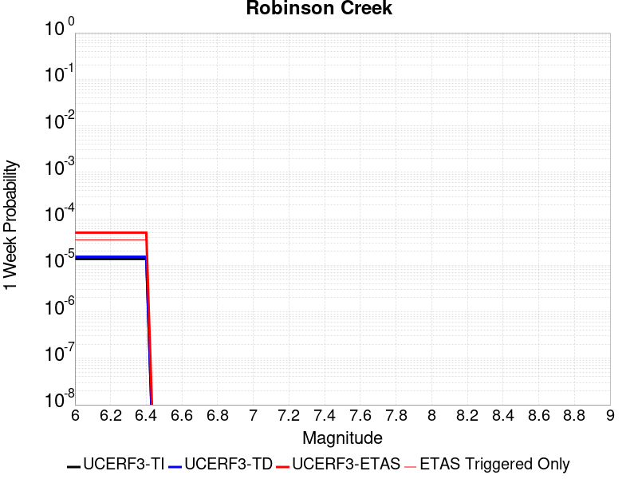 | 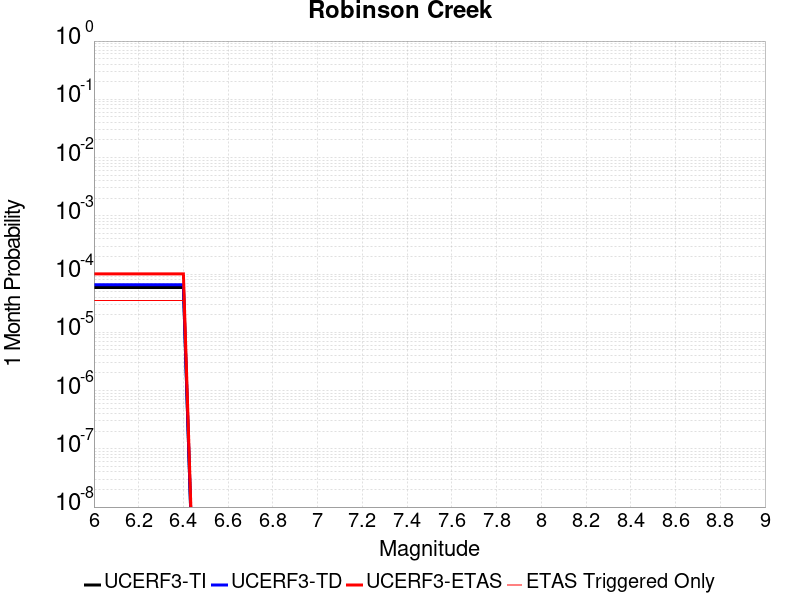 |  | 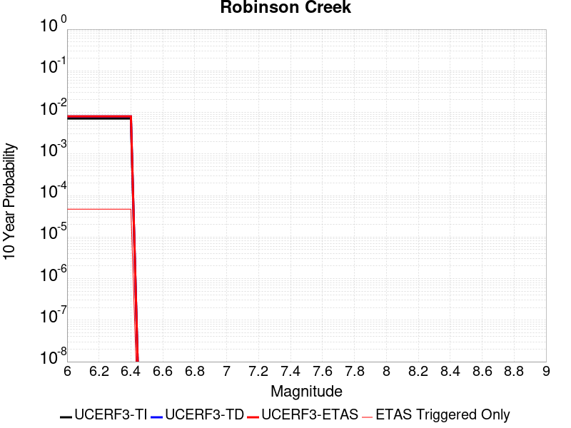 |

| Magnitude | 1 wk TI Prob | 1 wk TD Prob | 1 wk ETAS Prob | 1 wk ETAS/TD Gain | 1 wk ETAS Triggered Only | 1 mo TI Prob | 1 mo TD Prob | 1 mo ETAS Prob | 1 mo ETAS/TD Gain | 1 mo ETAS Triggered Only | 1 yr TI Prob | 1 yr TD Prob | 1 yr ETAS Prob | 1 yr ETAS/TD Gain | 1 yr ETAS Triggered Only | 10 yr TI Prob | 10 yr TD Prob | 10 yr ETAS Prob | 10 yr ETAS/TD Gain | 10 yr ETAS Triggered Only |
|-----|-----|-----|-----|-----|-----|-----|-----|-----|-----|-----|-----|-----|-----|-----|-----|-----|-----|-----|-----|-----|
| 6.0 | 1.3705327E-5 | 1.5285013E-5 | 5.0495742E-5 | 3.3036113 | 3.521127E-5 | 5.8735794E-5 | 6.55072E-5 | 1.0071616E-4 | 1.5374823 | 3.521127E-5 | 7.1487366E-4 | 7.9755014E-4 | 8.444611E-4 | 1.0588188 | 4.6948357E-5 | 0.0071257832 | 0.007975501 | 0.0080220755 | 1.0058396 | 4.6948357E-5 |
| 6.1 | 1.3705327E-5 | 1.5285013E-5 | 5.0495742E-5 | 3.3036113 | 3.521127E-5 | 5.8735794E-5 | 6.55072E-5 | 1.0071616E-4 | 1.5374823 | 3.521127E-5 | 7.1487366E-4 | 7.9755014E-4 | 8.444611E-4 | 1.0588188 | 4.6948357E-5 | 0.0071257832 | 0.007975501 | 0.0080220755 | 1.0058396 | 4.6948357E-5 |
| 6.2 | 1.3705327E-5 | 1.5285013E-5 | 5.0495742E-5 | 3.3036113 | 3.521127E-5 | 5.8735794E-5 | 6.55072E-5 | 1.0071616E-4 | 1.5374823 | 3.521127E-5 | 7.1487366E-4 | 7.9755014E-4 | 8.444611E-4 | 1.0588188 | 4.6948357E-5 | 0.0071257832 | 0.007975501 | 0.0080220755 | 1.0058396 | 4.6948357E-5 |
| 6.3 | 1.3705327E-5 | 1.5285013E-5 | 5.0495742E-5 | 3.3036113 | 3.521127E-5 | 5.8735794E-5 | 6.55072E-5 | 1.0071616E-4 | 1.5374823 | 3.521127E-5 | 7.1487366E-4 | 7.9755014E-4 | 8.444611E-4 | 1.0588188 | 4.6948357E-5 | 0.0071257832 | 0.007975501 | 0.0080220755 | 1.0058396 | 4.6948357E-5 |
| 6.4 | 1.3705327E-5 | 1.5285013E-5 | 5.0495742E-5 | 3.3036113 | 3.521127E-5 | 5.8735794E-5 | 6.55072E-5 | 1.0071616E-4 | 1.5374823 | 3.521127E-5 | 7.1487366E-4 | 7.9755014E-4 | 8.444611E-4 | 1.0588188 | 4.6948357E-5 | 0.0071257832 | 0.007975501 | 0.0080220755 | 1.0058396 | 4.6948357E-5 |

## San Andreas (Santa Cruz Mts) 2011 CFM
*[(top)](#table-of-contents)*

| 1 Week | 1 Month | 1 Year | 10 Year |
|-----|-----|-----|-----|
| 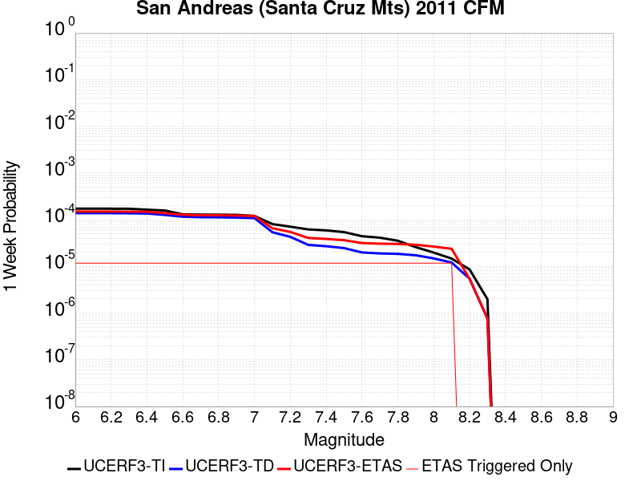 | 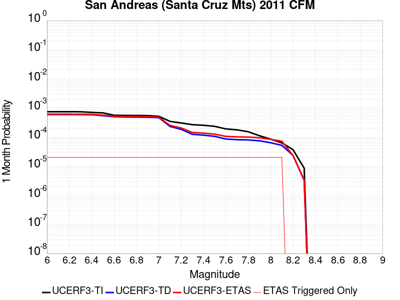 | 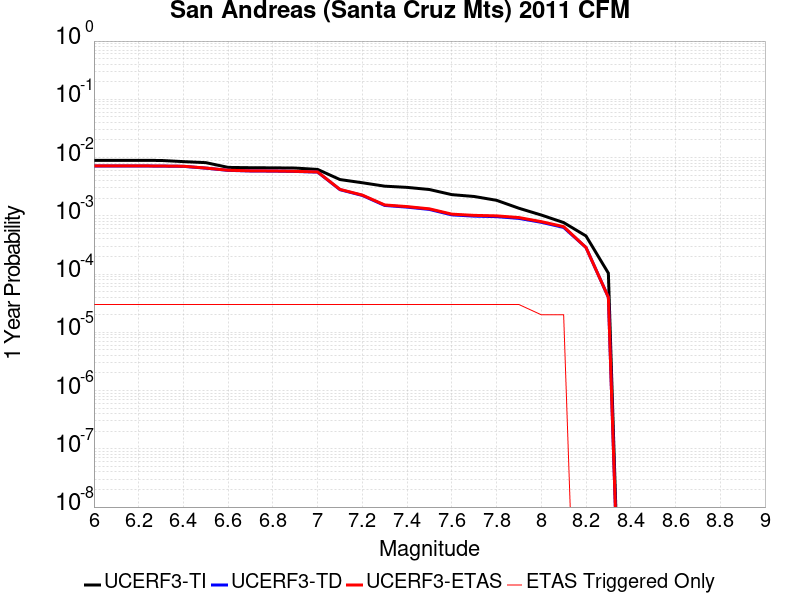 | 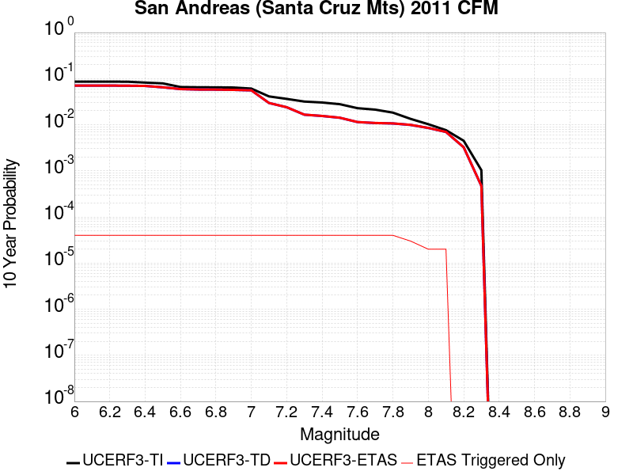 |

| Magnitude | 1 wk TI Prob | 1 wk TD Prob | 1 wk ETAS Prob | 1 wk ETAS/TD Gain | 1 wk ETAS Triggered Only | 1 mo TI Prob | 1 mo TD Prob | 1 mo ETAS Prob | 1 mo ETAS/TD Gain | 1 mo ETAS Triggered Only | 1 yr TI Prob | 1 yr TD Prob | 1 yr ETAS Prob | 1 yr ETAS/TD Gain | 1 yr ETAS Triggered Only | 10 yr TI Prob | 10 yr TD Prob | 10 yr ETAS Prob | 10 yr ETAS/TD Gain | 10 yr ETAS Triggered Only |
|-----|-----|-----|-----|-----|-----|-----|-----|-----|-----|-----|-----|-----|-----|-----|-----|-----|-----|-----|-----|-----|
| 6.0 | 1.7221631E-4 | 1.3793171E-4 | 1.4966718E-4 | 1.0850817 | 1.1737089E-5 | 7.378611E-4 | 5.9100403E-4 | 6.1446434E-4 | 1.0396956 | 2.3474178E-5 | 0.008946515 | 0.007172124 | 0.0072070826 | 1.0048742 | 3.521127E-5 | 0.08594794 | 0.0705551 | 0.07059873 | 1.0006185 | 4.6948357E-5 |
| 6.1 | 1.7221631E-4 | 1.3793171E-4 | 1.4966718E-4 | 1.0850817 | 1.1737089E-5 | 7.378611E-4 | 5.9100403E-4 | 6.1446434E-4 | 1.0396956 | 2.3474178E-5 | 0.008946515 | 0.007172124 | 0.0072070826 | 1.0048742 | 3.521127E-5 | 0.08594794 | 0.0705551 | 0.07059873 | 1.0006185 | 4.6948357E-5 |
| 6.2 | 1.7221631E-4 | 1.3793171E-4 | 1.4966718E-4 | 1.0850817 | 1.1737089E-5 | 7.378611E-4 | 5.9100403E-4 | 6.1446434E-4 | 1.0396956 | 2.3474178E-5 | 0.008946515 | 0.007172124 | 0.0072070826 | 1.0048742 | 3.521127E-5 | 0.08594794 | 0.0705551 | 0.07059873 | 1.0006185 | 4.6948357E-5 |
| 6.3 | 1.716926E-4 | 1.3712609E-4 | 1.4886157E-4 | 1.0855817 | 1.1737089E-5 | 7.3561794E-4 | 5.875529E-4 | 6.1101327E-4 | 1.039929 | 2.3474178E-5 | 0.008919428 | 0.0071303817 | 0.0071653416 | 1.004903 | 3.521127E-5 | 0.08569809 | 0.070167266 | 0.07021092 | 1.0006222 | 4.6948357E-5 |
| 6.4 | 1.6392978E-4 | 1.3588481E-4 | 1.476203E-4 | 1.0863636 | 1.1737089E-5 | 7.02367E-4 | 5.822355E-4 | 6.0569606E-4 | 1.0402938 | 2.3474178E-5 | 0.008517839 | 0.007066063 | 0.0071010254 | 1.0049479 | 3.521127E-5 | 0.08198654 | 0.06940135 | 0.069445044 | 1.0006295 | 4.6948357E-5 |
| 6.5 | 1.5742714E-4 | 1.2648388E-4 | 1.3821948E-4 | 1.0927835 | 1.1737089E-5 | 6.745133E-4 | 5.4196286E-4 | 5.654243E-4 | 1.0432898 | 2.3474178E-5 | 0.00818132 | 0.0065787593 | 0.006613739 | 1.0053171 | 3.521127E-5 | 0.078865945 | 0.06486309 | 0.064907 | 1.0006769 | 4.6948357E-5 |
| 6.6 | 1.3038084E-4 | 1.1588213E-4 | 1.2761787E-4 | 1.101273 | 1.1737089E-5 | 5.5865536E-4 | 4.9654447E-4 | 5.20007E-4 | 1.0472516 | 2.3474178E-5 | 0.006780438 | 0.0060289134 | 0.006063912 | 1.0058051 | 3.521127E-5 | 0.0657725 | 0.05932738 | 0.059371542 | 1.0007443 | 4.6948357E-5 |
| 6.7 | 1.2867592E-4 | 1.1314701E-4 | 1.2488278E-4 | 1.1037214 | 1.1737089E-5 | 5.5135164E-4 | 4.8482692E-4 | 5.082897E-4 | 1.0483942 | 2.3474178E-5 | 0.0066920654 | 0.00588703 | 0.0059220344 | 1.0059459 | 3.521127E-5 | 0.06494093 | 0.058038417 | 0.05808264 | 1.000762 | 4.6948357E-5 |
| 6.8 | 1.2801298E-4 | 1.1252261E-4 | 1.2425838E-4 | 1.1042969 | 1.1737089E-5 | 5.485117E-4 | 4.8215193E-4 | 5.056148E-4 | 1.0486628 | 2.3474178E-5 | 0.0066577005 | 0.0058546383 | 0.0058896434 | 1.0059791 | 3.521127E-5 | 0.06461738 | 0.057752274 | 0.057796508 | 1.0007659 | 4.6948357E-5 |
| 6.9 | 1.269149E-4 | 1.1094465E-4 | 1.2268045E-4 | 1.1057806 | 1.1737089E-5 | 5.4380763E-4 | 4.7539172E-4 | 4.9885473E-4 | 1.0493551 | 2.3474178E-5 | 0.006600777 | 0.005772772 | 0.0058077797 | 1.0060643 | 3.521127E-5 | 0.06408122 | 0.0570241 | 0.05706837 | 1.0007764 | 4.6948357E-5 |
| 7.0 | 1.2030331E-4 | 1.0824504E-4 | 1.19980854E-4 | 1.108419 | 1.1737089E-5 | 5.154837E-4 | 4.638261E-4 | 4.872894E-4 | 1.0505863 | 2.3474178E-5 | 0.006257969 | 0.0056326967 | 0.0056677093 | 1.006216 | 3.521127E-5 | 0.06084648 | 0.055696685 | 0.05574102 | 1.000796 | 4.6948357E-5 |
| 7.1 | 8.049617E-5 | 5.3926604E-5 | 6.566306E-5 | 1.2176377 | 1.1737089E-5 | 3.4493793E-4 | 2.3109373E-4 | 2.5456247E-4 | 1.1015551 | 2.3474178E-5 | 0.0041915346 | 0.0028099709 | 0.0028450831 | 1.0124956 | 3.521127E-5 | 0.041133516 | 0.029618956 | 0.029664515 | 1.0015382 | 4.6948357E-5 |
| 7.2 | 7.093979E-5 | 4.2937932E-5 | 5.4674518E-5 | 1.2733384 | 1.1737089E-5 | 3.0399222E-4 | 1.8400686E-4 | 2.0747671E-4 | 1.1275488 | 2.3474178E-5 | 0.0036948253 | 0.0022380045 | 0.002273137 | 1.0156981 | 3.521127E-5 | 0.03633994 | 0.023941692 | 0.023987515 | 1.001914 | 4.6948357E-5 |
| 7.3 | 6.193693E-5 | 2.8894141E-5 | 4.063089E-5 | 1.4061983 | 1.1737089E-5 | 2.6541698E-4 | 1.2382616E-4 | 1.4729744E-4 | 1.1895502 | 2.3474178E-5 | 0.0032266637 | 0.0015065427 | 0.0015417009 | 1.023337 | 3.521127E-5 | 0.031802133 | 0.016499156 | 0.01654533 | 1.0027986 | 4.6948357E-5 |
| 7.4 | 5.906492E-5 | 2.702346E-5 | 3.8760234E-5 | 1.4343178 | 1.1737089E-5 | 2.5311083E-4 | 1.1580969E-4 | 1.3928115E-4 | 1.2026727 | 2.3474178E-5 | 0.0030772698 | 0.0014090725 | 0.0014442342 | 1.0249537 | 3.521127E-5 | 0.030350044 | 0.015471023 | 0.015517244 | 1.0029876 | 4.6948357E-5 |
| 7.5 | 5.424296E-5 | 2.4678277E-5 | 3.6415076E-5 | 1.4755924 | 1.1737089E-5 | 2.324491E-4 | 1.05759755E-4 | 1.2923146E-4 | 1.2219341 | 2.3474178E-5 | 0.002826395 | 0.0012868657 | 0.0013220316 | 1.0273268 | 3.521127E-5 | 0.027907165 | 0.014163188 | 0.014209471 | 1.0032679 | 4.6948357E-5 |
| 7.6 | 4.43084E-5 | 1.990431E-5 | 3.1641164E-5 | 1.589664 | 1.1737089E-5 | 1.8987931E-4 | 8.53014E-5 | 1.0877357E-4 | 1.2751676 | 2.3474178E-5 | 0.0023093296 | 0.0010380499 | 0.0010732247 | 1.0338854 | 3.521127E-5 | 0.022854783 | 0.011412679 | 0.011459093 | 1.0040667 | 4.6948357E-5 |
| 7.7 | 4.118098E-5 | 1.8936442E-5 | 3.067331E-5 | 1.6198032 | 1.1737089E-5 | 1.7647797E-4 | 8.115366E-5 | 1.0462593E-4 | 1.2892325 | 2.3474178E-5 | 0.002146502 | 9.875982E-4 | 0.0010227746 | 1.0356182 | 3.521127E-5 | 0.021258866 | 0.010870468 | 0.0109169055 | 1.004272 | 4.6948357E-5 |
| 7.8 | 3.5408906E-5 | 1.856446E-5 | 3.0301331E-5 | 1.6322225 | 1.1737089E-5 | 1.5174363E-4 | 7.955955E-5 | 1.0303186E-4 | 1.2950282 | 2.3474178E-5 | 0.0018459131 | 9.682073E-4 | 0.0010033845 | 1.0363322 | 3.521127E-5 | 0.018306552 | 0.010652021 | 0.010698468 | 1.0043606 | 4.6948357E-5 |
| 7.9 | 2.5860836E-5 | 1.7315993E-5 | 2.9052879E-5 | 1.6778061 | 1.1737089E-5 | 1.10827445E-4 | 7.420929E-5 | 9.7681725E-5 | 1.3163005 | 2.3474178E-5 | 0.001348489 | 9.031238E-4 | 9.383033E-4 | 1.0389531 | 3.521127E-5 | 0.013403354 | 0.009907599 | 0.009942462 | 1.0035187 | 3.521127E-5 |
| 8.0 | 1.9777332E-5 | 1.4839596E-5 | 2.657651E-5 | 1.7909188 | 1.1737089E-5 | 8.4757245E-5 | 6.3596715E-5 | 8.7069406E-5 | 1.3690864 | 2.3474178E-5 | 0.0010314309 | 7.740152E-4 | 7.974712E-4 | 1.0303043 | 2.3474178E-5 | 0.010266567 | 0.008508967 | 0.008532242 | 1.0027353 | 2.3474178E-5 |
| 8.1 | 1.468494E-5 | 1.2107374E-5 | 2.384432E-5 | 1.9694049 | 1.1737089E-5 | 6.293394E-5 | 5.1887713E-5 | 7.536067E-5 | 1.45238 | 2.3474178E-5 | 7.6595135E-4 | 6.3155E-4 | 6.5500935E-4 | 1.0371457 | 2.3474178E-5 | 0.0076331664 | 0.006969149 | 0.0069924598 | 1.0033448 | 2.3474178E-5 |
| 8.2 | 8.63836E-6 | 5.469061E-6 | 5.469061E-6 | 1.0 | 0.0 | 3.7021015E-5 | 2.3438623E-5 | 2.3438623E-5 | 1.0 | 0.0 | 4.5063766E-4 | 2.8532793E-4 | 2.8532793E-4 | 1.0 | 0.0 | 0.004497249 | 0.00324569 | 0.00324569 | 1.0 | 0.0 |
| 8.3 | 1.983087E-6 | 7.6599065E-7 | 7.6599065E-7 | 1.0 | 0.0 | 8.498917E-6 | 3.282813E-6 | 3.282813E-6 | 1.0 | 0.0 | 1.034694E-4 | 3.9967534E-5 | 3.9967534E-5 | 1.0 | 0.0 | 0.0010342124 | 4.719687E-4 | 4.719687E-4 | 1.0 | 0.0 |

## San Diego Trough north alt1
*[(top)](#table-of-contents)*

| 1 Week | 1 Month | 1 Year | 10 Year |
|-----|-----|-----|-----|
| 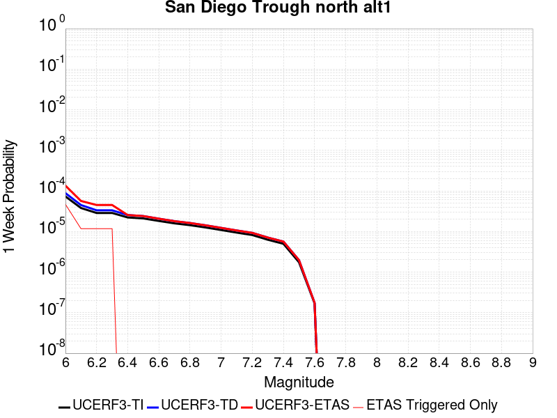 | 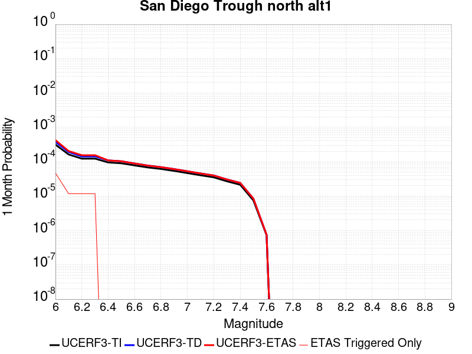 | 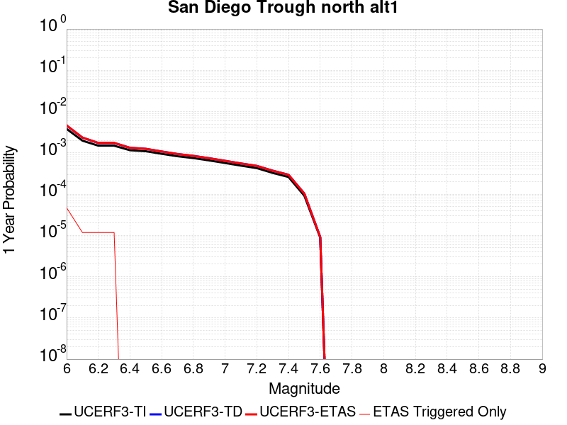 | 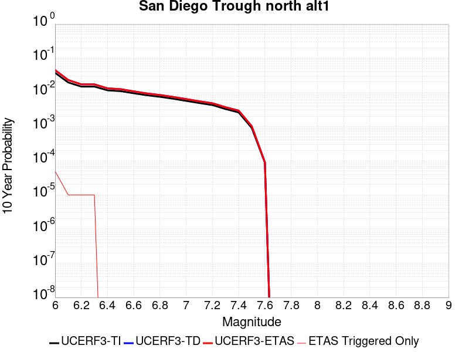 |

| Magnitude | 1 wk TI Prob | 1 wk TD Prob | 1 wk ETAS Prob | 1 wk ETAS/TD Gain | 1 wk ETAS Triggered Only | 1 mo TI Prob | 1 mo TD Prob | 1 mo ETAS Prob | 1 mo ETAS/TD Gain | 1 mo ETAS Triggered Only | 1 yr TI Prob | 1 yr TD Prob | 1 yr ETAS Prob | 1 yr ETAS/TD Gain | 1 yr ETAS Triggered Only | 10 yr TI Prob | 10 yr TD Prob | 10 yr ETAS Prob | 10 yr ETAS/TD Gain | 10 yr ETAS Triggered Only |
|-----|-----|-----|-----|-----|-----|-----|-----|-----|-----|-----|-----|-----|-----|-----|-----|-----|-----|-----|-----|-----|
| 6.0 | 7.329252E-5 | 8.821093E-5 | 1.3515515E-4 | 1.5321814 | 4.6948357E-5 | 3.14073E-4 | 3.7799572E-4 | 4.2492631E-4 | 1.1241565 | 4.6948357E-5 | 0.0038171355 | 0.004593027 | 0.0046397597 | 1.0101748 | 4.6948357E-5 | 0.03752231 | 0.045044992 | 0.045089826 | 1.0009953 | 4.6948357E-5 |
| 6.1 | 3.7940346E-5 | 4.4885E-5 | 5.6621564E-5 | 1.2614807 | 1.1737089E-5 | 1.6259136E-4 | 1.9235066E-4 | 2.040855E-4 | 1.0610075 | 1.1737089E-5 | 0.0019777524 | 0.0023394432 | 0.002351153 | 1.0050054 | 1.1737089E-5 | 0.019602431 | 0.023156688 | 0.023168152 | 1.0004951 | 1.1737089E-5 |
| 6.2 | 2.8645263E-5 | 3.329678E-5 | 4.5033477E-5 | 1.3524874 | 1.1737089E-5 | 1.2275964E-4 | 1.4269284E-4 | 1.5442826E-4 | 1.0822425 | 1.1737089E-5 | 0.0014935739 | 0.0017359189 | 0.0017476357 | 1.0067496 | 1.1737089E-5 | 0.0148357535 | 0.017226247 | 0.017237782 | 1.0006696 | 1.1737089E-5 |
| 6.3 | 2.8645263E-5 | 3.329678E-5 | 4.5033477E-5 | 1.3524874 | 1.1737089E-5 | 1.2275964E-4 | 1.4269284E-4 | 1.5442826E-4 | 1.0822425 | 1.1737089E-5 | 0.0014935739 | 0.0017359189 | 0.0017476357 | 1.0067496 | 1.1737089E-5 | 0.0148357535 | 0.017226247 | 0.017237782 | 1.0006696 | 1.1737089E-5 |
| 6.4 | 2.2204576E-5 | 2.5448318E-5 | 2.5448318E-5 | 1.0 | 0.0 | 9.5159E-5 | 1.0905972E-4 | 1.0905972E-4 | 1.0 | 0.0 | 0.001157945 | 0.0013270034 | 0.0013270034 | 1.0 | 0.0 | 0.011519298 | 0.013191955 | 0.013191955 | 1.0 | 0.0 |
| 6.5 | 2.1004838E-5 | 2.4024694E-5 | 2.4024694E-5 | 1.0 | 0.0 | 9.0017624E-5 | 1.0295896E-4 | 1.0295896E-4 | 1.0 | 0.0 | 0.0010954136 | 0.0012528138 | 0.0012528138 | 1.0 | 0.0 | 0.010900296 | 0.012458589 | 0.012458589 | 1.0 | 0.0 |
| 6.6 | 1.820557E-5 | 2.0704787E-5 | 2.0704787E-5 | 1.0 | 0.0 | 7.802154E-5 | 8.873181E-5 | 8.873181E-5 | 1.0 | 0.0 | 9.4949827E-4 | 0.0010797799 | 0.0010797799 | 1.0 | 0.0 | 0.009454516 | 0.010746004 | 0.010746004 | 1.0 | 0.0 |
| 6.7 | 1.5884485E-5 | 1.7983646E-5 | 1.7983646E-5 | 1.0 | 0.0 | 6.807459E-5 | 7.707051E-5 | 7.707051E-5 | 1.0 | 0.0 | 8.284929E-4 | 9.3793223E-4 | 9.3793223E-4 | 1.0 | 0.0 | 0.008254109 | 0.009340104 | 0.009340104 | 1.0 | 0.0 |
| 6.8 | 1.4331171E-5 | 1.6201066E-5 | 1.6201066E-5 | 1.0 | 0.0 | 6.141786E-5 | 6.94313E-5 | 6.94313E-5 | 1.0 | 0.0 | 7.4750587E-4 | 8.450002E-4 | 8.450002E-4 | 1.0 | 0.0 | 0.0074499645 | 0.008418139 | 0.008418139 | 1.0 | 0.0 |
| 6.9 | 1.2574203E-5 | 1.4205835E-5 | 1.4205835E-5 | 1.0 | 0.0 | 5.3888325E-5 | 6.0880735E-5 | 6.0880735E-5 | 1.0 | 0.0 | 6.558929E-4 | 7.409723E-4 | 7.409723E-4 | 1.0 | 0.0 | 0.0065396037 | 0.007385203 | 0.007385203 | 1.0 | 0.0 |
| 7.0 | 1.0883844E-5 | 1.2289262E-5 | 1.2289262E-5 | 1.0 | 0.0 | 4.664421E-5 | 5.2667205E-5 | 5.2667205E-5 | 1.0 | 0.0 | 5.677453E-4 | 6.4103556E-4 | 6.4103556E-4 | 1.0 | 0.0 | 0.00566297 | 0.006391993 | 0.006391993 | 1.0 | 0.0 |
| 7.1 | 9.393088E-6 | 1.060702E-5 | 1.060702E-5 | 1.0 | 0.0 | 4.025547E-5 | 4.545787E-5 | 4.545787E-5 | 1.0 | 0.0 | 4.900001E-4 | 5.533098E-4 | 5.533098E-4 | 1.0 | 0.0 | 0.0048892107 | 0.005519418 | 0.005519418 | 1.0 | 0.0 |
| 7.2 | 8.190791E-6 | 9.258625E-6 | 9.258625E-6 | 1.0 | 0.0 | 3.510292E-5 | 3.9679224E-5 | 3.9679224E-5 | 1.0 | 0.0 | 4.2729423E-4 | 4.8298817E-4 | 4.8298817E-4 | 1.0 | 0.0 | 0.0042647356 | 0.004819465 | 0.004819465 | 1.0 | 0.0 |
| 7.3 | 6.268162E-6 | 7.089716E-6 | 7.089716E-6 | 1.0 | 0.0 | 2.6863276E-5 | 3.0384144E-5 | 3.0384144E-5 | 1.0 | 0.0 | 3.2701128E-4 | 3.6986457E-4 | 3.6986457E-4 | 1.0 | 0.0 | 0.003265305 | 0.003692536 | 0.003692536 | 1.0 | 0.0 |
| 7.4 | 4.985186E-6 | 5.6426816E-6 | 5.6426816E-6 | 1.0 | 0.0 | 2.1364907E-5 | 2.4182698E-5 | 2.4182698E-5 | 1.0 | 0.0 | 2.600867E-4 | 2.9438498E-4 | 2.9438498E-4 | 1.0 | 0.0 | 0.002597825 | 0.0029399914 | 0.0029399914 | 1.0 | 0.0 |
| 7.5 | 1.7489613E-6 | 1.969678E-6 | 1.969678E-6 | 1.0 | 0.0 | 7.495527E-6 | 8.4414505E-6 | 8.4414505E-6 | 1.0 | 0.0 | 9.125422E-5 | 1.02770035E-4 | 1.02770035E-4 | 1.0 | 0.0 | 9.1216754E-4 | 0.0010272472 | 0.0010272472 | 1.0 | 0.0 |
| 7.6 | 1.6988751E-7 | 1.7533823E-7 | 1.7533823E-7 | 1.0 | 0.0 | 7.2808916E-7 | 7.5144936E-7 | 7.5144936E-7 | 1.0 | 0.0 | 8.864449E-6 | 9.14886E-6 | 9.14886E-6 | 1.0 | 0.0 | 8.8640954E-5 | 9.1485024E-5 | 9.1485024E-5 | 1.0 | 0.0 |

## Pitas Point (Lower West)
*[(top)](#table-of-contents)*

| 1 Week | 1 Month | 1 Year | 10 Year |
|-----|-----|-----|-----|
| 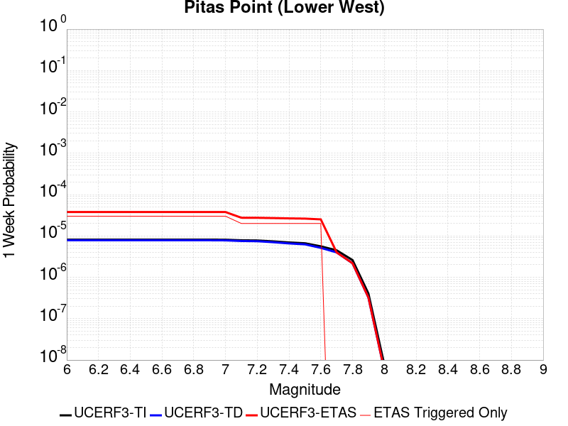 | 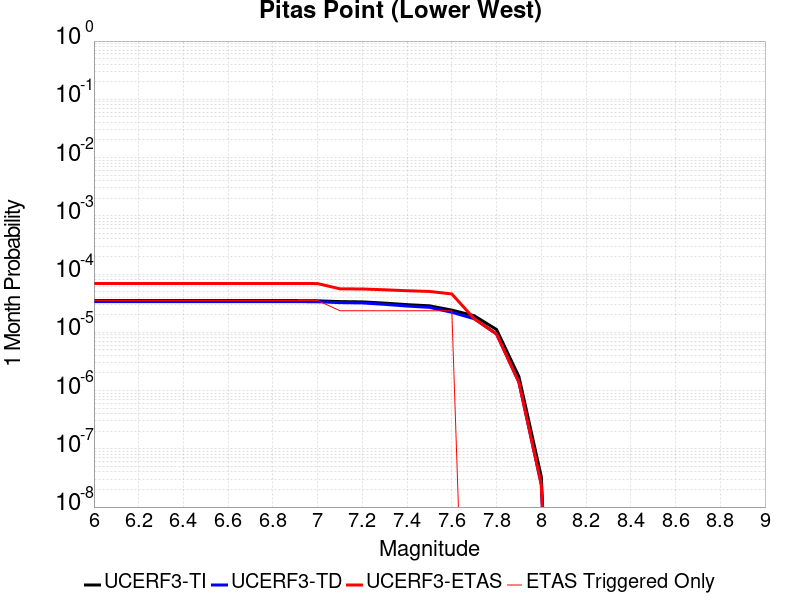 | 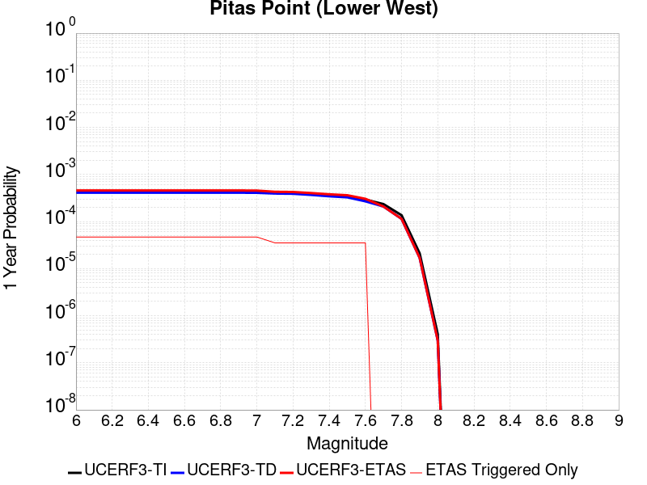 | 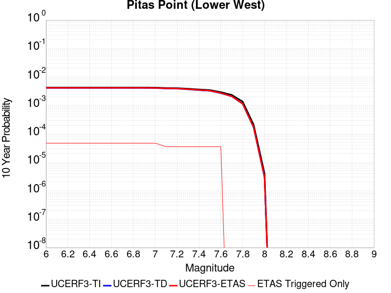 |

| Magnitude | 1 wk TI Prob | 1 wk TD Prob | 1 wk ETAS Prob | 1 wk ETAS/TD Gain | 1 wk ETAS Triggered Only | 1 mo TI Prob | 1 mo TD Prob | 1 mo ETAS Prob | 1 mo ETAS/TD Gain | 1 mo ETAS Triggered Only | 1 yr TI Prob | 1 yr TD Prob | 1 yr ETAS Prob | 1 yr ETAS/TD Gain | 1 yr ETAS Triggered Only | 10 yr TI Prob | 10 yr TD Prob | 10 yr ETAS Prob | 10 yr ETAS/TD Gain | 10 yr ETAS Triggered Only |
|-----|-----|-----|-----|-----|-----|-----|-----|-----|-----|-----|-----|-----|-----|-----|-----|-----|-----|-----|-----|-----|
| 6.0 | 8.151497E-6 | 7.855762E-6 | 4.3066753E-5 | 5.4821863 | 3.521127E-5 | 3.493452E-5 | 3.3667122E-5 | 6.8877205E-5 | 2.0458298 | 3.521127E-5 | 4.252448E-4 | 4.0982084E-4 | 4.5675E-4 | 1.1145113 | 4.6948357E-5 | 0.0042443196 | 0.0040907315 | 0.004137488 | 1.0114298 | 4.6948357E-5 |
| 6.1 | 8.151497E-6 | 7.855762E-6 | 4.3066753E-5 | 5.4821863 | 3.521127E-5 | 3.493452E-5 | 3.3667122E-5 | 6.8877205E-5 | 2.0458298 | 3.521127E-5 | 4.252448E-4 | 4.0982084E-4 | 4.5675E-4 | 1.1145113 | 4.6948357E-5 | 0.0042443196 | 0.0040907315 | 0.004137488 | 1.0114298 | 4.6948357E-5 |
| 6.2 | 8.151497E-6 | 7.855762E-6 | 4.3066753E-5 | 5.4821863 | 3.521127E-5 | 3.493452E-5 | 3.3667122E-5 | 6.8877205E-5 | 2.0458298 | 3.521127E-5 | 4.252448E-4 | 4.0982084E-4 | 4.5675E-4 | 1.1145113 | 4.6948357E-5 | 0.0042443196 | 0.0040907315 | 0.004137488 | 1.0114298 | 4.6948357E-5 |
| 6.3 | 8.151497E-6 | 7.855762E-6 | 4.3066753E-5 | 5.4821863 | 3.521127E-5 | 3.493452E-5 | 3.3667122E-5 | 6.8877205E-5 | 2.0458298 | 3.521127E-5 | 4.252448E-4 | 4.0982084E-4 | 4.5675E-4 | 1.1145113 | 4.6948357E-5 | 0.0042443196 | 0.0040907315 | 0.004137488 | 1.0114298 | 4.6948357E-5 |
| 6.4 | 8.151497E-6 | 7.855762E-6 | 4.3066753E-5 | 5.4821863 | 3.521127E-5 | 3.493452E-5 | 3.3667122E-5 | 6.8877205E-5 | 2.0458298 | 3.521127E-5 | 4.252448E-4 | 4.0982084E-4 | 4.5675E-4 | 1.1145113 | 4.6948357E-5 | 0.0042443196 | 0.0040907315 | 0.004137488 | 1.0114298 | 4.6948357E-5 |
| 6.5 | 8.151497E-6 | 7.855762E-6 | 4.3066753E-5 | 5.4821863 | 3.521127E-5 | 3.493452E-5 | 3.3667122E-5 | 6.8877205E-5 | 2.0458298 | 3.521127E-5 | 4.252448E-4 | 4.0982084E-4 | 4.5675E-4 | 1.1145113 | 4.6948357E-5 | 0.0042443196 | 0.0040907315 | 0.004137488 | 1.0114298 | 4.6948357E-5 |
| 6.6 | 8.151497E-6 | 7.855762E-6 | 4.3066753E-5 | 5.4821863 | 3.521127E-5 | 3.493452E-5 | 3.3667122E-5 | 6.8877205E-5 | 2.0458298 | 3.521127E-5 | 4.252448E-4 | 4.0982084E-4 | 4.5675E-4 | 1.1145113 | 4.6948357E-5 | 0.0042443196 | 0.0040907315 | 0.004137488 | 1.0114298 | 4.6948357E-5 |
| 6.7 | 8.151497E-6 | 7.855762E-6 | 4.3066753E-5 | 5.4821863 | 3.521127E-5 | 3.493452E-5 | 3.3667122E-5 | 6.8877205E-5 | 2.0458298 | 3.521127E-5 | 4.252448E-4 | 4.0982084E-4 | 4.5675E-4 | 1.1145113 | 4.6948357E-5 | 0.0042443196 | 0.0040907315 | 0.004137488 | 1.0114298 | 4.6948357E-5 |
| 6.8 | 8.151497E-6 | 7.855762E-6 | 4.3066753E-5 | 5.4821863 | 3.521127E-5 | 3.493452E-5 | 3.3667122E-5 | 6.8877205E-5 | 2.0458298 | 3.521127E-5 | 4.252448E-4 | 4.0982084E-4 | 4.5675E-4 | 1.1145113 | 4.6948357E-5 | 0.0042443196 | 0.0040907315 | 0.004137488 | 1.0114298 | 4.6948357E-5 |
| 6.9 | 8.151497E-6 | 7.855762E-6 | 4.3066753E-5 | 5.4821863 | 3.521127E-5 | 3.493452E-5 | 3.3667122E-5 | 6.8877205E-5 | 2.0458298 | 3.521127E-5 | 4.252448E-4 | 4.0982084E-4 | 4.5675E-4 | 1.1145113 | 4.6948357E-5 | 0.0042443196 | 0.0040907315 | 0.004137488 | 1.0114298 | 4.6948357E-5 |
| 7.0 | 8.103535E-6 | 7.805192E-6 | 4.3016185E-5 | 5.511227 | 3.521127E-5 | 3.4728975E-5 | 3.3450397E-5 | 6.866049E-5 | 2.052606 | 3.521127E-5 | 4.2274324E-4 | 4.0718322E-4 | 4.5411248E-4 | 1.1152533 | 4.6948357E-5 | 0.0042193993 | 0.004064452 | 0.0041112094 | 1.011504 | 4.6948357E-5 |
| 7.1 | 7.853298E-6 | 7.540883E-6 | 3.1014886E-5 | 4.1128983 | 2.3474178E-5 | 3.3656554E-5 | 3.2317676E-5 | 5.5791093E-5 | 1.7263339 | 2.3474178E-5 | 4.096915E-4 | 3.9339735E-4 | 4.2859477E-4 | 1.0894704 | 3.521127E-5 | 0.00408937 | 0.0039270855 | 0.0039621587 | 1.008931 | 3.521127E-5 |
| 7.2 | 7.771102E-6 | 7.453165E-6 | 3.0927167E-5 | 4.149535 | 2.3474178E-5 | 3.33043E-5 | 3.194175E-5 | 5.5415177E-5 | 1.7348824 | 2.3474178E-5 | 4.0540437E-4 | 3.8882208E-4 | 4.2401967E-4 | 1.0905236 | 3.521127E-5 | 0.0040466557 | 0.0038814936 | 0.003916568 | 1.0090364 | 3.521127E-5 |
| 7.3 | 7.3945344E-6 | 7.0492697E-6 | 3.0523282E-5 | 4.3299923 | 2.3474178E-5 | 3.1690477E-5 | 3.021081E-5 | 5.3684278E-5 | 1.7769891 | 2.3474178E-5 | 3.8576324E-4 | 3.6775516E-4 | 4.0295348E-4 | 1.0957112 | 3.521127E-5 | 0.0038509427 | 0.0036715334 | 0.0037066154 | 1.0095551 | 3.521127E-5 |
| 7.4 | 6.964645E-6 | 6.5901186E-6 | 3.0064142E-5 | 4.562003 | 2.3474178E-5 | 2.9848137E-5 | 2.8243063E-5 | 5.171658E-5 | 1.831125 | 2.3474178E-5 | 3.6334046E-4 | 3.4380553E-4 | 3.790047E-4 | 1.102381 | 3.521127E-5 | 0.0036274698 | 0.0034327896 | 0.00346788 | 1.0102221 | 3.521127E-5 |
| 7.5 | 6.6525035E-6 | 6.259157E-6 | 2.9733188E-5 | 4.7503505 | 2.3474178E-5 | 2.851042E-5 | 2.6824686E-5 | 5.0298233E-5 | 1.8750726 | 2.3474178E-5 | 3.4705905E-4 | 3.265421E-4 | 3.6174187E-4 | 1.1077955 | 3.521127E-5 | 0.0034651754 | 0.0032606742 | 0.0032957706 | 1.0107635 | 3.521127E-5 |
| 7.6 | 5.613338E-6 | 5.151386E-6 | 2.8625444E-5 | 5.556843 | 2.3474178E-5 | 2.405694E-5 | 2.2077185E-5 | 4.5550845E-5 | 2.0632544 | 2.3474178E-5 | 2.928539E-4 | 2.6875688E-4 | 3.0395866E-4 | 1.1309801 | 3.521127E-5 | 0.0029246826 | 0.0026843501 | 0.0027194668 | 1.013082 | 3.521127E-5 |
| 7.7 | 4.494704E-6 | 3.996911E-6 | 3.996911E-6 | 1.0 | 0.0 | 1.9262876E-5 | 1.7129507E-5 | 1.7129507E-5 | 1.0 | 0.0 | 2.3450027E-4 | 2.0853203E-4 | 2.0853203E-4 | 1.0 | 0.0 | 0.0023425296 | 0.0020833875 | 0.0020833875 | 1.0 | 0.0 |
| 7.8 | 2.6075882E-6 | 2.1836374E-6 | 2.1836374E-6 | 1.0 | 0.0 | 1.117533E-5 | 9.358413E-6 | 9.358413E-6 | 1.0 | 0.0 | 1.3605114E-4 | 1.1393277E-4 | 1.1393277E-4 | 1.0 | 0.0 | 0.0013596788 | 0.0011387484 | 0.0011387484 | 1.0 | 0.0 |
| 7.9 | 4.045984E-7 | 3.242375E-7 | 3.242375E-7 | 1.0 | 0.0 | 1.733992E-6 | 1.3895885E-6 | 1.3895885E-6 | 1.0 | 0.0 | 2.1111147E-5 | 1.6918111E-5 | 1.6918111E-5 | 1.0 | 0.0 | 2.1109142E-4 | 1.6916855E-4 | 1.6916855E-4 | 1.0 | 0.0 |
| 8.0 | 7.791402E-9 | 5.683497E-9 | 5.683497E-9 | 1.0 | 0.0 | 3.3391725E-8 | 2.4357844E-8 | 2.4357844E-8 | 1.0 | 0.0 | 4.0654416E-7 | 2.9655675E-7 | 2.9655675E-7 | 1.0 | 0.0 | 4.065434E-6 | 2.9655655E-6 | 2.9655655E-6 | 1.0 | 0.0 |

## Santa Ynez River
*[(top)](#table-of-contents)*

| 1 Week | 1 Month | 1 Year | 10 Year |
|-----|-----|-----|-----|
| 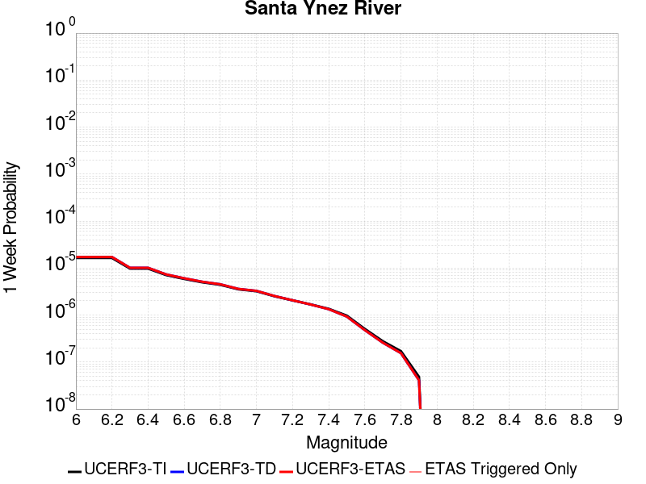 | 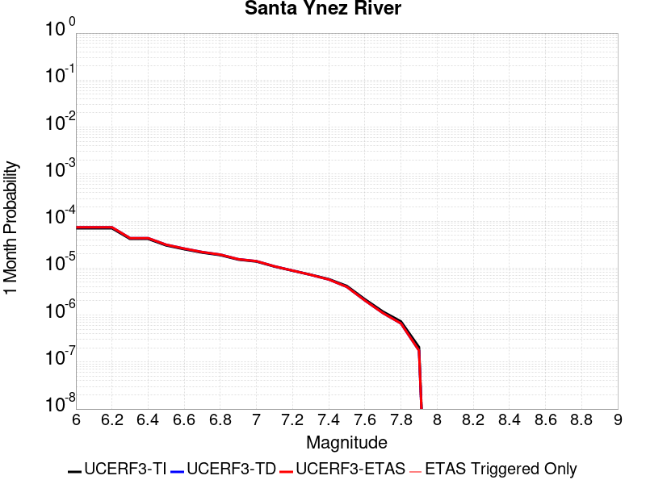 | 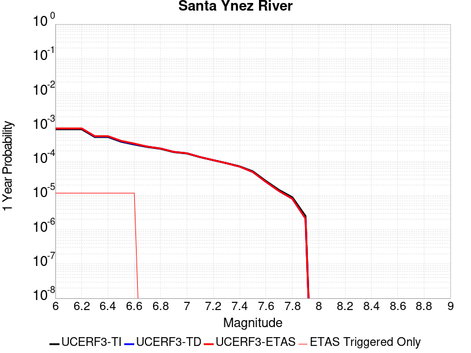 | 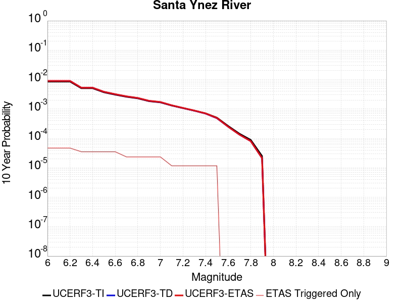 |

| Magnitude | 1 wk TI Prob | 1 wk TD Prob | 1 wk ETAS Prob | 1 wk ETAS/TD Gain | 1 wk ETAS Triggered Only | 1 mo TI Prob | 1 mo TD Prob | 1 mo ETAS Prob | 1 mo ETAS/TD Gain | 1 mo ETAS Triggered Only | 1 yr TI Prob | 1 yr TD Prob | 1 yr ETAS Prob | 1 yr ETAS/TD Gain | 1 yr ETAS Triggered Only | 10 yr TI Prob | 10 yr TD Prob | 10 yr ETAS Prob | 10 yr ETAS/TD Gain | 10 yr ETAS Triggered Only |
|-----|-----|-----|-----|-----|-----|-----|-----|-----|-----|-----|-----|-----|-----|-----|-----|-----|-----|-----|-----|-----|
| 6.0 | 1.6396456E-5 | 1.7209435E-5 | 1.7209435E-5 | 1.0 | 0.0 | 7.026863E-5 | 7.375284E-5 | 7.375284E-5 | 1.0 | 0.0 | 8.551848E-4 | 8.976064E-4 | 9.09333E-4 | 1.0130643 | 1.1737089E-5 | 0.0085190125 | 0.008943358 | 0.008989886 | 1.0052025 | 4.6948357E-5 |
| 6.1 | 1.6396456E-5 | 1.7209435E-5 | 1.7209435E-5 | 1.0 | 0.0 | 7.026863E-5 | 7.375284E-5 | 7.375284E-5 | 1.0 | 0.0 | 8.551848E-4 | 8.976064E-4 | 9.09333E-4 | 1.0130643 | 1.1737089E-5 | 0.0085190125 | 0.008943358 | 0.008989886 | 1.0052025 | 4.6948357E-5 |
| 6.2 | 1.6396456E-5 | 1.7209435E-5 | 1.7209435E-5 | 1.0 | 0.0 | 7.026863E-5 | 7.375284E-5 | 7.375284E-5 | 1.0 | 0.0 | 8.551848E-4 | 8.976064E-4 | 9.09333E-4 | 1.0130643 | 1.1737089E-5 | 0.0085190125 | 0.008943358 | 0.008989886 | 1.0052025 | 4.6948357E-5 |
| 6.3 | 9.736976E-6 | 1.012233E-5 | 1.012233E-5 | 1.0 | 0.0 | 4.172923E-5 | 4.338072E-5 | 4.338072E-5 | 1.0 | 0.0 | 5.0793495E-4 | 5.280373E-4 | 5.397682E-4 | 1.0222161 | 1.1737089E-5 | 0.005067755 | 0.005268332 | 0.0053033577 | 1.0066483 | 3.521127E-5 |
| 6.4 | 9.736976E-6 | 1.012233E-5 | 1.012233E-5 | 1.0 | 0.0 | 4.172923E-5 | 4.338072E-5 | 4.338072E-5 | 1.0 | 0.0 | 5.0793495E-4 | 5.280373E-4 | 5.397682E-4 | 1.0222161 | 1.1737089E-5 | 0.005067755 | 0.005268332 | 0.0053033577 | 1.0066483 | 3.521127E-5 |
| 6.5 | 7.081964E-6 | 7.3298966E-6 | 7.3298966E-6 | 1.0 | 0.0 | 3.035092E-5 | 3.1413474E-5 | 3.1413474E-5 | 1.0 | 0.0 | 3.694598E-4 | 3.8239348E-4 | 3.9412608E-4 | 1.030682 | 1.1737089E-5 | 0.0036884616 | 0.0038175168 | 0.0038525937 | 1.0091884 | 3.521127E-5 |
| 6.6 | 5.873247E-6 | 6.059743E-6 | 6.059743E-6 | 1.0 | 0.0 | 2.5170815E-5 | 2.5970074E-5 | 2.5970074E-5 | 1.0 | 0.0 | 3.064116E-4 | 3.1614062E-4 | 3.27874E-4 | 1.0371144 | 1.1737089E-5 | 0.0030598943 | 0.0031569963 | 0.0031920965 | 1.0111182 | 3.521127E-5 |
| 6.7 | 4.973277E-6 | 5.115901E-6 | 5.115901E-6 | 1.0 | 0.0 | 2.1313872E-5 | 2.1925109E-5 | 2.1925109E-5 | 1.0 | 0.0 | 2.5946548E-4 | 2.66906E-4 | 2.66906E-4 | 1.0 | 0.0 | 0.0025916274 | 0.0026659032 | 0.0026893148 | 1.0087819 | 2.3474178E-5 |
| 6.8 | 4.396492E-6 | 4.5109778E-6 | 4.5109778E-6 | 1.0 | 0.0 | 1.884197E-5 | 1.9332621E-5 | 1.9332621E-5 | 1.0 | 0.0 | 2.2937685E-4 | 2.3534958E-4 | 2.3534958E-4 | 1.0 | 0.0 | 0.0022914023 | 0.0023510386 | 0.0023744577 | 1.0099611 | 2.3474178E-5 |
| 6.9 | 3.5255632E-6 | 3.6013332E-6 | 3.6013332E-6 | 1.0 | 0.0 | 1.5109469E-5 | 1.5434196E-5 | 1.5434196E-5 | 1.0 | 0.0 | 1.8394225E-4 | 1.8789528E-4 | 1.8789528E-4 | 1.0 | 0.0 | 0.0018379007 | 0.0018773803 | 0.0019008104 | 1.0124803 | 2.3474178E-5 |
| 7.0 | 3.211603E-6 | 3.273654E-6 | 3.273654E-6 | 1.0 | 0.0 | 1.376394E-5 | 1.4029872E-5 | 1.4029872E-5 | 1.0 | 0.0 | 1.6756308E-4 | 1.7080043E-4 | 1.7080043E-4 | 1.0 | 0.0 | 0.0016743679 | 0.0017067058 | 0.0017301398 | 1.0137306 | 2.3474178E-5 |
| 7.1 | 2.5094619E-6 | 2.5409204E-6 | 2.5409204E-6 | 1.0 | 0.0 | 1.0754793E-5 | 1.0889614E-5 | 1.0889614E-5 | 1.0 | 0.0 | 1.3093173E-4 | 1.3257304E-4 | 1.3257304E-4 | 1.0 | 0.0 | 0.0013085462 | 0.0013249456 | 0.0013366671 | 1.0088468 | 1.1737089E-5 |
| 7.2 | 2.0515774E-6 | 2.0619375E-6 | 2.0619375E-6 | 1.0 | 0.0 | 8.792445E-6 | 8.836846E-6 | 8.836846E-6 | 1.0 | 0.0 | 1.0704277E-4 | 1.0758333E-4 | 1.0758333E-4 | 1.0 | 0.0 | 0.0010699122 | 0.0010753168 | 0.0010870412 | 1.0109032 | 1.1737089E-5 |
| 7.3 | 1.6845745E-6 | 1.6773907E-6 | 1.6773907E-6 | 1.0 | 0.0 | 7.219585E-6 | 7.1887976E-6 | 7.1887976E-6 | 1.0 | 0.0 | 8.78949E-5 | 8.752012E-5 | 8.752012E-5 | 1.0 | 0.0 | 8.7860145E-4 | 8.7485946E-4 | 8.8658626E-4 | 1.0134043 | 1.1737089E-5 |
| 7.4 | 1.3600285E-6 | 1.3333357E-6 | 1.3333357E-6 | 1.0 | 0.0 | 5.82868E-6 | 5.714284E-6 | 5.714284E-6 | 1.0 | 0.0 | 7.096187E-5 | 6.956921E-5 | 6.956921E-5 | 1.0 | 0.0 | 7.0939213E-4 | 6.954765E-4 | 7.0720544E-4 | 1.0168645 | 1.1737089E-5 |
| 7.5 | 9.735342E-7 | 9.290103E-7 | 9.290103E-7 | 1.0 | 0.0 | 4.172283E-6 | 3.9814668E-6 | 3.9814668E-6 | 1.0 | 0.0 | 5.079636E-5 | 4.8473295E-5 | 4.8473295E-5 | 1.0 | 0.0 | 5.0784746E-4 | 4.8462892E-4 | 4.9636036E-4 | 1.024207 | 1.1737089E-5 |
| 7.6 | 5.067187E-7 | 4.77857E-7 | 4.77857E-7 | 1.0 | 0.0 | 2.1716498E-6 | 2.047957E-6 | 2.047957E-6 | 1.0 | 0.0 | 2.6439517E-5 | 2.4933597E-5 | 2.4933597E-5 | 1.0 | 0.0 | 2.643637E-4 | 2.4930874E-4 | 2.4930874E-4 | 1.0 | 0.0 |
| 7.7 | 2.769089E-7 | 2.5759124E-7 | 2.5759124E-7 | 1.0 | 0.0 | 1.1867519E-6 | 1.1039621E-6 | 1.1039621E-6 | 1.0 | 0.0 | 1.4448608E-5 | 1.34406555E-5 | 1.34406555E-5 | 1.0 | 0.0 | 1.444767E-4 | 1.3439846E-4 | 1.3439846E-4 | 1.0 | 0.0 |
| 7.8 | 1.7044663E-7 | 1.5449015E-7 | 1.5449015E-7 | 1.0 | 0.0 | 7.3048534E-7 | 6.621005E-7 | 6.621005E-7 | 1.0 | 0.0 | 8.893623E-6 | 8.061043E-6 | 8.061043E-6 | 1.0 | 0.0 | 8.893267E-5 | 8.060753E-5 | 8.060753E-5 | 1.0 | 0.0 |
| 7.9 | 4.8344287E-8 | 4.0910923E-8 | 4.0910923E-8 | 1.0 | 0.0 | 2.0718979E-7 | 1.7533252E-7 | 1.7533252E-7 | 1.0 | 0.0 | 2.5225327E-6 | 2.1346711E-6 | 2.1346711E-6 | 1.0 | 0.0 | 2.5225041E-5 | 2.1346512E-5 | 2.1346512E-5 | 1.0 | 0.0 |

## San Gabriel
*[(top)](#table-of-contents)*

| 1 Week | 1 Month | 1 Year | 10 Year |
|-----|-----|-----|-----|
| 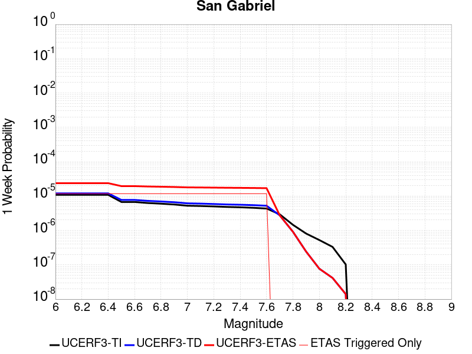 |  | 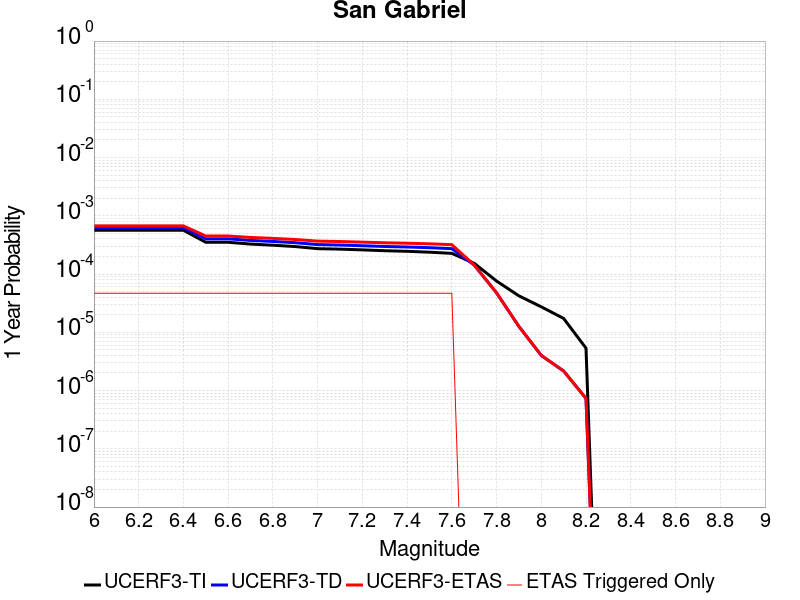 | 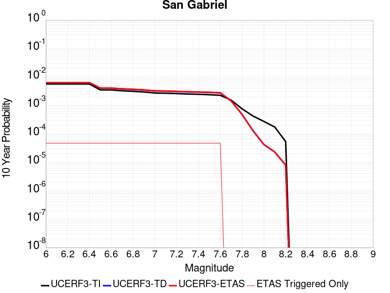 |

| Magnitude | 1 wk TI Prob | 1 wk TD Prob | 1 wk ETAS Prob | 1 wk ETAS/TD Gain | 1 wk ETAS Triggered Only | 1 mo TI Prob | 1 mo TD Prob | 1 mo ETAS Prob | 1 mo ETAS/TD Gain | 1 mo ETAS Triggered Only | 1 yr TI Prob | 1 yr TD Prob | 1 yr ETAS Prob | 1 yr ETAS/TD Gain | 1 yr ETAS Triggered Only | 10 yr TI Prob | 10 yr TD Prob | 10 yr ETAS Prob | 10 yr ETAS/TD Gain | 10 yr ETAS Triggered Only |
|-----|-----|-----|-----|-----|-----|-----|-----|-----|-----|-----|-----|-----|-----|-----|-----|-----|-----|-----|-----|-----|
| 6.0 | 1.083775E-5 | 1.19851875E-5 | 2.3722136E-5 | 1.9792879 | 1.1737089E-5 | 4.6446676E-5 | 5.1364143E-5 | 6.3100626E-5 | 1.2284957 | 1.1737089E-5 | 5.653415E-4 | 6.251903E-4 | 6.721093E-4 | 1.0750476 | 4.6948357E-5 | 0.0056390543 | 0.006246409 | 0.006293064 | 1.007469 | 4.6948357E-5 |
| 6.1 | 1.083775E-5 | 1.19851875E-5 | 2.3722136E-5 | 1.9792879 | 1.1737089E-5 | 4.6446676E-5 | 5.1364143E-5 | 6.3100626E-5 | 1.2284957 | 1.1737089E-5 | 5.653415E-4 | 6.251903E-4 | 6.721093E-4 | 1.0750476 | 4.6948357E-5 | 0.0056390543 | 0.006246409 | 0.006293064 | 1.007469 | 4.6948357E-5 |
| 6.2 | 1.083775E-5 | 1.19851875E-5 | 2.3722136E-5 | 1.9792879 | 1.1737089E-5 | 4.6446676E-5 | 5.1364143E-5 | 6.3100626E-5 | 1.2284957 | 1.1737089E-5 | 5.653415E-4 | 6.251903E-4 | 6.721093E-4 | 1.0750476 | 4.6948357E-5 | 0.0056390543 | 0.006246409 | 0.006293064 | 1.007469 | 4.6948357E-5 |
| 6.3 | 1.083775E-5 | 1.19851875E-5 | 2.3722136E-5 | 1.9792879 | 1.1737089E-5 | 4.6446676E-5 | 5.1364143E-5 | 6.3100626E-5 | 1.2284957 | 1.1737089E-5 | 5.653415E-4 | 6.251903E-4 | 6.721093E-4 | 1.0750476 | 4.6948357E-5 | 0.0056390543 | 0.006246409 | 0.006293064 | 1.007469 | 4.6948357E-5 |
| 6.4 | 1.083775E-5 | 1.19851875E-5 | 2.3722136E-5 | 1.9792879 | 1.1737089E-5 | 4.6446676E-5 | 5.1364143E-5 | 6.3100626E-5 | 1.2284957 | 1.1737089E-5 | 5.653415E-4 | 6.251903E-4 | 6.721093E-4 | 1.0750476 | 4.6948357E-5 | 0.0056390543 | 0.006246409 | 0.006293064 | 1.007469 | 4.6948357E-5 |
| 6.5 | 6.7317824E-6 | 7.716944E-6 | 1.9453943E-5 | 2.5209386 | 1.1737089E-5 | 2.8850178E-5 | 3.3072207E-5 | 4.480891E-5 | 1.354881 | 1.1737089E-5 | 3.511943E-4 | 4.0258077E-4 | 4.4951023E-4 | 1.1165715 | 4.6948357E-5 | 0.003506398 | 0.0040296097 | 0.0040763686 | 1.011604 | 4.6948357E-5 |
| 6.6 | 6.7317824E-6 | 7.716944E-6 | 1.9453943E-5 | 2.5209386 | 1.1737089E-5 | 2.8850178E-5 | 3.3072207E-5 | 4.480891E-5 | 1.354881 | 1.1737089E-5 | 3.511943E-4 | 4.0258077E-4 | 4.4951023E-4 | 1.1165715 | 4.6948357E-5 | 0.003506398 | 0.0040296097 | 0.0040763686 | 1.011604 | 4.6948357E-5 |
| 6.7 | 6.274881E-6 | 7.2458647E-6 | 1.898287E-5 | 2.619821 | 1.1737089E-5 | 2.6892068E-5 | 3.1053343E-5 | 4.2790067E-5 | 1.3779536 | 1.1737089E-5 | 3.2736175E-4 | 3.780098E-4 | 4.2494043E-4 | 1.1241518 | 4.6948357E-5 | 0.0032687993 | 0.0037847564 | 0.003831527 | 1.0123576 | 4.6948357E-5 |
| 6.8 | 5.996209E-6 | 6.958585E-6 | 1.8695593E-5 | 2.6866946 | 1.1737089E-5 | 2.5697784E-5 | 2.9822171E-5 | 4.155891E-5 | 1.3935575 | 1.1737089E-5 | 3.128256E-4 | 3.6302538E-4 | 4.099567E-4 | 1.1292783 | 4.6948357E-5 | 0.003123856 | 0.0036354093 | 0.003682187 | 1.0128672 | 4.6948357E-5 |
| 6.9 | 5.686331E-6 | 6.6236316E-6 | 1.8360643E-5 | 2.7719903 | 1.1737089E-5 | 2.4369761E-5 | 2.8386688E-5 | 4.0123447E-5 | 1.4134599 | 1.1737089E-5 | 2.9666146E-4 | 3.4555403E-4 | 3.9248617E-4 | 1.135817 | 4.6948357E-5 | 0.0029626573 | 0.0034612515 | 0.0035080372 | 1.013517 | 4.6948357E-5 |
| 7.0 | 5.2329838E-6 | 6.147514E-6 | 1.7884531E-5 | 2.9092298 | 1.1737089E-5 | 2.242688E-5 | 2.6346226E-5 | 3.8083006E-5 | 1.4454824 | 1.1737089E-5 | 2.7301308E-4 | 3.2071886E-4 | 3.6765216E-4 | 1.1463379 | 4.6948357E-5 | 0.002726779 | 0.0032136322 | 0.0032604295 | 1.0145621 | 4.6948357E-5 |
| 7.1 | 5.135671E-6 | 6.03764E-6 | 1.7774659E-5 | 2.9439745 | 1.1737089E-5 | 2.2009834E-5 | 2.5875348E-5 | 3.761213E-5 | 1.4535894 | 1.1737089E-5 | 2.6793676E-4 | 3.1498758E-4 | 3.6192115E-4 | 1.1490014 | 4.6948357E-5 | 0.0026761394 | 0.0031564834 | 0.0032032835 | 1.0148267 | 4.6948357E-5 |
| 7.2 | 4.989062E-6 | 5.87102E-6 | 1.7608041E-5 | 2.999145 | 1.1737089E-5 | 2.1381518E-5 | 2.5161276E-5 | 3.689807E-5 | 1.4664626 | 1.1737089E-5 | 2.6028889E-4 | 3.0629625E-4 | 3.5323022E-4 | 1.1532307 | 4.6948357E-5 | 0.0025998424 | 0.003069813 | 0.003116617 | 1.0152466 | 4.6948357E-5 |
| 7.3 | 4.8219395E-6 | 5.702574E-6 | 1.7439597E-5 | 3.0581973 | 1.1737089E-5 | 2.0665291E-5 | 2.443938E-5 | 3.617618E-5 | 1.4802414 | 1.1737089E-5 | 2.5157086E-4 | 2.9750957E-4 | 3.4444395E-4 | 1.1577576 | 4.6948357E-5 | 0.0025128627 | 0.0029821852 | 0.0030289935 | 1.015696 | 4.6948357E-5 |
| 7.4 | 4.7118383E-6 | 5.5911332E-6 | 1.7328157E-5 | 3.099221 | 1.1737089E-5 | 2.0193436E-5 | 2.3961782E-5 | 3.569859E-5 | 1.4898137 | 1.1737089E-5 | 2.4582737E-4 | 2.916964E-4 | 3.3863107E-4 | 1.1609024 | 4.6948357E-5 | 0.002455556 | 0.0029242067 | 0.0029710177 | 1.0160081 | 4.6948357E-5 |
| 7.5 | 4.5506545E-6 | 5.4365014E-6 | 1.7173526E-5 | 3.1589298 | 1.1737089E-5 | 1.9502659E-5 | 2.3299088E-5 | 3.5035904E-5 | 1.5037457 | 1.1737089E-5 | 2.37419E-4 | 2.8363022E-4 | 3.3056526E-4 | 1.1654797 | 4.6948357E-5 | 0.002371655 | 0.002843753 | 0.0028905678 | 1.0164623 | 4.6948357E-5 |
| 7.6 | 4.343636E-6 | 5.2293817E-6 | 1.6966409E-5 | 3.244439 | 1.1737089E-5 | 1.861545E-5 | 2.2411448E-5 | 3.4148274E-5 | 1.5236979 | 1.1737089E-5 | 2.2661954E-4 | 2.7282597E-4 | 3.1976152E-4 | 1.1720347 | 4.6948357E-5 | 0.0022638857 | 0.0027359722 | 0.002782792 | 1.0171127 | 4.6948357E-5 |
| 7.7 | 2.936235E-6 | 2.7440458E-6 | 2.7440458E-6 | 1.0 | 0.0 | 1.2583803E-5 | 1.1760143E-5 | 1.1760143E-5 | 1.0 | 0.0 | 1.5319703E-4 | 1.4317037E-4 | 1.4317037E-4 | 1.0 | 0.0 | 0.0015309147 | 0.0014380751 | 0.0014380751 | 1.0 | 0.0 |
| 7.8 | 1.4541639E-6 | 9.1237047E-7 | 9.1237047E-7 | 1.0 | 0.0 | 6.232116E-6 | 3.9101533E-6 | 3.9101533E-6 | 1.0 | 0.0 | 7.587337E-5 | 4.7605077E-5 | 4.7605077E-5 | 1.0 | 0.0 | 7.584747E-4 | 4.8085177E-4 | 4.8085177E-4 | 1.0 | 0.0 |
| 7.9 | 8.098958E-7 | 2.41753E-7 | 2.41753E-7 | 1.0 | 0.0 | 3.4709774E-6 | 1.0360839E-6 | 1.0360839E-6 | 1.0 | 0.0 | 4.225833E-5 | 1.2614248E-5 | 1.2614248E-5 | 1.0 | 0.0 | 4.2250296E-4 | 1.2921814E-4 | 1.2921814E-4 | 1.0 | 0.0 |
| 8.0 | 5.2473234E-7 | 7.6792055E-8 | 7.6792055E-8 | 1.0 | 0.0 | 2.248851E-6 | 3.2910876E-7 | 3.2910876E-7 | 1.0 | 0.0 | 2.7379416E-5 | 4.0068917E-6 | 4.0068917E-6 | 1.0 | 0.0 | 2.7376044E-4 | 4.21918E-5 | 4.21918E-5 | 1.0 | 0.0 |
| 8.1 | 3.3162388E-7 | 4.1496126E-8 | 4.1496126E-8 | 1.0 | 0.0 | 1.4212444E-6 | 1.7784053E-7 | 1.7784053E-7 | 1.0 | 0.0 | 1.7303513E-5 | 2.1652063E-6 | 2.1652063E-6 | 1.0 | 0.0 | 1.7302166E-4 | 2.2965523E-5 | 2.2965523E-5 | 1.0 | 0.0 |
| 8.2 | 1.0235345E-7 | 1.4043474E-8 | 1.4043474E-8 | 1.0 | 0.0 | 4.3865757E-7 | 6.0186316E-8 | 6.0186316E-8 | 1.0 | 0.0 | 5.340643E-6 | 7.327681E-7 | 7.327681E-7 | 1.0 | 0.0 | 5.3405143E-5 | 7.9273705E-6 | 7.9273705E-6 | 1.0 | 0.0 |

## West Napa 2011 CFM
*[(top)](#table-of-contents)*

| 1 Week | 1 Month | 1 Year | 10 Year |
|-----|-----|-----|-----|
| 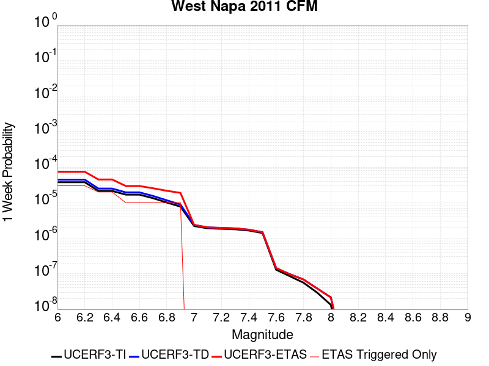 | 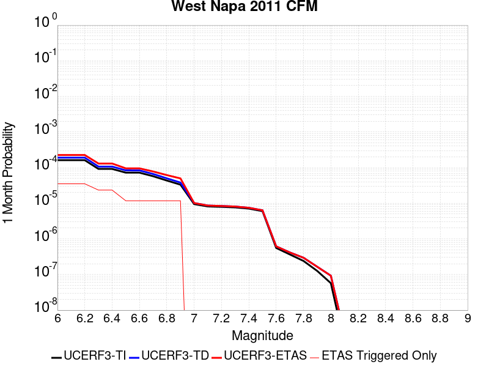 | 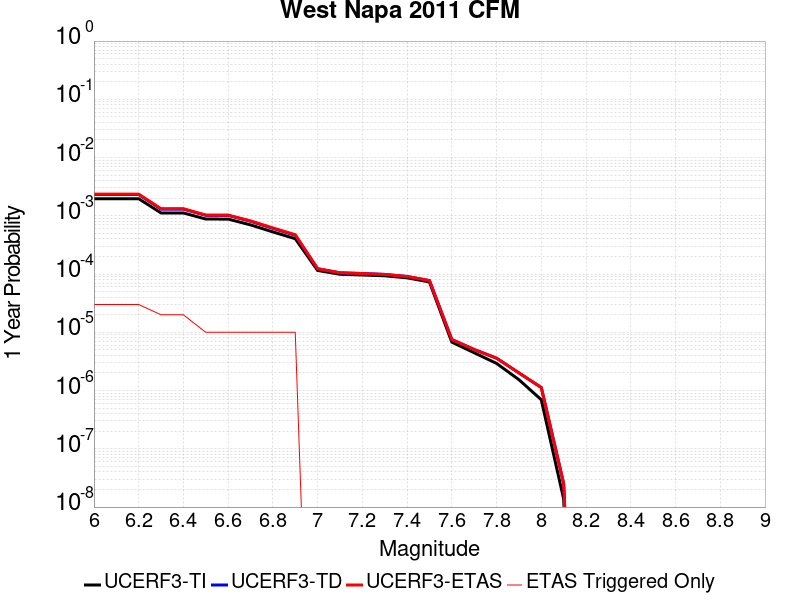 | 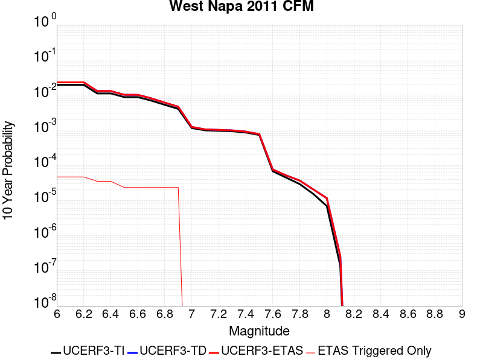 |

| Magnitude | 1 wk TI Prob | 1 wk TD Prob | 1 wk ETAS Prob | 1 wk ETAS/TD Gain | 1 wk ETAS Triggered Only | 1 mo TI Prob | 1 mo TD Prob | 1 mo ETAS Prob | 1 mo ETAS/TD Gain | 1 mo ETAS Triggered Only | 1 yr TI Prob | 1 yr TD Prob | 1 yr ETAS Prob | 1 yr ETAS/TD Gain | 1 yr ETAS Triggered Only | 10 yr TI Prob | 10 yr TD Prob | 10 yr ETAS Prob | 10 yr ETAS/TD Gain | 10 yr ETAS Triggered Only |
|-----|-----|-----|-----|-----|-----|-----|-----|-----|-----|-----|-----|-----|-----|-----|-----|-----|-----|-----|-----|-----|
| 6.0 | 3.773104E-5 | 4.452845E-5 | 7.973815E-5 | 1.7907237 | 3.521127E-5 | 1.6169442E-4 | 1.9082405E-4 | 2.260286E-4 | 1.184487 | 3.521127E-5 | 0.001966852 | 0.0023211248 | 0.0023562543 | 1.0151347 | 3.521127E-5 | 0.019495348 | 0.023002245 | 0.023048114 | 1.0019941 | 4.6948357E-5 |
| 6.1 | 3.773104E-5 | 4.452845E-5 | 7.973815E-5 | 1.7907237 | 3.521127E-5 | 1.6169442E-4 | 1.9082405E-4 | 2.260286E-4 | 1.184487 | 3.521127E-5 | 0.001966852 | 0.0023211248 | 0.0023562543 | 1.0151347 | 3.521127E-5 | 0.019495348 | 0.023002245 | 0.023048114 | 1.0019941 | 4.6948357E-5 |
| 6.2 | 3.773104E-5 | 4.452845E-5 | 7.973815E-5 | 1.7907237 | 3.521127E-5 | 1.6169442E-4 | 1.9082405E-4 | 2.260286E-4 | 1.184487 | 3.521127E-5 | 0.001966852 | 0.0023211248 | 0.0023562543 | 1.0151347 | 3.521127E-5 | 0.019495348 | 0.023002245 | 0.023048114 | 1.0019941 | 4.6948357E-5 |
| 6.3 | 2.147964E-5 | 2.4987039E-5 | 4.846063E-5 | 1.9394307 | 2.3474178E-5 | 9.2052345E-5 | 1.0708343E-4 | 1.305551E-4 | 1.2191905 | 2.3474178E-5 | 0.001120161 | 0.0013030528 | 0.0013264964 | 1.0179913 | 2.3474178E-5 | 0.011145315 | 0.0129647385 | 0.012999493 | 1.0026807 | 3.521127E-5 |
| 6.4 | 2.147964E-5 | 2.4987039E-5 | 4.846063E-5 | 1.9394307 | 2.3474178E-5 | 9.2052345E-5 | 1.0708343E-4 | 1.305551E-4 | 1.2191905 | 2.3474178E-5 | 0.001120161 | 0.0013030528 | 0.0013264964 | 1.0179913 | 2.3474178E-5 | 0.011145315 | 0.0129647385 | 0.012999493 | 1.0026807 | 3.521127E-5 |
| 6.5 | 1.688201E-5 | 1.9547346E-5 | 3.1284206E-5 | 1.6004324 | 1.1737089E-5 | 7.234947E-5 | 8.377206E-5 | 9.550817E-5 | 1.1400957 | 1.1737089E-5 | 8.804988E-4 | 0.0010195201 | 0.0010312452 | 1.0115006 | 1.1737089E-5 | 0.008770182 | 0.010157098 | 0.010180334 | 1.0022876 | 2.3474178E-5 |
| 6.6 | 1.6846381E-5 | 1.9507039E-5 | 3.12439E-5 | 1.6016731 | 1.1737089E-5 | 7.219678E-5 | 8.359933E-5 | 9.533543E-5 | 1.1403852 | 1.1737089E-5 | 8.7864127E-4 | 0.001017419 | 0.0010291442 | 1.0115244 | 1.1737089E-5 | 0.008751754 | 0.010136279 | 0.010159515 | 1.0022924 | 2.3474178E-5 |
| 6.7 | 1.3396501E-5 | 1.5467655E-5 | 2.7204562E-5 | 1.7588032 | 1.1737089E-5 | 5.7412315E-5 | 6.628862E-5 | 7.802493E-5 | 1.1770487 | 1.1737089E-5 | 6.9877075E-4 | 8.0682867E-4 | 8.185563E-4 | 1.0145354 | 1.1737089E-5 | 0.0069657755 | 0.008046719 | 0.008070004 | 1.0028938 | 2.3474178E-5 |
| 6.8 | 1.0139058E-5 | 1.1672149E-5 | 2.3409102E-5 | 2.0055518 | 1.1737089E-5 | 4.3452383E-5 | 5.0022853E-5 | 6.1759354E-5 | 1.2346228 | 1.1737089E-5 | 5.289043E-4 | 6.0891354E-4 | 6.206435E-4 | 1.0192637 | 1.1737089E-5 | 0.005276473 | 0.006079373 | 0.0061027044 | 1.0038378 | 2.3474178E-5 |
| 6.9 | 7.761281E-6 | 8.890694E-6 | 2.0627678E-5 | 2.3201427 | 1.1737089E-5 | 3.326221E-5 | 3.8102706E-5 | 4.9839346E-5 | 1.3080264 | 1.1737089E-5 | 4.0489217E-4 | 4.6385307E-4 | 4.755847E-4 | 1.0252917 | 1.1737089E-5 | 0.0040415525 | 0.004635363 | 0.0046587284 | 1.0050406 | 2.3474178E-5 |
| 7.0 | 2.2109202E-6 | 2.3666025E-6 | 2.3666025E-6 | 1.0 | 0.0 | 9.475338E-6 | 1.0142544E-5 | 1.0142544E-5 | 1.0 | 0.0 | 1.1535613E-4 | 1.2347854E-4 | 1.2347854E-4 | 1.0 | 0.0 | 0.0011529627 | 0.0012355851 | 0.0012355851 | 1.0 | 0.0 |
| 7.1 | 1.9008926E-6 | 2.0132914E-6 | 2.0132914E-6 | 1.0 | 0.0 | 8.146657E-6 | 8.6283635E-6 | 8.6283635E-6 | 1.0 | 0.0 | 9.918104E-5 | 1.05045285E-4 | 1.05045285E-4 | 1.0 | 0.0 | 9.913679E-4 | 0.001051437 | 0.001051437 | 1.0 | 0.0 |
| 7.2 | 1.8495944E-6 | 1.9560982E-6 | 1.9560982E-6 | 1.0 | 0.0 | 7.926808E-6 | 8.383251E-6 | 8.383251E-6 | 1.0 | 0.0 | 9.650462E-5 | 1.0206133E-4 | 1.0206133E-4 | 1.0 | 0.0 | 9.6462725E-4 | 0.0010216252 | 0.0010216252 | 1.0 | 0.0 |
| 7.3 | 1.7883189E-6 | 1.8880608E-6 | 1.8880608E-6 | 1.0 | 0.0 | 7.664201E-6 | 8.091664E-6 | 8.091664E-6 | 1.0 | 0.0 | 9.330765E-5 | 9.8511584E-5 | 9.8511584E-5 | 1.0 | 0.0 | 9.3268487E-4 | 9.861597E-4 | 9.861597E-4 | 1.0 | 0.0 |
| 7.4 | 1.6520572E-6 | 1.741484E-6 | 1.741484E-6 | 1.0 | 0.0 | 7.0802257E-6 | 7.463482E-6 | 7.463482E-6 | 1.0 | 0.0 | 8.6198335E-5 | 9.086413E-5 | 9.086413E-5 | 1.0 | 0.0 | 8.616491E-4 | 9.0974604E-4 | 9.0974604E-4 | 1.0 | 0.0 |
| 7.5 | 1.4040345E-6 | 1.4800074E-6 | 1.4800074E-6 | 1.0 | 0.0 | 6.0172765E-6 | 6.3428733E-6 | 6.3428733E-6 | 1.0 | 0.0 | 7.325788E-5 | 7.7221775E-5 | 7.7221775E-5 | 1.0 | 0.0 | 7.3233736E-4 | 7.7339396E-4 | 7.7339396E-4 | 1.0 | 0.0 |
| 7.6 | 1.3013842E-7 | 1.4415936E-7 | 1.4415936E-7 | 1.0 | 0.0 | 5.57736E-7 | 6.1782566E-7 | 6.1782566E-7 | 1.0 | 0.0 | 6.790414E-6 | 7.5220014E-6 | 7.5220014E-6 | 1.0 | 0.0 | 6.790207E-5 | 7.614869E-5 | 7.614869E-5 | 1.0 | 0.0 |
| 7.7 | 8.541512E-8 | 9.716316E-8 | 9.716316E-8 | 1.0 | 0.0 | 3.6606474E-7 | 4.1641349E-7 | 4.1641349E-7 | 1.0 | 0.0 | 4.456829E-6 | 5.0698222E-6 | 5.0698222E-6 | 1.0 | 0.0 | 4.4567398E-5 | 5.160297E-5 | 5.160297E-5 | 1.0 | 0.0 |
| 7.8 | 5.6074793E-8 | 6.89534E-8 | 6.89534E-8 | 1.0 | 0.0 | 2.403205E-7 | 2.9551452E-7 | 2.9551452E-7 | 1.0 | 0.0 | 2.9258983E-6 | 3.5978833E-6 | 3.5978833E-6 | 1.0 | 0.0 | 2.9258597E-5 | 3.681433E-5 | 3.681433E-5 | 1.0 | 0.0 |
| 7.9 | 2.9475839E-8 | 3.8566046E-8 | 3.8566046E-8 | 1.0 | 0.0 | 1.2632502E-7 | 1.6528305E-7 | 1.6528305E-7 | 1.0 | 0.0 | 1.538006E-6 | 2.0123193E-6 | 2.0123193E-6 | 1.0 | 0.0 | 1.5379954E-5 | 2.0665891E-5 | 2.0665891E-5 | 1.0 | 0.0 |
| 8.0 | 1.3337122E-8 | 2.163124E-8 | 2.163124E-8 | 1.0 | 0.0 | 5.7159088E-8 | 9.270532E-8 | 9.270532E-8 | 1.0 | 0.0 | 6.959117E-7 | 1.1286867E-6 | 1.1286867E-6 | 1.0 | 0.0 | 6.959095E-6 | 1.1645628E-5 | 1.1645628E-5 | 1.0 | 0.0 |
| 8.1 | 2.6589986E-10 | 4.8615456E-10 | 4.8615456E-10 | 1.0 | 0.0 | 1.1395708E-9 | 2.0835205E-9 | 2.0835205E-9 | 1.0 | 0.0 | 1.3874274E-8 | 2.536686E-8 | 2.536686E-8 | 1.0 | 0.0 | 1.3874273E-7 | 2.6035906E-7 | 2.6035906E-7 | 1.0 | 0.0 |

## Chino alt 1
*[(top)](#table-of-contents)*

| 1 Week | 1 Month | 1 Year | 10 Year |
|-----|-----|-----|-----|
| 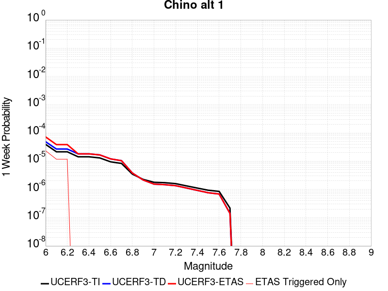 | 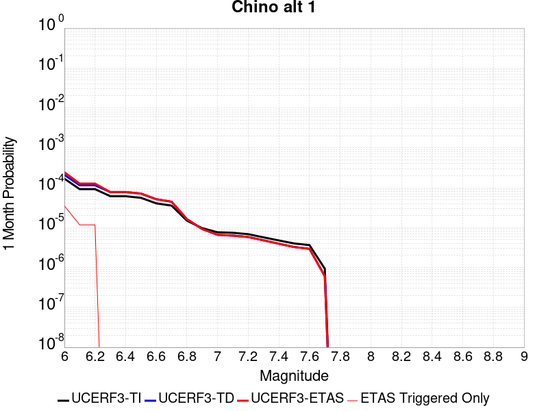 | 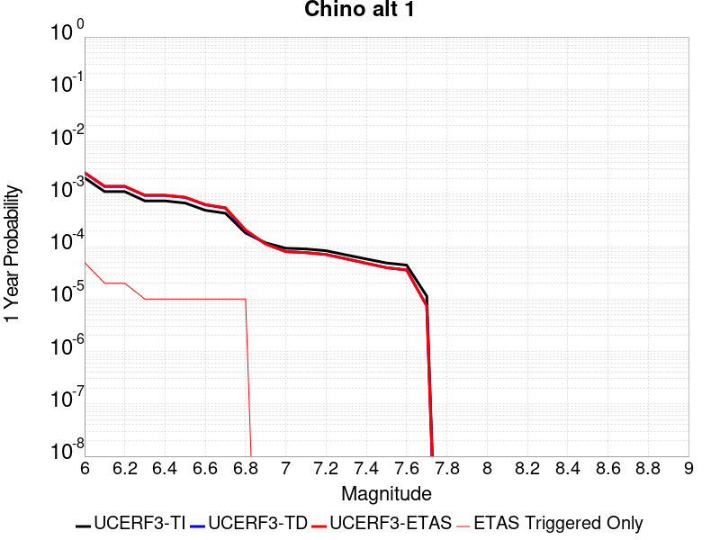 | 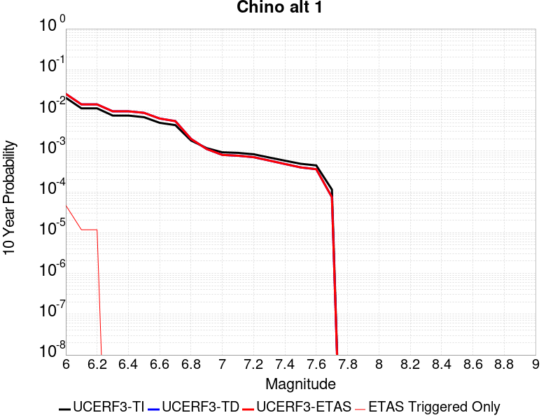 |

| Magnitude | 1 wk TI Prob | 1 wk TD Prob | 1 wk ETAS Prob | 1 wk ETAS/TD Gain | 1 wk ETAS Triggered Only | 1 mo TI Prob | 1 mo TD Prob | 1 mo ETAS Prob | 1 mo ETAS/TD Gain | 1 mo ETAS Triggered Only | 1 yr TI Prob | 1 yr TD Prob | 1 yr ETAS Prob | 1 yr ETAS/TD Gain | 1 yr ETAS Triggered Only | 10 yr TI Prob | 10 yr TD Prob | 10 yr ETAS Prob | 10 yr ETAS/TD Gain | 10 yr ETAS Triggered Only |
|-----|-----|-----|-----|-----|-----|-----|-----|-----|-----|-----|-----|-----|-----|-----|-----|-----|-----|-----|-----|-----|
| 6.0 | 3.939946E-5 | 4.8948554E-5 | 7.2421586E-5 | 1.4795449 | 2.3474178E-5 | 1.6884391E-4 | 2.097656E-4 | 2.4496947E-4 | 1.1678249 | 3.521127E-5 | 0.0020537362 | 0.0025513945 | 0.002586516 | 1.0137656 | 3.521127E-5 | 0.020348595 | 0.025277847 | 0.025323609 | 1.0018103 | 4.6948357E-5 |
| 6.1 | 2.1505624E-5 | 2.6879026E-5 | 3.86158E-5 | 1.4366517 | 1.1737089E-5 | 9.2163704E-5 | 1.1519137E-4 | 1.269271E-4 | 1.1018803 | 1.1737089E-5 | 0.0011215154 | 0.001401664 | 0.0014133846 | 1.0083619 | 1.1737089E-5 | 0.011158722 | 0.013945141 | 0.013956714 | 1.0008299 | 1.1737089E-5 |
| 6.2 | 2.1505624E-5 | 2.6879026E-5 | 3.86158E-5 | 1.4366517 | 1.1737089E-5 | 9.2163704E-5 | 1.1519137E-4 | 1.269271E-4 | 1.1018803 | 1.1737089E-5 | 0.0011215154 | 0.001401664 | 0.0014133846 | 1.0083619 | 1.1737089E-5 | 0.011158722 | 0.013945141 | 0.013956714 | 1.0008299 | 1.1737089E-5 |
| 6.3 | 1.4290785E-5 | 1.8165128E-5 | 1.8165128E-5 | 1.0 | 0.0 | 6.1244784E-5 | 7.784848E-5 | 7.784848E-5 | 1.0 | 0.0 | 7.454001E-4 | 9.4743853E-4 | 9.4743853E-4 | 1.0 | 0.0 | 0.007429048 | 0.0094444575 | 0.0094444575 | 1.0 | 0.0 |
| 6.4 | 1.4290785E-5 | 1.8165128E-5 | 1.8165128E-5 | 1.0 | 0.0 | 6.1244784E-5 | 7.784848E-5 | 7.784848E-5 | 1.0 | 0.0 | 7.454001E-4 | 9.4743853E-4 | 9.4743853E-4 | 1.0 | 0.0 | 0.007429048 | 0.0094444575 | 0.0094444575 | 1.0 | 0.0 |
| 6.5 | 1.3017944E-5 | 1.6652088E-5 | 1.6652088E-5 | 1.0 | 0.0 | 5.5789995E-5 | 7.136439E-5 | 7.136439E-5 | 1.0 | 0.0 | 6.790315E-4 | 8.685589E-4 | 8.685589E-4 | 1.0 | 0.0 | 0.0067696036 | 0.008661949 | 0.008661949 | 1.0 | 0.0 |
| 6.6 | 9.470016E-6 | 1.2039424E-5 | 1.2039424E-5 | 1.0 | 0.0 | 4.058515E-5 | 5.1596704E-5 | 5.1596704E-5 | 1.0 | 0.0 | 4.940122E-4 | 6.280428E-4 | 6.280428E-4 | 1.0 | 0.0 | 0.004929154 | 0.0062718987 | 0.0062718987 | 1.0 | 0.0 |
| 6.7 | 8.314155E-6 | 1.0407736E-5 | 1.0407736E-5 | 1.0 | 0.0 | 3.5631605E-5 | 4.4604003E-5 | 4.4604003E-5 | 1.0 | 0.0 | 4.3372845E-4 | 5.429507E-4 | 5.429507E-4 | 1.0 | 0.0 | 0.004328829 | 0.005425775 | 0.005425775 | 1.0 | 0.0 |
| 6.8 | 3.4856364E-6 | 3.8133708E-6 | 3.8133708E-6 | 1.0 | 0.0 | 1.4938357E-5 | 1.6342927E-5 | 1.6342927E-5 | 1.0 | 0.0 | 1.8185932E-4 | 1.9895904E-4 | 1.9895904E-4 | 1.0 | 0.0 | 0.0018171056 | 0.0019894864 | 0.0019894864 | 1.0 | 0.0 |
| 6.9 | 2.2645952E-6 | 2.1529022E-6 | 2.1529022E-6 | 1.0 | 0.0 | 9.705372E-6 | 9.226692E-6 | 9.226692E-6 | 1.0 | 0.0 | 1.18156495E-4 | 1.123294E-4 | 1.123294E-4 | 1.0 | 0.0 | 0.0011809369 | 0.0011233423 | 0.0011233423 | 1.0 | 0.0 |
| 7.0 | 1.7864003E-6 | 1.5430785E-6 | 1.5430785E-6 | 1.0 | 0.0 | 7.655979E-6 | 6.613177E-6 | 6.613177E-6 | 1.0 | 0.0 | 9.3207556E-5 | 8.051251E-5 | 8.051251E-5 | 1.0 | 0.0 | 9.316847E-4 | 8.0528046E-4 | 8.0528046E-4 | 1.0 | 0.0 |
| 7.1 | 1.7315456E-6 | 1.4733511E-6 | 1.4733511E-6 | 1.0 | 0.0 | 7.420889E-6 | 6.3143466E-6 | 6.3143466E-6 | 1.0 | 0.0 | 9.034557E-5 | 7.6874516E-5 | 7.6874516E-5 | 1.0 | 0.0 | 9.0308854E-4 | 7.6891703E-4 | 7.6891703E-4 | 1.0 | 0.0 |
| 7.2 | 1.6008337E-6 | 1.3574215E-6 | 1.3574215E-6 | 1.0 | 0.0 | 6.860698E-6 | 5.817508E-6 | 5.817508E-6 | 1.0 | 0.0 | 8.352579E-5 | 7.082591E-5 | 7.082591E-5 | 1.0 | 0.0 | 8.34944E-4 | 7.0845755E-4 | 7.0845755E-4 | 1.0 | 0.0 |
| 7.3 | 1.3320939E-6 | 1.121782E-6 | 1.121782E-6 | 1.0 | 0.0 | 5.7089615E-6 | 4.807629E-6 | 4.807629E-6 | 1.0 | 0.0 | 6.9504385E-5 | 5.8531357E-5 | 5.8531357E-5 | 1.0 | 0.0 | 6.9482654E-4 | 5.8530393E-4 | 5.8530393E-4 | 1.0 | 0.0 |
| 7.4 | 1.114294E-6 | 9.237111E-7 | 9.237111E-7 | 1.0 | 0.0 | 4.775537E-6 | 3.958756E-6 | 3.958756E-6 | 1.0 | 0.0 | 5.8140613E-5 | 4.8196827E-5 | 4.8196827E-5 | 1.0 | 0.0 | 5.81254E-4 | 4.8188053E-4 | 4.8188053E-4 | 1.0 | 0.0 |
| 7.5 | 9.354081E-7 | 7.6234323E-7 | 7.6234323E-7 | 1.0 | 0.0 | 4.0088858E-6 | 3.2671815E-6 | 3.2671815E-6 | 1.0 | 0.0 | 4.8807087E-5 | 3.9777242E-5 | 3.9777242E-5 | 1.0 | 0.0 | 4.879637E-4 | 3.977046E-4 | 3.977046E-4 | 1.0 | 0.0 |
| 7.6 | 8.521771E-7 | 6.88071E-7 | 6.88071E-7 | 1.0 | 0.0 | 3.6521824E-6 | 2.9488726E-6 | 2.9488726E-6 | 1.0 | 0.0 | 4.4464414E-5 | 3.5901965E-5 | 3.5901965E-5 | 1.0 | 0.0 | 4.4455516E-4 | 3.589648E-4 | 3.589648E-4 | 1.0 | 0.0 |
| 7.7 | 2.1803626E-7 | 1.418649E-7 | 1.418649E-7 | 1.0 | 0.0 | 9.344408E-7 | 6.079923E-7 | 6.079923E-7 | 1.0 | 0.0 | 1.1376757E-5 | 7.4022914E-6 | 7.4022914E-6 | 1.0 | 0.0 | 1.13761744E-4 | 7.402141E-5 | 7.402141E-5 | 1.0 | 0.0 |

## Great Valley 07 (Orestimba)
*[(top)](#table-of-contents)*

| 1 Week | 1 Month | 1 Year | 10 Year |
|-----|-----|-----|-----|
| 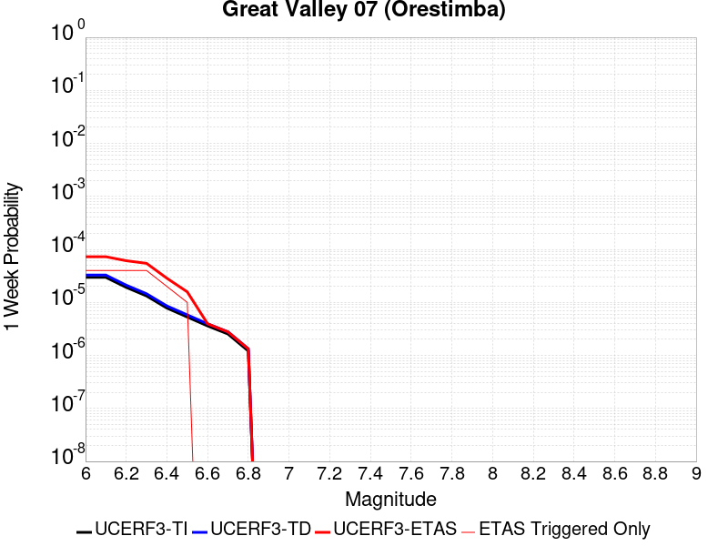 | 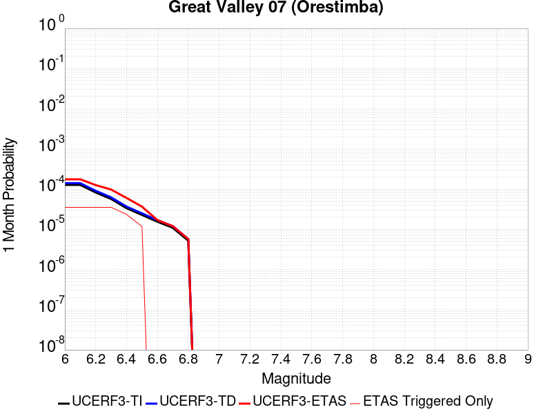 | 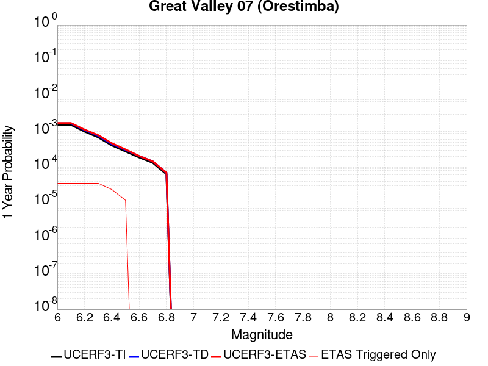 | 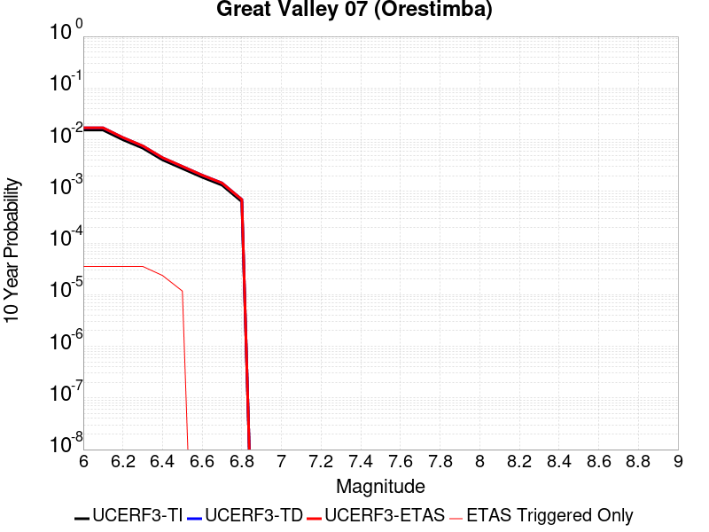 |

| Magnitude | 1 wk TI Prob | 1 wk TD Prob | 1 wk ETAS Prob | 1 wk ETAS/TD Gain | 1 wk ETAS Triggered Only | 1 mo TI Prob | 1 mo TD Prob | 1 mo ETAS Prob | 1 mo ETAS/TD Gain | 1 mo ETAS Triggered Only | 1 yr TI Prob | 1 yr TD Prob | 1 yr ETAS Prob | 1 yr ETAS/TD Gain | 1 yr ETAS Triggered Only | 10 yr TI Prob | 10 yr TD Prob | 10 yr ETAS Prob | 10 yr ETAS/TD Gain | 10 yr ETAS Triggered Only |
|-----|-----|-----|-----|-----|-----|-----|-----|-----|-----|-----|-----|-----|-----|-----|-----|-----|-----|-----|-----|-----|
| 6.0 | 2.9687902E-5 | 3.27575E-5 | 6.7967616E-5 | 2.0748718 | 3.521127E-5 | 1.2722766E-4 | 1.4038214E-4 | 1.7558846E-4 | 1.2507892 | 3.521127E-5 | 0.0015478961 | 0.0017078844 | 0.0017430355 | 1.0205817 | 3.521127E-5 | 0.015371585 | 0.016955135 | 0.01698975 | 1.0020416 | 3.521127E-5 |
| 6.1 | 2.9687902E-5 | 3.27575E-5 | 6.7967616E-5 | 2.0748718 | 3.521127E-5 | 1.2722766E-4 | 1.4038214E-4 | 1.7558846E-4 | 1.2507892 | 3.521127E-5 | 0.0015478961 | 0.0017078844 | 0.0017430355 | 1.0205817 | 3.521127E-5 | 0.015371585 | 0.016955135 | 0.01698975 | 1.0020416 | 3.521127E-5 |
| 6.2 | 1.9231524E-5 | 2.1159167E-5 | 5.636969E-5 | 2.664079 | 3.521127E-5 | 8.2418206E-5 | 9.067912E-5 | 1.2588719E-4 | 1.388271 | 3.521127E-5 | 0.0010029797 | 0.0011034822 | 0.0011386547 | 1.0318741 | 3.521127E-5 | 0.00998465 | 0.01098244 | 0.011017265 | 1.003171 | 3.521127E-5 |
| 6.3 | 1.324766E-5 | 1.4548534E-5 | 4.975929E-5 | 3.420227 | 3.521127E-5 | 5.6774446E-5 | 6.234942E-5 | 9.755849E-5 | 1.5647057 | 3.521127E-5 | 6.910097E-4 | 7.5884897E-4 | 7.940335E-4 | 1.0463657 | 3.521127E-5 | 0.006888649 | 0.0075635235 | 0.0075984686 | 1.0046202 | 3.521127E-5 |
| 6.4 | 7.818645E-6 | 8.57284E-6 | 3.2046817E-5 | 3.7381797 | 2.3474178E-5 | 3.3508048E-5 | 3.6740246E-5 | 6.021356E-5 | 1.6388993 | 2.3474178E-5 | 4.078841E-4 | 4.4722404E-4 | 4.7068772E-4 | 1.0524652 | 2.3474178E-5 | 0.004071363 | 0.0044635804 | 0.00448695 | 1.0052356 | 2.3474178E-5 |
| 6.5 | 5.3076565E-6 | 5.8178007E-6 | 1.7554821E-5 | 3.0174327 | 1.1737089E-5 | 2.27469E-5 | 2.4933206E-5 | 3.667E-5 | 1.4707296 | 1.1737089E-5 | 2.7690834E-4 | 3.035216E-4 | 3.1525514E-4 | 1.0386579 | 1.1737089E-5 | 0.0027656353 | 0.00303128 | 0.0030429815 | 1.0038602 | 1.1737089E-5 |
| 6.6 | 3.6003578E-6 | 3.9484953E-6 | 3.9484953E-6 | 1.0 | 0.0 | 1.5430012E-5 | 1.6922022E-5 | 1.6922022E-5 | 1.0 | 0.0 | 1.8784421E-4 | 2.0600771E-4 | 2.0600771E-4 | 1.0 | 0.0 | 0.0018768552 | 0.0020583214 | 0.0020583214 | 1.0 | 0.0 |
| 6.7 | 2.5361826E-6 | 2.7834678E-6 | 2.7834678E-6 | 1.0 | 0.0 | 1.0869308E-5 | 1.1929101E-5 | 1.1929101E-5 | 1.0 | 0.0 | 1.3232579E-4 | 1.4522845E-4 | 1.4522845E-4 | 1.0 | 0.0 | 0.0013224703 | 0.0014514653 | 0.0014514653 | 1.0 | 0.0 |
| 6.8 | 1.2115831E-6 | 1.3313797E-6 | 1.3313797E-6 | 1.0 | 0.0 | 5.1924885E-6 | 5.7059065E-6 | 5.7059065E-6 | 1.0 | 0.0 | 6.3216714E-5 | 6.9468166E-5 | 6.9468166E-5 | 1.0 | 0.0 | 6.3198735E-4 | 6.945596E-4 | 6.945596E-4 | 1.0 | 0.0 |

## Cleghorn
*[(top)](#table-of-contents)*

| 1 Week | 1 Month | 1 Year | 10 Year |
|-----|-----|-----|-----|
| 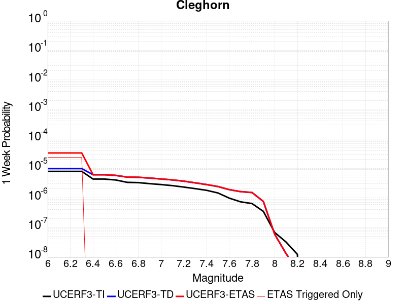 | 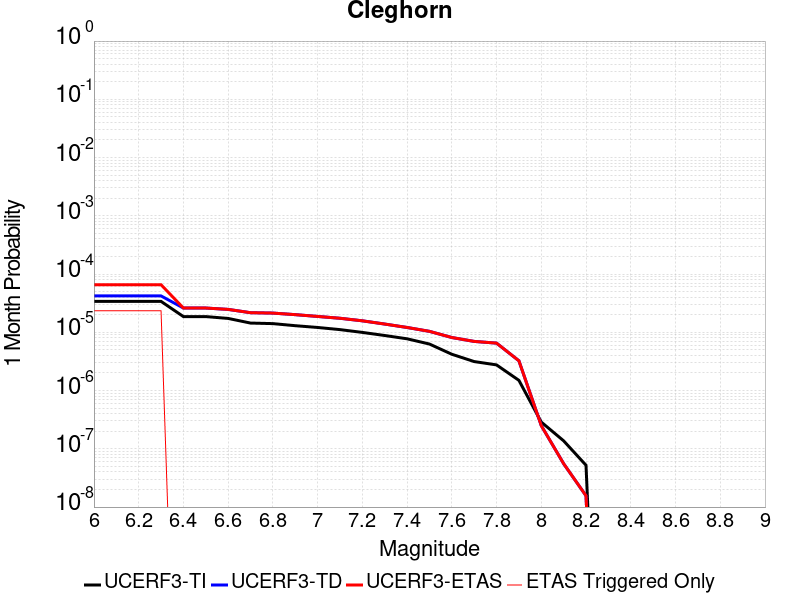 | 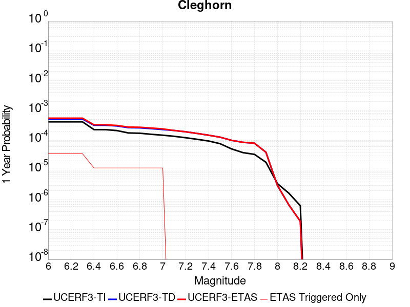 | 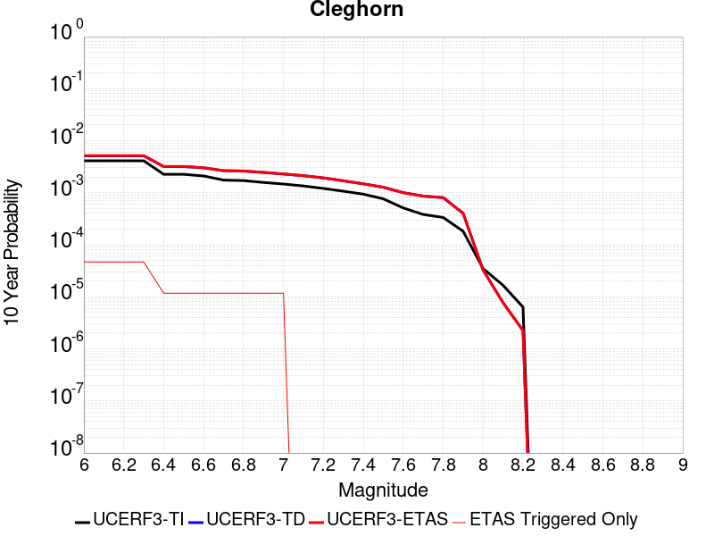 |

| Magnitude | 1 wk TI Prob | 1 wk TD Prob | 1 wk ETAS Prob | 1 wk ETAS/TD Gain | 1 wk ETAS Triggered Only | 1 mo TI Prob | 1 mo TD Prob | 1 mo ETAS Prob | 1 mo ETAS/TD Gain | 1 mo ETAS Triggered Only | 1 yr TI Prob | 1 yr TD Prob | 1 yr ETAS Prob | 1 yr ETAS/TD Gain | 1 yr ETAS Triggered Only | 10 yr TI Prob | 10 yr TD Prob | 10 yr ETAS Prob | 10 yr ETAS/TD Gain | 10 yr ETAS Triggered Only |
|-----|-----|-----|-----|-----|-----|-----|-----|-----|-----|-----|-----|-----|-----|-----|-----|-----|-----|-----|-----|-----|
| 6.0 | 7.9267165E-6 | 9.831582E-6 | 3.330553E-5 | 3.3876061 | 2.3474178E-5 | 3.39712E-5 | 4.2134732E-5 | 6.560792E-5 | 1.5570983 | 2.3474178E-5 | 4.1352084E-4 | 5.128803E-4 | 5.4807344E-4 | 1.0686188 | 3.521127E-5 | 0.004127522 | 0.0051320773 | 0.0051787845 | 1.009101 | 4.6948357E-5 |
| 6.1 | 7.9267165E-6 | 9.831582E-6 | 3.330553E-5 | 3.3876061 | 2.3474178E-5 | 3.39712E-5 | 4.2134732E-5 | 6.560792E-5 | 1.5570983 | 2.3474178E-5 | 4.1352084E-4 | 5.128803E-4 | 5.4807344E-4 | 1.0686188 | 3.521127E-5 | 0.004127522 | 0.0051320773 | 0.0051787845 | 1.009101 | 4.6948357E-5 |
| 6.2 | 7.9267165E-6 | 9.831582E-6 | 3.330553E-5 | 3.3876061 | 2.3474178E-5 | 3.39712E-5 | 4.2134732E-5 | 6.560792E-5 | 1.5570983 | 2.3474178E-5 | 4.1352084E-4 | 5.128803E-4 | 5.4807344E-4 | 1.0686188 | 3.521127E-5 | 0.004127522 | 0.0051320773 | 0.0051787845 | 1.009101 | 4.6948357E-5 |
| 6.3 | 7.9267165E-6 | 9.831582E-6 | 3.330553E-5 | 3.3876061 | 2.3474178E-5 | 3.39712E-5 | 4.2134732E-5 | 6.560792E-5 | 1.5570983 | 2.3474178E-5 | 4.1352084E-4 | 5.128803E-4 | 5.4807344E-4 | 1.0686188 | 3.521127E-5 | 0.004127522 | 0.0051320773 | 0.0051787845 | 1.009101 | 4.6948357E-5 |
| 6.4 | 4.3445207E-6 | 6.0914435E-6 | 6.0914435E-6 | 1.0 | 0.0 | 1.8619241E-5 | 2.610593E-5 | 2.610593E-5 | 1.0 | 0.0 | 2.2666567E-4 | 3.1779436E-4 | 3.295277E-4 | 1.0369213 | 1.1737089E-5 | 0.0022643462 | 0.0031875873 | 0.003199287 | 1.0036703 | 1.1737089E-5 |
| 6.5 | 4.3445207E-6 | 6.0914435E-6 | 6.0914435E-6 | 1.0 | 0.0 | 1.8619241E-5 | 2.610593E-5 | 2.610593E-5 | 1.0 | 0.0 | 2.2666567E-4 | 3.1779436E-4 | 3.295277E-4 | 1.0369213 | 1.1737089E-5 | 0.0022643462 | 0.0031875873 | 0.003199287 | 1.0036703 | 1.1737089E-5 |
| 6.6 | 4.040109E-6 | 5.773851E-6 | 5.773851E-6 | 1.0 | 0.0 | 1.7314638E-5 | 2.4744846E-5 | 2.4744846E-5 | 1.0 | 0.0 | 2.1078532E-4 | 3.012278E-4 | 3.1296135E-4 | 1.0389525 | 1.1737089E-5 | 0.002105855 | 0.003022377 | 0.0030340785 | 1.0038717 | 1.1737089E-5 |
| 6.7 | 3.3632055E-6 | 5.067348E-6 | 5.067348E-6 | 1.0 | 0.0 | 1.4413658E-5 | 2.1717027E-5 | 2.1717027E-5 | 1.0 | 0.0 | 1.7547216E-4 | 2.6437303E-4 | 2.7610702E-4 | 1.0443842 | 1.1737089E-5 | 0.0017533366 | 0.0026547113 | 0.002666417 | 1.0044096 | 1.1737089E-5 |
| 6.8 | 3.2902772E-6 | 4.9892556E-6 | 4.9892556E-6 | 1.0 | 0.0 | 1.4101111E-5 | 2.1382351E-5 | 2.1382351E-5 | 1.0 | 0.0 | 1.716675E-4 | 2.6029933E-4 | 2.7203336E-4 | 1.045079 | 1.1737089E-5 | 0.0017153495 | 0.0026140702 | 0.0026257765 | 1.0044782 | 1.1737089E-5 |
| 6.9 | 3.031547E-6 | 4.6910186E-6 | 4.6910186E-6 | 1.0 | 0.0 | 1.299228E-5 | 2.0104211E-5 | 2.0104211E-5 | 1.0 | 0.0 | 1.5816953E-4 | 2.4474156E-4 | 2.5647576E-4 | 1.0479454 | 1.1737089E-5 | 0.00158057 | 0.0024588439 | 0.002470552 | 1.0047617 | 1.1737089E-5 |
| 7.0 | 2.8259715E-6 | 4.3705895E-6 | 4.3705895E-6 | 1.0 | 0.0 | 1.211125E-5 | 1.8730963E-5 | 1.8730963E-5 | 1.0 | 0.0 | 1.4744449E-4 | 2.2802586E-4 | 2.3976027E-4 | 1.0514609 | 1.1737089E-5 | 0.001473467 | 0.0022920412 | 0.0023037512 | 1.0051091 | 1.1737089E-5 |
| 7.1 | 2.5962665E-6 | 4.0658106E-6 | 4.0658106E-6 | 1.0 | 0.0 | 1.1126809E-5 | 1.7424789E-5 | 1.7424789E-5 | 1.0 | 0.0 | 1.3546048E-4 | 2.1212637E-4 | 2.1212637E-4 | 1.0 | 0.0 | 0.0013537793 | 0.002133366 | 0.002133366 | 1.0 | 0.0 |
| 7.2 | 2.3247253E-6 | 3.6763672E-6 | 3.6763672E-6 | 1.0 | 0.0 | 9.96307E-6 | 1.5755764E-5 | 1.5755764E-5 | 1.0 | 0.0 | 1.21293626E-4 | 1.9180974E-4 | 1.9180974E-4 | 1.0 | 0.0 | 0.0012122744 | 0.0019305905 | 0.0019305905 | 1.0 | 0.0 |
| 7.3 | 2.056928E-6 | 3.2350938E-6 | 3.2350938E-6 | 1.0 | 0.0 | 8.815376E-6 | 1.3864615E-5 | 1.3864615E-5 | 1.0 | 0.0 | 1.0732192E-4 | 1.6878877E-4 | 1.6878877E-4 | 1.0 | 0.0 | 0.001072701 | 0.0017008206 | 0.0017008206 | 1.0 | 0.0 |
| 7.4 | 1.8055999E-6 | 2.8255042E-6 | 2.8255042E-6 | 1.0 | 0.0 | 7.738263E-6 | 1.2109249E-5 | 1.2109249E-5 | 1.0 | 0.0 | 9.4209274E-5 | 1.4742027E-4 | 1.4742027E-4 | 1.0 | 0.0 | 9.4169343E-4 | 0.0014875771 | 0.0014875771 | 1.0 | 0.0 |
| 7.5 | 1.4683443E-6 | 2.4247483E-6 | 2.4247483E-6 | 1.0 | 0.0 | 6.292889E-6 | 1.0391738E-5 | 1.0391738E-5 | 1.0 | 0.0 | 7.661323E-5 | 1.2651215E-4 | 1.2651215E-4 | 1.0 | 0.0 | 7.658682E-4 | 0.0012787961 | 0.0012787961 | 1.0 | 0.0 |
| 7.6 | 9.804088E-7 | 1.900266E-6 | 1.900266E-6 | 1.0 | 0.0 | 4.201745E-6 | 8.143972E-6 | 8.143972E-6 | 1.0 | 0.0 | 5.1155046E-5 | 9.91484E-5 | 9.91484E-5 | 1.0 | 0.0 | 5.114327E-4 | 0.001005471 | 0.001005471 | 1.0 | 0.0 |
| 7.7 | 7.3434086E-7 | 1.6284146E-6 | 1.6284146E-6 | 1.0 | 0.0 | 3.1471714E-6 | 6.978901E-6 | 6.978901E-6 | 1.0 | 0.0 | 3.831614E-5 | 8.4964835E-5 | 8.4964835E-5 | 1.0 | 0.0 | 3.8309532E-4 | 8.6378685E-4 | 8.6378685E-4 | 1.0 | 0.0 |
| 7.8 | 6.434184E-7 | 1.5220047E-6 | 1.5220047E-6 | 1.0 | 0.0 | 2.7575045E-6 | 6.5228614E-6 | 6.5228614E-6 | 1.0 | 0.0 | 3.35721E-5 | 7.941297E-5 | 7.941297E-5 | 1.0 | 0.0 | 3.3567028E-4 | 8.079678E-4 | 8.079678E-4 | 1.0 | 0.0 |
| 7.9 | 3.4943926E-7 | 7.574459E-7 | 7.574459E-7 | 1.0 | 0.0 | 1.497596E-6 | 3.2461926E-6 | 3.2461926E-6 | 1.0 | 0.0 | 1.8233079E-5 | 3.952169E-5 | 3.952169E-5 | 1.0 | 0.0 | 1.8231584E-4 | 4.040099E-4 | 4.040099E-4 | 1.0 | 0.0 |
| 8.0 | 6.717524E-8 | 5.838828E-8 | 5.838828E-8 | 1.0 | 0.0 | 2.8789387E-7 | 2.5023547E-7 | 2.5023547E-7 | 1.0 | 0.0 | 3.505102E-6 | 3.0466126E-6 | 3.0466126E-6 | 1.0 | 0.0 | 3.5050467E-5 | 3.273506E-5 | 3.273506E-5 | 1.0 | 0.0 |
| 8.1 | 3.1984914E-8 | 1.2956093E-8 | 1.2956093E-8 | 1.0 | 0.0 | 1.370782E-7 | 5.552611E-8 | 5.552611E-8 | 1.0 | 0.0 | 1.6689258E-6 | 6.760302E-7 | 6.760302E-7 | 1.0 | 0.0 | 1.6689133E-5 | 7.74454E-6 | 7.74454E-6 | 1.0 | 0.0 |
| 8.2 | 1.21887656E-8 | 3.6495305E-9 | 3.6495305E-9 | 1.0 | 0.0 | 5.2237567E-8 | 1.5640845E-8 | 1.5640845E-8 | 1.0 | 0.0 | 6.359922E-7 | 1.9042727E-7 | 1.9042727E-7 | 1.0 | 0.0 | 6.3599036E-6 | 2.2470974E-6 | 2.2470974E-6 | 1.0 | 0.0 |

## San Jacinto (Coyote Creek)
*[(top)](#table-of-contents)*

| 1 Week | 1 Month | 1 Year | 10 Year |
|-----|-----|-----|-----|
| 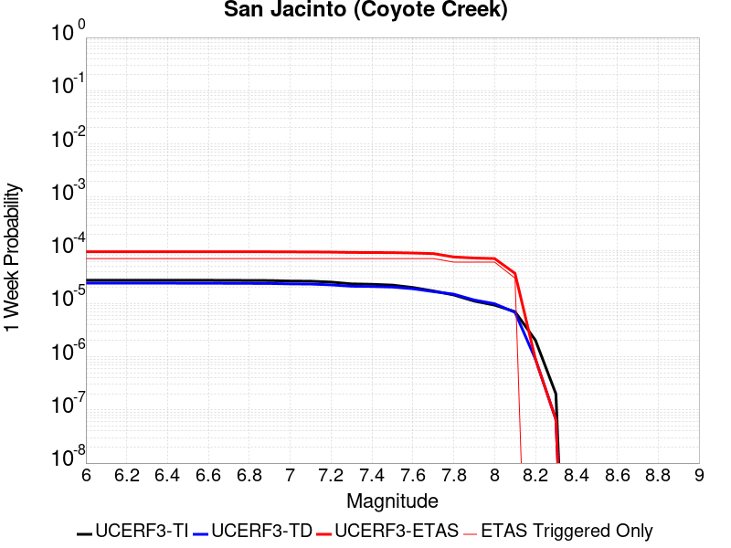 | 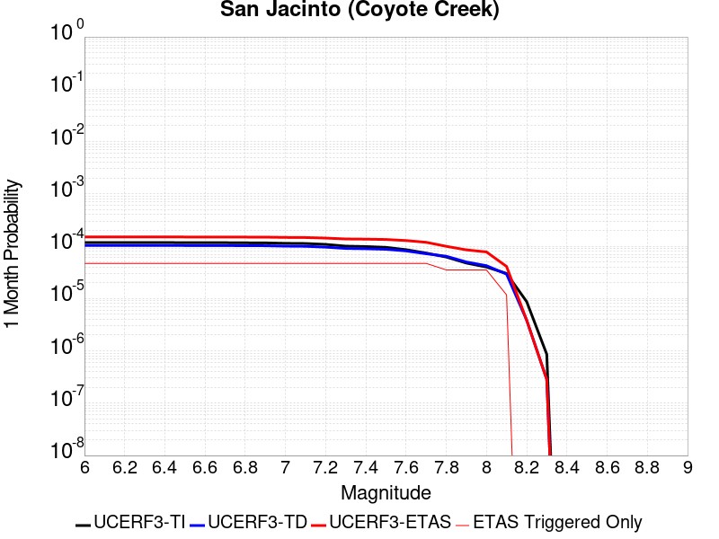 | 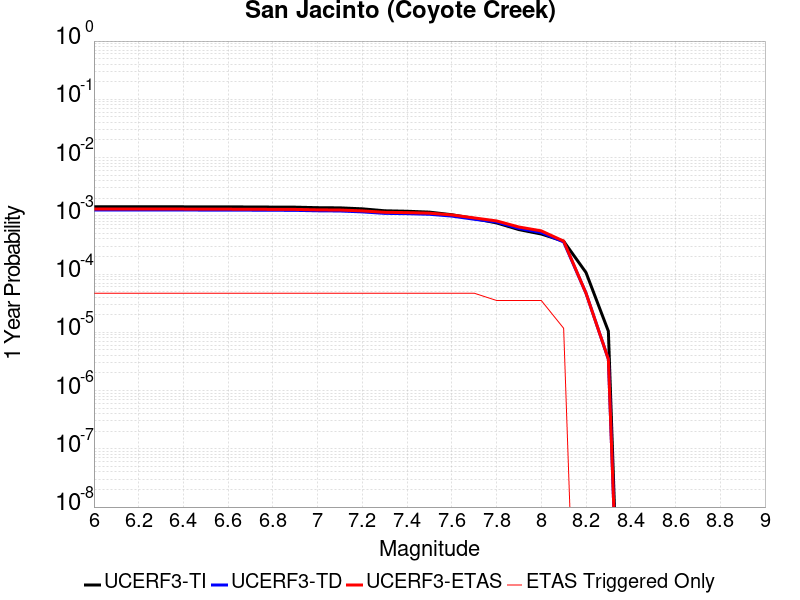 | 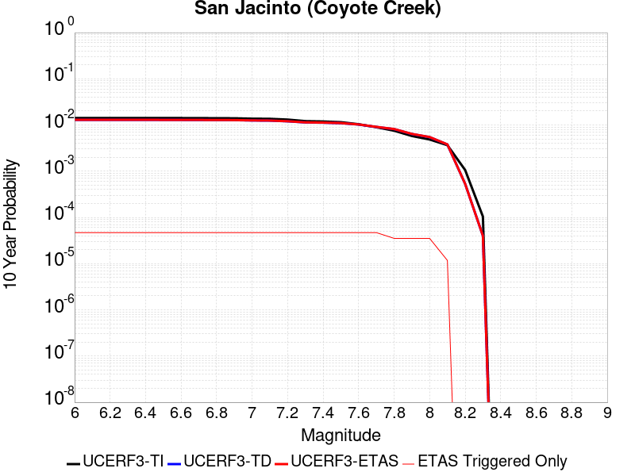 |

| Magnitude | 1 wk TI Prob | 1 wk TD Prob | 1 wk ETAS Prob | 1 wk ETAS/TD Gain | 1 wk ETAS Triggered Only | 1 mo TI Prob | 1 mo TD Prob | 1 mo ETAS Prob | 1 mo ETAS/TD Gain | 1 mo ETAS Triggered Only | 1 yr TI Prob | 1 yr TD Prob | 1 yr ETAS Prob | 1 yr ETAS/TD Gain | 1 yr ETAS Triggered Only | 10 yr TI Prob | 10 yr TD Prob | 10 yr ETAS Prob | 10 yr ETAS/TD Gain | 10 yr ETAS Triggered Only |
|-----|-----|-----|-----|-----|-----|-----|-----|-----|-----|-----|-----|-----|-----|-----|-----|-----|-----|-----|-----|-----|
| 6.0 | 2.7374346E-5 | 2.4145214E-5 | 5.9355632E-5 | 2.4582772 | 3.521127E-5 | 1.1731335E-4 | 1.034754E-4 | 1.504189E-4 | 1.4536682 | 4.6948357E-5 | 0.0014273542 | 0.0012590875 | 0.0013059768 | 1.0372406 | 4.6948357E-5 | 0.01418221 | 0.012928318 | 0.012974659 | 1.0035845 | 4.6948357E-5 |
| 6.1 | 2.7374346E-5 | 2.4145214E-5 | 5.9355632E-5 | 2.4582772 | 3.521127E-5 | 1.1731335E-4 | 1.034754E-4 | 1.504189E-4 | 1.4536682 | 4.6948357E-5 | 0.0014273542 | 0.0012590875 | 0.0013059768 | 1.0372406 | 4.6948357E-5 | 0.01418221 | 0.012928318 | 0.012974659 | 1.0035845 | 4.6948357E-5 |
| 6.2 | 2.7374346E-5 | 2.4145214E-5 | 5.9355632E-5 | 2.4582772 | 3.521127E-5 | 1.1731335E-4 | 1.034754E-4 | 1.504189E-4 | 1.4536682 | 4.6948357E-5 | 0.0014273542 | 0.0012590875 | 0.0013059768 | 1.0372406 | 4.6948357E-5 | 0.01418221 | 0.012928318 | 0.012974659 | 1.0035845 | 4.6948357E-5 |
| 6.3 | 2.7374346E-5 | 2.4145214E-5 | 5.9355632E-5 | 2.4582772 | 3.521127E-5 | 1.1731335E-4 | 1.034754E-4 | 1.504189E-4 | 1.4536682 | 4.6948357E-5 | 0.0014273542 | 0.0012590875 | 0.0013059768 | 1.0372406 | 4.6948357E-5 | 0.01418221 | 0.012928318 | 0.012974659 | 1.0035845 | 4.6948357E-5 |
| 6.4 | 2.7374346E-5 | 2.4145214E-5 | 5.9355632E-5 | 2.4582772 | 3.521127E-5 | 1.1731335E-4 | 1.034754E-4 | 1.504189E-4 | 1.4536682 | 4.6948357E-5 | 0.0014273542 | 0.0012590875 | 0.0013059768 | 1.0372406 | 4.6948357E-5 | 0.01418221 | 0.012928318 | 0.012974659 | 1.0035845 | 4.6948357E-5 |
| 6.5 | 2.7282445E-5 | 2.4031293E-5 | 5.9241713E-5 | 2.4651904 | 3.521127E-5 | 1.16919524E-4 | 1.029872E-4 | 1.4993073E-4 | 1.455819 | 4.6948357E-5 | 0.0014225657 | 0.0012531505 | 0.00130004 | 1.0374173 | 4.6948357E-5 | 0.014134934 | 0.012869646 | 0.012915989 | 1.0036011 | 4.6948357E-5 |
| 6.6 | 2.7282445E-5 | 2.4031293E-5 | 5.9241713E-5 | 2.4651904 | 3.521127E-5 | 1.16919524E-4 | 1.029872E-4 | 1.4993073E-4 | 1.455819 | 4.6948357E-5 | 0.0014225657 | 0.0012531505 | 0.00130004 | 1.0374173 | 4.6948357E-5 | 0.014134934 | 0.012869646 | 0.012915989 | 1.0036011 | 4.6948357E-5 |
| 6.7 | 2.7216198E-5 | 2.3956412E-5 | 5.9166836E-5 | 2.4697702 | 3.521127E-5 | 1.1663563E-4 | 1.02666316E-4 | 1.4960986E-4 | 1.4572438 | 4.6948357E-5 | 0.0014191137 | 0.0012492483 | 0.001296138 | 1.0375344 | 4.6948357E-5 | 0.014100855 | 0.0128310565 | 0.012877403 | 1.003612 | 4.6948357E-5 |
| 6.8 | 2.7078617E-5 | 2.387363E-5 | 5.9084057E-5 | 2.4748669 | 3.521127E-5 | 1.1604605E-4 | 1.0231156E-4 | 1.4925511E-4 | 1.4588294 | 4.6948357E-5 | 0.001411945 | 0.0012449342 | 0.001291824 | 1.0376645 | 4.6948357E-5 | 0.014030075 | 0.012788199 | 0.012834547 | 1.0036243 | 4.6948357E-5 |
| 6.9 | 2.6982952E-5 | 2.3793142E-5 | 5.900357E-5 | 2.4798563 | 3.521127E-5 | 1.15636096E-4 | 1.0196664E-4 | 1.489102E-4 | 1.4603816 | 4.6948357E-5 | 0.0014069602 | 0.0012407395 | 0.0012876296 | 1.0377921 | 4.6948357E-5 | 0.013980856 | 0.012746515 | 0.012792865 | 1.0036362 | 4.6948357E-5 |
| 7.0 | 2.6449972E-5 | 2.3370165E-5 | 5.858061E-5 | 2.506641 | 3.521127E-5 | 1.1335209E-4 | 1.00154015E-4 | 1.4709767E-4 | 1.4687146 | 4.6948357E-5 | 0.001379188 | 0.0012186957 | 0.0012655868 | 1.0384765 | 4.6948357E-5 | 0.0137065975 | 0.0125278765 | 0.012574237 | 1.0037006 | 4.6948357E-5 |
| 7.1 | 2.6257849E-5 | 2.3196202E-5 | 5.840665E-5 | 2.5179403 | 3.521127E-5 | 1.1252879E-4 | 9.940852E-5 | 1.463522E-4 | 1.4722301 | 4.6948357E-5 | 0.0013691769 | 0.0012096294 | 0.0012565209 | 1.0387652 | 4.6948357E-5 | 0.013607717 | 0.012437741 | 0.012484106 | 1.0037277 | 4.6948357E-5 |
| 7.2 | 2.5270041E-5 | 2.2390966E-5 | 5.7601446E-5 | 2.5725305 | 3.521127E-5 | 1.0829568E-4 | 9.595777E-5 | 1.4290163E-4 | 1.4892137 | 4.6948357E-5 | 0.0013177024 | 0.0011676621 | 0.0012145556 | 1.0401602 | 4.6948357E-5 | 0.013099162 | 0.012018777 | 0.012065162 | 1.0038593 | 4.6948357E-5 |
| 7.3 | 2.339701E-5 | 2.1122814E-5 | 5.6333338E-5 | 2.6669428 | 3.521127E-5 | 1.0026905E-4 | 9.0523215E-5 | 1.3746733E-4 | 1.5185864 | 4.6948357E-5 | 0.001220092 | 0.0011015651 | 0.0011484617 | 1.0425727 | 4.6948357E-5 | 0.012134149 | 0.011357696 | 0.011404111 | 1.0040866 | 4.6948357E-5 |
| 7.4 | 2.296333E-5 | 2.0853171E-5 | 5.60637E-5 | 2.6884978 | 3.521127E-5 | 9.841056E-5 | 8.936768E-5 | 1.3631184E-4 | 1.5252924 | 4.6948357E-5 | 0.0011974899 | 0.0010875105 | 0.0011344077 | 1.0431235 | 4.6948357E-5 | 0.011910575 | 0.01121681 | 0.011263231 | 1.0041386 | 4.6948357E-5 |
| 7.5 | 2.2188895E-5 | 2.0376096E-5 | 5.5586646E-5 | 2.7280324 | 3.521127E-5 | 9.50918E-5 | 8.732321E-5 | 1.3426747E-4 | 1.5375919 | 4.6948357E-5 | 0.0011571277 | 0.0010626436 | 0.0011095421 | 1.0441338 | 4.6948357E-5 | 0.011511209 | 0.010966429 | 0.0110128615 | 1.0042342 | 4.6948357E-5 |
| 7.6 | 2.0013189E-5 | 1.8962366E-5 | 5.4172964E-5 | 2.8568676 | 3.521127E-5 | 8.5767984E-5 | 8.1264756E-5 | 1.282093E-4 | 1.577674 | 4.6948357E-5 | 0.001043725 | 9.889511E-4 | 0.001035853 | 1.047426 | 4.6948357E-5 | 0.010388365 | 0.010224434 | 0.010270902 | 1.0045449 | 4.6948357E-5 |
| 7.7 | 1.7230794E-5 | 1.674371E-5 | 5.1954386E-5 | 3.1029198 | 3.521127E-5 | 7.384417E-5 | 7.175679E-5 | 1.1870178E-4 | 1.6542237 | 4.6948357E-5 | 8.986819E-4 | 8.7328954E-4 | 9.201969E-4 | 1.0537134 | 4.6948357E-5 | 0.008950562 | 0.009062956 | 0.009109479 | 1.0051333 | 4.6948357E-5 |
| 7.8 | 1.4478809E-5 | 1.4990978E-5 | 3.8464805E-5 | 2.5658636 | 2.3474178E-5 | 6.205057E-5 | 6.424547E-5 | 9.9454475E-5 | 1.5480387 | 3.521127E-5 | 7.552038E-4 | 7.819085E-4 | 8.1709225E-4 | 1.0449972 | 3.521127E-5 | 0.0075264242 | 0.008141387 | 0.008176312 | 1.0042897 | 3.521127E-5 |
| 7.9 | 1.1114467E-5 | 1.1645102E-5 | 3.5119006E-5 | 3.015775 | 2.3474178E-5 | 4.7632562E-5 | 4.990663E-5 | 8.511614E-5 | 1.7055076 | 3.521127E-5 | 5.797721E-4 | 6.074444E-4 | 6.426343E-4 | 1.0579311 | 3.521127E-5 | 0.0057826187 | 0.0063803247 | 0.0064153112 | 1.0054835 | 3.521127E-5 |
| 8.0 | 9.327402E-6 | 9.899186E-6 | 3.3373133E-5 | 3.3713005 | 2.3474178E-5 | 3.9973966E-5 | 4.2424395E-5 | 7.763417E-5 | 1.8299416 | 3.521127E-5 | 4.8657437E-4 | 5.1639514E-4 | 5.5158825E-4 | 1.0681515 | 3.521127E-5 | 0.0048551033 | 0.0054499684 | 0.005484988 | 1.0064256 | 3.521127E-5 |
| 8.1 | 7.0235833E-6 | 6.827495E-6 | 1.8564504E-5 | 2.71908 | 1.1737089E-5 | 3.0100724E-5 | 2.9260367E-5 | 4.0997114E-5 | 1.4011141 | 1.1737089E-5 | 3.664147E-4 | 3.5618723E-4 | 3.6792015E-4 | 1.0329403 | 1.1737089E-5 | 0.003658111 | 0.0037876023 | 0.003799295 | 1.003087 | 1.1737089E-5 |
| 8.2 | 2.0358202E-6 | 8.994527E-7 | 8.994527E-7 | 1.0 | 0.0 | 8.724915E-6 | 3.854792E-6 | 3.854792E-6 | 1.0 | 0.0 | 1.06220665E-4 | 4.69311E-5 | 4.69311E-5 | 1.0 | 0.0 | 0.001061699 | 5.3254166E-4 | 5.3254166E-4 | 1.0 | 0.0 |
| 8.3 | 2.0051264E-7 | 6.617272E-8 | 6.617272E-8 | 1.0 | 0.0 | 8.5933965E-7 | 2.8359733E-7 | 2.8359733E-7 | 1.0 | 0.0 | 1.046241E-5 | 3.4527925E-6 | 3.4527925E-6 | 1.0 | 0.0 | 1.0461917E-4 | 4.01389E-5 | 4.01389E-5 | 1.0 | 0.0 |

## Big Pine (East)
*[(top)](#table-of-contents)*

| 1 Week | 1 Month | 1 Year | 10 Year |
|-----|-----|-----|-----|
| 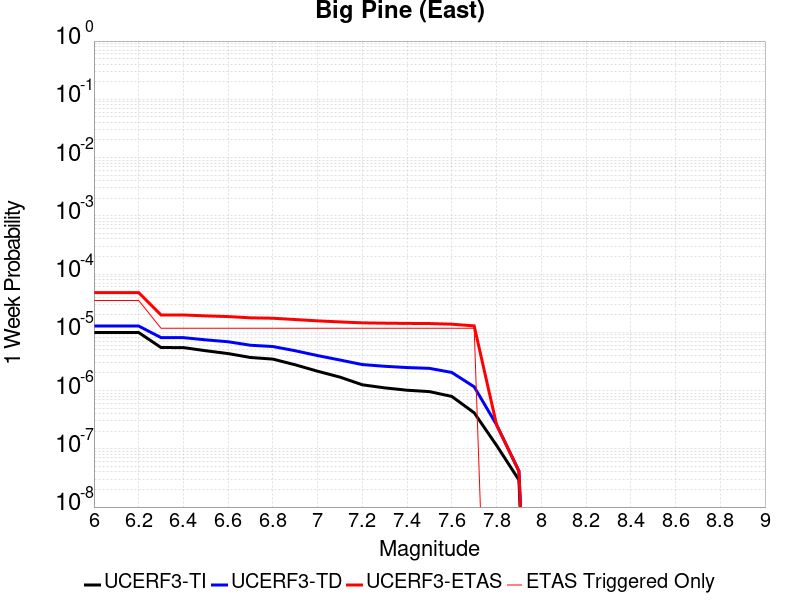 | 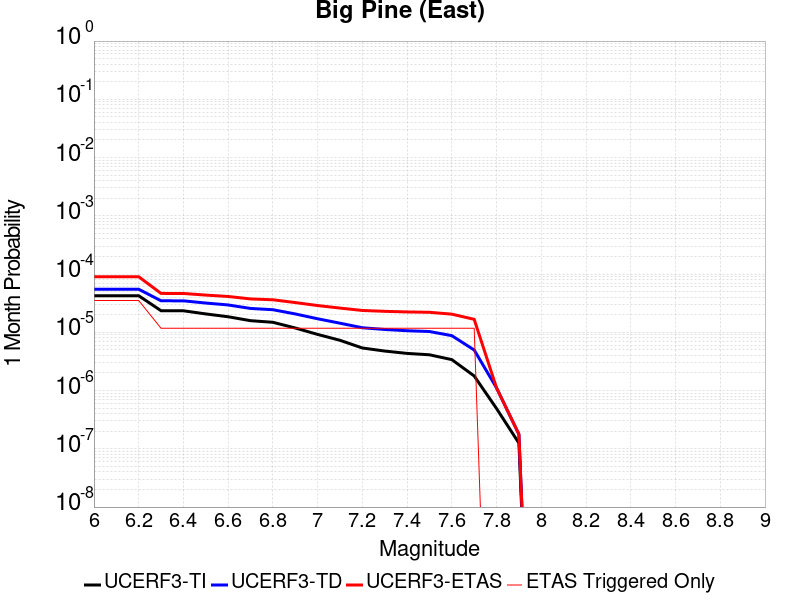 | 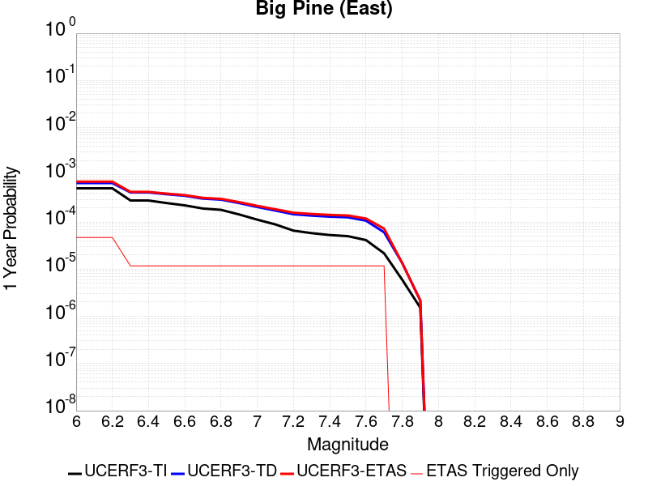 | 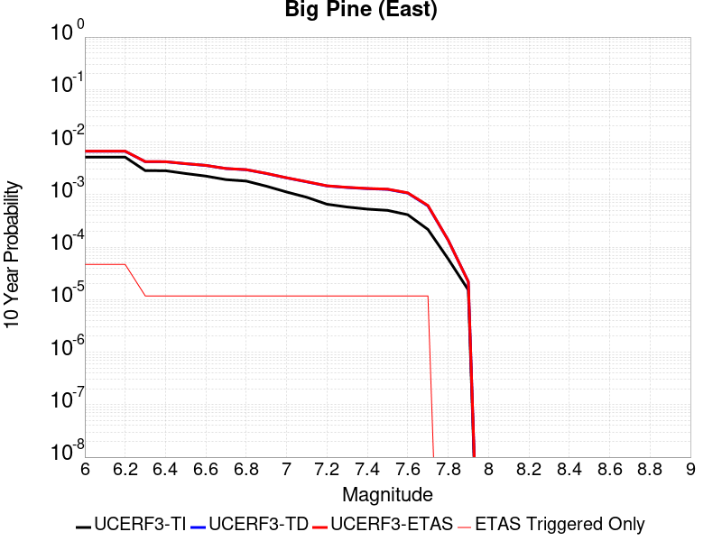 |

| Magnitude | 1 wk TI Prob | 1 wk TD Prob | 1 wk ETAS Prob | 1 wk ETAS/TD Gain | 1 wk ETAS Triggered Only | 1 mo TI Prob | 1 mo TD Prob | 1 mo ETAS Prob | 1 mo ETAS/TD Gain | 1 mo ETAS Triggered Only | 1 yr TI Prob | 1 yr TD Prob | 1 yr ETAS Prob | 1 yr ETAS/TD Gain | 1 yr ETAS Triggered Only | 10 yr TI Prob | 10 yr TD Prob | 10 yr ETAS Prob | 10 yr ETAS/TD Gain | 10 yr ETAS Triggered Only |
|-----|-----|-----|-----|-----|-----|-----|-----|-----|-----|-----|-----|-----|-----|-----|-----|-----|-----|-----|-----|-----|
| 6.0 | 9.916913E-6 | 1.2816984E-5 | 4.80278E-5 | 3.7471998 | 3.521127E-5 | 4.250036E-5 | 5.49289E-5 | 9.013824E-5 | 1.6409984 | 3.521127E-5 | 5.173191E-4 | 6.685763E-4 | 7.154932E-4 | 1.0701745 | 4.6948357E-5 | 0.0051611643 | 0.006670441 | 0.006717076 | 1.0069913 | 4.6948357E-5 |
| 6.1 | 9.916913E-6 | 1.2816984E-5 | 4.80278E-5 | 3.7471998 | 3.521127E-5 | 4.250036E-5 | 5.49289E-5 | 9.013824E-5 | 1.6409984 | 3.521127E-5 | 5.173191E-4 | 6.685763E-4 | 7.154932E-4 | 1.0701745 | 4.6948357E-5 | 0.0051611643 | 0.006670441 | 0.006717076 | 1.0069913 | 4.6948357E-5 |
| 6.2 | 9.916913E-6 | 1.2816984E-5 | 4.80278E-5 | 3.7471998 | 3.521127E-5 | 4.250036E-5 | 5.49289E-5 | 9.013824E-5 | 1.6409984 | 3.521127E-5 | 5.173191E-4 | 6.685763E-4 | 7.154932E-4 | 1.0701745 | 4.6948357E-5 | 0.0051611643 | 0.006670441 | 0.006717076 | 1.0069913 | 4.6948357E-5 |
| 6.3 | 5.479711E-6 | 8.112951E-6 | 1.9849946E-5 | 2.4466984 | 1.1737089E-5 | 2.3484265E-5 | 3.4769346E-5 | 4.650603E-5 | 1.3375583 | 1.1737089E-5 | 2.858834E-4 | 4.2323777E-4 | 4.3496987E-4 | 1.02772 | 1.1737089E-5 | 0.0028551589 | 0.004227244 | 0.004238931 | 1.0027648 | 1.1737089E-5 |
| 6.4 | 5.465009E-6 | 8.097245E-6 | 1.9834239E-5 | 2.4495046 | 1.1737089E-5 | 2.3421257E-5 | 3.4702036E-5 | 4.6438716E-5 | 1.3382131 | 1.1737089E-5 | 2.851165E-4 | 4.2241855E-4 | 4.341507E-4 | 1.0277737 | 1.1737089E-5 | 0.0028475097 | 0.0042190826 | 0.0042307703 | 1.0027702 | 1.1737089E-5 |
| 6.5 | 4.826767E-6 | 7.422301E-6 | 1.9159303E-5 | 2.5813158 | 1.1737089E-5 | 2.068598E-5 | 3.180949E-5 | 4.3546206E-5 | 1.368969 | 1.1737089E-5 | 2.518227E-4 | 3.872145E-4 | 3.9894704E-4 | 1.0302999 | 1.1737089E-5 | 0.0025153751 | 0.003868283 | 0.0038799746 | 1.0030224 | 1.1737089E-5 |
| 6.6 | 4.3146847E-6 | 6.8822374E-6 | 1.8619246E-5 | 2.705406 | 1.1737089E-5 | 1.8491375E-5 | 2.9494982E-5 | 4.1231724E-5 | 1.3979234 | 1.1737089E-5 | 2.2510924E-4 | 3.590447E-4 | 3.7077756E-4 | 1.032678 | 1.1737089E-5 | 0.0022488134 | 0.0035874986 | 0.0035991934 | 1.0032599 | 1.1737089E-5 |
| 6.7 | 3.6968106E-6 | 5.9954727E-6 | 1.7732491E-5 | 2.9576468 | 1.1737089E-5 | 1.5843378E-5 | 2.5694639E-5 | 3.7431426E-5 | 1.4567796 | 1.1737089E-5 | 1.9287605E-4 | 3.1278885E-4 | 3.2452226E-4 | 1.0375123 | 1.1737089E-5 | 0.0019270873 | 0.0031262483 | 0.0031379487 | 1.0037426 | 1.1737089E-5 |
| 6.8 | 3.4671132E-6 | 5.702177E-6 | 1.7439199E-5 | 3.0583405 | 1.1737089E-5 | 1.4858972E-5 | 2.4437682E-5 | 3.6174482E-5 | 1.4802748 | 1.1737089E-5 | 1.8089297E-4 | 2.974896E-4 | 3.092232E-4 | 1.0394421 | 1.1737089E-5 | 0.0018074579 | 0.002973667 | 0.0029853694 | 1.0039352 | 1.1737089E-5 |
| 6.9 | 2.7686972E-6 | 4.825223E-6 | 1.6562255E-5 | 3.4324331 | 1.1737089E-5 | 1.1865792E-5 | 2.0679368E-5 | 3.2416214E-5 | 1.567563 | 1.1737089E-5 | 1.4445644E-4 | 2.5174298E-4 | 2.634771E-4 | 1.0466115 | 1.1737089E-5 | 0.0014436257 | 0.0025172636 | 0.0025289713 | 1.004651 | 1.1737089E-5 |
| 7.0 | 2.1472624E-6 | 3.9850406E-6 | 1.5722084E-5 | 3.9452755 | 1.1737089E-5 | 9.20252E-6 | 1.7078637E-5 | 2.8815526E-5 | 1.6872263 | 1.1737089E-5 | 1.12034926E-4 | 2.079131E-4 | 2.1964774E-4 | 1.0564401 | 1.1737089E-5 | 0.0011197845 | 0.0020798394 | 0.002091552 | 1.0056316 | 1.1737089E-5 |
| 7.1 | 1.7018335E-6 | 3.344876E-6 | 1.5081926E-5 | 4.508964 | 1.1737089E-5 | 7.293552E-6 | 1.4335106E-5 | 2.6072026E-5 | 1.8187537 | 1.1737089E-5 | 8.879537E-5 | 1.7451629E-4 | 1.8625133E-4 | 1.0672432 | 1.1737089E-5 | 8.87599E-4 | 0.0017464145 | 0.001758131 | 1.006709 | 1.1737089E-5 |
| 7.2 | 1.25603E-6 | 2.794484E-6 | 1.4531541E-5 | 5.20008 | 1.1737089E-5 | 5.3829745E-6 | 1.1976307E-5 | 2.3713255E-5 | 1.980014 | 1.1737089E-5 | 6.553574E-5 | 1.4580201E-4 | 1.5753739E-4 | 1.0804884 | 1.1737089E-5 | 6.551642E-4 | 0.001459661 | 0.0014713809 | 1.0080292 | 1.1737089E-5 |
| 7.3 | 1.112297E-6 | 2.610332E-6 | 1.4347391E-5 | 5.496385 | 1.1737089E-5 | 4.7669787E-6 | 1.118709E-5 | 2.2924049E-5 | 2.049152 | 1.1737089E-5 | 5.803642E-5 | 1.3619453E-4 | 1.4793003E-4 | 1.0861671 | 1.1737089E-5 | 5.802127E-4 | 0.0013635408 | 0.0013752619 | 1.0085961 | 1.1737089E-5 |
| 7.4 | 1.0137181E-6 | 2.4834917E-6 | 1.4220552E-5 | 5.7260313 | 1.1737089E-5 | 4.3444993E-6 | 1.0643494E-5 | 2.2380458E-5 | 2.102736 | 1.1737089E-5 | 5.2892992E-5 | 1.2957705E-4 | 1.4131262E-4 | 1.0905683 | 1.1737089E-5 | 5.288041E-4 | 0.0012972289 | 0.0013089507 | 1.0090361 | 1.1737089E-5 |
| 7.5 | 9.598608E-7 | 2.4071483E-6 | 1.414421E-5 | 5.8759193 | 1.1737089E-5 | 4.1136827E-6 | 1.031631E-5 | 2.2053278E-5 | 2.1377099 | 1.1737089E-5 | 5.0082934E-5 | 1.2559404E-4 | 1.3732967E-4 | 1.0934409 | 1.1737089E-5 | 5.007165E-4 | 0.0012572526 | 0.001268975 | 1.0093237 | 1.1737089E-5 |
| 7.6 | 7.929459E-7 | 2.0448588E-6 | 1.3781924E-5 | 6.7397923 | 1.1737089E-5 | 3.3983351E-6 | 8.763653E-6 | 2.0500638E-5 | 2.3392801 | 1.1737089E-5 | 4.1373947E-5 | 1.06692416E-4 | 1.1842825E-4 | 1.1099969 | 1.1737089E-5 | 4.1366243E-4 | 0.0010685222 | 0.0010802468 | 1.0109726 | 1.1737089E-5 |
| 7.7 | 4.155788E-7 | 1.1605589E-6 | 1.2897634E-5 | 11.113296 | 1.1737089E-5 | 1.7810507E-6 | 4.9738146E-6 | 1.6710845E-5 | 3.3597643 | 1.1737089E-5 | 2.1684076E-5 | 6.0554554E-5 | 7.229093E-5 | 1.193815 | 1.1737089E-5 | 2.1681961E-4 | 6.0857297E-4 | 6.203029E-4 | 1.0192745 | 1.1737089E-5 |
| 7.8 | 1.14666925E-7 | 2.592015E-7 | 2.592015E-7 | 1.0 | 0.0 | 4.914296E-7 | 1.1108631E-6 | 1.1108631E-6 | 1.0 | 0.0 | 5.9831386E-6 | 1.3524678E-5 | 1.3524678E-5 | 1.0 | 0.0 | 5.9829777E-5 | 1.3634123E-4 | 1.3634123E-4 | 1.0 | 0.0 |
| 7.9 | 2.9231824E-8 | 4.1463963E-8 | 4.1463963E-8 | 1.0 | 0.0 | 1.2527924E-7 | 1.7770269E-7 | 1.7770269E-7 | 1.0 | 0.0 | 1.5252737E-6 | 2.1635283E-6 | 2.1635283E-6 | 1.0 | 0.0 | 1.5252632E-5 | 2.1967755E-5 | 2.1967755E-5 | 1.0 | 0.0 |

## Santa Susana alt 1
*[(top)](#table-of-contents)*

| 1 Week | 1 Month | 1 Year | 10 Year |
|-----|-----|-----|-----|
| 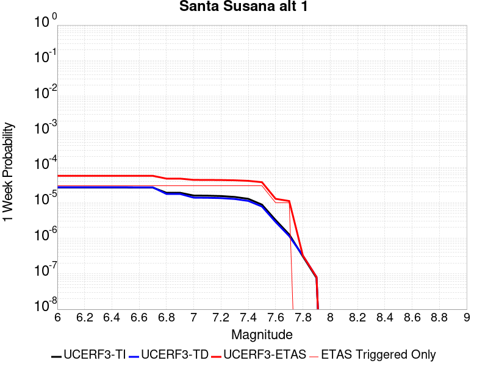 | 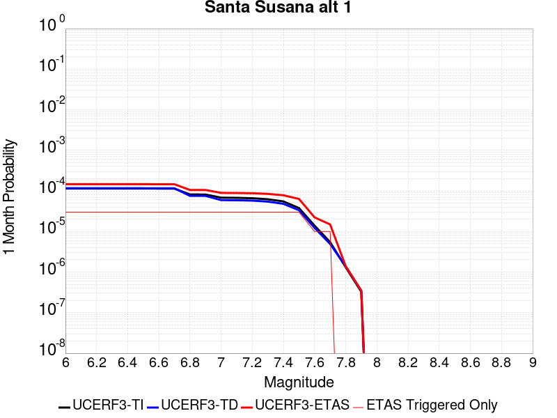 | 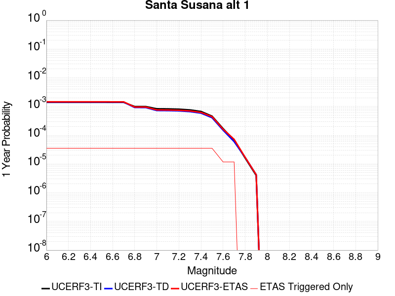 | 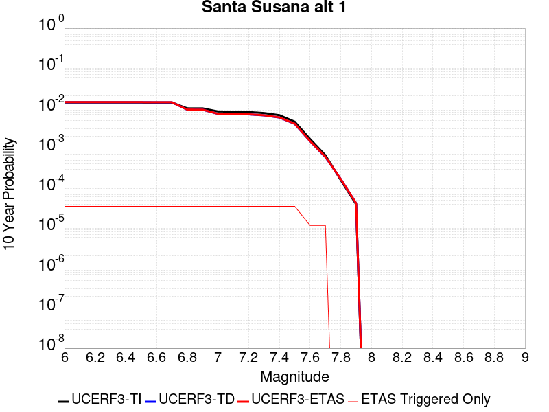 |

| Magnitude | 1 wk TI Prob | 1 wk TD Prob | 1 wk ETAS Prob | 1 wk ETAS/TD Gain | 1 wk ETAS Triggered Only | 1 mo TI Prob | 1 mo TD Prob | 1 mo ETAS Prob | 1 mo ETAS/TD Gain | 1 mo ETAS Triggered Only | 1 yr TI Prob | 1 yr TD Prob | 1 yr ETAS Prob | 1 yr ETAS/TD Gain | 1 yr ETAS Triggered Only | 10 yr TI Prob | 10 yr TD Prob | 10 yr ETAS Prob | 10 yr ETAS/TD Gain | 10 yr ETAS Triggered Only |
|-----|-----|-----|-----|-----|-----|-----|-----|-----|-----|-----|-----|-----|-----|-----|-----|-----|-----|-----|-----|-----|
| 6.0 | 2.674877E-5 | 2.7198023E-5 | 6.240833E-5 | 2.2945907 | 3.521127E-5 | 1.1463255E-4 | 1.1655839E-4 | 1.5176555E-4 | 1.3020561 | 3.521127E-5 | 0.0013947578 | 0.0014182882 | 0.0014534495 | 1.0247914 | 3.521127E-5 | 0.013860362 | 0.014104128 | 0.014138842 | 1.0024613 | 3.521127E-5 |
| 6.1 | 2.674877E-5 | 2.7198023E-5 | 6.240833E-5 | 2.2945907 | 3.521127E-5 | 1.1463255E-4 | 1.1655839E-4 | 1.5176555E-4 | 1.3020561 | 3.521127E-5 | 0.0013947578 | 0.0014182882 | 0.0014534495 | 1.0247914 | 3.521127E-5 | 0.013860362 | 0.014104128 | 0.014138842 | 1.0024613 | 3.521127E-5 |
| 6.2 | 2.674877E-5 | 2.7198023E-5 | 6.240833E-5 | 2.2945907 | 3.521127E-5 | 1.1463255E-4 | 1.1655839E-4 | 1.5176555E-4 | 1.3020561 | 3.521127E-5 | 0.0013947578 | 0.0014182882 | 0.0014534495 | 1.0247914 | 3.521127E-5 | 0.013860362 | 0.014104128 | 0.014138842 | 1.0024613 | 3.521127E-5 |
| 6.3 | 2.674877E-5 | 2.7198023E-5 | 6.240833E-5 | 2.2945907 | 3.521127E-5 | 1.1463255E-4 | 1.1655839E-4 | 1.5176555E-4 | 1.3020561 | 3.521127E-5 | 0.0013947578 | 0.0014182882 | 0.0014534495 | 1.0247914 | 3.521127E-5 | 0.013860362 | 0.014104128 | 0.014138842 | 1.0024613 | 3.521127E-5 |
| 6.4 | 2.674877E-5 | 2.7198023E-5 | 6.240833E-5 | 2.2945907 | 3.521127E-5 | 1.1463255E-4 | 1.1655839E-4 | 1.5176555E-4 | 1.3020561 | 3.521127E-5 | 0.0013947578 | 0.0014182882 | 0.0014534495 | 1.0247914 | 3.521127E-5 | 0.013860362 | 0.014104128 | 0.014138842 | 1.0024613 | 3.521127E-5 |
| 6.5 | 2.674877E-5 | 2.7198023E-5 | 6.240833E-5 | 2.2945907 | 3.521127E-5 | 1.1463255E-4 | 1.1655839E-4 | 1.5176555E-4 | 1.3020561 | 3.521127E-5 | 0.0013947578 | 0.0014182882 | 0.0014534495 | 1.0247914 | 3.521127E-5 | 0.013860362 | 0.014104128 | 0.014138842 | 1.0024613 | 3.521127E-5 |
| 6.6 | 2.6647976E-5 | 2.7074359E-5 | 6.228467E-5 | 2.300504 | 3.521127E-5 | 1.14200615E-4 | 1.1602845E-4 | 1.5123564E-4 | 1.3034358 | 3.521127E-5 | 0.0013895056 | 0.0014118447 | 0.0014470064 | 1.0249047 | 3.521127E-5 | 0.013808494 | 0.014040513 | 0.01407523 | 1.0024726 | 3.521127E-5 |
| 6.7 | 2.6647976E-5 | 2.7074359E-5 | 6.228467E-5 | 2.300504 | 3.521127E-5 | 1.14200615E-4 | 1.1602845E-4 | 1.5123564E-4 | 1.3034358 | 3.521127E-5 | 0.0013895056 | 0.0014118447 | 0.0014470064 | 1.0249047 | 3.521127E-5 | 0.013808494 | 0.014040513 | 0.01407523 | 1.0024726 | 3.521127E-5 |
| 6.8 | 1.9073179E-5 | 1.7637283E-5 | 5.2847932E-5 | 2.9963758 | 3.521127E-5 | 8.1739636E-5 | 7.558627E-5 | 1.1079488E-4 | 1.4658068 | 3.521127E-5 | 9.947256E-4 | 9.198925E-4 | 9.5507136E-4 | 1.0382423 | 3.521127E-5 | 0.009902848 | 0.009163101 | 0.0091979895 | 1.0038075 | 3.521127E-5 |
| 6.9 | 1.9041876E-5 | 1.7619415E-5 | 5.2830062E-5 | 2.9984004 | 3.521127E-5 | 8.160549E-5 | 7.55097E-5 | 1.10718305E-4 | 1.4662793 | 3.521127E-5 | 9.930939E-4 | 9.1896096E-4 | 9.5413986E-4 | 1.0382812 | 3.521127E-5 | 0.0098866755 | 0.0091538625 | 0.009188752 | 1.0038114 | 3.521127E-5 |
| 7.0 | 1.5917482E-5 | 1.3863864E-5 | 4.9074642E-5 | 3.539752 | 3.521127E-5 | 6.8215995E-5 | 5.9415237E-5 | 9.462441E-5 | 1.5925951 | 3.521127E-5 | 8.302132E-4 | 7.231451E-4 | 7.5833086E-4 | 1.0486566 | 3.521127E-5 | 0.008271185 | 0.0072088144 | 0.007243772 | 1.0048493 | 3.521127E-5 |
| 7.1 | 1.577788E-5 | 1.3743872E-5 | 4.8954655E-5 | 3.5619261 | 3.521127E-5 | 6.761774E-5 | 5.8901005E-5 | 9.41102E-5 | 1.597769 | 3.521127E-5 | 8.2293496E-4 | 7.1688846E-4 | 7.5207447E-4 | 1.0490816 | 3.521127E-5 | 0.008198941 | 0.007146652 | 0.0071816114 | 1.0048918 | 3.521127E-5 |
| 7.2 | 1.5416446E-5 | 1.3469944E-5 | 4.8680737E-5 | 3.6140265 | 3.521127E-5 | 6.606882E-5 | 5.772708E-5 | 9.2936316E-5 | 1.6099257 | 3.521127E-5 | 8.0409093E-4 | 7.026052E-4 | 7.377917E-4 | 1.0500801 | 3.521127E-5 | 0.008011877 | 0.0070047234 | 0.007039688 | 1.0049915 | 3.521127E-5 |
| 7.3 | 1.4534083E-5 | 1.2717879E-5 | 4.7928697E-5 | 3.7686079 | 3.521127E-5 | 6.228744E-5 | 5.4504082E-5 | 8.971343E-5 | 1.6459947 | 3.521127E-5 | 7.580857E-4 | 6.633896E-4 | 6.985775E-4 | 1.0530427 | 3.521127E-5 | 0.007555048 | 0.0066149444 | 0.0066499226 | 1.0052878 | 3.521127E-5 |
| 7.4 | 1.2858995E-5 | 1.1229652E-5 | 4.6440524E-5 | 4.1355267 | 3.521127E-5 | 5.5108816E-5 | 4.8126214E-5 | 8.3335784E-5 | 1.731609 | 3.521127E-5 | 6.7074323E-4 | 5.857831E-4 | 6.209737E-4 | 1.0600746 | 3.521127E-5 | 0.0066872234 | 0.005843165 | 0.0058781705 | 1.0059909 | 3.521127E-5 |
| 7.5 | 8.827668E-6 | 7.805457E-6 | 4.301645E-5 | 5.5110736 | 3.521127E-5 | 3.7832317E-5 | 3.3451546E-5 | 6.866163E-5 | 2.0525699 | 3.521127E-5 | 4.605111E-4 | 4.071989E-4 | 4.4239583E-4 | 1.0864367 | 3.521127E-5 | 0.0045955796 | 0.0040647765 | 0.0040998445 | 1.0086273 | 3.521127E-5 |
| 7.6 | 3.2533426E-6 | 2.871988E-6 | 1.4609043E-5 | 5.0867352 | 1.1737089E-5 | 1.3942822E-5 | 1.2308465E-5 | 2.4045408E-5 | 1.9535669 | 1.1737089E-5 | 1.6974064E-4 | 1.4984563E-4 | 1.6158095E-4 | 1.0783161 | 1.1737089E-5 | 0.0016961104 | 0.0014974826 | 0.0015092022 | 1.0078261 | 1.1737089E-5 |
| 7.7 | 1.2751709E-6 | 1.1491089E-6 | 1.2886185E-5 | 11.214067 | 1.1737089E-5 | 5.4650063E-6 | 4.9247437E-6 | 1.6661776E-5 | 3.3832777 | 1.1737089E-5 | 6.653442E-5 | 5.9957198E-5 | 7.169358E-5 | 1.1957461 | 1.1737089E-5 | 6.6514505E-4 | 5.994191E-4 | 6.111492E-4 | 1.019569 | 1.1737089E-5 |
| 7.8 | 3.067544E-7 | 3.2400436E-7 | 3.2400436E-7 | 1.0 | 0.0 | 1.3146611E-6 | 1.3885895E-6 | 1.3885895E-6 | 1.0 | 0.0 | 1.600588E-5 | 1.6905957E-5 | 1.6905957E-5 | 1.0 | 0.0 | 1.6004729E-4 | 1.6904772E-4 | 1.6904772E-4 | 1.0 | 0.0 |
| 7.9 | 7.622999E-8 | 8.087964E-8 | 8.087964E-8 | 1.0 | 0.0 | 3.2669993E-7 | 3.4662696E-7 | 3.4662696E-7 | 1.0 | 0.0 | 3.977564E-6 | 4.2201773E-6 | 4.2201773E-6 | 1.0 | 0.0 | 3.977493E-5 | 4.220118E-5 | 4.220118E-5 | 1.0 | 0.0 |

## Sheephole
*[(top)](#table-of-contents)*

| 1 Week | 1 Month | 1 Year | 10 Year |
|-----|-----|-----|-----|
| 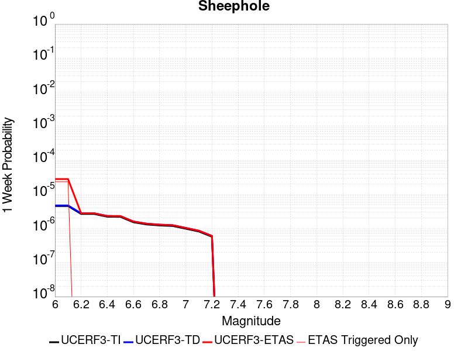 | 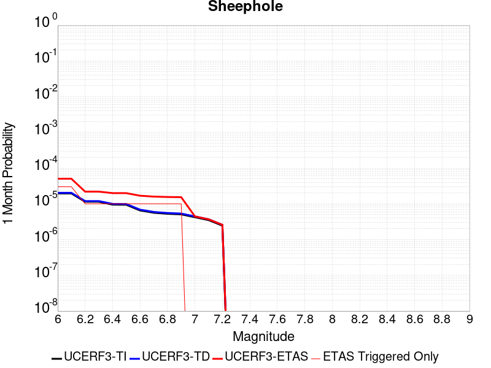 | 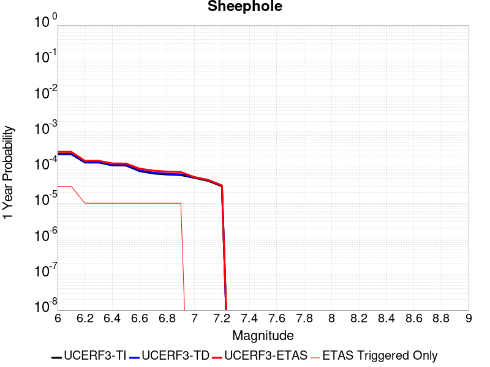 | 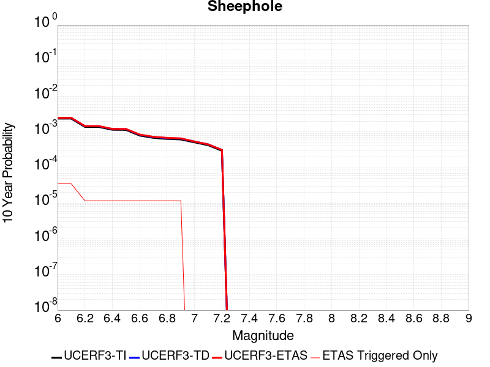 |

| Magnitude | 1 wk TI Prob | 1 wk TD Prob | 1 wk ETAS Prob | 1 wk ETAS/TD Gain | 1 wk ETAS Triggered Only | 1 mo TI Prob | 1 mo TD Prob | 1 mo ETAS Prob | 1 mo ETAS/TD Gain | 1 mo ETAS Triggered Only | 1 yr TI Prob | 1 yr TD Prob | 1 yr ETAS Prob | 1 yr ETAS/TD Gain | 1 yr ETAS Triggered Only | 10 yr TI Prob | 10 yr TD Prob | 10 yr ETAS Prob | 10 yr ETAS/TD Gain | 10 yr ETAS Triggered Only |
|-----|-----|-----|-----|-----|-----|-----|-----|-----|-----|-----|-----|-----|-----|-----|-----|-----|-----|-----|-----|-----|
| 6.0 | 4.5579695E-6 | 4.7412627E-6 | 2.821533E-5 | 5.951016 | 2.3474178E-5 | 1.9534009E-5 | 2.031957E-5 | 5.5530123E-5 | 2.7328393 | 3.521127E-5 | 2.3780059E-4 | 2.473682E-4 | 2.8257078E-4 | 1.1423084 | 3.521127E-5 | 0.0023754628 | 0.002471473 | 0.0025065974 | 1.0142119 | 3.521127E-5 |
| 6.1 | 4.5579695E-6 | 4.7412627E-6 | 2.821533E-5 | 5.951016 | 2.3474178E-5 | 1.9534009E-5 | 2.031957E-5 | 5.5530123E-5 | 2.7328393 | 3.521127E-5 | 2.3780059E-4 | 2.473682E-4 | 2.8257078E-4 | 1.1423084 | 3.521127E-5 | 0.0023754628 | 0.002471473 | 0.0025065974 | 1.0142119 | 3.521127E-5 |
| 6.2 | 2.6677674E-6 | 2.7873941E-6 | 2.7873941E-6 | 1.0 | 0.0 | 1.1433239E-5 | 1.1945926E-5 | 2.3682876E-5 | 1.9825064 | 1.1737089E-5 | 1.3919079E-4 | 1.4543302E-4 | 1.5716841E-4 | 1.0806926 | 1.1737089E-5 | 0.0013910364 | 0.0014534844 | 0.0014652044 | 1.0080634 | 1.1737089E-5 |
| 6.3 | 2.6677674E-6 | 2.7873941E-6 | 2.7873941E-6 | 1.0 | 0.0 | 1.1433239E-5 | 1.1945926E-5 | 2.3682876E-5 | 1.9825064 | 1.1737089E-5 | 1.3919079E-4 | 1.4543302E-4 | 1.5716841E-4 | 1.0806926 | 1.1737089E-5 | 0.0013910364 | 0.0014534844 | 0.0014652044 | 1.0080634 | 1.1737089E-5 |
| 6.4 | 2.2159759E-6 | 2.3228788E-6 | 2.3228788E-6 | 1.0 | 0.0 | 9.497005E-6 | 9.955161E-6 | 2.1692133E-5 | 2.1789837 | 1.1737089E-5 | 1.156199E-4 | 1.2119815E-4 | 1.3293381E-4 | 1.0968304 | 1.1737089E-5 | 0.0011555976 | 0.0012113999 | 0.0012231228 | 1.0096772 | 1.1737089E-5 |
| 6.5 | 2.1986082E-6 | 2.304759E-6 | 2.304759E-6 | 1.0 | 0.0 | 9.4225725E-6 | 9.877506E-6 | 2.161448E-5 | 2.1882527 | 1.1737089E-5 | 1.1471378E-4 | 1.2025281E-4 | 1.3198849E-4 | 1.0975918 | 1.1737089E-5 | 0.0011465458 | 0.0012019566 | 0.0012136797 | 1.0097532 | 1.1737089E-5 |
| 6.6 | 1.5232331E-6 | 1.6018919E-6 | 1.6018919E-6 | 1.0 | 0.0 | 6.5281256E-6 | 6.865234E-6 | 1.8602243E-5 | 2.7096298 | 1.1737089E-5 | 7.947703E-5 | 8.35812E-5 | 9.5317315E-5 | 1.1404157 | 1.1737089E-5 | 7.9448614E-4 | 8.3551643E-4 | 8.472437E-4 | 1.0140359 | 1.1737089E-5 |
| 6.7 | 1.3137362E-6 | 1.382819E-6 | 1.382819E-6 | 1.0 | 0.0 | 5.6302856E-6 | 5.926355E-6 | 1.7663375E-5 | 2.9804788 | 1.1737089E-5 | 6.854657E-5 | 7.215112E-5 | 8.388736E-5 | 1.1626619 | 1.1737089E-5 | 6.8525434E-4 | 7.212908E-4 | 7.330195E-4 | 1.0162606 | 1.1737089E-5 |
| 6.8 | 1.2275751E-6 | 1.2922847E-6 | 1.2922847E-6 | 1.0 | 0.0 | 5.2610258E-6 | 5.5383516E-6 | 1.7275375E-5 | 3.119227 | 1.1737089E-5 | 6.4051106E-5 | 6.7427485E-5 | 7.916378E-5 | 1.1740581 | 1.1737089E-5 | 6.4032647E-4 | 6.740836E-4 | 6.858128E-4 | 1.0174001 | 1.1737089E-5 |
| 6.9 | 1.1837088E-6 | 1.246102E-6 | 1.246102E-6 | 1.0 | 0.0 | 5.0730278E-6 | 5.340427E-6 | 1.7077453E-5 | 3.1977694 | 1.1737089E-5 | 6.176237E-5 | 6.501789E-5 | 7.6754215E-5 | 1.1805092 | 1.1737089E-5 | 6.17452E-4 | 6.5000186E-4 | 6.617313E-4 | 1.0180453 | 1.1737089E-5 |
| 7.0 | 9.849371E-7 | 1.0366288E-6 | 1.0366288E-6 | 1.0 | 0.0 | 4.2211523E-6 | 4.442688E-6 | 4.442688E-6 | 1.0 | 0.0 | 5.1391315E-5 | 5.4088487E-5 | 5.4088487E-5 | 1.0 | 0.0 | 5.137943E-4 | 5.407633E-4 | 5.407633E-4 | 1.0 | 0.0 |
| 7.1 | 8.1643645E-7 | 8.591669E-7 | 8.591669E-7 | 1.0 | 0.0 | 3.4990085E-6 | 3.682139E-6 | 3.682139E-6 | 1.0 | 0.0 | 4.2599597E-5 | 4.482921E-5 | 4.482921E-5 | 1.0 | 0.0 | 4.259143E-4 | 4.4821028E-4 | 4.4821028E-4 | 1.0 | 0.0 |
| 7.2 | 5.7295756E-7 | 6.029502E-7 | 6.029502E-7 | 1.0 | 0.0 | 2.45553E-6 | 2.58407E-6 | 2.58407E-6 | 1.0 | 0.0 | 2.9895667E-5 | 3.1460666E-5 | 3.1460666E-5 | 1.0 | 0.0 | 2.9891645E-4 | 3.145688E-4 | 3.145688E-4 | 1.0 | 0.0 |

## Fish Slough 2011 CFM
*[(top)](#table-of-contents)*

| 1 Week | 1 Month | 1 Year | 10 Year |
|-----|-----|-----|-----|
| 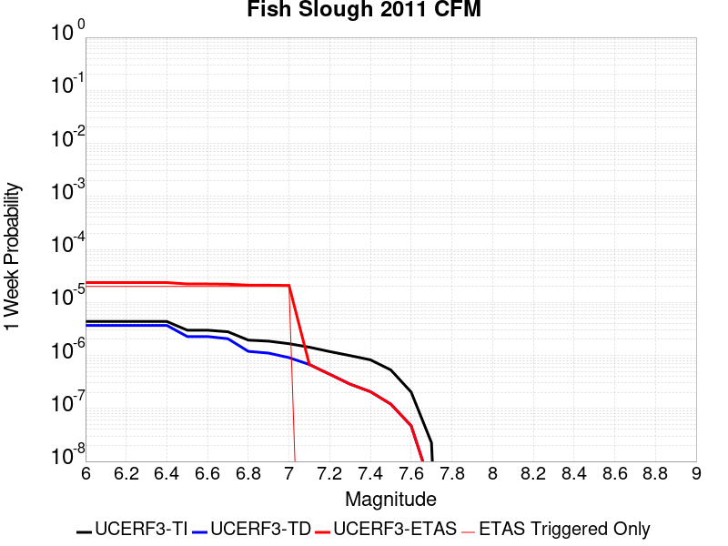 | 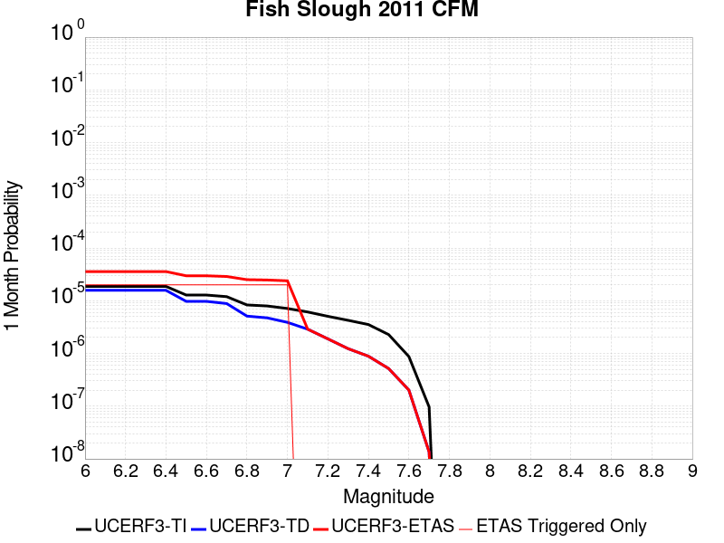 | 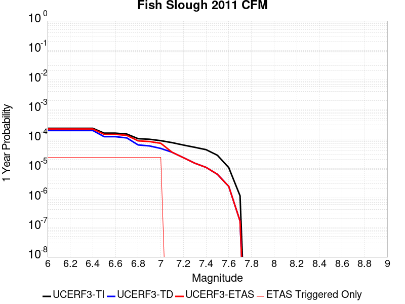 |  |

| Magnitude | 1 wk TI Prob | 1 wk TD Prob | 1 wk ETAS Prob | 1 wk ETAS/TD Gain | 1 wk ETAS Triggered Only | 1 mo TI Prob | 1 mo TD Prob | 1 mo ETAS Prob | 1 mo ETAS/TD Gain | 1 mo ETAS Triggered Only | 1 yr TI Prob | 1 yr TD Prob | 1 yr ETAS Prob | 1 yr ETAS/TD Gain | 1 yr ETAS Triggered Only | 10 yr TI Prob | 10 yr TD Prob | 10 yr ETAS Prob | 10 yr ETAS/TD Gain | 10 yr ETAS Triggered Only |
|-----|-----|-----|-----|-----|-----|-----|-----|-----|-----|-----|-----|-----|-----|-----|-----|-----|-----|-----|-----|-----|
| 6.0 | 4.3629925E-6 | 3.6772697E-6 | 2.7151362E-5 | 7.3835654 | 2.3474178E-5 | 1.8698405E-5 | 1.5759644E-5 | 3.923345E-5 | 2.4894884 | 2.3474178E-5 | 2.276293E-4 | 1.918589E-4 | 2.1532857E-4 | 1.1223278 | 2.3474178E-5 | 0.0022739628 | 0.0019171416 | 0.0019522853 | 1.0183313 | 3.521127E-5 |
| 6.1 | 4.3629925E-6 | 3.6772697E-6 | 2.7151362E-5 | 7.3835654 | 2.3474178E-5 | 1.8698405E-5 | 1.5759644E-5 | 3.923345E-5 | 2.4894884 | 2.3474178E-5 | 2.276293E-4 | 1.918589E-4 | 2.1532857E-4 | 1.1223278 | 2.3474178E-5 | 0.0022739628 | 0.0019171416 | 0.0019522853 | 1.0183313 | 3.521127E-5 |
| 6.2 | 4.3629925E-6 | 3.6772697E-6 | 2.7151362E-5 | 7.3835654 | 2.3474178E-5 | 1.8698405E-5 | 1.5759644E-5 | 3.923345E-5 | 2.4894884 | 2.3474178E-5 | 2.276293E-4 | 1.918589E-4 | 2.1532857E-4 | 1.1223278 | 2.3474178E-5 | 0.0022739628 | 0.0019171416 | 0.0019522853 | 1.0183313 | 3.521127E-5 |
| 6.3 | 4.3629925E-6 | 3.6772697E-6 | 2.7151362E-5 | 7.3835654 | 2.3474178E-5 | 1.8698405E-5 | 1.5759644E-5 | 3.923345E-5 | 2.4894884 | 2.3474178E-5 | 2.276293E-4 | 1.918589E-4 | 2.1532857E-4 | 1.1223278 | 2.3474178E-5 | 0.0022739628 | 0.0019171416 | 0.0019522853 | 1.0183313 | 3.521127E-5 |
| 6.4 | 4.3629925E-6 | 3.6772697E-6 | 2.7151362E-5 | 7.3835654 | 2.3474178E-5 | 1.8698405E-5 | 1.5759644E-5 | 3.923345E-5 | 2.4894884 | 2.3474178E-5 | 2.276293E-4 | 1.918589E-4 | 2.1532857E-4 | 1.1223278 | 2.3474178E-5 | 0.0022739628 | 0.0019171416 | 0.0019522853 | 1.0183313 | 3.521127E-5 |
| 6.5 | 2.991715E-6 | 2.2703898E-6 | 2.5744515E-5 | 11.339249 | 2.3474178E-5 | 1.2821573E-5 | 9.730211E-6 | 3.320416E-5 | 3.412481 | 2.3474178E-5 | 1.5609147E-4 | 1.1845979E-4 | 1.4193119E-4 | 1.1981381 | 2.3474178E-5 | 0.0015598187 | 0.0011840566 | 0.001207503 | 1.0198017 | 2.3474178E-5 |
| 6.6 | 2.991715E-6 | 2.2703898E-6 | 2.5744515E-5 | 11.339249 | 2.3474178E-5 | 1.2821573E-5 | 9.730211E-6 | 3.320416E-5 | 3.412481 | 2.3474178E-5 | 1.5609147E-4 | 1.1845979E-4 | 1.4193119E-4 | 1.1981381 | 2.3474178E-5 | 0.0015598187 | 0.0011840566 | 0.001207503 | 1.0198017 | 2.3474178E-5 |
| 6.7 | 2.7890346E-6 | 2.0621853E-6 | 2.5536316E-5 | 12.383134 | 2.3474178E-5 | 1.1952951E-5 | 8.837912E-6 | 3.2311884E-5 | 3.656054 | 2.3474178E-5 | 1.4551746E-4 | 1.0759717E-4 | 1.3106882E-4 | 1.2181438 | 2.3474178E-5 | 0.0014542221 | 0.0010755389 | 0.0010989879 | 1.0218021 | 2.3474178E-5 |
| 6.8 | 1.9416723E-6 | 1.192555E-6 | 2.4666706E-5 | 20.683914 | 2.3474178E-5 | 8.321425E-6 | 5.1109405E-6 | 2.8584998E-5 | 5.592904 | 2.3474178E-5 | 1.01308644E-4 | 6.222397E-5 | 8.569668E-5 | 1.3772296 | 2.3474178E-5 | 0.0010126247 | 6.220695E-4 | 6.455291E-4 | 1.0377121 | 2.3474178E-5 |
| 6.9 | 1.8567416E-6 | 1.1046966E-6 | 2.4578849E-5 | 22.24941 | 2.3474178E-5 | 7.957439E-6 | 4.7344056E-6 | 2.8208473E-5 | 5.9581866 | 2.3474178E-5 | 9.687752E-5 | 5.7639903E-5 | 8.1112725E-5 | 1.4072322 | 2.3474178E-5 | 9.6835295E-4 | 5.762534E-4 | 5.9971405E-4 | 1.0407124 | 2.3474178E-5 |
| 7.0 | 1.6634067E-6 | 9.073966E-7 | 2.4381554E-5 | 26.869787 | 2.3474178E-5 | 7.1288664E-6 | 3.888837E-6 | 2.7362925E-5 | 7.0362744 | 2.3474178E-5 | 8.679049E-5 | 4.734559E-5 | 7.0818656E-5 | 1.4957815 | 2.3474178E-5 | 8.6756604E-4 | 4.733579E-4 | 4.96821E-4 | 1.0495673 | 2.3474178E-5 |
| 7.1 | 1.4281054E-6 | 6.7366227E-7 | 6.7366227E-7 | 1.0 | 0.0 | 6.1204373E-6 | 2.8871211E-6 | 2.8871211E-6 | 1.0 | 0.0 | 7.451377E-5 | 3.515015E-5 | 3.515015E-5 | 1.0 | 0.0 | 7.44888E-4 | 3.5144767E-4 | 3.5144767E-4 | 1.0 | 0.0 |
| 7.2 | 1.1810387E-6 | 4.408355E-7 | 4.408355E-7 | 1.0 | 0.0 | 5.0615845E-6 | 1.8892936E-6 | 1.8892936E-6 | 1.0 | 0.0 | 6.1623046E-5 | 2.3001916E-5 | 2.3001916E-5 | 1.0 | 0.0 | 6.160596E-4 | 2.2999625E-4 | 2.2999625E-4 | 1.0 | 0.0 |
| 7.3 | 9.918052E-7 | 2.8733467E-7 | 2.8733467E-7 | 1.0 | 0.0 | 4.2505867E-6 | 1.2314338E-6 | 1.2314338E-6 | 1.0 | 0.0 | 5.1749663E-5 | 1.4992604E-5 | 1.4992604E-5 | 1.0 | 0.0 | 5.173762E-4 | 1.4991604E-4 | 1.4991604E-4 | 1.0 | 0.0 |
| 7.4 | 8.25252E-7 | 2.0694807E-7 | 2.0694807E-7 | 1.0 | 0.0 | 3.5367896E-6 | 8.8692E-7 | 8.8692E-7 | 1.0 | 0.0 | 4.3059565E-5 | 1.0798199E-5 | 1.0798199E-5 | 1.0 | 0.0 | 4.305122E-4 | 1.07976804E-4 | 1.07976804E-4 | 1.0 | 0.0 |
| 7.5 | 5.3248567E-7 | 1.2072739E-7 | 1.2072739E-7 | 1.0 | 0.0 | 2.2820795E-6 | 5.17403E-7 | 5.17403E-7 | 1.0 | 0.0 | 2.7783964E-5 | 6.299364E-6 | 6.299364E-6 | 1.0 | 0.0 | 2.778049E-4 | 6.2991894E-5 | 6.2991894E-5 | 1.0 | 0.0 |
| 7.6 | 2.037542E-7 | 4.7129152E-8 | 4.7129152E-8 | 1.0 | 0.0 | 8.73232E-7 | 2.0198206E-7 | 2.0198206E-7 | 1.0 | 0.0 | 1.0631547E-5 | 2.459129E-6 | 2.459129E-6 | 1.0 | 0.0 | 1.0631039E-4 | 2.459104E-5 | 2.459104E-5 | 1.0 | 0.0 |
| 7.7 | 2.2501226E-8 | 3.1514258E-9 | 3.1514258E-9 | 1.0 | 0.0 | 9.6433816E-8 | 1.350611E-8 | 1.350611E-8 | 1.0 | 0.0 | 1.1740811E-6 | 1.6443688E-7 | 1.6443688E-7 | 1.0 | 0.0 | 1.1740749E-5 | 1.6443678E-6 | 1.6443678E-6 | 1.0 | 0.0 |

## Cucamonga
*[(top)](#table-of-contents)*

| 1 Week | 1 Month | 1 Year | 10 Year |
|-----|-----|-----|-----|
| 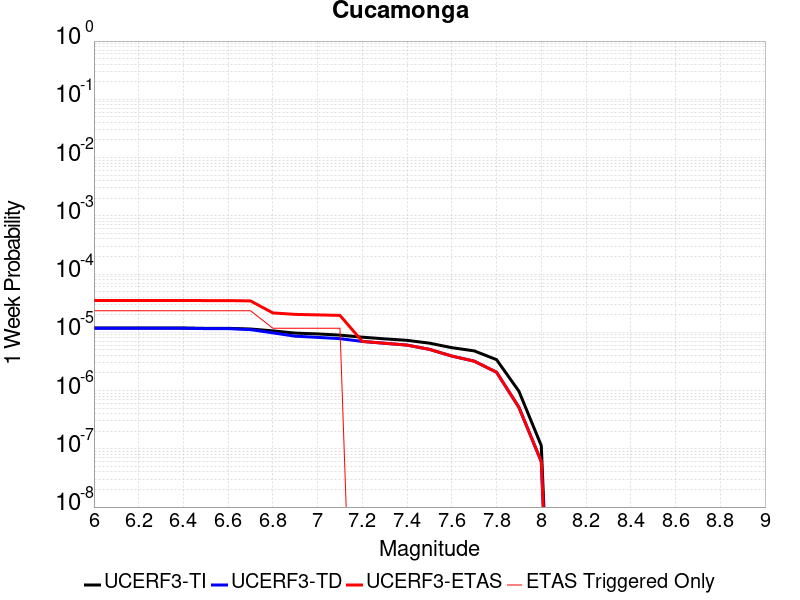 | 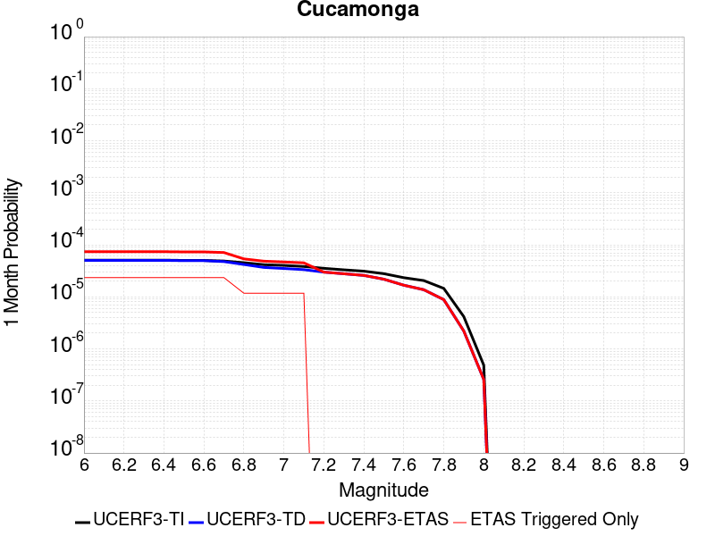 | 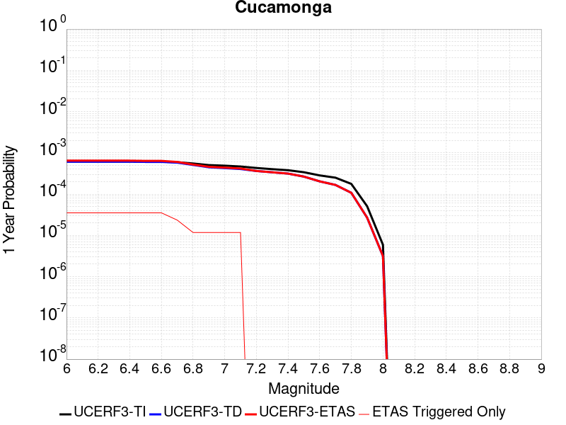 | 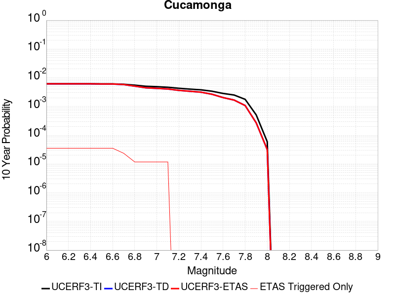 |

| Magnitude | 1 wk TI Prob | 1 wk TD Prob | 1 wk ETAS Prob | 1 wk ETAS/TD Gain | 1 wk ETAS Triggered Only | 1 mo TI Prob | 1 mo TD Prob | 1 mo ETAS Prob | 1 mo ETAS/TD Gain | 1 mo ETAS Triggered Only | 1 yr TI Prob | 1 yr TD Prob | 1 yr ETAS Prob | 1 yr ETAS/TD Gain | 1 yr ETAS Triggered Only | 10 yr TI Prob | 10 yr TD Prob | 10 yr ETAS Prob | 10 yr ETAS/TD Gain | 10 yr ETAS Triggered Only |
|-----|-----|-----|-----|-----|-----|-----|-----|-----|-----|-----|-----|-----|-----|-----|-----|-----|-----|-----|-----|-----|
| 6.0 | 1.1848348E-5 | 1.1737008E-5 | 3.5210913E-5 | 2.9999902 | 2.3474178E-5 | 5.0777642E-5 | 5.030051E-5 | 7.377351E-5 | 1.4666553 | 2.3474178E-5 | 6.180424E-4 | 6.1223935E-4 | 6.47429E-4 | 1.057477 | 3.521127E-5 | 0.0061632637 | 0.0061067017 | 0.006141698 | 1.0057307 | 3.521127E-5 |
| 6.1 | 1.1848348E-5 | 1.1737008E-5 | 3.5210913E-5 | 2.9999902 | 2.3474178E-5 | 5.0777642E-5 | 5.030051E-5 | 7.377351E-5 | 1.4666553 | 2.3474178E-5 | 6.180424E-4 | 6.1223935E-4 | 6.47429E-4 | 1.057477 | 3.521127E-5 | 0.0061632637 | 0.0061067017 | 0.006141698 | 1.0057307 | 3.521127E-5 |
| 6.2 | 1.1848348E-5 | 1.1737008E-5 | 3.5210913E-5 | 2.9999902 | 2.3474178E-5 | 5.0777642E-5 | 5.030051E-5 | 7.377351E-5 | 1.4666553 | 2.3474178E-5 | 6.180424E-4 | 6.1223935E-4 | 6.47429E-4 | 1.057477 | 3.521127E-5 | 0.0061632637 | 0.0061067017 | 0.006141698 | 1.0057307 | 3.521127E-5 |
| 6.3 | 1.1848348E-5 | 1.1737008E-5 | 3.5210913E-5 | 2.9999902 | 2.3474178E-5 | 5.0777642E-5 | 5.030051E-5 | 7.377351E-5 | 1.4666553 | 2.3474178E-5 | 6.180424E-4 | 6.1223935E-4 | 6.47429E-4 | 1.057477 | 3.521127E-5 | 0.0061632637 | 0.0061067017 | 0.006141698 | 1.0057307 | 3.521127E-5 |
| 6.4 | 1.1848348E-5 | 1.1737008E-5 | 3.5210913E-5 | 2.9999902 | 2.3474178E-5 | 5.0777642E-5 | 5.030051E-5 | 7.377351E-5 | 1.4666553 | 2.3474178E-5 | 6.180424E-4 | 6.1223935E-4 | 6.47429E-4 | 1.057477 | 3.521127E-5 | 0.0061632637 | 0.0061067017 | 0.006141698 | 1.0057307 | 3.521127E-5 |
| 6.5 | 1.16988695E-5 | 1.15760395E-5 | 3.5049947E-5 | 3.0278013 | 2.3474178E-5 | 5.013705E-5 | 4.9610666E-5 | 7.3083684E-5 | 1.4731445 | 2.3474178E-5 | 6.102476E-4 | 6.0384517E-4 | 6.390352E-4 | 1.0582765 | 3.521127E-5 | 0.006085745 | 0.006023216 | 0.006058215 | 1.0058107 | 3.521127E-5 |
| 6.6 | 1.16988695E-5 | 1.15760395E-5 | 3.5049947E-5 | 3.0278013 | 2.3474178E-5 | 5.013705E-5 | 4.9610666E-5 | 7.3083684E-5 | 1.4731445 | 2.3474178E-5 | 6.102476E-4 | 6.0384517E-4 | 6.390352E-4 | 1.0582765 | 3.521127E-5 | 0.006085745 | 0.006023216 | 0.006058215 | 1.0058107 | 3.521127E-5 |
| 6.7 | 1.1397107E-5 | 1.11149475E-5 | 3.4588866E-5 | 3.1119235 | 2.3474178E-5 | 4.884383E-5 | 4.7634636E-5 | 7.1107694E-5 | 1.4927729 | 2.3474178E-5 | 5.9451134E-4 | 5.797998E-4 | 6.032604E-4 | 1.0404632 | 2.3474178E-5 | 0.005929234 | 0.0057840226 | 0.005807361 | 1.004035 | 2.3474178E-5 |
| 6.8 | 1.058387E-5 | 9.784992E-6 | 2.1521966E-5 | 2.1994874 | 1.1737089E-5 | 4.5358654E-5 | 4.193501E-5 | 5.3671607E-5 | 1.2798759 | 1.1737089E-5 | 5.521017E-4 | 5.1044027E-4 | 5.221713E-4 | 1.0229824 | 1.1737089E-5 | 0.00550732 | 0.0050936877 | 0.005105365 | 1.0022925 | 1.1737089E-5 |
| 6.9 | 9.690046E-6 | 8.57948E-6 | 2.0316469E-5 | 2.3680303 | 1.1737089E-5 | 4.1528107E-5 | 3.6768684E-5 | 4.8505342E-5 | 1.3192025 | 1.1737089E-5 | 5.054874E-4 | 4.475672E-4 | 4.5929902E-4 | 1.0262125 | 1.1737089E-5 | 0.005043391 | 0.004467594 | 0.004479279 | 1.0026155 | 1.1737089E-5 |
| 7.0 | 9.381461E-6 | 8.187101E-6 | 1.9924095E-5 | 2.4335957 | 1.1737089E-5 | 4.020564E-5 | 3.5087105E-5 | 4.6823785E-5 | 1.3345011 | 1.1737089E-5 | 4.893937E-4 | 4.2710215E-4 | 4.3883422E-4 | 1.027469 | 1.1737089E-5 | 0.0048831734 | 0.0042637475 | 0.0042754347 | 1.002741 | 1.1737089E-5 |
| 7.1 | 8.946492E-6 | 7.781886E-6 | 1.9518884E-5 | 2.508246 | 1.1737089E-5 | 3.8341543E-5 | 3.3350516E-5 | 4.5087214E-5 | 1.3519195 | 1.1737089E-5 | 4.667083E-4 | 4.0596718E-4 | 4.176995E-4 | 1.0288997 | 1.1737089E-5 | 0.0046572937 | 0.004053192 | 0.0040648817 | 1.002884 | 1.1737089E-5 |
| 7.2 | 8.251016E-6 | 6.9752796E-6 | 6.9752796E-6 | 1.0 | 0.0 | 3.5361016E-5 | 2.9893714E-5 | 2.9893714E-5 | 1.0 | 0.0 | 4.3043532E-4 | 3.6389544E-4 | 3.6389544E-4 | 1.0 | 0.0 | 0.0042960253 | 0.0036339292 | 0.0036339292 | 1.0 | 0.0 |
| 7.3 | 7.717881E-6 | 6.4863502E-6 | 6.4863502E-6 | 1.0 | 0.0 | 3.3076216E-5 | 2.7798349E-5 | 2.7798349E-5 | 1.0 | 0.0 | 4.026285E-4 | 3.3839257E-4 | 3.3839257E-4 | 1.0 | 0.0 | 0.004018998 | 0.00337971 | 0.00337971 | 1.0 | 0.0 |
| 7.4 | 7.275623E-6 | 6.031997E-6 | 6.031997E-6 | 1.0 | 0.0 | 3.118087E-5 | 2.585116E-5 | 2.585116E-5 | 1.0 | 0.0 | 3.7956095E-4 | 3.1469265E-4 | 3.1469265E-4 | 1.0 | 0.0 | 0.0037891332 | 0.0031434062 | 0.0031434062 | 1.0 | 0.0 |
| 7.5 | 6.5109502E-6 | 5.1006014E-6 | 5.1006014E-6 | 1.0 | 0.0 | 2.7903774E-5 | 2.1859538E-5 | 2.1859538E-5 | 1.0 | 0.0 | 3.3967546E-4 | 2.661075E-4 | 2.661075E-4 | 1.0 | 0.0 | 0.0033915674 | 0.002658813 | 0.002658813 | 1.0 | 0.0 |
| 7.6 | 5.4495326E-6 | 3.90857E-6 | 3.90857E-6 | 1.0 | 0.0 | 2.335493E-5 | 1.6750908E-5 | 1.6750908E-5 | 1.0 | 0.0 | 2.8430918E-4 | 2.0392328E-4 | 2.0392328E-4 | 1.0 | 0.0 | 0.0028394572 | 0.002038282 | 0.002038282 | 1.0 | 0.0 |
| 7.7 | 4.7997164E-6 | 3.2002547E-6 | 3.2002547E-6 | 1.0 | 0.0 | 2.057005E-5 | 1.3715306E-5 | 1.3715306E-5 | 1.0 | 0.0 | 2.504116E-4 | 1.6697108E-4 | 1.6697108E-4 | 1.0 | 0.0 | 0.002501296 | 0.0016693877 | 0.0016693877 | 1.0 | 0.0 |
| 7.8 | 3.3941733E-6 | 2.0641899E-6 | 2.0641899E-6 | 1.0 | 0.0 | 1.4546376E-5 | 8.846498E-6 | 8.846498E-6 | 1.0 | 0.0 | 1.7708774E-4 | 1.07700806E-4 | 1.07700806E-4 | 1.0 | 0.0 | 0.0017694668 | 0.001076723 | 0.001076723 | 1.0 | 0.0 |
| 7.9 | 9.750552E-7 | 5.155946E-7 | 5.155946E-7 | 1.0 | 0.0 | 4.178801E-6 | 2.2096892E-6 | 2.2096892E-6 | 1.0 | 0.0 | 5.0875715E-5 | 2.690264E-5 | 2.690264E-5 | 1.0 | 0.0 | 5.086407E-4 | 2.6899425E-4 | 2.6899425E-4 | 1.0 | 0.0 |
| 8.0 | 1.133857E-7 | 6.053707E-8 | 6.053707E-8 | 1.0 | 0.0 | 4.8593864E-7 | 2.5944456E-7 | 2.5944456E-7 | 1.0 | 0.0 | 5.9162867E-6 | 3.158733E-6 | 3.158733E-6 | 1.0 | 0.0 | 5.916129E-5 | 3.1586897E-5 | 3.1586897E-5 | 1.0 | 0.0 |

## Newport-Inglewood alt 1
*[(top)](#table-of-contents)*

| 1 Week | 1 Month | 1 Year | 10 Year |
|-----|-----|-----|-----|
|  | 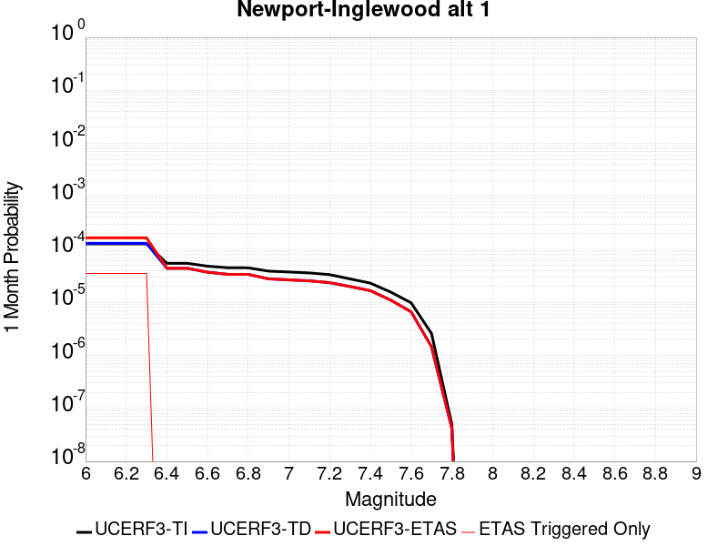 | 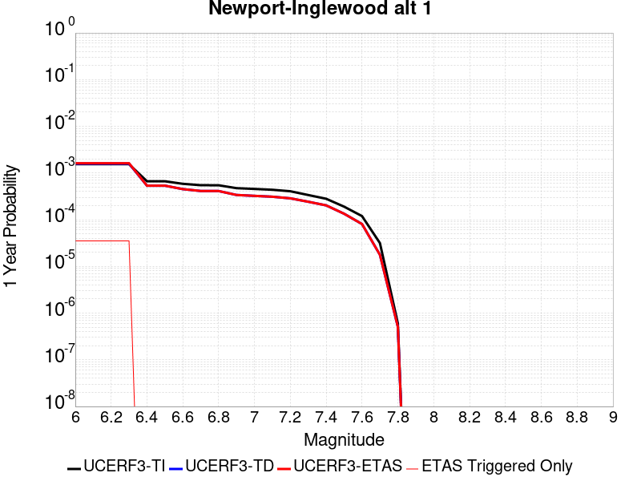 | 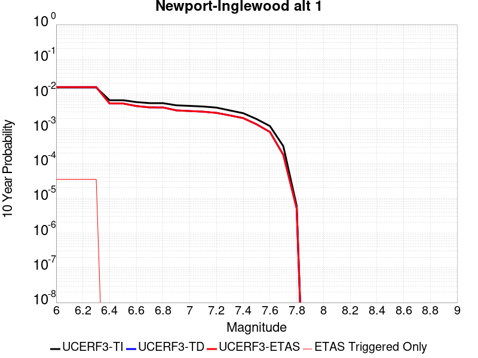 |

| Magnitude | 1 wk TI Prob | 1 wk TD Prob | 1 wk ETAS Prob | 1 wk ETAS/TD Gain | 1 wk ETAS Triggered Only | 1 mo TI Prob | 1 mo TD Prob | 1 mo ETAS Prob | 1 mo ETAS/TD Gain | 1 mo ETAS Triggered Only | 1 yr TI Prob | 1 yr TD Prob | 1 yr ETAS Prob | 1 yr ETAS/TD Gain | 1 yr ETAS Triggered Only | 10 yr TI Prob | 10 yr TD Prob | 10 yr ETAS Prob | 10 yr ETAS/TD Gain | 10 yr ETAS Triggered Only |
|-----|-----|-----|-----|-----|-----|-----|-----|-----|-----|-----|-----|-----|-----|-----|-----|-----|-----|-----|-----|-----|
| 6.0 | 2.9668912E-5 | 3.0404817E-5 | 5.387828E-5 | 1.7720311 | 2.3474178E-5 | 1.2714628E-4 | 1.303026E-4 | 1.6550928E-4 | 1.2701917 | 3.521127E-5 | 0.0015469068 | 0.0015857625 | 0.0016209179 | 1.0221695 | 3.521127E-5 | 0.015361829 | 0.015792042 | 0.015826698 | 1.0021945 | 3.521127E-5 |
| 6.1 | 2.9668912E-5 | 3.0404817E-5 | 5.387828E-5 | 1.7720311 | 2.3474178E-5 | 1.2714628E-4 | 1.303026E-4 | 1.6550928E-4 | 1.2701917 | 3.521127E-5 | 0.0015469068 | 0.0015857625 | 0.0016209179 | 1.0221695 | 3.521127E-5 | 0.015361829 | 0.015792042 | 0.015826698 | 1.0021945 | 3.521127E-5 |
| 6.2 | 2.9668912E-5 | 3.0404817E-5 | 5.387828E-5 | 1.7720311 | 2.3474178E-5 | 1.2714628E-4 | 1.303026E-4 | 1.6550928E-4 | 1.2701917 | 3.521127E-5 | 0.0015469068 | 0.0015857625 | 0.0016209179 | 1.0221695 | 3.521127E-5 | 0.015361829 | 0.015792042 | 0.015826698 | 1.0021945 | 3.521127E-5 |
| 6.3 | 2.9668912E-5 | 3.0404817E-5 | 5.387828E-5 | 1.7720311 | 2.3474178E-5 | 1.2714628E-4 | 1.303026E-4 | 1.6550928E-4 | 1.2701917 | 3.521127E-5 | 0.0015469068 | 0.0015857625 | 0.0016209179 | 1.0221695 | 3.521127E-5 | 0.015361829 | 0.015792042 | 0.015826698 | 1.0021945 | 3.521127E-5 |
| 6.4 | 1.275942E-5 | 1.0272503E-5 | 1.0272503E-5 | 1.0 | 0.0 | 5.4682085E-5 | 4.402429E-5 | 4.402429E-5 | 1.0 | 0.0 | 6.65551E-4 | 5.358681E-4 | 5.358681E-4 | 1.0 | 0.0 | 0.0066356123 | 0.005346184 | 0.005346184 | 1.0 | 0.0 |
| 6.5 | 1.275942E-5 | 1.0272503E-5 | 1.0272503E-5 | 1.0 | 0.0 | 5.4682085E-5 | 4.402429E-5 | 4.402429E-5 | 1.0 | 0.0 | 6.65551E-4 | 5.358681E-4 | 5.358681E-4 | 1.0 | 0.0 | 0.0066356123 | 0.005346184 | 0.005346184 | 1.0 | 0.0 |
| 6.6 | 1.1255358E-5 | 8.661884E-6 | 8.661884E-6 | 1.0 | 0.0 | 4.8236358E-5 | 3.712184E-5 | 3.712184E-5 | 1.0 | 0.0 | 5.871194E-4 | 4.518664E-4 | 4.518664E-4 | 1.0 | 0.0 | 0.005855706 | 0.004509653 | 0.004509653 | 1.0 | 0.0 |
| 6.7 | 1.0504745E-5 | 7.8997955E-6 | 7.8997955E-6 | 1.0 | 0.0 | 4.5019555E-5 | 3.3855835E-5 | 3.3855835E-5 | 1.0 | 0.0 | 5.4797524E-4 | 4.1211807E-4 | 4.1211807E-4 | 1.0 | 0.0 | 0.0054662596 | 0.004113668 | 0.004113668 | 1.0 | 0.0 |
| 6.8 | 1.0476007E-5 | 7.881176E-6 | 7.881176E-6 | 1.0 | 0.0 | 4.4896402E-5 | 3.3776043E-5 | 3.3776043E-5 | 1.0 | 0.0 | 5.464766E-4 | 4.1114696E-4 | 4.1114696E-4 | 1.0 | 0.0 | 0.005451347 | 0.0041039926 | 0.0041039926 | 1.0 | 0.0 |
| 6.9 | 9.076797E-6 | 6.4896312E-6 | 6.4896312E-6 | 1.0 | 0.0 | 3.889998E-5 | 2.781241E-5 | 2.781241E-5 | 1.0 | 0.0 | 4.7350433E-4 | 3.385638E-4 | 3.385638E-4 | 1.0 | 0.0 | 0.004724967 | 0.0033805177 | 0.0033805177 | 1.0 | 0.0 |
| 7.0 | 8.73795E-6 | 6.2120125E-6 | 6.2120125E-6 | 1.0 | 0.0 | 3.7447822E-5 | 2.6622642E-5 | 2.6622642E-5 | 1.0 | 0.0 | 4.5583185E-4 | 3.2408274E-4 | 3.2408274E-4 | 1.0 | 0.0 | 0.0045489795 | 0.0032361327 | 0.0032361327 | 1.0 | 0.0 |
| 7.1 | 8.391299E-6 | 5.95579E-6 | 5.95579E-6 | 1.0 | 0.0 | 3.5962214E-5 | 2.5524565E-5 | 2.5524565E-5 | 1.0 | 0.0 | 4.37752E-4 | 3.1071753E-4 | 3.1071753E-4 | 1.0 | 0.0 | 0.004368907 | 0.0031028606 | 0.0031028606 | 1.0 | 0.0 |
| 7.2 | 7.796882E-6 | 5.4965344E-6 | 5.4965344E-6 | 1.0 | 0.0 | 3.341478E-5 | 2.3556364E-5 | 2.3556364E-5 | 1.0 | 0.0 | 4.06749E-4 | 2.867612E-4 | 2.867612E-4 | 1.0 | 0.0 | 0.0040600533 | 0.0028639357 | 0.0028639357 | 1.0 | 0.0 |
| 7.3 | 6.4738833E-6 | 4.6478162E-6 | 4.6478162E-6 | 1.0 | 0.0 | 2.774492E-5 | 1.9919062E-5 | 1.9919062E-5 | 1.0 | 0.0 | 3.3774204E-4 | 2.4248775E-4 | 2.4248775E-4 | 1.0 | 0.0 | 0.0033722918 | 0.0024222482 | 0.0024222482 | 1.0 | 0.0 |
| 7.4 | 5.382145E-6 | 3.8857597E-6 | 3.8857597E-6 | 1.0 | 0.0 | 2.3066134E-5 | 1.665315E-5 | 1.665315E-5 | 1.0 | 0.0 | 2.8079396E-4 | 2.0273338E-4 | 2.0273338E-4 | 1.0 | 0.0 | 0.0028043943 | 0.0020254988 | 0.0020254988 | 1.0 | 0.0 |
| 7.5 | 3.648244E-6 | 2.5737843E-6 | 2.5737843E-6 | 1.0 | 0.0 | 1.5635238E-5 | 1.1030458E-5 | 1.1030458E-5 | 1.0 | 0.0 | 1.9034238E-4 | 1.3428765E-4 | 1.3428765E-4 | 1.0 | 0.0 | 0.0019017943 | 0.0013420755 | 0.0013420755 | 1.0 | 0.0 |
| 7.6 | 2.2906888E-6 | 1.5479842E-6 | 1.5479842E-6 | 1.0 | 0.0 | 9.817201E-6 | 6.634202E-6 | 6.634202E-6 | 1.0 | 0.0 | 1.1951787E-4 | 8.076848E-5 | 8.076848E-5 | 1.0 | 0.0 | 0.0011945361 | 8.07398E-4 | 8.07398E-4 | 1.0 | 0.0 |
| 7.7 | 6.0479874E-7 | 3.397512E-7 | 3.397512E-7 | 1.0 | 0.0 | 2.5919921E-6 | 1.4560758E-6 | 1.4560758E-6 | 1.0 | 0.0 | 3.1557047E-5 | 1.7727592E-5 | 1.7727592E-5 | 1.0 | 0.0 | 3.1552566E-4 | 1.7726317E-4 | 1.7726317E-4 | 1.0 | 0.0 |
| 7.8 | 1.16056995E-8 | 9.782373E-9 | 9.782373E-9 | 1.0 | 0.0 | 4.9738713E-8 | 4.1924455E-8 | 4.1924455E-8 | 1.0 | 0.0 | 6.0556863E-7 | 5.1043025E-7 | 5.1043025E-7 | 1.0 | 0.0 | 6.05567E-6 | 5.1043025E-6 | 5.1043025E-6 | 1.0 | 0.0 |

## Malibu Coast alt 1
*[(top)](#table-of-contents)*

| 1 Week | 1 Month | 1 Year | 10 Year |
|-----|-----|-----|-----|
| 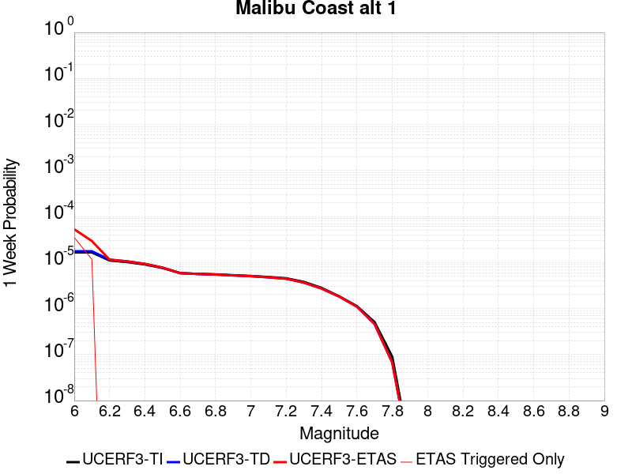 | 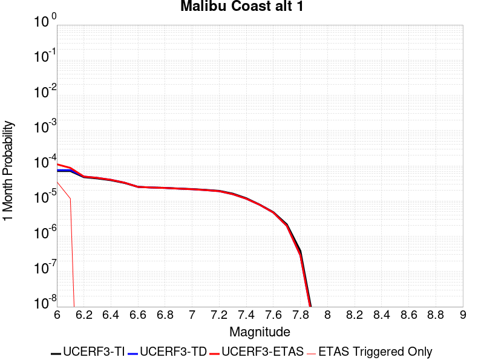 | 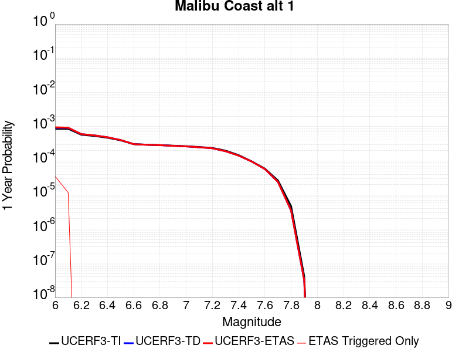 | 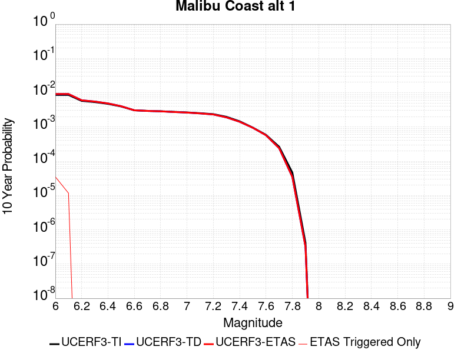 |

| Magnitude | 1 wk TI Prob | 1 wk TD Prob | 1 wk ETAS Prob | 1 wk ETAS/TD Gain | 1 wk ETAS Triggered Only | 1 mo TI Prob | 1 mo TD Prob | 1 mo ETAS Prob | 1 mo ETAS/TD Gain | 1 mo ETAS Triggered Only | 1 yr TI Prob | 1 yr TD Prob | 1 yr ETAS Prob | 1 yr ETAS/TD Gain | 1 yr ETAS Triggered Only | 10 yr TI Prob | 10 yr TD Prob | 10 yr ETAS Prob | 10 yr ETAS/TD Gain | 10 yr ETAS Triggered Only |
|-----|-----|-----|-----|-----|-----|-----|-----|-----|-----|-----|-----|-----|-----|-----|-----|-----|-----|-----|-----|-----|
| 6.0 | 1.6572556E-5 | 1.7598066E-5 | 5.2808715E-5 | 3.000825 | 3.521127E-5 | 7.102331E-5 | 7.541821E-5 | 1.10626825E-4 | 1.4668449 | 3.521127E-5 | 8.6436566E-4 | 9.178488E-4 | 9.5302775E-4 | 1.0383276 | 3.521127E-5 | 0.0086101135 | 0.009142512 | 0.009177402 | 1.0038161 | 3.521127E-5 |
| 6.1 | 1.6572556E-5 | 1.7598066E-5 | 2.933495E-5 | 1.6669416 | 1.1737089E-5 | 7.102331E-5 | 7.541821E-5 | 8.715441E-5 | 1.155615 | 1.1737089E-5 | 8.6436566E-4 | 9.178488E-4 | 9.295751E-4 | 1.0127759 | 1.1737089E-5 | 0.0086101135 | 0.009142512 | 0.009154142 | 1.0012721 | 1.1737089E-5 |
| 6.2 | 1.1085717E-5 | 1.1557147E-5 | 1.1557147E-5 | 1.0 | 0.0 | 4.750935E-5 | 4.952971E-5 | 4.952971E-5 | 1.0 | 0.0 | 5.782728E-4 | 6.028609E-4 | 6.028609E-4 | 1.0 | 0.0 | 0.0057677035 | 0.0060126255 | 0.0060126255 | 1.0 | 0.0 |
| 6.3 | 1.0208568E-5 | 1.0592237E-5 | 1.0592237E-5 | 1.0 | 0.0 | 4.375027E-5 | 4.539453E-5 | 4.539453E-5 | 1.0 | 0.0 | 5.325294E-4 | 5.5254117E-4 | 5.5254117E-4 | 1.0 | 0.0 | 0.0053125503 | 0.0055119814 | 0.0055119814 | 1.0 | 0.0 |
| 6.4 | 9.0682315E-6 | 9.342637E-6 | 9.342637E-6 | 1.0 | 0.0 | 3.8863272E-5 | 4.003927E-5 | 4.003927E-5 | 1.0 | 0.0 | 4.730576E-4 | 4.8737114E-4 | 4.8737114E-4 | 1.0 | 0.0 | 0.0047205184 | 0.004863236 | 0.004863236 | 1.0 | 0.0 |
| 6.5 | 7.605796E-6 | 7.748587E-6 | 7.748587E-6 | 1.0 | 0.0 | 3.259586E-5 | 3.3207816E-5 | 3.3207816E-5 | 1.0 | 0.0 | 3.9678233E-4 | 4.0423148E-4 | 4.0423148E-4 | 1.0 | 0.0 | 0.0039607463 | 0.0040351 | 0.0040351 | 1.0 | 0.0 |
| 6.6 | 5.889873E-6 | 5.8795385E-6 | 5.8795385E-6 | 1.0 | 0.0 | 2.5242069E-5 | 2.519778E-5 | 2.519778E-5 | 1.0 | 0.0 | 3.0727885E-4 | 3.0673988E-4 | 3.0673988E-4 | 1.0 | 0.0 | 0.003068543 | 0.0030631777 | 0.0030631777 | 1.0 | 0.0 |
| 6.7 | 5.66586E-6 | 5.641641E-6 | 5.641641E-6 | 1.0 | 0.0 | 2.428203E-5 | 2.417824E-5 | 2.417824E-5 | 1.0 | 0.0 | 2.955936E-4 | 2.9433038E-4 | 2.9433038E-4 | 1.0 | 0.0 | 0.0029520073 | 0.0029394177 | 0.0029394177 | 1.0 | 0.0 |
| 6.8 | 5.521556E-6 | 5.489427E-6 | 5.489427E-6 | 1.0 | 0.0 | 2.3663597E-5 | 2.3525903E-5 | 2.3525903E-5 | 1.0 | 0.0 | 2.880662E-4 | 2.8639034E-4 | 2.8639034E-4 | 1.0 | 0.0 | 0.0028769306 | 0.002860224 | 0.002860224 | 1.0 | 0.0 |
| 6.9 | 5.29752E-6 | 5.2499317E-6 | 5.2499317E-6 | 1.0 | 0.0 | 2.270346E-5 | 2.2499513E-5 | 2.2499513E-5 | 1.0 | 0.0 | 2.7637955E-4 | 2.7389723E-4 | 2.7389723E-4 | 1.0 | 0.0 | 0.0027603607 | 0.0027356069 | 0.0027356069 | 1.0 | 0.0 |
| 7.0 | 5.106743E-6 | 5.0476788E-6 | 5.0476788E-6 | 1.0 | 0.0 | 2.1885859E-5 | 2.163273E-5 | 2.163273E-5 | 1.0 | 0.0 | 2.6642776E-4 | 2.6334674E-4 | 2.6334674E-4 | 1.0 | 0.0 | 0.0026610855 | 0.0026303562 | 0.0026303562 | 1.0 | 0.0 |
| 7.1 | 4.8469647E-6 | 4.770373E-6 | 4.770373E-6 | 1.0 | 0.0 | 2.0772539E-5 | 2.0444295E-5 | 2.0444295E-5 | 1.0 | 0.0 | 2.528763E-4 | 2.4888094E-4 | 2.4888094E-4 | 1.0 | 0.0 | 0.0025258875 | 0.00248603 | 0.00248603 | 1.0 | 0.0 |
| 7.2 | 4.545514E-6 | 4.4481935E-6 | 4.4481935E-6 | 1.0 | 0.0 | 1.9480629E-5 | 1.9063547E-5 | 1.9063547E-5 | 1.0 | 0.0 | 2.3715083E-4 | 2.3207403E-4 | 2.3207403E-4 | 1.0 | 0.0 | 0.0023689792 | 0.0023183243 | 0.0023183243 | 1.0 | 0.0 |
| 7.3 | 3.794097E-6 | 3.6519348E-6 | 3.6519348E-6 | 1.0 | 0.0 | 1.6260314E-5 | 1.5651056E-5 | 1.5651056E-5 | 1.0 | 0.0 | 1.9795135E-4 | 1.9053498E-4 | 1.9053498E-4 | 1.0 | 0.0 | 0.001977751 | 0.0019037209 | 0.0019037209 | 1.0 | 0.0 |
| 7.4 | 2.808217E-6 | 2.719077E-6 | 2.719077E-6 | 1.0 | 0.0 | 1.203516E-5 | 1.1653135E-5 | 1.1653135E-5 | 1.0 | 0.0 | 1.4651821E-4 | 1.418677E-4 | 1.418677E-4 | 1.0 | 0.0 | 0.0014642165 | 0.001417774 | 0.001417774 | 1.0 | 0.0 |
| 7.5 | 1.83809E-6 | 1.8190691E-6 | 1.8190691E-6 | 1.0 | 0.0 | 7.877505E-6 | 7.795988E-6 | 7.795988E-6 | 1.0 | 0.0 | 9.59044E-5 | 9.491203E-5 | 9.491203E-5 | 1.0 | 0.0 | 9.5863023E-4 | 9.48717E-4 | 9.48717E-4 | 1.0 | 0.0 |
| 7.6 | 1.1292672E-6 | 1.1001447E-6 | 1.1001447E-6 | 1.0 | 0.0 | 4.839708E-6 | 4.714897E-6 | 4.714897E-6 | 1.0 | 0.0 | 5.8921847E-5 | 5.7402376E-5 | 5.7402376E-5 | 1.0 | 0.0 | 5.890623E-4 | 5.738771E-4 | 5.738771E-4 | 1.0 | 0.0 |
| 7.7 | 5.065272E-7 | 4.609151E-7 | 4.609151E-7 | 1.0 | 0.0 | 2.170829E-6 | 1.975349E-6 | 1.975349E-6 | 1.0 | 0.0 | 2.6429525E-5 | 2.404962E-5 | 2.404962E-5 | 1.0 | 0.0 | 2.642638E-4 | 2.4047129E-4 | 2.4047129E-4 | 1.0 | 0.0 |
| 7.8 | 8.952991E-8 | 6.707874E-8 | 6.707874E-8 | 1.0 | 0.0 | 3.8369956E-7 | 2.8748025E-7 | 2.8748025E-7 | 1.0 | 0.0 | 4.671532E-6 | 3.5000667E-6 | 3.5000667E-6 | 1.0 | 0.0 | 4.671434E-5 | 3.5000136E-5 | 3.5000136E-5 | 1.0 | 0.0 |
| 7.9 | 8.007447E-10 | 6.1608785E-10 | 6.1608785E-10 | 1.0 | 0.0 | 3.4317629E-9 | 2.6403764E-9 | 2.6403764E-9 | 1.0 | 0.0 | 4.1781714E-8 | 3.2146584E-8 | 3.2146584E-8 | 1.0 | 0.0 | 4.1781706E-7 | 3.214658E-7 | 3.214658E-7 | 1.0 | 0.0 |

## Ortigalita (South)
*[(top)](#table-of-contents)*

| 1 Week | 1 Month | 1 Year | 10 Year |
|-----|-----|-----|-----|
| 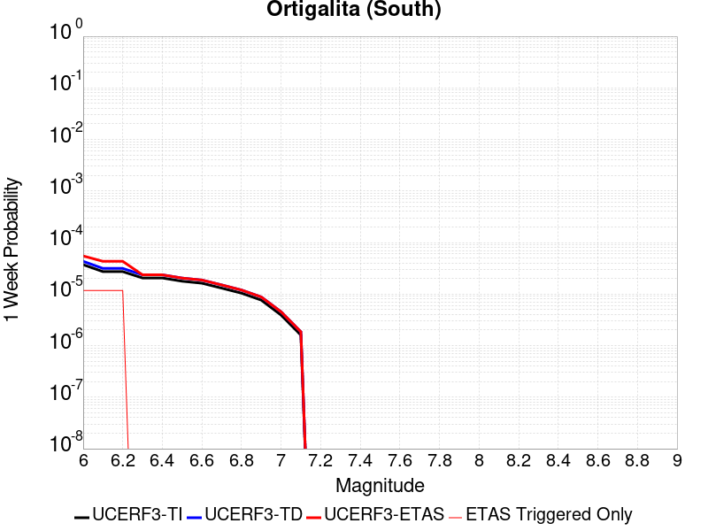 | 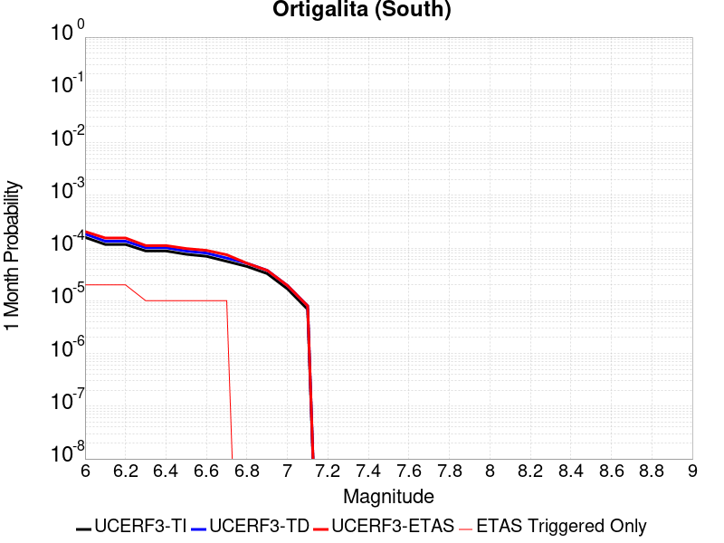 | 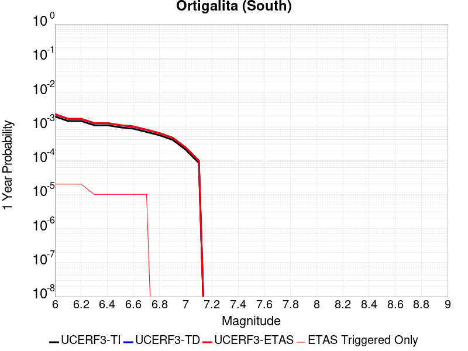 | 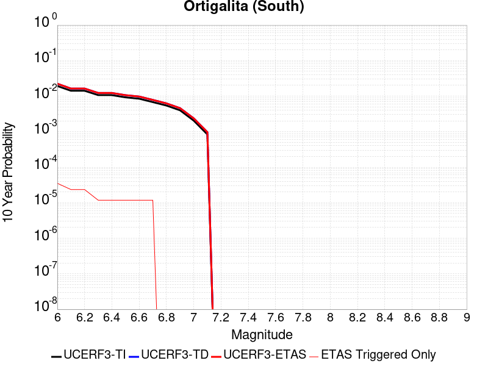 |

| Magnitude | 1 wk TI Prob | 1 wk TD Prob | 1 wk ETAS Prob | 1 wk ETAS/TD Gain | 1 wk ETAS Triggered Only | 1 mo TI Prob | 1 mo TD Prob | 1 mo ETAS Prob | 1 mo ETAS/TD Gain | 1 mo ETAS Triggered Only | 1 yr TI Prob | 1 yr TD Prob | 1 yr ETAS Prob | 1 yr ETAS/TD Gain | 1 yr ETAS Triggered Only | 10 yr TI Prob | 10 yr TD Prob | 10 yr ETAS Prob | 10 yr ETAS/TD Gain | 10 yr ETAS Triggered Only |
|-----|-----|-----|-----|-----|-----|-----|-----|-----|-----|-----|-----|-----|-----|-----|-----|-----|-----|-----|-----|-----|
| 6.0 | 3.72394E-5 | 4.325562E-5 | 5.49922E-5 | 1.2713308 | 1.1737089E-5 | 1.5958765E-4 | 1.8536893E-4 | 2.0883876E-4 | 1.1266115 | 2.3474178E-5 | 0.0019412481 | 0.0022546875 | 0.0022781086 | 1.0103878 | 2.3474178E-5 | 0.019243775 | 0.022334497 | 0.022368921 | 1.0015414 | 3.521127E-5 |
| 6.1 | 2.7299884E-5 | 3.149204E-5 | 4.322876E-5 | 1.3726884 | 1.1737089E-5 | 1.16994255E-4 | 1.3495922E-4 | 1.5843024E-4 | 1.1739118 | 2.3474178E-5 | 0.0014234743 | 0.0016419457 | 0.0016653814 | 1.014273 | 2.3474178E-5 | 0.014143906 | 0.01630407 | 0.016327161 | 1.0014163 | 2.3474178E-5 |
| 6.2 | 2.7299884E-5 | 3.149204E-5 | 4.322876E-5 | 1.3726884 | 1.1737089E-5 | 1.16994255E-4 | 1.3495922E-4 | 1.5843024E-4 | 1.1739118 | 2.3474178E-5 | 0.0014234743 | 0.0016419457 | 0.0016653814 | 1.014273 | 2.3474178E-5 | 0.014143906 | 0.01630407 | 0.016327161 | 1.0014163 | 2.3474178E-5 |
| 6.3 | 2.0546433E-5 | 2.363145E-5 | 2.363145E-5 | 1.0 | 0.0 | 8.805317E-5 | 1.0127382E-4 | 1.1300972E-4 | 1.1158829 | 1.1737089E-5 | 0.00107152 | 0.0012323303 | 0.0012440529 | 1.0095125 | 1.1737089E-5 | 0.010663681 | 0.01225703 | 0.012268623 | 1.0009458 | 1.1737089E-5 |
| 6.4 | 2.0546433E-5 | 2.363145E-5 | 2.363145E-5 | 1.0 | 0.0 | 8.805317E-5 | 1.0127382E-4 | 1.1300972E-4 | 1.1158829 | 1.1737089E-5 | 0.00107152 | 0.0012323303 | 0.0012440529 | 1.0095125 | 1.1737089E-5 | 0.010663681 | 0.01225703 | 0.012268623 | 1.0009458 | 1.1737089E-5 |
| 6.5 | 1.7779594E-5 | 2.0446974E-5 | 2.0446974E-5 | 1.0 | 0.0 | 7.619603E-5 | 8.762702E-5 | 9.936308E-5 | 1.133932 | 1.1737089E-5 | 9.272918E-4 | 0.0010663504 | 0.001078075 | 1.010995 | 1.1737089E-5 | 0.009234319 | 0.010613803 | 0.0106254155 | 1.0010941 | 1.1737089E-5 |
| 6.6 | 1.6272212E-5 | 1.8714967E-5 | 1.8714967E-5 | 1.0 | 0.0 | 6.973618E-5 | 8.0204605E-5 | 9.1940754E-5 | 1.1463276 | 1.1737089E-5 | 8.487073E-4 | 9.760658E-4 | 9.877915E-4 | 1.0120132 | 1.1737089E-5 | 0.008454733 | 0.009719091 | 0.009730713 | 1.0011959 | 1.1737089E-5 |
| 6.7 | 1.3051484E-5 | 1.5038758E-5 | 1.5038758E-5 | 1.0 | 0.0 | 5.593373E-5 | 6.445028E-5 | 7.618661E-5 | 1.182099 | 1.1737089E-5 | 6.807804E-4 | 7.844092E-4 | 7.96137E-4 | 1.0149512 | 1.1737089E-5 | 0.006786986 | 0.007817388 | 0.007829033 | 1.0014896 | 1.1737089E-5 |
| 6.8 | 1.04277415E-5 | 1.1987235E-5 | 1.1987235E-5 | 1.0 | 0.0 | 4.4689557E-5 | 5.1372896E-5 | 5.1372896E-5 | 1.0 | 0.0 | 5.439595E-4 | 6.2529295E-4 | 6.2529295E-4 | 1.0 | 0.0 | 0.0054262993 | 0.00623609 | 0.00623609 | 1.0 | 0.0 |
| 6.9 | 7.639968E-6 | 8.791503E-6 | 8.791503E-6 | 1.0 | 0.0 | 3.274231E-5 | 3.767736E-5 | 3.767736E-5 | 1.0 | 0.0 | 3.9856473E-4 | 4.586312E-4 | 4.586312E-4 | 1.0 | 0.0 | 0.003978506 | 0.004577433 | 0.004577433 | 1.0 | 0.0 |
| 7.0 | 3.919831E-6 | 4.5334014E-6 | 4.5334014E-6 | 1.0 | 0.0 | 1.679917E-5 | 1.942873E-5 | 1.942873E-5 | 1.0 | 0.0 | 2.045107E-4 | 2.3652123E-4 | 2.3652123E-4 | 1.0 | 0.0 | 0.0020432258 | 0.0023629034 | 0.0023629034 | 1.0 | 0.0 |
| 7.1 | 1.6017933E-6 | 1.8570418E-6 | 1.8570418E-6 | 1.0 | 0.0 | 6.8648105E-6 | 7.958732E-6 | 7.958732E-6 | 1.0 | 0.0 | 8.357586E-5 | 9.689432E-5 | 9.689432E-5 | 1.0 | 0.0 | 8.3544437E-4 | 9.686254E-4 | 9.686254E-4 | 1.0 | 0.0 |

## Elsinore (Stepovers Combined)
*[(top)](#table-of-contents)*

| 1 Week | 1 Month | 1 Year | 10 Year |
|-----|-----|-----|-----|
| 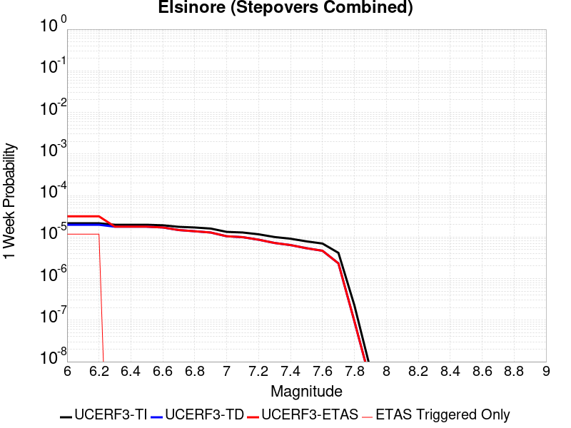 | 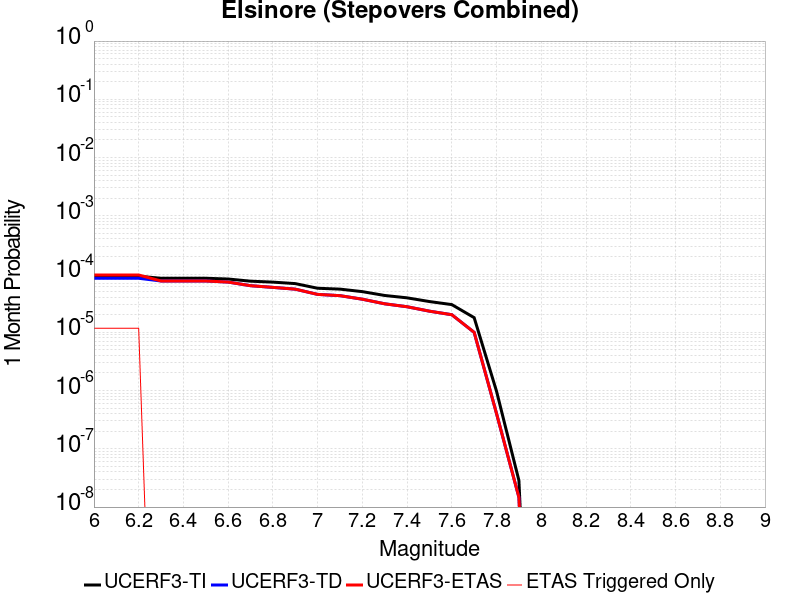 | 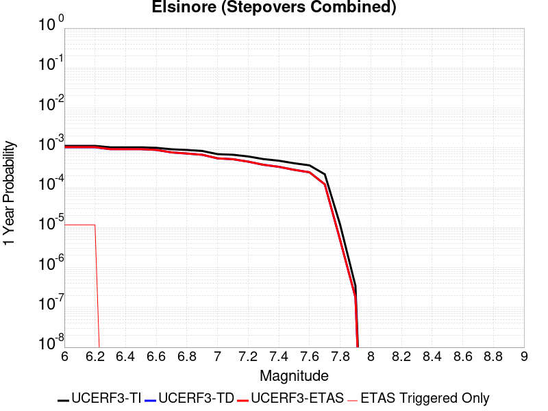 | 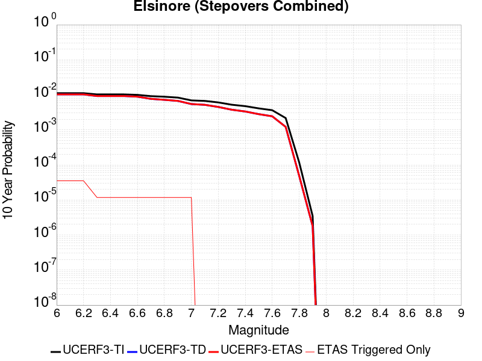 |

| Magnitude | 1 wk TI Prob | 1 wk TD Prob | 1 wk ETAS Prob | 1 wk ETAS/TD Gain | 1 wk ETAS Triggered Only | 1 mo TI Prob | 1 mo TD Prob | 1 mo ETAS Prob | 1 mo ETAS/TD Gain | 1 mo ETAS Triggered Only | 1 yr TI Prob | 1 yr TD Prob | 1 yr ETAS Prob | 1 yr ETAS/TD Gain | 1 yr ETAS Triggered Only | 10 yr TI Prob | 10 yr TD Prob | 10 yr ETAS Prob | 10 yr ETAS/TD Gain | 10 yr ETAS Triggered Only |
|-----|-----|-----|-----|-----|-----|-----|-----|-----|-----|-----|-----|-----|-----|-----|-----|-----|-----|-----|-----|-----|
| 6.0 | 2.144392E-5 | 1.9760193E-5 | 3.149705E-5 | 1.5939647 | 1.1737089E-5 | 9.189928E-5 | 8.468392E-5 | 9.642001E-5 | 1.1385871 | 1.1737089E-5 | 0.0011182994 | 0.0010305607 | 0.0010422857 | 1.0113773 | 1.1737089E-5 | 0.011126885 | 0.010264917 | 0.010299767 | 1.0033951 | 3.521127E-5 |
| 6.1 | 2.144392E-5 | 1.9760193E-5 | 3.149705E-5 | 1.5939647 | 1.1737089E-5 | 9.189928E-5 | 8.468392E-5 | 9.642001E-5 | 1.1385871 | 1.1737089E-5 | 0.0011182994 | 0.0010305607 | 0.0010422857 | 1.0113773 | 1.1737089E-5 | 0.011126885 | 0.010264917 | 0.010299767 | 1.0033951 | 3.521127E-5 |
| 6.2 | 2.144392E-5 | 1.9760193E-5 | 3.149705E-5 | 1.5939647 | 1.1737089E-5 | 9.189928E-5 | 8.468392E-5 | 9.642001E-5 | 1.1385871 | 1.1737089E-5 | 0.0011182994 | 0.0010305607 | 0.0010422857 | 1.0113773 | 1.1737089E-5 | 0.011126885 | 0.010264917 | 0.010299767 | 1.0033951 | 3.521127E-5 |
| 6.3 | 1.9751555E-5 | 1.7741453E-5 | 1.7741453E-5 | 1.0 | 0.0 | 8.4646774E-5 | 7.603267E-5 | 7.603267E-5 | 1.0 | 0.0 | 0.0010300872 | 9.253213E-4 | 9.253213E-4 | 1.0 | 0.0 | 0.010253254 | 0.009221276 | 0.009232906 | 1.0012611 | 1.1737089E-5 |
| 6.4 | 1.9751555E-5 | 1.7741453E-5 | 1.7741453E-5 | 1.0 | 0.0 | 8.4646774E-5 | 7.603267E-5 | 7.603267E-5 | 1.0 | 0.0 | 0.0010300872 | 9.253213E-4 | 9.253213E-4 | 1.0 | 0.0 | 0.010253254 | 0.009221276 | 0.009232906 | 1.0012611 | 1.1737089E-5 |
| 6.5 | 1.9751555E-5 | 1.7741453E-5 | 1.7741453E-5 | 1.0 | 0.0 | 8.4646774E-5 | 7.603267E-5 | 7.603267E-5 | 1.0 | 0.0 | 0.0010300872 | 9.253213E-4 | 9.253213E-4 | 1.0 | 0.0 | 0.010253254 | 0.009221276 | 0.009232906 | 1.0012611 | 1.1737089E-5 |
| 6.6 | 1.9188685E-5 | 1.7003393E-5 | 1.7003393E-5 | 1.0 | 0.0 | 8.2234634E-5 | 7.286974E-5 | 7.286974E-5 | 1.0 | 0.0 | 0.0010007467 | 8.868442E-4 | 8.868442E-4 | 1.0 | 0.0 | 0.00996252 | 0.0088398475 | 0.008851481 | 1.001316 | 1.1737089E-5 |
| 6.7 | 1.7608272E-5 | 1.4732616E-5 | 1.4732616E-5 | 1.0 | 0.0 | 7.546184E-5 | 6.3138315E-5 | 6.3138315E-5 | 1.0 | 0.0 | 9.183606E-4 | 7.684476E-4 | 7.684476E-4 | 1.0 | 0.0 | 0.009145746 | 0.00766491 | 0.007676557 | 1.0015196 | 1.1737089E-5 |
| 6.8 | 1.697165E-5 | 1.3783365E-5 | 1.3783365E-5 | 1.0 | 0.0 | 7.273361E-5 | 5.9070277E-5 | 5.9070277E-5 | 1.0 | 0.0 | 8.8517193E-4 | 7.18952E-4 | 7.18952E-4 | 1.0 | 0.0 | 0.008816543 | 0.007172675 | 0.007184328 | 1.0016246 | 1.1737089E-5 |
| 6.9 | 1.600365E-5 | 1.2846671E-5 | 1.2846671E-5 | 1.0 | 0.0 | 6.858527E-5 | 5.5056043E-5 | 5.5056043E-5 | 1.0 | 0.0 | 8.347058E-4 | 6.7010894E-4 | 6.7010894E-4 | 1.0 | 0.0 | 0.008315775 | 0.0066867657 | 0.0066984245 | 1.0017436 | 1.1737089E-5 |
| 7.0 | 1.3314581E-5 | 1.0447548E-5 | 1.0447548E-5 | 1.0 | 0.0 | 5.7061243E-5 | 4.4774453E-5 | 4.4774453E-5 | 1.0 | 0.0 | 6.944992E-4 | 5.449953E-4 | 5.449953E-4 | 1.0 | 0.0 | 0.006923327 | 0.0054405155 | 0.0054521887 | 1.0021456 | 1.1737089E-5 |
| 7.1 | 1.2865345E-5 | 9.937536E-6 | 9.937536E-6 | 1.0 | 0.0 | 5.5136024E-5 | 4.258876E-5 | 4.258876E-5 | 1.0 | 0.0 | 6.710743E-4 | 5.183973E-4 | 5.183973E-4 | 1.0 | 0.0 | 0.0066905143 | 0.0051752133 | 0.0051752133 | 1.0 | 0.0 |
| 7.2 | 1.1650051E-5 | 8.633809E-6 | 8.633809E-6 | 1.0 | 0.0 | 4.9927836E-5 | 3.7001522E-5 | 3.7001522E-5 | 1.0 | 0.0 | 6.0770183E-4 | 4.504022E-4 | 4.504022E-4 | 1.0 | 0.0 | 0.0060604266 | 0.0044963174 | 0.0044963174 | 1.0 | 0.0 |
| 7.3 | 1.0008533E-5 | 7.2010425E-6 | 7.2010425E-6 | 1.0 | 0.0 | 4.2893007E-5 | 3.0861254E-5 | 3.0861254E-5 | 1.0 | 0.0 | 5.220972E-4 | 3.7567242E-4 | 3.7567242E-4 | 1.0 | 0.0 | 0.005208723 | 0.003750761 | 0.003750761 | 1.0 | 0.0 |
| 7.4 | 9.116759E-6 | 6.410068E-6 | 6.410068E-6 | 1.0 | 0.0 | 3.907124E-5 | 2.747144E-5 | 2.747144E-5 | 1.0 | 0.0 | 4.7558855E-4 | 3.3441483E-4 | 3.3441483E-4 | 1.0 | 0.0 | 0.00474572 | 0.0033392678 | 0.0033392678 | 1.0 | 0.0 |
| 7.5 | 7.870524E-6 | 5.3825365E-6 | 5.3825365E-6 | 1.0 | 0.0 | 3.3730383E-5 | 2.3067816E-5 | 2.3067816E-5 | 1.0 | 0.0 | 4.1059E-4 | 2.8081573E-4 | 2.8081573E-4 | 1.0 | 0.0 | 0.0040983222 | 0.0028047354 | 0.0028047354 | 1.0 | 0.0 |
| 7.6 | 6.9774537E-6 | 4.6776067E-6 | 4.6776067E-6 | 1.0 | 0.0 | 2.990303E-5 | 2.0046738E-5 | 2.0046738E-5 | 1.0 | 0.0 | 3.640086E-4 | 2.4404288E-4 | 2.4404288E-4 | 1.0 | 0.0 | 0.003634129 | 0.0024378651 | 0.0024378651 | 1.0 | 0.0 |
| 7.7 | 4.1616954E-6 | 2.32834E-6 | 2.32834E-6 | 1.0 | 0.0 | 1.7835715E-5 | 9.978567E-6 | 9.978567E-6 | 1.0 | 0.0 | 2.171282E-4 | 1.2148302E-4 | 1.2148302E-4 | 1.0 | 0.0 | 0.0021691616 | 0.0012142392 | 0.0012142392 | 1.0 | 0.0 |
| 7.8 | 2.2692414E-7 | 9.3854695E-8 | 9.3854695E-8 | 1.0 | 0.0 | 9.725317E-7 | 4.0223435E-7 | 4.0223435E-7 | 1.0 | 0.0 | 1.1840509E-5 | 4.8971956E-6 | 4.8971956E-6 | 1.0 | 0.0 | 1.1839878E-4 | 4.8971204E-5 | 4.8971204E-5 | 1.0 | 0.0 |
| 7.9 | 6.676829E-9 | 3.439853E-9 | 3.439853E-9 | 1.0 | 0.0 | 2.861498E-8 | 1.4742227E-8 | 1.4742227E-8 | 1.0 | 0.0 | 3.4838732E-7 | 1.7948659E-7 | 1.7948659E-7 | 1.0 | 0.0 | 3.4838679E-6 | 1.7948646E-6 | 1.7948646E-6 | 1.0 | 0.0 |

## Lost Hills
*[(top)](#table-of-contents)*

| 1 Week | 1 Month | 1 Year | 10 Year |
|-----|-----|-----|-----|
| 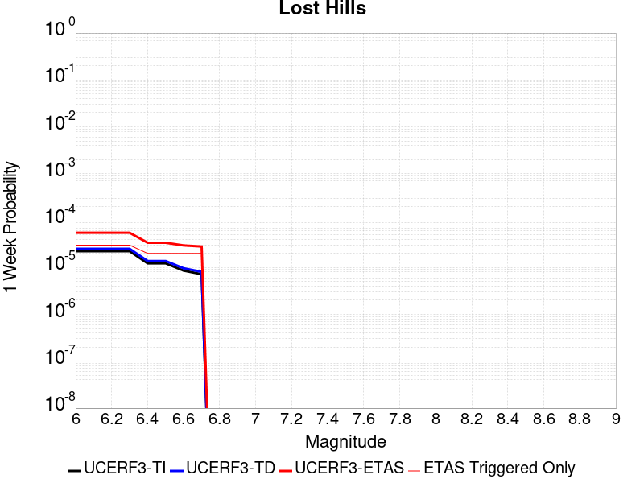 | 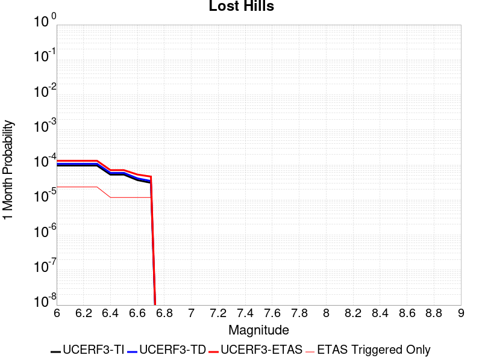 | 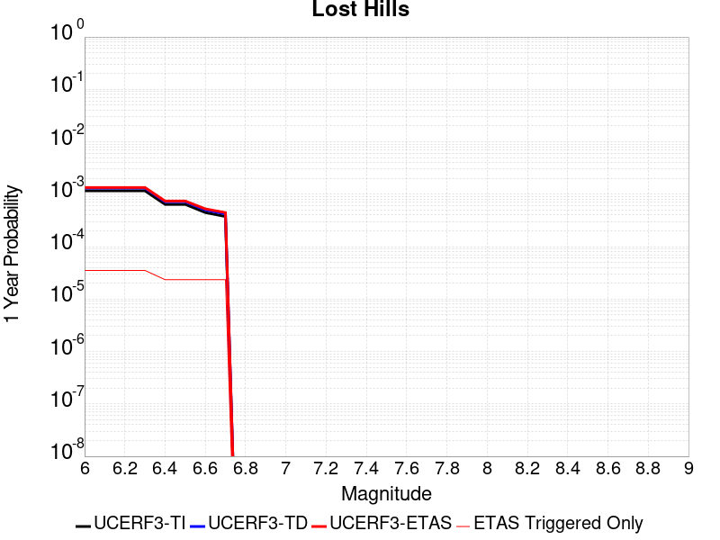 | 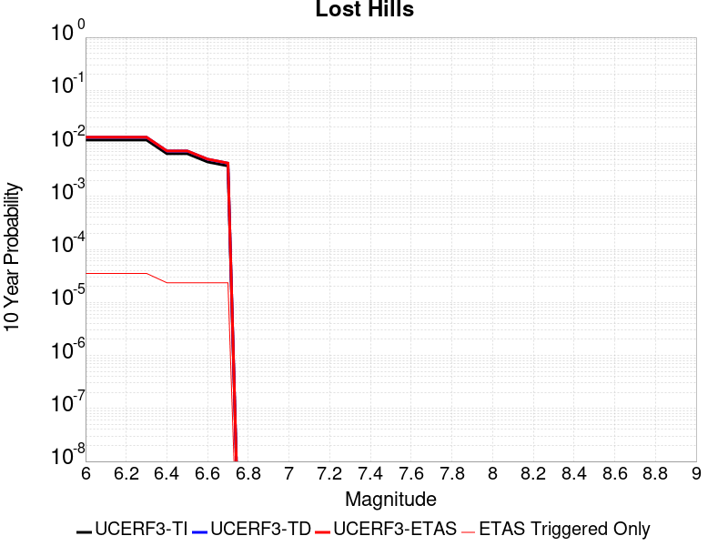 |

| Magnitude | 1 wk TI Prob | 1 wk TD Prob | 1 wk ETAS Prob | 1 wk ETAS/TD Gain | 1 wk ETAS Triggered Only | 1 mo TI Prob | 1 mo TD Prob | 1 mo ETAS Prob | 1 mo ETAS/TD Gain | 1 mo ETAS Triggered Only | 1 yr TI Prob | 1 yr TD Prob | 1 yr ETAS Prob | 1 yr ETAS/TD Gain | 1 yr ETAS Triggered Only | 10 yr TI Prob | 10 yr TD Prob | 10 yr ETAS Prob | 10 yr ETAS/TD Gain | 10 yr ETAS Triggered Only |
|-----|-----|-----|-----|-----|-----|-----|-----|-----|-----|-----|-----|-----|-----|-----|-----|-----|-----|-----|-----|-----|
| 6.0 | 2.233523E-5 | 2.5106583E-5 | 4.8580172E-5 | 1.9349575 | 2.3474178E-5 | 9.571891E-5 | 1.0759615E-4 | 1.310678E-4 | 1.2181458 | 2.3474178E-5 | 0.0011647546 | 0.001309364 | 0.0013445292 | 1.0268567 | 3.521127E-5 | 0.011586686 | 0.013033091 | 0.013067843 | 1.0026665 | 3.521127E-5 |
| 6.1 | 2.233523E-5 | 2.5106583E-5 | 4.8580172E-5 | 1.9349575 | 2.3474178E-5 | 9.571891E-5 | 1.0759615E-4 | 1.310678E-4 | 1.2181458 | 2.3474178E-5 | 0.0011647546 | 0.001309364 | 0.0013445292 | 1.0268567 | 3.521127E-5 | 0.011586686 | 0.013033091 | 0.013067843 | 1.0026665 | 3.521127E-5 |
| 6.2 | 2.233523E-5 | 2.5106583E-5 | 4.8580172E-5 | 1.9349575 | 2.3474178E-5 | 9.571891E-5 | 1.0759615E-4 | 1.310678E-4 | 1.2181458 | 2.3474178E-5 | 0.0011647546 | 0.001309364 | 0.0013445292 | 1.0268567 | 3.521127E-5 | 0.011586686 | 0.013033091 | 0.013067843 | 1.0026665 | 3.521127E-5 |
| 6.3 | 2.233523E-5 | 2.5106583E-5 | 4.8580172E-5 | 1.9349575 | 2.3474178E-5 | 9.571891E-5 | 1.0759615E-4 | 1.310678E-4 | 1.2181458 | 2.3474178E-5 | 0.0011647546 | 0.001309364 | 0.0013445292 | 1.0268567 | 3.521127E-5 | 0.011586686 | 0.013033091 | 0.013067843 | 1.0026665 | 3.521127E-5 |
| 6.4 | 1.2288092E-5 | 1.3781108E-5 | 2.5518035E-5 | 1.851668 | 1.1737089E-5 | 5.2662188E-5 | 5.906108E-5 | 7.0797476E-5 | 1.1987163 | 1.1737089E-5 | 6.409735E-4 | 7.189252E-4 | 7.4238254E-4 | 1.0326283 | 2.3474178E-5 | 0.006391279 | 0.0071752006 | 0.0071985065 | 1.0032481 | 2.3474178E-5 |
| 6.5 | 1.2288092E-5 | 1.3781108E-5 | 2.5518035E-5 | 1.851668 | 1.1737089E-5 | 5.2662188E-5 | 5.906108E-5 | 7.0797476E-5 | 1.1987163 | 1.1737089E-5 | 6.409735E-4 | 7.189252E-4 | 7.4238254E-4 | 1.0326283 | 2.3474178E-5 | 0.006391279 | 0.0071752006 | 0.0071985065 | 1.0032481 | 2.3474178E-5 |
| 6.6 | 8.58281E-6 | 9.63377E-6 | 2.1370746E-5 | 2.218316 | 1.1737089E-5 | 3.6782953E-5 | 4.12874E-5 | 5.3024007E-5 | 1.284266 | 1.1737089E-5 | 4.4774043E-4 | 5.026414E-4 | 5.261038E-4 | 1.0466782 | 2.3474178E-5 | 0.0044683935 | 0.005023205 | 0.0050465614 | 1.0046496 | 2.3474178E-5 |
| 6.7 | 7.205685E-6 | 8.088302E-6 | 1.9825296E-5 | 2.4511073 | 1.1737089E-5 | 3.088114E-5 | 3.466415E-5 | 4.6400834E-5 | 1.3385828 | 1.1737089E-5 | 3.7591302E-4 | 4.2203604E-4 | 4.455003E-4 | 1.0555978 | 2.3474178E-5 | 0.0037527776 | 0.0042203604 | 0.004243735 | 1.0055387 | 2.3474178E-5 |

## Simi-Santa Rosa
*[(top)](#table-of-contents)*

| 1 Week | 1 Month | 1 Year | 10 Year |
|-----|-----|-----|-----|
| 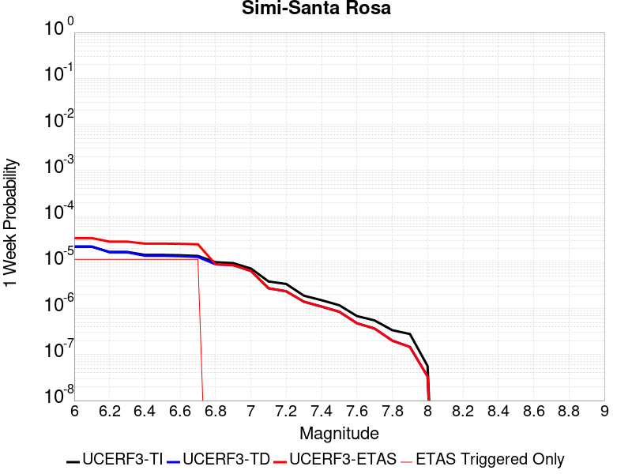 |  | 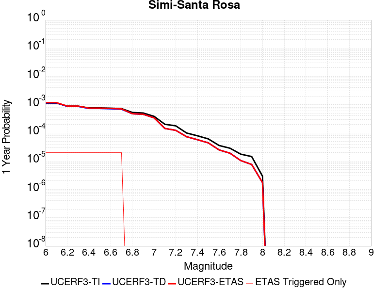 | 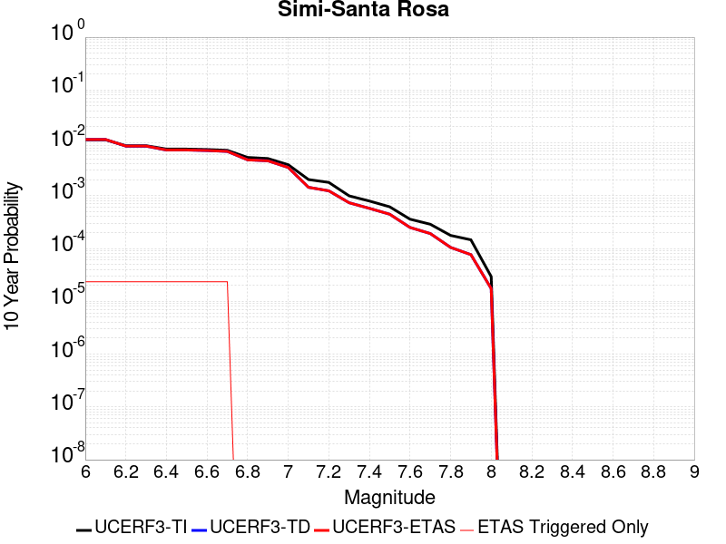 |

| Magnitude | 1 wk TI Prob | 1 wk TD Prob | 1 wk ETAS Prob | 1 wk ETAS/TD Gain | 1 wk ETAS Triggered Only | 1 mo TI Prob | 1 mo TD Prob | 1 mo ETAS Prob | 1 mo ETAS/TD Gain | 1 mo ETAS Triggered Only | 1 yr TI Prob | 1 yr TD Prob | 1 yr ETAS Prob | 1 yr ETAS/TD Gain | 1 yr ETAS Triggered Only | 10 yr TI Prob | 10 yr TD Prob | 10 yr ETAS Prob | 10 yr ETAS/TD Gain | 10 yr ETAS Triggered Only |
|-----|-----|-----|-----|-----|-----|-----|-----|-----|-----|-----|-----|-----|-----|-----|-----|-----|-----|-----|-----|-----|
| 6.0 | 2.198912E-5 | 2.2275442E-5 | 3.401227E-5 | 1.5268954 | 1.1737089E-5 | 9.4235686E-5 | 9.5462936E-5 | 1.071989E-4 | 1.1229374 | 1.1737089E-5 | 0.0011467156 | 0.0011616853 | 0.0011851323 | 1.0201836 | 2.3474178E-5 | 0.011408163 | 0.011560575 | 0.011583778 | 1.002007 | 2.3474178E-5 |
| 6.1 | 2.198912E-5 | 2.2275442E-5 | 3.401227E-5 | 1.5268954 | 1.1737089E-5 | 9.4235686E-5 | 9.5462936E-5 | 1.071989E-4 | 1.1229374 | 1.1737089E-5 | 0.0011467156 | 0.0011616853 | 0.0011851323 | 1.0201836 | 2.3474178E-5 | 0.011408163 | 0.011560575 | 0.011583778 | 1.002007 | 2.3474178E-5 |
| 6.2 | 1.69983E-5 | 1.6668559E-5 | 2.8405453E-5 | 1.7041336 | 1.1737089E-5 | 7.284782E-5 | 7.143489E-5 | 8.3171144E-5 | 1.1642929 | 1.1737089E-5 | 8.865613E-4 | 8.6940196E-4 | 8.928557E-4 | 1.026977 | 2.3474178E-5 | 0.008830327 | 0.008662928 | 0.008686198 | 1.0026863 | 2.3474178E-5 |
| 6.3 | 1.69983E-5 | 1.6668559E-5 | 2.8405453E-5 | 1.7041336 | 1.1737089E-5 | 7.284782E-5 | 7.143489E-5 | 8.3171144E-5 | 1.1642929 | 1.1737089E-5 | 8.865613E-4 | 8.6940196E-4 | 8.928557E-4 | 1.026977 | 2.3474178E-5 | 0.008830327 | 0.008662928 | 0.008686198 | 1.0026863 | 2.3474178E-5 |
| 6.4 | 1.4666188E-5 | 1.4052543E-5 | 2.5789466E-5 | 1.8352171 | 1.1737089E-5 | 6.285358E-5 | 6.0223934E-5 | 7.196032E-5 | 1.194879 | 1.1737089E-5 | 7.6497364E-4 | 7.3300465E-4 | 7.564616E-4 | 1.0320011 | 2.3474178E-5 | 0.0076234564 | 0.007308344 | 0.0073316465 | 1.0031885 | 2.3474178E-5 |
| 6.5 | 1.4666188E-5 | 1.4052543E-5 | 2.5789466E-5 | 1.8352171 | 1.1737089E-5 | 6.285358E-5 | 6.0223934E-5 | 7.196032E-5 | 1.194879 | 1.1737089E-5 | 7.6497364E-4 | 7.3300465E-4 | 7.564616E-4 | 1.0320011 | 2.3474178E-5 | 0.0076234564 | 0.007308344 | 0.0073316465 | 1.0031885 | 2.3474178E-5 |
| 6.6 | 1.4377586E-5 | 1.3729583E-5 | 2.546651E-5 | 1.8548641 | 1.1737089E-5 | 6.1616774E-5 | 5.883988E-5 | 7.057628E-5 | 1.1994634 | 1.1737089E-5 | 7.4992597E-4 | 7.1616494E-4 | 7.3962234E-4 | 1.0327542 | 2.3474178E-5 | 0.007474003 | 0.0071410383 | 0.007164345 | 1.0032637 | 2.3474178E-5 |
| 6.7 | 1.3881404E-5 | 1.320755E-5 | 2.4944486E-5 | 1.8886534 | 1.1737089E-5 | 5.9490372E-5 | 5.66027E-5 | 6.8339126E-5 | 1.2073474 | 1.1737089E-5 | 7.240546E-4 | 6.8894465E-4 | 7.124027E-4 | 1.0340492 | 2.3474178E-5 | 0.007217 | 0.006870538 | 0.006893851 | 1.0033932 | 2.3474178E-5 |
| 6.8 | 1.0176516E-5 | 9.154151E-6 | 9.154151E-6 | 1.0 | 0.0 | 4.3612912E-5 | 3.9231574E-5 | 3.9231574E-5 | 1.0 | 0.0 | 5.308578E-4 | 4.7755634E-4 | 4.7755634E-4 | 1.0 | 0.0 | 0.0052959146 | 0.004766934 | 0.004766934 | 1.0 | 0.0 |
| 6.9 | 9.699797E-6 | 8.774719E-6 | 8.774719E-6 | 1.0 | 0.0 | 4.15699E-5 | 3.7605492E-5 | 3.7605492E-5 | 1.0 | 0.0 | 5.05996E-4 | 4.577671E-4 | 4.577671E-4 | 1.0 | 0.0 | 0.005048454 | 0.0045698597 | 0.0045698597 | 1.0 | 0.0 |
| 7.0 | 7.4049476E-6 | 6.559333E-6 | 6.559333E-6 | 1.0 | 0.0 | 3.1735104E-5 | 2.8111197E-5 | 2.8111197E-5 | 1.0 | 0.0 | 3.8630638E-4 | 3.422127E-4 | 3.422127E-4 | 1.0 | 0.0 | 0.0038563553 | 0.0034180996 | 0.0034180996 | 1.0 | 0.0 |
| 7.1 | 3.873439E-6 | 2.7595095E-6 | 2.7595095E-6 | 1.0 | 0.0 | 1.6600346E-5 | 1.1826417E-5 | 1.1826417E-5 | 1.0 | 0.0 | 2.0209046E-4 | 1.4397735E-4 | 1.4397735E-4 | 1.0 | 0.0 | 0.0020190678 | 0.0014388643 | 0.0014388643 | 1.0 | 0.0 |
| 7.2 | 3.417706E-6 | 2.3676484E-6 | 2.3676484E-6 | 1.0 | 0.0 | 1.4647229E-5 | 1.0147027E-5 | 1.0147027E-5 | 1.0 | 0.0 | 1.7831543E-4 | 1.2353327E-4 | 1.2353327E-4 | 1.0 | 0.0 | 0.0017817242 | 0.0012346683 | 0.0012346683 | 1.0 | 0.0 |
| 7.3 | 1.90225E-6 | 1.4073753E-6 | 1.4073753E-6 | 1.0 | 0.0 | 8.152474E-6 | 6.0315947E-6 | 6.0315947E-6 | 1.0 | 0.0 | 9.9251854E-5 | 7.343221E-5 | 7.343221E-5 | 1.0 | 0.0 | 9.920754E-4 | 7.340817E-4 | 7.340817E-4 | 1.0 | 0.0 |
| 7.4 | 1.5170556E-6 | 1.1024773E-6 | 1.1024773E-6 | 1.0 | 0.0 | 6.5016507E-6 | 4.724894E-6 | 4.724894E-6 | 1.0 | 0.0 | 7.915472E-5 | 5.7524077E-5 | 5.7524077E-5 | 1.0 | 0.0 | 7.9126534E-4 | 5.7509297E-4 | 5.7509297E-4 | 1.0 | 0.0 |
| 7.5 | 1.178732E-6 | 8.535102E-7 | 8.535102E-7 | 1.0 | 0.0 | 5.0516987E-6 | 3.6578958E-6 | 3.6578958E-6 | 1.0 | 0.0 | 6.1502695E-5 | 4.453398E-5 | 4.453398E-5 | 1.0 | 0.0 | 6.148568E-4 | 4.452515E-4 | 4.452515E-4 | 1.0 | 0.0 |
| 7.6 | 6.8722386E-7 | 4.793198E-7 | 4.793198E-7 | 1.0 | 0.0 | 2.9452417E-6 | 2.054226E-6 | 2.054226E-6 | 1.0 | 0.0 | 3.5857727E-5 | 2.5009915E-5 | 2.5009915E-5 | 1.0 | 0.0 | 3.5851944E-4 | 2.5007114E-4 | 2.5007114E-4 | 1.0 | 0.0 |
| 7.7 | 5.5126515E-7 | 3.6731157E-7 | 3.6731157E-7 | 1.0 | 0.0 | 2.3625628E-6 | 1.5741915E-6 | 1.5741915E-6 | 1.0 | 0.0 | 2.8763823E-5 | 1.9165615E-5 | 1.9165615E-5 | 1.0 | 0.0 | 2.87601E-4 | 1.9163972E-4 | 1.9163972E-4 | 1.0 | 0.0 |
| 7.8 | 3.3860243E-7 | 2.0075942E-7 | 2.0075942E-7 | 1.0 | 0.0 | 1.4511525E-6 | 8.6039717E-7 | 8.6039717E-7 | 1.0 | 0.0 | 1.7667637E-5 | 1.0475286E-5 | 1.0475286E-5 | 1.0 | 0.0 | 1.7666233E-4 | 1.04747975E-4 | 1.04747975E-4 | 1.0 | 0.0 |
| 7.9 | 2.7955386E-7 | 1.4649108E-7 | 1.4649108E-7 | 1.0 | 0.0 | 1.1980875E-6 | 6.278188E-7 | 6.278188E-7 | 1.0 | 0.0 | 1.4586617E-5 | 7.643667E-6 | 7.643667E-6 | 1.0 | 0.0 | 1.458566E-4 | 7.643409E-5 | 7.643409E-5 | 1.0 | 0.0 |
| 8.0 | 5.6259015E-8 | 3.3355324E-8 | 3.3355324E-8 | 1.0 | 0.0 | 2.4111003E-7 | 1.4295138E-7 | 1.4295138E-7 | 1.0 | 0.0 | 2.9355108E-6 | 1.7404317E-6 | 1.7404317E-6 | 1.0 | 0.0 | 2.935472E-5 | 1.7404194E-5 | 1.7404194E-5 | 1.0 | 0.0 |

## Johnson Valley (No) 2011 rev
*[(top)](#table-of-contents)*

| 1 Week | 1 Month | 1 Year | 10 Year |
|-----|-----|-----|-----|
| 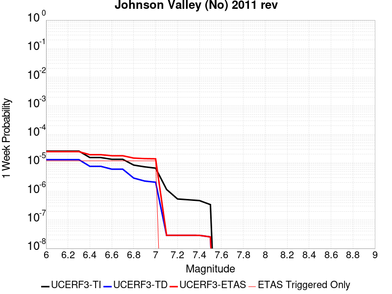 | 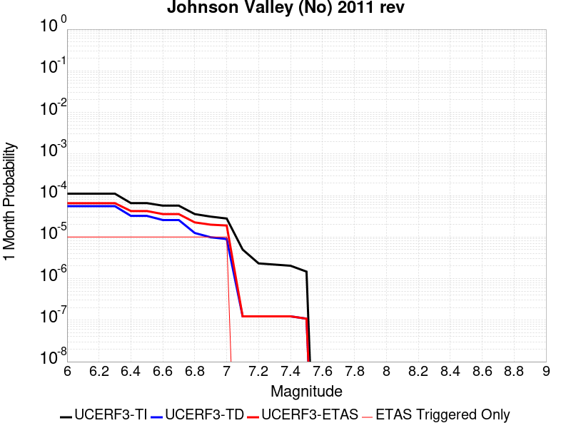 | 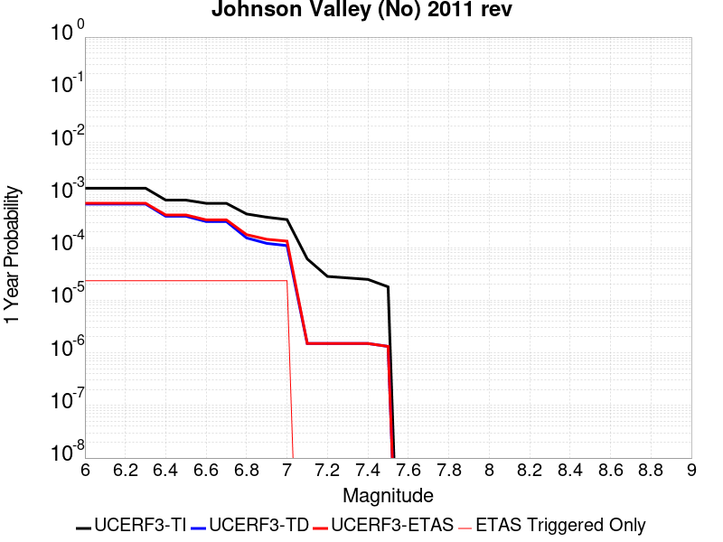 | 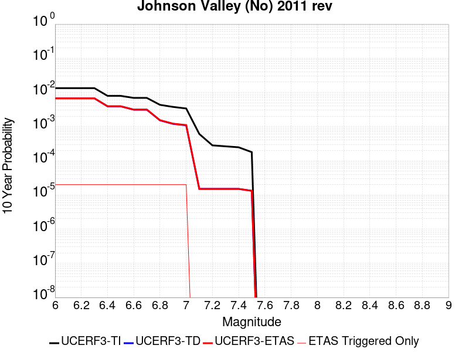 |

| Magnitude | 1 wk TI Prob | 1 wk TD Prob | 1 wk ETAS Prob | 1 wk ETAS/TD Gain | 1 wk ETAS Triggered Only | 1 mo TI Prob | 1 mo TD Prob | 1 mo ETAS Prob | 1 mo ETAS/TD Gain | 1 mo ETAS Triggered Only | 1 yr TI Prob | 1 yr TD Prob | 1 yr ETAS Prob | 1 yr ETAS/TD Gain | 1 yr ETAS Triggered Only | 10 yr TI Prob | 10 yr TD Prob | 10 yr ETAS Prob | 10 yr ETAS/TD Gain | 10 yr ETAS Triggered Only |
|-----|-----|-----|-----|-----|-----|-----|-----|-----|-----|-----|-----|-----|-----|-----|-----|-----|-----|-----|-----|-----|
| 6.0 | 2.577707E-5 | 1.2900938E-5 | 2.4637875E-5 | 1.909774 | 1.1737089E-5 | 1.1046848E-4 | 5.5288787E-5 | 6.702523E-5 | 1.2122753 | 1.1737089E-5 | 0.0013441239 | 6.7297276E-4 | 6.9643115E-4 | 1.0348579 | 2.3474178E-5 | 0.013360229 | 0.006713257 | 0.0067365738 | 1.0034732 | 2.3474178E-5 |
| 6.1 | 2.577707E-5 | 1.2900938E-5 | 2.4637875E-5 | 1.909774 | 1.1737089E-5 | 1.1046848E-4 | 5.5288787E-5 | 6.702523E-5 | 1.2122753 | 1.1737089E-5 | 0.0013441239 | 6.7297276E-4 | 6.9643115E-4 | 1.0348579 | 2.3474178E-5 | 0.013360229 | 0.006713257 | 0.0067365738 | 1.0034732 | 2.3474178E-5 |
| 6.2 | 2.577707E-5 | 1.2900938E-5 | 2.4637875E-5 | 1.909774 | 1.1737089E-5 | 1.1046848E-4 | 5.5288787E-5 | 6.702523E-5 | 1.2122753 | 1.1737089E-5 | 0.0013441239 | 6.7297276E-4 | 6.9643115E-4 | 1.0348579 | 2.3474178E-5 | 0.013360229 | 0.006713257 | 0.0067365738 | 1.0034732 | 2.3474178E-5 |
| 6.3 | 2.577707E-5 | 1.2900938E-5 | 2.4637875E-5 | 1.909774 | 1.1737089E-5 | 1.1046848E-4 | 5.5288787E-5 | 6.702523E-5 | 1.2122753 | 1.1737089E-5 | 0.0013441239 | 6.7297276E-4 | 6.9643115E-4 | 1.0348579 | 2.3474178E-5 | 0.013360229 | 0.006713257 | 0.0067365738 | 1.0034732 | 2.3474178E-5 |
| 6.4 | 1.5296591E-5 | 7.536742E-6 | 1.9273743E-5 | 2.5573044 | 1.1737089E-5 | 6.555518E-5 | 3.2300028E-5 | 4.403674E-5 | 1.3633653 | 1.1737089E-5 | 7.97842E-4 | 3.9320064E-4 | 4.166656E-4 | 1.0596768 | 2.3474178E-5 | 0.007949836 | 0.0039268904 | 0.0039502727 | 1.0059544 | 2.3474178E-5 |
| 6.5 | 1.5296591E-5 | 7.536742E-6 | 1.9273743E-5 | 2.5573044 | 1.1737089E-5 | 6.555518E-5 | 3.2300028E-5 | 4.403674E-5 | 1.3633653 | 1.1737089E-5 | 7.97842E-4 | 3.9320064E-4 | 4.166656E-4 | 1.0596768 | 2.3474178E-5 | 0.007949836 | 0.0039268904 | 0.0039502727 | 1.0059544 | 2.3474178E-5 |
| 6.6 | 1.3289383E-5 | 5.9917306E-6 | 1.772875E-5 | 2.9588697 | 1.1737089E-5 | 5.6953253E-5 | 2.5678688E-5 | 3.7415477E-5 | 1.4570633 | 1.1737089E-5 | 6.9318525E-4 | 3.1261015E-4 | 3.3607698E-4 | 1.0750674 | 2.3474178E-5 | 0.0069102696 | 0.0031233684 | 0.0031467692 | 1.0074922 | 2.3474178E-5 |
| 6.7 | 1.3289383E-5 | 5.9917306E-6 | 1.772875E-5 | 2.9588697 | 1.1737089E-5 | 5.6953253E-5 | 2.5678688E-5 | 3.7415477E-5 | 1.4570633 | 1.1737089E-5 | 6.9318525E-4 | 3.1261015E-4 | 3.3607698E-4 | 1.0750674 | 2.3474178E-5 | 0.0069102696 | 0.0031233684 | 0.0031467692 | 1.0074922 | 2.3474178E-5 |
| 6.8 | 8.330789E-6 | 2.9211888E-6 | 1.4658243E-5 | 5.017904 | 1.1737089E-5 | 3.570289E-5 | 1.2519352E-5 | 2.4256295E-5 | 1.9375039 | 1.1737089E-5 | 4.34596E-4 | 1.5241816E-4 | 1.7588877E-4 | 1.1539882 | 2.3474178E-5 | 0.0043374705 | 0.0015236961 | 0.0015471346 | 1.0153826 | 2.3474178E-5 |
| 6.9 | 7.2359003E-6 | 2.3013247E-6 | 1.4038387E-5 | 6.1001334 | 1.1737089E-5 | 3.1010633E-5 | 9.8628125E-6 | 2.1599786E-5 | 2.190023 | 1.1737089E-5 | 3.7748902E-4 | 1.2007845E-4 | 1.4354981E-4 | 1.1954669 | 2.3474178E-5 | 0.0037684843 | 0.0012006586 | 0.0012241045 | 1.0195276 | 2.3474178E-5 |
| 7.0 | 6.5149957E-6 | 2.088482E-6 | 1.3825546E-5 | 6.619902 | 1.1737089E-5 | 2.792111E-5 | 8.950637E-6 | 2.0687621E-5 | 2.3113017 | 1.1737089E-5 | 3.398865E-4 | 1.0897385E-4 | 1.3244546E-4 | 1.2153876 | 2.3474178E-5 | 0.003393671 | 0.0010897239 | 0.0011131725 | 1.0215179 | 2.3474178E-5 |
| 7.1 | 1.1662233E-6 | 2.8802024E-8 | 2.8802024E-8 | 1.0 | 0.0 | 4.9980904E-6 | 1.2343725E-7 | 1.2343725E-7 | 1.0 | 0.0 | 6.0850052E-5 | 1.5028476E-6 | 1.5028476E-6 | 1.0 | 0.0 | 6.083339E-4 | 1.50283895E-5 | 1.50283895E-5 | 1.0 | 0.0 |
| 7.2 | 5.413881E-7 | 2.8802024E-8 | 2.8802024E-8 | 1.0 | 0.0 | 2.3202326E-6 | 1.2343725E-7 | 1.2343725E-7 | 1.0 | 0.0 | 2.8248465E-5 | 1.5028476E-6 | 1.5028476E-6 | 1.0 | 0.0 | 2.8244875E-4 | 1.50283895E-5 | 1.50283895E-5 | 1.0 | 0.0 |
| 7.3 | 5.076821E-7 | 2.8802024E-8 | 2.8802024E-8 | 1.0 | 0.0 | 2.1757785E-6 | 1.2343723E-7 | 1.2343723E-7 | 1.0 | 0.0 | 2.648978E-5 | 1.5028475E-6 | 1.5028475E-6 | 1.0 | 0.0 | 2.6486625E-4 | 1.50283895E-5 | 1.50283895E-5 | 1.0 | 0.0 |
| 7.4 | 4.7568687E-7 | 2.8783948E-8 | 2.8783948E-8 | 1.0 | 0.0 | 2.0386565E-6 | 1.2335977E-7 | 1.2335977E-7 | 1.0 | 0.0 | 2.482036E-5 | 1.5019043E-6 | 1.5019043E-6 | 1.0 | 0.0 | 2.4817587E-4 | 1.5018958E-5 | 1.5018958E-5 | 1.0 | 0.0 |
| 7.5 | 3.435626E-7 | 2.5357679E-8 | 2.5357679E-8 | 1.0 | 0.0 | 1.4724103E-6 | 1.0867576E-7 | 1.0867576E-7 | 1.0 | 0.0 | 1.7926448E-5 | 1.3231268E-6 | 1.3231268E-6 | 1.0 | 0.0 | 1.7925001E-4 | 1.3231205E-5 | 1.3231205E-5 | 1.0 | 0.0 |

## Breckenridge 2011
*[(top)](#table-of-contents)*

| 1 Week | 1 Month | 1 Year | 10 Year |
|-----|-----|-----|-----|
| 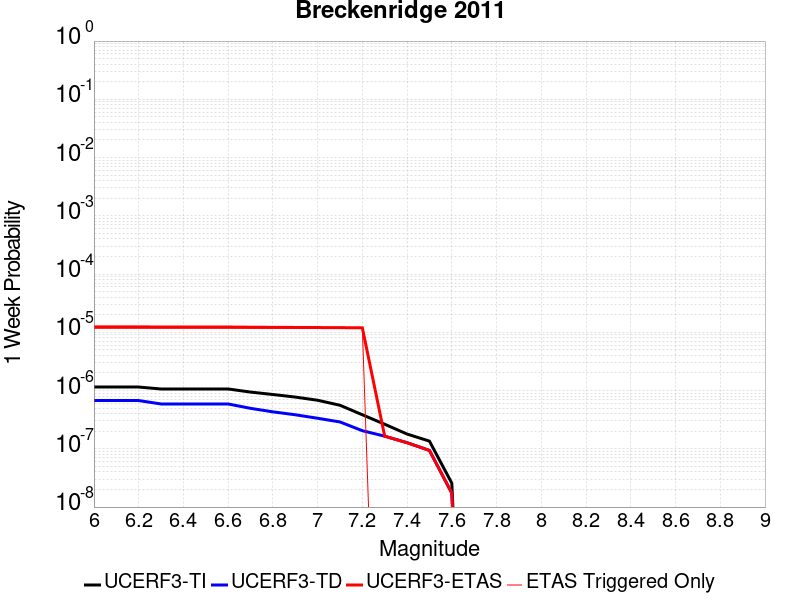 | 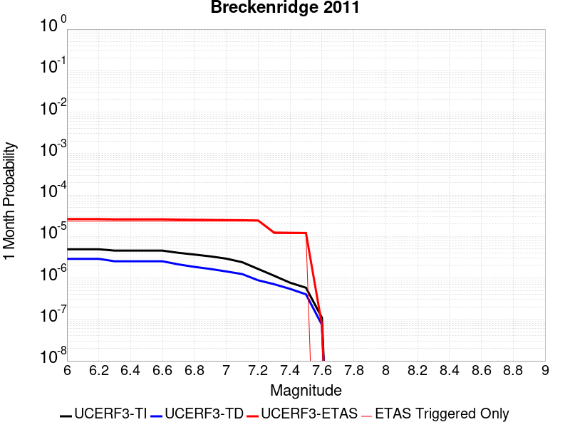 | 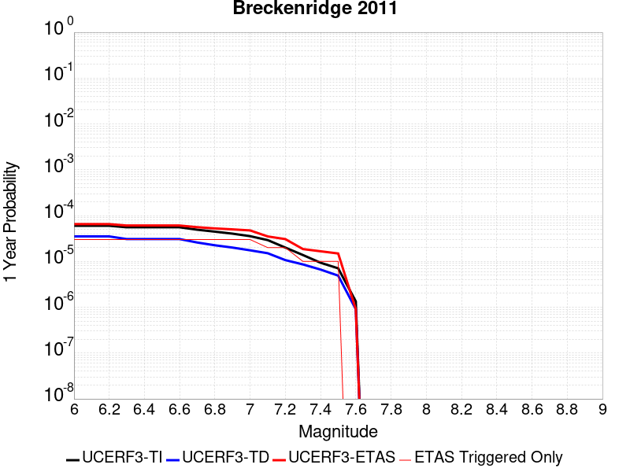 | 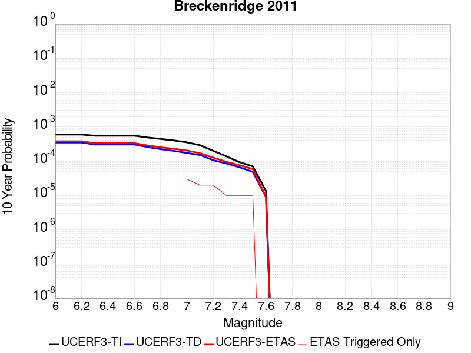 |

| Magnitude | 1 wk TI Prob | 1 wk TD Prob | 1 wk ETAS Prob | 1 wk ETAS/TD Gain | 1 wk ETAS Triggered Only | 1 mo TI Prob | 1 mo TD Prob | 1 mo ETAS Prob | 1 mo ETAS/TD Gain | 1 mo ETAS Triggered Only | 1 yr TI Prob | 1 yr TD Prob | 1 yr ETAS Prob | 1 yr ETAS/TD Gain | 1 yr ETAS Triggered Only | 10 yr TI Prob | 10 yr TD Prob | 10 yr ETAS Prob | 10 yr ETAS/TD Gain | 10 yr ETAS Triggered Only |
|-----|-----|-----|-----|-----|-----|-----|-----|-----|-----|-----|-----|-----|-----|-----|-----|-----|-----|-----|-----|-----|
| 6.0 | 1.1490393E-6 | 6.7380773E-7 | 1.2410889E-5 | 18.419037 | 1.1737089E-5 | 4.924445E-6 | 2.8877444E-6 | 2.6361855E-5 | 9.128875 | 2.3474178E-5 | 5.995347E-5 | 3.515774E-5 | 5.8631093E-5 | 1.6676582 | 2.3474178E-5 | 5.9937296E-4 | 3.5152383E-4 | 3.7498976E-4 | 1.0667548 | 2.3474178E-5 |
| 6.1 | 1.1490393E-6 | 6.7380773E-7 | 1.2410889E-5 | 18.419037 | 1.1737089E-5 | 4.924445E-6 | 2.8877444E-6 | 2.6361855E-5 | 9.128875 | 2.3474178E-5 | 5.995347E-5 | 3.515774E-5 | 5.8631093E-5 | 1.6676582 | 2.3474178E-5 | 5.9937296E-4 | 3.5152383E-4 | 3.7498976E-4 | 1.0667548 | 2.3474178E-5 |
| 6.2 | 1.1490393E-6 | 6.7380773E-7 | 1.2410889E-5 | 18.419037 | 1.1737089E-5 | 4.924445E-6 | 2.8877444E-6 | 2.6361855E-5 | 9.128875 | 2.3474178E-5 | 5.995347E-5 | 3.515774E-5 | 5.8631093E-5 | 1.6676582 | 2.3474178E-5 | 5.9937296E-4 | 3.5152383E-4 | 3.7498976E-4 | 1.0667548 | 2.3474178E-5 |
| 6.3 | 1.064617E-6 | 5.886475E-7 | 1.232573E-5 | 20.939068 | 1.1737089E-5 | 4.5626366E-6 | 2.5227728E-6 | 2.5996891E-5 | 10.304889 | 2.3474178E-5 | 5.5548684E-5 | 3.0714335E-5 | 5.4187793E-5 | 1.7642509 | 2.3474178E-5 | 5.55348E-4 | 3.0710208E-4 | 3.3056905E-4 | 1.0764142 | 2.3474178E-5 |
| 6.4 | 1.064617E-6 | 5.886475E-7 | 1.232573E-5 | 20.939068 | 1.1737089E-5 | 4.5626366E-6 | 2.5227728E-6 | 2.5996891E-5 | 10.304889 | 2.3474178E-5 | 5.5548684E-5 | 3.0714335E-5 | 5.4187793E-5 | 1.7642509 | 2.3474178E-5 | 5.55348E-4 | 3.0710208E-4 | 3.3056905E-4 | 1.0764142 | 2.3474178E-5 |
| 6.5 | 1.064617E-6 | 5.886475E-7 | 1.232573E-5 | 20.939068 | 1.1737089E-5 | 4.5626366E-6 | 2.5227728E-6 | 2.5996891E-5 | 10.304889 | 2.3474178E-5 | 5.5548684E-5 | 3.0714335E-5 | 5.4187793E-5 | 1.7642509 | 2.3474178E-5 | 5.55348E-4 | 3.0710208E-4 | 3.3056905E-4 | 1.0764142 | 2.3474178E-5 |
| 6.6 | 1.064617E-6 | 5.886475E-7 | 1.232573E-5 | 20.939068 | 1.1737089E-5 | 4.5626366E-6 | 2.5227728E-6 | 2.5996891E-5 | 10.304889 | 2.3474178E-5 | 5.5548684E-5 | 3.0714335E-5 | 5.4187793E-5 | 1.7642509 | 2.3474178E-5 | 5.55348E-4 | 3.0710208E-4 | 3.3056905E-4 | 1.0764142 | 2.3474178E-5 |
| 6.7 | 9.4219524E-7 | 4.954078E-7 | 1.2232491E-5 | 24.691761 | 1.1737089E-5 | 4.037973E-6 | 2.1231745E-6 | 2.5597303E-5 | 12.056147 | 2.3474178E-5 | 4.916122E-5 | 2.5849351E-5 | 4.9322924E-5 | 1.9080913 | 2.3474178E-5 | 4.9150345E-4 | 2.5846408E-4 | 2.8193218E-4 | 1.0907984 | 2.3474178E-5 |
| 6.8 | 8.556422E-7 | 4.311975E-7 | 1.21682815E-5 | 28.219742 | 1.1737089E-5 | 3.667033E-6 | 1.847988E-6 | 2.5322122E-5 | 13.702537 | 2.3474178E-5 | 4.464521E-5 | 2.2499025E-5 | 4.5972676E-5 | 2.0433185 | 2.3474178E-5 | 4.4636242E-4 | 2.2496787E-4 | 2.4843676E-4 | 1.1043211 | 2.3474178E-5 |
| 6.9 | 7.7357794E-7 | 3.8420345E-7 | 1.2121288E-5 | 31.549139 | 1.1737089E-5 | 3.3153299E-6 | 1.6465851E-6 | 2.5120726E-5 | 15.256256 | 2.3474178E-5 | 4.0363393E-5 | 2.0046993E-5 | 4.35207E-5 | 2.1709342 | 2.3474178E-5 | 4.035606E-4 | 2.0045215E-4 | 2.2392163E-4 | 1.1170827 | 2.3474178E-5 |
| 7.0 | 6.8172454E-7 | 3.3471417E-7 | 1.20718E-5 | 36.065994 | 1.1737089E-5 | 2.9216735E-6 | 1.4344886E-6 | 2.4908633E-5 | 17.36412 | 2.3474178E-5 | 3.5570793E-5 | 1.7464761E-5 | 4.093853E-5 | 2.3440647 | 2.3474178E-5 | 3.55651E-4 | 1.746341E-4 | 1.9810419E-4 | 1.1343957 | 2.3474178E-5 |
| 7.1 | 5.5936397E-7 | 2.890966E-7 | 1.2026182E-5 | 41.599182 | 1.1737089E-5 | 2.397272E-6 | 1.2389849E-6 | 2.4713134E-5 | 19.946276 | 2.3474178E-5 | 2.9186394E-5 | 1.5084538E-5 | 3.8558363E-5 | 2.5561514 | 2.3474178E-5 | 2.9182562E-4 | 1.5083532E-4 | 1.7430595E-4 | 1.1556044 | 2.3474178E-5 |
| 7.2 | 3.8420822E-7 | 2.0468339E-7 | 1.194177E-5 | 58.342644 | 1.1737089E-5 | 1.6466057E-6 | 8.7721423E-7 | 2.4351371E-5 | 27.759892 | 2.3474178E-5 | 2.004724E-5 | 1.0680032E-5 | 3.415396E-5 | 3.1979268 | 2.3474178E-5 | 2.004543E-4 | 1.0679527E-4 | 1.3026694E-4 | 1.219782 | 2.3474178E-5 |
| 7.3 | 2.6405158E-7 | 1.647323E-7 | 1.647323E-7 | 1.0 | 0.0 | 1.1316491E-6 | 7.059954E-7 | 1.2443076E-5 | 17.62487 | 1.1737089E-5 | 1.37777415E-5 | 8.595461E-6 | 2.0332449E-5 | 2.3654869 | 1.1737089E-5 | 1.3776887E-4 | 8.5951346E-5 | 9.768742E-5 | 1.1365433 | 1.1737089E-5 |
| 7.4 | 1.792114E-7 | 1.2725314E-7 | 1.2725314E-7 | 1.0 | 0.0 | 7.6804866E-7 | 5.4537054E-7 | 1.2282453E-5 | 22.5213 | 1.1737089E-5 | 9.3509525E-6 | 6.6398666E-6 | 1.8376877E-5 | 2.7676578 | 1.1737089E-5 | 9.350559E-5 | 6.639673E-5 | 7.813304E-5 | 1.1767603 | 1.1737089E-5 |
| 7.5 | 1.3548703E-7 | 9.3854034E-8 | 9.3854034E-8 | 1.0 | 0.0 | 5.8065854E-7 | 4.022315E-7 | 1.2139316E-5 | 30.179924 | 1.1737089E-5 | 7.0694946E-6 | 4.897158E-6 | 1.6634189E-5 | 3.3967028 | 1.1737089E-5 | 7.0692695E-5 | 4.8970534E-5 | 6.070705E-5 | 1.2396648 | 1.1737089E-5 |
| 7.6 | 2.572245E-8 | 1.7352555E-8 | 1.7352555E-8 | 1.0 | 0.0 | 1.10239064E-7 | 7.436809E-8 | 7.436809E-8 | 1.0 | 0.0 | 1.3421597E-6 | 9.054312E-7 | 9.054312E-7 | 1.0 | 0.0 | 1.3421517E-5 | 9.05428E-6 | 9.05428E-6 | 1.0 | 0.0 |

## San Jacinto (Superstition Mtn)
*[(top)](#table-of-contents)*

| 1 Week | 1 Month | 1 Year | 10 Year |
|-----|-----|-----|-----|
| 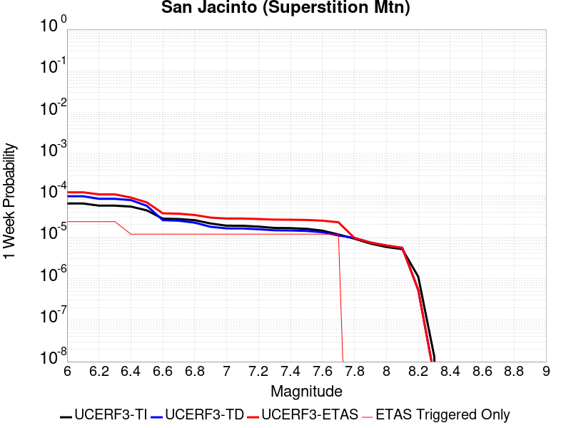 | 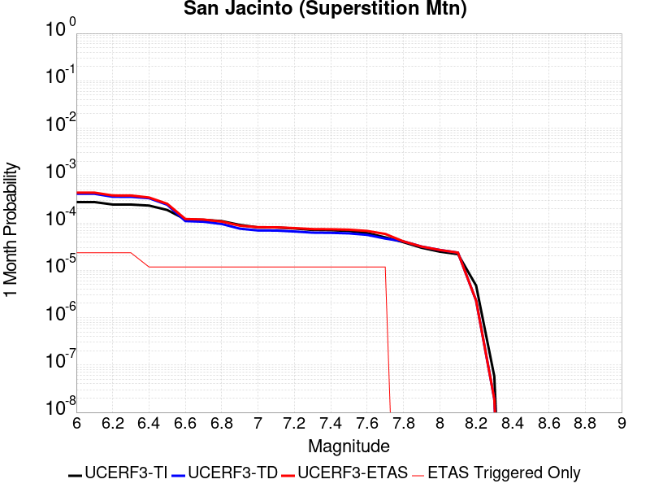 | 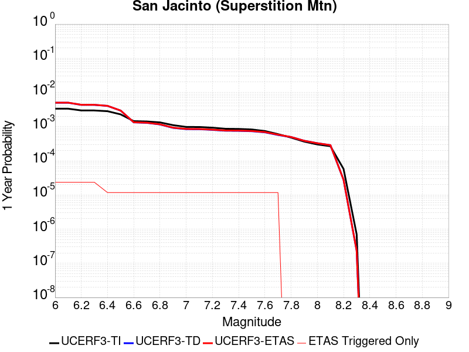 | 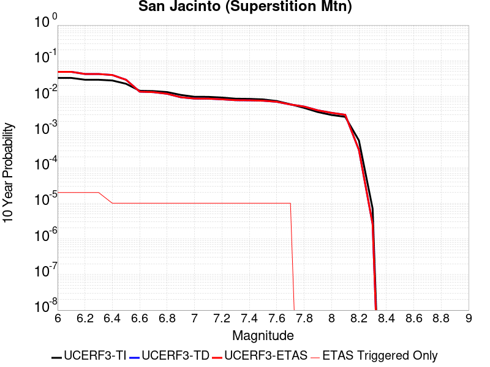 |

| Magnitude | 1 wk TI Prob | 1 wk TD Prob | 1 wk ETAS Prob | 1 wk ETAS/TD Gain | 1 wk ETAS Triggered Only | 1 mo TI Prob | 1 mo TD Prob | 1 mo ETAS Prob | 1 mo ETAS/TD Gain | 1 mo ETAS Triggered Only | 1 yr TI Prob | 1 yr TD Prob | 1 yr ETAS Prob | 1 yr ETAS/TD Gain | 1 yr ETAS Triggered Only | 10 yr TI Prob | 10 yr TD Prob | 10 yr ETAS Prob | 10 yr ETAS/TD Gain | 10 yr ETAS Triggered Only |
|-----|-----|-----|-----|-----|-----|-----|-----|-----|-----|-----|-----|-----|-----|-----|-----|-----|-----|-----|-----|-----|
| 6.0 | 6.4193904E-5 | 9.599367E-5 | 1.1946559E-4 | 1.2445153 | 2.3474178E-5 | 2.7508775E-4 | 4.1134638E-4 | 4.3481088E-4 | 1.0570432 | 2.3474178E-5 | 0.0033440501 | 0.0049980893 | 0.0050214464 | 1.0046731 | 2.3474178E-5 | 0.03294174 | 0.048823986 | 0.048846312 | 1.0004573 | 2.3474178E-5 |
| 6.1 | 6.4193904E-5 | 9.599367E-5 | 1.1946559E-4 | 1.2445153 | 2.3474178E-5 | 2.7508775E-4 | 4.1134638E-4 | 4.3481088E-4 | 1.0570432 | 2.3474178E-5 | 0.0033440501 | 0.0049980893 | 0.0050214464 | 1.0046731 | 2.3474178E-5 | 0.03294174 | 0.048823986 | 0.048846312 | 1.0004573 | 2.3474178E-5 |
| 6.2 | 5.7023593E-5 | 8.3144434E-5 | 1.0661666E-4 | 1.2823067 | 2.3474178E-5 | 2.4436394E-4 | 3.5629404E-4 | 3.7975985E-4 | 1.0658609 | 2.3474178E-5 | 0.002971072 | 0.0043308944 | 0.004354267 | 1.0053967 | 2.3474178E-5 | 0.029316625 | 0.04250403 | 0.042526506 | 1.0005288 | 2.3474178E-5 |
| 6.3 | 5.6940098E-5 | 8.298979E-5 | 1.0646202E-4 | 1.2828327 | 2.3474178E-5 | 2.4400617E-4 | 3.5563146E-4 | 3.790973E-4 | 1.0659835 | 2.3474178E-5 | 0.002966728 | 0.00432286 | 0.0043462324 | 1.0054067 | 2.3474178E-5 | 0.029274331 | 0.042427283 | 0.04244976 | 1.0005298 | 2.3474178E-5 |
| 6.4 | 5.4171585E-5 | 7.7483564E-5 | 8.921974E-5 | 1.1514667 | 1.1737089E-5 | 2.3214328E-4 | 3.3203943E-4 | 3.4377264E-4 | 1.0353367 | 1.1737089E-5 | 0.0028226813 | 0.0040367353 | 0.004048425 | 1.0028958 | 1.1737089E-5 | 0.02787096 | 0.03971653 | 0.039727803 | 1.0002838 | 1.1737089E-5 |
| 6.5 | 4.375144E-5 | 5.642133E-5 | 6.815776E-5 | 1.208014 | 1.1737089E-5 | 1.874927E-4 | 2.4178992E-4 | 2.5352417E-4 | 1.0485308 | 1.1737089E-5 | 0.0022803338 | 0.002940994 | 0.0029526965 | 1.0039791 | 1.1737089E-5 | 0.022570757 | 0.029236801 | 0.029248195 | 1.0003897 | 1.1737089E-5 |
| 6.6 | 2.772192E-5 | 2.5488358E-5 | 3.722515E-5 | 1.4604765 | 1.1737089E-5 | 1.1880282E-4 | 1.09231354E-4 | 1.2096716E-4 | 1.1074399 | 1.1737089E-5 | 0.0014454646 | 0.0013290998 | 0.0013408213 | 1.0088191 | 1.1737089E-5 | 0.014360986 | 0.01354049 | 0.013552068 | 1.0008551 | 1.1737089E-5 |
| 6.7 | 2.7124124E-5 | 2.4699386E-5 | 3.6436188E-5 | 1.4751859 | 1.1737089E-5 | 1.1624106E-4 | 1.05850326E-4 | 1.17586176E-4 | 1.110872 | 1.1737089E-5 | 0.0014143161 | 0.001287985 | 0.001299707 | 1.009101 | 1.1737089E-5 | 0.014053487 | 0.013133943 | 0.013145526 | 1.0008819 | 1.1737089E-5 |
| 6.8 | 2.5475807E-5 | 2.216446E-5 | 3.3901288E-5 | 1.5295337 | 1.1737089E-5 | 1.0917746E-4 | 9.4987154E-5 | 1.0672313E-4 | 1.1235533 | 1.1737089E-5 | 0.001328425 | 0.001155867 | 0.0011675905 | 1.0101426 | 1.1737089E-5 | 0.0132051185 | 0.011822182 | 0.01183378 | 1.0009811 | 1.1737089E-5 |
| 6.9 | 2.1162023E-5 | 1.7626244E-5 | 2.9363126E-5 | 1.6658754 | 1.1737089E-5 | 9.069123E-5 | 7.5538876E-5 | 8.727508E-5 | 1.1553664 | 1.1737089E-5 | 0.0011036064 | 9.193016E-4 | 9.3102787E-4 | 1.0127556 | 1.1737089E-5 | 0.010981417 | 0.00944688 | 0.009458506 | 1.0012307 | 1.1737089E-5 |
| 7.0 | 1.8754288E-5 | 1.6161559E-5 | 2.7898457E-5 | 1.7262232 | 1.1737089E-5 | 8.037304E-5 | 6.9261994E-5 | 8.0998274E-5 | 1.1694475 | 1.1737089E-5 | 9.781026E-4 | 8.4294105E-4 | 8.5466827E-4 | 1.0139122 | 1.1737089E-5 | 0.009738087 | 0.008670042 | 0.008681677 | 1.001342 | 1.1737089E-5 |
| 7.1 | 1.8678527E-5 | 1.6086702E-5 | 2.7823602E-5 | 1.7296027 | 1.1737089E-5 | 8.0048376E-5 | 6.89412E-5 | 8.067748E-5 | 1.1702361 | 1.1737089E-5 | 9.7415317E-4 | 8.3903834E-4 | 8.5076556E-4 | 1.013977 | 1.1737089E-5 | 0.009698939 | 0.008630998 | 0.008642633 | 1.0013481 | 1.1737089E-5 |
| 7.2 | 1.7804578E-5 | 1.5381282E-5 | 2.7118189E-5 | 1.7630645 | 1.1737089E-5 | 7.6303106E-5 | 6.5918124E-5 | 7.765444E-5 | 1.1780438 | 1.1737089E-5 | 9.285943E-4 | 8.022599E-4 | 8.139876E-4 | 1.0146183 | 1.1737089E-5 | 0.009247236 | 0.008262311 | 0.008273952 | 1.0014088 | 1.1737089E-5 |
| 7.3 | 1.6583685E-5 | 1.4530388E-5 | 2.6267307E-5 | 1.8077499 | 1.1737089E-5 | 7.1070994E-5 | 6.227162E-5 | 7.400798E-5 | 1.1884705 | 1.1737089E-5 | 8.649459E-4 | 7.5789524E-4 | 7.6962344E-4 | 1.0154747 | 1.1737089E-5 | 0.00861587 | 0.007817623 | 0.007829269 | 1.0014896 | 1.1737089E-5 |
| 7.4 | 1.6387552E-5 | 1.4395274E-5 | 2.6132195E-5 | 1.8153315 | 1.1737089E-5 | 7.023047E-5 | 6.169258E-5 | 7.342895E-5 | 1.1902394 | 1.1737089E-5 | 8.5472054E-4 | 7.5085036E-4 | 7.625786E-4 | 1.01562 | 1.1737089E-5 | 0.008514405 | 0.0077470057 | 0.007758652 | 1.0015033 | 1.1737089E-5 |
| 7.5 | 1.5790754E-5 | 1.4035962E-5 | 2.5772886E-5 | 1.8362038 | 1.1737089E-5 | 6.767291E-5 | 6.0152746E-5 | 7.188913E-5 | 1.1951097 | 1.1737089E-5 | 8.236062E-4 | 7.321156E-4 | 7.438441E-4 | 1.01602 | 1.1737089E-5 | 0.008205604 | 0.007557569 | 0.0075692176 | 1.0015413 | 1.1737089E-5 |
| 7.6 | 1.4248672E-5 | 1.3054932E-5 | 2.4791869E-5 | 1.8990422 | 1.1737089E-5 | 6.106431E-5 | 5.594852E-5 | 6.768495E-5 | 1.209772 | 1.1737089E-5 | 7.432043E-4 | 6.8096205E-4 | 6.926912E-4 | 1.0172243 | 1.1737089E-5 | 0.007407237 | 0.0070401574 | 0.0070518116 | 1.0016555 | 1.1737089E-5 |
| 7.7 | 1.15449975E-5 | 1.090368E-5 | 2.2640641E-5 | 2.076422 | 1.1737089E-5 | 4.947762E-5 | 4.6729223E-5 | 5.8465765E-5 | 1.2511606 | 1.1737089E-5 | 6.022235E-4 | 5.687805E-4 | 5.8051094E-4 | 1.0206238 | 1.1737089E-5 | 0.006005941 | 0.0059101824 | 0.00592185 | 1.0019742 | 1.1737089E-5 |
| 7.8 | 9.1391985E-6 | 9.514299E-6 | 9.514299E-6 | 1.0 | 0.0 | 3.9167408E-5 | 4.0774932E-5 | 4.0774932E-5 | 1.0 | 0.0 | 4.767588E-4 | 4.963223E-4 | 4.963223E-4 | 1.0 | 0.0 | 0.0047573727 | 0.0051766867 | 0.0051766867 | 1.0 | 0.0 |
| 7.9 | 6.973017E-6 | 7.3821784E-6 | 7.3821784E-6 | 1.0 | 0.0 | 2.9884017E-5 | 3.1637526E-5 | 3.1637526E-5 | 1.0 | 0.0 | 3.6377716E-4 | 3.8511935E-4 | 3.8511935E-4 | 1.0 | 0.0 | 0.0036318225 | 0.0040517948 | 0.0040517948 | 1.0 | 0.0 |
| 8.0 | 5.7638235E-6 | 6.259972E-6 | 6.259972E-6 | 1.0 | 0.0 | 2.4701867E-5 | 2.6828178E-5 | 2.6828178E-5 | 1.0 | 0.0 | 3.0070372E-4 | 3.2658462E-4 | 3.2658462E-4 | 1.0 | 0.0 | 0.0030029714 | 0.0034534496 | 0.0034534496 | 1.0 | 0.0 |
| 8.1 | 5.1124434E-6 | 5.4956718E-6 | 5.4956718E-6 | 1.0 | 0.0 | 2.1910288E-5 | 2.355267E-5 | 2.355267E-5 | 1.0 | 0.0 | 2.6672508E-4 | 2.867165E-4 | 2.867165E-4 | 1.0 | 0.0 | 0.0026640517 | 0.003040336 | 0.003040336 | 1.0 | 0.0 |
| 8.2 | 1.1075938E-6 | 5.336568E-7 | 5.336568E-7 | 1.0 | 0.0 | 4.7468216E-6 | 2.2870988E-6 | 2.2870988E-6 | 1.0 | 0.0 | 5.779102E-5 | 2.7845093E-5 | 2.7845093E-5 | 1.0 | 0.0 | 5.777599E-4 | 3.1346595E-4 | 3.1346595E-4 | 1.0 | 0.0 |
| 8.3 | 1.3584393E-8 | 4.473836E-9 | 4.473836E-9 | 1.0 | 0.0 | 5.8218827E-8 | 1.9173582E-8 | 1.9173582E-8 | 1.0 | 0.0 | 7.0881396E-7 | 2.3343837E-7 | 2.3343837E-7 | 1.0 | 0.0 | 7.0881174E-6 | 2.6163038E-6 | 2.6163038E-6 | 1.0 | 0.0 |

## Monterey Bay-Tularcitos
*[(top)](#table-of-contents)*

| 1 Week | 1 Month | 1 Year | 10 Year |
|-----|-----|-----|-----|
| 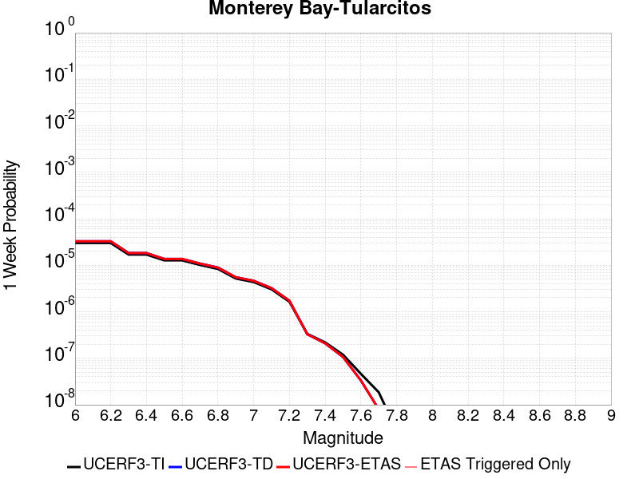 | 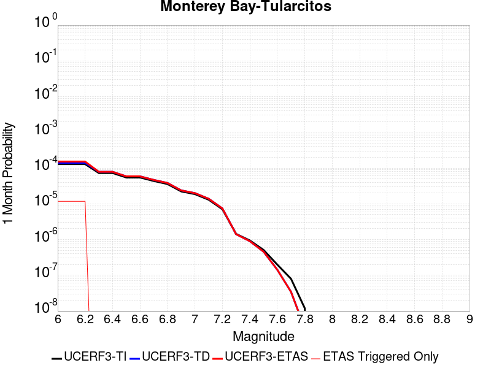 | 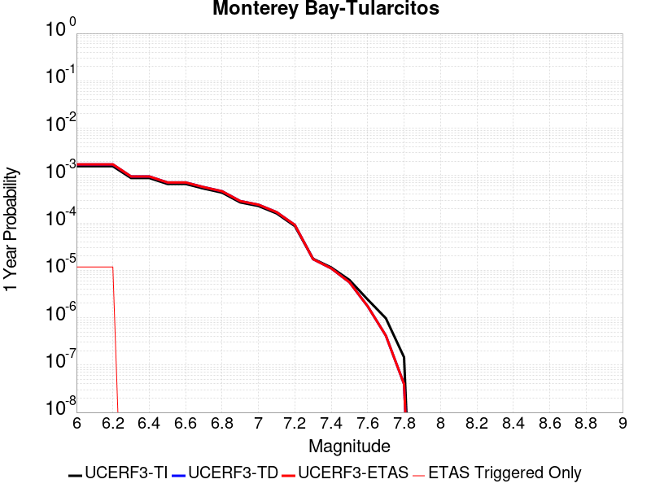 | 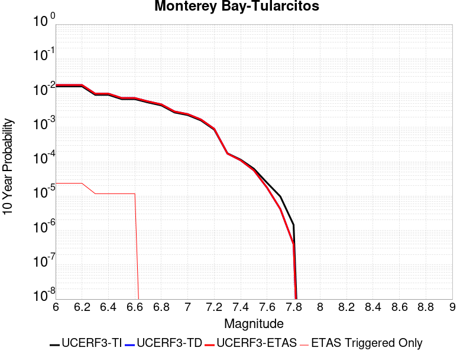 |

| Magnitude | 1 wk TI Prob | 1 wk TD Prob | 1 wk ETAS Prob | 1 wk ETAS/TD Gain | 1 wk ETAS Triggered Only | 1 mo TI Prob | 1 mo TD Prob | 1 mo ETAS Prob | 1 mo ETAS/TD Gain | 1 mo ETAS Triggered Only | 1 yr TI Prob | 1 yr TD Prob | 1 yr ETAS Prob | 1 yr ETAS/TD Gain | 1 yr ETAS Triggered Only | 10 yr TI Prob | 10 yr TD Prob | 10 yr ETAS Prob | 10 yr ETAS/TD Gain | 10 yr ETAS Triggered Only |
|-----|-----|-----|-----|-----|-----|-----|-----|-----|-----|-----|-----|-----|-----|-----|-----|-----|-----|-----|-----|-----|
| 6.0 | 3.0131365E-5 | 3.279877E-5 | 3.279877E-5 | 1.0 | 0.0 | 1.2912804E-4 | 1.4055918E-4 | 1.5229463E-4 | 1.0834911 | 1.1737089E-5 | 0.001571 | 0.0017100703 | 0.0017217873 | 1.0068518 | 1.1737089E-5 | 0.015599402 | 0.016979916 | 0.017002992 | 1.001359 | 2.3474178E-5 |
| 6.1 | 3.0131365E-5 | 3.279877E-5 | 3.279877E-5 | 1.0 | 0.0 | 1.2912804E-4 | 1.4055918E-4 | 1.5229463E-4 | 1.0834911 | 1.1737089E-5 | 0.001571 | 0.0017100703 | 0.0017217873 | 1.0068518 | 1.1737089E-5 | 0.015599402 | 0.016979916 | 0.017002992 | 1.001359 | 2.3474178E-5 |
| 6.2 | 3.0131365E-5 | 3.279877E-5 | 3.279877E-5 | 1.0 | 0.0 | 1.2912804E-4 | 1.4055918E-4 | 1.5229463E-4 | 1.0834911 | 1.1737089E-5 | 0.001571 | 0.0017100703 | 0.0017217873 | 1.0068518 | 1.1737089E-5 | 0.015599402 | 0.016979916 | 0.017002992 | 1.001359 | 2.3474178E-5 |
| 6.3 | 1.6998249E-5 | 1.8330798E-5 | 1.8330798E-5 | 1.0 | 0.0 | 7.28476E-5 | 7.85583E-5 | 7.85583E-5 | 1.0 | 0.0 | 8.865586E-4 | 9.5604634E-4 | 9.5604634E-4 | 1.0 | 0.0 | 0.0088303005 | 0.009521258 | 0.009532884 | 1.001221 | 1.1737089E-5 |
| 6.4 | 1.6998249E-5 | 1.8330798E-5 | 1.8330798E-5 | 1.0 | 0.0 | 7.28476E-5 | 7.85583E-5 | 7.85583E-5 | 1.0 | 0.0 | 8.865586E-4 | 9.5604634E-4 | 9.5604634E-4 | 1.0 | 0.0 | 0.0088303005 | 0.009521258 | 0.009532884 | 1.001221 | 1.1737089E-5 |
| 6.5 | 1.27470785E-5 | 1.3693312E-5 | 1.3693312E-5 | 1.0 | 0.0 | 5.4629192E-5 | 5.8684363E-5 | 5.8684363E-5 | 1.0 | 0.0 | 6.649074E-4 | 7.1425823E-4 | 7.1425823E-4 | 1.0 | 0.0 | 0.0066292146 | 0.007120678 | 0.007132332 | 1.0016366 | 1.1737089E-5 |
| 6.6 | 1.2739422E-5 | 1.36854E-5 | 1.36854E-5 | 1.0 | 0.0 | 5.4596385E-5 | 5.8650454E-5 | 5.8650454E-5 | 1.0 | 0.0 | 6.645082E-4 | 7.1384566E-4 | 7.1384566E-4 | 1.0 | 0.0 | 0.0066252467 | 0.007116579 | 0.0071282326 | 1.0016376 | 1.1737089E-5 |
| 6.7 | 1.0160109E-5 | 1.0885755E-5 | 1.0885755E-5 | 1.0 | 0.0 | 4.35426E-5 | 4.665244E-5 | 4.665244E-5 | 1.0 | 0.0 | 5.300022E-4 | 5.6785246E-4 | 5.6785246E-4 | 1.0 | 0.0 | 0.005287399 | 0.0056647263 | 0.0056647263 | 1.0 | 0.0 |
| 6.8 | 8.349859E-6 | 8.932587E-6 | 8.932587E-6 | 1.0 | 0.0 | 3.578462E-5 | 3.8281985E-5 | 3.8281985E-5 | 1.0 | 0.0 | 4.3559066E-4 | 4.6598914E-4 | 4.6598914E-4 | 1.0 | 0.0 | 0.004347378 | 0.004650685 | 0.004650685 | 1.0 | 0.0 |
| 6.9 | 5.193639E-6 | 5.53643E-6 | 5.53643E-6 | 1.0 | 0.0 | 2.2258262E-5 | 2.372736E-5 | 2.372736E-5 | 1.0 | 0.0 | 2.7096065E-4 | 2.8884556E-4 | 2.8884556E-4 | 1.0 | 0.0 | 0.0027063051 | 0.0028850222 | 0.0028850222 | 1.0 | 0.0 |
| 7.0 | 4.359381E-6 | 4.643366E-6 | 4.643366E-6 | 1.0 | 0.0 | 1.8682927E-5 | 1.9900004E-5 | 1.9900004E-5 | 1.0 | 0.0 | 2.274409E-4 | 2.422586E-4 | 2.422586E-4 | 1.0 | 0.0 | 0.0022720827 | 0.002420238 | 0.002420238 | 1.0 | 0.0 |
| 7.1 | 3.0398533E-6 | 3.2310427E-6 | 3.2310427E-6 | 1.0 | 0.0 | 1.3027877E-5 | 1.3847267E-5 | 1.3847267E-5 | 1.0 | 0.0 | 1.5860285E-4 | 1.6858005E-4 | 1.6858005E-4 | 1.0 | 0.0 | 0.001584897 | 0.0016847793 | 0.0016847793 | 1.0 | 0.0 |
| 7.2 | 1.642335E-6 | 1.7333153E-6 | 1.7333153E-6 | 1.0 | 0.0 | 7.0385595E-6 | 7.428485E-6 | 7.428485E-6 | 1.0 | 0.0 | 8.569109E-5 | 9.044012E-5 | 9.044012E-5 | 1.0 | 0.0 | 8.5658056E-4 | 9.042358E-4 | 9.042358E-4 | 1.0 | 0.0 |
| 7.3 | 3.356842E-7 | 3.2952389E-7 | 3.2952389E-7 | 1.0 | 0.0 | 1.4386458E-6 | 1.4122444E-6 | 1.4122444E-6 | 1.0 | 0.0 | 1.7515373E-5 | 1.7193941E-5 | 1.7193941E-5 | 1.0 | 0.0 | 1.7513991E-4 | 1.719262E-4 | 1.719262E-4 | 1.0 | 0.0 |
| 7.4 | 2.1973483E-7 | 2.1006413E-7 | 2.1006413E-7 | 1.0 | 0.0 | 9.417204E-7 | 9.0027453E-7 | 9.0027453E-7 | 1.0 | 0.0 | 1.1465385E-5 | 1.0960787E-5 | 1.0960787E-5 | 1.0 | 0.0 | 1.1464794E-4 | 1.096025E-4 | 1.096025E-4 | 1.0 | 0.0 |
| 7.5 | 1.1944135E-7 | 1.0696043E-7 | 1.0696043E-7 | 1.0 | 0.0 | 5.118914E-7 | 4.5840173E-7 | 4.5840173E-7 | 1.0 | 0.0 | 6.23226E-6 | 5.581027E-6 | 5.581027E-6 | 1.0 | 0.0 | 6.2320854E-5 | 5.5808883E-5 | 5.5808883E-5 | 1.0 | 0.0 |
| 7.6 | 4.636058E-8 | 3.336489E-8 | 3.336489E-8 | 1.0 | 0.0 | 1.9868818E-7 | 1.4299238E-7 | 1.4299238E-7 | 1.0 | 0.0 | 2.419026E-6 | 1.7409308E-6 | 1.7409308E-6 | 1.0 | 0.0 | 2.4189996E-5 | 1.7409173E-5 | 1.7409173E-5 | 1.0 | 0.0 |
| 7.7 | 1.8588572E-8 | 8.003744E-9 | 8.003744E-9 | 1.0 | 0.0 | 7.9665305E-8 | 3.430176E-8 | 3.430176E-8 | 1.0 | 0.0 | 9.699246E-7 | 4.1762385E-7 | 4.1762385E-7 | 1.0 | 0.0 | 9.699204E-6 | 4.176231E-6 | 4.176231E-6 | 1.0 | 0.0 |
| 7.8 | 2.7960154E-9 | 7.6099427E-10 | 7.6099427E-10 | 1.0 | 0.0 | 1.1982923E-8 | 3.2614043E-9 | 3.2614043E-9 | 1.0 | 0.0 | 1.4589209E-7 | 3.9707597E-8 | 3.9707597E-8 | 1.0 | 0.0 | 1.4589199E-6 | 3.9707595E-7 | 3.9707595E-7 | 1.0 | 0.0 |

## Almanor 2011 CFM
*[(top)](#table-of-contents)*

| 1 Week | 1 Month | 1 Year | 10 Year |
|-----|-----|-----|-----|
| 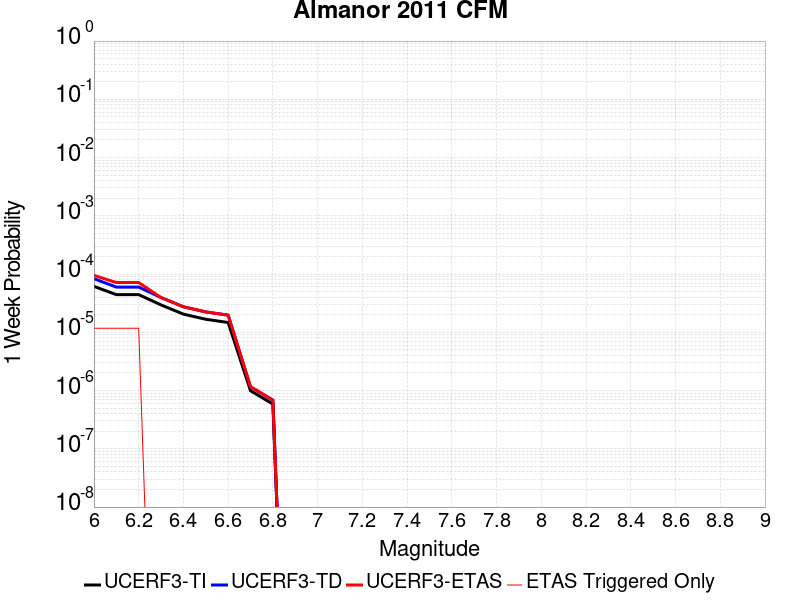 | 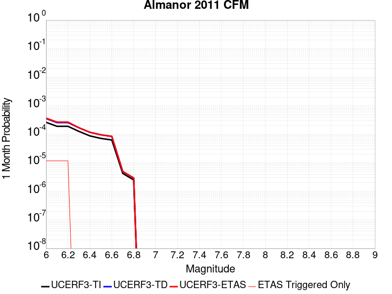 | 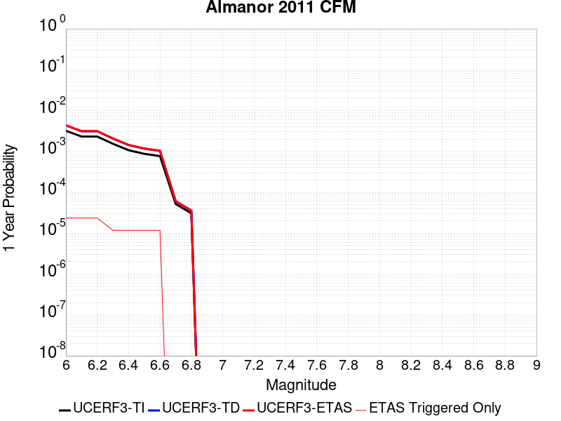 | 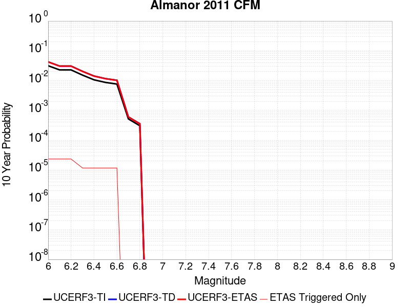 |

| Magnitude | 1 wk TI Prob | 1 wk TD Prob | 1 wk ETAS Prob | 1 wk ETAS/TD Gain | 1 wk ETAS Triggered Only | 1 mo TI Prob | 1 mo TD Prob | 1 mo ETAS Prob | 1 mo ETAS/TD Gain | 1 mo ETAS Triggered Only | 1 yr TI Prob | 1 yr TD Prob | 1 yr ETAS Prob | 1 yr ETAS/TD Gain | 1 yr ETAS Triggered Only | 10 yr TI Prob | 10 yr TD Prob | 10 yr ETAS Prob | 10 yr ETAS/TD Gain | 10 yr ETAS Triggered Only |
|-----|-----|-----|-----|-----|-----|-----|-----|-----|-----|-----|-----|-----|-----|-----|-----|-----|-----|-----|-----|-----|
| 6.0 | 6.1479834E-5 | 8.32787E-5 | 9.501481E-5 | 1.1409258 | 1.1737089E-5 | 2.6345838E-4 | 3.5686578E-4 | 3.6859867E-4 | 1.0328777 | 1.1737089E-5 | 0.0032028882 | 0.0043366123 | 0.004359985 | 1.0053896 | 2.3474178E-5 | 0.031571172 | 0.04258577 | 0.042608246 | 1.0005277 | 2.3474178E-5 |
| 6.1 | 4.4387216E-5 | 5.9770442E-5 | 7.150683E-5 | 1.1963577 | 1.1737089E-5 | 1.9021705E-4 | 2.561381E-4 | 2.6787218E-4 | 1.0458115 | 1.1737089E-5 | 0.0023134327 | 0.003114426 | 0.0031378272 | 1.0075138 | 2.3474178E-5 | 0.022894967 | 0.030755036 | 0.030777788 | 1.0007398 | 2.3474178E-5 |
| 6.2 | 4.4387216E-5 | 5.9770442E-5 | 7.150683E-5 | 1.1963577 | 1.1737089E-5 | 1.9021705E-4 | 2.561381E-4 | 2.6787218E-4 | 1.0458115 | 1.1737089E-5 | 0.0023134327 | 0.003114426 | 0.0031378272 | 1.0075138 | 2.3474178E-5 | 0.022894967 | 0.030755036 | 0.030777788 | 1.0007398 | 2.3474178E-5 |
| 6.3 | 2.9523822E-5 | 3.954719E-5 | 3.954719E-5 | 1.0 | 0.0 | 1.2652454E-4 | 1.6947983E-4 | 1.6947983E-4 | 1.0 | 0.0 | 0.0015393476 | 0.0020618725 | 0.0020735855 | 1.0056807 | 1.1737089E-5 | 0.015287281 | 0.020460794 | 0.020472292 | 1.000562 | 1.1737089E-5 |
| 6.4 | 2.0512744E-5 | 2.7431617E-5 | 2.7431617E-5 | 1.0 | 0.0 | 8.79088E-5 | 1.175612E-4 | 1.175612E-4 | 1.0 | 0.0 | 0.001069764 | 0.0014307408 | 0.0014424612 | 1.0081918 | 1.1737089E-5 | 0.010646289 | 0.014244413 | 0.014255983 | 1.0008123 | 1.1737089E-5 |
| 6.5 | 1.6750226E-5 | 2.23913E-5 | 2.23913E-5 | 1.0 | 0.0 | 7.178471E-5 | 9.596152E-5 | 9.596152E-5 | 1.0 | 0.0 | 8.7362836E-4 | 0.0011680633 | 0.0011797866 | 1.0100366 | 1.1737089E-5 | 0.008702018 | 0.011649038 | 0.011660638 | 1.0009959 | 1.1737089E-5 |
| 6.6 | 1.4745303E-5 | 1.9707952E-5 | 1.9707952E-5 | 1.0 | 0.0 | 6.319262E-5 | 8.446223E-5 | 8.446223E-5 | 1.0 | 0.0 | 7.690986E-4 | 0.0010281964 | 0.0010399214 | 1.0114034 | 1.1737089E-5 | 0.0076644225 | 0.010264971 | 0.010276589 | 1.0011317 | 1.1737089E-5 |
| 6.7 | 9.951145E-7 | 1.1616347E-6 | 1.1616347E-6 | 1.0 | 0.0 | 4.26477E-6 | 4.9784257E-6 | 4.9784257E-6 | 1.0 | 0.0 | 5.1922336E-5 | 6.0610826E-5 | 6.0610826E-5 | 1.0 | 0.0 | 5.1910203E-4 | 6.059602E-4 | 6.059602E-4 | 1.0 | 0.0 |
| 6.8 | 5.866312E-7 | 6.849384E-7 | 6.849384E-7 | 1.0 | 0.0 | 2.5141312E-6 | 2.9354478E-6 | 2.9354478E-6 | 1.0 | 0.0 | 3.0609117E-5 | 3.5738623E-5 | 3.5738623E-5 | 1.0 | 0.0 | 3.06049E-4 | 3.5734157E-4 | 3.5734157E-4 | 1.0 | 0.0 |

## South Klamath Lake West
*[(top)](#table-of-contents)*

| 1 Week | 1 Month | 1 Year | 10 Year |
|-----|-----|-----|-----|
|  | 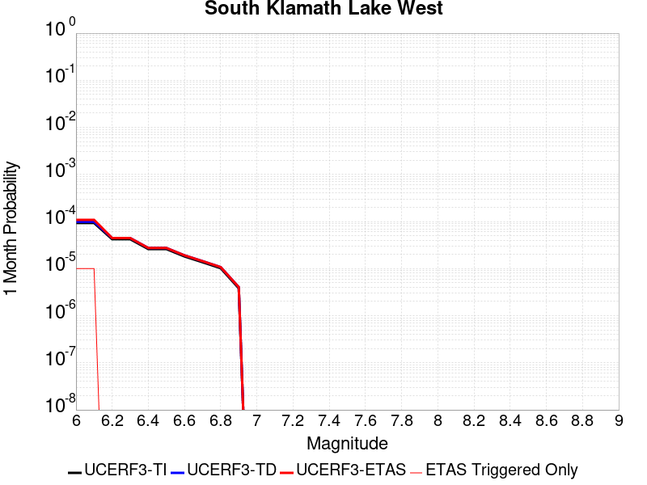 | 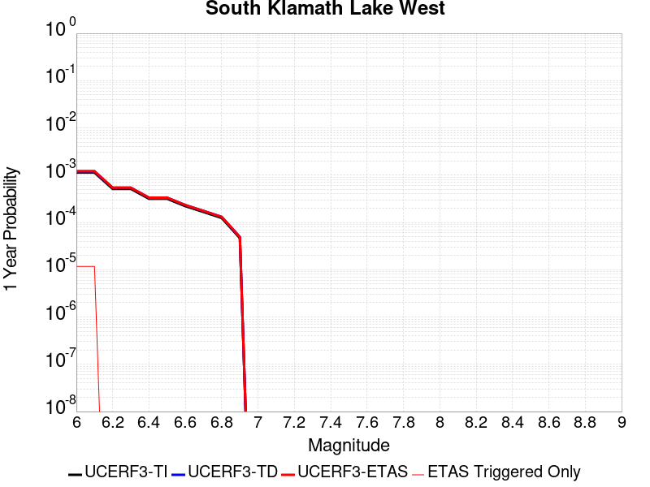 | 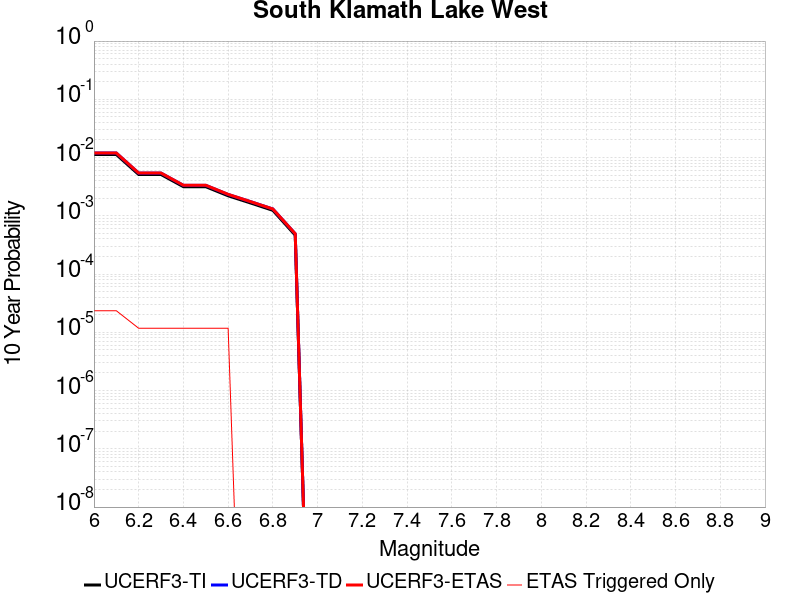 |

| Magnitude | 1 wk TI Prob | 1 wk TD Prob | 1 wk ETAS Prob | 1 wk ETAS/TD Gain | 1 wk ETAS Triggered Only | 1 mo TI Prob | 1 mo TD Prob | 1 mo ETAS Prob | 1 mo ETAS/TD Gain | 1 mo ETAS Triggered Only | 1 yr TI Prob | 1 yr TD Prob | 1 yr ETAS Prob | 1 yr ETAS/TD Gain | 1 yr ETAS Triggered Only | 10 yr TI Prob | 10 yr TD Prob | 10 yr ETAS Prob | 10 yr ETAS/TD Gain | 10 yr ETAS Triggered Only |
|-----|-----|-----|-----|-----|-----|-----|-----|-----|-----|-----|-----|-----|-----|-----|-----|-----|-----|-----|-----|-----|
| 6.0 | 2.174025E-5 | 2.3042025E-5 | 2.3042025E-5 | 1.0 | 0.0 | 9.3169176E-5 | 9.874817E-5 | 1.104841E-4 | 1.118847 | 1.1737089E-5 | 0.0011337444 | 0.0012016617 | 0.0012133847 | 1.0097556 | 1.1737089E-5 | 0.011279777 | 0.0119582405 | 0.011981434 | 1.0019395 | 2.3474178E-5 |
| 6.1 | 2.174025E-5 | 2.3042025E-5 | 2.3042025E-5 | 1.0 | 0.0 | 9.3169176E-5 | 9.874817E-5 | 1.104841E-4 | 1.118847 | 1.1737089E-5 | 0.0011337444 | 0.0012016617 | 0.0012133847 | 1.0097556 | 1.1737089E-5 | 0.011279777 | 0.0119582405 | 0.011981434 | 1.0019395 | 2.3474178E-5 |
| 6.2 | 9.834929E-6 | 1.0393841E-5 | 1.0393841E-5 | 1.0 | 0.0 | 4.2149015E-5 | 4.4544326E-5 | 4.4544326E-5 | 1.0 | 0.0 | 5.1304343E-4 | 5.422012E-4 | 5.422012E-4 | 1.0 | 0.0 | 0.0051186057 | 0.0054096854 | 0.005421359 | 1.0021579 | 1.1737089E-5 |
| 6.3 | 9.834929E-6 | 1.0393841E-5 | 1.0393841E-5 | 1.0 | 0.0 | 4.2149015E-5 | 4.4544326E-5 | 4.4544326E-5 | 1.0 | 0.0 | 5.1304343E-4 | 5.422012E-4 | 5.422012E-4 | 1.0 | 0.0 | 0.0051186057 | 0.0054096854 | 0.005421359 | 1.0021579 | 1.1737089E-5 |
| 6.4 | 6.066321E-6 | 6.40043E-6 | 6.40043E-6 | 1.0 | 0.0 | 2.5998259E-5 | 2.743014E-5 | 2.743014E-5 | 1.0 | 0.0 | 3.1648282E-4 | 3.3391351E-4 | 3.3391351E-4 | 1.0 | 0.0 | 0.0031603249 | 0.0033343881 | 0.003346086 | 1.0035083 | 1.1737089E-5 |
| 6.5 | 6.066321E-6 | 6.40043E-6 | 6.40043E-6 | 1.0 | 0.0 | 2.5998259E-5 | 2.743014E-5 | 2.743014E-5 | 1.0 | 0.0 | 3.1648282E-4 | 3.3391351E-4 | 3.3391351E-4 | 1.0 | 0.0 | 0.0031603249 | 0.0033343881 | 0.003346086 | 1.0035083 | 1.1737089E-5 |
| 6.6 | 4.2321803E-6 | 4.461291E-6 | 4.461291E-6 | 1.0 | 0.0 | 1.8137789E-5 | 1.9119685E-5 | 1.9119685E-5 | 1.0 | 0.0 | 2.208052E-4 | 2.3275832E-4 | 2.3275832E-4 | 1.0 | 0.0 | 0.0022058594 | 0.0023252473 | 0.002336957 | 1.0050359 | 1.1737089E-5 |
| 6.7 | 3.186646E-6 | 3.360305E-6 | 3.360305E-6 | 1.0 | 0.0 | 1.3656982E-5 | 1.4401232E-5 | 1.4401232E-5 | 1.0 | 0.0 | 1.6626107E-4 | 1.7532158E-4 | 1.7532158E-4 | 1.0 | 0.0 | 0.0016613674 | 0.0017518997 | 0.0017518997 | 1.0 | 0.0 |
| 6.8 | 2.380121E-6 | 2.510907E-6 | 2.510907E-6 | 1.0 | 0.0 | 1.0200479E-5 | 1.07609885E-5 | 1.07609885E-5 | 1.0 | 0.0 | 1.2418375E-4 | 1.3100762E-4 | 1.3100762E-4 | 1.0 | 0.0 | 0.0012411437 | 0.0013093497 | 0.0013093497 | 1.0 | 0.0 |
| 6.9 | 8.928287E-7 | 9.4302504E-7 | 9.4302504E-7 | 1.0 | 0.0 | 3.826403E-6 | 4.0415307E-6 | 4.0415307E-6 | 1.0 | 0.0 | 4.658546E-5 | 4.9204747E-5 | 4.9204747E-5 | 1.0 | 0.0 | 4.6575698E-4 | 4.9196015E-4 | 4.9196015E-4 | 1.0 | 0.0 |

## Newport-Inglewood (Offshore)
*[(top)](#table-of-contents)*

| 1 Week | 1 Month | 1 Year | 10 Year |
|-----|-----|-----|-----|
| 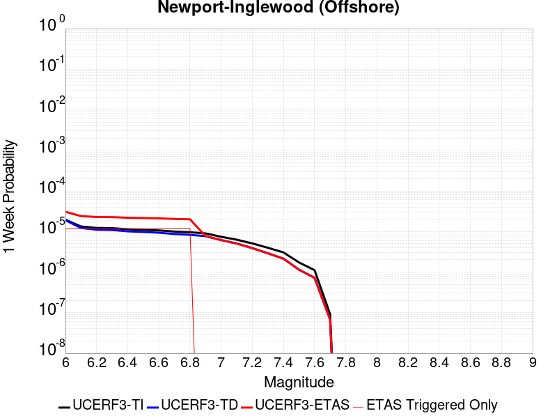 | 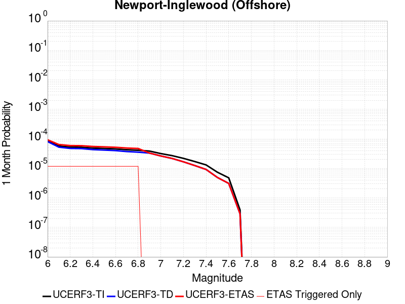 | 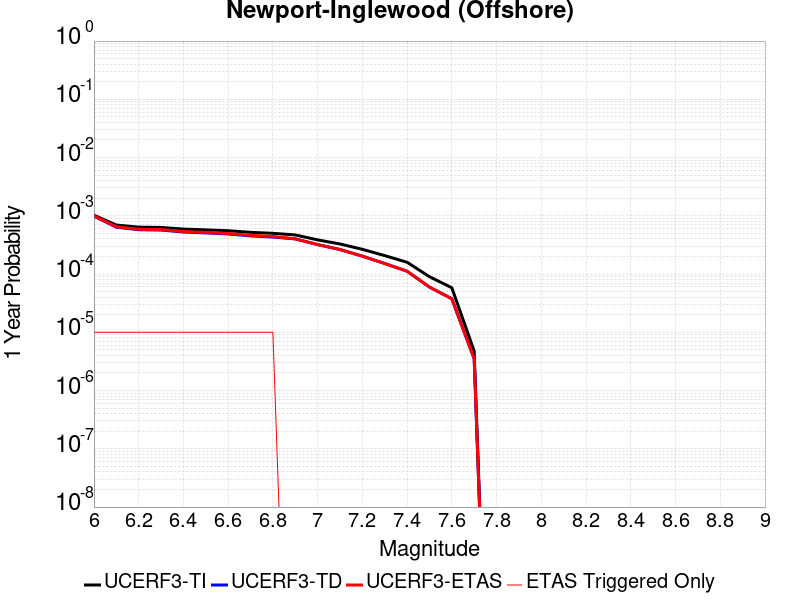 |  |

| Magnitude | 1 wk TI Prob | 1 wk TD Prob | 1 wk ETAS Prob | 1 wk ETAS/TD Gain | 1 wk ETAS Triggered Only | 1 mo TI Prob | 1 mo TD Prob | 1 mo ETAS Prob | 1 mo ETAS/TD Gain | 1 mo ETAS Triggered Only | 1 yr TI Prob | 1 yr TD Prob | 1 yr ETAS Prob | 1 yr ETAS/TD Gain | 1 yr ETAS Triggered Only | 10 yr TI Prob | 10 yr TD Prob | 10 yr ETAS Prob | 10 yr ETAS/TD Gain | 10 yr ETAS Triggered Only |
|-----|-----|-----|-----|-----|-----|-----|-----|-----|-----|-----|-----|-----|-----|-----|-----|-----|-----|-----|-----|-----|
| 6.0 | 1.9626508E-5 | 1.8965357E-5 | 3.0702224E-5 | 1.6188582 | 1.1737089E-5 | 8.411089E-5 | 8.1277634E-5 | 9.301377E-5 | 1.1443956 | 1.1737089E-5 | 0.001023569 | 9.891186E-4 | 0.0010008441 | 1.0118545 | 1.1737089E-5 | 0.010188672 | 0.009848503 | 0.009871746 | 1.0023601 | 2.3474178E-5 |
| 6.1 | 1.331886E-5 | 1.2218092E-5 | 2.3955037E-5 | 1.9606202 | 1.1737089E-5 | 5.707958E-5 | 5.2362207E-5 | 6.4098684E-5 | 1.2241402 | 1.1737089E-5 | 6.947222E-4 | 6.3732493E-4 | 6.4905453E-4 | 1.0184045 | 1.1737089E-5 | 0.006925544 | 0.006355149 | 0.0063668117 | 1.0018351 | 1.1737089E-5 |
| 6.2 | 1.2250852E-5 | 1.1076029E-5 | 2.2812988E-5 | 2.059672 | 1.1737089E-5 | 5.2502597E-5 | 4.7467838E-5 | 5.9204373E-5 | 1.2472523 | 1.1737089E-5 | 6.3903164E-4 | 5.777687E-4 | 5.89499E-4 | 1.0203028 | 1.1737089E-5 | 0.006371971 | 0.0057627866 | 0.005774456 | 1.002025 | 1.1737089E-5 |
| 6.3 | 1.2106258E-5 | 1.0918891E-5 | 2.2655851E-5 | 2.0749226 | 1.1737089E-5 | 5.1882926E-5 | 4.6794412E-5 | 5.8530954E-5 | 1.2508107 | 1.1737089E-5 | 6.3149154E-4 | 5.69574E-4 | 5.813044E-4 | 1.0205951 | 1.1737089E-5 | 0.0062970007 | 0.005681259 | 0.0056929295 | 1.0020542 | 1.1737089E-5 |
| 6.4 | 1.1348758E-5 | 1.0109362E-5 | 2.1846332E-5 | 2.161 | 1.1737089E-5 | 4.8636626E-5 | 4.3325123E-5 | 5.5061704E-5 | 1.2708955 | 1.1737089E-5 | 5.919901E-4 | 5.273565E-4 | 5.390874E-4 | 1.0222447 | 1.1737089E-5 | 0.005904155 | 0.0052611465 | 0.005272822 | 1.0022192 | 1.1737089E-5 |
| 6.5 | 1.100837E-5 | 9.7433895E-6 | 2.1480364E-5 | 2.2046092 | 1.1737089E-5 | 4.7177873E-5 | 4.1756717E-5 | 5.3493317E-5 | 1.281071 | 1.1737089E-5 | 5.7423924E-4 | 5.082702E-4 | 5.2000134E-4 | 1.0230805 | 1.1737089E-5 | 0.005727576 | 0.0050711688 | 0.005082846 | 1.0023028 | 1.1737089E-5 |
| 6.6 | 1.0634696E-5 | 9.345544E-6 | 2.1082524E-5 | 2.2558906 | 1.1737089E-5 | 4.557647E-5 | 4.0051716E-5 | 5.1788338E-5 | 1.2930366 | 1.1737089E-5 | 5.5475225E-4 | 4.8752132E-4 | 4.992527E-4 | 1.0240633 | 1.1737089E-5 | 0.0055336943 | 0.0048646047 | 0.004876285 | 1.002401 | 1.1737089E-5 |
| 6.7 | 9.9780855E-6 | 8.667911E-6 | 2.0404897E-5 | 2.3540733 | 1.1737089E-5 | 4.276252E-5 | 3.7147664E-5 | 4.8884318E-5 | 1.315946 | 1.1737089E-5 | 5.205093E-4 | 4.5217964E-4 | 4.6391142E-4 | 1.025945 | 1.1737089E-5 | 0.0051929182 | 0.004512675 | 0.004524359 | 1.0025892 | 1.1737089E-5 |
| 6.8 | 9.59546E-6 | 8.27295E-6 | 2.0009942E-5 | 2.418719 | 1.1737089E-5 | 4.1122752E-5 | 3.5455025E-5 | 4.7191697E-5 | 1.3310299 | 1.1737089E-5 | 5.0055445E-4 | 4.315801E-4 | 4.433121E-4 | 1.0271839 | 1.1737089E-5 | 0.004994285 | 0.004307495 | 0.0043191817 | 1.0027131 | 1.1737089E-5 |
| 6.9 | 9.000614E-6 | 7.70684E-6 | 7.70684E-6 | 1.0 | 0.0 | 3.857349E-5 | 3.30289E-5 | 3.30289E-5 | 1.0 | 0.0 | 4.6953102E-4 | 4.0205332E-4 | 4.0205332E-4 | 1.0 | 0.0 | 0.004685402 | 0.0040133307 | 0.0040133307 | 1.0 | 0.0 |
| 7.0 | 7.4070194E-6 | 6.148904E-6 | 6.148904E-6 | 1.0 | 0.0 | 3.1743984E-5 | 2.635218E-5 | 2.635218E-5 | 1.0 | 0.0 | 3.8641447E-4 | 3.207907E-4 | 3.207907E-4 | 1.0 | 0.0 | 0.0038574322 | 0.0032032963 | 0.0032032963 | 1.0 | 0.0 |
| 7.1 | 6.299615E-6 | 5.0565927E-6 | 5.0565927E-6 | 1.0 | 0.0 | 2.699807E-5 | 2.1670932E-5 | 2.1670932E-5 | 1.0 | 0.0 | 3.2865192E-4 | 2.638118E-4 | 2.638118E-4 | 1.0 | 0.0 | 0.003281663 | 0.002635001 | 0.002635001 | 1.0 | 0.0 |
| 7.2 | 5.096653E-6 | 3.892769E-6 | 3.892769E-6 | 1.0 | 0.0 | 2.1842614E-5 | 1.668319E-5 | 1.668319E-5 | 1.0 | 0.0 | 2.6590136E-4 | 2.0309901E-4 | 2.0309901E-4 | 1.0 | 0.0 | 0.0026558342 | 0.0020291451 | 0.0020291451 | 1.0 | 0.0 |
| 7.3 | 3.9753018E-6 | 2.9099103E-6 | 2.9099103E-6 | 1.0 | 0.0 | 1.7036897E-5 | 1.2470985E-5 | 1.2470985E-5 | 1.0 | 0.0 | 2.0740448E-4 | 1.5182374E-4 | 1.5182374E-4 | 1.0 | 0.0 | 0.00207211 | 0.0015172083 | 0.0015172083 | 1.0 | 0.0 |
| 7.4 | 3.0568392E-6 | 2.1449955E-6 | 2.1449955E-6 | 1.0 | 0.0 | 1.3100675E-5 | 9.192806E-6 | 9.192806E-6 | 1.0 | 0.0 | 1.5948903E-4 | 1.1191672E-4 | 1.1191672E-4 | 1.0 | 0.0 | 0.0015937461 | 0.0011186098 | 0.0011186098 | 1.0 | 0.0 |
| 7.5 | 1.7279019E-6 | 1.1469883E-6 | 1.1469883E-6 | 1.0 | 0.0 | 7.405273E-6 | 4.915655E-6 | 4.915655E-6 | 1.0 | 0.0 | 9.015547E-5 | 5.9846494E-5 | 5.9846494E-5 | 1.0 | 0.0 | 9.01189E-4 | 5.9830764E-4 | 5.9830764E-4 | 1.0 | 0.0 |
| 7.6 | 1.1156416E-6 | 7.223012E-7 | 7.223012E-7 | 1.0 | 0.0 | 4.7813123E-6 | 3.095573E-6 | 3.095573E-6 | 1.0 | 0.0 | 5.821092E-5 | 3.7687976E-5 | 3.7687976E-5 | 1.0 | 0.0 | 5.8195676E-4 | 3.7681818E-4 | 3.7681818E-4 | 1.0 | 0.0 |
| 7.7 | 9.117973E-8 | 6.734145E-8 | 6.734145E-8 | 1.0 | 0.0 | 3.907702E-7 | 2.886062E-7 | 2.886062E-7 | 1.0 | 0.0 | 4.757617E-6 | 3.513775E-6 | 3.513775E-6 | 1.0 | 0.0 | 4.7575148E-5 | 3.5137225E-5 | 3.5137225E-5 | 1.0 | 0.0 |

## Del Valle
*[(top)](#table-of-contents)*

| 1 Week | 1 Month | 1 Year | 10 Year |
|-----|-----|-----|-----|
| 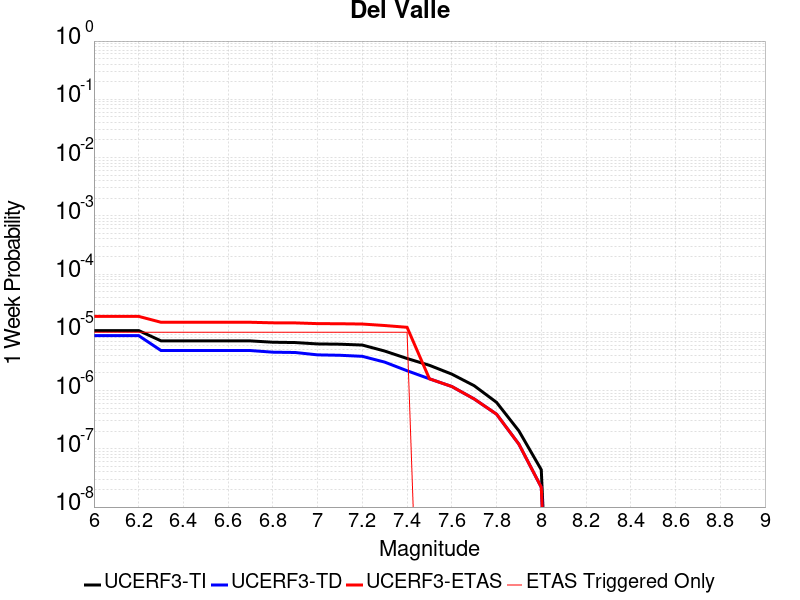 | 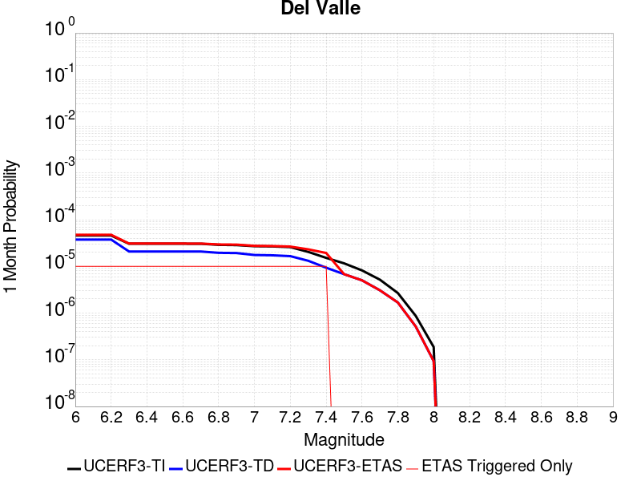 | 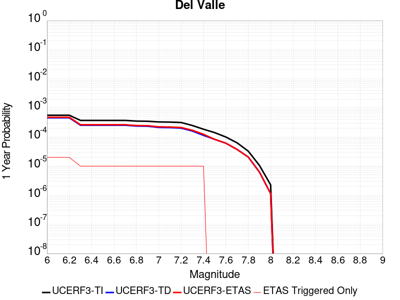 | 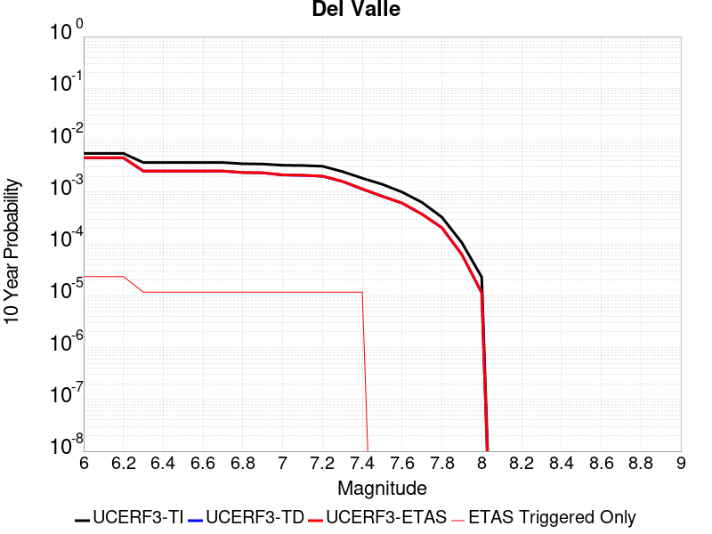 |

| Magnitude | 1 wk TI Prob | 1 wk TD Prob | 1 wk ETAS Prob | 1 wk ETAS/TD Gain | 1 wk ETAS Triggered Only | 1 mo TI Prob | 1 mo TD Prob | 1 mo ETAS Prob | 1 mo ETAS/TD Gain | 1 mo ETAS Triggered Only | 1 yr TI Prob | 1 yr TD Prob | 1 yr ETAS Prob | 1 yr ETAS/TD Gain | 1 yr ETAS Triggered Only | 10 yr TI Prob | 10 yr TD Prob | 10 yr ETAS Prob | 10 yr ETAS/TD Gain | 10 yr ETAS Triggered Only |
|-----|-----|-----|-----|-----|-----|-----|-----|-----|-----|-----|-----|-----|-----|-----|-----|-----|-----|-----|-----|-----|
| 6.0 | 1.0716125E-5 | 8.767882E-6 | 2.050487E-5 | 2.3386343 | 1.1737089E-5 | 4.592544E-5 | 3.7576207E-5 | 4.9312857E-5 | 1.3123425 | 1.1737089E-5 | 5.589988E-4 | 4.5741405E-4 | 4.808775E-4 | 1.0512959 | 2.3474178E-5 | 0.0055759475 | 0.00456668 | 0.004590047 | 1.0051168 | 2.3474178E-5 |
| 6.1 | 1.0716125E-5 | 8.767882E-6 | 2.050487E-5 | 2.3386343 | 1.1737089E-5 | 4.592544E-5 | 3.7576207E-5 | 4.9312857E-5 | 1.3123425 | 1.1737089E-5 | 5.589988E-4 | 4.5741405E-4 | 4.808775E-4 | 1.0512959 | 2.3474178E-5 | 0.0055759475 | 0.00456668 | 0.004590047 | 1.0051168 | 2.3474178E-5 |
| 6.2 | 1.0716125E-5 | 8.767882E-6 | 2.050487E-5 | 2.3386343 | 1.1737089E-5 | 4.592544E-5 | 3.7576207E-5 | 4.9312857E-5 | 1.3123425 | 1.1737089E-5 | 5.589988E-4 | 4.5741405E-4 | 4.808775E-4 | 1.0512959 | 2.3474178E-5 | 0.0055759475 | 0.00456668 | 0.004590047 | 1.0051168 | 2.3474178E-5 |
| 6.3 | 7.1293784E-6 | 4.865823E-6 | 1.6602855E-5 | 3.412137 | 1.1737089E-5 | 3.055412E-5 | 2.0853364E-5 | 3.2590207E-5 | 1.5628273 | 1.1737089E-5 | 3.7193293E-4 | 2.5386087E-4 | 2.6559498E-4 | 1.0462226 | 1.1737089E-5 | 0.0037131102 | 0.0025357946 | 0.002547502 | 1.0046169 | 1.1737089E-5 |
| 6.4 | 7.1293784E-6 | 4.865823E-6 | 1.6602855E-5 | 3.412137 | 1.1737089E-5 | 3.055412E-5 | 2.0853364E-5 | 3.2590207E-5 | 1.5628273 | 1.1737089E-5 | 3.7193293E-4 | 2.5386087E-4 | 2.6559498E-4 | 1.0462226 | 1.1737089E-5 | 0.0037131102 | 0.0025357946 | 0.002547502 | 1.0046169 | 1.1737089E-5 |
| 6.5 | 7.1293784E-6 | 4.865823E-6 | 1.6602855E-5 | 3.412137 | 1.1737089E-5 | 3.055412E-5 | 2.0853364E-5 | 3.2590207E-5 | 1.5628273 | 1.1737089E-5 | 3.7193293E-4 | 2.5386087E-4 | 2.6559498E-4 | 1.0462226 | 1.1737089E-5 | 0.0037131102 | 0.0025357946 | 0.002547502 | 1.0046169 | 1.1737089E-5 |
| 6.6 | 7.1293784E-6 | 4.865823E-6 | 1.6602855E-5 | 3.412137 | 1.1737089E-5 | 3.055412E-5 | 2.0853364E-5 | 3.2590207E-5 | 1.5628273 | 1.1737089E-5 | 3.7193293E-4 | 2.5386087E-4 | 2.6559498E-4 | 1.0462226 | 1.1737089E-5 | 0.0037131102 | 0.0025357946 | 0.002547502 | 1.0046169 | 1.1737089E-5 |
| 6.7 | 7.12272E-6 | 4.8631987E-6 | 1.660023E-5 | 3.4134388 | 1.1737089E-5 | 3.0525585E-5 | 2.0842117E-5 | 3.2578962E-5 | 1.5631311 | 1.1737089E-5 | 3.7158563E-4 | 2.5372396E-4 | 2.6545807E-4 | 1.0462476 | 1.1737089E-5 | 0.003709649 | 0.0025344288 | 0.002546136 | 1.0046194 | 1.1737089E-5 |
| 6.8 | 6.7558703E-6 | 4.5594015E-6 | 1.6296437E-5 | 3.5742493 | 1.1737089E-5 | 2.895341E-5 | 1.9540148E-5 | 3.127701E-5 | 1.6006535 | 1.1737089E-5 | 3.5245073E-4 | 2.3787597E-4 | 2.4961028E-4 | 1.0493295 | 1.1737089E-5 | 0.0035189227 | 0.0023762889 | 0.002387998 | 1.0049275 | 1.1737089E-5 |
| 6.9 | 6.6700386E-6 | 4.502539E-6 | 1.6239575E-5 | 3.6067595 | 1.1737089E-5 | 2.8585566E-5 | 1.9296456E-5 | 3.103332E-5 | 1.6082393 | 1.1737089E-5 | 3.479737E-4 | 2.3490966E-4 | 2.46644E-4 | 1.0499525 | 1.1737089E-5 | 0.003474293 | 0.0023466884 | 0.002358398 | 1.0049899 | 1.1737089E-5 |
| 7.0 | 6.3181424E-6 | 4.0987034E-6 | 1.5835745E-5 | 3.8635986 | 1.1737089E-5 | 2.7077473E-5 | 1.7565755E-5 | 2.9302639E-5 | 1.6681684 | 1.1737089E-5 | 3.2961834E-4 | 2.1384252E-4 | 2.255771E-4 | 1.0548749 | 1.1737089E-5 | 0.0032912986 | 0.002136422 | 0.0021481342 | 1.0054821 | 1.1737089E-5 |
| 7.1 | 6.248759E-6 | 4.033895E-6 | 1.5770936E-5 | 3.9096053 | 1.1737089E-5 | 2.678012E-5 | 1.7288008E-5 | 2.9024895E-5 | 1.6789033 | 1.1737089E-5 | 3.2599916E-4 | 2.104616E-4 | 2.2219622E-4 | 1.0557566 | 1.1737089E-5 | 0.0032552136 | 0.0021026772 | 0.0021143896 | 1.0055703 | 1.1737089E-5 |
| 7.2 | 6.0411944E-6 | 3.869888E-6 | 1.560693E-5 | 4.0329156 | 1.1737089E-5 | 2.5890577E-5 | 1.658513E-5 | 2.8322025E-5 | 1.7076757 | 1.1737089E-5 | 3.1517216E-4 | 2.0190567E-4 | 2.136404E-4 | 1.0581198 | 1.1737089E-5 | 0.0031472554 | 0.0020172757 | 0.0020289891 | 1.0058066 | 1.1737089E-5 |
| 7.3 | 4.7691183E-6 | 3.0781202E-6 | 1.4815173E-5 | 4.8130584 | 1.1737089E-5 | 2.0438918E-5 | 1.3191879E-5 | 2.4928813E-5 | 1.8897091 | 1.1737089E-5 | 2.488154E-4 | 1.605995E-4 | 1.7233471E-4 | 1.0730712 | 1.1737089E-5 | 0.00248537 | 0.0016048603 | 0.0016165785 | 1.0073017 | 1.1737089E-5 |
| 7.4 | 3.5524722E-6 | 2.1893363E-6 | 1.39264E-5 | 6.3610144 | 1.1737089E-5 | 1.5224792E-5 | 9.382837E-6 | 2.1119817E-5 | 2.2508988 | 1.1737089E-5 | 1.8534607E-4 | 1.1423013E-4 | 1.2596589E-4 | 1.1027378 | 1.1737089E-5 | 0.0018519156 | 0.0011417224 | 0.0011534462 | 1.0102684 | 1.1737089E-5 |
| 7.5 | 2.7133442E-6 | 1.5916097E-6 | 1.5916097E-6 | 1.0 | 0.0 | 1.1628566E-5 | 6.821167E-6 | 6.821167E-6 | 1.0 | 0.0 | 1.415686E-4 | 8.304456E-5 | 8.304456E-5 | 1.0 | 0.0 | 0.0014147845 | 8.301372E-4 | 8.301372E-4 | 1.0 | 0.0 |
| 7.6 | 1.915338E-6 | 1.173914E-6 | 1.173914E-6 | 1.0 | 0.0 | 8.208566E-6 | 5.0310505E-6 | 5.0310505E-6 | 1.0 | 0.0 | 9.993471E-5 | 6.125133E-5 | 6.125133E-5 | 1.0 | 0.0 | 9.988978E-4 | 6.123454E-4 | 6.123454E-4 | 1.0 | 0.0 |
| 7.7 | 1.2120448E-6 | 7.180313E-7 | 7.180313E-7 | 1.0 | 0.0 | 5.194467E-6 | 3.0772733E-6 | 3.0772733E-6 | 1.0 | 0.0 | 6.3240805E-5 | 3.746516E-5 | 3.746516E-5 | 1.0 | 0.0 | 6.322281E-4 | 3.7458882E-4 | 3.7458882E-4 | 1.0 | 0.0 |
| 7.8 | 6.272381E-7 | 3.932549E-7 | 3.932549E-7 | 1.0 | 0.0 | 2.6881603E-6 | 1.6853771E-6 | 1.6853771E-6 | 1.0 | 0.0 | 3.272786E-5 | 2.0519275E-5 | 2.0519275E-5 | 1.0 | 0.0 | 3.272304E-4 | 2.0517396E-4 | 2.0517396E-4 | 1.0 | 0.0 |
| 7.9 | 2.0292627E-7 | 1.2004622E-7 | 1.2004622E-7 | 1.0 | 0.0 | 8.6968373E-7 | 5.1448376E-7 | 5.1448376E-7 | 1.0 | 0.0 | 1.0588348E-5 | 6.263822E-6 | 6.263822E-6 | 1.0 | 0.0 | 1.0587843E-4 | 6.263647E-5 | 6.263647E-5 | 1.0 | 0.0 |
| 8.0 | 4.374492E-8 | 2.189964E-8 | 2.189964E-8 | 1.0 | 0.0 | 1.8747821E-7 | 9.385559E-8 | 9.385559E-8 | 1.0 | 0.0 | 2.2825448E-6 | 1.1426913E-6 | 1.1426913E-6 | 1.0 | 0.0 | 2.2825214E-5 | 1.1426858E-5 | 1.1426858E-5 | 1.0 | 0.0 |

## Elsinore (Temecula) rev
*[(top)](#table-of-contents)*

| 1 Week | 1 Month | 1 Year | 10 Year |
|-----|-----|-----|-----|
| 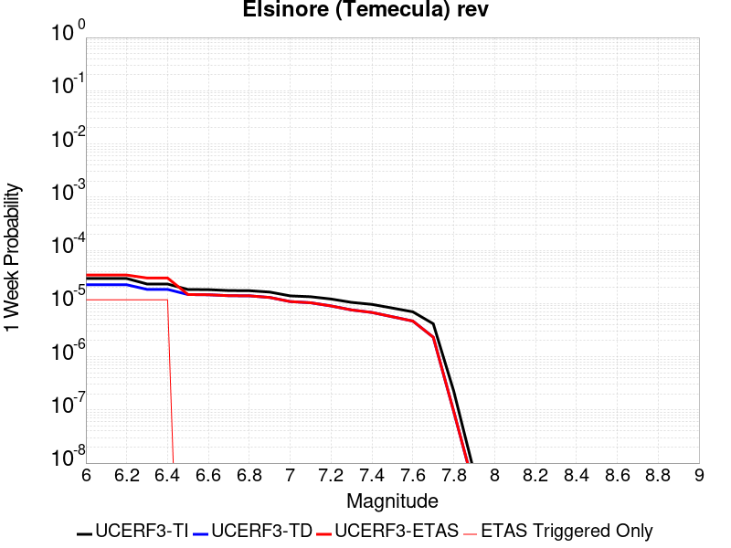 | 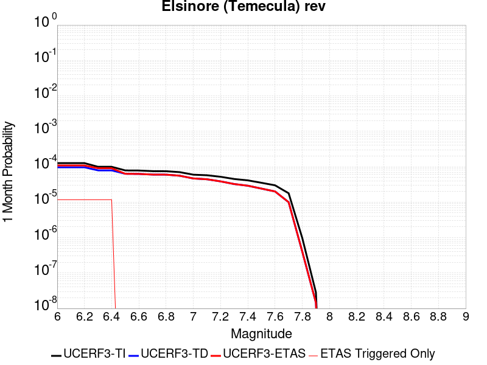 | 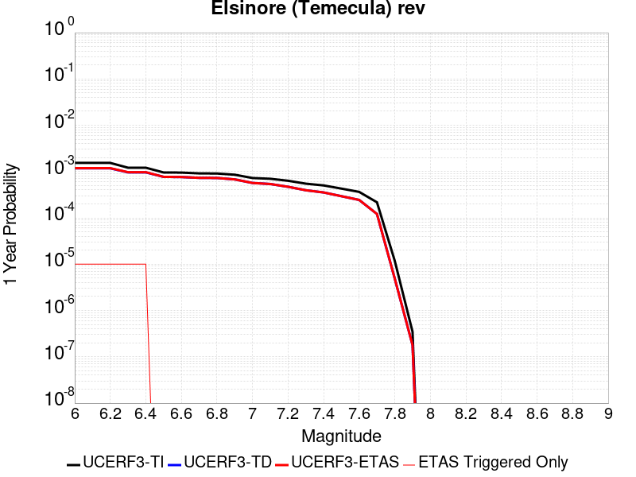 | 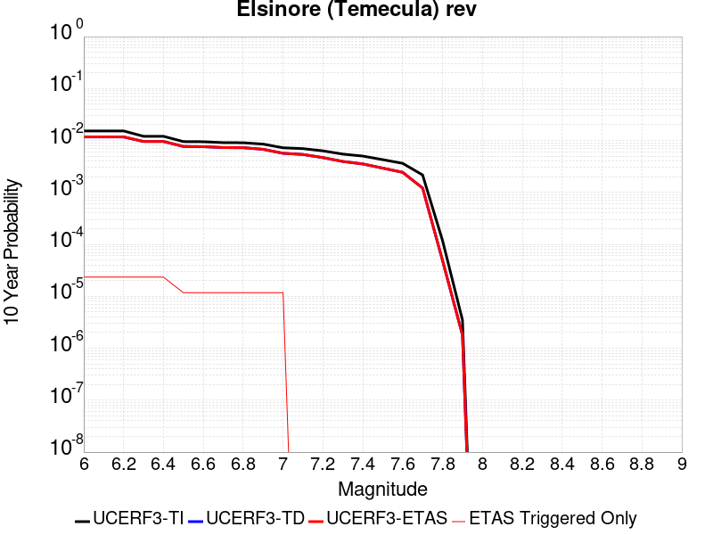 |

| Magnitude | 1 wk TI Prob | 1 wk TD Prob | 1 wk ETAS Prob | 1 wk ETAS/TD Gain | 1 wk ETAS Triggered Only | 1 mo TI Prob | 1 mo TD Prob | 1 mo ETAS Prob | 1 mo ETAS/TD Gain | 1 mo ETAS Triggered Only | 1 yr TI Prob | 1 yr TD Prob | 1 yr ETAS Prob | 1 yr ETAS/TD Gain | 1 yr ETAS Triggered Only | 10 yr TI Prob | 10 yr TD Prob | 10 yr ETAS Prob | 10 yr ETAS/TD Gain | 10 yr ETAS Triggered Only |
|-----|-----|-----|-----|-----|-----|-----|-----|-----|-----|-----|-----|-----|-----|-----|-----|-----|-----|-----|-----|-----|
| 6.0 | 2.9514995E-5 | 2.2517117E-5 | 3.4253942E-5 | 1.5212401 | 1.1737089E-5 | 1.264867E-4 | 9.649849E-5 | 1.0823444E-4 | 1.121618 | 1.1737089E-5 | 0.0015388876 | 0.0011742581 | 0.0011859813 | 1.0099835 | 1.1737089E-5 | 0.015282745 | 0.011696897 | 0.011720098 | 1.0019834 | 2.3474178E-5 |
| 6.1 | 2.9514995E-5 | 2.2517117E-5 | 3.4253942E-5 | 1.5212401 | 1.1737089E-5 | 1.264867E-4 | 9.649849E-5 | 1.0823444E-4 | 1.121618 | 1.1737089E-5 | 0.0015388876 | 0.0011742581 | 0.0011859813 | 1.0099835 | 1.1737089E-5 | 0.015282745 | 0.011696897 | 0.011720098 | 1.0019834 | 2.3474178E-5 |
| 6.2 | 2.9514995E-5 | 2.2517117E-5 | 3.4253942E-5 | 1.5212401 | 1.1737089E-5 | 1.264867E-4 | 9.649849E-5 | 1.0823444E-4 | 1.121618 | 1.1737089E-5 | 0.0015388876 | 0.0011742581 | 0.0011859813 | 1.0099835 | 1.1737089E-5 | 0.015282745 | 0.011696897 | 0.011720098 | 1.0019834 | 2.3474178E-5 |
| 6.3 | 2.3223649E-5 | 1.8406454E-5 | 3.0143327E-5 | 1.6376499 | 1.1737089E-5 | 9.952613E-5 | 7.888251E-5 | 9.0618676E-5 | 1.1487803 | 1.1737089E-5 | 0.001211057 | 9.599888E-4 | 9.717146E-4 | 1.0122145 | 1.1737089E-5 | 0.012044783 | 0.009569948 | 0.009593197 | 1.0024295 | 2.3474178E-5 |
| 6.4 | 2.3223649E-5 | 1.8406454E-5 | 3.0143327E-5 | 1.6376499 | 1.1737089E-5 | 9.952613E-5 | 7.888251E-5 | 9.0618676E-5 | 1.1487803 | 1.1737089E-5 | 0.001211057 | 9.599888E-4 | 9.717146E-4 | 1.0122145 | 1.1737089E-5 | 0.012044783 | 0.009569948 | 0.009593197 | 1.0024295 | 2.3474178E-5 |
| 6.5 | 1.8338875E-5 | 1.4750118E-5 | 1.4750118E-5 | 1.0 | 0.0 | 7.8592806E-5 | 6.321331E-5 | 6.321331E-5 | 1.0 | 0.0 | 9.5644733E-4 | 7.69359E-4 | 7.69359E-4 | 1.0 | 0.0 | 0.009523412 | 0.0076739118 | 0.007685559 | 1.0015178 | 1.1737089E-5 |
| 6.6 | 1.8223333E-5 | 1.4612673E-5 | 1.4612673E-5 | 1.0 | 0.0 | 7.809766E-5 | 6.262429E-5 | 6.262429E-5 | 1.0 | 0.0 | 9.504242E-4 | 7.6219277E-4 | 7.6219277E-4 | 1.0 | 0.0 | 0.009463696 | 0.0076027405 | 0.0076143886 | 1.0015321 | 1.1737089E-5 |
| 6.7 | 1.7512752E-5 | 1.402721E-5 | 1.402721E-5 | 1.0 | 0.0 | 7.505249E-5 | 6.011528E-5 | 6.011528E-5 | 1.0 | 0.0 | 9.13381E-4 | 7.3166634E-4 | 7.3166634E-4 | 1.0 | 0.0 | 0.00909636 | 0.00729892 | 0.007310571 | 1.0015963 | 1.1737089E-5 |
| 6.8 | 1.7417142E-5 | 1.3951195E-5 | 1.3951195E-5 | 1.0 | 0.0 | 7.4642754E-5 | 5.9789512E-5 | 5.9789512E-5 | 1.0 | 0.0 | 9.083966E-4 | 7.277028E-4 | 7.277028E-4 | 1.0 | 0.0 | 0.009046922 | 0.0072594886 | 0.0072711403 | 1.001605 | 1.1737089E-5 |
| 6.9 | 1.6402591E-5 | 1.2988613E-5 | 1.2988613E-5 | 1.0 | 0.0 | 7.0294926E-5 | 5.5664343E-5 | 5.5664343E-5 | 1.0 | 0.0 | 8.5550465E-4 | 6.775103E-4 | 6.775103E-4 | 1.0 | 0.0 | 0.008522186 | 0.006760169 | 0.0067718267 | 1.0017245 | 1.1737089E-5 |
| 7.0 | 1.3912486E-5 | 1.0878233E-5 | 1.0878233E-5 | 1.0 | 0.0 | 5.9623577E-5 | 4.6620182E-5 | 4.6620182E-5 | 1.0 | 0.0 | 7.2567526E-4 | 5.674556E-4 | 5.674556E-4 | 1.0 | 0.0 | 0.0072331014 | 0.005663986 | 0.0056756563 | 1.0020605 | 1.1737089E-5 |
| 7.1 | 1.3405147E-5 | 1.03274215E-5 | 1.03274215E-5 | 1.0 | 0.0 | 5.7449364E-5 | 4.425964E-5 | 4.425964E-5 | 1.0 | 0.0 | 6.9922156E-4 | 5.3873047E-4 | 5.3873047E-4 | 1.0 | 0.0 | 0.0069702556 | 0.005377577 | 0.005377577 | 1.0 | 0.0 |
| 7.2 | 1.21402E-5 | 8.996737E-6 | 8.996737E-6 | 1.0 | 0.0 | 5.202839E-5 | 3.8556886E-5 | 3.8556886E-5 | 1.0 | 0.0 | 6.332616E-4 | 4.6933076E-4 | 4.6933076E-4 | 1.0 | 0.0 | 0.0063146 | 0.004684821 | 0.004684821 | 1.0 | 0.0 |
| 7.3 | 1.05047775E-5 | 7.571771E-6 | 7.571771E-6 | 1.0 | 0.0 | 4.5019697E-5 | 3.245005E-5 | 3.245005E-5 | 1.0 | 0.0 | 5.4797693E-4 | 3.950092E-4 | 3.950092E-4 | 1.0 | 0.0 | 0.005466277 | 0.00394346 | 0.00394346 | 1.0 | 0.0 |
| 7.4 | 9.624483E-6 | 6.7868696E-6 | 6.7868696E-6 | 1.0 | 0.0 | 4.124713E-5 | 2.9086266E-5 | 2.9086266E-5 | 1.0 | 0.0 | 5.0206814E-4 | 3.5406914E-4 | 3.5406914E-4 | 1.0 | 0.0 | 0.005009353 | 0.003535204 | 0.003535204 | 1.0 | 0.0 |
| 7.5 | 8.215151E-6 | 5.635538E-6 | 5.635538E-6 | 1.0 | 0.0 | 3.5207315E-5 | 2.4152088E-5 | 2.4152088E-5 | 1.0 | 0.0 | 4.2856473E-4 | 2.9401327E-4 | 2.9401327E-4 | 1.0 | 0.0 | 0.004277392 | 0.002936371 | 0.002936371 | 1.0 | 0.0 |
| 7.6 | 6.975058E-6 | 4.676045E-6 | 4.676045E-6 | 1.0 | 0.0 | 2.9892764E-5 | 2.0040046E-5 | 2.0040046E-5 | 1.0 | 0.0 | 3.6388362E-4 | 2.439614E-4 | 2.439614E-4 | 1.0 | 0.0 | 0.0036328835 | 0.002437052 | 0.002437052 | 1.0 | 0.0 |
| 7.7 | 4.159604E-6 | 2.3269924E-6 | 2.3269924E-6 | 1.0 | 0.0 | 1.7826753E-5 | 9.97279E-6 | 9.97279E-6 | 1.0 | 0.0 | 2.1701909E-4 | 1.21412704E-4 | 1.21412704E-4 | 1.0 | 0.0 | 0.0021680726 | 0.0012135367 | 0.0012135367 | 1.0 | 0.0 |
| 7.8 | 2.2692414E-7 | 9.3854695E-8 | 9.3854695E-8 | 1.0 | 0.0 | 9.725317E-7 | 4.0223435E-7 | 4.0223435E-7 | 1.0 | 0.0 | 1.1840509E-5 | 4.8971956E-6 | 4.8971956E-6 | 1.0 | 0.0 | 1.1839878E-4 | 4.8971204E-5 | 4.8971204E-5 | 1.0 | 0.0 |
| 7.9 | 6.676829E-9 | 3.439853E-9 | 3.439853E-9 | 1.0 | 0.0 | 2.861498E-8 | 1.4742227E-8 | 1.4742227E-8 | 1.0 | 0.0 | 3.4838732E-7 | 1.7948659E-7 | 1.7948659E-7 | 1.0 | 0.0 | 3.4838679E-6 | 1.7948646E-6 | 1.7948646E-6 | 1.0 | 0.0 |

## San Gregorio (South) 2011 CFM
*[(top)](#table-of-contents)*

| 1 Week | 1 Month | 1 Year | 10 Year |
|-----|-----|-----|-----|
| 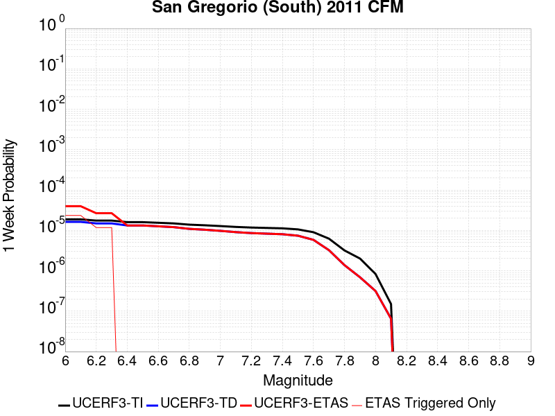 | 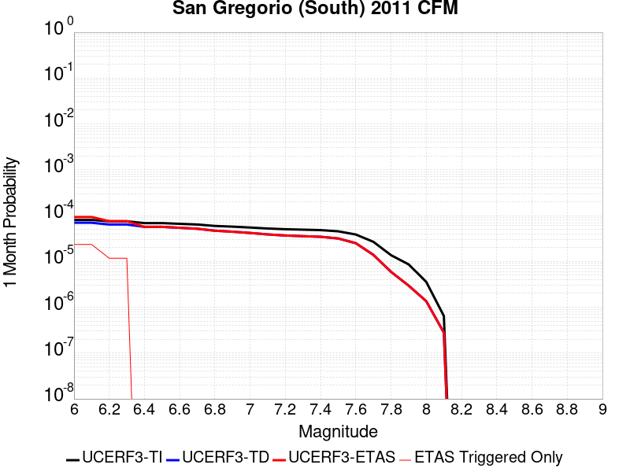 | 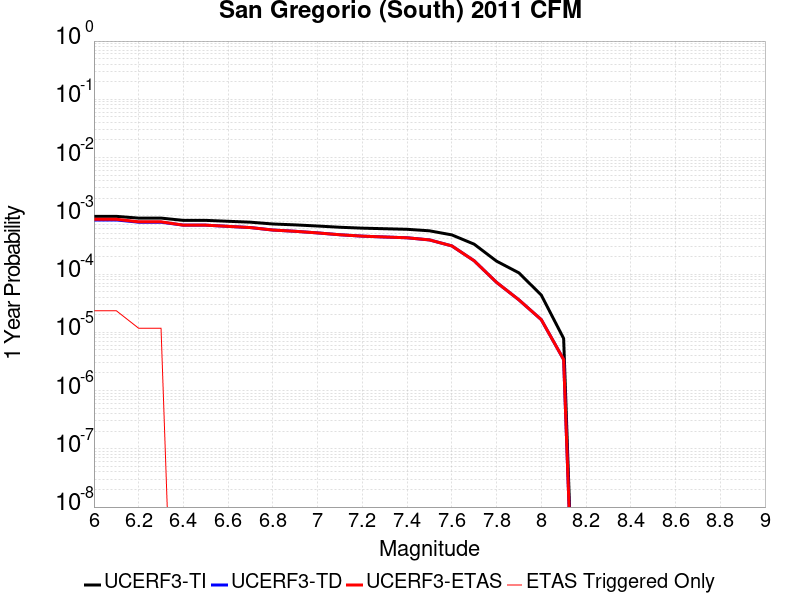 | 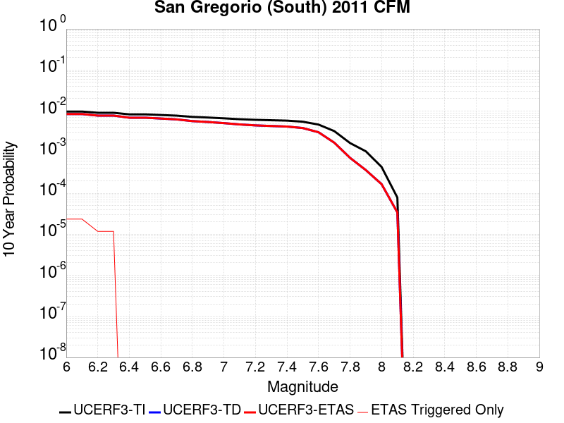 |

| Magnitude | 1 wk TI Prob | 1 wk TD Prob | 1 wk ETAS Prob | 1 wk ETAS/TD Gain | 1 wk ETAS Triggered Only | 1 mo TI Prob | 1 mo TD Prob | 1 mo ETAS Prob | 1 mo ETAS/TD Gain | 1 mo ETAS Triggered Only | 1 yr TI Prob | 1 yr TD Prob | 1 yr ETAS Prob | 1 yr ETAS/TD Gain | 1 yr ETAS Triggered Only | 10 yr TI Prob | 10 yr TD Prob | 10 yr ETAS Prob | 10 yr ETAS/TD Gain | 10 yr ETAS Triggered Only |
|-----|-----|-----|-----|-----|-----|-----|-----|-----|-----|-----|-----|-----|-----|-----|-----|-----|-----|-----|-----|-----|
| 6.0 | 1.8770423E-5 | 1.6279751E-5 | 3.9753548E-5 | 2.4419014 | 2.3474178E-5 | 8.044219E-5 | 6.976852E-5 | 9.3241055E-5 | 1.3364346 | 2.3474178E-5 | 9.789435E-4 | 8.491044E-4 | 8.725587E-4 | 1.0276223 | 2.3474178E-5 | 0.009746423 | 0.008471312 | 0.008494587 | 1.0027475 | 2.3474178E-5 |
| 6.1 | 1.8770423E-5 | 1.6279751E-5 | 3.9753548E-5 | 2.4419014 | 2.3474178E-5 | 8.044219E-5 | 6.976852E-5 | 9.3241055E-5 | 1.3364346 | 2.3474178E-5 | 9.789435E-4 | 8.491044E-4 | 8.725587E-4 | 1.0276223 | 2.3474178E-5 | 0.009746423 | 0.008471312 | 0.008494587 | 1.0027475 | 2.3474178E-5 |
| 6.2 | 1.7508692E-5 | 1.4899257E-5 | 2.6636171E-5 | 1.7877517 | 1.1737089E-5 | 7.5035096E-5 | 6.3852414E-5 | 7.558875E-5 | 1.1838042 | 1.1737089E-5 | 9.1316935E-4 | 7.7712885E-4 | 7.888568E-4 | 1.0150914 | 1.1737089E-5 | 0.00909426 | 0.00775674 | 0.007768386 | 1.0015014 | 1.1737089E-5 |
| 6.3 | 1.7508692E-5 | 1.4899257E-5 | 2.6636171E-5 | 1.7877517 | 1.1737089E-5 | 7.5035096E-5 | 6.3852414E-5 | 7.558875E-5 | 1.1838042 | 1.1737089E-5 | 9.1316935E-4 | 7.7712885E-4 | 7.888568E-4 | 1.0150914 | 1.1737089E-5 | 0.00909426 | 0.00775674 | 0.007768386 | 1.0015014 | 1.1737089E-5 |
| 6.4 | 1.6004591E-5 | 1.3249094E-5 | 1.3249094E-5 | 1.0 | 0.0 | 6.85893E-5 | 5.6780602E-5 | 5.6780602E-5 | 1.0 | 0.0 | 8.347548E-4 | 6.910856E-4 | 6.910856E-4 | 1.0 | 0.0 | 0.008316261 | 0.006901791 | 0.006901791 | 1.0 | 0.0 |
| 6.5 | 1.6004591E-5 | 1.3249094E-5 | 1.3249094E-5 | 1.0 | 0.0 | 6.85893E-5 | 5.6780602E-5 | 5.6780602E-5 | 1.0 | 0.0 | 8.347548E-4 | 6.910856E-4 | 6.910856E-4 | 1.0 | 0.0 | 0.008316261 | 0.006901791 | 0.006901791 | 1.0 | 0.0 |
| 6.6 | 1.5442201E-5 | 1.2633725E-5 | 1.2633725E-5 | 1.0 | 0.0 | 6.617918E-5 | 5.4143416E-5 | 5.4143416E-5 | 1.0 | 0.0 | 8.0543366E-4 | 6.5899757E-4 | 6.5899757E-4 | 1.0 | 0.0 | 0.008025207 | 0.006582842 | 0.006582842 | 1.0 | 0.0 |
| 6.7 | 1.489921E-5 | 1.2042234E-5 | 1.2042234E-5 | 1.0 | 0.0 | 6.3852196E-5 | 5.1608557E-5 | 5.1608557E-5 | 1.0 | 0.0 | 7.7712315E-4 | 6.2815374E-4 | 6.2815374E-4 | 1.0 | 0.0 | 0.0077441116 | 0.006276176 | 0.006276176 | 1.0 | 0.0 |
| 6.8 | 1.3876024E-5 | 1.0921184E-5 | 1.0921184E-5 | 1.0 | 0.0 | 5.9467322E-5 | 4.6804238E-5 | 4.6804238E-5 | 1.0 | 0.0 | 7.237741E-4 | 5.69693E-4 | 5.69693E-4 | 1.0 | 0.0 | 0.0072142133 | 0.0056946846 | 0.0056946846 | 1.0 | 0.0 |
| 6.9 | 1.33922495E-5 | 1.0392687E-5 | 1.0392687E-5 | 1.0 | 0.0 | 5.7394092E-5 | 4.4539327E-5 | 4.4539327E-5 | 1.0 | 0.0 | 6.9854903E-4 | 5.4213166E-4 | 5.4213166E-4 | 1.0 | 0.0 | 0.0069635725 | 0.005420442 | 0.005420442 | 1.0 | 0.0 |
| 7.0 | 1.2807324E-5 | 9.752649E-6 | 9.752649E-6 | 1.0 | 0.0 | 5.4887376E-5 | 4.1796397E-5 | 4.1796397E-5 | 1.0 | 0.0 | 6.680489E-4 | 5.087525E-4 | 5.087525E-4 | 1.0 | 0.0 | 0.006660442 | 0.0050882204 | 0.0050882204 | 1.0 | 0.0 |
| 7.1 | 1.2191438E-5 | 9.061537E-6 | 9.061537E-6 | 1.0 | 0.0 | 5.224797E-5 | 3.8834576E-5 | 3.8834576E-5 | 1.0 | 0.0 | 6.3593336E-4 | 4.727085E-4 | 4.727085E-4 | 1.0 | 0.0 | 0.0063411663 | 0.0047293645 | 0.0047293645 | 1.0 | 0.0 |
| 7.2 | 1.1769438E-5 | 8.581731E-6 | 8.581731E-6 | 1.0 | 0.0 | 5.0439474E-5 | 3.677833E-5 | 3.677833E-5 | 1.0 | 0.0 | 6.1392755E-4 | 4.4768423E-4 | 4.4768423E-4 | 1.0 | 0.0 | 0.0061223423 | 0.004480157 | 0.004480157 | 1.0 | 0.0 |
| 7.3 | 1.150374E-5 | 8.29716E-6 | 8.29716E-6 | 1.0 | 0.0 | 4.9300812E-5 | 3.5558773E-5 | 3.5558773E-5 | 1.0 | 0.0 | 6.0007203E-4 | 4.3284212E-4 | 4.3284212E-4 | 1.0 | 0.0 | 0.0059845424 | 0.0043323063 | 0.0043323063 | 1.0 | 0.0 |
| 7.4 | 1.12514E-5 | 8.042902E-6 | 8.042902E-6 | 1.0 | 0.0 | 4.8219394E-5 | 3.4469125E-5 | 3.4469125E-5 | 1.0 | 0.0 | 5.8691297E-4 | 4.1958084E-4 | 4.1958084E-4 | 1.0 | 0.0 | 0.005853653 | 0.0042001884 | 0.0042001884 | 1.0 | 0.0 |
| 7.5 | 1.059696E-5 | 7.3931915E-6 | 7.3931915E-6 | 1.0 | 0.0 | 4.5414752E-5 | 3.168472E-5 | 3.168472E-5 | 1.0 | 0.0 | 5.5278436E-4 | 3.8569325E-4 | 3.8569325E-4 | 1.0 | 0.0 | 0.0055141128 | 0.0038624762 | 0.0038624762 | 1.0 | 0.0 |
| 7.6 | 9.018592E-6 | 5.8369624E-6 | 5.8369624E-6 | 1.0 | 0.0 | 3.8650534E-5 | 2.5015313E-5 | 2.5015313E-5 | 1.0 | 0.0 | 4.7046866E-4 | 3.045189E-4 | 3.045189E-4 | 1.0 | 0.0 | 0.004694739 | 0.0030528754 | 0.0030528754 | 1.0 | 0.0 |
| 7.7 | 6.243489E-6 | 3.2395455E-6 | 3.2395455E-6 | 1.0 | 0.0 | 2.6757538E-5 | 1.3883692E-5 | 1.3883692E-5 | 1.0 | 0.0 | 3.257243E-4 | 1.6902086E-4 | 1.6902086E-4 | 1.0 | 0.0 | 0.003252473 | 0.001699108 | 0.001699108 | 1.0 | 0.0 |
| 7.8 | 3.1941963E-6 | 1.3809986E-6 | 1.3809986E-6 | 1.0 | 0.0 | 1.368934E-5 | 5.9185513E-6 | 5.9185513E-6 | 1.0 | 0.0 | 1.6665498E-4 | 7.2055984E-5 | 7.2055984E-5 | 1.0 | 0.0 | 0.0016653005 | 7.263174E-4 | 7.263174E-4 | 1.0 | 0.0 |
| 7.9 | 2.0098398E-6 | 6.9161155E-7 | 6.9161155E-7 | 1.0 | 0.0 | 8.6135715E-6 | 2.964046E-6 | 2.964046E-6 | 1.0 | 0.0 | 1.0486518E-4 | 3.608666E-5 | 3.608666E-5 | 1.0 | 0.0 | 0.0010481571 | 3.657225E-4 | 3.657225E-4 | 1.0 | 0.0 |
| 8.0 | 8.353119E-7 | 3.1623412E-7 | 3.1623412E-7 | 1.0 | 0.0 | 3.579903E-6 | 1.3552883E-6 | 1.3552883E-6 | 1.0 | 0.0 | 4.358445E-5 | 1.6500511E-5 | 1.6500511E-5 | 1.0 | 0.0 | 4.3575902E-4 | 1.6619264E-4 | 1.6619264E-4 | 1.0 | 0.0 |
| 8.1 | 1.5033264E-7 | 6.527624E-8 | 6.527624E-8 | 1.0 | 0.0 | 6.442826E-7 | 2.7975528E-7 | 2.7975528E-7 | 1.0 | 0.0 | 7.844113E-6 | 3.4060151E-6 | 3.4060151E-6 | 1.0 | 0.0 | 7.843835E-5 | 3.407693E-5 | 3.407693E-5 | 1.0 | 0.0 |

## Los Osos 2011
*[(top)](#table-of-contents)*

| 1 Week | 1 Month | 1 Year | 10 Year |
|-----|-----|-----|-----|
| 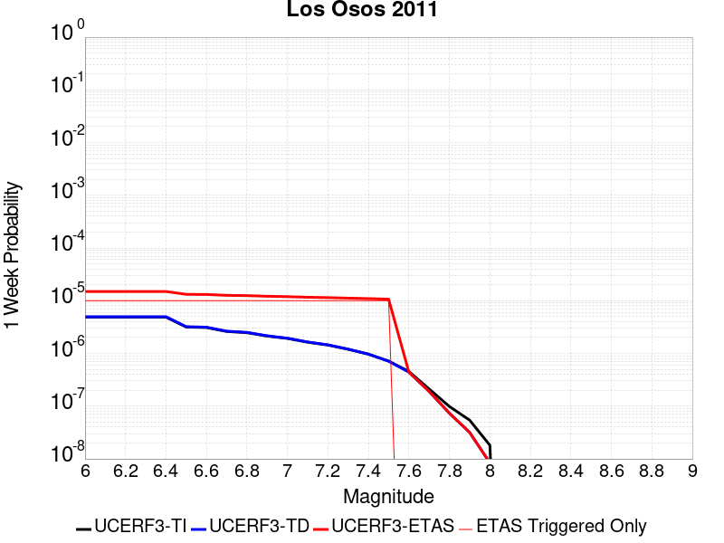 | 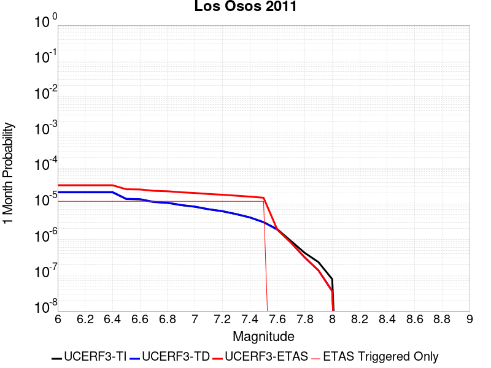 | 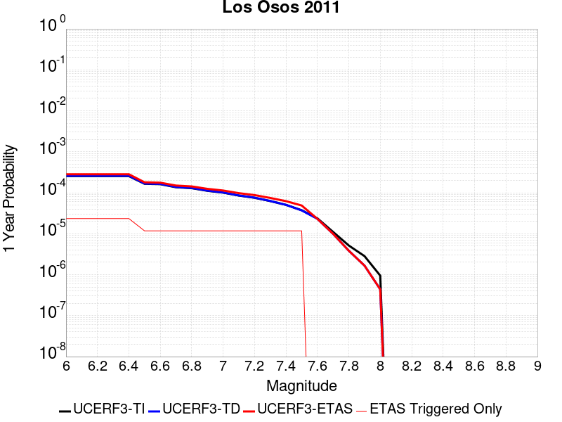 | 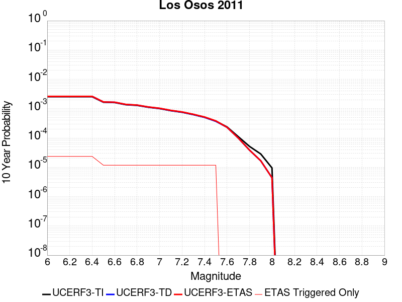 |

| Magnitude | 1 wk TI Prob | 1 wk TD Prob | 1 wk ETAS Prob | 1 wk ETAS/TD Gain | 1 wk ETAS Triggered Only | 1 mo TI Prob | 1 mo TD Prob | 1 mo ETAS Prob | 1 mo ETAS/TD Gain | 1 mo ETAS Triggered Only | 1 yr TI Prob | 1 yr TD Prob | 1 yr ETAS Prob | 1 yr ETAS/TD Gain | 1 yr ETAS Triggered Only | 10 yr TI Prob | 10 yr TD Prob | 10 yr ETAS Prob | 10 yr ETAS/TD Gain | 10 yr ETAS Triggered Only |
|-----|-----|-----|-----|-----|-----|-----|-----|-----|-----|-----|-----|-----|-----|-----|-----|-----|-----|-----|-----|-----|
| 6.0 | 4.8871775E-6 | 4.9814835E-6 | 1.6718514E-5 | 3.3561318 | 1.1737089E-5 | 2.0944879E-5 | 2.1349055E-5 | 3.3085893E-5 | 1.5497591 | 1.1737089E-5 | 2.5497406E-4 | 2.5989654E-4 | 2.833646E-4 | 1.0902978 | 2.3474178E-5 | 0.002546817 | 0.0025962002 | 0.0026196134 | 1.0090183 | 2.3474178E-5 |
| 6.1 | 4.8871775E-6 | 4.9814835E-6 | 1.6718514E-5 | 3.3561318 | 1.1737089E-5 | 2.0944879E-5 | 2.1349055E-5 | 3.3085893E-5 | 1.5497591 | 1.1737089E-5 | 2.5497406E-4 | 2.5989654E-4 | 2.833646E-4 | 1.0902978 | 2.3474178E-5 | 0.002546817 | 0.0025962002 | 0.0026196134 | 1.0090183 | 2.3474178E-5 |
| 6.2 | 4.8871775E-6 | 4.9814835E-6 | 1.6718514E-5 | 3.3561318 | 1.1737089E-5 | 2.0944879E-5 | 2.1349055E-5 | 3.3085893E-5 | 1.5497591 | 1.1737089E-5 | 2.5497406E-4 | 2.5989654E-4 | 2.833646E-4 | 1.0902978 | 2.3474178E-5 | 0.002546817 | 0.0025962002 | 0.0026196134 | 1.0090183 | 2.3474178E-5 |
| 6.3 | 4.8871775E-6 | 4.9814835E-6 | 1.6718514E-5 | 3.3561318 | 1.1737089E-5 | 2.0944879E-5 | 2.1349055E-5 | 3.3085893E-5 | 1.5497591 | 1.1737089E-5 | 2.5497406E-4 | 2.5989654E-4 | 2.833646E-4 | 1.0902978 | 2.3474178E-5 | 0.002546817 | 0.0025962002 | 0.0026196134 | 1.0090183 | 2.3474178E-5 |
| 6.4 | 4.8871775E-6 | 4.9814835E-6 | 1.6718514E-5 | 3.3561318 | 1.1737089E-5 | 2.0944879E-5 | 2.1349055E-5 | 3.3085893E-5 | 1.5497591 | 1.1737089E-5 | 2.5497406E-4 | 2.5989654E-4 | 2.833646E-4 | 1.0902978 | 2.3474178E-5 | 0.002546817 | 0.0025962002 | 0.0026196134 | 1.0090183 | 2.3474178E-5 |
| 6.5 | 3.1724062E-6 | 3.223395E-6 | 1.4960447E-5 | 4.641208 | 1.1737089E-5 | 1.3595956E-5 | 1.3814477E-5 | 2.5551404E-5 | 1.8496107 | 1.1737089E-5 | 1.6551818E-4 | 1.681784E-4 | 1.7991352E-4 | 1.0697777 | 1.1737089E-5 | 0.0016539496 | 0.0016805249 | 0.0016922422 | 1.0069724 | 1.1737089E-5 |
| 6.6 | 3.1022591E-6 | 3.1511045E-6 | 1.4888156E-5 | 4.7247424 | 1.1737089E-5 | 1.3295328E-5 | 1.3504664E-5 | 2.5241594E-5 | 1.869102 | 1.1737089E-5 | 1.618586E-4 | 1.64407E-4 | 1.7614216E-4 | 1.0713787 | 1.1737089E-5 | 0.0016174077 | 0.0016428665 | 0.0016545843 | 1.0071325 | 1.1737089E-5 |
| 6.7 | 2.611518E-6 | 2.6491832E-6 | 1.4386242E-5 | 5.4304442 | 1.1737089E-5 | 1.1192172E-5 | 1.1353593E-5 | 2.309055E-5 | 2.0337658 | 1.1737089E-5 | 1.3625617E-4 | 1.3822126E-4 | 1.4995674E-4 | 1.0849035 | 1.1737089E-5 | 0.0013617266 | 0.0013813575 | 0.0013930784 | 1.0084851 | 1.1737089E-5 |
| 6.8 | 2.4780884E-6 | 2.5121592E-6 | 1.4249219E-5 | 5.6721 | 1.1737089E-5 | 1.0620336E-5 | 1.0766353E-5 | 2.2503316E-5 | 2.0901523 | 1.1737089E-5 | 1.2929492E-4 | 1.3107249E-4 | 1.4280804E-4 | 1.0895348 | 1.1737089E-5 | 0.0012921972 | 0.001309956 | 0.0013216777 | 1.0089482 | 1.1737089E-5 |
| 6.9 | 2.1376322E-6 | 2.1635055E-6 | 1.390057E-5 | 6.425021 | 1.1737089E-5 | 9.161248E-6 | 9.272134E-6 | 2.1009115E-5 | 2.2658339 | 1.1737089E-5 | 1.1153249E-4 | 1.128824E-4 | 1.2461816E-4 | 1.1039646 | 1.1737089E-5 | 0.0011147653 | 0.0011282525 | 0.0011399763 | 1.0103911 | 1.1737089E-5 |
| 7.0 | 1.9282882E-6 | 1.9494585E-6 | 1.3686525E-5 | 7.0206804 | 1.1737089E-5 | 8.264066E-6 | 8.354796E-6 | 2.0091788E-5 | 2.404821 | 1.1737089E-5 | 1.0061036E-4 | 1.017149E-4 | 1.134508E-4 | 1.1153803 | 1.1737089E-5 | 0.0010056482 | 0.0010166848 | 0.0010284099 | 1.0115328 | 1.1737089E-5 |
| 7.1 | 1.6353226E-6 | 1.6501118E-6 | 1.3387182E-5 | 8.112894 | 1.1737089E-5 | 7.0085066E-6 | 7.0718884E-6 | 1.8808894E-5 | 2.6596706 | 1.1737089E-5 | 8.532523E-5 | 8.609685E-5 | 9.7832926E-5 | 1.1363125 | 1.1737089E-5 | 8.529247E-4 | 8.6063566E-4 | 8.7236264E-4 | 1.013626 | 1.1737089E-5 |
| 7.2 | 1.4446276E-6 | 1.4553341E-6 | 1.3192406E-5 | 9.064864 | 1.1737089E-5 | 6.191247E-6 | 6.237131E-6 | 1.7974147E-5 | 2.8817973 | 1.1737089E-5 | 7.537582E-5 | 7.593443E-5 | 8.767063E-5 | 1.154557 | 1.1737089E-5 | 7.535026E-4 | 7.590854E-4 | 7.708136E-4 | 1.0154504 | 1.1737089E-5 |
| 7.3 | 1.2014582E-6 | 1.2069073E-6 | 1.2943982E-5 | 10.724918 | 1.1737089E-5 | 5.149096E-6 | 5.1724496E-6 | 1.6909478E-5 | 3.269143 | 1.1737089E-5 | 6.268844E-5 | 6.297276E-5 | 7.47091E-5 | 1.1863719 | 1.1737089E-5 | 6.267076E-4 | 6.295495E-4 | 6.412792E-4 | 1.0186319 | 1.1737089E-5 |
| 7.4 | 9.707733E-7 | 9.709773E-7 | 1.2708055E-5 | 13.087901 | 1.1737089E-5 | 4.16045E-6 | 4.161325E-6 | 1.5898366E-5 | 3.8205059 | 1.1737089E-5 | 5.0652303E-5 | 5.066295E-5 | 6.239945E-5 | 1.2316583 | 1.1737089E-5 | 5.064076E-4 | 5.065143E-4 | 5.1824545E-4 | 1.0231606 | 1.1737089E-5 |
| 7.5 | 7.174908E-7 | 7.1149134E-7 | 1.2448572E-5 | 17.496449 | 1.1737089E-5 | 3.074957E-6 | 3.0492452E-6 | 1.4786298E-5 | 4.849167 | 1.1737089E-5 | 3.743696E-5 | 3.712393E-5 | 4.886058E-5 | 1.3161479 | 1.1737089E-5 | 3.7430652E-4 | 3.7117745E-4 | 3.8291016E-4 | 1.0316095 | 1.1737089E-5 |
| 7.6 | 4.5535776E-7 | 4.420792E-7 | 4.420792E-7 | 1.0 | 0.0 | 1.9515319E-6 | 1.8946238E-6 | 1.8946238E-6 | 1.0 | 0.0 | 2.3759641E-5 | 2.3066801E-5 | 2.3066801E-5 | 1.0 | 0.0 | 2.37571E-4 | 2.3064416E-4 | 2.3064416E-4 | 1.0 | 0.0 |
| 7.7 | 2.1173553E-7 | 1.9060796E-7 | 1.9060796E-7 | 1.0 | 0.0 | 9.0743765E-7 | 8.1689103E-7 | 8.1689103E-7 | 1.0 | 0.0 | 1.1047998E-5 | 9.945603E-6 | 9.945603E-6 | 1.0 | 0.0 | 1.1047449E-4 | 9.945161E-5 | 9.945161E-5 | 1.0 | 0.0 |
| 7.8 | 9.873608E-8 | 7.3675665E-8 | 7.3675665E-8 | 1.0 | 0.0 | 4.2315455E-7 | 3.157528E-7 | 3.157528E-7 | 1.0 | 0.0 | 5.1518946E-6 | 3.8442836E-6 | 3.8442836E-6 | 1.0 | 0.0 | 5.1517753E-5 | 3.8442176E-5 | 3.8442176E-5 | 1.0 | 0.0 |
| 7.9 | 5.4399106E-8 | 3.1880155E-8 | 3.1880155E-8 | 1.0 | 0.0 | 2.33139E-7 | 1.3662923E-7 | 1.3662923E-7 | 1.0 | 0.0 | 2.8384638E-6 | 1.6634596E-6 | 1.6634596E-6 | 1.0 | 0.0 | 2.8384275E-5 | 1.6634473E-5 | 1.6634473E-5 | 1.0 | 0.0 |
| 8.0 | 1.817203E-8 | 8.420727E-9 | 8.420727E-9 | 1.0 | 0.0 | 7.7880124E-8 | 3.608883E-8 | 3.608883E-8 | 1.0 | 0.0 | 9.481901E-7 | 4.393814E-7 | 4.393814E-7 | 1.0 | 0.0 | 9.481861E-6 | 4.3938057E-6 | 4.3938057E-6 | 1.0 | 0.0 |

## Channel Islands Western Deep Ramp
*[(top)](#table-of-contents)*

| 1 Week | 1 Month | 1 Year | 10 Year |
|-----|-----|-----|-----|
| 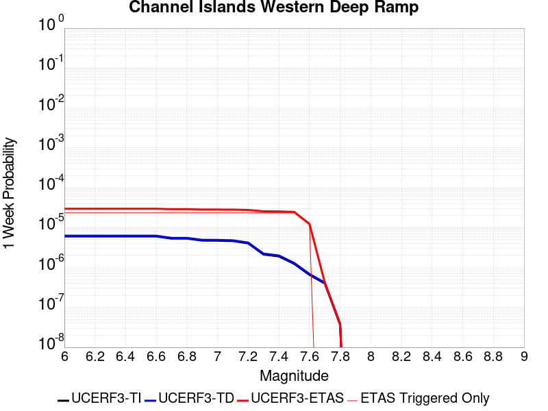 | 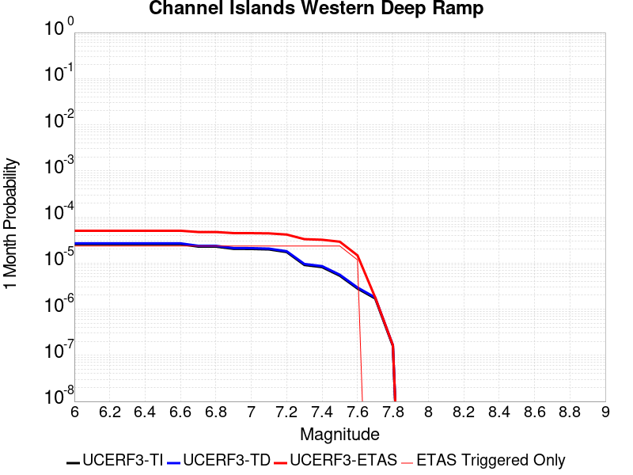 | 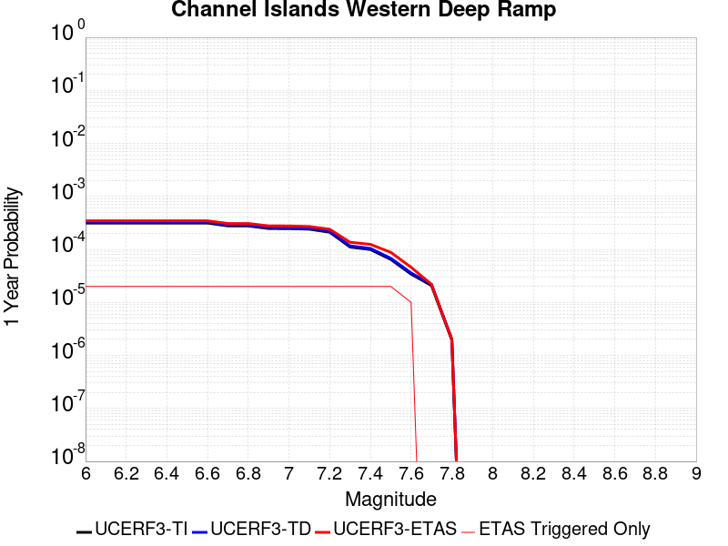 | 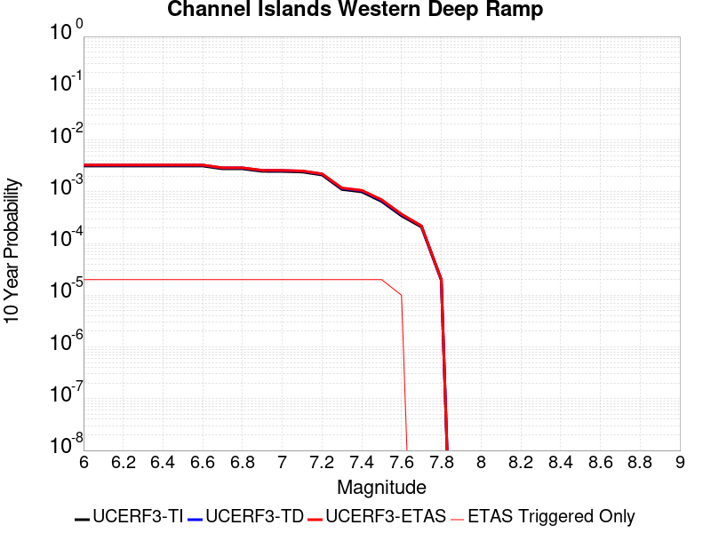 |

| Magnitude | 1 wk TI Prob | 1 wk TD Prob | 1 wk ETAS Prob | 1 wk ETAS/TD Gain | 1 wk ETAS Triggered Only | 1 mo TI Prob | 1 mo TD Prob | 1 mo ETAS Prob | 1 mo ETAS/TD Gain | 1 mo ETAS Triggered Only | 1 yr TI Prob | 1 yr TD Prob | 1 yr ETAS Prob | 1 yr ETAS/TD Gain | 1 yr ETAS Triggered Only | 10 yr TI Prob | 10 yr TD Prob | 10 yr ETAS Prob | 10 yr ETAS/TD Gain | 10 yr ETAS Triggered Only |
|-----|-----|-----|-----|-----|-----|-----|-----|-----|-----|-----|-----|-----|-----|-----|-----|-----|-----|-----|-----|-----|
| 6.0 | 6.0213506E-6 | 6.2548684E-6 | 2.97289E-5 | 4.7529216 | 2.3474178E-5 | 2.5805533E-5 | 2.6806329E-5 | 5.0279876E-5 | 1.875672 | 2.3474178E-5 | 3.1413708E-4 | 3.2632265E-4 | 3.4978916E-4 | 1.071912 | 2.3474178E-5 | 0.0031369338 | 0.0032588763 | 0.003282274 | 1.0071796 | 2.3474178E-5 |
| 6.1 | 6.0213506E-6 | 6.2548684E-6 | 2.97289E-5 | 4.7529216 | 2.3474178E-5 | 2.5805533E-5 | 2.6806329E-5 | 5.0279876E-5 | 1.875672 | 2.3474178E-5 | 3.1413708E-4 | 3.2632265E-4 | 3.4978916E-4 | 1.071912 | 2.3474178E-5 | 0.0031369338 | 0.0032588763 | 0.003282274 | 1.0071796 | 2.3474178E-5 |
| 6.2 | 6.0213506E-6 | 6.2548684E-6 | 2.97289E-5 | 4.7529216 | 2.3474178E-5 | 2.5805533E-5 | 2.6806329E-5 | 5.0279876E-5 | 1.875672 | 2.3474178E-5 | 3.1413708E-4 | 3.2632265E-4 | 3.4978916E-4 | 1.071912 | 2.3474178E-5 | 0.0031369338 | 0.0032588763 | 0.003282274 | 1.0071796 | 2.3474178E-5 |
| 6.3 | 6.0213506E-6 | 6.2548684E-6 | 2.97289E-5 | 4.7529216 | 2.3474178E-5 | 2.5805533E-5 | 2.6806329E-5 | 5.0279876E-5 | 1.875672 | 2.3474178E-5 | 3.1413708E-4 | 3.2632265E-4 | 3.4978916E-4 | 1.071912 | 2.3474178E-5 | 0.0031369338 | 0.0032588763 | 0.003282274 | 1.0071796 | 2.3474178E-5 |
| 6.4 | 6.0213506E-6 | 6.2548684E-6 | 2.97289E-5 | 4.7529216 | 2.3474178E-5 | 2.5805533E-5 | 2.6806329E-5 | 5.0279876E-5 | 1.875672 | 2.3474178E-5 | 3.1413708E-4 | 3.2632265E-4 | 3.4978916E-4 | 1.071912 | 2.3474178E-5 | 0.0031369338 | 0.0032588763 | 0.003282274 | 1.0071796 | 2.3474178E-5 |
| 6.5 | 6.0213506E-6 | 6.2548684E-6 | 2.97289E-5 | 4.7529216 | 2.3474178E-5 | 2.5805533E-5 | 2.6806329E-5 | 5.0279876E-5 | 1.875672 | 2.3474178E-5 | 3.1413708E-4 | 3.2632265E-4 | 3.4978916E-4 | 1.071912 | 2.3474178E-5 | 0.0031369338 | 0.0032588763 | 0.003282274 | 1.0071796 | 2.3474178E-5 |
| 6.6 | 6.0213506E-6 | 6.2548684E-6 | 2.97289E-5 | 4.7529216 | 2.3474178E-5 | 2.5805533E-5 | 2.6806329E-5 | 5.0279876E-5 | 1.875672 | 2.3474178E-5 | 3.1413708E-4 | 3.2632265E-4 | 3.4978916E-4 | 1.071912 | 2.3474178E-5 | 0.0031369338 | 0.0032588763 | 0.003282274 | 1.0071796 | 2.3474178E-5 |
| 6.7 | 5.313309E-6 | 5.5252403E-6 | 2.899929E-5 | 5.248512 | 2.3474178E-5 | 2.2771126E-5 | 2.367941E-5 | 4.7153033E-5 | 1.9913094 | 2.3474178E-5 | 2.772032E-4 | 2.8826276E-4 | 3.1173017E-4 | 1.0814098 | 2.3474178E-5 | 0.0027685766 | 0.0028792918 | 0.0029026982 | 1.0081292 | 2.3474178E-5 |
| 6.8 | 5.313309E-6 | 5.5252403E-6 | 2.899929E-5 | 5.248512 | 2.3474178E-5 | 2.2771126E-5 | 2.367941E-5 | 4.7153033E-5 | 1.9913094 | 2.3474178E-5 | 2.772032E-4 | 2.8826276E-4 | 3.1173017E-4 | 1.0814098 | 2.3474178E-5 | 0.0027685766 | 0.0028792918 | 0.0029026982 | 1.0081292 | 2.3474178E-5 |
| 6.9 | 4.744377E-6 | 4.9394303E-6 | 2.8413493E-5 | 5.7523823 | 2.3474178E-5 | 2.0332885E-5 | 2.1168837E-5 | 4.464252E-5 | 2.108879 | 2.3474178E-5 | 2.4752476E-4 | 2.5770385E-4 | 2.8117196E-4 | 1.0910662 | 2.3474178E-5 | 0.0024724922 | 0.0025744175 | 0.0025978312 | 1.0090947 | 2.3474178E-5 |
| 7.0 | 4.722209E-6 | 4.9164732E-6 | 2.8390536E-5 | 5.774574 | 2.3474178E-5 | 2.0237881E-5 | 2.107045E-5 | 4.4544133E-5 | 2.114057 | 2.3474178E-5 | 2.4636835E-4 | 2.5650626E-4 | 2.7997443E-4 | 1.0914916 | 2.3474178E-5 | 0.002460954 | 0.0025624693 | 0.0025858833 | 1.0091373 | 2.3474178E-5 |
| 7.1 | 4.611174E-6 | 4.801409E-6 | 2.8275475E-5 | 5.888995 | 2.3474178E-5 | 1.9762025E-5 | 2.0577325E-5 | 4.405102E-5 | 2.1407554 | 2.3474178E-5 | 2.4057609E-4 | 2.5050386E-4 | 2.7397217E-4 | 1.0936843 | 2.3474178E-5 | 0.002403158 | 0.002502582 | 0.0025259973 | 1.0093565 | 2.3474178E-5 |
| 7.2 | 4.043994E-6 | 4.2120264E-6 | 2.7686106E-5 | 6.573108 | 2.3474178E-5 | 1.7331287E-5 | 1.8051438E-5 | 4.1525193E-5 | 2.3003814 | 2.3474178E-5 | 2.10988E-4 | 2.1975765E-4 | 2.4322668E-4 | 1.106795 | 2.3474178E-5 | 0.002107878 | 0.0021957543 | 0.0022191769 | 1.0106672 | 2.3474178E-5 |
| 7.3 | 2.1233036E-6 | 2.2297875E-6 | 2.5703914E-5 | 11.527517 | 2.3474178E-5 | 9.099841E-6 | 9.556197E-6 | 3.3030152E-5 | 3.4564116 | 2.3474178E-5 | 1.1078493E-4 | 1.1634055E-4 | 1.39812E-4 | 1.2017478 | 2.3474178E-5 | 0.0011072971 | 0.001162802 | 0.0011862488 | 1.0201641 | 2.3474178E-5 |
| 7.4 | 1.9051884E-6 | 2.0014973E-6 | 2.5475629E-5 | 12.728286 | 2.3474178E-5 | 8.165067E-6 | 8.577817E-6 | 3.2051794E-5 | 3.7365909 | 2.3474178E-5 | 9.940516E-5 | 1.0442998E-4 | 1.279017E-4 | 1.2247604 | 2.3474178E-5 | 9.93607E-4 | 0.0010438144 | 0.001067264 | 1.0224653 | 2.3474178E-5 |
| 7.5 | 1.2408497E-6 | 1.3038839E-6 | 2.4778032E-5 | 19.00325 | 2.3474178E-5 | 5.317916E-6 | 5.588062E-6 | 2.906211E-5 | 5.2007494 | 2.3474178E-5 | 6.4743705E-5 | 6.8032554E-5 | 9.1505135E-5 | 1.3450198 | 2.3474178E-5 | 6.4724847E-4 | 6.8011944E-4 | 7.0357765E-4 | 1.0344913 | 2.3474178E-5 |
| 7.6 | 6.5440025E-7 | 6.886718E-7 | 1.2425753E-5 | 18.04307 | 1.1737089E-5 | 2.8045695E-6 | 2.9514472E-6 | 1.4688502E-5 | 4.9767118 | 1.1737089E-5 | 3.4145098E-5 | 3.593329E-5 | 4.766996E-5 | 1.3266238 | 1.1737089E-5 | 3.4139853E-4 | 3.5927625E-4 | 3.710091E-4 | 1.0326569 | 1.1737089E-5 |
| 7.7 | 3.985963E-7 | 4.1930787E-7 | 4.1930787E-7 | 1.0 | 0.0 | 1.7082689E-6 | 1.7970326E-6 | 1.7970326E-6 | 1.0 | 0.0 | 2.0797976E-5 | 2.1878664E-5 | 2.1878664E-5 | 1.0 | 0.0 | 2.0796029E-4 | 2.1876628E-4 | 2.1876628E-4 | 1.0 | 0.0 |
| 7.8 | 3.706329E-8 | 3.8591796E-8 | 3.8591796E-8 | 1.0 | 0.0 | 1.5884267E-7 | 1.653934E-7 | 1.653934E-7 | 1.0 | 0.0 | 1.9339077E-6 | 2.0136629E-6 | 2.0136629E-6 | 1.0 | 0.0 | 1.933891E-5 | 2.0136458E-5 | 2.0136458E-5 | 1.0 | 0.0 |

## Reliz 2011 CFM
*[(top)](#table-of-contents)*

| 1 Week | 1 Month | 1 Year | 10 Year |
|-----|-----|-----|-----|
| 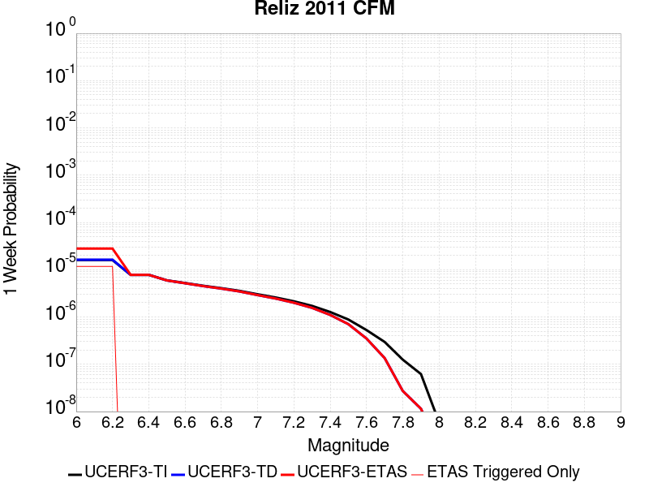 | 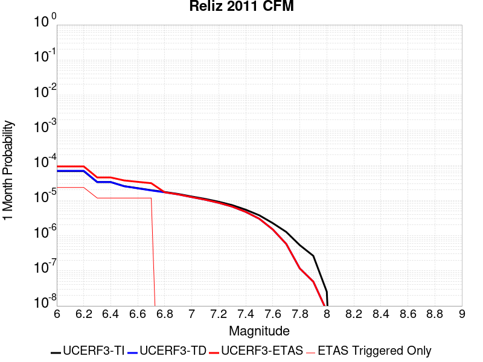 | 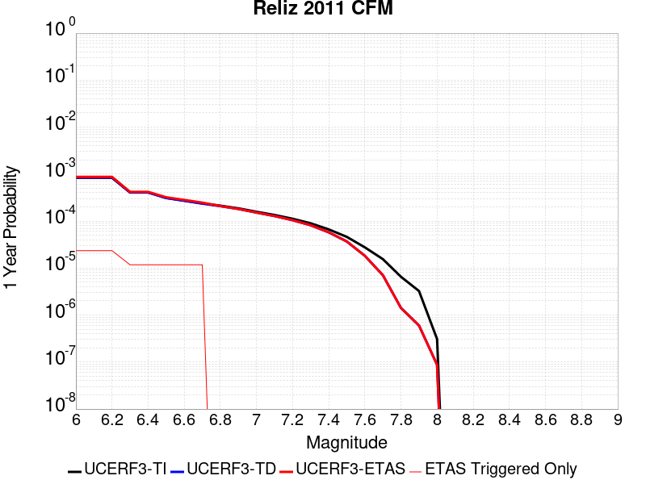 | 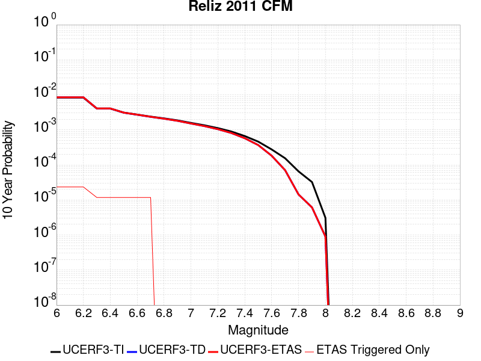 |

| Magnitude | 1 wk TI Prob | 1 wk TD Prob | 1 wk ETAS Prob | 1 wk ETAS/TD Gain | 1 wk ETAS Triggered Only | 1 mo TI Prob | 1 mo TD Prob | 1 mo ETAS Prob | 1 mo ETAS/TD Gain | 1 mo ETAS Triggered Only | 1 yr TI Prob | 1 yr TD Prob | 1 yr ETAS Prob | 1 yr ETAS/TD Gain | 1 yr ETAS Triggered Only | 10 yr TI Prob | 10 yr TD Prob | 10 yr ETAS Prob | 10 yr ETAS/TD Gain | 10 yr ETAS Triggered Only |
|-----|-----|-----|-----|-----|-----|-----|-----|-----|-----|-----|-----|-----|-----|-----|-----|-----|-----|-----|-----|-----|
| 6.0 | 1.6002472E-5 | 1.6282804E-5 | 2.8019702E-5 | 1.7208155 | 1.1737089E-5 | 6.8580215E-5 | 6.9781694E-5 | 9.325423E-5 | 1.3363711 | 2.3474178E-5 | 8.3464425E-4 | 8.4928074E-4 | 8.72735E-4 | 1.0276166 | 2.3474178E-5 | 0.008315164 | 0.008462547 | 0.008485823 | 1.0027504 | 2.3474178E-5 |
| 6.1 | 1.6002472E-5 | 1.6282804E-5 | 2.8019702E-5 | 1.7208155 | 1.1737089E-5 | 6.8580215E-5 | 6.9781694E-5 | 9.325423E-5 | 1.3363711 | 2.3474178E-5 | 8.3464425E-4 | 8.4928074E-4 | 8.72735E-4 | 1.0276166 | 2.3474178E-5 | 0.008315164 | 0.008462547 | 0.008485823 | 1.0027504 | 2.3474178E-5 |
| 6.2 | 1.6002472E-5 | 1.6282804E-5 | 2.8019702E-5 | 1.7208155 | 1.1737089E-5 | 6.8580215E-5 | 6.9781694E-5 | 9.325423E-5 | 1.3363711 | 2.3474178E-5 | 8.3464425E-4 | 8.4928074E-4 | 8.72735E-4 | 1.0276166 | 2.3474178E-5 | 0.008315164 | 0.008462547 | 0.008485823 | 1.0027504 | 2.3474178E-5 |
| 6.3 | 7.792404E-6 | 7.803802E-6 | 7.803802E-6 | 1.0 | 0.0 | 3.339559E-5 | 3.344444E-5 | 4.518114E-5 | 1.3509312 | 1.1737089E-5 | 4.0651546E-4 | 4.0711078E-4 | 4.188431E-4 | 1.0288185 | 1.1737089E-5 | 0.0040577264 | 0.004063926 | 0.0040756157 | 1.0028764 | 1.1737089E-5 |
| 6.4 | 7.792404E-6 | 7.803802E-6 | 7.803802E-6 | 1.0 | 0.0 | 3.339559E-5 | 3.344444E-5 | 4.518114E-5 | 1.3509312 | 1.1737089E-5 | 4.0651546E-4 | 4.0711078E-4 | 4.188431E-4 | 1.0288185 | 1.1737089E-5 | 0.0040577264 | 0.004063926 | 0.0040756157 | 1.0028764 | 1.1737089E-5 |
| 6.5 | 5.9659374E-6 | 5.928738E-6 | 5.928738E-6 | 1.0 | 0.0 | 2.5568053E-5 | 2.5408632E-5 | 3.7145423E-5 | 1.4619215 | 1.1737089E-5 | 3.1124658E-4 | 3.093064E-4 | 3.2103984E-4 | 1.0379348 | 1.1737089E-5 | 0.00310811 | 0.0030889767 | 0.0031006776 | 1.0037879 | 1.1737089E-5 |
| 6.6 | 5.2350692E-6 | 5.178986E-6 | 5.178986E-6 | 1.0 | 0.0 | 2.2435817E-5 | 2.2195467E-5 | 3.3932294E-5 | 1.5287939 | 1.1737089E-5 | 2.7312184E-4 | 2.7019644E-4 | 2.8193035E-4 | 1.0434273 | 1.1737089E-5 | 0.002727864 | 0.0026988892 | 0.0027105946 | 1.0043371 | 1.1737089E-5 |
| 6.7 | 4.580206E-6 | 4.5061206E-6 | 4.5061206E-6 | 1.0 | 0.0 | 1.9629308E-5 | 1.9311801E-5 | 3.1048665E-5 | 1.6077559 | 1.1737089E-5 | 2.389606E-4 | 2.350959E-4 | 2.4683023E-4 | 1.0499129 | 1.1737089E-5 | 0.002387038 | 0.0023486738 | 0.0023603833 | 1.0049856 | 1.1737089E-5 |
| 6.8 | 4.0765017E-6 | 3.9882384E-6 | 3.9882384E-6 | 1.0 | 0.0 | 1.7470604E-5 | 1.7092338E-5 | 1.7092338E-5 | 1.0 | 0.0 | 2.1268385E-4 | 2.0807938E-4 | 2.0807938E-4 | 1.0 | 0.0 | 0.002124804 | 0.0020790435 | 0.0020790435 | 1.0 | 0.0 |
| 6.9 | 3.5752896E-6 | 3.4725176E-6 | 3.4725176E-6 | 1.0 | 0.0 | 1.532258E-5 | 1.4882134E-5 | 1.4882134E-5 | 1.0 | 0.0 | 1.8653645E-4 | 1.8117494E-4 | 1.8117494E-4 | 1.0 | 0.0 | 0.0018637994 | 0.0018104686 | 0.0018104686 | 1.0 | 0.0 |
| 7.0 | 3.0259848E-6 | 2.9079417E-6 | 2.9079417E-6 | 1.0 | 0.0 | 1.2968442E-5 | 1.2462548E-5 | 1.2462548E-5 | 1.0 | 0.0 | 1.5787935E-4 | 1.5172097E-4 | 1.5172097E-4 | 1.0 | 0.0 | 0.0015776722 | 0.001516369 | 0.001516369 | 1.0 | 0.0 |
| 7.1 | 2.5861116E-6 | 2.455167E-6 | 2.455167E-6 | 1.0 | 0.0 | 1.1083288E-5 | 1.05221025E-5 | 1.05221025E-5 | 1.0 | 0.0 | 1.3493067E-4 | 1.2809907E-4 | 1.2809907E-4 | 1.0 | 0.0 | 0.0013484878 | 0.001280447 | 0.001280447 | 1.0 | 0.0 |
| 7.2 | 2.1482588E-6 | 2.003237E-6 | 2.003237E-6 | 1.0 | 0.0 | 9.20679E-6 | 8.585273E-6 | 8.585273E-6 | 1.0 | 0.0 | 1.12086906E-4 | 1.0452068E-4 | 1.0452068E-4 | 1.0 | 0.0 | 0.0011203039 | 0.0010449095 | 0.0010449095 | 1.0 | 0.0 |
| 7.3 | 1.7194744E-6 | 1.5611241E-6 | 1.5611241E-6 | 1.0 | 0.0 | 7.3691554E-6 | 6.690515E-6 | 6.690515E-6 | 1.0 | 0.0 | 8.971577E-5 | 8.1453974E-5 | 8.1453974E-5 | 1.0 | 0.0 | 8.967956E-4 | 8.1443513E-4 | 8.1443513E-4 | 1.0 | 0.0 |
| 7.4 | 1.2755178E-6 | 1.10563E-6 | 1.10563E-6 | 1.0 | 0.0 | 5.4664933E-6 | 4.7384056E-6 | 4.7384056E-6 | 1.0 | 0.0 | 6.655252E-5 | 5.768856E-5 | 5.768856E-5 | 1.0 | 0.0 | 6.6532596E-4 | 5.7692965E-4 | 5.7692965E-4 | 1.0 | 0.0 |
| 7.5 | 8.8463224E-7 | 7.0580273E-7 | 7.0580273E-7 | 1.0 | 0.0 | 3.7912755E-6 | 3.0248652E-6 | 3.0248652E-6 | 1.0 | 0.0 | 4.6157802E-5 | 3.6827114E-5 | 3.6827114E-5 | 1.0 | 0.0 | 4.6148215E-4 | 3.684038E-4 | 3.684038E-4 | 1.0 | 0.0 |
| 7.6 | 5.291355E-7 | 3.500777E-7 | 3.500777E-7 | 1.0 | 0.0 | 2.2677216E-6 | 1.5003321E-6 | 1.5003321E-6 | 1.0 | 0.0 | 2.760916E-5 | 1.8266392E-5 | 1.8266392E-5 | 1.0 | 0.0 | 2.760573E-4 | 1.8284164E-4 | 1.8284164E-4 | 1.0 | 0.0 |
| 7.7 | 2.9663357E-7 | 1.351113E-7 | 1.351113E-7 | 1.0 | 0.0 | 1.2712861E-6 | 5.7904833E-7 | 5.7904833E-7 | 1.0 | 0.0 | 1.5477797E-5 | 7.049891E-6 | 7.049891E-6 | 1.0 | 0.0 | 1.547672E-4 | 7.068132E-5 | 7.068132E-5 | 1.0 | 0.0 |
| 7.8 | 1.2509386E-7 | 2.7157126E-8 | 2.7157126E-8 | 1.0 | 0.0 | 5.3611643E-7 | 1.1638769E-7 | 1.1638769E-7 | 1.0 | 0.0 | 6.527198E-6 | 1.4170191E-6 | 1.4170191E-6 | 1.0 | 0.0 | 6.527006E-5 | 1.4326506E-5 | 1.4326506E-5 | 1.0 | 0.0 |
| 7.9 | 6.213493E-8 | 1.1482114E-8 | 1.1482114E-8 | 1.0 | 0.0 | 2.6629255E-7 | 4.920906E-8 | 4.920906E-8 | 1.0 | 0.0 | 3.242107E-6 | 5.9912014E-7 | 5.9912014E-7 | 1.0 | 0.0 | 3.2420594E-5 | 6.1224223E-6 | 6.1224223E-6 | 1.0 | 0.0 |
| 8.0 | 5.92383E-9 | 1.677887E-9 | 1.677887E-9 | 1.0 | 0.0 | 2.5387841E-8 | 7.190944E-9 | 7.190944E-9 | 1.0 | 0.0 | 3.0909692E-7 | 8.754974E-8 | 8.754974E-8 | 1.0 | 0.0 | 3.090965E-6 | 9.003061E-7 | 9.003061E-7 | 1.0 | 0.0 |

## Hartley Springs 2011 CFM
*[(top)](#table-of-contents)*

| 1 Week | 1 Month | 1 Year | 10 Year |
|-----|-----|-----|-----|
| 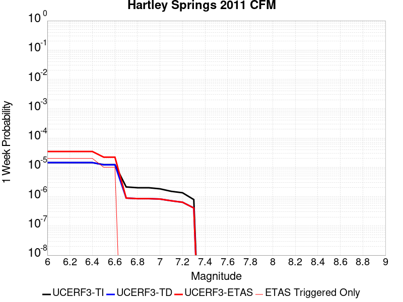 | 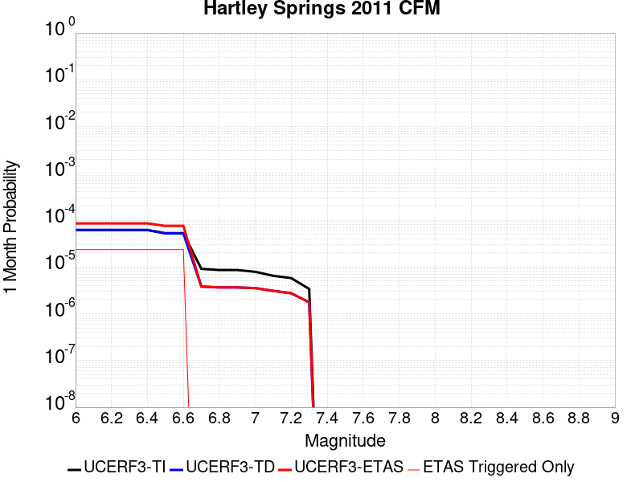 | 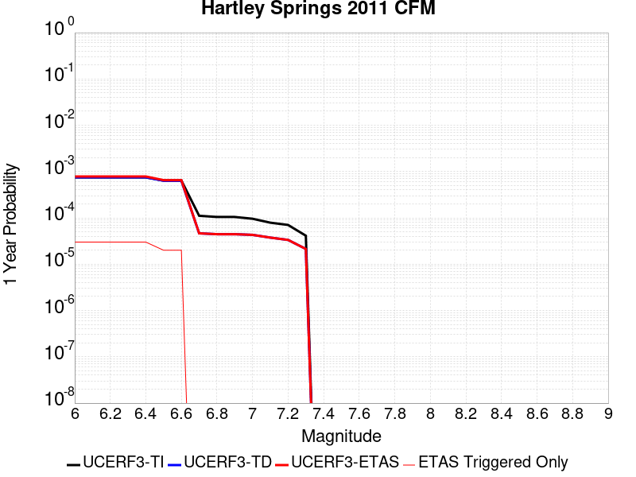 | 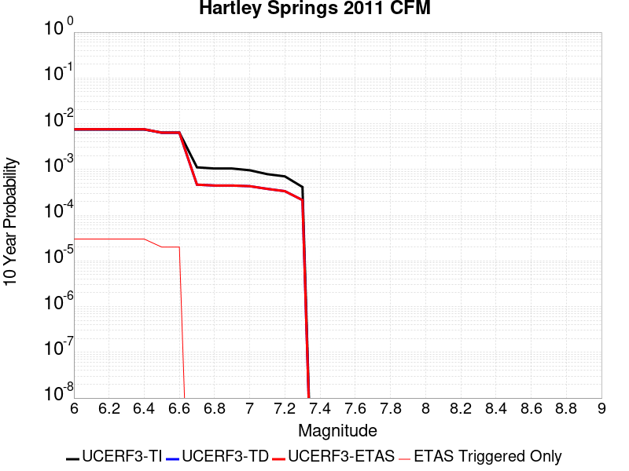 |

| Magnitude | 1 wk TI Prob | 1 wk TD Prob | 1 wk ETAS Prob | 1 wk ETAS/TD Gain | 1 wk ETAS Triggered Only | 1 mo TI Prob | 1 mo TD Prob | 1 mo ETAS Prob | 1 mo ETAS/TD Gain | 1 mo ETAS Triggered Only | 1 yr TI Prob | 1 yr TD Prob | 1 yr ETAS Prob | 1 yr ETAS/TD Gain | 1 yr ETAS Triggered Only | 10 yr TI Prob | 10 yr TD Prob | 10 yr ETAS Prob | 10 yr ETAS/TD Gain | 10 yr ETAS Triggered Only |
|-----|-----|-----|-----|-----|-----|-----|-----|-----|-----|-----|-----|-----|-----|-----|-----|-----|-----|-----|-----|-----|
| 6.0 | 1.4352418E-5 | 1.4434182E-5 | 2.6171101E-5 | 1.8131337 | 1.1737089E-5 | 6.1508916E-5 | 6.1860235E-5 | 8.533296E-5 | 1.3794477 | 2.3474178E-5 | 7.486137E-4 | 7.5305253E-4 | 7.7650906E-4 | 1.0311486 | 2.3474178E-5 | 0.007460968 | 0.0075211283 | 0.0075444262 | 1.0030977 | 2.3474178E-5 |
| 6.1 | 1.4352418E-5 | 1.4434182E-5 | 2.6171101E-5 | 1.8131337 | 1.1737089E-5 | 6.1508916E-5 | 6.1860235E-5 | 8.533296E-5 | 1.3794477 | 2.3474178E-5 | 7.486137E-4 | 7.5305253E-4 | 7.7650906E-4 | 1.0311486 | 2.3474178E-5 | 0.007460968 | 0.0075211283 | 0.0075444262 | 1.0030977 | 2.3474178E-5 |
| 6.2 | 1.4352418E-5 | 1.4434182E-5 | 2.6171101E-5 | 1.8131337 | 1.1737089E-5 | 6.1508916E-5 | 6.1860235E-5 | 8.533296E-5 | 1.3794477 | 2.3474178E-5 | 7.486137E-4 | 7.5305253E-4 | 7.7650906E-4 | 1.0311486 | 2.3474178E-5 | 0.007460968 | 0.0075211283 | 0.0075444262 | 1.0030977 | 2.3474178E-5 |
| 6.3 | 1.4352418E-5 | 1.4434182E-5 | 2.6171101E-5 | 1.8131337 | 1.1737089E-5 | 6.1508916E-5 | 6.1860235E-5 | 8.533296E-5 | 1.3794477 | 2.3474178E-5 | 7.486137E-4 | 7.5305253E-4 | 7.7650906E-4 | 1.0311486 | 2.3474178E-5 | 0.007460968 | 0.0075211283 | 0.0075444262 | 1.0030977 | 2.3474178E-5 |
| 6.4 | 1.4352418E-5 | 1.4434182E-5 | 2.6171101E-5 | 1.8131337 | 1.1737089E-5 | 6.1508916E-5 | 6.1860235E-5 | 8.533296E-5 | 1.3794477 | 2.3474178E-5 | 7.486137E-4 | 7.5305253E-4 | 7.7650906E-4 | 1.0311486 | 2.3474178E-5 | 0.007460968 | 0.0075211283 | 0.0075444262 | 1.0030977 | 2.3474178E-5 |
| 6.5 | 1.2279858E-5 | 1.2133106E-5 | 2.3870052E-5 | 1.9673489 | 1.1737089E-5 | 5.26269E-5 | 5.1998883E-5 | 7.547184E-5 | 1.4514128 | 2.3474178E-5 | 6.4054417E-4 | 6.3306064E-4 | 6.5651996E-4 | 1.037057 | 2.3474178E-5 | 0.0063870098 | 0.006328085 | 0.0063514104 | 1.0036861 | 2.3474178E-5 |
| 6.6 | 1.2279858E-5 | 1.2133106E-5 | 2.3870052E-5 | 1.9673489 | 1.1737089E-5 | 5.26269E-5 | 5.1998883E-5 | 7.547184E-5 | 1.4514128 | 2.3474178E-5 | 6.4054417E-4 | 6.3306064E-4 | 6.5651996E-4 | 1.037057 | 2.3474178E-5 | 0.0063870098 | 0.006328085 | 0.0063514104 | 1.0036861 | 2.3474178E-5 |
| 6.7 | 2.1282601E-6 | 8.8948315E-7 | 8.8948315E-7 | 1.0 | 0.0 | 9.121083E-6 | 3.8120663E-6 | 3.8120663E-6 | 1.0 | 0.0 | 1.11043526E-4 | 4.641118E-5 | 4.641118E-5 | 1.0 | 0.0 | 0.0011098806 | 4.6404017E-4 | 4.6404017E-4 | 1.0 | 0.0 |
| 6.8 | 2.00516E-6 | 8.517597E-7 | 8.517597E-7 | 1.0 | 0.0 | 8.593515E-6 | 3.650395E-6 | 3.650395E-6 | 1.0 | 0.0 | 1.04621024E-4 | 4.444291E-5 | 4.444291E-5 | 1.0 | 0.0 | 0.0010457177 | 4.4436535E-4 | 4.4436535E-4 | 1.0 | 0.0 |
| 6.9 | 2.00516E-6 | 8.517597E-7 | 8.517597E-7 | 1.0 | 0.0 | 8.593515E-6 | 3.650395E-6 | 3.650395E-6 | 1.0 | 0.0 | 1.04621024E-4 | 4.444291E-5 | 4.444291E-5 | 1.0 | 0.0 | 0.0010457177 | 4.4436535E-4 | 4.4436535E-4 | 1.0 | 0.0 |
| 7.0 | 1.8366732E-6 | 8.237307E-7 | 8.237307E-7 | 1.0 | 0.0 | 7.871433E-6 | 3.5302712E-6 | 3.5302712E-6 | 1.0 | 0.0 | 9.583048E-5 | 4.298046E-5 | 4.298046E-5 | 1.0 | 0.0 | 9.5789164E-4 | 4.2974652E-4 | 4.2974652E-4 | 1.0 | 0.0 |
| 7.1 | 1.5097997E-6 | 7.1902616E-7 | 7.1902616E-7 | 1.0 | 0.0 | 6.470554E-6 | 3.0815384E-6 | 3.0815384E-6 | 1.0 | 0.0 | 7.877615E-5 | 3.7517326E-5 | 3.7517326E-5 | 1.0 | 0.0 | 7.874823E-4 | 3.7513362E-4 | 3.7513362E-4 | 1.0 | 0.0 |
| 7.2 | 1.3490993E-6 | 6.405254E-7 | 6.405254E-7 | 1.0 | 0.0 | 5.7818415E-6 | 2.7451074E-6 | 2.7451074E-6 | 1.0 | 0.0 | 7.0391645E-5 | 3.3421402E-5 | 3.3421402E-5 | 1.0 | 0.0 | 7.0369354E-4 | 3.341867E-4 | 3.341867E-4 | 1.0 | 0.0 |
| 7.3 | 7.900015E-7 | 4.0889498E-7 | 4.0889498E-7 | 1.0 | 0.0 | 3.3857161E-6 | 1.752407E-6 | 1.752407E-6 | 1.0 | 0.0 | 4.1220315E-5 | 2.1335554E-5 | 2.1335554E-5 | 1.0 | 0.0 | 4.121267E-4 | 2.1335555E-4 | 2.1335555E-4 | 1.0 | 0.0 |

## Monte Vista - Shannon 2011 CFM
*[(top)](#table-of-contents)*

| 1 Week | 1 Month | 1 Year | 10 Year |
|-----|-----|-----|-----|
| 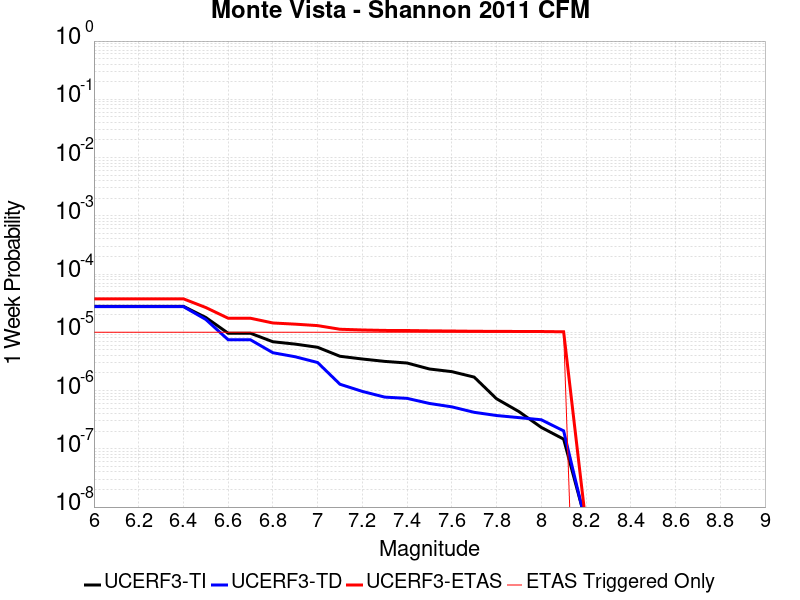 | 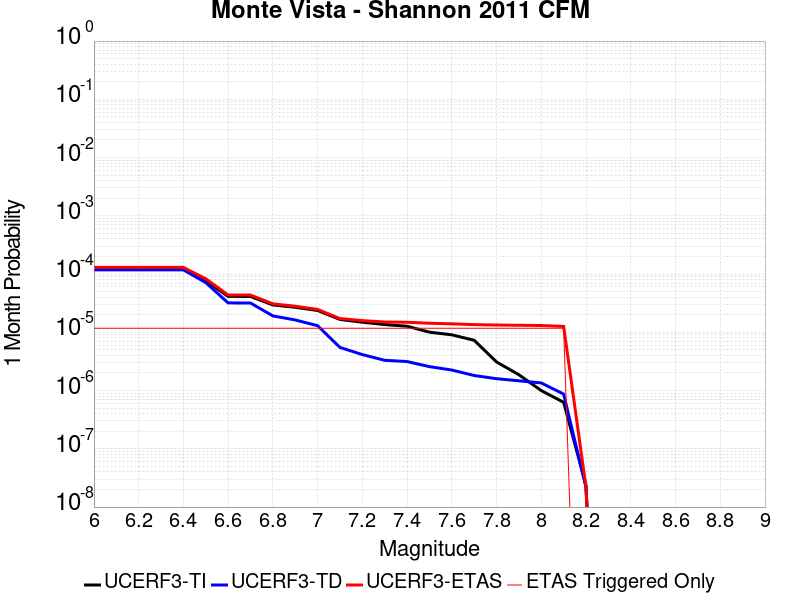 | 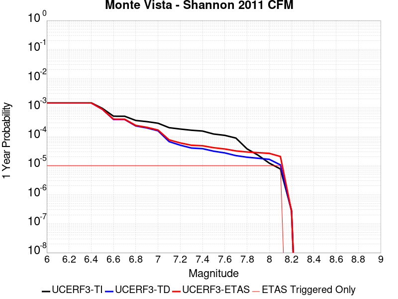 | 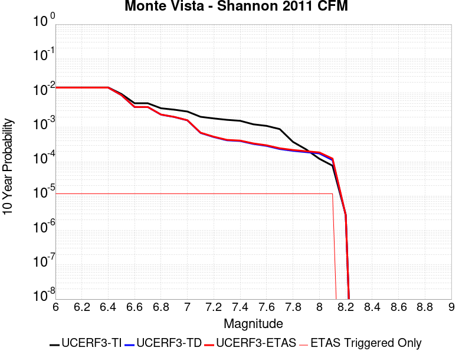 |

| Magnitude | 1 wk TI Prob | 1 wk TD Prob | 1 wk ETAS Prob | 1 wk ETAS/TD Gain | 1 wk ETAS Triggered Only | 1 mo TI Prob | 1 mo TD Prob | 1 mo ETAS Prob | 1 mo ETAS/TD Gain | 1 mo ETAS Triggered Only | 1 yr TI Prob | 1 yr TD Prob | 1 yr ETAS Prob | 1 yr ETAS/TD Gain | 1 yr ETAS Triggered Only | 10 yr TI Prob | 10 yr TD Prob | 10 yr ETAS Prob | 10 yr ETAS/TD Gain | 10 yr ETAS Triggered Only |
|-----|-----|-----|-----|-----|-----|-----|-----|-----|-----|-----|-----|-----|-----|-----|-----|-----|-----|-----|-----|-----|
| 6.0 | 2.7907707E-5 | 2.7584209E-5 | 3.9320974E-5 | 1.4254886 | 1.1737089E-5 | 1.19598975E-4 | 1.1821338E-4 | 1.2994908E-4 | 1.0992756 | 1.1737089E-5 | 0.0014551448 | 0.0014384214 | 0.0014501415 | 1.008148 | 1.1737089E-5 | 0.014456532 | 0.014320195 | 0.014331764 | 1.0008079 | 1.1737089E-5 |
| 6.1 | 2.7907707E-5 | 2.7584209E-5 | 3.9320974E-5 | 1.4254886 | 1.1737089E-5 | 1.19598975E-4 | 1.1821338E-4 | 1.2994908E-4 | 1.0992756 | 1.1737089E-5 | 0.0014551448 | 0.0014384214 | 0.0014501415 | 1.008148 | 1.1737089E-5 | 0.014456532 | 0.014320195 | 0.014331764 | 1.0008079 | 1.1737089E-5 |
| 6.2 | 2.7907707E-5 | 2.7584209E-5 | 3.9320974E-5 | 1.4254886 | 1.1737089E-5 | 1.19598975E-4 | 1.1821338E-4 | 1.2994908E-4 | 1.0992756 | 1.1737089E-5 | 0.0014551448 | 0.0014384214 | 0.0014501415 | 1.008148 | 1.1737089E-5 | 0.014456532 | 0.014320195 | 0.014331764 | 1.0008079 | 1.1737089E-5 |
| 6.3 | 2.7907707E-5 | 2.7584209E-5 | 3.9320974E-5 | 1.4254886 | 1.1737089E-5 | 1.19598975E-4 | 1.1821338E-4 | 1.2994908E-4 | 1.0992756 | 1.1737089E-5 | 0.0014551448 | 0.0014384214 | 0.0014501415 | 1.008148 | 1.1737089E-5 | 0.014456532 | 0.014320195 | 0.014331764 | 1.0008079 | 1.1737089E-5 |
| 6.4 | 2.7907707E-5 | 2.7584209E-5 | 3.9320974E-5 | 1.4254886 | 1.1737089E-5 | 1.19598975E-4 | 1.1821338E-4 | 1.2994908E-4 | 1.0992756 | 1.1737089E-5 | 0.0014551448 | 0.0014384214 | 0.0014501415 | 1.008148 | 1.1737089E-5 | 0.014456532 | 0.014320195 | 0.014331764 | 1.0008079 | 1.1737089E-5 |
| 6.5 | 1.7990213E-5 | 1.6639884E-5 | 2.8376779E-5 | 1.7053471 | 1.1737089E-5 | 7.709863E-5 | 7.131221E-5 | 8.3048464E-5 | 1.1645756 | 1.1737089E-5 | 9.382716E-4 | 8.679467E-4 | 8.796736E-4 | 1.0135111 | 1.1737089E-5 | 0.0093431985 | 0.008668941 | 0.008680576 | 1.0013422 | 1.1737089E-5 |
| 6.6 | 9.650407E-6 | 7.4571435E-6 | 1.9194145E-5 | 2.5739274 | 1.1737089E-5 | 4.135823E-5 | 3.195884E-5 | 4.3695552E-5 | 1.3672447 | 1.1737089E-5 | 5.0342013E-4 | 3.8903722E-4 | 4.0076976E-4 | 1.0301578 | 1.1737089E-5 | 0.005022812 | 0.0039012418 | 0.003912933 | 1.0029968 | 1.1737089E-5 |
| 6.7 | 9.62828E-6 | 7.4350583E-6 | 1.9172061E-5 | 2.5786026 | 1.1737089E-5 | 4.1263404E-5 | 3.186419E-5 | 4.3600907E-5 | 1.3683356 | 1.1737089E-5 | 5.022661E-4 | 3.878853E-4 | 3.9961783E-4 | 1.0302474 | 1.1737089E-5 | 0.0050113243 | 0.003889763 | 0.0039014544 | 1.0030057 | 1.1737089E-5 |
| 6.8 | 6.887523E-6 | 4.4615676E-6 | 1.6198604E-5 | 3.630698 | 1.1737089E-5 | 2.9517621E-5 | 1.9120876E-5 | 3.085774E-5 | 1.6138246 | 1.1737089E-5 | 3.5931775E-4 | 2.3277402E-4 | 2.4450838E-4 | 1.050411 | 1.1737089E-5 | 0.0035873733 | 0.0023424553 | 0.0023541648 | 1.0049988 | 1.1737089E-5 |
| 6.9 | 6.2722347E-6 | 3.8034377E-6 | 1.5540481E-5 | 4.085904 | 1.1737089E-5 | 2.6880729E-5 | 1.6300357E-5 | 2.8037255E-5 | 1.7200394 | 1.1737089E-5 | 3.2722374E-4 | 1.984408E-4 | 2.1017555E-4 | 1.0591348 | 1.1737089E-5 | 0.003267423 | 0.0019997752 | 0.002011489 | 1.0058575 | 1.1737089E-5 |
| 7.0 | 5.5320347E-6 | 3.0305885E-6 | 1.4767642E-5 | 4.872863 | 1.1737089E-5 | 2.3708504E-5 | 1.2988182E-5 | 2.472512E-5 | 1.9036628 | 1.1737089E-5 | 2.8861282E-4 | 1.5812147E-4 | 1.698567E-4 | 1.0742166 | 1.1737089E-5 | 0.0028823826 | 0.001597215 | 0.0016089333 | 1.0073367 | 1.1737089E-5 |
| 7.1 | 3.8794055E-6 | 1.2837862E-6 | 1.302086E-5 | 10.142546 | 1.1737089E-5 | 1.6625918E-5 | 5.5019295E-6 | 1.7238954E-5 | 3.1332562 | 1.1737089E-5 | 2.0240174E-4 | 6.698394E-5 | 7.872025E-5 | 1.1752107 | 1.1737089E-5 | 0.002022175 | 6.865884E-4 | 6.983174E-4 | 1.017083 | 1.1737089E-5 |
| 7.2 | 3.4813652E-6 | 9.671046E-7 | 1.2704182E-5 | 13.136307 | 1.1737089E-5 | 1.49200505E-5 | 4.1447274E-6 | 1.5881767E-5 | 3.8318005 | 1.1737089E-5 | 1.8163648E-4 | 5.0460894E-5 | 6.219739E-5 | 1.232586 | 1.1737089E-5 | 0.0018148809 | 5.214329E-4 | 5.331639E-4 | 1.0224975 | 1.1737089E-5 |
| 7.3 | 3.1682148E-6 | 7.719097E-7 | 1.250899E-5 | 16.20525 | 1.1737089E-5 | 1.3577992E-5 | 3.30818E-6 | 1.5045231E-5 | 4.5478873 | 1.1737089E-5 | 1.6529951E-4 | 4.027635E-5 | 5.201297E-5 | 1.2914022 | 1.1737089E-5 | 0.0016517661 | 4.1960424E-4 | 4.313364E-4 | 1.0279601 | 1.1737089E-5 |
| 7.4 | 2.9707667E-6 | 7.3457204E-7 | 1.2471653E-5 | 16.97812 | 1.1737089E-5 | 1.2731795E-5 | 3.148162E-6 | 1.4885214E-5 | 4.728224 | 1.1737089E-5 | 1.5499859E-4 | 3.8328202E-5 | 5.0064842E-5 | 1.3062142 | 1.1737089E-5 | 0.0015489052 | 3.9992164E-4 | 4.1165404E-4 | 1.0293367 | 1.1737089E-5 |
| 7.5 | 2.3462758E-6 | 6.007889E-7 | 1.2337871E-5 | 20.536118 | 1.1737089E-5 | 1.0055429E-5 | 2.574807E-6 | 1.4311866E-5 | 5.558423 | 1.1737089E-5 | 1.2241797E-4 | 3.1347827E-5 | 4.3084547E-5 | 1.374403 | 1.1737089E-5 | 0.0012235056 | 3.2839534E-4 | 3.4012858E-4 | 1.035729 | 1.1737089E-5 |
| 7.6 | 2.112783E-6 | 5.251582E-7 | 1.2262241E-5 | 23.349613 | 1.1737089E-5 | 9.054753E-6 | 2.250676E-6 | 1.3987739E-5 | 6.2149053 | 1.1737089E-5 | 1.1023604E-4 | 2.7401638E-5 | 3.9138406E-5 | 1.4283235 | 1.1737089E-5 | 0.0011018137 | 2.885138E-4 | 3.002475E-4 | 1.0406694 | 1.1737089E-5 |
| 7.7 | 1.7022471E-6 | 4.231601E-7 | 1.2160244E-5 | 28.736748 | 1.1737089E-5 | 7.2953244E-6 | 1.8135419E-6 | 1.355061E-5 | 7.4719033 | 1.1737089E-5 | 8.881695E-5 | 2.207965E-5 | 3.381648E-5 | 1.5315677 | 1.1737089E-5 | 8.878146E-4 | 2.3398738E-4 | 2.4572172E-4 | 1.0501494 | 1.1737089E-5 |
| 7.8 | 7.230914E-7 | 3.7285864E-7 | 1.2109944E-5 | 32.478645 | 1.1737089E-5 | 3.0989595E-6 | 1.5979647E-6 | 1.3335035E-5 | 8.345013 | 1.1737089E-5 | 3.772918E-5 | 1.9455047E-5 | 3.1191907E-5 | 1.603281 | 1.1737089E-5 | 3.7722773E-4 | 2.0726922E-4 | 2.1900386E-4 | 1.0566155 | 1.1737089E-5 |
| 7.9 | 4.3588446E-7 | 3.4305793E-7 | 1.2080143E-5 | 35.213127 | 1.1737089E-5 | 1.868075E-6 | 1.4702474E-6 | 1.3207319E-5 | 8.983059 | 1.1737089E-5 | 2.2743576E-5 | 1.7900116E-5 | 2.9636996E-5 | 1.6556873 | 1.1737089E-5 | 2.2741247E-4 | 1.8995286E-4 | 2.0168773E-4 | 1.0617777 | 1.1737089E-5 |
| 8.0 | 2.3317523E-7 | 3.1513588E-7 | 1.2052222E-5 | 38.244522 | 1.1737089E-5 | 9.99322E-7 | 1.3505817E-6 | 1.3087655E-5 | 9.690384 | 1.1737089E-5 | 1.2166677E-5 | 1.644321E-5 | 2.8180106E-5 | 1.7137837 | 1.1737089E-5 | 1.21660116E-4 | 1.7399415E-4 | 1.857292E-4 | 1.067445 | 1.1737089E-5 |
| 8.1 | 1.4662456E-7 | 2.030774E-7 | 1.1940164E-5 | 58.796124 | 1.1737089E-5 | 6.283908E-7 | 8.703314E-7 | 1.260741E-5 | 14.485758 | 1.1737089E-5 | 7.650631E-6 | 1.05962345E-5 | 2.2333199E-5 | 2.1076543 | 1.1737089E-5 | 7.650368E-5 | 1.113227E-4 | 1.2305847E-4 | 1.1054213 | 1.1737089E-5 |
| 8.2 | 5.4931775E-9 | 5.07573E-9 | 5.07573E-9 | 1.0 | 0.0 | 2.3542189E-8 | 2.1753127E-8 | 2.1753127E-8 | 1.0 | 0.0 | 2.8662612E-7 | 2.6484432E-7 | 2.6484432E-7 | 1.0 | 0.0 | 2.8662573E-6 | 2.7539324E-6 | 2.7539324E-6 | 1.0 | 0.0 |

## Oceanside alt1
*[(top)](#table-of-contents)*

| 1 Week | 1 Month | 1 Year | 10 Year |
|-----|-----|-----|-----|
| 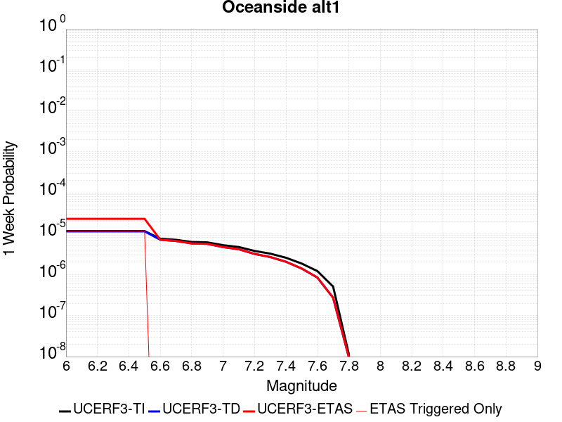 | 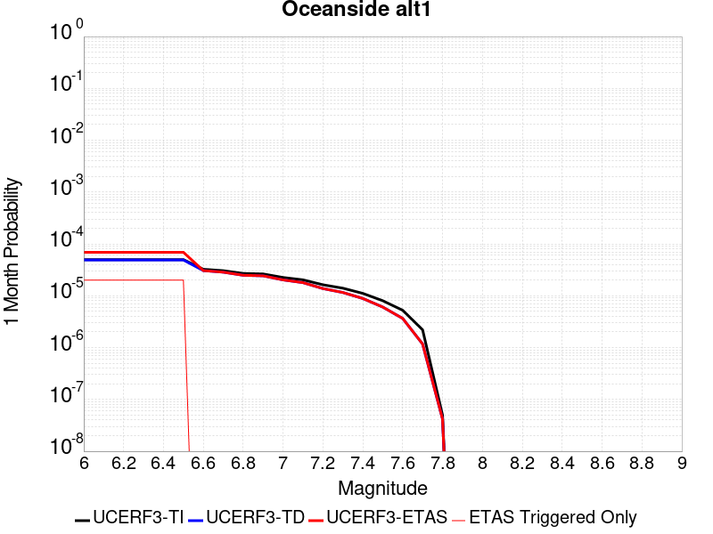 | 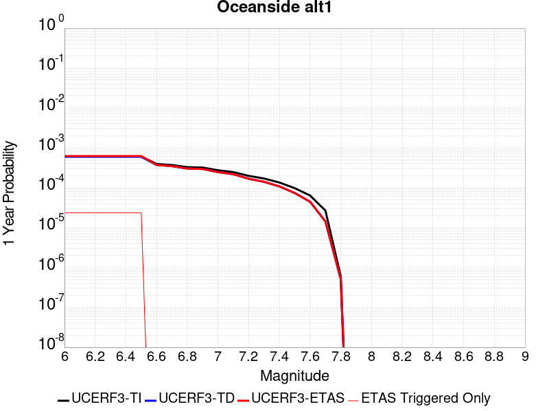 | 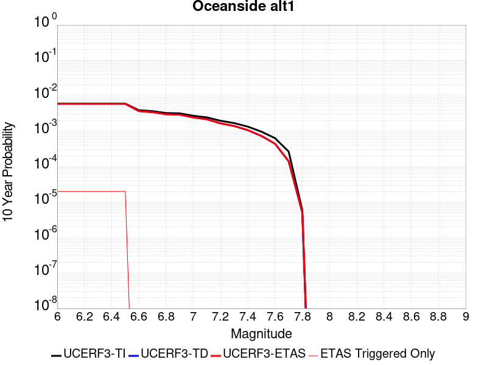 |

| Magnitude | 1 wk TI Prob | 1 wk TD Prob | 1 wk ETAS Prob | 1 wk ETAS/TD Gain | 1 wk ETAS Triggered Only | 1 mo TI Prob | 1 mo TD Prob | 1 mo ETAS Prob | 1 mo ETAS/TD Gain | 1 mo ETAS Triggered Only | 1 yr TI Prob | 1 yr TD Prob | 1 yr ETAS Prob | 1 yr ETAS/TD Gain | 1 yr ETAS Triggered Only | 10 yr TI Prob | 10 yr TD Prob | 10 yr ETAS Prob | 10 yr ETAS/TD Gain | 10 yr ETAS Triggered Only |
|-----|-----|-----|-----|-----|-----|-----|-----|-----|-----|-----|-----|-----|-----|-----|-----|-----|-----|-----|-----|-----|
| 6.0 | 1.1617542E-5 | 1.1423493E-5 | 2.3160448E-5 | 2.0274403 | 1.1737089E-5 | 4.9788516E-5 | 4.8956997E-5 | 7.2430026E-5 | 1.4794621 | 2.3474178E-5 | 6.060066E-4 | 5.9590454E-4 | 6.193647E-4 | 1.039369 | 2.3474178E-5 | 0.0060435664 | 0.005944664 | 0.005967999 | 1.0039253 | 2.3474178E-5 |
| 6.1 | 1.1617542E-5 | 1.1423493E-5 | 2.3160448E-5 | 2.0274403 | 1.1737089E-5 | 4.9788516E-5 | 4.8956997E-5 | 7.2430026E-5 | 1.4794621 | 2.3474178E-5 | 6.060066E-4 | 5.9590454E-4 | 6.193647E-4 | 1.039369 | 2.3474178E-5 | 0.0060435664 | 0.005944664 | 0.005967999 | 1.0039253 | 2.3474178E-5 |
| 6.2 | 1.1617542E-5 | 1.1423493E-5 | 2.3160448E-5 | 2.0274403 | 1.1737089E-5 | 4.9788516E-5 | 4.8956997E-5 | 7.2430026E-5 | 1.4794621 | 2.3474178E-5 | 6.060066E-4 | 5.9590454E-4 | 6.193647E-4 | 1.039369 | 2.3474178E-5 | 0.0060435664 | 0.005944664 | 0.005967999 | 1.0039253 | 2.3474178E-5 |
| 6.3 | 1.1617542E-5 | 1.1423493E-5 | 2.3160448E-5 | 2.0274403 | 1.1737089E-5 | 4.9788516E-5 | 4.8956997E-5 | 7.2430026E-5 | 1.4794621 | 2.3474178E-5 | 6.060066E-4 | 5.9590454E-4 | 6.193647E-4 | 1.039369 | 2.3474178E-5 | 0.0060435664 | 0.005944664 | 0.005967999 | 1.0039253 | 2.3474178E-5 |
| 6.4 | 1.1617542E-5 | 1.1423493E-5 | 2.3160448E-5 | 2.0274403 | 1.1737089E-5 | 4.9788516E-5 | 4.8956997E-5 | 7.2430026E-5 | 1.4794621 | 2.3474178E-5 | 6.060066E-4 | 5.9590454E-4 | 6.193647E-4 | 1.039369 | 2.3474178E-5 | 0.0060435664 | 0.005944664 | 0.005967999 | 1.0039253 | 2.3474178E-5 |
| 6.5 | 1.1617542E-5 | 1.1423493E-5 | 2.3160448E-5 | 2.0274403 | 1.1737089E-5 | 4.9788516E-5 | 4.8956997E-5 | 7.2430026E-5 | 1.4794621 | 2.3474178E-5 | 6.060066E-4 | 5.9590454E-4 | 6.193647E-4 | 1.039369 | 2.3474178E-5 | 0.0060435664 | 0.005944664 | 0.005967999 | 1.0039253 | 2.3474178E-5 |
| 6.6 | 7.561768E-6 | 7.1336153E-6 | 7.1336153E-6 | 1.0 | 0.0 | 3.2407173E-5 | 3.0572286E-5 | 3.0572286E-5 | 1.0 | 0.0 | 3.9448592E-4 | 3.7215507E-4 | 3.7215507E-4 | 1.0 | 0.0 | 0.0039378637 | 0.00371543 | 0.00371543 | 1.0 | 0.0 |
| 6.7 | 7.1042605E-6 | 6.6556854E-6 | 6.6556854E-6 | 1.0 | 0.0 | 3.0446476E-5 | 2.8524059E-5 | 2.8524059E-5 | 1.0 | 0.0 | 3.706228E-4 | 3.472259E-4 | 3.472259E-4 | 1.0 | 0.0 | 0.0037000529 | 0.003466917 | 0.003466917 | 1.0 | 0.0 |
| 6.8 | 6.285554E-6 | 5.799706E-6 | 5.799706E-6 | 1.0 | 0.0 | 2.693781E-5 | 2.4855648E-5 | 2.4855648E-5 | 1.0 | 0.0 | 3.2791847E-4 | 3.0257605E-4 | 3.0257605E-4 | 1.0 | 0.0 | 0.0032743502 | 0.0030216982 | 0.0030216982 | 1.0 | 0.0 |
| 6.9 | 6.148883E-6 | 5.6565445E-6 | 5.6565445E-6 | 1.0 | 0.0 | 2.635209E-5 | 2.424211E-5 | 2.424211E-5 | 1.0 | 0.0 | 3.2078946E-4 | 2.9510827E-4 | 2.9510827E-4 | 1.0 | 0.0 | 0.003203268 | 0.0029472208 | 0.0029472208 | 1.0 | 0.0 |
| 7.0 | 5.253857E-6 | 4.722404E-6 | 4.722404E-6 | 1.0 | 0.0 | 2.2516335E-5 | 2.0238718E-5 | 2.0238718E-5 | 1.0 | 0.0 | 2.7410188E-4 | 2.4637886E-4 | 2.4637886E-4 | 1.0 | 0.0 | 0.0027376404 | 0.0024610884 | 0.0024610884 | 1.0 | 0.0 |
| 7.1 | 4.730754E-6 | 4.17851E-6 | 4.17851E-6 | 1.0 | 0.0 | 2.0274503E-5 | 1.7907778E-5 | 1.7907778E-5 | 1.0 | 0.0 | 2.468141E-4 | 2.1800565E-4 | 2.1800565E-4 | 1.0 | 0.0 | 0.0024654015 | 0.0021779444 | 0.0021779444 | 1.0 | 0.0 |
| 7.2 | 3.7998386E-6 | 3.214026E-6 | 3.214026E-6 | 1.0 | 0.0 | 1.6284921E-5 | 1.37743245E-5 | 1.37743245E-5 | 1.0 | 0.0 | 1.9825088E-4 | 1.6768962E-4 | 1.6768962E-4 | 1.0 | 0.0 | 0.001980741 | 0.001675643 | 0.001675643 | 1.0 | 0.0 |
| 7.3 | 3.2656465E-6 | 2.698376E-6 | 2.698376E-6 | 1.0 | 0.0 | 1.3995553E-5 | 1.1564418E-5 | 1.1564418E-5 | 1.0 | 0.0 | 1.7038253E-4 | 1.407878E-4 | 1.407878E-4 | 1.0 | 0.0 | 0.0017025196 | 0.0014069972 | 0.0014069972 | 1.0 | 0.0 |
| 7.4 | 2.593703E-6 | 2.0680277E-6 | 2.0680277E-6 | 1.0 | 0.0 | 1.1115822E-5 | 8.862946E-6 | 8.862946E-6 | 1.0 | 0.0 | 1.3532673E-4 | 1.0790111E-4 | 1.0790111E-4 | 1.0 | 0.0 | 0.0013524436 | 0.0010784961 | 0.0010784961 | 1.0 | 0.0 |
| 7.5 | 1.8715585E-6 | 1.4137177E-6 | 1.4137177E-6 | 1.0 | 0.0 | 8.020941E-6 | 6.0587763E-6 | 6.0587763E-6 | 1.0 | 0.0 | 9.7650576E-5 | 7.376316E-5 | 7.376316E-5 | 1.0 | 0.0 | 9.7607676E-4 | 7.3739287E-4 | 7.3739287E-4 | 1.0 | 0.0 |
| 7.6 | 1.2246786E-6 | 8.5268175E-7 | 8.5268175E-7 | 1.0 | 0.0 | 5.248612E-6 | 3.6543456E-6 | 3.6543456E-6 | 1.0 | 0.0 | 6.389998E-5 | 4.4490793E-5 | 4.4490793E-5 | 1.0 | 0.0 | 6.3881604E-4 | 4.4482335E-4 | 4.4482335E-4 | 1.0 | 0.0 |
| 7.7 | 5.140719E-7 | 2.734703E-7 | 2.734703E-7 | 1.0 | 0.0 | 2.2031636E-6 | 1.1720151E-6 | 1.1720151E-6 | 1.0 | 0.0 | 2.6823185E-5 | 1.4269205E-5 | 1.4269205E-5 | 1.0 | 0.0 | 2.6819948E-4 | 1.4268424E-4 | 1.4268424E-4 | 1.0 | 0.0 |
| 7.8 | 1.16056995E-8 | 9.782373E-9 | 9.782373E-9 | 1.0 | 0.0 | 4.9738713E-8 | 4.1924455E-8 | 4.1924455E-8 | 1.0 | 0.0 | 6.0556863E-7 | 5.1043025E-7 | 5.1043025E-7 | 1.0 | 0.0 | 6.05567E-6 | 5.1043025E-6 | 5.1043025E-6 | 1.0 | 0.0 |

## Calaveras (So) - Paicines extension 2011 CFM
*[(top)](#table-of-contents)*

| 1 Week | 1 Month | 1 Year | 10 Year |
|-----|-----|-----|-----|
|  |  | 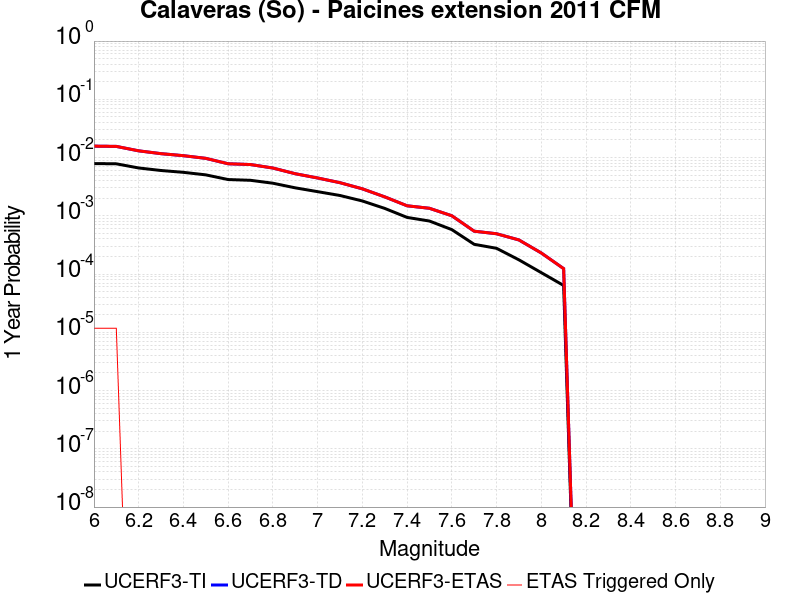 | 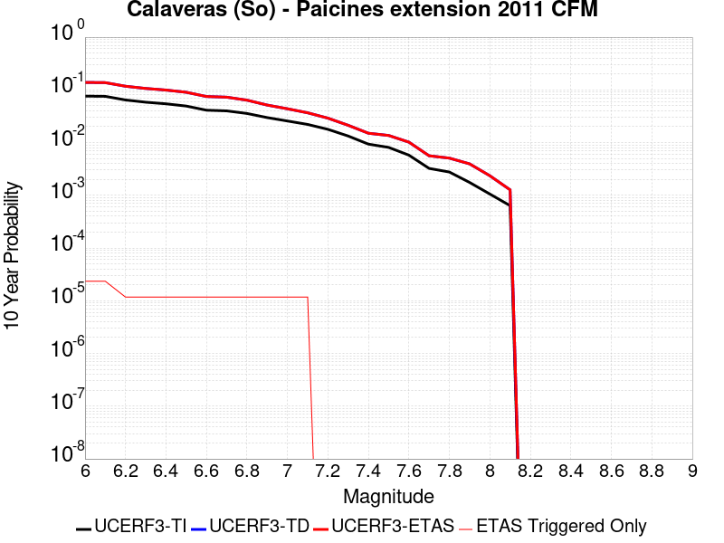 |

| Magnitude | 1 wk TI Prob | 1 wk TD Prob | 1 wk ETAS Prob | 1 wk ETAS/TD Gain | 1 wk ETAS Triggered Only | 1 mo TI Prob | 1 mo TD Prob | 1 mo ETAS Prob | 1 mo ETAS/TD Gain | 1 mo ETAS Triggered Only | 1 yr TI Prob | 1 yr TD Prob | 1 yr ETAS Prob | 1 yr ETAS/TD Gain | 1 yr ETAS Triggered Only | 10 yr TI Prob | 10 yr TD Prob | 10 yr ETAS Prob | 10 yr ETAS/TD Gain | 10 yr ETAS Triggered Only |
|-----|-----|-----|-----|-----|-----|-----|-----|-----|-----|-----|-----|-----|-----|-----|-----|-----|-----|-----|-----|-----|
| 6.0 | 1.5183659E-4 | 3.0533716E-4 | 3.0533716E-4 | 1.0 | 0.0 | 6.5056595E-4 | 0.0013069661 | 0.0013069661 | 1.0 | 0.0 | 0.007891912 | 0.01569571 | 0.015707264 | 1.000736 | 1.1737089E-5 | 0.076174594 | 0.13848671 | 0.13850695 | 1.000146 | 2.3474178E-5 |
| 6.1 | 1.5024997E-4 | 3.0227835E-4 | 3.0227835E-4 | 1.0 | 0.0 | 6.437695E-4 | 0.00129387 | 0.00129387 | 1.0 | 0.0 | 0.0078097614 | 0.015539104 | 0.015550659 | 1.0007436 | 1.1737089E-5 | 0.075409345 | 0.13715632 | 0.13717657 | 1.0001477 | 2.3474178E-5 |
| 6.2 | 1.2743923E-4 | 2.5306802E-4 | 2.5306802E-4 | 1.0 | 0.0 | 5.460538E-4 | 0.0010841049 | 0.0010841049 | 1.0 | 0.0 | 0.0066279583 | 0.013046704 | 0.013046704 | 1.0 | 0.0 | 0.064337276 | 0.11725405 | 0.117264405 | 1.0000883 | 1.1737089E-5 |
| 6.3 | 1.1525114E-4 | 2.2595265E-4 | 2.2595265E-4 | 1.0 | 0.0 | 4.9383997E-4 | 9.6799526E-4 | 9.6799526E-4 | 1.0 | 0.0 | 0.0059959386 | 0.011667927 | 0.011667927 | 1.0 | 0.0 | 0.058367174 | 0.10637007 | 0.10638056 | 1.0000986 | 1.1737089E-5 |
| 6.4 | 1.07200925E-4 | 2.0836305E-4 | 2.0836305E-4 | 1.0 | 0.0 | 4.5935164E-4 | 8.926636E-4 | 8.926636E-4 | 1.0 | 0.0 | 0.0055782744 | 0.010772766 | 0.010772766 | 1.0 | 0.0 | 0.0544031 | 0.09919256 | 0.09920313 | 1.0001066 | 1.1737089E-5 |
| 6.5 | 9.69631E-5 | 1.8729115E-4 | 1.8729115E-4 | 1.0 | 0.0 | 4.1548995E-4 | 8.024135E-4 | 8.024135E-4 | 1.0 | 0.0 | 0.0050468626 | 0.009694662 | 0.009694662 | 1.0 | 0.0 | 0.04933773 | 0.090084255 | 0.09009494 | 1.0001185 | 1.1737089E-5 |
| 6.6 | 8.0552316E-5 | 1.5070537E-4 | 1.5070537E-4 | 1.0 | 0.0 | 3.4517853E-4 | 6.456994E-4 | 6.456994E-4 | 1.0 | 0.0 | 0.0041944524 | 0.007826256 | 0.007826256 | 1.0 | 0.0 | 0.04116161 | 0.074854024 | 0.07486489 | 1.0001451 | 1.1737089E-5 |
| 6.7 | 7.815757E-5 | 1.4610609E-4 | 1.4610609E-4 | 1.0 | 0.0 | 3.34918E-4 | 6.260017E-4 | 6.260017E-4 | 1.0 | 0.0 | 0.004070005 | 0.0075890915 | 0.0075890915 | 1.0 | 0.0 | 0.039962657 | 0.072703585 | 0.07271447 | 1.0001497 | 1.1737089E-5 |
| 6.8 | 6.965264E-5 | 1.2721405E-4 | 1.2721405E-4 | 1.0 | 0.0 | 2.9847719E-4 | 5.450839E-4 | 5.450839E-4 | 1.0 | 0.0 | 0.0036279052 | 0.00661342 | 0.00661342 | 1.0 | 0.0 | 0.03569247 | 0.06379891 | 0.0638099 | 1.0001723 | 1.1737089E-5 |
| 6.9 | 5.8000453E-5 | 1.01435086E-4 | 1.01435086E-4 | 1.0 | 0.0 | 2.4854968E-4 | 4.3464993E-4 | 4.3464993E-4 | 1.0 | 0.0 | 0.0030218933 | 0.0052791284 | 0.0052791284 | 1.0 | 0.0 | 0.029811295 | 0.051501602 | 0.051512737 | 1.0002161 | 1.1737089E-5 |
| 7.0 | 4.9865852E-5 | 8.567692E-5 | 8.567692E-5 | 1.0 | 0.0 | 2.1369329E-4 | 3.671356E-4 | 3.671356E-4 | 1.0 | 0.0 | 0.0025986114 | 0.0044608037 | 0.0044608037 | 1.0 | 0.0 | 0.025684336 | 0.043781694 | 0.04379292 | 1.0002563 | 1.1737089E-5 |
| 7.1 | 4.283875E-5 | 7.112159E-5 | 7.112159E-5 | 1.0 | 0.0 | 1.8358172E-4 | 3.047715E-4 | 3.047715E-4 | 1.0 | 0.0 | 0.0022328163 | 0.003704336 | 0.003704336 | 1.0 | 0.0 | 0.022105146 | 0.03673583 | 0.036747135 | 1.0003078 | 1.1737089E-5 |
| 7.2 | 3.450115E-5 | 5.5776054E-5 | 5.5776054E-5 | 1.0 | 0.0 | 1.478537E-4 | 2.390185E-4 | 2.390185E-4 | 1.0 | 0.0 | 0.0017986323 | 0.0029061958 | 0.0029061958 | 1.0 | 0.0 | 0.017841442 | 0.029079199 | 0.029079199 | 1.0 | 0.0 |
| 7.3 | 2.5709045E-5 | 4.0588155E-5 | 4.0588155E-5 | 1.0 | 0.0 | 1.1017697E-4 | 1.7393773E-4 | 1.7393773E-4 | 1.0 | 0.0 | 0.0013405791 | 0.002115652 | 0.002115652 | 1.0 | 0.0 | 0.013325208 | 0.021297242 | 0.021297242 | 1.0 | 0.0 |
| 7.4 | 1.8003093E-5 | 2.8509934E-5 | 2.8509934E-5 | 1.0 | 0.0 | 7.715383E-5 | 1.2217973E-4 | 1.2217973E-4 | 1.0 | 0.0 | 9.3894306E-4 | 0.0014865254 | 0.0014865254 | 1.0 | 0.0 | 0.009349857 | 0.015052196 | 0.015052196 | 1.0 | 0.0 |
| 7.5 | 1.5595824E-5 | 2.5822499E-5 | 2.5822499E-5 | 1.0 | 0.0 | 6.683753E-5 | 1.1066317E-4 | 1.1066317E-4 | 1.0 | 0.0 | 8.134431E-4 | 0.0013464936 | 0.0013464936 | 1.0 | 0.0 | 0.008104719 | 0.01365213 | 0.01365213 | 1.0 | 0.0 |
| 7.6 | 1.1110309E-5 | 1.9222098E-5 | 1.9222098E-5 | 1.0 | 0.0 | 4.761474E-5 | 8.2377825E-5 | 8.2377825E-5 | 1.0 | 0.0 | 5.795553E-4 | 0.0010024898 | 0.0010024898 | 1.0 | 0.0 | 0.0057804612 | 0.010203943 | 0.010203943 | 1.0 | 0.0 |
| 7.7 | 6.2140443E-6 | 1.0437076E-5 | 1.0437076E-5 | 1.0 | 0.0 | 2.6631347E-5 | 4.4729557E-5 | 4.4729557E-5 | 1.0 | 0.0 | 3.241884E-4 | 5.444464E-4 | 5.444464E-4 | 1.0 | 0.0 | 0.0032371588 | 0.005619835 | 0.005619835 | 1.0 | 0.0 |
| 7.8 | 5.305533E-6 | 9.433038E-6 | 9.433038E-6 | 1.0 | 0.0 | 2.27378E-5 | 4.042668E-5 | 4.042668E-5 | 1.0 | 0.0 | 2.7679754E-4 | 4.920837E-4 | 4.920837E-4 | 1.0 | 0.0 | 0.0027645302 | 0.005074324 | 0.005074324 | 1.0 | 0.0 |
| 7.9 | 3.363505E-6 | 7.3848937E-6 | 7.3848937E-6 | 1.0 | 0.0 | 1.4414942E-5 | 3.164916E-5 | 3.164916E-5 | 1.0 | 0.0 | 1.7548777E-4 | 3.8526047E-4 | 3.8526047E-4 | 1.0 | 0.0 | 0.0017534926 | 0.003948527 | 0.003948527 | 1.0 | 0.0 |
| 8.0 | 2.0271132E-6 | 4.413104E-6 | 4.413104E-6 | 1.0 | 0.0 | 8.687599E-6 | 1.8913164E-5 | 1.8913164E-5 | 1.0 | 0.0 | 1.05766376E-4 | 2.302435E-4 | 2.302435E-4 | 1.0 | 0.0 | 0.0010571606 | 0.002351099 | 0.002351099 | 1.0 | 0.0 |
| 8.1 | 1.2206116E-6 | 2.3751331E-6 | 2.3751331E-6 | 1.0 | 0.0 | 5.2311816E-6 | 1.0179103E-5 | 1.0179103E-5 | 1.0 | 0.0 | 6.3687774E-5 | 1.2392356E-4 | 1.2392356E-4 | 1.0 | 0.0 | 6.366953E-4 | 0.0012705477 | 0.0012705477 | 1.0 | 0.0 |

## Jess Valley
*[(top)](#table-of-contents)*

| 1 Week | 1 Month | 1 Year | 10 Year |
|-----|-----|-----|-----|
| 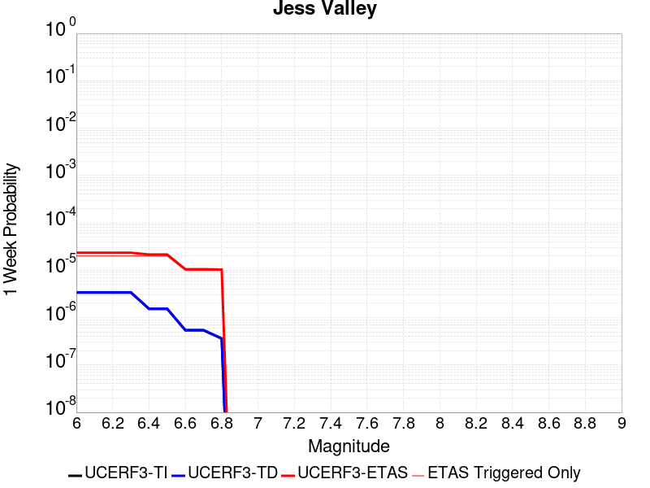 | 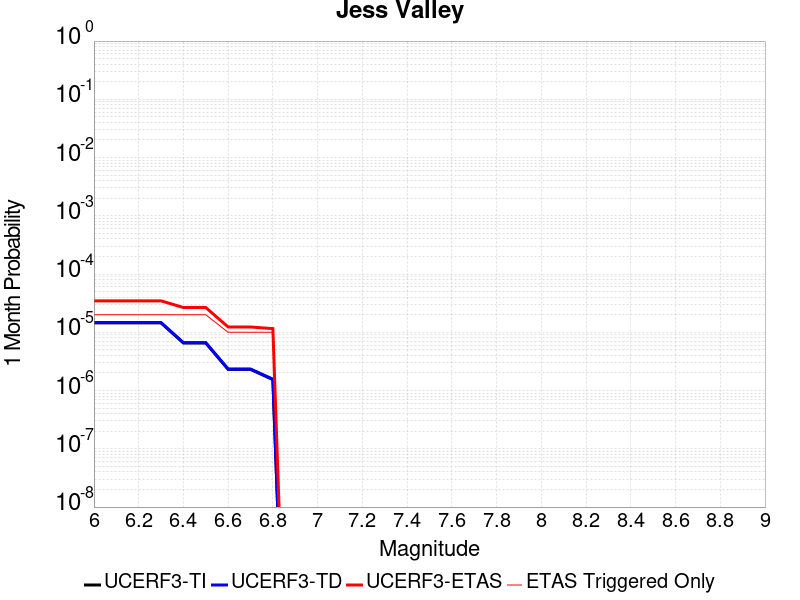 | 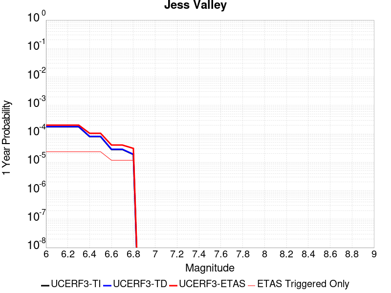 | 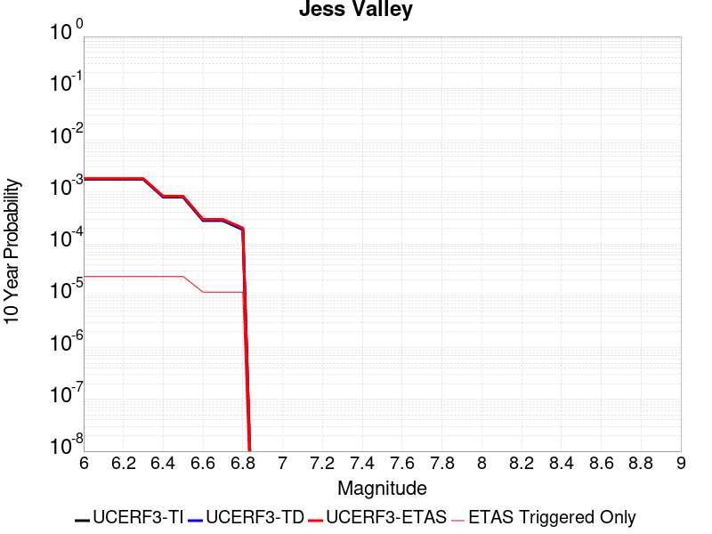 |

| Magnitude | 1 wk TI Prob | 1 wk TD Prob | 1 wk ETAS Prob | 1 wk ETAS/TD Gain | 1 wk ETAS Triggered Only | 1 mo TI Prob | 1 mo TD Prob | 1 mo ETAS Prob | 1 mo ETAS/TD Gain | 1 mo ETAS Triggered Only | 1 yr TI Prob | 1 yr TD Prob | 1 yr ETAS Prob | 1 yr ETAS/TD Gain | 1 yr ETAS Triggered Only | 10 yr TI Prob | 10 yr TD Prob | 10 yr ETAS Prob | 10 yr ETAS/TD Gain | 10 yr ETAS Triggered Only |
|-----|-----|-----|-----|-----|-----|-----|-----|-----|-----|-----|-----|-----|-----|-----|-----|-----|-----|-----|-----|-----|
| 6.0 | 3.3861274E-6 | 3.4340592E-6 | 2.6908157E-5 | 7.8356705 | 2.3474178E-5 | 1.4511894E-5 | 1.471733E-5 | 3.8191163E-5 | 2.594979 | 2.3474178E-5 | 1.7666799E-4 | 1.7917156E-4 | 2.0264155E-4 | 1.1309916 | 2.3474178E-5 | 0.001765276 | 0.0017905476 | 0.0018139798 | 1.0130866 | 2.3474178E-5 |
| 6.1 | 3.3861274E-6 | 3.4340592E-6 | 2.6908157E-5 | 7.8356705 | 2.3474178E-5 | 1.4511894E-5 | 1.471733E-5 | 3.8191163E-5 | 2.594979 | 2.3474178E-5 | 1.7666799E-4 | 1.7917156E-4 | 2.0264155E-4 | 1.1309916 | 2.3474178E-5 | 0.001765276 | 0.0017905476 | 0.0018139798 | 1.0130866 | 2.3474178E-5 |
| 6.2 | 3.3861274E-6 | 3.4340592E-6 | 2.6908157E-5 | 7.8356705 | 2.3474178E-5 | 1.4511894E-5 | 1.471733E-5 | 3.8191163E-5 | 2.594979 | 2.3474178E-5 | 1.7666799E-4 | 1.7917156E-4 | 2.0264155E-4 | 1.1309916 | 2.3474178E-5 | 0.001765276 | 0.0017905476 | 0.0018139798 | 1.0130866 | 2.3474178E-5 |
| 6.3 | 3.3861274E-6 | 3.4340592E-6 | 2.6908157E-5 | 7.8356705 | 2.3474178E-5 | 1.4511894E-5 | 1.471733E-5 | 3.8191163E-5 | 2.594979 | 2.3474178E-5 | 1.7666799E-4 | 1.7917156E-4 | 2.0264155E-4 | 1.1309916 | 2.3474178E-5 | 0.001765276 | 0.0017905476 | 0.0018139798 | 1.0130866 | 2.3474178E-5 |
| 6.4 | 1.5291708E-6 | 1.5502784E-6 | 2.5024421E-5 | 16.141888 | 2.3474178E-5 | 6.553573E-6 | 6.644038E-6 | 3.011806E-5 | 4.533096 | 2.3474178E-5 | 7.978683E-5 | 8.088895E-5 | 1.04361236E-4 | 1.290179 | 2.3474178E-5 | 7.975819E-4 | 8.086733E-4 | 8.321286E-4 | 1.0290046 | 2.3474178E-5 |
| 6.5 | 1.5291708E-6 | 1.5502784E-6 | 2.5024421E-5 | 16.141888 | 2.3474178E-5 | 6.553573E-6 | 6.644038E-6 | 3.011806E-5 | 4.533096 | 2.3474178E-5 | 7.978683E-5 | 8.088895E-5 | 1.04361236E-4 | 1.290179 | 2.3474178E-5 | 7.975819E-4 | 8.086733E-4 | 8.321286E-4 | 1.0290046 | 2.3474178E-5 |
| 6.6 | 5.396423E-7 | 5.4719953E-7 | 1.2284282E-5 | 22.449366 | 1.1737089E-5 | 2.312751E-6 | 2.3451398E-6 | 1.4082201E-5 | 6.004845 | 1.1737089E-5 | 2.8157378E-5 | 2.855189E-5 | 4.0288647E-5 | 1.4110675 | 1.1737089E-5 | 2.8153812E-4 | 2.8550063E-4 | 2.972344E-4 | 1.0410988 | 1.1737089E-5 |
| 6.7 | 5.396423E-7 | 5.4719953E-7 | 1.2284282E-5 | 22.449366 | 1.1737089E-5 | 2.312751E-6 | 2.3451398E-6 | 1.4082201E-5 | 6.004845 | 1.1737089E-5 | 2.8157378E-5 | 2.855189E-5 | 4.0288647E-5 | 1.4110675 | 1.1737089E-5 | 2.8153812E-4 | 2.8550063E-4 | 2.972344E-4 | 1.0410988 | 1.1737089E-5 |
| 6.8 | 3.6058395E-7 | 3.6563068E-7 | 1.2102716E-5 | 33.10093 | 1.1737089E-5 | 1.5453588E-6 | 1.5669885E-6 | 1.3304059E-5 | 8.490209 | 1.1737089E-5 | 1.8814582E-5 | 1.9078087E-5 | 3.081495E-5 | 1.6152014 | 1.1737089E-5 | 1.8812988E-4 | 1.9078086E-4 | 2.0251572E-4 | 1.0615096 | 1.1737089E-5 |

## South Klamath Lake East
*[(top)](#table-of-contents)*

| 1 Week | 1 Month | 1 Year | 10 Year |
|-----|-----|-----|-----|
| 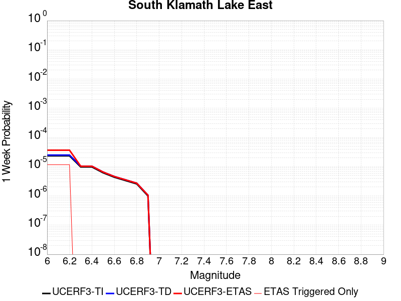 | 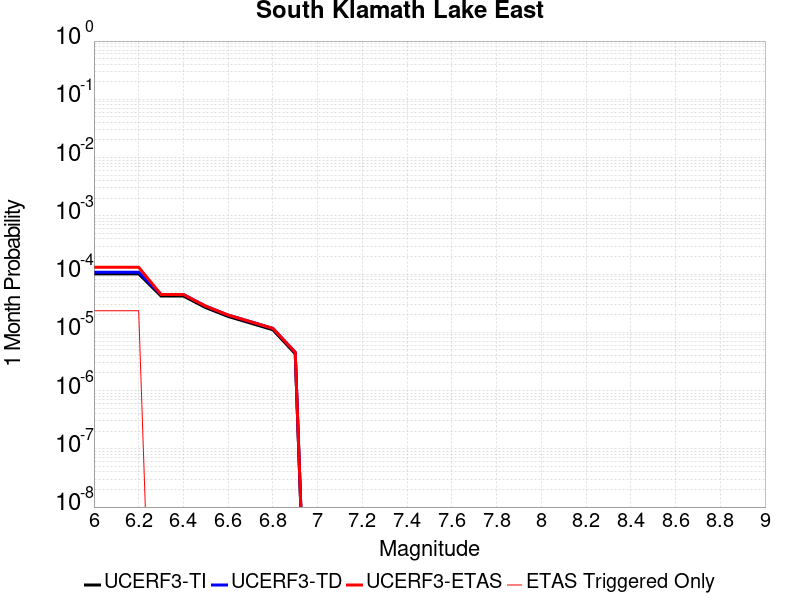 | 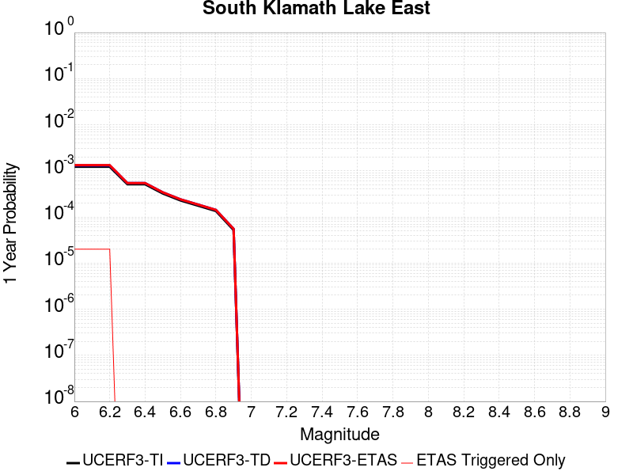 | 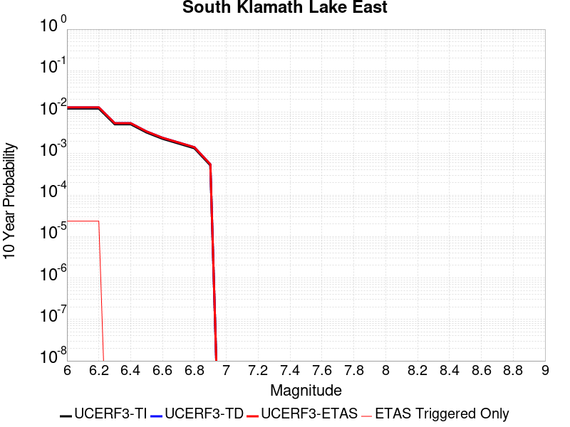 |

| Magnitude | 1 wk TI Prob | 1 wk TD Prob | 1 wk ETAS Prob | 1 wk ETAS/TD Gain | 1 wk ETAS Triggered Only | 1 mo TI Prob | 1 mo TD Prob | 1 mo ETAS Prob | 1 mo ETAS/TD Gain | 1 mo ETAS Triggered Only | 1 yr TI Prob | 1 yr TD Prob | 1 yr ETAS Prob | 1 yr ETAS/TD Gain | 1 yr ETAS Triggered Only | 10 yr TI Prob | 10 yr TD Prob | 10 yr ETAS Prob | 10 yr ETAS/TD Gain | 10 yr ETAS Triggered Only |
|-----|-----|-----|-----|-----|-----|-----|-----|-----|-----|-----|-----|-----|-----|-----|-----|-----|-----|-----|-----|-----|
| 6.0 | 2.3539369E-5 | 2.5047308E-5 | 3.6784102E-5 | 1.4685851 | 1.1737089E-5 | 1.0087911E-4 | 1.0734166E-4 | 1.308133E-4 | 1.2186631 | 2.3474178E-5 | 0.0012275111 | 0.0013061843 | 0.0013296279 | 1.0179482 | 2.3474178E-5 | 0.012207527 | 0.012993417 | 0.013016586 | 1.0017831 | 2.3474178E-5 |
| 6.1 | 2.3539369E-5 | 2.5047308E-5 | 3.6784102E-5 | 1.4685851 | 1.1737089E-5 | 1.0087911E-4 | 1.0734166E-4 | 1.308133E-4 | 1.2186631 | 2.3474178E-5 | 0.0012275111 | 0.0013061843 | 0.0013296279 | 1.0179482 | 2.3474178E-5 | 0.012207527 | 0.012993417 | 0.013016586 | 1.0017831 | 2.3474178E-5 |
| 6.2 | 2.3539369E-5 | 2.5047308E-5 | 3.6784102E-5 | 1.4685851 | 1.1737089E-5 | 1.0087911E-4 | 1.0734166E-4 | 1.308133E-4 | 1.2186631 | 2.3474178E-5 | 0.0012275111 | 0.0013061843 | 0.0013296279 | 1.0179482 | 2.3474178E-5 | 0.012207527 | 0.012993417 | 0.013016586 | 1.0017831 | 2.3474178E-5 |
| 6.3 | 9.807823E-6 | 1.0396044E-5 | 1.0396044E-5 | 1.0 | 0.0 | 4.2032847E-5 | 4.455376E-5 | 4.455376E-5 | 1.0 | 0.0 | 5.1162974E-4 | 5.4231536E-4 | 5.4231536E-4 | 1.0 | 0.0 | 0.005104534 | 0.005410756 | 0.005410756 | 1.0 | 0.0 |
| 6.4 | 9.807823E-6 | 1.0396044E-5 | 1.0396044E-5 | 1.0 | 0.0 | 4.2032847E-5 | 4.455376E-5 | 4.455376E-5 | 1.0 | 0.0 | 5.1162974E-4 | 5.4231536E-4 | 5.4231536E-4 | 1.0 | 0.0 | 0.005104534 | 0.005410756 | 0.005410756 | 1.0 | 0.0 |
| 6.5 | 6.191981E-6 | 6.5508398E-6 | 6.5508398E-6 | 1.0 | 0.0 | 2.653679E-5 | 2.8074743E-5 | 2.8074743E-5 | 1.0 | 0.0 | 3.2303753E-4 | 3.4175918E-4 | 3.4175918E-4 | 1.0 | 0.0 | 0.0032256835 | 0.003412614 | 0.003412614 | 1.0 | 0.0 |
| 6.6 | 4.3693776E-6 | 4.6165574E-6 | 4.6165574E-6 | 1.0 | 0.0 | 1.8725768E-5 | 1.9785102E-5 | 1.9785102E-5 | 1.0 | 0.0 | 2.2796239E-4 | 2.4085813E-4 | 2.4085813E-4 | 1.0 | 0.0 | 0.0022772867 | 0.0024060833 | 0.0024060833 | 1.0 | 0.0 |
| 6.7 | 3.360834E-6 | 3.5512403E-6 | 3.5512403E-6 | 1.0 | 0.0 | 1.4403494E-5 | 1.5219517E-5 | 1.5219517E-5 | 1.0 | 0.0 | 1.7534842E-4 | 1.8528267E-4 | 1.8528267E-4 | 1.0 | 0.0 | 0.0017521014 | 0.0018513618 | 0.0018513618 | 1.0 | 0.0 |
| 6.8 | 2.57873E-6 | 2.7251708E-6 | 2.7251708E-6 | 1.0 | 0.0 | 1.1051653E-5 | 1.1679254E-5 | 1.1679254E-5 | 1.0 | 0.0 | 1.3454557E-4 | 1.4218627E-4 | 1.4218627E-4 | 1.0 | 0.0 | 0.0013446413 | 0.0014210136 | 0.0014210136 | 1.0 | 0.0 |
| 6.9 | 9.987825E-7 | 1.0566213E-6 | 1.0566213E-6 | 1.0 | 0.0 | 4.2804895E-6 | 4.528371E-6 | 4.528371E-6 | 1.0 | 0.0 | 5.211371E-5 | 5.5131848E-5 | 5.5131848E-5 | 1.0 | 0.0 | 5.210149E-4 | 5.5121386E-4 | 5.5121386E-4 | 1.0 | 0.0 |

## San Andreas (Peninsula) 2011 CFM
*[(top)](#table-of-contents)*

| 1 Week | 1 Month | 1 Year | 10 Year |
|-----|-----|-----|-----|
| 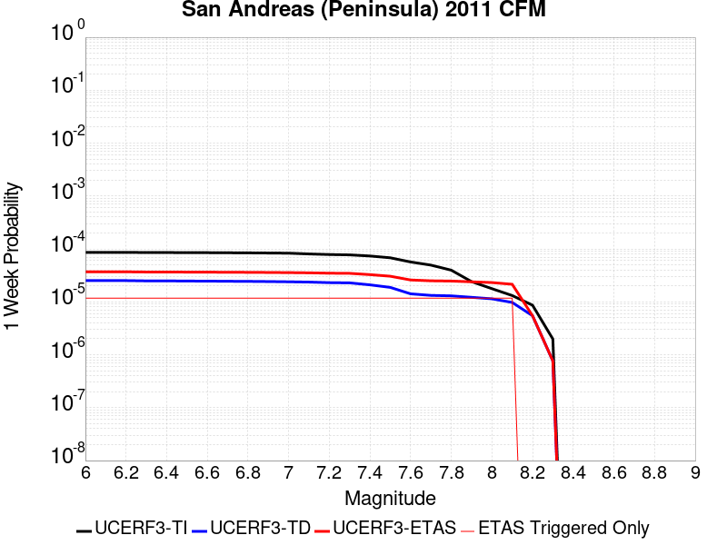 | 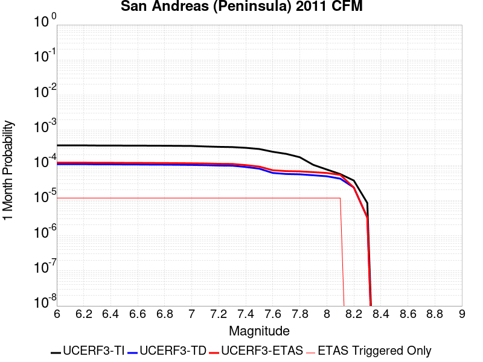 | 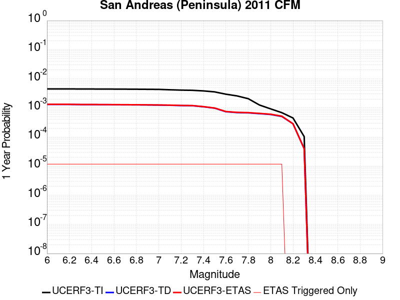 | 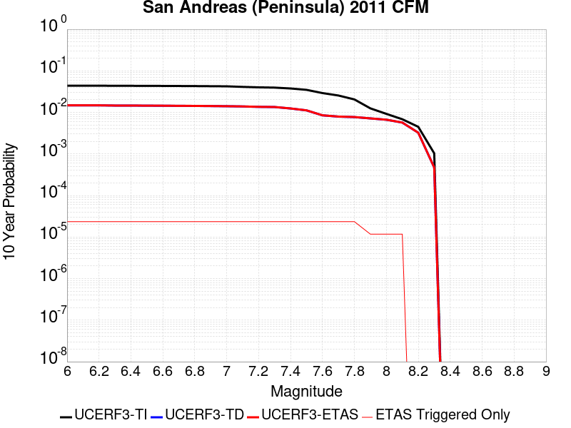 |

| Magnitude | 1 wk TI Prob | 1 wk TD Prob | 1 wk ETAS Prob | 1 wk ETAS/TD Gain | 1 wk ETAS Triggered Only | 1 mo TI Prob | 1 mo TD Prob | 1 mo ETAS Prob | 1 mo ETAS/TD Gain | 1 mo ETAS Triggered Only | 1 yr TI Prob | 1 yr TD Prob | 1 yr ETAS Prob | 1 yr ETAS/TD Gain | 1 yr ETAS Triggered Only | 10 yr TI Prob | 10 yr TD Prob | 10 yr ETAS Prob | 10 yr ETAS/TD Gain | 10 yr ETAS Triggered Only |
|-----|-----|-----|-----|-----|-----|-----|-----|-----|-----|-----|-----|-----|-----|-----|-----|-----|-----|-----|-----|-----|
| 6.0 | 8.6200685E-5 | 2.52136E-5 | 3.6950394E-5 | 1.4654945 | 1.1737089E-5 | 3.6937918E-4 | 1.0805382E-4 | 1.1978964E-4 | 1.1086109 | 1.1737089E-5 | 0.0044879215 | 0.001314763 | 0.0013264846 | 1.0089154 | 1.1737089E-5 | 0.043983612 | 0.014774441 | 0.014797568 | 1.0015653 | 2.3474178E-5 |
| 6.1 | 8.6200685E-5 | 2.52136E-5 | 3.6950394E-5 | 1.4654945 | 1.1737089E-5 | 3.6937918E-4 | 1.0805382E-4 | 1.1978964E-4 | 1.1086109 | 1.1737089E-5 | 0.0044879215 | 0.001314763 | 0.0013264846 | 1.0089154 | 1.1737089E-5 | 0.043983612 | 0.014774441 | 0.014797568 | 1.0015653 | 2.3474178E-5 |
| 6.2 | 8.6200685E-5 | 2.52136E-5 | 3.6950394E-5 | 1.4654945 | 1.1737089E-5 | 3.6937918E-4 | 1.0805382E-4 | 1.1978964E-4 | 1.1086109 | 1.1737089E-5 | 0.0044879215 | 0.001314763 | 0.0013264846 | 1.0089154 | 1.1737089E-5 | 0.043983612 | 0.014774441 | 0.014797568 | 1.0015653 | 2.3474178E-5 |
| 6.3 | 8.551163E-5 | 2.490552E-5 | 3.6642316E-5 | 1.4712528 | 1.1737089E-5 | 3.6642692E-4 | 1.06733576E-4 | 1.1846941E-4 | 1.1099545 | 1.1737089E-5 | 0.004452125 | 0.0012987083 | 0.0013104301 | 1.0090258 | 1.1737089E-5 | 0.043639794 | 0.014601416 | 0.014624547 | 1.0015842 | 2.3474178E-5 |
| 6.4 | 8.551163E-5 | 2.490552E-5 | 3.6642316E-5 | 1.4712528 | 1.1737089E-5 | 3.6642692E-4 | 1.06733576E-4 | 1.1846941E-4 | 1.1099545 | 1.1737089E-5 | 0.004452125 | 0.0012987083 | 0.0013104301 | 1.0090258 | 1.1737089E-5 | 0.043639794 | 0.014601416 | 0.014624547 | 1.0015842 | 2.3474178E-5 |
| 6.5 | 8.511146E-5 | 2.4726973E-5 | 3.646377E-5 | 1.4746557 | 1.1737089E-5 | 3.647124E-4 | 1.05968444E-4 | 1.1770429E-4 | 1.1107485 | 1.1737089E-5 | 0.004431336 | 0.0012894038 | 0.0013011257 | 1.009091 | 1.1737089E-5 | 0.04344007 | 0.0145011945 | 0.014524328 | 1.0015953 | 2.3474178E-5 |
| 6.6 | 8.4985084E-5 | 2.4657606E-5 | 3.6394405E-5 | 1.475991 | 1.1737089E-5 | 3.6417096E-4 | 1.05671184E-4 | 1.1740703E-4 | 1.11106 | 1.1737089E-5 | 0.0044247704 | 0.001285789 | 0.0012975109 | 1.0091165 | 1.1737089E-5 | 0.043376986 | 0.014463263 | 0.014486397 | 1.0015996 | 2.3474178E-5 |
| 6.7 | 8.462618E-5 | 2.4486113E-5 | 3.6222915E-5 | 1.4793248 | 1.1737089E-5 | 3.6263323E-4 | 1.0493627E-4 | 1.1667213E-4 | 1.111838 | 1.1737089E-5 | 0.004406125 | 0.0012768519 | 0.001288574 | 1.0091804 | 1.1737089E-5 | 0.043197807 | 0.01436807 | 0.014391207 | 1.0016103 | 2.3474178E-5 |
| 6.8 | 8.42337E-5 | 2.438192E-5 | 3.6118723E-5 | 1.4813732 | 1.1737089E-5 | 3.6095164E-4 | 1.04489765E-4 | 1.1622563E-4 | 1.1123159 | 1.1737089E-5 | 0.004385734 | 0.0012714221 | 0.0012831442 | 1.0092198 | 1.1737089E-5 | 0.043001823 | 0.014308756 | 0.014331894 | 1.0016171 | 2.3474178E-5 |
| 6.9 | 8.365989E-5 | 2.4186513E-5 | 3.592332E-5 | 1.4852624 | 1.1737089E-5 | 3.5849313E-4 | 1.03652375E-4 | 1.1538825E-4 | 1.1132234 | 1.1737089E-5 | 0.004355922 | 0.0012612387 | 0.001272961 | 1.0092943 | 1.1737089E-5 | 0.04271523 | 0.014201242 | 0.014224382 | 1.0016295 | 2.3474178E-5 |
| 7.0 | 8.30936E-5 | 2.3948E-5 | 3.5684807E-5 | 1.4900955 | 1.1737089E-5 | 3.560668E-4 | 1.02630256E-4 | 1.14366136E-4 | 1.1143512 | 1.1737089E-5 | 0.004326499 | 0.0012488087 | 0.0012605311 | 1.0093869 | 1.1737089E-5 | 0.042432297 | 0.014072227 | 0.014095371 | 1.0016446 | 2.3474178E-5 |
| 7.1 | 8.041264E-5 | 2.3634402E-5 | 3.5371213E-5 | 1.4965986 | 1.1737089E-5 | 3.4458007E-4 | 1.0128637E-4 | 1.1302227E-4 | 1.1158684 | 1.1737089E-5 | 0.0041871946 | 0.0012324656 | 0.0012441882 | 1.0095115 | 1.1737089E-5 | 0.041091725 | 0.013895032 | 0.01391818 | 1.001666 | 2.3474178E-5 |
| 7.2 | 7.8427016E-5 | 2.3058019E-5 | 3.4794837E-5 | 1.5090125 | 1.1737089E-5 | 3.3607247E-4 | 9.8816345E-5 | 1.10552275E-4 | 1.1187651 | 1.1737089E-5 | 0.004084008 | 0.0012024266 | 0.0012141495 | 1.0097494 | 1.1737089E-5 | 0.040097635 | 0.013579085 | 0.01360224 | 1.0017052 | 2.3474178E-5 |
| 7.3 | 7.721087E-5 | 2.2842805E-5 | 3.4579625E-5 | 1.5138083 | 1.1737089E-5 | 3.3086175E-4 | 9.7894066E-5 | 1.0963001E-4 | 1.1198841 | 1.1737089E-5 | 0.004020803 | 0.0011912102 | 0.0012029334 | 1.0098413 | 1.1737089E-5 | 0.03948827 | 0.013462781 | 0.013485939 | 1.0017202 | 2.3474178E-5 |
| 7.4 | 7.3536525E-5 | 2.0960428E-5 | 3.2697273E-5 | 1.5599525 | 1.1737089E-5 | 3.1511846E-4 | 8.982732E-5 | 1.0156335E-4 | 1.1306511 | 1.1737089E-5 | 0.0038298194 | 0.0010931002 | 0.0011048245 | 1.0107257 | 1.1737089E-5 | 0.037644852 | 0.012419564 | 0.012442746 | 1.0018666 | 2.3474178E-5 |
| 7.5 | 6.806207E-5 | 1.876674E-5 | 3.0503608E-5 | 1.6254079 | 1.1737089E-5 | 2.9166197E-4 | 8.042641E-5 | 9.2162554E-5 | 1.145924 | 1.1737089E-5 | 0.0035452035 | 9.787527E-4 | 9.904783E-4 | 1.0119802 | 1.1737089E-5 | 0.034891766 | 0.01117254 | 0.011195751 | 1.0020776 | 2.3474178E-5 |
| 7.6 | 5.6731416E-5 | 1.4177827E-5 | 2.591475E-5 | 1.8278365 | 1.1737089E-5 | 2.43112E-4 | 6.07607E-5 | 7.2497074E-5 | 1.1931573 | 1.1737089E-5 | 0.0029558712 | 7.395106E-4 | 7.51239E-4 | 1.0158597 | 1.1737089E-5 | 0.02916862 | 0.008485565 | 0.00850884 | 1.0027429 | 2.3474178E-5 |
| 7.7 | 4.946994E-5 | 1.3246218E-5 | 2.4983152E-5 | 1.8860592 | 1.1737089E-5 | 2.1199681E-4 | 5.6768273E-5 | 6.85047E-5 | 1.2067426 | 1.1737089E-5 | 0.002578006 | 6.9093466E-4 | 7.026637E-4 | 1.0169755 | 1.1737089E-5 | 0.02548303 | 0.0079078935 | 0.007931182 | 1.002945 | 2.3474178E-5 |
| 7.8 | 3.9718198E-5 | 1.2982541E-5 | 2.4719478E-5 | 1.9040555 | 1.1737089E-5 | 1.7020974E-4 | 5.5638273E-5 | 6.737471E-5 | 1.2109418 | 1.1737089E-5 | 0.0020703338 | 6.771856E-4 | 6.8891473E-4 | 1.0173204 | 1.1737089E-5 | 0.020511515 | 0.0077184658 | 0.007741759 | 1.0030178 | 2.3474178E-5 |
| 7.9 | 2.4115114E-5 | 1.218559E-5 | 2.3922537E-5 | 1.9631824 | 1.1737089E-5 | 1.0334639E-4 | 5.2222913E-5 | 6.395939E-5 | 1.224738 | 1.1737089E-5 | 0.001257516 | 6.3562865E-4 | 6.4735825E-4 | 1.0184536 | 1.1737089E-5 | 0.012504238 | 0.007159044 | 0.0071706967 | 1.0016277 | 1.1737089E-5 |
| 8.0 | 1.7756569E-5 | 1.1410005E-5 | 2.314696E-5 | 2.0286548 | 1.1737089E-5 | 7.6097356E-5 | 4.8899106E-5 | 6.063562E-5 | 1.2400149 | 1.1737089E-5 | 9.260915E-4 | 5.951841E-4 | 6.069142E-4 | 1.0197084 | 1.1737089E-5 | 0.009222416 | 0.006659493 | 0.0066711516 | 1.0017507 | 1.1737089E-5 |
| 8.1 | 1.3159258E-5 | 9.746194E-6 | 2.1483169E-5 | 2.2042623 | 1.1737089E-5 | 5.6395602E-5 | 4.1768737E-5 | 5.3505337E-5 | 1.28099 | 1.1737089E-5 | 6.864001E-4 | 5.0841586E-4 | 5.20147E-4 | 1.0230739 | 1.1737089E-5 | 0.0068428386 | 0.005689538 | 0.005701208 | 1.0020512 | 1.1737089E-5 |
| 8.2 | 8.635426E-6 | 5.466912E-6 | 5.466912E-6 | 1.0 | 0.0 | 3.700844E-5 | 2.3429413E-5 | 2.3429413E-5 | 1.0 | 0.0 | 4.5048463E-4 | 2.8521585E-4 | 2.8521585E-4 | 1.0 | 0.0 | 0.004495725 | 0.0032445018 | 0.0032445018 | 1.0 | 0.0 |
| 8.3 | 1.983087E-6 | 7.6599065E-7 | 7.6599065E-7 | 1.0 | 0.0 | 8.498917E-6 | 3.282813E-6 | 3.282813E-6 | 1.0 | 0.0 | 1.034694E-4 | 3.9967534E-5 | 3.9967534E-5 | 1.0 | 0.0 | 0.0010342124 | 4.719687E-4 | 4.719687E-4 | 1.0 | 0.0 |

## Santa Susana East (connector)
*[(top)](#table-of-contents)*

| 1 Week | 1 Month | 1 Year | 10 Year |
|-----|-----|-----|-----|
| 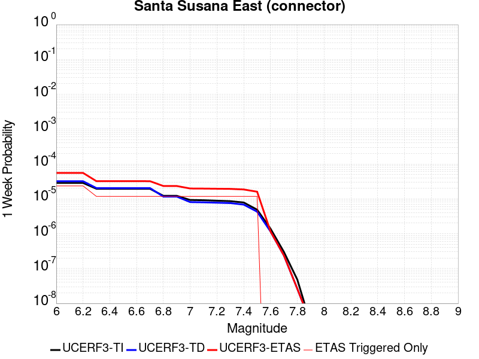 | 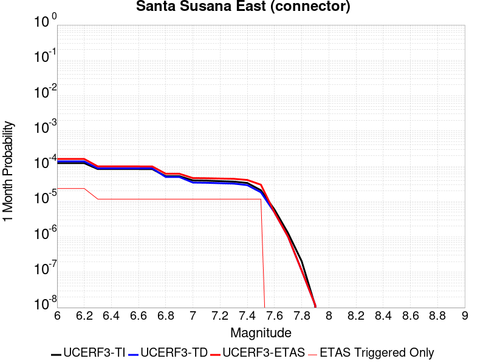 | 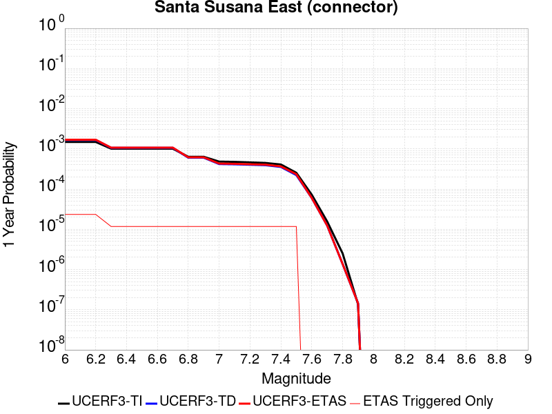 | 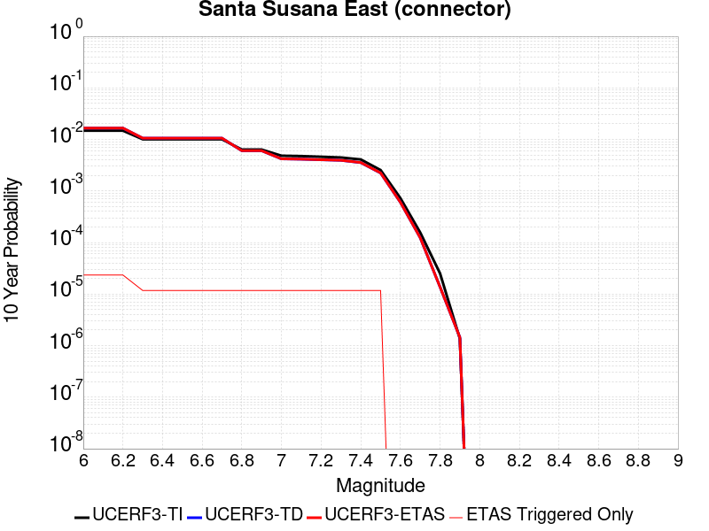 |

| Magnitude | 1 wk TI Prob | 1 wk TD Prob | 1 wk ETAS Prob | 1 wk ETAS/TD Gain | 1 wk ETAS Triggered Only | 1 mo TI Prob | 1 mo TD Prob | 1 mo ETAS Prob | 1 mo ETAS/TD Gain | 1 mo ETAS Triggered Only | 1 yr TI Prob | 1 yr TD Prob | 1 yr ETAS Prob | 1 yr ETAS/TD Gain | 1 yr ETAS Triggered Only | 10 yr TI Prob | 10 yr TD Prob | 10 yr ETAS Prob | 10 yr ETAS/TD Gain | 10 yr ETAS Triggered Only |
|-----|-----|-----|-----|-----|-----|-----|-----|-----|-----|-----|-----|-----|-----|-----|-----|-----|-----|-----|-----|-----|
| 6.0 | 2.858397E-5 | 3.202091E-5 | 5.5494336E-5 | 1.7330655 | 2.3474178E-5 | 1.2249697E-4 | 1.3722685E-4 | 1.606978E-4 | 1.1710377 | 2.3474178E-5 | 0.0014903803 | 0.0016697381 | 0.0016931731 | 1.0140351 | 2.3474178E-5 | 0.014804244 | 0.016599052 | 0.016622137 | 1.0013907 | 2.3474178E-5 |
| 6.1 | 2.858397E-5 | 3.202091E-5 | 5.5494336E-5 | 1.7330655 | 2.3474178E-5 | 1.2249697E-4 | 1.3722685E-4 | 1.606978E-4 | 1.1710377 | 2.3474178E-5 | 0.0014903803 | 0.0016697381 | 0.0016931731 | 1.0140351 | 2.3474178E-5 | 0.014804244 | 0.016599052 | 0.016622137 | 1.0013907 | 2.3474178E-5 |
| 6.2 | 2.858397E-5 | 3.202091E-5 | 5.5494336E-5 | 1.7330655 | 2.3474178E-5 | 1.2249697E-4 | 1.3722685E-4 | 1.606978E-4 | 1.1710377 | 2.3474178E-5 | 0.0014903803 | 0.0016697381 | 0.0016931731 | 1.0140351 | 2.3474178E-5 | 0.014804244 | 0.016599052 | 0.016622137 | 1.0013907 | 2.3474178E-5 |
| 6.3 | 1.943582E-5 | 2.036718E-5 | 3.210403E-5 | 1.576263 | 1.1737089E-5 | 8.329371E-5 | 8.7285625E-5 | 9.9021694E-5 | 1.1344559 | 1.1737089E-5 | 0.001013629 | 0.0010622967 | 0.0010740212 | 1.011037 | 1.1737089E-5 | 0.010090181 | 0.010583619 | 0.010595231 | 1.0010972 | 1.1737089E-5 |
| 6.4 | 1.943582E-5 | 2.036718E-5 | 3.210403E-5 | 1.576263 | 1.1737089E-5 | 8.329371E-5 | 8.7285625E-5 | 9.9021694E-5 | 1.1344559 | 1.1737089E-5 | 0.001013629 | 0.0010622967 | 0.0010740212 | 1.011037 | 1.1737089E-5 | 0.010090181 | 0.010583619 | 0.010595231 | 1.0010972 | 1.1737089E-5 |
| 6.5 | 1.943582E-5 | 2.036718E-5 | 3.210403E-5 | 1.576263 | 1.1737089E-5 | 8.329371E-5 | 8.7285625E-5 | 9.9021694E-5 | 1.1344559 | 1.1737089E-5 | 0.001013629 | 0.0010622967 | 0.0010740212 | 1.011037 | 1.1737089E-5 | 0.010090181 | 0.010583619 | 0.010595231 | 1.0010972 | 1.1737089E-5 |
| 6.6 | 1.943582E-5 | 2.036718E-5 | 3.210403E-5 | 1.576263 | 1.1737089E-5 | 8.329371E-5 | 8.7285625E-5 | 9.9021694E-5 | 1.1344559 | 1.1737089E-5 | 0.001013629 | 0.0010622967 | 0.0010740212 | 1.011037 | 1.1737089E-5 | 0.010090181 | 0.010583619 | 0.010595231 | 1.0010972 | 1.1737089E-5 |
| 6.7 | 1.9404439E-5 | 2.03546E-5 | 3.209145E-5 | 1.576619 | 1.1737089E-5 | 8.3159226E-5 | 8.723172E-5 | 9.896779E-5 | 1.134539 | 1.1737089E-5 | 0.0010119933 | 0.0010616409 | 0.0010733656 | 1.0110439 | 1.1737089E-5 | 0.010073971 | 0.010577125 | 0.010588737 | 1.0010979 | 1.1737089E-5 |
| 6.8 | 1.2217526E-5 | 1.1592998E-5 | 2.332995E-5 | 2.0124176 | 1.1737089E-5 | 5.2359774E-5 | 4.9683425E-5 | 6.141993E-5 | 1.2362258 | 1.1737089E-5 | 6.372938E-4 | 6.0474465E-4 | 6.1647466E-4 | 1.0193965 | 1.1737089E-5 | 0.0063546924 | 0.006033037 | 0.006044703 | 1.0019337 | 1.1737089E-5 |
| 6.9 | 1.2217526E-5 | 1.1592998E-5 | 2.332995E-5 | 2.0124176 | 1.1737089E-5 | 5.2359774E-5 | 4.9683425E-5 | 6.141993E-5 | 1.2362258 | 1.1737089E-5 | 6.372938E-4 | 6.0474465E-4 | 6.1647466E-4 | 1.0193965 | 1.1737089E-5 | 0.0063546924 | 0.006033037 | 0.006044703 | 1.0019337 | 1.1737089E-5 |
| 7.0 | 9.276017E-6 | 8.059113E-6 | 1.9796107E-5 | 2.4563632 | 1.1737089E-5 | 3.9753755E-5 | 3.4538618E-5 | 4.62753E-5 | 1.3398134 | 1.1737089E-5 | 4.8389446E-4 | 4.2042998E-4 | 4.3216214E-4 | 1.0279051 | 1.1737089E-5 | 0.0048284214 | 0.0041970722 | 0.00420876 | 1.0027847 | 1.1737089E-5 |
| 7.1 | 9.130355E-6 | 7.942286E-6 | 1.9679283E-5 | 2.4777856 | 1.1737089E-5 | 3.9129503E-5 | 3.4037945E-5 | 4.5774636E-5 | 1.3448119 | 1.1737089E-5 | 4.7629757E-4 | 4.1433662E-4 | 4.2606884E-4 | 1.0283157 | 1.1737089E-5 | 0.00475278 | 0.004136367 | 0.0041480553 | 1.0028259 | 1.1737089E-5 |
| 7.2 | 8.851015E-6 | 7.741445E-6 | 1.9478444E-5 | 2.516125 | 1.1737089E-5 | 3.7932372E-5 | 3.317722E-5 | 4.491392E-5 | 1.3537577 | 1.1737089E-5 | 4.6172875E-4 | 4.038612E-4 | 4.1559356E-4 | 1.0290505 | 1.1737089E-5 | 0.0046077054 | 0.0040319953 | 0.0040436853 | 1.0028993 | 1.1737089E-5 |
| 7.3 | 8.573006E-6 | 7.550166E-6 | 1.9287167E-5 | 2.5545354 | 1.1737089E-5 | 3.6740938E-5 | 3.2357475E-5 | 4.4094184E-5 | 1.3627203 | 1.1737089E-5 | 4.472291E-4 | 3.9388443E-4 | 4.056169E-4 | 1.0297866 | 1.1737089E-5 | 0.004463301 | 0.0039325804 | 0.0039442712 | 1.0029728 | 1.1737089E-5 |
| 7.4 | 7.852282E-6 | 6.817687E-6 | 1.8554696E-5 | 2.721553 | 1.1737089E-5 | 3.36522E-5 | 2.9218349E-5 | 4.0955096E-5 | 1.401691 | 1.1737089E-5 | 4.096385E-4 | 3.5567835E-4 | 3.6741127E-4 | 1.0329875 | 1.1737089E-5 | 0.0040888423 | 0.0035517553 | 0.0035634506 | 1.0032928 | 1.1737089E-5 |
| 7.5 | 4.8869324E-6 | 4.279055E-6 | 1.6016094E-5 | 3.7429044 | 1.1737089E-5 | 2.0943828E-5 | 1.8338687E-5 | 3.0075562E-5 | 1.6400062 | 1.1737089E-5 | 2.5496128E-4 | 2.232523E-4 | 2.3498677E-4 | 1.0525615 | 1.1737089E-5 | 0.0025466895 | 0.0022304445 | 0.0022421554 | 1.0052505 | 1.1737089E-5 |
| 7.6 | 1.3894544E-6 | 1.1568179E-6 | 1.1568179E-6 | 1.0 | 0.0 | 5.954791E-6 | 4.957783E-6 | 4.957783E-6 | 1.0 | 0.0 | 7.249717E-5 | 6.0359558E-5 | 6.0359558E-5 | 1.0 | 0.0 | 7.247352E-4 | 6.0345343E-4 | 6.0345343E-4 | 1.0 | 0.0 |
| 7.7 | 2.9924632E-7 | 2.371928E-7 | 2.371928E-7 | 1.0 | 0.0 | 1.2824837E-6 | 1.0165402E-6 | 1.0165402E-6 | 1.0 | 0.0 | 1.5614127E-5 | 1.2376314E-5 | 1.2376314E-5 | 1.0 | 0.0 | 1.5613029E-4 | 1.2375697E-4 | 1.2375697E-4 | 1.0 | 0.0 |
| 7.8 | 4.8188564E-8 | 2.6323061E-8 | 2.6323061E-8 | 1.0 | 0.0 | 2.065224E-7 | 1.1281311E-7 | 1.1281311E-7 | 1.0 | 0.0 | 2.5144072E-6 | 1.3734989E-6 | 1.3734989E-6 | 1.0 | 0.0 | 2.5143789E-5 | 1.3734912E-5 | 1.3734912E-5 | 1.0 | 0.0 |
| 7.9 | 2.6127251E-9 | 2.7681102E-9 | 2.7681102E-9 | 1.0 | 0.0 | 1.1197393E-8 | 1.186333E-8 | 1.186333E-8 | 1.0 | 0.0 | 1.3632825E-7 | 1.4443603E-7 | 1.4443603E-7 | 1.0 | 0.0 | 1.3632817E-6 | 1.4443604E-6 | 1.4443604E-6 | 1.0 | 0.0 |

## San Jacinto (Borrego)
*[(top)](#table-of-contents)*

| 1 Week | 1 Month | 1 Year | 10 Year |
|-----|-----|-----|-----|
| 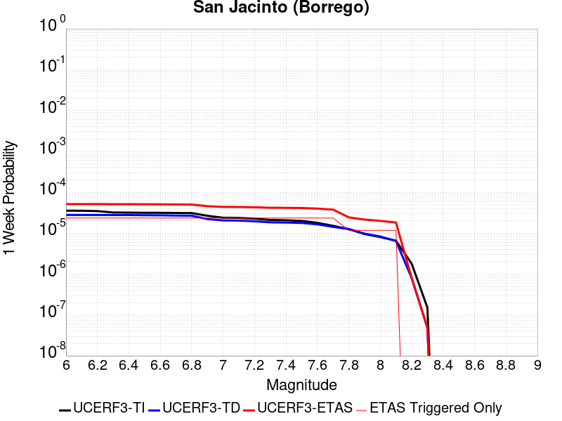 | 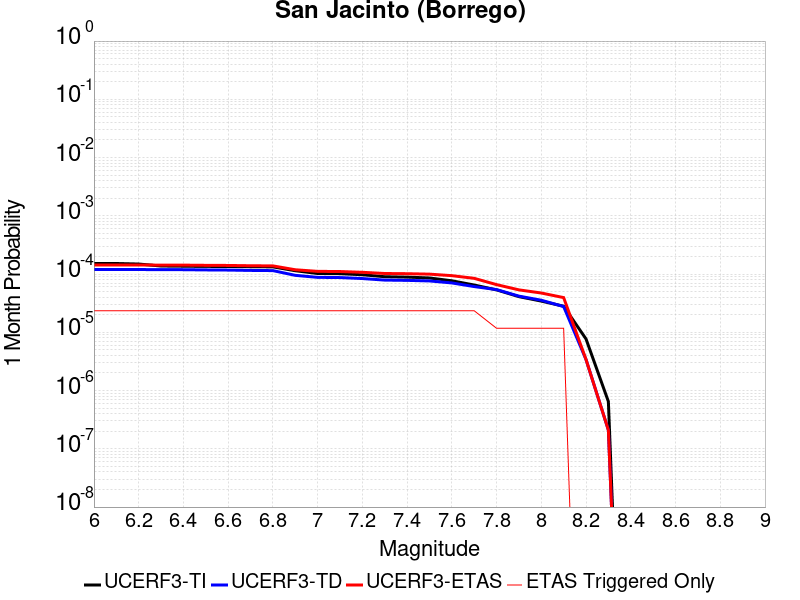 | 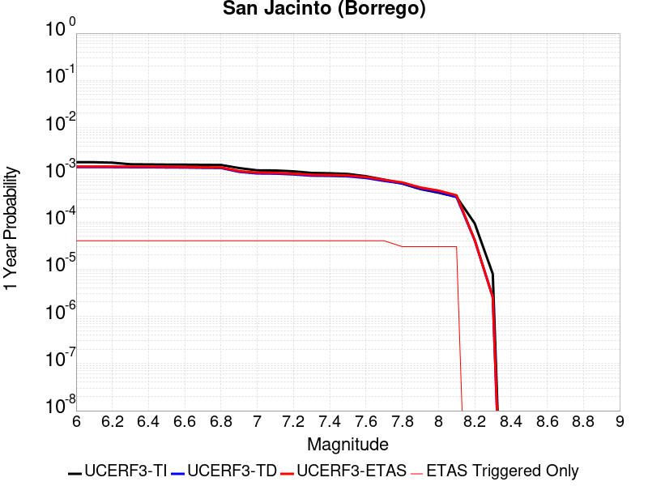 | 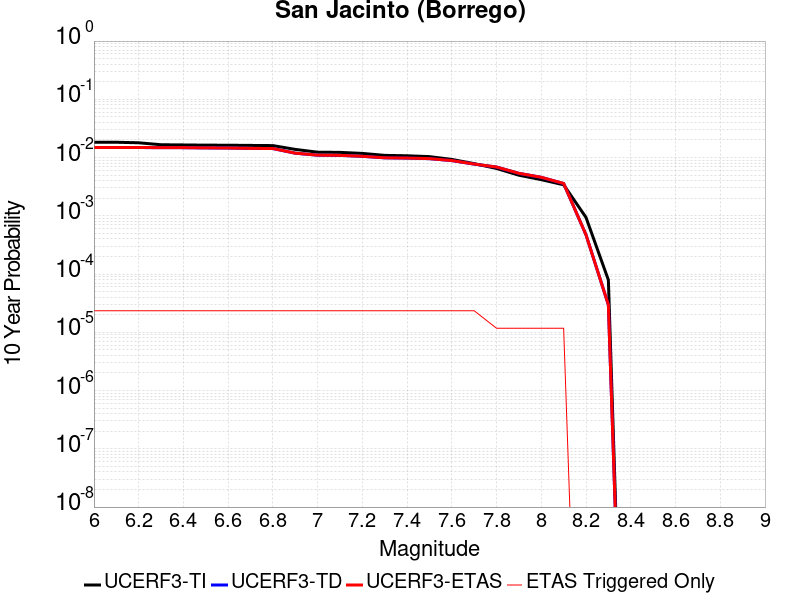 |

| Magnitude | 1 wk TI Prob | 1 wk TD Prob | 1 wk ETAS Prob | 1 wk ETAS/TD Gain | 1 wk ETAS Triggered Only | 1 mo TI Prob | 1 mo TD Prob | 1 mo ETAS Prob | 1 mo ETAS/TD Gain | 1 mo ETAS Triggered Only | 1 yr TI Prob | 1 yr TD Prob | 1 yr ETAS Prob | 1 yr ETAS/TD Gain | 1 yr ETAS Triggered Only | 10 yr TI Prob | 10 yr TD Prob | 10 yr ETAS Prob | 10 yr ETAS/TD Gain | 10 yr ETAS Triggered Only |
|-----|-----|-----|-----|-----|-----|-----|-----|-----|-----|-----|-----|-----|-----|-----|-----|-----|-----|-----|-----|-----|
| 6.0 | 3.543992E-5 | 2.7926513E-5 | 5.1400035E-5 | 1.8405461 | 2.3474178E-5 | 1.5187653E-4 | 1.1967963E-4 | 1.43151E-4 | 1.1961184 | 2.3474178E-5 | 0.0018475284 | 0.0014561379 | 0.0014795779 | 1.0160974 | 2.3474178E-5 | 0.018322436 | 0.014869647 | 0.014892773 | 1.0015552 | 2.3474178E-5 |
| 6.1 | 3.542281E-5 | 2.7926513E-5 | 5.1400035E-5 | 1.8405461 | 2.3474178E-5 | 1.5180321E-4 | 1.1967963E-4 | 1.43151E-4 | 1.1961184 | 2.3474178E-5 | 0.0018466372 | 0.0014561379 | 0.0014795779 | 1.0160974 | 2.3474178E-5 | 0.018313672 | 0.014869647 | 0.014892773 | 1.0015552 | 2.3474178E-5 |
| 6.2 | 3.4688688E-5 | 2.7926511E-5 | 5.1400035E-5 | 1.8405461 | 2.3474178E-5 | 1.4865733E-4 | 1.1967963E-4 | 1.43151E-4 | 1.1961184 | 2.3474178E-5 | 0.0018084005 | 0.0014561379 | 0.0014795779 | 1.0160974 | 2.3474178E-5 | 0.017937548 | 0.014869647 | 0.014892772 | 1.0015552 | 2.3474178E-5 |
| 6.3 | 3.2087122E-5 | 2.7771865E-5 | 5.124539E-5 | 1.8452269 | 2.3474178E-5 | 1.3750899E-4 | 1.1901691E-4 | 1.424883E-4 | 1.1972106 | 2.3474178E-5 | 0.0016728862 | 0.00144808 | 0.0014715202 | 1.0161871 | 2.3474178E-5 | 0.016603488 | 0.014790683 | 0.01481381 | 1.0015637 | 2.3474178E-5 |
| 6.4 | 3.1828724E-5 | 2.7738852E-5 | 5.1212377E-5 | 1.8462329 | 2.3474178E-5 | 1.364017E-4 | 1.1887544E-4 | 1.4234683E-4 | 1.1974453 | 2.3474178E-5 | 0.0016594254 | 0.0014463598 | 0.0014698 | 1.0162064 | 2.3474178E-5 | 0.016470885 | 0.014773762 | 0.014796889 | 1.0015655 | 2.3474178E-5 |
| 6.5 | 3.1563577E-5 | 2.747857E-5 | 5.0952105E-5 | 1.8542488 | 2.3474178E-5 | 1.3526545E-4 | 1.1776006E-4 | 1.4123147E-4 | 1.1993155 | 2.3474178E-5 | 0.0016456128 | 0.0014327979 | 0.0014562384 | 1.0163599 | 2.3474178E-5 | 0.0163348 | 0.014640348 | 0.014663478 | 1.0015799 | 2.3474178E-5 |
| 6.6 | 3.1467625E-5 | 2.7322796E-5 | 5.0796334E-5 | 1.8591192 | 2.3474178E-5 | 1.3485427E-4 | 1.1709251E-4 | 1.4056393E-4 | 1.200452 | 2.3474178E-5 | 0.0016406142 | 0.0014246812 | 0.001448122 | 1.0164533 | 2.3474178E-5 | 0.016285548 | 0.014560594 | 0.014583726 | 1.0015887 | 2.3474178E-5 |
| 6.7 | 3.1223695E-5 | 2.6940816E-5 | 5.041436E-5 | 1.8713006 | 2.3474178E-5 | 1.3380898E-4 | 1.15455594E-4 | 1.3892706E-4 | 1.2032943 | 2.3474178E-5 | 0.0016279068 | 0.0014047775 | 0.0014282188 | 1.0166868 | 2.3474178E-5 | 0.01616033 | 0.014364966 | 0.014388103 | 1.0016106 | 2.3474178E-5 |
| 6.8 | 3.1015585E-5 | 2.6761822E-5 | 5.0235372E-5 | 1.8771282 | 2.3474178E-5 | 1.3291716E-4 | 1.1468855E-4 | 1.3816003E-4 | 1.2046541 | 2.3474178E-5 | 0.001617065 | 0.0013954508 | 0.0014188922 | 1.0167985 | 2.3474178E-5 | 0.016053487 | 0.014272246 | 0.014295385 | 1.0016212 | 2.3474178E-5 |
| 6.9 | 2.6641965E-5 | 2.2184247E-5 | 4.5657904E-5 | 2.0581229 | 2.3474178E-5 | 1.1417485E-4 | 9.50719E-5 | 1.18543845E-4 | 1.2468863 | 2.3474178E-5 | 0.0013891924 | 0.0011568897 | 0.0011803367 | 1.0202672 | 2.3474178E-5 | 0.0138054015 | 0.011882438 | 0.011905634 | 1.001952 | 2.3474178E-5 |
| 7.0 | 2.3854353E-5 | 2.0479023E-5 | 4.395272E-5 | 2.1462314 | 2.3474178E-5 | 1.02228936E-4 | 8.77643E-5 | 1.11236426E-4 | 1.267445 | 2.3474178E-5 | 0.0012439266 | 0.0010680092 | 0.0010914583 | 1.0219558 | 2.3474178E-5 | 0.012369866 | 0.0109828 | 0.011006017 | 1.0021139 | 2.3474178E-5 |
| 7.1 | 2.3672901E-5 | 2.031551E-5 | 4.3789212E-5 | 2.155457 | 2.3474178E-5 | 1.0145135E-4 | 8.7063585E-5 | 1.10535715E-4 | 1.2695976 | 2.3474178E-5 | 0.0012344702 | 0.0010594862 | 0.0010829355 | 1.0221328 | 2.3474178E-5 | 0.0122763505 | 0.010897976 | 0.010921194 | 1.0021305 | 2.3474178E-5 |
| 7.2 | 2.2717244E-5 | 1.9542893E-5 | 4.301661E-5 | 2.2011385 | 2.3474178E-5 | 9.735599E-5 | 8.375258E-5 | 1.0722479E-4 | 1.2802566 | 2.3474178E-5 | 0.0011846646 | 0.001019213 | 0.0010426632 | 1.0230082 | 2.3474178E-5 | 0.01178369 | 0.010495341 | 0.0105185695 | 1.0022131 | 2.3474178E-5 |
| 7.3 | 2.1016205E-5 | 1.8384526E-5 | 4.185827E-5 | 2.276821 | 2.3474178E-5 | 9.006634E-5 | 7.878846E-5 | 1.0226078E-4 | 1.2979158 | 2.3474178E-5 | 0.001096006 | 9.5882936E-4 | 9.82281E-4 | 1.0244586 | 2.3474178E-5 | 0.010906163 | 0.009890967 | 0.009914209 | 1.0023499 | 2.3474178E-5 |
| 7.4 | 2.0683625E-5 | 1.8187047E-5 | 4.1660798E-5 | 2.2906852 | 2.3474178E-5 | 8.86411E-5 | 7.794217E-5 | 1.0141452E-4 | 1.3011508 | 2.3474178E-5 | 0.001078671 | 9.485349E-4 | 9.7198674E-4 | 1.0247244 | 2.3474178E-5 | 0.010734501 | 0.009787692 | 0.009810937 | 1.0023749 | 2.3474178E-5 |
| 7.5 | 1.9993966E-5 | 1.7782075E-5 | 4.1255837E-5 | 2.32008 | 2.3474178E-5 | 8.568561E-5 | 7.620667E-5 | 9.967906E-5 | 1.3080096 | 2.3474178E-5 | 0.001042723 | 9.2742336E-4 | 9.5087575E-4 | 1.0252877 | 2.3474178E-5 | 0.010378438 | 0.009574614 | 0.009597864 | 1.0024283 | 2.3474178E-5 |
| 7.6 | 1.788966E-5 | 1.6435291E-5 | 3.9909082E-5 | 2.4282553 | 2.3474178E-5 | 7.666772E-5 | 7.043507E-5 | 9.390759E-5 | 1.3332505 | 2.3474178E-5 | 9.3302975E-4 | 8.572113E-4 | 8.806654E-4 | 1.0273609 | 2.3474178E-5 | 0.00929122 | 0.008866487 | 0.008889752 | 1.002624 | 2.3474178E-5 |
| 7.7 | 1.5125781E-5 | 1.4237377E-5 | 3.7711223E-5 | 2.6487477 | 2.3474178E-5 | 6.4823165E-5 | 6.1015908E-5 | 8.448865E-5 | 1.3846987 | 2.3474178E-5 | 7.889362E-4 | 7.426163E-4 | 7.6607306E-4 | 1.0315866 | 2.3474178E-5 | 0.007861412 | 0.0077142045 | 0.0077374973 | 1.0030195 | 2.3474178E-5 |
| 7.8 | 1.250089E-5 | 1.26304985E-5 | 2.4367439E-5 | 1.9292539 | 1.1737089E-5 | 5.3574146E-5 | 5.412959E-5 | 6.586604E-5 | 1.2168214 | 1.1737089E-5 | 6.5207E-4 | 6.588291E-4 | 6.705584E-4 | 1.0178033 | 1.1737089E-5 | 0.006501599 | 0.0068677636 | 0.00687942 | 1.0016973 | 1.1737089E-5 |
| 7.9 | 9.561E-6 | 9.754616E-6 | 2.149159E-5 | 2.2032225 | 1.1737089E-5 | 4.0975072E-5 | 4.1804833E-5 | 5.3541433E-5 | 1.2807474 | 1.1737089E-5 | 4.987573E-4 | 5.088555E-4 | 5.205867E-4 | 1.0230539 | 1.1737089E-5 | 0.0049763937 | 0.0053523467 | 0.005364021 | 1.0021812 | 1.1737089E-5 |
| 8.0 | 8.01699E-6 | 8.293488E-6 | 2.003048E-5 | 2.4152057 | 1.1737089E-5 | 3.4358076E-5 | 3.554304E-5 | 4.7279707E-5 | 1.3302102 | 1.1737089E-5 | 4.1822926E-4 | 4.3265108E-4 | 4.443831E-4 | 1.0271165 | 1.1737089E-5 | 0.0041744304 | 0.004573375 | 0.0045850584 | 1.0025547 | 1.1737089E-5 |
| 8.1 | 6.541947E-6 | 6.4622354E-6 | 1.819925E-5 | 2.8162467 | 1.1737089E-5 | 2.8036617E-5 | 2.7695003E-5 | 3.943177E-5 | 1.4237863 | 1.1737089E-5 | 3.4129233E-4 | 3.37135E-4 | 3.4886814E-4 | 1.0348024 | 1.1737089E-5 | 0.0034076865 | 0.0035806994 | 0.0035923945 | 1.0032661 | 1.1737089E-5 |
| 8.2 | 1.7968189E-6 | 7.9713476E-7 | 7.9713476E-7 | 1.0 | 0.0 | 7.70063E-6 | 3.4162877E-6 | 3.4162877E-6 | 1.0 | 0.0 | 9.3751136E-5 | 4.159253E-5 | 4.159253E-5 | 1.0 | 0.0 | 9.371159E-4 | 4.712058E-4 | 4.712058E-4 | 1.0 | 0.0 |
| 8.3 | 1.5167889E-7 | 4.897714E-8 | 4.897714E-8 | 1.0 | 0.0 | 6.500522E-7 | 2.09902E-7 | 2.09902E-7 | 1.0 | 0.0 | 7.9143565E-6 | 2.5555544E-6 | 2.5555544E-6 | 1.0 | 0.0 | 7.914075E-5 | 2.969505E-5 | 2.969505E-5 | 1.0 | 0.0 |

## Elysian Park (Upper)
*[(top)](#table-of-contents)*

| 1 Week | 1 Month | 1 Year | 10 Year |
|-----|-----|-----|-----|
| 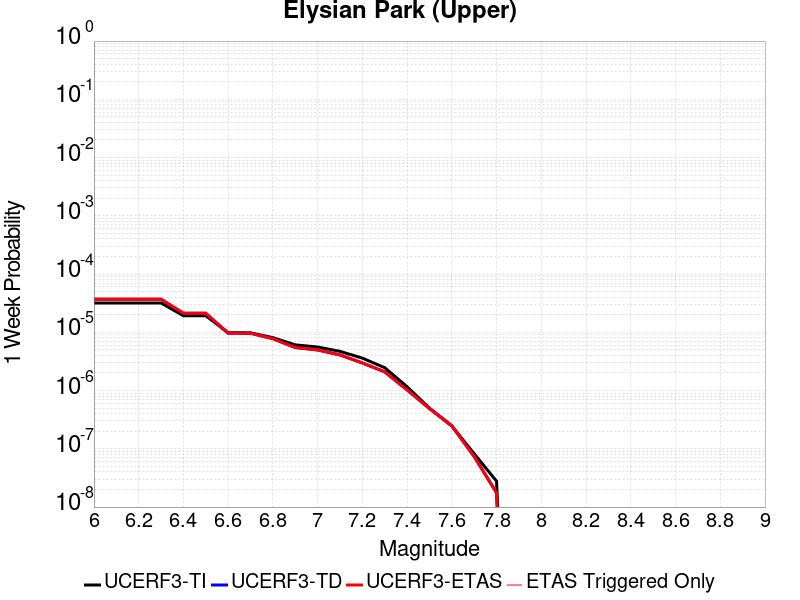 | 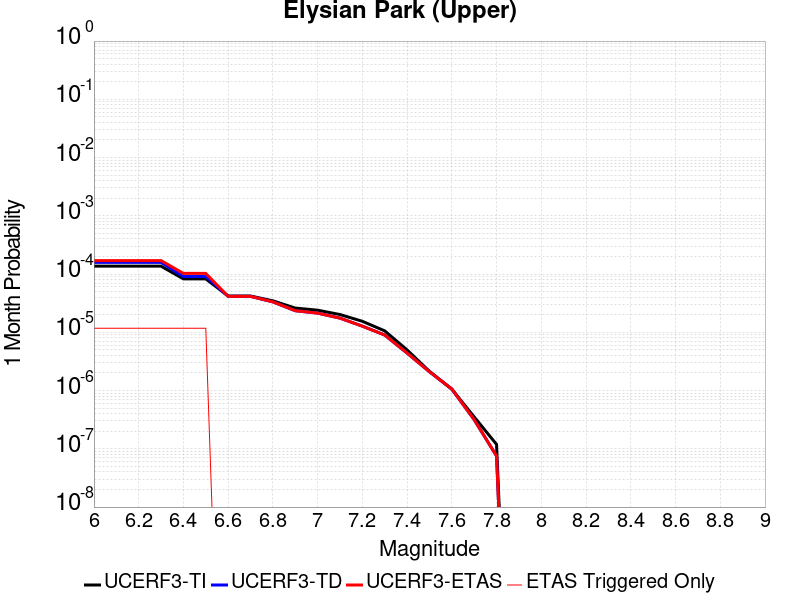 | 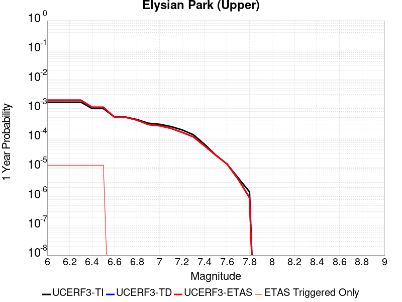 | 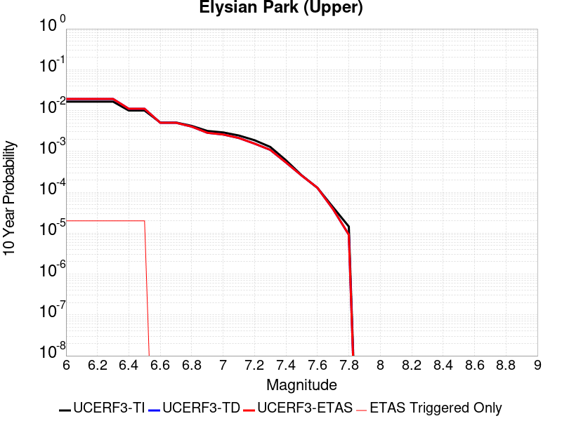 |

| Magnitude | 1 wk TI Prob | 1 wk TD Prob | 1 wk ETAS Prob | 1 wk ETAS/TD Gain | 1 wk ETAS Triggered Only | 1 mo TI Prob | 1 mo TD Prob | 1 mo ETAS Prob | 1 mo ETAS/TD Gain | 1 mo ETAS Triggered Only | 1 yr TI Prob | 1 yr TD Prob | 1 yr ETAS Prob | 1 yr ETAS/TD Gain | 1 yr ETAS Triggered Only | 10 yr TI Prob | 10 yr TD Prob | 10 yr ETAS Prob | 10 yr ETAS/TD Gain | 10 yr ETAS Triggered Only |
|-----|-----|-----|-----|-----|-----|-----|-----|-----|-----|-----|-----|-----|-----|-----|-----|-----|-----|-----|-----|-----|
| 6.0 | 3.1876025E-5 | 3.7035516E-5 | 3.7035516E-5 | 1.0 | 0.0 | 1.3660437E-4 | 1.587167E-4 | 1.7045194E-4 | 1.0739381 | 1.1737089E-5 | 0.0016618895 | 0.0019311075 | 0.0019428219 | 1.0060662 | 1.1737089E-5 | 0.016495159 | 0.019189782 | 0.019212807 | 1.0011998 | 2.3474178E-5 |
| 6.1 | 3.1876025E-5 | 3.7035516E-5 | 3.7035516E-5 | 1.0 | 0.0 | 1.3660437E-4 | 1.587167E-4 | 1.7045194E-4 | 1.0739381 | 1.1737089E-5 | 0.0016618895 | 0.0019311075 | 0.0019428219 | 1.0060662 | 1.1737089E-5 | 0.016495159 | 0.019189782 | 0.019212807 | 1.0011998 | 2.3474178E-5 |
| 6.2 | 3.1876025E-5 | 3.7035516E-5 | 3.7035516E-5 | 1.0 | 0.0 | 1.3660437E-4 | 1.587167E-4 | 1.7045194E-4 | 1.0739381 | 1.1737089E-5 | 0.0016618895 | 0.0019311075 | 0.0019428219 | 1.0060662 | 1.1737089E-5 | 0.016495159 | 0.019189782 | 0.019212807 | 1.0011998 | 2.3474178E-5 |
| 6.3 | 3.1876025E-5 | 3.7035516E-5 | 3.7035516E-5 | 1.0 | 0.0 | 1.3660437E-4 | 1.587167E-4 | 1.7045194E-4 | 1.0739381 | 1.1737089E-5 | 0.0016618895 | 0.0019311075 | 0.0019428219 | 1.0060662 | 1.1737089E-5 | 0.016495159 | 0.019189782 | 0.019212807 | 1.0011998 | 2.3474178E-5 |
| 6.4 | 1.9273462E-5 | 2.1202266E-5 | 2.1202266E-5 | 1.0 | 0.0 | 8.259794E-5 | 9.086466E-5 | 1.0260069E-4 | 1.1291593 | 1.1737089E-5 | 0.001005166 | 0.0011058892 | 0.0011176134 | 1.0106015 | 1.1737089E-5 | 0.010006315 | 0.011020724 | 0.011043939 | 1.0021065 | 2.3474178E-5 |
| 6.5 | 1.9273462E-5 | 2.1202266E-5 | 2.1202266E-5 | 1.0 | 0.0 | 8.259794E-5 | 9.086466E-5 | 1.0260069E-4 | 1.1291593 | 1.1737089E-5 | 0.001005166 | 0.0011058892 | 0.0011176134 | 1.0106015 | 1.1737089E-5 | 0.010006315 | 0.011020724 | 0.011043939 | 1.0021065 | 2.3474178E-5 |
| 6.6 | 9.813258E-6 | 9.665599E-6 | 9.665599E-6 | 1.0 | 0.0 | 4.205614E-5 | 4.1423376E-5 | 4.1423376E-5 | 1.0 | 0.0 | 5.119132E-4 | 5.0422014E-4 | 5.0422014E-4 | 1.0 | 0.0 | 0.005107356 | 0.0050314846 | 0.0050314846 | 1.0 | 0.0 |
| 6.7 | 9.801478E-6 | 9.653168E-6 | 9.653168E-6 | 1.0 | 0.0 | 4.2005657E-5 | 4.1370105E-5 | 4.1370105E-5 | 1.0 | 0.0 | 5.112989E-4 | 5.035719E-4 | 5.035719E-4 | 1.0 | 0.0 | 0.0051012407 | 0.0050250315 | 0.0050250315 | 1.0 | 0.0 |
| 6.8 | 8.102489E-6 | 7.773004E-6 | 7.773004E-6 | 1.0 | 0.0 | 3.4724493E-5 | 3.3312477E-5 | 3.3312477E-5 | 1.0 | 0.0 | 4.2268867E-4 | 4.055089E-4 | 4.055089E-4 | 1.0 | 0.0 | 0.004218856 | 0.0040481836 | 0.0040481836 | 1.0 | 0.0 |
| 6.9 | 6.08275E-6 | 5.4814514E-6 | 5.4814514E-6 | 1.0 | 0.0 | 2.6068668E-5 | 2.3491726E-5 | 2.3491726E-5 | 1.0 | 0.0 | 3.173398E-4 | 2.85975E-4 | 2.85975E-4 | 1.0 | 0.0 | 0.0031688702 | 0.0028561477 | 0.0028561477 | 1.0 | 0.0 |
| 7.0 | 5.5995934E-6 | 4.98278E-6 | 4.98278E-6 | 1.0 | 0.0 | 2.3998036E-5 | 2.13546E-5 | 2.13546E-5 | 1.0 | 0.0 | 2.9213692E-4 | 2.599619E-4 | 2.599619E-4 | 1.0 | 0.0 | 0.0029175316 | 0.0025966454 | 0.0025966454 | 1.0 | 0.0 |
| 7.1 | 4.709881E-6 | 4.0874015E-6 | 4.0874015E-6 | 1.0 | 0.0 | 2.0185047E-5 | 1.7517319E-5 | 1.7517319E-5 | 1.0 | 0.0 | 2.4572524E-4 | 2.132529E-4 | 2.132529E-4 | 1.0 | 0.0 | 0.002454537 | 0.002130524 | 0.002130524 | 1.0 | 0.0 |
| 7.2 | 3.6063436E-6 | 2.9779544E-6 | 2.9779544E-6 | 1.0 | 0.0 | 1.5455667E-5 | 1.27626E-5 | 1.27626E-5 | 1.0 | 0.0 | 1.881565E-4 | 1.5537368E-4 | 1.5537368E-4 | 1.0 | 0.0 | 0.0018799726 | 0.0015526618 | 0.0015526618 | 1.0 | 0.0 |
| 7.3 | 2.471135E-6 | 2.0954615E-6 | 2.0954615E-6 | 1.0 | 0.0 | 1.0590536E-5 | 8.980519E-6 | 8.980519E-6 | 1.0 | 0.0 | 1.2893214E-4 | 1.093324E-4 | 1.093324E-4 | 1.0 | 0.0 | 0.0012885736 | 0.0010927934 | 0.0010927934 | 1.0 | 0.0 |
| 7.4 | 1.163943E-6 | 1.0275091E-6 | 1.0275091E-6 | 1.0 | 0.0 | 4.988318E-6 | 4.4036033E-6 | 4.4036033E-6 | 1.0 | 0.0 | 6.0731076E-5 | 5.3612584E-5 | 5.3612584E-5 | 1.0 | 0.0 | 6.071448E-4 | 5.359995E-4 | 5.359995E-4 | 1.0 | 0.0 |
| 7.5 | 4.99459E-7 | 4.917604E-7 | 4.917604E-7 | 1.0 | 0.0 | 2.140537E-6 | 2.1075427E-6 | 2.1075427E-6 | 1.0 | 0.0 | 2.6060725E-5 | 2.5659048E-5 | 2.5659048E-5 | 1.0 | 0.0 | 2.605767E-4 | 2.5656243E-4 | 2.5656243E-4 | 1.0 | 0.0 |
| 7.6 | 2.4667852E-7 | 2.4778336E-7 | 2.4778336E-7 | 1.0 | 0.0 | 1.0571932E-6 | 1.0619283E-6 | 1.0619283E-6 | 1.0 | 0.0 | 1.2871251E-5 | 1.2928905E-5 | 1.2928905E-5 | 1.0 | 0.0 | 1.2870505E-4 | 1.2928189E-4 | 1.2928189E-4 | 1.0 | 0.0 |
| 7.7 | 8.2312795E-8 | 7.3864456E-8 | 7.3864456E-8 | 1.0 | 0.0 | 3.527691E-7 | 3.165619E-7 | 3.165619E-7 | 1.0 | 0.0 | 4.294955E-6 | 3.8541357E-6 | 3.8541357E-6 | 1.0 | 0.0 | 4.2948723E-5 | 3.8540802E-5 | 3.8540802E-5 | 1.0 | 0.0 |
| 7.8 | 2.7819295E-8 | 1.7566023E-8 | 1.7566023E-8 | 1.0 | 0.0 | 1.1922555E-7 | 7.5282955E-8 | 7.5282955E-8 | 1.0 | 0.0 | 1.45157E-6 | 9.165697E-7 | 9.165697E-7 | 1.0 | 0.0 | 1.45156055E-5 | 9.165675E-6 | 9.165675E-6 | 1.0 | 0.0 |

## Hayward (So) extension 2011 CFM
*[(top)](#table-of-contents)*

| 1 Week | 1 Month | 1 Year | 10 Year |
|-----|-----|-----|-----|
| 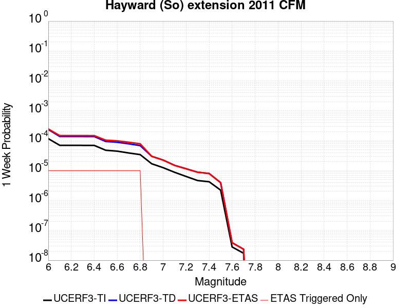 | 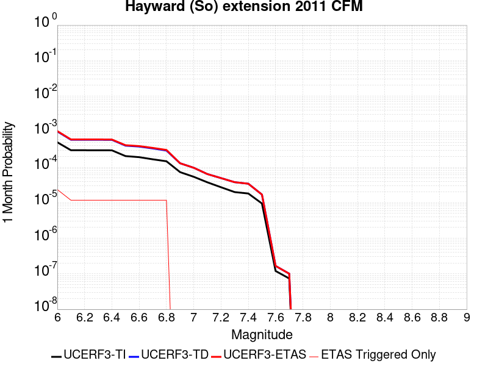 | 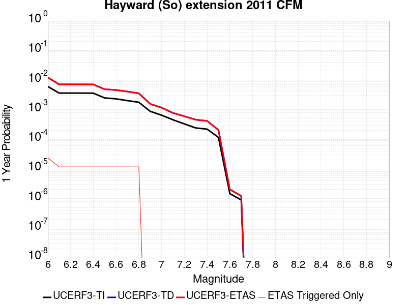 | 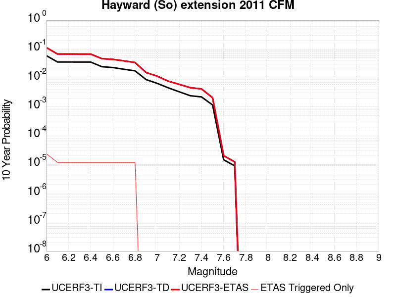 |

| Magnitude | 1 wk TI Prob | 1 wk TD Prob | 1 wk ETAS Prob | 1 wk ETAS/TD Gain | 1 wk ETAS Triggered Only | 1 mo TI Prob | 1 mo TD Prob | 1 mo ETAS Prob | 1 mo ETAS/TD Gain | 1 mo ETAS Triggered Only | 1 yr TI Prob | 1 yr TD Prob | 1 yr ETAS Prob | 1 yr ETAS/TD Gain | 1 yr ETAS Triggered Only | 10 yr TI Prob | 10 yr TD Prob | 10 yr ETAS Prob | 10 yr ETAS/TD Gain | 10 yr ETAS Triggered Only |
|-----|-----|-----|-----|-----|-----|-----|-----|-----|-----|-----|-----|-----|-----|-----|-----|-----|-----|-----|-----|-----|
| 6.0 | 1.1721256E-4 | 2.3697627E-4 | 2.4871057E-4 | 1.0495168 | 1.1737089E-5 | 5.022428E-4 | 0.0010129517 | 0.0010364021 | 1.0231506 | 2.3474178E-5 | 0.0060976758 | 0.012248711 | 0.012271898 | 1.001893 | 2.3474178E-5 | 0.0593305 | 0.112843215 | 0.11286404 | 1.0001845 | 2.3474178E-5 |
| 6.1 | 6.99169E-5 | 1.3822885E-4 | 1.4996431E-4 | 1.0848988 | 1.1737089E-5 | 2.9960944E-4 | 5.9128006E-4 | 6.030102E-4 | 1.0198386 | 1.1737089E-5 | 0.0036416445 | 0.0071720886 | 0.0071837413 | 1.0016247 | 1.1737089E-5 | 0.035825435 | 0.067803554 | 0.06781449 | 1.0001614 | 1.1737089E-5 |
| 6.2 | 6.99169E-5 | 1.3822885E-4 | 1.4996431E-4 | 1.0848988 | 1.1737089E-5 | 2.9960944E-4 | 5.9128006E-4 | 6.030102E-4 | 1.0198386 | 1.1737089E-5 | 0.0036416445 | 0.0071720886 | 0.0071837413 | 1.0016247 | 1.1737089E-5 | 0.035825435 | 0.067803554 | 0.06781449 | 1.0001614 | 1.1737089E-5 |
| 6.3 | 6.970908E-5 | 1.379104E-4 | 1.4964589E-4 | 1.0850949 | 1.1737089E-5 | 2.9871898E-4 | 5.899159E-4 | 6.016461E-4 | 1.0198845 | 1.1737089E-5 | 0.0036308395 | 0.007155625 | 0.0071672783 | 1.0016285 | 1.1737089E-5 | 0.035720866 | 0.067652516 | 0.06766346 | 1.0001618 | 1.1737089E-5 |
| 6.4 | 6.9517155E-5 | 1.375792E-4 | 1.4931468E-4 | 1.0852997 | 1.1737089E-5 | 2.9789665E-4 | 5.884971E-4 | 6.002273E-4 | 1.0199324 | 1.1737089E-5 | 0.0036208609 | 0.0071385372 | 0.007150191 | 1.0016325 | 1.1737089E-5 | 0.03562429 | 0.06749655 | 0.0675075 | 1.0001621 | 1.1737089E-5 |
| 6.5 | 4.786248E-5 | 9.41498E-5 | 1.0588578E-4 | 1.1246523 | 1.1737089E-5 | 2.0510878E-4 | 4.034394E-4 | 4.1517173E-4 | 1.0290809 | 1.1737089E-5 | 0.0024943394 | 0.004901227 | 0.004912907 | 1.002383 | 1.1737089E-5 | 0.02466527 | 0.046901822 | 0.04691301 | 1.0002385 | 1.1737089E-5 |
| 6.6 | 4.4662214E-5 | 8.881654E-5 | 1.00552585E-4 | 1.1321381 | 1.1737089E-5 | 1.9139545E-4 | 3.805894E-4 | 3.9232202E-4 | 1.0308275 | 1.1737089E-5 | 0.0023277493 | 0.0046242937 | 0.0046359766 | 1.0025264 | 1.1737089E-5 | 0.02303517 | 0.044293344 | 0.04430456 | 1.0002532 | 1.1737089E-5 |
| 6.7 | 3.884542E-5 | 7.8648096E-5 | 9.038426E-5 | 1.1492238 | 1.1737089E-5 | 1.6646975E-4 | 3.370222E-4 | 3.4875533E-4 | 1.0348141 | 1.1737089E-5 | 0.002024885 | 0.0040959697 | 0.0041076588 | 1.0028538 | 1.1737089E-5 | 0.020065336 | 0.039333146 | 0.039344423 | 1.0002867 | 1.1737089E-5 |
| 6.8 | 3.4221863E-5 | 6.855653E-5 | 8.029282E-5 | 1.1711913 | 1.1737089E-5 | 1.4665688E-4 | 2.93783E-4 | 3.0551665E-4 | 1.0399399 | 1.1737089E-5 | 0.0017840851 | 0.0035713627 | 0.0035830578 | 1.0032747 | 1.1737089E-5 | 0.017698295 | 0.034421004 | 0.034432337 | 1.0003293 | 1.1737089E-5 |
| 6.9 | 1.6927712E-5 | 3.0061563E-5 | 3.0061563E-5 | 1.0 | 0.0 | 7.2545314E-5 | 1.2882923E-4 | 1.2882923E-4 | 1.0 | 0.0 | 8.828813E-4 | 0.0015674243 | 0.0015674243 | 1.0 | 0.0 | 0.008793819 | 0.01546327 | 0.01546327 | 1.0 | 0.0 |
| 7.0 | 1.2509653E-5 | 2.2462571E-5 | 2.2462571E-5 | 1.0 | 0.0 | 5.3611697E-5 | 9.6264856E-5 | 9.6264856E-5 | 1.0 | 0.0 | 6.525269E-4 | 0.0011714385 | 0.0011714385 | 1.0 | 0.0 | 0.0065061417 | 0.01158231 | 0.01158231 | 1.0 | 0.0 |
| 7.1 | 8.751583E-6 | 1.4925648E-5 | 1.4925648E-5 | 1.0 | 0.0 | 3.750624E-5 | 6.3965526E-5 | 6.3965526E-5 | 1.0 | 0.0 | 4.5654282E-4 | 7.785079E-4 | 7.785079E-4 | 1.0 | 0.0 | 0.0045560603 | 0.007763496 | 0.007763496 | 1.0 | 0.0 |
| 7.2 | 6.354379E-6 | 1.1498636E-5 | 1.1498636E-5 | 1.0 | 0.0 | 2.7232769E-5 | 4.9278966E-5 | 4.9278966E-5 | 1.0 | 0.0 | 3.3150852E-4 | 5.99811E-4 | 5.99811E-4 | 1.0 | 0.0 | 0.0033101442 | 0.0060003046 | 0.0060003046 | 1.0 | 0.0 |
| 7.3 | 4.645554E-6 | 8.818172E-6 | 8.818172E-6 | 1.0 | 0.0 | 1.9909365E-5 | 3.779164E-5 | 3.779164E-5 | 1.0 | 0.0 | 2.4236954E-4 | 4.6002E-4 | 4.6002E-4 | 1.0 | 0.0 | 0.0024210536 | 0.004610708 | 0.004610708 | 1.0 | 0.0 |
| 7.4 | 4.23437E-6 | 7.992532E-6 | 7.992532E-6 | 1.0 | 0.0 | 1.8147173E-5 | 3.425328E-5 | 3.425328E-5 | 1.0 | 0.0 | 2.2091944E-4 | 4.1695772E-4 | 4.1695772E-4 | 1.0 | 0.0 | 0.0022069993 | 0.004181972 | 0.004181972 | 1.0 | 0.0 |
| 7.5 | 2.2187417E-6 | 3.9522306E-6 | 3.9522306E-6 | 1.0 | 0.0 | 9.508858E-6 | 1.6938036E-5 | 1.6938036E-5 | 1.0 | 0.0 | 1.157642E-4 | 2.0620368E-4 | 2.0620368E-4 | 1.0 | 0.0 | 0.0011570391 | 0.0020734754 | 0.0020734754 | 1.0 | 0.0 |
| 7.6 | 2.7952495E-8 | 3.878529E-8 | 3.878529E-8 | 1.0 | 0.0 | 1.1979641E-7 | 1.6622266E-7 | 1.6622266E-7 | 1.0 | 0.0 | 1.4585203E-6 | 2.0237592E-6 | 2.0237592E-6 | 1.0 | 0.0 | 1.4585107E-5 | 2.0328182E-5 | 2.0328182E-5 | 1.0 | 0.0 |
| 7.7 | 1.7192724E-8 | 2.3436517E-8 | 2.3436517E-8 | 1.0 | 0.0 | 7.36831E-8 | 1.0044221E-7 | 1.0044221E-7 | 1.0 | 0.0 | 8.9709135E-7 | 1.2228833E-6 | 1.2228833E-6 | 1.0 | 0.0 | 8.970877E-6 | 1.2296933E-5 | 1.2296933E-5 | 1.0 | 0.0 |

## La Panza 2011
*[(top)](#table-of-contents)*

| 1 Week | 1 Month | 1 Year | 10 Year |
|-----|-----|-----|-----|
| 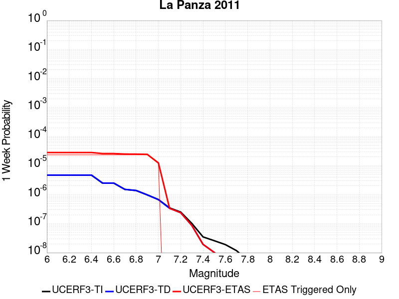 | 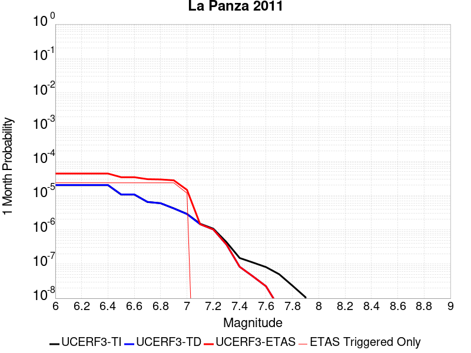 | 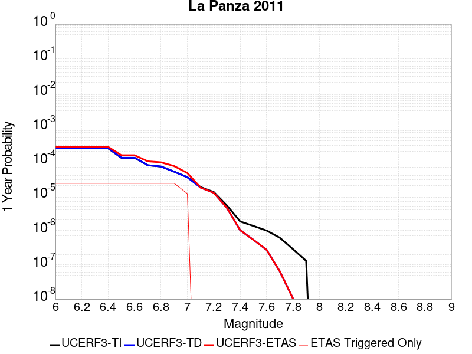 | 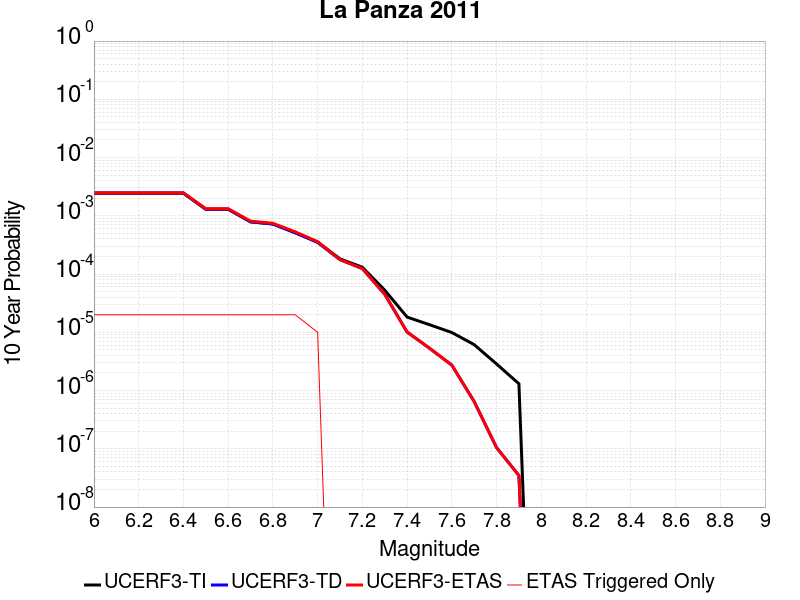 |

| Magnitude | 1 wk TI Prob | 1 wk TD Prob | 1 wk ETAS Prob | 1 wk ETAS/TD Gain | 1 wk ETAS Triggered Only | 1 mo TI Prob | 1 mo TD Prob | 1 mo ETAS Prob | 1 mo ETAS/TD Gain | 1 mo ETAS Triggered Only | 1 yr TI Prob | 1 yr TD Prob | 1 yr ETAS Prob | 1 yr ETAS/TD Gain | 1 yr ETAS Triggered Only | 10 yr TI Prob | 10 yr TD Prob | 10 yr ETAS Prob | 10 yr ETAS/TD Gain | 10 yr ETAS Triggered Only |
|-----|-----|-----|-----|-----|-----|-----|-----|-----|-----|-----|-----|-----|-----|-----|-----|-----|-----|-----|-----|-----|
| 6.0 | 4.6754544E-6 | 4.717587E-6 | 2.8191655E-5 | 5.9758635 | 2.3474178E-5 | 2.0037509E-5 | 2.0218084E-5 | 4.3691787E-5 | 2.161025 | 2.3474178E-5 | 2.4392935E-4 | 2.4612935E-4 | 2.6959775E-4 | 1.0953499 | 2.3474178E-5 | 0.0024366176 | 0.002458762 | 0.0024821784 | 1.0095236 | 2.3474178E-5 |
| 6.1 | 4.6754544E-6 | 4.717587E-6 | 2.8191655E-5 | 5.9758635 | 2.3474178E-5 | 2.0037509E-5 | 2.0218084E-5 | 4.3691787E-5 | 2.161025 | 2.3474178E-5 | 2.4392935E-4 | 2.4612935E-4 | 2.6959775E-4 | 1.0953499 | 2.3474178E-5 | 0.0024366176 | 0.002458762 | 0.0024821784 | 1.0095236 | 2.3474178E-5 |
| 6.2 | 4.6754544E-6 | 4.717587E-6 | 2.8191655E-5 | 5.9758635 | 2.3474178E-5 | 2.0037509E-5 | 2.0218084E-5 | 4.3691787E-5 | 2.161025 | 2.3474178E-5 | 2.4392935E-4 | 2.4612935E-4 | 2.6959775E-4 | 1.0953499 | 2.3474178E-5 | 0.0024366176 | 0.002458762 | 0.0024821784 | 1.0095236 | 2.3474178E-5 |
| 6.3 | 4.6754544E-6 | 4.717587E-6 | 2.8191655E-5 | 5.9758635 | 2.3474178E-5 | 2.0037509E-5 | 2.0218084E-5 | 4.3691787E-5 | 2.161025 | 2.3474178E-5 | 2.4392935E-4 | 2.4612935E-4 | 2.6959775E-4 | 1.0953499 | 2.3474178E-5 | 0.0024366176 | 0.002458762 | 0.0024821784 | 1.0095236 | 2.3474178E-5 |
| 6.4 | 4.6754544E-6 | 4.717587E-6 | 2.8191655E-5 | 5.9758635 | 2.3474178E-5 | 2.0037509E-5 | 2.0218084E-5 | 4.3691787E-5 | 2.161025 | 2.3474178E-5 | 2.4392935E-4 | 2.4612935E-4 | 2.6959775E-4 | 1.0953499 | 2.3474178E-5 | 0.0024366176 | 0.002458762 | 0.0024821784 | 1.0095236 | 2.3474178E-5 |
| 6.5 | 2.485343E-6 | 2.5005988E-6 | 2.597472E-5 | 10.387399 | 2.3474178E-5 | 1.0651426E-5 | 1.0716811E-5 | 3.4190736E-5 | 3.1903837 | 2.3474178E-5 | 1.296734E-4 | 1.3046975E-4 | 1.5394087E-4 | 1.179897 | 2.3474178E-5 | 0.0012959775 | 0.0013039699 | 0.0013274135 | 1.0179787 | 2.3474178E-5 |
| 6.6 | 2.485343E-6 | 2.5005988E-6 | 2.597472E-5 | 10.387399 | 2.3474178E-5 | 1.0651426E-5 | 1.0716811E-5 | 3.4190736E-5 | 3.1903837 | 2.3474178E-5 | 1.296734E-4 | 1.3046975E-4 | 1.5394087E-4 | 1.179897 | 2.3474178E-5 | 0.0012959775 | 0.0013039699 | 0.0013274135 | 1.0179787 | 2.3474178E-5 |
| 6.7 | 1.5108508E-6 | 1.5146375E-6 | 2.498878E-5 | 16.498192 | 2.3474178E-5 | 6.4750584E-6 | 6.491288E-6 | 2.9965315E-5 | 4.6162357 | 2.3474178E-5 | 7.8830984E-5 | 7.902867E-5 | 1.02501E-4 | 1.2970102 | 2.3474178E-5 | 7.880303E-4 | 7.900165E-4 | 8.1347214E-4 | 1.02969 | 2.3474178E-5 |
| 6.8 | 1.3865837E-6 | 1.3885102E-6 | 2.4862657E-5 | 17.905994 | 2.3474178E-5 | 5.942488E-6 | 5.9507447E-6 | 2.9424784E-5 | 4.9447227 | 2.3474178E-5 | 7.234739E-5 | 7.244801E-5 | 9.5920484E-5 | 1.3239907 | 2.3474178E-5 | 7.232384E-4 | 7.242537E-4 | 7.477109E-4 | 1.0323881 | 2.3474178E-5 |
| 6.9 | 9.826583E-7 | 9.796287E-7 | 2.4453784E-5 | 24.9623 | 2.3474178E-5 | 4.2113857E-6 | 4.198402E-6 | 2.7672482E-5 | 6.591194 | 2.3474178E-5 | 5.1272415E-5 | 5.11144E-5 | 7.458738E-5 | 1.4592243 | 2.3474178E-5 | 5.126059E-4 | 5.110318E-4 | 5.34494E-4 | 1.0459114 | 2.3474178E-5 |
| 7.0 | 6.7797646E-7 | 6.7102144E-7 | 1.24081025E-5 | 18.491365 | 1.1737089E-5 | 2.9056102E-6 | 2.8758034E-6 | 1.4612859E-5 | 5.0813136 | 1.1737089E-5 | 3.537523E-5 | 3.5012374E-5 | 4.6749054E-5 | 1.3352152 | 1.1737089E-5 | 3.5369597E-4 | 3.5007167E-4 | 3.6180465E-4 | 1.0335159 | 1.1737089E-5 |
| 7.1 | 3.4979826E-7 | 3.387388E-7 | 3.387388E-7 | 1.0 | 0.0 | 1.4991346E-6 | 1.4517369E-6 | 1.4517369E-6 | 1.0 | 0.0 | 1.825181E-5 | 1.7674765E-5 | 1.7674765E-5 | 1.0 | 0.0 | 1.825031E-4 | 1.7673477E-4 | 1.7673477E-4 | 1.0 | 0.0 |
| 7.2 | 2.5088332E-7 | 2.3831899E-7 | 2.3831899E-7 | 1.0 | 0.0 | 1.0752137E-6 | 1.0213668E-6 | 1.0213668E-6 | 1.0 | 0.0 | 1.3090649E-5 | 1.2435077E-5 | 1.2435077E-5 | 1.0 | 0.0 | 1.3089878E-4 | 1.2434467E-4 | 1.2434467E-4 | 1.0 | 0.0 |
| 7.3 | 1.0159086E-7 | 8.64462E-8 | 8.64462E-8 | 1.0 | 0.0 | 4.3538932E-7 | 3.7048366E-7 | 3.7048366E-7 | 1.0 | 0.0 | 5.300852E-6 | 4.5106294E-6 | 4.5106294E-6 | 1.0 | 0.0 | 5.3007258E-5 | 4.5105422E-5 | 4.5105422E-5 | 1.0 | 0.0 |
| 7.4 | 3.5006252E-8 | 1.9404325E-8 | 1.9404325E-8 | 1.0 | 0.0 | 1.5002678E-7 | 8.3161396E-8 | 8.3161396E-8 | 1.0 | 0.0 | 1.8265745E-6 | 1.0124895E-6 | 1.0124895E-6 | 1.0 | 0.0 | 1.8265595E-5 | 1.01248515E-5 | 1.01248515E-5 | 1.0 | 0.0 |
| 7.5 | 2.592274E-8 | 1.0239094E-8 | 1.0239094E-8 | 1.0 | 0.0 | 1.1109746E-7 | 4.388183E-8 | 4.388183E-8 | 1.0 | 0.0 | 1.3526106E-6 | 5.342612E-7 | 5.342612E-7 | 1.0 | 0.0 | 1.3526024E-5 | 5.3425997E-6 | 5.3425997E-6 | 1.0 | 0.0 |
| 7.6 | 1.9016717E-8 | 5.244801E-9 | 5.244801E-9 | 1.0 | 0.0 | 8.150022E-8 | 2.247772E-8 | 2.247772E-8 | 1.0 | 0.0 | 9.922647E-7 | 2.736662E-7 | 2.736662E-7 | 1.0 | 0.0 | 9.922603E-6 | 2.7366589E-6 | 2.7366589E-6 | 1.0 | 0.0 |
| 7.7 | 1.17738495E-8 | 1.2398075E-9 | 1.2398075E-9 | 1.0 | 0.0 | 5.0459356E-8 | 5.3134603E-9 | 5.3134603E-9 | 1.0 | 0.0 | 6.1434247E-7 | 6.469138E-8 | 6.469138E-8 | 1.0 | 0.0 | 6.143408E-6 | 6.469136E-7 | 6.469136E-7 | 1.0 | 0.0 |
| 7.8 | 5.489079E-9 | 2.0111768E-10 | 2.0111768E-10 | 1.0 | 0.0 | 2.3524624E-8 | 8.6193275E-10 | 8.6193275E-10 | 1.0 | 0.0 | 2.8641225E-7 | 1.04940305E-8 | 1.04940305E-8 | 1.0 | 0.0 | 2.8641189E-6 | 1.04940305E-7 | 1.04940305E-7 | 1.0 | 0.0 |
| 7.9 | 2.5081048E-9 | 6.683887E-11 | 6.683887E-11 | 1.0 | 0.0 | 1.0749021E-8 | 2.8645197E-10 | 2.8645197E-10 | 1.0 | 0.0 | 1.3086932E-7 | 3.487552E-9 | 3.487552E-9 | 1.0 | 0.0 | 1.3086925E-6 | 3.487552E-8 | 3.487552E-8 | 1.0 | 0.0 |

## Great Valley 03 Mysterious Ridge
*[(top)](#table-of-contents)*

| 1 Week | 1 Month | 1 Year | 10 Year |
|-----|-----|-----|-----|
| 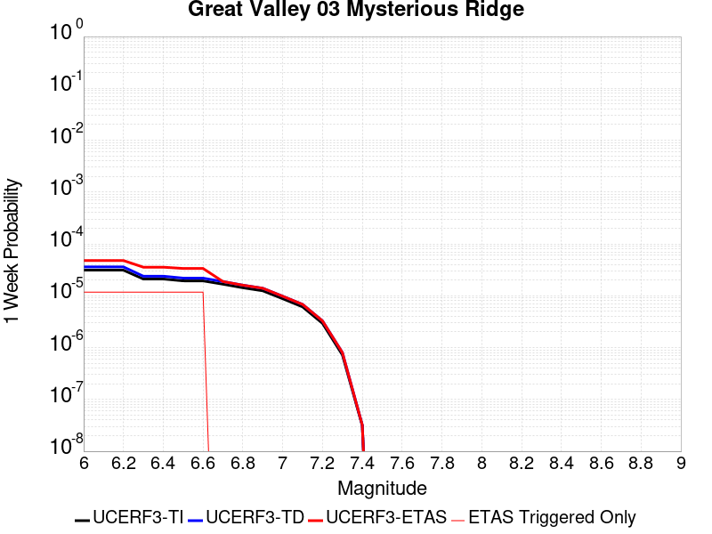 | 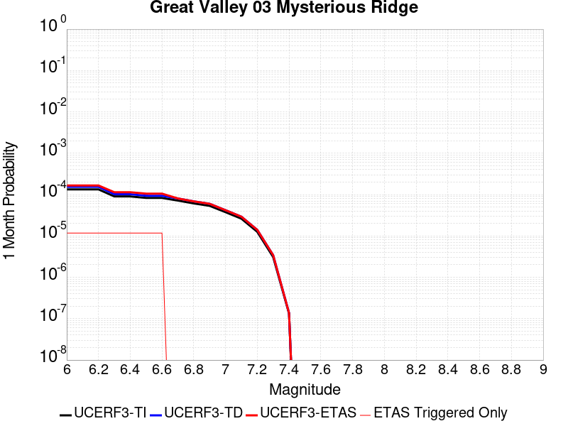 | 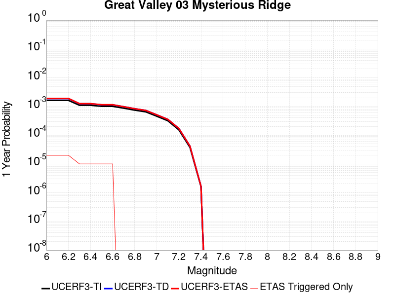 | 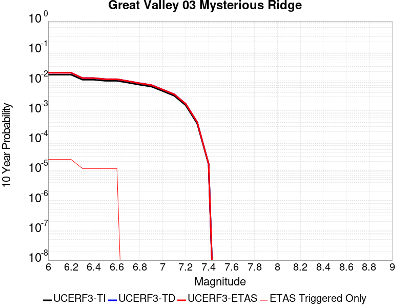 |

| Magnitude | 1 wk TI Prob | 1 wk TD Prob | 1 wk ETAS Prob | 1 wk ETAS/TD Gain | 1 wk ETAS Triggered Only | 1 mo TI Prob | 1 mo TD Prob | 1 mo ETAS Prob | 1 mo ETAS/TD Gain | 1 mo ETAS Triggered Only | 1 yr TI Prob | 1 yr TD Prob | 1 yr ETAS Prob | 1 yr ETAS/TD Gain | 1 yr ETAS Triggered Only | 10 yr TI Prob | 10 yr TD Prob | 10 yr ETAS Prob | 10 yr ETAS/TD Gain | 10 yr ETAS Triggered Only |
|-----|-----|-----|-----|-----|-----|-----|-----|-----|-----|-----|-----|-----|-----|-----|-----|-----|-----|-----|-----|-----|
| 6.0 | 3.1182444E-5 | 3.603423E-5 | 4.7770896E-5 | 1.3257089 | 1.1737089E-5 | 1.336322E-4 | 1.544242E-4 | 1.6615947E-4 | 1.0759938 | 1.1737089E-5 | 0.0016257578 | 0.0018786696 | 0.0019020997 | 1.0124717 | 2.3474178E-5 | 0.016139153 | 0.018646652 | 0.018669687 | 1.0012354 | 2.3474178E-5 |
| 6.1 | 3.1182444E-5 | 3.603423E-5 | 4.7770896E-5 | 1.3257089 | 1.1737089E-5 | 1.336322E-4 | 1.544242E-4 | 1.6615947E-4 | 1.0759938 | 1.1737089E-5 | 0.0016257578 | 0.0018786696 | 0.0019020997 | 1.0124717 | 2.3474178E-5 | 0.016139153 | 0.018646652 | 0.018669687 | 1.0012354 | 2.3474178E-5 |
| 6.2 | 3.1182444E-5 | 3.603423E-5 | 4.7770896E-5 | 1.3257089 | 1.1737089E-5 | 1.336322E-4 | 1.544242E-4 | 1.6615947E-4 | 1.0759938 | 1.1737089E-5 | 0.0016257578 | 0.0018786696 | 0.0019020997 | 1.0124717 | 2.3474178E-5 | 0.016139153 | 0.018646652 | 0.018669687 | 1.0012354 | 2.3474178E-5 |
| 6.3 | 2.106934E-5 | 2.3850307E-5 | 3.5587116E-5 | 1.4921031 | 1.1737089E-5 | 9.0294045E-5 | 1.0221177E-4 | 1.13947666E-4 | 1.1148194 | 1.1737089E-5 | 0.0010987755 | 0.0012437489 | 0.0012554714 | 1.0094252 | 1.1737089E-5 | 0.010933585 | 0.012371127 | 0.012382719 | 1.000937 | 1.1737089E-5 |
| 6.4 | 2.106934E-5 | 2.3850307E-5 | 3.5587116E-5 | 1.4921031 | 1.1737089E-5 | 9.0294045E-5 | 1.0221177E-4 | 1.13947666E-4 | 1.1148194 | 1.1737089E-5 | 0.0010987755 | 0.0012437489 | 0.0012554714 | 1.0094252 | 1.1737089E-5 | 0.010933585 | 0.012371127 | 0.012382719 | 1.000937 | 1.1737089E-5 |
| 6.5 | 1.9389783E-5 | 2.1884984E-5 | 3.3621815E-5 | 1.5362961 | 1.1737089E-5 | 8.309642E-5 | 9.3789575E-5 | 1.0552556E-4 | 1.125131 | 1.1737089E-5 | 0.0010112294 | 0.0011413174 | 0.0011530411 | 1.010272 | 1.1737089E-5 | 0.010066401 | 0.011357434 | 0.011369037 | 1.0010217 | 1.1737089E-5 |
| 6.6 | 1.9370193E-5 | 2.1864906E-5 | 3.3601737E-5 | 1.5367887 | 1.1737089E-5 | 8.301247E-5 | 9.370353E-5 | 1.0543952E-4 | 1.1252459 | 1.1737089E-5 | 0.0010102082 | 0.001140271 | 0.0011519947 | 1.0102816 | 1.1737089E-5 | 0.010056281 | 0.011347076 | 0.011358679 | 1.0010226 | 1.1737089E-5 |
| 6.7 | 1.6723505E-5 | 1.8799281E-5 | 1.8799281E-5 | 1.0 | 0.0 | 7.16702E-5 | 8.056597E-5 | 8.056597E-5 | 1.0 | 0.0 | 8.722353E-4 | 9.804688E-4 | 9.804688E-4 | 1.0 | 0.0 | 0.008688197 | 0.009763439 | 0.009763439 | 1.0 | 0.0 |
| 6.8 | 1.426937E-5 | 1.599721E-5 | 1.599721E-5 | 1.0 | 0.0 | 6.115301E-5 | 6.855775E-5 | 6.855775E-5 | 1.0 | 0.0 | 7.4428355E-4 | 8.343854E-4 | 8.343854E-4 | 1.0 | 0.0 | 0.007417957 | 0.008314005 | 0.008314005 | 1.0 | 0.0 |
| 6.9 | 1.2469891E-5 | 1.3956928E-5 | 1.3956928E-5 | 1.0 | 0.0 | 5.3441294E-5 | 5.9814105E-5 | 5.9814105E-5 | 1.0 | 0.0 | 6.504535E-4 | 7.280055E-4 | 7.280055E-4 | 1.0 | 0.0 | 0.006485529 | 0.00725743 | 0.00725743 | 1.0 | 0.0 |
| 7.0 | 8.7746275E-6 | 9.791734E-6 | 9.791734E-6 | 1.0 | 0.0 | 3.7605005E-5 | 4.196394E-5 | 4.196394E-5 | 1.0 | 0.0 | 4.5774475E-4 | 5.1079853E-4 | 5.1079853E-4 | 1.0 | 0.0 | 0.00456803 | 0.005096977 | 0.005096977 | 1.0 | 0.0 |
| 7.1 | 6.1067153E-6 | 6.813725E-6 | 6.813725E-6 | 1.0 | 0.0 | 2.6171374E-5 | 2.9201385E-5 | 2.9201385E-5 | 1.0 | 0.0 | 3.1858988E-4 | 3.5547445E-4 | 3.5547445E-4 | 1.0 | 0.0 | 0.0031813353 | 0.003549609 | 0.003549609 | 1.0 | 0.0 |
| 7.2 | 2.939283E-6 | 3.2741057E-6 | 3.2741057E-6 | 1.0 | 0.0 | 1.2596866E-5 | 1.4031816E-5 | 1.4031816E-5 | 1.0 | 0.0 | 1.5335606E-4 | 1.7082572E-4 | 1.7082572E-4 | 1.0 | 0.0 | 0.0015325027 | 0.001707116 | 0.001707116 | 1.0 | 0.0 |
| 7.3 | 7.2387763E-7 | 8.008505E-7 | 8.008505E-7 | 1.0 | 0.0 | 3.102329E-6 | 3.4322145E-6 | 3.4322145E-6 | 1.0 | 0.0 | 3.77702E-5 | 4.178687E-5 | 4.178687E-5 | 1.0 | 0.0 | 3.7763783E-4 | 4.1783508E-4 | 4.1783508E-4 | 1.0 | 0.0 |
| 7.4 | 3.112171E-8 | 3.2068368E-8 | 3.2068368E-8 | 1.0 | 0.0 | 1.3337875E-7 | 1.3743585E-7 | 1.3743585E-7 | 1.0 | 0.0 | 1.6238852E-6 | 1.6732803E-6 | 1.6732803E-6 | 1.0 | 0.0 | 1.6238733E-5 | 1.6732685E-5 | 1.6732685E-5 | 1.0 | 0.0 |

## Bartlett Springs 2011 CFM
*[(top)](#table-of-contents)*

| 1 Week | 1 Month | 1 Year | 10 Year |
|-----|-----|-----|-----|
| 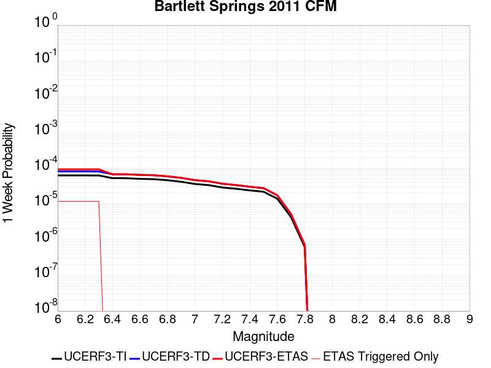 | 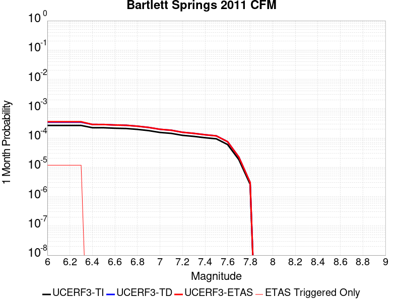 | 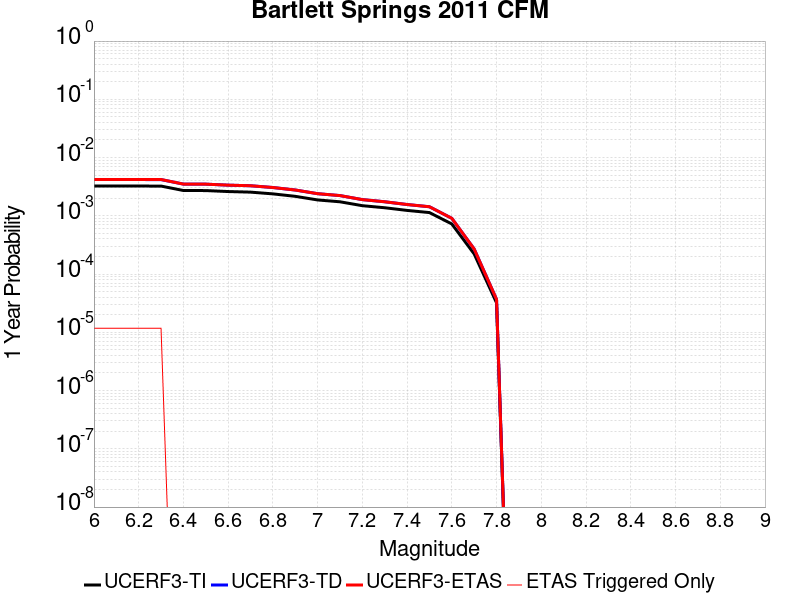 | 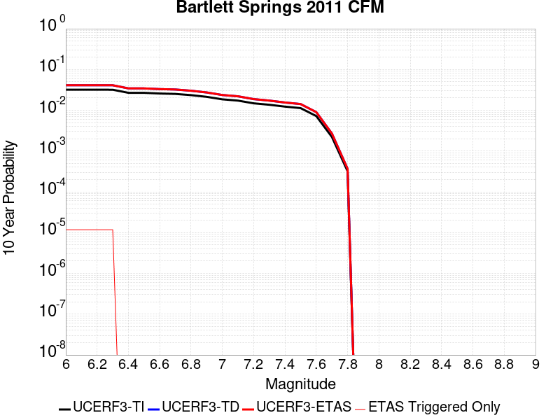 |

| Magnitude | 1 wk TI Prob | 1 wk TD Prob | 1 wk ETAS Prob | 1 wk ETAS/TD Gain | 1 wk ETAS Triggered Only | 1 mo TI Prob | 1 mo TD Prob | 1 mo ETAS Prob | 1 mo ETAS/TD Gain | 1 mo ETAS Triggered Only | 1 yr TI Prob | 1 yr TD Prob | 1 yr ETAS Prob | 1 yr ETAS/TD Gain | 1 yr ETAS Triggered Only | 10 yr TI Prob | 10 yr TD Prob | 10 yr ETAS Prob | 10 yr ETAS/TD Gain | 10 yr ETAS Triggered Only |
|-----|-----|-----|-----|-----|-----|-----|-----|-----|-----|-----|-----|-----|-----|-----|-----|-----|-----|-----|-----|-----|
| 6.0 | 6.2326144E-5 | 8.060613E-5 | 9.234227E-5 | 1.1455986 | 1.1737089E-5 | 2.6708472E-4 | 3.454099E-4 | 3.5714294E-4 | 1.0339684 | 1.1737089E-5 | 0.003246908 | 0.0041973945 | 0.0042090826 | 1.0027845 | 1.1737089E-5 | 0.031998757 | 0.04119771 | 0.041208964 | 1.0002731 | 1.1737089E-5 |
| 6.1 | 6.227657E-5 | 8.054363E-5 | 9.227977E-5 | 1.1457117 | 1.1737089E-5 | 2.668723E-4 | 3.4514212E-4 | 3.5687516E-4 | 1.0339948 | 1.1737089E-5 | 0.0032443295 | 0.004194147 | 0.004205835 | 1.0027868 | 1.1737089E-5 | 0.031973712 | 0.041166443 | 0.041177697 | 1.0002733 | 1.1737089E-5 |
| 6.2 | 6.22452E-5 | 8.050423E-5 | 9.224038E-5 | 1.145783 | 1.1737089E-5 | 2.6673786E-4 | 3.4497332E-4 | 3.5670635E-4 | 1.0340115 | 1.1737089E-5 | 0.0032426978 | 0.0041921 | 0.004203788 | 1.0027881 | 1.1737089E-5 | 0.03195787 | 0.041146737 | 0.04115799 | 1.0002735 | 1.1737089E-5 |
| 6.3 | 6.219006E-5 | 8.043407E-5 | 9.217021E-5 | 1.1459101 | 1.1737089E-5 | 2.6650162E-4 | 3.4467268E-4 | 3.5640574E-4 | 1.0340412 | 1.1737089E-5 | 0.00323983 | 0.0041884542 | 0.004200142 | 1.0027906 | 1.1737089E-5 | 0.031930014 | 0.041111637 | 0.04112289 | 1.0002737 | 1.1737089E-5 |
| 6.4 | 5.2175856E-5 | 6.725342E-5 | 6.725342E-5 | 1.0 | 0.0 | 2.2359163E-4 | 2.8819745E-4 | 2.8819745E-4 | 1.0 | 0.0 | 0.0027188298 | 0.0035032115 | 0.0035032115 | 1.0 | 0.0 | 0.026858058 | 0.034489222 | 0.034489222 | 1.0 | 0.0 |
| 6.5 | 5.205166E-5 | 6.7096094E-5 | 6.7096094E-5 | 1.0 | 0.0 | 2.2305945E-4 | 2.8752335E-4 | 2.8752335E-4 | 1.0 | 0.0 | 0.0027123666 | 0.0034950306 | 0.0034950306 | 1.0 | 0.0 | 0.026794989 | 0.034409966 | 0.034409966 | 1.0 | 0.0 |
| 6.6 | 5.0085426E-5 | 6.449277E-5 | 6.449277E-5 | 1.0 | 0.0 | 2.1463417E-4 | 2.763686E-4 | 2.763686E-4 | 1.0 | 0.0 | 0.0026100394 | 0.0033596456 | 0.0033596456 | 1.0 | 0.0 | 0.025795965 | 0.033097573 | 0.033097573 | 1.0 | 0.0 |
| 6.7 | 4.8930866E-5 | 6.3017396E-5 | 6.3017396E-5 | 1.0 | 0.0 | 2.0968684E-4 | 2.7004688E-4 | 2.7004688E-4 | 1.0 | 0.0 | 0.0025499484 | 0.0032829174 | 0.0032829174 | 1.0 | 0.0 | 0.025208864 | 0.03235294 | 0.03235294 | 1.0 | 0.0 |
| 6.8 | 4.5679535E-5 | 5.8741858E-5 | 5.8741858E-5 | 1.0 | 0.0 | 1.9575475E-4 | 2.5172674E-4 | 2.5172674E-4 | 1.0 | 0.0 | 0.002380709 | 0.0030605064 | 0.0030605064 | 1.0 | 0.0 | 0.023553653 | 0.03019042 | 0.03019042 | 1.0 | 0.0 |
| 6.9 | 4.1439176E-5 | 5.3220094E-5 | 5.3220094E-5 | 1.0 | 0.0 | 1.7758438E-4 | 2.2806633E-4 | 2.2806633E-4 | 1.0 | 0.0 | 0.002159946 | 0.0027731995 | 0.0027731995 | 1.0 | 0.0 | 0.021390721 | 0.027390772 | 0.027390772 | 1.0 | 0.0 |
| 7.0 | 3.5920104E-5 | 4.600871E-5 | 4.600871E-5 | 1.0 | 0.0 | 1.5393422E-4 | 1.9716538E-4 | 1.9716538E-4 | 1.0 | 0.0 | 0.001872538 | 0.0023978627 | 0.0023978627 | 1.0 | 0.0 | 0.018568378 | 0.023723004 | 0.023723004 | 1.0 | 0.0 |
| 7.1 | 3.338812E-5 | 4.2689582E-5 | 4.2689582E-5 | 1.0 | 0.0 | 1.430841E-4 | 1.829426E-4 | 1.829426E-4 | 1.0 | 0.0 | 0.0017406568 | 0.0022250658 | 0.0022250658 | 1.0 | 0.0 | 0.017270854 | 0.02203054 | 0.02203054 | 1.0 | 0.0 |
| 7.2 | 2.8619615E-5 | 3.6401652E-5 | 3.6401652E-5 | 1.0 | 0.0 | 1.2264973E-4 | 1.5599781E-4 | 1.5599781E-4 | 1.0 | 0.0 | 0.0014922376 | 0.0018976285 | 0.0018976285 | 1.0 | 0.0 | 0.014822568 | 0.01881613 | 0.01881613 | 1.0 | 0.0 |
| 7.3 | 2.6376783E-5 | 3.342276E-5 | 3.342276E-5 | 1.0 | 0.0 | 1.13038455E-4 | 1.4323258E-4 | 1.4323258E-4 | 1.0 | 0.0 | 0.0013753743 | 0.001742471 | 0.001742471 | 1.0 | 0.0 | 0.01366893 | 0.01728972 | 0.01728972 | 1.0 | 0.0 |
| 7.4 | 2.3738676E-5 | 2.9978975E-5 | 2.9978975E-5 | 1.0 | 0.0 | 1.0173322E-4 | 1.2847505E-4 | 1.2847505E-4 | 1.0 | 0.0 | 0.0012378981 | 0.0015630693 | 0.0015630693 | 1.0 | 0.0 | 0.012310251 | 0.015522073 | 0.015522073 | 1.0 | 0.0 |
| 7.5 | 2.1789481E-5 | 2.7439388E-5 | 2.7439388E-5 | 1.0 | 0.0 | 9.338015E-5 | 1.1759212E-4 | 1.1759212E-4 | 1.0 | 0.0 | 0.0011363103 | 0.0014307518 | 0.0014307518 | 1.0 | 0.0 | 0.011305175 | 0.014216576 | 0.014216576 | 1.0 | 0.0 |
| 7.6 | 1.3895281E-5 | 1.7368426E-5 | 1.7368426E-5 | 1.0 | 0.0 | 5.9549846E-5 | 7.4434E-5 | 7.4434E-5 | 1.0 | 0.0 | 7.2477816E-4 | 9.0586004E-4 | 9.0586004E-4 | 1.0 | 0.0 | 0.0072241887 | 0.009022084 | 0.009022084 | 1.0 | 0.0 |
| 7.7 | 4.245981E-6 | 5.1624675E-6 | 5.1624675E-6 | 1.0 | 0.0 | 1.8196934E-5 | 2.2124674E-5 | 2.2124674E-5 | 1.0 | 0.0 | 2.2152514E-4 | 2.693348E-4 | 2.693348E-4 | 1.0 | 0.0 | 0.0022130446 | 0.0026901034 | 0.0026901034 | 1.0 | 0.0 |
| 7.8 | 6.145192E-7 | 7.047006E-7 | 7.047006E-7 | 1.0 | 0.0 | 2.633651E-6 | 3.020142E-6 | 3.020142E-6 | 1.0 | 0.0 | 3.206423E-5 | 3.676962E-5 | 3.676962E-5 | 1.0 | 0.0 | 3.2059604E-4 | 3.6763478E-4 | 3.6763478E-4 | 1.0 | 0.0 |

## Hosgri
*[(top)](#table-of-contents)*

| 1 Week | 1 Month | 1 Year | 10 Year |
|-----|-----|-----|-----|
| 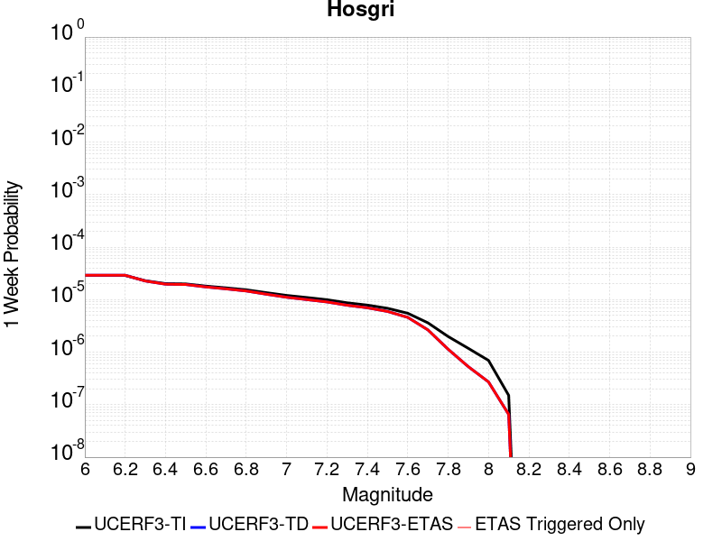 | 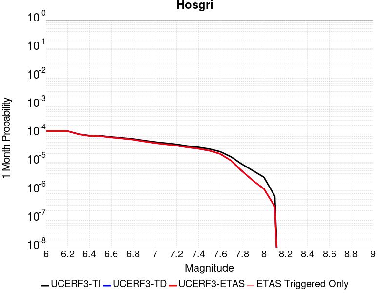 | 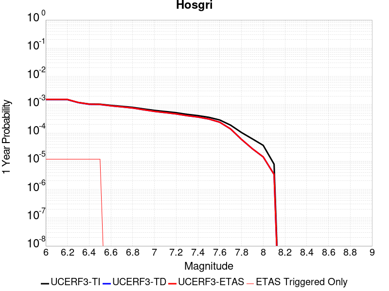 | 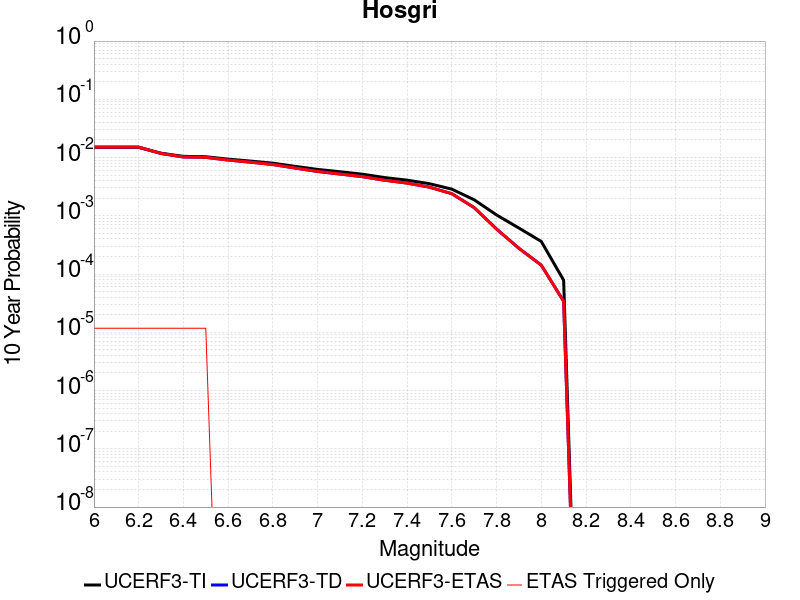 |

| Magnitude | 1 wk TI Prob | 1 wk TD Prob | 1 wk ETAS Prob | 1 wk ETAS/TD Gain | 1 wk ETAS Triggered Only | 1 mo TI Prob | 1 mo TD Prob | 1 mo ETAS Prob | 1 mo ETAS/TD Gain | 1 mo ETAS Triggered Only | 1 yr TI Prob | 1 yr TD Prob | 1 yr ETAS Prob | 1 yr ETAS/TD Gain | 1 yr ETAS Triggered Only | 10 yr TI Prob | 10 yr TD Prob | 10 yr ETAS Prob | 10 yr ETAS/TD Gain | 10 yr ETAS Triggered Only |
|-----|-----|-----|-----|-----|-----|-----|-----|-----|-----|-----|-----|-----|-----|-----|-----|-----|-----|-----|-----|-----|
| 6.0 | 2.883978E-5 | 2.9128416E-5 | 2.9128416E-5 | 1.0 | 0.0 | 1.235932E-4 | 1.2483024E-4 | 1.2483024E-4 | 1.0 | 0.0 | 0.0015037085 | 0.001518776 | 0.0015304952 | 1.0077163 | 1.1737089E-5 | 0.01493574 | 0.01508774 | 0.0150993 | 1.0007662 | 1.1737089E-5 |
| 6.1 | 2.883978E-5 | 2.9128416E-5 | 2.9128416E-5 | 1.0 | 0.0 | 1.235932E-4 | 1.2483024E-4 | 1.2483024E-4 | 1.0 | 0.0 | 0.0015037085 | 0.001518776 | 0.0015304952 | 1.0077163 | 1.1737089E-5 | 0.01493574 | 0.01508774 | 0.0150993 | 1.0007662 | 1.1737089E-5 |
| 6.2 | 2.883978E-5 | 2.9128416E-5 | 2.9128416E-5 | 1.0 | 0.0 | 1.235932E-4 | 1.2483024E-4 | 1.2483024E-4 | 1.0 | 0.0 | 0.0015037085 | 0.001518776 | 0.0015304952 | 1.0077163 | 1.1737089E-5 | 0.01493574 | 0.01508774 | 0.0150993 | 1.0007662 | 1.1737089E-5 |
| 6.3 | 2.2914428E-5 | 2.2641969E-5 | 2.2641969E-5 | 1.0 | 0.0 | 9.8200995E-5 | 9.703343E-5 | 9.703343E-5 | 1.0 | 0.0 | 0.0011949413 | 0.0011807467 | 0.00119247 | 1.0099287 | 1.1737089E-5 | 0.011885363 | 0.011746133 | 0.011757732 | 1.0009875 | 1.1737089E-5 |
| 6.4 | 2.0195741E-5 | 1.969656E-5 | 1.969656E-5 | 1.0 | 0.0 | 8.65503E-5 | 8.4411105E-5 | 8.4411105E-5 | 1.0 | 0.0 | 0.0010532405 | 0.0010272227 | 0.0010389477 | 1.0114143 | 1.1737089E-5 | 0.010482626 | 0.010225792 | 0.01023741 | 1.0011361 | 1.1737089E-5 |
| 6.5 | 1.9924333E-5 | 1.940898E-5 | 1.940898E-5 | 1.0 | 0.0 | 8.53872E-5 | 8.3178704E-5 | 8.3178704E-5 | 1.0 | 0.0 | 0.0010390934 | 0.0010122322 | 0.0010239574 | 1.0115836 | 1.1737089E-5 | 0.010342481 | 0.010077253 | 0.010088872 | 1.001153 | 1.1737089E-5 |
| 6.6 | 1.809694E-5 | 1.74583E-5 | 1.74583E-5 | 1.0 | 0.0 | 7.7556004E-5 | 7.4819145E-5 | 7.4819145E-5 | 1.0 | 0.0 | 9.438353E-4 | 9.105437E-4 | 9.105437E-4 | 1.0 | 0.0 | 0.009398366 | 0.009069073 | 0.009069073 | 1.0 | 0.0 |
| 6.7 | 1.675989E-5 | 1.6042764E-5 | 1.6042764E-5 | 1.0 | 0.0 | 7.182612E-5 | 6.87529E-5 | 6.87529E-5 | 1.0 | 0.0 | 8.7413215E-4 | 8.3674624E-4 | 8.3674624E-4 | 1.0 | 0.0 | 0.008707017 | 0.0083368635 | 0.0083368635 | 1.0 | 0.0 |
| 6.8 | 1.5401129E-5 | 1.4614083E-5 | 1.4614083E-5 | 1.0 | 0.0 | 6.6003166E-5 | 6.2630286E-5 | 6.2630286E-5 | 1.0 | 0.0 | 8.032922E-4 | 7.622578E-4 | 7.622578E-4 | 1.0 | 0.0 | 0.008003947 | 0.007597296 | 0.007597296 | 1.0 | 0.0 |
| 6.9 | 1.356559E-5 | 1.2689968E-5 | 1.2689968E-5 | 1.0 | 0.0 | 5.8136946E-5 | 5.4384444E-5 | 5.4384444E-5 | 1.0 | 0.0 | 7.0758746E-4 | 6.619299E-4 | 6.619299E-4 | 1.0 | 0.0 | 0.007053386 | 0.006600388 | 0.006600388 | 1.0 | 0.0 |
| 7.0 | 1.2030819E-5 | 1.1095962E-5 | 1.1095962E-5 | 1.0 | 0.0 | 5.155963E-5 | 4.7553254E-5 | 4.7553254E-5 | 1.0 | 0.0 | 6.275577E-4 | 5.7880714E-4 | 5.7880714E-4 | 1.0 | 0.0 | 0.006257884 | 0.005773757 | 0.005773757 | 1.0 | 0.0 |
| 7.1 | 1.0972698E-5 | 1.0022179E-5 | 1.0022179E-5 | 1.0 | 0.0 | 4.7025E-5 | 4.2951488E-5 | 4.2951488E-5 | 1.0 | 0.0 | 5.72379E-4 | 5.22809E-4 | 5.22809E-4 | 1.0 | 0.0 | 0.0057090693 | 0.005216542 | 0.005216542 | 1.0 | 0.0 |
| 7.2 | 9.961926E-6 | 9.034746E-6 | 9.034746E-6 | 1.0 | 0.0 | 4.2693267E-5 | 3.8719765E-5 | 3.8719765E-5 | 1.0 | 0.0 | 5.1966653E-4 | 4.713112E-4 | 4.713112E-4 | 1.0 | 0.0 | 0.00518453 | 0.0047038626 | 0.0047038626 | 1.0 | 0.0 |
| 7.3 | 8.700929E-6 | 7.8281E-6 | 7.8281E-6 | 1.0 | 0.0 | 3.7289166E-5 | 3.354857E-5 | 3.354857E-5 | 1.0 | 0.0 | 4.53901E-4 | 4.0837732E-4 | 4.0837732E-4 | 1.0 | 0.0 | 0.00452975 | 0.004077008 | 0.004077008 | 1.0 | 0.0 |
| 7.4 | 7.866285E-6 | 6.998739E-6 | 6.998739E-6 | 1.0 | 0.0 | 3.3712215E-5 | 2.9994251E-5 | 2.9994251E-5 | 1.0 | 0.0 | 4.103689E-4 | 3.6511885E-4 | 3.6511885E-4 | 1.0 | 0.0 | 0.004096119 | 0.0036459267 | 0.0036459267 | 1.0 | 0.0 |
| 7.5 | 6.8381305E-6 | 5.9596955E-6 | 5.9596955E-6 | 1.0 | 0.0 | 2.9305946E-5 | 2.5541302E-5 | 2.5541302E-5 | 1.0 | 0.0 | 3.5674145E-4 | 3.10921E-4 | 3.10921E-4 | 1.0 | 0.0 | 0.0035616932 | 0.0031055948 | 0.0031055948 | 1.0 | 0.0 |
| 7.6 | 5.503376E-6 | 4.5952443E-6 | 4.5952443E-6 | 1.0 | 0.0 | 2.3585684E-5 | 1.9693754E-5 | 1.9693754E-5 | 1.0 | 0.0 | 2.8711787E-4 | 2.397451E-4 | 2.397451E-4 | 1.0 | 0.0 | 0.002867472 | 0.0023955975 | 0.0023955975 | 1.0 | 0.0 |
| 7.7 | 3.6144982E-6 | 2.6522112E-6 | 2.6522112E-6 | 1.0 | 0.0 | 1.5490614E-5 | 1.1366569E-5 | 1.1366569E-5 | 1.0 | 0.0 | 1.8858191E-4 | 1.383792E-4 | 1.383792E-4 | 1.0 | 0.0 | 0.0018842196 | 0.0013836613 | 0.0013836613 | 1.0 | 0.0 |
| 7.8 | 1.9853494E-6 | 1.1361129E-6 | 1.1361129E-6 | 1.0 | 0.0 | 8.508612E-6 | 4.8690463E-6 | 4.8690463E-6 | 1.0 | 0.0 | 1.0358743E-4 | 5.9279027E-5 | 5.9279027E-5 | 1.0 | 0.0 | 0.0010353916 | 5.9336185E-4 | 5.9336185E-4 | 1.0 | 0.0 |
| 7.9 | 1.1818757E-6 | 5.2951856E-7 | 5.2951856E-7 | 1.0 | 0.0 | 5.0651715E-6 | 2.2693632E-6 | 2.2693632E-6 | 1.0 | 0.0 | 6.1666724E-5 | 2.7629147E-5 | 2.7629147E-5 | 1.0 | 0.0 | 6.1649614E-4 | 2.7694515E-4 | 2.7694515E-4 | 1.0 | 0.0 |
| 8.0 | 6.962958E-7 | 2.7139782E-7 | 2.7139782E-7 | 1.0 | 0.0 | 2.9841215E-6 | 1.163133E-6 | 1.163133E-6 | 1.0 | 0.0 | 3.6331072E-5 | 1.4161053E-5 | 1.4161053E-5 | 1.0 | 0.0 | 3.6325134E-4 | 1.4217179E-4 | 1.4217179E-4 | 1.0 | 0.0 |
| 8.1 | 1.5033264E-7 | 6.527624E-8 | 6.527624E-8 | 1.0 | 0.0 | 6.442826E-7 | 2.7975528E-7 | 2.7975528E-7 | 1.0 | 0.0 | 7.844113E-6 | 3.4060151E-6 | 3.4060151E-6 | 1.0 | 0.0 | 7.843835E-5 | 3.407693E-5 | 3.407693E-5 | 1.0 | 0.0 |

## Pitas Point (Lower)-Montalvo
*[(top)](#table-of-contents)*

| 1 Week | 1 Month | 1 Year | 10 Year |
|-----|-----|-----|-----|
|  |  | 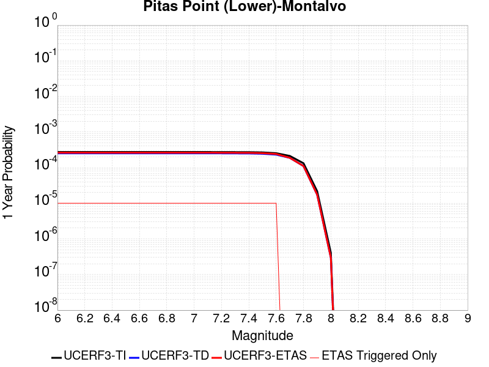 | 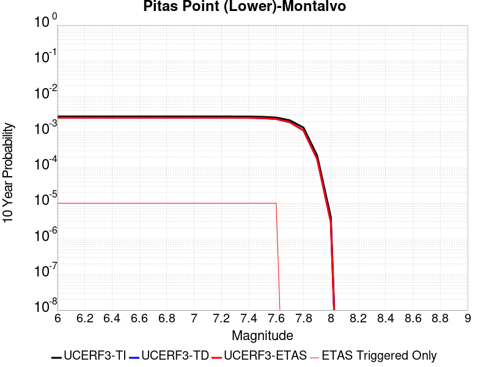 |

| Magnitude | 1 wk TI Prob | 1 wk TD Prob | 1 wk ETAS Prob | 1 wk ETAS/TD Gain | 1 wk ETAS Triggered Only | 1 mo TI Prob | 1 mo TD Prob | 1 mo ETAS Prob | 1 mo ETAS/TD Gain | 1 mo ETAS Triggered Only | 1 yr TI Prob | 1 yr TD Prob | 1 yr ETAS Prob | 1 yr ETAS/TD Gain | 1 yr ETAS Triggered Only | 10 yr TI Prob | 10 yr TD Prob | 10 yr ETAS Prob | 10 yr ETAS/TD Gain | 10 yr ETAS Triggered Only |
|-----|-----|-----|-----|-----|-----|-----|-----|-----|-----|-----|-----|-----|-----|-----|-----|-----|-----|-----|-----|-----|
| 6.0 | 5.2543637E-6 | 4.8378706E-6 | 4.8378706E-6 | 1.0 | 0.0 | 2.2518509E-5 | 2.0733567E-5 | 2.0733567E-5 | 1.0 | 0.0 | 2.7412834E-4 | 2.5240227E-4 | 2.6413638E-4 | 1.0464898 | 1.1737089E-5 | 0.0027379042 | 0.0025211885 | 0.002532896 | 1.0046437 | 1.1737089E-5 |
| 6.1 | 5.2543637E-6 | 4.8378706E-6 | 4.8378706E-6 | 1.0 | 0.0 | 2.2518509E-5 | 2.0733567E-5 | 2.0733567E-5 | 1.0 | 0.0 | 2.7412834E-4 | 2.5240227E-4 | 2.6413638E-4 | 1.0464898 | 1.1737089E-5 | 0.0027379042 | 0.0025211885 | 0.002532896 | 1.0046437 | 1.1737089E-5 |
| 6.2 | 5.2543637E-6 | 4.8378706E-6 | 4.8378706E-6 | 1.0 | 0.0 | 2.2518509E-5 | 2.0733567E-5 | 2.0733567E-5 | 1.0 | 0.0 | 2.7412834E-4 | 2.5240227E-4 | 2.6413638E-4 | 1.0464898 | 1.1737089E-5 | 0.0027379042 | 0.0025211885 | 0.002532896 | 1.0046437 | 1.1737089E-5 |
| 6.3 | 5.2543637E-6 | 4.8378706E-6 | 4.8378706E-6 | 1.0 | 0.0 | 2.2518509E-5 | 2.0733567E-5 | 2.0733567E-5 | 1.0 | 0.0 | 2.7412834E-4 | 2.5240227E-4 | 2.6413638E-4 | 1.0464898 | 1.1737089E-5 | 0.0027379042 | 0.0025211885 | 0.002532896 | 1.0046437 | 1.1737089E-5 |
| 6.4 | 5.2543637E-6 | 4.8378706E-6 | 4.8378706E-6 | 1.0 | 0.0 | 2.2518509E-5 | 2.0733567E-5 | 2.0733567E-5 | 1.0 | 0.0 | 2.7412834E-4 | 2.5240227E-4 | 2.6413638E-4 | 1.0464898 | 1.1737089E-5 | 0.0027379042 | 0.0025211885 | 0.002532896 | 1.0046437 | 1.1737089E-5 |
| 6.5 | 5.2543637E-6 | 4.8378706E-6 | 4.8378706E-6 | 1.0 | 0.0 | 2.2518509E-5 | 2.0733567E-5 | 2.0733567E-5 | 1.0 | 0.0 | 2.7412834E-4 | 2.5240227E-4 | 2.6413638E-4 | 1.0464898 | 1.1737089E-5 | 0.0027379042 | 0.0025211885 | 0.002532896 | 1.0046437 | 1.1737089E-5 |
| 6.6 | 5.2543637E-6 | 4.8378706E-6 | 4.8378706E-6 | 1.0 | 0.0 | 2.2518509E-5 | 2.0733567E-5 | 2.0733567E-5 | 1.0 | 0.0 | 2.7412834E-4 | 2.5240227E-4 | 2.6413638E-4 | 1.0464898 | 1.1737089E-5 | 0.0027379042 | 0.0025211885 | 0.002532896 | 1.0046437 | 1.1737089E-5 |
| 6.7 | 5.2543637E-6 | 4.8378706E-6 | 4.8378706E-6 | 1.0 | 0.0 | 2.2518509E-5 | 2.0733567E-5 | 2.0733567E-5 | 1.0 | 0.0 | 2.7412834E-4 | 2.5240227E-4 | 2.6413638E-4 | 1.0464898 | 1.1737089E-5 | 0.0027379042 | 0.0025211885 | 0.002532896 | 1.0046437 | 1.1737089E-5 |
| 6.8 | 5.2543637E-6 | 4.8378706E-6 | 4.8378706E-6 | 1.0 | 0.0 | 2.2518509E-5 | 2.0733567E-5 | 2.0733567E-5 | 1.0 | 0.0 | 2.7412834E-4 | 2.5240227E-4 | 2.6413638E-4 | 1.0464898 | 1.1737089E-5 | 0.0027379042 | 0.0025211885 | 0.002532896 | 1.0046437 | 1.1737089E-5 |
| 6.9 | 5.2543637E-6 | 4.8378706E-6 | 4.8378706E-6 | 1.0 | 0.0 | 2.2518509E-5 | 2.0733567E-5 | 2.0733567E-5 | 1.0 | 0.0 | 2.7412834E-4 | 2.5240227E-4 | 2.6413638E-4 | 1.0464898 | 1.1737089E-5 | 0.0027379042 | 0.0025211885 | 0.002532896 | 1.0046437 | 1.1737089E-5 |
| 7.0 | 5.2543637E-6 | 4.8378706E-6 | 4.8378706E-6 | 1.0 | 0.0 | 2.2518509E-5 | 2.0733567E-5 | 2.0733567E-5 | 1.0 | 0.0 | 2.7412834E-4 | 2.5240227E-4 | 2.6413638E-4 | 1.0464898 | 1.1737089E-5 | 0.0027379042 | 0.0025211885 | 0.002532896 | 1.0046437 | 1.1737089E-5 |
| 7.1 | 5.2543637E-6 | 4.8378706E-6 | 4.8378706E-6 | 1.0 | 0.0 | 2.2518509E-5 | 2.0733567E-5 | 2.0733567E-5 | 1.0 | 0.0 | 2.7412834E-4 | 2.5240227E-4 | 2.6413638E-4 | 1.0464898 | 1.1737089E-5 | 0.0027379042 | 0.0025211885 | 0.002532896 | 1.0046437 | 1.1737089E-5 |
| 7.2 | 5.2458695E-6 | 4.8290244E-6 | 4.8290244E-6 | 1.0 | 0.0 | 2.2482105E-5 | 2.0695656E-5 | 2.0695656E-5 | 1.0 | 0.0 | 2.7368523E-4 | 2.519408E-4 | 2.636749E-4 | 1.046575 | 1.1737089E-5 | 0.0027334841 | 0.0025165842 | 0.0025282917 | 1.0046521 | 1.1737089E-5 |
| 7.3 | 5.22665E-6 | 4.8089414E-6 | 4.8089414E-6 | 1.0 | 0.0 | 2.2399736E-5 | 2.0609588E-5 | 2.0609588E-5 | 1.0 | 0.0 | 2.7268266E-4 | 2.5089315E-4 | 2.626273E-4 | 1.0467695 | 1.1737089E-5 | 0.002723483 | 0.0025061315 | 0.0025178392 | 1.0046716 | 1.1737089E-5 |
| 7.4 | 5.210642E-6 | 4.792154E-6 | 4.792154E-6 | 1.0 | 0.0 | 2.233113E-5 | 2.0537642E-5 | 2.0537642E-5 | 1.0 | 0.0 | 2.718476E-4 | 2.5001742E-4 | 2.617516E-4 | 1.0469333 | 1.1737089E-5 | 0.002715153 | 0.0024973939 | 0.0025091015 | 1.004688 | 1.1737089E-5 |
| 7.5 | 5.1226016E-6 | 4.7000403E-6 | 4.7000403E-6 | 1.0 | 0.0 | 2.1953823E-5 | 2.0142877E-5 | 2.0142877E-5 | 1.0 | 0.0 | 2.67255E-4 | 2.4521223E-4 | 2.5694646E-4 | 1.0478532 | 1.1737089E-5 | 0.0026693381 | 0.0024494485 | 0.0024611566 | 1.0047799 | 1.1737089E-5 |
| 7.6 | 4.8796987E-6 | 4.4449403E-6 | 4.4449403E-6 | 1.0 | 0.0 | 2.0912828E-5 | 1.9049607E-5 | 1.9049607E-5 | 1.0 | 0.0 | 2.5458392E-4 | 2.3190459E-4 | 2.4363895E-4 | 1.0505999 | 1.1737089E-5 | 0.0025429246 | 0.0023166565 | 0.0023283663 | 1.0050547 | 1.1737089E-5 |
| 7.7 | 4.0834398E-6 | 3.6091124E-6 | 3.6091124E-6 | 1.0 | 0.0 | 1.7500339E-5 | 1.5467534E-5 | 1.5467534E-5 | 1.0 | 0.0 | 2.1304579E-4 | 1.8830119E-4 | 1.8830119E-4 | 1.0 | 0.0 | 0.0021284167 | 0.00188144 | 0.00188144 | 1.0 | 0.0 |
| 7.8 | 2.5445438E-6 | 2.121228E-6 | 2.121228E-6 | 1.0 | 0.0 | 1.0905142E-5 | 9.090945E-6 | 9.090945E-6 | 1.0 | 0.0 | 1.3276201E-4 | 1.1067669E-4 | 1.1067669E-4 | 1.0 | 0.0 | 0.0013268272 | 0.0011062203 | 0.0011062203 | 1.0 | 0.0 |
| 7.9 | 4.1677114E-7 | 3.3293693E-7 | 3.3293693E-7 | 1.0 | 0.0 | 1.7861609E-6 | 1.4268718E-6 | 1.4268718E-6 | 1.0 | 0.0 | 2.1746291E-5 | 1.737203E-5 | 1.737203E-5 | 1.0 | 0.0 | 2.1744163E-4 | 1.7370703E-4 | 1.7370703E-4 | 1.0 | 0.0 |
| 8.0 | 7.791402E-9 | 5.683497E-9 | 5.683497E-9 | 1.0 | 0.0 | 3.3391725E-8 | 2.4357844E-8 | 2.4357844E-8 | 1.0 | 0.0 | 4.0654416E-7 | 2.9655675E-7 | 2.9655675E-7 | 1.0 | 0.0 | 4.065434E-6 | 2.9655655E-6 | 2.9655655E-6 | 1.0 | 0.0 |

## Great Valley 14 (Kettleman Hills)
*[(top)](#table-of-contents)*

| 1 Week | 1 Month | 1 Year | 10 Year |
|-----|-----|-----|-----|
| 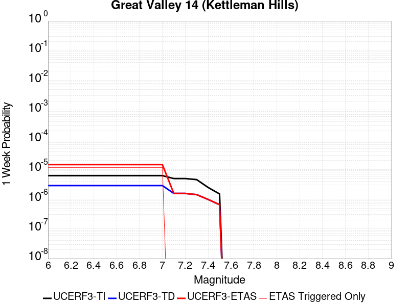 | 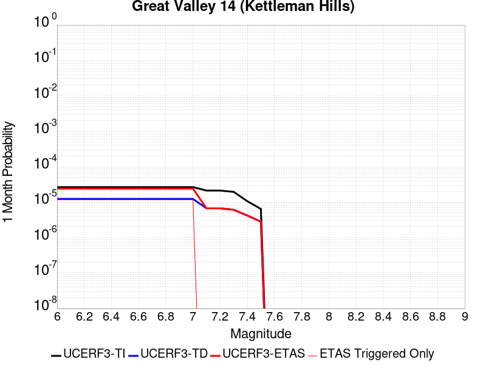 | 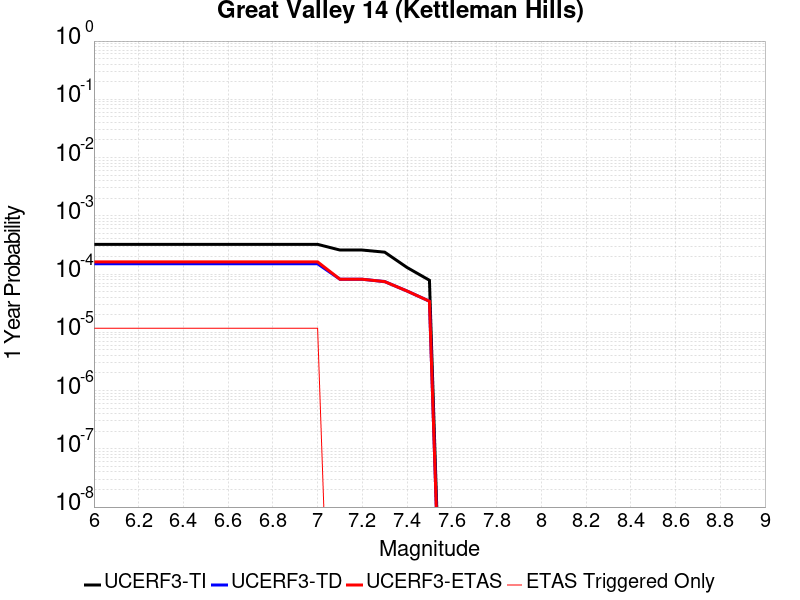 | 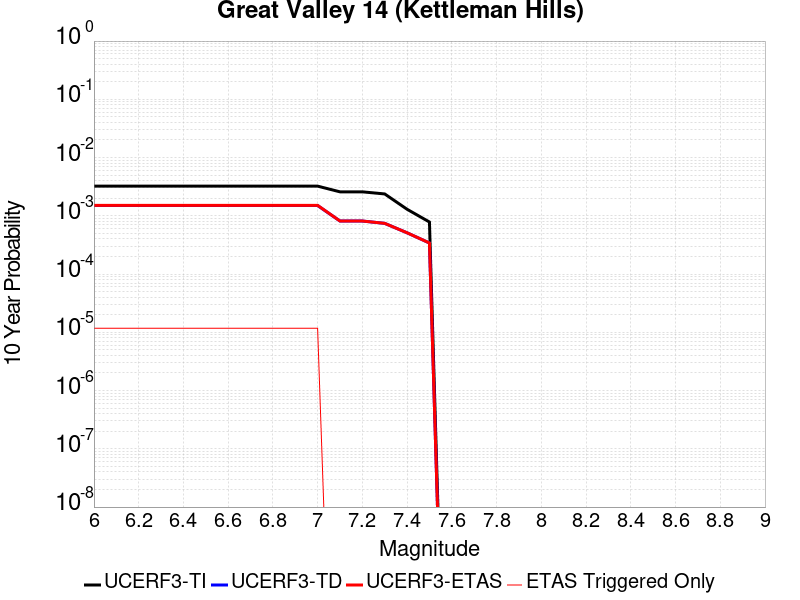 |

| Magnitude | 1 wk TI Prob | 1 wk TD Prob | 1 wk ETAS Prob | 1 wk ETAS/TD Gain | 1 wk ETAS Triggered Only | 1 mo TI Prob | 1 mo TD Prob | 1 mo ETAS Prob | 1 mo ETAS/TD Gain | 1 mo ETAS Triggered Only | 1 yr TI Prob | 1 yr TD Prob | 1 yr ETAS Prob | 1 yr ETAS/TD Gain | 1 yr ETAS Triggered Only | 10 yr TI Prob | 10 yr TD Prob | 10 yr ETAS Prob | 10 yr ETAS/TD Gain | 10 yr ETAS Triggered Only |
|-----|-----|-----|-----|-----|-----|-----|-----|-----|-----|-----|-----|-----|-----|-----|-----|-----|-----|-----|-----|-----|
| 6.0 | 6.2057843E-6 | 2.8768916E-6 | 1.4613947E-5 | 5.0797696 | 1.1737089E-5 | 2.6595946E-5 | 1.232949E-5 | 2.4066436E-5 | 1.9519408 | 1.1737089E-5 | 3.2375753E-4 | 1.5010356E-4 | 1.6183889E-4 | 1.0781815 | 1.1737089E-5 | 0.0032328626 | 0.0015002531 | 0.0015119725 | 1.0078117 | 1.1737089E-5 |
| 6.1 | 6.2057843E-6 | 2.8768916E-6 | 1.4613947E-5 | 5.0797696 | 1.1737089E-5 | 2.6595946E-5 | 1.232949E-5 | 2.4066436E-5 | 1.9519408 | 1.1737089E-5 | 3.2375753E-4 | 1.5010356E-4 | 1.6183889E-4 | 1.0781815 | 1.1737089E-5 | 0.0032328626 | 0.0015002531 | 0.0015119725 | 1.0078117 | 1.1737089E-5 |
| 6.2 | 6.2057843E-6 | 2.8768916E-6 | 1.4613947E-5 | 5.0797696 | 1.1737089E-5 | 2.6595946E-5 | 1.232949E-5 | 2.4066436E-5 | 1.9519408 | 1.1737089E-5 | 3.2375753E-4 | 1.5010356E-4 | 1.6183889E-4 | 1.0781815 | 1.1737089E-5 | 0.0032328626 | 0.0015002531 | 0.0015119725 | 1.0078117 | 1.1737089E-5 |
| 6.3 | 6.2057843E-6 | 2.8768916E-6 | 1.4613947E-5 | 5.0797696 | 1.1737089E-5 | 2.6595946E-5 | 1.232949E-5 | 2.4066436E-5 | 1.9519408 | 1.1737089E-5 | 3.2375753E-4 | 1.5010356E-4 | 1.6183889E-4 | 1.0781815 | 1.1737089E-5 | 0.0032328626 | 0.0015002531 | 0.0015119725 | 1.0078117 | 1.1737089E-5 |
| 6.4 | 6.2057843E-6 | 2.8768916E-6 | 1.4613947E-5 | 5.0797696 | 1.1737089E-5 | 2.6595946E-5 | 1.232949E-5 | 2.4066436E-5 | 1.9519408 | 1.1737089E-5 | 3.2375753E-4 | 1.5010356E-4 | 1.6183889E-4 | 1.0781815 | 1.1737089E-5 | 0.0032328626 | 0.0015002531 | 0.0015119725 | 1.0078117 | 1.1737089E-5 |
| 6.5 | 6.2057843E-6 | 2.8768916E-6 | 1.4613947E-5 | 5.0797696 | 1.1737089E-5 | 2.6595946E-5 | 1.232949E-5 | 2.4066436E-5 | 1.9519408 | 1.1737089E-5 | 3.2375753E-4 | 1.5010356E-4 | 1.6183889E-4 | 1.0781815 | 1.1737089E-5 | 0.0032328626 | 0.0015002531 | 0.0015119725 | 1.0078117 | 1.1737089E-5 |
| 6.6 | 6.2057843E-6 | 2.8768916E-6 | 1.4613947E-5 | 5.0797696 | 1.1737089E-5 | 2.6595946E-5 | 1.232949E-5 | 2.4066436E-5 | 1.9519408 | 1.1737089E-5 | 3.2375753E-4 | 1.5010356E-4 | 1.6183889E-4 | 1.0781815 | 1.1737089E-5 | 0.0032328626 | 0.0015002531 | 0.0015119725 | 1.0078117 | 1.1737089E-5 |
| 6.7 | 6.2057843E-6 | 2.8768916E-6 | 1.4613947E-5 | 5.0797696 | 1.1737089E-5 | 2.6595946E-5 | 1.232949E-5 | 2.4066436E-5 | 1.9519408 | 1.1737089E-5 | 3.2375753E-4 | 1.5010356E-4 | 1.6183889E-4 | 1.0781815 | 1.1737089E-5 | 0.0032328626 | 0.0015002531 | 0.0015119725 | 1.0078117 | 1.1737089E-5 |
| 6.8 | 6.2057843E-6 | 2.8768916E-6 | 1.4613947E-5 | 5.0797696 | 1.1737089E-5 | 2.6595946E-5 | 1.232949E-5 | 2.4066436E-5 | 1.9519408 | 1.1737089E-5 | 3.2375753E-4 | 1.5010356E-4 | 1.6183889E-4 | 1.0781815 | 1.1737089E-5 | 0.0032328626 | 0.0015002531 | 0.0015119725 | 1.0078117 | 1.1737089E-5 |
| 6.9 | 6.2057843E-6 | 2.8768916E-6 | 1.4613947E-5 | 5.0797696 | 1.1737089E-5 | 2.6595946E-5 | 1.232949E-5 | 2.4066436E-5 | 1.9519408 | 1.1737089E-5 | 3.2375753E-4 | 1.5010356E-4 | 1.6183889E-4 | 1.0781815 | 1.1737089E-5 | 0.0032328626 | 0.0015002531 | 0.0015119725 | 1.0078117 | 1.1737089E-5 |
| 7.0 | 6.2057843E-6 | 2.8768916E-6 | 1.4613947E-5 | 5.0797696 | 1.1737089E-5 | 2.6595946E-5 | 1.232949E-5 | 2.4066436E-5 | 1.9519408 | 1.1737089E-5 | 3.2375753E-4 | 1.5010356E-4 | 1.6183889E-4 | 1.0781815 | 1.1737089E-5 | 0.0032328626 | 0.0015002531 | 0.0015119725 | 1.0078117 | 1.1737089E-5 |
| 7.1 | 4.95113E-6 | 1.5606404E-6 | 1.5606404E-6 | 1.0 | 0.0 | 2.1218955E-5 | 6.6884427E-6 | 6.6884427E-6 | 1.0 | 0.0 | 2.5831014E-4 | 8.1428945E-5 | 8.1428945E-5 | 1.0 | 0.0 | 0.0025801011 | 8.1401E-4 | 8.1401E-4 | 1.0 | 0.0 |
| 7.2 | 4.95113E-6 | 1.5606404E-6 | 1.5606404E-6 | 1.0 | 0.0 | 2.1218955E-5 | 6.6884427E-6 | 6.6884427E-6 | 1.0 | 0.0 | 2.5831014E-4 | 8.1428945E-5 | 8.1428945E-5 | 1.0 | 0.0 | 0.0025801011 | 8.1401E-4 | 8.1401E-4 | 1.0 | 0.0 |
| 7.3 | 4.5549086E-6 | 1.4226472E-6 | 1.4226472E-6 | 1.0 | 0.0 | 1.9520892E-5 | 6.097046E-6 | 6.097046E-6 | 1.0 | 0.0 | 2.3764092E-4 | 7.4229174E-5 | 7.4229174E-5 | 1.0 | 0.0 | 0.0023738695 | 7.420604E-4 | 7.420604E-4 | 1.0 | 0.0 |
| 7.4 | 2.4837766E-6 | 9.800582E-7 | 9.800582E-7 | 1.0 | 0.0 | 1.0644713E-5 | 4.200243E-6 | 4.200243E-6 | 1.0 | 0.0 | 1.2959167E-4 | 5.1136827E-5 | 5.1136827E-5 | 1.0 | 0.0 | 0.0012951613 | 5.112572E-4 | 5.112572E-4 | 1.0 | 0.0 |
| 7.5 | 1.5002679E-6 | 6.546144E-7 | 6.546144E-7 | 1.0 | 0.0 | 6.4297037E-6 | 2.8054874E-6 | 2.8054874E-6 | 1.0 | 0.0 | 7.827883E-5 | 3.4156317E-5 | 3.4156317E-5 | 1.0 | 0.0 | 7.825126E-4 | 3.4151482E-4 | 3.4151482E-4 | 1.0 | 0.0 |

## Great Valley 11
*[(top)](#table-of-contents)*

| 1 Week | 1 Month | 1 Year | 10 Year |
|-----|-----|-----|-----|
| 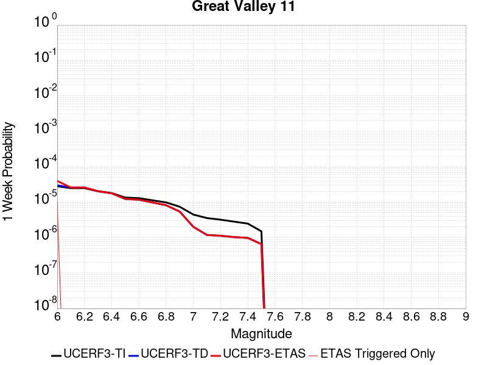 | 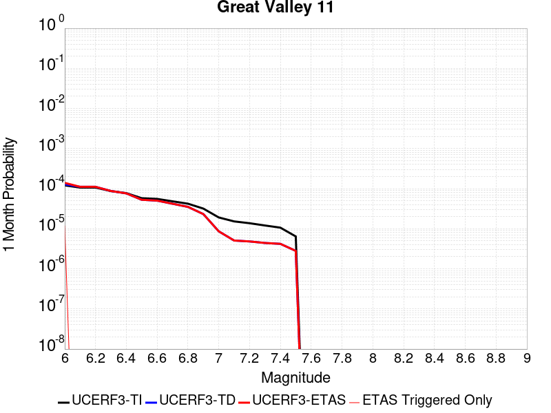 | 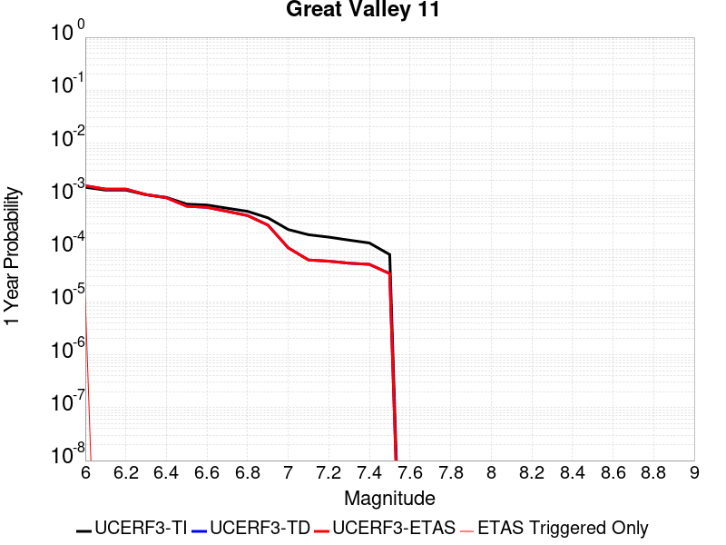 | 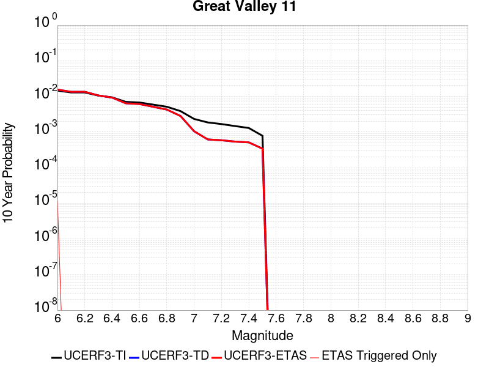 |

| Magnitude | 1 wk TI Prob | 1 wk TD Prob | 1 wk ETAS Prob | 1 wk ETAS/TD Gain | 1 wk ETAS Triggered Only | 1 mo TI Prob | 1 mo TD Prob | 1 mo ETAS Prob | 1 mo ETAS/TD Gain | 1 mo ETAS Triggered Only | 1 yr TI Prob | 1 yr TD Prob | 1 yr ETAS Prob | 1 yr ETAS/TD Gain | 1 yr ETAS Triggered Only | 10 yr TI Prob | 10 yr TD Prob | 10 yr ETAS Prob | 10 yr ETAS/TD Gain | 10 yr ETAS Triggered Only |
|-----|-----|-----|-----|-----|-----|-----|-----|-----|-----|-----|-----|-----|-----|-----|-----|-----|-----|-----|-----|-----|
| 6.0 | 2.8099583E-5 | 2.9832152E-5 | 4.1568892E-5 | 1.3934258 | 1.1737089E-5 | 1.20421224E-4 | 1.278462E-4 | 1.3958178E-4 | 1.0917946 | 1.1737089E-5 | 0.0014651422 | 0.0015554909 | 0.0015672097 | 1.0075338 | 1.1737089E-5 | 0.0145552 | 0.01545356 | 0.015465116 | 1.0007478 | 1.1737089E-5 |
| 6.1 | 2.483194E-5 | 2.590715E-5 | 2.590715E-5 | 1.0 | 0.0 | 1.0641825E-4 | 1.11026246E-4 | 1.11026246E-4 | 1.0 | 0.0 | 0.0012948721 | 0.0013509706 | 0.0013509706 | 1.0 | 0.0 | 0.012873529 | 0.013433994 | 0.013433994 | 1.0 | 0.0 |
| 6.2 | 2.483194E-5 | 2.590715E-5 | 2.590715E-5 | 1.0 | 0.0 | 1.0641825E-4 | 1.11026246E-4 | 1.11026246E-4 | 1.0 | 0.0 | 0.0012948721 | 0.0013509706 | 0.0013509706 | 1.0 | 0.0 | 0.012873529 | 0.013433994 | 0.013433994 | 1.0 | 0.0 |
| 6.3 | 2.0257901E-5 | 2.0398922E-5 | 2.0398922E-5 | 1.0 | 0.0 | 8.681669E-5 | 8.742122E-5 | 8.742122E-5 | 1.0 | 0.0 | 0.0010564806 | 0.0010638756 | 0.0010638756 | 1.0 | 0.0 | 0.01051472 | 0.010592012 | 0.010592012 | 1.0 | 0.0 |
| 6.4 | 1.8054898E-5 | 1.7780874E-5 | 1.7780874E-5 | 1.0 | 0.0 | 7.737584E-5 | 7.62017E-5 | 7.62017E-5 | 1.0 | 0.0 | 9.416436E-4 | 9.2739856E-4 | 9.2739856E-4 | 1.0 | 0.0 | 0.009376635 | 0.009239036 | 0.009239036 | 1.0 | 0.0 |
| 6.5 | 1.34804895E-5 | 1.2321055E-5 | 1.2321055E-5 | 1.0 | 0.0 | 5.777225E-5 | 5.2803476E-5 | 5.2803476E-5 | 1.0 | 0.0 | 7.031501E-4 | 6.4269686E-4 | 6.4269686E-4 | 1.0 | 0.0 | 0.007009294 | 0.0064088185 | 0.0064088185 | 1.0 | 0.0 |
| 6.6 | 1.294883E-5 | 1.1732312E-5 | 1.1732312E-5 | 1.0 | 0.0 | 5.5493805E-5 | 5.028039E-5 | 5.028039E-5 | 1.0 | 0.0 | 6.754276E-4 | 6.1199587E-4 | 6.1199587E-4 | 1.0 | 0.0 | 0.006733784 | 0.0061035305 | 0.0061035305 | 1.0 | 0.0 |
| 6.7 | 1.1272237E-5 | 9.811886E-6 | 9.811886E-6 | 1.0 | 0.0 | 4.8308695E-5 | 4.2050277E-5 | 4.2050277E-5 | 1.0 | 0.0 | 5.879996E-4 | 5.118446E-4 | 5.118446E-4 | 1.0 | 0.0 | 0.005864462 | 0.0051069413 | 0.0051069413 | 1.0 | 0.0 |
| 6.8 | 9.8337505E-6 | 8.19377E-6 | 8.19377E-6 | 1.0 | 0.0 | 4.2143965E-5 | 3.5115696E-5 | 3.5115696E-5 | 1.0 | 0.0 | 5.1298196E-4 | 4.2745177E-4 | 4.2745177E-4 | 1.0 | 0.0 | 0.005117994 | 0.0042665056 | 0.0042665056 | 1.0 | 0.0 |
| 6.9 | 7.4224813E-6 | 5.4131347E-6 | 5.4131347E-6 | 1.0 | 0.0 | 3.1810247E-5 | 2.319895E-5 | 2.319895E-5 | 1.0 | 0.0 | 3.872209E-4 | 2.8241202E-4 | 2.8241202E-4 | 1.0 | 0.0 | 0.0038654688 | 0.0028206722 | 0.0028206722 | 1.0 | 0.0 |
| 7.0 | 4.4628923E-6 | 2.0110795E-6 | 2.0110795E-6 | 1.0 | 0.0 | 1.912654E-5 | 8.618884E-6 | 8.618884E-6 | 1.0 | 0.0 | 2.3284076E-4 | 1.04929975E-4 | 1.04929975E-4 | 1.0 | 0.0 | 0.0023259693 | 0.0010488159 | 0.0010488159 | 1.0 | 0.0 |
| 7.1 | 3.5546527E-6 | 1.1855836E-6 | 1.1855836E-6 | 1.0 | 0.0 | 1.5234136E-5 | 5.081063E-6 | 5.081063E-6 | 1.0 | 0.0 | 1.8545982E-4 | 6.186026E-5 | 6.186026E-5 | 1.0 | 0.0 | 0.0018530512 | 6.1843713E-4 | 6.1843713E-4 | 1.0 | 0.0 |
| 7.2 | 3.2039936E-6 | 1.1254128E-6 | 1.1254128E-6 | 1.0 | 0.0 | 1.3731329E-5 | 4.823189E-6 | 4.823189E-6 | 1.0 | 0.0 | 1.671661E-4 | 5.8720816E-5 | 5.8720816E-5 | 1.0 | 0.0 | 0.0016704041 | 5.870597E-4 | 5.870597E-4 | 1.0 | 0.0 |
| 7.3 | 2.8120473E-6 | 1.0305612E-6 | 1.0305612E-6 | 1.0 | 0.0 | 1.2051575E-5 | 4.4166836E-6 | 4.4166836E-6 | 1.0 | 0.0 | 1.4671806E-4 | 5.3771862E-5 | 5.3771862E-5 | 1.0 | 0.0 | 0.0014662122 | 5.3759513E-4 | 5.3759513E-4 | 1.0 | 0.0 |
| 7.4 | 2.4837766E-6 | 9.800582E-7 | 9.800582E-7 | 1.0 | 0.0 | 1.0644713E-5 | 4.200243E-6 | 4.200243E-6 | 1.0 | 0.0 | 1.2959167E-4 | 5.1136827E-5 | 5.1136827E-5 | 1.0 | 0.0 | 0.0012951613 | 5.112572E-4 | 5.112572E-4 | 1.0 | 0.0 |
| 7.5 | 1.5002679E-6 | 6.546144E-7 | 6.546144E-7 | 1.0 | 0.0 | 6.4297037E-6 | 2.8054874E-6 | 2.8054874E-6 | 1.0 | 0.0 | 7.827883E-5 | 3.4156317E-5 | 3.4156317E-5 | 1.0 | 0.0 | 7.825126E-4 | 3.4151482E-4 | 3.4151482E-4 | 1.0 | 0.0 |

## Raymond
*[(top)](#table-of-contents)*

| 1 Week | 1 Month | 1 Year | 10 Year |
|-----|-----|-----|-----|
|  |  | 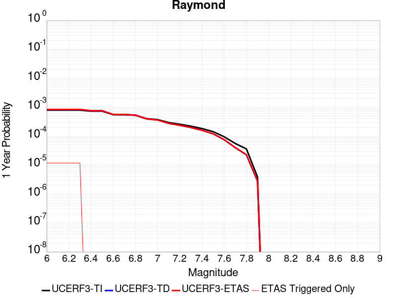 | 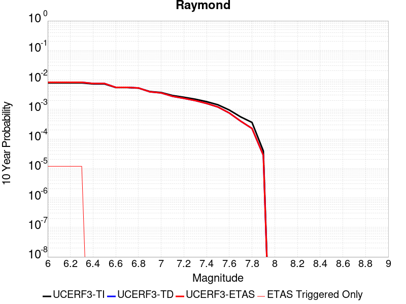 |

| Magnitude | 1 wk TI Prob | 1 wk TD Prob | 1 wk ETAS Prob | 1 wk ETAS/TD Gain | 1 wk ETAS Triggered Only | 1 mo TI Prob | 1 mo TD Prob | 1 mo ETAS Prob | 1 mo ETAS/TD Gain | 1 mo ETAS Triggered Only | 1 yr TI Prob | 1 yr TD Prob | 1 yr ETAS Prob | 1 yr ETAS/TD Gain | 1 yr ETAS Triggered Only | 10 yr TI Prob | 10 yr TD Prob | 10 yr ETAS Prob | 10 yr ETAS/TD Gain | 10 yr ETAS Triggered Only |
|-----|-----|-----|-----|-----|-----|-----|-----|-----|-----|-----|-----|-----|-----|-----|-----|-----|-----|-----|-----|-----|
| 6.0 | 1.5157413E-5 | 1.5810128E-5 | 1.5810128E-5 | 1.0 | 0.0 | 6.4958724E-5 | 6.7756075E-5 | 6.7756075E-5 | 1.0 | 0.0 | 7.905855E-4 | 8.2464307E-4 | 8.3637045E-4 | 1.0142212 | 1.1737089E-5 | 0.007877788 | 0.008218348 | 0.008229989 | 1.0014164 | 1.1737089E-5 |
| 6.1 | 1.5157413E-5 | 1.5810128E-5 | 1.5810128E-5 | 1.0 | 0.0 | 6.4958724E-5 | 6.7756075E-5 | 6.7756075E-5 | 1.0 | 0.0 | 7.905855E-4 | 8.2464307E-4 | 8.3637045E-4 | 1.0142212 | 1.1737089E-5 | 0.007877788 | 0.008218348 | 0.008229989 | 1.0014164 | 1.1737089E-5 |
| 6.2 | 1.5157413E-5 | 1.5810128E-5 | 1.5810128E-5 | 1.0 | 0.0 | 6.4958724E-5 | 6.7756075E-5 | 6.7756075E-5 | 1.0 | 0.0 | 7.905855E-4 | 8.2464307E-4 | 8.3637045E-4 | 1.0142212 | 1.1737089E-5 | 0.007877788 | 0.008218348 | 0.008229989 | 1.0014164 | 1.1737089E-5 |
| 6.3 | 1.5157413E-5 | 1.5810128E-5 | 1.5810128E-5 | 1.0 | 0.0 | 6.4958724E-5 | 6.7756075E-5 | 6.7756075E-5 | 1.0 | 0.0 | 7.905855E-4 | 8.2464307E-4 | 8.3637045E-4 | 1.0142212 | 1.1737089E-5 | 0.007877788 | 0.008218348 | 0.008229989 | 1.0014164 | 1.1737089E-5 |
| 6.4 | 1.3941944E-5 | 1.445469E-5 | 1.445469E-5 | 1.0 | 0.0 | 5.9749822E-5 | 6.1947336E-5 | 6.1947336E-5 | 1.0 | 0.0 | 7.2721124E-4 | 7.5397117E-4 | 7.5397117E-4 | 1.0 | 0.0 | 0.007248361 | 0.0075164647 | 0.0075164647 | 1.0 | 0.0 |
| 6.5 | 1.3941944E-5 | 1.445469E-5 | 1.445469E-5 | 1.0 | 0.0 | 5.9749822E-5 | 6.1947336E-5 | 6.1947336E-5 | 1.0 | 0.0 | 7.2721124E-4 | 7.5397117E-4 | 7.5397117E-4 | 1.0 | 0.0 | 0.007248361 | 0.0075164647 | 0.0075164647 | 1.0 | 0.0 |
| 6.6 | 1.0542609E-5 | 1.0671113E-5 | 1.0671113E-5 | 1.0 | 0.0 | 4.5181827E-5 | 4.573257E-5 | 4.573257E-5 | 1.0 | 0.0 | 5.499499E-4 | 5.5665727E-4 | 5.5665727E-4 | 1.0 | 0.0 | 0.005485909 | 0.00555319 | 0.00555319 | 1.0 | 0.0 |
| 6.7 | 1.0542609E-5 | 1.0671113E-5 | 1.0671113E-5 | 1.0 | 0.0 | 4.5181827E-5 | 4.573257E-5 | 4.573257E-5 | 1.0 | 0.0 | 5.499499E-4 | 5.5665727E-4 | 5.5665727E-4 | 1.0 | 0.0 | 0.005485909 | 0.00555319 | 0.00555319 | 1.0 | 0.0 |
| 6.8 | 1.0079132E-5 | 1.0176646E-5 | 1.0176646E-5 | 1.0 | 0.0 | 4.3195567E-5 | 4.3613498E-5 | 4.3613498E-5 | 1.0 | 0.0 | 5.257791E-4 | 5.3087034E-4 | 5.3087034E-4 | 1.0 | 0.0 | 0.0052453685 | 0.005296571 | 0.005296571 | 1.0 | 0.0 |
| 6.9 | 7.721598E-6 | 7.5489047E-6 | 7.5489047E-6 | 1.0 | 0.0 | 3.3092143E-5 | 3.2352054E-5 | 3.2352054E-5 | 1.0 | 0.0 | 4.0282236E-4 | 3.9381627E-4 | 3.9381627E-4 | 1.0 | 0.0 | 0.0040209293 | 0.0039313175 | 0.0039313175 | 1.0 | 0.0 |
| 7.0 | 7.137566E-6 | 6.9113057E-6 | 6.9113057E-6 | 1.0 | 0.0 | 3.058921E-5 | 2.961955E-5 | 2.961955E-5 | 1.0 | 0.0 | 3.7236E-4 | 3.6055944E-4 | 3.6055944E-4 | 1.0 | 0.0 | 0.0037173668 | 0.0035998628 | 0.0035998628 | 1.0 | 0.0 |
| 7.1 | 5.654976E-6 | 5.29954E-6 | 5.29954E-6 | 1.0 | 0.0 | 2.4235387E-5 | 2.2712118E-5 | 2.2712118E-5 | 1.0 | 0.0 | 2.9502588E-4 | 2.7648517E-4 | 2.7648517E-4 | 1.0 | 0.0 | 0.0029463451 | 0.002761443 | 0.002761443 | 1.0 | 0.0 |
| 7.2 | 4.9358455E-6 | 4.5266574E-6 | 4.5266574E-6 | 1.0 | 0.0 | 2.1153453E-5 | 1.9399817E-5 | 1.9399817E-5 | 1.0 | 0.0 | 2.5751285E-4 | 2.3616731E-4 | 2.3616731E-4 | 1.0 | 0.0 | 0.0025721465 | 0.0023591854 | 0.0023591854 | 1.0 | 0.0 |
| 7.3 | 4.2368597E-6 | 3.8056164E-6 | 3.8056164E-6 | 1.0 | 0.0 | 1.8157843E-5 | 1.6309683E-5 | 1.6309683E-5 | 1.0 | 0.0 | 2.2104931E-4 | 1.9855241E-4 | 1.9855241E-4 | 1.0 | 0.0 | 0.0022082955 | 0.0019837688 | 0.0019837688 | 1.0 | 0.0 |
| 7.4 | 3.4999923E-6 | 3.043744E-6 | 3.043744E-6 | 1.0 | 0.0 | 1.49998805E-5 | 1.3044552E-5 | 1.3044552E-5 | 1.0 | 0.0 | 1.8260824E-4 | 1.5880594E-4 | 1.5880594E-4 | 1.0 | 0.0 | 0.0018245826 | 0.0015869403 | 0.0015869403 | 1.0 | 0.0 |
| 7.5 | 2.738017E-6 | 2.3020468E-6 | 2.3020468E-6 | 1.0 | 0.0 | 1.1734306E-5 | 9.865878E-6 | 9.865878E-6 | 1.0 | 0.0 | 1.428558E-4 | 1.2011051E-4 | 1.2011051E-4 | 1.0 | 0.0 | 0.0014276401 | 0.0012004703 | 0.0012004703 | 1.0 | 0.0 |
| 7.6 | 1.8186392E-6 | 1.442312E-6 | 1.442312E-6 | 1.0 | 0.0 | 7.794145E-6 | 6.181323E-6 | 6.181323E-6 | 1.0 | 0.0 | 9.488958E-5 | 7.5255055E-5 | 7.5255055E-5 | 1.0 | 0.0 | 9.4849075E-4 | 7.523072E-4 | 7.523072E-4 | 1.0 | 0.0 |
| 7.7 | 1.0660348E-6 | 7.6438056E-7 | 7.6438056E-7 | 1.0 | 0.0 | 4.5687125E-6 | 3.2759126E-6 | 3.2759126E-6 | 1.0 | 0.0 | 5.5622655E-5 | 3.9883522E-5 | 3.9883522E-5 | 1.0 | 0.0 | 5.5608735E-4 | 3.9877277E-4 | 3.9877277E-4 | 1.0 | 0.0 |
| 7.8 | 6.913602E-7 | 4.3204133E-7 | 4.3204133E-7 | 1.0 | 0.0 | 2.962969E-6 | 1.8516045E-6 | 1.8516045E-6 | 1.0 | 0.0 | 3.607355E-5 | 2.2543056E-5 | 2.2543056E-5 | 1.0 | 0.0 | 3.6067693E-4 | 2.2541556E-4 | 2.2541556E-4 | 1.0 | 0.0 |
| 7.9 | 7.425201E-8 | 5.3222113E-8 | 5.3222113E-8 | 1.0 | 0.0 | 3.1822285E-7 | 2.2809476E-7 | 2.2809476E-7 | 1.0 | 0.0 | 3.874356E-6 | 2.7770516E-6 | 2.7770516E-6 | 1.0 | 0.0 | 3.8742884E-5 | 2.7770298E-5 | 2.7770298E-5 | 1.0 | 0.0 |

## San Gorgonio Pass
*[(top)](#table-of-contents)*

| 1 Week | 1 Month | 1 Year | 10 Year |
|-----|-----|-----|-----|
|  | 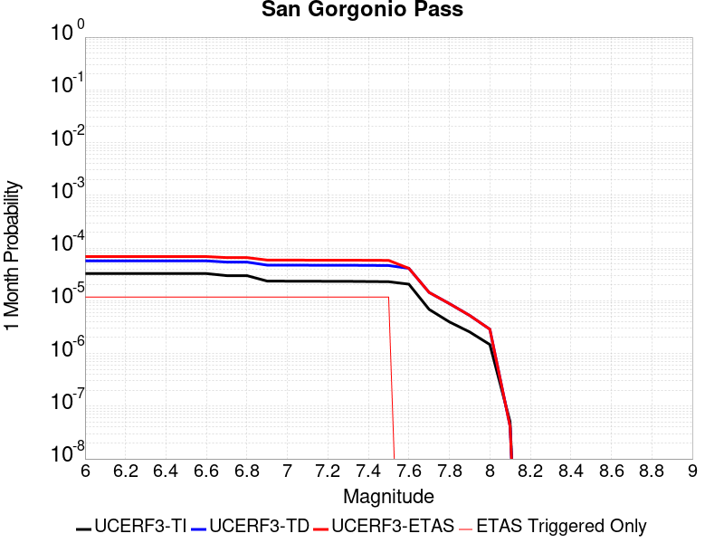 | 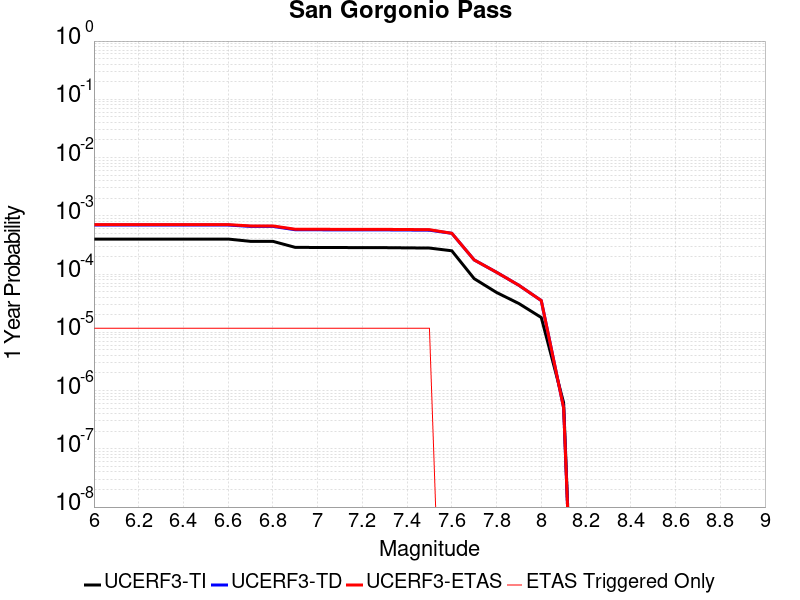 | 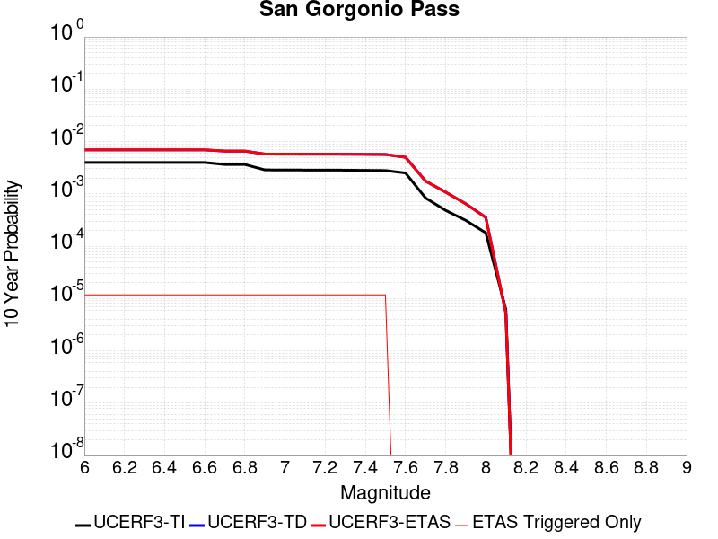 |

| Magnitude | 1 wk TI Prob | 1 wk TD Prob | 1 wk ETAS Prob | 1 wk ETAS/TD Gain | 1 wk ETAS Triggered Only | 1 mo TI Prob | 1 mo TD Prob | 1 mo ETAS Prob | 1 mo ETAS/TD Gain | 1 mo ETAS Triggered Only | 1 yr TI Prob | 1 yr TD Prob | 1 yr ETAS Prob | 1 yr ETAS/TD Gain | 1 yr ETAS Triggered Only | 10 yr TI Prob | 10 yr TD Prob | 10 yr ETAS Prob | 10 yr ETAS/TD Gain | 10 yr ETAS Triggered Only |
|-----|-----|-----|-----|-----|-----|-----|-----|-----|-----|-----|-----|-----|-----|-----|-----|-----|-----|-----|-----|-----|
| 6.0 | 7.644328E-6 | 1.3314231E-5 | 1.3314231E-5 | 1.0 | 0.0 | 3.2760996E-5 | 5.705979E-5 | 6.879621E-5 | 1.2056863 | 1.1737089E-5 | 3.987921E-4 | 6.944901E-4 | 7.0621906E-4 | 1.0168886 | 1.1737089E-5 | 0.003980772 | 0.0069299806 | 0.0069416366 | 1.0016819 | 1.1737089E-5 |
| 6.1 | 7.644328E-6 | 1.3314231E-5 | 1.3314231E-5 | 1.0 | 0.0 | 3.2760996E-5 | 5.705979E-5 | 6.879621E-5 | 1.2056863 | 1.1737089E-5 | 3.987921E-4 | 6.944901E-4 | 7.0621906E-4 | 1.0168886 | 1.1737089E-5 | 0.003980772 | 0.0069299806 | 0.0069416366 | 1.0016819 | 1.1737089E-5 |
| 6.2 | 7.644328E-6 | 1.3314231E-5 | 1.3314231E-5 | 1.0 | 0.0 | 3.2760996E-5 | 5.705979E-5 | 6.879621E-5 | 1.2056863 | 1.1737089E-5 | 3.987921E-4 | 6.944901E-4 | 7.0621906E-4 | 1.0168886 | 1.1737089E-5 | 0.003980772 | 0.0069299806 | 0.0069416366 | 1.0016819 | 1.1737089E-5 |
| 6.3 | 7.644328E-6 | 1.3314231E-5 | 1.3314231E-5 | 1.0 | 0.0 | 3.2760996E-5 | 5.705979E-5 | 6.879621E-5 | 1.2056863 | 1.1737089E-5 | 3.987921E-4 | 6.944901E-4 | 7.0621906E-4 | 1.0168886 | 1.1737089E-5 | 0.003980772 | 0.0069299806 | 0.0069416366 | 1.0016819 | 1.1737089E-5 |
| 6.4 | 7.644328E-6 | 1.3314231E-5 | 1.3314231E-5 | 1.0 | 0.0 | 3.2760996E-5 | 5.705979E-5 | 6.879621E-5 | 1.2056863 | 1.1737089E-5 | 3.987921E-4 | 6.944901E-4 | 7.0621906E-4 | 1.0168886 | 1.1737089E-5 | 0.003980772 | 0.0069299806 | 0.0069416366 | 1.0016819 | 1.1737089E-5 |
| 6.5 | 7.644328E-6 | 1.3314231E-5 | 1.3314231E-5 | 1.0 | 0.0 | 3.2760996E-5 | 5.705979E-5 | 6.879621E-5 | 1.2056863 | 1.1737089E-5 | 3.987921E-4 | 6.944901E-4 | 7.0621906E-4 | 1.0168886 | 1.1737089E-5 | 0.003980772 | 0.0069299806 | 0.0069416366 | 1.0016819 | 1.1737089E-5 |
| 6.6 | 7.644328E-6 | 1.3314231E-5 | 1.3314231E-5 | 1.0 | 0.0 | 3.2760996E-5 | 5.705979E-5 | 6.879621E-5 | 1.2056863 | 1.1737089E-5 | 3.987921E-4 | 6.944901E-4 | 7.0621906E-4 | 1.0168886 | 1.1737089E-5 | 0.003980772 | 0.0069299806 | 0.0069416366 | 1.0016819 | 1.1737089E-5 |
| 6.7 | 6.987586E-6 | 1.2618505E-5 | 1.2618505E-5 | 1.0 | 0.0 | 2.9946454E-5 | 5.4078235E-5 | 6.581469E-5 | 1.2170273 | 1.1737089E-5 | 3.645371E-4 | 6.582117E-4 | 6.699411E-4 | 1.01782 | 1.1737089E-5 | 0.0036393967 | 0.0065693567 | 0.006581017 | 1.0017749 | 1.1737089E-5 |
| 6.8 | 6.987586E-6 | 1.2618505E-5 | 1.2618505E-5 | 1.0 | 0.0 | 2.9946454E-5 | 5.4078235E-5 | 6.581469E-5 | 1.2170273 | 1.1737089E-5 | 3.645371E-4 | 6.582117E-4 | 6.699411E-4 | 1.01782 | 1.1737089E-5 | 0.0036393967 | 0.0065693567 | 0.006581017 | 1.0017749 | 1.1737089E-5 |
| 6.9 | 5.504702E-6 | 1.1049368E-5 | 1.1049368E-5 | 1.0 | 0.0 | 2.3591367E-5 | 4.7353606E-5 | 5.909014E-5 | 1.2478487 | 1.1737089E-5 | 2.8718702E-4 | 5.7638274E-4 | 5.8811303E-4 | 1.0203516 | 1.1737089E-5 | 0.0028681618 | 0.005755309 | 0.0057669785 | 1.0020276 | 1.1737089E-5 |
| 7.0 | 5.4825764E-6 | 1.102571E-5 | 1.102571E-5 | 1.0 | 0.0 | 2.3496545E-5 | 4.7252215E-5 | 5.898875E-5 | 1.2483807 | 1.1737089E-5 | 2.8603288E-4 | 5.751489E-4 | 5.8687927E-4 | 1.0203953 | 1.1737089E-5 | 0.00285665 | 0.005743035 | 0.0057547046 | 1.0020319 | 1.1737089E-5 |
| 7.1 | 5.4692787E-6 | 1.101142E-5 | 1.101142E-5 | 1.0 | 0.0 | 2.3439556E-5 | 4.7190973E-5 | 5.8927508E-5 | 1.248703 | 1.1737089E-5 | 2.8533922E-4 | 5.744037E-4 | 5.8613403E-4 | 1.0204217 | 1.1737089E-5 | 0.0028497311 | 0.0057356213 | 0.0057472913 | 1.0020347 | 1.1737089E-5 |
| 7.2 | 5.453661E-6 | 1.0994446E-5 | 1.0994446E-5 | 1.0 | 0.0 | 2.3372622E-5 | 4.7118232E-5 | 5.885477E-5 | 1.249087 | 1.1737089E-5 | 2.8452452E-4 | 5.7351857E-4 | 5.852489E-4 | 1.0204533 | 1.1737089E-5 | 0.002841605 | 0.0057268157 | 0.005738485 | 1.0020378 | 1.1737089E-5 |
| 7.3 | 5.4422303E-6 | 1.0981369E-5 | 1.0981369E-5 | 1.0 | 0.0 | 2.3323635E-5 | 4.706219E-5 | 5.8798727E-5 | 1.2493836 | 1.1737089E-5 | 2.8392827E-4 | 5.728366E-4 | 5.8456697E-4 | 1.0204777 | 1.1737089E-5 | 0.0028356577 | 0.005720031 | 0.005731701 | 1.0020401 | 1.1737089E-5 |
| 7.4 | 5.398595E-6 | 1.0928734E-5 | 1.0928734E-5 | 1.0 | 0.0 | 2.313663E-5 | 4.683662E-5 | 5.857316E-5 | 1.2505847 | 1.1737089E-5 | 2.8165206E-4 | 5.700917E-4 | 5.818221E-4 | 1.0205764 | 1.1737089E-5 | 0.0028129534 | 0.005692723 | 0.0057043936 | 1.00205 | 1.1737089E-5 |
| 7.5 | 5.3578788E-6 | 1.0855281E-5 | 1.0855281E-5 | 1.0 | 0.0 | 2.2962136E-5 | 4.6521833E-5 | 5.8258374E-5 | 1.2522804 | 1.1737089E-5 | 2.7952815E-4 | 5.662612E-4 | 5.779916E-4 | 1.0207156 | 1.1737089E-5 | 0.002791768 | 0.0056546377 | 0.0056663086 | 1.0020639 | 1.1737089E-5 |
| 7.6 | 4.8091474E-6 | 9.60368E-6 | 9.60368E-6 | 1.0 | 0.0 | 2.0610469E-5 | 4.1158008E-5 | 4.1158008E-5 | 1.0 | 0.0 | 2.5090357E-4 | 5.0098833E-4 | 5.0098833E-4 | 1.0 | 0.0 | 0.0025062046 | 0.0050053033 | 0.0050053033 | 1.0 | 0.0 |
| 7.7 | 1.5991155E-6 | 3.352866E-6 | 3.352866E-6 | 1.0 | 0.0 | 6.853334E-6 | 1.4369349E-5 | 1.4369349E-5 | 1.0 | 0.0 | 8.343615E-5 | 1.7493303E-4 | 1.7493303E-4 | 1.0 | 0.0 | 8.340483E-4 | 0.0017534072 | 0.0017534072 | 1.0 | 0.0 |
| 7.8 | 9.258398E-7 | 2.0579948E-6 | 2.0579948E-6 | 1.0 | 0.0 | 3.967879E-6 | 8.819949E-6 | 8.819949E-6 | 1.0 | 0.0 | 4.8307855E-5 | 1.073776E-4 | 1.073776E-4 | 1.0 | 0.0 | 4.8297356E-4 | 0.001078687 | 0.001078687 | 1.0 | 0.0 |
| 7.9 | 5.975575E-7 | 1.2291794E-6 | 1.2291794E-6 | 1.0 | 0.0 | 2.5609581E-6 | 5.2679006E-6 | 5.2679006E-6 | 1.0 | 0.0 | 3.117922E-5 | 6.4134816E-5 | 6.4134816E-5 | 1.0 | 0.0 | 3.1174847E-4 | 6.463092E-4 | 6.463092E-4 | 1.0 | 0.0 |
| 8.0 | 3.4413725E-7 | 6.7148494E-7 | 6.7148494E-7 | 1.0 | 0.0 | 1.4748731E-6 | 2.8777895E-6 | 2.8777895E-6 | 1.0 | 0.0 | 1.7956432E-5 | 3.503653E-5 | 3.503653E-5 | 1.0 | 0.0 | 1.7954981E-4 | 3.5373896E-4 | 3.5373896E-4 | 1.0 | 0.0 |
| 8.1 | 1.1787731E-8 | 9.634385E-9 | 9.634385E-9 | 1.0 | 0.0 | 5.0518846E-8 | 4.129022E-8 | 4.129022E-8 | 1.0 | 0.0 | 6.1506677E-7 | 5.027083E-7 | 5.027083E-7 | 1.0 | 0.0 | 6.1506507E-6 | 5.2424944E-6 | 5.2424944E-6 | 1.0 | 0.0 |

## Morales (West)
*[(top)](#table-of-contents)*

| 1 Week | 1 Month | 1 Year | 10 Year |
|-----|-----|-----|-----|
| 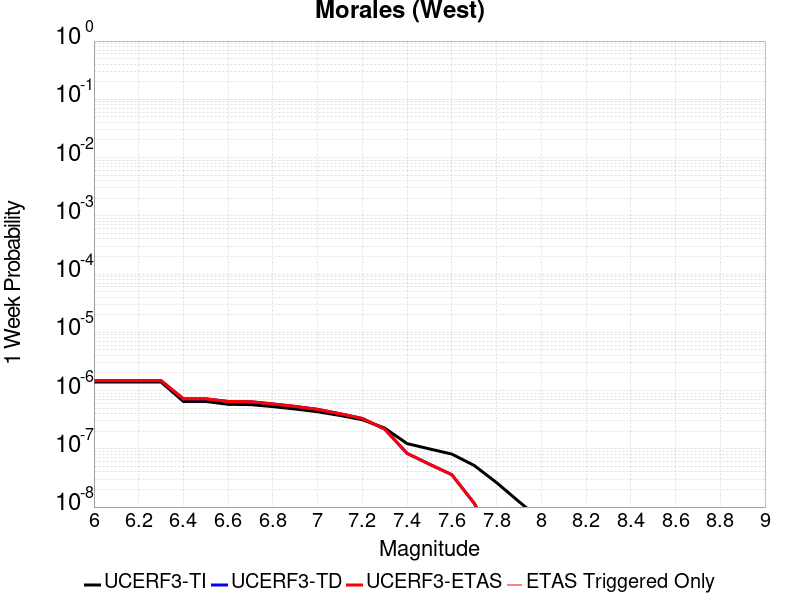 | 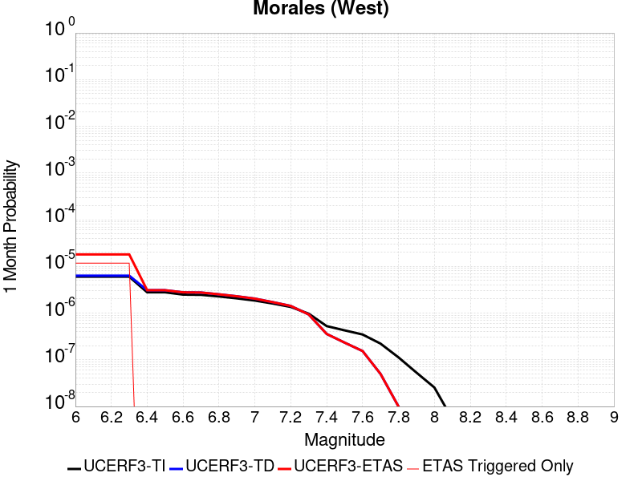 | 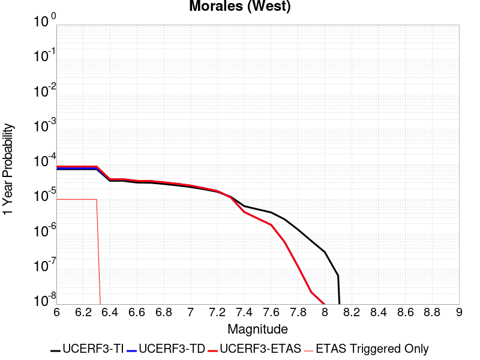 | 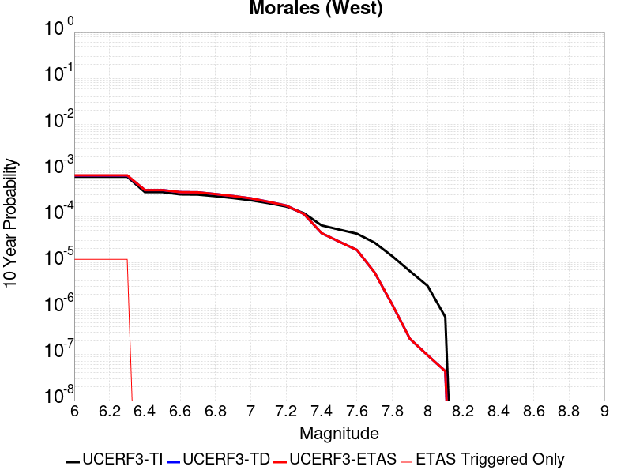 |

| Magnitude | 1 wk TI Prob | 1 wk TD Prob | 1 wk ETAS Prob | 1 wk ETAS/TD Gain | 1 wk ETAS Triggered Only | 1 mo TI Prob | 1 mo TD Prob | 1 mo ETAS Prob | 1 mo ETAS/TD Gain | 1 mo ETAS Triggered Only | 1 yr TI Prob | 1 yr TD Prob | 1 yr ETAS Prob | 1 yr ETAS/TD Gain | 1 yr ETAS Triggered Only | 10 yr TI Prob | 10 yr TD Prob | 10 yr ETAS Prob | 10 yr ETAS/TD Gain | 10 yr ETAS Triggered Only |
|-----|-----|-----|-----|-----|-----|-----|-----|-----|-----|-----|-----|-----|-----|-----|-----|-----|-----|-----|-----|-----|
| 6.0 | 1.4027072E-6 | 1.4791576E-6 | 1.4791576E-6 | 1.0 | 0.0 | 6.0115885E-6 | 6.339236E-6 | 1.807625E-5 | 2.8514874 | 1.1737089E-5 | 7.318863E-5 | 7.7178156E-5 | 8.891434E-5 | 1.1520661 | 1.1737089E-5 | 7.316453E-4 | 7.715821E-4 | 7.8331016E-4 | 1.0152 | 1.1737089E-5 |
| 6.1 | 1.4027072E-6 | 1.4791576E-6 | 1.4791576E-6 | 1.0 | 0.0 | 6.0115885E-6 | 6.339236E-6 | 1.807625E-5 | 2.8514874 | 1.1737089E-5 | 7.318863E-5 | 7.7178156E-5 | 8.891434E-5 | 1.1520661 | 1.1737089E-5 | 7.316453E-4 | 7.715821E-4 | 7.8331016E-4 | 1.0152 | 1.1737089E-5 |
| 6.2 | 1.4027072E-6 | 1.4791576E-6 | 1.4791576E-6 | 1.0 | 0.0 | 6.0115885E-6 | 6.339236E-6 | 1.807625E-5 | 2.8514874 | 1.1737089E-5 | 7.318863E-5 | 7.7178156E-5 | 8.891434E-5 | 1.1520661 | 1.1737089E-5 | 7.316453E-4 | 7.715821E-4 | 7.8331016E-4 | 1.0152 | 1.1737089E-5 |
| 6.3 | 1.4027072E-6 | 1.4791576E-6 | 1.4791576E-6 | 1.0 | 0.0 | 6.0115885E-6 | 6.339236E-6 | 1.807625E-5 | 2.8514874 | 1.1737089E-5 | 7.318863E-5 | 7.7178156E-5 | 8.891434E-5 | 1.1520661 | 1.1737089E-5 | 7.316453E-4 | 7.715821E-4 | 7.8331016E-4 | 1.0152 | 1.1737089E-5 |
| 6.4 | 6.504502E-7 | 7.2038824E-7 | 7.2038824E-7 | 1.0 | 0.0 | 2.7876408E-6 | 3.0873746E-6 | 3.0873746E-6 | 1.0 | 0.0 | 3.3939E-5 | 3.758815E-5 | 3.758815E-5 | 1.0 | 0.0 | 3.3933815E-4 | 3.758191E-4 | 3.758191E-4 | 1.0 | 0.0 |
| 6.5 | 6.504502E-7 | 7.2038824E-7 | 7.2038824E-7 | 1.0 | 0.0 | 2.7876408E-6 | 3.0873746E-6 | 3.0873746E-6 | 1.0 | 0.0 | 3.3939E-5 | 3.758815E-5 | 3.758815E-5 | 1.0 | 0.0 | 3.3933815E-4 | 3.758191E-4 | 3.758191E-4 | 1.0 | 0.0 |
| 6.6 | 5.8056526E-7 | 6.500143E-7 | 6.500143E-7 | 1.0 | 0.0 | 2.4881344E-6 | 2.7857725E-6 | 2.7857725E-6 | 1.0 | 0.0 | 3.0292615E-5 | 3.3916258E-5 | 3.3916258E-5 | 1.0 | 0.0 | 3.0288487E-4 | 3.3911143E-4 | 3.3911143E-4 | 1.0 | 0.0 |
| 6.7 | 5.741448E-7 | 6.435454E-7 | 6.435454E-7 | 1.0 | 0.0 | 2.4606184E-6 | 2.7580488E-6 | 2.7580488E-6 | 1.0 | 0.0 | 2.9957617E-5 | 3.3578734E-5 | 3.3578734E-5 | 1.0 | 0.0 | 2.9953578E-4 | 3.357372E-4 | 3.357372E-4 | 1.0 | 0.0 |
| 6.8 | 5.299428E-7 | 5.8909023E-7 | 5.8909023E-7 | 1.0 | 0.0 | 2.2711813E-6 | 2.52467E-6 | 2.52467E-6 | 1.0 | 0.0 | 2.7651282E-5 | 3.073743E-5 | 3.073743E-5 | 1.0 | 0.0 | 2.7647841E-4 | 3.0733226E-4 | 3.0733226E-4 | 1.0 | 0.0 |
| 6.9 | 4.82394E-7 | 5.3416807E-7 | 5.3416807E-7 | 1.0 | 0.0 | 2.0674013E-6 | 2.2892896E-6 | 2.2892896E-6 | 1.0 | 0.0 | 2.517032E-5 | 2.7871749E-5 | 2.7871749E-5 | 1.0 | 0.0 | 2.516747E-4 | 2.7868294E-4 | 2.7868294E-4 | 1.0 | 0.0 |
| 7.0 | 4.3264512E-7 | 4.759864E-7 | 4.759864E-7 | 1.0 | 0.0 | 1.8541921E-6 | 2.0399402E-6 | 2.0399402E-6 | 1.0 | 0.0 | 2.2574555E-5 | 2.4835992E-5 | 2.4835992E-5 | 1.0 | 0.0 | 2.2572262E-4 | 2.4833248E-4 | 2.4833248E-4 | 1.0 | 0.0 |
| 7.1 | 3.7388565E-7 | 4.000384E-7 | 4.000384E-7 | 1.0 | 0.0 | 1.6023661E-6 | 1.7144492E-6 | 1.7144492E-6 | 1.0 | 0.0 | 1.9508632E-5 | 2.0873222E-5 | 2.0873222E-5 | 1.0 | 0.0 | 1.950692E-4 | 2.0871284E-4 | 2.0871284E-4 | 1.0 | 0.0 |
| 7.2 | 3.1592543E-7 | 3.3199075E-7 | 3.3199075E-7 | 1.0 | 0.0 | 1.3539654E-6 | 1.4228168E-6 | 1.4228168E-6 | 1.0 | 0.0 | 1.6484404E-5 | 1.7322658E-5 | 1.7322658E-5 | 1.0 | 0.0 | 1.6483181E-4 | 1.7321325E-4 | 1.7321325E-4 | 1.0 | 0.0 |
| 7.3 | 2.2677783E-7 | 2.1793869E-7 | 2.1793869E-7 | 1.0 | 0.0 | 9.719047E-7 | 9.3402264E-7 | 9.3402264E-7 | 1.0 | 0.0 | 1.1832874E-5 | 1.1371666E-5 | 1.1371666E-5 | 1.0 | 0.0 | 1.18322445E-4 | 1.1371089E-4 | 1.1371089E-4 | 1.0 | 0.0 |
| 7.4 | 1.2295531E-7 | 8.350771E-8 | 8.350771E-8 | 1.0 | 0.0 | 5.269512E-7 | 3.5789014E-7 | 3.5789014E-7 | 1.0 | 0.0 | 6.4156125E-6 | 4.3573036E-6 | 4.3573036E-6 | 1.0 | 0.0 | 6.415427E-5 | 4.357219E-5 | 4.357219E-5 | 1.0 | 0.0 |
| 7.5 | 9.9632544E-8 | 5.443089E-8 | 5.443089E-8 | 1.0 | 0.0 | 4.2699656E-7 | 2.3327522E-7 | 2.3327522E-7 | 1.0 | 0.0 | 5.198671E-6 | 2.840122E-6 | 2.840122E-6 | 1.0 | 0.0 | 5.198549E-5 | 2.8400864E-5 | 2.8400864E-5 | 1.0 | 0.0 |
| 7.6 | 8.125894E-8 | 3.594956E-8 | 3.594956E-8 | 1.0 | 0.0 | 3.4825257E-7 | 1.5406955E-7 | 1.5406955E-7 | 1.0 | 0.0 | 4.2399665E-6 | 1.8757952E-6 | 1.8757952E-6 | 1.0 | 0.0 | 4.2398857E-5 | 1.8757797E-5 | 1.8757797E-5 | 1.0 | 0.0 |
| 7.7 | 5.1810765E-8 | 1.1642662E-8 | 1.1642662E-8 | 1.0 | 0.0 | 2.2204613E-7 | 4.9897128E-8 | 4.9897128E-8 | 1.0 | 0.0 | 2.7034082E-6 | 6.074974E-7 | 6.074974E-7 | 1.0 | 0.0 | 2.7033753E-5 | 6.0749603E-6 | 6.0749603E-6 | 1.0 | 0.0 |
| 7.8 | 2.6315043E-8 | 2.3383624E-9 | 2.3383624E-9 | 1.0 | 0.0 | 1.1277875E-7 | 1.0021558E-8 | 1.0021558E-8 | 1.0 | 0.0 | 1.3730804E-6 | 1.2201247E-7 | 1.2201247E-7 | 1.0 | 0.0 | 1.3730719E-5 | 1.2201268E-6 | 1.2201268E-6 | 1.0 | 0.0 |
| 7.9 | 1.24281545E-8 | 4.207228E-10 | 4.207228E-10 | 1.0 | 0.0 | 5.3263516E-8 | 1.8031033E-9 | 1.8031033E-9 | 1.0 | 0.0 | 6.4848314E-7 | 2.1952776E-8 | 2.1952776E-8 | 1.0 | 0.0 | 6.4848123E-6 | 2.195305E-7 | 2.195305E-7 | 1.0 | 0.0 |
| 8.0 | 5.954214E-9 | 1.8509339E-10 | 1.8509339E-10 | 1.0 | 0.0 | 2.551806E-8 | 7.9326146E-10 | 7.9326146E-10 | 1.0 | 0.0 | 3.1068234E-7 | 9.657958E-9 | 9.657958E-9 | 1.0 | 0.0 | 3.1068191E-6 | 9.658236E-8 | 9.658236E-8 | 1.0 | 0.0 |
| 8.1 | 1.2586262E-9 | 8.346668E-11 | 8.346668E-11 | 1.0 | 0.0 | 5.3941123E-9 | 3.5771386E-10 | 3.5771386E-10 | 1.0 | 0.0 | 6.567332E-8 | 4.355168E-9 | 4.355168E-9 | 1.0 | 0.0 | 6.56733E-7 | 4.3554458E-8 | 4.3554458E-8 | 1.0 | 0.0 |

## Hunting Creek - Berryessa 2011 CFM
*[(top)](#table-of-contents)*

| 1 Week | 1 Month | 1 Year | 10 Year |
|-----|-----|-----|-----|
| 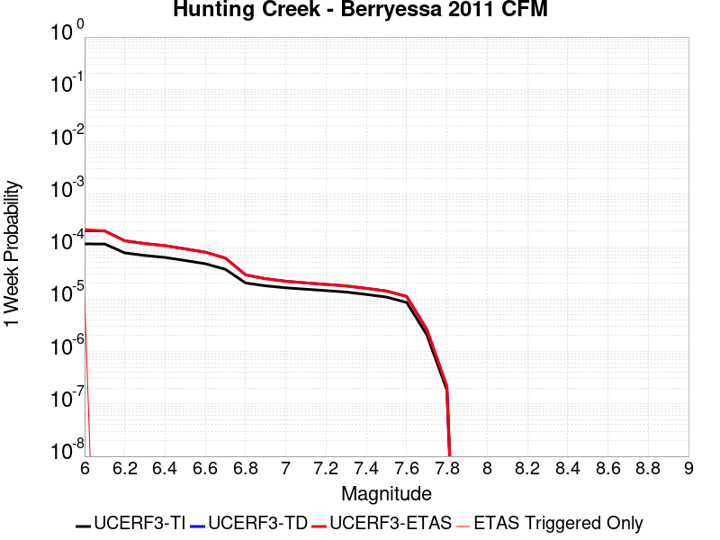 | 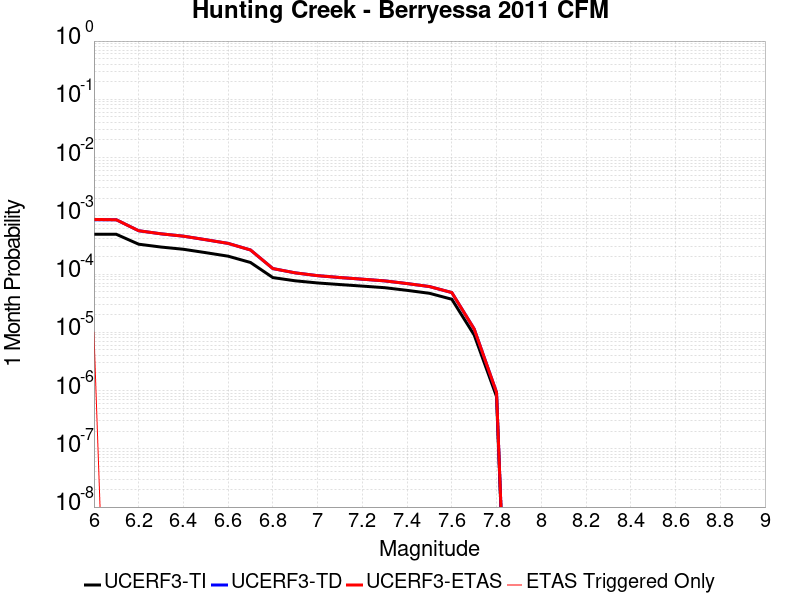 | 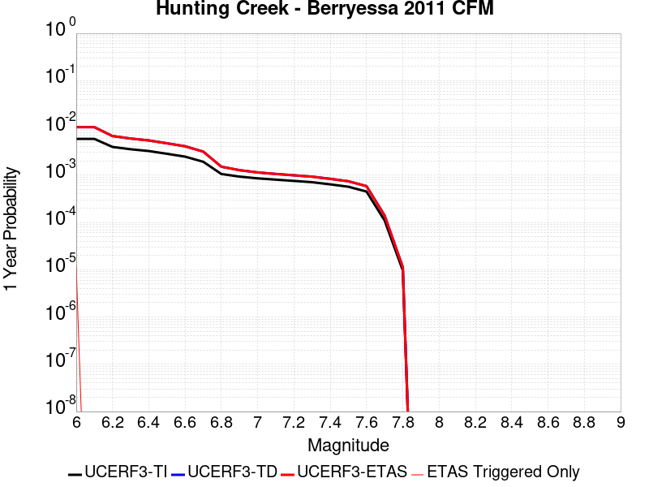 | 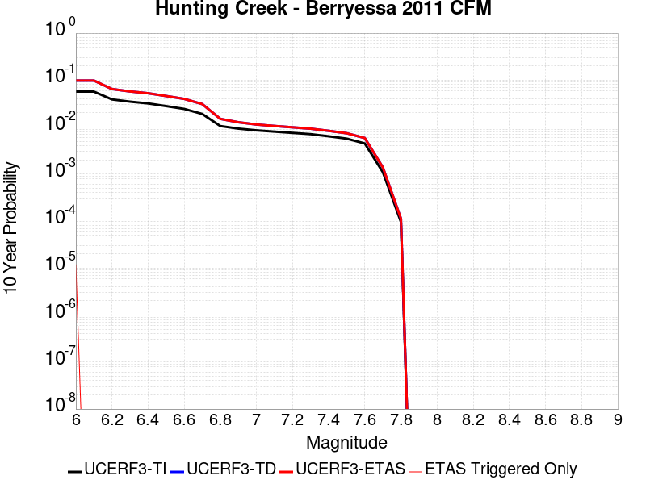 |

| Magnitude | 1 wk TI Prob | 1 wk TD Prob | 1 wk ETAS Prob | 1 wk ETAS/TD Gain | 1 wk ETAS Triggered Only | 1 mo TI Prob | 1 mo TD Prob | 1 mo ETAS Prob | 1 mo ETAS/TD Gain | 1 mo ETAS Triggered Only | 1 yr TI Prob | 1 yr TD Prob | 1 yr ETAS Prob | 1 yr ETAS/TD Gain | 1 yr ETAS Triggered Only | 10 yr TI Prob | 10 yr TD Prob | 10 yr ETAS Prob | 10 yr ETAS/TD Gain | 10 yr ETAS Triggered Only |
|-----|-----|-----|-----|-----|-----|-----|-----|-----|-----|-----|-----|-----|-----|-----|-----|-----|-----|-----|-----|-----|
| 6.0 | 1.1270982E-4 | 2.0012174E-4 | 2.1185649E-4 | 1.058638 | 1.1737089E-5 | 4.8295266E-4 | 8.5739547E-4 | 8.691225E-4 | 1.0136775 | 1.1737089E-5 | 0.0058641075 | 0.010386313 | 0.010397928 | 1.0011183 | 1.1737089E-5 | 0.057117578 | 0.09803703 | 0.09804761 | 1.000108 | 1.1737089E-5 |
| 6.1 | 1.1239393E-4 | 1.9960315E-4 | 1.9960315E-4 | 1.0 | 0.0 | 4.8159933E-4 | 8.551744E-4 | 8.551744E-4 | 1.0 | 0.0 | 0.0058477195 | 0.010359551 | 0.010359551 | 1.0 | 0.0 | 0.056962132 | 0.09779551 | 0.09779551 | 1.0 | 0.0 |
| 6.2 | 7.596265E-5 | 1.2940196E-4 | 1.2940196E-4 | 1.0 | 0.0 | 3.2551357E-4 | 5.5444165E-4 | 5.5444165E-4 | 1.0 | 0.0 | 0.0039559277 | 0.0067210156 | 0.0067210156 | 1.0 | 0.0 | 0.038862433 | 0.0645915 | 0.0645915 | 1.0 | 0.0 |
| 6.3 | 6.78794E-5 | 1.145119E-4 | 1.145119E-4 | 1.0 | 0.0 | 2.9087928E-4 | 4.906513E-4 | 4.906513E-4 | 1.0 | 0.0 | 0.003535705 | 0.005952679 | 0.005952679 | 1.0 | 0.0 | 0.034799766 | 0.057465393 | 0.057465393 | 1.0 | 0.0 |
| 6.4 | 6.2165134E-5 | 1.0436625E-4 | 1.0436625E-4 | 1.0 | 0.0 | 2.6639478E-4 | 4.4721062E-4 | 4.4721062E-4 | 1.0 | 0.0 | 0.0032385332 | 0.005427573 | 0.005427573 | 1.0 | 0.0 | 0.03191742 | 0.052550517 | 0.052550517 | 1.0 | 0.0 |
| 6.5 | 5.4368087E-5 | 9.071415E-5 | 9.071415E-5 | 1.0 | 0.0 | 2.3298527E-4 | 3.8872007E-4 | 3.8872007E-4 | 1.0 | 0.0 | 0.0028329059 | 0.0047198683 | 0.0047198683 | 1.0 | 0.0 | 0.027970633 | 0.045880128 | 0.045880128 | 1.0 | 0.0 |
| 6.6 | 4.729947E-5 | 7.847572E-5 | 7.847572E-5 | 1.0 | 0.0 | 2.0269625E-4 | 3.362842E-4 | 3.362842E-4 | 1.0 | 0.0 | 0.002465034 | 0.0040849647 | 0.0040849647 | 1.0 | 0.0 | 0.02437869 | 0.03985155 | 0.03985155 | 1.0 | 0.0 |
| 6.7 | 3.6875328E-5 | 6.0451803E-5 | 6.0451803E-5 | 1.0 | 0.0 | 1.5802756E-4 | 2.59056E-4 | 2.59056E-4 | 1.0 | 0.0 | 0.0019222875 | 0.0031482063 | 0.0031482063 | 1.0 | 0.0 | 0.019057442 | 0.03089237 | 0.03089237 | 1.0 | 0.0 |
| 6.8 | 2.0292036E-5 | 2.8976308E-5 | 2.8976308E-5 | 1.0 | 0.0 | 8.6962966E-5 | 1.2417832E-4 | 1.2417832E-4 | 1.0 | 0.0 | 0.0010582599 | 0.0015108072 | 0.0015108072 | 1.0 | 0.0 | 0.010532344 | 0.014978523 | 0.014978523 | 1.0 | 0.0 |
| 6.9 | 1.7871042E-5 | 2.4472254E-5 | 2.4472254E-5 | 1.0 | 0.0 | 7.658793E-5 | 1.048769E-4 | 1.048769E-4 | 1.0 | 0.0 | 9.320591E-4 | 0.0012761299 | 0.0012761299 | 1.0 | 0.0 | 0.009281595 | 0.012679775 | 0.012679775 | 1.0 | 0.0 |
| 7.0 | 1.6415532E-5 | 2.1906277E-5 | 2.1906277E-5 | 1.0 | 0.0 | 7.035038E-5 | 9.3880684E-5 | 9.3880684E-5 | 1.0 | 0.0 | 8.561793E-4 | 0.0011424015 | 0.0011424015 | 1.0 | 0.0 | 0.008528882 | 0.01136452 | 0.01136452 | 1.0 | 0.0 |
| 7.1 | 1.5409885E-5 | 2.0346342E-5 | 2.0346342E-5 | 1.0 | 0.0 | 6.6040695E-5 | 8.7195716E-5 | 8.7195716E-5 | 1.0 | 0.0 | 8.0374884E-4 | 0.0010610938 | 0.0010610938 | 1.0 | 0.0 | 0.00800848 | 0.010560595 | 0.010560595 | 1.0 | 0.0 |
| 7.2 | 1.4497423E-5 | 1.9054964E-5 | 1.9054964E-5 | 1.0 | 0.0 | 6.213033E-5 | 8.166159E-5 | 8.166159E-5 | 1.0 | 0.0 | 7.5617427E-4 | 9.937795E-4 | 9.937795E-4 | 1.0 | 0.0 | 0.0075360634 | 0.009893929 | 0.009893929 | 1.0 | 0.0 |
| 7.3 | 1.3615175E-5 | 1.7826127E-5 | 1.7826127E-5 | 1.0 | 0.0 | 5.8349444E-5 | 7.639547E-5 | 7.639547E-5 | 1.0 | 0.0 | 7.101729E-4 | 9.297209E-4 | 9.297209E-4 | 1.0 | 0.0 | 0.0070790765 | 0.009258823 | 0.009258823 | 1.0 | 0.0 |
| 7.4 | 1.2252825E-5 | 1.602625E-5 | 1.602625E-5 | 1.0 | 0.0 | 5.251105E-5 | 6.868213E-5 | 6.868213E-5 | 1.0 | 0.0 | 6.391345E-4 | 8.35887E-4 | 8.35887E-4 | 1.0 | 0.0 | 0.0063729943 | 0.008327872 | 0.008327872 | 1.0 | 0.0 |
| 7.5 | 1.0913301E-5 | 1.4241117E-5 | 1.4241117E-5 | 1.0 | 0.0 | 4.6770452E-5 | 6.1031948E-5 | 6.1031948E-5 | 1.0 | 0.0 | 5.6928146E-4 | 7.4281334E-4 | 7.4281334E-4 | 1.0 | 0.0 | 0.0056782532 | 0.0074036797 | 0.0074036797 | 1.0 | 0.0 |
| 7.6 | 8.623192E-6 | 1.12346415E-5 | 1.12346415E-5 | 1.0 | 0.0 | 3.6956015E-5 | 4.814759E-5 | 4.814759E-5 | 1.0 | 0.0 | 4.4984656E-4 | 5.8604183E-4 | 5.8604183E-4 | 1.0 | 0.0 | 0.00448937 | 0.0058452785 | 0.0058452785 | 1.0 | 0.0 |
| 7.7 | 2.0993634E-6 | 2.662584E-6 | 2.662584E-6 | 1.0 | 0.0 | 8.997241E-6 | 1.1411025E-5 | 1.1411025E-5 | 1.0 | 0.0 | 1.09535904E-4 | 1.3892044E-4 | 1.3892044E-4 | 1.0 | 0.0 | 0.0010948193 | 0.0013883426 | 0.0013883426 | 1.0 | 0.0 |
| 7.8 | 1.8428308E-7 | 2.167437E-7 | 2.167437E-7 | 1.0 | 0.0 | 7.897844E-7 | 9.289013E-7 | 9.289013E-7 | 1.0 | 0.0 | 9.615583E-6 | 1.1309318E-5 | 1.1309318E-5 | 1.0 | 0.0 | 9.615166E-5 | 1.13086026E-4 | 1.13086026E-4 | 1.0 | 0.0 |

## Maacama 2011 CFM
*[(top)](#table-of-contents)*

| 1 Week | 1 Month | 1 Year | 10 Year |
|-----|-----|-----|-----|
| 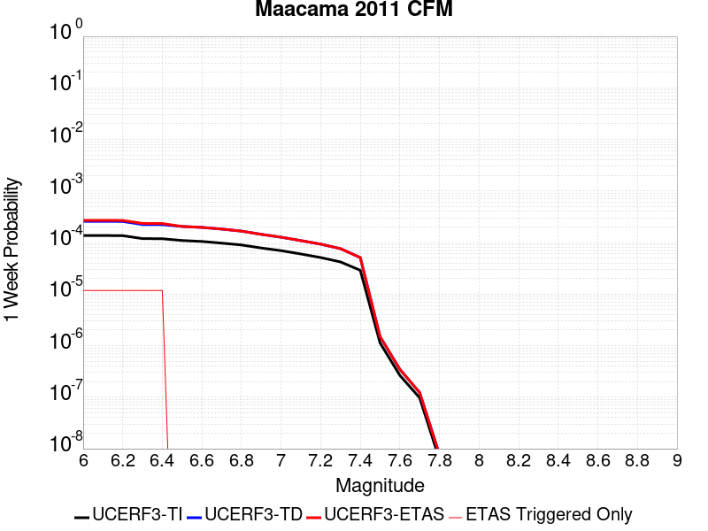 | 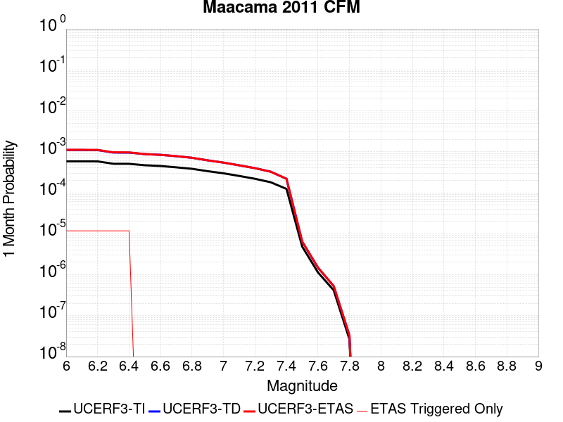 |  | 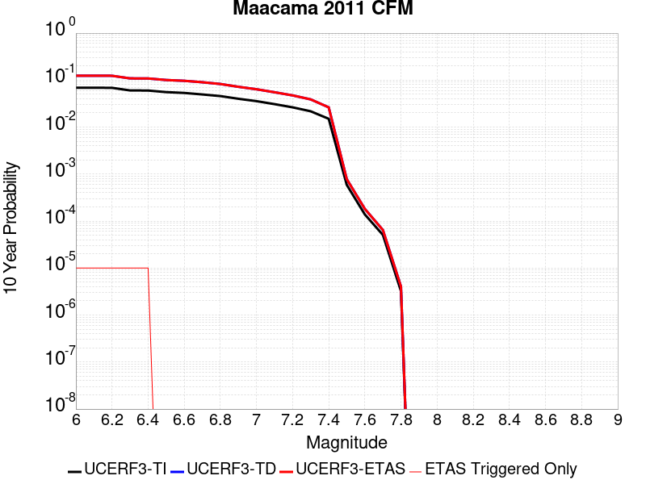 |

| Magnitude | 1 wk TI Prob | 1 wk TD Prob | 1 wk ETAS Prob | 1 wk ETAS/TD Gain | 1 wk ETAS Triggered Only | 1 mo TI Prob | 1 mo TD Prob | 1 mo ETAS Prob | 1 mo ETAS/TD Gain | 1 mo ETAS Triggered Only | 1 yr TI Prob | 1 yr TD Prob | 1 yr ETAS Prob | 1 yr ETAS/TD Gain | 1 yr ETAS Triggered Only | 10 yr TI Prob | 10 yr TD Prob | 10 yr ETAS Prob | 10 yr ETAS/TD Gain | 10 yr ETAS Triggered Only |
|-----|-----|-----|-----|-----|-----|-----|-----|-----|-----|-----|-----|-----|-----|-----|-----|-----|-----|-----|-----|-----|
| 6.0 | 1.368203E-4 | 2.5787868E-4 | 2.6961273E-4 | 1.0455023 | 1.1737089E-5 | 5.862409E-4 | 0.0011047312 | 0.0011164553 | 1.0106126 | 1.1737089E-5 | 0.0071141496 | 0.013350483 | 0.013362064 | 1.0008674 | 1.1737089E-5 | 0.06890667 | 0.124189645 | 0.12419992 | 1.0000827 | 1.1737089E-5 |
| 6.1 | 1.368203E-4 | 2.5787868E-4 | 2.6961273E-4 | 1.0455023 | 1.1737089E-5 | 5.862409E-4 | 0.0011047312 | 0.0011164553 | 1.0106126 | 1.1737089E-5 | 0.0071141496 | 0.013350483 | 0.013362064 | 1.0008674 | 1.1737089E-5 | 0.06890667 | 0.124189645 | 0.12419992 | 1.0000827 | 1.1737089E-5 |
| 6.2 | 1.360743E-4 | 2.566255E-4 | 2.6835955E-4 | 1.0457245 | 1.1737089E-5 | 5.8304524E-4 | 0.001099365 | 0.0011110891 | 1.0106645 | 1.1737089E-5 | 0.007075496 | 0.013286048 | 0.013297629 | 1.0008717 | 1.1737089E-5 | 0.06854413 | 0.12362404 | 0.12363433 | 1.0000832 | 1.1737089E-5 |
| 6.3 | 1.1917239E-4 | 2.235362E-4 | 2.3527068E-4 | 1.0524946 | 1.1737089E-5 | 5.1063887E-4 | 9.5765886E-4 | 9.6938474E-4 | 1.0122443 | 1.1737089E-5 | 0.0061993203 | 0.011587509 | 0.01159911 | 1.0010011 | 1.1737089E-5 | 0.060292065 | 0.10884413 | 0.10885459 | 1.0000961 | 1.1737089E-5 |
| 6.4 | 1.1859289E-4 | 2.2257185E-4 | 2.3430632E-4 | 1.0527222 | 1.1737089E-5 | 5.0815626E-4 | 9.535289E-4 | 9.652548E-4 | 1.0122974 | 1.1737089E-5 | 0.006169266 | 0.0115378285 | 0.011549431 | 1.0010055 | 1.1737089E-5 | 0.06000784 | 0.108401 | 0.10841147 | 1.0000966 | 1.1737089E-5 |
| 6.5 | 1.09512424E-4 | 2.0515872E-4 | 2.0515872E-4 | 1.0 | 0.0 | 4.6925453E-4 | 8.789523E-4 | 8.789523E-4 | 1.0 | 0.0 | 0.005698218 | 0.01063927 | 0.01063927 | 1.0 | 0.0 | 0.055543028 | 0.100493506 | 0.100493506 | 1.0 | 0.0 |
| 6.6 | 1.0502928E-4 | 1.9674368E-4 | 1.9674368E-4 | 1.0 | 0.0 | 4.500478E-4 | 8.4291224E-4 | 8.4291224E-4 | 1.0 | 0.0 | 0.0054655746 | 0.01020536 | 0.01020536 | 1.0 | 0.0 | 0.053330887 | 0.096646085 | 0.096646085 | 1.0 | 0.0 |
| 6.7 | 9.739358E-5 | 1.825636E-4 | 1.825636E-4 | 1.0 | 0.0 | 4.173343E-4 | 7.821781E-4 | 7.821781E-4 | 1.0 | 0.0 | 0.0050692135 | 0.009475501 | 0.009475501 | 1.0 | 0.0 | 0.049551267 | 0.090118766 | 0.090118766 | 1.0 | 0.0 |
| 6.8 | 8.969524E-5 | 1.6657855E-4 | 1.6657855E-4 | 1.0 | 0.0 | 3.8435153E-4 | 7.1370887E-4 | 7.1370887E-4 | 1.0 | 0.0 | 0.0046694432 | 0.008649083 | 0.008649083 | 1.0 | 0.0 | 0.045725387 | 0.082651116 | 0.082651116 | 1.0 | 0.0 |
| 6.9 | 7.838291E-5 | 1.4417822E-4 | 1.4417822E-4 | 1.0 | 0.0 | 3.358835E-4 | 6.177581E-4 | 6.177581E-4 | 1.0 | 0.0 | 0.0040817154 | 0.007491799 | 0.007491799 | 1.0 | 0.0 | 0.04007554 | 0.07205178 | 0.07205178 | 1.0 | 0.0 |
| 7.0 | 6.961957E-5 | 1.270709E-4 | 1.270709E-4 | 1.0 | 0.0 | 2.9833548E-4 | 5.4447335E-4 | 5.4447335E-4 | 1.0 | 0.0 | 0.0036261857 | 0.006606736 | 0.006606736 | 1.0 | 0.0 | 0.035675827 | 0.063870616 | 0.063870616 | 1.0 | 0.0 |
| 7.1 | 5.999398E-5 | 1.0904674E-4 | 1.0904674E-4 | 1.0 | 0.0 | 2.570917E-4 | 4.6726142E-4 | 4.6726142E-4 | 1.0 | 0.0 | 0.0031255994 | 0.0056728474 | 0.0056728474 | 1.0 | 0.0 | 0.030820016 | 0.055138282 | 0.055138282 | 1.0 | 0.0 |
| 7.2 | 5.116532E-5 | 9.3055336E-5 | 9.3055336E-5 | 1.0 | 0.0 | 2.1926152E-4 | 3.9875024E-4 | 3.9875024E-4 | 1.0 | 0.0 | 0.002666241 | 0.004843103 | 0.004843103 | 1.0 | 0.0 | 0.026344774 | 0.04730284 | 0.04730284 | 1.0 | 0.0 |
| 7.3 | 4.2087835E-5 | 7.617328E-5 | 7.617328E-5 | 1.0 | 0.0 | 1.8036396E-4 | 3.2641852E-4 | 3.2641852E-4 | 1.0 | 0.0 | 0.0021937196 | 0.0039661685 | 0.0039661685 | 1.0 | 0.0 | 0.0217219 | 0.038904376 | 0.038904376 | 1.0 | 0.0 |
| 7.4 | 2.8991652E-5 | 5.1167233E-5 | 5.1167233E-5 | 1.0 | 0.0 | 1.2424402E-4 | 2.1927188E-4 | 2.1927188E-4 | 1.0 | 0.0 | 0.0015116213 | 0.0026660617 | 0.0026660617 | 1.0 | 0.0 | 0.015013801 | 0.026331667 | 0.026331667 | 1.0 | 0.0 |
| 7.5 | 1.1292299E-6 | 1.4950161E-6 | 1.4950161E-6 | 1.0 | 0.0 | 4.8395473E-6 | 6.4072037E-6 | 6.4072037E-6 | 1.0 | 0.0 | 5.8919897E-5 | 7.800615E-5 | 7.800615E-5 | 1.0 | 0.0 | 5.890428E-4 | 7.8048074E-4 | 7.8048074E-4 | 1.0 | 0.0 |
| 7.6 | 2.6535366E-7 | 3.4720597E-7 | 3.4720597E-7 | 1.0 | 0.0 | 1.1372296E-6 | 1.4880247E-6 | 1.4880247E-6 | 1.0 | 0.0 | 1.3845682E-5 | 1.8116552E-5 | 1.8116552E-5 | 1.0 | 0.0 | 1.3844819E-4 | 1.816747E-4 | 1.816747E-4 | 1.0 | 0.0 |
| 7.7 | 9.727789E-8 | 1.2302169E-7 | 1.2302169E-7 | 1.0 | 0.0 | 4.1690518E-7 | 5.2723567E-7 | 5.2723567E-7 | 1.0 | 0.0 | 5.0758085E-6 | 6.419076E-6 | 6.419076E-6 | 1.0 | 0.0 | 5.0756928E-5 | 6.45712E-5 | 6.45712E-5 | 1.0 | 0.0 |
| 7.8 | 6.1939325E-9 | 7.711523E-9 | 7.711523E-9 | 1.0 | 0.0 | 2.6545425E-8 | 3.3049385E-8 | 3.3049385E-8 | 1.0 | 0.0 | 3.231905E-7 | 4.0237617E-7 | 4.0237617E-7 | 1.0 | 0.0 | 3.2319003E-6 | 4.0598557E-6 | 4.0598557E-6 | 1.0 | 0.0 |

## Surprise Valley 2011 CFM
*[(top)](#table-of-contents)*

| 1 Week | 1 Month | 1 Year | 10 Year |
|-----|-----|-----|-----|
|  |  | 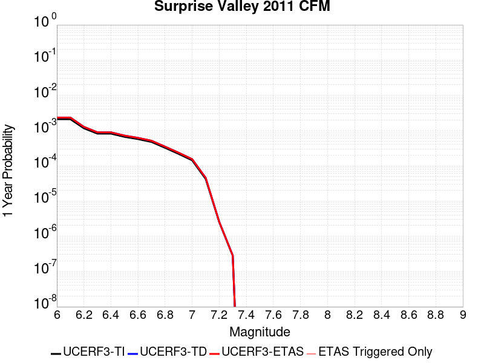 | 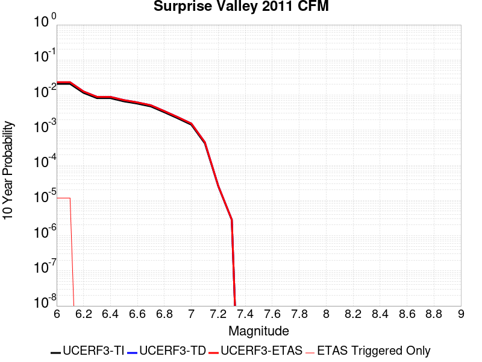 |

| Magnitude | 1 wk TI Prob | 1 wk TD Prob | 1 wk ETAS Prob | 1 wk ETAS/TD Gain | 1 wk ETAS Triggered Only | 1 mo TI Prob | 1 mo TD Prob | 1 mo ETAS Prob | 1 mo ETAS/TD Gain | 1 mo ETAS Triggered Only | 1 yr TI Prob | 1 yr TD Prob | 1 yr ETAS Prob | 1 yr ETAS/TD Gain | 1 yr ETAS Triggered Only | 10 yr TI Prob | 10 yr TD Prob | 10 yr ETAS Prob | 10 yr ETAS/TD Gain | 10 yr ETAS Triggered Only |
|-----|-----|-----|-----|-----|-----|-----|-----|-----|-----|-----|-----|-----|-----|-----|-----|-----|-----|-----|-----|-----|
| 6.0 | 4.0396248E-5 | 4.485131E-5 | 4.485131E-5 | 1.0 | 0.0 | 1.7311527E-4 | 1.9220692E-4 | 1.9220692E-4 | 1.0 | 0.0 | 0.002105641 | 0.0023378176 | 0.0023378176 | 1.0 | 0.0 | 0.020858008 | 0.023153966 | 0.02316543 | 1.0004952 | 1.1737089E-5 |
| 6.1 | 4.0396248E-5 | 4.485131E-5 | 4.485131E-5 | 1.0 | 0.0 | 1.7311527E-4 | 1.9220692E-4 | 1.9220692E-4 | 1.0 | 0.0 | 0.002105641 | 0.0023378176 | 0.0023378176 | 1.0 | 0.0 | 0.020858008 | 0.023153966 | 0.02316543 | 1.0004952 | 1.1737089E-5 |
| 6.2 | 2.2295266E-5 | 2.440125E-5 | 2.440125E-5 | 1.0 | 0.0 | 9.554764E-5 | 1.0457276E-4 | 1.0457276E-4 | 1.0 | 0.0 | 0.0011626717 | 0.0012724606 | 0.0012724606 | 1.0 | 0.0 | 0.011566074 | 0.012654981 | 0.012654981 | 1.0 | 0.0 |
| 6.3 | 1.572643E-5 | 1.7096807E-5 | 1.7096807E-5 | 1.0 | 0.0 | 6.7397246E-5 | 7.327003E-5 | 7.327003E-5 | 1.0 | 0.0 | 8.202525E-4 | 8.91708E-4 | 8.91708E-4 | 1.0 | 0.0 | 0.008172315 | 0.008882407 | 0.008882407 | 1.0 | 0.0 |
| 6.4 | 1.5714395E-5 | 1.7084629E-5 | 1.7084629E-5 | 1.0 | 0.0 | 6.734567E-5 | 7.3217845E-5 | 7.3217845E-5 | 1.0 | 0.0 | 8.1962504E-4 | 8.9107314E-4 | 8.9107314E-4 | 1.0 | 0.0 | 0.008166086 | 0.008876109 | 0.008876109 | 1.0 | 0.0 |
| 6.5 | 1.2733495E-5 | 1.38016E-5 | 1.38016E-5 | 1.0 | 0.0 | 5.457098E-5 | 5.9148413E-5 | 5.9148413E-5 | 1.0 | 0.0 | 6.641992E-4 | 7.1990065E-4 | 7.1990065E-4 | 1.0 | 0.0 | 0.0066221743 | 0.0071763797 | 0.0071763797 | 1.0 | 0.0 |
| 6.6 | 1.0983784E-5 | 1.1886554E-5 | 1.1886554E-5 | 1.0 | 0.0 | 4.7072506E-5 | 5.094141E-5 | 5.094141E-5 | 1.0 | 0.0 | 5.7295704E-4 | 6.200405E-4 | 6.200405E-4 | 1.0 | 0.0 | 0.0057148207 | 0.0061836545 | 0.0061836545 | 1.0 | 0.0 |
| 6.7 | 9.104806E-6 | 9.839491E-6 | 9.839491E-6 | 1.0 | 0.0 | 3.902001E-5 | 4.2168587E-5 | 4.2168587E-5 | 1.0 | 0.0 | 4.7496508E-4 | 5.132855E-4 | 5.132855E-4 | 1.0 | 0.0 | 0.004739512 | 0.005121397 | 0.005121397 | 1.0 | 0.0 |
| 6.8 | 6.2162403E-6 | 6.7041337E-6 | 6.7041337E-6 | 1.0 | 0.0 | 2.6640759E-5 | 2.8731698E-5 | 2.8731698E-5 | 1.0 | 0.0 | 3.2430296E-4 | 3.497545E-4 | 3.497545E-4 | 1.0 | 0.0 | 0.003238301 | 0.0034922638 | 0.0034922638 | 1.0 | 0.0 |
| 6.9 | 4.1792696E-6 | 4.50323E-6 | 4.50323E-6 | 1.0 | 0.0 | 1.7911032E-5 | 1.9299423E-5 | 1.9299423E-5 | 1.0 | 0.0 | 2.1804498E-4 | 2.3494668E-4 | 2.3494668E-4 | 1.0 | 0.0 | 0.0021783116 | 0.0023471361 | 0.0023471361 | 1.0 | 0.0 |
| 7.0 | 2.7478413E-6 | 2.9622424E-6 | 2.9622424E-6 | 1.0 | 0.0 | 1.177641E-5 | 1.269527E-5 | 1.269527E-5 | 1.0 | 0.0 | 1.4336836E-4 | 1.545552E-4 | 1.545552E-4 | 1.0 | 0.0 | 0.001432759 | 0.0015445995 | 0.0015445995 | 1.0 | 0.0 |
| 7.1 | 8.128648E-7 | 8.724922E-7 | 8.724922E-7 | 1.0 | 0.0 | 3.4837017E-6 | 3.7392501E-6 | 3.7392501E-6 | 1.0 | 0.0 | 4.2413245E-5 | 4.552502E-5 | 4.552502E-5 | 1.0 | 0.0 | 4.2405148E-4 | 4.5521575E-4 | 4.5521575E-4 | 1.0 | 0.0 |
| 7.2 | 4.8641045E-8 | 4.9402068E-8 | 4.9402068E-8 | 1.0 | 0.0 | 2.084616E-7 | 2.1172312E-7 | 2.1172312E-7 | 1.0 | 0.0 | 2.538017E-6 | 2.577726E-6 | 2.577726E-6 | 1.0 | 0.0 | 2.537988E-5 | 2.5776973E-5 | 2.5776973E-5 | 1.0 | 0.0 |
| 7.3 | 5.3911844E-9 | 5.4758145E-9 | 5.4758145E-9 | 1.0 | 0.0 | 2.3105075E-8 | 2.3467775E-8 | 2.3467775E-8 | 1.0 | 0.0 | 2.8130427E-7 | 2.8572015E-7 | 2.8572015E-7 | 1.0 | 0.0 | 2.8130391E-6 | 2.8571992E-6 | 2.8571992E-6 | 1.0 | 0.0 |

## Great Valley 08 (Quinto)
*[(top)](#table-of-contents)*

| 1 Week | 1 Month | 1 Year | 10 Year |
|-----|-----|-----|-----|
| 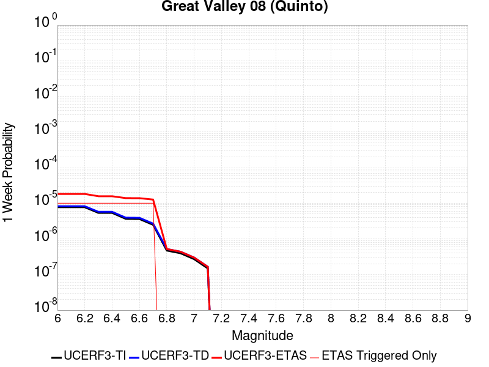 | 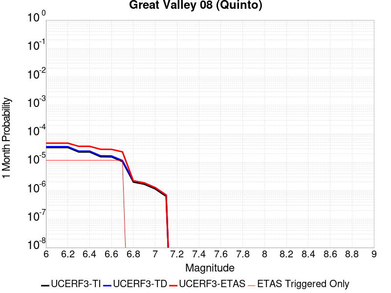 | 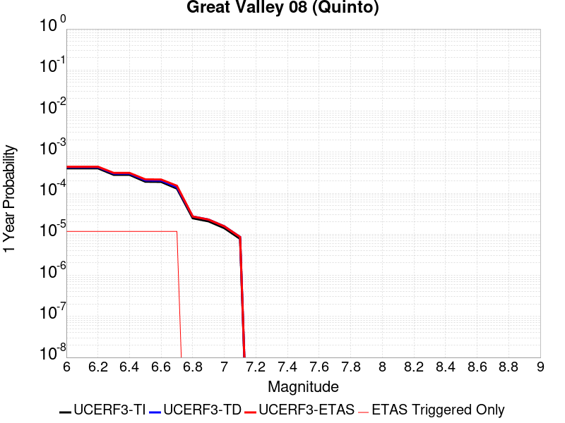 | 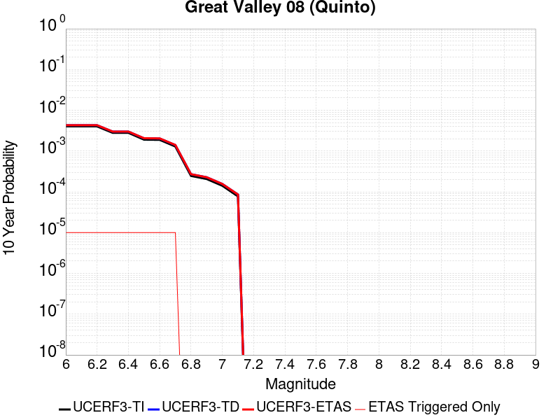 |

| Magnitude | 1 wk TI Prob | 1 wk TD Prob | 1 wk ETAS Prob | 1 wk ETAS/TD Gain | 1 wk ETAS Triggered Only | 1 mo TI Prob | 1 mo TD Prob | 1 mo ETAS Prob | 1 mo ETAS/TD Gain | 1 mo ETAS Triggered Only | 1 yr TI Prob | 1 yr TD Prob | 1 yr ETAS Prob | 1 yr ETAS/TD Gain | 1 yr ETAS Triggered Only | 10 yr TI Prob | 10 yr TD Prob | 10 yr ETAS Prob | 10 yr ETAS/TD Gain | 10 yr ETAS Triggered Only |
|-----|-----|-----|-----|-----|-----|-----|-----|-----|-----|-----|-----|-----|-----|-----|-----|-----|-----|-----|-----|-----|
| 6.0 | 7.737697E-6 | 8.253038E-6 | 1.999003E-5 | 2.422142 | 1.1737089E-5 | 3.3161137E-5 | 3.536979E-5 | 4.7106463E-5 | 1.3318276 | 1.1737089E-5 | 4.0366207E-4 | 4.3056096E-4 | 4.42293E-4 | 1.0272483 | 1.1737089E-5 | 0.004029296 | 0.0042991205 | 0.004310807 | 1.0027183 | 1.1737089E-5 |
| 6.1 | 7.737697E-6 | 8.253038E-6 | 1.999003E-5 | 2.422142 | 1.1737089E-5 | 3.3161137E-5 | 3.536979E-5 | 4.7106463E-5 | 1.3318276 | 1.1737089E-5 | 4.0366207E-4 | 4.3056096E-4 | 4.42293E-4 | 1.0272483 | 1.1737089E-5 | 0.004029296 | 0.0042991205 | 0.004310807 | 1.0027183 | 1.1737089E-5 |
| 6.2 | 7.737697E-6 | 8.253038E-6 | 1.999003E-5 | 2.422142 | 1.1737089E-5 | 3.3161137E-5 | 3.536979E-5 | 4.7106463E-5 | 1.3318276 | 1.1737089E-5 | 4.0366207E-4 | 4.3056096E-4 | 4.42293E-4 | 1.0272483 | 1.1737089E-5 | 0.004029296 | 0.0042991205 | 0.004310807 | 1.0027183 | 1.1737089E-5 |
| 6.3 | 5.374012E-6 | 5.7505736E-6 | 1.7487595E-5 | 3.0410175 | 1.1737089E-5 | 2.3031276E-5 | 2.4645145E-5 | 3.6381945E-5 | 1.4762317 | 1.1737089E-5 | 2.803697E-4 | 3.0002446E-4 | 3.1175805E-4 | 1.0391088 | 1.1737089E-5 | 0.0028001624 | 0.0029972875 | 0.0030089894 | 1.0039042 | 1.1737089E-5 |
| 6.4 | 5.374012E-6 | 5.7505736E-6 | 1.7487595E-5 | 3.0410175 | 1.1737089E-5 | 2.3031276E-5 | 2.4645145E-5 | 3.6381945E-5 | 1.4762317 | 1.1737089E-5 | 2.803697E-4 | 3.0002446E-4 | 3.1175805E-4 | 1.0391088 | 1.1737089E-5 | 0.0028001624 | 0.0029972875 | 0.0030089894 | 1.0039042 | 1.1737089E-5 |
| 6.5 | 3.65427E-6 | 3.941324E-6 | 1.5678366E-5 | 3.9779444 | 1.1737089E-5 | 1.5661062E-5 | 1.689132E-5 | 2.862821E-5 | 1.6948476 | 1.1737089E-5 | 1.9065675E-4 | 2.0563944E-4 | 2.1737412E-4 | 1.0570643 | 1.1737089E-5 | 0.0019049325 | 0.0020551833 | 0.0020668963 | 1.0056993 | 1.1737089E-5 |
| 6.6 | 3.6143538E-6 | 3.8985104E-6 | 1.5635555E-5 | 4.0106483 | 1.1737089E-5 | 1.5489995E-5 | 1.6707834E-5 | 2.8444729E-5 | 1.7024784 | 1.1737089E-5 | 1.8857437E-4 | 2.0340596E-4 | 2.1514065E-4 | 1.0576911 | 1.1737089E-5 | 0.0018841444 | 0.0020328893 | 0.0020446025 | 1.0057619 | 1.1737089E-5 |
| 6.7 | 2.4821015E-6 | 2.6857067E-6 | 1.4422764E-5 | 5.3701935 | 1.1737089E-5 | 1.0637535E-5 | 1.1510153E-5 | 2.3247107E-5 | 2.0197043 | 1.1737089E-5 | 1.2950429E-4 | 1.4013276E-4 | 1.5186821E-4 | 1.0837452 | 1.1737089E-5 | 0.0012942884 | 0.0014009989 | 0.0014127195 | 1.0083659 | 1.1737089E-5 |
| 6.8 | 4.7110538E-7 | 5.193021E-7 | 5.193021E-7 | 1.0 | 0.0 | 2.0190216E-6 | 2.2255786E-6 | 2.2255786E-6 | 1.0 | 0.0 | 2.458131E-5 | 2.70961E-5 | 2.70961E-5 | 1.0 | 0.0 | 2.457859E-4 | 2.7092977E-4 | 2.7092977E-4 | 1.0 | 0.0 |
| 6.9 | 3.958685E-7 | 4.3703452E-7 | 4.3703452E-7 | 1.0 | 0.0 | 1.6965782E-6 | 1.8730038E-6 | 1.8730038E-6 | 1.0 | 0.0 | 2.0655643E-5 | 2.28036E-5 | 2.28036E-5 | 1.0 | 0.0 | 2.0653724E-4 | 2.2801422E-4 | 2.2801422E-4 | 1.0 | 0.0 |
| 7.0 | 2.70294E-7 | 2.9920008E-7 | 2.9920008E-7 | 1.0 | 0.0 | 1.1584025E-6 | 1.2822856E-6 | 1.2822856E-6 | 1.0 | 0.0 | 1.4103458E-5 | 1.5611728E-5 | 1.5611728E-5 | 1.0 | 0.0 | 1.4102564E-4 | 1.5610759E-4 | 1.5610759E-4 | 1.0 | 0.0 |
| 7.1 | 1.4828602E-7 | 1.6469107E-7 | 1.6469107E-7 | 1.0 | 0.0 | 6.3551136E-7 | 7.058187E-7 | 7.058187E-7 | 1.0 | 0.0 | 7.737323E-6 | 8.593317E-6 | 8.593317E-6 | 1.0 | 0.0 | 7.737054E-5 | 8.593065E-5 | 8.593065E-5 | 1.0 | 0.0 |

## Likely 2011 CFM
*[(top)](#table-of-contents)*

| 1 Week | 1 Month | 1 Year | 10 Year |
|-----|-----|-----|-----|
| 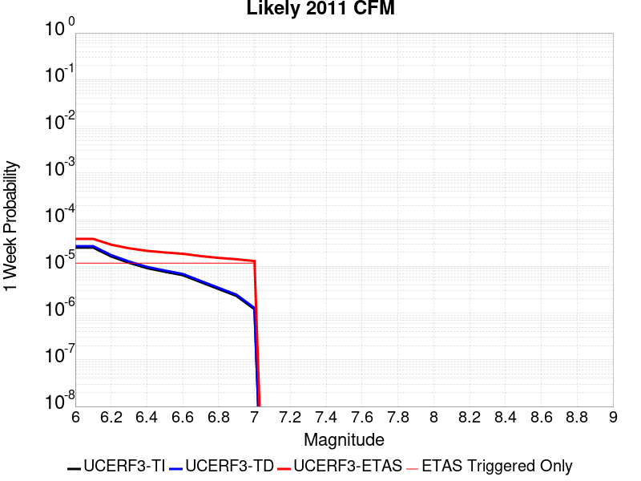 | 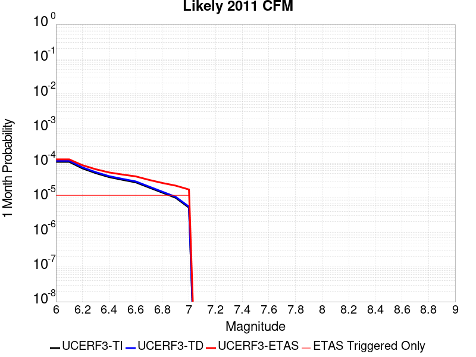 | 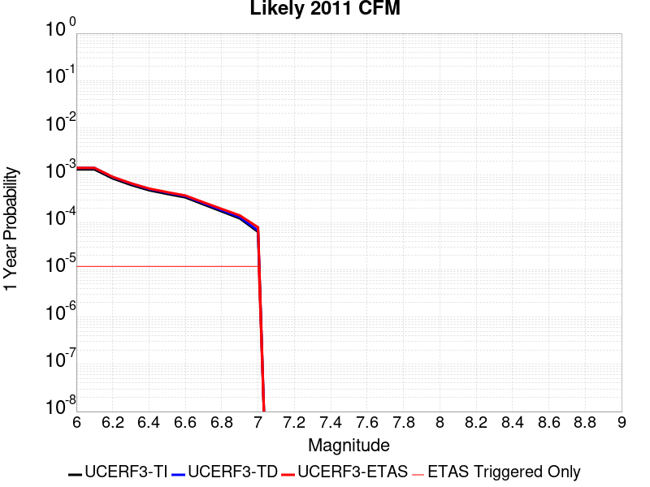 | 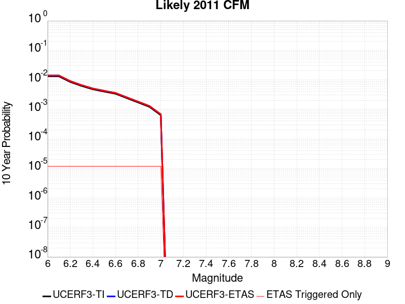 |

| Magnitude | 1 wk TI Prob | 1 wk TD Prob | 1 wk ETAS Prob | 1 wk ETAS/TD Gain | 1 wk ETAS Triggered Only | 1 mo TI Prob | 1 mo TD Prob | 1 mo ETAS Prob | 1 mo ETAS/TD Gain | 1 mo ETAS Triggered Only | 1 yr TI Prob | 1 yr TD Prob | 1 yr ETAS Prob | 1 yr ETAS/TD Gain | 1 yr ETAS Triggered Only | 10 yr TI Prob | 10 yr TD Prob | 10 yr ETAS Prob | 10 yr ETAS/TD Gain | 10 yr ETAS Triggered Only |
|-----|-----|-----|-----|-----|-----|-----|-----|-----|-----|-----|-----|-----|-----|-----|-----|-----|-----|-----|-----|-----|
| 6.0 | 2.5315949E-5 | 2.7104748E-5 | 3.884152E-5 | 1.4330153 | 1.1737089E-5 | 1.0849241E-4 | 1.16158284E-4 | 1.2789402E-4 | 1.1010321 | 1.1737089E-5 | 0.0013200947 | 0.0014133542 | 0.0014250746 | 1.0082927 | 1.1737089E-5 | 0.013122803 | 0.01404831 | 0.014059883 | 1.0008237 | 1.1737089E-5 |
| 6.1 | 2.5315949E-5 | 2.7104748E-5 | 3.884152E-5 | 1.4330153 | 1.1737089E-5 | 1.0849241E-4 | 1.16158284E-4 | 1.2789402E-4 | 1.1010321 | 1.1737089E-5 | 0.0013200947 | 0.0014133542 | 0.0014250746 | 1.0082927 | 1.1737089E-5 | 0.013122803 | 0.01404831 | 0.014059883 | 1.0008237 | 1.1737089E-5 |
| 6.2 | 1.6375941E-5 | 1.7465842E-5 | 2.9202725E-5 | 1.6719908 | 1.1737089E-5 | 7.0180715E-5 | 7.485153E-5 | 8.658774E-5 | 1.1567932 | 1.1737089E-5 | 8.5411523E-4 | 9.109487E-4 | 9.22675E-4 | 1.0128727 | 1.1737089E-5 | 0.008508399 | 0.009073433 | 0.009085063 | 1.0012819 | 1.1737089E-5 |
| 6.3 | 1.1945543E-5 | 1.2712587E-5 | 2.4449526E-5 | 1.9232535 | 1.1737089E-5 | 5.119418E-5 | 5.4481407E-5 | 6.621786E-5 | 1.2154212 | 1.1737089E-5 | 6.2311086E-4 | 6.631146E-4 | 6.748439E-4 | 1.0176882 | 1.1737089E-5 | 0.0062136655 | 0.0066119144 | 0.006623574 | 1.0017635 | 1.1737089E-5 |
| 6.4 | 9.192729E-6 | 9.768488E-6 | 2.1505462E-5 | 2.201514 | 1.1737089E-5 | 3.939681E-5 | 4.1864292E-5 | 5.360089E-5 | 1.2803487 | 1.1737089E-5 | 4.7955062E-4 | 5.0958124E-4 | 5.2131235E-4 | 1.0230211 | 1.1737089E-5 | 0.004785171 | 0.0050844094 | 0.0050960868 | 1.0022967 | 1.1737089E-5 |
| 6.5 | 7.67906E-6 | 8.152622E-6 | 1.9889616E-5 | 2.4396586 | 1.1737089E-5 | 3.2909844E-5 | 3.4939352E-5 | 4.6676032E-5 | 1.3359158 | 1.1737089E-5 | 4.006037E-4 | 4.2530545E-4 | 4.3703755E-4 | 1.0275851 | 1.1737089E-5 | 0.0039988225 | 0.004245108 | 0.0042567956 | 1.0027531 | 1.1737089E-5 |
| 6.6 | 6.4884057E-6 | 6.8847507E-6 | 1.8621758E-5 | 2.7047834 | 1.1737089E-5 | 2.7807157E-5 | 2.9505749E-5 | 4.1242492E-5 | 1.3977782 | 1.1737089E-5 | 3.3849955E-4 | 3.591747E-4 | 3.7090757E-4 | 1.0326662 | 1.1737089E-5 | 0.003379844 | 0.0035860867 | 0.0035977818 | 1.0032612 | 1.1737089E-5 |
| 6.7 | 4.6060636E-6 | 4.884041E-6 | 1.6621074E-5 | 3.4031394 | 1.1737089E-5 | 1.9740122E-5 | 2.0931442E-5 | 3.2668286E-5 | 1.560728 | 1.1737089E-5 | 2.403095E-4 | 2.5481134E-4 | 2.6654542E-4 | 1.0460502 | 1.1737089E-5 | 0.002400498 | 0.0025452746 | 0.002556982 | 1.0045996 | 1.1737089E-5 |
| 6.8 | 3.2795615E-6 | 3.4773732E-6 | 1.5214421E-5 | 4.3752627 | 1.1737089E-5 | 1.4055187E-5 | 1.4902946E-5 | 2.663986E-5 | 1.7875566 | 1.1737089E-5 | 1.7110848E-4 | 1.8142881E-4 | 1.9316377E-4 | 1.0646808 | 1.1737089E-5 | 0.0017097679 | 0.0018128622 | 0.001824578 | 1.0064626 | 1.1737089E-5 |
| 6.9 | 2.3289967E-6 | 2.4705569E-6 | 1.4207617E-5 | 5.7507753 | 1.1737089E-5 | 9.981376E-6 | 1.058806E-5 | 2.2325024E-5 | 2.1085095 | 1.1737089E-5 | 1.2151648E-4 | 1.2890245E-4 | 1.4063802E-4 | 1.0910423 | 1.1737089E-5 | 0.0012145005 | 0.0012883197 | 0.0013000417 | 1.0090986 | 1.1737089E-5 |
| 7.0 | 1.211292E-6 | 1.2863958E-6 | 1.302347E-5 | 10.124 | 1.1737089E-5 | 5.1912407E-6 | 5.5131145E-6 | 1.7250139E-5 | 3.128928 | 1.1737089E-5 | 6.320152E-5 | 6.712041E-5 | 7.885671E-5 | 1.1748544 | 1.1737089E-5 | 6.3183554E-4 | 6.710312E-4 | 6.8276044E-4 | 1.0174794 | 1.1737089E-5 |

## Butano 2011 CFM
*[(top)](#table-of-contents)*

| 1 Week | 1 Month | 1 Year | 10 Year |
|-----|-----|-----|-----|
| 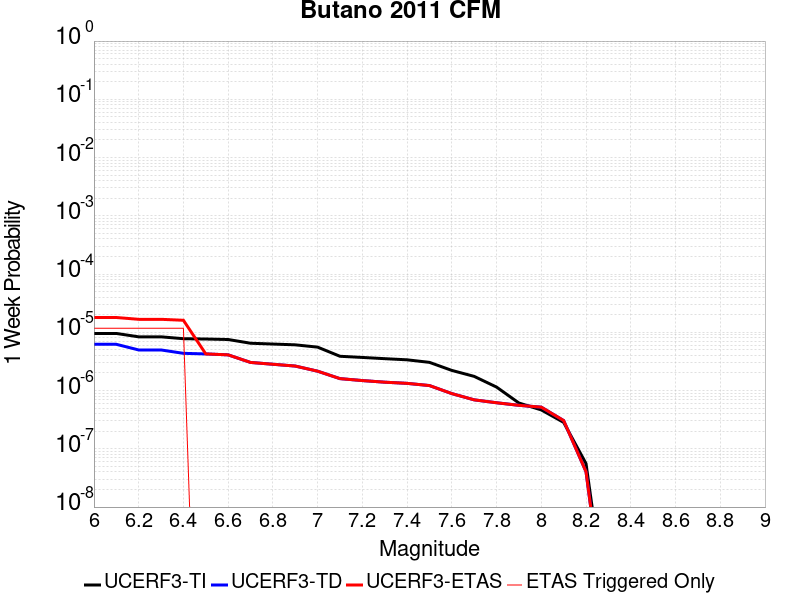 | 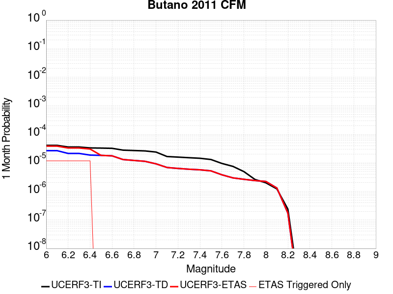 | 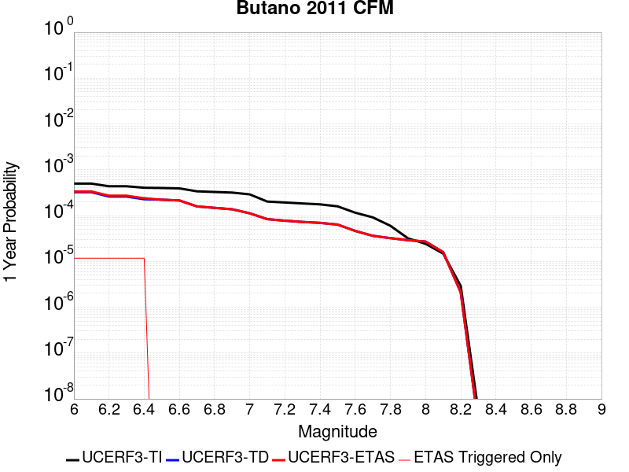 | 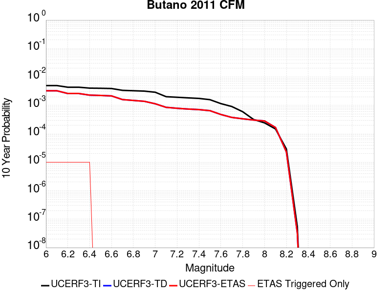 |

| Magnitude | 1 wk TI Prob | 1 wk TD Prob | 1 wk ETAS Prob | 1 wk ETAS/TD Gain | 1 wk ETAS Triggered Only | 1 mo TI Prob | 1 mo TD Prob | 1 mo ETAS Prob | 1 mo ETAS/TD Gain | 1 mo ETAS Triggered Only | 1 yr TI Prob | 1 yr TD Prob | 1 yr ETAS Prob | 1 yr ETAS/TD Gain | 1 yr ETAS Triggered Only | 10 yr TI Prob | 10 yr TD Prob | 10 yr ETAS Prob | 10 yr ETAS/TD Gain | 10 yr ETAS Triggered Only |
|-----|-----|-----|-----|-----|-----|-----|-----|-----|-----|-----|-----|-----|-----|-----|-----|-----|-----|-----|-----|-----|
| 6.0 | 9.561135E-6 | 6.2256954E-6 | 1.7962711E-5 | 2.885254 | 1.1737089E-5 | 4.097565E-5 | 2.6681291E-5 | 3.8418068E-5 | 1.4398879 | 1.1737089E-5 | 4.9876433E-4 | 3.247985E-4 | 3.3653178E-4 | 1.0361248 | 1.1737089E-5 | 0.004976464 | 0.003260905 | 0.0032726037 | 1.0035876 | 1.1737089E-5 |
| 6.1 | 9.561135E-6 | 6.2256954E-6 | 1.7962711E-5 | 2.885254 | 1.1737089E-5 | 4.097565E-5 | 2.6681291E-5 | 3.8418068E-5 | 1.4398879 | 1.1737089E-5 | 4.9876433E-4 | 3.247985E-4 | 3.3653178E-4 | 1.0361248 | 1.1737089E-5 | 0.004976464 | 0.003260905 | 0.0032726037 | 1.0035876 | 1.1737089E-5 |
| 6.2 | 8.364741E-6 | 4.9787805E-6 | 1.671581E-5 | 3.3574107 | 1.1737089E-5 | 3.5848396E-5 | 2.1337464E-5 | 3.3074302E-5 | 1.5500578 | 1.1737089E-5 | 4.3636683E-4 | 2.5975425E-4 | 2.7148827E-4 | 1.0451736 | 1.1737089E-5 | 0.0043551093 | 0.0026121214 | 0.0026238277 | 1.0044816 | 1.1737089E-5 |
| 6.3 | 8.364741E-6 | 4.9787805E-6 | 1.671581E-5 | 3.3574107 | 1.1737089E-5 | 3.5848396E-5 | 2.1337464E-5 | 3.3074302E-5 | 1.5500578 | 1.1737089E-5 | 4.3636683E-4 | 2.5975425E-4 | 2.7148827E-4 | 1.0451736 | 1.1737089E-5 | 0.0043551093 | 0.0026121214 | 0.0026238277 | 1.0044816 | 1.1737089E-5 |
| 6.4 | 7.768282E-6 | 4.3567284E-6 | 1.6093767E-5 | 3.6940029 | 1.1737089E-5 | 3.329221E-5 | 1.8671566E-5 | 3.0408437E-5 | 1.628596 | 1.1737089E-5 | 4.0525728E-4 | 2.2730397E-4 | 2.3903839E-4 | 1.0516243 | 1.1737089E-5 | 0.0040451903 | 0.0022883145 | 0.0023000247 | 1.0051174 | 1.1737089E-5 |
| 6.5 | 7.673437E-6 | 4.2562915E-6 | 4.2562915E-6 | 1.0 | 0.0 | 3.2885746E-5 | 1.8241128E-5 | 1.8241128E-5 | 1.0 | 0.0 | 4.0031038E-4 | 2.2206445E-4 | 2.2206445E-4 | 1.0 | 0.0 | 0.0039959005 | 0.002236025 | 0.002236025 | 1.0 | 0.0 |
| 6.6 | 7.5244197E-6 | 4.101255E-6 | 4.101255E-6 | 1.0 | 0.0 | 3.2247113E-5 | 1.7576695E-5 | 1.7576695E-5 | 1.0 | 0.0 | 3.9253788E-4 | 2.1397659E-4 | 2.1397659E-4 | 1.0 | 0.0 | 0.003918452 | 0.0021553051 | 0.0021553051 | 1.0 | 0.0 |
| 6.7 | 6.4921405E-6 | 3.0413205E-6 | 3.0413205E-6 | 1.0 | 0.0 | 2.7823162E-5 | 1.3034165E-5 | 1.3034165E-5 | 1.0 | 0.0 | 3.3869434E-4 | 1.586795E-4 | 1.586795E-4 | 1.0 | 0.0 | 0.003381786 | 0.0016031476 | 0.0016031476 | 1.0 | 0.0 |
| 6.8 | 6.2890294E-6 | 2.8280872E-6 | 2.8280872E-6 | 1.0 | 0.0 | 2.6952705E-5 | 1.2120317E-5 | 1.2120317E-5 | 1.0 | 0.0 | 3.2809976E-4 | 1.4755495E-4 | 1.4755495E-4 | 1.0 | 0.0 | 0.0032761577 | 0.0014920565 | 0.0014920565 | 1.0 | 0.0 |
| 6.9 | 6.0965517E-6 | 2.6346027E-6 | 2.6346027E-6 | 1.0 | 0.0 | 2.6127816E-5 | 1.1291106E-5 | 1.1291106E-5 | 1.0 | 0.0 | 3.1805973E-4 | 1.374606E-4 | 1.374606E-4 | 1.0 | 0.0 | 0.0031760489 | 0.001391243 | 0.001391243 | 1.0 | 0.0 |
| 7.0 | 5.566252E-6 | 2.1520116E-6 | 2.1520116E-6 | 1.0 | 0.0 | 2.3855147E-5 | 9.222874E-6 | 9.222874E-6 | 1.0 | 0.0 | 2.9039773E-4 | 1.1228274E-4 | 1.1228274E-4 | 1.0 | 0.0 | 0.0029001853 | 0.0011397449 | 0.0011397449 | 1.0 | 0.0 |
| 7.1 | 3.878588E-6 | 1.6034423E-6 | 1.6034423E-6 | 1.0 | 0.0 | 1.6622414E-5 | 6.8718773E-6 | 6.8718773E-6 | 1.0 | 0.0 | 2.023591E-4 | 8.36619E-5 | 8.36619E-5 | 1.0 | 0.0 | 0.0020217493 | 8.533922E-4 | 8.533922E-4 | 1.0 | 0.0 |
| 7.2 | 3.7038085E-6 | 1.4845051E-6 | 1.4845051E-6 | 1.0 | 0.0 | 1.587337E-5 | 6.362149E-6 | 6.362149E-6 | 1.0 | 0.0 | 1.9324113E-4 | 7.745641E-5 | 7.745641E-5 | 1.0 | 0.0 | 0.0019307317 | 7.913504E-4 | 7.913504E-4 | 1.0 | 0.0 |
| 7.3 | 3.5277278E-6 | 1.3926247E-6 | 1.3926247E-6 | 1.0 | 0.0 | 1.5118746E-5 | 5.9683775E-6 | 5.9683775E-6 | 1.0 | 0.0 | 1.8405518E-4 | 7.266257E-5 | 7.266257E-5 | 1.0 | 0.0 | 0.0018390282 | 7.433578E-4 | 7.433578E-4 | 1.0 | 0.0 |
| 7.4 | 3.3711294E-6 | 1.3298818E-6 | 1.3298818E-6 | 1.0 | 0.0 | 1.4447617E-5 | 5.699481E-6 | 5.699481E-6 | 1.0 | 0.0 | 1.7588554E-4 | 6.9388974E-5 | 6.9388974E-5 | 1.0 | 0.0 | 0.0017574639 | 7.10591E-4 | 7.10591E-4 | 1.0 | 0.0 |
| 7.5 | 3.0496426E-6 | 1.2188874E-6 | 1.2188874E-6 | 1.0 | 0.0 | 1.3069831E-5 | 5.223793E-6 | 5.223793E-6 | 1.0 | 0.0 | 1.5911358E-4 | 6.359782E-5 | 6.359782E-5 | 1.0 | 0.0 | 0.001589997 | 6.526465E-4 | 6.526465E-4 | 1.0 | 0.0 |
| 7.6 | 2.2179781E-6 | 8.870908E-7 | 8.870908E-7 | 1.0 | 0.0 | 9.505586E-6 | 3.801812E-6 | 3.801812E-6 | 1.0 | 0.0 | 1.1572436E-4 | 4.6286077E-5 | 4.6286077E-5 | 1.0 | 0.0 | 0.0011566412 | 4.7951055E-4 | 4.7951055E-4 | 1.0 | 0.0 |
| 7.7 | 1.7519328E-6 | 6.9309675E-7 | 6.9309675E-7 | 1.0 | 0.0 | 7.508262E-6 | 2.9704113E-6 | 2.9704113E-6 | 1.0 | 0.0 | 9.140925E-5 | 3.6164158E-5 | 3.6164158E-5 | 1.0 | 0.0 | 9.137166E-4 | 3.7759746E-4 | 3.7759746E-4 | 1.0 | 0.0 |
| 7.8 | 1.1478974E-6 | 6.174061E-7 | 6.174061E-7 | 1.0 | 0.0 | 4.9195505E-6 | 2.6460236E-6 | 2.6460236E-6 | 1.0 | 0.0 | 5.9893882E-5 | 3.221486E-5 | 3.221486E-5 | 1.0 | 0.0 | 5.9877743E-4 | 3.377777E-4 | 3.377777E-4 | 1.0 | 0.0 |
| 7.9 | 6.1154634E-7 | 5.581767E-7 | 5.581767E-7 | 1.0 | 0.0 | 2.6209104E-6 | 2.3921834E-6 | 2.3921834E-6 | 1.0 | 0.0 | 3.1909116E-5 | 2.9124443E-5 | 2.9124443E-5 | 1.0 | 0.0 | 3.1904536E-4 | 3.0563958E-4 | 3.0563958E-4 | 1.0 | 0.0 |
| 8.0 | 4.6520046E-7 | 5.189283E-7 | 5.189283E-7 | 1.0 | 0.0 | 1.9937147E-6 | 2.2239765E-6 | 2.2239765E-6 | 1.0 | 0.0 | 2.4273206E-5 | 2.7076578E-5 | 2.7076578E-5 | 1.0 | 0.0 | 2.4270554E-4 | 2.8419052E-4 | 2.8419052E-4 | 1.0 | 0.0 |
| 8.1 | 2.8425194E-7 | 3.0570487E-7 | 3.0570487E-7 | 1.0 | 0.0 | 1.218222E-6 | 1.3101632E-6 | 1.3101632E-6 | 1.0 | 0.0 | 1.4831752E-5 | 1.5951118E-5 | 1.5951118E-5 | 1.0 | 0.0 | 1.4830762E-4 | 1.6740595E-4 | 1.6740595E-4 | 1.0 | 0.0 |
| 8.2 | 5.585778E-8 | 4.0522167E-8 | 4.0522167E-8 | 1.0 | 0.0 | 2.3939046E-7 | 1.7366644E-7 | 1.7366644E-7 | 1.0 | 0.0 | 2.914575E-6 | 2.1143867E-6 | 2.1143867E-6 | 1.0 | 0.0 | 2.9145367E-5 | 2.2976306E-5 | 2.2976306E-5 | 1.0 | 0.0 |
| 8.3 | 1.0371215E-10 | 5.356804E-11 | 5.356804E-11 | 1.0 | 0.0 | 4.4448079E-10 | 2.2957702E-10 | 2.2957702E-10 | 1.0 | 0.0 | 5.4115543E-9 | 2.795101E-9 | 2.795101E-9 | 1.0 | 0.0 | 5.4115542E-8 | 3.2150194E-8 | 3.2150194E-8 | 1.0 | 0.0 |

## Emerson-Copper Mtn 2011
*[(top)](#table-of-contents)*

| 1 Week | 1 Month | 1 Year | 10 Year |
|-----|-----|-----|-----|
|  | 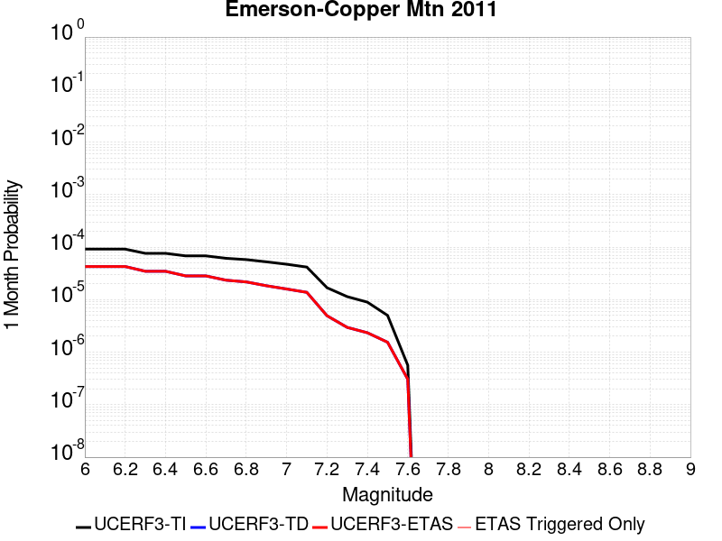 | 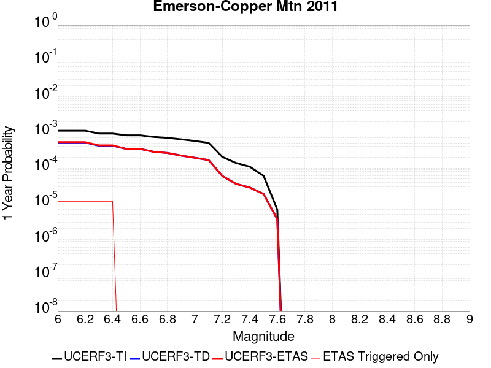 | 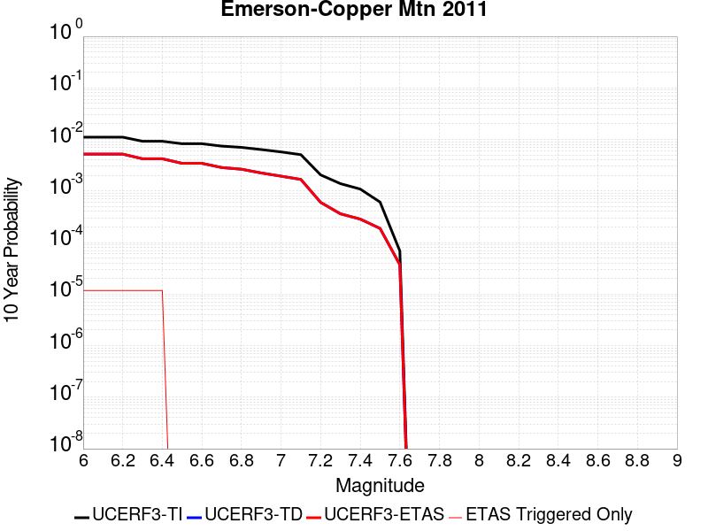 |

| Magnitude | 1 wk TI Prob | 1 wk TD Prob | 1 wk ETAS Prob | 1 wk ETAS/TD Gain | 1 wk ETAS Triggered Only | 1 mo TI Prob | 1 mo TD Prob | 1 mo ETAS Prob | 1 mo ETAS/TD Gain | 1 mo ETAS Triggered Only | 1 yr TI Prob | 1 yr TD Prob | 1 yr ETAS Prob | 1 yr ETAS/TD Gain | 1 yr ETAS Triggered Only | 10 yr TI Prob | 10 yr TD Prob | 10 yr ETAS Prob | 10 yr ETAS/TD Gain | 10 yr ETAS Triggered Only |
|-----|-----|-----|-----|-----|-----|-----|-----|-----|-----|-----|-----|-----|-----|-----|-----|-----|-----|-----|-----|-----|
| 6.0 | 2.1364202E-5 | 9.968114E-6 | 9.968114E-6 | 1.0 | 0.0 | 9.1557646E-5 | 4.2719836E-5 | 4.2719836E-5 | 1.0 | 0.0 | 0.0011141442 | 5.199986E-4 | 5.317296E-4 | 1.0225596 | 1.1737089E-5 | 0.011085749 | 0.005188688 | 0.005200364 | 1.0022503 | 1.1737089E-5 |
| 6.1 | 2.1364202E-5 | 9.968114E-6 | 9.968114E-6 | 1.0 | 0.0 | 9.1557646E-5 | 4.2719836E-5 | 4.2719836E-5 | 1.0 | 0.0 | 0.0011141442 | 5.199986E-4 | 5.317296E-4 | 1.0225596 | 1.1737089E-5 | 0.011085749 | 0.005188688 | 0.005200364 | 1.0022503 | 1.1737089E-5 |
| 6.2 | 2.1364202E-5 | 9.968114E-6 | 9.968114E-6 | 1.0 | 0.0 | 9.1557646E-5 | 4.2719836E-5 | 4.2719836E-5 | 1.0 | 0.0 | 0.0011141442 | 5.199986E-4 | 5.317296E-4 | 1.0225596 | 1.1737089E-5 | 0.011085749 | 0.005188688 | 0.005200364 | 1.0022503 | 1.1737089E-5 |
| 6.3 | 1.7751237E-5 | 8.089227E-6 | 8.089227E-6 | 1.0 | 0.0 | 7.607452E-5 | 3.466769E-5 | 3.466769E-5 | 1.0 | 0.0 | 9.258136E-4 | 4.2200365E-4 | 4.3373578E-4 | 1.027801 | 1.1737089E-5 | 0.00921966 | 0.0042126453 | 0.004224333 | 1.0027745 | 1.1737089E-5 |
| 6.4 | 1.7751237E-5 | 8.089227E-6 | 8.089227E-6 | 1.0 | 0.0 | 7.607452E-5 | 3.466769E-5 | 3.466769E-5 | 1.0 | 0.0 | 9.258136E-4 | 4.2200365E-4 | 4.3373578E-4 | 1.027801 | 1.1737089E-5 | 0.00921966 | 0.0042126453 | 0.004224333 | 1.0027745 | 1.1737089E-5 |
| 6.5 | 1.5886664E-5 | 6.603819E-6 | 6.603819E-6 | 1.0 | 0.0 | 6.808392E-5 | 2.8301802E-5 | 2.8301802E-5 | 1.0 | 0.0 | 8.286065E-4 | 3.4452465E-4 | 3.4452465E-4 | 1.0 | 0.0 | 0.008255237 | 0.0034403696 | 0.0034403696 | 1.0 | 0.0 |
| 6.6 | 1.5886664E-5 | 6.603819E-6 | 6.603819E-6 | 1.0 | 0.0 | 6.808392E-5 | 2.8301802E-5 | 2.8301802E-5 | 1.0 | 0.0 | 8.286065E-4 | 3.4452465E-4 | 3.4452465E-4 | 1.0 | 0.0 | 0.008255237 | 0.0034403696 | 0.0034403696 | 1.0 | 0.0 |
| 6.7 | 1.428471E-5 | 5.470403E-6 | 5.470403E-6 | 1.0 | 0.0 | 6.121875E-5 | 2.3444394E-5 | 2.3444394E-5 | 1.0 | 0.0 | 7.450834E-4 | 2.8540206E-4 | 2.8540206E-4 | 1.0 | 0.0 | 0.007425902 | 0.0028507432 | 0.0028507432 | 1.0 | 0.0 |
| 6.8 | 1.3490684E-5 | 5.073699E-6 | 5.073699E-6 | 1.0 | 0.0 | 5.7815934E-5 | 2.1744265E-5 | 2.1744265E-5 | 1.0 | 0.0 | 7.0368167E-4 | 2.6470813E-4 | 2.6470813E-4 | 1.0 | 0.0 | 0.007014576 | 0.002644309 | 0.002644309 | 1.0 | 0.0 |
| 6.9 | 1.2235421E-5 | 4.289677E-6 | 4.289677E-6 | 1.0 | 0.0 | 5.2436466E-5 | 1.838422E-5 | 1.838422E-5 | 1.0 | 0.0 | 6.38227E-4 | 2.238085E-4 | 2.238085E-4 | 1.0 | 0.0 | 0.0063639707 | 0.0022361854 | 0.0022361854 | 1.0 | 0.0 |
| 7.0 | 1.1009851E-5 | 3.7189886E-6 | 3.7189886E-6 | 1.0 | 0.0 | 4.7184225E-5 | 1.5938444E-5 | 1.5938444E-5 | 1.0 | 0.0 | 5.743165E-4 | 1.9403672E-4 | 1.9403672E-4 | 1.0 | 0.0 | 0.005728345 | 0.0019390108 | 0.0019390108 | 1.0 | 0.0 |
| 7.1 | 9.726373E-6 | 3.2117953E-6 | 3.2117953E-6 | 1.0 | 0.0 | 4.168379E-5 | 1.3764783E-5 | 1.3764783E-5 | 1.0 | 0.0 | 5.07382E-4 | 1.6757673E-4 | 1.6757673E-4 | 1.0 | 0.0 | 0.0050622504 | 0.0016748349 | 0.0016748349 | 1.0 | 0.0 |
| 7.2 | 3.9335127E-6 | 1.1524792E-6 | 1.1524792E-6 | 1.0 | 0.0 | 1.6857803E-5 | 4.9391874E-6 | 4.9391874E-6 | 1.0 | 0.0 | 2.0522442E-4 | 6.0133007E-5 | 6.0133007E-5 | 1.0 | 0.0 | 0.00205035 | 6.011733E-4 | 6.011733E-4 | 1.0 | 0.0 |
| 7.3 | 2.661632E-6 | 6.911505E-7 | 6.911505E-7 | 1.0 | 0.0 | 1.14069435E-5 | 2.9620703E-6 | 2.9620703E-6 | 1.0 | 0.0 | 1.3887069E-4 | 3.6062618E-5 | 3.6062618E-5 | 1.0 | 0.0 | 0.0013878393 | 3.605687E-4 | 3.605687E-4 | 1.0 | 0.0 |
| 7.4 | 2.0893426E-6 | 5.4618386E-7 | 5.4618386E-7 | 1.0 | 0.0 | 8.954295E-6 | 2.3407858E-6 | 2.3407858E-6 | 1.0 | 0.0 | 1.0901308E-4 | 2.84987E-5 | 2.84987E-5 | 1.0 | 0.0 | 0.0010895962 | 2.84951E-4 | 2.84951E-4 | 1.0 | 0.0 |
| 7.5 | 1.1681728E-6 | 3.6030585E-7 | 3.6030585E-7 | 1.0 | 0.0 | 5.0064455E-6 | 1.544167E-6 | 1.544167E-6 | 1.0 | 0.0 | 6.0951766E-5 | 1.8800076E-5 | 1.8800076E-5 | 1.0 | 0.0 | 6.093505E-4 | 1.8798532E-4 | 1.8798532E-4 | 1.0 | 0.0 |
| 7.6 | 1.3154387E-7 | 7.1197384E-8 | 7.1197384E-8 | 1.0 | 0.0 | 5.6375933E-7 | 3.051316E-7 | 3.051316E-7 | 1.0 | 0.0 | 6.863748E-6 | 3.7149728E-6 | 3.7149728E-6 | 1.0 | 0.0 | 6.863536E-5 | 3.7149264E-5 | 3.7149264E-5 | 1.0 | 0.0 |

## Pittville 2011 CFM
*[(top)](#table-of-contents)*

| 1 Week | 1 Month | 1 Year | 10 Year |
|-----|-----|-----|-----|
|  | 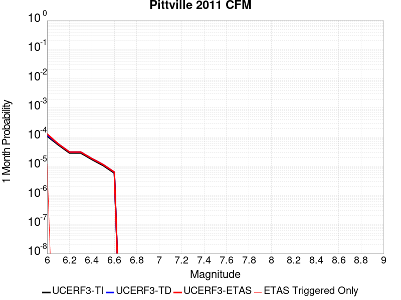 | 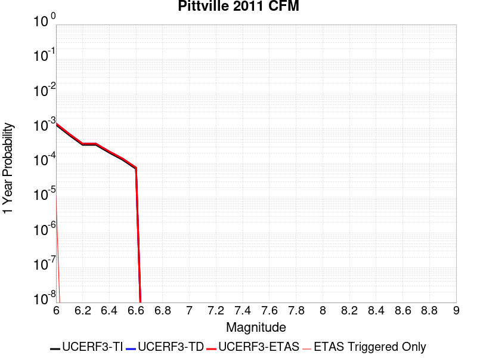 | 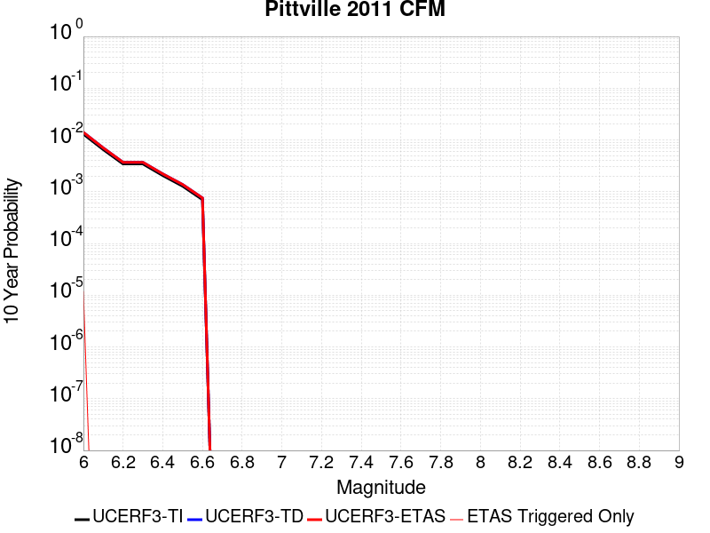 |

| Magnitude | 1 wk TI Prob | 1 wk TD Prob | 1 wk ETAS Prob | 1 wk ETAS/TD Gain | 1 wk ETAS Triggered Only | 1 mo TI Prob | 1 mo TD Prob | 1 mo ETAS Prob | 1 mo ETAS/TD Gain | 1 mo ETAS Triggered Only | 1 yr TI Prob | 1 yr TD Prob | 1 yr ETAS Prob | 1 yr ETAS/TD Gain | 1 yr ETAS Triggered Only | 10 yr TI Prob | 10 yr TD Prob | 10 yr ETAS Prob | 10 yr ETAS/TD Gain | 10 yr ETAS Triggered Only |
|-----|-----|-----|-----|-----|-----|-----|-----|-----|-----|-----|-----|-----|-----|-----|-----|-----|-----|-----|-----|-----|
| 6.0 | 2.5031832E-5 | 2.7056969E-5 | 2.7056969E-5 | 1.0 | 0.0 | 1.0727487E-4 | 1.1595384E-4 | 1.2768956E-4 | 1.1012104 | 1.1737089E-5 | 0.001305289 | 0.0014109211 | 0.0014226416 | 1.008307 | 1.1737089E-5 | 0.012976485 | 0.014029415 | 0.014040988 | 1.0008248 | 1.1737089E-5 |
| 6.1 | 1.2540113E-5 | 1.3513067E-5 | 1.3513067E-5 | 1.0 | 0.0 | 5.3742235E-5 | 5.7911984E-5 | 5.7911984E-5 | 1.0 | 0.0 | 6.541153E-4 | 7.048728E-4 | 7.048728E-4 | 1.0 | 0.0 | 0.0065219323 | 0.0070286044 | 0.0070286044 | 1.0 | 0.0 |
| 6.2 | 6.603218E-6 | 7.107189E-6 | 7.107189E-6 | 1.0 | 0.0 | 2.8299199E-5 | 3.0459063E-5 | 3.0459063E-5 | 1.0 | 0.0 | 3.4448825E-4 | 3.7078248E-4 | 3.7078248E-4 | 1.0 | 0.0 | 0.0034395473 | 0.0037022792 | 0.0037022792 | 1.0 | 0.0 |
| 6.3 | 6.603218E-6 | 7.107189E-6 | 7.107189E-6 | 1.0 | 0.0 | 2.8299199E-5 | 3.0459063E-5 | 3.0459063E-5 | 1.0 | 0.0 | 3.4448825E-4 | 3.7078248E-4 | 3.7078248E-4 | 1.0 | 0.0 | 0.0034395473 | 0.0037022792 | 0.0037022792 | 1.0 | 0.0 |
| 6.4 | 3.9389015E-6 | 4.239175E-6 | 4.239175E-6 | 1.0 | 0.0 | 1.6880897E-5 | 1.8167784E-5 | 1.8167784E-5 | 1.0 | 0.0 | 2.0550552E-4 | 2.2117342E-4 | 2.2117342E-4 | 1.0 | 0.0 | 0.0020531558 | 0.002209838 | 0.002209838 | 1.0 | 0.0 |
| 6.5 | 2.4533072E-6 | 2.6412686E-6 | 2.6412686E-6 | 1.0 | 0.0 | 1.0514132E-5 | 1.1319685E-5 | 1.1319685E-5 | 1.0 | 0.0 | 1.2800204E-4 | 1.3781038E-4 | 1.3781038E-4 | 1.0 | 0.0 | 0.0012792832 | 0.0013774394 | 0.0013774394 | 1.0 | 0.0 |
| 6.6 | 1.3482367E-6 | 1.452993E-6 | 1.452993E-6 | 1.0 | 0.0 | 5.778144E-6 | 6.2271047E-6 | 6.2271047E-6 | 1.0 | 0.0 | 7.0346636E-5 | 7.58135E-5 | 7.58135E-5 | 1.0 | 0.0 | 7.032437E-4 | 7.5798744E-4 | 7.5798744E-4 | 1.0 | 0.0 |

## Superstition Hills
*[(top)](#table-of-contents)*

| 1 Week | 1 Month | 1 Year | 10 Year |
|-----|-----|-----|-----|
| 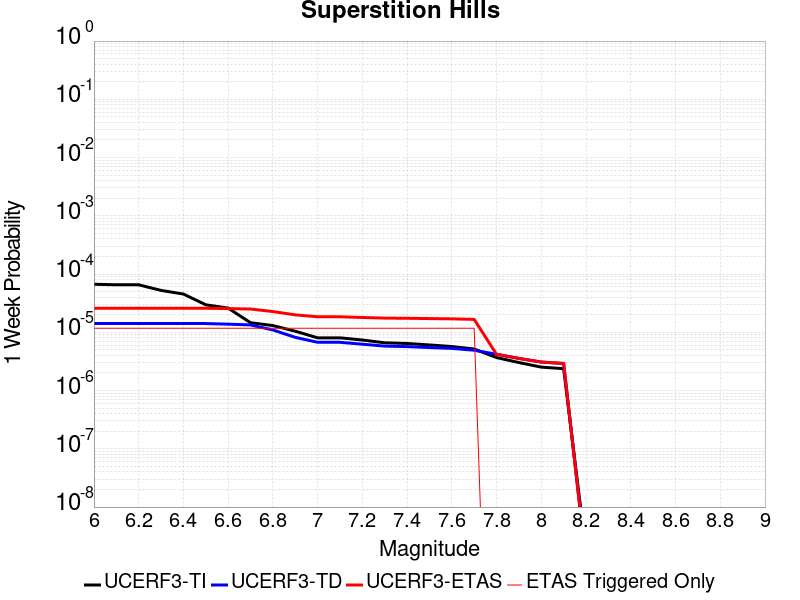 | 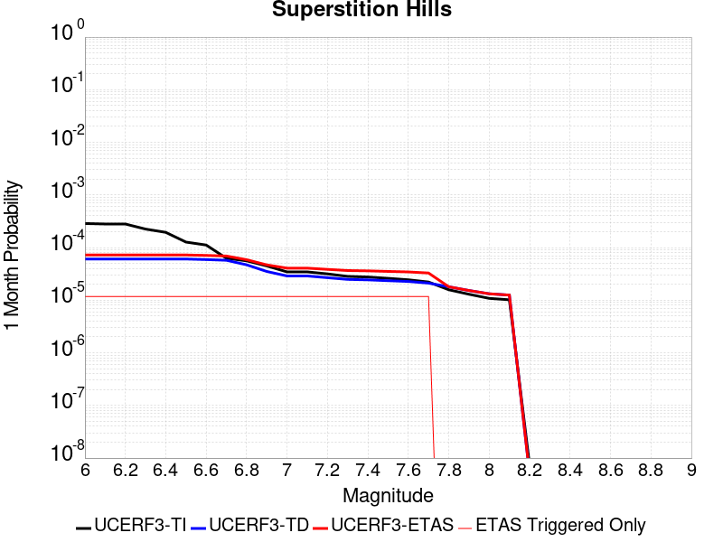 | 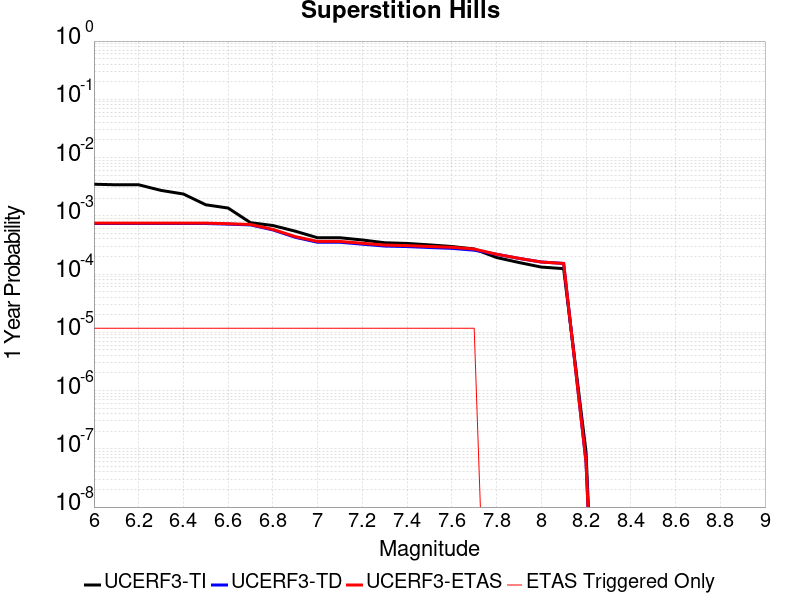 |  |

| Magnitude | 1 wk TI Prob | 1 wk TD Prob | 1 wk ETAS Prob | 1 wk ETAS/TD Gain | 1 wk ETAS Triggered Only | 1 mo TI Prob | 1 mo TD Prob | 1 mo ETAS Prob | 1 mo ETAS/TD Gain | 1 mo ETAS Triggered Only | 1 yr TI Prob | 1 yr TD Prob | 1 yr ETAS Prob | 1 yr ETAS/TD Gain | 1 yr ETAS Triggered Only | 10 yr TI Prob | 10 yr TD Prob | 10 yr ETAS Prob | 10 yr ETAS/TD Gain | 10 yr ETAS Triggered Only |
|-----|-----|-----|-----|-----|-----|-----|-----|-----|-----|-----|-----|-----|-----|-----|-----|-----|-----|-----|-----|-----|
| 6.0 | 6.6865185E-5 | 1.41376995E-5 | 2.5874622E-5 | 1.8301862 | 1.1737089E-5 | 2.8653358E-4 | 6.0588824E-5 | 7.23252E-5 | 1.1937053 | 1.1737089E-5 | 0.0034829667 | 7.374355E-4 | 7.491639E-4 | 1.0159043 | 1.1737089E-5 | 0.03428881 | 0.0075204074 | 0.0075320564 | 1.001549 | 1.1737089E-5 |
| 6.1 | 6.544851E-5 | 1.41376995E-5 | 2.5874622E-5 | 1.8301862 | 1.1737089E-5 | 2.8046346E-4 | 6.0588824E-5 | 7.23252E-5 | 1.1937053 | 1.1737089E-5 | 0.0034092965 | 7.374355E-4 | 7.491639E-4 | 1.0159043 | 1.1737089E-5 | 0.033574644 | 0.007520407 | 0.0075320555 | 1.001549 | 1.1737089E-5 |
| 6.2 | 6.544851E-5 | 1.41376995E-5 | 2.5874622E-5 | 1.8301862 | 1.1737089E-5 | 2.8046346E-4 | 6.0588824E-5 | 7.23252E-5 | 1.1937053 | 1.1737089E-5 | 0.0034092965 | 7.374355E-4 | 7.491639E-4 | 1.0159043 | 1.1737089E-5 | 0.033574644 | 0.007520407 | 0.0075320555 | 1.001549 | 1.1737089E-5 |
| 6.3 | 5.2402065E-5 | 1.4137698E-5 | 2.5874622E-5 | 1.8301862 | 1.1737089E-5 | 2.2456095E-4 | 6.058882E-5 | 7.2325194E-5 | 1.1937053 | 1.1737089E-5 | 0.0027306017 | 7.374354E-4 | 7.4916385E-4 | 1.0159043 | 1.1737089E-5 | 0.02697292 | 0.007520402 | 0.0075320504 | 1.001549 | 1.1737089E-5 |
| 6.4 | 4.542238E-5 | 1.4137698E-5 | 2.587462E-5 | 1.8301864 | 1.1737089E-5 | 1.9465282E-4 | 6.0588816E-5 | 7.2325194E-5 | 1.1937053 | 1.1737089E-5 | 0.0023673223 | 7.3743536E-4 | 7.491638E-4 | 1.0159043 | 1.1737089E-5 | 0.023422617 | 0.0075203986 | 0.0075320476 | 1.001549 | 1.1737089E-5 |
| 6.5 | 2.9672969E-5 | 1.4137696E-5 | 2.5874619E-5 | 1.8301864 | 1.1737089E-5 | 1.2716366E-4 | 6.058881E-5 | 7.232519E-5 | 1.1937053 | 1.1737089E-5 | 0.0015471181 | 7.374353E-4 | 7.4916374E-4 | 1.0159043 | 1.1737089E-5 | 0.015363912 | 0.007520392 | 0.007532041 | 1.001549 | 1.1737089E-5 |
| 6.6 | 2.6056105E-5 | 1.3803458E-5 | 2.5540387E-5 | 1.8502889 | 1.1737089E-5 | 1.1166424E-4 | 5.9156428E-5 | 7.089282E-5 | 1.198396 | 1.1737089E-5 | 0.0013586642 | 7.200076E-4 | 7.317362E-4 | 1.0162896 | 1.1737089E-5 | 0.013503874 | 0.0073448285 | 0.0073564793 | 1.0015863 | 1.1737089E-5 |
| 6.7 | 1.4611248E-5 | 1.3383359E-5 | 2.5120291E-5 | 1.8769796 | 1.1737089E-5 | 6.261813E-5 | 5.7356083E-5 | 6.90925E-5 | 1.2046237 | 1.1737089E-5 | 7.6210906E-4 | 6.981025E-4 | 7.098314E-4 | 1.0168011 | 1.1737089E-5 | 0.0075950073 | 0.00712602 | 0.007137673 | 1.0016353 | 1.1737089E-5 |
| 6.8 | 1.30607E-5 | 1.09787925E-5 | 2.2715752E-5 | 2.0690575 | 1.1737089E-5 | 5.597323E-5 | 4.705117E-5 | 5.8787708E-5 | 1.249442 | 1.1737089E-5 | 6.8126095E-4 | 5.7270617E-4 | 5.844365E-4 | 1.0204823 | 1.1737089E-5 | 0.006791762 | 0.00587438 | 0.005886048 | 1.0019863 | 1.1737089E-5 |
| 6.9 | 1.0443096E-5 | 8.195349E-6 | 1.9932342E-5 | 2.4321527 | 1.1737089E-5 | 4.4755358E-5 | 3.5122466E-5 | 4.6859142E-5 | 1.3341644 | 1.1737089E-5 | 5.447602E-4 | 4.2753448E-4 | 4.3926656E-4 | 1.0274413 | 1.1737089E-5 | 0.005434267 | 0.0044094524 | 0.0044211377 | 1.00265 | 1.1737089E-5 |
| 7.0 | 8.045912E-6 | 6.739692E-6 | 1.8476701E-5 | 2.7414758 | 1.1737089E-5 | 3.4482026E-5 | 2.888408E-5 | 4.062083E-5 | 1.4063398 | 1.1737089E-5 | 4.197378E-4 | 3.5160795E-4 | 3.6334092E-4 | 1.0333694 | 1.1737089E-5 | 0.0041894587 | 0.0036334093 | 0.003645104 | 1.0032185 | 1.1737089E-5 |
| 7.1 | 8.045912E-6 | 6.739692E-6 | 1.8476701E-5 | 2.7414758 | 1.1737089E-5 | 3.4482026E-5 | 2.888408E-5 | 4.062083E-5 | 1.4063398 | 1.1737089E-5 | 4.197378E-4 | 3.5160795E-4 | 3.6334092E-4 | 1.0333694 | 1.1737089E-5 | 0.0041894587 | 0.0036334093 | 0.003645104 | 1.0032185 | 1.1737089E-5 |
| 7.2 | 7.375506E-6 | 6.2466297E-6 | 1.7983646E-5 | 2.8789358 | 1.1737089E-5 | 3.1608928E-5 | 2.6771E-5 | 3.8507776E-5 | 1.4384137 | 1.1737089E-5 | 3.8477074E-4 | 3.2588904E-4 | 3.376223E-4 | 1.0360038 | 1.1737089E-5 | 0.003841052 | 0.003373887 | 0.0033855843 | 1.0034671 | 1.1737089E-5 |
| 7.3 | 6.6063913E-6 | 5.7990574E-6 | 1.7536078E-5 | 3.0239532 | 1.1737089E-5 | 2.8312797E-5 | 2.485287E-5 | 3.6589667E-5 | 1.4722512 | 1.1737089E-5 | 3.446538E-4 | 3.025424E-4 | 3.1427594E-4 | 1.0387831 | 1.1737089E-5 | 0.0034411973 | 0.003138153 | 0.0031498536 | 1.0037284 | 1.1737089E-5 |
| 7.4 | 6.4313126E-6 | 5.680481E-6 | 1.7417504E-5 | 3.0662022 | 1.1737089E-5 | 2.7562477E-5 | 2.4344696E-5 | 3.60815E-5 | 1.4821093 | 1.1737089E-5 | 3.355215E-4 | 2.9635706E-4 | 3.0809068E-4 | 1.0395929 | 1.1737089E-5 | 0.0033501536 | 0.0030759154 | 0.0030876163 | 1.0038041 | 1.1737089E-5 |
| 7.5 | 6.0742927E-6 | 5.4763104E-6 | 1.7213335E-5 | 3.143236 | 1.1737089E-5 | 2.6032423E-5 | 2.3469694E-5 | 3.5206507E-5 | 1.5000838 | 1.1737089E-5 | 3.1689866E-4 | 2.8570674E-4 | 2.9744048E-4 | 1.0410691 | 1.1737089E-5 | 0.0031644711 | 0.002967756 | 0.0029794583 | 1.0039431 | 1.1737089E-5 |
| 7.6 | 5.6987187E-6 | 5.294521E-6 | 1.7031549E-5 | 3.216825 | 1.1737089E-5 | 2.4422852E-5 | 2.269061E-5 | 3.4427434E-5 | 1.5172546 | 1.1737089E-5 | 2.9730765E-4 | 2.7622381E-4 | 2.8795766E-4 | 1.0424795 | 1.1737089E-5 | 0.002969102 | 0.0028710118 | 0.0028827153 | 1.0040764 | 1.1737089E-5 |
| 7.7 | 5.1658035E-6 | 4.925535E-6 | 1.6662567E-5 | 3.3828945 | 1.1737089E-5 | 2.2138971E-5 | 2.1109268E-5 | 3.284611E-5 | 1.5560042 | 1.1737089E-5 | 2.6950863E-4 | 2.5697565E-4 | 2.6870973E-4 | 1.0456622 | 1.1737089E-5 | 0.00269182 | 0.0026760625 | 0.002687768 | 1.0043743 | 1.1737089E-5 |
| 7.8 | 3.6864697E-6 | 4.1964995E-6 | 4.1964995E-6 | 1.0 | 0.0 | 1.579906E-5 | 1.7984876E-5 | 1.7984876E-5 | 1.0 | 0.0 | 1.9233658E-4 | 2.1894433E-4 | 2.1894433E-4 | 1.0 | 0.0 | 0.0019217018 | 0.0022892624 | 0.0022892624 | 1.0 | 0.0 |
| 7.9 | 3.0265903E-6 | 3.5637288E-6 | 3.5637288E-6 | 1.0 | 0.0 | 1.2971037E-5 | 1.5273037E-5 | 1.5273037E-5 | 1.0 | 0.0 | 1.5791094E-4 | 1.859338E-4 | 1.859338E-4 | 1.0 | 0.0 | 0.0015779877 | 0.0019534735 | 0.0019534735 | 1.0 | 0.0 |
| 8.0 | 2.5271493E-6 | 3.0867361E-6 | 3.0867361E-6 | 1.0 | 0.0 | 1.0830595E-5 | 1.3228804E-5 | 1.3228804E-5 | 1.0 | 0.0 | 1.3185451E-4 | 1.610492E-4 | 1.610492E-4 | 1.0 | 0.0 | 0.0013177631 | 0.0016973554 | 0.0016973554 | 1.0 | 0.0 |
| 8.1 | 2.3749135E-6 | 2.917377E-6 | 2.917377E-6 | 1.0 | 0.0 | 1.0178161E-5 | 1.25029865E-5 | 1.25029865E-5 | 1.0 | 0.0 | 1.2391206E-4 | 1.5221364E-4 | 1.5221364E-4 | 1.0 | 0.0 | 0.0012384299 | 0.001604949 | 0.001604949 | 1.0 | 0.0 |
| 8.2 | 1.7186406E-9 | 1.1440594E-9 | 1.1440594E-9 | 1.0 | 0.0 | 7.3656024E-9 | 4.9031117E-9 | 4.9031117E-9 | 1.0 | 0.0 | 8.9676206E-8 | 5.969538E-8 | 5.969538E-8 | 1.0 | 0.0 | 8.9676166E-7 | 6.389059E-7 | 6.389059E-7 | 1.0 | 0.0 |

## Hector Mine
*[(top)](#table-of-contents)*

| 1 Week | 1 Month | 1 Year | 10 Year |
|-----|-----|-----|-----|
| 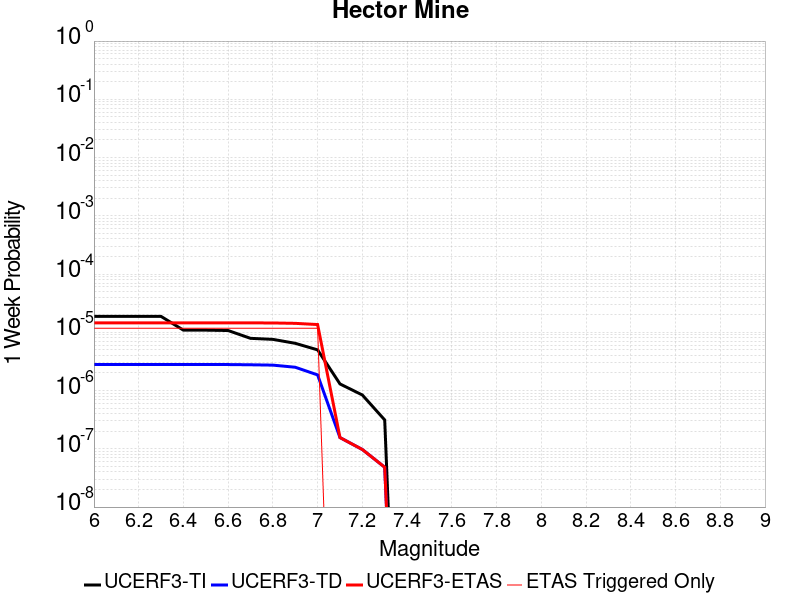 | 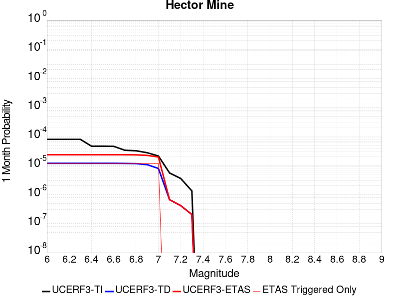 | 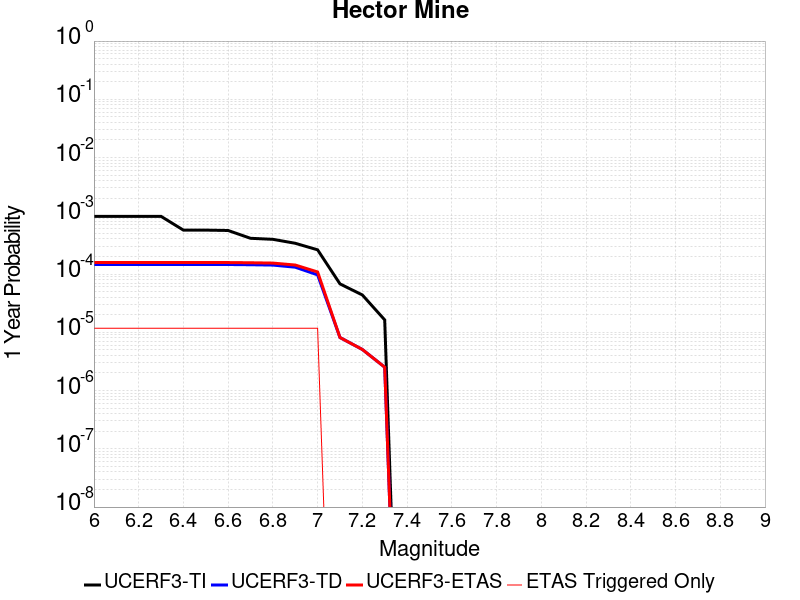 | 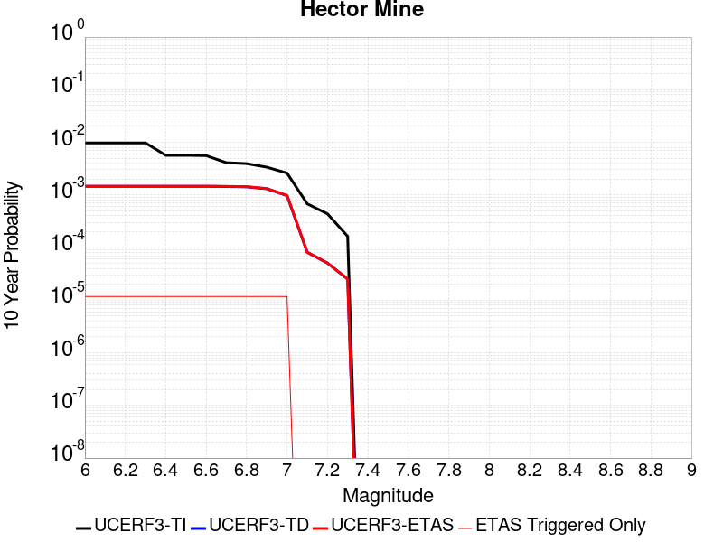 |

| Magnitude | 1 wk TI Prob | 1 wk TD Prob | 1 wk ETAS Prob | 1 wk ETAS/TD Gain | 1 wk ETAS Triggered Only | 1 mo TI Prob | 1 mo TD Prob | 1 mo ETAS Prob | 1 mo ETAS/TD Gain | 1 mo ETAS Triggered Only | 1 yr TI Prob | 1 yr TD Prob | 1 yr ETAS Prob | 1 yr ETAS/TD Gain | 1 yr ETAS Triggered Only | 10 yr TI Prob | 10 yr TD Prob | 10 yr ETAS Prob | 10 yr ETAS/TD Gain | 10 yr ETAS Triggered Only |
|-----|-----|-----|-----|-----|-----|-----|-----|-----|-----|-----|-----|-----|-----|-----|-----|-----|-----|-----|-----|-----|
| 6.0 | 1.8760093E-5 | 2.7963818E-6 | 1.4533438E-5 | 5.19723 | 1.1737089E-5 | 8.039792E-5 | 1.1984461E-5 | 2.372141E-5 | 1.9793472 | 1.1737089E-5 | 9.78405E-4 | 1.4590504E-4 | 1.5764042E-4 | 1.0804316 | 1.1737089E-5 | 0.009741086 | 0.0014584847 | 0.0014702046 | 1.0080357 | 1.1737089E-5 |
| 6.1 | 1.8760093E-5 | 2.7963818E-6 | 1.4533438E-5 | 5.19723 | 1.1737089E-5 | 8.039792E-5 | 1.1984461E-5 | 2.372141E-5 | 1.9793472 | 1.1737089E-5 | 9.78405E-4 | 1.4590504E-4 | 1.5764042E-4 | 1.0804316 | 1.1737089E-5 | 0.009741086 | 0.0014584847 | 0.0014702046 | 1.0080357 | 1.1737089E-5 |
| 6.2 | 1.8760093E-5 | 2.7963818E-6 | 1.4533438E-5 | 5.19723 | 1.1737089E-5 | 8.039792E-5 | 1.1984461E-5 | 2.372141E-5 | 1.9793472 | 1.1737089E-5 | 9.78405E-4 | 1.4590504E-4 | 1.5764042E-4 | 1.0804316 | 1.1737089E-5 | 0.009741086 | 0.0014584847 | 0.0014702046 | 1.0080357 | 1.1737089E-5 |
| 6.3 | 1.8760093E-5 | 2.7963818E-6 | 1.4533438E-5 | 5.19723 | 1.1737089E-5 | 8.039792E-5 | 1.1984461E-5 | 2.372141E-5 | 1.9793472 | 1.1737089E-5 | 9.78405E-4 | 1.4590504E-4 | 1.5764042E-4 | 1.0804316 | 1.1737089E-5 | 0.009741086 | 0.0014584847 | 0.0014702046 | 1.0080357 | 1.1737089E-5 |
| 6.4 | 1.0888055E-5 | 2.7963818E-6 | 1.4533438E-5 | 5.19723 | 1.1737089E-5 | 4.666226E-5 | 1.1984461E-5 | 2.372141E-5 | 1.9793472 | 1.1737089E-5 | 5.679649E-4 | 1.4590504E-4 | 1.5764042E-4 | 1.0804316 | 1.1737089E-5 | 0.0056651547 | 0.0014584847 | 0.0014702046 | 1.0080357 | 1.1737089E-5 |
| 6.5 | 1.0888055E-5 | 2.7963818E-6 | 1.4533438E-5 | 5.19723 | 1.1737089E-5 | 4.666226E-5 | 1.1984461E-5 | 2.372141E-5 | 1.9793472 | 1.1737089E-5 | 5.679649E-4 | 1.4590504E-4 | 1.5764042E-4 | 1.0804316 | 1.1737089E-5 | 0.0056651547 | 0.0014584847 | 0.0014702046 | 1.0080357 | 1.1737089E-5 |
| 6.6 | 1.0730738E-5 | 2.7963818E-6 | 1.4533438E-5 | 5.19723 | 1.1737089E-5 | 4.5988065E-5 | 1.1984461E-5 | 2.372141E-5 | 1.9793472 | 1.1737089E-5 | 5.5976084E-4 | 1.4590504E-4 | 1.5764042E-4 | 1.0804316 | 1.1737089E-5 | 0.0055835294 | 0.0014584847 | 0.0014702046 | 1.0080357 | 1.1737089E-5 |
| 6.7 | 7.881326E-6 | 2.7710626E-6 | 1.4508119E-5 | 5.23558 | 1.1737089E-5 | 3.3776672E-5 | 1.1875951E-5 | 2.36129E-5 | 1.9882957 | 1.1737089E-5 | 4.111534E-4 | 1.445841E-4 | 1.563195E-4 | 1.0811665 | 1.1737089E-5 | 0.0041039353 | 0.0014452925 | 0.0014570126 | 1.0081092 | 1.1737089E-5 |
| 6.8 | 7.5683483E-6 | 2.7328138E-6 | 1.4469871E-5 | 5.294862 | 1.1737089E-5 | 3.2435375E-5 | 1.1712029E-5 | 2.344898E-5 | 2.002128 | 1.1737089E-5 | 3.9482914E-4 | 1.4258861E-4 | 1.5432404E-4 | 1.0823026 | 1.1737089E-5 | 0.0039412836 | 0.0014253634 | 0.0014370837 | 1.0082227 | 1.1737089E-5 |
| 6.9 | 6.473048E-6 | 2.5138945E-6 | 1.4250954E-5 | 5.668875 | 1.1737089E-5 | 2.7741338E-5 | 1.07738115E-5 | 2.2510774E-5 | 2.0893974 | 1.1737089E-5 | 3.3769844E-4 | 1.3116724E-4 | 1.4290279E-4 | 1.0894701 | 1.1737089E-5 | 0.0033718573 | 0.0013112876 | 0.0013230094 | 1.008939 | 1.1737089E-5 |
| 7.0 | 4.9959954E-6 | 1.8565124E-6 | 1.359358E-5 | 7.3221054 | 1.1737089E-5 | 2.1411232E-5 | 7.956478E-6 | 1.9693472E-5 | 2.4751496 | 1.1737089E-5 | 2.6065056E-4 | 9.686937E-5 | 1.0860532E-4 | 1.1211524 | 1.1737089E-5 | 0.0026034506 | 9.6862105E-4 | 9.803468E-4 | 1.0121056 | 1.1737089E-5 |
| 7.1 | 1.2997541E-6 | 1.5602147E-7 | 1.5602147E-7 | 1.0 | 0.0 | 5.5703626E-6 | 6.686633E-7 | 6.686633E-7 | 1.0 | 0.0 | 6.7817055E-5 | 8.140949E-6 | 8.140949E-6 | 1.0 | 0.0 | 6.779636E-4 | 8.1406906E-5 | 8.1406906E-5 | 1.0 | 0.0 |
| 7.2 | 8.392699E-7 | 9.727592E-8 | 9.727592E-8 | 1.0 | 0.0 | 3.596866E-6 | 4.1689677E-7 | 4.1689677E-7 | 1.0 | 0.0 | 4.3790962E-5 | 5.0757085E-6 | 5.0757085E-6 | 1.0 | 0.0 | 4.3782333E-4 | 5.0756116E-5 | 5.0756116E-5 | 1.0 | 0.0 |
| 7.3 | 3.13015E-7 | 4.829262E-8 | 4.829262E-8 | 1.0 | 0.0 | 1.3414921E-6 | 2.0696835E-7 | 2.0696835E-7 | 1.0 | 0.0 | 1.6332544E-5 | 2.5198376E-6 | 2.5198376E-6 | 1.0 | 0.0 | 1.6331344E-4 | 2.5198176E-5 | 2.5198176E-5 | 1.0 | 0.0 |

## Puente Hills
*[(top)](#table-of-contents)*

| 1 Week | 1 Month | 1 Year | 10 Year |
|-----|-----|-----|-----|
| 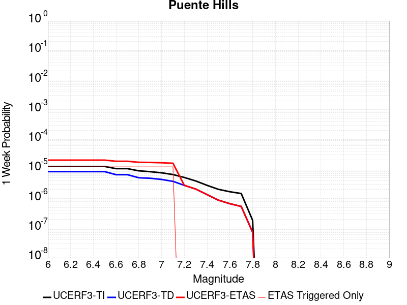 | 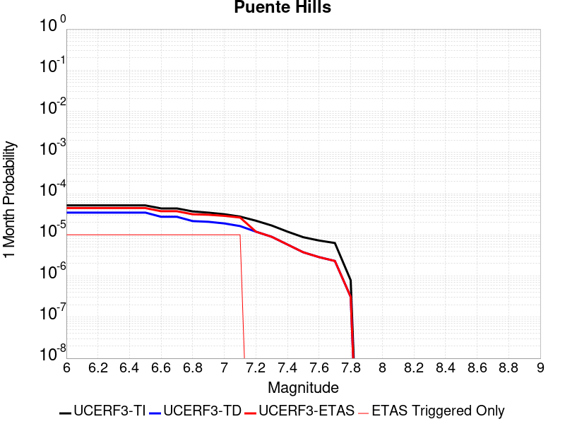 | 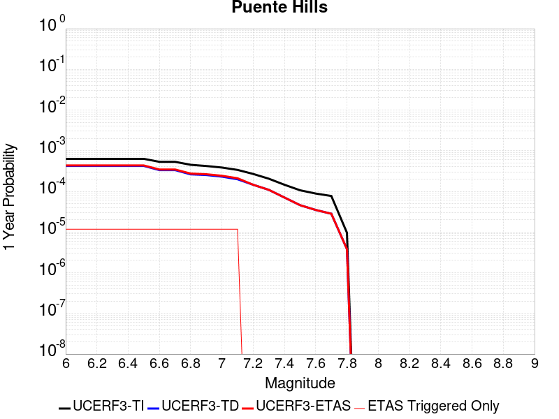 | 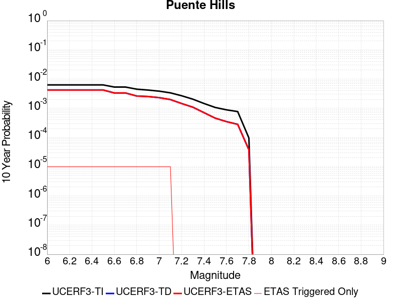 |

| Magnitude | 1 wk TI Prob | 1 wk TD Prob | 1 wk ETAS Prob | 1 wk ETAS/TD Gain | 1 wk ETAS Triggered Only | 1 mo TI Prob | 1 mo TD Prob | 1 mo ETAS Prob | 1 mo ETAS/TD Gain | 1 mo ETAS Triggered Only | 1 yr TI Prob | 1 yr TD Prob | 1 yr ETAS Prob | 1 yr ETAS/TD Gain | 1 yr ETAS Triggered Only | 10 yr TI Prob | 10 yr TD Prob | 10 yr ETAS Prob | 10 yr ETAS/TD Gain | 10 yr ETAS Triggered Only |
|-----|-----|-----|-----|-----|-----|-----|-----|-----|-----|-----|-----|-----|-----|-----|-----|-----|-----|-----|-----|-----|
| 6.0 | 1.2101656E-5 | 8.098625E-6 | 1.983562E-5 | 2.4492576 | 1.1737089E-5 | 5.1863204E-5 | 3.4707962E-5 | 4.6444646E-5 | 1.3381553 | 1.1737089E-5 | 6.312516E-4 | 4.2249315E-4 | 4.3422528E-4 | 1.0277689 | 1.1737089E-5 | 0.0062946146 | 0.0042174594 | 0.004229147 | 1.0027713 | 1.1737089E-5 |
| 6.1 | 1.2101656E-5 | 8.098625E-6 | 1.983562E-5 | 2.4492576 | 1.1737089E-5 | 5.1863204E-5 | 3.4707962E-5 | 4.6444646E-5 | 1.3381553 | 1.1737089E-5 | 6.312516E-4 | 4.2249315E-4 | 4.3422528E-4 | 1.0277689 | 1.1737089E-5 | 0.0062946146 | 0.0042174594 | 0.004229147 | 1.0027713 | 1.1737089E-5 |
| 6.2 | 1.2101656E-5 | 8.098625E-6 | 1.983562E-5 | 2.4492576 | 1.1737089E-5 | 5.1863204E-5 | 3.4707962E-5 | 4.6444646E-5 | 1.3381553 | 1.1737089E-5 | 6.312516E-4 | 4.2249315E-4 | 4.3422528E-4 | 1.0277689 | 1.1737089E-5 | 0.0062946146 | 0.0042174594 | 0.004229147 | 1.0027713 | 1.1737089E-5 |
| 6.3 | 1.2101656E-5 | 8.098625E-6 | 1.983562E-5 | 2.4492576 | 1.1737089E-5 | 5.1863204E-5 | 3.4707962E-5 | 4.6444646E-5 | 1.3381553 | 1.1737089E-5 | 6.312516E-4 | 4.2249315E-4 | 4.3422528E-4 | 1.0277689 | 1.1737089E-5 | 0.0062946146 | 0.0042174594 | 0.004229147 | 1.0027713 | 1.1737089E-5 |
| 6.4 | 1.2101656E-5 | 8.098625E-6 | 1.983562E-5 | 2.4492576 | 1.1737089E-5 | 5.1863204E-5 | 3.4707962E-5 | 4.6444646E-5 | 1.3381553 | 1.1737089E-5 | 6.312516E-4 | 4.2249315E-4 | 4.3422528E-4 | 1.0277689 | 1.1737089E-5 | 0.0062946146 | 0.0042174594 | 0.004229147 | 1.0027713 | 1.1737089E-5 |
| 6.5 | 1.2101656E-5 | 8.098625E-6 | 1.983562E-5 | 2.4492576 | 1.1737089E-5 | 5.1863204E-5 | 3.4707962E-5 | 4.6444646E-5 | 1.3381553 | 1.1737089E-5 | 6.312516E-4 | 4.2249315E-4 | 4.3422528E-4 | 1.0277689 | 1.1737089E-5 | 0.0062946146 | 0.0042174594 | 0.004229147 | 1.0027713 | 1.1737089E-5 |
| 6.6 | 1.0222488E-5 | 6.3991847E-6 | 1.81362E-5 | 2.8341422 | 1.1737089E-5 | 4.3809923E-5 | 2.7424803E-5 | 3.916157E-5 | 1.4279618 | 1.1737089E-5 | 5.332553E-4 | 3.3384826E-4 | 3.4558144E-4 | 1.0351452 | 1.1737089E-5 | 0.0053197746 | 0.0033337125 | 0.0033454106 | 1.003509 | 1.1737089E-5 |
| 6.7 | 1.0222488E-5 | 6.3991847E-6 | 1.81362E-5 | 2.8341422 | 1.1737089E-5 | 4.3809923E-5 | 2.7424803E-5 | 3.916157E-5 | 1.4279618 | 1.1737089E-5 | 5.332553E-4 | 3.3384826E-4 | 3.4558144E-4 | 1.0351452 | 1.1737089E-5 | 0.0053197746 | 0.0033337125 | 0.0033454106 | 1.003509 | 1.1737089E-5 |
| 6.8 | 8.6367845E-6 | 5.0282533E-6 | 1.6765283E-5 | 3.334216 | 1.1737089E-5 | 3.7014266E-5 | 2.1549482E-5 | 3.3286316E-5 | 1.5446459 | 1.1737089E-5 | 4.505555E-4 | 2.623339E-4 | 2.7406792E-4 | 1.0447294 | 1.1737089E-5 | 0.004496431 | 0.0026202986 | 0.002632005 | 1.0044676 | 1.1737089E-5 |
| 6.9 | 8.066481E-6 | 4.836117E-6 | 1.6573149E-5 | 3.4269538 | 1.1737089E-5 | 3.4570177E-5 | 2.0726053E-5 | 3.24629E-5 | 1.5662847 | 1.1737089E-5 | 4.2081063E-4 | 2.52311E-4 | 2.6404514E-4 | 1.0465066 | 1.1737089E-5 | 0.0042001465 | 0.0025202993 | 0.0025320067 | 1.0046452 | 1.1737089E-5 |
| 7.0 | 7.393828E-6 | 4.417296E-6 | 1.6154334E-5 | 3.6570637 | 1.1737089E-5 | 3.168745E-5 | 1.8931134E-5 | 3.0668E-5 | 1.619977 | 1.1737089E-5 | 3.857264E-4 | 2.3046264E-4 | 2.4219703E-4 | 1.0509167 | 1.1737089E-5 | 0.0038505755 | 0.0023022818 | 0.002313992 | 1.0050863 | 1.1737089E-5 |
| 7.1 | 6.4660953E-6 | 3.8044495E-6 | 1.5541495E-5 | 4.0850835 | 1.1737089E-5 | 2.7711543E-5 | 1.6304684E-5 | 2.8041582E-5 | 1.7198483 | 1.1737089E-5 | 3.373358E-4 | 1.984918E-4 | 2.1022656E-4 | 1.0591196 | 1.1737089E-5 | 0.0033682417 | 0.001983181 | 0.0019948948 | 1.0059066 | 1.1737089E-5 |
| 7.2 | 5.143232E-6 | 2.7865456E-6 | 2.7865456E-6 | 1.0 | 0.0 | 2.2042237E-5 | 1.1942284E-5 | 1.1942284E-5 | 1.0 | 0.0 | 2.6833118E-4 | 1.453877E-4 | 1.453877E-4 | 1.0 | 0.0 | 0.002680074 | 0.0014529356 | 0.0014529356 | 1.0 | 0.0 |
| 7.3 | 3.928255E-6 | 2.0913774E-6 | 2.0913774E-6 | 1.0 | 0.0 | 1.683527E-5 | 8.963015E-6 | 8.963015E-6 | 1.0 | 0.0 | 2.0495013E-4 | 1.0911931E-4 | 1.0911931E-4 | 1.0 | 0.0 | 0.002047612 | 0.001090664 | 0.001090664 | 1.0 | 0.0 |
| 7.4 | 2.7894434E-6 | 1.3546753E-6 | 1.3546753E-6 | 1.0 | 0.0 | 1.1954703E-5 | 5.8057385E-6 | 5.8057385E-6 | 1.0 | 0.0 | 1.4553878E-4 | 7.068262E-5 | 7.068262E-5 | 1.0 | 0.0 | 0.001454435 | 7.066058E-4 | 7.066058E-4 | 1.0 | 0.0 |
| 7.5 | 2.041735E-6 | 8.787305E-7 | 8.787305E-7 | 1.0 | 0.0 | 8.750263E-6 | 3.7659825E-6 | 3.7659825E-6 | 1.0 | 0.0 | 1.06529245E-4 | 4.5849905E-5 | 4.5849905E-5 | 1.0 | 0.0 | 0.0010647819 | 4.5840783E-4 | 4.5840783E-4 | 1.0 | 0.0 |
| 7.6 | 1.6959062E-6 | 6.6986263E-7 | 6.6986263E-7 | 1.0 | 0.0 | 7.268149E-6 | 2.8708366E-6 | 2.8708366E-6 | 1.0 | 0.0 | 8.848612E-5 | 3.4951907E-5 | 3.4951907E-5 | 1.0 | 0.0 | 8.84509E-4 | 3.4946698E-4 | 3.4946698E-4 | 1.0 | 0.0 |
| 7.7 | 1.4767965E-6 | 5.407607E-7 | 5.407607E-7 | 1.0 | 0.0 | 6.3291122E-6 | 2.317544E-6 | 2.317544E-6 | 1.0 | 0.0 | 7.705422E-5 | 2.8215758E-5 | 2.8215758E-5 | 1.0 | 0.0 | 7.702751E-4 | 2.8212433E-4 | 2.8212433E-4 | 1.0 | 0.0 |
| 7.8 | 1.8432911E-7 | 7.28201E-8 | 7.28201E-8 | 1.0 | 0.0 | 7.8998164E-7 | 3.1208612E-7 | 3.1208612E-7 | 1.0 | 0.0 | 9.617985E-6 | 3.7996451E-6 | 3.7996451E-6 | 1.0 | 0.0 | 9.617568E-5 | 3.7996128E-5 | 3.7996128E-5 | 1.0 | 0.0 |

## North Tahoe 2011 CFM
*[(top)](#table-of-contents)*

| 1 Week | 1 Month | 1 Year | 10 Year |
|-----|-----|-----|-----|
| 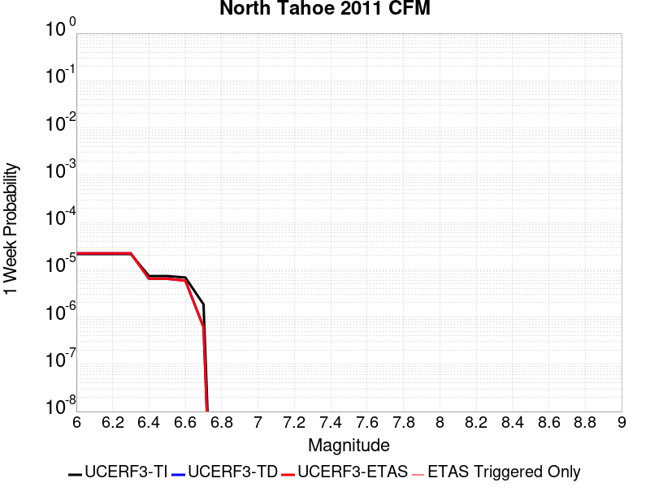 | 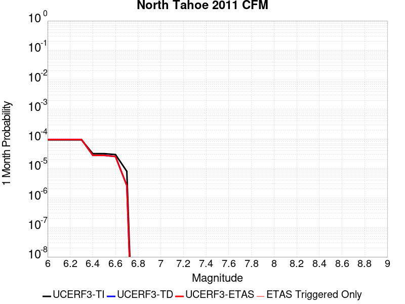 | 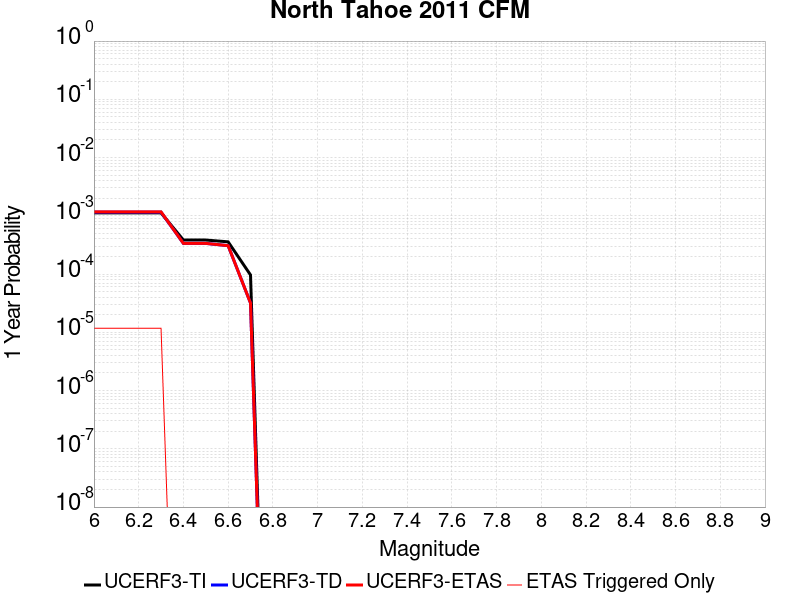 | 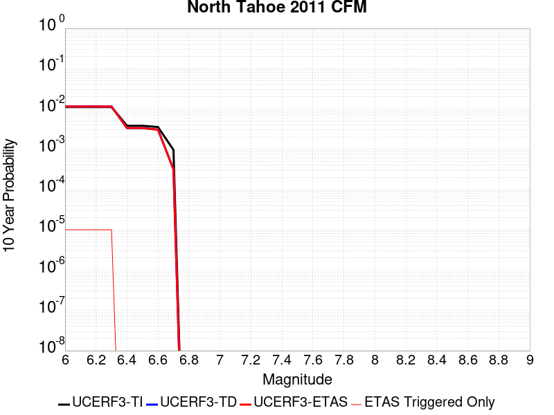 |

| Magnitude | 1 wk TI Prob | 1 wk TD Prob | 1 wk ETAS Prob | 1 wk ETAS/TD Gain | 1 wk ETAS Triggered Only | 1 mo TI Prob | 1 mo TD Prob | 1 mo ETAS Prob | 1 mo ETAS/TD Gain | 1 mo ETAS Triggered Only | 1 yr TI Prob | 1 yr TD Prob | 1 yr ETAS Prob | 1 yr ETAS/TD Gain | 1 yr ETAS Triggered Only | 10 yr TI Prob | 10 yr TD Prob | 10 yr ETAS Prob | 10 yr ETAS/TD Gain | 10 yr ETAS Triggered Only |
|-----|-----|-----|-----|-----|-----|-----|-----|-----|-----|-----|-----|-----|-----|-----|-----|-----|-----|-----|-----|-----|
| 6.0 | 2.150391E-5 | 2.216523E-5 | 2.216523E-5 | 1.0 | 0.0 | 9.215636E-5 | 9.499148E-5 | 9.499148E-5 | 1.0 | 0.0 | 0.0011214261 | 0.0011561037 | 0.0011678272 | 1.0101405 | 1.1737089E-5 | 0.011157839 | 0.011520148 | 0.01153175 | 1.0010071 | 1.1737089E-5 |
| 6.1 | 2.150391E-5 | 2.216523E-5 | 2.216523E-5 | 1.0 | 0.0 | 9.215636E-5 | 9.499148E-5 | 9.499148E-5 | 1.0 | 0.0 | 0.0011214261 | 0.0011561037 | 0.0011678272 | 1.0101405 | 1.1737089E-5 | 0.011157839 | 0.011520148 | 0.01153175 | 1.0010071 | 1.1737089E-5 |
| 6.2 | 2.150391E-5 | 2.216523E-5 | 2.216523E-5 | 1.0 | 0.0 | 9.215636E-5 | 9.499148E-5 | 9.499148E-5 | 1.0 | 0.0 | 0.0011214261 | 0.0011561037 | 0.0011678272 | 1.0101405 | 1.1737089E-5 | 0.011157839 | 0.011520148 | 0.01153175 | 1.0010071 | 1.1737089E-5 |
| 6.3 | 2.150391E-5 | 2.216523E-5 | 2.216523E-5 | 1.0 | 0.0 | 9.215636E-5 | 9.499148E-5 | 9.499148E-5 | 1.0 | 0.0 | 0.0011214261 | 0.0011561037 | 0.0011678272 | 1.0101405 | 1.1737089E-5 | 0.011157839 | 0.011520148 | 0.01153175 | 1.0010071 | 1.1737089E-5 |
| 6.4 | 7.3563056E-6 | 6.445093E-6 | 6.445093E-6 | 1.0 | 0.0 | 3.1526644E-5 | 2.7621705E-5 | 2.7621705E-5 | 1.0 | 0.0 | 3.8376928E-4 | 3.3627293E-4 | 3.3627293E-4 | 1.0 | 0.0 | 0.003831072 | 0.0033606375 | 0.0033606375 | 1.0 | 0.0 |
| 6.5 | 7.3563056E-6 | 6.445093E-6 | 6.445093E-6 | 1.0 | 0.0 | 3.1526644E-5 | 2.7621705E-5 | 2.7621705E-5 | 1.0 | 0.0 | 3.8376928E-4 | 3.3627293E-4 | 3.3627293E-4 | 1.0 | 0.0 | 0.003831072 | 0.0033606375 | 0.0033606375 | 1.0 | 0.0 |
| 6.6 | 6.8508816E-6 | 5.8842634E-6 | 5.8842634E-6 | 1.0 | 0.0 | 2.936059E-5 | 2.52182E-5 | 2.52182E-5 | 1.0 | 0.0 | 3.5740656E-4 | 3.070187E-4 | 3.070187E-4 | 1.0 | 0.0 | 0.0035683226 | 0.0030689223 | 0.0030689223 | 1.0 | 0.0 |
| 6.7 | 1.8511148E-6 | 6.1015777E-7 | 6.1015777E-7 | 1.0 | 0.0 | 7.933325E-6 | 2.6149619E-6 | 2.6149619E-6 | 1.0 | 0.0 | 9.658395E-5 | 3.183716E-5 | 3.183716E-5 | 1.0 | 0.0 | 9.6541987E-4 | 3.183716E-4 | 3.183716E-4 | 1.0 | 0.0 |

## Great Valley 03a Dunnigan Hills
*[(top)](#table-of-contents)*

| 1 Week | 1 Month | 1 Year | 10 Year |
|-----|-----|-----|-----|
| 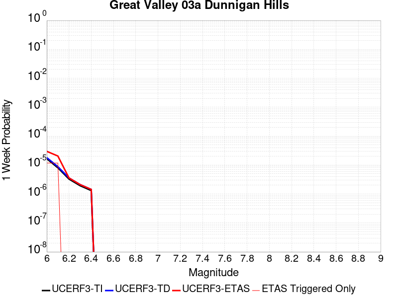 | 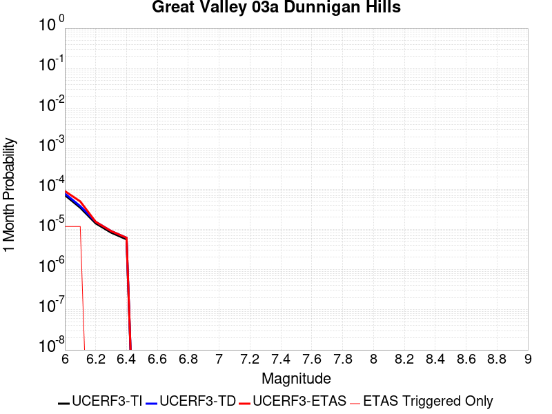 | 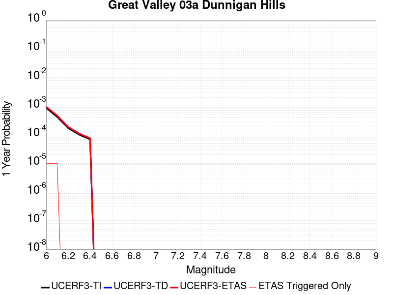 | 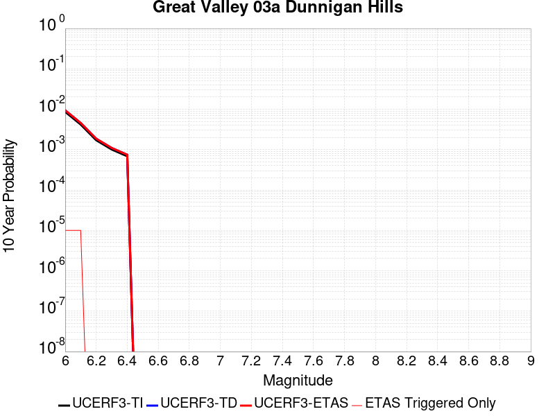 |

| Magnitude | 1 wk TI Prob | 1 wk TD Prob | 1 wk ETAS Prob | 1 wk ETAS/TD Gain | 1 wk ETAS Triggered Only | 1 mo TI Prob | 1 mo TD Prob | 1 mo ETAS Prob | 1 mo ETAS/TD Gain | 1 mo ETAS Triggered Only | 1 yr TI Prob | 1 yr TD Prob | 1 yr ETAS Prob | 1 yr ETAS/TD Gain | 1 yr ETAS Triggered Only | 10 yr TI Prob | 10 yr TD Prob | 10 yr ETAS Prob | 10 yr ETAS/TD Gain | 10 yr ETAS Triggered Only |
|-----|-----|-----|-----|-----|-----|-----|-----|-----|-----|-----|-----|-----|-----|-----|-----|-----|-----|-----|-----|-----|
| 6.0 | 1.6591328E-5 | 1.8107954E-5 | 2.984483E-5 | 1.6481614 | 1.1737089E-5 | 7.110376E-5 | 7.7603596E-5 | 8.9339774E-5 | 1.1512324 | 1.1737089E-5 | 8.6534437E-4 | 9.444834E-4 | 9.562094E-4 | 1.0124153 | 1.1737089E-5 | 0.008619824 | 0.009411525 | 0.009423152 | 1.0012354 | 1.1737089E-5 |
| 6.1 | 8.041125E-6 | 8.769726E-6 | 2.0506714E-5 | 2.3383527 | 1.1737089E-5 | 3.4461507E-5 | 3.7584115E-5 | 4.9320763E-5 | 1.3122768 | 1.1737089E-5 | 4.194881E-4 | 4.5751085E-4 | 4.6924257E-4 | 1.0256425 | 1.1737089E-5 | 0.004186971 | 0.004567687 | 0.0045793704 | 1.0025579 | 1.1737089E-5 |
| 6.2 | 3.2807004E-6 | 3.5795688E-6 | 3.5795688E-6 | 1.0 | 0.0 | 1.4060069E-5 | 1.5340942E-5 | 1.5340942E-5 | 1.0 | 0.0 | 1.7116789E-4 | 1.8676413E-4 | 1.8676413E-4 | 1.0 | 0.0 | 0.0017103611 | 0.0018664796 | 0.0018664796 | 1.0 | 0.0 |
| 6.3 | 1.9339366E-6 | 2.1103806E-6 | 2.1103806E-6 | 1.0 | 0.0 | 8.288273E-6 | 9.044474E-6 | 9.044474E-6 | 1.0 | 0.0 | 1.00905054E-4 | 1.1011375E-4 | 1.1011375E-4 | 1.0 | 0.0 | 0.0010085925 | 0.0011008718 | 0.0011008718 | 1.0 | 0.0 |
| 6.4 | 1.3142635E-6 | 1.4339867E-6 | 1.4339867E-6 | 1.0 | 0.0 | 5.6325457E-6 | 6.145657E-6 | 6.145657E-6 | 1.0 | 0.0 | 6.857408E-5 | 7.482337E-5 | 7.482337E-5 | 1.0 | 0.0 | 6.8552926E-4 | 7.4823375E-4 | 7.4823375E-4 | 1.0 | 0.0 |

## Honey Lake 2011 CFM
*[(top)](#table-of-contents)*

| 1 Week | 1 Month | 1 Year | 10 Year |
|-----|-----|-----|-----|
| 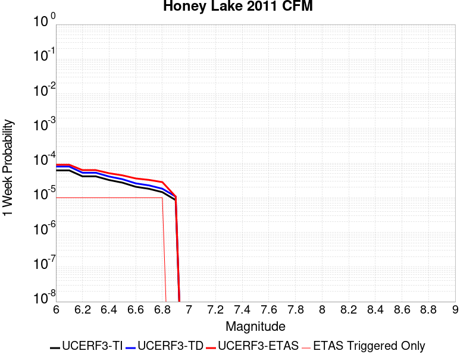 | 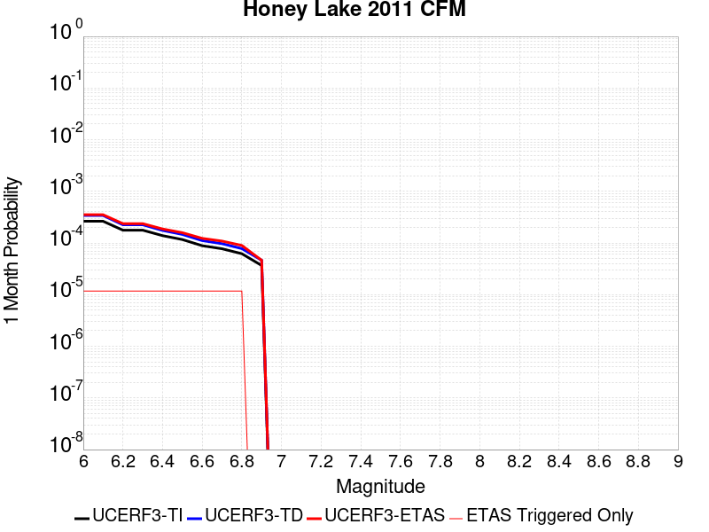 | 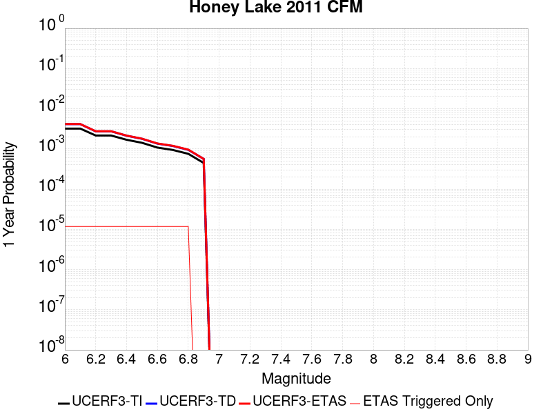 | 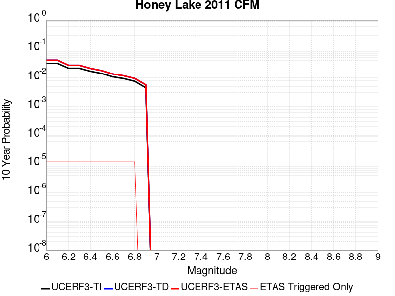 |

| Magnitude | 1 wk TI Prob | 1 wk TD Prob | 1 wk ETAS Prob | 1 wk ETAS/TD Gain | 1 wk ETAS Triggered Only | 1 mo TI Prob | 1 mo TD Prob | 1 mo ETAS Prob | 1 mo ETAS/TD Gain | 1 mo ETAS Triggered Only | 1 yr TI Prob | 1 yr TD Prob | 1 yr ETAS Prob | 1 yr ETAS/TD Gain | 1 yr ETAS Triggered Only | 10 yr TI Prob | 10 yr TD Prob | 10 yr ETAS Prob | 10 yr ETAS/TD Gain | 10 yr ETAS Triggered Only |
|-----|-----|-----|-----|-----|-----|-----|-----|-----|-----|-----|-----|-----|-----|-----|-----|-----|-----|-----|-----|-----|
| 6.0 | 6.155506E-5 | 7.954667E-5 | 9.128282E-5 | 1.147538 | 1.1737089E-5 | 2.6378073E-4 | 3.40873E-4 | 3.526061E-4 | 1.0344207 | 1.1737089E-5 | 0.0032068014 | 0.0041427943 | 0.004154483 | 1.0028214 | 1.1737089E-5 | 0.03160919 | 0.040702924 | 0.040714182 | 1.0002766 | 1.1737089E-5 |
| 6.1 | 6.155506E-5 | 7.954667E-5 | 9.128282E-5 | 1.147538 | 1.1737089E-5 | 2.6378073E-4 | 3.40873E-4 | 3.526061E-4 | 1.0344207 | 1.1737089E-5 | 0.0032068014 | 0.0041427943 | 0.004154483 | 1.0028214 | 1.1737089E-5 | 0.03160919 | 0.040702924 | 0.040714182 | 1.0002766 | 1.1737089E-5 |
| 6.2 | 4.1335024E-5 | 5.257629E-5 | 6.4312764E-5 | 1.2232275 | 1.1737089E-5 | 1.7713808E-4 | 2.253086E-4 | 2.3704304E-4 | 1.0520817 | 1.1737089E-5 | 0.0021545228 | 0.0027398595 | 0.0027515644 | 1.0042721 | 1.1737089E-5 | 0.021337535 | 0.027076708 | 0.027088128 | 1.0004218 | 1.1737089E-5 |
| 6.3 | 4.1335024E-5 | 5.257629E-5 | 6.4312764E-5 | 1.2232275 | 1.1737089E-5 | 1.7713808E-4 | 2.253086E-4 | 2.3704304E-4 | 1.0520817 | 1.1737089E-5 | 0.0021545228 | 0.0027398595 | 0.0027515644 | 1.0042721 | 1.1737089E-5 | 0.021337535 | 0.027076708 | 0.027088128 | 1.0004218 | 1.1737089E-5 |
| 6.4 | 3.2393702E-5 | 4.0887444E-5 | 5.2624055E-5 | 1.2870468 | 1.1737089E-5 | 1.3882275E-4 | 1.7522085E-4 | 1.8695588E-4 | 1.0669729 | 1.1737089E-5 | 0.0016888566 | 0.002131335 | 0.002143047 | 1.0054952 | 1.1737089E-5 | 0.016760793 | 0.02111982 | 0.02113131 | 1.000544 | 1.1737089E-5 |
| 6.5 | 2.7205504E-5 | 3.4211684E-5 | 4.5948374E-5 | 1.3430607 | 1.1737089E-5 | 1.1658981E-4 | 1.4661385E-4 | 1.5834921E-4 | 1.0800427 | 1.1737089E-5 | 0.0014185566 | 0.0017836588 | 0.0017953749 | 1.0065686 | 1.1737089E-5 | 0.014095354 | 0.017702932 | 0.017714461 | 1.0006512 | 1.1737089E-5 |
| 6.6 | 2.069265E-5 | 2.5955307E-5 | 3.769209E-5 | 1.4521921 | 1.1737089E-5 | 8.867977E-5 | 1.1123277E-4 | 1.2296856E-4 | 1.1055065 | 1.1737089E-5 | 0.0010791414 | 0.0013535038 | 0.001365225 | 1.0086598 | 1.1737089E-5 | 0.010739161 | 0.013461002 | 0.013472581 | 1.0008602 | 1.1737089E-5 |
| 6.7 | 1.8060919E-5 | 2.2656828E-5 | 3.439365E-5 | 1.5180259 | 1.1737089E-5 | 7.7401644E-5 | 9.709754E-5 | 1.0883348E-4 | 1.1208676 | 1.1737089E-5 | 9.419576E-4 | 0.0011816026 | 0.0011933259 | 1.0099214 | 1.1737089E-5 | 0.009379748 | 0.011761238 | 0.011772837 | 1.0009862 | 1.1737089E-5 |
| 6.8 | 1.4474663E-5 | 1.818127E-5 | 2.9918147E-5 | 1.6455476 | 1.1737089E-5 | 6.203279E-5 | 7.791784E-5 | 8.9654015E-5 | 1.1506225 | 1.1737089E-5 | 7.5498753E-4 | 9.483136E-4 | 9.6003956E-4 | 1.0123651 | 1.1737089E-5 | 0.007524277 | 0.009450192 | 0.009461818 | 1.0012302 | 1.1737089E-5 |
| 6.9 | 8.564552E-6 | 1.0802308E-5 | 1.0802308E-5 | 1.0 | 0.0 | 3.6704707E-5 | 4.6295158E-5 | 4.6295158E-5 | 1.0 | 0.0 | 4.4678818E-4 | 5.635644E-4 | 5.635644E-4 | 1.0 | 0.0 | 0.0044589094 | 0.0056278477 | 0.0056278477 | 1.0 | 0.0 |

## Peralta Hills
*[(top)](#table-of-contents)*

| 1 Week | 1 Month | 1 Year | 10 Year |
|-----|-----|-----|-----|
| 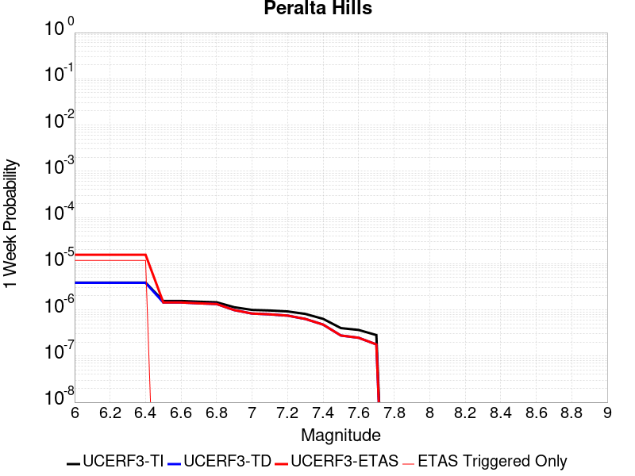 | 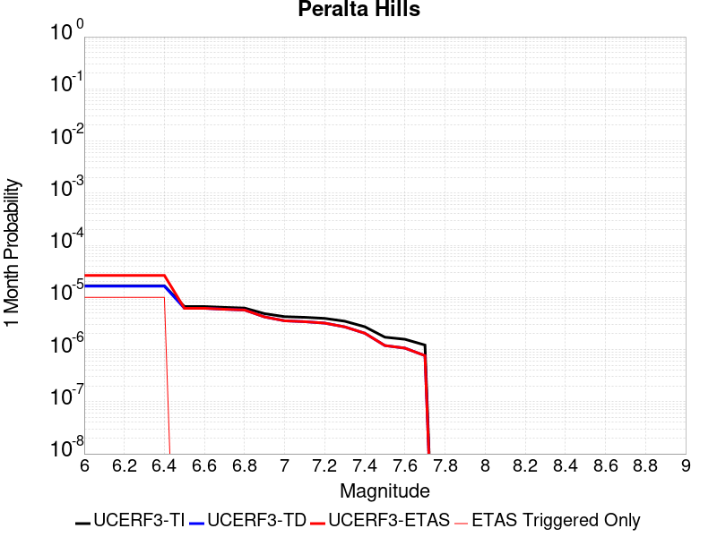 | 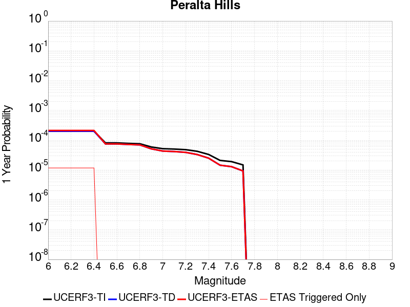 | 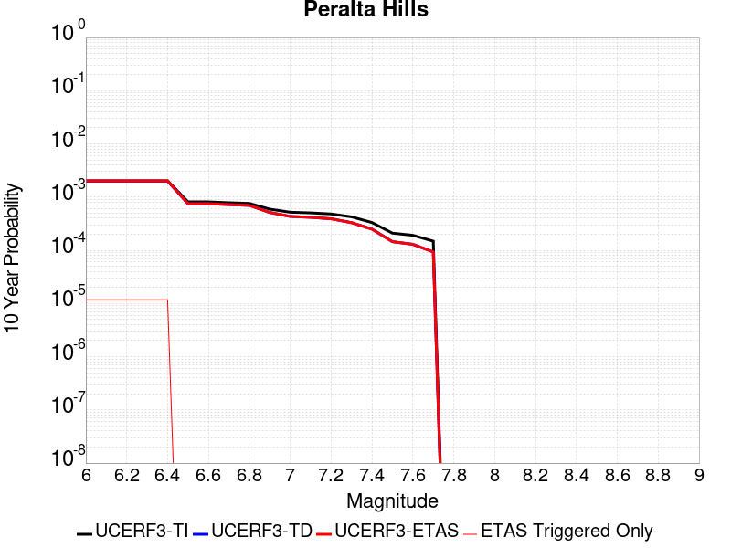 |

| Magnitude | 1 wk TI Prob | 1 wk TD Prob | 1 wk ETAS Prob | 1 wk ETAS/TD Gain | 1 wk ETAS Triggered Only | 1 mo TI Prob | 1 mo TD Prob | 1 mo ETAS Prob | 1 mo ETAS/TD Gain | 1 mo ETAS Triggered Only | 1 yr TI Prob | 1 yr TD Prob | 1 yr ETAS Prob | 1 yr ETAS/TD Gain | 1 yr ETAS Triggered Only | 10 yr TI Prob | 10 yr TD Prob | 10 yr ETAS Prob | 10 yr ETAS/TD Gain | 10 yr ETAS Triggered Only |
|-----|-----|-----|-----|-----|-----|-----|-----|-----|-----|-----|-----|-----|-----|-----|-----|-----|-----|-----|-----|-----|
| 6.0 | 3.8850067E-6 | 3.839512E-6 | 1.5576556E-5 | 4.0569105 | 1.1737089E-5 | 1.6649923E-5 | 1.645499E-5 | 2.8191884E-5 | 1.7132728 | 1.1737089E-5 | 2.0269395E-4 | 2.0032849E-4 | 2.1206323E-4 | 1.0585775 | 1.1737089E-5 | 0.0020250916 | 0.0020022066 | 0.0020139203 | 1.0058503 | 1.1737089E-5 |
| 6.1 | 3.8850067E-6 | 3.839512E-6 | 1.5576556E-5 | 4.0569105 | 1.1737089E-5 | 1.6649923E-5 | 1.645499E-5 | 2.8191884E-5 | 1.7132728 | 1.1737089E-5 | 2.0269395E-4 | 2.0032849E-4 | 2.1206323E-4 | 1.0585775 | 1.1737089E-5 | 0.0020250916 | 0.0020022066 | 0.0020139203 | 1.0058503 | 1.1737089E-5 |
| 6.2 | 3.8850067E-6 | 3.839512E-6 | 1.5576556E-5 | 4.0569105 | 1.1737089E-5 | 1.6649923E-5 | 1.645499E-5 | 2.8191884E-5 | 1.7132728 | 1.1737089E-5 | 2.0269395E-4 | 2.0032849E-4 | 2.1206323E-4 | 1.0585775 | 1.1737089E-5 | 0.0020250916 | 0.0020022066 | 0.0020139203 | 1.0058503 | 1.1737089E-5 |
| 6.3 | 3.8850067E-6 | 3.839512E-6 | 1.5576556E-5 | 4.0569105 | 1.1737089E-5 | 1.6649923E-5 | 1.645499E-5 | 2.8191884E-5 | 1.7132728 | 1.1737089E-5 | 2.0269395E-4 | 2.0032849E-4 | 2.1206323E-4 | 1.0585775 | 1.1737089E-5 | 0.0020250916 | 0.0020022066 | 0.0020139203 | 1.0058503 | 1.1737089E-5 |
| 6.4 | 3.8850067E-6 | 3.839512E-6 | 1.5576556E-5 | 4.0569105 | 1.1737089E-5 | 1.6649923E-5 | 1.645499E-5 | 2.8191884E-5 | 1.7132728 | 1.1737089E-5 | 2.0269395E-4 | 2.0032849E-4 | 2.1206323E-4 | 1.0585775 | 1.1737089E-5 | 0.0020250916 | 0.0020022066 | 0.0020139203 | 1.0058503 | 1.1737089E-5 |
| 6.5 | 1.5587785E-6 | 1.4430796E-6 | 1.4430796E-6 | 1.0 | 0.0 | 6.6804623E-6 | 6.184613E-6 | 6.184613E-6 | 1.0 | 0.0 | 8.133159E-5 | 7.529531E-5 | 7.529531E-5 | 1.0 | 0.0 | 8.1301836E-4 | 7.52722E-4 | 7.52722E-4 | 1.0 | 0.0 |
| 6.6 | 1.5587785E-6 | 1.4430796E-6 | 1.4430796E-6 | 1.0 | 0.0 | 6.6804623E-6 | 6.184613E-6 | 6.184613E-6 | 1.0 | 0.0 | 8.133159E-5 | 7.529531E-5 | 7.529531E-5 | 1.0 | 0.0 | 8.1301836E-4 | 7.52722E-4 | 7.52722E-4 | 1.0 | 0.0 |
| 6.7 | 1.5018579E-6 | 1.3837022E-6 | 1.3837022E-6 | 1.0 | 0.0 | 6.436518E-6 | 5.93014E-6 | 5.93014E-6 | 1.0 | 0.0 | 7.836179E-5 | 7.21973E-5 | 7.21973E-5 | 1.0 | 0.0 | 7.833416E-4 | 7.21762E-4 | 7.21762E-4 | 1.0 | 0.0 |
| 6.8 | 1.4584314E-6 | 1.3381342E-6 | 1.3381342E-6 | 1.0 | 0.0 | 6.250405E-6 | 5.7348498E-6 | 5.7348498E-6 | 1.0 | 0.0 | 7.6096025E-5 | 6.98198E-5 | 6.98198E-5 | 1.0 | 0.0 | 7.6069974E-4 | 6.98002E-4 | 6.98002E-4 | 1.0 | 0.0 |
| 6.9 | 1.1382393E-6 | 9.862285E-7 | 9.862285E-7 | 1.0 | 0.0 | 4.8781594E-6 | 4.226687E-6 | 4.226687E-6 | 1.0 | 0.0 | 5.9389975E-5 | 5.1458785E-5 | 5.1458785E-5 | 1.0 | 0.0 | 5.93741E-4 | 5.144769E-4 | 5.144769E-4 | 1.0 | 0.0 |
| 7.0 | 9.970413E-7 | 8.309642E-7 | 8.309642E-7 | 1.0 | 0.0 | 4.273027E-6 | 3.561271E-6 | 3.561271E-6 | 1.0 | 0.0 | 5.2022864E-5 | 4.335768E-5 | 4.335768E-5 | 1.0 | 0.0 | 5.2010687E-4 | 4.33499E-4 | 4.33499E-4 | 1.0 | 0.0 |
| 7.1 | 9.684443E-7 | 7.99408E-7 | 7.99408E-7 | 1.0 | 0.0 | 4.150469E-6 | 3.4260302E-6 | 3.4260302E-6 | 1.0 | 0.0 | 5.053079E-5 | 4.1711188E-5 | 4.1711188E-5 | 1.0 | 0.0 | 5.05193E-4 | 4.170403E-4 | 4.170403E-4 | 1.0 | 0.0 |
| 7.2 | 9.240811E-7 | 7.5031426E-7 | 7.5031426E-7 | 1.0 | 0.0 | 3.960342E-6 | 3.215629E-6 | 3.215629E-6 | 1.0 | 0.0 | 4.8216094E-5 | 3.9149647E-5 | 3.9149647E-5 | 1.0 | 0.0 | 4.8205635E-4 | 3.9143403E-4 | 3.9143403E-4 | 1.0 | 0.0 |
| 7.3 | 8.158643E-7 | 6.350017E-7 | 6.350017E-7 | 1.0 | 0.0 | 3.4965567E-6 | 2.7214332E-6 | 2.7214332E-6 | 1.0 | 0.0 | 4.2569747E-5 | 3.313301E-5 | 3.313301E-5 | 1.0 | 0.0 | 4.2561593E-4 | 3.3128684E-4 | 3.3128684E-4 | 1.0 | 0.0 |
| 7.4 | 6.3822824E-7 | 4.7957286E-7 | 4.7957286E-7 | 1.0 | 0.0 | 2.7352612E-6 | 2.0553111E-6 | 2.0553111E-6 | 1.0 | 0.0 | 3.3301294E-5 | 2.5023177E-5 | 2.5023177E-5 | 1.0 | 0.0 | 3.3296304E-4 | 2.5020874E-4 | 2.5020874E-4 | 1.0 | 0.0 |
| 7.5 | 4.0292628E-7 | 2.7846056E-7 | 2.7846056E-7 | 1.0 | 0.0 | 1.7268258E-6 | 1.193402E-6 | 1.193402E-6 | 1.0 | 0.0 | 2.1023901E-5 | 1.4529601E-5 | 1.4529601E-5 | 1.0 | 0.0 | 2.1021912E-4 | 1.452893E-4 | 1.452893E-4 | 1.0 | 0.0 |
| 7.6 | 3.672993E-7 | 2.485495E-7 | 2.485495E-7 | 1.0 | 0.0 | 1.5741389E-6 | 1.0652118E-6 | 1.0652118E-6 | 1.0 | 0.0 | 1.9164972E-5 | 1.2968904E-5 | 1.2968904E-5 | 1.0 | 0.0 | 1.916332E-4 | 1.296842E-4 | 1.296842E-4 | 1.0 | 0.0 |
| 7.7 | 2.8466823E-7 | 1.7859877E-7 | 1.7859877E-7 | 1.0 | 0.0 | 1.2200061E-6 | 7.6542324E-7 | 7.6542324E-7 | 1.0 | 0.0 | 1.4853474E-5 | 9.319015E-6 | 9.319015E-6 | 1.0 | 0.0 | 1.485248E-4 | 9.3188835E-5 | 9.3188835E-5 | 1.0 | 0.0 |

## Owens Valley Keough Hot Springs
*[(top)](#table-of-contents)*

| 1 Week | 1 Month | 1 Year | 10 Year |
|-----|-----|-----|-----|
| 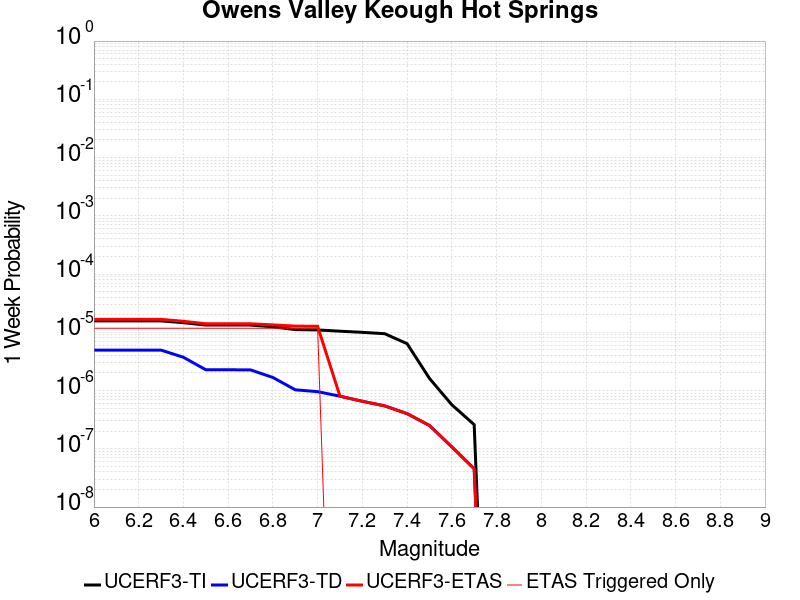 | 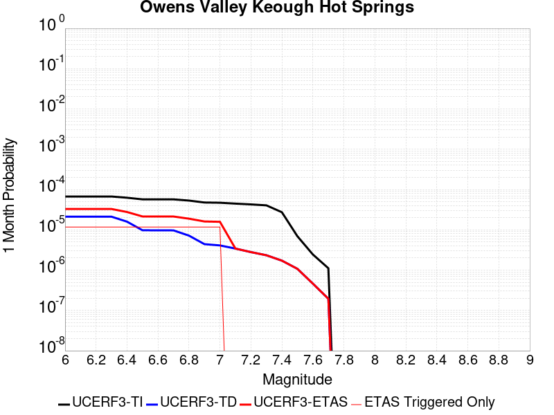 | 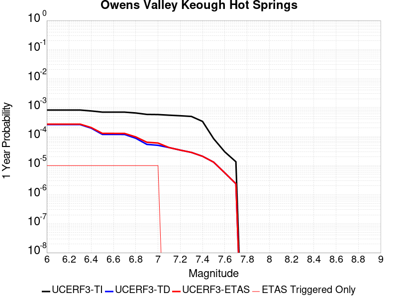 | 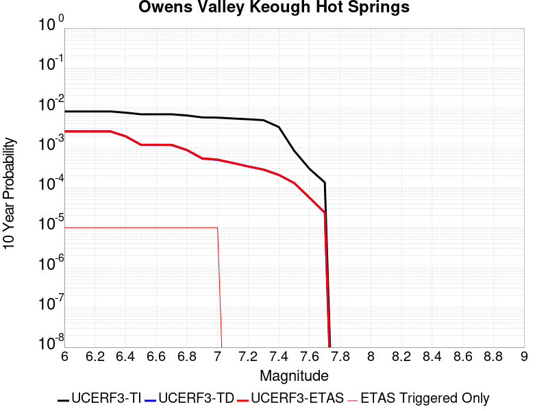 |

| Magnitude | 1 wk TI Prob | 1 wk TD Prob | 1 wk ETAS Prob | 1 wk ETAS/TD Gain | 1 wk ETAS Triggered Only | 1 mo TI Prob | 1 mo TD Prob | 1 mo ETAS Prob | 1 mo ETAS/TD Gain | 1 mo ETAS Triggered Only | 1 yr TI Prob | 1 yr TD Prob | 1 yr ETAS Prob | 1 yr ETAS/TD Gain | 1 yr ETAS Triggered Only | 10 yr TI Prob | 10 yr TD Prob | 10 yr ETAS Prob | 10 yr ETAS/TD Gain | 10 yr ETAS Triggered Only |
|-----|-----|-----|-----|-----|-----|-----|-----|-----|-----|-----|-----|-----|-----|-----|-----|-----|-----|-----|-----|-----|
| 6.0 | 1.5708529E-5 | 4.950656E-6 | 1.6687687E-5 | 3.370803 | 1.1737089E-5 | 6.7320536E-5 | 2.1216953E-5 | 3.2953794E-5 | 1.5531821 | 1.1737089E-5 | 8.193192E-4 | 2.582909E-4 | 2.7002496E-4 | 1.0454296 | 1.1737089E-5 | 0.008163051 | 0.0025805652 | 0.002592272 | 1.0045365 | 1.1737089E-5 |
| 6.1 | 1.5708529E-5 | 4.950656E-6 | 1.6687687E-5 | 3.370803 | 1.1737089E-5 | 6.7320536E-5 | 2.1216953E-5 | 3.2953794E-5 | 1.5531821 | 1.1737089E-5 | 8.193192E-4 | 2.582909E-4 | 2.7002496E-4 | 1.0454296 | 1.1737089E-5 | 0.008163051 | 0.0025805652 | 0.002592272 | 1.0045365 | 1.1737089E-5 |
| 6.2 | 1.5708529E-5 | 4.950656E-6 | 1.6687687E-5 | 3.370803 | 1.1737089E-5 | 6.7320536E-5 | 2.1216953E-5 | 3.2953794E-5 | 1.5531821 | 1.1737089E-5 | 8.193192E-4 | 2.582909E-4 | 2.7002496E-4 | 1.0454296 | 1.1737089E-5 | 0.008163051 | 0.0025805652 | 0.002592272 | 1.0045365 | 1.1737089E-5 |
| 6.3 | 1.5708529E-5 | 4.950656E-6 | 1.6687687E-5 | 3.370803 | 1.1737089E-5 | 6.7320536E-5 | 2.1216953E-5 | 3.2953794E-5 | 1.5531821 | 1.1737089E-5 | 8.193192E-4 | 2.582909E-4 | 2.7002496E-4 | 1.0454296 | 1.1737089E-5 | 0.008163051 | 0.0025805652 | 0.002592272 | 1.0045365 | 1.1737089E-5 |
| 6.4 | 1.4622509E-5 | 3.7265204E-6 | 1.5463565E-5 | 4.149599 | 1.1737089E-5 | 6.266639E-5 | 1.5970723E-5 | 2.7707625E-5 | 1.7349011 | 1.1737089E-5 | 7.626962E-4 | 1.944295E-4 | 2.0616432E-4 | 1.0603551 | 1.1737089E-5 | 0.007600839 | 0.0019430731 | 0.0019547874 | 1.0060288 | 1.1737089E-5 |
| 6.5 | 1.3335527E-5 | 2.2777172E-6 | 1.40147795E-5 | 6.152994 | 1.1737089E-5 | 5.7151006E-5 | 9.761612E-6 | 2.1498587E-5 | 2.2023604 | 1.1737089E-5 | 6.955913E-4 | 1.18841825E-4 | 1.3057752E-4 | 1.0987506 | 1.1737089E-5 | 0.0069341804 | 0.0011880046 | 0.0011997278 | 1.0098679 | 1.1737089E-5 |
| 6.6 | 1.3332855E-5 | 2.2748663E-6 | 1.4011929E-5 | 6.1594515 | 1.1737089E-5 | 5.7139558E-5 | 9.749395E-6 | 2.1486368E-5 | 2.203867 | 1.1737089E-5 | 6.9545204E-4 | 1.186931E-4 | 1.3042879E-4 | 1.0988743 | 1.1737089E-5 | 0.0069327964 | 0.0011865189 | 0.0011982421 | 1.0098803 | 1.1737089E-5 |
| 6.7 | 1.3318214E-5 | 2.2640966E-6 | 1.4001159E-5 | 6.183994 | 1.1737089E-5 | 5.707681E-5 | 9.703239E-6 | 2.1440213E-5 | 2.2095935 | 1.1737089E-5 | 6.946886E-4 | 1.1813121E-4 | 1.2986691E-4 | 1.0993446 | 1.1737089E-5 | 0.0069252094 | 0.001180906 | 0.0011926292 | 1.0099273 | 1.1737089E-5 |
| 6.8 | 1.2441338E-5 | 1.6777863E-6 | 1.3414856E-5 | 7.9955688 | 1.1737089E-5 | 5.331893E-5 | 7.1904947E-6 | 1.89275E-5 | 2.6322944 | 1.1737089E-5 | 6.489646E-4 | 8.7541055E-5 | 9.927712E-5 | 1.1340635 | 1.1737089E-5 | 0.0064707273 | 8.752499E-4 | 8.869767E-4 | 1.0133983 | 1.1737089E-5 |
| 6.9 | 1.1130476E-5 | 1.0303868E-6 | 1.2767464E-5 | 12.390944 | 1.1737089E-5 | 4.7701167E-5 | 4.415936E-6 | 1.6152973E-5 | 3.6578822 | 1.1737089E-5 | 5.806069E-4 | 5.3762706E-5 | 6.549917E-5 | 1.218301 | 1.1737089E-5 | 0.0057909233 | 5.37651E-4 | 5.493818E-4 | 1.0218185 | 1.1737089E-5 |
| 7.0 | 1.0986073E-5 | 9.579413E-7 | 1.2695019E-5 | 13.252398 | 1.1737089E-5 | 4.7082318E-5 | 4.1054564E-6 | 1.5842497E-5 | 3.8588881 | 1.1737089E-5 | 5.730765E-4 | 4.99828E-5 | 6.17193E-5 | 1.2348108 | 1.1737089E-5 | 0.0057160086 | 4.9986853E-4 | 5.1159976E-4 | 1.0234686 | 1.1737089E-5 |
| 7.1 | 1.0451338E-5 | 8.0002656E-7 | 8.0002656E-7 | 1.0 | 0.0 | 4.4790682E-5 | 3.4286807E-6 | 3.4286807E-6 | 1.0 | 0.0 | 5.451901E-4 | 4.1743395E-5 | 4.1743395E-5 | 1.0 | 0.0 | 0.005438545 | 4.1750458E-4 | 4.1750458E-4 | 1.0 | 0.0 |
| 7.2 | 9.989061E-6 | 6.544956E-7 | 6.544956E-7 | 1.0 | 0.0 | 4.280956E-5 | 2.804978E-6 | 2.804978E-6 | 1.0 | 0.0 | 5.2108173E-4 | 3.4150078E-5 | 3.4150078E-5 | 1.0 | 0.0 | 0.0051986156 | 3.415851E-4 | 3.415851E-4 | 1.0 | 0.0 |
| 7.3 | 9.465365E-6 | 5.4600474E-7 | 5.4600474E-7 | 1.0 | 0.0 | 4.056522E-5 | 2.3400182E-6 | 2.3400182E-6 | 1.0 | 0.0 | 4.937696E-4 | 2.8489352E-5 | 2.8489352E-5 | 1.0 | 0.0 | 0.0049267393 | 2.8498896E-4 | 2.8498896E-4 | 1.0 | 0.0 |
| 7.4 | 6.3824805E-6 | 4.016335E-7 | 4.016335E-7 | 1.0 | 0.0 | 2.73532E-5 | 1.7212853E-6 | 1.7212853E-6 | 1.0 | 0.0 | 3.3297433E-4 | 2.095645E-5 | 2.095645E-5 | 1.0 | 0.0 | 0.0033247585 | 2.0963654E-4 | 2.0963654E-4 | 1.0 | 0.0 |
| 7.5 | 1.6192645E-6 | 2.516124E-7 | 2.516124E-7 | 1.0 | 0.0 | 6.9396865E-6 | 1.0783383E-6 | 1.0783383E-6 | 1.0 | 0.0 | 8.448741E-5 | 1.31286915E-5 | 1.31286915E-5 | 1.0 | 0.0 | 8.4455294E-4 | 1.3127929E-4 | 1.3127929E-4 | 1.0 | 0.0 |
| 7.6 | 5.7062545E-7 | 1.07924045E-7 | 1.07924045E-7 | 1.0 | 0.0 | 2.4455355E-6 | 4.6253152E-7 | 4.6253152E-7 | 1.0 | 0.0 | 2.9773988E-5 | 5.6313074E-6 | 5.6313074E-6 | 1.0 | 0.0 | 2.977E-4 | 5.6311732E-5 | 5.6311732E-5 | 1.0 | 0.0 |
| 7.7 | 2.5988817E-7 | 4.5457977E-8 | 4.5457977E-8 | 1.0 | 0.0 | 1.113806E-6 | 1.9481989E-7 | 1.9481989E-7 | 1.0 | 0.0 | 1.3560503E-5 | 2.3719301E-6 | 2.3719301E-6 | 1.0 | 0.0 | 1.3559677E-4 | 2.371909E-5 | 2.371909E-5 | 1.0 | 0.0 |

## Point Reyes 2011 CFM
*[(top)](#table-of-contents)*

| 1 Week | 1 Month | 1 Year | 10 Year |
|-----|-----|-----|-----|
| 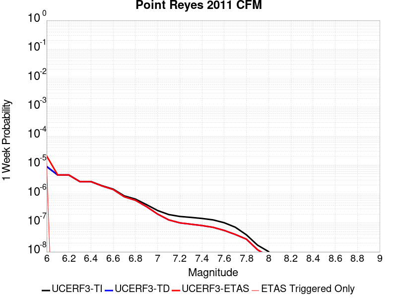 | 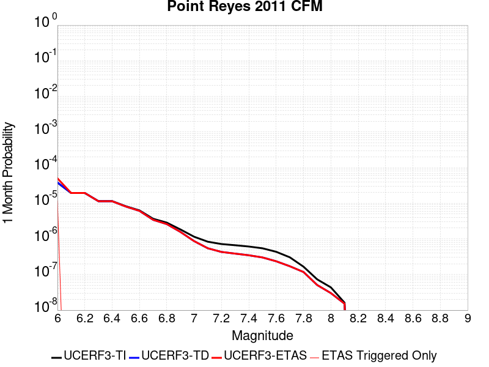 | 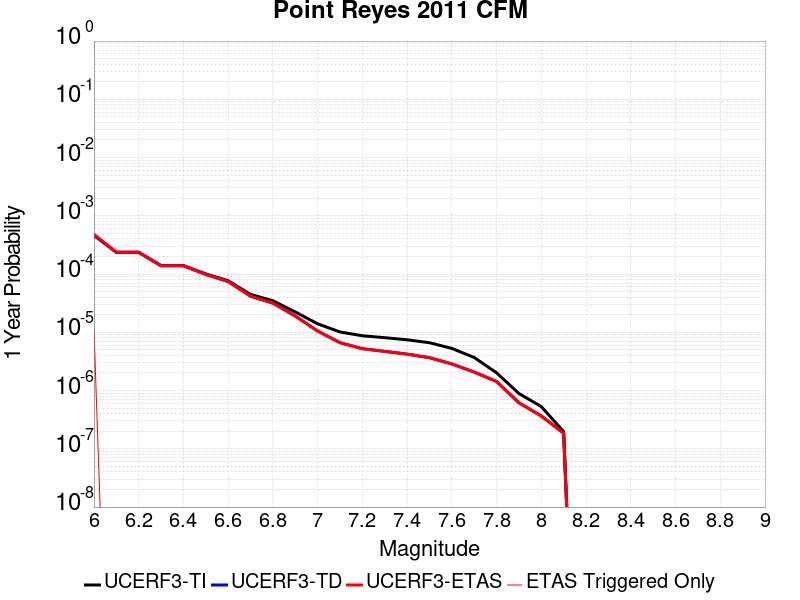 | 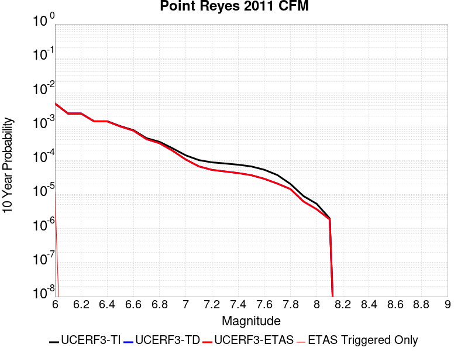 |

| Magnitude | 1 wk TI Prob | 1 wk TD Prob | 1 wk ETAS Prob | 1 wk ETAS/TD Gain | 1 wk ETAS Triggered Only | 1 mo TI Prob | 1 mo TD Prob | 1 mo ETAS Prob | 1 mo ETAS/TD Gain | 1 mo ETAS Triggered Only | 1 yr TI Prob | 1 yr TD Prob | 1 yr ETAS Prob | 1 yr ETAS/TD Gain | 1 yr ETAS Triggered Only | 10 yr TI Prob | 10 yr TD Prob | 10 yr ETAS Prob | 10 yr ETAS/TD Gain | 10 yr ETAS Triggered Only |
|-----|-----|-----|-----|-----|-----|-----|-----|-----|-----|-----|-----|-----|-----|-----|-----|-----|-----|-----|-----|-----|
| 6.0 | 8.8644965E-6 | 8.967163E-6 | 2.0704147E-5 | 2.3088849 | 1.1737089E-5 | 3.7990147E-5 | 3.843017E-5 | 5.0166807E-5 | 1.3054017 | 1.1737089E-5 | 4.624319E-4 | 4.6779314E-4 | 4.7952475E-4 | 1.0250787 | 1.1737089E-5 | 0.0046147075 | 0.004668713 | 0.004680395 | 1.0025022 | 1.1737089E-5 |
| 6.1 | 4.526405E-6 | 4.5392185E-6 | 4.5392185E-6 | 1.0 | 0.0 | 1.9398734E-5 | 1.9453653E-5 | 1.9453653E-5 | 1.0 | 0.0 | 2.36154E-4 | 2.3682354E-4 | 2.3682354E-4 | 1.0 | 0.0 | 0.002359032 | 0.0023658178 | 0.0023658178 | 1.0 | 0.0 |
| 6.2 | 4.526405E-6 | 4.5392185E-6 | 4.5392185E-6 | 1.0 | 0.0 | 1.9398734E-5 | 1.9453653E-5 | 1.9453653E-5 | 1.0 | 0.0 | 2.36154E-4 | 2.3682354E-4 | 2.3682354E-4 | 1.0 | 0.0 | 0.002359032 | 0.0023658178 | 0.0023658178 | 1.0 | 0.0 |
| 6.3 | 2.6842322E-6 | 2.660676E-6 | 2.660676E-6 | 1.0 | 0.0 | 1.1503801E-5 | 1.1402849E-5 | 1.1402849E-5 | 1.0 | 0.0 | 1.4004979E-4 | 1.3882104E-4 | 1.3882104E-4 | 1.0 | 0.0 | 0.0013996155 | 0.0013873649 | 0.0013873649 | 1.0 | 0.0 |
| 6.4 | 2.6842322E-6 | 2.660676E-6 | 2.660676E-6 | 1.0 | 0.0 | 1.1503801E-5 | 1.1402849E-5 | 1.1402849E-5 | 1.0 | 0.0 | 1.4004979E-4 | 1.3882104E-4 | 1.3882104E-4 | 1.0 | 0.0 | 0.0013996155 | 0.0013873649 | 0.0013873649 | 1.0 | 0.0 |
| 6.5 | 1.9281833E-6 | 1.8906262E-6 | 1.8906262E-6 | 1.0 | 0.0 | 8.263617E-6 | 8.102659E-6 | 8.102659E-6 | 1.0 | 0.0 | 1.0060489E-4 | 9.86455E-5 | 9.86455E-5 | 1.0 | 0.0 | 0.0010055936 | 9.860279E-4 | 9.860279E-4 | 1.0 | 0.0 |
| 6.6 | 1.4726726E-6 | 1.4269577E-6 | 1.4269577E-6 | 1.0 | 0.0 | 6.3114385E-6 | 6.1155188E-6 | 6.1155188E-6 | 1.0 | 0.0 | 7.683905E-5 | 7.445395E-5 | 7.445395E-5 | 1.0 | 0.0 | 7.6812494E-4 | 7.4429717E-4 | 7.4429717E-4 | 1.0 | 0.0 |
| 6.7 | 8.572307E-7 | 8.007212E-7 | 8.007212E-7 | 1.0 | 0.0 | 3.6738406E-6 | 3.431658E-6 | 3.431658E-6 | 1.0 | 0.0 | 4.472809E-5 | 4.1779647E-5 | 4.1779647E-5 | 1.0 | 0.0 | 4.471909E-4 | 4.1772184E-4 | 4.1772184E-4 | 1.0 | 0.0 |
| 6.8 | 6.6745434E-7 | 6.0773E-7 | 6.0773E-7 | 1.0 | 0.0 | 2.8605155E-6 | 2.6045543E-6 | 2.6045543E-6 | 1.0 | 0.0 | 3.482622E-5 | 3.171E-5 | 3.171E-5 | 1.0 | 0.0 | 3.4820763E-4 | 3.1705803E-4 | 3.1705803E-4 | 1.0 | 0.0 |
| 6.9 | 4.291521E-7 | 3.6535937E-7 | 3.6535937E-7 | 1.0 | 0.0 | 1.839222E-6 | 1.565825E-6 | 1.565825E-6 | 1.0 | 0.0 | 2.2392298E-5 | 1.9063755E-5 | 1.9063755E-5 | 1.0 | 0.0 | 2.2390042E-4 | 1.9062385E-4 | 1.9062385E-4 | 1.0 | 0.0 |
| 7.0 | 2.6812808E-7 | 2.0187414E-7 | 2.0187414E-7 | 1.0 | 0.0 | 1.1491198E-6 | 8.651746E-7 | 8.651746E-7 | 1.0 | 0.0 | 1.3990444E-5 | 1.0533451E-5 | 1.0533451E-5 | 1.0 | 0.0 | 1.3989564E-4 | 1.0533186E-4 | 1.0533186E-4 | 1.0 | 0.0 |
| 7.1 | 1.9451231E-7 | 1.2725499E-7 | 1.2725499E-7 | 1.0 | 0.0 | 8.336239E-7 | 5.453784E-7 | 5.453784E-7 | 1.0 | 0.0 | 1.0149324E-5 | 6.6399616E-6 | 6.6399616E-6 | 1.0 | 0.0 | 1.014886E-4 | 6.639991E-5 | 6.639991E-5 | 1.0 | 0.0 |
| 7.2 | 1.6715143E-7 | 1.00428394E-7 | 1.00428394E-7 | 1.0 | 0.0 | 7.1636305E-7 | 4.3040734E-7 | 4.3040734E-7 | 1.0 | 0.0 | 8.721685E-6 | 5.2401965E-6 | 5.2401965E-6 | 1.0 | 0.0 | 8.721343E-5 | 5.2402997E-5 | 5.2402997E-5 | 1.0 | 0.0 |
| 7.3 | 1.5503173E-7 | 9.0131024E-8 | 9.0131024E-8 | 1.0 | 0.0 | 6.644215E-7 | 3.8627576E-7 | 3.8627576E-7 | 1.0 | 0.0 | 8.089301E-6 | 4.702897E-6 | 4.702897E-6 | 1.0 | 0.0 | 8.089007E-5 | 4.7030244E-5 | 4.7030244E-5 | 1.0 | 0.0 |
| 7.4 | 1.4251614E-7 | 8.097624E-8 | 8.097624E-8 | 1.0 | 0.0 | 6.1078333E-7 | 3.47041E-7 | 3.47041E-7 | 1.0 | 0.0 | 7.4362615E-6 | 4.225216E-6 | 4.225216E-6 | 1.0 | 0.0 | 7.436013E-5 | 4.2253625E-5 | 4.2253625E-5 | 1.0 | 0.0 |
| 7.5 | 1.2710186E-7 | 7.0296394E-8 | 7.0296394E-8 | 1.0 | 0.0 | 5.447221E-7 | 3.0127023E-7 | 3.0127023E-7 | 1.0 | 0.0 | 6.6319717E-6 | 3.667959E-6 | 3.667959E-6 | 1.0 | 0.0 | 6.6317734E-5 | 3.6681253E-5 | 3.6681253E-5 | 1.0 | 0.0 |
| 7.6 | 1.0144708E-7 | 5.4952274E-8 | 5.4952274E-8 | 1.0 | 0.0 | 4.347731E-7 | 2.3550973E-7 | 2.3550973E-7 | 1.0 | 0.0 | 5.2933497E-6 | 2.8673273E-6 | 2.8673273E-6 | 1.0 | 0.0 | 5.293224E-5 | 2.8675171E-5 | 2.8675171E-5 | 1.0 | 0.0 |
| 7.7 | 7.090527E-8 | 3.98231E-8 | 3.98231E-8 | 1.0 | 0.0 | 3.038797E-7 | 1.7067042E-7 | 1.7067042E-7 | 1.0 | 0.0 | 3.699729E-6 | 2.0779103E-6 | 2.0779103E-6 | 1.0 | 0.0 | 3.6996673E-5 | 2.0781177E-5 | 2.0781177E-5 | 1.0 | 0.0 |
| 7.8 | 3.8712045E-8 | 2.7440025E-8 | 2.7440025E-8 | 1.0 | 0.0 | 1.6590876E-7 | 1.176001E-7 | 1.176001E-7 | 1.0 | 0.0 | 2.0199373E-6 | 1.4317802E-6 | 1.4317802E-6 | 1.0 | 0.0 | 2.0199188E-5 | 1.4319979E-5 | 1.4319979E-5 | 1.0 | 0.0 |
| 7.9 | 1.7068782E-8 | 1.1833354E-8 | 1.1833354E-8 | 1.0 | 0.0 | 7.315192E-8 | 5.0714362E-8 | 5.0714362E-8 | 1.0 | 0.0 | 8.906242E-7 | 6.174472E-7 | 6.174472E-7 | 1.0 | 0.0 | 8.906207E-6 | 6.1767228E-6 | 6.1767228E-6 | 1.0 | 0.0 |
| 8.0 | 1.0172592E-8 | 7.0280843E-9 | 7.0280843E-9 | 1.0 | 0.0 | 4.359682E-8 | 3.0120354E-8 | 3.0120354E-8 | 1.0 | 0.0 | 5.3079117E-7 | 3.6671526E-7 | 3.6671526E-7 | 1.0 | 0.0 | 5.307899E-6 | 3.6694146E-6 | 3.6694146E-6 | 1.0 | 0.0 |
| 8.1 | 3.7861243E-9 | 3.5452439E-9 | 3.5452439E-9 | 1.0 | 0.0 | 1.6226247E-8 | 1.5193901E-8 | 1.5193901E-8 | 1.0 | 0.0 | 1.9755454E-7 | 1.8498575E-7 | 1.8498575E-7 | 1.0 | 0.0 | 1.9755437E-6 | 1.8518531E-6 | 1.8518531E-6 | 1.0 | 0.0 |

## Shoreline
*[(top)](#table-of-contents)*

| 1 Week | 1 Month | 1 Year | 10 Year |
|-----|-----|-----|-----|
|  | 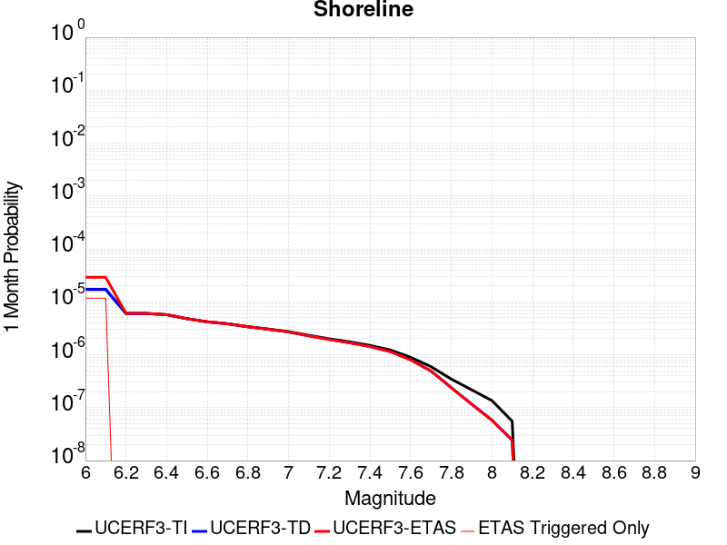 |  | 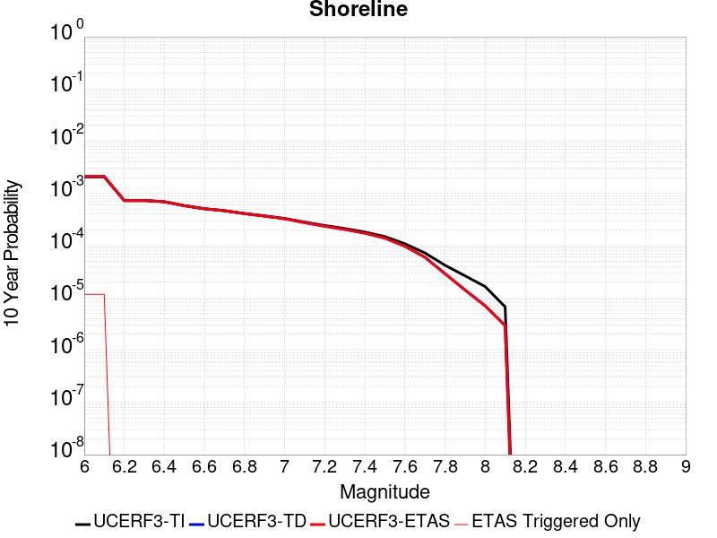 |

| Magnitude | 1 wk TI Prob | 1 wk TD Prob | 1 wk ETAS Prob | 1 wk ETAS/TD Gain | 1 wk ETAS Triggered Only | 1 mo TI Prob | 1 mo TD Prob | 1 mo ETAS Prob | 1 mo ETAS/TD Gain | 1 mo ETAS Triggered Only | 1 yr TI Prob | 1 yr TD Prob | 1 yr ETAS Prob | 1 yr ETAS/TD Gain | 1 yr ETAS Triggered Only | 10 yr TI Prob | 10 yr TD Prob | 10 yr ETAS Prob | 10 yr ETAS/TD Gain | 10 yr ETAS Triggered Only |
|-----|-----|-----|-----|-----|-----|-----|-----|-----|-----|-----|-----|-----|-----|-----|-----|-----|-----|-----|-----|-----|
| 6.0 | 3.9888673E-6 | 4.047929E-6 | 1.578497E-5 | 3.8995175 | 1.1737089E-5 | 1.7095033E-5 | 1.7348184E-5 | 2.908507E-5 | 1.6765484 | 1.1737089E-5 | 2.0811215E-4 | 2.1119925E-4 | 2.2293386E-4 | 1.0555618 | 1.1737089E-5 | 0.0020791737 | 0.002110534 | 0.0021222464 | 1.0055494 | 1.1737089E-5 |
| 6.1 | 3.9888673E-6 | 4.047929E-6 | 1.578497E-5 | 3.8995175 | 1.1737089E-5 | 1.7095033E-5 | 1.7348184E-5 | 2.908507E-5 | 1.6765484 | 1.1737089E-5 | 2.0811215E-4 | 2.1119925E-4 | 2.2293386E-4 | 1.0555618 | 1.1737089E-5 | 0.0020791737 | 0.002110534 | 0.0021222464 | 1.0055494 | 1.1737089E-5 |
| 6.2 | 1.4039653E-6 | 1.4100891E-6 | 1.4100891E-6 | 1.0 | 0.0 | 6.0169805E-6 | 6.0432253E-6 | 6.0432253E-6 | 1.0 | 0.0 | 7.325427E-5 | 7.357384E-5 | 7.357384E-5 | 1.0 | 0.0 | 7.3230127E-4 | 7.355009E-4 | 7.355009E-4 | 1.0 | 0.0 |
| 6.3 | 1.4039653E-6 | 1.4100891E-6 | 1.4100891E-6 | 1.0 | 0.0 | 6.0169805E-6 | 6.0432253E-6 | 6.0432253E-6 | 1.0 | 0.0 | 7.325427E-5 | 7.357384E-5 | 7.357384E-5 | 1.0 | 0.0 | 7.3230127E-4 | 7.355009E-4 | 7.355009E-4 | 1.0 | 0.0 |
| 6.4 | 1.3314152E-6 | 1.3361605E-6 | 1.3361605E-6 | 1.0 | 0.0 | 5.7060524E-6 | 5.7263896E-6 | 5.7263896E-6 | 1.0 | 0.0 | 6.946897E-5 | 6.971662E-5 | 6.971662E-5 | 1.0 | 0.0 | 6.9447263E-4 | 6.9695286E-4 | 6.9695286E-4 | 1.0 | 0.0 |
| 6.5 | 1.1187026E-6 | 1.120364E-6 | 1.120364E-6 | 1.0 | 0.0 | 4.794431E-6 | 4.8015513E-6 | 4.8015513E-6 | 1.0 | 0.0 | 5.8370628E-5 | 5.8457343E-5 | 5.8457343E-5 | 1.0 | 0.0 | 5.83553E-4 | 5.844222E-4 | 5.844222E-4 | 1.0 | 0.0 |
| 6.6 | 9.793089E-7 | 9.784919E-7 | 9.784919E-7 | 1.0 | 0.0 | 4.1970316E-6 | 4.1935305E-6 | 4.1935305E-6 | 1.0 | 0.0 | 5.1097657E-5 | 5.105505E-5 | 5.105505E-5 | 1.0 | 0.0 | 5.108591E-4 | 5.1043445E-4 | 5.1043445E-4 | 1.0 | 0.0 |
| 6.7 | 8.995986E-7 | 8.9728E-7 | 8.9728E-7 | 1.0 | 0.0 | 3.8554167E-6 | 3.84548E-6 | 3.84548E-6 | 1.0 | 0.0 | 4.693869E-5 | 4.6817724E-5 | 4.6817724E-5 | 1.0 | 0.0 | 4.6928777E-4 | 4.6807955E-4 | 4.6807955E-4 | 1.0 | 0.0 |
| 6.8 | 7.931612E-7 | 7.8804027E-7 | 7.8804027E-7 | 1.0 | 0.0 | 3.3992578E-6 | 3.377311E-6 | 3.377311E-6 | 1.0 | 0.0 | 4.1385178E-5 | 4.1117994E-5 | 4.1117994E-5 | 1.0 | 0.0 | 4.1377472E-4 | 4.1110438E-4 | 4.1110438E-4 | 1.0 | 0.0 |
| 6.9 | 7.1465956E-7 | 7.078006E-7 | 7.078006E-7 | 1.0 | 0.0 | 3.062823E-6 | 3.0334277E-6 | 3.0334277E-6 | 1.0 | 0.0 | 3.7289232E-5 | 3.6931357E-5 | 3.6931357E-5 | 1.0 | 0.0 | 3.7282976E-4 | 3.6925258E-4 | 3.6925258E-4 | 1.0 | 0.0 |
| 7.0 | 6.389046E-7 | 6.299458E-7 | 6.299458E-7 | 1.0 | 0.0 | 2.7381598E-6 | 2.699765E-6 | 2.699765E-6 | 1.0 | 0.0 | 3.3336586E-5 | 3.2869146E-5 | 3.2869146E-5 | 1.0 | 0.0 | 3.3331584E-4 | 3.2864307E-4 | 3.2864307E-4 | 1.0 | 0.0 |
| 7.1 | 5.4300875E-7 | 5.3111313E-7 | 5.3111313E-7 | 1.0 | 0.0 | 2.3271782E-6 | 2.276197E-6 | 2.276197E-6 | 1.0 | 0.0 | 2.8333026E-5 | 2.7712347E-5 | 2.7712347E-5 | 1.0 | 0.0 | 2.8329415E-4 | 2.77089E-4 | 2.77089E-4 | 1.0 | 0.0 |
| 7.2 | 4.6768855E-7 | 4.5348952E-7 | 4.5348952E-7 | 1.0 | 0.0 | 2.0043778E-6 | 1.9435251E-6 | 1.9435251E-6 | 1.0 | 0.0 | 2.4403027E-5 | 2.3662162E-5 | 2.3662162E-5 | 1.0 | 0.0 | 2.4400349E-4 | 2.3659648E-4 | 2.3659648E-4 | 1.0 | 0.0 |
| 7.3 | 4.0966103E-7 | 3.9385662E-7 | 3.9385662E-7 | 1.0 | 0.0 | 1.7556889E-6 | 1.6879559E-6 | 1.6879559E-6 | 1.0 | 0.0 | 2.1375303E-5 | 2.055067E-5 | 2.055067E-5 | 1.0 | 0.0 | 2.1373246E-4 | 2.0548773E-4 | 2.0548773E-4 | 1.0 | 0.0 |
| 7.4 | 3.5105785E-7 | 3.3363975E-7 | 3.3363975E-7 | 1.0 | 0.0 | 1.5045327E-6 | 1.4298838E-6 | 1.4298838E-6 | 1.0 | 0.0 | 1.8317533E-5 | 1.7408696E-5 | 1.7408696E-5 | 1.0 | 0.0 | 1.8316023E-4 | 1.7407336E-4 | 1.7407336E-4 | 1.0 | 0.0 |
| 7.5 | 2.8737534E-7 | 2.6820038E-7 | 2.6820038E-7 | 1.0 | 0.0 | 1.2316079E-6 | 1.1494297E-6 | 1.1494297E-6 | 1.0 | 0.0 | 1.4994724E-5 | 1.3994217E-5 | 1.3994217E-5 | 1.0 | 0.0 | 1.4993713E-4 | 1.3993339E-4 | 1.3993339E-4 | 1.0 | 0.0 |
| 7.6 | 2.0924051E-7 | 1.8778988E-7 | 1.8778988E-7 | 1.0 | 0.0 | 8.967448E-7 | 8.048135E-7 | 8.048135E-7 | 1.0 | 0.0 | 1.0917813E-5 | 9.79856E-6 | 9.79856E-6 | 1.0 | 0.0 | 1.0917276E-4 | 9.798129E-5 | 9.798129E-5 | 1.0 | 0.0 |
| 7.7 | 1.392265E-7 | 1.15433906E-7 | 1.15433906E-7 | 1.0 | 0.0 | 5.9668486E-7 | 4.9471663E-7 | 4.9471663E-7 | 1.0 | 0.0 | 7.2646135E-6 | 6.023158E-6 | 6.023158E-6 | 1.0 | 0.0 | 7.2643765E-5 | 6.0229955E-5 | 6.0229955E-5 | 1.0 | 0.0 |
| 7.8 | 8.1080074E-8 | 5.586722E-8 | 5.586722E-8 | 1.0 | 0.0 | 3.4748598E-7 | 2.394309E-7 | 2.394309E-7 | 1.0 | 0.0 | 4.2306337E-6 | 2.9150672E-6 | 2.9150672E-6 | 1.0 | 0.0 | 4.230553E-5 | 2.9150291E-5 | 2.9150291E-5 | 1.0 | 0.0 |
| 7.9 | 5.0859036E-8 | 2.7244445E-8 | 2.7244445E-8 | 1.0 | 0.0 | 2.1796728E-7 | 1.16761896E-7 | 1.16761896E-7 | 1.0 | 0.0 | 2.6537484E-6 | 1.4215751E-6 | 1.4215751E-6 | 1.0 | 0.0 | 2.6537167E-5 | 1.4215661E-5 | 1.4215661E-5 | 1.0 | 0.0 |
| 8.0 | 3.1760536E-8 | 1.3577206E-8 | 1.3577206E-8 | 1.0 | 0.0 | 1.3611657E-7 | 5.8188025E-8 | 5.8188025E-8 | 1.0 | 0.0 | 1.6572179E-6 | 7.0843896E-7 | 7.0843896E-7 | 1.0 | 0.0 | 1.6572056E-5 | 7.084367E-6 | 7.084367E-6 | 1.0 | 0.0 |
| 8.1 | 1.2947896E-8 | 5.6628693E-9 | 5.6628693E-9 | 1.0 | 0.0 | 5.5490982E-8 | 2.426944E-8 | 2.426944E-8 | 1.0 | 0.0 | 6.756025E-7 | 2.954804E-7 | 2.954804E-7 | 1.0 | 0.0 | 6.7560045E-6 | 2.9548003E-6 | 2.9548003E-6 | 1.0 | 0.0 |

## Elysian Park (Lower CFM)
*[(top)](#table-of-contents)*

| 1 Week | 1 Month | 1 Year | 10 Year |
|-----|-----|-----|-----|
| 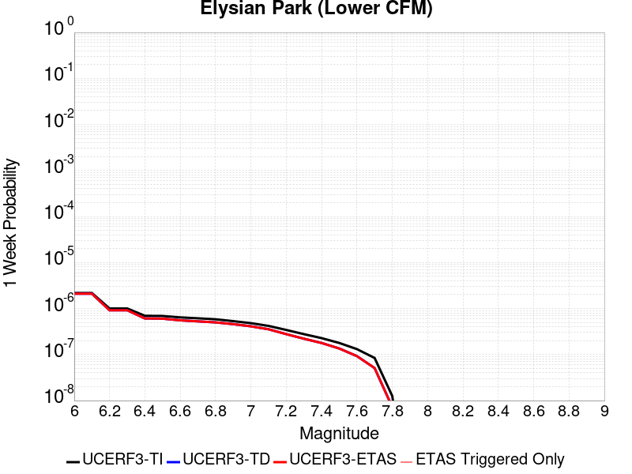 | 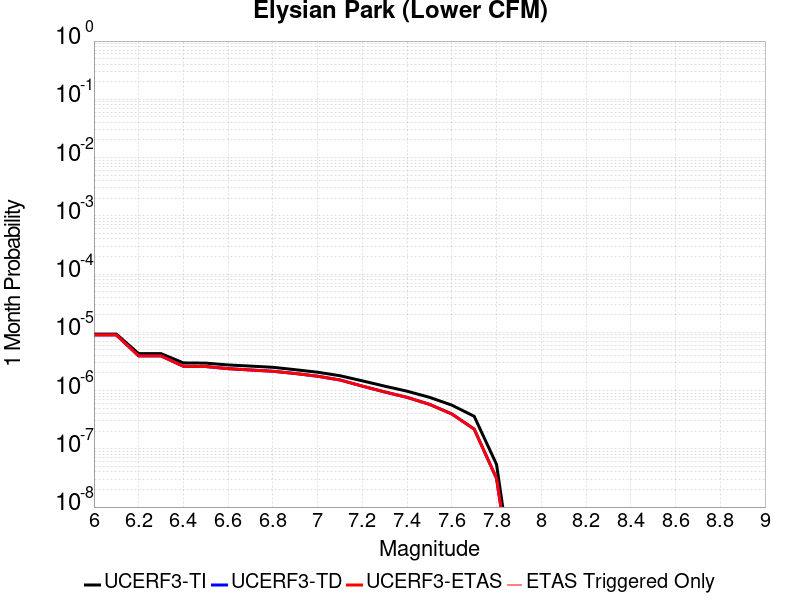 | 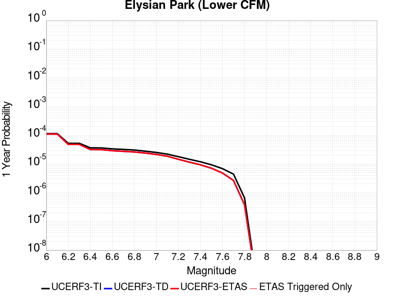 | 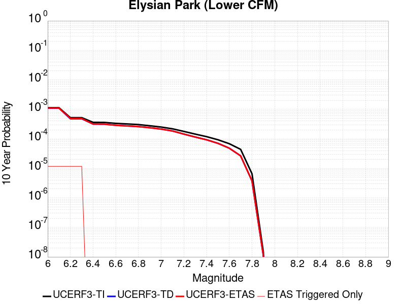 |

| Magnitude | 1 wk TI Prob | 1 wk TD Prob | 1 wk ETAS Prob | 1 wk ETAS/TD Gain | 1 wk ETAS Triggered Only | 1 mo TI Prob | 1 mo TD Prob | 1 mo ETAS Prob | 1 mo ETAS/TD Gain | 1 mo ETAS Triggered Only | 1 yr TI Prob | 1 yr TD Prob | 1 yr ETAS Prob | 1 yr ETAS/TD Gain | 1 yr ETAS Triggered Only | 10 yr TI Prob | 10 yr TD Prob | 10 yr ETAS Prob | 10 yr ETAS/TD Gain | 10 yr ETAS Triggered Only |
|-----|-----|-----|-----|-----|-----|-----|-----|-----|-----|-----|-----|-----|-----|-----|-----|-----|-----|-----|-----|-----|
| 6.0 | 2.1766498E-6 | 2.10379E-6 | 2.10379E-6 | 1.0 | 0.0 | 9.328466E-6 | 9.016219E-6 | 9.016219E-6 | 1.0 | 0.0 | 1.1356815E-4 | 1.09768385E-4 | 1.09768385E-4 | 1.0 | 0.0 | 0.0011351013 | 0.0010972836 | 0.0011090077 | 1.0106847 | 1.1737089E-5 |
| 6.1 | 2.1766498E-6 | 2.10379E-6 | 2.10379E-6 | 1.0 | 0.0 | 9.328466E-6 | 9.016219E-6 | 9.016219E-6 | 1.0 | 0.0 | 1.1356815E-4 | 1.09768385E-4 | 1.09768385E-4 | 1.0 | 0.0 | 0.0011351013 | 0.0010972836 | 0.0011090077 | 1.0106847 | 1.1737089E-5 |
| 6.2 | 1.0031182E-6 | 9.1862177E-7 | 9.1862177E-7 | 1.0 | 0.0 | 4.299071E-6 | 3.9369447E-6 | 3.9369447E-6 | 1.0 | 0.0 | 5.2339932E-5 | 4.793135E-5 | 4.793135E-5 | 1.0 | 0.0 | 5.2327604E-4 | 4.7921992E-4 | 4.909514E-4 | 1.0244803 | 1.1737089E-5 |
| 6.3 | 1.0031182E-6 | 9.1862177E-7 | 9.1862177E-7 | 1.0 | 0.0 | 4.299071E-6 | 3.9369447E-6 | 3.9369447E-6 | 1.0 | 0.0 | 5.2339932E-5 | 4.793135E-5 | 4.793135E-5 | 1.0 | 0.0 | 5.2327604E-4 | 4.7921992E-4 | 4.909514E-4 | 1.0244803 | 1.1737089E-5 |
| 6.4 | 6.9606244E-7 | 6.091946E-7 | 6.091946E-7 | 1.0 | 0.0 | 2.9831212E-6 | 2.6108314E-6 | 2.6108314E-6 | 1.0 | 0.0 | 3.6318896E-5 | 3.178641E-5 | 3.178641E-5 | 1.0 | 0.0 | 3.6312963E-4 | 3.178189E-4 | 3.178189E-4 | 1.0 | 0.0 |
| 6.5 | 6.901879E-7 | 6.03263E-7 | 6.03263E-7 | 1.0 | 0.0 | 2.9579448E-6 | 2.5854101E-6 | 2.5854101E-6 | 1.0 | 0.0 | 3.6012385E-5 | 3.1476917E-5 | 3.1476917E-5 | 1.0 | 0.0 | 3.600655E-4 | 3.147248E-4 | 3.147248E-4 | 1.0 | 0.0 |
| 6.6 | 6.4198554E-7 | 5.5466126E-7 | 5.5466126E-7 | 1.0 | 0.0 | 2.7513638E-6 | 2.3771174E-6 | 2.3771174E-6 | 1.0 | 0.0 | 3.3497337E-5 | 2.8941022E-5 | 2.8941022E-5 | 1.0 | 0.0 | 3.349229E-4 | 2.893727E-4 | 2.893727E-4 | 1.0 | 0.0 |
| 6.7 | 6.138733E-7 | 5.26342E-7 | 5.26342E-7 | 1.0 | 0.0 | 2.6308828E-6 | 2.2557495E-6 | 2.2557495E-6 | 1.0 | 0.0 | 3.203053E-5 | 2.7463404E-5 | 2.7463404E-5 | 1.0 | 0.0 | 3.2025913E-4 | 2.7460023E-4 | 2.7460023E-4 | 1.0 | 0.0 |
| 6.8 | 5.84778E-7 | 5.00294E-7 | 5.00294E-7 | 1.0 | 0.0 | 2.506189E-6 | 2.1441151E-6 | 2.1441151E-6 | 1.0 | 0.0 | 3.0512423E-5 | 2.6104291E-5 | 2.6104291E-5 | 1.0 | 0.0 | 3.0508233E-4 | 2.6101235E-4 | 2.6101235E-4 | 1.0 | 0.0 |
| 6.9 | 5.322785E-7 | 4.5800772E-7 | 4.5800772E-7 | 1.0 | 0.0 | 2.2811914E-6 | 1.9628887E-6 | 1.9628887E-6 | 1.0 | 0.0 | 2.7773152E-5 | 2.3897908E-5 | 2.3897908E-5 | 1.0 | 0.0 | 2.7769682E-4 | 2.389535E-4 | 2.389535E-4 | 1.0 | 0.0 |
| 7.0 | 4.8147206E-7 | 4.1124116E-7 | 4.1124116E-7 | 1.0 | 0.0 | 2.06345E-6 | 1.7624608E-6 | 1.7624608E-6 | 1.0 | 0.0 | 2.5122214E-5 | 2.145775E-5 | 2.145775E-5 | 1.0 | 0.0 | 2.5119373E-4 | 2.1455686E-4 | 2.1455686E-4 | 1.0 | 0.0 |
| 7.1 | 4.1932955E-7 | 3.5455713E-7 | 3.5455713E-7 | 1.0 | 0.0 | 1.7971255E-6 | 1.5195296E-6 | 1.5195296E-6 | 1.0 | 0.0 | 2.1879783E-5 | 1.8500115E-5 | 1.8500115E-5 | 1.0 | 0.0 | 2.1877629E-4 | 1.8498581E-4 | 1.8498581E-4 | 1.0 | 0.0 |
| 7.2 | 3.426051E-7 | 2.7810324E-7 | 2.7810324E-7 | 1.0 | 0.0 | 1.4683067E-6 | 1.1918704E-6 | 1.1918704E-6 | 1.0 | 0.0 | 1.7876488E-5 | 1.4510925E-5 | 1.4510925E-5 | 1.0 | 0.0 | 1.787505E-4 | 1.4509981E-4 | 1.4509981E-4 | 1.0 | 0.0 |
| 7.3 | 2.7771645E-7 | 2.209654E-7 | 2.209654E-7 | 1.0 | 0.0 | 1.1902127E-6 | 9.469942E-7 | 9.469942E-7 | 1.0 | 0.0 | 1.4490744E-5 | 1.1529593E-5 | 1.1529593E-5 | 1.0 | 0.0 | 1.4489799E-4 | 1.1528997E-4 | 1.1528997E-4 | 1.0 | 0.0 |
| 7.4 | 2.2756493E-7 | 1.7839815E-7 | 1.7839815E-7 | 1.0 | 0.0 | 9.752779E-7 | 7.6456325E-7 | 7.6456325E-7 | 1.0 | 0.0 | 1.1873944E-5 | 9.308518E-6 | 9.308518E-6 | 1.0 | 0.0 | 1.18733085E-4 | 9.30813E-5 | 9.30813E-5 | 1.0 | 0.0 |
| 7.5 | 1.7874558E-7 | 1.3542729E-7 | 1.3542729E-7 | 1.0 | 0.0 | 7.660522E-7 | 5.804025E-7 | 5.804025E-7 | 1.0 | 0.0 | 9.326646E-6 | 7.0663777E-6 | 7.0663777E-6 | 1.0 | 0.0 | 9.326255E-5 | 7.066155E-5 | 7.066155E-5 | 1.0 | 0.0 |
| 7.6 | 1.3124549E-7 | 9.250854E-8 | 9.250854E-8 | 1.0 | 0.0 | 5.624805E-7 | 3.964651E-7 | 3.964651E-7 | 1.0 | 0.0 | 6.8481786E-6 | 4.826952E-6 | 4.826952E-6 | 1.0 | 0.0 | 6.8479676E-5 | 4.8268485E-5 | 4.8268485E-5 | 1.0 | 0.0 |
| 7.7 | 8.439993E-8 | 5.090022E-8 | 5.090022E-8 | 1.0 | 0.0 | 3.6171392E-7 | 2.1814377E-7 | 2.1814377E-7 | 1.0 | 0.0 | 4.403858E-6 | 2.6558973E-6 | 2.6558973E-6 | 1.0 | 0.0 | 4.4037708E-5 | 2.655867E-5 | 2.655867E-5 | 1.0 | 0.0 |
| 7.8 | 1.2591407E-8 | 7.227629E-9 | 7.227629E-9 | 1.0 | 0.0 | 5.3963173E-8 | 3.0975556E-8 | 3.0975556E-8 | 1.0 | 0.0 | 6.570014E-7 | 3.7712732E-7 | 3.7712732E-7 | 1.0 | 0.0 | 6.5699946E-6 | 3.771267E-6 | 3.771267E-6 | 1.0 | 0.0 |
| 7.9 | 2.8324232E-11 | 2.1406099E-11 | 2.1406099E-11 | 1.0 | 0.0 | 1.2138957E-10 | 9.174017E-11 | 9.174017E-11 | 1.0 | 0.0 | 1.4779177E-9 | 1.1169362E-9 | 1.1169362E-9 | 1.0 | 0.0 | 1.4779177E-8 | 1.1169361E-8 | 1.1169361E-8 | 1.0 | 0.0 |

## Elsinore (Coyote Mountains)
*[(top)](#table-of-contents)*

| 1 Week | 1 Month | 1 Year | 10 Year |
|-----|-----|-----|-----|
|  | 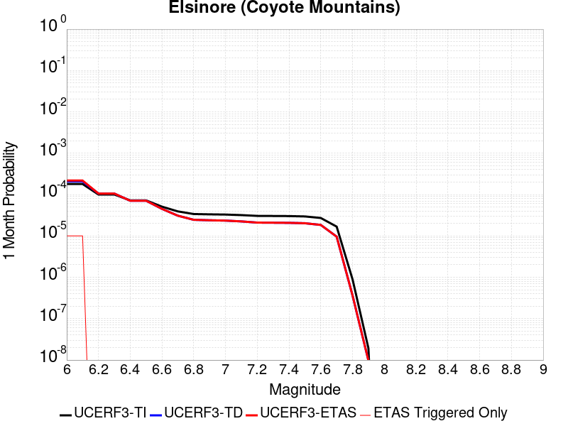 | 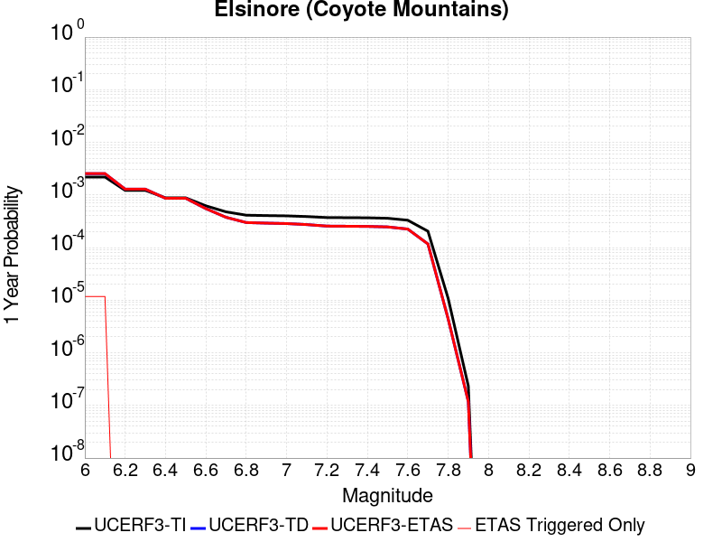 | 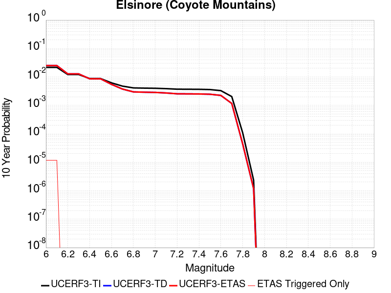 |

| Magnitude | 1 wk TI Prob | 1 wk TD Prob | 1 wk ETAS Prob | 1 wk ETAS/TD Gain | 1 wk ETAS Triggered Only | 1 mo TI Prob | 1 mo TD Prob | 1 mo ETAS Prob | 1 mo ETAS/TD Gain | 1 mo ETAS Triggered Only | 1 yr TI Prob | 1 yr TD Prob | 1 yr ETAS Prob | 1 yr ETAS/TD Gain | 1 yr ETAS Triggered Only | 10 yr TI Prob | 10 yr TD Prob | 10 yr ETAS Prob | 10 yr ETAS/TD Gain | 10 yr ETAS Triggered Only |
|-----|-----|-----|-----|-----|-----|-----|-----|-----|-----|-----|-----|-----|-----|-----|-----|-----|-----|-----|-----|-----|
| 6.0 | 4.20513E-5 | 4.8631882E-5 | 4.8631882E-5 | 1.0 | 0.0 | 1.8020741E-4 | 2.0840895E-4 | 2.201436E-4 | 1.0563059 | 1.1737089E-5 | 0.0021918174 | 0.002535 | 0.0025467074 | 1.0046183 | 1.1737089E-5 | 0.021703249 | 0.025111282 | 0.025122724 | 1.0004556 | 1.1737089E-5 |
| 6.1 | 4.20513E-5 | 4.8631882E-5 | 4.8631882E-5 | 1.0 | 0.0 | 1.8020741E-4 | 2.0840895E-4 | 2.201436E-4 | 1.0563059 | 1.1737089E-5 | 0.0021918174 | 0.002535 | 0.0025467074 | 1.0046183 | 1.1737089E-5 | 0.021703249 | 0.025111282 | 0.025122724 | 1.0004556 | 1.1737089E-5 |
| 6.2 | 2.3413893E-5 | 2.469566E-5 | 2.469566E-5 | 1.0 | 0.0 | 1.0034139E-4 | 1.0583479E-4 | 1.0583479E-4 | 1.0 | 0.0 | 0.0012209718 | 0.0012878707 | 0.0012878707 | 1.0 | 0.0 | 0.012142851 | 0.01281264 | 0.01281264 | 1.0 | 0.0 |
| 6.3 | 2.3413893E-5 | 2.469566E-5 | 2.469566E-5 | 1.0 | 0.0 | 1.0034139E-4 | 1.0583479E-4 | 1.0583479E-4 | 1.0 | 0.0 | 0.0012209718 | 0.0012878707 | 0.0012878707 | 1.0 | 0.0 | 0.012142851 | 0.01281264 | 0.01281264 | 1.0 | 0.0 |
| 6.4 | 1.6894814E-5 | 1.6568361E-5 | 1.6568361E-5 | 1.0 | 0.0 | 7.240433E-5 | 7.1005554E-5 | 7.1005554E-5 | 1.0 | 0.0 | 8.811662E-4 | 8.6418656E-4 | 8.6418656E-4 | 1.0 | 0.0 | 0.0087768035 | 0.00861194 | 0.00861194 | 1.0 | 0.0 |
| 6.5 | 1.6894814E-5 | 1.6568361E-5 | 1.6568361E-5 | 1.0 | 0.0 | 7.240433E-5 | 7.1005554E-5 | 7.1005554E-5 | 1.0 | 0.0 | 8.811662E-4 | 8.6418656E-4 | 8.6418656E-4 | 1.0 | 0.0 | 0.0087768035 | 0.00861194 | 0.00861194 | 1.0 | 0.0 |
| 6.6 | 1.1910969E-5 | 1.0530774E-5 | 1.0530774E-5 | 1.0 | 0.0 | 5.1046012E-5 | 4.5131183E-5 | 4.5131183E-5 | 1.0 | 0.0 | 6.21308E-4 | 5.4934516E-4 | 5.4934516E-4 | 1.0 | 0.0 | 0.0061957375 | 0.005481174 | 0.005481174 | 1.0 | 0.0 |
| 6.7 | 9.1486E-6 | 7.2028593E-6 | 7.2028593E-6 | 1.0 | 0.0 | 3.9207694E-5 | 3.0869054E-5 | 3.0869054E-5 | 1.0 | 0.0 | 4.7724912E-4 | 3.757697E-4 | 3.757697E-4 | 1.0 | 0.0 | 0.0047622547 | 0.0037517229 | 0.0037517229 | 1.0 | 0.0 |
| 6.8 | 7.90441E-6 | 5.7290276E-6 | 5.7290276E-6 | 1.0 | 0.0 | 3.3875604E-5 | 2.4552752E-5 | 2.4552752E-5 | 1.0 | 0.0 | 4.1235742E-4 | 2.9889002E-4 | 2.9889002E-4 | 1.0 | 0.0 | 0.0041159308 | 0.002985009 | 0.002985009 | 1.0 | 0.0 |
| 6.9 | 7.77015E-6 | 5.582982E-6 | 5.582982E-6 | 1.0 | 0.0 | 3.3300217E-5 | 2.3926852E-5 | 2.3926852E-5 | 1.0 | 0.0 | 4.0535472E-4 | 2.9127175E-4 | 2.9127175E-4 | 1.0 | 0.0 | 0.004046161 | 0.002909027 | 0.002909027 | 1.0 | 0.0 |
| 7.0 | 7.675798E-6 | 5.47984E-6 | 5.47984E-6 | 1.0 | 0.0 | 3.289586E-5 | 2.3484827E-5 | 2.3484827E-5 | 1.0 | 0.0 | 4.004335E-4 | 2.858915E-4 | 2.858915E-4 | 1.0 | 0.0 | 0.003997127 | 0.0028553635 | 0.0028553635 | 1.0 | 0.0 |
| 7.1 | 7.447814E-6 | 5.238714E-6 | 5.238714E-6 | 1.0 | 0.0 | 3.191881E-5 | 2.2451446E-5 | 2.2451446E-5 | 1.0 | 0.0 | 3.8854225E-4 | 2.7331332E-4 | 2.7331332E-4 | 1.0 | 0.0 | 0.003878636 | 0.0027298962 | 0.0027298962 | 1.0 | 0.0 |
| 7.2 | 7.128185E-6 | 4.905372E-6 | 4.905372E-6 | 1.0 | 0.0 | 3.0549007E-5 | 2.102286E-5 | 2.102286E-5 | 1.0 | 0.0 | 3.7187067E-4 | 2.5592445E-4 | 2.5592445E-4 | 1.0 | 0.0 | 0.00371249 | 0.0025564157 | 0.0025564157 | 1.0 | 0.0 |
| 7.3 | 7.0913875E-6 | 4.874047E-6 | 4.874047E-6 | 1.0 | 0.0 | 3.0391306E-5 | 2.0888614E-5 | 2.0888614E-5 | 1.0 | 0.0 | 3.6995133E-4 | 2.5429038E-4 | 2.5429038E-4 | 1.0 | 0.0 | 0.0036933604 | 0.0025401122 | 0.0025401122 | 1.0 | 0.0 |
| 7.4 | 7.051521E-6 | 4.837899E-6 | 4.837899E-6 | 1.0 | 0.0 | 3.0220453E-5 | 2.0733693E-5 | 2.0733693E-5 | 1.0 | 0.0 | 3.6787192E-4 | 2.5240466E-4 | 2.5240466E-4 | 1.0 | 0.0 | 0.0036726352 | 0.0025212981 | 0.0025212981 | 1.0 | 0.0 |
| 7.5 | 6.910666E-6 | 4.733448E-6 | 4.733448E-6 | 1.0 | 0.0 | 2.9616802E-5 | 2.0286056E-5 | 2.0286056E-5 | 1.0 | 0.0 | 3.605249E-4 | 2.4695593E-4 | 2.4695593E-4 | 1.0 | 0.0 | 0.0035994058 | 0.0024669329 | 0.0024669329 | 1.0 | 0.0 |
| 7.6 | 6.341753E-6 | 4.3065565E-6 | 4.3065565E-6 | 1.0 | 0.0 | 2.7178658E-5 | 1.8456547E-5 | 1.8456547E-5 | 1.0 | 0.0 | 3.3084993E-4 | 2.2468645E-4 | 2.2468645E-4 | 1.0 | 0.0 | 0.0033035777 | 0.002244708 | 0.002244708 | 1.0 | 0.0 |
| 7.7 | 3.9205916E-6 | 2.2439415E-6 | 2.2439415E-6 | 1.0 | 0.0 | 1.6802427E-5 | 9.616861E-6 | 9.616861E-6 | 1.0 | 0.0 | 2.0455034E-4 | 1.1707973E-4 | 1.1707973E-4 | 1.0 | 0.0 | 0.0020436216 | 0.0011702535 | 0.0011702535 | 1.0 | 0.0 |
| 7.8 | 2.0846227E-7 | 8.486417E-8 | 8.486417E-8 | 1.0 | 0.0 | 8.9340944E-7 | 3.6370355E-7 | 3.6370355E-7 | 1.0 | 0.0 | 1.0877206E-5 | 4.428085E-6 | 4.428085E-6 | 1.0 | 0.0 | 1.0876673E-4 | 4.4280296E-5 | 4.4280296E-5 | 1.0 | 0.0 |
| 7.9 | 4.4969806E-9 | 2.2691855E-9 | 2.2691855E-9 | 1.0 | 0.0 | 1.9272775E-8 | 9.72508E-9 | 9.72508E-9 | 1.0 | 0.0 | 2.3464601E-7 | 1.18402845E-7 | 1.18402845E-7 | 1.0 | 0.0 | 2.3464577E-6 | 1.184028E-6 | 1.184028E-6 | 1.0 | 0.0 |

## Calaveras (Central) 2011 CFM
*[(top)](#table-of-contents)*

| 1 Week | 1 Month | 1 Year | 10 Year |
|-----|-----|-----|-----|
|  |  | 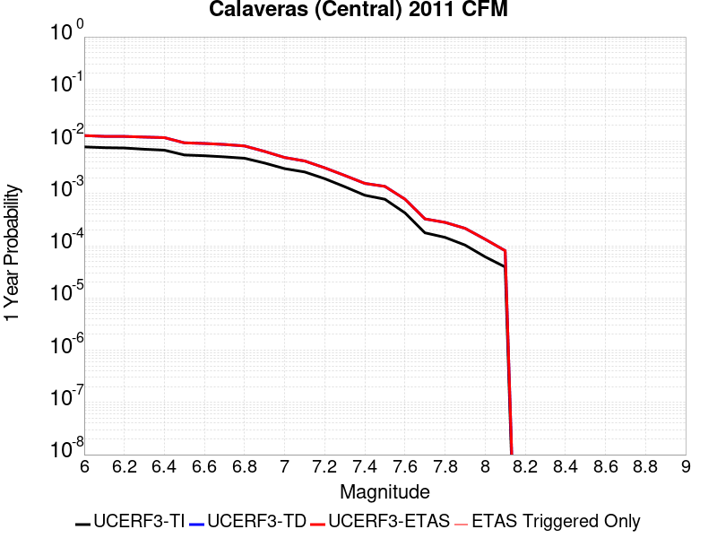 | 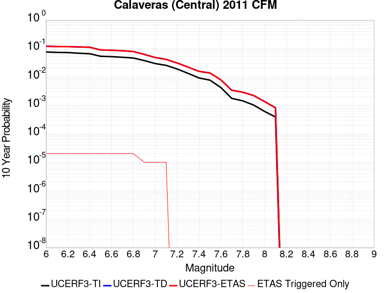 |

| Magnitude | 1 wk TI Prob | 1 wk TD Prob | 1 wk ETAS Prob | 1 wk ETAS/TD Gain | 1 wk ETAS Triggered Only | 1 mo TI Prob | 1 mo TD Prob | 1 mo ETAS Prob | 1 mo ETAS/TD Gain | 1 mo ETAS Triggered Only | 1 yr TI Prob | 1 yr TD Prob | 1 yr ETAS Prob | 1 yr ETAS/TD Gain | 1 yr ETAS Triggered Only | 10 yr TI Prob | 10 yr TD Prob | 10 yr ETAS Prob | 10 yr ETAS/TD Gain | 10 yr ETAS Triggered Only |
|-----|-----|-----|-----|-----|-----|-----|-----|-----|-----|-----|-----|-----|-----|-----|-----|-----|-----|-----|-----|-----|
| 6.0 | 1.5010907E-4 | 2.481574E-4 | 2.481574E-4 | 1.0 | 0.0 | 6.4316596E-4 | 0.0010621005 | 0.0010621005 | 1.0 | 0.0 | 0.0078024664 | 0.012850073 | 0.012850073 | 1.0 | 0.0 | 0.07534136 | 0.120401435 | 0.12041175 | 1.0000857 | 1.1737089E-5 |
| 6.1 | 1.4521465E-4 | 2.397987E-4 | 2.397987E-4 | 1.0 | 0.0 | 6.222001E-4 | 0.0010263061 | 0.0010263061 | 1.0 | 0.0 | 0.0075490056 | 0.012419341 | 0.012419341 | 1.0 | 0.0 | 0.07297657 | 0.11667323 | 0.116683595 | 1.0000888 | 1.1737089E-5 |
| 6.2 | 1.429998E-4 | 2.3911126E-4 | 2.3911126E-4 | 1.0 | 0.0 | 6.127123E-4 | 0.0010233623 | 0.0010233623 | 1.0 | 0.0 | 0.007434286 | 0.01238394 | 0.01238394 | 1.0 | 0.0 | 0.07190444 | 0.1163272 | 0.11633757 | 1.0000892 | 1.1737089E-5 |
| 6.3 | 1.3536277E-4 | 2.3242626E-4 | 2.3242626E-4 | 1.0 | 0.0 | 5.799972E-4 | 9.947343E-4 | 9.947343E-4 | 1.0 | 0.0 | 0.0070386264 | 0.012040132 | 0.012040132 | 1.0 | 0.0 | 0.0681982 | 0.11323977 | 0.11325018 | 1.0000919 | 1.1737089E-5 |
| 6.4 | 1.2993296E-4 | 2.2666177E-4 | 2.2666177E-4 | 1.0 | 0.0 | 5.5673666E-4 | 9.700479E-4 | 9.700479E-4 | 1.0 | 0.0 | 0.006757223 | 0.011742937 | 0.011742937 | 1.0 | 0.0 | 0.06555412 | 0.11051771 | 0.11052815 | 1.0000944 | 1.1737089E-5 |
| 6.5 | 1.0498927E-4 | 1.7981697E-4 | 1.7981697E-4 | 1.0 | 0.0 | 4.498764E-4 | 7.704157E-4 | 7.704157E-4 | 1.0 | 0.0 | 0.005463498 | 0.00933924 | 0.00933924 | 1.0 | 0.0 | 0.053311124 | 0.089199215 | 0.08920991 | 1.0001198 | 1.1737089E-5 |
| 6.6 | 1.0157505E-4 | 1.7469203E-4 | 1.7469203E-4 | 1.0 | 0.0 | 4.35249E-4 | 7.484645E-4 | 7.484645E-4 | 1.0 | 0.0 | 0.0052862884 | 0.009074297 | 0.009074297 | 1.0 | 0.0 | 0.05162293 | 0.08677671 | 0.08678743 | 1.0001235 | 1.1737089E-5 |
| 6.7 | 9.660386E-5 | 1.6728524E-4 | 1.6728524E-4 | 1.0 | 0.0 | 4.1395082E-4 | 7.1673887E-4 | 7.1673887E-4 | 1.0 | 0.0 | 0.0050282106 | 0.008691208 | 0.008691208 | 1.0 | 0.0 | 0.049159497 | 0.083266065 | 0.08327682 | 1.0001292 | 1.1737089E-5 |
| 6.8 | 9.089927E-5 | 1.5643016E-4 | 1.5643016E-4 | 1.0 | 0.0 | 3.8951015E-4 | 6.702439E-4 | 6.702439E-4 | 1.0 | 0.0 | 0.0047319788 | 0.008129478 | 0.008129478 | 1.0 | 0.0 | 0.046324775 | 0.078159414 | 0.07817023 | 1.0001384 | 1.1737089E-5 |
| 6.9 | 7.353187E-5 | 1.2295354E-4 | 1.2295354E-4 | 1.0 | 0.0 | 3.150985E-4 | 5.2683795E-4 | 5.2683795E-4 | 1.0 | 0.0 | 0.0038295772 | 0.006395508 | 0.006395508 | 1.0 | 0.0 | 0.037642512 | 0.062187865 | 0.06219887 | 1.000177 | 1.1737089E-5 |
| 7.0 | 5.746064E-5 | 9.3887444E-5 | 9.3887444E-5 | 1.0 | 0.0 | 2.4623662E-4 | 4.0231308E-4 | 4.0231308E-4 | 1.0 | 0.0 | 0.0029938098 | 0.004887232 | 0.004887232 | 1.0 | 0.0 | 0.02953797 | 0.04798685 | 0.047998026 | 1.0002328 | 1.1737089E-5 |
| 7.1 | 4.9557195E-5 | 8.052461E-5 | 8.052461E-5 | 1.0 | 0.0 | 2.123707E-4 | 3.4506017E-4 | 3.4506017E-4 | 1.0 | 0.0 | 0.0025825473 | 0.0041930773 | 0.0041930773 | 1.0 | 0.0 | 0.0255274 | 0.041373078 | 0.041384332 | 1.0002719 | 1.1737089E-5 |
| 7.2 | 3.687595E-5 | 5.9524526E-5 | 5.9524526E-5 | 1.0 | 0.0 | 1.5803022E-4 | 2.5508032E-4 | 2.5508032E-4 | 1.0 | 0.0 | 0.0019223199 | 0.0031012094 | 0.0031012094 | 1.0 | 0.0 | 0.01905776 | 0.030883716 | 0.030883716 | 1.0 | 0.0 |
| 7.3 | 2.5846984E-5 | 4.247213E-5 | 4.247213E-5 | 1.0 | 0.0 | 1.1076809E-4 | 1.8201082E-4 | 1.8201082E-4 | 1.0 | 0.0 | 0.0013477671 | 0.002213747 | 0.002213747 | 1.0 | 0.0 | 0.013396223 | 0.02217554 | 0.02217554 | 1.0 | 0.0 |
| 7.4 | 1.7747854E-5 | 2.9936204E-5 | 2.9936204E-5 | 1.0 | 0.0 | 7.6060016E-5 | 1.2829172E-4 | 1.2829172E-4 | 1.0 | 0.0 | 9.2563726E-4 | 0.0015608355 | 0.0015608355 | 1.0 | 0.0 | 0.009217911 | 0.015709236 | 0.015709236 | 1.0 | 0.0 |
| 7.5 | 1.4883479E-5 | 2.6243379E-5 | 2.6243379E-5 | 1.0 | 0.0 | 6.378478E-5 | 1.1246678E-4 | 1.1246678E-4 | 1.0 | 0.0 | 7.76303E-4 | 0.0013684258 | 0.0013684258 | 1.0 | 0.0 | 0.0077359667 | 0.013802425 | 0.013802425 | 1.0 | 0.0 |
| 7.6 | 8.166975E-6 | 1.4963478E-5 | 1.4963478E-5 | 1.0 | 0.0 | 3.5000852E-5 | 6.412763E-5 | 6.412763E-5 | 1.0 | 0.0 | 4.2605202E-4 | 7.804755E-4 | 7.804755E-4 | 1.0 | 0.0 | 0.004252361 | 0.00793984 | 0.00793984 | 1.0 | 0.0 |
| 7.7 | 3.3858064E-6 | 6.253914E-6 | 6.253914E-6 | 1.0 | 0.0 | 1.4510518E-5 | 2.6802214E-5 | 2.6802214E-5 | 1.0 | 0.0 | 1.7665124E-4 | 3.2626814E-4 | 3.2626814E-4 | 1.0 | 0.0 | 0.0017651088 | 0.0033882293 | 0.0033882293 | 1.0 | 0.0 |
| 7.8 | 2.7721615E-6 | 5.3663807E-6 | 5.3663807E-6 | 1.0 | 0.0 | 1.1880637E-5 | 2.2998573E-5 | 2.2998573E-5 | 1.0 | 0.0 | 1.4463716E-4 | 2.799717E-4 | 2.799717E-4 | 1.0 | 0.0 | 0.0014454306 | 0.0029074624 | 0.0029074624 | 1.0 | 0.0 |
| 7.9 | 1.9736292E-6 | 4.1284193E-6 | 4.1284193E-6 | 1.0 | 0.0 | 8.4583835E-6 | 1.7693106E-5 | 1.7693106E-5 | 1.0 | 0.0 | 1.0297595E-4 | 2.1539231E-4 | 2.1539231E-4 | 1.0 | 0.0 | 0.0010292825 | 0.0022236116 | 0.0022236116 | 1.0 | 0.0 |
| 8.0 | 1.1767289E-6 | 2.5544743E-6 | 2.5544743E-6 | 1.0 | 0.0 | 5.0431145E-6 | 1.0947701E-5 | 1.0947701E-5 | 1.0 | 0.0 | 6.139818E-5 | 1.3328013E-4 | 1.3328013E-4 | 1.0 | 0.0 | 6.1381224E-4 | 0.0013660848 | 0.0013660848 | 1.0 | 0.0 |
| 8.1 | 7.5112825E-7 | 1.5409794E-6 | 1.5409794E-6 | 1.0 | 0.0 | 3.2191172E-6 | 6.6041807E-6 | 6.6041807E-6 | 1.0 | 0.0 | 3.9192048E-5 | 8.0402955E-5 | 8.0402955E-5 | 1.0 | 0.0 | 3.9185135E-4 | 8.235564E-4 | 8.235564E-4 | 1.0 | 0.0 |

## San Jacinto (Clark) rev
*[(top)](#table-of-contents)*

| 1 Week | 1 Month | 1 Year | 10 Year |
|-----|-----|-----|-----|
| 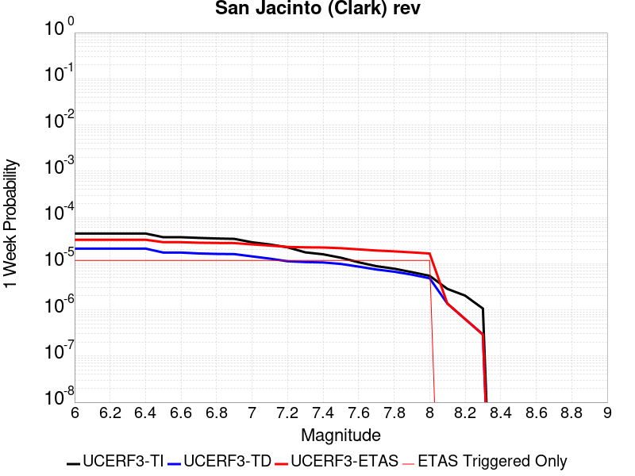 | 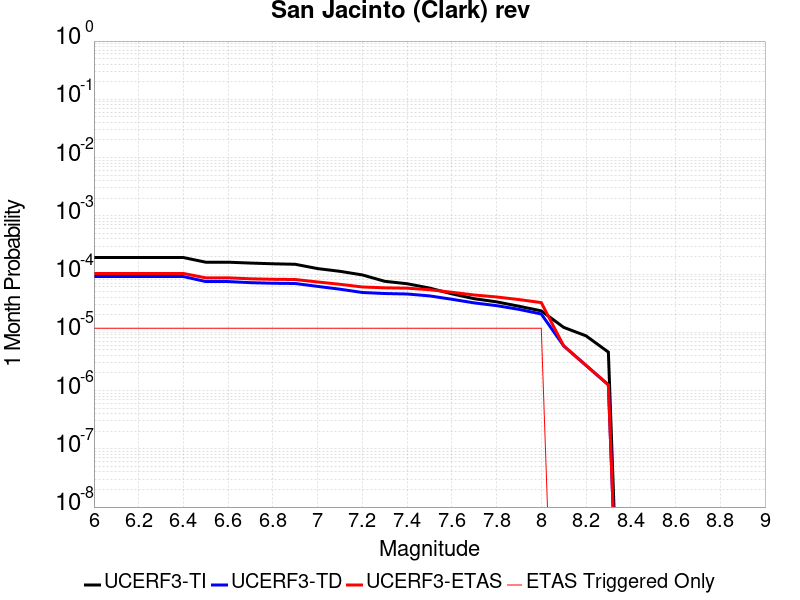 | 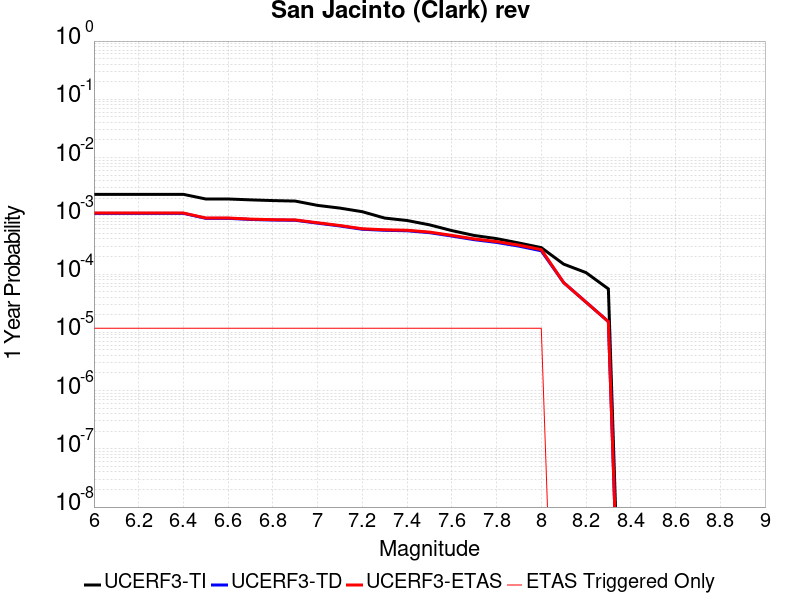 | 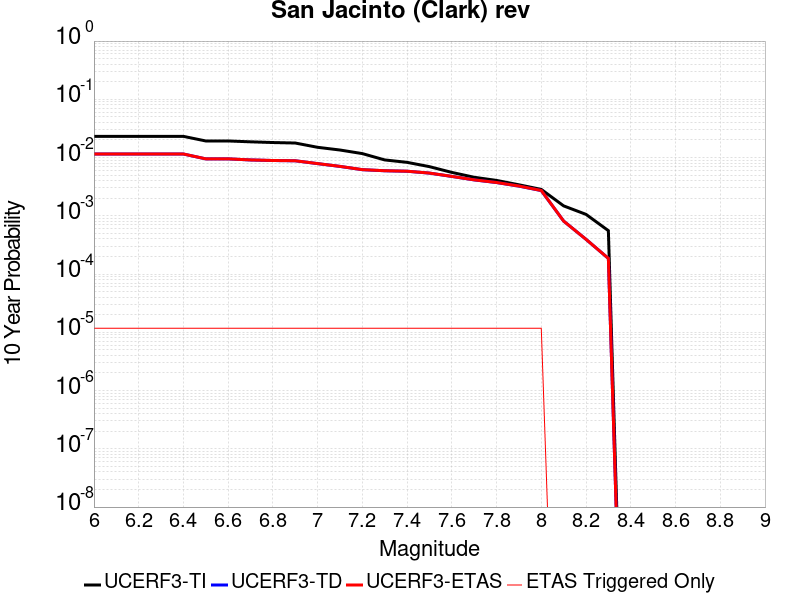 |

| Magnitude | 1 wk TI Prob | 1 wk TD Prob | 1 wk ETAS Prob | 1 wk ETAS/TD Gain | 1 wk ETAS Triggered Only | 1 mo TI Prob | 1 mo TD Prob | 1 mo ETAS Prob | 1 mo ETAS/TD Gain | 1 mo ETAS Triggered Only | 1 yr TI Prob | 1 yr TD Prob | 1 yr ETAS Prob | 1 yr ETAS/TD Gain | 1 yr ETAS Triggered Only | 10 yr TI Prob | 10 yr TD Prob | 10 yr ETAS Prob | 10 yr ETAS/TD Gain | 10 yr ETAS Triggered Only |
|-----|-----|-----|-----|-----|-----|-----|-----|-----|-----|-----|-----|-----|-----|-----|-----|-----|-----|-----|-----|-----|
| 6.0 | 4.482615E-5 | 2.1154196E-5 | 3.2891036E-5 | 1.5548233 | 1.1737089E-5 | 1.9209793E-4 | 9.065773E-5 | 1.0239376E-4 | 1.1294543 | 1.1737089E-5 | 0.0023362834 | 0.0011032083 | 0.0011149325 | 1.0106273 | 1.1737089E-5 | 0.02311874 | 0.011503847 | 0.011515449 | 1.0010085 | 1.1737089E-5 |
| 6.1 | 4.482615E-5 | 2.1154196E-5 | 3.2891036E-5 | 1.5548233 | 1.1737089E-5 | 1.9209793E-4 | 9.065773E-5 | 1.0239376E-4 | 1.1294543 | 1.1737089E-5 | 0.0023362834 | 0.0011032083 | 0.0011149325 | 1.0106273 | 1.1737089E-5 | 0.02311874 | 0.011503847 | 0.011515449 | 1.0010085 | 1.1737089E-5 |
| 6.2 | 4.482615E-5 | 2.1154196E-5 | 3.2891036E-5 | 1.5548233 | 1.1737089E-5 | 1.9209793E-4 | 9.065773E-5 | 1.0239376E-4 | 1.1294543 | 1.1737089E-5 | 0.0023362834 | 0.0011032083 | 0.0011149325 | 1.0106273 | 1.1737089E-5 | 0.02311874 | 0.011503847 | 0.011515449 | 1.0010085 | 1.1737089E-5 |
| 6.3 | 4.482615E-5 | 2.1154196E-5 | 3.2891036E-5 | 1.5548233 | 1.1737089E-5 | 1.9209793E-4 | 9.065773E-5 | 1.0239376E-4 | 1.1294543 | 1.1737089E-5 | 0.0023362834 | 0.0011032083 | 0.0011149325 | 1.0106273 | 1.1737089E-5 | 0.02311874 | 0.011503847 | 0.011515449 | 1.0010085 | 1.1737089E-5 |
| 6.4 | 4.482615E-5 | 2.1154196E-5 | 3.2891036E-5 | 1.5548233 | 1.1737089E-5 | 1.9209793E-4 | 9.065773E-5 | 1.0239376E-4 | 1.1294543 | 1.1737089E-5 | 0.0023362834 | 0.0011032083 | 0.0011149325 | 1.0106273 | 1.1737089E-5 | 0.02311874 | 0.011503847 | 0.011515449 | 1.0010085 | 1.1737089E-5 |
| 6.5 | 3.7294863E-5 | 1.7356087E-5 | 2.9092973E-5 | 1.6762403 | 1.1737089E-5 | 1.5982533E-4 | 7.438113E-5 | 8.6117354E-5 | 1.1577848 | 1.1737089E-5 | 0.0019441366 | 9.052186E-4 | 9.1694505E-4 | 1.0129542 | 1.1737089E-5 | 0.01927216 | 0.0094941035 | 0.009505729 | 1.0012245 | 1.1737089E-5 |
| 6.6 | 3.7294863E-5 | 1.7356087E-5 | 2.9092973E-5 | 1.6762403 | 1.1737089E-5 | 1.5982533E-4 | 7.438113E-5 | 8.6117354E-5 | 1.1577848 | 1.1737089E-5 | 0.0019441366 | 9.052186E-4 | 9.1694505E-4 | 1.0129542 | 1.1737089E-5 | 0.01927216 | 0.0094941035 | 0.009505729 | 1.0012245 | 1.1737089E-5 |
| 6.7 | 3.6039248E-5 | 1.6604314E-5 | 2.8341206E-5 | 1.7068582 | 1.1737089E-5 | 1.5444479E-4 | 7.1159426E-5 | 8.2895676E-5 | 1.164929 | 1.1737089E-5 | 0.0018787434 | 8.6602574E-4 | 8.7775267E-4 | 1.0135411 | 1.1737089E-5 | 0.01862939 | 0.009096047 | 0.009107677 | 1.0012786 | 1.1737089E-5 |
| 6.8 | 3.5031844E-5 | 1.6232942E-5 | 2.796984E-5 | 1.7230297 | 1.1737089E-5 | 1.5012783E-4 | 6.956792E-5 | 8.130419E-5 | 1.1687024 | 1.1737089E-5 | 0.0018262739 | 8.4666436E-4 | 8.583915E-4 | 1.013851 | 1.1737089E-5 | 0.01811338 | 0.008895969 | 0.008907602 | 1.0013076 | 1.1737089E-5 |
| 6.9 | 3.435112E-5 | 1.6063195E-5 | 2.7800095E-5 | 1.7306705 | 1.1737089E-5 | 1.4721078E-4 | 6.884047E-5 | 8.057675E-5 | 1.1704853 | 1.1737089E-5 | 0.0017908178 | 8.3781447E-4 | 8.4954174E-4 | 1.0139974 | 1.1737089E-5 | 0.017764548 | 0.008804181 | 0.008815814 | 1.0013214 | 1.1737089E-5 |
| 7.0 | 2.8959772E-5 | 1.4336745E-5 | 2.6073665E-5 | 1.8186601 | 1.1737089E-5 | 1.241074E-4 | 6.144176E-5 | 7.317813E-5 | 1.1910162 | 1.1737089E-5 | 0.0015099603 | 7.477995E-4 | 7.595278E-4 | 1.0156838 | 1.1737089E-5 | 0.014997416 | 0.007868037 | 0.007879681 | 1.00148 | 1.1737089E-5 |
| 7.1 | 2.6002877E-5 | 1.2829002E-5 | 2.4565941E-5 | 1.9148754 | 1.1737089E-5 | 1.11436144E-4 | 5.498029E-5 | 6.671673E-5 | 1.2134664 | 1.1737089E-5 | 0.0013558907 | 6.691816E-4 | 6.809108E-4 | 1.0175277 | 1.1737089E-5 | 0.013476475 | 0.0070465137 | 0.0070581683 | 1.0016539 | 1.1737089E-5 |
| 7.2 | 2.2544838E-5 | 1.1262543E-5 | 2.29995E-5 | 2.042123 | 1.1737089E-5 | 9.661716E-5 | 4.8267157E-5 | 6.000368E-5 | 1.2431575 | 1.1737089E-5 | 0.001175679 | 5.874956E-4 | 5.992258E-4 | 1.0199665 | 1.1737089E-5 | 0.011694785 | 0.0061927503 | 0.0062044146 | 1.0018835 | 1.1737089E-5 |
| 7.3 | 1.75334E-5 | 1.0811715E-5 | 2.2548676E-5 | 2.0855782 | 1.1737089E-5 | 7.514098E-5 | 4.6335106E-5 | 5.807165E-5 | 1.2532971 | 1.1737089E-5 | 9.144575E-4 | 5.6398526E-4 | 5.7571573E-4 | 1.0207993 | 1.1737089E-5 | 0.009107036 | 0.0059337732 | 0.005945441 | 1.0019662 | 1.1737089E-5 |
| 7.4 | 1.5924552E-5 | 1.0611516E-5 | 2.234848E-5 | 2.106059 | 1.1737089E-5 | 6.82463E-5 | 4.547714E-5 | 5.7213696E-5 | 1.258076 | 1.1737089E-5 | 8.305819E-4 | 5.535449E-4 | 5.652755E-4 | 1.0211917 | 1.1737089E-5 | 0.008274844 | 0.0058210334 | 0.005832702 | 1.0020046 | 1.1737089E-5 |
| 7.5 | 1.3428931E-5 | 9.8519E-6 | 2.1588874E-5 | 2.1913412 | 1.1737089E-5 | 5.7551293E-5 | 4.2221753E-5 | 5.3958345E-5 | 1.2779751 | 1.1737089E-5 | 7.004617E-4 | 5.1392964E-4 | 5.256607E-4 | 1.0228262 | 1.1737089E-5 | 0.006982579 | 0.0054066023 | 0.005418276 | 1.0021591 | 1.1737089E-5 |
| 7.6 | 1.0688787E-5 | 8.614839E-6 | 2.0351828E-5 | 2.362415 | 1.1737089E-5 | 4.5808283E-5 | 3.692022E-5 | 4.865688E-5 | 1.3178923 | 1.1737089E-5 | 5.5757316E-4 | 4.4941145E-4 | 4.6114327E-4 | 1.0261048 | 1.1737089E-5 | 0.005561762 | 0.0047416524 | 0.0047533335 | 1.0024636 | 1.1737089E-5 |
| 7.7 | 8.81236E-6 | 7.4680274E-6 | 1.9205028E-5 | 2.5716333 | 1.1737089E-5 | 3.776671E-5 | 3.2005442E-5 | 4.3742155E-5 | 1.36671 | 1.1737089E-5 | 4.597127E-4 | 3.8959677E-4 | 4.0132928E-4 | 1.0301145 | 1.1737089E-5 | 0.0045876284 | 0.0041346536 | 0.004146342 | 1.0028269 | 1.1737089E-5 |
| 7.8 | 7.780431E-6 | 6.696579E-6 | 1.843359E-5 | 2.7526875 | 1.1737089E-5 | 3.3344273E-5 | 2.8699309E-5 | 4.043606E-5 | 1.4089559 | 1.1737089E-5 | 4.0589093E-4 | 3.4935825E-4 | 3.6109125E-4 | 1.0335844 | 1.1737089E-5 | 0.0040515037 | 0.0037227906 | 0.003734484 | 1.003141 | 1.1737089E-5 |
| 7.9 | 6.5437994E-6 | 5.780382E-6 | 1.7517403E-5 | 3.0304925 | 1.1737089E-5 | 2.8044553E-5 | 2.477283E-5 | 3.6509628E-5 | 1.473777 | 1.1737089E-5 | 3.4138895E-4 | 3.0156763E-4 | 3.133012E-4 | 1.0389085 | 1.1737089E-5 | 0.0034086495 | 0.0032344845 | 0.0032461837 | 1.003617 | 1.1737089E-5 |
| 8.0 | 5.4488164E-6 | 4.8133406E-6 | 1.6550373E-5 | 3.438438 | 1.1737089E-5 | 2.3351862E-5 | 2.062844E-5 | 3.236529E-5 | 1.5689644 | 1.1737089E-5 | 2.8427184E-4 | 2.5112246E-4 | 2.628566E-4 | 1.0467268 | 1.1737089E-5 | 0.0028390845 | 0.002710839 | 0.0027225444 | 1.004318 | 1.1737089E-5 |
| 8.1 | 2.8397242E-6 | 1.3670389E-6 | 1.3670389E-6 | 1.0 | 0.0 | 1.217019E-5 | 5.858725E-6 | 5.858725E-6 | 1.0 | 0.0 | 1.4816198E-4 | 7.132765E-5 | 7.132765E-5 | 1.0 | 0.0 | 0.0014806325 | 8.115382E-4 | 8.115382E-4 | 1.0 | 0.0 |
| 8.2 | 2.030244E-6 | 6.318974E-7 | 6.318974E-7 | 1.0 | 0.0 | 8.701017E-6 | 2.708129E-6 | 2.708129E-6 | 1.0 | 0.0 | 1.05929736E-4 | 3.2970976E-5 | 3.2970976E-5 | 1.0 | 0.0 | 0.0010587925 | 3.9486602E-4 | 3.9486602E-4 | 1.0 | 0.0 |
| 8.3 | 1.0659804E-6 | 2.9250086E-7 | 2.9250086E-7 | 1.0 | 0.0 | 4.568479E-6 | 1.2535745E-6 | 1.2535745E-6 | 1.0 | 0.0 | 5.5619817E-5 | 1.5262167E-5 | 1.5262167E-5 | 1.0 | 0.0 | 5.5605895E-4 | 1.8566217E-4 | 1.8566217E-4 | 1.0 | 0.0 |

## Antelope Valley 2011
*[(top)](#table-of-contents)*

| 1 Week | 1 Month | 1 Year | 10 Year |
|-----|-----|-----|-----|
| 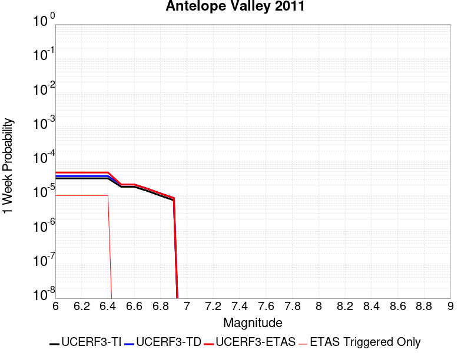 | 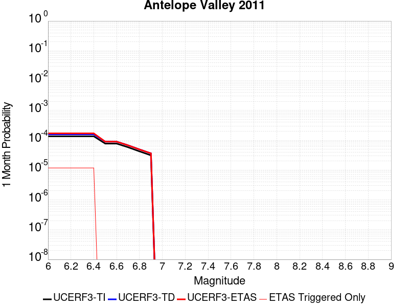 | 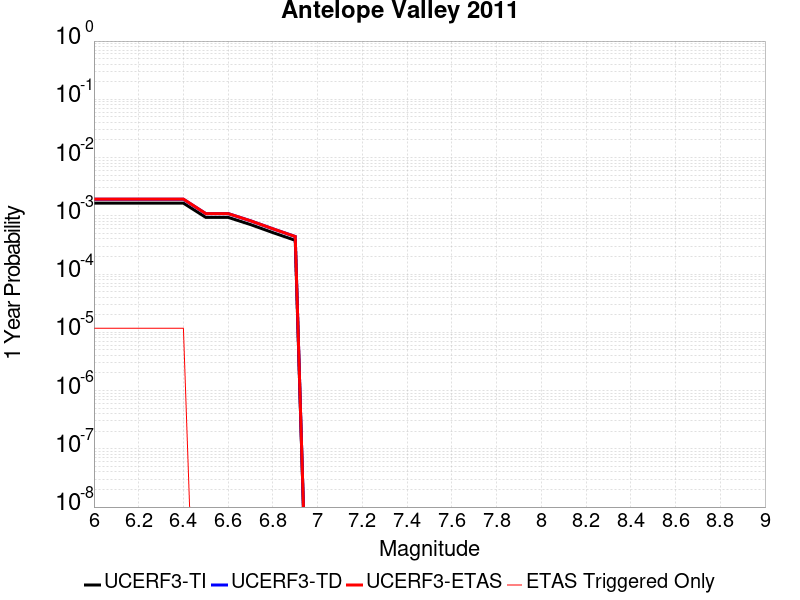 | 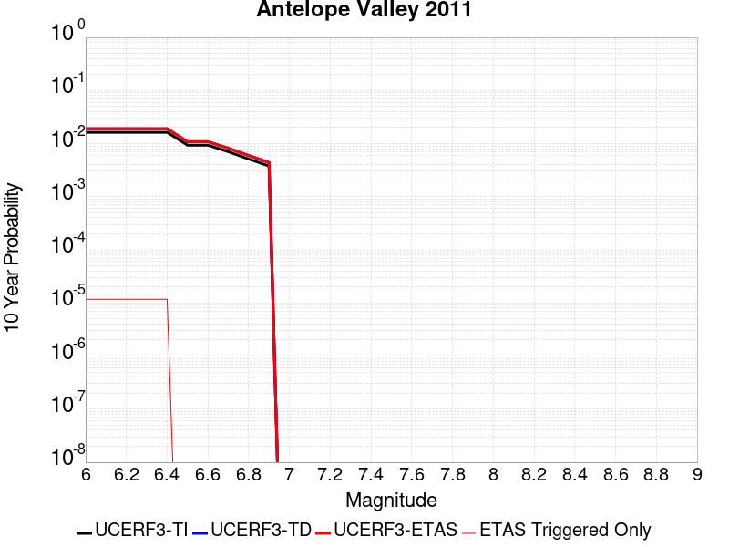 |

| Magnitude | 1 wk TI Prob | 1 wk TD Prob | 1 wk ETAS Prob | 1 wk ETAS/TD Gain | 1 wk ETAS Triggered Only | 1 mo TI Prob | 1 mo TD Prob | 1 mo ETAS Prob | 1 mo ETAS/TD Gain | 1 mo ETAS Triggered Only | 1 yr TI Prob | 1 yr TD Prob | 1 yr ETAS Prob | 1 yr ETAS/TD Gain | 1 yr ETAS Triggered Only | 10 yr TI Prob | 10 yr TD Prob | 10 yr ETAS Prob | 10 yr ETAS/TD Gain | 10 yr ETAS Triggered Only |
|-----|-----|-----|-----|-----|-----|-----|-----|-----|-----|-----|-----|-----|-----|-----|-----|-----|-----|-----|-----|-----|
| 6.0 | 3.1646934E-5 | 3.6904403E-5 | 4.8641057E-5 | 1.3180286 | 1.1737089E-5 | 1.3562266E-4 | 1.5815363E-4 | 1.6988887E-4 | 1.0742015 | 1.1737089E-5 | 0.0016499552 | 0.0019240845 | 0.0019357989 | 1.0060884 | 1.1737089E-5 | 0.016377583 | 0.019100651 | 0.019112164 | 1.0006027 | 1.1737089E-5 |
| 6.1 | 3.1646934E-5 | 3.6904403E-5 | 4.8641057E-5 | 1.3180286 | 1.1737089E-5 | 1.3562266E-4 | 1.5815363E-4 | 1.6988887E-4 | 1.0742015 | 1.1737089E-5 | 0.0016499552 | 0.0019240845 | 0.0019357989 | 1.0060884 | 1.1737089E-5 | 0.016377583 | 0.019100651 | 0.019112164 | 1.0006027 | 1.1737089E-5 |
| 6.2 | 3.1646934E-5 | 3.6904403E-5 | 4.8641057E-5 | 1.3180286 | 1.1737089E-5 | 1.3562266E-4 | 1.5815363E-4 | 1.6988887E-4 | 1.0742015 | 1.1737089E-5 | 0.0016499552 | 0.0019240845 | 0.0019357989 | 1.0060884 | 1.1737089E-5 | 0.016377583 | 0.019100651 | 0.019112164 | 1.0006027 | 1.1737089E-5 |
| 6.3 | 3.1646934E-5 | 3.6904403E-5 | 4.8641057E-5 | 1.3180286 | 1.1737089E-5 | 1.3562266E-4 | 1.5815363E-4 | 1.6988887E-4 | 1.0742015 | 1.1737089E-5 | 0.0016499552 | 0.0019240845 | 0.0019357989 | 1.0060884 | 1.1737089E-5 | 0.016377583 | 0.019100651 | 0.019112164 | 1.0006027 | 1.1737089E-5 |
| 6.4 | 3.1646934E-5 | 3.6904403E-5 | 4.8641057E-5 | 1.3180286 | 1.1737089E-5 | 1.3562266E-4 | 1.5815363E-4 | 1.6988887E-4 | 1.0742015 | 1.1737089E-5 | 0.0016499552 | 0.0019240845 | 0.0019357989 | 1.0060884 | 1.1737089E-5 | 0.016377583 | 0.019100651 | 0.019112164 | 1.0006027 | 1.1737089E-5 |
| 6.5 | 1.8034107E-5 | 2.0940959E-5 | 2.0940959E-5 | 1.0 | 0.0 | 7.7286735E-5 | 8.974457E-5 | 8.974457E-5 | 1.0 | 0.0 | 9.405598E-4 | 0.0010922146 | 0.0010922146 | 1.0 | 0.0 | 0.009365888 | 0.010880542 | 0.010880542 | 1.0 | 0.0 |
| 6.6 | 1.8034107E-5 | 2.0940959E-5 | 2.0940959E-5 | 1.0 | 0.0 | 7.7286735E-5 | 8.974457E-5 | 8.974457E-5 | 1.0 | 0.0 | 9.405598E-4 | 0.0010922146 | 0.0010922146 | 1.0 | 0.0 | 0.009365888 | 0.010880542 | 0.010880542 | 1.0 | 0.0 |
| 6.7 | 1.3567667E-5 | 1.5749509E-5 | 1.5749509E-5 | 1.0 | 0.0 | 5.814585E-5 | 6.749675E-5 | 6.749675E-5 | 1.0 | 0.0 | 7.076958E-4 | 8.2156935E-4 | 8.2156935E-4 | 1.0 | 0.0 | 0.007054463 | 0.008195754 | 0.008195754 | 1.0 | 0.0 |
| 6.8 | 9.867387E-6 | 1.1467935E-5 | 1.1467935E-5 | 1.0 | 0.0 | 4.2288117E-5 | 4.91479E-5 | 4.91479E-5 | 1.0 | 0.0 | 5.1473617E-4 | 5.9830636E-4 | 5.9830636E-4 | 1.0 | 0.0 | 0.005135455 | 0.005976268 | 0.005976268 | 1.0 | 0.0 |
| 6.9 | 7.273233E-6 | 8.454864E-6 | 8.454864E-6 | 1.0 | 0.0 | 3.1170628E-5 | 3.623513E-5 | 3.623513E-5 | 1.0 | 0.0 | 3.794363E-4 | 4.411627E-4 | 4.411627E-4 | 1.0 | 0.0 | 0.0037878908 | 0.004411627 | 0.004411627 | 1.0 | 0.0 |

## Hosgri (Extension)
*[(top)](#table-of-contents)*

| 1 Week | 1 Month | 1 Year | 10 Year |
|-----|-----|-----|-----|
|  | 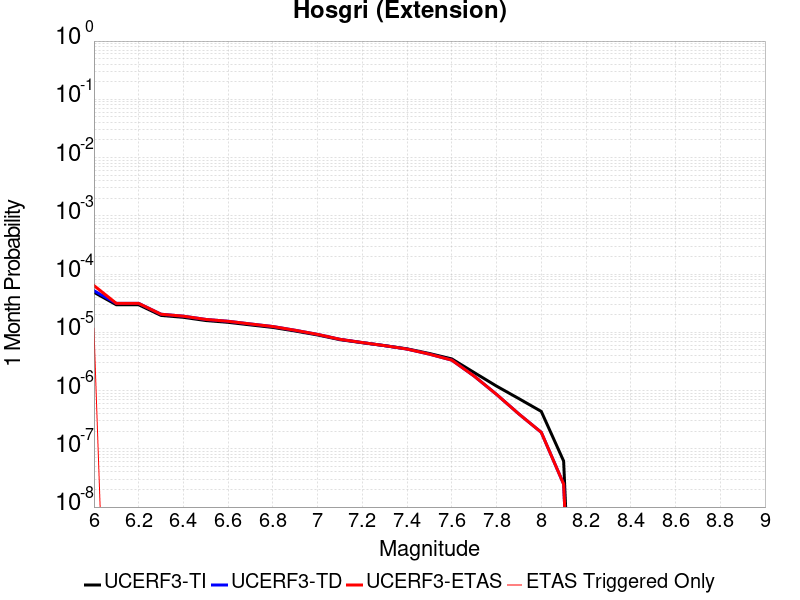 | 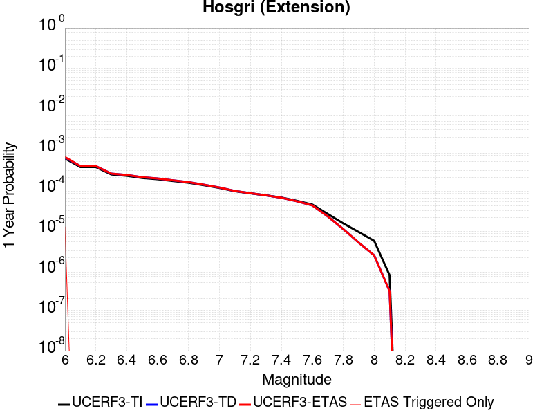 | 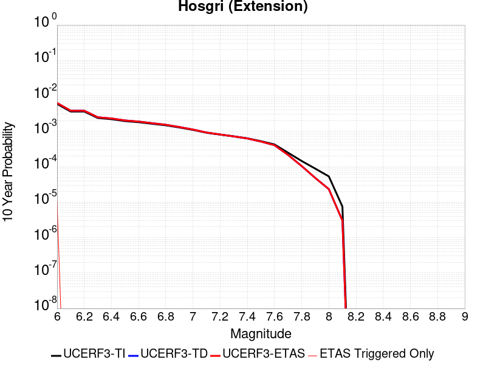 |

| Magnitude | 1 wk TI Prob | 1 wk TD Prob | 1 wk ETAS Prob | 1 wk ETAS/TD Gain | 1 wk ETAS Triggered Only | 1 mo TI Prob | 1 mo TD Prob | 1 mo ETAS Prob | 1 mo ETAS/TD Gain | 1 mo ETAS Triggered Only | 1 yr TI Prob | 1 yr TD Prob | 1 yr ETAS Prob | 1 yr ETAS/TD Gain | 1 yr ETAS Triggered Only | 10 yr TI Prob | 10 yr TD Prob | 10 yr ETAS Prob | 10 yr ETAS/TD Gain | 10 yr ETAS Triggered Only |
|-----|-----|-----|-----|-----|-----|-----|-----|-----|-----|-----|-----|-----|-----|-----|-----|-----|-----|-----|-----|-----|
| 6.0 | 1.1369135E-5 | 1.2083072E-5 | 2.382002E-5 | 1.9713546 | 1.1737089E-5 | 4.8723956E-5 | 5.1783692E-5 | 6.352017E-5 | 1.2266444 | 1.1737089E-5 | 5.9305265E-4 | 6.3030684E-4 | 6.420365E-4 | 1.0186095 | 1.1737089E-5 | 0.005914725 | 0.0062874397 | 0.006299103 | 1.001855 | 1.1737089E-5 |
| 6.1 | 6.934979E-6 | 7.324555E-6 | 7.324555E-6 | 1.0 | 0.0 | 2.9721E-5 | 3.1390595E-5 | 3.1390595E-5 | 1.0 | 0.0 | 3.617931E-4 | 3.8211764E-4 | 3.8211764E-4 | 1.0 | 0.0 | 0.0036120464 | 0.0038150186 | 0.0038150186 | 1.0 | 0.0 |
| 6.2 | 6.934979E-6 | 7.324555E-6 | 7.324555E-6 | 1.0 | 0.0 | 2.9721E-5 | 3.1390595E-5 | 3.1390595E-5 | 1.0 | 0.0 | 3.617931E-4 | 3.8211764E-4 | 3.8211764E-4 | 1.0 | 0.0 | 0.0036120464 | 0.0038150186 | 0.0038150186 | 1.0 | 0.0 |
| 6.3 | 4.5484676E-6 | 4.76933E-6 | 4.76933E-6 | 1.0 | 0.0 | 1.9493287E-5 | 2.043983E-5 | 2.043983E-5 | 1.0 | 0.0 | 2.3730492E-4 | 2.4882692E-4 | 2.4882692E-4 | 1.0 | 0.0 | 0.0023705168 | 0.0024855258 | 0.0024855258 | 1.0 | 0.0 |
| 6.4 | 4.218095E-6 | 4.4168614E-6 | 4.4168614E-6 | 1.0 | 0.0 | 1.8077424E-5 | 1.8929271E-5 | 1.8929271E-5 | 1.0 | 0.0 | 2.2007042E-4 | 2.3043984E-4 | 2.3043984E-4 | 1.0 | 0.0 | 0.002198526 | 0.0023020422 | 0.0023020422 | 1.0 | 0.0 |
| 6.5 | 3.717374E-6 | 3.8838775E-6 | 3.8838775E-6 | 1.0 | 0.0 | 1.5931506E-5 | 1.6645085E-5 | 1.6645085E-5 | 1.0 | 0.0 | 1.9394881E-4 | 2.0263524E-4 | 2.0263524E-4 | 1.0 | 0.0 | 0.0019377962 | 0.0020245234 | 0.0020245234 | 1.0 | 0.0 |
| 6.6 | 3.4605036E-6 | 3.608306E-6 | 3.608306E-6 | 1.0 | 0.0 | 1.4830645E-5 | 1.5464078E-5 | 1.5464078E-5 | 1.0 | 0.0 | 1.8054814E-4 | 1.8825903E-4 | 1.8825903E-4 | 1.0 | 0.0 | 0.0018040152 | 0.0018810101 | 0.0018810101 | 1.0 | 0.0 |
| 6.7 | 3.123439E-6 | 3.2465687E-6 | 3.2465687E-6 | 1.0 | 0.0 | 1.33860985E-5 | 1.3913792E-5 | 1.3913792E-5 | 1.0 | 0.0 | 1.6296357E-4 | 1.6938736E-4 | 1.6938736E-4 | 1.0 | 0.0 | 0.001628441 | 0.0016925934 | 0.0016925934 | 1.0 | 0.0 |
| 6.8 | 2.8290783E-6 | 2.9305404E-6 | 2.9305404E-6 | 1.0 | 0.0 | 1.2124565E-5 | 1.2559399E-5 | 1.2559399E-5 | 1.0 | 0.0 | 1.4760658E-4 | 1.5290003E-4 | 1.5290003E-4 | 1.0 | 0.0 | 0.0014750857 | 0.001527957 | 0.001527957 | 1.0 | 0.0 |
| 6.9 | 2.454112E-6 | 2.5283196E-6 | 2.5283196E-6 | 1.0 | 0.0 | 1.0517581E-5 | 1.0835611E-5 | 1.0835611E-5 | 1.0 | 0.0 | 1.2804402E-4 | 1.3191563E-4 | 1.3191563E-4 | 1.0 | 0.0 | 0.0012797028 | 0.0013183793 | 0.0013183793 | 1.0 | 0.0 |
| 7.0 | 2.1008145E-6 | 2.1498704E-6 | 2.1498704E-6 | 1.0 | 0.0 | 9.003459E-6 | 9.213698E-6 | 9.213698E-6 | 1.0 | 0.0 | 1.096116E-4 | 1.1217103E-4 | 1.1217103E-4 | 1.0 | 0.0 | 0.0010955755 | 0.0011211479 | 0.0011211479 | 1.0 | 0.0 |
| 7.1 | 1.744384E-6 | 1.7686352E-6 | 1.7686352E-6 | 1.0 | 0.0 | 7.47591E-6 | 7.5798434E-6 | 7.5798434E-6 | 1.0 | 0.0 | 9.1015405E-5 | 9.22807E-5 | 9.22807E-5 | 1.0 | 0.0 | 9.097813E-4 | 9.2242553E-4 | 9.2242553E-4 | 1.0 | 0.0 |
| 7.2 | 1.5456587E-6 | 1.5562882E-6 | 1.5562882E-6 | 1.0 | 0.0 | 6.6242346E-6 | 6.66979E-6 | 6.66979E-6 | 1.0 | 0.0 | 8.064707E-5 | 8.120168E-5 | 8.120168E-5 | 1.0 | 0.0 | 8.0617814E-4 | 8.117213E-4 | 8.117213E-4 | 1.0 | 0.0 |
| 7.3 | 1.3775123E-6 | 1.3766082E-6 | 1.3766082E-6 | 1.0 | 0.0 | 5.9036106E-6 | 5.899736E-6 | 5.899736E-6 | 1.0 | 0.0 | 7.187409E-5 | 7.182693E-5 | 7.182693E-5 | 1.0 | 0.0 | 7.185085E-4 | 7.180382E-4 | 7.180382E-4 | 1.0 | 0.0 |
| 7.4 | 1.214491E-6 | 1.2023461E-6 | 1.2023461E-6 | 1.0 | 0.0 | 5.2049513E-6 | 5.1529014E-6 | 5.1529014E-6 | 1.0 | 0.0 | 6.336844E-5 | 6.2734776E-5 | 6.2734776E-5 | 1.0 | 0.0 | 6.335037E-4 | 6.271715E-4 | 6.271715E-4 | 1.0 | 0.0 |
| 7.5 | 1.0101123E-6 | 9.842246E-7 | 9.842246E-7 | 1.0 | 0.0 | 4.3290456E-6 | 4.2180986E-6 | 4.2180986E-6 | 1.0 | 0.0 | 5.2704854E-5 | 5.1354145E-5 | 5.1354145E-5 | 1.0 | 0.0 | 5.2692357E-4 | 5.1342335E-4 | 5.1342335E-4 | 1.0 | 0.0 |
| 7.6 | 8.1558215E-7 | 7.765966E-7 | 7.765966E-7 | 1.0 | 0.0 | 3.4953473E-6 | 3.328267E-6 | 3.328267E-6 | 1.0 | 0.0 | 4.255502E-5 | 4.0520903E-5 | 4.0520903E-5 | 1.0 | 0.0 | 4.2546875E-4 | 4.0513556E-4 | 4.0513556E-4 | 1.0 | 0.0 |
| 7.7 | 4.757816E-7 | 4.1308888E-7 | 4.1308888E-7 | 1.0 | 0.0 | 2.0390623E-6 | 1.7703798E-6 | 1.7703798E-6 | 1.0 | 0.0 | 2.4825302E-5 | 2.155416E-5 | 2.155416E-5 | 1.0 | 0.0 | 2.482253E-4 | 2.1552083E-4 | 2.1552083E-4 | 1.0 | 0.0 |
| 7.8 | 2.782787E-7 | 2.0047722E-7 | 2.0047722E-7 | 1.0 | 0.0 | 1.1926223E-6 | 8.5918776E-7 | 8.5918776E-7 | 1.0 | 0.0 | 1.452008E-5 | 1.04605615E-5 | 1.04605615E-5 | 1.0 | 0.0 | 1.4519131E-4 | 1.04600724E-4 | 1.04600724E-4 | 1.0 | 0.0 |
| 7.9 | 1.6948086E-7 | 9.244227E-8 | 9.244227E-8 | 1.0 | 0.0 | 7.2634634E-7 | 3.961811E-7 | 3.961811E-7 | 1.0 | 0.0 | 8.843231E-6 | 4.8234942E-6 | 4.8234942E-6 | 1.0 | 0.0 | 8.842879E-5 | 4.8233902E-5 | 4.8233902E-5 | 1.0 | 0.0 |
| 8.0 | 1.0225492E-7 | 4.4738776E-8 | 4.4738776E-8 | 1.0 | 0.0 | 4.382353E-7 | 1.917376E-7 | 1.917376E-7 | 1.0 | 0.0 | 5.335502E-6 | 2.3344028E-6 | 2.3344028E-6 | 1.0 | 0.0 | 5.335374E-5 | 2.3343786E-5 | 2.3343786E-5 | 1.0 | 0.0 |
| 8.1 | 1.43711345E-8 | 5.787707E-9 | 5.787707E-9 | 1.0 | 0.0 | 6.1590576E-8 | 2.480446E-8 | 2.480446E-8 | 1.0 | 0.0 | 7.4986497E-7 | 3.0199428E-7 | 3.0199428E-7 | 1.0 | 0.0 | 7.4986247E-6 | 3.0199392E-6 | 3.0199392E-6 | 1.0 | 0.0 |

## Earthquake Valley (So Extension)
*[(top)](#table-of-contents)*

| 1 Week | 1 Month | 1 Year | 10 Year |
|-----|-----|-----|-----|
| 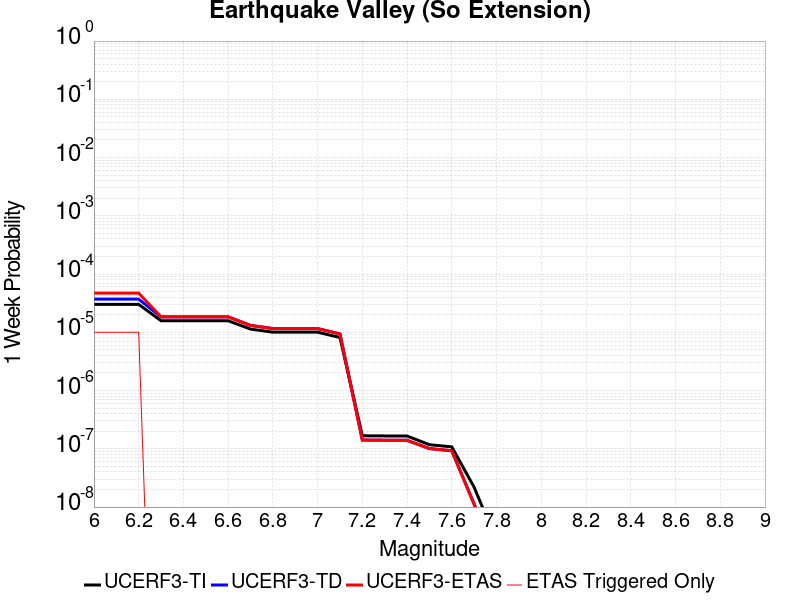 | 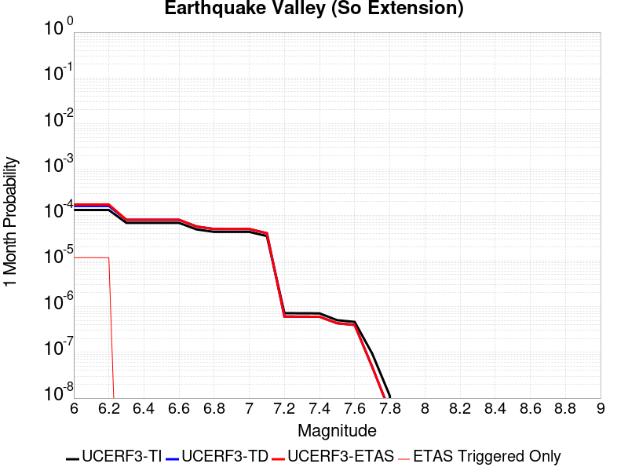 | 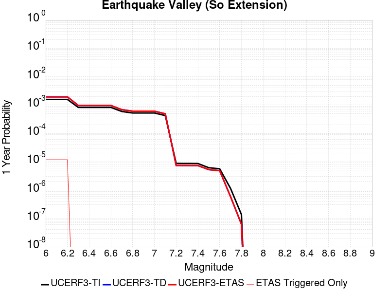 | 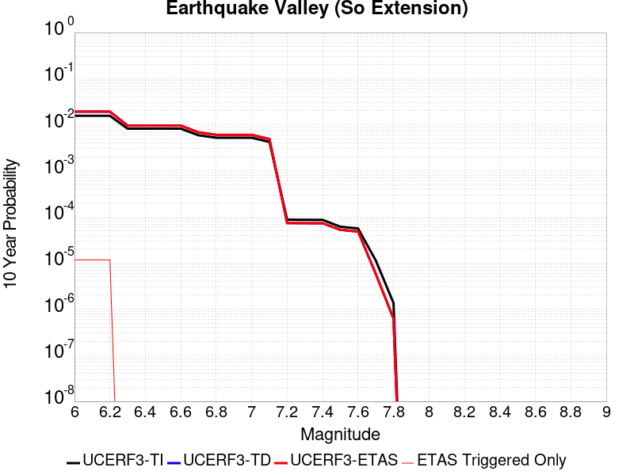 |

| Magnitude | 1 wk TI Prob | 1 wk TD Prob | 1 wk ETAS Prob | 1 wk ETAS/TD Gain | 1 wk ETAS Triggered Only | 1 mo TI Prob | 1 mo TD Prob | 1 mo ETAS Prob | 1 mo ETAS/TD Gain | 1 mo ETAS Triggered Only | 1 yr TI Prob | 1 yr TD Prob | 1 yr ETAS Prob | 1 yr ETAS/TD Gain | 1 yr ETAS Triggered Only | 10 yr TI Prob | 10 yr TD Prob | 10 yr ETAS Prob | 10 yr ETAS/TD Gain | 10 yr ETAS Triggered Only |
|-----|-----|-----|-----|-----|-----|-----|-----|-----|-----|-----|-----|-----|-----|-----|-----|-----|-----|-----|-----|-----|
| 6.0 | 3.0194888E-5 | 3.7072114E-5 | 4.8808768E-5 | 1.3165898 | 1.1737089E-5 | 1.2940024E-4 | 1.5887388E-4 | 1.706091E-4 | 1.073865 | 1.1737089E-5 | 0.0015743093 | 0.0019331174 | 0.0019448318 | 1.0060599 | 1.1737089E-5 | 0.01563203 | 0.019213019 | 0.01922453 | 1.0005991 | 1.1737089E-5 |
| 6.1 | 3.0194888E-5 | 3.7072114E-5 | 4.8808768E-5 | 1.3165898 | 1.1737089E-5 | 1.2940024E-4 | 1.5887388E-4 | 1.706091E-4 | 1.073865 | 1.1737089E-5 | 0.0015743093 | 0.0019331174 | 0.0019448318 | 1.0060599 | 1.1737089E-5 | 0.01563203 | 0.019213019 | 0.01922453 | 1.0005991 | 1.1737089E-5 |
| 6.2 | 3.0194888E-5 | 3.7072114E-5 | 4.8808768E-5 | 1.3165898 | 1.1737089E-5 | 1.2940024E-4 | 1.5887388E-4 | 1.706091E-4 | 1.073865 | 1.1737089E-5 | 0.0015743093 | 0.0019331174 | 0.0019448318 | 1.0060599 | 1.1737089E-5 | 0.01563203 | 0.019213019 | 0.01922453 | 1.0005991 | 1.1737089E-5 |
| 6.3 | 1.5795305E-5 | 1.844658E-5 | 1.844658E-5 | 1.0 | 0.0 | 6.769241E-5 | 7.9055004E-5 | 7.9055004E-5 | 1.0 | 0.0 | 8.238434E-4 | 9.6218096E-4 | 9.6218096E-4 | 1.0 | 0.0 | 0.008207959 | 0.009591061 | 0.009591061 | 1.0 | 0.0 |
| 6.4 | 1.5795305E-5 | 1.844658E-5 | 1.844658E-5 | 1.0 | 0.0 | 6.769241E-5 | 7.9055004E-5 | 7.9055004E-5 | 1.0 | 0.0 | 8.238434E-4 | 9.6218096E-4 | 9.6218096E-4 | 1.0 | 0.0 | 0.008207959 | 0.009591061 | 0.009591061 | 1.0 | 0.0 |
| 6.5 | 1.5795305E-5 | 1.844658E-5 | 1.844658E-5 | 1.0 | 0.0 | 6.769241E-5 | 7.9055004E-5 | 7.9055004E-5 | 1.0 | 0.0 | 8.238434E-4 | 9.6218096E-4 | 9.6218096E-4 | 1.0 | 0.0 | 0.008207959 | 0.009591061 | 0.009591061 | 1.0 | 0.0 |
| 6.6 | 1.5795305E-5 | 1.844658E-5 | 1.844658E-5 | 1.0 | 0.0 | 6.769241E-5 | 7.9055004E-5 | 7.9055004E-5 | 1.0 | 0.0 | 8.238434E-4 | 9.6218096E-4 | 9.6218096E-4 | 1.0 | 0.0 | 0.008207959 | 0.009591061 | 0.009591061 | 1.0 | 0.0 |
| 6.7 | 1.1363076E-5 | 1.3138294E-5 | 1.3138294E-5 | 1.0 | 0.0 | 4.8697988E-5 | 5.6306188E-5 | 5.6306188E-5 | 1.0 | 0.0 | 5.927367E-4 | 6.8538834E-4 | 6.8538834E-4 | 1.0 | 0.0 | 0.0059115817 | 0.0068402183 | 0.0068402183 | 1.0 | 0.0 |
| 6.8 | 1.0049611E-5 | 1.1594334E-5 | 1.1594334E-5 | 1.0 | 0.0 | 4.306905E-5 | 4.9689468E-5 | 4.9689468E-5 | 1.0 | 0.0 | 5.242395E-4 | 6.048745E-4 | 6.048745E-4 | 1.0 | 0.0 | 0.0052300454 | 0.006039458 | 0.006039458 | 1.0 | 0.0 |
| 6.9 | 1.0049611E-5 | 1.1594334E-5 | 1.1594334E-5 | 1.0 | 0.0 | 4.306905E-5 | 4.9689468E-5 | 4.9689468E-5 | 1.0 | 0.0 | 5.242395E-4 | 6.048745E-4 | 6.048745E-4 | 1.0 | 0.0 | 0.0052300454 | 0.006039458 | 0.006039458 | 1.0 | 0.0 |
| 7.0 | 1.0049611E-5 | 1.1594334E-5 | 1.1594334E-5 | 1.0 | 0.0 | 4.306905E-5 | 4.9689468E-5 | 4.9689468E-5 | 1.0 | 0.0 | 5.242395E-4 | 6.048745E-4 | 6.048745E-4 | 1.0 | 0.0 | 0.0052300454 | 0.006039458 | 0.006039458 | 1.0 | 0.0 |
| 7.1 | 8.140254E-6 | 9.383458E-6 | 9.383458E-6 | 1.0 | 0.0 | 3.4886336E-5 | 4.0214578E-5 | 4.0214578E-5 | 1.0 | 0.0 | 4.2465836E-4 | 4.8956956E-4 | 4.8956956E-4 | 1.0 | 0.0 | 0.0042384774 | 0.0048914864 | 0.0048914864 | 1.0 | 0.0 |
| 7.2 | 1.673835E-7 | 1.4154125E-7 | 1.4154125E-7 | 1.0 | 0.0 | 7.173577E-7 | 6.066052E-7 | 6.066052E-7 | 1.0 | 0.0 | 8.733795E-6 | 7.385397E-6 | 7.385397E-6 | 1.0 | 0.0 | 8.733451E-5 | 7.385187E-5 | 7.385187E-5 | 1.0 | 0.0 |
| 7.3 | 1.6632116E-7 | 1.4052354E-7 | 1.4052354E-7 | 1.0 | 0.0 | 7.1280476E-7 | 6.0224363E-7 | 6.0224363E-7 | 1.0 | 0.0 | 8.678364E-6 | 7.332295E-6 | 7.332295E-6 | 1.0 | 0.0 | 8.6780245E-5 | 7.332089E-5 | 7.332089E-5 | 1.0 | 0.0 |
| 7.4 | 1.6569169E-7 | 1.3996983E-7 | 1.3996983E-7 | 1.0 | 0.0 | 7.1010703E-7 | 5.9987053E-7 | 5.9987053E-7 | 1.0 | 0.0 | 8.645519E-6 | 7.303403E-6 | 7.303403E-6 | 1.0 | 0.0 | 8.645182E-5 | 7.303199E-5 | 7.303199E-5 | 1.0 | 0.0 |
| 7.5 | 1.1764555E-7 | 1.0095917E-7 | 1.0095917E-7 | 1.0 | 0.0 | 5.041951E-7 | 4.326821E-7 | 4.326821E-7 | 1.0 | 0.0 | 6.138558E-6 | 5.267894E-6 | 5.267894E-6 | 1.0 | 0.0 | 6.1383886E-5 | 5.2677904E-5 | 5.2677904E-5 | 1.0 | 0.0 |
| 7.6 | 1.07927605E-7 | 9.260736E-8 | 9.260736E-8 | 1.0 | 0.0 | 4.6254678E-7 | 3.9688865E-7 | 3.9688865E-7 | 1.0 | 0.0 | 5.6314925E-6 | 4.832111E-6 | 4.832111E-6 | 1.0 | 0.0 | 5.63135E-5 | 4.8320264E-5 | 4.8320264E-5 | 1.0 | 0.0 |
| 7.7 | 2.1826905E-8 | 1.1180516E-8 | 1.1180516E-8 | 1.0 | 0.0 | 9.3543875E-8 | 4.7916494E-8 | 4.7916494E-8 | 1.0 | 0.0 | 1.1388961E-6 | 5.833832E-7 | 5.833832E-7 | 1.0 | 0.0 | 1.1388902E-5 | 5.8338223E-6 | 5.8338223E-6 | 1.0 | 0.0 |
| 7.8 | 2.6169649E-9 | 1.1969472E-9 | 1.1969472E-9 | 1.0 | 0.0 | 1.1215564E-8 | 5.1297735E-9 | 5.1297735E-9 | 1.0 | 0.0 | 1.3654947E-7 | 6.2454994E-8 | 6.2454994E-8 | 1.0 | 0.0 | 1.365494E-6 | 6.245499E-7 | 6.245499E-7 | 1.0 | 0.0 |

## San Jose
*[(top)](#table-of-contents)*

| 1 Week | 1 Month | 1 Year | 10 Year |
|-----|-----|-----|-----|
| 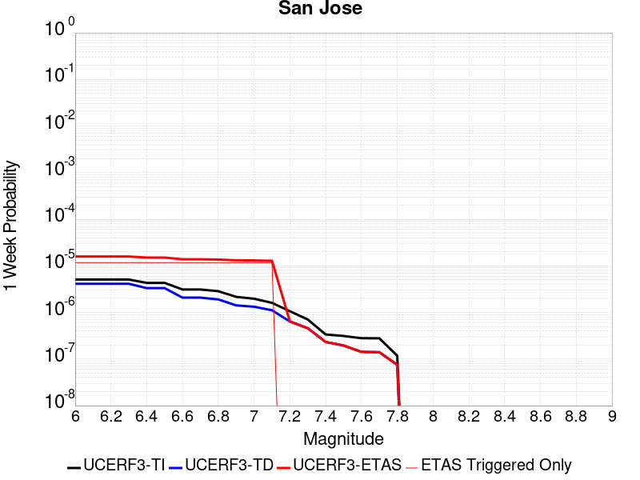 | 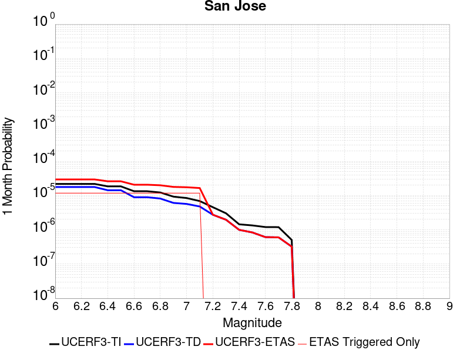 | 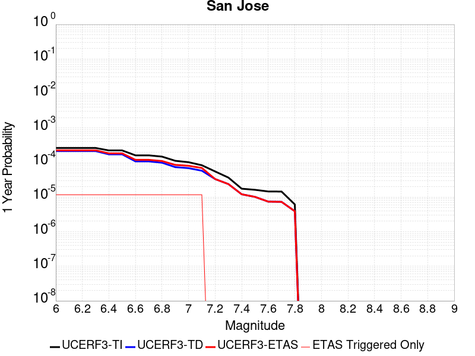 | 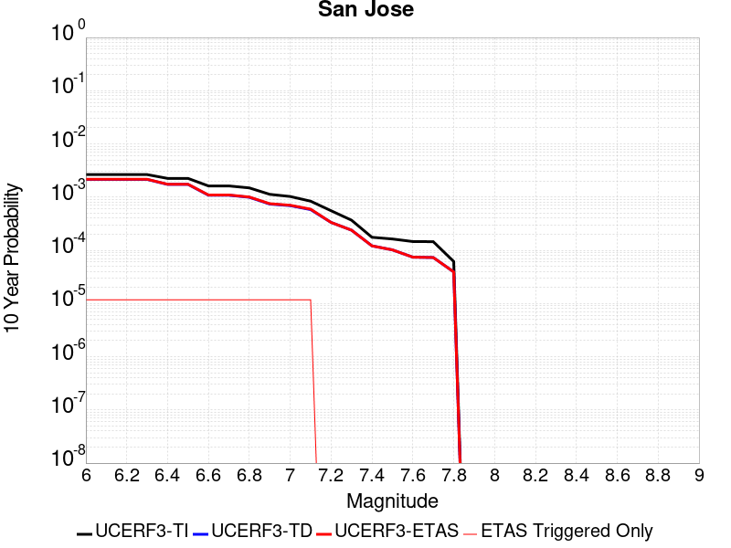 |

| Magnitude | 1 wk TI Prob | 1 wk TD Prob | 1 wk ETAS Prob | 1 wk ETAS/TD Gain | 1 wk ETAS Triggered Only | 1 mo TI Prob | 1 mo TD Prob | 1 mo ETAS Prob | 1 mo ETAS/TD Gain | 1 mo ETAS Triggered Only | 1 yr TI Prob | 1 yr TD Prob | 1 yr ETAS Prob | 1 yr ETAS/TD Gain | 1 yr ETAS Triggered Only | 10 yr TI Prob | 10 yr TD Prob | 10 yr ETAS Prob | 10 yr ETAS/TD Gain | 10 yr ETAS Triggered Only |
|-----|-----|-----|-----|-----|-----|-----|-----|-----|-----|-----|-----|-----|-----|-----|-----|-----|-----|-----|-----|-----|
| 6.0 | 5.0851277E-6 | 4.1256726E-6 | 1.5862714E-5 | 3.8448792 | 1.1737089E-5 | 2.1793223E-5 | 1.768135E-5 | 2.9418232E-5 | 1.6638001 | 1.1737089E-5 | 2.653002E-4 | 2.152518E-4 | 2.2698636E-4 | 1.0545155 | 1.1737089E-5 | 0.0026498367 | 0.0021507242 | 0.002162436 | 1.0054455 | 1.1737089E-5 |
| 6.1 | 5.0851277E-6 | 4.1256726E-6 | 1.5862714E-5 | 3.8448792 | 1.1737089E-5 | 2.1793223E-5 | 1.768135E-5 | 2.9418232E-5 | 1.6638001 | 1.1737089E-5 | 2.653002E-4 | 2.152518E-4 | 2.2698636E-4 | 1.0545155 | 1.1737089E-5 | 0.0026498367 | 0.0021507242 | 0.002162436 | 1.0054455 | 1.1737089E-5 |
| 6.2 | 5.0851277E-6 | 4.1256726E-6 | 1.5862714E-5 | 3.8448792 | 1.1737089E-5 | 2.1793223E-5 | 1.768135E-5 | 2.9418232E-5 | 1.6638001 | 1.1737089E-5 | 2.653002E-4 | 2.152518E-4 | 2.2698636E-4 | 1.0545155 | 1.1737089E-5 | 0.0026498367 | 0.0021507242 | 0.002162436 | 1.0054455 | 1.1737089E-5 |
| 6.3 | 5.0851277E-6 | 4.1256726E-6 | 1.5862714E-5 | 3.8448792 | 1.1737089E-5 | 2.1793223E-5 | 1.768135E-5 | 2.9418232E-5 | 1.6638001 | 1.1737089E-5 | 2.653002E-4 | 2.152518E-4 | 2.2698636E-4 | 1.0545155 | 1.1737089E-5 | 0.0026498367 | 0.0021507242 | 0.002162436 | 1.0054455 | 1.1737089E-5 |
| 6.4 | 4.3115124E-6 | 3.3237832E-6 | 1.5060833E-5 | 4.5312324 | 1.1737089E-5 | 1.8477778E-5 | 1.424472E-5 | 2.5981642E-5 | 1.823949 | 1.1737089E-5 | 2.2494372E-4 | 1.7341787E-4 | 1.8515292E-4 | 1.0676693 | 1.1737089E-5 | 0.0022471617 | 0.0017330751 | 0.0017447919 | 1.0067607 | 1.1737089E-5 |
| 6.5 | 4.3115124E-6 | 3.3237832E-6 | 1.5060833E-5 | 4.5312324 | 1.1737089E-5 | 1.8477778E-5 | 1.424472E-5 | 2.5981642E-5 | 1.823949 | 1.1737089E-5 | 2.2494372E-4 | 1.7341787E-4 | 1.8515292E-4 | 1.0676693 | 1.1737089E-5 | 0.0022471617 | 0.0017330751 | 0.0017447919 | 1.0067607 | 1.1737089E-5 |
| 6.6 | 3.110396E-6 | 2.0799866E-6 | 1.3817052E-5 | 6.6428556 | 1.1737089E-5 | 1.33302E-5 | 8.9141995E-6 | 2.0651185E-5 | 2.3166616 | 1.1737089E-5 | 1.622831E-4 | 1.0852526E-4 | 1.2026107E-4 | 1.108139 | 1.1737089E-5 | 0.0016216465 | 0.0010847825 | 0.001096507 | 1.010808 | 1.1737089E-5 |
| 6.7 | 3.110396E-6 | 2.0799866E-6 | 1.3817052E-5 | 6.6428556 | 1.1737089E-5 | 1.33302E-5 | 8.9141995E-6 | 2.0651185E-5 | 2.3166616 | 1.1737089E-5 | 1.622831E-4 | 1.0852526E-4 | 1.2026107E-4 | 1.108139 | 1.1737089E-5 | 0.0016216465 | 0.0010847825 | 0.001096507 | 1.010808 | 1.1737089E-5 |
| 6.8 | 2.856651E-6 | 1.902435E-6 | 1.3639502E-5 | 7.169497 | 1.1737089E-5 | 1.2242733E-5 | 8.153269E-6 | 1.9890262E-5 | 2.4395444 | 1.1737089E-5 | 1.4904508E-4 | 9.926178E-5 | 1.109977E-4 | 1.118232 | 1.1737089E-5 | 0.0014894515 | 9.922314E-4 | 0.0010039569 | 1.0118172 | 1.1737089E-5 |
| 6.9 | 2.1618725E-6 | 1.4186642E-6 | 1.3155736E-5 | 9.273327 | 1.1737089E-5 | 9.265135E-6 | 6.0799757E-6 | 1.7816994E-5 | 2.9304383 | 1.1737089E-5 | 1.12797185E-4 | 7.402128E-5 | 8.57575E-5 | 1.1585519 | 1.1737089E-5 | 0.0011273995 | 7.4000744E-4 | 7.517358E-4 | 1.015849 | 1.1737089E-5 |
| 7.0 | 1.9684312E-6 | 1.3256331E-6 | 1.3062707E-5 | 9.853938 | 1.1737089E-5 | 8.436106E-6 | 5.681273E-6 | 1.7418295E-5 | 3.0659142 | 1.1737089E-5 | 1.02704755E-4 | 6.9167385E-5 | 8.0903665E-5 | 1.1696794 | 1.1737089E-5 | 0.001026573 | 6.914992E-4 | 7.032282E-4 | 1.0169617 | 1.1737089E-5 |
| 7.1 | 1.6070337E-6 | 1.1155087E-6 | 1.2852584E-5 | 11.521726 | 1.1737089E-5 | 6.887269E-6 | 4.780743E-6 | 1.6517775E-5 | 3.4550648 | 1.1737089E-5 | 8.384928E-5 | 5.8204052E-5 | 6.9940455E-5 | 1.2016424 | 1.1737089E-5 | 8.3817646E-4 | 5.819267E-4 | 5.93657E-4 | 1.0201576 | 1.1737089E-5 |
| 7.2 | 1.0631658E-6 | 6.4037624E-7 | 6.4037624E-7 | 1.0 | 0.0 | 4.556417E-6 | 2.7444669E-6 | 2.7444669E-6 | 1.0 | 0.0 | 5.5472963E-5 | 3.3413387E-5 | 3.3413387E-5 | 1.0 | 0.0 | 5.545912E-4 | 3.3411747E-4 | 3.3411747E-4 | 1.0 | 0.0 |
| 7.3 | 7.060711E-7 | 4.5824706E-7 | 4.5824706E-7 | 1.0 | 0.0 | 3.0260155E-6 | 1.9639147E-6 | 1.9639147E-6 | 1.0 | 0.0 | 3.6841117E-5 | 2.3910407E-5 | 2.3910407E-5 | 1.0 | 0.0 | 3.6835007E-4 | 2.3911172E-4 | 2.3911172E-4 | 1.0 | 0.0 |
| 7.4 | 3.3677085E-7 | 2.3233133E-7 | 2.3233133E-7 | 1.0 | 0.0 | 1.4433028E-6 | 9.957054E-7 | 9.957054E-7 | 1.0 | 0.0 | 1.757207E-5 | 1.21226485E-5 | 1.21226485E-5 | 1.0 | 0.0 | 1.7570681E-4 | 1.2125263E-4 | 1.2125263E-4 | 1.0 | 0.0 |
| 7.5 | 3.129161E-7 | 1.9530925E-7 | 1.9530925E-7 | 1.0 | 0.0 | 1.3410682E-6 | 8.370394E-7 | 8.370394E-7 | 1.0 | 0.0 | 1.6327383E-5 | 1.0190909E-5 | 1.0190909E-5 | 1.0 | 0.0 | 1.6326184E-4 | 1.0193714E-4 | 1.0193714E-4 | 1.0 | 0.0 |
| 7.6 | 2.8008668E-7 | 1.4242323E-7 | 1.4242323E-7 | 1.0 | 0.0 | 1.2003709E-6 | 6.1038514E-7 | 6.1038514E-7 | 1.0 | 0.0 | 1.46144175E-5 | 7.4314153E-6 | 7.4314153E-6 | 1.0 | 0.0 | 1.4613457E-4 | 7.434427E-5 | 7.434427E-5 | 1.0 | 0.0 |
| 7.7 | 2.7852005E-7 | 1.4016913E-7 | 1.4016913E-7 | 1.0 | 0.0 | 1.1936568E-6 | 6.007248E-7 | 6.007248E-7 | 1.0 | 0.0 | 1.4532674E-5 | 7.3138012E-6 | 7.3138012E-6 | 1.0 | 0.0 | 1.4531724E-4 | 7.316821E-5 | 7.316821E-5 | 1.0 | 0.0 |
| 7.8 | 1.1810797E-7 | 7.5190094E-8 | 7.5190094E-8 | 1.0 | 0.0 | 5.0617695E-7 | 3.222432E-7 | 3.222432E-7 | 1.0 | 0.0 | 6.1626865E-6 | 3.9233046E-6 | 3.9233046E-6 | 1.0 | 0.0 | 6.162516E-5 | 3.9250725E-5 | 3.9250725E-5 | 1.0 | 0.0 |

## Hayward (So) 2011 CFM
*[(top)](#table-of-contents)*

| 1 Week | 1 Month | 1 Year | 10 Year |
|-----|-----|-----|-----|
| 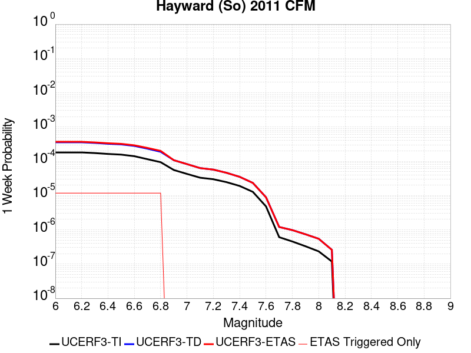 | 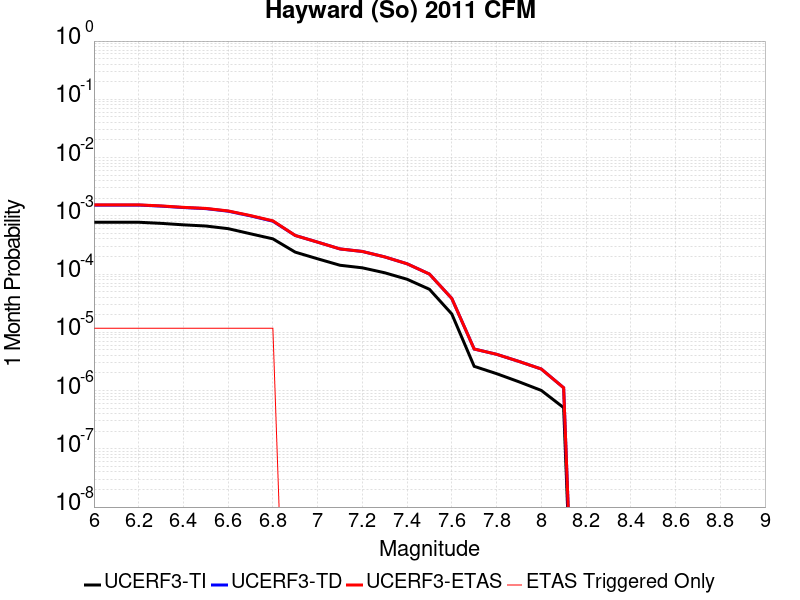 | 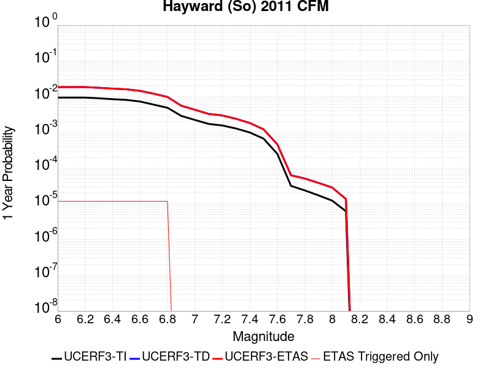 | 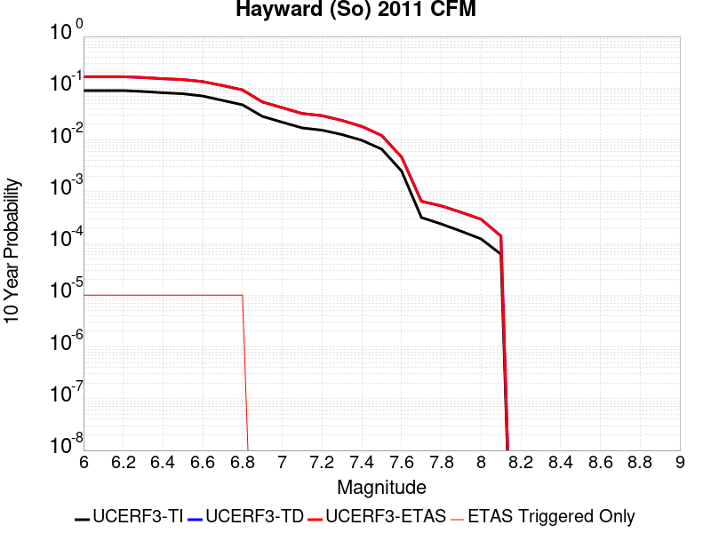 |

| Magnitude | 1 wk TI Prob | 1 wk TD Prob | 1 wk ETAS Prob | 1 wk ETAS/TD Gain | 1 wk ETAS Triggered Only | 1 mo TI Prob | 1 mo TD Prob | 1 mo ETAS Prob | 1 mo ETAS/TD Gain | 1 mo ETAS Triggered Only | 1 yr TI Prob | 1 yr TD Prob | 1 yr ETAS Prob | 1 yr ETAS/TD Gain | 1 yr ETAS Triggered Only | 10 yr TI Prob | 10 yr TD Prob | 10 yr ETAS Prob | 10 yr ETAS/TD Gain | 10 yr ETAS Triggered Only |
|-----|-----|-----|-----|-----|-----|-----|-----|-----|-----|-----|-----|-----|-----|-----|-----|-----|-----|-----|-----|-----|
| 6.0 | 1.8091932E-4 | 3.570541E-4 | 3.6878698E-4 | 1.0328603 | 1.1737089E-5 | 7.751381E-4 | 0.0015293444 | 0.0015410634 | 1.0076629 | 1.1737089E-5 | 0.00939654 | 0.018463207 | 0.018474728 | 1.000624 | 1.1737089E-5 | 0.090090066 | 0.16673161 | 0.16674139 | 1.0000587 | 1.1737089E-5 |
| 6.1 | 1.8091932E-4 | 3.570541E-4 | 3.6878698E-4 | 1.0328603 | 1.1737089E-5 | 7.751381E-4 | 0.0015293444 | 0.0015410634 | 1.0076629 | 1.1737089E-5 | 0.00939654 | 0.018463207 | 0.018474728 | 1.000624 | 1.1737089E-5 | 0.090090066 | 0.16673161 | 0.16674139 | 1.0000587 | 1.1737089E-5 |
| 6.2 | 1.8091932E-4 | 3.570541E-4 | 3.6878698E-4 | 1.0328603 | 1.1737089E-5 | 7.751381E-4 | 0.0015293444 | 0.0015410634 | 1.0076629 | 1.1737089E-5 | 0.00939654 | 0.018463207 | 0.018474728 | 1.000624 | 1.1737089E-5 | 0.090090066 | 0.16673161 | 0.16674139 | 1.0000587 | 1.1737089E-5 |
| 6.3 | 1.7322872E-4 | 3.426234E-4 | 3.5435645E-4 | 1.0342448 | 1.1737089E-5 | 7.4219756E-4 | 0.0014675693 | 0.0014792891 | 1.007986 | 1.1737089E-5 | 0.0089988755 | 0.017723544 | 0.017735073 | 1.0006505 | 1.1737089E-5 | 0.08643075 | 0.16066726 | 0.1606771 | 1.0000613 | 1.1737089E-5 |
| 6.4 | 1.6334097E-4 | 3.234411E-4 | 3.3517438E-4 | 1.0362765 | 1.1737089E-5 | 6.998449E-4 | 0.0013854484 | 0.0013971693 | 1.0084599 | 1.1737089E-5 | 0.008487372 | 0.016739385 | 0.016750926 | 1.0006894 | 1.1737089E-5 | 0.081704415 | 0.15255594 | 0.15256588 | 1.0000652 | 1.1737089E-5 |
| 6.5 | 1.5600289E-4 | 3.1018828E-4 | 3.2192172E-4 | 1.0378269 | 1.1737089E-5 | 6.684125E-4 | 0.0013287093 | 0.0013404308 | 1.0088217 | 1.1737089E-5 | 0.008107598 | 0.016058935 | 0.016070483 | 1.0007192 | 1.1737089E-5 | 0.078181036 | 0.14683272 | 0.14684273 | 1.0000682 | 1.1737089E-5 |
| 6.6 | 1.4046066E-4 | 2.8032906E-4 | 2.9206288E-4 | 1.0418572 | 1.1737089E-5 | 6.018354E-4 | 0.0012008639 | 0.0012125869 | 1.0097622 | 1.1737089E-5 | 0.0073027555 | 0.014524006 | 0.014535572 | 1.0007964 | 1.1737089E-5 | 0.07067384 | 0.13391982 | 0.13392998 | 1.0000759 | 1.1737089E-5 |
| 6.7 | 1.14696966E-4 | 2.3271477E-4 | 2.4444913E-4 | 1.0504237 | 1.1737089E-5 | 4.914658E-4 | 9.969729E-4 | 0.0010086983 | 1.011761 | 1.1737089E-5 | 0.0059671924 | 0.012071652 | 0.012083248 | 1.0009606 | 1.1737089E-5 | 0.058094822 | 0.11274672 | 0.11275714 | 1.0000924 | 1.1737089E-5 |
| 6.8 | 9.3874296E-5 | 1.8861453E-4 | 2.003494E-4 | 1.0622162 | 1.1737089E-5 | 4.0225635E-4 | 8.0810126E-4 | 8.198289E-4 | 1.0145125 | 1.1737089E-5 | 0.0048864787 | 0.009794984 | 0.009806606 | 1.0011865 | 1.1737089E-5 | 0.047804173 | 0.09259856 | 0.09260921 | 1.000115 | 1.1737089E-5 |
| 6.9 | 5.551852E-5 | 1.072948E-4 | 1.072948E-4 | 1.0 | 0.0 | 2.3791482E-4 | 4.5975443E-4 | 4.5975443E-4 | 1.0 | 0.0 | 0.0028927654 | 0.0055832625 | 0.0055832625 | 1.0 | 0.0 | 0.028553981 | 0.054245494 | 0.054245494 | 1.0 | 0.0 |
| 7.0 | 4.2662363E-5 | 8.2464416E-5 | 8.2464416E-5 | 1.0 | 0.0 | 1.8282588E-4 | 3.5337146E-4 | 3.5337146E-4 | 1.0 | 0.0 | 0.0022236328 | 0.0042938837 | 0.0042938837 | 1.0 | 0.0 | 0.022015138 | 0.042064495 | 0.042064495 | 1.0 | 0.0 |
| 7.1 | 3.305886E-5 | 6.3019055E-5 | 6.3019055E-5 | 1.0 | 0.0 | 1.4167312E-4 | 2.700538E-4 | 2.700538E-4 | 1.0 | 0.0 | 0.0017235056 | 0.0032829668 | 0.0032829668 | 1.0 | 0.0 | 0.017101998 | 0.032452874 | 0.032452874 | 1.0 | 0.0 |
| 7.2 | 2.9856887E-5 | 5.7013647E-5 | 5.7013647E-5 | 1.0 | 0.0 | 1.2795182E-4 | 2.4432142E-4 | 2.4432142E-4 | 1.0 | 0.0 | 0.0015567001 | 0.0029705726 | 0.0029705726 | 1.0 | 0.0 | 0.015458403 | 0.029453589 | 0.029453589 | 1.0 | 0.0 |
| 7.3 | 2.4559737E-5 | 4.599088E-5 | 4.599088E-5 | 1.0 | 0.0 | 1.0525176E-4 | 1.9708896E-4 | 1.9708896E-4 | 1.0 | 0.0 | 0.0012806869 | 0.0023969305 | 0.0023969305 | 1.0 | 0.0 | 0.012733313 | 0.023857482 | 0.023857482 | 1.0 | 0.0 |
| 7.4 | 1.9002231E-5 | 3.5049303E-5 | 3.5049303E-5 | 1.0 | 0.0 | 8.143559E-5 | 1.502027E-4 | 1.502027E-4 | 1.0 | 0.0 | 9.910273E-4 | 0.0018271938 | 0.0018271938 | 1.0 | 0.0 | 0.009866194 | 0.018258283 | 0.018258283 | 1.0 | 0.0 |
| 7.5 | 1.2783333E-5 | 2.3330069E-5 | 2.3330069E-5 | 1.0 | 0.0 | 5.4784563E-5 | 9.998221E-5 | 9.998221E-5 | 1.0 | 0.0 | 6.667979E-4 | 0.0012166094 | 0.0012166094 | 1.0 | 0.0 | 0.006648007 | 0.012209582 | 0.012209582 | 1.0 | 0.0 |
| 7.6 | 4.8149627E-6 | 8.887544E-6 | 8.887544E-6 | 1.0 | 0.0 | 2.063539E-5 | 3.8088925E-5 | 3.8088925E-5 | 1.0 | 0.0 | 2.5120692E-4 | 4.636352E-4 | 4.636352E-4 | 1.0 | 0.0 | 0.0025092314 | 0.0046812436 | 0.0046812436 | 1.0 | 0.0 |
| 7.7 | 6.0838227E-7 | 1.2056693E-6 | 1.2056693E-6 | 1.0 | 0.0 | 2.6073499E-6 | 5.1671436E-6 | 5.1671436E-6 | 1.0 | 0.0 | 3.174402E-5 | 6.290816E-5 | 6.290816E-5 | 1.0 | 0.0 | 3.1739488E-4 | 6.5293367E-4 | 6.5293367E-4 | 1.0 | 0.0 |
| 7.8 | 4.5542808E-7 | 9.792182E-7 | 9.792182E-7 | 1.0 | 0.0 | 1.9518332E-6 | 4.1966427E-6 | 4.1966427E-6 | 1.0 | 0.0 | 2.376331E-5 | 5.1092928E-5 | 5.1092928E-5 | 1.0 | 0.0 | 2.3760769E-4 | 5.321372E-4 | 5.321372E-4 | 1.0 | 0.0 |
| 7.9 | 3.3016747E-7 | 7.386335E-7 | 7.386335E-7 | 1.0 | 0.0 | 1.4150027E-6 | 3.1655684E-6 | 3.1655684E-6 | 1.0 | 0.0 | 1.7227521E-5 | 3.8540114E-5 | 3.8540114E-5 | 1.0 | 0.0 | 1.7226185E-4 | 3.9930744E-4 | 3.9930744E-4 | 1.0 | 0.0 |
| 8.0 | 2.347038E-7 | 5.4714894E-7 | 5.4714894E-7 | 1.0 | 0.0 | 1.0058731E-6 | 2.344922E-6 | 2.344922E-6 | 1.0 | 0.0 | 1.2246436E-5 | 2.8549053E-5 | 2.8549053E-5 | 1.0 | 0.0 | 1.2245761E-4 | 2.9355253E-4 | 2.9355253E-4 | 1.0 | 0.0 |
| 8.1 | 1.18822804E-7 | 2.6058973E-7 | 2.6058973E-7 | 1.0 | 0.0 | 5.092405E-7 | 1.1168127E-6 | 1.1168127E-6 | 1.0 | 0.0 | 6.1999854E-6 | 1.359711E-5 | 1.359711E-5 | 1.0 | 0.0 | 6.199812E-5 | 1.3917852E-4 | 1.3917852E-4 | 1.0 | 0.0 |

## Anaheim
*[(top)](#table-of-contents)*

| 1 Week | 1 Month | 1 Year | 10 Year |
|-----|-----|-----|-----|
| 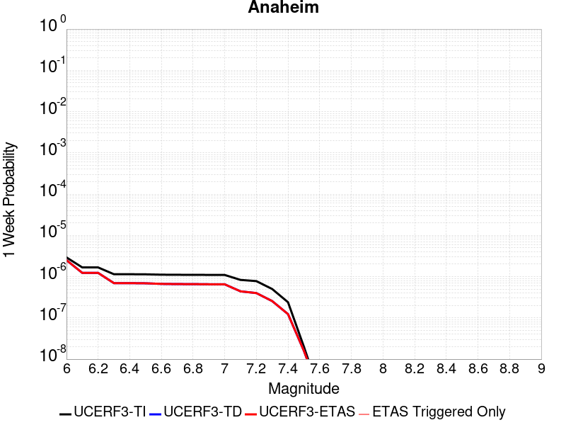 | 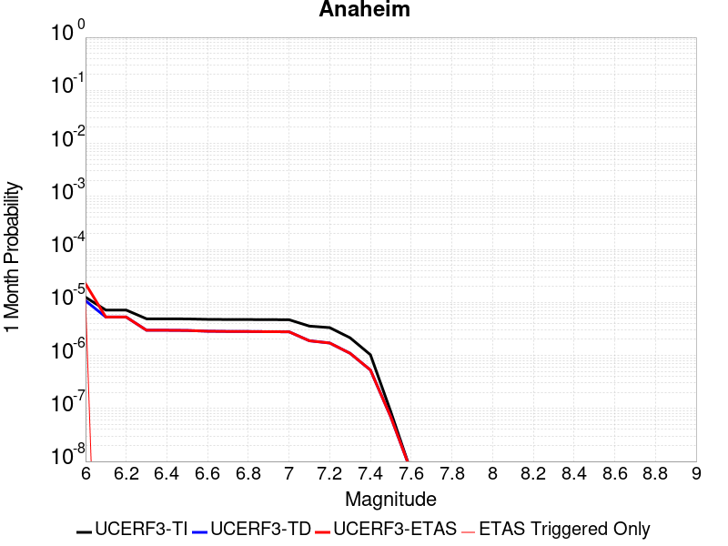 | 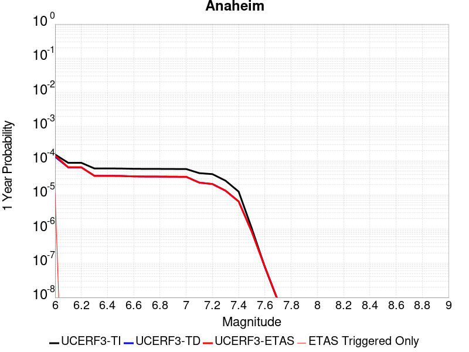 | 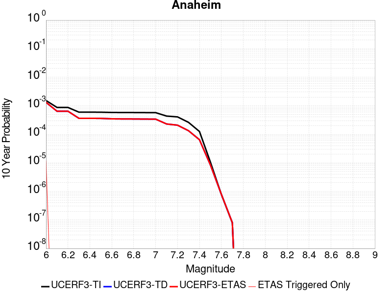 |

| Magnitude | 1 wk TI Prob | 1 wk TD Prob | 1 wk ETAS Prob | 1 wk ETAS/TD Gain | 1 wk ETAS Triggered Only | 1 mo TI Prob | 1 mo TD Prob | 1 mo ETAS Prob | 1 mo ETAS/TD Gain | 1 mo ETAS Triggered Only | 1 yr TI Prob | 1 yr TD Prob | 1 yr ETAS Prob | 1 yr ETAS/TD Gain | 1 yr ETAS Triggered Only | 10 yr TI Prob | 10 yr TD Prob | 10 yr ETAS Prob | 10 yr ETAS/TD Gain | 10 yr ETAS Triggered Only |
|-----|-----|-----|-----|-----|-----|-----|-----|-----|-----|-----|-----|-----|-----|-----|-----|-----|-----|-----|-----|-----|
| 6.0 | 2.9254998E-6 | 2.5122863E-6 | 2.5122863E-6 | 1.0 | 0.0 | 1.25377965E-5 | 1.0766909E-5 | 2.2503873E-5 | 2.0900958 | 1.1737089E-5 | 1.5263697E-4 | 1.3108159E-4 | 1.4281714E-4 | 1.0895286 | 1.1737089E-5 | 0.0015253217 | 0.0013102728 | 0.0013219946 | 1.0089461 | 1.1737089E-5 |
| 6.1 | 1.6729715E-6 | 1.2337348E-6 | 1.2337348E-6 | 1.0 | 0.0 | 7.1698582E-6 | 5.287426E-6 | 5.287426E-6 | 1.0 | 0.0 | 8.7289525E-5 | 6.437293E-5 | 6.437293E-5 | 1.0 | 0.0 | 8.7255245E-4 | 6.435838E-4 | 6.435838E-4 | 1.0 | 0.0 |
| 6.2 | 1.6729715E-6 | 1.2337348E-6 | 1.2337348E-6 | 1.0 | 0.0 | 7.1698582E-6 | 5.287426E-6 | 5.287426E-6 | 1.0 | 0.0 | 8.7289525E-5 | 6.437293E-5 | 6.437293E-5 | 1.0 | 0.0 | 8.7255245E-4 | 6.435838E-4 | 6.435838E-4 | 1.0 | 0.0 |
| 6.3 | 1.1444064E-6 | 6.9596666E-7 | 6.9596666E-7 | 1.0 | 0.0 | 4.9045893E-6 | 2.9827113E-6 | 2.9827113E-6 | 1.0 | 0.0 | 5.971174E-5 | 3.631396E-5 | 3.631396E-5 | 1.0 | 0.0 | 5.96957E-4 | 3.6308577E-4 | 3.6308577E-4 | 1.0 | 0.0 |
| 6.4 | 1.1444064E-6 | 6.9596666E-7 | 6.9596666E-7 | 1.0 | 0.0 | 4.9045893E-6 | 2.9827113E-6 | 2.9827113E-6 | 1.0 | 0.0 | 5.971174E-5 | 3.631396E-5 | 3.631396E-5 | 1.0 | 0.0 | 5.96957E-4 | 3.6308577E-4 | 3.6308577E-4 | 1.0 | 0.0 |
| 6.5 | 1.1385318E-6 | 6.9003505E-7 | 6.9003505E-7 | 1.0 | 0.0 | 4.879413E-6 | 2.95729E-6 | 2.95729E-6 | 1.0 | 0.0 | 5.9405233E-5 | 3.6004465E-5 | 3.6004465E-5 | 1.0 | 0.0 | 5.938936E-4 | 3.5999183E-4 | 3.5999183E-4 | 1.0 | 0.0 |
| 6.6 | 1.1165511E-6 | 6.678222E-7 | 6.678222E-7 | 1.0 | 0.0 | 4.78521E-6 | 2.862092E-6 | 2.862092E-6 | 1.0 | 0.0 | 5.8258374E-5 | 3.484547E-5 | 3.484547E-5 | 1.0 | 0.0 | 5.8243104E-4 | 3.484055E-4 | 3.484055E-4 | 1.0 | 0.0 |
| 6.7 | 1.1098243E-6 | 6.610416E-7 | 6.610416E-7 | 1.0 | 0.0 | 4.7563813E-6 | 2.8330326E-6 | 2.8330326E-6 | 1.0 | 0.0 | 5.7907404E-5 | 3.449168E-5 | 3.449168E-5 | 1.0 | 0.0 | 5.7892315E-4 | 3.4486872E-4 | 3.4486872E-4 | 1.0 | 0.0 |
| 6.8 | 1.1077587E-6 | 6.589619E-7 | 6.589619E-7 | 1.0 | 0.0 | 4.7475287E-6 | 2.8241195E-6 | 2.8241195E-6 | 1.0 | 0.0 | 5.779963E-5 | 3.438317E-5 | 3.438317E-5 | 1.0 | 0.0 | 5.77846E-4 | 3.4378393E-4 | 3.4378393E-4 | 1.0 | 0.0 |
| 6.9 | 1.1024468E-6 | 6.5361957E-7 | 6.5361957E-7 | 1.0 | 0.0 | 4.7247636E-6 | 2.8012241E-6 | 2.8012241E-6 | 1.0 | 0.0 | 5.752248E-5 | 3.4104425E-5 | 3.4104425E-5 | 1.0 | 0.0 | 5.750759E-4 | 3.4099736E-4 | 3.4099736E-4 | 1.0 | 0.0 |
| 7.0 | 1.0993066E-6 | 6.510303E-7 | 6.510303E-7 | 1.0 | 0.0 | 4.7113053E-6 | 2.7901272E-6 | 2.7901272E-6 | 1.0 | 0.0 | 5.7358633E-5 | 3.3969325E-5 | 3.3969325E-5 | 1.0 | 0.0 | 5.734383E-4 | 3.3964674E-4 | 3.3964674E-4 | 1.0 | 0.0 |
| 7.1 | 8.334877E-7 | 4.4049145E-7 | 4.4049145E-7 | 1.0 | 0.0 | 3.5720855E-6 | 1.8878193E-6 | 1.8878193E-6 | 1.0 | 0.0 | 4.348927E-5 | 2.298398E-5 | 2.298398E-5 | 1.0 | 0.0 | 4.3480762E-4 | 2.2981827E-4 | 2.2981827E-4 | 1.0 | 0.0 |
| 7.2 | 7.794411E-7 | 3.997645E-7 | 3.997645E-7 | 1.0 | 0.0 | 3.3404576E-6 | 1.7132754E-6 | 1.7132754E-6 | 1.0 | 0.0 | 4.0669314E-5 | 2.0858948E-5 | 2.0858948E-5 | 1.0 | 0.0 | 4.066187E-4 | 2.0857195E-4 | 2.0857195E-4 | 1.0 | 0.0 |
| 7.3 | 5.01704E-7 | 2.5573388E-7 | 2.5573388E-7 | 1.0 | 0.0 | 2.150158E-6 | 1.0960019E-6 | 1.0960019E-6 | 1.0 | 0.0 | 2.617786E-5 | 1.3343754E-5 | 1.3343754E-5 | 1.0 | 0.0 | 2.6174777E-4 | 1.3343077E-4 | 1.3343077E-4 | 1.0 | 0.0 |
| 7.4 | 2.4008182E-7 | 1.2367859E-7 | 1.2367859E-7 | 1.0 | 0.0 | 1.0289217E-6 | 5.30051E-7 | 5.30051E-7 | 1.0 | 0.0 | 1.252705E-5 | 6.4533597E-6 | 6.4533597E-6 | 1.0 | 0.0 | 1.2526344E-4 | 6.453248E-5 | 6.453248E-5 | 1.0 | 0.0 |
| 7.5 | 2.0263876E-8 | 1.6120866E-8 | 1.6120866E-8 | 1.0 | 0.0 | 8.684518E-8 | 6.908943E-8 | 6.908943E-8 | 1.0 | 0.0 | 1.0573395E-6 | 8.4116357E-7 | 8.4116357E-7 | 1.0 | 0.0 | 1.0573345E-5 | 8.411613E-6 | 8.411613E-6 | 1.0 | 0.0 |
| 7.6 | 1.4871431E-9 | 1.508418E-9 | 1.508418E-9 | 1.0 | 0.0 | 6.37347E-9 | 6.4646484E-9 | 6.4646484E-9 | 1.0 | 0.0 | 7.7596994E-8 | 7.870709E-8 | 7.870709E-8 | 1.0 | 0.0 | 7.759697E-7 | 7.8707063E-7 | 7.8707063E-7 | 1.0 | 0.0 |
| 7.7 | 1.5093293E-10 | 1.5333512E-10 | 1.5333512E-10 | 1.0 | 0.0 | 6.4685546E-10 | 6.571509E-10 | 6.571509E-10 | 1.0 | 0.0 | 7.875465E-9 | 8.0008125E-9 | 8.0008125E-9 | 1.0 | 0.0 | 7.8754645E-8 | 8.000812E-8 | 8.000812E-8 | 1.0 | 0.0 |

## Sisar
*[(top)](#table-of-contents)*

| 1 Week | 1 Month | 1 Year | 10 Year |
|-----|-----|-----|-----|
| 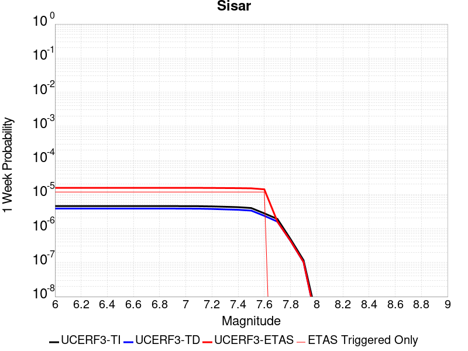 | 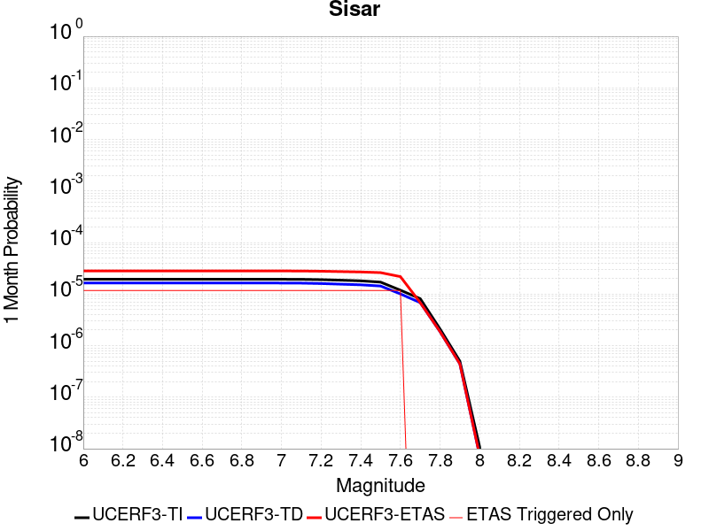 | 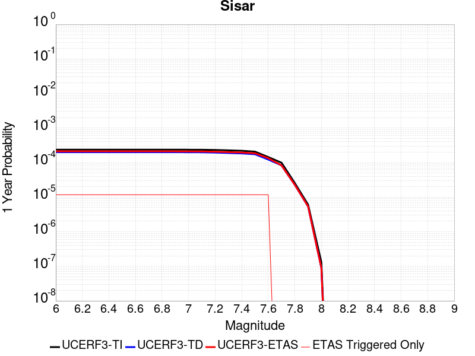 | 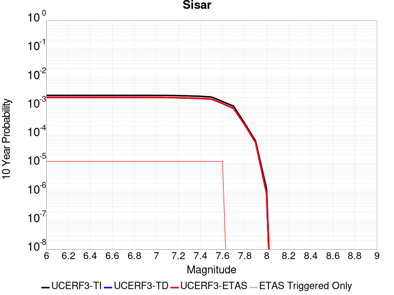 |

| Magnitude | 1 wk TI Prob | 1 wk TD Prob | 1 wk ETAS Prob | 1 wk ETAS/TD Gain | 1 wk ETAS Triggered Only | 1 mo TI Prob | 1 mo TD Prob | 1 mo ETAS Prob | 1 mo ETAS/TD Gain | 1 mo ETAS Triggered Only | 1 yr TI Prob | 1 yr TD Prob | 1 yr ETAS Prob | 1 yr ETAS/TD Gain | 1 yr ETAS Triggered Only | 10 yr TI Prob | 10 yr TD Prob | 10 yr ETAS Prob | 10 yr ETAS/TD Gain | 10 yr ETAS Triggered Only |
|-----|-----|-----|-----|-----|-----|-----|-----|-----|-----|-----|-----|-----|-----|-----|-----|-----|-----|-----|-----|-----|
| 6.0 | 4.544193E-6 | 3.839576E-6 | 1.5576621E-5 | 4.056859 | 1.1737089E-5 | 1.9474966E-5 | 1.6455224E-5 | 2.819212E-5 | 1.7132626 | 1.1737089E-5 | 2.3708193E-4 | 2.0032428E-4 | 2.1205902E-4 | 1.0585787 | 1.1737089E-5 | 0.0023682916 | 0.002001471 | 0.0020131844 | 1.0058525 | 1.1737089E-5 |
| 6.1 | 4.544193E-6 | 3.839576E-6 | 1.5576621E-5 | 4.056859 | 1.1737089E-5 | 1.9474966E-5 | 1.6455224E-5 | 2.819212E-5 | 1.7132626 | 1.1737089E-5 | 2.3708193E-4 | 2.0032428E-4 | 2.1205902E-4 | 1.0585787 | 1.1737089E-5 | 0.0023682916 | 0.002001471 | 0.0020131844 | 1.0058525 | 1.1737089E-5 |
| 6.2 | 4.544193E-6 | 3.839576E-6 | 1.5576621E-5 | 4.056859 | 1.1737089E-5 | 1.9474966E-5 | 1.6455224E-5 | 2.819212E-5 | 1.7132626 | 1.1737089E-5 | 2.3708193E-4 | 2.0032428E-4 | 2.1205902E-4 | 1.0585787 | 1.1737089E-5 | 0.0023682916 | 0.002001471 | 0.0020131844 | 1.0058525 | 1.1737089E-5 |
| 6.3 | 4.544193E-6 | 3.839576E-6 | 1.5576621E-5 | 4.056859 | 1.1737089E-5 | 1.9474966E-5 | 1.6455224E-5 | 2.819212E-5 | 1.7132626 | 1.1737089E-5 | 2.3708193E-4 | 2.0032428E-4 | 2.1205902E-4 | 1.0585787 | 1.1737089E-5 | 0.0023682916 | 0.002001471 | 0.0020131844 | 1.0058525 | 1.1737089E-5 |
| 6.4 | 4.544193E-6 | 3.839576E-6 | 1.5576621E-5 | 4.056859 | 1.1737089E-5 | 1.9474966E-5 | 1.6455224E-5 | 2.819212E-5 | 1.7132626 | 1.1737089E-5 | 2.3708193E-4 | 2.0032428E-4 | 2.1205902E-4 | 1.0585787 | 1.1737089E-5 | 0.0023682916 | 0.002001471 | 0.0020131844 | 1.0058525 | 1.1737089E-5 |
| 6.5 | 4.544193E-6 | 3.839576E-6 | 1.5576621E-5 | 4.056859 | 1.1737089E-5 | 1.9474966E-5 | 1.6455224E-5 | 2.819212E-5 | 1.7132626 | 1.1737089E-5 | 2.3708193E-4 | 2.0032428E-4 | 2.1205902E-4 | 1.0585787 | 1.1737089E-5 | 0.0023682916 | 0.002001471 | 0.0020131844 | 1.0058525 | 1.1737089E-5 |
| 6.6 | 4.544193E-6 | 3.839576E-6 | 1.5576621E-5 | 4.056859 | 1.1737089E-5 | 1.9474966E-5 | 1.6455224E-5 | 2.819212E-5 | 1.7132626 | 1.1737089E-5 | 2.3708193E-4 | 2.0032428E-4 | 2.1205902E-4 | 1.0585787 | 1.1737089E-5 | 0.0023682916 | 0.002001471 | 0.0020131844 | 1.0058525 | 1.1737089E-5 |
| 6.7 | 4.544193E-6 | 3.839576E-6 | 1.5576621E-5 | 4.056859 | 1.1737089E-5 | 1.9474966E-5 | 1.6455224E-5 | 2.819212E-5 | 1.7132626 | 1.1737089E-5 | 2.3708193E-4 | 2.0032428E-4 | 2.1205902E-4 | 1.0585787 | 1.1737089E-5 | 0.0023682916 | 0.002001471 | 0.0020131844 | 1.0058525 | 1.1737089E-5 |
| 6.8 | 4.544193E-6 | 3.839576E-6 | 1.5576621E-5 | 4.056859 | 1.1737089E-5 | 1.9474966E-5 | 1.6455224E-5 | 2.819212E-5 | 1.7132626 | 1.1737089E-5 | 2.3708193E-4 | 2.0032428E-4 | 2.1205902E-4 | 1.0585787 | 1.1737089E-5 | 0.0023682916 | 0.002001471 | 0.0020131844 | 1.0058525 | 1.1737089E-5 |
| 6.9 | 4.542225E-6 | 3.8375383E-6 | 1.5574582E-5 | 4.0584826 | 1.1737089E-5 | 1.9466532E-5 | 1.6446491E-5 | 2.8183385E-5 | 1.7136414 | 1.1737089E-5 | 2.3697925E-4 | 2.0021795E-4 | 2.1195269E-4 | 1.0586098 | 1.1737089E-5 | 0.002367267 | 0.0020004094 | 0.0020121231 | 1.0058556 | 1.1737089E-5 |
| 7.0 | 4.5278484E-6 | 3.822602E-6 | 1.5559646E-5 | 4.070433 | 1.1737089E-5 | 1.940492E-5 | 1.638248E-5 | 2.8119377E-5 | 1.7164298 | 1.1737089E-5 | 2.3622929E-4 | 1.9943877E-4 | 2.1117352E-4 | 1.0588388 | 1.1737089E-5 | 0.0023597833 | 0.0019926317 | 0.0020043454 | 1.0058786 | 1.1737089E-5 |
| 7.1 | 4.5132488E-6 | 3.8073897E-6 | 1.5544434E-5 | 4.082701 | 1.1737089E-5 | 1.9342351E-5 | 1.6317284E-5 | 2.805418E-5 | 1.7192924 | 1.1737089E-5 | 2.3546767E-4 | 1.9864515E-4 | 2.1037992E-4 | 1.0590739 | 1.1737089E-5 | 0.0023521832 | 0.0019847096 | 0.0019964236 | 1.005902 | 1.1737089E-5 |
| 7.2 | 4.448859E-6 | 3.7398502E-6 | 1.5476895E-5 | 4.1383734 | 1.1737089E-5 | 1.9066398E-5 | 1.6027832E-5 | 2.7764734E-5 | 1.7322825 | 1.1737089E-5 | 2.3210866E-4 | 1.9512173E-4 | 2.0685652E-4 | 1.060141 | 1.1737089E-5 | 0.0023186638 | 0.0019495375 | 0.0019612517 | 1.0060087 | 1.1737089E-5 |
| 7.3 | 4.3424366E-6 | 3.6336846E-6 | 1.5370731E-5 | 4.2300677 | 1.1737089E-5 | 1.861031E-5 | 1.5572843E-5 | 2.7309748E-5 | 1.7536778 | 1.1737089E-5 | 2.2655698E-4 | 1.895832E-4 | 2.0131806E-4 | 1.0618982 | 1.1737089E-5 | 0.0022632615 | 0.0018942481 | 0.0019059629 | 1.0061845 | 1.1737089E-5 |
| 7.4 | 4.218641E-6 | 3.5330384E-6 | 1.5270087E-5 | 4.3220835 | 1.1737089E-5 | 1.8079765E-5 | 1.5141507E-5 | 2.6878419E-5 | 1.7751482 | 1.1737089E-5 | 2.2009891E-4 | 1.8433259E-4 | 1.9606751E-4 | 1.0636617 | 1.1737089E-5 | 0.0021988105 | 0.0018418302 | 0.0018535457 | 1.0063608 | 1.1737089E-5 |
| 7.5 | 3.983779E-6 | 3.3478068E-6 | 1.5084856E-5 | 4.5058923 | 1.1737089E-5 | 1.7073227E-5 | 1.4347666E-5 | 2.6084588E-5 | 1.8180369 | 1.1737089E-5 | 2.0784672E-4 | 1.7466917E-4 | 1.8640421E-4 | 1.0671843 | 1.1737089E-5 | 0.0020765243 | 0.0017453518 | 0.0017570684 | 1.006713 | 1.1737089E-5 |
| 7.6 | 2.777393E-6 | 2.35225E-6 | 1.4089312E-5 | 5.989717 | 1.1737089E-5 | 1.1903058E-5 | 1.0081033E-5 | 2.1818005E-5 | 2.1642628 | 1.1737089E-5 | 1.449101E-4 | 1.2272975E-4 | 1.3446539E-4 | 1.0956218 | 1.1737089E-5 | 0.0014481564 | 0.0012266274 | 0.00123835 | 1.0095569 | 1.1737089E-5 |
| 7.7 | 1.9028433E-6 | 1.593867E-6 | 1.593867E-6 | 1.0 | 0.0 | 8.155017E-6 | 6.8308404E-6 | 6.8308404E-6 | 1.0 | 0.0 | 9.928281E-5 | 8.3162355E-5 | 8.3162355E-5 | 1.0 | 0.0 | 9.923846E-4 | 8.313171E-4 | 8.313171E-4 | 1.0 | 0.0 |
| 7.8 | 4.9095956E-7 | 4.3583708E-7 | 4.3583708E-7 | 1.0 | 0.0 | 2.1041105E-6 | 1.8678718E-6 | 1.8678718E-6 | 1.0 | 0.0 | 2.5617246E-5 | 2.2741104E-5 | 2.2741104E-5 | 1.0 | 0.0 | 2.5614293E-4 | 2.2738794E-4 | 2.2738794E-4 | 1.0 | 0.0 |
| 7.9 | 1.16657894E-7 | 1.0335569E-7 | 1.0335569E-7 | 1.0 | 0.0 | 4.999623E-7 | 4.4295288E-7 | 4.4295288E-7 | 1.0 | 0.0 | 6.087024E-6 | 5.3929384E-6 | 5.3929384E-6 | 1.0 | 0.0 | 6.0868573E-5 | 5.3928103E-5 | 5.3928103E-5 | 1.0 | 0.0 |
| 8.0 | 2.5100346E-9 | 1.7067566E-9 | 1.7067566E-9 | 1.0 | 0.0 | 1.0757291E-8 | 7.3146724E-9 | 7.3146724E-9 | 1.0 | 0.0 | 1.3097001E-7 | 8.905613E-8 | 8.905613E-8 | 1.0 | 0.0 | 1.3096993E-6 | 8.9056095E-7 | 8.9056095E-7 | 1.0 | 0.0 |

## San Andreas (North Coast) 2011 CFM
*[(top)](#table-of-contents)*

| 1 Week | 1 Month | 1 Year | 10 Year |
|-----|-----|-----|-----|
| 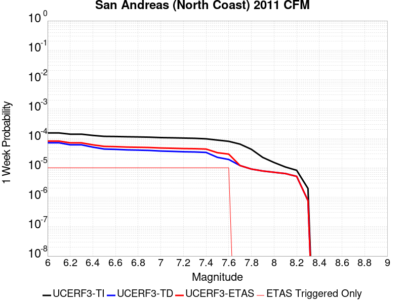 | 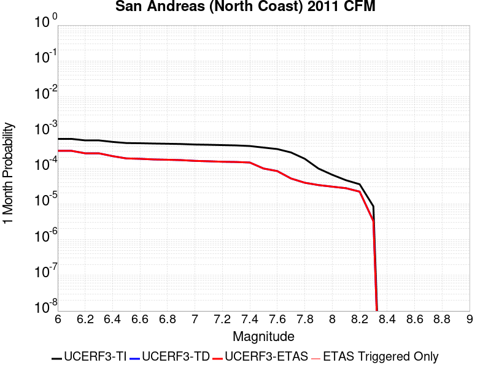 | 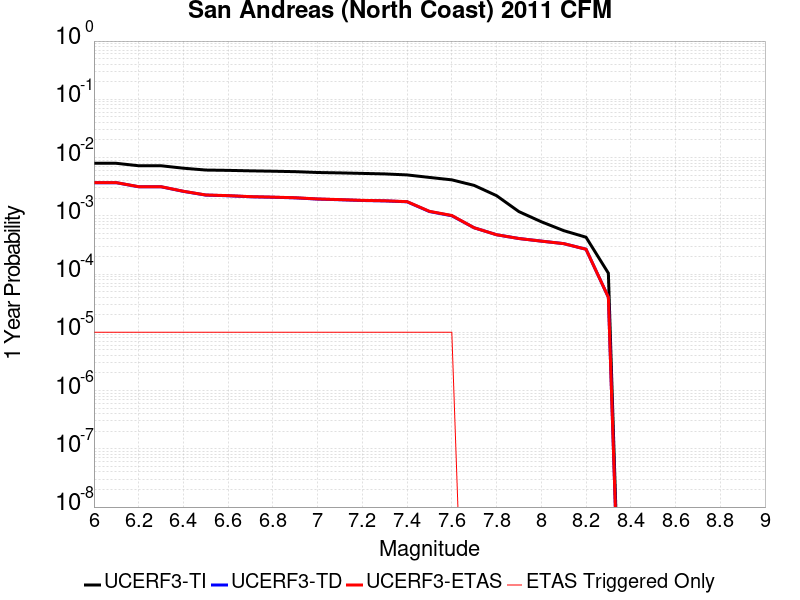 | 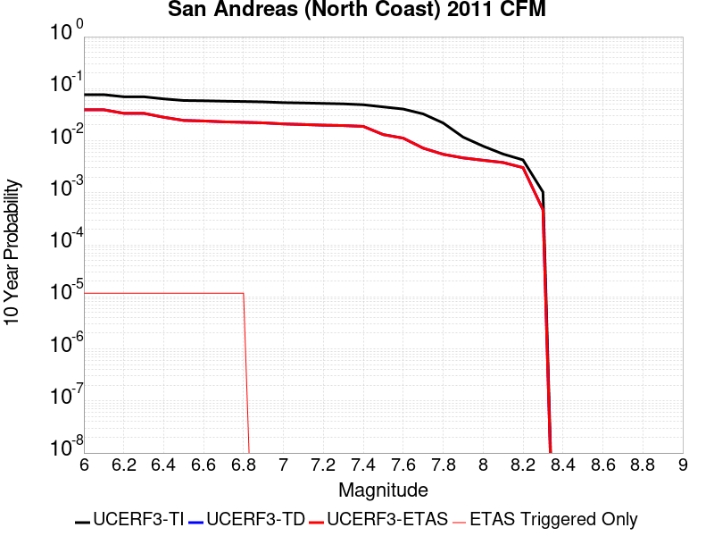 |

| Magnitude | 1 wk TI Prob | 1 wk TD Prob | 1 wk ETAS Prob | 1 wk ETAS/TD Gain | 1 wk ETAS Triggered Only | 1 mo TI Prob | 1 mo TD Prob | 1 mo ETAS Prob | 1 mo ETAS/TD Gain | 1 mo ETAS Triggered Only | 1 yr TI Prob | 1 yr TD Prob | 1 yr ETAS Prob | 1 yr ETAS/TD Gain | 1 yr ETAS Triggered Only | 10 yr TI Prob | 10 yr TD Prob | 10 yr ETAS Prob | 10 yr ETAS/TD Gain | 10 yr ETAS Triggered Only |
|-----|-----|-----|-----|-----|-----|-----|-----|-----|-----|-----|-----|-----|-----|-----|-----|-----|-----|-----|-----|-----|
| 6.0 | 1.5333705E-4 | 7.1106435E-5 | 7.1106435E-5 | 1.0 | 0.0 | 6.5699324E-4 | 3.0470645E-4 | 3.0470645E-4 | 1.0 | 0.0 | 0.007969595 | 0.0037035241 | 0.0037035241 | 1.0 | 0.0 | 0.0768977 | 0.03935284 | 0.039364118 | 1.0002865 | 1.1737089E-5 |
| 6.1 | 1.5333705E-4 | 7.1106435E-5 | 7.1106435E-5 | 1.0 | 0.0 | 6.5699324E-4 | 3.0470645E-4 | 3.0470645E-4 | 1.0 | 0.0 | 0.007969595 | 0.0037035241 | 0.0037035241 | 1.0 | 0.0 | 0.0768977 | 0.03935284 | 0.039364118 | 1.0002865 | 1.1737089E-5 |
| 6.2 | 1.3912938E-4 | 6.050204E-5 | 6.050204E-5 | 1.0 | 0.0 | 5.961325E-4 | 2.5926883E-4 | 2.5926883E-4 | 1.0 | 0.0 | 0.007233787 | 0.003152056 | 0.003152056 | 1.0 | 0.0 | 0.07002798 | 0.03369227 | 0.03370361 | 1.0003366 | 1.1737089E-5 |
| 6.3 | 1.3912938E-4 | 6.050204E-5 | 6.050204E-5 | 1.0 | 0.0 | 5.961325E-4 | 2.5926883E-4 | 2.5926883E-4 | 1.0 | 0.0 | 0.007233787 | 0.003152056 | 0.003152056 | 1.0 | 0.0 | 0.07002798 | 0.03369227 | 0.03370361 | 1.0003366 | 1.1737089E-5 |
| 6.4 | 1.2623647E-4 | 5.0442024E-5 | 5.0442024E-5 | 1.0 | 0.0 | 5.4090127E-4 | 2.161623E-4 | 2.161623E-4 | 1.0 | 0.0 | 0.0065656058 | 0.0026286195 | 0.0026286195 | 1.0 | 0.0 | 0.06374981 | 0.028303223 | 0.028314628 | 1.0004029 | 1.1737089E-5 |
| 6.5 | 1.1736096E-4 | 4.3523814E-5 | 4.3523814E-5 | 1.0 | 0.0 | 5.028786E-4 | 1.8651738E-4 | 1.8651738E-4 | 1.0 | 0.0 | 0.006105373 | 0.0022685004 | 0.0022685004 | 1.0 | 0.0 | 0.05940335 | 0.024579322 | 0.02459077 | 1.0004658 | 1.1737089E-5 |
| 6.6 | 1.1586959E-4 | 4.2423668E-5 | 4.2423668E-5 | 1.0 | 0.0 | 4.964894E-4 | 1.8180315E-4 | 1.8180315E-4 | 1.0 | 0.0 | 0.006028018 | 0.0022112224 | 0.0022112224 | 1.0 | 0.0 | 0.058671024 | 0.023984991 | 0.023996448 | 1.0004777 | 1.1737089E-5 |
| 6.7 | 1.13693764E-4 | 4.073593E-5 | 4.073593E-5 | 1.0 | 0.0 | 4.87168E-4 | 1.7457096E-4 | 1.7457096E-4 | 1.0 | 0.0 | 0.005915152 | 0.0021233456 | 0.0021233456 | 1.0 | 0.0 | 0.057601593 | 0.023076393 | 0.02308786 | 1.0004969 | 1.1737089E-5 |
| 6.8 | 1.1204889E-4 | 3.9953447E-5 | 3.9953447E-5 | 1.0 | 0.0 | 4.8012115E-4 | 1.7121792E-4 | 1.7121792E-4 | 1.0 | 0.0 | 0.005829819 | 0.002082601 | 0.002082601 | 1.0 | 0.0 | 0.05679232 | 0.022636656 | 0.022648126 | 1.0005068 | 1.1737089E-5 |
| 6.9 | 1.1005794E-4 | 3.900957E-5 | 3.900957E-5 | 1.0 | 0.0 | 4.7159163E-4 | 1.6717325E-4 | 1.6717325E-4 | 1.0 | 0.0 | 0.0057265228 | 0.0020334502 | 0.0020334502 | 1.0 | 0.0 | 0.055811852 | 0.022102542 | 0.022102542 | 1.0 | 0.0 |
| 7.0 | 1.0647948E-4 | 3.7166337E-5 | 3.7166337E-5 | 1.0 | 0.0 | 4.562608E-4 | 1.5927466E-4 | 1.5927466E-4 | 1.0 | 0.0 | 0.0055408357 | 0.0019374598 | 0.0019374598 | 1.0 | 0.0 | 0.054047033 | 0.021062272 | 0.021062272 | 1.0 | 0.0 |
| 7.1 | 1.04795035E-4 | 3.6215948E-5 | 3.6215948E-5 | 1.0 | 0.0 | 4.4904428E-4 | 1.5520205E-4 | 1.5520205E-4 | 1.0 | 0.0 | 0.0054534175 | 0.0018879628 | 0.0018879628 | 1.0 | 0.0 | 0.053215165 | 0.020530313 | 0.020530313 | 1.0 | 0.0 |
| 7.2 | 1.02724036E-4 | 3.5124547E-5 | 3.5124547E-5 | 1.0 | 0.0 | 4.401716E-4 | 1.5052517E-4 | 1.5052517E-4 | 1.0 | 0.0 | 0.0053459285 | 0.0018311188 | 0.0018311188 | 1.0 | 0.0 | 0.052191395 | 0.019919246 | 0.019919246 | 1.0 | 0.0 |
| 7.3 | 1.00650694E-4 | 3.4592013E-5 | 3.4592013E-5 | 1.0 | 0.0 | 4.312888E-4 | 1.4824314E-4 | 1.4824314E-4 | 1.0 | 0.0 | 0.005238306 | 0.0018033815 | 0.0018033815 | 1.0 | 0.0 | 0.051165357 | 0.019596443 | 0.019596443 | 1.0 | 0.0 |
| 7.4 | 9.672919E-5 | 3.338123E-5 | 3.338123E-5 | 1.0 | 0.0 | 4.144878E-4 | 1.4305465E-4 | 1.4305465E-4 | 1.0 | 0.0 | 0.005034718 | 0.0017403142 | 0.0017403142 | 1.0 | 0.0 | 0.049221683 | 0.018869769 | 0.018869769 | 1.0 | 0.0 |
| 7.5 | 8.7600405E-5 | 2.2700917E-5 | 2.2700917E-5 | 1.0 | 0.0 | 3.753763E-4 | 9.728602E-5 | 9.728602E-5 | 1.0 | 0.0 | 0.0045606326 | 0.0011838155 | 0.0011838155 | 1.0 | 0.0 | 0.04468165 | 0.013130207 | 0.013130207 | 1.0 | 0.0 |
| 7.6 | 7.9562284E-5 | 1.9226305E-5 | 1.9226305E-5 | 1.0 | 0.0 | 3.4093665E-4 | 8.239586E-5 | 8.239586E-5 | 1.0 | 0.0 | 0.0041430052 | 0.0010027094 | 0.0010027094 | 1.0 | 0.0 | 0.040666126 | 0.011221658 | 0.011221658 | 1.0 | 0.0 |
| 7.7 | 6.3866544E-5 | 1.1941707E-5 | 1.1941707E-5 | 1.0 | 0.0 | 2.7368503E-4 | 5.117774E-5 | 5.117774E-5 | 1.0 | 0.0 | 0.0033270244 | 6.2291115E-4 | 6.2291115E-4 | 1.0 | 0.0 | 0.032776527 | 0.007210334 | 0.007210334 | 1.0 | 0.0 |
| 7.8 | 4.2543215E-5 | 9.076524E-6 | 9.076524E-6 | 1.0 | 0.0 | 1.8231533E-4 | 3.8898812E-5 | 3.8898812E-5 | 1.0 | 0.0 | 0.0022174292 | 4.7349022E-4 | 4.7349022E-4 | 1.0 | 0.0 | 0.021954332 | 0.005490525 | 0.005490525 | 1.0 | 0.0 |
| 7.9 | 2.2636612E-5 | 7.81435E-6 | 7.81435E-6 | 1.0 | 0.0 | 9.7010445E-5 | 3.3489643E-5 | 3.3489643E-5 | 1.0 | 0.0 | 0.0011804621 | 4.076602E-4 | 4.076602E-4 | 1.0 | 0.0 | 0.011742111 | 0.0046832846 | 0.0046832846 | 1.0 | 0.0 |
| 8.0 | 1.5167874E-5 | 7.0494675E-6 | 7.0494675E-6 | 1.0 | 0.0 | 6.500356E-5 | 3.0211655E-5 | 3.0211655E-5 | 1.0 | 0.0 | 7.9113094E-4 | 3.677649E-4 | 3.677649E-4 | 1.0 | 0.0 | 0.007883203 | 0.004215588 | 0.004215588 | 1.0 | 0.0 |
| 8.1 | 1.0681047E-5 | 6.386992E-6 | 6.386992E-6 | 1.0 | 0.0 | 4.5775112E-5 | 2.7372536E-5 | 2.7372536E-5 | 1.0 | 0.0 | 5.5716943E-4 | 3.3320975E-4 | 3.3320975E-4 | 1.0 | 0.0 | 0.0055577457 | 0.003817393 | 0.003817393 | 1.0 | 0.0 |
| 8.2 | 8.226114E-6 | 5.1150587E-6 | 5.1150587E-6 | 1.0 | 0.0 | 3.52543E-5 | 2.1921496E-5 | 2.1921496E-5 | 1.0 | 0.0 | 4.2913653E-4 | 2.668616E-4 | 2.668616E-4 | 1.0 | 0.0 | 0.004283088 | 0.0030450926 | 0.0030450926 | 1.0 | 0.0 |
| 8.3 | 1.983087E-6 | 7.6599065E-7 | 7.6599065E-7 | 1.0 | 0.0 | 8.498917E-6 | 3.282813E-6 | 3.282813E-6 | 1.0 | 0.0 | 1.034694E-4 | 3.9967534E-5 | 3.9967534E-5 | 1.0 | 0.0 | 0.0010342124 | 4.719687E-4 | 4.719687E-4 | 1.0 | 0.0 |

## Northridge
*[(top)](#table-of-contents)*

| 1 Week | 1 Month | 1 Year | 10 Year |
|-----|-----|-----|-----|
| 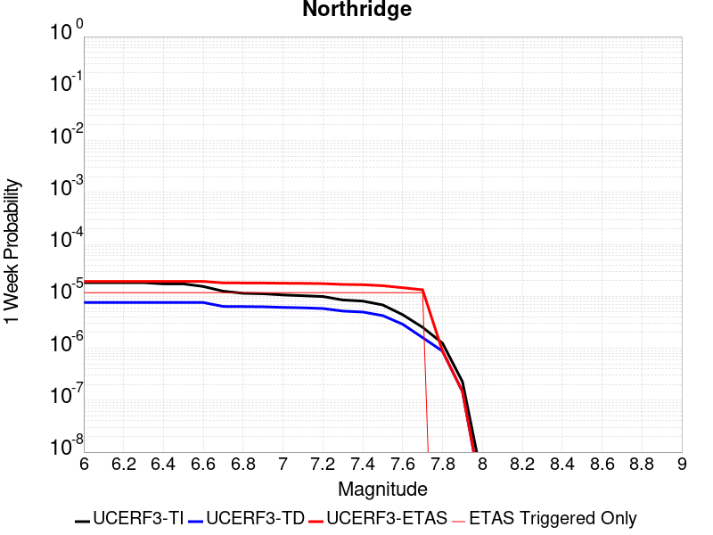 | 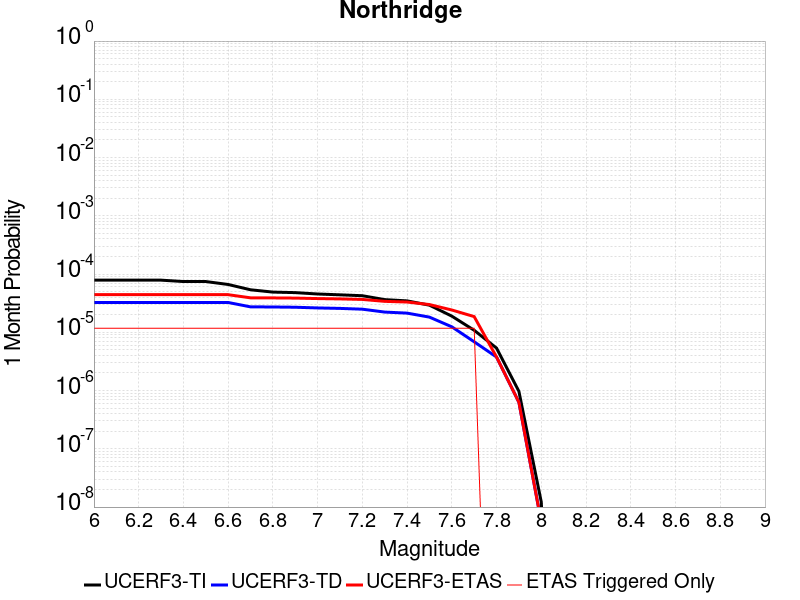 | 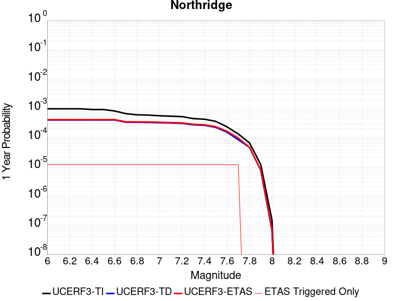 | 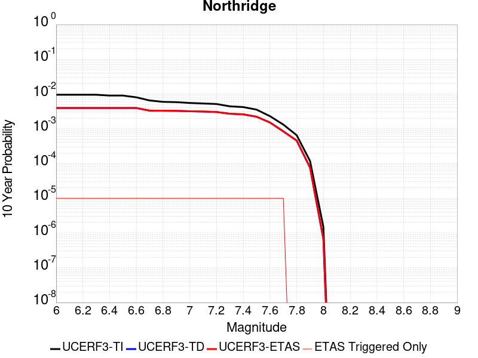 |

| Magnitude | 1 wk TI Prob | 1 wk TD Prob | 1 wk ETAS Prob | 1 wk ETAS/TD Gain | 1 wk ETAS Triggered Only | 1 mo TI Prob | 1 mo TD Prob | 1 mo ETAS Prob | 1 mo ETAS/TD Gain | 1 mo ETAS Triggered Only | 1 yr TI Prob | 1 yr TD Prob | 1 yr ETAS Prob | 1 yr ETAS/TD Gain | 1 yr ETAS Triggered Only | 10 yr TI Prob | 10 yr TD Prob | 10 yr ETAS Prob | 10 yr ETAS/TD Gain | 10 yr ETAS Triggered Only |
|-----|-----|-----|-----|-----|-----|-----|-----|-----|-----|-----|-----|-----|-----|-----|-----|-----|-----|-----|-----|-----|
| 6.0 | 1.8340852E-5 | 7.5880193E-6 | 1.932502E-5 | 2.5467803 | 1.1737089E-5 | 7.860128E-5 | 3.251969E-5 | 4.4256398E-5 | 1.3609108 | 1.1737089E-5 | 9.565505E-4 | 3.958575E-4 | 4.0758995E-4 | 1.029638 | 1.1737089E-5 | 0.009524435 | 0.003951746 | 0.0039634365 | 1.0029584 | 1.1737089E-5 |
| 6.1 | 1.8340852E-5 | 7.5880193E-6 | 1.932502E-5 | 2.5467803 | 1.1737089E-5 | 7.860128E-5 | 3.251969E-5 | 4.4256398E-5 | 1.3609108 | 1.1737089E-5 | 9.565505E-4 | 3.958575E-4 | 4.0758995E-4 | 1.029638 | 1.1737089E-5 | 0.009524435 | 0.003951746 | 0.0039634365 | 1.0029584 | 1.1737089E-5 |
| 6.2 | 1.8340852E-5 | 7.5880193E-6 | 1.932502E-5 | 2.5467803 | 1.1737089E-5 | 7.860128E-5 | 3.251969E-5 | 4.4256398E-5 | 1.3609108 | 1.1737089E-5 | 9.565505E-4 | 3.958575E-4 | 4.0758995E-4 | 1.029638 | 1.1737089E-5 | 0.009524435 | 0.003951746 | 0.0039634365 | 1.0029584 | 1.1737089E-5 |
| 6.3 | 1.8340852E-5 | 7.5880193E-6 | 1.932502E-5 | 2.5467803 | 1.1737089E-5 | 7.860128E-5 | 3.251969E-5 | 4.4256398E-5 | 1.3609108 | 1.1737089E-5 | 9.565505E-4 | 3.958575E-4 | 4.0758995E-4 | 1.029638 | 1.1737089E-5 | 0.009524435 | 0.003951746 | 0.0039634365 | 1.0029584 | 1.1737089E-5 |
| 6.4 | 1.7361892E-5 | 7.5880193E-6 | 1.932502E-5 | 2.5467803 | 1.1737089E-5 | 7.440598E-5 | 3.251969E-5 | 4.4256398E-5 | 1.3609108 | 1.1737089E-5 | 9.055163E-4 | 3.958575E-4 | 4.0758995E-4 | 1.029638 | 1.1737089E-5 | 0.009018354 | 0.003951746 | 0.0039634365 | 1.0029584 | 1.1737089E-5 |
| 6.5 | 1.7361892E-5 | 7.5880193E-6 | 1.932502E-5 | 2.5467803 | 1.1737089E-5 | 7.440598E-5 | 3.251969E-5 | 4.4256398E-5 | 1.3609108 | 1.1737089E-5 | 9.055163E-4 | 3.958575E-4 | 4.0758995E-4 | 1.029638 | 1.1737089E-5 | 0.009018354 | 0.003951746 | 0.0039634365 | 1.0029584 | 1.1737089E-5 |
| 6.6 | 1.5458201E-5 | 7.5880193E-6 | 1.932502E-5 | 2.5467803 | 1.1737089E-5 | 6.624775E-5 | 3.251969E-5 | 4.4256398E-5 | 1.3609108 | 1.1737089E-5 | 8.0626784E-4 | 3.958575E-4 | 4.0758995E-4 | 1.029638 | 1.1737089E-5 | 0.008033488 | 0.003951746 | 0.0039634365 | 1.0029584 | 1.1737089E-5 |
| 6.7 | 1.2538368E-5 | 6.381603E-6 | 1.8118617E-5 | 2.8391953 | 1.1737089E-5 | 5.3734755E-5 | 2.7349442E-5 | 3.908621E-5 | 1.429141 | 1.1737089E-5 | 6.5402425E-4 | 3.3292902E-4 | 3.446622E-4 | 1.0352423 | 1.1737089E-5 | 0.0065210275 | 0.0033243506 | 0.0033360487 | 1.0035189 | 1.1737089E-5 |
| 6.8 | 1.1438097E-5 | 6.3502566E-6 | 1.8087272E-5 | 2.848274 | 1.1737089E-5 | 4.9019498E-5 | 2.7215105E-5 | 3.8951875E-5 | 1.4312594 | 1.1737089E-5 | 5.9664896E-4 | 3.3129397E-4 | 3.4302715E-4 | 1.0354162 | 1.1737089E-5 | 0.005950495 | 0.0033080487 | 0.0033197468 | 1.0035363 | 1.1737089E-5 |
| 6.9 | 1.1204891E-5 | 6.2867084E-6 | 1.8023724E-5 | 2.8669572 | 1.1737089E-5 | 4.8020076E-5 | 2.694276E-5 | 3.8679533E-5 | 1.4356188 | 1.1737089E-5 | 5.8448757E-4 | 3.2797916E-4 | 3.3971242E-4 | 1.0357744 | 1.1737089E-5 | 0.0058295266 | 0.0032749989 | 0.0032866974 | 1.0035721 | 1.1737089E-5 |
| 7.0 | 1.061046E-5 | 6.115359E-6 | 1.7852377E-5 | 2.9192686 | 1.1737089E-5 | 4.5472607E-5 | 2.6208421E-5 | 3.7945203E-5 | 1.4478248 | 1.1737089E-5 | 5.534883E-4 | 3.1904122E-4 | 3.3077458E-4 | 1.0367769 | 1.1737089E-5 | 0.0055211177 | 0.0031858785 | 0.0031975782 | 1.0036724 | 1.1737089E-5 |
| 7.1 | 1.0266979E-5 | 6.004274E-6 | 1.7741293E-5 | 2.9547772 | 1.1737089E-5 | 4.40006E-5 | 2.5732352E-5 | 3.7469137E-5 | 1.4561101 | 1.1737089E-5 | 5.355756E-4 | 3.1324677E-4 | 3.2498018E-4 | 1.0374575 | 1.1737089E-5 | 0.0053428668 | 0.003128098 | 0.0031397985 | 1.0037404 | 1.1737089E-5 |
| 7.2 | 9.91273E-6 | 5.819984E-6 | 1.7557006E-5 | 3.0166757 | 1.1737089E-5 | 4.248244E-5 | 2.4942554E-5 | 3.667935E-5 | 1.4705532 | 1.1737089E-5 | 5.171009E-4 | 3.036337E-4 | 3.1536722E-4 | 1.0386437 | 1.1737089E-5 | 0.0051589934 | 0.0030322333 | 0.003043935 | 1.003859 | 1.1737089E-5 |
| 7.3 | 8.4959265E-6 | 5.193062E-6 | 1.693009E-5 | 3.2601364 | 1.1737089E-5 | 3.6410605E-5 | 2.225579E-5 | 3.399262E-5 | 1.5273607 | 1.1737089E-5 | 4.4320893E-4 | 2.709308E-4 | 2.826647E-4 | 1.0433096 | 1.1737089E-5 | 0.00442326 | 0.0027060313 | 0.0027177366 | 1.0043256 | 1.1737089E-5 |
| 7.4 | 8.0847185E-6 | 4.9819355E-6 | 1.6718966E-5 | 3.3559177 | 1.1737089E-5 | 3.4648332E-5 | 2.135098E-5 | 3.3087817E-5 | 1.5497097 | 1.1737089E-5 | 4.2176177E-4 | 2.599174E-4 | 2.7165143E-4 | 1.0451453 | 1.1737089E-5 | 0.0042096223 | 0.00259616 | 0.0026078667 | 1.0045092 | 1.1737089E-5 |
| 7.5 | 6.8220684E-6 | 4.2533075E-6 | 1.5990347E-5 | 3.7595086 | 1.1737089E-5 | 2.9237108E-5 | 1.8228335E-5 | 2.9965211E-5 | 1.6438808 | 1.1737089E-5 | 3.5590364E-4 | 2.2190758E-4 | 2.3364206E-4 | 1.05288 | 1.1737089E-5 | 0.0035533418 | 0.002216881 | 0.002228592 | 1.0052826 | 1.1737089E-5 |
| 7.6 | 4.4224143E-6 | 2.8999582E-6 | 1.4637013E-5 | 5.0473185 | 1.1737089E-5 | 1.8953066E-5 | 1.2428334E-5 | 2.4165278E-5 | 1.9443698 | 1.1737089E-5 | 2.3072914E-4 | 1.5130457E-4 | 1.6303989E-4 | 1.0775609 | 1.1737089E-5 | 0.0023048974 | 0.0015120271 | 0.0015237465 | 1.0077507 | 1.1737089E-5 |
| 7.7 | 2.5297056E-6 | 1.6045905E-6 | 1.3341661E-5 | 8.314683 | 1.1737089E-5 | 1.0841551E-5 | 6.8767986E-6 | 1.8613808E-5 | 2.7067547 | 1.1737089E-5 | 1.319879E-4 | 8.3721854E-5 | 9.545796E-5 | 1.1401798 | 1.1737089E-5 | 0.0013190953 | 8.369078E-4 | 8.486351E-4 | 1.0140126 | 1.1737089E-5 |
| 7.8 | 1.2508156E-6 | 8.780076E-7 | 8.780076E-7 | 1.0 | 0.0 | 5.3606273E-6 | 3.7628845E-6 | 3.7628845E-6 | 1.0 | 0.0 | 6.526368E-5 | 4.581217E-5 | 4.581217E-5 | 1.0 | 0.0 | 6.524452E-4 | 4.5802852E-4 | 4.5802852E-4 | 1.0 | 0.0 |
| 7.9 | 2.262199E-7 | 1.4664671E-7 | 1.4664671E-7 | 1.0 | 0.0 | 9.695135E-7 | 6.284858E-7 | 6.284858E-7 | 1.0 | 0.0 | 1.1803763E-5 | 7.651788E-6 | 7.651788E-6 | 1.0 | 0.0 | 1.1803136E-4 | 7.651533E-5 | 7.651533E-5 | 1.0 | 0.0 |
| 8.0 | 2.865362E-9 | 1.2753101E-9 | 1.2753101E-9 | 1.0 | 0.0 | 1.2280123E-8 | 5.4656146E-9 | 5.4656146E-9 | 1.0 | 0.0 | 1.4951048E-7 | 6.654386E-8 | 6.654386E-8 | 1.0 | 0.0 | 1.4951038E-6 | 6.654386E-7 | 6.654386E-7 | 1.0 | 0.0 |

## Eaton Roughs 2011 CFM
*[(top)](#table-of-contents)*

| 1 Week | 1 Month | 1 Year | 10 Year |
|-----|-----|-----|-----|
| 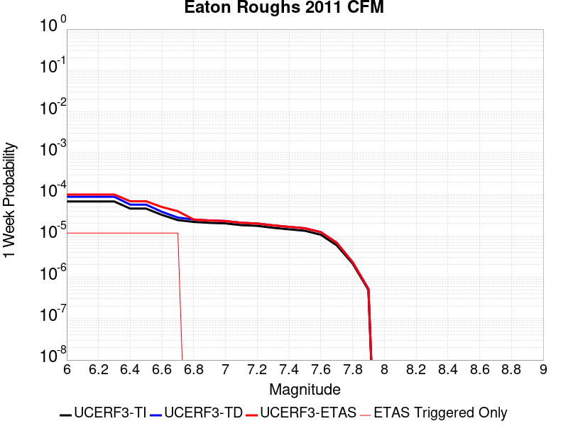 | 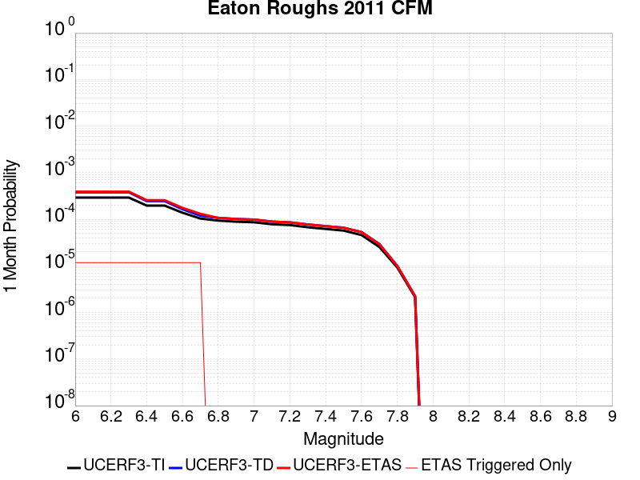 | 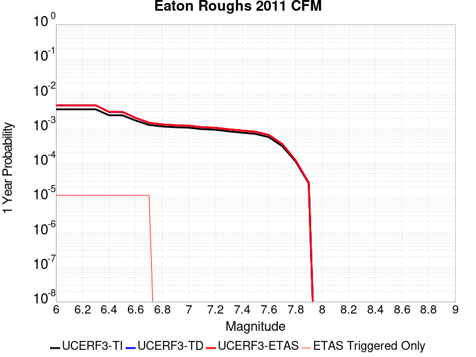 | 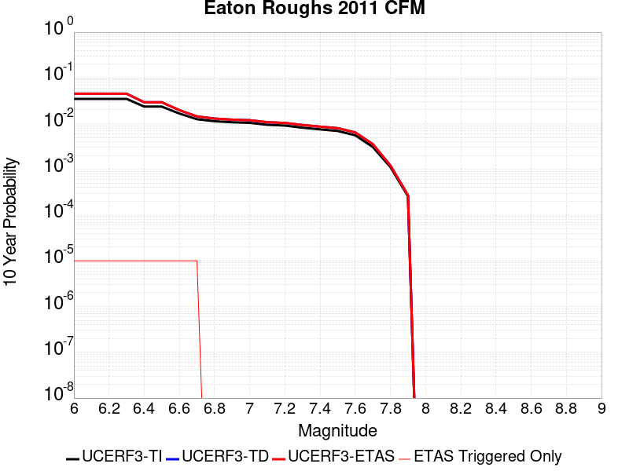 |

| Magnitude | 1 wk TI Prob | 1 wk TD Prob | 1 wk ETAS Prob | 1 wk ETAS/TD Gain | 1 wk ETAS Triggered Only | 1 mo TI Prob | 1 mo TD Prob | 1 mo ETAS Prob | 1 mo ETAS/TD Gain | 1 mo ETAS Triggered Only | 1 yr TI Prob | 1 yr TD Prob | 1 yr ETAS Prob | 1 yr ETAS/TD Gain | 1 yr ETAS Triggered Only | 10 yr TI Prob | 10 yr TD Prob | 10 yr ETAS Prob | 10 yr ETAS/TD Gain | 10 yr ETAS Triggered Only |
|-----|-----|-----|-----|-----|-----|-----|-----|-----|-----|-----|-----|-----|-----|-----|-----|-----|-----|-----|-----|-----|
| 6.0 | 6.8044945E-5 | 8.843646E-5 | 1.0017252E-4 | 1.132706 | 1.1737089E-5 | 2.9158857E-4 | 3.7896493E-4 | 3.9069756E-4 | 1.0309597 | 1.1737089E-5 | 0.0035443127 | 0.0046050907 | 0.0046167737 | 1.002537 | 1.1737089E-5 | 0.03488314 | 0.04516335 | 0.045174554 | 1.0002482 | 1.1737089E-5 |
| 6.1 | 6.8044945E-5 | 8.843646E-5 | 1.0017252E-4 | 1.132706 | 1.1737089E-5 | 2.9158857E-4 | 3.7896493E-4 | 3.9069756E-4 | 1.0309597 | 1.1737089E-5 | 0.0035443127 | 0.0046050907 | 0.0046167737 | 1.002537 | 1.1737089E-5 | 0.03488314 | 0.04516335 | 0.045174554 | 1.0002482 | 1.1737089E-5 |
| 6.2 | 6.8044945E-5 | 8.843646E-5 | 1.0017252E-4 | 1.132706 | 1.1737089E-5 | 2.9158857E-4 | 3.7896493E-4 | 3.9069756E-4 | 1.0309597 | 1.1737089E-5 | 0.0035443127 | 0.0046050907 | 0.0046167737 | 1.002537 | 1.1737089E-5 | 0.03488314 | 0.04516335 | 0.045174554 | 1.0002482 | 1.1737089E-5 |
| 6.3 | 6.8044945E-5 | 8.843646E-5 | 1.0017252E-4 | 1.132706 | 1.1737089E-5 | 2.9158857E-4 | 3.7896493E-4 | 3.9069756E-4 | 1.0309597 | 1.1737089E-5 | 0.0035443127 | 0.0046050907 | 0.0046167737 | 1.002537 | 1.1737089E-5 | 0.03488314 | 0.04516335 | 0.045174554 | 1.0002482 | 1.1737089E-5 |
| 6.4 | 4.5830013E-5 | 5.715427E-5 | 6.889069E-5 | 1.2053463 | 1.1737089E-5 | 1.9639956E-4 | 2.4492692E-4 | 2.5666115E-4 | 1.047909 | 1.1737089E-5 | 0.0023885423 | 0.0029784471 | 0.0029901492 | 1.0039289 | 1.1737089E-5 | 0.023630321 | 0.029421588 | 0.02943298 | 1.0003872 | 1.1737089E-5 |
| 6.5 | 4.5830013E-5 | 5.715427E-5 | 6.889069E-5 | 1.2053463 | 1.1737089E-5 | 1.9639956E-4 | 2.4492692E-4 | 2.5666115E-4 | 1.047909 | 1.1737089E-5 | 0.0023885423 | 0.0029784471 | 0.0029901492 | 1.0039289 | 1.1737089E-5 | 0.023630321 | 0.029421588 | 0.02943298 | 1.0003872 | 1.1737089E-5 |
| 6.6 | 3.222194E-5 | 3.8261504E-5 | 4.9998143E-5 | 1.306748 | 1.1737089E-5 | 1.3808672E-4 | 1.639682E-4 | 1.7570338E-4 | 1.0715698 | 1.1737089E-5 | 0.0016799092 | 0.001994599 | 0.0020063126 | 1.0058727 | 1.1737089E-5 | 0.016672665 | 0.019776601 | 0.019788107 | 1.0005817 | 1.1737089E-5 |
| 6.7 | 2.4155654E-5 | 2.7786238E-5 | 3.9523E-5 | 1.4223949 | 1.1737089E-5 | 1.0352012E-4 | 1.1907848E-4 | 1.3081418E-4 | 1.0985543 | 1.1737089E-5 | 0.0012596287 | 0.0014488247 | 0.0014605448 | 1.0080894 | 1.1737089E-5 | 0.012525126 | 0.014394943 | 0.014406511 | 1.0008036 | 1.1737089E-5 |
| 6.8 | 2.1814667E-5 | 2.4940868E-5 | 2.4940868E-5 | 1.0 | 0.0 | 9.348808E-5 | 1.06885076E-4 | 1.06885076E-4 | 1.0 | 0.0 | 0.001137623 | 0.0013005526 | 0.0013005526 | 1.0 | 0.0 | 0.011318169 | 0.012930038 | 0.012930038 | 1.0 | 0.0 |
| 6.9 | 2.0700467E-5 | 2.3628932E-5 | 2.3628932E-5 | 1.0 | 0.0 | 8.871327E-5 | 1.01262944E-4 | 1.01262944E-4 | 1.0 | 0.0 | 0.0010795488 | 0.0012321823 | 0.0012321823 | 1.0 | 0.0 | 0.010743194 | 0.012254035 | 0.012254035 | 1.0 | 0.0 |
| 7.0 | 2.0104066E-5 | 2.29365E-5 | 2.29365E-5 | 1.0 | 0.0 | 8.615744E-5 | 9.82956E-5 | 9.82956E-5 | 1.0 | 0.0 | 0.0010484619 | 0.0011960949 | 0.0011960949 | 1.0 | 0.0 | 0.010435291 | 0.011897073 | 0.011897073 | 1.0 | 0.0 |
| 7.1 | 1.8225232E-5 | 2.0773046E-5 | 2.0773046E-5 | 1.0 | 0.0 | 7.81058E-5 | 8.902431E-5 | 8.902431E-5 | 1.0 | 0.0 | 9.5052324E-4 | 0.0010833336 | 0.0010833336 | 1.0 | 0.0 | 0.009464677 | 0.010780825 | 0.010780825 | 1.0 | 0.0 |
| 7.2 | 1.7526572E-5 | 1.9993488E-5 | 1.9993488E-5 | 1.0 | 0.0 | 7.511172E-5 | 8.5683576E-5 | 8.5683576E-5 | 1.0 | 0.0 | 9.141015E-4 | 0.0010426997 | 0.0010426997 | 1.0 | 0.0 | 0.009103506 | 0.010378351 | 0.010378351 | 1.0 | 0.0 |
| 7.3 | 1.5727232E-5 | 1.8021507E-5 | 1.8021507E-5 | 1.0 | 0.0 | 6.740067E-5 | 7.723275E-5 | 7.723275E-5 | 1.0 | 0.0 | 8.2029426E-4 | 9.399043E-4 | 9.399043E-4 | 1.0 | 0.0 | 0.008172729 | 0.009359511 | 0.009359511 | 1.0 | 0.0 |
| 7.4 | 1.4457361E-5 | 1.6598358E-5 | 1.6598358E-5 | 1.0 | 0.0 | 6.195865E-5 | 7.113389E-5 | 7.113389E-5 | 1.0 | 0.0 | 7.540854E-4 | 8.657119E-4 | 8.657119E-4 | 1.0 | 0.0 | 0.007515317 | 0.008623555 | 0.008623555 | 1.0 | 0.0 |
| 7.5 | 1.33280955E-5 | 1.5345435E-5 | 1.5345435E-5 | 1.0 | 0.0 | 5.711916E-5 | 6.57645E-5 | 6.57645E-5 | 1.0 | 0.0 | 6.9520384E-4 | 8.0038945E-4 | 8.0038945E-4 | 1.0 | 0.0 | 0.00693033 | 0.007975209 | 0.007975209 | 1.0 | 0.0 |
| 7.6 | 1.0699478E-5 | 1.2387815E-5 | 1.2387815E-5 | 1.0 | 0.0 | 4.5854096E-5 | 5.308956E-5 | 5.308956E-5 | 1.0 | 0.0 | 5.581306E-4 | 6.4617425E-4 | 6.4617425E-4 | 1.0 | 0.0 | 0.005567309 | 0.0064430353 | 0.0064430353 | 1.0 | 0.0 |
| 7.7 | 5.9390236E-6 | 6.852951E-6 | 6.852951E-6 | 1.0 | 0.0 | 2.545271E-5 | 2.9369461E-5 | 2.9369461E-5 | 1.0 | 0.0 | 3.0984267E-4 | 3.5751477E-4 | 3.5751477E-4 | 1.0 | 0.0 | 0.0030941102 | 0.0035694204 | 0.0035694204 | 1.0 | 0.0 |
| 7.8 | 2.1622036E-6 | 2.3296996E-6 | 2.3296996E-6 | 1.0 | 0.0 | 9.266554E-6 | 9.984388E-6 | 9.984388E-6 | 1.0 | 0.0 | 1.1281446E-4 | 1.21553225E-4 | 1.21553225E-4 | 1.0 | 0.0 | 0.001127572 | 0.001214873 | 0.001214873 | 1.0 | 0.0 |
| 7.9 | 4.9586197E-7 | 5.2189216E-7 | 5.2189216E-7 | 1.0 | 0.0 | 2.125121E-6 | 2.2366787E-6 | 2.2366787E-6 | 1.0 | 0.0 | 2.5873042E-5 | 2.7231245E-5 | 2.7231245E-5 | 1.0 | 0.0 | 2.5870028E-4 | 2.7228118E-4 | 2.7228118E-4 | 1.0 | 0.0 |

## Garberville - Briceland 2011 CFM
*[(top)](#table-of-contents)*

| 1 Week | 1 Month | 1 Year | 10 Year |
|-----|-----|-----|-----|
| 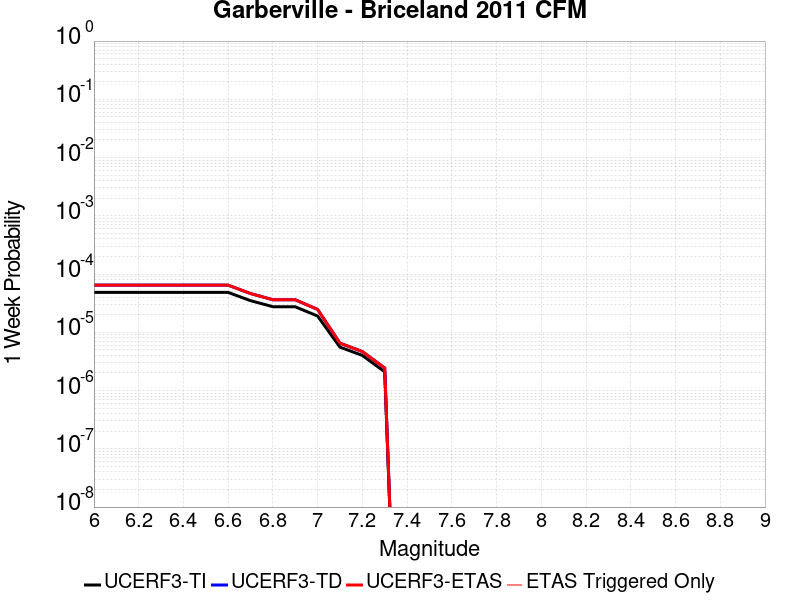 | 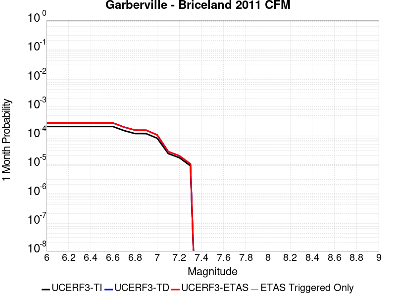 |  | 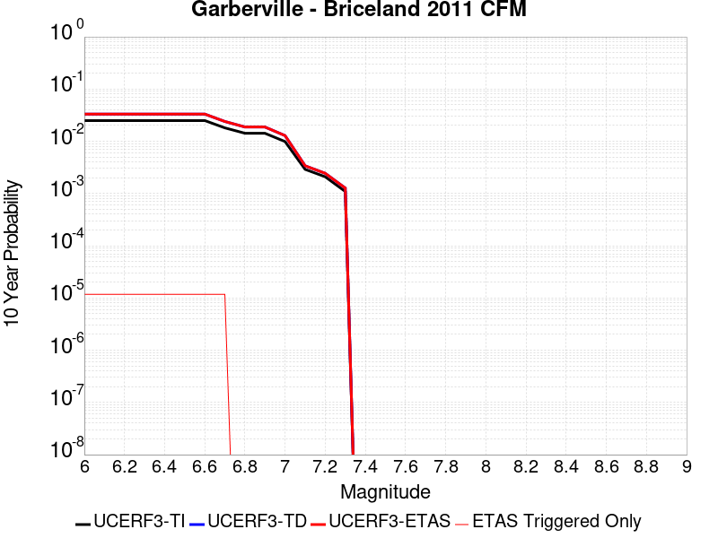 |

| Magnitude | 1 wk TI Prob | 1 wk TD Prob | 1 wk ETAS Prob | 1 wk ETAS/TD Gain | 1 wk ETAS Triggered Only | 1 mo TI Prob | 1 mo TD Prob | 1 mo ETAS Prob | 1 mo ETAS/TD Gain | 1 mo ETAS Triggered Only | 1 yr TI Prob | 1 yr TD Prob | 1 yr ETAS Prob | 1 yr ETAS/TD Gain | 1 yr ETAS Triggered Only | 10 yr TI Prob | 10 yr TD Prob | 10 yr ETAS Prob | 10 yr ETAS/TD Gain | 10 yr ETAS Triggered Only |
|-----|-----|-----|-----|-----|-----|-----|-----|-----|-----|-----|-----|-----|-----|-----|-----|-----|-----|-----|-----|-----|
| 6.0 | 4.8399295E-5 | 6.452381E-5 | 6.452381E-5 | 1.0 | 0.0 | 2.0740906E-4 | 2.7650563E-4 | 2.7650563E-4 | 1.0 | 0.0 | 0.002522281 | 0.003362017 | 0.003362017 | 1.0 | 0.0 | 0.024938442 | 0.03317861 | 0.03318996 | 1.000342 | 1.1737089E-5 |
| 6.1 | 4.8399295E-5 | 6.452381E-5 | 6.452381E-5 | 1.0 | 0.0 | 2.0740906E-4 | 2.7650563E-4 | 2.7650563E-4 | 1.0 | 0.0 | 0.002522281 | 0.003362017 | 0.003362017 | 1.0 | 0.0 | 0.024938442 | 0.03317861 | 0.03318996 | 1.000342 | 1.1737089E-5 |
| 6.2 | 4.8399295E-5 | 6.452381E-5 | 6.452381E-5 | 1.0 | 0.0 | 2.0740906E-4 | 2.7650563E-4 | 2.7650563E-4 | 1.0 | 0.0 | 0.002522281 | 0.003362017 | 0.003362017 | 1.0 | 0.0 | 0.024938442 | 0.03317861 | 0.03318996 | 1.000342 | 1.1737089E-5 |
| 6.3 | 4.8399295E-5 | 6.452381E-5 | 6.452381E-5 | 1.0 | 0.0 | 2.0740906E-4 | 2.7650563E-4 | 2.7650563E-4 | 1.0 | 0.0 | 0.002522281 | 0.003362017 | 0.003362017 | 1.0 | 0.0 | 0.024938442 | 0.03317861 | 0.03318996 | 1.000342 | 1.1737089E-5 |
| 6.4 | 4.8399295E-5 | 6.452381E-5 | 6.452381E-5 | 1.0 | 0.0 | 2.0740906E-4 | 2.7650563E-4 | 2.7650563E-4 | 1.0 | 0.0 | 0.002522281 | 0.003362017 | 0.003362017 | 1.0 | 0.0 | 0.024938442 | 0.03317861 | 0.03318996 | 1.000342 | 1.1737089E-5 |
| 6.5 | 4.8399295E-5 | 6.452381E-5 | 6.452381E-5 | 1.0 | 0.0 | 2.0740906E-4 | 2.7650563E-4 | 2.7650563E-4 | 1.0 | 0.0 | 0.002522281 | 0.003362017 | 0.003362017 | 1.0 | 0.0 | 0.024938442 | 0.03317861 | 0.03318996 | 1.000342 | 1.1737089E-5 |
| 6.6 | 4.8399295E-5 | 6.452381E-5 | 6.452381E-5 | 1.0 | 0.0 | 2.0740906E-4 | 2.7650563E-4 | 2.7650563E-4 | 1.0 | 0.0 | 0.002522281 | 0.003362017 | 0.003362017 | 1.0 | 0.0 | 0.024938442 | 0.03317861 | 0.03318996 | 1.000342 | 1.1737089E-5 |
| 6.7 | 3.495179E-5 | 4.6308873E-5 | 4.6308873E-5 | 1.0 | 0.0 | 1.4978478E-4 | 1.9845461E-4 | 1.9845461E-4 | 1.0 | 0.0 | 0.0018221042 | 0.002414053 | 0.002414053 | 1.0 | 0.0 | 0.018072363 | 0.023930617 | 0.023942072 | 1.0004787 | 1.1737089E-5 |
| 6.8 | 2.7517597E-5 | 3.6241618E-5 | 3.6241618E-5 | 1.0 | 0.0 | 1.1792722E-4 | 1.5531474E-4 | 1.5531474E-4 | 1.0 | 0.0 | 0.0014348183 | 0.0018897996 | 0.0018897996 | 1.0 | 0.0 | 0.014255894 | 0.018783508 | 0.018783508 | 1.0 | 0.0 |
| 6.9 | 2.74461E-5 | 3.6159345E-5 | 3.6159345E-5 | 1.0 | 0.0 | 1.1762084E-4 | 1.5496218E-4 | 1.5496218E-4 | 1.0 | 0.0 | 0.001431093 | 0.0018855145 | 0.0018855145 | 1.0 | 0.0 | 0.014219119 | 0.018741382 | 0.018741382 | 1.0 | 0.0 |
| 7.0 | 1.9023773E-5 | 2.4707579E-5 | 2.4707579E-5 | 1.0 | 0.0 | 8.152791E-5 | 1.0588763E-4 | 1.0588763E-4 | 1.0 | 0.0 | 9.921503E-4 | 0.0012888284 | 0.0012888284 | 1.0 | 0.0 | 0.009877323 | 0.012852574 | 0.012852574 | 1.0 | 0.0 |
| 7.1 | 5.566844E-6 | 6.512147E-6 | 6.512147E-6 | 1.0 | 0.0 | 2.3857683E-5 | 2.7908927E-5 | 2.7908927E-5 | 1.0 | 0.0 | 2.9042858E-4 | 3.3974246E-4 | 3.3974246E-4 | 1.0 | 0.0 | 0.002900493 | 0.0033926512 | 0.0033926512 | 1.0 | 0.0 |
| 7.2 | 4.011353E-6 | 4.6746213E-6 | 4.6746213E-6 | 1.0 | 0.0 | 1.7191402E-5 | 2.0033956E-5 | 2.0033956E-5 | 1.0 | 0.0 | 2.0928521E-4 | 2.4388955E-4 | 2.4388955E-4 | 1.0 | 0.0 | 0.0020908823 | 0.0024365564 | 0.0024365564 | 1.0 | 0.0 |
| 7.3 | 2.0974871E-6 | 2.4395908E-6 | 2.4395908E-6 | 1.0 | 0.0 | 8.989199E-6 | 1.0455362E-5 | 1.0455362E-5 | 1.0 | 0.0 | 1.09438006E-4 | 1.272891E-4 | 1.272891E-4 | 1.0 | 0.0 | 0.0010938413 | 0.0012724071 | 0.0012724071 | 1.0 | 0.0 |

## Great Valley 06 (Midland) 2011 CFM alt1
*[(top)](#table-of-contents)*

| 1 Week | 1 Month | 1 Year | 10 Year |
|-----|-----|-----|-----|
| 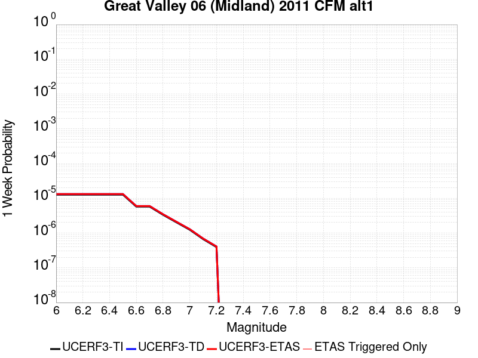 | 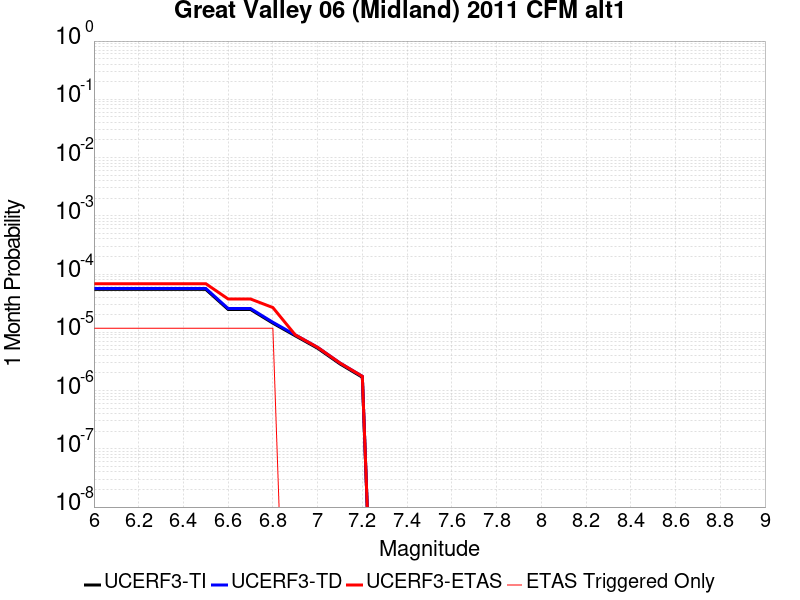 | 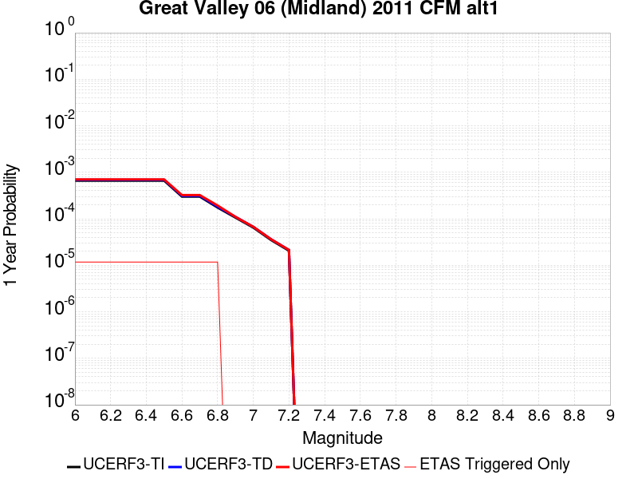 | 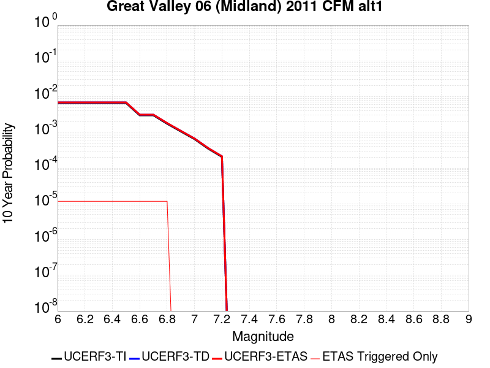 |

| Magnitude | 1 wk TI Prob | 1 wk TD Prob | 1 wk ETAS Prob | 1 wk ETAS/TD Gain | 1 wk ETAS Triggered Only | 1 mo TI Prob | 1 mo TD Prob | 1 mo ETAS Prob | 1 mo ETAS/TD Gain | 1 mo ETAS Triggered Only | 1 yr TI Prob | 1 yr TD Prob | 1 yr ETAS Prob | 1 yr ETAS/TD Gain | 1 yr ETAS Triggered Only | 10 yr TI Prob | 10 yr TD Prob | 10 yr ETAS Prob | 10 yr ETAS/TD Gain | 10 yr ETAS Triggered Only |
|-----|-----|-----|-----|-----|-----|-----|-----|-----|-----|-----|-----|-----|-----|-----|-----|-----|-----|-----|-----|-----|
| 6.0 | 1.2712525E-5 | 1.3210576E-5 | 1.3210576E-5 | 1.0 | 0.0 | 5.4481112E-5 | 5.6615667E-5 | 6.835209E-5 | 1.2073 | 1.1737089E-5 | 6.6310563E-4 | 6.8910315E-4 | 7.0083217E-4 | 1.0170207 | 1.1737089E-5 | 0.0066113044 | 0.006872179 | 0.0068838354 | 1.0016962 | 1.1737089E-5 |
| 6.1 | 1.2712525E-5 | 1.3210576E-5 | 1.3210576E-5 | 1.0 | 0.0 | 5.4481112E-5 | 5.6615667E-5 | 6.835209E-5 | 1.2073 | 1.1737089E-5 | 6.6310563E-4 | 6.8910315E-4 | 7.0083217E-4 | 1.0170207 | 1.1737089E-5 | 0.0066113044 | 0.006872179 | 0.0068838354 | 1.0016962 | 1.1737089E-5 |
| 6.2 | 1.2712525E-5 | 1.3210576E-5 | 1.3210576E-5 | 1.0 | 0.0 | 5.4481112E-5 | 5.6615667E-5 | 6.835209E-5 | 1.2073 | 1.1737089E-5 | 6.6310563E-4 | 6.8910315E-4 | 7.0083217E-4 | 1.0170207 | 1.1737089E-5 | 0.0066113044 | 0.006872179 | 0.0068838354 | 1.0016962 | 1.1737089E-5 |
| 6.3 | 1.2712525E-5 | 1.3210576E-5 | 1.3210576E-5 | 1.0 | 0.0 | 5.4481112E-5 | 5.6615667E-5 | 6.835209E-5 | 1.2073 | 1.1737089E-5 | 6.6310563E-4 | 6.8910315E-4 | 7.0083217E-4 | 1.0170207 | 1.1737089E-5 | 0.0066113044 | 0.006872179 | 0.0068838354 | 1.0016962 | 1.1737089E-5 |
| 6.4 | 1.2712525E-5 | 1.3210576E-5 | 1.3210576E-5 | 1.0 | 0.0 | 5.4481112E-5 | 5.6615667E-5 | 6.835209E-5 | 1.2073 | 1.1737089E-5 | 6.6310563E-4 | 6.8910315E-4 | 7.0083217E-4 | 1.0170207 | 1.1737089E-5 | 0.0066113044 | 0.006872179 | 0.0068838354 | 1.0016962 | 1.1737089E-5 |
| 6.5 | 1.2712525E-5 | 1.3210576E-5 | 1.3210576E-5 | 1.0 | 0.0 | 5.4481112E-5 | 5.6615667E-5 | 6.835209E-5 | 1.2073 | 1.1737089E-5 | 6.6310563E-4 | 6.8910315E-4 | 7.0083217E-4 | 1.0170207 | 1.1737089E-5 | 0.0066113044 | 0.006872179 | 0.0068838354 | 1.0016962 | 1.1737089E-5 |
| 6.6 | 5.7574384E-6 | 5.9706463E-6 | 5.9706463E-6 | 1.0 | 0.0 | 2.4674504E-5 | 2.5588255E-5 | 3.7325044E-5 | 1.4586787 | 1.1737089E-5 | 3.0037065E-4 | 3.1149638E-4 | 3.2322982E-4 | 1.037668 | 1.1737089E-5 | 0.0029996498 | 0.0031109843 | 0.0031226848 | 1.003761 | 1.1737089E-5 |
| 6.7 | 5.7574384E-6 | 5.9706463E-6 | 5.9706463E-6 | 1.0 | 0.0 | 2.4674504E-5 | 2.5588255E-5 | 3.7325044E-5 | 1.4586787 | 1.1737089E-5 | 3.0037065E-4 | 3.1149638E-4 | 3.2322982E-4 | 1.037668 | 1.1737089E-5 | 0.0029996498 | 0.0031109843 | 0.0031226848 | 1.003761 | 1.1737089E-5 |
| 6.8 | 3.3474828E-6 | 3.4693849E-6 | 3.4693849E-6 | 1.0 | 0.0 | 1.4346277E-5 | 1.4868716E-5 | 2.660563E-5 | 1.7893698 | 1.1737089E-5 | 1.7465191E-4 | 1.8101306E-4 | 1.9274803E-4 | 1.0648293 | 1.1737089E-5 | 0.0017451472 | 0.0018088033 | 0.0018205191 | 1.0064771 | 1.1737089E-5 |
| 6.9 | 2.035106E-6 | 2.1090357E-6 | 2.1090357E-6 | 1.0 | 0.0 | 8.721853E-6 | 9.038697E-6 | 9.038697E-6 | 1.0 | 0.0 | 1.0618339E-4 | 1.10041314E-4 | 1.10041314E-4 | 1.0 | 0.0 | 0.0010613267 | 0.0010999405 | 0.0010999405 | 1.0 | 0.0 |
| 7.0 | 1.2424716E-6 | 1.2878762E-6 | 1.2878762E-6 | 1.0 | 0.0 | 5.3248673E-6 | 5.51946E-6 | 5.51946E-6 | 1.0 | 0.0 | 6.482833E-5 | 6.7197805E-5 | 6.7197805E-5 | 1.0 | 0.0 | 6.480942E-4 | 6.718192E-4 | 6.718192E-4 | 1.0 | 0.0 |
| 7.1 | 6.6904556E-7 | 6.939035E-7 | 6.939035E-7 | 1.0 | 0.0 | 2.867335E-6 | 2.97387E-6 | 2.97387E-6 | 1.0 | 0.0 | 3.4909244E-5 | 3.6206526E-5 | 3.6206526E-5 | 1.0 | 0.0 | 3.490376E-4 | 3.6203177E-4 | 3.6203177E-4 | 1.0 | 0.0 |
| 7.2 | 3.948168E-7 | 4.095705E-7 | 4.095705E-7 | 1.0 | 0.0 | 1.6920709E-6 | 1.7553022E-6 | 1.7553022E-6 | 1.0 | 0.0 | 2.0600768E-5 | 2.1370803E-5 | 2.1370803E-5 | 1.0 | 0.0 | 2.0598859E-4 | 2.1370803E-4 | 2.1370803E-4 | 1.0 | 0.0 |

## Pilarcitos 2011 CFM
*[(top)](#table-of-contents)*

| 1 Week | 1 Month | 1 Year | 10 Year |
|-----|-----|-----|-----|
| 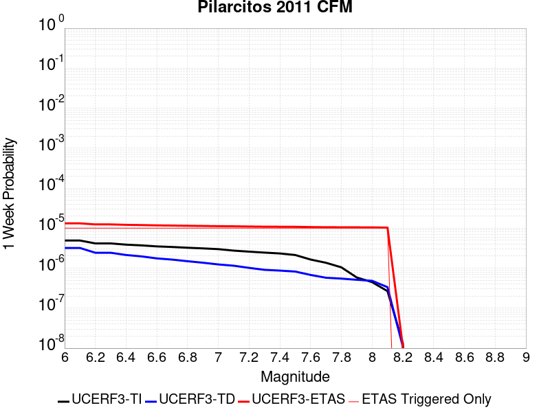 | 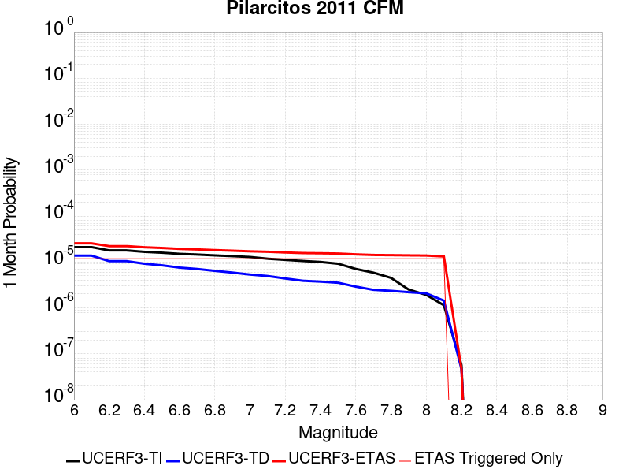 | 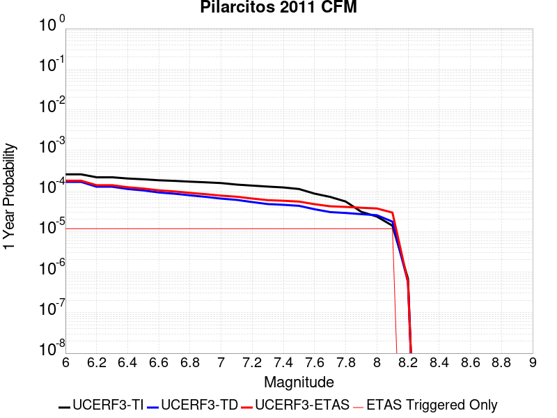 | 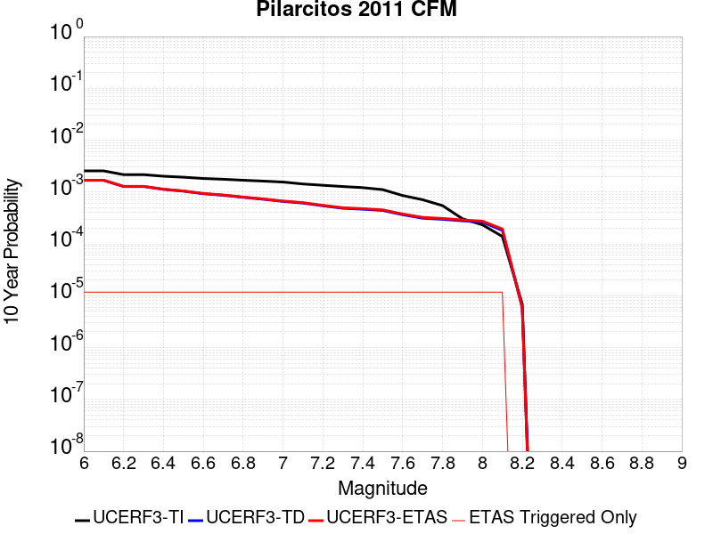 |

| Magnitude | 1 wk TI Prob | 1 wk TD Prob | 1 wk ETAS Prob | 1 wk ETAS/TD Gain | 1 wk ETAS Triggered Only | 1 mo TI Prob | 1 mo TD Prob | 1 mo ETAS Prob | 1 mo ETAS/TD Gain | 1 mo ETAS Triggered Only | 1 yr TI Prob | 1 yr TD Prob | 1 yr ETAS Prob | 1 yr ETAS/TD Gain | 1 yr ETAS Triggered Only | 10 yr TI Prob | 10 yr TD Prob | 10 yr ETAS Prob | 10 yr ETAS/TD Gain | 10 yr ETAS Triggered Only |
|-----|-----|-----|-----|-----|-----|-----|-----|-----|-----|-----|-----|-----|-----|-----|-----|-----|-----|-----|-----|-----|
| 6.0 | 4.9150476E-6 | 3.2017424E-6 | 1.4938794E-5 | 4.6658325 | 1.1737089E-5 | 2.1064321E-5 | 1.3721682E-5 | 2.545861E-5 | 1.8553563 | 1.1737089E-5 | 2.564279E-4 | 1.6704899E-4 | 1.7878412E-4 | 1.0702497 | 1.1737089E-5 | 0.0025613222 | 0.0016816824 | 0.0016933997 | 1.0069677 | 1.1737089E-5 |
| 6.1 | 4.9150476E-6 | 3.2017424E-6 | 1.4938794E-5 | 4.6658325 | 1.1737089E-5 | 2.1064321E-5 | 1.3721682E-5 | 2.545861E-5 | 1.8553563 | 1.1737089E-5 | 2.564279E-4 | 1.6704899E-4 | 1.7878412E-4 | 1.0702497 | 1.1737089E-5 | 0.0025613222 | 0.0016816824 | 0.0016933997 | 1.0069677 | 1.1737089E-5 |
| 6.2 | 4.162343E-6 | 2.4301326E-6 | 1.41671935E-5 | 5.829803 | 1.1737089E-5 | 1.783849E-5 | 1.0414812E-5 | 2.2151778E-5 | 2.1269495 | 1.1737089E-5 | 2.1716199E-4 | 1.2679303E-4 | 1.3852865E-4 | 1.0925572 | 1.1737089E-5 | 0.002169499 | 0.0012796372 | 0.0012913592 | 1.0091605 | 1.1737089E-5 |
| 6.3 | 4.162343E-6 | 2.4301326E-6 | 1.41671935E-5 | 5.829803 | 1.1737089E-5 | 1.783849E-5 | 1.0414812E-5 | 2.2151778E-5 | 2.1269495 | 1.1737089E-5 | 2.1716199E-4 | 1.2679303E-4 | 1.3852865E-4 | 1.0925572 | 1.1737089E-5 | 0.002169499 | 0.0012796372 | 0.0012913592 | 1.0091605 | 1.1737089E-5 |
| 6.4 | 3.8768926E-6 | 2.137552E-6 | 1.3874616E-5 | 6.4908905 | 1.1737089E-5 | 1.6615148E-5 | 9.1609045E-6 | 2.0897887E-5 | 2.2812033 | 1.1737089E-5 | 2.0227065E-4 | 1.1152835E-4 | 1.2326412E-4 | 1.1052269 | 1.1737089E-5 | 0.0020208664 | 0.0011271521 | 0.0011388761 | 1.0104014 | 1.1737089E-5 |
| 6.5 | 3.7137002E-6 | 1.9709112E-6 | 1.3707977E-5 | 6.9551473 | 1.1737089E-5 | 1.591576E-5 | 8.446735E-6 | 2.0183725E-5 | 2.38953 | 1.1737089E-5 | 1.9375715E-4 | 1.0283417E-4 | 1.1457005E-4 | 1.1141243 | 1.1737089E-5 | 0.001935883 | 0.0010402942 | 0.0010520191 | 1.0112708 | 1.1737089E-5 |
| 6.6 | 3.5048733E-6 | 1.7558658E-6 | 1.3492934E-5 | 7.6844907 | 1.1737089E-5 | 1.5020799E-5 | 7.5251173E-6 | 1.9262117E-5 | 2.55971 | 1.1737089E-5 | 1.8286289E-4 | 9.161448E-5 | 1.0335049E-4 | 1.1281022 | 1.1737089E-5 | 0.0018271249 | 9.2819595E-4 | 9.399222E-4 | 1.0126333 | 1.1737089E-5 |
| 6.7 | 3.3908584E-6 | 1.6395577E-6 | 1.3376628E-5 | 8.158681 | 1.1737089E-5 | 1.453217E-5 | 7.026657E-6 | 1.8763663E-5 | 2.6703544 | 1.1737089E-5 | 1.7691481E-4 | 8.5546206E-5 | 9.728229E-5 | 1.13719 | 1.1737089E-5 | 0.0017677402 | 8.675619E-4 | 8.792888E-4 | 1.0135171 | 1.1737089E-5 |
| 6.8 | 3.2451449E-6 | 1.492779E-6 | 1.3229851E-5 | 8.862565 | 1.1737089E-5 | 1.3907689E-5 | 6.3976086E-6 | 1.8134622E-5 | 2.834594 | 1.1737089E-5 | 1.6931296E-4 | 7.788811E-5 | 8.9624285E-5 | 1.15068 | 1.1737089E-5 | 0.0016918402 | 7.910375E-4 | 8.027653E-4 | 1.0148258 | 1.1737089E-5 |
| 6.9 | 3.1239128E-6 | 1.3693062E-6 | 1.310638E-5 | 9.5715475 | 1.1737089E-5 | 1.3388129E-5 | 5.868442E-6 | 1.7605462E-5 | 3.0000231 | 1.1737089E-5 | 1.6298829E-4 | 7.1445946E-5 | 8.3182196E-5 | 1.1642675 | 1.1737089E-5 | 0.001628688 | 7.2665967E-4 | 7.383882E-4 | 1.0161403 | 1.1737089E-5 |
| 7.0 | 2.9940109E-6 | 1.2406205E-6 | 1.2977695E-5 | 10.4606495 | 1.1737089E-5 | 1.2831412E-5 | 5.3169338E-6 | 1.705396E-5 | 3.2074804 | 1.1737089E-5 | 1.5621124E-4 | 6.473174E-5 | 7.646807E-5 | 1.1813072 | 1.1737089E-5 | 0.0015610148 | 6.5955904E-4 | 6.712884E-4 | 1.0177836 | 1.1737089E-5 |
| 7.1 | 2.7471217E-6 | 1.1523518E-6 | 1.2889427E-5 | 11.185324 | 1.1737089E-5 | 1.1773326E-5 | 4.9386413E-6 | 1.6675673E-5 | 3.376571 | 1.1737089E-5 | 1.4333082E-4 | 6.01263E-5 | 7.186268E-5 | 1.1951956 | 1.1737089E-5 | 0.001432384 | 6.134784E-4 | 6.252083E-4 | 1.0191203 | 1.1737089E-5 |
| 7.2 | 2.592675E-6 | 1.0184039E-6 | 1.2755481E-5 | 12.524973 | 1.1737089E-5 | 1.1111417E-5 | 4.3645805E-6 | 1.6101618E-5 | 3.689156 | 1.1737089E-5 | 1.3527309E-4 | 5.3137475E-5 | 6.487394E-5 | 1.2208699 | 1.1737089E-5 | 0.0013519078 | 5.436265E-4 | 5.553572E-4 | 1.0215787 | 1.1737089E-5 |
| 7.3 | 2.4518663E-6 | 9.093615E-7 | 1.264644E-5 | 13.906944 | 1.1737089E-5 | 1.0507956E-5 | 3.897258E-6 | 1.5634301E-5 | 4.0116158 | 1.1737089E-5 | 1.2792686E-4 | 4.744808E-5 | 5.9184615E-5 | 1.2473552 | 1.1737089E-5 | 0.0012785323 | 4.8675635E-4 | 4.9848773E-4 | 1.0241011 | 1.1737089E-5 |
| 7.4 | 2.3349535E-6 | 8.7153666E-7 | 1.2608615E-5 | 14.467109 | 1.1737089E-5 | 1.0006905E-5 | 3.7351517E-6 | 1.5472197E-5 | 4.142321 | 1.1737089E-5 | 1.2182725E-4 | 4.5474524E-5 | 5.721108E-5 | 1.2580907 | 1.1737089E-5 | 0.0012176048 | 4.6700423E-4 | 4.7873583E-4 | 1.025121 | 1.1737089E-5 |
| 7.5 | 2.1358665E-6 | 8.235929E-7 | 1.2560672E-5 | 15.251069 | 1.1737089E-5 | 9.15368E-6 | 3.5296791E-6 | 1.5266727E-5 | 4.325245 | 1.1737089E-5 | 1.11440364E-4 | 4.2972995E-5 | 5.470958E-5 | 1.2731154 | 1.1737089E-5 | 0.0011138449 | 4.4190476E-4 | 4.5363666E-4 | 1.0265485 | 1.1737089E-5 |
| 7.6 | 1.6445446E-6 | 6.778194E-7 | 1.2414901E-5 | 18.315943 | 1.1737089E-5 | 7.048029E-6 | 2.9049368E-6 | 1.4641992E-5 | 5.0403824 | 1.1737089E-5 | 8.580638E-5 | 3.5367033E-5 | 4.7103706E-5 | 1.3318535 | 1.1737089E-5 | 8.5773255E-4 | 3.6580398E-4 | 3.7753678E-4 | 1.032074 | 1.1737089E-5 |
| 7.7 | 1.3650961E-6 | 5.771466E-7 | 1.2314229E-5 | 21.336397 | 1.1737089E-5 | 5.850399E-6 | 2.473483E-6 | 1.4210544E-5 | 5.745155 | 1.1737089E-5 | 7.122628E-5 | 3.011424E-5 | 4.1850977E-5 | 1.3897403 | 1.1737089E-5 | 7.120345E-4 | 3.1317407E-4 | 3.2490748E-4 | 1.037466 | 1.1737089E-5 |
| 7.8 | 1.0500993E-6 | 5.487217E-7 | 1.2285805E-5 | 22.389864 | 1.1737089E-5 | 4.5004176E-6 | 2.3516623E-6 | 1.4088724E-5 | 5.990964 | 1.1737089E-5 | 5.4791206E-5 | 2.8631113E-5 | 4.0367868E-5 | 1.40993 | 1.1737089E-5 | 5.47777E-4 | 2.982153E-4 | 3.099489E-4 | 1.039346 | 1.1737089E-5 |
| 7.9 | 5.856431E-7 | 5.1290885E-7 | 1.2249992E-5 | 23.883371 | 1.1737089E-5 | 2.5098966E-6 | 2.198179E-6 | 1.3935242E-5 | 6.339449 | 1.1737089E-5 | 3.0557563E-5 | 2.67625E-5 | 3.8499275E-5 | 1.438553 | 1.1737089E-5 | 3.055336E-4 | 2.7879118E-4 | 2.90525E-4 | 1.0420882 | 1.1737089E-5 |
| 8.0 | 4.4768265E-7 | 4.8356026E-7 | 1.2220644E-5 | 25.272224 | 1.1737089E-5 | 1.9186384E-6 | 2.0723996E-6 | 1.3809465E-5 | 6.6635146 | 1.1737089E-5 | 2.3359173E-5 | 2.5231173E-5 | 3.6967966E-5 | 1.4651703 | 1.1737089E-5 | 2.3356717E-4 | 2.629472E-4 | 2.746812E-4 | 1.0446249 | 1.1737089E-5 |
| 8.1 | 2.6692538E-7 | 3.3572923E-7 | 1.2072815E-5 | 35.959976 | 1.1737089E-5 | 1.1439654E-6 | 1.4388387E-6 | 1.3175911E-5 | 9.157323 | 1.1737089E-5 | 1.392769E-5 | 1.7517721E-5 | 2.9254605E-5 | 1.6700006 | 1.1737089E-5 | 1.3926817E-4 | 1.8253834E-4 | 1.9427328E-4 | 1.0642875 | 1.1737089E-5 |
| 8.2 | 1.3198862E-8 | 1.0825354E-8 | 1.0825354E-8 | 1.0 | 0.0 | 5.656655E-8 | 4.6394376E-8 | 4.6394376E-8 | 1.0 | 0.0 | 6.886975E-7 | 5.648514E-7 | 5.648514E-7 | 1.0 | 0.0 | 6.8869535E-6 | 5.8803653E-6 | 5.8803653E-6 | 1.0 | 0.0 |

## Calaveras (No) 2011 CFM
*[(top)](#table-of-contents)*

| 1 Week | 1 Month | 1 Year | 10 Year |
|-----|-----|-----|-----|
| 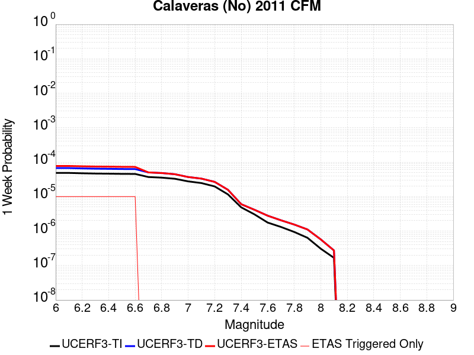 | 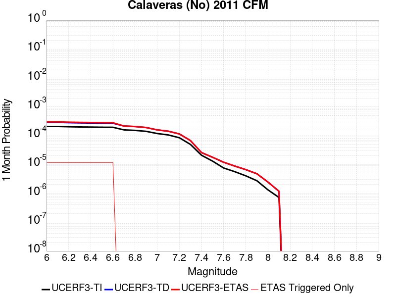 | 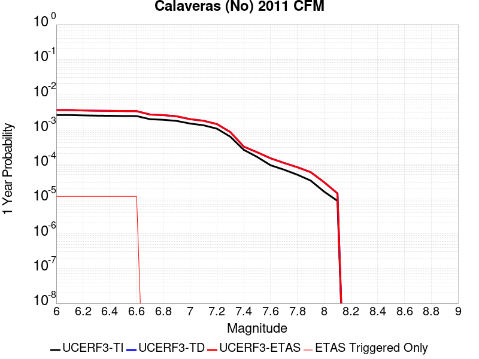 | 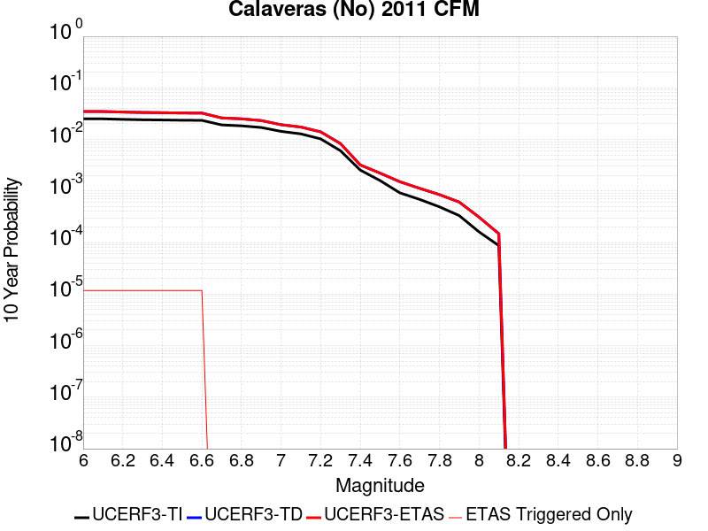 |

| Magnitude | 1 wk TI Prob | 1 wk TD Prob | 1 wk ETAS Prob | 1 wk ETAS/TD Gain | 1 wk ETAS Triggered Only | 1 mo TI Prob | 1 mo TD Prob | 1 mo ETAS Prob | 1 mo ETAS/TD Gain | 1 mo ETAS Triggered Only | 1 yr TI Prob | 1 yr TD Prob | 1 yr ETAS Prob | 1 yr ETAS/TD Gain | 1 yr ETAS Triggered Only | 10 yr TI Prob | 10 yr TD Prob | 10 yr ETAS Prob | 10 yr ETAS/TD Gain | 10 yr ETAS Triggered Only |
|-----|-----|-----|-----|-----|-----|-----|-----|-----|-----|-----|-----|-----|-----|-----|-----|-----|-----|-----|-----|-----|
| 6.0 | 4.8694856E-5 | 6.747121E-5 | 7.92075E-5 | 1.1739453 | 1.1737089E-5 | 2.0867554E-4 | 2.8913133E-4 | 3.00865E-4 | 1.0405825 | 1.1737089E-5 | 0.0025376645 | 0.003514627 | 0.0035263228 | 1.0033277 | 1.1737089E-5 | 0.02508881 | 0.034771245 | 0.034782574 | 1.0003258 | 1.1737089E-5 |
| 6.1 | 4.8694856E-5 | 6.747121E-5 | 7.92075E-5 | 1.1739453 | 1.1737089E-5 | 2.0867554E-4 | 2.8913133E-4 | 3.00865E-4 | 1.0405825 | 1.1737089E-5 | 0.0025376645 | 0.003514627 | 0.0035263228 | 1.0033277 | 1.1737089E-5 | 0.02508881 | 0.034771245 | 0.034782574 | 1.0003258 | 1.1737089E-5 |
| 6.2 | 4.7541962E-5 | 6.580218E-5 | 7.75385E-5 | 1.1783576 | 1.1737089E-5 | 2.0373536E-4 | 2.8197994E-4 | 2.937137E-4 | 1.0416121 | 1.1737089E-5 | 0.0024776561 | 0.003427859 | 0.0034395559 | 1.0034122 | 1.1737089E-5 | 0.024502134 | 0.033932675 | 0.033944014 | 1.0003341 | 1.1737089E-5 |
| 6.3 | 4.6717287E-5 | 6.4635555E-5 | 7.6371885E-5 | 1.181577 | 1.1737089E-5 | 2.0020158E-4 | 2.7698115E-4 | 2.88715E-4 | 1.0423633 | 1.1737089E-5 | 0.0024347296 | 0.0033672103 | 0.003378908 | 1.003474 | 1.1737089E-5 | 0.024082264 | 0.033345193 | 0.033356536 | 1.0003402 | 1.1737089E-5 |
| 6.4 | 4.6276386E-5 | 6.399742E-5 | 7.5733755E-5 | 1.1833876 | 1.1737089E-5 | 1.983123E-4 | 2.7424688E-4 | 2.8598073E-4 | 1.0427858 | 1.1737089E-5 | 0.0024117786 | 0.0033340224 | 0.0033457205 | 1.0035087 | 1.1737089E-5 | 0.02385771 | 0.033024073 | 0.03303542 | 1.0003437 | 1.1737089E-5 |
| 6.5 | 4.5720994E-5 | 6.319881E-5 | 7.493516E-5 | 1.1857052 | 1.1737089E-5 | 1.9593239E-4 | 2.70825E-4 | 2.825589E-4 | 1.0433265 | 1.1737089E-5 | 0.002382867 | 0.0032924965 | 0.003304195 | 1.003553 | 1.1737089E-5 | 0.023574775 | 0.032622032 | 0.032633387 | 1.0003481 | 1.1737089E-5 |
| 6.6 | 4.549134E-5 | 6.28519E-5 | 7.458825E-5 | 1.1867303 | 1.1737089E-5 | 1.949483E-4 | 2.6933852E-4 | 2.8107245E-4 | 1.0435658 | 1.1737089E-5 | 0.0023709119 | 0.0032744533 | 0.003286152 | 1.0035727 | 1.1737089E-5 | 0.023457756 | 0.032447387 | 0.032458745 | 1.00035 | 1.1737089E-5 |
| 6.7 | 3.701047E-5 | 5.0359427E-5 | 5.0359427E-5 | 1.0 | 0.0 | 1.5860666E-4 | 2.1580851E-4 | 2.1580851E-4 | 1.0 | 0.0 | 0.0019293258 | 0.002624346 | 0.002624346 | 1.0 | 0.0 | 0.019126613 | 0.026125323 | 0.026125323 | 1.0 | 0.0 |
| 6.8 | 3.5523568E-5 | 4.8341022E-5 | 4.8341022E-5 | 1.0 | 0.0 | 1.5223498E-4 | 2.071596E-4 | 2.071596E-4 | 1.0 | 0.0 | 0.0018518851 | 0.0025192937 | 0.0025192937 | 1.0 | 0.0 | 0.018365284 | 0.025097553 | 0.025097553 | 1.0 | 0.0 |
| 6.9 | 3.2946147E-5 | 4.466269E-5 | 4.466269E-5 | 1.0 | 0.0 | 1.4119013E-4 | 1.9139773E-4 | 1.9139773E-4 | 1.0 | 0.0 | 0.0017176344 | 0.0023278191 | 0.0023278191 | 1.0 | 0.0 | 0.017044188 | 0.023219598 | 0.023219598 | 1.0 | 0.0 |
| 7.0 | 2.7682381E-5 | 3.702223E-5 | 3.702223E-5 | 1.0 | 0.0 | 1.1863338E-4 | 1.5865723E-4 | 1.5865723E-4 | 1.0 | 0.0 | 0.0014434044 | 0.0019299705 | 0.0019299705 | 1.0 | 0.0 | 0.01434065 | 0.01931092 | 0.01931092 | 1.0 | 0.0 |
| 7.1 | 2.471967E-5 | 3.328669E-5 | 3.328669E-5 | 1.0 | 0.0 | 1.05937135E-4 | 1.4264962E-4 | 1.4264962E-4 | 1.0 | 0.0 | 0.0012890215 | 0.0017354045 | 0.0017354045 | 1.0 | 0.0 | 0.0128157 | 0.017385952 | 0.017385952 | 1.0 | 0.0 |
| 7.2 | 1.9748062E-5 | 2.6774684E-5 | 2.6774684E-5 | 1.0 | 0.0 | 8.463181E-5 | 1.1474373E-4 | 1.1474373E-4 | 1.0 | 0.0 | 0.0010299052 | 0.0013961331 | 0.0013961331 | 1.0 | 0.0 | 0.01025145 | 0.014030739 | 0.014030739 | 1.0 | 0.0 |
| 7.3 | 1.1603734E-5 | 1.5783844E-5 | 1.5783844E-5 | 1.0 | 0.0 | 4.9729337E-5 | 6.764337E-5 | 6.764337E-5 | 1.0 | 0.0 | 6.052865E-4 | 8.232611E-4 | 8.232611E-4 | 1.0 | 0.0 | 0.0060364045 | 0.008308666 | 0.008308666 | 1.0 | 0.0 |
| 7.4 | 4.885381E-6 | 6.0349853E-6 | 6.0349853E-6 | 1.0 | 0.0 | 2.0937177E-5 | 2.5863968E-5 | 2.5863968E-5 | 1.0 | 0.0 | 2.5488032E-4 | 3.148485E-4 | 3.148485E-4 | 1.0 | 0.0 | 0.0025458818 | 0.0032010598 | 0.0032010598 | 1.0 | 0.0 |
| 7.5 | 3.0571264E-6 | 4.155299E-6 | 4.155299E-6 | 1.0 | 0.0 | 1.3101904E-5 | 1.7808303E-5 | 1.7808303E-5 | 1.0 | 0.0 | 1.5950401E-4 | 2.1679462E-4 | 2.1679462E-4 | 1.0 | 0.0 | 0.0015938957 | 0.002221121 | 0.002221121 | 1.0 | 0.0 |
| 7.6 | 1.764948E-6 | 2.7955498E-6 | 2.7955498E-6 | 1.0 | 0.0 | 7.564041E-6 | 1.1980874E-5 | 1.1980874E-5 | 1.0 | 0.0 | 9.208831E-5 | 1.4585744E-4 | 1.4585744E-4 | 1.0 | 0.0 | 9.205016E-4 | 0.0015123509 | 0.0015123509 | 1.0 | 0.0 |
| 7.7 | 1.3173734E-6 | 2.058471E-6 | 2.058471E-6 | 1.0 | 0.0 | 5.645874E-6 | 8.8219895E-6 | 8.8219895E-6 | 1.0 | 0.0 | 6.873634E-5 | 1.0740245E-4 | 1.0740245E-4 | 1.0 | 0.0 | 6.8715087E-4 | 0.0011261401 | 0.0011261401 | 1.0 | 0.0 |
| 7.8 | 9.4429885E-7 | 1.5489635E-6 | 1.5489635E-6 | 1.0 | 0.0 | 4.0469886E-6 | 6.638398E-6 | 6.638398E-6 | 1.0 | 0.0 | 4.9270973E-5 | 8.081952E-5 | 8.081952E-5 | 1.0 | 0.0 | 4.926005E-4 | 8.5014524E-4 | 8.5014524E-4 | 1.0 | 0.0 |
| 7.9 | 6.388233E-7 | 1.1148749E-6 | 1.1148749E-6 | 1.0 | 0.0 | 2.7378112E-6 | 4.7780263E-6 | 4.7780263E-6 | 1.0 | 0.0 | 3.3332344E-5 | 5.817093E-5 | 5.817093E-5 | 1.0 | 0.0 | 3.3327343E-4 | 6.0963054E-4 | 6.0963054E-4 | 1.0 | 0.0 |
| 8.0 | 3.087986E-7 | 5.7543696E-7 | 5.7543696E-7 | 1.0 | 0.0 | 1.323422E-6 | 2.466156E-6 | 2.466156E-6 | 1.0 | 0.0 | 1.6112543E-5 | 3.002504E-5 | 3.002504E-5 | 1.0 | 0.0 | 1.6111376E-4 | 3.110302E-4 | 3.110302E-4 | 1.0 | 0.0 |
| 8.1 | 1.6725647E-7 | 2.7410047E-7 | 2.7410047E-7 | 1.0 | 0.0 | 7.168133E-7 | 1.1747159E-6 | 1.1747159E-6 | 1.0 | 0.0 | 8.7271665E-6 | 1.4302073E-5 | 1.4302073E-5 | 1.0 | 0.0 | 8.726824E-5 | 1.48486E-4 | 1.48486E-4 | 1.0 | 0.0 |

## San Luis Range - Oceano 2011 CFM
*[(top)](#table-of-contents)*

| 1 Week | 1 Month | 1 Year | 10 Year |
|-----|-----|-----|-----|
| 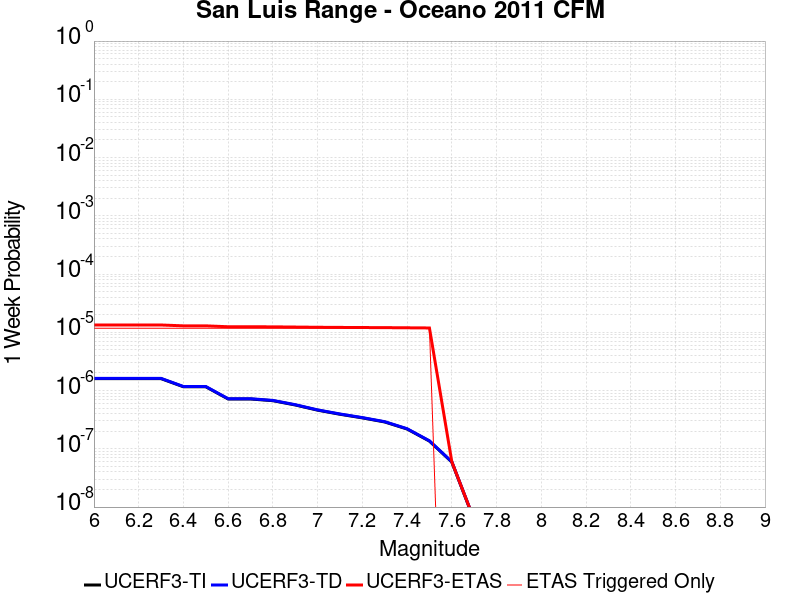 | 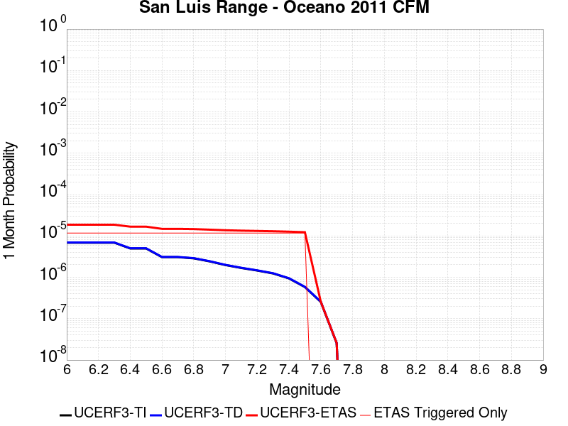 | 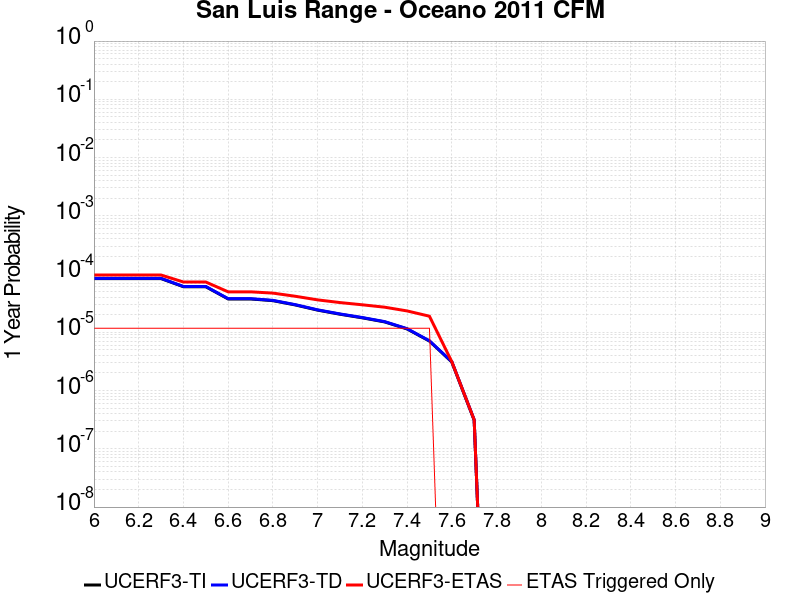 | 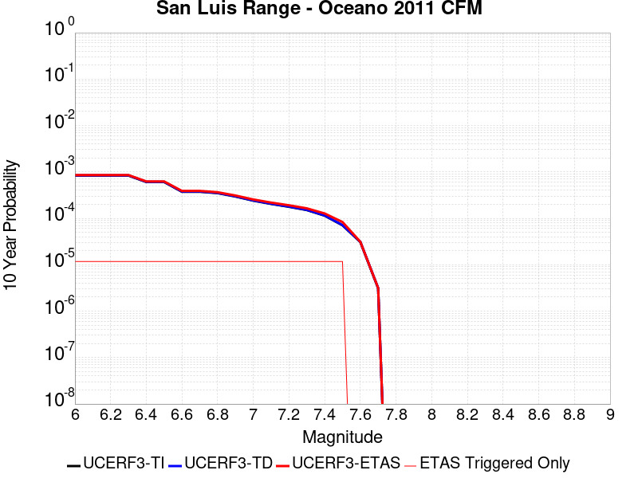 |

| Magnitude | 1 wk TI Prob | 1 wk TD Prob | 1 wk ETAS Prob | 1 wk ETAS/TD Gain | 1 wk ETAS Triggered Only | 1 mo TI Prob | 1 mo TD Prob | 1 mo ETAS Prob | 1 mo ETAS/TD Gain | 1 mo ETAS Triggered Only | 1 yr TI Prob | 1 yr TD Prob | 1 yr ETAS Prob | 1 yr ETAS/TD Gain | 1 yr ETAS Triggered Only | 10 yr TI Prob | 10 yr TD Prob | 10 yr ETAS Prob | 10 yr ETAS/TD Gain | 10 yr ETAS Triggered Only |
|-----|-----|-----|-----|-----|-----|-----|-----|-----|-----|-----|-----|-----|-----|-----|-----|-----|-----|-----|-----|-----|
| 6.0 | 1.6025788E-6 | 1.620119E-6 | 1.3357189E-5 | 8.244573 | 1.1737089E-5 | 6.8681766E-6 | 6.943351E-6 | 1.8680359E-5 | 2.6903954 | 1.1737089E-5 | 8.361684E-5 | 8.453243E-5 | 9.626853E-5 | 1.1388354 | 1.1737089E-5 | 8.3585386E-4 | 8.4504357E-4 | 8.567707E-4 | 1.0138776 | 1.1737089E-5 |
| 6.1 | 1.6025788E-6 | 1.620119E-6 | 1.3357189E-5 | 8.244573 | 1.1737089E-5 | 6.8681766E-6 | 6.943351E-6 | 1.8680359E-5 | 2.6903954 | 1.1737089E-5 | 8.361684E-5 | 8.453243E-5 | 9.626853E-5 | 1.1388354 | 1.1737089E-5 | 8.3585386E-4 | 8.4504357E-4 | 8.567707E-4 | 1.0138776 | 1.1737089E-5 |
| 6.2 | 1.6025788E-6 | 1.620119E-6 | 1.3357189E-5 | 8.244573 | 1.1737089E-5 | 6.8681766E-6 | 6.943351E-6 | 1.8680359E-5 | 2.6903954 | 1.1737089E-5 | 8.361684E-5 | 8.453243E-5 | 9.626853E-5 | 1.1388354 | 1.1737089E-5 | 8.3585386E-4 | 8.4504357E-4 | 8.567707E-4 | 1.0138776 | 1.1737089E-5 |
| 6.3 | 1.6025788E-6 | 1.620119E-6 | 1.3357189E-5 | 8.244573 | 1.1737089E-5 | 6.8681766E-6 | 6.943351E-6 | 1.8680359E-5 | 2.6903954 | 1.1737089E-5 | 8.361684E-5 | 8.453243E-5 | 9.626853E-5 | 1.1388354 | 1.1737089E-5 | 8.3585386E-4 | 8.4504357E-4 | 8.567707E-4 | 1.0138776 | 1.1737089E-5 |
| 6.4 | 1.1621186E-6 | 1.1749894E-6 | 1.2912064E-5 | 10.98909 | 1.1737089E-5 | 4.980499E-6 | 5.0356607E-6 | 1.677269E-5 | 3.3307824 | 1.1737089E-5 | 6.0635884E-5 | 6.130771E-5 | 7.304409E-5 | 1.1914338 | 1.1737089E-5 | 6.0619344E-4 | 6.1293464E-4 | 6.2466454E-4 | 1.0191373 | 1.1737089E-5 |
| 6.5 | 1.1621186E-6 | 1.1749894E-6 | 1.2912064E-5 | 10.98909 | 1.1737089E-5 | 4.980499E-6 | 5.0356607E-6 | 1.677269E-5 | 3.3307824 | 1.1737089E-5 | 6.0635884E-5 | 6.130771E-5 | 7.304409E-5 | 1.1914338 | 1.1737089E-5 | 6.0619344E-4 | 6.1293464E-4 | 6.2466454E-4 | 1.0191373 | 1.1737089E-5 |
| 6.6 | 7.164729E-7 | 7.2485784E-7 | 1.2461938E-5 | 17.192253 | 1.1737089E-5 | 3.0705946E-6 | 3.10653E-6 | 1.4843583E-5 | 4.7781878 | 1.1737089E-5 | 3.738385E-5 | 3.7821363E-5 | 4.955801E-5 | 1.3103179 | 1.1737089E-5 | 3.737756E-4 | 3.7815105E-4 | 3.8988367E-4 | 1.0310264 | 1.1737089E-5 |
| 6.7 | 7.164729E-7 | 7.2485784E-7 | 1.2461938E-5 | 17.192253 | 1.1737089E-5 | 3.0705946E-6 | 3.10653E-6 | 1.4843583E-5 | 4.7781878 | 1.1737089E-5 | 3.738385E-5 | 3.7821363E-5 | 4.955801E-5 | 1.3103179 | 1.1737089E-5 | 3.737756E-4 | 3.7815105E-4 | 3.8988367E-4 | 1.0310264 | 1.1737089E-5 |
| 6.8 | 6.700177E-7 | 6.7774397E-7 | 1.24148255E-5 | 18.31787 | 1.1737089E-5 | 2.8715012E-6 | 2.904614E-6 | 1.4641669E-5 | 5.0408316 | 1.1737089E-5 | 3.495997E-5 | 3.536312E-5 | 4.709979E-5 | 1.3318902 | 1.1737089E-5 | 3.495447E-4 | 3.5357653E-4 | 3.6530948E-4 | 1.0331836 | 1.1737089E-5 |
| 6.9 | 5.657865E-7 | 5.7217864E-7 | 1.2309261E-5 | 21.512968 | 1.1737089E-5 | 2.424797E-6 | 2.452192E-6 | 1.4189252E-5 | 5.7863545 | 1.1737089E-5 | 2.9521503E-5 | 2.9855039E-5 | 4.159178E-5 | 1.3931242 | 1.1737089E-5 | 2.9517582E-4 | 2.9851135E-4 | 3.1024494E-4 | 1.039307 | 1.1737089E-5 |
| 7.0 | 4.608413E-7 | 4.660169E-7 | 1.2203101E-5 | 26.18596 | 1.1737089E-5 | 1.9750328E-6 | 1.9972138E-6 | 1.37342795E-5 | 6.87672 | 1.1737089E-5 | 2.4045758E-5 | 2.431581E-5 | 3.6052614E-5 | 1.482682 | 1.1737089E-5 | 2.4043156E-4 | 2.4313178E-4 | 2.5486603E-4 | 1.0482628 | 1.1737089E-5 |
| 7.1 | 3.9177846E-7 | 3.9621602E-7 | 1.21333005E-5 | 30.622942 | 1.1737089E-5 | 1.6790494E-6 | 1.6980675E-6 | 1.3435137E-5 | 7.9120154 | 1.1737089E-5 | 2.0442236E-5 | 2.0673779E-5 | 3.2410626E-5 | 1.5677166 | 1.1737089E-5 | 2.0440355E-4 | 2.067187E-4 | 2.1845337E-4 | 1.0567664 | 1.1737089E-5 |
| 7.2 | 3.3974752E-7 | 3.436653E-7 | 1.2080751E-5 | 35.152664 | 1.1737089E-5 | 1.45606E-6 | 1.4728505E-6 | 1.3209922E-5 | 8.96895 | 1.1737089E-5 | 1.7727387E-5 | 1.7931809E-5 | 2.9668687E-5 | 1.6545285 | 1.1737089E-5 | 1.7725973E-4 | 1.7930372E-4 | 1.910387E-4 | 1.0654476 | 1.1737089E-5 |
| 7.3 | 2.8900928E-7 | 2.923402E-7 | 1.2029426E-5 | 41.148727 | 1.1737089E-5 | 1.2386106E-6 | 1.2528859E-6 | 1.298996E-5 | 10.3680315 | 1.1737089E-5 | 1.5079979E-5 | 1.525378E-5 | 2.699069E-5 | 1.7694428 | 1.1737089E-5 | 1.5078956E-4 | 1.5252741E-4 | 1.6426272E-4 | 1.076939 | 1.1737089E-5 |
| 7.4 | 2.1881527E-7 | 2.2139594E-7 | 1.1958483E-5 | 54.01401 | 1.1737089E-5 | 9.3777936E-7 | 9.488394E-7 | 1.2685918E-5 | 13.369931 | 1.1737089E-5 | 1.14174045E-5 | 1.1552059E-5 | 2.3289012E-5 | 2.0160053 | 1.1737089E-5 | 1.1416818E-4 | 1.1551464E-4 | 1.2725037E-4 | 1.1015952 | 1.1737089E-5 |
| 7.5 | 1.356398E-7 | 1.3718639E-7 | 1.1874274E-5 | 86.55577 | 1.1737089E-5 | 5.813133E-7 | 5.8794154E-7 | 1.2325024E-5 | 20.963009 | 1.1737089E-5 | 7.0774663E-6 | 7.158165E-6 | 1.889517E-5 | 2.6396668 | 1.1737089E-5 | 7.077241E-5 | 7.157937E-5 | 8.331562E-5 | 1.1639613 | 1.1737089E-5 |
| 7.6 | 5.9269272E-8 | 6.001364E-8 | 6.001364E-8 | 1.0 | 0.0 | 2.5401116E-7 | 2.572013E-7 | 2.572013E-7 | 1.0 | 0.0 | 3.0925814E-6 | 3.1314214E-6 | 3.1314214E-6 | 1.0 | 0.0 | 3.0925385E-5 | 3.1313786E-5 | 3.1313786E-5 | 1.0 | 0.0 |
| 7.7 | 5.946232E-9 | 6.036928E-9 | 6.036928E-9 | 1.0 | 0.0 | 2.5483851E-8 | 2.5872547E-8 | 2.5872547E-8 | 1.0 | 0.0 | 3.1026585E-7 | 3.1499823E-7 | 3.1499823E-7 | 1.0 | 0.0 | 3.102654E-6 | 3.1499787E-6 | 3.1499787E-6 | 1.0 | 0.0 |

## Davis Creek
*[(top)](#table-of-contents)*

| 1 Week | 1 Month | 1 Year | 10 Year |
|-----|-----|-----|-----|
|  | 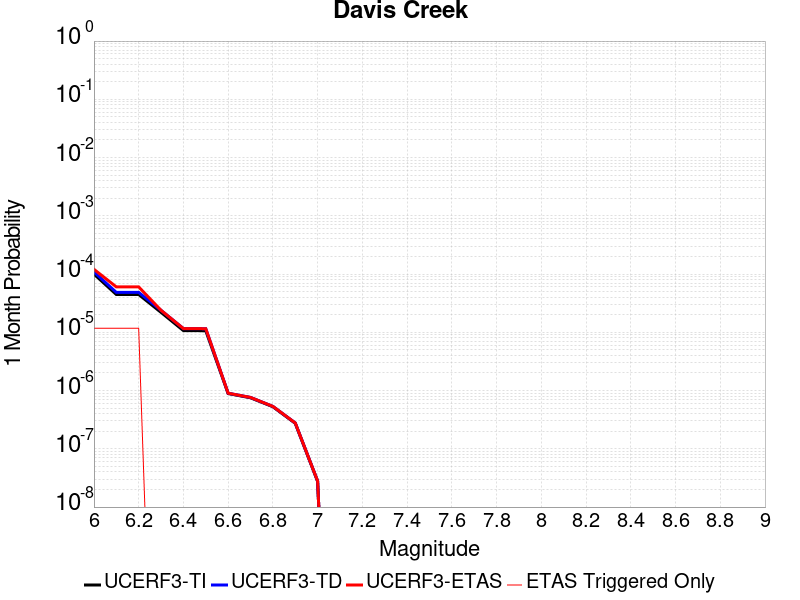 | 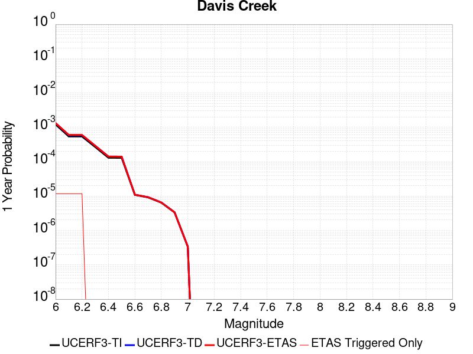 | 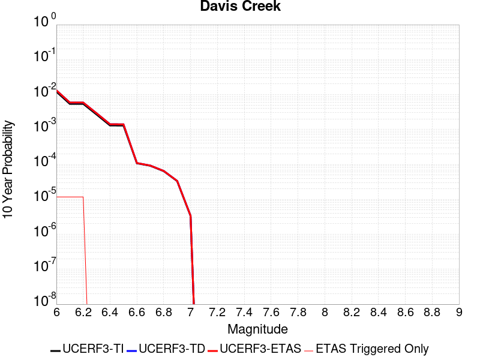 |

| Magnitude | 1 wk TI Prob | 1 wk TD Prob | 1 wk ETAS Prob | 1 wk ETAS/TD Gain | 1 wk ETAS Triggered Only | 1 mo TI Prob | 1 mo TD Prob | 1 mo ETAS Prob | 1 mo ETAS/TD Gain | 1 mo ETAS Triggered Only | 1 yr TI Prob | 1 yr TD Prob | 1 yr ETAS Prob | 1 yr ETAS/TD Gain | 1 yr ETAS Triggered Only | 10 yr TI Prob | 10 yr TD Prob | 10 yr ETAS Prob | 10 yr ETAS/TD Gain | 10 yr ETAS Triggered Only |
|-----|-----|-----|-----|-----|-----|-----|-----|-----|-----|-----|-----|-----|-----|-----|-----|-----|-----|-----|-----|-----|
| 6.0 | 2.331472E-5 | 2.5417214E-5 | 2.5417214E-5 | 1.0 | 0.0 | 9.99164E-5 | 1.0892704E-4 | 1.20662844E-4 | 1.1077402 | 1.1737089E-5 | 0.0012158032 | 0.0013254983 | 0.0013372198 | 1.0088431 | 1.1737089E-5 | 0.01209173 | 0.013187704 | 0.013199287 | 1.0008782 | 1.1737089E-5 |
| 6.1 | 1.0407654E-5 | 1.1316986E-5 | 1.1316986E-5 | 1.0 | 0.0 | 4.4603472E-5 | 4.8500624E-5 | 6.0237144E-5 | 1.241987 | 1.1737089E-5 | 5.4291193E-4 | 5.9036224E-4 | 6.0209236E-4 | 1.0198694 | 1.1737089E-5 | 0.0054158745 | 0.005890611 | 0.005902279 | 1.0019808 | 1.1737089E-5 |
| 6.2 | 1.0407654E-5 | 1.1316986E-5 | 1.1316986E-5 | 1.0 | 0.0 | 4.4603472E-5 | 4.8500624E-5 | 6.0237144E-5 | 1.241987 | 1.1737089E-5 | 5.4291193E-4 | 5.9036224E-4 | 6.0209236E-4 | 1.0198694 | 1.1737089E-5 | 0.0054158745 | 0.005890611 | 0.005902279 | 1.0019808 | 1.1737089E-5 |
| 6.3 | 5.1323277E-6 | 5.568556E-6 | 5.568556E-6 | 1.0 | 0.0 | 2.1995505E-5 | 2.386507E-5 | 2.386507E-5 | 1.0 | 0.0 | 2.6776237E-4 | 2.905271E-4 | 2.905271E-4 | 1.0 | 0.0 | 0.0026743996 | 0.0029023192 | 0.0029023192 | 1.0 | 0.0 |
| 6.4 | 2.4985154E-6 | 2.704538E-6 | 2.704538E-6 | 1.0 | 0.0 | 1.07078795E-5 | 1.1590847E-5 | 1.1590847E-5 | 1.0 | 0.0 | 1.3036063E-4 | 1.4111304E-4 | 1.4111304E-4 | 1.0 | 0.0 | 0.0013028418 | 0.001410589 | 0.001410589 | 1.0 | 0.0 |
| 6.5 | 2.4846438E-6 | 2.6904722E-6 | 2.6904722E-6 | 1.0 | 0.0 | 1.064843E-5 | 1.1530565E-5 | 1.1530565E-5 | 1.0 | 0.0 | 1.2963692E-4 | 1.403792E-4 | 1.403792E-4 | 1.0 | 0.0 | 0.0012956132 | 0.0014032599 | 0.0014032599 | 1.0 | 0.0 |
| 6.6 | 2.072566E-7 | 2.1018087E-7 | 2.1018087E-7 | 1.0 | 0.0 | 8.882423E-7 | 9.0077486E-7 | 9.0077486E-7 | 1.0 | 0.0 | 1.0814296E-5 | 1.0966881E-5 | 1.0966881E-5 | 1.0 | 0.0 | 1.081377E-4 | 1.09663575E-4 | 1.09663575E-4 | 1.0 | 0.0 |
| 6.7 | 1.7544528E-7 | 1.7790826E-7 | 1.7790826E-7 | 1.0 | 0.0 | 7.5190815E-7 | 7.6246374E-7 | 7.6246374E-7 | 1.0 | 0.0 | 9.154443E-6 | 9.282958E-6 | 9.282958E-6 | 1.0 | 0.0 | 9.1540656E-5 | 9.282586E-5 | 9.282586E-5 | 1.0 | 0.0 |
| 6.8 | 1.2320395E-7 | 1.2481138E-7 | 1.2481138E-7 | 1.0 | 0.0 | 5.280168E-7 | 5.349058E-7 | 5.349058E-7 | 1.0 | 0.0 | 6.428586E-6 | 6.5124595E-6 | 6.5124595E-6 | 1.0 | 0.0 | 6.4284E-5 | 6.5122804E-5 | 6.5122804E-5 | 1.0 | 0.0 |
| 6.9 | 6.399997E-8 | 6.486058E-8 | 6.486058E-8 | 1.0 | 0.0 | 2.7428555E-7 | 2.7797387E-7 | 2.7797387E-7 | 1.0 | 0.0 | 3.3394215E-6 | 3.3843273E-6 | 3.3843273E-6 | 1.0 | 0.0 | 3.3393713E-5 | 3.384282E-5 | 3.384282E-5 | 1.0 | 0.0 |
| 7.0 | 6.4455685E-9 | 6.535264E-9 | 6.535264E-9 | 1.0 | 0.0 | 2.7623864E-8 | 2.8008275E-8 | 2.8008275E-8 | 1.0 | 0.0 | 3.3632048E-7 | 3.4100074E-7 | 3.4100074E-7 | 1.0 | 0.0 | 3.3631998E-6 | 3.4100074E-6 | 3.4100074E-6 | 1.0 | 0.0 |

## San Juan
*[(top)](#table-of-contents)*

| 1 Week | 1 Month | 1 Year | 10 Year |
|-----|-----|-----|-----|
| 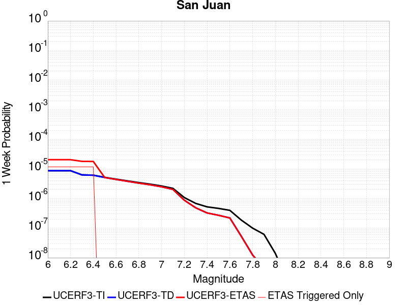 | 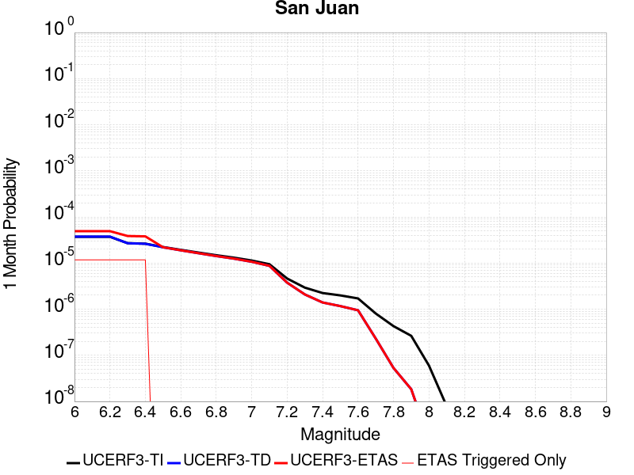 | 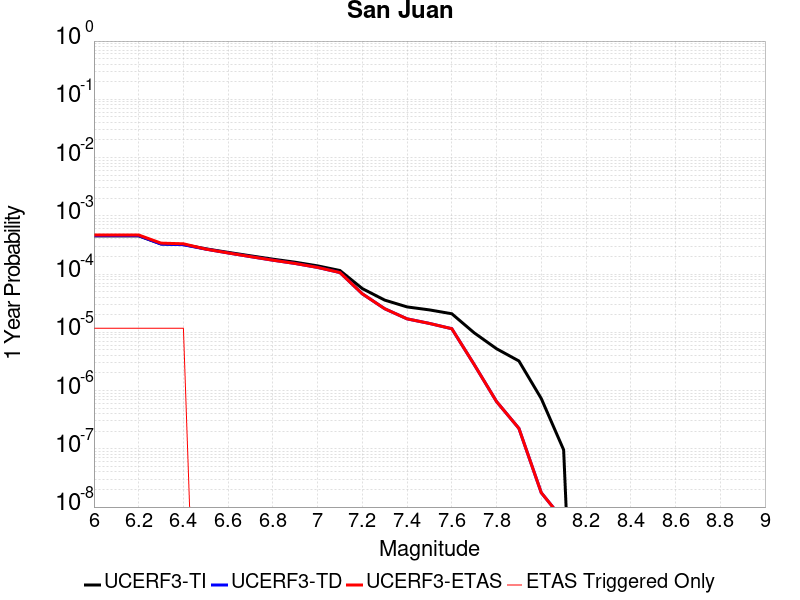 | 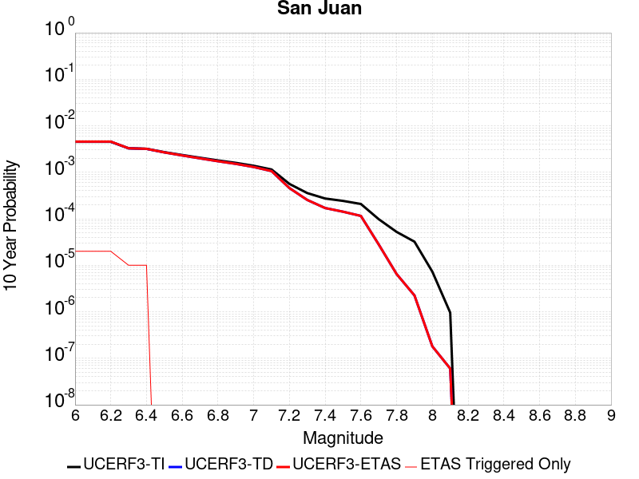 |

| Magnitude | 1 wk TI Prob | 1 wk TD Prob | 1 wk ETAS Prob | 1 wk ETAS/TD Gain | 1 wk ETAS Triggered Only | 1 mo TI Prob | 1 mo TD Prob | 1 mo ETAS Prob | 1 mo ETAS/TD Gain | 1 mo ETAS Triggered Only | 1 yr TI Prob | 1 yr TD Prob | 1 yr ETAS Prob | 1 yr ETAS/TD Gain | 1 yr ETAS Triggered Only | 10 yr TI Prob | 10 yr TD Prob | 10 yr ETAS Prob | 10 yr ETAS/TD Gain | 10 yr ETAS Triggered Only |
|-----|-----|-----|-----|-----|-----|-----|-----|-----|-----|-----|-----|-----|-----|-----|-----|-----|-----|-----|-----|-----|
| 6.0 | 8.682808E-6 | 8.7491635E-6 | 2.048615E-5 | 2.3414981 | 1.1737089E-5 | 3.72115E-5 | 3.74959E-5 | 4.9232553E-5 | 1.3130115 | 1.1737089E-5 | 4.5295584E-4 | 4.564218E-4 | 4.6815354E-4 | 1.0257037 | 1.1737089E-5 | 0.004520337 | 0.004555385 | 0.0045670685 | 1.0025648 | 1.1737089E-5 |
| 6.1 | 8.682808E-6 | 8.7491635E-6 | 2.048615E-5 | 2.3414981 | 1.1737089E-5 | 3.72115E-5 | 3.74959E-5 | 4.9232553E-5 | 1.3130115 | 1.1737089E-5 | 4.5295584E-4 | 4.564218E-4 | 4.6815354E-4 | 1.0257037 | 1.1737089E-5 | 0.004520337 | 0.004555385 | 0.0045670685 | 1.0025648 | 1.1737089E-5 |
| 6.2 | 8.682808E-6 | 8.7491635E-6 | 2.048615E-5 | 2.3414981 | 1.1737089E-5 | 3.72115E-5 | 3.74959E-5 | 4.9232553E-5 | 1.3130115 | 1.1737089E-5 | 4.5295584E-4 | 4.564218E-4 | 4.6815354E-4 | 1.0257037 | 1.1737089E-5 | 0.004520337 | 0.004555385 | 0.0045670685 | 1.0025648 | 1.1737089E-5 |
| 6.3 | 6.3054235E-6 | 6.2825848E-6 | 1.80196E-5 | 2.8681824 | 1.1737089E-5 | 2.7022963E-5 | 2.6925094E-5 | 3.8661867E-5 | 1.4359046 | 1.1737089E-5 | 3.2895492E-4 | 3.2776513E-4 | 3.3949837E-4 | 1.0357977 | 1.1737089E-5 | 0.003284684 | 0.003273017 | 0.0032847156 | 1.0035743 | 1.1737089E-5 |
| 6.4 | 6.1490473E-6 | 6.1144656E-6 | 1.7851484E-5 | 2.9195492 | 1.1737089E-5 | 2.6352795E-5 | 2.6204598E-5 | 3.794138E-5 | 1.4478902 | 1.1737089E-5 | 3.2079802E-4 | 3.1899565E-4 | 3.30729E-4 | 1.0367821 | 1.1737089E-5 | 0.0032033534 | 0.0031855737 | 0.0031972735 | 1.0036727 | 1.1737089E-5 |
| 6.5 | 5.204848E-6 | 5.137233E-6 | 5.137233E-6 | 1.0 | 0.0 | 2.23063E-5 | 2.2016533E-5 | 2.2016533E-5 | 1.0 | 0.0 | 2.7154534E-4 | 2.6801927E-4 | 2.6801927E-4 | 1.0 | 0.0 | 0.0027121378 | 0.0026771144 | 0.0026771144 | 1.0 | 0.0 |
| 6.6 | 4.5179986E-6 | 4.4150297E-6 | 4.4150297E-6 | 1.0 | 0.0 | 1.9362706E-5 | 1.8921424E-5 | 1.8921424E-5 | 1.0 | 0.0 | 2.3571544E-4 | 2.3034477E-4 | 2.3034477E-4 | 1.0 | 0.0 | 0.0023546559 | 0.0023011973 | 0.0023011973 | 1.0 | 0.0 |
| 6.7 | 3.9442616E-6 | 3.819828E-6 | 3.819828E-6 | 1.0 | 0.0 | 1.6903869E-5 | 1.6370592E-5 | 1.6370592E-5 | 1.0 | 0.0 | 2.0578515E-4 | 1.992944E-4 | 1.992944E-4 | 1.0 | 0.0 | 0.002055947 | 0.0019912818 | 0.0019912818 | 1.0 | 0.0 |
| 6.8 | 3.4536245E-6 | 3.3163353E-6 | 3.3163353E-6 | 1.0 | 0.0 | 1.4801163E-5 | 1.4212792E-5 | 1.4212792E-5 | 1.0 | 0.0 | 1.8018926E-4 | 1.7302761E-4 | 1.7302761E-4 | 1.0 | 0.0 | 0.0018004322 | 0.0017290477 | 0.0017290477 | 1.0 | 0.0 |
| 6.9 | 3.059865E-6 | 2.9120315E-6 | 2.9120315E-6 | 1.0 | 0.0 | 1.3113641E-5 | 1.2480078E-5 | 1.2480078E-5 | 1.0 | 0.0 | 1.596469E-4 | 1.5193493E-4 | 1.5193493E-4 | 1.0 | 0.0 | 0.0015953224 | 0.0015184252 | 0.0015184252 | 1.0 | 0.0 |
| 7.0 | 2.6504351E-6 | 2.4920002E-6 | 2.4920002E-6 | 1.0 | 0.0 | 1.1358958E-5 | 1.0679961E-5 | 1.0679961E-5 | 1.0 | 0.0 | 1.3828653E-4 | 1.300213E-4 | 1.300213E-4 | 1.0 | 0.0 | 0.0013820052 | 0.0012995641 | 0.0012995641 | 1.0 | 0.0 |
| 7.1 | 2.2039317E-6 | 2.0338296E-6 | 2.0338296E-6 | 1.0 | 0.0 | 9.445387E-6 | 8.716386E-6 | 8.716386E-6 | 1.0 | 0.0 | 1.1499152E-4 | 1.0611736E-4 | 1.0611736E-4 | 1.0 | 0.0 | 0.0011493203 | 0.0010607769 | 0.0010607769 | 1.0 | 0.0 |
| 7.2 | 1.0786707E-6 | 8.7701903E-7 | 8.7701903E-7 | 1.0 | 0.0 | 4.622866E-6 | 3.7586476E-6 | 3.7586476E-6 | 1.0 | 0.0 | 5.628194E-5 | 4.5760586E-5 | 4.5760586E-5 | 1.0 | 0.0 | 5.6267687E-4 | 4.5757066E-4 | 4.5757066E-4 | 1.0 | 0.0 |
| 7.3 | 6.846433E-7 | 4.868805E-7 | 4.868805E-7 | 1.0 | 0.0 | 2.9341822E-6 | 2.086629E-6 | 2.086629E-6 | 1.0 | 0.0 | 3.5723086E-5 | 2.5404412E-5 | 2.5404412E-5 | 1.0 | 0.0 | 3.571734E-4 | 2.540486E-4 | 2.540486E-4 | 1.0 | 0.0 |
| 7.4 | 5.23043E-7 | 3.2628162E-7 | 3.2628162E-7 | 1.0 | 0.0 | 2.2416111E-6 | 1.398349E-6 | 1.398349E-6 | 1.0 | 0.0 | 2.7291273E-5 | 1.7024766E-5 | 1.7024766E-5 | 1.0 | 0.0 | 2.7287923E-4 | 1.7026656E-4 | 1.7026656E-4 | 1.0 | 0.0 |
| 7.5 | 4.648444E-7 | 2.7234944E-7 | 2.7234944E-7 | 1.0 | 0.0 | 1.9921886E-6 | 1.1672114E-6 | 1.1672114E-6 | 1.0 | 0.0 | 2.4254627E-5 | 1.42107065E-5 | 1.42107065E-5 | 1.0 | 0.0 | 2.425198E-4 | 1.421276E-4 | 1.421276E-4 | 1.0 | 0.0 |
| 7.6 | 3.9906567E-7 | 2.2083314E-7 | 2.2083314E-7 | 1.0 | 0.0 | 1.7102802E-6 | 9.464274E-7 | 9.464274E-7 | 1.0 | 0.0 | 2.0822463E-5 | 1.1522693E-5 | 1.1522693E-5 | 1.0 | 0.0 | 2.0820512E-4 | 1.15245566E-4 | 1.15245566E-4 | 1.0 | 0.0 |
| 7.7 | 1.8784601E-7 | 5.3666906E-8 | 5.3666906E-8 | 1.0 | 0.0 | 8.0505407E-7 | 2.30001E-7 | 2.30001E-7 | 1.0 | 0.0 | 9.80149E-6 | 2.8002585E-6 | 2.8002585E-6 | 1.0 | 0.0 | 9.801057E-5 | 2.8011282E-5 | 2.8011282E-5 | 1.0 | 0.0 |
| 7.8 | 1.00154914E-7 | 1.2415832E-8 | 1.2415832E-8 | 1.0 | 0.0 | 4.2923529E-7 | 5.3210716E-8 | 5.3210716E-8 | 1.0 | 0.0 | 5.225927E-6 | 6.4784024E-7 | 6.4784024E-7 | 1.0 | 0.0 | 5.225804E-5 | 6.484273E-6 | 6.484273E-6 | 1.0 | 0.0 |
| 7.9 | 6.171429E-8 | 4.2966155E-9 | 4.2966155E-9 | 1.0 | 0.0 | 2.6448978E-7 | 1.8414067E-8 | 1.8414067E-8 | 1.0 | 0.0 | 3.2201583E-6 | 2.2419121E-7 | 2.2419121E-7 | 1.0 | 0.0 | 3.2201115E-5 | 2.2472002E-6 | 2.2472002E-6 | 1.0 | 0.0 |
| 8.0 | 1.3974572E-8 | 3.3788217E-10 | 3.3788217E-10 | 1.0 | 0.0 | 5.989102E-8 | 1.448067E-9 | 1.448067E-9 | 1.0 | 0.0 | 7.2917294E-7 | 1.763022E-8 | 1.763022E-8 | 1.0 | 0.0 | 7.2917055E-6 | 1.8060365E-7 | 1.8060365E-7 | 1.0 | 0.0 |
| 8.1 | 1.8403477E-9 | 1.1302803E-10 | 1.1302803E-10 | 1.0 | 0.0 | 7.887204E-9 | 4.844063E-10 | 4.844063E-10 | 1.0 | 0.0 | 9.602671E-8 | 5.8976446E-9 | 5.8976446E-9 | 1.0 | 0.0 | 9.602667E-7 | 6.021993E-8 | 6.021993E-8 | 1.0 | 0.0 |

## North Frontal  (West)
*[(top)](#table-of-contents)*

| 1 Week | 1 Month | 1 Year | 10 Year |
|-----|-----|-----|-----|
|  |  | 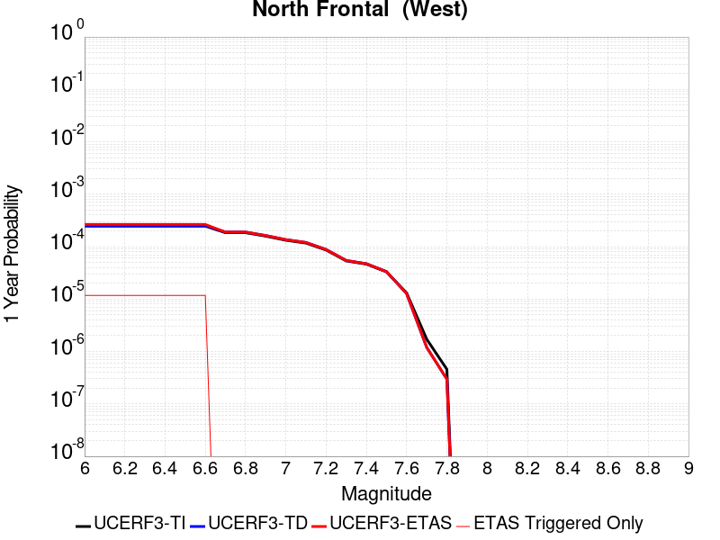 | 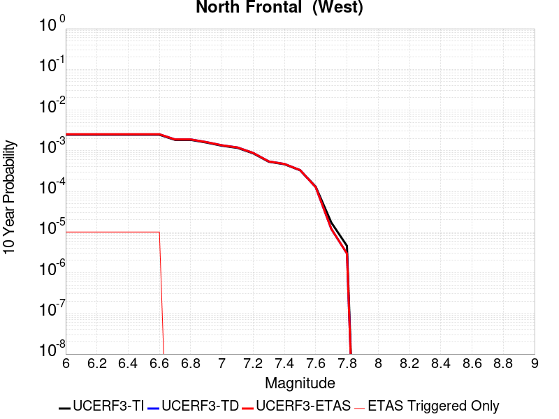 |

| Magnitude | 1 wk TI Prob | 1 wk TD Prob | 1 wk ETAS Prob | 1 wk ETAS/TD Gain | 1 wk ETAS Triggered Only | 1 mo TI Prob | 1 mo TD Prob | 1 mo ETAS Prob | 1 mo ETAS/TD Gain | 1 mo ETAS Triggered Only | 1 yr TI Prob | 1 yr TD Prob | 1 yr ETAS Prob | 1 yr ETAS/TD Gain | 1 yr ETAS Triggered Only | 10 yr TI Prob | 10 yr TD Prob | 10 yr ETAS Prob | 10 yr ETAS/TD Gain | 10 yr ETAS Triggered Only |
|-----|-----|-----|-----|-----|-----|-----|-----|-----|-----|-----|-----|-----|-----|-----|-----|-----|-----|-----|-----|-----|
| 6.0 | 4.7316266E-6 | 4.8526726E-6 | 4.8526726E-6 | 1.0 | 0.0 | 2.0278241E-5 | 2.0797012E-5 | 2.0797012E-5 | 1.0 | 0.0 | 2.4685962E-4 | 2.5317568E-4 | 2.649098E-4 | 1.0463477 | 1.1737089E-5 | 0.0024658558 | 0.0025290183 | 0.0025407257 | 1.0046293 | 1.1737089E-5 |
| 6.1 | 4.7316266E-6 | 4.8526726E-6 | 4.8526726E-6 | 1.0 | 0.0 | 2.0278241E-5 | 2.0797012E-5 | 2.0797012E-5 | 1.0 | 0.0 | 2.4685962E-4 | 2.5317568E-4 | 2.649098E-4 | 1.0463477 | 1.1737089E-5 | 0.0024658558 | 0.0025290183 | 0.0025407257 | 1.0046293 | 1.1737089E-5 |
| 6.2 | 4.7316266E-6 | 4.8526726E-6 | 4.8526726E-6 | 1.0 | 0.0 | 2.0278241E-5 | 2.0797012E-5 | 2.0797012E-5 | 1.0 | 0.0 | 2.4685962E-4 | 2.5317568E-4 | 2.649098E-4 | 1.0463477 | 1.1737089E-5 | 0.0024658558 | 0.0025290183 | 0.0025407257 | 1.0046293 | 1.1737089E-5 |
| 6.3 | 4.7316266E-6 | 4.8526726E-6 | 4.8526726E-6 | 1.0 | 0.0 | 2.0278241E-5 | 2.0797012E-5 | 2.0797012E-5 | 1.0 | 0.0 | 2.4685962E-4 | 2.5317568E-4 | 2.649098E-4 | 1.0463477 | 1.1737089E-5 | 0.0024658558 | 0.0025290183 | 0.0025407257 | 1.0046293 | 1.1737089E-5 |
| 6.4 | 4.7316266E-6 | 4.8526726E-6 | 4.8526726E-6 | 1.0 | 0.0 | 2.0278241E-5 | 2.0797012E-5 | 2.0797012E-5 | 1.0 | 0.0 | 2.4685962E-4 | 2.5317568E-4 | 2.649098E-4 | 1.0463477 | 1.1737089E-5 | 0.0024658558 | 0.0025290183 | 0.0025407257 | 1.0046293 | 1.1737089E-5 |
| 6.5 | 4.7316266E-6 | 4.8526726E-6 | 4.8526726E-6 | 1.0 | 0.0 | 2.0278241E-5 | 2.0797012E-5 | 2.0797012E-5 | 1.0 | 0.0 | 2.4685962E-4 | 2.5317568E-4 | 2.649098E-4 | 1.0463477 | 1.1737089E-5 | 0.0024658558 | 0.0025290183 | 0.0025407257 | 1.0046293 | 1.1737089E-5 |
| 6.6 | 4.7316266E-6 | 4.8526726E-6 | 4.8526726E-6 | 1.0 | 0.0 | 2.0278241E-5 | 2.0797012E-5 | 2.0797012E-5 | 1.0 | 0.0 | 2.4685962E-4 | 2.5317568E-4 | 2.649098E-4 | 1.0463477 | 1.1737089E-5 | 0.0024658558 | 0.0025290183 | 0.0025407257 | 1.0046293 | 1.1737089E-5 |
| 6.7 | 3.5382777E-6 | 3.6308859E-6 | 3.6308859E-6 | 1.0 | 0.0 | 1.516396E-5 | 1.5560852E-5 | 1.5560852E-5 | 1.0 | 0.0 | 1.8460557E-4 | 1.8943768E-4 | 1.8943768E-4 | 1.0 | 0.0 | 0.0018445229 | 0.0018928389 | 0.0018928389 | 1.0 | 0.0 |
| 6.8 | 3.5382777E-6 | 3.6308859E-6 | 3.6308859E-6 | 1.0 | 0.0 | 1.516396E-5 | 1.5560852E-5 | 1.5560852E-5 | 1.0 | 0.0 | 1.8460557E-4 | 1.8943768E-4 | 1.8943768E-4 | 1.0 | 0.0 | 0.0018445229 | 0.0018928389 | 0.0018928389 | 1.0 | 0.0 |
| 6.9 | 3.0428037E-6 | 3.1227605E-6 | 3.1227605E-6 | 1.0 | 0.0 | 1.30405215E-5 | 1.33831945E-5 | 1.33831945E-5 | 1.0 | 0.0 | 1.5875678E-4 | 1.6292889E-4 | 1.6292889E-4 | 1.0 | 0.0 | 0.0015864341 | 0.0016281615 | 0.0016281615 | 1.0 | 0.0 |
| 7.0 | 2.538778E-6 | 2.6060904E-6 | 2.6060904E-6 | 1.0 | 0.0 | 1.0880432E-5 | 1.1168913E-5 | 1.1168913E-5 | 1.0 | 0.0 | 1.324612E-4 | 1.3597352E-4 | 1.3597352E-4 | 1.0 | 0.0 | 0.0013238228 | 0.0013589499 | 0.0013589499 | 1.0 | 0.0 |
| 7.1 | 2.2418935E-6 | 2.3012074E-6 | 2.3012074E-6 | 1.0 | 0.0 | 9.60808E-6 | 9.862282E-6 | 9.862282E-6 | 1.0 | 0.0 | 1.1697209E-4 | 1.2006712E-4 | 1.2006712E-4 | 1.0 | 0.0 | 0.0011691054 | 0.0012000664 | 0.0012000664 | 1.0 | 0.0 |
| 7.2 | 1.6526745E-6 | 1.6924851E-6 | 1.6924851E-6 | 1.0 | 0.0 | 7.082872E-6 | 7.253489E-6 | 7.253489E-6 | 1.0 | 0.0 | 8.623055E-5 | 8.8307905E-5 | 8.8307905E-5 | 1.0 | 0.0 | 8.61971E-4 | 8.827532E-4 | 8.827532E-4 | 1.0 | 0.0 |
| 7.3 | 1.0246019E-6 | 1.0442261E-6 | 1.0442261E-6 | 1.0 | 0.0 | 4.391144E-6 | 4.4752474E-6 | 4.4752474E-6 | 1.0 | 0.0 | 5.3460866E-5 | 5.448489E-5 | 5.448489E-5 | 1.0 | 0.0 | 5.344801E-4 | 5.4472685E-4 | 5.4472685E-4 | 1.0 | 0.0 |
| 7.4 | 8.9045164E-7 | 9.0565584E-7 | 9.0565584E-7 | 1.0 | 0.0 | 3.8162157E-6 | 3.8813773E-6 | 3.8813773E-6 | 1.0 | 0.0 | 4.646144E-5 | 4.7254853E-5 | 4.7254853E-5 | 1.0 | 0.0 | 4.6451724E-4 | 4.7245892E-4 | 4.7245892E-4 | 1.0 | 0.0 |
| 7.5 | 6.3357E-7 | 6.4027006E-7 | 6.4027006E-7 | 1.0 | 0.0 | 2.7152971E-6 | 2.744012E-6 | 2.744012E-6 | 1.0 | 0.0 | 3.305824E-5 | 3.34079E-5 | 3.34079E-5 | 1.0 | 0.0 | 3.3053322E-4 | 3.3403534E-4 | 3.3403534E-4 | 1.0 | 0.0 |
| 7.6 | 2.5087024E-7 | 2.4361097E-7 | 2.4361097E-7 | 1.0 | 0.0 | 1.0751578E-6 | 1.0440467E-6 | 1.0440467E-6 | 1.0 | 0.0 | 1.3089967E-5 | 1.2711216E-5 | 1.2711216E-5 | 1.0 | 0.0 | 1.3089196E-4 | 1.2710695E-4 | 1.2710695E-4 | 1.0 | 0.0 |
| 7.7 | 3.282987E-8 | 2.2874195E-8 | 2.2874195E-8 | 1.0 | 0.0 | 1.4069944E-7 | 9.803227E-8 | 9.803227E-8 | 1.0 | 0.0 | 1.7130144E-6 | 1.1935423E-6 | 1.1935423E-6 | 1.0 | 0.0 | 1.7130013E-5 | 1.1935367E-5 | 1.1935367E-5 | 1.0 | 0.0 |
| 7.8 | 8.77499E-9 | 5.6815956E-9 | 5.6815956E-9 | 1.0 | 0.0 | 3.7607098E-8 | 2.4349696E-8 | 2.4349696E-8 | 1.0 | 0.0 | 4.578663E-7 | 2.9645753E-7 | 2.9645753E-7 | 1.0 | 0.0 | 4.5786537E-6 | 2.9645726E-6 | 2.9645726E-6 | 1.0 | 0.0 |

## Calaveras (So) 2011 CFM
*[(top)](#table-of-contents)*

| 1 Week | 1 Month | 1 Year | 10 Year |
|-----|-----|-----|-----|
| 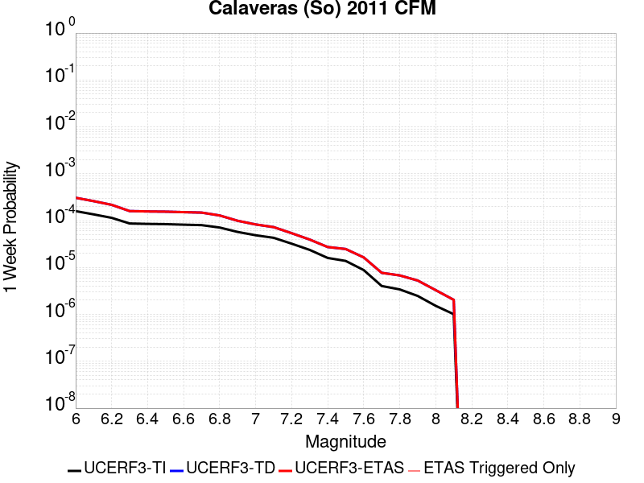 | 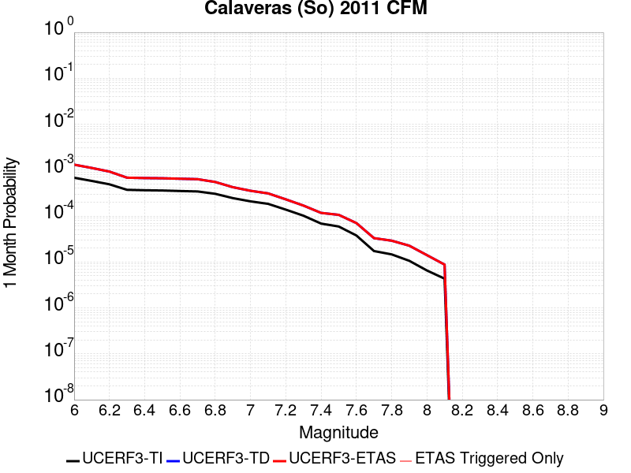 | 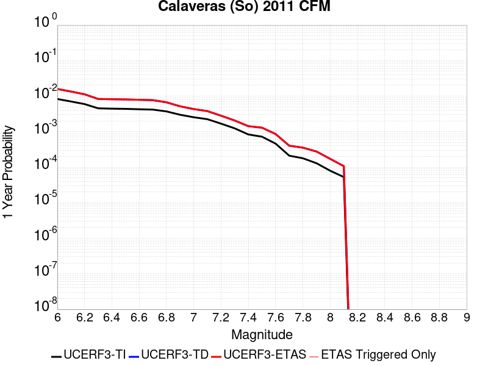 | 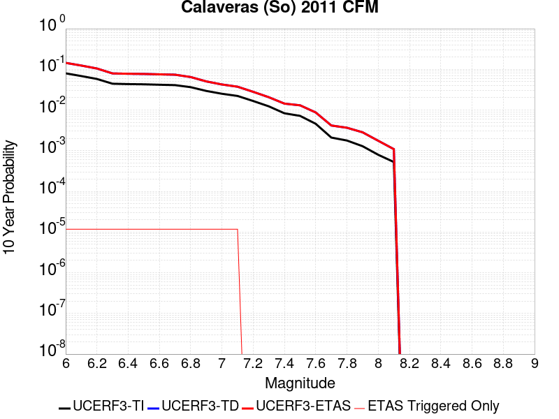 |

| Magnitude | 1 wk TI Prob | 1 wk TD Prob | 1 wk ETAS Prob | 1 wk ETAS/TD Gain | 1 wk ETAS Triggered Only | 1 mo TI Prob | 1 mo TD Prob | 1 mo ETAS Prob | 1 mo ETAS/TD Gain | 1 mo ETAS Triggered Only | 1 yr TI Prob | 1 yr TD Prob | 1 yr ETAS Prob | 1 yr ETAS/TD Gain | 1 yr ETAS Triggered Only | 10 yr TI Prob | 10 yr TD Prob | 10 yr ETAS Prob | 10 yr ETAS/TD Gain | 10 yr ETAS Triggered Only |
|-----|-----|-----|-----|-----|-----|-----|-----|-----|-----|-----|-----|-----|-----|-----|-----|-----|-----|-----|-----|-----|
| 6.0 | 1.5950744E-4 | 3.071188E-4 | 3.071188E-4 | 1.0 | 0.0 | 6.834242E-4 | 0.0013155643 | 0.0013155643 | 1.0 | 0.0 | 0.00828899 | 0.01585904 | 0.01585904 | 1.0 | 0.0 | 0.079865426 | 0.14440064 | 0.14441068 | 1.0000695 | 1.1737089E-5 |
| 6.1 | 1.3584697E-4 | 2.6036944E-4 | 2.6036944E-4 | 1.0 | 0.0 | 5.8207137E-4 | 0.0011153965 | 0.0011153965 | 1.0 | 0.0 | 0.007063716 | 0.013462106 | 0.013462106 | 1.0 | 0.0 | 0.06843361 | 0.12402854 | 0.12403882 | 1.0000829 | 1.1737089E-5 |
| 6.2 | 1.14676266E-4 | 2.1726108E-4 | 2.1726108E-4 | 1.0 | 0.0 | 4.9137714E-4 | 9.307893E-4 | 9.307893E-4 | 1.0 | 0.0 | 0.0059661185 | 0.011245592 | 0.011245592 | 1.0 | 0.0 | 0.058084648 | 0.105019294 | 0.1050298 | 1.0001 | 1.1737089E-5 |
| 6.3 | 8.691518E-5 | 1.5987165E-4 | 1.5987165E-4 | 1.0 | 0.0 | 3.7244044E-4 | 6.8496726E-4 | 6.8496726E-4 | 1.0 | 0.0 | 0.004525038 | 0.008300893 | 0.008300893 | 1.0 | 0.0 | 0.044339992 | 0.0793347 | 0.07934551 | 1.0001363 | 1.1737089E-5 |
| 6.4 | 8.50982E-5 | 1.5693568E-4 | 1.5693568E-4 | 1.0 | 0.0 | 3.646556E-4 | 6.7239115E-4 | 6.7239115E-4 | 1.0 | 0.0 | 0.0044306475 | 0.008148931 | 0.008148931 | 1.0 | 0.0 | 0.04343345 | 0.077940844 | 0.07795167 | 1.0001389 | 1.1737089E-5 |
| 6.5 | 8.4062965E-5 | 1.5518135E-4 | 1.5518135E-4 | 1.0 | 0.0 | 3.602201E-4 | 6.648764E-4 | 6.648764E-4 | 1.0 | 0.0 | 0.004376863 | 0.008058134 | 0.008058134 | 1.0 | 0.0 | 0.042916555 | 0.077112116 | 0.07712295 | 1.0001404 | 1.1737089E-5 |
| 6.6 | 8.194716E-5 | 1.5154095E-4 | 1.5154095E-4 | 1.0 | 0.0 | 3.5115483E-4 | 6.492825E-4 | 6.492825E-4 | 1.0 | 0.0 | 0.0042669317 | 0.007869979 | 0.007869979 | 1.0 | 0.0 | 0.04185927 | 0.07539739 | 0.07540824 | 1.0001439 | 1.1737089E-5 |
| 6.7 | 8.012326E-5 | 1.4821833E-4 | 1.4821833E-4 | 1.0 | 0.0 | 3.433402E-4 | 6.350497E-4 | 6.350497E-4 | 1.0 | 0.0 | 0.004172157 | 0.007698474 | 0.007698474 | 1.0 | 0.0 | 0.040946912 | 0.073839515 | 0.073850386 | 1.0001472 | 1.1737089E-5 |
| 6.8 | 7.119773E-5 | 1.2880519E-4 | 1.2880519E-4 | 1.0 | 0.0 | 3.0509746E-4 | 5.519001E-4 | 5.519001E-4 | 1.0 | 0.0 | 0.0037082357 | 0.0066958875 | 0.0066958875 | 1.0 | 0.0 | 0.036469642 | 0.06468402 | 0.06469499 | 1.0001698 | 1.1737089E-5 |
| 6.9 | 5.7343088E-5 | 9.9189E-5 | 9.9189E-5 | 1.0 | 0.0 | 2.4573295E-4 | 4.2502693E-4 | 4.2502693E-4 | 1.0 | 0.0 | 0.0029876942 | 0.0051625078 | 0.0051625078 | 1.0 | 0.0 | 0.02947844 | 0.050509132 | 0.05052028 | 1.0002207 | 1.1737089E-5 |
| 7.0 | 4.8746577E-5 | 8.284751E-5 | 8.284751E-5 | 1.0 | 0.0 | 2.0889717E-4 | 3.550128E-4 | 3.550128E-4 | 1.0 | 0.0 | 0.0025403565 | 0.004313781 | 0.004313781 | 1.0 | 0.0 | 0.025115121 | 0.04248505 | 0.04249629 | 1.0002645 | 1.1737089E-5 |
| 7.1 | 4.2998014E-5 | 7.264914E-5 | 7.264914E-5 | 1.0 | 0.0 | 1.8426418E-4 | 3.1131663E-4 | 3.1131663E-4 | 1.0 | 0.0 | 0.002241108 | 0.0037837527 | 0.0037837527 | 1.0 | 0.0 | 0.022186412 | 0.037423246 | 0.03743454 | 1.0003018 | 1.1737089E-5 |
| 7.2 | 3.221292E-5 | 5.390566E-5 | 5.390566E-5 | 1.0 | 0.0 | 1.3804805E-4 | 2.3100396E-4 | 2.3100396E-4 | 1.0 | 0.0 | 0.0016794393 | 0.0028088738 | 0.0028088738 | 1.0 | 0.0 | 0.016668037 | 0.028035998 | 0.028035998 | 1.0 | 0.0 |
| 7.3 | 2.3756531E-5 | 3.9471706E-5 | 3.9471706E-5 | 1.0 | 0.0 | 1.0180973E-4 | 1.6915359E-4 | 1.6915359E-4 | 1.0 | 0.0 | 0.0012388286 | 0.0020575167 | 0.0020575167 | 1.0 | 0.0 | 0.012319452 | 0.02064345 | 0.02064345 | 1.0 | 0.0 |
| 7.4 | 1.5997684E-5 | 2.734085E-5 | 2.734085E-5 | 1.0 | 0.0 | 6.8559704E-5 | 1.1716982E-4 | 1.1716982E-4 | 1.0 | 0.0 | 8.343947E-4 | 0.0014256114 | 0.0014256114 | 1.0 | 0.0 | 0.008312687 | 0.014376549 | 0.014376549 | 1.0 | 0.0 |
| 7.5 | 1.3814293E-5 | 2.4782603E-5 | 2.4782603E-5 | 1.0 | 0.0 | 5.9202768E-5 | 1.0620684E-4 | 1.0620684E-4 | 1.0 | 0.0 | 7.205553E-4 | 0.0012923037 | 0.0012923037 | 1.0 | 0.0 | 0.007182234 | 0.013055766 | 0.013055766 | 1.0 | 0.0 |
| 7.6 | 8.817309E-6 | 1.6429829E-5 | 1.6429829E-5 | 1.0 | 0.0 | 3.7787922E-5 | 7.041166E-5 | 7.041166E-5 | 1.0 | 0.0 | 4.5997082E-4 | 8.5692614E-4 | 8.5692614E-4 | 1.0 | 0.0 | 0.004590199 | 0.008719863 | 0.008719863 | 1.0 | 0.0 |
| 7.7 | 4.0352206E-6 | 7.706877E-6 | 7.706877E-6 | 1.0 | 0.0 | 1.7293689E-5 | 3.3029053E-5 | 3.3029053E-5 | 1.0 | 0.0 | 2.1053031E-4 | 4.020546E-4 | 4.020546E-4 | 1.0 | 0.0 | 0.0021033096 | 0.0041649863 | 0.0041649863 | 1.0 | 0.0 |
| 7.8 | 3.413169E-6 | 6.7868646E-6 | 6.7868646E-6 | 1.0 | 0.0 | 1.4627784E-5 | 2.9086239E-5 | 2.9086239E-5 | 1.0 | 0.0 | 1.7807873E-4 | 3.5406748E-4 | 3.5406748E-4 | 1.0 | 0.0 | 0.0017793609 | 0.0036663096 | 0.0036663096 | 1.0 | 0.0 |
| 7.9 | 2.4740732E-6 | 5.278809E-6 | 5.278809E-6 | 1.0 | 0.0 | 1.06031275E-5 | 2.2623271E-5 | 2.2623271E-5 | 1.0 | 0.0 | 1.2908543E-4 | 2.7540355E-4 | 2.7540355E-4 | 1.0 | 0.0 | 0.0012901047 | 0.002834638 | 0.002834638 | 1.0 | 0.0 |
| 8.0 | 1.5231818E-6 | 3.2887135E-6 | 3.2887135E-6 | 1.0 | 0.0 | 6.527906E-6 | 1.409441E-5 | 1.409441E-5 | 1.0 | 0.0 | 7.9474354E-5 | 1.7158597E-4 | 1.7158597E-4 | 1.0 | 0.0 | 7.944594E-4 | 0.001756374 | 0.001756374 | 1.0 | 0.0 |
| 8.1 | 1.0104524E-6 | 2.0456548E-6 | 2.0456548E-6 | 1.0 | 0.0 | 4.330503E-6 | 8.767062E-6 | 8.767062E-6 | 1.0 | 0.0 | 5.2722597E-5 | 1.06733794E-4 | 1.06733794E-4 | 1.0 | 0.0 | 5.271009E-4 | 0.0010929212 | 0.0010929212 | 1.0 | 0.0 |

## Mono Lake 2011 CFM
*[(top)](#table-of-contents)*

| 1 Week | 1 Month | 1 Year | 10 Year |
|-----|-----|-----|-----|
|  | 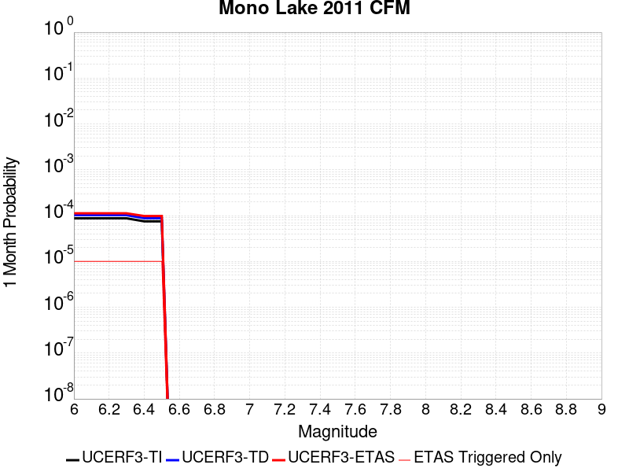 |  | 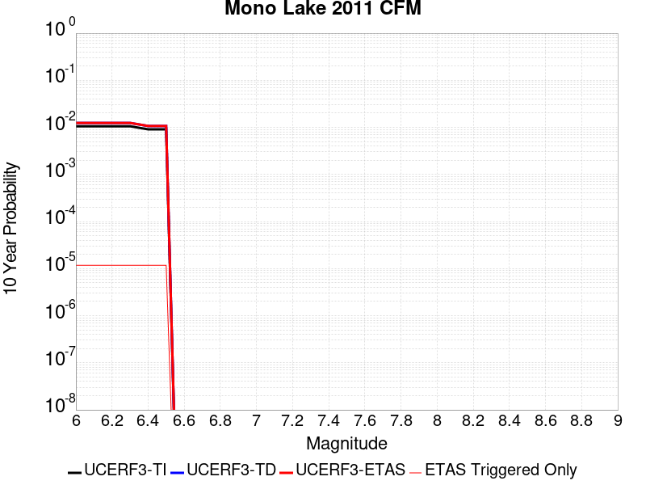 |

| Magnitude | 1 wk TI Prob | 1 wk TD Prob | 1 wk ETAS Prob | 1 wk ETAS/TD Gain | 1 wk ETAS Triggered Only | 1 mo TI Prob | 1 mo TD Prob | 1 mo ETAS Prob | 1 mo ETAS/TD Gain | 1 mo ETAS Triggered Only | 1 yr TI Prob | 1 yr TD Prob | 1 yr ETAS Prob | 1 yr ETAS/TD Gain | 1 yr ETAS Triggered Only | 10 yr TI Prob | 10 yr TD Prob | 10 yr ETAS Prob | 10 yr ETAS/TD Gain | 10 yr ETAS Triggered Only |
|-----|-----|-----|-----|-----|-----|-----|-----|-----|-----|-----|-----|-----|-----|-----|-----|-----|-----|-----|-----|-----|
| 6.0 | 2.0341662E-5 | 2.3828166E-5 | 2.3828166E-5 | 1.0 | 0.0 | 8.717564E-5 | 1.0211971E-4 | 1.0211971E-4 | 1.0 | 0.0 | 0.0010608466 | 0.0012431298 | 0.0012548523 | 1.0094298 | 1.1737089E-5 | 0.010557966 | 0.012413835 | 0.012425426 | 1.0009338 | 1.1737089E-5 |
| 6.1 | 2.0341662E-5 | 2.3828166E-5 | 2.3828166E-5 | 1.0 | 0.0 | 8.717564E-5 | 1.0211971E-4 | 1.0211971E-4 | 1.0 | 0.0 | 0.0010608466 | 0.0012431298 | 0.0012548523 | 1.0094298 | 1.1737089E-5 | 0.010557966 | 0.012413835 | 0.012425426 | 1.0009338 | 1.1737089E-5 |
| 6.2 | 2.0341662E-5 | 2.3828166E-5 | 2.3828166E-5 | 1.0 | 0.0 | 8.717564E-5 | 1.0211971E-4 | 1.0211971E-4 | 1.0 | 0.0 | 0.0010608466 | 0.0012431298 | 0.0012548523 | 1.0094298 | 1.1737089E-5 | 0.010557966 | 0.012413835 | 0.012425426 | 1.0009338 | 1.1737089E-5 |
| 6.3 | 2.0341662E-5 | 2.3828166E-5 | 2.3828166E-5 | 1.0 | 0.0 | 8.717564E-5 | 1.0211971E-4 | 1.0211971E-4 | 1.0 | 0.0 | 0.0010608466 | 0.0012431298 | 0.0012548523 | 1.0094298 | 1.1737089E-5 | 0.010557966 | 0.012413835 | 0.012425426 | 1.0009338 | 1.1737089E-5 |
| 6.4 | 1.749821E-5 | 2.0490985E-5 | 2.0490985E-5 | 1.0 | 0.0 | 7.499018E-5 | 8.781851E-5 | 8.781851E-5 | 1.0 | 0.0 | 9.1262296E-4 | 0.0010691903 | 0.0010809149 | 1.0109658 | 1.1737089E-5 | 0.009088841 | 0.010691865 | 0.010703476 | 1.001086 | 1.1737089E-5 |
| 6.5 | 1.749821E-5 | 2.0490985E-5 | 2.0490985E-5 | 1.0 | 0.0 | 7.499018E-5 | 8.781851E-5 | 8.781851E-5 | 1.0 | 0.0 | 9.1262296E-4 | 0.0010691903 | 0.0010809149 | 1.0109658 | 1.1737089E-5 | 0.009088841 | 0.010691865 | 0.010703476 | 1.001086 | 1.1737089E-5 |

## South Cuyama
*[(top)](#table-of-contents)*

| 1 Week | 1 Month | 1 Year | 10 Year |
|-----|-----|-----|-----|
| 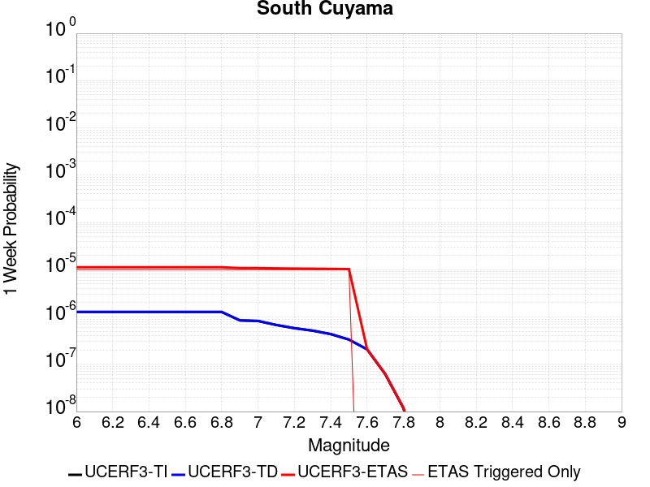 | 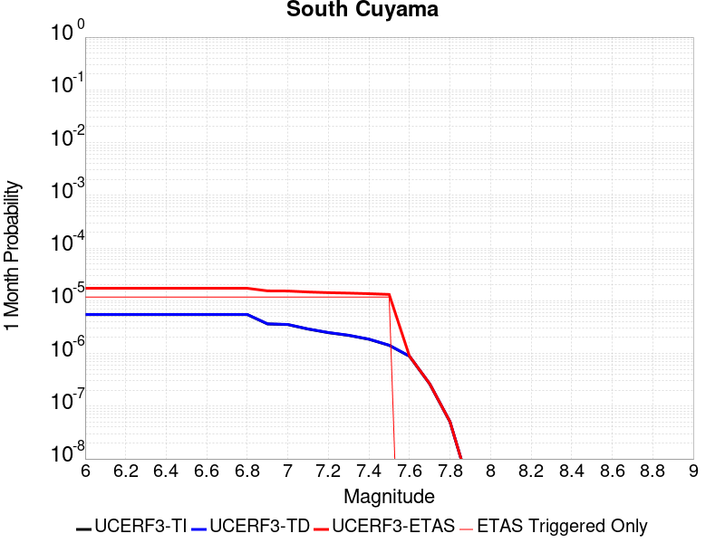 | 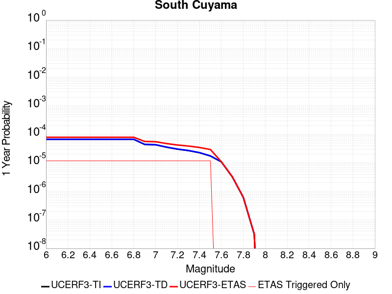 | 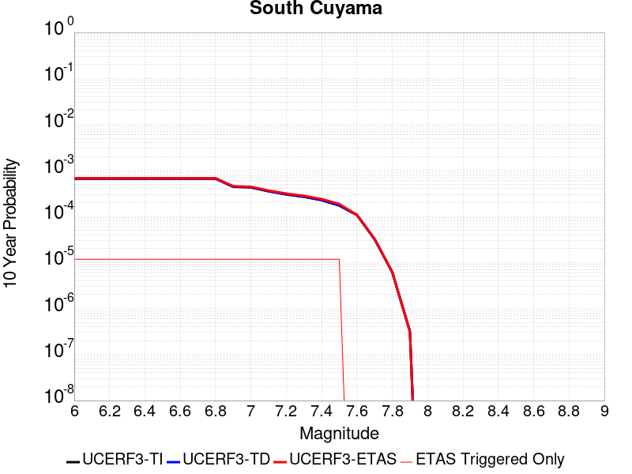 |

| Magnitude | 1 wk TI Prob | 1 wk TD Prob | 1 wk ETAS Prob | 1 wk ETAS/TD Gain | 1 wk ETAS Triggered Only | 1 mo TI Prob | 1 mo TD Prob | 1 mo ETAS Prob | 1 mo ETAS/TD Gain | 1 mo ETAS Triggered Only | 1 yr TI Prob | 1 yr TD Prob | 1 yr ETAS Prob | 1 yr ETAS/TD Gain | 1 yr ETAS Triggered Only | 10 yr TI Prob | 10 yr TD Prob | 10 yr ETAS Prob | 10 yr ETAS/TD Gain | 10 yr ETAS Triggered Only |
|-----|-----|-----|-----|-----|-----|-----|-----|-----|-----|-----|-----|-----|-----|-----|-----|-----|-----|-----|-----|-----|
| 6.0 | 1.2747308E-6 | 1.2818697E-6 | 1.3018944E-5 | 10.156215 | 1.1737089E-5 | 5.4631205E-6 | 5.4937163E-6 | 1.7230741E-5 | 3.1364455 | 1.1737089E-5 | 6.6511464E-5 | 6.6884015E-5 | 7.8620316E-5 | 1.1754725 | 1.1737089E-5 | 6.649156E-4 | 6.686458E-4 | 6.8037503E-4 | 1.0175418 | 1.1737089E-5 |
| 6.1 | 1.2747308E-6 | 1.2818697E-6 | 1.3018944E-5 | 10.156215 | 1.1737089E-5 | 5.4631205E-6 | 5.4937163E-6 | 1.7230741E-5 | 3.1364455 | 1.1737089E-5 | 6.6511464E-5 | 6.6884015E-5 | 7.8620316E-5 | 1.1754725 | 1.1737089E-5 | 6.649156E-4 | 6.686458E-4 | 6.8037503E-4 | 1.0175418 | 1.1737089E-5 |
| 6.2 | 1.2747308E-6 | 1.2818697E-6 | 1.3018944E-5 | 10.156215 | 1.1737089E-5 | 5.4631205E-6 | 5.4937163E-6 | 1.7230741E-5 | 3.1364455 | 1.1737089E-5 | 6.6511464E-5 | 6.6884015E-5 | 7.8620316E-5 | 1.1754725 | 1.1737089E-5 | 6.649156E-4 | 6.686458E-4 | 6.8037503E-4 | 1.0175418 | 1.1737089E-5 |
| 6.3 | 1.2747308E-6 | 1.2818697E-6 | 1.3018944E-5 | 10.156215 | 1.1737089E-5 | 5.4631205E-6 | 5.4937163E-6 | 1.7230741E-5 | 3.1364455 | 1.1737089E-5 | 6.6511464E-5 | 6.6884015E-5 | 7.8620316E-5 | 1.1754725 | 1.1737089E-5 | 6.649156E-4 | 6.686458E-4 | 6.8037503E-4 | 1.0175418 | 1.1737089E-5 |
| 6.4 | 1.2747308E-6 | 1.2818697E-6 | 1.3018944E-5 | 10.156215 | 1.1737089E-5 | 5.4631205E-6 | 5.4937163E-6 | 1.7230741E-5 | 3.1364455 | 1.1737089E-5 | 6.6511464E-5 | 6.6884015E-5 | 7.8620316E-5 | 1.1754725 | 1.1737089E-5 | 6.649156E-4 | 6.686458E-4 | 6.8037503E-4 | 1.0175418 | 1.1737089E-5 |
| 6.5 | 1.2747308E-6 | 1.2818697E-6 | 1.3018944E-5 | 10.156215 | 1.1737089E-5 | 5.4631205E-6 | 5.4937163E-6 | 1.7230741E-5 | 3.1364455 | 1.1737089E-5 | 6.6511464E-5 | 6.6884015E-5 | 7.8620316E-5 | 1.1754725 | 1.1737089E-5 | 6.649156E-4 | 6.686458E-4 | 6.8037503E-4 | 1.0175418 | 1.1737089E-5 |
| 6.6 | 1.2747308E-6 | 1.2818697E-6 | 1.3018944E-5 | 10.156215 | 1.1737089E-5 | 5.4631205E-6 | 5.4937163E-6 | 1.7230741E-5 | 3.1364455 | 1.1737089E-5 | 6.6511464E-5 | 6.6884015E-5 | 7.8620316E-5 | 1.1754725 | 1.1737089E-5 | 6.649156E-4 | 6.686458E-4 | 6.8037503E-4 | 1.0175418 | 1.1737089E-5 |
| 6.7 | 1.2747308E-6 | 1.2818697E-6 | 1.3018944E-5 | 10.156215 | 1.1737089E-5 | 5.4631205E-6 | 5.4937163E-6 | 1.7230741E-5 | 3.1364455 | 1.1737089E-5 | 6.6511464E-5 | 6.6884015E-5 | 7.8620316E-5 | 1.1754725 | 1.1737089E-5 | 6.649156E-4 | 6.686458E-4 | 6.8037503E-4 | 1.0175418 | 1.1737089E-5 |
| 6.8 | 1.2747308E-6 | 1.2818697E-6 | 1.3018944E-5 | 10.156215 | 1.1737089E-5 | 5.4631205E-6 | 5.4937163E-6 | 1.7230741E-5 | 3.1364455 | 1.1737089E-5 | 6.6511464E-5 | 6.6884015E-5 | 7.8620316E-5 | 1.1754725 | 1.1737089E-5 | 6.649156E-4 | 6.686458E-4 | 6.8037503E-4 | 1.0175418 | 1.1737089E-5 |
| 6.9 | 8.4566324E-7 | 8.507883E-7 | 1.2587868E-5 | 14.795535 | 1.1737089E-5 | 3.624266E-6 | 3.6462304E-6 | 1.5383277E-5 | 4.2189536 | 1.1737089E-5 | 4.4124543E-5 | 4.439196E-5 | 5.612853E-5 | 1.264385 | 1.1737089E-5 | 4.4115784E-4 | 4.4383196E-4 | 4.5556386E-4 | 1.0264331 | 1.1737089E-5 |
| 7.0 | 8.2277904E-7 | 8.27782E-7 | 1.2564861E-5 | 15.17895 | 1.1737089E-5 | 3.526191E-6 | 3.5476323E-6 | 1.528468E-5 | 4.3084173 | 1.1737089E-5 | 4.293053E-5 | 4.3191576E-5 | 5.492816E-5 | 1.2717332 | 1.1737089E-5 | 4.292224E-4 | 4.3183283E-4 | 4.4356484E-4 | 1.0271679 | 1.1737089E-5 |
| 7.1 | 6.7661887E-7 | 6.80913E-7 | 1.2417994E-5 | 18.23727 | 1.1737089E-5 | 2.899792E-6 | 2.9181954E-6 | 1.465525E-5 | 5.022025 | 1.1737089E-5 | 3.5304394E-5 | 3.5528454E-5 | 4.7265126E-5 | 1.3303457 | 1.1737089E-5 | 3.5298787E-4 | 3.552281E-4 | 3.6696103E-4 | 1.0330292 | 1.1737089E-5 |
| 7.2 | 5.783336E-7 | 5.8211907E-7 | 1.2319201E-5 | 21.162683 | 1.1737089E-5 | 2.4785702E-6 | 2.4947938E-6 | 1.4231853E-5 | 5.7046213 | 1.1737089E-5 | 3.0176174E-5 | 3.0373692E-5 | 4.2110423E-5 | 1.3864112 | 1.1737089E-5 | 3.0172078E-4 | 3.0369565E-4 | 3.1542918E-4 | 1.0386358 | 1.1737089E-5 |
| 7.3 | 5.136759E-7 | 5.170938E-7 | 1.2254177E-5 | 23.69817 | 1.1737089E-5 | 2.2014663E-6 | 2.2161144E-6 | 1.3953178E-5 | 6.296235 | 1.1737089E-5 | 2.6802521E-5 | 2.698086E-5 | 3.8717633E-5 | 1.4350036 | 1.1737089E-5 | 2.679929E-4 | 2.6977606E-4 | 2.8150997E-4 | 1.043495 | 1.1737089E-5 |
| 7.4 | 4.3370295E-7 | 4.3665364E-7 | 1.2173738E-5 | 27.879622 | 1.1737089E-5 | 1.8587256E-6 | 1.8713713E-6 | 1.3608438E-5 | 7.2719073 | 1.1737089E-5 | 2.2629749E-5 | 2.278371E-5 | 3.452053E-5 | 1.515141 | 1.1737089E-5 | 2.2627445E-4 | 2.278139E-4 | 2.3954832E-4 | 1.0515088 | 1.1737089E-5 |
| 7.5 | 3.3242574E-7 | 3.3476465E-7 | 1.207185E-5 | 36.060707 | 1.1737089E-5 | 1.4246809E-6 | 1.4347048E-6 | 1.3171777E-5 | 9.180827 | 1.1737089E-5 | 1.7345352E-5 | 1.7467393E-5 | 2.9204277E-5 | 1.671931 | 1.1737089E-5 | 1.7343998E-4 | 1.7466032E-4 | 1.8639537E-4 | 1.0671878 | 1.1737089E-5 |
| 7.6 | 2.0627535E-7 | 2.07789E-7 | 2.07789E-7 | 1.0 | 0.0 | 8.840369E-7 | 8.90524E-7 | 8.90524E-7 | 1.0 | 0.0 | 1.0763096E-5 | 1.0842076E-5 | 1.0842076E-5 | 1.0 | 0.0 | 1.0762575E-4 | 1.0841556E-4 | 1.0841556E-4 | 1.0 | 0.0 |
| 7.7 | 6.15236E-8 | 6.1983044E-8 | 6.1983044E-8 | 1.0 | 0.0 | 2.6367252E-7 | 2.656416E-7 | 2.656416E-7 | 1.0 | 0.0 | 3.2102084E-6 | 3.2341818E-6 | 3.2341818E-6 | 1.0 | 0.0 | 3.210162E-5 | 3.234136E-5 | 3.234136E-5 | 1.0 | 0.0 |
| 7.8 | 1.1765573E-8 | 1.1873414E-8 | 1.1873414E-8 | 1.0 | 0.0 | 5.0423886E-8 | 5.0886058E-8 | 5.0886058E-8 | 1.0 | 0.0 | 6.1391063E-7 | 6.195376E-7 | 6.195376E-7 | 1.0 | 0.0 | 6.1390897E-6 | 6.19536E-6 | 6.19536E-6 | 1.0 | 0.0 |
| 7.9 | 6.0381755E-10 | 6.10058E-10 | 6.10058E-10 | 1.0 | 0.0 | 2.5877895E-9 | 2.614534E-9 | 2.614534E-9 | 1.0 | 0.0 | 3.1506335E-8 | 3.1831952E-8 | 3.1831952E-8 | 1.0 | 0.0 | 3.1506332E-7 | 3.183195E-7 | 3.183195E-7 | 1.0 | 0.0 |

## Sargent 2011 CFM
*[(top)](#table-of-contents)*

| 1 Week | 1 Month | 1 Year | 10 Year |
|-----|-----|-----|-----|
| 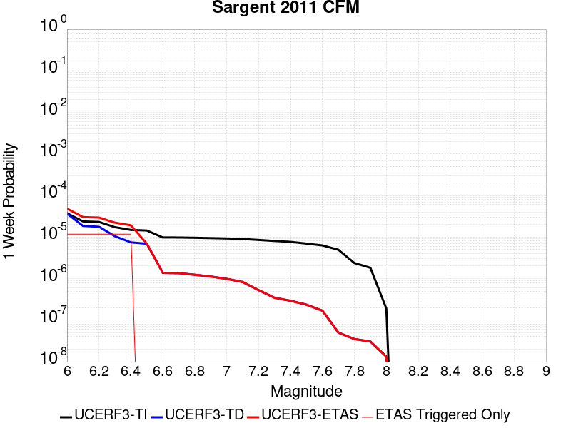 | 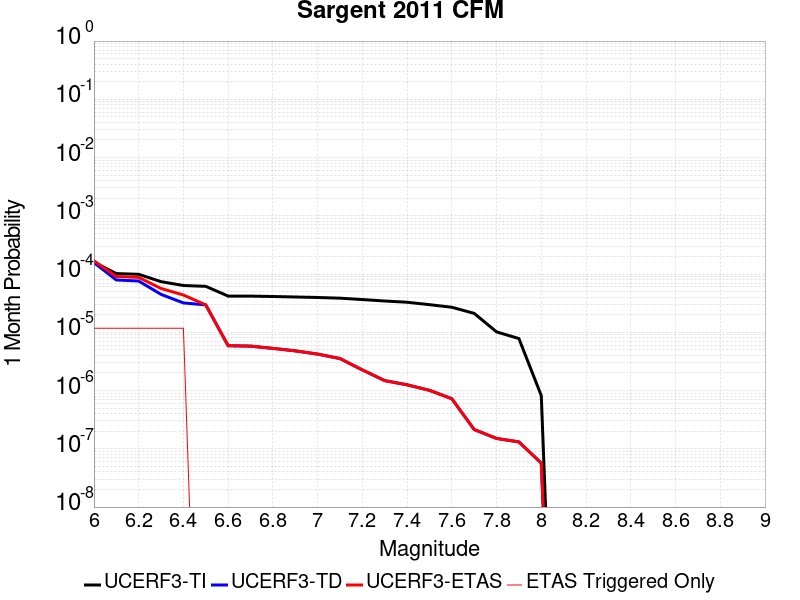 | 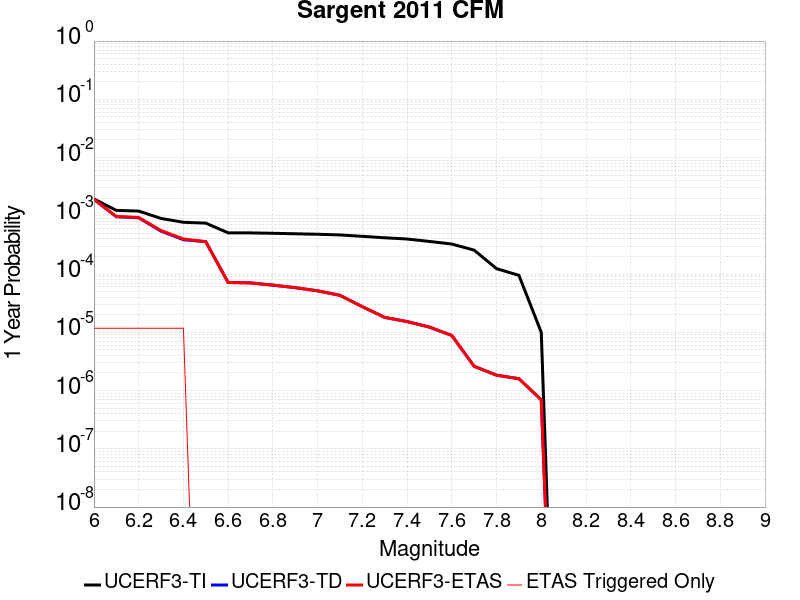 | 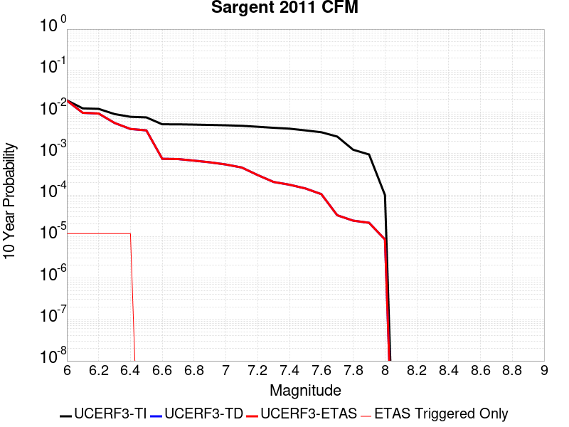 |

| Magnitude | 1 wk TI Prob | 1 wk TD Prob | 1 wk ETAS Prob | 1 wk ETAS/TD Gain | 1 wk ETAS Triggered Only | 1 mo TI Prob | 1 mo TD Prob | 1 mo ETAS Prob | 1 mo ETAS/TD Gain | 1 mo ETAS Triggered Only | 1 yr TI Prob | 1 yr TD Prob | 1 yr ETAS Prob | 1 yr ETAS/TD Gain | 1 yr ETAS Triggered Only | 10 yr TI Prob | 10 yr TD Prob | 10 yr ETAS Prob | 10 yr ETAS/TD Gain | 10 yr ETAS Triggered Only |
|-----|-----|-----|-----|-----|-----|-----|-----|-----|-----|-----|-----|-----|-----|-----|-----|-----|-----|-----|-----|-----|
| 6.0 | 3.7327867E-5 | 3.664913E-5 | 4.838579E-5 | 1.3202438 | 1.1737089E-5 | 1.5996677E-4 | 1.5706103E-4 | 1.6879628E-4 | 1.0747178 | 1.1737089E-5 | 0.0019458556 | 0.0019110236 | 0.0019227383 | 1.0061301 | 1.1737089E-5 | 0.01928905 | 0.019018095 | 0.019029608 | 1.0006055 | 1.1737089E-5 |
| 6.1 | 2.3771476E-5 | 1.8479273E-5 | 3.0216146E-5 | 1.6351371 | 1.1737089E-5 | 1.01873775E-4 | 7.919498E-5 | 9.0931135E-5 | 1.1481932 | 1.1737089E-5 | 0.0012396075 | 9.638493E-4 | 9.755751E-4 | 1.0121655 | 1.1737089E-5 | 0.012327154 | 0.009636091 | 0.009647715 | 1.0012063 | 1.1737089E-5 |
| 6.2 | 2.3112721E-5 | 1.7710632E-5 | 2.9447514E-5 | 1.6627026 | 1.1737089E-5 | 9.9050754E-5 | 7.590099E-5 | 8.763719E-5 | 1.154625 | 1.1737089E-5 | 0.0012052758 | 9.237792E-4 | 9.355055E-4 | 1.0126938 | 1.1737089E-5 | 0.011987597 | 0.009238743 | 0.009250372 | 1.0012587 | 1.1737089E-5 |
| 6.3 | 1.728509E-5 | 1.0458927E-5 | 2.2195893E-5 | 2.122196 | 1.1737089E-5 | 7.407686E-5 | 4.482347E-5 | 5.6560035E-5 | 1.2618396 | 1.1737089E-5 | 9.015125E-4 | 5.456343E-4 | 5.57365E-4 | 1.0214992 | 1.1737089E-5 | 0.008978641 | 0.0054791216 | 0.0054907943 | 1.0021304 | 1.1737089E-5 |
| 6.4 | 1.48395575E-5 | 7.4559816E-6 | 1.9192983E-5 | 2.5741725 | 1.1737089E-5 | 6.3596555E-5 | 3.195403E-5 | 4.3690747E-5 | 1.3672999 | 1.1737089E-5 | 7.7401294E-4 | 3.8900663E-4 | 4.0073917E-4 | 1.0301602 | 1.1737089E-5 | 0.0077132257 | 0.003918666 | 0.003930357 | 1.0029835 | 1.1737089E-5 |
| 6.5 | 1.4358964E-5 | 6.894759E-6 | 6.894759E-6 | 1.0 | 0.0 | 6.1536964E-5 | 2.9548846E-5 | 2.9548846E-5 | 1.0 | 0.0 | 7.48955E-4 | 3.5973339E-4 | 3.5973339E-4 | 1.0 | 0.0 | 0.0074643586 | 0.0036269152 | 0.0036269152 | 1.0 | 0.0 |
| 6.6 | 9.772591E-6 | 1.3736154E-6 | 1.3736154E-6 | 1.0 | 0.0 | 4.188186E-5 | 5.88691E-6 | 5.88691E-6 | 1.0 | 0.0 | 5.097923E-4 | 7.16708E-5 | 7.16708E-5 | 1.0 | 0.0 | 0.005086244 | 7.483097E-4 | 7.483097E-4 | 1.0 | 0.0 |
| 6.7 | 9.752745E-6 | 1.3523068E-6 | 1.3523068E-6 | 1.0 | 0.0 | 4.179681E-5 | 5.795587E-6 | 5.795587E-6 | 1.0 | 0.0 | 5.0875737E-4 | 7.055902E-5 | 7.055902E-5 | 1.0 | 0.0 | 0.005075942 | 7.371994E-4 | 7.371994E-4 | 1.0 | 0.0 |
| 6.8 | 9.608213E-6 | 1.2361709E-6 | 1.2361709E-6 | 1.0 | 0.0 | 4.1177405E-5 | 5.2978644E-6 | 5.2978644E-6 | 1.0 | 0.0 | 5.012196E-4 | 6.449961E-5 | 6.449961E-5 | 1.0 | 0.0 | 0.005000906 | 6.7634037E-4 | 6.7634037E-4 | 1.0 | 0.0 |
| 6.9 | 9.427164E-6 | 1.12094E-6 | 1.12094E-6 | 1.0 | 0.0 | 4.04015E-5 | 4.80402E-6 | 4.80402E-6 | 1.0 | 0.0 | 4.9177726E-4 | 5.8487396E-5 | 5.8487396E-5 | 1.0 | 0.0 | 0.004906904 | 6.1557174E-4 | 6.1557174E-4 | 1.0 | 0.0 |
| 7.0 | 9.247601E-6 | 9.873988E-7 | 9.873988E-7 | 1.0 | 0.0 | 3.9631974E-5 | 4.2317024E-6 | 4.2317024E-6 | 1.0 | 0.0 | 4.8241246E-4 | 5.1519775E-5 | 5.1519775E-5 | 1.0 | 0.0 | 0.0048136655 | 5.4542476E-4 | 5.4542476E-4 | 1.0 | 0.0 |
| 7.1 | 8.995454E-6 | 8.2711284E-7 | 8.2711284E-7 | 1.0 | 0.0 | 3.8551374E-5 | 3.5447645E-6 | 3.5447645E-6 | 1.0 | 0.0 | 4.6926187E-4 | 4.3156666E-5 | 4.3156666E-5 | 1.0 | 0.0 | 0.004682722 | 4.609069E-4 | 4.609069E-4 | 1.0 | 0.0 |
| 7.2 | 8.520861E-6 | 5.2766507E-7 | 5.2766507E-7 | 1.0 | 0.0 | 3.6517464E-5 | 2.2614197E-6 | 2.2614197E-6 | 1.0 | 0.0 | 4.445094E-4 | 2.7532446E-5 | 2.7532446E-5 | 1.0 | 0.0 | 0.004436213 | 3.0297207E-4 | 3.0297207E-4 | 1.0 | 0.0 |
| 7.3 | 8.043592E-6 | 3.456507E-7 | 3.456507E-7 | 1.0 | 0.0 | 3.4472083E-5 | 1.4813593E-6 | 1.4813593E-6 | 1.0 | 0.0 | 4.196168E-4 | 1.8035402E-5 | 1.8035402E-5 | 1.0 | 0.0 | 0.004188253 | 2.0669671E-4 | 2.0669671E-4 | 1.0 | 0.0 |
| 7.4 | 7.662316E-6 | 2.928958E-7 | 2.928958E-7 | 1.0 | 0.0 | 3.2838085E-5 | 1.2552671E-6 | 1.2552671E-6 | 1.0 | 0.0 | 3.9973034E-4 | 1.528277E-5 | 1.528277E-5 | 1.0 | 0.0 | 0.0039901207 | 1.7736501E-4 | 1.7736501E-4 | 1.0 | 0.0 |
| 7.5 | 6.961638E-6 | 2.3574503E-7 | 2.3574503E-7 | 1.0 | 0.0 | 2.9835252E-5 | 1.0103355E-6 | 1.0103355E-6 | 1.0 | 0.0 | 3.6318362E-4 | 1.2300766E-5 | 1.2300766E-5 | 1.0 | 0.0 | 0.0036259065 | 1.4409334E-4 | 1.4409334E-4 | 1.0 | 0.0 |
| 7.6 | 6.282332E-6 | 1.6892966E-7 | 1.6892966E-7 | 1.0 | 0.0 | 2.6924003E-5 | 7.2398404E-7 | 7.2398404E-7 | 1.0 | 0.0 | 3.2775043E-4 | 8.814471E-6 | 8.814471E-6 | 1.0 | 0.0 | 0.0032726745 | 1.05050465E-4 | 1.05050465E-4 | 1.0 | 0.0 |
| 7.7 | 4.934408E-6 | 5.001089E-8 | 5.001089E-8 | 1.0 | 0.0 | 2.114729E-5 | 2.1433237E-7 | 2.1433237E-7 | 1.0 | 0.0 | 2.5743784E-4 | 2.6094935E-6 | 2.6094935E-6 | 1.0 | 0.0 | 0.0025713982 | 3.2545366E-5 | 3.2545366E-5 | 1.0 | 0.0 |
| 7.8 | 2.373212E-6 | 3.5172643E-8 | 3.5172643E-8 | 1.0 | 0.0 | 1.0170869E-5 | 1.507399E-7 | 1.507399E-7 | 1.0 | 0.0 | 1.238233E-4 | 1.8352566E-6 | 1.8352566E-6 | 1.0 | 0.0 | 0.0012375432 | 2.4125171E-5 | 2.4125171E-5 | 1.0 | 0.0 |
| 7.9 | 1.8227792E-6 | 3.0619603E-8 | 3.0619603E-8 | 1.0 | 0.0 | 7.811887E-6 | 1.3122687E-7 | 1.3122687E-7 | 1.0 | 0.0 | 9.510558E-5 | 1.5976858E-6 | 1.5976858E-6 | 1.0 | 0.0 | 9.5064886E-4 | 2.1410624E-5 | 2.1410624E-5 | 1.0 | 0.0 |
| 8.0 | 1.9095137E-7 | 1.326461E-8 | 1.326461E-8 | 1.0 | 0.0 | 8.1836276E-7 | 5.684833E-8 | 5.684833E-8 | 1.0 | 0.0 | 9.963521E-6 | 6.921282E-7 | 6.921282E-7 | 1.0 | 0.0 | 9.963074E-5 | 8.463319E-6 | 8.463319E-6 | 1.0 | 0.0 |

## Los Alamos extension
*[(top)](#table-of-contents)*

| 1 Week | 1 Month | 1 Year | 10 Year |
|-----|-----|-----|-----|
|  | 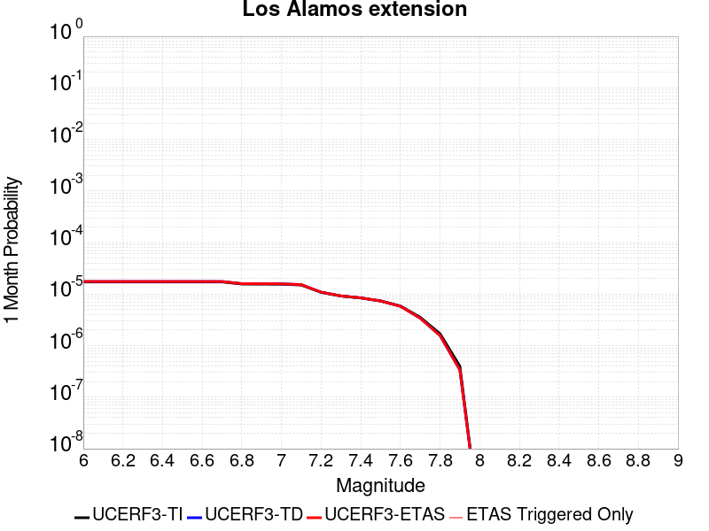 | 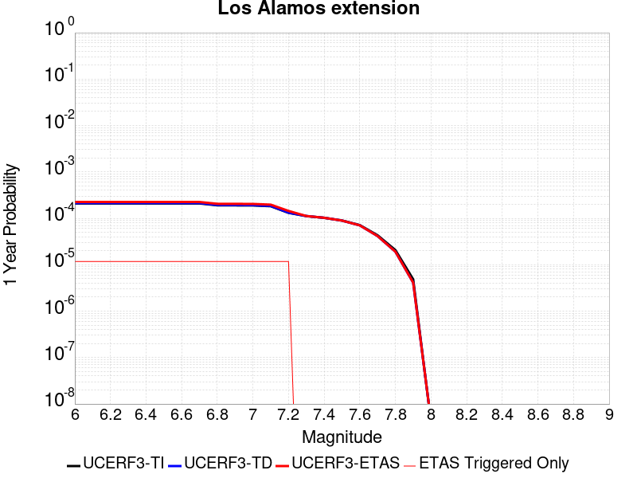 | 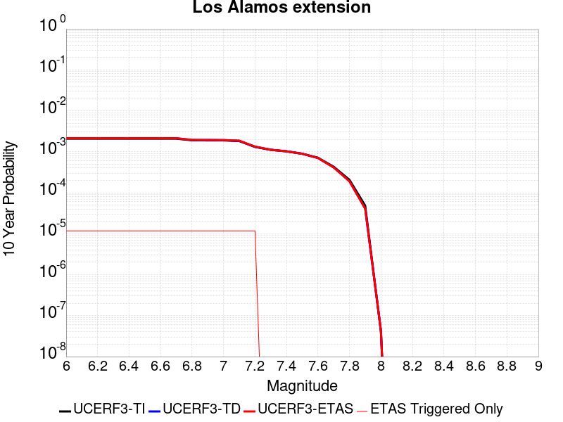 |

| Magnitude | 1 wk TI Prob | 1 wk TD Prob | 1 wk ETAS Prob | 1 wk ETAS/TD Gain | 1 wk ETAS Triggered Only | 1 mo TI Prob | 1 mo TD Prob | 1 mo ETAS Prob | 1 mo ETAS/TD Gain | 1 mo ETAS Triggered Only | 1 yr TI Prob | 1 yr TD Prob | 1 yr ETAS Prob | 1 yr ETAS/TD Gain | 1 yr ETAS Triggered Only | 10 yr TI Prob | 10 yr TD Prob | 10 yr ETAS Prob | 10 yr ETAS/TD Gain | 10 yr ETAS Triggered Only |
|-----|-----|-----|-----|-----|-----|-----|-----|-----|-----|-----|-----|-----|-----|-----|-----|-----|-----|-----|-----|-----|
| 6.0 | 4.0146506E-6 | 4.0861596E-6 | 4.0861596E-6 | 1.0 | 0.0 | 1.7205533E-5 | 1.7512002E-5 | 1.7512002E-5 | 1.0 | 0.0 | 2.0945723E-4 | 2.1318886E-4 | 2.2492345E-4 | 1.0550431 | 1.1737089E-5 | 0.0020925992 | 0.0021299527 | 0.0021416647 | 1.0054988 | 1.1737089E-5 |
| 6.1 | 4.0146506E-6 | 4.0861596E-6 | 4.0861596E-6 | 1.0 | 0.0 | 1.7205533E-5 | 1.7512002E-5 | 1.7512002E-5 | 1.0 | 0.0 | 2.0945723E-4 | 2.1318886E-4 | 2.2492345E-4 | 1.0550431 | 1.1737089E-5 | 0.0020925992 | 0.0021299527 | 0.0021416647 | 1.0054988 | 1.1737089E-5 |
| 6.2 | 4.0146506E-6 | 4.0861596E-6 | 4.0861596E-6 | 1.0 | 0.0 | 1.7205533E-5 | 1.7512002E-5 | 1.7512002E-5 | 1.0 | 0.0 | 2.0945723E-4 | 2.1318886E-4 | 2.2492345E-4 | 1.0550431 | 1.1737089E-5 | 0.0020925992 | 0.0021299527 | 0.0021416647 | 1.0054988 | 1.1737089E-5 |
| 6.3 | 4.0146506E-6 | 4.0861596E-6 | 4.0861596E-6 | 1.0 | 0.0 | 1.7205533E-5 | 1.7512002E-5 | 1.7512002E-5 | 1.0 | 0.0 | 2.0945723E-4 | 2.1318886E-4 | 2.2492345E-4 | 1.0550431 | 1.1737089E-5 | 0.0020925992 | 0.0021299527 | 0.0021416647 | 1.0054988 | 1.1737089E-5 |
| 6.4 | 4.0146506E-6 | 4.0861596E-6 | 4.0861596E-6 | 1.0 | 0.0 | 1.7205533E-5 | 1.7512002E-5 | 1.7512002E-5 | 1.0 | 0.0 | 2.0945723E-4 | 2.1318886E-4 | 2.2492345E-4 | 1.0550431 | 1.1737089E-5 | 0.0020925992 | 0.0021299527 | 0.0021416647 | 1.0054988 | 1.1737089E-5 |
| 6.5 | 4.0146506E-6 | 4.0861596E-6 | 4.0861596E-6 | 1.0 | 0.0 | 1.7205533E-5 | 1.7512002E-5 | 1.7512002E-5 | 1.0 | 0.0 | 2.0945723E-4 | 2.1318886E-4 | 2.2492345E-4 | 1.0550431 | 1.1737089E-5 | 0.0020925992 | 0.0021299527 | 0.0021416647 | 1.0054988 | 1.1737089E-5 |
| 6.6 | 4.0146506E-6 | 4.0861596E-6 | 4.0861596E-6 | 1.0 | 0.0 | 1.7205533E-5 | 1.7512002E-5 | 1.7512002E-5 | 1.0 | 0.0 | 2.0945723E-4 | 2.1318886E-4 | 2.2492345E-4 | 1.0550431 | 1.1737089E-5 | 0.0020925992 | 0.0021299527 | 0.0021416647 | 1.0054988 | 1.1737089E-5 |
| 6.7 | 4.0146506E-6 | 4.0861596E-6 | 4.0861596E-6 | 1.0 | 0.0 | 1.7205533E-5 | 1.7512002E-5 | 1.7512002E-5 | 1.0 | 0.0 | 2.0945723E-4 | 2.1318886E-4 | 2.2492345E-4 | 1.0550431 | 1.1737089E-5 | 0.0020925992 | 0.0021299527 | 0.0021416647 | 1.0054988 | 1.1737089E-5 |
| 6.8 | 3.6584688E-6 | 3.7188588E-6 | 3.7188588E-6 | 1.0 | 0.0 | 1.5679057E-5 | 1.5937874E-5 | 1.5937874E-5 | 1.0 | 0.0 | 1.9087581E-4 | 1.9402728E-4 | 2.0576209E-4 | 1.0604802 | 1.1737089E-5 | 0.0019071194 | 0.0019386712 | 0.0019503855 | 1.0060425 | 1.1737089E-5 |
| 6.9 | 3.644631E-6 | 3.7045688E-6 | 3.7045688E-6 | 1.0 | 0.0 | 1.5619753E-5 | 1.5876632E-5 | 1.5876632E-5 | 1.0 | 0.0 | 1.901539E-4 | 1.9328178E-4 | 2.0501661E-4 | 1.0607135 | 1.1737089E-5 | 0.0018999127 | 0.0019312293 | 0.0019429437 | 1.0060657 | 1.1737089E-5 |
| 7.0 | 3.6318522E-6 | 3.6913295E-6 | 3.6913295E-6 | 1.0 | 0.0 | 1.5564989E-5 | 1.5819893E-5 | 1.5819893E-5 | 1.0 | 0.0 | 1.8948725E-4 | 1.925911E-4 | 2.0432593E-4 | 1.0609313 | 1.1737089E-5 | 0.0018932576 | 0.0019243343 | 0.0019360489 | 1.0060875 | 1.1737089E-5 |
| 7.1 | 3.5001724E-6 | 3.5554E-6 | 3.5554E-6 | 1.0 | 0.0 | 1.5000653E-5 | 1.5237345E-5 | 1.5237345E-5 | 1.0 | 0.0 | 1.8261763E-4 | 1.854998E-4 | 1.9723471E-4 | 1.063261 | 1.1737089E-5 | 0.0018246764 | 0.0018535402 | 0.0018652555 | 1.0063205 | 1.1737089E-5 |
| 7.2 | 2.5204702E-6 | 2.5436943E-6 | 2.5436943E-6 | 1.0 | 0.0 | 1.080197E-5 | 1.0901502E-5 | 1.0901502E-5 | 1.0 | 0.0 | 1.3150605E-4 | 1.3271775E-4 | 1.4445328E-4 | 1.0884247 | 1.1737089E-5 | 0.0013142825 | 0.0013263905 | 0.001338112 | 1.0088371 | 1.1737089E-5 |
| 7.3 | 2.1399692E-6 | 2.1501316E-6 | 2.1501316E-6 | 1.0 | 0.0 | 9.1712645E-6 | 9.2148175E-6 | 9.2148175E-6 | 1.0 | 0.0 | 1.1165442E-4 | 1.1218466E-4 | 1.1218466E-4 | 1.0 | 0.0 | 0.0011159834 | 0.0011212835 | 0.0011212835 | 1.0 | 0.0 |
| 7.4 | 1.9660122E-6 | 1.9702363E-6 | 1.9702363E-6 | 1.0 | 0.0 | 8.42574E-6 | 8.4438425E-6 | 8.4438425E-6 | 1.0 | 0.0 | 1.0257855E-4 | 1.0279897E-4 | 1.0279897E-4 | 1.0 | 0.0 | 0.0010253121 | 0.0010275173 | 0.0010275173 | 1.0 | 0.0 |
| 7.5 | 1.7204633E-6 | 1.7150983E-6 | 1.7150983E-6 | 1.0 | 0.0 | 7.373393E-6 | 7.3504007E-6 | 7.3504007E-6 | 1.0 | 0.0 | 8.976737E-5 | 8.948748E-5 | 8.948748E-5 | 1.0 | 0.0 | 8.9731114E-4 | 8.9451746E-4 | 8.9451746E-4 | 1.0 | 0.0 |
| 7.6 | 1.3717638E-6 | 1.3535827E-6 | 1.3535827E-6 | 1.0 | 0.0 | 5.878974E-6 | 5.8010555E-6 | 5.8010555E-6 | 1.0 | 0.0 | 7.157416E-5 | 7.062559E-5 | 7.062559E-5 | 1.0 | 0.0 | 7.1551115E-4 | 7.060341E-4 | 7.060341E-4 | 1.0 | 0.0 |
| 7.7 | 8.272564E-7 | 7.957636E-7 | 7.957636E-7 | 1.0 | 0.0 | 3.5453797E-6 | 3.410411E-6 | 3.410411E-6 | 1.0 | 0.0 | 4.3164142E-5 | 4.1520965E-5 | 4.1520965E-5 | 1.0 | 0.0 | 4.315576E-4 | 4.1513226E-4 | 4.1513226E-4 | 1.0 | 0.0 |
| 7.8 | 3.9708277E-7 | 3.6719027E-7 | 3.6719027E-7 | 1.0 | 0.0 | 1.7017821E-6 | 1.5736716E-6 | 1.5736716E-6 | 1.0 | 0.0 | 2.0719E-5 | 1.9159284E-5 | 1.9159284E-5 | 1.0 | 0.0 | 2.071707E-4 | 1.9157639E-4 | 1.9157639E-4 | 1.0 | 0.0 |
| 7.9 | 9.292528E-8 | 7.889087E-8 | 7.889087E-8 | 1.0 | 0.0 | 3.9825116E-7 | 3.381037E-7 | 3.381037E-7 | 1.0 | 0.0 | 4.848697E-6 | 4.116405E-6 | 4.116405E-6 | 1.0 | 0.0 | 4.8485912E-5 | 4.1163294E-5 | 4.1163294E-5 | 1.0 | 0.0 |
| 8.0 | 7.880441E-11 | 8.2353124E-11 | 8.2353124E-11 | 1.0 | 0.0 | 3.3773329E-10 | 3.52942E-10 | 3.52942E-10 | 1.0 | 0.0 | 4.1119033E-9 | 4.2970694E-9 | 4.2970694E-9 | 1.0 | 0.0 | 4.1119034E-8 | 4.2970694E-8 | 4.2970694E-8 | 1.0 | 0.0 |

## Los Alamos 2011 CFM
*[(top)](#table-of-contents)*

| 1 Week | 1 Month | 1 Year | 10 Year |
|-----|-----|-----|-----|
|  | 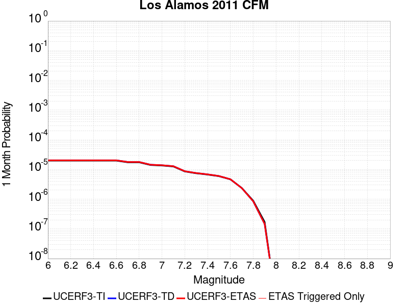 |  | 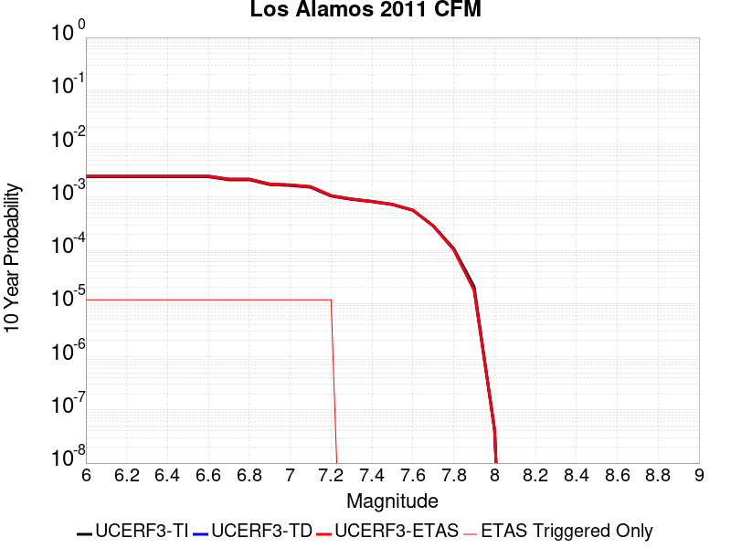 |

| Magnitude | 1 wk TI Prob | 1 wk TD Prob | 1 wk ETAS Prob | 1 wk ETAS/TD Gain | 1 wk ETAS Triggered Only | 1 mo TI Prob | 1 mo TD Prob | 1 mo ETAS Prob | 1 mo ETAS/TD Gain | 1 mo ETAS Triggered Only | 1 yr TI Prob | 1 yr TD Prob | 1 yr ETAS Prob | 1 yr ETAS/TD Gain | 1 yr ETAS Triggered Only | 10 yr TI Prob | 10 yr TD Prob | 10 yr ETAS Prob | 10 yr ETAS/TD Gain | 10 yr ETAS Triggered Only |
|-----|-----|-----|-----|-----|-----|-----|-----|-----|-----|-----|-----|-----|-----|-----|-----|-----|-----|-----|-----|-----|
| 6.0 | 4.6284417E-6 | 4.751731E-6 | 4.751731E-6 | 1.0 | 0.0 | 1.9836029E-5 | 2.0364414E-5 | 2.0364414E-5 | 1.0 | 0.0 | 2.4147688E-4 | 2.4791027E-4 | 2.5964447E-4 | 1.0473324 | 1.1737089E-5 | 0.0024121467 | 0.0024765113 | 0.0024882194 | 1.0047276 | 1.1737089E-5 |
| 6.1 | 4.6284417E-6 | 4.751731E-6 | 4.751731E-6 | 1.0 | 0.0 | 1.9836029E-5 | 2.0364414E-5 | 2.0364414E-5 | 1.0 | 0.0 | 2.4147688E-4 | 2.4791027E-4 | 2.5964447E-4 | 1.0473324 | 1.1737089E-5 | 0.0024121467 | 0.0024765113 | 0.0024882194 | 1.0047276 | 1.1737089E-5 |
| 6.2 | 4.6284417E-6 | 4.751731E-6 | 4.751731E-6 | 1.0 | 0.0 | 1.9836029E-5 | 2.0364414E-5 | 2.0364414E-5 | 1.0 | 0.0 | 2.4147688E-4 | 2.4791027E-4 | 2.5964447E-4 | 1.0473324 | 1.1737089E-5 | 0.0024121467 | 0.0024765113 | 0.0024882194 | 1.0047276 | 1.1737089E-5 |
| 6.3 | 4.6284417E-6 | 4.751731E-6 | 4.751731E-6 | 1.0 | 0.0 | 1.9836029E-5 | 2.0364414E-5 | 2.0364414E-5 | 1.0 | 0.0 | 2.4147688E-4 | 2.4791027E-4 | 2.5964447E-4 | 1.0473324 | 1.1737089E-5 | 0.0024121467 | 0.0024765113 | 0.0024882194 | 1.0047276 | 1.1737089E-5 |
| 6.4 | 4.6284417E-6 | 4.751731E-6 | 4.751731E-6 | 1.0 | 0.0 | 1.9836029E-5 | 2.0364414E-5 | 2.0364414E-5 | 1.0 | 0.0 | 2.4147688E-4 | 2.4791027E-4 | 2.5964447E-4 | 1.0473324 | 1.1737089E-5 | 0.0024121467 | 0.0024765113 | 0.0024882194 | 1.0047276 | 1.1737089E-5 |
| 6.5 | 4.6284417E-6 | 4.751731E-6 | 4.751731E-6 | 1.0 | 0.0 | 1.9836029E-5 | 2.0364414E-5 | 2.0364414E-5 | 1.0 | 0.0 | 2.4147688E-4 | 2.4791027E-4 | 2.5964447E-4 | 1.0473324 | 1.1737089E-5 | 0.0024121467 | 0.0024765113 | 0.0024882194 | 1.0047276 | 1.1737089E-5 |
| 6.6 | 4.6284417E-6 | 4.751731E-6 | 4.751731E-6 | 1.0 | 0.0 | 1.9836029E-5 | 2.0364414E-5 | 2.0364414E-5 | 1.0 | 0.0 | 2.4147688E-4 | 2.4791027E-4 | 2.5964447E-4 | 1.0473324 | 1.1737089E-5 | 0.0024121467 | 0.0024765113 | 0.0024882194 | 1.0047276 | 1.1737089E-5 |
| 6.7 | 4.062321E-6 | 4.166349E-6 | 4.166349E-6 | 1.0 | 0.0 | 1.7409831E-5 | 1.7855667E-5 | 1.7855667E-5 | 1.0 | 0.0 | 2.1194408E-4 | 2.1737257E-4 | 2.2910711E-4 | 1.0539836 | 1.1737089E-5 | 0.0021174205 | 0.0021717492 | 0.0021834609 | 1.0053927 | 1.1737089E-5 |
| 6.8 | 4.062321E-6 | 4.166349E-6 | 4.166349E-6 | 1.0 | 0.0 | 1.7409831E-5 | 1.7855667E-5 | 1.7855667E-5 | 1.0 | 0.0 | 2.1194408E-4 | 2.1737257E-4 | 2.2910711E-4 | 1.0539836 | 1.1737089E-5 | 0.0021174205 | 0.0021717492 | 0.0021834609 | 1.0053927 | 1.1737089E-5 |
| 6.9 | 3.2936077E-6 | 3.372958E-6 | 3.372958E-6 | 1.0 | 0.0 | 1.4115385E-5 | 1.4455459E-5 | 1.4455459E-5 | 1.0 | 0.0 | 1.7184127E-4 | 1.7598194E-4 | 1.8771696E-4 | 1.0666832 | 1.1737089E-5 | 0.0017170844 | 0.0017585184 | 0.0017702349 | 1.0066627 | 1.1737089E-5 |
| 7.0 | 3.1687898E-6 | 3.2448156E-6 | 3.2448156E-6 | 1.0 | 0.0 | 1.3580457E-5 | 1.3906283E-5 | 1.3906283E-5 | 1.0 | 0.0 | 1.6532952E-4 | 1.6929678E-4 | 1.8103188E-4 | 1.0693167 | 1.1737089E-5 | 0.0016520657 | 0.0016917696 | 0.0017034869 | 1.0069261 | 1.1737089E-5 |
| 7.1 | 2.9379228E-6 | 3.0073259E-6 | 3.0073259E-6 | 1.0 | 0.0 | 1.25910365E-5 | 1.288848E-5 | 1.288848E-5 | 1.0 | 0.0 | 1.5328509E-4 | 1.5690686E-4 | 1.686421E-4 | 1.0747912 | 1.1737089E-5 | 0.001531794 | 0.0015680499 | 0.0015797686 | 1.0074735 | 1.1737089E-5 |
| 7.2 | 2.0020686E-6 | 2.0416298E-6 | 2.0416298E-6 | 1.0 | 0.0 | 8.580266E-6 | 8.749813E-6 | 8.749813E-6 | 1.0 | 0.0 | 1.0445973E-4 | 1.0652381E-4 | 1.18259646E-4 | 1.1101711 | 1.1737089E-5 | 0.0010441064 | 0.001064732 | 0.0010764565 | 1.0110117 | 1.1737089E-5 |
| 7.3 | 1.7364243E-6 | 1.7678802E-6 | 1.7678802E-6 | 1.0 | 0.0 | 7.441797E-6 | 7.576608E-6 | 7.576608E-6 | 1.0 | 0.0 | 9.0600115E-5 | 9.2241324E-5 | 9.2241324E-5 | 1.0 | 0.0 | 9.0563187E-4 | 9.2203356E-4 | 9.2203356E-4 | 1.0 | 0.0 |
| 7.4 | 1.5718434E-6 | 1.5983177E-6 | 1.5983177E-6 | 1.0 | 0.0 | 6.7364545E-6 | 6.849915E-6 | 6.849915E-6 | 1.0 | 0.0 | 8.201325E-5 | 8.339455E-5 | 8.339455E-5 | 1.0 | 0.0 | 8.198299E-4 | 8.3363557E-4 | 8.3363557E-4 | 1.0 | 0.0 |
| 7.5 | 1.3841119E-6 | 1.4042793E-6 | 1.4042793E-6 | 1.0 | 0.0 | 5.9318945E-6 | 6.0183256E-6 | 6.0183256E-6 | 1.0 | 0.0 | 7.221842E-5 | 7.327068E-5 | 7.327068E-5 | 1.0 | 0.0 | 7.2194956E-4 | 7.324681E-4 | 7.324681E-4 | 1.0 | 0.0 |
| 7.6 | 1.0843726E-6 | 1.093442E-6 | 1.093442E-6 | 1.0 | 0.0 | 4.647303E-6 | 4.6861724E-6 | 4.6861724E-6 | 1.0 | 0.0 | 5.6579443E-5 | 5.705268E-5 | 5.705268E-5 | 1.0 | 0.0 | 5.656504E-4 | 5.703829E-4 | 5.703829E-4 | 1.0 | 0.0 |
| 7.7 | 5.544814E-7 | 5.5018705E-7 | 5.5018705E-7 | 1.0 | 0.0 | 2.3763469E-6 | 2.3579425E-6 | 2.3579425E-6 | 1.0 | 0.0 | 2.8931638E-5 | 2.8707573E-5 | 2.8707573E-5 | 1.0 | 0.0 | 2.8927872E-4 | 2.870388E-4 | 2.870388E-4 | 1.0 | 0.0 |
| 7.8 | 2.0707465E-7 | 1.977846E-7 | 1.977846E-7 | 1.0 | 0.0 | 8.874625E-7 | 8.4764804E-7 | 8.4764804E-7 | 1.0 | 0.0 | 1.08048025E-5 | 1.0320066E-5 | 1.0320066E-5 | 1.0 | 0.0 | 1.0804277E-4 | 1.0319592E-4 | 1.0319592E-4 | 1.0 | 0.0 |
| 7.9 | 3.9821284E-8 | 3.433109E-8 | 3.433109E-8 | 1.0 | 0.0 | 1.7066264E-7 | 1.4713324E-7 | 1.4713324E-7 | 1.0 | 0.0 | 2.0778157E-6 | 1.7913457E-6 | 1.7913457E-6 | 1.0 | 0.0 | 2.0777963E-5 | 1.7913319E-5 | 1.7913319E-5 | 1.0 | 0.0 |
| 8.0 | 7.880441E-11 | 8.2353124E-11 | 8.2353124E-11 | 1.0 | 0.0 | 3.3773329E-10 | 3.52942E-10 | 3.52942E-10 | 1.0 | 0.0 | 4.1119033E-9 | 4.2970694E-9 | 4.2970694E-9 | 1.0 | 0.0 | 4.1119034E-8 | 4.2970694E-8 | 4.2970694E-8 | 1.0 | 0.0 |

