# ComCat M7.1 (ci38457511), Mainshock Log10(k)=-2.2412, ShakeMap Surfaces, Log10(k)=-2.666, p=1.07133, c=8.0307E-4 Results

|   | ComCat M7.1 (ci38457511), Mainshock Log10(k)=-2.2412, ShakeMap Surfaces, Log10(k)=-2.666, p=1.07133, c=8.0307E-4 |
|-----|-----|
| Num Simulations | 100000 |
| Start Time | 2019/07/06 03:19:54 UTC |
| Start Time Epoch Milliseconds | 1562383194040 |
| Duration | 10 Years |
| Includes Spontaneous? | false |
| Trigger Ruptures | 268 Trigger Ruptures |
|   | First: M3.98 at 2019/07/04 17:02:55 UTC |
|   | Last: M7.1 at 2019/07/06 03:19:53 UTC |
|   | Largest: M7.1 at 2019/07/06 03:19:53 UTC |
| Historical Ruptures | *(none)* |
| Config Generated With | u3etas_comcat_event_config_builder.sh --event-id ci38457511 --num-simulations 100000 --days-before 7 --etas-k -2.666 --etas-p 1.07133 --etas-c 8.0307E-4 --mainshock-etas-k -2.2412 --finite-surf-shakemap --finite-surf-shakemap-min-mag 5 --hpc-site USC_HPC --nodes 36 --hours 24 --queue scec |

## Table Of Contents

* [Probabilities Summary Table](#probabilities-summary-table)
* [Magnitude Number Distribution](#magnitude-number-distribution)
  * [10 Year Magnitude Number Distribution](#10-year-magnitude-number-distribution)
  * [1 Year Magnitude Number Distribution](#1-year-magnitude-number-distribution)
  * [1 Month Magnitude Number Distribution](#1-month-magnitude-number-distribution)
  * [1 Week Magnitude Number Distribution](#1-week-magnitude-number-distribution)
  * [1 Day Magnitude Number Distribution](#1-day-magnitude-number-distribution)
  * [1 Hour Magnitude Number Distribution](#1-hour-magnitude-number-distribution)
* [Hazard Change Over Time](#hazard-change-over-time)
  * [M&ge;5.0 Hazard Change Over Time](#m50-hazard-change-over-time)
  * [M&ge;6.0 Hazard Change Over Time](#m60-hazard-change-over-time)
  * [M&ge;7.0 Hazard Change Over Time](#m70-hazard-change-over-time)
  * [M&ge;8.0 Hazard Change Over Time](#m80-hazard-change-over-time)
* [Trigger Rupture Fault Map](#trigger-rupture-fault-map)
* [Trigger Rupture Depth Map](#trigger-rupture-depth-map)
* [Fault Distances To Triggers](#fault-distances-to-triggers)
* [Individual Simulated Catalog Maps](#individual-simulated-catalog-maps)
* [ComCat Data Comparisons](#comcat-data-comparisons)
  * [ComCat Magnitude-Number Distributions](#comcat-magnitude-number-distributions)
  * [ComCat Cumulative Number Vs Time](#comcat-cumulative-number-vs-time)
  * [ComCat Cumulative Number Simulation Percentiles](#comcat-cumulative-number-simulation-percentiles)
  * [ComCat Mean Spatial Distribution](#comcat-mean-spatial-distribution)
  * [ComCat Depth Distribution](#comcat-depth-distribution)
* [Section Participation](#section-participation)
  * [Section Participation Plots](#section-participation-plots)
  * [Supra-Seismogenic Parent Sections Table](#supra-seismogenic-parent-sections-table)
  * [M≥6.5 Parent Sections Table](#m65-parent-sections-table)
  * [M≥7 Parent Sections Table](#m7-parent-sections-table)
  * [M≥7.5 Parent Sections Table](#m75-parent-sections-table)
  * [M≥8 Parent Sections Table](#m8-parent-sections-table)
  * [Fault Magnitude-Probability Distributions](#fault-magnitude-probability-distributions)
* [Gridded Nucleation](#gridded-nucleation)
* [JSON Input File](#json-input-file)

## Probabilities Summary Table
*[(top)](#table-of-contents)*

| Magnitude | 1 Hour Prob | 1 Day Prob | 1 Week Prob | 1 Month Prob | 1 Year Prob | 10 Year Prob |
|-----|-----|-----|-----|-----|-----|-----|
| **M&ge;4** | 1.000 (100.00%) | 1.000 (100.00%) | 1.000 (100.00%) | 1.000 (100.00%) | 1.000 (100.00%) | 1.000 (100.00%) |
| **M&ge;4.5** | 1.000 (100.00%) | 1.000 (100.00%) | 1.000 (100.00%) | 1.000 (100.00%) | 1.000 (100.00%) | 1.000 (100.00%) |
| **M&ge;5** | 0.986 (98.64%) | 0.999 (99.95%) | 1.000 (99.99%) | 1.000 (100.00%) | 1.000 (100.00%) | 1.000 (100.00%) |
| **M&ge;5.5** | 0.727 (72.70%) | 0.896 (89.61%) | 0.940 (94.05%) | 0.960 (96.04%) | 0.979 (97.93%) | 0.988 (98.81%) |
| **M&ge;6** | 0.288 (28.76%) | 0.451 (45.15%) | 0.533 (53.27%) | 0.583 (58.29%) | 0.653 (65.31%) | 0.703 (70.26%) |
| **M&ge;6.5** | 0.070 (7.03%) | 0.120 (12.03%) | 0.150 (14.99%) | 0.171 (17.11%) | 0.204 (20.42%) | 0.231 (23.08%) |
| **M&ge;7** | 0.026 (2.65%) | 0.045 (4.51%) | 0.056 (5.62%) | 0.064 (6.42%) | 0.077 (7.73%) | 0.087 (8.72%) |
| **M&ge;7.1** | 0.022 (2.22%) | 0.038 (3.78%) | 0.047 (4.71%) | 0.054 (5.40%) | 0.065 (6.49%) | 0.073 (7.33%) |
| **M&ge;7.5** | 8.15E-3 (0.81%) | 0.014 (1.39%) | 0.018 (1.76%) | 0.020 (1.99%) | 0.024 (2.39%) | 0.027 (2.71%) |
| **M&ge;8** | 1.30E-4 (0.01%) | 2.80E-4 (0.03%) | 3.70E-4 (0.04%) | 4.10E-4 (0.04%) | 4.70E-4 (0.05%) | 5.50E-4 (0.06%) |

## Magnitude Number Distribution
*[(top)](#table-of-contents)*

### 10 Year Magnitude Number Distribution
*[(top)](#table-of-contents)*

**Legend**
* **Mean** (thick black line): mean expected number across all 100000 catalogs
* **2.5%,97.5%** (thin black lines): expected number percentiles across all 100000 catalogs
* **Median** (thin blue line): median expected number across all 100000 catalogs
* **Mode** (thin cyan line): modal expected number across all 100000 catalogs
* **10 yr Probability** (thin red line): 10 year probability calculated as the fraction of catalogs with at least 1 occurrence
* **10 yr Supraseismogenic Probability** (thin dashed red line): same as above, but only for supraseismogenic ruptures on explicitly modeled UCERF3 faults
* **95% Conf** (light red shaded region): binomial 95% confidence bounds on probability
* **Primary** (thin green line): mean expected number from primary triggered aftershocks only (no secondary, tertiary, etc...) across all 100000 catalogs


| Mag | Mean | 2.5 %ile | 97.5 %ile | Median | Mode | 10 yr Probability | 10 yr Supra-Seis Prob | Primary Aftershocks Mean |
|-----|-----|-----|-----|-----|-----|-----|-----|-----|
| **M&ge;2.5** | 5750.702 | 4754.000 | 10623.000 | 5332.000 | 5123.000 | 1.000 (100.00%) | 0.350 (35.04%) | 3680.073 |
| **M&ge;2.6** | 4567.883 | 3769.000 | 8435.000 | 4236.000 | 4112.000 | 1.000 (100.00%) | 0.350 (35.04%) | 2923.077 |
| **M&ge;2.7** | 3628.404 | 2987.000 | 6699.000 | 3366.000 | 3254.000 | 1.000 (100.00%) | 0.350 (35.04%) | 2321.929 |
| **M&ge;2.8** | 2882.145 | 2366.000 | 5317.000 | 2675.000 | 2587.000 | 1.000 (100.00%) | 0.350 (35.04%) | 1844.415 |
| **M&ge;2.9** | 2289.361 | 1874.000 | 4223.000 | 2126.000 | 2040.000 | 1.000 (100.00%) | 0.350 (35.04%) | 1465.044 |
| **M&ge;3** | 1818.415 | 1482.000 | 3348.000 | 1689.000 | 1604.000 | 1.000 (100.00%) | 0.350 (35.04%) | 1163.701 |
| **M&ge;3.1** | 1444.280 | 1172.000 | 2661.000 | 1343.000 | 1307.000 | 1.000 (100.00%) | 0.350 (35.04%) | 924.289 |
| **M&ge;3.2** | 1147.110 | 926.000 | 2112.000 | 1067.000 | 1028.000 | 1.000 (100.00%) | 0.350 (35.04%) | 734.129 |
| **M&ge;3.3** | 911.024 | 730.000 | 1677.000 | 848.000 | 819.000 | 1.000 (100.00%) | 0.350 (35.04%) | 583.064 |
| **M&ge;3.4** | 723.541 | 576.000 | 1331.000 | 674.000 | 651.000 | 1.000 (100.00%) | 0.350 (35.04%) | 463.054 |
| **M&ge;3.5** | 574.623 | 453.000 | 1056.000 | 536.000 | 527.000 | 1.000 (100.00%) | 0.350 (35.04%) | 367.748 |
| **M&ge;3.6** | 456.352 | 356.000 | 838.000 | 426.000 | 411.000 | 1.000 (100.00%) | 0.350 (35.04%) | 292.053 |
| **M&ge;3.7** | 362.340 | 280.000 | 664.000 | 339.000 | 330.000 | 1.000 (100.00%) | 0.350 (35.04%) | 231.888 |
| **M&ge;3.8** | 287.744 | 219.000 | 528.000 | 269.000 | 261.000 | 1.000 (100.00%) | 0.350 (35.04%) | 184.155 |
| **M&ge;3.9** | 228.462 | 171.000 | 419.000 | 214.000 | 205.000 | 1.000 (100.00%) | 0.350 (35.04%) | 146.214 |
| **M&ge;4** | 181.375 | 133.000 | 333.000 | 170.000 | 164.000 | 1.000 (100.00%) | 0.350 (35.04%) | 116.069 |
| **M&ge;4.1** | 143.951 | 103.000 | 264.000 | 135.000 | 129.000 | 1.000 (100.00%) | 0.350 (35.04%) | 92.119 |
| **M&ge;4.2** | 114.276 | 80.000 | 210.000 | 108.000 | 105.000 | 1.000 (100.00%) | 0.350 (35.04%) | 73.135 |
| **M&ge;4.3** | 90.667 | 62.000 | 167.000 | 85.000 | 84.000 | 1.000 (100.00%) | 0.350 (35.04%) | 58.025 |
| **M&ge;4.4** | 71.913 | 47.000 | 132.000 | 68.000 | 65.000 | 1.000 (100.00%) | 0.350 (35.04%) | 46.012 |
| **M&ge;4.5** | 57.026 | 36.000 | 105.000 | 54.000 | 49.000 | 1.000 (100.00%) | 0.350 (35.04%) | 36.486 |
| **M&ge;4.6** | 45.181 | 27.000 | 84.000 | 43.000 | 41.000 | 1.000 (100.00%) | 0.350 (35.04%) | 28.911 |
| **M&ge;4.7** | 35.765 | 20.000 | 67.000 | 34.000 | 32.000 | 1.000 (100.00%) | 0.350 (35.04%) | 22.889 |
| **M&ge;4.8** | 28.302 | 15.000 | 54.000 | 27.000 | 25.000 | 1.000 (100.00%) | 0.350 (35.04%) | 18.111 |
| **M&ge;4.9** | 22.367 | 11.000 | 43.000 | 21.000 | 20.000 | 1.000 (100.00%) | 0.350 (35.04%) | 14.313 |
| **M&ge;5** | 17.664 | 8.000 | 34.000 | 17.000 | 15.000 | 1.000 (100.00%) | 0.350 (35.04%) | 11.310 |
| **M&ge;5.1** | 13.924 | 6.000 | 28.000 | 13.000 | 12.000 | 1.000 (100.00%) | 0.350 (35.04%) | 8.915 |
| **M&ge;5.2** | 10.949 | 4.000 | 22.000 | 10.000 | 9.000 | 1.000 (99.98%) | 0.350 (35.04%) | 7.010 |
| **M&ge;5.3** | 8.592 | 3.000 | 18.000 | 8.000 | 7.000 | 0.999 (99.92%) | 0.350 (35.04%) | 5.497 |
| **M&ge;5.4** | 6.721 | 2.000 | 15.000 | 6.000 | 6.000 | 0.996 (99.65%) | 0.350 (35.04%) | 4.299 |
| **M&ge;5.5** | 5.234 | 1.000 | 12.000 | 5.000 | 4.000 | 0.988 (98.81%) | 0.350 (35.04%) | 3.351 |
| **M&ge;5.6** | 4.051 | 0.000 | 10.000 | 4.000 | 3.000 | 0.969 (96.88%) | 0.350 (35.04%) | 2.594 |
| **M&ge;5.7** | 3.108 | 0.000 | 8.000 | 3.000 | 2.000 | 0.933 (93.28%) | 0.350 (35.04%) | 1.994 |
| **M&ge;5.8** | 2.358 | 0.000 | 7.000 | 2.000 | 1.000 | 0.874 (87.41%) | 0.350 (35.04%) | 1.512 |
| **M&ge;5.9** | 1.772 | 0.000 | 5.000 | 1.000 | 1.000 | 0.793 (79.30%) | 0.350 (35.03%) | 1.137 |
| **M&ge;6** | 1.353 | 0.000 | 5.000 | 1.000 | 1.000 | 0.703 (70.26%) | 0.350 (35.02%) | 0.863 |
| **M&ge;6.1** | 0.981 | 0.000 | 4.000 | 1.000 | 0.000 | 0.592 (59.23%) | 0.309 (30.88%) | 0.632 |
| **M&ge;6.2** | 0.642 | 0.000 | 3.000 | 0.000 | 0.000 | 0.447 (44.72%) | 0.243 (24.34%) | 0.412 |
| **M&ge;6.3** | 0.482 | 0.000 | 2.000 | 0.000 | 0.000 | 0.363 (36.35%) | 0.211 (21.09%) | 0.313 |
| **M&ge;6.4** | 0.363 | 0.000 | 2.000 | 0.000 | 0.000 | 0.288 (28.84%) | 0.183 (18.33%) | 0.233 |
| **M&ge;6.5** | 0.280 | 0.000 | 2.000 | 0.000 | 0.000 | 0.231 (23.08%) | 0.162 (16.19%) | 0.180 |
| **M&ge;6.6** | 0.232 | 0.000 | 2.000 | 0.000 | 0.000 | 0.200 (19.99%) | 0.151 (15.09%) | 0.153 |
| **M&ge;6.7** | 0.188 | 0.000 | 1.000 | 0.000 | 0.000 | 0.167 (16.66%) | 0.132 (13.17%) | 0.126 |
| **M&ge;6.8** | 0.154 | 0.000 | 1.000 | 0.000 | 0.000 | 0.140 (13.96%) | 0.115 (11.51%) | 0.104 |
| **M&ge;6.9** | 0.119 | 0.000 | 1.000 | 0.000 | 0.000 | 0.112 (11.18%) | 0.095 (9.52%) | 0.082 |
| **M&ge;7** | 0.091 | 0.000 | 1.000 | 0.000 | 0.000 | 0.087 (8.72%) | 0.077 (7.68%) | 0.063 |
| **M&ge;7.1** | 0.076 | 0.000 | 1.000 | 0.000 | 0.000 | 0.073 (7.33%) | 0.067 (6.73%) | 0.052 |
| **M&ge;7.2** | 0.057 | 0.000 | 1.000 | 0.000 | 0.000 | 0.055 (5.55%) | 0.052 (5.22%) | 0.039 |
| **M&ge;7.3** | 0.040 | 0.000 | 1.000 | 0.000 | 0.000 | 0.039 (3.90%) | 0.037 (3.75%) | 0.027 |
| **M&ge;7.4** | 0.035 | 0.000 | 1.000 | 0.000 | 0.000 | 0.035 (3.46%) | 0.034 (3.40%) | 0.024 |
| **M&ge;7.5** | 0.027 | 0.000 | 1.000 | 0.000 | 0.000 | 0.027 (2.71%) | 0.027 (2.70%) | 0.019 |
| **M&ge;7.6** | 0.014 | 0.000 | 0.000 | 0.000 | 0.000 | 0.014 (1.43%) | 0.014 (1.43%) | 0.010 |
| **M&ge;7.7** | 4.47E-3 | 0.000 | 0.000 | 0.000 | 0.000 | 4.44E-3 (0.44%) | 4.41E-3 (0.44%) | 3.14E-3 |
| **M&ge;7.8** | 2.77E-3 | 0.000 | 0.000 | 0.000 | 0.000 | 2.77E-3 (0.28%) | 2.76E-3 (0.28%) | 1.98E-3 |
| **M&ge;7.9** | 1.68E-3 | 0.000 | 0.000 | 0.000 | 0.000 | 1.68E-3 (0.17%) | 1.68E-3 (0.17%) | 1.20E-3 |
| **M&ge;8** | 5.50E-4 | 0.000 | 0.000 | 0.000 | 0.000 | 5.50E-4 (0.06%) | 5.50E-4 (0.06%) | 4.00E-4 |
| **M&ge;8.1** | 5.00E-5 | 0.000 | 0.000 | 0.000 | 0.000 | 5.00E-5 (0.01%) | 5.00E-5 (0.01%) | 3.00E-5 |
| **M&ge;8.2** | 0.000 | 0.000 | 0.000 | 0.000 | 0.000 | 0.000 (0.00%) | 0.000 (0.00%) | 0.000 |
| **M&ge;8.3** | 0.000 | 0.000 | 0.000 | 0.000 | 0.000 | 0.000 (0.00%) | 0.000 (0.00%) | 0.000 |
| **M&ge;8.4** | 0.000 | 0.000 | 0.000 | 0.000 | 0.000 | 0.000 (0.00%) | 0.000 (0.00%) | 0.000 |
| **M&ge;8.5** | 0.000 | 0.000 | 0.000 | 0.000 | 0.000 | 0.000 (0.00%) | 0.000 (0.00%) | 0.000 |
| **M&ge;8.6** | 0.000 | 0.000 | 0.000 | 0.000 | 0.000 | 0.000 (0.00%) | 0.000 (0.00%) | 0.000 |
| **M&ge;8.7** | 0.000 | 0.000 | 0.000 | 0.000 | 0.000 | 0.000 (0.00%) | 0.000 (0.00%) | 0.000 |
| **M&ge;8.8** | 0.000 | 0.000 | 0.000 | 0.000 | 0.000 | 0.000 (0.00%) | 0.000 (0.00%) | 0.000 |
| **M&ge;8.9** | 0.000 | 0.000 | 0.000 | 0.000 | 0.000 | 0.000 (0.00%) | 0.000 (0.00%) | 0.000 |
| **M&ge;9** | 0.000 | 0.000 | 0.000 | 0.000 | 0.000 | 0.000 (0.00%) | 0.000 (0.00%) | 0.000 |

### 1 Year Magnitude Number Distribution
*[(top)](#table-of-contents)*

**Legend**
* **Mean** (thick black line): mean expected number across all 100000 catalogs
* **2.5%,97.5%** (thin black lines): expected number percentiles across all 100000 catalogs
* **Median** (thin blue line): median expected number across all 100000 catalogs
* **Mode** (thin cyan line): modal expected number across all 100000 catalogs
* **1 yr Probability** (thin red line): 1 year probability calculated as the fraction of catalogs with at least 1 occurrence
* **1 yr Supraseismogenic Probability** (thin dashed red line): same as above, but only for supraseismogenic ruptures on explicitly modeled UCERF3 faults
* **95% Conf** (light red shaded region): binomial 95% confidence bounds on probability
* **Primary** (thin green line): mean expected number from primary triggered aftershocks only (no secondary, tertiary, etc...) across all 100000 catalogs


| Mag | Mean | 2.5 %ile | 97.5 %ile | Median | Mode | 1 yr Probability | 1 yr Supra-Seis Prob | Primary Aftershocks Mean |
|-----|-----|-----|-----|-----|-----|-----|-----|-----|
| **M&ge;2.5** | 4950.463 | 4158.000 | 8895.000 | 4620.000 | 4446.000 | 1.000 (100.00%) | 0.313 (31.26%) | 3328.148 |
| **M&ge;2.6** | 3932.264 | 3294.000 | 7063.000 | 3671.000 | 3615.000 | 1.000 (100.00%) | 0.313 (31.26%) | 2643.569 |
| **M&ge;2.7** | 3123.572 | 2611.000 | 5611.000 | 2916.000 | 2806.000 | 1.000 (100.00%) | 0.313 (31.26%) | 2099.923 |
| **M&ge;2.8** | 2481.177 | 2067.000 | 4459.000 | 2318.000 | 2275.000 | 1.000 (100.00%) | 0.313 (31.26%) | 1668.088 |
| **M&ge;2.9** | 1970.835 | 1636.000 | 3540.000 | 1842.000 | 1818.000 | 1.000 (100.00%) | 0.313 (31.26%) | 1324.988 |
| **M&ge;3** | 1565.370 | 1294.000 | 2813.000 | 1464.000 | 1418.000 | 1.000 (100.00%) | 0.313 (31.26%) | 1052.429 |
| **M&ge;3.1** | 1243.299 | 1022.000 | 2232.000 | 1164.000 | 1126.000 | 1.000 (100.00%) | 0.313 (31.26%) | 835.914 |
| **M&ge;3.2** | 987.455 | 808.000 | 1772.000 | 925.000 | 892.000 | 1.000 (100.00%) | 0.313 (31.26%) | 663.907 |
| **M&ge;3.3** | 784.231 | 636.000 | 1406.000 | 735.000 | 713.000 | 1.000 (100.00%) | 0.313 (31.26%) | 527.294 |
| **M&ge;3.4** | 622.803 | 501.000 | 1116.000 | 584.000 | 563.000 | 1.000 (100.00%) | 0.313 (31.26%) | 418.747 |
| **M&ge;3.5** | 494.634 | 394.000 | 885.000 | 465.000 | 450.000 | 1.000 (100.00%) | 0.313 (31.26%) | 332.579 |
| **M&ge;3.6** | 392.813 | 310.000 | 704.000 | 369.000 | 356.000 | 1.000 (100.00%) | 0.313 (31.26%) | 264.116 |
| **M&ge;3.7** | 311.887 | 243.000 | 558.000 | 294.000 | 285.000 | 1.000 (100.00%) | 0.313 (31.26%) | 209.706 |
| **M&ge;3.8** | 247.676 | 190.000 | 443.000 | 233.000 | 224.000 | 1.000 (100.00%) | 0.313 (31.26%) | 166.530 |
| **M&ge;3.9** | 196.665 | 148.000 | 352.000 | 186.000 | 177.000 | 1.000 (100.00%) | 0.313 (31.26%) | 132.219 |
| **M&ge;4** | 156.124 | 115.000 | 278.000 | 148.000 | 144.000 | 1.000 (100.00%) | 0.313 (31.26%) | 104.959 |
| **M&ge;4.1** | 123.899 | 89.000 | 221.000 | 117.000 | 112.000 | 1.000 (100.00%) | 0.313 (31.26%) | 83.291 |
| **M&ge;4.2** | 98.359 | 69.000 | 176.000 | 93.000 | 92.000 | 1.000 (100.00%) | 0.313 (31.26%) | 66.128 |
| **M&ge;4.3** | 78.036 | 53.000 | 140.000 | 74.000 | 71.000 | 1.000 (100.00%) | 0.313 (31.26%) | 52.467 |
| **M&ge;4.4** | 61.891 | 40.000 | 111.000 | 59.000 | 57.000 | 1.000 (100.00%) | 0.313 (31.26%) | 41.604 |
| **M&ge;4.5** | 49.075 | 31.000 | 89.000 | 47.000 | 45.000 | 1.000 (100.00%) | 0.313 (31.26%) | 32.987 |
| **M&ge;4.6** | 38.882 | 23.000 | 71.000 | 37.000 | 35.000 | 1.000 (100.00%) | 0.313 (31.26%) | 26.139 |
| **M&ge;4.7** | 30.780 | 17.000 | 56.000 | 29.000 | 28.000 | 1.000 (100.00%) | 0.313 (31.26%) | 20.695 |
| **M&ge;4.8** | 24.349 | 13.000 | 45.000 | 23.000 | 22.000 | 1.000 (100.00%) | 0.313 (31.26%) | 16.371 |
| **M&ge;4.9** | 19.246 | 9.000 | 36.000 | 18.000 | 17.000 | 1.000 (100.00%) | 0.313 (31.26%) | 12.940 |
| **M&ge;5** | 15.202 | 7.000 | 29.000 | 14.000 | 14.000 | 1.000 (100.00%) | 0.313 (31.26%) | 10.225 |
| **M&ge;5.1** | 11.984 | 5.000 | 24.000 | 11.000 | 10.000 | 1.000 (99.99%) | 0.313 (31.26%) | 8.061 |
| **M&ge;5.2** | 9.425 | 3.000 | 19.000 | 9.000 | 8.000 | 1.000 (99.96%) | 0.313 (31.26%) | 6.339 |
| **M&ge;5.3** | 7.396 | 2.000 | 16.000 | 7.000 | 6.000 | 0.998 (99.80%) | 0.313 (31.26%) | 4.971 |
| **M&ge;5.4** | 5.785 | 1.000 | 13.000 | 5.000 | 5.000 | 0.993 (99.26%) | 0.313 (31.26%) | 3.887 |
| **M&ge;5.5** | 4.505 | 1.000 | 11.000 | 4.000 | 4.000 | 0.979 (97.93%) | 0.313 (31.26%) | 3.030 |
| **M&ge;5.6** | 3.487 | 0.000 | 9.000 | 3.000 | 3.000 | 0.952 (95.18%) | 0.313 (31.26%) | 2.346 |
| **M&ge;5.7** | 2.677 | 0.000 | 7.000 | 2.000 | 2.000 | 0.906 (90.55%) | 0.313 (31.26%) | 1.804 |
| **M&ge;5.8** | 2.030 | 0.000 | 6.000 | 2.000 | 1.000 | 0.837 (83.65%) | 0.313 (31.26%) | 1.367 |
| **M&ge;5.9** | 1.527 | 0.000 | 5.000 | 1.000 | 1.000 | 0.747 (74.73%) | 0.312 (31.25%) | 1.028 |
| **M&ge;6** | 1.164 | 0.000 | 4.000 | 1.000 | 0.000 | 0.653 (65.31%) | 0.312 (31.24%) | 0.781 |
| **M&ge;6.1** | 0.845 | 0.000 | 3.000 | 1.000 | 0.000 | 0.543 (54.27%) | 0.275 (27.53%) | 0.572 |
| **M&ge;6.2** | 0.552 | 0.000 | 3.000 | 0.000 | 0.000 | 0.403 (40.27%) | 0.216 (21.57%) | 0.372 |
| **M&ge;6.3** | 0.416 | 0.000 | 2.000 | 0.000 | 0.000 | 0.325 (32.47%) | 0.187 (18.69%) | 0.283 |
| **M&ge;6.4** | 0.312 | 0.000 | 2.000 | 0.000 | 0.000 | 0.255 (25.54%) | 0.162 (16.18%) | 0.211 |
| **M&ge;6.5** | 0.241 | 0.000 | 2.000 | 0.000 | 0.000 | 0.204 (20.42%) | 0.143 (14.31%) | 0.163 |
| **M&ge;6.6** | 0.200 | 0.000 | 1.000 | 0.000 | 0.000 | 0.177 (17.66%) | 0.133 (13.35%) | 0.139 |
| **M&ge;6.7** | 0.163 | 0.000 | 1.000 | 0.000 | 0.000 | 0.147 (14.69%) | 0.116 (11.64%) | 0.114 |
| **M&ge;6.8** | 0.134 | 0.000 | 1.000 | 0.000 | 0.000 | 0.123 (12.32%) | 0.102 (10.18%) | 0.095 |
| **M&ge;6.9** | 0.105 | 0.000 | 1.000 | 0.000 | 0.000 | 0.099 (9.92%) | 0.085 (8.46%) | 0.075 |
| **M&ge;7** | 0.080 | 0.000 | 1.000 | 0.000 | 0.000 | 0.077 (7.73%) | 0.068 (6.82%) | 0.057 |
| **M&ge;7.1** | 0.067 | 0.000 | 1.000 | 0.000 | 0.000 | 0.065 (6.49%) | 0.060 (5.97%) | 0.048 |
| **M&ge;7.2** | 0.050 | 0.000 | 1.000 | 0.000 | 0.000 | 0.049 (4.93%) | 0.046 (4.63%) | 0.036 |
| **M&ge;7.3** | 0.035 | 0.000 | 1.000 | 0.000 | 0.000 | 0.035 (3.45%) | 0.033 (3.32%) | 0.025 |
| **M&ge;7.4** | 0.031 | 0.000 | 1.000 | 0.000 | 0.000 | 0.031 (3.06%) | 0.030 (3.01%) | 0.022 |
| **M&ge;7.5** | 0.024 | 0.000 | 0.000 | 0.000 | 0.000 | 0.024 (2.39%) | 0.024 (2.38%) | 0.017 |
| **M&ge;7.6** | 0.013 | 0.000 | 0.000 | 0.000 | 0.000 | 0.013 (1.25%) | 0.012 (1.25%) | 9.18E-3 |
| **M&ge;7.7** | 4.04E-3 | 0.000 | 0.000 | 0.000 | 0.000 | 4.01E-3 (0.40%) | 3.98E-3 (0.40%) | 2.93E-3 |
| **M&ge;7.8** | 2.45E-3 | 0.000 | 0.000 | 0.000 | 0.000 | 2.45E-3 (0.24%) | 2.44E-3 (0.24%) | 1.82E-3 |
| **M&ge;7.9** | 1.49E-3 | 0.000 | 0.000 | 0.000 | 0.000 | 1.49E-3 (0.15%) | 1.49E-3 (0.15%) | 1.11E-3 |
| **M&ge;8** | 4.70E-4 | 0.000 | 0.000 | 0.000 | 0.000 | 4.70E-4 (0.05%) | 4.70E-4 (0.05%) | 3.60E-4 |
| **M&ge;8.1** | 5.00E-5 | 0.000 | 0.000 | 0.000 | 0.000 | 5.00E-5 (0.01%) | 5.00E-5 (0.01%) | 3.00E-5 |
| **M&ge;8.2** | 0.000 | 0.000 | 0.000 | 0.000 | 0.000 | 0.000 (0.00%) | 0.000 (0.00%) | 0.000 |
| **M&ge;8.3** | 0.000 | 0.000 | 0.000 | 0.000 | 0.000 | 0.000 (0.00%) | 0.000 (0.00%) | 0.000 |
| **M&ge;8.4** | 0.000 | 0.000 | 0.000 | 0.000 | 0.000 | 0.000 (0.00%) | 0.000 (0.00%) | 0.000 |
| **M&ge;8.5** | 0.000 | 0.000 | 0.000 | 0.000 | 0.000 | 0.000 (0.00%) | 0.000 (0.00%) | 0.000 |
| **M&ge;8.6** | 0.000 | 0.000 | 0.000 | 0.000 | 0.000 | 0.000 (0.00%) | 0.000 (0.00%) | 0.000 |
| **M&ge;8.7** | 0.000 | 0.000 | 0.000 | 0.000 | 0.000 | 0.000 (0.00%) | 0.000 (0.00%) | 0.000 |
| **M&ge;8.8** | 0.000 | 0.000 | 0.000 | 0.000 | 0.000 | 0.000 (0.00%) | 0.000 (0.00%) | 0.000 |
| **M&ge;8.9** | 0.000 | 0.000 | 0.000 | 0.000 | 0.000 | 0.000 (0.00%) | 0.000 (0.00%) | 0.000 |
| **M&ge;9** | 0.000 | 0.000 | 0.000 | 0.000 | 0.000 | 0.000 (0.00%) | 0.000 (0.00%) | 0.000 |

### 1 Month Magnitude Number Distribution
*[(top)](#table-of-contents)*

**Legend**
* **Mean** (thick black line): mean expected number across all 100000 catalogs
* **2.5%,97.5%** (thin black lines): expected number percentiles across all 100000 catalogs
* **Median** (thin blue line): median expected number across all 100000 catalogs
* **Mode** (thin cyan line): modal expected number across all 100000 catalogs
* **1 mo Probability** (thin red line): 1 month probability calculated as the fraction of catalogs with at least 1 occurrence
* **1 mo Supraseismogenic Probability** (thin dashed red line): same as above, but only for supraseismogenic ruptures on explicitly modeled UCERF3 faults
* **95% Conf** (light red shaded region): binomial 95% confidence bounds on probability
* **Primary** (thin green line): mean expected number from primary triggered aftershocks only (no secondary, tertiary, etc...) across all 100000 catalogs

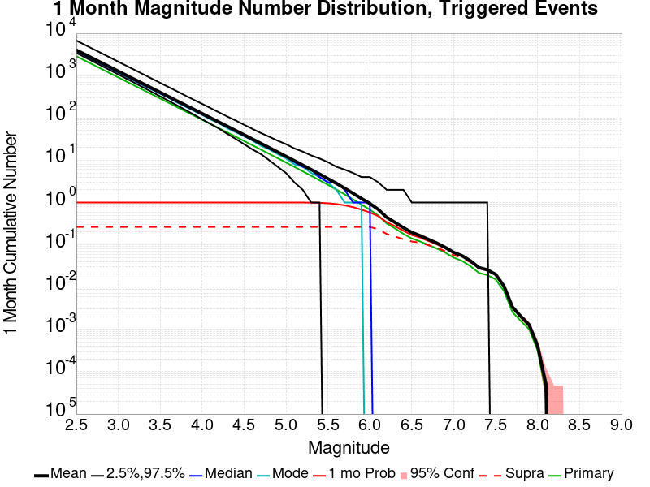

| Mag | Mean | 2.5 %ile | 97.5 %ile | Median | Mode | 1 mo Probability | 1 mo Supra-Seis Prob | Primary Aftershocks Mean |
|-----|-----|-----|-----|-----|-----|-----|-----|-----|
| **M&ge;2.5** | 4022.655 | 3445.000 | 6759.000 | 3788.000 | 3676.000 | 1.000 (100.00%) | 0.265 (26.49%) | 2875.202 |
| **M&ge;2.6** | 3195.313 | 2728.000 | 5371.000 | 3010.000 | 2939.000 | 1.000 (100.00%) | 0.265 (26.49%) | 2283.835 |
| **M&ge;2.7** | 2538.184 | 2161.000 | 4267.000 | 2392.000 | 2337.000 | 1.000 (100.00%) | 0.265 (26.49%) | 1814.180 |
| **M&ge;2.8** | 2016.200 | 1710.000 | 3391.000 | 1901.000 | 1864.000 | 1.000 (100.00%) | 0.265 (26.49%) | 1441.085 |
| **M&ge;2.9** | 1601.464 | 1352.000 | 2696.000 | 1511.000 | 1508.000 | 1.000 (100.00%) | 0.265 (26.49%) | 1144.659 |
| **M&ge;3** | 1271.946 | 1069.000 | 2137.000 | 1201.000 | 1162.000 | 1.000 (100.00%) | 0.265 (26.49%) | 909.144 |
| **M&ge;3.1** | 1010.247 | 844.000 | 1697.000 | 955.000 | 933.000 | 1.000 (100.00%) | 0.265 (26.49%) | 722.108 |
| **M&ge;3.2** | 802.335 | 666.000 | 1348.000 | 759.000 | 740.000 | 1.000 (100.00%) | 0.265 (26.49%) | 573.518 |
| **M&ge;3.3** | 637.208 | 524.000 | 1071.000 | 603.000 | 581.000 | 1.000 (100.00%) | 0.265 (26.49%) | 455.488 |
| **M&ge;3.4** | 506.028 | 412.000 | 850.000 | 479.000 | 468.000 | 1.000 (100.00%) | 0.265 (26.49%) | 361.717 |
| **M&ge;3.5** | 401.884 | 324.000 | 675.000 | 381.000 | 370.000 | 1.000 (100.00%) | 0.265 (26.49%) | 287.283 |
| **M&ge;3.6** | 319.156 | 254.000 | 537.000 | 303.000 | 298.000 | 1.000 (100.00%) | 0.265 (26.49%) | 228.138 |
| **M&ge;3.7** | 253.377 | 199.000 | 427.000 | 241.000 | 231.000 | 1.000 (100.00%) | 0.265 (26.49%) | 181.122 |
| **M&ge;3.8** | 201.217 | 155.000 | 338.000 | 191.000 | 185.000 | 1.000 (100.00%) | 0.265 (26.49%) | 143.826 |
| **M&ge;3.9** | 159.766 | 121.000 | 269.000 | 152.000 | 147.000 | 1.000 (100.00%) | 0.265 (26.49%) | 114.193 |
| **M&ge;4** | 126.831 | 93.000 | 215.000 | 121.000 | 118.000 | 1.000 (100.00%) | 0.265 (26.49%) | 90.652 |
| **M&ge;4.1** | 100.649 | 72.000 | 171.000 | 96.000 | 92.000 | 1.000 (100.00%) | 0.265 (26.49%) | 71.937 |
| **M&ge;4.2** | 79.896 | 56.000 | 136.000 | 76.000 | 75.000 | 1.000 (100.00%) | 0.265 (26.49%) | 57.113 |
| **M&ge;4.3** | 63.387 | 42.000 | 108.000 | 61.000 | 57.000 | 1.000 (100.00%) | 0.265 (26.49%) | 45.316 |
| **M&ge;4.4** | 50.270 | 32.000 | 87.000 | 48.000 | 46.000 | 1.000 (100.00%) | 0.265 (26.49%) | 35.936 |
| **M&ge;4.5** | 39.857 | 24.000 | 69.000 | 38.000 | 37.000 | 1.000 (100.00%) | 0.265 (26.49%) | 28.492 |
| **M&ge;4.6** | 31.580 | 18.000 | 55.000 | 30.000 | 29.000 | 1.000 (100.00%) | 0.265 (26.49%) | 22.575 |
| **M&ge;4.7** | 24.996 | 14.000 | 44.000 | 24.000 | 22.000 | 1.000 (100.00%) | 0.265 (26.49%) | 17.871 |
| **M&ge;4.8** | 19.771 | 10.000 | 36.000 | 19.000 | 18.000 | 1.000 (100.00%) | 0.265 (26.49%) | 14.136 |
| **M&ge;4.9** | 15.629 | 7.000 | 29.000 | 15.000 | 14.000 | 1.000 (100.00%) | 0.265 (26.49%) | 11.174 |
| **M&ge;5** | 12.346 | 5.000 | 24.000 | 12.000 | 11.000 | 1.000 (100.00%) | 0.265 (26.49%) | 8.831 |
| **M&ge;5.1** | 9.731 | 3.000 | 19.000 | 9.000 | 8.000 | 1.000 (99.97%) | 0.265 (26.49%) | 6.962 |
| **M&ge;5.2** | 7.652 | 2.000 | 16.000 | 7.000 | 7.000 | 0.999 (99.86%) | 0.265 (26.49%) | 5.475 |
| **M&ge;5.3** | 6.006 | 1.000 | 13.000 | 6.000 | 5.000 | 0.995 (99.46%) | 0.265 (26.49%) | 4.294 |
| **M&ge;5.4** | 4.697 | 1.000 | 11.000 | 4.000 | 4.000 | 0.984 (98.35%) | 0.265 (26.49%) | 3.358 |
| **M&ge;5.5** | 3.659 | 0.000 | 9.000 | 3.000 | 3.000 | 0.960 (96.04%) | 0.265 (26.49%) | 2.617 |
| **M&ge;5.6** | 2.832 | 0.000 | 7.000 | 3.000 | 2.000 | 0.920 (92.00%) | 0.265 (26.49%) | 2.027 |
| **M&ge;5.7** | 2.173 | 0.000 | 6.000 | 2.000 | 1.000 | 0.858 (85.85%) | 0.265 (26.49%) | 1.558 |
| **M&ge;5.8** | 1.649 | 0.000 | 5.000 | 1.000 | 1.000 | 0.777 (77.66%) | 0.265 (26.49%) | 1.181 |
| **M&ge;5.9** | 1.242 | 0.000 | 4.000 | 1.000 | 1.000 | 0.679 (67.92%) | 0.265 (26.48%) | 0.890 |
| **M&ge;6** | 0.946 | 0.000 | 4.000 | 1.000 | 0.000 | 0.583 (58.29%) | 0.265 (26.47%) | 0.676 |
| **M&ge;6.1** | 0.687 | 0.000 | 3.000 | 0.000 | 0.000 | 0.475 (47.53%) | 0.233 (23.30%) | 0.495 |
| **M&ge;6.2** | 0.448 | 0.000 | 2.000 | 0.000 | 0.000 | 0.345 (34.49%) | 0.181 (18.11%) | 0.322 |
| **M&ge;6.3** | 0.339 | 0.000 | 2.000 | 0.000 | 0.000 | 0.276 (27.59%) | 0.157 (15.69%) | 0.245 |
| **M&ge;6.4** | 0.254 | 0.000 | 2.000 | 0.000 | 0.000 | 0.215 (21.48%) | 0.135 (13.55%) | 0.182 |
| **M&ge;6.5** | 0.196 | 0.000 | 1.000 | 0.000 | 0.000 | 0.171 (17.11%) | 0.120 (11.98%) | 0.141 |
| **M&ge;6.6** | 0.164 | 0.000 | 1.000 | 0.000 | 0.000 | 0.148 (14.81%) | 0.112 (11.21%) | 0.120 |
| **M&ge;6.7** | 0.134 | 0.000 | 1.000 | 0.000 | 0.000 | 0.123 (12.27%) | 0.098 (9.76%) | 0.099 |
| **M&ge;6.8** | 0.110 | 0.000 | 1.000 | 0.000 | 0.000 | 0.103 (10.26%) | 0.085 (8.50%) | 0.082 |
| **M&ge;6.9** | 0.086 | 0.000 | 1.000 | 0.000 | 0.000 | 0.083 (8.26%) | 0.071 (7.06%) | 0.065 |
| **M&ge;7** | 0.066 | 0.000 | 1.000 | 0.000 | 0.000 | 0.064 (6.42%) | 0.057 (5.67%) | 0.050 |
| **M&ge;7.1** | 0.055 | 0.000 | 1.000 | 0.000 | 0.000 | 0.054 (5.40%) | 0.050 (4.97%) | 0.042 |
| **M&ge;7.2** | 0.042 | 0.000 | 1.000 | 0.000 | 0.000 | 0.041 (4.10%) | 0.039 (3.86%) | 0.031 |
| **M&ge;7.3** | 0.029 | 0.000 | 1.000 | 0.000 | 0.000 | 0.029 (2.86%) | 0.028 (2.76%) | 0.022 |
| **M&ge;7.4** | 0.026 | 0.000 | 1.000 | 0.000 | 0.000 | 0.025 (2.53%) | 0.025 (2.50%) | 0.019 |
| **M&ge;7.5** | 0.020 | 0.000 | 0.000 | 0.000 | 0.000 | 0.020 (1.99%) | 0.020 (1.98%) | 0.015 |
| **M&ge;7.6** | 0.011 | 0.000 | 0.000 | 0.000 | 0.000 | 0.010 (1.04%) | 0.010 (1.04%) | 8.00E-3 |
| **M&ge;7.7** | 3.38E-3 | 0.000 | 0.000 | 0.000 | 0.000 | 3.35E-3 (0.34%) | 3.33E-3 (0.33%) | 2.56E-3 |
| **M&ge;7.8** | 2.03E-3 | 0.000 | 0.000 | 0.000 | 0.000 | 2.03E-3 (0.20%) | 2.02E-3 (0.20%) | 1.58E-3 |
| **M&ge;7.9** | 1.28E-3 | 0.000 | 0.000 | 0.000 | 0.000 | 1.28E-3 (0.13%) | 1.28E-3 (0.13%) | 1.00E-3 |
| **M&ge;8** | 4.10E-4 | 0.000 | 0.000 | 0.000 | 0.000 | 4.10E-4 (0.04%) | 4.10E-4 (0.04%) | 3.20E-4 |
| **M&ge;8.1** | 5.00E-5 | 0.000 | 0.000 | 0.000 | 0.000 | 5.00E-5 (0.01%) | 5.00E-5 (0.01%) | 3.00E-5 |
| **M&ge;8.2** | 0.000 | 0.000 | 0.000 | 0.000 | 0.000 | 0.000 (0.00%) | 0.000 (0.00%) | 0.000 |
| **M&ge;8.3** | 0.000 | 0.000 | 0.000 | 0.000 | 0.000 | 0.000 (0.00%) | 0.000 (0.00%) | 0.000 |
| **M&ge;8.4** | 0.000 | 0.000 | 0.000 | 0.000 | 0.000 | 0.000 (0.00%) | 0.000 (0.00%) | 0.000 |
| **M&ge;8.5** | 0.000 | 0.000 | 0.000 | 0.000 | 0.000 | 0.000 (0.00%) | 0.000 (0.00%) | 0.000 |
| **M&ge;8.6** | 0.000 | 0.000 | 0.000 | 0.000 | 0.000 | 0.000 (0.00%) | 0.000 (0.00%) | 0.000 |
| **M&ge;8.7** | 0.000 | 0.000 | 0.000 | 0.000 | 0.000 | 0.000 (0.00%) | 0.000 (0.00%) | 0.000 |
| **M&ge;8.8** | 0.000 | 0.000 | 0.000 | 0.000 | 0.000 | 0.000 (0.00%) | 0.000 (0.00%) | 0.000 |
| **M&ge;8.9** | 0.000 | 0.000 | 0.000 | 0.000 | 0.000 | 0.000 (0.00%) | 0.000 (0.00%) | 0.000 |
| **M&ge;9** | 0.000 | 0.000 | 0.000 | 0.000 | 0.000 | 0.000 (0.00%) | 0.000 (0.00%) | 0.000 |

### 1 Week Magnitude Number Distribution
*[(top)](#table-of-contents)*

**Legend**
* **Mean** (thick black line): mean expected number across all 100000 catalogs
* **2.5%,97.5%** (thin black lines): expected number percentiles across all 100000 catalogs
* **Median** (thin blue line): median expected number across all 100000 catalogs
* **Mode** (thin cyan line): modal expected number across all 100000 catalogs
* **1 wk Probability** (thin red line): 1 week probability calculated as the fraction of catalogs with at least 1 occurrence
* **1 wk Supraseismogenic Probability** (thin dashed red line): same as above, but only for supraseismogenic ruptures on explicitly modeled UCERF3 faults
* **95% Conf** (light red shaded region): binomial 95% confidence bounds on probability
* **Primary** (thin green line): mean expected number from primary triggered aftershocks only (no secondary, tertiary, etc...) across all 100000 catalogs


| Mag | Mean | 2.5 %ile | 97.5 %ile | Median | Mode | 1 wk Probability | 1 wk Supra-Seis Prob | Primary Aftershocks Mean |
|-----|-----|-----|-----|-----|-----|-----|-----|-----|
| **M&ge;2.5** | 3462.496 | 3002.000 | 5498.000 | 3280.000 | 3221.000 | 1.000 (100.00%) | 0.234 (23.40%) | 2574.169 |
| **M&ge;2.6** | 2750.412 | 2377.000 | 4368.000 | 2607.000 | 2560.000 | 1.000 (100.00%) | 0.234 (23.40%) | 2044.765 |
| **M&ge;2.7** | 2184.769 | 1882.000 | 3469.000 | 2072.000 | 2029.000 | 1.000 (100.00%) | 0.234 (23.40%) | 1624.265 |
| **M&ge;2.8** | 1735.475 | 1489.000 | 2759.000 | 1647.000 | 1604.000 | 1.000 (100.00%) | 0.234 (23.40%) | 1290.230 |
| **M&ge;2.9** | 1378.468 | 1176.000 | 2189.000 | 1309.000 | 1281.000 | 1.000 (100.00%) | 0.234 (23.40%) | 1024.805 |
| **M&ge;3** | 1094.858 | 929.000 | 1742.000 | 1040.000 | 1021.000 | 1.000 (100.00%) | 0.234 (23.40%) | 813.967 |
| **M&ge;3.1** | 869.602 | 733.000 | 1385.000 | 827.000 | 812.000 | 1.000 (100.00%) | 0.234 (23.40%) | 646.520 |
| **M&ge;3.2** | 690.623 | 578.000 | 1098.000 | 657.000 | 636.000 | 1.000 (100.00%) | 0.234 (23.40%) | 513.475 |
| **M&ge;3.3** | 548.481 | 454.000 | 873.000 | 522.000 | 510.000 | 1.000 (100.00%) | 0.234 (23.40%) | 407.797 |
| **M&ge;3.4** | 435.563 | 357.000 | 695.000 | 415.000 | 407.000 | 1.000 (100.00%) | 0.234 (23.40%) | 323.850 |
| **M&ge;3.5** | 345.912 | 280.000 | 552.000 | 330.000 | 320.000 | 1.000 (100.00%) | 0.234 (23.40%) | 257.209 |
| **M&ge;3.6** | 274.701 | 219.000 | 439.000 | 262.000 | 257.000 | 1.000 (100.00%) | 0.234 (23.40%) | 204.252 |
| **M&ge;3.7** | 218.081 | 171.000 | 349.000 | 208.000 | 204.000 | 1.000 (100.00%) | 0.234 (23.40%) | 162.160 |
| **M&ge;3.8** | 173.170 | 134.000 | 278.000 | 166.000 | 160.000 | 1.000 (100.00%) | 0.234 (23.40%) | 128.755 |
| **M&ge;3.9** | 137.482 | 104.000 | 221.000 | 132.000 | 130.000 | 1.000 (100.00%) | 0.234 (23.40%) | 102.217 |
| **M&ge;4** | 109.140 | 80.000 | 176.000 | 105.000 | 102.000 | 1.000 (100.00%) | 0.234 (23.40%) | 81.145 |
| **M&ge;4.1** | 86.613 | 62.000 | 141.000 | 83.000 | 82.000 | 1.000 (100.00%) | 0.234 (23.40%) | 64.397 |
| **M&ge;4.2** | 68.752 | 47.000 | 113.000 | 66.000 | 64.000 | 1.000 (100.00%) | 0.234 (23.40%) | 51.125 |
| **M&ge;4.3** | 54.546 | 36.000 | 90.000 | 52.000 | 50.000 | 1.000 (100.00%) | 0.234 (23.40%) | 40.565 |
| **M&ge;4.4** | 43.258 | 27.000 | 72.000 | 42.000 | 41.000 | 1.000 (100.00%) | 0.234 (23.40%) | 32.171 |
| **M&ge;4.5** | 34.298 | 21.000 | 58.000 | 33.000 | 32.000 | 1.000 (100.00%) | 0.234 (23.40%) | 25.510 |
| **M&ge;4.6** | 27.176 | 15.000 | 47.000 | 26.000 | 25.000 | 1.000 (100.00%) | 0.234 (23.40%) | 20.214 |
| **M&ge;4.7** | 21.511 | 11.000 | 38.000 | 21.000 | 20.000 | 1.000 (100.00%) | 0.234 (23.40%) | 16.002 |
| **M&ge;4.8** | 17.016 | 8.000 | 31.000 | 16.000 | 16.000 | 1.000 (100.00%) | 0.234 (23.40%) | 12.659 |
| **M&ge;4.9** | 13.455 | 6.000 | 25.000 | 13.000 | 12.000 | 1.000 (100.00%) | 0.234 (23.40%) | 10.007 |
| **M&ge;5** | 10.631 | 4.000 | 21.000 | 10.000 | 10.000 | 1.000 (99.99%) | 0.234 (23.40%) | 7.909 |
| **M&ge;5.1** | 8.381 | 3.000 | 17.000 | 8.000 | 7.000 | 0.999 (99.94%) | 0.234 (23.40%) | 6.238 |
| **M&ge;5.2** | 6.590 | 2.000 | 14.000 | 6.000 | 5.000 | 0.997 (99.68%) | 0.234 (23.40%) | 4.904 |
| **M&ge;5.3** | 5.171 | 1.000 | 12.000 | 5.000 | 4.000 | 0.990 (98.95%) | 0.234 (23.40%) | 3.846 |
| **M&ge;5.4** | 4.043 | 0.000 | 10.000 | 4.000 | 3.000 | 0.973 (97.26%) | 0.234 (23.40%) | 3.005 |
| **M&ge;5.5** | 3.150 | 0.000 | 8.000 | 3.000 | 2.000 | 0.940 (94.05%) | 0.234 (23.40%) | 2.343 |
| **M&ge;5.6** | 2.436 | 0.000 | 7.000 | 2.000 | 2.000 | 0.890 (88.97%) | 0.234 (23.40%) | 1.814 |
| **M&ge;5.7** | 1.870 | 0.000 | 5.000 | 2.000 | 1.000 | 0.818 (81.78%) | 0.234 (23.40%) | 1.394 |
| **M&ge;5.8** | 1.419 | 0.000 | 5.000 | 1.000 | 1.000 | 0.728 (72.83%) | 0.234 (23.40%) | 1.057 |
| **M&ge;5.9** | 1.069 | 0.000 | 4.000 | 1.000 | 0.000 | 0.628 (62.81%) | 0.234 (23.40%) | 0.797 |
| **M&ge;6** | 0.814 | 0.000 | 3.000 | 1.000 | 0.000 | 0.533 (53.27%) | 0.234 (23.39%) | 0.606 |
| **M&ge;6.1** | 0.592 | 0.000 | 3.000 | 0.000 | 0.000 | 0.429 (42.91%) | 0.206 (20.62%) | 0.443 |
| **M&ge;6.2** | 0.385 | 0.000 | 2.000 | 0.000 | 0.000 | 0.307 (30.70%) | 0.160 (15.96%) | 0.287 |
| **M&ge;6.3** | 0.292 | 0.000 | 2.000 | 0.000 | 0.000 | 0.244 (24.42%) | 0.138 (13.83%) | 0.218 |
| **M&ge;6.4** | 0.218 | 0.000 | 2.000 | 0.000 | 0.000 | 0.189 (18.88%) | 0.119 (11.90%) | 0.162 |
| **M&ge;6.5** | 0.169 | 0.000 | 1.000 | 0.000 | 0.000 | 0.150 (14.99%) | 0.105 (10.52%) | 0.126 |
| **M&ge;6.6** | 0.142 | 0.000 | 1.000 | 0.000 | 0.000 | 0.130 (12.96%) | 0.098 (9.84%) | 0.107 |
| **M&ge;6.7** | 0.115 | 0.000 | 1.000 | 0.000 | 0.000 | 0.107 (10.72%) | 0.086 (8.56%) | 0.088 |
| **M&ge;6.8** | 0.095 | 0.000 | 1.000 | 0.000 | 0.000 | 0.090 (8.97%) | 0.075 (7.46%) | 0.073 |
| **M&ge;6.9** | 0.075 | 0.000 | 1.000 | 0.000 | 0.000 | 0.072 (7.22%) | 0.062 (6.20%) | 0.059 |
| **M&ge;7** | 0.058 | 0.000 | 1.000 | 0.000 | 0.000 | 0.056 (5.62%) | 0.050 (4.98%) | 0.045 |
| **M&ge;7.1** | 0.048 | 0.000 | 1.000 | 0.000 | 0.000 | 0.047 (4.71%) | 0.044 (4.35%) | 0.037 |
| **M&ge;7.2** | 0.036 | 0.000 | 1.000 | 0.000 | 0.000 | 0.036 (3.56%) | 0.034 (3.36%) | 0.028 |
| **M&ge;7.3** | 0.025 | 0.000 | 1.000 | 0.000 | 0.000 | 0.025 (2.50%) | 0.024 (2.42%) | 0.020 |
| **M&ge;7.4** | 0.022 | 0.000 | 0.000 | 0.000 | 0.000 | 0.022 (2.22%) | 0.022 (2.19%) | 0.017 |
| **M&ge;7.5** | 0.018 | 0.000 | 0.000 | 0.000 | 0.000 | 0.018 (1.76%) | 0.017 (1.75%) | 0.014 |
| **M&ge;7.6** | 9.24E-3 | 0.000 | 0.000 | 0.000 | 0.000 | 9.20E-3 (0.92%) | 9.16E-3 (0.92%) | 7.26E-3 |
| **M&ge;7.7** | 2.96E-3 | 0.000 | 0.000 | 0.000 | 0.000 | 2.95E-3 (0.29%) | 2.93E-3 (0.29%) | 2.29E-3 |
| **M&ge;7.8** | 1.81E-3 | 0.000 | 0.000 | 0.000 | 0.000 | 1.81E-3 (0.18%) | 1.80E-3 (0.18%) | 1.48E-3 |
| **M&ge;7.9** | 1.16E-3 | 0.000 | 0.000 | 0.000 | 0.000 | 1.16E-3 (0.12%) | 1.16E-3 (0.12%) | 9.50E-4 |
| **M&ge;8** | 3.70E-4 | 0.000 | 0.000 | 0.000 | 0.000 | 3.70E-4 (0.04%) | 3.70E-4 (0.04%) | 3.00E-4 |
| **M&ge;8.1** | 4.00E-5 | 0.000 | 0.000 | 0.000 | 0.000 | 4.00E-5 (0.00%) | 4.00E-5 (0.00%) | 3.00E-5 |
| **M&ge;8.2** | 0.000 | 0.000 | 0.000 | 0.000 | 0.000 | 0.000 (0.00%) | 0.000 (0.00%) | 0.000 |
| **M&ge;8.3** | 0.000 | 0.000 | 0.000 | 0.000 | 0.000 | 0.000 (0.00%) | 0.000 (0.00%) | 0.000 |
| **M&ge;8.4** | 0.000 | 0.000 | 0.000 | 0.000 | 0.000 | 0.000 (0.00%) | 0.000 (0.00%) | 0.000 |
| **M&ge;8.5** | 0.000 | 0.000 | 0.000 | 0.000 | 0.000 | 0.000 (0.00%) | 0.000 (0.00%) | 0.000 |
| **M&ge;8.6** | 0.000 | 0.000 | 0.000 | 0.000 | 0.000 | 0.000 (0.00%) | 0.000 (0.00%) | 0.000 |
| **M&ge;8.7** | 0.000 | 0.000 | 0.000 | 0.000 | 0.000 | 0.000 (0.00%) | 0.000 (0.00%) | 0.000 |
| **M&ge;8.8** | 0.000 | 0.000 | 0.000 | 0.000 | 0.000 | 0.000 (0.00%) | 0.000 (0.00%) | 0.000 |
| **M&ge;8.9** | 0.000 | 0.000 | 0.000 | 0.000 | 0.000 | 0.000 (0.00%) | 0.000 (0.00%) | 0.000 |
| **M&ge;9** | 0.000 | 0.000 | 0.000 | 0.000 | 0.000 | 0.000 (0.00%) | 0.000 (0.00%) | 0.000 |

### 1 Day Magnitude Number Distribution
*[(top)](#table-of-contents)*

**Legend**
* **Mean** (thick black line): mean expected number across all 100000 catalogs
* **2.5%,97.5%** (thin black lines): expected number percentiles across all 100000 catalogs
* **Median** (thin blue line): median expected number across all 100000 catalogs
* **Mode** (thin cyan line): modal expected number across all 100000 catalogs
* **1 d Probability** (thin red line): 1 day probability calculated as the fraction of catalogs with at least 1 occurrence
* **1 d Supraseismogenic Probability** (thin dashed red line): same as above, but only for supraseismogenic ruptures on explicitly modeled UCERF3 faults
* **95% Conf** (light red shaded region): binomial 95% confidence bounds on probability
* **Primary** (thin green line): mean expected number from primary triggered aftershocks only (no secondary, tertiary, etc...) across all 100000 catalogs

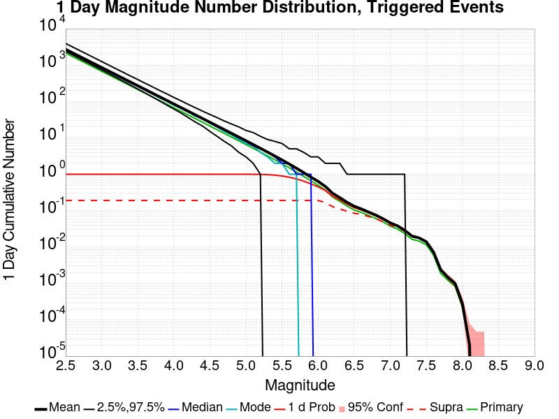

| Mag | Mean | 2.5 %ile | 97.5 %ile | Median | Mode | 1 d Probability | 1 d Supra-Seis Prob | Primary Aftershocks Mean |
|-----|-----|-----|-----|-----|-----|-----|-----|-----|
| **M&ge;2.5** | 2706.852 | 2388.000 | 3920.000 | 2589.000 | 2539.000 | 1.000 (100.00%) | 0.190 (19.00%) | 2131.274 |
| **M&ge;2.6** | 2150.125 | 1889.000 | 3120.000 | 2057.000 | 2033.000 | 1.000 (100.00%) | 0.190 (19.00%) | 1692.929 |
| **M&ge;2.7** | 1707.976 | 1494.000 | 2480.000 | 1635.000 | 1613.000 | 1.000 (100.00%) | 0.190 (19.00%) | 1344.824 |
| **M&ge;2.8** | 1356.739 | 1181.000 | 1974.000 | 1299.000 | 1278.000 | 1.000 (100.00%) | 0.190 (19.00%) | 1068.249 |
| **M&ge;2.9** | 1077.627 | 933.000 | 1569.000 | 1033.000 | 1016.000 | 1.000 (100.00%) | 0.190 (19.00%) | 848.478 |
| **M&ge;3** | 855.902 | 735.000 | 1246.000 | 821.000 | 808.000 | 1.000 (100.00%) | 0.190 (19.00%) | 673.914 |
| **M&ge;3.1** | 679.818 | 579.000 | 991.000 | 653.000 | 643.000 | 1.000 (100.00%) | 0.190 (19.00%) | 535.286 |
| **M&ge;3.2** | 539.904 | 456.000 | 790.000 | 519.000 | 516.000 | 1.000 (100.00%) | 0.190 (19.00%) | 425.128 |
| **M&ge;3.3** | 428.802 | 358.000 | 628.000 | 412.000 | 404.000 | 1.000 (100.00%) | 0.190 (19.00%) | 337.649 |
| **M&ge;3.4** | 340.526 | 281.000 | 500.000 | 328.000 | 319.000 | 1.000 (100.00%) | 0.190 (19.00%) | 268.141 |
| **M&ge;3.5** | 270.448 | 220.000 | 400.000 | 260.000 | 260.000 | 1.000 (100.00%) | 0.190 (19.00%) | 212.964 |
| **M&ge;3.6** | 214.764 | 172.000 | 318.000 | 207.000 | 204.000 | 1.000 (100.00%) | 0.190 (19.00%) | 169.116 |
| **M&ge;3.7** | 170.490 | 134.000 | 254.000 | 164.000 | 161.000 | 1.000 (100.00%) | 0.190 (19.00%) | 134.266 |
| **M&ge;3.8** | 135.381 | 104.000 | 202.000 | 131.000 | 126.000 | 1.000 (100.00%) | 0.190 (19.00%) | 106.609 |
| **M&ge;3.9** | 107.487 | 80.000 | 162.000 | 104.000 | 101.000 | 1.000 (100.00%) | 0.190 (19.00%) | 84.638 |
| **M&ge;4** | 85.327 | 62.000 | 129.000 | 82.000 | 79.000 | 1.000 (100.00%) | 0.190 (19.00%) | 67.189 |
| **M&ge;4.1** | 67.720 | 48.000 | 104.000 | 65.000 | 64.000 | 1.000 (100.00%) | 0.190 (19.00%) | 53.330 |
| **M&ge;4.2** | 53.749 | 36.000 | 83.000 | 52.000 | 51.000 | 1.000 (100.00%) | 0.190 (19.00%) | 42.335 |
| **M&ge;4.3** | 42.640 | 27.000 | 67.000 | 41.000 | 39.000 | 1.000 (100.00%) | 0.190 (19.00%) | 33.587 |
| **M&ge;4.4** | 33.820 | 21.000 | 54.000 | 33.000 | 33.000 | 1.000 (100.00%) | 0.190 (19.00%) | 26.638 |
| **M&ge;4.5** | 26.819 | 15.000 | 44.000 | 26.000 | 25.000 | 1.000 (100.00%) | 0.190 (19.00%) | 21.126 |
| **M&ge;4.6** | 21.252 | 11.000 | 36.000 | 20.000 | 20.000 | 1.000 (100.00%) | 0.190 (19.00%) | 16.743 |
| **M&ge;4.7** | 16.824 | 8.000 | 29.000 | 16.000 | 15.000 | 1.000 (100.00%) | 0.190 (19.00%) | 13.257 |
| **M&ge;4.8** | 13.308 | 6.000 | 24.000 | 13.000 | 12.000 | 1.000 (100.00%) | 0.190 (19.00%) | 10.486 |
| **M&ge;4.9** | 10.522 | 4.000 | 20.000 | 10.000 | 9.000 | 1.000 (99.99%) | 0.190 (19.00%) | 8.290 |
| **M&ge;5** | 8.313 | 3.000 | 16.000 | 8.000 | 7.000 | 0.999 (99.95%) | 0.190 (19.00%) | 6.553 |
| **M&ge;5.1** | 6.554 | 2.000 | 14.000 | 6.000 | 6.000 | 0.997 (99.73%) | 0.190 (19.00%) | 5.168 |
| **M&ge;5.2** | 5.155 | 1.000 | 11.000 | 5.000 | 4.000 | 0.990 (99.03%) | 0.190 (19.00%) | 4.064 |
| **M&ge;5.3** | 4.046 | 0.000 | 9.000 | 4.000 | 3.000 | 0.975 (97.45%) | 0.190 (19.00%) | 3.187 |
| **M&ge;5.4** | 3.161 | 0.000 | 8.000 | 3.000 | 2.000 | 0.944 (94.42%) | 0.190 (19.00%) | 2.489 |
| **M&ge;5.5** | 2.464 | 0.000 | 7.000 | 2.000 | 2.000 | 0.896 (89.61%) | 0.190 (19.00%) | 1.942 |
| **M&ge;5.6** | 1.905 | 0.000 | 5.000 | 2.000 | 1.000 | 0.829 (82.89%) | 0.190 (19.00%) | 1.503 |
| **M&ge;5.7** | 1.462 | 0.000 | 5.000 | 1.000 | 1.000 | 0.743 (74.33%) | 0.190 (19.00%) | 1.154 |
| **M&ge;5.8** | 1.109 | 0.000 | 4.000 | 1.000 | 0.000 | 0.645 (64.55%) | 0.190 (19.00%) | 0.875 |
| **M&ge;5.9** | 0.835 | 0.000 | 3.000 | 1.000 | 0.000 | 0.543 (54.33%) | 0.190 (18.99%) | 0.659 |
| **M&ge;6** | 0.635 | 0.000 | 3.000 | 0.000 | 0.000 | 0.451 (45.15%) | 0.190 (18.98%) | 0.501 |
| **M&ge;6.1** | 0.463 | 0.000 | 2.000 | 0.000 | 0.000 | 0.357 (35.68%) | 0.167 (16.70%) | 0.366 |
| **M&ge;6.2** | 0.301 | 0.000 | 2.000 | 0.000 | 0.000 | 0.251 (25.08%) | 0.129 (12.89%) | 0.237 |
| **M&ge;6.3** | 0.228 | 0.000 | 2.000 | 0.000 | 0.000 | 0.198 (19.81%) | 0.112 (11.19%) | 0.180 |
| **M&ge;6.4** | 0.170 | 0.000 | 1.000 | 0.000 | 0.000 | 0.152 (15.18%) | 0.096 (9.59%) | 0.134 |
| **M&ge;6.5** | 0.132 | 0.000 | 1.000 | 0.000 | 0.000 | 0.120 (12.03%) | 0.085 (8.46%) | 0.104 |
| **M&ge;6.6** | 0.111 | 0.000 | 1.000 | 0.000 | 0.000 | 0.104 (10.39%) | 0.079 (7.90%) | 0.089 |
| **M&ge;6.7** | 0.091 | 0.000 | 1.000 | 0.000 | 0.000 | 0.086 (8.62%) | 0.069 (6.89%) | 0.074 |
| **M&ge;6.8** | 0.075 | 0.000 | 1.000 | 0.000 | 0.000 | 0.072 (7.21%) | 0.060 (6.01%) | 0.061 |
| **M&ge;6.9** | 0.060 | 0.000 | 1.000 | 0.000 | 0.000 | 0.058 (5.80%) | 0.050 (4.98%) | 0.049 |
| **M&ge;7** | 0.046 | 0.000 | 1.000 | 0.000 | 0.000 | 0.045 (4.51%) | 0.040 (4.00%) | 0.038 |
| **M&ge;7.1** | 0.038 | 0.000 | 1.000 | 0.000 | 0.000 | 0.038 (3.78%) | 0.035 (3.48%) | 0.031 |
| **M&ge;7.2** | 0.029 | 0.000 | 1.000 | 0.000 | 0.000 | 0.029 (2.85%) | 0.027 (2.69%) | 0.023 |
| **M&ge;7.3** | 0.020 | 0.000 | 0.000 | 0.000 | 0.000 | 0.020 (1.99%) | 0.019 (1.91%) | 0.016 |
| **M&ge;7.4** | 0.018 | 0.000 | 0.000 | 0.000 | 0.000 | 0.018 (1.77%) | 0.017 (1.74%) | 0.015 |
| **M&ge;7.5** | 0.014 | 0.000 | 0.000 | 0.000 | 0.000 | 0.014 (1.39%) | 0.014 (1.38%) | 0.012 |
| **M&ge;7.6** | 7.28E-3 | 0.000 | 0.000 | 0.000 | 0.000 | 7.26E-3 (0.73%) | 7.22E-3 (0.72%) | 6.03E-3 |
| **M&ge;7.7** | 2.37E-3 | 0.000 | 0.000 | 0.000 | 0.000 | 2.37E-3 (0.24%) | 2.35E-3 (0.24%) | 1.89E-3 |
| **M&ge;7.8** | 1.47E-3 | 0.000 | 0.000 | 0.000 | 0.000 | 1.47E-3 (0.15%) | 1.46E-3 (0.15%) | 1.22E-3 |
| **M&ge;7.9** | 9.90E-4 | 0.000 | 0.000 | 0.000 | 0.000 | 9.90E-4 (0.10%) | 9.90E-4 (0.10%) | 8.20E-4 |
| **M&ge;8** | 2.80E-4 | 0.000 | 0.000 | 0.000 | 0.000 | 2.80E-4 (0.03%) | 2.80E-4 (0.03%) | 2.20E-4 |
| **M&ge;8.1** | 2.00E-5 | 0.000 | 0.000 | 0.000 | 0.000 | 2.00E-5 (0.00%) | 2.00E-5 (0.00%) | 2.00E-5 |
| **M&ge;8.2** | 0.000 | 0.000 | 0.000 | 0.000 | 0.000 | 0.000 (0.00%) | 0.000 (0.00%) | 0.000 |
| **M&ge;8.3** | 0.000 | 0.000 | 0.000 | 0.000 | 0.000 | 0.000 (0.00%) | 0.000 (0.00%) | 0.000 |
| **M&ge;8.4** | 0.000 | 0.000 | 0.000 | 0.000 | 0.000 | 0.000 (0.00%) | 0.000 (0.00%) | 0.000 |
| **M&ge;8.5** | 0.000 | 0.000 | 0.000 | 0.000 | 0.000 | 0.000 (0.00%) | 0.000 (0.00%) | 0.000 |
| **M&ge;8.6** | 0.000 | 0.000 | 0.000 | 0.000 | 0.000 | 0.000 (0.00%) | 0.000 (0.00%) | 0.000 |
| **M&ge;8.7** | 0.000 | 0.000 | 0.000 | 0.000 | 0.000 | 0.000 (0.00%) | 0.000 (0.00%) | 0.000 |
| **M&ge;8.8** | 0.000 | 0.000 | 0.000 | 0.000 | 0.000 | 0.000 (0.00%) | 0.000 (0.00%) | 0.000 |
| **M&ge;8.9** | 0.000 | 0.000 | 0.000 | 0.000 | 0.000 | 0.000 (0.00%) | 0.000 (0.00%) | 0.000 |
| **M&ge;9** | 0.000 | 0.000 | 0.000 | 0.000 | 0.000 | 0.000 (0.00%) | 0.000 (0.00%) | 0.000 |

### 1 Hour Magnitude Number Distribution
*[(top)](#table-of-contents)*

**Legend**
* **Mean** (thick black line): mean expected number across all 100000 catalogs
* **2.5%,97.5%** (thin black lines): expected number percentiles across all 100000 catalogs
* **Median** (thin blue line): median expected number across all 100000 catalogs
* **Mode** (thin cyan line): modal expected number across all 100000 catalogs
* **1 hr Probability** (thin red line): 1 hour probability calculated as the fraction of catalogs with at least 1 occurrence
* **1 hr Supraseismogenic Probability** (thin dashed red line): same as above, but only for supraseismogenic ruptures on explicitly modeled UCERF3 faults
* **95% Conf** (light red shaded region): binomial 95% confidence bounds on probability
* **Primary** (thin green line): mean expected number from primary triggered aftershocks only (no secondary, tertiary, etc...) across all 100000 catalogs


| Mag | Mean | 2.5 %ile | 97.5 %ile | Median | Mode | 1 hr Probability | 1 hr Supra-Seis Prob | Primary Aftershocks Mean |
|-----|-----|-----|-----|-----|-----|-----|-----|-----|
| **M&ge;2.5** | 1494.084 | 1353.000 | 1919.000 | 1456.000 | 1449.000 | 1.000 (100.00%) | 0.112 (11.24%) | 1308.139 |
| **M&ge;2.6** | 1186.803 | 1068.000 | 1522.000 | 1158.000 | 1137.000 | 1.000 (100.00%) | 0.112 (11.24%) | 1039.088 |
| **M&ge;2.7** | 942.774 | 843.000 | 1211.000 | 920.000 | 917.000 | 1.000 (100.00%) | 0.112 (11.24%) | 825.448 |
| **M&ge;2.8** | 748.891 | 664.000 | 962.000 | 731.000 | 730.000 | 1.000 (100.00%) | 0.112 (11.24%) | 655.688 |
| **M&ge;2.9** | 594.846 | 523.000 | 765.000 | 581.000 | 578.000 | 1.000 (100.00%) | 0.112 (11.24%) | 520.813 |
| **M&ge;3** | 472.446 | 411.000 | 609.000 | 462.000 | 457.000 | 1.000 (100.00%) | 0.112 (11.24%) | 413.650 |
| **M&ge;3.1** | 375.246 | 323.000 | 485.000 | 367.000 | 359.000 | 1.000 (100.00%) | 0.112 (11.24%) | 328.563 |
| **M&ge;3.2** | 298.029 | 253.000 | 386.000 | 292.000 | 288.000 | 1.000 (100.00%) | 0.112 (11.24%) | 260.956 |
| **M&ge;3.3** | 236.695 | 198.000 | 308.000 | 232.000 | 231.000 | 1.000 (100.00%) | 0.112 (11.24%) | 207.253 |
| **M&ge;3.4** | 187.964 | 154.000 | 246.000 | 184.000 | 182.000 | 1.000 (100.00%) | 0.112 (11.24%) | 164.587 |
| **M&ge;3.5** | 149.291 | 120.000 | 196.000 | 146.000 | 141.000 | 1.000 (100.00%) | 0.112 (11.24%) | 130.722 |
| **M&ge;3.6** | 118.573 | 93.000 | 157.000 | 116.000 | 113.000 | 1.000 (100.00%) | 0.112 (11.24%) | 103.820 |
| **M&ge;3.7** | 94.125 | 72.000 | 126.000 | 92.000 | 92.000 | 1.000 (100.00%) | 0.112 (11.24%) | 82.420 |
| **M&ge;3.8** | 74.740 | 55.000 | 102.000 | 73.000 | 70.000 | 1.000 (100.00%) | 0.112 (11.24%) | 65.446 |
| **M&ge;3.9** | 59.344 | 42.000 | 82.000 | 58.000 | 58.000 | 1.000 (100.00%) | 0.112 (11.24%) | 51.962 |
| **M&ge;4** | 47.109 | 32.000 | 67.000 | 46.000 | 45.000 | 1.000 (100.00%) | 0.112 (11.24%) | 41.246 |
| **M&ge;4.1** | 37.395 | 24.000 | 54.000 | 37.000 | 37.000 | 1.000 (100.00%) | 0.112 (11.24%) | 32.742 |
| **M&ge;4.2** | 29.682 | 18.000 | 44.000 | 29.000 | 28.000 | 1.000 (100.00%) | 0.112 (11.24%) | 25.991 |
| **M&ge;4.3** | 23.549 | 14.000 | 36.000 | 23.000 | 23.000 | 1.000 (100.00%) | 0.112 (11.24%) | 20.624 |
| **M&ge;4.4** | 18.677 | 10.000 | 30.000 | 18.000 | 18.000 | 1.000 (100.00%) | 0.112 (11.24%) | 16.356 |
| **M&ge;4.5** | 14.812 | 7.000 | 25.000 | 14.000 | 14.000 | 1.000 (100.00%) | 0.112 (11.24%) | 12.974 |
| **M&ge;4.6** | 11.741 | 5.000 | 20.000 | 11.000 | 11.000 | 1.000 (100.00%) | 0.112 (11.24%) | 10.283 |
| **M&ge;4.7** | 9.294 | 3.000 | 17.000 | 9.000 | 8.000 | 1.000 (99.98%) | 0.112 (11.24%) | 8.142 |
| **M&ge;4.8** | 7.353 | 2.000 | 14.000 | 7.000 | 7.000 | 0.999 (99.89%) | 0.112 (11.24%) | 6.441 |
| **M&ge;4.9** | 5.810 | 1.000 | 12.000 | 6.000 | 5.000 | 0.996 (99.57%) | 0.112 (11.24%) | 5.090 |
| **M&ge;5** | 4.596 | 1.000 | 10.000 | 4.000 | 4.000 | 0.986 (98.64%) | 0.112 (11.24%) | 4.026 |
| **M&ge;5.1** | 3.623 | 0.000 | 8.000 | 3.000 | 3.000 | 0.966 (96.61%) | 0.112 (11.24%) | 3.174 |
| **M&ge;5.2** | 2.847 | 0.000 | 7.000 | 3.000 | 2.000 | 0.931 (93.07%) | 0.112 (11.24%) | 2.494 |
| **M&ge;5.3** | 2.234 | 0.000 | 6.000 | 2.000 | 2.000 | 0.879 (87.88%) | 0.112 (11.24%) | 1.958 |
| **M&ge;5.4** | 1.744 | 0.000 | 5.000 | 2.000 | 1.000 | 0.809 (80.94%) | 0.112 (11.24%) | 1.529 |
| **M&ge;5.5** | 1.360 | 0.000 | 4.000 | 1.000 | 1.000 | 0.727 (72.70%) | 0.112 (11.24%) | 1.193 |
| **M&ge;5.6** | 1.053 | 0.000 | 4.000 | 1.000 | 0.000 | 0.635 (63.54%) | 0.112 (11.24%) | 0.924 |
| **M&ge;5.7** | 0.809 | 0.000 | 3.000 | 1.000 | 0.000 | 0.540 (54.04%) | 0.112 (11.24%) | 0.710 |
| **M&ge;5.8** | 0.613 | 0.000 | 3.000 | 0.000 | 0.000 | 0.446 (44.55%) | 0.112 (11.24%) | 0.537 |
| **M&ge;5.9** | 0.461 | 0.000 | 2.000 | 0.000 | 0.000 | 0.359 (35.90%) | 0.112 (11.24%) | 0.405 |
| **M&ge;6** | 0.351 | 0.000 | 2.000 | 0.000 | 0.000 | 0.288 (28.76%) | 0.112 (11.23%) | 0.307 |
| **M&ge;6.1** | 0.256 | 0.000 | 2.000 | 0.000 | 0.000 | 0.220 (22.02%) | 0.099 (9.88%) | 0.224 |
| **M&ge;6.2** | 0.166 | 0.000 | 1.000 | 0.000 | 0.000 | 0.150 (14.96%) | 0.076 (7.57%) | 0.145 |
| **M&ge;6.3** | 0.126 | 0.000 | 1.000 | 0.000 | 0.000 | 0.117 (11.67%) | 0.065 (6.54%) | 0.111 |
| **M&ge;6.4** | 0.095 | 0.000 | 1.000 | 0.000 | 0.000 | 0.089 (8.93%) | 0.056 (5.63%) | 0.083 |
| **M&ge;6.5** | 0.074 | 0.000 | 1.000 | 0.000 | 0.000 | 0.070 (7.03%) | 0.050 (4.96%) | 0.064 |
| **M&ge;6.6** | 0.063 | 0.000 | 1.000 | 0.000 | 0.000 | 0.061 (6.06%) | 0.046 (4.62%) | 0.055 |
| **M&ge;6.7** | 0.052 | 0.000 | 1.000 | 0.000 | 0.000 | 0.050 (5.02%) | 0.040 (4.02%) | 0.046 |
| **M&ge;6.8** | 0.043 | 0.000 | 1.000 | 0.000 | 0.000 | 0.042 (4.19%) | 0.035 (3.51%) | 0.038 |
| **M&ge;6.9** | 0.035 | 0.000 | 1.000 | 0.000 | 0.000 | 0.034 (3.41%) | 0.029 (2.93%) | 0.031 |
| **M&ge;7** | 0.027 | 0.000 | 1.000 | 0.000 | 0.000 | 0.026 (2.65%) | 0.023 (2.34%) | 0.024 |
| **M&ge;7.1** | 0.022 | 0.000 | 0.000 | 0.000 | 0.000 | 0.022 (2.22%) | 0.020 (2.04%) | 0.020 |
| **M&ge;7.2** | 0.017 | 0.000 | 0.000 | 0.000 | 0.000 | 0.017 (1.68%) | 0.016 (1.57%) | 0.015 |
| **M&ge;7.3** | 0.012 | 0.000 | 0.000 | 0.000 | 0.000 | 0.012 (1.16%) | 0.011 (1.11%) | 0.010 |
| **M&ge;7.4** | 0.010 | 0.000 | 0.000 | 0.000 | 0.000 | 0.010 (1.02%) | 0.010 (1.00%) | 9.07E-3 |
| **M&ge;7.5** | 8.19E-3 | 0.000 | 0.000 | 0.000 | 0.000 | 8.15E-3 (0.81%) | 8.10E-3 (0.81%) | 7.27E-3 |
| **M&ge;7.6** | 4.18E-3 | 0.000 | 0.000 | 0.000 | 0.000 | 4.18E-3 (0.42%) | 4.16E-3 (0.42%) | 3.71E-3 |
| **M&ge;7.7** | 1.45E-3 | 0.000 | 0.000 | 0.000 | 0.000 | 1.45E-3 (0.14%) | 1.44E-3 (0.14%) | 1.23E-3 |
| **M&ge;7.8** | 9.10E-4 | 0.000 | 0.000 | 0.000 | 0.000 | 9.10E-4 (0.09%) | 9.10E-4 (0.09%) | 8.00E-4 |
| **M&ge;7.9** | 5.80E-4 | 0.000 | 0.000 | 0.000 | 0.000 | 5.80E-4 (0.06%) | 5.80E-4 (0.06%) | 5.10E-4 |
| **M&ge;8** | 1.30E-4 | 0.000 | 0.000 | 0.000 | 0.000 | 1.30E-4 (0.01%) | 1.30E-4 (0.01%) | 1.00E-4 |
| **M&ge;8.1** | 1.00E-5 | 0.000 | 0.000 | 0.000 | 0.000 | 1.00E-5 (0.00%) | 1.00E-5 (0.00%) | 1.00E-5 |
| **M&ge;8.2** | 0.000 | 0.000 | 0.000 | 0.000 | 0.000 | 0.000 (0.00%) | 0.000 (0.00%) | 0.000 |
| **M&ge;8.3** | 0.000 | 0.000 | 0.000 | 0.000 | 0.000 | 0.000 (0.00%) | 0.000 (0.00%) | 0.000 |
| **M&ge;8.4** | 0.000 | 0.000 | 0.000 | 0.000 | 0.000 | 0.000 (0.00%) | 0.000 (0.00%) | 0.000 |
| **M&ge;8.5** | 0.000 | 0.000 | 0.000 | 0.000 | 0.000 | 0.000 (0.00%) | 0.000 (0.00%) | 0.000 |
| **M&ge;8.6** | 0.000 | 0.000 | 0.000 | 0.000 | 0.000 | 0.000 (0.00%) | 0.000 (0.00%) | 0.000 |
| **M&ge;8.7** | 0.000 | 0.000 | 0.000 | 0.000 | 0.000 | 0.000 (0.00%) | 0.000 (0.00%) | 0.000 |
| **M&ge;8.8** | 0.000 | 0.000 | 0.000 | 0.000 | 0.000 | 0.000 (0.00%) | 0.000 (0.00%) | 0.000 |
| **M&ge;8.9** | 0.000 | 0.000 | 0.000 | 0.000 | 0.000 | 0.000 (0.00%) | 0.000 (0.00%) | 0.000 |
| **M&ge;9** | 0.000 | 0.000 | 0.000 | 0.000 | 0.000 | 0.000 (0.00%) | 0.000 (0.00%) | 0.000 |


## Hazard Change Over Time
*[(top)](#table-of-contents)*

These plots show how the probability of ruptures of various magnitudes within 100km of any scenario rupture changes over time

### M&ge;5.0 Hazard Change Over Time
*[(top)](#table-of-contents)*


| Forecast Duration | UCERF3-ETAS [95% Conf] | UCERF3-ETAS Triggered Only | UCERF3-TD | UCERF3-ETAS/TD Gain | UCERF3-TI |
|-----|-----|-----|-----|-----|-----|
| 1 Hour | 0.986 [0.985 - 0.987] | 0.986 | 7.14E-5 | 13814.43 | 7.09E-5 |
| 1 Day | 0.999 [0.999 - 1.000] | 0.999 | 1.71E-3 | 583.89 | 1.70E-3 |
| 1 Week | 1.000 [1.000 - 1.000] | 1.000 | 0.012 | 83.88 | 0.012 |
| 1 Month | 1.000 [1.000 - 1.000] | 1.000 | 0.050 | 19.96 | 0.050 |
| 1 Year | 1.000 [1.000 - 1.000] | 1.000 | 0.465 | 2.15 | 0.463 |
| 10 Years | 1.000 [1.000 - 1.000] | 1.000 | 0.998 | 1 | 0.998 |
| 30 Years | 1.000 [1.000 - 1.000] \* | \* | 1.000 | 1 \* | 1.000 |
| 100 Years | 1.000 [1.000 - 1.000] \* | \* | 1.000 | 1 \* | 1.000 |

\* *forecast duration is longer than simulation length, only ETAS ruptures from the first 10 years are included*
### M&ge;6.0 Hazard Change Over Time
*[(top)](#table-of-contents)*


| Forecast Duration | UCERF3-ETAS [95% Conf] | UCERF3-ETAS Triggered Only | UCERF3-TD | UCERF3-ETAS/TD Gain | UCERF3-TI |
|-----|-----|-----|-----|-----|-----|
| 1 Hour | 0.286 [0.283 - 0.289] | 0.286 | 7.85E-6 | 36381.72 | 7.36E-6 |
| 1 Day | 0.449 [0.446 - 0.452] | 0.449 | 1.88E-4 | 2380.51 | 1.77E-4 |
| 1 Week | 0.530 [0.527 - 0.533] | 0.529 | 1.32E-3 | 401.98 | 1.23E-3 |
| 1 Month | 0.582 [0.579 - 0.585] | 0.580 | 5.64E-3 | 103.19 | 5.28E-3 |
| 1 Year | 0.673 [0.670 - 0.676] | 0.650 | 0.067 | 10.11 | 0.062 |
| 10 Years | 0.849 [0.847 - 0.850] | 0.699 | 0.498 | 1.7 | 0.475 |
| 30 Years | 0.962 [0.962 - 0.962] \* | \* | 0.874 | 1.1 \* | 0.855 |
| 100 Years | 1.000 [1.000 - 1.000] \* | \* | 0.999 | 1 \* | 0.998 |

\* *forecast duration is longer than simulation length, only ETAS ruptures from the first 10 years are included*
### M&ge;7.0 Hazard Change Over Time
*[(top)](#table-of-contents)*


| Forecast Duration | UCERF3-ETAS [95% Conf] | UCERF3-ETAS Triggered Only | UCERF3-TD | UCERF3-ETAS/TD Gain | UCERF3-TI |
|-----|-----|-----|-----|-----|-----|
| 1 Hour | 0.026 [0.025 - 0.027] | 0.026 | 7.16E-7 | 36599.98 | 6.48E-7 |
| 1 Day | 0.045 [0.043 - 0.046] | 0.045 | 1.72E-5 | 2600.97 | 1.55E-5 |
| 1 Week | 0.056 [0.054 - 0.057] | 0.056 | 1.20E-4 | 462.95 | 1.09E-4 |
| 1 Month | 0.064 [0.063 - 0.066] | 0.064 | 5.15E-4 | 124.26 | 4.66E-4 |
| 1 Year | 0.082 [0.081 - 0.084] | 0.076 | 6.26E-3 | 13.15 | 5.66E-3 |
| 10 Years | 0.142 [0.140 - 0.144] | 0.086 | 0.061 | 2.33 | 0.055 |
| 30 Years | 0.245 [0.244 - 0.247] \* | \* | 0.174 | 1.41 \* | 0.157 |
| 100 Years | 0.529 [0.528 - 0.530] \* | \* | 0.485 | 1.09 \* | 0.433 |

\* *forecast duration is longer than simulation length, only ETAS ruptures from the first 10 years are included*
### M&ge;8.0 Hazard Change Over Time
*[(top)](#table-of-contents)*


| Forecast Duration | UCERF3-ETAS [95% Conf] | UCERF3-ETAS Triggered Only | UCERF3-TD | UCERF3-ETAS/TD Gain | UCERF3-TI |
|-----|-----|-----|-----|-----|-----|
| 1 Hour | 1.10E-4 [5.79E-5 - 2.03E-4] | 1.10E-4 | 1.24E-8 | 8896.24 | 1.06E-8 |
| 1 Day | 2.30E-4 [1.50E-4 - 3.51E-4] | 2.30E-4 | 2.97E-7 | 775.96 | 2.54E-7 |
| 1 Week | 3.22E-4 [2.25E-4 - 4.60E-4] | 3.20E-4 | 2.08E-6 | 155.03 | 1.78E-6 |
| 1 Month | 3.59E-4 [2.56E-4 - 5.01E-4] | 3.50E-4 | 8.90E-6 | 40.31 | 7.63E-6 |
| 1 Year | 5.18E-4 [4.06E-4 - 6.70E-4] | 4.10E-4 | 1.08E-4 | 4.78 | 9.29E-5 |
| 10 Years | 1.58E-3 [1.45E-3 - 1.74E-3] | 4.80E-4 | 1.10E-3 | 1.44 | 9.29E-4 |
| 30 Years | 3.98E-3 [3.86E-3 - 4.14E-3] \* | \* | 3.50E-3 | 1.14 \* | 2.78E-3 |
| 100 Years | 0.014 [0.014 - 0.014] \* | \* | 0.014 | 1.03 \* | 9.25E-3 |

\* *forecast duration is longer than simulation length, only ETAS ruptures from the first 10 years are included*

## Trigger Rupture Fault Map
*[(top)](#table-of-contents)*


## Trigger Rupture Depth Map
*[(top)](#table-of-contents)*


## Fault Distances To Triggers
*[(top)](#table-of-contents)*

| Section Name | Strike, Dip, Rake | # Hypos In Poly | Max Mag w/ Hypo In Poly | # Surfs In Poly | Max Mag w/ Surf In Poly | Min Dist To Any (km) | Min Poly Dist To Any (km) | Min Dist To Largest (km) | Min Poly Dist To Largest (km) | Min Hypo Dist To Largest (km) | Min Hypo Poly Dist To Largest (km) |
|-----|-----|-----|-----|-----|-----|-----|-----|-----|-----|-----|-----|
| Airport Lake | 359, 50, -90 | 90 | 7.1 | 90 | 7.1 | 0.036 | 0.000 | 0.036 | 0.000 | 5.612 | 0.000 |
| Little Lake | 327, 90, 180 | 16 | 3.75 | 17 | 7.1 | 2.268 | 0.000 | 11.284 | 0.000 | 13.471 | 1.469 |
| Garlock (Central) | 71, 90, 0 | 2 | 3.21 | 3 | 7.1 | 5.600 | 0.000 | 5.600 | 0.000 | 22.766 | 10.797 |
| So Sierra Nevada | 2, 50, -90 | 1 | 2.75 | 1 | 2.75 | 1.410 | 0.000 | 4.248 | 4.233 | 16.191 | 15.188 |
| Tank Canyon | 189, 50, -90 | 0 |  | 0 |  | 9.015 | 9.011 | 9.015 | 9.011 | 17.039 | 16.895 |
| Blackwater | 323, 90, 180 | 0 |  | 0 |  | 14.394 | 8.726 | 14.394 | 8.726 | 29.622 | 27.613 |
| Scodie Lineament | 221, 68, 0 | 0 |  | 0 |  | 16.722 | 15.781 | 28.750 | 27.702 | 36.559 | 32.668 |

## Individual Simulated Catalog Maps
*[(top)](#table-of-contents)*

These are map plots of individual catalogs from the simulations, selected as the closest catalog to each of the given percentiles in terms of total number of events.

| Duration | p0.0 %-ile | p25.0 %-ile | p50.0 %-ile | p75.0 %-ile | p90.0 %-ile | p95.0 %-ile | p97.5 %-ile | p98.0 %-ile | p99.0 %-ile | p99.5 %-ile | p99.9 %-ile | p100.0 %-ile |
|-----|-----|-----|-----|-----|-----|-----|-----|-----|-----|-----|-----|-----|
| **1 Week** |  |  |  |  |  |  |  |  |  |  |  |  |
| **1 Month** |  |  |  |  |  |  |  |  |  |  |  |  |
| **1 Year** |  |  |  |  |  |  |  |  |  |  |  |  |
| **10 Year** |  |  |  |  |  |  |  |  |  |  |  |  |

## ComCat Data Comparisons
*[(top)](#table-of-contents)*

These plots compare simulated sequences with data from ComCat. All plots only consider events with hypocenters inside the ComCat region defined in the JSON input file, and consider ruptures above Mc=3.5

Last updated at 2019/09/14 17:04:01 UTC, 70.6 d after the simulation start time

### ComCat Magnitude-Number Distributions
*[(top)](#table-of-contents)*

| Incremental MND | Cumulative MND |
|-----|-----|
|  | 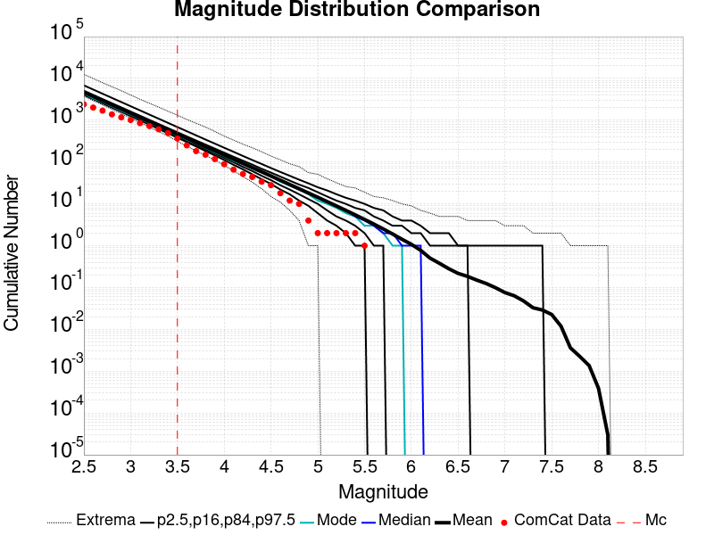 |

### ComCat Cumulative Number Vs Time
*[(top)](#table-of-contents)*

| M&ge;3.5 | M&ge;4 | M&ge;5 | M&ge;6 | M&ge;7 |
|-----|-----|-----|-----|-----|
|  | 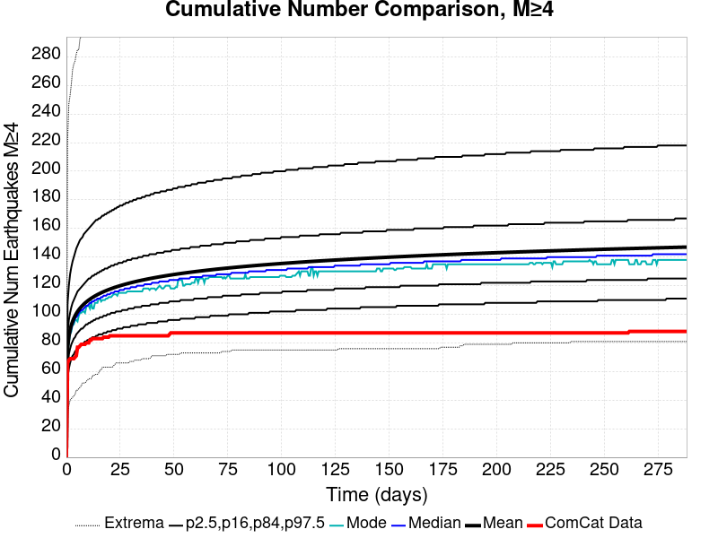 | 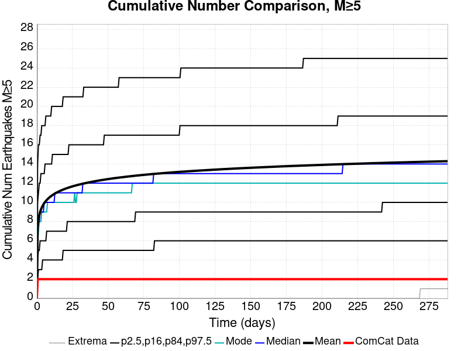 |  | 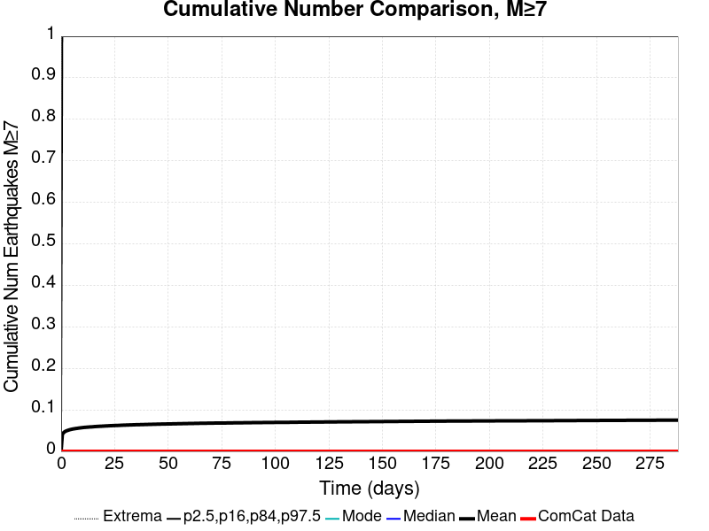 |

### ComCat Cumulative Number Simulation Percentiles
*[(top)](#table-of-contents)*


### ComCat Mean Spatial Distribution
*[(top)](#table-of-contents)*

|  | 1 Day | 1 Week | 1 Month | 70.6 Day |
|-----|-----|-----|-----|-----|
| **M≥3.5** |  |  |  |  |
| **M≥4** |  |  | 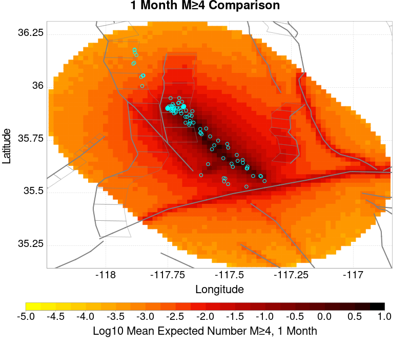 |  |
| **M≥5** | 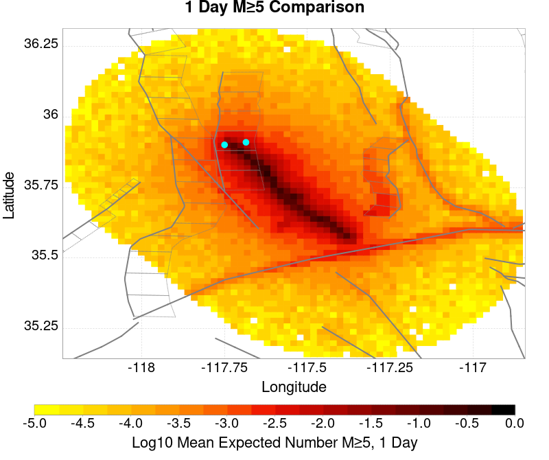 | 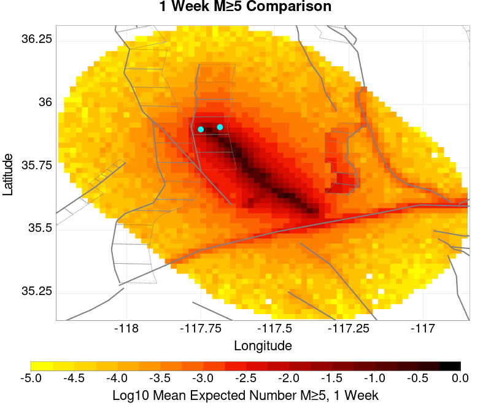 |  |  |
| **M≥6** |  |  |  |  |
| **M≥7** |  |  |  |  |
| **M≥8** |  |  |  |  |

### ComCat Depth Distribution
*[(top)](#table-of-contents)*

| M&ge;3.5 | M&ge;4 | M&ge;5 | M&ge;6 | M&ge;7 | M&ge;8 |
|-----|-----|-----|-----|-----|-----|
|  |  |  | 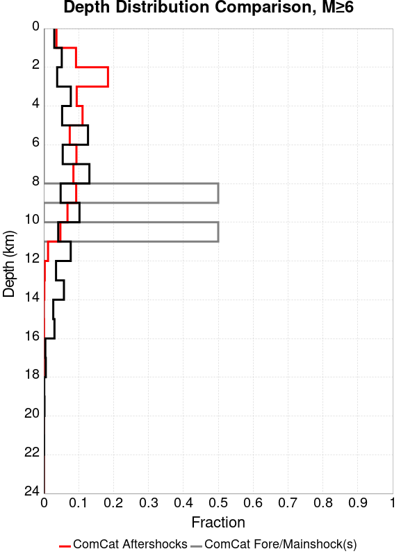 | 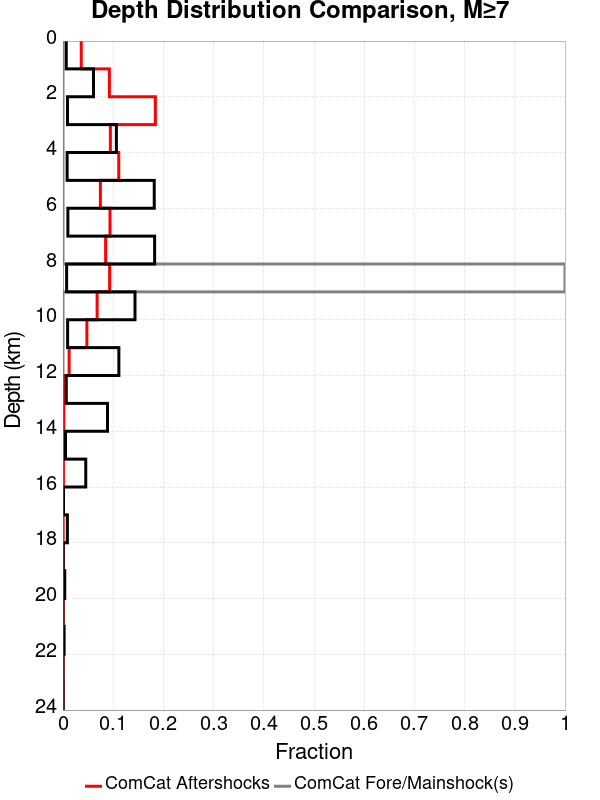 |  |

## Section Participation
*[(top)](#table-of-contents)*

### Section Participation Plots
*[(top)](#table-of-contents)*

| Min Mag | 1 yr Triggered Ruptures (no spontaneous) | 10 yr Triggered Ruptures (no spontaneous) | 10 yr Triggered Ruptures (primary aftershocks only) |
|-----|-----|-----|-----|
| **All Supra. Seis.** |  |  |  |
| **M&ge;6.5** |  |  |  |
| **M&ge;7** |  |  |  |
| **M&ge;7.5** |  |  | 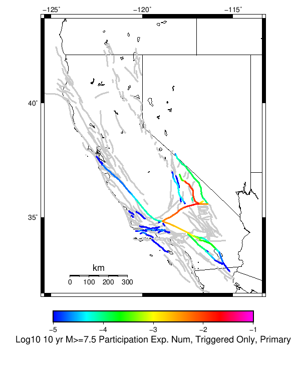 |
| **M&ge;8** |  |  |  |

### Supra-Seismogenic Parent Sections Table
*[(top)](#table-of-contents)*

*First 10 of 212 with matching ruptures shown*

| Parent Name | Triggered 10 Year Mean Count | Triggered 1 Day Prob | Triggered 1 Week Prob | Triggered 1 Month Prob | Triggered 1 Year Prob | Triggered 10 Year Prob | Triggered 10 Year Primary Mean Count |
|-----|-----|-----|-----|-----|-----|-----|-----|
| Garlock (Central) | 0.17361 | 0.08945 | 0.11111 | 0.12596 | 0.14941 | 0.16791 | 0.12672 |
| Tank Canyon | 0.1039 | 0.04054 | 0.05308 | 0.0629 | 0.0796 | 0.0941 | 0.04809 |
| Little Lake | 0.08127 | 0.04145 | 0.05153 | 0.05842 | 0.06944 | 0.07925 | 0.05896 |
| Airport Lake | 0.07433 | 0.0397 | 0.04909 | 0.05552 | 0.06556 | 0.07411 | 0.05807 |
| Owl Lake | 0.04186 | 0.01742 | 0.02242 | 0.02679 | 0.03374 | 0.03934 | 0.01831 |
| Panamint Valley | 0.03328 | 0.01496 | 0.01956 | 0.02261 | 0.02827 | 0.03282 | 0.01905 |
| Garlock (East) | 0.02593 | 0.01064 | 0.01399 | 0.01662 | 0.02085 | 0.02465 | 0.01248 |
| Hunter Mountain-Saline Valley | 0.01686 | 0.0083 | 0.01059 | 0.01203 | 0.01462 | 0.01671 | 0.0114 |
| Garlock (West) | 0.01152 | 0.00599 | 0.00745 | 0.00849 | 0.01017 | 0.0115 | 0.00824 |
| Blackwater | 0.01034 | 0.0043 | 0.00554 | 0.00655 | 0.00843 | 0.01012 | 0.0044 |

### M≥6.5 Parent Sections Table
*[(top)](#table-of-contents)*

*First 10 of 179 with matching ruptures shown*

| Parent Name | Triggered 10 Year Mean Count | Triggered 1 Day Prob | Triggered 1 Week Prob | Triggered 1 Month Prob | Triggered 1 Year Prob | Triggered 10 Year Prob | Triggered 10 Year Primary Mean Count |
|-----|-----|-----|-----|-----|-----|-----|-----|
| Garlock (Central) | 0.07037 | 0.03601 | 0.045 | 0.05141 | 0.06181 | 0.06962 | 0.04992 |
| Airport Lake | 0.05563 | 0.03004 | 0.03707 | 0.04206 | 0.04947 | 0.05557 | 0.04359 |
| Little Lake | 0.05126 | 0.02719 | 0.03342 | 0.03781 | 0.04446 | 0.05061 | 0.03833 |
| Panamint Valley | 0.03129 | 0.01441 | 0.01879 | 0.02159 | 0.02673 | 0.0309 | 0.0187 |
| Owl Lake | 0.02708 | 0.01322 | 0.0164 | 0.01918 | 0.02355 | 0.02706 | 0.01638 |
| Garlock (East) | 0.01966 | 0.00905 | 0.01154 | 0.01351 | 0.01653 | 0.01902 | 0.0118 |
| Hunter Mountain-Saline Valley | 0.01665 | 0.00827 | 0.01054 | 0.01196 | 0.01452 | 0.01656 | 0.01135 |
| Garlock (West) | 0.01147 | 0.00597 | 0.00741 | 0.00845 | 0.01013 | 0.01146 | 0.00822 |
| Tank Canyon | 0.01106 | 0.00441 | 0.00595 | 0.00688 | 0.00907 | 0.01099 | 0.00493 |
| San Andreas (Mojave N) | 0.00492 | 0.0027 | 0.00328 | 0.00371 | 0.0044 | 0.00489 | 0.00348 |

### M≥7 Parent Sections Table
*[(top)](#table-of-contents)*

*First 10 of 124 with matching ruptures shown*

| Parent Name | Triggered 10 Year Mean Count | Triggered 1 Day Prob | Triggered 1 Week Prob | Triggered 1 Month Prob | Triggered 1 Year Prob | Triggered 10 Year Prob | Triggered 10 Year Primary Mean Count |
|-----|-----|-----|-----|-----|-----|-----|-----|
| Garlock (Central) | 0.06255 | 0.03214 | 0.04003 | 0.04575 | 0.05515 | 0.06208 | 0.04456 |
| Panamint Valley | 0.02364 | 0.01178 | 0.01511 | 0.0171 | 0.02081 | 0.02356 | 0.0159 |
| Owl Lake | 0.02217 | 0.01151 | 0.01407 | 0.01632 | 0.01974 | 0.02217 | 0.01566 |
| Hunter Mountain-Saline Valley | 0.01629 | 0.00815 | 0.01042 | 0.01177 | 0.01429 | 0.01628 | 0.01123 |
| Garlock (East) | 0.01613 | 0.00817 | 0.01022 | 0.01179 | 0.01415 | 0.01606 | 0.01145 |
| Little Lake | 0.01155 | 0.00617 | 0.00767 | 0.00856 | 0.01023 | 0.01155 | 0.00874 |
| Garlock (West) | 0.01141 | 0.00595 | 0.00739 | 0.00841 | 0.01008 | 0.01141 | 0.00821 |
| Airport Lake | 0.01107 | 0.00594 | 0.00739 | 0.00821 | 0.00978 | 0.01107 | 0.00846 |
| San Andreas (Mojave N) | 0.00492 | 0.0027 | 0.00328 | 0.00371 | 0.0044 | 0.00489 | 0.00348 |
| San Andreas (Mojave S) | 0.00352 | 0.00183 | 0.00229 | 0.00261 | 0.00311 | 0.00351 | 0.00247 |

### M≥7.5 Parent Sections Table
*[(top)](#table-of-contents)*

*First 10 of 77 with matching ruptures shown*

| Parent Name | Triggered 10 Year Mean Count | Triggered 1 Day Prob | Triggered 1 Week Prob | Triggered 1 Month Prob | Triggered 1 Year Prob | Triggered 10 Year Prob | Triggered 10 Year Primary Mean Count |
|-----|-----|-----|-----|-----|-----|-----|-----|
| Garlock (Central) | 0.02562 | 0.01314 | 0.01662 | 0.01878 | 0.02261 | 0.02556 | 0.01831 |
| Panamint Valley | 0.016 | 0.00806 | 0.01029 | 0.01161 | 0.01405 | 0.016 | 0.0111 |
| Hunter Mountain-Saline Valley | 0.01595 | 0.00803 | 0.01025 | 0.01157 | 0.014 | 0.01595 | 0.01107 |
| Garlock (West) | 0.01045 | 0.00549 | 0.00684 | 0.00775 | 0.0093 | 0.01045 | 0.00753 |
| Garlock (East) | 0.00642 | 0.00337 | 0.00421 | 0.00476 | 0.00567 | 0.00642 | 0.00466 |
| San Andreas (Mojave N) | 0.00492 | 0.0027 | 0.00328 | 0.00371 | 0.0044 | 0.00489 | 0.00348 |
| San Andreas (Mojave S) | 0.00341 | 0.00181 | 0.00224 | 0.00255 | 0.00303 | 0.0034 | 0.00242 |
| Owl Lake | 0.00231 | 0.0012 | 0.00147 | 0.00173 | 0.0021 | 0.00231 | 0.00161 |
| San Andreas (San Bernardino N) | 0.00207 | 0.00116 | 0.00138 | 0.00153 | 0.00183 | 0.00207 | 0.00146 |
| San Andreas (San Bernardino S) | 9.3E-4 | 5.5E-4 | 6.5E-4 | 7.1E-4 | 8.2E-4 | 9.3E-4 | 6.8E-4 |

### M≥8 Parent Sections Table
*[(top)](#table-of-contents)*

*First 10 of 30 with matching ruptures shown*

| Parent Name | Triggered 10 Year Mean Count | Triggered 1 Day Prob | Triggered 1 Week Prob | Triggered 1 Month Prob | Triggered 1 Year Prob | Triggered 10 Year Prob | Triggered 10 Year Primary Mean Count |
|-----|-----|-----|-----|-----|-----|-----|-----|
| San Andreas (Mojave N) | 5.5E-4 | 2.8E-4 | 3.7E-4 | 4.1E-4 | 4.7E-4 | 5.5E-4 | 4.0E-4 |
| San Andreas (Mojave S) | 5.5E-4 | 2.8E-4 | 3.7E-4 | 4.1E-4 | 4.7E-4 | 5.5E-4 | 4.0E-4 |
| San Andreas (San Bernardino N) | 5.5E-4 | 2.8E-4 | 3.7E-4 | 4.1E-4 | 4.7E-4 | 5.5E-4 | 4.0E-4 |
| Garlock (Central) | 4.8E-4 | 2.3E-4 | 3.2E-4 | 3.5E-4 | 4.1E-4 | 4.8E-4 | 3.8E-4 |
| Garlock (West) | 4.8E-4 | 2.3E-4 | 3.2E-4 | 3.5E-4 | 4.1E-4 | 4.8E-4 | 3.8E-4 |
| Garlock (East) | 3.5E-4 | 1.7E-4 | 2.4E-4 | 2.6E-4 | 2.9E-4 | 3.5E-4 | 2.9E-4 |
| San Andreas (San Bernardino S) | 3.1E-4 | 1.7E-4 | 2.0E-4 | 2.2E-4 | 2.7E-4 | 3.1E-4 | 2.3E-4 |
| San Andreas (Coachella) rev | 2.9E-4 | 1.4E-4 | 1.7E-4 | 1.9E-4 | 2.5E-4 | 2.9E-4 | 2.1E-4 |
| San Andreas (San Gorgonio Pass-Garnet HIll) | 2.7E-4 | 1.4E-4 | 1.7E-4 | 1.8E-4 | 2.3E-4 | 2.7E-4 | 1.9E-4 |
| San Jacinto (San Bernardino) | 1.5E-4 | 8.0E-5 | 1.3E-4 | 1.4E-4 | 1.4E-4 | 1.5E-4 | 1.2E-4 |

### Fault Magnitude-Probability Distributions
*[(top)](#table-of-contents)*

The first 5 sections (sorted by trigger rate) are plotted below. All fault MPDs are available [here](plots/parent_sect_mpds/README.md)

| 1 Week | 1 Month | 1 Year | 10 Year |
|-----|-----|-----|-----|
|  |  |  |  |
|  |  |  |  |
|  |  |  |  |
|  |  |  |  |
|  |  |  |  |

## Gridded Nucleation
*[(top)](#table-of-contents)*

| Min Mag | Triggered Ruptures (no spontaneous) | Triggered Ruptures (primary aftershocks only) |
|-----|-----|-----|
| **M&ge;2.5** |  |  |
| **M&ge;5** |  |  |
| **M&ge;6** |  |  |
| **M&ge;7** |  |  |


## JSON Input File
*[(top)](#table-of-contents)*

```
{
  "numSimulations": 100000,
  "duration": 10.0,
  "startTimeMillis": 1562383194040,
  "includeSpontaneous": false,
  "randomSeed": 1567035200414,
  "binaryOutput": true,
  "binaryOutputFilters": [
    {
      "prefix": "results_complete",
      "descendantsOnly": false
    },
    {
      "prefix": "results_m5_preserve_chain",
      "minMag": 5.0,
      "preserveChainBelowMag": true,
      "descendantsOnly": false
    }
  ],
  "forceRecalc": false,
  "simulationName": "ComCat M7.1 (ci38457511), Mainshock Log10(k)\u003d-2.2412, ShakeMap Surfaces, Log10(k)\u003d-2.666, p\u003d1.07133, c\u003d8.0307E-4",
  "numRetries": 3,
  "outputDir": "${ETAS_SIM_DIR}/2019_08_28-ComCatM7p1_ci38457511_MainshockLog10_k_2p2412_ShakeMapSurfaces_Log10_k_2p666_p1p07133_c8p0307E4",
  "triggerRuptures": [
    {
      "occurrenceTimeMillis": 1562259775340,
      "comcatEventID": "ci38443095",
      "mag": 3.98,
      "latitude": 35.708,
      "longitude": -117.5036667,
      "depth": 10.58
    },
    {
      "occurrenceTimeMillis": 1562261629000,
      "comcatEventID": "ci38443183",
      "mag": 6.4,
      "latitude": 35.7053333,
      "longitude": -117.5038333,
      "depth": 10.5,
      "ruptureSurfaces": [
        {
          "outline": [
            {
              "latitude": 35.6051534466,
              "longitude": -117.5905380735,
              "depth": 0.0
            },
            {
              "latitude": 35.6173144101,
              "longitude": -117.57249634649999,
              "depth": 0.0
            },
            {
              "latitude": 35.6173135736,
              "longitude": -117.5726723708,
              "depth": 0.0
            },
            {
              "latitude": 35.61731357360001,
              "longitude": -117.5726723708,
              "depth": 15.0
            },
            {
              "latitude": 35.6173144101,
              "longitude": -117.57249634649999,
              "depth": 15.0
            },
            {
              "latitude": 35.6051534466,
              "longitude": -117.5905380735,
              "depth": 15.0
            },
            {
              "latitude": 35.6051534466,
              "longitude": -117.5905380735,
              "depth": 0.0
            }
          ]
        },
        {
          "outline": [
            {
              "latitude": 35.6338128629,
              "longitude": -117.54831678310002,
              "depth": 0.0
            },
            {
              "latitude": 35.6413274733,
              "longitude": -117.5393878708,
              "depth": 0.0
            },
            {
              "latitude": 35.664283512,
              "longitude": -117.51611643970001,
              "depth": 0.0
            },
            {
              "latitude": 35.664283512000004,
              "longitude": -117.51611643970001,
              "depth": 15.0
            },
            {
              "latitude": 35.641327473299995,
              "longitude": -117.5393878708,
              "depth": 15.0
            },
            {
              "latitude": 35.63381286290001,
              "longitude": -117.54831678310002,
              "depth": 15.0
            },
            {
              "latitude": 35.6338128629,
              "longitude": -117.54831678310002,
              "depth": 0.0
            }
          ]
        },
        {
          "outline": [
            {
              "latitude": 35.6322100797,
              "longitude": -117.55305954249998,
              "depth": 0.0
            },
            {
              "latitude": 35.6196274701,
              "longitude": -117.56969626549999,
              "depth": 0.0
            },
            {
              "latitude": 35.6196274701,
              "longitude": -117.56969626549999,
              "depth": 15.0
            },
            {
              "latitude": 35.6322100797,
              "longitude": -117.55305954249998,
              "depth": 15.0
            },
            {
              "latitude": 35.6322100797,
              "longitude": -117.55305954249998,
              "depth": 0.0
            }
          ]
        }
      ]
    },
    {
      "occurrenceTimeMillis": 1562261701660,
      "comcatEventID": "ci38443191",
      "mag": 4.49,
      "latitude": 35.644,
      "longitude": -117.56716670000002,
      "depth": 4.64
    },
    {
      "occurrenceTimeMillis": 1562261746340,
      "comcatEventID": "ci37222356",
      "mag": 3.63,
      "latitude": 35.6936667,
      "longitude": -117.437,
      "depth": 7.65
    },
    {
      "occurrenceTimeMillis": 1562261752170,
      "comcatEventID": "ci37218988",
      "mag": 4.28,
      "latitude": 35.687,
      "longitude": -117.50616670000001,
      "depth": 1.6
    },
    {
      "occurrenceTimeMillis": 1562261818950,
      "comcatEventID": "ci37222380",
      "mag": 3.41,
      "latitude": 35.7258333,
      "longitude": -117.55933330000002,
      "depth": 5.3
    },
    {
      "occurrenceTimeMillis": 1562261821140,
      "comcatEventID": "ci37222372",
      "mag": 3.66,
      "latitude": 35.7105,
      "longitude": -117.4773333,
      "depth": 1.57
    },
    {
      "occurrenceTimeMillis": 1562261834850,
      "comcatEventID": "ci37222364",
      "mag": 3.97,
      "latitude": 35.6655,
      "longitude": -117.516,
      "depth": 1.64
    },
    {
      "occurrenceTimeMillis": 1562261845640,
      "comcatEventID": "ci37218996",
      "mag": 4.01,
      "latitude": 35.6758333,
      "longitude": -117.45750000000001,
      "depth": 15.82
    },
    {
      "occurrenceTimeMillis": 1562261875500,
      "comcatEventID": "ci38443199",
      "mag": 3.86,
      "latitude": 35.7456667,
      "longitude": -117.5516667,
      "depth": 8.29
    },
    {
      "occurrenceTimeMillis": 1562261901450,
      "comcatEventID": "ci37421941",
      "mag": 3.73,
      "latitude": 35.714,
      "longitude": -117.476,
      "depth": 1.74
    },
    {
      "occurrenceTimeMillis": 1562261927500,
      "comcatEventID": "us70004a0n",
      "mag": 3.5,
      "latitude": 35.6215,
      "longitude": -117.5782,
      "depth": 9.7
    },
    {
      "occurrenceTimeMillis": 1562261927760,
      "comcatEventID": "ci37222396",
      "mag": 3.5,
      "latitude": 35.6235,
      "longitude": -117.596,
      "depth": 8.55
    },
    {
      "occurrenceTimeMillis": 1562261973310,
      "comcatEventID": "ci37222404",
      "mag": 3.11,
      "latitude": 35.5743333,
      "longitude": -117.63666670000002,
      "depth": 6.85
    },
    {
      "occurrenceTimeMillis": 1562261975360,
      "comcatEventID": "ci38443215",
      "mag": 3.69,
      "latitude": 35.6873333,
      "longitude": -117.4935,
      "depth": 10.86
    },
    {
      "occurrenceTimeMillis": 1562262002250,
      "comcatEventID": "ci38443223",
      "mag": 3.8,
      "latitude": 35.7253333,
      "longitude": -117.57083329999999,
      "depth": 6.63
    },
    {
      "occurrenceTimeMillis": 1562262018520,
      "comcatEventID": "ci38443231",
      "mag": 4.13,
      "latitude": 35.707,
      "longitude": -117.5101667,
      "depth": 8.66
    },
    {
      "occurrenceTimeMillis": 1562262034900,
      "comcatEventID": "ci37222508",
      "mag": 3.54,
      "latitude": 35.6948333,
      "longitude": -117.50183330000002,
      "depth": 2.04
    },
    {
      "occurrenceTimeMillis": 1562262046140,
      "comcatEventID": "ci37222516",
      "mag": 3.42,
      "latitude": 35.7298333,
      "longitude": -117.55483330000001,
      "depth": 7.72
    },
    {
      "occurrenceTimeMillis": 1562262080850,
      "comcatEventID": "ci37421957",
      "mag": 3.3,
      "latitude": 35.7266667,
      "longitude": -117.5288333,
      "depth": 1.97
    },
    {
      "occurrenceTimeMillis": 1562262174130,
      "comcatEventID": "ci38443239",
      "mag": 3.22,
      "latitude": 35.7301667,
      "longitude": -117.55866669999999,
      "depth": 7.84
    },
    {
      "occurrenceTimeMillis": 1562262209200,
      "comcatEventID": "us70004a0z",
      "mag": 3.6,
      "latitude": 35.6783,
      "longitude": -117.5488,
      "depth": 5.15
    },
    {
      "occurrenceTimeMillis": 1562262264020,
      "comcatEventID": "ci37421981",
      "mag": 2.77,
      "latitude": 35.7478333,
      "longitude": -117.54000000000002,
      "depth": 9.4
    },
    {
      "occurrenceTimeMillis": 1562262272820,
      "comcatEventID": "ci38443255",
      "mag": 3.86,
      "latitude": 35.6875,
      "longitude": -117.5071667,
      "depth": 1.54
    },
    {
      "occurrenceTimeMillis": 1562262305780,
      "comcatEventID": "ci37421997",
      "mag": 3.03,
      "latitude": 35.6976667,
      "longitude": -117.48649999999999,
      "depth": 2.24
    },
    {
      "occurrenceTimeMillis": 1562262323950,
      "comcatEventID": "ci37421989",
      "mag": 3.03,
      "latitude": 35.7151667,
      "longitude": -117.5473333,
      "depth": 7.21
    },
    {
      "occurrenceTimeMillis": 1562262328630,
      "comcatEventID": "ci37222524",
      "mag": 3.21,
      "latitude": 35.7348333,
      "longitude": -117.53683330000001,
      "depth": 10.34
    },
    {
      "occurrenceTimeMillis": 1562262363710,
      "comcatEventID": "ci38443263",
      "mag": 2.96,
      "latitude": 35.6431667,
      "longitude": -117.6101667,
      "depth": 10.14
    },
    {
      "occurrenceTimeMillis": 1562262380320,
      "comcatEventID": "ci37222532",
      "mag": 2.56,
      "latitude": 35.6563333,
      "longitude": -117.5325,
      "depth": 1.52
    },
    {
      "occurrenceTimeMillis": 1562262409960,
      "comcatEventID": "ci38443271",
      "mag": 3.07,
      "latitude": 35.6385,
      "longitude": -117.6108333,
      "depth": 10.97
    },
    {
      "occurrenceTimeMillis": 1562262437810,
      "comcatEventID": "ci38443279",
      "mag": 3.5,
      "latitude": 35.7455,
      "longitude": -117.5465,
      "depth": 7.11
    },
    {
      "occurrenceTimeMillis": 1562262460970,
      "comcatEventID": "ci37222548",
      "mag": 3.11,
      "latitude": 35.726,
      "longitude": -117.55849999999998,
      "depth": 3.58
    },
    {
      "occurrenceTimeMillis": 1562262474970,
      "comcatEventID": "ci37222556",
      "mag": 3.4,
      "latitude": 35.7286667,
      "longitude": -117.56066670000001,
      "depth": 5.25
    },
    {
      "occurrenceTimeMillis": 1562262483160,
      "comcatEventID": "ci37222564",
      "mag": 3.27,
      "latitude": 35.6365,
      "longitude": -117.55183330000001,
      "depth": 6.62
    },
    {
      "occurrenceTimeMillis": 1562262495680,
      "comcatEventID": "ci37222572",
      "mag": 3.11,
      "latitude": 35.7053333,
      "longitude": -117.5245,
      "depth": 5.52
    },
    {
      "occurrenceTimeMillis": 1562262504150,
      "comcatEventID": "ci37222580",
      "mag": 2.96,
      "latitude": 35.6593333,
      "longitude": -117.52633330000002,
      "depth": 2.68
    },
    {
      "occurrenceTimeMillis": 1562262575190,
      "comcatEventID": "ci37222596",
      "mag": 2.52,
      "latitude": 35.7335,
      "longitude": -117.50683330000001,
      "depth": 3.91
    },
    {
      "occurrenceTimeMillis": 1562262578950,
      "comcatEventID": "ci37222668",
      "mag": 2.57,
      "latitude": 35.687,
      "longitude": -117.49066670000002,
      "depth": 10.66
    },
    {
      "occurrenceTimeMillis": 1562262648290,
      "comcatEventID": "ci37222692",
      "mag": 2.73,
      "latitude": 35.738,
      "longitude": -117.52933329999999,
      "depth": 7.72
    },
    {
      "occurrenceTimeMillis": 1562262648960,
      "comcatEventID": "ci38443303",
      "mag": 2.79,
      "latitude": 35.678,
      "longitude": -117.49916670000002,
      "depth": 1.14
    },
    {
      "occurrenceTimeMillis": 1562262706650,
      "comcatEventID": "ci38443287",
      "mag": 3.46,
      "latitude": 35.674,
      "longitude": -117.52349999999998,
      "depth": 5.3
    },
    {
      "occurrenceTimeMillis": 1562262761700,
      "comcatEventID": "ci38443295",
      "mag": 2.92,
      "latitude": 35.7218333,
      "longitude": -117.5251667,
      "depth": 7.04
    },
    {
      "occurrenceTimeMillis": 1562262899560,
      "comcatEventID": "ci38443327",
      "mag": 2.53,
      "latitude": 35.6391667,
      "longitude": -117.5628333,
      "depth": 10.48
    },
    {
      "occurrenceTimeMillis": 1562262930800,
      "comcatEventID": "ci37222876",
      "mag": 2.57,
      "latitude": 35.6705,
      "longitude": -117.5221667,
      "depth": 3.91
    },
    {
      "occurrenceTimeMillis": 1562263051460,
      "comcatEventID": "ci38443311",
      "mag": 2.95,
      "latitude": 35.6595,
      "longitude": -117.5223333,
      "depth": 2.3
    },
    {
      "occurrenceTimeMillis": 1562263063060,
      "comcatEventID": "ci37222932",
      "mag": 2.78,
      "latitude": 35.6725,
      "longitude": -117.4743333,
      "depth": 8.76
    },
    {
      "occurrenceTimeMillis": 1562263082640,
      "comcatEventID": "ci38443319",
      "mag": 3.33,
      "latitude": 35.702,
      "longitude": -117.50833330000002,
      "depth": 4.77
    },
    {
      "occurrenceTimeMillis": 1562263240190,
      "comcatEventID": "ci38443335",
      "mag": 2.67,
      "latitude": 35.6303333,
      "longitude": -117.569,
      "depth": 1.64
    },
    {
      "occurrenceTimeMillis": 1562263261190,
      "comcatEventID": "ci37223148",
      "mag": 2.59,
      "latitude": 35.6733333,
      "longitude": -117.5118333,
      "depth": 1.49
    },
    {
      "occurrenceTimeMillis": 1562263283180,
      "comcatEventID": "ci37422005",
      "mag": 3.53,
      "latitude": 35.6876667,
      "longitude": -117.50849999999998,
      "depth": 1.26
    },
    {
      "occurrenceTimeMillis": 1562263291230,
      "comcatEventID": "ci37223156",
      "mag": 3.42,
      "latitude": 35.5978333,
      "longitude": -117.5905,
      "depth": 6.79
    },
    {
      "occurrenceTimeMillis": 1562263374110,
      "comcatEventID": "ci38443351",
      "mag": 2.53,
      "latitude": 35.6066667,
      "longitude": -117.58216670000002,
      "depth": 5.8
    },
    {
      "occurrenceTimeMillis": 1562263398590,
      "comcatEventID": "ci38443359",
      "mag": 2.85,
      "latitude": 35.7478333,
      "longitude": -117.5425,
      "depth": 6.85
    },
    {
      "occurrenceTimeMillis": 1562263541830,
      "comcatEventID": "ci38443375",
      "mag": 2.76,
      "latitude": 35.7153333,
      "longitude": -117.5295,
      "depth": 4.54
    },
    {
      "occurrenceTimeMillis": 1562263555910,
      "comcatEventID": "ci37223228",
      "mag": 2.61,
      "latitude": 35.7266667,
      "longitude": -117.5165,
      "depth": 8.96
    },
    {
      "occurrenceTimeMillis": 1562263576110,
      "comcatEventID": "ci38443383",
      "mag": 3.79,
      "latitude": 35.6606667,
      "longitude": -117.523,
      "depth": 2.14
    },
    {
      "occurrenceTimeMillis": 1562263611050,
      "comcatEventID": "ci37223236",
      "mag": 2.6,
      "latitude": 35.6931667,
      "longitude": -117.46200000000002,
      "depth": 11.56
    },
    {
      "occurrenceTimeMillis": 1562263629270,
      "comcatEventID": "ci38443391",
      "mag": 3.51,
      "latitude": 35.5991667,
      "longitude": -117.6101667,
      "depth": 2.12
    },
    {
      "occurrenceTimeMillis": 1562263630910,
      "comcatEventID": "ci37223244",
      "mag": 3.49,
      "latitude": 35.6508333,
      "longitude": -117.54200000000002,
      "depth": 2.77
    },
    {
      "occurrenceTimeMillis": 1562263670810,
      "comcatEventID": "ci37223252",
      "mag": 2.55,
      "latitude": 35.72950000000001,
      "longitude": -117.533,
      "depth": 7.25
    },
    {
      "occurrenceTimeMillis": 1562263713160,
      "comcatEventID": "ci38443407",
      "mag": 3.38,
      "latitude": 35.6678333,
      "longitude": -117.50616670000001,
      "depth": 2.27
    },
    {
      "occurrenceTimeMillis": 1562263725070,
      "comcatEventID": "ci37223308",
      "mag": 3.55,
      "latitude": 35.7108333,
      "longitude": -117.47683329999998,
      "depth": 1.17
    },
    {
      "occurrenceTimeMillis": 1562263832710,
      "comcatEventID": "ci38443415",
      "mag": 3.46,
      "latitude": 35.6598333,
      "longitude": -117.53483330000002,
      "depth": 10.25
    },
    {
      "occurrenceTimeMillis": 1562263882870,
      "comcatEventID": "ci38443423",
      "mag": 2.69,
      "latitude": 35.6003333,
      "longitude": -117.5951667,
      "depth": 7.33
    },
    {
      "occurrenceTimeMillis": 1562263972070,
      "comcatEventID": "ci38443431",
      "mag": 3.44,
      "latitude": 35.6703333,
      "longitude": -117.5605,
      "depth": 6.91
    },
    {
      "occurrenceTimeMillis": 1562264025530,
      "comcatEventID": "ci37223380",
      "mag": 2.89,
      "latitude": 35.7003333,
      "longitude": -117.4873333,
      "depth": 10.98
    },
    {
      "occurrenceTimeMillis": 1562264031400,
      "comcatEventID": "ci38443439",
      "mag": 3.5,
      "latitude": 35.7081667,
      "longitude": -117.485,
      "depth": 6.44
    },
    {
      "occurrenceTimeMillis": 1562264104970,
      "comcatEventID": "ci38443447",
      "mag": 2.75,
      "latitude": 35.6103333,
      "longitude": -117.59500000000001,
      "depth": 4.94
    },
    {
      "occurrenceTimeMillis": 1562264112820,
      "comcatEventID": "ci37420701",
      "mag": 3.23,
      "latitude": 35.6691667,
      "longitude": -117.5203333,
      "depth": 1.84
    },
    {
      "occurrenceTimeMillis": 1562264193730,
      "comcatEventID": "ci38443463",
      "mag": 2.94,
      "latitude": 35.7251667,
      "longitude": -117.53350000000002,
      "depth": 6.74
    },
    {
      "occurrenceTimeMillis": 1562264235320,
      "comcatEventID": "ci38443471",
      "mag": 2.87,
      "latitude": 35.7185,
      "longitude": -117.5336667,
      "depth": 4.94
    },
    {
      "occurrenceTimeMillis": 1562264325720,
      "comcatEventID": "ci38443487",
      "mag": 3.38,
      "latitude": 35.638,
      "longitude": -117.611,
      "depth": 9.43
    },
    {
      "occurrenceTimeMillis": 1562264332070,
      "comcatEventID": "ci37223676",
      "mag": 2.98,
      "latitude": 35.6123333,
      "longitude": -117.624,
      "depth": 0.0
    },
    {
      "occurrenceTimeMillis": 1562264348090,
      "comcatEventID": "ci37223684",
      "mag": 2.6,
      "latitude": 35.7236667,
      "longitude": -117.50849999999998,
      "depth": 11.57
    },
    {
      "occurrenceTimeMillis": 1562264485340,
      "comcatEventID": "ci38443495",
      "mag": 2.61,
      "latitude": 35.67883330000001,
      "longitude": -117.51533330000001,
      "depth": 2.91
    },
    {
      "occurrenceTimeMillis": 1562264763750,
      "comcatEventID": "ci38443519",
      "mag": 3.13,
      "latitude": 35.6638333,
      "longitude": -117.5245,
      "depth": 2.53
    },
    {
      "occurrenceTimeMillis": 1562264846770,
      "comcatEventID": "ci38443527",
      "mag": 3.29,
      "latitude": 35.6748333,
      "longitude": -117.51433329999999,
      "depth": 2.68
    },
    {
      "occurrenceTimeMillis": 1562264879440,
      "comcatEventID": "ci38443535",
      "mag": 4.23,
      "latitude": 35.745,
      "longitude": -117.55216669999999,
      "depth": 6.64
    },
    {
      "occurrenceTimeMillis": 1562264923640,
      "comcatEventID": "ci38443543",
      "mag": 3.75,
      "latitude": 35.6661667,
      "longitude": -117.5656667,
      "depth": 7.14
    },
    {
      "occurrenceTimeMillis": 1562265289010,
      "comcatEventID": "ci37224604",
      "mag": 2.59,
      "latitude": 35.6895,
      "longitude": -117.4883333,
      "depth": 0.63
    },
    {
      "occurrenceTimeMillis": 1562265344040,
      "comcatEventID": "ci38443575",
      "mag": 2.5,
      "latitude": 35.7215,
      "longitude": -117.56550000000001,
      "depth": 0.16
    },
    {
      "occurrenceTimeMillis": 1562265451500,
      "comcatEventID": "ci38443591",
      "mag": 2.64,
      "latitude": 35.72,
      "longitude": -117.5723333,
      "depth": 1.34
    },
    {
      "occurrenceTimeMillis": 1562265525650,
      "comcatEventID": "ci38443599",
      "mag": 2.69,
      "latitude": 35.7046661,
      "longitude": -117.49666600000002,
      "depth": 3.96
    },
    {
      "occurrenceTimeMillis": 1562265584440,
      "comcatEventID": "ci38443607",
      "mag": 4.59,
      "latitude": 35.6013333,
      "longitude": -117.59700000000001,
      "depth": 2.81
    },
    {
      "occurrenceTimeMillis": 1562265656740,
      "comcatEventID": "ci37224612",
      "mag": 3.05,
      "latitude": 35.652,
      "longitude": -117.53683330000001,
      "depth": 2.03
    },
    {
      "occurrenceTimeMillis": 1562265674270,
      "comcatEventID": "ci38443615",
      "mag": 3.07,
      "latitude": 35.6763333,
      "longitude": -117.5115,
      "depth": 2.13
    },
    {
      "occurrenceTimeMillis": 1562265865000,
      "comcatEventID": "ci38443631",
      "mag": 3.09,
      "latitude": 35.719,
      "longitude": -117.55866669999999,
      "depth": 2.06
    },
    {
      "occurrenceTimeMillis": 1562266026590,
      "comcatEventID": "ci38443647",
      "mag": 4.34,
      "latitude": 35.6758333,
      "longitude": -117.48533330000001,
      "depth": 8.53
    },
    {
      "occurrenceTimeMillis": 1562266042600,
      "comcatEventID": "ci37421213",
      "mag": 4.02,
      "latitude": 35.6755,
      "longitude": -117.472,
      "depth": 10.27
    },
    {
      "occurrenceTimeMillis": 1562266207160,
      "comcatEventID": "ci38443663",
      "mag": 2.73,
      "latitude": 35.641,
      "longitude": -117.56266670000001,
      "depth": 8.95
    },
    {
      "occurrenceTimeMillis": 1562266215910,
      "comcatEventID": "ci38443671",
      "mag": 3.7,
      "latitude": 35.682,
      "longitude": -117.4961667,
      "depth": 1.26
    },
    {
      "occurrenceTimeMillis": 1562266333530,
      "comcatEventID": "ci38443679",
      "mag": 2.78,
      "latitude": 35.6543333,
      "longitude": -117.53983330000001,
      "depth": 0.88
    },
    {
      "occurrenceTimeMillis": 1562266376130,
      "comcatEventID": "ci38443687",
      "mag": 2.93,
      "latitude": 35.741,
      "longitude": -117.561,
      "depth": 0.23
    },
    {
      "occurrenceTimeMillis": 1562266407670,
      "comcatEventID": "ci38443695",
      "mag": 3.36,
      "latitude": 35.7285,
      "longitude": -117.5605,
      "depth": 7.87
    },
    {
      "occurrenceTimeMillis": 1562266453990,
      "comcatEventID": "ci38443703",
      "mag": 4.07,
      "latitude": 35.5975,
      "longitude": -117.5996667,
      "depth": 5.33
    },
    {
      "occurrenceTimeMillis": 1562266527680,
      "comcatEventID": "ci38443711",
      "mag": 3.03,
      "latitude": 35.6753333,
      "longitude": -117.4795,
      "depth": 10.71
    },
    {
      "occurrenceTimeMillis": 1562266566420,
      "comcatEventID": "ci38443719",
      "mag": 4.58,
      "latitude": 35.716,
      "longitude": -117.56000000000002,
      "depth": 1.92
    },
    {
      "occurrenceTimeMillis": 1562266582030,
      "comcatEventID": "ci37420717",
      "mag": 4.21,
      "latitude": 35.7086667,
      "longitude": -117.55416669999998,
      "depth": 1.16
    },
    {
      "occurrenceTimeMillis": 1562266687790,
      "comcatEventID": "ci38443727",
      "mag": 2.85,
      "latitude": 35.7266667,
      "longitude": -117.56516670000002,
      "depth": 0.09
    },
    {
      "occurrenceTimeMillis": 1562266809510,
      "comcatEventID": "ci38443751",
      "mag": 3.21,
      "latitude": 35.7099991,
      "longitude": -117.55616759999998,
      "depth": 0.1
    },
    {
      "occurrenceTimeMillis": 1562266869997,
      "comcatEventID": "us70004a4p",
      "mag": 3.0,
      "latitude": 35.7867,
      "longitude": -117.5478,
      "depth": 5.0
    },
    {
      "occurrenceTimeMillis": 1562266944640,
      "comcatEventID": "ci38443775",
      "mag": 2.56,
      "latitude": 35.645,
      "longitude": -117.5373333,
      "depth": 0.01
    },
    {
      "occurrenceTimeMillis": 1562267419790,
      "comcatEventID": "ci38443823",
      "mag": 3.26,
      "latitude": 35.6938324,
      "longitude": -117.49449920000002,
      "depth": 0.97
    },
    {
      "occurrenceTimeMillis": 1562267699490,
      "comcatEventID": "ci38443831",
      "mag": 3.0,
      "latitude": 35.652668,
      "longitude": -117.5393295,
      "depth": 1.65
    },
    {
      "occurrenceTimeMillis": 1562267766200,
      "comcatEventID": "ci38443839",
      "mag": 2.5,
      "latitude": 35.721,
      "longitude": -117.56650000000002,
      "depth": 0.12
    },
    {
      "occurrenceTimeMillis": 1562267871400,
      "comcatEventID": "ci38443855",
      "mag": 3.23,
      "latitude": 35.6911659,
      "longitude": -117.51216889999999,
      "depth": 1.03
    },
    {
      "occurrenceTimeMillis": 1562268051750,
      "comcatEventID": "ci38443863",
      "mag": 2.8,
      "latitude": 35.6389999,
      "longitude": -117.5526657,
      "depth": 1.11
    },
    {
      "occurrenceTimeMillis": 1562268092090,
      "comcatEventID": "ci38443871",
      "mag": 4.5,
      "latitude": 35.6715,
      "longitude": -117.4788333,
      "depth": 5.16
    },
    {
      "occurrenceTimeMillis": 1562268380340,
      "comcatEventID": "ci38443879",
      "mag": 2.69,
      "latitude": 35.7086667,
      "longitude": -117.48333330000001,
      "depth": 1.39
    },
    {
      "occurrenceTimeMillis": 1562268438340,
      "comcatEventID": "ci38443895",
      "mag": 2.81,
      "latitude": 35.6696667,
      "longitude": -117.47999999999999,
      "depth": 6.24
    },
    {
      "occurrenceTimeMillis": 1562269189760,
      "comcatEventID": "ci38443983",
      "mag": 2.63,
      "latitude": 35.683,
      "longitude": -117.5195,
      "depth": 5.84
    },
    {
      "occurrenceTimeMillis": 1562269229180,
      "comcatEventID": "ci38443991",
      "mag": 2.65,
      "latitude": 35.6556667,
      "longitude": -117.5158333,
      "depth": 1.76
    },
    {
      "occurrenceTimeMillis": 1562269744960,
      "comcatEventID": "ci38444047",
      "mag": 3.18,
      "latitude": 35.6828346,
      "longitude": -117.49183650000002,
      "depth": 0.0
    },
    {
      "occurrenceTimeMillis": 1562269876850,
      "comcatEventID": "ci38444063",
      "mag": 3.34,
      "latitude": 35.7094994,
      "longitude": -117.55666349999998,
      "depth": 0.34
    },
    {
      "occurrenceTimeMillis": 1562269933070,
      "comcatEventID": "ci38444071",
      "mag": 3.02,
      "latitude": 35.6086655,
      "longitude": -117.590332,
      "depth": 4.83
    },
    {
      "occurrenceTimeMillis": 1562270160500,
      "comcatEventID": "ci38444103",
      "mag": 4.16,
      "latitude": 35.6623333,
      "longitude": -117.524,
      "depth": 1.49
    },
    {
      "occurrenceTimeMillis": 1562270280220,
      "comcatEventID": "ci38444119",
      "mag": 2.65,
      "latitude": 35.7131667,
      "longitude": -117.5561667,
      "depth": 0.16
    },
    {
      "occurrenceTimeMillis": 1562270492930,
      "comcatEventID": "ci38444135",
      "mag": 2.5,
      "latitude": 35.678,
      "longitude": -117.589,
      "depth": 7.89
    },
    {
      "occurrenceTimeMillis": 1562270655500,
      "comcatEventID": "ci38444143",
      "mag": 2.56,
      "latitude": 35.7048333,
      "longitude": -117.48683330000001,
      "depth": 1.23
    },
    {
      "occurrenceTimeMillis": 1562270768270,
      "comcatEventID": "ci38444159",
      "mag": 3.38,
      "latitude": 35.6980019,
      "longitude": -117.4881668,
      "depth": 8.77
    },
    {
      "occurrenceTimeMillis": 1562271091460,
      "comcatEventID": "ci38444191",
      "mag": 2.61,
      "latitude": 35.683,
      "longitude": -117.50483330000002,
      "depth": 1.69
    },
    {
      "occurrenceTimeMillis": 1562271290340,
      "comcatEventID": "ci38444215",
      "mag": 3.99,
      "latitude": 35.6991667,
      "longitude": -117.5125,
      "depth": 5.75
    },
    {
      "occurrenceTimeMillis": 1562271456830,
      "comcatEventID": "ci38444231",
      "mag": 3.06,
      "latitude": 35.699501,
      "longitude": -117.4838333,
      "depth": 1.03
    },
    {
      "occurrenceTimeMillis": 1562271789990,
      "comcatEventID": "ci38444263",
      "mag": 3.4,
      "latitude": 35.6403351,
      "longitude": -117.5996704,
      "depth": 9.92
    },
    {
      "occurrenceTimeMillis": 1562271838650,
      "comcatEventID": "ci38444271",
      "mag": 2.53,
      "latitude": 35.6583333,
      "longitude": -117.56233329999999,
      "depth": 4.39
    },
    {
      "occurrenceTimeMillis": 1562272472100,
      "comcatEventID": "ci38444311",
      "mag": 2.61,
      "latitude": 35.640667,
      "longitude": -117.5833359,
      "depth": 8.68
    },
    {
      "occurrenceTimeMillis": 1562273126620,
      "comcatEventID": "ci38444407",
      "mag": 3.09,
      "latitude": 35.7008324,
      "longitude": -117.47766879999999,
      "depth": 0.04
    },
    {
      "occurrenceTimeMillis": 1562273724820,
      "comcatEventID": "ci38444487",
      "mag": 3.37,
      "latitude": 35.7088318,
      "longitude": -117.4771652,
      "depth": 0.2
    },
    {
      "occurrenceTimeMillis": 1562273832360,
      "comcatEventID": "ci38444503",
      "mag": 2.54,
      "latitude": 35.6585,
      "longitude": -117.53199999999998,
      "depth": 8.73
    },
    {
      "occurrenceTimeMillis": 1562274175860,
      "comcatEventID": "ci38444543",
      "mag": 3.56,
      "latitude": 35.689666700000004,
      "longitude": -117.4853363,
      "depth": 7.08
    },
    {
      "occurrenceTimeMillis": 1562274428600,
      "comcatEventID": "ci38444559",
      "mag": 2.52,
      "latitude": 35.5995,
      "longitude": -117.59783330000002,
      "depth": 4.74
    },
    {
      "occurrenceTimeMillis": 1562275395050,
      "comcatEventID": "ci38444687",
      "mag": 2.8,
      "latitude": 35.6951667,
      "longitude": -117.4893333,
      "depth": 1.65
    },
    {
      "occurrenceTimeMillis": 1562275595090,
      "comcatEventID": "ci38444719",
      "mag": 3.0,
      "latitude": 35.67666630000001,
      "longitude": -117.52749630000001,
      "depth": 7.39
    },
    {
      "occurrenceTimeMillis": 1562275966060,
      "comcatEventID": "ci38444783",
      "mag": 2.62,
      "latitude": 35.725,
      "longitude": -117.56916670000001,
      "depth": 2.03
    },
    {
      "occurrenceTimeMillis": 1562276014350,
      "comcatEventID": "ci38444791",
      "mag": 3.08,
      "latitude": 35.6155014,
      "longitude": -117.5893326,
      "depth": 5.43
    },
    {
      "occurrenceTimeMillis": 1562276433450,
      "comcatEventID": "ci38444823",
      "mag": 3.42,
      "latitude": 35.6691666,
      "longitude": -117.518837,
      "depth": 2.04
    },
    {
      "occurrenceTimeMillis": 1562276519830,
      "comcatEventID": "ci38444847",
      "mag": 2.74,
      "latitude": 35.7193333,
      "longitude": -117.53216670000002,
      "depth": 2.19
    },
    {
      "occurrenceTimeMillis": 1562276794030,
      "comcatEventID": "ci38444895",
      "mag": 2.5,
      "latitude": 35.7011667,
      "longitude": -117.47866669999999,
      "depth": 0.93
    },
    {
      "occurrenceTimeMillis": 1562276824410,
      "comcatEventID": "ci38444903",
      "mag": 3.25,
      "latitude": 35.6321678,
      "longitude": -117.60717010000002,
      "depth": 9.0
    },
    {
      "occurrenceTimeMillis": 1562277755090,
      "comcatEventID": "ci38445015",
      "mag": 3.35,
      "latitude": 35.6775017,
      "longitude": -117.5148315,
      "depth": 2.85
    },
    {
      "occurrenceTimeMillis": 1562277922533,
      "comcatEventID": "us70004ach",
      "mag": 3.3,
      "latitude": 35.7232,
      "longitude": -117.4508,
      "depth": 9.45
    },
    {
      "occurrenceTimeMillis": 1562278328280,
      "comcatEventID": "ci38445087",
      "mag": 4.47,
      "latitude": 35.7443333,
      "longitude": -117.56633329999998,
      "depth": 1.97
    },
    {
      "occurrenceTimeMillis": 1562279346560,
      "comcatEventID": "ci38445183",
      "mag": 2.51,
      "latitude": 35.7038333,
      "longitude": -117.49499999999999,
      "depth": 9.8
    },
    {
      "occurrenceTimeMillis": 1562279407880,
      "comcatEventID": "ci38445199",
      "mag": 2.62,
      "latitude": 35.7008333,
      "longitude": -117.4893333,
      "depth": 1.85
    },
    {
      "occurrenceTimeMillis": 1562280141650,
      "comcatEventID": "ci38445295",
      "mag": 3.2,
      "latitude": 35.7211685,
      "longitude": -117.52400210000002,
      "depth": 2.21
    },
    {
      "occurrenceTimeMillis": 1562281630780,
      "comcatEventID": "ci38445463",
      "mag": 2.59,
      "latitude": 35.7041667,
      "longitude": -117.4886667,
      "depth": 1.92
    },
    {
      "occurrenceTimeMillis": 1562281960410,
      "comcatEventID": "ci38445495",
      "mag": 3.49,
      "latitude": 35.6711655,
      "longitude": -117.47166440000001,
      "depth": 7.11
    },
    {
      "occurrenceTimeMillis": 1562281984910,
      "comcatEventID": "ci38445503",
      "mag": 3.06,
      "latitude": 35.7470016,
      "longitude": -117.5784988,
      "depth": 2.13
    },
    {
      "occurrenceTimeMillis": 1562283240630,
      "comcatEventID": "ci37420973",
      "mag": 3.82,
      "latitude": 35.6623333,
      "longitude": -117.5245,
      "depth": 2.61
    },
    {
      "occurrenceTimeMillis": 1562283242380,
      "comcatEventID": "ci38445703",
      "mag": 4.04,
      "latitude": 35.6011667,
      "longitude": -117.61066670000001,
      "depth": 4.75
    },
    {
      "occurrenceTimeMillis": 1562283753710,
      "comcatEventID": "ci38445751",
      "mag": 3.72,
      "latitude": 35.7470016,
      "longitude": -117.5681686,
      "depth": 2.42
    },
    {
      "occurrenceTimeMillis": 1562284476440,
      "comcatEventID": "ci38445839",
      "mag": 3.33,
      "latitude": 35.6571655,
      "longitude": -117.52183530000002,
      "depth": 1.67
    },
    {
      "occurrenceTimeMillis": 1562285645640,
      "comcatEventID": "ci38445935",
      "mag": 2.76,
      "latitude": 35.6458333,
      "longitude": -117.54716670000002,
      "depth": 0.29
    },
    {
      "occurrenceTimeMillis": 1562285881410,
      "comcatEventID": "ci38445975",
      "mag": 4.04,
      "latitude": 35.7718333,
      "longitude": -117.61783330000002,
      "depth": 2.59
    },
    {
      "occurrenceTimeMillis": 1562286529030,
      "comcatEventID": "ci38446031",
      "mag": 2.8,
      "latitude": 35.7215,
      "longitude": -117.5465,
      "depth": 7.03
    },
    {
      "occurrenceTimeMillis": 1562286726670,
      "comcatEventID": "ci38446071",
      "mag": 4.02,
      "latitude": 35.7033333,
      "longitude": -117.4828333,
      "depth": 1.0
    },
    {
      "occurrenceTimeMillis": 1562286799610,
      "comcatEventID": "ci38446079",
      "mag": 2.66,
      "latitude": 35.7436676,
      "longitude": -117.55566409999999,
      "depth": 5.42
    },
    {
      "occurrenceTimeMillis": 1562287539420,
      "comcatEventID": "ci38446159",
      "mag": 3.95,
      "latitude": 35.6910019,
      "longitude": -117.50966640000001,
      "depth": 3.68
    },
    {
      "occurrenceTimeMillis": 1562287780920,
      "comcatEventID": "ci38446175",
      "mag": 2.52,
      "latitude": 35.7096667,
      "longitude": -117.47866669999999,
      "depth": 1.91
    },
    {
      "occurrenceTimeMillis": 1562288933460,
      "comcatEventID": "ci38446343",
      "mag": 2.99,
      "latitude": 35.7254982,
      "longitude": -117.55117030000001,
      "depth": 1.29
    },
    {
      "occurrenceTimeMillis": 1562289493410,
      "comcatEventID": "ci38446391",
      "mag": 3.12,
      "latitude": 35.6580009,
      "longitude": -117.52216339999998,
      "depth": 1.38
    },
    {
      "occurrenceTimeMillis": 1562291154030,
      "comcatEventID": "ci38446527",
      "mag": 2.55,
      "latitude": 35.5946655,
      "longitude": -117.5978317,
      "depth": 4.1
    },
    {
      "occurrenceTimeMillis": 1562291887280,
      "comcatEventID": "ci38446615",
      "mag": 2.68,
      "latitude": 35.7118333,
      "longitude": -117.46816670000001,
      "depth": 0.68
    },
    {
      "occurrenceTimeMillis": 1562292100910,
      "comcatEventID": "ci38446639",
      "mag": 3.21,
      "latitude": 35.7734985,
      "longitude": -117.6149979,
      "depth": 0.22
    },
    {
      "occurrenceTimeMillis": 1562292119010,
      "comcatEventID": "ci38446647",
      "mag": 3.98,
      "latitude": 35.6401667,
      "longitude": -117.5461667,
      "depth": 11.3
    },
    {
      "occurrenceTimeMillis": 1562292319160,
      "comcatEventID": "ci38446671",
      "mag": 3.34,
      "latitude": 35.6558342,
      "longitude": -117.5234985,
      "depth": 1.57
    },
    {
      "occurrenceTimeMillis": 1562292831940,
      "comcatEventID": "ci38446767",
      "mag": 2.65,
      "latitude": 35.6405,
      "longitude": -117.55783329999998,
      "depth": 10.3
    },
    {
      "occurrenceTimeMillis": 1562293181860,
      "comcatEventID": "ci38446807",
      "mag": 3.25,
      "latitude": 35.7746658,
      "longitude": -117.6169968,
      "depth": 2.35
    },
    {
      "occurrenceTimeMillis": 1562293435650,
      "comcatEventID": "ci38446831",
      "mag": 2.8,
      "latitude": 35.7128333,
      "longitude": -117.4743333,
      "depth": 0.81
    },
    {
      "occurrenceTimeMillis": 1562295589610,
      "comcatEventID": "ci38447047",
      "mag": 2.81,
      "latitude": 35.661,
      "longitude": -117.519,
      "depth": 0.21
    },
    {
      "occurrenceTimeMillis": 1562295673270,
      "comcatEventID": "ci38447055",
      "mag": 2.72,
      "latitude": 35.744,
      "longitude": -117.5648333,
      "depth": 5.49
    },
    {
      "occurrenceTimeMillis": 1562296518720,
      "comcatEventID": "ci38447143",
      "mag": 3.27,
      "latitude": 35.6286659,
      "longitude": -117.5633316,
      "depth": 3.95
    },
    {
      "occurrenceTimeMillis": 1562296793710,
      "comcatEventID": "ci38447191",
      "mag": 3.32,
      "latitude": 35.6426659,
      "longitude": -117.529335,
      "depth": 0.61
    },
    {
      "occurrenceTimeMillis": 1562296893030,
      "comcatEventID": "ci38447207",
      "mag": 2.53,
      "latitude": 35.7783333,
      "longitude": -117.6173333,
      "depth": 1.76
    },
    {
      "occurrenceTimeMillis": 1562297120610,
      "comcatEventID": "ci38447231",
      "mag": 2.54,
      "latitude": 35.6911667,
      "longitude": -117.5123333,
      "depth": 4.17
    },
    {
      "occurrenceTimeMillis": 1562298372730,
      "comcatEventID": "ci38447383",
      "mag": 2.56,
      "latitude": 35.698,
      "longitude": -117.48033330000001,
      "depth": 1.34
    },
    {
      "occurrenceTimeMillis": 1562298414390,
      "comcatEventID": "ci38447391",
      "mag": 3.07,
      "latitude": 35.6823349,
      "longitude": -117.5,
      "depth": 0.59
    },
    {
      "occurrenceTimeMillis": 1562298613940,
      "comcatEventID": "ci38447407",
      "mag": 2.52,
      "latitude": 35.7093333,
      "longitude": -117.4758333,
      "depth": 0.41
    },
    {
      "occurrenceTimeMillis": 1562299898470,
      "comcatEventID": "ci38447591",
      "mag": 3.53,
      "latitude": 35.7226677,
      "longitude": -117.55300139999999,
      "depth": 1.02
    },
    {
      "occurrenceTimeMillis": 1562299981170,
      "comcatEventID": "ci38447599",
      "mag": 2.62,
      "latitude": 35.6773333,
      "longitude": -117.551,
      "depth": 7.07
    },
    {
      "occurrenceTimeMillis": 1562300085340,
      "comcatEventID": "ci38447623",
      "mag": 3.48,
      "latitude": 35.6983337,
      "longitude": -117.481163,
      "depth": 1.26
    },
    {
      "occurrenceTimeMillis": 1562301184910,
      "comcatEventID": "ci38447727",
      "mag": 2.54,
      "latitude": 35.6588333,
      "longitude": -117.51783330000002,
      "depth": 2.08
    },
    {
      "occurrenceTimeMillis": 1562302565260,
      "comcatEventID": "ci38447911",
      "mag": 2.52,
      "latitude": 35.6596667,
      "longitude": -117.54183330000001,
      "depth": 7.89
    },
    {
      "occurrenceTimeMillis": 1562302899770,
      "comcatEventID": "ci38447927",
      "mag": 2.61,
      "latitude": 35.5718333,
      "longitude": -117.6181667,
      "depth": 4.86
    },
    {
      "occurrenceTimeMillis": 1562303437620,
      "comcatEventID": "ci38447999",
      "mag": 3.19,
      "latitude": 35.7073326,
      "longitude": -117.47533420000002,
      "depth": 6.11
    },
    {
      "occurrenceTimeMillis": 1562303905370,
      "comcatEventID": "ci38448031",
      "mag": 3.45,
      "latitude": 35.7700005,
      "longitude": -117.61250310000001,
      "depth": 2.34
    },
    {
      "occurrenceTimeMillis": 1562304556070,
      "comcatEventID": "ci38448071",
      "mag": 2.64,
      "latitude": 35.636,
      "longitude": -117.58783330000001,
      "depth": 6.71
    },
    {
      "occurrenceTimeMillis": 1562305212140,
      "comcatEventID": "ci38448143",
      "mag": 2.82,
      "latitude": 35.6776667,
      "longitude": -117.51066670000002,
      "depth": 2.02
    },
    {
      "occurrenceTimeMillis": 1562305958100,
      "comcatEventID": "ci38448183",
      "mag": 2.5,
      "latitude": 35.70283330000001,
      "longitude": -117.4845,
      "depth": 0.25
    },
    {
      "occurrenceTimeMillis": 1562306963130,
      "comcatEventID": "ci38448295",
      "mag": 3.65,
      "latitude": 35.6223335,
      "longitude": -117.57333369999999,
      "depth": 6.19
    },
    {
      "occurrenceTimeMillis": 1562308842510,
      "comcatEventID": "ci38448487",
      "mag": 3.2,
      "latitude": 35.7036667,
      "longitude": -117.50849909999998,
      "depth": 2.33
    },
    {
      "occurrenceTimeMillis": 1562309940440,
      "comcatEventID": "ci38448591",
      "mag": 2.64,
      "latitude": 35.7166667,
      "longitude": -117.54133330000002,
      "depth": 0.35
    },
    {
      "occurrenceTimeMillis": 1562309973610,
      "comcatEventID": "ci38448599",
      "mag": 2.58,
      "latitude": 35.6706667,
      "longitude": -117.4831667,
      "depth": 6.7
    },
    {
      "occurrenceTimeMillis": 1562310142290,
      "comcatEventID": "ci38448631",
      "mag": 3.17,
      "latitude": 35.7268333,
      "longitude": -117.56416320000001,
      "depth": 1.54
    },
    {
      "occurrenceTimeMillis": 1562311657020,
      "comcatEventID": "ci38448791",
      "mag": 3.72,
      "latitude": 35.75,
      "longitude": -117.56416320000001,
      "depth": 3.38
    },
    {
      "occurrenceTimeMillis": 1562312353540,
      "comcatEventID": "ci38448863",
      "mag": 3.46,
      "latitude": 35.68600080000001,
      "longitude": -117.4801636,
      "depth": 9.49
    },
    {
      "occurrenceTimeMillis": 1562313643330,
      "comcatEventID": "ci38449015",
      "mag": 2.9,
      "latitude": 35.7501667,
      "longitude": -117.56216670000002,
      "depth": 7.07
    },
    {
      "occurrenceTimeMillis": 1562314864840,
      "comcatEventID": "ci38449191",
      "mag": 3.46,
      "latitude": 35.6011658,
      "longitude": -117.6039963,
      "depth": 4.2
    },
    {
      "occurrenceTimeMillis": 1562316409740,
      "comcatEventID": "ci38449335",
      "mag": 3.09,
      "latitude": 35.6926651,
      "longitude": -117.49099730000002,
      "depth": 7.04
    },
    {
      "occurrenceTimeMillis": 1562316842500,
      "comcatEventID": "ci38449351",
      "mag": 3.55,
      "latitude": 35.7039986,
      "longitude": -117.50250240000001,
      "depth": 7.27
    },
    {
      "occurrenceTimeMillis": 1562317880610,
      "comcatEventID": "ci38449503",
      "mag": 2.9,
      "latitude": 35.6663333,
      "longitude": -117.52766670000001,
      "depth": 6.61
    },
    {
      "occurrenceTimeMillis": 1562319989260,
      "comcatEventID": "ci38449719",
      "mag": 3.51,
      "latitude": 35.6479988,
      "longitude": -117.54533390000002,
      "depth": 3.76
    },
    {
      "occurrenceTimeMillis": 1562321794490,
      "comcatEventID": "ci38449919",
      "mag": 3.1,
      "latitude": 35.663166,
      "longitude": -117.50299840000001,
      "depth": 6.09
    },
    {
      "occurrenceTimeMillis": 1562322437720,
      "comcatEventID": "ci38449999",
      "mag": 2.53,
      "latitude": 35.7246667,
      "longitude": -117.5358333,
      "depth": 6.6
    },
    {
      "occurrenceTimeMillis": 1562322796080,
      "comcatEventID": "ci38450047",
      "mag": 2.75,
      "latitude": 35.68050000000001,
      "longitude": -117.4775,
      "depth": 0.83
    },
    {
      "occurrenceTimeMillis": 1562324246570,
      "comcatEventID": "ci38450215",
      "mag": 2.89,
      "latitude": 35.7433333,
      "longitude": -117.54933329999999,
      "depth": 10.81
    },
    {
      "occurrenceTimeMillis": 1562324378860,
      "comcatEventID": "ci38450223",
      "mag": 3.54,
      "latitude": 35.6041679,
      "longitude": -117.5926666,
      "depth": 1.97
    },
    {
      "occurrenceTimeMillis": 1562324873040,
      "comcatEventID": "ci38450263",
      "mag": 5.36,
      "latitude": 35.7603333,
      "longitude": -117.57500000000002,
      "depth": 6.95
    },
    {
      "occurrenceTimeMillis": 1562325009580,
      "comcatEventID": "ci38450271",
      "mag": 3.44,
      "latitude": 35.746666,
      "longitude": -117.59333039999999,
      "depth": 6.49
    },
    {
      "occurrenceTimeMillis": 1562325091820,
      "comcatEventID": "ci38450279",
      "mag": 2.96,
      "latitude": 35.7498333,
      "longitude": -117.56949999999999,
      "depth": 4.28
    },
    {
      "occurrenceTimeMillis": 1562325139080,
      "comcatEventID": "ci38450287",
      "mag": 2.93,
      "latitude": 35.7505,
      "longitude": -117.5688333,
      "depth": 3.62
    },
    {
      "occurrenceTimeMillis": 1562325439580,
      "comcatEventID": "ci38450295",
      "mag": 2.55,
      "latitude": 35.777,
      "longitude": -117.56699999999998,
      "depth": 4.93
    },
    {
      "occurrenceTimeMillis": 1562325624920,
      "comcatEventID": "ci38450319",
      "mag": 2.56,
      "latitude": 35.7588333,
      "longitude": -117.57466670000001,
      "depth": 7.08
    },
    {
      "occurrenceTimeMillis": 1562325908730,
      "comcatEventID": "ci38450367",
      "mag": 2.6,
      "latitude": 35.6436667,
      "longitude": -117.5891667,
      "depth": 8.26
    },
    {
      "occurrenceTimeMillis": 1562326154790,
      "comcatEventID": "ci38450415",
      "mag": 3.05,
      "latitude": 35.7718315,
      "longitude": -117.5686646,
      "depth": 3.75
    },
    {
      "occurrenceTimeMillis": 1562326291390,
      "comcatEventID": "ci38450447",
      "mag": 2.52,
      "latitude": 35.758,
      "longitude": -117.58216670000002,
      "depth": 7.12
    },
    {
      "occurrenceTimeMillis": 1562326563920,
      "comcatEventID": "ci38450511",
      "mag": 3.19,
      "latitude": 35.7631667,
      "longitude": -117.5838333,
      "depth": 7.91
    },
    {
      "occurrenceTimeMillis": 1562327510810,
      "comcatEventID": "ci38450631",
      "mag": 2.72,
      "latitude": 35.6008333,
      "longitude": -117.60383329999999,
      "depth": 4.64
    },
    {
      "occurrenceTimeMillis": 1562327929210,
      "comcatEventID": "ci38450663",
      "mag": 2.88,
      "latitude": 35.648,
      "longitude": -117.585,
      "depth": 6.77
    },
    {
      "occurrenceTimeMillis": 1562329437990,
      "comcatEventID": "ci38450935",
      "mag": 3.26,
      "latitude": 35.7228317,
      "longitude": -117.52850340000002,
      "depth": 3.14
    },
    {
      "occurrenceTimeMillis": 1562330310020,
      "comcatEventID": "ci38451079",
      "mag": 4.09,
      "latitude": 35.7716667,
      "longitude": -117.57066670000002,
      "depth": 6.82
    },
    {
      "occurrenceTimeMillis": 1562331000450,
      "comcatEventID": "ci38451175",
      "mag": 2.65,
      "latitude": 35.758,
      "longitude": -117.57366670000002,
      "depth": 6.92
    },
    {
      "occurrenceTimeMillis": 1562331304830,
      "comcatEventID": "ci38451239",
      "mag": 3.65,
      "latitude": 35.7508316,
      "longitude": -117.5633316,
      "depth": 6.9
    },
    {
      "occurrenceTimeMillis": 1562332343380,
      "comcatEventID": "ci38451383",
      "mag": 2.75,
      "latitude": 35.7586667,
      "longitude": -117.5676667,
      "depth": 5.07
    },
    {
      "occurrenceTimeMillis": 1562334063040,
      "comcatEventID": "ci38451623",
      "mag": 2.75,
      "latitude": 35.7051667,
      "longitude": -117.5111667,
      "depth": 6.82
    },
    {
      "occurrenceTimeMillis": 1562334453490,
      "comcatEventID": "ci38451671",
      "mag": 2.61,
      "latitude": 35.7465,
      "longitude": -117.5656667,
      "depth": 3.19
    },
    {
      "occurrenceTimeMillis": 1562334941070,
      "comcatEventID": "ci38451727",
      "mag": 2.63,
      "latitude": 35.7153333,
      "longitude": -117.5081667,
      "depth": 9.68
    },
    {
      "occurrenceTimeMillis": 1562335307420,
      "comcatEventID": "ci38451775",
      "mag": 2.53,
      "latitude": 35.7918333,
      "longitude": -117.61550000000001,
      "depth": 1.03
    },
    {
      "occurrenceTimeMillis": 1562337573410,
      "comcatEventID": "ci38452095",
      "mag": 3.94,
      "latitude": 35.7428322,
      "longitude": -117.56749730000001,
      "depth": 2.33
    },
    {
      "occurrenceTimeMillis": 1562337629890,
      "comcatEventID": "ci38452103",
      "mag": 3.21,
      "latitude": 35.5613327,
      "longitude": -117.6133347,
      "depth": 3.28
    },
    {
      "occurrenceTimeMillis": 1562338809210,
      "comcatEventID": "ci38452247",
      "mag": 2.78,
      "latitude": 35.6818333,
      "longitude": -117.59733329999999,
      "depth": 0.27
    },
    {
      "occurrenceTimeMillis": 1562339017620,
      "comcatEventID": "ci38452271",
      "mag": 2.76,
      "latitude": 35.663000000000004,
      "longitude": -117.5275,
      "depth": 2.81
    },
    {
      "occurrenceTimeMillis": 1562339537840,
      "comcatEventID": "ci38452367",
      "mag": 2.57,
      "latitude": 35.7438316,
      "longitude": -117.5596695,
      "depth": 1.17
    },
    {
      "occurrenceTimeMillis": 1562339943630,
      "comcatEventID": "ci38452431",
      "mag": 2.55,
      "latitude": 35.7223333,
      "longitude": -117.551,
      "depth": 0.33
    },
    {
      "occurrenceTimeMillis": 1562341563870,
      "comcatEventID": "ci38452607",
      "mag": 2.98,
      "latitude": 35.6993332,
      "longitude": -117.48300170000002,
      "depth": 1.21
    },
    {
      "occurrenceTimeMillis": 1562346156530,
      "comcatEventID": "ci38453279",
      "mag": 3.84,
      "latitude": 35.6175003,
      "longitude": -117.5821686,
      "depth": 9.91
    },
    {
      "occurrenceTimeMillis": 1562349432530,
      "comcatEventID": "ci38453711",
      "mag": 2.51,
      "latitude": 35.7163333,
      "longitude": -117.47483329999999,
      "depth": 1.51
    },
    {
      "occurrenceTimeMillis": 1562349596220,
      "comcatEventID": "ci38453719",
      "mag": 3.42,
      "latitude": 35.7924995,
      "longitude": -117.6153336,
      "depth": 3.33
    },
    {
      "occurrenceTimeMillis": 1562350192590,
      "comcatEventID": "ci38453815",
      "mag": 2.71,
      "latitude": 35.6693333,
      "longitude": -117.5243333,
      "depth": 2.25
    },
    {
      "occurrenceTimeMillis": 1562352030950,
      "comcatEventID": "ci38454007",
      "mag": 2.6,
      "latitude": 35.7251667,
      "longitude": -117.56066670000001,
      "depth": 2.79
    },
    {
      "occurrenceTimeMillis": 1562356776960,
      "comcatEventID": "ci38454567",
      "mag": 2.74,
      "latitude": 35.7391667,
      "longitude": -117.5648333,
      "depth": 2.68
    },
    {
      "occurrenceTimeMillis": 1562359878730,
      "comcatEventID": "ci38454919",
      "mag": 2.74,
      "latitude": 35.6678333,
      "longitude": -117.51833329999998,
      "depth": 4.44
    },
    {
      "occurrenceTimeMillis": 1562359898360,
      "comcatEventID": "ci38454927",
      "mag": 2.64,
      "latitude": 35.6696667,
      "longitude": -117.51499999999999,
      "depth": 2.7
    },
    {
      "occurrenceTimeMillis": 1562361217630,
      "comcatEventID": "ci38455103",
      "mag": 2.82,
      "latitude": 35.7436667,
      "longitude": -117.551,
      "depth": 6.78
    },
    {
      "occurrenceTimeMillis": 1562361451180,
      "comcatEventID": "ci38455135",
      "mag": 2.83,
      "latitude": 35.717,
      "longitude": -117.52466670000001,
      "depth": 4.96
    },
    {
      "occurrenceTimeMillis": 1562362226100,
      "comcatEventID": "ci38455199",
      "mag": 2.77,
      "latitude": 35.6113333,
      "longitude": -117.59233330000002,
      "depth": 7.55
    },
    {
      "occurrenceTimeMillis": 1562364310410,
      "comcatEventID": "ci38455447",
      "mag": 2.83,
      "latitude": 35.6968333,
      "longitude": -117.51066670000002,
      "depth": 2.59
    },
    {
      "occurrenceTimeMillis": 1562364448340,
      "comcatEventID": "ci38455463",
      "mag": 2.8,
      "latitude": 35.6841667,
      "longitude": -117.49983330000002,
      "depth": 6.8
    },
    {
      "occurrenceTimeMillis": 1562364622690,
      "comcatEventID": "ci38455487",
      "mag": 2.57,
      "latitude": 35.7351667,
      "longitude": -117.5451667,
      "depth": 4.51
    },
    {
      "occurrenceTimeMillis": 1562366303380,
      "comcatEventID": "ci38455679",
      "mag": 3.03,
      "latitude": 35.7750015,
      "longitude": -117.6006699,
      "depth": 2.38
    },
    {
      "occurrenceTimeMillis": 1562367667890,
      "comcatEventID": "ci38455855",
      "mag": 2.51,
      "latitude": 35.683,
      "longitude": -117.50616670000001,
      "depth": 0.73
    },
    {
      "occurrenceTimeMillis": 1562368051440,
      "comcatEventID": "ci38455903",
      "mag": 2.63,
      "latitude": 35.7975,
      "longitude": -117.611,
      "depth": 4.21
    },
    {
      "occurrenceTimeMillis": 1562371859260,
      "comcatEventID": "ci38456327",
      "mag": 2.58,
      "latitude": 35.7625,
      "longitude": -117.5686667,
      "depth": 4.19
    },
    {
      "occurrenceTimeMillis": 1562371982560,
      "comcatEventID": "ci38456351",
      "mag": 3.46,
      "latitude": 35.7248344,
      "longitude": -117.55516819999998,
      "depth": 2.11
    },
    {
      "occurrenceTimeMillis": 1562372032500,
      "comcatEventID": "ci38456359",
      "mag": 2.78,
      "latitude": 35.7443333,
      "longitude": -117.5468333,
      "depth": 10.57
    },
    {
      "occurrenceTimeMillis": 1562372081700,
      "comcatEventID": "ci38456367",
      "mag": 2.8,
      "latitude": 35.771,
      "longitude": -117.60016669999999,
      "depth": 2.52
    },
    {
      "occurrenceTimeMillis": 1562372139190,
      "comcatEventID": "ci38456375",
      "mag": 2.97,
      "latitude": 35.7733345,
      "longitude": -117.60250090000001,
      "depth": 2.91
    },
    {
      "occurrenceTimeMillis": 1562372337740,
      "comcatEventID": "ci38456391",
      "mag": 2.68,
      "latitude": 35.7708333,
      "longitude": -117.6183333,
      "depth": 2.46
    },
    {
      "occurrenceTimeMillis": 1562372410300,
      "comcatEventID": "ci38456407",
      "mag": 2.75,
      "latitude": 35.88850000000001,
      "longitude": -117.9086667,
      "depth": 1.93
    },
    {
      "occurrenceTimeMillis": 1562374285720,
      "comcatEventID": "ci38456615",
      "mag": 3.63,
      "latitude": 35.7471657,
      "longitude": -117.58049770000001,
      "depth": 4.9
    },
    {
      "occurrenceTimeMillis": 1562374285720,
      "comcatEventID": "us70004bkq",
      "mag": 3.8,
      "latitude": 35.7472,
      "longitude": -117.5805,
      "depth": 4.9
    },
    {
      "occurrenceTimeMillis": 1562374313780,
      "comcatEventID": "ci38456623",
      "mag": 3.01,
      "latitude": 35.68650050000001,
      "longitude": -117.4781647,
      "depth": 6.98
    },
    {
      "occurrenceTimeMillis": 1562378010760,
      "comcatEventID": "ci38457015",
      "mag": 2.8,
      "latitude": 35.716,
      "longitude": -117.53350000000002,
      "depth": 4.66
    },
    {
      "occurrenceTimeMillis": 1562379072280,
      "comcatEventID": "ci38457103",
      "mag": 2.53,
      "latitude": 35.6246667,
      "longitude": -117.59700000000001,
      "depth": 7.04
    },
    {
      "occurrenceTimeMillis": 1562380934090,
      "comcatEventID": "ci38457263",
      "mag": 2.63,
      "latitude": 35.5985,
      "longitude": -117.5873333,
      "depth": 4.32
    },
    {
      "occurrenceTimeMillis": 1562381713060,
      "comcatEventID": "ci38457343",
      "mag": 2.81,
      "latitude": 35.7715,
      "longitude": -117.6006667,
      "depth": 2.2
    },
    {
      "occurrenceTimeMillis": 1562382992480,
      "comcatEventID": "ci38457487",
      "mag": 4.97,
      "latitude": 35.7253333,
      "longitude": -117.55350000000001,
      "depth": 0.88
    },
    {
      "occurrenceTimeMillis": 1562383193040,
      "comcatEventID": "ci38457511",
      "etas_log10_k": -2.2412,
      "mag": 7.1,
      "latitude": 35.7695,
      "longitude": -117.59933329999998,
      "depth": 8.0,
      "ruptureSurfaces": [
        {
          "outline": [
            {
              "latitude": 35.5741994328,
              "longitude": -117.3707820945,
              "depth": 0.0
            },
            {
              "latitude": 35.5927834531,
              "longitude": -117.3980967662,
              "depth": 0.0
            },
            {
              "latitude": 35.6086552686,
              "longitude": -117.4139780258,
              "depth": 0.0
            },
            {
              "latitude": 35.6267094027,
              "longitude": -117.43324028070002,
              "depth": 0.0
            },
            {
              "latitude": 35.6351681094,
              "longitude": -117.4477484172,
              "depth": 0.0
            },
            {
              "latitude": 35.635168109400006,
              "longitude": -117.4477484172,
              "depth": 15.0
            },
            {
              "latitude": 35.626709402699994,
              "longitude": -117.43324028070002,
              "depth": 15.0
            },
            {
              "latitude": 35.6086552686,
              "longitude": -117.4139780258,
              "depth": 15.0
            },
            {
              "latitude": 35.5927834531,
              "longitude": -117.3980967662,
              "depth": 15.0
            },
            {
              "latitude": 35.5741994328,
              "longitude": -117.3707820945,
              "depth": 15.0
            },
            {
              "latitude": 35.5741994328,
              "longitude": -117.3707820945,
              "depth": 0.0
            }
          ]
        },
        {
          "outline": [
            {
              "latitude": 35.647137561,
              "longitude": -117.4768565955,
              "depth": 0.0
            },
            {
              "latitude": 35.673709514,
              "longitude": -117.5140293653,
              "depth": 0.0
            },
            {
              "latitude": 35.6880708728,
              "longitude": -117.5367830318,
              "depth": 0.0
            },
            {
              "latitude": 35.6993482891,
              "longitude": -117.5525668245,
              "depth": 0.0
            },
            {
              "latitude": 35.704447509,
              "longitude": -117.55821244250001,
              "depth": 0.0
            },
            {
              "latitude": 35.7161200315,
              "longitude": -117.5672718341,
              "depth": 0.0
            },
            {
              "latitude": 35.7330783349,
              "longitude": -117.58086191600002,
              "depth": 0.0
            },
            {
              "latitude": 35.7354491409,
              "longitude": -117.58267516459999,
              "depth": 0.0
            },
            {
              "latitude": 35.7354491409,
              "longitude": -117.58267516459999,
              "depth": 15.0
            },
            {
              "latitude": 35.7330783349,
              "longitude": -117.58086191600002,
              "depth": 15.0
            },
            {
              "latitude": 35.71612003150001,
              "longitude": -117.5672718341,
              "depth": 15.0
            },
            {
              "latitude": 35.704447509,
              "longitude": -117.55821244250001,
              "depth": 15.0
            },
            {
              "latitude": 35.6993482891,
              "longitude": -117.5525668245,
              "depth": 15.0
            },
            {
              "latitude": 35.688070872800004,
              "longitude": -117.5367830318,
              "depth": 15.0
            },
            {
              "latitude": 35.67370951400001,
              "longitude": -117.5140293653,
              "depth": 15.0
            },
            {
              "latitude": 35.647137561,
              "longitude": -117.4768565955,
              "depth": 15.0
            },
            {
              "latitude": 35.647137561,
              "longitude": -117.4768565955,
              "depth": 0.0
            }
          ]
        },
        {
          "outline": [
            {
              "latitude": 35.7418554538,
              "longitude": -117.5827218422,
              "depth": 0.0
            },
            {
              "latitude": 35.7509546198,
              "longitude": -117.5935664401,
              "depth": 0.0
            },
            {
              "latitude": 35.7646489192,
              "longitude": -117.60040573370001,
              "depth": 0.0
            },
            {
              "latitude": 35.7697604433,
              "longitude": -117.6031393515,
              "depth": 0.0
            },
            {
              "latitude": 35.7752470078,
              "longitude": -117.60407924519998,
              "depth": 0.0
            },
            {
              "latitude": 35.7834586784,
              "longitude": -117.60908341670002,
              "depth": 0.0
            },
            {
              "latitude": 35.7933139887,
              "longitude": -117.6147752736,
              "depth": 0.0
            },
            {
              "latitude": 35.8055577086,
              "longitude": -117.6186895241,
              "depth": 0.0
            },
            {
              "latitude": 35.8154125005,
              "longitude": -117.6243841784,
              "depth": 0.0
            },
            {
              "latitude": 35.8216122107,
              "longitude": -117.6289276417,
              "depth": 0.0
            },
            {
              "latitude": 35.8321616032,
              "longitude": -117.641598301,
              "depth": 0.0
            },
            {
              "latitude": 35.83216160320001,
              "longitude": -117.641598301,
              "depth": 15.0
            },
            {
              "latitude": 35.8216122107,
              "longitude": -117.6289276417,
              "depth": 15.0
            },
            {
              "latitude": 35.8154125005,
              "longitude": -117.6243841784,
              "depth": 15.0
            },
            {
              "latitude": 35.805557708600006,
              "longitude": -117.6186895241,
              "depth": 15.0
            },
            {
              "latitude": 35.79331398870001,
              "longitude": -117.6147752736,
              "depth": 15.0
            },
            {
              "latitude": 35.7834586784,
              "longitude": -117.60908341670002,
              "depth": 15.0
            },
            {
              "latitude": 35.775247007800004,
              "longitude": -117.60407924519998,
              "depth": 15.0
            },
            {
              "latitude": 35.7697604433,
              "longitude": -117.6031393515,
              "depth": 15.0
            },
            {
              "latitude": 35.7646489192,
              "longitude": -117.60040573370001,
              "depth": 15.0
            },
            {
              "latitude": 35.7509546198,
              "longitude": -117.5935664401,
              "depth": 15.0
            },
            {
              "latitude": 35.7418554538,
              "longitude": -117.5827218422,
              "depth": 15.0
            },
            {
              "latitude": 35.7418554538,
              "longitude": -117.5827218422,
              "depth": 0.0
            }
          ]
        },
        {
          "outline": [
            {
              "latitude": 35.7384369101,
              "longitude": -117.57034875190001,
              "depth": 0.0
            },
            {
              "latitude": 35.7177223566,
              "longitude": -117.53720628230002,
              "depth": 0.0
            },
            {
              "latitude": 35.71772235660001,
              "longitude": -117.53720628230002,
              "depth": 15.0
            },
            {
              "latitude": 35.738436910100006,
              "longitude": -117.57034875190001,
              "depth": 15.0
            },
            {
              "latitude": 35.7384369101,
              "longitude": -117.57034875190001,
              "depth": 0.0
            }
          ]
        },
        {
          "outline": [
            {
              "latitude": 35.7177223566,
              "longitude": -117.53720628230002,
              "depth": 0.0
            },
            {
              "latitude": 35.713000104,
              "longitude": -117.5288702531,
              "depth": 0.0
            },
            {
              "latitude": 35.71300010400001,
              "longitude": -117.5288702531,
              "depth": 15.0
            },
            {
              "latitude": 35.71772235660001,
              "longitude": -117.53720628230002,
              "depth": 15.0
            },
            {
              "latitude": 35.7177223566,
              "longitude": -117.53720628230002,
              "depth": 0.0
            }
          ]
        },
        {
          "outline": [
            {
              "latitude": 35.8359812017,
              "longitude": -117.64612477370001,
              "depth": 0.0
            },
            {
              "latitude": 35.8556005117,
              "longitude": -117.67326487160001,
              "depth": 0.0
            },
            {
              "latitude": 35.866886145,
              "longitude": -117.6843790855,
              "depth": 0.0
            },
            {
              "latitude": 35.877966777,
              "longitude": -117.6990931394,
              "depth": 0.0
            },
            {
              "latitude": 35.8848651931,
              "longitude": -117.70882546279998,
              "depth": 0.0
            },
            {
              "latitude": 35.884865193100005,
              "longitude": -117.70882546279998,
              "depth": 15.0
            },
            {
              "latitude": 35.877966777,
              "longitude": -117.6990931394,
              "depth": 15.0
            },
            {
              "latitude": 35.86688614500001,
              "longitude": -117.6843790855,
              "depth": 15.0
            },
            {
              "latitude": 35.8556005117,
              "longitude": -117.67326487160001,
              "depth": 15.0
            },
            {
              "latitude": 35.8359812017,
              "longitude": -117.64612477370001,
              "depth": 15.0
            },
            {
              "latitude": 35.8359812017,
              "longitude": -117.64612477370001,
              "depth": 0.0
            }
          ]
        },
        {
          "outline": [
            {
              "latitude": 35.6351681094,
              "longitude": -117.4477484172,
              "depth": 0.0
            },
            {
              "latitude": 35.6389256615,
              "longitude": -117.4569297655,
              "depth": 0.0
            },
            {
              "latitude": 35.638925661500004,
              "longitude": -117.4569297655,
              "depth": 15.0
            },
            {
              "latitude": 35.635168109400006,
              "longitude": -117.4477484172,
              "depth": 15.0
            },
            {
              "latitude": 35.6351681094,
              "longitude": -117.4477484172,
              "depth": 0.0
            }
          ]
        },
        {
          "outline": [
            {
              "latitude": 35.647137561,
              "longitude": -117.4768565955,
              "depth": 0.0
            },
            {
              "latitude": 35.6380730813,
              "longitude": -117.4587892553,
              "depth": 0.0
            },
            {
              "latitude": 35.63807308130001,
              "longitude": -117.4587892553,
              "depth": 15.0
            },
            {
              "latitude": 35.647137561,
              "longitude": -117.4768565955,
              "depth": 15.0
            },
            {
              "latitude": 35.647137561,
              "longitude": -117.4768565955,
              "depth": 0.0
            }
          ]
        },
        {
          "outline": [
            {
              "latitude": 35.8848651931,
              "longitude": -117.70882546279998,
              "depth": 0.0
            },
            {
              "latitude": 35.8987339619,
              "longitude": -117.7196478662,
              "depth": 0.0
            },
            {
              "latitude": 35.9077349249,
              "longitude": -117.7360785775,
              "depth": 0.0
            },
            {
              "latitude": 35.9077349249,
              "longitude": -117.7360785775,
              "depth": 15.0
            },
            {
              "latitude": 35.898733961900014,
              "longitude": -117.7196478662,
              "depth": 15.0
            },
            {
              "latitude": 35.884865193100005,
              "longitude": -117.70882546279998,
              "depth": 15.0
            },
            {
              "latitude": 35.8848651931,
              "longitude": -117.70882546279998,
              "depth": 0.0
            }
          ]
        },
        {
          "outline": [
            {
              "latitude": 35.8546704445,
              "longitude": -117.67197777680002,
              "depth": 0.0
            },
            {
              "latitude": 35.8319985864,
              "longitude": -117.6536593135,
              "depth": 0.0
            },
            {
              "latitude": 35.8109309566,
              "longitude": -117.6423698921,
              "depth": 0.0
            },
            {
              "latitude": 35.8109309566,
              "longitude": -117.6423698921,
              "depth": 15.0
            },
            {
              "latitude": 35.8319985864,
              "longitude": -117.6536593135,
              "depth": 15.0
            },
            {
              "latitude": 35.8546704445,
              "longitude": -117.67197777680002,
              "depth": 15.0
            },
            {
              "latitude": 35.8546704445,
              "longitude": -117.67197777680002,
              "depth": 0.0
            }
          ]
        },
        {
          "outline": [
            {
              "latitude": 35.808357073,
              "longitude": -117.6398788604,
              "depth": 0.0
            },
            {
              "latitude": 35.7969461225,
              "longitude": -117.62320338910001,
              "depth": 0.0
            },
            {
              "latitude": 35.79694612250001,
              "longitude": -117.62320338910001,
              "depth": 15.0
            },
            {
              "latitude": 35.808357073,
              "longitude": -117.6398788604,
              "depth": 15.0
            },
            {
              "latitude": 35.808357073,
              "longitude": -117.6398788604,
              "depth": 0.0
            }
          ]
        }
      ]
    }
  ],
  "cacheDir": "${ETAS_LAUNCHER}/inputs/cache_fm3p1_ba",
  "fssFile": "${ETAS_LAUNCHER}/inputs/2013_05_10-ucerf3p3-production-10runs_COMPOUND_SOL_FM3_1_SpatSeisU3_MEAN_BRANCH_AVG_SOL.zip",
  "probModel": "FULL_TD",
  "applySubSeisForSupraNucl": true,
  "totRateScaleFactor": 1.14,
  "gridSeisCorr": true,
  "timeIndependentERF": false,
  "griddedOnly": false,
  "imposeGR": false,
  "includeIndirectTriggering": true,
  "gridSeisDiscr": 0.1,
  "catalogCompletenessModel": "RELAXED",
  "etas_p": 1.07133,
  "etas_c": 8.0307E-4,
  "etas_log10_k": -2.666,
  "configCommand": "u3etas_comcat_event_config_builder.sh --event-id ci38457511 --num-simulations 100000 --days-before 7 --etas-k -2.666 --etas-p 1.07133 --etas-c 8.0307E-4 --mainshock-etas-k -2.2412 --finite-surf-shakemap --finite-surf-shakemap-min-mag 5 --hpc-site USC_HPC --nodes 36 --hours 24 --queue scec",
  "configTime": 1567035200414,
  "comcatMetadata": {
    "region": {
      "border": [
        {
          "latitude": 35.15123745324938,
          "longitude": -117.46198765392752
        },
        {
          "latitude": 35.170513097218205,
          "longitude": -117.55046477274733
        },
        {
          "latitude": 35.201997575622634,
          "longitude": -117.63356287896195
        },
        {
          "latitude": 35.24474776584818,
          "longitude": -117.70878534540662
        },
        {
          "latitude": 35.29030244291857,
          "longitude": -117.7650027179687
        },
        {
          "latitude": 35.28979894832488,
          "longitude": -117.7657059692625
        },
        {
          "latitude": 35.599352334844,
          "longitude": -118.10406638799292
        },
        {
          "latitude": 35.59991798729306,
          "longitude": -118.1032787187642
        },
        {
          "latitude": 35.59991798729306,
          "longitude": -118.10327871876426
        },
        {
          "latitude": 35.6081394160588,
          "longitude": -118.11346457171017
        },
        {
          "latitude": 35.66926981044508,
          "longitude": -118.1666275188854
        },
        {
          "latitude": 35.73695892585081,
          "longitude": -118.20599267135113
        },
        {
          "latitude": 35.80916411728616,
          "longitude": -118.23033589945786
        },
        {
          "latitude": 35.8837008101987,
          "longitude": -118.23887921717626
        },
        {
          "latitude": 35.95830771861983,
          "longitude": -118.2313189434723
        },
        {
          "latitude": 36.030715089420035,
          "longitude": -118.20784020820832
        },
        {
          "latitude": 36.09871396695588,
          "longitude": -118.16911673663371
        },
        {
          "latitude": 36.16022434972565,
          "longitude": -118.11629525880562
        },
        {
          "latitude": 36.21336005220017,
          "longitude": -118.05096440373305
        },
        {
          "latitude": 36.25648810437343,
          "longitude": -117.97510853634732
        },
        {
          "latitude": 36.28828062939993,
          "longitude": -117.8910476483114
        },
        {
          "latitude": 36.307757341513756,
          "longitude": -117.8013650783672
        },
        {
          "latitude": 36.31431710102649,
          "longitude": -117.70882546279998
        },
        {
          "latitude": 36.307757341513756,
          "longitude": -117.61628584723277
        },
        {
          "latitude": 36.28828062939993,
          "longitude": -117.52660327728856
        },
        {
          "latitude": 36.25648810437343,
          "longitude": -117.44254238925264
        },
        {
          "latitude": 36.21336005220017,
          "longitude": -117.36668652186691
        },
        {
          "latitude": 36.16849978031224,
          "longitude": -117.31153038795429
        },
        {
          "latitude": 36.1690738860583,
          "longitude": -117.3107309475365
        },
        {
          "latitude": 35.857302712860964,
          "longitude": -116.9730504737608
        },
        {
          "latitude": 35.85679179423907,
          "longitude": -116.9737640944955
        },
        {
          "latitude": 35.849566414597014,
          "longitude": -116.96491461360324
        },
        {
          "latitude": 35.78805819220281,
          "longitude": -116.9122967694479
        },
        {
          "latitude": 35.72006106557635,
          "longitude": -116.87372034968973
        },
        {
          "latitude": 35.64765482528862,
          "longitude": -116.85032807444419
        },
        {
          "latitude": 35.57304829206068,
          "longitude": -116.8427916482061
        },
        {
          "latitude": 35.49851117585832,
          "longitude": -116.8512961557198
        },
        {
          "latitude": 35.42630481575459,
          "longitude": -116.87553976530553
        },
        {
          "latitude": 35.35861392859174,
          "longitude": -116.91474809853695
        },
        {
          "latitude": 35.29748137319737,
          "longitude": -116.96770221389164
        },
        {
          "latitude": 35.24474776584818,
          "longitude": -117.03277884359336
        },
        {
          "latitude": 35.201997575622634,
          "longitude": -117.10800131003803
        },
        {
          "latitude": 35.170513097218205,
          "longitude": -117.19109941625265
        },
        {
          "latitude": 35.15123745324938,
          "longitude": -117.27957653507247
        },
        {
          "latitude": 35.14474752487352,
          "longitude": -117.3707820945
        }
      ]
    },
    "eventID": "ci38457511",
    "minDepth": -10.0,
    "maxDepth": 24.0,
    "minMag": 2.5,
    "startTime": 1561778393040,
    "endTime": 1562383193041,
    "magComplete": 3.5
  }
}
```

